История  
Корейской  
Республики

1------------------------------------------------

ES 2,016

A circular purple ink stamp. The outer ring contains the text "UNIVERSITY OF CALIFORNIA" at the top and "DAVIS" at the bottom, separated by small stars. In the center, there is a crest featuring a grizzly bear. Below the crest, the words "DEPARTMENT OF ENTOMOLOGY" are written in a curved path.

2------------------------------------------------

This image is a scan of a blank page. The background is a light beige or off-white color. There is a faint vertical shadow or line running down the left side of the page, likely due to the scanning process or the edge of the paper. A few small, dark specks are scattered across the surface, which appear to be scanning artifacts or dust particles. No text, lines, or other markings are present on the page.

3------------------------------------------------

This image is a scan of a blank page. The background is a uniform light beige or cream color. There are several small, dark specks scattered across the surface, which appear to be scanning artifacts or dust particles. A slightly larger, more distinct dark spot is located near the top center of the page. The overall texture is smooth but shows slight variations in tone, typical of a scanned document page.

4------------------------------------------------

Advertisements.

# JOHN HADDON & CO., INDIAN & COLONIAL MERCHANTS, GENERAL EXPORTERS & IMPORTERS, BOUVERIE HOUSE, SALISBURY SQUARE, E.C., LONDON.

London Offices of the "Ceylon Observer," and "Tropical Agriculturist,"

ESTABLISHED 1814.

![An illustration of the John Haddon & Co. building, a three-story stone structure. The building has several signs: 'JOHN HADDON & CO' at the top left, 'GENERAL EXPORTERS' below it, 'COLONIAL MERCHANTS' on the middle left, 'EXPORT STATIONERS' below that, and 'BOUVERIE HOUSE' at the bottom left. On the right side, signs read 'IMPORTERS', 'OF ALL KINDS OF', 'COLONIAL PRODUCE', 'ILLUSTRATED CATALOGUES', 'MARKET REPORTS, POST FREE ON APPLICATION.', 'EXPORT PACKING DEPARTMENT', and 'WAREHOUSE ENTRANCE'. The building is shown from a corner perspective, with a person walking on the sidewalk in front.](20849f1e358d433b116dd6469ef97802_5_img.webp)

**LONDON**

**Agents**

**for**

**many**

**CEYLON**

**and**

**INDIAN**

**Houses.**

An Exact View of Our Premises. (Opposite the Head Offices of the Church Missionary Society).

## IMPORTERS OF

CINNAMON, TEA, COFFEE, COCOANUTS, SPICES, GUM ARABIC,  
INDIA-RUBBER, COLOMBO ROOT, CARDAMOMS, ELEPHANTS'  
TEETH, CINCHONA BARK, COIR ROPE, COIR TARN, PLUMBAGO,  
TURMERIC, COTTON WASTE, OSPREY FEATHERS, PEACOCK  
FEATHERS, FIBRES OF ALL KINDS.

Illustrated Price Lists and Terms on Application.

REFERENCES—A. M. & J. FERGUSON, COLOMBO; National Bank of India,  
Delhi and London; Chartered Bank of India, Australia, and China, &c., &c.

**John Haddon & Co., Bouverie House, Salisbury Square, London, E.C.**  
Foreign Telegraphic Address:—"DILUTUM, LONDON." A.B.C. Code used, Fourth Edition.

5------------------------------------------------

Advertisements.

**EDUCATION.**  
**STRAMSHILL, BLOOMFIELD**  
**ROAD, HIGHGATE, N.**

**MISS GOSBELL** receives a limited number of Young Gentlemen as Resident Pupils.

**FEES**, including all the essentials of a thorough English Education, with Latin, French, Part Singing, Drilling, Seat in Church, and Laundress. Fourteen Guineas per Term.

THE EDUCATIONAL YEAR IS DIVIDED INTO THREE TERMS.

**EXTRAS:** Music, Drawing and Dancing.

Reference kindly permitted to Mr. J. Ferguson, Colombo.

A TERM'S NOTICE PREVIOUS TO REMOVAL.

**THE MISSES SCOTT,**  
**152, COLD HARBOUR LANE,**  
**CAMBERWELL, S.E.**

Home Residence for Boarders attending the High Schools in Camberwell and Dulwich.

**THE MISSES SCOTT** receive into their comfortable Home in a healthy suburb of London, a few young ladies to board and attend the High Schools in the neighbourhood. The Schools are considered the best in England. The tuition consists of all English subjects, Music, French, German, Latin, Needlework, Dancing, Drawing, Painting, Dilling, Elocution, Class Singing, and Solo Singing.

*Entire charge with Clothing & School Fees*  
 (PAYABLE IN ADVANCE)

£90 per annum; under 15 years of age £80; under 11 years of age £70. No extras.

Boarders for School Term only £36 per annum

Special care to those coming from abroad.

*Highest References from Clergymen, Ministers, and others.*

**Board and Education at Bournemouth.**

[The mild climate of BOURNEMOUTH has been the subject of special letters to the London Times during the present winter season.]

**MR. & MRS. FRED. HORSFALL**, assisted by a well-qualified Governess, receive a few children between the ages of 6 and 12 at their home in Bournemouth, to be educated in the usual branches of English and Latin.

THE CLIMATE of this beautiful place on the South Coast is peculiarly suited for children from the tropics, and for those of delicate constitution. Terms moderate and inclusive. References kindly permitted to the parents of former pupils.

ADDRESS: Mrs. F. HORSFALL,  
 THE HERMITAGE,  
 BOURNEMOUTH.

"Ceylon Observer" Office.

**High-class School for Young Ladies.**  
**GLENMORISTON HOUSE,**  
**NESS BANK, INVERNESS.**

**THIS ESTABLISHMENT**, for the Board and Education of Young Ladies, is conducted by Miss PAULINE, assisted by highly-qualified Resident English and Foreign Governesses and Visiting Masters.

The House stands in a beautiful situation on the bank of the river. It is surrounded by lovely grounds. There is a large Tennis Lawn and Playground.

The arrangements inside the House are very complete; the Clas-rooms large, bright, well ventilated, and fitted with all the best appliances for teaching; and everything has been done to ensure the comfort and well-being of the Pupils.

The Course of Instruction includes a thorough English Education—Modern Languages, Vocal and Instrumental Music, Drawing, Painting, and Needlework.

Pupils are prepared for the Univ. Local, L.L.A., and Music Examinations.

Resident Pupils are carefully looked after by Miss Pauline; the preparation of their lessons superintended by a Governess; and every one enjoys the comforts, and is subject to the influences of home.

The climate of Inverness is specially adapted for Indian and delicate children.

**FEES PAYABLE IN ADVANCE.**

<table border="0">
<thead>
<tr>
<th>English—</th>
<th>Per Term.</th>
</tr>
</thead>
<tbody>
<tr>
<td>Preparatory Class, Kindergarten System</td>
<td>1 Guineas</td>
</tr>
<tr>
<td>Junior Class</td>
<td>1 "</td>
</tr>
<tr>
<td>Advance Classes</td>
<td>1½ "</td>
</tr>
<tr>
<td>French</td>
<td>½ "</td>
</tr>
<tr>
<td>German</td>
<td>½ "</td>
</tr>
<tr>
<td>Piano—</td>
<td></td>
</tr>
<tr>
<td>Junior</td>
<td>1 "</td>
</tr>
<tr>
<td>Advanced</td>
<td>1½ "</td>
</tr>
<tr>
<td>Violin</td>
<td>1½ "</td>
</tr>
<tr>
<td>Solo Singing</td>
<td>1 "</td>
</tr>
<tr>
<td>Drawing</td>
<td>½ "</td>
</tr>
<tr>
<td>Painting</td>
<td>1 "</td>
</tr>
</tbody>
</table>

**Resident Pupils—Board and Education, Forty-five Guineas per annum.**

THE YEAR IS DIVIDED INTO THREE TERMS.

A TERM'S NOTICE IS REQUIRED BEFORE THE REMOVAL OF A PUPIL.

*The Holidays are Three Weeks at Christmas, Three Weeks at Easter, and Eight Weeks in Summer.*

REFERENCES.—Mrs. Kelly, Eden Court, Inverness. Mrs. Cameron, Clifton Lodge, Inverness; Mrs. Mather, Millerton House, Inverness; Mrs. Campbell, St. Ann's, Inverness; Mrs. Macbean, 8 Ardross Street, Inverness; Mrs. Grant, Needem, Doora; Calcutta; Miss Eden, Tigh Tioral, Inverness; Miss Eyre, Viewhill, Inverness; Miss Bethune; Montague Row, Inverness; Sir Henry Macandrew, Inverness; Provost Ross, Inverness; Ex-Provost Fraser, Inverness; Rev. Canon Llewellyn, Inverness; Rev. Dr. Black, Inverness; G. J. Campbell, Esq., Inverness; Capt. Grant, Needem, Doora, Calcutta; Wm. Morrison, Esq., Birchwood, Inverness; Rev. Gavin Lang, Inverness; Bailie Mackenzie, Inverness; Bailie Fraser, Inverness; Rev. T. Sinton, Dores, Inverness.

6------------------------------------------------

Advertisements.

Telephone :

NO. 517.

77,  
NORFOLK ST.

**BRUCE & STILL,**  
LIMITED,  
MERSEY GALVANIZING WORKS,  
LIVERPOOL.

Tele. Address :  
GALVANISER,  
Liverpool.

77,  
NORFOLK ST.

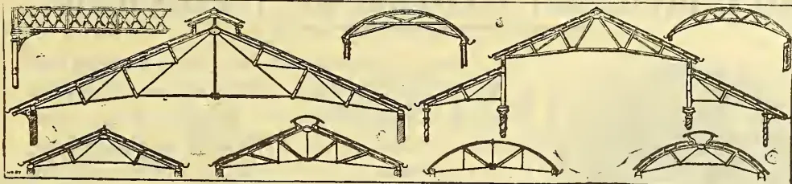

Manufacturers of all descriptions of

**CORRUGATED IRON BUILDINGS**

For Home and Colonial purposes, Framed either in STEEL and WROUGHT IRON or WOOD.

Specially designed with a view to Lightness, combined with Strength—thus economising freight charges and cost of transport by road or rail.

*B. & S., Ltd., have numerous Testimonials for contracts executed in all climates.*

**Plans, Estimates and Catalogues supplied free of cost to any part of the world.**

*The leading articles on Shipping and Commercial topics have made this paper a speciality, and with its Answers to Correspondents enormously increased its circulation.*

**THE LIVERPOOL JOURNAL OF COMMERCE**

IS NOW ENLARGED TO EIGHT PAGES.

Contains more Commercial and Shipping News than any other Morning Paper.

THE JOURNAL OF COMMERCE has for many years occupied the leading position among the Shipping and Commercial Journals of this country, and is indispensable to all engaged in mercantile business. No effort is spared to make "The Liverpool Journal of Commerce" a faithful record of all Shipping, Commercial, and current events of the day; for that purpose responsible Agents have been appointed at all the principal seaports at home and abroad, also Correspondents at all the chief commercial centres, from whom the latest and most reliable EXCLUSIVE Shipping and Commercial intelligence is obtained. Daily telegrams are received from all the leading Continental Commercial centres, America, the East, &c.

"The Liverpool Journal of Commerce" has been for a period of over a quarter of a century the recognised medium for the publication of all Shipping and Commercial Announcements. It is FILED in every counting-house in Liverpool and circulates very extensively, especially amongst the Manufacturers in Lancashire, Yorkshire, Midland Counties, the North of England and Scotland; at all home and foreign ports, and is delivered every morning by SPECIAL MESSENGERS in Liverpool, Manchester, London, Glasgow, &c.

500 pages. Price 5/-; free by post, 5/6. Enlarged Edition, brought up to date, with the Coloured Flag Sheet and Off-shore Distance Table combined. "Shipping and Commercial Hints," with leading articles reprinted from the LIVERPOOL JOURNAL OF COMMERCE on commercial and shipping topics. The series of Questions and Answers will be found to impart information respecting Banking, Charter Parties, Bills of Lading, Average, Insurance, Demurrage, Mercantile Usage, and kindred Maritime and Commercial Subjects.

Price 2/6 post free 3/BLUE PIGEON, "Tam Minerva Quam Mercurio."—Important to all Engaged in Shipping and Commerce.

Price 1/- Mounted on Rollers and Varnished, 2/-; Framed and Varnished, 2/6; Framed and Glazed, 3/6. NEW FLAG SHEET, Giving the Flags and Funnels of all Steamers and Sailing Vessels.

All communications should be addressed to CHARLES BIRCHALL, 32, Castle Street, LIVERPOOL, to whom also all Cheques and Postoffice Orders should be made payable London Office for Advertisements—38, GRACECHURCH STREET.

THE  
**INDIAN FORESTER:**

A MONTHLY MAGAZINE OF

**FORESTRY**

AND

COGNATE SUBJECTS.

*Circulated to India, Ceylon, British Isles, France, the Straits, Australia, the Cape, Cyprus, and America.*

SUBSCRIPTION FOR THE YEAR, INCLUDING POSTAGE, IN ADVANCE:—

*Per Annum*  
For Forest Officers whose salary is less than R200 per mensem ... R 6  
For other Subscribers in India ... R12  
Single copies of each monthly Number R2.

Intending Subscribers are requested to send remittances with full address to the Manager, Mafasilite Printing Co., Mussoorie.

THE WIDOW of a CLERGYMAN of the Church of England is desirous of RECEIVING two or three CHILDREN TO EDUCATE with her own for whom she has a good RESIDENT GOVERNESS, with Colleges near for boys—Excellent references to Ladies of title and others. Terms moderate. References:—Dr. Ormsby, Dover; Lady Crundell, Kearsney; the Rev. T. Morris, the Rectory, Kearsney, Dover; S. G. Skelton, Esq., Solicitor, Lincolns Inn Fields, London, E.O. Address: Mrs. T. BEVELEY ATHORNE, Cambridge House, Hartfield Road, Wimbledon, London.

7------------------------------------------------

Advertisements.

# NEW CIRCULAR TO THOSE INTENDING TO ADOPT THE BLACKMAN SYSTEM OF WITHERING.

As each Application of our System requires considerable thought before we can supply the Working Drawings, which vary in every case, Enquiries should be sent in as early as possible now for the Installation for next season, to forestall the Rush of Enquiries which we usually receive later on when that full attention, which it is desirable that each Enquiry should receive, can only be given at the cost of delay.

*N. B.*—When sending in Enquiries please be sure that *every one* of our seven questions (see our pamphlet) is fully answered.

We are receiving splendid testimonials by almost every mail both from Indian and Ceylon planters who have adopted, or have seen adopted, our System as erected upon plans supplied by ourselves. These testimonials are now too voluminous to allow at our publishing them in advertisements, but they can be seen at our head office.

**Failure is not uncommon where we have not been consulted  
previous to designing the application.**

Sixty-five Breaks, or "Lines," comprising over 1,700 packages, have been sold of the London Auctions, between *August 11th to November 19th, this Season*, from gardens possessing Blackman Fans, which Breaks have *all* realised 2s. per lb. or upwards! in one case 6s per lb.!

**Agents:—WALKER SONS & Co., LTD.,  
Colombo Iron Works, Ceylon.**

**BLACKMAN VENTILATING CO., LD.,**

**63, Fore St., London, E.C.**

Telegraphic Address: "VENTILATOR, LONDON," A.B.C. Code used.

8------------------------------------------------

## SPECIAL ANNOUNCEMENT.

◇ NEW VOLUME OF THE ◇

# "TROPICAL AGRICULTURIST"

JULY 1893—JUNE 1894.

## ✻ "PIONEER ✻ PORTRAITS." ✻

A decorative initial letter 'P' is enclosed within a square frame. The frame is adorned with intricate floral and leaf patterns, particularly at the corners and along the edges. The letter 'P' itself is stylized and integrated with the surrounding decorative elements.

TO give the numerous readers of the **TROPICAL AGRICULTURIST** a glimpse of the men who first devoted their time and energies to the Planting and other interests of Ceylon, and who became, in a great measure, the "Pioneers of Prosperity" of the Island, we purpose issuing a series of

### COLLOTYPE PHOTOGRAPHS

as a frontispiece to each issue, beginning with the August issue. These Collotypes measuring 10 × 7 will be executed in London, in first-class art style, and will be worthy of framing, and will form a souvenir of the Planting History of the Island which, we are sure, will be appreciated as well as preserved by those who have so largely reaped the fruit of the labours of the early pioneers—the Planting and General Community of Ceylon.

It is our intention to commence the series with the Pioneers of the "twenties" and "thirties," none of whom, so far as we are aware, are now in our midst; but although gone from us, their works do follow them, and are in many instances the best testimony to the usefulness of their career as colonists. We will then continue with pioneers of the "forties," and succeeding decades.

We trust our readers will make these arrangements known as widely as possible; and we shall be glad to receive biographical particulars or incidents regarding any of the various subjects from those of the community who may be in a position to supply us with reminiscences of the "Days of Old," or of any one subject of notice.

9------------------------------------------------

— 2 —

The first Collotype will be that of the Governor who opened the earliest regular coffee plantation (Gangarua) in Ceylon,

**H.E. SIR EDWARD BARNES, K.C.B.,**

to be followed by that of

**ROBERT BOYD TYTLER,**

usually described as "the father of Ceylon Coffee Planters," and who first introduced the improved West Indian system of planting. The notes of the late Mr. Tytler we have entrusted to the graphic pen of his life-long friend "Old Colonist" (Mr. Arthur Sinclair) who will be sure to do full justice to it.

Third will be the portrait of the late

**DR. CHRISTOPHER ELLIOTT,**

who as proprietor and editor of the *Ceylon Observer*, took a special interest in the development of the Planting Industry, besides himself making experiments and owning Sugar, Coffee and Coconut properties.

The fourth in the list will be our lamented Senior

**A. M. FERGUSON, C.M.G.,**

who, dating in Ceylon from the same year (1837) as Mr. Tytler, gave his first work as a pioneer planter in Uva, where he had Sir Wm. Reid, Dr. Sortain, Messrs. Galland, Berthin, and others as colleagues.

The biographical notices will be in no way exhaustive: but brief, concise accounts that may possibly in some cases prepare the way for fuller accounts hereafter. Among others whom we should like to include in our list are

**GEO. BIRD**

(THE FIRST),

who in some respects was our earliest British Coffee Planter;

<table>
<tr>
<td>WM. RUDD,</td>
<td>ALEX. BROWN,</td>
<td>GEORGE PRIDE,</td>
</tr>
<tr>
<td>GEO. WINTER,</td>
<td>JOHN GAVIN,</td>
<td>CAPT. JOLLY.</td>
</tr>
<tr>
<td>MAJOR ROGERS,</td>
<td>ANDREW NICOLL,</td>
<td>GEO. AUGUSTUS CRUWELL,</td>
</tr>
<tr>
<td>CHAS. PITT,</td>
<td>MAJOR SKINNER, ("Ceylon's great roadmaker")</td>
<td>F. R. SABONADIERE,</td>
</tr>
<tr>
<td>GABRIEL WORMS,</td>
<td>CAPT. PAYNE GALLWEY,</td>
<td>R. B. DOWNALL.</td>
</tr>
<tr>
<td>MAURICE WORMS,</td>
<td>W. ABERCROMBIE SWAN (the "B.W."</td>
<td></td>
</tr>
<tr>
<td>F. HADDEN,</td>
<td>of the <i>Observer</i> for many years),</td>
<td></td>
</tr>
</table>

It will be observed that we confine our list in the first instance to the pioneers who have passed that "bourne whence no traveller returns." We shall have time to deal with the living in due succession. Meantime, we shall be obliged by relatives or others sending us photographs of the gentlemen named in our list after the first three; and, as already said, for any particulars or reminiscences to help in the biographical notices.

We wish to make the **TROPICAL AGRICULTURIST** more and more a medium of interest and information for Planters, and we shall be glad to receive and consider suggestions regarding any special subjects or topics that would be of help to them in their work. Any suggestions please address to the Editor, "*TROPICAL AGRICULTURIST*," Fort, Colombo.

10------------------------------------------------

— 3 —

**READY SHORTLY.**

**THE CEYLON HANDBOOK AND DIRECTORY FOR 1893.**

A new and full edition of the work will be ready shortly with full Mercantile and Plantation information and a General Directory. This local Encyclopædia on everything will comprise over 1,200 pages of letterpress, costing R12 per copy ; R10 to daily *Observer* Subscribers. Orders will now be booked, and delivery of copies will take place in the order of registration.

-----

[We much regret the delay of our London Agents in not yet having sent out the following ; but an early mail should bring us a supply of]

**CEYLON IN 1893 (ILLUSTRATED.)**

BY J. FERGUSON.

A handsome volume (4th Edition) brought up to date with many engravings additional to those in the last edition, and a new series of Appendices,—dedicated by permission to the Right Hon'ble Sir HERCULES ROBINSON, Bart. Price R7 ; to Daily *Observer* Subscribers R5.50. Orders will be booked.

-----

**A NEW MAP OF CEYLON.**

*Prepared in London under the direction of Mr. John Ferguson.*

Very carefully compiled to date and of a handy form for the wall of office or bungalow or to fold in a case,—has also been too long delayed, but should soon be here.

**\* ORDER FORM. \***

-----

*Please forward the .....*

*for..... to the undersigned address.*

*(Signed).....*

*Address.....*

*Date.....*

11------------------------------------------------

- 4 -

# THE MONTHLY LITERARY REGISTER

AND NOTES AND QUERIES FOR CEYLON.

## A MAGAZINE

FOR ALL INTERESTED IN THE

History, Literature, Ethnology, Antiquities, Natural History, Geology, Mineralogy, &c., of Ceylon.

PRICE 40 cents (6d.) each. Per annum in advance R4 (5s.) in arrears R6 (7s. 6d.)  
Postage to England 1s. extra. Subscribers to the "Ceylon Observer" get special discount.

### FOR SALE IN GREAT BARGAINS.

[TO CLEAR STOCK.]

<table border="0">
<thead>
<tr>
<th align="left">AGRICULTURAL PACKET.</th>
<th align="right">R.</th>
<th align="right">c.</th>
<th></th>
<th></th>
</tr>
</thead>
<tbody>
<tr>
<td>Potatoes, How to Grow and Show Them, by James Pink ..</td>
<td align="right">1</td>
<td align="right">34</td>
<td>Collin's Universal Trade Reckoner ..</td>
<td align="right">0 50</td>
</tr>
<tr>
<td>The Hardy Fruit Book, by T. D. Fish ..</td>
<td align="right">7</td>
<td align="right">00</td>
<td>Bills of Lading: A Handbook, by M Muir ..</td>
<td align="right">2 50</td>
</tr>
<tr>
<td>The Culture of Fruit trees, by William Wardle ..</td>
<td align="right">2</td>
<td align="right">12</td>
<td>East Indian Ready Reckoner and Table-Book ..</td>
<td align="right">8 00</td>
</tr>
<tr>
<td>Handbook of Bee-keeping for India, by J. C. Douglas ..</td>
<td align="right">2</td>
<td align="right">00</td>
<td>Silver and the Indian Exchange, by Co'onel J. T. Smith ..</td>
<td align="right">0 75</td>
</tr>
<tr>
<td>The Tomato with Cultural Directions, by William Iggulden ..</td>
<td align="right">0</td>
<td align="right">68</td>
<td>Financial Reform Almanack, 1892 ..</td>
<td align="right">0 75</td>
</tr>
<tr>
<td>Practical Bee-Keeping ..</td>
<td align="right">2</td>
<td align="right">00</td>
<td>Balance Sheet of the World ..</td>
<td align="right">3 66</td>
</tr>
<tr>
<td>Forage Plants and their Economical Conservation, by new system of "Ensilage." ..</td>
<td align="right">0</td>
<td align="right">75</td>
<td></td>
<td></td>
</tr>
<tr>
<td align="right" colspan="3">Total..R15 89</td>
<td align="right" colspan="2">Total..R28 73</td>
</tr>
</tbody>
</table>

**Offered for R16.**

### ENGINEER'S PACKET.

<table border="0">
<tbody>
<tr>
<td>On Blasting Under Water by means of Galvanism, by D. Tresham ..</td>
<td align="right">1</td>
<td align="right">00</td>
</tr>
<tr>
<td>Well Sinking, Boring and Pump Work, by G. R. Burnell, C.E. ..</td>
<td align="right">1</td>
<td align="right">75</td>
</tr>
<tr>
<td>Miners's Vade Mecum—300 Technical Terms in 5 Languages ..</td>
<td align="right">1</td>
<td align="right">60</td>
</tr>
<tr>
<td>Remunerative Railways for New Countries with illustrations; and Treatise on Steep Gradients ..</td>
<td align="right">3</td>
<td align="right">00</td>
</tr>
<tr>
<td align="right" colspan="2">Total...R7 35</td>
<td></td>
</tr>
</tbody>
</table>

**Offered for R4**

### BUSINESSMAN'S OR MERCHANT'S PACKET.

<table border="0">
<tbody>
<tr>
<td>A Consul's Manual and Shipowners' and Shipmasters' Practical Guide ..</td>
<td align="right">8</td>
<td align="right">00</td>
</tr>
<tr>
<td>The Merchant's Clerk: an exposition of the Laws and Customs regulating the operations of the Counting-House, by John Pearce ..</td>
<td align="right">1</td>
<td align="right">32</td>
</tr>
<tr>
<td>Smith's Premium Calculator ..</td>
<td align="right">3</td>
<td align="right">25</td>
</tr>
</tbody>
</table>

12------------------------------------------------

"Step after step the ladder is ascended."—George Herbert, *Jacula Prudentum*.

# THE TROPICAL AGRICULTURIST

A Monthly Record of Information for Planters  
OF

TEA, CACAO, COFFEE, CINCHONA, SUGAR, COTTON, TOBACCO,  
PALMS, SPICES, RUBBER, RICE,

AND OTHER PRODUCTS SUITED FOR CULTIVATION IN THE TROPICS.

A. M. & J. FERGUSON,  
*of the "Ceylon Observer," &c.*

"It is both the duty and interest of every owner and cultivator of the soil to study the best means of rendering that soil subservient to his own and the general wants of the community; and he who introduces, beneficially, a new and useful *Seed, Plant, or Shrub* into his district, is a blessing and an honour to his country."—SIR J. SINCLAIR.

## VOL. XII.

[Containing Numbers I. to XII. : July 1892 to June 1893.]

Colombo, Ceylon :

A. M. & J. FERGUSON.

LONDON :

MESSRS. JOHN HADDON & Co.; KEGAN PAUL TRENCH, TRUBNER & Co., LTD. ;

MADRAS : ADDISON & Co. ; CALCUTTA : THACKER, SPINK & Co. ;

BOMBAY : THACKER & Co., LTD. ; AUSTRALIAN COLONIES : GORDON & GOTCH,

MD,CCC,XCIII.

13------------------------------------------------

<!-- stage4: FAINT old-images-only -->

[Faint page: no legible print of its own could be verified; text withheld (stage 4 review list)]

14------------------------------------------------

## ◁ TO OUR READERS ▷

In closing the Twelfth Volume of the "**Tropical Agriculturist**," we would once more direct attention to the large amount of useful information afforded and to the great variety of topics treated in our pages. From month to month, we have endeavoured to embody in these pages the latest results of practical experience and scientific teaching in all that concerns tropical agriculture; and our ambition has been to make this periodical not only indispensable to the planter, but of service to business men and capitalists, never forgetting that agriculture trenches upon every department of human knowledge, beside being the basis of personal and communal wealth.

While directing our attention chiefly to the products prominently mentioned on our title-page, we have always taken care to notice minor industries likely to fit in with sub-tropical conditions; and our readers have an ample guarantee in the pages before them, that, in the future, no pains will be spared to bring together all available information both from the West and East, the same being examined in the light of the teachings of common sense as well as of prolonged tropical experience in this, the leading Crown and Planting Colony of the British Empire.

The Tea-planting Industry has sprung into so much importance in India and Ceylon, that a large amount of attention is naturally directed to this great staple, and we think it will be admitted by impartial judges that the *Tropical Agriculturist* should be filed, for ready reference, in every Tea Factory in this Island and India.

"The Manual of Chemical Analyses" prepared by Mr. M. Cochran specially for the benefit of planters, and which was begun in our January number, cannot fail to instruct all who give it a careful perusal.

A full and accurate Index affords the means of ready reference to every subject treated in this, the twelfth volume, which we now place in our subscribers' hands, in full confidence that it will be received with an amount of approval, at least equal to that which has been so kindly extended to its predecessors.

We are convinced that no more suitable or useful gift can be made to the tropical planter or agriculturist, whether he be about to enter on his career, or with many years of experience behind him, than the twelve volumes of our periodical which we have now made available. They are full of information bearing on every department and relating to nearly every product within the scope of sub-tropical industry.

In conclusion, we have to tender our thanks to readers and contributors, and our wish that all friends may continue to write instructively and to read with approval; for then, indeed, must the "**Tropical Agriculturist**" continue to do well.

A. M. & J. FERGUSON.

COLOMBO, CEYLON: 1ST JULY 1893.

15------------------------------------------------

<!-- stage4: SHOWTHROUGH tess-mirror:91/13/rot2 -->

16------------------------------------------------

# INDEX.

[s after certain figures stands for *Supplement*, meaning the “Magazine of the School of Agriculture,” which was paged separately for eleven months, and is stitched at the end.]

<table><thead><tr><th colspan="2"><b>A.</b></th><th colspan="2"><b>B.</b></th></tr><tr><th></th><th>PAGE.</th><th></th><th>PAGE.</th></tr></thead><tbody><tr><td>Abolish the Tea Duty ... ..</td><td>4</td><td>Attitude of the Quinine-makers ... ..</td><td>16</td></tr><tr><td>Aboriginality ... ..</td><td>65s</td><td>Australia and Ceylon Tea ... ..</td><td>117, 134</td></tr><tr><td>Acidity in Milk ... ..</td><td>75</td><td>———, Ceylon Planter in ... ..</td><td>172, 492, 748</td></tr><tr><td>A Corner in Pines ... ..</td><td>250</td><td>Australian Agricultural Industries ... ..</td><td>774</td></tr><tr><td>Acer Tea Boxes ... ..</td><td>154, 605</td><td>———, Gem Stones ... ..</td><td>598</td></tr><tr><td>Adhatoda vasica ... ..</td><td>72s</td><td>———, Mangosteens ... ..</td><td>31</td></tr><tr><td>Adulterants and the London Customs ... ..</td><td>109</td><td>———, Tea Season ... ..</td><td>293</td></tr><tr><td>——— of Cocoa ... ..</td><td>316, 585</td><td></td><td></td></tr><tr><td>Adulteration, Forms of ... ..</td><td>374</td><td></td><td></td></tr><tr><td>——— of Coffee ... ..</td><td>236, 699, 771</td><td></td><td></td></tr><tr><td>——— of Pepper ... ..</td><td>38</td><td></td><td></td></tr><tr><td>Advice about Tea ... ..</td><td>584</td><td></td><td></td></tr><tr><td>Africa, Planting in ... ..</td><td>722</td><td></td><td></td></tr><tr><td>Agra Onvali Estates Co. ... ..</td><td>605</td><td></td><td></td></tr><tr><td>Agricultural Department ... ..</td><td>289</td><td></td><td></td></tr><tr><td>——— Experiments in Bombay ... ..</td><td>250</td><td></td><td></td></tr><tr><td>——— Loans ... ..</td><td>79s</td><td></td><td></td></tr><tr><td>——— Notes 64, 647, 654, 662, 671, 685, 700, 704, 712, 720, 727, 741, 744, 766, 775 ... ..</td><td>771</td><td></td><td></td></tr><tr><td>——— Paradox ... ..</td><td>771</td><td></td><td></td></tr><tr><td>——— Pests in India ... ..</td><td>313</td><td></td><td></td></tr><tr><td>——— Students ... ..</td><td>[See Zoological]s</td><td></td><td></td></tr><tr><td>Agriculture and the Electric Light ... ..</td><td>118</td><td></td><td></td></tr><tr><td>——— in Jamaica ... ..</td><td>673</td><td></td><td></td></tr><tr><td>——— in Perak ... ..</td><td>319</td><td></td><td></td></tr><tr><td>Allynugge Tea Co. ... ..</td><td>471</td><td></td><td></td></tr><tr><td>Amalgamating Small Breaks of Tea ... ..</td><td>88</td><td></td><td></td></tr><tr><td>America and Coconut Oil ..</td><td>773</td><td></td><td></td></tr><tr><td>———, Ceylon Tea in ... ..</td><td>393</td><td></td><td></td></tr><tr><td>———, Coffee Planting in ... ..</td><td>786</td><td></td><td></td></tr><tr><td>American Ceylon Tea Co ... ..</td><td>459, 657</td><td></td><td></td></tr><tr><td>——— Tea ... ..</td><td>508</td><td></td><td></td></tr><tr><td>Amsterdam Cinchona Sales 12, 123, 196, 276, 350, 377, 412, 547, 572, 600, 642, 670, 736 ... ..</td><td>243</td><td></td><td></td></tr><tr><td>———, Consular Report on ... ..</td><td>326</td><td></td><td></td></tr><tr><td>———, Market ... ..</td><td>326</td><td></td><td></td></tr><tr><td>Analysis of Tea ... ..</td><td>311, 735, 745, 750</td><td></td><td></td></tr><tr><td>Ancient Mortar ... ..</td><td>191</td><td></td><td></td></tr><tr><td>Animal Mannres, Value of ... ..</td><td>395</td><td></td><td></td></tr><tr><td>Annatto, West African ... ..</td><td>285</td><td></td><td></td></tr><tr><td>Ants, to Destroy ... ..</td><td>399</td><td></td><td></td></tr><tr><td>Arabian and Liberian Coffee in the Straits ... ..</td><td>115</td><td></td><td></td></tr><tr><td>——— Coffee ... ..</td><td>145</td><td></td><td></td></tr><tr><td>Area under Coffee in Madras Presidency ... ..</td><td>570</td><td></td><td></td></tr><tr><td>Arekamts ... ..</td><td>137</td><td></td><td></td></tr><tr><td>Arrowroot, Zanzibar ... ..</td><td>739</td><td></td><td></td></tr><tr><td>Asiatic Produce Co. ... ..</td><td>155</td><td></td><td></td></tr><tr><td>Assam and its Tea Planters ... ..</td><td>238</td><td></td><td></td></tr><tr><td>——— Tea Co. ... ..</td><td>311</td><td></td><td></td></tr><tr><td>———, Culture ... ..</td><td>169</td><td></td><td></td></tr><tr><td>———, Districts ... ..</td><td>67</td><td></td><td></td></tr><tr><td>———, Enterprize ... ..</td><td>169</td><td></td><td></td></tr><tr><td>———, Gardens ... ..</td><td>90</td><td></td><td></td></tr><tr><td>Attack on Indian and Ceylon Tea ... ..</td><td>347, 351</td><td></td><td></td></tr><tr><td></td><td></td><td>Bad Tea and Coffee ... ..</td><td>211</td></tr><tr><td></td><td></td><td>Badulla Planting Report ... ..</td><td>398, 646, 724, 781</td></tr><tr><td></td><td></td><td>Bahamas Fibre ... ..</td><td>221</td></tr><tr><td></td><td></td><td>Bamboo in Japan ... ..</td><td>129</td></tr><tr><td></td><td></td><td>———, its Uses ... ..</td><td>380, 387</td></tr><tr><td></td><td></td><td>Banana, Analysis of ... ..</td><td>400</td></tr><tr><td></td><td></td><td>———, Culture ... ..</td><td>358</td></tr><tr><td></td><td></td><td>———, Farm, a Great ... ..</td><td>316</td></tr><tr><td></td><td></td><td>———, Uses of the ... ..</td><td>171</td></tr><tr><td></td><td></td><td>Bananas ... ..</td><td>599</td></tr><tr><td></td><td></td><td>——— for Breakfast ... ..</td><td>175</td></tr><tr><td></td><td></td><td>——— for the Table ... ..</td><td>328</td></tr><tr><td></td><td></td><td>——— in England ... ..</td><td>199</td></tr><tr><td></td><td></td><td>Bandakai Fibre ... ..</td><td>9s</td></tr><tr><td></td><td></td><td>Bark and Drug Reports ... ..</td><td>[See Drug]s</td></tr><tr><td></td><td></td><td>Batavia, Consular Report on ... ..</td><td>53</td></tr><tr><td></td><td></td><td>Batonu Tea Growing ... ..</td><td>475</td></tr><tr><td></td><td></td><td>Biggest Cargo of Ceylon Produce ... ..</td><td>725</td></tr><tr><td></td><td></td><td>Blandyte ... ..</td><td>200</td></tr><tr><td></td><td></td><td>Bleaching and Bleaching Agents ... ..</td><td>417</td></tr><tr><td></td><td></td><td>——— Vegetable Oils ... ..</td><td>66s</td></tr><tr><td></td><td></td><td>Boiler Pitting ... ..</td><td>400</td></tr><tr><td></td><td></td><td>Bolstering up China Tea ... ..</td><td>359</td></tr><tr><td></td><td></td><td>Borelli Tea Co. ... ..</td><td>128</td></tr><tr><td></td><td></td><td>Borneo, British North, Planting in ... ..</td><td>25</td></tr><tr><td></td><td></td><td>———, Progress in ... ..</td><td>523</td></tr><tr><td></td><td></td><td>———, Tobacco ... ..</td><td>742</td></tr><tr><td></td><td></td><td>Botanic Gardens, Calcutta, Report for 1891-92 ... ..</td><td>173</td></tr><tr><td></td><td></td><td>Botany in Central Africa ... ..</td><td>460</td></tr><tr><td></td><td></td><td>Brazil Coffee ... ..</td><td>273, 310, 676, 677, 692</td></tr><tr><td></td><td></td><td>British Customs and Small Breaks of Tea ... ..</td><td>262</td></tr><tr><td></td><td></td><td>———, Guiana Woods ... ..</td><td>696</td></tr><tr><td></td><td></td><td>———, Honduras, Labour in ... ..</td><td>151</td></tr><tr><td></td><td></td><td>———, India Tea Co. ... ..</td><td>631</td></tr><tr><td></td><td></td><td>———, New Guinea ... ..</td><td>531</td></tr><tr><td></td><td></td><td>———, North Borneo, Labour in ... ..</td><td>736</td></tr><tr><td></td><td></td><td>———, Notes ... ..</td><td>25</td></tr><tr><td></td><td></td><td>Brushes from Cocoamts ... ..</td><td>212</td></tr><tr><td></td><td></td><td>Bulking Ceylon Tea ... ..</td><td>174</td></tr><tr><td></td><td></td><td>Burma Rice Crops ... ..</td><td>739</td></tr><tr><td></td><td></td><td>———, Ruby Mines ... ..</td><td>676</td></tr><tr><td></td><td></td><td>———, Tea and Coffee in ... ..</td><td>120</td></tr><tr><td></td><td></td><td>Burmese Tea Seed ... ..</td><td>184</td></tr><tr><td></td><td></td><td>Butter, Bread, and Nut Trees ... ..</td><td>654</td></tr></tbody></table>

17------------------------------------------------

INDEX.

<table border="0">
<thead>
<tr>
<th style="text-align: left;">C.</th>
<th style="text-align: right;">PAGE.</th>
<th style="text-align: right;">PAGE.</th>
<th style="text-align: right;">PAGE.</th>
</tr>
</thead>
<tbody>
<tr>
<td>Cacao in Ecuador</td>
<td style="text-align: right;">618</td>
<td>China Tea and Tea Trade</td>
<td style="text-align: right;">12, 26, 36, 52, 56, 86, 163, 176, 231, 351, 359, 446, 551, 613, 671, 715, 754</td>
</tr>
<tr>
<td>—; its History, Culture, and Preparation</td>
<td style="text-align: right;">17, 48</td>
<td>— Exports, 1891</td>
<td style="text-align: right;">22</td>
</tr>
<tr>
<td>— Plantations</td>
<td style="text-align: right;">521</td>
<td>— in its Prime</td>
<td style="text-align: right;">331</td>
</tr>
<tr>
<td>— Property, Sale of</td>
<td style="text-align: right;">646</td>
<td>— Seasons</td>
<td style="text-align: right;">123</td>
</tr>
<tr>
<td>— Stealing</td>
<td style="text-align: right;">565, 567, 577, 579</td>
<td>— <i>versus</i> Indian and Ceylon Teas</td>
<td style="text-align: right;">349</td>
</tr>
<tr>
<td>Calcutta Royal Botanic Gardens Report, 1891-92</td>
<td style="text-align: right;">173</td>
<td>Chinese Maritime Customs</td>
<td style="text-align: right;">243</td>
</tr>
<tr>
<td>Caledonian Tea Company</td>
<td style="text-align: right;">149, 180</td>
<td>— Tea Millionaires</td>
<td style="text-align: right;">572</td>
</tr>
<tr>
<td>Canton Tea Trade</td>
<td style="text-align: right;">255</td>
<td>Chocolate and Cocoa</td>
<td style="text-align: right;">58</td>
</tr>
<tr>
<td>Cardamoms</td>
<td style="text-align: right;">415</td>
<td>Cholera and Quinine</td>
<td style="text-align: right;">31</td>
</tr>
<tr>
<td>— in India</td>
<td style="text-align: right;">118</td>
<td>Cinnamon</td>
<td style="text-align: right;">689</td>
</tr>
<tr>
<td>— in Kalimpong</td>
<td style="text-align: right;">216</td>
<td>— in Jamaica</td>
<td style="text-align: right;">304</td>
</tr>
<tr>
<td>— Sales in London [See Supplements]</td>
<td style="text-align: right;">216</td>
<td>—, its Uses</td>
<td style="text-align: right;">32</td>
</tr>
<tr>
<td>Castlereagh Tea Co.</td>
<td style="text-align: right;">429, 635</td>
<td>Cinchona</td>
<td style="text-align: right;">3, 726</td>
</tr>
<tr>
<td>Cattle and Veterinary Work</td>
<td style="text-align: right;">388</td>
<td>— Association</td>
<td style="text-align: right;">15</td>
</tr>
<tr>
<td>— for Ceylon</td>
<td style="text-align: right;">602</td>
<td>— Bark</td>
<td style="text-align: right;">540</td>
</tr>
<tr>
<td>— Manure, Substitute for</td>
<td style="text-align: right;">148, 228, 308</td>
<td>— and Rubber</td>
<td style="text-align: right;">191</td>
</tr>
<tr>
<td>Caucasian Tea Industry</td>
<td style="text-align: right;">685</td>
<td>—, Colombian</td>
<td style="text-align: right;">2</td>
</tr>
<tr>
<td>Celebrated Trees</td>
<td style="text-align: right;">396</td>
<td>—, Dock Charges on</td>
<td style="text-align: right;">575</td>
</tr>
<tr>
<td>Celery Coffee</td>
<td style="text-align: right;">151</td>
<td>— Imports</td>
<td style="text-align: right;">679</td>
</tr>
<tr>
<td>Central Africa and Coffee Planting</td>
<td style="text-align: right;">105</td>
<td>— Prospects</td>
<td style="text-align: right;">204</td>
</tr>
<tr>
<td>—, Enterprise in</td>
<td style="text-align: right;">596</td>
<td>— Syndicate</td>
<td style="text-align: right;">32, 65</td>
</tr>
<tr>
<td>— Province, Ceylon, News</td>
<td style="text-align: right;">466, 559, 646, 669, 758, 773</td>
<td>— in Bengal</td>
<td style="text-align: right;">308</td>
</tr>
<tr>
<td>Ceylon and Wynaad</td>
<td style="text-align: right;">101</td>
<td>— in Java</td>
<td style="text-align: right;">310, 761</td>
</tr>
<tr>
<td>— Association in London</td>
<td style="text-align: right;">91</td>
<td>— Plantations, Madras Government</td>
<td style="text-align: right;">369</td>
</tr>
<tr>
<td>— at the Chicago Show</td>
<td style="text-align: right;">139</td>
<td>— Report</td>
<td style="text-align: right;">689</td>
</tr>
<tr>
<td>— Coffee, Mr. J. Brown on</td>
<td style="text-align: right;">409</td>
<td>— Sales</td>
<td style="text-align: right;">12 [See Amsterdam]</td>
</tr>
<tr>
<td>— Estates Investment Co.</td>
<td style="text-align: right;">156</td>
<td>— Syndicate</td>
<td style="text-align: right;">285</td>
</tr>
<tr>
<td>— Exports and Distribution in 1892</td>
<td style="text-align: right;">71, 151, 223, 295, 367, 439, 495, 551, 607, 663, 727, 791</td>
<td>Clove Culture in Zanzibar</td>
<td style="text-align: right;">382</td>
</tr>
<tr>
<td>— Forest Conservancy</td>
<td style="text-align: right;">298</td>
<td>Coca</td>
<td style="text-align: right;">28</td>
</tr>
<tr>
<td>—, Irrigation in</td>
<td style="text-align: right;">515</td>
<td>— Leaves</td>
<td style="text-align: right;">2</td>
</tr>
<tr>
<td>— Land and Produce Co.</td>
<td style="text-align: right;">523, 530</td>
<td>Cochin Fowls</td>
<td style="text-align: right;">360</td>
</tr>
<tr>
<td>—, Mining in</td>
<td style="text-align: right;">227</td>
<td>Cocoa</td>
<td style="text-align: right;">156, 597</td>
</tr>
<tr>
<td>— Planter in Australia</td>
<td style="text-align: right;">172, 492, 748</td>
<td>— Adulterants</td>
<td style="text-align: right;">316, 317</td>
</tr>
<tr>
<td>— Planters' Tea Co.</td>
<td style="text-align: right;">45, 589</td>
<td>— Chocolate</td>
<td style="text-align: right;">58</td>
</tr>
<tr>
<td>— Planting Enterprise</td>
<td style="text-align: right;">475</td>
<td>— Beetles</td>
<td style="text-align: right;">407</td>
</tr>
<tr>
<td>— Produce Companies</td>
<td style="text-align: right;">408</td>
<td>— Planting, Ceylon</td>
<td style="text-align: right;">780</td>
</tr>
<tr>
<td>— Sales [See Supplements]</td>
<td style="text-align: right;">533, 545</td>
<td>—, Report on Ceylon</td>
<td style="text-align: right;">615</td>
</tr>
<tr>
<td>Staple Exports</td>
<td style="text-align: right;">144, 199, 223, 377, 393, 473, 477, 492, 494, 515, 537, 574, 582, 669, 684, 697, 705, 764</td>
<td>— Sales in London [See Supplements]</td>
<td style="text-align: right;">343</td>
</tr>
<tr>
<td>—, Prices and Crops</td>
<td style="text-align: right;">697</td>
<td>—, World's Production &amp; Consumption of</td>
<td style="text-align: right;">406</td>
</tr>
<tr>
<td>—, Bulking of</td>
<td style="text-align: right;">174</td>
<td>Coconut Beetles</td>
<td style="text-align: right;">292</td>
</tr>
<tr>
<td>— Co.</td>
<td style="text-align: right;">177</td>
<td>— Brushes</td>
<td style="text-align: right;">292</td>
</tr>
<tr>
<td>— Delivered in London</td>
<td style="text-align: right;">105</td>
<td>—, Consumption of</td>
<td style="text-align: right;">789</td>
</tr>
<tr>
<td>— Districts</td>
<td style="text-align: right;">67</td>
<td>— Cultivation</td>
<td style="text-align: right;">606, 705, 766</td>
</tr>
<tr>
<td>— Fund</td>
<td style="text-align: right;">85, 209, 363, 620, 622, 737</td>
<td>— in West Indies</td>
<td style="text-align: right;">785</td>
</tr>
<tr>
<td>— in America</td>
<td style="text-align: right;">7, 393, 607, 719, 756</td>
<td>— Disease, Montego Bay</td>
<td style="text-align: right;">180</td>
</tr>
<tr>
<td>— in Australia</td>
<td style="text-align: right;">117, 134, 273, 326</td>
<td>—, Double</td>
<td style="text-align: right;">195</td>
</tr>
<tr>
<td>— in Egypt</td>
<td style="text-align: right;">631</td>
<td>— Estates, Sale of</td>
<td style="text-align: right;">594, 700</td>
</tr>
<tr>
<td>— in London</td>
<td style="text-align: right;">762</td>
<td>— Lands</td>
<td style="text-align: right;">570</td>
</tr>
<tr>
<td>— in Melbourne</td>
<td style="text-align: right;">231</td>
<td>— Oil in America</td>
<td style="text-align: right;">773</td>
</tr>
<tr>
<td>— in New South Wales</td>
<td style="text-align: right;">490</td>
<td>— in Ceylon</td>
<td style="text-align: right;">622</td>
</tr>
<tr>
<td>— in Sydney</td>
<td style="text-align: right;">330</td>
<td>— Situation</td>
<td style="text-align: right;">5</td>
</tr>
<tr>
<td>—, New Markets for</td>
<td style="text-align: right;">29, 33, 225</td>
<td>— Palm in Ceylon</td>
<td style="text-align: right;">639, 650, 652</td>
</tr>
<tr>
<td>— on the Continent of Europe</td>
<td style="text-align: right;">491</td>
<td>— Trees, Yield of</td>
<td style="text-align: right;">604</td>
</tr>
<tr>
<td>— Plantations Co.</td>
<td style="text-align: right;">10, 780</td>
<td>Coconuts in Ceylon</td>
<td style="text-align: right;">777</td>
</tr>
<tr>
<td>— Phacking</td>
<td style="text-align: right;">14</td>
<td>—, Price of</td>
<td style="text-align: right;">595</td>
</tr>
<tr>
<td>— Tobacco Co.</td>
<td style="text-align: right;">237</td>
<td>Coffee</td>
<td style="text-align: right;">7, 38, 47, 116, 164, 171, 531, 678, 762</td>
</tr>
<tr>
<td>— <i>versus</i> China Teas</td>
<td style="text-align: right;">183, 211</td>
<td>— Adulterants</td>
<td style="text-align: right;">317, 699</td>
</tr>
<tr>
<td>Chemical Analyses, Ceylon Manual of</td>
<td style="text-align: right;">441, 457, 553, 619, 665, 729</td>
<td>—, its Adulteration</td>
<td style="text-align: right;">236, 771</td>
</tr>
<tr>
<td>Chemistry of Tea</td>
<td style="text-align: right;">709</td>
<td>— and Chicory</td>
<td style="text-align: right;">39</td>
</tr>
<tr>
<td>Chests for Tea, Size of</td>
<td style="text-align: right;">127</td>
<td>— and Cocoa</td>
<td style="text-align: right;">255</td>
</tr>
<tr>
<td>Chicago Exhibition</td>
<td style="text-align: right;">7</td>
<td>— and Coconuts in North Borneo</td>
<td style="text-align: right;">661</td>
</tr>
<tr>
<td>— and Indian Tea</td>
<td style="text-align: right;">25</td>
<td>— and its Possibilities</td>
<td style="text-align: right;">103</td>
</tr>
<tr>
<td>—, Indian Tea at</td>
<td style="text-align: right;">156</td>
<td>— and Tea Stealing</td>
<td style="text-align: right;">695</td>
</tr>
<tr>
<td>— Show and Ceylon Tea</td>
<td style="text-align: right;">7, 139</td>
<td>—, Californian</td>
<td style="text-align: right;">315</td>
</tr>
<tr>
<td>Chicory Question, the</td>
<td style="text-align: right;">135</td>
<td>— Estates and Weeding</td>
<td style="text-align: right;">292</td>
</tr>
<tr>
<td>China Shipping Trade and Teas</td>
<td style="text-align: right;">620</td>
<td>—, how to Make</td>
<td style="text-align: right;">438</td>
</tr>
<tr>
<td></td>
<td></td>
<td>— in Java</td>
<td style="text-align: right;">168</td>
</tr>
<tr>
<td></td>
<td></td>
<td>— in Johore</td>
<td style="text-align: right;">591</td>
</tr>
<tr>
<td></td>
<td></td>
<td>— in Malay States</td>
<td style="text-align: right;">514</td>
</tr>
<tr>
<td></td>
<td></td>
<td>— in Mexico</td>
<td style="text-align: right;">573, 699</td>
</tr>
<tr>
<td></td>
<td></td>
<td>— in Queensland</td>
<td style="text-align: right;">691</td>
</tr>
<tr>
<td></td>
<td></td>
<td>— in Siam</td>
<td style="text-align: right;">115</td>
</tr>
<tr>
<td></td>
<td></td>
<td>— in the Straits</td>
<td style="text-align: right;">726</td>
</tr>
<tr>
<td></td>
<td></td>
<td>— in the United States</td>
<td style="text-align: right;">677</td>
</tr>
</tbody>
</table>

18------------------------------------------------

INDEX.

<table border="0">
<thead>
<tr>
<th></th>
<th style="text-align: right;">PAGE.</th>
</tr>
</thead>
<tbody>
<tr>
<td>Coffee in West Africa .....</td>
<td style="text-align: right;">280</td>
</tr>
<tr>
<td>    Mr. J. Brown on .....</td>
<td style="text-align: right;">409</td>
</tr>
<tr>
<td>    Planting in Central Africa .....</td>
<td style="text-align: right;">105, 112</td>
</tr>
<tr>
<td>        in Madagascar .....</td>
<td style="text-align: right;">388</td>
</tr>
<tr>
<td>        in Selangor .....</td>
<td style="text-align: right;">261, 279</td>
</tr>
<tr>
<td>    Prospects for 1893 .....</td>
<td style="text-align: right;">719</td>
</tr>
<tr>
<td>    Sales in London .....</td>
<td style="text-align: right;">[See Supplements]</td>
</tr>
<tr>
<td>    Tea .....</td>
<td style="text-align: right;">290</td>
</tr>
<tr>
<td>    Trade of 1892 .....</td>
<td style="text-align: right;">719</td>
</tr>
<tr>
<td>    World's Production &amp; Consumption of .....</td>
<td style="text-align: right;">343</td>
</tr>
<tr>
<td>Collecting Insects in India .....</td>
<td style="text-align: right;">114</td>
</tr>
<tr>
<td>Colombo Tea Sales .....</td>
<td style="text-align: right;">[See Supplements]</td>
</tr>
<tr>
<td>Colour in Plant Life .....</td>
<td style="text-align: right;">89</td>
</tr>
<tr>
<td>Commerce of India, 1892 .....</td>
<td style="text-align: right;">9</td>
</tr>
<tr>
<td>Companies, Ceylon Produce .....</td>
<td style="text-align: right;">408</td>
</tr>
<tr>
<td>Consular Report on Amsterdam .....</td>
<td style="text-align: right;">243</td>
</tr>
<tr>
<td>    Batavia .....</td>
<td style="text-align: right;">53</td>
</tr>
<tr>
<td>    Canton .....</td>
<td style="text-align: right;">292</td>
</tr>
<tr>
<td>    Foochow .....</td>
<td style="text-align: right;">468</td>
</tr>
<tr>
<td>    Formosa .....</td>
<td style="text-align: right;">242</td>
</tr>
<tr>
<td>    Hankow .....</td>
<td style="text-align: right;">123</td>
</tr>
<tr>
<td>    Kungchow .....</td>
<td style="text-align: right;">53</td>
</tr>
<tr>
<td>    Macao .....</td>
<td style="text-align: right;">273</td>
</tr>
<tr>
<td>    Shanghai .....</td>
<td style="text-align: right;">279</td>
</tr>
<tr>
<td>    Yokohama .....</td>
<td style="text-align: right;">206</td>
</tr>
<tr>
<td>Consumption of Tropical Products .....</td>
<td style="text-align: right;">217</td>
</tr>
<tr>
<td>Cooking Cucumbers .....</td>
<td style="text-align: right;">174</td>
</tr>
<tr>
<td>Cool Dairies .....</td>
<td style="text-align: right;">76</td>
</tr>
<tr>
<td>Coolie Labour .....</td>
<td style="text-align: right;">373</td>
</tr>
<tr>
<td>    Contracts .....</td>
<td style="text-align: right;">121</td>
</tr>
<tr>
<td>Coolies and Advances .....</td>
<td style="text-align: right;">119</td>
</tr>
<tr>
<td>Coöry, Coffee Planting in .....</td>
<td style="text-align: right;">563</td>
</tr>
<tr>
<td>    Planting Notes 39, 187, 324, 374, 603, 675</td>
<td style="text-align: right;">675</td>
</tr>
<tr>
<td>Corundum .....</td>
<td style="text-align: right;">641</td>
</tr>
<tr>
<td>Cotton .....</td>
<td style="text-align: right;">191</td>
</tr>
<tr>
<td>    Cultivation in Guzerat .....</td>
<td style="text-align: right;">111</td>
</tr>
<tr>
<td>    Seed Meal as Food for Live Stock .....</td>
<td style="text-align: right;">219</td>
</tr>
<tr>
<td>    Oil .....</td>
<td style="text-align: right;">725</td>
</tr>
<tr>
<td>Cucumbers, to Cook .....</td>
<td style="text-align: right;">174</td>
</tr>
<tr>
<td>Cultivation in Malabar .....</td>
<td style="text-align: right;">46</td>
</tr>
<tr>
<td>    of Cocoa in Cuba .....</td>
<td style="text-align: right;">218</td>
</tr>
<tr>
<td>    of Tropical Products .....</td>
<td style="text-align: right;">337</td>
</tr>
<tr>
<td>    <i>versus</i> Drainage .....</td>
<td style="text-align: right;">108</td>
</tr>
<tr>
<td>Culture of Cacao .....</td>
<td style="text-align: right;">17, 48</td>
</tr>
<tr>
<td>Cup of Tea .....</td>
<td style="text-align: right;">692</td>
</tr>
<tr>
<td>Currency Question .....</td>
<td style="text-align: right;">315</td>
</tr>
<tr>
<td>Customs Duties on Tea .....</td>
<td style="text-align: right;">143</td>
</tr>
<tr>
<td>    Revenue on Tea .....</td>
<td style="text-align: right;">255</td>
</tr>
<tr>
<td>    Weights of Tea .....</td>
<td style="text-align: right;">172</td>
</tr>
</tbody>
</table>

**D.**

<table border="0">
<tbody>
<tr>
<td>Dairies, to Keep Cool .....</td>
<td style="text-align: right;">76</td>
</tr>
<tr>
<td>Dairying in Ceylon .....</td>
<td style="text-align: right;">63s</td>
</tr>
<tr>
<td>Darjeeling Letter .....</td>
<td style="text-align: right;">171</td>
</tr>
<tr>
<td>    Tea .....</td>
<td style="text-align: right;">698</td>
</tr>
<tr>
<td>Days for Sale of Tea .....</td>
<td style="text-align: right;">15</td>
</tr>
<tr>
<td>Delgolla Estate Co. ....</td>
<td style="text-align: right;">721</td>
</tr>
<tr>
<td>Deliveries in London of Ceylon Tea .....</td>
<td style="text-align: right;">105</td>
</tr>
<tr>
<td>Depressed Tea Market .....</td>
<td style="text-align: right;">153</td>
</tr>
<tr>
<td>Dibrugarh to the Duars .....</td>
<td style="text-align: right;">89</td>
</tr>
<tr>
<td>Digestion, Influence of Tea on .....</td>
<td style="text-align: right;">294</td>
</tr>
<tr>
<td>Dikoya, Tea in .....</td>
<td style="text-align: right;">510</td>
</tr>
<tr>
<td>Diseases of Seeds and Plants .....</td>
<td style="text-align: right;">40</td>
</tr>
<tr>
<td>Dispute at Mildura .....</td>
<td style="text-align: right;">173</td>
</tr>
<tr>
<td>Dock Charges on Tea .....</td>
<td style="text-align: right;">191</td>
</tr>
<tr>
<td>Dr. Kirtikar on the Vegetable Kingdom .....</td>
<td style="text-align: right;">215</td>
</tr>
<tr>
<td>Double Coconut of Seychelles Islands .....</td>
<td style="text-align: right;">195</td>
</tr>
<tr>
<td>Drainage of Estates .....</td>
<td style="text-align: right;">522</td>
</tr>
<tr>
<td>Drug and Bark Report 12, 16, 52, 89, 134, 158, 252, 263, 312, 357, 389, 478, 526, 642, 660, 688, 703, 744, 770</td>
<td style="text-align: right;">770</td>
</tr>
<tr>
<td>Drugs from Cape Colony .....</td>
<td style="text-align: right;">481</td>
</tr>
<tr>
<td>    in the London Market .....</td>
<td style="text-align: right;">512</td>
</tr>
<tr>
<td>Drying Cocoa .....</td>
<td style="text-align: right;">307</td>
</tr>
<tr>
<td>Dunkeld Estate Co. ....</td>
<td style="text-align: right;">560</td>
</tr>
</tbody>
</table>

<table border="0">
<thead>
<tr>
<th></th>
<th style="text-align: right;">PAGE.</th>
</tr>
</thead>
<tbody>
<tr>
<td>Durban Botanic Society .....</td>
<td style="text-align: right;">748</td>
</tr>
<tr>
<td>Durian Fruit .....</td>
<td style="text-align: right;">32</td>
</tr>
<tr>
<td>Duty on Tea .....</td>
<td style="text-align: right;">5, 637</td>
</tr>
<tr>
<td>Dye-stuffs and Fibres .....</td>
<td style="text-align: right;">57s</td>
</tr>
</tbody>
</table>

**E.**

<table border="0">
<tbody>
<tr>
<td>East Africa, Ceylon Planters in .....</td>
<td style="text-align: right;">747</td>
</tr>
<tr>
<td>    Notes on .....</td>
<td style="text-align: right;">472</td>
</tr>
<tr>
<td>    Planting in .....</td>
<td style="text-align: right;">629, 692</td>
</tr>
<tr>
<td>Eastern Archipelago Planting .....</td>
<td style="text-align: right;">565</td>
</tr>
<tr>
<td>    Produce and Estates Co. ....</td>
<td style="text-align: right;">1, 780</td>
</tr>
<tr>
<td>Echoes of Science .....</td>
<td style="text-align: right;">526, 540</td>
</tr>
<tr>
<td>Edible Birds Nest Collecting .....</td>
<td style="text-align: right;">383</td>
</tr>
<tr>
<td>    Wild Plants .....</td>
<td style="text-align: right;">160</td>
</tr>
<tr>
<td>Education .....</td>
<td style="text-align: right;">[See Technicals]</td>
</tr>
<tr>
<td>Eggs, Feeding for .....</td>
<td style="text-align: right;">548</td>
</tr>
<tr>
<td>Egypt, Industries of .....</td>
<td style="text-align: right;">246</td>
</tr>
<tr>
<td>Electric Light in Agriculture .....</td>
<td style="text-align: right;">118</td>
</tr>
<tr>
<td>    Lighting, Motors for .....</td>
<td style="text-align: right;">159</td>
</tr>
<tr>
<td>Elements of Agriculture .....</td>
<td style="text-align: right;">561</td>
</tr>
<tr>
<td>Elephants and Ivory .....</td>
<td style="text-align: right;">528</td>
</tr>
<tr>
<td>Emigration from Ceylon .....</td>
<td style="text-align: right;">569, 578, 580</td>
</tr>
<tr>
<td>England, Tea Grown in .....</td>
<td style="text-align: right;">70</td>
</tr>
<tr>
<td>English-grown Tea .....</td>
<td style="text-align: right;">37, 199</td>
</tr>
<tr>
<td>Englishmen in the Colonies .....</td>
<td style="text-align: right;">538</td>
</tr>
<tr>
<td>English Woods .....</td>
<td style="text-align: right;">372</td>
</tr>
<tr>
<td>Estimates and Results of Ceylon Tea .....</td>
<td style="text-align: right;">473, 508</td>
</tr>
<tr>
<td>    of Cocoa, Coffee, and Tea .....</td>
<td style="text-align: right;">343</td>
</tr>
<tr>
<td>    of Tea Crops for 1892 .....</td>
<td style="text-align: right;">322</td>
</tr>
<tr>
<td>Encalyptus and its Uses .....</td>
<td style="text-align: right;">6</td>
</tr>
<tr>
<td>    in Cape Colony .....</td>
<td style="text-align: right;">144</td>
</tr>
<tr>
<td>    Oil .....</td>
<td style="text-align: right;">3, 6, 573, 638</td>
</tr>
<tr>
<td>Exhaustive Crops .....</td>
<td style="text-align: right;">706</td>
</tr>
<tr>
<td>Exports, Ceylon, 1892 .....</td>
<td style="text-align: right;">71 [See Ceylon]</td>
</tr>
<tr>
<td>    from Ceylon .....</td>
<td style="text-align: right;">533, 545</td>
</tr>
<tr>
<td>    of China Tea, 1891 .....</td>
<td style="text-align: right;">22</td>
</tr>
<tr>
<td>    of Palm Produce from Ceylon .....</td>
<td style="text-align: right;">96</td>
</tr>
</tbody>
</table>

**F.**

<table border="0">
<tbody>
<tr>
<td>Fall in Prices of Tea .....</td>
<td style="text-align: right;">745</td>
</tr>
<tr>
<td>Farmyard Manure .....</td>
<td style="text-align: right;">546</td>
</tr>
<tr>
<td>Female Enterprize in the Tea Trade .....</td>
<td style="text-align: right;">15, 30</td>
</tr>
<tr>
<td>Fibre Industry at the Bahamas .....</td>
<td style="text-align: right;">282</td>
</tr>
<tr>
<td>    Machinery for .....</td>
<td style="text-align: right;">185</td>
</tr>
<tr>
<td>    Yielding Plants .....</td>
<td style="text-align: right;">391</td>
</tr>
<tr>
<td>Fibres, Indian .....</td>
<td style="text-align: right;">438</td>
</tr>
<tr>
<td>    and Dye-Stuffs .....</td>
<td style="text-align: right;">57s</td>
</tr>
<tr>
<td>Fibrous Plants and their Treatment .....</td>
<td style="text-align: right;">406</td>
</tr>
<tr>
<td>Field Crops, Indian Names of .....</td>
<td style="text-align: right;">445</td>
</tr>
<tr>
<td>Fiji, Tobacco in .....</td>
<td style="text-align: right;">146</td>
</tr>
<tr>
<td>Fire Insurance Rates on Tea Buildings .....</td>
<td style="text-align: right;">122, 133</td>
</tr>
<tr>
<td>Fishing at Dehra Dun .....</td>
<td style="text-align: right;">744</td>
</tr>
<tr>
<td>Florida, a Mystery in .....</td>
<td style="text-align: right;">568</td>
</tr>
<tr>
<td>Flower Crops in France .....</td>
<td style="text-align: right;">770</td>
</tr>
<tr>
<td>Flowers, to give Artificial Colour to .....</td>
<td style="text-align: right;">366</td>
</tr>
<tr>
<td>Foochow Notes .....</td>
<td style="text-align: right;">760</td>
</tr>
<tr>
<td>    Tea Trade .....</td>
<td style="text-align: right;">155, 233, 671, 761</td>
</tr>
<tr>
<td>Forest Conservancy, Ceylon .....</td>
<td style="text-align: right;">298</td>
</tr>
<tr>
<td>Forestry, the Study of .....</td>
<td style="text-align: right;">55s</td>
</tr>
<tr>
<td>Formosa, Consular Report on .....</td>
<td style="text-align: right;">242</td>
</tr>
<tr>
<td>Fowls and Breeding .....</td>
<td style="text-align: right;">447</td>
</tr>
<tr>
<td>Fruit as Food .....</td>
<td style="text-align: right;">131</td>
</tr>
<tr>
<td>    Cultivation at the Cape .....</td>
<td style="text-align: right;">192</td>
</tr>
<tr>
<td>    Culture in India .....</td>
<td style="text-align: right;">178</td>
</tr>
<tr>
<td>    in Travancore .....</td>
<td style="text-align: right;">264</td>
</tr>
<tr>
<td>    in Simla .....</td>
<td style="text-align: right;">179</td>
</tr>
<tr>
<td>    Principles of .....</td>
<td style="text-align: right;">363</td>
</tr>
<tr>
<td>    Semi-Tropical .....</td>
<td style="text-align: right;">25</td>
</tr>
<tr>
<td>    Dryer, American .....</td>
<td style="text-align: right;">376</td>
</tr>
<tr>
<td>    Growing .....</td>
<td style="text-align: right;">405</td>
</tr>
<tr>
<td>    in Ceylon .....</td>
<td style="text-align: right;">264</td>
</tr>
<tr>
<td>Fuel Supply on Estates .....</td>
<td style="text-align: right;">651</td>
</tr>
<tr>
<td>Fungi .....</td>
<td style="text-align: right;">132, 135</td>
</tr>
<tr>
<td>Future of Tea .....</td>
<td style="text-align: right;">760</td>
</tr>
<tr>
<td>    in Ceylon .....</td>
<td style="text-align: right;">477</td>
</tr>
</tbody>
</table>

19------------------------------------------------

INDEX.

<table border="0">
<thead>
<tr>
<th style="text-align: left;"><b>G.</b></th>
<th style="text-align: right;">PAGE.</th>
</tr>
</thead>
<tbody>
<tr>
<td>Gambir</td>
<td style="text-align: right;">66, 590, 633, 687, 755</td>
</tr>
<tr>
<td>Geikielite and Baddeleyite</td>
<td style="text-align: right;">422</td>
</tr>
<tr>
<td>Gem and Plumbago Mining</td>
<td style="text-align: right;">425</td>
</tr>
<tr>
<td>    Mining in Ceylon</td>
<td style="text-align: right;">449</td>
</tr>
<tr>
<td>Gemming and Mining Co. of Ceylon</td>
<td style="text-align: right;">546</td>
</tr>
<tr>
<td>General Items</td>
<td style="text-align: right;">148, 238, 328, 398, 478, 568, 618, 778, 858</td>
</tr>
<tr>
<td>    Notes</td>
<td style="text-align: right;">288</td>
</tr>
<tr>
<td>German East Africa Co.</td>
<td style="text-align: right;">757, 784</td>
</tr>
<tr>
<td>Germany, Ceylon Tea in</td>
<td style="text-align: right;">492</td>
</tr>
<tr>
<td>Ginger-growing, Jamaica</td>
<td style="text-align: right;">168</td>
</tr>
<tr>
<td>Ginseng</td>
<td style="text-align: right;">601</td>
</tr>
<tr>
<td>Glasgow Estate Co.</td>
<td style="text-align: right;">560</td>
</tr>
<tr>
<td>Gold and Gold Fields</td>
<td style="text-align: right;">548</td>
</tr>
<tr>
<td>    Production of the World</td>
<td style="text-align: right;">400</td>
</tr>
<tr>
<td>    Prospecting</td>
<td style="text-align: right;">398</td>
</tr>
<tr>
<td>Good Investment</td>
<td style="text-align: right;">11</td>
</tr>
<tr>
<td>    Planting</td>
<td style="text-align: right;">208</td>
</tr>
<tr>
<td>    Tea, what is?</td>
<td style="text-align: right;">158</td>
</tr>
<tr>
<td>Government and the Tea Duty</td>
<td style="text-align: right;">615</td>
</tr>
<tr>
<td>    Cinchona Plantations</td>
<td style="text-align: right;">369, 375</td>
</tr>
<tr>
<td>    Encouragement of Planting</td>
<td style="text-align: right;">405</td>
</tr>
<tr>
<td>Grades of Tea</td>
<td style="text-align: right;">653</td>
</tr>
<tr>
<td>Grafting Mangoes and Oranges</td>
<td style="text-align: right;">378, 768</td>
</tr>
<tr>
<td>Grape-vine Training and Treatment</td>
<td style="text-align: right;">738</td>
</tr>
<tr>
<td>Growing Woods for Tea Boxes, &amp;c.</td>
<td style="text-align: right;">182, 193</td>
</tr>
<tr>
<td>Grub in Coffee, Tea, &amp;c.</td>
<td style="text-align: right;">257</td>
</tr>
<tr>
<td>Gum Barks</td>
<td style="text-align: right;">113</td>
</tr>
<tr>
<td>Gutta-percha</td>
<td style="text-align: right;">244, 348</td>
</tr>
<tr>
<td>Guzerat and Cotton Cultivation</td>
<td style="text-align: right;">111</td>
</tr>
</tbody>
</table>

<table border="0">
<thead>
<tr>
<th style="text-align: left;"><b>H.</b></th>
<th style="text-align: right;">PAGE.</th>
</tr>
</thead>
<tbody>
<tr>
<td>Hailstones in Cape Colony</td>
<td style="text-align: right;">622</td>
</tr>
<tr>
<td>Hankow Consular Report</td>
<td style="text-align: right;">123</td>
</tr>
<tr>
<td>    Tea Season</td>
<td style="text-align: right;">134</td>
</tr>
<tr>
<td>Haputale to Hakgala</td>
<td style="text-align: right;">118</td>
</tr>
<tr>
<td>Hawaii, Coffee and Tea in</td>
<td style="text-align: right;">658</td>
</tr>
<tr>
<td>Hints and Helps</td>
<td style="text-align: right;">399, 415, 438, 458, 541</td>
</tr>
<tr>
<td>    to Poultry Keepers</td>
<td style="text-align: right;">718</td>
</tr>
<tr>
<td>Horrekelly Estates Co.</td>
<td style="text-align: right;">621</td>
</tr>
<tr>
<td>Horticultural Exhibition, Tea at the</td>
<td style="text-align: right;">7</td>
</tr>
<tr>
<td>How Lime Juice is Made</td>
<td style="text-align: right;">329</td>
</tr>
<tr>
<td>How to Preserve Botanical Specimens</td>
<td style="text-align: right;">608</td>
</tr>
</tbody>
</table>

<table border="0">
<thead>
<tr>
<th style="text-align: left;"><b>I.</b></th>
<th style="text-align: right;">PAGE.</th>
</tr>
</thead>
<tbody>
<tr>
<td>Imperial Institute and Ceylon</td>
<td style="text-align: right;">458</td>
</tr>
<tr>
<td>Improved Culture of Land</td>
<td style="text-align: right;">184</td>
</tr>
<tr>
<td>Incineration of Refuse</td>
<td style="text-align: right;">681</td>
</tr>
<tr>
<td>India and the Chicago Show</td>
<td style="text-align: right;">10</td>
</tr>
<tr>
<td>    Fruit Culture in</td>
<td style="text-align: right;">178</td>
</tr>
<tr>
<td>    Rice Crop in</td>
<td style="text-align: right;">525</td>
</tr>
<tr>
<td>Indian Agricultural Notes</td>
<td style="text-align: right;">715</td>
</tr>
<tr>
<td>    Agri-Horticultural Society</td>
<td style="text-align: right;">70</td>
</tr>
<tr>
<td>    and Ceylon Tea</td>
<td style="text-align: right;">261, 347</td>
</tr>
<tr>
<td>    Companies</td>
<td style="text-align: right;">446</td>
</tr>
<tr>
<td>    Commercial Products</td>
<td style="text-align: right;">378</td>
</tr>
<tr>
<td>    Jottings</td>
<td style="text-align: right;">75</td>
</tr>
<tr>
<td>    Notes</td>
<td style="text-align: right;">118, 208, 598, 758, 848</td>
</tr>
<tr>
<td>    Preserves</td>
<td style="text-align: right;">23</td>
</tr>
<tr>
<td>    Patents</td>
<td style="text-align: right;">261, 760, 781</td>
</tr>
<tr>
<td>    Tea</td>
<td style="text-align: right;">312, 474, 596, 600, 638, 641, 662, 757</td>
</tr>
<tr>
<td>    and the Chicago Exhibition</td>
<td style="text-align: right;">25, 109, 122, 127, 128, 143, 156, 171</td>
</tr>
<tr>
<td>    Association and Ocean Freight</td>
<td style="text-align: right;">86</td>
</tr>
<tr>
<td>    Companies</td>
<td style="text-align: right;">277, 623</td>
</tr>
<tr>
<td>    Crop of 1892</td>
<td style="text-align: right;">372</td>
</tr>
<tr>
<td>    Districts</td>
<td style="text-align: right;">595, 642</td>
</tr>
<tr>
<td>    Association</td>
<td style="text-align: right;">252</td>
</tr>
<tr>
<td>    in Germany</td>
<td style="text-align: right;">210</td>
</tr>
<tr>
<td>    Notes and News</td>
<td style="text-align: right;">791</td>
</tr>
<tr>
<td>    Seasons</td>
<td style="text-align: right;">123, 738</td>
</tr>
<tr>
<td>    Trade</td>
<td style="text-align: right;">10</td>
</tr>
</tbody>
</table>

<table border="0">
<thead>
<tr>
<th style="text-align: left;"></th>
<th style="text-align: right;">PAGE.</th>
</tr>
</thead>
<tbody>
<tr>
<td>Indian Tea Trade, Origins of</td>
<td style="text-align: right;">769</td>
</tr>
<tr>
<td>    Products</td>
<td style="text-align: right;">274</td>
</tr>
<tr>
<td>Indiarubber</td>
<td style="text-align: right;">739</td>
</tr>
<tr>
<td>    Artificial</td>
<td style="text-align: right;">763</td>
</tr>
<tr>
<td>    Colombian</td>
<td style="text-align: right;">286</td>
</tr>
<tr>
<td>Industries, New, in Ceylon</td>
<td style="text-align: right;">589</td>
</tr>
<tr>
<td>Influence of Tea, &amp;c., on Digestion</td>
<td style="text-align: right;">294</td>
</tr>
<tr>
<td>Insecticides</td>
<td style="text-align: right;">160, 482</td>
</tr>
<tr>
<td>Invention, Lecture on</td>
<td style="text-align: right;">498</td>
</tr>
<tr>
<td>Insectivorous Birds</td>
<td style="text-align: right;">599</td>
</tr>
<tr>
<td>Irrigated India</td>
<td style="text-align: right;">530</td>
</tr>
<tr>
<td>Irrigation in Ceylon</td>
<td style="text-align: right;">515</td>
</tr>
<tr>
<td>Is Coffee a Disinfectant?</td>
<td style="text-align: right;">203</td>
</tr>
<tr>
<td>Ivory and Elephants</td>
<td style="text-align: right;">528</td>
</tr>
<tr>
<td>    Sale in London</td>
<td style="text-align: right;">241</td>
</tr>
<tr>
<td>    Supply of</td>
<td style="text-align: right;">638</td>
</tr>
</tbody>
</table>

<table border="0">
<thead>
<tr>
<th style="text-align: left;"><b>J.</b></th>
<th style="text-align: right;">PAGE.</th>
</tr>
</thead>
<tbody>
<tr>
<td>Jackson <i>versus</i> Brown and the Colombo</td>
<td style="text-align: right;"></td>
</tr>
<tr>
<td>    Commercial Co. Tea Roller Case</td>
<td style="text-align: right;">265, 354, 420</td>
</tr>
<tr>
<td>Jaffna, its Grain and Produce</td>
<td style="text-align: right;">747</td>
</tr>
<tr>
<td>Jam Crop of 1891</td>
<td style="text-align: right;">35</td>
</tr>
<tr>
<td>Jamaica, Agriculture in</td>
<td style="text-align: right;">673</td>
</tr>
<tr>
<td>    Drugs</td>
<td style="text-align: right;">698</td>
</tr>
<tr>
<td>    Ginger</td>
<td style="text-align: right;">168</td>
</tr>
<tr>
<td>Japan, Oranges in</td>
<td style="text-align: right;">414</td>
</tr>
<tr>
<td>    Tea</td>
<td style="text-align: right;">255</td>
</tr>
<tr>
<td>    in America</td>
<td style="text-align: right;">192</td>
</tr>
<tr>
<td>    Season</td>
<td style="text-align: right;">144</td>
</tr>
<tr>
<td>Japanese Agriculture</td>
<td style="text-align: right;">200</td>
</tr>
<tr>
<td>    Lacquered Ware</td>
<td style="text-align: right;">240</td>
</tr>
<tr>
<td>Java and its Tea</td>
<td style="text-align: right;">782</td>
</tr>
<tr>
<td>    and Liberian Coffee</td>
<td style="text-align: right;">28</td>
</tr>
<tr>
<td>    Botanical Gardens</td>
<td style="text-align: right;">431</td>
</tr>
<tr>
<td>    Coffee Planting in</td>
<td style="text-align: right;">695</td>
</tr>
<tr>
<td>    Grub in Coffee, &amp;c., in</td>
<td style="text-align: right;">257</td>
</tr>
<tr>
<td>    News</td>
<td style="text-align: right;">676</td>
</tr>
<tr>
<td>    Quinine Factory</td>
<td style="text-align: right;">474</td>
</tr>
<tr>
<td>    Tea Trade</td>
<td style="text-align: right;">38</td>
</tr>
<tr>
<td>    Trade in 1891</td>
<td style="text-align: right;">53</td>
</tr>
<tr>
<td>Johore and Liberian Coffee</td>
<td style="text-align: right;">738</td>
</tr>
<tr>
<td>    News</td>
<td style="text-align: right;">700</td>
</tr>
<tr>
<td>Jokai Tea Co.</td>
<td style="text-align: right;">164</td>
</tr>
</tbody>
</table>

<table border="0">
<thead>
<tr>
<th style="text-align: left;"><b>K.</b></th>
<th style="text-align: right;">PAGE.</th>
</tr>
</thead>
<tbody>
<tr>
<td>Kadamba Tree</td>
<td style="text-align: right;">818</td>
</tr>
<tr>
<td>Kainit</td>
<td style="text-align: right;">220</td>
</tr>
<tr>
<td>Kelani Valley Tea Co.</td>
<td style="text-align: right;">717, 758</td>
</tr>
<tr>
<td>Kapok</td>
<td style="text-align: right;">568</td>
</tr>
<tr>
<td>Kitul Fibre</td>
<td style="text-align: right;">87, 695</td>
</tr>
<tr>
<td>    Palm</td>
<td style="text-align: right;">77</td>
</tr>
<tr>
<td>Kola</td>
<td style="text-align: right;">628</td>
</tr>
<tr>
<td>Kolar Gold Fields</td>
<td style="text-align: right;">547</td>
</tr>
<tr>
<td>Korea, Vegetable Productions of</td>
<td style="text-align: right;">278</td>
</tr>
<tr>
<td>Kurakkau</td>
<td style="text-align: right;">593</td>
</tr>
</tbody>
</table>

<table border="0">
<thead>
<tr>
<th style="text-align: left;"><b>L.</b></th>
<th style="text-align: right;">PAGE.</th>
</tr>
</thead>
<tbody>
<tr>
<td>Labour in British Honduras</td>
<td style="text-align: right;">151</td>
</tr>
<tr>
<td>    Laws and Lord Cross</td>
<td style="text-align: right;">169</td>
</tr>
<tr>
<td>    Question</td>
<td style="text-align: right;">167</td>
</tr>
<tr>
<td>Lady Tea Merchants</td>
<td style="text-align: right;">15, 30</td>
</tr>
<tr>
<td>Land, Culture of</td>
<td style="text-align: right;">184</td>
</tr>
<tr>
<td>Lanka Plantations Co.</td>
<td style="text-align: right;">505</td>
</tr>
<tr>
<td>Latakia Tobacco, Production of</td>
<td style="text-align: right;">40</td>
</tr>
<tr>
<td>Leaf Mould</td>
<td style="text-align: right;">751</td>
</tr>
<tr>
<td>Leaves and their Uses</td>
<td style="text-align: right;">380</td>
</tr>
<tr>
<td>Liberia</td>
<td style="text-align: right;">56</td>
</tr>
<tr>
<td>Liberian Coffee</td>
<td style="text-align: right;">230</td>
</tr>
<tr>
<td>    and Cacao in Matale</td>
<td style="text-align: right;">566</td>
</tr>
<tr>
<td>    in Java</td>
<td style="text-align: right;">28</td>
</tr>
<tr>
<td>    in Singapore and Johore</td>
<td style="text-align: right;">163</td>
</tr>
<tr>
<td>Lime in the Garden</td>
<td style="text-align: right;">652</td>
</tr>
<tr>
<td>Loans, Agricultural</td>
<td style="text-align: right;">798</td>
</tr>
</tbody>
</table>

20------------------------------------------------

# INDEX.

<table style="width: 100%; border-collapse: collapse;">
<thead>
<tr>
<th style="text-align: left;"></th>
<th style="text-align: right;">PAGE.</th>
</tr>
</thead>
<tbody>
<tr>
<td>London Brokers and Tea Reports ...</td>
<td style="text-align: right;">742</td>
</tr>
<tr>
<td>----- Cardamom Sales [See Supplements]</td>
<td></td>
</tr>
<tr>
<td>----- Cocoa Sales [See Supplements]</td>
<td></td>
</tr>
<tr>
<td>----- Coffee Mart ...</td>
<td style="text-align: right;">710</td>
</tr>
<tr>
<td>----- Sales ... [See Supplements]</td>
<td></td>
</tr>
<tr>
<td>----- Customs and Adulterants ...</td>
<td style="text-align: right;">109</td>
</tr>
<tr>
<td>----- Ivory Sale ...</td>
<td style="text-align: right;">241</td>
</tr>
<tr>
<td>----- Letters: 1, 14, 68, 81, 101, 149, 153, 161, 180, 190, 201, 212, 217, 249, 322, 377, 393, 409, 427, 641, 657</td>
<td></td>
</tr>
<tr>
<td>----- Tea Auctions &amp; Three Months Prompt</td>
<td style="text-align: right;">153</td>
</tr>
<tr>
<td>Lord Cross on the Labour Laws ...</td>
<td style="text-align: right;">109</td>
</tr>
<tr>
<td>Lubricant, Plumbago as a ...</td>
<td style="text-align: right;">264</td>
</tr>
</tbody>
</table>

## M.

<table style="width: 100%; border-collapse: collapse;">
<tbody>
<tr>
<td>Mace and Nutmegs ...</td>
<td style="text-align: right;">376</td>
</tr>
<tr>
<td>Machinery for Tea ...</td>
<td style="text-align: right;">27</td>
</tr>
<tr>
<td>----- the World's Fair ...</td>
<td style="text-align: right;">256</td>
</tr>
<tr>
<td>----- treating Fibre ...</td>
<td style="text-align: right;">185</td>
</tr>
<tr>
<td>Madagascar and Liberian Coffee ...</td>
<td style="text-align: right;">549</td>
</tr>
<tr>
<td>----- Coffee-Planting in ...</td>
<td style="text-align: right;">388</td>
</tr>
<tr>
<td>Madras Agri-Horticultural Society ..</td>
<td style="text-align: right;">194</td>
</tr>
<tr>
<td>----- Government Cinchona Plantations</td>
<td style="text-align: right;">369</td>
</tr>
<tr>
<td>----- Presidency Industries ...</td>
<td style="text-align: right;">404</td>
</tr>
<tr>
<td>Mahanora Plantations ...</td>
<td style="text-align: right;">319</td>
</tr>
<tr>
<td>Mahogany ...</td>
<td style="text-align: right;">8</td>
</tr>
<tr>
<td>Malabar, Cultivation in ...</td>
<td style="text-align: right;">46</td>
</tr>
<tr>
<td>Malacca Tea ...</td>
<td style="text-align: right;">144</td>
</tr>
<tr>
<td>Malay States, Coffee in ..</td>
<td style="text-align: right;">514</td>
</tr>
<tr>
<td>Mangoes ...</td>
<td style="text-align: right;">384</td>
</tr>
<tr>
<td>Mango Grafting in Jaffna ...</td>
<td style="text-align: right;">31s</td>
</tr>
<tr>
<td>Mangosteens, Australian ..</td>
<td style="text-align: right;">31</td>
</tr>
<tr>
<td>Mannheim Quinine Factory ...</td>
<td style="text-align: right;">529</td>
</tr>
<tr>
<td>Manual of Chemical Analyses 441, 497, 553, 609, 665, 729</td>
<td></td>
</tr>
<tr>
<td>Manufacture of Tea ...</td>
<td style="text-align: right;">277</td>
</tr>
<tr>
<td>Manure, Cattle, Substitute for 14s, 22s, 30s, 201</td>
<td></td>
</tr>
<tr>
<td>----- Shoddy as a ...</td>
<td style="text-align: right;">161</td>
</tr>
<tr>
<td>Manures ..</td>
<td style="text-align: right;">433</td>
</tr>
<tr>
<td>----- and Manuring ..</td>
<td style="text-align: right;">243, 260, 3 9</td>
</tr>
<tr>
<td>----- and their Application ...</td>
<td style="text-align: right;">402</td>
</tr>
<tr>
<td>----- Farmyard ...</td>
<td style="text-align: right;">54s</td>
</tr>
<tr>
<td>Manuring of Tea ...</td>
<td style="text-align: right;">509, 510, 513</td>
</tr>
<tr>
<td>----- Tea in India ...</td>
<td style="text-align: right;">713</td>
</tr>
<tr>
<td>Market Rates for New and Old Products 72, 152, 244, 296, 368, 440, 496, 552, 6 8, 664, 728, 792</td>
<td></td>
</tr>
<tr>
<td>Mascarene Islands ...</td>
<td style="text-align: right;">246</td>
</tr>
<tr>
<td>Matale, Tea in ...</td>
<td style="text-align: right;">524</td>
</tr>
<tr>
<td>Mauritius ...</td>
<td style="text-align: right;">566, 677, 736</td>
</tr>
<tr>
<td>----- Vanilla Crop ...</td>
<td style="text-align: right;">116</td>
</tr>
<tr>
<td>May, Mr. Elwood, and Tea ...</td>
<td style="text-align: right;">705, 710</td>
</tr>
<tr>
<td>Mazawatte Enterprize ...</td>
<td style="text-align: right;">189</td>
</tr>
<tr>
<td>Meing ...</td>
<td style="text-align: right;">676</td>
</tr>
<tr>
<td>Mexico and Guatemala Notes ...</td>
<td style="text-align: right;">5c2</td>
</tr>
<tr>
<td>----- and Ramie Cultivation ...</td>
<td style="text-align: right;">61</td>
</tr>
<tr>
<td>----- Coffee Cultivation in ...</td>
<td style="text-align: right;">573</td>
</tr>
<tr>
<td>Mica Mines, Nellore ...</td>
<td style="text-align: right;">27</td>
</tr>
<tr>
<td>Mildura ...</td>
<td style="text-align: right;">107</td>
</tr>
<tr>
<td>----- Dispute at ...</td>
<td style="text-align: right;">173</td>
</tr>
<tr>
<td>----- Irrigation Co. ...</td>
<td style="text-align: right;">173</td>
</tr>
<tr>
<td>Milk, Acidity in ...</td>
<td style="text-align: right;">75</td>
</tr>
<tr>
<td>Milker, a Good ...</td>
<td style="text-align: right;">539</td>
</tr>
<tr>
<td>Mineral Resources of Ceylon ...</td>
<td style="text-align: right;">228</td>
</tr>
<tr>
<td>Minerals in Ceylon ...</td>
<td style="text-align: right;">161</td>
</tr>
<tr>
<td>Mining and Minerals in Ceylon ...</td>
<td style="text-align: right;">161</td>
</tr>
<tr>
<td>----- in Ceylon ...</td>
<td style="text-align: right;">227</td>
</tr>
<tr>
<td>Mixing Indian Teas ...</td>
<td style="text-align: right;">157</td>
</tr>
<tr>
<td>Monsoon, the Little ...</td>
<td style="text-align: right;">740</td>
</tr>
<tr>
<td>Montana Sapphire and Ruby Mining Co.</td>
<td style="text-align: right;">51</td>
</tr>
<tr>
<td>Morinda ...</td>
<td style="text-align: right;">47s</td>
</tr>
<tr>
<td>Mother-o'-Pearl Shell Sales ...</td>
<td style="text-align: right;">645</td>
</tr>
<tr>
<td>Moths, the Cinchona and Oleander ...</td>
<td style="text-align: right;">291</td>
</tr>
<tr>
<td>Mozambique Trade ...</td>
<td style="text-align: right;">141</td>
</tr>
<tr>
<td>Mr. B. Brown on Gem Mining ...</td>
<td style="text-align: right;">449</td>
</tr>
</tbody>
</table>

<table style="width: 100%; border-collapse: collapse;">
<thead>
<tr>
<th style="text-align: left;"></th>
<th style="text-align: right;">PAGE.</th>
</tr>
</thead>
<tbody>
<tr>
<td>Mr. Jackson and his Tea Machinery ...</td>
<td style="text-align: right;">353</td>
</tr>
<tr>
<td>Mr. Jackson's Tea Witherer ...</td>
<td style="text-align: right;">281</td>
</tr>
<tr>
<td>Mr. John Ferguson's Letters to the "Financial News" ...</td>
<td style="text-align: right;">81</td>
</tr>
<tr>
<td>Mr. Wall's Lecture on Inventions ..</td>
<td style="text-align: right;">49s</td>
</tr>
<tr>
<td>Mushroom Culture ...</td>
<td style="text-align: right;">182</td>
</tr>
<tr>
<td>My Mission to Southern India ...</td>
<td style="text-align: right;">97</td>
</tr>
<tr>
<td>Mysore, Coffee in ...</td>
<td style="text-align: right;">682</td>
</tr>
<tr>
<td>----- Gold Prospecting in ...</td>
<td style="text-align: right;">398</td>
</tr>
</tbody>
</table>

## N.

<table style="width: 100%; border-collapse: collapse;">
<tbody>
<tr>
<td>Nails in Fruit Trees ...</td>
<td style="text-align: right;">374</td>
</tr>
<tr>
<td>Natal Tea ...</td>
<td style="text-align: right;">156, 306, 647</td>
</tr>
<tr>
<td>----- Districts ...</td>
<td style="text-align: right;">670</td>
</tr>
<tr>
<td>Native Names of Indian Field Crops ...</td>
<td style="text-align: right;">445</td>
</tr>
<tr>
<td>----- Oils ...</td>
<td style="text-align: right;">787</td>
</tr>
<tr>
<td>Natural History of Cacao ...</td>
<td style="text-align: right;">17</td>
</tr>
<tr>
<td>Nellore Mica Mines ...</td>
<td style="text-align: right;">27</td>
</tr>
<tr>
<td>Netherlands India ...</td>
<td style="text-align: right;">562</td>
</tr>
<tr>
<td>New Guinea, Planting in ...</td>
<td style="text-align: right;">562</td>
</tr>
<tr>
<td>----- Local Industries in Ceylon ...</td>
<td style="text-align: right;">589</td>
</tr>
<tr>
<td>----- Markets for Ceylon Tea 29, 33, 225, See Sup.</td>
<td></td>
</tr>
<tr>
<td>----- Minerals Found in Ceylon ...</td>
<td style="text-align: right;">578</td>
</tr>
<tr>
<td>----- Orleans, Useful Plants in ...</td>
<td style="text-align: right;">57</td>
</tr>
<tr>
<td>----- Products ..</td>
<td style="text-align: right;">202, 504</td>
</tr>
<tr>
<td>----- Tea Company ...</td>
<td style="text-align: right;">506</td>
</tr>
<tr>
<td>----- Crop ...</td>
<td style="text-align: right;">330</td>
</tr>
<tr>
<td>----- Maker ...</td>
<td style="text-align: right;">201</td>
</tr>
<tr>
<td>News from British North Borneo ...</td>
<td style="text-align: right;">95</td>
</tr>
<tr>
<td>Nilgiris Botanical Gardens Report ...</td>
<td style="text-align: right;">470</td>
</tr>
<tr>
<td>----- Notes ..</td>
<td style="text-align: right;">67, 435</td>
</tr>
<tr>
<td>Nitrogen ...</td>
<td style="text-align: right;">13s</td>
</tr>
<tr>
<td>North Borneo, Coffee in ...</td>
<td style="text-align: right;">720</td>
</tr>
<tr>
<td>----- Development Co. ...</td>
<td style="text-align: right;">691</td>
</tr>
<tr>
<td>----- News from ...</td>
<td style="text-align: right;">381</td>
</tr>
<tr>
<td>----- Planting in ...</td>
<td style="text-align: right;">790</td>
</tr>
<tr>
<td>----- Travancore Notes ...</td>
<td style="text-align: right;">157</td>
</tr>
<tr>
<td>Notes for Tea Factories ...</td>
<td style="text-align: right;">190</td>
</tr>
<tr>
<td>----- on Produce and Finance 320, 350, 739, 765</td>
<td></td>
</tr>
<tr>
<td>----- Tea ...</td>
<td style="text-align: right;">585</td>
</tr>
<tr>
<td>Nutmegs ...</td>
<td style="text-align: right;">180</td>
</tr>
<tr>
<td>Nyassaland and Coffee ...</td>
<td style="text-align: right;">136</td>
</tr>
</tbody>
</table>

## O.

<table style="width: 100%; border-collapse: collapse;">
<tbody>
<tr>
<td>Occasional Notes 10s, 43s, 54s, 58s, 63s, 73s, 80s</td>
<td></td>
</tr>
<tr>
<td>Ocean Freights and Indian Tea Association 86</td>
<td></td>
</tr>
<tr>
<td>----- Notes from the ...</td>
<td style="text-align: right;">675</td>
</tr>
<tr>
<td>Oil Engines ...</td>
<td style="text-align: right;">159</td>
</tr>
<tr>
<td>----- of Cinnamon ...</td>
<td style="text-align: right;">724</td>
</tr>
<tr>
<td>----- Palm Fibre ...</td>
<td style="text-align: right;">61</td>
</tr>
<tr>
<td>----- Prospects ...</td>
<td style="text-align: right;">181</td>
</tr>
<tr>
<td>----- Seed Crops of India ...</td>
<td style="text-align: right;">233</td>
</tr>
<tr>
<td>Oils, Bleaching of Vegetable ...</td>
<td style="text-align: right;">66s</td>
</tr>
<tr>
<td>Opening Fresh Markets ...</td>
<td style="text-align: right;">7</td>
</tr>
<tr>
<td>Opportunities for Young Men ..</td>
<td style="text-align: right;">628</td>
</tr>
<tr>
<td>Orange Cultivation ...</td>
<td style="text-align: right;">256, 262</td>
</tr>
<tr>
<td>----- Flower Water ...</td>
<td style="text-align: right;">546</td>
</tr>
<tr>
<td>----- in Japan, the ...</td>
<td style="text-align: right;">414</td>
</tr>
<tr>
<td>Oranges and Lemons ...</td>
<td style="text-align: right;">740</td>
</tr>
<tr>
<td>Orchid Tea ...</td>
<td style="text-align: right;">274</td>
</tr>
<tr>
<td>Original Home of the Sngareane ...</td>
<td style="text-align: right;">237</td>
</tr>
<tr>
<td>Oriental Bank Estates Co. 194, 203, 205, 207</td>
<td></td>
</tr>
<tr>
<td>Over-plucking of Tea Bushes ...</td>
<td style="text-align: right;">41</td>
</tr>
</tbody>
</table>

## P.

<table style="width: 100%; border-collapse: collapse;">
<tbody>
<tr>
<td>Paddy Cultivation and Drainage ...</td>
<td style="text-align: right;">522</td>
</tr>
<tr>
<td>Palais Indien Tea Houses ...</td>
<td style="text-align: right;">329, 365</td>
</tr>
<tr>
<td>Palm Honey ...</td>
<td style="text-align: right;">90</td>
</tr>
<tr>
<td>----- Oil ...</td>
<td style="text-align: right;">104, 108</td>
</tr>
<tr>
<td>----- Produce in Ceylon... ..</td>
<td style="text-align: right;">96</td>
</tr>
<tr>
<td>Palmyra ...</td>
<td style="text-align: right;">82s</td>
</tr>
<tr>
<td>----- Fibre, Coir, and Dessicated</td>
<td></td>
</tr>
<tr>
<td>Coconut ...</td>
<td style="text-align: right;">305, 321</td>
</tr>
</tbody>
</table>

21------------------------------------------------

INDEX.

<table border="0">
<thead>
<tr>
<th></th>
<th style="text-align: right;">PAGE.</th>
</tr>
</thead>
<tbody>
<tr>
<td>Palmyra Palm and the Fibre Industry</td>
<td style="text-align: right;">346</td>
</tr>
<tr>
<td>Panawal Tea Co. ... ..</td>
<td style="text-align: right;">740</td>
</tr>
<tr>
<td>Papaw Tree .. .. .</td>
<td style="text-align: right;">738</td>
</tr>
<tr>
<td>Paraguayan Tea .. .. .</td>
<td style="text-align: right;">11, 199, 200</td>
</tr>
<tr>
<td>Passengers, Planters, and Shipowners</td>
<td style="text-align: right;">782</td>
</tr>
<tr>
<td>Patents, Indian .. .. .</td>
<td style="text-align: right;">636, 656, 700</td>
</tr>
<tr>
<td>Peach, the Red Ceylon .. .. .</td>
<td style="text-align: right;">287</td>
</tr>
<tr>
<td>Peaches in Georgia .. .. .</td>
<td style="text-align: right;">622</td>
</tr>
<tr>
<td>Pearl Fisheries and Burma .. .. .</td>
<td style="text-align: right;">616</td>
</tr>
<tr>
<td>Peermaad, Notes from .. .. .</td>
<td style="text-align: right;">52, 365, 430, 476</td>
</tr>
<tr>
<td>Penang and Pepper Planting .. .. .</td>
<td style="text-align: right;">57</td>
</tr>
<tr>
<td>Pepper and Ginger, Frauds in .. .. .</td>
<td style="text-align: right;">659</td>
</tr>
<tr>
<td>    and its Adulteration .. .. .</td>
<td style="text-align: right;">38</td>
</tr>
<tr>
<td>    and Peppercorns .. .. .</td>
<td style="text-align: right;">374</td>
</tr>
<tr>
<td>    Planting in Penang .. .. .</td>
<td style="text-align: right;">57</td>
</tr>
<tr>
<td>Perak Agriculture .. .. .</td>
<td style="text-align: right;">319</td>
</tr>
<tr>
<td>    and Tea Planting .. .. .</td>
<td style="text-align: right;">45</td>
</tr>
<tr>
<td>    Coffee and Tea in .. .. .</td>
<td style="text-align: right;">294</td>
</tr>
<tr>
<td>    Planting in .. .. .</td>
<td style="text-align: right;">575</td>
</tr>
<tr>
<td>Peruvian Cotton .. .. .</td>
<td style="text-align: right;">145</td>
</tr>
<tr>
<td>Pests, Agricultural, in India .. .. .</td>
<td style="text-align: right;">313</td>
</tr>
<tr>
<td>Pharmaceutical Society of Great Britain</td>
<td style="text-align: right;">2</td>
</tr>
<tr>
<td>Pineapples .. .. .</td>
<td style="text-align: right;">653</td>
</tr>
<tr>
<td>    a Corner in .. .. .</td>
<td style="text-align: right;">250</td>
</tr>
<tr>
<td>    and their Uses .. .. .</td>
<td style="text-align: right;">223</td>
</tr>
<tr>
<td>    in Florida .. .. .</td>
<td style="text-align: right;">192</td>
</tr>
<tr>
<td>Plantains .. .. .</td>
<td style="text-align: right;">336, 367</td>
</tr>
<tr>
<td>Planters' Advances to Coolies .. .. .</td>
<td style="text-align: right;">119</td>
</tr>
<tr>
<td>    in Jamaica .. .. .</td>
<td style="text-align: right;">181</td>
</tr>
<tr>
<td>Planting and Soil .. .. .</td>
<td style="text-align: right;">602</td>
</tr>
<tr>
<td>    in Africa .. .. .</td>
<td style="text-align: right;">467</td>
</tr>
<tr>
<td>    Industries of Uva .. .. .</td>
<td style="text-align: right;">257</td>
</tr>
<tr>
<td>    in Fiji .. .. .</td>
<td style="text-align: right;">349</td>
</tr>
<tr>
<td>    in Matala .. .. .</td>
<td style="text-align: right;">271</td>
</tr>
<tr>
<td>    in North Borneo .. .. .</td>
<td style="text-align: right;">273</td>
</tr>
<tr>
<td>    Notes .. .. .</td>
<td style="text-align: right;">125, 397, 568</td>
</tr>
<tr>
<td>    British North Borneo .. .. .</td>
<td style="text-align: right;">25</td>
</tr>
<tr>
<td>    from Coorg .. .. .</td>
<td style="text-align: right;">39</td>
</tr>
<tr>
<td>    Products .. .. .</td>
<td style="text-align: right;">558</td>
</tr>
<tr>
<td>    Report, Ceylon .. .. .</td>
<td style="text-align: right;">624</td>
</tr>
<tr>
<td>    Review for 1892... ..</td>
<td style="text-align: right;">536</td>
</tr>
<tr>
<td>Plant Names, Pronunciation of .. .. .</td>
<td style="text-align: right;">28</td>
</tr>
<tr>
<td>    Pests and Insecticides .. .. .</td>
<td style="text-align: right;">789</td>
</tr>
<tr>
<td>Plumbago and Gem Mining .. .. .</td>
<td style="text-align: right;">425</td>
</tr>
<tr>
<td>    as a Lubricant .. .. .</td>
<td style="text-align: right;">264</td>
</tr>
<tr>
<td>    Mining, Travancore .. .. .</td>
<td style="text-align: right;">314</td>
</tr>
<tr>
<td>Poona Dairy Farm .. .. .</td>
<td style="text-align: right;">838</td>
</tr>
<tr>
<td>Popular Science Notes .. .. .</td>
<td style="text-align: right;">64</td>
</tr>
<tr>
<td>Position of Trade and Mining Interests</td>
<td style="text-align: right;">197</td>
</tr>
<tr>
<td>Potato Culture and Disease .. .. .</td>
<td style="text-align: right;">596</td>
</tr>
<tr>
<td>Pottery in Egypt .. .. .</td>
<td style="text-align: right;">724</td>
</tr>
<tr>
<td>Poultry Farm, an Immense .. .. .</td>
<td style="text-align: right;">415</td>
</tr>
<tr>
<td>    Food for .. .. .</td>
<td style="text-align: right;">361</td>
</tr>
<tr>
<td>    Keeping .. .. .</td>
<td style="text-align: right;">718, 304</td>
</tr>
<tr>
<td>Practical Agriculture .. .. .</td>
<td style="text-align: right;">437</td>
</tr>
<tr>
<td>Precious Stones, Imitations of .. .. .</td>
<td style="text-align: right;">761</td>
</tr>
<tr>
<td>Preparation of Cacao .. .. .</td>
<td style="text-align: right;">17, 48</td>
</tr>
<tr>
<td>Preparing Tea Lead in China .. .. .</td>
<td style="text-align: right;">249</td>
</tr>
<tr>
<td>Preserves, Indian .. .. .</td>
<td style="text-align: right;">23</td>
</tr>
<tr>
<td>Preserving Botanical Specimens .. .. .</td>
<td style="text-align: right;">608</td>
</tr>
<tr>
<td>Prices of Ceylon and China Teas .. .. .</td>
<td style="text-align: right;">204</td>
</tr>
<tr>
<td>Princess of Wales and Tea .. .. .</td>
<td style="text-align: right;">46</td>
</tr>
<tr>
<td>Private Quinine Factory, a .. .. .</td>
<td style="text-align: right;">430</td>
</tr>
<tr>
<td>Produce and Finance Notes .. .. .</td>
<td style="text-align: right;">364, 377, 391, 411, 416, 424, 428, 437, 448, 464, 472, 475, 483, 491, 495, 507, 524, 531, 536, 556, 584, 631, 641, 678, 690, 722</td>
</tr>
<tr>
<td>Production of Latakia Tobacco .. .. .</td>
<td style="text-align: right;">40</td>
</tr>
<tr>
<td>    Tropical Products .. .. .</td>
<td style="text-align: right;">217</td>
</tr>
<tr>
<td>Profits of Tree Planting .. .. .</td>
<td style="text-align: right;">140</td>
</tr>
<tr>
<td>Progress of the Tea Enterprise .. .. .</td>
<td style="text-align: right;">9</td>
</tr>
<tr>
<td>Pronunciation of Plant Names .. .. .</td>
<td style="text-align: right;">28</td>
</tr>
<tr>
<td>    "Tea" .. .. .</td>
<td style="text-align: right;">513</td>
</tr>
<tr>
<td>Prospects of Ceylon Tea .. .. .</td>
<td style="text-align: right;">29</td>
</tr>
<tr>
<td>Protection against Cholera .. .. .</td>
<td style="text-align: right;">31</td>
</tr>
<tr>
<td>Prunes .. .. .</td>
<td style="text-align: right;">416</td>
</tr>
</tbody>
</table>

<table border="0">
<thead>
<tr>
<th></th>
<th style="text-align: right;">PAGE.</th>
</tr>
</thead>
<tbody>
<tr>
<td>Pruning Fruit Trees .. .. .</td>
<td style="text-align: right;">774</td>
</tr>
<tr>
<td>    Tea in Wet Weather .. .. .</td>
<td style="text-align: right;">137</td>
</tr>
<tr>
<td>Pure Tea .. .. .</td>
<td style="text-align: right;">273</td>
</tr>
<tr>
<td colspan="2" style="text-align: center;"><b>Q.</b></td>
</tr>
<tr>
<td>Quality in Tea .. .. .</td>
<td style="text-align: right;">239</td>
</tr>
<tr>
<td>Quantity and Quality in Ceylon Tea... ..</td>
<td style="text-align: right;">105</td>
</tr>
<tr>
<td>Queensland Sugar Estates .. .. .</td>
<td style="text-align: right;">88</td>
</tr>
<tr>
<td>Queer Story: Tea Sales in Mincing Lane</td>
<td style="text-align: right;">493</td>
</tr>
<tr>
<td>Quilon Agricultural Exhibition .. .. .</td>
<td style="text-align: right;">186</td>
</tr>
<tr>
<td>Quinine and Cholera .. .. .</td>
<td style="text-align: right;">31</td>
</tr>
<tr>
<td>    and Drugs in Mannheim .. .. .</td>
<td style="text-align: right;">574</td>
</tr>
<tr>
<td>    Factory at Nadhvatam .. .. .</td>
<td style="text-align: right;">701</td>
</tr>
<tr>
<td>    for the Million .. .. .</td>
<td style="text-align: right;">447</td>
</tr>
<tr>
<td>    Makers, Attitude of .. .. .</td>
<td style="text-align: right;">16</td>
</tr>
<tr>
<td>    Salt, a New .. .. .</td>
<td style="text-align: right;">717</td>
</tr>
<tr>
<td>    what is our Stock of? .. .. .</td>
<td style="text-align: right;">282</td>
</tr>
<tr>
<td>Quinology .. .. .</td>
<td style="text-align: right;">385</td>
</tr>
<tr>
<td colspan="2" style="text-align: center;"><b>R.</b></td>
</tr>
<tr>
<td>Railway Gauge, Alteration of .. .. .</td>
<td style="text-align: right;">42</td>
</tr>
<tr>
<td>    Rates and Tea .. .. .</td>
<td style="text-align: right;">639, 656</td>
</tr>
<tr>
<td>Rainfall in Agrapatanas .. .. .</td>
<td style="text-align: right;">578</td>
</tr>
<tr>
<td>    in Ceylon .. .. .</td>
<td style="text-align: right;">569</td>
</tr>
<tr>
<td>Ramie Culture .. .. .</td>
<td style="text-align: right;">412</td>
</tr>
<tr>
<td>    in Mexico .. .. .</td>
<td style="text-align: right;">61</td>
</tr>
<tr>
<td>Rats... ..</td>
<td style="text-align: right;">504</td>
</tr>
<tr>
<td>Refuse, Incineration of Town .. .. .</td>
<td style="text-align: right;">681</td>
</tr>
<tr>
<td>Reports on Tea... ..</td>
<td style="text-align: right;">[See Supplements]</td>
</tr>
<tr>
<td>Review of Indian and Ceylon Tea .. .. .</td>
<td style="text-align: right;">125</td>
</tr>
<tr>
<td>Roadside Aborigiculture .. .. .</td>
<td style="text-align: right;">658</td>
</tr>
<tr>
<td>Rooting Cuttings .. .. .</td>
<td style="text-align: right;">136</td>
</tr>
<tr>
<td>Rotation of Crops .. .. .</td>
<td style="text-align: right;">618</td>
</tr>
<tr>
<td>Royal Botanic Gardens, Ceylon, <i>See</i> Supp. to No. 10</td>
<td></td>
</tr>
<tr>
<td>    Geographical Society of Australia, Transactions of .. .. .</td>
<td style="text-align: right;">723</td>
</tr>
<tr>
<td>Rice Crop in India .. .. .</td>
<td style="text-align: right;">525</td>
</tr>
<tr>
<td>    Cultivation in Ceylon .. .. .</td>
<td style="text-align: right;">215</td>
</tr>
<tr>
<td>    Japan .. .. .</td>
<td style="text-align: right;">187</td>
</tr>
<tr>
<td>    Trade of 1891 .. .. .</td>
<td style="text-align: right;">307</td>
</tr>
<tr>
<td>Rubber Supply, Sources of .. .. .</td>
<td style="text-align: right;">61</td>
</tr>
<tr>
<td>Rubies in Queensland .. .. .</td>
<td style="text-align: right;">525</td>
</tr>
<tr>
<td>Rudyard Kipling on Rice Cultivation in Japan</td>
<td style="text-align: right;">187</td>
</tr>
<tr>
<td>Rural Industries of Egypt... ..</td>
<td style="text-align: right;">246</td>
</tr>
<tr>
<td>Russian Tea Buyers .. .. .</td>
<td style="text-align: right;">535</td>
</tr>
<tr>
<td colspan="2" style="text-align: center;"><b>S.</b></td>
</tr>
<tr>
<td>Sales of Ceylon Produce .. .. .</td>
<td style="text-align: right;">[See Supplements]</td>
</tr>
<tr>
<td>Salt as Manure... ..</td>
<td style="text-align: right;">308</td>
</tr>
<tr>
<td>    in the Household .. .. .</td>
<td style="text-align: right;">739</td>
</tr>
<tr>
<td>Sand-Washing Apparatus... ..</td>
<td style="text-align: right;">131</td>
</tr>
<tr>
<td>Sapphire and Ruby Mining Co. of Montana</td>
<td style="text-align: right;">51</td>
</tr>
<tr>
<td>    Rubies of Siam .. .. .</td>
<td style="text-align: right;">537</td>
</tr>
<tr>
<td>Sargasso Sea .. .. .</td>
<td style="text-align: right;">131</td>
</tr>
<tr>
<td>Scarcity in Ramnad .. .. .</td>
<td style="text-align: right;">645</td>
</tr>
<tr>
<td>Scent Producing in India .. .. .</td>
<td style="text-align: right;">661</td>
</tr>
<tr>
<td>Science in Planting .. .. .</td>
<td style="text-align: right;">720</td>
</tr>
<tr>
<td>    Notes .. .. .</td>
<td style="text-align: right;">63, 621, 643, 689</td>
</tr>
<tr>
<td>    Popular, Notes on .. .. .</td>
<td style="text-align: right;">64</td>
</tr>
<tr>
<td>    to Aid the Tea Planter .. .. .</td>
<td style="text-align: right;">682</td>
</tr>
<tr>
<td>Scotland, Tree Planting in .. .. .</td>
<td style="text-align: right;">571</td>
</tr>
<tr>
<td>Scottish Ceylon Tea Co. .. .. .</td>
<td style="text-align: right;">15, 34, 37, 42</td>
</tr>
<tr>
<td>Sea carrying Trade to the East .. .. .</td>
<td style="text-align: right;">681</td>
</tr>
<tr>
<td>    of Sargasso .. .. .</td>
<td style="text-align: right;">131</td>
</tr>
<tr>
<td>Secrets about Tea .. .. .</td>
<td style="text-align: right;">422</td>
</tr>
<tr>
<td>Seeds and Plant Diseases... ..</td>
<td style="text-align: right;">40</td>
</tr>
<tr>
<td>    for Africa .. .. .</td>
<td style="text-align: right;">662</td>
</tr>
<tr>
<td>    Useful .. .. .</td>
<td style="text-align: right;">458</td>
</tr>
<tr>
<td>Selangor, a New Company for .. .. .</td>
<td style="text-align: right;">389</td>
</tr>
<tr>
<td>    Coffee Planting .. .. .</td>
<td style="text-align: right;">279</td>
</tr>
<tr>
<td>    Government Plantations in .. .. .</td>
<td style="text-align: right;">386</td>
</tr>
<tr>
<td>Semi-Tropical Fruit Culture .. .. .</td>
<td style="text-align: right;">25</td>
</tr>
<tr>
<td>Sermo Sinensis .. .. .</td>
<td style="text-align: right;">35</td>
</tr>
</tbody>
</table>

22------------------------------------------------

# INDEX,

<table border="0" style="width: 100%; border-collapse: collapse;">
<thead>
<tr>
<th style="text-align: left;"></th>
<th style="text-align: right;">PAGE,</th>
<th style="text-align: left;"></th>
<th style="text-align: right;">PAGE,</th>
</tr>
</thead>
<tbody>
<tr>
<td>Shervaroy's, Notes from the</td>
<td style="text-align: right;">231</td>
<td>Tea Culture ...</td>
<td style="text-align: right;">290</td>
</tr>
<tr>
<td>Shoddy as a Manure ...</td>
<td style="text-align: right;">161</td>
<td>----- in Assam ...</td>
<td style="text-align: right;">169</td>
</tr>
<tr>
<td>Siam for Planters ...</td>
<td style="text-align: right;">277</td>
<td>----- in the United States ...</td>
<td style="text-align: right;">233</td>
</tr>
<tr>
<td>----- Land Concessions ...</td>
<td style="text-align: right;">658</td>
<td>----- Districts, Indian ...</td>
<td style="text-align: right;">637</td>
</tr>
<tr>
<td>Sida Fibre ...</td>
<td style="text-align: right;">448</td>
<td>----- Drinking ...</td>
<td style="text-align: right;">759</td>
</tr>
<tr>
<td>Silkworm Rearing ...</td>
<td style="text-align: right;">688</td>
<td>----- Duty, the ...</td>
<td style="text-align: right;">5</td>
</tr>
<tr>
<td>Silver Wattle ..</td>
<td style="text-align: right;">276</td>
<td>----- English-grown ...</td>
<td style="text-align: right;">37</td>
</tr>
<tr>
<td>Sirocco, Downdraft ...</td>
<td style="text-align: right;">710</td>
<td>----- Enterprize in India ...</td>
<td style="text-align: right;">331</td>
</tr>
<tr>
<td>Sisal Hemp in Yneatan ..</td>
<td style="text-align: right;">582</td>
<td>----- Estimates ...</td>
<td style="text-align: right;">440</td>
</tr>
<tr>
<td>Size of Tea Chests ...</td>
<td style="text-align: right;">127</td>
<td>----- ----- and Results ...</td>
<td style="text-align: right;">473, 508</td>
</tr>
<tr>
<td>Small Breaks of Ceylon Tea ...</td>
<td style="text-align: right;">154</td>
<td>----- Estimators ...</td>
<td style="text-align: right;">708</td>
</tr>
<tr>
<td>----- of Tea and the British Customs</td>
<td style="text-align: right;">262</td>
<td>----- Exports, China, 1891 ...</td>
<td style="text-align: right;">22</td>
</tr>
<tr>
<td>Soil for Tea and Coffee ...</td>
<td style="text-align: right;">778</td>
<td>----- Factory, Notes for the ...</td>
<td style="text-align: right;">190</td>
</tr>
<tr>
<td>Sources of Rubber Supply ..</td>
<td style="text-align: right;">61</td>
<td>----- Fall in Prices of ...</td>
<td style="text-align: right;">745</td>
</tr>
<tr>
<td>South Carolina Tea ...</td>
<td style="text-align: right;">226, 595</td>
<td>----- Freights ...</td>
<td style="text-align: right;">757</td>
</tr>
<tr>
<td>----- India Planting ...</td>
<td style="text-align: right;">468</td>
<td>----- from Assam ...</td>
<td style="text-align: right;">566</td>
</tr>
<tr>
<td>----- Mysore Planters ...</td>
<td style="text-align: right;">133</td>
<td>----- Grades of ...</td>
<td style="text-align: right;">653</td>
</tr>
<tr>
<td>----- Wynaad Notes 162, 312, 357, 362, 464, 662</td>
<td style="text-align: right;">662</td>
<td>----- Growing in America ...</td>
<td style="text-align: right;">601</td>
</tr>
<tr>
<td>Soy Bean as Cattle Food ...</td>
<td style="text-align: right;">367</td>
<td>----- ----- Australia ...</td>
<td style="text-align: right;">330</td>
</tr>
<tr>
<td>Speculation, a Disastrous Coffee ...</td>
<td style="text-align: right;">788</td>
<td>----- ----- in England ...</td>
<td style="text-align: right;">70</td>
</tr>
<tr>
<td>Sport in India and Java ...</td>
<td style="text-align: right;">572</td>
<td>----- Imported into the United Kingdom ...</td>
<td style="text-align: right;">275</td>
</tr>
<tr>
<td>Spread of Tea Agencies ...</td>
<td style="text-align: right;">156</td>
<td>----- Imports ...</td>
<td style="text-align: right;">692</td>
</tr>
<tr>
<td>Spring Valley Coffee Co. ...</td>
<td style="text-align: right;">236</td>
<td>----- ----- to United States ...</td>
<td style="text-align: right;">644</td>
</tr>
<tr>
<td>Stalk in Manufactured Tea 734, 787, 788</td>
<td style="text-align: right;">734, 787, 788</td>
<td>----- in America ...</td>
<td style="text-align: right;">526</td>
</tr>
<tr>
<td>Stealing Cacao Pods ... 565, 567, 577, 579</td>
<td style="text-align: right;">565, 567, 577, 579</td>
<td>----- in Assam in 1891 ...</td>
<td style="text-align: right;">169</td>
</tr>
<tr>
<td>----- Coffee and Tea ...</td>
<td style="text-align: right;">739</td>
<td>----- in Australia ...</td>
<td style="text-align: right;">134, 615, 680</td>
</tr>
<tr>
<td>Sticklac, American ...</td>
<td style="text-align: right;">160</td>
<td>----- in China ...</td>
<td style="text-align: right;">163</td>
</tr>
<tr>
<td>Stocks, Shares, and Trade ...</td>
<td style="text-align: right;">627</td>
<td>----- in Foochow ...</td>
<td style="text-align: right;">32, 112, 120</td>
</tr>
<tr>
<td>Strawberries, Wild ...</td>
<td style="text-align: right;">240</td>
<td>----- in France ...</td>
<td style="text-align: right;">87</td>
</tr>
<tr>
<td>Substitute for Cattle Manure ...</td>
<td style="text-align: right;">201</td>
<td>----- in Germany ...</td>
<td style="text-align: right;">199</td>
</tr>
<tr>
<td>Substitutes for Cotton ...</td>
<td style="text-align: right;">135</td>
<td>----- in Great Britain ...</td>
<td style="text-align: right;">745</td>
</tr>
<tr>
<td>----- Tea ...</td>
<td style="text-align: right;">858</td>
<td>----- in Haputale ...</td>
<td style="text-align: right;">477</td>
</tr>
<tr>
<td>Sugar in Brazil ...</td>
<td style="text-align: right;">567</td>
<td>----- in India and Ceylon ...</td>
<td style="text-align: right;">65</td>
</tr>
<tr>
<td>Sngareane, Original Home of the ...</td>
<td style="text-align: right;">237</td>
<td>----- in its Prime in China ...</td>
<td style="text-align: right;">331</td>
</tr>
<tr>
<td>Sumatra Tobacco ...</td>
<td style="text-align: right;">146</td>
<td>----- in Japan ...</td>
<td style="text-align: right;">40</td>
</tr>
<tr>
<td>Sunflower Seeds ...</td>
<td style="text-align: right;">104</td>
<td>----- in Kashmir ...</td>
<td style="text-align: right;">206</td>
</tr>
<tr>
<td>Sunnygama Tea Estates Co. ...</td>
<td style="text-align: right;">637</td>
<td>----- in Melbourne ...</td>
<td style="text-align: right;">529</td>
</tr>
<tr>
<td>Sun-Spots Cycle and Weather ...</td>
<td style="text-align: right;">617</td>
<td>----- in Queensland ...</td>
<td style="text-align: right;">691</td>
</tr>
<tr>
<td>Sylhet Notes ...</td>
<td style="text-align: right;">283</td>
<td>----- in Tablets ...</td>
<td style="text-align: right;">127</td>
</tr>
<tr>
<td></td>
<td></td>
<td>----- in the Past, Present, and Future ...</td>
<td style="text-align: right;">138</td>
</tr>
<tr>
<td style="text-align: center;"><b>T.</b></td>
<td></td>
<td>----- in Thibet ...</td>
<td style="text-align: right;">630</td>
</tr>
<tr>
<td>Tablet Tea ...</td>
<td style="text-align: right;">127</td>
<td>----- in Travancore ...</td>
<td style="text-align: right;">770</td>
</tr>
<tr>
<td>Talgaswela Tea Co. ...</td>
<td style="text-align: right;">627</td>
<td>----- in Wynaad ...</td>
<td style="text-align: right;">111</td>
</tr>
<tr>
<td>Tar and Tar Products ...</td>
<td style="text-align: right;">129</td>
<td>----- in Yokohama ...</td>
<td style="text-align: right;">140</td>
</tr>
<tr>
<td>Tasmania Revisited ... 725, 750, 772</td>
<td style="text-align: right;">725, 750, 772</td>
<td>----- its Chemistry ...</td>
<td style="text-align: right;">709</td>
</tr>
<tr>
<td>Tea 214, 557, 585, 604, 614, 625, 651, 701</td>
<td style="text-align: right;">214, 557, 585, 604, 614, 625, 651, 701</td>
<td>----- Lead, Preparation of ...</td>
<td style="text-align: right;">249</td>
</tr>
<tr>
<td>----- Adulterants ...</td>
<td style="text-align: right;">317</td>
<td>----- Leaves ...</td>
<td style="text-align: right;">158</td>
</tr>
<tr>
<td>----- Agencies, Spread of ...</td>
<td style="text-align: right;">156</td>
<td>----- ----- and Tobacco ...</td>
<td style="text-align: right;">32</td>
</tr>
<tr>
<td>----- Analysis ... 311, 612, 735</td>
<td style="text-align: right;">311, 612, 735</td>
<td>----- Machinery ...</td>
<td style="text-align: right;">27, 493</td>
</tr>
<tr>
<td>----- of Indian, Ceylon, and China 745</td>
<td style="text-align: right;">745</td>
<td>----- Manuring of ...</td>
<td style="text-align: right;">509, 713</td>
</tr>
<tr>
<td>----- and British Railway Rates ... 639, 656</td>
<td style="text-align: right;">639, 656</td>
<td>----- Mauritius ...</td>
<td style="text-align: right;">471</td>
</tr>
<tr>
<td>----- and Buddhism in Thibet ... 670</td>
<td style="text-align: right;">670</td>
<td>----- on the Nilgiris ...</td>
<td style="text-align: right;">323</td>
</tr>
<tr>
<td>----- and Cinchona in the Wynaad ... 254</td>
<td style="text-align: right;">254</td>
<td>----- Pests ...</td>
<td style="text-align: right;">437</td>
</tr>
<tr>
<td>----- and Coffee at Mergui ... 261</td>
<td style="text-align: right;">261</td>
<td>----- Plantation Companies ...</td>
<td style="text-align: right;">154</td>
</tr>
<tr>
<td>----- ----- Crops, and the Soil ... 778</td>
<td style="text-align: right;">778</td>
<td>----- Planting Enterprize, 1892 ...</td>
<td style="text-align: right;">785, 787</td>
</tr>
<tr>
<td>----- ----- in Bhambo ... 127</td>
<td style="text-align: right;">127</td>
<td>----- ----- Industry Changes ...</td>
<td style="text-align: right;">465</td>
</tr>
<tr>
<td>----- ----- in Burma ... 120</td>
<td style="text-align: right;">120</td>
<td>----- ----- in Perak ... 45</td>
<td style="text-align: right;">45</td>
</tr>
<tr>
<td>----- and Customs Duties ... 143</td>
<td style="text-align: right;">143</td>
<td>----- Pluckers ...</td>
<td style="text-align: right;">782</td>
</tr>
<tr>
<td>----- and Effect of Rain ... 137</td>
<td style="text-align: right;">137</td>
<td>----- Plucking in Ceylon ... 14</td>
<td style="text-align: right;">14</td>
</tr>
<tr>
<td>----- and its Enemies ... 481</td>
<td style="text-align: right;">481</td>
<td>----- Price and Local Production of ... 359</td>
<td style="text-align: right;">359</td>
</tr>
<tr>
<td>----- and Science ... 715</td>
<td style="text-align: right;">715</td>
<td>----- Production and Consumption ... 538</td>
<td style="text-align: right;">538</td>
</tr>
<tr>
<td>----- and Soil in Ceylon ... 255</td>
<td style="text-align: right;">255</td>
<td>----- Properties and Good Security ... 781</td>
<td style="text-align: right;">781</td>
</tr>
<tr>
<td>----- and Tea Plants ... 166</td>
<td style="text-align: right;">166</td>
<td>----- Prospects ... 101, 585</td>
<td style="text-align: right;">101, 585</td>
</tr>
<tr>
<td>----- at the World's Fair ... 198</td>
<td style="text-align: right;">198</td>
<td>----- Quality in ... 239</td>
<td style="text-align: right;">239</td>
</tr>
<tr>
<td>----- Blights ... 642</td>
<td style="text-align: right;">642</td>
<td>----- Reports of London Brokers ... 742</td>
<td style="text-align: right;">742</td>
</tr>
<tr>
<td>----- Boxes and Wood ... 182, 193, 491</td>
<td style="text-align: right;">182, 193, 491</td>
<td>----- ----- [See Supplements]</td>
<td style="text-align: right;">[See Supplements]</td>
</tr>
<tr>
<td>----- B eakers ... 764</td>
<td style="text-align: right;">764</td>
<td>----- Roller Case: Jackson <i>versus</i> Brown and the Colombo Commercial Co. ... 265, 354, 420</td>
<td style="text-align: right;">265, 354, 420</td>
</tr>
<tr>
<td>----- Buildings and Fire Insurance ... 122, 133</td>
<td style="text-align: right;">122, 133</td>
<td>----- Root Carving ... 364</td>
<td style="text-align: right;">364</td>
</tr>
<tr>
<td>----- Chests and Flavour ... 448, 521</td>
<td style="text-align: right;">448, 521</td>
<td>----- Sales, Ceylon ... 513, 684</td>
<td style="text-align: right;">513, 684</td>
</tr>
<tr>
<td>----- ----- in Peermaad ... 520</td>
<td style="text-align: right;">520</td>
<td>----- ----- in Colombo ... [See Supplements]</td>
<td style="text-align: right;">[See Supplements]</td>
</tr>
<tr>
<td>----- Companies ... 564, 741</td>
<td style="text-align: right;">564, 741</td>
<td>----- ----- Local and Home 512, 513, 521</td>
<td style="text-align: right;">512, 513, 521</td>
</tr>
<tr>
<td>----- ----- in India ... 277, 623</td>
<td style="text-align: right;">277, 623</td>
<td>----- Secrets about ... 422, 479</td>
<td style="text-align: right;">422, 479</td>
</tr>
<tr>
<td>----- ----- Reports ... 351</td>
<td style="text-align: right;">351</td>
<td>----- Selling Companies ... 96</td>
<td style="text-align: right;">96</td>
</tr>
<tr>
<td>----- Cultivation ... 211, 226, 708, 752</td>
<td style="text-align: right;">211, 226, 708, 752</td>
<td>----- Shares ... 616</td>
<td style="text-align: right;">616</td>
</tr>
<tr>
<td>----- ----- and Science ... 139, 240</td>
<td style="text-align: right;">139, 240</td>
<td></td>
<td></td>
</tr>
</tbody>
</table>

23------------------------------------------------

## INDEX.

<table border="0" style="width: 100%; border-collapse: collapse;">
<thead>
<tr>
<th></th>
<th style="text-align: right;">PAGE.</th>
<th></th>
<th style="text-align: right;">PAGE.</th>
</tr>
</thead>
<tbody>
<tr>
<td><b>Tea Shares as an Investment</b> ...</td>
<td style="text-align: right;">95</td>
<td><b>Use of Pineapples</b> ...</td>
<td style="text-align: right;">223</td>
</tr>
<tr>
<td>--- Ships, Proposed Line of ...</td>
<td style="text-align: right;">670</td>
<td><b>Uses of Bamboo</b> ...</td>
<td style="text-align: right;">129</td>
</tr>
<tr>
<td>--- Sorting and Cutting ...</td>
<td style="text-align: right;">540</td>
<td>--- of Cinnamon ...</td>
<td style="text-align: right;">32</td>
</tr>
<tr>
<td>--- Stalk in ...</td>
<td style="text-align: right;">734, 787, 788</td>
<td>--- of the Banana ...</td>
<td style="text-align: right;">171</td>
</tr>
<tr>
<td>--- Table, the ...</td>
<td style="text-align: right;">702</td>
<td><b>Uva Coffee Co.</b> ...</td>
<td style="text-align: right;">196</td>
</tr>
<tr>
<td>--- Trade ...</td>
<td style="text-align: right;">11</td>
<td>--- Grass ...</td>
<td style="text-align: right;">135</td>
</tr>
<tr>
<td>--- --- and China Tea ...</td>
<td style="text-align: right;">12</td>
<td>--- Planting Industries of ...</td>
<td style="text-align: right;">257</td>
</tr>
<tr>
<td>--- --- in China ...</td>
<td style="text-align: right;">36, 52, 56, 255, 327</td>
<td>--- Report ...</td>
<td style="text-align: right;">493, 520, 593</td>
</tr>
<tr>
<td>--- --- of Fooehow ...</td>
<td style="text-align: right;">155</td>
<td></td>
<td></td>
</tr>
<tr>
<td>--- --- of Java ...</td>
<td style="text-align: right;">38</td>
<td style="text-align: center;"><b>V.</b></td>
<td></td>
</tr>
<tr>
<td>--- Traders' Talk ...</td>
<td style="text-align: right;">286, 412</td>
<td><b>Valuable Discovery, a</b> ...</td>
<td style="text-align: right;">291</td>
</tr>
<tr>
<td>--- Witherer, Mr. Jackson's ...</td>
<td style="text-align: right;">281</td>
<td><b>Vanilla Crop in Mauritius</b> ...</td>
<td style="text-align: right;">116</td>
</tr>
<tr>
<td>--- World's Production and Consumption of ...</td>
<td style="text-align: right;">343</td>
<td>--- Preparation and Transport ...</td>
<td style="text-align: right;">289</td>
</tr>
<tr>
<td><b>Technical Education</b> ...</td>
<td style="text-align: right;">178, 258, 338, 418</td>
<td><b>Vegetable Production</b> ...</td>
<td style="text-align: right;">65</td>
</tr>
<tr>
<td>--- Institute ...</td>
<td style="text-align: right;">761</td>
<td>--- --- of Korea ...</td>
<td style="text-align: right;">278</td>
</tr>
<tr>
<td><b>Thefts of Tea Plants</b> ...</td>
<td style="text-align: right;">644</td>
<td>--- Oils, Bleaching of ...</td>
<td style="text-align: right;">668</td>
</tr>
<tr>
<td><b>Thomson's Tea Pluckers</b> ...</td>
<td style="text-align: right;">459</td>
<td><b>Vegetables</b> ...</td>
<td style="text-align: right;">360</td>
</tr>
<tr>
<td><b>Thunderstorms</b> ...</td>
<td style="text-align: right;">753</td>
<td><b>Veterinary Surgeon for Ceylon</b> ...</td>
<td style="text-align: right;">73</td>
</tr>
<tr>
<td><b>Thuber Preservation</b> ...</td>
<td style="text-align: right;">677</td>
<td><b>Vintage Year for Tea</b> ...</td>
<td style="text-align: right;">494</td>
</tr>
<tr>
<td><b>Tin Cases for Tea</b> ...</td>
<td style="text-align: right;">323</td>
<td><b>Visit to Poona Dairy Farm</b> ...</td>
<td style="text-align: right;">838</td>
</tr>
<tr>
<td><b>Tobacco and Tea Leaves</b> ...</td>
<td style="text-align: right;">32</td>
<td></td>
<td></td>
</tr>
<tr>
<td>--- Culture, Congo ...</td>
<td style="text-align: right;">56</td>
<td style="text-align: center;"><b>W.</b></td>
<td></td>
</tr>
<tr>
<td>--- in Borneo ...</td>
<td style="text-align: right;">742</td>
<td><b>Waste in Manufactures</b> ...</td>
<td style="text-align: right;">140</td>
</tr>
<tr>
<td>--- in Fiji and Sumatra ...</td>
<td style="text-align: right;">146</td>
<td>--- Products made Useful ...</td>
<td style="text-align: right;">575</td>
</tr>
<tr>
<td>--- in India ...</td>
<td style="text-align: right;">724</td>
<td><b>Waterproofing Walls</b> ...</td>
<td style="text-align: right;">203</td>
</tr>
<tr>
<td>--- in Sumatra ...</td>
<td style="text-align: right;">119</td>
<td><b>Water used in Tea Brewing</b> ...</td>
<td style="text-align: right;">327, 328</td>
</tr>
<tr>
<td><b>Trade and Mining Interests</b> ...</td>
<td style="text-align: right;">197</td>
<td><b>Weapons of Defence, Remarkable</b> ...</td>
<td style="text-align: right;">547</td>
</tr>
<tr>
<td>--- in India, Origins of...</td>
<td style="text-align: right;">769</td>
<td><b>Weather, Forecasts of the</b> ...</td>
<td style="text-align: right;">617</td>
</tr>
<tr>
<td>--- of Java in 1891 ...</td>
<td style="text-align: right;">53</td>
<td><b>Weeding of Coffee Estates</b> ...</td>
<td style="text-align: right;">292</td>
</tr>
<tr>
<td><b>Trapa</b> ...</td>
<td style="text-align: right;">758</td>
<td><b>Weeds</b> ...</td>
<td style="text-align: right;">438</td>
</tr>
<tr>
<td><b>Travancore and Ceylon Tea</b> ...</td>
<td style="text-align: right;">669</td>
<td>--- as Manure ...</td>
<td style="text-align: right;">290, 361</td>
</tr>
<tr>
<td>--- Exhibition ...</td>
<td style="text-align: right;">233</td>
<td>--- Indicating Soil ...</td>
<td style="text-align: right;">367</td>
</tr>
<tr>
<td>--- Liberian Coffee in ...</td>
<td style="text-align: right;">579</td>
<td><b>We-Oya Tea Co.</b> ...</td>
<td style="text-align: right;">605</td>
</tr>
<tr>
<td>--- Planters ...</td>
<td style="text-align: right;">389, 401, 423</td>
<td><b>West Indies, Coconut Cultivation in</b> ...</td>
<td style="text-align: right;">786</td>
</tr>
<tr>
<td>--- Planters' Association ...</td>
<td style="text-align: right;">11</td>
<td><b>What is Good Tea?</b> ...</td>
<td style="text-align: right;">158</td>
</tr>
<tr>
<td>--- Planting ...</td>
<td style="text-align: right;">469</td>
<td><b>White Ants and Mango Trees</b> ...</td>
<td style="text-align: right;">328</td>
</tr>
<tr>
<td>--- Tea and Ceylon Duty ...</td>
<td style="text-align: right;">637</td>
<td>--- <i>versus</i> Black Pepper ...</td>
<td style="text-align: right;">377</td>
</tr>
<tr>
<td>--- in Colombo ...</td>
<td style="text-align: right;">593, 602</td>
<td><b>Why Eggs don't Hatch</b> ...</td>
<td style="text-align: right;">594</td>
</tr>
<tr>
<td><b>Travels in Peru and the Valleys of the</b></td>
<td></td>
<td><b>Wild Plants, Edible</b> ...</td>
<td style="text-align: right;">160</td>
</tr>
<tr>
<td>  <b>Amazon</b> ...</td>
<td style="text-align: right;">174, 461, 485</td>
<td>--- of our Cinnamon Gardens ...</td>
<td style="text-align: right;">838</td>
</tr>
<tr>
<td><b>Tree Planting</b> ...</td>
<td style="text-align: right;">108</td>
<td>--- Strawberries ...</td>
<td style="text-align: right;">240</td>
</tr>
<tr>
<td>--- on Estates...</td>
<td style="text-align: right;">550, 571</td>
<td><b>Wood for Tea Boxes</b> ...</td>
<td style="text-align: right;">182, 193</td>
</tr>
<tr>
<td>--- Profits ...</td>
<td style="text-align: right;">140</td>
<td><b>Woods of England</b> ...</td>
<td style="text-align: right;">372</td>
</tr>
<tr>
<td>--- Tomatoes ...</td>
<td style="text-align: right;">384</td>
<td><b>World's Production and Consumption of</b></td>
<td></td>
</tr>
<tr>
<td><b>Trees, Celebrated</b> ...</td>
<td style="text-align: right;">396</td>
<td>  <b>Cocoa, Coffee, and Tea</b> ...</td>
<td style="text-align: right;">343</td>
</tr>
<tr>
<td><b>Trichinopoly Phosphates</b> ...</td>
<td style="text-align: right;">597</td>
<td><b>Wynaad and Ceylon</b> ...</td>
<td style="text-align: right;">101</td>
</tr>
<tr>
<td>"<b>Tropical Agriculture</b>" ...</td>
<td style="text-align: right;">718, 754</td>
<td>--- New Product for ...</td>
<td style="text-align: right;">202</td>
</tr>
<tr>
<td>--- Products, their Consumption ...</td>
<td style="text-align: right;">217</td>
<td>--- Tea and Cinchona in ...</td>
<td style="text-align: right;">254</td>
</tr>
<tr>
<td>--- and Production ...</td>
<td style="text-align: right;">217</td>
<td>--- Planting in ...</td>
<td style="text-align: right;">273</td>
</tr>
<tr>
<td>--- their Cultivation in ...</td>
<td></td>
<td></td>
<td></td>
</tr>
<tr>
<td>  <b>Different Countries</b> ...</td>
<td style="text-align: right;">337</td>
<td style="text-align: center;"><b>Y.</b></td>
<td></td>
</tr>
<tr>
<td><b>Tront, Acclimatization of</b> ...</td>
<td style="text-align: right;">708, 765</td>
<td><b>Yataderia Tea Co.</b> ...</td>
<td style="text-align: right;">635</td>
</tr>
<tr>
<td>--- in Nuwara Eliya ...</td>
<td style="text-align: right;">782</td>
<td><b>Yatiyantota Tea Co.</b> ...</td>
<td style="text-align: right;">559</td>
</tr>
<tr>
<td>--- Ova for Ceylon ...</td>
<td style="text-align: right;">644</td>
<td><b>Yield of Coconut Trees</b> ...</td>
<td style="text-align: right;">604</td>
</tr>
<tr>
<td>--- on the Nilgris ...</td>
<td style="text-align: right;">740</td>
<td><b>Yokohama Consular Report</b> ...</td>
<td style="text-align: right;">206</td>
</tr>
<tr>
<td></td>
<td></td>
<td><b>Young Men, Opportunities for</b> ...</td>
<td style="text-align: right;">628</td>
</tr>
<tr>
<td style="text-align: center;"><b>U.</b></td>
<td></td>
<td></td>
<td></td>
</tr>
<tr>
<td><b>Ukuwelle Estates Co.</b> ...</td>
<td style="text-align: right;">527</td>
<td></td>
<td></td>
</tr>
<tr>
<td><b>Underwriters and Tea</b> ...</td>
<td style="text-align: right;">676</td>
<td style="text-align: center;"><b>Z.</b></td>
<td></td>
</tr>
<tr>
<td><b>United Kingdom Imports</b> ...</td>
<td style="text-align: right;">275</td>
<td><b>Zanzibar and Agriculture</b> ...</td>
<td style="text-align: right;">529</td>
</tr>
<tr>
<td><b>Upcountry Notes and Queries</b> ...</td>
<td style="text-align: right;">736</td>
<td><b>Zoological Notes</b> 128, 218, 388, 468, 608, 648, 77, 818</td>
<td></td>
</tr>
<tr>
<td><b>Upper Floors</b> ...</td>
<td style="text-align: right;">549</td>
<td></td>
<td></td>
</tr>
<tr>
<td><b>Useful Notes</b> ...</td>
<td style="text-align: right;">384</td>
<td></td>
<td></td>
</tr>
<tr>
<td>--- Plants in New Orleans ...</td>
<td style="text-align: right;">57</td>
<td></td>
<td></td>
</tr>
</tbody>
</table>

24------------------------------------------------

# SUBSCRIBERS

TO THE

## “TROPICAL AGRICULTURIST”

are reminded that with the June Number, already received by them, and the Index and Title-page now issued, the TWELFTH VOLUME (1892-93) is closed.

SUBSCRIPTIONS are due payable in advance for 1893-94, at the following rates:—

<table><tr><td>For Ceylon { Yearly</td><td>... R12</td><td rowspan="2">} For Europe, &amp;c. { Yearly</td><td>£1 6s. R17.</td></tr><tr><td>or India { Half-yearly</td><td>... R8</td><td>Half-yearly</td><td>15s. R10.</td></tr></table>

N.B.—Subscribers to the *Ceylon Observer* or *Overland Ceylon Observer* R4 (6s.) LESS in each case.

Single Copies, R1; back copies, R1½.

Price of each Volume, elegantly bound, to Non-Subscribers, R14.

---

☞ Those who have not settled for past subscriptions are requested to do so by return of Post, and to send Cheque, Post Office Order, or Bank Draft, in favour of A. M. & J. FERGUSON, Colombo.

Covers for binding the Twelfth Volume, July 1892 to June 1893 (870 pages), can be obtained for R1. Cost of binding and cover R2.

---

### WHAT IS THOUGHT OF THE “TROPICAL AGRICULTURIST.”

---

A gentleman resident in the Central Province, who has as good opportunities of knowing what is of benefit to planters as anyone we know, sent us the following explicit testimony to the value of the “T.A.”:—

“Since its commencement, I have regularly seen and perused the *Tropical Agriculturist*. There can be but one opinion that its scope and object are highly important, and that it supplies a distinct desideratum, which it is to the interest of every estate proprietor to have available in the bungalow for the use of his *locum tenens*, or superintendent. As a magazine it provides interesting and instructive fresh literature at intervals, deprived, as most in Ceylon are, of easy access to libraries; and as years go by it will growingly become ‘The Ceylon Encyclopædia,’ with reference to agricultural operations. Viewing estate property as practically a permanent investment, to any proprietor, the trifling charge of R12 per annum—a rupee a month—is certainly of no account, provided the separate numbers are kept, and bound together yearly as a book of reference, for the benefit of the manager and his successors. In that light, as the property of an estate to be handed over just as much as its office furniture, few proprietors would probably refuse to authorize its being taken and filed regularly (if the periodical was brought under their notice), more especially as on looking over the most recent volume one cannot fail to see how much valuable information on ‘Tea’\* has been collated. In the belief that ‘Tea’ will restore prosperity to Ceylon, and that plantation property is a good investment for capitalists, such should not omit the office and connected equipment so advisable on all ‘pucka’ estates, a part of which should be the *Tropical Agriculturist*. I find I have gone on writing, but as I am getting the numbers for the past year ready to be bound, the volume is before me.”

THE VALUE OF THE “T. A.” TO CEYLON ESTATE OWNERS.—A planting correspondent wrote some time ago:—“I think proprietors should supply every tea estate with the *T. A.* The information in it with regard to everything in connection with tea, &c., is invaluable: it would pay its value over and over again. Owners of estates should not leave it to hard-up superintendents to take it in.”

---

\* “Tea” is the subject of a very large number of references to papers and articles in the volume for 1892-93 now closed.—ED.

25------------------------------------------------

Every Tea Factory ought to have a file of the **Tropical Agriculturist**, which contains a vast amount of information about Tea, and a Record of the Tea and other Produce Sales.

---

## ORDER FOR THE "TROPICAL AGRICULTURIST."

---

.....1893.

Sirs,

Please forward the above publication from the beginning of Vol. XIII. 1st July 1893.

Please send also (lettered as for.....Estate)  
Vols. I., II., III., IV., V., VI., VII., VIII., IX., X., XI., AND OR XII.,  
for 1881-2, 1882-3, 1883-4, 1884-5, 1885-6, 1886-7,  
1887-8, 1888-9, 1889-90, 1890-91, 1891-92, and 1892-93.

I am, Sirs,

Yours faithfully,

---

Messrs. A. M. & J. FERGUSON,

"Ceylon Observer" Office,

COLOMBO, CEYLON.

26------------------------------------------------

# THE TROPICAL AGRICULTURIST MONTHLY.

Vol. XII.

COLOMBO, JULY 1ST, 1892.

[No. 1.

## THE REPORT OF THE EASTERN PRODUCE AND ESTATES COMPANY.

WE have made a point hitherto of specially noticing the reports of those companies whose operations have included what may be termed the transitional period of planting in Ceylon. Occupying

perhaps the foremost position among those has been the Eastern Produce and Estates Company, which, our readers will doubtless bear in mind, was formed to take over from the liquidator of the defunct Ceylon Company the estate properties possessed by the latter at the date of its winding up. It is true that when the transfer took place some progress had already been made in the supersession of the exhausted coffee trees by tea bushes; but the bulk of this operation, we believe, has had to be performed by the new Company, the report of which for last year now lies before us. Our London Letter by this mail briefly reviews the very onerous conditions under which this Company had had to work since the transfer of the properties was made to it. It is not necessary, therefore, that we should here recapitulate these. It will suffice to remark that those conditions have not only been fully met and complied with, but that the time has arrived when the holders of ordinary shares in the Company are able to obtain some return for the money invested by them. All of us must be ready to endorse the remarks by our London correspondent that this fact is not alone creditable to the management, but highly satisfactory to all who feel an interest in the prosperity and progress of our tea-planting industry. We observe that the profits made during the year amounted to about £22,000, there being, with £4,752 brought forward from the last account, an exact sum of £26,608 13s 4d available for fulfilling all the conditions imposed by the articles of association under which the Company was formed and registered. These having been, as we have said, fully complied with, the directors are yet in a position to propose a first dividend at the rate of 1½ per

cent per annum, free of income tax. We have no doubt that while this much-desired point has been reached, a liberal expenditure has been made to bring the efficiency of all the properties up to the highest modern standard, and that so much has been accomplished during the relatively few years throughout which the Company has been working, is a fact that cannot fail to be regarded as most satisfactory by all who have watched the progress of the undertaking. Year by year we have seen the cloud under which this Company and similarly situated companies commenced their working clear away, until even that placed under the most restrictive of conditions is able to appear before the public as a paying concern, and with ample grounds exhibited for anticipating a bright future for those who have had so long to wait for it. The fact furnishes an additional commentary—if any were needed—upon the pusillanimity of those who decided upon winding up the affairs of the old Oriental Bank. It is perfectly well-known that it was in consequence of that act that the Ceylon Company, which was the child of that institution, had likewise to follow suit; and great dread was felt at the time that this was done that the forced realization of that Company's properties would flood the market, and would heavily depreciate the value of estate property throughout the island. We now can see that, if the Bank had stood its ground, not only would it ultimately have attained the success which now attends the New Oriental Bank's working, but the Ceylon Company under judicious management might have been tied over all its difficulties, and that the assets which the Bank directors regarded as comparatively valueless would have been made in the end to contribute largely towards the maintenance of the prosperity of the foster mother. We have no doubt that much of the credit due for the results now obtained and disclosed must be assigned to the able managing director, Mr. Ralph A. Cameron.

## NOTES FROM OUR LONDON LETTER.

LONDON, April 29.

THE EASTERN PRODUCE AND ESTATES COMPANY, LD.

Very considerable interest must be attached to the report of the Eastern Produce and Estates Company, which is herewith forwarded to you. You will recollect that this Company was formed to take over and work the numerous properties which were possessed by the Ceylon Company at the time it was wound up and its existence finally closed. Very stringent conditions were imposed at the time

27------------------------------------------------

2THE TROPICAL AGRICULTURIST.[JULY 1, 1892.

of the formation of the Eastern Produce and Estates Company by the liquidators of the Ceylon Company when handing over these properties. With regard to these it may be as well to quote as follows from the report under notice. Referring to the articles of Association, that document states that "as the shareholders are aware provision is there made for the appropriation of profits, after payment of Debenture interest and Dividend on Preference Shares:—first, for the creation and maintenance of a Reserve Fund of £10,000, applicable if required for the payment of said interest and dividends; secondly, for the redemption of debentures to the value of £3,000 each year, and thereafter for the payment of dividend on the ordinary shares, not to exceed the rate of three per cent per annum, until the debenture stock be reduced below £50,000. Any surplus profits after payment of dividend at that rate to be applied in further redemption of debentures." It will be regarded as most satisfactory that although but a short time comparatively has passed since the Eastern Produce and Estates Company took over the estates on the stringent conditions above-mentioned, the present report—that for last year—is able to announce that all these conditions have been fulfilled, and that, notwithstanding the heavy cost of doing so, the directors are able to recommend that a first dividend on the ordinary shares shall be paid at the rate of 1½ per cent per annum free from income tax. Although this liberal first instalment can be paid, there will yet remain the substantial sum of £7,690 15s 4d to be carried forward to next year's account. Out of the profits of last year no less an amount than £10,010 was drawn and paid off the debenture stock of the Company. These facts indicate how prosperously the properties have been worked. We all recollect that at the time of their being taken over it was commonly said that a large—an unduly large—proportion of these was comparatively worthless. During the years of forced economy necessary to the Ceylon Company it can hardly be doubted that the estates were greatly starved, and that their upkeep must consequently have been greatly neglected. That estates in such a condition should have been by judicious management brought into a condition to yield good results speaks highly for those to whom their management has been entrusted, and the Ceylon public may be congratulated on the fresh evidence afforded by this report of the prosperity and payingness of the leading industry of its island. It is stated that 9,236 acres of the Company's properties is now under tea, of which 6,700 are over four years old. In all 2,008,000 lb of tea was obtained, the gross price at which it sold being 9¾ per lb. The crop for 1892 is estimated at 2,240,000 lb. Three estates, Belgodde, Montefiore, and Sinnegoddo Belle Vue, have been sold during the year, the proceeds being credited to the Estates Reserve Account. We observe that exclusive of its tea acreage the Company has 108 acres under coffee, 624 acres under cacao, and 358 acres under cinchona, cardamoms and sundries, with a balance of 6,465 acres, consisting of forest, grass and uncultivated land, the whole making up a total acreage of 16,791 acres. The meeting to consider this report was to be held yesterday, but at the moment of writing no account of the proceedings at it has reached me.

#### COLOMBIAN CINCHONA BARKS.

The specimens of new kinds of cinchona bark from the Republic of Colombia to which Mr. Holmes drew attention at the Pharmaceutical Society's meeting last

Wednesday (see below) were exceedingly interesting in themselves, but unhappily, from a commercial point of view, the existence of the cinchonas is, at the present time at any rate, of no value. For all practical purposes they might just as well flourish, along with political economy, on the planet Saturn. For, assuming that the supply of the rich Negra and Tuna barks is large enough to warrant their consignment to Europe, the expense of bringing them over will har their appearance in the market for a considerable time to come. Colombia is one of the most backward countries on earth in the matter of interal communication. There are practically no roads, and although short tracts of railway have been made here and there, and numerous concessions for other lines have been given, there is no prospect whatever that efficient railway communication will be established this century with the region where the barks grow. A striking instance of the cost of transport in the country was given in a recent paper on the resources of Colombia, published by the "Bureau of American Republics" in Washington. It is stated there that a bale of goods sent from the Port of Cartagena to Bogotá (the capital of the Republic) has to be unloaded, loaded and warehoused twelve times, the last part of the journey alone, and eighty-mile run by mules across the Andes, taking "from five to twelve days in good weather." The cost of bringing merchandise from Honda (over 600 miles inland) to Bogotá alone is from 2½ to 3¼ per lb. This route inverted would have to be taken by Mr. Thomson's cinchonas, and it is safe to calculate that the freight upon them alone from Bogotá to London, would cost not less than 5d per lb. As 6-per-cent cinchona is worth about 7½ per lb. at present, the happy grower is not likely to flourish on the proceeds of his discovery just yet. At the time when the bark prices began to fall Colombia was almost the first country from which supplies ceased to come, and it is believed that unless prices attain at least double their present figure this Republic will not resume its cinchona exports on a scale of any magnitude. But as common commercial considerations have to take a very hack seat at the Bloomsbury Square meetings, such matters can hardly be expected to find education there.—*Chemist and Druggist*, April 23.

#### PHARMACEUTICAL SOCIETY OF GREAT BRITAIN.

##### EVENING MEETING.

As briefly reported last week, the members of the Society were invited to a pharmaceutical evening at Bloomsbury Square on Wednesday, April 13th. The attractions were unusually bright—a whole year's collection of museum donations exhibited in the old way, and with microscopic illustrations under the lens, and enlarged by lime-light lantern. It was a brave show truly; still, it might have been an ordinary monthly meeting so far as mere number of specimens was concerned. The audience was a fair one, with a good sprinkling of Mincing Lane people on the front benches, but the representatives of his toric wholesale houses were conspicuous by their absence.

Mr. CARTERIDGE, in opening the proceedings, suggested that the best way to arrange the menu of the evening would be, first to let Mr. Holmes read a portion of his paper relating to the donations received by the museum during the year, and then to ask Dr. Paul to interpose with his notes on solution of strychnine after which Mr. Holmes would be invited to resume his paper.

Mr. Holmes, who received a very friendly reception, pleasantly remarked on rising that the difficulty he had was to know where to begin.

\* \* \*

##### COCA LEAVES.

From senna the Curator proceeded to coca, the botany of which, he said, is still far from being satis-

28------------------------------------------------

JULY 1, 1892.]THE TROPICAL AGRICULTURIST.3

factorily known. In commerce there are two kinds of leaves, the dark green, strong Bolivian, or Huanoco, and the light green, Peruvian, or Truxillo leaf. A third variety of leaf is that cultivated in the island of Java, which is occasionally met with in the markets of the world, and has the reputation of being a very carefully dried article. About four years ago Mr. Morris, of Kew, in an exhaustive paper on coca, described a variety which he called "Novogranatense," which has narrower leaves and of a paler green colour than the Bolivian leaf, and this is the variety which appears to yield the Java leaf of commerce. With regard to the respective alkaloidal values of the various leaves, Peruvian and Bolivian leaves yielded cocaine and isotropyl-cocaine in almost equal parts, whereas the Java leaves gave less cocaine than the two former. In this country, said Mr. Holmes, cocaine was generally prepared by purifying the crude cocaine manufactured in Peru, and the Java leaves were therefore all used by the German cocaine-makers. So far as cocaine-manufacture is concerned the leaves of the *Erythroxylon Bolivianum* are preferred, and of this variety the pale brown leaves are the best. The leaves of young plants contain more than double the quantity of alkaloid found in the leaves from old shrubs, and moisture caused a considerable loss in the yield of alkaloid. Reproductious of various kinds of coca-leaves were then thrown on the screen. The variety described by Mr. Morris tapers at the base and the flowers have a short stigma. The cultivated Java leaves are not so long as Mr. Morris's "Novogranatense" leaf. They are broader in the middle, the flowers have longer stigmata, and the habit is different from that of the others. The Brown Bolivian leaf, finally, has a more leathery appearance and the midrib shows a distinct ridge.

Having given these notes on coca, Mr. Holmes came to the staple subject of his discourse—viz., certain new varieties of

CINCHONA.

The specimens to which he referred were shown upon the table before him. There were nine varieties of bark, of which the donor was a Mr. R. Thomson, formerly a superintendent of the Jamaica Botanical Gardens, and now engaged as a planter in the Republic of Colombia. Mr. Thomson had discovered some of these barks in the central range of the Colombian Andes while travelling in that region a few years ago; others were cultivated by him upon his plantation. Analyses of the barks showed them to be of remarkable average richness, the following being the figures given:—

<table border="1">
<thead>
<tr>
<th></th>
<th>Quinine Sulphate.</th>
<th>Quinine.</th>
<th>Cinchonidine.</th>
</tr>
</thead>
<tbody>
<tr>
<td>Thomsoniana...</td>
<td>.. 5.94</td>
<td>4.45</td>
<td>0.27</td>
</tr>
<tr>
<td>Ledger. Verde</td>
<td>.. 4.99</td>
<td>3.63</td>
<td>0.00</td>
</tr>
<tr>
<td>Negra ..</td>
<td>.. 7.30</td>
<td>5.03</td>
<td>0.00</td>
</tr>
<tr>
<td>Morada ..</td>
<td>.. 3.03</td>
<td>2.30</td>
<td>0.00</td>
</tr>
<tr>
<td>Tuna ..</td>
<td>.. 9.04</td>
<td>6.78</td>
<td>0.40</td>
</tr>
<tr>
<td>Pombiana ..</td>
<td>.. 5.88</td>
<td>4.41</td>
<td>0.34</td>
</tr>
<tr>
<td>Officialis ..</td>
<td>.. 6.32</td>
<td>4.74</td>
<td>1.23</td>
</tr>
<tr>
<td>Succirubra ..</td>
<td>.. 5.93</td>
<td>4.45</td>
<td>2.77</td>
</tr>
<tr>
<td>Hybrid ..</td>
<td>.. 3.32</td>
<td>2.49</td>
<td>1.92</td>
</tr>
<tr>
<td></td>
<td>Cincho-</td>
<td>Quini-</td>
<td>Amor-</td>
</tr>
<tr>
<td></td>
<td>phine.</td>
<td>dine.</td>
<td>phons.</td>
</tr>
<tr>
<td>Thomsoniana...</td>
<td>.. 0.82</td>
<td>0.26</td>
<td>0.74</td>
</tr>
<tr>
<td>Ledger. Verde</td>
<td>.. 0.01</td>
<td>0.20</td>
<td>0.44</td>
</tr>
<tr>
<td>Negra ..</td>
<td>.. 9.10</td>
<td>trace</td>
<td>0.78</td>
</tr>
<tr>
<td>Morada ..</td>
<td>.. 0.04</td>
<td>0.50</td>
<td>0.38</td>
</tr>
<tr>
<td>Tuna ..</td>
<td>.. 0.38</td>
<td>0.18</td>
<td>0.42</td>
</tr>
<tr>
<td>Pombiana ..</td>
<td>.. 0.02</td>
<td>trace</td>
<td>0.26</td>
</tr>
<tr>
<td>Officialis ..</td>
<td>.. 0.10</td>
<td>0.07</td>
<td>0.42</td>
</tr>
<tr>
<td>Succirubra ..</td>
<td>.. 0.12</td>
<td>0.02</td>
<td>0.36</td>
</tr>
<tr>
<td>Hybrid ..</td>
<td>.. 0.04</td>
<td>trace</td>
<td>0.52</td>
</tr>
</tbody>
</table>

The three last-named kinds are well-known varieties and not natives of Colombia, any more than the Ledgeriana Verde and Morada. The tree yielding the bark marked "Negra" was discovered by Mr. Thomson in 1893. It grows at an altitude of 8,000 ft, attains maturity with singular rapidity, resembling in this respect, the Succirubra variety, and is exceedingly rare. Both flowers and leaves are very large; the latter have a rich brown colour and hairy underface. They are without the scrubbicules, or little warts, the existence of which has been held to indicate alkaloidal richness,

Whether, as a matter of fact, rich barks are always collateral with scrubbiculed leaves may be doubted. The microscopical structure of the *Negra* bark indicates a relationship to that of the *Lancifolia*. Mr. Thomson secured a few hundreds of plants of this species, and is now rearing it in his plantation. The tree grows slowly and does not appear to prosper so well under cultivation as in the wild state. It received from Mr. Thomson the name of "Negra" (black), because of its deep claret-coloured petioles, by which the peons are able to distinguish it from other kinds. In the Tuna bark ("tuna" is a native word of uncertain meaning), the richest of all Mr. Thomson's varieties, the resemblance to the Ledger species is very evident. Like all other kinds belonging to the *Lancifolia* group, the bark of this species contains numerous stone cells, fairly well distinguishable under the microscope; in the soft or middle layer there are no stone cells; in the other layers the cells are now arranged in solitary lines, now in clusters. The Pombiana variety was discovered in 1883 in Ecuador by a gentleman living in that country, and whose name had been given to it. Several thousand plants had been raised by Mr. Thomson from seeds and cuttings, but the tree is one of very slow growth. The Pombiana does not in histological structure resemble any of the cinchonas, but is like the myrtaceous plants. Its leaves are small and glossy, and its foliage is very dense. The capsules also are small (a fact which, in cinchonas, is held to presage richness in quinine). The wood-fibres from distinct oblong groups like those of the *C. lancifolia*, the leaves are leathery and narrower than those of the *C. pitayensis*, the flowers are hairy on the under-surface of the corolla, the petals are hairy all over, whereas in nearly all true cinchonas the petals are only fringed with hair. In *C. pitayensis* there are no stone-cells in the middle layers of the bark. The Pombiana may be said to form a link between the Pitayo and the *Lancifolia*, or "soit Colombian" species.

EUCALYPTUS OIL.

The Curator, resuming his paper, came next to essential oils, and eucalyptus oils were the first he spoke of. He referred to the introduction of *Eucalyptus Globulus* oil, and the great differences which were noted in the qualities of commercial oils as soon as eucalyptus began to be popular. Within the last two years a new kind of oil had appeared in the market under the name of *E. oleosa*, which had a cuminlike odour, very different from that formerly known as *oleosa* oil. The fact was that the oil which formerly went by that name was the Mallee scrub oil, a mixture distilled from four species which grow together, and the new *oleosa* is a distinct variety. He expressed the opinion that although the original reputation of eucalyptus oil was based on the *Globulus* variety, it had, in reality, happened that for years the *amygdalina* oil was the only one, which came on the market, and even yet this oil is preferred for inhaling in lung-diseases. He did not appear to be quite sure what the therapeutic properties of eucalyptus oil are due to, at one time suggesting that the peculiar odour of the *amygdalina* oil is probably due to an aldehyde, which may have something to do with its therapeutic properties, and again recommending a comparative trial of phellandrene and eucalyptol.

Speaking of the cocas Mr. MARTINDALE said that although the Bolivian leaf was most liked for cocaine-making, the Truxillo and similar varieties were preferred for galenical preparations, as they did not contain the large percentage of wax which is in the Bolivian leaves, and makes the surface of those leaves quite shiny.

Mr. THOMAS CHRISTY called attention to some plants which he had put upon the table, which included *Pulsatilla nigricans*, and, speaking of coca, said that he had so many kinds in his conservatories that he felt they had not learnt all that was to be known regarding the leaves of greatest value. To this he added a comment that English manufacturers do not know so much about the extraction of cocaine as is known in Germany.

29------------------------------------------------

4THE TROPICAL AGRICULTURIST.[JULY 1, 1892.

Mr. R. H. Davis said, in regard to the oil of *Eucalyptus oleosa*, that he had now been able to confirm Schimmel's statement that eucalyptol can be separated from it by freezing, without previous distillation. He thought there should be no difficulty in getting the question of the medicinal values of the oils settled by submitting samples of phillandrene and eucalyptol to medical men for experiment.

Mr. DRYEDALE, in response to an invitation from the chair, said that there was one point about eucalyptus oil which he might call attention to. The oil from *E. oleosa* and that from *E. cneorifolia* were regarded as from two distinct species, whereas they were, in fact, one and the same product. Formerly Baron von Mueller regarded the latter as a sub-variety of *E. oleosa*, but later observations showed that *E. cneorifolia* was a distinct species. The firm of distillers which he represented had adopted the more common name *oleosa* because of the facility in pronouncing it, but the tree was not widely propagated in Australia.

Dr. F. W. PASSMORE said, he had lately been working on samples of *E. cneorifolia* oil, and found that one specimen contained 50 per cent of eucalyptol. Another sample also contained some. He had observed that the higher boiling fractions had an odour like lemon, this probably being due to the presence of some such body as citral.—*Chemist and Druggist*.

### ABOLISH THE TEA DUTY.

BY C. J. ROWE.

We reprint by permission an article contributed to *The Speaker* by Mr. Rowe. These articles constitute a powerful argument for the complete abolition of the Tea Duty.

The reduction of the Tea Duty in 1889 produced an increase in the home consumption of Tea, in 1891, of 17,000,000 lb. It was effective, too, in procuring a great improvement in the general quality of tea, by causing inferior China Teas to be ousted in favour of better leaf from Ceylon and India. In fact, the reduction of 2d was a national gain of more than 21 per lb. The total abolition of the remaining duty of 41 per lb. could hardly fail to give the public a greater benefit than four-pennyworth of value now represents.

Under existing arrangements the duty has to be advanced before clearance for delivery. Firms engaged in the tea trade must possess a capital for duty-paying purposes alone, over and above their trading capital proper. They must also employ a larger staff than unfettered business requirements would demand, in order to transact their Custom House work. Extra capital means extra interest charges, more clerks mean more office room, higher rents, and additional salaries. Probably, under these heads, the duty requires, on an average, the employment of 50 per cent more capital in the distributive tea trade of the kingdom than would suffice if there were no duty. That is to say, the duty sets up a barrier—Protectionist to the core—which shuts out from the trade all but those who can command the extra 50 per cent. of capital or credit. *Pro tanto* it limits the number of sellers, and so allows existing ones to reap a high range of profit. The immediate general effect of the abolition of duty would be the removal of a protective barrier between the trade and the consumer, for the maintenance of which the latter has to pay heavily *beyond* the 4d. per pound that he contributes to the revenue.

There is a still readier illustration of the protective effect of the duty and of the consequent gain to the consumer from its removal. The majority of grocers retail their ordinary teas at not less than fifty per cent. profit. The profit is made on the duty payment as well as on the cost price. On the average cost of ordinary teas the profit probably works out in equal proportions on duty and cost price, fifty per cent. on each. The tea of the very poor, now sold largely in fractions of a pound, gives an even higher profit, and because of its cheaper cost to the retailer, a much greater share of profit attaches to the duty payment. Proportionately, the benefit of the abolition of duty will be most valuable to those who are least able to pay it, but who now have to pay the biggest share of

the profit it procures for the grocer. Proportionately, also, it will be least valuable to purchasers of the finest teas; those who pay a higher price on the tea itself but correspondingly less on the duty payment. But, taking one tea with another, we may estimate the gain to the consumer, directly resulting from the abolition, without reckoning improvement in the value of tea given for the money, at not less than 61 per pound.

Indirectly, the consequent benefit cannot be estimated on a mere poundage basis. Its effect in vastly increasing the tea trade between ourselves and our Eastern possessions must be considered. Tens of thousands of coolies, now barely existing on the verge of starvation, will find plentiful opportunities for work and wages in the task of extending existing tea areas, and in harvesting the immensely increased quantities of leaf that will be required for the British public. Here the labour market will be largely stimulated by the necessity of paying for the growing imports by supplying home manufactures in exchange. Ships, railways, factories, all forms of industry, must profit by the freshened activity of the tea trade. In fact, the fresh field of employment created by the abolition of the duty will be co-terminous with the enlarged field of consumption certain to result from Free Trade in tea.

It can scarcely be doubted that the removal of the four-pence will bring a rate of increased home consumption of tea greater than has ensued upon any reduction of duty in the past. Hitherto the greatest rates of increase following on reductions have been in 1866 and 1891 respectively. In 1865 the reduction was from 1s. to 6d., and 1866 showed an increased consumption of 10½ per cent. In 1891 the increase consequent on the reduction in 1889 was also 10½ per cent. The reduction by 50 per cent. in 1865 is the readiest gauge we can apply to an estimate of the pace of the increase in home consumption as affected by a 100 per cent. reduction. Thirteen years after 1865, in 1878, the home consumption had doubled. And that, he it noted, although Ceylon and Indian teas, with all the extra attractiveness to the public taste that we now know them to possess, were non-existent. Is it too much to suppose that, with these teas coming forward in fast-increasing bulk, with planters competing against each other to improve quality and cheapen processes of manufacture, and with Free Trade in tea quickening the activity of competition amongst retailers, the rate of increase would be likely to double the home consumption in half a dozen years? The only factor that might, conceivably, have a disturbing effect upon the rate of progression is the certainty that the large extra demand for tea will keep "bond" prices at a high level in the market for some time after the abolition. This is what has happened after all previous reductions. But it has never affected the retail price to the consumer: nor is it likely to do so in the future, because supplies from India and Ceylon can without difficulty be expanded to meet even so large an extra demand as may be expected to result from abolition. At present, producers are fearful of glutting the market. With no duty in the way to check consumption, they will be able to fully supply the market without overflooding it.

The groundwork of the criticism expended by Liberals both in and out of the House of Commons—upon Mr. Goschen's reduction was its insufficiency. It was strongly urged that the duty should have been swept away *in toto*; and we may now consider the Liberal party, as such, pledged to go one better than Mr. Goschen by carrying the abolition of the duty. There is to be no more "tinkering;" the nation is to be no longer forced to pay toll for one of the staple necessaries of life.

To say that tea is a "necessity of life" in the United Kingdom is to admit that the Tea Duty is indefensible in principle. All the more so because it forms the keystone of the system which surrounds the breakfast table with a hedge-work of taxes. It shelters and gives vitality to the duties on coffee, chicory, and cocoa. No one would trouble to say a word in favour of taxing these last if the Tea Duty were abolished. To delay in pressing forward its abolition would be to

30------------------------------------------------

JULY 1, 1892.]THE TROPICAL AGRICULTURIST.5

subordinate principle to expediency. Such a course could only mean that it would be considered expedient to continue to make the poor man the mule-cow of the revenue to the relief of the rich; for the poor pay by far the greater portion of the Breakfast Table Taxes while the burden of making up the revenue deficiency caused by their removal would, undoubtedly, be transferred to the rich, principally, let us hope, through the agency of a substitutionary tax on Land Values. The abolition of the duty will afford us the best imaginable opportunity for striking at those values.—*Financial Reformer* for March.

### THE TEA DUTY.

When the tea duty was reduced by twopence in 1890, it was prophesied by the pessimists of the tea trade that the reduction would not benefit the public. While they admitted that an increased consumption of tea would follow the reduction, they contended that quality would be lowered in a large proportion than price. Consistently with their belief, they prophesied that cheap China teas, with all their drawbacks, would once again become popular, to the comparative exclusion and at the expense of Indian and Ceylon teas.

We can now look back on twenty months of results. During the greater part of the time we have had to face a great financial crisis, followed by heavy business depression and by a consequent lessening of employment, which has materially diminished the purchasing power of the working classes. For several months we were in the grip of a winter of exceptional severity—to the cost again of the working man's pocket. Further, during a large slice of 1891 we suffered from a positive dearth of Indian teas of the common kind. Scarcity drove them up to famine prices from February to June, and lower grade Ceylons followed their lead. Circumstances, indeed, seemed in a conspiracy to minimise the increase in the consumption of tea, and at the same time to encourage the use of cheap Chinas preferably to their "British-grown" competitors.

Even during the worst of the "famine" the refusal of the public to take to China teas again was very marked. The price of these was driven up by the gamblers of the Clearing House, but only momentarily. It rose like the rocket and fell like the stick. Whatever the height of Indians and Ceylons dealers had to take them, grocers had to buy them—at the extra rates—and to retail them at a reduction of 2d per lb. on the former retail price. Their low-priced Chinas were saleable only on condition of being concealed in blends. The explanation is that competition in the trade was too keen to permit of the consumer being done out of the benefit of the duty reduction. In all probability he lost no part of it even then. And be it remembered that the great rise in market values during this period was entirely confined to the lower-grade teas. At one time there was but little difference between the values of Broken Pekoes, Pekoes, and Pekoe Souchongs.

For the twenty months the total increase of "Home Consumption" has been, in round numbers, 17,000,000 lb. The remission of 2d in the duty was only in operation during the last eight months of 1890, so that the more convenient method of testing the increase in consumption is to compare the completed year 1891 with 1889.

The "Home Consumption" in 1889 was (in round numbers) 185,500,000 lb.

The "Home Consumption" in 1891 was (in round numbers) 202,500,000 lb.

An advantage to 1891 of 17,000,000 lb.

The "poundage" gain is far less on paper than in reality. The increase was exclusively in Indian and Ceylon Teas, and was accompanied by an enormous decrease in the consumption of China teas. It has been estimated that Indians and Ceylons show, on an average, 50 per cent greater strength than China teas; that is to say, they are capable of more economical use. Consequently, we may claim that, had China tea been our only staple last year, the increase for 1891 over 1889, in consequence of the reduction of duty, would have been much more than 17,000,000 lb. Even without counting the increase, the mere

displacement of China teas by British-grown teas would still have argued a far larger number of cups of tea drunk in 1891 than in 1889.

The assertion that the increase is due, not to the reduction of duty, but to greater liking for the new than for the old teas, may be safely rejected. Probably the "greater liking" had little to do with the increase, but it was itself the product of the effect of the reduction of duty in lessening the price of the new teas. If, for argument's sake, we assume that the "greater liking," and not the reduction of duty, was responsible for the bulk of the increase, we are bound to the conclusion that, when the duty was reduced, the public got better value for their money. The cheapened better teas drove out the cheapened worse teas.

Before the reduction, the opponents of the Tea Duties contended that the effect of even a partial reduction must be to give the consumer better quality at a reduced price. They pointed out, at the close of 1889, that the duty was then equivalent to 130 per cent upon average Chinas, to 100 per cent on average Indians, to 80 per cent on average Ceylons; that any appreciable reduction must enable smaller capitals to engage in the tea trade, and that, as a consequence, there would be keener competition between sellers, with the probable result that the public would get even more than the full money benefit conferred by the reduction.

To measure the meaning of an increase of "Home Consumption" in 1891 over 1889, it is useful to note that, in view of the future production of British-grown teas, our Indian and Ceylon planters are congratulating themselves on being able to dispose of 9,000,000 lb. of leaf, annually, in the Australian markets, but the reduction of duty has been given them already a fresh field of consumption in Great Britain equal to two Australias. The 17,000,000 increase—effected under singularly adverse circumstances—is about equal to twice the total consumption of an entire continent whose inhabitants drink more tea per head than the inhabitants of any other country in the universe.

Consider, from the producer's point of view, the position at the end of 1889. A fast-rising rate of production in India and Ceylon was met by a home consumption tending towards the stationary stage as regards quantity of leaf. "Bond" values for tea were rapidly declining to a non-paying level. The new teas were more economical in use than the old, and the prospect before producers was that the supplanting of the old teas by the new would be accompanied by an actual decrease in the quantity of leaf consumed, because of the 50 per cent greater strength of the new teas. To supplant 80,000,000 lb. of the old teas only 54,000,000 lb. of the new teas would be required. To the Indian and Ceylon producer the prospect spelt ruin, unless he restricted his output or else confined his manufacture mainly to high-class teas. Either alternative would have been injurious to himself, still more so to the consumer. For cheap teas the latter would have to revert to common China Congous, or if, after having acquired a taste for the new teas, the prospect was unbearable, he would have had to content himself with a smaller allowance of the new tea—so much the worse for the cause of temperance and morality!

If, notwithstanding a fortuitous combination of adverse circumstances, the reduction of twopence has already proved an important benefit for the public and to the producer, we may hope for vastly more favourable results from the remission of the remaining fourpence.—*The Speaker*.

### THE COCONUT OIL SITUATION.

The arrival of several vessels that were not expected until some time in April, together with several others that were due and expected, threw the market for Ceylon coconut oil into a condition bordering upon demoralization early in the week. As it was, a most uncertain feeling prevailed for several days, and for a time it looked as though a large decline in prices was inevitable. There were reports that five and three-

31------------------------------------------------

6THE TROPICAL AGRICULTURIST.[JULY 1, 1892.]

eighths cents and possibly five and a quarter cents would buy. This put consumers on the *qui vive*, and although they affected to lack interest, it was evident that they were prepared to stock up liberally as soon as the price reached a figure that would warrant them in such a course.

However, the market did not give way under the pressure of the unexpected large arrivals and there seems to have been good reason why it should not have done so. The stock received aggregated about twenty-five hundred tons. Coming on a bare market, as it did it would ordinarily have been enough to have completely nosetlet values. But, if we are rightly informed, only a comparatively small portion of this stock will be available for ordinary trade. At least two-thirds of it was sold before arrival and would not be likely to come, in whole or in part, upon the market unless prices should advance to a point that would warrant resales. We know that at least seven hundred and fifty tons belong to Western consumers and that preparations are now being actively made to ship to it to its destination at the earliest possible moment. Of the remaining seventeen hundred and fifty tons, at least one-half is under contract, leaving not more than eight hundred tons to supply the market for an interval of about two months, when the only vessel on the way, the *Bouanza* with five hundred and twenty-five tons is due. This last is the only vessel due to arrive before July next, and in the ordinary course of events, therefore, the trade would have a stock of but thirteen hundred and fifty tons to draw upon. Under some circumstances this might cause a firm feeling and possibly an advance, but it is offset by the fact that consumers will be well supplied by stock deliverable from the vessels just in. Conservative opinion inclines to the belief that we will have a quiet market for some time to come with prices little or not at all above the present limit.—*Oil, Paint and Drug Reporter*, Feb. 1st.

### EUCALYPTUS, ITS PRODUCTS AND THEIR USES.

Of the eucalyptus tree there have been discovered in the neighbourhood of 135 species, most of which are large trees. Eucalyptus was discovered in Tasmania and is found in great profusion growing in that island and in Australia. Nearly two score years ago it was introduced into Europe and has since been extensively planted in northern Africa and in various portions of southern United States and especially southern California. In proportions it is a noble tree, often attaining a height of 300 or more feet. It has a long narrow leaf, from 6 to 12 inches, and from various peculiarities of its leaf and bark has received numerous local names. In Australia it is known as the "gum tree," and the "gums" are locally distinguished as red, white, blue, etc. In California it is commonly known as blue gum. Sometimes the adjective is employed to describe the leaves, in another, the bark, and so on.

Eucalyptus first came into prominence from the fact that its leaves were highly recommended, when properly prepared, as a specific in cases of intermittent fever, but these claims have not been completely established, and it and its products now find their application in other directions. Probably the most valuable of its constituents is the essential oil which exists in the leaf to the extent of 6 to 8 per cent. It is fully believed by many that by planting the eucalyptus tree in malarial regions there can be warded off the attacks of malarial affections. A theory advanced for this action is that the tree, being a most rapid grower, absorbs the moisture from the saturated earth, and through the numerous and prominent stomata of the leaves, evaporation is rapid, and eventually the laud becomes deprived of its dangerous qualities. In addition to this theory there is credence given to the supposition that the exhalation of volatile oil acts as an antiseptic and disinfectant, this latter theory being probably more tenable than the preceding one.

The most valuable products of the trees are the essential oil and certain medical preparations of the leaves. There has of late come into prominence a

preparation resembling in its method of production the well known distilled extract of witch hazel, viz., the distilled extract from eucalyptus. This is a concentrated double distilled extract from the freshly gathered leaves of trees that are at least 7 years old—the older the better. This is not a particularly new article except in its manner of preparation. Old residence of California, and especially the Spanish and Mexican inhabitants, have for years used infusions and decoctions of the leaf. As a standard remedy for man and beast, they believe eucalyptus to be a panacea. This position can not be substantiated, but, nevertheless, the virtues of the extract are many. It can be employed for most of the ailments that the oil is used for, and has the advantage of being much cheaper. By actual tests it has been proven a cure for headache, nervous affections, and as an antiseptic it has given valuable results in its application to sores, flesh wounds, inflammations of the various mucous membranes, in affections of the stomach, insomnia, etc. It finds extensive application in the external treatment of lame back, bruises, scalds, burns, etc. For cold in the head, sore throat and the like it is also of service. As a disinfectant it is of great utility, it, as well as the oil, substituting a very pleasant, agreeable odour for disagreeable and noxious emanations. A special application is in the treatment of genito-urinary affections. Sheep dealers and poultry handlers find it of benefit in ridding these animals and their houses of vermin and for the treatment of scab and other cutaneous affections.

As before hinted, this distilled extract has been long employed, but its present mode of preparation is not so primitive as that formerly in vogue. The leaves, in suitable containers and with the proper proportion of water, are subjected to distillation, and that portion of the aqueous liquid that comes over at a temperature of 340° F. is saved and the oil allowed to separate from it and rise to the top in a conical separator. The liquid is then put back into the still and redistilled at a temperature of about 230° F., after which it is filtered, allowed to stand about a week, and then decanted into bottles ready for the market. Eucalyptus is a beverage which is thus prepared: A certain quantity of the distilled extract is combined with carbonated water and certain flavorings and put up in pint champagne bottles. Then, too, the same company, the Eucalyptus Manufacturing Co., of Los Angeles, Cal., which prepares these goods, also places upon the market a medicated water which is having great success. This is extremely pleasant, and physicians have found it of much benefit in catarrh and certain inflammatory conditions of the stomach.

As the oil has without question established for itself an important place in our materia medica, there would seem to be a valuable field for preparations of the character described. The oil, locally applied, is a powerful irritant, and in proper doses, internally, it is a stimulating narcotic in cases of migraine and other forms of neuralgia. As an antiseptic, some claim for its superiority over carbolic acid, and it certainly has to its credit many cures in the treatment of skin affections and ulcerations where a stimulative antiseptic application is indicated.—*Pharmaceutical Era*, April 1st.

### NOTES ON PRODUCE AND FINANCE.

WHY IS IT?—It is unfortunate, to say the least, that Indian planters are usually left behind their Ceylon comrades where any question of organisation for furthering their interest is concerned. While the Ceylon people have their plans cut and dried the Indian fraternity are only thinking about theirs. Take the case of the Chicago Exhibition. Here is the Ceylon Commissioner about to start for Chicago, and his plans have been laid before a meeting of enthusiastic Ceylon planters and their friends in London and approved, while all we know about the Indian proposal is that the Government of India is prepared to follow the lead of Ceylon in the matter of being efficiently represented at Chicago.

32------------------------------------------------

JULY 1, 1892.]THE TROPICAL AGRICULTURIST.7

The one body is thinking about it and the other has taken action. We attribute this tardy movement in matters of vital interest to the Indian tea industry to a want of union between the Indian and the home organisations. If this is not the cause, then it behoves those who are mainly interested to discover it. It must be a source of considerable irritation, both at home and in India, to find that on nearly every occasion when enterprise is necessary Ceylon has to show the way.

THE OPENING OF FRESH MARKETS.—In the report just issued by the Darjeeling Company, we read with satisfaction the following paragraph:—"The sum of £375 was originally invested in the Associated Tea Planters, Limited, which had been established for promoting the sale of Indian tea in America and Canada, and ultimately that association repaid £237 10s. of that sum, leaving a small balance of £137 10s. to be carried to debtor of revenue account. The sum of £300 has been invested in debentures of the Palais Indien Tea Houses, Limited, in order to assist that company in further developing the sale of Indian tea in Paris and on the Continent." This we think is worthy of imitation by other companies. A special reference in the report which comes before the eyes of all the shareholders cannot fail to be of some use in aiding schemes initiated for the general good of the tea industry.

NO GOING BACK.—It is hoped that the recent dictum of Sir Andrew Clark that if you want to have tea which will not injure and which will refresh get black China tea "will have the effect," says the *Grocer*, "of restoring its waning popularity in England and infusing fresh life into the China trade." Indian and Ceylon planters certainly do not hope for anything of the sort, nor is there much chance of it. The public taste is entirely won over to Indian and Ceylon teas, and even so eminent a personage as Sir Andrew Clark cannot do much to bring about a reaction. The remarks of the *Grocer* are *apropos* of the tea trade of Wenchow, which has been very good this year, but owing to the heavy freights ruling to Shanghai and expenses of brokerage only small profits have been realised. Most of the Wenchow black tea finds its way to the Hankow market. The unfired tea goes to Shanghai or Hankow, where it is refired and prepared for foreign consumption. When the Chinese had the tea trade in their own hands they abused their opportunity by sending over some very indifferent and unwholesome stuff in order to meet the demand for cheap tea. Gradually from a variety of causes they have practically lost the market, and the tea growers of India and Ceylon mean to keep it.

THE TEA MARKET.—Last week being practically a blank week so far as Indian tea is concerned, there is not much to say about the markets. The *Produce Markets' Review* says:—"There has been a good enquiry privately for medium and Broken Pekoes, and, owing to the somewhat limited selection offering, prices are firm. There may be a more liberal supply of these grades later on, but the demand is too active and general to check the upward movement in prices. The common qualities are still offered plentifully, and are likely to continue to be so, as the bulk of the auctions lately held in Calcutta consisted of these kinds, and prices generally were exceptionally low. This, coupled with an ample supply of similar grades of Ceylon tea, will keep the market easy, as there will be quite sufficient to meet any increase in the requirements that may arise. The finest descriptions are scarce, and fetch very firm rates. The latest reports from Calcutta regarding the coming crop are more favourable, and, although the season may be late, the prospects are encouraging. There is no change in the position of Ceylon tea. There is, however, a fair enquiry, and there seems little likelihood of any relapse in prices for the present. The latest reports from Colombo put the amount exported as slightly less than last year, while the quality of the latest parcels offered has shown a little improvement."

TEA AT THE HORTICULTURAL EXHIBITION.—The large area at Earl's Court will this year be devoted to an International Horticultural Exhibition. Here will be

found examples of the gardens of all ages, including restorations of the ancient gardens of Egypt, Greece, and Rome; copies of those in China and Japan; types of the Baronial, Italian, Tudor, Jacobean, Georgian, and Victorian eras. A large sub-tropical garden will also form a feature of the attractions offered. The tea gardens of India and Ceylon will be represented, illustrating the growth of the tea plant, and the manner of drying and manipulating the leaves. A model cottage garden and allotment ground will be shown, demonstrating practically what can be done in a limited area. The services of Mr. P. Macgregor have been secured for the arrangement of the Indian tea garden.

THE COFFEE MARKET.—On the sales being resumed on the 21st inst. a very considerable accumulation had taken place, and the total weight was altogether too large for disposal during the limited time fixed for the auctions. Importers showed themselves fully ready to meet buyer's views, and a further decline of 1s to 2s per cwt. was submitted to the market generally at the opening sales becoming very flat. A rather better tone was afterwards established, the lower quotations attracting orders, and more life given to the market by speculation based on a reduced estimate of the Brazil crops, and a recovery of about 1s. from the lowest point was established. At the same time, any important recovery in values can scarcely be looked for just now. Heavy arrivals have again taken place, and for the next few weeks very considerable supplies will be placed on the market. The following are the French official figures for the three months, as given by Messrs. Wilson, Smithett; and Co.:—Importation; 1892, 37,958, tons; 1891, 32,175 tons; 1890, 30,262 tons. Consumption: 1892, 18,250 tons; 1891, 18,251 tons; 1890, 17,416 tons. Exportation: 1892, 6,100 tons; 1891, 11,473 tons; 1890, 8,276 tons.—*H. and C. Mail*, April 29th.

## FROM THE METROPOLIS.

April 29th, 1892.

### CEYLON TEA IN AMERICA AND THE CHICAGO EXHIBITION.

Before a gathering of about 20 gentlemen more or less connected with Ceylon and its tea enterprise, your Commissioner, Mr. Grinlinton, on Monday afternoon last displayed the plans for the Ceylon Court at the Chicago Exposition and explained the position and prospects of his mission so far at present possible. This was in the room of the Ceylon Association, and I will leave your regular correspondent, who was present, to give an account of the meeting, while merely touching here on some of the impressions formed. First of all it was pleasant to see several veteran ex-Ceylon residents looking so well, Sir G. W. R. Campbell has always been a well-preserved, strong-looking man, and he has become so florid and stout in the English climate that no one would suspect that the larger part of his life was spent in Western India, Ceylon and Penang. He passed quite a eulogium in supporting the vote of thanks to Mr. Grinlinton, referring to his energy in the Gas, Wharf and Hotel Companies, in the latter two of which he (Sir George) was one of the largest shareholders, holding at one time one-seventh of the Wharf Company's shares. Mr. Mosse and Mr. Churchill both looking well, were present, and so was the evergreen Mr. Tom Gray ready with his joactive "aside" or "Hear, hear," to everything good. Still more ancient is Mr. Thomas Dickson, who did most of the speaking in clear but decided Doric, more particularly in giving us a graphic account of his experience in loading a 220-ton brig so far back as 1852 in Colombo with a general cargo of "products"—something of everything—and voyaging in her to New York, where at Sandy Hook, the officials would insist they had come from

33------------------------------------------------

8THE TROPICAL AGRICULTURIST.[JULY 1, 1892.

tainted "Sierra Leone," and for some days fought shy of the vessel. But Mr. Dickson, though full of faith in the future of the Ceylon tea trade in America, doubted if merchants ever in the present day make so much profit, as he cleared from his miscellaneous assortment of Ceylon goods forty years ago. Again, the veteran Mr. John Capper, now in his 78th year, was at the meeting, reporting for his journal and apparently as hale and active with his pencil at the desk as I remember him in the Legislative Council thirty years ago. Mr. Grinlinton's explanations were all clear and generally approved of, especially the arrangement to supply cups of Ceylon tea properly infused and with good cream and sugar, free of charge to visitors; it was feared though that the Court buildings (including dagoba) were scarcely extensive and large enough to arrest attention in a place built on so enormous a scale as the Exhibition is to be; while it was generally agreed that the total amount of money available or in prospect so far was inadequate to doing justice. The increase of the British vote was mentioned apparently as a reason why the Ceylon official vote of £50,000 should be increased; but I suspect that in proportion to total amount of revenue, Ceylon stands better in its vote than either the United Kingdom or India. Mr. Whittall, who presided and who discharges the duties of Chairman at such gathering, so far as I have seen with business-like precision, tact and courtesy—supported as he is so well by the experienced Secretary, Mr. Leake—was anxious that a subscription list for London friends should be begun in the room; but eventually he decided to leave the circulation and management of this list to Mr. Leake, who would, he felt sure, arrange the business with his usual tact. Mr. A. A. Delmege, who has recently returned from a shooting expedition in the far West of the Rockies, gave an interesting account of how he and his companions were served at a remote station with capital tea which turned out to be from a chest of the pure Ceylon article, and how the railway engine-driver, stoker and the train conductor declared they got such tea nowhere else. This bears out what I have always said about the good opening in the Central and Western States, where the people are free of prejudice and many of them fresh from the old country, for Ceylon teas. But then Mr. Delmege (whose firm was one of the earliest to enter the American trade) proceeded to show how over and over again he had urged on their New York and Philadelphia friends who were so ready to do a business in Ceylon oils, plumage, coffee, &c., to place Ceylon teas, *but in vain*. The large tea dealers in the Eastern States hold a monopoly and making their profit of 6d and more per lb. out of China and Japan teas they do not see why they should encourage a new and dearer article, allowing a profit of perhaps only 2d a lb. It is the Australian case over again; and this was fully acknowledged by Mr. Elwood May, who, being called on by Mr. Whittall, gave an account of his Company's work, in its careful, substantial mode of procedure, so as to lay a good foundation in educating the taste of the consumers, rather than in attempting a more showy course which, while securing a sudden consumption of 2 or 3 million lb. of Ceylon tea, would in reality prove a mere flash in the pan. Mr. May appreciated Mr. Grinlinton's mission and is sure that if utilized properly the Chicago opportunity should help forward the good work of making the American people understand the superior quality of Ceylon teas—that is of the good grades. [It is satisfactory to learn from Mr. Stanton that as a matter of fact, the demand for

Ceylon tea in America is steadily progressive, although of course, comparatively, it is still the day of small things.] It was satisfactory to hear that the Commissioner hopes to realize a good deal by the sale of Ceylon tea in the Exhibition and also of the Court material—Ceylon woods for instance—and exhibits. It is possible, too, that money may be saved by articles being lent from the Imperial Institute (some of the Colinderies' Exhibits for instance).

A further suggestion I have since made to Mr. Grinlinton has reference to a paragraph I have come across in the London Letter (of six weeks ago) of a Manchester paper in which it is stated that at the Horticultural Exhibition shortly to be opened at Earls Court (with "Buffalo Bill's Show") among other attractions will be a model tea garden showing the cultivation of tea in all stages in the field, and the preparation of the leaf all through the Factory. This ought also, undoubtedly, to be a feature at Chicago.

Mr. Grinlinton has been busy in other directions, meeting the American Minister, Mr. Lincoln, and obtaining letters for influential citizens in New York and Chicago. I have myself been sending information across the Atlantic to journalist friends about his mission, so as to create interest in advance; for clearly, the bigger the "advertisement" Ceylon and its tea gets in this matter the better. Mr. Grinlinton leaves Wymondham, Rutlandshire, on Saturday (tomorrow), going to Edinburgh on the 2nd and then back to Liverpool to embark on the S. S. "City of New York" on the 4th May. That he will not have a long passage may be judged from the following paragraph now going the round of the London press:—

#### THE TRANSATLANTIC RECORD AGAIN BROKEN.

The Inman liner "City of New York" arrived at Queenstown on Tuesday at seven o'clock after a remarkably fast passage, having broken the record for the distance on a single day's run east bound by making 482 knots (355 statute miles) in a day of twenty-three hours and ten minutes. Her sister ship, the "City of Paris," has also made a record passage by arriving at Sandy Hook before 6 a.m. This is the first occasion on which two steamers of any line going in opposite directions have together averaged considerably over twenty knots.

After a few days in New York, the "Commissioner" will go on to Chicago for his work occupying two months or so, since he expects to be back in London by July and out in Ceylon in October—back again with a staff of some 12 to 20 Ceylonese (who will not be the least attraction in the Court or advertisement of the Colony) by February-March 1893.

MAHOGANY CUTTING is one of the chief industries of British Honduras. The export of timber varies from about 4,000,000 feet to about 6,000,000 feet per annum. The annual value is about a quarter of a million sterling. The mahogany forests are cut over once in about fifteen years. The trees are selected and cut down generally above the large slab-like buttresses which grow out of the base of the stem. They are then squared into convenient logs and drawn on heavy trucks to the nearest stream. The broad, massive wheels of these trucks are sometimes cut out of the slab-like buttresses of the mahogany trees or by sawing pieces across the stems of Santa Maria trees (*Calophyllum Calaba*). Recently Sir Alfred Moloney, K.C.M.G., Governor of British Honduras, forwarded to Kew two truck wheels that have been in use in the mahogany forests, consisting of cross sections, about 12 inches thick of mahogany and Santa Maria trees. These are roughly trimmed and pierced for the axle.—*Kew Bulletin*.

34------------------------------------------------

JULY 1, 1892.]THE TROPICAL AGRICULTURIST.9

THE COMMERCE OF INDIA FOR THE  
YEAR ENDING MARCH 31ST, 1892:

THE PROGRESS OF THE TEA ENTERPRISE  
AND THE REVIVAL OF COFFEE.

Our own copy of the figures compiled by Mr. O'Connor having reached us, we naturally turned first to those which represent the position now occupied by the great tea enterprise of India. Although the discovery—fraught with such important and beneficial consequences to the Indian Empire and so disastrous to that of China—of the indigenous tea plant of Assam dates back more than sixty years, the enterprise itself is not more than a generation old. The cultivation of the indigenous product was at first hindered for years by the persistency of the eminent botanist, Dr. Wallich, in the error that the large-leaved trees—for trees they were of forty-five feet high and more—were not tea at all, but true camellias. Then came the more serious and prolonged hindrance arising from the belief entertained that the Assam species of tea was inferior for purposes of cultivation to those grown in China. Mr. Fortune was therefore deputed by the Government of the East Indian Company to visit the tea districts of China and bring thence seeds and plants of the best species and varieties. This was successfully accomplished; and in 1848 Chinese tea manufacturing experts were also introduced. Since then the revolution has been so complete that Commissions have been sent from China and Japan to India and Ceylon, to learn the secrets of the better teas sent into the markets by those British possessions. Government plantations of the China tea plants were established on the eastern and northern slopes of the Himalayas; and to this day China tea is cultivated on many of the private plantations in the districts of Darjiling, Kumaon and the Kangra Valley. The superior quality of the indigenous tea began to be recognized, however; and in the low-lying valleys of Assam, Cachar and Sylhet it was largely cultivated and with great success, as far as growth went. Col. Money and others contended that great harm was done by the introduction of the China tea plants, from the consequent hybridization which took place. With this view we could never agree, and we suppose it is now generally abandoned. The native habitat of the Assam and Burmese teas is low and hot; and the plants were delicate in proportion and impatient of high altitudes. The China teas, on the other hand, contrary of popular ideas, were (and are) grown up to high altitudes and in latitudes where snow and frost prevailed. The plants introduced to India were hardy in proportion, and good hybrids between the two species are now obtained suitable for all altitudes and a vast range of climate. For the higher altitudes in Ceylon a good hybrid with long, thin, pointed leaves, is certainly better than the large, broad, deeply-corrugated-leaved Assam indigenous. That is our personal experience. We have planted indigenous tea at 5,000 to 6,000 feet, and now the bushes have so assimilated in appearance to the hybrids in their neighbourhood that it would be impossible to distinguish them merely by their foliage. To return to the history of the Indian Tea Enterprise. Its next great hindrance was the ruinous crash which followed a wild "boom," during which estates were perfunctorily opened to be sold at fabulous prices, while there were neither labour nor appliances to work them properly. But phoenix-like the enterprise rose from the ashes of the dead past, and has advanced all along the line of northern India, with a few outposts in the south, until the figures for 1891-92 are 120,000,000 lb. exports

valued at Rs9,681,000, even at present low prices. Of the exports 111,000,000 lb. went to the United Kingdom; nearly 5½ millions to Australia, which was only struggling into existence when in 1830 tea was discovered in the jungles of Assam; and 2,789,000 lb. to Persia. Only 83,000 lb. went to the United States, and 903,000 to other countries. The latter are now appreciably supplied from London; and some portion of the Indian crop (far less than well wishers of the country could wish) is consumed in India itself. Even at the present depreciated value of the rupee, 60 millions of rupees are the equivalent of about four millions sterling, contributed to the commerce of India by a product which thirty years ago scarcely entered into the accounts. In Ceylon, where all the experience of India was available as well as the labour supply created for the coffee enterprise and the fields on which coffee had been grown, the progress of the tea enterprise has been beyond all comparison rapid, so as to be really marvellous. Our export of last year was very considerably more than half that of India which had preceded us by a quarter of a century or more in this culture,—while indeed our almost undivided allegiance was given to another king, even COFFEE, to which we now turn, in these accounts. While tea is principally grown in the north of India in latitudes extending beyond 28°, coffee has been cultivated commercially exclusively in the south of India, where the conditions are, like those of Ceylon, tropical. The disaster which almost annihilated coffee in Ceylon affected the coffee districts of Southern India very seriously, but not quite with the same deadly virulence, and coffee is still the staple product grown by European planters in the Wynad, Travancore and especially Mysore. The figures for the past three years show a very remarkable recovery last year, thus:—

<table>
<tbody>
<tr>
<td>1890</td>
<td>...</td>
<td>239,795</td>
<td>cwt.</td>
</tr>
<tr>
<td>1891</td>
<td>...</td>
<td>233,457</td>
<td>"</td>
</tr>
<tr>
<td>1892</td>
<td>...</td>
<td>311,864</td>
<td>"</td>
</tr>
</tbody>
</table>

This is far and away better than Ceylon, which, in 1869, exported over a million cwt., while we believe India scarcely ever exceeded one-half of that quantity. The value of the coffee exported last year from India is given at Rs19,986,588, say in round numbers twenty millions of rupees, or exactly one-third the value of the tea crop,—in sterling nearly £1,333,000. Coffee, therefore, is still an article of very considerable importance in the commerce of India. For total crop considering how largely coffee is consumed in the country, we may, we believe, add at least another 100,000 cwt. to the 312,000 shown as exported. Some of the coffee is exported from Bombay (to Australia and Egypt, to be drunk as best Mocha?) but the whole is grown in the Madras Presidency, where all the signs point to a revival of the coffee enterprise, rather than a large extension of tea cultivation. With reference to ulterior action in Ceylon it will be well for our planters to watch carefully the history of coffee for the next few years in the neighbouring Indian Presidency.

We next turn to the great staple article in Ceylon commerce, coconut oil, of which the Cochin product is a formidable competitor. The exports from India last commercial year were 1,396,000 gallons, valued at Rs1,549,000, or about £100,000. The exports of rawcoir were insignificant compared with ours,—only 29,204 cwt., valued at Rs204,000. But of coir wholly or partially manufactured the exports were:—Coir (excluding rope) 289,343 cwt. valued at Rs2,449,000 or about £81,000. Besides this of cordage and rope of vegetable fibre (ex-

2

35------------------------------------------------

10THE TROPICAL AGRICULTURIST.[JULY 1, 1892.

cluding jute) there were exported 38,808 cwt. valued at R378,000. The exports of coconuts were only 349,000 valued at R9,000; of copra 36,265 cwt. value R360,000. Coconut poonac is mixed up with other "oil-cake." The cardamoms exported were only 278,000 lb., value R319,000, but cardamoms are largely consumed in India. Of "spices" (pepper and condiments for curries, we should think) 4,545,000 lb. were exported to Ceylon, valued at R418,000. Of tobacco India exported, unmanufactured 7,514,600 lb. manufactured 764,000 lb. only. The exports are of course a mere fraction of the proportion locally consumed. The quantity of salt fish exported to Ceylon is not shown; but in the case of grain we have:—

Rice, 4,145,000 cwt. R18,321,000.

Add to this for paddy (rice in the husk), gram and other cereals and pulses, and our tribute to India for grain must closely approximate on twenty millions of rupees, or nearly £1,334,000. Salt fish, animals and poultry, curry stuffs, gingeli poonac, cotton cloths, &c., make up a sum exceeding one and a half million sterling, for which in a shape direct or roundabout we have to pay with the proceeds of our tea, coffee, coconut produce, arecanuts, &c.

We observe that gold to the value of R141,000 was imported into India from Ceylon, and of silver R705,720; but this is exclusive of the large sums carried from Ceylon by native merchants and coolies on their persons. If money alone, as reported, were considered, the balance would be terribly against our island, to which coins worth R7,691,500 were exported, against R846,731 imported. As our readers are aware, we are indebted to India for our silver currency of rupees,—with the parts of the rupee, half quarter and one-eighth—equivalent to 50 cents, 25 and 12½; while our subsidiary bronze coinage of 5 cents, 1, ½ and ¼ of a cent is minted for us in Britain.

We have thus dealt with the articles in the Indian export commerce, which are identical with articles in our own commerce, or which are of special interest to us otherwise. There is much else in these tables of general interest, to the consideration of which we may address attention, should time and space permit.

### THE INDIAN TEA TRADE.

#### INDIA AND THE CHICAGO SHOW.

CALCUTTA, May 15.—The *Englishman* says it is gratifying to learn that the leaders of the tea interest in Calcutta are alive to the immense importance of making a good fight for the American market on the occasion of the Chicago Exhibition. The Indian Tea Association is publishing a paper written by a well-known Indian planter, and read before a meeting of the Indian Tea Districts Association in London, which contains practical suggestions with regard to the financial side of the question. Ceylon will be represented by a company in America, with a capital of a million dollars, and with agencies in all the large towns to aid in the work of pushing Ceylon tea. Already the general committee of the Indian Tea Association has appointed a sub-committee to collect subscriptions, which, added to the money collected in England, should amount to a considerable sum. All gardens are invited to subscribe two annas per acre, which should bring in about R25,000, and subscription lists will be circulated in all the districts among the agents, managers, etc. A good beginning has been made in Calcutta, where ten of the leading firms have subscribed R1,000 each. On former occasions when a combined action in the interest

of the Indian tea industry has been called for, the matter had generally been left to the Calcutta agents and brokers, but now it is hoped that the whole industry will be fully represented, and that all connected with it will combine to ensure the success of the Chicago project.—*Times of India*.

### THE CEYLON TEA PLANTATIONS COMPANY, LIMITED.

We have received a full report of the annual general meeting of this Company taken from the *Money Market Review* of April 30th, 1892. We have already quoted the full text of the Chairman's speech in moving the adoption of the report, and we now give the remainder of the proceedings in full:—

Mr. D. Reidsaid:—In rising to second the resolution which has just been submitted, I desire to congratulate the shareholders on the satisfactory results of the past year's working of the business of the company. Mr. Rutherford has so fully reviewed the position and prospects of the estate under the company's management that I need not trouble you with any remarks on that subject, but I cannot refrain at the present time from saying a few words to the shareholders on the very great loss which the board and the company have sustained by the wholly, I might say, unlooked-for death of my cousin and namesake, the former chairman of this company. Although not resident in London, Mr. Reid was a frequent visitor, and kept himself in close and constant touch with every detail of the work of the office, and also with the management of the estates in Ceylon, and it is largely owing to his enterprise and to his great good judgment that the company has acquired such valuable estates, from which we have been able to return you in five successive years very satisfactory dividends. Whilst three of us who were intimate with the late Mr. Reid, and who came into close communication and touch with him, deeply mourn his removal from amongst us in the prime of life, I am sure it must be a satisfaction to all of you to know that he has left us a company which he has brought to such a high position of prosperity that it may be surely said that it stands second to none in tea cultivation in Ceylon. In Mr. Rutherford, who has taken the chair today, although it is a sad position, we have a gentleman well-known here and also to those residents in Ceylon, and who is intimate not only with the company's estates but with every detail of the company's business, and therefore, I am sure, it is a satisfaction to you to know that in having him as our managing director that the business of the company will be well managed. In Mr. Talbot, also, who is known far and wide in Ceylon as a recognised planter of great ability and business capacity, we have a guarantee that the business will be carried on in Ceylon with that marked success that has attended it heretofore. Therefore, although we have sustained a great loss by the death of Mr. Reid, we feel that he has left behind him those who will labour on behalf of the company just as well as when he was in the chair. (Hear, hear.) I beg to second the motion.

The resolution for the adoption of the report was then put and carried without discussion.

The CHAIRMAN said that the next business on the agenda was to elect a director in the place of Mr. H. Tod, but, as he had informed them, Mr. Tod had withdrawn his resignation, and they would have the advantage of seeing him on the board. No doubt many of the shareholders knew that Mr. Tod was one of the original founders of the company, with Mr. Reid and himself, and he had a thorough grasp of everything connected with it, and therefore it would have been a great loss to the company if he had resigned. He now had the greatest pleasure in moving the re-election of Mr. Henry Tod as a director of the company.

The motion was seconded, and carried unanimously. The CHAIRMAN next proposed the election of Mr. G. A. Talbot as a director of the company. Mr. Talbot,

36------------------------------------------------

JULY 1, 1892.]THE TROPICAL AGRICULTURIST.11

he said, was a very able Ceylon manager, and when he came home, they would be glad to learn from him various matters about their property which they could not obtain by means of correspondence.

Mr. HERBERT ANDERSON seconded the motion, which was adopted.

After the reappointment of the auditor,

Mr. LUCAS proposed a vote of thanks to the chairman for his conduct in the chair, and for the satisfactory account he had given them of the affairs of the company.

The motion was seconded by Mr. HARVEY, and carried.

Mr. O. J. SCOTT then proposed a vote of thanks to the officers and staff in Ceylon and London.

The motion was seconded and agreed to.

The CHAIRMAN stated that the board would inform the managers and staff in Ceylon that a vote of thanks had been unanimously accorded to them, and he was sure that they would highly appreciate it.

The proceedings then terminated.

## NOTES ON PRODUCE AND FINANCE.

A GOOD INVESTMENT.—Shareholders in the Ceylon Tea Plantations Company have reason to be well pleased with the result of the past year's working, as shown in the dividend just declared. A company that can pay 15 per cent. in bad times may be reasonably expected to do still better things if the market should prove kinder.

TRAVANCORE PLANTERS' ASSOCIATION.—We recently referred to the newly formed Travancore Planters' Association in London, of which Mr. Ewen Cattanaich of 3, Great St. Helen's, is the hon. secretary. The object of the association is to watch and protect the interests, in London, of tea, coffee, and cinchona planters, &c. The president is Mr. Patrick Grant. The committee is as follows:—Messrs. Hugh Crawford, 6, Shakespeare Road, Bedford; Leopold F. Davies, Messrs. Gow, Wilson, and Stanton; J. B. Keith, Messrs. Arbuthnot, Latham, and Co.; Patrick Leslie, Messrs. Leslie and Anderson; W. B. Miller, Travancore Plantation Company, Limited; W. Cotton Rohde, 97, Bishopsgate Street, E.C.; and Sidney Wilson, Messrs. Wilson, Smithett, and Co. The present members are:—Messrs. Arbuthnot, Latham, and Co., Hugh Crawford, Fleming, Milligan, and Co., Gow, Wilson, and Stanton, Patrick Grant, Harvey Brothers, Leslie and Anderson, Nagamally Tea Company, Limited, Paty and Pasteur, W. Cotton Rohde, and Wilson, Smithett, and Co.

PARAGUAYAN TEA.—Although the cultivation of Paraguayan tea produces about 25,000,000 lb. yearly, and the qualities of this tea are spoken highly of, no attempt has yet been made to introduce it into this country. It takes an ordinary consumer some time to get used to maté, and people are in too much of a hurry in these days to apprentice their palates to a new beverage. Maté, having no resemblance to any of the breakfast drinks now in vogue, and not being particularly palatable to a strange tongue, is not likely to find a market here.

## THE TEA TRADE.

Tea is such a universally accepted friend and comforter to our mortal race, that those of us who have hitherto been accustomed to sip it morning and afternoon, without a thought, perhaps, of the vastness of the trade it represents, and the enormous capital involved therein, may be interested by a few remarks on the subject. The position of the tea trade at the present time is well worthy of attention, not only by the outside public, but by those more intimately connected with its production, importation and sale here and elsewhere. There has been during the last few years a perfect revolution, not only in the public taste for tea, but in all that appertains to it, from the circumstances attending its plucking and manufacture to the time and manner of its being offered, either wholesale or retail, for sale on this market. The public taste has generally turned

from the delicate flavoured China teas to the more full-flavoured British-grown Ceylon and the strong pungent Indian teas; for the latter are mostly of this description, although some fine, delicate invoices arrive from the Darjeeling districts. The general quality of the China teas has rapidly declined during the last five years, and the bulk of the imports remaining here, after the best chops have been selected for export, have been year by year more difficult to dispose of at profitable rates, until during this past season, China teas may be said to have received their final *coup mortel*, and the average sales, especially of the medium and fine leaf teas, have often shown very disastrous results to shippers. When last July and August imports have had to be realised, real losses of from 8s. to 10s. per lb. have not been uncommon experiences. The finest teas from Hankow twenty or thirty years ago were of rich, full Pekoe flavour, and delicious to drink, but they could not be sold under 2s. and 2s. 6d. per lb. in bond, and being in limited quantities, only reached a certain portion of the public in their pure state, the price being prohibitive. This class of tea has chiefly gone direct or been reshipped from here to Russia, &c., the British public requiring a much stronger drink and at a less cost. At the present time they can easily obtain this, very good to fine blends of Ceylon only or of Indian and Ceylon teas being procurable at from 2s. 4d. per lb. downwards, duty paid.

There are three special sorts of Ceylon teas—broken Pekoe, Pekoe, and Pekoe Sonchongs. The leaf of the former is generally too small and the liquor too strong to drink alone, and it is, therefore, used almost entirely for blending with the two other leafy kinds, and with similar Indian or China teas. The Pekoe Sonchong is generally too bold in leaf, and, like the common and medium grades of Pekoes, too light in cup for separate use; but the finest Ceylon Pekoes, realising now in the Mining Lane auctions from 1s. 1d. to 1s. 4d. per lb. in bond, are mostly of delicate and choice Pekoe flavour, similar to that of the finest China Ningchows of days gone by, but possessing more body in liquor. These, again, are in small supply, and the public see little of them in their pure imported state, the general call being for something stronger, a want which is met by buying them blended. In 1882 the home consumption of China teas was 114,463,000 lb. and of Indian teas only 50,426,000 lb. In 1886 the chief supply of tea to this country was still from China; but since 1887 the importation and consumption of China teas, so far as this country is concerned, have steadily declined, and during last year (1891) the total consumption of all tea was 202,500,000 lb. of which 150,000,000 lb. were Indian and Ceylon, and only about 52,000,000 lb. China. In 1891 the consumption of Ceylon teas alone increased 50,000,000 lb., while that of China showed a reduction of 40,000,000 lb. Whatever the cause, whether it is what has been termed by those only interested in China teas "the coarse taste of the average British consumer," or, more probably, the natural requirement of something more stimulating, the cry is more and more pronounced for Indian and Ceylon teas—which is highly encouraging and satisfactory to our British tea industries in those colonies. The change in the customs duty in 1890 from 6d. to 4d. per lb. has enabled grocers, and especially the principal blending firms, to give to the public by means of blending a much more useful flavoury tea than they were a few years ago able to provide. Formerly, when little else but China tea was used, the fine and finest qualities were too expensive, and the poor could only obtain the inferior sorts. Now, by this blending system, which has become of late a large industry in itself, the working classes can buy a very superior tea at much less cost than they paid a few years since for a very inferior substitute. The quoted prices one generally sees now range from 1s. 2d. to 1s. 6d. per lb. for good useful to medium, and from 1s. 9d. to 3s. per lb. for better to finest blended teas. With this fact, which is already attracting attention, is still more fully recognised, we shall, without doubt,

37------------------------------------------------

12THE TROPICAL AGRICULTURIST.[JULY 1, 1892]

see a further marked increase in the consumption of an article which, being so largely produced by British enterprise, has the good wishes of all interested in British industry.

To give an idea of the enormous extent of the tea trade here, it may be stated that about 1,250,900 packages of Indian (valued at £4,887,000), 756,000 packages of Ceylon (valued at £1,890,000), and 667,500 packages of China teas (valued at £1,223,000) were catalogued and sold last year under the hammer in Mincing-lane over and above the very large quantities sold by private contract. The auctions of Indian, Ceylon, and China teas are held, as a rule, in separate halls in the Commercial Salerooms, and a stranger entering during one of these sales would be scared by the thundering noise caused by some dozen or more men shouting at the very top of their voices all at once, each endeavouring to secure the attention of the selling broker to his bid first. Where a lot of low-priced tea is put up, the exact value of which is well known, the unanimous shout is like the report from a cannon, and the stranger might well come to the conclusion that the very last lots of tea available in this world were being competed for. These scenes, however, are of almost daily occurrence in Mincing Lane. It is not at all unusual in the busy seasons for some 15,000 to 20,000 chests and half-chests of a particular growth to be sold in one day, the sales generally lasting from 12 to 3 o'clock, or later. The importers from June 1st to March 31st, 1891-92, were of China tea 59,975,000 lb, Indian 107,861,000 lb., Ceylon 52,105,000 lb., and Java 2,538,000 lb., as against during the same period in 1889-90, China tea 69,170,000 lb., Indian 96,384,000 lb., Ceylon 26,775,000 lb., and Java 2,412,000 lb. The total tea delivered for home consumption in 1891-92 was 150,971,000 lb., against 129,581,600 lb. in 1889-90.

The Chinese for so many years had the monopoly of our tea trade that they became utterly careless of the preparation or proper maintenance of their plantations, thinking anything they sent to this country, so long as it paid them well, would do for us. They regarded the rumour of competition from other countries with ridicule, and have only just commenced to learn, with sharp and painful experience, what it is. To allow a serious and steady decline in the quality of their staple export article was a costly error, especially at a time when our British-grown tea from both India and Ceylon were arriving in quantities sufficiently large for them to be widely spread amongst, and quickly appreciated by, the British public. India, it seems probable, may remain a good tea-producing country for many years to come; but not so Ceylon—from the fact that the soil or climate, or both combined, quickly exhaust the good qualities of the plants. From observations during the past five years it is evident that few, if any, of the higher-class yet producing gardens maintain a high standard of quality after three years from their first bearing, and year by year they decline into producing only common and medium teas. At present new ground is continually being opened up, so a certain fresh supply of fine teas continues to come forward: but the common invoices largely increase month by month, many being from gardens conspicuous three or four years ago for the fineness of their teas. This being so, the Chinese if they look out, may yet have another innings. They will have time to replant, modernise their workings, learn to use machinery, get free from export taxes; and in a few years hence, when, possibly, Ceylon teas may not be regarded with the favour which they enjoy today, the Chinese may be ready to bring some newly grown your China leaf of fine quality and at reasonable prices to compete with their late formidable rivals.—*Financial News.*

#### BARK AND DRUG REPORT. (From the *Chemist and Druggist.*)

LONDON, April 27.

ANNATTO.—Seeds rather dearer, 2½d per lb. being paid today for 6 bags of good bright quality from Ceylon.

COCA-LEAVES.—There was one 28-lb. bale of small dark-

green dry coca-leaves from Ceylon, which was bought in at 1s 6d per lb., no bids being forthcoming.

NUX VOMICA.—Several parcels of recent arrival were offered today and partly sold at a slight decline in value. Eighty eight bags bold pale grey to rather dark seeds from Ceylon sold at 9s to 9s 6d per cwt., partly subject to approval, and for 104 bags fair polish but small from Southern India the same price was paid.

ESSENTIAL OIL.—Of Lemongrass oil in bottles sales have been made privately at 1 9-16ths d. per oz at auction, and an offer of 1½d was refused for 20 cases.

LONDON, May 5th.

CINCHONA.—The London cinchona auctions were resumed on Tuesday, after a four weeks' interval. The quantity of bark offered was rather small and consisted almost entirely of poor and medium qualities. The catalogues included

<table border="1">
<thead>
<tr>
<th></th>
<th>Packages</th>
<th>Packages</th>
</tr>
</thead>
<tbody>
<tr>
<td>Ceylon cinchona.....</td>
<td>1,117 of which 1,041 were sold</td>
<td></td>
</tr>
<tr>
<td>East Indian cinchona..</td>
<td>1,002 do</td>
<td>950 do</td>
</tr>
<tr>
<td>Java cinchona.....</td>
<td>148 do</td>
<td>148 do</td>
</tr>
<tr>
<td>West Africa cinchona</td>
<td>279 do</td>
<td>279 do</td>
</tr>
<tr>
<td>South American cinchona</td>
<td>563 do</td>
<td>225 do</td>
</tr>
</tbody>
</table>

Total ... 3,109 do 2,613 do

There was very little competition, and especially towards the close of the sales, the tone flagged considerably. There is scarcely any quotable alteration in the unit price, which remains 1½s per lb. for barks of fair quality, but taken all round the market has an easier tendency.

The following are the approximate quantities purchased by the principal buyers:—

<table border="1">
<thead>
<tr>
<th></th>
<th>Lb.</th>
</tr>
</thead>
<tbody>
<tr>
<td>Agents for the Brunswick factory</td>
<td>153,041</td>
</tr>
<tr>
<td>Agents for the Auerbach factory</td>
<td>151,726</td>
</tr>
<tr>
<td>Agents for the Mannheim and Amsterdam works</td>
<td>88,202</td>
</tr>
<tr>
<td>Agents for the Frankfurt o/M and Stuttgart works</td>
<td>80,731</td>
</tr>
<tr>
<td>Messrs. Howard &amp; Sons</td>
<td>54,279</td>
</tr>
<tr>
<td>Agents for the American and Italian works</td>
<td>49,670</td>
</tr>
<tr>
<td>Sundry druggists and others</td>
<td>42,785</td>
</tr>
<tr>
<td>Total quantity of bark sold</td>
<td>620,434</td>
</tr>
<tr>
<td>Bought in or withdrawn</td>
<td>64,127</td>
</tr>
</tbody>
</table>

Total quantity of bark offered ... 684,561

COCA-LEAVES.—Seventeen cases (of 28 lb. each) good green thin Ceylon leaves sold at auction last Friday at 1s 4d to 1s 5d per lb.

COCCULUS INDICUS is rather dearer, 11s 6d per cwt. being paid last Friday for fair quality.

#### THE AMSTERDAM CINCHONA SALES.

(Telegram from our Correspondent.)

AMSTERDAM, May 5th.

About one-fourth of the Java cinchona offered at today's auctions was bought in, only 2,900 bales being sold at lower prices, the average unit value being only 6 cents, or between 1d. and 1½d. per lb. Manufacturing bark in quills whole and broken and chips brought from 8 to 63 cents (1½d. to 11½d.) per lb.; ditto in root, from 14 to 40 cents (2½d. to 7d. per lb.); druggists' bark in quills, broken quills, and chips, at 8 to 47 cents (1½d. to 8½d.) per lb.; ditto root, 10 to 11 cents (1½d. to 2d.) per lb. The principal buyers were the Brunswick Quinine Works, Mr. Gustav Briegleb, and the Auerbach Factory.—*Chemist and Druggist.*

#### CHINA TEA AND TEA TRADE

(By Consul Bedloe, of Amoy.)

By whom and when the use of tea for drinking purposes was discovered is lost in antiquity. The famous herb is referred to in the Chinese annals as far back as 2000 B. C., at which period it was cultivated and classified almost as completely as today.

One ancient legend says that its virtues were learned by accident by a Chinese monarch, King Shen Nung, "The Divine Husbandman," who flourished forty centuries ago, and who, in boiling water over a fire made from tea-branches on which the leaves still hung, allowed some of the latter to fall into the pot.

During the reign of Sheu-Nung-She, B. C. 2737 to 2696, he not only discovered the curative virtues of plants, but first fashioned timber into ploughs and

38------------------------------------------------

JULY 1, 1892.]THE TROPICAL AGRICULTURIST.13

taught the people the art of husbandry, and instituted the practice of holding markets for the exchange of commodities.

Tea was highly esteemed in nearly every ancient Asiatic city near the sea and was used as a royal gift from the Chinese monarchs and great merchants to the potentates of the East. To the Rajahs of Kandy, the Sultans of Ceylon, the Shoguns and Daimios of Japan, were sent gifts of carefully selected samples of the leaves packed in precious boxes. Some of these presents must have been worthy of a crown. One is thus recorded: "It weighed 40 catties (about 50 pounds,) and each leaf was perfect in color, size and age. The leaves were divided into parcels of five maces each (a little over half an ounce,) and each parcel was wrapped in fine white paper, and these in turn wrapped in pure silver foil and put into little bags made of bright colored silk. A hundred bags were placed in a porcelain jar, whose lid was securely fastened and sealed, and each jar was protected by a box of camphorwood trimmed with silver hinges and ornaments."

In the list of the Princes to whom these presents were made are many whose identity would be otherwise lost in history. From the old writings many curious facts are thus obtainable. Among other things it appears that Korea was at one time a formidable power, military and naval; that the Japanese at long intervals changed from peaceable neighbors into marauders and free-hooters; that Manipur, Assam, Burmah and Tong-Quin at various epochs were strong belligerent communities in the far east; that Cambodia and Cochinchina were populous, rich and war-like civilizations, where now the tiger prowls and the serpent glides; that the Island of Ceylon was the scene of brilliant and brave dynasties which followed one another like the waves on the shore, and that at times the Tartar nomads who live to the North, Northwest and West of Asia, were gathered into great armies and nations by unknown Tamerlanes and Zenghis Khans. The presents of tea from the Flowery Kingdom to kingly neighbors are humble monuments to the wash of dynasties and empires.

Before the time of Confucius it had supplanted every other fluid for assuaging thirst. Its sanitary excellence was appreciated by Shen Kung, a celebrated scholar and philosopher, who said: "Tea is better than wine, for it leadeth not to intoxication, neither doth it cause a man to do foolish things and repent thereof in his sober moments. It is better than water, for it doth not carry disease, neither doth it act as a poison as doth water when the wells contain foul or rotten matter."

That the use of tea was universal is borne out by one of the maxims of Confucius, the wisest man of China, when he said: "Be good and courteous to all, even to the stranger from other lands. If he say unto thee that he thirsteth, give unto him a cup of warm tea without money and without price." At the time of Buddha, China was enjoying as large foreign commerce in tea. It was carried by her junks to Japan, Korea, Tong-Quin, Anam, Cochinchina, Burmah, Siam, India, Ceylon, Persia, and Arabia. According to one record it was sent to a great flat river country west of Arabia, which must have been Egypt, from which it was separated by a long and very torrid sea. It was carried by caravans to Manchuria, Mongolia, Kuldja, Tartary, Thibet, Persia, and Northern India. This commerce flourished for centuries and culminated in the dynasties of Hung-Fung-Chi about 1600 A.D.

From that time there was a slow but steady decline to the reign of the present sovereign, Kwang Hsi. In the past twenty years the decline has been something terrible, the trade today being scarcely one-quarter of what it was in 1870. Nor is the outlook promising to the tea-planter and patriot in any respect. In every district the industry is on the verge of bankruptcy; the demand from abroad yearly diminishes; the people themselves are taking to other beverages; while the taxation necessary to Government which in the former years of prosperity was a mere trifle, now threatens an utter extinction of the tea trade of China.

There are many interesting facts to be gleaned from the old books in relation to the tea trade. For example, there is no doubt that China was far more liberal in her commercial policy when ruled by her own people than she was after the Manchu Conquest, 1641 A.D. Before that time are many allusions to traders and merchants from various countries, and to the exportation and importation of goods of all sorts. I find references to bronze works and porcelain from Japan, weapons and pottery from Corea, cloths and other woven tissues from Indo-Chinese territories, and ivory and tortoise shell from Ceylon and Arabia.

The transactions were on a large scale and required quite a navy of junks and cargo-boats. In several instances are references which can only be explained upon the theory that the mercantile classes of the East had established some system of marine insurance. After the Manchu Conquest, there was a very great change. Foreign trade seemed to drop out of existence, as it were, and foreign traders lost all status. The condition of affairs continued for nearly two centuries.

In reading between the lines of the tea trade, the most striking fact is the profound change wrought in Chinese life by the influence of Europe, and especially the European steamer in the present century. It is a peaceable revolution. In the early part of the eighties the great cities were in the interior and only a few communities on the seaboard, and these of no political importance. Today everything is just opposite. Canton, Kowloon, Hong Kong, Swatow, Amoy, Takow, Shanghai, and the Yangtse River cities are drawing to themselves the trade and wealth of the empire, and the old inland cities are visibly falling into ruin.

Peking, the present, and Nanking, the ancient capital, are scarcely half as large as they were a hundred years ago. They display all the symptoms of decay and death. In the seaports the population is comprised chiefly of "Young China," energetic, enterprising, and commercial, and offers a marked contrast to the conservative and literary communities of the interior. From the form it will come the rulers and policies of the next century. Even today their power is so great as to be a stumbling block to the Madarins and a menace to the imperial Government. The tea market in Amoy, and, I am informed, in nearly all the tea cities of China, opens according to the agreement of the dealers and speculators, who either hold it back or rush it forward, according to circumstances. This is one of the tricks of the trade, and there are more tricks in the tea trade of the East than in any other civilization known to man. The true inwardness of this particular trick is as follows: Two-thirds of all the tea growers in this province, including Formosa, are poor men who have to borrow money to raise and move their crops. They obtain the needful money from heathen usurers, native merchants, and Christian tea exporters. It makes little difference to whom they apply, as each charges 10 per cent per month on the loan, and takes the land and growing crop as collateral security, and imposes the hard condition that he shall have the first choice of buying the new leaf at the market rates. As the crop comes in the money lenders hold back and bear the market as much as it will stand, and do nothing until there are signs of revolt among the farmers.

Then they buy largely at the lowest figures, and shortly afterward jump the prices up so as to prevent interference from less long-headed operators.

This year the quality is slightly better than last. In fact there has been a steady improvement during the present decade.

While Formosa is, practically, a new tea country, it appears to possess unlimited possibilities. Its crops increase in quantity as well as quality. Formosa produces three crops of tea annually. The first and second crops for the present season are already in, and estimated as follows: First crop, 200,000 half-chests, each averaging forty-three pounds. The second crop reached 100,000 half-chests, a very heavy advance on that of last year, which was only 45,000. The price

39------------------------------------------------

14THE TROPICAL AGRICULTURIST.[JULY 1, 1892.

then ran from \$45 to \$100 per picul. This year, on account of the superior quality, the prices range a little higher. The third crop, now coming in, will, from the present enormous yield, go as high as 150,000 and possibly to 200,000 half-hests. The three crops, or annual output of Formosa for the season of 1891, may be figured between 400,000 and 450,000 half-hests, or, in weight, between 19,000,000 and 20,600,000 pounds. This, in value, will figure up to \$5,000,000. It pays an internal revenue to the Chinese government of an equally large amount.

The packing and transportation from Formosa to Amoy and Hong Kong, from whence it is exported to the United States and Great Britain, cost from \$1,500,000 to \$2,600,000.

The Chinese merchants and officials with whom I have conversed state that the crops this season are larger and very much finer than ever before in the history of Formosa. This will be good news to Americans. Formosa tea is, without doubt, the best in the world, and Americans almost monopolize its use, consuming 95 per cent. of the total output. It is so superior and popular that unscrupulous dealers in Japan, Corea, and especially Indian and Ceylon teas have been doing a large business in sending to the American market their own goods put up in imitation of the Formosa article. The new law compelling importers to brand each package with the name of the place it comes from has struck a blow at the evil and given much satisfaction to merchants in China. It may be questioned, however, if the statute goes far enough, and if further legislation is not necessary. I have had the opportunity of studying tea culture in Ceylon and Formosa, and find there is great room here for the improvement and cheapening of the curing processes. The Chinese still cure the leaf in small bamboo baskets over charcoal fires in the same way as did their ancestors thirty centuries ago. The new processes invented chiefly if not solely, by Englishmen, use copper, iron, or porcelain plates, hot air, and more or less labor-saving machinery. The result is great saving in time and labor, and the production of a very uniform article. The Chinese object to the processes on the ground that they destroy the bouquet of the fine leaf and add unpleasant metallic flavor to the tea. They make the further objection that the new system would throw thousands out of employment, and so injure the nation.

Amoy teas are still on the downward path. Last year (1890) the output was 50,000 half-hests, and the average price \$13 per picul, or 10 cents per pound. This year (1891) it will not exceed 48,000 half-hests in quantity, or \$12.50 per picul. When it is remembered that Amoy at one time was the greatest tea country in the world, and exported as high as 50,000 half-hests (10 times its present production), the decay of the industry is easily realized. This tremendous change is due, I regret to say, almost entirely to dishonesty and rapacity on the part of the trader, native and foreign, and especially the European hongs. At one time the Amoy teas were excellent and the tea districts correspondingly prosperous. The tea planters fell into debt to the usurers and merchants, and were so fleeced that they lost all interest in their calling. The quality of the leaf fell off, as did the quantity. Then, to carry out contracts as to specific amounts, the leaf was adulterated with other leaves, with sweepings, and even in some instances with dirt. By degrees its reputation fell until it became known as the vilest and filthiest compound in the market. Today no tea drinker knowingly uses it.

In those days Formosa did a business of 26,000 to 50,000 half-hests per annum, when Amoy was doing 400,000. Now the figures are exactly reversed.

The decadence of the Amoy industry has taught one good lesson. It showed the usurers that Amoy did not and could not monopolize the culture of tea. Today they are afraid to apply the screws to the full limit to the Formosa planters, knowing that if they do the trade will die off as it did in Amoy and will revert to Japan, Corea, Ceylon and India. Further than this, the countries named are encroaching every year upon the China tea export trade.

Thus, for example, in 1878 the exportation of tea from Ceylon was 25,000 pounds; this year (1891) the estimate is 61,000,000 pounds; while the consumption of China tea in England fell from 125,000,000 pounds in 1879 to 61,000,000 pounds in 1889.

Such a change in trade so alarmed the Chinese merchants that five years ago the Chamber of Commerce at Shanghai sent a commission to Ceylon and India to investigate. The commissioners returned, reporting that if China did not send better tea from her shores and open her gates to the foreigner with his machinery, she must eventually lose her export trade.

The same state of affairs, though not upon so large a scale, exists in regard to India, Assam and Japan. Each of these is competing with this empire, and is depriving it by degrees of its commerce. The condition of affairs is well illustrated by two grocery circulares that lie before me. One is of New York, in 1868, and announces the merits of Hyson, Oolong, Souchong, Gunpowder and English Breakfast. The other is of Philadelphia, in 1891, and refers in similar language to Ceylon, India, Assam, Chinese and Japanese teas. There could hardly be a better practical commentary upon the decadence of a great industry.—*American Grocer*.

## NOTES FROM OUR LONDON LETTER.

LONDON, May 13th.

MR. J. L. SHAND'S STRICTURES ON TEA PLUCKING IN CEYLON.

The letters which you have published from several planting correspondents complaining of Mr. J. L. Shand's strictures upon the system pursued in Ceylon of constant tea plucking have awakened much of interest here, and it has been my endeavour, whenever opportunity has offered, to learn how far the experience of gentlemen formerly resident in Ceylon inclines them to lean to one side or other of the argument. So far as I am able to judge, it is undoubtedly the fact that by far the greater majority of those who have discussed this topic with me adhere to the views expressed by Mr. Shand, and they think that in mentioning these he has tendered very useful advice to your planters. The total ignorance of the subject, and my entire want of personal interest in planting matters, fit me, it may be believed, to receive and decide upon the opinions expressed to me with full impartiality, and my record of the conclusion forced upon me may therefore be possessed of a value it would not otherwise have. It was only within the last day or two that I conversed on this topic with a former planter of very large experience, my remark to him being that there was every reason to think that the prosperity now attending Ceylon might be reckoned upon as certain to be continuous. He observed in reply:—"I wish I could adopt that view, but candidly I don't and cannot. It is true that apparently the tea bush is far better suited to the soil of Ceylon than was the coffee tree; but to my mind man seems hastening to undo all that might be secured by natural advantages. I don't believe that any course which is diametrically opposed to the natural habits of any growth can tend to its perpetuity, and I entirely concur in what Mr. Shand has said about the ill-effects of too constant plucking. My belief is that, if it is persevered in to the extent that is at present practised, we shall witness with regard to tea quite as great and as ruinous a fiasco as we had to face with regard to coffee. How can it go on? Directly a bud makes its appearance it is nipped off, and never allowed even to open. It is absurd to tell me that anything in nature

40------------------------------------------------

JULY 1, 1892.]THE TROPICAL AGRICULTURIST.15

can be exposed to such an arrest of development without loss of strength and vitality. It is on this account that, despite all that experts have told us about the suitability of Ceylon soils for tea growing,—and about that I presume there is no doubt,—I confess I have no great faith in the continuance of the present prosperity of Ceylon, and that I dread the advent of a second great collapse, though it may not take place either within your days or my own.” This outspoken opinion, coming as it did upon the remarks made to me by other friends, is certainly disquieting. It would be useless for me to attempt to recommend any change of system as the result to the several conversations had by me with Ceylon men on the subject. But you are in a different position. You yourselves have a planting experience, and will be better able to weigh what has been written by me as the result of those conversations. At the same time every outsider must know sufficient of natural laws to be aware that they can never be violated without any after-penalty being exacted, and it is such a knowledge which induces me to hope that you will endeavour to lead the planters of Ceylon to give consideration to the remarks made by Mr. Shand on his recent visit with respect to the effects he observed to too constant plucking. One of your correspondents’ letters, noticed, rather sneeringly referred to Mr. Shand as having been absent from the island for several years. To my mind that is the greater reason why his observations should have the clearer result, and we doubt exceedingly if his trained judgment would under such circumstances be likely to go much astray. Another friend lately remarked to me:—“Yes, poor Shand is getting it hot in the *Observer*, but don’t you recollect how Sir William Gregory pulled a wasp’s nest about his head when, shortly after first reaching Ceylon, he permitted himself to express a doubt as to the permanency of the coffee enterprise. To my mind Shand’s advice and Sir Wm. Gregory’s doubt stand pretty much on the same lines, and if our Ceylon people are wise they will spare Shand any more of their invective and recollect that Sir Wm. Gregory proved to be right after all, though he was so tremendously abused.”

SCOTTISH CEYLON TEA CO.

With this letter you will receive a copy of the report of the Scottish Ceylon Tea Company. You will be pleased to hear of the success which has attended this undertaking throughout the year reviewed by that report, the profits made amounting to £8,799 14s 11d. An interim dividend of 5 per cent, free of income tax, was paid during last year, and a further dividend of 13 per cent (also free of income tax) is now proposed, making a total division of 13 per cent for the year. £1,000 will be added to the Reserve Fund, which will then amount to £2,000, while £807 0s 6d will remain to be carried forward. It is stated that all the estates belonging to the Company are in excellent condition, and promise well for its future prosperity. The area of all the properties possessed is put down at 1,948 acres. Of these, 1,498 acres are of tea in full bearing, 62 acres are in partial bearing, 14 acres only are under coffee and other products, while 374 acres are of forest and waste land. The total tea harvested was 574,481 lb., coffee producing 120 cwt, and cinchona 13,925 lb. Mr. R. W. Forbes retires from the Board of Directors and offers himself for re-election. The report, it is to be observed, does not state the average price secured for the tea obtained during the year. This is an omission which might usefully

be altered on the occasion of the next report. We feel it can hardly have been intentional, because it is believed the teas of the Scottish Ceylon Tea Company have always sold well in the market here. A company that can pay in the third year of its existence only a dividend of 18 per cent, and that free of income tax, will, it is certain, be looked upon by all investors here as a very successful one.

LADY TEA MERCHANTS.

The *Daily Telegraph* must be responsible for the accuracy of the information conveyed by the following extract from its issue of the 10th inst. If the statement be correct, the ladies are to be congratulated upon the novel start made by them. It has not been possible for me to learn who these enterprising ladies may be. Of course we all know ladies have long been actively canvassing as agents, to push Ceylon teas, and they have doubtless done much towards spreading a knowledge of, and liking for, them in many domestic circles. The paragraph referred to reads as under:—

Among the latest evidences of women’s enterprise is the formation of a firm of lady tea merchants. Seven dames have joined in partnership, bought a tea estate in Ceylon, and set up in business to sell their product, the whole business being carried through by female hands. They have lady blenders, lady packers, and lady agents, in town and country. Not only does this firm sell the essentially feminine luxury from their own estate, but they will, if required, provide China and Japan teas, and make blends to suit all tastes. There is but one son of Adam in this commercial Eden, where afternoon tea is the principle article of faith, and to him is allotted the drudgery of the position of manager. The greatest difficulty for the ladies is that of packing: this they are fast conquering under skilled male instructors. Blending and tasting are favourite branches of the business with the fair proprietresses, and an inducement is offered to customers of the sterner sex by the fact that favourite blends are called “The Ladies’ Own.”

DAYS FOR SALE OF TEA.

The *Times* has announced that the selling brokers of tea have arranged that until August next Mondays and Wednesdays shall be devoted entirely to the sale of Indian teas, while Tuesdays and Thursdays shall be exclusively given up to those of Ceylon teas. It may be noted here that there exists a much firmer tone this week for really good Ceylon teas, and that prices have advanced fully  $\frac{3}{4}$  to 1d the lb. The stocks of inferior teas are kept low and there is little demand for qualities under 6d per lb., while for India and Ceylon of the better sorts of common kinds there is a strong demand. Very little common China remains in stock, and advices from the Chinese ports render it very doubtful if these will be replenished at all this year. Prices there are ruling fully 25 per cent below those paid last year, and even with this reduction it is questionable if the agents will buy for exportation to the London market.

THE CINCHONA ASSOCIATION  
(LIMITED).

The formation of a syndicate to control the world’s output of cinchona-bark appears to be nearer realisation at this movement than it has been before. We do not mean to say that the negotiations now in progress are certain to succeed. A definite and elaborate scheme, however, has been propounded to some of the leading firms in the cinchona trade by a gentleman (acting presumably on behalf of others) who has been associated with quinine and cinchona for many years. The scheme involves the formation of two companies—“The Trading Founders (Limited),” es-

41------------------------------------------------

16THE TROPICAL AGRICULTURIST.[JULY 1, 1892.

established for the purpose of obtaining offers (to hold good for six months after receipt) from all the cinchona-planters in the world of the entire quantity of bark already taken off the trees, or still on the wood, for a period of three years, and "The Cinchona Association (Limited)," which is to acquire and work the rights secured by the Trading Founders for the benefit of cinchona planters and dealers. The scheme is fully set forth in a lengthy document, which the promoters call a "draft scheme," and of which copies have been distributed lately to a select number of planters' representatives, brokers, and others. We have succeeded in securing a copy of this document (not from the promoters), and give below the salient passages of the scheme. The promoters, in what we may call their "argument," set forth that the present price of cinchona is unremunerative, but that if properly regulated its cultivation and sale might be made profitable to all concerned. In order to effect their object it is proposed that planters and traders should associate to buy the world's crops or shipments of cinchona during the three years following the formation of the Association. The traders are to provide the cover to enable the raising of the capital for this purpose by guaranteeing that they will subscribe for shares in the Cinchona Association (Limited).

The planters are to engage to sell their three next crops of cinchona at the price of 5½ cents, or 1d per unit, subject to an engagement on the part of the Association to pay the planters one-half the net profits which the Association may make on the quantities supplied. The planters will also bind themselves, under penalties, not to dispose of any cinchona to anyone outside the Association.

Profits are to be divided between the growers and the traders as follows:—the whole of the net profits on sales at or under 2d. per unit are to be divided equally between the planters and traders without any deduction for the expense of forming the Association; but from all sales at over 2d. per unit a deduction of 10 per cent. of the excess profit shall be made; and this 10 per cent. is to form the sole remuneration of the Founders.

It is provided that meetings are to be held in Amsterdam and London, at which leading members of the trade will be formed into committees to represent the two chief centres, respectively. The scheme apparently suggests the appointment of six commissioners in each city, each with a secretary, officers, bankers, and so forth. Should the co-operation of the planters be withheld, the scheme will, of course, fall through. The planter is therefore earnestly adjured to join, and the anticipated advantages to both growers and traders are then detailed.

#### [THE ATTITUDE OF THE QUININE-MAKERS.

Whether the planters—who, as we have repeatedly pointed out, hold the key of the situation—will consider the inducements held out to them sufficient, may be left an open question at present. The quinine-makers, however, are quite left out in the cold, and in this respect the scheme is a distinct innovation. What attitude will these gentlemen take up? "It is expected," say the promoters, "that they will welcome the Association, and give it their support, as it will secure for all concerned a stability in price, and a remuneration for work done, which have been wanting for many years past."

Should, however, the quinine manufacturers stop working bark for [any lengthened period, the consumption of the present stocks of manufactured quinine would necessarily follow, and their removal would place the Association in the possession of a monopoly of the supply, and thus enable it to obtain its own price.

The question is next mooted whether the rise in price contemplated by the Association will not lead to a reduction in the consumption of quinine, or to an increase in the future cinchona shipments. In dealing with this point the promoters state that, up to the year 1885-6, the quinine manufacturers of the world have been in the habit of receiving from the wholesale trade a yearly sum which has decreased from a little over 3,000,000*l.* in 1880-1, to about 1,000,000*l.* in 1885-6, but this latter sum was considered to be a small sum out of which to pay all the plant-

ers, traders, and quinine manufacturers, and was a sum which the wholesale buying trade was quite satisfied to pay (and on which it made its profit), and the retail equivalent of which the consuming public was perfectly willing to give for its then yearly supply of about 7,000,000 oz. of sulphate of quinine.

The promoters thereupon calculate that "if the Association should now offer yearly only sufficient cinchona to produce 7,000,000 oz. of sulphate of quinine, the wholesale buying trade will, doubtless, pay their 100,000*l.* for it just as well in 1892 as they did in 1885-1886, and if out of this 1,000,000*l.* the quinine manufacturers take for their share 250,000*l.* there would remain annually 750,000*l.* for the Association, being about three times the proposed purchase price."

#### BUT WILL "WILD BARKS" SPOIL THE GAME?

The fear of an invasion of hordes of "wild barks" from South America, attracted by the higher prices, is next discussed. It is held that if the collection of wild barks ceased before the unit fell to 6d, it is not likely that 3d will induce its recommencement.

There are no accurate figures, say the drafters of the proposal, to show the exact annual consumption of quinine or the "normal yearly yield of cinchona—*i.e.*, the true yearly crop." We do not quite gather what is meant by the latter expression, but, whatever it may be, the directors' first duty will be to find it out. The result of their investigations in this direction, it is expected, will be to show that the existence of the present excessive production is due either to temporary or to permanent causes—a conclusion which seems obvious. But, having ascertained what unit price will permit the cultivation of a rich bark, whilst leaving that of a poor bark unremunerative, the Association will regulate their transactions accordingly. If, for instance, present cinchona supplies shall be found to be one-third in excess of the demand and that such sales may be made notwithstanding present stocks then the Association will sell out of each of their three years' arrivals two third parts at a gross profit of 33 33 per cent., and, at the end of the three years, would have a stock equal to one year's purchases on hand costing nothing. This would be on the assumption that holders of outside stock were selling at the same time as the Association, but if the former should be allowed to realise first, the result would be so much better for the Association. The calculations are said to be made on the worst possible assumptions which the Association can have to deal with.

In arriving at the proportion of profits to be paid to the planters, the Association will not attempt to trace particular parcels of bark, but will pay each planter on the basis of the proportion which the money value of the sales he will have made to the Association during the year at 5½ cents (one penny) per unit, shall bear to its total purchases of the year, but for public sale purposes the identity of the parcels will be preserved, and the names of the importers and brokers made known as at present.

All traders who shall introduce planters' offers are to be entitled to preferential allotment of ordinary shares to a face value equal to the full amount which shall be paid by the Association for such cinchona so introduced by them.—*Chemist and Druggist*, May 7th.

## BARK AND DRUG REPORT.

(From the *Chemist and Druggist*.)

London, May 12.

**COCA-LEAVES.**—Seven bales good stout green and brown mixed Huanoco leaves were bought in at 2s per lb. today. One small bag of small dark leaves from Ceylon was bought in at 1s 6d per lb.

**ESSENTIAL OILS.**—For twenty-one cases Cinnamon leaf oil, each of 36 bottles, there was no bid at 1½d per oz. Three tanks brown Citronella sold cheaply at 9d per lb.

42------------------------------------------------

JULY 1, 1892.]THE TROPICAL AGRICULTURIST.17

### CACAO: ITS NATURAL HISTORY, CULTURE AND PREPARATION.

It is just possible, indeed probable, that Trinidad may have been the original home of some of the varieties of the cacao plant. In any case this valuable vegetable product was introduced at early date from the adjacent American continent into the West Indian island, which is far and away the most important scene of its culture in the world. It is only in quality that Ceylon competes, and in price obtained for the more carefully prepared beans. In quantity we are no. where, as yet, when our export of less than 20,000 cwt. average is contrasted with 200,000 or more, valued locally at over £600,000, which Trinidad sends into the markets of the world. It was only natural that in taking up the enterprise we should at first trust to the lessons of Trinidad experience; but, as in so many other cases, the Ceylon planters improved on the lessons taught them, so that, judged by the test of price in the London market, the Ceylon cacao "beans" are the best and finest flavoured in the world. Something may be due to soil and climate; but there can be no doubt that the superior quality of our product is mainly owing to the care and scientific skill with which the seeds are fermented, washed and dried. In the thorough washing of the seed which prevails in Ceylon a considerable proportion of weight is lost, and the Trinidad planters contend that the greater number of cwt., for which they receive a somewhat lower price, compensates them and leaves little inducement to follow fully the Ceylon mode of preparation. All such points and indeed all the details connected with the natural history, species or varieties of the plant, its culture and preparation, the properties of the fruit and its value as a food (food of the gods!) are given in a carefully prepared and illustrated handbook, prepared by Mr. J. H. Hart, F. L. S., Superintendent of the Trinidad Royal Botanic Gardens. This gentleman, besides his experience in Jamaica and other West Indian colonies, has had the advantage of travelling on the American continent, and seeing the cacao plant in its native habitat in Venezuela and other places in which it is indigenous. Added to all this are the special advantages for research and correct conclusions enjoyed by him in the position he occupies in Trinidad; and it will be acknowledged that few men could be better qualified than Mr. Hart for the task he has undertaken and performed so well. The book in its printing and get-up does great credit to the Port of Spain Government Printing Office. The illustrations are faithful and well executed portraits of the objects intended to be represented. On the front cover there is a longitudinal section of a cacao pod, showing the mode in which the seeds are embedded in pulp and mucilage, and at the end there is a picture of the cacao hook used for picking the pods, which is described as follows:—

The instrument is made of a shape to be used either by a push, a pull, or by a side cut, and when kept well sharp, and affixed to a light bamboo rod, serves admirably for collecting the pods from the higher branches of the cacao tree, but a sharp cutlass or knife is used for taking the pods from that portion of the tree within reach of the arm. Care should always be taken not to cut too close to the "cushion" or point where the Cacao pod is borne, as the tree presents a succession of flowers and fruit from—at or near—the same point each season, and if the part is wounded

by a cutting instrument or bruised by a blunt one the supply of flowers, and consequently fruit, will be reduced during the following season.

But the chief interest of the reader of the book will centre in a lithographed sheet of portraits of the pods and beans, with sections and measurements of the four great varieties recognized in Trinidad:—

<table>
<tr>
<td>No. 1.</td>
<td>CRIOILLO</td>
<td>(synonymous with creole or indigenous),</td>
<td>colours red and yellow.</td>
</tr>
<tr>
<td>No. 2.</td>
<td>FORASTERO,</td>
<td>"</td>
<td>"</td>
</tr>
<tr>
<td>No. 3.</td>
<td>AMELONUDO,</td>
<td>"</td>
<td>"</td>
</tr>
<tr>
<td>No. 4.</td>
<td>CALABACILLO,</td>
<td>"</td>
<td>"</td>
</tr>
</table>

Mr. Hart thus describes the representations of the different kinds:—

#### ILLUSTRATIONS.

In selecting the Cacao pods for our Illustrations we have been at considerable trouble to get what must be considered a fair type of each variety and not extreme forms.

No. 1 represents a fair sample of Red and Yellow Criollo. As will be seen this is always more bottle-necked and pointed than any of the other forms. The section is drawn from an actual section of the pod represented, cut from the centre and laid upon the paper. It will be seen that the outer covering is very thin in comparison with other varieties, and this forms one of its chief characteristics. The measurement of the pods may be taken from the scale. This variety certainly produces the finest quality of Cacao produced in the West Indies.

No. 2 shows the character of the Forastero varieties. The Red variety as a rule shows a more worted appearance than the Yellow. As shewn by the section also drawn from actual section of the fruits, the thickness of the skin is rather greater than in Criollo. This is sometimes called the ten "furrowed" Cacao, while the smoother varieties are called the five "furrowed," as the intermediate furrow all but disappears in the larger proportion of the pods of that class. The furrows are much more decided in Forastero than in Criollo, as will be noticed by the depth shewn in the sections of both the Red and Yellow varieties.

No. 3 as will be seen, there is a wide margin of difference between No. 3 and the two preceding numbers, but in the text it will be found that this is covered by the insertion of the ordinary Red and Yellow Forastero as Nos. 5 and 6. There is really a large number of forms included between these two types, but none however, which are considered of sufficient prominence to be treated as a typical variety. The Amelonado is conspicuous by its thick-skinned, smooth and five-furrowed pod, but its seeds are almost identical with those of Nos. 3 and 4, except when met with as an extreme form approaching Calabacillo, into which it frequently runs upon the same tree.

No. 4 shows "Calabacillo" Red and Yellow. The pods are small, smooth, thick-skinned, and contain little else but flattened beans, small, and containing a large amount of the bitter principle and purple colouring—slightly rounder pods should perhaps have been selected to represent faithfully the character of this type.

The figures are not ideal drawings of what we consider to be a type, but are drawn from individual pods of the major types collected from an estate in one of the best districts of the Island.

The varieties are fully described in Mr. Hart's chapter on the "Botany and Nomenclature of Cacao, with Description of Typical Forms, &c., &c.," which we have previously extracted from the Trinidad Agricultural Record in which it was separately published. There are several species of the genus, which is a native of tropical regions extending from Mexico to Brazil, all said to be distinct from the cultivated kinds, which have doubtless altered much in the processes of culture and hybridization. In America the indigenous trees grow to a height of forty feet, but the usual size in Trinidad (and in Ceylon) is about eighteen feet in height and

3

43------------------------------------------------

18THE TROPICAL AGRICULTURIST.[JULY 1, 1892]

lateral growth. While holding that the finest cacao is produced by a variety known as Criollo, Mr. Hart states that Mr. D. Morris appeared to be of opinion that they had no longer the true Criollo variety in Trinidad, while Messrs. Sinclair and Ross, when they visited the West Indian island, informed Mr. Hart that the cacao which fetches the highest prices in Ceylon was different to anything they had seen in Trinidad. At the risk of repetition, we quote as follows:—

Dr. Trimen of Ceylon, in his annual Report for 1890, falls into the error of interpreting the word "Criollo" as being synonymous with "wild."

It is well-known, however, that the word is never used in this sense in the West Indies, the true interpretation of the word "Creole" being—one born in a country or one belonging to a country. With European Anglicans the word "Creole" is generally supposed to have reference to a mixture of races, but it is not used in that sense here.

For instance, a child born of white parents in any West Indian Island, or even on the mainland of Central and South America, is a "Creole," and just as much so as a black or coloured child would be. In fact, "Creole" would be better translated as "native" than as "wild" or coloured, a black or coloured child being just as much a Creole as a white one or a mulatto. An English clergyman lately travelling in Trinidad was much surprised to find that the word Creole was used in this sense here, and even when shown that the use of the word in his sense would often subject him to ridicule, still he said he was not inclined to allow that the West Indian interpretation was right, but felt inclined to follow his own. This gentleman was "writing a book," and possibly we may hear more of his conservatism later on.

It is important that the sense in which the word "Creole" is used should be fully understood as we have "Criollo" as our first variety of Cacao.

If we interpret the words criollo cacao as native cacao, and Forastero as foreign cacao, and Calabacillo cacao as calabash cacao, we shall have a better definition of terms, and prevent further misapplication of the word "Criollo." The Calabacillo is so named from its fruits resembling those of the calabash tree (*Crescentia cujete*, L.)

Dr. Trimen (Annual Report 1890) remarks that these names appear to have had their origin in Trinidad, and doubts whether the first or Creole was "ever really a native plant there." The misunderstanding of the word Creole probably leads him to this conclusion, for how could it be *Native* or *Creole* (Criollo) if imported into Trinidad, unless its name was imported from South America with it, and if so it should be known as the Criollo of South America and not simply *Criollo*. The word Forastero is also applied on the Main to the same cacao as in Trinidad, for they term it "Trinitario" in contradistinction to their own Criollo, and certainly a plant of Trinidad would be Forastero or foreign in Venezuela or any other part of Central America, and therefore their Forastero being a foreign cacao and supposed to have its origin in Trinidad would properly be the Criollo of Trinidad if the word was used in the correct sense.

It may be possible, however, that Criollo cacao is a native of both countries, and that one has as good claim to it as another, but the balance of probability appears to be that its origin can be rightly traced to South America as indicated by Dr. Trimen, but there at present appears no ground of proof in support of the proposition.

Dr. Trimen also repudiates the authenticity of the word Criollo as attached to plants sent him from the Trinidad Botanic Gardens, and turns them into Forastero apparently on account of their being dissimilar to "the Old Ceylon Red cacao, also called Caracas" (Report for 1890), but he allows a little later, that the Forastero sent from Trinidad to Ceylon is in the opinion of a large grower gradually changing its character and "becoming more like the Old Ceylon Red," or in other words, is reverting to its original type through the influence of the soil and climate in which it grows.

If therefore it is possible for Forastero to revert into the Caracas or Criollo, this circumstance goes very far to sustain the supposition that Forastero is merely a descendant of Criollo or that Criollo is a descendant of Forastero: the change being brought about by circumstances of soil and climate in each case. That such a change is quite possible and very probable, is shown by the fact that our best scientific botanists do not find sufficient distinctive characters (notwithstanding the differences in the form, size and colour of fruit, leaf and tree) to make more than one species of all our cultivated varieties; which as Dr. Trimen truly says, probably trace their origin to a common wild parent.

Those who believe in the ultimate resuscitation of the Arabian coffee enterprise in Ceylon may derive encouragement from the history of cacao in Trinidad. Dr. de Verteuil in his work on the island states that from its first settlement it exported cacao. In 1727, however, a terrible epidemic broke out, which resulted in the complete ruin of the plantations.

"Thirty years later, some Aragonese Capuchin Father was successful in their attempt to review the culture of Cacao in the Island. They imported from the continent a new species (variety J. H. H.) the Cacao Forastero which, though giving a produce of inferior quality was nevertheless promptly propagated as being hardier, that is the Cacao at present cultivated in the Island."

In Jamaica, also, cacao was, during the last century visited by a "blast" or blight, which led to its destruction, and yet the enterprise was subsequently revived with success. Mr. Hart states:—

The Calabacillo, or that class which gives small, rounded and smooth pods and flat beaus, having a bitter taste, is the lowest type of cacao that is grown, and requires the greatest amount of skill during treatment to bring it into marketable form, the process of fermenting it, taking more than double the time required for Criollo. The tree however is the strongest grower and the hardiest of all the varieties, and will thrive on poorer lands and on lands on which it would be impossible to grow the finer kinds.

Trees of the Forastero type are also strong growers, and its varieties are suitable for most lands in which cacao can reasonably be expected to thrive. It approaches the Calabacillo type by the Amelouado variety, both red and yellow, and certainly stands as a large intermediate and somewhat variable type between Criollo and Calabacillo. In general the Forastero type has a thick skin. It approaches the Criollo in form, or runs into Criollo by its variety *Cundeamor verugosa*, red and yellow, but trees may be found bearing pods which are hardly to be distinguished from the Criollo on the one side and the Calabacillo on the other, thus showing the breadth of form covered by this kind.

It becomes a question, therefore, for the planter to ascertain the character of his land with as much accuracy as possible before deciding what variety of cacao he will plant. If very poor he can rely upon Calabacillo only. If from moderately good to fairly rich, he should rely upon the varieties of the Forastero type, but if rich and lasting ground, only the best types of Criollo should be planted.

The generality of plantations are however of so mixed a character that it is difficult to separate one kind from another, though there cannot be any doubt that it would more than pay for any extra trouble were the system of planting each type in separate fields faithfully carried out.

Many writers agree that the flavour of cacao is dependent upon the soil, and in this they are probably correct, but much must also depend upon the surrounding conditions, viz.: moisture, exposure, and temperature, in their respective order, and perhaps more is to be attributed to these than to the soil, although all of them, it is freely admitted, may have a direct influence on flavour and quality.

44------------------------------------------------

JULY 1, 1892.]THE TROPICAL AGRICULTURIST.19.

Mr. Hart fittingly dedicates his Handbook of Cacao to Governor Sir Wm. Robinson, recently translated from Trinidad to Hongkong, who while in the West India island, took the most zealous interest in all that concerned the botany and agriculture of the colony, writing largely and intelligently himself on the subject of cacao. Following the dedication we have the general contents of the parts (3) and chapters (12) into which the work is divided, indicated, and this is followed by a most elaborate index of the contents of each of the twelve chapters. Then comes the preface in which Mr. Hart acknowledges his special indebtedness to Mr. D. Morris's work on cacao in Jamaica, and states that Mr. Morris, when on a visit to Trinidad, gave his undivided attention to the subject and visited the principal estates in the island, paying special attention to those owned and directed by Sir Joseph Needham, then Chief Justice of Trinidad. A Chief Justice in Ceylon is prohibited, as is every high civil servant of the colony, from owning land or directing its cultivation. The character of the services in the occidental and oriental colonies is very different. Mr. Hart adduces as his qualifications for dealing exhaustively with the subject of cacao the fact that he had "over eleven years' service under the Jamaica Government, during the latter part of which I administered the Botanical Department of that island, and five years in my present office, a total of over sixteen years West India service, all spent in Botanical work." From the reports of his predecessor, Mr. Prestoe, Mr. Hart acknowledges having drawn some valuable hints. We have discovered from experience that only in select localities of rich free soil, warm, moist climate and good shelter will cacao flourish in Ceylon. The product is also much more liable to the attacks of insects than are our other great staples, tea and coconuts. Mr. Hart states that a free subsoil sometimes compensates for a shallow topsoil. Good forest is an indication of good soil; and Mr. Hart favours shelter belts of the original trees on the land chosen, as well as shade trees amongst the cacao, to the discussion of which we shall subsequently come. We quote as follows:—

An ideal spot on which to found a cacao plantation is a well sheltered vale, covered with large trees, protected by mountain spurs from the prevailing winds, well watered, and yet well drained, with a good depth of alluvial soil on which rests a thick deposit of decayed vegetable matter, easy of access, and in a district distant from lagoons or marshes for the sake of the proprietor's health. Such a spot in a climate similar to that of Trinidad could not fail to produce regular crops of the finest quality of cacao.

Elevation above sea-level has also to be considered in choosing ground for planting cacao. The higher the elevation the lower the degree of temperature experienced, and the trees make smaller growth and give less in annual produce.

Plantations existing at over a thousand feet above sea-level in Trinidad are few and far between, and cannot take rank among first-class estates. The mean annual temperature of sea-level is  $78^{\circ} 1$  Fah. From this the reader can draw the conclusion, which I believe to be correct, that planting cacao at high elevations is not a measure of economy or good practice, unless in specially favoured positions with regard to soil and exposure.

Of course the difference of latitude would justify a higher elevation in Ceylon than in Trinidad, but we believe few of the cacao estates in this island are situated at elevations above 1,500 feet, the range being from 200 feet above the sea near Polgahawela to 1,000 up to 1,500 feet in the valleys of Matale and Dumbara. The chapter on the selection of seed and nurseries commences thus:—

Cacao is invariably raised from seed by the planter. The seed possesses but a short life, if exposed to dry air; if kept in a moist situation, fermentation quickly sets in and the seed becomes useless. It is thus very difficult to transport cacao seed to distant countries, or to keep it for any length of time, unless placed under conditions favourable to germination. Cacao may be sent in ripe pods for short journeys not exceeding 8 or 10 days, if the pods are kept entire and without bruises. A good method of transporting seeds to a distance is to plant them in Wardian cases and allow them to germinate on the voyage.

For nursery purposes seed from the best quality of cacao only, should be used, the largest beans should be taken, and care taken to procure them from well selected pods. It is a great mistake to use seed of inferior varieties, taken from half-ripe pods and from trees in indifferent health. This applies to all varieties from Calabacillo to Criollo.

Some trees are better bearers than others, some produce finer pods, and the choice, for seed purposes, should rest upon those which produce fine large pods, good beans, and annually bears regular crops. In the vegetable kingdom as a rule, like produces like, yet it is well known that variations do occur, but it is certain that the chances of procuring a good class of plants from seed are in favour of the course recommended, rather than by procuring seeds from the refuse pods of a plantation (as is not seldom done) and expect good results to follow.

Seed should also be selected from trees situated at a distance from inferior varieties of cacao, for the purpose of avoiding as far as possible the variation which will naturally occur, where cross fertilization is free to take place; for if poor varieties are near to the seed trees, the latter will be liable to produce a variety having some of the characters of the poorer kinds, blended with their own.

Too much attention cannot be paid to the selection of a proper quality of seed, if it is the planter's aim to improve the quality and quantity of his productions.

Again:—

Nurseries made in a friable soil, well pulverized, in an open situation, the seeds well cleaned and sown regularly their own diameter beneath the surface of the soil, carefully watered when required, artificially shaded from the direct rays of the sun, protected from the trampling of animals, the ravages of rats and mice, and carefully weeded when required; may reasonably be expected to produce strong and healthy plants. With those who prefer raising plants in boxes—a very handy and economical method all things considered—the best method to employ would be to procure well rotted and sifted Coconut refuse and to sow the seeds regularly, about  $\frac{3}{4}$  inch below the surface, the boxes being made about 3 inches in depth and well drained. If Coconut refuse is not to hand, a suitable substitute may be found in well decomposed leaf mould. Immediately the plants have developed their first pair of leaves, they may be potted or transferred to nursery beds—in both cases, shading them until well-established. If transferred to beds, the plants should be put out, about twelve inches apart each way—*taking especial care not to place the plant too low in the ground*. More plants die from this cause than from any other, both in nursery and in the field. No plant whatever, whether Cacao or any other, should ever be placed in the ground lower than the position in which it stood in the soil as a seedling. Many people tell us a great deal about "tap-root." Personally I have no reverence whatever for even the name of "tap-root," but at the same time I have every respect for the principle which has led to the great respect paid to the "tap-root," by the greater number of West Indian planters, and this principle is, that even the slightest damage cannot occur to any root without a loss to the plant with which it is connected.

As regards planting, the opinion in Trinidad as in Ceylon is in favour of nursery plants instead of seeds "planted at stake." There is much in the chapter on planting to quote which in Ceylon

45------------------------------------------------

20THE TROPICAL AGRICULTURIST.[JULY 1, 1892.]

would be "carrying coals to Newcastle," but the following seems worthy of attention:—

The distance which Cacao trees should be planted apart will be determined by the planter in accordance with the character of the soil and the elevation above sea-level. The higher above sea-level and the poorer the soil the closer the trees may be planted and *vice versa*—a distance ranging from 12 to 15 feet apart each way will probably meet all requirements, (i.e.) 12 feet in poor soil and 15 feet in rich soil.

In Grenada the practice of close planting is followed much more generally than in Trinidad, but successful planters are to be found among those who follow each system. The wide planting cultivator says, I get more fruit per tree and of better quality than the close planting cultivator, while the latter affirms, I get as much from two trees as you do from one, and the quality is as good. Probably more depends upon the judgment of the individual planter with regard to the character of the soil he is working than anything else. If it is poor he will plant close, if rich and deep, he will regulate his planting accordingly. It is not to be doubted however, that where practicable, wide planting gives the advantage of affording easier access to the cultivator for the various operations of pruning, harvesting, manuring, weeding, &c., and the plantations where the practice is carried out certainly assume a much better appearance than those which are crowded with trees.

We refer to Mr. Hart's dictum against our own general experience when he says:—

Cacao is certainly benefited by intermediate cultivation between the rows of trees in their younger stages, and planters who reside near to their young fields—as all should who wish to work successfully—should endeavour to plant crops of which he can most readily dispose and those which are least exhausting to the land.

In the West Indies as herein Ceylon there are wide divergences of opinion as to the question of shade. The general opinion respecting coffee in Ceylon was that if it could not be grown without shade it had better not be grown at all. But cacao is a different product, always grown in a climate of intense sun-heat. This is what Mr. Hart says on the subject:

The question of shade is one upon which much has been written, and upon which there exists great divergence of opinion. In the Island of Grenada the general practice is to grow Cacao without shade. In Trinidad the prevailing practice is to give the plants permanent shade by planting umbrageous trees at regular intervals through the plantations. Each system has its advantages and its disadvantages, and no hard and fast rule can be laid down, but the novice would certainly be safe in following the general practice of the district in which his land is situated, giving due force to any surrounding circumstances which may justify him in using a modification of the prevailing practice. As stated in a previous chapter, the greatest care should be taken in securing "windbreaks" on the side of the plantation exposed to the prevailing winds, and belts of original forest should be left for this purpose if practicable.

In Grenada the land in Cacao is sometimes undulating, but in the major part of the Cacao districts distinctly hilly. Where the aspect of the plantation affords by the conformation of the ground itself, shade or shelter from a particular direction, artificial shade can certainly be dispensed with in a great measure, but on level land in Trinidad the general practice goes to prove that it is absolutely necessary, to produce Cacao to perfection.

For shade in the lower lying lands of Trinidad the tree generally used is the "Bocare," or *Erythrina velutina*, which affords a deep shade. For the higher lands the "Anauca," or *Erythrina umbrosa* is used. Both being known, together with several other *Erythrinias*, as "Bois Immortel." The Bois Immortel proper, however, is the "Anauca," *Erythrina umbrosa*.\*

\* Mr. Morris remarks on this point as follows:—"This tree is said to store up moisture in its tissue which it is supposed to dole out to the tree in times of drought. This, I fear, is only a planter's sentiment and cannot stand the test of experiment."

The latter grows to a much greater height than the "Bocare" and does not afford so dense a shade. Why these trees should have attained their present high reputation is somewhat difficult to arrive at, but one thing is certain, they answer well the purpose for which they are used.

The wood of this tree for timber or fuel is utterly useless and the branches often fall injuring the Cacao trees beneath. Among the numerous timber trees which flourish in Trinidad it is strange that one could not have been selected which would serve so useful purpose besides affording shade. That such trees exist is not to be doubted, but the difficulty is to find them. The planter, however, should remember that once such a tree is found and planted, it would materially increase the value of his estate—certainly an inducement for him to seek for such. Nearly all trees suggested for such a purpose possess characters which gives them no economic value. Mr. Morris, however, in his work on British Honduras suggests *Castilloa Elastica* as a shade for Cacao, but having seen the plant in its native habitat in Central America, and having had the opportunity of observing it under careful cultivation in Trinidad, I cannot confirm Mr. Morris' good opinion of it, as it appears from our experience that the tree itself requires shade. Timber trees (to be grown for the timber) would be useless for Cacao shade, as it would be impossible to cut them without injury to the Cacao. It is therefore patent that we should look for a plant which produces an annual crop, which could be gathered without injury to the Cacao. The Rubber tree is certainly such a plant, if it would only thrive above the Cacao, and there are doubtless many other fruit-bearing and umbrageous trees, with which it would be desirable to experiment.

The *Heveas* or *Siphonias*, which supply the Para Rubber of the London markets, are likely trees for this purpose, but they are of much slower growth than the Immortel. *Terminalia beleruca* which supplies the "myrabolans" of commerce might also be tried. Both these trees thrive well in Trinidad. It will be seen that although it is desirable to procure a better tree than the "Bois Immortel," it is a difficult task to find one, and the novice had therefore better rest content with what has served the planter so well in the past, and stick to the Bois Immortel, leaving the experimental trials of new plants to the more experienced planter.

Our experience of *Grevillea robusta* leads us to suggest that it might prove valuable as a shade tree. There is a manurial value in the immense quantity of leaves this tree sheds. In Southern India the *Grevillea*, when planted as a shade for coffee, gets the credit of destroying the fungus so fatal to our old staple. Mr. Hart proceeds:—

Having decided upon the question of the permanent shade he will use, the planter should make arrangements to plant it either before or at the same time as the Cacao. The distance and manner of planting will depend a great deal upon the ground, the quality of the soil and the exposure, but the usual distance is from 35 to 40 feet apart each way for the "Bocare," and from 40 to 45 feet apart from the "Anauca." If the planter believes, what we certainly do not, that "intermediate culture" will do good and not harm to the cacao plants, the following information from Mr. Hart's book will be valuable to him:—

For the smaller shade plants, Corn (*Zea mays*), Pigeon or Gongo Pea (*Cajanus indicus*), Tannias, Eddoes, or Cocoes (*Odolocasia esculenta*), Castor oil (*Ricinus communis*), Cassava (*Manihot utilisissima*) and the Banana or Plantain (*Musa sapientum*), can be used. The Banana or Plantain used for shade is usually planted intermediate between the permanent rows of Cacao. If Cacao is at 15 feet, then Banana 7½ and so on. A variety of Plantain commonly known as the "Moko," or "Jumbi Plantain," is preferred to other members of the family by Trinidad planters for the purpose of affording secondary shade. The fruit of this plant is however considered fit for little else but cattle food, though the green fruit when dried and pounded makes a wholesome, pleasant and nutritive meal, which is a most suitable food for invalids and children. Since the Banana trade has assumed such large proportions in the

46------------------------------------------------

JULY 1, 1892.]THE TROPICAL AGRICULTURIST.21

West Indies, attention has been called to the value of the *Banana* as a shade plant for Cacao. The fruit shipped from Jamaica is known there as the "Martinique Banana," and in the various Colonies it appears under different names; in Trinidad being recognized only under the name of "Gros Michel," and the plant proves by those who have tried it to be very suitable for Cacao shade.

The distance at which the intermediate shade plants should be placed apart is a matter of the planter's convenience, the skilful will always take care that he has enough and not too much, but as they are removed after four or five years it matters little really what is the exact distance they are placed apart so long as the object is attained of giving the Cacao the necessary shade.

In this colony, where perfectly clean weeding is the rule, it is amusing to learn how different the system is where labour is so scarce and dear and the soil so rich as in Trinidad:—

The after cultivation, *i.e.* weeding or *cutlassing* of a Cacao estate is a work which is done on the average about twice in each year. It is done by task work as a rule and at the rate of 40s to 50s per task, or at a cost of about 6s per acre.

Mr. Hart holds the opinion that a "cacao or any other tree in good health needs no manure"! In defence of his theory he gives his idea of what a cacao tree in good health should be:—

It is a tree which from the seedling stage has annually made good periodic growth, producing leaves and branches which are healthy and strong, without disease, or blight, and which produces an average crop of fruit, without dropping it prematurely or losing it by the attacks of disease, and a tree which can withstand a maximum of either drought or rainfall without its general bearing being affected.

Such a tree I say needs no manure. It must not, however, be understood that I hold the opinion that no manure should ever be applied to Cacao, for such would be in direct opposition to the principles and practice of agricultural science and could not be upheld. The application of manure to trees planted in poor soil, to trees which are in weak health, or to trees which it is desirable should make a more than usually rapid growth to serve a purpose of the cultivator, would have good effect, and could not be deprecated, but the application of manures to trees in good health and in average bearing, would have the result of encouraging rank growth which would be non-productive and a loss of crop would be the result. A tree, like a horse, can do more work when in "condition" and with less exertion than it can if overfed or surfeited. Manure may, however, be advantageously applied to trees in average health, should it be found that the plant has set itself more work to do than it can efficiently carry out, *i.e.* by setting a larger crop of fruit than usual. In such a case the application of manure would certainly be beneficial and enable the tree to carry a crop which under ordinary circumstances and without manure, it would not be able to, but the application of manure to a tree before the fruit is formed, or at an early period of its growth, would probably result in inciting the tree to produce a large amount of branch growth, to the detriment of the fruit, which would probably fall.

It will be seen therefore that the application of manures to Cacao (having reference to chemical or artificial manures chiefly) requires great judgment and should only be done under the personal supervision of a skilful cultivator, or loss may result. Where, however, the plantation will evidently be the better as a whole for the stimulating action of manure owing to a poor soil, its application may be made general and not special from tree to tree.

Farm yard or stable manure can always be applied with much greater safety than chemical manures, it is not so quick in its action, but the effect lasts longer upon the tree. He then warns cultivators against deep digging and cutting the feeding rootlets, while pointing

out that in natural forests a process allied to mulching goes on. We suppose the system in vogue in Ceylon of placing manure in holes dug between every four plants is as good for cacao as for coffee and tea. We must not omit the following paragraph:—

The plant or tree does not, however, obtain all its food from the soil, as the surrounding air provides it with a large proportion of its nourishment, taken up in a gaseous form by its leaves. It should be the aim of the cultivator therefore to maintain on his trees as large a proportion of healthy leaves as the tree can carry. Whether the food is taken up by the roots or by the leaves themselves, the leaves are the organs in which all the material necessary for the purposes of growth and reproduction is formed and distributed.

The system of pruning recommended is founded on this principle, and Mr. Hart states:—

Given a young tree in good health, and with a single stem, the pruning should commence by the regulation of the *primaries*, or first branches made by the tree. There should, as a general rule, be only three, or at most four primary branches left on the cacao tree. These should be encouraged to extend themselves laterally, as they have a natural tendency to do, and should be encouraged to develop at regular distances the secondary branches. The tertiary branches should also be encouraged to grow at regular intervals.

In these stages the operation should be performed before the wood is sufficiently hard to require the use of the knife, by the method called pinching which is carried out with the thumb and finger pinching off the young, succulent shoots that are not required. At all times it should be the endeavour of the pruner to maintain the tree well balanced, *i.e.* it should not have one branch growing more rapidly than another so as to make it appear lop-sided from any point of view. Many cultivators do not regard this point sufficiently in carrying out their pruning operations and many branches are left, owing to their being bearing branches, which for the permanent security of the tree, for its appearance and for its general bearing qualities, should be removed; for it is much better to check at once the tendency of a tree to assume an irregular and uncultivated form, than to allow a branch to grow for a time and finally be compelled to remove it when of a larger size.

The pruning of a tree should be conducted with a view to the production of fruit. Unless we have a plentiful supply of good healthy leaves, evenly distributed over the tree so as to obtain a maximum of the light and air they require, we cannot expect to secure large crops of fruit, in fact unless the machinery is in good working order and the supply of fuel abundant, we cannot expect a good output. The leaves and roots represent the machinery, and water, sunlight, air and manure, acting together, may well represent the fuel supplied.

The branches of a cacao tree therefore, should be evenly distributed, so that the leaves they carry may be maintained in good health, and just thinly enough distributed to admit sufficient sun and air to mature the fruit.

Then come directions to cut out all useless wood and "gormandizers," and the principle is quoted that:—

Every physiologist knows that unless branches are produced, roots cannot be, and the production of root is in exact ratio to the production of branch.

The author adds:—

If pruning is done by a saw the wounds should afterwards be smoothed over with a sharp knife, as they always heal over better if thus treated. In situations where the cacao beetle or beetles (for there are several species), are plentiful a mixture of coal tar and clay of the consistency of paint should be applied to all wounds.

Pruning with a blunt cutlass, knife, or cacao hook, should never be allowed. The instruments used should

47------------------------------------------------

22THE TROPICAL AGRICULTURIST.[JULY 1, 1892.

he those only which are able to carry a keen edge; and pruners should always be supplied with the means of sharpening them without leaving the field. Mr. Hart is sceptical as to the popular notion of the influence of the moon on vegetation, pruning is, of course, best carried out at the close of crop time; and Mr. Hart advises the removal of prunings, lest they should breed beetles. The chapter on pruning closes thus:—

Good maxims for the cultivator are, "prune little, but prune often; prune carefully, but prune with decision. Prune for leaves and a crop must come." For Ceylon planters we need not quote what is said about roading and draining; but the following principle is worth noticing, viz. that "the richer the soil, the nearer the roads should be together." The temperature at which cacao can best be grown is indicated by that of the Trinidad Royal Botanic Gardens: mean of 4 years ending 1890, 78.6; mean minimum 69.4; mean maximum 86.8; mean annual humidity (almost important quality of climate, 79. The four years' mean rainfall was 71.55, for 35 years it was 65.49 inches only. Mr. Hart states:—

In my experience, humidity is a much more important feature in plant growth than temperature alone, and no plant suffers more than Cacao at periods when the air is deficient in moisture. Even in the driest weather in Trinidad the Hygrometer shows that during the later portion of the night and early morning the moisture in the air closely approaches to saturation and it is only the readings of the periods between 10 a.m. and 4 p.m. which reduced the record to the average of 78.

Cacao can stand a certain amount of severe drought for short intervals, but districts which are subject to continued drought, are certainly not suitable for the cultivation of the Cacao tree, as under such circumstances the Cacao tree *MUST* certainly die.

Under rainfall Mr. Hart states:—

Countries in which the mean annual rainfall is greater than in Trinidad may not possess the same humidity, and therefore are not as suitable for the cultivation of our plant, and countries on the other hand which exhibit a smaller annual rainfall may be more suitable for Cacao cultivation owing to the presence of the requisite amount of humidity; for in no country is the humidity fully determined by or coincident with the rainfall, as it is often influenced by many other outside conditions. On the south side of the Island of Jamaica for instance, although a similar temperature prevails as in Trinidad, the humidity shows a remarkable divergence from our record, and in that fact shows plainly that this district is utterly unsuited for the growth of Cacao. Though there are other situations in that Island where the requisite humidity can be obtained and where the trees thrive exceedingly well and produce large crops and fruit.

The planter must not take it for granted therefore, that because he is in the West Indies, Central or South America, etc., etc., in a climate exhibiting a temperature similar to Trinidad, that he can rely upon such a situation or climate as being suitable for Cacao, for he cannot do so, as he will find probably to his cost if he attempts the venture. Having thus learnt what the Cacao tree requires in the matter of moisture or humidity the planter must examine for himself and depend on his own judgment in selecting a spot for a Cacao plantation, especially if it happens to be in a country where the cultivation of that product has not preceded him.

In the West Indies as in other countries the higher the elevation the cooler the temperature, and the greater the moisture during the hours of darkness, and in hilly situations in well sheltered positions Cacao has been found to thrive owing to the presence of sufficient humidity in places where the temperature is very much below the mean annual of the finest Cacao districts.

Here we close our notice of this valuable handbook on the culture and preparation of a

very interesting and valuable food product, which holds an important place in the estate culture of Ceylon. We have still to deal with the harvesting of the fruit and the treatment of the "beans" to prepare them for the market, on which subject the information is full and interesting. To the remaining subjects treated of by Mr. Hart we hope to address ourselves in a closing article on "Theobroma," the food of the gods, as Ambrosia (?Ceylon tea) was doubtless (?) the favorite tippie of the members of the Greek Pantheon.

## TEA EXPORTS FROM CHINA IN 1891.

Consul R. J. Forrest reports on the trade of Amoy for 1891 in the following terms:—

Load, which is used for the lining of tea-boxes, declines in sympathy with the tea trade.

The main exports from Amoy are, in the order of their value, tea, sugar, paper, and tobacco. In reading the following figures in regard to *Tea* it must be borne in mind that they deal with the exports from January to December of each year, so that both new and old seasons' teas are included in the returns given:—

<table>
<thead>
<tr>
<th></th>
<th>1891.</th>
<th>1890.</th>
<th>1889.</th>
</tr>
</thead>
<tbody>
<tr>
<td>Amoy teas lb</td>
<td>3,195,493</td>
<td>3,253,736</td>
<td>3,343,700</td>
</tr>
<tr>
<td>Formosa teas lb.</td>
<td>20,275,419</td>
<td>15,087,967</td>
<td>17,992,524</td>
</tr>
</tbody>
</table>

<table>
<tbody>
<tr>
<td>lb.</td>
<td>23,470,212</td>
<td>18,346,703</td>
<td>21,336,224</td>
</tr>
</tbody>
</table>

These figures represent the total export of Amoy teas and of Formosa teas exported through Amoy to foreign countries and to Chinese ports. The latter took very small quantities, namely, 52,575 lb. in 1889, 92,325 lb. in 1890, and 44,116 lb. in 1891. With the exception of an insignificant quantity of Souchong these teas are Oolong. For Amoy teas the export of 1891 is the lowest on record, while the Formosa export has not been surpassed. In my report on the tea trade of Amoy for 1890 I remarked that had it not been for the silver question and the speculation excitement created in the United States, 1890 would have been a most discouraging year, and that when trade resumed its normal course it would appear that Amoy's share in the tea trade is gradually and surely decreasing. My prophecy has been fulfilled; the export of Amoy Oolong to the United States has fallen from 1,710,139 lb. in 1890 to 1,163,656 lb. in 1891 and the end of the decline has not yet been reached.

The fact is, Formosa is gradually extinguishing the tea trade of Amoy, and the foreign merchant has to send his agent to Tamsui, where the question as to weight of dollars has not yet been raised. There the native dealers are prepared without cavil to accept as good dollars coins which defacement and chopping have rendered lighter than when issued from the mint. Here they are not.

Mr. T. L. Bullock reports to the Marquis of Salisbury on the trade of Kiukiang for the year 1891 as follows:—

*Tea*.—Knowing how China tea has been superseded in England by Oeylon and Indian, one at first sight can hardly believe the figures, which show how small has been the diminution in export from Kiukiang. The fact seems to be that, so far as Kiukiang tea is concerned, as the consumption in England declines, that in Russia grows almost *pari passu*.

As compared with 1890 *Black Tea* even shows a certain increase—namely, 25,684,012 lb. or 192,630 piculs, against 184,922 piculs in 1890. But as one can get a fairer idea from a number of seasons together, I have taken the average of the last three periods of five years. In 1876-80 the average export was about 190,000 piculs; in 1881-85, about 205,000 piculs; in 1886-90, about 198,000 piculs. Thus the figures for 1891, though lower than those for the last decade are above those from ten to fifteen years ago.

With *Green Tea*, a less important article, the case is very different. In 1891 the export was 4,615,656 lb.

48------------------------------------------------

JULY 1, 1892.]THE TROPICAL AGRICULTURIST.23

or 34,617 piculs, almost exactly as much as in 1890 while for the three periods above-mentioned it averaged respectively 49,000 piculs, 48,000 piculs, and 40,000 piculs, so that in this branch of the trade a steady decline has set in. Taking black tea and green tea together, one may say roughly that the export is less than it was when it was at its highest a few years ago by something under 10 per cent.

**Brick Tea** for Russia, as in 1890, shows only about half the amount that it did two or three years back the figures for 1891 being 2,005,543 lb or 15,041 piculs. Want of tea dust is said to account for this.

**Tablet tea** appears for the first time in Kiuking returns, machinery for its manufacture having recently been erected here. The quantity of it shipped was 493,392 lb. Tablet tea is made from the very best quality of tea dust. It is formed by pressure alone into small cakes, which are perfectly strong and solid and rather resemble chocolate in appearance. The material is not, like brick tea, moistened with steam before being compressed, and the flavour is not in any way impaired by the process of manufacture. Taking up little space, and being unlikely to get spoilt or damaged, it presents the best and most convenient form of tea that one can possibly imagine for travellers, backwoodsmen, or armies in the field.

The export of Congou commenced in May and was almost ended in July. That of green tea began in July and was nearly finished in October. Brick and tablet tea began to go away in October, and continued to do so till the end of the year. The export of tea in the three months of May, June and July was 18,600,328 lb., 3,588,843 lb. and 4,141,600 lb. respectively.

The following was furnished to this office by a very high authority, Mr. Alexander Campbell, of this port. Masters of Ningehows began to arrive on May 3, and of Keemungs on May 6. Extreme prices were asked for the former, and no business was practicable here, but the teas met with a good reception in Hankow, where Russian buyers competed for the finest parcels at prices far above the level of last year, the range being from Tls. 60 to Tls. 75 (one parcel at Tls. 75), against Tls. 50 to Tls. 60. The prices paid are accounted for by the fact that "first chops" were usually small. Keemungs, which hitherto have not been in demand for Russia, were more freely offered here, and the finest parcels were bought at Tls. 40 to Tls. 45, being Tls. 3 or Tls. 4 or over last year's rates. Kiukiang pack teas were of average quality, and realised good prices when pure. The first crop was about the same size as last year, or practically 21,000,000 lb. Second crops, Ningchow, began to arrive on June 13. Quality was very poor, and no business took place here.—*L. and C. Express.*

### INDIAN PRESERVES.

The demand for Indian preserves and jams has greatly increased during the past few years. In India preserves and jellies are made of the pear, quince, mango, tamarind, date, banana, guava, and other fruits. In Singapore pineapples are preserved whole, and in the Bahamas the manufacture is also carried on on a large scale, to the extent of nearly 1,000,000 cans annually. Each can of fruit, before the syrup is added, weighs 2 lbs. From 12,000 to 14,000 cans be filled in a day, and 25,000 pines are usually consumed daily during the season. In Singapore much enterprise has been shown in preserving tropical fruits. There are two or three firms who deal largely in them.

The Indian preserves were formerly much in request. Thus, in the 13th century the most renowned preserve was a paste made of candied ginger. Among other fruits, &c., preserved in their natural state in syrup, crystallised with sugar, or made into jelly, are the pineapple, bread-fruit, ginger, jack-fruit, the papaw, mangosteen, pomelo, guava, and nutmeg. Although in flavour and preparation these preserves may not equal those of Europe, they make an agreeable change.

**Pineapple.**—The Pineapple is one of the best of tropical fruits, although it is produced of a superior quality by European cultivators. Its sweet and acid flavour, and pleasant aroma, make it sought after by

consumers of all classes. One house in Singapore ships about 70,000 tins of this fruit. Pineapple marmalade (thought by some to be the most delicious preserve in the world) might also be sold at 5d. per pound in London.

**Guava Jelly.**—There are two species of guava fruit, the red guava, and the white, or Peruvian guava. Both make excellent sweetmeat paste or jelly, which is very pleasant and nutritious, from its superior power of assimilation with the gastric juice, and perfect development of saccharine.

It is said that a hundred different preserves could be made from a judicious blending of the fruits of the East and West Indies and South America.

The jamun (*Syzygium jambolanum*), a sort of long, dark, purple plum, the size of a large date, makes excellent preserves, and has exactly the flavour of black-currant jelly, to simulate which large quantities are sent from India to England. It is also used for flavouring other jams.

The fruits of *Inocarpus edulis* are preserved in the Indian Archipelago. A sweet conserve is made in India of the fruits of *Terminalia Chebula*. Another is made of the fruits of *Phyllanthus distichus*, at Birbhum in Bengal. The acid calyces of the rosella (*Hibiscus sabdariffa*) are converted into an excellent jelly, which would be highly appreciated in England, if once introduced. Jam and jelly are made in Canada from the fruit of *Shepherdia argentea*.

The fruit of *Spondias*, not unlike a cherry, is made into jelly. The scarlet fruit of the quandong (*Fusanus acuminatus*), the size of a small peach, make an excellent preserve for tarts in Australia.

The tamarind plum (*Dialium indum*) of Java has a pod filled with a delicate, agreeable pulp, much less acid than the tamarind. The golden drupes of *Spondias cytherea*, or *dulcis*, a native of the Society Islands, are compared, for flavour and fragrance, to the pineapple. The large acid fruits of the kai apple (*Aberia caffra*) of Natal can be converted into a good preserve of the red-currant jelly class. The fruit of *Cornea speciosa* is delicious; it is called "mangaba" by the Brazilians, and when ripe is brought in great quantities to Pernambuco for sale.

The fruit of the goui, of Japan (*Elagnus edulis*), makes excellent preserves, fruit syrups, and tarts. The berries of *Pyrus aucuparia*, and of *P. baccata* are made into comfits, conserves, and compotes. The fruits of *Astrocarpum ayri* of Brazil, are made into an excellent preserve, which is much esteemed in that country.

The fruit of the Chiuese quince (*Dioppyros amara*) is converted into sweetmeats, of which the Chinese are exceedingly fond.

The bread-fruit, in syrup or crystallised, may please native plates, but it is not likely to find favour in Europe, being flavourless, and more of a food substance than a fruit.

**Preserved ginger** is popular in England, but is not much esteemed on the Continent. The Spaniards eat raw ginger in the morning, to give them an appetite; and it is used at table fresh or candied. Among sailors it is considered antiscorbutic. The quantity of preserved ginger imported ranges annually from 1,500 to 2,500 cwt., value £3,500 to £4,300. It forms the bulk of the succades received from the Chinese Empire, 18,000 to 20,000 cwt. coming from Hong Kong. Some ginger is also received from India. The mode of preparing it in the East is as follows:—The racemes are steeped in vats of water for four days, changing the water once. After being taken out, spread on a table, and well picked or pierced with bodkins, they are boiled in a copper cauldron. They are then steeped for two days and nights in a vat with a mixture of water and rice flour. After this they are washed with a solution of shell lime in a trough, then boiled with an equal weight of sugar, and a little white of egg is added to clarify. The ginger, candied or dried in sugar, is shipped in small squares of zinc. That preserved in syrup, is sent out in jars of glazed porcelain of 6 and 3 lbs., and packed in cases of six jars. The quality called "mandarin" is put up in barrels. The *papaw* (*Carica papaya*) is a fleshy, pulpy fruit, of an orange colour, sweet and refreshing, which is eaten as the melon is in Europe. This fruit, however, in syrup crystallised, has very much the taste of a turnip.

49------------------------------------------------

24THE TROPICAL AGRICULTURIST.[JULY 1, 1892.

The *mangosteen* is a fruit about the size of a mandarin orange, of a sweet flavour, accompanied with a slight acidity, and an odour resembling the raspberry. It is the produce of *Garcinia mangostana*, and is one of the most delicious and famous of the fruits of the Indian Archipelago, ranking with the pineapple. Presents of baskets of it are sent from Singapore to India and China. It is a pleasant fruit, with a delicate but characteristic flavour, partaking of the strawberry, grape, pine-apple, and peach. The happy mixture of tart and sweet in the pulp renders it no less salutary than pleasant; and it is the only fruit which sick people are allowed to eat without scruple. In Cochinchina they sell at 4s. to 5s. the 100.

The *pomelo* (*Citrus decumana*) is a large fruit of the orange family, with an acid flavour, frequently bitter. The pulp and thick rind, crystallised with sugar, are eatable, but lose much of their natural flavour. It is better known as the shaddock; and the fruit will exceptionally attain a weight of 20 pounds.

The *Mammea Apple* (*Mammea americana*) is abundant in the West Indies. The pulp is of a sweet, aromatic smell, and of a peculiar, yet delicious flavour. It is sometimes sliced and eaten with sugar or wine, and also makes a very good jam, by being preserved in sugar. Another tropical fruit, the *Mammea sapota*, is known as American marmalade, from the similarity of the flavour of the pulp to the marmalade made from quinces.

The succulent fruits of *Cicca disticha* have an acid sweet flavour, and are eaten cooked, or made into preserve.

The green, fleshy, gratefully acid fruits of *Averrhoea Bilimbe* and *A. Carambola* are preserved, and used for tarts, and for flavouring various dishes.

The *Comquat*, or *Kumquat* (*Citrus japonica*). An excellent preserve is made from the sweet peel and acid pulp of this curious, small nutmeg-shaped orange in China and Japan.

The red berries of *Carissa corandas* furnish a well-known substitute for red currant jelly, in India and China.

The Peruvian *cherimoyer* (*Anona cherimolia*) is a highly esteemed succulent fruit, of a most luscious flavour, containing a soft sweet mucilage, resembling strawberries and cream. It is often called the "Queen of Fruits."

The mango, the mangosteen, the custard-apple, and the durian, are known by repute only to the people of this country; but while they might easily be frozen and brought here in admirable condition—dishes fit for the gods—no attempt is made to utilise these luscious fruits of India in their fresh state, nor is very much done in preserving them.

The durian (*Duris zibethinus*), although it has a strong offensive smell, is eaten greedily by the Burmese, and as many as 40,000 are annually sent to Upper Burma.

The mango (*Mangifera indica*) is the best fruit in India, as highly-valued as the peach with us, and forms a considerable portion of the food of large classes of the native inhabitants. The varieties cultivated are about as numerous as are those of the apple. An Indian gentleman has made coloured illustrations of more than 200 varieties of this fruit. The quality is difficult to judge of from external appearance. There are large and small, elongated and abbreviated, bright orange-coloured and green. They vary much in taste, some being of the flavour of honey, some of pineapple, some of orange, while others have distinct flavours of their own. A good mango should be as little stringy, as possible, and should not have too much of the turpentine flavour towards where it is attached to the foot-stalk; a moderately aromatic savour there is by no means objectionable.

The young unripe fruit are largely consumed in India in tarts, &c., and mango-fool there takes the place of gooseberry-fool. The half-ripe fruits are also made into a marmalade which resembles much that of apples.

So large is the consumption of this fruit in India that waggon loads, bringing collectively twenty tons of the fruit, have entered the Island of Bombay in a single day. The fruit of the finest mangoes have a rich, sweet-perfumed flavour, accompanied by a grateful acidity.

The thick juice is by the natives of India squeezed out, spread on plates, and allowed to dry, in order to form the thin cakes known as *amsatta*. The green fruit is sliced and cooked in curry; is made into pickle with salt, mustard, oil, and chillies; and also into preserves and jams by being boiled and cooked in syrup. Some varieties of mango have fruits as big as an infant's head, ovate, with a golden skin, speckled with a carmine, and a greenish flavour.

The finest varieties of this almost unequalled fruit seem to thrive in Jamaica (where it was introduced about a century ago), as well as in Bombay. It is the popular fruit there with the negroes.

The Siam mango is a tolerable kind, which sometimes grows to one pound weight. The egg-mango is a small, yellow kind, with too much of the turpentine flavour, and too acidulous to be much prized. The horse-mango is a very coarse fruit of unpleasant odour, much eaten by the lower classes, and producing cholera, diarrhoea, and dysentery. The Bombay mango, termed "Parsee," is known for its lusciousness and delicacy of flavour, the absence of fibre, firmness of flesh, thinness of skin, and small size of the stone. It must, however, be admitted that on tasting this delicious fruit for the first time, a slight turpentine flavour is experienced.

A raw guava, or even a raw mango, may not be, to every Englishman's palate, a satisfactory exchange for a mellow pear or a juicy peach, but preserved mango and guava jelly are things by no means to be despised. Some of these preserved foreign fruits are delicacies only to be obtained at some of the best West-end houses, at prices too high for ordinary consumers; but if large quantities were sent into the market, and the prices consequently lowered, the demand would become greater, and the sale more profitable, and would probably lead to the introduction of new articles, to the mutual benefit both of ourselves and the growers and preserves of the fruits.

Mango jam is prepared by boiling the mango in syrup, after removing the skins and stones, and the sour juice squeezed out by the free use of forks, and soaking in fresh water. Two pounds of mango to one pound of sugar, is the proportion in which it is prepared.

Bilimbi jam is made by removing nearly three-fourths of the juice of the fruits of *Averrhoea bilimbi*, and soaking in water, squeezing the fruit and boiling them in syrup. Nelli jam, from the fruit of *Phyllanthus emblica*, is made in the same manner; proportion of fruit and sugar same as mango.

From Natal, there have been shown at the various exhibitions, Amatungula jam, the produce of the fruit of *Arduina grandiflora*, sometimes called the Natal plum. This jam is firm, nearly like that of the quince, and has a rough acid flavour; but is a curious and agreeable preserve.

The gooseberry jelly from there is the produce of *Physalis pubescens*. It is pleasantly sharp, without having the rough, metal-like acid of the amatungula. The guava jelly has the full taste of the West Indian preserve. The pineapple jam has the rich, almost too-luscious, taste for which the Natal pines are famed. The loquat is a very sweet and fine preserve, slightly resembling quince marmalade, but with less pronounced individual flavour. The fruit is very delicious in its unpreserved ripe state, having the flavour of an apple grafted upon the flesh of the melting peach, with large apple pips taking the place of the stone, and ripening in massive bunches. Like the peach, the fruit is almost too delicate for a preserve. Its most refined and exquisite qualities do not survive the bath of boiling sugar. The rosella is the preserved fruits or calyces of the *Hibiscus sabdariffa*, which makes a most estimable substitute for red currant jelly, particularly relished in hot climates. The grenadilla, the purple fruit of a passion-flower (*Passiflora edulis*), is almost without a rival for delicate fragrance and perfume, has a sweetish acid taste, an makes excellent preserve. The St. Helena peach resembles, in the preserved state, a very excellent yellow plum. The shaddock marmalade might also be spoken of as a worthy substitute for the Seville orange marmalade.—*Journal of the Society of Arts*.

50------------------------------------------------

JULY 1, 1892.]THE TROPICAL AGRICULTURIST.25

## PLANTING NOTES FROM BRITISH NORTH BORNEO.

Mr. J. L. Shand, a Ceylon planter, has been visiting North Borneo. The insight thus obtained of its soil and climate impressed Mr. Shand favourably and of the cultivation at Kudat by the Chinese Mr. Shand speaks with enthusiasm. He considers the future of British North Borneo to lie in the development of coffee, cocoa and coconut plantations; and with regard to the crop on the coffee trees at Kudat he says he never saw blossoms set better nor young coffee looking more promising, and he looks upon Kudat as the future Kandy of British North Borneo. We hear that the Chinese at Kudat meditate the formation of a small Company to grow sugarcane and to erect a sugar mill.

The Segaliud river is well worth a visit at present from those interested in the agricultural prospects of the country. The Liberian coffee on the Trading and Planting Company's estate at Loongmangis is in excellent condition, the rows of handsome plants with their large dark glossy leaves, and the branches weighed down with masses of fruit in every stage of development are very impressive. Alongside these is a plantation *Musa textilis*, the Manila hemp plant from which samples recently taken have been valued at a high price in Hongkong. A few pepper, cocoa, tea and other plants are doing extremely well, the former, growing on poles like hops do in England, are smothered with bunches of pepper; one tea plant was over seven feet high, and very bushy. A good many cotton plants of true Sea Island seed were scattered about the place; these also are in very good condition and in heavy bearing, and are suggestive of a large export in the future.

To encourage cultivation in these provinces over 110,000 coffee seedlings have been issued. As no person was sent there to instruct in mode of selection of seedlings and of seeds, it is regrettable that so many young plants should have been grown from seeds taken from inferior trees. It will probably discourage coffee growers.—*British North Borneo Herald*, May 1st.

## SEMI-TROPICAL FRUIT CULTURE.

The census bulletin on tropic and semi-tropic fruits and nuts contains a large amount of more or less valuable information. It appears that there were in the census year of 1890 the following areas devoted to the cultivation of this class of products: Almonds, 13,515 acres; bananas, 677 acres; citrons, 169 acres; coconuts, 9,864 acres; figs, 4,477 acres; guavas, 550; kaki (Japanese persimmons), 1,362; lemons, 7,236; limes, 495; Madeira, nuts (English walnuts), 12,180; olives, 7,097; oranges, 184,003; pineapples, 2,189; pomelos, 171, and peans, 27,419. The average of non-bearing trees is about twice that of the bearing, so that only about a third of the acreage given is at present producing crops. The product of this acreage at the time the returns were made was valued at a total of \$14,116,226, divided as follows: Almonds, \$1,525,109; bananas, \$280,653; coconuts, \$251,217; figs, \$307,371; lemons, \$988,099; limes, \$62,496; English walnuts, \$1,256,953; olives, \$386,368; oranges, \$6,602,099; pineapples, \$812,159; pomelos, \$27,216, and peans, \$1,616,576. On the basis of present prices, with all the non-bearing trees in fruitage, the next census ought to show a product worth over \$50,000,000.

The production of the fruits and nuts under consideration is confined largely to the states of California and Florida, but figs, oranges, kaki and peans were found growing to a considerable extent in all states bordering on the Gulf of Mexico. While Louisiana and Arizona have each a considerable acreage in oranges the trees of Arizona are nearly all young and of recent planting.

In all these investigations it has been found that the great march of progress moving in other lines of industry has not left these behind; in fact, so rapid is now the increase in citrus fruit planting and so favorable are the conditions, especially in California, that there are many well informed in the business who

believe that within another decade the United States will not only produce its full supply of citrus fruits, but also export them quite largely.

The acreage, of oranges, as a matter of course, exceeds that of all the other products, yet the possibilities of pineapple culture on the southeast coast of Florida and for 100 miles north of Key West, on the gulf coast, are such as to give promise of a very great and profitable extension of the culture of this delicious fruit.

Pecan culture in northwest Florida and all the gulf states has apparently just begun to develop some of its wonderful possibilities as a reliable and profitable crop, while there is every reason to believe that within a few years the figs, olives, Madeira nuts and lemons of California will rival in value of her wondrous crops of oranges, and yet a comparison of the number of bearing and nonbearing trees will show three times as many nonbearing as bearing orange trees in the census year, and as planting has been going on more rapidly than ever since the census was taken the number of orange trees now growing in California must be nearly double that of eighteen months ago, all of which means an output of at least 10,000,000 boxes of oranges from California before the end of the present century.—*Bradstreets*, April 9.

## INDIAN TEA AND THE CHICAGO EXHIBITION.

We have more than once recently urged upon all connected with the Indian tea industry the immense importance of making a good fight for the American market on the occasion of the Chicago Exhibition. It is gratifying, therefore, to learn that the leaders of the tea interest in Calcutta are alive to the nature of the opportunity, and are resolved to make the most of it. The Indian Tea Association is publishing a paper written by a well-known Indian planter, and read before a meeting of the Committee of the Indian Tea Districts Association, London. It contains practical suggestions with regard to the financial side of the question, and should give an impulse to the movement. Already, it seems, Ceylon has secured a large central space at the Chicago Exhibition, and has deputed two gentlemen to proceed there at once to superintend the necessary preparations. A fund of R2,00,000 is to be raised, of which the Government has given R50,000, the Chamber of Commerce R35,000, and individuals R20,000, the planters being expected to raise R65,000. A Ceylon Company in America with a capital of a million dollars, and with agencies in all the large towns, advertising in fifty newspapers, is to aid in the work of pushing Ceylon tea, so that their efforts will not be confined to Chicago but will extend all over the United States. For years past Ceylon has shown what can be done by pushing and advertising, and in the present instance she is setting an example that will not be lost upon India.

Already the General Committee of the Indian Tea Association has appointed a sub-Committee to collect subscriptions, which, added to money collected in England should amount to a respectable sum. All gardens are invited to subscribe two annas per acre, which should bring in about R25,000, and subscription lists will be circulated in all districts among agents, managers, etc. A good beginning has been made in Calcutta, the following firms having put down their names for R1,000 each:—Messrs. Williamson, Magor & Co., Jardine, Skinner and Co., Balmer, Lawrie and Co., J. Thomas and Co., Begg, Dunlop and Co., Octavius Steel and Co., Finlay, Muir and Co., Gillanders, Arbuthnot and Co., Kilburn and Co., and Shaw, Wallace and Co. The subscriptions of these firms make a substantial total of R10,000 which is a good guarantee for the collection of the full amount that may be counted necessary. On former occasions when combined action in the interest of the Indian tea industry has been called for, the matter has generally been left to the Calcutta agents and brokers. But now it is hoped that the whole industry will be fully represented and that all connected with it will combine to ensure

4

51------------------------------------------------

26THE TROPICAL AGRICULTURIST.[JULY 1, 1892.

the success of the Chicago project. When the question of out-bidding Ceylon at Chicago was first raised in these columns, it was pointed out that India can produce finer tea than our southerly neighbour. Unfortunately it must be admitted that the tea produced in recent years has not always been of a quality that would bear comparison with the finer samples of Ceylon. As our correspondent "Enterprise" wrote on the 29th ultimo:—"Your article on the quality of Ceylon tea will be read with interest by all concerned in the welfare of Indian tea. That India can produce finer teas than Ceylon there is no doubt, but managers of late years have been sacrificing quality for quantity, which has proved a fatal and ruinous mistake. There is no doubt, moreover, that Ceylon owes much to advertising and push; and India, it may be hoped, has learnt a lesson which should make her put forth all her energies. The forthcoming Exhibition at Chicago should be a favourable opportunity for retrieving lost ground." It is true that India has lost ground in the competition with Ceylon, and that with half the courage and energy displayed by Ceylon, we should by this time have secured a very different place in the markets of the world.

There is something absurd in the spectacle of India engaging in a struggle for supremacy with Ceylon. Had we hesitated ourselves at the proper time, the necessity for such a contest would never have arisen. But while we chose to rely upon our natural advantages, and were content to wait till China tea had lost its hold of the market in the mere lapse of time, our aggressive rival in the South adopted a much more rational policy. Striking out vigorously and letting all the world hear of its virtues, Ceylon rapidly secured a front place in the trade, and it is somewhat humiliating to have to confess that India has benefitted in no small degree by the extensive advertising of her rival. The superior qualities of Ceylon tea being constantly and loudly trumpeted to people who had hitherto believed in nothing but China, it is obvious that the popular taste by an easy step in progression would extend to the tea of Assam. To the near-sighted and economical there was even something pleasant in the idea that we were gaining by a side-wind from the advertisements for which our rival had to pay. It was not observed that we were losing a great deal more than we were gaining, or that Ceylon was taking the lead in the display of all the qualities which contribute to the success of a large enterprise. Our conversion has only come with the consciousness that we are being beaten in the race. We have much to learn from Ceylon, especially in the arts by which she has advanced her fortunes, and in the methods of powerful combination which alone rendered complete and rapid success possible in such an undertaking. In one respect Ceylon is to be envied. The local Government is evidently proud of the spirit which has signalled the new departure, and is prepared to encourage the trade by a liberal measure of assistance. The contribution of the Government to the fund in connection with the Chicago Exhibition is on a generous scale, and will enable Ceylon to offer a formidable opposition to all comers in the contest for the great American market. And the object is certainly well worth a struggle. It has long been a reproach to India that her exports of tea to America have been so insignificant. The inhabitants of the United States, while they abhor the Chinese, are somewhat behind the time in their preference for the tea of the Flowery Land. In this respect their education has been sadly neglected, and it is high time that the deficiency was being looked to by Indian emissaries. The conquest of a Continent is a notable ambition, and the United States with its population of sixty-three millions offers an inviting field for Indian enterprise.—*Englishman*.

#### NEW SEASON FOR CHINA TEAS.

The news that the market at Kinkiang is on the eve of being opened, as reported by special telegram, reminds us that the period for the commencement

of another season for China teas is drawing near, and that before they have advanced far into the present month the trade will be calculating the time when the first vessel with the new season's Monings will probably arrive in the "Thames." But although it is formally announced, according to old-established usage, that the market for Chinese teas is opened so early this month for the year 1892-93, it does not follow that business will immediately begin, for, from what we hear, the Russians are nothing like so eager to operate as they were in 1891 or most previous years, having, on the contrary determined to adopt very different tactics with the traders of the Flowery Land from what they did last year. Then the Russian houses made a grand demonstration in favour of the new teas, and paid as much as 2s 2d to 2s 6d and even upon to 3s per lb. for what they required—prices almost as high as the Chinese in their "longs" were pleased to ask. This hold not to say resh, action of theirs entirely spoiled the market for English purchasers, whose instructions as to buying did not admit of their giving more than 1s 6d to 2s per lb. at the outside for the finest chops, and the greater part of the first crop teas, as may be imagined, passed into the hands of the Moscowite merchants, who in the excitement of the hour, no doubt fondly imagined that they had secured most, if not all, of the best bargains in new teas.

These fierce Russian operators, however, not long afterwards found out the mistake they had committed in buying hand-over-head at such extravagant figures as the above, and as the season 1891-92 progressed they discovered to their dismay that when the teas arrived at Moscow and other principal cities, and sales had to be pressed, the highest bids that could be extracted from local buyers were 1s. to 1s. 6d. per lb., or 50 per cent. below what the black and red leaves had cost in China some months back. It was generally remarked by those who held aloof that the opening rates for China tea last year were quite unwarranted, for, besides giving a deal more money themselves for the earliest shipments, the Russians not only "burnt their own fingers," as the saying is, in making their contracts, but also caused their rivals or competitors to do the same by sanctioning a range of prices which was injurious to all parties; and many London firms, wholesale dealers as well as import merchants, have had to rue the day when they rashly gave for choice Moning and Kaisow sorts quite 1s. per lb. more than they were really worth. In fact, the whole season may be said to have been wasted, so far as the European trade were concerned, by fruitless attempts to realise the 1891-92 teas at anything like remunerative rates, and a serious contraction of operations has been experienced accordingly. Instead of confidence prevailing, nothing but mistrust has been bred, and the new season for 1892-93 opens with a determination on the part of Western buyers not to purchase an ounce of tea except on pretty much their own terms. Nearly all bidders for the new teas at Hankow will now be seen playing a waiting game, as the English have already let it be clearly understood that they will not be the first to go in and buy, whilst the deplorable state of commercial affairs at home, through the ravages and distress occasioned by the rye famine last year, will prevent the Russians from taking the lead in clearing off the teas as it arrives from up the country to the shipping ports. When it is remembered that most of the China tea in London has been sold during the season now closing at marvellously cheap rates 10d. to 1s. per lb., and several pence under,—it is not the least surprising to hear that the merchants this year intend adopting a strictly cautious policy, and will be careful not to plunge too deeply into engagements until other persons have satisfied their most pressing wants. This may not be until the second-crop teas come down for sale at such rates as would accord with the value here, which, at the utmost stretch of the merchants' limits, is not above 1s. 6d. to 1s. 7d. per lb. for the finest qualities; and offers on this basis will no doubt act as a great shock to the ideas of

52------------------------------------------------

JULY 1, 1892.]THE TROPICAL AGRICULTURIST.27

the "native Chinese," accustomed has been to receiving relatively fancy prices for his produce.

London statistics of China tea are favourable only as regards the quantity on hand, which is exceedingly light, and of Congou only 14,934,050 lb., in contrast with 25,404,400 lb. last year, and 38,433,750 lb. at the end of April in 1890. Reckoning that eleven months of the 1891-92 season have elapsed, the landings of all kinds of China tea since the beginning of June last have not been more than 60,000,000 lb., in comparison with 69,497,550 lb. in 1890-91, and 38,771,100 lb. in the same period of 1889-90. The falling-off in the supply within two years is thus shown to have been no less than 29,771,100 lb., which no amount of reasoning can prove to be otherwise than serious, especially as a great part of this deficiency is reflected in the deliveries. These in the past eleven months have shrunk more alarmingly than in the previous season, having been only 63,426,550 lb., against 75,219,500 lb., whereas the difference between that total and the corresponding one in 1889-90—when the delivery was 76,078,150 lb.—was not more than 358,650 lb. It is therefore to be hoped that the coming season will witness a recovery in the trade for China tea.—*Grocer*.

### THE MICA MINES OF NELLORE.

Dr. Warth, Officiating Superintendent of the Central Museum, has just written a most interesting Report upon Mr. E. H. Sargent's mica mine near Inikurti, a place 19 miles from Nellore. Mica is the tale of commerce, although scientifically speaking the latter is quite a distinct mineral. In elastic and generally transparent plates mica is used for a variety of purposes, chiefly as a substitute for glass, as it bears sudden changes of temperature better and is not so liable to be broken. Some idea of its value may be gathered from the following approximate rule for calculating the price of ready-cut selected rectangular pieces in London. One pound weight costs as many times twopence as each single piece has square inches surface. This equation holds good between 10 and 100 square inches. Below these limits the prices are smaller and become finally nil! above these limits they are higher and would end in fancy prices. Although Mr. Sargent's mine has only reached a depth of 60 feet, no less than 20 tons of pure ready-cut mica have been extracted during the past two years. In fact, Mr. Sargent's enterprise has been highly successful. It appears that the first indication for this deposit was a ridge of quartz which stood eight feet above the surface of the plain. Then Mr. Sargent found old excavations on the west side of the ridge, which he followed up. It is very likely, Dr. Warth thinks, that similar deposits exist in the neighbourhood, but such facts could only be proved by trial excavations, aided by the existence of quartz ridges and traces of broken mica. At a distance of about 10 miles to the south Dr. Warth found quite a group of more or less successful mica mines in similar rocks near the village of Utkur. The mica was associated with the same white quartz and whitish felspar. There were also the same accessory minerals, garnet and tourmaline. One mine, called Sukhagini (black stained mine), produces mica which is stained black and brown through the spread of manganese ore and iron between the planes of cleavage. Some slabs of very clean surface without any cracks whatever, 27 inches by 32 inches, were in store. The price of these would have been fabulous if they had not been black. We further learn from Dr. Warth's Report that the sorting of the mica is very important for the trade. A large quantity of the mica is thrown away at the pit, where the waste heaps glisten in the sun. Of the mica brought to Mr. Sargent's stores at Inikurti only about 23 per cent is finally selected for the trade. Everything else is thrown away, being either cracked, not sufficiently transparent, ripple-marked, or too small. The smallest limit of rectangular size is 2 inches by 2 inches, but such small sizes are at present very cheap, as Bengal exports too much of it. The pieces are all cut according to

rectangular standard patterns. Pieces of the same pattern are then tied in bundles and so sent to London. Dr. Warth thinks that such successful mining should be continued and extended by granting favourable concessions to trustworthy Companies applying to take up the industry. Government, in its Order on his Report, concurs in this, and we may therefore expect to see a further development of the mineral in the near future. The corundum deposits of Salem and Coimbatore also deserve attention, and we should like to see Dr. Warth deputed on special duty to report upon them.—*M. Mail*, May 19.

### MACHINERY FOR THE PREPARATION OF TEA.

It is now between thirty and forty years since the systematic planting of the tea bush commenced in the northern provinces of India, and from the date of such commencement there started that competition which has now almost succeeded in ousting the teas of China from the home market. The progress made with such suppression was, however, for many years extremely slow. It was not until Ceylon, as the result of the failure of coffee cultivation there, began to grow tea some eighteen years back and joined in the competition, that the trade in the China growth began perceptibly to fall off. The decadence of that trade is now so great, that in course of but a few more years it may be expected to cease altogether. The losses incurred with respect to it during last year have amounted to no less than £750,000, teas, the cost price of which in China had been two shillings per pound, having fetched rates in the London market varying between 1s 4d and 1s 6d per pound only.

Having thus briefly sketched results to the competition exercised by British growers of tea, we may turn to the express subject of this article, the means which have mainly contributed to render that competition so successful. We have on several occasions described and illustrated some of the machines which have been designed for the preparation of tea, but these have been but as a drop in the ocean compared with the enormous number of patents taken out both in India and Ceylon for inventions having that process for their object. It would of course be invidious in an article like this to specify any particular invention of this nature, and it is apart from our intention to do so. We shall content ourselves with a description of the needs which these many and various devices have been designed to supply, for to the success of some of them has doubtless been largely due the astonishing rapidity with which the imports of China teas into the London market have dwindled. To effect this object it is necessary just to glance at the methods used by the Chinese from time immemorial for the preparation of the tea leaf. It must be premised that the system of growth by that people has ever been entirely different from that which has answered so well both in India and Ceylon. Nothing like the large plantations of those two British dependencies is, or has ever been known in China. The crop of the latter country is derived from myriads—so to speak—of small gardens, every peasant cultivating a few bushes around his hut. The gathering, and all the subsequent manipulation of the leaf, is performed by him, and he has to retain the trifling outcome of his individual industry until the buyer—the middleman—calls for it at intervals of a few weeks or months. As the consequence of this waiting, the tea falls off both in strength and aroma, a depreciation unknown to the estates of India and Ceylon, where the leaf may be plucked, withered, rolled, dried, packed, and shipped, within the course of a few days only.

But it is with the manipulation by the Chinese peasant that we have first chiefly to deal. He spreads the green leaf when plucked upon the soil surrounding his cottage. This is often done without the protection of matting; and in that case the leaf often

53------------------------------------------------

28THE TROPICAL AGRICULTURIST.[JULY 1, 1892.

becomes contaminated during the process of withering from the unsavoury conditions of the soil in the neighbourhood of a peasant residence. The succeeding operation is the rolling of the leaf between the palms of the hands, and it is certainly during this somewhat disagreeable process that Chinese prepared tea acquires most of the deteriorating qualities which experts assert it to possess. The tea is next dried on pans over a charcoal fire, and is, of course, often exposed to the obnoxious fumes of that fuel. With the further operations of packing we need not here concern ourselves. It is with the three operations described that we have to deal. As to the first of these, the withering, modern mechanical design has but little to do beyond ingenuity shown in providing withering rooms, the temperature of which is equally maintained, the air being at the same time kept free from moisture by suitably designed screens for its inlet. Several of the inventions to which we have referred have been made with this latter object—no unimportant one to the final quality of the tea. The machines for treating the leaf in this withered state, by rolling it into the form to which we are all accustomed, form perhaps the most important of all these in use. At the same time the difficulties as to effectually superseding the use of the human hand, with its delicacy of touch and movement acquired by long practice, have been great, for it is an absolute requirement that the leaf should be rolled only just so tightly that it will not break by after-handling when submitted to the final drying process. A great number of comparative failures had to be faced before this requirement was attained to. Anyone who reflects upon the diversity of movement which can be accomplished by one palm superimposed upon the other will realise how difficult it must have been to select that one among that infinite variety which would yield the most-to-be-desired result. Differential speed movements between the revolving surfaces employed in, we believe, all the inventions patented with this object were tried, *ad infinitum* almost; but even when the best relative speeds were apparently settled upon, these were found not to be equally suited to all conditions of the withered leaf. It is said that the method now largely and the most successfully employed was, as has so often been the case, the result of an accident. The top plate or cover of a certain machine became loose, and owed its propulsion mainly to the dragging effect of the mass of leaf moved by the under-revolving plate. The speed so given seemed to accommodate itself naturally to the requirements of the charge under treatment, and the system so determined seems to be almost incapable of improvement.

The final operation, that of drying, is performed by a wholly different class of machines; some of which we have on previous occasions illustrated. The number of these protected by patents is very great, and the Law Courts of India and Ceylon witness many disputations over their infringement. The general principle of all of them is the same almost invariably; the tea is exposed to a current of heated air, of such a temperature that it is necessary to keep the leaves moving to prevent them from becoming burned, or what is technically known as "over-fired." The diversity of the methods employed to secure this immunity, and to guarantee the equal drying of the mass of leaf, is great, and we do not here pretend to assert that one patent has in any respect advantages over another; for the planters both of India and Ceylon exhibit a preference for machines of very diverse design, each one of them selecting that which his experience suggests to him at best. It will readily be conceived from what we have written that the machinery outfit of a large tea factory of modern character is by no means inexpensive. The engine power required to give it movement is also considerable, and in one way and another the introduction of preparing tea by mechanical agency has done much to support the engineering establishments of this country. From this point of view alone, we should recognise the benefit this new form of an old industry has conferred upon many classes among our

own countrymen. But to these this has not been the sole gain. Practically, it has by its purifying methods largely added to the healthy qualities of the decoction, the consumption of which enters so largely into our national bill of fare, while in combination with a more extended system of culture, it has enabled all of us to now obtain thoroughly good tea at from 1s. 6d. to 2s. 6d. per pound, for which not more than twenty years ago we should have had to pay from 4s. to 6s. a pound. The difference thus made to this form of "national drink bill" can well be realised, while to the same cause we mainly owe it that instead of having to send many millions sterling to China annually, our remittance is made to our own fellow subjects of the Queen, a healthy stimulus being afforded thereby to the success in life of many hundreds of our sons, to find an opening career for whom is now one of the greatest among the many social difficulties of the day.—*Engineer*.

**LIBERIAN COFFEE IN JAVA.**—In West Java, Liberian coffee is coming into greater favour for cultivation than the Java article, owing to climatic conditions giving the African berry the advantage, provided the ground be not too high lying. Liberian coffee now readily finds buyers at Amsterdam, and also in America. Fair Java, it is said, brings at the utmost 54 to 54½ guilder cents per picul, while Liberia fetches 56 cents a picul.—*Pinang Gazette*.

**ERYTHROXYLON COCA.**—As there is still some demand for this plant among correspondents in tropical countries, attention may be called to the fact that fresh seeds of it may be sent long distances without losing the power to germinate. A quantity of seeds of the typical plant, with broad-pointed leaves, received at Kew from Ceylon on January 29th, and sown at once in a tropical house, have germinated feely. They were packed in a small tin box in slightly moist soil and sent from Ceylon by post. Plants of *Erythroxylon* do not travel well in Wardian cases.—*Kew Bulletin*.

**PRONUNCIATION OF PLANT NAMES.**—Many estimable persons, and well-educated to boot, yet show themselves capable on occasions of perpetrating shocking atrocities. Take, for instance, that very popular plant—the Dahlia. It was called Dahlia to perpetuate the memory of a Swedish botanist and doctor by the name of Dahl, a pupil of the illustrious Linnæus; yet in spite of this, in spite of the spelling, in spite, indeed, of every good reason, many good people will persist in miscalling a Dahlia a Dalea. Now there happens to be a plant rightly called, as it is also spelled, Dalea. This, however, is something very different to the popular garden flower, the Dahlia. Dalea was so called after Dr. Samuel Dale, an English botanist of the last century, and it belongs to the natural order Leguminosæ, while the Dahlia is one of the Compositæ. In miscalling Dahlia Dalea, not only is a gross error in pronunciation made, but a slight is offered to the memory of a Swedish botanist, and a wrong done to that of an English one. [A foreigner would pronounce Dalea as Dahlia, so that the balance is redressed.—Ed.] There may be excuse for miscalling *Clématis* *Clematis* and *Wisteria* *Wisteria*, but none for making *Camellia* *Camilla*. Will not the horticultural press make another effort to establish a pronunciation of at least these few popular plant names? *J. E. Ewing*.—*Gardeners' Chronicle*, May 7th. [The writer might have also instanced the fuchsia, named after Fuchs, a German botanist, but invariably pronounced fushia, and often misspelt fuschia.—Ed. T. A.]

54------------------------------------------------

JULY 1, 1892.]THE TROPICAL AGRICULTURIST.29FROM THE METROPOLIS.

May 13th, 1892.

THE TEA TRADE AND PROSPECTS OF CEYLON [TEA.

Important news has reached me from the City in reference to the China trade which, in respect of tea and silk, is said to be in a very bad way. Apart from the disturbing political and social outlook in that Far Eastern land—which some regard as importing the near approach of the Revolution of far-extending influence—London bankers and financiers had such an unhappy experience last year that they are reported to have refused advances to a very considerable degree during the present season. The chances therefore are that the import of China tea into the United Kingdom this year will show a large falling-off even on the diminished supply of 1891. I need scarcely say how such an experience is calculated to benefit the Ceylon planters, but it is impossible to make quite sure as yet of the diminished importation; because the persistent cry that Ceylon Tea Exports for 1892 have been “largely” overestimated has undoubtedly encouraged a spirit of speculation in “Chinas” for which a certain amount of capital will no doubt be found. Probably, a good deal will depend on the ratio of the exports from Ceylon during May and perhaps even June. Should they show no special increase, we may see further orders passing by wire to the China ports. Meantime, the China tea producers and middle-men are likely to have fewer orders from Russia owing to the “famine” and the consequent discouragement to trade and scarcity of money. This may perhaps lead to such a fall in prices even for fine teas at Shanghai and Foochow, as would further encourage the speculative export of such to England. We shall see.

NEW MARKETS FOR INDIAN AND CEYLON TEA.

Messrs. Gow, Wilson & Stanton have issued one of their interesting coloured-diagram circulars at this juncture on the above subject. A supply of these will, I believe, reach you by this mail and the circular and diagrams are certain to excite very general and great interest; for the object is to draw such attention to foreign markets as may aid in showing how they can absorb all the Indian and Ceylon tea not required in the United Kingdom in 1892. In the first place, they estimate the crop of Indian and Ceylon tea at about 210 million lb. This must be made up in round numbers of

<table>
<tr>
<td>Indian Tea</td>
<td>..</td>
<td>130,000,000 lb.</td>
</tr>
<tr>
<td>Ceylon ,,</td>
<td>..</td>
<td>80,000,000 ,,</td>
</tr>
</table>

210,000,000 lb.

And of this they do not estimate that the United Kingdom will consume more than 170,000,000 lb.—leaving 40 millions for all markets outside Great Britain. Seeing that in 1890 countries outside only took 14 millions and in 1891 but 20 millions, double the latter is a big order to deal with for export in 1892. Nevertheless, good reasons are adduced why all concerned should aim at, work for, and expect such a result. There is no need here to go into the interesting details supplied in the circular; but certainly in respect of Australasia which consumes altogether 30 millions per annum, and last year only took  $4\frac{1}{2}$  of Indian and  $3\frac{1}{4}$  of Ceylon teas, there is ample room for a special increase. Then again America and Canada are undoubtedly beginning to respond and they ought very shortly to take far more than 3 or 4 per cent of their teas from India and Ceylon. The Chicago Exposition is, of course, expected to exercise a favourable influence; but it is a matter of regret that India and the Indian tea planters especially do not at all take up this “Exposition” business

with the heartiness of Ceylon. This was the complaint to me this week of Mr. S. Digby—who has been nominated Secretary to the Indian section of the Exhibition Committee—though he is hopeful that at least the Government will do its duty. If it votes as much as Ceylon in proportion to revenue, there should be a goodly sum. Persia, Russia and Holland are favourably referred to; and in regard to the latter especially, I am surprised to see so much made of the activity of the Dutch tea-consuming market; for, in my opinion, Holland should take off every pound of Java tea, in place of consuming only 563,000 lb. of tea last year and allowing some millions to be thrown on the London market.

THE CEYLON TEA INDUSTRY AND ITS STABILITY.

Such is the subject of a very interesting discussion in the *Financial News* of this past week, to which my attention has been kindly called by Mr. William Gow who sent me the cuttings I forward for insertion, namely a leading article (perhaps more or less inspired by Mr. Hawes), a letter of correction from the leading Brokers, Messrs. W. J. and Henry Thompson, and a rejoinder from Mr. F. Sutton Hawes, also a buyer and seller of teas. I must leave to speak for themselves in the meantime; they reached me just as I was starting for Bedford, and a suggestion made that I should notice the discussion perhaps by a letter to the editor in further correction of Mr. Hawes, may perhaps take effect before next mail, when, of course, you will hear about it. For the present here is what has reached me:—

CEYLON TEA.To the Editor of the *Financial News*.

SIR,—In reading your interesting article about tea, we were somewhat surprised to find it suggested that Ceylon is not likely to remain a good tea-producing country, as the climate or soil exhaust the good qualities of the plants, and that the gardens year by year decline into producing only common and medium teas. In some few instances, where an unsuitable site was chosen for the plantation, this may possibly be the case; but there is ample evidence that the Ceylon tea industry, as a whole, has the elements of stability, and has no special reason to fear deterioration of the plant.

As we sold, and are still selling, the produce of the estates which were the first to send tea to market ten and twelve years ago, and have constantly before us samples from an immense number of estates which have been producing tea for six or eight years and more, we have reason to know that old Ceylon gardens can produce tea of the finest quality when it answers the purpose of the proprietors to make it.

The real reason why the bulk of the crops sent home of late are marked by what appears to be deterioration of quality is that the position of the tea market some time ago induced the great majority of planters to cease making fine tea, and to produce, instead, as large a quantity as they could—which has, of course, been done at the expense of quality for the time being.

Many of the Indian planters have adopted a similar policy with a like result: but no one would argue therefrom that the tea plants in India are deteriorating, which would be contrary to all experience.—We are, sir, yours, &c., WM. JAS. AND HENRY THOMPSON, Brokers.

38, Mincing-lane, May 6.

THE CEYLON TEA TRADE.To the Editor of the *Financial News*.

SIR,—In answer to the letter in your issue of today from Messrs. W. J. and Henry Thompson, I beg to state that I have been also largely interested, as a seller and buyer of Ceylon teas, ever since they were first imported to this market, and follow the trade closely. My experience has been distinctly opposite to what they express to have been theirs, and I could

55------------------------------------------------

30THE TROPICAL AGRICULTURIST.[JULY 1, 1892.

name very many gardens that formerly were conspicuous for the excellence of the teas which now never produce any but good medium, medium, or common qualities. I believe the statement in your article is generally accepted by those most largely interested in Ceylon teas here to be a correct one. I was talking to one of the leading Ceylon tea brokers and to one of the largest buyers of Ceylon teas on this market today on this subject, and they both expressed their opinions as distinctly opposite to those of Messrs. Thompson. It is certainly extraordinary, when for the last six or nine months choice Indian, Ceylon, and China teas have been exceptionally scarce, and on all sides the want of better teas has been acknowledged—particularly that of Ceylon teas—and in various brokers' circulars the hope has been constantly expressed that Ceylon planters should make more good and less common teas, that they should not have done so if they could.

As Messrs. Thompson state, "there is ample evidence that the Ceylon tea industry, as a whole, has the elements of stability"—it may have stability; but still may, and I venture to say has every fear of deterioration of the plant, if the present wholesale plucking is continued. Unfortunately, a good profit can be made by growers out of medium and common as well as of fine teas, if the supply does not overrun the demand, and so reduce ordinary to extraordinary low rates here.

The humid atmosphere and fertile soil of Ceylon cause the plants to grow fast and yield abundantly, and the greed of the average planter makes him take from the plants all they will yield, not giving them the proper time to rest. The tea plant is in the position of a human being, or any animal: overwork them, without sufficient rest and nourishment, and in due time their systems become enfeebled, and they break down. Regarding what Indian as against what Ceylon planters may do, I think Messrs. Thompson's comparison is a mistaken one, as the climate, soil, and various other conditions are different. Again when Indian and Ceylon teas were first imported, and were from newly-planted gardens, and mostly from virgin soils, there was, in comparison, much less common and much more fine teas than there are now. Of course, many estates, both in India and Ceylon, in exceptionally favoured positions, and under good management, may for a more lengthened period produce a finer class of tea than their less favoured neighbours; but I am speaking of the majority, not the exceptions. The immense quantity of common teas we have had from India the last two seasons, which we know have not generally realised profitable rates to the growers, when fine teas would have been remunerative, does not give one the idea that they are so easily made as Messrs. Thompson would have us believe.—I am, sir, yours, &c., F. SUTTON HAWES.

14, Mincing-lane, E.C., May 9th.

#### FEMALE ENTERPRIZE IN THE TEA TRADE.

It is undoubtedly the case that the weaker sex have in times past—namely those of the days which followed the collapse of the coffee industry in this island—been among the chief sufferers from the reduction of means caused by that failure. There can scarcely be one among us who has not heard of the straits to which many ladies well known and esteemed among us were reduced during those sad times. The husbands or fathers in very many instances had succumbed to the intense strain which then had to be endured; and many ladies of high culture found themselves cast with their children upon the world, and face to face with embarrassments and difficulties which they were but ill-fitted by their training to endure and overcome. We could narrate, were it now our object to do so, many such sad instances known to us; but the almost universal knowledge as to these, and the reflection that they are now happily things of the past,

render it unnecessary that we should do this. But apparently time is bringing about its revenges, and those to whom we have above referred as having suffered so greatly during our former experience are, we are told, at length participating in the happier state of things produced by the success of our tea cultivation. We do not know which amount of dependence may be placed upon the statements of the paragraph appearing in the *Daily Telegraph*, which has found quotation in the last letter of our London Correspondent. These may possibly, and not impossibly, be wholly correct; and it may be that among our numerous readers there will be those able to fully verify them. There can be nothing extraordinary in the fact of seven ladies combining together to become the proprietors of a Ceylon tea estate, or in their further efforts to dispose of its produce by their own direct agency and labour. The openings for female employment at home are, as is well-known, exceedingly few; and we shall be glad indeed if this recorded effort to open up a new one should result in the fullest success. There seems to be something sentimentally appropriate in the handling of such a delicate article as tea by the dainty hands of English ladies. The packing of it in packets, and the many other ways in which it may be manipulated for the retail trade, is a work not necessitating any heavy amount of manual labour. Indeed we may regard such work as being specially adapted for females; and we should be pleased to hear that the example now said to have been set had found a wide circle of imitators. But although, as we have above admitted, we are in no position to vouch for the accuracy of the information given by the *Daily Telegraph*, it is a thing well-known to us that in a less direct way hundreds of English ladies have for a good many years past been adding to their income by acting as the agents of friends or relatives resident here concerned with tea production. The sad pinch of necessity that, as has been pointed out, told so sadly upon the means of many ladies formerly resident in Ceylon compelled these to lay aside all scruples which the prejudices of a lost position had engendered; and among the many who have taken an active part in aiding towards securing for our teas the popularity that they now enjoy few have contributed more largely than former friends of ours of the opposite sex who have tempted by skilful infusion and dainty accompaniments their numerous friends and acquaintances into a thorough appreciation of the flavour and qualities of Ceylon teas. We can scarcely imagine a male creature so sternly moulded as to be able to resist the pleadings of a fair hostess, who, after supplying the most efficient proof of the qualities of her "brew," pleaded on behalf either of herself or her relatives that her guest should in future supply himself with tea furnished by herself. We all know how efficacious is female pleading; and if reserve were not too far maintained, a hint that its own necessities actuated the pleader could not fail of insuring a willing and satisfied.

COFFEE CULTIVATION ON THE KAREN HILLS.  
—In his report on cultivation during 1891-92 at the Nancho Estate, Karen Hill Tracts, Mr. Petley says:—

The outturn of this year's crop of coffee, the gathering and clearing of which has just been completed, has been very disappointing; there is only half of what was was at first anticipated, from the following causes:—

1. At the blossoming of the trees in April heavy

56------------------------------------------------

JULY 1, 1892.]THE TROPICAL AGRICULTURIST.31

squalls of wind scattered the flowers before the fruit set to a much greater extent than was supposed.

2. During the season the meagre state of the rains much retarded the development of the berry, while afterwards the late and unusual rain at the time of ripening (November and December) damaged the fruit, or "cherry," seriously splitting and causing a large proportion to dry up.

3. Much loss was no doubt suffered owing to the weeds not being kept down, nor the trees properly attended to, from want of sufficient labour. It is clear, however, that the land of these hills is favourable to the production of good coffee, as shown by its well known excellent quality, the disastrous small outturn being due to the abovenamed causes.

4. The young plants sets out on the newly prepared ground of five acres (*vide* last year's report) have come on well thus far with scarcely a single failure, and further clearance of 5 or 6 acres has been made. The total area of coffee under cultivation is about 60 acres, namely, 40 acres of mature trees and 20 acres of immature trees.

Tea has not been fully worked.

Cinchona is not worked owing to the unfavourable state of the market; there are about 25 acres of land under cultivation.

The pear continues to flourish and can be increased from shoots rapidly; one apricot and one plum tree have blossomed, there are about four or five more that exist, but do not bid fair to come to anything; it is, however, expected to be able now to increase the stock by means of shoots from the two acclimatized trees.

It becomes more and more apparent that the shiftless inhabitants of this part of the Karen Hill tracts cannot be brought under training to regular work for a very long time; and that to increase the cultivation, even on this small plantation, it is manifest, labour will have to be imported from some more industrious and less apathetic tribes. I am striving to bring in the Padaunge from beyond the frontier, who are very much better at digging, weeding, and such like, than any of the local tribes; and as I have had a good batch of them to work lately and got the whole cultivated part of the plantation well cleared of weeds by them, and they have promised to return to the work, I hope for better success this coming season, especially as the coffee has blossomed well all over.

#### QUININE AS A PROTECTION AGAINST CHOLERA.

—Two or three years ago it was announced in the columns of the now defunct *Deccan Times* that Dr. Laurie "staked his professional reputation" on the efficacy of quinine as a prophylactic against cholera. A five-grain dose of this drug every morning while the disease is about is, he holds, a sure preventive. Dr. Hehir, if we remember aright, did not then concur with his chief, but according to his latest writings on the subject he would appear to have changed his opinion. During the epidemic of cholera last year, Dr. Hehir made certain investigations which resulted in the discovery of the presence in the blood, &c., of cholera patients, of a peculiar parasitic protozoan or microbe—whether the cause or the result of the disease has yet to be determined. He found that this organism could not live in strong solutions of quinine, and he further found that the protective virus of quinine were amply demonstrated during the epidemic. He now gives effect to his conversion by recommending the use of quinine as a prophylactic in addition to his own pet drug—sulphurous acid. It has been his practice for years to administer drachm doses of this acid every three hours to all the inmates of a house in which the disease breaks out during the time the patient is in the house. He has given it in about 7,000 instances, and for the last three years he has not seen cholera occur in any case in which it was used. The above facts are obtained from Dr. Hehir's latest report as Health Officer of the Chudderghat Municipality, and they are of such vital importance we think they ought to be made known as widely as possible. If quinine is really the effective prophylactic against cholera that Dr. Laurie claims it to be, and which Dr. Hehir now believes it to be, then has this fell disease lost all its terrors, for no-

thing is easier, less harmful,—nay, positively beneficial for other reasons,—than taking a five-grain dose of the drug during epidemics of the disease. We know of many who, since the publication above referred to, observe the practice. If it came into more general use, we would soon be in a position to judge what we have to fear from that hitherto deadly scourge of the East. — *Deccan Budget*.

AUSTRALIAN MANGOSTEENS.—The *Queenslander* of the 12th March gives particulars of two new species of mangosteen just discovered on the Bellenden Ker mountains in N. E. Australia. One of them is the *Garcinia Mestoni*, which was found growing between 2,600 ft. and 4,000 ft. It is said to be larger than the Java mangosteen, *Garcinia mangostana*, and possesses an additional quality. Only the inside of the Java variety is eaten, but the whole fruit of this new species is available. It contains from five to seven seeds embedded in a soft thick white pulp, and pulp, rind, and skin can all be eaten. The fruit never changes colour, being always of a bright green, though a slight shade of golden yellow is sometimes observed on one side of a ripe fruit. It is acidulous, and the acidity actually increases as it ripens. It refreshes and invigorates the system in a surprising manner on a hot day. The tree bears at an early age, as fruit were found on bushes not more than 7 ft. high. The tallest trees were about 25 ft. but very few of these were bearing. It is a graceful and elegant tree, pyramidal in shape, and the fruit hangs by a long stem from a cluster of leaves. Apparently it is not eaten by either birds or insects, as there were none found in a damaged condition. Among the fruits brought down from the mountains is another new mangosteen, a handsome fruit about the size of an apple. It differs internally from the first but is also pleasant to eat. Only one tree was discovered about 30 ft. high and 9 in. in diameter.—*Straits Times*.

On some of the Java cinchona plantations the prolonged period of cold, accompanied by night-frosts, which occurred in July last, made possible to ascertain the effect of a low temperature upon the alkaloids in the bark. Mr. Van Leersum, who has investigated the matter, reports that the freezing of the bark of *C. Ledgeriana* is accompanied by a considerable decrease in its alkaloidal richness. In one sample analysed by him the total proportion of alkaloid declined from 8.26 to 4.12 per cent., while the quinine alone decreased by over 1 per cent. In cases where the frost-bitten parts die not off at once, the proportion of cinchonidine increased considerably at the expense of quinine—an effect similar to that observed in certain forms of cinchona disease. The following are the results of Mr. Van Leersum's analyses of various samples of bark (presumably taken from the same tree):—

<table border="1">
<thead>
<tr>
<th></th>
<th>Quinine.</th>
<th>Cinchonidine.</th>
<th>Quinidine.</th>
<th>Cinchonin &amp; amorph. alk.</th>
<th>Total.</th>
</tr>
</thead>
<tbody>
<tr>
<td>1. Frozen bark, twenty four hours after the frost ..</td>
<td>3.09</td>
<td>0.65</td>
<td>—</td>
<td>0.38</td>
<td>4.12</td>
</tr>
<tr>
<td>2. Partially-frozen bark, twenty-four hours after the frost ..</td>
<td>4.40</td>
<td>2.01</td>
<td>—</td>
<td>2.25</td>
<td>8.26</td>
</tr>
<tr>
<td>3. Sound bark, eighteen months old ..</td>
<td>4.49</td>
<td>—</td>
<td>0.02</td>
<td>1.90</td>
<td>6.41</td>
</tr>
<tr>
<td>4. Frozen bark, peeled three months after frost ..</td>
<td>0.97</td>
<td>0.70</td>
<td>—</td>
<td>1.17</td>
<td>2.84</td>
</tr>
<tr>
<td>5. Frozen bark, analysed after fourteen days ..</td>
<td>1.96</td>
<td>0.79</td>
<td>—</td>
<td>1.21</td>
<td>3.96</td>
</tr>
<tr>
<td>6. Frozen bark, analysed after fourteen days ..</td>
<td>1.50</td>
<td>1.20</td>
<td>—</td>
<td>1.19</td>
<td>3.89</td>
</tr>
</tbody>
</table>

—*Madras Times*, May 7th.

57------------------------------------------------

32THE TROPICAL AGRICULTURIST.[JULY 1, 1892.

**USES OF CINNAMON.—Modern Society of 23rd April says:—**

By the way, the latest craze in Parisian Society is for cinnamon. Everything is cinnamon, not so much the colour as the spice itself, which flavours everything, and has been introduced into *ragoûts* within the last few days by one of the leading chefs of the French Metropolis. The reason of this may seem a mystery to our readers, but we can explain it. One of the leading French scientists has discovered that no microbe can long resist a strong infusion of cinnamon, or, in other words, that cinnamon is, in its essence, hostile and deadly to disease germs. This discovery is, of course, if it be a really *bond fide* one, of the utmost importance, for hitherto we have been taught to believe that nothing but dynamite would remove his or your crobes from the system; but the scientist in question has tested the power of cinnamon on every known living germ of disease, and in no instance found it to fail; and he asserts, moreover, that it does not—unlike antiseptics extracted from coal tar—injurious affect the human organism. Our ancestors were fond of spices, and what quantities of cinnamon did they not use in mulled wine and beer? Hitherto, we confess that we believed that these liquids were drunk for their own sake, and perhaps, indeed, for their intoxicating properties; but now we find we were mistaken, and that these spiced drinks were only ingurgitated for hygienic reasons. The Dutch, who live in a low ague-haunted country and drink the polluted water of their canals, used formerly to have a passion for this spice, which, somehow or other, would seem of late years to have gone out of fashion. Now it is in again with a vengeance; so if you want to be *dans le mouvement*, dear reader, you must devour cinnamon. We have already quoted paragraphs to the same effect; and we should be only too glad to be assured that the germ-destroying powers attributed to cinnamon are true. In former days, we believe, the workers in quicksilver mines chewed cinnamon as a prophylactic against the deadly fumes of the mineral.

**SPENT TEA LEAVES IN TOBACCO.—In the Illustrated London News of 14th May Mr. James Payn writes:—**

The combination of many useful things in one, though ingenious, seldom very successful. A knife with half-a-dozen blades, which also comprehends a corkscrew, a tooth-pick, and an instrument for extracting stones from a horse's shoe, is seldom of much practical utility. The chest of drawers that is "a bed by night, a chest of drawers by day," deceives no one by its duplicity, and is never a comfortable bed. But an article which, having been used for one purpose, can be used for another entirely different, and then be done with, stands on another footing. It has just been found that black tea-leaves, after use, and "when dried and sprinkled with oil of cloves and spirits of wine," make excellent tobacco. If this be so, we may now all smoke without incurring the anathemas of the anti-tobacco societies, unless, indeed (as some say,) their antagonism is not to the weed but to the fact of their fellow-creatures enjoying themselves. There can be no injury to our moral nature in smoking the herb that cheers and does not inebriate. Moreover, the discovery utilises waste, for hitherto spent tea-leaves have been only used by the housemaid to lay the dust. This novel mixture is said to be "very quieting to the nerves," and it is too possible that after the excitement of a five o'clock tea, when the one or two males who have been inveigled to join it have escaped, there may be a cry for cloves and spirits of wine, and the ladies may proceed to put their tea to its latest use. The habit of talking tea in their own rooms will also become open to suspicion; "It isn't drink," the scandal-mongers will say, "it's smoking they are after." Where there is smoke, we are told, there is fire, but whether when tea-leaves are smoked there is smell, we are not told. This will, however make a great difference as regards the popularity of the new discovery with fair sex.

A CINCHONA BARK SYNDICATE, to buy up the produce of the whole world and control the market is the subject of an article on another page. The project reads very finely on paper; but the whole scheme rests admittedly on the willingness of cinchona growers to accede to the terms of the promoters, and this we very much doubt their doing.

TEA IN FOOSHOW.—April 30th.—A total of \$1,400,000 has been sent into the country for the purchase of the new season's tea. As compared with last year it is less than half the amount. May 7th.—Since our last issue a further amount of \$300,000 has been sent up country for the purchase of new season's teas. By the last two coast steamers several well known 'Chaazees' have arrived from various quarters of the globe, Australia, England and America, each rendering its tribute. These gentlemen are no doubt well provided with 'orders,' and the latest ideas from central markets. Let us hope that for once common sense may hold sway, and the mad competition and high prices of recent years may be replaced by calm judgment, and a basis more in conformity with the demands of the age.—*Echo*.

THE DURIAN (*Durio Zebethinus*), the tree producing the celebrated Durian fruit of the Indian Archipelago, is now, we learn, bearing fruit for the first time in South India in the Government Gardens at Burliar. The plants were imported from Singapore by Mr. Jamieson in 1879, and one of them has now attained a height of nearly 40 feet. Mr. Russell Wallace, in his *Malay Archipelago*, remarks on the various fruit met with in Borneo, and says—"But most abundant and most esteemed is the Durian." The old traveller Linschott, writing in 1599, says:—"It is of such an excellent taste that it surpasses in flavor all the other fruits of the world, according to those who have tasted it!" and Doctor Paludanus adds:—"This fruit is of a hot and humid nature. To those not used to it, it seems at first to smell like rotten onions, but immediately they have tasted it they prefer it to all other food. The Natives give it honourable titles, exalt it, and make verses on it! When brought into a house, the smell is often so offensive that some persons can never bear to taste it. This was my own case when I tried it in Malacca, but in Borneo I found a ripe fruit on the ground, and eating it out of doors, I at once became a confirmed Durian eater. . . . The fruit is round or slightly oval, about the size of a large coconut. . . . From the base to the apex, five very faint lines may be traced, over which the spines arch a little; these are the sutures of the carpels, and show where the fruit may be divided with a heavy knife and a strong hand. The fine cells are satiny white within and are each filled with an oval mass of cream-colored pulp, imbedded in which are two or three seeds about the size of chestnuts. This pulp is the eatable part, and its consistence and flavor are indescribable. A rich butter-like custard highly flavored with almond gives the best general idea of it, but intermingled with it come wafts of flavor that call to mind cream-cheese, onion-sauce, brown sherry and other incongruities. . . . in fact to eat Durian is a new sensation, worth a journey to the East to experience." Durians seems to have come early into season this year, for they have been on sale some weeks in our bazaars and streets. Those sold in Rangoon just now come principally from Moumein although there are bearing trees in increased numbers in Kemindine and the Proma Road. The fruit here, however, seldom ripens until the middle of May.—*Rangoon Times*, April 29.

58------------------------------------------------

JULY 1, 1892.]THE TROPICAL AGRICULTURIST.33

NEW MARKET FOR CEYLON TEA:  
THE COUNTRIES TO WHICH IT WAS  
EXPORTED IN 1891.

Mr. John Ferguson, in his letter "From the Metropolis," has already noticed the main features of the very interesting and valuable circular which, by arrangement with Messrs. Gow, Wilson & Stanton, we are able to give as a Supplement. But there are some points to which attention can still with advantage be drawn. And first as to the comparatively good show of the yellow colour which represents Ceylon tea in the first diagram. In the large, increasing and promising markets of the Australian colonies, especially, the position of Ceylon tea, considering the recentness of our island enterprise, compares exceedingly well with that of our Indian competitor. But we ought not to be contented until a far larger proportion than 10 per cent of the 30 millions of pounds of tea consumed in the colonists of the south consist of Ceylon tea. In the other great British colony of Canada we also compare favourably with India, but the proportion of either is as nothing to what it ought to be. Of 20 million pounds consumption Ceylon furnishes only the fraction of 410,000 lb. The truth seems to be that in the matter of preference for tea, as in many other respects, Canada assimilates to the United States, and the mission to Chicago must be regarded as directed to the capture of the combined markets of the United States and Canada with their aggregate annual consumption of 80 millions of pounds, such markets as South and Central America present being also favourably affected. In the United States we run Indian tea very close; but our position is still most unsatisfactory considering all the efforts which have been made. Indian tea seems to have nearly a monopoly of the Persian markets; but it is possible that some of the shipments of Ceylon tea to India may find their way to Persia, and also to Turkey, where, in the diagram, our yellow does not show at all. In Germany we show considerably better than India, but our readers will notice that the Brokers believe that much of the tea exported to Germany is ultimately destined for Russia. In that great tea-drinking country as well as in the countries of the European Continent generally there is much room for enterprise on the part of our planters and merchants. Austria curiously enough is all yellow, showing that she takes no Indian tea, while in immediate contact and contrast Arabia is all red. This reminds us, that when we wrote recently of Indian-grown coffee being exported to Egypt and Arabia to be sold as Mocha, the compositors changed Arabia into Australia, in which form, if allowed, they would generally print Austria, Russia and Mauritius are both yellow, showing that neither takes any Indian tea at yet. In South America, South Africa and Holland, Ceylon tea shows in fair proportion to Indian, but there is great room for expansion. Natal will no doubt try her "level best" to supply the South African markets but it seems doubtful if labour, even Tamil labour, is not too dear for continued success. There would be more to fear from the Central African

settlements, if the natives could be got to settle down to the steady continuous work necessary for the successful culture of the tea plant. We take it for granted that the figures in the circular represent exports from the colony as well as from London. That taken for granted, it seems that 20 millions of pounds of British-grown tea were exported to other than the London market in 1891, and that the surplus over British consumption (200,000,000 lb) will be 40 millions of pounds in 1892, which it is hoped may be advantageously exported. The proportions of Indian and Ceylon tea exported last year were 13 millions Indian and seven Ceylon. If the same proportions prevail in 1892, the figures will be 26 millions for Indian and 14 for Ceylon; but it is probable the proportion of Ceylon may increase. The Brokers calculate that Britain's consumption of 200 millions of pounds per annum is within 50 millions of the aggregate consumption of all other non-producing countries! The consumption in India is, unhappily, insignificant; so with Ceylon, although better in proportion. What the consumption in China may be, can only be guessed. But the calculations have been generally extravagant, for there are millions upon millions in China too poor to taste even the watery tea in general use by the masses. The consumption in non-producing countries being close on 500,000,000 lb, we should say that a couple more millions at the utmost, added to this, would represent the consumption of true tea in the whole world. We say true tea, because *mate* and other substitutes are in use. If peace could be preserved, the demand for tea must increase with advancing civilization. Remembering the history of the Ceylon coffee enterprise, we feel inclined to agree with the authors of the circular, that recent low prices of our product, calculated as they are to extend its use, and thus create a taste which *must* subsequently be gratified, may turn out to have been "a blessing in disguise." Of course prudence as well as energy is requisite in the cultivation of new markets. Messrs. Gow, Wilson & Stanton, it will be seen, wrote before the Indian planters had really bestirred themselves and determined that they also and their product should be represented at Chicago. Let us hope that the brokers are right, and that the depression which has prevailed is but the harbinger of renewed and increased prosperity, in the shape of extended markets and prices rising in proportion to increased demand.

It seems fitting that to Messrs. Gow, Wilson and Stanton's generalizations we should add the details of the history of Ceylon tea in 1891 as embodied in the customs report recently issued.

The increase in the production of our staple and the corresponding decrease in customs valuations have for the past three years been as follows:—

<table>
<tbody>
<tr>
<td>1889</td>
<td>34,345,000 lb.</td>
<td>rate per lb.</td>
<td>52 cents</td>
<td>R17,859,000</td>
</tr>
<tr>
<td>1890</td>
<td>45,799,000 ,,</td>
<td>,,</td>
<td>50 ,,</td>
<td>22,889,000</td>
</tr>
<tr>
<td>1891</td>
<td>67,718,000 ,,</td>
<td>,,</td>
<td>45 ,,</td>
<td>30,473,000</td>
</tr>
</tbody>
</table>

Notwithstanding the great fall in rated value tea figures for nearly 30½ millions of rupees in our export commerce, out of a total value of Ceylon productions of 56 millions. We must copy in full the extraordinary list of countries, no fewer than thirty-eight, to which we sent more or less tea in 1891:—

*Tea.*—There is a large increase both in quantity and value, the increase in quantity amounting to 33,372,519 lb., as compared with the year 1889, and 21,918,853 lb. with last year, and in value to R12,613,424 and R7,573,508 respectively. The value would have been greater had not the average price

5

59------------------------------------------------

34

THE TROPICAL AGRICULTURIST.

[JULY 1, 1892.

been reduced to 45 cents per pound as against 52 and 50 cents for the two preceding years.

Following the exported tea and tracing the various shipments to their destination, I note :—

<table border="1">
<thead>
<tr>
<th colspan="2">Exports to—</th>
<th colspan="2">Exports to—</th>
</tr>
<tr>
<th></th>
<th>lh.</th>
<th></th>
<th>lh.</th>
</tr>
</thead>
<tbody>
<tr>
<td>U. Kingdom</td>
<td>1891 63,380,411</td>
<td>France</td>
<td>1890 8,540</td>
</tr>
<tr>
<td>"</td>
<td>1890 42,855,071</td>
<td>"</td>
<td>1891 5,552</td>
</tr>
<tr>
<td>Increase</td>
<td>20,525,340</td>
<td>Decrease</td>
<td>988</td>
</tr>
<tr>
<td>Aden</td>
<td>1891 3,360</td>
<td>French India</td>
<td>1891 90</td>
</tr>
<tr>
<td>"</td>
<td>1890 3,245</td>
<td>"</td>
<td>1890 —</td>
</tr>
<tr>
<td>Increase</td>
<td>115</td>
<td>Increase</td>
<td>90</td>
</tr>
<tr>
<td>Australia</td>
<td>1891 3,087,840</td>
<td>Germany</td>
<td>1891 108,484</td>
</tr>
<tr>
<td>"</td>
<td>1890 2,361,433</td>
<td>"</td>
<td>1890 57,980</td>
</tr>
<tr>
<td>Increase</td>
<td>726,407</td>
<td>Increase</td>
<td>50,504</td>
</tr>
<tr>
<td>British India</td>
<td>1891 573,771</td>
<td>Greece</td>
<td>1891 44</td>
</tr>
<tr>
<td>"</td>
<td>1890 171,103</td>
<td>"</td>
<td>1890 —</td>
</tr>
<tr>
<td>Increase</td>
<td>402,668</td>
<td>Increase</td>
<td>44</td>
</tr>
<tr>
<td>Cape of Good Hope</td>
<td>1891 33,251</td>
<td>Italy</td>
<td>1891 12,568</td>
</tr>
<tr>
<td>"</td>
<td>1890 760</td>
<td>"</td>
<td>1890 3,399</td>
</tr>
<tr>
<td>Increase</td>
<td>32,491</td>
<td>Increase</td>
<td>9,169</td>
</tr>
<tr>
<td>Cyprus</td>
<td>1891 2,800</td>
<td>Japan</td>
<td>1890 438</td>
</tr>
<tr>
<td>"</td>
<td>1890 795</td>
<td>"</td>
<td>1891 262</td>
</tr>
<tr>
<td>Increase</td>
<td>2,005</td>
<td>Decrease</td>
<td>176</td>
</tr>
<tr>
<td>Gibraltar</td>
<td>1891 24,915</td>
<td>Maldivi Islands</td>
<td>1891 75</td>
</tr>
<tr>
<td>"</td>
<td>1890 2,760</td>
<td>"</td>
<td>1890 40</td>
</tr>
<tr>
<td>Increase</td>
<td>22,555</td>
<td>Increase</td>
<td>35</td>
</tr>
<tr>
<td>Hongkong</td>
<td>1891 123,527</td>
<td>Persia</td>
<td>1891 3,784</td>
</tr>
<tr>
<td>"</td>
<td>1890 41,731</td>
<td>"</td>
<td>1890 —</td>
</tr>
<tr>
<td>Increase</td>
<td>81,796</td>
<td>Increase</td>
<td>3,784</td>
</tr>
<tr>
<td>Malta</td>
<td>1891 16,930</td>
<td>Philippine Islands</td>
<td>1891 250</td>
</tr>
<tr>
<td>"</td>
<td>1890 3,185</td>
<td>"</td>
<td>1890 —</td>
</tr>
<tr>
<td>Increase</td>
<td>15,745</td>
<td>Increase</td>
<td>250</td>
</tr>
<tr>
<td>Mauritius</td>
<td>1891 49,572</td>
<td>Portuguese Possessions in India</td>
<td>1891 200</td>
</tr>
<tr>
<td>"</td>
<td>1890 30,645</td>
<td>"</td>
<td>1890 200</td>
</tr>
<tr>
<td>Increase</td>
<td>18,927</td>
<td>Nil</td>
<td>—</td>
</tr>
<tr>
<td>Straits Settlements</td>
<td>1891 12,089</td>
<td>Russia</td>
<td>1891 11,240</td>
</tr>
<tr>
<td>"</td>
<td>1890 9,247</td>
<td>"</td>
<td>1890 80</td>
</tr>
<tr>
<td>Increase</td>
<td>2,822</td>
<td>Increase</td>
<td>11,160</td>
</tr>
<tr>
<td>Arabia</td>
<td>1891 4,216</td>
<td>Samoa</td>
<td>1891 400</td>
</tr>
<tr>
<td>"</td>
<td>1890 1,092</td>
<td>"</td>
<td>1890 —</td>
</tr>
<tr>
<td>Increase</td>
<td>3,124</td>
<td>Increase</td>
<td>400</td>
</tr>
<tr>
<td>Africa</td>
<td>1891 10,673</td>
<td>Seychelles</td>
<td>1890 200</td>
</tr>
<tr>
<td>"</td>
<td>1890 1,816</td>
<td>"</td>
<td>1891 56</td>
</tr>
<tr>
<td>Decrease</td>
<td>8,757</td>
<td>Decrease</td>
<td>144</td>
</tr>
<tr>
<td>Austria</td>
<td>1891 5,366</td>
<td>Spain</td>
<td>1891 600</td>
</tr>
<tr>
<td>"</td>
<td>1890 5,202</td>
<td>"</td>
<td>1890 —</td>
</tr>
<tr>
<td>Increase</td>
<td>164</td>
<td>Increase</td>
<td>600</td>
</tr>
<tr>
<td>Belgium</td>
<td>1890 4,495</td>
<td>Sweden</td>
<td>1891 2,580</td>
</tr>
<tr>
<td>"</td>
<td>1891 40</td>
<td>"</td>
<td>1890 2,530</td>
</tr>
<tr>
<td>Decrease</td>
<td>4,455</td>
<td>Increase</td>
<td>50</td>
</tr>
<tr>
<td>Argentine Republic</td>
<td>1891 3,125</td>
<td>Switzerland</td>
<td>1890 50</td>
</tr>
<tr>
<td>"</td>
<td>1890 —</td>
<td>"</td>
<td>1891 —</td>
</tr>
<tr>
<td>Increase</td>
<td>3,125</td>
<td>Decrease</td>
<td>50</td>
</tr>
<tr>
<td>China</td>
<td>1890 45,143</td>
<td>Turkey</td>
<td>1891 5,769</td>
</tr>
<tr>
<td>"</td>
<td>1891 30,455</td>
<td>"</td>
<td>1890 4,752</td>
</tr>
<tr>
<td>Decrease</td>
<td>14,688</td>
<td>Increase</td>
<td>1,017</td>
</tr>
</tbody>
</table>

<table border="1">
<thead>
<tr>
<th>Dutch Possessions in India</th>
<th>1891</th>
<th>101</th>
<th>U. States of America</th>
<th>1890</th>
<th>154,832</th>
</tr>
<tr>
<th>"</th>
<th>1890</th>
<th>—</th>
<th>"</th>
<th>1891</th>
<th>154,219</th>
</tr>
</thead>
<tbody>
<tr>
<td colspan="3"></td>
<td>Decrease</td>
<td></td>
<td>593</td>
</tr>
<tr>
<td colspan="3">Increase</td>
<td></td>
<td></td>
<td></td>
</tr>
<tr>
<td>Egypt</td>
<td>1891</td>
<td>48,861</td>
<td>West India Islands</td>
<td>1891</td>
<td>1,480</td>
</tr>
<tr>
<td>"</td>
<td>1890</td>
<td>33,152</td>
<td>"</td>
<td>1890</td>
<td>390</td>
</tr>
<tr>
<td colspan="3">Increase</td>
<td></td>
<td></td>
<td>1,090</td>
</tr>
<tr>
<td colspan="3">Increase</td>
<td>15,709</td>
<td>Increase</td>
<td>1,180</td>
</tr>
</tbody>
</table>

This return may be regarded as very satisfactory, owing as it does an increase in the exports to the United Kingdom and Europe generally there being merely a small decrease in the case of France, Belgium, and Switzerland. The trade with the United States of America is not yet established on a firm basis, but the increases in the quantity of tea supplied to the British Colonies is to be remarked, and is particularly noteworthy as regards Australia. The query naturally arises, Why were 123,527 lb. of Ceylon tea sent to Cngkong? Is it sent to Europe after "treatment," marketed as "superior China," warranted free from tannin? Or does it go to the United States?

It thus appears that while Britain and her Australian colonies took the bulk of our tea crop in 1891, quantities more or less, and which are likely in future years to become more instead of less, were distributed amongst all the important empires, kingdoms and countries of the world, including the three tea-producing countries, China, Japan and India; ancient Egypt and classic Greece; Gibraltar, Malta and the Cape; Samoa and Cyprus; America and Africa; Mauritius, the Straits Settlements and "Arab the blest" which of old got the credit of "spicy gales" due to Ceylon cinnamon carried by the caravans of commerce. But we need not repeat the long list of names. Let us cherish the, we submit, well founded belief that by the time the few remaining years of this century are out, Ceylon tea will be exported, not in trial dribbles but in large and increasing quantities to every centre of population of the face of the habitable globe.

SCOTTISH CEYLON TEA COMPANY, LIMITED.

REPORT OF THE BOARD OF DIRECTORS.

To be presented to the Shareholders at their Third Annual Meeting to be held at the Offices of the Company on the 16th May, 1892, at 3 o'clock p.m.

The Directors have again the pleasing duty of submitting the Shareholders' Accounts and Balance-sheet for another year—that ending 31st December 1891.

As anticipated, a very satisfactory result has been obtained, and the profits for the year amounted to £3,799 14s 11d, which, with the balance carried forward from last year, £387 5s 7d, make a total of £9,187 0s 6d to be dealt with. Out of this amount a Dividend of 5 per cent (free of Income Tax) has already been paid, and the Directors now propose a further Dividend of 13 per cent (also free of Income Tax), making in all 18 per cent for the year. It is further proposed to place £1 000 to the Reserve Fund, bringing this up to £2,000, and to carry forward £807 0s 6d to the next account.

The Directors venture to think that the prospects foreshadowed to the Shareholders at the last Annual Meeting of the Company have been fully realized.

All the estates of the Company are in excellent condition, and the Shareholders will be happy to learn that the recent acquisition, Lonah, has so far proved a very satisfactory investment, and is likely to contribute materially to the earning power of the Company. Its acreage and value have been considerably added to during the past year by purchase of portions of the Dotiagalla and Killin Estates, supplying not only

60------------------------------------------------

JULY 1, 1892.]THE TROPICAL AGRICULTURIST.35

valuable forest land but an excellent site for factory, with ample and exclusive water power. Works at the factory are progressing rapidly.

The Company's total acreage consists of:—

<table>
<tr>
<td>Tea in full bearing ...</td>
<td>1,498 acres.</td>
</tr>
<tr>
<td>„ in partial bearing and young clearings ...</td>
<td>62 „</td>
</tr>
<tr>
<td>Coffee and other products ...</td>
<td>14 „</td>
</tr>
<tr>
<td>Forest and waste land ...</td>
<td>374 „</td>
</tr>
<tr>
<td></td>
<td>
1,948 acres.</td>
</tr>
</table>

and the yield of Tea from the Company's Estates for 1891 amounted to 574,481 lb., and in addition 120 cwts. 1 qr. 5 lb. of Coffee were secured, and 18,925 lb. of Cinchona Bark.

It is not the intention of the Directors at present to create fresh capital to provide the money to pay for their recent purchases, but should it be thought necessary or expedient to do so later on, an Extraordinary General Meeting of the Company will be called for the purpose.

The Board are deeply sensible of their obligation to their Manager in Ceylon, Mr. D. Kerr, for his untiring and efficient conduct of the Company's affairs, and desire also to express their appreciation of the cordial affective cooperation of the staff, who have throughout the past year acted as one in their efforts to promote the Company's interests.

In accordance with the Articles of Association, Mr. R. W. Forbes retires from the Board, and, being eligible, offers himself for re-election.

The Shareholders will be called upon to fix the remuneration of the Directors.

The Shareholders will be called upon to elect an Auditor for the ensuing year, and Mr. J. B. Laurie offers himself for re-election.

3rd May 1892.

H. L. FORBES, Chairman.

#### THE "JAM CROP" OF 1891.

Interesting and profitable as are the tables annually published in these pages in connection with the fruit crops of Great Britain and Ireland, they would probably be of still greater value could they be supplemented by such returns as that noted above, the "jam crop;" but, to obtain these, manufacturers would have to be consulted, and we are very well aware that most of them object to the publication of that, which, as they put it, "the benefit of which to themselves they do not see." Perhaps they are right—possibly they are wrong; at any rate, what we have termed the jam crop of the present year must be a very large one, and in humble life will run margarine very closely in the race for economic food supply. The taste is a growing one, and extends with the population. London adds 60,000 souls to its great total every year: given four in a family, then 60,000 ÷ 4 = 15,000 families. Suppose these consume 1 lb. of jam per week, then the consumption for the twelve-months is represented by 785,000 lb. = (say) 350 tons per annum. The consumption per week for each family is admittedly low—but even at this figure what an enormous mass of wholesome sweetness must enter into the food bill of 5,000,000 men, women, and children—a million and a quarter one pound jars per week, or, roughly 625,000 tons a year! You can do much with figures. Quite an enormous sale of "bread and jam" made in all the busy quarters of London—in the immediate neighbourhood of factories and workshops. The keeper of one little "general" shop informed the writer the other day that she sold over 500 slices of jam every day—there were plenty of margarine slices as well, but the "jam" was preferred. It would appear then that the supply can hardly be overdone—as yet, and the amount of labour called into use in the manufacture and marketing is very great. There are the regular field and orchard workers, those concerned in harvesting and manufacturing, in the manufacture of glass and earthenware bottles and jars, in fancy printing and packing-cases, and in a lot of other industries. Here is a little item worth nothing, as giving point to our remarks all

round. The Britannia Fruit Preserving Company at the world-renowned Tiptree, in Essex, have this year harvested over 200 tons of fruit—have made 100 tons of jam, in which they have used 50 tons of sugar; in producing all this have employed 400 persons, young and old, for various terms; and have used nearly 58,000 glass bottles and jars in getting this jam ready for market. How the genial countenance of the once-famous tenant of Tiptree Hall, "Alderman and Sheriff" Mechi, would brighten at such an enumeration as this, and how he would have lectured his brother agriculturists on jam as his theme! But not only this "sweetness" is manufactured by this young and enterprising company; as with nearly all other fruit preservers, some dozen other commodities are put upon the market—not all the eggs being put in one basket. But it would be waste of space to occupy attention further with this matter at present; the reader, landowner, grower, manufacturer, speculator, vendor—whichever he may be—can readily read for himself the lesson sought to be inculcated by us in thus noting the "jam crop" of the present year.—*Gardeners' Chronicle*.

#### SERMO SINENSIS.

"Come up to my house for a chat this afternoon if you have nothing better to do. It's raining, business has gone to sleep, and I don't fancy that there is much doing in your line," said the great teaman to me a few days ago.

"O.K.," I replied, and later in the day found myself in Awai's hospitable mansion reclining in the easiest of morocco-covered arm chairs, my feet the while sinking into the thick pile of a luxurious carpet. The furniture of the room was nearly all of European manufacture, and the best of its kind. The walls were covered with the "silken pictures" so loved of the wealthy native, and there was withal a general sense of those solid comforts which money alone can supply.

And the dismal iteration of the rain drops in the courtyard only tended to make more sensible the serenity which reigned within.

Napoleon was not long in making his appearance, and as is his wont plunged at once into the discussion of that great subject about which he is universally admitted to know so much. "But before we go any further," said he, "try one of these smokes. They were given to me as a kind of thank-offering by a *chaasze* who got a cheap chop of Ningchow out of me last season.

"Yes, did the tea pay?"

"Not exactly," he replied. "It only lost 9d per lb. and that is saying a great deal. You don't often come across such a sincere case of gratitude."

"Well, Awai, your former delivery on tea prospects did not evoke much discussion in the paper, as you had hoped."

"No," said he, "still I was amused at what did appear. First, there came a letter signed *Chasze* who commenced by congratulating me on my vigour, and wound up by telling me that I was quite wrong in my figures as to the average cost of last season's crop. I confess I was wrong. I always am. Then a *Tea Merchant* informs me that he had read my remarks with pleasure and that it has set people talking over what will soon be the *business of the hour*. And that's all. Finally appears a letter signed A. J. L. He doesn't agree with me at all, and with unanswerable logic points out that if the production of India and Ceylon is this year 200,000,000 lb. it will only make more patent the *steadily dwindling* consumption of China tea. But I still maintain that China tea can hold its own in the competition if the crop is large and cheap and good. But I dare say that here again I am wrong as usual. Further, speaking of the heavy export A. J. L. adds, 'For merchants to *Pursue their trade under its weight is but to go on from year to year "flogging a dead horse" until nothing of the carcass is left.*' For the life of me I cannot see the object of flogging a dead horse at any time, but especially from year to year."

61------------------------------------------------

36THE TROPICAL AGRICULTURIST.[JULY 1, 1892.

"Good old horse," I exclaimed.

"High old horse," he added.

"And by the way," he continued, "a practical planter tells me in his letter how he arrives at the cost of the Ceylon crop. But I don't place much reliance on his figures, for he omits the serious and all important item of interest on the cost of his estate."

"I see the Russian contingent has arrived. Did you get any information from them?"

"Not very much, though I gave them a capital dinner and a fine entertainment at our local Rotherhithe. No, they are rather close; but one indiscreet member admitted to me, after his thirtieth cup of hot *samshu*, that things weren't quite so had in Russia as they were represented to be, and personally that he took a cheerful view. And here he became lost to my cheerful view beneath the table."

"Well, now that we are within a measurable distance of practical politics, have your ideas changed at all during the month?"

"I can't say that they have. I hold to the figures I before gave you as to the extent of the crop and the prices foreigners should not exceed. One would have thought that in common with many other crops tea would have been backward this season. But I'm told musters can be in Hankow by the 5th of May, if wanted. There is one pull buyers will have this year and that is in exchange. Merchants' bills have already been sold forward at 4s 0½d per tael, which is 16 per cent lower than last May's average rate. I hope they won't throw away the advantage. But surely there can't be any desire to rush things this year? I know what losses are and I have just closed my 1891 shipment account by the payment of Tls. 2,500 loss on 200 half-chests tea. Here are some losses, all authentic, which will make your hair stand:—

<table border="1">
<thead>
<tr>
<th></th>
<th>s</th>
<th>d</th>
<th></th>
<th>s</th>
<th>d</th>
</tr>
</thead>
<tbody>
<tr>
<td>Cost</td>
<td>2</td>
<td>4</td>
<td>sold at</td>
<td>1</td>
<td>0</td>
</tr>
<tr>
<td>"</td>
<td>2</td>
<td>2½</td>
<td>"</td>
<td>0</td>
<td>9½</td>
</tr>
<tr>
<td>"</td>
<td>1</td>
<td>10</td>
<td>"</td>
<td>0</td>
<td>9½</td>
</tr>
<tr>
<td>"</td>
<td>2</td>
<td>1</td>
<td>"</td>
<td>1</td>
<td>0½</td>
</tr>
<tr>
<td>refused</td>
<td>2</td>
<td>0</td>
<td>"</td>
<td>0</td>
<td>9½</td>
</tr>
<tr>
<td>"</td>
<td>1</td>
<td>9</td>
<td>"</td>
<td>0</td>
<td>10½</td>
</tr>
</tbody>
</table>

These are Kiukiang teas. It's not worth while troubling you with the sales of the Hankow district teas. The loss was very uniform, 30%. Try a cup of tea." And from dainty porcelain I sipped something like water twitched.

"What's this?" I asked.

"Oh, that's a new country tea: look at the infusion, how thick and bright and red it is. What do you think of the flavour?"

"Well, Awai, as the Americans say 'it ain't got no flavour.'"

"Ah, you have hit it: that is just what the Russians like, pure tea."

"Pure hot water," I muttered, as I put down the scalding liquid.

"I see you don't care for the new article. Try some champagne out of earthenware."

Perhaps it was fancy, but I certainly liked the novelty and thought it increased both the flavour and the bouquet.

"Have you seen the China Association's circular on the tea question?" I asked as I rose to leave.

"Oh, yes." It was headed "private and confidential," hence, perhaps, the reason why it so soon became public property. It didn't contain much that was new. Amongst other suggestions it urged that immediate steps should be taken to get teamen to fire the leaf in such a way as to prevent the recurrence of the tar trouble this season. Just as if a matter like that could be settled within a fortnight of the commencement of a new season. None was not built in a day, and the Chinese move slowly. There is one thing, however, that I should advise, and that is as soon as the Hankow season is over the Chasze committee meet, draw up a plan of campaign, secure the good offices of the present Commissioner of Customs here, a *persona gratissima* with the authorities, and then try through the Tea Guild to obtain the co-operation of the Taotai. No

effective steps in this matter can be taken unless the sympathy of the Taotai is enlisted. Of course, I will do the little that is in my power to attain this end."

"Well, Awai, I hope that you will have a good season."

"I hope that it will be good for all of us. Meanwhile I don't think that you will find that I shall be much cut either in my facts or figures. Chin-chin." H. T. W.

[The above initials should have been signed to the previous *Sermo*.—ED.]—N.C. Herald.

## THE CHINA TEA TRADE.

TO THE EDITOR OF THE NORTH-CHINA DAILY NEWS.

SIR,—I have read with much interest the very able and amusing articles, which have appeared in your column recently, on the Tea Trade, under the title of *Sermo Sinensis* as also the various letters which followed on the same subject, and in all these letters I find the same refrain—"The Tea Trade of China is doomed unless the Export Duty be taken off."

Now it is easy enough for your correspondents to sit at their desks and write these "fateful" words, but why stop there? How about the Chinese Government? Is it likely that Sir Robert Hart will recommend, or the Tsungli Yamen sanction, the abolition of a duty which brings in a revenue of from 3,000,000 to 4,000,000 Hk. Tls. per annum, unless it can be shown that the abolition of this tax is expedient and some other source of revenue be proposed in its place. \* \* \*

In 1887, owing to the representations made to Sir Robert Hart on the decadence of the Tea Trade, a despatch was addressed by him to the Tsungli Yamen on the subject; the Commissioners of Customs at Hankow, Kiukiang, Wuhu, Shanghai, Ningpo, Fochow, Tamsui, Amoy and Centon, were repugned by the Inspectors General to investigate the matter fully, and their exhaustive Reports will be found in No. 11 of the special series of the Cu-toms publications. I do not propose to trespass on your valuable space with extracts from these Reports, suffice it to say that to reduction of the duty was then, or has since been made.

Let us examine the pulse of this "moribund" Trade, (so I have heard it called for the past 20 years) and try to diagnose "its case." The Customs Reports give the following figures under the heading of total Export of Tea to Foreign countries:—

<table border="1">
<thead>
<tr>
<th></th>
<th>1882.</th>
<th>1887.</th>
<th>1890.</th>
<th>1891.</th>
</tr>
<tr>
<th></th>
<th>Piculs.</th>
<th>Piculs.</th>
<th>Piculs.</th>
<th>Piculs.</th>
</tr>
</thead>
<tbody>
<tr>
<td>Black .. ..</td>
<td>1,611,920</td>
<td>1,629,680</td>
<td>1,149,310</td>
<td>1,201,880</td>
</tr>
<tr>
<td>Green .. ..</td>
<td>178,840</td>
<td>184,680</td>
<td>129,500</td>
<td>206,760</td>
</tr>
<tr>
<td>Brick &amp; Tablet</td>
<td>219,030</td>
<td>331,280</td>
<td>307,440</td>
<td>336,100</td>
</tr>
<tr>
<td>Dust, Leaf, &amp;c.</td>
<td>7,360</td>
<td>7,200</td>
<td>9,150</td>
<td>5,300</td>
</tr>
</tbody>
</table>

2,017,150 2,153,640 1,665,400 1,750,040

These statistics are instructive, and if the falling off in the next four years, be as large as it has been in the past four, some prompt and decisive steps will have to be taken: though the total for 1891 shows a slight improvement on 1890, and from this it might be inferred that the decline has been arrested, I fear the seeming improvement is due to the export in 1890 having been retarded by the advance in exchange, and that if the Customs figures were made up to the 31st March, instead of the 31st December, the total for 1890 and 1891 would be reversed.

It will be seen then from the above table that the decrease since 1887 has been entirely in Black (under which heading the Customs include Congon and Sou-chong, Oolong and P-wchoung, Flowery Pekoe, Sc. Orange Pekoe and Sc. Cuper); both Green and Brick show a slight increase, the former being due mainly to the increased shipments to India, which amounted to 4,000,000 lb. in 1891 as against 2,000,000 lb. in 1887. The following is a rough estimate, (open to correction,) of how this falling off in the export, of 428,000 pels. or 57,000,000 lb. as compared with 1887, may be accounted for

62------------------------------------------------

JULY 1, 1892.]THE TROPICAL AGRICULTURIST.37

<table border="1">
<tbody>
<tr>
<td rowspan="4">Decrease to Great Britain</td>
<td>from Hankow</td>
<td>25,600,000 lb.</td>
<td>All</td>
<td>Cougou</td>
</tr>
<tr>
<td>and S'hai</td>
<td></td>
<td></td>
<td></td>
</tr>
<tr>
<td>Foochow</td>
<td>24,000,000</td>
<td>Mostly</td>
<td>"</td>
</tr>
<tr>
<td>Canton</td>
<td>6,300,000</td>
<td>"</td>
<td>"</td>
</tr>
<tr>
<td></td>
<td>Amoy</td>
<td>500,000</td>
<td>Oolung</td>
<td></td>
</tr>
<tr>
<td></td>
<td></td>
<td>56,400,000 lb.</td>
<td></td>
<td></td>
</tr>
<tr>
<td>Decrease to Colonies (from Foochow)</td>
<td></td>
<td>7,600,000</td>
<td>nearly all</td>
<td></td>
</tr>
<tr>
<td>" " Continent of Europe excluding Russia</td>
<td></td>
<td>2,000,000</td>
<td>"</td>
<td>"</td>
</tr>
<tr>
<td>" " Russia (overland)</td>
<td></td>
<td>4,000,000</td>
<td>" all</td>
<td>"</td>
</tr>
<tr>
<td></td>
<td></td>
<td>70,000,000 lb.</td>
<td></td>
<td></td>
</tr>
<tr>
<td>Increase to Russia (By sea via Odessa)</td>
<td></td>
<td>13,000,000</td>
<td>"</td>
<td>"</td>
</tr>
<tr>
<td></td>
<td></td>
<td>83,000,000</td>
<td></td>
<td></td>
</tr>
<tr>
<td>Total decrease</td>
<td></td>
<td>57,000,000</td>
<td></td>
<td></td>
</tr>
</tbody>
</table>

As was to be expected, it is to England and her colonies that the falling off is mainly confined; fortunately for China the Russians have not yet learnt to appreciate the pungent produce of India and Ceylon and may be relied on to keep to their "old friend" for some time to come. Fashion and taste are proverbially fickle, but India and Ceylon teas have gained such a hold on the British public, as those who have recently been in England testify, that it will be difficult, I had almost said impossible, for China to regain her former position; if Mr. Awai thinks he has solved the problem and can cast his rivals by flooding the London market with cheap and good (Query, How cheap? How good?) China tea, by all means let him try the experiment, methinks it will prove in verity to be "a game he did not understand."

"The instability of industries is well known; any industry may be killed, as it was by enchantment, in an old country, by the discovery of new means of cheaper production in another part of the world;" as a proof of this, it was stated by some Ceylon tea planters who recently visited Shanghai, that their gardeners could produce tea to sell in London at an average price of 6d. per lb., and give a fair return at that, a result attained, partly by personal superintendence, partly by the use of machinery, partly because the teas went from the gardens "direct" to London. Few merchants doing business in China have any true idea of the number of hands produce of all kinds passes through before it reaches them ready for export; these middlemen all take their little "squeeze" and when in addition like this has to be paid, as well as export duty, no wonder China teas cannot compete with Ceylon. Furthermore it is evident that China Coughs have been deteriorating in quality, he it from exhaustion of the soil, or indifferent preparation, or both these causes combined, I know not, the fact remains that though last season at Hankow a few chops showed improvement, the bulk of the teas have no longer any keeping power and in a few months lose both their flavour and strength. The opinion expressed by Sir Robert Hart in 1887, "that when consumption decreases at one point it will be found to increase at another," proves unfortunately for China, as the figures I have given show, not to have been correct; whether any reduction of the duties levied would now revive the trade can only be ascertained by experiment; it is doubtful, and knowing the procrastinating proclivities of the Chinese and their dislike of change, I scarcely expect to see anything done by the authorities.

Heaven helps those who help themselves is an old saying; greater care in the cultivation, less haste in the preparation, the erection of weather-proof godowns for storing the leaf, and the use of machinery, would be steps in the right direction. Advertising is a great aid now-a-days to success in business, of this the Indian and Ceylon planters have largely and wisely availed, hence their present strong foothold in England. They are pushing their teas into notice in every country and will be well represented at the coming Chicago Exhibition. Is China to be conspicuous by her absence?

One word in conclusion of this already lengthy letter; buyers, in my opinion, are partially to blame for the present unsatisfactory state of the China tea trade, there has always been keen competition, occasionally reckless haste in the buying, and shipments, aggregating three or four months' consumption, have been forced on the home market in about as many weeks, with the inevitable result. It is to be hoped that the severe lesson of last season's losses will induce a more prudent course of action this season, though we shall doubtless hear later on that the wily Awai has again successfully planted on his friends, at Hankow, several of his "cheap chops."—I am, &c., SCOLOPAX VERNALIS.

29th April.  
—N.-C. Herald.

## ENGLISH-GROWN TEA.

The *St. James's Budget* of 20th May says:—

We understand that during their visit to Exeter Hall on Monday, Princess Louise and the Marquess of Lorne were regaled with tea made from leaf grown in this country and prepared by Mr. John Roger, who was formerly a tea planter in Ceylon. The plants from which the leaf was obtained were reared in Mr. W. Teeton's Palm Nurseries at Putney. Mr. Roger had some of the plants on view at the hall, and also a quantity of the prepared tea. He believes that this is the first occasion on which a cup of tea has been made from English-grown leaf.

Mr. Roger's letter on this subject is as follows:—

SIR,—With reference to your paragraph under the above heading in today's issue, will you favour me with a little of your valuable space to say that I am—not unnaturally, I think—rather curious to know whether I may justly claim to be the first who has made any quantity of drinkable tea in this country from leaf plucked from plants or bushes grown from seed imported from Ceylon or India?

There are some details in connection with the making of this tea which would, I think, interest some of your readers. For example, to the practical tea-planter or tea-maker it will seem rather a curious fact that I plucked the green leaf in the morning, and it was withered, rolled, fermented, and fired before night, or converted into drinkable tea within the limits of a working day of eight hours. The plants are, I am informed, not yet quite twelve months old: this, and the forcing treatment they have lately undergone, may account for a lack of the true Ceylon or Indian flavour in the tea made; which, however, did not appear to be noticed by H. R. H. the Princess Louise and the distinguished party at Exeter Hall who were kind enough to try it in cup, and who seemed much interested in its history and in the plants which were shown to them.—I am, sir, your obedient servant,

JOHN ROGER.

20, Guilford-street, Russell-square, W.C., May 17.

## SCOTTISH CEYLON TEA COMPANY, LIMITED.

The third annual ordinary meeting of the Scottish Ceylon Tea Company, Limited, was held at the Company's office, 16, Philpot Lane, E.C., on Monday, Mr. H. L. Forbes in the chair.

The Secretary read the notice convening the meeting, and the report and accounts were taken as read.

The Chairman said: I have again a very pleasing report to lay before the meeting, which leaves little for me to say by way of supplement or explanation, except to congratulate the shareholders on the highly satisfactory results of the past year's working. I trust that the report may not be considered a monotonous one; but it is a monotony which I hope may be long

63------------------------------------------------

38THE TROPICAL AGRICULTURIST.[JULY 1, 1892.

continued. The profits for the year amount to £8,799 14s 11d, which, with the balance of £387 5s 7d carried forward from 1890, leaves the sum of £6,187 0s 6d to be dealt with. It is proposed now to pay a further dividend of 13 per cent, making a distribution of 18 per cent for the year, to place £1,000 to reserve, bringing this fund up to £2,000, and to carry forward the balance of £807 0s 6d to 1892. The company's estates are in excellent condition. Lonach, the purchase of which I arranged when in Ceylon last year, is proving a success, and when the factory is completed—and it will be, I hope, during 1892—it must prove of immense benefit to us. The company's acreage, with its analysis, is before you in the report, and the yield of tea during 1891, although fair, has, in my opinion, far from reached its limit. The prices obtained for our teas are above the Ceylon average for the year. As to coffee, I fear you will have little more of it; but the company possesses some fine cinchona waiting for a profitable market. The shareholders may notice the absence of any debit for depreciation on factories and machinery, and, in explanation, I would remind them that the entire expenditure on these during 1889—amounting to £1,315—was written off profit and loss. Fresh capital to meet the cost of recent purchases we do not require at present, and it is to the interest of the shareholders to delay the issue of this as long as possible; but it may be that before another annual general meeting takes place I may have to ask you to consider the question. Our proposed vote of thanks to Mr. Kerr and his staff has been again thoroughly earned, and also by our worthy secretaries and their staff. With your permission, I will read you a few sentences from Mr. Kerr's letter closing the season for 1891: "In conclusion, I would congratulate our directors on the fact of all their estates being thoroughly healthy and in good heart, while the improvement noted by Mr. Forbes on his last visit has been more than maintained; and I would also take this opportunity to thank them for the very cordial support and kindly consideration which I have received at their hands during the year that has gone—relations which I shall endeavour to maintain. For the measure of success which has attended the management here I am indebted to the willing and harmonious way in which the various superintendents have carried on the company's work." Before reading the resolution I will be glad to answer any question that any shareholder may desire to put.

After a few observations by Mr. Cooper, the Chairman moved: "That the report and accounts be adopted, and that a dividend of 13 per cent. (free of income-tax) be paid on and after this date."

Mr. John Anderson seconded the resolution, which was carried unanimously.

On the motion of the Chairman seconded by Mr. Cooper, Mr. Robert William Forbes was re-elected a director of the company; and, on the proposition of Mr. Andrew, seconded by Mr. Arbuthnot, Mr. J. B. Lanie was reappointed auditor for the ensuing year at the remuneration of fifteen guineas. It was also resolved that the remuneration of the directors should remain on the same scale as before until further notice.

A vote of thanks to Mr. Kerr and his staff in Ceylon and to the London secretaries and their staff was carried *unanimously* on the motion of the Chairman seconded by Mr. Ferguson.

The Chairman stated that that was all the business they had before them; but, before they separated, he desired to call attention to the severe loss the Ceylon Tea Plantations Company and the Planting interests in Ceylon had sustained by the death of the chairman of that company, Mr. David Reid, and he proposed the following resolution, which was cordially received and passed: "That this meeting begs to express its sympathy with the Ceylon Tea Plantations Company Limited, for the loss they and Ceylon generally, have sustained by the death of their chairman, Mr. David Reid."

A vote of thanks to the chairman, and directors, proposed by Mr. Cooper, seconded by Mr. Todd, and carried by acclamation, brought the proceedings to a close.—*Financial News*, May 20th.

## NOTES ON PRODUCE AND FINANCE.

THE MARUM ASSAM TEA COMPANY, LIM.—The applications for shares in this company were, we understand, considerably in excess of the amount which was offered for subscription.

THE CEYLON TEA INDUSTRY.—In a long letter to the *Financial News* Mr. J. Ferguson, of the *Ceylon Observer*, gives a review of the position and prospects of Ceylon tea, from the planter's point of view. The gist of his letter, which may be taken as a reply to that of Mr. F. S. Hawes, is that "there is nothing in the tea industry of Ceylon at present, or the mode of cultivation, &c., which justifies the statement that it is not likely to be as stable as any other industry."

SCOTTISH CEYLON TEA COMPANY.—The directors and shareholders of the above company have good reason to feel gratified at the dividend of 18 per cent, which this company pays during the third year of its existence.

THE TEA TRADE OF JAVA.—In the report on the trade of Java during 1891 the acting British Consul, Mr. S. R. Lankester, referring to the tea industry of the island, mentions that the tea crop last year suffered, in sympathy with all others, from the drought; but this has had a not altogether unfavourable result for the trees have had an apparently required rest, the result being that after the rains set in they grew vigorously, and the increase this year will, it is expected, more than compensate planters for the small quantity they could pluck during the spell of dry weather. The production shows a marked falling off, being about 1,000,000 lb. less than in 1890. One or two new gardens have, however, been opened; but against these have to put those chiefly on low lands, which have been, or are being abandoned in favour of Liberian coffee. The exports were 5,939,011 lb., against 7,768,484 lb. in 1890 and 7,716,225 lb. in 1889. The quality of the crop proved satisfactory, and some estates realised good prices.

THE POSITION OF COFFEE.—It is extremely risky to attempt to foreshadow the course of any market, but it is useful to look at facts and endeavour to deduce conclusions therefrom. The quantity of coffee in hands of the dealers is below the average, and the market is in an uncertain state, with probabilities in favour of higher prices. The fall of from 5s. to 10s. per cwt. established during the first five months of the year has had its effect, and if the earlier shipments of the new season go readily into consumption the chances are strongly in favour of better prices. The main sources of supply of late have been the East Indies, Costa Rica, and Guatemala. The decline in the receipts of coffee from Brazil and Ceylon has been considerable.

THE ADULTERATION OF PEPPER.—Messrs. Joseph Travers and Son, Limited, call attention to the adulteration of pepper. They say "the common qualities of ground white pepper are being at present extensively coloured with turmeric, in order to give them a yellow hue. A properly ground sample of the commoner qualities of Penang, Siam, and Singapore white pepper does not possess this yellow tinge, which is only to be found in the finer grades of decorated pepper. This adulteration makes pepper which is really worth 6d or 7d per lb. bring very much more, and it appears to us to be a distinct fraud, and one which the public authorities should put a stop to. So far as we can gather, a very little turmeric is added, and we think it must be in the grinding, in order to make the colour uniform. It is to the interest of the grocers, in our belief, to use the utmost vigilance in such matters, which in no way benefit them, while they enable the wholesale grinder to palm off inferior qualities upon them at a highly remunerative profit. The dyeing of the pepper also can answer no purpose whatever. The public do not see it in bulk, as they do in the case of sugar upon their tables, so that the yellow look can be no attraction to the purchaser. It is thus simply a bait held out to the retail buyer, in order to induce him to buy very common pepper at a

64------------------------------------------------

JULY 1, 1892.]THE TROPICAL AGRICULTURIST.39

price, perhaps, of a halfpenny per ponod beyond what he ought to pay for it if it had not been dyed. The addition of turmeric to pepper appears to be a distinct adulteration, for, although only a very small quantity is added, turmeric is an absolutely different substance from pepper, and has no flavour. In fact it is a drug, the main value of which is its colouring property. The adulteration of white pepper with ground rice also goes on almost unchecked, and there is surely room for the public analysts to put a stop to these malpractices, which are so degrading to the trade and so vexatious to honest traders."

COFFEE AND CHICORY.—A grocer in Bedfordshire was recently fined for selling a mixture of coffee and chicory, in which there was only 90 per cent. of chicory. As the price of this stuff was 1s 4d. per lb., no wonder the magistrate remarked "that it was a proper case for the police to take up, and it was very hard that poor people who could ill afford to be muddled in this way should be supplied with a mixture containing 90 per cent. of chicory." It is hard on coffee growers also.—*H. & C. Mail*, May 20th.

### PLANTING NOTES FROM COORG.

COORG, 27th May.—Owing to adverse circumstances, such as the lateness of the rains, rain falling on open blossom, &c., there has been a partial failure in the setting of this season's crop, which has caused reductions, by several tons in each case, of all estimates formed on the blossom. "A Recent Traveller," in his letter in your issue of the 12th instant arrives, I think, at a fairly correct calculation of what the crop, taking the country all round, is likely to turn out. He gives it as an 8 to 10 anna one, amounting 16 annas to represent a full crop. The reasons he gives to account for the shrinkage are, however, not in accordance with the actual state of affairs. He says that the heavy rains, which followed the opening of the blossom, will make the trees throw out a flush of wood, thus diverting the sap from the fruit germs, which will in consequence "pale off." All danger of this description is, I think, obviated once the set has taken place—the berries that are likely to come off being the abortive ones that have not set. The rains do not appear to have operated in the way here indicated; on the contrary a profusion of shoots is only noticeable on trees on which last season's crop has not told so severely as to prevent them making growth, although it has probably incapacitated them for cropping. It is necessary to make this specification as there are trees so impoverished through overbearing that they remain in a precarious condition a long time before they recover sufficiently, even under the most favourable conditions, to begin to sprout. There is also considerable growth on lightly laden trees. The true explanation would therefore appear to be that the dropping of ill set berries releases that amount of nutrient matter which would have gone for their support to be utilised by the trees in making growth. A pardonable confusion of cause and effect in this connection would inevitably lead up to the conclusion that the sap was being diverted from the young berries, thus causing them to drop. Botany teaches "that the growing parts of plants do not necessarily depend upon nutrient matter simultaneously absorbed from without, but take their required supply of plastic material from the older and permanent portions which have ceased growing." Unformed berries are growing parts of trees and once their growth has been started, which is probably after they have set, it is inconceivable how an addition by absorption of nutrient matter from without can effect a diversion of it from them. It is believed that flushes following the pruning before the blossom has been started is detrimental to the formation of the latter; but this is "another story." Light showers insufficient to move the spike or just enough to do so partially are instrumental in bringing about these flushes; also, heavy continuous rain between the start and the finish of the blossom. Some

places have, I believe suffered in this way this season but it must be only in cases where heavy bearing last season has rendered the trees unequal to cropping again this year. Considering the heavy crops that have just been gathered off South Coorg estates, results will I think be highly gratifying if half crops be obtained this year. On the Santikoppa side of the country men expected to do very well, but circumstances were not entirely favourable. On the whole the crops ought to turn out 10 to 12 anna ones. A 14 anna crop will be exceptional, and only in isolated cases will they drop as low as 6 and 8 anna crops.

Attention is now being paid to centering, removing borers, looking after last year's supplies and supply pitting. Unfortunately estates are usually short handed at this time of year. This being the case, some of us are merely contenting ourselves by removing suckers and creepers off the trees, as this carries us rapidly over the ground and it is the suckers that principally take it out of the trees, centering being left till a more convenient season, when supplies of labour become more abundant. The slow progress made by small gangs removing borers is very trying. The more borers that are removed now the better, as it enables us to put supplies into their places. The position of some estates hereabouts in respect of labour is envious. Work is getting on in them by leaps and bounds, while in others it is as bad as being at a standstill.

The recent heavy rains are making the weeds grow apace and they will soon be overtopping the trees. They are less advanced, however, than they were at this time last year. If they are allowed to remain long it will be to the detriment of the trees, as when land is crowded with vegetation suffocation is induced to some extent, which perhaps is only second to an attack of leaf disease in its ill effects. I do not, however, advocate anything beyond keeping down the weeds by grass-knifing during the early part of the year, leaving the forking to do the rest in cleaning the place. Weeds are not an unmixed evil. They serve to keep the soil together during heavy rains and only become injurious when allowed to grow to such an extent as to choke the coffee. As they draw nourishment from the atmosphere they eventually return more to the soil than they took from it. This naturally brings me to the subject of green manuring, as this is one of the strongest points in its favour. Green manures have a mechanical action on the soil rendering it more open. Plants of the leguminous order would be especially beneficial in supplying the soil with nitrogen. There is too much barrenness in the green manure obtained by the burying in of weeds. A change would therefore be advantageous. There would, I think, be no difficulty in growing crops of green manures if the seed were put down after the prunings, as the thinning out of the trees would admit enough light for their healthy growth, and as the ground is at this time free of weeds they would spring up with the first showers. Now it is quite out of the question. The next best time to grow them would probably be in September and October next, after the handling has been finished and shade trees have been lopped up, as growth then, owing to alternate sunshine and rain, is vigorous.

The sweet plaintive melody of that harbinger of the monsoon, the monsoon bird, known as the "Lonely Ploughboy" I think, on the Nilgiris, strikes pleasantly on the ear during the day. The bird selects the most secluded leafy spots where, undisturbed, it pours out its song. The coolies call it the *Guntay hakki*, or hour bird, as they say that it whistles regularly every hour throughout the day. The wind has veered round to the south-west and clouds since Sunday last have been drifting up from that quarter. Altogether it looks as if the monsoon forecast for this year will be verified in its bursting at an early date.

I had progressed thus far with these notes when I was told about an estate hereabouts which is expected to give 50 tons off about 180 acres! The rain had been entirely favourable, and excellent blossoming weather was experienced after it.—*M. Mail*, May 30th,

65------------------------------------------------

40THE TROPICAL AGRICULTURIST.[JULY 1, 1892.]THE PRODUCTION OF LATAKIA TOBACCO.

The *Journal de la Chambre de Commerce de Constantinople* says that the district of Latakia, which gives its name to the famous tobacco, is situated in the north of Syria, and occupies the site of the ancient Laodicea, in the neighbourhood of Tripoli; but the port, formerly so renowned, has been blocked up with sand, so that only small, lightly-laden vessels can now enter. Behind the town extends a vast plain to the south beyond Jibleh, as far as the range of hills inhabited by the Nocairis or Ansariel. This tribe is specially engaged in the cultivation of Latakia tobacco, and obtain considerable profit from it. The Nahr-el-Kebir, which runs through the plain, affords the necessary irrigation. The following is the method adopted in the cultivation of the tobacco:—Towards the end of December the ground is broken up and the sowing takes place in January, ten or twelve seeds being placed in holes from four to five feet in depth. As soon as the sprouts appear above the ground they are covered with mats which are taken off when the sun shines. Women and children are employed to frighten away the birds and see that they commit no injury to the sprouts. In February the plants are transplanted to another field, and earth is plentifully piled up around them, while in March they are kept well watered, and in April the harvest commences. The first leaves are placed to dry in the sun or by the fire; these constitute what is called the new tobacco, and is particularly appreciated by the fellahs themselves as it is considered stronger than that obtained subsequently. From April until the month of August the plants are watered according to the state of the weather, the yellow leaves are lopped off, and the buds are removed in order to strengthen the general growth of the plants. The full harvest takes place in the commencement of August, and, towards the south, in September. The entire plant is cut, the leaves removed, tied up in bundles, and placed in the sun to dry, care being taken to frequently turn them over. In November, the tobacco is sufficiently dry; it is placed in horse-hair sacks, and put upon the market. The merchants, however, subject the leaves to a new drying, and then sort them according to colour, perfume, and general quality. The different varieties placed upon the markets are the *Abou-Richa* or *Djebeli*, which is the finest quality, and is only obtained in the high plantations of the Nocairis, and which is much in favour in Europe as well as in Egypt. The *Djidar* is a little rougher in quality but burns well, and is much appreciated by great smokers. The *Schick el Bent* very closely resembles the *Djebeli*, with which it is frequently mixed by the retail dealers. The plain of Koura, which extends from the foot of Lebanon to Nahr-el-Kelb between Tripoli and the mountains, also furnishes excellent Syrian tobacco, the best products being those of the villages of Sebail and Serai. The district of Gabail, and particularly Kersasan, furnishes the finest variety, and also the most expensive. This tobacco leaves a white ash, while Oriental tobaccos as a rule leave a black or dark grey ash. The southern districts of Lebanon, and particularly the region of Tripoli, only supplies very ordinary varieties of tobacco. In the districts of Aleppo and Damascus, a little tobacco is also grown, but of an inferior quality.—*Journal of the Society of Arts*.

**TEA IN JAPAN.**—The *Japan Weekly Mail* of 14th May says:—Tea is bought as fast as it comes to market, but the trade cannot be said to be in full swing even at this late date. Less than 1,000 piculs of leaf was the total business last week, but the qualities taken were all "fine" to "choicest." This week, however, much more has been done, the total settlements on the 12th inst. having amounted to 15,527 piculs. Prices from the opening to the present time have been fully \$2 per picul higher than last year, but the first week's continuous warm and dry weather will produce such heavy arrivals of leaf on this market as to make a considerable drop in prices a certainty.

SEEDS AND PLANT DISEASES.REPORT OF CONSULTING ENTOMOLOGIST.

During the late winter and spring months much attention has been directed in the Western fruit growing counties to ascertaining what reliable measures could be adopted in order to destroy the hordes of caterpillars which now appear almost as a regular, yearly recurring, cause of serious loss to fruit growers.

It has become more and more plain each year that although sticky banding is so far of service, that in many cases the foliage of orchard-trees would have been totally destroyed if the banding had not been done, yet still that it is only a partial protection against wingless months gaining access to the trees for egg-laying, and is no protection at all from the many kinds of attack originated by winged infestations: also it is expensive, needs renewing at intervals, and, without special arrangements to insure safety to bark, is detrimental to the health of the trees.

In my own suggestions as to applications I limited myself to advising trials of "Paris green" spray as with this application we had clear information from the U. S. A. and Canadian Government reports of the exact proportions in which it was to be used and of every detail concerned and also of its success and warnings as to requisite caution in use, it being a poison; for those who did not care to try it (by advice of the Dominion entomologist) I suggested the use of washes of soft soap and mineral oil.

The experiment Committee has wisely made a trial and recorded results of many applications, and of these after the committee meeting at Toddington on the 1st of the present month, the committee decided that they would recommend the following for spraying on infested trees:—Paris green paste, in the proportion of one ounce to eight or ten gallons of water for plums, and one ounce to twenty gallons of water for apples; London fluid (that is, a mixture of a preparation sold as "London purple") one part to twenty parts. Both of these the committee recommended as effective in destroying the caterpillar while they did no material harm to the foliage.

I am favoured by reports of the meeting (with full details) being placed in my hands both by Mr. Masters, and from Toddington, but as these important points are too long to be entered on here, I just mention that I will (as matter of course) give all information in my power to any applicant, or so long as they last, forward copies of the separate impression of the orchard fruit paper from my early report. In this I give exact proportion of Paris green found serviceable in American horticulture, which I am thankful to find has now been confirmed as a safe and serviceable preparation by the above well-skilled horticultural authorities.

It will be observed that the term Paris green "paste" is used. In order to avoid risk to health from careless workers inhaling the powder, one of our chief supply firms arranged to send out small orders damped, which saves all danger from inhalation in mixing. Besides the above experiments which are considered to be progressing satisfactorily, I have had information of the successful use of the Paris green, or arsenite of copper, from private correspondents, and am in much communication on the subject, and also it is being a new application here and a poison. I invariably warn that it is not to be left about, nor the powder inhaled.

At present the main point under consideration is, I believe, date of application. Mr. Masters added to the observations on the part of the committee that they considered the syringing should be done when the leaf bud was first developed, before the blossoming period, and then again after the blossoms had disappeared and the fruit was forming. So far the work is considered to be progressing satisfactorily, and if, as there appears to me reason to hope, our operations succeed as well as they have long done in America, the hard and skilled work of the Evesham Committee will be a benefit throughout the country.

ELEANOR A. ORMEROD.

—*Indian Agriculturist*.

66------------------------------------------------

JULY 1, 1892.]THE TROPICAL AGRICULTURIST.41

### THE ALLEGED OVER-PLUCKING OF OUR TEA BUSHES.

The following remarks have been made on the statements contained in our London Correspondent's recent letter as to criticisms at home in support of Mr. J. L. Shand's accusations that our tea planters are exhausting their plants by plucking of an inordinate and exhausting nature:—

"It is impossible to attempt to disguise the fact that the remarks reported to have been made by Mr. J. L. Shand during his recent visit to this island in depreciation of the exhaustive plucking of our tea bushes awakened a great deal of angry feeling. Letters addressed to the *Observer* and appearing in its columns but too fully evidenced the existence of such a feeling and the bitterness of denial they contained may have been but the 'froth upon the wave' which shows the strength of the tide. But the opinion expressed by a gentleman of long experience which is reported in the London Letter coincides very strongly with that which has brought down so much of animadversion upon Mr. Shand's head, and although we can have no desire to pose as alarmists, we think we shall scarcely be fully performing our duty if we should altogether abstain from asking our planting friends if there may not be a stratum of truthfulness in the allegations made, and whether, in that case, it may not be to their interest to modify their present practice so far as to set aside a small acreage on each estate over which present practice might be varied and the results to doing so be recorded. It is acknowledged by high expert testimony that the soil and climate of Ceylon are far better suited to the growth of leaf than to the production of fruit, exemplars of both kinds being found in tea and coffee trees. It is argued upon this that tea has a far greater chance of enduring vitality here than had our now almost wholly lost cultivation, and with the strength of that argument we fully concur. But it is one thing to produce, it must be another to maintain; and if, as is asserted in several quarters, our tea bushes are being overplucked to an extent which must in the long run overtask their powers, it will be hopeless to rely upon the qualities of soil and climate as an assurance of perpetuity. We are aware that ominous prophesying has been made by men of India and China experience, with respect to the results which must follow our perennial plucking. These critics—interested and hostile, doubtless—are said to base much hope for the ultimate results to their competition with ourselves upon the issue which they state they can rely upon to the course while our estate proprietors still hold themselves to be justified in following; and we do not think it to be altogether wise to ignore the views which seem to afford to these so much of anticipative satisfaction. We therefore think that experiment might well be tried over, as we have said, a restricted acreage on each estate, with the view of determining whether certain periods of rest from plucking for the purpose of admitting occasional full development of leaf, might not be not only beneficial to the tree but economical as tending to foster a higher quality of production where the ordinary course of plucking is re-resorted to. It certainly does not seem likely that a vegetable growth never allowed to attain the full development nature has assigned, for it should remain wholly healthy. We believe we have read that the dwarfed plants of China, Holland, and some other countries, curiosities and monstrosities only, are produced by checking at an early stage

their natural development. If such be the case, this treatment would seem to be allied to that we are now pursuing with respect to our tea bushes. If such an experiment as we have suggested were made, a year or two would suffice to enable comparison to be made between the condition of the acreage so treated and that left to the results of existing practice. We therefore think that on all the considerations mentioned such an experiment might usefully be made by all our planters."

On the above we have to remark that experiments in the direction indicated might well be made. But it must be remembered that in the case of tea, as in that of coffee and many other products, profitable cultivation includes and must ever involve interference more or less considerable with "natural habits" and spontaneous growth. The tea plant, if left to grow at its own sweet will, would shoot up into a tree of from thirty to forty feet in height, and following the instinct common to all vegetation would produce leaf only of a quantity and of a character best calculated to enable it to mature a crop of fruit for the perpetuation of its kind. The instinct of the coffee and cacao plants in this direction is furthered and assisted by the planters who grow them, by all possible means. The object of the tea planter, on the other hand, is to compel the tree to put its whole strength into the production of leaf; and one of his greatest troubles is the development, at certain stages of growth and in certain seasons, of blossom and the formation of seeds. This is the natural tendency of the plant,—a desperate effort to propagate its species but for the planter to encourage or permit this natural tendency would be not only injurious to his immediate interests, but more injurious to and exhaustive of the strength of the tea bush than many pluckings of leaf would be. If, therefore, the time for pruning has not come (an operation, in the case of the tea bush, performed largely to prevent the formation of fruit and procure abundance of leaf in the form of "flush"), the coolies on the estate (generally the boys and girls) are turned on to deprive the bushes of every blossom developed and every fruit formed or commencing to form. Then as to allowing the trees to rest, by allowing a luxuriant crop of flush suited for manufacture into marketable tea, to harden into ordinary leaves, we suppose the orthodox planter would protest against such a course as depriving him not only of the crop of flush thus hardened but of several others; because the tree relieved from the incitement of supplying the flush removed, would put out buds and young leaves but sparingly, unless the knife was used. The process of "perennial plucking" is, no doubt, exhausting to the bush, but so is the gathering of fruit from coffee and cacao trees. Our bushes in Ceylon, grown within 7° of the equator, have not the rest which a real winter affords between November and March to the tea grown in Assam and Northern India. But it would be a mistake to suppose that our Ceylon tea plants do not enjoy occasional rests, more or less protracted, according to the amount of wind driven rain which strikes on them during the height of the monsoons. There are also the dry winds, the heat during the day and the lowered temperature during the night,—with real frostiness at high altitudes,—in the clear weather of January to April. But what is the specially exhaustive plucking complained of? On every hand Ceylon planters are warned and intreated to pluck "fine"; and yet experts tell us that the finer the plucking,—that of the buds and the just developed minute flush,—the more exhausting it is to the tree. Anyhow, the processes of periodical pruning and frequent, though not incessant, plucking are and must be more or less exhaust-

6

67------------------------------------------------

42THE TROPICAL AGRICULTURIST.[JULY 1, 1892.]

ing, according to the nature of the climate in which plantations are situated. In large portions of the island the climate—warm but moist—is of a recuperative as well as a forcing nature, the atmosphere supplying much of the constituents needed for the formation of leaf; and when signs of exhaustion begin to appear, or even beforehand, fertilizing substances ought to be applied to the soil. If justice is done to the culture in this way the period of exhaustion of the tea bushes, frequently plucked as they are, can be indefinitely postponed to forty, fifty, sixty, or more years, instead of the twelve, which we find in Fortune's book was the period of exhaustion and replanting in the tea regions of China some forty years ago. We believe we represent the general opinion of the most experienced and intelligent Ceylon tea planters, when we say that the evils of over-plucking have been greatly exaggerated; that the planter's wisdom is to pluck crops of flush as they attain the proper size; and that medium and not fine plucking is not only most profitable to the planter but the least injurious to the health, vigour and life of the tea plant.

#### FROM THE METROPOLIS.

May 20th, 1892.

##### ANOTHER CEYLON TEA ESTATES COMPANY.

"The cry is still they come," and is it any wonder in the face of satisfactory reports of the working of existing Companies and the fact that money is now, once again, so abundant and so "idle" in the London market. "THE CALEDONIAN (Ceylon) TEA PLANTATIONS COMPANY" is the title of an Association with a capital of £30,000, formed to take over, work and develop certain tea estates belonging to Mr. Alex. Ross in Maskeliya and Dikoya, including Venture, New Caledonia, Merria Cotta, &c. I am not sure if a copy of the prospectus will reach me in time for this mail or be sent to you direct; but meantime it may suffice to say that Messrs. A. Sinclair, W. Gow and A. Ross are among the Directors.

##### THE SCOTTISH CEYLON TEA COMPANY, LIMITED,

had, as you may imagine from the Director's Report sent you by last mail, a satisfactory gathering at the offices of the esteemed, popular Secretaries, Messrs. Anderson Brothers, in Philpot Lane, on Monday afternoon last. Mr. H. L. Forbes looked quite the veteran Ceylon planter as he presided in his double capacity of Chairman and Managing Director. He was supported by Mr. John Anderson and Mr. R. W. Forbes (and I suggested afterwards that they should have been photographed as a model Board only equalled, perhaps, by that of the famous Yatijantota Company, leaving out of view of course, so big a concern as the Ceylon Tea Plantations Company). Mr. Forbes proved an admirable Chairman for clearness and precision in his several business statements, and no less so in his sympathetic and well-expressed reference to the sudden and much-regretted death of the Chairman of another and perhaps leading Ceylon Tea Company, Mr. David Reid. This very becoming testimony to the worth of Mr. Reid and of regret at the loss to his family, friends and the colony, is to be embodied in a letter by the Secretaries and sent on to the sister Company's Directors. After a little discussion in which the Chairman, Mr. Wm. Cooper and some others took part, the usual resolutions and votes were proposed and carried. It was intimated that the new Factory now being erected on Lonach in Upper Ambagamuwa or rather Lower Dikoya, will cost between £2,500 and

£3,000. It was pleasant seeing Major Forbes, the father of the Chairman, bearing his years so well.

##### THE RISE IN TEA—

—such succeeding sale now indicating a firmer market—is putting everybody interested in Ceylon and its staple industry in good humour.

##### ALTERATION OF RAILWAY GAUGE.

A great deal of attention has been attracted this week to the work of the Great Western Railway Company in converting their very broad, into the English standard, gauge. It is said that even now the conversion of 200 miles will cost the Company quite a million-and-a-half sterling: the conversion of the stock alone absorbing £370,000. Now what is to be thought of this operation and of the original cause? Very diverse opinions are entertained and it is well before the ordinary cry of "See the mistake made in taking up with too broad a gauge even in England," should be re-echoed in Ceylon, that there is a very strong view entertained even here that Brunel was right in his very wide gauge, and the other Engineers were wrong in choosing a narrow one, so far as Great Britain is concerned. A Railway Director remarked to a Press correspondent the other day that Brunel had demonstrated it was possible to build both a ship and a railway too big. But this is scarcely correct. Brunel was simply before his time. Our ships are now following close on the size of the "Great Eastern," and leading Railway Engineers are very free in expressing the wish that Brunel's seven-feet gauge had been adopted as the standard for English railways. It is only now, when too late, that he has been acknowledged to have been right. Meantime there is every reason for congratulation—especially on the score of safety and power—that our Ceylon lines (up the mountains especially) are on so good and wide a gauge as they are.

##### THE STABILITY OF THE CEYLON TEA INDUSTRY: FROM THE PLANTER'S POINT OF VIEW.

Just as I am closing this long contribution there comes in *The Financial News* of today with my reply on the discussion raised by the Editor and continued by Messrs. W. J. & Henry Thompson and Mr. F. S. Hawes. I think I mentioned in my last how I was specially requested in "the Lanes" and by Ceylon men to deal with the matter and put forward the case for the stability of our staple industry. I hope the Planters' Association and the Planting community generally will consider I have done fairly by them in the limited time at my disposal. Perhaps some of them, or at any rate some members of the Chamber of Commerce, may think I ran wild in anticipating that 150 million lb. of tea could ever be produced in Ceylon; but who can tell, if China is shut up, how far planting may go in the lowcountry? At any rate no harm is done if such figures discourage planting in India and Java, and the development of tea trade in China. My letter is as follows:—

##### THE CEYLON TEA INDUSTRY.

##### ITS POSITION AND PROSPECTS FROM THE PLANTER'S POINT OF VIEW.

*To the Editor of THE FINANCIAL NEWS.*

SIR,—My attention has been called by a friend interested in tea to your recent editorial deliverance on the tea trade, the comments on some points affecting Ceylon tea offered by Messrs. W. J. and Henry Thompson, and the rejoinder of Mr. F. S. Hawes, in which he specially questions the stability of the Ceylon tea-planting industry. It is on this

68------------------------------------------------

JULY 1, 1892.]THE TROPICAL AGRICULTURIST.43

last topic that I should like, with your permission, to occupy some portion of your space.

Though tea had been planted in the hill country of Ceylon about thirty years ago, yet so recently as 1875 the total area cultivated was only about 1,000 acres, and the rush into planting did not commence until after 1880, the area planted exceeding 100,000 acres in 1885, while now I estimate, from the returns compiled by me for the latest "Ceylon Handbook and Directory," that not less than 255,000 acres are covered by the tea plant. In the same way, our tea exports continued small up to 1886, when they reached nearly 8,000,000 lb., the increase being very rapid every year thereafter, so that, in round figures, the annual totals have reached 14,000,000 lb., 24,000,000 lb., 34,500,000 lb., and 46,000,000 lb. respectively; while last year we sent away more than 68,000,000 lb., and this may be exceeded by 10,000,000 lb. to 12,000,000 lb. in the present year. Personally, I have] had thirty years' experience as a resident in Ceylon; I have constantly watched its planting industries, and have paid more attention than anyone else to its agricultural statistics. The wonder to us all now is that we did not find out twenty or thirty years earlier how admirably adapted Ceylon was to become a great tea-growing county, how much better, for instance, the Ceylon climate and soil are for the growth of tea than coffee, which continued to be our staple for forty years, and how much harder and more adaptable to varying conditions of altitude and soil the tea plant is than almost any other tropical or subtropical plant that can be named. The moist south-western zone of Ceylon, with its comparatively high range of temperature, affords an almost perfect home for the tea plant, with its leaf-yielding crops—a habitat almost as suitable as its original one between Assam and China, and one in which, so far as we in Ceylon can judge, it is likely to continue to grow and flourish, as long as even our several cultivated palms.\*

Tea grows with wonderful vigour in Ceylon, from the south-west coast districts up to plantations 6,500 ft. above sea level. As a rule, the higher we go the finer and more delicate are the teas produced, but the less crop per acre; the lower we go the stronger, and perhaps coarser, the product, but the heavier the crop return. There are frequent exceptions to this, as to most generalising rules, the heavy crops of fine teas yielded in plantations above 4,000 ft. or 4,500 ft. having of recent years astonished all concerned.

So much I have ventured to put down by way of introduction towards an understanding of the conditions attending our tea planting enterprise. Now, the cry raised by Mr. Hawes about instability at this time is by no means a new one; it was one of the earliest advanced by Indian planting critics when Ceylon tea began to come into notice. I have had Indian planting visitors in my Colombo office so far back as 1886-87 who, after an inspection of our planting districts, declared, very much in the words now used, that Ceylon planters were over-plucking and forcing their tea bushes, and that they (the visitors) were convinced there was no stability about the enterprise. This reminds me of a Canton merchant who would scarcely allow me to mention Ceylon tea when I visited him in 1884, en route to Japan and America, but who, three years afterwards, wrote apologising, because he had realised that Ceylon tea was to be the great tea of the future, and he felt bound to turn his attention to it more than any other. We had not much to say in reply to our critics, save that our instructors, our "guides, philosophers and friends," in the arts of plucking and pruning tea were experienced Indian planters, and that Ceylon planters,

above any in the world, were ready to profit by good advice, example, and experiment. But since that time we have been able to turn the tables on our critics, and to call their attention to facts which may well make them pause. It is, however, not so much the experience of an additional six or seven years—though that may count for a good deal—but we have altogether enough of typical plantation fields in regular cultivation and cropping for nearly twenty-five years to point to as constituting an object lesson from which much may be learned. There is, for instance, the oldest field in Loolecondura plantation, some 20 acres cleared and planted by Mr. Taylor in 1867, and which has been plucked regularly ever since it came into bearing, with the usual intervals for pruning, &c.

Now, I have for some years back applied to Mr. Taylor for an annual report on the condition of the tea in this field, as one of the oldest in Ceylon. In 1888, for instance, Mr. Taylor reported the twenty-year-old bushes to be very vigorous, and last year (1891), when I made the latest inquiry, Mr. Taylor wrote to me: "The field is as good as ever, giving about the same crops; it was manured once only with castor cake in the beginning of 1885." I may be told "one swallow does not make a summer," and that Mr. Taylor is probably more careful in his cultivation and plucking than most Ceylon planters; but, though there is, perhaps, no other case in the island so old and so reliable in its information, yet there is abundant evidence to show that there is nothing in the appearance of our tea fields generally, or in the yield of crop—I shall come to quality—to justify doubts as to the stability of the Ceylon tea-planting industry. As to heavy yields of crop, I may give the case of the Mariawatte plantation (of the Ceylon Tea Plantations Company), situated lower down than Loolecondura. Here the original 104 acres were planted in 1879, and the returns of crop in made tea, as recorded by me in the "Planting Directory" from the manager's reports, run as follow:—

<table border="1">
<thead>
<tr>
<th></th>
<th></th>
<th></th>
<th>Per acre.</th>
<th>Maunds</th>
</tr>
<tr>
<th></th>
<th></th>
<th></th>
<th>lb.</th>
<th>(about).</th>
</tr>
</thead>
<tbody>
<tr>
<td>1884</td>
<td>Tea</td>
<td>5 years old</td>
<td>1,042</td>
<td>13</td>
</tr>
<tr>
<td>1885</td>
<td>"</td>
<td>6 "</td>
<td>1,178</td>
<td>14½</td>
</tr>
<tr>
<td>1886</td>
<td>"</td>
<td>7 "</td>
<td>1,059</td>
<td>13</td>
</tr>
<tr>
<td>1887</td>
<td>"</td>
<td>8 "</td>
<td>1,126</td>
<td>14</td>
</tr>
<tr>
<td>1888</td>
<td>"</td>
<td>9 "</td>
<td>1,035</td>
<td>13</td>
</tr>
<tr>
<td>1889</td>
<td>"</td>
<td>10 "</td>
<td>1,106</td>
<td>13¾</td>
</tr>
<tr>
<td>1890</td>
<td>"</td>
<td>11 "</td>
<td>1,347</td>
<td>16¾</td>
</tr>
<tr>
<td>1891</td>
<td>"</td>
<td>12 "</td>
<td colspan="2">(Not got figures by me, but fully up to average.)*</td>
</tr>
</tbody>
</table>

In 1891 I was told no manure had been applied to the above tea for two years. This particular field affords an admirable lay of land—comparatively flat for tea; but over the whole plantation of over 400 acres the average crop in 1890 was 757 lb. per acre in bearing. Of course, such returns are far above the average for all the Ceylon plantations; indeed, if, over the whole 255,000 acres now planted, we only get half this return per acre average, it will mean a crop, when all is in bearing, not far short of 100,000,000 lb. One reliable planting report, written at the beginning of this year, described Ceylon plantations as "everywhere looking in good heart."

But now as to quality. It is quite true that many plantations in their early years send home better teas than they do later on; but I think Mr. Hawes will find, on more careful inquiry and study of the question, that the explanation has nothing to do with "the stability of the industry," or with the soil, or even the mode of planting. There may be a little allowance made for aroma for the first few crops off virgin soil; but far more is due, in the case of fine teas coming from plantations in their younger years, to the great and deliberate attention which the planter and his staff can give to the comparatively trifling crops of the first few seasons. It is when the rush of "flush" commences from big healthy, vigorous bushes, and all the resources of the

\* Our Sinhalese agriculturists (many of them shrewd, observant men) at an early date in the tea era, expressed themselves astonished at the hardness of the tea shrub as compared with the coffee bush—the latter chiefly a surface feeder, while tea sends its roots far down, like "a regular jungle plant," as they called it. Of course, cheaper labour and transport are indispensable conditions to success in the cultivation of tea.

\* Since received from Mr. Rutherford:—In 1891 Tea 12 years old gave 1,157 lb per acre, about 14½ maunds. The whole estate gave an average of 866 lb per acre.

69------------------------------------------------

44THE TROPICAL AGRICULTURIST.[JULY 1, 1892.

factory, it may be, are taxed, that it is impossible to prepare with the same deliberate care. No doubt, in some cases "coarser plucking" also explains a difference; indeed, there are not a few plantations where, in view of lower prices, even for fine teas, it has been found more profitable to give up fine plucking and the very careful preparation of a limited quantity of superior teas in favour of the harvesting and preparation of a larger quantity of more ordinary cheaper teas. This fact accounts for the falling off in the average quantity of certain marks, rather than any deterioration in the tea bushes, the soil, or any other circumstances affecting the stability of the Ceylon tea-planting industry. I may be told by Mr. Hawes and other London tea authorities how much better it would be for the Ceylon planter to aim, above all things, at keeping up the quality of his teas; and, *prima facie*, it may be argued that such a course as taking less leaf off the bush, and so less out of the soil, must be conducive to the permanence of the industry. But London authorities do not know everything about the tea bushes; nor, for that matter, does the Ceylon planter as yet profess to know all. And, among the rest, there is the experience, under certain weather conditions, of the flush becoming so abundant—the flush running away—that it is only by plucking very freely that the planter is able to keep his bush in proper order, and he is, perhaps, forced by the circumstances of the case to make as much tea in one month as, ordinarily, he would do in two or three months. In this connection it must not be overlooked how greatly our tropical rains in Ceylon, rich as they are in nitrogenous properties (in ammonia), contribute to the production of leaf crops. But, again, let me notice how perplexing sometimes to the practical planter is the advice he gets from London in regard to the advantage of only preparing superior fine teas. This was a doctrine taught free from the metropolis during 1890, and, as a journalist (dreading more particularly production in quantity outstripping consumption), I preached it in season and out of season towards the beginning of that year in Ceylon. I remember, too, how much my opinion was strengthened by the visit of the lamented chairman (Mr. David Reid) of the Ceylon Tea Plantations Company. His theory then was that the ordinary Ceylon teas (chiefly from the low districts) would henceforward come into competition with the average Indian teas; whereas the finer and high-grown Ceylon teas could always have a profitable market of their own, with scarcely any competition from India and China. How much better and more profitable, then, for the planter to do all he could to turn out fine teas! Such was the advice given, and in many cases acted on, in 1890. But what happened in the London markets? I need only ask you to recall the anomalous condition of affairs during the latter half of 1890 and first half of last year in Mincing-lane to understand the discredit that temporarily overcame the "fine tea" theory. Without much warning, the prices for the contemned common Ceylon teas rose almost to the level of those paid for fine high-grown, and continued so for months; the planter who had taken our advice and perhaps reduced his cropping from a ratio of 500 lb. to 600 lb., to say 300 lb. to 400 lb. an acre, in order to secure fine, delicate teas, found that while he got, perhaps, an increased average, his neighbour, who went on his old course, and gathered the equivalent of crops 30 per cent to 50 per cent more per acre, got prices averaging nearly as high, and was, in fact, making far more profits through disregarding the advice of London tea men—I learned two days ago, in Mincing-lane, of a case where the same quality teas from the same plantation realised nearly double the price, within a few months after the strong demand for common teas set in—and the consequence was that early in 1891 a large number of Ceylon planters made up their minds that their policy lay in the direction of quantity rather than quality. I merely give this as an illustration of the danger of laying down hard-and-fast rules.

I have said above that the Ceylon tea planter does

not profess yet to know "all about his tea bush"—what may be the very best mode of cultivation, of harvesting and of manipulation of the leaf. There is no such school in the world for the tropical agriculturist as Ceylon. Our planters vie with each other in observation, experiment, and interchange of ideas. Many of them are practical engineers, some are well read in scientific agriculture, while there are local working engineers giving full attention to the requirements and the improvement of the tea factory. Already in Ceylon much advance has been made on the old Indian system; but there is room, I am convinced, for a great deal of improvement still. The whole question of "manning" with reference to quantity and quality of leaf has yet to be experimentally dealt with. The best mode and time for "pruning," the style of "plucking" best suited for different altitudes, and, above all, means to ensure more complete withering, the proper degree of time and temperature for drying the leaf, and the due amount of fermentation, will all form, in the course of the next few years, the subjects of careful inquiry and experiments. I know even now of very important experiments being made in these directions. The aid of the analytical chemist as well as of the practical engineer, will be freely availed of by the Ceylon planters, and whatever men in their position can do will be done to ensure further success in turning out good teas with profitable results, and in ensuring the stability of their industry. In this respect, the hardy tea bush, with its deep roots,\* offers great advantages over the more delicate coffee shrubs. If necessary, it would be possible, in the case of an epidemic of insect or fungus pest on tea, to deal with it in a far more radical way than could ever have been tried with coffee; but there is no need to go into details.

Already, I fear, my letter is too long, although I have said so much in order to indicate grounds for our belief that there is nothing in the tea industry of Ceylon at present, or the mode of cultivation, &c., which justified the statement that it is not likely to be as stable as any other tropical industry. No one can tell, of course, what the next twenty or thirty years may show—even five or ten years are a long spell in tropical experience; but certainly, I see no good reason (if prices keep up within a decent reach of present averages) why Ceylon tea, for ten years to come, at least—or, indeed, for twenty or thirty—should not continue to show as prosperous and stable an industry as at present. Let me, in conclusion, recapitulate briefly some of the special advantages appertaining to tea cultivation in Ceylon:—

(1) Easy access to the planting districts, which are served by railways or roads, or both, affording ready, certain, and economical means of transport to and from the shipping port, whence there is always freight available at moderate rates to London, Australia or America.

(2) A good supply of free and fairly cheap labour, the labourers being among the most docile and steady working in the world.

(3) The comparatively healthful character of nearly all the island's planting districts, the larger portion of the hill country having one of the finest climates in the world.

(4) A climate and soil admirably adapted to the tea plant, with an abundant rainfall, rich in ammonia, well calculated to develop leaf.

(5) A large body of good artificers, and even skilled artisans, among the Sinhalese and Tamils, ready, not only to do duty in the workshops, but to aid planters in their factories with the machinery and various processes of tea preparation.

(6) A community of planters, many of whom have passed through the fires of adversity, and are ready to do their utmost in devising means of economising expenditure compatible with doing justice to

\* A planter, with prolonged Assam experience before he came to Ceylon, assures me that he has found the tap root of the tea plant in our tropical island running down to a much greater depth than he ever saw in Assam,

70------------------------------------------------

JULY 1, 1892.]THE TROPICAL AGRICULTURIST.45

cultivation and preparation, and all keenly alive to the advantage of profiting by every improvement resulting from observation or experiment.

Hitherto, however, nearly every Ceylon tea planter has been kept busy with the formation and furnishing of his plantation, if I may so say. Every season nearly, there has been some additional field to be planted, machinery to be got, or factory extended. Indeed, it is a question if more than a minority of our plantations can even now be said to be thoroughly equipped for work, with requisite withering space in factories, sufficient motive power for rolling and drying, a proper number of machines, and, in wet districts with means (by fans, &c.) for supplementing the ordinary withering arrangement in continuously wet weather. All this may read as petty technical detail, but what I aim at pointing out is that in a few years, when Ceylon may, perhaps—at 100,000,000 lb. to 120,000,000 lb. (or perhaps 150,000,000) \* of tea—attain its maximum annual crop, there will be a vastly increased amount of attention and experiment directed to the improvement, in every detail, of the modes of culture, harvesting, and preparation of tea. Even now the process is going on. Perhaps London tea experts will better understand my position and opinion if I allege, as I do with confidence, that there is not a plantation in Ceylon whose teas have, as supplied to the London market, fallen off in quality of recent years, but which could resume sending teas as good as ever, if only it were made worth the while of the manager and proprietor to do so. It is not a question of tea bush, or soil, or even climate—though an unusually wet season in 1891 increased the quantity of common teas—but one of market and prices. In one well-known case, where an average close on 2s a lb. used to be got some years ago, the plucking was so kept down that the crop per acre was not equal to one-half what it is now, and the latter, of course, pays the proprietor better at a far lower price, while many planters hold that "free" or, at any rate, "medium" plucking is much better for the health and vigour of the tea bush than fine plucking.

I must apologise for running on at so much length; but I venture to think that information in regard to the great tea-planting industry will be of interest to your City readers, as it should be, indeed, in every British household. For this reason, I should be glad if you would permit me, in a second and briefer letter, to notice certain erroneous ideas which prevail in England about Indian and Ceylon, as contrasted with China, teas. Meantime, I am, sir, yours, &c.,

J. FERGUSON, of the

*Ceylon Observer and Tropical Agriculturist.*

Royal Colonial Institute; Northumberland-street, W.C., May 19th.

### TEA PLANTING IN PERAK.

Among the passengers who joined the homeward-bound mail at Colombo is Mr. Fred. Watson on his way from Perak, where he has been engaged in tea planting. He has been a year and a half in Perak, which he describes as a splendid tea-growing country. The leaf compares very favourably indeed with that of Darjeeling, where he had four years' experience; and he hopes to secure a good place for it in the English market, that being the object of his trip home. Regarding the price of labour in Perak he says that it is just what the planters make it, and that he has obtained coolies from the hill estates of China for four dollars a month.

\* This would, of course, mean a great extension of planting in the lowcountry.

### THE CEYLON PLANTERS' TEA CO.

The following are the cuttings referred to by our London correspondent recently as having been handed to him by Mr. Elwood May:—

#### SECRETS ABOUT TEA.

INTERESTING FACTS AND SUGGESTIONS TO LOVERS OF GOOD TEA—AMERICANS DRINK THE WORST AND CHEAPEST—PAYING \$1,000 FOR FIVE POUNDS OF CEYLON TEA.

Tea drinkers will be interested in an interview a Mail and Expressman recently held with Mr. S. Elwood May, president of the great Ceylon Planters' Tea Company, at No. 110 Fifth avenue, in this city. He is a tea expert, and said:

#### THE PERFECT TEA.

"The perfect tea does not please at first, for two or three reasons. Too strong; or, rather, you use too much of it. Excellent fault, when you find it out and adapt your making of it. Too strong in another sense; that is, you steep it too long and get the tannin. You want the tea without the tannin. Stop, then, between tea and tannin. This applies to all sorts of tea. Hotel and restaurant tea is steeped by the hour, and nobody wants a second cup of it. Tea at home, as a rule, is steeped too long; it is tea and tannin; puckery; wrong in strength; it is too strong, not of tea, but of tannin.

#### THE FAMOUS CEYLON TEA.

"The tea of Ceylon has two strengths: that of tea, which is delicate, fine, inspiring, and that of tannin, puckery, harsh, unpleasant, bitter. One is a beautiful amber; the other is dark and forbidding. All tea has these two strengths. A proper steeping extracts the better and leaves the worse. Japan and China teas, at their best, are coarse compared with that of Ceylon, which is new to your taste. This newness is 'herby.' Why not? Is not tea an herb? Would you have it metallic? Excuse the herby taste for a week; you will find it outgrowing excuse. Your taste is righting itself.

#### AMERICANS DRINK THE WORST TEA.

"The worst teas in the world are sold to this country. English Breakfast tea is a name invented to humbug with; there is no such tea. American teas are weighted and colored; some of them steeped and the leaves 'manufactured' over again. It is useless to say they are poisonous—people do not die of them. Taste is perverted. Give it time to recover. Drink the herby tea for a week, but be sure that you follow directions in making it."

This is a fair introduction of tea—pure, clean, fine tea—an attempt to get it made right, steeped right and judged deliberately, with some allowance for taste, misled by long habit.

#### CULTIVATE A TASTE FOR FINE TEA.

Is it worth your while to reform your taste in the trifle of tea? In a week you will know. Let us send you a sample. A primer goes with it with clear and full instructions for steeping. As often happens, they need it most who least suspect it. You shall say you never knew the comfort, the cheer, the power of tea. And the tea would be cheap if the price were double.

#### \$1,000 FOR FIVE POUNDS OF TEA.

Mr. May related this interesting incident:

"As I was sitting in my private office one morning, not long ago, I heard a well-bred woman's voice in the outer office asking our native Ceylon servant if the company could furnish her with Golden Tip Ceylon tea, worth \$200 a pound. I was not long in presenting myself, and informed her that the last sale of Golden Tip Ceylon tea brought at public auction \$183 in London and was bought by an English lord, that it would be impossible to say when the next parcel would be offered, and that only five to eight pounds came to the London market at a time, and that only occasionally. There must have been some of the curiosity I felt as to what she could want with such costly tea depicted on my countenance, for after a short pause she said: 'I would gladly purchase five pounds at \$200 a pound, as I am going to give a tea. I am constantly going abroad, and always proclaim, when provoked to do so, that we Americans

71------------------------------------------------

46THE TROPICAL AGRICULTURIST.[JULY 1, 1892.

have the best of everything. I should like to feel that we had entertained our friends in America with tea at \$200 a pound, for I recently read of the sale of tea you speak of in London at \$183." I was so carried away with her national pride, that I forthwith offered, if she would permit me, to send her some of our best Bhud tea, with my compliments. After her departure my mind turned to other whims that rich Americans had indulged in, and I concluded that nowhere are there so many people willing to spend fabulous sums for the gratification of their pride and fancies."

#### HOW THE PRINCESS OF WALES MAKES TEA.

The Hamburg correspondent of the London Item relates some interesting gossip concerning the Princess of Wales and her recent visit to that famous watering place. She invariably breakfasted in a private dining room of the principal restaurant, the door of which was always left open. It was noticed that the Princess made her own tea. The hot water was served at the table. She carried with her a little parcel of Ceylon tea, and with her fingers took up and placed in the tea urn a very small quantity, apparently insufficient for a single cup, though usually she prepared enough for several cups for herself and some for her daughters; most of them, however, drank coffee. The Ceylon tea is made of the blossoms or buds of the tea plant and not of the leaves themselves. It is only necessary, therefore, to use a very small quantity as compared with the amount ordinary required. The fragrance of the tea was such, says the writer in the Item, that it filled the outer dining room. One of the inquisitive guests made inquiries in reference to its cost, and was told that it was called BHUD tea, and was imported expressly for the use of the Princess. More than this she could not learn. Ceylon tea since its use by the Princess has become known, has been greatly favored by English tea drinkers, and the importations of it during the last few years have marvellously increased. So successful has the business become that a branch of the London house has been established in New York, with its offices in the Judge building, No. 110 Fifth Avenue. The Ceylon teas imported by this company have within a few months achieved a wonderful reputation in the United States. It was BHUD CEYLON tea that was served at the banquet to President Harrison while he was visiting Mount McGregor. The cost of the tea served at this banquet was \$23 a pound.

One of the difficult things to do in any country is to get a woman to change her way of doing housework.

She will change her dress; she is used to that. Let her way of steeping tea?

She will come to it. Now is the time.

#### WARNING

If you steep this tea American fashion, that is, boil it and let it stand with the leaves in it ten or fifteen minutes, you spoil it. That is not the way to make good tea.

Not one in a thousand American families ever tasted good tea; you do not know what it is.

Good tea is the proper leaf prepared as it ought to be. It is cheering, refreshing, agreeable, gentle, and harmless; not pungent, bitter, puckery, stomach-disturbing, and nerve undoing.

The goodness of tea is drawn from the leaf by steeping it in boiling fresh water, the instant it boils, from two to seven minutes off the stove. After that what is got from the leaf is color and bitterness; strength, but not tea strength; a strength to tan leather—steep it a little longer and you can tan leather with it.

But tea is not all alike, and water differs. Tea grown on the higher mountain-levels requires the longer steeping. Hard water takes more time than soft.

The flavor depends on the tea itself in the first place and then on the steeping. Too short or too long, too cold or too hot, and the flavour is either not got or spoiled.

With these hints a careful taste may be left to find

out the time required to develop the finest flavor your tea is capable of.

This tea is the natural leaf of Ceylon, prepared in Ceylon by modern British appliances; nothing but tea; and not touched by the hand except in plucking the leaf from the plant. It is natural, pure and clean.

It is two or three times as strong as Japan or China tea. Use therefore only half or a third as much of it, and steep it at table.

Strange as it may seem to you, there is no economy in boiling tea. Economy steeps it at table, and pours it off the leaves in from two to seven minutes.

This tea is new; it has a strength and flavour unknown before. If you want its utmost value, lay aside your old ways and follow the new one.

It isn't new. The English always make their tea at table; it would be hard to get them to change, for they know that the proper flavour of tea is got by steeping it right—Americans do not distinguish that flavour. You will find it out: it is delicate, fine, aromatic—indescribably delicate, fresh and fine. When you get it right you will say you would never tasted tea before; you will miss what you never quite liked in tea.

#### Our Brands of Tea are

<table>
<tr>
<td>Bhud (tea leaf buds)</td>
<td>... at</td>
<td>$1.25</td>
</tr>
<tr>
<td>Tiffin (small leaves)</td>
<td>... at</td>
<td>.90</td>
</tr>
<tr>
<td>Bungalore (large leaves)</td>
<td>... at</td>
<td>.65</td>
</tr>
</table>

#### Our Brand of Coffee is

<table>
<tr>
<td>Lanka (roasted)</td>
<td>... at</td>
<td>.50</td>
</tr>
</table>

Ask your grocer for our brands and take no others. You thereby secure absolute purity and uniformity of quality.

The Ceylon Planters' Tea Company, Executive Office only Fifth Avenue, cor. 16th Street, New York City.

To preserve the full strength and flavour of the tea keep it in an air-tight jar.

You may as well begin right—  
Make this tea at the table.

#### CULTIVATION IN MALABAR.

A Coorg planter who has lately been travelling in Malabar writes to us:—"To a stranger it seems a mystery what becomes of the enormous quantities of pepper annually shipped from the ports on the Western Coast, mostly to the Continent of Europe. Production is outstripping consumption, and the local prices have fallen almost one-fourth this season. But the high prices that have ruled of late years have greatly stimulated the cultivation of pepper, as we shall learn probably from Messrs. Alston Low and Co.'s annual table of statistics issued at the end of the season. Any tree that will hold the pepper vine in Malabar will be found covered. Poles are planted for the purpose and the favourites seem to be of the leguminous order, *Erythrina indica* and *E. stricta*, the first named smooth barked, the other prickly, called in Coorg *palvan* and *mul palvan*, in Madras *dalap*, I believe. The *Erythrina indica* is used freely in the early stages of coffee planting for shading, until more enduring kinds can be raised. It produces soft corky wood, and is short-lived. Plantations of considerable extent of these trees are to be seen from all the roads, in every direction, in Malabar, covered with pepper. The vines climb 10 to 12 feet in height, and the stems run to an inch thick and over. The cultivation is carefully managed, and it occurred to me that coffee planters might take a lesson from the pepper cultivators, in one respect, and that is in terracing. Whatever the slope of the land in Malabar, easy or steep, it will be found terraced for pepper and even for coconuts. The rainfall is no lighter in Malabar than in that of the favourite coffee districts of Coorg. Fields of coffee, in good districts that have been exhausted and abandoned, might be very well renewed by a scientific system of terracing, planting in manured holes, and carefully shaded and cultivated. I was told, too, by the late Sir Oliver St. John that terracing is the general system of cultivation practised in Northern India. If this careful preparation of the land will pay the pepper grower, whose produce is worth today R20 a cwt., care-

72------------------------------------------------

JULY 1, 1892.]THE TROPICAL AGRICULTURIST.47

ful terracing and re-planting of old places is an idea deserving of the consideration of coffee growers, whose produce is worth R60 a cwt. Levels might be taken up the face of a hill and level pegs put down, at distances to suit the slope, the last one being 12 to 15 feet from the top. The terraces might be cut to the level of the pegs, sloping inwards, at 1 in 30 or 40, to prevent the loss of soil by wash. They should be of width to suit the land, wide enough to take two or three rows of trees. In this way a good deal of valuable ground now lying idle can be recovered probably. Moreover, if shade trees are present, a planter would like to preserve some, for a while at least, which would be another reason against wide terraces. I think this is an idea that it is worth the while of others to turn over in their minds, and an experiment made where practicable. I have found it successful and remunerative, though costly, I admit. The system of rice cultivation in Malabar appeared to me advanced, and about Tellicberry as near perfection as possible, not a yard of ground lying idle, separated from the coconut and arecanut orchards by trim mud or laterite walls with artistic steps and entrances. Everything bespoke careful and intelligent cultivation, and however primitive may be their ploughs and implements of tilth, it struck me they were not in need of a Dr. Voelcker or of any other scientist to teach them how to take most out of the soil. The Malabar ryot takes 3 crops a year! The occupiers of the soil are not needy in these regions, there is nothing to indicate indigence, and they would not stick at extra expenditure that would pay. The areas one could take in with the eye, while driving about, led me to form a high opinion of the growing powers of Malabar, and of the intelligence and enterprise of its cultivators. I saw it at its best, however, as rain had been falling daily, the total since 1st Jan., having reached over 12 inches."—*Madras Mail*, May 23rd.

### COFFEE.

A circular recently issued by four of the largest coffee brokers in Continental Europe estimates the production of coffee in 1891-92 at 11,342,000 bags, against 9,297,000 bags in 1890-91; 8,658,200 in 1889-90; 10,593,200, in 1888-89; 7,077,000 in 1887-88; 10,312,500 in 1886-87; 9,488,000 in 1885-86; 11,440,000 in 1884-85; 9,767,000 in 1883-84; 11,080,000 in 1882-83; 10,391,000 in 1881-82. Messrs. W. Schoffer & Co. take exception to the estimate for 1891-92, placing the total export of coffee from all countries during the season of 1891-92, 10,100,000 bags or 648,000,000 kilos, equivalent to 1,425,600,000 pounds.

It appears from the first group of figures that the last ten crops gave 99,060,900 bags or an average yearly supply for ten years of 9,906,090 bags.

The author of the first estimate places the arrivals in Europe and America during ten years, 1882-91, at 102,994,900 bags; total deliveries at 104,915,300 bags. Messrs. Schoffer & Co. regard these figures as unreliable, or in their words, "of no value," because no account is made of direct shipments to Spain, Portugal, Italy, Mediterranean, Canada, Pacific coast, Australia, etc.

Messrs. Schoffer & Co. note a steadily increasing consumption, and on the basis of Custom House figures for Europe and deliveries for the United States furnish the following estimate showing the consumption in Germany, France, Austria Hungary, England, Belgium, Switzerland and the United States).

<table border="1">
<thead>
<tr>
<th></th>
<th>Centner. (100 lb.)</th>
<th></th>
<th>Centner. (100 lb.)</th>
</tr>
</thead>
<tbody>
<tr>
<td>1881</td>
<td>8,665,888</td>
<td>1887</td>
<td>8,382,000</td>
</tr>
<tr>
<td>1882</td>
<td>9,105,950</td>
<td>1888</td>
<td>9,607,990</td>
</tr>
<tr>
<td>1883</td>
<td>9,215,920</td>
<td>1889</td>
<td>9,415,760</td>
</tr>
<tr>
<td>1884</td>
<td>9,410,080</td>
<td>1890</td>
<td>9,462,760</td>
</tr>
<tr>
<td>1885</td>
<td>10,202,000</td>
<td>1891</td>
<td>10,214,120</td>
</tr>
<tr>
<td>1886</td>
<td>10,301,220</td>
<td></td>
<td></td>
</tr>
</tbody>
</table>

In order to fix the total approximate consumption of coffee at the present time, Schoffer & Co. take

the Custom House figures of 1891, of course only of those countries which are officially controlled.

<table border="1">
<thead>
<tr>
<th></th>
<th>Centner.</th>
</tr>
</thead>
<tbody>
<tr>
<td>For Germany</td>
<td>2,509,480</td>
</tr>
<tr>
<td>France</td>
<td>1,402,000</td>
</tr>
<tr>
<td>Austria Hungary</td>
<td>706,740</td>
</tr>
<tr>
<td>England</td>
<td>261,100</td>
</tr>
<tr>
<td>Belgium</td>
<td>510,480</td>
</tr>
<tr>
<td>Switzerland</td>
<td>162,160</td>
</tr>
<tr>
<td>Further United States of America deliveries</td>
<td>4,661,060</td>
</tr>
<tr>
<td>Do Canada and Pacific (at least), the result of former investigation...</td>
<td>381,740</td>
</tr>
<tr>
<td>Do Cap. Laplata, Australia (at least)...</td>
<td>400,000</td>
</tr>
<tr>
<td>Do Holland</td>
<td>550,000</td>
</tr>
<tr>
<td>Do Sweden and Norway (consumption 1890, 15,121,541 kilos)</td>
<td>302,490</td>
</tr>
<tr>
<td>Do Denmark (consumption 1891, 5,700,000 kilos)</td>
<td>114,000</td>
</tr>
<tr>
<td>Do Russia and Poland (former estimate)</td>
<td>300,000</td>
</tr>
<tr>
<td>Do Italy (Custom House figures 1891, 13,814,700 kilos)</td>
<td>276,294</td>
</tr>
<tr>
<td>Do Spain (former estimate)</td>
<td>140,000</td>
</tr>
<tr>
<td>Do Portugal (former estimate)</td>
<td>37,000</td>
</tr>
<tr>
<td>Do Turkey, Levant, and Balkan States</td>
<td>400,000</td>
</tr>
<tr>
<td>Northwest of Africa</td>
<td>150,000</td>
</tr>
<tr>
<td><b>Total</b></td>
<td><b>13,265,544</b></td>
</tr>
</tbody>
</table>

Or 11,054,620 bags, against a production of 1891-92, which the four Rotterdam brokers estimate to be 11,343,000 bags while Schoffer & Co are of the opinion that during this period only 10,800,000 bags are at hand to be exported and that the excess must be taken from the visible and invisible supply.

These figures indicate, in our opinion, a fluctuating consumption, difficult to estimate. When prices rule very high consumption decreases and rises as prices decrease. Messrs. Schoffer & Co., referring to the first estimate given, say:—

We will drop our estimate of 10,800,000 bags for the year 1891-92, and assume the one of the four brokers, in which Brazil figures with 7,425,000 bags. Then a production of 11,342,000 bags stands against a consumption of 11,054,620 bags, and at the end of the campaign the visible supply would have increased 289,000 bags on the smallest ever known figure.

For the year 1892-93 the proportion would be as follows:—

The production of Brazil taken as 6,500,000 bags would be 925,000 bags less than 1891-92.

Java may be 250,000 bags more than 1891-92, and consequently the total production of 1892-93 would be 675,000 bags smaller than 1891-92.

For the other coffee-growing countries we adopt the same figures as this year, which, no doubt, are much too high.

Without taking the increase of consumption into consideration, the latter (*i.e.* the consumption) would surmount in 1892-93 the production for about 450,000 bags.

How, however, would be the outlook if 1891-92 instead of 11,343,000 bags would yield 10,800,000 bags?

In that case one would have to reckon:

<table border="1">
<tbody>
<tr>
<td>Production 1891-92</td>
<td>10,800,000</td>
</tr>
<tr>
<td>Production 1892-93</td>
<td>...</td>
</tr>
<tr>
<td>Brazil's 6,500,000 bags, against 7,000,000 our estimate, 1891-92.</td>
<td>...</td>
</tr>
<tr>
<td><i>i.e.</i> 500,000 bags less than 1891-92.</td>
<td>...</td>
</tr>
<tr>
<td>250,000 bags Java more.</td>
<td>...</td>
</tr>
<tr>
<td>Difference..... 250,000 bags less than 1891-92.</td>
<td>...</td>
</tr>
<tr>
<td></td>
<td>10,550,000</td>
</tr>
</tbody>
</table>

Production during these two years ... 21,350,000

Consumption during these two years at 11,054,620 bags each year ... 22,109,240

Besides prices of the principal description, Brazil coffees are about 15 to 20 per cent, lower than those at which the consumption bought with confidence during almost two years, and the invisible supply must be the smallest ever known.—*American Grocer*.

73------------------------------------------------

48THE TROPICAL AGRICULTURIST.[JULY 1, 1892.

### CACAO: ITS NATURAL HISTORY, CULTURE, AND PREPARATION.

We now proceed to notice the remaining portion8 of Mr. Hart's valuable Handbook of the Culture and Preparation of Cacao. From the chapter which describes the operation of picking the fruits from the trees, we have already quoted the description of the instrument used in Trinidad, of which a figure is given. The pods ought not to be harvested until fully ripe, and they ought not to be left on the trees beyond this stage, so that only experienced and trustworthy labourers should be employed in this important work. Mr. Hart also advises that the pods should be sorted before being "shelled," should they vary in size and quality. The different varieties grown in Trinidad require different treatment, and there is a difference of practice as to leaving the pods in heaps for a few days or opening them at once, which latter course is deemed the better. The seeds from any over-ripe pods which may be found ought to be separately dealt with. The shelling can be done in the field or in the curing-house as is found most convenient. The process, as conducted in Trinidad, is thus described:—

The operation of shelling or breaking is done with a cutlass or large knife. A cut is made round the middle of the pod, taking care not to allow the tool to go through the shell so to injure the beans. The pod is then broken in the middle by a sharp jerk, and the beans are taken out and separated from the fibrous tissue of which the *placenta* is composed. If superior samples of cacao are intended to be made, it is very important that the breakers should be instructed to carry out strictly a sorting process which will separate the ripe from the unripe beans, and the different varieties from one another, for it is possible to make a more even sample by giving due attention at this stage than by any other means, for from the appearance of the sweet pulp surrounding it, the condition of the interior of the bean can be correctly estimated.

And Mr. Hart adds:—

It is here I am persuaded that the Ceylon planter obtains a most decided advantage over his Trinidad *confère*. In the majority of cases, and on the greater number of estates in Trinidad, the breaking is left to those who are not able, through the want of technical education, to understand the value of pursuing at this point any particular system, and they are besides so wedded to the use of a system of their own on which they are unable or uninclined to improve, that it becomes almost useless to attempt to introduce any measure of reform.

There are men among the planters of Trinidad however, who are well alive to the importance of making improvements in their manufacture, but as they are met at every turn by the prejudices in favour of the ordinary rule-of-thumb methods, and often ridiculed by those who ought to know better, it is a hard uphill and an expensive fight to get these required reforms into working order.

To make a first class article in any trade or business, is well known to pay much better than to make ordinary produce, and this is where the Ceylon planter has shewn himself to great advantage of late years, and his Trinidad *confère* loses *per contra* by inattention to such details.

The important process of "fermentation," (real fermentation in this case and not oxygenation, as in the case of tea) is then described, and reference is made to the three prize essays by Trinidad planters, which will be found reprinted in the *Tropical Agriculturist* with very valuable remarks by Mr. Jardine embodying the experience obtained in Ceylon and the principles of treatment founded thereon. The essays, with all their diversity of opinion, are printed as appendices to Mr. Hart's Handbook. A variety of methods may lead to equally good results, but Mr. Hart states:—

In writing upon the Fermentation of Cacao it is

necessary however to consider—

1. 1st. The necessity for the operation;
2. 2nd. The change that is brought about;
3. 3rd. What causes the change, and
4. 4th. Why dissimilar methods produce similar results.

Unfermented cacao is inferior in quality and realizes proportionately lower prices than that which is fermented. In all processes of fermentation, there is one underlying principle:—

It is necessary first of all to remove the pulp surrounding the berry, so as to allow the bean to dry—how we do this is a matter of little moment so that we do it effectually—but if in removing it, we can at the same time effect improvement in the substance of the kernel itself, we shall be carrying out at one operation what we should find very difficult to do if carried out separately. For instance, if we first removed the pulp, we should not afterwards be able to change the substance of the kernel. Fermentation is considered by all operators as the easiest way of effectually getting rid of the pulp, and it is also probably the only reliable way of changing the character of the interior of the seed.

It may be held that little or no fermentation is necessary for some markets, and that the bitter flavour and the purplish colour of the bean do not require alteration; but those who hold these views in Trinidad are greatly in the minority at present. It is plain therefore that fermentation is a necessity for the removal of the pulp, it is a necessity to allow of the bean being quickly dried, and it is a necessity for the purpose of altering and improving the character of the substance of the bean, and to improve the colour and keeping qualities of the produce.

All the saccharine pulp ought to be got rid of and the colour of the beans changed from a purple to a rich chocolate or cinnamon colour. The hardening of the shell is also of importance with reference to obviating damage in carriage or in keeping. What causes the change in the bean is a question for chemical sciences to decide: what is certain is that a material and beneficial change is effected. Analyses have differed, but the following table and the information which follows is interesting:—

Professor Church's analysis is as follows:—

<table border="1">
<thead>
<tr>
<th></th>
<th>In 100 parts.</th>
<th>In 1 lb.</th>
</tr>
</thead>
<tbody>
<tr>
<td>Wate</td>
<td>5.0</td>
<td>0.350 grs.</td>
</tr>
<tr>
<td>Albuminoids</td>
<td>17.0</td>
<td>2.315 "</td>
</tr>
<tr>
<td>Fat</td>
<td>5 1.0</td>
<td>8.070 "</td>
</tr>
<tr>
<td>Theobromine</td>
<td>1.5</td>
<td>0.105 "</td>
</tr>
<tr>
<td>Cacao Red</td>
<td>3.0</td>
<td>0.210 "</td>
</tr>
<tr>
<td>Gum, &amp;c.</td>
<td>10.9</td>
<td>1.326 "</td>
</tr>
<tr>
<td>Cellulose and lignose</td>
<td>8.0</td>
<td>1.122 "</td>
</tr>
<tr>
<td>Mineral matter</td>
<td>3.6</td>
<td>0.252 "</td>
</tr>
</tbody>
</table>

In his analysis Professor McCarthy found 18 and 28 per cent. of fatty matter in two samples of fresh cacao—but this apparently might represent an amount of 50 per cent. in the cured bean in consequence of the removal of moisture and the pulp and mucilage from the outside of the bean, which material goes to make up a large proportion of weight, and would reduce the percentage of fat in proportion to the total weight of fresh bean.

An examination of beans fresh from the pod showed the following:—

<table border="1">
<thead>
<tr>
<th></th>
<th>ozs.</th>
</tr>
</thead>
<tbody>
<tr>
<td>Total weight from inside pod—No. 1</td>
<td>=3.75</td>
</tr>
<tr>
<td>Weight of pulp and testa or skin of</td>
<td></td>
</tr>
<tr>
<td>    seed removed</td>
<td>=1.65</td>
</tr>
<tr>
<td>    Kernel (clean)</td>
<td>=1.75</td>
</tr>
<tr>
<td>Loss during operation .. ..</td>
<td>3.40</td>
</tr>
<tr>
<td></td>
<td>.35</td>
</tr>
<tr>
<td></td>
<td>ozs</td>
</tr>
<tr>
<td>Total weight from inside pod—No. 2</td>
<td>=5.40</td>
</tr>
<tr>
<td>Weight of pulp and testa or skin of</td>
<td></td>
</tr>
<tr>
<td>    seed removed</td>
<td>=2.40</td>
</tr>
<tr>
<td>    Kernel (clean)</td>
<td>=2.40</td>
</tr>
<tr>
<td></td>
<td>.80</td>
</tr>
<tr>
<td>Loss during operation .. ..</td>
<td>.60</td>
</tr>
</tbody>
</table>

74------------------------------------------------

JULY 1, 1892.]THE TROPICAL AGRICULTURIST.49

The pods were ripe pods, the entire contents were removed from the shell after it was opened, and then carefully weighed. After weighing the pulp, the *testa* or skin of the seed was removed and the waste and cleaned bean again weighed as above. It will be seen that the pulp surrounding the bean, with the *placenta*, weighs nearly the same as the cleaned kernel, and therefore if Mr. McCarthy's analysis was taken from the fresh bean, pulp included, it is no wonder that he did not get a higher percentage of fat than 18 and 28 per cent. Taking the average between these and allowing the difference of 100 per cent for the weight of waste on the fresh beans, we have 46 per cent of fat in the fresh bean according to that analysis—which approaches that of an average sample of cured cacao.

To know by the appearance of the beans when fermentation has effected its object, is, of course, a matter of experience:—

The prime object of sweating or fermentation appears to be, to change the inside portion of the bean, by absorbing into it products obtained from the fermenting and decomposing pulp, and where this is not accomplished by any of the methods, the bean is classed as unfermented and the product is of lower value.

The experienced planter knows at once that *Criollo* beans do not require nearly as much time to "stew in their own juice" as *Forastero*, or *Calabacillo*, and he knows when each has reached the proper stage of preparation needed previous to the final drying, but the why and the wherefore of the variation of time in reaching this stage is, I believe, as yet a matter of doubt even among the most able. That the difference in the membranous texture of the outer covering of the bean bears a material part in influencing the time necessary for fermentation cannot however be doubted.

Heat, of course, is essential to the process of fermentation, some using sun heat and others heat artificially produced. Full scientific examination is desiderated, but one conclusion seems obvious, and it is thus indicated by Mr. Hart:—

Malt differs from barley inasmuch as it contains more dextrin and soluble substances, but rather less starch, cellular matter, and insoluble albumenoids and a smaller proportion of inorganic constituents; and I should certainly expect to find that there is a similar difference between the unfermented Cacao bean and the fermented one.

The fermenting process in the case of the cacao beans may be described as "malting without germination." Have any observations been made in Ceylon on the best degree of heat for fermentation? Mr. Hart states:—

Mr. Morris in his pamphlet mentions that the heat of fermentation generally used is about 140 deg. Fah. Our second prize essayist gives the temperature most suitable as 110 deg. Fah. in the first stage, raising it by 8 deg. in the second stage. Dr. Chittenden gives 115 deg. to 120 deg. as the requisite temperature, but it is doubtful on what basis or on what experiments these temperatures have been determined, for it is certain that the Thermometer is an instrument not in use on many of the best estates in Trinidad.

A thorough set of experiments or even hourly readings of the temperature which obtains in the sweating-house of a first-class estate would be a valuable record, and would considerably add to our present knowledge of the subject.

We have now to deal with a chapter describing the processes of washing, drying, polishing, colouring and dancing (!) Mr. Hart states:—

Washing comes next, because if the planter wishes to wash his cacao, it must be done immediately after fermentation, or not at all. The pulp cannot be removed by washing before fermentation, and even after the decomposition caused by fermentation it is somewhat hard to remove.

The Ceylon planter has of late years adopted the washing process of preparing cacao as a cleaner and better method than the one which generally obtains in Trinidad, and the high prices obtained by the Ceylon produce is a guarantee that their cacao

is of first-class quality, and market reports show their prices to range higher than the average of Trinidad. However, brokers in London advise Trinidad growers not to wash their cacao, the argument being that what Ceylon gains in price it loses in weight, and *vice versa* with the Trinidad grower. Anyway for the present, washing does not find favour with the Trinidad planter, although a few growers who have tried the process have not been wholly unsuccessful.

Mr. Eugène Lanke, junr., in his article in the *Agricultural Record* for March, 1891, clearly proved that, as carried out by him, the extra trouble was not compensated for by the price obtained; still, however, from the tenor of his article he appears to be in favour of the washed product.

Mr. Lange states in his letter that—"Messrs. Wilson Smithett & Co. advised him that it was not advisable to imitate Ceylon cacao because the principal value of that class of cacao resided in its pale cinnamon break, which, whether due to the soil or a different variety of cacao, Trinidad planters could not imitate."

Mr. Morris of Kew appears to favour the view that the kind of cacao mostly grown in Ceylon is of the *Criollo* variety. Dr. Trimen in his report for 1890 gives the remarks made "by a large grower who has great opportunities for observation, that the *Forastero* varieties which he chiefly cultivates, appear to be gradually changing their characters and becoming more like the 'old Ceylon Red,' the seeds losing their dark colour on section and becoming pale or nearly white."

With regard to this supposition, I quite agree that such a change is both possible and probable. In Grenada I believe such a change to be common, and fairly apparent—i.e. the character of the *Forastero* imported from Trinidad soon disappears.

If the superiority of Ceylon cacao is really due to a difference in the variety of plant producing it—it will certainly be useless to insist upon the method of washing as an improvement in the ordinary Trinidad practice. If, however, (as has been asserted in the Ceylon papers) the Ceylon planter can prepare *Forastero* cacao to equal that produced by *Criollo* we should know as soon as possible the method he employs to obtain that result.

Washed cacao, however, dries much quicker than unwashed cacao, and this fact, together with artificial drying during a wet season, means money saved to the planter, and is certainly a point not to be lost sight of.

In Trinidad drying is effected on large sliding trays, which can be run into the curing-house should rain occur. The employment of artificial heat being deemed better and more economical, a prize of \$200 was offered for the best apparatus at an Exhibition in 1890. The full prize was not awarded but an honorarium of \$40 each was awarded to each of three designs:—

The first was simply the adoption of the method of heating by hot water, to the ordinary cacao house. The second was a telescopic drying apparatus adapted for either dry or wet weather, and the third was a dryer having the means of keeping the beans constantly stirred, which was very promising.

A full sized apparatus on the first principle has been affixed to a cacao house at *San Salvador* estate, and has been found to work very easily and satisfactorily, but I have not learnt that anything has been done in the way of advancing the usefulness of the second design. The third design is said to have been much improved and is to be erected on a scale which will allow of its chief points being fully demonstrated.

Sir William Robinson in his pamphlet on cacao, previously referred to, gave an account of the Ceylon drying house as furnished by Dr. Trimeu, Director of Botanic Gardens in that Colony, it is as follows:—

"The house is about twice as long as broad, built of brick, and is provided with double doors, but with the exception of the openings for the ingress and egress of the hot air, is hermetically sealed. The interior is fitted with a number of up-

7

75------------------------------------------------

50THE TROPICAL AGRICULTURIST.[JULY 1, 1892

right frames into which slide, one above the other, the trays upon which the beans are spread; these should be made of narrow pieces of split bamboo, not of wire or coirnetting. The heating apparatus is outside in contact with one end of the building, and consist of a large stove standing in a short tunnel which opens into the house. At the other end of the building, also outside, is a powerful fan, fitted in another short tunnel; this is worked by hand (three or four coolies needed), and by its rapid revolutious draws the air through the house. By passing over and round the stove the air is dried and heated; that which passes out is hot and damp. The flue of the stove passes under the floor of the house and contributes to warm it. A drying house of this sort is very simple and its cost only about 120 rupees; it does its work perfectly, and nothing more elaborate or costly is required.

It is found desirable here to dry Cacao as slowly as possible provided the risk of mould be avoided. This appears in the interior of the beans in twelve hours and on their outside in about twenty-four in wet weather if they are left cold, but by passing them rapidly through the hot air house, so as to have them hot when taken out, it is found that they will remain for a night or so in the store without injury.

As the annual average number of rainy days in Ceylon is from 80 in dry districts, to 328 in the wet, and Cocoa is grown only in the moist regions of the Island we may assume that at least four-fifths of the Cocoa exported from that Colony is dried artificially. The rainfall in the best Cocoa Districts of Trinidad appears to average between 80 and 100 inches. The total yield as before stated is 125,000 cwt. representing an enormous crop and an immense number of people dependent upon it. *Yet there are not half a dozen artificial drying houses, if as many, in the whole Island.*"

The method appears to be a very simple one, but the amount of labour needed ("three or four coolies") appears to be large when compared with that required for the ordinary Trinidad methods.

It will be observed that the Ceylon planter has found it desirable to dry cacao as "slowly as possible, provided the risk of mould be avoided." This is an experience which has been known and recognized for years by the Trinidad planter, and on the strength of this fact alone it is doubtful whether any drying apparatus which will shorten the time of the operation in any great degree will secure general adoption, as it is to be feared that the quality of the cacao will suffer if quickly dried; however, if it can be proved that the quality of the produce does not suffer by a quick method of drying, the method will undoubtedly be of the greatest service to the cacao planter, and experiments in this direction are fully justified.

During the drying process Cacao has to be frequently turned, but it appears to dry much better if kept in 3 or 4 inch layers than if spread more thinly over the surface of the drying floors, as it does not allow of so rapid an evaporation of the watery particles.

There is then a notice of the use of red earth to get rid of the mucilage of the bean as practised not only in Venezuela but by some planters in Trinidad. No such process has been or will be adopted in Ceylon, we should say. Dr. Hart states:—

It appears that in Venezuela the practise of using dry-earth is, first, for the absorption of the mucilaginous portions of the covering of the beans, and secondly, to give the bean "colour and gloss."

In Trinidad various mixtures are used for colouring purposes and for bringing out the polished appearance of the cacao; among them may be mentioned starch, red ochre, *roucou* or annatto, and red earth or clay. The red clay of *San Antonio* estate, Trinidad, is described by J. J. Bowrey, Esq., F.R.C., F.C.S. Analyst to the Jamaica Government, as "*a very fine, ferruginous clay free from organic matter*," and is said to answer the purpose admirably. Dressing or colouring of cacao is however more practised by the mer-

chants who purchase from the small growers than by the well-to-do planter; and cacao of finest quality and appearance can be made without the addition of any single particle of extraneous matter.

We should think so, but if any colouring matter should ever be resorted to, preference should be given to annatto which grows so plentifully in Ceylon. It is used to colour butter and cheese and is stated to be perfectly innocuous. The concluding paragraphs of this chapter explain the process described by the curious term "dancing:—

In damp weather the partially dried bean is extremely liable to be attacked by numerous microscopic fungi or moulds, and if these are allowed to continue their growth undisturbed the coating of the bean will be pierced and its contents spoiled. Various measures are adopted in bad weather to disturb the growth of the mildew, and of these none is more familiar than the process called "Dancing." The cacao is collected in heaps and the labourers are employed to tread the heap with their naked feet. The friction caused by the treading removes the mildew from the outside of the beans and polishes them at the same time. Red earth is also used to "minimise the risk of mildew," and where "dancing" is not convenient "hand rubbing" is resorted to for the same purpose."

The process of drying is continued until the cacao is thoroughly dry, and only an experienced hand can tell when this point is reached.

Quoting Mr. Morris—"If well cured it should have the outer skin hard, crisp and separating easily from the bean below. The latter should be firm, bright, and breaking easily on pressure."

It may be added that a plump bean of a light chocolate, or what is known as a "cinnamon" colour, is a mark of the highest quality of cacao, when combined with what is known as "a good break."

It would appear to be held by some that heat is especially necessary to harden the interior of the bean, and that to obtain this it is found necessary to heap the beans, so as to make them undergo a second and third fermentation at intervals during the drying process, and it is contended that without this the bean will often refuse to assume that plump appearance which is held in such high estimation by buyers. Having already dealt with the chapter on the botany and nomenclature of cacao, we now proceed to notice the chapter on diseases &c., insect pests, fungi, vegetable parasites, epiphytes and other enemies. The diseases are stated to be fortunately few and we observe that *helopeltis* is not named amongst the insect pests. Canker in the trees is referred to unsuitable soil and drainage; and black rot in pods to a long continuance of dry weather. Pods also drop in very wet weather. The greatest enemies of the Trinidad cacao planter are:—

The Parasol or Umbrella Ant (*Eedoma Cephalotes*) and the Cacao beetle *Stetastoma histrionica*, White—which latter has been determined by R. McLachlan, Esq., F.R.S., from specimens forwarded to us by John Guilbert, Esq., of La Gloria Estate. Another species of this genus *Stetastoma depressa*, L., has been determined as seriously affecting the trees cultivated in Grenada, and it is quite possible there are several other species of *Longicornia*, a section of Coleoptera, or beetles which do damage to the trees.

The beetles do not seem to be difficult to deal with, but the parasol ant is a very formidable insect. Mr. Hart states:—

The Parasol Ant is truly the *bête noire* of the Cacao planter and generally of the Agri-Horticultural community. Until one becomes fully acquainted with the persistent depredations of this creature, it is hard to realize what an immense amount of damage is effected by it alone. So much is this the case that the Legislative Council of Trinidad lately passed an Ordinance which enables the Governor to declare certain districts infested, and to enable planters to take means for their destruction.

76------------------------------------------------

JULY 1, 1892.]THE TROPICAL AGRICULTURIST.51

The destruction of this pest is extremely simple, but from the persistence with which impregnated females seek the spots that contained former nests, an equal persistence and careful watching is needed to keep the ground clear. Where cultivation is conducted in proximity to a large area of forest lands the matter becomes a very difficult one indeed, for not only have the local nests to be destroyed but also those in the distant woodlands, and especially the large nests, a raid from which will frequently do irreparable damage to a plantation in a single night. There are many methods in use for compassing their destruction, the most common being that of digging out and puddling with water. Some forms of destruction are suitable for one locality and some for another. Where a constant watch for new nests is regularly kept, as at the Royal Botanic Gardens, they do not become of any great size before they are discovered, and a dose of coal tar poured into their nest effectually disposes of them, once and for all at that particular spot, as they never again return where coal tar has once been applied. Other nests can be best attacked by using the fumes of sulphur driven in by bellows or fan. A handy machine lately introduced, known as the "Asphyxiator," can be used with sulphur or any other chemical producing deadly fumes. These ants will, when on raid from a large nest, make a track 10 or 12 inches wide (from which every portion of herbage is carefully cut away) for the purpose of carrying home to the nest the leaves they cut from the trees, and several large trees are often completely cleared of leaves and flowers in the space of a single night. Each ant is able to carry a piece of leaf half an inch in diameter, and hold it in its mandibles above its head, resembling when on the march the sails of a fleet of Lilliputian schooners dipping and swaying to the wind. Belt, in the Naturalist in Nicaragua, studied these insects and came to the conclusion that the leaf is not used primarily for food, but is chewed up, and placed in a position where the mycelium of certain fungi at once attack it, and form food for the ants and their larvae. Certain it is, that a peculiar mycelium is found permeating the inside of every nest, and gives to it a peculiar odour of its own, which once recognized, is again easily distinguished.

Plant lice and wood ants are mentioned, and what ought surely never to be allowed to infest cultivated trees, *loranthaceæ*, *cuscuta* or dodder, and orchids! But,—

The squirrel is a great enemy to the Cacao planter, and it is always found that he selects the best class of pods, not alone on account of the thinness of their pods, but also owing to the greater amount of sweetness that the pulp of the *Criollo* varieties possess. It is for this reason that in some instances the *Forastero* or thick podded varieties are planted instead of the finer sorts, and the same argument applies to the damages done by rats and mice, which are plentiful in some districts. The ratlike oppressum, known locally as "Manicou Gros Yeux," is similarly credited with doing much damage to Cacao, and is invariably destroyed when found, on that account. There is a chapter on export of cacao, value of estates, buildings required, labour &c. We have already noticed that Trinidad exports about 22 millions of pounds of cacao per annum, valued at about £600,000. As an incentive to Trinidad planters to improve their culture, Mr. Hart again reverts to the example set by Ceylon, but curiously contradicts his own previous utterance —

The Ceylon planter has succeeded wonderfully well in obtaining the highest price in the market, but it is questionable whether his Trinidad *confère* does not obtain from his *Forastero* trees, a better return per acre, than his Ceylon brother does. From Dr. Trimen's Report it appears almost certain that the quality of the bean as imported from Trinidad is improved by Ceylon culture. Now with us the better the bean the more tender the tree, and the less the crop we obtain, and it is possible that the decrease in yield and vitality of the tree, will also follow the improvement of the bean in Ceylon.

Cacao estates are deemed permanent investments, the trees coming into bearing in their ninth year and continuing to bear for periods up to a century:—

The yield per tree will be seen to depend entirely upon the quality of the land, the size of the trees and various other attendant circumstances, but is generally considered that a yield of 1.6 lb. per tree which will be 10 bags of 165 lb. each to 1,000 trees, is a first-class yield, 5 bags per 1,000 trees or 0.8 lb. per tree would be considered a poor yield.

Taking our trees to be planted at 15 feet apart, there will be 193 trees per acre nominally (of course it is never possible to maintain this regularity, on account of roads, drains, &c., but for the sake of method in the estimate we accept this number) and the yield per acre will be 193 × 1.6 lb. = 308.8 lb. which, valued at 80/ per cwt, will produce the sum of £11 per acre. Calculating the trees at 12 feet apart we get 302 to the acre, and these at 1.5 lb. per tree, the value per acre would be £16 3s.

Into the question of "buildings required" we need not enter, as we suppose Ceylon planters have little or nothing to learn from Trinidad in that respect, while the conditions of labour are essentially different, wages in Trinidad varying from 2s to 60 cents of a dollar per diem or over 50 to 150 cents of our currency. The chapter on chemical composition and manufacture of chocolate are not possessed of much popular interest. We therefore make only one quotation:—

From the fact that clean fats have a remarkable affinity for the volatile or essential oils, it appears probable that a large proportion of the aroma of chocolate is lost by the removal of the Cacao-butter, and this fact would alone account for the superiority of the flavour of that Cacao in which the natural fat is all present, over that from which it has been removed. Which way the manufacturer must make it, the public must say, but the less the manufacturer adulterates a pure article the better as a rule will he please the public and the better are his prospects for the future of his business.

Here our notice of a very valuable work descriptive of the culture and preparation of an important, agreeable and nutritious food product must close; and we feel sure our readers will agree with us that Mr. Hart has performed his task of preparing a Handbook of Cacao with great ability and discrimination, and so as to render planters in Ceylon as well as in Trinidad, the West Indies generally and South America largely his debtors.

#### THE SAPPHIRE AND RUBY MINING COMPANY OF MONTANA.

It was but natural that with the evidence of failure present among our own community with respect to associated gemming enterprizes we should take an interest in similar undertakings started to work in quarters outside of our own island. When that bearing the title quoted above was started strong doubts had arisen as to the issue to our own local speculation of the same character, and we can now realize that the doubts we then expressed as to the amount of success which would attend upon the application by its direction for public subscription towards its capital seems to have been fully justified by the result which we learn from the report of a legal case cited in our London Letter. It is very evident that with the examples of the Burma Ruby Mining Company and our own multifarious companies of a like description before it, the British public had become exceedingly shy of investing in matters of the kind. From this case we can realize the shift to which the promoters of Montana Company were driven in the attempt to raise, in the face

77------------------------------------------------

52THE TROPICAL AGRICULTURIST.[JULY 1, 1892.

of the deterrent influences we have mentioned, the capital necessary to enable it to start. Those shifts, as recorded in the report of the case mentioned, will be found to be particularly instructive and cautioning to those who have a tendency to invest in speculative companies. We can only say that we do not believe similar expedients had to be resorted to in the case of any of the gemming enterprises formed to develop the mining capacities of our own island. These, we believe, stood upon their own merits, and their promoters had not to seek to bolster up their concerns by any such questionable measures as had to be descended to in the case of the Montana Company. It is reported that an honorarium of £2,000 (let us give it a consolatory name) was offered to certain individuals if these secured responsible people to underwrite £75,000 worth of shares in the Company at a charge of 15 per cent! Now this means that £13,250 was to be sacrificed in order to obtain a guaranteed balance of capital of £62,750 wherewith to float the undertaking. The total nominal capital of the Company was £450,000, and if the whole of this was eventually subscribed, it was no doubt largely due to the incentive afforded by the outlay of the above mentioned sum of £13,250. We have no disposition to wish anything but good to undertakings of this character, wherever the scene of their operation may lie. In Ceylon, at all events as yet, success cannot be said to have attended efforts made in the same direction, although, as we have above pointed out, the capital for these was raised without having recourse to expedients which we believe must be injurious to the reputation of any enterprise. We are quite aware that it has been long the practice to give a fillip, so to speak, to the investing public by obtaining the underwriting at a considerable monetary sacrifice of a large amount of capital. Such a course is not regarded among financial men as at all dishonourable; though we suspect every effort is made to insure that the fact that a proportion of subscribed capital is largely "bogus" is withheld from the general investor. It is plainly to be seen that, if collapse follows with respect to undertakings, a considerable amount of the capital of which has been underwritten at heavy rates of discount, the private investor must suffer heavily in proportion. We are thankful, therefore, that in the case of those gemming companies which commenced work in Ceylon such a method of stimulating public subscription has not had to be resorted to. Whether the Montana Company has better prospects before it than those which have resulted in failure in Ceylon, we do not pretend to say; but if not, the lightness of loss which has followed in our own cases cannot be anticipated for shareholders in the Montana scheme.

#### THE CHINA TEA TRADE.

The *N. C. Daily News'* Hankow correspondent writing on the 12th inst., mentions the opening of the market on the 7th by Russian buyers and gives the following comparative figures for the same number of days from the opening:—

<table border="1">
<thead>
<tr>
<th></th>
<th>Season 1892-93.</th>
<th>Season 1891-92.</th>
</tr>
</thead>
<tbody>
<tr>
<td>Arrivals</td>
<td>52,412</td>
<td>112,785</td>
</tr>
<tr>
<td>Settlements</td>
<td>11,209</td>
<td>56,934</td>
</tr>
<tr>
<td>Stock</td>
<td>41,203</td>
<td>55,851</td>
</tr>
</tbody>
</table>

Quality of the teas hitherto shown is decidedly disappointing, generally being very dull and showing great want of character. Of the Kinking teas, Ningchow are the only description yet to hand, and these on the whole seem very badly made, being in many cases very choppy and dusty and in liquor decidedly flat. Hankow teas have scarcely arrived in sufficient quantity to judge

of their quality with the exception of Towyuens and Oanfats, the first packs of these having all been offered and with one or two exceptions been purchased for Russia. The remainder seem likely to be settled for the same market during the course of the next few days. These kinds though of very good leaf show great want of point in liquor, being for the most part thin and dull. Of Kokews some 30 chops have been on offer and seem very much out of favour, the majority being very rough in leaf and fatty in cup. Shantams.—The first packs of these seem inferior in quality to last year. Quantity is very difficult to estimate as yet, though natives are trying to raise the market on the usual rumours of a very short crop.

In a posterip, dated the 13th, he adds:—'This afternoon we have had some 200 musters on the market, including the first arrivals of Keemun. These also are somewhat disappointing showing in many cases great want of strength. A few offers are being made of from Tls. 32 to Tls. 36, but nothing has yet been settled.'—*China Mail*, May 26th.

#### NOTES FROM PEERMAAD.

May 1892,

In the early part of March, we had, after months of drought, one day's—and most unfortunately only one day's—heavy rain. This brought out a very promising spike, but I regret to say that during the very hot weather that followed, a large proportion got burnt. This burst of hot weather was followed by a hurricane that, in violence though fortunately it only lasted a few hours, has seldom if ever been exceeded, at any rate within the memory of the proverbial oldest inhabitant. Fortunately no damage was done to buildings, though more than one felt some anxiety for the safety of their three-storied factories which, by the way, are by no means uncommon now-a-days owing to the ever-increasing yield of tea.

Early in April, and more or less ever since we have been favoured with delightful rains, never heavy, and all the coffee in the districts—alas! that it should now be such an insignificant item—has blossomed, and set (fairly) well; crops will, on the whole, be well above the average. Of course it is yet early to prophesy, as there is always the off-chance that July and August will develop a "go" of leaf disease; so far there are, however, no signs of it, and as all the coffee is in particularly good heart, even if we should have a touch of it, the trees have strength and vigour enough to resist it and ripen the crop. One estate at the Periar is reported to have a magnificent crop on, and a friend has gone so far as to prophesy that the crop will nearly reach the number (*in tons*) of the joint ages of the two proprietors!

Tea is doing as well as ever, if not better. In my last notes, I alluded briefly to the Kudawa Karnu Factory; I am glad to report that the output of made tea for March and April just exceeded 40,000 lbs.; at this rate, we shall soon be estimating the output from this district in millions. Fresh clearings are being opened up, tea nurseries are to be seen all over the districts, and if prices improve a bit—by the way the averages of Fairfield and Arnakel, both *Peermaad*, 10½, at the auctions of the last week in April are not bad—and exchange keeps more or less *in statu quo*, the Tea Planter—on *Peermaad* at any rate—has little to fear.—*M. Times*, June 1st.

#### BARK AND DRUG REPORT.

(From the *Chemist and Druggist*.)

London, May 19.

CINCHONA.—At the cinchona auctions on Tuesday a moderate quantity of bark was offered for sale, the catalogues comprising:—

<table border="1">
<thead>
<tr>
<th></th>
<th>Packages.</th>
<th>Packages.</th>
</tr>
</thead>
<tbody>
<tr>
<td>Ceylon cinchona..</td>
<td>617 of which</td>
<td>552 were sold</td>
</tr>
<tr>
<td>East Indian cinchona</td>
<td>885 "</td>
<td>789 "</td>
</tr>
<tr>
<td>Java cinchona</td>
<td>30 "</td>
<td>30 "</td>
</tr>
<tr>
<td>South American cinchona</td>
<td>246 "</td>
<td>207 "</td>
</tr>
<tr>
<td>West African cinchona</td>
<td>454 "</td>
<td>454 "</td>
</tr>
<tr>
<td></td>
<td>2,232</td>
<td>2,032</td>
</tr>
</tbody>
</table>

78------------------------------------------------

JULY 1, 1892.]THE TROPICAL AGRICULTURIST.53

The assortment of the bark was a fairly good one, and included an unusually large proportion of druggists' kinds. The greater part of the East Indian cinchona consisted of Nigiri bark, recently imported from Madras part of which realised fairly satisfactory prices with good competition. The general tone at the auctions was good, and nearly the whole of the supply offered sold, with fair animation, at prices fully on a par with those of the last sales, with an occasional slight advance. The unit runs from 1 1-16ths d. for poor to 1½d per lb. for good bark.

The following are the approximate quantities purchased by the principal buyers:—

<table>
<thead>
<tr>
<th></th>
<th>LB.</th>
</tr>
</thead>
<tbody>
<tr>
<td>Agents for the Mannheim and Amsterdam works...</td>
<td>80,755</td>
</tr>
<tr>
<td>Agents for the Auerbach factory ...</td>
<td>69,705</td>
</tr>
<tr>
<td>Agents for the Brunswick works ...</td>
<td>61,393</td>
</tr>
<tr>
<td>Agents for the French factory ...</td>
<td>29,005</td>
</tr>
<tr>
<td>Agents for the American and Italian works ...</td>
<td>27,670</td>
</tr>
<tr>
<td>Messrs. Howards &amp; Sons ...</td>
<td>16,543</td>
</tr>
<tr>
<td>Agents for the Frankfurt o/M and Stuttgart works ...</td>
<td>24,729</td>
</tr>
<tr>
<td>Sundry druggists...</td>
<td>61,504</td>
</tr>
<tr>
<td>Total quantity of bark sold ...</td>
<td>381,304</td>
</tr>
<tr>
<td>Bought in or withdrawn...</td>
<td>35,704</td>
</tr>
</tbody>
</table>

Total quantity offered ... 417,008

CINNAMON CHIPS are lower, 233 bags ordinary coarse cylon having been sold at auction at 1¾d to 2d per lb.

## CONSULAR REPORTS.

### KIUNGCHOW.

Consul E. H. Parker addressed the following report to the Marquis of Salisbury on the trade of Kiungchow:—

**GRASS CLOTH.** Further inquiry made at the request of the Kew authorities elicits the information that the so-called grass-cloth alluded to in my last trade report is not made from the "Pandanus," or screw-pine, but from the "Ananas sativa," or ordinary pineapple of commerce. The specimens of both which were sent home enable the Kew authorities to establish this fact beyond doubt. Dr. Bretschneider, of the Russian Legation, several years ago, drew attention to the fact that cloth made from the pineapple fibre was mentioned in the maritime customs "Port Catalogues," published in 1873, and that a similar cloth, called "piña," is manufactured in the Philippine Islands.

**WILD SILK.**—I enclose with this report, for transmission to Kew, a specimen of the very tough "wild silk" of my last report, locally used for fish lines. The taotai of Hainan informs me that, according to popular report, the insect is produced upon the "fêng" tree, or liquidambar formosana (Hance). In Hoibow it is called "hang-ti" (chung-z), or "insect silk," and it is said to cost £60 the 13¾ lb. or £1,000 the ton. \* \* \*

### BATAVIA.

On the trade of Java for 1891, Acting-Consul Lankester thus reports:—

Last year's trade has, on the whole, been satisfactory for the island, and both exports and imports show an increase. The results to merchants and planters have been generally profitable.

Preliminary steps have been taken with a view to holding, in the spring of 1893, an agricultural and industrial exhibition, and it is hoped that the general trade of the island may be benefited thereby.

The trade with Great Britain, especially as regards imports, continues undiminished.

Of exports, the United States, the Australian colonies and China have each had a considerable share.

The British flag has again more than held its own as carriers of imports and exports. \* \* \*

**COFFEE.**—The estimate of the year's production, Government and private lands together, has been slightly exceeded, the former having amounted to 23,254 tons, and the latter 21,250 tons, while the quality has given general satisfaction. The value of the article having been well maintained in the consuming markets of the world, further stimulus has been given to the promotion of new plantations, and in the eastward of the island several large estates have been started, the future of which promises well.

The cultivation of the Liberia plant has this year again attracted considerable attention, and if the plauting of this description continues at the present rate, the production in a few years will be a very important ore. Owing to the high prices which consignments of Liberia have commanded, and the low rates which have ruled for tea, some planters are gradually abandoning the cultivation of the latter in favour of the former. The dreaded leaf disease has not been so prevalent as in previous years.

The coming crop would, under the circumstances, be a very large one, but on account of the drought the estimates have had to be considerably reduced, but the outturn is still expected to show a not inconsiderable increase upon 1891, viz., about 28,233 tons Government, and 24,286 tons private coffee. \* \* \*

RICE suffered severely from the long spell of dry weather, and the production proved less than sufficient for the wants of export and consumption, and consequently supplies had again to be imported from Saigon, Rangoon, &c. Exports were as follows: 27,282 tons, against 30,407 tons in 1889, and 26,555 tons in 1890.

**COCOA.**—The few estates as yet producing this article have given a good yield, and prices have been well maintained. The cultivation is now almost exclusively restricted to Mid Java and West Java, but there is little doubt the cultivation will spread. Shipments to London have been tried with success.

**INDIGO.**—The crop was a fair one, but owing to prices having gradually receded the results to most plantations have been considerably worse than was anticipated.

**CINCHONA.**—In spite of the low value of this article there has been but a small alteration in the production, the outturn only showing a deficiency of about 9 per cent on the estimates, viz., 7,000,000 lb. against 7,700,000 lb. In the event of a permanent improvement in prices, next year's crop is expected to be a little over this year's outturn, but should the present low value remain unaltered there may be a not unimportant decrease.

**TEA.**—The crop suffered from the drought, but this has had a not altogether unfavourable result, for the trees have had an apparently required rest, the result being that after the rains set in they grew vigorously and the expected increase in the next few months will, it is expected, more than compensate planters. The production shows a marked falling-off, being about 1,000,000 lb. less than last year; one or two new gardens have, however, been opened, but against these have to be put those chiefly on low lands, which have been or are being abandoned in favour of Liberia coffee. The exports were 5,939,011 lb. against 7,788,484 lb. in 1890, and 7,716,225 lb. in 1889. The quality of the crop proved satisfactory, and some estates realised good prices.

**RAILWAY COMMUNICATION.**—The completion of the Government railway to connect Tjilatjap with East Java, Middle Java, and West Java, is progressing satisfactorily, and the line will probably be opened for traffic towards the end of 1893. A considerable extension of the Government railway net is under consideration, and already surveying for a new line from Probolinggo to Sitoebondo, via Loemadjang and Djember, has commenced; it is intended to connect this line with Banjoewangie (the most eastern part of Java) by a secondary line. A line from Batavia through Bantam is also proposed.

**TRAMWAYS.**—The line from Surabaya to Sepandjang has been opened, and permission has been granted to the Semarang-Java Line to increase its length by thirty miles.

**SHIPPING.**—Steam communication with Europe has been increased by two new lines running to Java from Holland, via Singapore, the German Sunda Line, and the Dutch Stoomvaart Maatschappij Ocoaan, the latter being an offshoot of the well-known Holts China Line. For the last few years the two Dutch lines, de Nederland and the Rotterdamse Lloyds, had practically enjoyed the monopoly of the trade.

**GENERAL.**—In November the Tandjoong Priok Drydock Company commenced business; they possess extensive workshops, where repairs of all descriptions can be carried out, besides having a 3,000 ton floating

79------------------------------------------------

54THE TROPICAL AGRICULTURIST.[JULY 1, 1892]

iron dock, which is worked under the patronage of the Government.

The total absence of rain, for the extended period already alluded to, could not but have a deleterious effect on the health of the colony, and it is a matter of congratulation that the results were not more alarming. During the month of July, August, and September cholera was very rife but not epidemic, and mortality among Europeans from the disease was comparatively small.

CATTLE PLAGUE only appeared in some of the districts of the Batavia residency, but was not of a severe nature.

At Batavia the number of British residents is 68, at Samarang 24, and at Sourabaya 53, while in the interior the number is extremely limited.

Annexed statistics show that from July of the one year to June of the following year the export of sugar was for 1890-91 412,780 tons, against 1889-90 329,878 tons; and 1888-89, 338,451 tons.

Government Java coffee sales during 1891 totalled 100,000 piculs, and sold at an average of fl.56.86.

The Government Padoang coffee sales during 1891 were on May 19th, first quality 30,166 piculs, at fl.66.88; second quality 275 piculs, at fl.45.25; on July 17th, first quality 6,610 piculs, at fl.68.15; second quality 40 piculs, fl.40.30; on September 22nd, first quality 12,219 piculs, at fl.61.94; second quality 115 piculs, at fl.34.96; on December 29th, first quality 8,950 piculs, at fl.69.02; second quality 120 piculs, at fl.40.15.

Exports from Java (including Madura) during 1890-91:—

<table border="1">
<thead>
<tr>
<th>Articles.</th>
<th>Quantity.</th>
<th>1890.</th>
<th>Value.</th>
</tr>
<tr>
<th></th>
<th></th>
<th></th>
<th>£</th>
</tr>
</thead>
<tbody>
<tr>
<td>Sugar ... .. Tons</td>
<td>362,344</td>
<td>4,038,215</td>
</tr>
<tr>
<td>Coffee ... .. "</td>
<td>15,348</td>
<td>1,390,301</td>
</tr>
<tr>
<td>Rice ... .. "</td>
<td>26,555</td>
<td>206,437</td>
</tr>
<tr>
<td>Arrack ... .. Gallons</td>
<td>246,584</td>
<td>..</td>
</tr>
<tr>
<td>Rattans ... .. lb.</td>
<td>2,840,376</td>
<td>17,416</td>
</tr>
<tr>
<td>Hides ... .. "</td>
<td>5,629,869</td>
<td>117,288</td>
</tr>
<tr>
<td>Tobacco ... .. "</td>
<td>36,929,596</td>
<td>..</td>
</tr>
<tr>
<td>Indigo ... .. "</td>
<td>1,377,763</td>
<td>..</td>
</tr>
<tr>
<td>Gum Damar ... .. "</td>
<td>1,181,612</td>
<td>58,113</td>
</tr>
<tr>
<td>Kapok ... .. "</td>
<td>3,469,609</td>
<td>43,837</td>
</tr>
<tr>
<td>Tea ... .. "</td>
<td>7,061,868</td>
<td>176,543</td>
</tr>
<tr>
<td>Tin ... .. "</td>
<td>11,088,163</td>
<td>439,237</td>
</tr>
<tr>
<td>Cinchona bark ... .. "</td>
<td>6,202,944</td>
<td>..</td>
</tr>
<tr>
<td>Nutmegs ... .. "</td>
<td>171,457</td>
<td>..</td>
</tr>
<tr>
<td>Indiarubber ... .. "</td>
<td>43,692</td>
<td>3,878</td>
</tr>
<tr>
<td>Guttapercha ... .. "</td>
<td>127,963</td>
<td>10,676</td>
</tr>
<tr>
<td>Mace ... .. "</td>
<td>22,363</td>
<td>547</td>
</tr>
<tr>
<td>Pepper ... .. "</td>
<td>4,682,469</td>
<td>68,924</td>
</tr>
<tr>
<td>Cinnamon ... .. "</td>
<td>5,751</td>
<td>..</td>
</tr>
<tr>
<td>Cocoa ... .. "</td>
<td>501,589</td>
<td>..</td>
</tr>
<tr>
<td>Miscellaneous ... .. "</td>
<td>..</td>
<td>363,637</td>
</tr>
</tbody>
</table>

<table border="1">
<thead>
<tr>
<th>Articles.</th>
<th>Quantity.</th>
<th>1891.</th>
<th>Value.</th>
</tr>
<tr>
<th></th>
<th></th>
<th></th>
<th>£</th>
</tr>
</thead>
<tbody>
<tr>
<td>Sugar ... .. Tons</td>
<td>456,696</td>
<td>5,629,212</td>
</tr>
<tr>
<td>Coffee ... .. "</td>
<td>28,445</td>
<td>2,512,725</td>
</tr>
<tr>
<td>Rice ... .. "</td>
<td>27,282</td>
<td>212,980</td>
</tr>
<tr>
<td>Arrack ... .. Gallons</td>
<td>227,147</td>
<td>..</td>
</tr>
<tr>
<td>Rattans ... .. lb.</td>
<td>1,856,536</td>
<td>..</td>
</tr>
<tr>
<td>Hides ... .. "</td>
<td>6,877,464</td>
<td>126,542</td>
</tr>
<tr>
<td>Tobacco ... .. "</td>
<td>31,530,169</td>
<td>..</td>
</tr>
<tr>
<td>Indigo ... .. "</td>
<td>3,310,417</td>
<td>..</td>
</tr>
<tr>
<td>Gum Damar ... .. "</td>
<td>2,287,610</td>
<td>45,970</td>
</tr>
<tr>
<td>Kapok ... .. "</td>
<td>4,259,618</td>
<td>78,300</td>
</tr>
<tr>
<td>Tea ... .. "</td>
<td>5,879,962</td>
<td>..</td>
</tr>
<tr>
<td>Tin ... .. "</td>
<td>11,810,513</td>
<td>..</td>
</tr>
<tr>
<td>Cinchona bark ... .. "</td>
<td>6,798,264</td>
<td>..</td>
</tr>
<tr>
<td>Nutmegs ... .. "</td>
<td>76,021</td>
<td>..</td>
</tr>
<tr>
<td>Indiarubber ... .. "</td>
<td>48,928</td>
<td>4,560</td>
</tr>
<tr>
<td>Guttapercha ... .. "</td>
<td>105,006</td>
<td>8,749</td>
</tr>
<tr>
<td>Mace ... .. "</td>
<td>30,767</td>
<td>..</td>
</tr>
<tr>
<td>Pepper ... .. "</td>
<td>7,213,250</td>
<td>88,398</td>
</tr>
<tr>
<td>Cinnamon ... .. "</td>
<td>7,920</td>
<td>..</td>
</tr>
<tr>
<td>Cocoa ... .. "</td>
<td>826,639</td>
<td>72,497</td>
</tr>
<tr>
<td>Miscellaneous ... .. "</td>
<td>..</td>
<td>871,311</td>
</tr>
</tbody>
</table>

NOTES.—These figures are merely approximate and are based on the average values of the various articles during the year, no reliable statistics being published.—*L. & C. Express.*

#### THE TRADE OF JAVA IN 1891.

Mr. N. P. van den Berg, the well-known political economist, President of the Netherlands Bank, and formerly President of the Java Bank, writes the following in our Amsterdam co temporary, *De Indische Mercuur*, on the above subject:—

Java's commercial traffic last year shows favourably against that of the preceding few years. As for the import trade, this was already shown by the trustworthy declarations of import duties collected in 1891, from which source the treasury received an amount of fl.6,978,000, against fl.6,255,000 in 1890, fl.6,292,00 in 1889, fl.5,917,000 in 1888, fl.5,780,000 in 1887, and fl.5,916,000 in 1886, in which year, from July 1st, the normal import duty, as it is called in the Colonial reports, was increased from 6 per cent. to 10 per cent *ad valorem*, an increase which was, however, not applied to the principal articles of import, the cotton and woolen manufactures.

Under effect of the unchanged tariff \* the yield of the duties has recently risen considerably above the figures of the last few years.

In almost all articles of import, progress can be shown in 1891 against the average of the four preceding years; but in general the differences are too small to have any importance on the commercial traffic of Java. The import figures testify undoubtedly to an increased power of consumption by the population of Java, and legitimate in this respect the deduction that a change for the good has come over the depressed condition which reigned for so many years, a condition which was led to the fact that, notwithstanding the steady increase of the population, there was no trace of a proportionate increase of the commerce.

I do not know if Java still contemplates the possibility of creating a native cotton industry, which has become a source of prosperity in British India. In the recently published report of the *Soekaboemische Landbouwvereniging* not a word is spoken therein, but having talked with an individual recently returned from Java, I continue to hope that attention remains fixed on this subject. Many persons estimate that the quality of the rough material at Java is not inferior to the cotton of British India.

ARTICLES OF FOOD.—Against about 21,000,000 kilos or 340,000 piculs of rice per year in the four preceding years, it was necessary to import in 1891, 54,800,000 kilos or 887,000 piculs, in order to provide for the wants of the population. In general the rice crop was less favourable last year, and the import of rice is always dependent on the yield of the crop. An increasing import is thus in itself a less favourable event; but what the population has been obliged to spend in buying foreign rice has been no detriment to providing other articles of food, for of dried fish, the popular accompaniment of the daily rice dish, there was imported 4½ million kilos more than in the average of preceding years. The greater part of the other articles ranged under this heading, such as butter, hams, and cheese, are more particularly destined for the non-native population. The import of butter again shows a diminution, but from this it does not follow that the consumption of butter decreases. More and more the use of Dutch butter is put aside by the better Danish products, which being tinned is ranged among the "victuals not noted separately," as well as the tinned butter sent from the Netherlands or elsewhere.

Respecting the "victuals not noted separately," to use the official designation, it is probable that the imports in 1891 from Europe, to a value of about fl.1,100,000, consists mostly of provisions destined for the consumption of the European population, and that the commodities imported from Singapore, China, and elsewhere are mostly destined for the native population, and that assimilated thereto. In both respects an increased consumption is shown.

FUEL, &c.—The want of coal regularly increases, for in 1891 the imported quantity amounted to 16,000 tons more than the average figure of the

\* With the exception only that the import tax on petroleum from March 1, 1887, was decreased from 70 to 25 cents, per hectoliter, in connection with the levy of excises from that date, which yielded in 1891 for Java and Madura alone fl.1,674,622.99, whereas before 1887 the import tax on petroleum did not produce above fl.400,000, or fl.500,000 for the whole of Netherlands India.

80------------------------------------------------

JULY 1, 1892.]THE TROPICAL AGRICULTURIST.55

years 1887-90, must still be supplied by importation from elsewhere, as long as the Ombilien coal-fields are not worked and the coal company "Oost-Borneo" does not bring larger quantities on the market than is now the case. Formerly, I hoped that the product of the Tanaviramine in the Preanger-Regent-rebappen might provide for the want of coal, but it seems this will remain an illusion, as the coals obtained from thence are found nearly useless. In this respect a better future seems to be reserved to the building petroleum industry on the east coast of Sumatra. Undoubtedly, coarse petroleum is available in large quantities there in the soil, and the original reports on the quality of the refined product are in every respect favourable. Soon thus Sumatra will be able to provide for the constantly-increasing want of petroleum of the surrounding regions, and particularly in Java, where in the course of 1891 not less than 93,610,000 litres were imported for consumption, against an average 81,231,000 litres per year in the four preceding years.

EXPORTS.

The following table gives a review of the export trade during the past year against the average figures of export of the four preceding years:—

Taxed Temporarily Free Articles.  
Average 1887-1890.

<table border="1">
<thead>
<tr>
<th></th>
<th></th>
<th>1891.</th>
</tr>
<tr>
<th></th>
<th>kilos.</th>
<th>kilos.</th>
</tr>
</thead>
<tbody>
<tr>
<td>Sugar</td>
<td>361,521,000</td>
<td>423,547,000</td>
</tr>
<tr>
<td>Coffee</td>
<td>22,977,000</td>
<td>98,872,000</td>
</tr>
<tr>
<td>Indigo</td>
<td>672,000</td>
<td>720,000</td>
</tr>
<tr>
<td>Tobacco</td>
<td>13,591,000</td>
<td>13,564,000</td>
</tr>
<tr>
<td>Tin</td>
<td>5,089,000</td>
<td>5,368,000</td>
</tr>
<tr>
<td>Hides</td>
<td>2,806,000</td>
<td>3,126,000</td>
</tr>
<tr>
<td colspan="3" style="text-align:center">Duty Free Articles</td>
</tr>
<tr>
<td></td>
<td>kilos.</td>
<td>kilos.</td>
</tr>
<tr>
<td>Nutmegs</td>
<td>113,000</td>
<td>35,000</td>
</tr>
<tr>
<td>Mace</td>
<td>7,000</td>
<td>14,000</td>
</tr>
<tr>
<td>Oloves</td>
<td>11,000</td>
<td>nil</td>
</tr>
<tr>
<td>Cinnamon</td>
<td>6,000</td>
<td>4,000</td>
</tr>
<tr>
<td>Pepper (cubcs)</td>
<td>80,000</td>
<td>100,000</td>
</tr>
<tr>
<td>" (white)</td>
<td>50,000</td>
<td>44,000</td>
</tr>
<tr>
<td>" (black)</td>
<td>1,944,000</td>
<td>3,135,000</td>
</tr>
<tr>
<td colspan="3" style="text-align:center">Juncle Products.</td>
</tr>
<tr>
<td>Gum damar</td>
<td>1,081,000 kilos.</td>
<td>1,017,000 kilos</td>
</tr>
<tr>
<td>Gum elastic</td>
<td>24,000 "</td>
<td>22,000 "</td>
</tr>
<tr>
<td>Gutta percha</td>
<td>28,000 "</td>
<td>50,000 "</td>
</tr>
<tr>
<td colspan="3" style="text-align:center">Sndries</td>
</tr>
<tr>
<td>Rice 2nd q</td>
<td>5,549,000 kilos.</td>
<td>27,505,000 kilos.</td>
</tr>
<tr>
<td>Tea</td>
<td>7,324,000 "</td>
<td>2,673,000 "</td>
</tr>
<tr>
<td>China</td>
<td>3,953,000 "</td>
<td>3,090,000 "</td>
</tr>
<tr>
<td>Arap</td>
<td>4,165,000 litres.</td>
<td>1,611,000 litres.</td>
</tr>
<tr>
<td>Kapok</td>
<td>1,388,000 kilos.</td>
<td>1,937,000 kilos.</td>
</tr>
<tr>
<td>Rotan</td>
<td>1,449,000 "</td>
<td>844,000 "</td>
</tr>
<tr>
<td>Cocoa</td>
<td>102,000 "</td>
<td>376,000 "</td>
</tr>
</tbody>
</table>

SUGAR.—The most remarkable of the above figures is the very notable increase of sugar exported. The export given for 1891 of 463,547,000 kilos. is 7,505,000 piculs, a figure thus far unknown, but which is, in the meantime, still 100,000 piculs below the export figure in statistics of the Bataviasche Handelsvereniging, according to which in the course of 1891 not less than 7,610,000 piculs were exported. According to the reviews of the brokers, Dunlop and Kolff, at Batavia and Soerabaya, lying before me, the sugar crop should have amounted to:—

<table border="1">
<tbody>
<tr>
<td>1886</td>
<td>5,864,000</td>
<td>piculs</td>
</tr>
<tr>
<td>1887</td>
<td>6,189,000</td>
<td>"</td>
</tr>
<tr>
<td>1888</td>
<td>5,852,000</td>
<td>"</td>
</tr>
<tr>
<td>1889</td>
<td>5,443,000</td>
<td>"</td>
</tr>
<tr>
<td>1890</td>
<td>6,447,000</td>
<td>"</td>
</tr>
<tr>
<td>1891</td>
<td>6,554,000</td>
<td>"</td>
</tr>
</tbody>
</table>

among with quantities, however, bag sugar is not included. The Government figures, which are published much later, show:—

<table border="1">
<tbody>
<tr>
<td>1886</td>
<td>6,338,000</td>
<td>piculs</td>
</tr>
<tr>
<td>1887</td>
<td>6,569,000</td>
<td>"</td>
</tr>
<tr>
<td>1888</td>
<td>6,258,000</td>
<td>"</td>
</tr>
<tr>
<td>1889</td>
<td>5,916,000</td>
<td>"</td>
</tr>
<tr>
<td>1890</td>
<td>6,867,000</td>
<td>"</td>
</tr>
</tbody>
</table>

Between both statements there exists a constant difference in the average of 430,000 piculs per year

and when the estimated figure of production of Messrs. Dunlop and Kolff over 1891 is augmented by this quantity, one obtains a figure of 6,985,000 piculs, as the probable result of the official crop figures.

COFFEE.—As in former years, the Government statistics show separately as bulled or unbulled, and adding both quantities one obtains an export of 28,872,000 kgs. or 467,000 piculs, which figure again differs very little from that of the statistics of the Handels-vereniging, according to which the export of coffee in 1891 amounted to about 478,000 piculs against 276,900 piculs in 1890; 483,100 piculs in 1889; 475,200 piculs in 1888; 319,200 piculs in 1887. Under these figures is included every year a quantity of 100,000 piculs Government coffee sold in Java, besides the coffee from other parts of the Archipelago, and that mostly from Palembang, Bali, and Celebes. The production figures collected and published by Government have, unhappily, no value at all, because a number of planters sent no declaration of their crops, so that the quantity of 61,389 piculs noted for that year (against 317,115 piculs in '89, and 298,338 piculs in '88) is no gauge of the real production of the private coffee estates. As formerly, the un-hulled coffee was sent almost exclusively to the Netherlands, viz., 553,000 kilos, or 90,000 piculs out of the 5,755,000 kilos, or 93,000 piculs, whereas the hulled coffee was shipped as follows:—

<table border="1">
<thead>
<tr>
<th>To</th>
<th>'89.</th>
<th>'90.</th>
<th>'91.</th>
</tr>
<tr>
<th></th>
<th>piculs.</th>
<th>piculs.</th>
<th>piculs.</th>
</tr>
</thead>
<tbody>
<tr>
<td>Netherlands</td>
<td>224,200</td>
<td>172,000</td>
<td>289,000</td>
</tr>
<tr>
<td>England</td>
<td>5,200</td>
<td>2,600</td>
<td>500</td>
</tr>
<tr>
<td>France</td>
<td>17,600</td>
<td>10,200</td>
<td>14,000</td>
</tr>
<tr>
<td>Austria (Trieste)</td>
<td>7,600</td>
<td>2,200</td>
<td>11,000</td>
</tr>
<tr>
<td>Port Said, f.o</td>
<td>41,900</td>
<td>13,200</td>
<td>27,000</td>
</tr>
<tr>
<td>America</td>
<td>9,300</td>
<td>12,700</td>
<td>15,000</td>
</tr>
<tr>
<td>Singapore</td>
<td>23,400</td>
<td>16,600</td>
<td>14,000</td>
</tr>
<tr>
<td>Hong Kong</td>
<td>2,500</td>
<td>1,500</td>
<td>1,700</td>
</tr>
<tr>
<td>Australia</td>
<td>2,300</td>
<td>800</td>
<td>900</td>
</tr>
<tr>
<td>Elsewhere</td>
<td>800</td>
<td>1,000</td>
<td>1,500</td>
</tr>
</tbody>
</table>

PEPPER.—The export of cubcs (staarpeper) increased to 100,000 kilos or 20,000 piculs above the average of the four preceding years, in connection with the extension of the culture in Bantam, the Preanger, Banjoemas, and Bagelen. The black pepper comes chiefly from the Lampeng districts. The crop there, which in 1890, because of too much rain, had remained far beneath the average, seems to have been particularly favourable in 1891, but exact figures are not yet available. The export from Java increased to 3,135,000 kilos or circa 51,000 piculs, whereas according to the statistics of the Handels-vereniging the exports were, in 1890 35,000 piculs; '89 41,000 piculs; '88 28,000 piculs; '87 20,000 piculs.

RICE.—The export of rice remained at 27,500,000 kilos or 445,000 piculs, the same as in 1890, when the officials statistics showed a figure of 26,954,000 kilos or 436,000 piculs. The rice crop (according to the official estimates of products) of the Government's lands in Java and the import and export amounted (in piculs):—

<table border="1">
<thead>
<tr>
<th></th>
<th>Crop.</th>
<th>Import.</th>
<th>Export.</th>
</tr>
</thead>
<tbody>
<tr>
<td>1887</td>
<td>34,940,000</td>
<td>7,000</td>
<td>1,164,000</td>
</tr>
<tr>
<td>'88</td>
<td>33,120,000</td>
<td>152,000</td>
<td>1,001,000</td>
</tr>
<tr>
<td>'89</td>
<td>32,763,000</td>
<td>451,000</td>
<td>405,000</td>
</tr>
<tr>
<td>'90</td>
<td>30,446,000</td>
<td>742,000</td>
<td>436,000</td>
</tr>
<tr>
<td>'91</td>
<td>?</td>
<td>887,000</td>
<td>445,000</td>
</tr>
</tbody>
</table>

From these figures it appears that the yield of the rice crops influences the import more than the export. Only with large crops and low prices the ordinary Java rice comes into consideration as an export. With high prices this export stops; but quite independently of the so-called table-rice, the products of the private estates in West Java, always finds its way to Europe, and the export of 1891 for the greater part is thus explained. For of the 445,000 piculs exported, about 330,000 piculs were shipped to Europe. The endeavours to improve the culture referred to in the colonial reports, deserve more than ordinary attention, for the culture of rice is one of the principal elements of prosperity of the Javanese population.

81------------------------------------------------

56THE TROPICAL AGRICULTURIST.[JULY 1, 1892.

TEA.—Whereas the export was for several years almost stationary, and amounted in the four last preceding years to an average of 3,324,000 kilos., it decreased in 1891 to 2,673,000 kilos. as a result of the continual and severe drought which reigned in 1891. The export of tea was

<table border="1">
<thead>
<tr>
<th>To</th>
<th>1889. kilos.</th>
<th>1880. kilos.</th>
<th>1891. kilos.</th>
</tr>
</thead>
<tbody>
<tr>
<td>Netherland</td>
<td>1,885,000</td>
<td>1,368,000</td>
<td>1,033,000</td>
</tr>
<tr>
<td>Englands</td>
<td>1,467,000</td>
<td>1,036,000</td>
<td>1,558,000</td>
</tr>
<tr>
<td>Singapore</td>
<td>67,000</td>
<td>805,000</td>
<td>72,000</td>
</tr>
<tr>
<td>Elsewhere</td>
<td>73,000</td>
<td>1,000</td>
<td>9,000</td>
</tr>
<tr>
<td>Total</td>
<td>3,492,000</td>
<td>3,210,000</td>
<td>2,672,000</td>
</tr>
</tbody>
</table>

Interesting are the widely differing figures of the export to Singapore, but a well-informed firm states that in 1891 important quantities of tea were shipped on through bills of lading, via Singapore, to London, as the Dutch mail boats and the Queensland Line had increased the freights to London. Under these circumstances, shipment via Singapore, was more profitable.

CACAO.—The export of cacao begins slowly to assume more important proportions, for it amounted in 1886 to 20,300 kilos., in 1887 to 23,300 ditto, in 1888 to 69,700 ditto, in 1889 to 36,700 ditto, in 1890 to 227,900 ditto, in 1891 to 375,700 ditto, which figures are probably more exact than those of the statistics of the Handelsvereniging, for according to these the export of cacao should have amounted in 1888 to 423 piculs (26,000 kilos.), in 1889 to 1,420 piculs (83,000 kilos.) in 1890 to 8,245 piculs (511,000 kilos.), in 1891 to 5,751 piculs (357,000 kilos.). At first only little cacao went to the Netherlands, but in the last years, on the contrary, the greatest export goes hence. In respect of the other articles of export not mentioned here, nothing in particular is to be remarked.—*L. and C. Express.*

### LIBERIA.

The usual estimate of the extent of the Republic is about 35,000 square miles, with a population of 18,000 to 20,000 civilized negroes and over 100,000 African natives. The climate is esteemed to be the hottest in the world, but is tempered by constantly alternating breezes from the land and from the sea. The year is divided into dry and rainy seasons, of which the dry season begins in November and lasts until June, when heavy rains begin. From the coast the land rises rapidly towards the interior, and the temperature diminishes in the proportion of one degree to every 750ft. of latitude. The country is disposed in two main terraces, which run parallel with the coast. In the first and lower of the two a number of the small streams take their rise, and in the rainy season become flooded and rush to the sea carrying with them enormous masses of vegetable and mineral detritus that being deposited, form almost impassable bars and help to render them unfit for navigation. The second terrace, of much greater height than the first, is known by the name of the Kong Mountains. Their gold mines of considerable value are believed to exist, and here also a number of streams take their rise, and, descending by cataracts to the lower parallel, form fine rivers on their way to the sea. The country is at all points penetrable by these water-courses. The opportunities which they offer for navigation rendered this part of the coast a hotbed of human exportation in the days of West African slave trade, and it is hoped that under the happier auspices of its present Government the same advantages may serve to stimulate the development of legitimate commerce. The native products consists chiefly of palm oil, camwood, ivory, and gold dust. Rice, sugar,

coffee, cocoa, indigo, cotton, ginger, cassava, and potatoes are all indigenous to the soil, and many kinds of grain flourish amazingly. What resources the back country may offer in the way of a native market and how much truth there is in the reports of mineral wealth existing in the Kong Mountains remain to be demonstrated by experience. Liberian influence is said to extend for many hundred miles into the interior, where English is generally understood enough to serve as a means of communication, but there is a wide zone of country in which the chiefs do not own allegiance to any civilized Power. In this tract there is opportunity for the extension of British commercial enterprise, under countenance which the Government is powerless to extend to it when it takes the direction of the territories lying within the sphere assigned by the treaty of 1890 to French influence.—*Times Weekly Edition*, May 20.

TOBACCO CULTURE IN THE CONGO.—Colonel North is now devoting his attention to the Congo, where he and several other speculators propose going in largely for tobacco culture. The Colonel and his fellow-directors of the concern which has been organised to carry out the projected enterprise had an interview the other day with the King of the Belgians, and everything is now reported to have been satisfactorily arranged. The company will send out experienced tobacco planters to the Congo, and the work will be taken up promptly and vigorously.—*Colonies and India.*

POSITION AND PROSPECTS OF CHINA TEA.—We take over from the *North China Herald* a second "*Sermo Sinensis*" (see page 35) in which the position and prospects of the China tea trade are discussed in an amusing but very suggestive manner. The list of losses on sales of tea is simply terrible, and a most striking contrast to statements contained in *Fortune's* book, of the handsome profits made in 1848-50, under the influence of which so much new lands cultivated with the tea plant on the grand Boha mountains. It will be noticed that Awai's remedy for the depression in China tea most curiously coincides with Mr. Roberts's theory that the more tea Ceylon sends into the London market, the sooner will she be able to oust the rival product from China. Our readers will not fail to notice that in order to meet the Russian taste for mild-flavoured teas an absolutely flavourless leaf has been prepared—that is it seemed flavourless to a gentleman who appears especially to enjoy the flavour of Awai's champagne. The suggestion to engage the help of the Commissioner of Customs is natural enough; but happily for India and Ceylon, though unfortunately for China, Sir Robert Hart, when previously appealed to, refused to recommend the removal of the export duty on tea, which, with "squeezes" of all kinds, constitutes a burden on China tea, before it can leave the country of more than 2d per lb. To this fact must be added the cost of carriage, largely by coolies, for enormous distances from the tea districts to the ports of final preparation, packing and shipment. The consumption of China tea in China is very large, qualified by the fact that as a general rule, the infused leaf is treated repeatedly with boiling water until water unfavoured by tea is the final result. But it was the foreign tea trade which yielded such large profits to middleman and merchants and gave remunerative employment to farmers, labourers and mechanics, the waning of which cannot but lead to much distress amongst the masses who are chronically poor, subsisting on the very minimum of food.

82------------------------------------------------

JULY 1, 1892.]THE TROPICAL AGRICULTURIST.57

### USEFUL PLANTS AND VEGETABLES IN NEW ORLEANS.

The British Consul at New Orleans has recently furnished to the Foreign Office a report on the cultivation of useful plants and vegetables. In the matter of fibrous plants it seems that the Ramie or China grass plant (*Boehmeria nivea*) has been grown with good promise of success. The plants were raised, not from seeds but from roots, which were obtained with considerable difficulty, so much so that only 85 acres were put under cultivation. The method pursued was to plough and prepare the land, taking care that the earth was well pulverised. Three ridges were formed in the way usual for sowing cotton. The ridges were 4 feet apart, and each root or piece of root from three to four inches long, and less than one inch broad, was placed in the furrow previously prepared, of about 5 inches to 6 inches deep, and 12 inches to 18 inches apart. The ridges or rows were slightly enriched with stable manure, and before a week the sprouting was distinctly seen, and before 48 hours the lines were well marked. Four months afterwards, when the growth had become rapid and the crop was 7 feet to 9 feet high and well matured for cutting, there was a severe drought of several weeks, followed by hailstorms and heavy rain, all of which the plants withstood with little or no injury. Roots planted in June were ready for cropping in October. The crop, although a first yield, was abundant, and was cut and gathered in less than 24 hours. As three crops a year in a tropical climate is a certainty, it is considered reasonable to expect two profitable crops in Louisiana. It is intended to plant at once 250 acres of the plant. With reference to the idea that Ramie would grow well in wet and undrained lands, it is stated that in Louisiana the plants perished if water remained sluggishly on the ground between the roots. The crop was taken off with difficulty in consequence of the planting having been made in ridges. It has been decided in future to plant on a dead level in rows only two feet apart, and in beds of 20, 40, or 60 feet wide, and as long as the field allows each bed to be sufficiently wide apart to allow a moving machine with mules attached to work between them. It is confidently expected that Ramie culture will prove a profitable industry.

Jute (*Corchorus capsularis* and *C. olitorius*). The cultivation of these plants, which has been known in India for centuries, has only recently attracted the attention of the planters of the Southern States of America. In the cultivation of jute, a warm humid climate is essential to success. It will grow upon comparatively dry lands or in flooded valleys. The land intended for a jute crop must be thoroughly broken up. The time for sowing the seed varies with the condition of soil and climate; March and April are the best months for sowing, which is done broadcast from 15 lb. to 20 lb. to the acre. It matures in twelve weeks, and grows to the height of from 12 to 18 feet. The yield is from 3,000 to 4,000 lbs. of fibre to the acre. The plant should be cut while it is in flower, as the fibre is then more glossy. In about five weeks after flowering the plant fully ripens and the fibre then becomes woody and loses much of its commercial value.

Okra, or Ochro (*Hibiscus esculentus*). This is a well-known tropical plant belonging to the Malvaceae, valued alike for the fibre of its inner bark and for the fresh green fruits. It is easily cultivated and will grow on almost any soil, requires but very little attention, and when the stems are passed through a similar process as that adopted in the preparation of jute, produces a long, silky glossy fibre. The okra is said to yield about the same amount of fibre as jute, and it is much easier to work. The fibre is useful for cordage twine, bagging, matting, upholstery work, mattresses, &c. The fruit is a highly esteemed vegetable, and is used particularly in thickening soups. Boiled okras, served with proper dressing, are said to be very palatable. The fruit forms the chief component part in the dish called "Gumbo," a name which is sometimes

applied to the fruit itself. This dish is described as a highly-flavoured stew, made principally of fowl, fish, or oysters. The okra grows extensively in the West Indies. In Florida, the seed is sown late in spring in rich soil. It is said that the fruits may be preserved for winter use by cutting them in halves and hanging them up to dry. The ripened seeds, when roasted, make a good substitute for coffee.

On the subject of the sweet potato (*Ipomoea Batatas*). It is described as a leading article of food in the British West Indies, especially amongst the negroes. The tuber can be easily desiccated in the same way that peas and other fruits are dried, by slicing and exhausting it of its moisture. Like dried fruit, it will retain its saccharine, as well as its nutritious properties. It is expected that the business of drying sweet potatoes for the export trade will in due time become a profitable industry. It would probably find a market in many parts of Europe, as well as in South America. The plant may be grown so easily, cheaply, and abundantly in the southern parts of the United States, more so than in any other part of the globe, that the ramifications of an export trade in the article might be extended to embrace the uttermost parts of the earth, it being one of the cheapest of cheap and good food products.

Amongst other root crops the beet may be specially mentioned, as being specially cultivated in and around Pensacola, where it grows to a very large size, and of excellent quality.—*Journal of the Society of Arts*.

### PEPPER PLANTING IN PENANG NINETY YEARS AGO.

(FROM THE PERAK GOVERNMENT GAZETTE.)

The following account of how pepper was planted in Pinang some 90 years ago will be of interest to District Officers in those parts of the State where the natives are vigorously taking up the cultivation of the vine:—

"The Manner of Cultivating the Pepper Vine. The Result of Personal Experience of a Cultivator, being an Appendix to 'A Short Account of the Settlements &c., of Prince of Wales's Island, in the Straits of Malacca,' Sir George Leith, Bart, Major 17th Foot, and late Lieutenant Governor. London: 1804."

The vines are propagated from either slips or cuttings, and planted in rows at the distance of 6 or 8 feet, varying in this respect according to the judgment of the cultivator. The supporter to the line is usually planted at the same time, or very shortly after, the vine. There are several sorts of supporters—the dedap and \*mongkudu trees, are, however, generally preferred; the former, which is propagated from cuttings, is esteemed the best, its spreading branches and thick foliage affording more shelter and support to the vine than the latter, but the uncertainty attending the rearing of it in many soils causes the mongkudu, which is raised from the seed without difficulty, to be more commonly used, particularly since the improvement introduced in training it with three or four perpendicular branches instead of one, which was the usual mode; this is done by cutting off the leader when the plant is between four and five months old; this causes it to throw outside shoots, three or four of which only are suffered to remain and trained in a perpendicular manner. When the vine is first planted it is covered with the branch of a tree called piah, something like the nipah, to protect it against the effects of the sun, until it has taken root, and is fit to be brought to the stick; this happens usually about six weeks after planting, when a stick of about three inches in circumference, and seven or eight feet long, is planted near it, to which it soon adheres (being first slightly attached to it by a string), and creeps up towards the top. In eleven or twelve months the vine generally begins to show

\* Mongkudu.—A common jungle tree. The Malays make a medicine from its fruit.

8

83------------------------------------------------

58THE TROPICAL AGRICULTURIST.[JULY 1, 1892.

blossoms, at which period it may have attained the height of six feet; it is then fit for training down; this is done by loosening the vine from the stick and removing that entirely; the leaves are slipped off the stem, leaving only a small tuft at the top; a pit is then dug close to the roots, about twenty inches in diameter, and nearly the same depth, at the bottom of which the stem of the vine is coiled horizontally, bringing the top or tuft before mentioned to the supporter already planted for that purpose, to which it is fastened by a string; the pit is then filled, covering the stem in that position. The increasing size of the vine in a short time after the above operation has been performed shows that roots are springing abundantly from the stem; the whole skill of the cultivator is now shown by the manner in which he trains the vine, as this naturally takes a perpendicular direction; his care is to prevent its ascending too rapidly, which, if not checked, it will certainly do. This was an error the majority of pepper planters fell into at the first settlement of the island, when the cultivation of this valuable plant was not so well understood as at present. The top of the vine, therefore, and a length of some feet below it, is consequently not allowed to adhere to the supporter, but being pendant and inclining to the ground, throws outside shoots, by which it increases in bulk proportionably to its height. Although the blossom on the vine thus turned down comes to maturity, the produce even of the third year is trifling, averaging perhaps, in a large plantation, about an eighth of a catty; from the third to the fourth year half a catty; increasing half a catty a year, until it will average two or two and a-half catties, at which time the vine may be considered to be in full vigour. As there are not many plantations on the island much above ten years old, we can only judge from information how long the vine will continue bearing. From intelligent Chinese, who have lived at Tringano and other places on the eastern side of the Malay Peninsula, we learn that it continues in full vigour to the age of fifteen years, and then gradually declines, still, however, yielding fruit, if properly attended to, to the age of twenty-five or thirty years. This opinion differs very materially from that entertained by the original cultivators on the island, who supposed the vine would cease bearing at sixteen years; there is, however, every reason to suppose the mean of the two opinions will prove nearly correct: a garden eleven years old, situated at Songhy Chuan, containing 3,000 plants only, has lately been let for three years for seventy piculs of pepper per annum, which makes each plant average  $2\frac{1}{3}$  catties, a strong agrument in favour of the vines bearing longer than sixteen years, as did it than cease giving fruit entirely, the gradual decrease would certainly have commenced at eleven years; but it has been before observed that the vine in full vigour will not average more than  $2\frac{1}{3}$  catties per plant. The renter of this garden is thought by his countrymen, the Chinese, to have made a very good bargain. There are few soils on this island unfavourable to the vine: the dark mould mixed with gravel is generally preferred: it thrives in high and low situations—best in the latter, if sufficiently raised to prevent the water in the heavy rains from settling, if the roots were to be covered with water for six or eight days the vine would infallibly be killed. A plantation, if properly taken care of, should be kept perfectly free from weeds and grass, and for the first five or six years the earth should be regularly turned, twice a year; after that period once turning will be sufficient. Four coolies will take care of a laxa (10,000) of plants, if properly attended to; they must, however, be allowed a cook but they will require additional hands when the crop is gathered; the number will, of course, depend on the fertility of the vines. The vine blossoms twice a year—after the commencement of the rains in the setting in of the south-west monsoon in April and May, and when they cease in December; the former crop is gathered the latter end of December, January, and February; the latter in May, June and July. The quality of the pepper depends in

a great measure upon the care taken in the gathering and drying. The pepper when plucked before it is fully ripe diminishes both in size and weight, so much as frequently to occasion a difference of upwards of 30 per cent between what is gathered in this state and that which attains its full maturity. The Chinese planters fall frequently into this error from want of funds and the necessity they are often reduced to of realising cash at a fixed period in order to satisfy those who have made them advances at most extortionate interest, and also from a wish to save expense in collecting the pepper gradually as it ripens (which is when the fruit becomes a reddish colour) they pluck the whole or the greatest part of the pepper at once from the vine, instead of those bunches only which are perfectly ripe. This mode of course is more laborious and expensive. When gathered it is exposed to the sun on mats, and in the course of the day begins to turn black; it is then put into a large wicker basket in the shape of a tray, and trod upon to separate the pepper from the stem on which the bunch is formed: in favourable weather it will be perfectly dry in the course of four days, when it is packed in gunnies and ready for the market. A picul of green pepper if allowed to remain on the vines till perfectly ripe will yield from 35 to 36 catties when dry. The vines seldom fail of showing much blossom in gardens which are properly taken care of; but it is subject to be blighted even after the fruit has attained some size when the season proves either unusually hot or dry: when this happens considerable quantities of pepper will drop off: a few hours rain soon puts a stop to it. The pepper of this island when gathered in a proper state, and carefully dried, is esteemed equal in taste, weight, and size to that of any place whatever, and superior to most. European cultivators make their plantations by contract; the usual price is \$525 per thousand: this includes every expense of tools, houses, digging wells, and clearing the ground, and every other item, the price of the young plant excepted. The pepper plant was first introduced into the island from Acheen, by the then Captain China Che Kay, under the patronage of Mr. Light, who advanced him money for that purpose; this was about the year 1790, 100 years ago.—*British North Borneo Herald*.

## COCOA AND CHOCOLATE.

Mr. Richard Bannister, F.I.C., F.S.C.I., Deputy Principal of the Inland Revenue Laboratory, Somerset House, recently delivered the third and last of the interesting series of Cantor Lectures at the Society of Arts, his subject being cocoa. He said that Linnæus was so pleased with the nourishing drink, derived from the seeds of the plant, that he named it Theobroma, or food of the gods. The native name was cacao, and the plant was therefore known as the *Theobroma cacao*. The name had now been corrupted into cocoa, but it was impossible to trace the steps of the change. The use of the word certainly led to confusion with the coco-nut, and it was now becoming customary to spell the latter "coker," for distinction's sake. Both cacao and chocolate were words of Mexican origin, and it had been surmised that the latter expressed the endeavour of the natives to render into language the sound made by the pestle and mortar in mixing the cacao with sugar and species for the production of that substance. Europe was indebted to Spain for the discovery of cacao, which was indigenous to Mexico, and especially Hernando Cortez, who conquered that country in 1521. Peter Martyr remarked that the natives used the seeds as coins, and he thus named them *amygdalæ pecuniarie*. The natives also used it as food, and much esteemed the beverage made by in-

\* Horrible! In Ceylon we have simply dropped the superfluous *a* and write the name of the palm coconut.—Ed. T. A.

84------------------------------------------------

JULY 1, 1892.]THE TROPICAL AGRICULTURIST.59

fusing the seeds, one writer saying that "it was held in religious veneration." Cortez, when settled in Mexico, sent the products of the newly conquered country to his master, Charles V., and in this consignment cocoa occupied a very important position. It was minutely described, and the medical men of the day, who became acquainted with its virtues, recommended it to such of their patients as possessed sufficient wealth to purchase it. Hoffman pointed out that it had cured Cardinal Richelieu of a dangerous disease, and that proved so good an advertisement that it quickly became popular. It was thus known and used in Europe before the introduction of tea or coffee, and for many years the Spaniards secretly manufactured it for the supply of the rest of Europe. In 1533 Peru was conquered by the Spaniards, and cocoa was found to be of as good repute in that country as in Mexico. On the authority of Barnal Diaz, it was stated that the Mexican Emperor had fifty large jars filled with the drink prepared for his exclusive use every day. It was paid as tribute by many of the towns of the Empire, and Torquemada gave the amount annually consumed in the palace at Mexico, on the authority of a royal account-book which came into his possession, as about 2,744,000 cwt. Humboldt estimated that the consumption in Spain in 1806 was from 6,000,000 to 9,000,000 lb., and in the rest of Europe from 14,000,000 to 17,000,000 lb. From this it will be gathered that the quantity said to have been consumed in Mexico was thirteen times what was used in Europe 250 years afterwards—an evident exaggeration. It would appear that the natives had to surmount the same difficulties as the modern manufacturers in covering the strong taste of the seeds and the large quantity of oil or fat present in them. This they did by an admixture of maize flour and sugar, as well as vanilla and other species, and it was so prepared as to be "reduced to a froth of the consistency of honey, which dissolved in the mouth and was taken cold." In Rees' Cyclopædia (1819), it was stated that the South American Indians prepared the chocolate or chocolate by mixing it with maize and raw sugar as expressed from the cane. It was then made into a kind of bread, which was either eaten as it was, or dipped into hot water for a drink. The proportion given was a pound of the roasted nuts with half a pound of sugar dissolved in rose-water and half a pound of flour or maize.

In 1657 cocoa was publicly sold in London under the name of chocolate, and an advertisement appeared in the *Public Advertiser* of Tuesday, June 16, and six following days, that "In Bishopsgate Street, in Queen's Head-alley, at a Frenchman's house, is an excellent West Indian drink called chocolate to be sold, where you may have it ready at any time, and also unmade, at reasonable rates." A few years later other houses were opened, and it soon became a favourite with the rich and fashionable, together with tea and coffee. Chocolate paste was sold in 1660 at 10s to 15s. per lb. Imitations of the best qualities were sold cheaper, and in 1662 "at the coffee-house in Exchange-alley" chocolata was sold by retail at 2s. per lb. in the ordinary pound boxes. The habits and fashions of life at the Restoration led the people to think less of home and more of club-life, and any such institutions as cocoa or coffee-houses became very popular. From these the present large clubs developed. Many of the houses became identified with the political parties and Defoe wrote: "A Whig will no more go to the Coffee Tree or Ozenda's than a Tory will be seen at the coffee-house at St. James." A famous club, of which Byron was a member, was the "Tory Cocoa Tree Club." At this period gambling became associated with the clubs, and Horace Walpole recorded in 1789 that one man had lost 180,000l. in one throw, and regained it again the next night. Gradually these clubs became more and more exclusive, and drinks, which were not non-intoxicating, took the place of the harmless coffee, tea, and cocoa.

In course of time these drinks were looked upon as necessities of life, and their sale got into the hands of the grocer, and they were thoroughly di-

forced from their improper alliance with the club and fashionable life of the last century. The result had been that every politician of the last generation had made it a part of his financial policy to tax spirits to the utmost, but to reduce the duty on non-intoxicants to the lowest possible point. The effect of this policy had been a reduction in the price of these articles, and a rise in the price of intoxicants, with a consequent rise and fall in the consumption of the two classes of drinks. In 1793 cocoa was charged with a duty of twelve guineas per cwt., and a further customs duty of 11s 11½d. Such a tax was prohibitive, and had the result that the trees were allowed to die out in those English colonies where it would grow, and sugar was made the staple crop. When the fiscal changes in Europe almost ruined the sugar planters, the cocoa plantations had disappeared through neglect, and with the exception of Trinidad and Grenada the West India Islands did not now practically produce cocoa as an article of commerce, although it was still being carried on experimentally.

Cocoa was found by analysts to be very nourishing, although many of the soluble substances were practically locked up in the large quantity of fat present. It would appear that our manufacturers of to-day were working on the same lines as the natives of Mexico did 300 years ago, and though good machinery and manipulative skill gave them great advantage, yet the addition of sugar and starch, and the flavouring with vanilla and other spices were only imitations of what was done in early times to make the cocoa more serviceable as a food, better suited to human requirements as an ordinary beverage, and adapted for consumption as a condiment or sweetmeat by the young and old. The plant was an evergreen, indigenous to tropical America, although now grown in Asia and Africa. Its height was fifteen to forty feet, but in plantations it was kept down to seventeen to eighteen feet. Its limits of cultivation were 25° N. or S., and the range of altitude 2,000 feet. It belonged to the natural order *Butriaceæ*, genus *Theobroma*, and was quite distinct from the cocoa nut (*Cocos nucifera*) and the coca (*Erythroxylon coca*). Its mode of growth was peculiar, as the leaves which were from eight to nine inches long and two to two and a-half broad, were all at the ends of the branches, and the small saffron or pink odourless flowers were often thickly clustered on the old wood of the branches and trunk. The major part of the flowers fall, and usually only one pod was produced from each cluster. The pod, which was often seen ripe on the same bough as flowers, was of an elongated pear shape, rather blunt at the base, and tapering towards the end, and five to ten inches in length. The outside was usually marked by ten shallow furrows with blunt sometimes warty edges. The colour, when ripe, was, according to variety, greenish yellow, golden, dark purple, or bright red. The shell contained five cells, the outer walls of which were of a tough fleshy substance, about half to three-quarters of an inch in thickness. The seeds ranged from twenty-five to forty, closely packed in tiers, about the size of almonds, but more irregular in form. The seed were immersed in a copious acidulous sweetish pulp, and had two coats, the inner portion yielding the "nib" of commerce. There were many varieties, but the two best were the Creole or "Crio'lo" and the Caracas. An average of ten to twelve Creole fruits would yield rather more than one pound of cocoa. The pods were yellow, and the seeds short, thick, and almost globular, of slightly bitter but very agreeable flavour. The Caracas was much planted, and was preferred by many persons. The beans were more spongy than in the other variety, and it took fourteen to sixteen fruits to yield a pound of cocoa. The seeds were planted in low moist ground, from which the plants were transplanted, when from twelve to eighteen inches high, to a field, preferably on a gently sloping sheltered hill-side. In order to give the necessary shade to the plants the field was planted with coral beans, manioc, and plantains. In the second year all flowers were removed, and in the third all undergrowth was removed and the plants carefully pruned. The aver-

85------------------------------------------------

60THE TROPICAL AGRICULTURIST.[JULY 1, 1892.

age was 900 trees per acre, and the produce was four to six pounds per mature plant. The tree bore in its fourth or fifth year, and would continue fifty years.

The tree bore fruit all the year round, but the chief seasons for harvesting were May and June and October and November, known as the St. John's crop and the Christmas crop. Great care was taken that only the ripe pods should be gathered, and that in removing the pods no damage was done to the tree. The colour was generally sufficient indication of the degree of ripeness, but those pods within reach were generally gently tapped to ascertain whether the seeds had shrunk from the pulp surrounding them. The stalk of the pod was then cut with a sharp knife, and the part remaining shrank up and fell off, leaving the tree sound. The pods grew on soft places which had been the axil of a leaf, and if the pod were torn away it would take the soft part with it, leaving the tree sterile at that spot. The pods were placed in a heap, and, soon as convenient, they were cut open and the seeds separated from the pulp surrounding them, great care being taken to remove all black or unripe ones. They were then taken to the "sweating" or curing-house, the operations in which were of great importance, as the commercial value of the bean depended upon the care with which they were performed. The beans were first allowed to ferment, which loosened the adherent pulp, and also modified the bitter character of the seeds. This process lasted from two to seven days, according to the weather, when the seeds were easily removed from the now slimy pulp, and were found to have changed from their bright reddish colour to a deep brown. They were, after having been freed from the pulp, covered for a day with red earth or sand for further fermentation. The next step was to dust them with earth, which dried the mucilage still adhering, and by careful and systematic rubbing put on a nice appearance, which was therefore not quite natural. The seeds were then exposed to the sun until dry, when they were fit for shipment. Unfermented seeds were also to be had, but they were poor in flavour and bitter, and were often used for the cheap cocoas with which a large proportion of starch and sugar was mixed.

The cocoa industry in this country was one of great importance, and one which was growing. The manufacturers were no longer content to make cocoa only, leaving the French and Swiss to import various kinds of chocolate, creams, and sweetmeats, as this was having its effect on the comparative imports of raw and manufactured cocoa. Those engaged in the trade bought in the best markets, and as they combined the best materials and the best skill in their manufactures, they were able not only to hold their own, but to increase their trade. The chocolate was put up in fancy boxes in a great variety of forms, and it was therefore not surprising that the industry should have increased by leaps and bounds, and should have become one of the first importance as a home industry.

Cocoa, as imported, was not in a fit condition for consumption without further treatment. The first process was that of roasting which caused the husk to become loose and fit for removing, it developed a distinct aroma, and caused the seed to become friable. This was a process requiring great skill, and the men employed had to be men of great experience and capable of acting on their own judgment. The beans were passed over sieves to obtain uniformity of size, and were then placed in rotating cylinders. After the roasting, which was done at from 500° to 600° Fahr., they were cooled and the husks separated from the nib, which was then ground in a mill, which, if the cocoa was to be made into a paste, was warmed, for the purpose of melting the fat, which could then be squeezed out by pressure. As cocoa fat did not become rancid, the melted mixture was generally run into blocks and so kept for subsequent treatment or for sale. Cocoa had been for long manufactured at the Admiralty victualling yards for use in the navy. In 1825 it was introduced as a substitute for gruel for breakfast. Then,

and for seventeen years after, the husks and nibs were all ground up together, as was often done in commerce still, but as it had a bad effect on those who habitually used it, in 1842-44 a change was made, and the husk excluded. The husks were now sold at 11/. per ton, and as they lent themselves readily to the purpose of adulteration, few ground cocoas were now made which did not contain some of it. The navy cocoa consisted of 80 per cent. of cocoa and 20 per cent. of Demerara sugar, and was called ordinary, or of 20 per cent. of refined sugar and the same of arrowroot, when it was called soluble cocoa.

The aim of the manufacturers was to obtain a soluble cocoa, and the success with which their efforts had been attended had undoubtedly done much to increase its consumption. The manufacturer, who first presented to the public cocoa mixed with starch and sugar, had undoubtedly done much to popularise its use. The quantity of fat which cocoa contained rendered it unsuitable for dyspeptic persons, and thus the homœopathic cocoas were introduced, in which the cocoa was diluted with starch, Iceland moss, &c., and sugar. The sugar sweetened the liquor while the starch graules, by bursting on the addition of hot water, formed a gelatinous medium in which the finely ground cocoa was held in suspension. The prices paid for these mixtures showed that the public had to pay a very high price indeed for the starch and sugar present in them. The series of analyses conducted at the Inland Revenue Laboratory had shown that there was small chance of anyone being injured by reason of the proportion of fat present.

The admixture of starch did not long please, and manufacturers still sought to produce a really soluble cocoa. By expressing all the fact possible, and by adding an alkali, or by further heating the powder, they at last succeeded in making it more soluble, and the enormous sale of these extracts made it apparent that they supplied a public want. Each maker had his own speciality, and the following table will give the analysis of the various makes:—

<table border="1">
<thead>
<tr>
<th rowspan="2">Kind.</th>
<th colspan="3">Percentage of</th>
<th rowspan="2">Ratio of Fat to non-fatty cocoa.</th>
<th rowspan="2">Starch (added)</th>
<th rowspan="2">Sugar (added)</th>
</tr>
<tr>
<th>Moisture.</th>
<th>Fat.</th>
<th>Non-fatty cocoa.</th>
</tr>
</thead>
<tbody>
<tr>
<td>Finest Trin. nibs</td>
<td>2.60</td>
<td>51.77</td>
<td>45.63</td>
<td>1 to .8</td>
<td>None</td>
<td>None</td>
</tr>
<tr>
<td>Cocoa extract ..</td>
<td>3.52</td>
<td>23.98</td>
<td>72.50</td>
<td>3.0</td>
<td>"</td>
<td>"</td>
</tr>
<tr>
<td>Chocolatine ..</td>
<td>4.40</td>
<td>29.60</td>
<td>66.00</td>
<td>2.2</td>
<td>"</td>
<td>"</td>
</tr>
<tr>
<td>Cocoa extract ..</td>
<td>5.76</td>
<td>29.50</td>
<td>64.74</td>
<td>2.1</td>
<td>"</td>
<td>"</td>
</tr>
<tr>
<td>Flake ..</td>
<td>5.49</td>
<td>28.24</td>
<td>66.27</td>
<td>2.3</td>
<td>"</td>
<td>"</td>
</tr>
<tr>
<td>Rock ..</td>
<td>2.53</td>
<td>22.76</td>
<td>24.90</td>
<td>1.09</td>
<td>17.56</td>
<td>32.20</td>
</tr>
<tr>
<td>Prepared ..</td>
<td>4.95</td>
<td>24.94</td>
<td>27.89</td>
<td>1.1</td>
<td>19.19</td>
<td>23.03</td>
</tr>
<tr>
<td>Iceland Moss ..</td>
<td>5.47</td>
<td>16.86</td>
<td>23.74</td>
<td>1.4</td>
<td>24.70</td>
<td>29.23</td>
</tr>
<tr>
<td>Chocolate de Sante</td>
<td>1.44</td>
<td>22.08</td>
<td>13.27</td>
<td>.6</td>
<td>2.00</td>
<td>61.21</td>
</tr>
</tbody>
</table>

<table border="1">
<thead>
<tr>
<th rowspan="2">Name.</th>
<th colspan="2">Percentage of</th>
<th rowspan="2">Amount of ash soluble in cold water.</th>
</tr>
<tr>
<th>Ash.</th>
<th>Cocoa soluble in cold water.</th>
</tr>
</thead>
<tbody>
<tr>
<td>Trinidad nibs ..</td>
<td>2.86</td>
<td>10.58</td>
<td>2.44</td>
</tr>
<tr>
<td>Cocoa extract ..</td>
<td>6.81</td>
<td>18.00</td>
<td>3.95</td>
</tr>
<tr>
<td>Chocolatine ..</td>
<td>6.14</td>
<td>18.50</td>
<td>4.50</td>
</tr>
<tr>
<td>Cocoa extract ..</td>
<td>5.64</td>
<td>16.72</td>
<td>4.36</td>
</tr>
<tr>
<td>Flake ..</td>
<td>5.39</td>
<td>18.10</td>
<td>4.00</td>
</tr>
<tr>
<td>Rock ..</td>
<td>1.56</td>
<td>36.70</td>
<td>0.90</td>
</tr>
<tr>
<td>Prepared ..</td>
<td>1.52</td>
<td>30.66</td>
<td>1.17</td>
</tr>
<tr>
<td>Iceland Moss ..</td>
<td>1.83</td>
<td>40.80</td>
<td>1.06</td>
</tr>
<tr>
<td>Chocolate de Sante ..</td>
<td>1.76</td>
<td>65.60</td>
<td>1.26</td>
</tr>
</tbody>
</table>

It was only right for him to add that cocoa, which had been prepared by the extraction of the fat, was the very best form for general use, as the percentage of nitrogen had been increased, and it was thus richer as a flesh-former than when in its natural state. Cocoa did not suit every constitution, but

86------------------------------------------------

JULY 1, 1892.]THE TROPICAL AGRICULTURIST.61

to those who could take it and preferred it to tea or coffee, there was no doubt that the modern preparation of it now under consideration was of very great value. It had none of the objections of so-called soluble cocoas, and yet was very soluble and nutritious, being strongly recommended by the medical profession in cases of debility as a partial substitute for tea and coffee. The average quantity of ash of raw cocoa was from 2.5 to 3.2 per cent., of fat-reduced cocoa from 4 to 5 per cent., and of cocoa treated with alkali 8 per cent., the bulk of the latter being potash and phosphoric acid.

As compared with tea and coffee, cocoa was deficient in aromatic principles, and the alkaloids were not the same in amount, and did not exert a similar stimulating effect upon the central nervous system. On the other hand, however, it was far richer in nutritious properties—fat, albumen, starch, and mineral salts. When deprived of the fat, which was liable to be irritating in the stomach—as fat was not digested until it had passed on, and met with the secretions of the liver and pancreas,—cocoa yielded a bland, easily digested, and slightly stimulating beverage, generally free from any subsequent unpleasant effects. It must not be forgotten that cocoa was not only used as a drink. As a sweetmeat for young and old it was perfectly safe to state that it was an improvement on the use of an inordinate quantity of sugar, and the use of cocoa as a sweet in the form of chocolate or creams was to be encouraged rather than condemned. It nourished rather than fattened, and as an article of diet, although expensive, it was wholesome. Mr. Bannister then proceeded to deal with the various forms chocolate took as a sweetmeat, saying that it was found necessary to add fat to it in order to accommodate it to the manufacture of creams. The fat used was the cocoa fat or butter obtained from the cocoa used for other purposes. The creams were composed of sugar melted up with glucose and flavoured. From the trade lists he had studied, he had found that one manufacturer enumerated 221 assortments of chocolate sweetmeats, another 214, and yet another 253. The increase in consumption during the past few years had been considerable, and, without taking too sanguine a view, they might expect the increase to steadily progress on account of the attractive and pleasant forms in which cocoa could be obtained, either as a drink or a food.—*Grocer*.

#### OIL PALM FIBRE.

(*Elais guineensis*, Jacq.)

The African oil palm is probably the most valuable of the indigenous plants of West Africa. From the pericarp of the fruits of the well-known palm oil is prepared, while from the kernel of the nuts another kind of oil is extracted, scarcely less extensively used. According to Sir Alfred Moloney (*Forestry of West Africa*, p. 57), "although the palm oil industry has existed since 1790, if not before, the valuable palm kernels on the Gold Coast did not attract attention until 1842 or 1843, when also the ground-nut industry, at least in the Gambia, had its birth." The palm oil received in this country during the year 1885 amounted to 872,342 cwt., of the value of 1,172,862*l.* The palm kernels received during the same period amounted to 34,507 tons, of the value of 406,856*l.* We have therefore two important products from the African oil palm, the value of the quantity reaching the United Kingdom amounting to about one million and a half sterling yearly. To these we have now to add a third industry connected with the production of fibre from the leaves. It may, however, be mentioned that the immediate prospects of this new industry are not very hopeful. The fibre is extracted in a laborious manner by the natives, and it is not, as yet, produced in commercial quantities.

Its extensive use locally for fishing lines and other purposes requiring great strength shows that it is one of the most valuable and lasting of tropical fibres. Very little, if anything, has hitherto been

published respecting this fibre. Kew is indebted for the first specimens received for the Museums of Economic Botany to Mr. George Arbuthnot Moore, Managing Director of the Palma Trading Company, Liverpool. These were received in June 1891. Since that time a very complete series of specimens illustrating the method of extracting the fibre with samples of twine and fishing lines have been received from the Government of Lagos. A small specimen was received from Mr. Scott-Elliot from Sierra Leone, January 1892.—*Kew Bulletin*.

#### CULTIVATION OF RAMIE IN MEXICO.

In a recent report by the United States Secretary of Legation at Mexico, it is stated that Mexico offers special advantages for the successful cultivation of the ramie plant. The states of Vera Cruz is admirably adapted—from its frequent rains and facilities of irrigation in the zone which extends from Jalapa to Tuxtpec, passing through Cordoba—to the cultivation of ramie; and, in addition, the railways penetrating these districts offer ready means of transportation to market. After its second year the plant can, as it does in Venezuela, yield four, five, and even six cuttings a year. Both white and green ramie can be cultivated in Mexico, but the white is generally preferred, as it is very robust, and yields a superior fibre to the green ramie. White ramie comes from China. The leaf underneath is white, veined with green, and the leaves and stems are very hardy. Owing to this hardness the plant will grow in almost any climate, but, nevertheless, has a predilection for a sandy, light soil, with a well-drained undersoil, as the roots rot in swampy ground. Soil impregnated with saltpetre is also prejudicial to its development. In order that the stems may grow straight and narrow, without lateral branches, it is necessary that the plants should be crowded together, having a space of not more than half-a-yard between each; the stems will then give a much superior fibre. After the second year weeding is no longer necessary, as the multiplicity of roots does not allow the growth of any parasite. Once started, the plants will last for years without being renewed. It is stated that the plants will live for more than fifty years, but to obtain this result an annual manuring is indispensable. In spite of the assertion of some cultivators that the fallen leaves suffice to manure the land, experience shows that the best results are obtained by using manure. Again, the leaves may be used for making paper, as is done in China. The cultivation of ramie requires but a small outlay and very slight labour, and, as the harvests are numerous when once the plants are fairly started, the return is prompt. It is expected that weaving and spinning mills will be established in Mexico for making use of the fibre, but it is thought that the richness of the soil will prove such that the production of raw material with far exceed their capacity of consumption, and that Europe will take any such superfluity, in preference even to hennquin. Mr. Whitehouse states that none of the machines at present in use for decortication give satisfactory results; all are too expensive, and none do sufficient work.—*Journal of the Society of Arts*.

#### SOURCES OF RUBBER SUPPLY.

Para rubber is the produce of *Hevea brasiliensis*, Muell. Arg., a tree belonging to the natural order *Euphorbiacee*. The rubber is obtained from incisions cut through the bark, from whence the sap trickles into small bowls and is finally cured by being ladled on to a paddle-shaped implement and held over a stove in which Urucury Nuts (*Maximiliana regia*) are burnt as the fuel. In Museum No. 1, Case 94, will be found a fine series of articles used in collecting and preparing this rubber for export, and also numerous samples of the rubber. In 1891 the estimated export of Para rubber amounted to 17,700 tons, of which 6000 tons were imported into this country.

87------------------------------------------------

62THE TROPICAL AGRICULTURIST.[JULY 1, 1892.

A sample of rubber from *H. brasiliensis*, grown at Mergui, India, was reported upon in this country in 1889 as worth 1s. 11d. per lb.

Ceara rubber or "Ceara Scrap" is afforded by *Manihot Glaziovii*, Muell. Arg., a tree native of South America and belonging to the natural order *Euphorbiaceae*. The imports of this rubber into this country amounted to 180 tons in 1891. In Case 96, Museum No. 1, will be found samples from Brazil, and also from plants introduced into Ceylon, Zanzibar, and Natal.

Mangabeira or Pernambuco rubber is extracted from a small tree (*Hancornia speciosa*, Gomez.) of the natural order *apocynaceae*. Specimens of this rubber are shown in Case 72, Museum No. 1.

The principal source of Central American rubber is *Castilloa elastica*, a large forest tree of the tribe *Artocarpeae* of the natural order *Urticaceae*. It affords the Ule of British Honduras as well as Nicaragua, Guatemala, Mexico, and Guayaquil rubbers. The total imports of Central American, West India, Columbian, Carthagena, and Guayaquil rubbers during the year 1891 amounted to 100 tons. See Case 100, Museum No. 1.

Esmeralda of Guiana may perhaps be afforded by *Hevea* sp. or *Sapium* sp. of the natural order *Euphorbiaceae*.

Colombian india-rubber and "Carthagena" are one and the same thing, as is pointed out in the *Kew Bulletin*, 1890, p. 149. The tree yielding this rubber, is *Sapium biglandulosum* of the natural order *Euphorbiaceae*, a widely spread and variable species: it is also the source of Touchpong or Cumakaballi rubber of British Guiana. Case 96, Museum No. 1. contains specimens of these rubbers.

Assam rubber is the produce of *Ficus elastica*, a large tree of the *Artocarpeae* tribe of *Urticaceae*. The imports of Assam and Rangoon rubber (also from *F. elastica*) amounted to 350 tons in 1891. Specimens may be seen in Case 99, Museum No. 1.

Borneo rubber is afforded by species of *Willughbeia* and *Leuconotis*, allied general of the order *Apocynaceae* (see *Kew Report* 1880, p. 43); 200 tons of this rubber were imported into this country during the year 1891. Samples will be found in Case 71, Museum No. 1.

African rubber is furnished by several species of the genus *Landolphia*, woody climbers of the natural order *Apocynaceae*. The best quality from the Zanzibar coast is derived from *L. Kirkii*; two other species, viz., *L. florida* (the chief source of Mozambique rubber), and *L. peterstana* are also sources of the East African supply.

On the West coast *L. owariensis*, which has a very wide distribution, is the principal species furnishing Congo and Sierra Leone rubbers. *L. florida*, which occurs on the east coast, and *L. Manni* also afford part of the West African supply. Liberian rubber is perhaps in part afforded by the "Abba" tree (*Ficus Vogelii*), of the *Artocarpeae* tribe of *Urticaceae*, and has already been fully discussed in the *Kew Bulletin* for November 1888 and May 1890.

Messrs. Hecht, Levis, and Kahn give the following statistics concerning these rubbers for 1891, viz.:—African imports, 4,350 tons; Mozambique, 380 tons; Madagascar, 300 tons. Case 71, Museum No. 1, contains samples of these rubbers.

The following review of the sources of rubber supply from the commercial side has appeared in *The Indianrubber and Gutta Percha and Electrical Trades Journal*, January 8, 1892:—

There are merchantable in New York between 30 and 40 different sorts of indiarubber, the variations determining the selection by manufacturers in the purchase of stocks, says I. A. Sherman in the *Indiarubber World*. Of course, rubber in all its variations is essentially the same, differing somewhat in the same degree as the pumpkin in South Dakota from that in New England—one large and another small, one with little flavour and the other richer in food qualities. The difference between sorts of rubber, however, is due in large measure to the methods employed in gathering the sap. It happens that the natives of the Amazon Valley have always

taken pains in the curing of rubber. While climatic conditions in that country may have had their influence upon the character of "Para," the condition in which this rubber is exported has become a prime factor in making it a favourite with manufacturers. On the other hand, some of the African sorts are so full of bark and stones as to make them almost unfit for use. At one time "Assams" were almost unmarketable in New York, the price sinking as low as 10 cents per pound, and not wanted at that. One firm, after long experimenting, discovered a chemical solution in which the rubber was washed, the process being that the bark and other impurities absorbed the chemicals, making them so heavy that they separated from the gum and fell to the bottom and away. This company made a fortune in a moderate space of time: but they put up gradually the price of Assams, from the fact of their creating a demand for that sort of rubber, until the profits became comparatively small, when they disposed of the privilege of washing to some leading rubbermen, who use the process at the present day.

Para rubber is more largely consumed in the United States than any other. It may be noted, also, that the larger share of the rubber exported from Para comes to this country. There are three grades—fine, medium, and coarse. Fine Para is the standard by which all other grades are measured; it brings the best price, and probably is more used than any other. Should it become irregular in quality in the operation of curing over the smoke of palm nuts—as when little strips of virgin gum occur in the grain—it is called "medium," and its price is lessened by a cent or two per pound.

The "coarse" is imperfect, being composed of the scrapings and refuse of the fine sorts, and sell for about two thirds of the price of the better grade. It shrinks considerably, having much water in it, and the importer generally is in a hurry to turn it over to the manufacturer. There are again many variations in Para rubber coming from different localities on the Amazon. This subject is involved in some obscurity; but the best rubber is supposed to be found on the River Purus, a tributary of the Amazon, having its source in the Andes. Brazilians, however, are apt to believe that the locality of the best sorts is unknown to Americans, and possibly the Purus may not be the locality.

There comes from Peru, at the sources of the Amazon and its tributaries, a rubber resembling the Nicaragua sheet, and called Caucho. This rubber is very wet, and consequently shrinks very much, which is a serious drawback. It is considered a good strong rubber, and it is utilised to a considerable extent by the boot and shoe manufacturers.

Of Ceara rubber, there are three grades, numbered one, two, and three respectively. It is called a "mule gum," the significance being that it is neither one thing nor the other, it being so deficient in elasticity as to cause some to argue that it is not rubber. It is a very dry rubber, its gathering being peculiar. The tree is incised at the beginning of the dry season, and as the gum oozes from the want it forms on the outside of the bark, to be pulled off at the end of the season. The gathering of this rubber seems to be on the wane, for every year there is an extensive migration of Ceara people to Para, bound for the forests of the Amazon.

From Bahia and Pernambuco, in Brazil, comes a rubber of a different grade from that of Para. It is cured with alum and salt water. The Pernambuco comes in sheets, and is of a yellow-white tinge. That from Bahia is not so good, and comes in round balls. The principal objection to it is that it is very damp, entailing a large loss to the importer from shrinkage.

Of Mangabeira rubber, there are three grades, very similar to the Bahia and Pernambuco sorts. A grade that has a red look is considered superior, and sells for 5 or 10 cents per pound higher than the others.

From Central America comes a variety of rubbers, distinctive in name theoretically, but owing to the lines of transportation centering at Greytown, and the transshipment at that point to New York, there is much confusion, one sort often getting sub-

88------------------------------------------------

JULY 1, 1892.]THE TROPICAL AGRICULTURIST.63

stituted for another. The Pacific mail steamers gather also different varieties at Panama with the same confusion. That which comes from Nicaragua is called Nicaragua "sheet" and "scrap." The latter comes in pieces about 2½ feet long, weighing from 10 to 40 pounds. In the gathering of rubber in the forest, around the cuts in the tree a residuum is left, which is given to the man as a perquisite, and this forms "scrap." As in the peculiar mode of gathering, it is very dry, there is little loss in shrinkage, and this quality makes it a favourite with manufacturers. It contains some bark, but not so much as the "sheet." The sheet, after it is milled and washed, is the same rubber as the "scrap." Both are cured by the use of a vine from which a soapy [? alkaline] substance is formed.

There is another grade which comes from Central America, containing a considerable amount of ashes, due to its being smoked over the latter. It comes in thin sheets  $\frac{1}{2}$  to  $\frac{3}{4}$  inch thick. It is a dry rubber, there not being so much loss in shrinkage; but it is not so firm as the other grades, and it is difficult to work. There also comes from Central American ports a rubber which is chiefly grown in New Granada, and is called "Carthagenia strip." It is from 1½ to 2 inches thick, and there is a great deal of sand and dirt in it. It is a black, tough rubber.

Honduras furnishes a great deal of rubber of the Tuno sort, which is found in many other sections of Central America. Guatemala ranks low in the American varieties, containing a resinous substance which gives it a tarry appearance. It comes in sheets pressed together. There is a rubber which comes from Angostura as good as Para. When cut it is found to contain little spots of white as large as a pea. Tuxpan, Mexico, once sent a fine grade of strip rubber; but as the trees have been destroyed by cutting them down instead of tapping for rubber, the imports from there are now very small. The rubber is gathered by scraping from the bark.

Guayaquil comes in large flakes or lumps of a whitish colour in the best sorts, the inferior sorts being porous, and exuding a black liquid which stains the knife and hands. As in a great many "Centrals" the name is often confounded with the sorts.

Esmeralda comes from Guiana, is a strip rubber, and is also made into "sausages." Some brokers are of the opinion that very little of the real Esmeralda finds its way to America, it being almost indistinguishable from other grades. It brings a high price. Certainly little of it finds its way to Europe, brokers not quoting it there. A great deal of the rubber gathered in Columbia finds its way to the Amazon and Para.

In rubber from Asia the Assams probably take the lead, and are rated above coarse Para in price. There are three or four grades, the lower ones being very dirty and all of them requiring much washing.

There are two grades of rubber coming from Borneo. The rubber from that source was first called a gutta, on account of its geographical location, but this error was a palpable one, and soon corrected. It is a white, soft, porous or spongy rubber, the pores being filled with salt water or whey. The better grade is a fair rubber, but the second grade is often when cut almost as soft as putty and practically worthless.

Of Africans there are many varieties. The favourite sorts come from Madagascar. The pinky sort comes in the shape of round balls, weighing 1½ to 4 pounds. It is not so strong as fine Para. There is always a good demand for it, and it is rarely found in store, being sold "to arrive." This sort comes from Tamatave. There are two or three variations in quality of Madagascan, but the grade called "black" comes from Majunga, is exported in small balls, and has a dark colour when cut.

From the West Coast of Africa there are many varieties, the best coming in the shape called "thimbles," which are square pieces one inch each way. The rubber is very dry, and is in good demand by mechanical goods manufacturers. It is very strong rubber, and naturally has little shrinkage. Tongues are shaped as their names indicate. There is con-

siderable shrinkage, but it is a very good rubber. There is also a small ball rubber about 1¼ inches in diameter. It cuts white, and is fairly firm.

Congo ball is made from small strips of rubber and rolled into balls, from 1 to 2½ inches in diameter. It is a firm and very elastic rubber, but there is more or less bark in it, and as manufacturers do not always have proper machinery to exclude it, they do not buy readily.

Sierra Leone comes in balls 3 to 4 inches in diameter, and is a very fair grade of rubber. It has a considerable demand from boot and shoe and mechanical goods men. Like all West Coast rubbers it reaches us by way of Hamburg or Liverpool.

The finer grade of Mozambique is called "white ball." It resembles Congo ball in appearance, and comes in about the same shape. The "red ball" is mixed with a reddish bark, and gets its name for that reason. Oftentimes both varieties of "ball" will be found filled in the centre with bark. The rubber is then called "unripe Mozambique," and sells for 10 cents less per pound.

From Liberia comes a lump rubber. There are three rivers in Liberia from which rubber is gathered, but it is all assembled at the common mouth and the grades are not kept separately, making a class of rubber which is very variable, and therefore disliked by manufacturers.

There is, on the whole, a growing tendency toward the use of Africans, and in this is a true check on the price of Para. In Centrals there seems to be a falling off in the production consequent upon a scarcity of labour, which has been from time to time drawn into internal enterprises. In Europe the stocks of Africans are always larger than of Para, and a steady growth is very noticeable.—*Kew Bulletin*.

#### SCIENCE NOTES.

It is generally known that in prehistoric days Egypt was a wooded country, visited by great deluges of rain, which made the Lower Nile Valley a broad estuary, fed by streams which thundered over cliffs now dry and solitary amid the desert sands. The sequences of these changes—which resulted in the Nile being, except at the period of the annual rise, when it covers its old bed, now the only tillable part of the country, confined to the comparatively narrow channel it has worn for itself—have now been worked out by Mr. Flinders Petrie, who has done so much for the archaeology of Egypt. By means of the gravels, river mud, and other remains he has traced these slow revolutions, which the remains of man in places where man could no longer live prove, in some cases at least, to have been effected since man inhabited the country, though, as the weapons found are rudely chipped flints, this age must have been incalculably remote.

All through the historic period complete desiccation has prevailed. The roads marked out with stones on the plains at Tel-el-Amara in 1400 B.C. are only destroyed in the very lowest lines of the water-courses. The ancient Egyptian buildings only show the effect of rare storms and not of continued rain, while the mud deposits throughout this age are at an average rate of four inches per century. What has caused this desiccation is not known. There has evidently been some elevation of the country. But this alone will not account for the absence of rain. As Egypt lives by the Nile, any similar desiccation in the mountains of Abyssinia or in Central Africa would mean absolute ruin to the Delta and desertion of the up-river country.

The growth of the trees was largely dependent on the rainfall; but, at the same time, the rainfall was greatly affected by the trees. By aiding, as we know they do, passing clouds to discharge their load, and by protecting springs, they kept up a supply, and, moreover, prevented the showers sweeping off instead of sinking into the soil. Wherever the timber has been recklessly destroyed desiccation and other mischief have followed in its train. When the Arab conquerors came to North Africa they

89------------------------------------------------

64THE TROPICAL AGRICULTURIST.[JULY 1, 1892.

marched from Tunis to Tangier under the shade of trees and among thickly-peopled villages, where nowadays there is nothing but desert and jackals. The United States is the latest country to get alarmed over the mischief caused by the clearing of great tracts without any kind of intelligent supervision. Rivers—the Schuylkill, for example—are getting too feeble to carry off the ever-increasing impurities which pour into them, and the water-supply of whole districts is in such danger that tree cultivation is now a serious subject for the new world. —*Daily Chronicle*.

#### AGRICULTURAL NOTES.

The ill wind that has seriously wrecked the trade in nitrate of soda has much cheapened this fertiliser in a dry, harsh season, when the farmer badly wants the article to top-dress his land. The market has been quite in a panic state for the last three months, and in Lille, Dunkirk, and other French ports the losses of merchants have been frightful, and the principal of a great firm, M. Morel, has lately committed suicide. Large accumulations of stocks and lowness of freights are regarded as the causes of ruinous depreciation—nearly 40s. a ton.

Sunflower bread seems one of the food varieties of Russia. The seeds yield much oil, the leaves are used for fodder, the stalks for fuel. An experiment made in recent years in Norfolk gave a good return to the farmer, but was not repeated. The crop was insured luckily, for English weather partly ruined it in a thunder-storm.

Austria-Hungary, Switzerland, and the Mid-Rhine districts send lamentations that the “splendid blossoms” that were out on the fruit trees, have been severely blighted by such frosts and snowfall at the end of April as had not been known in the present generation.

A hot and dry summer is expected by some naturalists, who have observed many lady-birds in Kent, where these “birds” clear the hops of insect pests.

What are those farmers about who are suffering a loss of over a million pounds a year through buying adulterated and inefficient chemical manures? They can get value for their money if they will go to firms of established reputation. Legislation for infants is becoming quite an election cry.—*Daily Graphic*.

#### NOTES ON POPULAR SCIENCE.

BY DR. J. E. TAYLOR, F.L.S., F.G.S., &c.,

EDITOR OF “SCIENCE GOSSIP.”

We Britishers shall have to look after our cotton trade. Hitherto we have practically had the monopoly of it. Then America stepped in as a competitor—afterwards Germany. The latter country, we are told, has increased its cotton-spinning industry within the last decade by ten per cent. The Japanese do not intend to depend on England or any other part of the world for their woollen fabrics. There has already been started in that lively country a woollen mill, and the company owning it is a purely Japanese one. Every member is a native, and they are so alive to the situation that they have sent representatives to our English woollen manufacturing centres, such as Bradford and Huddersfield, to pick up the necessary tips.

A good deal has been said and argued about by botanists concerning the origin and reasons for the existence of poisons in plants. Formerly, the devil and the “fall of man” (or rather of woman) was deemed a quite sufficient explanation. People thought they put all sorts of plants in a respectable position when they condescended to eat them, raw or cooked. What the plants thought, I cannot say—although I have always been sorry for the poor plants. To live for the sake of being eaten cannot be cheerful, even for a low-minded cabbage or potato. The fact is, the so-called poisonous secretions, (perhaps excretions) in plants, which animals do not like, are all more or less protective. But animals must live, and if vegetarian creatures cannot get exactly what they want, they must take what they can get. So, the poisonous plants

have gone on secreting all sorts of poison in leaves, stems, and roots, and the slugs, &c., have acquired (like opium-eaters) the power of not only eating the poisoned leaves, but of enjoying them. Of course, millions of their kind have died off in the process of this evolution. The game is a well-understood one. It is simply that between the most penetrating naval guns and the least penetrative armour-clad ships.

I refer to this most interesting matter now, because I see, in a very recent number of a scientific journal, a query concerning the “uses” of poisons in plants. It is useless to go to the devil for an explanation, as our devout forefathers generally did. If poisonous plants have not won in the long-continued game of vegetable “Nap” they must pay up. The so-called “animal and vegetable kingdoms” have been playing “Nap” for a hundred millions of years at least. Plants do not want to be eaten any more than Christians, except under special circumstances, and then they are honest enough to advertise the fact in some way or another. Plants like to live and enjoy themselves (in a quiet vegetable way) like some of us old fogies do. So you cannot blame them if they do their level best to secrete poisons in their leaves, roots, seeds, or fruits; if so be this secretion protects them and their kind.

Yet in spite of their poison some plants are eaten. A few species of slugs feed upon the foxglove, which yields digitaline (a decided poison) and although the laburnum tree is undoubtedly poisonous, rabbits will gnaw it. You Australian people know by this time that they will gnaw anything, except a county-court summons. The oleander is one of the most poisonous plants in the world, as every student and lover of the delightful *Anabasis* of *Xenophon* is well aware, yet the caterpillar of the oleander hawk moth has defeated the “sagacity” of the poisonous plant. One of our most powerfully poisonous native English plants is the deadly nightshade. It has such a botanical tradition of terrors, a veritable and vegetable Madame Tussaud’s “Chamber of Horrors,” that for hundreds of years this plant has been regarded by all our country people as a kind of incarnated vegetable devil. The ladies, however, with their usual adroitness, turned the devil to account (as they usually do), so although its generic name was that of one of the three Fates, the specific name revealed the fact that women who wanted to be good-looking used this plant (or rather its decoction)—hence its name of bella-donna. There can be not the slightest doubt that the “belladonna” is a most poisonous plant. It belongs to the same natural order as the potatoes—but, in England, I have never found this suggestively poisonous plant except near ruined nunneries. It is seldom collected near ruined monasteries, although I have discovered it lingering there. There is in our old country at least, and I prognosticate in Australia, a possible botanical archaeology. Plants linger round ruins longer than the ruins linger.

According to the estimate of Mr. B. E. Fernow, chief of the Forestry Division of the United States Department of Agriculture, the existing American railroads annually require 73,000,000 ties, equal to 365,000,000 cubic feet of lumber, which latter could only be produced by 1,000,000 acres of natural forest land. Timber is advancing in value every year, for it is getting scarcer, not more abundant. The world will find this out before long. It is much easier to cut down a big tree than to grow one, and takes a shorter time. The Yankees, therefore, are going in for metal ties for their railroads.—*Australasian*.

BONES AND SHELLS.—A reader wishes to know if the hens can get lime from bones as easily as from other materials, and writes:—“Is it necessary to give shells, limestone or lime in any form if I feed bones to my fowls?” The bones are more soluble, are digestible and contain, also, both carbonaceous and nitrogenous matter. A shell is of the same composition as limestone, marble and chalk. A bone contains both mineral and animal matter, and is food. It is phosphate of lime, being the best form of lime known for poultry.—*Florida Agriculturist*.

90------------------------------------------------

JULY 1, 1892.]THE TROPICAL AGRICULTURIST.65

## Correspondence.

To the Editor.

### THE STABILITY OF THE CEYLON TEA INDUSTRY.

38, Mincing Lane, E. C., London, 13th May.

DEAR SIR,—We hand herewith an article on tea which appeared in the London *Financial News* of May 6th.

As we deemed the statements respecting Ceylon misleading, and unfair to those interested in tea plantations, we at once wrote the enclosed letter, which appeared in print on the 9th and we hope may correct the wrong impressions produced by the article.

A letter which has since been printed, signed by Mr. Hawes, does not weaken the position we have taken up, nor, in our opinion, need reply.—Yours faithfully,

W. JAS. & HY. THOMPSON.

[The letters referred to are quoted by Mr. John Ferguson in his letter on page 42.—Ed. T. A.]

### PROPOSED CINCHONA SYNDICATE.

London, May 13th.

DEAR SIR,—By today's registered book post I am sending you two copies of the papers connected with the proposed Cinchona Association, which is at the present moment engaging the serious attention of all sections of the trade.

It is not however, intended to form the Association until the bark unit shall have fallen below one penny and until planters shall have proved that they really desire higher prices by showing their willingness to join.—Yours faithfully,

RIVERS HICKS.

### CINCHONA ASSOCIATION, LIMITED.

Capital £1,000,000 (£100,000 to be called up). Offices London and Amsterdam.

It is proposed to associate all persons interested in the cultivation or in the sale of Cinchona with a view to raising its price.

The Association, when formed, will at once contract for the World's crops or shipments of Bark during 3 years, at a price a little over that ruling in the market immediately before the formation of the Company, and will resell them as required at an advance in price of 1d or 2d a unit.

The net profits thus made will be divided equally between those who shall have provided the bark and those who shall have found the money, with which to finance it thus:—

A planter who shall sell to the Association £1,000 worth of Bark will receive his £1,000 cash against deliveries, and in addition, even if he take no shares in the Association, will get one-half of the net profits which the Association shall make on the resale of £1,000 worth of its purchases. If however the planter shall also subscribe for £1,000 share in the Association he will receive beside his £1,000 cash against deliveries the whole of the net profits resulting from the sale by the Association of £1,000 worth of its purchases.

The profits of the Association will be subject to no deduction in respect of the cost of its formation until the price of Barks shall have advanced to 2d per unit, after which 10% of its profits will be paid to the Founders and this payment will constitute the sole remuneration of the founders.

Planters are requested to apply for, fill up and sign "Planters' offer and contract" forms and then to return them to their own European representatives, for by so doing they will express their con-

sent to the formation of the Association which will not take definite shape until practically all the cinchona planters of the whole world shall have expressed their willingness to join.

The Association will be managed by a Committee of 12 (6 in London and 6 in Amsterdam) chosen from among the leading members of the Bark trade in its two chief centres and these gentlemen will both direct the affairs of the Association and also safeguard the interests of all those who are now in any way interested either in the cultivation or in the sale of cinchona.—Signed for the Trading Founders,

RIVERS HICKS.

### TEA IN INDIA AND CEYLON.

Upcountry, June 4th.

DEAR SIR,—The note of warning to the planters in your London Letter of May 13th has not come a day too soon. India has resources, both in soil and climate (the latter giving the tea a rest), that we have not; they have also an unlimited reserve of new land to fall back upon, that we also have not—the struggle between the two is only now beginning, and, it is a case of who has got the greatest amount of mineral matter in the soil, available for tea. Allowing other conditions to be equal, this will decide who is going to take the cake.—Yours truly,  
AN OLD COFFEE STUMP.

[This letter has been largely answered by anticipation in the article which appears on page 41. But we are glad of the reference to our soil, so as to be able to say that its quality, especially for the growth of tea, has been very unduly under-rated. Of course we speak of soil which has not been exhausted by many years of coffee culture. Even in such cases much may be done to bring the soil into good condition by the application of fertilizing substances, which also can be used indefinitely to postpone the exhaustion of virgin soil or soil only slightly exhausted, planted with tea. We have dealt with the question of "rest;" and as regards reserve of soil to fall back upon, we must, of course, admit that we cannot compete with India, although there is still considerable room for expansion, if lands at high altitude were sold subject to conditions of tree culture in good proportion. Meantime our wisdom is to concentrate culture including manure, on our planted area, which, if limited, is well supplied with means of communication, and everywhere much nearer the seaport than any Indian tea district is.—Ed. T. A.]

### VEGETABLE PRODUCTION.

DEAR SIR,—In your issue of the 30th May I noticed an article evidently from yourself—under the above heading, quoting Surgeon-Major Kirtikar's observations on reproduction by means of fruit-eating birds, I think it fair to your readers to tell them, and you, what I have all my life observed. We all know that many species of birds, particularly the pigeon tribe, eat fruit voraciously, the smaller birds eating smaller fruit, the larger the large-sized kinds, according to throat or swallowing capacity. That while the painted pigeon (*Sin. battagoya*, *Tam itti praa*) swallows hundreds of *pala* or ironwood fruit and that of the *Ficus religiosa*, the great fruit pigeon, the *occanicæ*, bolts a large number of the fruit of the wild nutmeg, known locally as the "pal-manicum," not to be distinguished from the true nutmeg by a stranger to Ceylon, by reason of the exact similarity, between the two, both possessing in common the yellow stiff rind, the mace and the lovely shiny-dark brown nut; but one difference there is and that is, that while the nutmeg of the "Moluccas" grows on a moderate sized tree more a large bush, the wild nutmeg grows to the height of

9

91------------------------------------------------

66THE TROPICAL AGRICULTURIST.[JULY 1, 1892.

30 to 40, and even 50 feet! These pigeons also live on the fruit of the "Teta," which rubbed on the side of a new chatty clarifies water—and on that of the *Nux vomica*—found in all our lowland jungles. These large pigeons are properly inhabitants of the great forests on the hill sides and mountain speers of the interior, but make their appearance in the low-country on the regular fruit of the season in the middle of the year. The Wild Nutmeg is very common in the forests and jungles of the sea coast, but is not met with inland, or further west from us, than 10 or 14 miles away, but the seeds of the wild nutmeg they swallow—in their later feasts—are dropped by them far far inland, and grow rapidly in the deep rich vegetable loam of the mountain zone, but they die off in the cold! and wet for though the tree lives and luxuriates in a moist soil, they perish under too much rain! These pigeons are gregarious, for at certain seasons of the year you cannot find one in Ceylon jungles, but are widely distributed. David Stuart\* a brother officer of mine saw them in Madagascar. I have seen them by hundreds on the slopes of the Neigheries. A friend of mine ate plenty of them in Assam, and in the Straits Settlements they are very common, while Naturalists of all countries have noticed them all over the islands of the Pacific sea. We call them the *Mada Praa*, and the Sinhalese, the 'Milagoya'!!—Yours very truly, R. A.

[Very interesting, but it does not follow that wild pigeons conveyed nutmeg seeds all the way from Ceylon to the Molluccas.—Ed. T. A.]

THE "EARTH MULCH."—Few farmers fully realize the importance of keeping the land as level as possible during a drought and an inch or two of the surface stirred frequently. When the earth is thrown up into ridges, the heated atmosphere penetrates it more readily than it would a flat surface and carries off its moisture. But a light and loose layer of earth, if lovel, is an advantage by reason of what is called broken capillarity. Where a soil is packed and dense, the particles of earth lie close together, and the moisture from below readily passes along from one to other until it reaches the surface and is evaporated into the atmosphere and lost. But when, by frequent shallow stirring, the particles are made to lie as far apart as possible, the capillarity is broken and the passage of moisture from the subsoil upward is impeded. Kick such a soil with the toe of the boot and the line of constant moisture will be found an inch or two down, while in a hard soil not stirred no moisture will be found for several inches. Now, every rainfall, even the slightest, will make a thin crust of packed soil, and as soon as this dries out it will begin to convey the moisture up from below faster than a broken surface would.—*Florida Dispatch*, May 5.

GAMBIER (*Uncaria Gambier*, Roxb.) was fully discussed in the *Kew Bulletin*, 1889, p. 247. The interest in this valuable tanning plant appears to be maintained, and efforts are being made to establish its cultivation in other countries. The following interesting report from Mr. Henry Walker, Commissioner of Lands, Sandahan, has been communicated, to Kew by Mr. William M. Crocker, the manager of the British North Borneo Company, 15, Leadenhall Street, E. C.:-

"I am pleased to report that the Gambier plantation on the Crocker Road of which I took charge in September appears likely to be a great success. Up to the end of September, 100 pepper cuttings and a few Gambier plants had been planted, and have since been increased to 587 pepper cuttings and 3,020 Gambier plants; of the latter there has not been a single failure and all are growing remark-

ably strong and well, generally with more than one shoot. The Gambier Hill has just been cleaned up and the plants appear about 16 inches to two feet above the ground. The Chinese gardeners speak enthusiastically of the growth of the Gambier, and say it beats anything they ever saw in Singapore, and they expect to take a cutting at 10 months old.

The troubles we have had in getting pepper cuttings from Singapore have prevented any extensive plantings, but I have just received 1,155 pepper cuttings through Mr. Joseph Wheatley by one of the Chinese gardeners whom I sent to collect cuttings at Bunda. These have arrived in very good order.

Since my return I have taken in hand the distribution of economic plants, and as I found a large number of coffee seedlings under the trees in the Silam gardens, I arranged to have some boxes sent up by each trip of the "Normanhurst." The Ceylon coffee seeds brought by me are not yet all to hand. Mr. Dunlop writes me from Penungah (acknowledging some seeds) to say he has found three coffee trees planted up Senanghal two years old and bearing well. They were planted by Hadii-Moussa at my request.

I have laid down a large quantity of Gambier seed, but it takes a few month's time before it is available for planting, and I am taking two Chinese to Labuan who will collect pepper cuttings and return as soon as possible. We shall then be able to carry out the object with which the garden was started, viz., the distribution of pepper cuttings and Gambier plants, and later on we shall be able to collect our own Gambier seed, which will be a boon as it suffers from the transport from Singapore. I gave some Gambier seed to one of the estates in Marudu Bay to make a trial planting and to ensure a supply of seed for that district. I am taking some to the west coast to give to the pepper planters.—*Kew Bulletin*.

INDIAN TEA AND CHICAGO.—The *Calcutta Englishman* says:—Chicago promises to be a memorable name in the history of the Indian tea trade. It is evident that the industry is thoroughly roused to the importance of the occasion, and means to push its interests at the World's Fair as it has never done before. Ceylon has already secured two lakhs to cover expenses; and whatever advertisement in large capital letters can do for her will be done. In a popular Exhibition, however, it may be as well to remember that the most effective advertising is not always done in capital letters. The amount of space occupied, the amount of placarding indulged in, the amount of money spent in any way that is merely lavish, is as nothing compared with a little picturesqueness and novelty in the disposition of the exhibit. The popular fancy must be caught, and this can be done by introducing the element of originality. Something in the nature of an Indian pagoda, as attractive as possible, may hold the exhibit. A constant supply of fresh tea, offered gratis may be the fragrant means of conversion, and real Kitmutgars, the most impressive that can be found, should play an important part in the scheme. Much will depend upon the energy, skill, and taste of the gentleman deputed by the Association to look after their interests. In fact, the success of the exhibit lies in this nutshell. It should be remembered that the Americans are not addicted to tea to anything like the same extent as the English. Coffee appeals more soothingly to the national temperament, and coffee is the national breakfast beverage. The institution of "afternoon tea" is practically confined to the few among them who take it not because they like it, but because it is the English and therefore the proper thing to do. Americans who drink tea do so largely because it is more economical than coffee. An important point to bring out will, therefore, be the economy, as well as the superiority in flavour of Indian tea. The luxurious aromatic quality of Kangra Valley Orange Pekoe may be quite thrown away upon an American housewife who would be impressed for the rest of her days if she were convinced that one tea spoonful of Indian tea makes as strong a brew as two or three of Chinese. And in the end, the appeal is to the American housewife.

\* Died as Col. Stuart; married a daughter of Gen. Fraser.—Ed. T. A.

92------------------------------------------------

JULY 1, 1892.]THE TROPICAL AGRICULTURIST.67PLANTING NOTES FROM THE NILGIRIS.

COONOOR, June 1.—The season of 1891-92 is well nigh over on the Nilgiris, except on a few high estates, where the crop has been slow in ripening and where picking is still going on; and we are now just entering on the season of 1892-93. As far as one can judge at present, prospects are good on nearly all the estates which have been under proper cultivation. Blossom on some low-lying estates came out as early as February, which, contrary to expectations, set well. During March and April all the estates were under blossom, and as the weather then was on the whole favourable, there was nothing to prevent it from setting. No one expects bumper crops next season, but a good average yield is confidently looked forward to. The largest returns will probably be from the Adderly Estate, situated within a few miles of Coonoor, which has a young crop of about 80 tons on it. This estate is one of the oldest on this side of the Nilgiris, the first portion of it having been opened out early in the fifties; it is most favourably situated in a fine rich valley, and easy of access both from Coonoor and Mettapollium, and used to be one of the best paying properties on these hills, having often yielded over 100 tons. Some years ago, however, when leaf disease broke out in a virulent form those who owned the estate lost faith in coffee and cut down the expenditure on the estate at the very time the trees required the greatest amount of care and cultivation, with the result that the yield fell to about a quarter of what it used to be. About two years ago it was sold to two of the most enthusiastic planters in Coonoor, who rightly consider that proper cultivation alone is necessary to make coffee a paying speculation. These gentlemen, having perfect faith in coffee, cultivated the estate, both in a practical and liberal manner, with the result that they have now the satisfaction of seeing a splendid crop on the trees, and with every prospect of large yields in the future. During the late dispute between planters and Government, with respect to the value of portions of the estates taken up by the Nilgiri Railway, one of the arguments brought forward by the Government Solicitor in support of the very low valuations put on the portions required for the railway, was that as the trees were over 30 years of age they were old, passed bearing fair crops, and liable to die out; and although the evidence of several well-known and experienced planters went to show the contrary, yet the hypothesis adduced by the Government Solicitor tended to lower the value of the estates in the eyes of the Judge. The present crop on Adderly should be a conclusive proof that an estate between 30 and 40 years of age is still valuable property and capable, with proper cultivation, of yielding large crops.

The weather during the past ten or twelve days has been very unpleasant and unsettled. A nasty wind, accompanied with slight showers, blows all day and night. Whether this is the burst of the South-West monsoon or not, it is hard to tell as yet; if it is the monsoon it is a very mild one; but let us hope that we will get our full share of rain later on. The quality of the crop greatly depends on the quantity of rain we get during the South-West Monsoon. Although the rainfall on the Nilgiris is always great during the North-East than during the South-West Monsoon, yet crop prospects depend to a great extent on the latter, and any failure in the rains during this month, and July, has a most deteriorating effect on the quality of the bean. During the last two or three years, the quality of Nilgiri coffee has been rather below the average in consequence of the failure of the South-West Monsoons. This year a good monsoon is predicted and let us hope we shall not be disappointed. Leaf disease has, I am glad to say, been on the wane during the last 12 months. I had occasion to go over several estates lately, and I was rejoiced at not being able to find signs of the disease on any of them. We may, however, not be quite out of the wood yet for the worst months for the pest are July and August, and until those months are passed it is best not to be

too sanguine. Estates are this year looking better and freer of diseases of all sorts than they have done for years past, their present state making one hope that good days for coffee are returning.

All estates are at present short of labour, but in another week or two most of the coolies will return when the first thing to be done will be to weed estates and get them cleaned up. This work invariably occupies all hands for the best part of a month, and about the middle of July handling should commence. It is not advisable to handle out trees laden with crop before July, as the berries which have just set are liable to wither when exposed, before they are a month or two old. Handling, like pruning, is a most important work on all estates and one which should be very carefully done and constantly supervised by competent men, as the succeeding year's crop will to a great extent depend on the manner in which the trees are handled. I have heard planters say that although it is difficult to get good pruners yet any cooly can handle. No doubt any cooly can certainly pull out young wood, but merely taking out wood is not, what is commonly understood as handling. This work, to be properly done requires a great deal of care and forethought. If too much of the wood is pulled off now it will be a bad lookout for next season's crop as very little fresh wood comes out after the end of July, and such wood as the tree may about throw out late in the year will not be ripe enough for blossoming next March and April. On the other hand, if too much wood is left it becomes too great a drain on the trees, and although such trees often throw out a good blossom, yet, except under very favourable circumstances, the blossom invariably fails to set; and even when, under very favourable circumstances, the blossom on trees was laden with wood does set, the trees deteriorate and the crop turns out light and inferior in quality. A coffee tree should be handled with discretion, and according to its vigor. Trees which are strong enough to bear a heavy crop should have more wood left on them than weakly ones. Very few coolies have discretionary powers; or if they have they are much too apathetic to exercise them. Hence it is very necessary that handling, to be profitably done, should be conducted under proper supervision. I almost forgot to mention that while handing all gormandizers should be removed. Gormandisers are generally the results of too heavy pruning, and they will soon kill the tree if allowed to remain. Some little time ago I was very much amused to hear a planter, who said he had 26 years' experience, say that gormandisers always yield the heaviest crops. It was a great comfort to me that this planter hadn't the working of any estate I was interested in. Handling should be completed by the end of September, or at the very latest by the middle of October. On no account should trees be interfered with after October as they should be left alone to ripen the crop. If from any cause this work is not completed by October, it is best to leave it until the beginning of February, when the superfluous wood may be removed while pruning. I by no means advocate such a method, but I merely choose between two evils, as it is better to remove the surplus wood in February than to handle in November, December and January.

Mr. L. Reilly, who for the last 30 years or so, was connected with the Hillgrove Estate, first as Superintendent and then as part owner, severed his connection by selling his share to his partners about a month or two ago. The estate is a valuable property of about 300 acres under coffee cultivation.—*Madras Mail*, June 4th.

ASSAM AND CEYLON AS TEA DISTRICTS.

At a recent meeting of the Indian Tea Association, Mr. Playfair thus showed how unfavourably the great Brahmaputra tea region compares with Ceylon in facilities of communication and labour supply:—

The province of Assam, most appropriately called by the Lord Napier of Magdala the Eden of India, is a conspicuous example of the strange indifference with

93------------------------------------------------

63THE TROPICAL AGRICULTURIST.[JULY 1, 1892.

which the Government of this Empire at times administers to the wants of its best supporters. Left to find a means of communication through the jungle as best he can, and hampered by well-meaning but burdensome restrictions regarding the engagement of labour, history will yet have to extol the indomitable force of character that was displayed by the British plauters who engaged in the early cultivation of tea in Assam, and Government will not be accused of having been an indulgent father to the industry. The manner in which large factories have been established and equipped with heavy machinery, transported through junglo and across roadless tracts, is nothing short of a marvel. With this in evidence, it is strange to have to add that even now, in the year of Grace 1892, the province, at all events on the Surma Valley side, continues to be roadless. How different to the experience of the Western world, where a commercial Government lends the van with railroad and telegraph wire. The district of Cachar, in area as large as one-sixth of Scotland, cannot boast of one good road of a mile in length. How can it when the Provincial grant for road construction is about R1,600 per annum, or probably less than the sum expended in putting a poorkey round Government House before his Excellency returns from the Hills? I do not complain, sir, of the latter expenditure, but of the inadequacy of the former contribution. When riding during the rains of 1890 from Silchar station towards Luckipur I was advised to make a detour through rice lands rather than continue on the Government road, although the horse was thereby plunged to the girths in mud and water. There is surely reason to complain of such continued neglect. The projected railway will doubtless materially assist through communication, but to be thoroughly useful there must be auxiliary roadways leading to the line, and the age and importance of the industry has surely earned for it the right to press upon the administration the necessity for these communications. Not earth heaps but cart roads, made fit for traffic.

Our fine teas should no longer be subjected to risks of exposure while in transit. It can be no excuse that the Assam District is waterlaid during the rains. Bengal is equally submerged and the difficulty can be overcome. The staff and establishment of the Public Works Department stationed at Shillong should be capable of devising measures to overcome this drawback. And I would have introduced in parenthesis the remark, that while the Public Works Service is supported by many excellent and well-qualified native Engineers, Assam with its rough climate may not be the most appropriate province for their administration and employment. The European Engineer when on tour during the rains finds, through the hospitality of the residents, accommodation with which the native Engineer cannot suit himself equally well. And the European coming into closer contact with the planter ascertains the want of the district better. I don't think it is too much to say that had Government developed the province in the most energetic and enticing manner, welcoming the investment of British capital, being solicitous for a profitable return thereupon, it is probable that Ceylon would never have arisen as a powerful competitor in the production of tea for the resources of Assam and the Himalayas are capable of producing the world's consumption of tea as it is at present known, both as regards the quantity and the quality required. The latter consideration causes me to revert to the labour question with which administration is so closely identified. To cultivate tea, and especially to produce the fine quality now required, an adequate supply of labour is essential. To do so economically, a settled population is desirable, or, failing this, the employment of harvesters would be suitable. I hope the day is not far distant when the Emigration Act of 1882 may be repealed, to be supplanted by a simple Contract Act, and that the Protector of Inland Emigrants may be promoted to be Census Adviser to the Government of India. Since we last met the census of India has been published, showing that Assam has only 112 persons to the square mile as compared with 734

in Bengal, 413 in the North-West Provinces, and 513 persons in Oudh. Those engaged in the tea industry are too painfully aware that under the present system it costs R125 per adult to pass coolies from Bengal to Assam, and this too while Government is perplexed regarding the welfare of the surplus population in the provinces just named. This Association might approach his Excellency the Viceroy on the labour requirements of the tea districts and their value as a field for emigration. It is well-known that immigrants emerge from poverty to competency when they pass Dhubri. Is it not, therefore, a mystery that a paternal Government makes no attempt to populate Assam? In addition to employment to be derived from the tea industry, there are large tracts of lands and churs on the Brahmaputra most suitable for the cultivation of jute, rice, wheat, and seeds; valuable mineral deposits, and vegetable products, abound. This additional produce our Docks are waiting to receive, and, I might almost add, require. Droughts are unknown, and if the lands of Assam were brought under cultivation famines in Eastern India would in all probability be no longer formidable. Railway and road communication with Bengal would facilitate immigration, and although the tea industry has survived existing difficulties I hope this Association will not succumb through long delay to Indian lethargy, but press for their removal. For it looks as if it has become necessary to export our teas at a cost not exceeding 3d. per lb. to uphold profits.

The opening of the Chittagong-Assam Railway must herald a new era for the province, and let us hope this may be only a foretaste of the good things Government intends to provide. The Chamber of Commerce has been favoured with an interview with the agent of this railway, and I am pleased to be able to state that Mr Buyers has expressed himself fully alive to the interests of the tea industry. He has determined, as far as it lies in his power, to protect planters against annoyance and loss in having their labour enticed away by contractors to construct embankments. He proposes to insert a clause that the engagement of such labour will cancel the contract. At the same time, Mr. Buyers will be happy to offer contracts of earthwork to planters, or hire their surplus labour during the cold weather months. I feel sure that this announcement will be received with much favour and appreciation by both planters and by Calcutta Agents. Mr. Buyers further stated that he proposes to commence work simultaneously all along the Chittagong-Comilla-Silchar section, to endeavour to complete it within two or at most three years. This he stated in reply to an appeal made by the Chamber for the construction, first, of the section to connect Fenchuganj with Silchar station, and admit of easy communication between Calcutta and Silchar throughout the year. Mr. Buyers does not at present consider that the latter portion could be constructed more rapidly were special endeavours to be devoted to this section. Another important consideration has been disclosed, viz., that with the extension of the Central Bengal Railway beyond Jessore through Madaripur to a point opposite Chandpur, produce from Assam, Cachar and Sylhet might reach Calcutta without breaking bulk, the importance of which these present at this meeting will fully appreciate. The train would be ferried across from Chandpur. The Jute Manufacturers' Association has already considered the extension to Madaripur necessary in the interests of that trade, and this Association will doubtless now become interested in the matter.

#### NOTES FROM OUR LONDON LETTER.

LONDON, May 27.

MR. ELWOOD MAY'S INTENDED DEPARTURE—PUSHING CEYLON TEA IN AMERICA.

Very much to my astonishment it was told me a day or two back that Mr. Elwood May had secured his return passage to New York for the 6th June. It has not been possible for me to

94------------------------------------------------

JULY 1, 1892.]THE TROPICAL AGRICULTURIST.69

ascertain with accuracy the causes which have led to this sudden determination upon the part of the American representative of the Ceylon tea interest. When last conversing with him he told me he expected to remain in England for at least several months further; and the knowledge that he was so quickly to depart therefore caused me much surprise. Although there has been no opportunity for me to personally see Mr. May since this determination was announced, I learn from those who have conversed with him that he is exceedingly reticent as to the reasons for his taking it. He says, however, that he has reasons to be well-satisfied with the result to his negotiations here in London, but that he fears Ceylon will not be so well satisfied. We can only guess from the remark made by him that he had cabled to New York to discontinue all advertising of Ceylon tea until his return, that he has, failing support by the Ceylon interest, entered into some arrangement with parties here for pushing the sale in America of teas of good quality generally. We surmise that in such an adventure he has found parties willing to back him with pecuniary aid; and it is rumoured—though we believe without any adequate ground—that Mr. May has entered into some arrangement with Mr. Lipton's agent in London, it being well-known that that enterprising person has long had a hankering to work the States field. It is certain that Mr. May feels somewhat bitter with respect to the want of co-operation tendered him by Ceylon. I was conversing this week with one of the leading London tea brokers, who told me he felt sure that your Planters' Association had done unwisely in not giving Mr. May fuller representative powers and acknowledgment; and he told me that he thought much of Mr. May's feeling arose out of his having been ignored with reference to the representation of Ceylon tea at the Chicago Exhibition. He earnestly advised that Mr. May's efforts in America should form the subject of discussion at the forthcoming meeting of the Ceylon Association in London fixed for the 30th inst. Mr. May will be present at the meeting; and possibly, if he can be induced to speak, we may then learn the full reasons which have induced him, apparently, to throw Ceylon over. At the same time, although, if Mr. May has been forced to take this course, it will have to be much regretted, we most of us feel sure that Ceylon interests will not greatly suffer if he conducts for the future his American tea business on lines *à la* Lipton. The last mentioned does not profess to make a speciality of Ceylon tea as Mr. May has hitherto done. He advertises all sorts of tea, and works so successfully that the chances are he sells as much of Ceylon tea as if he had indeed made it his sole speciality. Mr. May is still going to work the Bhud, Bungalow, and Tiffin brands, but we judge that he will no longer advertise these as consisting of pure Ceylon only.

#### EXPORTS OF CEYLON TEA TO AMERICA.

But this matter is to be regretted, for the broker referred to—one of the most prominent in London—told me that during the past three months he had sold a largely increased quantity of Ceylon tea for America. He believes that Mr. May's efforts are at last beginning to tell, and he greatly regrets that, just as success is dawning, anything should have induced Mr. May to throw over Ceylon teas as his speciality and to discontinue advertising them as such. He said he believed that if Mr. May's efforts received due recognition at the meeting of the Ceylon Association, that gentleman might

be induced to reconsider his present decision, and it is to be hoped that something may be done to ensure this.

#### LONDON BROKERS AND SMALL BREAKS OF TEA.

We hear that the London tea brokers are endeavouring to make arrangements with the Custom authorities at this port by which may be sanctioned the bulking together of several small breaks of tea. You are aware how strong has been the complaint made here of the smallness of many parcels received from Ceylon. Each such parcel has to be separately sampled, and the time occupied in tasting the great number of these is declared to be a serious hindrance to the sales and to the conduct by the brokers of their business. Under the provisions of the Merchandize Marks Act it is incumbent that teas included under each individual mark shall be sold separately, and hitherto the Customs Department has been most strict in ensuring the observance of this rule. What the brokers seek to obtain permission to do is to group a lot of these small consignments together and offer them for sale as one. Speaking on this topic with a well-informed London merchant largely interested in the Ceylon tea trade, he remarked to me that he feared the course proposed, although one that he thought to be desirable in some respects, would scarcely be deemed as satisfactory by a large proportion of planters and tea shippers in Ceylon. These, he thought, could have no guarantee that the reputation of their particular brands would not be injuriously affected by being grouped with those of a less reputed description. At all events, in his opinion, it should be necessary for the owner's sanction to this course being followed to be obtained in all cases, and how this can be done in the instances of owners resident in Ceylon he wholly failed to see. The objections taken by my friend are very obvious ones, and it seems to us that, even if the tea brokers can persuade the Customs authorities to grant the permission they seek, it is not likely to be availed of in any large number of cases. But it is certain that these small breaks give rise to an immense amount of trouble and inconvenience, and I should think, save in very exceptional instances, there must arise out of that trouble and inconvenience a tendency to restrict the bidding for such breaks. Cannot your planters be induced to make some change in their present system of despatching such small parcels? I am myself too ignorant of the exigencies which may govern the system of forwarding practised on Ceylon estates to be able to say whether such a change would be practicable or not; but it seems to me that some effort should be made to effect it. If something be done on your side it is more than probable that the brokers will carry their point, and I believe this would not be for the welfare of your island interest. Repeated complaints have been made by all the leading London tea firms in their circulars with reference to these small breaks, but apparently without having had the effect of diminishing their number. A leading broker told me that large breaks always sold more freely and at better prices than small ones; so it would seem to be certain that the continuance of a system so opposed to all advice offered on this side must result in a positive cash loss to your planters.

#### MR. JOHN FERGUSON'S LETTERS ON THE CEYLON TEA INDUSTRY.

We have seen two very long and interesting letters addressed by Mr. John Ferguson to the editor of the *Financial News*, which appeared in the issues of that paper for Friday and Monday last,

95------------------------------------------------

70THE TROPICAL AGRICULTURIST.[JULY 1, 1892.

That journal had, it appeared, contained some editorial remarks on the subject of the tea trade which had not been seen by me, and Mr. Ferguson has taken the opportunity of their appearance to submit to the British public a very complete account of the Ceylon tea industry, in a form and after a manner which we have no doubt will secure attentive reading by a very wide circle. No doubt you will receive from your absent co-editor copies of these letters, and will enable your readers to judge for themselves of the beneficial influence they are likely to have. We know them to be much appreciated here in London, and it is the general belief that no letters or articles heretofore published on the subject of Ceylon tea can surpass or even equal them in interest and possible usefulness.

#### ARABI PASHA'S RELATIONS WITH MR. LIPTON.

The *Western Morning News* of the 19th inst. refers to the report that Arabi has taken service under Mr. Lipton as superintendent of one of the tea estates belonging to the latter. The paragraph concludes:—"If this is so, they (Messrs. Lipton) no doubt count upon the words "Grown by Arabi Pasha" acting as an inducement to purchasers, and so recouping them for their outlay.

#### TEA GROWN IN ENGLAND.

The *Morning Advertiser* tells us that at a recent meeting at Exeter Hall the Princess Louise and some of her friends were presented with cups of tea brewed from tea leaf grown and prepared in England. It is said the bush was grown at Putney, of course being a forced plant. It was Mr. John Roger, a gentleman who has had experience of tea planting in Ceylon, who prepared the leaf, and he states that he gathered the leaves in the morning and that the whole process of fitting them for the teapot was accomplished within a working day of eight hours. The *Morning Advertiser* does not think that the success of this experiment would warrant the least hope that the tea plant could ever be acclimatized here for commercial purposes. Absence of intense sunshine rather than the frosts of winter must forbid this, and that paper remarks that of late years "we have had scarcely enough sunshine to ripen our native blackberry." With reference to this matter the following letter appeared in the *St. James's Gazette* of the 21st:—"Sir,—We shall be glad if you will allow us to state that the tea plants mentioned by Mr. Roger on our property, were forced on by Mr. Ietton at our request and expense, and that the tea made from them was made by Mr. Roger for us. We shall be pleased to answer any inquiries.—We are, sir, your obedient servants, the Ceylon Tea Agency, 71, Eastcheap."

#### THE INDIAN AGRICULTURAL SOCIETY.

The following extracts are from the Proceedings of the Agricultural and Horticultural Society of India:—

##### KREAT. (*Andrographis paniculata*.)

The following letter was received from the President of the Société d'Acclimatation of Mauritius:—"I have read in the Tropical Agriculturist, Vol. X, No. 11, of May 1891, page 771, an extract entitled 'Remedy for Malaria, in which Mr. Yates Hunter, late Brigade Surgeon of the Bombay Army, stated that the plant named 'Indian Kreat is now admitted to be, in many respects, superior to quinine.' I beg you will be good enough to give me any information regarding that plant and also on its therapeutic value, and you would greatly oblige me were you kind enough to send me seeds of that plant.—Daruty de Grandpré."

The reply sent on the 5th January was as follows:—SIR,—I am in receipt of your letter of the 21st November last, in which you enquire about *Kreat*, a reputed remedy for malarial fever. The name *Kreat*, or as it was formerly spelled *Creat* is one of the native synonyms for the *Andrographis paniculata* (Lies) a common weed in most parts of India. The plant is described in the Flora of British India (Vol. IV., p. 501). As regards its therapeutic value, it is official in the Indian Pharmacopoeia, and I enclose the reference made to it in the Pharmacopoeia Indica (Waring 1868). There are allusions to the drug in all the more recent writers on *Materia Medica*, and I give extracts showing the estimate in which it has been held. Dr. O'Shangnessy in the Bengal Dispensatory and Pharmacopoeia (Calcutta 1841) described the plant and says:—"Celebrated as stomachic bitter and used in cholera and dysentery. It is the basis of the celebrated *Drogue amere*; this is a compound of mastic-frankincense, resin, myrrh, aloe, and Ceat root steeped in brandy for a month, and the tincture strained and bottled."

The *Pharmacopoeia Indica* says:—"The drug is analogous to quassia in action, and is used in general debility and in convalescence after fevers, and in the advanced stages of dysentery it has been found serviceable." In the appendix to the same work, Fleming (asiatic Researches, Vol. XI), Ainslie (*Materia Medica*, Vol. I), Drury (*Useful Plants of India*) and Waring (*Annals of Med. Ser.*, Vol. V) as well as Roxburgh are referred to.

In the 'Indigenous Drugs of India' (Kannyall Dey Calcutta, 1867) it is stated the *Creat*, *Calapnath*, *Kalmeg*, *Muhalita* (these names being synonymous), is the basis of the well-known "domestic medicine, *Aloe*," and this is also mentioned in "The *Materia Medica* of the Hindus" (Udhoo Chand Dutt, Calcutta, 1877). Dr. Dymock, in his 'Vegetable *Materia Medica* of Western India,' refers to Dutt and Forskahl, and to the latter's remark that *Kreat* is common in Arabia, and is there called *Wizr*. He also quotes Ainslie as stating that the plant was introduced to the southern parts of the Indian peninsula from the Isle of France, and Flückiger and Hanbury, "who point out that it has been wrongly supposed that the drug is a constituent of the famous bitter tincture called by the Portuguese of India *Droga Amara*." The same author quoting from the *Pharmacographia*, gives the chemical compositions as follows:—

"The aqueous infusion of the herb exhibits a slight acid reaction, and has an intensely bitter taste, which appears due to an indifferent non-basic principle, for the usual re-agents do not indicate the presence of an alkaloid. Tannic acid on the other hand produces an abundant precipitate, a compound of itself with the bitter principle. The infusion is but little altered by the salts of iron; it contains a considerable quantity of chloride of sodium."

Dr. Dymock says:—"In Bombay the herb is very common in shady situations, and is much used by the natives as a domestic remedy for fever, in combination with aromatics, especially lemon-grass."

In Watts' Dictionary of the Economic Products of India Vol. I, Calcutta 119) in addition to the authorities I have quoted, the opinions of several medical men in different parts of India are given. Dr. J. Laucaster mentions that "decoctions of all parts of the plant act as a mild antiperiodic." Dr. J. J. Rattray says it is a "febrifuge used in infusions," and Dr. Kinsley refers to its use by a gipsy tribe in Madras in the form of a pill mixed with tamarind pulp, as an antidote to cobra poison. The "*Pharmacographia Indica*," a work now in progress (Education Society's Press, Byculla, Bombay), and of which two volumes have been published, has unfortunately not touched on the *Acanthaea* yet, or more chemical details would be forthcoming. I will have the pleasure of sending you the seeds when they ripen but fancy the plant must be common in Mauritius.

#### TEA SOILS, PLANTS, AND MANURES.

The following is some correspondence in reference to the First Report on progress made in the inquiry relating to Tea Soils, Plants, and Manures:—

96------------------------------------------------

JULY 1, 1892.]

THE TROPICAL AGRICULTURIST.

71

Mr. R. Blechynden, Secretary, Joint Tea Committee, writes as follows to the Secretary, Indian Tea Association, Calcutta.

Sir,—I am directed by the Joint Committee to forward a copy of the First Report on progress made in the inquiry relating to Tea-soils, Plants and Manures, and am to say that this Report marks a stage of the inquiry when it becomes necessary to consider the arrangements for the future. The original scheme included "the analysis of the Tea-plant, Soils and various Manures practically available; and also for a scientific enquiry into the chemical changes undergone by tea leaf in the process of manufacture." The subject, therefore, naturally falls into two divisions, and the Report accompanying this letter deals solely with the first portion. The important questions of the chemical composition of the soils, tea-bush, manures used, and rain-water have been dealt with fully, and suggestions based on these data made as to the cultivation, manures in use, manures, recommenders, and similar points. The season was too far advanced by the time the information was collected to make full practical test on the lines indicated, but when the results of some experiments with manures, which were initiated earlier in the season, are received, they will, it is hoped, tend to confirm some of the conclusions arrived at from the analytical data. These results will be dealt with in a Supplementary Report. The Committee consider that sufficient progress has been made to warrant a continuance of the investigation on the lines originally laid down, and they are desirous of ascertaining, as early as possible, whether the Association propose to continue their grant, as arrangements should now be made for entering upon the second portion of the enquiry. Mr. Bamber's agreement expires in April, 1892, and three months' notice has to be given to terminate it. Should the Association allow the grant for a further period of 18 months, by taking up the 2nd portion of the enquiry early in the year, two whole seasons would be secured for the investigations. The preliminary arrangements include the obtaining of certain chemical apparatus from Europe, and it is necessary for the Committee to know as soon as possible the intentions of the Association, so that no valuable time may be lost.

The original grant from the Association was £10,000, of which £6,392 have been expended. There is a balance in hand to meet the current expenses to the month of April next, and the Committee desire me to point out that unless arrangements are now made for the continuance of the investigations, that the balance of Mr. Bamber's time cannot be employed with much profit. The Committee estimate that a further grant of £11,000 would amply cover all expenses for a further term of 18 months, an approximate estimate of which is given. The Committee desire it to be understood, that the inquiry into the manufacture of Tea would necessitate Mr. Bamber's residing on a Tea Garden, so that all circumstances affecting the quality of the Tea manufactured could be closely observed and experimented upon.

At this stage it is not possible to do more than sketch in outline the course the investigations would probably take, but the following would be included:—

**Withering.**—(a) The rate of drying and loss of weight in property withering leaf. (b) Whether the chemical changes produced are noxious or beneficial to the Tea, and if they can be checked or increased.

**Rolling.**—(a) The effect of hard and rapid, or light and protracted rolling on the strength of the Tea, and the reason of any such effect.

**Fermenting.**—(a) The amount of Tannin destroyed, and whether any other chemical changes can be checked or increased accordingly as they are noxious or beneficial to the Tea. (b) The most suitable conditions of temperature and humidity of the atmosphere, and the temperature to which the fermenting leaf should rise to yield the best results. (c) Effect of fermentation under various conditions.

**Firing.**—(a) The effect of high and low temperatures on the product. (b) The amount of moisture lost during the process, and whether the amount of moist

ure left in the Tea has any relation to the value.

**Storing.**—(a) Increase or loss of moisture in the leaf by storage. (b) The chemical changes produced during the process which would influence the value of the Tea.

**Re-firing.**—(a) The amount of moisture in the re-fired Tea and the chemical changes produced.

In the first instance experiments would be carried out on a laboratory scale to test the correctness of any ideas suggested by chemical analysis, and, in cases when these ideas are borne out, further experiments would have to be made on a manufacturing scale. Working on the system, it is not probable that the output of Tea manufactured on the garden selected for the operations would be materially effected.

**COOKED MEAT AND BROTH.**—Meat from the butcher is the best food that can be fed to the laying hens, as it is egg producing and does not make them fat, if the meat is lean. Ground meat may be mixed with the morning meal. To feed meat, cook it to a broth and thicken with ground oats, or chop the meat fine. A pound of meat to sixteen hens, three times a week, is about the proper quantity, which, however, depends on the kind of hen. If she is laying well she may be given meat every day with advantage.—*Florida Agriculturist*

CEYLON EXPORTS AND DISTRIBUTION, 1892.

<table border="1">
<thead>
<tr>
<th rowspan="2">COUNTRIES.</th>
<th rowspan="2">Plan- tation</th>
<th colspan="2">Coffee, Cwt</th>
<th rowspan="2">Cinchona, Trunk lb.</th>
<th rowspan="2">Tea, lb.</th>
<th rowspan="2">Cocoa, cwt.</th>
<th rowspan="2">C'moms, lb.</th>
<th colspan="2">Cinnamon, lb.</th>
<th colspan="2">Coconut Oil, cwt.</th>
<th rowspan="2">P'bego, cwt.</th>
</tr>
<tr>
<th>1892</th>
<th>Total</th>
<th>1892</th>
<th>1891</th>
<th>Chips, lb.</th>
<th>Bales, lb.</th>
<th>1892</th>
<th>1891</th>
</tr>
</thead>
<tbody>
<tr>
<td>To United Kingdom</td>
<td>12645</td>
<td>158</td>
<td>12865</td>
<td>255280</td>
<td>3447263</td>
<td>10160</td>
<td>108417</td>
<td>302313</td>
<td>49736</td>
<td>56585</td>
<td>70797</td>
<td>61235</td>
</tr>
<tr>
<td>" Austria</td>
<td>4631</td>
<td>16</td>
<td>4790</td>
<td>401657</td>
<td>81688</td>
<td>...</td>
<td>11184</td>
<td>2100</td>
<td>1400</td>
<td>10575</td>
<td>915</td>
<td>...</td>
</tr>
<tr>
<td>" Belgium</td>
<td>16</td>
<td>138</td>
<td>138</td>
<td>...</td>
<td>200</td>
<td>...</td>
<td>...</td>
<td>35100</td>
<td>30744</td>
<td>2024</td>
<td>1303</td>
<td>4943</td>
</tr>
<tr>
<td>" France</td>
<td>299</td>
<td>...</td>
<td>299</td>
<td>...</td>
<td>6721</td>
<td>90</td>
<td>3854</td>
<td>74531</td>
<td>7728</td>
<td>...</td>
<td>2500</td>
<td>683</td>
</tr>
<tr>
<td>" Germany</td>
<td>...</td>
<td>...</td>
<td>...</td>
<td>...</td>
<td>52211</td>
<td>...</td>
<td>...</td>
<td>177300</td>
<td>118725</td>
<td>17992</td>
<td>10121</td>
<td>11807</td>
</tr>
<tr>
<td>" Holland</td>
<td>...</td>
<td>...</td>
<td>...</td>
<td>...</td>
<td>32040</td>
<td>...</td>
<td>...</td>
<td>...</td>
<td>...</td>
<td>...</td>
<td>...</td>
<td>4552</td>
</tr>
<tr>
<td>" Italy</td>
<td>...</td>
<td>...</td>
<td>...</td>
<td>...</td>
<td>350</td>
<td>...</td>
<td>...</td>
<td>31600</td>
<td>28224</td>
<td>505</td>
<td>1602</td>
<td>...</td>
</tr>
<tr>
<td>" Russia</td>
<td>...</td>
<td>...</td>
<td>...</td>
<td>...</td>
<td>1045</td>
<td>...</td>
<td>...</td>
<td>62900</td>
<td>...</td>
<td>...</td>
<td>1001</td>
<td>...</td>
</tr>
<tr>
<td>" Spain</td>
<td>...</td>
<td>...</td>
<td>...</td>
<td>...</td>
<td>400</td>
<td>...</td>
<td>...</td>
<td>...</td>
<td>...</td>
<td>...</td>
<td>...</td>
<td>...</td>
</tr>
<tr>
<td>" Sweden</td>
<td>...</td>
<td>...</td>
<td>...</td>
<td>...</td>
<td>5640</td>
<td>...</td>
<td>...</td>
<td>...</td>
<td>...</td>
<td>...</td>
<td>...</td>
<td>...</td>
</tr>
<tr>
<td>" Turkey</td>
<td>...</td>
<td>...</td>
<td>...</td>
<td>...</td>
<td>...</td>
<td>...</td>
<td>...</td>
<td>...</td>
<td>...</td>
<td>...</td>
<td>...</td>
<td>...</td>
</tr>
<tr>
<td>" India</td>
<td>...</td>
<td>...</td>
<td>...</td>
<td>...</td>
<td>1900</td>
<td>...</td>
<td>...</td>
<td>...</td>
<td>...</td>
<td>...</td>
<td>...</td>
<td>...</td>
</tr>
<tr>
<td>" Australia</td>
<td>340</td>
<td>112</td>
<td>452</td>
<td>...</td>
<td>335948</td>
<td>...</td>
<td>61868</td>
<td>4096</td>
<td>224</td>
<td>44495</td>
<td>47999</td>
<td>247</td>
</tr>
<tr>
<td>" America</td>
<td>3710</td>
<td>662</td>
<td>4372</td>
<td>4062</td>
<td>227851</td>
<td>23</td>
<td>...</td>
<td>2021</td>
<td>5208</td>
<td>674</td>
<td>1555</td>
<td>152</td>
</tr>
<tr>
<td>" Africa</td>
<td>141</td>
<td>408</td>
<td>549</td>
<td>...</td>
<td>66085</td>
<td>888</td>
<td>...</td>
<td>6000</td>
<td>...</td>
<td>83077</td>
<td>46676</td>
<td>120957</td>
</tr>
<tr>
<td>" China</td>
<td>32</td>
<td>...</td>
<td>...</td>
<td>...</td>
<td>8399</td>
<td>...</td>
<td>...</td>
<td>...</td>
<td>...</td>
<td>...</td>
<td>...</td>
<td>...</td>
</tr>
<tr>
<td>" Singapore</td>
<td>33</td>
<td>...</td>
<td>...</td>
<td>...</td>
<td>54523</td>
<td>...</td>
<td>...</td>
<td>2000</td>
<td>...</td>
<td>4015</td>
<td>1061</td>
<td>...</td>
</tr>
<tr>
<td>" Mauritius</td>
<td>11</td>
<td>...</td>
<td>...</td>
<td>...</td>
<td>4058</td>
<td>424</td>
<td>...</td>
<td>...</td>
<td>...</td>
<td>510</td>
<td>58</td>
<td>...</td>
</tr>
<tr>
<td>" Malta</td>
<td>94</td>
<td>...</td>
<td>...</td>
<td>...</td>
<td>68378</td>
<td>...</td>
<td>...</td>
<td>...</td>
<td>...</td>
<td>...</td>
<td>...</td>
<td>...</td>
</tr>
<tr>
<td>Total Exports from 1st Jan. to 27th June</td>
<td>1892</td>
<td>22422</td>
<td>1349</td>
<td>23771</td>
<td>3017849</td>
<td>37834340</td>
<td>11565</td>
<td>695461</td>
<td>251292</td>
<td>216460</td>
<td>...</td>
<td>204576</td>
</tr>
<tr>
<td>Do</td>
<td>1891</td>
<td>36101</td>
<td>3457</td>
<td>39558</td>
<td>2563435</td>
<td>33814372</td>
<td>12022</td>
<td>856198</td>
<td>153609</td>
<td>193424</td>
<td>...</td>
<td>202932</td>
</tr>
<tr>
<td>Do</td>
<td>1890</td>
<td>52467</td>
<td>3457</td>
<td>1951</td>
<td>4096658</td>
<td>22672807</td>
<td>9175</td>
<td>150855</td>
<td>242558</td>
<td>91147</td>
<td>...</td>
<td>176561</td>
</tr>
<tr>
<td>Do</td>
<td>1889</td>
<td>133680</td>
<td>3798</td>
<td>37479</td>
<td>4782351</td>
<td>17258824</td>
<td>8730</td>
<td>156576</td>
<td>1137739</td>
<td>138190</td>
<td>...</td>
<td>203937</td>
</tr>
</tbody>
</table>

97------------------------------------------------

<!-- stage4: ACCEPT_TABLE vsplitV/V_002:65+66+67+68+69 -->

72THE TROPICAL AGRICULTURIST.[JULY 1, 1892.

---

**MARKET RATES FOR OLD AND NEW PRODUCTS.**

*(From S. Figgis & Co.'s Fortnightly Price Current. London, June 2nd, 1892.)*

---

<table border="1">
<thead>
<tr>
<th data-bbox="100 388 203 425">EAST INDIA.</th>
<th data-bbox="281 388 356 425">QUALITY</th>
<th data-bbox="416 388 521 425">QUOTATIONS</th>
<th data-bbox="521 356 704 425">EAST INDIA Continued East Coast Africa. Mala-</th>
<th data-bbox="748 388 828 425">QUALITY.</th>
<th data-bbox="871 388 979 425">QUOTATIONS</th>
</tr>
</thead>
</table>

Bombay, Ceylon, Madras  
Coast and Zanzibar.

<table border="1">
<tbody>
<tr>
<td>ALOES, Socotrine ...</td>
<td>Good and fine dry liver...</td>
<td>£4 a £6</td>
</tr>
<tr>
<td>Zanzibar &amp; Hepatic</td>
<td>Common and good ...</td>
<td>40s a £5 10s</td>
</tr>
<tr>
<td>BARK, CINCHONA Crown</td>
<td>Renewed ... ..</td>
<td>3d a 8d</td>
</tr>
<tr>
<td></td>
<td>Medium to fine Quill ...</td>
<td>4d a 7d</td>
</tr>
<tr>
<td></td>
<td>Spoke shavings ... ..</td>
<td>2d a 4d</td>
</tr>
<tr>
<td></td>
<td>Branch ... ..</td>
<td>1d a 2d</td>
</tr>
<tr>
<td>Red...</td>
<td>Renewed ... ..</td>
<td>2d a 7d</td>
</tr>
<tr>
<td></td>
<td>Medium to good Quill...</td>
<td>4d a 6d</td>
</tr>
<tr>
<td></td>
<td>Spoke shavings ... ..</td>
<td>2d a 3d</td>
</tr>
<tr>
<td></td>
<td>Branch ... ..</td>
<td>1d a 2d</td>
</tr>
<tr>
<td></td>
<td>Twig ... ..</td>
<td>1d a 1½d</td>
</tr>
<tr>
<td>BEES' WAX, E.I., White</td>
<td>Good to fine ... ..</td>
<td>£7 a £8 10s</td>
</tr>
<tr>
<td>Yellow ...</td>
<td>" " ... ..</td>
<td>£6 a £7</td>
</tr>
<tr>
<td>Mauritius &amp; Madagascar...</td>
<td>Fair to fine ... ..</td>
<td>£5 5s a £6</td>
</tr>
<tr>
<td>CARDAMOMS—</td>
<td></td>
<td></td>
</tr>
<tr>
<td>Allepee ... ..</td>
<td>Fair to fine clipped ...</td>
<td>1s a 2s 6d</td>
</tr>
<tr>
<td>Mangalore ... ..</td>
<td>Bold, bright, fair to fine...</td>
<td>1s 6d a 3s 3d</td>
</tr>
<tr>
<td>Malabar ... ..</td>
<td>Good to fine plump, clipped</td>
<td>2s a 2s 6d</td>
</tr>
<tr>
<td>Ceylon. Malabar sort</td>
<td>Fair to good bold bleached</td>
<td>2s 3d a 3s 3d</td>
</tr>
<tr>
<td></td>
<td>" " medium "</td>
<td>1s 6d a 2s 2d</td>
</tr>
<tr>
<td></td>
<td>" " small</td>
<td>1s a 1s 6d</td>
</tr>
<tr>
<td></td>
<td>Small to bold brown ...</td>
<td>1s a 1s 6d</td>
</tr>
<tr>
<td>Allepee and</td>
<td>Fair to fine bold ...</td>
<td>2s 3d a 4s 1d</td>
</tr>
<tr>
<td>Mysore sort</td>
<td>" " medium ...</td>
<td>1s 6d a 2s 2d</td>
</tr>
<tr>
<td></td>
<td>" " small ...</td>
<td>1s a 1s 5d</td>
</tr>
<tr>
<td>Long wild Ceylon...</td>
<td>Common to good ...</td>
<td>6d a 2s 2d</td>
</tr>
<tr>
<td>CASTOR OIL, 1sts</td>
<td>White ... ..</td>
<td>3d a 3½d</td>
</tr>
<tr>
<td>2nds</td>
<td>Fair and good pale ...</td>
<td>2½d a 2¾d</td>
</tr>
<tr>
<td>3rds</td>
<td>Brown and brownish ...</td>
<td>2½d a 2¾d</td>
</tr>
<tr>
<td>CHILLIES, Zanzibar ...</td>
<td>Fair to fine bright ...</td>
<td>40s a 45s</td>
</tr>
<tr>
<td></td>
<td>Ord'y. and middling ..</td>
<td>35s a 40s</td>
</tr>
<tr>
<td>CINNAMON, 1sts</td>
<td>Ord'y. to fine pale quill...</td>
<td>6½d a 1s 5d</td>
</tr>
<tr>
<td>2nds</td>
<td>" " " " ...</td>
<td>6d a 1s</td>
</tr>
<tr>
<td>3rds</td>
<td>" " " " ...</td>
<td>5½d a 10d</td>
</tr>
<tr>
<td>4ths</td>
<td>" " " " ...</td>
<td>5d a 9½</td>
</tr>
<tr>
<td>Chips</td>
<td>Fair to fine plant ...</td>
<td>2½d a 7d</td>
</tr>
<tr>
<td>CLOVES, Zanzibar</td>
<td>Fair to fine bright ...</td>
<td>2 1/4 a 3½d</td>
</tr>
<tr>
<td>and Pemba.</td>
<td>Common dull and mixed</td>
<td>2½d a 2¾d</td>
</tr>
<tr>
<td>STEMS</td>
<td>Common to good ...</td>
<td>5/8 a ¾d</td>
</tr>
<tr>
<td>COCULUS INDICUS ...</td>
<td>Fair sifted ... ..</td>
<td>10s a 11s</td>
</tr>
<tr>
<td>COFFEE ... ..</td>
<td>Mid. Plantation Ceylon</td>
<td>101s a 103s 6d</td>
</tr>
<tr>
<td>... ..</td>
<td>Low Middling " "</td>
<td>96s a 100s</td>
</tr>
<tr>
<td>COLOMBO ROOT...</td>
<td>Good to fine bright sound</td>
<td>25s a 33s</td>
</tr>
<tr>
<td></td>
<td>Ordinary &amp; middling ..</td>
<td>17s a 22s 6d</td>
</tr>
<tr>
<td>CROTON SEEDS, sifted...</td>
<td>Fair to fine fresh ...</td>
<td>15s a 20s</td>
</tr>
<tr>
<td>CUTCH ... ..</td>
<td>Fair to fine dry ...</td>
<td>24s a 34s</td>
</tr>
<tr>
<td>DRAGONS BLOOD, Zan.</td>
<td>Ordinary to good drop ...</td>
<td>50s a 90s</td>
</tr>
<tr>
<td>GALLS, Bussorah &amp; Turkey</td>
<td>Fair to fine dark blue ...</td>
<td>70s a 80s</td>
</tr>
<tr>
<td></td>
<td>Good white and green ...</td>
<td>60s a 65s</td>
</tr>
<tr>
<td>GINGER, Cochin, Cut ...</td>
<td>Good to fine bold ...</td>
<td>80s a 90s</td>
</tr>
<tr>
<td>" ...</td>
<td>Small and medium ...</td>
<td>57s 6d a 70s</td>
</tr>
<tr>
<td>Rough...</td>
<td>Fair to fine bold ...</td>
<td>46s a 50s</td>
</tr>
</tbody>
</table>

<table border="1">
<tbody>
<tr>
<td></td>
<td>Small and medium</td>
<td>40s a 44s</td>
</tr>
<tr>
<td>Bengal, Rough</td>
<td>Fair to good</td>
<td>30 a 35s</td>
</tr>
<tr>
<td>GUM AMMONIACUM</td>
<td>Blocky to fine clean</td>
<td>30s a 70s</td>
</tr>
<tr>
<td>ANIMI, washed</td>
<td>Picked fine pale in sorts, Part yellow &amp; mixed d.)</td>
<td>£10 a £11 £9 a £10</td>
</tr>
<tr>
<td></td>
<td>Bean &amp; Pea size ditto</td>
<td>£5 a £7 10s</td>
</tr>
<tr>
<td></td>
<td>Amber and red bold</td>
<td>£8 a £9</td>
</tr>
<tr>
<td></td>
<td>Medium &amp; bold sorts</td>
<td>£6 a £9</td>
</tr>
<tr>
<td>scraped...</td>
<td>Good to fine pale frosted sifted</td>
<td>55s a 80s</td>
</tr>
<tr>
<td>ARABIC E.I. &amp; Aden</td>
<td>Sorts, dull red to fair</td>
<td>35s a 50s</td>
</tr>
<tr>
<td></td>
<td>Good to fine pale selected</td>
<td>40s a 50s</td>
</tr>
<tr>
<td>Ghatti</td>
<td>Sorts middling to good</td>
<td>25s a 33s</td>
</tr>
<tr>
<td></td>
<td>Good and fine pale</td>
<td>65s a 80s</td>
</tr>
<tr>
<td>Amrad cha</td>
<td>Reddish to pale brown</td>
<td>25s a 50s</td>
</tr>
<tr>
<td></td>
<td>Dark to fine pale</td>
<td>15s a 50s</td>
</tr>
<tr>
<td>Madras</td>
<td>Fair to fine pinky block and drop</td>
<td>50s a 140s</td>
</tr>
<tr>
<td>ASSAFOETIDA</td>
<td>Ordinary stony to middling</td>
<td>15s a 45s</td>
</tr>
<tr>
<td>KINO</td>
<td>Fair to fine bright</td>
<td>70s a 72s 6d</td>
</tr>
<tr>
<td>MYRRH, picked</td>
<td>Fair to fine pale</td>
<td>£5 a £7</td>
</tr>
<tr>
<td>Aden sorts</td>
<td>Middling to good</td>
<td>70s a 80s</td>
</tr>
<tr>
<td>OLIBANUM, drop...</td>
<td>Fair to fine white</td>
<td>35s a 60s</td>
</tr>
<tr>
<td>„</td>
<td>Reddish to middling</td>
<td>22s 6d a 32s 6d</td>
</tr>
<tr>
<td>pickings...</td>
<td>Middling to good pale</td>
<td>12s a 18s</td>
</tr>
<tr>
<td>siftings...</td>
<td>Slightly foul to fine</td>
<td>10s a 15s</td>
</tr>
<tr>
<td>INDIARUBBER</td>
<td>Red hard clean ball</td>
<td>1s 11d a 2s 3d</td>
</tr>
<tr>
<td>East African Ports, Zanzi-</td>
<td>White softish ditto</td>
<td>1s 7d a 1s 11d</td>
</tr>
<tr>
<td>bar and Mozambique Coast</td>
<td>Unripe root</td>
<td>10d a 1s 4d</td>
</tr>
<tr>
<td></td>
<td>Liver</td>
<td>1s 4d a 1s 10l</td>
</tr>
<tr>
<td></td>
<td>Sausage, fair to fine on sticks</td>
<td>1s 8l a 1s 11d</td>
</tr>
<tr>
<td>Assam,</td>
<td>Good to fine</td>
<td>1s 6d a 2s 2l</td>
</tr>
<tr>
<td></td>
<td>Common foul &amp; middling</td>
<td>9d a 1s 5l</td>
</tr>
<tr>
<td>Rangoon</td>
<td>Fair to good clean</td>
<td>1s 8d a 1s 10l</td>
</tr>
<tr>
<td>Madagascar, Tamatave, {</td>
<td>Good to fine pinky &amp; white</td>
<td>1s 10d a 2s 2d</td>
</tr>
<tr>
<td>Majunga and Nossibe {</td>
<td>Fair to good black</td>
<td>1s 5d a 1s 9d</td>
</tr>
<tr>
<td>ISINGLASS or {</td>
<td>good to fine pale</td>
<td>1s 10d a 2s 6d</td>
</tr>
<tr>
<td>FISH MAWS {</td>
<td>dark to fair</td>
<td>1s a 1s 8l</td>
</tr>
<tr>
<td>Bladder Pipe...</td>
<td>Clean thin to fine bold...</td>
<td>1s 6d a 3s</td>
</tr>
<tr>
<td>Purse</td>
<td>Dark mixed to fine pale</td>
<td>8d a 1s 4d</td>
</tr>
<tr>
<td>Kurrachee Leaf</td>
<td>Common to good pale</td>
<td>1s 4s a 2s 8d</td>
</tr>
</tbody>
</table>

bar and Madras Coast,  
Bengal.

<table border="1">
<tbody>
<tr>
<td rowspan="4">INDIGO, Bengal</td>
<td>Middling to fine violet ..</td>
<td>4s 2d a 5s 2d</td>
</tr>
<tr>
<td>Ordinary to middling ..</td>
<td>3s 4d a 4s</td>
</tr>
<tr>
<td>Fair to good reddish violet ..</td>
<td>3s 2d a 3s 6d</td>
</tr>
<tr>
<td>Ordinary and middling ..</td>
<td>2s 4d a 3s</td>
</tr>
<tr>
<td rowspan="2">Madras (Dry Leaf)</td>
<td>Middling to good ..</td>
<td>2s 8d a 3s</td>
</tr>
<tr>
<td>Low to ordinary ..</td>
<td>1s 10d a 2s 6d</td>
</tr>
<tr>
<td rowspan="6">IVORY--Elephants' Teeth-- 65 lb. &amp; upwards .. over 30 &amp; under 60 lb. 40 a 100 lb. .... Scrivelloes .. .. " .. ..</td>
<td>Soft sound</td>
<td>£70 a £76 10s</td>
</tr>
<tr>
<td>Hard " "</td>
<td>£55 a £71</td>
</tr>
<tr>
<td>Soft " "</td>
<td>£41 a £58 10d</td>
</tr>
<tr>
<td>Hard " "</td>
<td>£30 a £43 10s</td>
</tr>
<tr>
<td>Hard " "</td>
<td>£19 10da £26 10d</td>
</tr>
<tr>
<td>Sound soft .. ..</td>
<td>£93 a £100</td>
</tr>
<tr>
<td>Billiard Ball Pieces 2½ a 3½ in</td>
<td>Sli. def. to fine sound soft</td>
<td>£70 a £80</td>
</tr>
<tr>
<td>Bagatelle Points ..</td>
<td>Shaky to fine solid sd. sft</td>
<td>£60 a £74 10d</td>
</tr>
<tr>
<td>Cut Points for Balls</td>
<td>Defective, part hard ..</td>
<td>£40 a £51</td>
</tr>
<tr>
<td>Mixed Points &amp; Tips...</td>
<td>Thin to thick to sound,</td>
<td></td>
</tr>
<tr>
<td>Cut Hollows ..</td>
<td>soft .. ..</td>
<td>£32 a £55</td>
</tr>
<tr>
<td>Sea Horse Teeth -- ¾ a 1¼ lb.</td>
<td>Straight crked part close</td>
<td>1s 3d a 4s 1d</td>
</tr>
<tr>
<td rowspan="4">MYRABOLANES, Bombay</td>
<td>Bhimlies I, good &amp; fine</td>
<td></td>
</tr>
<tr>
<td>pale</td>
<td>9s 3d a 10s 3d</td>
</tr>
<tr>
<td>II, fair pickings</td>
<td>6s a 7s 3d</td>
</tr>
<tr>
<td>Jubblepore I, good &amp; fine</td>
<td></td>
</tr>
<tr>
<td></td>
<td>pale</td>
<td>8s 6d a 9s 6d</td>
</tr>
<tr>
<td></td>
<td>II, fair rejectio:s ..</td>
<td>6s a 7s 6d</td>
</tr>
<tr>
<td></td>
<td>Vingorlas, good and fine</td>
<td>7s 6d a 8s 9d</td>
</tr>
<tr>
<td>Madras, Upper Godavery</td>
<td>Good to fine picked ..</td>
<td>9s 3d a 10s 3d</td>
</tr>
<tr>
<td>" " ..</td>
<td>Common to middling ..</td>
<td>7s a 8s</td>
</tr>
<tr>
<td>Coast .. ..</td>
<td>Fair .. ..</td>
<td>8s 3d a 9s</td>
</tr>
<tr>
<td>Pickings ..</td>
<td>Burnt and defective ..</td>
<td>5s 9d a 6s 9d</td>
</tr>
<tr>
<td>MACE, Bombay ..</td>
<td>Dark to good bold pale...</td>
<td>1s 10d a 3s</td>
</tr>
<tr>
<td></td>
<td>W'd com. dark to fine bold</td>
<td>6d a 1s</td>
</tr>
<tr>
<td rowspan="2">NUTMEGS, "</td>
<td>65's a 81's .. ..</td>
<td>2s 9d a 3s 4d</td>
</tr>
<tr>
<td>90's a 125's .. ..</td>
<td>2s 1d a 2s 8d</td>
</tr>
<tr>
<td>NUX } Cochin, Madras</td>
<td>Fair to fine bold fresh</td>
<td>9s a 10s 6d</td>
</tr>
<tr>
<td>VOMICA } and Bombay</td>
<td>Small ordinary and fair</td>
<td>6s a 8s 6d</td>
</tr>
<tr>
<td>OIL, CINNAMON ..</td>
<td>Fair to fine heavy ..</td>
<td>1s a 2s 6d</td>
</tr>
<tr>
<td>CITRONELLE ..</td>
<td>Bright &amp; good flavour...</td>
<td>5d a 3d</td>
</tr>
<tr>
<td>LEMONGRASS ..</td>
<td>" " " ..</td>
<td>1¼d a 1½d</td>
</tr>
<tr>
<td>ORCHELLA } Ceylon ..</td>
<td>Mid. to fine, not woody</td>
<td>20s a 25s</td>
</tr>
<tr>
<td>WEED } Zanzibar ..</td>
<td>Picked clean flat leaf ..</td>
<td>10s a 20s</td>
</tr>
<tr>
<td></td>
<td>Mozambique</td>
<td>25s a 35s</td>
</tr>
<tr>
<td>PEPPER--</td>
<td>" wiry .. ..</td>
<td></td>
</tr>
</tbody>
</table>

<table border="1">
<tbody>
<tr>
<td>Malabar, Black sifted</td>
<td>...</td>
<td>Fair to bold heavy</td>
<td>3d a 3½d</td>
</tr>
<tr>
<td>Alleppe &amp; Tellicherry</td>
<td>...</td>
<td>good</td>
<td>1s a 1s 1d</td>
</tr>
<tr>
<td>Tellicherry, White</td>
<td>...</td>
<td>nom</td>
<td>1s a 1s 1d</td>
</tr>
<tr>
<td>PLUMBAGO, Lump</td>
<td>...</td>
<td>Fair to fine bright bold</td>
<td>15s a 25s</td>
</tr>
<tr>
<td></td>
<td>Chips</td>
<td>Middling to good small</td>
<td>11s a 14s</td>
</tr>
<tr>
<td></td>
<td>Dust</td>
<td>Slightly foul to fine bright</td>
<td>9s a 12s</td>
</tr>
<tr>
<td>RED WOOD</td>
<td>...</td>
<td>Ordinary to fine bright</td>
<td>4s 6d a 8s</td>
</tr>
<tr>
<td>SAFFLOWER, Bengal</td>
<td>...</td>
<td>Fair and fine bold</td>
<td>£3 a £3 10s</td>
</tr>
<tr>
<td></td>
<td></td>
<td>Good to fine pinky nominal</td>
<td>60s a 80s</td>
</tr>
<tr>
<td></td>
<td></td>
<td>Ordinary to fair</td>
<td>40s a 55s</td>
</tr>
<tr>
<td></td>
<td></td>
<td>Inferior and pickings</td>
<td>20s a 30s</td>
</tr>
<tr>
<td>SALT PETKE, Bengal</td>
<td>...</td>
<td>Ordinary to good</td>
<td>16s 6d a 17s</td>
</tr>
<tr>
<td>SANDAL WOOD, Logs</td>
<td>...</td>
<td>Fair to fine flavour</td>
<td>£35 a £60</td>
</tr>
<tr>
<td></td>
<td>Chips</td>
<td>Inferior to fine</td>
<td>£9 a £30</td>
</tr>
<tr>
<td>SAPAN WOOD</td>
<td>...</td>
<td>Lean to good bold</td>
<td>£4 a £7</td>
</tr>
<tr>
<td>SEEDLAC</td>
<td>...</td>
<td>Ordinary to fine bright</td>
<td>50s a 80s</td>
</tr>
<tr>
<td>SENNA, Tinnevelly</td>
<td>..</td>
<td>Good to fine bold green</td>
<td>8d a 1s</td>
</tr>
<tr>
<td></td>
<td></td>
<td>Medium to bold green</td>
<td>5d a 7d</td>
</tr>
<tr>
<td></td>
<td></td>
<td>Small and medium green</td>
<td>2½d a 4d</td>
</tr>
<tr>
<td></td>
<td></td>
<td>Common dark and small</td>
<td>1d a 2d</td>
</tr>
<tr>
<td></td>
<td>Bombay</td>
<td>Ordinary to good</td>
<td>1d a 2d</td>
</tr>
<tr>
<td>SHELLS, M.-o'-P.</td>
<td>...</td>
<td>EGYPTIAN—bold clean</td>
<td>87s 6d a 95s</td>
</tr>
<tr>
<td></td>
<td></td>
<td>medium part stout</td>
<td>97s 6d a £5 10</td>
</tr>
<tr>
<td></td>
<td></td>
<td>oyster and chicken</td>
<td>80s a 95s</td>
</tr>
<tr>
<td></td>
<td>large</td>
<td>BOMBAY—good to fine</td>
<td>55s a £5 15s</td>
</tr>
<tr>
<td></td>
<td>medium part stout</td>
<td>clean part good color</td>
<td>£5 10s a £6 17s 6d</td>
</tr>
<tr>
<td></td>
<td>chicken part stout</td>
<td>..</td>
<td>£5 2s 6d a £5 12s 6d</td>
</tr>
<tr>
<td></td>
<td>oyster part thin</td>
<td>..</td>
<td>65s a 90s</td>
</tr>
<tr>
<td></td>
<td>Mussel</td>
<td>bold sorts (1 lot 75s)</td>
<td>45s 6d a 52s 6d</td>
</tr>
<tr>
<td></td>
<td></td>
<td>small and medium sorts</td>
<td>31s a 43s</td>
</tr>
<tr>
<td></td>
<td>Lingah Ceylon</td>
<td>thin and good sorts</td>
<td>6s a 12s</td>
</tr>
<tr>
<td>CAMARINDS</td>
<td>...</td>
<td>Mid. to fine black knot stony</td>
<td>8s a 10s</td>
</tr>
<tr>
<td></td>
<td></td>
<td>stony and inferior</td>
<td>4s a 6s</td>
</tr>
<tr>
<td>TORTOISE SHELL</td>
<td>...</td>
<td>sorts good middle, heavy</td>
<td>2s a 2½s</td>
</tr>
<tr>
<td>Zanzibar and Bombay</td>
<td>...</td>
<td>Pickings thin to heavy</td>
<td>9s 6d a 16s</td>
</tr>
<tr>
<td>MURMERIC, Bengal</td>
<td>...</td>
<td>Leanish to fine plump</td>
<td>16s a 18s</td>
</tr>
<tr>
<td></td>
<td>Madras</td>
<td>finger</td>
<td>23s a 26s</td>
</tr>
<tr>
<td></td>
<td>Fin. fair to fine bold brgt</td>
<td></td>
<td>16s a 23s 6d</td>
</tr>
<tr>
<td></td>
<td>Mixed middling</td>
<td></td>
<td>10s a 12s</td>
</tr>
<tr>
<td></td>
<td>Bulbs</td>
<td></td>
<td>13s a 14s</td>
</tr>
<tr>
<td></td>
<td>Cochin</td>
<td></td>
<td></td>
</tr>
<tr>
<td>VANILLOES,</td>
<td></td>
<td></td>
<td></td>
</tr>
<tr>
<td>Bourbon,</td>
<td>1sts</td>
<td>Fine, cryst'ed 5 to 9 in.</td>
<td>10s a 20s</td>
</tr>
<tr>
<td>Mauritius,</td>
<td>2nds</td>
<td>Foxy &amp; reddish 5 to 8 in.</td>
<td>7s a 12s</td>
</tr>
<tr>
<td>Seychelles,</td>
<td>3rds</td>
<td>Lean &amp; dry to mid. under 6 in.</td>
<td>4s a 6s</td>
</tr>
<tr>
<td>Madagascar,</td>
<td>4ths</td>
<td>Low, foxy, inferior and pickings</td>
<td>2s a 5s</td>
</tr>
</tbody>
</table>

98------------------------------------------------

# THE MAGAZINE OF THE SCHOOL OF AGRICULTURE, COLOMBO.

*Added as a Supplement monthly to the "TROPICAL AGRICULTURIST."*

The following pages include the contents of the *Magazine of the School of Agriculture* for July:—

## OCCASIONAL NOTES.

ITH this number commences the fourth volume of the Magazine of the School of Agriculture. We take this opportunity of thanking our subscribers, contributors and daily contemporaries for their support and encouragement during the past year.

In connection with the appointment of the Veterinary Surgeon there are two points that suggest themselves to us as worthy the attention of Government: (1) That the Veterinary Surgeon should have at the very least two assistants, not necessary "qualified men," but such as have been instructed in methods of disinfection and administration of medicines, and the general care of diseased animals, so that these men may carry out the orders of the Veterinary Surgeon much in the same way as the Municipal Inspectors carry out the orders of the Sanitary Officer. To trust to native cattle-owners or even headmen at a distance from the Metropolis, observing rules and regulations as to treatment that is not "native," is the height of absurdity. (2) That a central hospital, consisting of thatched buildings should be erected not far from the office of the Veterinary Surgeon, for the housing and treatment of diseased animals in and about Colombo, that similar small hospitals should be run up as required in centres of cattle disease, and that these provincial hospitals be directly under the supervision of the Veterinary Surgeon's assistants, who should be instantly dispatched to such places where cattle disease is reported from. The proper accommodation of diseased animals is of course the main point in any method adopted for the prevention or cure of disease. Another matter which we would urge upon the Government is that some surveillance should be placed upon animals brought over from India. These animals should be quarantined for a

definite period before being taken into the town and kept for sale or milking purposes in cattle byres in the city. We have repeatedly traced outbreaks of disease of one kind or other to a well-known centre where cattle brought over from India are exposed for sale.

We hope before long to be in possession of an "Eclair" knapsack liquid insecticide distributor and a soufflet for powdered insecticides. The insecticides themselves are not difficult to prepare or purchase; but the apparatus for distributing them is what is required. As we have already explained it is essential that every part of a tree liable to insect attack should be covered over with a thin coating of the poison, and in the case of the sucking insects, it is further necessary that the substances distributed should strike the insect itself. We lately imported small quantities of those well-known insect poisons "Paris Green" and "London Purple," but though a fine growth of Bandakais were badly attacked by the "Cotton worm," we had no satisfactory means of distributing the liquids. A solution of "London Purple" of the proper strength was applied to a portion of this crop by means of a small watering can with a fine rose, but the process was very tedious and entailed much loss of the liquid owing to the spray not being fine enough.

From the programme of the Technical College. Finsbury, we learn that the operations of the Institute are divided into two portions: Day classes for those who are able to devote 1, 2, or 3 years to systematic technical education; Evening classes for those who are engaged in industrial or commercial pursuits in the day, and wish to receive supplementary instruction in the application of science and art to the trades and manufactures in which they are employed or concerned. The College embraces the following departments: Mechanical Engineering and Applied Physics, Industrial and Technical Chemistry, Applied Art, and Building Trades

99------------------------------------------------

74Supplement to the "Tropical Agriculturist."[July 1, 1892.

The College is under the general direction of a Principal, and each Professor is assisted by demonstrators. Besides these, there are lecturers and teachers in special subjects. The instructors in the workshops are skilled craftsmen, and all the teachers of the trade classes are men who have worked at their industry as foremen. In the Trade classes instruction is given in metal plate-work, plumbing, carpentry and joinery, bricklaying, and builders' quantities. Under Applied Art, instruction is given in technical painting, modelling, repoussé metal work, and cabinet makers' drawing. The instruction given in mathematics, physics, mechanics and chemistry is as full as possible.

Mr. Manchanayake, late of this school, and now in the Straits Settlements, writes:—Pig breeding is a common occupation with the Chinese in the Peninsula, and is generally combined with market gardening, since such vegetables as are unsaleable go to feed the pig, who in turn supply manure for the garden. The animals are not allowed to wander about, but are kept in a railed enclosure, which is generally thatched overhead, the pigs resting on bars of wood put together so as to allow all the manure to drop into a hollow underneath. The pig breeders also go round the town with "pingoes" to collect all the refuse food from dwelling-houses, paying about 25 cents a month for being allowed to do this partial scavenging work. Of course all that is gathered goes to feed the pigs. The stems, leaves, and such tubers as can be spared of sweet potatoes are chopped up and given to the animals. The breeding is systematic and managed on well-regulated principles. Pork is of course better appreciated by the Chinese than any other kind of meat. In this town of Kuala Kumpar about 25 pigs are slaughtered daily. Here are the market rates of meat:—

<table>
<tr>
<td>A catty (about 18 oz.) of</td>
<td>pork</td>
<td>48 cts.</td>
</tr>
<tr>
<td>" "</td>
<td>mutton</td>
<td>40 cts.</td>
</tr>
<tr>
<td>" "</td>
<td>buffalo meat</td>
<td>14 cts.</td>
</tr>
<tr>
<td>" "</td>
<td>good ox meat</td>
<td>20 cts.</td>
</tr>
</table>

Mr. Manchanayake illustrates his letter with pen and ink sketches which we regret we cannot reproduce.

The last, though not the least of the 34 cases of exhibits for the Imperial Institute has been shipped. This contains a perfect model of the New Peradeniya Estate tea factory, the work of W. E. Fernando of Moratuwa, who till lately was the family carpenter of Lady de Soysa. W. E. Fernando was taken to London by the late Mr. C. H. de Soysa, and there exhibited some specimens of his work at the Indian and Colonial Exhibition. The Chicago Exhibition Committee would do well to secure his services in time to build for them a similar, and, if that be possible, a more highly-finished model of a tea factory.

Mr. C. D. de Silva, Muhandiram, Headmaster of the Training School, which is now being carried on together with the School of Agriculture, has taken over Mr. Jayawardene's dairy stock and is working the dairy in good style

Mr. de Silva contemplates increasing his stock owing to the large demand for good milk in the city.

The conditions of soil and climate in Zanzibar seem to be rather similar to those of Ceylon, and the chief vegetable products of the Islands of Zanzibar and Pemba, as given in the *Kew Bulletin*, are such as occur in our own Island. The following are those of commercial importance at present:—Cloves, coconuts, sugar-cane, chillies, rice, sorghum, cumbu, kurakkan, manioc, sweet potato, yams, dhall, groundnut, pumpkins, brinjal, bandakai, mango, pumelo, orange, mandarin, lime, citron, anonas, rambutan, guava, jambu, roseapple, durian, jak, breadfruit, mulberry, mangosteen, vine, date, papaw, pineapple, passion fruit, castor-oil plant, gingelly, cotton, coffee, arecanut, pepper, vanilla, cinnamon, cashew, nutmeg, anatto, and a few others. Of coconuts it is said that the ordinary kind take 8 years to come into bearing, but a dwarf variety bears in 5 years. The young palms are liable to the attack of a large rhinoceros beetle (*Oryctes insularis*). Coffee (Arabian) yields badly, and liable to be killed suddenly by a beetle that bores down the pith to the root; but Liberian Coffee yields freely and the produce is of excellent quality. For cocoa, the soil is generally too light and the air too dry. Tea does not thrive, and it is said will never be a product of Zanzibar.

A gentleman in the trade, writing from London in April, about prepared papaw milk, says:—"Having a fresh supply just coming in from your Island, I enclose sample sufficient to show what I am buying. I am taking this in large quantities, about 80 to 100 lbs. per month, and if you can match this, I must ask you to let me have your sample without delay. At present I pay about 22s. per lb. delivered in London.

In this number is begun a series of Zoological Notes for Agricultural students. Such student generally experience much difficulty in isolating from large and comprehensive text-books on the science, such matter for study as would give them a knowledge of animals, whether they belong to the highest or lowest orders of the Zoological kingdom, whose life-history is more or less of interest to the Agriculturist. Our object is therefore to supply the want of a convenient collection of Zoological Notes for Agricultural students. No claim to originality is made in this work, but the best authorities on the subject will be consulted and a reliable and it is hoped useful, compilation will be the result.

The following changes have lately been made by the Director of Public Instruction: Mr. Hoole of Happy Valley, Haputale, has been appointed Agricultural Instructor at Bandaragama, and is succeeded by Mr. Ayampillai from Batticaloa. Mr. J. Rodrigo of Bandaragama has been transferred to the School of Agriculture in place of Mr. W. A. de Silva at present in Bombay.

Mr. Alfred Driberg, late a student of this School, has secured a berth under the Talgaswell

100------------------------------------------------

July 1, 1892.]Supplement to the "Tropical Agriculturist."75

Tea Company, and is working on Talgaswella Estate near Alutgama.

Term commenced at the School of Agriculture on the 1st July.

#### ACIDITY IN MILK.

The researches of Dr. Bond into this question throw a new light on the subject of milk which is at all times an important one. When it is considered, says Dr. Bond, that directly milk passes from the udder of the cow it exhibits traces of acidity, that this acidity goes not steadily increasing the longer the milk is kept, and that it exercises a most important influence both on the value of the milk itself as an element of food and on its conversion into butter and cheese, it will be evident how essential it must be to the proper conduct of dairying that those who have to handle milk should be able not only to recognise the presence of acidity in it, but also to estimate with some approach to accuracy the *degree* of acidity which a given sample of milk or its products may have reached.

To this end Dr. Bond has invented apparatus, and has impressed certain reagents into use: (1) The neutraliser, which consists of a solution of potassium hydrate (*caustic potash*) of such a strength that one unit volume (namely one drop) exactly neutralises one volume of a solution of 7.875 grammes of pure, dry, crystallised oxalic acid in one litre of water. The solution of oxalic acid is exactly one-eighth the strength of the normal solution as employed for ordinary laboratory purposes, and it has been adopted because it has been found by a good deal of practical experimentation to represent an alkaline solution of convenient strength for general dairy works. (2) A dropper, with an outlet of standard size, regulated to drop about one drop per second. With a view to providing a dropper which may be used by various persons so as to give comparable results, Dr. Bond has adopted a nickel-plated brass tube having an external diameter of 17 B. W. G. (Birmingham wire gauze) as being as convenient as any for the purpose. (3) A glass-well for fitting in an airtight manner in the neck of the bottle holding the neutraliser in such a way that the bottom of the tube nearly reaches to the bottom of the bottle, and is constricted to such an extent that the metallic tube of the dropper just fits into it and projects about half an inch below, when the dropper rests in the well-tube. By this device the neutraliser is exposed to the air to the minimum extent, and at the same time could be extracted so as to be measured in drops. (4) A suitable bottle for the neutraliser. (5) The Indicator consisting of phenolphthallein one of the numerous derivatives of coal-tar. This substance which, when in solution gives a full purple colour in the presence of a most minute quantity of any alkali loses that colour altogether when the alkali is neutralised by an acid; and while in the presence of an acid it gives no colour at all, when the acid is unneutralised by the addition of an alkali, the purple tint makes its appearance. By taking advantage

of the properties of this sensitive colour reagent, and adding a minute quantity of it to any acid solution, and then gradually adding to the mixture an alkaline solution until permanent purple colour is produced, we are enabled to recognise with ease the precise point when the acidity is perfectly neutralised. A few words will suffice to explain the proceeding involved in making the test itself. The end of the sampling tube is inserted into the liquid to be tested, say milk, and by pressing the rubber capsule the proper quantity is taken up and squeezed into a glass. In the same way a charge of the *neutraliser* (caustic potash) is taken by means of the dropping tube, and dropped into the milk, to which a minute quantity of the *Indicator* (phenolphthallein) has been added, until a permanent purple colour has been produced. The number of drops required for this purpose gives the number of *degrees of acidity* which the milk possesses.

No one who uses milk, says Dr. Bond, can do so with any certainty of its condition and behaviour unless he can estimate its acidity, and this it is claimed can now be done by the Acidometer with as much ease and certainty as its temperature can be gauged by the thermometer, or its weight determined by the balance.

#### INDIAN JOTTINGS.

The subject of fodder supply is one of such importance in India, that experiments are continually being made to test the value of different materials as cattle and horse food. The results of the latest experiments in this direction are embodied in a report, issued by the Government of Bombay, on the feeding of cattle with the prickly pear.

Prickly Pear (*Opuntia delenii*) is a cactus commonly known as Pathok in Ceylon. It is found growing wild abundantly in the dry regions of the Island, and I remember having seen a large number in the Hambantota District. In Colombo this is much a favourite as a hedge plant, and on account of the long thorns which cover the broad fleshy leaves and the succulent stems, it acts as a very affective preventative against the inroads of men and animals. It has to be borne in mind that this plant is not cultivated here as a fodder crop, but the experiments have been undertaken to see whether the weed which is abundant in some districts could be utilized for a useful purpose. As such the results are interesting.

The first great difficulty in dealing with this plant is that of getting rid of the thorns, for no animal will eat the leaves with the thorns on them. For the purpose of gathering the leaves a long stick with a bent knife attached to it is used, whilst the thorns are got rid of by scraping with two handled scrapers, which do not cost more than an anna each. A single man is said to be able to clean seventy pounds of leaves per day.

The prickly pear did not succeed with highly-fed animals, especially milch cows. The milch cows experimented on refused to take the pear leaves till they were literally starved, and after a day or two they began to lessen in weight and give very little milk. On the other hand three

101------------------------------------------------

76Supplement to the "Tropical Agriculturist."[July 1, 1892.]

calves which were fed with this leaf and given only four pounds of hay in addition thrived well and gained in weight.

At any rate prickly pear is not more than a famine fodder, but even as such it is worthy of attention, for in Ceylon cattle frequently run short of pasture during long droughts and often astrve. In such a case the knowledge of the use of a fodder like this would be of great importance.

One is simply astonished at the number of cows allowed to roam about in the streets of Bombay. The streets are generally so crowded with tramcars, carriages and bullock gharries, that people find it difficult to move about. What would be said of cows roaming about at Kayman's Gate in Colombo? But one thing is observable in the animals here, they are unlike our country cattle or the coast cows, being quite tame and perfectly indifferent to persons who pass by them.

It seems that buffalo milk is more valued here than cows milk, for there is a great demand for the former, and the prices of the two are almost equal. In Colombo the milkman often carries about a mixture of buffalo milk and water, and he cannot be made to say that there is buffalo milk, whilst a milkman here would not hesitate to call cows milk buffalo milk, since the latter seems to be a favourite with the generality of people.

One could hardly give a reason why buffalo milk is preferred to cows milk unless it be custom. It must be confessed, however, that buffalo milk is the richer of the two. Why Colombo folks have such a dread of buffalo milk is a problem that remains to be sloved!

It is a great pity that grass is never dried in Ceylon for after use. During the rainy seasons abundance of grass is found in the villages, but nobody thinks of laying any by. When the dry weather sets in the grass dries up, the meadows no longer flush, and cattle begin to suffer. If during the favourable season the over-abundance of grass could be dried and preserved, it would be better for both the animals and their owners. In Bombay large stacks of dry grass are seen evidently brought from the country, and horses and cattle are all fed on this. The grass itself is long and wiry, such as we meet with in the neglected paddy-fields of the interior villages.

I have not seen much of the vegetables and fruits here, but if I may judge from what are found in the market, fruit trees must thrive there a good deal better than they do in Ceylon. There is any quantity of a variety of Madan (*Sisymbium jambolanum*), taken about for sale, the berries of which are about five to six times the size of our Madan and taste better too. Whether this be on account of the superiority of the variety or a peculiarity of the soil and climate, I cannot yet say. Some of these seeds will be sent to the School.

Writing of fruits, I omitted to mention that the most striking are the mangoes. There are different varieties of these fruits to be seen here, the small round, large round, the long cylindrical, the sweet and delicate, and the coarse fibrous mango. But all these differ from our Ceylon mangoes, inasmuch as the Bombay mangoes possess a peculiar yellow and pink colour. The

trees here appear not to be so prolific as they are in Ceylon, and hence the fruits are very dear. In spite of all that may be said in praise of Bombay fruit, I prefer the Ceylon "Jaffna" to gaudy-coloured Bombay mango! costing four to eight aunas. I shall not fail to procure seeds of as many varieties as possible for our School garden, where a good many Ceylon varieties flourish.

W. A. D. S.

### A COOL DAIRY.

The following suggestions for building a cool dairy, so as to secure the lowest degree of temperature during the hot months, have been put forward by the Agricultural Department of Brisbane:—(1) The dairy room should be a wooden rectangular structure, say 12 feet by 8 feet by 10 feet high to the ceiling, having a door at one end and a window at the other, and simply covered over by a roof—the roof, excepting at the gable ends which must be boarded up, not touching the sides of the inner room. It should have a latticed verandah on three sides, and the roof should be of bark or shingle, another galvanised iron roof put over it giving still better results. The door and window should be opposite to each other, the door having a hole 12 inches by 6 inches cut out at the bottom of it, and covered with perforated zinc or wire gauze. The roof should not immediately join the walls, a space of 6 inches being left to permit of the free passage of air under the roof and over the ceiling of the room. The walls may be made double, the space between being filled up with charcoal or sawdust. It is not insisted that the walls should be of wood; any handy material may be used—the mere fact of the verandahs being latticed preventing the sun's rays from heating the walls. Over the window should be fixed a framework of wood to which strong calico or canvas must be nailed. The framework may be constructed of battens 2 inches by  $\frac{1}{2}$  inch nailed together, the size being say a couple of inches longer and wider than that of the window. The window may be 3 to 4 feet long by 18 to 24 inches wide, and run up to within 3 inches of the ceiling, the object being to get the cool air to enter the room at as near the ceiling as possible. This window must be covered with perforated zinc or wire gauze. After the frame covered with cloth is fixed in position outside the window, strips of canvas or stout calico should be nailed over the front and two sides, and a gutter or piece of bent tin placed at the bottom of the frame. On the ground, at the lower end of the gutter, should be placed a bucket to catch the drippings. Fix a kerosine tin or any other vessel that will hold water above the window, and put one end of a piece of blanketing or flannel into this, carrying the lower end down on to the canvas blind, and stitch it up there. The kerosine tin is now filled with water which is gradually absorbed by the flannel and drips down on the outside and on to the front and sides of the canvas blind, keeping it saturated with water. The air entering the room first passes over and under the saturated blind, and

102------------------------------------------------

July 1, 1892.]Supplement to the "Tropical Agriculturist."77

Owing to the evaporation taking place on the b  
lind is considerably cooled. The cool air forces the hot and heavier air through the hole in the door. The kerosine tin filled with water should not require attention for at least 48 hours, when the bucket that has caught the drippings is emptied into it. Round the building should be planted a thick grove of banana trees, 3 or 4 deep, and about 6 or 8 feet from the house. The owner of the dairy will derive profit from the fruit, and keep his dairy cool owing to the great evaporation from these trees. A dairy constructed on the above plan is said to preserve the atmosphere inside it fully 25 to 30 degrees cooler than the air outside.

### THE KITUL PALM.

(Continued.)

It has been stated that the spathe has to be cut into by means of a chisel in order to introduce certain "medicines." Now this cutting into needs to be very carefully performed, for if the chisel through carelessness or ignorance is driven too deep, so as to reach the central portion of the flower, the latter becomes altogether useless. There are other "medicines" (Sin. "Lunumirisa, literally a compound of salt and chillies) besides the one I mentioned in my last contribution. Here is another: Heeraspatu (*Vitis quadrangularis*) and chillies are first well pounded together, and then fried in oil. Another very effective preparation is made as follows:—The leaves of Japala, the bark of the Murunga, salt, pepper, white onion, ginger and chillies are taken in certain proportions and pounded, the juice of the Caffre lime being applied at intervals to the mixture. After the "medicine" is inserted into the cavity prepared for it, the leaves of the orange, lime, Caffre lime, Nattaran, and Heen-naran (the latter two being varieties of oranges) are pounded together and placed over the first medicine. The apex of the inflorescence is sliced about 3 or 4 days after the introduction of the "medicine," by which time the latter will have produced the necessary effect, after being well exposed to the sun. When sweet toddy is heated and at the same time stirred, it turns into a thick syrup or treacle called "peni." When this operation is continued further it becomes "jaggery," which is generally sold in the form of cakes. If, however, the treacle be put into a vessel and hung over a fire-place, exposed to the actions of the smoke, it crystallises out, and becomes like sugar candy. Kandyans of the Jaggery-caste make excellent jaggery models of boxes, animals, birds, &c. Jaggery is generally dark brown in colour owing to the presence of impurities, to remove which the Kandyans use Heeraspatu (*Vitis quadrangularis*), beforementioned, which they put into the vessel of sweet toddy before heating. The jaggery then assumes a light colour. In India sugar is prepared from this palm. The following is a Sinhalese riddle alluding to the Kitul Palm:—

Sinhalese Verse.

1. 1. Varadak netuwa bammak badinawa dutimi
2. 2. Ladak netuwa batak kawanawa dutimi.

1. 3. Dukak netuwa kadulak vetanawa dutimi.
2. 4. Kalayak aran galayak banawa dutimi.

### English Version.

I saw a tree being tied to another without any fault  
I saw a medicine being given without any disease.  
I saw a tear being shed without any trace of sorrow.  
I saw a pot being taken up and brought brimful.

### ZOOLOGICAL NOTES FOR AGRICULTURAL STUDENTS.

The animal kingdom is divided by Zoologists into 6 sub-kingdoms, viz., Protozoa, Cæliterata, Echinodermata, Annulosa, Mollusca, and Vertebrata; Protozoa being the lowest division of the animal kingdom, and Vertebrata the highest.

#### Protozoa.

(So called from Gr. *protos*, first; *zoon* animal.)

*General characters.*—Animal, simple or compound, generally very minute; the body composed of a jelly-like albuminoid substance called protoplasm or "sarcode," not divided into regular segments; no nervous system; no definite body-cavity (that is a cavity within the body).

Class I.—Gregarinidæ (*L. gregarius*, living in flocks). These are Protozoans which live parasitically in the interior of animals; they are destitute of a mouth, and have no power of throwing out prolongations of the body (pseudopodia).

Under this class fall certain psorosperms which deserve some notice.

The coccidium oviformes are egg-shaped bodies .033 to .037 mm. long and .015 to .002 mm. broad, with thick smooth shells which have a micropyle-like opening at one end, usually the narrower. The granular contents are sometimes uniformly distributed throughout the whole interior space or sometimes collected into spherical masses. In this state the parasites pass from the liver and intestine which they inhabit, to the exterior, there to undergo further development in moist surroundings. The contents thereupon aggregate into four oval spores which become surrounded with a slightly firm coat, and form each a single C-shaped carved rod, the concavity of which is closely packed with granules. In their youth these parasites are naked inhabitants of epithelial cells, but afterwards envelope themselves into a firm shell at the close of their period of growth. In this condition, in which they present a puzzling resemblance to the eggs of certain entozoa, they quit their former resting place, and generally the former host also, and transform their substance into a larger or smaller number of spores, each having a granular ball and rod within. The spores themselves have rather a thin wall, and are of a round or elliptical shape. These organisms are found in many warm-blooded animals (including man), their habitat being mainly the intestines, liver and bileducts. A species of coccidia is also found in the various organs and parts of the body of the fowl. Leuckart quotes an instance of a case of epizootic occurring in Pisa in 1872, in which the lesions were located in the pharynx, larynx, nose, conjunctiva, intestines, and comb, and

103------------------------------------------------

78Supplement to the "Tropical Agriculturist."[July 1, 1892.

which were attributed by eminent authorities to the action of Coccidia. Coccidian diseases occur most largely in the rabbit, and its lesions are most generally observed in the liver; they resemble in a marked degree the nodular lesions of tuberculosis, and their existence gives rise to emaciation and anemia, the abdomen becoming enlarged owing to enlargements of the liver. 80 per cent. of the rabbits in Tasmania were found to be affected with Coccidian disease in 1884, and Coccidia were found abundantly in N. S. Wales in 1889. Prof. Brown considers it unwise to allow the organs and even the bodies of animals (poultry included) to be used for the purpose of human food.

Meischer's or Rainy's tubes were discovered by Meischer in 1843, and by Rainy in 1857. They were found in the muscular fibres of various animals, according to Leuckart in the pig, ox, sheep, and goat. The boundary walls of these bodies consist of a somewhat thick and firm cuticle, perforated by numerous pores: inside are found embedded in a tough and somewhat homogeneous matrix a number of kidney-shaped bodies. The presence of these psorosperms causes difficulty in breathing, and symptoms allied to paraplegia.

Class II.—Rhizopoda. (Gr. *rhiza* root, and *pous* foot) or "root-footed" animalcules, are Protozoans which are simple or compound, and have the power of throwing out and retracting temporary prolongations of the body substance; a month is generally if not always absent.

In the order foraminifera, the body is protected by a shell generally composed of carbonate of lime. At great depths in the Atlantic and Pacific exists a mud or "ooze" found almost entirely of the remains of foraminiferal shells. This ooze is found to a depth of 3,000 fathoms and may be regarded as the modern analogue of the white chalk of the cretaceous period. Chalk itself is, in fact very largely composed of the tests or shells of foraminifera. Nummulitic limestone is to a large degree composed of the tests of the nummulite, a foraminifer. Carboniferous limestone is often wholly composed of the shells of a foraminifer known as Fusulina. In the order Radiolaria, the organisms have a siliceous test or siliceous spicules, and large areas of the sea floor, up to a depth of 4,500 fathoms are composed of their shells. The well-known "Barbadoes earth" consists almost entirely of the minute flinty shells of a Radiolarian known as Polycystina.

To the Foraminifera and Radiolaria, are thus traceable the origin of certain organic geological deposits. Apart from the possibility of both these deposits forming the constituents of agricultural soils, is the fact that lime, which is prepared from the carbonate, is a most important and useful agent in the art of Agriculture.

There is one other order of this class, viz., Spongida, which deserves a passing note. The sponges live in colonies supported by a common framework of horny, siliceous or calcareous spicules. The softer horny frameworks are the sponges of commerce and of economic value. The siliceous sponges are held by geologists to have been in most cases the origin of flint.

Class III.—Infusoria, or infusorian animalcules, so called because they are generated in organic

infusoria. They possess a mouth and short gullet: are able to put forth pseudopodia: are furnished with vibrating hair-like processes (cilia); body composed of three distinct layers, Ex. bell-animalcule. What is known as "infusorial earth" or "Tripoli powder" is sometimes thought to have some connection with the Infusoria, but this is a mistake. These deposits, the finer varieties of which contain over 90 per cent. of silica, are composed of the siliceous frustules of diatoms, which are minute aquatic plants.

(To be continued.)

## GENERAL ITEMS.

The Port-of-Spain *Gazette* of April 29th, contains an account of a cocoa-drying exhibition by means of the "Torrido Dryer," the invention of Mr. Hemans. In the words of the inventor "it enables one to save his crops independent of sun and in spite of rain, and at an almost incredible short period of 5 to 7 hours, according to the more or less efficacious mode of fermenting." The machine is said to be so simple in construction, that any ordinary intelligent unskilled labourer could work it, and no more than two persons are required to manipulate the article to be dried. Other advantages of using the "Torrido Dryer" are that the aroma and quality of the cocoa dried by it are far superior to those of cocoa dried in the sun, the value of the cocoa rising 5 to 7 per cent; the loss in weight is reduced from 50 to 37 per cent owing to the rapid evaporation, thus increasing the profits by 9s. per cwt., taking the mean price of cocoa at 65s. per cwt. The "Torrido Dryer" is also suitable for drying fruit, such as plantains and figs. The Director of the Botanical Gardeus, Trinidad, himself recommends Mr. Hemans's machine, which is manufactured in different sizes, and costs from £125 to £300. The address of the inventor is: Henry Hemans, of Henry Hemans & Co., 38, Queen Victoria Street, London, E. C.

Creolin which is antiseptic, disinfectant, deodorant, parasiticide, and astringent is now being largely used in Veterinary Surgery and Medicine. It is a coal-tar product of complex composition, of an oily consistency and dark brown in colour, with a tarry odour and taste, and forming an emulsion when mixed with 40 parts of water. Bacteriological tests prove it to be more prompt and effective than carbolic acid in the destruction of the microbes of anthrax, fowl cholera, glanders, &c. A one per cent solution is stated by Esmarch and Fröhner to kill cholera bacteria in ten minutes, and arrest development of typhus bacilli in half an hour; while a one per cent solution of carbolic acid requires four days to kill cholera bacilli, and had no effect on typhus bacilli in twenty-one days. Kauffmann states that as a bactericide it is ten times as powerful as carbolic acid. Unlike carbolic acid and creosote, 10 per cent solutions do not irritate the skin, the mucous or abraded surfaces.

The *Horticultural Times* says that the edible and poisonous mushroom may be distinguished in the following ways:—1. The table mushroom,

104------------------------------------------------

July 1, 1892.]Supplement to the "Tropical Agriculturist."79

or *Agaricus campestris*, is usually white on the outer surface, and has a skin which readily peels off. This is not true of the unwholesome mushroom. 2. The gills or under-radiants are of a beautiful pink in the *A. campestris*; but the gills as well as the whole plant, turn to a mahogany brown after it has been exposed to sun and air in the open for two or three days. 3. But this is the most definite test:—The inner ends of the gills are not joined to the stem in the wholesome mushroom, but they are joined in all that are not edible. The flesh of the *campestris* is solid, and the perfume sweet and nutty. There is another edible member of this family, known as the horse mushroom, which grows four or five times larger than the one described; but it is coarse, stringy, and almost devoid of flavour. The plant, however, above all others to be avoided is the *Agaricus fastibilites*; it looks almost exactly like the edible fungus, but the gills are joined to the stalk, though many of them are of a salmon or coral pink on the under side.

*Laportea crenulata* is the stinging tree about which so much has been written in the Indian papers. It is known as "Maoossa-gass" in Ceylon, and is very common up to an elevation of 5,000 feet in damp forests. Sir Joseph Hooker says that he found the greatest difficulty in getting it cut down, owing to the dread in which it is held. He mentions having gathered many specimens without allowing any part to touch his skin, and yet the scentless effluvium was so powerful that mucous matter poured from his eyes and nose all the afternoon in such abundance that he had to hold his head over a basin for an hour. The French Botanist Leschenault de la Tour was stung on three fingers of his hand in the Calcutta Botanical Gardens, and suffered according to Hooker, from sneezing and running at the nose, followed by tetanic symptoms and two days' suffering, the effect only disappearing after nine days. It was thought by Endlicher that the causticity of the juice of the plant was due to bicarbonate of Ammonia, but this salt was not found by Dr. Thompson and Sir Joseph Hooker in the *Laportea*. Sir Joseph records it as a remarkable fact that its sting is only bad in the autumn. To those who can brave the disagreeable effects of preparing it, says the *Indian Agriculturist*, it would give a strong useful fibre. Another plant of this family,

*L. terminalis*, occurs in Ceylon, in the Central Province, at an elevation of 4,000 to 6,000 ft. These plants belong to the order Urticacea, to which order also belong the English nettles (*Urtica*) and the well-known stinging Kahambilliya of the Sinhalese (*Gerardinia Zeylanica*).

Mr. Thistleton Dyer speaking at a meeting of the Society of Arts stated it as his opinion that the real want of the Indian soil was nitrogen, and recommended that this want should be supplied by the growth of leguminous crops. He also recommended the improvement of the Indian plough, and stated that a former pupil of his at Bangalore obtained good results by stirring the soil deeper than the ordinary plough did. The plants were thus able even in dry seasons to get moisture by sending their roots deeper into the soil.

The twenty specimen collections of Economic products selected by the Indian Government as the first year's supply of exhibits for the Imperial Institute, include *Adhatoda Vasica*, brush-making fibres, caoutchouc, castor oil, coal, coconut, cotton, indigo, iron, jute, ipecacuanha, linseed, mica, morinda, podophyllin, emodi, resins and tars, sesamum, sida, silk and padunk timber. Each collection will be accompanied by a monograph in which the characteristics and objects of the collection are explained, and illustrated by maps and diagrams.

Chinese insect wax is an article of export where it is gathered. The female of the insect in question develops scales, pear-shaped, and brown in colour, and deposits eggs in them, while the males excrete the substance known as white wax which is supposed to serve as a protection for the scales. This goes on on the bark of the Chinese evergreen tree, and the wax is spread over the branches to a depth of quarter of an inch. When the deposit appears to be complete, the branches are cut off and the wax removed by the hand and by boiling.

The juice of the lacquer tree is the natural varnish upon which depends the famous lacquer work of the Japanese. The tree belongs to the *Rhus* family, other members of which produce "Sumach"—the powder got by grinding the dried twigs and leaves,—valuable as a dye, a tan material, and a mordant.

105------------------------------------------------

<!-- stage4: FAINT old-images-only -->

[Faint page: no legible print of its own could be verified; text withheld (stage 4 review list)]

106------------------------------------------------

# THE TROPICAL AGRICULTURIST MONTHLY.

Vol. XII.

COLOMBO, AUGUST 1ST, 1892.

[No. 2.

## MR. JOHN FERGUSON'S LETTERS TO THE "FINANCIAL NEWS."

We think it will be generally agreed that our absent brother-editor has rendered good service to this colony by the letters he has written to one of the leading London financial journals on the subject of our island-grown teas. The discussion which gave occasion for those letters being written arose in some degree out of Sir Andrew Clark's ill-considered and unjustifiable remarks with respect to the qualities of China and Indian teas respectively. We have before dealt with the topic of those remarks, and need not therefore here recapitulate our arguments previously expressed in refutation of the absurd calumny passed by Sir Andrew on the teas of India, with which he no doubt intended to class—although not specifically named by him—those of this island. Mr. John Ferguson, however, has taken the occasion of this discussion to place on record in the columns of the London press a series of facts with regard to our teas far more complete and important in their scope than any which have heretofore been submitted for the consideration of the home public. Space must prevent us from reviewing the letters at length; but we believe that after perusing them all of our readers will agree in the verdict we have passed upon them. A more efficient counterblast to Sir Andrew Clark's ill-advised strictures could hardly be imagined than is afforded by those letters. One would have thought, after the numerous contributions to the literature of Ceylon tea which have been made, that it would have been found impossible to find anything to write or say anything respecting it which could excite the interest of home readers, but Mr. John Ferguson has certainly proved such an apprehension to be an ill-founded one. We doubt exceedingly if the leading statistics of our tea industry and the history of its inception and growth have ever been put in a clearer or more intelligible form before the public at home than in these letters by our absent co-editor; and we should imagine that the figures quoted by him as to the successive annual yields upon the celebrated Mariawatte plantation will likely to cause the mouths of many of our

Indian fellow-planters to water exceedingly. We need not here notice the remarks in the letters dealing with the question of possible continuity to the tea planting industry in Ceylon; for we have but recently offered remarks upon the same subject. More important as affecting the judgment of tea dealers in England are Mr. John Ferguson's observations upon the multifariousness of the advice tendered to our planters by home critics of our procedure. With this subject the letters deal at some length, and they show how almost impossible it has been for our planters to be on all occasions guided by such advice, especially in the matter of coarse and fine plucking. No doubt the writer while at home has heard much said deprecatory of the stability of tea cultivation in Ceylon. In placing before the public the reasons why there is but little reason to dread a decadence of this stability Mr. John Ferguson has done yeoman's service to this colony, because, while reports inimical to that anticipation remain uncontradicted and in free circulation, they must tend to disincline investors from coming forward as freely as they otherwise would do to stimulate our local enterprise by liberally subsidizing towards the capital of the Companies which are almost daily started to carry on and extend the planting and cultivation of tea in this colony. No one has given fuller consideration to all the questions which affect this cultivation than has Mr. John Ferguson, and we feel sure that every reader of his letters will recognize this fact in every sentence of them.

FROM THE METROPOLIS.

27th May 1892.

## THE CEYLON TEA DISCUSSION.

The long letter I addressed by request to the Editor of the *Financial News*—a paper, I am assured, with the largest circulation of its class—and which was forwarded to you by last mail, was followed by another in the issue of May 23rd. This you will also want to reproduce as under:—

### THE TEA INDUSTRY.

CEYLON AND INDIAN V. CHINA TEAS FROM THE  
PLANTER'S POINT OF VIEW.

To the Editor of *The Financial News*.

Sir,—Notwithstanding all the information circulated during the past seven years, very erroneous ideas appear to prevail still in certain quarters in England in reference to the quality and merits of Indian, and especially Ceylon, as contrasted with China, teas. There can be no doubt that Sir Andrew Clark's hasty, ill-considered remarks in his address to the London Hospital students in October last

107------------------------------------------------

82THE TROPICAL AGRICULTURIST.[AUGUST 1, 1892.

have been regarded in some directions as a reason for avoiding British-grown teas, and drinking only those of China. These remarks have been very widely quoted, and specially reprinted by interested parties in circular form, for distribution in the Australasian colonies and America, as well as throughout the United Kingdom. Let me refer to the offending passage. After remarking sensibly enough, on the injury done by allowing tea to stand too long, and then drinking a black infusion of what had been, perhaps, half an hour in the pot, Sir Andrew Clark went on to say:—"Tea, to be useful, should be, first of all, black China tea. The Indian tea which is being cultivated has become so powerful in its effects upon the nervous system that a cup of it taken early in the morning, as many people do, so disorders the nervous system that those who take it actually get into a state of tea intoxication, and it produces a form of nerve disturbance which is most painful to witness. If you want to have, either for yourselves or for your patients, tea which will not injure and which will refresh, get black China tea, putting in the right measure—the old-fashioned teaspoonful for each person, and one for the blessed pot. Then pour on briskly boiling water, and within five minutes you must pour it off again, or it will become wicked instead of good." Now, in the above, Sir Andrew Clark seems quite unaware of the fact that some of the Indian teas are among the most delicate in the world, while, apparently, he has yet to learn of the medium position between the stronger Indian and the poor China taken up by Ceylon tea as a whole, though in our island (as in India) the higher the altitude above sea level at which tea is cultivated the finer and more delicate the leaf. In this way some of our Ceylon high-grown teas have been shown by analysis to have as low a percentage of tannin as any ever recorded.\* Indeed, in ignoring Ceylon teas in his October address, Sir Andrew Clark had forgotten the eulogy he himself had passed some time ago when drinking a cup of Ceylon tea, as the most pleasant he had ever tasted.

But of far more importance is it to remind Sir Andrew Clark, and all others concerned, that, dealing with Indian and Ceylon teas as a whole, attention to the quantity used and the time of infusion will obviate any deleterious effects, such as those referred to, just as certainly as in the use of China teas. Sir Andrew is quite right about five minutes being ample for "infusion"; indeed, with strong tea, or for nervously-inclined tea-drinkers, rather less may suffice; but he has yet to learn that "the old-fashioned teaspoonful for each person, and one for the blessed pot," is too liberal in the case of Indian and Ceylon teas. Ceylon Pekoes, for instance, will generally go twice as far as China Congous, and very seldom need more than two-thirds of the quantity taken of China tea be used in the case of pure Ceylon tea to make an even better infusion. Here, then, may be the secret of Sir Andrew Clark's implied, if not express, condemnation of Indian and Ceylon teas—namely, that he has been making his comparison after using the same quantity of such teas as of China in his infusion. Fortunately, the economy attending the use of the former is becoming better understood and appreciated every year by English housewives.

Next, it would be well if Sir Andrew Clark and other home critics of British-grown teas understood the great difference in the cleanliness attending the preparation of Indian and Ceylon teas, machinery being used extensively in the factories, as contrasted with the manual (and sometimes pedal) system adopted in China. I believe, too, it is a fact that in certain districts "John Chinaman" considers anything good enough for "foreign devils," and so contrives to redry and manipulate for export, tea leaf from which he has already taken an infusion—a mild one, perhaps—for his own use. Adulteration with other leaves and the artificial colouring of certain classes of teas are also practised in China and Japan—more especially in the product shipped to the United States. It is very important that the purity,

cleanliness, and good value of British-grown teas should be generally understood. Only a few weeks back an important Liverpool paper (the *Courier*) had an article bewailing the falling off in teas, due, as the writer thought, partly, at least, to the supersession of China by Indian and Ceylon teas in the London market; and yet it is surely admitted by unprejudiced experts that China teas, as a whole now and in years gone by are, and were, inferior to the pure, strong, yet flavoury British-grown product.

In conclusion, I may, perhaps, be permitted to quote a brief summary of reasons why English-speaking people everywhere should drink Ceylon tea:—

(1) Because Ceylon tea is pure, and China too often adulterated or artificially faced.

(2) Ceylon tea is acknowledged to be about the best the world produces.

(3) It is grown and manufactured by their own countrymen.

(4) The Ceylon tea industry affords employment in increasing volume to thousands of English-speaking workmen in the manufacture of implements, machinery, steam-engines, and other factory requisites, materials for buildings, and packages.

(5) China uses only her own locally-made materials for the production and preparation of her teas, so that the consumption of China teas aids chiefly in the purchase of Indian opium instead of English manufactures.

(6) Machine inventors of all countries are welcome to use their skill in Ceylon, the most progressive of all tropical planting lands.

(7) If they saw the respective modes of preparation for themselves, tea consumers outside Asia who could get the pure, clean, machine-prepared leaf which is sent out from the planter's factory would never touch the article prepared by the hands and feet of the Mongolians.

What is here said of Ceylon is obviously to a great extent, true of Indian teas. Thanking you for giving me so much of your space in the interests of the British tea-planting industry.—I am, sir, yours, &c.,  
J. FERGUSON, of the

*Ceylon Observer and Tropical Agriculturist.*  
Royal Colonial Institute, May 20th, 1892.

#### THE DECLINE OF CHINA TEA.

Referring to our recent "instructive and suggestive" article on the tea trade, with "much of which" it "entirely agrees," the *Grocers' Chronicle* says:—"Our contemporary, THE FINANCIAL NEWS, occasionally enlightens its readers on topics which, whilst not exactly financial, are sufficiently germane thereto to make their discussion interesting to capitalists. In a recent issue the topic of tea came under review. . . . We cannot say that we attach much value to the prospect of the Chinese reforming their methods. We have all along steadily upheld the use of tea of British production, and our judgment has been endorsed year by year by increased trade. And whilst we are not so uncharitable as to wish the Chinese entirely 'out of it,' we very much fear that there is about as much prospect of their modernising their system of manufacture and introducing machinery as there is of them adopting female suffrage or representative Government."

In the *Financial News* of the 25th there comes the following skilfully-worded rejoinder from Mr. Hawes:—

#### THE CEYLON TEA INDUSTRY.

To the Editor of *The Financial News*.

Sir,—Everyone interested in the Ceylon tea industry must have read Mr. Ferguson's letter of the 20th inst. with great interest, but, at the same time, could not help feeling that it was written undoubtedly from a planter's point of view. Mr. Ferguson refers especially to the subject of stability of the Ceylon tea industry, and infers that in your leader, and in my letter, doubts were made as to the stability of the trade. If he reads my letter again more carefully he will find I do not doubt the general stability; but what I maintain, from present and past experience, is that the average fine quality of the teas from Ceylon is declining, and will

\* See "Ceylon Tea Analyses," by Mr. John Hughes, Analytical Chemist, 79, Mark-lane.

108------------------------------------------------

AUGUST 1, 1892.]THE TROPICAL AGRICULTURIST.83

further decline, and that planters cannot alter this natural course of events, whatever may be the cause. Mr. Ferguson's arguments do not, I think, alter what I wrote on this subject. I did not advocate that the planters should, at any special time, go by advice from London, and all set to work at once to make very fine or all common leaf at any given time, and, by so doing, by chance fall into the troubles, which he recalls, of 1890 and 1891. I am sure I am supported in my opinion by most large operators in Ceylon teas here, that the average good quality of Ceylon teas has gradually dropped off, and there are less fine and choice teas obtainable, although better teas have been and are wanted, and sell at good prices when they do come.

It does not do to name them, but there are many gardens, which used to be famous for the all-round fine quality of their teas, which now never show anything but medium or common qualities. To support his argument that Ceylon can grow whatever tea is required, and can maintain steady average crops of fine or common teas, Mr. Ferguson only names two of the older established gardens, covering only about 500 acres out of the 255,000 acres under tea cultivation; but the produce of these two estates does not rank, in market estimation here, amongst the fine tea group, and the Loolecondura estate undoubtedly used to send much finer average quality than it does now. There are many more gardens the quality of the produce of which is declining, and which decline would be more marked but for the fact that there is some newly-planted land continually coming into bearing, the leaf from which is mixed with that of the older-grown trees, and keeps up the higher standard. I have now given you a broker's and buyer's view of the situation; let time prove whether the planter's or broker's views are correct. With the large supplies of common China Congous on hand and further heavy arrivals during the coming season, and a preponderance of common teas from India and a fair share from Ceylon, the fine and finest Ceylon teas, which are now wanted, will probably later be in very strong demand, and command high prices. We shall then see if they can be produced at will by the planters, as Mr. Ferguson would have us believe.—I am, sir, yours, &c., F. SUTTON HAWES.

14, Mincing-lane.

I felt bound to send a few (final) words correcting his reference to the two plantations "named," and accordingly, the same afternoon from the Colonial Institute, sent a short final note. But meantime there appeared yesterday morning the following clever letter from our friend, Mr. T. C. Owen:—

THE CEYLON TEA INDUSTRY.

To the Editor of *The Financial News*.

Sir,—As a Ceylon planter who was one of the first to cultivate tea in that island, and as the writer of several works on planting, I venture to make a few remarks in connection with the correspondence on Ceylon tea which has recently appeared in your columns. Mr. J. Ferguson's letter is a most exhaustive and able review of the subject, attributing the falling off in the quality of the bulk of Ceylon teas to coarser plucking and to the impossibility of dealing as carefully with large as with small quantities of leaf, he undoubtedly adduces two very important factors in the case; on the other hand, the loss of certain qualities which leaf from new land possesses—a point he merely alludes to—is, in my opinion as a practical planter, a matter of great importance. For the first few years after land comes into bearing the tea is characterised by a delicacy of flavour which, as a general rule, cannot be obtained afterwards. How this occurs it is difficult to say; probably certain constituents in the soil on which this special flavour depends become quickly exhausted. When, however, Mr. Hawes, writing from a London office, speaks of "the greed of the average planter," of the deterioration of the plant through "wholesale plucking," he ceases to deal with facts within his experience and theories in matters of which he has no personal knowledge. I, and I fancy any other

practical planter, even after studying the question closely for years, would be very sorry to dogmatise on the subject as your correspondent has done.

The effect of giving the plant a rest—of ceasing to pluck it—is to induce an abundant growth of shoots, which turn "hangy," as it is called, and harden up to the tip. I need scarcely say that the very worst tea possible is made from a growth of this kind. The best teas are made from moderately-plucked bushes, excessively-close plucking and too easy treatment being equally avoided. Such a system is now being followed almost universally in Ceylon, and it is one which gives the planter the maximum profit from his estate consistently with a due regard to the welfare of the bush.—I am, sir, yours, &c., T. C. OWEN.

92, Gower-street.

I do not think it needful to notice further the point raised by Mr. Owen, unless indeed it is seized and made too much of by Mr. Hawes; for, assuredly, in saying that virgin soil *per se* gives a delicacy of flavour lasting over *some years*, which is afterwards lost, Mr. Owen seems to concede a very great deal to the critics. For, of course, a large proportion of over 250,000 acres is still within the "few years" limit, and when it is past are we to understand that a flavour is lost never to be recovered in our teas? This I have been asking Mr. Owen in a private note to consider. For my own part, I have always been inclined to attribute much of the "first few years" flavour and delicacy to the great care taken in preparing the necessarily small crops—a condition which affords good reason to hope for improved aroma when all factories are enabled to settle down to regular work and the utmost care is taken at every point. Of course, even as Mr. Owen puts it, we can find room for hope; because if the virgin flavour depend on certain "soil constituents" gradually abstracted, we must ere long begin to analyse and supply these used-up constituents. But is there not more than one plantation in Ceylon, which (through the proprietor consenting possibly to prefer name and fame to some additional profit) has managed, by plucking fine and preparing with extra care, to keep up the grade and quality of its teas? If so, then the fact should go far to show that very little weight, commercially speaking, should be placed on the "virgin aroma" theory. This is a point on which, no doubt, you will hear from some of your correspondents. The opinions of "Wanderer," and of such tea-planters as Messrs. Armstrong, Reeves, Megginson, Morison, A. L. Cross, Blackett, G. A. Dick, and the Chairman and leaders of the P. A. would be of interest. Meantime here is my letter from today's *Financial News* written, of course, before Mr. Owen's appeared:—

THE CEYLON TEA INDUSTRY.

To the Editor of *The Financial News*.

Sir,—I am quite content to leave time to decide the point at issue between the Ceylon tea planter and the London broker and buyer, so far as the latter may be represented by Mr. Hawes; but there is one misconception in his letter today which requires correction. The two estates—Loolecondura and Mariawatte—named by me on the 20th were not brought forward to support my argument in regard to the quality of Ceylon tea, but to show the stability of the planting industry in respect of satisfactory, and even heavy, crops gathered over a series of years without any depreciation of the tea bushes or plantations.

My argument in reference to the ability of our planters to maintain quality was based on acquaintance with other estates, or gardens, not named (for obvious reasons), but some of them indicated, which had only given up sending to London the fine teas for which they were some years ago distinguished because their proprietors found it paid them better

109------------------------------------------------

84THE TROPICAL AGRICULTURIST.[AUGUST 1, 1892.

to send a lower or medium grade, of which they got from 50 to 100 per cent. more crop. I stated further, that not a few planters have been led to think that apart from the bigger harvest compensating for lower quality and prices medium rather than fine plucking of leaf best suits the healthy development and vigour of their bushes.

Nevertheless, let the London buyers establish such a difference in price between fine and common or medium teas as will show to the planter a decided pecuniary advantage in supplying the former, and sure am I that there will be a response from Ceylon and that, too, from some of the gardens which used to be famous for fine quality teas.—I am, sir, yours, &c.,

May 25th. J. FERGUSON.

In the same paper the following sub-editorial paragraph has appeared:—

A Ceylon tea grower has been investigating Southern California in regard to its adaptability for tea culture, and is favourably impressed.

And this has provoked me to give the Editor a few facts of which I hope he will, with Captain Cuttle, "make a note on" to obviate such absurd intimations in the future:—

#### TEA CULTURE IN SOUTHERN CALIFORNIA.

To the Editor of *The Financial News*.

Sir,—Kindly note, once for all, that you ought, editorially, to meet proposals or suggestions about tea culture in new countries—America, S. Africa, Australasia, &c.—with the simple but indispensable question, "Can an abundance of field labour be commanded at from 6d to 9d a day for each adult man or woman?"

If not, there is scarcely any use trying to grow tea for market against India, Ceylon, Japan, Java and China, which already produce in excess of the demand for the world's present consumption.

I found the tea plant flourishing in the open air at Washington in 1884; but in California I could not get my boots blacked for less than 6d, and in Florida I found no Negro man or woman could be got to work in a garden for less than a dollar a day. This may do for the culture of the prolific orange tree; but it is of no use for tea plucking which can scarcely afford  $\frac{1}{4}$  dollar per day's labour.—Yours truly, J. F.

Among other comments provoked by my long letters, the following is from the letter of a City tea authority:—

"I have read both your articles on tea (Ceylon) in the *Financial News* with great interest. And certainly the planters in Ceylon owe you a deep debt of gratitude for championing their cause in the way you have done."

Mr. J. H. Barber—clever tea planter as well as lawyer and musician, "admirable Crichton" indeed—is also good enough to write:—

"I am very much obliged to you for the instructive communication by you in the *Financial* and I am glad that you have noticed again Sir Andrew Clark's rash assertion to give it your contradiction. His *ipse dixit* will do, I am sure, incalculable mischief to both tea growers and drinkers. That there should be one man in Great Britain to champion China against British grown teas, is only the exception which proves a good rule. But as even the devil can quote Scripture to suit his purposes, so the unscrupulous vendors of China muck will misquote Sir Andrew, for their own ends, in order to villify our pure article."

"Tea" is indeed quite a stock subject for discussion in the home press now-a-days, and your attention will no doubt be called to an article in *The Statist* of 21st May, which, though dealing with facts already familiar to Ceylon readers, may as well be partly quoted here:—

#### THE CHANGE IN THE TEA TRADE.

Tea, in common with the depressed state of the market for Eastern produce, has in recent months fallen very severely, and some China descriptions have declined to unprecedentedly low quotations. From time to time in past years we have referred to remarkable variations in the source of supply; at one time it was the displacement of China teas with Indian that called

for comment, and later on it was the rapid development of the production of Ceylon tea that excited so much interest. Never before in the history of the trade has the proportion of China tea to the whole home consumption of tea been so low as it now is. Out of a total import of 231,506,000 lb. from June 1st last to end of April this year, India and Ceylon together have sent us 158,600,000 lb. or approximately 72 per cent., and the deliveries for home consumption and export have been on such a scale that the enormous production of tea grown in British possessions has been absorbed. Whereas the stock two years ago was equal to almost exactly six months' consumption, at the present time the supplies on hand but little exceed four months' requirements. It would consequently appear that large as the increase in supply has been, it is other reasons than the statistical position that have brought about the great fall in prices; indeed, on the statistical position alone a rise rather than a fall should have occurred.

The real causes that have brought about the fall in the price of tea, some qualities having since a year ago declined as much as 30 to 40 per cent., are firstly, the keen competition between British-grown tea and China; secondly, the Baring crisis, which stopped speculation all over the world, and restricted credit facilities; thirdly, the fall in silver, enabling exporters from the Far East to sell far more cheaply; and, fourthly, speculation for the fall encouraged by the foregoing reasons. In the twelve months there has been a fall in silver of about 5d. per ounce, or over 11 per cent. But the exporter of tea evidently could sell in London for 11 per cent. less than twelve months ago, and yet get precisely the same price in rupees or in dollars in India or China, as the case may be. From this it will be seen that the fall in silver only partially accounts for the state of the tea market, for the fall in tea to the extent mentioned has occurred at the same time that there has been a fall in silver from 44 $\frac{1}{2}$ d to 39 $\frac{1}{2}$ d per ounce, which is little more than 11 per cent. On the other hand, tea a year ago was considerably higher than twelve months previously, and the last few days there has been a decided turn for the better in the tea market.

It is worth glancing at the modification shown in the sources of supply; and, parenthetically, it may be noticed that the United Kingdom uses about 44 per cent of all the tea that is consumed in the world outside those countries which produce tea; the next countries that rank in importance as tea consumers being the United States and Russia; Australasia and Canada showing a fair consumption per head of population, very much larger, in fact, than either Russia or the United States. All these countries might be stimulated to greater consumption now that sound teas are produced in British possessions. The decadence of China tea is continuing, as late accounts by wire report the Hankow market to have been opened for the new season at prices 30 per cent below those current last year, and the teas show no improvement in quality.

The advent of India as a tea producer was about 30 years ago. In 1864 the consumption of Indian tea in this country was some 2,800,000 lb.; by 1874 the consumption had increased to 18,500,000 lb., and now we use about 100,000,000 lb. Ceylon, however, has literally raced ahead as a producer, and of the total tea we consume Ceylon contributes more than 25 per cent. The figures given below show how China tea has gone out of favour, and British grown tea has come into use:—

#### HOME CONSUMPTION OF TEA.

<table border="1">
<thead>
<tr>
<th></th>
<th>China, &amp;c. lb.</th>
<th>India. lb.</th>
<th>Ceylon. lb.</th>
<th>Total. lb.</th>
</tr>
</thead>
<tbody>
<tr>
<td>1864...</td>
<td>85,799,000...</td>
<td>2,800,000...</td>
<td>—</td>
<td>88,599,000</td>
</tr>
<tr>
<td>1874...</td>
<td>118,751,000...</td>
<td>18,528,000...</td>
<td>—</td>
<td>137,279,000</td>
</tr>
<tr>
<td>1884...</td>
<td>110,843,000...</td>
<td>62,717,000...</td>
<td>1,500,000...</td>
<td>175,060,000</td>
</tr>
<tr>
<td>1885...</td>
<td>113,514,000...</td>
<td>65,678,000...</td>
<td>3,217,000...</td>
<td>182,409,000</td>
</tr>
<tr>
<td>1886...</td>
<td>104,226,000...</td>
<td>68,420,000...</td>
<td>6,245,000...</td>
<td>178,891,000</td>
</tr>
<tr>
<td>1887...</td>
<td>90,508,000...</td>
<td>83,112,000...</td>
<td>9,941,000...</td>
<td>183,561,000</td>
</tr>
<tr>
<td>1888...</td>
<td>80,653,000...</td>
<td>86,210,000...</td>
<td>18,553,000...</td>
<td>185,416,000</td>
</tr>
<tr>
<td>1889...</td>
<td>61,100,000...</td>
<td>96,000,000...</td>
<td>28,500,000...</td>
<td>185,600,000</td>
</tr>
<tr>
<td>1890...</td>
<td>57,530,000...</td>
<td>101,962,000...</td>
<td>34,516,000...</td>
<td>194,008,000</td>
</tr>
<tr>
<td>1891...</td>
<td>49,257,000...</td>
<td>98,942,000...</td>
<td>51,227,000...</td>
<td>202,456,000</td>
</tr>
</tbody>
</table>

110------------------------------------------------

AUGUST 1, 1892.]THE TROPICAL AGRICULTURIST.85

In connection with tea, I have to offer an important correction in regard to the "CALEDONIAN Co.," the proposed formation of which I referred to in my last. The plantations to be named in the Prospectus do not include Venture estate, Dikoya, as I supposed. They are rather Mr. Ross's estates in Upper Maskeliya and some properties in Matale, both in the Valley on the flat and, like Selagama, higher up.

THE TEA GARDEN in the grounds of the International Horticultural Exhibition at Earls-court turns out to be a very poor affair. Having a business call to make in the neighbourhood, I turned in mainly to see "tea growing" and met at the entrance the veteran Mr. Charles Shand—looking wonderfully well in spite of his burden of years—and he gave me at once a very poor picture of the "tea-watte" which I afterwards verified for myself. It is nothing but a small plot—say 8 to 10 yards square—filled with nursery plants, placed about a foot apart and poor specimens both as to *jât* and appearance they looked, either nipped by cold winds or red spider; and yet opposite this garden was posted a big placard,—"Manufacture of tea to commence May 31st"—as if the poor plants of less than a year or 18 months from seed were to yield "flush" or "leaf" for manufacture! Evidently Mr. John Rogers' experiment, as a good advertisement for one of the City Tea Companies, had provoked emulation.

### CEYLON TEA FUND.

Minutes of proceedings of a meeting of the Standing Committee of the Ceylon Tea Fund held at Kandy on Thursday, the 9th day of June 1892, at 4 o'clock in the afternoon.

Present:—Messrs. Giles F. Walker, Kandy (Chairman, Planters' Association of Ceylon), R. W. Wicham (Chairman, Dimbula Association), A. Melville White, (Kellebokka and Kandy), W. D. Gibbon (Kandy), J. Anderson (Matale West and Kandy), W. S. Thomas (Dimbula), D. Kerr (Chairman, Ambagamuwa Association), W. J. Mason (Honorary Secretary, Ambagamuwa Association), W. Cross Buchanan (Dimbula and Kandy), and A. Philip, Kandy (Secretary Planters' Association of Ceylon).

The notice calling the meeting was read.

The minutes of proceedings of a meeting of the Standing Committee held at Kandy on Friday, the 8th day of April 1892, were read and were confirmed.

Read letter from Mr. R. S. Duff Tytler, Rakwana. Resolved:—"That in reply Mr. Tytler's attention be invited to the Reports of the Standing Committee of the Ceylon Tea Fund and to the statements by the Chairman of the Planters' Association to be found in the Books of Proceedings of the Association. (II) That copies be forwarded to him, as affording as full an answer to Mr. Tytler's questions as the Standing Committee is in a position to give."

Read letter from Mr. H. B. Roberts.

Read letter from Mr. W. F. Dew.

Read letter from Messrs. J. M. Robertson & Co.

Read letter from Mr. Geo. Kent Deaker.

### DEPOSIT OF CHICAGO EXHIBITION FUND SUBSCRIPTIONS IN THE COLONIAL TREASURY, AND THE QUESTION OF EXPENDITURE, AND NEED OF FURTHER SUPPORT.

Read letters from Mr. W. W. Mitchell enclosing memo. and telegraphic communication from Mr. Grilinton.

Read letter from the Colonial Secretary acknowledging receipt of cheque for R5,000 to be credited to the Government Chicago Exhibition Fund. Resolved:—(I) "That Mr. W. W. Mitchell be requested to telegraph to Mr. Grilinton on behalf of the Standing Committee of the Ceylon Tea Fund asking him to wire briefly the minimum sum he considers necessary for the requirements of Ceylon at the

Chicago Exhibition." (II) "That subscriptions to the Ceylon Tea Fund be paid into the Bank of Madras; and that subscriptions to the Chicago Exhibition Fund be paid into the National Bank of India Colombo."

### CEYLON TEA AT THE WORLD'S EXPOSITION AT CHICAGO IN 1893.

Considered the question of exhibits and some connected details. Resolved:—"That it is advisable to defer definite plans to a later period."

Read letter from the Chairman, Travancore Planters' Association, requesting to be allowed to join with the Planters' Association of Ceylon in the Chicago Exhibition. Resolved:—"That the Standing Committee of the Ceylon Tea Fund is unable to recommend compliance with the request made by the Chairman of the Travancore Planters' Association."

### CEYLON TEA IN GERMANY.

Read letter from Mr. E. Schrader acknowledging with best thanks the grant of 5,000 lb. of Ceylon tea in two instalments for free distribution in Germany on condition of his buying an equal quantity of Ceylon tea on his own account. Resolved:—"That the arrangements made in connection with this grant be approved and they are hereby confirmed."

### CEYLON TEA IN VIENNA, PRAGUE, KARLSBAD, &C.

Read letter from Mr. John Ferguson stating that he was much gratified to learn that the Standing Committee of the "Ceylon Tea Fund" had deemed his suggestions with reference to extending the use of Ceylon tea in Austria and Switzerland worthy of attention; (II) mentioning having forwarded a copy of the *Financial News* containing a letter he had written in defence of the stability of the Tea Planting Enterprise of Ceylon. Resolved:—"That the thanks of the Committee be conveyed to Mr. Ferguson for his letter."

### CEYLON TEA IN RUSSIA.

Read letters from Mr. M. Rogivue. Resolved:—"That consideration of Mr. Rogivue's request be deferred."

### CEYLON TEA IN SWITZERLAND AND AUSTRIA:

Read letter from Mr. Charles Osswald on the subject of the grant of 500 lb. Ceylon tea for free distribution by Mr. Weiner in Vienna and expressing his sincere thanks.

Read letter from Messrs. Whitall & Co. advising shipment of the Tea, as requested, and enclosing invoice amounting to R3467.70.

### CEYLON TEA IN HUNGARY, AND ROUMANIA, BULGARIA AND SERVIA.

Read letter from Mr. Hugo Graepel, Budapest, Hungary on the subject of the Ceylon Tea in  $\frac{1}{2}$  lb. packets for free distribution in Hungary, Roumania, Bulgaria, and Servia. Resolved:—"That Mr. H. Graepel's letter be acknowledged and that he be informed that his letter has been handed over to the Ceylon Tea Company, Ltd. under the Patronage of the Planters' Association of Ceylon, who have been requested to communicate with him in regard to business operations; (II) that the Ceylon Tea Company Limited will be requested as soon as possible to purchase and ship 250 lb. Ceylon Tea in  $\frac{1}{2}$  lb. packets to Mr. H. Graepel in terms of his letter for free distribution in Hungary, Roumania Bulgaria and Servia."

### CEYLON TEA IN SIERRA COUNTRY, CALIFORNIA.

Read letter from Mr. Joseph C. Dunbar asking for a grant of Tea for free distribution in Sierra country, California. Resolved:—"That Mr. Dunbar's letter be acknowledged and that the Standing Committee would wish to know what quantity of Tea is desired and through what agency it is proposed to distribute it in Sierra Country, California."

### CEYLON TEA IN TONQUIN.

Read letter from Mr. P. C. MacMahon enclosing letter from Mr. James Ryan applying on behalf of Mr. MacMahon for a grant of Ceylon Tea in packets for free distribution in Tonquin. Resolved:—"That

111------------------------------------------------

86THE TROPICAL AGRICULTURIST.[AUGUST 1, 1892.

Mr. Ryan's letter he acknowledged, and that he informed that the Standing Committee of the Ceylon Tea Fund is not in a position to vote the large grant asked for at the present time, but will be glad to further consider the application if further details are received from Mr. MacMahon after his arrival at Tonquin."

CEYLON TEA IN NEW ZEALAND.

Read letter from Mr. Alex. Thom enquiring if a grant of 250 lb. of Ceylon Tea made available to him by resolution of the Standing Committee of the Ceylon Tea Fund on the 5th of July 1889 is still at his disposal. Resolved:—"That Mr. Thom be informed that the grant referred to cannot be given after this lapse of time, (II) that Mr. Thom be referred to the Ceylon Tea Company, Limited, under the patronage of the Planters' Association of Ceylon."

PURE CEYLON TEA AGENCY.

Read letter from Mr. W. A. Theobald. Resolved:—"That Mr. Theobald's letter be acknowledged, and that he be informed that the Standing Committee is unable to express any opinion for want of sufficient data on which to form one."

NEW MARKETS FOR BRITISH GROWN TEA.

Laid on the table Messrs. Gow, Wilson & Stanton's printed circular letter drawing attention to foreign markets in the hope that a great portion of the surplus crop of Indian and Ceylon Tea may be absorbed by them.

The Standing Committee of the Ceylon Tea Fund then adjourned.

A. PHILIP,

Secretary to the Planters' Association of Ceylon.

THE INDIAN TEA ASSOCIATION AND OCEAN FREIGHTS.

CALCUTTA, June 7.—An important meeting of the Indian Tea Association was held yesterday afternoon to consider the question of Ocean freight and the agreement with the Calcutta Steamship Conference. The Chairman stated the case as follows:—The last agreement was made in April 1888 between nine lines of steamers and about eighteen firms and companies. The rate of freight was paid at 20s. above deadweight. This agreement contained a rebate clause, which is one of the most extraordinary clauses possible. It is one of those clauses which occasionally come into agreements drafted, one knows not how, and agreed to, one knows not why, and the full meaning of which is not appreciated until they come to be used by this clause. Shippers are precluded from shipping by other steamers for four months after the agreement is terminated, and indeed the penalty for shipping by outside steamers goes on for ever. It is this rebate clause which is the most objectionable part of the agreement and which is now causing us so much trouble. Last year an application was made to the Liners' Conference to reduce their rates as the freight from Ceylon was so much over in proportion, but they declined. Accordingly, in November last, the shippers who did sign the agreement gave notice to terminate it at the end of February of this year. Previous to this, however, the "Anchor Line" gave notice to withdraw, and on the 8th of January, 1892, the Conference was broken up by their withdrawing from it. Since then the Conference has offered to take 35s. less 5s. rebate, and there the matter stood. It is now for us to consider whether a new agreement shall be made or not. I feel sure that all will agree that the objectionable rebate clause shall not be allowed to be stated in any future agreement. One source of weakness, to which I would draw your attention, is that the head offices of many of the tea companies are in London, and consequently, we can never be entirely unanimous, unless these companies give authority to their agents here to decide questions of this kind, where the tea industry, as a whole is interested. From what I have seen lately, I am of opinion that we have had enough of the Conference. Competition is healthy and will give us faster steamers and greater facilities

for monopoly gives no inducement to steamers to improve, and only bolsters up the worst steamers at the expense of the best. After several speakers had addressed the meeting the following resolution was carried:—"That this meeting protests against the manner in which the Liners have pressed the rebate clause after the termination of the agreement, and considers it is best in the interests of the Indian Tea Trade that no monopoly be given for carrying tea to any line or lines of steamers."—*Times of India*.

NOTES ON PRODUCE AND FINANCE.

THEY MEAN BUSINESS.—We are glad to learn from a cable message in *The Times* that the Indian planters are taking steps to have the industry properly represented at the Chicago Exhibition. It is a pity that the agreement to levy a cess of two annas per acre on all gardens to meet the expenses was not "fixed up" a little earlier, but better late than never. It is a good sign that the representatives of the Indian industry are waking up all round.

NEW MARKETS' TEA FUND.—Promises of support to the fund which is now being raised are coming in, and the majority of the leading companies here have expressed their willingness to support this available attempt at self-help tentatively for the next three years. We would urge that those who have not yet sent in their adhesion should do so with as little delay as possible, otherwise this well-directed effort may fall to the ground. Various proposals, we hear, are being made in different quarters to the members of the committee appointed to administer this fund in regard to operating in new markets, and much difference of opinion exists as to the lines this committee should follow. The natural course would be to aid persons already acquainted with the working of the tea trade in different countries, but it is felt that this would look like using the fund for the benefit of private traders and in consequence the more general desire is that the money should be devoted to sending commissioners with the object of furthering the propaganda in the different countries. This might undoubtedly succeed if the very best men were forthcoming, whose personal interests were bound up in tea planting. We confess, however, that we have grave doubts as to any scheme being successful which does not make use of and exploit the knowledge which is only to be found among traders whose personal interests could be associated with the enterprise, and to whom subvention would be given almost unconditionally to enable them to stand the heavy expenses which must be incurred in making a start in a new country and with a new article. Expressions of opinion from our readers would, we think, be welcome, and we invite correspondence on the subject. The time is very opportune to push consumption, both on the Continent and in America and elsewhere. Any supineness which may now be shown will be the subject of grave regret later on, when production again largely exceeds consumption, as it will almost of necessity under the present conditions.

THE TEA TRADE OF CHINA.—From a summary of the official statement by the Imperial Maritime Customs of China concerning the trade of the Celestial Empire last year it is clear that the planters in India and Ceylon have still some work before them in Europe. The exports of tea of all kinds from China amounted to 1,750,034 piculs, or 1,070,513 cwts. showing an advance of 84,638 piculs, or 100,759 cwts. over the total for 1890. Russia appears to be the only large market in Europe where the demand for China black tea is maintained. Supplies continue to be sent by sea in increasing quantities, shipments having risen from 93,467 piculs, or 111,270 cwts., in 1887, to 159,025 piculs, or 225,029 cwts., which is double the quantity; and while the consignments by sea and land to Russia in 1887 aggregated 267,000 piculs, or 317,857 cwts., they now amount to 287,000 piculs, or 341,666 cwts. The demand for China tea (chiefly green from India) has doubled within last five years. There are

112------------------------------------------------

AUGUST 1, 1892.]THE TROPICAL AGRICULTURIST.87

two facts worth noting—viz., that Russia is the only market that remains faithful to China, and that the demand for green tea for India has doubled of late, which is not at all to the credit of India, seeing that the out-put of tea from India and Ceylon is now close upon 200,000,000 lb. annually, and that tea is grown all round her borders. The Indian Tea Supply Company that started some years since to supply the natives of India with tea should have been able to absorb most of this foreign trade between China and India, as they certainly were in a position to offer a better article.

TEA IN FRANCE.—As the funds of the small company, lately started to work this business, are now limited, an invitation has been sent to several of the companies, and more especially those who had not supported the enterprise by money, to contribute descriptions of tea to be prepared specially and sent direct to France from Calcutta. This invitation, we are glad to learn, has been responded to from several quarters, and shipments of from ten to twenty chests promised. This will greatly help the enterprise, and it is to be hoped that the good example set by a few will before long be followed by other companies.—*H. and C. Mail*, May 27.

#### KITOOI FIBRE.

We again draw attention to this fibre in the hope that its production may be stimulated in Southern India, as we notice that there are brush-making companies springing up in the East. At Cawnpore, a new company, the "Cawnpore Brush Company," has been started, and this company has been employing hog bristles up to the present, but now has demanded Kitool fibre from Colombo. Messrs. P. Thompson & Co., of Coonoor, are also actively engaged in brush-making, and they also got their fibre from Colombo, though the fibre is produced in their immediate vicinity; in fact, the *Caryota Urens* grows luxuriantly on the Coonoor Ghat itself, but it appears that there is no steady effort to extract the fibre economically. Under orders from the Board of Revenue, Madras, the Collectors of Vizagapatam and Malabar report the existence in quantities of this fibre-bearing palm, but also report that the fibre cannot be extracted at less than 1 rupee per lb. This should not be so, as the first quality of Kitool fibre is sold in Colombo at R45 per cwt., and the samples obtained were not nearly equal to No. 1 Kitool of Colombo. The tree exists in abundance nearly everywhere in Southern India. Dr. Watt, in his Dictionary of Economic Products of India, thus reports upon the "habitat" of the *Caryota Urens*:—"A beautiful palm with smooth annulated stem, met with in the forests of the western and eastern moist zones. On the Western Ghats it extends to near Mahabaleswar. In the settlement report of the Ohanda district it is stated that this palm abounds in the Southern-Eastern corner of Aheree and might, with advantage, be extended to all parts of the district, for it thrives well wherever it is planted. It is common in Burma, Bengal and Orissa, ascending in Sikkim to 5,000 feet." In Orissa, according to Dr. Watt, Kitool fibre is known under the name of "Salopa," and under this nomenclature it was exhibited at the Colonial Exhibition 1886-87; samples of the fibre were sent from Orissa, Burma and Colaba in Bombay. Dr. Watt gives some facts regarding the employment of the fibre by corset-makers, and goes on to say, "these facts are alluded to in the hope of awakening an interest in an Indian fibre that has been much neglected." "For many years past Ceylon has done a by no means inconsiderable trade in Kitool fibre, but no person seems to have thought of India as a possible source of supply," and it now appears that the attempt to supply it from India was checked by a very easily to be understood error.

Dr. Watt states that a Mr. A. Rowbottom was the first to introduce Kitool fibre to European commerce, and that gentleman is reported to have stated that Indian Kitool is inferior to the Ceylon fibre. But at

the Colonial Exhibition of 1886, Mr. Rowbottom pointed out to Dr. Watt a sample of Ejoo fibre from the *Arenga Saccharifera* or the sago palm\* as being the Kitool he had formerly seen as sent from India, and admitted that the sample of salopa (Kitool) shown him at the Exhibition was as good as any he had ever seen from Ceylon, and he seemed confident that a large trade could be done in the Indian fibre. Here, it appears, a very simple mistake of the fibre of the *Arenga Saccharifera* or true sago palm for that of *Caryota Urens* or bastard sago palm has been the means of putting in the background an industry that might add greatly to the prosperity of India, and the error made is the more extraordinary in that the true sago palm is by no means common in India; it is only found wild in Manipur; while, as before said, the bastard sago palm, the *Caryota Urens*, the producer of the true Kitool fibre, is common all over the southern and western portions of India, in Bengal and in Burma, and it only requires to be exploited to be a great success. Such endeavours as have already been made seem to have been only half-hearted and made in a doubtful kind of way, as energy was damped by the idea that the Indian fibre was not as good as the Ceylon; this idea has found expression in several places, and has checked the energy of those who would probably have tried to produce it if they had known that the Indian product is quite as good as the Ceylon; but something must also be done to decrease the cost price in India.

We have already compared the price in Ceylon with the rates quoted by the Collectors of Vizagapatam and Malabar; as the tree grows wild in both these districts, the cost of the fibre can only be the cost of collection, and R1 per lb. for this appears absurdly high. Balfour, in his article on *Caryota Urens* states that the fibre is made by forest tribes in Ceylon. Surely there are forest people enough both in Malabar and Orissa, to whom the extraction of the fibre at something like paying rates should repress "wealth beyond the dreams of avarice." It is very probable that the Collector's reports on prices were based upon reports of persons who were specially engaged to collect the fibre, and had no skill in the matter, but who saw their way to make "a little bay while the sun shone." There is not the least doubt that if proper efforts are made, the fibre can be produced in India quite as cheap as in Ceylon, and it should be even cheaper, as manual labour in South India is much cheaper than in Ceylon, and manual labour alone is required for the production of this fibre. Now that a local field for its consumption is rapidly opening, we trust that some attention may be given to it. The Cawnpore brush factory finds that it is much preferred by Sowars of native Cavalry for horse brushes for obvious reasons, and the Regiments of the Hyderabad Contingent Cavalry all now use kitool brushes for the same reason, viz., the absence of the hogbristle, so repugnant to the true believer. Under these conditions, there is a large field open to its employment.—*Madras Times*, May 31st.

[Kitul fibre became of consequence in our exports during the rule of Sir George Anderson. It is collected by the villagers around Colombo and generally brought into the town on the top of baskets of charcoal.—*Ed. T. A.*]

THE TEA IN KULU has a heavy and excellent flush; there is no cholera anywhere near the gardens, and yet the flush is in imminent danger of being lost, because the Daogri teapickers from Bara Bhagal are one and all suffering from "funk fever." They ran away *en masse* and squatted down in a forest on the top of a mountain and there they stick and won't come down.—*Madras Times*.

\* The sago palm surely not? This is the name of grand sugar palm of Java, the equivalent of our "jaggery palm" or kitul, but with a different style of leaf and bearing edible fruits.—*Ed. T. A.*

113------------------------------------------------

88THE TROPICAL AGRICULTURIST.[ AUGUST 1, 1892.AMALGAMATING SMALL BREAKS OF TEA.

Advice from London by this and previous mails informs us of a movement on foot towards obtaining the co-operation of the Customs authorities of that port in reducing the number of parcels of tea submitted for sale at the public auctions. Undoubtedly, if this result could be secured, it would go far towards lessening some of the hindrances to free competition, which are operative under the arrangements as they at present exist. One of the complaints more frequently heard from the brokers is that the number of samples which have to be tasted before the sales come on is so excessive that it is extremely difficult for this operation to be got through in time. No doubt this difficulty has been materially lessened by the concession of late obtained with respect to the granting of the extra day on which Ceylon teas have the monopoly of the salerooms. But even this concession has not proved fully adequate to the necessities of the case. What the brokers chiefly desire is that teas should be offered in larger breaks, so as to minimize the number of samples to be dealt with; and the negotiations above referred to have been entered into with that object. If there were no objection to the course indicated being followed, we should certainly say that the steps proposed were likely to secure all that is needed. But we much fear, as we have already indicated, that proprietors will see objections to these; for many estate owners would certainly view with disfavour the produce of their garden being grouped for sale with that of others by a method over which circumstances must wholly prevent them from exercising any control. For we know how naturally jealous such men are of the reputation obtained for the teas of certain estates; and this they might justifiably think must suffer from their being mixed up for sale with those of brands of a lower or possibly wholly unknown repute. This consideration alone must, we think, prevent the well-intentioned action of the tea brokers from receiving approval on this side. But there is, further, a second side to this question, one which we do not think can be easily met. According to the provisions of the Merchandise Marks Act, all articles vended must have distinguishing marks, and must be sold with a guarantee that they are what those marks represent them to be. On no point more than on this have the London Customs authorities been more insistent; and we think we can see that, if the strict rules in this respect hitherto insisted upon are to be relaxed, the door must necessarily be opened to a good deal of systematic attempts at fraudulent representation, a matter it must be most important, if the reputation of Ceylon tea is to be kept up, to avoid. For it must be manifestly impossible, if, say, a dozen parcels of tea bearing different marks are to be grouped together for sale, to guarantee that the distinguishing marks will be maintained distinct and separate. If this be not wholly impossible, the attempt to surmount the difficulty foreseen must at least be attended with many obstacles; and we should say that an amount of labour would be entailed which would not improbably be in excess of that attending the tasting of an excessive number of samples, and this would certainly be likely to lead to confusion among the marks and consequent dissatisfaction to our planters. Naturally the brokers regard this subject mainly, if not entirely, from their own point of view. A reduction in the number of breaks to be dealt with would greatly simplify and reduce this work; and it can therefore be readily understood why the negotiations referred to have been initiated by them. But we

confess that it would seem to us that they would scarcely be justified in acting upon any concession in the direction sought which may be yielded by the Customs authorities without first consulting the wishes of their clients, the planters and merchants of this island, who would doubtless see reason to object to amalgamation of their teas with others unknown to them and under conditions removed entirely from their own control and decision. At the same time that we discuss these objections to the course proposed, we think that it must be evident that the alternative must rest largely with our local producers. At present these seem to regard lightly the despatch of a great number of small breaks; and it is certain that their doing so considerably hampers operations on the home side. It may be difficult always entirely to avoid the shipment of small parcels; but surely this might be effected much more frequently than it now is. Possibly, if the present system be indefinitely continued, it will be impossible for the brokers to avoid recourse to some measure of the nature we have indicated; and in that case our planters and shippers, after the repeated wearings they have received, will have no one to blame but themselves if the disagreeableness we have mentioned as on likely to follow the arrangements under negotiation result. It is manifestly time that some endeavour should be made on this side to avoid shipment until sufficiently large breaks can be accumulated for despatch.

QUEENSLAND SUGAR ESTATES AND TROPICAL LABOUR.—The present produce of sugar in Queensland is about 60,000 tons per annum, but there is no reason, the *Australian Trading World* considers, why it should not increase year by year until it is 600,000 or a million tons or more. The district suitable for the cultivation of sugar, rice, and other tropical produce is, that journal says, of vast extent. Capital is readily forthcoming for the industry, there are no burdensome taxes upon the land, rent, even if taken at a good rate of interest on the first cost of the land, is almost inappreciable, there is but one difficulty, and that is—labour. Working under a tropical sun is not a white man's work.—*P. M. Gazette*.

We have now entered upon the last quarter of the coffee crop year of 1891-92 and the persistency, with which exchange rules around 12d is disquieting. The exports of coffee from Rio and Santos during the past nine months have been large, and that the gold value of these exports has been absorbed without the slightest improvement in the exchange value of the Brazilian currency is a fact that invites study and investigation. The wild financing of the provisional government, and the lunacy that attacked a part of the population of Rio in 1890 and 1891 unsettled confidence and no doubt led to a withdrawal of foreigners' money that had been invested here, but this drain, alone, cannot explain the fact that the gold equivalent of nearly 6,000,000 bags of coffee has disappeared, and one *milreis* is now worth less in gold than it represented nine months ago. What has become of the eighteen millions of pounds sterling that the coffee shipments of Rio and Santos represents? No one appears to know, and no one appears to care. The general answer to the question for an explanation of a drop in the gold value of the *milreis*, is "want of confidence." But it is difficult to obtain an explanation as to whether the "confidence" is lacking in respect of the government, or to the financial position, or both.—*Rio News*, April 5.

114------------------------------------------------

AUGUST 1, 1892.]THE TROPICAL AGRICULTURIST.89COLOUR IN PLANT LIFE.

Those familiar with the growth of flowers know how essential light is to the creation of colour. The most gaudy blooms and the most brilliant foliage if kept in the dark or over-shaded will become pale and almost white. This fact (according to the *Horticultural Times*) shows the presence in the plant of some chemical agent which is acted upon by the actinic rays. To some extent this chemistry of nature is understood by florists, who, by the use of chemical manures and other means, strive to take the greatest advantage of it. For instance, it is a common practice to mix alum and iron filings with the soil in which certain plants are grown in order to bring out special colours. The bluish-tinted hydrangea is the result of such treatment. Salts of iron, or sodium phosphate, added to the soil turn the crimson of the peony to violet, and produces blue hortensias. According to Dr. Hansen, who has studied the subject very closely for many years, there are only three distinct pigments to be found in flowers—setting aside the chlorophyll, which forms the green colouring matter in all plants. These colours are yellows, reds, and blues. The yellows are mostly in combination with the plasmic sap, while the others exist chiefly in solution in the cell sap. The yellow pigments form an insoluble compound with fatty matters, and is termed lipochrome. Orange is formed by a denser deposit of the yellow, and the colour in the rind of an orange is identical with that found in many flowers. The red in flowers is a single pigment soluble in water, and decolourised by alcohol; but capable of being restored by the addition of acids. Lipochrome combined with this red pigment produces the scarlets and reds of poppies and of the hips of hawthorns; but the varying intensity of reds in roses, carnations, pœonies and other flowers depends on the presence of a greater or lesser quantity of acids. The blue and violet colours are also decolourised by alcohol, but reddened by acids. Florists have already succeeded in producing a very large scale of unusual colours in flowers, and there seems to be very good grounds for believing that it is possible so as to manipulate nature that she will produce blossoms of every conceivable tint and hue.—*Chemical Trade Journal*.

BARK AND DRUG REPORT.(From the *Chemist and Druggist*.)

LONDON, May 26.

ANNATTO.—Dull seeds from Colombo sold at 1½ per lb. today.

ARECA-NUTS.—The recent arrival of 37 bags from Ceylon was offered for sale today. The whole parcel sold at 25s to 27s per cwt.

CINCHONA.—The following quantities are at present advertised for sale next Tuesday:—Ceylon and East Indian bark 1,760, Java bark 66, South American (Calisaya) 84, and African 139 bales; total 2,049 bales. The exports from Ceylon between January 1st and May 2nd show a trifling increase as compared with last season. They were in 1892 1,927,588 lb.; in 1891 1,804,335 lb.; in 1890 2,806,992 lb.; and in 1889 3,510,992 lb.

COCA.—Ceylon was unusually well represented at the sales today. There were 16 small bales from this island, of which 15 sold at fairly good prices—1s 1d per lb. being paid for fair bold greenish Huanoco-character leaves of good flavour, and 9d for browner and duller quality. There were altogether 570 lb. of this quality.

LONDON, June 4.

CINCHONA.—Tuesday's bark auctions were fairly large, the catalogues being made as follows:—

<table border="1">
<thead>
<tr>
<th></th>
<th>Pkgs.</th>
<th>Pkgs.</th>
</tr>
</thead>
<tbody>
<tr>
<td>Ceylon cinchona ...</td>
<td>981 of which 862 were sold</td>
<td></td>
</tr>
<tr>
<td>East Indian cinchona...</td>
<td>1,445</td>
<td>do 1,302 do</td>
</tr>
<tr>
<td>Java cinchona ...</td>
<td>64</td>
<td>do 64 do</td>
</tr>
<tr>
<td>South American cinchona</td>
<td>121</td>
<td>do 44 do</td>
</tr>
<tr>
<td>West African cinchona</td>
<td>154</td>
<td>do 154 do</td>
</tr>
</tbody>
</table>

Total 2,765 do 2,426 do

The parcels offered were below average quality, and good lots were very scarce. Competition was extremely sluggish, and prices were hardly up to the low scale of the preceding auctions; the unit, in fact, cannot be placed above 1-16ths d. to 1½d per lb.

The following are the approximate quantities purchased by the principal buyers:—

<table border="1">
<thead>
<tr>
<th></th>
<th>Lbs.</th>
</tr>
</thead>
<tbody>
<tr>
<td>Agents for the Auerbach factory</td>
<td>197,745</td>
</tr>
<tr>
<td>Agents for the Mannheim and Amsterdam factories</td>
<td>139,354</td>
</tr>
<tr>
<td>Agents for the Frankfurt o/M. and Stuttgart factories</td>
<td>95,986</td>
</tr>
<tr>
<td>Agents for the Brunswick works</td>
<td>38,696</td>
</tr>
<tr>
<td>Messrs. Howards &amp; Sons</td>
<td>36,018</td>
</tr>
<tr>
<td>Agents for the American and Italian works</td>
<td>31,338</td>
</tr>
<tr>
<td>Sundry druggists</td>
<td>37,802</td>
</tr>
<tr>
<td>Total quantity of bark sold</td>
<td>576,939</td>
</tr>
<tr>
<td>Bought in or withdrawn</td>
<td>73,105</td>
</tr>
<tr>
<td>Total quantity offered</td>
<td>650,044</td>
</tr>
</tbody>
</table>

DIBRUGARH TO THE DUARS.

Travel, some wise man once remarked, is a liberal education. This idea is more widely accepted by the planter now-a-days that it used to be; and it is as rare now, as it used to be common, to come across a man "in tea" whose knowledge of the wily ways of the planter with the tea leaf, from the time he plucks it from its parent stem till he packs it in a lead-lined chest is confined to the usages and customs of his own particular district. Taking the Assamese as the species with whom I am perhaps most familiar, you find most of them have had a trip to Darjeeling; a good many who have put in some time on Cachar *teelas* or Sylhet *wheels*; and not a few who have had a run round the Duars, or who speak from personal observation or experience of the way they do things in that island where, according to Bishop Heber, "the spicy breezes" blow soft, and where, to continue the quotation, "every prospect pleases, and only man is vile." Good old Heber! you didn't mean to include the planter in your sweeping assertion about the villainy of man; but if your "shade" had been in a position to sum up the average opinion of the Indian planter during the last few years, since Ceylon started flooding the market with an utterly unnecessary number of millions of pounds of tea, thereby sending prices down by leaps and bounds; while at the same time, by smartness in advertising, and by a unity of action unattainable somehow by Mr. "Lo, the poor Indian" (Cowper this time, I think—not Heber) it managed to make some startling big figures in its own prices, for small fancy lots; you would have been surprised to find what a prophetic vision you were gifted with! Ceylon has been a *bête noire* to the Indian planter any time the last half-dozen years; but time brings round its revenges, and we are beginning to "chortle" over the fact that the place that makes thirty-guinea tea, can also make three-penny tea; and is likely to do a good deal more of the latter than the former.

The value of varied experience does not always come out at once. We live and learn; and a good deal we learn in one district has to be unlearned again in another. Circumstances alter cases, which is true, but true. I knew a man who went to the Terai after a successful career of some years in Assam and who started to work his Terai garden on Assam principles, and talked very big about the reformation in tea he was going to introduce. But soil, climate and labour were essentially different, and that man wasn't a success. Indeed, until a couple of years' experience of his new surroundings brought wisdom, he was a distinct failure. But, nevertheless, there are wrinkles to be picked up in every district that will bear transporting to others; and the wise man who travels is electric, and can select and assimilate a dodge here and a wrinkle there which, slightly modified perhaps to suit particular circumstances, will place him miles ahead of the stay-at-home semi-fossilized individual who works in one groove, and never gets a new idea.

A trip on the Brahmaputra is a very different thing now to what it used to be some half dozen years ago. The daily mail-boats, barring occasional accidents due to fogs or sandbanks, run almost as regularly as trains; and you can ride down to your own particular *ghât* a little before advertised time, and calculate with almost absolute certainty on catching a steamer without much delay; and you can be sure

12

115------------------------------------------------

90THE TROPICAL AGRICULTURIST.[AUGUST 1, 1892.

of arriving at your destination within an hour or so of when you expect to. The very worst that can possibly happen to you is, in the case of a really bad "grounding," twenty-four hours delay, till the next day's boat comes, and either hauls you off, or takes you and the mails along. Considering what an uncertain, constantly changing sort of river the Brahmaputra is, this very rarely happens. It did in my case coming down; but then I always was an unlucky sort of man. We stuck hard and fast in a narrow channel leaving Silghat and spent a solid night and day laying out anchors at absurd angles, and steaming hard on a sandbank, with the helm hard over the wrong way. With my usual luck I was the only passenger, so I put in the time helping the *Serang* with my spare stock of profanity, and other general assistance, till the next day's mail-boat came and hauled us off. She then went straight away in the most heartless manner, leaving us to haul in fathoms on fathoms of snaky chains and hawsers, and pick up various anchors; so it was rather good fun when we overtook her, a few hours later, hard and fast herself in her turn; hauled her off, and went on our way rejoicing, leaving her to pick up her *disjecta membra*. The Assam mail boat now a-days is a fairly comfortable steamer; they give you very decent food on the whole; and, considering the fogs and other difficulties of the river in the cold weather, and the necessity for a good deal of night running to make up for lost time, the *Serangs* get on wonderfully well. But when you do ground badly—or get into serious trouble;—well they mostly want a new breed of *Serang*—with "heads."

As a contrast to the way the Assam *Serangs* get into a *ghát*; humping head first into the bank (lucky they are soft mud) or jarring roughly up against the receiving flat, after ten minutes of "back her easy," "stop her," "easy ahead," it is a treat to see the way the Damukdia-Sara steamer, crossing the Ganges en route to the Duars, is gently laid alongside the receiving flat,—gangway to gangway to an inch almost,—the hinged platform of the flat (a sort of drawbridge in its way) dropping into its place on the steamer without a hitch. But then the "skippers," have a lot of practice over one small reach of river backwards and forwards several times a day; and must get to know the strength of the current, the exact amount of "easy ahead" required, and how many turns of the helm over to starboard are necessary to lay the steamer neatly in her place, pretty accurately.

It is a wonderful change from the sweltering heat of Calcutta in April, to wake up in the N.-B. R. carriage somewhere below Julpaiguri and feel the cool fresh morning air. One seems for the moment to have got into a new world. And yet it can be pretty hot in the Duars, too. An afternoon or two—still, sultry, and yet steamy after recent heavy rains—in one of those marvellous corrugated iron, semi-cylindrically roofed erections that a mad Manager and a fit of temporary insanity on the part of the Agents have inflicted on one or two gardens in the district in lieu of hungalows, gives one quite a realistic foretaste of the climate of the hereafter, as arranged for unregenerate outsiders by the "unco'-guid." The man who expects his Manager to reside in a corrugated iron hungalow—walls as well as roof, mind you—through April and May, should be given the proverbial bnshel of brimstone and box of matches to enable him to start a little place of his own, and grasp the situation generally. But "every sorrow has its twin joy." (This remark does not apply to corrugated iron hungalows.) The steamy heat—the astounding alternations of four and five inch showers of rain in a couple of hours with blazes of sun sufficiently strong to blister a brick,—though extremely unpleasant and trying to the human exotic, are "just gran' weather for tea;" and the ten and even twelve maunds per acre one hears of here and there are due, no doubt, to the forcing of these alternations of rain and sun.

It is aggravating to a man who has an interest in an Assam garden which makes a steady loss year after year, to hear one's Duars friends casually mentioning 20, 25 and even 40 per cent. profit as the result of the season's working. I was carefully brought up, and always understood it was considered

rude to call your host a liar at his own table; so I was restrained by etiquette from giving vent to my first impressions on hearing these astounding statements. Afterwards I was glad I restrained my first impulses. I might have hurt my friend's feelings;—and,—he was a bigger man than I am a good deal,—he might have hurt me. Besides, what he said was perfectly true. The share lists in the daily papers bore out the statements, not to mention published reports and accounts shown. "Nedeem" is quoted 20 per cent. *ad interim*; and there are other concerns, not quoted, that have done even better. I was told that "Matelli" paid 40 per cent. last year. And yet people say "tea doesn't pay." Somehow, I fancy it is a trifle better than the average modern gold mine. I say modern gold mine advisedly. The ancient gold mine—the kind that was alluded to when comparing any really lucrative business or investment to "a regular gold mine," was quite another affair altogether. You can buy modern (Bengal) gold mines just now wholesale, at so many for the rupee. Of course, it is not every Duars garden that pays 20 per cent. Some of them don't pay at all, and might as well belong to one of the good old well established Assam concerns that go on sinking shareholders' money, and scoring "nil" up against their names in the dividend column year after year, with a presistence worthy of a better cause. Take it all round, though, one gets a little startled at first at 25 and 40 per cent., I fancy that profits on tea are pretty evenly divided amongst the districts. I am just visiting a garden in Sylhet that paid 25 per cent. last year, and carried a good sum forward besides. A few gardens here and there pay exceptionally well: a good many pay very fair interest on the money invested; from three to ten per cent, say; and the rest don't pay at all,—and never will. The sooner a lot of this class are shut up, the better. They uselessly drain the pockets of their unfortunate shareholders, and increase production without a hope of profit from their sales. Gardens that cannot make more than three to four maunds an acre cannot produce their crop cheap enough to face the markets of the present and the future, however well they may have done in the past.—*Indian Planters' Gazette*.

PALM HONEY.—A curious industry of Chili is that of the manufacture of palm honey, of which there exists a centre of production in the hacienda known as "Palmas de Ocoa." The improvement in the methods of extraction has increased the annual production to about 100,000 piastres. In one of the warehouses of the Palmas de Ocoa establishment there are at present 200,000 tins containing about 200,000 litres of honey. The residue of the palm remaining after the extraction of the honey is sold to a packing paper factory, and the idea has been entertained of establishing a factory for hats made from the palm fibre which is never used, but from which the best profit possible is drawn.—*Indian Agriculturist*, June 11.

THE TEA GARDENS OF ASSAM.—From the most recent official returns on the subject it appears that the large tea gardens in Assam are driving out the small. Thus last year, some forty-three gardens were struck off the register in Kamrup as either abandoned or unworked; but their total acreage was very little more than the additions the Cachar planters made to their holdings in the same period. On the whole, there was a net decrease of thirty-five gardens; but an increase of over two thousand acres in the total area under tea in the Surma and Brahmaputra valleys. Despite the complaints of the planters that the competition of Ceylon is forcing down the prices, their own operations are steadily extending and the yield last year reached the enormous total of ninety million pounds, or some eight million pounds more than in the year preceding.—*M. Mail*, June 10:

116------------------------------------------------

AUGUST 1, 1892.]THE TROPICAL AGRICULTURIST.91CEYLON ASSOCIATION IN LONDON.

The fourth annual meeting of this Association was held on the Board Room of the New Oriental Bank Corporation, Limited, 40 Threadneedle Street, on Monday afternoon, 30th May.

Mr. J. Whittall (Vice President) was in the chair, and the following gentlemen were also present:—The Hon. Sir Arthur H. Gordon, G.C.M.G., Sir Arthur N. Birch, K.C.M.G., Sir George W. R. Campbell, K.C.M.G., Sir Richard Cayley, Sir E. Noel Walker, K.C.M.G., the Hon. P. Ramanathan, Dr. Trimen, Messrs. James Alexander, W. Herbert Anderson, J. L. Anstruther, Alex. Brooke, R. A. Cameron, J. Capper, Walter Church, J. F. Churchill, Crabbe, L. F. Davies, Thos. Dickson, Channing Esdaile, John Ferguson, A. Folkard, W. Gow, Thomas Gray, Norman W. Grieve, Gubbins, John Hamilton, A. L. Hutchison, Jas. B. Keith (Messrs. Arbuthnot, Latham & Co.), J. M. Maitland Kirwan, T. C. Owen, H. Porter, A. Ralph, Russell B. Reid, W. Rollo, H. K. Rutherford, C. J. Scott, Chas. Shand, James Sinclair, W. Bowden Smith, Wm. Somerville, A. G. Stanton, T. Stretch, Ernest Tye (Indian Tea Districts Association), Geo. White, S. J. Wilson, C. Young, and Wm. Martin Leake (Secretary).

The Secretary read the following letters:—

Colonial Office, Downing Street, 27th May 1892.

Sir,—I am desired by Lord Knutsford to say that he has received the copy of the Report of the Executive Committee which you have been good enough to send him and that his lordship observes with interest the progress which the Ceylon Association has been making.—I am, sir, your obedient servant,

(Signed) H. W. JUST.

To the Secretary to the Ceylon Association in London.

5, Knaresborough Place, Cromwell Road, S.W.,

22nd May 1892.

Lord Chelmsford regrets that absence from town will prevent his being present at the annual meeting of the Ceylon Association in London on Monday, 30th May.

Hotel Victoria, London, 25th May 1892.

The Ceylon Association in London.

Gentlemen,—I wish to express my thanks for the kind manner you have alluded to my name in your annual report. I have given the best I had to Ceylon in America, and being English in not knowing when I am whipped, I go back to fight it out if possible on some new lines that my visit here has suggested. Mr. Rutherford's proposal not going through, leaves the Company in worse shape than ever. Thanking those of you that I have had the pleasure of meeting, for your kind and courteous reception, I am, yours most cordially,

(Signed) S. ELWOOD MAY.

Indian Tea Districts Association, 14 St. Mary Axe, London, 24th May 1892.

Dear Mr. Leake,—Thank you very much for sending me a copy of your Annual Report which is interesting to read. I think perhaps it would be more accurate to say that the Palais Indien Tea Houses, Limited, has been hitherto worked "in the interest of *Indian Tea*," instead of in the interest of this Association—as the Association itself was not so much concerned in the success of the enterprise as those members who joined the guarantee fund. It is however a small point—and not perhaps worth writing about.—Yours very truly, (Signed) ERNEST TYE, Secretary.

The CHAIRMAN rose and said:—The duty devolves upon me to take the chair on this occasion, owing to the death of our late lamented President, the Right Hon. Sir William Gregory. It is a loss to the Association which we must all deeply deplore, for if he was not the founder of the Association he was with us and of us from its first inception. At all times he was ready to assist us with his valuable

advice, and rendering us such services as few others could give from his long connection with Ceylon—not only as the Governor of the island, but also as one personally interested in its planting resources. Ceylon has indeed lost a true friend in every sense of the word in Sir William Gregory, and many of us a good friend. (Hear, hear.) A resolution will be brought before you later which I am sure will meet with your approval and warm sympathy. It is also my sad duty to notice the loss of many other friends; not only interested in Ceylon, but also members of our Association. We have to mourn the death of Sir James Longden, of Sir John Coode, of Sir J. F. Dickson, and last, but not least, of Mr. David Reid. But, gentlemen, I have also to announce to you with a great deal of satisfaction that the Hon. Sir Arthur H. Gordon has kindly consented to be our Chairman. (Cheers.) You know already what he has done for the Association. (Cheers.) You know the interest that he takes in all matters connected with Ceylon, apart from his other great abilities. I am sure, therefore, that you will accept his offer and elect him with acclamation. Before proceeding with the business of the meeting, therefore, I will at once propose that Sir Arthur H. Gordon be our President for the coming year. (Cheers.)

Mr. THOMAS DICKSON seconded the motion. Sir Arthur Gordon had attended the meetings of the Association, and had given it his utmost assistance. (Cheers.) He was sure that Sir Arthur Gordon would be able to fill the position of President with that ability which they required after the loss of Sir William Gregory.

The motion was carried unanimously.

The Hon. Sir ARTHUR H. GORDON then took the chair. He said:—Gentlemen—I have in the first place to thank you very sincerely for the honour you have done me in electing me as President of this Association—an honour which, notwithstanding what my kind friend on my left (Mr. Whittall) has said, I was far from offering to accept, and which I have not accepted without some hesitation and some reluctance. The Association is in possession of such admirable officers, of such a Vice-President and Secretary, as to render the duties of its President comparatively light. Yet even with that assistance, the post of President of such an Association is not otherwise than an onerous one. And though that be the case at any time, it is more than ever and especially the case when one is called upon to succeed such a man as he whose chair I am sorry to be called on to fill. I will not say more just now about our late President: what I shall have to say about him comes after, when we have to discuss the motion which has been put into my hands. All I will say at this moment is this: that if I cannot equal him—and I cannot in many respects—in readiness of speech; if I cannot equal him in graciousness and agreeableness of manner, there is at least one point in which I will not yield even to the memory of Sir William Gregory, or to any other man; and that is in regard to my determination to discharge conscientiously and faithfully and energetically the duties of the post which you have thrown upon me. (Loud cheers.) Our Association is as yet a young one; it has not attained that strength and those powers which it may acquire, and which I hope it will acquire if its life be prolonged. (Hear, hear.) It is perhaps hardly conscious of the powers which it possesses. Such an Association as this, when it speaks with anything like unity or unanimity, speaks with great authority and cannot but carry the very greatest weight with it properly handled, properly conducted, our opinions deliberately and firmly expressed will, I am sure, carry with them a very great force. They will

117------------------------------------------------

92THE TROPICAL AGRICULTURIST.[AUGUST 1, 1892.

be listened to respectfully at the Colonial Office, and they have every prospect of going far among the considerations which determine any decision which may be made. (Hear, hear.) It will be my duty, my care, to maintain the influence which the Association already possesses, and to strengthen it as far as possible, and to promote, by every means in my power, the unity and harmony of our deliberations. Now in the ordinary course of things I should move the adoption of our annual report, and should give you something of a sketch of the proceedings during the past year, and of the course to be adopted in the coming year; but considering that I have not occupied the chair for more than five minutes—(laughter)—I think that it would be more satisfactory to you generally, as to myself, that that duty should be discharged by our Vice-President, who has kindly undertaken it? But while he was undertaken to move the resolution submitting to our approval the annual report of the executive committee, the report has one clause which I cannot allow to pass out of my hands. It is that which expresses our sense of the loss we have sustained in the death of Sir William Gregory. I do not think many words can be required to recommend that resolution to you. All, or almost all, here knew Sir William Gregory, and all who knew him regret his loss. (Hear, hear.) Nor need I dwell at any length now on his career. With his life as a member of the House of Commons, with his position as an art critic and a connoisseur, we have here no concern. Neither have we any concern with the position which he occupied with London Society. But there are ways in which we were specially concerned. Sir William Gregory was bound to us as being a Governor of Ceylon—the one Governor of Ceylon, I believe—who, after he had left that island, never allowed his interest in it to slacken or grow cold, and who, alone among all previous Governors, revisited the island he had once governed no less than three times after he ceased to influence its destinies. (Cheers.) Still more is he connected with this Association as its first Chairman, and as a Chairman he was unrivalled. (Hear, hear.) It was a position in which he was specially happy. He was gifted with great tact: he knew how to be consulted. He brought business on, and generally brought it to a successful issue. And yet where circumstances made it necessary, he could be stoutly firm. Most of those in this room have known him as a personal friend, and to those who have known him as a personal friend I need say no more, because they know all that I know and they would say all that I can say. The cordiality of his kindness—that is the only thing I will add—was thoroughly real. It was not only a charm of manner, but it showed kindness of heart. (Cheers.) I had a letter from him written only a few days before his death, on the very night on which that seizure came to him. He was then aware that he was in a very critical condition. He was thinking of starting the next day for Marseilles on his way to Algiers, but he was perfectly aware that it was probable that he would never return from Algiers, and he said so in his letter. And in the prospect of his death he asked me to take charge of various little matters in which he took an interest. Now every one of those was about some little act of kindness to somebody in connection with Ceylon. Some would call them trifles which he might have been excused for forgetting, or disregarding in such circumstances. It touched me very much, and I think it worth repeating. (Hear, hear.) To you, gentlemen, and to others connected with

Ceylon were his last thoughts turned. (Cheers.) But if his loss is grievous to us as an Association, what must it be to the widow he has left and to the boy he has left without a father just when he is going out into life? I will now merely read the resolution which has been put into my hand:—“That this Association deeply deplores the death of its late President, the Right Hon. Sir William H. Gregory, K.C.M.G., and desires to record its grateful sense not only of the services rendered by him to the Association, and to the tact and judgment displayed by him as its head, but also of the lively and unfailing interest felt by him in all matters connected with the well-being and progress of Ceylon, as well as of the genial courtesy and unfeigned kindness shown by him to all who came from thence. Nor can the Association refrain from bearing its testimony to the ability and success with which he conducted the affairs of the Island as its Governor and contributed to the development of its resources at an important period of its history.”

Sir ARTHUR N. BIRCH, K.C.M.G., in seconding the resolution, spoke of his long connection with Sir William Gregory, and of the great esteem and almost affection inspired by him. Sir William had always thrown his heart into his work; he loved Ceylon and the people of Ceylon. His work was always done thoroughly. (Hear, hear.) When he resigned his Governorship of Ceylon he did not resign his esteem for the island. Persons of every class and of every creed had always a welcome at St. George's Place. To the last moment of his life he was thinking of Ceylon. They all mourned him as a lost friend, for it was as a friend that they had regarded him in his life. (Hear, hear.) The resolution was carried unanimously.

Sir A. H. GORDON then moved:—“That a copy of the foregoing resolution be transmitted to Lady Gregory, together with an expression of the sincere sympathy felt for her by the Association in her present bereavement.”

Sir GEORGE W. R. CAMPBELL, K.C.M.G., seconded the resolution, which was also carried unanimously.

Mr. J. WHITTALL, in moving the adoption of the report, said:—“We have embodied the labours of the year in this report. The past speaks for itself, and in the future we have the assurance in our President that he will only add to the success of the Association. (Cheers.) I am glad to say that our numbers are increasing, and, I hope, also our usefulness and influence. And, what is still more satisfactory, our labours have been appreciated by our friends on the other side; not only by the Planters' Association, but by the other public bodies of Ceylon. To our Executive and Tea Committees we have to tender thanks for their regular attendance, and for the eager way in which they have tried to promote the success of the Association. (Hear, hear.) I do not think it is necessary for me to add anything more, and, if you have no questions to ask, I will propose that the reports and the statement of accounts be accepted.

Sir RICHARD CAYLEY seconded the motion.

Mr. H. K. RUTHERFORD said as one of the Executive he was afraid that the Committee would have a blank report to make to the members at the end of the year, and that they were likely to be in the happy position of the country that had no history. (Laughter.) He had anticipated that Mr. Whittall would have said something as to the Military Contribution, as this was really the only matter of importance in the report. This protest was drawn up by Sir Arthur Gordon, and he desired to tender the thanks of the Executive and the members of the Association for the very able manner in which this work had been done by their new Chairman. (Cheers.) The report of the Tea

118------------------------------------------------

AUGUST 1, 1892.]THE TROPICAL AGRICULTURIST.93

Committee spoke for itself, as it was plain, to the point, and very practical, and showed that good and useful work had been done. The entrance of Mr. James Sinclair into the room reminded him how this Association came to be formed. At the time of the agitation for the Haputale Railway he was driving in Dimbula with Mr. Sinclair, who observed that to push matters on Ceylon ought to be represented in some way in London, so that the home Government might feel the weight of the arguments of an authorized body in England. It was arranged between him and Mr. Sinclair to bring the matter before the Planters' Association at its next meeting. When the time came Mr. Sinclair's modesty got the better of him, and the duty devolved on him (the speaker) both of proposing and seconding the resolution. (Laughter.) However, from this the Ceylon Association in London was started, and he thought it only right they should know that they owed a debt of gratitude to Mr. Sinclair for the inception of that institution. (Cheers.)

Mr. J. FERGUSON said:—Sir Arthur Gordon and gentlemen,—I have been requested to say a few words on the report in order to emphasize if possible that portion of the Tea Committee's remarks referring to the work done by Mr. Elwood May in America. But first I would like with your permission to give expression to what I think is the general satisfaction felt with the tenor of your report on this occasion. Not only in respect of military expenditure, but in regard to other controverted as well as practical subjects, the Executive and Tea Committees have dealt in accordance with sound sense, discretion and impartiality. (Hear, hear.) Then, in respect to the high testimony borne in the report, by our Chairman and other speakers, to the memory of Sir William Gregory, I should like to add a few words. I may say that when he came to Ceylon, there was some doubt as to whether Sir William, then Mr. Gregory, would prove a success. He had no previous colonial experience; he was well on in middle life, and he was following one of the ablest colonial Governors in Sir Hercules Robinson. (Hear, hear.) But we very soon found that we had got no mere *diletante* or orator but a really able, hard-working administrator who brought with him moreover a freer atmosphere, broader views, and a more genial spirit than we had been accustomed to in a Crown Colony. He was many-sided too; for while his revival of the North-Central Province, large expenditure in irrigation works and education showed the prominence he gave to native interests no less did the Colombo Museum, Harbour Works and Railway Extension indicate his appreciation of the need of modern improvement. (Hear, hear.) His connection with Ceylon continued to be unique to the last, not only through his revisiting the island again and again after he had retired, but through his investment, as a private gentleman, of capital in the development of its industries. To the very end of Sir William Gregory's life, his thoughts were given to our colony, its people and their best interests, and I believe no place was more deeply written in his heart than that which he had governed so well and loved so well. Now as to Ceylon tea in America I have for myself, and I am sure many more in and out of this room, to express our high sense of the good work done by Mr. Elwood May and his American-Ceylon Company in promoting a taste and demand for Ceylon across the Atlantic. (Hear, hear.) I have not met Mr. May in private, nor had any personal communication with him; but twice I have heard him speak in your Association Rooms, and on both occasions I have been struck

by the great commonsense, moderation, as well as earnestness of his remarks and the clear apprehension which he seemed to have formed of the great task before him. Of course, if the United States is to be captured for Ceylon tea, there must be a vast amount of advertising, and very loud advertising too, to attract the attention of the people; but Mr. May showed us how it was his object all along to avoid anything like "booming" for mere temporary purposes—how he had refrained from securing applause, as no doubt he might have done here and in Ceylon, by placing a million or more pounds of our tea among the dealers all over the States, before the people were ready to buy it or any demand had been created. How rather it was his object, dealing as he felt convinced with a good article to build up the trade slowly but surely on a real substantial foundation. (Hear, hear.) I was sorry, however to learn that the return for all the labour, time and thought he—a gentleman of independent position and means—had given to this object, had been so discouraging as to cause him to speak of withdrawing unless he found that those more immediately concerned in Ceylon and England were ready to co-operate more freely. I am very sorry now that the scheme proposed by Mr. Rutherford, as already referred to, did not meet with a response in Ceylon. I do hope something may be done out there to prevent any chance of the collapse of the Company on the withdrawal of Mr. May. His letter read today is, I am glad to see, more hopeful. I can with the fullest confidence speak of the great value of the advertising work he has done, through leading American papers, for I have had letters from personal friends among the journalists, referring to the advertising contracts. Moreover it is certain that Mr. May's work has already borne good fruit in the interests of our planters. The increased consumption of tea shows this, and I have had placed in my hands since entering this room some figures prepared by Messrs. Gow, Wilson & Stanton, which serve to show the encouraging increase in the consumption of Ceylon and India—but especially Ceylon—tea in the two years that Mr. May and his Company have been chiefly at work. Here they are:—  
Tea exports to the United States and Canada from 1st January to 30th April.

<table>
<thead>
<tr>
<th></th>
<th>1890.</th>
<th>1892.</th>
</tr>
<tr>
<th></th>
<th>lb.</th>
<th>lb.</th>
</tr>
</thead>
<tbody>
<tr>
<td>Ceylon ..</td>
<td>166,680</td>
<td>433,871</td>
</tr>
<tr>
<td>Indian ..</td>
<td>450,984</td>
<td>518,881</td>
</tr>
<tr>
<td>Total ...</td>
<td>616,664</td>
<td>952,752</td>
</tr>
</tbody>
</table>

An increase of 160 per cent in the consumption of Ceylon tea in two years is surely very notable. (Applause.) Nor is the increase in Indian tea to be despised; for in this matter (both countries are really fighting China and Japan, and considering the importance of America as compared with any other tea-consuming countries outside the United Kingdom, I hope the Ceylon Tea Fund Committee will see their way to co-operate with Mr. May and the American-Ceylon Company in the important work of still further placing Ceylon tea before the American people. (Hear, hear, and applause.)

SIR GEORGE W. R. CAMPBELL, K.C.M.G., said:—I am interested in tea to a considerable extent myself, and I saw a great deal of Mr. Elwood May on his late visit. He was recommended to me as a man of great business ability and social standing in New York. It was also on excellent authority made clear to me that he has made most unprecedented efforts to push Ceylon tea in America, and that he is suc-

119------------------------------------------------

94THE TROPICAL AGRICULTURIST.[AUGUST 1, 1892.

ceeding to a very great extent. He has spent between two and three million dollars in advertisement. Everyone here will have noticed from the tone of the letter which has been read that Mr. May is not particularly pleased—that he does not think he has received sufficient support from Ceylon men. And he is not alone in thinking that (Hear hear.) Several leading Ceylon men have said to me that they think he has not been sufficiently well-treated in the Chicago business (Hear, hear.) If he and our Commissioner could pull together all would be well. The funds at the Commissioner's disposal are small, and they *alone* will not bring Ceylon forward in America; but if Mr. May and our Commissioner are ready to be both pulling together we may most effectually get the thin end of a very large trade into America. (Cheers.) I do not know that Ceylon can afford any more money than has already been put at the disposal of the Commissioner. But I think if we back up Mr. May a little more, and strengthen his hands a little more, it may have the best effect. (Cheers.)

THE CHAIRMAN:—Will my friend Sir George Campbell offer any suggestion as to how we can strengthen Mr. May's position?

Mr. W. M. LEAKE said:—I have seen a great deal of Mr. May while he was in London recently, and I quite agree in the opinion of the previous speakers as to his ability and as to the probable value to Ceylon of all he has done in the way of pushing Ceylon tea in America. But it seems to me that the real difficulty at the present time lies in relations between Mr. May and our Chicago Commissioner. It is no use blinking the fact that for some reason—I know not what—these gentlemen are not working cordially together. Everybody is talking about the matter, and it is impossible to discuss it to any good purpose unless the true position is recognized. (Hear, hear.) If Sir George Campbell could propose some effective method of bringing Mr. May and the Commissioner into cordial co-operation, all would be well. I hope I have not been too bold in speaking thus openly of the state of affairs.

Sir GEORGE CAMPBELL, in reply to the Chairman, said:—Mr. May himself suggests that some of the Ceylon men and the men in London interested in Ceylon might give their names as directors of the Ceylon American Tea Company; also that the planters should take a few more shares than they have taken—showing their interest in Ceylon affairs not only in this way, but by giving some of the money required to be expended at Chicago in conjunction with his efforts. He says that he can get plenty of support in America, but people there hang back, saying: "If your own men in Ceylon and London take so little interest in the enterprise it cannot be such a good thing as you say it is." (Hear, hear.)

Mr. J. WHITTALL said that he had had many conversations with Mr. May, who had tried to get money for his undertaking in America and in this country. He had not succeeded in doing so; and he (the speaker) thought his failure in this respect was owing to the high prices at which it was proposed to sell the tea in the United States. Ceylon people wanted to see large quantities of cheap tea sold. (Hear, hear.) If Mr. May did not alter his tactics and sell tea at lower prices, Ceylon would derive very little benefit from his efforts, and he would do very little good with his company. That was his (the speaker's) view of the case.

The motion was carried unanimously.

THE CHAIRMAN:—I have how to commend to the Association another motion, and one which I trust is not likely to be received with any dissent. It is a motion in which I am myself specially interested. I have to move that Mr. Whittall be

re-elected Vice-President. (Cheers.) I hope you will pass that motion and so strengthen my hands as President of the Association (hear, hear).

Mr. ALEX. BROCKE seconded the motion, and it was carried unanimously amid cheers.

Mr. J. WHITTALL:—While thanking you for the honour you have done me, I must say that after three years' service—except for your unanimous wish—I should be very reluctant to accept the post. The position of Vice-President to such an Association as this is not all beer and skittles (laughter): and I am not getting younger. I hope that before we meet next year a younger and more able man—(No, no)—will be ready to take my post, but you may always count upon my best support and assistance to the Association. (Cheers.)

Sir ARTHUR N. BIRCH, K.C.M.G., moved the re-election of Mr. W. M. Leake to the post of Secretary to the Association. (Cheers.)

Sir GEORGE CAMPBELL, K.C.M.G., seconded the motion, which was carried.

Mr. W. M. LEAKE said that he was much obliged to the gentlemen present for once more electing him as Secretary. There was a touch of sadness in it to him on this occasion, for it was his fourth year of re-election and every previous year they had had the same President, the same from the beginning till now. He hoped that he would not be altogether out of order in referring again to the late Sir William Gregory and to the resolutions that had been passed in regard to him. (Hear, hear.) He had noticed that no representative of the Planting Community had spoken in support of the resolutions, and he would not like it to go out to Ceylon that this meeting had closed with no attempt to remedy this omission. (Hear, hear.) There were many in the room who had more right than himself to speak on behalf of the planters of today, but going back to the date of Mr. Gregory's Government of Ceylon he felt himself entitled to speak for the planters of that date, for only a week or two before his arrival in Ceylon as Governor he (the speaker) was elected Chairman of the Planters' Association, and within a month or two he was nominated by the planters (a novel thing then) their representative in the Legislative Council. Now what particularly struck him at that time in Mr. Gregory's attitude towards the planting enterprise was his foresight and caution, attributes which he thought had not been specially mentioned in the speeches that day. (Hear, hear.) The new Governor arrived in Ceylon at the very height of the coffee era: for three years the island had exported a million hundredweights of coffee, a quantity never reached again: new products were hardly thought of. Mr. Ferguson was just on the point of beginning his agitation for a railway to Uva based on prophecies of largely increased crops in the future—an agitation which, though based on delusive data so far as coffee was concerned, was yet to be of such benefit later to Ceylon. (Cheers.) Arriving in Kandy under such circumstances as these one would have thought that Mr. Gregory's first wish would be to visit some noted coffee estate to learn about the cultivation of that plant. On the contrary his first trip made before he had been a month in the Island was to Loolecondura estate to see all that was being done there in the cultivation of cinchona and tea. (Hear, hear.) The new Governor from the first felt the gravest doubts as to the permanence of the coffee industry, and though for a few years owing to an extraordinary rise in price there was a sort of "boom" of prosperity in which the Colonial revenue shared. Sir William Gregory was never deceived. Coming as he did a perfect stranger

120------------------------------------------------

AUGUST 1, 1892.]THE TROPICAL AGRICULTURIST.95

to the Island this was a singular instance of foresight. (Hear, hear.) He cordially endorsed all that had been said that day as to the relations of Sir William Gregory with the Association. Sir William was pre-eminently fitted to preside over such an institution and by his help it was enabled to achieve at once a position which without him it might have taken very long to reach. The influence of the Association with the authorities on this side was altogether due, as was stated in the report, to the tact and judgment of its late President. He hoped he might be excused for making this long digression. (Cheers.)

Mr. J. FERGUSON :—In one word I would like to explain that Governor Gregory arrived in Ceylon in 1872; and in that year there was only one man in the island—and to his honour be it said—who had any doubt as to our coffee-planting enterprise surviving the fungus attack, and that was the late Dr. Thwaites, of the Peradeniya Botanical Gardens. No doubt Governor Gregory paid attention to Dr. Thwaites's opinion, and deserves great credit for so doing; but much more for being the first Governor who took special interest in the culture of new planting products as to introduce them by special paragraphs in his annual opening speech to Council. Thus tea, cinchona, cacao and cardamom culture were kept before the public and pressed upon planting attention. In respect of Railway Extension we (of the *Observer*) always gave prominence to our firm belief that new products would make up for any deficiency in coffee, though in Sir Wm. Gregory's day none of us, and no one in the island, expected to see coffee so completely superseded by tea. (Hear, hear.)

Mr. J. WHITTALL moved the re-election of the Executive Committee, with the addition of the name of Sir G. W. R. Campbell, K.C.M.G., and of the Tea Committee.

Mr. THOS. DICKSON seconded, and the motion was carried.

A vote of thanks to the directors of the New Oriental Bank Corporation for granting their board-room for the meeting was unanimously passed, and the proceedings closed with the usual compliment to the Chairman.

---

## NEWS FROM BRITISH NORTH BORNEO.

Kandy, June 18th.

A first class manager has been appointed to take charge of the estates of the company in which Messrs. Shand and Henry Walker are interested. Mr. Pryer's company are going in for planting 200 acres of Liberian coffee. There is some splendid soil in their holding.

The North Borneo holders of shares in tobacco companies are much encouraged by the following intelligence received from home:—

Greatly improved prices ruled at the Sumatra tobacco sales held in Amsterdam on Friday. The bearing of the advance on the position of the leading English company, the British Deli-Langkat, is the most interesting feature of the sales, and shareholders will be pleased to hear that the prices obtained were well ahead of the valuations and nearly double the average prices of last year. The greater part of the British Deli-Langkat tobacco sold on Friday was valued at 118 cents and sold for 155, while the remainder was valued at 91 cents and sold at 101. The average of 128 cents is equivalent to two shillings a pound, whereas 75 cents, or one and threepence, was with difficulty obtained last year.

Two causes have combined to produce this advance—the exhaustion of the large stocks laid up by American cigar makers before the McKinley Tariff came into

operation, and the diminution in the area under tobacco in Sumatra. The weaker companies have gone to the wall, and about half of the tobacco land has gone out of cultivation. The well-managed companies which survived the crisis will benefit still more in the next financial year; meanwhile the prospects of the British Deli-Langkat have undergone a wonderful change since the issue of debentures in January. Then the Directors counted on little more than £50,000 as the revenue for this year, but if Friday's prices be realised for the entire crop of 1,400,000 lb. the revenue will be at least £135,000. The surplus supply of coolie labour in Sumatra, owing to the reduction of the cultivated area, has enormously brought down the working expenditure, and altogether it is not surprising to find that British Deli-Langkat shares have risen from the miserable prices at which they were quoted some time ago. The changed prospects make the debentures a very tempting holding, but they are nearly all in the hands of the shareholders, who are not likely to part with them.

It is a pity such a boom in tobacco did not come earlier, so that the Ceylon Tobacco Company might have shared in it. I fancy however the holders of the land sold by the local company will do better with cacao, coconuts and tea than in tobacco. W. D. G.

---

## NOTES ON PRODUCE AND FINANCE.

TEA SHARES AS AN INVESTMENT.—In last week's *Grocer* Mr. James Llewellyn-Hughes, once a tea planter, and still kindly remembered in the tea districts of India, points out that from an analysis of the accounts of eighty joint stock companies registered in Calcutta, and representing an aggregate invested capital of R2,54,58,150, a total net profit for the year 1891 was made of R1,252,605 or 4.88 per cent on the capital. "This," he says, "compares with 2.54 per cent, or barely  $\frac{2}{3}$  per cent paid in 1890, and 4.18 per cent in 1889." We believe it is no secret that Mr. Llewellyn-Hughes is not enamoured of tea planting as a remunerative occupation, and he points out with something like triumph that there were eighteen companies that made an actual loss of from 2 per cent to 3.62 per cent. Mr. Llewellyn-Hughes, in his reference to the poor return paid by many of these Calcutta companies, omits to mention certain gardens, like the Bargang Company, Assam, the Nedeem, Western Dooars, which have, according to the *Pioneer*, paid steady dividend of 2.0 per cent, and the Matelli Company, which has paid as much as 40 per cent to its shareholders. But Mr. Llewellyn-Hughes might with advantage turn his attention to the London Tea Companies for the other side of the picture. A table supplied by Mr. Ernest Tye, giving the results of working in 1891, shows that the fifteen companies who have published their reports, with an aggregate capital of £1,094,057 and a planted area of 22,814 acres of tea have realised net profits which amount to £89,204, or equivalent to a dividend of 8.15 per cent on the whole capital invested. This indicates conclusively, Mr. Hughes notwithstanding, that, by economy of working and careful manufacture of really good teas, tea planting in India as an industry can hold its own against any country, and is not to be despised as a remunerative investment.

A BIG CHEQUE FOR TEA DUTY.—It seems rather hard on Mr. Lipton that, because he hob-nobbed with Arabi in Ceylon, he should be referred to in the House of Commons as a "vulgar advertiser." He has, by the way, just paid Her Majesty's Customs a cheque for £15,359 8s. for tea duty. This is said to be the largest amount ever paid by any one tea dealer, and under the old rule of duty it would have amounted to upwards of £23,000. Anyway the Government have nothing to complain about his love of advertising. A man who desires to open tea shops all over the world cannot be expected to go about *incognito*, or speak in whispers.—*H. and C. Mail*, June 3.

121------------------------------------------------

96THE TROPICAL AGRICULTURIST.[AUGUST 1, 1892.TEA SELLING COMPANIES.

Under the title of the Star Tea Company, Limited, a company has been registered with a capital of £80,000 in £1 shares, to acquire the businesses of tea merchants, grocers, Italian warehousemen, wine and spirit merchants, druggists, and café and hotel proprietors now carried on by Joseph Cadman at various places throughout England and Wales, under the style of the Star Tea Company, in accordance with an agreement, made April 9th, between Joseph Cadman of the one part and Harry Webster, on behalf of this company, of the other part, to develop and extend such businesses in such manner as the company may see fit. The first subscribers (one share each) are:—J. Cadman, 157, Commercial Street, E.; P. Cadman, 28, Adelaide Crescent, Hove; E. S. Cadman, 28, Adelaide Crescent, Hove; A. Cadman, 28, Adelaide Crescent, Hove; E. Cadman, 28, Adelaide Crescent, Hoves; F. R. Spofforth, 59, Boardhurst Gardens, Hampstead; A. W. Cadman, 90, Wigmore Street, W.; J. A. Belder, 4, Regent's Park Terrace, N.W.

The prospectus has been issued of S. Davis, Sons and Goodbody, Limited, tea merchants, London, Dublin and Belfast, with a share capital of £70,000, divided into 4,000 six per cent cumulative preference shares of £10 each (£40,000) and 3,000 ordinary shares of £10 each (£30,000). The company has been formed for the purpose of acquiring and working as one concern (a) the wholesale tea business hitherto carried on by Messrs. S. Davis and Sons, Limited, at 11, Rood Lane, London, and 17 and 18, High Street, Dublin, and (b) that of Messrs. Francis Goodbody & Co., 9 Mincing Lane, London, and 41, Victoria Street, Belfast, wholesale tea merchants.—*H. and C. Mail*, June 3.

PRODUCE OF THE COCONUT, AREKA, KITUL AND PALMYRA PALMS EXPORTED FROM CEYLON.

Premising that the quantity of the produce of the coconut palm exported from Ceylon, although very considerable, is far less than that locally consumed, the proportion being likely to be lessened from the effect of the heavy tax on kerosene oil, by the people again resorting to coconut oil as an illuminant, it may be interesting, with reference to proposals to levy an export duty, to see what the quantity and value of articles derived from the most economically valuable of all the palm tribe were in 1891. The figures are, for

<table>
<tbody>
<tr>
<td>Coconut oil</td>
<td>426,689 cwt.</td>
<td>R5,309,000</td>
</tr>
<tr>
<td>Coir fibre</td>
<td>38,888 "</td>
<td>291,000</td>
</tr>
<tr>
<td>" manufactured</td>
<td>67 "</td>
<td>7,000</td>
</tr>
<tr>
<td>" rope</td>
<td>10,904 "</td>
<td>136,000</td>
</tr>
<tr>
<td>" yarn</td>
<td>100,690 "</td>
<td>604,000</td>
</tr>
<tr>
<td>Copra (dried kernels)</td>
<td>68,907 "</td>
<td>921,000</td>
</tr>
<tr>
<td>Poonact (oil cake)</td>
<td>184,949 "</td>
<td>559,000</td>
</tr>
<tr>
<td>Coconut s, 384 bags and No. 7,421,000</td>
<td></td>
<td>288,000</td>
</tr>
<tr>
<td>Coconut shells,</td>
<td>7,099 packages</td>
<td>60,000</td>
</tr>
<tr>
<td>Cadjans</td>
<td>210 "</td>
<td>47</td>
</tr>
<tr>
<td>Arrack</td>
<td>101,378 gallons</td>
<td>103,000</td>
</tr>
<tr>
<td>Coconut laths and rafters, No. 586</td>
<td></td>
<td>150</td>
</tr>
</tbody>
</table>

Total value R8,278,197

A fraction of the "palm" sugar exported was, probably, the produce of the coconut palm, but the value of this article and the husks (R4) may be disregarded. Taking the round number of R8,280,000 as the value of coconut produce exported, a duty of 1 per cent on this sum would realize a revenue of R82,800. If the duty were levied at the rate of 2½ per cent the amount collected would be R207,000. It may be well to see what the quantity and value of the exported produce of our other palms are. The produce of the areka palm is, like that of the coconut, consumed locally to a very large extent, the narcotic nuts at any rate; but the export is considerable. Last year the figures were:—

Arecanuts—25 packages and 99,206 cwt. R906,963. At 1 per cent the revenue from this article would be R9,069; at 2½ per cent R22,672.

The kitul palm yields a very large portion of the sugar consumed by the natives of Ceylon, but we do not think any of it is exported. The fibre, used chiefly as a substitute for bristles, is, however, of some mark in our exports:—

<table>
<tbody>
<tr>
<td>Kitul fibre, 2,100 cwt.</td>
<td>..</td>
<td>..</td>
<td>R67,092</td>
</tr>
<tr>
<td>" rope 2 "</td>
<td>..</td>
<td>..</td>
<td>15</td>
</tr>
<tr>
<td>" laths and rafters, No. 550</td>
<td>..</td>
<td>..</td>
<td>90</td>
</tr>
</tbody>
</table>

Total value .. R67,197

At 1 per cent the collection would be R671; at 2½, R1,677. The produce of the palmyra palm exported has fallen off, from gradual destruction of the valuable trees, we fear. The exports in 1891 were:—

<table>
<tbody>
<tr>
<td>Palmyra laths and rafters, No. 177,602</td>
<td>R44,306</td>
</tr>
<tr>
<td>" sugar and jaggery* cwt. 3,325</td>
<td>R11,846</td>
</tr>
</tbody>
</table>

Total value .. R56,152

At 1 per cent this value would yield R561; at 2½ per cent R1,402. The valuable leaves of the grandest of all our palms do not figure in our exports, either as olas or as leaves prepared for writing on; but we cannot doubt that they contribute somewhat to the 222 packages of "mats, bags and baskets" valued at R1,114 exported last year. The aggregate value of the products of the four palms which are named in the export returns is thus made up:—

<table>
<tbody>
<tr>
<td>Products of the coconut palm</td>
<td>..</td>
<td>R8,278,000</td>
</tr>
<tr>
<td>" areka "</td>
<td>..</td>
<td>907,000</td>
</tr>
<tr>
<td>" kitul "</td>
<td>..</td>
<td>67,000</td>
</tr>
<tr>
<td>" palmyra "</td>
<td>..</td>
<td>56,000</td>
</tr>
</tbody>
</table>

Total value of palm produce exported.. R9,308,000

or somewhat over £600,000, at R15 to the pound. The value of the products locally consumed must be at least twice that sum.

A CORRESPONDENT writes:—"Coffee in Wynaad looks worth £200 an acre, but there is such a mass of leaf that the puzzle is to find one berry—a cursed puzzle that will probably continue to puzzle us at crop time." We hope not.—*Madras Times*.

We hear from British New Guinea that Sir William MacGregor has over 20,000 coffee trees planted for his Government. Last season he got some tribes to plant over 300 for each man. Two tribes put in 10,000 nuts and, in addition, established a village police. As to the other side of the picture his Honor the Administrator has had to encounter sad disappointments in relapses, distrust, savagery, cannibalism, and such like drawbacks. But it must be remembered that New Guinea has been shunned by all the world until now and has been left out of the current of progress. It is evident, however, that it will become into line if patience be but exercised. Within the last few years scores and scores of thousands of natives have laid aside their arms. Our old friend evidently is of opinion that Providence does not desire that either lands or hands shall be permitted to remain idle and he is using every exertion to utilise both under his system of Government. His life is not being wasted; but he must be drawing heavy drafts on the strength by the maintenance of which only can it be sustained.—*Fiji Times*, April 20th.

\* The heading in the Customs returns is, "Sugar: palm and jaggery," but we feel certain that all but a fraction is palmyra jaggery.

122------------------------------------------------

AUGUST 1, 1892.]THE TROPICAL AGRICULTURIST.97MY MISSION TO SOUTHERN INDIA.

By E. J. YOUNG.

Having been appointed Commissioner by the Planters' Association of Ceylon to visit the Districts of Southern India, and report on the best means of increasing our labour supply; I sailed on 22nd January 1892 from Colombo per S.S. "Bengal" and landed at Madras on 25th, and duly presented my credentials from the Ceylon Government to His Excellency the Governor.

I met with a kind and friendly reception from Lord Wenlock who assured me that he and his Government would do everything possible to further the views of the Planters of Ceylon; and that the more coolies went over the better pleased he would be, as emigration was conducive to the best interests of both countries.

The migration of Tamils to and from Ceylon is entirely voluntary and it is probable that from the date of its first European colonization this Island has attracted labour from the South of India. Coolies are free to return whenever they please, and as in many instances they do not go back to India, this must be taken as an indication they are content to remain in the land of their adoption.

I compute that on an average about 75,000 Tamils come over to Ceylon every year from the Southern districts, and that of these about 60,000 return. The others settle permanently in the Island.

From all classes I heard only praise as regards the general good treatment of the coolies when in the Island. The Collector of Chingleput, who has had long experience at Tanjore, Madura, &c., assured me he had never heard a single complaint from the many coolies he had met on their return from Ceylon; they invariably spoke well of the place, and were anxious to go back; which could not always be said of other countries they had visited.

Excluding feudatory states, the total enumerated population of the Madras Presidency, on 26th February 1891, was 36,630,440 which is 4,803,327 or 15.58 per cent increase on the Census of 1881.

The population per square mile was 252 against 218 in 1881.

So the native population in the Madras Presidency increases roughly speaking at an average rate of 1½ per cent per annum. However, from all I could gather the increase in the districts from which we chiefly draw our labour supply, can safely be put down at 2 per cent. per annum; and that in the face of a heavy emigration to many countries.

This steady annual increase to the already congested population constitutes the great difficulty ahead for the Madras Government.

On mentioning to Lord Wenlock my anxiety to find fresh fields for recruiting he suggested I should turn my attention to Chingleput and North and South Arcot as admirably suited to the purpose:

<table>
<tbody>
<tr>
<td>North Arcot population</td>
<td>...</td>
<td>2,178,226</td>
</tr>
<tr>
<td>South Arcot do</td>
<td>...</td>
<td>2,159,813</td>
</tr>
<tr>
<td>Chingleput do</td>
<td>...</td>
<td>1,137,333</td>
</tr>
<tr>
<td>Total</td>
<td></td>
<td>5,475,372</td>
</tr>
</tbody>
</table>

These three districts are new fields from which we have drawn but few coolies in the past. The inhabitants are mostly Tamils, similar to those in Ceylon. They speak the same language, and go in large numbers to the Straits, Burmah, Natal, and even Mauritius; but few, however, and only in times of great scarcity come to Ceylon. The long and expensive journey precludes their taking advantage of our labour market.

I went to Chittoor the capital of North Arcot, a railway journey of about 100 miles North of Madras;

and there met several old Ceylon companies and coolies and had long talks with them and listened to their grievances.

The Collector was exceedingly kind, and took an immense amount of trouble in getting his native assistants as well as Ceylon emigrants from long distances to Chittoor in order to go thoroughly into the different questions, and hear all that had to be said in the matter.

Owing to want of rain during the last monsoon, and the consequent failure of crops to some extent, the present time is a most favourable one in which to commence recruiting in North Arcot. If the South-West monsoon fails, a general famine is predicted.

Two old Ceylon companies offered to return with me accompanied by 100 coolies, if I would engage them and give them employment. And the Assistant Collector thought two or three thousand coolies could be got at once on certain terms.

But as already pointed out the long and expensive journey to Ceylon prevents the Tamils from the Northern Collectorates taking advantage of our labour market.

At present Madras is almost the only known route to him; and it costs with batta at least R15 for an Arcot coolie to reach Colombo. And where is a wretched famine stricken peasant to raise such a sum for himself much less for his wife and family?

Of necessity the needy emigrant is driven to the Natal or Mauritius recruiters who not only give an immediate advance in ready cash, but also provide food, clothing, and a free passage to either destination as the case may be. What possible hope has our free emigration against a system of this nature.

The lesson learnt throughout on this question only verified what I have been advocating at home, viz., cheapening of travelling to the coolie, and prevention from robbery and ill-treatment when en route.

The strongest and best endeavours of the whole planting community should be exercised in this direction; for I am confident it is the keynote of the labour question.

The foregoing remarks regarding North Arcot also apply to Chingleput, the district in the immediate vicinity of Madras:—which would prove a good field for recruiting provided the cost of going to Ceylon were met by the employer or the present exorbitant demand for cost of passage from Madras greatly lessened.

South Arcot is a very rich and fertile district and well watered, and has large Sugar and Spirit factories employing a great number of hands. Hence the people learn high wages and are well off; and there is little or no prospect of getting labour from thence.

North Arcot and Chingleput are the only fresh fields visited which could be tapped with any benefit to ourselves.

All efforts to induce the B. I. S. N. Co. Agents at Madras and Cuddalore to reduce their present absurdly exorbitant fare of R12.50 to R6 per head per deck passage to Ceylon entirely failed. Whilst this heavy demand is made on the poor emigrant to Ceylon this Company carries a coolie to Burmah from the Northern parts for about R6, and I was told in some instances to Singapore for even less; both places being further away than Ceylon.

When in Madras I went fully into the question of the indentured coolie for Natal, Mauritius, Straits Settlements, &c., and got from the officials the forms which the emigrants sign before embarking.

These people are engaged for 5 or 10 years; only the lowest, and vicious classes go,—it is a bad system, and leads to all manner of abuses; and would never suit us, or be tolerated in Ceylon.

The Collector of Chingleput when writing to me on the subject of recruiting most correctly describes and warns us against the Natal and Mauritius recruits as follows:—

"If you are led to doing anything, I certainly advise recruiting by decent individuals.

"Recruiters as a class are looked on as the off-scourings of society and men to be condemned."

The Ceylon system of free emigration is far the

13

123------------------------------------------------

98THE TROPICAL AGRICULTURIST.[AUGUST 1, 1892.

best suited to our requirements; and nothing should induce us to depart from it.

I was informed by the Madras Government that the restrictive quarantine rules enforced at the Ceylon ports were doing great harm to free emigration; and, moreover, the complete and sudden stoppage about February 1890, of all access through the Northern parts had thrown thousands of coolies back on their own resources; given the country a bad name, and altogether done incalculable injury to the poor emigrant, as well as the Ceylon Planter.

At Tanjore and its neighbourhood I met many old Ceylon Canganes and Coolies and first got into the regular stream of emigration Ceylon ward.

It was a surprise to me to learn from the Collector of Tanjore, that many coolies who used to go formerly from these parts to Ceylon are now in Burmah, or the Straits Settlements, but he could give no explicit reason for this change further than he heard it was owing to the Quarantine rules enforced at Ceylon ports.

My surprise was turned into astonishment when the annexed table of immigration from Tanjore ports was shown me. The full table and the corrected one are annexed,—but, taking the totals for 21 months, about 80,000 emigrants from Tanjore ports to Burmah and the Strait Settlements against 10,000 to Ceylon. This shows a serious discrepancy against us and a steady falling off month by month against Ceylon, and in favour of our rivals.

Negapatam is 50 miles from Tanjore and is the chief seaport for the district. It is a town of considerable size and importance, and probably contains 100,000 inhabitants. I made up my mind to proceed there from Tanjore and go fully into the emigration question with Messrs Adamson McTaggart Co., agents for B. I. S. N. Co., at Negapatam, Tondi and Tuticorin.

Mr. McTaggart, the head of the firm, takes great interest in the Ceylon labour question; and induced the shipping Company to put on the "Amra" which now runs most successfully from Tuticorin to Colombo; and also another Steamer the "Aka" between Negapatam, Tondi and Paumben to Colombo.

Both these lines have been a great boon to the emigrant, and the former has proved an immense success, but the latter only a partial one owing to the Quarantine rules.

The "Aka" for want of traffic was taken off for sometime, but Mr. McTaggart promised she should resume running shortly and he agreed to reduce the fare for Coolies from 4 to R3 per head from Negapatam and Tondi to Ceylon. So there will be a uniform rate of R3 per head for deck passage from Negapatam, Tondi, and Tuticorin to Colombo; which might, with advantage be reduced presently to R2 per head or even less.

I found the Negapatam B. I. S. N. Co. Agents very bitter against the Ceylon Quarantine rules; and the way in which they are administered. Indeed they are not singular in this respect; for wherever I went, the same cry of abuse from officials as well as non-officials, against our obsolete Quarantine rules and obstructive policy followed me.

I was met on all sides with the same inquiry, —viz. "That as neither Burmah, Rangoon, Penang, or Singapore have or require these restrictive regulations, why should Ceylon need them more than places equally large and important as herself?"

As far as I am capable of judging Quarantine appear of little practical use, its only effect is to restrict commerce and free intercourse, and it is quite out of date; and it is our duty to modify, if not entirely remove those barriers which have been erected by prejudice and ignorance.

However, after full enquiry from numerous sources, there is not a doubt in my mind, these restrictive rules have cost the agricultural interests of Ceylon many thousands of coolies; and that it is mainly to this cause that the shortness of labour during 1890-91 is ascribable.

Ceylon's troubles in this respect date from the stopping of the North Road. I think in February 1890, and its disastrous consequences are only too well known to need repetition here.

The B. I. S. N. Co., Agents at Negapatam gave me copies of correspondence with the Ceylon Government on the Quarantine question, together with a memo of their own opinions and experiences of the same, all of which are annexed hereto.

If the Ceylon Government cannot see its way to remove, or at all events greatly modify these rules, then no time should be lost in starting a new port of call, say at Negombo on the mouth of Kelani where the Tamils could be landed free of all restrictions, and if it is found absolutely necessary put into Quarantine on shore. If this suggestion is found impracticable then a floating Quarantine might be started in the Colombo harbour.

The old districts, from which we have heretofore drawn our principal Labour supply are Tanjore, Madras, Trichinopoly and Tinnavelly; and comprise a population of about 10 millions. They are so near Ceylon that the coolies can get over with ease, and at a small cost of money and time; hence the traffic between the South ports and Ceylon is constant and mutually advantageous to the people of both countries.

At certain seasons of the year, when labour is in demand the labouring classes of the Southern district flock over to Ceylon; and when they have worked for some months, and saved a few Rupees return again to their own native villages to assist in harvesting the crop or ploughing their ancestral fields.

This free emigration is an admirable system; gives confidence to the employer and employed; and keeps up the steady flow of labourers between the two countries; and it should be fostered in every possible way by both Governments.

There can be no doubt that private and public works are on the increase all over Southern India. The cultivated area is also steadily advancing year by year. Money is more plentiful than it used to be, and it is the general opinion of native officials with whom I came in contact that ere long wages must rise all over the Presidency. They have already done so where commerce and modern industries are centred.

At present a coolie earns from 3 to 4 annas according to locality against our 6 to 7 annas per diem; but it must be borne in mind to Ceylon's credit, that work and wages here are steady and uniform, whilst in India they vary much according to circumstances and locality.

There can be no doubt that the best attention of the Planters' Association should be turned towards making the journey for the coolies to and from Ceylon as easy, cheap and attractive, as possible; and with that object in view an important meeting was held at Trichinopoly on 19th February consisting of Mr. W. S. Betts, Managing Agent for S. I. Railway, Mr. H. B. MacTaggart representing Managing Agent B. I. S. N. Co., Calcutta, and myself.

Annexed will be found a copy of what transpired, and the arrangements entered into subject to the approval of the Ceylon Government and B. I. S. N. Co.

Our object was to amalgamate rates and grant through tickets. For instance, say a coolie arrives at Chittoor Station, and demands a ticket for Nannoya; he would be provided with a through pass which would cover the steamer across as well as the railway journey up to Nannoya; and besides this, he would be protected and taken care of the whole way through, instead of being robbed and ill-treated en route under the present no method.

The cost of the land journey would be exactly 1 cent per mile, and he could choose between 2 routes from Chittoor to Colombo, as follows:—

<table>
<tbody>
<tr>
<td>Chittoor to Negapatam per rail</td>
<td>R3</td>
<td>0</td>
<td>0</td>
</tr>
<tr>
<td>Steamer fare to Colombo</td>
<td>-</td>
<td>3</td>
<td>0</td>
</tr>
<tr>
<td>Total</td>
<td>R6</td>
<td>0</td>
<td>0</td>
</tr>
<tr>
<td>Chittoor to Tuticorin per rail</td>
<td>R4</td>
<td>13</td>
<td>0</td>
</tr>
<tr>
<td>Steamer fare to Colombo</td>
<td>-</td>
<td>3</td>
<td>0</td>
</tr>
<tr>
<td>Total</td>
<td>R7</td>
<td>13</td>
<td>0</td>
</tr>
</tbody>
</table>

124------------------------------------------------

AUGUST 1, 1892.]THE TROPICAL AGRICULTURIST.99

The cost of the same journey via Madras as previously pointed out would be at least R15; so this system will be a great saving of time and money to the cooly, and do away with any necessity of travelling via Madras, which is really out of the way. Such a system properly carried out would tend greatly to reduce the present high coast advances made to Canganyies. And, I may here mention, that Messrs. Thor. Cook & Son are now quite prepared to support this scheme, and convey any number of coolies from any Railway Station in Southern India to any Railway Station on in Ceylon and vice versa.

I consider the present steamer rate of R3 for deck passage from Tuticorin to Colombo too high, and it should be reduced to R2 per head or even less. The Ceylon Government on behalf of the planting Community might with advantage enter into some agreement with the B. I. S. N. Co., to reduce the fare. I have only to point out that the distance from Tuticorin to Colombo is 150 miles by sea, and as the steamer fare is R3 it comes to exactly 2 cents per mile, or double the cost of travelling per rail, which exposes the absurdity of the high charge.

After due consideration I am now averse to a free ferry between Tuticorin and Colombo, as it would be liable to flood Ceylon with an undesirable kind of labour, as well as the criminal classes of India.

Tuticorin has now become the popular Port of embarkation for coolies proceeding to Ceylon, and no less than 40,849 came during 1891. I possess no tables to show how many landed there from Ceylon during the same period.

A demand of  $\frac{1}{2}$  anna, or 3 cents is exacted by Government from every cooly who lands or embarks at Tuticorin. A sore tax on the poor emigrant not only in a direct sense, but also as a means of giving facilities to underlings for extorting black mail.

To illustrate my meaning, I may relate an apropos anecdote told me by the Master Attendant. He said he came up unheard behind a Peon who was demanding in a menacing manner from some coolies who had just landed from Ceylon 2 annas for each package in their possession as *Port Dues*.

I am afraid a great deal of this sort of thing goes on; and it should be stopped by the strong hand of Government.

As there is not the slightest convenience at the wood Jetty to protect the cooly from sun and rain, it seems to me an unnecessary demand which should either be removed or something given in lieu, in the shape of shelter for emigrants; where they could wait and rest before embarking. I am sure the matter has only to be brought to the notice of the Madras Government to be speedily rectified.

It is absolutely necessary for Ceylon to appoint an agent on or near the spot to watch over her labour interests in Southern India; and the following suggestion appears to me an easy and practical way of overcoming the difficulty at a small outlay.

That Mr. Jardine should be made Ceylon Inspector of Labourers for the Madras Presidency, with a adequate addition to his salary for extra work to be performed.

It would be his duty to proceed once or twice a year North to Madras; and South to Tuticorin, keeping in touch with the shipping agencies at the different Ports. Also to bring to the notice of the Madras Government any cases of ill treatment of coolies that may be brought before him and to prosecute in the courts such cases when necessary; and report regularly to his own Government on all matters connected with the Labour question.

Mr. Jardine's duties at Mannar must now be very light, and I am sure he could easily spare the time and most efficiently carry out the additional work I have sketched for him above.

The present Ceylon wages are ample for the coolies services and compare favourably with what he can earn at home or elsewhere; at the same time, I think more could and should be done for him by the supply of cheaper and better rations. Now that the paddy tax has gone, the sister food tax levied on rice

at the Customs *must necessarily follow suit*, this would considerably cheapen rice, and it should then be a rule to sue it at R3 per bushel. But instead of  $\frac{1}{2}$  bushel  $\frac{1}{2}$  should be issued to the cooly. And a half Rupee in hand in lieu of the rice. This was suggested to me by several Tamils who complained that by the present system they got  $\frac{1}{2}$  bushel rice per week, part of which they had to sell at a ruinous sacrifice in order to purchase curry stuff. Half rice and a half money would obviate all this.

Another question which was brought prominently to my notice, and bitterly commented on, was that of the careless planter, who instead of getting out cash from the Bank and personally paying his coolies, entrusts this most important duty to a deputy in the shape of the conductor or Head Cangany, and hands one or the other a cheque for the full amount of wages due to a large body of men. In many such cases, poor coolies are most unjustly treated and naturally leave the Island abusing the country, and work inculcuable injury in the Indian village, by preventing others coming over. Though this is not a common custom and generally only practised in the case of small gangs who are paid off from estates, yet the effect produced is a very bad one and it cannot be too strongly condemned.

In each Collectorate or District a Weekly "Gazette" is published in English and Tamil which goes into every village, and is read by the people. It was proposed that the Planters' Association should make known its wants through this channel, and more especially in the New Districts to be tapped for a fresh labour supply. This struck me as an admirable suggestion which might be acted on advantageously provided a carefully drawn up notice in Tamil and English with full particulars as to wages and general terms of service were given. The cost of such advertisement would be insignificant.

Having for many years been accustomed to the Tamil cooly in the midst of his changed condition in the cooly lines of some large coffee or Tea Estate, it was a pleasure to me subsequently to study him in his native haunts.

What impressed me most of all during my wanderings was the happy and contented state of the people throughout the Madras Presidency.

Of course in highly congested districts, where coolies are too abundant and work is scarce, the direct and inevitable result can only be extreme poverty; but it would not be fair to quote examples from such cases. Indeed I often read and heard of famine and scarcity; but never witnessed or say any of its evil effects, whilst the people seemed most happy and contented wherever I went; and nothing could exceed the industry energy, frugality, and hard working characteristics of the race.

Our old friend the Tamil seemed to be always at work morning, noon, and night; and when not reaping harvest or ploughing; he was hard at it drawing water to irrigate his fields; but whether at work or play, he invariably seemed contented and happy.

I was greatly taken with the fertility of the soil and fine cultivation witnessed in many parts of the country I passed through, and more especially in the drive from Cuddalore to Tanjore, and on to Negapatam. The fields were beautifully cultivated and bearing crops heavily laden with grain, and indeed reminded me more of Kent than anything one could have imagined in the East. I was told on good authority the value of the best paddy lands was from R1,600 to 3,000 per acre. These lands always give two and sometimes three crops during the year.

The serious drawback to Ceylon is the great scarcity of foodstuffs; whilst liquor is too abundant and ridiculously cheap. I am sure the Government could with a little trouble, and guidance enhance the one, and obviate the other.

Thousands of acres in the North of the Island are suitable for Indian Corn, Raghi, Cambaa, and other dry grain cultivation; and with regard to the latter, a lesson might with advantage be learnt from the Madras Government, and both arrack and toddy so

125------------------------------------------------

100THE TROPICAL AGRICULTURIST.[AUGUST 1, 1892.

heavily taxed that whilst the revenue remained the same the quantity produced would be reduced to say about half the present amount; undoubtedly this would prove an unpopular measure; but that it would be for the good of the people, no one who has studied the auras of crime in the Island of Ceylon can doubt. Crime accompanied by violence, steadily advances with the increased sale of *arrack* and toddy; and brings in its train sorrow and misery to thousands of families.

My best thanks are due to H. E. Lord Wenlock and the Madras Officials for the great kindness and hospitality shown me during my tour through the Madras Presidency,—all did their utmost to assist in every possible way to make the mission a success and nothing could exceed the kindness with which I was received.

EDWARD J. YOUNG.

MINUTES OF A MEETING AT TRICHINOPOLY ON THE 19TH FEBRUARY, 1892.

Present:—Mr. Young, Mr. Mactaggart, British India Steam Navigation Company; Mr. Betts, South Indian Railway Company.

1. The question of improved arrangements for the conveyance of the coolie traffic between India and Ceylon having been discussed.

2. It was suggested that a bi-weekly steamer from Tuticorin and a weekly steamer from Negapatam should be run on fixed dates by the British India Steam Navigation Company to Colombo, and vice versa, and that through tickets be issued to cover the service from the principal Stations on the South Indian Railway Company to any Station on the Ceylon system of Railways and vice versa. This Service to include the putting on board of the Coolies at starting port and the landing of them at port of destination. The contracting parties to give notice that they cannot take responsibility for any detention to passengers caused by quarantine regulations or other unavoidable reasons.

3. The Railway and Steam Companies will do their best to protect and see the coolies are well treated en route.

4. An arrangement to be made for the settlement of accounts monthly between the two Railway administrations and the British India Steam Navigation Company.

5. This through service to be confined to the "Amra" and "Aska" steamers which have been specially built for this traffic. If this system of through hooking proves successful the question of extending it for 1st and 2nd Class traffic will be considered.

6. It is considered desirable that a tri-weekly service between Tuticorin and Colombo should be introduced for the sake of improving the movement of traffic; but Mr. Mactaggart represented that it would be necessary in the event of such a service being organised that some inducement in the shape of a subsidy for the carriage of mails by these small steamers should be offered to the British India Steam Navigation Company.

7. A strong representation to be made to both the Governments of Madras and Ceylon that the route via Tuticorin should be utilized for the conveyance of all mails between the two countries; as Colombo is now an important centre the improvement of the service between that port and Tuticorin would serve both the public and the postal authorities.

8. Mr. Mactaggart on behalf of the British Steam Navigation Company pointed out that if the service has to be maintained with any degree of regularity, it will be necessary that the present stringent quarantine regulations at Ceylon ports should be modified.

9. The introduction of this proposed system of through booking &c., to be contingent upon the approval of the Ceylon Government, and of the Planters' Association Managing Agents of the British India Steam Navigation Company.

(Signed) WILLIAM S. BETTS, EDWARD J. YOUNG and H. B. MACTAGGART.

Agents' Office, Trichinopoly, 19th Feb. 1892.

(True Copy.)

COPY.

MEMORANDUM FOR CEYLON GOVERNMENT BY MESSRS.

ADAMSON, MCTAGGART & CO., AGENTS FOR B. I. & N.

CO., AT NEGAPATAM AND TONDI.

The action taken by the Negapatam Agents in connection with the Correspondence with the Ceylon Government regarding the Bills of Health, has been to stop shipment of passengers from Negapatam, Tondi, and Pamban, to Ceylon ports, whenever a death from cholera takes place; as the Port Surgeons at ports of destination hold to themselves the right of judging whether the ports of shipment has cholera in a sporadic or epidemic form irrespective of the statement in the Bills of Health. The consequence of this policy has been the shutting out of hundreds of passengers every week throughout the year 1891, and these passengers have found their way to other colonies where no such absurd restrictions are in force.

On several occasions when cholera existed here in a sporadic form only, passengers at great inconvenience and expense to themselves and loss of time and money to the vessel have gone to Northern ports (which were not infected) by road or rail for embarkation.

The Surgeon at Kangasanti is unnecessarily strict in the observance of quarantine regulations and has practically stopped the flow of passengers from Negapatam to North of Ceylon during the year 1891 on this account. He also causes unnecessary detentions when a vessel arrives in port late in the afternoon by refusing to go on board if it is near 6 p.m. or a little after that hour, saying "he is not called upon to embark after 6 p.m." The consequence in such cases is that the vessel has to remain till the next morning and thereby loses a day and falls out of the regulated sailings from other ports.

(Signed) A. Mc. & Co.

Negapatam, 15th Feb. 1892.

MEMORANDUM QUARANTINE RULES AT NEGAPATAM BY

JOHN CARSON, MASTER S. S. "NAWAB."

The Quarantine regulations enforced at the Ports of Colombo and Galle are very restrictive and lead to great inconvenience and loss of time.

These remarks apply in a great measure to voyages from the Port of Negapatam to Galle and Colombo.

I have only once been detained from Tuticorin to Colombo, as follows from my log:—"July 4th, 1890, left Tuticorin for Colombo, July 5th arrived at Colombo, 7 a.m., put into quarantine, and 7 a.m., July 6th taken into a berth and coolies removed on shore. No sickness whatsoever amongst them only a foul bill of health. Left Monday, July the 7th for Galle at 7 a.m., so we have lost two clear days."—This has never occurred since from Tuticorin.

When we have had foul bills of health from Negapatam, I have invariably slowed down so as not to arrive at Galle before the prescribed time of 72 hours and thus saved detention, but at a loss of two days to the steamer. I preferred being at sea to detention in Port.

I have been in the habit of calling at the various Coast Ports for past 20 years, and have never experienced any delay through quarantine regulations at any of the Indian ports similar to that of Ceylon and think these regulations should be considerably modified, if not done away with altogether, excepting in case of a serious outbreak.

During all the years I have been trading to these Indian and Ceylon Ports I have never had a single case of cholera on board. I may point out that when a clean bill of health has been procurable at Negapatam, I have in some cases proceeded to Karikal, 9 miles further up the Coast and shipped and got a clean bill of health. This clearly shows the nonsense of the rules enforced at Ceylon.

(Signed) JOHN CARSON,

Master S. S. "Nawab."

March 18th, 1892.

126------------------------------------------------

AUGUST 1, 1892.]

THE TROPICAL AGRICULTURIST.

101

Statement of passengers that embarked from the several ports in the Tanjore District.

<table border="1">
<thead>
<tr>
<th rowspan="2">Names of places to which passengers were bound.</th>
<th colspan="8">Acting Collector.</th>
</tr>
<tr>
<th>1.</th>
<th>2.</th>
<th>3.</th>
<th>4.</th>
<th>5.</th>
<th>6.</th>
<th>7.</th>
<th>8.</th>
<th>Total.</th>
</tr>
</thead>
<tbody>
<tr>
<td>Burma</td>
<td>..</td>
<td>2469</td>
<td>4476</td>
<td>6077</td>
<td>2213</td>
<td>3406</td>
<td>5594</td>
<td>7182</td>
<td>31417</td>
</tr>
<tr>
<td>Straits Settlements</td>
<td>..</td>
<td>4407</td>
<td>6130</td>
<td>5380</td>
<td>4081</td>
<td>5815</td>
<td>10851</td>
<td>7315</td>
<td>42979</td>
</tr>
<tr>
<td>Ceylon</td>
<td>..</td>
<td>1345</td>
<td>1505</td>
<td>1321</td>
<td>1850</td>
<td>1207</td>
<td>1803</td>
<td>735</td>
<td>9766</td>
</tr>
<tr>
<td>Other places..</td>
<td>..</td>
<td>..</td>
<td>33</td>
<td>56</td>
<td>49</td>
<td>..</td>
<td>43</td>
<td>20</td>
<td>201</td>
</tr>
</tbody>
</table>

(Signed) H. M. WINTERBOTHAM,  
Acting Collector.

12th February, 1892.

Migration from Tinnevelly to Ceylon during the last 5 years.

<table border="1">
<thead>
<tr>
<th rowspan="2"></th>
<th colspan="3">No. of Emigrants.</th>
</tr>
<tr>
<th>Adults.</th>
<th>Children.</th>
<th>Total.</th>
</tr>
</thead>
<tbody>
<tr>
<td>1887</td>
<td>22,837</td>
<td>3,044</td>
<td>25,881</td>
</tr>
<tr>
<td>1888</td>
<td>24,156</td>
<td>3,563</td>
<td>27,719</td>
</tr>
<tr>
<td>1889</td>
<td>23,319</td>
<td>3,084</td>
<td>26,403</td>
</tr>
<tr>
<td>1890</td>
<td>15,717</td>
<td>1,836</td>
<td>17,603</td>
</tr>
<tr>
<td>1891</td>
<td>36,679</td>
<td>4,170</td>
<td>40,849</td>
</tr>
</tbody>
</table>

(Signed) G. S. FORBES,  
Collector.

Statement of emigration to and from the Straits, Burma and Ceylon from and to all parts of the Tanjore District.

<table border="1">
<thead>
<tr>
<th>Year.</th>
<th>Straits Settlements.</th>
<th>Burmah.</th>
<th>Ceylon.</th>
</tr>
</thead>
<tbody>
<tr>
<td>To</td>
<td>14,917</td>
<td>13,022</td>
<td>4,171</td>
</tr>
<tr>
<td>1890</td>
<td>..</td>
<td>..</td>
<td>..</td>
</tr>
<tr>
<td>From</td>
<td>9,906</td>
<td>6,232</td>
<td>3,841</td>
</tr>
<tr>
<td>To</td>
<td>28,062</td>
<td>18,395</td>
<td>5,595</td>
</tr>
<tr>
<td>1891</td>
<td>..</td>
<td>..</td>
<td>..</td>
</tr>
<tr>
<td>From</td>
<td>23,650</td>
<td>13,887</td>
<td>6,087</td>
</tr>
</tbody>
</table>

(Signed) H. M. WINTERBOTHAM,  
Acting Collector.

22nd February, 1892.

Tanjore Collector's Office,  
Vallam, 22nd February 1892.

Dear Mr. Young,—I find that the figures of emigration to end from Ceylon which I gave to you the other day do not include figures for the minor ports. I enclose herewith a corrected statement.

The figures for Ceylon are not quite so bad as the former etatement made out.—Yours sincerely,

(Signed) H. M. WINTERBOTHAM.

E. Young, Esq.

FROM THE METROPOLIS.

LONDON, June 3rd, 1892.

TEA PROSPECTS.

It is quite evident now that most of the Ceylon planters have gone in this year so far for finer plucking and therefore finer teas. The average quality is pronounced decidedly better, and the continued low exports (comparatively) show one great result of the change in harvesting and manufacture; but the prices in Mincing Lane have scarcely justified this course. At any rate, there is now again so close an appreciation between the prices paid for fine, medium and common teas as to encourage the manufacture of quantity rather than best quality. Whatever Mr. Hawes may say to the contrary, the home trade and Lane buyers do not offer encouraging prices for fine teas, and accordingly it is not unlikely that the latter half of 1892 may see rather coarser plucking once more set in, though I trust no one will dare to send home the absolute trash experienced and condemned in some cases last year.—I hear from a gentleman in the Provinces that the latest fad in tea is a desire for "unfermented tea." "Could you," he adds, "get anyone to send us home a sample of leaves dried in the same way as *coca*? All the bruising and manipulating is supposed to be so much humbug—'why not send it home with the *theine* sealed up in its natural vessels?' say the wiseacres." There are doubtless good reasons which the Chinese long ago discovered, but meantime to satisfy British faddists there can be no harm in trying the experiment above referred to.—Referring to the recent correspondence on Ceylon Tea in the *Financial News* and Mr. T. C. Owen's remarks, it is of interest to give the following further details from a letter which Mr. Owen has kindly sent me:—

In your review of Ceylon tea you refer to the aroma from new land; and I find from my personal experience that do what you can this delicate flavour cannot be got again. In Goomera, for example, I tried fine plucking for two months this spring; I sacrificed 33 per cent of my quantity, and do what I could I could not do more than raise the value of tea from 7d or 7½d to 8½d or 9d! Armstrong, with whom I discussed the matter a week or so ago when he was in town, says his Rookwood experience is exactly the same. I think Hawes is right in saying that new gardene poessoe a certain delicate flavour which they afterwards lose; he is wrong when he attributee this to any exhaustion of the bush from over-plucking and the "greed of the average planter." No doubt, if it paid ne we could all greatly improve our quality hy plucking finer, and thus not only get better leaf but also have more factory room; but I fear that in few caees should we again get what you call "aroma," and what I call a delicate "flavour," which characterises tea from new land. Portwood is an example of a very high estate with exceptionally fine soil that hae preserved the delicate character of its tea for an unusual period, and I trust it will continue to do eo and prove that to every rule there is an exception. I am glad to be in England again for a hit, but we leave in October for Ceylon again.

WYNAAD AND CEYLON.

(From our South Wynaad Correspondent.)

I have been travelling recently and during my tour I have obtained some exceedingly interesting information about tea planting in Ceylon. My authority is excellent, that of a keen and appreciative obsever, who hae the interests of tea very much at heart; and who in such interests hae been fulfilling the character of "a cheil takin notes." I asked him his

127------------------------------------------------

102THE TROPICAL AGRICULTURIST.[AUGUST 1, 1892.

opinion of Ceylon as a tea-producing country, and his reply to this question was long and somewhat startling. Condensed, it appeared to me to be much as follows:—

"You ask me for my candid opinion of Ceylon and its tea prospects in particular. Ceylon appears to me to be considerably overrated. It is by no means the big bear to Indian enterprise, which you Indian planters appear to consider it. Planters are opening there still for tea, but they never will be able to supply the estimated amount, if their export of that product is put down at 85 million lb. for the current year and from 100 to 150 million lb. for 1892-1893. This year's export will probably reach hardly 70 million lb. so that the 150 or even 100 million lb. crop is far from likely ever to be realised, especially when it is taken into consideration, the fearful manner in which the bushes have to be systematically hully ragged even to be able to get the present yield. It only requires a little thought for one to arrive at an idea of the unsuitability of the soil left in most of the island to produce a continuous and paying supply, when it is remembered that for generations the civilised portions of Ceylon have been subjected to a continuous drain, first from coffee, then cinchona, and now tea; and this without any opportunity of recuperation of all the chemical constituents so essential to the production of good tea, and that it is now so thoroughly impoverished as to be incapable of supplying the world with anything better than a mere weedy sickly-looking representation of tea. There are, of course, estates which are the exception, and those exceptions may perhaps weather the trying times which are not far distant.

"It is a well-known fact that the home markets have been grumbling for some time, at the utter rubbish that is now being shipped in the name of tea. This cannot be improved upon, in Ceylon without manure, and it is admitted, though unwillingly, that instead of a tendency to improvement by age (as in India) the bushes are gradually but certainly deteriorating. No factory with the best machines going, can possibly turn out flavoury teas from leaves without body, one must go to the field for that. But when it is not in the soil to produce the body well, but one conclusion can be drawn!"

"I saw," continued my friend, "some of the best tea and soil on the island, and on one estate, which has to send its leaf to a factory several miles off, only 140 to 200 lb. per acre can be got, as it has to be plucked so very fine, and a coolie who gets from 5½ to 6½ annas a day only brings in 8 to 9 lb. of leaf per diem; thus costing from half to three-quarters of an anna per lb., for plucking alone; so small is the leaf and poor the flushes. Then again, the poor bushes never get a rest. The buds are continually plucked until the bush becomes so weak that it can produce no more. It is then pruned, generally every second year, to give it a sort of filip, and if it survives the pruning, the unmerciful plucking recommences. You may imagine what the flushes are like, and that fine plucking is necessary when only the tip and two leaves have anything like sap in them. When I first arrived in Ceylon, on note-taking bent, I was very favourably struck by the manner in which they went in for tea, and was quite prepared to believe all that was said and promised of the island in that line, but I have just passed through their best tea finishing time, and have seen for myself how very near they must be to a crisis."

From what I could gather from my friend, Ceylon in no way beats Wynad in climate for tea, and our soil, those large portions of it, which have now laid fallow for many years, must be infinitely superior to that of the island, whilst the labour is so immensely cheaper and easier to obtain, that it seems at first sight simply extraordinary that we should be so far behind our Ceylon brethren in enterprise and success. But here my friend solved the problem.

Said he:—"You Wynad planters are like men without legs, trying to run a race. Ceylon has neither your climate, nor your soil, nor your facilities for labour. But Ceylon has two immensely strong supports,

which you unfortunately wholly lack, the Government, and the Press; Government, and the planters are one, and the trinity is completed by the *Ceylon Observer*. In Ceylon, the planter is a personage, the press watches his interests. The press blows his fame abroad, and sends the electric light of its powerful influence upon those interests. The Government hacks the press, what would Ceylon be without the planter? He is fostered and cared for. He is not allowed to tumble down and hurt himself. Whereas in India every official regards the planter as an interloper, a troublesome! worrying tramp only fit to be deported. Who is he? oh! only a planter: well then, tell him to move on. And as far as the press, with the exception of the *Madras Times*, what paper considers it worth while to take up the cudgels in the defence and interests of the planter? You are poor, and you struggle bravely, but what of that, when no hand is stretched out to give you a friendly lift. If your Government would encourage your claims to notice, capitalists would soon find out the rich capabilities of your soil, and the advantages of your climate and labour. If some one would set the hall rolling, the thing would grow of itself. But unfortunately, therein lies your principal difficulty. In Ceylon a vast amount of invested capital is interested in keeping the hall rolling. What would the banks, and the big companies do if it and when it stops? As I said before, Government is one of the legs which you require to win your race, the press is the other. Let the *Madras Times*, for instance, go on as it has begun, and more, in the interests of planters, and you will inevitably find yourselves pushed forward into the notice which at present is so absolutely essential to your well-being. The capitalists will have their eyes opened to advantages to which they now remain obstinately blind, and the future of Wynad would become assured, and its now barren acres flourish exceedingly. It behoves you *all*, to put your shoulders to the wheel. Let your Associations make tea a subject for especial consideration. Worry whenever you can prevail. Good times must come for you, but I grant you the Indian planters are very severely handicapped. There are lots of young fellows in Ceylon, with money earned by the sweat of their (fathers') brows. These would be the men for Wynad, and Wynad the place for them, if they knew what was good for them. But naturally Ceylon does not care to see its plump pigeons become birds of passage and the pigeons themselves prefer a merry life on their own little island. "It's so jolly here," I've heard them say, as if being jolly was all a planter had to think about."

So spoke my friend. And in spite of a fear lest my editor should cry, "hold enough," I venture to supplement his remarks with a few of my own. I have lately seen a report by a well-known Mincing Lane firm, on some experimental samples lately sent by a neighbour. I do not think anyone need say that Wynad is unsuitable for producing good tea after this. While as to *quantity* there is no fear on that score. Here with the report, dated March, 1892:—

<table>
<thead>
<tr>
<th>Description.</th>
<th>Value per lb.</th>
</tr>
</thead>
<tbody>
<tr>
<td>Pekoe Souchong</td>
<td>... 1s 2d at 1s 8d</td>
</tr>
<tr>
<td>Pekoe</td>
<td>... 1s 8d at 1s 9d</td>
</tr>
<tr>
<td>Orange Pekoe</td>
<td>... 2s 4d at 2s 6d</td>
</tr>
<tr>
<td>Broken Pekoe</td>
<td>... 1s 8d</td>
</tr>
</tbody>
</table>

"These teas are evidently from finely picked leaf and are well made. The liquors have good strength and flavour, and are in every way satisfactory. We may add that we now rarely see better tea."

What has been done under discouraging circumstances, may surely be yet improved upon, with decent encouragement. *Verb. Sap.*—*Madras Times*, June 14.

[We quote the above because it is well to hear all that is said against as well as in favour of Ceylon as a tea producer; but we need scarcely say that we entirely disagree with the pessimist view expressed regarding the soil and climate of Ceylon for tea-growing and the progress and permanency of the enterprise.—Ed. T. A.]

128------------------------------------------------

AUGUST 1, 1892.]THE TROPICAL AGRICULTURIST.103COFFEE AND ITS POSSIBILITIES

Aside from its use as a beverage, which "comforteth the heart and aideth digestion," coffee has great possibilities because of its pleasant, agreeable flavor. In order to stimulate its use, we give directions for preparing a variety of dishes, all of which will be found to be excellent. Only the best varieties of coffee must be used, great care being taken to avoid those of rank and bitter flavor. A mixture of two-thirds Java and one-third Mocha or extra high grade of fine old bean Maracaibo should be used or any of the finer descriptions of Guatemala or other Central American coffee. Use only that which is freshly roasted and freshly ground.

COFFEE FRITTERS.

Cut some stale bread into neat and rather thick slices, and soak these in very strong, freshly made coffee. Beat up the yolks of one or two eggs (according to the amount of fritters you wish to make), flavoring them with a little sugar and a few drops of strong coffee; brush the slices of bread with this, and fry at once in hot oil or butter; when just crisp and a light golden-brown tint, lift them out, drain them well, and serve them at once, sprinkled with sugar. Of course, all crust should be removed from the bread, and the coffee should be both freshly roasted and freshly ground and of very good quality if the fritters are to be a success. The outside should be just crisp enough to eat short, though the inside should be soft and very strong of the coffee.

COFFEE BLANC MANGE

is made of equal parts of coffee and milk—a pint of each; to the whole add four spoonfuls of corn starch, the same of sugar, cooked three minutes and then poured into wet molds to harden.

COFFEE JELLY

is a very acceptable dessert, especially if served with whipped cream. Put one ounce, or half a package of gelatine to soak in one coffee-cup of cold water and two of strong, clear coffee. Stir in one full cup of sugar and then the gelatine. When boiling hot pour into molds. Any liquid or any food that contains gelatine should never quite boil, or it weakens the glutinous properties we need.

A COFFEE CHARLOTTE RUSSE

is out of the ordinary line, and is made by soaking half a box of gelatine in half a cup of cold water. To one pint of thick cream add one small cup of sugar, and one cup of strong, clear coffee. Beat all till thick with an egg-beater; then stir two spoonfuls of hot water into the gelatine and stir into the cream, eating as well. Line a mold or pudding dish with lady fingers, or sponge cake slices, pour in the mixture and set upon the ice.

A delicate dessert is made of one quart of strong coffee, two-thirds of milk, half a box of gelatin, one small cup of sugar and three eggs. Allow the gelatin to stand in the milk for an hour, then beat the yolks and sugar together and stir into the milk. Put into a milk boiler and stir until the mixture thickens. Have ready the whites of the three eggs beaten to a stiff froth, and the moment the kettle is removed from the fire stir them quickly in, and pour into molds, and when cold place on the ice to harden.

COFFEE CAKE

made in layers is very nice. For the filling use the whites of three eggs, one and a half cups powdered sugar, and two large spoonfuls of very strong coffee. Beat all till light and smooth, and spread in as in chocolate cake.

Another way is to substitute coffee altogether for milk. It makes a dark, rich, delicious cake. Cream together one cup of butter and two of sugar, then add the beaten yolks of five eggs, then gradually add one cup of strong coffee, then three and a half cup of flour—in which has been mixed two teaspoonfuls of baking powder. Some flour swells, when moistened, more than other brands. This mixture, or batter,

should be quite stiff. Add one level teaspoonful of salt, the same each of ground cloves, allspice, cinnamon and a little nutmeg. Then add one cup of seeded or seedless raisins, one cup of currants, a generous allowance of thinly sliced citron, and one spoonful of brandy or wine.

Another recipe for coffee cake is as follows:

Three-quarters of a pound of butter, three-quarters of a pound of sugar, one pint of molasses, two teaspoonfuls ground cinnamon, two teaspoonfuls ground mace, two teaspoonfuls ground ginger, one teaspoonful ground cloves, one teaspoonful ground allspice, four eggs, whites and yolks beaten separately.

COFFEE ECLAIRS.

One ounce of butter, six tablespoons of water, one-half pound of sugar, one gill of strong coffee, 2½ ounces of flour, four eggs and coffee filling. Put the butter in a saucepan on the fire with six tablespoons of boiling water. When beginning to boil, add the flour (about the quantity indicated, perhaps a pinch more). Stir with a wooden spoon three minutes, or until it leaves the sides of the saucepan and is very stiff. Remove, and add, one at a time, the eggs, stirring each in very thoroughly. Have ready, slightly greased, an éclair-pan (they can be had made of sheet-iron, and are very good). Set in quick oven for about 15 minutes. Watch very carefully, as, if the oven is too hot, they may scorch. They must not brown. When done, make an incision in the side of each and fill with sweetened, whipped cream flavored with coffee or with coffee filling made as follows: Make a cupful of strong black coffee, Mocha and Java mixed; add to this a little cream, about one tablespoonful, and half a cup of sugar. Bring to a boil and stir into it two heaping teaspoonfuls of corn starch blended with a little cold coffee. Have two eggs beaten in a bowl. When the coffee has boiled three minutes, stirring all the while, pour it gradually upon the eggs, stirring briskly. If not quite thick enough, set over boiling water on fire, and stir until the egg sets a little. Do not boil or it will curdle.

Iceing for the Eclairs—Put into a china-lined saucepan the sugar and one gill of very strong, good coffee; a mixture of Mocha and Java is best. Boil it until it makes a thread when dropped from the spoon. Drop a little into a cup of cold water; take it between thumb and finger and if it makes a fine thread without breaking, it is ready. Remove from the fire and stir until it begins to thicken slightly; then coat each éclair with it.

COFFEE ICED FROTH.

Mix together one quart of pure cream, one-half pint of very strong coffee, three-quarters of a pound of sugar. Strain and whisk until it is converted into froth; then place lightly in glasses.

FROZEN COFFEE.

Grind three-quarters of a pound of fresh roasted coffee quite fine and put it into a gallon jar, first scalding the jar with boiling water. Put three quarts of water into a kettle on a quick fire; at the first boil pour it on the coffee, stir well, cover and set a warm place to draw. Stir occasionally for five minutes, let stand till well settled, pour off the clear coffee through fine muslin, add water to make three quarts, dissolve one and a half pounds of sugar in it and cool. Place in a freezer, add the white of one egg, and freeze as directed above to a soft mush, like wet snow. Serve in tall goblets.

This is a very popular ice in France, and is called "Café frappé à la glacé;" also "Café moussoux."

COFFEE CREAM.

One-half ounce of gelatine, one gill of strong coffee, one gill of sugar, three gills of cream. Soak the gelatine one hour in one-half a gill of cold milk. Add the boiling coffee and the sugar. Stir and dissolve. Place it over boiling water on the fire if not quite melted, and stir until dissolved. Remove from the fire. When cool, stir in the cream. Rinse out a mould with cold water. Strain the mixture

129------------------------------------------------

104THE TROPICAL AGRICULTURIST.[AUGUST 1, 1892.

into it, and set away on the ice to harden. Turn out on a cut paper and serve immediately.

#### COFFEE ICING.

Take a gill of very strong, well cleared and strained coffee; stir into it powdered sugar until thick enough to spread. Cover the cake and set away for one or two hours in a cool place. If a thicker icing is wanted add a second layer.—*American Grocer*.

### SOME NOTES ON PALM OIL.

A gentleman who knows the palm oil regions well has supplied the following information: The *Elais Guineensis* commences to bear after the fourth year, and though it has never been cultivated, yet in some parts anyone cutting down a palm tree must plant two others, and in other places the cutting down of palm trees is forbidden on any pretence. The trees do not come into full bearing till about the tenth year, when they may bear in the first season of the year four to six bunches, and in the latter season two to four. All the nuts when young are dark—of course, some darker than other—and as they ripen the color changes to all the shades that oranges assume. There are no black nuts. The processes of making the oil varies in different parts, but essentially it may be said to be by two processes, viz: by pressure, and by boiling. On the Liberian coast both processes are in use, but on the Gold Coast and the Oil Rivers only the latter process is adopted. In both there are similar points, viz: 1. The bunches of nuts are left some few days after cutting before anything is done to them, not only for the purpose of getting a sufficient quantity together, but to facilitate detaching the nuts from the bunches. The nuts are fixed so closely and firmly that it is very difficult to knock them off, but by leaving them a day or two they get fully ripe, and will of themselves fall out of the bunch. 2. In both processes the nuts are boiled to facilitate the detaching of the fibre carrying the oil from the hard shell, of the nut or kernel cover. 3. The nuts, after this boiling, are either beaten in wooden mortars or are trodden by the feet in troughs made in hard clay, not stone. In the dry process, after the fibres have been heated in an iron pot, it is put into a bag and pressure applied in the fashion of a tourniquet. The oil has then some of the watery juice of the pulp, and has to be left to settle, when the water carries down the pulp and the oil can be readily poured off, but if left too long fermentation sets in and the oil will reabsorb the pulp and the water, and then will commence that unpleasant smell which some of the oils brought to this country emit, and this is in proportion to the amount of the pulp left in the oil and the fermentation. In the wet process nuts, after boiling, are placed in vats or troughs made of clay, and, with a proportion of water, are trodden till the fibre is detached from the nut or shell. The nuts are then washed in hot water, and the fibre and this hot water are mixed and placed into a double row of pots made of earthen ware with a fire between them, and as the oil rises to the top of pot it is skimmed off and put into the next in the row, and this goes on till all the water and fibre have been passed through the process, the oil taken out of the last pot being quite pure and free from any impurity, and best Lagos oil is this pure oil. But tricks there are in every trade, and as it is the property of palm oil to undergo fermentation if some of the pulp and water is left in it, and this increases the bulk, and the oil is bought by the liquid measure, so there are unscrupulous men who purposely leave this pulp, and even later on some of the middlemen whose hands it has to pass through will and some wild sweet potato, which will start a fermentation even in the best of oil. Palm oil when new, and if pure, even after years, has a pleasant odor of violets and sweet almonds. The hardness or softness of the oil depends on the soil or the process of manufacture more than the color of the nut. On the Liberian coast the river Sanguin divides what is called the Basso from Kuro country. On one side the

soil is hard, and on the other soft, Basso being more clayey and the wet process being generally adopted, whilst Kuro is a wet dry process, the soil being more sandy.

The total import of palm oil into England is about 50,000 tons, valued at over £1,000,000, but it is considered that this is an exceedingly small commerce compared to what might be the case were the enormous resources fully, or even moderately, utilized. For miles along the west coast of Africa, extending between Cape Bianco and St. Paul di Loando, there are vast forests of palms, the oleaginous fruit of which has, for centuries, rotted unused upon the ground. The oil palm forests at the back of the coast line of Cape Palmas and Elmina are said to be practically inexhaustible; and so in the neighbourhood of Fernando, Po., immense tracts are covered with the trees.

Lagos furnishes the purest oil; for there are in commerce regular and irregular oils. When analyzed if the water and impurities exceed 2 per cent, an allowance is made; for often these oils contain 10 to 15 per cent of water and impurities.

Palm oil is eaten as butter by the natives, and used for anointing their bodies. Here it is used in the manufacture of soap and candles, and in South Wales in the preparation of tin plates. Its non-drying qualities render it valuable as a preservative of the surface of the heated iron sheet from oxidation until the moment of dipping into the bath of melted tin, the sheets being rapidly transferred to that from the hot oil bath, which consists almost entirely of palm oil.

In 1871, as well as in 1880 and 1891, the imports of palm oil into the United Kingdom exceeded 1,000,000 cwt. From 10,000 to 15,000 tons of palm oil are shipped direct from Africa to the Continent. The price of the oil has ranged from 35s per cwt. in 1883 to 23s in 1890.—*Oil, Paint and Drug Reporter*.

MIMUSOPS HEXANDRA (SAPOTACEAE) is thus noticed in the proceedings of the Madras Agricultural Society:—A large tree with elliptic-obovate obtuse or emarginate leaves and sub-terminal clusters of greenish-white flowers in 2 to 5 together. Our tree in the garden had its top broken off by the cyclone of 1888 and so now only measures 28 feet in height. The tree is a native of the Deccan Peninsula and Ceylon, is cultivated in North-West India where the ripe olive-shaped yellow berry is well known in the bazaars under the name of "Kirni" but is said to be powerfully astringent. Watt's Dic. Ec. Products of India, vol V., p. 251—says "heart wood red, very hard tough close, and even grained; weight 60 to 72 lb. per cubic foot, used for sugar mill beams, oil-presses, house-posts, &c., and recommended by Brandis as an excellent wood for turning. It is figured in Wight Ic. t. 1587, under the name of *Mimusops indica*.

SUNFLOWER SEEDS.—The sunflower, after serving for a time to delight the more florid types of as-thetes, is now at last—like some of its worshippers—settling down to honest work. In Southern Russia it is extensively cultivated, principally for the bright yellow tasteless oil yielded by its seeds. This oil is said to be superseding olive oil throughout Southern Russia, just as that expressed from cotton seed is exported to Europe to get the custom-house brands, and then reimported with these testimonials of its place of origin having been Italy or France. Yet even in these lands earth-nuts from Africa supply not a little of the "pure Florence oil." The seeds of the sunflower, like those of flax (linseed) similarly treated, are, after being pressed and the leaves mixed with clay, given as food to cattle, while the stalks serve, as do those of the wild species in some parts of the western prairies, for fuel. In common with the eucalyptus, the sunflower is affirmed to dry marshy ground and counteract the development of malaria germs. But this, we fancy, is simply because it soaks up the superfluous moisture. On the other hand, as most gardeners know to their cost, the plant soon exhausts the soil in which it is grown.—*Home Paper*.

130------------------------------------------------

AUGUST 1, 1892.]THE TROPICAL AGRICULTURIST.105

THE CONTROVERSY AS TO QUANTITY  
AND QUALITY IN CEYLON TEA:  
VIEWS OF AN EXPERIENCED  
PLANTER.

We are glad that Mr. John Ferguson's letters in the *Financial News* are to be supplemented and the conclusions he stated verified by the very able letter from a planter of wide experience and of keen powers of observation, who occupies a post of great responsibility in Ceylon. The gentleman in question sends us copy of his letter for publication, with a note to the following effect:—

"By the last mail I sent copy of the enclosed letter to Mr. John Ferguson in London, and asked him to read and forward to the editor of the *Financial News*. If you care to publish it please do so. There is nothing new in it; but it may induce some other planters to come forward and discuss the matter. As regards what home critics write I refer in my letter to the advice so frequently urged by the brokers in their circulars: *we understand our business better than they can tell us from London*." It will be seen that the writer has no doubt as to the stability of the tea enterprise in Ceylon, but he is anxious that, in justice to local managers, the effects of cultivation of our new staple on old and largely exhausted coffee land should be appreciated. From such land or any land at low altitudes, it would be most unreasonable to expect tea of equal quality to that grown in virgin soil of superior richness at high altitudes. The wisdom, therefore, of proprietors of the former class of estates is to cultivate with reference to quantity, being contented with medium quality. In truth proprietors of tea property must study what will *pay* more than what will please exigent brokers or amateur critics at home. The misfortune is, as was proved in the case of the late Mr. James Taylor, that some non-resident proprietors devoid of, or having had but little, local and practical experience share the ignorant prejudices of the brokers and the critics. The writer of the letter does not fail to point out the influence of pruning on the quality of tea. The best tea-maker in the world cannot make tea of the highest quality from the first few flushes which succeed the pruning process,—a process which has to be performed annually in the case of many lowcountry estates, while on properties at great elevations pruning can be safely deferred for two and even three years. Finally the important influence of abnormal meteorological conditions, such as prevailed last year, are adduced, as showing that in the face of masses of leaf forced into existence by excessive and, therefore, crude and flavourless in juice, while the atmosphere is chronically damp, the most skilled expert cannot make fine quality tea. Ceylon is, we hold, exceptionally favoured in being able to produce fine teas at high elevations and medium teas, from sea level to 3,000 feet above it. To the owners of lowcountry properties quantity compensates for quality; while the more limited quantity yielded at high elevations (which, however, is greater than was ever anticipated) pays equally, from the higher prices obtained. What many brokers and others seem to desire and expect is that Ceylon should export all and only high quality tea, whatever the state of the market and the prices offered may be. This Ceylon cannot do: cannot afford to do. It is no new experience that the buyer should cry "It is naught! It is naught!" But the cry as applied to Ceylon tea is as unreasonable as it was when used with reference to products in the markets of Palestine in the era when the book of Jewish Proverbs was compiled. The letter will be found in another column.

14

THE IMPORTS AND DELIVERIES OF TEA  
FROM VARIOUS SOURCES IN THE  
LONDON MARKET IN THE  
SEASON ENDING MAY 31ST:

GREAT INCREASE IN DELIVERIES OF  
CEYLON TEA.

The Indian tea season extends from June of one year to May of the next; and Messrs. Gow, Wilson & Stanton in their latest circular have made up the figures to May 31st of the present year, which are certainly encouraging to Ceylon planters as far as relative consumption is concerned. The total imports from India, Ceylon, Java, China, &c., in the past three seasons ranged from 28½ millions of pounds down to 220,800,000, and up this last season to nearly 238½ millions. Deliveries have been more than in proportion, rising from a little over 224 millions to 228,700,000, and this last season to no less than 241,337,000 pounds. While the deliveries of Indian tea have risen in the three years, only from somewhat over 101 and 100 millions to somewhat over 108 millions, the increase in the deliveries of Ceylon kinds have increased by leaps and bounds, from under 32 millions to 42,615,000 and finally no to less than 61,359,000. That is to say, while the deliveries of Indian tea increased in three years by less than 8 millions, the deliveries of Ceylon teas nearly doubled in the 3 years, the increase being 29 millions. Java has fluctuated, but the average of deliveries is under 3½ millions. China, meantime, has gone down from 87,652,000 and 81,382,000 to 68,600,000, only 7 millions more than Ceylon, so that probably next season will see Ceylon ahead of China; a result no sane person would have ventured to predict a score of years ago. Those who are so fond of decrying the quality of our Ceylon teas had better solve the problem of their being so much in demand by consumers. The deliveries of Ceylon tea in May were within 2,600 lb. of the round 6 millions of pounds, against 9½ millions lb. Indian, 5,051,000 lb. China, and 257,000 lb. Java. Stocks of Ceylon tea are higher in comparison with other kinds, but this will be remedied, and we trust prices may improve. Average prices for Ceylon teas during the season are not given; but if so given they would certainly compare well with those for the Indian districts. In India as in Ceylon, with some exceptions, the teas grown at high altitudes realize prices in proportion to elevation. Darjiling, on the side of the Eastern Himalayas, where, as in Ceylon, tea is cultivated up to 6,500 feet, takes the lead with an average last season of 11¼d per lb. Assam comes next with 10d. The Terai (below Darjiling) follows with 9d. Why the high-grown teas of the Nilgiris should be down to 7¼d. and those of the Kangra Valley, Kumaon and the Dehra Doon should average only 7¾d. is a question which we should like to see answered. Of course the cold of the mountains of Northern India may be too severe, or droughts may operate deleteriously. An altitude of 6,000 feet, in from 27° to 30° North in India is equivalent to fully 8,000 feet in Ceylon, so near the equator as 7° North, and within the influence of both monsoons.

COFFEE PLANTING, &c., IN CENTRAL  
AFRICA.

Milangé, 25th February 1892.

Since writing to you in August last there have not been many changes here. We are now well through our wet season and I have managed to get over 100 acres of coffee planted and would have finished double 200 acres had it not been for want of labour. I find that the African villager after he has earned

131------------------------------------------------

106THE TROPICAL AGRICULTURIST.[AUGUST 1, 1892.

enough of calico to cover his nakedness his requirements are nil, and it will take a long time before we can induce him to take to luxury: he must be educated to them, and nothing but time and civilizing influence brought to bear upon him will do it.

We have other fields for labour although distant, which can be tapped and must be, as we can never depend upon other than immigrants from the Lakes district and other parts of Nyassaland where there is a teeming population, for coffee cultivation, for just at the time when labour is most wanted during the wet season our local supply fluctuates so, and sometimes fails altogether, that its a hopeless job. I am making arrangements to get Atonga labour from Lake Nyassa: they come for 12 months. Buchanan Brothers and the African Lakes Company always have Atonga labour under an engagement.

Smallpox has gone right through the villages about here committing great ravages amongst the people.

I would have liked to let your readers know upon what terms land can be bought or leased from the British Central African Administration, but cannot get a reply from the Commissioner on the subject. He has put a stop to purchases from native chiefs, and delays settling all land questions, for what reason no one knows. Some say he is grabbing all he can for Rhodes who is paying £20,000 per annum for 2 years for B. C. A. A. However, be this as it may, it is to be hoped that a fair and equitable settlement of all claims will be made soon, as long and vexatious delay disgusts settlers, and bars advancement and enterprise.

The African, as a labourer, if he could be only compelled to work, beats the Tamil cooly to sticks for physique and everything else: they do twice as much work; but it is more through fear of the white man than anything else. This fear will, no doubt, wear off in time; in fact, my near villagers are beginning to what would you call it, too fond of malingering or idling when the master's back is turned, just like the Tamil cooly.

The administration forces at Lake Nyassa have met with a serious reverse, and the loss of poor Capt. Maguire and others. Since they were here and conquered Chikumba they have marched through the country with success in every instance of opposing chiefs till the present.

The Lake Nyassa tribes are numerous and strong and it seems absurd our Administration's small force trying to conquer them by force of arms, which has resulted in raising a nest of hornets about quiet and inoffensive planters, missionaries and traders, who are now threatened by the combined forces of the powerful chiefs at the south end and s.-east shores of Lake Nyassa to be driven out of the country.

The Commissioner and the remainder of the deceased Captain's force have retired to a small fort named Fort Johnstone on the Shire at the entrance to the lake where Makangeries and Makandangis forces have appeared in a hostile attitude, but fortunately retired after having a look and nothing more. Now I hear that the Sikh soldiers have rebelled because they don't get wheat flour and I don't wonder at it: those soldiers have put up with more than any other class of men would. It appears no provision has been made for feeding the poor fellows, and they have actually been nearly starved at times, having to depend upon obtaining native food. Indian corn, and millet of which the people here only grow enough for their own consumption, as there is no market for more.

Although endeavours have been made to obtain supplies locally causing almost a famine in some districts, the supply has been totally inadequate for so many months, of course Zanzibaris included. These latter rascals have in some instances, which have come under my notice, actually with loaded rifle extorted from the natives and made the robbed carry food for the robber. Enough on this subject. Most of the residents here, at least those whom I have seen, say that we were better off without the so-called B. C. A. A., and I am of the same opinion.

The country is not developed enough yet to require administration and cannot support it. How

on earth are the people to pay gun taxes and all sorts of other taxes when there is no money in the country, and the monthly hire of a labourer is only enough of calico to keep himself and family from shameful nakedness? It is said the taxes can be paid in kind, fowls, grain, &c. What is the use of that when there is no means of converting the produce into money, 300 miles away from the coast, and some parts over 1,000 and Indian corn flour selling at 1d per lb. at home. Ivory there is none except in the far distance where the B. C. A. forces dare not go I fear to collect it. "Ah! well, we shall see by and by they say."

Coffee is looking splendid at present after so much wet weather. We have had over 40 inches of rain since Nov. last to date, and 118 days were rainy during last year:—Jan. 18, Feb. 24, March 14, April 6, May 3, June 2, July 4, Aug. 3, Sept. 4, Oct. 5, Nov. 15 and Dec. 20. So you see we have perfection of a climate for coffee, at least I think so; but we have many difficulties to contend against which I cannot find time to enumerate at present.

The suitable land within reasonable distance of river transport is all taken up by private individuals except what is claimed by the Commissioner for the British Crown or Mr. Rhode's administration whose representatives here seem to try and ride the high horse over enterprising traders and planters who have been here for years and question the B. C. A. A.'s right to land, which the officials propose to take from them, only allowing one planter to hold 250 acres whether he has a title to 1,000 or not, and whatever price he may have paid for it, at least so the rumour goes; that such is to be the decision of the Commissioner when he holds the land courts, of which I made mention in my last letter, but no fixed date is yet known.

It is a pity we have no newspaper here like the Old Rag to take up our cause of discontent. I can only say 'without going into details that should the Commissioner carry out all the schemes that he is reported to entertain, with reference to the planting, trading and mission enterprise, we may all shut up shop, and leave the country.

It is agreed upon all hands and the missionaries are the most sanguine that we were better before and would be much better off now, if left without Rhodes's administration which is forced upon us unnecessarily.

The only good they have done is to start a postal service, but that we had before: the African Lakes Co. did the work as well at less expense. The road which was to be carried through to Lomba and Lake Nyassa was started, but only about a mile completed, then deserted for want of funds, they say. So we are not to get a road for goodness knows how long, leave alone tramway. So full of hope 8 months ago but now in despair about getting away our bumper crop 2 or 3 years hence. I hope I won't tire and disgust you about our Government affairs, but I am sure your notice of our little grievances would bear weight at home and be the means of some inquiry being made into the conduct of the B. C. A. A.'s behaviour to both native and European British subjects.

P. S.—In your *Observer* of 21st February I see a letter signed, "Afrikander," warning intending voyagers to East Africa (I don't know what part he refers to as I have not seen the advertisement alluded to) about malarious fever. I can endorse every word the writer says, as the plain and unvarnished truth, if he refers to Nyassaland. If I have been once down with fever I have been twenty times, since I came here; but still stick to it in hopes that the place may become more healthy as the country is opened up. The mortality amongst young men in this country is fearful to think of: since I came here amongst a small European community (about 50) there have been about ten deaths mostly from fever, the last being a fine strong specimen of a Scotchman, poor David Buchanan who has been planting here for years.

132------------------------------------------------

AUGUST 1, 1892.]THE TROPICAL AGRICULTURIST.107MILDURA.

[Mr. W. A. Tyt'er sends us the following cuttings, and writes:—"Please mention that I sent them to show I mean honestly by your readers, so as to show them both sides of the question."—Ed. T. A.]

MILDURA IRRIGATION COMPANY.

An extraordinary general meeting of the shareholders in the Mildura Irrigation Company was held last week at Mildura to appoint a committee to confer with the directors as to the working of the company. The chair was taken by Mr. W. B. Chaffey, one of the directors, and Messrs. F. Hodge and W. M. Paterson, directors, were also on the platform. Mr. N. Jamieson, in moving the first resolution, said that it was originally intended simply to appoint a committee to confer with the directors, but within the last week, in consequence of representations made to them, the directors agreed to enlarge the field of action by empowering the proposed committee to make the fullest inquiry into the position and working of the company. The present action had been caused by the uneasiness and mistrust felt throughout the settlement. This feeling was mainly attributable to ignorance in regard to the formation of the company, its right standing, and the extent of the liability of the shareholders, and also as to the distribution of the shares and the powers conferred by their possession and as to the precise relations of the company with Chaffey Brothers Limited. The resolution was as follows:—"That a committee be appointed to confer with the directors, and to inquire into the constitution, finance, and general management of the affairs of the company; that for this purpose all documents, books and papers the property of the company be open to them for inspection, and that the officers of the company be instructed to give the committee every assistance and information, and that the committee report on the above and any other matters connected with the interests of the company to the annual general meeting in May, or to a meeting of shareholders to be called for that purpose;" and it was carried unanimously.—*Sydney Mail*, April 23rd.

WATER RIGHTS AT MILDURA.

MILDURA, May 4.—The first sitting of the County Court in Mildura was held today under Judge Gaunt. There were ten cases on the list altogether, one of which, *Cobram and Mahony v. The Mildura Irrigation Company*, for damages arising from insufficient water supply, was of considerable importance as touching settlers' general water rights in connection with the company.

In opening the case the plaintiffs' counsel, Mr. C. E. Sewell, said the action was brought to recover the sum of £187 6s for losses sustained by them owing to the refusal and neglect of the defendant company to supply sufficient water, whereby certain vines and vegetables were destroyed. In order to have a clear idea of the matter, he said it would be necessary in the first place to refer to the agreement between the Government and Chaffey Bros. Limited. One of the conditions of that agreement is that in every sale or transfer of land by Chaffey's a sufficient water right shall be secured to the purchaser to be held with and run with such land as a perpetual easement, so far as the same may be secured by the licenses. As a convenient mode of securing this water right, Chaffey Bros. created a separate company under the title of the Mildura Irrigation Company. The plaintiffs bought a section of land, being a portion of 50,000 acres granted to Chaffey Bros. under the agreement referred to. On making the purchase they, as do all other purchasers, signed an agreement accepting shares, one share for each acre purchased in the Mildura Irrigation Company in satisfaction of the water right, thereby relieving the Chaffey's from the water conditions in their Crown grant. Mr. Sewell, however, contended that the purchasers were still entitled to not less than the water rights conditioned in the Government grant, but a clause in the agreement stipulates that the water may be supplied at such times and in such quantities as directors of the Irrigation Company think fit.

Judge Gaunt said, before considering what the plain-

tiffs were entitled to, it must be ascertained whether a shareholder could sue the company. This was an action to recover damages from a corporation of which the plaintiffs were members.

Counsel argued that his clients were entitled to sue the company for breach of agreement.

Judge Gaunt said he knew of no case of the kind. A member of a company was in the position of a partner, and could not sue for damages. They were not now considering the Chaffey's agreement. The plaintiffs in signing the agreement had discharged them from liability. Whether the Chaffey's could thus relieve themselves of responsibility by handing over their duties to another party—namely, the defendant company—was not a matter then before him.

Mr. Sewell:—"Then have the shareholders no remedy?"

His Honour:—"They have as shareholders certain powers in respect to the company itself."

Mr. O. F. James, for the Irrigation Company, said the defence rested on the following points:—(1) The company was under no agreement to supply sufficient water to plaintiffs' vines and vegetables; (2) that, in fact, there was a sufficient supply; (3) that this supply was given as an act of grace; (4) that there was no obligation on the part of the defendant company to supply any water before the necessary works were constructed. Even if the liability of the company were admitted the action was improperly brought, and the remedy should be sought, if at all, at equity, not at common law. For the defence it could also be shown that the plaintiffs' loss was due to their negligence and incompetence. He (Mr. James) regretted that a technical question had arisen, as the defendant company would have preferred to go into the matter on its merits. At the same time he contended that the plaintiffs, as shareholders, were co-partners, and as co-partners should have sued in equity.

His Honour said that was his view of the case, and the plaintiffs were non-suited, costs to follow the verdict.—*Australasian*, May 14th.

THE CEYLON TEA INDUSTRY.

Ceylon, 14th June 1892.

To the Editor, the *Financial News*.

Sir,—The correspondence published by you under the above has been copied into the Ceylon papers, and, no doubt, has been read with much interest by a large proportion of the planters here.

Mr. John Ferguson's letter to you of 19th May has put the matter fairly before you; he has grasped the subject with great clearness.

I venture now to make a few comments, because there is not a little, but a very great misconception of the matter of tea growing and its manufacture existing in London, and I, and a good many other planters, have suffered from the position of knowledge wrongly assumed by non-practical men at home, who invariably cry for quality, *quality*, without in the least knowing how this speciality is attained on the majority of estates.

In the first place, it is, no doubt a well established fact that the Ceylon climate is the best known for the vigorous growth of the tea bush and consequent "flushing." Rain falls in every month of the year. The soil never becomes parched, and bushes in many districts are ready for tipping from 7 to 8 weeks after pruning. Compare this condition with Indian seasons, where they have two months' drought and the plucking is done in about six months of the year. So much for our climate: a few words now about the soil.

None of your correspondents appear to have laid stress on the fact that the great majority of estates are not opened out on *virgin* soil, but on coffee estates from 20 to 50 years of age; this fact must influence the *quality* according to the circumstances of each estate, its particular district, and the 'lay' of the land and the number of years the land has been exposed to the sun and washed by heavy

133------------------------------------------------

108THE TROPICAL AGRICULTURIST.[AUGUST 1, 1892.

storms. How often has it been noticed that estates after getting strength and a little flavour go off into medium and "common" teas, directly the bushes approach the "full bearing" stage. Brokers at once compare the quality with the earlier shipments, and the proprietors and others assume it is the fault of the manager, who does not give the close attention with which he was credited at first: the novelty of *manufacture* has evidently worn off! Then follows trouble, because the brokers and the proprietors have steadily opposed his plea for *quantity*. Now suppose a manager has strict orders to produce quality from old coffee land at say 3,000 feet elevation—only the finest plucking can possibly give him the desired result, but the quantity per acre is so woefully small and the cost of production so much increased, it does not pay. I could name one estate, which headed the list of averages and was the pride and glory of the proprietors at home and the envy of others not getting half the price for their teas in Mincing Lane, but, what happened? This estate, which got an average of 1s. 10½d., has had to drop its pride of place and come down to the hard facts of profit and loss, *i. e.* *Quantity versus Quality*. As a matter of fact, the estate was being strained to compete with those at a high elevation, whose soil was never exhausted by coffee, estate too, which have all the natural advantages of rich soil and great elevation, a combination only which can produce the class of tea with fine flavour and for which a high price will always be paid in England. Such also has been the case with other estates more or less. It is also found with more ripened experience that the yield from estates at a high altitude and in good soil is much greater than was anticipated in the earlier days of tea planting.

Finally to show what in my opinion is the common mistake at home, viz., The quality and quantity thereof, presuming the desired end is to make an estate yield a good dividend, and that estates favorably situated as regards elevation and soil *only* can produce high class teas to pay, those old (coffee land) estates at lower elevation should not be forced by proprietors to compete for high prices; they should be satisfied with prices even lower than the *1 average for all Ceylon* and rest assured that with cheap working and high yields per acre, it is the only way to make estates so situated remunerative the opposite result will inevitably occur if fine plucking is adopted. I do not go into the question of "the survival of the fittest." When the struggle comes, we shall naturally know more than we do now; but, so far as Ceylon Tea *lasting* and its *stability* being in danger, I have no fear. There are, of course, a number of estates with poor soil, and heavy rainfall and which were cheaply converted from coffee into tea, without any consideration as to *jât*, which will sooner or later cease to pay but these estates in no way affect the general permanence of tea in Ceylon. The instances quoted by Mr. John Ferguson of Looe Condera and Mariawatte estates are, however, somewhat exceptional; as the old field of the latter and all the former were not at any time in coffee, but were planted in virgin land and, so far, have had every advantage, especially Mariawatte which has been freely manured. The late Mr. James Taylor informed me, that the old tea on Looe Condera yielded over 380 lb. per acre for many years; this was with *fine* plucking, without which, he said, he could not produce teas of the quality for which that estate was renowned before the present competition prevailed.

The letters you have recently published from Mr. Hawes, Messrs. William James and Henry Thompson, contain interesting information, but I am impressed with the fact that the area in Ceylon at present in bearing, which can produce the *finest* teas, is limited in proportion to the area yielding "good medium," "medium" and common teas, and that it is a fallacy to try and force the latter to compete with the estates at high altitude.

Mr. John Ferguson has so clearly recorded the facts and figures connected with Ceylon tea, there is nothing much to say without repetition, but I may add that some misconception of the tea enterprise exists in India as well as at home. I

have recently had the pleasure of showing an Indian tea planter of experience some of the estates here, and he writes informing me that he was much surprised at the exceedingly fine growth of the tea and the forward state everything was in—the cultivation is the best he has ever seen, and he regretted to find that the soil, climate and circumstances generally, were much more favourable than he had been led to expect.

From a long experience of both coffee and tea planting, I find that the practical planter is the man, who is most diffident, the longer he works the more he finds there is to learn, but home theories are full of fallacies—the result of pure imagination and conceit.

The chemical constituents of the tea leaf improves according to the length of time it has run from pruning. Some of the lower districts have to be pruned once a year, while estates at 6,000 to 6,500 feet will run as long as three years. The weather too is of the greatest importance, solar influence causes a rapid elaboration of the sap which improves the quality of the green leaf and also causes a good wither in the factory. The manager's work is thus made easy, for with ordinary care he is bound to turn out his best teas. No doubt, the last two abnormal seasons and especially 1891, which was an exceedingly wet one, caused an enormous rush of leaf, which, being filled with crude sap, resulted in a preponderance of common teas but, to be told by our London friends we are making a mistake in losing sight of *quality* is ludicrous. Practical men know it is much easier to turn out good tea under favourable circumstances than "medium" or even "common" in protracted and abnormal wet weather. Dryers and fans are now being erected in most factories, and nothing is neglected, which conduces to the good quality of our teas.—Yours faithfully,  
TROPICAL RUSTIC.

CULTIVATION VS. DRAINAGE.—In the rainy season the surface crusts every day: "scalding" is largely the result of want of air, the failure of the roots to secure the supply of oxygen which they require, and which they can secure only through the breaking of the crust. We have seen tomatoes kept healthy and fruiting right through the rainy season, and that in the flat woods, by having the crust well broken after every rain with a garden rake. But this rule is imperative, it must be done after every rain, and, better still, every day, rain or no rain.—*Florida Dispatch*, May 5.

THE SUPPLY OF PALM OIL.—The total import of palm oil into England is about 50,000 tons, valued at over 1,000,000*l* but this is an exceedingly small quantity compared to what might be the case were the enormous resources even moderately utilised. For miles along the West Coast of Africa, extending between Cape Blanco and St. Paul de Loando, there are vast forests of palms, the oleaginous fruit of which has for centuries rotted unused on the ground. The oil-palm forest at the back of the coast line of Cape Palmas and Elmina are said to be practically inexhaustible, and in the neighbourhood of Fernando Po immense tracts are covered with the trees. Lagos furnishes the purest oil. If the water and impurities in the oil exceed 2 per cent an allowance is made, for often these oils contain 10 to 15 per cent of water and impurities. Palm-oil is used in this country in the manufacture of soap and candles, and in the preparation of tinplates. Its non-drying qualities render it valuable as a preservative of the surfaces of the heated iron sheet from oxidation until the moment of dipping into the bath of melted tin, the sheets being rapidly transferred to that from the hot-oil bath, which consists almost entirely of palm oil.—*Chemist and Druggist*.

134------------------------------------------------

AUGUST 1, 1892.]THE TROPICAL AGRICULTURIST.109THE LONDON CUSTOMS AND ADULTERANTS.

It was only recently that we took occasion to allude to endeavours being made at home with the object of inducing the Customs authorities of the port of London to consent to a modification of its present arrangements with regard to the grouping together for sale of small breaks of tea. We shall yet have to wait some time, we suspect, before we can learn whether those authorities can be sufficiently influenced to induce a relaxation by them of the existing rules made and carried out in this respect. But we now learn that the London Chamber of Commerce is about to institute a further attack upon the practice of these same Customs authorities, one which we feel sure will not be open to objection to its possible results in the degree that the application first above referred to is. It will be within the recollection of all of us how Mr. Gladstone at one time proposed to refuse to allow any mixture of coffee with other substances to pass through the Customs. This resolution was hailed with great satisfaction by all planters raising natural products; and the disappointment was equivalently great when, just at the moment that we believed this resolution was to be given the force of law, the then veteran Premier changed his mind and allowed these mixtures an entry provided only they were labelled as such. It was said at the time that this change had been entirely due to the remonstrances of a leading member of the then Cabinet under Mr. Gladstone's leadership who were personally largely interested in the manufacture—or preparation rather—of these mixtures. Whether that was the fact or not, it is certain that since that date coffee adulterated with chicory and other substances has been permitted entry. That great abuse should exist under this permission was to be foreseen; and it would now appear that that powerful body, the London Chamber of Commerce, is recognizing that this is so. Representations are, we learn, to be made by it exposing the evils done to legitimate trade by the permission accorded. The Chamber will not seek, it is said, to insist on the entire exclusion of mixtures of this character, but it will represent that under existing rules it is perfectly possible to introduce articles which may contain but ten per cent only of the leading ingredient, and it will be urged that this proportion is by no means unfrequently to be detected. What the Chamber wishes therefore to bring the authorities to insist upon is that every label shall specify not only the nature of the admixture but the proportion of each of its ingredients. A false representation as to this proportion would of course subject the importer to an entire loss of the article dealt with, and probably, in addition, a very heavy fine. It is the case that we here in this island no longer feel the interest in this question that we had some years back, when the prosperity of Ceylon depended almost entirely on the success of its coffee industry. Tea does not lend itself readily to corresponding debasement by admixture; and although the blending of Ceylon tea with inferior kinds is an evil which might be checked had such blends to pass through the Customs, the application now to be made could scarcely affect our present staple. But after all coffee is still an article of export with us; and it is yet on the cards that the future may see this increase. He would be a rash man who would prophesy dogmatically that this may not be the case. We shall therefore welcome the interference of the London Chamber of Commerce should it result in producing fresh obstacles to the introduction of adulteration in whatever form they may be pre-

vented. There is an underlying principle in this which cannot fail to affect the interests of all raisers of natural products.

INDIAN TEA AT CHICAGO.

A correspondent writes to the *Englishman*:—Messrs. Gow, Wilson and Stanton's remarks on the representation of Indian tea at the forthcoming Chicago Exhibition are very much to the point, and it will be, indeed, a pity if an opportunity such as this is lost in consequence of any petty feeling on the part of planters or others. A certain amount of money is required before any steps can be taken, and to raise, or help to raise, this sum it has been proposed by the Committee in Calcutta, in whose hands the matter has been entrusted, that the different tea gardens subscribe a sum which will represent, on the average, a tax on the tea produce amounting to about 3-10ths of a pie per lb., and when it is considered that the payment of this tax will go far towards obtaining a substantial price for Indian teas in years to come, by opening out new markets to them, it will surely be a pennywise policy for planters to withhold their subscriptions at the present moment. A lot has been written and spoken of the desirability of getting merchants, agents, brokers, shippers and others to subscribe, but the fact that some of these have already subscribed, and that many are daily subscribing in a manner which, although not apparent to the general public, is none the less effective in the interests of tea by way of finding new agents and markets for the disposal of the produce, has been rather overlooked. With merchants, agents, and shippers the tea industry forms merely an item of their business, whereas to the tea proprietor and planter it is "bread and butter." To whose interest then is it that the utmost endeavours be made to uphold the industry and to push it whenever possible? The present endeavour is for the common good of Indian tea, and all connected therewith, and it would be childish for those connected with one District to decline to subscribe unless some special effort was made to push the produce peculiar to their District as distinct from other Indian tea at the forthcoming Exhibitions. What is wanted, first, is to obtain a footing by letting Indian teas and their superior qualities become known; and when this is done, the qualities peculiar to certain Districts will doubtlessly assert themselves. If, then, the representation of Indian teas at the forthcoming Exhibition and their pushing in the American markets is to be a success, planters and proprietors should not hesitate, but come forward at once, and as one man, with their subscriptions, and leave them to be dealt with by those who have been entrusted to look after their interests in the matter. Ceylon has subscribed a very fair sum, indeed, and would doubtless subscribe as much again were they called on to do so for the purpose of pushing their teas; and why India with her larger acreage and yields should be so far behind would puzzle one to imagine unless it is a want of unanimity among the Indian planters and proprietors.—*M. Mail.*

LORD CROSS ON THE LABOUR LAWS.

In reading the recommendations of the Viceroy on the revision of the Labour Laws, it is not surprising to find that Lord Cross expresses an almost pathetic regret that the relations of employer and labourer are to continue to be regulated by Act XIII. of 1859, side by side with the more elaborate, the infinitely more elaborate provisions of the Labour Law, properly so called. The views of the Secretary of State on the subject of the Artisans' Act, now perhaps the most strikingly brief and compendious enactment in the Indian Statute Book, must have been known to the Government of India. It is confessedly an Act not passed to meet the requirements of the Assam tea planter, being merely a short enactment passed to prevent the fraudulent taking of advances by artisans in presidency towns. It was intended to enforce the per-

135------------------------------------------------

110THE TROPICAL AGRICULTURIST.[AUGUST 1, 1892.

formance of tasks for which such advances had been taken, or at the option of the employer, the refund of the advance. It is known that its practical effect, in its application to tea-garden labour, is not to bring about the repayment of advances; for these are usually of trifling amount, and their refund is never demanded. The real working of the Act is to punish, by a side wind and a manifest distortion of its original purpose, the offence of deserting from tea-gardens after entering into an agreement to labour. The Act is usually applied, not to the new immigrants, who have cost the employer large sums of money, and upon whose labour he has just and equitable claims, as the only possible means of recouping his expenditure, but to time-expired labourers who are induced by the payment of an advance, not usually of very large amount, to give an agreement to labour for a term of days, months, or years. All these considerations, added to the expressed dislike of the Secretary of State to the application of the Act to tea-garden labour, constitute a very serious indictment, and it is interesting and useful to see what circumstances have induced the Government of India to hold fast to this ancillary and indirect means of preventing the desertion of labourers from tea-gardens.

In the first place, it is obvious that Lord Cross's distrust of the Act of 1859 is largely due to the fact that he is a trained lawyer and law-maker. It is obvious that to a man with such a training and with the habits of thought bred of it, a law, not only dangerously brief and summary in its wording, but admittedly wrested from its legitimate purpose, would not present itself in an attractive aspect. But it is not on this aspect of the matter that Lord Cross dwells in despatch. He looks with misgiving to the possibility that if the Act of 1881 be superseded, or if it be administered with such vigor as to distasteful to the employers of labour, the older Act may furnish a loophole of escape to planters who find it necessary to use the forms of law to prevent their labour force from deserting them. It is clear that there is force in this reasoning, and it is instructive to note how the Government of India meet and parry this dialectical difficulty. Their answer is, in effect, an appeal to experience, and is therefore an acceptance of the views of the Government of Assam, which alone has opportunities of watching the working of the two laws on the spot. In effect, the Government of India reply that though in theory Act XIII. in 1859 may be indefensible, in practice its working is on the whole beneficial to the interests of the coolie. Act I of 1882 is valued, it is pointed out, not so much because it affords more elaborate and more stringent means of enforcing discipline, but rather because it concedes the invaluable privilege of private arrest of runaways. Consequently, on gardens which are much subject to desertion, the use of Act I of 1882 is imperative, especially in out of the way places where recourse to magisterial aid, and the roundabout process of summons and warrant is expensive and dilatory. Hence it happens as a matter of practice and experience, that contracts to labour are enforced under Act XIII. of 1859, chiefly where tea-gardens are favourably situated from a cooly's point of view, and where the inducements to desert are merely the hope of getting better wages on another garden, or the mere love of change which is the common possession of human nature. It is used then, chiefly as a means of protecting the employer against other employers, and is supplemented by the action of Tea Associations and the force of public opinion, which makes it more or less incredible and disgraceful for one employer to help himself to the labourers of another. Practically, therefore, Act XIII. of 1859 is used in gardens which are popular among time-expired coolies, men who have had some experience of the conditions of life in Assam, and may be safely deemed to be able to take care of themselves. To such gardens as these it were a waste of energy to apply the elaborate provisions of the newer Act. Again, prosecutions under Act XIII. of 1859 are comparatively rare, the punishments inflicted are noticeably lighter, and it seems probable that the Act is used simply as a means of preventing coolies from taking advances in

one garden after another with no intention whatever of performing their share of the bargain.

It must be admitted that all this is a strong, practical answer to merely theoretical objections to the Act, objections which may be summed up in two observations—firstly, that the Act was framed to meet a different state of things from that to which it has been applied; and, secondly, that its working is one-sided and hinds the employer to no duty whatever other than the payment of a small advance. It does not even, it must be remembered, expressly provide for the payment of wages. It seems likely, indeed, that the Act as originally framed, contemplated the advancee whole sum due for the performance of a stipulated tax. But in practice a magistrate would doubtless refuse to enforce a contract under Act XIII. of 1859, unless the wages usually mentioned in the contract were duly paid. Experience, therefore, shows that the Government of India are right in holding that the short and simple provisions of Act XIII. of 1859, practically furnish a stepping-stone towards the freedom of contract, the untrammeled migration, and the abolition of the penal conditions of the contract which is its avowed aim. The Act which the Secretary of State views with characteristic distrust—the distrust of a man of business who likes theory and practice to agree, furnishes one more example of the fact that the most elaborately and anxiously compiled enactments often fall short of the hopes of legislators, while judicial and executive discretion can use as a useful tool laws which at first-sight bristle with opportunities for mischief. And this must always, especially be the case in India, where legislation is the work of men not always in touch with the needs of those for whom they legislate. It is often well to leave subsidiary details to the administrators by whom Indian laws are enforced, and of this fact the Government of India have, consciously or unconsciously, furnished one more instance.

Admitting all this, it is well that all who are interested in the prosperity of the tea-gardens of Assam, should remember that a Tory Secretary of State has laid down, in a declaration which shows absolutely no sign of being framed to court popular favour on the eve of a dissolution of Parliament, that a system of enforcing contracts to labour by fine and imprisonment is not one which commends itself to civilised governments. It seems to us to be the obvious duty of employers of labour to restrict the use of the Labour Law within as narrow limits as possible, lest they should one day be non-plussed by the liberation of their coolies from the penal necessity to labour. The matter has now been discussed *ad nauseam*. The theory that planters require to be recouped the cost of importing coolies, has been proved to apply only to newly imported coolies, and is therefore no agreement for putting time-expired labourers under penal contracts. It has been tacitly admitted that the maintenance of the tea industry depends upon penally enforced contracts extending over long terms of years. It is a system which can only be defended on the ground, expressly and repeatedly urged by the Government of India, backed up by the quoted opinions of missionaries and officials, that after all the state of labourers imported into Assam is better, (in many cases it would seem incomparably better) than that of the friends they leave behind in the poverty-stricken hovels of Behar and Orissa, and of the eastern districts of these Provinces. Against this must be set off, as the Government in India very candidly admit, the excessive mortality among new immigrants into Assam. This point has been noted by the Secretary of State, who, in the language of commonsense, seems to say—"Very well, you may go on as you are for the present, but you really must try and reduce the mortality." Whether this can be done, remains to be seen. In one respect, Assam is more favourably situated from a sanitary point of view than in former days. There can be but little extension of tea cultivation with so bad a market for tea as has prevailed during recent years, and it seems to be the opinion of the best judges that

136------------------------------------------------

AUGUST 1, 1892.]THE TROPICAL AGRICULTURIST.1111

it is on new clearances that the most fatal mortality occurs. We may congratulate the Government of India on making the best of present conditions, and yet hope, with the Secretary of State, that the time is not far distant when Assam will be linked to India by rail, and when the landless labourers of poorer provinces will throng to fresh fields and pasture new in such members as to make the maintenance of a special labour-law unnecessary.

We cannot doubt that the planters themselves, and their agents in Calcutta, will be among the first to welcome the changes. Under present conditions many a planter has occasion to shake a gloomy head when a new batch of wretched *aromatic*, half-starved creatures are consigned to him to be his coadjutors in doing battle with the jungle. Some will live, become acclimatised and do good work in time: some will die; all will be useless and a source of anxiety and expense for many a long day. But the planter has no choice, and he has to make the best of the poor creatures who are tied to him by penal contract. He, too, must look forward with eager hope to a time when, without offering extortionate wages, he shall have a choice of labourers, and be able to pick out sturdy men and women for work which involves much exposure and steadier habits of labouring than most Indian races practice. But a change so radical as this will not be effected within many years; the railway itself may fail to attract labourers beyond the jute mills of Serajganj and Narainganj. In the meanwhile, it is reassuring to find Government buckling itself to the task, of seeing that the penal conditions of the law shall only be enforced on gardens on which the state of coolies, in the matter of health and wages, is really better than it was in their own country. This it can only do if it is well and loyally served by its subordinates in the performance of an invidious and disagreeable task, lightened, however, by the knowledge which the recently published despatches afford, that it is work which is held to be of the highest importance by the Government which they serve, and from which they will obtain we are convinced, the fullest and most vigorous support.—*Pioneer*, June 14.

### COTTON CULTIVATION IN GUZERAT.

Through the exertions of the writer the Gaekwar's Government were induced some time ago to issue an official notification under the signature of Khan Bahadoor Kazi Shahoodin, C.I.E., then Revenue Commissioner of the State, which contains some very useful suggestions and practical directions for the cotton cultivators and traders living in the towns and villages of the Baroda districts. I subjoin a translation in English of this important document which is written in Guzeratee. It will I think be read with interest by the Bombay cotton merchants as it practically give effect to all their suggestions as to the proper mode of growing and preparing cotton for sale by the cotton growers of Baroda. Prizes should annually be awarded to the first class cotton growers the industry encouraged and made to flourish by all means in the power of the Government; and improved implements of husbandry introduced and brought into use. The worthy Kazi Saheb says in the official notification in unmistakable language that good seed should be sown in the territories of his Highness the Gaekwar to produce really good cotton, and unless this advice is strictly carried out by the cultivators, there is, I think, no hope of improving the cotton grown by them. They have good soil, plenty of water, field labour is cheap, and if there is a little more encouragement and guidance by the State, the prospects will soon improve. All that is wanted is careful nursing and rearing of the young cotton plants and seedlings, growing and sowing on scientific principles and judicious selection of cotton seeds. I daresay there is more growing, ginning, spinning, and weaving of cotton in India than in any other Asiatic country, and the Indians ought to be careful of this great source of wealth and industry for their country. If the Indians are not *cotton-waists*, they are nothing.

Much of India's future prosperity depends upon the exports and cultivation of good cotton, and I trust it will not allow this valuable industry to slacken, or be lost, for want of a little energy. In this direction Mr. Sheppard, the Revenue Commissioner, N.D. has done much valuable service, and is entitled to gratitude of thousands of poor cultivators in Guzerat. This is the notification alluded to:—

#### NOTIFICATION AS TO THE MODE OF PREPARING COTTON FOR SALE IN THE BARODA DISTRICTS.

"The cotton grown in the territories of this Government, owing to some mismanagement (or improper manipulation) in regard to it is not of so superior a quality as it might (or ought to be), or as it could be wished. For this reason the price it obtains is rather less, and the cultivators suffer loss. Therefore, some practicable suggestions that have been received from respectable Bombay merchants, who are in a large way of business, are here undernotified.

2. Cotton seed of good quality should be carefully selected, and from the time the plants shoot or grow up the cultivators should from time to time tend or nourish them carefully.

3. The cotton produced near Broach is much better in quality than that grown in the Baroda State. Therefore, it would be a very good thing if the cultivators endeavoured to sow cotton-seed as used in that part.

4. It appears that in many parts of the territories of this Government it is the custom to keep *kuppas* for several days in a pit dug into the ground, five or six hands deep. The *kuppas*, while it thus remains in the pit, absorbs moisture, and thereby becomes dingy, or discoloured, and of a dark hue, owing to the rubbish of dry leaves with which it gets mixed up. It therefore seems probable that if the custom were discontinued, good consequences will ensue. It would be proper to keep the *kuppas*, if it is all to be kept, under a roof or *dehela* (store-room.)

5. It also appears that small retail dealers and cultivators, who grow *kuppas*, and who raise money upon their products before the *kuppas* come to maturity (they are generally to be found in Nariad, Raji, Padra, Bal, and other villages, here *kuppas* of a coarse and inferior fibre grows) mix inferior kinds of cotton with really good stuff whereby the cotton produced in this State comes to be received as of a low quality. This should not be done.

Another suggestion to be also made is that *kuppas* should be cleared or ginned in these gins or mills which may be fitted with the latest and new mechanical improvements, as the cotton cleaned in these gins is the best and purest. The requisite brightness and purity cannot be obtained by having *kuppas* ginned or cleared by gins of inferior order and antiquated by time; thus it makes a difference in price. The ginning mill in the town of Nulla, in the Dabhoi district, is said to be a very good one, if the merchants and cultivators would act up to the suggestions herein-before mentioned, the quality and growth of cotton mill improve, and it will fetch a good price. "Be it directed to the Patels and Talatees of the towns and villages through the gracious Suba Saheb (Khan Bahadoor Kazi Shahboodeen, C.I.E.) This is to be read out and explained to all the cultivators."—*Indian Agriculturist*.

### TEA IN WYNAD.

This heading must by now be familiar to all our readers, and those in whom it has bred contempt, may feel inclined to remark that, considering what it usually preludes, it is not unlike that other well-known heading, "Snakes in Iceland." However, there is tea in Wynad, and tea that produces leaf which can command the market in Mining Lane, but wherefore is it that there has been so little extension of cultivation in this district? Our South Wynad correspondent in a recent interview with a planter who had travelled through Ceylon, published in these columns a day or two ago, repeated what has already been frequently stated by us, that in every natural facility this Southern

137------------------------------------------------

112THE TROPICAL AGRICULTURIST.[AUGUST 1, 1892.

Indian district is the equal or superior of Ceylon and, as already proved, the tea grown here is of a better quality.\* We had hoped before this to have announced that a large acreage was being thrown under this cultivation during the present monsoon. But it was not to be, and it is hard to trace the exact reason. In the interview referred to, this remark appeared:—"Ceylon appears to me to be considerably overrated. It is by no means the bugbear which you Indian planters appear to consider it." Is Ceylon the bugbear that is frightening men from opening out tea in Wynad? We are inclined to think not, but that it is rather a bogey of their own creation, yelegt labour.

While we are fully aware of the difficulties that have arisen within recent years in obtaining an adequate labour supply to carry on the cultivation of coffee, which does not require the same amount of manual attention as the tea-bush, we are yet at a loss to understand how such an argument can be applied when no organised and combined attempt has been made by Associations in the various districts to tap those vast sources of labour which furnish Ceylon, Burma, the Straits Settlements, Mauritius, Natal and other countries with the labourers necessary for their agricultural enterprises. It is urged by some that Tamils from Chingleput, Arcot, Tanjore and other Southern districts will require higher rates of pay than at present in vogue, but so far the coolies that have come up from Coimbatore have been content with the current rates, and until it has been incontrovertibly demonstrated that that labour, which now figures in the emigrant's returns of this Presidency, cannot be procured by Wynad for the same sum as is now paid in that district, such an argument cannot be maintained with reason; nor should it be adduced by any planter or any man connected with the planting industry who has the welfare of Wynad really at heart. But even supposing that a higher rate of pay must be given to obtain the labour necessary for successful tea cultivation, which course we may ask, is the wiser: to refuse it and to allow Wynad gradually to relapse into a lantana jungle; or to pay it with very good prospects inaugurating a season of prosperity and affluence?

We refuse to believe that the planter himself is lacking in enterprise, and we feel certain that if once tea were started, the labour which the industry required, would in a very short time be forthcoming. If planters had paid heed to the advice not to open out cultivation because it would be impossible to procure the necessary supply of coolies some twenty years ago, what is now the most successful coffee district in Southern India would still remain a malacious bamboo jungle. We refer to South Coorg, where, owing to its extreme unhealthiness, and the prevalence of malaria, there was at first much difficulty in obtaining coolies. In like manner, we know of many coffee estates which are now flourishing, where equal difficulty was experienced, and where for the first two or three seasons, it appears the height of folly to attempt to cultivate for this very reason. In a previous article we remarked, "the difficulty of labour has always been the difficulty, with tea cultivation but this can only be solved by practical experiments," which we hoped at that time would soon be done, having always believed that such a practical experiment would be crowned with success. In the meanwhile, however, but little cultivation is being carried on, secured by this bogey, the creation of timid or prejudiced minds. If planters are going to wait until the labour comes begging to their doors, they will have to wait for many and many a long day. Like Mahomed, they must go to the Mountain, but until their fields are ready for the labourers, it is idle to bewail that they will not come. The whole history of the planting enterprise in India and in every other country teaches that success is only to be won by overcoming difficulties, and the greatest of these always has been connected with the labour supply. Tea in Wynad pays, and we sincerely trust that planters will not permit themselves to be blinded, and the Companies

\* Small, first samples are no proof.—*Ed. T. A.*

will not be frustrated by any such foolish or prejudiced cry, that it is impossible to arrange for an adequate labour-supply.—*Madras Times.*

[A part from the labour difficulty, capitalists no doubt are influenced by the consideration that the tea grown in India and Ceylon is already about equal to and likely soon to be in excess of the market demand.—*Ed. T. A.*]

## TEA IN FOOCHOW.

May 21st.

A couple of benevolent persons, as they style themselves, have been going about the different tea districts exhorting the planters to pluck up their tea plants and grow sweet potatoes or any other crops they may choose, as the present low prices and unprofitableness of growing tea is a clear proof that the money got from the *kwangyang* or foreign devil is bad *fengshui* and the sooner tea growing is put a stop to the better.

Several Manchu tea buyers have arrived to make their annual purchases for the use of the Imperial household and the officials of Peking. Money is sent down in advance and entrusted to a man whose headquarters are in Sin-Chune-Kve. A great variety of teas is taken, all of the finest quality of course; and all specially prepared. A tea that corresponds to Pouchong is most largely taken, and amongst other kinds Flowery Pekoe and Green tea. Price being no object, fabulous figures are paid for the choicest quality running up we are informed, as high as Tls. 300 per picul. The orders which are retailed out in the different districts are much sought after, as, naturally, there is a good profit attaching to the business.

May 28th.

We hear that a team having obtained the loan of a couple of thousand dollars went up to one of the Tea districts with them taking four other men in his company. That was some twenty days ago now and nothing has since been heard of him. It is feared that either he has been murdered by the four men he took with him, or that the whole company has fallen into the hands of highway robbers. While waiting for the mystery to be cleared up, we fear the prospect of the adventurer ever seeing his dollars again is small.

The authorities are adopting stringent measures to stop in toto the use of kerosine oil in the city, spies being set on on the watch night and day, to catch buyers and sellers. Several of the unfortunate dealers have already fallen into the traps of these runners and are paying dearly for their disobedience. Fear of fire is the ostensible reason for the suppression of the use of this oil; but it is pretty generally known, that the real reason is to help the trade in tea and other vegetable oils.—*Echo.*

Writing on the 28th ult. a Foochow correspondent of the *Daily News* says:—The arrivals of new tea crop are reported at 35,000 chests. But few musters have been shown so far. There is nothing in these to lead to the expectation that the quality of the crop will be any better than last year. It is thought improbable that the market will open within a fortnight of the present time.

## COFFEE PLANTING, &c., IN CENTRAL AFRICA.

—Our readers may recollect our publication of a letter from Mr. Henry Brown, formerly of Ceylon, detailing his adventures, fighting amongst the rest, in Central Africa. That letter was written in Aug. 1891. Mr. Brown wrote again in October, but the letter has not come to hand. We now publish a letter from Mr. Brown dated so far back as February of this year, so that "post haste" does not have much significance in Africa. It will be seen that Mr. Brown had succeeded in planting 100 acres of coffee, which looked well; but labour and transit difficulties seem likely to delay extensive enterprise.

138------------------------------------------------

AUGUST 1, 1892.]THE TROPICAL AGRICULTURIST.113GUM BARKS.

BY DAVID HOOPER.

Gum bark, or Pishir-puttai of the Tamils, does not refer to the bark of a tree which exudes a gum by bruising or incision, but denotes a bark which has such mucilaginous properties that it could be used for special purposes in medicine and the arts, where the white of egg would be used elsewhere. Barks of this description occur in the natural orders Malvaceæ, and Laurimeæ, and students of materia medica know that drugs of these orders, marshmallow root and the barks of arboreous cinnamons, for instance, contain a peculiar mucilage, which is not precipitated by alcohol. A typical gum bark of the East is that of *Kydia calycina*, a malvaceous tree, growing extensively on the slopes of the Nilgiris, and largely employed in sugar refining under the Tamil name of Kadularangy-puttai. On soaking a portion of this dried bark in water it rapidly swells, and the inside becomes coated with a slimy mucilage. The inner layers of the fiber may then be removed like pieces of lace, and the gum is seen to be occupying the spaces between the longitudinally disposed fibers, apparently formed from the cellulose of the broken cell walls. The bark of *Kydia* is sold in the bazars, and the decoction is taken as an astringent and tonic, and the Vythians or native doctors consider it to be a specific for diabetes.

Dr. Mohideen Sheriff, in the "Supplement to the Pharmacopœia of India," gives *Tetranthera Roxburghii* as the botanical origin of Pishir-puttai, but offers no description of the drug under that heading. Mr. Hollingsworth, of the Madras Medical College, some time ago supplied me with an authentic specimen of the bark of *Tetranthera laurifolia*, or as it is now called in the "Flora of British India," *Litsæa sebifera*. The bark was of a reddish brown color and slightly balsamic order, very different to that of cassia or cinnamon. The thickness was a quarter of an inch, and when soaked in water it became very mucilaginous. It offered, on analysis, distinct reactions for an alkaloid, which had the characters of laurotetanine, a poisonous base lately discovered by Dr. Greshoff in the barks of several species of Javanese lauraceous plants.

About two years ago a collection of drugs for identification was sent to me by Dr. P. S. Mootoo-swamy, of Tanjore, and among them was a specimen of Pishir-puttai which, he said, was collected from trees growing in the jungles near Point Calimere. This bark had a most agreeable odor, resembling, but not identical with, Indian cassia, and the taste was decidedly sweet. It made a slimy mucilage when mixed with water and contained some tannic acid, but no alkaloid resembling laurotetanine could be separated from it. The bark is sold in the bazars and it is known as Mydalakady among Moham-medans. It is used in medicine for its mucilaginous, demulcent and refrigerant properties. By powdering the bark with some benzoin, mixing it into a paste with a little water, and smearing this on reeds, and drying them in the sun, flavoring sticks called Sambooranyatthe are made, and are burnt as an incense or perfume. I have not been able to obtain the botanical source of this particular variety of gum-bark, but I am inclined to believe from its odor that it is an arboreous cinnamon.

From Travancore I have received on different occasions three specimens of gum-bark, all varying the one from the other. The first was a thick, red-colored bark, a commercial article on the western coast, supplied to sugar refiners. The botanical origin could not be ascertained; it differed in physical characters from the barks previously mentioned, and yielded an alkaloid having the reactions of laurotetanine. Probably it was a *Litsæa*. The second description of gum-bark was that of *Kydia clay-cino*. The third specimen was sent by the Conservator of Forests for Travancore; it was named in Malayalam Ava-tholi, and derived, it was supposed from a species of *Cordia*.

I have recently examined some samples of gum barks from the Madura district of Southern India,

15

and stated to be used by the hill villagers in increasing the alcoholic strength of sago toddy. The plants yielding these barks were up to this time only known by their vernacular names, but as leaves, flowers, and fruits were also sent these enabled them to be identified. The request was also made that they should be analysed to ascertain the nature and effect of their use in native spirit manufacture.

The seven specimens of bark were as follows:—

1. 1. Kadaly-marum\*—*Olea glandulifera*.
2. 2. Koppa-marum—*Litsæa Zeylanica*.
3. 3. Karukathan-gundu\*—*Hiptage Madabloba*.
4. 4. Mullu-gundu—*Jasminum flexile*.
5. 5. Pungala-marum—*Ligustrum Roxburghii*.
6. 6. Sudala-marum—*Litsæa wightiana*.
7. 7. Kumala-marum—*Gemelina arborea*.

The olea *glandulifera* is a stout, tall tree with white flowers and small black fruit. The bark is of a greyish color with whitish specks, about 1—6 of an inch thickness, breaking with a close granulated fracture, inner surface brown.

The *Litsæa Zeylanica* is a moderate sized tree with yellowish-white flowers and black fruit; the leaves are ribbed and whitish on the under surface. The bark is grey and covered with lichens, smooth, one sixth of an inch thick, fracture close, showing, white, glistening fibres running through the red substance of the middle and inner layers, brown and smooth internally. The bark gives off a fragrant odor when burning.

The *Hiptage Madabloba* is a woody climber, reaching to the tops of trees over 100 feet high. The stems are from half to three-quarters of an inch in thickness, and covered with a thin, smooth, reddish-brown bark enclosing a yellowish wood.

The *Jasminum flexile* is also a climber. The stems are about one inch in diameter, very woody and knotted, covered with a light yellowish-brown papery bark, exfoliating on the surface.

The *Ligustrum Roxburghii* is a stout tree about fifty feet in height. The bark is colored russet-brown and is a quarter of an inch or more in thickness; fracture close, showing thick white fibres running through the brown middle and inner layers.

The *Litsæa Wightiana* is similar to *L. Zeylanica* in many respects. The bark has a greyish-green epidermis beneath which is a chocolate-colored surface; the fracture is short and light colored, becoming red or brown by exposure to the air.

The *Gemelina arborea* is a common tree in the plains. The bark is about half an inch thick with a rugged, black and yellowish brown surface, middle layer hard and brown, fracture granular, ochreous within.

Some documents accompanying these specimens stated that the barks of these trees were used "to increase the intoxicating effects of sago toddy." The bark is simply placed in the toddy and left there for two or three days. The bark No. 3, it is said, is not so frequently used, as the resulting liquor causes headache when drunk. With reference to No. 7, it was said that a tenth part of it would answer the purpose in the absence of other barks.

It will only be necessary to give the results of the chemical examination of these barks, in so far as they are likely to explain their action in the fermentation of sugar. Three of the plants curiously enough belong to the natural order Oleaceæ; these are *Olea glandulifera*, *jasminum* and *ligustrum*, and like other plants of this order contain a peculiar bitter principle, soluble in water and alcohol, and a yellow coloring matter called quercetin. Two other barks of the series belonging to the same natural family of the laurels, and have a similar composition; these are the *Litsæas*. The *hiptage* bark contains tannin and is simply an astringent; and the *Gmelina* belongs to a class of plants distinguished for their bitterness.

The amount of extract dissolved out of the bark by water and alcohol respectively were determined in order to ascertain their relative proportion, as it would seem that in the absence of much resin, the

\* Marum=tree, gundu=climber (Tamil).

139------------------------------------------------

114THE TROPICAL AGRICULTURIST.[AUGUST 1, 1892.

excess of water extract over the spirit extract would indicate mucilaginous matter, and on the barks being placed in the toddy, which in a fresh state is a watery solution of sugar, with some albuminous matter, the extract would dissolve, but as fermentation proceeded alcohol would be formed and the mucilage would be insoluble and precipitate, carrying down with it the viscid albumen and thus allow the sugar to ferment more rapidly. From the fact that other gum barks besides the *litsas*, such as *Kydia calycina* and *Guazuma tomentosa* are largely used in clarifying sugar, it is evident that some such object as this is intended in their employment. The astringent qualities of most of the above-mentioned barks are no doubt used for the purpose of forming insoluble compounds with albuminous matter in saccharine solutions; just as hops are used to remove this substance from malt liquor in the ordinary process of brewing beer. The hops are found to prevent in a great measure the tendency of the beer to become sour, in consequence of the conversion of alcohol into acetic acid, and in warm climates where such liquors are apt to run into the acetous fermentation very rapidly, it is necessary to employ astringent drugs to regulate the formation of alcohol and prevent the development of acetic acid.

The natives consider these barks a necessary ingredient in making spirit, for the following reasons. Firstly, they diminish the great sweetness of the toddy sugar. Secondly, they render the spirit more intoxicating. The first of these phenomena is accounted for by the chemical fact that sugar breaks up during fermentation into two other bodies, alcohol and carbonic acid; and in the second place the barks enable the operator to obtain a larger proportion of alcohol from his toddy than he could get from leaving it to brew without such adjuncts. The analyses of the barks, with the exception of the *litsas*, which contain laurote-tanine, has revealed no principle of poisonous or intoxicating properties, therefore the idea of their directly communicating a potency to the spirit is not sufficiently established, and, besides, as the spirituous liquor is submitted to distillation afterwards, any alkaloid, such as strychnine, would be left behind in the retort. Some of the barks are aromatic and these most likely are used to flavor the resulting spirit which would be the case if the aroma resided in a volatile oil. It is probably a spirit of this kind that Dr. Ainslie refers to under the title of *Puttaicharagum*, or bark spirit, an alcoholic liquor in which barks of various acacias are used in the manufacture.—*Oil, Paint and Drug Reporter*.

### THE APPARATUS REQUIRED FOR COLLECTING INSECTS IN INDIA.

The following are Mr. E. C. Cotes' methods:—

*Killing Bottle*.—A simple and effective killing bottle is made as follows:—

Two or three lumps of cyanide of potassium, each as big as an acorn, are dropped into an empty quinine or other widemouthed glass bottle enough plaster of Paris, made by mixing the dry powder with water to the consistence of cream, is poured in to cover of the lumps of cyanide. The bottle is let open for a few hours, until the plaster has sent hard, when it is tightly corked up and after remaining closed for a day or two is ready for use.

The plaster and cyanide sent into a solid mass, which sticks fast at the bottom of the bottle, the object of the plaster being to hold the cyanide in place, and the whole mass has a smooth, even surface from which insects can be easily picked-up, the glass sides of the bottle enabling the insect to be easily seen.

A few minutes in a good killing bottle, thus made, is sufficient to kill most small insects, but some of the larger species of insect require to be kept in it for several hours to insure their not reviving.

A killing bottle, when carefully used, should last for a good many months, a great thing being to keep it tightly corked up and always to close it quickly

after taking out or putting in an insect, thus allowing as little as possible of the cyanide vapour to escape.

Old quinine bottles do very well for all ordinary purposes, as killing bottles, they are cheap and of a convenient size, but are not big enough to take the largest moths and beetles, so for these a larger size of bottle should be obtained.

*Killing Butterflies*.—All insects can be killed in a killing bottle but for butterflies it is quite sufficient to fold the wings together over the back, and then to pinch the thorax between the finger and thumb; this kills the insect without injuring its wings.

*Preserving Insects in Alcohol*.—Eggs, pupæ, and soft-bodied insects (such as caterpillars and grubs) can be at once killed and preserved by dropping them alive into strong alcohol, where they do not putrefy or shrivel up as they would be liable to do if it were attempted to dry them.

*Small Insects*.—All small insects, when taken out of the killing bottle, should be at once pinned, or else gummed on to little pieces of cardboard or mica, great care being taken in gumming them not to smear the gum over their bodies; the little bits of card or mica can be pinned down into cardboard boxes, and thus closely packed to travel.

*Medium-sized Insects*.—Medium-sized insects (including all butterflies and most moths) can be wrapped in soft paper, when they come out of the killing bottle, and as soon as they are dry, can be packed lightly but closely together into tight-fitting tin boxes, with a few lumps of camphor or naphthaline; in this way they can be sent long distances by post without fear of injury. Simply drying the packets, which contain the insects, separately in the sun and air for two or three days being quite sufficient to preserve their contents.

*Large Insects*.—Large insects, especially those with stout abdomens, require to have the contents of the abdomen removed and the shell stuffed with cotton wool, after which they can be dried and packed like the medium-sized insects above.

*Keeping Dried Insects*.—All insects when thoroughly dried can be kept in any close-fitting box or case which contains a little camphor or naphthaline. It is essential, however, for the case to be itself perfectly dry and practically air tight.

*Insect Net*.—A simple and serviceable net for catching insects can be made out of mosquito curtain stretched on a cane hoop with a bamboo handle attached.

*Forceps*.—A pair of forceps, which can generally be made locally, will always be useful for picking up small insects.

*On sending insects for determination*.—In sending specimens of insect pests to entomologists for determination, each pest should be kept carefully by itself, and when possible specimens should be sent, in all stages of development and in considerable numbers, accompanied by any notes on the habits of the insects and a full account of the nature and extent of the damage, also any specimens (such as half eaten leaves, bored wood, damaged grain, &c.), which throw light on the nature of the attack.

Live specimens are always easier to make out than dead ones, so they should always be sent when there is a reasonable probability of their surviving the journey; chrysalides and cocoons, especially, should be sent alive packed in a perforated box with leaves or grass.

So little is at present known of Indian entomology that the exact determination of species is often a matter of very great difficulty. Hence the necessity of furnishing full particulars and also of collecting a considerable number of specimens in each case, as these are often of great assistance in making out the affinities of an insect, and in any case from a most valuable record for comparison.

*Materials*.—The following materials are sufficient for collecting a vast number of insects, and would probably last one collector for at least a year.

In the absence of price lists it is impossible to say what the exact cost would be, but from R5 to R20 would probably buy all that could possibly be wanted by one collector.

140------------------------------------------------

AUGUST 1, 1892.]THE TROPICAL AGRICULTURIST.115

For collecting ordinary dried insects the following will be sufficient:—

- Four ounces of cyanide of potassium.
- A pint bottle full of dry plaster of Paris.
- One pound of camphor (or better naphthaline.)
- A couple of wide-mouthed bottles with corks.
- Three yards of mosquito net.
- A few pieces of cane and bamboo.
- Some small tin boxes.
- A packet of thin white brown paper.
- A pair of forceps.
- A needle and thread.
- A ball of string.
- A yard or two of mulmul.
- A pocket knife.
- If larvae and other soft bodied insects are to be collected; the following should be added:—
- One quart of strong spirit (or better pure alcohol.)
- Some empty bottles with corks.
- A little wax for closing bottles.
- If very small insects are to be collected, the following should also be provided:—
- Two or three sheets of fine cardboard.
- Two or three packets of small pins.
- An ounce of gum arabic.
- Small cardboard boxes of various sizes.

*Itough Collecting.*—The above list contains all that is likely to be wanted by a collector; but a great deal can be done with very much simpler materials; for instance, when other apparatus is not at hand, any insect can be killed and preserved by dropping it alive into a bottle of alcohol (or even whisky), though its colours will always be more or less damaged in the process, and it will consequently not make a good cabinet specimen afterwards.—*Indian Agriculturist.*

#### COFFEE IN SIAM.

It ought to be apparent to those who watch the signs of the times that coffee cultivation in Siam is likely to prove a very profitable speculation for those who make a venture in that direction. We do not wish it to be understood that such an undertaking will prove a success if any of our Siamese friends make the essay of planting coffee by deputing someone else to see it done in the manner that is so often adopted in this country. No. But to make a success of an industry which has yielded enormous profits in other parts of the world notably in Ceylon, the whole matter should be taken up in a perfectly business-like manner and the management put under the control of those who have undoubted experience of planting in all its branches, and the management of that very important factor to success in planting enterprises—labour.

We are induced to revert to this subject by a Price-current of Messrs Rucker and Bencraft which we have before us. This so completely bears out everything we have written about the position of coffee in the home market, that we cannot do better than point out the figures which must at once strike the attention of an investor. The Brazil crop which was estimated as the largest ever known has only so far turned out some 400,000 bags more than the crop of 1888/89 and the present stock in London is actually less by 111,000 bags than it was in 1889. Then let us look at the market. In former years, when Ceylon and India exported freely, the difference between the two qualities ranged from 10/ to 15/ per cwt., and when it rose to 20 it was apparent that either Rio must rise, or Ceylon fall, at least 5/, to place them in their normal position.

But at the present moment, when good well-cured coffee is scarce, Brazil is selling at 66/ to 72/, whilst middling Plantation Ceylon is fetching 104/ to 105/. The Central American bean, which is cleaned and cured like Ceylon plantation, is quoted higher even than Ceylon; Costa Rica 108/, Honduras 110/, these being localities where the plantations are yet young and where the leaf disease is unknown. Siam holds out the prospect of producing coffee under the same conditions and commanding similar values. In this

connection it is worthy of notice that the stock in London only a month ago is put down at some 6,039 tons against 12,106 in 1890 and 10,454 in 1888. From all this we may see that what proves the rule in all other markets for agricultural produce is reproduced in that for coffee—the superior kinds (superior only by preparation) always command a *good* price, whilst the lower qualities produced in large bulk are forced down to a low level. Brazil may produce millions of tons of coffee, but until she prepares it properly the value will never approach that of Ceylon—and we may add Siam too if she follows Ceylon methods. Events prove that we have been correct in our former utterances with regard to the cultivation of coffee in Siam, and we again repeat that from all present indications coffee is far and away the best-paying cultivation of the present day.—*Bangkok Times.*

#### ARABIAN AND LIBERIAN COFFEE IN THE STRAITS.

Sir,—It may interest your numerous planting readers to hear yet another opinion on soils and prospects of coffee in the Straits. I therefore give mine for what it may be worth. The grounds on which I venture an opinion are that I have seen soils and growth of coffee in all stages and under similar constitutions in both Selangor and Perak. I refer more particularly to Weld's Hill in Selangor, and Kamuning and Waterloo in Perak, the two former being Liberian and the latter Arabian.

It is not my intention to institute comparisons; it would serve no purpose and might be misleading, as I have reason to believe some of the reports made by Ceylon visitors (unintentionally no doubt) are; and in this connection I would take the liberty of remarking that Ceylon visitors looking out for land would do well to abstain in the press from slandering the Native State Governments for supposed illiberal regulations, and go in rather for suggestions for any reasonable desired concessions.

Weld's Hill and Kamuning have equally fine Liberian coffee, and it would be rather bold to say that the soil or the growth of one is better than the other; both to my mind are equally encouraging; the only difference I would remark on is that one is planted closer than the other, perhaps too close considering the luxuriant growth. Comparison of crops there is as yet none; for, though we have the return of "average per acre for 4 years in full bearing" (nearly 9 cwt.) from Weld's Hill, we have none from Kamuning, and all I can therefore say more on this point is that, judging by crop appearances, I shall be much surprised if the average of the latter is lower. Both are at a very low elevation—not over 200 feet—not much difference in distance (30 to 49 miles) from the sea, and both are probably equally protected from the little wind that blows. The future alone can decide which is the best State to plant in. I am confident any opinion now on that point is premature.

So much for Liberian—now for Arabian. Here there is no ground at all for comparison even if it was advisable to make it, as the only coffee of that *jat* to my knowledge, is on Waterloo; there you have nothing else, if a few old Liberian trees (of wonderful growth and laden with crop) at 1,800 feet round the bungalow are excepted. The history of this estate is, in short, that it was opened, planted, and neglected; it is evident, however, by the size of the stumps that the bushes had a vigorous growth; and I am assured it was nothing but neglect that brought about the "shuck" condition the estate was in when the present proprietor took it over. Since then, in response to liberal treatment, it has given good paying crops, and the result of efforts to resuscitate this badly-treated coffee are sufficient to warrant the hope that, without any excessive cost, it can be restored to good health and usefulness.

But it is of the younger coffee, 150 acres between two and three years old, planted by the present owners, that I want particularly to speak of as

141------------------------------------------------

116THE TROPICAL AGRICULTURIST.[AUGUST 1, 1892.

evidence of the fitness of the soil and climate at average elevations of 2,500 ft. to grow, not only paying, but really bumper, crops of Arabian. The young coffee in question is in growth most luxuriant; there is hardly a speck of leaf disease on it: and the crop it is carrying is estimated at 3 cwt. per acre after a heavy pruning, by which it is judged some 2 cwt. crop was thrown away. One thing important to be noted in connection with Arabian cropping here is that the harvest does not come on in a heap as in Ceylon; the picking is spread over some nine months at least, making it much easier for the bushes to carry bumper crops without being exhausted. Another thing is that there is never a day without sunshine, and the rainfall which at Waterloo is about the same as in Dimbula is much more evenly distributed over the year than in Ceylon. For instance, this year the rainfall registered on Waterloo has been as follows:—January 6.30, February 5.80, March 10.56, April 7.86; there has been no one week without rain except towards the end of last week. You may indeed say it is, for that estate, the prefection of both growing and ripening weather, and there are many more places like it in Perak for those inclined to search for it carefully; but it can hardly be chosen without going to the trouble of careful examination.

The advice I would give intending selectors is that they should make known some months beforehand to the British Resident their wish for land and desire that suitable blocks be selected within certain elevations, and facilities given in the way of walking-roads or paths to allow the jungle to be thoroughly examined. I have no doubt such a request if properly put forward, would meet with a favourable response. I dare say you are aware that, by the new regulations, land for planting can be got for a premium of 3 dollars per acre and no quit rent.—I am, &c. D. MACKAY.  
—Local "Times."

#### COFFEE.

From the translation of a French work, "Spectacle de la Nature," made in 1736, we reproduce the following account of the coffee tree given in the form of dialogue between the *Chevalier* and the *Prior*:—

Coffee, whose good effects are universally esteemed, is the Berry of a small tree, which formerly was known in no country but the kingdom of Yemen in Arabia and as the seeds, which are found in the heart of the fruit, are qualified to clear the head and relieve it from sleepiness, when they have been infused in water; the Arabian monks are said to have been the first who made use of them, that they might be enabled to perform their nocturnal devotions without drowsiness. This artificial drink came easily into repute, among those Nations that frequently invent new liquors to regale them instead of wine, which the Law of Mahommed has prohibited among them. Some Turkish doctors at first opposed the introduction of this liquor, and declared it to be too spirituous, and almost as inebriating as wine itself; but the *Musti* soon removed this difficulty, and coffee was vindicated from the imputation of any vinous quality, and was allowed to be a lawful liquor. It was then publicly drunk in Constantinople and Cairo, from whence it has been transmitted to us, about sixty years ago.

*Chevalier.* I am surprised that we don't sow this useful and popular seed in our Southern Provinces at least.

*Prior.* It will not succeed either there, or in any other part of the Kingdom; because it ought to be sown immediately after it has been gathered. It was formerly imagined, and several people are still persuaded, that the Arabians of Mocha drenched the berries in a brine, or some lixivious liquor, before their exportation, to prevent their being sowed with any success, and that they themselves might not be deprived of the profits of this plant, by its propagation in other regions. But since some of the trees have been transported to the isle of Bourbon as well as to Batav and Holland; and likewise from

Holland to France, where they have been cultivated in a successful manner; we have been convinced that the seeds of this plant will never prosper, if their plantation be delayed ever so little. Those that were gathered at Amsterdam, and sent to Paris, were unsuccessful; but all such as were gathered either at Amsterdam, or in the King's Garden, from little trees, which had been planted there, proved very thriving, when care was taken to set them the moment they were gathered.

The Coffee tree may be seen in the Royal Garden, where its height does not exceed five or six feet, and its stem is about an inch in thickness; but it rises to the height of forty feet in Arabia and Batavia, though its thickness seldom exceeds five inches. It is always covered with flowers and fruit. It shoots out, through the whole length of its stem, a growth of branches which are always exactly opposite to each other, and in different pairs, one of which crosses the other. The leaves, which resemble those of the common laurel, are also ranged in couples; at the bottom of these spring the fragrant flower-branches, which have a near similitude to those of the *Jasmin*, and have five chives in their centre. The berry or fruit, which appears after these, is not much unlike a hard cherry, in its colour and shape. The flesh, which is not disagreeable, serves as a tegument to a couple of shells, each of which contains a seed. One of these is frequently abortive, because its due fecundity is seldom imparted to it in the flower season; the other grows stronger, and receives a better nourishment.

#### THE USE OF COFFEE.

Some persons infuse all the fruit after it has been dried; others choose the shells; but the best and most usual method is only to infuse the berries, when they have been moderately roasted in a vessel of varnished earth, which is always preferable to one of brass, or iron. The berries are judged to be sufficiently roasted, when they begin to assume a violet-hue, and discharge an oil of a very agreeable scent. The coffee which is newly ground, has always the most virtue; and when it is infused in boiling water it loses fewer of its volatile parts, than when it is immediately poured into cold water. When the heat of the fire raises the powder to the edge of the coffee pot, it is precipitated with a few drops of cold water.

It is the opinion of our best and most experienced physicians, that coffee promotes digestion, and corrects sharp humours, when it is drunk after meals. Several persons prefer it, in the morning, for its dissipation of vapours and other disorders of the head, and for imparting a liveliness to the spirits. Every one knows how much the repose of the night is hazarded by the repeated use of this liquor in the same day; and what precautions are taken, to correct the bitter flavour of its salts, with milk, and sugar, and bread. Sugar is a constant ingredient, bread is proper, when the liquor is drunk in a morning; and milk is necessary for thin constitutions, which would otherwise be injured by the salts.

*Chevalier.* Is there any particular choice to be made in the purchase of coffee?

*Prior.* The small and greenish berries, and especially those which dispense an agreeable scent, and are transmitted to us from Cairo, by the way of Marseilles, are much more esteemed than the large and odorous species, which is transported to us over the ocean.—*Madras Times.*

#### THE MAURITIUS VANILLA CROP.

Our little colony of Mauritius, with a history only less turbulent than the hurricanes that periodically ravage its plantations, has had the good fortune to have been chosen by Bernardin de St. Pierre as the scene of one of the most famous romances of the eighteenth century; and again, in our own day and country, under the transparent device of "Palmiste," it has furnished Mr. Bessant with part of the setting of two of his most unconventional stories. In these works a Mauritius hurricane is graphically described and to them readers should turn for a vivid im-

\* It lies to the East of Madagascar.

142------------------------------------------------

AUGUST 1, 1892.]THE TROPICAL AGRICULTURIST.117

pression of the disaster like that which overtook the island on April 29th last, but the news of which (Mauritius not being yet connected by telegraph with the outer world) reached us only at the end of last week.

On this occasion half the sugar crop is reported to be destroyed, and what that means may be gathered from the fact that sugar, rum, and molasses practically spell the whole means of existence of the population. There is, however, one other industry in the island which though small compared with the culture of the sugar-cane, is of particular interest to the drug trade. That industry is vanilla. Mauritius has for many years been one of the principal vanilla-producing countries, and as nearly all the vanilla grown in the island is consigned to London for sale, any serious damage to the vanilla crop may be expected to react, in the first place, upon the London market. The neighbouring French island of Bourbon, which grows about one-half of all the vanilla in the world, sends its produce to France; while Mexico, the next greatest source, has hitherto shipped most of her crop to the United States, where probably more of the drug is used than in any other country in the world. It would be very interesting to know precisely what damage, if any, the vanilla vines have suffered from the April hurricane; but upon this point no positive information appears to have yet been received. There exist, however, certain factors from which we may form negative conclusions, and these factors seem to warrant the view that, even if the worst fears of injury to the plants should be confirmed, there is no ground for any serious advance in the value of the drug. If we glance at the production of vanilla in these Eastern islands during the last twenty years we find that there have been but few really bad harvests, while, until quite recently, the cultivation must have been a very profitable branch of occupation, judging by the steady increase in the exports from Bourbon, Mauritius, and the Seychelles. Neither in Ceylon, nor in the West Indian Islands, where vanilla was introduced many years ago, does the industry appear to have made any real progress. The reason probably is that vanilla-growing is essentially a painstaking and laborious business well suited to the habits and means of the small French or Franco-Creole cultivator, but quite unadapted to the ways of the Anglo-Indian planter, whose strength lies in the production of heavy staple goods. The vanilla-vine commences to yield fruit in the third year, and continues to bear for fifteen or twenty seasons. Great care is necessary at the flowering period, when the plants must be fructified by hand, and the curing also involves considerable labour and risk. On the other hand, the yield per acre is very considerable, and a small plantation, it is said, furnishes enough, in good years, to provide for the entire wants of a small cultivator. One reason for assuming that the Mauritius vanilla plants have suffered less damage from the recent hurricane than other crops is that the principal work of destruction seems to have been done on the North-Western coast of the island. Vanilla, however, is not grown upon the slopes fronting the sea, as it could not withstand the climatic influences prevailing there, but upon the declivities facing inland, where the force of the wind was probably less than in more exposed positions, and where the vine is trained either against huge erections of trellis work or against trees left expressly for its support. The hurricane occurred just at the time when the pods which have grown from the last October blossoms would be approaching maturity. The green pods are gathered in May and June, but they have then to undergo a lengthy process of curing, and in the ordinary course arrive upon the European markets towards the close of the year.

It has been estimated, upon apparently good authority that the world's consumption of vanilla is about 230,000 lb. per annum. The calculation was made a few years ago, since when there has probably been little increase in the requirements, as vanillin, the synthetic product, has usurped the place of the natural drug in many branches of manufacture. But, assuming that the consumption is now 250,000

lb. per annum, the depreciation which vanilla has undergone during the last two or three years appears fully justified by the increased output for the crops of Bourbon, Mauritius, and the Seychelles alone are estimated at about 260,000 lb. in 1891, 200,000 lb. in 1890, 150,000 lb. in 1889, 180,000 lb. in 1888 and 350,000 lb. in 1887. Add to this the Mexican production, which in good years is perhaps 100,000 lb., and it will be seen that there is probably a sufficiency of old stock in the various centres to enable us to do without the 40,000 lb. a year or so which we may expect from Mauritius without any fear of a vanilla famine. It is only about seven years ago since the Seychelles began to produce vanilla in commercial quantities. Seasons and prices have been adverse to the development of the new industry in those islands; yet the 1891 crop is believed to have actually exceeded that of Mauritius in quantity. The appearance of the Seychelles vanilla is generally good, although the pods are somewhat deficient in flavour, and, judging from the quantities which they have poured upon the London market this season, they are likely, if Mauritius failed us, to be able to supply the deficiency without much difficulty. In the early spring of 1879, and again in February 1881, cyclones visited Mauritius, and caused a temporary advance in the price of vanilla, but the earliest reports of destruction upon which these rises were based soon proved greatly exaggerated, and the market ere long went on as if nothing had happened.—*Chemist and Druggist*, June 4th.

#### CEYLON TEA IN AUSTRALIA.

The Melbourne *Argus* of 30th May reports the sale of 80 chests of Ceylon tea at 7d to 1s. In its issue of 1st June the *Argus* has the following:—

At auction 217 packages Indian teas at 5½d to 8d and 40 chests Ceylon at 8d to 10d were quitted. Private sales include 170 chests Ceylon at 8d to 1s 2d. A heavy clearance of tea, covering about 500,000lb., has been effected at the Customs today, and will reduce the stocks as stated below. Our compilation of tea statistics for the week ended Saturday last, 28th inst., is as follows:—

<table border="1">
<thead>
<tr>
<th></th>
<th></th>
<th>Corresponding Week Last Year.</th>
</tr>
<tr>
<th></th>
<th>Lb.</th>
<th>Lb.</th>
</tr>
</thead>
<tbody>
<tr>
<td>Entered for bond</td>
<td>589,472</td>
<td>38,120</td>
</tr>
<tr>
<td rowspan="3">Duty paid</td>
<td>Ex ship ..</td>
<td>88,178</td>
</tr>
<tr>
<td>Ex bond ..</td>
<td>61,339</td>
</tr>
<tr>
<td>Ex bond</td>
<td>32,479</td>
</tr>
<tr>
<td rowspan="2">Exportation</td>
<td>Under draw- back ..</td>
<td>114,613</td>
</tr>
<tr>
<td></td>
<td>34,885</td>
</tr>
</tbody>
</table>

Stated in the ordinary form, the particulars for the week are as follows:—Receipts of tea into bond last week comprised 8 chests, 11,666 half-chests, and 784 boxes China, and 566 chests and 446 half-chests Indian and Ceylon. Deliveries for home consumption consisted of 196 chests, 771 half-chests, and 890 boxes, against 358 chests, 2,800 half-chests, and 744 boxes for the corresponding week last year. Deliveries for export were 8 chests, 802 half-chests, and 404 boxes, against 32 chests, 863 half-chests, and 119 boxes for the corresponding week last year. The stocks in bond on the 28th inst. will be found stated in packages below. Converted into weight the figures compare with those at same date last year as follows:—

<table border="1">
<thead>
<tr>
<th></th>
<th>May 30, 1891. Lb.</th>
<th>May 28, 1892. Lb.</th>
</tr>
</thead>
<tbody>
<tr>
<td>China tea .. ..</td>
<td>3,131,452</td>
<td>765,046</td>
</tr>
<tr>
<td>Indian and Ceylon tea</td>
<td>953,965</td>
<td>237,125</td>
</tr>
</tbody>
</table>

In stating the stocks for the corresponding date last year allowance is made for the corrections which the Customs found necessary in June last, viz., an under-statement of 1,548,004lb. China, and an over-statement of 357,880lb. Indian and Ceylon. The value of the statement as a comparison of stocks is vitiated by the large quantity lately transferred to duty-paid stocks.

In its issue of 2nd June the *Argus* reports the sale of 50 packages of Ceylon tea at 6½d to 9½d; and

143------------------------------------------------

118THE TROPICAL AGRICULTURIST.[AUGUST 1, 1892.

quotes the following from Messrs. A. Harvey & Co.'s monthly report:—

Ceylons have arrived in rapidly-increasing quantities, though the extra weight of leaf in the last steamer has checked the ardour of buyers, who had previously been very eager, and had enabled importers to sell at once each shipment as it came forward at prices that should have proved very satisfactory to shippers. The value shown in these teas has necessarily been very good to create the strong demand of the past two months, but the heavy increase in the shipments looks like lower rates, unless the recent strong advance in the Colombo market materially checks supplies. Almost all sales have been effected privately. Dust sold from 4½d to 6d; fannings, 5d to 7d; broken leaf, 6d to 8d; pekoe sonchongs, 6½d to 8½d; pekoe, 7d to 9½d; good orange pekoes, 10d to 1s 1d; and choice teas, up to 1s 5d.

In its issue of 3rd June the *Argus* reports the sale of 400 packages Ceylon at 6½d to 11d; and in its issue of the 4th it says:—

In tea, the only description in which business is reported is Ceylon, of which about 200 packages have been quitted at various prices.

The *S. A. Register* of Adelaide in its issue of 7th June reports:—

All grades of India and Ceylon tea are firm at an advance of 1d to 2 per lb. on prices ruling a week or two ago. The stocks held in this market have, however, been too small to afford any scope for speculation or large dealing, even had our merchants been inclined to deal extensively, hence sales have been confined to fifty chests of this line and 100 of that, parcels which in the years past were only regarded as retail orders, but in the altered state of things are looked upon as wholesale parcels. No single sale of more than 250 packages has been brought to maturity during the late little spurt, and only a few thousand packages in all have changed hands. It must be remembered, however, that blended teas have almost entirely superseded the consumption of teas from original packages. Nevertheless prices are firmer and sales brisker than for some time. During the fortnight some 1,500 packages in all of India, China, and Ceylon growths have been placed, from low to good. Prices are not given in any case, but from all quarters the record denotes firmness. Coffee is comparatively low in stock, and the strong prices obtaining in Ceylon and Nonmea must have the effect ere long of establishing a substantial advance in local prices. Today there is scarcely a 5-ton parcel that would be quoted for were the enquiry made, and business is carried on in half-ton and ton parcels, 1s 5d per lb. being value of good ship assortments, d. p.

#### THE ELECTRIC-LIGHT IN AGRICULTURE.

In a recent article entitled "Electro-culture," we quoted results of experiments at the Massachusetts Agricultural College, which show that currents of electricity, properly applied, influences plant growth favorably. We also attempted to show that the earth is an exhaustless reservoir of electricity—that it is, in fact, a vast Leyden jar, the dense air at the surface, compressed as it is with the weight of a ton on each square foot, being the non-conductor, the glass, which separates the opposite electricities of the conducting upper strata of this air and of the earth, so that when connection of the upper air and of the earth is made by a conductor, active currents of electricity are obtained, and was shown by Fischer, of Waldheim, who placed sixty lightning rods around each hectare (2½ acres), by which he collected electric currents and increased the crop 50 per cent.

In the present article we quote from Prof. Baily, of the Agricultural Experiment Station of Cornell University, in reference to the effects of the electric light upon plant growth. His experiments in 1890-91 show that—

The electric light promotes assimilation; it often hastens growth and maturity; it often intensifies colors and sometimes increases production. The experiments show that rest and periods of darkness are not necessary to plants, and that the electric light

enables plants to assimilate during the night and must produce plants of great size and precocity.

In 1891 Hervé Mongon found that the electric light produced chlorophyll, or green substance, in the leaves of plants. In 1869 Prillieux found that the electric light enabled plants to decompose water and carbon dioxide. In 1880 Dr. Siemens found that:

With electric light by night and solar light by day melons were remarkable for size and flavor, bananas were unsurpassed, grapes were of stronger flavor, strawberries fruited early and abundantly, wheat, oats and barley grew so rapidly that they fell of their own weight. In all cases plants exposed to both sources of light showed decided superiority. In all cases growth was hastened.

It is to be observed that in all these experiments it was found necessary to modify the light by using a glass globe.

It appears from the experiments quoted that electric currents give power in the motor which may be used to cultivate plants; that electric currents applied to plants stimulate growth and influence the yield favorably, and that electric currents give light which enables plants to grow night and day.

Electricity is a new science. We are just beginning to learn how intimately it is connected with our work, and how we may turn it to our uses. Sooner or later every discovery has a practical application. The progressive and thoughtful agriculturist treasures up new ideas, even though he may not see their immediate use. As Emerson has said:

Our duty is plainly not to throw ourselves across the track; not to block improvement; not to sit still until we are stone, but to watch the uprise of successive mornings, and to conspire with the new works of new days.—*Louisiana Planter and Sugar Manufacturer*.

#### CARDAMOM-GROWING IN SOUTHERN INDIA.

The *Madras Mail* correspondent in North Travancore writes, under date March 26th, that the cardamom-growing season is over, and that the superintendent of the cardamom hills, who during the harvest, attends at some central spot in the collecting region for fiscal purposes, has left. The cardamom crop was a large one this year, but owing to rain falling while most of it was exposed on slahrocks to dry, a large amount has been damaged. There are several sikkar depots for weighing cardamoms, the most important being at Sandampara, near Devikulam, and at Oodaman Shola. The way to the former leads from Devikulam through magnificent forests, from which the undergrowth has been cleared and cardamoms planted instead. The owners of those plantations reside mostly in the lowcountry villages, and only come up once a year to cut back the encouraging undergrowth and to pick the crop, which is taken to the nearest weighing depots, and there laid out on large slah-rocks to dry.

Cardamom being a Travancore sikkar monopoly, great precautions are taken to prevent theft and smuggling across the British boundary, but much smuggling goes on nevertheless, a great many gardens being within a few miles of the frontier. At each depot is stationed a detachment of the Nair Brigade, beside numerous peons and guards. The sikkar gives the land to the ryots, without demanding any money payment whatever. As much cardamom seed as is required is also given free. When the crop is picked and dried the Government takes charge of it, and stores it in buildings set apart for the purpose. It is weighed and packed in gunny bags called "chippams," sealed with the sikkar seal all along the stitching, and sent away on bullocks to Kumili, under the guard of a detachment of the Nair Brigade. Here it is packed in carts and sent to Alleppy, where it is sold at public auction. As each bag is weighed, a ticket is put in giving the ryot's name and the total weight and number of bags belonging to him, and the number of each bag, so that each ryot may get his share of the

144------------------------------------------------

AUGUST 1, 1892.]THE TROPICAL AGRICULTURIST.119

money the cardamoms fetch. The Government defrays all expenses of transport and sale, and takes three-fifths of the proceeds of sale, paying two-fifths only to the ryots. This may seem very little, but when it is considered that the ryots (except during the first year) do exactly one week's work in the year for it, and make no money payments whatever in the way of purchase of land, seed, taxes, or for watchmen, and transport of their produce to the coast, it appears at once that their two-fifths of the gross proceeds of sale is a comparatively large share.

The sirkar keeps a staff of guards and watchmen at each pass on the hills all along the British boundary, and a preventive and detective staff in the low country, besides a European superintendent and assistant superintendent, with their office establishments, and several zamindars and subordinate officials, the salaries of all of whom are charged to the cardamom department. As a matter of fact, last year, with an exceptionally good crop, the sirkar only made a profit of 50,000 rupees out of the whole monopoly.

The average yield of cardamom gardens, ill-treated and neglected as they are by the ryots, is only one thulam (about 18 lb.) per acre. The price fetched in Alleppey is about 20 rupees a thulam, of which the ryot gets 8 rupees; that is to say, he gets 8 rupees an acre per annum, and I doubt if he spends 1 rupee per acre. The size of a garden averages 20 acres.—*Oil, Paint and Drug Reporter.*

### PLANTERS' ADVANCES TO COOLIES.

In another column of today's issue we publish a petition to the Government of India on that much vexed question of planters' advances to coolies, which has been drawn up by the Wynaad Planters' Association. It is based entirely on the expressed opinion of Government servants who have had to deal with that particular District. The petition begins by reciting an unfulfilled promise made to the planters by the Madras Government in 1877. It then cites the opinion of two of the Collectors of Malabar as to the inadequacy of the Act XIII of 1859, which opinion is backed up by a large majority of other Magistrates who were consulted in 1884 and whose opinions are recorded in G. O. 1911, 1884. It then goes on to point out very clearly the grievances under which planters are suffering; but these perhaps are still better illustrated by the actual experience of an individual. In March, 1890, a planter in South Wynaad who had been opening new land to a considerable extent and required an increased supply of labour, advanced the sum of Rs. 1,100 to nine different contractors in sums varying from Rs. 100 to Rs. 200 each. The contractors (chiefly Tamils from the Coimbatore District) all came with good testimonials. They contracted among them to bring in 295 coolies by the 1st of June. It was a season of great sickness during April and May owing to influenza. By the 1st of June, though labour was then a matter of absolute importance to clearings, no coolies had come in, no maistries had arrived, and no excuses had been sent for their non-appearance. The work had to be done, and contractors from the Malabar Coast were employed at a very much increased rate. By the 1st of July the whole gang, that was ever forthcoming, had arrived, i.e., four for the contracting maistries with twenty-three coolies! The planter was at first loth to prosecute the five defaulters because he hoped that when the worst of the S. W. monsoon was over they would begin to come in. At last in September he went into court and laid a complaint under the Act against the maistries. Although every detail as to the men's parentage, village and taluqs was given, the planter was informed that he must send his own men to identify the defaulters. After considerable trouble he found two Tamil coolies who lived at the same village as one of the defaulters, and who reluctantly agreed to go with the warrant and identify the man. They were given Rs. 10 between them to cover their railway fares and other expenses. At the end of a week they re-

turned saying that they had been robbed of the Rs. 10 on the road to Calicut and asked for a further sum of money. But the planter thought that this method of arrest would soon become too costly and declined to send them again. The warrants were consequently sent to the Magistrate nearest to the defaulter's village, and in the course of fifteen days were returned to the Vayitri Sub-Magistrate unreserved.

The Act makes the defaulter's offence criminal, but the warrant of arrest holds good for only the term of contract, although under the Penal Code the warrant for the apprehension of a criminal never expires. As a matter of fact, only one of the defaulting maistries was ever arrested, and he came to his arrest because he felt so secure from punishment that he actually took work on a neighbouring estate. He was brought up before the Vayitri Sub-Magistrate and was ordered by the Court to bring his contract number of coolies on to the estate within ten days, and was warned that unless he did so, he would be given three months hard labour. He was then dismissed to collect his coolies without any sort of security or guarantee as to his re-appearance, and it is needless to say he was never seen again. To sum up; the planter in question lost the bulk of his Rs. 1,100, had constant rides to and from the Magistrate's Office some 13 miles from his estate, paid fresh fees every time he had the warrant for arrest renewed, and got absolutely no redress. This no doubt is an exceptional instance so far as the amount lost by one planter in one year is concerned; but it is an instance of what is constantly occurring on a smaller scale all over the planting districts. And it is not only the planters themselves who suffer; the contracting maistries suffer to an even greater extent from absconding coolies. The Sub-Magistrates who have to deal with cases under the Act recognise the injustice done to the planter, but confess their inability to assist them owing to the interpretations put on the Act by the High Court. The higher Magistrates, when appealed to, also admit the inefficiency of the Act. The law advisers to Government and the Judges of the High Court, when appealed to, give conflicting opinions as to what may or may not be done under the Act; and in the meantime the planter and the contractor are without any legal protection from defaulters, notwithstanding the promises given by the Madras Government fifteen years ago. We sincerely hope that this petition, signed as it is by all Southern India planting Districts, will stir the Government of India into giving the matter its most serious attention.—*Madras Mail*, June 23.

THE PROSPECTS OF TOBACCO CULTIVATION IN SUMATRA: RUIN AND DISASTER THREATENED.—Says our correspondent in a letter which has only reached us this morning:—"A great calamity is threatening the cultivation of tobacco in Deli, by a peculiar disease in the nursery beds, which painfully reminds one of the fearful ravages of the *Phyloxera*. Half the estates in Deli and several in Langkat and Serdang are infected, and a failure of the crop may now already be foreseen, unless radical means are immediately found to prevent a further spread of the disease, which is so swift in its ravages that in a very short time the whole country may be totally devastated. The disease made its first appearance a few years ago on a couple of estates, and it has assumed most gigantic strides since last year. It has been found necessary to throw away hundreds of cartloads of the young plants which are totally unfit for transplanting. The effect this visitation will have on the tobacco market in Europe can scarcely be realised." Bad as the outlook thus foreshadowed appears, there is still the hope that the danger may be averted, by the disease being stamped out.—*Straits Independent*, June 11.

145------------------------------------------------

120THE TROPICAL AGRICULTURIST.[AUGUST 1, 1892.TEA AND COFFEE IN BURMA.

We are glad to see that the Government is about to make another attempt to encourage the cultivation of tea and coffee in Burma. Experiments have been made in the Tenasserim division and in other portions of Lower Burma, but the results which have attended them are not so satisfactory as to attract private enterprise to any great extent. On the other hand, however, the coffee plantations near Toungo have been attended with success sufficient to guarantee the prosperity of more ambitious efforts in the same direction. This time it is the high ground and the hills on the Upper Irrawaddy beyond Bhamo which the Government offers for the cultivation of tea and coffee. The *Burma Gazette* publishes some correspondence which has passed between the Deputy Commissioner of Bhamo and the Deputy Conservator of Forests and the Commissioner of the Northern division on the prospects of the cultivation of tea and coffee in the Bhamo District. The Deputy Conservator, who should be a pretty accurate judge on the subject, is of opinion that the cultivation of both tea and coffee would be successful in portions of the District which he names. The land on the lower ranges of hills between Bhamo and Shwegu and in the Upper Defile is very suitable for the cultivation of tea; and for the cultivation of both tea and coffee the higher banks of the Irrawaddy anywhere above flood-level, and the undulating ground between Fort A. and Shwekyina are very suitable places. The Deputy Conservator further says that tea is grown in nearly all Kachin villages and seems to flourish. The Deputy Commissioner does not venture to offer an opinion as to the success of the experiment, but he suggests that it would be advisable to throw open for cultivation only those tracts which are near lines of communication, three of which he mentions. These tracts are mentioned, also, by the Deputy Conservator. The tracts all lie on the river and are easily accessible by boat or launch: communication by land is impracticable. This is a sensible suggestion. Those who undertake the cultivation of tea and coffee do so for the purpose only of making it a profitable investment to themselves, and however successful plantations may turn out in the direction of the plants flourishing and the crops being abundant, if there are almost insurmountable difficulties in the way of conveying the produce to the markets, and if conveyance is very slow and expensive, it is very improbable that the investment will attract private enterprise. When the cultivation of tea and coffee has been started on an extensive scale, it is probable that easy communication by land will be made as the area of cultivation extends, but for the present at least it certainly would be wise for planters to turn their attention to the tracts which are easily get-at-able by water.

Another consideration is that as provisions must all be imported, there being absolutely nothing to be had on the spot, it is imperative that communication with Bhamo should be easy. The scarcity of labour is another drawback which has to be considered. The Kachins have no love for work, and both the Commissioner and the Deputy Commissioner are of opinion that labour will have to be imported. This, we fear, will be a greater drawback than want of practicable land communications, but it is not insurmountable. The question is, where could labour be imported from? Shan labourers might be induced to emigrate to the Kachin hills, or even labour might be brought from India; but in the latter case the plantations would have to be very successful indeed to make it pay the planters to import Indian coolies. But we do not see why the Kachins should not be trained if some pains are taken with them. They are not unaccustomed to the cultivation of tea—it is grown more or less in every Kachin village—and we are sure that if sufficient inducements are offered by planters, the Kachins will come from even remote parts to work on the tea and coffee estates. In advertising the land for the cultivation of tea and coffee the Commissioner recommends that the Government should be cautious. We do not think that this suggestion is influenced by any belief

that the land may turn out to be unsuitable for the cultivation of tea and coffee, but is a natural precaution, considering, as the Commissioner says, the suitability of the climate and soil has not been established by experimental cultivation,—which the Government must, in its own interests, take to save itself from liability in the event of concessionaires, who have been unsuccessful, claiming damages on the plea that they have been led into the venture by the delusive hopes held out by the Government. The local Government has had one experience at least in this direction in the matter of granting concessions in Upper Burma. It is honest at least for the Government to offer no opinion as to the suitability or otherwise of the soil and climate for cultivation, and intending concessionaires of land will be now on their guard and satisfy themselves on these points first before embarking in the venture. We think the Government, however, might render a great deal of assistance by making the necessary experiments under the auspices of the Forest Department. As we have stated over and over again, there are many places in Burma suitable for the cultivation of tea and coffee, and if it is widely advertised that the Government is willing to make liberal concessions of land, the influx of private enterprise will follow as a matter of course. —*Rangoon Times*, July 2.

At last the Government has passed orders on the scheme of Agricultural Schools and Farms for the Madras Presidency, and indicated the lines on which they should be started. As already stated, five districts will be chosen in which farm-schools will be opened, and in each a plot of ground for an experimental and demonstrational farm will be selected and acquired. The schools will accommodate about 80 scholars each, and will be exclusively reserved for the practical and theoretical teaching of agriculture and veterinary science, on the model of the College of Agriculture, but on a small scale, the necessary knowledge in other subjects being secured by fixing a certain test of general educational qualifications before entrance. The curriculum at the farm-schools will extend to four years. As regards the location of the schools, the Government has selected the three districts of Coimbatore, Godavari, and Bellary, and has asked the Directors of Agriculture and Public Instruction to offer further suggestions regarding the districts and places to be selected for the remaining two schools. —*Indian Agriculturist*, June 11th.

TEA IN FOOCOW.—Concurrent with the Feast of Dragons we have had, as usual, a freshet on the river, and the surrounding low-lying country flooded, but there has been nothing abnormal in the height to which the water has risen in the immediate neighbourhood. Accounts reach us, however, of a very different state of things higher up the river, where the rains appear to have been very heavy. At Yenping Fu the rise, above highwater mark, is reported to have been as much as thirty feet. A passing courier, carrying official despatches, reports the loss of life and property to have been very great, the extraordinary rising having come upon the people very suddenly and unexpectedly. Two boats laden with tea, containing, it is said, 1,000 half-chests, were smashed to pieces passing through the rapids and the crews drowned. For three days the traffic in the upper part of the river was stopped altogether, and the new tea crop has been checked in arriving in consequence. With all these accounts of heavy rains up country it is gratifying to know that they did not commence until after the first crop tea had been picked and packed, so that our supply, as seen from the musters, is free from any weathery condition, as it is called, complained of in the teas at one of the other tea ports. —*Foocow Echo*, June 4th.

146------------------------------------------------

AUGUST 1, 1892.]THE TROPICAL AGRICULTURIST.121COOLY CONTRACTS IN SOUTHERN INDIA.

The article we extract from the *Madras Mail* (on page 119) indicates the general scope of a petition addressed to the Viceroy of India on the subject of difficulties connected with contracts for cooly labour in the Madras Presidency and the Native States of Mysore, Travancore, Cochin, &c., connected with it. The representation ought to carry much weight, for it is signed by representatives of planting communities scattered over Southern India as follows:—

JOHN F. JOWITT,  
Ag. Hony. Secy., S. Wynnaad Planters' Association.  
A. LAMBERT,  
Honorary Secretary, Coorg Planters' Association.  
L. D. COLLEDGE,  
Hony. Secy., North Mysore Planters' Association.  
BROOKE MOCKETT,  
President, South Mysore Planters' Association.  
HENRY M. KNIGHT,  
Hony. Secy., South Mysore Planters' Association.  
J. S. VALENTINE,  
Hony. Secy., Travancore Planters' Association.  
W. S. LECHLER,  
Hony. Secy., Shevaroy Planters' Association.  
F. GRIFFITH,  
Hony. Secy., Kotagerry Planters' Association.

We have no more doubt now than we previously entertained, and that was none, that the main reason for labour difficulties amongst the planters of Southern India, incongruous as it may seem, is the nearness of their estates to the home and fields of the labourers. The temptations to desert and attend to their ancestral rice or other culture, instead of the interests of their employers from whom they have received advances, are strong in proportion to the degree of contiguity; and even honest contractors, if such beings exist, suffer equally in loss of advances, if they make them, as the estate owners who primarily advance the money, with the hope of being supplied with an adequate labour force. Warrants, whether issued against fraudulent contractors or cooly deserters, seem to result in no good if issued in British territory, and cannot run in some of the feudal States, whose processes are executed in British territory, while in regard to Mysore the reverse is the case. The intention of the existing law was that breaches of contract by recruiters and coolies should be treated criminally, but the intention of the law is either not carried out by the Police and the Courts, or the law is so inelastic that defaulting coolies are not allowed to work off advances but compelled to pay them or suffer imprisonment,—that is in the rare cases in which coolies deserting while under advances are captured,—which is rendered the more difficult by the differing British and Native States jurisdictions. The petition is too long for us to give *in extenso*, in addition to the summary and remarks in the *Mail* editorial, but there are some special passages which we must quote. For instance:—

It has been urged by the few Magistrates who were opposed to fresh legislation on this subject that the root of the evil lay in our system of advances. But we assert that our advances have done more than anything else to break down the village slavery that used to exist in our neighbourhood and that, but for our advances coolies would never have been allowed to leave their homes and earn a higher wage.

During the discussions which have taken place between the Associations joining in this petition, it has been brought to our notice that the Act cannot be put in force in the following cases. (a.) Planters or contractors residing in Mysore, cannot obtain warrants against defaulters in British territory, though planters in British territory can obtain warrants against defaulters in Mysore. (b.) Warrants cannot be obtained against defaulters in Cochin

territory; half the European coffee estates on the Nellampatty Hills are in British and half in Cochin territory. In this case, a Tamil coolie from Coimbatore District frequently takes an advance to work in Wynnaad and then takes another to go to the Nellampatty Hills; on the arrival of a warrant, he merely has to cross the boundary and arrange to work on the next estate to escape arrest.

It seems to be unfair to the planter that a coolie absenting himself without leave during the period of his contract can practically deduct the time of his absence from the time he has to serve. It also seems to be unfair to the coolie that if on arrest after the expiry of the term of his contract he is willing to work and the planter to accept his service, the Court cannot pass an order to that effect. The Court at present can only order him to repay the advance and imprison him if he refuses or is unable. The planter can only save him from this by withdrawing his complaint, but if he does so, he loses all hold on the coolie if he again absconds.

A clause is wanted to provide that the defaulting maistry should be treated on exactly the same footing as a defaulting bankrupt is treated in the insolvent courts.

The Collector of Malabar, in treating of this subject in 1884, wrote to the Chief Secretary as follows:—

“The maxim *nemo debet per se-ipsum accusare* has been imported into the Criminal law of India as of England. In India some relaxation of the strict interpretation put on it in England has been permitted; but such relaxations still fall far short of such an interpretation of it as would be required to meet the planters' wishes in respect of defaulting maistries.”

“Stated broadly their argument is.—We advance our money to a man to be invested in a particular way, the man disappears and when he is brought up on a warrant he is unable to produce the money, and gives a most unsatisfactory account of what he has done with it. Is it not fair to presume that he has misappropriated it? And yet, we are asked to prove how he spent it.”

“The hitch lies in the criminal law interpretation of the maxim above quoted. The defaulter gives a plausible account of how he lost the money or was robbed of it or advanced it to coolies who immediately absconded or so forth, his statement being frequently a compound of what is false and what is true. The planter has nothing further to advance than that the money was paid for a certain purpose and that the purpose was not carried out, that here is the man and that he cannot produce the money. Of course the Magistrate asks if there is any evidence for the prosecution to prove either the misappropriation or the falseness of the prisoner's plausible tale; and of course as the scene of the misappropriation or of the real loss or of both, is laid some 200 miles off and in foreign territory, no evidence for the prosecution is forthcoming; the prisoner gets the benefit of the doubt and walks out of court free.”

“All that the planter really wants is to be satisfied how his money went. The best and most successful planters are those who do not exact their pound of flesh, who best read the native character and see that, above all things, a native is almost by virtue of necessity loyal to his superiors and who therefore readily forgive a fault, being assured that it will be made up by increased diligence in the future. If the man has really and truly lost the money as he alleges, he is easily forgiven, the matter is amicably arranged. On the other hand if the money has been misappropriated, it is perfectly just that the defaulter should be sent to jail just like his brother the defaulting bankrupt. They have both made away with other people's money, and cannot satisfactorily say what has been done with it.”

“What I would therefore propose is that in the case of defaulting maistries the burden of proving that the money was really lost or was properly spent should lie on the maistry and that on failure to prove this, the maistry should be liable to imprisonment extending to three months; and that his contract should still be enforceable under the other provisions of the proposed Act.”

16

147------------------------------------------------

<!-- stage4: ACCEPT_CAP r2H/H_001:10+11 -->

122

THE TROPICAL AGRICULTURIST.

[AUGUST 1, 1892.

We would respectfully point out that we ask for these amendments not only in the interests of the employer but also in the interests of the would-be honest contractor. It is equally unintelligible to him, if he should have given his coolies under advance a respite, and has not applied for a warrant against them until the day on which the term of their contract expires, that he should be refused redress.

Ceylon planters have complained of the laws which govern their relations with their coolies, and no doubt occasional difficulties occur; but, what with our insular position, our unity of Government and jurisdiction, and, strange to say, our greater distance from the sources of our labour than is the case with our South India brethren, our position is on the whole enviably favourable when contrasted with that of most employers of labour, especially that of the South of India planters. We might indeed have added Northern India to Southern.

INDIAN TEA AT CHICAGO.

SILGHAT, June 19.—A meeting was held at Salona, Nowgong, on the 18th inst. in aid of the funds for pushing Indian tea at the Chicago Exhibition. The tea planters present subscribed R480 on the basis of ten per cent on managers' and seven and-a-half per cent on assistants' salaries. A copy of the subscription list and the proceedings was circulated to other planters of the district. Strong opinions were expressed as to the inadequacy of the sum at present expected. An amount equal to the Ceylon Fund was at least necessary. The Calcutta subscriptions were considered unequal to the occasion. Comment was made on the letter of the Indian Tea Districts Association, London, sending plenty of good advice, but promising no financial assistance. It was recommended that the owners and shareholders of Ocean and River Steam Companies and all interested in any way in tea should be pressed to subscribe individually to enable full advantage to be taken of the splendid opportunity to improve the prospects of the tea industry. It was finally considered that the Local Government should give liberal help, as the prosperous condition of the Assam Province was entirely due to the capital invested by the planters.—Cor., *Englishman*.

junction with the printed tariff, of which you no doubt have a copy.

I trust that this attempt to meet the views of the tea planters will result in an accession of business to us, and that a wider experience will enable us to appreciate still more closely the actual value of the risks. You will see that strong inducements are held out for the construction of a good class of buildings—I am, dear sir, yours faithfully, (Sgd.) E. S. MARWELL, Supt. Foreign Dept.

Copy.

TEA ESTATES, CEYLON.

<table border="1">
<thead>
<tr>
<th></th>
<th>Isolated building containing steam, engine, boiler and for stove. In which both withering and firing are carried on.</th>
<th>In which firing alone is carried on.</th>
<th>In which withering alone is carried on.</th>
<th>In which no withering or firing is carried on without engine or stove.</th>
<th>As in printed tariff.</th>
</tr>
</thead>
<tbody>
<tr>
<td></td>
<td><math>\frac{1}{2}</math> per cent</td>
<td><math>\frac{1}{2}</math> per cent</td>
<td><math>\frac{1}{2}</math> per cent</td>
<td><math>\frac{1}{2}</math> per cent</td>
<td></td>
</tr>
<tr>
<td>or brick with iron or tiled</td>
<td>"</td>
<td>"</td>
<td>"</td>
<td>"</td>
<td>...</td>
</tr>
<tr>
<td>offers and supports allowed...</td>
<td>"</td>
<td>"</td>
<td>"</td>
<td>"</td>
<td>...</td>
</tr>
<tr>
<td>or iron pillars with weather</td>
<td>"</td>
<td>"</td>
<td>"</td>
<td>"</td>
<td>...</td>
</tr>
<tr>
<td>and daub and iron or tile</td>
<td>"</td>
<td>"</td>
<td>"</td>
<td>"</td>
<td>...</td>
</tr>
<tr>
<td>iron pillars with weather</td>
<td>"</td>
<td>"</td>
<td>"</td>
<td>"</td>
<td>...</td>
</tr>
<tr>
<td>and daub and shingle roofs.</td>
<td>"</td>
<td>"</td>
<td>"</td>
<td>"</td>
<td>...</td>
</tr>
<tr>
<td>and daub buildings with iron</td>
<td>"</td>
<td>"</td>
<td>"</td>
<td>"</td>
<td>...</td>
</tr>
<tr>
<td>daub buildings with shingle</td>
<td>"</td>
<td>"</td>
<td>"</td>
<td>"</td>
<td>...</td>
</tr>
<tr>
<td>...</td>
<td>"</td>
<td>"</td>
<td>"</td>
<td>"</td>
<td>...</td>
</tr>
<tr>
<td>...</td>
<td>"</td>
<td>"</td>
<td>"</td>
<td>"</td>
<td>...</td>
</tr>
<tr>
<td>...</td>
<td>"</td>
<td>"</td>
<td>"</td>
<td>"</td>
<td>...</td>
</tr>
</tbody>
</table>

## FIRE INSURANCE RATES ON TEA ESTATE BUILDINGS.

The Secretary of the Planters' Association sends us copy of further correspondence regarding the premium for fire insurance on the buildings on tea estates, as follows:—

*Copy.*

Ceylon Association in London, 4 Mincing Lane,  
London, 10th June 1892.

Dear Sir,—I have the pleasure to enclose copy of letter received this morning from Sun Fire Office, London.—I am, yours faithfully,

(Signed) WM. MARTIN LEAKE, Secretary.

A. Philip, Esq, Secretary Planters' Association,  
Kandy, Ceylon.

*Copy.*

Sun Insurance Office, Threadneedle Street,  
London, E. C., 9th June 1892.

The Secretary, Ceylon Association in London, 4,  
Mincing Lane, E. C.

### TEA ESTATES.

Dear Sir,—Referring to our letter of March 24th I have pleasure in stating that we have had under consideration our Inspector's report on his recent visit to Ceylon, and, as a result, we have been able somewhat to reduce the rates we have hitherto charged. I enclose a copy of the rates we have fixed, which you will see are to be taken in con-

- A. Buildings of iron, stone roofs, wooden flooring, raised floors, or stone boardings and for wattle roofs ...
- B. Buildings of brick, stone boardings and for wattle Also wooden and wattle or tile roofs ...
- C. Buildings of brick, stone boardings and for wattle Also wooden and wattle or tile roofs ...
- D. Wooden or wattle and tile roofs ...

Short Period rates  
Special Clauses ...  
8th June 1892.

COTTON has been ginned by electricity at the Agricultural and Mechanical College of Alabama (U. S. A.), thus furnishing an entirely new application of this marvellous form of power. For the purpose of illustrating the transmission of power by electricity, the class in electrical engineering under the direction of their professor, A. F. McKissick, connected the generator at the dynamo room of the college with the motor at the Statum farm by a wire 3,000 feet in length, the distance between the college and the farm. By running the dynamo at the college, the motor at the farm did the work of the ten-horse power engine formerly used. It ground oats and corn for cow feed, and ginned cotton, doing the work in a simple, effective manner with small percentage of loss.—*Indian Agriculturist* June 11th.

148------------------------------------------------

AUGUST 1, 1892.]THE TROPICAL AGRICULTURIST.123

### THE TEA SEASONS OF INDIA AND CHINA.

A correspondent asks:—"Can you let me know when the Indian and China tea seasons commence and end respectively?" In a recent article we indicated that the tea seasons for India and China ran from 1st June of one year to 31st May of the succeeding year. On that occasion we noticed the figures for total deliveries of tea in London. Deliveries for export were included; and as by far the larger proportion of tea exported from London is China, that country was in total deliveries slightly in advance of Ceylon. When it comes to deliveries for home consumption, however, we find the cases reversed. The figures and the percentages, for India, Ceylon and China, are given in Gow, Wilson & Stanton's circular issued with the *Observer* after the arrival of last mail. The relative positions of the tea from each country consumed in Britain for the twelve months between 1st June 1891 and 31st May 1892 were as follows:—

<table border="1">
<tr>
<td>Indian tea</td>
<td>lb.</td>
<td>105,356,293</td>
<td>51 per cent.</td>
</tr>
<tr>
<td>Ceylon</td>
<td>"</td>
<td>58,299,737</td>
<td>28 "</td>
</tr>
<tr>
<td>China &amp;c.</td>
<td>"</td>
<td>43,584,433</td>
<td>21 "</td>
</tr>
</table>

In the previous season the percentage of China was 29 against 20 for Ceylon, so that now for the first time in the history of tea consumption in Britain the product of Ceylon has been used more largely than that of China. Ceylon, in truth, is gaining even on India; for whereas the percentage of Indian tea consumed was 53 in 1889-90, it was only 51 in the past two years Ceylon rising in the three years from 16 to 28 per cent, and China going down from 31 per cent to 21. Meantime, increasing proportions of Indian and Ceylon tea are competing with China in the export trade as well, the figures in last season being for Indian tea 4,141,000 lb.; Ceylon 2,998,000 lb. or very nearly 3 millions; China 29,541,000 lb. While China has been stationary in the past two seasons, the increase in Indian has been from 2,327,000 lb. and in Ceylon from 1,426,000 lb., the export in this case having doubled.

Our local tea season is coincident with the calendar year, as we have no such close winter seasons as influence growth in India and China; but it is convenient that the figures for Ceylon tea should be compared with those for Indian and China, not only for the years ending 31st December but for the seasons closing on 31st May.

### THE AMSTERDAM CINCHONA AUCTIONS.

Amsterdam, June 9.

Of the Java bark offered at today's auctions 1,753 packages sold at somewhat lower values, the unit not averaging over 6 cents, or 1d to 1 1-16ths d. per lb. Manufacturers' stem and branch barks, original and renewed, brought 11 to 82 cents (equal to 2d to 1s 2½d per lb.); ditto root 15 to 43 cents (equal to 2½d to 7½d per lb.); druggists' bark in quills, broken quills and chips 11 to 52 cents (equal to 2½ to 9½d per lb.); and ditto root, 12 to 19 cents (equal to 2d to 3½d per lb.) The largest buyer was the Anerbach factory, then followed Gustav Briegleb and Matthes & Bor-meester.—*Chemist and Druggist*.

### CONSULAR REPORTS.

#### HANKOW.

Consular Christopher T. Gardner addresses his report on Hankow trade in 1891 to the Marquis of Salisbury on March 14th. Mr. Gardner reports:—

#### EXPORTS.

The exports that show an increase over 1890 are native cloth, musk, nut-galls, wood-oil, opium, black tea, brick tea, and sundries. The exports that show

a decrease are coal, fungus, gypsum, hemp, hides, medicine, tea-oil, rice, rhubarb, silk, vegetable tallow, tea-tablets, tea-dust, tobacco, varnish, white wax.

**BLACK TEA.**—The export of Black Tea shows a slight increase in quantity of 1,181,669 lb. over 1890, and the larger proportionate increase in value of £550,976. The increase is due to an increased consumption of tea in Russia, and to the home markets being more fully stocked at the end of 1891 than at the close of 1890. At home there was undoubtedly a diminished consumption of China tea, owing to the competition of India and Ceylon.

The export of Black Tea during the last six years has been as follows:—

<table border="1">
<tr>
<td></td>
<td>lb.</td>
<td></td>
<td>lb.</td>
</tr>
<tr>
<td>1891.....</td>
<td>68,590,451</td>
<td>1888.....</td>
<td>77,452,441</td>
</tr>
<tr>
<td>'90.....</td>
<td>67,342,334</td>
<td>'87.....</td>
<td>84,566,084</td>
</tr>
<tr>
<td>'89.....</td>
<td>75,740,133</td>
<td>'86.....</td>
<td>90,232,956</td>
</tr>
</table>

The following table shows the destination of the teas exported from this during the last six years:—

<table border="1">
<tr>
<td>Year.</td>
<td>London.</td>
<td>Odessa.</td>
<td>Chinese Ports for Abroad.</td>
</tr>
<tr>
<td></td>
<td>lb.</td>
<td>lb.</td>
<td>lb.</td>
</tr>
<tr>
<td>1891</td>
<td>10,463,466</td>
<td>24,467,000</td>
<td>33,659,985</td>
</tr>
<tr>
<td>'90</td>
<td>11,314,300</td>
<td>22,742,241</td>
<td>30,012,603</td>
</tr>
<tr>
<td>'89</td>
<td>16,051,022</td>
<td>16,797,177</td>
<td>43,032,792</td>
</tr>
<tr>
<td>'88</td>
<td>21,857,360</td>
<td>15,002,057</td>
<td>40,593,012</td>
</tr>
<tr>
<td>'87</td>
<td>22,742,233</td>
<td>11,148,487</td>
<td>50,675,030</td>
</tr>
<tr>
<td>'86</td>
<td>39,545,472</td>
<td>9,898,867</td>
<td>41,121,585</td>
</tr>
</table>

The prosperity of Russia, which up to this summer had been proceeding by leaps and bounds, led to tea purchases here competing with great eagerness for the first fine crops of tea for the Russian market. It was further believed that the crops of finest tea were extraordinarily good in quality and also short in quantity. This led to unheard of prices being paid, as much even as Tls. 90 per picul, or about 3s 6d per 1 lb. The high prices paid at the beginning of the season increased the average value of all the tea exported, though the prices ranged very low at the end of the season, owing to the fact that the probability of there being a bad harvest in Russia began to be known, the demand in Russia for tea having in 1891, even more than in previous years, fixed the market selling price. Much of the tea sent to London was for the Russian market, and the fall in value of the paper rouble from 2s 4d in June to 1s 10d in November caused the teas sent later in the season, in spite of their lower price, to be an unfortunate speculation for those who exported them.

It will be noticed that there is a slight increase in 1891 of Black Tea sent to China ports over that in 1890. Part of this increase is accounted for by the fact that much of the tea that used to reach Russian Siberia from this by way of the Han River, Fanch'eng, and Ninghsia, not appearing in the returns of the maritime customs, now goes to its destination by the longer but easier route of Tientsin and Kalgan, to do which it is carried to Tientsin from this in steamers, and is entered in the books of the maritime customs. New fiscal arrangements in Siberia have added to the effect of an easier route to transfer the trade away from that by Fanch'eng to that by Tientsin.

Odessa is becoming more and more the depot of the Russian tea trade, and a certain quantity of tea that used to reach Russia through Tientsin and Mongolia now finds its way to Russia by Odessa. This will be more and more the case as the internal communications from Odessa are improved. Russian transport vessels carrying the Russian reliefs to Vladivostok and the time-expired men from Eastern Siberia (Primorsk) to Russia visit Hankow on their way back and fill up their holds with tea; but British vessels have also succeeded in obtaining charters to carry tea from this to Odessa.

The increase in brick tea of 3,000,000 lb. is probably due partly to tea being sent by way of Tientsin (in which case it appears in the returns), instead of by way of Fanch'eng (when it does not appear in the returns), and partly by mere fluctuation of trade.

Log tea, and inferior tea with stalks, packed in the shape of logs, weighing from 8 lb. to 80 lb. each, wrapped in the leaves of the "bambusa latifolia," and

149------------------------------------------------

124THE TROPICAL AGRICULTURIST.[AUGUST 1, 1892]

reduced in bulk by binding the log with split bamboo, a new article of commerce, was exported from this last year to Chinese ports to the value of £548.

**SUNDRIES.**—The increase in sundries is due to three items; beans for the manufacture of soy, £10,000; copper for tribute, over £44,000; and wood poles, £110,000. The last increase is interesting. Wood poles cannot be brought down to this port under transit certificate. The reason for excepting timber from the privilege given by the Chinese Government is that the forest regions are sparsely inhabited, and sufficiently policed for the Chinese Government to be able to ensure adequate protection to persons sent there to purchase timber.

**TIMBER.**—For many years the high transit duties imposed, amounting often to over 100 per cent., *ad valorem*, checked the trade in timber, which the natural features of the country—steep declines easily formed into timber shoots and swift torrent capable of floating the timber to navigable streams—should have facilitated, and which the very low charge for labour in the forest regions should have made profitable. Lately, however, these inland transit dues have been lightened, and the consequence has been an enormous extension of the timber trade here. Most of the timber goes down river in the form of huge rafts. These rafts, with the huts erected on them for the raftsmen, looking like floating islands, are a remarkable feature of the river landscape of the Yangtze; and the floating timber yards where these rafts are lashed together reach (beginning about four miles above this Consulate) for some six miles along the north bank of the Yangtze. The value of these rafts must be enormous but they do not appear in the trade returns of this port. Owing to the increase of both rafts and foreign shipping at this port, collision between the rafts and foreign vessels at anchor here were at one time frequent, giving rise to acrimonious and troublesome disputes. I accordingly, in the spring of 1890, persuaded the Chinese authorities to make the following four rules for rafts:—

1. (1) All rafts must be provided with strong mooring tackle.
2. (2) No rafts must get under weigh except early in the morning.
3. (3) No rafts are to get under weigh in threatening weather.
4. (4) All rafts must float down the south bank of the river, merchant steamers and lorchas here being anchored on the north bank.

These regulations worked well, and there were consequently no collisions from March, 1890, till June, 1891, but in that month, owing to freshet and the raft employes not using sufficiently strong tackle, some rafts broke from their moorings and endangered our shipping. I accordingly invited a deputation of raft owners to meet me, and explained that it was to their interest to force their employes to abide by these rules. They saw the force of my argument, and gave me a written guarantee that they would insist on the raftsmen they employed adhering strictly to the regulations. There has consequently been no collision since.

The poles appearing in the maritime customs returns were sent down to the ports lower down the river by British and American lorchas, and by junks chartered for that purpose by British subjects and American citizens, who have the right to charter junks for treaty ports and pay on the charges of such junks dues according to the treaty tariff. The expansion or contraction of this trade will depend as to whether the maritime customs or the native customs give the greater facilities for exporting the timber.

**COAL.**—There was a very slight decrease in the export of native coal. Coalfields exist in the hills from here to at least Chungking, a distance of over 600 miles. They are probably the largest coalfields in the world, but as yet have produced no fuel suitable for use with machinery such as that at present here. Efforts are being made to search for a more suitable kind, and double steam machinery will be ultimately adapted to the coal most easily procurable, and the export of this commodity will be a large one. Coal mines in this region are worked in a very primitive method, and as yet only surface coal has come to the market.

TEA OIL is used both for purposes of light and food. The decrease in exports has been progressive, and is probably due to the fact of other illuminants, such as kerosene oil, coming into favour.

The short export of *Tea tablets* was probably due to the famine in Russia. Tea tablets being exported after the leaf-tea season is over, and being consumed by the Russian commercial classes as a luxury the export of them is particularly liable to be affected by the prosperity or otherwise of Russia's commerce.

The decrease in the export of *Tea-dust* of over 60 per cent. is serious. All the tea-dust exported from this went to Great Britain, to flavour Indian teas. The decrease is due to two facts—first, the consuming classes are getting accustomed to the flavour of Indian tea, and consequently the dust is not so much in demand with our grocers for giving it the flavour of Chinese tea; and, secondly, the tea growers of Ceylon have been successful in producing a flavouring tea which, blended with the Indian tea, suits the palates of our consumers.

As early as 1880 I reported to the Foreign Office my opinion that the competition of Indian tea would injuriously affect the export of Chinese tea, but it was not till 1885 that I was sent officially to this Consular district. I at once pointed out to the Viceroy my fears as to the Hankow tea trade, and urged on his Excellency the desirability of fostering the production of other commodities that would make up for the inevitable decay of the tea trade. I pointed out to him that the hopes of Russia's supplying England's place as a tea purchaser were illusive, and recommended to his consideration the three products of rhea fibre, silk and, tobacco. With regard to rhea fibre as yet attempts to export it have been unsuccessful, either because Indian competition has been too keen, or because the Chinese have not acquired the art of decorticating it so as to suit the requirements of our manufacturers.

#### FOREIGN IMPORTS.

In *Metals* the increase has been all along the line, except in the case of pig-lead, and as most of the pig-lead imported is used for lining the boxes in which tea is exported, the import of lead will naturally decline with the diminution of the export of tea.

The increase in the import of *Window Glass* is also progressive, and will probably continue, as the Chinese find its superiority for window panes to the paper panes generally used in native houses, and as the increase in wealth renders more of the natives able to afford it.

The increase in the import of *Needles* is also progressive, and will probably continue, our needles being far cheaper and handier than the native needles, and though the import in 1891 reached the respectable figure of over 635,000,000, it has not yet reached its limit. There are still places in the interior of the region supplied from here where our needles are unknown, and whence in course of time they will out the native needles as they have done in other regions of China.

The enormous increase in the import of *Kerosine Oil* is noteworthy. The following are the amounts imported during the last six years:—

<table border="1">
<thead>
<tr>
<th></th>
<th>Gallons.</th>
</tr>
</thead>
<tbody>
<tr>
<td>1886</td>
<td>3,715,810</td>
</tr>
<tr>
<td>1887</td>
<td>3,202,550</td>
</tr>
<tr>
<td>1888</td>
<td>1,674,050</td>
</tr>
<tr>
<td>1889</td>
<td>2,241,390</td>
</tr>
<tr>
<td>1890</td>
<td>3,045,460</td>
</tr>
<tr>
<td>1891</td>
<td>5,753,028</td>
</tr>
</tbody>
</table>

The use of kerosine oil is discouraged by the Chinese authorities from the very praiseworthy motives of preventing fires, yet its cheapness causes a great demand. I think this fact ought to encourage our manufacturers. There is in this Consular district a large possible market for our goods, if only our people would think a little less of what they want to sell, and a little more of what the Chinese want to buy.

#### WUHU.

Consul Colin M. Ford addresses, on March 11, his report on the trade of Wuhu for the year 1891, which states:— \* \* \*

150------------------------------------------------

AUGUST 1, 1892.]THE TROPICAL AGRICULTURIST.125

GREEN TEA is the only other article of any importance of which the export appears to be growing. In 1890 the quantity exported had risen from 3,244 lb., valued at £172, in 1889, to 47,641 lb., of the value of £1,617, a very notable advance; and in 1891 there was a still further improvement, the export having been 67,261 lb., valued at £2,521. This is still far short of what the export of this article used to be in the early years of foreign trade at this port, but it shows a steady tendency to return to the former level. *Black tea*, on the other hand, continues to decline, the export having fallen to 242,470 lb., valued at £11,363, from 256,412 lb., valued at £13,135 in 1890, in which year there had already been a considerable fall from 310,133 lb., valued at £20,278 in 1889.—*L. and C. Express*, June 3rd.

### PLANTING NOTES.

In the *Grocer* Mr. James Llewellyn-Hughes, once a tea planter, and still kindly remembered in the tea districts of India, points out that from an analysis of the accounts of eighty joint stock companies registered in Calcutta, and representing an aggregate invested capital of R2,54,58,150, a total net profit for the year 1891 was made of R1,252,605, or 4.88 per cent. on the capital. "This," he says, "compares with 2.54 per cent., or barely 2½ per cents., paid in 1890 and 4.18 per cent., in 1889." We believe it is no secret that Mr. Llewellyn-Hughes is not enamoured of tea planting as a remunerative occupation and he points out with something like triumph that there were eighteen companies that made an actual loss of from 2 per cent. to 3.62 per cent. Mr. Llewellyn-Hughes, in his reference to the poor return paid by many of these Calcutta companies, omits to mention certain gardens, like the Bargaug Company, Assam, the Nedeem, Western Dooars, which have, according to the *Pioneer*, paid steady dividends of 20 per cent, and the Matelli Company, which has paid as much as 40 per cent. to its shareholders. But Mr. Llewellyn-Hughes might with advantage turn his attention to the London Tea Companies for the other side of the picture. A table supplied by Mr. Ernest Tye, giving the results of working in 1891, shows that the fifteen companies who have published their reports, with an aggregate capital of £1,094,057 and a planted area of 22,814 acres of tea have realised net profits which amount to £89,204, or equivalent to a dividend of 8.15 per cent on the whole capital invested. This indicates conclusively, Mr. Hughes notwithstanding, that, by economy of working and careful manufacture of really good teas, tea planting in India as an industry can hold its own against any country, and is not to be despised as a remunerative investment.

I am glad to see from "Planter's" letter that in South Wynad tea cultivation is being extended. I did not know that the particular Company referred to had any intention of going in for new clearings. I can only hope that their example may be followed by others more timid, and still doubting. I have also heard that activity in tea cultivation has again commenced in another part of Wynad. Very glad was I to get this news, as it is hence that I expect to see the facts and figures come, which shall convert Didymus and his following.

During the year 1891 the number of emigrants (coolies almost entirely) from the Madras Presidency was 146,554. This number does not include 5,203 who proceeded from the Ganjam district to Assam. I mention these facts incidentally, in case any should say it is impossible to get labour in Southern India.—"St. Louis" in *Madras Times*.

### ANNUAL REVIEW OF INDIAN AND CEYLON TEA.

38, MINCING LANE, June 1892.

The completion of the twelve months ending 31st May—which custom and convenience have made the limits of the season—affords an opportunity of reviewing the position, and of publishing, with the permission of Proprietors, a tabulated statement of results.

Progress, more or less uniform, marks the record. A larger area under plant: increased productiveness both in India and in Ceylon: a somewhat lowered cost of production; and a marked advance in consumption at home and abroad,—stand on the credit side of the account. On the other side must be set the reduced average of market rates due partly to the fact that heavier crops have only been secured at some cost of quality, and partly to the movement in the direction of lower value which has of late affected so many other kinds of imported produce. Over-production there certainly has not been, as yet; for we carry forward stocks smaller by 18 million lb. than existed 10 years ago, on which to work a business larger by 42 million lb. per annum than it was then; and in none of the world's markets are there supplies in reserve for contingencies.

But while there has been progress, it has not been entirely in one direction: there have been backward movements also,—still, at no time has there been stagnation; and we place on record the growing interest which attaches to Indian and Ceylon tea as a sign of vitality auguring well for the future.

The attention which has been directed to British-grown tea through the public press—whether by the accurate comments of the Chancellor of Exchequer in recent Budget statements; by those who represent the planting community; or by other whose business it is to gauge the public taste and feed it with lavish advertisement—beyond question is a contributory cause of the life and movement in our markets. A more substantial reason, some think, is to be found in the policy adopted by producers of selling with a free hand on arrival, which practically compels those engaged in the trade to fix their attention on the market. At times it is true, this cannot be done without disturbance of price, but in the long run it attracts operators and retains them. The seller's necessity is the buyer's opportunity; and neither capital nor industry will be drawn into a market offering few chances for their profitable employment.

On the other hand, there is a cause operating to divert Dealers' capital, and to lessen the number of those willing to carry stocks. We refer to the gradual gravitation of the trade of the country into the hands of great Co-operative Societies, Packet Companies, and large retail distributors who make a speciality of tea. Their business has been acquired at the expense of the grocer, and therefore of the Wholesale Dealer; but unlike the Dealer they are not, as a rule, stock-holders, preferring to follow rather than to anticipate the market. It is obvious that this may eventually have results not yet contemplated: it is, therefore, necessary for those who realize the important function fulfilled by the Dealers as holders of stock, to consider how their position can be strengthened, in order that the buying power of the Trade may be kept up to our requirements. The profit divisible among those engaged in re-selling and distributing is not what it used to be, and it is unequally divided—a very small profit being made by those who strictly confine themselves to wholesale trade, the retailer taking all the rest. This is a result out of proportion to the capital and experience brought into the business by old and wealthy firms; and it is, therefore, not surprising that some are either retiring or ceasing to operate as formerly. One difficulty is that their purchases being ear-marked, so to speak, by the Public Sale record, excessive competition compels them to deal at the barest margin of profit: the remedy would seem to lie in the development of business by private contract as well as in the Sale Room. Some large Importers encourage this, others prefer to keep entirely to Public Sale—it is a subject on which opinions naturally differ—but the volume of supply is now so vast that sellers could create a market outside the Auction Room, and at the same time keep in touch with the new class of buyers who have become such an important element in the Trade.

We pass from considerations which press more directly upon those whose duty it is to safeguard

151------------------------------------------------

126THE TROPICAL AGRICULTURIST.[AUGUST 1, 1892.]

the interests of sellers here, to the wider question of consumption—its progress in the past and probable expansion in the future.

The total increase of 12½ millions in the Deliveries tells of growth, and we do not think its limit has been reached, though to some extent the heavy clearances may be due, as they have been previously, to low prices.

Going into details, we see that 7½ millions more of Indian, 18½ millions more of Ceylon, and 13½ millions less of China have been taken. The continuous increase in the use of Ceylon tea is the feature of the year: that it has occurred without checking the use of Indian is most satisfactory to all who refuse to regard their respective interests as antagonistic.

We have alluded to low prices as a possible cause of the large Deliveries, but we think that the more general use of Ceylon and Indian combined is so raising the character of the tea supplied to the public that it is becoming a more popular beverage. The average annual consumption per head of the population is 5½ lb., but the average quantity used by an adult tea-drinker is about 12 lb. per annum, and by a household which includes children probably 8 lb. per head—it follows, therefore, that a large portion of the population consume very little at all, so there is still a good margin for increase in the aggregate amount consumed. But while this may be so with regard to tea as a whole, a reference to statistics shows that the proportion of British-grown tea used in the U. K. is still insufficient to absorb all that we are likely to receive. During 1891 the proportion rose from 72 per cent to 80 per cent: and by April of this year it advanced to 84 per cent; but this rate only represents 176 million lb. out of the total of 210 millions which may be used at home during the coming year, leaving a considerable surplus, for which we must hope to find buyers outside the United Kingdom.

The need of fostering trade with other markets becomes, therefore, more pressing than ever, and it is encouraging to find evidence that efforts made in the past—whether individual or associated—are now bearing fruit.

The export of Indian from London has risen to 4½ million lb., and of Ceylon to 3½ million lb. in the season, the United States, Canada, and Constantinople being the principal buyers, with a steadily growing demand, though still too much limited by price. In most parts of the world with which we trade our teas are gaining repute, and although the Australasian buyers have not taken much more than in 1890-1, a trade is being developed with Western Asia through the agency of Bombay houses which will be of great benefit, as it absorbs a class of tea with which our market is often over-supplied. The importance of bringing our tea into notice in other centres of commerce is so manifest, that no opportunity—such as the coming Chicago Exhibition—should be lost; and it would be well if India and Ceylon could act in concert, for however natural it is for individual action to be inspired by individual interest, the facts are that the two Industries have practically become one and that those who buy for trade purposes are unmoved by sentiment, and take whichever growth happens to be the cheaper, provided it be suitable, the source of supply being to them comparatively speaking a matter of indifference. The United States offer the widest field for enterprise; but as only 8 or 10 millions out of the 90 million lb. annually used there are black tea, and as the preference shown for unfermented kinds is almost certainly due to some property of the water, which makes them the more palatable—progress must needs be slow, unless Producers are willing to take the risk of making tea resembling Oolong, to suit the national taste. In course of time, a market would probably be found for a large quantity; the risk would be, that failing buyers in the States, such tea would be difficult to sell elsewhere. Many Propriests, however, may be willing to make experiments on a small scale, and show that, if called upon, they can meet the demand from all quarters of the world.

From the subject of consumption we pass to consider what class of tea will prove most profitable to produce.

The course of the market seems to justify the opinion we have repeatedly expressed that a gradual, if slow, re-action from the craze for mere "cheapness" is taking place. It is true that very low-priced teas are advertised, but, for obvious reasons, they are not pushed by the countermander by the agent, and we believe are not extensively sold outside London and a few large cities—and there is evidence that consumers are learning that the best tea is the most economical to use. To those who closely watch the operations of the principal retail distributors—usually credited with succeeding by the attractive power of a low quotation—it is instructive to note that they are, notwithstanding, among the largest buyers of good tea, making liquor the criterion of value.

But while we put forward this view with some confidence, we do not suggest that it will repay all growers to shorten their crops in the endeavour to make such teas as now command high prices. A great variety in the character and value of supplies is necessary; and until the average retail price is more generally raised by the drift of public opinion in favour of a good article instead of a "cheap" one, it would be opposed to experience to expect that present prices of fine tea will rule with any considerable increase in their supply. Still, the margin between the value of a good crop and a bad one is now so wide as to represent the difference between a fair profit and none at all—and so long as there is no actual shortness in the total supply (which would at once alter the range of prices) we think market rates will tend in that direction.

We do not advise growers to set themselves the task of making any particular type of tea, for although in recent years a preference has been shown for fully-fermented, deep-coloured kinds, of late there has been some re-action in favour of high-flavoured, pungent varieties, of Ceylon as well as of Indian—and we therefore recommended each one to make that kind which experience has taught him his soil, plant and appliances are best fitted to produce.

One point is clear, viz.: that every one who has already made a name for a specialty, or for fine tea, should aim at keeping it, and take no risk by change: the reputation of a mark still counts for much, and buyers pay most attention to those one which they can depend for regularity of quality and character from season to season. This applies with special force to certain estates in Assam and Ceylon, and to many in Darjeeling, of which it may be said—without any disparagement of other gardens or districts which have their own merits—that their finest teas hold an unassailable position.

It is especially desirable that from Ceylon should come more frequently invoices containing finely sorted tea—act of fancy character as specimens of the tea-maker's art, but for the practical purpose of lifting the dead level of market quotations, and of giving the trade something to talk about and work upon. Every year from India comes a fair supply in bulk of "Pekoe," selling from 1s 6d to 2s, and of "Broken Pekoe," selling from 2s to 2s 6d per lb.: their quotation in the public records of business is of great advantage, inasmuch as it imports elasticity to the value of good teas of a lower grade.

The progress of the Ceylon trade is shown by the following statistics, covering four seasons.

<table>
<thead>
<tr>
<th>Year ending 31st May, 1892</th>
<th>Import</th>
<th>64 million lb.</th>
</tr>
</thead>
<tbody>
<tr>
<td>Do. do. 1891</td>
<td>"</td>
<td>47½ " "</td>
</tr>
<tr>
<td>Do. do. 1890</td>
<td>"</td>
<td>34½ " "</td>
</tr>
<tr>
<td>Do. do. 1889</td>
<td>"</td>
<td>26½ " "</td>
</tr>
<tr>
<td>Total in Auction</td>
<td>790,000 pkgs.</td>
<td>Average sale price</td>
</tr>
</tbody>
</table>

<table>
<thead>
<tr>
<th>(exclusive of reprints)</th>
<th>9½d per lb. (approximate)</th>
</tr>
</thead>
<tbody>
<tr>
<td>" " 605,000 "</td>
<td>11d "</td>
</tr>
<tr>
<td>" " 450,000 "</td>
<td>11d "</td>
</tr>
<tr>
<td>" " 331,500 "</td>
<td>10½d "</td>
</tr>
</tbody>
</table>

WM. JAS. & HY. THOMPSON, Brokers.

152------------------------------------------------

AUGUST 1, 1892.]THE TROPICAL AGRICULTURIST.127TEA AND COFFEE IN BHAMBO.

In Saturday's *Burma Gazette* there are some papers published relating to tea and coffee plantation in Bhamo. Mr. C. W. Palmer, Deputy Conservator of Forests, reports that he considers all the lower ranges of hills between Bhamo and Shwegu and also in the upper defile most suitable for the cultivation of tea. Tea is grown in nearly all Kachin villages in these hills and seems to flourish. Tea will also, he thinks, do well on the highest bank of the Irrawaddy as well as coffee anywhere above flood-level. Some coffee plants which were put out in the forest compound last rains are doing well. He recommends that a small plantation be started in Bhamo.

Mr. George, the Deputy Commissioner, says that it would be best at first only to throw open for tea and coffee cultivation three tracts, as they are nearer the line of communication than others. These tracts are: (1) The tract between the Tapin and Namtabet and Namsiri chaungs. (2) The hills east of the third defile. (3) The land on either side of the main Irrawaddy anywhere above Shwein.

The Forest Officer says these are good for tea and coffee cultivation. These tracts all lie on the river, by which there is communication either by boat or launch. Communication by land is in most instances impracticable. There are no large villages properly so called anywhere; and if labour in any quantity is required, it would most probably have to be imported. Provisions would have to be got up by river. Except in the case of Tract (1), practically provisions in any quantity are locally unprocurable. The people barely grow enough for their own needs. As to the terms of the proclamation Mr. George thinks it would be sufficient to notify that land said to be suitable for tea and coffee is available and that it would be leased in accordance with special rules made by the Financial Commissioner. Most of the land in the tracts is overgrown with thick jungle, except in the neighbourhood of Bhamo, and it would take some time to clear.—*Rangoon Gazette*, June 24th.

NOTES ON PRODUCE AND FINANCE.

**TABLET TEA.**—That 493,392 lb. of tablet tea should have been exported from the port of Kiukiang last year is plain indication that this new substitute for brick tea is popular. Unlike brick tea tablet tea is made from the very best quality of tea dust. It is formed, by pressure alone, into small cakes, which are perfectly hard and solid and somewhat resemble chocolate in appearance. The material is not, like brick tea, moistened with steam before being compressed, and the flavour is not in any way impaired by the process of manufacture. As it takes up little space, and is most unlikely to get spoilt or damaged, it is a convenient form of tea for travellers, backwoodsmen, or armies in the field, and the Chinese at present have the control of the market in it.

**ENGLISH GROWN TEA AT THE INTERNATIONAL HORTICULTURAL EXHIBITION.**—Last Friday H.R.H. the Duke of Connaught visited the Indian tea gardens at Earl's court, and was shown the manufacture of tea in its various stages by Mr. Macgregor, an Indian tea planter. The Duke tasted the tea, which he pronounced to be good. The Exhibition bids fair to eclipse all former Exhibitions held at Earl's Court, and the tea garden and factory are amongst the chief attractions. The small hand-power Jackson's tea roller, especially made by Messrs. Marshall and Sons, Limited, for the Exhibition, is doing its work most satisfactorily.

**THE SIZE OF TEA CHESTS.**—The efforts that are now being made to push Ceylon growths in Canada, the States, and the Continent would be largely aided by the growers packing their teas in half-chests of about 60 lb. net., says the *Produce Markets' Review*. It cannot be too clearly pointed out that the foreign buyer objects to chests, and will not handle them if he can avoid it, but takes naturally to the smaller packages equal in weight to half-chests of China tea, to which he has always been accustomed.

**PRODUCE IN BOND.**—According to the "B" Bill of Entry, the bonded stock of tea in the Customs and

Excise warehouses of the United Kingdom on the 31st ult., was 74,098,210 lb., against 79,020,834 lb., on the corresponding date of last year and 85,239,638 lb. in 1890; of cocoa, 12,340,566 lb., against 11,746,084 lb. and 12,584,730 lb.; coffee, 258,477 cwt., against 236,924 cwt. and 377,686 cwt.

**LAST WEEK'S TEA MARKET.**—Of last week's tea market the *Produce Markets' Review* says:—"The medium grades of Indian especially were in good demand, and enhanced values were in most cases paid, as the stock of these kinds is now reduced to small dimensions. A fairly good business has been transacted in the lower grades, at gradually hardening rates, and, with the probable absence of any imports of importance for some time to come, it is not unlikely that higher prices will be obtainable later on. Hitherto leaf teas have offered such exceptional value, that broken descriptions have been comparatively neglected, but owing to the advanced rates for the former, dealers have been obliged to resort to the use of broken tea in an increased proportion; hence the improved demand, which will no doubt continue."

**CINNAMON.**—At the quarterly sales of cinnamon held last week 1,800 bales, 18 parcels, and 14 boxes Ceylon were offered, and importers experienced difficulty in disposing of their consignments. The prices were about on a par with those of the Feb. auctions in some instances, but in the majority of cases they were 2d per lb. under former rates. Out of the quantity at sale not more than two-thirds were sold in the room, and a large portion (580 bales) of "unworked" cinnamon, included with the amount of "fourths" brought forward, was realised at such reduced figures as from 4½ to 7d per lb. Firsts went at 7d to 10d., superior plantation at 1s 2½ to 1s 3d seconds at 6d to 8½d finest at 1s 2d thirds at 5½d to 7½d a few up to 9½ and 10d and fourths at 4½d to 6½d also broken (in boxes) at 4½d to 5½d down to 3d and 2½d.—*H. and C. Mail*, June 10th.

S. I. PLANTING DISTRICTS AT CHICAGO.

Our panting correspondent, St. Louis, has already announced that the Indian Tea Association of Calcutta is prepared to arrange for the representation of our tea districts, but that it cannot undertake the representation of coffee and cinchona. Of course, tea is the most important staple to be pushed, and as the Tea Association has little or no interest in either coffee or cinchona, it has no doubt rightly decided not to be hampered with either of these products. A large sum of money will be required to make the exhibit at Chicago a success, and it is hoped that at least R50,000 will be raised in India, apart from a contribution from the Government of India. All gardens are being invited to subscribe at the rate of 2 annas per acre, but subscriptions will also be required besides from Agents, Brokers and Managers. Several firms in Calcutta have subscribed R1,000 each, but so far we have not heard of any Madras house following suit. The two principal tea districts in Southern India are the Nilgiris and Travancore, and doubtless if planters there subscribe, firms who are interested will also make donations, and both the Government of Madras and the Travancore Government may be approached on the subject. The Travancore Planters' Association did, we see, request the Ceylon Planters' Association that its district might be included in the Ceylon representation. In his letter, the Chairman, Mr. Knight, writes:—"Travancore might well pay at least about R8,000, which would be at about the rate of R1 per acre on the cultivated area, if Ceylon will consent to the combination, and there would be no difficulty in carrying out all arrangements for selection of exhibits on the same lines as Ceylon may determine upon." That island has, however, decided that it must stand alone, so we hope that Travancore will now arrange with Calcutta. R8,000 is a handsome contribution from so young a district, and we trust it will be supplemented by a substantial subscription from the Government of that State. So far we have heard of no movement on the

153------------------------------------------------

128THE TROPICAL AGRICULTURIST.[AUGUST 1, 1892.]

Nilgiris, but there is no reason why that district should not follow the example of Travancore, and we hope that there will be no further delay in getting together a small working committee, and calling in subscriptions, etc. Our Simla correspondent announces that Mr. Blechynden, Secretary of the Agri-Horticultural Society of India, has been chosen as the Indian representative at Chicago, and a better choice could not have been made.

We publish in another column some suggestions which were read at a General Meeting of the Indian Tea Districts' Association in London on 22nd March last, many of which have already been followed. The paper containing these suggestions the Calcutta Committee are now distributing amongst planters, in Northern India and so it will be of interest to our planting readers. Here particular stress is laid on the importance of the United States as a market for Indian tea; and the splendid opportunity which the Chicago Exposition offers for making these teas known. It seems to us of great importance that every district should be represented, in order that American dealers may see what a vast range of qualities India is able to export, and to learn that by coming to this country, they can suit the different and varied tastes of consumers. Particular attention should be laid on this great variety of teas, so that if the leaf exported from one district cannot produce a liquor pleasing to the American palate, some other district may be able to do so. We should be surprised if at the present moment one-half of the districts in this country have ever exported tea to the United States.—*M. Times*, June 28.

#### INDIAN TEA AT CHICAGO.

NAUGONG, ASSAM, June 18.—A meeting was held at Saloonah this afternoon in connection with the furtherance of the interests of Indian tea at the Chicago Exhibition, at which the following gentlemen were present—T. Henderson, Saloonah Tea Co., Ltd.; S. M. Barry Kellyden Tea Co. Ltd.; R. G. Sisou, Upper Assam Tea Co. Ltd.; W. H. Lyall, Nonoi Tea Co., Ltd.; M. Chamey, Haspan, Tea Estate; H. L. Calcraft, Langsu g Tea Estate; C. D. Tennant, Amluckee Tea Estate; A. D. Macfarlane, Saloonah Tea Co. Ltd.; E. F. Prycei Saloonah Tea Co., Ltd.; H. A. Peck, Nonoi Tea Co., Ltd., by his Attorney, W. H. Lyall.

Mr. Henderson first read over to the meeting a letter dated 29th May, from the Secretary to the Assam Branch, Indian Tea Association, containing an extract from a letter received by him from Mr. J. N. Stuart, and also some suggestions for obtaining the necessary financial support for the due representation of Indian teas at Chicago Exhibition of 1893 as read at a general meeting of the Indian Tea Districts Association, London, 22nd March, 1892. The question of local subscriptions was then considered, and a proposal that all present should subscribe was unanimously agreed to. The basis of subscription was fixed by general consent at a percentage on salaries—ten per cent. for managers and seven and a-half per cent for assistants; and a sum of R480 was subscribed on the spot. It is decided to forward a copy of the proceedings and the subscription list to all planters in the District who had been unable to attend the meeting, and little doubt is felt that every one will add his proportion. A general discussion of the whole question and of the papers read by Mr. Henderson then followed; and, though no resolutions were formally passed, the unanimous opinion of the meeting on various points was summarised and recorded. It was generally agreed to that the amount of the Calcutta subscriptions was not equal to the occasion; that all Agents, Brokers, Ocean and River Steam Companies carrying tea, and, in short, everyone in Calcutta in any way interested in tea, should have subscribed liberally before asking managers and poorly paid assistants, whose connection with an interest in tea was often a very fleeting one to help.

The value of the suggestions contained in the letter from the Indian Tea Districts Association was duly appreciated and acknowledged; but sarcastic comment was made on the fact that so much good advice was entirely unaccompanied by any substantial pecuniary aid, or even promise of it, beyond a para, suggesting that "a promise of pecuniary support should be obtained from Companies, Firms, and persons in London concerned in the production of Indian teas." During three months which have elapsed since the date of the letter under comment there has been no word of any sums or amounts subscribed in London at all. The question of the total amount to be raised was considered. Mr. J. N. Stuart's letter hopes for R75,000 to R1,00,000. Assuming that the Assam Districts subscribe two annas per acre for the 240,000 acres under tea, as per last Government return, this would give R30,000; but as it is improbable that every garden will subscribe, the amount from this source was estimated at R25,000. The subscriptions advertised in the *Englishman* of 15th instant are under R30,000. This leaves R20,000 to be raised from managers and assistants to make up the lowest amount suggested by Mr. Stuart. No doubt this amount will be forthcoming; but this will still leave India's resources for the Chicago Exhibition R125,000 short of the amount which Ceylon will have at its disposal. Owners, shareholders, and those interested in tea, other than managers and assistants, should be looked to for personal subscriptions as distinct from subscriptions by Companies, or per acre. It was suggested that the Calcutta Association should address all shareholders individually, and impress on them the importance of raising a large sum of money. If they fail to seize this occasion, they will be showing a lamentable want of interest in their own future, and losing the greatest chance of improving the prospects of the tea industry, which ever has or ever will be open to them.

Finally, the meeting recorded their unanimous opinion that the local Government ought to help the fund with a very substantial subscription, seeing that the prosperous conditions of the province is entirely due to the tea industry, and the amount of capital invested therein by planters. The rate of revenue has been doubled within the memory of planters present at the meeting; the amount of revenue increased enormously. It is a matter of notoriety that the Assam ryot is better off than any other ryot in India while Assam also provides an outlet for the surplus population of famine-stricken and over-populated districts in other parts of India. This latter consideration should induce the Government of India also to give substantial assistance to an effort to improve the prospects of an industry to which not only Assam but the "Labour Districts" owe so much.—*Correspondent of the "Englishman."*

BORELLI TEA COMPANY.—The eighteenth ordinary general meeting of the Borelli Tea Company, Limited, was held yesterday at 138, Leadenhall-street, E. C., Mr. J. A. N. Martin presiding. In moving the adoption of the report, the Chairman said the Board were very sorry not to come before them with a better divided than the 6 per cent. per annum recommended in the report. They would observe, however, that there had been an increase in the cultivation of 130 acres. Mr. Bennett, one of the directors, had just returned from visiting their gardens, and had reported that the extended ground had been very well planted. The reason for the smallness of the dividend was that their manager had made somewhat medium teas, but the policy of the Board was that the quality should be improved in the coming year. The report stated that a net profit had been realised of £4,456, the crop showing a considerable increase over that of last year, and the average price obtained for it being 10 s. 6 d. per lb. Mr. W. H. Bennett seconded the adoption of the report, which was carried after a brief discussion.—*Financial Times*, June 10.

154------------------------------------------------

AUGUST 1, 1892.]THE TROPICAL AGRICULTURIST.129TAR AND TAR PRODUCTS INDUSTRY.

Although the substances known in trade under the name of tar are, as far as their external appearance goes, much alike, their composition as well as their application, is very diverse. Lignite tar and turf tar are obtained by the dry distillation of light bituminous lignite, particularly near Weissenfels and Zeitz, in the province of Saxony. One hundred and forty kilos of lignite yield 20 kilos of tar. From the dry and fractional distillation of this tar, light oils are extracted, which are employed as illuminants under the names of photogen and solar oil. A substance separating itself when cold from the afterwards over distilled heavy oils, which is of a white, wax-like appearance, is known as paraffine. The brown oil left behind is used as paraffine oil and Vulcan oil for greasing wagons. Carbolic acid is extracted as an accessory product, whilst the residuum remaining in the retorts is made into asphalt.

Wood tar is divided into three sorts, known in trade as pine wood tar, beech wood tar and birch wood tar; they are mainly obtained as accessory products in the extraction of charcoal. From the dry distillation of knotted pine tree roots, pine tree tar is obtained: this tar is used as a rot preventer, for daubing on wood work, for cables and ropes and for caulking. When this tar is again distilled a liquid combustible oil—wood oil—is obtained, and the residuum is cobbler's pitch or ship pitch. The tar extracted from birch wood is largely produced in Russia, and is used in the preparation of Russia leather. From beech wood tar, a peculiar, volatile substance, used in medicine and otherwise, and known as creosote, is produced. It is also present in the smoke of imperfectly burning wood, and it forms the most important agent for smoking meat and other edibles.

The most important tar is that obtained incidentally in the manufacture of gas, and which is known as coal tar. Owing to the many uses to which this tar can be applied, it has almost grown to be the main product, and gas the accessory product. The first important application of coal tar in Germany was for roofing felt, for which purpose the tar has to be liberated from its volatile ingredients. Instead of extracting the latter, the tar was heated in open vessels, and it was only in 1846 that Bronner, of Frankfurt on-Main, extracted by distillation a light oil, which still continues to be used under the name of Bronner's scouring drops; it principally consists of benzine.

More or less specifically heavy oils are won in distilling the tar and catching the volatile products. The first distillates are known by the name of light oils, and the heavier and less volatile as heavy oils. The residuum is employed as artificial asphalt for roofing felt, asphalt pavement and in the varnish trade. The most volatile part of the distillate, benzol, benzine or naphtha, serves as scouring water, for lighting, and especially for the production of nitrobenzol, artificial bitter almond oil and aniline. From the heavier distilling oils anthracene and artificial alizarine (which is found in a perfect condition in madder roots) are prepared. The now well known saccharine is also produced from the heavy tar oils. After a complicated chemical treatment aniline dyes were first won from tar oils in 1856. A further tar product is naphthaline used against moths.—*Kuhlow's Review*.

THE USES OF BAMBOO IN JAPAN.

The second meeting of the first Session of the Japan Society was held on the 12th inst., at the Society of Arts, John-street, Adelphi, when a paper was read by Mr. Charles Holme, F.L.S., a member of the Council of the Society, entitled "The Uses of Bamboo in Japan." Mr. F. T. Piggott, vice-chairman of the Society, presided, and there was a crowded attendance. A special feature of the evening was the exhibition of Mr. Holme's varied and comprehensive collection of Japanese articles made of bamboo, to which addi-

tions were made for the evening by Dr. Anderson and Mr. Larkin. This interesting collection which has been exhibited at Warrington, is to be transferred to the museum at Kew. The Chairman, in introducing the lecturer, said that the only surprising thing was that Mr. Holme was the only person who had really touched the subject in the way of collecting utensils made of bamboo, because one's first and last notions of Japan were connected with it. He supposed that in the whole vegetable kingdom no plant was put to so many and varied uses. He should have thought it was easier to say in Japan what was not made of bamboo than to attempt to catalogue the articles which were made of this remarkable plant.

The Lecturer, who was received with applause, said that among the products of nature utilised by man there was perhaps no one that had been so extensively and variously employed as the bamboo. Travellers who had visited those parts of the world where the grass grew had made frequent reference to the multitudinous services it performed as food, medicine, in construction of houses and bridges, weapons of offence and defence. In household and personal requirements, it played a more or less notable part. To enumerate in detail all its many uses in various parts of the world, from Burmah to Madagascar, from China to Brazil, would be well nigh an endless task. Some idea of its great economic value might be gathered from an examination of the purposes to which it has been applied by the Japanese to supply their everyday wants. In prosecuting their inquiries they soon found that in comparison with the Chinese and some of the races of India, the Japanese had almost neglected its use in such important objects as houses, bridges and boats. There was nothing in Japan like the native houses in India and Burmah made from ground to roof entirely of bamboo, or like the elaborate bridges made of stout bamboo which exist in certain portions of China or like the fishing boats at Formosa, where hull, mats, and cordage are all of bamboo. It was not far to seek this comparative neglect on the part of the Japanese. Constructions made of bamboo in India were very cheap. Good roomy houses, for instance, could be built for twelve shillings, but unfortunately they were not very serviceable. Two or three years was the measure of their endurance, and to last even this time they required a good deal of mending and patching up. Bamboo, with all its excellencies, was not suited to structural work in outside exposed situations. Fortunately for Japan, it was not only favoured with bamboo but an abundance of excellent timber, the latter being so much better adapted to all important structural work. Therefore it was naturally preferred for such purposes. Nevertheless, the Japanese house builder used bamboo as an adjunct. In China paper was made of bamboo. In Japan bamboo was not used for paper making, a superior kind of paper being produced from another grass. The Japanese used sheets of bamboo in place of writing paper. In India a white mineral matter drawn from the bamboo was used for medicinal purposes. In Japan, however, it was not so used. It was necessary, he thought, to point out a few of the differences of the use of bamboo in Japan as compared with other neighbouring countries. They were thus able to see that the Japanese by no means slavishly copied their neighbours in the uses to which they put this material, but that they followed their own ideas, and only made it applicable to such uses as were suited to their own purposes and conditions of life. There were many varieties of bamboo indigenous to Japan.

17

155------------------------------------------------

130THE TROPICAL AGRICULTURIST.[AUGUST 1, 1892.

One species only a few inches in height covered the uncultivated portions of the country very much to the detriment of pasturage. Some varieties grew to the height of 30 or 40 feet, with stems six or seven inches in diameter, and there were many species of intermediate growth. The peculiar properties which rendered bamboo especially valuable to man's use were its great strength, flexibility, and lightness, the hollowness and boxlike cavity of its stem, and the ease with which it could be split into long even flexible lengths. It had, moreover, its excellence as an article of food. Collectors of Japanese objects of art know how frequently the labourer was portrayed either digging up the bamboo shoot or carrying it on his back for his wife to cook and prepare for himself and family. Opinions varied greatly on gastronomic subjects, and many dishes favoured by the Japanese required, to say the least, much education on the part of the European palate to appreciate. (Laughter.) But the bamboo shoot, when well boiled, was by no means to be despised by a hungry man, whatever his nationality might be. The uses of bamboo might conveniently be put under three general heads: implements employed in agriculture and the trades; secondly, household utensils; and thirdly, objects for general use. Mr. Holmes then went on to describe in some detail the various implements made of bamboo which were used in the preparation of rice, tea, silk, &c., in weaving and dyeing, in baskets for traders and for fishing. Many of the articles which the lecturer explained were exhibited to the audience. Bamboo was used in a variety of ways—in the kitchens in the service of tea, in the arrangement of flowers, and in general household requirements. Mr. Holmes thought it surprising that with the many ideas which Europe had taken from the East it had not adopted bamboo for tobacco smoking. The tiny Japanese pipes were generally applied with a bamboo stem; the bowls and mouthpieces were usually of metal. Women's pipes—for, said Mr. Holmes, ladies smoke in Japan, and he created a little diversion by adding, "The same as they do here"—have a longer stem, and the cases in which they are kept are artistically made of bamboo. He then went on to speak of the use of bamboo for musical instruments and for toys. Coming to the personal uses of bamboo, he instanced fans, umbrellas and hats as, perhaps, the most important. The Japanese umbrella was the most classical form of a very necessary object. We all knew the appearance in London or Paris of a multitude of black or sombre umbrellas in the streets. It was not in any way gratifying to the aesthetic sense, but in Kioto, where the imported gingham had not yet been introduced, the use of the native umbrella seemed to lighten the highways in pouring rain as with a ray of sunshine. The lecturer then proceeded to give some miscellaneous uses of bamboo in Japan. Amongst other things he described the *nomi tori* which the lecturer caused some amusement by translating "flea catcher." This ubiquitous little insect, he added, was to be found in Japan as elsewhere. He exhibited the article to the audience, and it certainly looked as it appeared to the lecturer the first time he saw one more suited to catch rats and mice than fleas. The little bars of bamboo are half an inch apart, but the lecturer explained that the fleas were caught by smearing the bottom of the trap with bird-lime, and the only object of the bars was to keep the clothes of the susceptible native in whose sleeve it was secreted from touching the bird-lime. In conclusion the lecturer said the Japanese were truly lovers of the bamboo. Their artists never tired of depicting its graceful form, or poets of

praising it, while metallers, lacquer-workers, and potters fashioned their wares in imitation of it.

The Chairman having invited a discussion,

Mr. Okoshi, Japanese Consul in London, after complimenting the lecturer upon the interest of his paper, said that one curious thing was that the bamboo could be grown in private gardens. Still more curious to the European, perhaps, was the fact that bamboo was used as a family name in Japan. He could mention about thirty different family names called simply Bamboo. In other cases some adjective from the shape of the bamboo was prefixed, as Mr. Inside Bamboo, Mr. Middle Bamboo, or Mrs. Bamboo Under. (Laughter.) The bamboo was so extensively used in Japan that some of them were even born Mr. Bamboo.

The Rev. S. Coode Hore said that the symbol of the bamboo, according to the Japanese, expressed in English—Just Judgment, Noble Heart, and Devoted Sentiments.

Mr. Jackson, as Curator of the Royal Gardens at Kew, who hoped to have charge in future of this marvellous collection of bamboo products, said he was glad of the opportunity of congratulating Mr. Holmes upon his success in collecting such a comprehensive series of bamboo articles. The exhibition of these objects would popularise and make more general the knowledge of this wonderful series of plants of which the bamboo formed apart. He thought the public were to be congratulated upon the acquisition of such a rare collection.

Mr. F. Satow asked the lecturer whether bamboo was used in the schools of Japan in a similar way that a kindred product was used in this country, and whether it had the same stinging qualities. (Laughter.)

Mr. Holmes said that he would reply to the question at once. The Japanese were very gentle with their children, and the bamboo was not used in that particular manner. In China, however, the case was different. He believed there the bamboo was used to inflict very great cruelties.

The Rev. S. Coode Hore said that in one of the classical books of China he thought the Shi King there was a reference to the ancient classical birch.

Mr. Larkin said that in the year 1877 he had rather an unpleasant experience of one of the uses of the bamboo, which had not been mentioned by the lecturer. The Japanese Government had remitted the taxes of the land into a tax of coin—that was to say, the taxes gathered in rice were substituted for a tax in coin. The peasants were unable to furnish the coin to the extent required, and they were very perplexed and rose in rebellion. He happened to be in the neighbourhood at the time, and he noted that their arms consisted of bamboo spears, and most formidable weapons they were. The spear was pointed like a lance, and heated to a degree of hardness that it would go through the bodies of two men with a good thrust. As he ran in his flight to the sea, he saw the Japanese peasants thrusting the bamboo spears into the houses and killing many men.

Mr. A. Diosy, honorary secretary of the Society, said that one use of the bamboo had not been mentioned that evening. It was really of Chinese origin. In the province of Kiushiu, on the island sea, the custom prevailed in summer of having in each house one or several bamboo cylinders made of plaits of bamboo, which people took to bed with them for the sake of coolness. There were no beds in Japan; the people slept on mattresses covered with quilts, and in hot weather these were sometimes inconveniently hot. Two plans were adopted to obviate this—one was to have a cord attached to a quilt, which ran over a small hook in the ceiling, so that the sleeper could raise

156------------------------------------------------

AUGUST 1, 1892.]THE TROPICAL AGRICULTURIST.131

the quilt from his body at pleasure; but the mode most frequently adopted was to have this bamboo cylinder under the bed-clothes to keep the quilt off the sleepers. It was about the size of a human being and each person took this to bed with him.

The Chairman, in closing the discussion, said that he thought some attention might be advantageously given in Europe to the use of bamboo for musical instruments, more particularly the organ.

Mr. F. Satow proposed a vote of thanks to the lecturer, which was seconded by Mr. F. T. Edwards, and carried unanimously.

Mr. Holme, in acknowledging the compliment said, with regard to the spear in Japan, it was made of a class of bamboo that was solid throughout. It was common enough in India, but it was very rare in Japan, and only occurred in a small district. That was why he had made no reference to the use of bamboo as a weapon. — *London and China Express*.

### SAND-WASHING APPARATUS.

One of the most important, and, at the same time, most difficult and expensive, operations in connexion with waterworks practice is that of cleansing the sand used for filtering purposes. The sand must be removed from the filter beds, some of which have an area of several acres, and thoroughly cleansed from its accumulation of impurities before it can be replaced for use, and this is a tedious operation involving a large amount of manual labour. There are various ways of carrying out this operation, but they are all open to the objections stated. Numerous schemes have been tried for improving and cheapening the ordinary process, but they have hitherto proved only partially successful. An important advance, however, has been made by Messrs. Hunter, Fraser, and Goodman, who, being practical engineers, have worked out a system in which the difficulties of sand-washing are entirely overcome. This system has been put in operation at the Kew-bridge Works of the Grand Junction Water Works Company, of which Mr. Frazer is the engineer. The method of washing sand hitherto adopted at those works has been to remove it from the filter bed and throw it into washing-boxes having perforated bottoms, where it was cleansed by an ascending current of water under pressure. This process was at once wasteful, slow, and costly. The new apparatus consists of a receiver which is placed at the level of the filter bed and into which the sand is tipped by the barrowful. From this receiver the sand, mixed with water, is carried up a tube to the first of a series of hoppers on the bank of the filter bed by means of an injector supplied with water under pressure, the injector opening into the ascensional tube. The hoppers are of cast iron and are placed about 7ft. apart. Each hopper is 2ft. 4in. square, and 2ft. 2in. high over all, and is provided with a jet pipe connected with a main carrying water under pressure and regulated by a valve. These hoppers vary in number, according to requirements, the general number being eight, but they need not all be used at the same time. When in operation the water is turned on and issues through each jet forcing water up the delivery pipes into the hopper, the valves being so regulated as to give an uniform overflow at each hopper. The dirty sand is delivered into the first hopper of the series, and, gravitating to the bottom, is carried forward in a mixed stream of water and sand into the next hopper. This process is repeated in each hopper until the last in the series is reached, which discharges the clean sand into a truck on the filter bed for relaying or at any other point where it is wished to deliver it. The dirt is thoroughly separated from the sand and passes away from the hopper with the overflow water. If screening is necessary, it is effected by discharging the sand and water from the first hopper upon an inclined screen of the required mesh, and which is fixed over the second hopper. With a moderate consumption of water two men can wash and screen three cubic yards of sand per hour, no

matter how dirty the sand is. There are two sets of this apparatus at the Kew works, where they have been in satisfactory use for the last six months. One set is at present in operation cleansing the whole of the sand of a filter bed nearly two acres in area, while another set is at work cleaning the surface sand of another filter bed three-quarters of an acre in extent. These operations were witnessed on Friday afternoon by a party of engineers and other gentlemen interested in waterworks practice, and after careful inspection it was the opinion of those present that the claims of efficiency and economy made for the system were fully established. Mr. Fraser stated that under the old system the thorough cleansing of the sand of the larger filter had cost about £2,000, whilst, by the new system, it was more quickly effected for about £1,000. — *London Times*, June 6.

### ECHOES OF SCIENCE.

The Sargasso Sea or floating masses of gulf weed in mid-Atlantic which impeded the ships of Columbus four hundred years ago, has been the subject of careful study by Dr. Krümmel, a German mareographer, who takes a different view of its origin from that commonly accepted. He shows, to begin with, that the Sea is much more extensive than Humboldt supposed. The middle or thickest part is elliptical in form, the great axis lying along the tropic of Cancer and the foci at 45deg. and 70deg. west longitude. Around this are other more extensive but thinner accumulations of the weed, which vary with the prevailing winds.

The gulf weed (*fucus natans*), which, with its little round "berries" is not unlike the mistletoe in form, but of a brownish-yellow colour, has been thought to have lost its property of rooting on rocks, and to have acquired the power of living afloat. It has even been suggested that the sea marks the site of a submerged continent, apparently the lost Atlantis. Dr. Krümmel holds that the weed has simply been drifted to its present position by the Gulf Stream and its affluents from the West Indian Islands and the Gulf of Mexico. It is now proved that the Gulf Stream is not a single narrow "river of the ocean," as Maury poetically described it; but consists of a number of currents, not only from the Mexican Gulf, but the Antilles. The weed, according to Dr. Krümmel, would take fifteen days to float as far north as the latitude of Cape Hatteras, and five-and-a-half months to reach the Azores. In the Sargasso Sea it becomes heavy and sinks; but the supply is kept up by the Gulf Stream. Dr. Krümmel is certainly right in giving the Sargasso Sea a much wider area than Humboldt did and than our maps usually portray. It has been encountered some two or three hundred miles north-east of Barbadoes; but whether the weed is solely carried from the West Indies and the Gulf is perhaps open to doubt.

The latest results of meteorological science concerning the general circulation of the atmosphere are thus summarised by Dr. J. M. Partner in a lecture to the Scientific Club of Berlin. In consequence of the unequal heating of the globe at the poles and the equator winds or air currents are set up. These are easterly in the zone between 35deg. north and 35deg. south latitude; and westerly outside of it. In the northern hemisphere the easterly currents at the earth's surface become more northerly, and in the higher strata of the atmosphere more southerly, in approaching the latitude 35deg. At the equator there is a zone of calms near the surface with ascending currents, and a strong east wind higher up. Again, at latitudes 35deg. north and south there are surface calms, but with descending currents and a wind towards the poles high up. North and south of these belts westerly winds prevail at the surface, and north-westerly or south-westerly trades higher up; all becoming more westerly with increasing latitude. — *Globe*.

### FRUIT AS FOOD.

Now, I will tell you what I claim for fruit as food; that is, for fruit as a complement of one's daily diet. 1—That it is exceedingly palatable. 2—That it causes, owing to this very palatableness, an increased flow of saliva. 3—That it thus assists us in digesting other

157------------------------------------------------

132THE TROPICAL AGRICULTURIST.[AUGUST 1, 1892.

food, both bread and meat. 4—That fruit is itself easily assimilated by the system. 5—That it keeps the system free and in good working condition. 6—That from its acids, salts and essential oils the blood is purified and disease germs destroyed. 7—That from its saccharine matter the body is nourished and the animal heat kept up.

It would seem like a paradox to say that fruit both warms and cools the body, but such is the case. In summer its acids temper and equalize the heat, in winter its sugars warm. Sugar and acid, in fact, are so equally balanced in this food, formed in the great laboratory of nature, that neither preponderates unduly or to the detriment of the other.

We may take the testimony of birds as to the healthfulness of fruit.\* And who so bright, cheerful and happy as they? The blackbird knows well what to treat himself to in sweet summer time, and flutes all day in the groves and the greater part of the night as well; yet in winter, covering for shelter under the dwarf pine trees, he does not let down his heart. On the contrary, he is content if he can scrape up a few grub worms from among the withered leaves and obtain a hip or a haw to assist in digesting that worm.

The Arabs form a good example of a nation that to a large extent lives on fruit. We are apt to claim courage as characteristic only of the British soldier. This is simply our insular ignorance and arrogance. Who can be more brave than the Arab, or who possess more *elan* or dash?—*Rural Californian*.

### FUNGI.

This delicious fungus will often come without being asked, as on old rubbish heaps, and amongst cucumbers and melons; but when formally invited, it is capricious, and, at times, somewhat unpolite.

The Mushroom, *Agarius campestris*, may be studied to advantage as it appears from time to time in the fields. For several years in succession we may search for them in vain, but at last there comes a hot, dry summer, and instantly, on the occurrence of showers the pastures will be covered with mushrooms. Heat promotes the "running," that is, the diffusion of the spawn, and a very moderate amount of moisture suffices to bring up the plant. The cultivation consists in imitating as nearly as possible the conditions that promote the growth of mushrooms in the meadow and by the roadside. The soil must contain a sufficiency of nitrates and phosphates, hence fresh short stable dung and good turf loam are important aids. Darkness is regarded as essential, but the outdoor mushrooms proclaim that it is not. However, darkness promotes the kind of atmosphere that suits mushrooms, and hence the abundance and fine quality usually of mushrooms grown in dark houses.

*Formation of Beds.*—To prevent any misunderstanding, it may be well to intimate that all indoor beds whether in an old outhouse or in a first-class mushroom house, are made in precisely the same manner. Usually the beds are made exclusively with horse-droppings; but, apart from economical considerations, a mixture consisting of horse-droppings, short litter, and dry friable loam can be strongly recommended. By adding loam less manure is of necessity required, and the beds continue in bearing longer; and if there is any difference the mushrooms are of finer quality. Maiden loam rather rich in decayed fibrous matter is alone suitable for this purpose, and it should be employed in the proportion of about one-fourth of the entire bulk.

When the droppings are procured from a stable on the place, they should be collected from the manure-heap about twice a week and spread out under cover, to keep them rather dry and prevent their exhaus-

tion by fermentation, shake out all the short stuff and spread it out to dry; for when thrown into a heap in a moist state the fermentation quickly becomes so violent as to rapidly exhaust the manure. It must not, of course, be dust-dry or it will not ferment at all; but in practice it is found that a very small amount of moisture is sufficient to ensure a mild and steady fermentation. A week or so before it is intended to make up the bed throw the manure into a heap to set it fermenting, and by the end of the week it will be quite warm enough for use. Frequent turning at this stage are quite unnecessary, but it is well to turn it over once, and as far as possible to place the outside portion in the middle of the heap.

In the formation of the beds place an inch layer of loam over the bottom, and then proceed to fill in with the manure and loam; the latter must be perfectly dry and a little spread over each layer of manure as the work of filling proceeds, to ensure its being equally distributed throughout the entire depth. As each layer of three or four inches is placed on the bed let it be beaten thoroughly firm, for the spawn then runs more freely and excessive fermentation is prevented. Twelve inches is a good thickness for the bed, independent of a two-inch layer of loam, which should be applied after it has been spawned. The heat will, in all probability, increase rapidly during the first few days, and if it becomes excessively hot a few holes may be bored to allow the heat to escape; but it is much better to have the materials in proper condition, so that there may be no overheat, for with the escape of heat by means of holes referred to much of the ammonia, so essential in the production of mushrooms, will be lost. A careful watch must be kept upon the temperature, which ought not to exceed 80°. Immediately the heat commences to decline, and is about 75°, spawn the bed. Break the "bricks" up into pieces of about the size of a small hen's egg, and by means of a dibber insert them about twelve inches apart and regularly over the bed to a depth of three inches or so. Immediately after a bed has been spawned apply a half-inch covering of loam, or of perfectly dry cow-manure broken up to a powder and loam in equal proportions. In eight or ten days afterwards the spawn will commence to run, and an inch and a-half of either loam or a mixture as above advised should be spread over the surface. This should be rather dry and of the same temperature as the bed, if not a little warmer, as anything like a chill must be carefully guarded against.

*Management of Beds.*—In the after management of the beds the main points are to maintain them just moist enough for the development of the spawn and no more, and the house at a suitable temperature. Before a bed comes into bearing the temperature may range from 60° to 65°, but afterwards the mean should be 60°, as that temperature is the most conducive to the production of mushrooms of first-class quality; moreover, the beds remain in bearing much longer. As the house will contain beds in different stages—one only newly made up, a second just coming, a third in full bearing, and a fourth in all probability on the point of exhaustion—the temperature last mentioned will be found generally the most suitable. The beds will come into bearing in about five or six weeks from the time of spawning and if made up as advised they will continue in bearing about three months.

*Outdoor Beds.*—For these a sheltered and out-of-the-way place should be selected. They are formed with the manure in a fresher state than has been recommended for the indoor beds, and precisely the same as it comes from the stable. The sweetening so necessary when intended for hotbeds is not required but to well mix it together and ensure its fermenting steadily, throw it into a heap and turn it over twice. The outdoor beds should be made in the form of ridges, three feet in width across the base and brought to a point at the top, with sides as sharp as they can be conveniently formed. The manure must be beaten firm, and when the heat begins to decline and the temperature of the mass is about 80°, spawn the

\* Not always: for instance the fruit of *Strychnos nux vomica* so common in the jungles of the North-Western and North-Central Provinces in Ceylon is eaten by birds; but if human beings followed the example they would find it a deadly poison.—Ed. T. A.

158------------------------------------------------

AUGUST 1, 1892.]THE TROPICAL AGRICULTURIST.133

ridges by inserting lumps of spawn in the manure in a similar manner and at the same distance apart as advised for the indoor beds. Then cover with two inches of nice loamy soil, and beat it well, and to make it thoroughly firm sprinkle it with water and then smooth it with the back of the spade. A covering of straw or long stable manure, about nine inches in thickness, must be applied; and to keep this dry lay mats or thatched hurdles over it. Outdoor beds require more attention and labour than those under cover, but the produce obtainable from them will afford adequate remuneration for all the labour that may be expended upon them. The manure will at the end of the season be available for dressing the kitchen garden, but it will not be so rich in nitrogen as manure which has simply been brought from the stable and thrown into a heap, and its value as a fertilizer will consequently be less. The outdoor beds may be made up during the same period as mentioned when speaking of the beds in sheds; and the last one may be assisted as the cold weather comes on by a good covering of warm fermenting materials.

In gathering the Crop it is important to cut them as low down as possible, for when a considerable portion of the stem is left it affords a harbour for maggots. At the same time care must be taken to avoid disturbing the small mushrooms with which those ready for the table are frequently surrounded. If not gathered in the form of buttons they should be gathered immediately they have attained a fair size and before the gills assume a dark colour.—*Amateur's Kitchen Garden.*

### THE SOUTH MYSORE PLANTERS.

A not very amicable state of affairs seems to exist between the South Mysore planters and their coolies, judging from the Annual Report, a copy of which has just reached us. There has been an apparently organised campaign against the planters in regard to their agreements, and the orders of Magistrates have been regularly quashed by the High Court without allowing the planter-complainants any chance of satisfying the Court of the justice of their cases. A very bad sign, too, is the fact that offences in Mysore against Europeans have become very numerous. The coolies, who can behave very well so long as they have a master-hand guiding them, but who, on getting the least chance can do much to harass and annoy, no doubt take the treatment their sabibs are now getting in Court as license for their continuing to annoy their employers. The Mysore Planters' Association admits that, from the nature of the people of the country, a hard-and-fast agreement with the labourer is almost impossible; but the planter does not demand regular or constant work, or that the coolie should clear his money straight off without taking any portion of his pay for food and clothing. Yet, with all this, and because he deals leniently with the coolie, we find the planter is now-a-days held to have forfeited all right to assistance from the State should the coolie afterwards neglect to perform his portion of the contract. All this stands in marked contrast to the peace and harmony that exists between the tea planters of Assam and their coolies, which we referred to at the beginning of the present month in commenting on coolie emigration to Assam. There the coolies, who are not overworked, receive good wages, and are contented. Again, the terms of the new agreement between planters and coolies proposed by Government, which we also commented upon, put both parties on a very fair footing to each other; and there was the remedy if either party broke any of the terms of the contract. What the terms of the present form of agreement that exists between Mysore planters and their labourers is, we do not know. If the terms were similar to that method of agreement we referred to the other day, we do not see how the planters could be put to so much trouble as they are at present by the High Court resuming its campaign against them, and by incendiarism, assault, and insult.

Though the President and Honorary Secretary of the Association remark at the outset, that it is with pleasure they submit their Report, there is much that is unsatisfactory in it, and in which they deserve sympathy. The Mysore planters have gone on for long, hoping for many reforms, but they know how much they have got. And this of Mysore is your model state. The planters have to fight for themselves; and, knowing this, it is with some surprise we read, in reference to the proposal for the Combination of Associations, the words:—"On return of the papers referred to in the last Report, the Honorary Secretary addressed all the Planters' Associations, inviting them to meet in Bangalore in March next. Only three replied; two promising; and one declining to attend. We have therefore been compelled to abandon all hopes of bringing about the union to which so many planters looked forward." The Mysore planter have many grievances, as this Report shows; they are in a state, where, from the High Court, they get scant justice. At least so we would infer from the Report. Therefore there is every reason why combination is necessary. We need only remind them of the old fable of Æsop, in which he tells of a certain King who, lying on his death-bed, called all his sons to him. Into the hands of each in turn he placed a bundle of sticks tightly bound together, and bade the young men break them. Of course they could not, but when the sticks were unbound and placed in their hands separately they snapped them without exertion. "So my sons," said the dying King, "as long as you remain banded together your enemies will never overcome you; but become separated through quarrelling, and you will be broken as easily as those sticks." The Mysore planters should hearken to the moral of this fable,—that "unity is strength," and a combination of associations would be all the more serviceable to them now, remembering where they are, and how they are circumstanced.—*Indian Daily News.*

### FIRE INSURANCE ON ESTATE BUILDINGS.

The Secretary of the Planters' Association sends us the following letter received from the Secretary Ceylon Association in London enclosing copy of further correspondence on the subject of a reduced rate of premium on the Buildings on Tea Estates.—*Copy.*

4, Mincing Lane, London, E.C., 17th June 1892.

A. Philip, Esq., Secretary Ceylon Planters' Association, Kandy.

Dear Sir,—I have the pleasure to enclose copy of letter from the Alliance Assurance Co., advising a considerable reduction of rates for Fire risk on Estates. Mr. Rogivue has come over from Moscow hoping to make arrangements for securing financial support for his business in Russia; he speaks in a very sanguine way of the progress made with Ceylon Tea in Russia and considers the business an assured success, but capital is required to work the increasing business. Mr. Rogivue will return to Russia in time for the Nijni fair.—I remain, dear sir, yours faithfully, (Signed) WM. MARTIN LEAKE, Secretary.

*Copy.*

Alliance Assurance Company, Bartholomew Lane, London, E.C., June 16th, 1892.

William Martin Leake, Esq., The Ceylon Association in London, 4, Mincing Lane, E.C.

Dear Sir,—Referring to our letter of the 23rd March we have now the pleasure to inform you that, as the result of the visit of our chief Secretary to Ceylon, where he was able to inspect several Tea Factories, we have considerably reduced our rates for these risks.

We enclose a copy of the revised rates which will, we have no doubt, be satisfactory to your Association.—I am, dear sir, yours faithfully,

(Sgd.) P. MYERS, Assistant Secty.

159------------------------------------------------

134

THE TROPICAL AGRICULTURIST.

[AUGUST 1, 1892.

CEYLON TEA ESTATES.

in which both withering and firing are carried on and including the use of a steam engine and boiler. Isolated buildings containing steam engine boiler and for stoves.

In which firing alone is carried on and including the use of a steam engine and boiler.

In which withering alone is carried on.

In which no withering or firing is carried on and without engine or stove.

<table border="1">
<thead>
<tr>
<th></th>
<th>per cent</th>
<th>per cent</th>
<th>per cent</th>
<th>per cent</th>
</tr>
</thead>
<tbody>
<tr>
<td>A. Buildings constructed throughout of iron, stone or brick with iron or tiled roofs, wooden flooring, rafter and supports allowed</td>
<td>100</td>
<td>100</td>
<td>1</td>
<td>2</td>
</tr>
<tr>
<td>B. Buildings constructed of brick, stone or iron pillars with weather boarding and for wattle and daub, and iron or tile roofs</td>
<td>100</td>
<td>100</td>
<td>2</td>
<td>12</td>
</tr>
<tr>
<td>C. Buildings constructed of brick stone, or iron pillars with weather boarding and for wattle and daub and shingle roofs. Also wooden and wattle and daub buildings with iron or tile roofs</td>
<td>100</td>
<td>100</td>
<td>8</td>
<td>14</td>
</tr>
<tr>
<td>D. Wooden or wattle and daub buildings with shingle roofs</td>
<td>4</td>
<td>8</td>
<td>2</td>
<td>1</td>
</tr>
</tbody>
</table>

BARK AND DRUG REPORT

(From the Chemist and Druggist.)

London, June 16.

CINCHONA.—At Tuesday's auctions an average quantity of bark was offered. It consisted of

<table border="1">
<thead>
<tr>
<th></th>
<th>Packages</th>
<th>Packages</th>
</tr>
</thead>
<tbody>
<tr>
<td>Ceylon cinchona.....</td>
<td>774 of which 774 were sold</td>
<td></td>
</tr>
<tr>
<td>East Indian cinchona..</td>
<td>431 do</td>
<td>431 do</td>
</tr>
<tr>
<td>South American cinchona</td>
<td>315 do</td>
<td>155 do</td>
</tr>
<tr>
<td>Java cinchona.....</td>
<td>42 do</td>
<td>42 do</td>
</tr>
<tr>
<td>West African cinchona</td>
<td>441 do</td>
<td>355 do</td>
</tr>
</tbody>
</table>

Total ... 2,033 do 1,757 do

There was nothing very remarkable about the assortment of bark, which was by no means a good one, 6½d per lb being the highest price paid, while the average value of the bark sold did not exceed 2½d per lb. It is, however, worthy of note that West African bark which until two or three years ago was unknown, constituted 17 per cent of the total supply on Tuesday. Throughout the sales the tone was moderately steady, and prices showed no change, 1 1/16thsd. to 1 3/8d per lb. being the average unit.

The following are the approximate quantities purchased by the principal buyers :-

<table border="1">
<thead>
<tr>
<th></th>
<th>Lb.</th>
</tr>
</thead>
<tbody>
<tr>
<td>Agents for the Mannheim and Amsterdam works</td>
<td>75,530</td>
</tr>
<tr>
<td>Agents for the American and Italian works</td>
<td>68,921</td>
</tr>
<tr>
<td>Agents for the Auerbach works</td>
<td>65,889</td>
</tr>
<tr>
<td>Agents for the Brunswick works</td>
<td>59,599</td>
</tr>
<tr>
<td>Agents for the Frankfurt o/M and Stuttgart works</td>
<td>41,921</td>
</tr>
<tr>
<td>Agents for French works</td>
<td>7,125</td>
</tr>
<tr>
<td>Messrs. Howard &amp; Sons</td>
<td>4,520</td>
</tr>
<tr>
<td>Sundry druggists</td>
<td>30,262</td>
</tr>
</tbody>
</table>

Total quantity of bark sold ... 35,784  
Bought in or withdrawn ... 37,577

Total quantity of bark offered ... 391,361

At the Amsterdam auctions last week the richest parcel offered consisted of six bales crushed Ledger (about half a ton in all) representing 13.03 per cent of sulphate of quinine. These sold at 82 cents per half-kilo or 1sf 2½d per lb. Of the 3,724 packages offered, over one-half (2,093), representing 6,852 kilos quinine were bought in holders refusing to accept a unit of less than 6½ cents, whereas 6 cents was the highest price obtainable. Of pharmaceutical barks there was a very good selection, but the demand for this variety was very slack, and only a few lots found buyers.

THE TEA SEASON AT HANKOW.

HANKOW, June 3.—The steamer "Moyune" left this port for London on May 28th taking 4,000 tons of the first season's tea at £4 a ton (if home in 35 days). She shut out quite 1,000 tons of tea. At daylight on May 30th the Russian Volunteer steamers "Saratov" and "Petersburg" followed with about 8,000 tons more for Odessa. It will be some days before the "Benlawers" is finished loading as she is putting it in very slowly, in fact only off and on. Taking it on the whole, the first crop this year has certainly not been a bad one, and if the second crop is better still we shall do fairly well considering the bad times. The Russian steamship "Orel" is here loading and the "Nijui Novgorod" also for Odessa and we expect yet two more Russians to visit us this year; there is also a rumour that one Mutual boat and the "Pembroke-shire" are already on their way to this port. The Harour Master has his hands full just at present in finding berths for all, there being no less than five men-of-war in port, besides quite a number of other large vessels, not counting a fleet of Shanghai and Ichang river steamers. The usual extra officers required for the assistance of the outdoor staff in the tea season are here and at work.—Mercury.

TEA IN AUSTRALIA.

The Melbourne Argus of June 14th says:—Business in tea includes 100 quarter-chests S. O. pekoe at 10d, and 200 packages Ceylon at 6½ to 9d. The prices obtainable for Ceylons are gradually hardening.

The Argus of June 15th says:—

Business in tea reported today is confined to Ceylons, which are active. Sales comprise 390 packages common Ceylon at 6½ to 7d, 200 packages at 6d to 10½d, a small line of fine Ceylon and a line of fine Ceylon orange pekoe at 1s.

In its issue of June 16th, the Argus says:—

There has been a better inquiry for China teas, and sales are reported of 900 half-chests (principally heavy-weights) at up 10½d, including a small line for export; 250 half-chests old sea-ou's congou at 7½d, 50 chests Ceylon at 10½d, 30 chests Ceylon orange pekoe at 1s 6½d, and 15 chests fine Ceylon orange pekoe at 1s 2d.

The same paper in its issue of June 17th says:—

Tea has been more active. Business reported includes 700 half chests low medium panyong at 7½d partly for export; 350 half-chests at 8d, 300 packages Ceylon at 6½d to 8d and 30 packages at 1s 6½d. The Argus of 18th June says:—

Tea has been quiet, the only sales reported being 100 half-chests panyong at 9d and 50 packages Ceylon at 7d.

From the S. A. Register (Adelaide) of 21st June we quote the following:—

All grades of India and Ceylon tea are firm at an advance of 1d to 2d per lb. on prices ruling a week or two ago. The stocks held in this market have, however, been too small to afford any scope for speculation or large dealing, even had our merchants been inclined to deal extensively, hence sales have been confined to fifty chests of this line and 100 of that, parcels which in the years past were only regarded as retail orders, but in the altered state of things are looked upon as wholesale parcels. No single sale of more than 250 packages has been

160------------------------------------------------

AUGUST 1, 1892.]THE TROPICAL AGRICULTURIST.135

brought to maturity during the late little spurt, and only a few thousand packages in all have changed hands. It must be remembered, however, that blended teas have almost entirely superseded the consumption of teas from original packages. Nevertheless prices are firmer and sales early in the month brisker than for some time. During the four weeks some 2,500 packages in all of India, China, and Ceylon growths have been placed, from low to good. Prices are not given in any case, but from all quarters the record denotes firmness. The Fochow market opened on 9th inst., prices ruling lower than last year, and business done for Australasia has been extensive. New musters are expected towards the end of next month.

## NOTES ON PRODUCE AND FINANCE.

A DELUSIVE HOPE.—There has been so little for some years to cheer the drooping spirits of importers of Chinese grown tea that it is not to be wondered that they make the most of anything of a hopeful nature they can find. The reference by our Consul at Hankow to the fact that last year showed the first increase in the export of black tea for that port for some years has been eagerly seized upon in some quarters as indicating a reaction in favour of Chinese tea. Unfortunately for the hopes thus raised there is no real indication of anything of the kind. India and Ceylon hold the market at home, and if the planters are wise and enterprising—and they seem to be both—the new markets will also be steadily assailed and held also.

ANOTHER CEYLON TEA COMPANY.—The Caledonian (Ceylon) Tea Plantations, Limited, has just been registered, with a capital of £30,000, in £1 shares. The prospectus was issued on Monday, when 25,000 shares were offered for subscription, of which 10,000 will be allotted to the vendor as fully-paid on account of purchase-money, thus leaving 15,000 shares to be subscribed for by the public.

THE CHICORY QUESTION.—It will be some consolation to coffee planters to learn that the path of the vendor of chicory is not always pleasant, and that occasionally, at least, he is fined. An appeal case which has occasioned some interest in the trade has just been heard before Sir P. H. Edlin, Q.C. The appellant in this case, a grocer in an extensive way of business, was a mild offender by comparison with many who are not fined, but he was not so fortunate. The facts were as follow:—A young man was sent by an Inspector under the Sale of Food Act to one of the appellant's shops. He asked for a quarter of a pound of coffee. The assistant thereupon enquired, "Do you mean shilling?" The buyer said "Yes," and was given a  $\frac{1}{4}$  lb. packet, for which he was charged 3d, and which bore a label with the words, "This is sold as a mixture of chicory and coffee." He admitted that he saw the label before he paid the money. The mixture, when analysed, was certified to contain 40 per cent. of coffee and 60 per cent. of chicory. In the course of the evidence of the appellant it was explained, however, that the mixture of which the incriminated sample formed part was one of half coffee and half chicory, but that it was impossible to mix the substances so completely and evenly that some packets would not contain more than 50 per cent. of coffee, and some more than 50 per cent. of chicory. The judge affirmed the conviction for all that, so that the vendors of chicory mixtures will have to take heed to their ways.—*H. and C. Mail*, June 24th.

UVA GRASS.—The following inquiry comes from a Californian correspondent:—"Will you kindly inform me of the name and habitat of a gigantic grass of which I forward a few sprays? It is not grown here, but is imported and sold in a dry state under the name of Uva plumes. The plume itself is monstrous, being four or five feet long. The sprays droop entirely on one side, reminding one of the fleece of a Cashmere or Angora goat. The people who furnish the plumes

in Europe will not give the name of the grass." I received a similar inquiry from an English correspondent nearly four years ago, and found that the plumes were then offered for sale by London florists under the name of Uva Grass. How they were obtained is not quite clear, some stating that they came from the Congo, others from India. On comparing the plumes at the Kew herbarium it was found to be the male inflorescence of *Gynerium saccharoides*, a gigantic reed which grows on the river-banks of Comana in Venezuela, and in Brazil. It is one of the most beautiful of all tropical grasses, the stems being twelve feet long, an inch in diameter, with leaves five feet long and one inch in width, the edges serrate and channeled along the midrib. In habit the plant is not unlike *Arundo Donax*. The panicle is terminal, at least four feet long, copiously branched and plume-like, the tranches a foot and a half long and clothed with small flowers, which when dried are gray-brown in color. The plumes sold in the English shops are six feet long, including the stalk; they are extremely elegant and feathery, but are sometimes disfigured by dyes of various colours. There is a large plant of this grass in cultivation at Kew. It is grown in the tank which in summer contains the *Victoria regia*, and is as striking in appearance as some of the Bambos. No flowers have as yet been produced by this plant. It is probable that the plumes sold in London, and also, apparently, those now sold in America, are imported from Brazil. Some of the plumes were among the exhibits from the island of Dominica at the Colonial and Indian Exhibition held in London in 1885. It is by no means unlikely that this *Gynerium* could be grown in the southern states, particularly Florida. I have never seen or heard of any other plant in cultivation in Europe except that at Kew, which was imported direct from Venezuela about fifteen years ago.—*Garden and Forest*.

[The above is interesting; but we could wish that the origin of the name "Uva," so familiar to us in Ceylon, had been explained.—*Ed. T. A.*]

A SUBSTITUTE FOR COTTON.—The *Fiyu* reports that Mr. Koyama Bukei, of Kumamoto Prefecture, has invented a substitute for cotton. He obtains it from the bark of the mulberry tree. The bark is first sun-dried and afterwards boiled with an acid, being then bleached by washing, and left to dry. Subsequently it is separated by machinery, treated with medicated water, and finally freed of its outer skin, when only soft fibres remain from which cotton is obtained by a specially designed machine. It is claimed for the cotton that it possesses many properties superior to the ordinary staple.—*Japan Weekly Mail*.

FUNGI.—We are asked:—

"Do you know of any good cheap illustrated in color work principally dealing with these from their use and value as a food supply? Surely we have all the conditions here for growing these excellent vegetables of the very best in large quantities, but next to none are grown.—P. W. K."

The best works on Fungi we have seen are by a well-known naturalist, Mr. Cook. But we should think that any good work on gardening would contain instructions on the cultivation of the edible mushrooms. When cattle were allowed to graze on the Galle Face Esplanade in Colombo, these valuable fungi used to be gathered in quantities by Malays, who, we believe converted them into cat-sup. If our recollection serves us right, so long ago as 1847, Mr. David Baird Lindsay of Rajawela estate, Valley of Dumbara, contributed to the proceedings of an Agricultural Society which then existed at Kandy a detailed account of his successful production of edible fungi. The process was to sow fragments of the mushrooms sought to be grown over beds of heated cow and horse manure. The first authority available as we are writing is Hibberd's "Amateur's Kitchen Garden," whence we quote a few passages on page 132.

161------------------------------------------------

136THE TROPICAL AGRICULTURIST.[AUGUST 1, 1892.]

## STEADY PROGRESS IN NYASSALAND COFFEE PLANTING, &c.

### COMMISSIONER H. H. JOHNSTON'S PROPOSED NEW ROAD.

In pleasant contrast with the unsatisfactory state of things in British East Africa is the steady development of Nyassaland under Mr. Commissioner H. H. Johnston. The "disasters" within this sphere of which we have recently heard were very lamentable, but it is satisfactory to know that they have not seriously interfered with Mr. Johnston's work. It should be recollected that, although several attempts have been made to unite the interests of the African Lakes Company with those of the Chartered South African Company, this amalgamation has not yet been effected. Consequently the agent of the former company in Nyassaland still endeavours to maintain a sort of independence from the rule of her Britannic Majesty's Commissioner, and is apt to show this by not giving in his telegrams a too favourable account of the Commissioner's proceedings. The telegrams received from this quarter should, therefore, always be received with a certain amount of discount.

After the veritable disaster at Makangira's which involved the death of Captain Maguire, Mr. Johnston, having put other matter straight as far as he could, wisely decided that it would be inadvisable to take any further measures against that wily chieftain until the rainy season was over, and until another officer, to replace Captain Maguire, with an additional force of Sikhs, had arrived from India. He therefore returned to the British Residency at Zomba along with Captain Kane, who had come up to assist him from the gunboats on the Zambezi, and left Mr. King in charge of Fort Johnston, which is situated at the exit of the Shiré from the lake, just opposite Mponda's, with orders not to do anything more than to defend the fort if it were attacked. The fort, it may be remarked, has a deep ditch and a parapet all round it, and is perfectly impregnable to any native force when held by Europeans. Unfortunately, after Mr. Johnston's departure a body of about 300 Angonis—a native tribe, who act as our allies—persuaded Mr. King to go out with them to battle, and attack a hostile chief called Seraphi, at his village up in the hills, some three days' march from Fort Johnston. Mr. King, who was accompanied by Dr. Watson and Mr. Inge, quarter-master in the navy, led a small force of Sikhs and Zanzibaris, together with his native allies the Angonis. But none of the white men knew much of the native language or anything about fighting, at least as practised in the African bush, and, as might have been expected, they made a mess of it, and fell into an ambush. Mr. King was severely and Dr. Watson slightly wounded. The Angonis, of course, ran away, leaving the Sikhs and the Zanzibaris, headed by Dr. Watson, to cover the retreat. This they managed to effect with the loss of two of the Sikhs and the baggage. In the confusion a 7-pounder gun, which was taken with them, was also left behind, and is supposed to be in the possession of Seraphi. But Seraphi, being of a prudent disposition, now says that he is tired of fighting, and wishes to make peace. He has been told, of course, that, as evidence of his good disposition, he must first find and send back the 7-pounder gun. It is also said that Makongira has disappeared from his place on the east side of the lake, in consequence of having been attacked by a hostile tribe. At any rate, all the stories about the traffic along the lake being closed are absolutely without foundation, and the route is perfectly open. Captain Sclater, R. E., Mr. Johnston's principal assistant, was down at Chindi, at the mouth of the Zambezi, when the fighting took place, having been sent there to carry on some negotiations with the Portuguese authorities. He has now returned to the Shiré Highlands, and has been placed in command of Fort Johnston until the new captain of the Sikhs shall arrive from India. Captain Sclater has brought with him from the lower river a large boat which was conveyed by one hundred natives overland, across the portage between the Upper and Lower Shiré. This will run between Mpindi, the port of Zomba, and the lake, and be of great use in supplying Fort Johnston with provisions, which are very short in that district.

As regards matters in the Shiré Highlands generally, they seem to be fairly prosperous. Large quantities of land have been lately taken up for coffee-planting, which is likely to be a very profitable business. The brothers Buchanan, who are the pioneers of this cultivation, expect a good crop, and will send home from fifty to sixty tons this year. They also grow and manufacture sugar and tobacco for local consumption. Attempts are being made to introduce cotton and india-rubber, but coffee will undoubtedly be the great crop of the country. Ordinary labour is cheap, but it is difficult to obtain it regularly.

One of Mr. Johnston's first proceedings on his arrival in Nyassaland was to plan a new road from Chiromo, on the Lower Shiré, through the middle of the Shiré Highlands, direct to Zomba, the British Residency, and thence to Makandaugi at the south-eastern end of Lake Nyassa. This, when accomplished, will open up the whole country, and must ultimately be the route of a railway to connect Nyassa with the navigable portion of the Shiré. The first portion of this road has already been made by Captain Sclater from Chiromo as far as Zua, on the Ruo, and a further portion of it has been surveyed. It will also have the great advantage of opening up the Milangi Hills, at the sources of the Ruo, one of the finest parts of the country. These hills are stated to rise to nearly 8,000 feet above the sea-level, and to contain many beautiful open spaces covered with grass, and varied by clumps of forest trees, some of which are of large size, being from four to six feet in diameter. A lot of land has been already taken up here, and it is proposed to build a Government station and sanatorium, for which an appropriate site has already been selected. There is abundance of excellent water, and the air is always fresh and invigorating.

The great obstruction to progress in Nyassaland, however, is the irregularity of the communication with Europe. Settlers will not go where they cannot get their letters. The mails, which are sent via Zanzibar, go so far straight enough, but there they stick until a chance opportunity presents itself of a steamer going to Quilimane or Ghindi. The Post Office, as Sir James Ferguson explained to the House of Commons a few nights ago, "cannot afford" the expense of a regular branch mail from Zanzibar to Ghindi. Considering that the new colony is governed and administered by the Chartered Company absolutely without expense to the British Government, this seems to be a little stingy on the part of the Treasury; but we know full well that it is not the only instance of their mis-placed economy. On the other hand, the Government has sanctioned the construction of two gunboats for Nyassa, and the Germans are stated to be sending up a vessel to patrol their portion of the littoral of that lake; so that there can be no doubt that traffic will be on the increase, better postal communication must eventually follow.—*Pall Mall Gazette*.

**AMATEUR'S WAY OF ROOTING CUTTINGS**—A brief note on rooting cuttings in an ordinary tumbler with a wad of cotton batting in the bottom, appeared in an earlier number of *Popular Gardening*. This method proves to be an easy and convenient one for the amateur having only a few cuttings to strike at a time, and not always the necessary conveniences, propagating bench, sand, etc., at command. During April we received some choice tomato plants by mail, which were all broken up, so that only a few of the tips were in good shape. These inserted in cotton batting in a tumbler in same way as geranium and coleus cuttings, etc., are placed in the windows of the sitting-room, and soon emitted healthy, fibrous roots, although left entirely without attention, and no water was applied after the first thorough soaking given to the cotton batting. The plants were set into open ground directly after taken out of the tumbler, and are now as large and thrifty plants as any we can show that were grown from seedlings. It is wonderful how long cotton batting will remain moist after once being soaked full of water. Undoubtedly this method will be found useful by amateurs in many ways.—*Indian Agriculturist*.

162------------------------------------------------

AUGUST 1, 1892.]THE TROPICAL AGRICULTURIST.137Correspondence.

To the Editor.

QUESTION REGARDING AREKANUTS.

Fairieland, Kandy, June 24th.

DEAR SIR,—I notice in the *Observer* of 22nd "25 pks. and 99,906 cwt. R906,963." This would represent less than R10 per cwt. I have sold dried arecanuts to traders at R15 to R17 per cwt. Can you obtain further information with regard to the local market or export for this product; also, as to the best varieties' rate, as opinions differ very much? The "rata" or "hambam puwak" is the most sought after at present, yet I am informed that the smaller "native" kind is more appreciated by the trade.—Yours faithfully,

SHELTON AGAR.

[This is a matter regarding which our personal knowledge is limited. We have a few of the "rata" or exotic kind growing on Eilandhu, but merely as ornamental trees. Can any correspondent give the information desiderated regarding the narcotic nuts?—Ed. T. A.]

EFFECT OF EXCESSIVELY WET WEATHER AND OF PRUNING IN SUCH WEATHER ON TEA.

Central Province, June 27th.

DEAR SIR,—I have with great pleasure read Mr. John Ferguson's letters and also your remarks and notes on them. They are all very much to the point. One thing I do not think enough has been made of—the excessive wet season of 1891, particularly Nov. and Dec. of that year's abnormal rainfall and also of Jan. 1892. There is not the slightest doubt that the heavy wetting and chilling the soil got in 1891 have for the time deteriorated the tea bush and have more or less destroyed all flavour in the teas of those estates that were exposed to this excessive wet. Nov. and Dec. 1891 and Jan. 1892 following on an already wet season, have done the principal part of the damage. Our rainfall here to end of June 1891 was 131.00 in. The highest before, in 1888, was 108.36 in. so the rainfall for 1891 was 22.64 in. above the wettest year previously in 12 years, 44.25 in., and above the average for that time. Another reason for the sudden falling-off in flavour was in 1891 caused by a large number of estates pruning very low, principally because tea was in most places 7 or 8 years from first pruning and of course had to be cut down low to get what is called a new head which must be done every 7 years or so. To make matters worse this was done in an abnormal wet season, and many, I am afraid, pruned lower than there was any occasion for.

One of the first agricultural authorities of the present day says:—"Pruning is always more or less injurious to the life of a tree. In some cultivations it must be done. The more carefully and less often this is done the better. When a tree is cut down the roots die off in proportion to the amount of the cutting down of the tree. The great danger is fungoid growth at the roots." Surely if this is the case our trees must have suffered excessively from pruning in 1891. I cannot agree in the idea of our teas going off in flavour as they get older. I have been making tea here now for 10 years and have not noticed any falling-off in flavour till after May 1891 and on to the present time. Now our teas are gradually recovering flavour, which this dry season has helped on. Our rainfall to 26th inst. is only 45.29 in., and only 4 days more of June to run against a rain-

fall in 1891 of 131.00 in. to end of June. This dry season is quite a Godsend to us tea planters; we have had too much wet and the ground want drying to get rid of the sourness, &c., caused by the excessive heavy rainfall in 1891.

Another cause injurious to the tea bush in wet districts is pruning in the wet months, viz., from May to October. Tea takes longer to recover than when pruned in January to March (besides the injury to the roots if the agricultural authority quoted is correct). S.-W. monsoon pruning takes 8 to 9 weeks to recover and sometimes longer. January pruning 5 to 7 weeks and in 3 months your tea is in full flush again; besides the tea flush is ripe and not so long recovering the effects of pruning; you will be making as good teas in 3 months from pruning as you will be after S.-W. monsoon pruning be 7 to 9 months and longer. Again, if you want flavour you must not cut your tree down too low. You may get a heavy flush from low pruning but a poor thin flavourless tea. To get flavour you want a big tree, particularly in the wet months in best districts, when the tree wants all its foliage to resist the injury of the damp at its roots. A knife should never go near a tree then, if healthy trees are wanted which will give good flavour teas. Sunshine, of course, is needed, but with all you can get of it you won't get good teas off heavily pruned bushes.—Yours very truly, X.

TEA PRODUCERS AND TEA BUYERS.

Upcountry, June 28th.

DEAR SIR,—I have read the letter signed "Tropical Rustic" in the *Observer* of the 24th inst. He appears to write altogether from a planter's point of view, this would be very satisfactory if the home buyers would see it in the same light, but what care they how the tea is produced? All the buyer looks to is to get the best value he can for his money; and the planters are vying with each other to give him this, and so long as there is a higher standard to be attained this will continue. Small blame to the man who buys broken pekoe instead of pekoe souchong if he can get better value for his money. The planters have been and are educating the people to drink a higher class of tea; and this will continue so long as a higher class can be attained, and the prices not increased. It is, as "Tropical Rustic" says, a case of the "survival of the fittest"; when the buyer cannot get the class of tea he wants from one shop he will pass on to the next.

Ceylon is drawing too much from the soil, where the supply is limited, instead of drawing more from the atmosphere, where the supply is unlimited.

AN OLD COFFEE STUMP.

Dimbula, July 4th.

SIR,—Re the letter referring to the above in the *Observer*, might I ask "Old Coffee Stump" what reason he has for saying that "Ceylon is drawing too much from the soil, where the supply is limited, instead of drawing more from the atmosphere, where the supply is unlimited"? I suppose that "Coffee Stump," before publishing this conclusion in your paper (from which it will, no doubt, be copied into home papers and serve to gladden the hearts of such people as are interested in Ceylon), went scientifically into the question; and as this is one of the utmost importance to the planning community, it is to be hoped he will favour us with facts and figures in support of his statement.

PRACTICE VERSUS THEORY.18

163------------------------------------------------

138THE TROPICAL AGRICULTURIST.[AUGUST 1, 1892.]TEA IN THE PAST, THE PRESENT AND THE FUTURE.

Clipston, Northampton, June 7th.

SIR,—Occasionally it is instructive to look back in these days of hurry and attention to the day's doings only, seasoned with the inevitable forecast. In this instance I shall venture to trouble you with the ideas upon China, especially relating to tea, at the date November 14th, 1835; and my authority is the "Penny Magazine." Referring to tea the magazine expresses the opinion that of all its botanical productions "that, which is most completely associated in our ideas with China, is tea." It had been cultivated however at Rio Janeiro, and a Mr. Clarke Abel, an authority quoted several times throughout the length of the article, saw it flourishing in St. Helena. The Cape of Good Hope is mentioned as the most suitable geographical and geological situation for its growth. Allusion is made to the transporting of tea plants from China to St. Helena and Cape of Good Hope. Mr. Clarke Abel was of opinion, that, the difficulties of manufacture could be overcome, and he concluded on the important subject with this extraordinary sentence—the fulfilment of which we all know!—"that if ever it shall suit the policy of this country to derive the tea from our own dependencies, there can be no doubt that we shall cease to be indebted to China for an article that enters so essentially into the comforts of all classes of my countrymen."

Contrasting the times with those of "Queen Bess" when the maids of honour drank ale and ate rounds of beef at breakfast, he mentions that 30,000,000 lb were then annually consumed. He considers, that it is not proved that the use of tea is of comparatively recent origin, and refers to positive evidence as to its use in the eighth and ninth centuries. At that early period an Arabian merchant refers to a tax on tea—the infusion of a herb named "Sah," which is a very near Arabic rendering of the Chinese "Cha." It is not necessary to trace the course of increased consumption, as these figures being so very small compared to our present experiences they sink into insignificance and are as difficult to understand as our millions of today.

The praise of tea, and the method of making it, are celebrated in the language and poetry of China, and the method may be here reproduced:—"Place over a gentle fire a well-seasoned long used vessel filled with the pure water of melted snow. Boil it long enough to turn a lobster red, and then pour upon it the leaves of the choicest tea in a tea-pot of the finest porcelain. When the thick cloud rising from it becomes a thin mist floating on its surface, pour it into the cup and drink it off. This precious liquor will drive away every care. The delicious state of quietude produced by such a beverage must be felt, and cannot be described." The mixing of other plants' leaves are alluded to, and amongst them the "camellia sesangus" (Chawa or "flower of tea") the *olea fragrans*, an Arabian jessamine. The preparation of "brick tea" does not commend itself to our Ceylon ideas of cleanliness, the "serum of the blood of the sheep" being the glutinous liquid employed, and the Tartars scrape off some of the tea from this brick and boil it in a saucepan "with butter, flour and milk." O my propæctic soul, my Lipton! Much is said as to the qualities and properties of tea; and it is used to counteract the effects of "the half putrid quality of stagnant water," but very properly something is attributed to the fact of the boiling of the water necessary in the preparation or infusion,

There is something more curious—the use of tea will correct the gross humours engendered in the system by the use of "pork and fat meats"; at the same time the excessive use of tea—the abuse in fact—is deprecated and the corrective to eat abundantly of fat meat! The description of the plant is unnecessary, but a word or two on the preparation of the commercial product may not be unacceptable to your readers. Mr. Abel admitted that black and green tea were produced from either of his specimens, which were lost, and the difference both of colour and quality could be explained "by the different management of heat and in drying the tea." He says there can be little doubt that a leaf dried at a low heat will retain more of its original colour, and more of its peculiar qualities, than one that has suffered a high temperature."

The strongest tea that he tasted called "Yu-tien," and used only on occasions, scarcely coloured the water. These were "the scarcely-expanded buds of the plant," in other words, if I may be so bold, "golden tips"!

The "copper plate drying" business is indignantly set aside as being on chemical grounds quite absurd. Planting is described, and it is asserted that it is not considered advantageous to the plant to pluck from it under three years old and at the height of four feet, which is mentioned as the usual growth for that age.

Now for reasons which will be patent to every experienced planter. ("Conjura vepeni doraili"?) I shall allude to the March or first gathering. "Great precautions are taken in this gathering."

What are they? For weeks, the people engaged study diet and habits of personal cleanliness eating only such foods as communicate agreeable odours to the skin and breath and wear gloves in order to prevent any damage to the flavour of the tea! Of course we know better now and are aware that the finest teas ever produced were picked by Tamil coolies! Nevertheless, there is a lesson to be learnt in this, April and June produce the coarser teas and the abundant harvest. The factory procedure is not worth alluding to, for present science has dealt and is dealing with this in a manner hitherto unknown. The preliminary packing in baskets is peculiar, however; and drying again just before the final packing for sale or expectation. "No tea is drunk in China until it has been prepared at least a twelvemonth" sounds very peculiar to nineteenth century notions.

The best tea is said to come from the province of "Kiang-nan": but the greatest quantity of black teas exported to Europe from "Fokien." The overland trade with Russia is alluded to, and the remark is made that a sea voyage does not injuriously affect tea. The quality of the tea obtained for Russia depended more upon "the greater fitness and excellence of the soil, &c., in the districts from which the Russians alone are permitted to draw their teas."

Here then are the thoughts about tea in 1835, and it seems almost incredible that the consumption should now approach six times the quantity then consumed, our population only having doubled! 200,000,000 is an amazing quantity, and with Ceylon contributing nearly half still more so! How literally the idea of the British dependencies furnishing us with our wants has come true. Long may the enterprise flourish in Ceylon! The *Englishman* (Calcutta) has a correspondent who refers to the lamentable want of energy which has distinguished the Indian tea industry in its competition with Ceylon, and says that every device known to the "new advertising" has been employed in popularising the Ceylon

164------------------------------------------------

AUGUST 1, 1892.]THE TROPICAL AGRICULTURIST.139

product in the home market" and that the same is being done in Chicago "with a view of securing a practical monopoly of the American market." So much the better! Every effort should be made to raise the average to 1s per lb. The correspondent of the *Englishman* writes that a representative is to be sent to the World's Fair at Chicago "who shall convert the free citizens of the United States from their present faith in the Chinese product to an enlightened taste for 'Mazawattie' (sic)! Surely this is "a confusion of 'Epitaphs'"!

With many apologies for the length of this letter, I remain, yours faithfully,

ARTHUR C. ISHAM.

### TEA CULTIVATION AND SCIENCE.

DEAR SIR,—It is quite too delightful to get a bit of true science into the discussions on tea cultivation. It is exactly the thing that is most wanted. But let it not be veiled in ambiguity and buried in verbiage. We are told that the right system is to tap the inexhaustible atmosphere, and not the soil, for flush. That is splendid and true science! Only let us know how to do it—how to compel the trees to turn their attention, more than they do in their own natural way of feeding—to the nectar of the air and less to the "sour" soil. How a plentiful rainfall "sous" the clean soil of our mountain slopes should also be explained scientifically. Then, again, why should trees be pruned this way instead of that way? Why in January rather than in June? Why high instead of low, &c. &c.? Also, who has proved that the roots "die" in proportion as the tree is pruned? Do they really die and grow again, or is their action the operation of their natural functions, only temporarily suspended or suspended at all? Or, are their functions not actually quickened (according to the season), the tree resting, in any case, when it is natural to it to rest, and active, in any case, when it is "season" for active life comes round? If the trees have been pruned it naturally expands its power to clothe itself again with foliage (to our advantage) but if it has not been pruned it turns its attention to seed, or to its strength in stem and branch? Almost invisible in its results, at least, I suppose so only we want the Oracles to say.

I am asking questions, not teaching. Should not our chief study be the "seasons," and our cultivation be regulated according to them? Does a farmer at home sow when he should harvest, or expect to harvest in "seed-time"? Are there not well-marked seasons in Ceylon? Uva with its seasons and Kandy with its seasons? Each a separate study. Does, say on the Kandy side, elevation mean anything more than a little earlier or a little later activity than the true mean? Would any system of pruning compel tea to flush as plentifully in January, February and March as it does naturally in April, May and June—or in July, August and September as in October, November and December?

I was a long time in going over my pruning last year. Am I wrong in saying that, notwithstanding that, nearly all the fields are now alike, the earlier pruned lagging and the latter pruned hurrying on the growth?

One of your correspondent says, "the dry season has been a blessing in disguise"! I do not dispute it, but I should like to know "why," apart from sweetening the soil. It has put a fearful lot of flower, bud and seed on the trees, whereas we want so to control the trees' natural forces to produce leaf only, I have no doubt it can be done,

and that your correspondents are on the right track. Only I ask for more reasons, or, in other words, proof, so that we can feel safe in following their lead.

#### ANOTHER PROPRIETOR.

P. S.—Since writing the above I see in your yesterday's issue another correspondent urging the same question. His short note is headed "Tea Cultivation and Tea Buyers," but it is not very clear where the "Buyers" come in.

### CEYLON AT THE CHICAGO SHOW: A GOOD INVESTMENT.

Madukkele, July 8th.

DEAR SIR,—It is now some time since Mr. Grinlinton wired that £20,000 would be needed to thoroughly represent Ceylon at the Chicago Fair, and as yet no one has made any suggestion as to how the extra sum is to be raised. Of ridiculous there has been enough and to spare, the latest hailing from Nawalapitiya being a fair specimen of the kind. This talk of low prices for our teas preventing more money being subscribed is the sharpest-edged tool such writers could play with, as it cuts the very vitals out of their argument. The lower the price goes the more need to bestir ourselves. The tea market has now reached the lowest stage it has ever touched. It is not because our teas are bad; for I affirm that the teas made during the last six months in Ceylon have been equal to, if not better than ever before sent to London, better made from better leaf, and from improved machinery. Brokers also find little to condemn in the teas, and yet the prices are heart-breaking. If Ceylon planters could only for one week be transported to America and taken through the vast territories of "Uncle Sam" to see the great cities teeming with activity and population, all of them desirous to get good tea and only waiting to have it put before them in a suitable fashion, they would be the first to acknowledge that not a modest £20,000, but a sum twice as big would be well spent to gain over such a constituency. Yankees and Southerners are fond of show, tall talk and swagger, as long as there are dollars behind. Commissioner Grinlinton without dollars would be no one, "charm he ever so wisely," but backed with plenty of cash, and in the position to blow his trumpet with the loudest of them, Ceylon is bound to profit. Look at Commissioner Ferguson at Melbourne: how out of small beginnings what handsome results have accrued. Do not let the good ship be lost for a pennyworth of paint, but to raise the required sum let superintendents of tea estates come forward and like the Assam planters tax their salaries 10 per cent to make up the deficiency. Do not imagine the crowd who will frequent the Great World's Fair at Chicago will be like a common or garden every-day Cockney throng, the *hoi polloi* who jostle each other at an Earl's Court or a Chelsea Exhibition. The Americans are one and all well educated and as keen as hawks, and although narrow-minded in that they think there is no country like America or people like Uncle Sam's children, they will appreciate good Ceylon tea, as I have seen for myself in hundreds of cases, if it only be put within their reach.

Indian papers have been patting Ceylon planters on the back, more to urge on their own fellows to "go on better" than that we really deserve it. Let us now show that we really mean business and in some way or other raise the sum already subscribed to the £20,000 wanted.

In conclusion I leave better and older men than myself to decide how the money is to be raised. I can only propose that in the event of Government

165------------------------------------------------

140THE TROPICAL AGRICULTURIST.[AUGUST 1, 1892.]

or other aid being insufficient, that all superintendents of tea estates in receipt of Rs. 3,000 per annum or more, should voluntarily tax their salaries as the Assam planters are doing to keep the good cause at Chicago.

The Rev. Sydney Smith is credited with the shortest charity sermon ever preached. "Brethren," he said, "my text is 'He who giveth to the poor lendeth to the Lord;' if you like the security down with the cash." The enthusiasm and the big collection that followed was astounding. In our own case if the Ceylon tea planters trust their Commissioner, let him have a free hand and what money he wants.—Yours faithfully, T. D., Jr.

P. S.—"Cast thy bread upon the waters and it shall return to thee after many days"—a strange saying but one most applicable to the present case.

**THE WASTE OF MANUFACTURING PROCESSES.**—Steady progress is being made in the utilization of the offensive waste material of various manufacturing processes, says the *Pall Mall Gazette* :—

The "ammonia water" of the gas works, once considered as an entirely waste and obnoxious product, now yields the principal supply of sulphate of ammonia. The distillation of shale for the production of paraffin oil ranks next, and this is followed by the blast-furnace gases of ironworks. In some of the more extensive ironworks, Mr. Fletcher records in his report on the alkali works, as large a capital as £70,000 has been expended in the erection of apparatus for the collection and manipulation of the tar and ammonia derived from the gases. In some cases more of the capital invested in an iron-smelting work is devoted to the treatment and collection of the tar and ammonia than to the production of the iron itself, and more profit is yielded by the former than by the latter, so that the iron may almost be styled the by-product, and ammonia the main product. Mr. Fletcher does not fear that the more extensive collection of ammonia—last year's production was no less than 143,606 tons—will lower the price to an unprofitable extent, considering that its chief use is agricultural. In extracting the sulphur from the tank waste of the alkali works the Chance-Claus process is very successful. Already 80,000 tons have been extracted at a cost which leaves a profit to the manufacturer. The present rate of production is 900 tons a week, and it is fast increasing. The sulphur made is of the purest, and it finds a ready market at home and in the United States and elsewhere abroad. When the sulphur has been extracted, the tank waste is no longer the noxious material that it previously was, and pressure is being brought to bear upon the makers to induce them to desulphurize all their waste. Efforts are being made to utilize the residue in the manufacture of cement. The liquors resulting from the operations of tinplate manufacture, and of works for galvanizing iron, containing either sulphate or chloride of iron in solution, have till recently been allowed to flow away, causing great pollution of the streams which received them. Now it has been found possible to recover much valuable acid and oxide of iron, and prevent a considerable source of river pollution. It has thus been demonstrated again and again that obnoxious "waste" can be turned into wholesome commodities, to the gain of the manufacturer.

THE ASSAM TEA PLANTERS have been fortunate in more respects than one in securing a new field for recruitment in Ganjam, the northernmost of the districts of the Madras Presidency, as in the labourers they have been getting from there have found the best material for withstanding the unhealthy climate of the Province. The report on emigration from Ganjam to Assam in 1891, is a brief document but by no means unsatisfactory. In that year 5,203 labourers were recruited against 1,247 in the previous year. Of course there were charges of kidnapping,

but none were substantiated, a result which must be considered satisfactory when compared with the number of similar complaints made in connection with emigration from the Bengal districts. "The emigrants," we are told, "proceed to Assam cheerfully, having learnt from returned emigrants the nature of the work and the prospect of profit. After the registration of the emigrants by the several Protectors of Labourers, they are conveyed by the contractors to Gopalpur, and there accommodated in suitable depôts. They are thence shipped by the first-available British India Steam Navigation steamer to Calcutta, under the supervision of the Port Officer, Gopalpur, to whom an extract from the register of emigrants is sent by each Protector of Labourers immediately after the registration of each batch." To the Government the emigration from Ganjam must be profitable, for while the receipts amounted to Rs. 4,404, the expenditure during the year was only Rs. 373.—*Madras Times*, June 20.

THE PROFITS OF TREE PLANTING.—A famous admiral used to scatter acorns from his pockets that England might never lack oaks for ship-building. That was the patriotic side of tree-planting; here is the pecuniary. A certain Tommy Walker, of whom we are told by a Yankee journal, when a child planted four walnut-trees by the roadside opposite his father's house, ten miles west of Knoxville. He lives to see four walnut-trees grow to a measure of four feet in diameter, worth, if properly cut and seasoned, at least 400 dollars each. Had he planted 500 walnuts on an adjoining acre of ground, his heirs, when he died, would have been 120,000 dollars better off. Today they would be 200,000 dollars better off. Had he planted 10 acres they would be worth at least 2,000,000. Had he planted a hundred acres, and all the trees had reached an average size of three feet in diameter, and there is no reason why they shouldn't, as the land is fertile and impregnated with lime, his heirs—and there are only three living—would be worth altogether 200,000,000 dollars. If like Johnny Appleseed, who planted thousands of apple trees in the North-West, he had planted all the worn-out fields in Tennessee with walnuts, it would be the richest State in the Union by far.—*P. M. Budget*, June 16th.

TEA IN YOKOHAMA.—The *Japan Weekly Mail* of March 26th says.—According to the *Nichi Nichi Shimbun* the quantity of tea sent to Yokohama from all parts of Japan during 1891 was 289,610 parcels of which 24,195,100 catties were sold, 22,986,780 catties being exported. The provinces from which the tea was sent were Enshu, 63,055 parcels; Seishu, 52,019 parcels; Shimosa, 30,145 parcels; Bushu, 15,870 parcels; Mito, 10,107 parcels; Joshu, 6,888; Echigo, 3,312; Chikugo, 2,988; Kizusa, 1,885; Sanatsu, 780; Iga, 673; Izu, 409; Geshu, 386; Yamashiro, 295; Tosa, 268; Bizer, 252; Owari, 239; Setzu, 279; Hida, 176; Soshu, 71; Shishu, 48; Shimotsuke, 37; Yamate, 21; Chikuzen, 19; Echiku, 10; Kezuke, 7; Kishu, 6, and Iwashiro, 1. The same journal gives the following list of the quantities exported by the various firms in Yokohama:—

<table border="1">
<thead>
<tr>
<th></th>
<th>Catties</th>
</tr>
</thead>
<tbody>
<tr>
<td>No. 33, Messrs. Mourilyan, Heiman &amp; Co.....</td>
<td>4,206,000</td>
</tr>
<tr>
<td>No. 178, Messrs. Smith, Baker &amp; Co.....</td>
<td>3,411,000</td>
</tr>
<tr>
<td>No. 211, Messrs. Hunt &amp; Co.....</td>
<td>3,300,000</td>
</tr>
<tr>
<td>No. 48, Messrs. Molton &amp; Co.....</td>
<td>2,048,000</td>
</tr>
<tr>
<td>No. 143, Messrs. Fraser, Farley &amp; Co.....</td>
<td>2,045,800</td>
</tr>
<tr>
<td>No. 210, Messrs. Helye &amp; Co.....</td>
<td>1,593,000</td>
</tr>
<tr>
<td>No. 265, Messrs. C. A. Low &amp; Co.....</td>
<td>1,463,500</td>
</tr>
<tr>
<td>No. 221, Messrs. Cornes &amp; Co.....</td>
<td>1,401,500</td>
</tr>
<tr>
<td>No. 1, Messrs. Jardine, Matheson &amp; Co.....</td>
<td>1,273,500</td>
</tr>
<tr>
<td>No. 22, Messrs. Middleton &amp; Co.....</td>
<td>1,129,500</td>
</tr>
<tr>
<td>No. 225, Messrs. John Duncan &amp; Co.....</td>
<td>9,122,000</td>
</tr>
<tr>
<td>No. 198, Messrs. Otto Reimers &amp; Co.....</td>
<td>825,500</td>
</tr>
<tr>
<td>No. 2, Messrs. Walsh Hall &amp; Co.....</td>
<td>365,000</td>
</tr>
<tr>
<td>No. 175, Messrs. Faye Brandt.....</td>
<td>27,700</td>
</tr>
</tbody>
</table>

166------------------------------------------------

AUGUST 1, 1892.]THE TROPICAL AGRICULTURIST.141THE MOZAMBIQUE TRADE.

The Annual Report of Mr. Vice-Consul Ross on Quilimane, already extracted from, has now reached us in full. Mr. Ross, it may be remembered, paid a visit to Ceylon some time ago, being a son-in-law of the late Mr. Tyler. He affords a great deal of information in a clear fashion on his part. We quote as follows:—

No detailed statistics have been published of the trade of Quilimane since 1887, but the following figures show values of the past two years:—

<table border="1">
<thead>
<tr>
<th>Year.</th>
<th>Exports.</th>
<th>Imports.</th>
<th>Exports from bond.</th>
<th>Duties.</th>
</tr>
<tr>
<th></th>
<th>£</th>
<th>£</th>
<th>£</th>
<th>£</th>
</tr>
</thead>
<tbody>
<tr>
<td>1890</td>
<td>84,633</td>
<td>116,763</td>
<td>58</td>
<td>22,044</td>
</tr>
<tr>
<td>1891</td>
<td>112,708</td>
<td>156,832</td>
<td>9,830</td>
<td>25,046</td>
</tr>
<tr>
<td>Increase</td>
<td>28,075</td>
<td>40,069</td>
<td>9,772</td>
<td>3,002</td>
</tr>
</tbody>
</table>

The exports consist—1st, of the following oil-producing seeds: groundnuts, sesame seed, and coprah; 2nd of beeswax, india-rubber, ivory, gold-dust, a small quantity of hides, and orchilla-weed; and when the crops have been good rice and grain of various sorts are sent to other parts of the province, and even to India as ballast of returning dhows. No timber is exported though there are in many parts of the country great tracts of timber-producing forest.

The ivory export this year has fallen off very much practically none having been brought by caravans from the interior. This has either been bought by the African Lakes Company before reaching the coast, or has gone to places further north in the German territory, seeking a better market. Ivory is always sent by steamers. It is the custom to pack for shipment in hags only the smaller tusks; the larger ones go uncovered. About 30,000 lb. weight of ivory has been exported by Chindé free of duty. The amount of oil-seeds and rubber and ivory exported, and the destinations of the shipments, is shown in the annexed table:—

ANALYSIS OF DESTINATIONS OF PRODUCE EXPORTED IN 1891.

<table border="1">
<thead>
<tr>
<th></th>
<th>Groundnuts.</th>
<th>Sesameseed.</th>
<th>India-rubber</th>
<th>Wax.</th>
<th>Coprah.</th>
<th>Ivory.</th>
</tr>
</thead>
<tbody>
<tr>
<td>Marsilles</td>
<td>2,875</td>
<td>122</td>
<td>660</td>
<td>5,000</td>
<td>1,045</td>
<td>...</td>
</tr>
<tr>
<td>Lisbon, to order</td>
<td>275</td>
<td>60</td>
<td>..</td>
<td>...</td>
<td>...</td>
<td>...</td>
</tr>
<tr>
<td>Rotterdam</td>
<td>1,431</td>
<td>29</td>
<td>6,000</td>
<td>14,800</td>
<td>20</td>
<td>...</td>
</tr>
<tr>
<td>London</td>
<td>...</td>
<td>...</td>
<td>1,800</td>
<td>...</td>
<td>...</td>
<td>1½</td>
</tr>
<tr>
<td>Bombay</td>
<td>...</td>
<td>...</td>
<td>...</td>
<td>...</td>
<td>...</td>
<td>10</td>
</tr>
<tr>
<td>Lisbon</td>
<td>56</td>
<td>...</td>
<td>...</td>
<td>...</td>
<td>...</td>
<td>...</td>
</tr>
<tr>
<td>Hamburg</td>
<td>580</td>
<td>...</td>
<td>38,000</td>
<td>35,000</td>
<td>115</td>
<td>...</td>
</tr>
</tbody>
</table>

The crop has been an average one. The rice and grain crops have been rather below the average and at the present time meal food is somewhat scarce and dear. A good deal of rice will be imported from India to make up the deficiency in the local crops.

Coffee has ceased to be an article of export. None is grown in the district, and that from the Shih Highlands is now exported from Chindé.

The native industries are very few, and the articles made only suffice for local demand.

Under European supervision bricks are made and sold at from 1/ to 2/ per 1,000. The quality and shape are very indifferent.

Boats of native wood are built by native workmen under European supervision.

The native industries pure and simple are confined to the making of mats, native earthenware pots, canoes and fishing nets. The principal woods are called luabe, pangira, moesa, kossa umbila, and pan-ferio (iron wood.) They are chiefly heavy hard woods, and are used in the construction of buildings, white wood giving way so soon before the ravages of white ants.

SHIPPING AND NAVIGATION.—There has been a regular monthly service maintained by Deutscher Ost-Afrika Linie via the Canal. The Mala Real (Por-

tuguese) has maintained a monthly service more or less irregular. This company publishes no timetable. I append a note of the rate of freight by the German and British lines.

<table border="1">
<thead>
<tr>
<th rowspan="2">Description.</th>
<th rowspan="2"></th>
<th colspan="3">German.</th>
<th colspan="3">British.</th>
</tr>
<tr>
<th>£</th>
<th>s.</th>
<th>d.</th>
<th>£</th>
<th>s.</th>
<th>d.</th>
</tr>
</thead>
<tbody>
<tr>
<td>Coprah .....</td>
<td>Per ton</td>
<td>3</td>
<td>15</td>
<td>0</td>
<td>2</td>
<td>16</td>
<td>0</td>
</tr>
<tr>
<td>Sesame seed</td>
<td>"</td>
<td>3</td>
<td>15</td>
<td>0</td>
<td>2</td>
<td>16</td>
<td>0</td>
</tr>
<tr>
<td>Groundnuts</td>
<td>"</td>
<td>3</td>
<td>0</td>
<td>0</td>
<td>2</td>
<td>6</td>
<td>10</td>
</tr>
<tr>
<td>Rubber .....</td>
<td>"</td>
<td>4</td>
<td>10</td>
<td>0</td>
<td>4</td>
<td>10</td>
<td>0</td>
</tr>
<tr>
<td>Orchilla weed</td>
<td>Per 40 cubic feet</td>
<td>2</td>
<td>15</td>
<td>0</td>
<td>2</td>
<td>10</td>
<td>0</td>
</tr>
<tr>
<td>Wax .....</td>
<td>16 cwt., 40 cubic feet...</td>
<td>...</td>
<td>...</td>
<td>...</td>
<td>3</td>
<td>10</td>
<td>0</td>
</tr>
<tr>
<td>Ivory .....</td>
<td>Per lb.</td>
<td>0</td>
<td>0</td>
<td>1½</td>
<td>2</td>
<td>2</td>
<td>9 cent</td>
</tr>
</tbody>
</table>

In addition to these lines, the Castle and Union lines have occasionally run steamers from Natal, and intend to do so in the future every three weeks. Messrs. Bullard, King and Company, of Durban, have run a steamer monthly between Port Natal and Mozambique, and announce their intention of sending one of their Indian steamers along the coast each month. Steamers of the British India and Clan lines have called here when sufficient inducement offered. Besides steamers, three sailing vessels have loaded at this port, two for Marseilles and one for Rotterdam. Some half-dozen dhows come here every year from Bombay, laden with sundry goods. They trade along the coast till about August, when with the end of the monsoon they returned to India. The British steamers have on several occasions called at Chindé, and landed cargo and passengers there. The crossing of the bar at that place has been accomplished without difficulty by steamers of 900 tons. During most of the year as steamers did not call regularly at Chindé dhows were employed in taking cargo to Chindé. The freight by steamer is 1/ per ton, and by dhow 13s. 6d. The dhows brought return cargoes of Zambesi produce. The duration of voyage from here to bar is almost the same for a dhow as for a steamer, about 10 hours.

Sailing ships never visit this port except when chartered.

SAILING VESSELS.—The pilot never crosses the bar to bring a vessel in. His work consists in piloting the vessel between the inside of the bar and the town. The fee is 10/ out and in, payable whether the pilot comes on board or not, but one quarter of this is often remitted when his services are made use of only one way. The channel from the bar to the town has recently been well buoyed, and it is intended to erect leading lights to admit of vessels crossing the bar at night.

LANDING AND LOADING.—The landing and loading is performed by lighters of from 5 tons to 20 tons, propelled by oars. There are jetties at which cargo can be landed except at low water spring tide. The anchorage being in the river 12 miles from the bar, shipping operations are seldom interrupted by rough water. The current at spring tides runs very strongly up and down and hinders lightering considerably. A lighter with crew cost about 2/ per day. The charge for landing cargo is 7s 6d per ton, and for loading produce 5s.

On the Zambesi there are at present two British cargo steamers, and one Dutch; two British gun-boats, and four Portuguese. The British cargo steamers run between Chindé and Ohilomo, and sometimes Port Blantyre. The fuel used is wood; coal only is taken from the Chindé when wood is scarce. Welsh coal costs 3/ 10s, and Natal 2/ 10s per ton. They carry up general cargo and passengers, and bring down coffee and ivory from the Shih Highlands and Lake Nyasa, and oil seeds from the Zambesi. They are quite insufficient to cope with the trade.

Transport by the Zambesi to Senna and Tete is by means of lighters, boats, and canoes, all of which run the risk of being capsized by wind and hippopotami. This year one merchant lost 40% worth of ivory through a lighter being capsized and sunk by one of these animals. During the past year the British South

167------------------------------------------------

142THE TROPICAL AGRICULTURIST.[AUGUST 1, 1892.

Africa Company sent several parties from Fort Salisbury, and bought large quantities of goods in Tete, whence they were taken overland. The distance between the two places is about ten days' march. This brings Fort Salisbury within 18 days from the coast, as steamers can run from Chindé to Tete in eight days. A large quantity of oil-seeds is grown on the Zambezi about Senna, but the difficulty and cost of transport is so great that the Oost Afrikaanische Compagnie, the only European firm in that place, has closed its establishment there. The Senna natives transport now on their own account to Muzongoa, a place on the Zambezi, 100 miles from the mouth, where there are both European and Indian trading-houses. From Muzongoa the produces are carried by steamer to Chindé. A well organised flotilla company for the Zambezi and Shiré would pay handsomely now, and would have a good future before it. The vessels employed in the service would require to be carefully built to suit the particular requirements of the river. At Chindé a piece of ground of 10 acres has been leased to Her Majesty's Government whereon to build store-houses, &c., and a township is rapidly springing up there. It is intended to build at once a wooden pier to facilitate the loading and discharging of lighters. The anchorage is about three miles from the bar inside the river, and is well protected, and has deep water and a sandy bottom. The tides run very strong there. The township is on a sand-bank, one side of which is washed by the sea. The port is connected with the main Zambezi by a deep, though narrow and twisting channel, some 14 miles long. The Kongoni bar is no longer used as an entrance to or exit from the Zambezi.

It is intended at an early date to place two small steamers on the Kwa-kwa, and to run them between Quilimane and Magarrumbe, whence there is always a good road to the Zambezi. Nothing more has been heard of the wharf and tramway which were spoken of last year.

**SHIPBUILDING.**—None is done here, but a number of boats and lighters are built every year by native carpenters of native wood. These craft are rough, heavy and strong, but badly finished, and constantly in want of repair.

**COAL.**—None is imported here, but a small quantity is imported monthly at Chindé for the use of the river steamers. The Portuguese Government river steamers have used coal dug from the Zambezi bank at Revugwe, 20 miles above Tete. The beds run for more than 60 miles along the bank of the river, and the coal could be hewn and brought down river for about 20s per ton, a price that would make it cheaper than would fuel, the supply of which is often very insufficient.

**AGRICULTURE.**—On a large scale has not been tried by any person. Each native hoe and cultivates his own little patch of ground. The crops grown are rice, different kinds of beans, maize, millet, peas, sesame seed, ground nuts, and in the cold weather most European vegetables. The fruits produced are mangoes, oranges, limes, lemons, figs, guavas, grapes, pineapples, pomegranates, custard apples, cashew prickly pear, and a small wild apple not unlike an olive.

**DOMESTIC ANIMALS.**—are represented by a few horses, donkeys, cattle, goats, sheep, pigs, and poultry. Horses do not thrive, but donkeys and mules do very well. There are not enough cattle, sheep, and goats to maintain a supply of butcher meat, and poultry forms the staple article of diet. Fish of an excellent quality are fish caught near the sea, but only in small quantities.

<table border="1">
<thead>
<tr>
<th></th>
<th>Per lb.</th>
</tr>
</thead>
<tbody>
<tr>
<td>Beef ...</td>
<td>8d.</td>
</tr>
<tr>
<td>Vegetables ...</td>
<td>2</td>
</tr>
<tr>
<td>Bread ...</td>
<td>4</td>
</tr>
<tr>
<td>Fish ...</td>
<td>8</td>
</tr>
</tbody>
</table>

Water is obtained from wells; it is only moderately good. It can be supplied to ships at 20s per ton.

A vigorous effort to grow sugar-cane has been made by the Companhia do Assucar di Mozambique. The site chosen for the plantation is on the right bank

of the Kwa-kwa, about 70 miles from the coast. At the end of 1890 and the beginning of 1891 some 600 tons or 700 tons of Natal cane tops were imported, of which 75 per cent were spoiled en route. The first planting of 180 acres was made in January, 1891, with Natal and native tops, with the result that the native cane has been discarded as too slow and poor in growth. The soil of the first field has been found unsuitable, and another site is to be tried. It is proposed to try ratooning the canes. The rainfall of 1891 has been much less than usual, amounting to only 35 inches; in 1888 it was 63. Much of the cane was destroyed by drought, some by white ants. In addition to sugar the company proposes to plant mealies, and experimentally, sea island cotton, pepper, vanilla, and Liberian coffee has been tried and found to do fairly well. Sugar machinery of the value of 2,000/ has been imported, and is now on the way upcountry. The mill can turn out 20 tons a day. In addition to this a good frame saw has been imported and used to cut planks for building. The experiment is to be made of crushing oil-seeds by a hydraulic oilpress, and exporting the oil. The company has leased the lakes of the Prazo in which it works, and has an ample supply of labour. The adults in the Prazo number 6,000.

The native population of the district is estimated at 1,000,000, that of the town at 10,000, but there are no accurate data to go upon. The European population is about 200, of whom 140 are Portuguese, 25 British, and the others Dutch, French, Swiss, German, and Italian. The British-Indians number some 200. They are divided into two religions, Hindu and Mohammedan; the latter are by far the more numerous. They are of four sects, Meman, Khatri, Bolra, and Khoja. The Hindus are of four castes, Bhattia and Banyan (merchants,) Vanja (sailors,) and Karna (small shopkeepers and spirit dealers.) The Karna alone of the Indians sell liquors. The British-Indians come from Kutch, Porbundir, Jamnagar, Batwa, and Lalpore.

The rates of wages are as follows:—

<table border="1">
<thead>
<tr>
<th rowspan="2">Description.</th>
<th rowspan="2"></th>
<th colspan="4">Amount.</th>
</tr>
<tr>
<th>s.</th>
<th>d.</th>
<th>s.</th>
<th>d.</th>
</tr>
</thead>
<tbody>
<tr>
<td>Cooks ...</td>
<td>Per month</td>
<td>12</td>
<td>0</td>
<td>20</td>
<td>0</td>
</tr>
<tr>
<td>Servants ...</td>
<td>"</td>
<td>6</td>
<td>0</td>
<td>12</td>
<td>0</td>
</tr>
<tr>
<td>Carpenters ...</td>
<td>Per day</td>
<td>0</td>
<td>10</td>
<td>1</td>
<td>6</td>
</tr>
<tr>
<td>Blacksmiths ...</td>
<td>"</td>
<td>0</td>
<td>10</td>
<td>1</td>
<td>6</td>
</tr>
<tr>
<td>Masons ...</td>
<td>"</td>
<td>0</td>
<td>10</td>
<td>1</td>
<td>6</td>
</tr>
<tr>
<td>Boatmen ...</td>
<td>"</td>
<td>0</td>
<td>10</td>
<td>...</td>
<td>...</td>
</tr>
<tr>
<td>Labourers ...</td>
<td>"</td>
<td>0</td>
<td>10</td>
<td>...</td>
<td>...</td>
</tr>
</tbody>
</table>

At a distance from the town the pay of craftsmen is the same as in the town or a little higher, but that of servants and labourers much less.

There is a military and civil hospital located in a temporary building, under charge of a doctor, and an apothecary who dispenses medicine. The diseases prevalent among Europeans are ague, marsh, and bilious fevers. In 1890 influenza attacked many people, and carried off many natives. The natives suffer from fever, lung complaints, leprosy, elephantiasis, and native small-pox. An attempt was made in 1890 to enforce vaccination among natives, but it does not appear to have been persisted in.

Passports for the interior or for any part of the province have been done away with, but they are still demanded of those leaving the province. Permits to live in the country must annually be taken out by foreigners coming into the country. The fee charged for these is 2s 2d.

**PUBLIC WORKS.**—None of importance carried out during 1890.

**TELEGRAPH.**—The telegraph line runs from Quilimane to Gwangoe, on the Zambezi, and Chikmo, on the Shiré. There is also a line from Quilimane to the signal-station at the mouth of the Kwa-kwa. A line to Chindé from Vicenti is nearly completed. The service is fairly well carried on considering the nature of the country and the difficulties of transport. The rate to all places is 2d a word and 4d for each message. The telegraph revenue for 1891 was about 500/, a great increase upon last year.

There are no made roads, only tracks through the bush. The streets of the town are of sand.

168------------------------------------------------

AUGUST 1, 1892.]THE TROPICAL AGRICULTURIST.143

RAILWAYS AND BRIDGES.—None.

TROOPS.—Are from Angola and India, officered with colonial and Portuguese officers.

During the year there has been a voluntary and involuntary immigration to a considerable extent. Of the former some came from Madeira; the latter were men who had taken part in the disturbances in Oporto. It is said that the immigrants for the most part have prospered but indifferently. This is not to be wondered at, as most of the immigrants were unskilled labourers, for which class there is no demand.

COCONUT FIBRE.—No attempt has been made to prepare this, all that is taken from the copra-producing nut is discarded. The natives would soon learn to prepare it for export if they had a few lessons from some one who understood the work, and a profitable business could be done.

### CUSTOMS DUTIES ON TEA.

The *Board of Trade Journal* gives the following return embodying the latest modifications in the rates of Customs duties leviable on tea imported into the undermentioned European countries, according to the most recent information in the possession of the Board of Trade:—

<table border="1">
<thead>
<tr>
<th>Countries.</th>
<th>Rates of Duty.</th>
<th>English Equivalents.</th>
</tr>
<tr>
<th></th>
<th></th>
<th>s. d.</th>
</tr>
</thead>
<tbody>
<tr>
<td>United Kingdom ...</td>
<td>...</td>
<td>lb. 0 4</td>
</tr>
<tr>
<td>Russia: Imported at</td>
<td></td>
<td></td>
</tr>
<tr>
<td>  European ports and</td>
<td>Roubles, crop.</td>
<td></td>
</tr>
<tr>
<td>  across the European</td>
<td>In gold.</td>
<td></td>
</tr>
<tr>
<td>  land frontier ...</td>
<td>Poud 21 0</td>
<td>... ,, 1 10 2</td>
</tr>
<tr>
<td>Imported through Ir-</td>
<td></td>
<td></td>
</tr>
<tr>
<td>kutsk Customs across</td>
<td></td>
<td></td>
</tr>
<tr>
<td>the Siberian frontier:</td>
<td></td>
<td></td>
</tr>
<tr>
<td>  (a.) Black, flower,</td>
<td></td>
<td></td>
</tr>
<tr>
<td>  green, and yellow tea</td>
<td>13 0</td>
<td>... ,, 1 1 7</td>
</tr>
<tr>
<td>  (b.) Brick tea ...</td>
<td>2 50</td>
<td>... ,, 0 2 6</td>
</tr>
<tr>
<td>  (c.) Tablets, if of Rus-</td>
<td></td>
<td></td>
</tr>
<tr>
<td>  sian preparation and</td>
<td></td>
<td></td>
</tr>
<tr>
<td>  hearing the mark of</td>
<td></td>
<td></td>
</tr>
<tr>
<td>  Russian manufacturer</td>
<td>10 0...</td>
<td>... ,, 0 10 6</td>
</tr>
<tr>
<td>Sweden ...</td>
<td>Kilog. 0 kr. 50 gr...</td>
<td>... ,, 0 3</td>
</tr>
<tr>
<td>Norway ...</td>
<td>2 kr....</td>
<td>... ,, 1 0 1</td>
</tr>
<tr>
<td>Denmark ...</td>
<td>Pund Orig. 16 skil.</td>
<td>... ,, 0 4</td>
</tr>
<tr>
<td>Germany ...</td>
<td>100 kilogs. 100 mks...</td>
<td>... ,, 0 5 4</td>
</tr>
<tr>
<td>Holland ...</td>
<td>25 fl....</td>
<td>... ,, 0 2 3</td>
</tr>
<tr>
<td>Belgium ...</td>
<td>90 fr....</td>
<td>... ,, 0 3 9</td>
</tr>
<tr>
<td>France ...</td>
<td>208 fr...</td>
<td>... ,, 0 9</td>
</tr>
<tr>
<td>Portugal ...</td>
<td>Kilog. 960 reis...</td>
<td>... ,, 1 11 5</td>
</tr>
<tr>
<td>Spain:</td>
<td></td>
<td></td>
</tr>
<tr>
<td>  Import duty ...</td>
<td>1 pes. 50c...</td>
<td>... ,, 0 6 5</td>
</tr>
<tr>
<td>  Transitory duty...</td>
<td>80c...</td>
<td>... ,, 0 3 5</td>
</tr>
<tr>
<td>  Municipal surcharge</td>
<td>80c...</td>
<td>... ,, 0 3 5</td>
</tr>
<tr>
<td>Italy ...</td>
<td>100 kilogs. 250 lire...</td>
<td>... ,, 0 10 9</td>
</tr>
<tr>
<td>Austria-Hungary ...</td>
<td>100 fl...</td>
<td>... ,, 0 10 9</td>
</tr>
<tr>
<td>Do., for imports by sea</td>
<td>90 fl...</td>
<td>... ,, 0 9 8</td>
</tr>
<tr>
<td>Switzerland ...</td>
<td>40 fr...</td>
<td>... ,, 0 1 7</td>
</tr>
<tr>
<td>Greece ...</td>
<td>Oke</td>
<td>... ,, 1 1 7</td>
</tr>
<tr>
<td>Roumania ...</td>
<td>100 kilogs. 50 lei...</td>
<td>... ,, 0 2 2</td>
</tr>
<tr>
<td>Turkey ...</td>
<td>8 0/0 ad val.</td>
<td>... 8 0/0 ad val.</td>
</tr>
</tbody>
</table>

### INDIAN TEA AND THE CHICAGO EXHIBITION.

It has frequently been alleged against Indian tea planters that they are incapable of united action such as has brought Ceylon tea so prominently to public notice, and many a time and oft has the Indian Press urged upon them the vital necessity of pulling all together, if they do not wish to be left out of the new tea markets that are gradually being opened up in America, Australia, the continent of Europe, etc. The motto which Indian planters, like their Ceylon *confrères*, should adopt is "United we stand, divided we fall," the truth of which must be very patent to all but the most obtuse. The opening up of new markets is undoubtedly the only way, as an Indian planting contemporary puts it, to "save from ultimate ruin our decidedly tottering tea industry," and an opportunity to exploit one of the best

markets will shortly present itself and should be taken advantage of, for it will probably never occur again. We refer to the forthcoming Exhibition at Chicago, which will, it is expected, "lick creation" in many ways. We have already reported that an attempt is being made in Northern India, or rather in Calcutta and Assam, to raise sufficient money to enable the Indian planting interest to be adequately represented at the Exhibition, and that Mr. Blechbyden, the Secretary of the Agricultural Society of India, has been selected as the Indian Planting Commissioner, if we may so style him, to the Exhibition. This gentleman—who is reported to have not only strong business capacity, but experience as a practical planter, and is steady, gifted with great tact, and not one to be easily hoodwinked—recently proceeded to Simla to interview the Government of India with a view to obtaining its liberal support, and it is understood that he leaves for America almost immediately. The Tea Committee having selected him as its representative at Chicago, it may be taken for granted that he is the most suitable person for the post. Accordingly it behoves all planters not to hamper him in his action and refuse to support him with the funds necessary for the due attainment of the object which all must desire, viz., the successful introduction of Indian tea into America.

The *Indian Planters' Gazette* states that it has received letters grumbling because a tea expert was not chosen, and hundreds of letters complaining that it is the Agents of the Tea Companies alone who profit by tea planting, the planters and proprietors suffering so that the Agents may thrive! Surely something must be wrong here. It seems to us to stand to reason that the interests of the Agents are bound up with those of the planters, and that whatever tends to adversely affect the latter must in due course have a like effect on the former. One correspondent, referring to the handsome sum subscribed by Ceylon planters, says it will no doubt be asked why their Indian *confrères* do not do and do likewise; and he then proceeds to give the answer, which is that "as a rule the Ceylon planter is his own Agent, deals with his Banker and pays no middle charges." Other correspondents have argued that the sum which the Agents in Calcutta have subscribed is out of all proportion to the gains which they derive from the gardens, and to the amount which the Managers and Assistants are individually asked to contribute. This may be so, but the Agents may have to dip their hands again and again into their coffers, as necessity arises, in order to render the venture at Chicago a substantial success. At all events, this is not the time for bickering. A house divided against itself cannot stand, and it is the imperative duty of all desirous of the ultimate benefit of the Indian planting interest to sink animosity, and unite to present a firm front in the Battle of the Teas which is about to be waged. Mr. Griulinton, who is representing Ceylon in America, and who is now exploiting the country, states that £20,000 is the minimum sum required for Ceylon at the Chicago Exhibition, a quarter of which will be recouped by sales. This sum will no doubt be forthcoming, and the question arises, "Is India going to let this grand opportunity pass, and allow Ceylon to flood the American market with her undoubtedly excellent tea to the detriment of India's equally excellent product?" We trust not. We believe, however, that not a third of the sum estimated to be necessary in Ceylon has as yet been promised in India. A venture of this description requires ample funds for its successful accomplishment. Niggardliness now will mean failure in the future. Let the Indian planters, then, be generous; let them give as much as they can, and we may trust to the Agents—if not to the Government—seeing to it that their own contributions are on no less generous and proportionate a scale. The planters of Southern India should be up and doing, and we would counsel their joining the planters of Northern India in the Chicago crusade, for thereby they will probably derive more benefit than by taking action by themselves. We shall have some further remarks to offer on this subject in another issue; meanwhile,

169------------------------------------------------

144THE TROPICAL AGRICULTURIST.[AUGUST 1, 1892.

we quote what our contemporary, alluded to above has to say on the subject, and with which we entirely agree:—

“We once more ask our tea planting bre’bren to realise the fact that they have a big chance in front of them which one and all should combine to back up. We do not hold a brief for the Agency houses, but are purely, as we ever have been, the advocate of planting enterprise. Unity is strength, and disaffection the worst of weakness. What Ceylon has done, surely India can do ten times over. China tea is getting more and more out of favour everywhere. Ceylon, in a very few years, will have to meet the heavy handicap of an overstrained soil, and now or never is the time for us all to unite in advertising and pushing Indian tea, and not to wait till worse times, brought on by our own inattention stop Banks’ coffers from flowing, and Agents close advances to all but gardens with monied proprietors behind them. Let all and each connected with the industry put their hands in their pockets, Proprietors, Companies, Agents, Shipping-Companies, Managers, Assistants and all; and while we are about it, do the thing well, and if America can be opened out as a market for Indian tea, let it be no fault of those interested if it be not thoroughly tapped.”

The following remarks by the London correspondent of a contemporary—which have an indirect bearing on the matter referred to above—will be read with somewhat mingled feelings:—

“Much surprise has been caused in England at the apparent indifference of the Government of India to the advantage of advertising Indian products at the forthcoming American Exhibition. The matter has been taken up in Parliament by General Goldsborough, the Conservative Member for the Hammer-smith division, who will ask Mr. Curzon for a little information. The gallant Member in the first instance inquires whether India is to be represented at Chicago, and if so, whether the Government of India proposes to give a grant-in-aid. There is a rumor abroad that the Americans themselves rather than leave India out altogether are prepared to vote £20,000 to securing exhibits from our Eastern Empire, but I mention the report under reserve.”—*M. Mail*, July 1st.

### THE CEYLON TEA INDUSTRY.

A dozen years ago Ceylon appeared to be in a very bad way. Disease had killed the coffee industry, multitudes of the planters were ruined, vast amounts of capital were lost, and land was almost unsaluable. It looked then as if the future of the island would be a gloomy one; but the planters were aroused to new endeavour. They substituted tea for coffee, and their success has been one of the most marvellous in recent economic history. So late as 1884 Ceylon sent to the United Kingdom barely  $1\frac{1}{2}$  million lb. of tea, out of a total consumption of over 175 million lb. Practically that is to say, Ceylon supplied only about 1 per cent. of the total consumption. Last year Ceylon sent us very nearly  $5\frac{1}{2}$  million lb. of tea, out of a total consumption of 202 $\frac{1}{2}$  million lb.; so that whereas in 1884 we got only about 1 per cent. of our tea from Ceylon, seven years later we got about 25 per cent. Her supplies to us have been in the interval multiplied about thirty-five times. She has made all this extraordinary progress at the cost of China. In 1884 China sent us, in round figures, nearly 111 million lb. of tea; last year she sent us only about 49 $\frac{1}{2}$  million lb.—that is to say, while in 1884 China sent us about seventy-five times as much tea as Ceylon, last year she actually sent us less. Our purchases from Ceylon in the intervening seven years were multiplied about thirty-five times, while our purchases from China fell off more than 50 per cent. That is a marvellous record of progress. It shows how much may be accomplished by courage, skill, enterprise, and capital and it encourages very great hopes for the future of Ceylon. Of course, tea is ruinously cheap at present. It is not likely that the Chinese would allow themselves to be driven from the British market without a

struggle. They are fighting desperately, and in their competition they have forced prices down ruinously. The Chinese teas, however, have fallen much more than either the Indian or the Ceylon tea. But as the figures cited above show that China has been utterly defeated, and Ceylon is decisively victorious, for the future there can be no doubt at all of the result of the struggle, and there can be equally little doubt that there will be an improvement in prices.

Taking India and Ceylon together, we get now over 70 per cent. of our tea from those two countries, and, as shown above, we get about 25 per cent. from Ceylon alone. China has fallen to quite an unimportant position. But outside of the United Kingdom there is a vast scope for Indian and Ceylon enterprise. It is roughly estimated that the consumption of tea outside of the British Empire is about 250 million lb. per annum; that is to say, the consumption outside of the British Empire is larger than the consumption of the United Kingdom. This vast market has yet to be conquered by India and Ceylon, and there is little reason to doubt that it will be conquered. The Ceylon planters are pushing their trade in Australasia, and they have now made up their minds to push it also in the United States. They have secured a good position at the Chicago Exhibition. On the Continent also they are intent upon competing; and as they have so completely won at home there seems no reason to doubt that they will win abroad. Of course it is hardly probable that tea will become as favoured an article of food abroad as it is in this country. But its use may be greatly extended, and even if it is not extended, the displacement of Chinese tea by British-grown would mean an enormous increase in the demand for Ceylon and Indian tea. Therefore the prospect is that the production of tea, both in Ceylon and in India, will be augmented year by year, that the tea plantations will rise in value, and that consequently investment in tea-planting seems a favourable outlet just now. The very depression is itself an advantage. In the first place, the low prices compel the planters to exert themselves to the utmost to make known their wares and to gain a foothold in new markets; and in the second place, the depression in the trade enables the investor to place his money on better terms than he could do if the immediate prospects were brilliant.—*Money*.

THE JAPAN TEA SEASON.—From the commencement of the new tea season up to the 14th inst. 13,106,500 *kin* (one *kin*=13 lb.) of tea arrived in Yokohama from the interior, and 12,575,000 *kin* were sold to foreign merchants. The tea trade returns of the port for the 15th were:—Arrivals, 190,000 *kin*; and sales, 228,900 *kin*.—*Japan Weekly Mail*, June 18.

MALACCA TEA.—There have been submitted some specimens of tea grown in Malacca by Tan Hin Guan, a Chinese cultivator of tapioca and many other products. This Malacca tea is prepared after the Chinese fashion, and has, of course, the flavour that we associate with China tea. It is of good quality, and is wholesome and pure; and might with advantage be put upon the European market in the Straits.—*Straits Times*.

EUCALYPTUS IN CAPE COLONY.—The eucalyptus, which now forms a prominent feature in Cape scenery, was introduced into the Colony by James Backhouse, a Quaker missionary, who paid a visit to the Cape in order to look up the various mission-stations in 1838, and brought with him seed from which the first tree was raised in a garden behind the market-place at Graham's Town, in the Eastern Province. Sir Lowry Cole, during his term of office as Governor of the Cape, brought six or eight young plants from Mauritius, two of which are still standing in the Botanic Gardens. Thus far, eucalyptus oil has not yet been distilled in South Africa for commercial purposes.—*Chemist and Druggist*.

170------------------------------------------------

AUGUST 1, 1892.]THE TROPICAL AGRICULTURIST.145ARABIAN COFFEE.

There is now-a-days no question that Coffee Arabica is of African origin. Its natural habitat seems to be the country of Gallas and Harrar. The plants was introduced into Yemen at the date of the Abyssinian conquest and the downfall of the Hymyarite Empire about a century before the era of the Hegira. The culture of coffee rapidly spread in all the western parts of Arabia Felix—that is to say in the regions subject to tropical rains.

The system of cultivation has not altered for centuries, and the plantations of coffee-shrubs on horizontal terraces, on the mountain sides are today still like those of which Niebühr wrote, more than a century ago. The natural slope of the ground is sometimes very steep, consequently the walls of rough stones which sustain the terraces are built up to a height of from 20 to 26 feet which is equal to, or even more than, the width of the terrace itself. This arrangement ensures perfect drainage which is very salutary for such a plantation. The soil is carefully prepared, and almost always shaded by large trees (Ficus, Tamarindus, Ehretia, Dobera, &c.), planted in a row. Many plantations are irrigated during the dry season by means of reservoirs placed on a level with the highest terrace, and fed by the deviation of a spring or neighbouring stream. The plants are generally supplied from nurseries, and are obtained from seed. The seeds, before being used, receive a certain preparation which consists in the removal of the pulp, and the submission of the seeds to a slight drying in a layer of ashes. They are sown from October to December, in borders of good soil, enriched by cow or sheep dung. The seedlings are shaded from the extreme heat of the sun by a covering of boughs, and are watered at least once a week. At the end of six or seven weeks the young planes are carefully picked out and removed wrapped in mats, to the prepared plateaux. The coffee shrubs are planted in lines about 30 to 40 inches apart, they are watered once a fortnight, and the soil is manured when necessary. From two four years must elapse before the shrubs begin to bear. In Haraz, some growers consider that plants obtained from natural seed-plots are more vigorous than those germinating from seeds submitted to the process above described.

The natural seed plot is managed thus:—Many of the berries when fully ripe, are attacked by birds which eat the fleshy part of the pericarp (the pulp). The stone covering the seeds is thus laid bare, becomes detached from the plant, and falls to the ground. The cultivator examines the plantations every day, and hastens to lightly cover over these seeds on the place where they have fallen. They do not germinate for two or three months; but the young plants are said to grow to a height of from 12 to 15 inches in the first year, and to continue to develop rapidly. It is known that the pulpy portions of the fruits, dried in the sun and pounded, constitute a material used for the preparation of a stimulating beverage, possessing analogous properties to an infusion of tea. This warm draught has a very pleasant flavour when it is properly prepared. Scented with ginger or some other spice it is, with "Qat" (leaves of *Catha edulis*), a favourite stimulant with the Arabs of Yemen, who do not use coffee as do the Turks and Europeans. Everywhere, in the sandy solitudes of Tehâma as well as on the steep summits in the Gebell district, is raised the "Mikaye;" this is a hut made of branches or a shanty of rough stones, often far away from any populated centre, where is sold, in default of any more substantial fare, the decoction of gische, known as "gafal," which is always to be had fresh, earthen jars with long necks and large rounded bases.

The fruits of the coffee trees, dried in the sun, arrive from the interior in their natural condition, in cags of matting. In the centres of exportation, the most important of which is the port of Hodeidah, the gafal is submitted to a process which is intended to separate the seed from the pulp. The operation is conducted by means of mill-stones moved by hand, which is very fatiguing work, and must necessarily be replaced by perfected machinery as soon

as ever hand labour becomes dear. For some time past mortars of English manufacture have been used at Aden. The material thus pounded is estimated to consist of 50 per cent of the seeds proper, 35 per cent of pounded pulp, 12½ per cent. of powder yielded by the stones, and 12½ per cent of waste produce. The commercial value of the prepared seed is at the quay of Hodeidah from about £7 to £8 for 220 lb.—Translated from "Voyage au Yemen" by A. Deffers.—*Gardeners' Chronicle*.

NATIVE PERUVIAN COTTON.

The United States Consular Agent at Payta says, that after five years of drought, the province and State of Payta are naturally depressed in the way of commerce and all kinds of industry. The valley of Chira forms a favourable exception. The production of the valley consists principally of native Peruvian cotton (*Gossypium herbaceum peruvianum*), an article used very extensively in Europe for the manufacture of woollen goods, with which it mixes readily, on account of its rough, strong, and long fibre, is produced abundantly throughout the State after the rainy seasons, which are periodical, and occur generally every seven years, and is cultivated always along the banks of rivers on lowlands irrigated by the overflow of streams. The plant is arborescent and perennial, and after fully developing continues producing cotton for five or six years in succession, provided there be some moisture in the ground, needing, however, very little of it on account of its deep rooting, thus reaching moisture at great depths. The system of cultivation of this plant is quite primitive, the seeds being planted by making holes in the ground with spades, without tilling or manuring the soil. The plant becomes developed and begins to bear cotton in dry and sandy soil about six months after planting, and about nine months in rich and wet land, continuing to yield at short intervals for five or six more years in succession. The plant may be observed in blossom, with pods, buds, and cotton all at the same time, and giving a continual yield for the time above stated. In certain seasons of the year, about every seven years, the rains are incessant for about two months, both in the interior and on the coast, and water descends in such abundance as almost to inundate the country. Large torrents stream down the mountain side, the valley of the Chira is deluged, flat lands within it are turned into morasses, and morasses into lakes; in fact, the lowland becomes submerged, and the accumulated mass of waters rush with great force down the central valley, which forms their only outlet. The valley, however, is wide, and the descent very gradual. The extent of the valley through which the water flows is from three to four miles wide, and although it is nearly 200 miles in extent, the valley for the whole distance is almost level. The rains generally cease in March, but it requires from thirty-five to fifty days for the water to disappear and leave the land dry. As soon as that is effected there springs up, from the whole surface of the ground which has been thus submerged, most luxuriant vegetation. The soil is wonderfully rich, and has been under cultivation by the aborigines from time immemorial, and its fertility is kept up unimpaired by the slime which is abundantly deposited during inundation. The cotton is collected, when the pods open, by women and children, who are paid in proportion to the quantity collected, the prevailing rates being about 1s 8d for every 100 pounds. It is taken from the fields to the ginning house, where it is cleaned and made up into bales of about 175 pounds each. There are five of such establishments in the province of Payta, one in Querecotillo, on the east side of the river, owned by an Englishman; two in Sullana, a city of about 4,000 inhabitants, on the west side of the river, owned by natives; two at La Huaca owned by an Englishman and an Italian. A considerable quantity of cotton is annually exported and seeds are now also exported for oil making. Europe is the market for both products.—*Journal of the Society of Arts*.

19

171------------------------------------------------

146THE TROPICAL AGRICULTURIST.[AUGUST 1, 1892.

## TOBACCO CULTIVATION IN FIJI AND SUMATRA.

(By E. J. LANYON.)

Knowing the extent to which Fiji is suffering from the want of payable industries, and the sparse information which prevails on the subject of tobacco culture and preparation—a subject which promises to be of great importance to the welfare of the Colony—I beg to solicit for these notes the earnest attention of those who are sincerely interested in the progress and welfare of the country. It must be obvious to all such, that the introduction of any industry, requiring no great outlay, giving quick returns, free from the risk of hurricanes, and promising a fair remuneration for the investment of either large or small amounts of capital, would prove an incalculable advantage to all classes of the community.

For many years past, several of the settlers in Fiji have grown tobacco on a small scale to supply the local market. It will, I think, be universally acknowledged by them that, where any ordinary care has been bestowed, the results have been sufficiently satisfactory to convince them, that, with a certain and illimitable market for the disposal of the article, and the production of a leaf in any way approaching the value of the Sumatra, Havannah, Brazil or other costly kinds, a golden harvest—or at least a most encouraging issue—might most justifiably be reckoned on. Even the production of a good smoking tobacco for the pipe, would afford a most inviting field for enterprise; and I, still again, further believe that if Fiji tobacco only brought 6d. per lb. in the European market, its cultivation would pay equally as well—if not better than any other product grown in the Colony at the present time. Although the value of tobacco for the pipe is lower than the cigar kinds, yet its yield is correspondingly higher, and its cost of production and preparation much less. It must not be forgotten that our English manufacturers, who are chiefly dependent on foreign sources of supply, are only too solicitous to encourage and foster the production of an article—answering their requirements—in their own British Colonies.

There are good grounds for believing that Fiji possesses the capabilities—even in an eminent degree, desired for the cultivation of marketable tobaccos—especially the higher and more costly classes, suitable for the manufacture of cigars. The tobacco leaf, when grown in countries far apart from each other, varies greatly in character and appearance, and at least in as great a degree as any other vegetable production. This variety and divergence may be partly owing to the selective agency of cultivators; but the sole effect of soil and climate seems, more than any other cause, to impress a certain definite character on the respective growth of each country. For example; certain parts (southern) of the United States, in which tobacco is so largely and successfully grown, can only produce the sorts suitable for smoking in the pipe; and the States, notwithstanding the variety of soil and climate and extent of territory at their command, have to draw their supply of the finer sorts from Cuba, Sumatra and other distant and foreign sources. I venture to point to the obvious conclusion that, the acquisition of a true knowledge of the special class of tobacco, naturally produced in their various localities, and the conditions of soil, climate, mode of cultivation, preparation, &c, are the first of all necessities when considering the establishment of the industry in Fiji. It would be a waste of effort to attempt the growth of any other variety, or to prepare it for a purpose for which it is not adapted, whether for cigars, the pipe or cigarettes. It must also be remembered, that, though tobacco, of a sort, will grow almost anywhere, it is, often only in special limited localities—as is the case in Sumatra—even in the countries that have proved well adapted for its growth, that the superior and

paying classes of each sort can be produced. For instance, in the district of Serdang (Sumatra) the tobacco is of an inferior quality, burning with a black ash—instead of a white—arising from the want of potash in the soil; whereas the tobacco produced in the adjoining district of Deli, only a few miles distant, is of the very finest quality. This points to the necessity of a careful selection of site, a knowledge of the article itself, the constituents of soils and the requirements of the world's markets. It will thus be seen that it remains for the Fiji tobacco grower to discover which of the payable classes is most suited for the conditions of his soil, climate and other surroundings. Although there is a large proportion of land possessing a soil most eminently adapted for the Sumatra, Cuba and other fine varieties, there are localities where the soil will be found better suited for the better classes of the heavier and coarser kinds.

The next matter of importance is the procuring of seed from reliable sources, and the selection of a kind which possesses those points that are of chief consideration to the grower. Various kinds occur in connection with the various classes. Some of these possess distinctive qualities and advantages over others: not only in regard to yield, comparative heaviness of leaf, curing qualities, color, &c., but also maturing and other advantageous peculiarities. As an illustration, I may state that light colored seed produces light coloured tobacco, and as light coloured tobacco finds the readiest sale at the present time, the observance of this point in selection is one of great importance to the grower. Through, it is said, neglect in this direction, a large estate in Sumatra realised for its last season's crop prices that were far below those of other estates that had bestowed the necessary amount of attention to the matter. Then again, there are plants possessing various objectionable peculiarities that render them strictly ineligible for seed raising purposes. It is also imperative that the planter shall change his seed for that of another estate every year, and never grow a crop from his own. The larger the area under cultivation of one class, the better and truer to its type the tobacco will be.

The selection of season for planting demands the most careful consideration, in order not only to ensure a favourable development of the plant and timely maturing of the leaf, and the formation of the essential oils that help to impart the desired aroma, &c., but also to evade the difficulties and drawbacks attendant upon the ripening, harvesting, and curing of the crop during a protracted spell of wet weather. Irrespective of these considerations very much wet weather causes the leaf to become rusty and spotted. I am of opinion that March or April, or perhaps May, would be the best months on Taviuni, and other parts of Fiji, having a similar climate, for the setting out of the plants; but, of course, much depends on locality. If tobacco has once got a fair start, it is astonishing how much dry weather it will endure, which proves that it is, essentially, a sun plant.

That there is little known, and, much to be learnt in Fiji about the cultivation and preparation of the crop, is an irrefragable fact. In connection with the former, one conspicuous feature of the system generally employed in Fiji, as compared with that of other successful growing countries, is the omission of a thorough working of the soil—consisting not only of effective digging, but also a constant loosening and heaping up of the loose soil around the plants—thereby not only nourishing and strengthening those, by placing new soil within reach of their roots or mouths, but also most materially improving the quality of the leaf, through the soil being always mellow, loose and able to absorb excessive moisture. There may be some planters in Fiji who may think that, owing to the good soil they possess this source of labour can be dispensed with; but I can assure them this idea is a downright fallacy; and, if they persist in holding this opinion, they had better leave tobacco growing alone. There are several matters in connection with

172------------------------------------------------

AUGUST 1, 1892.]THE TROPICAL AGRICULTURIST.147

topping, priming, degree of ripeness at which the tobacco should be cut, mode of harvesting, &c., that have to be learnt; which although simple in themselves, are of the greatest importance; and, I may add, that the manner in which these are performed, and the objects aimed at, are at total variance with the principles observed in Sumatra &c., and produce totally different results. It is in the curing and preparation of the leaf for the market, that the most enormous mistakes and omissions occur. The whole system as now employed in Fiji, is utterly and wholly opposed to the approved systems practised in Sumatra, the Philippine Islands, Cuba &c.; and it is undoubtedly chiefly to this cause, the produce placed on the local markets owes its demerits, and fails to find any favour in wider commercial circles. Although the different methods employed in regard to cultivation and curing in various countries, embrace principles closely allied, or that are nearly identical with each other; and the various classes of tobacco only demand slight modifications in culture and preparation, yet these ramifications, however simple they may be, produce results that give the tobacco a definite character. It therefore remains for the Fiji planter, after acquiring a knowledge of what these modifications consist, to adopt such as may be applicable to his requirements. Until earnest attention is given to the matters I have referred to, and an improving spirit sets in, I can, with safety, positively and emphatically assert, no improvement in the quality or value of Fiji tobacco can possibly be expected, and it must remain a comparatively useless and valueless article.

I have now a little to say about Sumatra and the tobacco industry there. Deli, that portion of the island in which tobacco is grown, is about 4 degrees north of the equator, long, 98° to 99° east, is composed of three states. Deli, the oldest, is in the centre, and is under a Sultan; Lang Rat to the north is under a Chief; and Serdang, to the south, is under a Sultan. The whole forms part of the Residency of Seak. Beng Ralis further down the coast, is the seat of Government. The Resident for the East Coast, has his quarters here. Locally, the administration is carried on by an Assistant Resident who lives at Medan, which is the principal town on the Deli river. The Assistant Resident is assisted by Controllers, stationed as follows:—one at Binji; one at Clambia (for Upper and Lower Lang Rat); and one at Rante Panjong for Serdang. South of Serdang are the districts Bedagai and Padang, over which the Suzerainty is claimed by both the Sultan of Serdang and the Sultan of Deli. The two last districts have only been opened out during the last 5 or 6 years. The districts I have referred to are the only parts in which tobacco is grown, and for but a very small portion of the island. The other parts are said to be unsuitable for tobacco, whilst even the newer of those that have been opened are far inferior to the older district of Deli I have already referred to the inferiority of Serdang. The tobacco districts are not far from the coast, and in some instances the estates are quite close to the sea—fully enjoying the influence of the sea breeze and air. Luxuriant coconut trees are met with in all the tobacco districts, whilst the characteristics of vegetation—especially in Deli—are in many respects analogous to those of Fiji. Among the vegetable growths I recognised were *vesi*, *vaci*, *vasa*, the weed called *deni orsi* by the Fijians, and many other trees, plants and shrubs that I do not know the Fiji names for. Among the latter were several growths of a soft, quick-growing nature, that, like in Fiji, spring up on abandoned land which has been previously cultivated. In connection with this I may state that this species of growth is far more rapid in Fiji than in Sumatra; but in the case of the more primitive growth the trees are taller and straighter, and show less inclination to lean towards any particular direction which is of course attributable to the absence of strong winds or hurricanes. There are many fine species of timber trees, in some of the other parts of the island. Flowering plants and shrubs

are numerous, and countless parasites garland the forest trees with flowers of every hue. The most curious of these is the *Rafflesia*, which, clinging to the bark of large trees, spreads out the largest known flower, with a calyx 3 feet in diameter and 9 inches deep. The fruits are numerous and very rich, and include the durian, litchie, mango, mangosteen, rumbutam, &c., &c., &c. The elephant, rhinoceros, tiger, leopard, black bear, tiger cat, wild swine, tapirs, antelopes, deer, monkeys, (including the *ourang-outang*), ant-eaters &c., abound; hippopotami and crocodiles frequent the rivers. A large quantity of rice is produced in the island. A small quantity of coffee is grown by the native; also pepper at Acheen. Acheen is situated at the extreme N.W. end of the island. A large body of troops are stationed here: and it is only by the maintenance of these that the Dutch are enabled to levy taxes or exercise any control, and subdue the frequent outbreaks that are constantly occurring. The interior parts of the island are inhabited by a tribe called the Battaks, who, fearing that the Europeans may still further encroach upon their lands, openly show their objection to his presence, or, any protracted sojourn, by hostile intimidation. Thus, the Europeans know but very little about the interior parts. There are a few Battaks who work on the estates. These are generally employed in felling, building sheds, &c.

The Battaks are of the usual Malay type. The Lampongs, who live in the Lampong district, are of middle stature, well formed, of pleasant exterior, mild, but uncivilized and lazy. Polygamy obtains, the wives being bought from their relatives. The horses are all built on posts of iron wood, and several families live under the same roof. The Acheenes are tall, well made, active and intelligent, but cunning, proud, treacherous, and blood-thirsty. They live simply, but are total slaves to opium. Only about a couple of years ago, they captured a mercantile steamer off Acheen, and demanded with threats of violence, ransom for the crew.

Sumatra possesses a soil consisting of a vegetable mould resting on a volcanic base. Although the soil in Sumatra is fairly good, it is undoubtedly far behind that of Fiji. I have samples of Fiji and Sumatra soils with me, and intend submitting them for a comparative analysis. The presence of potash—so essential for tobacco—is not nearly so strongly indicated in the Sumatra soil as in that of Fiji. This is shown by the greater absence of tree ferns, or at least by a very much smaller growth. Then again, maize and other crops, that have much demand on this ingredient, and are easily grown in Fiji, can only be raised in Sumatra on a few exceptionally good soils, and even then with only a small degree of success. The climate is somewhat similar to that of Fiji, somewhat wet. Occasional showers, with more or less heavy rain at times, in the wet season; and moderate spells of dry weather, of uncertain duration, in the dry; a slight increase of temperature takes place from October to March; the minimum being in May. The thermometer ranges from 70° F., at sunrise to 94° at 2 p.m. The monsoons are irregular, and rain falls during all the months, though the quantity in October and December is double that in February and June. Like in all planting communities, the Sumatra planters are generally complaining of either too much rain or too little. The nights are cool but the days are sometimes very warm, although very often they are cloudy and pleasant. Some parts of Sumatra are very unhealthy, and fever very prevalent, especially at Serdang. Deli is not at all unhealthy. With a proper selection of season, I believe Fiji possesses equally as favourable a climate for tobacco cultivation as Sumatra.

I presume it is generally known in Fiji that Sumatra tobacco owes its great value and merits to its superior adaptability for cigar wrappers. What chiefly recommends it for this purpose is its fine, soft, silky, and elastic texture, suitable conformation, glossy appearance, and good burning qualities. These qualities are developed to a very large extent by the mode of culture and manipulation followed

173------------------------------------------------

148THE TROPICAL AGRICULTURIST.[AUGUST 1, 1892.

in its preparation for the market. As far as aroma is concerned there is little to recommend it, which may be gleaned from the fact that nobody smokes it in Sumatra. Although devoid of that fine aroma which distinguishes the Havannah tobacco, it is, nevertheless, the most serviceable in the market, and for every pound of Havannah, there are a hundred or more of Sumatra used. The Sumatra planters have repeatedly tried Havannah seed with the view of endeavouring to combine the qualities of the Sumatra tobacco with those of the Havannah, but have not been able to get the Havannah plants to grow successfully, and have therefore been compelled to fall back on their own seed. Had they succeeded in their experiment, the tobacco would have been greatly enhanced in value, and weather and fertility of the soil; but, in general times, it may be said that if the soil is good and season favourable from 7 to 8 cwt. per acre can be reckoned upon, on some fields as much as 9½ cwts are got, but, on the other hand, there are fields that yield only 5 cwt. or even less according to soil. The highest grades of Sumatra tobacco are worth from 5s. to 7s. per lb. The average value may be said to be (including all grades) 2s. 6d. or 2s. 7d. per lb. Leaf containing 40 per cent of broken and inferior leaf lately realised the average of 2s. 3½d. per lb. I have reason to hope that, with the exercise of proper care, so large a percentage of broken, rusty, worm eaten, rotten, and other inferior leaf will not be found in the Fiji produce. In Sumatra there is an export duty of 14 guilders per bale. Besides the manager's salary, there are also the salaries of clerks, assistants, mandors, tandils, directors, administrators, &c., &c. The freight per German Lloyd from Sumatra to Holland, is 55fr. per last of 800 K. G., or ten bales, or reckoning the dollars (American) at 2fr. 50, 2 dol. 20 cents per bale or £5 14s. per ton. This includes transshipping and expenses at Singapore and insurance.

That the profits attending tobacco cultivation in Sumatra under favourable conditions, are often fabulous, is an undeniable fact. It is no uncommon thing to hear of estates clearing from £10,000 to £20,000 or £30,000—according to extent under cultivation—in one season. It is unnecessary for me to dwell at any great length upon the payable nature of the industry, or to allude to the enormous dividends paid by the companies interested—reaching as high as 160 per cent. and even more; not only have the Deli companies paid these enormous dividends, but they have in addition set aside 15 per cent. of their profits towards a sinking fund for redemption of capital. The present price of the Deli Maatschappy Co.'s 100 guilders share is 680. Such immense profits will perhaps in some instances be sceptically regarded, but in evidence, I can only recommend those who have any doubt in the matter to make more searching enquiries for themselves, the formation of large companies in Holland for the extension of the industry and the great prosperity planters and all classes of the community associated with the industry enjoy—solely from this one source of cultivation. Whilst travelling from Colombo, I heard a Tamil servant who was travelling with his master—a Sumatra tobacco planter—aptly term Deli "the land of gold"; and from what I afterwards saw and learnt about it, I certainly thought the appellation was not an inappropriate one. The evidences of wealth and prosperity are to be seen in every direction, amongst all kinds and conditions of men—from the "tobacco lord" who spends his money with a freedom rarely met with amongst planting communities in the days of low prices and short crops, to the "boy" and native one meets with whilst travelling, drinking cordials and aerated waters, and smoking "Old Judge" and other imported fine cut tobaccos. Everything is most exorbitantly high in price, yet nevertheless everybody appears to have more money than they know what to do with, or, at least, ample means to provide far more than what, in most communities, the same class of people would deem the ordinary necessities of life. Managers draw salaries, which with their commissions, range from £700 to £300 a

year, drive about on the estates in buggies with a footman; and a Fiji planter might, I think, say they do the thing in good style. Estate management and expenditure is of a far more extravagant and lavish description than it would likely be in Fiji among its more hardworking and self-reliant planters. The industries hitherto tried in Fiji have left so small a margin for profit, that Fiji planters have been taught the strict necessity of economy, whereas in Sumatra the contrary has been the case. Another advantage which exists in Fiji, and to which I have not previously referred—reducing cost of production—is Fiji's comparative freedom from destructive worms, insects, &c, that give so much trouble in Sumatra. Worming there forms one of the most tedious and important of all operations. Worms are so bad in Sumatra at times that they become a perfect plague. Another advantage which I think, judging from my own knowledge and observations in connection with tobacco in Sumatra and Fiji, will be found to possess, consists in the fact, that owing to its superiority of soil, the second crop obtained from the suckers, after the stalk has been cut, will, owing to the greater vitality of the stalk, be larger and of a more uniform and desirable quality than it is in Sumatra.

Upon considering the various conditions under which tobacco is grown in Sumatra, and comparing them with those that exist in Fiji, together with the results that have attended the experimental growth of the Sumatra kind—irrespective of the Havannah and American—in spite of the unfavourable conditions in regard to selection of soil, seed, season and imperfect mode of cultivation, with which these experiments have been accompanied—it will, I think, be seen what great inducements exist for furthering the experiment in connection with tobacco growing in Fiji; and as fair inference from the facts adduced also be seen, there is every reason to believe that, with a proper selection of soil, seed, season and mode of cultivation, not only the Sumatra, but Havannah would no doubt have outstripped all others, as it would not only have served for wrappers, but, having the necessary aroma for fillers, would have served for that purpose also. Most Fiji planters are undoubtedly aware that Havannah tobacco grows exceedingly well in Fiji as much so as any other class. This fact indicates to a large extent the superiority of the Fiji soil to that of Sumatra. It is well known that the Cuba (Havannah) soil is of a very fine description; and there is no doubt that the Fiji soil—in many parts of the group—more closely approaches it in character than the Sumatra. This fact should afford no small incentive for the prosecution of the experiments in tobacco growing in Fiji.

The principal old tobacco companies in Sumatra are the Deli company, the Amsterdam Deli, the Batavian Deli, and the Langkat company. Besides these there are several other smaller concerns. The estates are formed on bush land. A crop is taken off, and then the planter is compelled by the Government to allow the natives to grow a crop of rice (dry) on it. After this the land is allowed to remain fallow for six years before another crop of tobacco is planted. In a few exceptional cases in the district of Deli, where the soil has been unusually good another crop has been taken off in the third year. What procedure would be best to follow in Fiji, or what crop would be best to grow as a rotation one, is a matter open for consideration and experiment and the judgment of the planter; but there is no doubt that the Fiji soil will be found to be better able to endure the demands on it than the Sumatra. Owing to the system of cropping I have referred to, the possession of large areas of land are necessary in Sumatra for the prosecution of the industry, especially when large areas are planted every year. It will thus be seen that the available land is becoming fast played out, whilst there is a very narrow scope for selection, all the best land having been taken up. It is unnecessary for me to refer to the advantage Fiji possesses in this respect. In opening an estate the land is divided into blocks of 100 acres that are worked in succession. Each

174------------------------------------------------

AUGUST 1, 1892.]THE TROPICAL AGRICULTURIST.149

block is 2,420 yards long and 200 yards wide, and is bounded by drains and good macadamised roads on each side. These blocks are divided into sections 200 yards long and 36 yards wide, consisting of about  $1\frac{1}{2}$  acre. A section is allotted to each labourer; and it is the labourer's task to fell, clear, prepare and plant the land, and cultivate and take care of, top, prune, sucker and harvest the crop:—viz., about 10,500 plants, planted 3 feet by 2 feet apart. Road making—an expensive work owing to the scarcity of stones—drawing, cart work, &c., is generally done by Kilings, or Tamils, the other work alluded to is performed by Chinamen. The average total cost of labour is about 1s 6d, (eighteen pence) per diem; and large advances have to be made that often lead to a loss. The labourers are often a troublesome and turbulent lot, and incendiarism is very frequent—setting fire to the tobacco sheds, with the tobacco in them. The drying sheds, fermenting house, and other necessary buildings, form the chief source of expense. The drying sheds are erected at convenient places along the side of the road which divides the block, being opened up from the adjoining one which is to be planted the following year, so that they may serve for two years or plantings. These sheds are made of jungle posts and sticks, and are thatched in the same way as a *tibi tibi* house in Fiji. The only difference is that, instead of sugarcane leaf, a wide bladed, coarse kind of grass, which I have seen growing in Fiji, is used. These sheds are 180 feet long and 66 feet wide. The king posts are 28 or 30 feet high, and the short wall posts 7 or 8 feet high. They have thatched walls with suitable windows, doors, ventilators, &c., and posts for supporting the rails and poles for hanging the tobacco—all of which are of course jungle timber. The cost of thatching a shed of this size is generally about 450 or 500 Mexican dollars (a Mexican dollar is equal to about 3s. 2 $\frac{1}{2}$ d.) The procuring and erection of the timber is done by the estate or other workmen. The thatching is done by contract. A shed of these dimensions suffices for nine labourers' tobacco, or about 14 acres or about 94,500 plants. I was on an estate where there were over 30 of these sheds, besides fermenting shed, &c. The fermenting shed is a permanent, and generally more substantial building although thatched fermenting sheds are often employed on some of the largest estates. This building, is generally erected for the sake of convenience near the manager's bungalow. On an estate of 300 acres the fermenting shed is about 480 feet long and 80 feet wide. The king posts are 30 feet high, and the wall posts 8 or 9 feet high. The building has a verandah on the side most exposed to the beating rain, and the inside suitably fitted up with raised board platforms, floors, &c., to serve for fermenting, sorting, bulking, &c. When the tobacco has sufficiently dried in the drying-shed, it is brought in carts to the fermenting shed to be fermented, assorted and finally packed or baled. The bales contain about 180 lbs. of tobacco. The tobacco is transported by rail or cart to the nearest shipping place, and shipped via Penang, or Singapore to Amsterdam in Holland. Here, tobacco manufacturers, buyers and speculators, flock from London, the other European cities, New York and elsewhere, to join in the keen competition which generally attends the periodical sales. In regard to the yield, it is somewhat difficult to give an estimate, as much depends on the locality, state of the kind also will find most congenial homes in Fiji; and only require a proper preparation of the leaf to win for themselves a favourable position and reputation in the European and other markets.

All new industries in their experimental stage are exposed to risks, difficulties and disappointments, and are often accompanied by much loss of money and time—especially when much outlay has to be incurred in the initiation, and the crop occupies a long time to give returns. In the present instance, where the planter possesses good land lying idle, and is perplexed how to profitably utilise it; stores lying empty of produce and other convenient buildings that can inexpensively be fitted up to serve the purposes of curing and storage; tools, eligible labour and other conveniences, only little outlay

will be incurred in making the experiment; while, from the quick returns the crop gives, should any unforeseen difficulties be encountered and disappointment ensue, no very great loss or misdirection of time will arise. The risk is therefore only small; while, with the exercise of care, chances of success and prospect of substantial reward is comparatively very great. Difficulties may arise at the onset. Sumatra encountered many difficulties and disappointments at the beginning, but with perseverance, care and experience—gained from accumulated experiments—have achieved, there is every reason to believe Fiji can do, and it is my strong conviction that Fiji possesses, in several important respects, unusual inducements and advantages for the prosecution of this important and payable industry. I may remark that this conclusion has not been gained through any narrow, theoretical and careless consideration of the subject, but through the most careful researches, closest study, and careful reflection on all matters having any practical bearing on the question; and through the facilities that have been lately afforded me in Sumatra for acquiring such knowledge as was essential for the purpose—and assisted to no small extent by my long residence in Fiji, and local knowledge of it in its various surroundings. The object of this article is not to teach, but merely to point out a few of the most salient points, associated with an industry in which several Fiji planters have evinced an interest, and to direct attention to and excite and interest in a matter which promises to be of no mean importance to the welfare of the Colony, the prosperity of the planters and all classes of the community. There is no time to be lost in making the experiment, as from the conspicuously payable nature of the industry at the present time; other competitors will soon be in the field. In conclusion, I cannot refrain from remarking that, if Fiji loses this chance without making an effort in the contest, I feel assured it throws away the best chance it has ever had and one it may never have again—and one it can very ill afford to waste so ruthlessly.

P.S.—In the foregoing article, I have omitted to refer to Central Curing Establishments. These Establishments are under European supervision, and are formed for the purpose of fermenting, preparing for market, baling and shipping leaf, grown and dried by natives and other small growers. The leaf is either bought by the establishment, or cured assorted, baled and shipped for a certain charge. In some cases the leaf comprises that which is grown by the natives for taxes in the village Government gardens, in a similar manner as was formerly adopted in Fiji in regard to cotton. In this case, the growers are supplied with selected seed and the site for their operations, and the maintenance and mode of culture, erection of drying sheds, drying, &c. are under the guidance and occasional supervision of an inspector. The number of drying sheds required in each village of course depends upon the number of growers. The tobacco, when sufficiently dry, is taken to the establishment (fermenting-shed)—erected at the most convenient place—and paid for according to quality &c.—*Fiji Times*.

---

## FROM THE METROPOLIS.

LONDON, June 24th, 1892.

THE CALEDONIAN (CEYLON) TEA PLANTATIONS COMPANY.

The *Financial News* this week contains the Prospectus of the "Caledonian (Ceylon) Tea Plantations Company, Limited"—Mr. A. Ross's which I have already allowed to. In case it should not reach you otherwise, I send you copy. Mr. Sinclair is not on the Board; no doubt it is more convenient to have London residents as Directors, and Messrs. Paine and Williams are both strong men. Altogether, the prospect of the Company floating is a very good one with Mr. Ross's guarantee of six per cent for seven years, and I should infer from

175------------------------------------------------

150THE TROPICAL AGRICULTURIST.[AUGUST 1, 1892.

the figures given that the Company is likely to earn a good deal more:—

(Financial News, June 21.)

NEW ISSUES.

The Caledonian (Ceylon) Tea Plantations, Limited, has been formed with a capital of £30,000 in £1 shares. The present issue consists of 25,000 shares, of which 10,000 will be allotted to the vendor as fully-paid on account of purchase money, thus leaving 15,000 shares to be subscribed for by the public. The Miriacotta, New Caledonia, Selegama, and Nikakotua tea plantations in Ceylon will be acquired by the company, and the crop for the current year is estimated at 200,000 lb. The price to be paid for the tea estates, together with the machinery, plant, and fixtures, is £22,000, £12,000 being payable in cash and the balance in shares. The vendor has agreed to guarantee a dividend of 6 per cent per annum for a period of seven years.

Interest at the rate of six per cent. Guaranteed for a period of seven years. The Caledonian (Ceylon) Tea Plantations, Limited. Incorporated under the Companies Acts, 1862 to 1890, whereby the liability of the Shareholders is limited to the amount of their subscription. Capital £30,000 divided into 30,000 shares of £1 each. Issue of 25,000 Shares of which 10,000 will be allotted to the Vendor as fully-paid shares on account of purchase money, and 15,000 are now offered for subscription, on which interest at the rate of 6 per cent. per annum is guaranteed by the Vendor for a term of seven years, the balance (5,000 shares) being left in reserve for future working Capital. Payable—5s on application, 5s on allotment, and the balance as required, in calls of not more than 5s each, with an interval of not less than three months between each call.

Directors.—George W. Paine, Esq. (Chairman Kelani Valley Tea Association, Limited,) Cotswold Lodge, Upper Norwood, Chairman. Bennett Williams, Esq. (Chairman Anglo-Assam Tea Company, Limited) Wildlands, Cottenham Park, Wimbledon. W. Gow, Esq., of Messrs. Gow, Wilson and Stanton, Tea Brokers, 13 Rood Lane. \* A. Ross, Esq., Ceylon Planter, St. Kierans, West Norwood, S.E.

Bankers.—The Commercial Bank of Scotland, Limited, 62, Lombard Street. Tea Brokers.—Messrs. Gow, Wilson and Stanton, 13, Rood Lane, E.C.

Solicitors.—Messrs. Jenkins, Baker and Macklin, 134 Fenchurch Street, London, E.C. Secretary (pro tem.)—H. F. Stanley, Esq.,

Auditor.—Henry Richards, Esq., 11, Poultry Chambers, London, E.C. Offices.—11, Old Broad Street, E.C.

PROSPECTUS.

This Company has been formed for the purpose of acquiring and, by the addition of new capital, further developing the following Tea Estates, situate in Ceylon, and known as the Miriacotta, New Caledonia, Selegama, and Nikakotua Tea Plantations.

The Miriacotta and New Caledonia are freehold Plantations, worked as one estate, situate in the Upper Maskeliya district, consisting of 260 acres of tea, 10 acres of grass, and 143 acres of virgin forest, within about 15 miles by Government cart road from the Hatton Station, on the Ceylon Government Railway. There is a large and well-furnished bungalow on the property and ample coolie lines. The tea factory has recently been completed, and is equipped with the most approved machinery, driven by water power of which there is an abundant and constant supply. This property has a most healthy climate, the elevation being from 4,300 ft. to 4,700 ft. above sea level. The rainfall is frequent, though not so heavy or prolonged as in other districts, the annual amount being about 120 in. The lay of land is easy, and the estate is liked by coolies, of whom there is always a sufficient supply.

The Selegama is a freehold estate situate in the Mata'e West district of Ceylon, 12 miles from the railway station of Matale. The property is on an extensive square slope of the Amboka Peak, at an altitude of about 2,200 ft. to 3,200 ft. above sea level.

\* Will join the Board after allotment.

The lay of land is perfect and the property compact. The rainfall is about 100 in. per annum. This estate comprises about 930 acres, including two small and joining properties which are worked with it, and upon which cocoa and cardamoms are grown. At present there are 215 acres udd-r tea, 179 acres virgin forest, and 540 acres chena. There is a bungalow and tea factory upon this estate, also two rollers driven by a water-wheel, there being for the present requirements a sufficient supply of water. More machinery will be required within the next year, as the younger tea comes into fuller bearing and as further extensions are made. There is plenty of coolie labour on the estate, and Sinh-lese can, if necessary, be had from the surrounding villages.

The Nikakotua is a leasehold estate, held under several long leases, subject to renewal at the option of the Lessee, and is also situate in the Matale district, 1½ mile from the railway station, and is bounded by the Great North and Rato'tta district cart roads. This estate consists of 197 acres of chena land, of which 67 acres are now under tea, though not yet in full bearing. The rainfall is well distributed, amounts to 80 in. to 90 in. per annum. The soil is of great strength and richness, and labour is abundant. The tea estates in the immediate vicinity of this property are yielding, according to age of plant, as heavily as any in the island. There is no machinery upon the property at the present time, but as the tea comes into full bearing it is proposed to erect the necessary plant and further to develop the capacities of the estate.

The quantity of tea sold in the London market in 1891 from the above estates amounted in the total to 128,500 lb., at an average price of over 10s, and as a portion of the tea grown upon these properties is not yet in full bearing it is anticipated that this return without any further extensions by fresh planting will shortly be increased to 210,000 lb. per annum; at the same time the Directors can, if desirable, increase the capacities of these properties by bringing annually a greater number of acres under cultivation.

The following is the total area of the above-named estates, together with the crop of tea which it is anticipated will be produced during the current year:—

<table border="1">
<thead>
<tr>
<th></th>
<th>Tea Acres</th>
<th>Forest Acres</th>
<th>Total Acres</th>
<th>Additional Area which can be put under Tea Acres</th>
<th>Crop lb.</th>
</tr>
</thead>
<tbody>
<tr>
<td>Miriacotta, including New Caledonia.....</td>
<td>260</td>
<td>153</td>
<td>413</td>
<td>70</td>
<td>110,000</td>
</tr>
<tr>
<td>Selegama.....</td>
<td>215</td>
<td>719</td>
<td>934</td>
<td>400</td>
<td>50,000</td>
</tr>
<tr>
<td>Nikakotua.....</td>
<td>67</td>
<td>130</td>
<td>197</td>
<td>130</td>
<td>10,000</td>
</tr>
<tr>
<td></td>
<td>542</td>
<td>1002</td>
<td>1544</td>
<td>600</td>
<td>200,000</td>
</tr>
</tbody>
</table>

The following figures taken from the published list in the supplement of the *Ceylon Observer* represent the Dividends earned and the present value of the Shares of several Ceylon Tea Companies:—

<table border="1">
<thead>
<tr>
<th>Name</th>
<th>Capital.</th>
<th>Value of Shs.</th>
<th>Divi. per cent</th>
<th>Present price</th>
</tr>
</thead>
<tbody>
<tr>
<td>The Ceylon Tea Plantations Co., Ltd.....</td>
<td>£200,000</td>
<td>£10</td>
<td>15</td>
<td>£16</td>
</tr>
<tr>
<td>Dunkeld Estate Co., Ltd.</td>
<td>R140,000</td>
<td>R500</td>
<td>8 months' work.</td>
<td>R625</td>
</tr>
<tr>
<td>The Scottish Ceylon Tea Co., Ltd.....</td>
<td>£50,000</td>
<td>£10</td>
<td>18</td>
<td>£13 7/8</td>
</tr>
<tr>
<td>The Yataderia Tea Co., Limited.....</td>
<td>R190,000</td>
<td>R100</td>
<td>for ½ yr.</td>
<td>R200</td>
</tr>
<tr>
<td>The Yatyantota Tea Co., Limited.....</td>
<td>R100,000</td>
<td>R1000</td>
<td>40 paid 57 earned</td>
<td>R3000</td>
</tr>
<tr>
<td>The Glasgow Estate Co., Limited.....</td>
<td>R200,000</td>
<td>R500</td>
<td>9</td>
<td>R825</td>
</tr>
<tr>
<td>The Kelau Valley Tea Association.....</td>
<td>£20,000</td>
<td>£10 (5 pd 10)</td>
<td></td>
<td>R110</td>
</tr>
</tbody>
</table>

The price to be paid to the Vendor for the purchase of the above-named tea estates, with the machinery, plant, fixtures, &c., is £22,000, which is to be satisfied as to £12,000 in cash, and as to £10,000 in fully-paid Shares of the Company.

176------------------------------------------------

AUGUST 1, 1892.]

THE TROPICAL AGRICULTURIST.

151

The Vendor, who will join the Board after allotment, is so satisfied with the value of these estates and the profit to be derived by this Company, that he has agreed to guarantee a dividend of 6 per cent. per annum for a period of seven years.

An estimate, based on the sale by public auction of 200,000 lb. of tea, the anticipated yield for the first year, after making all allowances for expenses in Ceylon and London, should yield a dividend of at least 10 per cent. on the issued capital of the Company which dividend should be materially increased in the course of the next two or three years, as the present area of tea comes into full bearing.

The Directors propose to retain the services of Mr. James Minton, the Managing Agent appointed by Mr. Alexander Ross, who has been in charge of these properties for the past four years.

No promotion money has been or will be paid the Company contracting directly with the present owner of the property, who has agreed to pay all expenses connected with advertising, circulating, and printing this Prospectus. A Contract has been entered into, dated May 16th 1892, and made between Alexander Ross of the one part and a Trustee for and on behalf of the Company of the other part.

All the statements made in this Prospectus are based on information furnished by the Vendor, and it has been agreed that no purchase money shall pass until an independent report has been obtained by the Directors verifying the statements contained in this Prospectus, and as to the validity and soundness of the Vendor's titles. The above Contract and the Memorandum and Articles of Association can be inspected at the Offices of the Company, where all further information can be obtained.

Applications for Shares should be made on the accompanying Form, and forwarded to the Bankers of the Company. Prospectuses and Forms of Application for Shares may be obtained at the Bankers and Offices of the Company. If no allotment is made application money will be returned in full.

Dated May 24th, 1892.

(Financial News, June 21.)

The example set by the directors of the Caledonian (Ceylon) Tea Plantations, Limited, might be followed with advantage in regard to many new companies. The prospectus of the company referred to expressly stipulates that all the statements contained therein shall be duly verified by means of an independent report—which must also testify as to the validity of the vendor's titles—before any part of the purchase-money is handed over.

(Daily Oracle, June 23.)

**CEYLON TEA.**—The prospectus of the Caledonian (Ceylon) Tea Company, which will be found in our advertising columns, calls attention to the position which Ceylon tea is taking in the markets of the world. One of the most remarkable trade departures of recent years has been the development in the use of Indian and Ceylon tea in the tea-drinking countries of the world. The consumption of tea grown in these parts of the British Empire has had a very serious effect upon the China tea trade, which threatens to develop still further. Year by year the demand for Ceylon tea grows literally by leaps and bounds, and there seems to be no reason why it should not continue to do so. It is expected that the Chicago Exhibition will lend itself to pushing these teas in the United States. The Americans are not tea drinkers to the same extent that the English people are, but still they are very considerable consumers, and there is no reason why they should not be induced to take Ceylon tea much more freely than they do if it be brought before them as it has been brought before the public in this country. With the aid of a grant from Government Ceylon has already subscribed a considerable sum of money towards securing a suitable representation at that exhibition.

**CELERY COFFEE** is the newest nostrum. It is, according to the prospects—for, of course, its inventor and proprietor wants to form a company—a most pleasant beverage, agreeing with tender

stomachs that reject tea, cocoa, and ordinary coffee. It is also an infallible cure for rheumatism, gout, and other ailments!—*L. and C. Express*.

**LABOUR IN BRITISH HONDURAS.**—It is not often that Colonial Office reports are brightened up by the faintest glimmer of the personality of the writer. As a rule, they are the merest dry-as-dust collection of statistics, but now and then there is a hint that the weary official who has penned them is after all a man and a brother. The Colonial Secretary for British Honduras has, however, succeeded in imparting a delightful touch of cynicism to one of the questions dealt with in his latest reports on that colony. In British Honduras, as in other tropical and semi-tropical countries, the labour question is both complicated and simplified by the lavish abundance with which nature responded to man's most casual efforts. A handicraftsman in British Honduras can earn something like two dollars for a day's labour, and is not expected to do more than half the work which an English labourer does in the same time. The most efficient bricklayer in Belize, the report states, is an inmate of the lunatic asylum—a fact which moves the Colonial Secretary to make the delightful observation that "no sane day labourer sees any necessity for excessive diligence!"—*Aberdeen Free Press*.

**CEYLON EXPORTS AND DISTRIBUTION, 1892.**

<table border="1">
<thead>
<tr>
<th rowspan="2">COUNTRIES.</th>
<th rowspan="2">Plan- tation</th>
<th colspan="2">Coffee, cwt.</th>
<th colspan="2">Cinnamon</th>
<th colspan="2">Tea</th>
<th colspan="2">Ceylon</th>
<th colspan="2">P. bags.</th>
</tr>
<tr>
<th>Total.</th>
<th>1892</th>
<th>1892</th>
<th>Bales</th>
<th>Chips</th>
<th>1892</th>
<th>1892</th>
<th>1892</th>
<th>1892</th>
</tr>
</thead>
<tbody>
<tr>
<td>United Kingdom</td>
<td>15273</td>
<td>15973</td>
<td>3037312</td>
<td>11546</td>
<td>375313</td>
<td>50088</td>
<td>73304</td>
<td>79348</td>
<td>69146</td>
<td></td>
</tr>
<tr>
<td>Austria</td>
<td>4631</td>
<td>159</td>
<td>4709</td>
<td>...</td>
<td>...</td>
<td>...</td>
<td>12809</td>
<td>10573</td>
<td>9462</td>
<td>5356</td>
</tr>
<tr>
<td>Belgium</td>
<td>19</td>
<td>138</td>
<td>401657</td>
<td>200</td>
<td>2100</td>
<td>41944</td>
<td>2024</td>
<td>3008</td>
<td>683</td>
<td>1625</td>
</tr>
<tr>
<td>France</td>
<td>138</td>
<td>414</td>
<td>...</td>
<td>6771</td>
<td>30100</td>
<td>772</td>
<td>74531</td>
<td>2024</td>
<td>3008</td>
<td>4592</td>
</tr>
<tr>
<td>Germany</td>
<td>414</td>
<td>...</td>
<td>59240</td>
<td>130</td>
<td>21830</td>
<td>131128</td>
<td>15028</td>
<td>12240</td>
<td>...</td>
<td>...</td>
</tr>
<tr>
<td>Holland</td>
<td>...</td>
<td>...</td>
<td>...</td>
<td>...</td>
<td>...</td>
<td>...</td>
<td>...</td>
<td>...</td>
<td>...</td>
<td>...</td>
</tr>
<tr>
<td>Italy</td>
<td>...</td>
<td>...</td>
<td>...</td>
<td>...</td>
<td>...</td>
<td>...</td>
<td>505</td>
<td>5413</td>
<td>...</td>
<td>...</td>
</tr>
<tr>
<td>Russia</td>
<td>...</td>
<td>...</td>
<td>...</td>
<td>...</td>
<td>...</td>
<td>...</td>
<td>...</td>
<td>1001</td>
<td>...</td>
<td>...</td>
</tr>
<tr>
<td>Sweden</td>
<td>...</td>
<td>...</td>
<td>...</td>
<td>...</td>
<td>...</td>
<td>...</td>
<td>...</td>
<td>...</td>
<td>...</td>
<td>...</td>
</tr>
<tr>
<td>Denmark</td>
<td>...</td>
<td>...</td>
<td>...</td>
<td>...</td>
<td>...</td>
<td>...</td>
<td>...</td>
<td>...</td>
<td>...</td>
<td>...</td>
</tr>
<tr>
<td>Spain</td>
<td>...</td>
<td>...</td>
<td>...</td>
<td>...</td>
<td>...</td>
<td>...</td>
<td>...</td>
<td>...</td>
<td>...</td>
<td>...</td>
</tr>
<tr>
<td>Portugal</td>
<td>...</td>
<td>...</td>
<td>...</td>
<td>...</td>
<td>...</td>
<td>...</td>
<td>...</td>
<td>...</td>
<td>...</td>
<td>...</td>
</tr>
<tr>
<td>Italy</td>
<td>...</td>
<td>...</td>
<td>...</td>
<td>...</td>
<td>...</td>
<td>...</td>
<td>...</td>
<td>...</td>
<td>...</td>
<td>...</td>
</tr>
<tr>
<td>India</td>
<td>...</td>
<td>...</td>
<td>...</td>
<td>...</td>
<td>...</td>
<td>...</td>
<td>...</td>
<td>...</td>
<td>...</td>
<td>...</td>
</tr>
<tr>
<td>Turkey</td>
<td>...</td>
<td>...</td>
<td>...</td>
<td>...</td>
<td>...</td>
<td>...</td>
<td>...</td>
<td>...</td>
<td>...</td>
<td>...</td>
</tr>
<tr>
<td>Switzerland</td>
<td>...</td>
<td>...</td>
<td>...</td>
<td>...</td>
<td>...</td>
<td>...</td>
<td>...</td>
<td>...</td>
<td>...</td>
<td>...</td>
</tr>
<tr>
<td>America</td>
<td>...</td>
<td>...</td>
<td>...</td>
<td>...</td>
<td>...</td>
<td>...</td>
<td>...</td>
<td>...</td>
<td>...</td>
<td>...</td>
</tr>
<tr>
<td>Australia</td>
<td>...</td>
<td>...</td>
<td>...</td>
<td>...</td>
<td>...</td>
<td>...</td>
<td>...</td>
<td>...</td>
<td>...</td>
<td>...</td>
</tr>
<tr>
<td>China</td>
<td>...</td>
<td>...</td>
<td>...</td>
<td>...</td>
<td>...</td>
<td>...</td>
<td>...</td>
<td>...</td>
<td>...</td>
<td>...</td>
</tr>
<tr>
<td>Africa</td>
<td>...</td>
<td>...</td>
<td>...</td>
<td>...</td>
<td>...</td>
<td>...</td>
<td>...</td>
<td>...</td>
<td>...</td>
<td>...</td>
</tr>
<tr>
<td>Singapore</td>
<td>...</td>
<td>...</td>
<td>...</td>
<td>...</td>
<td>...</td>
<td>...</td>
<td>...</td>
<td>...</td>
<td>...</td>
<td>...</td>
</tr>
<tr>
<td>Mauritius</td>
<td>...</td>
<td>...</td>
<td>...</td>
<td>...</td>
<td>...</td>
<td>...</td>
<td>...</td>
<td>...</td>
<td>...</td>
<td>...</td>
</tr>
<tr>
<td>Malta</td>
<td>...</td>
<td>...</td>
<td>...</td>
<td>...</td>
<td>...</td>
<td>...</td>
<td>...</td>
<td>...</td>
<td>...</td>
<td>...</td>
</tr>
<tr>
<td>Total Exports from 1st Jan. to 25th July</td>
<td>1892</td>
<td>1451</td>
<td>3502272</td>
<td>43961548</td>
<td>13176</td>
<td>879761</td>
<td>291644</td>
<td>273333</td>
<td>237383</td>
<td>253654</td>
</tr>
<tr>
<td>Do</td>
<td>1891</td>
<td>3729</td>
<td>3044102</td>
<td>4055859</td>
<td>14310</td>
<td>1058914</td>
<td>20649</td>
<td>21564</td>
<td>209193</td>
<td>20668</td>
</tr>
<tr>
<td>Do</td>
<td>1890</td>
<td>4149</td>
<td>4757968</td>
<td>3738313</td>
<td>178345</td>
<td>878945</td>
<td>234100</td>
<td>115583</td>
<td>19658</td>
<td>15653</td>
</tr>
<tr>
<td>Do</td>
<td>1889</td>
<td>58768</td>
<td>5173737</td>
<td>19739064</td>
<td>9818</td>
<td>1532277</td>
<td>335553</td>
<td>149629</td>
<td>...</td>
<td>...</td>
</tr>
<tr>
<td>Do</td>
<td>1888</td>
<td>41845</td>
<td>3799</td>
<td>45562</td>
<td>...</td>
<td>...</td>
<td>...</td>
<td>...</td>
<td>...</td>
<td>...</td>
</tr>
</tbody>
</table>

177------------------------------------------------

152

THE TROPICAL AGRICULTURIST.

[AUGUST 1, 1892.]

MARKET RATES FOR OLD AND NEW PRODUCTS.

(From S. Figgis & Co.'s Fortnightly Price Current, London, June 30th, 1892.)

<table border="1">
<thead>
<tr>
<th colspan="2">EAST INDIA. Bombay, Ceylon, Madras Coast and Zanzibar.</th>
<th>QUALITY.</th>
<th>QUOTATIONS</th>
<th colspan="2">EAST INDIA Continued East Coast Africa, Malabar and Madras Coast, Bengal.</th>
<th>QUALITY.</th>
<th>QUOTATION.</th>
</tr>
</thead>
<tbody>
<tr>
<td colspan="2">ALCOES, Socotrine ...</td>
<td>Good and fine dry liver...</td>
<td>£4 a £6</td>
<td colspan="2">INDIGO, Bengal ...</td>
<td>Middling to fine violet ..</td>
<td>4s 2d a 5s 2d</td>
</tr>
<tr>
<td colspan="2">Zanzibar &amp; Hepatic</td>
<td>Common and good ...</td>
<td>40s a £5 10s</td>
<td colspan="2">Kurpah ...</td>
<td>Ordinary to middling ...</td>
<td>3s 4d a 4s</td>
</tr>
<tr>
<td colspan="2">BARK, CINCHONA Crown</td>
<td>Renewed ...</td>
<td>3d a 8d</td>
<td colspan="2">Madras (Dry Leaf).</td>
<td>Fair to good reddish violet</td>
<td>3s 2d a 3s 6d</td>
</tr>
<tr>
<td colspan="2">Red...</td>
<td>Medium to fine Quill ...</td>
<td>4d a 7d</td>
<td colspan="2"></td>
<td>Ordinary and middling...</td>
<td>2s 4d a 3s</td>
</tr>
<tr>
<td colspan="2"></td>
<td>Spoke shavings ...</td>
<td>2d a 4d</td>
<td colspan="2"></td>
<td>Middling to good ...</td>
<td>2s 8d a 3s</td>
</tr>
<tr>
<td colspan="2"></td>
<td>Branch ...</td>
<td>1s a 2s</td>
<td colspan="2"></td>
<td>Low to ordinary ...</td>
<td>1s 10d a 2s 6d</td>
</tr>
<tr>
<td colspan="2"></td>
<td>Renewed ...</td>
<td>2d a 7d</td>
<td colspan="2">IVORY--Elephants' Teeth--</td>
<td>Soft sound</td>
<td>£70 a £78 10s</td>
</tr>
<tr>
<td colspan="2"></td>
<td>Medium to good Quill...</td>
<td>4d a 6d</td>
<td colspan="2">65 lb. &amp; upwards ...</td>
<td>"</td>
<td>£55 a £71</td>
</tr>
<tr>
<td colspan="2"></td>
<td>Spoke shavings ...</td>
<td>2d a 3d</td>
<td colspan="2">over 30 &amp; under 60 lb.</td>
<td>"</td>
<td>£41 a £58 10s</td>
</tr>
<tr>
<td colspan="2"></td>
<td>Branch ...</td>
<td>1d a 2d</td>
<td colspan="2">40 a 100 lb.</td>
<td>"</td>
<td>£30 a £43 10s</td>
</tr>
<tr>
<td colspan="2">BEES' WAX, E.I., White</td>
<td>Good to fine ...</td>
<td>1d a 1½d</td>
<td colspan="2">Serivelloes ...</td>
<td>"</td>
<td>£19 10d a £26 10s</td>
</tr>
<tr>
<td colspan="2">Yellow ..</td>
<td>"</td>
<td>66 a £7</td>
<td colspan="2">Billiard Ball Pieces 2½ a 3½</td>
<td>"</td>
<td>£33 a £100</td>
</tr>
<tr>
<td colspan="2">Mauritius &amp; Madagascar...</td>
<td>Fair to fine ...</td>
<td>£5 a £6</td>
<td colspan="2">Bagatelle Points ...</td>
<td>Soft sound ...</td>
<td>£70 a £80</td>
</tr>
<tr>
<td colspan="2">CARDAMOMS--</td>
<td></td>
<td></td>
<td colspan="2">Cut Points for Balls</td>
<td>Sli. def. to fine sound soft</td>
<td>£60 a £74 10s</td>
</tr>
<tr>
<td colspan="2">Alleppe ...</td>
<td>Fair to fine clipped ...</td>
<td>1s a 2s 6d</td>
<td colspan="2">Mixed Points &amp; Tips...</td>
<td>Defective, part hard ...</td>
<td>£40 a £51</td>
</tr>
<tr>
<td colspan="2">Mangalore ...</td>
<td>Bold, bright, fair to fine...</td>
<td>1s 6d a 3s 3d</td>
<td colspan="2">Cut Hollows ...</td>
<td>Thin to thick to sound, soft ...</td>
<td>£32 a £55</td>
</tr>
<tr>
<td colspan="2">Malabar ...</td>
<td>Good to fine plump, clipped</td>
<td>2s a 2s 6d</td>
<td colspan="2">Sea Horse Teeth--</td>
<td>Straight crked part close</td>
<td>1s 3d a 4s 1d</td>
</tr>
<tr>
<td colspan="2">Ceylon, Malabar sort</td>
<td>Fair to good bold bleached</td>
<td>2s 3d a 3s 3d</td>
<td colspan="2">¾ a 1½ lb.</td>
<td>Bhimlies I, good &amp; fine</td>
<td>9s a 10s 3d</td>
</tr>
<tr>
<td colspan="2"></td>
<td>" " medium ...</td>
<td>1s 6d a 2s 2d</td>
<td colspan="2">MYRABOLANES, Bombay</td>
<td>" II, fair pickings</td>
<td>6s a 7s 3d</td>
</tr>
<tr>
<td colspan="2"></td>
<td>" " small ...</td>
<td>1s a 1s 6d</td>
<td colspan="2"></td>
<td>Jubblopore I, good &amp; fine</td>
<td>8s 6d a 9s 6d</td>
</tr>
<tr>
<td colspan="2">Alleppe and Mysore sort</td>
<td>Small to bold brown ...</td>
<td>1s a 1s 6d</td>
<td colspan="2"></td>
<td>" II, fair rejections</td>
<td>6s a 7s 6d</td>
</tr>
<tr>
<td colspan="2">Long wild Ceylon...</td>
<td>Fair to fine bold ...</td>
<td>2s 3d a 4s 1d</td>
<td colspan="2">Madras, Upper Godavery</td>
<td>Vingorlas, good and fine</td>
<td>7s a 7s 9d</td>
</tr>
<tr>
<td colspan="2">CASTOR OIL, 1st...</td>
<td>" " medium ...</td>
<td>1s 6d a 2s 2d</td>
<td colspan="2">" " ...</td>
<td>Good to fine picked ...</td>
<td>3s 9d a 9s 9d</td>
</tr>
<tr>
<td colspan="2">2nd...</td>
<td>" " small ...</td>
<td>1s a 1s 5d</td>
<td colspan="2">Coast ...</td>
<td>Common to middling ...</td>
<td>6s 6d a 7s 6d</td>
</tr>
<tr>
<td colspan="2">3rd...</td>
<td>Common to good ...</td>
<td>6d a 2s 2d</td>
<td colspan="2">Pickings ...</td>
<td>Fair ...</td>
<td>4s a 9s</td>
</tr>
<tr>
<td colspan="2">CHILLIES, Zanzibar ..</td>
<td>White ...</td>
<td>3d</td>
<td colspan="2">MACE, Bombay ...</td>
<td>Burnt and defective ...</td>
<td>5s 9d a 6s 9d</td>
</tr>
<tr>
<td colspan="2">CINNAMON, 1sts</td>
<td>Fair and good pale ...</td>
<td>2½ a 2¾d</td>
<td colspan="2"></td>
<td>Dark to good bold pale...</td>
<td>1s 8d a 3s</td>
</tr>
<tr>
<td colspan="2">2nds</td>
<td>Browu and brownish ...</td>
<td>2 a 2½</td>
<td colspan="2">NUTMEGS, " ...</td>
<td>W'd com. dark to fine bold</td>
<td>6d a 1s 6d</td>
</tr>
<tr>
<td colspan="2">3rds</td>
<td>Fair to fine bright ...</td>
<td>40s a 45s</td>
<td colspan="2">NUX } Cochin, Madras</td>
<td>65's a 81's ...</td>
<td>2s 10d a 3s 6d</td>
</tr>
<tr>
<td colspan="2">Ord'y. and middling ...</td>
<td>Ord'y. and middling ...</td>
<td>35s a 40s</td>
<td colspan="2">VOMICA } and Bombay</td>
<td>90's a 125's ...</td>
<td>2s 1d a 2s 6d</td>
</tr>
<tr>
<td colspan="2">CINNAMON, 4ths</td>
<td>Ord'y. to fine pale quill...</td>
<td>6½ a 1s 5d</td>
<td colspan="2">OIL, CINNAMON</td>
<td>Fair to fine bold fresh</td>
<td>8s a 9s 6d</td>
</tr>
<tr>
<td colspan="2">Chips</td>
<td>" " " " ...</td>
<td>6d a 1s</td>
<td colspan="2">CITRONELLE</td>
<td>Small ordinary and fair</td>
<td>6s a 8s</td>
</tr>
<tr>
<td colspan="2">CLOVES, Zanzibar</td>
<td>" " " " ...</td>
<td>5½ a 10d</td>
<td colspan="2">LEMONGRASS</td>
<td>Fair to fine heavy ...</td>
<td>1s a 2s 6d</td>
</tr>
<tr>
<td colspan="2">and Pemba.</td>
<td>Fair to fine plant ...</td>
<td>2½ a 7d</td>
<td colspan="2">ORCHELLA } Ceylon</td>
<td>Bright &amp; good flavour...</td>
<td>4d a 3½</td>
</tr>
<tr>
<td colspan="2">STEMS</td>
<td>Fair to fine bright ...</td>
<td>2½ a 3¾d</td>
<td colspan="2">WEED } Zanzibar ...</td>
<td>" " " " ...</td>
<td>1½ a 1¾d</td>
</tr>
<tr>
<td colspan="2">COCULUS INDICUS</td>
<td>Common dull and mixed</td>
<td>2½ a 4½</td>
<td colspan="2">PEPPER--</td>
<td>Mid. to fine, not woody</td>
<td>20s a 25s</td>
</tr>
<tr>
<td colspan="2">COFFEE ...</td>
<td>Common to good ...</td>
<td>1s a 1s 3d</td>
<td colspan="2">Malabar, Black sifted ...</td>
<td>Picked clean flat leaf ...</td>
<td>10s a 20s</td>
</tr>
<tr>
<td colspan="2">COLOMBO ROOT...</td>
<td>Fair sifted... ..</td>
<td>10s a 11s</td>
<td colspan="2">Alleppe &amp; Tellicherry ...</td>
<td>" wiry ...</td>
<td>25s a 35s</td>
</tr>
<tr>
<td colspan="2">CROTON SEEDS, sifted...</td>
<td>Med. Plantation Ceylon</td>
<td>10s a 10s 10s</td>
<td colspan="2">Tellicherry, White ...</td>
<td></td>
<td></td>
</tr>
<tr>
<td colspan="2">CUTCH ...</td>
<td>Low Middling ...</td>
<td>37s a 103s</td>
<td colspan="2">PLUMBAGO, Lump ...</td>
<td>Fair to bold heavy ...</td>
<td>3d a 3½d</td>
</tr>
<tr>
<td colspan="2">DRAGONS BLOOD, Zan.</td>
<td>Good to fine bright sound</td>
<td>25s a 35s</td>
<td colspan="2">Chips ...</td>
<td>" good ...</td>
<td>1s a 1s 1d</td>
</tr>
<tr>
<td colspan="2">GALLS, Bussorah &amp; Turkey</td>
<td>Ordinary &amp; middling ...</td>
<td>17s a 22s 6d</td>
<td colspan="2">Dust ...</td>
<td>" " " " ...</td>
<td>15s a 25s</td>
</tr>
<tr>
<td colspan="2">GINGER, Cochin, Cut ...</td>
<td>Fair to fine fresh ...</td>
<td>15s a 20s</td>
<td colspan="2">RED WOOD ...</td>
<td>Fair to fine bright bold</td>
<td>11s a 14s</td>
</tr>
<tr>
<td colspan="2">" " " ...</td>
<td>Fair to fine dry ...</td>
<td>24s a 34s</td>
<td colspan="2">SAFFLOWER, Bengal ...</td>
<td>Middling to good small...</td>
<td>9s a 12s</td>
</tr>
<tr>
<td colspan="2">" " " ...</td>
<td>Ordinary to good drop ...</td>
<td>50s a 90s</td>
<td colspan="2">SALT PETRE, Bengal ...</td>
<td>Sli'tly foul to fine bright...</td>
<td>2s 9d a 5s</td>
</tr>
<tr>
<td colspan="2">" " " ...</td>
<td>Fair to fine dark blue ...</td>
<td>70s a 80s</td>
<td colspan="2">SANDAL WOOD, Logs...</td>
<td>Fair and fine bold ...</td>
<td>£3 a £3 10s</td>
</tr>
<tr>
<td colspan="2">" " " ...</td>
<td>Good white and green ...</td>
<td>60s a 65s</td>
<td colspan="2">SAPAN WOOD ...</td>
<td>Good to fine pinky nominal</td>
<td>60s a 80s</td>
</tr>
<tr>
<td colspan="2">GINGER, Cochin, Cut ...</td>
<td>Good to fine bold ...</td>
<td>90s a £5</td>
<td colspan="2">SEEDLAC ...</td>
<td>Ordinary to fair ...</td>
<td>40s a 55s</td>
</tr>
<tr>
<td colspan="2">" " " ...</td>
<td>Small and medium ...</td>
<td>58s a 70s</td>
<td colspan="2">SENNA, Tinnevelly ...</td>
<td>Inferior and pickings ...</td>
<td>20s a 30s</td>
</tr>
<tr>
<td colspan="2">" " " ...</td>
<td>Fair to fine bold ...</td>
<td>47s a 50s</td>
<td colspan="2">BOMBAY ...</td>
<td>Ordinary to good ...</td>
<td>16s 6d a 17s</td>
</tr>
<tr>
<td colspan="2">" " " ...</td>
<td>Small and medium ...</td>
<td>42s a 46s</td>
<td colspan="2">SHELLS, M.-o'-P. ...</td>
<td>Fair to fine ...</td>
<td>£35 a £60</td>
</tr>
<tr>
<td colspan="2">Bengal, Rough ...</td>
<td>Fair to good ...</td>
<td>30 a 35s</td>
<td colspan="2">large</td>
<td>Ordinary to fine ...</td>
<td>£9 a £30</td>
</tr>
<tr>
<td colspan="2">GUM AMMONIACUM ...</td>
<td>Blocky to fine clean ...</td>
<td>25s a 60s</td>
<td colspan="2">medium part stout</td>
<td>Lean to good bold ...</td>
<td>£4 a £7</td>
</tr>
<tr>
<td colspan="2">ANIMI, washed ...</td>
<td>Picked fine pale in sorts...</td>
<td>£10 10s a £11 10s</td>
<td colspan="2">chicken part stout</td>
<td>Ordinary to fine bright</td>
<td>40s a 70s</td>
</tr>
<tr>
<td colspan="2"></td>
<td>Part yellow &amp; mixed do...</td>
<td>£9 10s a £10 10s</td>
<td colspan="2">oyster part thin ...</td>
<td>Good to fine bold green...</td>
<td>8d a 1s</td>
</tr>
<tr>
<td colspan="2"></td>
<td>Bean &amp; Pea size ditto ...</td>
<td>£5 a £7 10s</td>
<td colspan="2">Mussel ...</td>
<td>Medium to bold green...</td>
<td>5d a 7d</td>
</tr>
<tr>
<td colspan="2"></td>
<td>Amber and red bold ...</td>
<td>£7 10s a £8 10s</td>
<td colspan="2"></td>
<td>Small and medium green</td>
<td>2½ a 4d</td>
</tr>
<tr>
<td colspan="2"></td>
<td>Medium &amp; bold sorts ...</td>
<td>£6 a £9</td>
<td colspan="2"></td>
<td>Common dark and small</td>
<td>1d a 2d</td>
</tr>
<tr>
<td colspan="2">scraped...</td>
<td>Good to fine pale frosted</td>
<td></td>
<td colspan="2"></td>
<td>Ordinary to good ...</td>
<td>1d a 2d</td>
</tr>
<tr>
<td colspan="2">ARABIC E.I. &amp; Adeu ..</td>
<td>sifted ...</td>
<td>55s a 80s</td>
<td colspan="2"></td>
<td>EGYPTIAN--bold clean...</td>
<td>85s a 87s</td>
</tr>
<tr>
<td colspan="2">Ghatti ...</td>
<td>Sorts, dull red to fair ...</td>
<td>35s a 50s</td>
<td colspan="2"></td>
<td>medium part stout</td>
<td>£5 2s 6d a 25 1d</td>
</tr>
<tr>
<td colspan="2"></td>
<td>Good to fine pale selected</td>
<td>40s a 50s</td>
<td colspan="2"></td>
<td>oyster and chicken</td>
<td>87s 6d a 97s 6d</td>
</tr>
<tr>
<td colspan="2">Amrad cha.</td>
<td>Sorts middling to good...</td>
<td>25s a 33s</td>
<td colspan="2"></td>
<td>BOMBAY--good to finethic</td>
<td>£5s a 10s 6d</td>
</tr>
<tr>
<td colspan="2"></td>
<td>Good and fine pale ...</td>
<td>55s a 70s</td>
<td colspan="2"></td>
<td>clean part good color</td>
<td>£6 2s 6d a £</td>
</tr>
<tr>
<td colspan="2">Amrad cha.</td>
<td>Reddish to pale brown ...</td>
<td>25s a 50s</td>
<td colspan="2"></td>
<td>" " " "</td>
<td>92s 6d a 97d</td>
</tr>
<tr>
<td colspan="2"></td>
<td>Dark to fine pale ...</td>
<td>15s a 50s</td>
<td colspan="2"></td>
<td>" " " "</td>
<td>55s a 70s</td>
</tr>
<tr>
<td colspan="2">Madras ...</td>
<td>Fair to fine pinky block</td>
<td></td>
<td colspan="2"></td>
<td>bold sorts (1 lot 7½)</td>
<td>50s a 60s</td>
</tr>
<tr>
<td colspan="2">ASSAFETIDA</td>
<td>and drop ...</td>
<td>40s a 100s</td>
<td colspan="2"></td>
<td>small and medium sorts</td>
<td>35s a 47s 6d</td>
</tr>
<tr>
<td colspan="2"></td>
<td>Ordinary stony to midling</td>
<td>15s a 35s</td>
<td colspan="2"></td>
<td>Thin and good stout sorts</td>
<td>6s a 12s</td>
</tr>
<tr>
<td colspan="2">KINO ...</td>
<td>Fair to fine bright ...</td>
<td>70s a 72s 6d</td>
<td colspan="2">Lingah Ceylon ...</td>
<td>Mid. to fine black not stony</td>
<td>8s a 10s</td>
</tr>
<tr>
<td colspan="2">MYRRH, picked ...</td>
<td>Fair to fine pale ...</td>
<td>£5 a £7</td>
<td colspan="2">TAMARINDS ...</td>
<td>Stony and inferior ...</td>
<td>4s a 6s</td>
</tr>
<tr>
<td colspan="2">Aden sorts</td>
<td>Middling to good ...</td>
<td>70s a 80s</td>
<td colspan="2">TORTOISE SHELL</td>
<td>Sorts good mottle, heavy</td>
<td>23s a 25s</td>
</tr>
<tr>
<td colspan="2">OLIBANUM, drop...</td>
<td>Fair to fine white ...</td>
<td>35s a 60s</td>
<td colspan="2">Zanzibar and Bombay</td>
<td>Pickings thin to heavy</td>
<td>7s 6d a 18s</td>
</tr>
<tr>
<td colspan="2">" pickings...</td>
<td>Reddish to middling ...</td>
<td>22s 6d a 32s 6d</td>
<td colspan="2">PURMERIC, Bengal ...</td>
<td>Leanish to fine plump</td>
<td></td>
</tr>
<tr>
<td colspan="2">siftings...</td>
<td>Middling to good pale ...</td>
<td>12s a 18s</td>
<td colspan="2">Madras ...</td>
<td>finger ...</td>
<td>17s a 19s</td>
</tr>
<tr>
<td colspan="2">INDIARUBBER ...</td>
<td>Slightly foul to fine ...</td>
<td>10s a 15s</td>
<td colspan="2">" " ...</td>
<td>Fin. fair to fine bold brgt</td>
<td>28s a 32s</td>
</tr>
<tr>
<td colspan="2">East African Ports, Zanzi-</td>
<td>Red hard clean ball ...</td>
<td>1s 11d a 2s 3d</td>
<td colspan="2">" " ...</td>
<td>Mixed middling ...</td>
<td>23s a 27s</td>
</tr>
<tr>
<td colspan="2">bar and Mozambique Coast</td>
<td>White softish ditto ...</td>
<td>1s 7d a 1s 11d</td>
<td colspan="2">Cochin ...</td>
<td>Bulbs ...</td>
<td>9s a 12s</td>
</tr>
<tr>
<td colspan="2"></td>
<td>Unripe root ...</td>
<td>10d a 1s 4d</td>
<td colspan="2">VANILLOES, Bourbon, 1sts ...</td>
<td>Finger ...</td>
<td>14s a 17s</td>
</tr>
<tr>
<td colspan="2">Assam,</td>
<td>Sausage, fair to fine constricts</td>
<td>1s 4d a 1s 10d</td>
<td colspan="2">Mauritius, 2nds ...</td>
<td>Flue, crysted 5 to 9 in.</td>
<td>10s a 20s</td>
</tr>
<tr>
<td colspan="2"></td>
<td>Good to fine ...</td>
<td>1s 6d a 2s 2d</td>
<td colspan="2">Seychelles, 3rds...</td>
<td>Foxy &amp; reddish 5 to 8 in.</td>
<td>7s a 12s</td>
</tr>
<tr>
<td colspan="2">Rangoon ...</td>
<td>Common foul &amp; middling ...</td>
<td>9d a 1s 5d</td>
<td colspan="2">Madagascar, 4ths...</td>
<td>Leau &amp; dry to mid. un-</td>
<td></td>
</tr>
<tr>
<td colspan="2">Madagascar, Tamatave, Majunga and Nossibe</td>
<td>Fair to good clean ...</td>
<td>1s 7d a 1s 10d</td>
<td colspan="2"></td>
<td>der's in ...</td>
<td>4s a 6s</td>
</tr>
<tr>
<td colspan="2">ISINGLASS or FISH MAWS</td>
<td>Good to fine pinky &amp; white</td>
<td>1s 10d a 2s 3d</td>
<td colspan="2"></td>
<td>Low, foxy, inferior and pickings...</td>
<td>2s a 5s</td>
</tr>
<tr>
<td colspan="2">Tongue...</td>
<td>Fair to good black ...</td>
<td>1s 5d a 1s 9d</td>
<td colspan="2"></td>
<td></td>
<td></td>
</tr>
<tr>
<td colspan="2">Bladder Pipe...</td>
<td>Good to fine pale ...</td>
<td>1s 6d a 2s 3d</td>
<td colspan="2"></td>
<td></td>
<td></td>
</tr>
<tr>
<td colspan="2">Purse ...</td>
<td>dark to fair ...</td>
<td>1s a 1s 6d</td>
<td colspan="2"></td>
<td></td>
<td></td>
</tr>
<tr>
<td colspan="2">Kurrachee Leaf ...</td>
<td>Clean turn to fine bold...</td>
<td>1s 6d a 3s</td>
<td colspan="2"></td>
<td></td>
<td></td>
</tr>
<tr>
<td colspan="2"></td>
<td>Dark mixed to fine pale</td>
<td>8d a 1s 4d</td>
<td colspan="2"></td>
<td></td>
<td></td>
</tr>
<tr>
<td colspan="2"></td>
<td>Common to good pale ...</td>
<td>1s 4s a 2s 6d</td>
<td colspan="2"></td>
<td></td>
<td></td>
</tr>
</tbody>
</table>

178------------------------------------------------

# THE TROPICAL AGRICULTURIST MONTHLY.

Vol. XII.

COLOMBO, SEPTEMBER 1ST, 1892.

[No. 3.

## THE LONDON TEA AUCTIONS AND THREE MONTHS' PROMPT.

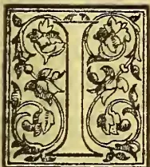

It is but very few months back that the whole of the London brokers, conjointly with all those other numerous parties who are concerned with the sale of Ceylon tea, bestirred themselves most energetically to secure for the sale of our produce a greater amount of accommodation than had been previously conceded. The attempts then made were successful, and we practically obtained for the sale of Ceylon teas in Mincing Lane twice the time that had hitherto been at our disposal. On this result, we naturally felt, all concerned might well be congratulated. But we are now informed that in practice the advantage anticipated is nullified by a consideration which had not before come into view. This is a somewhat singular one, and certainly one which was scarcely likely to strike outsiders, even if it might have been thought to be probable that it would occur to the minds of those who are daily engaged with the selling and purchase of tea. It appears that owing to the custom of the trade, now a long established one, the date from settlement of accounts is always made to reckon from a Saturday, three months from that day of the week being calculated as the period over which credit is taken. As is known to all, the Ceylon tea sales take place now on every Tuesday and Thursday in each week; and for some reason unknown to us, but presumably because accounts cannot be made up in time, the sales effected on the second of those days are not included in the returns made up on the succeeding Saturday. The consequence is that moneys due for purchases made on the Thursday do not reckon for their three months prompt until the Saturday week; and as the result to this on every sale effected at Thursdays' auctions there is the loss of a week's interest. It would not at first sight seem that this loss would be sufficiently serious in amount to warrant the assumption that Tuesdays are selected in preference to Thursdays for offering teas for sale in consequence of it. And yet it may possibly be that the delay of a week in settlement may be of some considerable importance to sellers who have a large amount of tea in the market. At all events we are assured that this cause is operating

to nullify the advantages of late secured by the multiplication of the days available for the sale of Ceylon teas. Tuesday's lists are still almost overcrowded, while those of Thursday are nearly barren of offerings. The result is that we are almost where we were before the change in system was made, and that time is deficient for the due and proper examination and tasting of the many samples submitted in connection with the sales of Tuesday. It is evident from this fact that some further change of arrangement must be needed in order to enable us to fully reap the advantages to secure which such strenuous efforts were lately successfully made. We have suggested that it seems unlikely that the amount of loss due to a week's delay in settlement could have had such a result. But there is the fact and it cannot be set aside. Something must be done to overcome the difficulty, and we should think it ought not to be insuperable. Surely Friday and Saturday—the latter, however, a short half-day in all business at home—should afford ample time for the registration of claims upon the three months' list. If it is not, some means must be found to simplify existing procedure, and we do not doubt that the subject will receive the fullest consideration by the Tea Committee of the Ceylon Association in London, and that some means of full relief will be suggested and obtained by it.

## FROM THE METROPOLIS.

LONDON, July 1st.

### A DEPRESSED TEA MARKET

in Mincing Lane is not good news to send to Ceylon. I was in the Lane and round the City on several business calls on Tuesday and heard nothing encouraging about tea prices—brokers had not even got their valuations, and the prospect was a large importation of good China teas at moderate prices. I must leave others to judge how far this increased business in "China" is due to the anticipation so eagerly insisted on both in Ceylon and the City, in certain quarters, that our tea exports for 1892 were only to be a very little in excess of those in 1891. Of course, if such prove to be the case, there is no more to be said than to give credit for sagacity and correct information in the quarters referred to, but if (with the monthly export latterly exceeding 7 million lb.) it proves that the total outturn approaches to (if it does not exceed) 80 million lb., then it will appear to have been a great pity, to say the least, that a cry of "exaggerated estimates" had been raised, encouraging English buyers to go more freely into "China."

Notwithstanding this fact, however, and the 10.

179------------------------------------------------

154THE TROPICAL AGRICULTURIST.[SEPT. 1, 1892.

gent banking troubles, there seems to be very ready support extended to our new

TEA PLANTATION COMPANIES.

I was in a Broker's office in Mincing Lane one day this week, when a business man called, who had not long ago a large connection with China tea, to signify rather considerable investments of himself and friends in shares of the "Asiatic Produce Company" and the "Caledonian (Ceylon) Tea Estates Company." Referring to the latter here is an editorial notice from a City journal which shows how well the Company is thought of:—

SOME NEW ISSUES.

During the past ten days there has been a wild rush for a little of that money which the prudent spectator has been hoarding up for use at the first convenient opportunity. It would be difficult to say whether he has merely nibbled at the baits which have been dangled before his eyes, or has gulped them down in a wholesale fashion, but it is not so difficult to conjecture that in one or two instances he will regret having adopted the latter alternative. The ventures that have been offered to him lately have been of a mixed description, and the promising and unpromising have been about equally divided. Some half-dozen concerns have been thrown on the market since last week, and one of the best of them is the Caledonia (Ceylon) Tea Plantations, Limited, whose promoters ask for 30,000*l.* in order that they may acquire certain tea plantations in Ceylon.

There are a good many recommendations possessed by this prospectus that are rarely to be met with. In the first place, the Corporation will acquire something which is of distinct value in itself, and which is even now of an exceedingly remunerative character. Another consideration is that although there is considerable competition in this particular market for tea, yet the planters appear to be able to keep up prices. Of seven Ceylon tea companies that have been in active operation during a considerable period one has paid its shareholders 18 per cent., another 15 per cent., a third 13 per cent., a fourth 12 per cent., and a fifth 10 per cent. If the old adage which tells that the "proof of the pudding is in the eating of it" goes for anything, these figures are full of meaning. The promoters have striven very hard to be fair, and appear to have succeeded to a larger degree than is usually the case with the fraternity. But if anything more were needed to induce the belief that this company was floated under the most favourable auspices, and with every prospect of being successful, it is surely to be found in the desire of the vendor to guarantee a dividend of 6 per cent. for a period of seven years.

I fancy the prospectus of the former (the "Asiatic") Company has already reached you; but to make sure I now send one. You will observe it has been constituted mainly to take over the Rakwana estates—Springwood, Barra and R...—tenne—of the family of our old friend Mr. Shand, and the leading spirit in this promotion, as in several other very important directions connected with the development of our tea enterprise, is Mr. Hamilton A. Hancock, who, with his brothers constituting the well-known Mincing Lane Firm of Messrs. Hancock Brothers & Co., has had a very long connection and the highest reputation in the China and Indian Tea trade, before taking up Ceylon. Mr. Hancock's connection with several of our Tea Companies of late years, however, has been of very special service, in my opinion, to the colony and our staple enterprise, and I sincerely hope, as I believe, that success may crown the enterprise and business of them all. In Rakwana district I need scarcely say the Lauderdale Company is very closely identified, and if, as is not improbable, there may be an amalgamation here with the "Asiatic," and perhaps further purchases of properties made, the greater part of the

district would be held by the one proprietary Company, and local management so concentrated that efficiency and economy could not fail to be promoted. Besides, Mr. H. A. Hancock—a host in himself (and school-fellow and friend by the way of the Messrs. Fenn, Church Missionaries, so well-known in Madras and Ceylon)—there are on the Board of the "Asiatic," such well-known men as Mr. V. Hugh Smith (of the Bank of England), Mr. R. H. Letchford, and more recently there has joined Mr. Meares, of Meares, Absalom & Co., who have a very extensive tea selling connection throughout the United Kingdom. In connection with the transfer to the Company of Springwood and Barra estates, I understand that Mr. J. A. Maitland, the energetic Manager of Lauderdale, is to be moved and placed in charge of the "Asiatic's" properties; Mr. Low, his competent assistant, probably succeeding Mr. Maitland at Lauderdale.

You have already learned (I see by last *Overland Observer*) about Mr. Hancock's proposal to secure the bulking of

SMALL BREAKS OF CEYLON TEA

at this end, an arrangement which, if carried out, may mean a good deal more money into the pockets of some Ceylon planters and also greater facilities for pushing on teas into the Russian and other new markets. A great objection at present is the difficulty of getting big enough breaks of suitable Ceylon teas to tempt big dealers, and few firms have had the experience, or are likely to have better opportunities of reaching Russia than the Messrs. Hancock.

In this connection I have neglected to refer to what I learned from Mr. Rutherford during a recent call about the new

STEEL PLATE TEA-BOX, THE "ACME,"

prepared by certain practical Glasgow working mechanics who have started a firm to manufacture them, as an improvement on Mr. Andrews' invention in the same direction. Strangely enough, Mr. Andrews, whose name has so long been connected with this and other work connected with tea, had just died—a sudden illness from exposure. Mr. Rutherford thought so well of this latest tea-box that his Company has given an order for a considerable number (some thousands) to make a full and fair trial, the result of which cannot fail to be looked for with much interest by tea planters generally. The price, I think, were given at 2s 6d and 3s 3d with the present low exchange: this means a considerable difference on the wooden and lead boxes unless decided advantages are secured by the use of the "Acme." By the way, is there no chance of getting neat and cheap tea boxes from China for use in Ceylon—"John Chinaman" might be pleased to learn that though we mean to cut down his tea, we can offer a market for his boxes!

I was very gratified to learn how fully Mr. Rutherford agreed with the argument, and contents generally of

MY TEA LETTERS

to the *Financial News*. He found fault, as many Ceylon men do, with Mr. T. C. Owen's qualifications. Messrs. Rutherford and Talbot had some very valuable experience in connection with the older estates of their Company,—notably Dunedin, now our 14 years old—in showing that Ceylon tea has not deteriorated, and that in fact younger plantations better planted perhaps and with virgin soil, have never got the prices of the earlier years, simply because of the general fall in tea values. The standard for the general quality of tea is now much higher—in fact the taste of the public (as well as of the experts?) has been educated and improved greatly

180------------------------------------------------

SEPT. 1, 1892.]THE TROPICAL AGRICULTURIST.155

of late years. Mr. Rutherford mentioned that he has been surprised to find how well the value of the Kalutara District teas has kept up—this district generally, he thinks, beats Kelani Valley in prices.

### THE FOOCHOW TEA TRADE.

From Foochow we have the following tea news under date the 11th instant:—The export to Europe is 59,000 lb. against 38,000 lb. at the same date last year. It consists of small quantities, chiefly Paklings sent to Hongkong for transhipment to the mail steamers. The "Nestor" will be leaving tomorrow with  $\frac{3}{4}$  of a million of lbs.—Musters of the New Season's crop were first shown on the 26th ultimo and the opening of the market took place on the 6th instant. Some 12,000 boxes Pakling had previously been settled and also Flowery Pekoes to some extent, but the opening is not considered to have taken place until first purchases of the staple of the port have been made, that is, of Panyong district teas: of which a purchase of 1,500 half-chests was made in a line on the 6th instant, at Tls. 19 to 25, the price being about 15 per cent lower than that at the opening of last year.—The quality of the crop, as a whole is not equal to that of last season in point of make or in fineness in the cup, but what is wanting in these respects is fully made up for by improved strength in teas from most of the districts. This applies specially to Paklings, Panyongs, Saryuues and Tong Fong Tongs. Of the Yung Hows, a few of the head crops are as good as last year, but the bulk of the crop is inferior and the same must be said of the Suey Kuts. The Soomos have certainly the merit of being strong and some of the best teas are thick, but there is an absence of quality in them. Kein Yong appears to have ceased to produce tea. The Sou-chong crop is disappointing, and yet a few chops which stand out are distinctly fine. The Flowery Pekoes compare fairly with last year's crop excepting that there are not the chops of extra choicest quality as in 1891.—Prices paid for the best chops of Congou are with few exceptions about 15 per cent under last year. If all the medium quality settled does not show this decline this week, it is sure to next. When added to a general decline in the tael price of 10 to 15 per cent, a fall of 3d in exchange is added, it must be admitted that buyers are acting on comparatively favourable terms.—The first crop according to the teamen's account, will be limited to 190,000 chests.—That would be 30,000 chests less than last year, but, of course, these statements must be listened to with great caution. The arrivals of Congou to date are 120,000 chests against 168,000 chests at the same date last year. The shortness is accounted for by a freshet on the river having detained some of the boats.—The settlements to date 20,000 chests against 18,000 chests last year.—The Stock is 99,000 chests against 149,000 on the same date last year.—Exchange is 2s 11 $\frac{1}{2}$ d for 4 months' sight credits, and Freight £2 per ton of 40 cubic feet.—*N.C. Herald*, June 24th.

An eye-witness reports a huge crowd of boats, laden with tea, anchored just above the rapid, detained by the freshet on the river. With the fine weather of the past two or three days and the subsidence of the water, the addition to the stock of tea next week will be very considerable.—*Foochow Echo*, June 11th.

Owing to the continuous rain a total failure of the Mocklee crop is reported. If this proves to be correct, the loss will not only be severely felt by the growers, but by the manufacturers of scented tea and the Tientsin snuff men.

We hear that some of the teamen who suffered heavily from losses on their ventures last year have done so well this that they are retiring from the trade altogether. This is a wise step, no doubt, and they will not be missed. In spite of a clearance last year we understand that there are far too many still left, as shown by a competition in country that was quite unexpected.—*Foochow Echo*, June 18th.

### THE ASIATIC PRODUCE COMPANY, LIMITED.

CAPITAL, £25,000 IN 5,000 SHARES OF £5 EACH.

#### DIRECTORS:

Hamilton A. Hancock, of Messrs. Hancock Brothers & Co., 28, Mincing Lane, E.C.

Vivian Hugh Smith, 71, Princes Gate, S. W., and Hay's Wharf, S. E.

Robert H. Letchford, 2, Lime Street Square, E. O., of the late firm of Messrs. Harvey Brothers & Letchford, 21, Mincing Lane, E. O. (Managing Director).

#### PROSPECTUS.

This Company has, as will be seen from the Memorandum of Association annexed, been formed for the purpose of acquiring Tea and other Estates in Ceylon, and elsewhere, of working the same, and dealing generally in and with Eastern produce.

The Company has entered into a contract for the purchase of three Freehold Estates, Springwood, Barra and Rangweltenne, situate in Rakwana in the Island of Ceylon, within 90 miles of Colombo, and the Directors have agreed to accept conveyances of the several Estates as the titles are proved. The elevation of the Estates varies from 1,500 to 2,800 feet. The total area is 1,557 acres, of which 650 are already planted with Tea. Of the land not under Tea about 500 acres are suitable for plaiting.

The consideration for the sale of the Estates, as expressed in the above contract, including all buildings, machinery, and implements, is £23,500, payable—as to £15,000, in 5 per cent. Debentures, repayable at par as follows, viz.: £5,000 in 10 years, £5,000 in 13 years, £5,000 in 16 years, or previously, at the Company's option; as to £4,000, in Ordinary Shares: and as to £4,500, in cash.

The Titles to two of the estates, namely Springwood and Barra, have been proved to the satisfaction of the Company's Legal Advisers in Ceylon, but the Title to Rangweltenne still remains to be proved. Under these circumstances the Directors have arranged with the Vendors forthwith to complete the purchase and to obtain possession of Springwood and Barra, amounting together to 1,150 acres or thereabouts, on a *pro rata* basis price per acre, leaving the purchase of Rangweltenne for the present in abeyance until the existing difficulties connected with its title have been removed. Upon the purchase, which is now on the eve of completion of the Springwood and Barra Estates, the apportioned sum of £17,500, part of the original purchase money or sum of £23,500 will be payable as follows, that is to say: as to £11,200 in 5 per cent. Debentures (repayable at par as follows, viz.: £3,800 in 10 years, £3,700 in 13 years, and £3,700 in 16 years, or previously at the Company's option) as to £3,000 in Ordinary Shares, and as to £3,300 in cash. The balance of the original purchase money, viz.: £6,000 will be retained until the purchase of Rangweltenne can be effected. The Directors hope to arrange with the Vendors for the purchase on reasonable terms from them, of the Green Leaf off the Rangweltenne estate, so that the estimates as to output given in this prospectus, may not be affected by the Company being temporarily unable to acquire the legal possession of this estate.

The Tea Leaf from the three Estates is manufactured at the Factory on Barra. The production for the past year has exceeded 270,000 lb. manufactured Tea; and it is anticipated that 330,000 lb. will be produced when the Tea at present planted is in full bearing.

The estates are provided with machinery and buildings, but it is expected that an outlay of £2,000 will be necessary to render the factory thoroughly efficient and capable of dealing with the entire output, and of improving the quality of the tea made. This expenditure has been allowed for in the present issue of capital.

The foregoing particulars have been furnished by the vendors, and are believed to be accurate, but the terms of purchase provide that the acreage is to be verified by a Surveyor, acting on behalf of both parties and should the areas under tea prove be less or more than herein stated the purchase money to be reduced

181------------------------------------------------

156THE TROPICAL AGRICULTURIST.[SEPT. 1, 1892.]

or increased as the case may be, at the rate of £25 per acre. The cost of the survey will be defrayed by the Vendors and the Company in equal proportions.

The Directors estimate that the output of tea from the three estates should alone yield a gross profit of at least £2,500, and save as to the Managing Director's salary, and a fixed annual fee of £50 for each Director, the Directors have made their remuneration subject to the profits available for dividend on the ordinary shares exceeding 10 per cent. Of any profits in excess of 10 per cent the Directors will be entitled to one-fifth.

In estimating the above profit the Directors have based their calculations on the present production of tea at prices under those now ruling. This production, as already pointed out may be expected to increase very materially. The Directors, moreover, hope shortly to arrange for the acquisition of further estates on advantageous terms.

In the present issue of capital the Directors believe that they have made ample provisions for working expenses and improvements.

The only Contract entered into is one bearing date the 10th March, 1891, but executed after the incorporation of the Company, and made between Charles Shand, Charles Edward Hood Symons and Francis Shand Robertson, and the Company for the sale and purchase of the three above-mentioned Estates. It may be inspected at the Offices of the Company's Solicitors.

Application for Shares must be made in the enclosed form, and where no allotment is made the deposit will be returned in full.

Prospectuses and forms of application for Shares may be obtained at the Registered Offices of the Company, 2, Lime Street Square, E. C.

London, 1st June 1892.

#### COCOA.

One of the best advertisements that an article of popular consumption can have is a mention in the Budget. Mr. Goschen's reference to cocoa two or three years ago sent the sale of that commodity up by leaps and bounds, and his eulogy of British-grown tea in last year's financial statement, according to a leading firm in Mincing-lane who have just published a review of the tea trade for the year has, had a like effect on the Indian and Ceylon trade. Coupled with the reduction of duty it gave a stimulus to the sales, which is seen in a striking way in the statistics of the year. During the twelve months ending the 31st May there were  $7\frac{1}{2}$  million pounds more of Indian,  $18\frac{1}{2}$  millions more of Ceylon, and  $13\frac{1}{2}$  millions less of Chinese tea imported, while there was a considerable increase in the re-exports abroad, probably due to the same causes. It is hardly to be wondered at, therefore, that the Chancellor of the Exchequer's name stands at the present time very high in Mincing-lane.—*Radical Review*, June 21st.

#### CEYLON ESTATES INVESTMENT ASSOCIATION.

##### ANNUAL MEETING.

The eighth ordinary general meeting of the Ceylon Estates Investment Association (Limited) was held within the company's offices, West George Street, today—Mr. J. B. Machrayne presiding. The chairman, in moving the adoption of the report (which has already been published), mentioned that they had expended £2,434 10s 3d, in addition to the factories and on new machinery. This expenditure was absolutely necessary, on account of the increasing tea crop. They would have liked to show a larger profit; but taking all things into consideration, the result was very satisfactory. The out-turn of tea had been 224,000 lb. or an increase of 20 per cent. over the previous year. Owing, however, to the low state of the

market, the prices realised had been lower than last year. The prospects for the coming year were encouraging, the tea crop being 15,000 lb. over last year's crop. A dividend of  $7\frac{1}{2}$  per cent. was proposed.

Mr. H. G. Crum seconded, and the report was adopted.

Rev. Dr. Grant and Mr. Robert King were reappointed directors, and Mr. A. Moore, C. A., was reappointed auditor.

This was all the business.—*Glasgow Evening Mail*.

#### NOTES ON PRODUCE AND FINANCE.

INDIAN TEA AND THE CHICAGO EXHIBITION.—The sickness of the Indian Government in, at the last hour, only consenting to lend official aid to the tea industry, in order that it may be represented at Chicago, is thus commented on in *The Times* of Tuesday. It says:—"The representatives of the Indian tea industry seem to have at length awakened to the necessity of opening out new markets for the enormously increased tea crop of India. Recent telegrams intimate that ten leading Calcutta firms have subscribed a thousand rupees each towards the fund for securing a proper exhibit of Indian teas at the Chicago Exhibition; that Indian tea plantations with an aggregate area of about 100,000 acres have accepted the proposal of a voluntary cess for the same purpose; and that the Government of India has tardily consented to give some aid. The action of the Government of India in this respect has been alike feeble and dilatory. India is at present the country in the world which is making the most important start in new industries and productions. Yet it is the country in the world, if we exclude uncivilised and self-isolating regions, which will be most poorly represented at the World's Fair in America. It is estimated that the sums officially allocated from various sources by France and Germany to secure an adequate representation of their national industries aggregate £300,000. England has appointed a Royal Commission with a Parliamentary grant of £60,000 for the same end; and even in little colonies like Ceylon the local Government has recognised the importance of the opportunity and is stated to have contributed £60,000 for the exhibits of the island products. The Government of India, with infinitely greater interests at stake, has not only failed to appreciate the opportunity, but it has stolidly refused the offers made to it."

THE SPREAD OF TEA AGENCIES.—One effect of the great increase in the tea-drinking habits of the nation, and the consequent increasing consumption of tea, is to be seen in the extension of tea dealing or "dabbling" in tea. We allude to retail transactions all over the country. Besides the vast number of grocers and tea dealers everywhere, there are a host of tea agents and travellers who are paid to sell some special blend or garden tea, and, in addition to these, there are humerus small agents, postmen and others, who eke out a slender income by taking orders for tea when they can get a chance. Thus a large trade in tea is transacted outside the recognised media, such as the grocer, confectioner, and chemist, and it is to those as well as to the shopkeepers, that the teas of Ceylon especially owe some of their popularity. The spread of tea agencies is a good thing for the tea planter. It makes him less dependent on the grocer. Whether the consumer benefits by the introduction in some instances of unskilled labour, and the connection of blends of tea by others than expert hands, is a matter open to more doubt.

NATAL TEA.—As mentioned last week, some 118 packages of common quality Natal tea in small breaks was offered in Mincing Lane. The Pekoe fetched 5½d to 6½d, Broken Pekoe 4½d, and Pekoe Souchong 4d to 4½d. Tea planting has not yet become very popular in Natal, but, should the output increase, the South African demand would, we imagine, be quite sufficient to cover a reasonable production. Natal is not likely to prove a rival to Indian and Ceylon in Mincing Lane so far as tea is concerned.—*H. and C. Mail*, July 1st.

182------------------------------------------------

SEPT. 1, 1892.]THE TROPICAL AGRICULTURIST.157

### "MIXING" INDIAN TEA.

Adulteration was once called by Mr. John Bright "a form of competition," and a necessary concomitant of English trade. We are familiar with the chicory mixture, which some people prefer to pure coffee; but the articles that are tampered with by the retailer are legion. The adulteration of tea has long been suspected, and in some cases the Inland Revenue analysts have found English sloe-leaves in Indian tea, suggesting a distribution and confusion of plants that would puzzle Linnæus himself. The newest ingredient, however, calls up mixed feelings. England has hitherto got all its tea from abroad; but now, according to a medical contemporary, it is to have native tea. "Some of the Kent people," it declares, "have made up their mind that hops, which make such capital beer, will make equally excellent tea. They are hard at work now elaborating a process of converting hops into fresh tea-leaves. The object of this is not merely to give us an entirely new tea, but to furnish us with an article which will alter both the flavour and the quality of the teas we have now in use. Hop tea alone is not particularly agreeable to the unsophisticated palate, but neither is beer or stout; and yet the majority of English people gradually acquire a very keen relish for well-brewed beer. Why should they not also learn to appreciate the flavour of hop tea? If need alone, the taste of the infusion could easily be modified by the addition of cream, or sugar, or other substance. But the idea of the Kent hop-growers seems to be to use the hop as a qualifier and improver of the common Indian and China teas. A Maidstone correspondent declares that this new outlet for Kentish produce is well-known in the District.

The hops are brought from the farmers, green as they are picked. They are then laid for a few hours to wither, after which they are put under a roiling apparatus, which in half-an-hour makes them look like tea leaves both in shape and colour. Afterwards they are passed through an Indian drying machine. They are then sent to London where they are mixed with Indian and Ceylon teas, and retailed at two-and-sixpence a pound. As the buyers give the farmers from fourpence to sixpence a pound for the green hops the margin of profit is respectable. Hop tea is a novelty that appeals alike to the toper and the teetotaler. Tea, the produce of the Chinese or Indian plant, has been denounced as a beverage by some medical men. It is said to affect the nerves, to injure the digestion, to destroy the coats of the stomach, and to give many men and women sleepless nights. On the other hand, it has formed part of the Lares and Penates of English women for many generations. The man who always comes home to tea has been held up to admiration, in striking contrast to the degraded being who preferred his boon companions at the public-house to the pleasant presence of his wife pouring out "the cup that cheers, but does not inebriate." Will hop tea suffice to draw the husband to the hearth again? Will he consider it a kind of beer and relish it accordingly? It is said, and we believe with truth, that the makers of all the temperance drinks infuse into them a small percentage of alcohol, just to give them a relish. Hop-leaves are not alcohol, but they will give to the homely cup of tea a quality that has hitherto never belonged to it. Whatever tea is, bad or good, it does not tend to repose. It makes many people over-awaken, and is taken in gigantic doses by young students reading for examinations. Hops, however, are distinctly narcotic. The soporific effect of a hop-pillow is an article of faith with many persons; it was said to have given George III. sleep when all drugs failed. Now, will the hop tea from Kent be really a soothing beverage? At present no substitute for a cup of tea has been discovered, and its utility for afternoon gatherings has given it a new vogue. Still, doctors object to its after effect on weak nerves, although they admit its relieving and refreshing results for the time. Perhaps the hop tea, or tea made from a mixture of the Kentish

and Indian plants, will combine the refreshment of the one herb with the sleep-giving effect of the other. Perhaps a lady, coming late from the ball, will take her cup of tea as a sleeping draught, and find in it not only refreshment, but repose. It may be said that wearers of the blue ribbon will object to this artful adulteration, and demand their Oriental beverage pure and free from Kentish admixture. The question of intoxicants, however, is not at all raised. Hops mixed with malt and fermented constitute one of the ingredients of beer; but hop-leaves are in themselves as harmless as grapes, which, before they are made into wine, may be consumed by the strictest teetotaler.

There is, however, one consideration not yet mentioned. Hop tea may, or may not, be an improvement on the Oriental drink, but why should it not be openly sold as such? When we ask for butter we do not like to get margarine. Chicory in our coffee must be proclaimed. Publicans are punished for "craftily qualifying" their spirits and ales. If a thing is sold as all wool or all silk it should not be in part alpaca or cotton. Why then, should Indian or China tea be sold at two-and-sixpence, if it is half made up of Kentish hops purchased at sixpence a pound? Are English tea merchants bent on doing good by stealth—bringing sleep to weary eyelids—and would they blush to find it fame? Perhaps the Inland Revenue will look to it. The Chancellor of the Exchequer levies a duty on tea, but if the merchant sells as tea what is half hops from Kent the revenue will suffer in proportion. It is curious that the revelations on this subject always indicate that the hop-leaves are mixed with the Indian, not with the Chinese, plant. The explanation may be the superior strength of the Indian herb; also that as far as adulteration is concerned, the Chinese are masters of it, and leave nothing to be done by English impostors. Perhaps our medical men will kindly tell us what would be the effect of hop tea largely taken. Would it be a beverage to soothe as well as to refresh? As to information from those engaged in the English trade we cannot expect it. They will all deny the soft impeachment; for though hop-leaves are undoubtedly despatched from Kent to be mixed with Indian tea-leaves in London, their exact destination is a mystery which no detective has yet found out. Drinkers of Indian tea should probe the mystery, for they may all be taking hop tea without being any the wiser. Indian tea has had many enemies to contend against, and it will be strange, indeed, if the latest is to be the Kentish farmer.—*Englishman*.

### HIGH RANGE, NORTH TRAVANCORE.

(FROM OUR OWN CORRESPONDENT.)

June 23rd, 1892.

The proceedings of the Travancore Planters' Association for the year 1891-92 has only just reached us. It is a record of much useful work done, and contains a great deal of interesting information. The Travancore Government have been liberal in granting money for roads, and Rs. 18,000 has been sanctioned for 18 miles of roads connecting different estates with each other, and with the main road. The Sircar is taking steps for getting abandoned estates back into their own hands, by imposing a tax on land, which in case of non-payment will be attached in satisfaction of arrears.

It seems a great pity that the proposals of the South Mysore Association with regard to combination among planters seems to have fallen through altogether. Who was it that refused support? Everyone to whom one talks seems eager to see combination effected, and yet we are told the scheme falls through for want of support. The question of the registration of maistries seems likely to be allowed to slide in the same way. At present, as far as I can gather, we are to wait until we can see the result of a similar measure which is in force in Mysore. At the end of February, there was a balance in hand of Rs. 464-6-0, which is better than last year.

183------------------------------------------------

158THE TROPICAL AGRICULTURIST.[SEPT 1, 1892.]

by nearly R100. I am glad to see some steps taken towards preventing the annihilation of game. The Sirear is to be addressed by the Honorary Secretary on the subject, and let us hope we shall shortly have a good game law for Travancore.

Mr. Fraser put in a very valuable record of Travancore tea averages, the figures being taken mostly from Messrs. Gow, Wilson and Stanton's weekly reports. I gave it in full:—

<table border="1">
<thead>
<tr>
<th></th>
<th>lb.</th>
<th>d.</th>
</tr>
</thead>
<tbody>
<tr>
<td>Arnakal</td>
<td>59,200</td>
<td>average price 10</td>
</tr>
<tr>
<td>Poonmudi</td>
<td>66,750</td>
<td>do 9½</td>
</tr>
<tr>
<td>Bon Ami</td>
<td>105,850</td>
<td>do 9¼</td>
</tr>
<tr>
<td>Seafield</td>
<td>59,280</td>
<td>do 9</td>
</tr>
<tr>
<td>Kadwa Kurnam</td>
<td>83,400</td>
<td>do 9</td>
</tr>
<tr>
<td>Nagamalley</td>
<td>61,700</td>
<td>do 8¾</td>
</tr>
<tr>
<td>Isfield</td>
<td>68,400</td>
<td>do 8¼</td>
</tr>
<tr>
<td>Venture</td>
<td>62,650</td>
<td>do 8½</td>
</tr>
<tr>
<td>Penshurst</td>
<td>53,300</td>
<td>do 8½</td>
</tr>
<tr>
<td>T. P. C.</td>
<td>78,600</td>
<td>do 8¼</td>
</tr>
</tbody>
</table>

The above have all sent over 50,000 lb.  
20,000 to 50,000 lb.

<table border="1">
<thead>
<tr>
<th></th>
<th>lb.</th>
<th>d.</th>
</tr>
</thead>
<tbody>
<tr>
<td>Fairfield</td>
<td>28,700</td>
<td>average price 9½</td>
</tr>
<tr>
<td>Glen Mary</td>
<td>29,900</td>
<td>do 9¼</td>
</tr>
<tr>
<td>Glen More</td>
<td>20,300</td>
<td>do 9</td>
</tr>
<tr>
<td>Vembeuard</td>
<td>35,700</td>
<td>do 9</td>
</tr>
<tr>
<td>Braemore</td>
<td>30,700</td>
<td>do 9</td>
</tr>
<tr>
<td>Glen Bittle</td>
<td>22,700</td>
<td>do 9</td>
</tr>
<tr>
<td>Corrimony</td>
<td>28,200</td>
<td>do 9</td>
</tr>
<tr>
<td>Parvithi</td>
<td>43,300</td>
<td>do 9</td>
</tr>
<tr>
<td>Bon Accord</td>
<td>25,650</td>
<td>do 8½</td>
</tr>
<tr>
<td>Invernettie</td>
<td>35,250</td>
<td>do 8½</td>
</tr>
<tr>
<td>Anamudi</td>
<td>37,350</td>
<td>do 8¼</td>
</tr>
<tr>
<td>Seenikali</td>
<td>35,950</td>
<td>do 8¼</td>
</tr>
<tr>
<td>Linwood</td>
<td>22,850</td>
<td>do 8</td>
</tr>
<tr>
<td>Rockwood</td>
<td>29,200</td>
<td>do 7¾</td>
</tr>
<tr>
<td>Montt</td>
<td>29,200</td>
<td>do 7¼</td>
</tr>
</tbody>
</table>

Under 20,000 lb.

<table border="1">
<tbody>
<tr>
<td>Kinmylies</td>
<td>19,650</td>
<td>do 9½</td>
</tr>
<tr>
<td>Comorin</td>
<td>17,750</td>
<td>do 9¼</td>
</tr>
<tr>
<td>B. K. W.</td>
<td>1,650</td>
<td>do 9¼</td>
</tr>
<tr>
<td>Glenrock</td>
<td>6,100</td>
<td>do 9</td>
</tr>
<tr>
<td>Balamore</td>
<td>11,150</td>
<td>do 9</td>
</tr>
<tr>
<td>Great Valley</td>
<td>3,800</td>
<td>do 9</td>
</tr>
<tr>
<td>Home</td>
<td>11,150</td>
<td>do 8¾</td>
</tr>
<tr>
<td>Brighton</td>
<td>12,400</td>
<td>do 8¼</td>
</tr>
<tr>
<td>Hope</td>
<td>8,300</td>
<td>do 8¼</td>
</tr>
<tr>
<td>Moercauld</td>
<td>18,900</td>
<td>do 8¼</td>
</tr>
<tr>
<td>Bison Valley</td>
<td>5,900</td>
<td>do 8</td>
</tr>
<tr>
<td>Beiford</td>
<td>13,300</td>
<td>do 7¾</td>
</tr>
<tr>
<td>Ashley</td>
<td>14,600</td>
<td>do 7¼</td>
</tr>
<tr>
<td>Springfield</td>
<td>1200</td>
<td>do 7</td>
</tr>
<tr>
<td>Perrintorra</td>
<td>10,900</td>
<td>do 6¾</td>
</tr>
<tr>
<td>Maimulla</td>
<td>19,950</td>
<td>do 6¼</td>
</tr>
<tr>
<td>T. L.</td>
<td>3,900</td>
<td>do 6¾</td>
</tr>
</tbody>
</table>

The above shows that, as a rule, estates which send most tea send also the best tea, probably because they also have the best machinery.

The Travancore Agricultural Exhibition for 1892 is to be held at Trivandrum in August. Prizes are offered for Live Stock, Field Produce, Garden Produce, Plantation and Special Produce, Forest Produce, Dairy Produce, Manufactures, Machines, Implements and Tools. The prizes amount altogether to R3,751.

Two of the estates belonging to the North Travancore Land Planting and Agricultural Society (Ld.) have recently changed hands. One of them is to be converted from cinchona to coffee, the other being too high in elevation for such a change.

Our monsoon has so far, been conspicuous by its absence. Hot sunshine has been the rule for the past fortnight, and unless it quickly changes, we will all suffer. The new clearings are all waiting to be planted, but as the rain holds off, planting has to be postponed. Those who thought we were in for an early monsoon and trusted to the few days' rain we had at the beginning of this month, find that the plants then put out had to be heavily shaded; even the shading, however will not save them unless the ground gets a little moisture into it. In the meantime the price of rice keeps on increasing, and last year's tale of 5 measures for the rages is quickly coming round again.—*Madras Times*, June 30th.

## BARK AND DRUG REPORT.

(From the *Chemist and Druggist*.)

London, June 30.

CINCHONA.—The auctions on Tuesday were neither largely attended nor was the supply of bark quite up to the average, but it is a pendency that one sees bidding so brisk and purchases so full as they were then. In consequence, some of the selling brokers exhibited a cheerful tone, and while some reckoned that the unit was a shade better, the general feeling was that it had advanced an eighth of a penny. The maximum touched was a unit of 1½d. The total quantity of bark offered was 302,078 lb., and of this 283,253 lb. were disposed of publicly, but there were understandings between sellers and bidders regarding the balance of 13,820 lb. The bark originated as follows:—

<table border="1">
<thead>
<tr>
<th></th>
<th>Packages</th>
<th>Packages</th>
</tr>
</thead>
<tbody>
<tr>
<td>East Indian cinchona</td>
<td>838 of which</td>
<td>838 were sold</td>
</tr>
<tr>
<td>Ceylon cinchona.....</td>
<td>62 do</td>
<td>64 do</td>
</tr>
<tr>
<td>Cuprea bark.....</td>
<td>285 do</td>
<td>220 do</td>
</tr>
<tr>
<td>South American cinchona</td>
<td>216 do</td>
<td>206 do</td>
</tr>
<tr>
<td>Java cinchona.....</td>
<td>65 do</td>
<td>65 do</td>
</tr>
</tbody>
</table>

Total ... 2,076 do 1,993 do

CINNAMON.—The market is decidedly firmer, and good business has been done this week at the following rates:—Seconds, 6½d; unworked thirds, 6¼d; and fourths, 5¾d. Higher rates are at present ruling at Colombo.

## TEA LEAVES.

The above is the title of an interesting illustrated volume, made up of letters and documents relating to the shipment of tea to the American colonies in the year 1773, by the East India Tea Co., now first printed from the original manuscript, with an introduction, notes, and biographical notices of the Boston tea party by Francis S. Drake.

These letters and documents of 1773, relating to the colonial difficulties of this period, having recently been found, give important information on the subject of the East India Tea Co.'s troubles in trying to introduce their tea into America, this portion of the book making 200 broad pages of printed matter. In addition to this, the work contains 100 pages of history and 100 pages of biographical notices or sketches of the tea party, making altogether a volume of about 400 small quarto pages. The book is printed in large, clear type on heavy book paper, and bound in cloth, with an illustrated cover.

The names of 112 of the members of the famous tea party are given; also twenty portraits, thirteen being original and taken from oil paintings never before copied. There are also eight miscellaneous illustrations, several reproducing famous old prints, such as "Lord North forcing tea down the throat of America," "plan of Boston in 1775," "Destruction of tea in Boston harbor."—*American Grocer*.

## WHAT IS GOOD TEA?

When Americans go to England they complain that they cannot get a cup of good tea.. When Englishmen come here, they make the same complaint. The truth is, the tastes of the two nations have been educated in totally different directions, and there is nothing more tenacious or harder to change than the opinions of our palate.

Certain Ceylon tea planters are just now engaged in informing the people of the United States that China and Japan teas are unfit to drink, and that Ceylon and India teas, produced by English tea planters, are the only truly pure and palatable teas produced.

Some of their advertisements take the palm for unadulterated cheek and gall, not to say downright lying, and they well illustrate the commercial pugnacity of the English nation.

While the public taste in the United States has undergone some changes in its appreciation of tea, notably from China greens to pan and basket-fired Japans, yet it is very far removed from the English idea of what constitutes a good cup of tea.

While persistent advertising and pushing may, in some degree, increase the consumption of Congou or Souchong sorts, Oolongs and Japans are likely to continue the favorites in this country, the romance

184------------------------------------------------

SEPT. 1, 1892.]THE TROPICAL AGRICULTURIST.159

of advertising notwithstanding to the contrary. The talk about the "iron in the soil" of Ceylon and India making their teas more wholesome, may deceive John Bull, but Uncle Sam is too wide-awake to swallow such argument, or, indeed, tea which requires such "rot" as this to get people to use it.—*American Grocer*. [Virulent talk like this is unworthy of the *American Grocer*. Taste which has changed can be changed again; and the chief advertiser of Ceylon teas is an American, Mr. Elwood May. The dealers in China and Japan teas are evidently getting alarmed.—*Ed. T.A.*]

### OIL-ENGINES AS MOTORS FOR ELECTRIC LIGHTING.

A great deal of attention is being paid by the power users of the world to the possibilities which lie before petroleum.

Petroleum, it is well-known exists in vast quantities in many parts of the world. The supply in South Russia appears to be inexhaustible, in America and other places there would seem to be stores of it sufficient for all wants for many years. Many people have thought that if at some future date the supply of coal should run short, that it is in petroleum, we should find our most convenient substitute. Owing to the increasing number of applications to which it may be put, the demand in the past few years has increased enormously, and there are now a whole fleet of specially constructed steamers engaged in the trade of carrying it in bulk from one place to another.

These facilities for cheap transport have resulted in the cost of the substance being reduced to about fourpence per gallon, and further reductions are talked about.

A few weeks ago a process was shewn in London, by means of which cheap qualities of the oil may, by the addition of some easily prepared chemical be solidified, and these blocks may be transported about from one place to another like coal, burning with very little ash, and forming a very convenient and cheap form of fuel. It is stated that only about 5 to 7 per cent of the oil is wasted, so that if the process can be as successfully carried out in practice as the experiments already made seem to indicate, it would appear certain that such a fuel would be extensively adopted in many parts where coal is too expensive to be freely used.

But by far the most important of its present uses is that of direct power development in an internal combustion engine.

These have been obtainable for some few years, but it is only lately that they have been perfected and manufactured in sufficient numbers to be recommended for electric lighting work. There seems now, however, to be little doubt that they may be thoroughly relied upon for dynamo-driving, &c., in places where a steam-engine and boiler would be inconvenient, and gas for a gas-engine is unobtainable.

They have also advantages in the question of cost, for we find Sir James Douglass, F.R.S. in a recent discussion at the Institute of Mechanical Engineers stating that, after an experience of over twelve months with a "Priestman" oil-engine, he found that it was cheaper than a gas-engine at the ordinary prices charged for coal-gas in England. He thought that oil certainly was coming to the front.

Messrs. Priestman Bros., Ltd., of Hull, London and Glasgow, have been one of the chief pioneers in the perfecting of petroleum motors. They have spent years in experimental work, and have now succeeded in producing a thoroughly reliable engine, deriving its power from ordinary mineral oil.

As a proof of how important this invention is considered, we may mention that a recent meeting of the Institution of Civil Engineers was occupied with the reading of a paper by Prof. W. C. Unwin, F.R.S., M.I.C.E., describing various experiments he had made, and tests to which he had subjected the "Priestman" oil-engine. He stated that this engine was the only one deriving its power from oil which had stood the

test of practical working in the hands of various users of power. The tests showed that the engine worked with a very high thermo-dynamic efficiency and economy. On all occasions, when he had been using the engine he had been able to start it without any difficulty.

We find that nearly one hundred engines of various sizes from one to twenty-five effective horse-power are already in use for driving dynamos in various parts of the world. Owing to its compactness and the fact that it is perfectly self-contained, and that there is no need to erect steam-boilers or anything of that description, it is especially suitable for isolated installations. There are also several hundreds used for other purposes, such as pumping, sawing, air-compressing, and a large variety of purposes connected with various engineering, manufacturing, and agricultural appliances.

Our illustrations Figs. 1 and 2 show the "Priestman" engine, the first in the field, and the kind manufactured by Messrs. Priestman. Fig. 1 illustrates a three horse-power engine with a dynamo on the same base. The working of the engine is very simple. Inside the foundation there is a reservoir for the oil, which is forced out by an air-pump through a spray-maker. In passing through this device, the oil is broken up into a fine spray. In this form it passes through the vapouriser, when being further mixed with air, it becomes ready for admission into the combustion chamber.

The piston works on the well-known four-cycle movement.

The valves are of the ordinary mushroom pattern, the inlet valve works by the suction of the piston's outstroke, and the exhaust valve is opened by means of a lever from the countershaft, and kept closed by means of a spiral spring. There are no slides whatever in connection with the engine, which are often found to be troublesome in gas-engines.

Like all gas-engines the motive power is obtained by the explosion of a mixture in suitable proportions of vapour of petroleum and air. In the Priestman engine the explosion is caused by a spark from a small primary battery, though where a dynamo is driven by the engine, a small accumulator may be employed for the purpose.

Fig. 2 shows a type of engine which has been adopted by the New South Wales and Victorian Governments for electric-lighting work. It consists of two cylinders and is of 25 horse-power, the working parts being very compactly arranged.

Among the many advantages to be gained by the adoption of these motors may be mentioned the ease of fixing, the absence of all subsidiary buildings, such as boiler-houses, &c., and the fact that petroleum being such an easy thing to move in bulk, the distance of an installation from a coalfield or railway station need not be taken into serious consideration.

They seem to be very easy to manipulate and to require little skilled attention; in many farms where they have been adopted in England, they are left solely in charge of the ordinary farm servants who seem to find no difficulty with them.

The cost of working with these engines, even when the sizes of engines used are so comparatively small, comes out at about one half-penny per brake horse-power per hour, a result which must be felt to be very satisfactory, when all the advantages of the motor are taken into consideration.

The oil is stored in a tank in the body of the engine, and only just the right quantity is admitted at a time into the exhaust chamber from which, when mixed with the proper proportion of air, it is passed into the combustion chamber, which corresponds to the steam cylinder in an ordinary steam-engine.

Another type of oil-engine illustrated in Fig. 3 is manufactured by Messrs. Crossley Brothers of Openshaw, near Manchester.

It is of more recent introduction to the "Priestman," and is really an adaptation of the world-renowned "Otto" gas-engine for using oil. It is constructed on nearly as possible the same lines as the "Otto," the petroleum being vapourised and the oil-gas thus generated is mixed with air in the proper

185------------------------------------------------

160THE TROPICAL AGRICULTURIST.[SEPT. 1, 1892.

proportions and exploded in the usual manner. Instead of using an electric spark for the purpose of exploding the mixture as in the "Priestman," a tube kept hot by means of a flame fed from the vapouriser is used with very satisfactory results.

One of the difficulties met with in these engines has been to render them efficient when working at light loads. This is accomplished in the "Otto," the results obtained proving that even when working at half and quarter loads, their cost of working is such as to render its use advisable.

There is a large field open for motive power of this description, and we anticipate that in the course of a few years they will be very generally adopted. Gas-engines require either a gas works to be in immediate proximity or for a gas generating plant to be on the premises with all its attendant inconveniences, while these oil engines only required to be supplied with oil as the reservoir becomes empty. There is little doubt that the experience which has already been gained by the manufacturers of gas-engines, and which is being used in these motors will result in them being still further perfected, and that with the cost of petroleum becoming lower and lower, their economy and convenience will result in many isolated installations of the electric light being put up in places where without them the light would be impracticable owing to its great cost. The electrical engineer will do well to endeavour to make known how simple and economical these motors really are.—*Indian Engineer*, July 2.

#### EDIBLE WILD PLANTS.

Many of the culinary herbs of former days are no longer in use, simply because they have been superseded by cultivated substitutes of superior quality. Taking some of the more substantial kinds of vegetables of which the wild progenitors are native and abundant in some parts of this country—the carrot and parsnip, for example—we find the roots are exceedingly small and their acrid properties so much more strongly developed as to render them unedible to the present Briton. As for seakale, though the wild plant is not unwholesome, there is not much of it in the whole of the United Kingdom (where it is confined to the coast) and the wild plant is so different from the succulent blanched product of cultivation that one would only eat it as an antiscorbutic in case of extreme necessity. Celery, another native plant, is not merely unwholesome in a wild state, it is absolutely dangerous though formerly occasionally used in very small quantities, according to the herbals, for flavouring soups. Other instances might be given, but our object is to point out that, so long as we can obtain cultivated vegetables, wild produce will not, in a general way, tempt us, because cultivation improves the quality of the vegetable to a remarkable degree. Cultivation relieves the plant from all struggle for existence, and supplies the conditions for quick growth and generous nutrition, so that the cultivated vegetable is almost invariably preferable to the wild. Apart from this it is doubtful whether a large number of vegetables would afford a greater variety for the table than we already possess—greater variety we mean in regard to their flavour and health-giving properties, to say nothing of their nutritive value. Take the cruciferæ for example.

When we realise that the turnip, cabbage, cauliflower, kale, radish and cress, in all their manifold varieties, belong to this natural order, and that it also supplies the condiments mustard and horseradish, besides a number of less familiar articles of diet, we can the more readily understand, that, although there are numerous other members of the same order that are equally as wholesome, and might, under cultivation, be equally as toothsome, the chances of a distinct new flavour being added are small. It is good to know, however, in the absence of the cultivated plant that there are many wild plants which might be substituted. How these plants are to be distinguished cannot be conveyed in a short article. Indeed personal teaching is the only safe and trustworthy guide. As a matter of fact, nearly all members are innocuous, if not really

wholesome. Winter cress (*Barbarea vulgaris*), a common plant in hedgerows, furnishes a good salad in early spring, when there is little in the garden except under glass. In Sweden it is boiled and eaten as a vegetable, and it is valuable on account of its extreme hardness. The marsh samphire (*Salicornia herbacea*) is an excellent wild vegetable, and where it is abundant, as on the shores of the Wash, it is collected and sold by itinerant vendors, at a rate that must bring many shillings into their pockets. But of all the wild plants that have a culinary reputation, the common stinging-nettle is the commonest and most generally diffused, growing in waste places and by roadsides in such abundance that a mess of it may easily be procured, though this would not long be the case did all the villagers understand its value as a pot herb. Formerly it was cultivated, and in Scotland, on good authority, "it was the practice to force nettles for early kail." In some districts the practice of eating nettles has survived, and in others it has been revived, but not generally by the poorer people, who are often more fastidious in such matters than their well-to-do neighbours. From actual experience we can strongly recommend the nettle as a wholesome and agreeable vegetable, and we also recommend it because everybody knows what a stinging-nettle is, and there is no risk of mistaking a dangerous plant for it. Dead nettles do not sting, and their colour is strong and disagreeable. For cooking, nettles should be taken while young, or when they are grown up only the tips should be taken, and spring is the best time. Boiled in a small quantity of water until tender, and served with a little butter, pepper, and salt, nettles are at least a good substitute for spioach, if not quite equal in flavour, though some persons aver that they are not inferior in this respect. Equally as good, but not often found in quantity in a wild state, are the shoots of the common hop, when from six inches to a foot out of the ground, or the tips of the older shoots. But we can only repeat that the supply of wholesome wild vegetables is very limited, whilst uncultivated or badly cultivated land is almost unlimited, and the only remedy we have to suggest for the alleged scarcity of vegetables in the country is the extension of the allotment system and the encouragement of gardening generally.—*British Medical Journal*.

AMERICAN STICKLAC.—According to the *Washington Star*, trees of the stinkwood and acacia variety infested with insects of the same character as those which in Asia produce the sticklac of commerce, have recently been discovered to exist in great profusion in the South-Western States from Utah to Mexico, and from the Colorado Desert to Texas. It is believed that with a proper system of cultivation these "valuable bugs" could be propagated to such an extent as to render America independent of the Old World for her sticklac and shellac supplies.—*Chemist and Druggist*, June 11th.

INSECTICIDES.—The following notes by Dr. J. C. Neal, the entomologist to the State Agricultural College, Florida, U. S. A., will be found of interest:—Nothing has been done in practical entomology that has shown better results than the use of emulsions containing kerosene or insoluble poison held in suspension, and their application to infected plants in a fine spray by various atomisers and spray pumps. With one of these machines, an insecticide can be brought into contact with the insect, and its feeding ground thoroughly impregnated with poison. It is needful that the spray be very fine, and that it be applied with force to reach every infected part or the hiding-places of insects. For cases like infested buildings, as chicken-houses, that are usually very difficult to keep clear of mites and tick fleas, the spray of carbolised white-wash, tobacco, kerosene, oil of tansy, &c., is easily applied.—*Indian Agriculturist*, June 11th.

186------------------------------------------------

SEPT. 1, 1892.]THE TROPICAL AGRICULTURIST:161FROM THE METROPOLIS.

LONDON, July, 1.

MINING AND MINERALS IN CEYLON.

Soon after the reading of my paper before the Royal Colonial Institute, I had a request from the Editor of the *Mining Journal* (one of the leading metropolitan authorities in its department, whose head office is in Finch Lane close to the Royal Exchange) asking me for more detailed information about the mineral resources of the colony, and if I would consent to be "interviewed" and to give a photograph for engraving to accompany the letterpress. There could not well be a refusal, especially as the editor, a namesake from the Lothians, had been accustomed, when connected with another journal, to review our Ceylon Handbooks and Manuals. The result appeared in the *Mining Journal* of last Saturday, June 25th; but owing to the exigencies of space, the reporter's notes of my remarks on our minerals had to be much compressed, so making them appear rather deficient and disconnected. The editor has done his part in a flattering way giving all the personal details which he insisted on learning, but, alas! when he says the engraving is a good likeness, he is the reverse of flattering, for it is rather a smudge. On the other hand a sketch of a gem-digger's hut and working-place by our friend, Mr. John Dent Young, which I found among my papers—intended with others some day for the *Graphic*, has been rather well done. I have ordered blocks of the engravings to be forwarded to you, for which perhaps you may with the letterpress (now sent) be able to find a place in one of your Supplements—the *Literary or Household Register*.

In this connection I had the opportunity this week, during a call at the residence of Mr. E. T. Delmege, of learning from that gentleman the disgust with which he regarded the inadequate operations, feeble enterprise and final collapse of the

RAKAWANA GEM-DIGGING COMPANY

which he originally promoted, but from which he retired when he saw a full use was not to be made of machinery and other resources. Mr. Delmege said that at the time the Company gave up, there was in his opinion ample encouragement with a further call of capital to prosecute both gem and plumbage digging and a trade also in mica sheets, and, if I understand aright, there was machinery on the spot or on the way out, which had not been applied. In proof of the soundness of his judgment, there was the fact, contained in a letter just received from Ceylon, that the lessees of the Everton diggings (from the Company?) were getting handsome returns every month. It is a great pity that this opportunity of doing justice to our gemming industry by the application of European machinery and the most recent improvements was lost. Nothing is heard at present of the Syndicate for which Mr. Barrington-Brown reported. And yet, as Mr. Delmege rather bitterly remarked, even in the most depressed times, many money is found in London for gold mines in strange lands where there is no gold—as for ruby mines in out-of-the-way uncertain regions—while for the development of an established industry in one of our best-known and most accessible colonies, every shilling is grudged by the British capitalist.

I learned here of the present great depression in

COCONUT-OIL,

the price of which has fallen to less than one-half that which prevailed thirty or twenty years ago, and with no immediate prospect of retrieval. Mr. Delmege is rather proud though,

and with some reason, of what the Company he is connected with—

"THE CEYLON TEA GROWERS, LD."

("Kangani Brand"), managed by Mr. Hutchinson—has done to promote the consumption of pure Ceylon Tea. All such Companies and Firms like Messrs. Shand & Haldane, the Ceylon Pure Produce Company of which I have already written, deserve specially well of the Ceylon tea planters, as contrasted with Lipton's, Mazawattee or other concerns which deal chiefly in "blends." The "O. T. G. Co." had first got up a very neat price list in French for guaranteed pure Ceylon tea and cocoa with prices stated, which ought clearly to tempt French hotels and households. Mr. Delmege is so well acquainted with the South of France, Nice, Cannes, &c., that he has been able to make our teas and cocoas well-known there. That the Company gives a good article at the minimum of profit is shown by the fact that its satisfactory dividend last year was earned through an average profit over all the tea sold of only  $\frac{1}{4}$ ths of a penny per lb. May all such Tea Growers and Pure Produce Companies and Firms go on growing and prospering, will be the hearty wish I feel sure of every Ceylon planter.

MR. T. CHRISTY

of Drugs and New Products fame—who, by the way, belongs to a family closely connected with, as he himself is a member of the "Society of Friends"—I learned some curious facts about the raw product used by the great chemists for the manufacture of

"CAFFEINE."

This is chiefly tea, the sweepings and refuse apparently, for it is bought at about £2 a ton and the Messrs. Howard alone are supposed to use about 9 tons a week; the Messrs. Böhringer and others no doubt get as much more. Now, where does all this tea come from? The "Caffeine" is sold at about 7s a lb. Asked about its use, Mr. Christy mentions it is becoming very valuable to Dentists: it is an absorbent, a nerve tonic and a sedative almost approaching to an anæsthetic. It has the property of rapidly hardening the gum, and is much less of an irritant than cocaine. Mr. Christy also mentioned that a large demand for

KOLANUT

in various forms was springing up on the Continent—he sends to Germany as much as 6 or 7 tons a week, I think he said. Some experiments recently made among the military in Vienna in doing without ordinary rations for 24 or more hours are believed to be explained by the use of kolanut, and if so may develop an extraordinary demand. Ceylon planters, in search of a new and paying product, ought once again to turn attention to kolanut.

MR. JOHN HUGHES ON SHODDY AS A MANURE.

The Secretary of the Planters' Association sends us the following letter from Mr. John Hughes, London, Consulting Chemist to the Planters' Association of Ceylon, transmitting a pamphlet on the Agricultural Value of Shoddy:—

Copy. Analytical Laboratory, 79 Mark Lane, London, E.C., June 8th, 1892. Alexander Philip, Esq., Kandy, Ceylon.

Dear Sir,—I send you a few copies of my paper on the Agricultural value of Shoddy which if you will kindly bring to the notice of the members of your Association, some of them may be glad to have a

21

187------------------------------------------------

162THE TROPICAL AGRICULTURIST.[SEPT. 1, 1892.]

copy for reference. The paper was originally published in the *Field* for the special notice of Hop growers in Kent, Sussex and Worcester. It was republished however in the *Ceylon Observer*, and judging from the letters of inquiry I have received seems to have attracted some interest, indeed already a trial shipment has been sent out by the "Clan McIntyre" which I see arrived at Colombo in the 6th inst.—Believe me, yours faithfully,

(Signed) JOHN HUGHES.

### SOUTH WYNAAD NOTES.

(FROM OUR OWN CORRESPONDENT.)

At last the monsoon has condescended to look us up, but quite in the most lady-like manner. No bluster or fuss, just a gentle drip, drip, from morning till night, and again from night till morning. Perfect planting weather. There is a very brisk demand for plants, Liberian, Ledgers, and tea, and great energy in putting them out. All last month we had lovely weather speaking from a personal comfort view, and no end of good work was done in weeding, pruning, and manuring. We had little or no rain all through June, and therefore obtained the full benefit of any amount of Cherma labour, so that the estates pretty generally look wonderfully clean and tidy for the time of year. Leaf disease is beginning to show up, I regret to say, even with the small rainfall we have had, and there will probably be a sharp attack on before this month is over. But we are thankful for the respite we have enjoyed and which we may hope will help the trees to mature their crop. The show of new wood is splendid, stronger and healthier in appearance than I have seen it for some years. The berries, too, are far more developed than they were this time last year.

Our Canarese are taking it easy, and drifting in as slowly as they possibly can. They like to arrive after all the bad weather, just in time for the light pleasant picking work, utterly regardless, of course, of contracts and advances. The Chermas flock down to the coast for one of their feasts next week, and we shall see them no more for another fortnight at least. As it happens, they will have timed their departure well, as in all probability our "big burst" is not far off, and while that lasts, next to no work can be done.

It seems a pity that all the lovely weather we have had lately, has not been more utilised to repair and generally do up the fine imperial road which has been hestowed upon us. The side drains are only partially cleared, the hedge rows rampant in unchecked luxuriance of lantana; undeniable cart ruts are to be met with, and the grass has encroached so much that our Imperial road looks more like a Devonshire lane! And this is all the more visible in contrast with the magnificence of our new bridges, which really are quite too splendid!

St. Louis asks me a question anent tea cultivation in Wynaad, which I find it not too easy to answer. "Why have the companies, hinted at some six months or so ago, come to nothing?" Well, as far as I can judge, not being personally concerned, I should say it was a case of Mr. Muchafraid wandering about the gardens of Giant Despair. The promoters of the proposed companies were probably sanguine enough, knowing the exceptional advantages which Wynaad offered for tea enterprise. But, the gentle public, not to say "the city," loved not the name of Wynaad. Said they (and not unnaturally), "It is there, it is there, my child," that we dropped our money on oreless gold mines and cropless Arabica; we do not care to burn our fingers yet again in that speculative scaldron."

Then Ceylon stood in our way: Ceylon with its unlimited talent for swamping every market, Ceylon backed up by a Midas of its own, smashing itself with Arabica, to pick itself up again with cinchona, down again with that, never mind, plenty more money where the rest came from, and cardamoms and tea follow. Then arises the cry, Ceylon will swamp the tea market, what is the use of forming new companies in India? And so the "much afraids" gave it up. I do not myself think that we need be discouraged by this,

As you know, tea is being planted in Wynaad on a rapidly increasing scale; there is nothing which succeeds like success, and I have not the least doubt that when a few years hence it is proved by sound practical experiment tea of the best quality can be made to pay here, that fresh companies will be formed, and capital introduced, which will restore the prosperity of Wynaad. I do not think that those who are now planting are likely to fall into the lamentable error of employing any but the very best machinery for the manufacture of their tea. This mistake has been made formerly, and the result of it has been that whilst the tea, fresh from the factory, was delicious, it would not keep, owing to insufficient drying. It is well known that the tea here is far more full of sap than that grown at a higher altitude, and therefore exceptional care is required in having the leaf thoroughly dried. This, even with exceptional care, is next to impossible if the machinery is inefficient, so that it is really bad economy to hesitate on the subject. I know that nothing but the best *jats* are now being planted. There is no fear that our soil will fail them. Tea here grows most luxuriantly, and does not seem to be troubled by diseases of blights. Given, therefore, that the raw material is excellent, the machinery perfect, and the manipulation thoroughly skilled, we are surely bound to place in the market such an article as will obtain favourable notice, both for itself and for the district in which it has been grown. Later on I propose sending you an outline of the available land suitable for tea in this and neighbouring districts, with any notes of interest, which I may gather about them.

In another of St. Louis' notes there is a query from "Bones and I," on the subject of Bone and Poonac, to which I venture a reply. It seems to me that the reason why "Bone and Poonac" has been abused by some, and is said to do more harm than good, is because its use has not been continued. Poonac, the active part of it, is "nitrogenous," and as such, forces the coffee tree or stimulates it into an increased life and production of branch and leaf. The bone provides many of the constituents of the berry, and the tree only takes up just as much as is necessary for the development of the berries, which the other manure has brought to birth. Anything over will remain in the soil. But under a tropical climate the force of the poonac manure is soon spent, and if the dose is not repeated, a vast mass of rootlets and corresponding branches are brought to life, only to find themselves turned out into a hard cold world, with no delicate foot left to keep them going; so they dwindle away and die, and the last state of those trees is worse than their first. No, the dose must be repeated every year, and well dug in and mixed with the soil, so that the roots may not find it all at once and so reap the fruit of greediness; let them feel about for it and spread themselves and get other nourishment, by the way, and a good hold of the oil. Two parts of poonac to one of bone (and not half and half which is simply a waste of bone) is the usual mixture, and a lb. of this is quite sufficient for each tree. But remember that it must be well dug in and thoroughly mixed. In South Wynaad, poonac and bone can be brought up from the coast, and applied to the trees for about R70 a ton, which will do an acre and a third, and will give much more than its worth in crop, but the application must be annual, and I fancy from what "Bones and I" wrote on the subject, that herein he failed and so blamed the manure, unfairly. I give my opinion from many years' experience, and trust that it may be found satisfactory.

An association meeting was held at Mappanddy yesterday, and a very fair number of members assembled considering the state of the weather. There was a long discussion about the "Planting member of Council" question. There were several other subjects entered upon, and it is evident that we and our Coorg brethren cannot quite agree upon the registration of Canarese Maistries. The reason of which is, perhaps not difficult to understand!—*Madras Times*, July 13th,

188------------------------------------------------

SEPT. 1, 1892.]THE TROPICAL AGRICULTURIST.163LIBERIAN COFFEE IN SINGAPORE  
AND JOHORE.

When I heard that circumstances had caused the Loonchoo coffee estate in Johore to be thrown on the market, I thought "for sure" that some one interested in planting and having the pen of a ready writer would have come forward, either with a sort of review of the planting enterprise in these parts, or to try to prove extenuating circumstances in the case of Loonchoo. "Condemn it all, sir, if it is as fine a place as you make out, why the Hades is it thrown on the market like this?" Well, just now I do not propose to discuss the Loonchoo question, but to take as it were, a back look over the planting enterprise in these parts since the first run on coffee took place in Johore, some eleven years ago, there or thereby. The original men undoubtedly went into the thing with too sanguine views and of all things in the world they overlooked the—in planting matters—almighty considerations of Labour. Land, Land, Land. Once the Land was secured where lay the difficulty? Aye, there was the *crux*. They were too cock-sure of securing there all supply of coolies from Ceylon and South India. There two things occurred. First Rama Swamy, who had salaamed to master, and promised to follow him all over the world, did not see it in the same light when he was asked to redeem his promise and follow. Secondly Madras says "No, no. We expect a famine. We must keep our *ryots* here to begin with. Though I have had but little trouble with labour myself, I must say that I feel very strongly on the labour question. The attitude of the Madras Government (which has been described by a personage in Singapore as "the most effete administration in the East," is to me incomprehensible. I honestly believe that a Madras official would rather report 20,000 deaths from famine in India than 20 from fever in Johore.\* Of course officials would deny the soft impeachment with a bland and smiling face; but past history tells a tale "which nobody can deny." It is not strange that hitherto no signal success has been scored in planting at this end of the Peninsula. With new land and new labour the first planters could but look for pioneer's luck. They got it, and we now are wise in the light of past events. With two exceptions, the writer knows every coffee estate in Singapore and Johore; at the present time one and all are looking well. Most have a first-class crop on them this year; and all have had splendid blossoms for 1893. All the plantations have improved of late; and three which he has recently had occasion to visit after a considerable lapse of time have come forward in a way that is absolutely marvellous.

The future of this part of the world is an agricultural one, and Coffee is the cult.

W. T. M'K.

—S. F. Press.

TEA IN CHINA.

Foochow, June 25th.

We have it on the best authority that the second crop of tea will be astonishingly small this season, and the information is confirmed as regards supplies from the Paklum and Panyong districts, the heavy rains having interfered with the picking. At the same time shortness, from a variety of causes, is reported all round, especially of tea above common. Taken altogether, the news from the country seems to point to a small and poor second crop.

We have often referred to the abuse practised by the *likin* runners in collecting this tax on tea up-country. There appears to be no limit to their extortion. From an extra impost, or squeeze, of fifty per cent. levied last year over the tariff, we know of

\* It is such wild, inconsiderate, utterly incorrect statements which are calculated to prejudice officials against planters. It is the sacred duty of the Madras Government and officials to secure just and kind treatment for their people; and that assured they favour emigration.—Ed. T.A.

sixty per cent. extra having been demanded this year. We have the fact from one of the sufferers, whose name we would mention but for the certainty that he and his family would suffer from the consequences. There is apparently no redress.

If the squeeze is objected to, the boats are simply detained at the *likin* barrier, and, as all the teamen are anxious to get their first crop teas down to market as quickly as possible, there is no other course open to them than to submit. Some day, however, it will be resisted just as the squeeze on salt duty at Tek Hwa was resisted last year, and there will be a repetition of the rioting which took place there, if these illegal imposts are persisted in.

Particular enquiries are being made, we understand, by unknown men as to the results of the teamen's ventures this season. It is generally supposed that those enquiries are being made for the information of the authorities, who it is known have to furnish Peking with the local reasons if any, of the decline of the trade.

The steamer "Taiyuan" leaves tomorrow morning (3rd July) for Melbourne and the "Menmuir" on Tuesday morning for Sydney with the first of the new season's tea. We had heard casually that tea was cheap and we were wondering how this came about in the face of a lessened supply and a larger demand. Native teamen of our acquaintance have explained it to us in the following words:—"Too muchee talkee talkee sellum that tea that Australian man just now; too muchee talkee talkee." It is all very well, they added, for them to be cautious and buy carefully, but the pressure all buyers have brought to bear this season, and especially the Australian buyers, to keep prices down is remarkable and contrary to all precedent; the consequence is we have not done nearly so well as we might have done. This charge of illiberality on the part of buyers leads us to hope that what we heard about the cheapness of tea is really true, and that shippers will reap the full advantage of it.—*Echo*.

HANKOW.—The *Hupao* says:—The tea business at Hankow has been very discouraging this year and merchants dealing in this article have all suffered losses. Formerly a dozen or more large steamers called at that port for tea, but there have only been five or six this season that were loaded with this cargo. The falling off of this trade is attributed to the strong competition of Ceylon tea.

The following are the Hankow Tea Statistics at date, compared with the corresponding number of days from the opening of last season, viz., 46 days; 20th June, 1892:—

<table>
<thead>
<tr>
<th></th>
<th>1892.</th>
<th>1891.</th>
</tr>
</thead>
<tbody>
<tr>
<td>Hankow Tea</td>
<td>½-Chests.</td>
<td>½-Chests.</td>
</tr>
<tr>
<td>Settlements.. ..</td>
<td>444,070</td>
<td>477,060</td>
</tr>
<tr>
<td>Shipments to Shanghai on</td>
<td></td>
<td></td>
</tr>
<tr>
<td>Native account .. ..</td>
<td>—</td>
<td>139</td>
</tr>
<tr>
<td>Stock .. ..</td>
<td>46,500</td>
<td>53,780</td>
</tr>
<tr>
<td>Arrivals .. ..</td>
<td>490,570</td>
<td>530,979</td>
</tr>
<tr>
<td></td>
<td>1892.</td>
<td>1891.</td>
</tr>
<tr>
<td>Kiukiang Tea</td>
<td>½-Chests.</td>
<td>½-Chests.</td>
</tr>
<tr>
<td>Settlements.. ..</td>
<td>202,250</td>
<td>308,298</td>
</tr>
<tr>
<td>Shipments to Shanghai on</td>
<td></td>
<td></td>
</tr>
<tr>
<td>Native account .. ..</td>
<td>—</td>
<td>—</td>
</tr>
<tr>
<td>Stock .. ..</td>
<td>28,800</td>
<td>18,960</td>
</tr>
<tr>
<td>Arrivals .. ..</td>
<td>232,110</td>
<td>327,258</td>
</tr>
<tr>
<td></td>
<td>1892.</td>
<td>1891.</td>
</tr>
<tr>
<td>For London and America..</td>
<td>½-Chests.</td>
<td>½-Chests.</td>
</tr>
<tr>
<td></td>
<td>278,000</td>
<td>254,000</td>
</tr>
<tr>
<td>For Russia .. ..</td>
<td>360,320</td>
<td>531,356</td>
</tr>
<tr>
<td></td>
<td>647,320</td>
<td>785,356</td>
</tr>
</tbody>
</table>

—Overland China Mail, June 29.

189------------------------------------------------

164THE TROPICAL AGRICULTURIST.[SEPT. 1, 1892.]COFFEE NOTES.

The coffee of Nicaragua is greatly improving in quality. It is far superior to Brazilian coffee. In the department of Matagalpa there are 2,000,000 acres which will soon annually produce ten million pounds of superior coffee.—*American Agriculturist*.

An employé of the East India Company in 1607, Mr. William Keeling, is believed to be the first among English navigators to mention coffee. He first met with it in the island of "Socotora," and thus describes it: "The people have for entertainment a thing called "Cobo," which is a black, bitter drink they make from a berry brought from "Mecca"; this they sup very hot, and it is reckoned good for the head and stomach."—*Rio News*.

JOKAI TEA COMPANY.SATISFACTORY RESULTS IN A YEAR OF DIFFICULTY—THE ESTIMATES.

The twelfth ordinary general meeting of the Jokai (Assam) Tea Company, Limited, was held yesterday, at the offices, 14, St. Mary-axe, under the presidency of Mr. J. Berry White (the chairman of the company).

The Secretary (Mr. Henry Earnshaw) read the notice convening the meeting. The report and accounts were taken as read.

THE CHAIRMAN said: Gentlemen, before making any remarks on the figures in the report, I wish to explain that the delay in issuing it and the date of this meeting have been caused by our resolution to sell every once of the crop annually before making up the accounts so that none of the figures need be based on estimate. Last year I told you, with truth, that the report they submitted was not only a record of the best year's transactions we ever had, but was, I believe, taking it all in all, the most favourable account ever made by any Indian tea company. Well, gentlemen, there are fat years and lean years, and the year just past had belonged to the lean variety, although we have a fairly satisfactory record to place before you. We have throughout the year been attended by a series of misfortunes. First of all, the produce we held over from last year, and which was most cautiously valued—so cautiously, indeed, that I fully expected it would realise more than £1,000 over the valuation—resulted in a loss of £1,657 13s 9d. No one can be blamed for this, as the produce consisted chiefly of fine teas, and within an interval of a few days an unexpected drop took place in the value of this class of tea. We were not the only sufferers. The most experienced and astute wholesale dealers in Mincing-lane, who are supposed to be even more closely in touch with the market than we are were far heavier sufferers than ourselves. We then sustained a considerable loss by the wreck of a river vessel in which was a quantity of our most valuable teas, which were insured at the average value of our whole crop, and which in this particular shipment was fully 33 per cent below the real value. We then met with the culminating disaster in the destruction by fire of the factory at Tippuk. If you will look at the profits made by Tippuk in the previous year you will perceive that the loss could have been very little under £5,000. We must hope that, as we have hitherto been exceptionally fortunate, no fresh disaster may occur for many years to come. Coming now to the most important figures in the body of the report, you will see that the out-turn was under the estimate by nearly 100,000 lb., the exact figures being 2,382,000 lb., against 2,480,000 lb. The deficient rainfall in the autumn months was quite sufficient to account for this, and, with the exception of some gardens in the Surma Valley, I believe there was no tea concern in India which did not suffer as much from the same cause. It is satisfactory, however, to know that in a year of such exceptional drought as prevailed in India last year it was so very little felt in the Province of Assam. My own conviction is that we never shall have a really serious drought in that province, owing to the physical conformation of the country. If our out-turn was under the estimates in a small degree, the expenditure was still smaller being

only £81,000, against £89,000 estimated for. Our gross income is nearly £106,000, our tea having sold for a little over 10s 3d per lb., being 1s 3d. under last year's average. We should have maintained last year's average easily had it not been for the low prices fetched by the Jamira, Joyhing, and Subansiri divisions teas. The demand for the various classes of tea varies very much, not only from season to season, but really from month to month, and we have hitherto found it to be the wisest course not to confine our output to one quality only. While we give a very free hand to the managers, who, being on the spot, are best able to judge what sort of produce they can turn out best, we have in general terms instructed some managers to go in for quantity and other managers to pay regard to quality alone, independent of quantity, and, as I have just remarked, this is the most prudent course. But it now appears to us that the time is come for some modification of this policy. The large quantities of medium and common teas produced in several of the other tea districts, which are apparently incapable in turning out really fine tea, lead us to believe that in the future fine teas will pay best in Upper Assam. We will, of course, watch the market attentively week by week, and if any marked change occur we will advise our managers by cable of the necessity of making an alteration in their style of plucking and manufacture.

The gross profit on the working of the season amounts to £25,444 10s 9d, and, after deducting commissions and income-tax, it leaves a net amount available for distribution of £21,586 17s, from which we recommend that the usual dividend of 10 per cent for the year should be paid. We have already paid an interim dividend of 5 per cent. in December last and, if you approve it, we will pay the remaining 5 per cent. now, and we will have a carry-over of nearly £1,600. The reserve fund will remain at the amount it was made up to last year, namely £30,000; but, although it does not come into this year's account, we have already added to it by the premium on the new issue of capital lately made. The estimates of out-turn and expenditure you will find in the usual place in the report. They are for 2,750,000 lb. costing £100,000 to produce being an average of about 8s 3d per lb. for all charges up to the time of sale in London. Taking into consideration the increased plucking area, the estimated quantity may be considered small, and there is no doubt that we could turn out considerably over 3,000,000 lb. were it not for the reason I have already told you, that we have instructed our managers to pay more regard to quality than to quantity. You will perceive that we have made very considerable extensions this year—over 365 acres in all—the chief clearance being at Panitola, a division which has, with the exception of one year, always given us handsome profits. This extension and the purchase of two small gardens towards the close of the year, brought our capital account up to some £9,000 over the amount fully paid up. This account has been adjusted by the issue of 1,000 additional shares in April last, which with the issue in payment of the Wilton shares, shows our paid-up capital at the present moment to be £231,000. These new extensions will, I believe, in the future, prove to be the most valuable portion of the company's estates. Next cold season we propose extending at Hukan-Pukri. This garden, which for some years past has produced the finest tea, not only in the company, but in all Assam, is at present under 300 acres. The existing fixed establishment, both European and native, could work 500 acres without any increase in their numbers. We have at last got the Bokel Sawmills into nearly full work. Everything moves very slowly in Assam, and the erection of these mills has taken nearly two years longer than even I had anticipated. We have, however, made a good start by turning out nothing but first-class work. Larger profits could have been shown had less attention been paid to fineness and nicety of work in the boxes, but the reputation we have gained for the best work in Assam will in the long run prove more profit-

190------------------------------------------------

SEPT. 1, 1892.]THE TROPICAL AGRICULTURIST.165

able. The Hukan-Pukri mill, like everything else at that factory, has done well. You will be glad to see that we continue to devote the utmost care to the maintenance of the health and general welfare of our native labourers. We have spared no expense in the construction of improved and permanent houses for them, in getting a thoroughly reliable supply of pure water laid down to all the factories, and in other works for their comfort and advantage. The expenditure on these improvements has been very costly—indeed, had it not been for this outlay, we might have doubled our reserve fund during the last three years; but all this has now nearly come to an end and the diminution will be shown in our new year's accounts. The next paragraph in the report refers to the prices ruling during the past year for Indian teas, and their consumption. All teas brought fairly remunerative rates until the end of October, when a change came over the market. Fine teas—that is, teas bringing from 1s 3d to 2s 6d per lb.—maintained their value, while medium and inferior class teas fell quite 25 per cent. lower than had ever been known before. In other words, Pekoe and Pekoe Souchong, which in ordinary times averaged from 10d. to 13d., fell to a point varying from 4½d. to 8d. As these medium teas formed the great bulk of the produce of the majority of our divisions, it naturally affected our gross receipts very considerably. Our Jamira division barely covered expenditure, and the Subansiri division actually showed a considerable loss. Even allowing for a normal fall in prices such unsatisfactory results were, I am sorry to say, due to other causes, which are remediable, and we will take measures to prevent their recurrence.

The figures of the home consumption are for each year from January 1 to December 31, and for 1891 do not appear to be very satisfactory for Indian teas, and show a slight falling off in consumption; but since then, for the five months ended May 31, a great increase in consumption, amounting to 7,000,000 lb. has occurred. The consumption of China teas show the usual steady decrease. As I led you to expect in my address last year, we have continued our policy of annexation. The two small gardens we have acquired on the North Bank are not of much account, and were so much neglected that they will require expensive reclamation. Their acquisition was desirable from this point of view—that they were on the border of our gardens, and evidently worked by their native owners in a manner that would prove, and had proved, a considerable nuisance and some loss to us. These people have no capital, have no regular establishment of imported coolies, and worked these small patches of tea with discontented or worthless coolies from our gardens. The settling down of bad characters almost in the midst of our own people was a bad example, and tended to unsettle those in our employ. After some little judicious outlay, these gardens, I have no doubt, will prove as remunerative as the adjoining cultivation. The acquisition of the estates of the Wilton Company is a different matter altogether. These estates comprise nearly 1,000 acres—996 acres is the actual figure—of tea. About 500 acres of these are acres nearly as good as any of our own properties, although not in such a high state of cultivation; 200 acres are fairly good, but require reclaiming—that is, filling up numerous vacancies and carrying out a proper system of drainage; 200 acres are quite young, and in three or four years' time will be about the best portion of the estates; 100 acres are of a very poor, low China plant, the abandonment of which I have advised, but have left to the decision of the superintendent to do so or not when he has had further experience of this year's working. The chief value of the property, in my eyes, was that it contained 8,243 acres of freehold land in the immediate vicinity of the railway. Now, I consider that this land alone is worth the price we paid for the entire property. As no more fee-simple land will be granted by Government, I hold that this is quite worth £3 an acre, and the whole property has only cost us £21,000. Although the tea on it is not up to our own standard of cultivation, it will with the more liberal

treatment that we will give it, yield a good profit from the outset, nearly equal per acre to the other divisions of the company. Although the season has not been a humper one, we have had the prudence of our policy practically demonstrated. By judicious extensions and acquisitions, our interests are spread over such a wide area that the fire at Tippuk or the loss in working at Jamira and Subansiri has had only a trifling effect on the general result of the year. A new factory has been erected at Tippuk and is now being used. Our position is exceptionally strong. We hold our cultivation at the very low average of £55 per acre, and this includes two sawmills and 23 miles of light railway,\* and over 22,000 acres of freehold land.

The Chairman concluded by moving the adoption of the report and accounts. (Applause.)

Mr. William Halford seconded the motion.

Mr. Rostron remarked that last year reference was made to two articles which they had on their estate—indiarubber and rhea. He should like to know if the difficult problem of discovering machinery suitable to turn them into marketable articles had made any progress during the year. He trusted that in the extensions to their property that might be made every effort would be made to get estates as cheaply as possible. He should also like to know how the company stood in reference to the competition of the Ceylon tea trade.

Mr. Seaton said he noticed that the estimates of cost was a little higher this year, and that at a comparatively low rate of exchange. No doubt, the estimate was a pretty full one, but, the heavy expenditure on machinery having come to an end, he should have expected to see a reduction in the estimated cost. He complimented the board on the satisfactory state of affairs disclosed.

The Chairman said, in reference to the rhea and indiarubber, although no machinery had proved actually successful, he thought they were getting to it very closely. He was himself interested in two syndicates, and thought they had very nearly found out the proper machine. They had 50 or 60 acres of rhea under cultivation; but it would not be worth while to put it on the market until there was a larger area. They had very good accounts of the indiarubber; but before it could be tapped the trees they were planting out now must have six or seven years growth. As to not being too extravagant in the rate they gave for gardens, he thought their last transaction showed they were not likely to err in that respect. He thought the land for which they had paid £3 an acre would be extremely valuable before long. Ceylon teas had affected them, and brought down the price for medium and low-class teas; but Ceylon tea was really taking the place of China tea. They could not turn out the fine liquoring tea, and if Indian tea-growers gave up making the coarser teas they knew that no other part of the world could compete with them; therefore, with the change of policy, he did not think they need apprehend that Ceylon would interfere with them. Ceylon, as he said, was taking the place of China, and they would always want a certain proportion of Indian tea to give strength and backbone to their tea, as the Chinese did before. (Hear, hear.) Replying to a shareholder as to the rate of exchange, the Chairman said it was estimated at 1s 4d this year, and he had no doubt it would not exceed that. The estimated cost was not lower than the last, because they were allowing for making a much finer article. They hoped that the tea which came home this year would average 1s per lb. which would give them a return of 16 per cent., and he did not think anyone need grumble at that. (Applause.)

Mr. Thomas Carritt confirmed the opinion expressed by the chairman as to the relative positions of Indian and Ceylon teas, and said, as far as he could see, the quality of the latter was falling off every year. In the past year the Ceylon people said they were going to pluck more finely, but the quality was poorer, whilst the quantity was not so large as they expected.

\* *N.B.*—Have any Decauville or other railways been formed on Ceylon estates?—ED. T.A.

191------------------------------------------------

166THE TROPICAL AGRICULTURIST.[SEPT. 1, 1892.]

The motion was then put and carried unanimously. The Chairman proposed: "That out of the amount of £21,595 4s. 7d at the credit of profit and loss account, the payment of an ad interim dividend of 5 per cent. on December 10 last by the directors be confirmed, that a final dividend of 5 per cent. per annum, free of income-tax, be now declared, payable on, and after June 24th, and that the balance of £1595 4s. 7d be carried forward to next year's account."

Mr. John M. Holl seconded the motion, which was agreed to.

The Chairman moved and Mr. Alexander Lawrie seconded the re-election of the retiring directors (Messrs. Holl and Halford.)

The motion was carried.

Colonel Nowell proposed and Mr. E. Tye seconded the reappointment of Mr. J. F. Kane McGwire as the auditor, and this also was passed.

On the motion of Mr. Tye, seconded by Mr. Smith Harvey, the thanks of the shareholders were voted to the chairman and directors and the superintendents in Assam for their efficient conduct of the company's business during the year.

A vote of thanks to the Chairman terminated the proceedings.—*Financial News*, June 24.

## TEA AND TEA PLANTS.

By DIGAMMA.

Sreekonah, Cachar, February 16th, 1892.

This is a pleasant place on the little river Ghogra just below the falls, and close up to the military road leading from Sylhet to Silchar. There is no lonely European dwellers here, there being no European at all—only myself for the time being. The resident in chief at Sreekonah is a Baboo, which means a "native gentleman"—the Baboo Sonat Knmar Dass. I referred to this Baboo in a former Budget, saying that he and I had been on terms of intimacy for a number of years. This is true. We are good friends. He does his best to entertain me. Of course I may not sleep under the same roof with him, nor eat from the same dish, because in his eyes I am unclean, he being a very religious and high caste Hindoo who never eats the flesh of mammal except goat offered in sacrifice, and of birds only pigeons. He is a man who bathes at least twice a day, who rubs his teeth at least three times a day with a stick, who would rather out off the forefinger of his left hand than touch his dinner with it, who believes in ghosts and witches and who is in every way devoted to the service of his gods. He has very many gods. In addition, he is a man of much cultivation, great intelligence, thoughtful, and spiritually minded. But the Baboo is not intolerant according to his lights, and I have the use of his covered verandah, which is a room good enough for my purpose. Then, though he abjures all alcoholic drinks on his own account, he has provided beer for my regalement, and many other good things. He is singularly free, too, in conversation, and is always ready to inform me in detail about the manners and religion of his people.

Tea grows wild in the jungle of Sreekonah. It is not that the plant had been brought from a distance for cultivation and allowed to run wild like cherries at Gibside. It is the indigenous plant—the native tree. Southern as well as northern Assam, the valley of the Soorma-Barak as well as that of the Brahmaputra, is the natural home of the tea plant. Tea is not found growing wild in China; and it is alleged that, when left to itself there the plant never attains the dimensions of a tree. The cultivated tea plant in a plantation, perforce of constant pruning, is a shrubby bush, having the dimensions of an average black currant bush, and ranging from three to four feet in height. But the tea plant is not naturally hushy. On the contrary it is a tree growing up to 30ft. high,\* and having not unfrequently, at the

thickest part of its trunk, a girth of two feet. It throws outwards and upwards strong woody branches, and it has leaves large, leathery, lanceolate, flat, saw-edged and succulent. This morning I plucked from a tea-tree a leaf which lacks only the sixteenth of an inch to be a foot long and is full four inches wide. I am thinking of sending it to Mr. Stewart, tea dealer in Newcastle, for curiosity's sake. Also, I am assured that still larger leaves are met with.\* It was in 1855 that tea was found growing wild in Cachar, one year before its discovery in Sylhet, but about 30 years after its alleged discovery in Upper Assam. I have seen it growing wild on the Kuttal estate and in other places, but nowhere to the same perfection as in this Sreekonah jungle, where the leaves have repeatedly been plucked and manufactured. The Cookies and Oacharies have been wont to gather the seed of wild tea (a tea seed is very much like a hazel nut, but its kernel is intensely bitter), and to sell it to the planters. The product of this seed is the highly priced indigenous plant as distinguished from the China and Hybrid varieties.

It is told of a certain director at the meeting of an Assam tea company in London how he made a motion to this effect—that Orange Pekoe only should be cultivated in the garden of the company, seeing that this kind of tea brings a so much greater price in the market than any other kind. His motion, if he ever made it, was the result of what is a very popular error; namely, that the teas classified in the markets as "flowery pekoe," "orange pekoe," "pekoe," "sonchong," "pekoe-souchong," "Congou," and so forth are not only different qualities of tea, but different species of tea, produced by different plants and mayhap in different places. It is not so, however. All the teas mentioned are produced by the same bush; nor is there anywhere a tea plant which may not produce every one of them. As different parts of the hide of the same beast vary in length and firmness, so vary also the different leaves on the same tea plant. As the outer and inner leaves of a cabbage differ in tenderness and in sweetness, so likewise differ in strength and in aroma the leaves of the same tea shoot, according to their age and position. Only the young succulent leaves on the new shoots can be manufactured into tea which the grocer sells; and the younger the leaf—the higher up its place on the shoot—the finer is the quality of the tea which is made of it. The two top leaves have been called the flowery and orange pekoes—the pale yellow "pekoe tips" of the careful manufacturer. Thereafter comes the pekoe leaf, and the one below it and older than it the souchong. It stands to reason that, though the same bush yields all the teas in the foregoing classification, all the bushes in all the gardens do not yield them of the same quality; for one pekoe may differ from another pekoe and one souchong from another souchong according as there is a difference in the character of the seed from which they spring, in the quality of their respective soils, and in their climatic conditions. There is another error about tea from which certain text-books of Botany have not yet shaken themselves clear. Notwithstanding the proved identity in species of all the teas sent to the markets of Europe to be sold for consumption as a beverage, they are still frequently spoken of as belonging to three distinct species of plants—the *Thea viridis* of Linnaeus, the *Thea Bohea* (both of China), and the *Thea assamica*. But the botanists of authority are agreed to consider these three as, at the utmost, only varieties of one species, classifying it under the name of *Camellia Thea*. For the camellia and the tea are identical in genus; and he who has seen a camellia has seen what is likeliest the tea plant—its very first-cousin. There was a time, also, when green tea was supposed to be made from a different species of plant from that yielding black tea. It has not to be said that green tea differs from black tea only in the method of manufacture, and that any tea leaf may be turned out either green

\* It grows to 45 feet. There are seed-bearers on Abbotstord estate, Dimbula, fully 35 feet high.—Ed. T.A.

\* Leaves exceeding 1 foot in length and broad in proportion have been grown in Ceylon.—Ed. T.A.

192------------------------------------------------

SEPT. 1, 1892.]THE TROPICAL AGRICULTURIST.167

or black. The difference is in the degree of fermentation.

He who takes tea for breakfast swallows what is brought about by fermentation as much as the man who drinks beer to his tiffen or red wine when he sups. Tea is a manufactured article; and, before the leaves are capable of yielding a potable draught, they have to be subjected to four main processes—the withering, the rolling, the fermenting and the firing. The most important by far of these is the fermenting; the two first being in preparation for it, and the last being to check it. Certainly, it is not alcoholic fermentation to which the tea leaf is subjected, nor am I able to say by the action of what special ferment it is brought about. I am not aware that anybody can yet tell this. But fermentation is beyond question—fermentation of the putrefactive sort,\* whereby vital changes are produced in the constitution of the leaf, its color altered, new powers induced, and essences created that were not in it before. Mayhap it is akin to the fermentation that takes place when grass is made into *silage*. Anyhow, it is this manufacturing process towards an efficient fermentation, neither too little nor too much, which in recent times has altered the whole tea industry as regards the making of the marketable commodity. Handrolling and all other direct manipulation by hands and arms will soon be altogether a thing of the past; and already a factory is by far the most important and expensive part of a tea plantation. The multiplication of machinery, and of expensive machinery too, is steadily on the increase, and the time is not far distant when none will have the chance of starting life as a tea planter unless he be a trained mechanic.

Another word about the tea-plant, which is one of the hardest members of the vegetable kingdom, and which endures an annual slaughter by the pruning knife and a weekly plunder by the nimble-fingered co. lie picker, which I doubt may be paralleled in the whole range of cultivated plant-life. Provided that the necessary conditions of climate are present, will the tea-plant grow on any soil? One might almost say so. I have seen the tea-plant growing among the bonders on the rugged mountain sides of Ceylon—growing where the coffee grew till it was blasted, and where no coffee would at any time grow. I have seen it spreading its green heads over the far-reaching plains of Assam on land as flat as the open palm of a lady's hand. I have seen it thriving astonishingly in the dried up fens of Sylhet, nothing better than drained peat-bogs. And here I see it in Cachar, where for a generation it has clothed the *teelaha*s or little hills that are set as thick in the land as the manure hasps carted out for the top-dressing of an English meadow. Now it is a fair question to ask: Will tea continue long to thrive equally well on soils so diversified, so varied in their aspects, and so different in their composition? Even outsiders are permitted to have an opinion; and it is mine that it will not. Already the Cachar planters see the soil of the *teelaha*s in an advanced stage of exhaustion. Its substance is being sapped by the evergreen perennial which fills our teacups, and which is rendered doubly greedy of nutriment by the treatment to which it is subjected. And the soil itself, so often loosened by the suddenly or great hoe, is being gradually washed down into the valleys by the tropical downpourings in the wet season. In consequence, the ultimate abandonment of the *teelaha*s is now the talk of Cachar, and they are thought happy who have *wheel* or fen land for the extension of tea cultivation—that is, land in the hollows sufficiently raised for the preservation of the plants from floods. Will not what is taking place in Cachar sooner or later come to pass in Ceylon—in Ceylon where the tea plant gets practically no rest, where the plucking goes on the round of the year, where I have seen pruning and plucking going on at the same time on the same estate, where the soil on the

mountain slopes is a skin of the thinnest,\* and where the tropical downpourings are not more merciful than in Cachar? Will the tea plants lately set upon the hills of Ceylon endure for a long time upon next to nothing? It is more improbable that they will. Ceylon has many advantages over other tea-growing regions in facilities for getting its tea to the ships, in nearness to the great markets, in cheapness of labor, in the greater number of flushings, and in the advertising enterprise of its proprietors. It lacks nothing in the temperature and moisture which the tea plant requires. But it lacks the matchless soil of the Valley of Assam—the sandy loam, rich in vegetable mould, with the lighter sub-strata. Hence it is that the uniform high qualities of the teas of Sibsaar and Lakhimpoor have never yet been possible in Ceylon. When the flood comes down upon the tea-growing levels of Assam, instead of carrying away substance, it leaves a fresh deposit; because the Brabmapootra does in a measure for the great Valley of the North-East what the Nile does for the Delta. As it is the native country of the tea-plant, so it promises to remain the foremost country for tea in all time to come. The future of Ceylon as a tea producing country is most uncertain. And Cachar, barring its *wheel* lands, is also uncertain. The flats of Sylhet promise always to produce abundantly their coarser kind.—*Newcastle Daily Chronicle*.

## OUR LABOUR QUESTION.

(FROM OUR SOUTH WYNAAD CORRESPONDENT.)

Time has been in which sundry small Joves shook their thunderbolts at the very name of tea in Wynaad. Fortunately for us, progressionists, all but a very few of these deities have unscrewed their conductors and packed away their thunderbolts, but the one which is still occasionally held aloft is that called "labour." How, say these objectors, do you propose to arrange about labour? What will you do when your Canarese insist on going to their country during the hot months? and when your Chermas leave you in the lurch to attend their innumerable feasts? Tea, you know very well, requires labour all the year round; how is such a difficulty to be met? It is absurd to suppose it possible in Wynaad, and so on. To prove the possibility seems to me a question of such nice and even vital interest in our present crisis, as to be worthy of some serious consideration. It is perfectly true that the Canarese leave us in the hot months, and that the Chermas and his feast are not to be separated. But there are others beside, and we may at least look these over, and see if material for our requirements are not obtainable by thought and patience. We have, for instance, Canarese, Chermas, Coimbatore Tamils and Moplahs; as outsiders, locally, there are Ourrumbas, Moopers and Panniahs. I propose taking each of these classes in rotation and considering their several capabilities for meeting our difficulties.

CANARESE.—Formerly our estates were almost entirely worked by Canarese, I think the famine of 1877 was the first cause of the thinning in their gangs. Then came the gold mania, the abandonment of estates, and consequent less demand for labour; so many of the Canarese went off to other districts. However, fresh openings being made, more coolies were required, and here the Chermas stepped in, and in spite of further abandonments on account of horer and leaf, the Chermas has steadily made his way, and the Canarese finds himself considerably out of it. But the Canarese bring up their women. Women pick deftly and are marvellously cheap labour. There can be no doubt that with the inducement of plenty of work we should with little difficulty coax our Canarese.

CHERMAS.—Chermas, perhaps, are the pleasantest labour we have: always patient, cheery, willing, and hard-working, and by no means slow to learn. They do an honest day's work for their four annas, which alas! cannot always be said of the Canarese. They

\* Is this certain? Oxygenation is a better term for the chemical change undergone by rolled tea leaves.—ED. T.A.

\* Not generally true.—ED. T.A.

193------------------------------------------------

168THE TROPICAL AGRICULTURIST.[SEPT. 1, 1892.

would be perfect as labourers if we could induce them to live up here; but this is impossible. Chermas are the absolute slaves of the Nairs and Brahmins of Malabar. They are allowed, as a great favour, by their masters, to work in Wynad when not required on the rice fields. They receive no pay except their food and one cloth a year, and they are bound to leave the estates at the least beck of their tyrants. They are not allowed to bring up their women, who are kept below as hostages for their return. Of course, the Cherma is only too thankful for his lately acquired privilege of earning money, to murmur against his master's will, besides which centuries of servitude have broken his spirit too much for resistance. Caste prejudice is probably more felt in its effects on progression in Malabar than in any other part of India. The intense conservatism of the ruling classes is not to be overcome by a mere order from Government, and nothing but the gradual influence of education can bring about anything like equality amongst the castes. Not that absolute equality can be possible or even desirable anywhere. I was very much amused once to hear an energetic despiser of caste discourse. "Rubbi-sh," said he, "This caste nonsense should be put down with a strong hand. Take a Nair and a Cherma and rub them up together, that's what I should do!" I smiled to myself and thought, "I wonder if you were told to take the Duke of Westminster and a Whitechapel coter and rub them up together, whether it would seem to you the best thing to do." But this is a matter for wiser judgments than mine, and moreover, is irrelevant to the subject which I have in hand. As with the Canarese, so with the Chermas, demand would increase supply; and it is very probable that many Chermas could be persuaded to give up a feast, if a pressing flush was on, for they are exceedingly bidable folk when rightly managed.

To keep in Malabar, I will next mention the *Moplahs*. These are good workmen, almost too powerful, as a rule, for such quiet work as picking; but for pitting, weeding and so on, they do very well. But they prefer contract work, and, by reason of their independence and temper, are not so easy to deal with as some of the others. But I could not help thinking during my late travel, that working material might be raised in the poverty-stricken, woe-begone Moplah villages round about the neighbourhood of Mallapurum. These are supposed to be the rebellious, trouble-giving districts, and one is struck by the sullen, hopeless look of the men and the worn, utterly miserable appearance of the women thereabouts. Poor wretches, they are literally ground down by the iron heel of oppression. Their Nair landlords wring the very food from their mouths, and it is hopeless for them to attempt to rise above their state of degradation under the present circumstances. But supposing these men could be shown the advantage of earning their living as the Chermas have done? It is a mere suggestion, of course, and probably we could get quite enough labour without venturing on a perhaps somewhat dangerous experiment. I am only bringing forward every possibility.

COIMBATORE TAMILS.—Tamilis are already in by thousands, and as many more as we would want are ready to come. They are rapidly taking the place of the lost Canarese. And a great advantage connected with this class of labour is that while they can be taught to pick well and cheaply, they will come for comparatively small advance. Advance, in the case of Canarese, has become an almost insupportable burden, and a constant incentive to broken contracts. The pity of the Tamil is his unutterable dirtiness. One can't help thinking that tea manipulated by the unsavoury Tamil would probably, like Punch's oyster, "have a 'igher flavour than the rest." But after all, who are we, to be too particular? Think of the mysteries of our cook rooms, and let us not carp at custom. This brings me to our locals.

CURRUMBERS AND MOOPERS are much of a kind. They will work by fits, but they are far too lordly and independent to do anything regularly, and for ordinary work, picking at least, I should doubt their efficiency. But as wood-men they are invaluable, and we always employ them for all opening and felling. The Moopers

object to their women working, in fact so timid are these ladies, that if a European comes upon them unawares they raise a terrified yell and scuttle off like so many rabbits to their burrows. But many of the men are fine fellows, and I don't see why on emergency they might not be made useful.

The PUNNIARS are another slave tribe. At present they are rapidly converting themselves into a dangerous class. The last taxing arrangements have obliged numberless Moplahs and Nair proprietors to throw up their cultivations. In consequence, the Punniahs have no work, and no food, and have to exist upon roots and berries like the veriest savages. Naturally this leads to robbery, and they are mere tools in the hands of unscrupulous coffee receivers. But they are hard-working and teachable, and might, I venture to say, be made exceedingly useful for tea work. The great secret of it all is good treatment and strict justice. When coolies know that good work means good pay, and *vice versa*, and that they will be decently housed and cared for in sickness, they will come when they are wanted, and I cannot think that the labour question would trouble us long if it came to be known that Wynad was once more to be extensively opened up. At any rate, no one can deny the fact that the material is available if we only find out the best method of securing it.

It is worth remarking also that the Wynad climates is now very different from what it was in the old days. The real old jungle fever can now only be found on the Mysore frontier or in Nellumbur. What we get at present is a sort of low fever which is common to all parts of India. The heavy tea work, *i.e.*, pruning could be finished by March, and unless an unusual amount of rain fell, there would be little to do during the "fever months" of April, May, and early June.

Tamil coolies will generally come to Wynad, especially for those months, if a small inducement, such as train fare, is offered. By giving the Ceylon rates of 6 annas for men and 4 for women we could always get as many people as required. But I hope it will be a long time before prices are run up to that. Probably the best way to encourage good pickers would be to give a small fixed wage of 2 annas and so much per lb. for good leaf brought in say 1 pie per lb. Thus a woman who could bring in 24 lb. would get four annas. But she would have to be a quick hand to earn it.—*Madras Times*.

GINGER-GROWING IN JAMAICA.—The average yield of dried and cured ginger, fit for the market, in Jamaica, is from 1,000 to 1,500 lb. per acre. A good crop may yield even 2,000 lb. As long as the ginger, when dug up, is kept from the sun, it need not be peeled for two or three days. After peeling for the day the roots should be put to soak in plenty of water over night; in the morning washed, cleaned, and weighed; then put on mats and turned over carefully at midday for six or eight days until cured. It takes 3 lb. of green ginger to make 1 lb. of dry root.—*Chemist and Druggist*, June 11th.

COFFEE IN JAVA.—The *Surabaya Courant* notes the fact that the growing scarcity of land fit for coffee cultivation in Java, has led planters there to fix the gaze upon the outlying parts of Netherlands India. Several of them have left East Java to try pioneering in Palembang where the uplands are reported to be adapted for this line of cultivation in soil and climate. Another recommendation is the cheapness of land in that quarter. The same journal has no doubt that coffee has a good future before it. The falling off in the Government coffee yield in Java and the increasing political troubles in Brazil all point to diminution in the large crops of the berry hitherto turned out in these two countries.—*Straits Times*, Aug. 2.

194------------------------------------------------

SEPT. 1, 1892.]THE TROPICAL AGRICULTURIST.169THE TEA ENTERPRISE IN ASSAM IN 1891.

The abstract of the Assam Government report on the position and progress of the Tea Enterprises in that Province, which we take over from the *Indian Agriculturist*, is a suggestive document. Although, as a whole, there has been progress in acreage cultivated and yield of tea, yet such advance has been confined to the districts most favoured in regard to soil, climate and supplies of labour. In less favoured districts, the processes of the struggle for existence and the survival of the fittest have been at work in a severe fashion, —with varying effects,—the general result being that a net decrease of 35 estates is reported. Adverse weather has been adduced as one cause of unfavourable crop returns, especially in Kamrup, where a planter has denounced the season as the worst he has known for 17 years. A general advance in area of cultivation (notwithstanding abandonment of estates) and in yield of tea is qualified by prices low beyond precedent, and the competition of Ceylon is adduced as a main cause. Our Indian friends are no doubt correct in their conclusion, although the facts we have stated in regard to abandoned estates show that the Assam planters are competing with each other. If it is any consolation to the Indian tea planters that their Ceylon competitors are at least equal sufferers from prices low beyond parallel, they may take it, and we fear the time is not distant when we shall have to take account of abandoned estates in Ceylon, if the opening of new markets does not arrest the downward course of values. The total area of land held by planters in Assam is about one million acres; but of course all this area is not suitable for tea culture; the coolies, indeed, being allowed to cultivate rice on some of it. Out of the million of acres, a little more than 20 per cent—208,407 acres—are under cultivation with mature tea, that is with bushes over four years old, while there are 33,416 acres additional under immature plants. In India, however, the age of plants is not, as in Ceylon, counted from the time of putting out the seedling into the field but from the period of sowing seed in the nursery, so that the four years old plants of Assam would be reckoned as only three years old in Ceylon. The total area under cultivation in 1891 was 241,823 acres, a good deal short of 25 per cent of the area held. But this proportion will be reached and exceeded if the increase in 1892 over 1891, equals the increase of 10.785 per cent which 1891 showed over 1890. But we should think the low prices unhappily prevailing for tea, will arrest the process of increase in the shape of new land opened as separate estates or as 'extensions' to existing "gardens;" that being the Indian term, varied by the use of the less poetical description "tea concerns." The district of Lakhimpore seems to be, beyond compare, the best for tea production in India, perhaps in the world, taking the district with its 130 estates and 37,626 acres as a whole. The average yield of North Lakhimpore in 1891 was 572 lb. per acre. It is notable that the best yielding district was the readiest to supply returns asked for by the officials and necessary for a correct report. Cachar compares most unfavourably with most other districts in this respect, and justifies the belief that the enterprise in that valley is not such as those interested could desire. Blight was not added to bad weather in Assam in 1891; but it will be observed that considerable damage accrued from a cause, so rare in Ceylon and so slight in its effect when it does occur as not to be worth taking into

account:—*Hailstorms*. The much greater distance of the Assam and Northern India estates generally from the equator is adverse to them in regard to this meteorological phenomenon:—Apart from the competition of Ceylon, Assam has gone ahead in extensions during the past six years at a rate which might alone account for low prices. The area under cultivation in 1886 was only 203,993 acres. In 1891 the acreage was 241,823, an increase of nearly 38,000 acres, the greater portion of the increase having occurred in the past three years. In Ceylon as well as India, planters will do well, we should say, to hold their hands, for a time at least, in regard to extended cultivation.

TEA CULTURE IN ASSAM.

The Assam Government has issued its report on tea culture for 1891. Following the practice of previous years figures are given separately for each subdivision in addition to the totals for each district. Cachar sadr still heads the list with the largest number of gardens (138), Lakhimpore sadr comes next (130), the former also shows the largest area under tea and the largest outturn. In the Brahmaputra Valley, North Lakhimpore shows the highest proportional yield of 572 pounds per acre, while in the Surma Valley Habigunge heads the list with 449 pounds per acre.

The total number of gardens borne on the registers at the close of 1891 was 828, against 867 at the close of 1890, and thus showed a net decrease of 39. There was a decrease of 43 in Kamrup, as against an increase of ten in Sihsagar, and fourteen in the other districts.

The apparent increase of ten gardens in Sihsagar is due to the inclusion, in this report, of nine small gardens in Jorhat, which were excluded from the previous year's reports, owing to the managers not having supplied the necessary statistics in those years. The decrease is largest in Kamrup where 28 abandoned gardens have been struck off the register this year. Besides these 13 gardens in this district which were not worked owing to depression of trade and were hitherto shown under head 'Estimated' have been excluded from the present report in accordance with a suggestion made by the Commissioner of the Assam Valley Districts. Assuming that the above 13 gardens were included among the 22 shown as unworked in paragraph 5 of the preceding year's report, and excluding the nine gardens in Sihsagar included for the first time in the report and referred to above, the actual reduction in the number of gardens in the whole province would amount to 35.

The large increase in Cachar is attributed by the Deputy Commissioner to an attempt made to include in the tea register the areas that have been newly taken up annually by tea planters. In the Brahmaputra Valley, Kamrup shows a considerable decrease in the area held by tea planters, which is due to 41 gardens having been removed from the register during the year (13 unworked and 28 abandoned). The decrease in Darrang is accounted for by the four gardens closed, and that in Nowgong is due to the re-adjustment of the boundaries of the waste land grants by the cadastral survey, no new land having been taken up during the year. The increase in Sihsagar has not been explained, while that in Lakhimpore is attributed to the new gardens opened during the year.

It is satisfactory to notice that there has been considerable improvement in the furnishing of information by the agents or managers during the year under report. The figures for 752 gardens have been furnished by the agents or managers, and for 76 (against 126 in the previous year) estimates have been framed based on the preceding year's returns. The gardens for which the figures had to be estimated are distributed as follows:—Cachar 36, Nowgong 5, Kamrup 3, Sihsagar 15, Sylhet 6, and Darrang 11. It is unfortunate that in the case of Cachar, the most important tea district in the province, estimates had to be made for 36 gardens (19 in the sadar and 17

22

195------------------------------------------------

170THE TROPICAL AGRICULTURIST.[SEPT. 1, 1892.

in Hailakandi). All the gardens in Lakhimpore have furnished returns this year, while in 1890 eight gardens had to be estimated for.

The Chief Commissioner's thanks are due to those planters and agents who have helped Deputy Commissioners by furnishing statistics on which this report is based.

The statement below gives for the last six years the areas under mature and immature tea plants, and the total area held by tea planters:—

<table border="1">
<thead>
<tr>
<th>Year.</th>
<th>Under mature plants. Acres.</th>
<th>Under immature plants. Acres.</th>
<th>Total area of land held by tea planters. Acres.</th>
</tr>
</thead>
<tbody>
<tr>
<td>1886</td>
<td>170,138</td>
<td>33,855</td>
<td>934,134</td>
</tr>
<tr>
<td>1887</td>
<td>177,900</td>
<td>33,179</td>
<td>950,171</td>
</tr>
<tr>
<td>1888</td>
<td>188,329</td>
<td>28,347</td>
<td>955,499</td>
</tr>
<tr>
<td>1889</td>
<td>196,689</td>
<td>30,560</td>
<td>1,000,665</td>
</tr>
<tr>
<td>1890</td>
<td>200,658</td>
<td>30,380</td>
<td>994,497</td>
</tr>
<tr>
<td>1891</td>
<td>208,407</td>
<td>33,416</td>
<td>996,746</td>
</tr>
</tbody>
</table>

The above shows an increase under all the heads; that in area under mature plants being a steady one. The increase in area under mature plants, which has been general in the Surma Valley, and in the upper districts of the Brahmaputra Valley is due to 'immature' plants passing to the category of 'mature' after their fourth year of growth, Silchar, Habigunge, Ganhati, Nowgong, Sihsagar, and Golagh, show a decrease in area under immature plants, which is partly due to the above reason, and partly to extensions not keeping pace with the progress of plants from immature to the mature stage.

In the statement below, figures are given showing the total area under cultivation for the last two years:—

<table border="1">
<thead>
<tr>
<th rowspan="2">District.</th>
<th colspan="2">Total area under mature and immature plants.</th>
<th rowspan="2">Increase or decrease.</th>
</tr>
<tr>
<th>1890. Acres.</th>
<th>1891. Acres.</th>
</tr>
</thead>
<tbody>
<tr>
<td>Cachar</td>
<td>56,562</td>
<td>58,793</td>
<td>plus 2,231</td>
</tr>
<tr>
<td>Sylhet</td>
<td>43,196</td>
<td>46,428</td>
<td>,, 3,232</td>
</tr>
<tr>
<td>Khasi and Jaintia Hills</td>
<td>30</td>
<td>30</td>
<td>...</td>
</tr>
<tr>
<td>Goalpara</td>
<td>397</td>
<td>425</td>
<td>,, 28</td>
</tr>
<tr>
<td>Kamrup</td>
<td>6,361</td>
<td>5,131</td>
<td>,, 1,230</td>
</tr>
<tr>
<td>Darrang</td>
<td>21,327</td>
<td>23,134</td>
<td>plus 1,807</td>
</tr>
<tr>
<td>Nowgong</td>
<td>11,868</td>
<td>11,886</td>
<td>,, 18</td>
</tr>
<tr>
<td>Sihsagar</td>
<td>54,940</td>
<td>58,370</td>
<td>,, 3,430</td>
</tr>
<tr>
<td>Lakhimpore</td>
<td>36,357</td>
<td>37,626</td>
<td>,, 1,269</td>
</tr>
<tr>
<td>Total</td>
<td>231,038</td>
<td>241,823</td>
<td>plus 10,785</td>
</tr>
</tbody>
</table>

The increase in Cachar, Sihsagar and Lakhimpore is due to recent extensions. The Deputy Commissioner of Sylhet attributes the large increase in his district to the extensive areas put under tea year by year in all subdivisions, which have now come under the category of mature. No reason has been given for the increase in Darrang, except that the figures are only approximate, estimates having to be made for 11 gardens some of which have not furnished returns for many years. The variations in other districts have not been sufficiently accounted for. The total outturn of tea in 1891 is reported as 90,399,362 lb. being an increase of 8,280,110 lb. or 10.08 per cent over the previous year's figures.

The following table compares with the figures furnished by the Indian Tea Association, and the Trade Returns with those reported by the Deputy Commissioners:—

Outturn according to Indian Tea Association 1890: Brahmaputra Valley 45,416,721 lb., Surma Valley 31,472,703 lb. total 76,889,424; 1891: Brahmaputra Valley 50,967,373 lb. Surma Valley 38,696,664 lb. total 89,664,037 lb.

Outturn according to trade returns, 1890: Brahmaputra Valley 46,703,973 lb. Surma Valley, 32,016,795 lb. total 78,720,768 lb.; 1891: Brahmaputra Valley 46,418,277 lb. Surma Valley 34,563,950 lb. total 80,982,227 lb.

Outturn according to Annual Tea Report, 1890: Brahmaputra Valley 48,144,401 lb., Surma Valley

33,974,851 lb., total 82,119,252 lb.; 1891: Brahmaputra Valley 50,643,374 lb. Surma Valley 39,755,988 lb., total 90,399,362 lb.

The Trade Return figures are, as usual, the lowest, and those furnished by the district officers the highest. The difference between the latter and the Indian Association figures is not, however, so large this year, being only 735,325 lb., as against 5,229,828 lb., in 1890. All the three sets of figures point to a growth in production which, moreover, has been continuous for some years.

Thus, the yield in all districts, except the Khasi and Jaintia Hills, Kamrup, and Nowgong, has increased. Darrang, which showed a slight falling off in 1890, has much improved this year, while the decrease in Kamrup, which is attributed to short rainfall and want of labour, still continues. The same reason is given for the decrease in Nowgong. The large increase in Goalpara, viz., 29.43 per cent against 1.40 per cent in 1890, is rather curiously explained. For instance, while one manager puts it down to the "peculiarity of the season," and "uneven distribution of rainfall," another says, "the season has been an exceptionally good one and has increased the yield." The Deputy Commissioner adds as his own opinion:—

I believe the season was a very bad one for want of sufficient rain throughout the year. The increase in the yield may have been caused by the increase in the number of mature plants.

The explanations given in the preceding page go to show that the state of things varies considerably in different parts of the same district. This statement is born out by two other conflicting remarks quoted below.

With reference to the outturn for his district, the Deputy Commissioner of Darang writes:—

In spite of the dry season many of the gardens near the hills did fairly well. Many of these are new gardens, on which young bushes come under the fingers of the plucker in increased numbers year by year.

One of the leading planters in the district, however, says:—

The tea season of 1891, as far as southern Mangal-dai is concerned, has been the worst on record for many years as far as yield, and many without doubt he put down to the scanty rainfall right through the season.

The Deputy Commissioner of Kamrup quotes a manager, whose account, too, of the past tea season is very desponding, from which the following is an extract:

I may mention that on account of an unusual drought, this season has been, for yield and quality of teas, the worst experienced by me during seventeen years. \* \* \*

In the case of Sylhet the reason given in paragraph 6 above for the increase in area under mature and immature plants, applies also as an explanation of the increased yield.

The Deputy Commissioner of Cachar attributes the increase in his district to the new extensions lately made on richer lands now beginning to yield.

On the whole, the year under report does not appear to have been favourable for the growth of tea throughout the province. Blight was not prevalent to any great extent, but hailstorms did considerable damage to some gardens in Cachar, and Lakhimpore. The rainfall was most unevenly distributed, and caused the season to close.

Few of the district reports give any correct information under the head of prices, a result which is chiefly owing to the fact that in many gardens much of the tea was unsold when the reports were submitted.

The figures kindly furnished by the Secretary, Indian Tea Association, are—

<table border="0">
<tr>
<td>Assam Valley teas</td>
<td>...</td>
<td>As. 7 per lb.</td>
</tr>
<tr>
<td>Surma Valley teas</td>
<td>...</td>
<td>As. 6 to As. 4 per lb.</td>
</tr>
</table>

These prices are somewhat lower than those for the previous which were—

<table border="0">
<tr>
<td>Assam Valley teas</td>
<td>..</td>
<td>As. 7.5 per lb.</td>
</tr>
<tr>
<td>Surma Valley teas</td>
<td>..</td>
<td>As. 6.8 to As. 6.9 per lb.</td>
</tr>
</table>

The complaint is almost general that the tea market

196------------------------------------------------

SEPT. 1, 1892.]THE TROPICAL AGRICULTURIST.171

is very dull, prices having in some cases gone down as much as 4 annas per pound.

The following remarks by one of the leading planters of Lukhimpure may be quoted:

Prices, however, have been very disappointing. The market opened well, but almost immediately prices gave away, and the tendency has been steadily downwards until now, when ordinary teas are selling at abnormally low rates.

The Superintendent of Jokai Assam Tea Company, Limited, a very large concern in Lakhimpore, writes:

Prices have touched the lowest point ever known; some say ordinary teas are fetching 2 annas per pound less than Indian tea of the same quality has ever sold for.

The competition of Ceylon tea is supposed to be one of the principal causes of the depression in the market.—*Indian Agriculturist*, June 4.

#### DARJEELING LETTER.

The recent prices at the Calcutta sales of tea have been more reassuring, and there seems to be a tolerably steady demand for good liquoring teas with flavor: a great many gardens in this district are behind last year and in the Terai leaf is particularly short just at present so that demand for good strong teas is likely to last throughout July though beyond that period it is speculative to prophesy what will happen. Nearly every portion of this district has been more or less affected by green fly light and there is no doubt some grand teas have been made lately, by all accounts some fine liquoring teas have gone straight home from Assam and it is certain that the quality of the teas made to date is superior to those made to the same date last year taken all round. It was pointed out very strongly at the commencement of the season to all managers the vital importance of keeping the Indian brand above the standard of Ceylon and China poor liquoring teas and not without effect. If managers would only stick to plucking two leaves and a bud and going round their gardens steadily in six days where labour allows it, we should not see so much Indian Pekoe Souchong on the market at four annas. Labour is more plentiful than it was last year, partly owing to scarcity in Nepal, but the Indian corn crop promises to be a bumper one, so the scarcity of corn ought not to last much longer and this will affect also the price of rice which is now dearer than usual. The Terai is keeping up its reputation as usual by an outbreak of cholera, which has now spread over a tolerably large area. Rainfall has been rather light for the last week in some parts of the district, and very short near Silliguri, all the hills have been heavily clouded and sunshine is at a premium.—*Indian Planters' Gazette*.

#### INDIAN TEA AT THE CHICAGO EXPOSITION.

TO THE EDITOR OF THE "INDIAN PLANTERS' GAZETTE."

SIR,—With reference to the intemperate letter from a Tea Planter so ably commented on in your last week's issue the following figures taken from audited accounts speak for themselves. They relate to the working in 1891 of the whole of the public Tea Companies under our Agency (good, bad and indifferent) with the exception of one where manufacturing has not yet commenced.

<table>
<thead>
<tr>
<th>Agents' allowance and for Commission</th>
<th>Managers' pay, and Commission</th>
</tr>
</thead>
<tbody>
<tr>
<td>Rs. 63,676</td>
<td>Rs. 1,10,722</td>
</tr>
</tbody>
</table>

The first amount represents the total amount of allowance and for Commission of any sort whatever bar interest, earned by us as Agents. The second refers to Managers only, and does not include Assistants.

Out of the first sum, European Assistants, Baboos, Sircars, Durwars, Taxes (other than but including Income) numerous subscriptions, Office rent, private residences, stable and various other expenses unknown to tea planters have to be provided. The manner in which applications for subscriptions have been met by certain planters can only be due to misapprehension of the real facts of the case. No Agency business gives such a poor return as tea in comparison with the amount of work involved. Take for example, a Jute Mill of 500 Looms, such an Agency—entailing one quarter the work—will give as good a commission as a dozen Tea Gardens turning out 5000 maunds each. Let all interested in tea for once in a way, if such a thing be possible, sink petty jealousy and cordially support, to the best of their respective abilities, the movement to introduce Indian tea into America. A better man than Mr. Blechynden for promoting the object in view could not possibly have been secured. "CALCUTTA AGENTS."

—*Indian Planters' Gazette*, July 2.

#### USES OF THE BANANA.

Editor, *Sugar Journal*.

I don't think that the health-giving properties of the banana are appreciated by the people of our large towns where the fruit is so cheap. They merely look upon it as a cheap edible when other fruits are scarce or out of season, but in slices the banana makes an excellent salad served with any kind of dressing; cured it is far more palatable than meat; boiled as a vegetable while green in the skin for one hour and peeled before sending it to the table it will be found excellent, and would make Paddy smile and think he was in old Ireland again. It also makes an extremely delicious pudding for children served with sweet milk and some sugar, and baked for one hour in a moderately quick oven. Many people in different parts of the world can with truth say in regard to the banana "This is what I live on." A very good breakfast dish is to be made by frying slices of bacon and then slices of banana in the hot bacon fat with plenty of pepper, and serving together as one does a dish of bacon and eggs. These are a few of the many ways of utilising this most accessible fruit for both rich and poor, which are well-known to most people living on the coast of North Queensland, but perhaps not so well-known further South where the *Sugar Journal* and *Tropical Culture* circulates.

WILLIAM REYNOLDS,  
Daintree River, North Queensland.

#### THE COFFEE TRADE.

[In copying the following article from the *American Grocer*, we attract attention to the regrettable facts that in the United States the consumption of coffee and tea is not advancing, while the use of beer is increasing.—ED. T.A.]

The deliveries of coffee for the eleven months of the trade year ending May 31st were 237,693 tons, against 231,172 tons for the corresponding period of the preceding year. This increase is not as large as we have a right to expect, considering the growth and prosperity of the country. Under favourable conditions consumption should advance about 8 per cent annually. That it does not is surprising, in view of the prices being so much lower for Brazil sorts than at this time last year. The decline is fully 4½ cent per pound on Brazil grades. Mild sorts rule higher, particularly Padang and fine Maracaibo. It is generally conceded by the trade that there is a growing scarcity of fine old coffee, and also that the average grade of the imports is not as high as it was years ago. The substitution of steamers for sailing vessels, the hurrying of the crop to market, less care in the preparation of the bean, new methods of curing, the introduction of machinery, have combined to reduce the proportion of fine or fancy grades of coffee until there is an absolute scarcity of what the trade for

197------------------------------------------------

172THE TROPICAL AGRICULTURIST.[SEPT. 1, 1892.]

merly designated fine Golden Rio, Brown Old Government Java and fancy marks of Central American and Venezuelan coffee. Another cause for the change is the growth of the business in roasted coffee. There is not as much attention paid to style as in the days when the West and South insisted on buying coffee in the raw bean. This condition can only result in one thing, viz., a steady appreciation in the price of fine grades, until it becomes so marked that planters will regard it as a premium sufficiently large to warrant greater care being given to methods of cultivation and preparation for market.

While there has been no increase in the consumption of tea, which is not as great a favorite or as universal a beverage as coffee, there has been a marked increase in the consumption of beer and cocoa, particularly beer. It seems to be the strongest competitor that coffee has to encounter. The cost of a gallon of beer at retail is 35 to 50 cents while the cost of a gallon of strong coffee is from 15 to 20 cents. It requires no care nor fuel to prepare beer,\* which is a cool and stimulating beverage, and hence in high favour with the masses, particularly those of foreign birth or descent.

Without attempt at explanation, we call attention to the fact that the per capita consumption of beer increases in a greater ratio than any other beverage.

### AN EX-CEYLON PLANTER IN AUSTRALIA.

MILDURA SCHEME—THE BEST WAY TO DEVELOP THE MUSCLES—A DISORDERED LIVER—ANGLO-INDIAN SETTLEMENT IN SOUTH AUSTRALIA.

The Barrier, N. S. W., June 22nd.

I enclose two cuttings which refer to Mildura, and I leave your readers to draw their own conclusions. It is evident that things must be arranged on a sound and satisfactory basis before sufficient inducement can be held out in order to attract new settlers. An influential settler like Lord Ranfurley, who has such a large stake in the scheme, must be of great assistance to the more humble members of the community. I sent you cuttings about Mildura lately, and I shall be on the outlook for the latest news regarding the settlement.

A greenness is gradually appearing everywhere, where formerly there existed nothing but barren earth. Frost is keeping off in a wonderful way, so the "feed" will soon come on now. This climate and life is truly a contrast to Ceylon. A "go" with the axe at the wood-heap in the early morning in the keen cold and then a shower-bath of cold water that makes one gasp and gurgle:—what better appetizer could be found? There is nothing like axe-work to develop the muscles.† What a contrast to the biliousness of morning muster in a tropical climate. The liverish planter is as cross as a bear with a sore head, till the sun gets up. The smoky toast and bazaar egg, and the hasty scribbling in Abram Saibo's pass-book: "7 lb. beef, 2 loaves, 4 lb. sugar (don't send any more of the beastly stuff you sent last,) 1 bottle table salt, 3 lb. onions," &c., and then a note at the 'foot, "I'll try and send you a cheque next beef-day." Poor patient Abram Saibo! Here we have fresh mutton chops, delicious butter, fresh scones, sometimes an egg, and sometimes porridge. The worst of porridge is that it is too suddenly satisfying and doesn't last. One's appetite disappears too quickly with a plate of porridge and then returns with redoubled vigour far too soon to be pleasant. Then with a pipe in full blast one feels ready to tackle the day's work. No liver here. No feverish inertness or that peculiar feeling at the knees which the Kelani Valley men know so well.

Have you heard anything of the new settlement of Anglo-Indians in South Australia? A Mr. Christie has been prospecting and is very much satisfied with

\* A most misleading sentence. Of course what is meant is that beer, requiring much care and fuel to brew, is ready for use as drawn from cask, or emptied from bottle.—Ed. T.A.

† Vide the experience of "the Grand Old Man."—Ed. T.A.

the result.\* A number of civilians with each a certain amount of savings intend to take up a piece of land and cultivate fruit. The great danger of so doing is the evil of inexperienced men risking their savings late in life on a project that depends on their own efforts and knowledge. Now Mildura furnishes a better field, as settlers can gain by the experience of those around them. I still believe in Mildura, but evidently there is a good deal to be done to thoroughly establish that colony on a satisfactory footing. Mr. Playford, the S. A. Premier, has returned from India highly pleased with the idea of importing Indian coolies—Tamils especially. The day is coming. Sir Samuel Griffith in Queensland and Mr. Playford in S. A. are both in favour of black labour for tropical latitudes. Then will be the chance for the tropical planter when the selfish white labourer is told to mind his own business.

ABERDONENSIS.

[But the latest accounts are unfavourable to Mr. Playford's scheme.—En. T. A.]

CUSTOMS WEIGHTS OF TEA.—Most of our readers are aware of the mode of ascertaining the tare of China packages, which are made of thin wood and the weight of a parcel is regular; but in the case of Indian and Ceylon teas, the weight of the wood generally varies so much that it is necessary to have each chest tared separately. When teas are weighed on importation, representatives of the Customs authorities, the importers, and the warehouse proprietors are present; but there is no one to represent the unfortunate buyer and as the Customs and the importer gain by the tare being as light as possible, there is the natural inference that the buyer's interest will sometimes suffer. In the case of average weight it is the practice to select a few packages, and if the weight of the tea does not vary more than two pounds, then the weight of the majority of the selected chests is accepted as that of the whole parcel. This possibly is fair as regards the seller and buyer of the whole parcel; but teas are sent to grocers in consignments of single or few packages, and upon the tea being turned out it is often found that the weight of the wood and lead exceeds the tare allowed on the difference between the gross weight and the average net weight fixed by the Customs. This is manifestly unjust, and should not be tolerated any longer. When the duty and price of tea were higher there might have been some reason for ascertaining the tare to almost a fraction of a pound; but now there can be no reason to weigh so finely, much less to have a system in operation which leads to a grocer paying duty on tea which he does not receive, and which was never imported into this country. There was an attempt to alter this system two or three years ago, and some care was exercised to prevent buyers being subjected to unnecessary loss; but now sufficient time has been given to thoroughly test the system, and it has been tried and found wanting. Every package in a parcel should be weighed separately, except in cases where the tares of the selected chests are absolutely uniform. Every buyer should insist upon getting his full weight. He should not rest satisfied until the mode of ascertaining the weights is so arranged that the buyer of a single package of tea is never called upon to pay for common wood and lead at the price he paid for the tea, and the duty thereon.—Truth.

\* Yes: we had a long and interesting interview with Mr. Christie on his return from Australia. Our good friend Major John Adam Fergusson seems to have impressed him in favour of South Australia, dry as the climate is.—Ed. T.A.

198------------------------------------------------

SEPT. 1, 1892.]THE TROPICAL AGRICULTURIST.173MILDURA IRRIGATION COMPANY.

We learn from the *Argus* that the half-yearly meeting of the irrigation Company was held at Mildura last week, Mr. W. M. Paterson presiding. The new large institute hall was packed with shareholders, and a good deal of excitement was shown. A long progress report was read from the lately-appointed committee, in which some surprising statements appeared as to the company's position and the administration of its affairs. It was stated that if the outstanding rates were collected, there would be sufficient to pay all the arrears of wages accounts and to meet the working expenses to the 30th June. The report recommended the shareholders to pay up the rates, which must be done in any case, and that the wages be the first charge; also, that, in view of the extreme confusion in which all the arrangements in connection with the Company appear to be, and the desirability of having authoritatively defined the rights and duties of Chaffey Brothers, Limited, under the Crown grant, and the rights and duties of the settlers, Chaffey Brothers, Limited, be asked to join the settlers in approaching Parliament to have defined and effectually secured the rights of all parties, and that, failing Chaffey Brothers, consent within 14 days, the committee immediately prepare a petition asking Parliament to appoint a select committee, or otherwise to make a full inquiry to secure the foregoing object. It also recommended the removal of the registered office of the company to Mildura, and that pending the decision of the shareholders on the points raised the directors be requested to abstain from doing anything but routine business. All the business of the meeting including the consideration of the balance sheet and the election of directors, was deferred. The committee's report is, in the meantime, to be printed and circulated amongst the shareholders. Before the close of the meeting Mr. W. B. Chaffey read a letter from Mr. George Chaffey, regretting that important business would prevent his attending the meeting, and stating that he would be only too delighted to accede to any reasonable suggestions made by the meeting. The Earl of Ranfurly afterwards presided at a settlers' meeting, at which the committee was enthusiastically supported, and he opened a subscription-list to defray the expenses with £20, £100 being promised in the room.

THE DISPUTE AT MILDURA.

For some time considerable friction has existed between the shareholders in the Mildura Irrigation Company Limited and Chaffey Bros. Limited. Each purchaser of land from Chaffey Bros., Limited, becomes a shareholder in the Irrigation Company, and acquires thereby rights to sufficient water as a perpetual easement to his property as well as a liability to be rated for their maintenance. The members of Chaffey Bros., Limited, are also members of the Irrigation Company, and have a controlling influence in the management of its business. A meeting of shareholders of the Irrigation Company appointed a committee to confer with the directors, with power to inquire into the constitution, finance, general management, and affairs of the company. The committee reported at a recent meeting, and brought forward a number of allegations tending to show that the control of the two companies being in the same hands, and the interests being at times antagonistic, the interests of the shareholders in the Irrigation Company had suffered. It was suggested that Chaffey Bros., Limited, be requested to join the Irrigation Company in carrying an appeal to Parliament to have the rights and duties of the settlers on the one hand and of Chaffey Bros., Limited, on the other authoritatively defined. Failing the consent of the Chaffey Bros. the appeal to be made by the settlers alone. It was also suggested that the registered office of the company be removed to Mildura. The meeting was adjourned to give time to consider the report. Messrs. Chaffey Bros. allege that a number of the irregularities complained of took place before there were any settlers, when it was necessary to keep the Irrigation Company alive,

They further state that up to July, 1890, the irrigation had not cost the Irrigation Company one penny. One of the most serious charges, as to the Chaffey Bros., as directors of the Irrigation Company, having charged the settlers jointly and severally with a contingent liability of £50,000 to the Crown, has been publicly withdrawn as being quite misleading. Since the adjourned meeting informal demands of a modified character have been submitted to Chaffey Bros., Limited, which they state they are quite prepared to agree to. These include the election of two local directors of the Irrigation Company, the subsequent increase of the board from five to nine members whereby the settlers may obtain full representation, and an inquiry by the reconstituted board into the alleged grievances of the settlers, with a view to redress. These modified proposals have been submitted through the mediation of Lord Ranfurley. Mr. George Chaffey will go to Mildura this week. He expresses the belief that the dispute will be amicably settled with very little trouble, for both Chaffey Bros., Limited, and the settlers are equally bound up in the success of the settlements, and their interests are not antagonistic, but identical. — *Australasian*.

THE ANNUAL REPORT OF THE ROYAL BOTANIC GARDENS, CALCUTTA, FOR THE YEAR 1891-92.

The Resolution of the Government of India on Dr. King's report is as follows:—

The report shows that the year has been one of great activity as regards outdoor operations, and that much has been done to improve the condition of the driving roads in the garden, which were referred to in last year's report as requiring attention. The season was abnormally dry; and though in the conservatories but little damage was done, it is to be regretted that out of doors, despite the exertions of the garden staff, many casualties occurred especially among the finer and rarer palms. Valuable additions were made to the Herbarium, among which may be mentioned a rich collection of plants from Kew, a beautiful collection of Australian plants from Baron Von Müller, and collections from the north-west Himalayas, Jaunsar-Bihār, Dehra Dun, the Malay Peninsula, North Canara, Sindh, Chota Nagpur, Khasia Hills and Manipur, Upper Burmah and Assam, the Duars, Independent Sikkim and Laccadive Archipelago. To the contributors of these specimens, Messrs. Lace, Gamble, Ridley, Peal, Heawood, Talbot, General Sir H. Collett, Captain Fulton, and Drs. Waddell, Cooke, Wood and Alcock, the thanks of Government are due. Dr. Prain visited the Andaman Islands, Parasnath, and the Khasia-Jaintia Hills; and his botanical explorations, as well as those of Collectors employed by the Calcutta garden, have added some valuable collections. During the year the third volume of the garden annals was issued, and the bulk of the material for the fourth volume, containing a monograph by Dr. King on the important family of *Anonaceæ* was prepared. Both Dr. King and Dr. Prain continued to contribute valuable papers on botanical subjects to the Journal of the Asiatic Society of Bengal. The Lloyd Botanic Garden in Darjeeling was visited in July last by flights of locusts, which caused at the time considerable damage to the plants. The mischief was, however, speedily repaired and the garden is now reported to be in excellent order.

From the detailed report we quote as follows:—

*Botanical Collection.*—During the year full advantage was taken of the various opportunities offered for the botanical exploration of the provinces allotted to the Superintendent of the Royal Botanic Garden, Colonel T. Cadell, v.c., Chief Commissioner of the Andamans, whose assistance has already had so often to be acknowledged, having invited Dr. Prain to revisit Port Blair in connection with the botanical exploration of his province, and Dr. King having permitted the visit, Dr. Prain proceeded to Port Blair in March 1891. The station steamer, Her Majesty's Indian Marine steamer "Nancowry," having been

199------------------------------------------------

174THE TROPICAL AGRICULTURIST.[SEPT. 1, 1892.

placed at his disposal by Colonel Cadell, Dr. Prain was enabled to visit and investigate the flora of Narcondam, Barren Island, Little Andaman, Car-Nicobar, and Batti Malv—all these, save Car-Nicobar, being places never before botanically investigated. Mr. E. H. Man has again most kindly superintended the collection of specimens in the neighbourhood of Port Blair by Burmese convicts. In November 1891, Dr. Prain visited Mount Parasnath and made a botanical tour in Chota Nagpur, while in March 1892 he was directed to make a botanical tour in the Khasia, and more particularly the Jaintea Hills. This tour was in connection with the botanical survey of Assam and Burma, towards which the Government of India and the local Governments of Burma and Assam give annual grants. In connection with this survey also Mr. Proudlock, Curator of the garden, was sent in February 1892 on a collecting tour to Tenasserim, Tavoy, and Mergui. In Assam two native collectors were at work in the Naga Hills for the greater part of the year; latterly they collected on the Lushai frontier; the recent troubles in this region have unfortunately as yet prevented Mr. McCabe from taking the men into the interior of the Lushai country, and personally supervising their work, as he has most kindly volunteered to do. From Burma, besides the Tenasserim and Mergui collections, other collections have been received from the garden collector, Abdul Hok, who has been at work in the Shan Hills and the Ruby Mine districts; some specimens have also been received from frontier stations under the arrangement mentioned in last year's report as having been kindly made by Dr. Leslie.

*Library.*—Some new books have been purchased; others have been presented to the Library; a good number of old ones have been rebound. Perhaps the most interesting occurrence in connection with the Library has been the acquisition of a portrait of Colonel Robert Kyd. Learning that a portrait of this distinguished soldier was in the possession of the Agri-Horticultural Society, the Curator of the Herbarium, with Dr. King's permission, asked the Society to be allowed to have it copied for the Library of the Royal Botanic Garden. The President and Council having very cordially granted this request, a copy of the original, carefully executed in the Government School of Art, has now been completed, and a portrait of the gentleman who in June 1786 suggested to the Honourable the Board of Directors "the propriety of establishing a Botanic Garden," and who performed the duties of Honorary Superintendent here from August 1786, when the undertaking was commenced, till his death in 1793—an officer described by the Honourable the Court of Directors in the letter in which, in 1787, they sanctioned the action of the Honourable Board in the previous year, as one "who, by the attention he has shown to a matter which may one day prove of the greatest benefit to his constituents and to his country, stands most deservedly high in our esteem and favour;"—at length hangs in the museum of the institution with which his name is so intimately associated.

### THREE WAYS OF COOKING CUCUMBERS.

The possibilities of the cucumber, except for pickling or salads, are little understood. It is excellent soup, says an exchange, as well as fried, stewed, stuffed, and many other ways.

*Cucumber Soup.*—Cut one large or two medium sized cucumbers into thin slices, strew salt over them and place between two plates to drain. Put them into a saucepan, with a quart and half a pint of some white stock, either chicken or veal, and simmer gently, without reducing the quantity, for forty minutes. Season with salt and a little cayenne; thicken with ground rice or arrowroot, wet with milk, and, as soon as it has boiled up, draw to the side of the fire; add half a pint of hot milk and the beaten yolks of two eggs. Serve at once. The safest way to add eggs to any hot liquid is to turn a little of the latter slowly into the bowl containing the yolks, beating the while. When the bowl

is full turn it all into the vessel containing the rest, still beating, and when thoroughly hot pour into the tureen.

*Stuffed Cucumbers.*—There are several ways of preparing these. Peel two large ones, and with a sharp knife cut out a neat piece from the side. With a small teaspoon remove the seeds, and fill with nice forcemeat of any kind; replace the piece, and tie securely with stout white thread. Line the bottom of a saucepan with thin slices of bacon and veal, lay on the cucumbers, then another layer of veal and bacon, three new carrots, scraped; three small onions and as many turnips; cover with stock or water, and simmer until all are tender. Thicken the gravy and pour it around the meat and vegetables after they are neatly dished. Season, when about half done, with salt and pepper. Another way is to cut them in halves, take out the seeds, and fill with a forcemeat made of equal parts of bread crumbs and chopped marrow, well seasoned with salt and pepper. Tie the halves together, lay on a baking dish, nearly cover with meat gravy, and bake until tender. A good substitute for meat gravy is a brown drawn butter.

*Cucumbers Stewed.*—Peel and cut into quarters lengthwise, dredge with flour, season and fry lightly in hot butter; put them in a saucepan, with some good brown gravy, and stew slowly until tender. Add the least trifle of sugar and a teaspoonful of vinegar to the sauce; thicken slightly and pour around the cucumbers. Sometimes an equal number of small button onions are stewed with the quarters of cucumbers.—*Florida Agriculturist.*

### THE BULKING TOGETHER OF SMALL BREAKS OF CEYLON TEA.

The receipt of the following letter has, we confess, taken us utterly by surprise. So far as we can see no means are to be taken to consult the wishes of the owners of the respective small breaks of tea.

Secretary, Customs, No. 14,918,—1892.

Custom House, London, 4th July 1892.

Gentlemen,—In reply to your letter of the 14th of May last, seeking the permission of the Board of Customs for the bulking together in Bond of small breaks of Ceylon teas, even although they may have arrived by different ships and from various gardens, in view of the difficulties under existing Regulations in the way of disposing of such small breaks at their proper market value.

I am directed to acquaint you that, the subject having been fully considered, arrangements have now been made by which your wishes in this matter will be met, and that the necessary general directions will shortly be issued accordingly.—I am, gentlemen, your obedient servant,

R. T. PROWSE.

Messrs. Hancock, Brothers & Company, 28, Mining Lane, E.C.

### TRAVELS IN PERU AND THE UPPER VALLEYS OF THE AMAZON.

BY ARTHUR SINCLAIR.

[The first part of Mr. Sinclair's paper, which we quote from the *Victorian Magazine* for June, is illustrated by a beautiful scene of ferns, palms and other tropical vegetation, entitled "Jamaica: a pretty peep by the wayside."—ED. T.A.]

There are three routes available from Europe to Peru, the most direct—after crossing the Atlantic—being up the Amazon: the most comfortable, by the Straits of Magellan; and the quickest, viâ the Isthmus of Panama.

To save time, let us choose the last. One advantage of this route is, that it gives us a peep in passing, at the islands of Barbadoes and Jamaica, the two oldest and most valuable of our West Indian possessions. Barbadoes is only 166 square miles in ex-

200------------------------------------------------

SEPT. 1, 1892.]THE TROPICAL AGRICULTURIST.175

tent, but every acre is cultivated, chiefly in sugar-cane, and altogether the best cultivated little tropical colony I have come across; densely populated, chiefly negroes, who look much happier and better off than the "poor whites." The English language only is spoken, spoken with a terrific fluency and an unmistakable Irish brogue. Readers of Carlyle's "Cromwell" will not be at a loss to account for this, remembering how Oliver sent so many of his refractory Irishmen there. "Terrible Protector!" exclaims the sage. "Can take your estate—your head off, if he likes. He dislikes shedding blood, but is very apt to Barbadoes an unruly man; has sent, and sends up in hundreds to Barbadoes, so that we have made an active verb of it—Barbadoes you."

Again, in one of the Protector's characteristic epistles, we read that 1,000 Irish girls were sent; "and, as to the rogue and vagabond species in Scotland, we can help you at any time to a few hundreds of these!" An Irish fellow-passenger hearing his own language so well accented, enquired of a Barbadoes negro working at Jamaica, "How long have you been here?" "Noine years," was the reply. "Be jabbers" said my friend, "if you've got black like that in noine years, it's high time I were off home again."

Jamaica has a magnificent harbour, from which superb views of the grand old Blue Mountains are to be seen. Kingston, the capital, is spread out on the rich flat land lying between, sweltering under a blazing sun, from which even the laughing negro is glad to take shelter below the umbrageous trees. The climate and vegetation strikingly remind one of Ceylon, but alas! the abandoned hill-sides testify to the greater labour difficulties of the poor planter here. A few days more, and we heave in sight of the Isthmus of Panama. Generally speaking, the first land seen is Porto Bella, in the Gulf of Darien, which reminds us of a chapter in Scottish history we would fain forget if we could. Here, about 300 years ago, some of the very cream of our countrymen were landed, and sacrificed to the contemptible jealousies of our neighbours. Terrible was the loss to so poor a country, and heroic was the struggle, but it was of no avail against such fearful odds; and now the only really useful lesson we can learn from the disaster is, that even Scotchmen are not equal to manual labour in the tropics; and whatever inducements selfish individuals, or soulless companies may hold out, it may be accepted as a general rule that Europeans are unfit for field labour in purely tropical temperatures. It may be all very well for overseers who live in luxurious bungalows, and view their fields from under the shade of ample umbrellas, but it means death to the exposed pick-and-shovel man. No; Europeans or men from temperate regions do not readily acclimatise to the tropics, and for that matter, as far as my experience goes, the same rule holds good in the vegetable kingdom: for, although nearly all our most cherished plants come to us from near the Equator, we cannot, as a rule, induce our native trees to take root there.

Colon, our first landing port, apart from its luxurious vegetation, is a very wretched spot. It is only in a Spanish Republic where the existence of such a pestiferous place is possible. It is not merely the disreputable appearance of its degenerate people, nor the frequent squabbles, dignified by the name of revolutions, we have to fear, but the ever present *filth*, which is much more dangerous to life. Fortunately, a fire has recently burned down and purified a large portion of the town of Colon, rendering it, for the time, less dangerous to sojourners. A statue to Columbus stands at the entrance of that now abandoned project, the Canal. Poor Lesseps! would that he had been content with his success at Suez! This gigantic failure—a failure so tremendous that the very ruins may be said to be stupendous—must for many years to come form a melancholy subject of comment, as passengers ride along the margin of the unsightly ditch. What a sad sacrifice of human life and carefully accumulated wealth this unfinished ditch and surrounding *débris* represent! There is little hope of the work ever being finished by Frenchmen now; indeed, we are told that by agreements

the Columbian Republic can next year lay claim to the works as they stand, and mean to do so.

The railway on which we cross the Isthmus belongs to an American Company, and Jonathan knows well how to make the most of it. No such exorbitant charges would be tolerated in any civilised country, and beyond the mere cost of ticket and transport of baggage, the amount of palm-oil one has to expend on officials in order to get along at all, is simply iniquitous. "Ah! but," says Jonathan, "you little know how costly this railway has been. Every sleeper it rests upon cost a life." It takes about four hours to get over the forty-five miles of comparatively flat land dividing the Pacific and Atlantic Oceans, and such is the condition of the first-class American carriages, that a shower of rain renders the use of an umbrella absolutely necessary, unless one is desirous of a shower-bath.

The outlook from the carriage windows is not exactly inviting: deserted villages, palatial bungalows abandoned, ponderous machines rusting among the malarious jungle, fit past in slow succession, while at the various stations a few poor ghostly whites, and hundreds of dark and hungry-looking old Canal labourers, scramble to make a penny out of the sympathetic passengers. The luxuriant vegetation is the only relief to the eye, and it is impossible to believe that these beautiful shrubs, trees and creepers, could not be turned to some useful purpose. There is not an acre of real cultivation; we simply pass between living walls of natural greenery—the beautiful banana leaf, the graceful bamboo, and curious mangrove, the glossy mango tree and feathery palms, all mixed up with ferns, orchids and creeping flowers of every possible form and hue. By those who have never left a temperate region, the astonishing variety of plants near to the Equator can scarcely be realised.

A more beautiful situation for a city than that of Panama, it would be difficult to find in the world. The noble and ever tranquil bay is dotted over with the most exquisitely arranged islands—from one to a hundred-and-fifty acres in extent—closely clothed with evergreen trees, glossy shrubs, and flowering creepers down to the water's edge; the little hills around the city are covered with rich and varied vegetation; while the valleys teem with giant trees, amongst the most useful and beautiful in the vegetable world.

Of the city itself I have little to say. There is the usual plethora of Roman Catholic churches and American bars, while Lesseps has added one substantial building in the shape of a handsome range of now tenantless offices, but the streets are atrociously rough, and the sanitary condition indescribably bad. This, I feel sure, has more to do with the unhealthiness of the place than anything else. The climate is humid and warm, but so are many places in India and elsewhere in the tropics, and it would be absurd to think that a mere strip of land lying between the Pacific and the Atlantic would continue to be specially unhealthy if cleared, drained and cultivated like any other civilised country. As it is at present, the cemeteries tell their own sad tale—an ample acreage, but filled to overflowing. On the one hand, as we drive along into the suburbs, lie the remains of the common herd, little wooden crosses being deemed sufficient to mark their resting-place. On the other side, a smaller enclosure evidently contains tombs of a more select kind, the marble and Aberdeen granite head-stones testifying to the goodness, greatness or powers of the departed.

Historically, Panama is chiefly interesting to us as the quondam headquarters of the Spaniards during the years they were spying out, with envious eyes, that great land of promise Peru. 'Twas from here, 360 years ago, that the bastard but ambitious swine-herd, Pizarro, set sail with his cruel and greedy adventurers. Let us follow him. Afar off as it is, we can imagine with what impatience the months and years were spent in sailing to and fro, while reconnoitring his prey; but it seems ridiculous to either credit or altogether blame Pizarro for the so-called conquest of Peru: a man who could not read a line in his own mother tongue, whose signature was a clumsy cross, whose only redeeming

201------------------------------------------------

176THE TROPICAL AGRICULTURIST.[SEPT. 1, 1892.]

quality was a certain amount of animal courage, was not the man to carry out great schemes. The inception, indeed, was that of a priest, who furnished the funds for the expedition; and the real instigator of the treacherous murder of the too-confiding Inca Monarch was the wily priest who accompanied the gang of butchers. The hardships, too, and terrific tempests encountered in the Pacific must have been rather over-rated by Prescott, as the Pacific does not so frequently belie its name as the eminent historian would lead us to suppose. My own experience, at least, during several voyages, at the same season of the year as Pizarro's was in the very reverse of tempestuous seas, while the temperature was simply perfection, and the air a positive luxury to breathe, after the moist atmosphere of the Carribean Sea; and old salts I consulted on the subject, declared that this had been their general experience during the past thirty years. Pizarro took six weeks to accomplish the distance we covered comfortably in one afternoon, namely, to Point Pinas, where he turned into the river *Biru*—which some suppose to be the origin of the name *Peru*. After sailing up this stream for a few miles, he came to anchor, and proceeded to explore the surrounding swamps. Here we must leave him for a time. Pity it was he ever came out of them!

Peru, in Pizarro's time the magnificent, prosperous and wisely governed land of the ancient Inca, extended along the coast for 3,000 miles, including what is now Columbia, Ecuador, Chili and Bolivia. Since then it has been considerably curtailed, divided and subdivided into little Republics, each more corrupt than its neighbour.

Nowadays, our first port of call from Panama is Guayaquil, the commercial capital of Ecuador, sixty miles inland, beautifully situated on the Guay, the finest river flowing into the Pacific. The island of Puna, at the entrance, may be noted as the frequent rendezvous of Pizarro and his crew. Ecuador is a rich and lovely country, owned, however, by one of the rottenest little Republics in South America, and this is saying a great deal.

The descendants of Europeans living near the Equator seem to degenerate more rapidly and thoroughly than they do at a safe distance. The descendant of the Spaniard here is a very different type from the Chilian, for instance, who with all his faults is a brave, active and industrious man. I would recommend the traveller who wishes to retain a pleasant recollection of Guayaquil not to land: the city looks so much better from a distance: but the country around is a vegetable paradise, such as Britain, with all her tropical colonies, can scarcely lay claim to, supplying spontaneously the very finest varieties of tropical products and fruits, such as cocoa, coffee, pine-apple, plantain and chirimoya, etc., the latter, beyond all comparison, the most delicious fruit I ever tasted, so unlike anything else that it cannot well be described. Mr. Clements Markham, the illustrious traveller, speaks of it as "spiritualised strawberries," but I do not know that this description conveys very much. The tree, usually about fifteen to twenty feet high, is a native of Peru, and belongs to the natural order called Anonad, extensively represented in India and Ceylon by a relative known as the *Sour Sop*, a rather refreshing fruit in a hot climate, but coarse compared with this master-work of nature.

Of commercial products cocoa is the chief, and yet there cannot be said to be any cultivation.

"At what distance apart do you plant your cocoa trees?" I asked an old planter I chanced to meet. "Plant?" he repeated reflectively, "why, the donkeys plant all our cocoa." "The donkeys!" I exclaimed with unfeigned surprise. "Yes, yes," he hastened to explain, "the human-being-like animal you English call donkeys." It dawned upon me that the man meant "monkeys." And it turned out that, being fond of the fruit, they occasionally made inroads upon the ripe cocoa, which they carried to a distance, enjoying the luscious pulp, but dropping the seeds, and thus extending the plantation.

In scenery, I do not know that we have anything, in what we call our old world, to quite compare

with the bold surroundings as witnessed from the Guay. What can we show equal to Chimborazo, when the curtain of mist is obliging withdrawn, exhibiting a perfect pyramid, about 21,000 feet in height, with its green base in everlasting summer, its pure white summit in eternal winter, and the still bolder and more rugged Peruvian Andes to the South, "like mountains piled on mountains to the skies?" The first impressions such scenes have upon ordinary mortals, are so overwhelming, that the most, or the least we can do, is to calmly sit down and exclaim with the Turk—"God is great."

**BANANAS FOR BREAKFAST.**—We are sure your readers will greatly enjoy a breakfast of bananas especially on a warm morning this summer. I prepare my bananas the night before I wish them for breakfast. I remove the skins, say of six bananas (number, of course, depending upon size of the family), slice and place them in the dish they are to be served in. Sprinkle over them three tablespoonfuls of sugar, and squeeze the juice of one lemon, adding about a tablespoonful of cold water. Then place in the refrigerator if you have one. For a change I often add a cup of milk or some rich custard, or let all get cold, and it makes a delightful breakfast dish.—*Florida Agriculturist*.

**SWEET POTATO JOHNNYCAKE.**—Take one pint of best cream, salt to taste (half a teaspoonful is the ordinary seasoning), rub into the meal a large tablespoonful of lard, next add to it one pint of smoothly mashed sweet potatoes. If the potatoes are not very sweet, add a tablespoonful of sugar; mix thoroughly to a rather soft dough, but not too soft to handle; have the middle-stave of a barrel head washed clean, rinse it, leaving it wet, and on this evenly spread the dough, not quite out to the edges of the board; dip a knife blade into cold water, and with its smooth over the surface of the johnnycake, and stick with a fork as you would biscuit; set it before the fire with a brick or flat iron to support it; let it brown nicely, then loosen it from the board by means of a coarse thread passed between the johnnycake and the board, close to the latter; do not cook it in the oven, but before the fire.—*American Grocer*.

**THE CHINA TEA TRADE.**—We have received the following advices from Foochow under date of 9th July, concerning the tea market:—The export to Europe is 7½ million lb. against 7 millions at the same date last year the shipments during the fortnight having been 3½ millions lb. in the sailing steamers "Glamorganshire," "Glenorchy," "Diomed," "Ningchow" and "Benalder." The settlements during the fortnight are reported at 48,000 chests Congou and 7,700 chests Souchong. The figures show a great falling of as compared with the previous fortnight's and would have been smaller still but for the temptation offered by a drop in the rate of freight to 15s. per ton. Included in these settlements is a good deal of tea for the Australian and American markets. The second crop has commenced to arrive but, being poor in quality, has attracted but little attention so far. On comparing prices with those ruling a fortnight ago a general advance of about Tl. 1 per picul is noticeable on all grades on Congou. Souchongs on the contrary have gradually become cheaper. The supply of first crop Congou is complete at 195,000 chests, which is 25,000 chests less than last year. It is estimated that the second crop will show fully as large a deficiency, it not large. The arrivals of Congou to date are 204,000 chests against 224,000 chests last year, and 306,000 chests in 1890. The settlements of Congou to date are 149,000 chests, against 127,000 chests last year. The stock is 55,000 chests, against 97,000 chests at the same date last year. Exchange during the fortnight has fluctuated between 2.11½ for 4 months sight credits and 2/10½, at which it closes. Freight to London fell as low as 15s. per ton, but is now at 30s. again.—*N. C. Daily News*.

202------------------------------------------------

SEPT. 1, 1892.]

THE TROPICAL AGRICULTURIST.

177

THE CEYLON TEA COMPANY.

GENERAL MEETING.

Minutes of proceedings at the first ordinary general meeting of the Ceylon Tea Company, Limited, under the patronage of the Planters' Association of Ceylon within the registered office No. 42, King Street, Kandy, on Monday, 25th July, at 3 o'clock in the afternoon.

Present:—Messrs. L. Stuart, Aranyayaka; A. L. Cross, Nuwara Eliya; D. Kerr, Watawala; Edward Webb, Kandy, J. H. Renton, Colombo; J. Munton, Kandy; Harry Whitham, Dolosbage; W. D. Gibbon, Kandy; A. Philip, Kandy.

The notice calling the meeting was read. The minutes of proceedings of a meeting of the promoters of the Company held at Kandy on Friday, the 19th June 1891, were read and were confirmed.

In the absence of the Hon. Mr. L. H. Kelly, Chairman of the Board of Directors, Mr. W. D. Gibbon took the chair.

The CHAIRMAN having made a few opening observations, the Directors' Report was read, and the statement of the income and expenditure and a balance sheet to 30th June 1892 was laid on the table as follows:—

REPORT OF THE DIRECTORS OF THE CEYLON TEA COMPANY, LIMITED,

(Under the patronage of the Planters' Association of Ceylon), to be presented to the Shareholders, at the first ordinary annual general meeting of the Company, to be held within the registered office of the Company No. 42, King Street, Kandy, on Monday, the 25th day of July 1892, at 3 o'clock in the afternoon.

The Ceylon Tea Company, Limited, was successfully inaugurated under the patronage of the Planters' Association of Ceylon at a meeting held within the United Service Library, Kandy, on Friday, the 19th June 1891, and it was duly incorporated as a joint stock company under the public seal of the island on the 25th day of July 1891.

Preliminary arrangements occupied a good deal of time, so that practically it may be said that the business of the Company did not commence until January 1892. The Directors at this, the first ordinary general meeting, now lay before the shareholders the accompanying statement of the income and expenditure and a balance sheet containing a summary of the property and liabilities of the Company made up to the 30th June 1892.

The Directors regret to say that owing to the Company's Bankers, the New Oriental Bank Corporation, having suspended payment, it was necessary to make a call on the shareholders.

All the first Directors retire today, but they are eligible for re-election; it will further be the duty of the shareholders to fix the remuneration of the Directors for their services. The accounts of the Company have been examined and the correctness of the balance-sheet has been ascertained by Mr. John Guthrie whom the Directors appointed auditor, and they would recommend to the shareholders his re-appointment at a fee of R100. As in the opinion of the Board the results of running the Tea Kiosk at Colombo are insufficient to justify the present heavy expenditure on the staff there, the services of the Manager have been dispensed with and fresh arrangements are being made.

By Order of the Board,  
A. PHILIP, Secretary.

BALANCE SHEET OF THE CEYLON TEA COMPANY, LTD., UNDER THE PATRONAGE OF THE PLANTERS' ASSOCIATION OF CEYLON, MADE UP TO 20TH JUNE 1892.

Capital and Liabilities.

<table border="0">
<thead>
<tr>
<th></th>
<th>R.</th>
<th>0.</th>
</tr>
</thead>
<tbody>
<tr>
<td>I.—To Capital</td>
<td></td>
<td>14,432 50</td>
</tr>
<tr>
<td>2,255 shares, of which</td>
<td></td>
<td></td>
</tr>
<tr>
<td>210 fully paid up at R10</td>
<td></td>
<td></td>
</tr>
<tr>
<td>per share</td>
<td>2,100 00</td>
<td></td>
</tr>
<tr>
<td>784 on which paid up at</td>
<td></td>
<td></td>
</tr>
<tr>
<td>R7.50 per share</td>
<td>5,880 00</td>
<td></td>
</tr>
<tr>
<td>120 " " R5.50</td>
<td>6,400 00</td>
<td></td>
</tr>
<tr>
<td>21 " " R2.50</td>
<td>52 50</td>
<td></td>
</tr>
<tr>
<td>2295</td>
<td>4,846 43</td>
<td></td>
</tr>
</tbody>
</table>

<table border="0">
<tbody>
<tr>
<td>II.—To Debts due by the Company</td>
<td></td>
<td></td>
</tr>
<tr>
<td>Whittall &amp; Co.</td>
<td>3,626 66</td>
<td></td>
</tr>
<tr>
<td>Sundry accounts</td>
<td>1,219 77</td>
<td></td>
</tr>
</tbody>
</table>

E. & O. E. Kandy, 25th July 1892. A. PHILIP, Secretary. R19,278 93

I certify that to the best of my belief the Balance Sheet contains a true and correct statement of Capital and Liabilities, and of the Property and Assets of the Company. (Signed) JOHN GUTHRIE, Auditor.

<table border="0">
<thead>
<tr>
<th>Property and Assets.</th>
<th>R.</th>
<th>c.</th>
</tr>
</thead>
<tbody>
<tr>
<td>III. By Property (immovable): Supplementary Construction Account</td>
<td>862 00</td>
<td></td>
</tr>
<tr>
<td>By Property Movable: Fittings, furnishing plants and sundry improvements</td>
<td>1,118 60</td>
<td></td>
</tr>
<tr>
<td>By Stock of Tea</td>
<td>1,143 09</td>
<td></td>
</tr>
<tr>
<td>IV. By Debts owing to the Company...</td>
<td>3,633 47</td>
<td></td>
</tr>
<tr>
<td>Daramadas ...</td>
<td>30 00</td>
<td></td>
</tr>
<tr>
<td>Rudra &amp; Co ...</td>
<td>43 65</td>
<td></td>
</tr>
<tr>
<td>Alexander Wardrop ...</td>
<td>32 40</td>
<td></td>
</tr>
<tr>
<td>Tea shipped to India ...</td>
<td>80 50</td>
<td></td>
</tr>
<tr>
<td>Kroning and Schrader shipment...</td>
<td>1,589 00</td>
<td></td>
</tr>
<tr>
<td>H. B. Millar suspense account</td>
<td>306 77</td>
<td></td>
</tr>
<tr>
<td>Tea Fund Shipment account</td>
<td>1,551 15</td>
<td></td>
</tr>
<tr>
<td>V. By Cash</td>
<td></td>
<td>8,041 41</td>
</tr>
<tr>
<td>New O B. C. Colombo (Ceylon Tea Kiosk account)</td>
<td>235 78</td>
<td></td>
</tr>
<tr>
<td>Do do (Company's account)</td>
<td>6,120 19</td>
<td></td>
</tr>
<tr>
<td>Bank of Madras</td>
<td>1,457 06</td>
<td></td>
</tr>
<tr>
<td>Petty Cash (Manager Tea Kiosk)</td>
<td>228 38</td>
<td></td>
</tr>
<tr>
<td>By Balance</td>
<td></td>
<td>4,480 36</td>
</tr>
<tr>
<td></td>
<td></td>
<td>R19,278 93</td>
</tr>
</tbody>
</table>

We certify that to the best of our belief this balance sheet contains a true and correct statement of the Capital and Liabilities and of the Property and Assets of the Company. (Signed) Harry Whitham, J. H. Renton, J. Munton, W. D. Gibbon, Directors.

THE CEYLON TEA COMPANY, LTD., UNDER THE PATRONAGE OF THE PLANTERS' ASSOCIATION OF CEYLON. STATEMENT OF PROFIT AND LOSS MADE UP, 30TH JUNE 1892.

<table border="0">
<thead>
<tr>
<th></th>
<th>R.</th>
<th>c.</th>
</tr>
</thead>
<tbody>
<tr>
<td>1892</td>
<td></td>
<td></td>
</tr>
<tr>
<td>June 30—To Preliminary Expenses and Printing, Stamps, Postages, &amp;c...</td>
<td>2,033 17</td>
<td></td>
</tr>
<tr>
<td>" Stationary, Office forms, Tea Kiosk account</td>
<td>560 47</td>
<td></td>
</tr>
<tr>
<td>" Advertising Newspapers and Tea Kiosk account</td>
<td>362 64</td>
<td></td>
</tr>
<tr>
<td>" Manager, Tea Kiosk, salary and petty charges account</td>
<td>1,673 56</td>
<td></td>
</tr>
<tr>
<td>" Servants' wages Tea Kiosk account</td>
<td>1,367 03</td>
<td></td>
</tr>
<tr>
<td>" Fire Insurance Tea Kiosk</td>
<td>37 75</td>
<td></td>
</tr>
<tr>
<td>" Rent account Tea Kiosk</td>
<td>300 00</td>
<td></td>
</tr>
<tr>
<td>" Gas account Tea Kiosk</td>
<td>259 00</td>
<td></td>
</tr>
<tr>
<td>" Opening ceremony of the Tea Kiosk account</td>
<td>49 00</td>
<td></td>
</tr>
<tr>
<td>" Loss on cigars...</td>
<td>1 40</td>
<td></td>
</tr>
<tr>
<td>" Loss on acrated waters...</td>
<td>141 50</td>
<td></td>
</tr>
<tr>
<td>" Charges being head office, Kandy rent Agent and Secretary, &amp;c...</td>
<td>1,046 11</td>
<td></td>
</tr>
<tr>
<td></td>
<td>R7,832 33</td>
<td></td>
</tr>
</tbody>
</table>

E. & O. E. Kandy, 25th July 1892. A. PHILIP, Secretary. (Signed) JOHN GUTHRIE, Auditor. 1892.

<table border="0">
<thead>
<tr>
<th></th>
<th>R.</th>
<th>c.</th>
</tr>
</thead>
<tbody>
<tr>
<td>June 30th—By Profit on tea sold</td>
<td>1,232 44</td>
<td></td>
</tr>
<tr>
<td>" Rent of stalls at the Kiosk</td>
<td>308 00</td>
<td></td>
</tr>
<tr>
<td>" Profit on sale of Refreshments</td>
<td></td>
<td></td>
</tr>
<tr>
<td>" Tea in the cup, Ices &amp;c.</td>
<td>1,521 07</td>
<td></td>
</tr>
<tr>
<td>" Exchange</td>
<td>51 79</td>
<td></td>
</tr>
<tr>
<td>" Interest...</td>
<td>121 54</td>
<td></td>
</tr>
<tr>
<td>" Discount</td>
<td>8 49</td>
<td></td>
</tr>
<tr>
<td>" Commission</td>
<td>107 14</td>
<td></td>
</tr>
<tr>
<td>" Transfer free</td>
<td>1 50</td>
<td></td>
</tr>
<tr>
<td>" Balance..</td>
<td>4,480 36</td>
<td></td>
</tr>
<tr>
<td></td>
<td>R7,832 33</td>
<td></td>
</tr>
</tbody>
</table>

(Signed) J. Munton, Harry Whitham, J. H. Renton, W. D. Gibbon, Directors.

The shareholders having discussed various points in connection with the operations of the Company,

23

203------------------------------------------------

178THE TROPICAL AGRICULTURIST.[SEPT. 1, 1892.]

the CHAIRMAN moved that the statement of the income and expenditure and the balance sheet to 30th June 1892 together with the Directors' Report be adopted. On being put to the meeting, the motion was unanimously carried.

On the motion of the CHAIRMAN the following Directors were unanimously elected:—Mr. C. J. Donald, Mr. E. Hamlin, Mr. J. H. Renton, Mr. Giles F. Walker, Hon. L. H. Kelly, Mr. W. H. G. Duncan, Lient. E. de Frisch, Mr. Harry Whitham, Mr. G. E. Osborne, Mr. T. C. Owen, Mr. W. D. Gibbon, Mr. J. Munton.

On the motion of Mr. EDWARD WEBB, seconded by Mr. A. L. CROSS, it was unanimously resolved:—"That as a remuneration for their services the Directors shall be entitled to appropriate annually a sum not exceeding R1,500 to be divided among them in such manner as they may determine."

On the motion of the CHAIRMAN it was unanimously resolved:—"That Mr. John Gutbrie be appointed Auditor."

With a vote of thanks to the Chairman the meeting dispersed.  
A. PHILIP,  
Secretary to the Ceylon Tea Company, Limited.

### FRUIT CULTURE IN INDIA.

A telegram which we publish today announces that the Fruit Culture Committee which has been deliberating at Simla has recommended the appointment of an Inspector of Orchards, and there can be no doubt that the services of some such official as this will be essential to the success of any project that may be devised for extending the industry that has been engaging its attention. In India fruit and tree planting has hitherto been too much neglected. As far as Anglo-Indians are concerned the majority are apt to think that their stay in any station is too short to make it worth their while to beautify their gardens very much. But there are house owners who might certainly turn their attention more than they do at present to the matter of tree planting, whether for use or ornament. It would certainly bring its own reward. A single graft mango tree is often leased annually on the West Coast for over a hundred rupees, and at some stations R50 is quite an ordinary price for the fruit of one tree. Even a common mango tree gives from R5 to R10 a year, and a plantation of trees that would improve the look of many a bare treeless compound would often pay the rent in the case of tenants, or double it in that of house owners. There is a particular caste in India that make a point of planting from ten to a hundred *sapan* trees when a daughter is born. The trees take about nine or ten years to reach maturity, and it is about that time that the betrothal ceremonies of the girl take place. The trees are then cut down and the money realised furnishes the expenses of the marriage and provides the bride with the jewels always given as a dowry on her marriage. One of the wise provisions made by the United States Government is to have one day in each year, called "Arbour Day," set apart as a holiday for the planting of trees; and on that day every man, woman and child, rich or poor, is required to plant a tree of some kind. This was commenced in the State of Nebraska; and already portions of the United States that had become completely deforested are covered with a wealth of shady trees, pines and oaks, walnut, maple, elm, linden and others. If the Government could only institute an Arbour Day in India, and people would enter with interest and sympathy into the movement, the country would be greatly benefited in years to come. The supply of custard apples, mangoes, jack fruit, cashew nut trees, oranges, pummaloos, guavas, strawberry guavas, and many other less well-known fruits would increase, and take the places of the useless dusty trees that form the principal adornment of many Indian gardens. One of the fruit trees that flourishes well on the Indian plains is the bread fruit with its broad handsome leaves. Natives have an aversion to planting it as they believe it to be an unlucky tree, bringing misfortune to the owner; but all the same the fruit if well cooked makes a delicious vegetable. The coconut

is one of the most profitable trees for cultivation. The natives of the West Coast calculate that a tree will have cost one rupee by the time it comes to maturity, when it will give a rupee a year for the next seventy or eighty years; but this is rather too favourable an estimate, R2 for the initial expenses and half a rupee a year clear profit being a safer sum to calculate upon, though in good and suitable soil and when well cared for trees often give considerably over a rupee a year. Some of the plantations of Ceylon which are under European management are most successfully worked.

Whenever fruit culture be attempted it does not do to begin by being too sanguine. A fortune will not be made by a small fruit farmer; but a very fair return for capital can certainly be obtained, taking the good seasons with the bad ones, which in all cultivation must certainly be expected. Lord Derby in an interesting speech on fruit-growing at a Conference recently held in the Town Hall of Manchester remarked that he had heard opinions expressed from which it would seem that the writers or speakers were agreed that fruit could be grown by anybody anywhere; and that one had only to get five or ten acres, no matter what the soil, stick in the trees or plants, and make a fortune in watching them grow. Anyone, he said, who started with that expectation would find himself greatly deceived. The story of the old gardener who when dying told his sons that there was a fortune buried at the root of one of the apple trees is well known. To find the gold they dreamed of the sons turned up the earth thoroughly round the roots of each apple tree; and though they found no gold they reaped a rich harvest in the plentiful crop of fruit borne by the trees in consequence of the turning up of the earth round their roots. Lord Derby in the speech referred to spoke seriously on the subject of the large amount of land lying waste, which no longer could be farmed at a profit, but which could be made to grow fruit very advantageously. Some of the statistics given by him are interesting and instructive. In the United Kingdom strawberries are taken as giving a gross return of £27 per acre and a net return after all expenses are paid of £6 or £7 an acre. Raspberries cost £21 an acre, giving a net profit of £7. Currants £30 gross and over £11 net. Apples, plums and cherries £25 an acre, but the net profit only £5. The profits on apples, however, vary much in the estimates given of them. In the year 1883 "an apple Congress" was held at Chiswick in the gardens of the Royal Agricultural Society, when between 1,500 and 1,600 different sorts of apples were exhibited, all of which had been grown in the United Kingdom. By the way, much valuable information as to the best modes of grafting the cultivating apples has been collected by the British Fruit-growers Association, which endeavours to "promulgate the knowledge of improved principles in fruit-growing"; and that and other Societies offer large sums in prizes for the best managed fruit farms. In the year 1889 the then Lord Mayor of London established a fund of £5,000, the interest of which was to provide prizes for this purpose. According to some of these authorities, a bush apple tree has been proved from experience, and taking good years with bad, to yield fruit to the net value of 1s 6d annually. This appears very small, but when it is remembered that a bush tree only occupies a square yard, and an acre so planted means £40 a year, the profits will be seen to be very considerable. In planting an orchard or garden care has to be taken to select some quick-growing fruit trees as well as those that take a longer time to give a return, such as apples in England or mangoes and coconuts in India, all of which take from four to six years to come to maturity. There is an old proverb, "He that plants pears plants for his heirs;" but in planting for his heirs a man very often plants for his own benefit too.

Over an elevation of 3,000 feet a really good garden may with a little care be easily formed in India for growing peaches, apples, pears, loquats, mangosteens, etc. Seeds can be procured with little trouble from Australia which suit an Indian Hill station well. If plants are to be procured direct, the

204------------------------------------------------

SEPT. 1, 1892.]THE TROPICAL AGRICULTURIST.179

best time to get them is in the Australian winter months, June and July, so that they arrive in August, a good time for planting in Hill stations which come under the influence of the South-West Monsoon, such as the Nilgiris, where the hardier of the English fruits flourish well. An interesting paper on fruit growing in Australia has recently appeared in the *Pioneer*. The statistics of fruit culture in South Australia are there given very fully; and the study of the article may be recommended to any one who really wishes to enter into the calculation of profits and losses and cost of fruit planting in the irrigation colonies of Australia. It should, however, be remembered that the fruit grower in India has merely to superintend the planting of his orchard, making his coolies do the hard work; whereas in Australia where labour is scarce and dear, he must work with his own hands, which is not an alluring prospect to an Anglo-Indian who has always had a large establishment at his beck and call. The cultivation of English fruit in the neighbourhood of Simla is about to be tried on a very extensive scale. During the next seven years the Punjab Government is prepared to carry out a scheme for its careful cultivation, the annual cost being estimated at Rs. 2,000. Large gardens are also being planted near Naini Tal, Almorah, Raniket, and many parts of the Himalayas. Kashmir has always been celebrated for its delicious fruits, its apples, pears, grapes, apricots and walnuts. The fruit grows there in such profusion that frequently in riding through the orchards the fruit is crushed in quantities under the feet of the ponies. On the Nilgiris also most of these fruits flourish. At Ootacamnd, Coonoor, and Kotagiri, may be found examples of carefully kept gardens where, in that perfect climate surrounded by lovely masses of English flowers, English fruits flourish luxuriantly. Even the wild fruits of England, such as blackberries and white raspberries grow in quantities on the hill sides and among the bracken; and wild strawberries are also to be found there.

It is not probable that except in the case of coco and other nuts, fruit grown in India would be profitable for export, as the distance from European markets precludes fresh fruit being exported except at too great a cost to make it possible to compete with fruit grown in the West Indies and other tropical countries nearer at hand, such as Florida and California. In these parts of America as well as in Jamaica, and indeed all over the civilised world, the culture of fruit has of late years increased enormously. In Jamaica the value of the fruit has arisen in fourteen years from £15,000 to £344,000, oranges, plantains and pineapples being the fruits chiefly grown there. Oranges flourish much in Brazil, and the exportation amounts to several millions annually. The trees are said to bear from 200 to 1,000 oranges yearly when in full bearing, and to last for thirty years. An experiment has been lately tried in the Western Dooms of planting oranges and lemons. The elevation there is about 2,300 feet, and the fruit grows well; but it is not likely that fruit culture for local demands alone will ever prove paying there to Europeans. Fruit grown in places where means of communication are difficult might often, however, be made into preserves. It is said that about a hundred different preserves can be made from the judicious blending of the fruits of the East and West Indies. A delicious desert dish can be made of mangoes preserved whole; and mango jam and jelly are not as well known as they ought to be. Besides the mango there are the pineapple, guava, and others that can be preserved in a lasting manner and can rival the preserves made of any English fruit; and there is ample scope for their being made very profitable if the manufacture is carried on a sufficiently large scale.—*Madras Mail*, July 18.

#### FRUIT CULTURE IN THE HILLS ABOUT SIMLA.

The following interesting notes on this important subject have been furnished to the Deputy Commissioner of Simla by the Rev. M. M. Carleton;—

Result of experiments made in horticulture at Ani, a village at 4,500 ft. in Kulu sub-division, 65 miles from Simla.

I.—First experiment in apple cultivation. After ten years the whole experiment has proved well-nigh failure. American apple trees, as well as English, are not prolific in this climate at 4,500 ft. A few apples were obtained and the growth of the trees has been all that could be desired, but apples brought from England or Scotland, or from the Northern part of the United States and Canada will not be profitable below 6,000 ft. As an example of one variety, I introduced the Porter apple tree from New England a standard apple for the last 50 years, both in Canada and New England. The trees grew finely, they are the finest in my orchard. They are now 8 years old, but they have never produced even a blossom. This result is the same when trees from New England and Canada are transferred to the Southern States, especially Florida; they grow well, but never produce fruit.

II.—Experiment No. 2 with Cashmere apricots has proved a remarkable success. The native apricot in this warm valley was not prolific, and, from analogy we concluded that the place was too warm for the Cashmere or English variety. We, however, introduced ten trees from the Government garden at Lahore. They grew very vigorously and began to bear fruit the fourth year. They are even more prolific than the native variety in Kulu valley. The fruit ripens about the 15th or 20th of June. I should advise the extensive cultivation of the Cashmere and English apricot in all the lower hills. The successful introduction of the famous Cashmere American fruit drying machines into Simla would enable enterprising persons to establish a very profitable industry in preparing dried apricots for the Indian markets.

III.—Experiment No. 3 with American grapes has proved an unqualified success. My first experiment, made 15 years ago, was with grapes from the Government Gardens of Lahore. The variety was called the Black Hamburg. After 12 years' experiment they proved an utter failure, scarcely a single cluster of grapes in the 12 years. About 9 years ago I sent to America for a variety of hardy prolific grape grown on the northern limit of grape cultivation, where the spring opens in May and frost comes in September. I held the opinion that such a variety would ripen in July before the heavy rain, because the spring open, the last of February or the 1st of March. My experiment proved that the American grape in these lower hills is a great success. Only one vine lived of those I first received, that is about 8 years old, and now, today (May 7) there are about 70 lb. of green grapes on the vine. A few such vines around the houses of intelligent zemindars in the Simla district would give a handsome return, especially in the Simla market, in the month of July.

IV.—Experiment No. 4 with the common Himalayan walnut is also a success. Very fine large trees in 20 years, and very fruitful.

In 35 years a grand change in the use of the walnut has taken place. In former times in Cashmere, Chamba and Kulu, the only use of the fruit was the production of oil to adulterate *yhee*. But now the demand for walnuts in the plains is greater than the supply. On account of the valuable timber the cultivation of the walnut should belong to the Department of Forestry. But in California the horticulturist has captured the species, on account of its valuable fruit. They have introduced the celebrated Persian walnut, and find it one of the most profitable fruit trees. We are surprised that the Department of Forestry have done little or nothing with the walnut in the Simla district.

V.—Experiment No. 5 with the European orange, has proved that the variety commonly called the Maltese orange can be grown in the lower hills, as high up as 4,500 ft. In California orange cultivation is extending up the rich valleys of the Pacific slopes, and I see no reason why in these lower hills, orange cultivation should not be a success. This year from one tree 8 years old, we gathered 220 orange. They were

205------------------------------------------------

180THE TROPICAL AGRICULTURIST.[SEPT. 1, 1892.

of the crop of 1891, but they were taken from the tree, February 25th. We follow the custom in California and Florida, and keep the fruit on the trees till the new leaves appear, the last week in February. We have noticed one remarkable fact in this connection. In the winter of 1890-91 we had two snowstorms: the snow began to fall in the night, and it remained on the orange leaves till 8 A.M. next morning. I could not discover that the fruit was in the least injured, through after the snowstorm the leaves most exposed were somewhat injured. The crop of oranges should be gathered about 1st of March, and kept in a dry, suitable place till the season opens in Siam. I learn that orange sold form the Government Garden in Gujaranwalla, and other gardens usually fetch from 5 to 8 rupees per hundred, and it is quite certain that Maltese oranges sent to the Simla market in April, when there is little fruit for sale, would fetch 8, and perhaps 10 rupees per hundred. An orange tree 8 years old that gives an annual crop of over 200 oranges could give the owner at profit of 16 rupees, and that on only 10ft. square of ground.—*Indian Agriculturist*.

#### NUTMEGS.

An erroneous impression has gained ground in Jamaica that nutmegs will not flourish higher than 1,000 feet above sea-level. This is in consequence of a statement in Dr. Nicoll's "Text Book of Tropical Agriculture," that, "as the nutmeg is essentially a lowland plant, its cultivation is not likely to prove successful at a higher elevation than 1,000 feet above the sea."

Mr. John Davidson writes:—"Mine are all doing splendidly at Bellevue at an elevation of 1,500 feet."

The Hon. H. R. Pipon Schooles writes from Grenada, "Nutmegs in my experience thrive and bear as well at 1,500 feet as at 1,000 feet;—beyond the former elevation I know nothing from our experience here."

The following letter give similar testimony:—

Kingston, April 28th, 1892.

My Dear Mr. Fawcett,—In reply to your note of the 26th received today, my nutmegs are growing at between 1,800 and 2,000 feet above sea-level. When I last saw them 10 weeks ago there was no sign of blight, and I have not heard of any since. Only some 6 or 8 are fruiting, but they are nearly all growing so healthily that I am going on planting them.

One tree I have has an enormous amount of fruit on, the boughs being all bent down under the weight, it is a really fine sight and makes the tree look quite golden.—Yours, &c.,

W. ELOIN SANT.

—*Jamaica Bulletin*.

#### COCONUT DISEASE AT MONTEGO BAY.

In Bulletin No. 23 for September, 1891, a report was published on this disease. The following correspondence shows that the simple remedy of burning the leaves in the early stages, has proved successful:—

Montego Bay, 4th May, 1892.

W. Fawcett, Esq., Gordon Town P.O.

Dear Sir,—Your letter of date 28th ultimo I duly received, the subject of which I communicated to M. Doull and attach the correspondence for your information. I entirely agree with Mr. Doull that the disease is spreading, and no one, so far as I am able to ascertain has tried the other remedies you suggested.

The disease is steadily thinning the coconut trees in and around the town and its progress appears more rapid in the dry weather than in the rainy seasons.—I have, &c.,

J. W. GRUBER.

Montego Bay, 30th April 1892.

Dear Sir,—Mr. Fawcett would be glad to know whether you tried the remedies suggested to check the coconut disease, and if so with what result.

Are the trees recovering naturally and without the application of a remedy, or is the disease spreading?

—Yours, &c.,

J. W. GRUBER.

Alex. Doull, Esq., Catherine Hall Estate, Montego Bay.

Reply,—I have not as yet tried the Sulphate of Iron remedy. I have continued the application of Salt and have kept to the firing of the trees and as far as I can judge at present I consider the last named remedy good—if the trees are not too far gone when fired. A good number that were fired last year are now bearing fruit. The trees do not recover naturally and the disease is certainly spreading.

Catherine Hall Estate, 2,592. A. D.  
—*Jamaica Bulletin*.

#### FROM THE METROPOLIS.

LONDON, July 8th, 1892.

#### THE CALEDONIAN (CEYLON) TEA PLANTATIONS LIMITED.

##### IF THE PUBLIC NIBBLE.

The capital of this venture is £30,000 in £1 shares, of which at present only 25,000 are to be issued. It has been formed for the purpose of "acquiring, and by the addition of new capital, further developing the following tea estates, situate in Ceylon and known as the Miracotta, New Caledonia, Selegama, and Nikakotua Tea Plantations." The purchase price to be paid to the Vendor is £22,000 of which £12,000 is to be in cash and the rest in fully paid shares of the Company. The fortunate man who is to receive this nice little sum, of course providing the public nibble, rejoices in the familiar name of Alexander Ross. It appears that this gentleman "is so satisfied with the value of these estates, and the profit to be derived by this Company that he has agreed to guarantee a dividend of 6 per cent. per annum for a period of seven years." Of course, if he goes bankrupt before the expiration of that scriptural period, his guarantee would be a very valuable asset. We do not say that he is likely to go bankrupt for we know nothing about his financial affairs, but the misfortune in question is a contingency to which every business man is liable. And again if Mr. Ross is so confident that 6 per cent can be made out of his property why does he sell more than half his interest in it? Six per cent is not to be made every day—or rather every year. Six per cent is not all the profit expected to result from the working of the tea estates concerned. "An estimate based on the sale by public auction of 200,000 bales of tea, the anticipated yield for the first year, after making all allowances for expenses in Ceylon and London, should yield a dividend of at least 10 per cent on the issued capital of the Company, which dividend should be materially increased in the course of the next two or three years as the present area of tea comes into full bearing. But supposing the yield is not so favourable as it is anticipated to be such an event is by no means improbable, judging by the way in which the anticipations in the prospectus of the average limited company are fulfilled, or rather unfulfilled.

A somewhat lengthy list of the present value of shares in, and dividends earned by several Ceylon tea companies is given. Why, we know not, unless to fill up the prospectus. The profits made by an established tea planting company have no more bearing upon the prospects of the plantation under notice, than have the losses made by other established tea-growing concerns. If the promoters of the Caledonian Tea Plantations have no more sound arguments to advance in favour of their nursing—and we cannot find that they have—we do not think the prospects of the enterprise are very brilliant. The capital asked for is very small and if there were any chance of making the remunerative dividends mentioned, we think that no difficulty would be experienced in getting the necessary money subscribed in Mincing Lane. As we have frequently pointed out the Tea Trade has been very much cut up of late years, and no favourable opportunity of employing their capital would be allowed to pass by the members of the "Lane," who mostly know how many beans make five. By the way, we do not notice that the promoters of the Caledonian Tea make any mention of

206------------------------------------------------

SEPT. 1, 1892.]THE TROPICAL AGRICULTURIST.181

the unhealthy state of the Tea Trade to which we have just referred. They give only the bright side of the picture. We do not think the present scheme at all a good investment.

TEA.

The *Financial World* of the 2nd inst. has the following editorial note on tea:—

The competition of Ceylon is playing havoc not only with the Chi a tea trade, but with that of Assam. At the meeting of the Assam Company on Monday the Chairman had to announce that the greater part of the profit had been swept away by the fall in the price of such tea as they had been in the habit of producing. Had the prices been obtained that they reached last year, the differences to them would have meant a very large sum indeed. That was the cause of the unfortunate result; and although there was some blame to those who prepared the tea, the real matter was that tea had fallen all round owing to the competition on the part of Ceylon and other places which had come with a sudden burst upon the market. The chairman hoped for an improvement next year, but omitted to say how that improvement was to be affected.

It would be a good thing if the news of still further TEA PLANTING in Ceylon put a stop to the extension of operations both in India and Java; and certainly the tea planters of the latter dependency might be asked by our Association to bestir themselves a little, after Ceylon and Indian fashion, to get their teas better known in the Continent of Europe, so as to increase consumption and prevent the necessity for any Java tea coming to the London market.

THE BRITISH NORTH BORNEO CO.

has been holding its half-yearly meeting when Sir Alfred Dent had not a very satisfactory account to render. One passage I quote in case it should escape prominent attention:—

(From the *Financial News*, July 6.)

The crash in the tobacco trade, brought about by the McKinley Tariff Bill, had been so sharp and decisive that it was impossible that the planting interests in Borneo could escape the consequences. He regretted to say that during the year there had been almost a cessation of land sales. The actual sales of land had been £841, as against £39,942 in 1890. The closing of estates had thrown a large number of coolies out of employment, many of whom had to be sent out of the country at the Company's expense. Referring to the discussion on the British North Borneo Company in the House of Lords, he said that the gist of Lord Brassey's remarks was that the time had come when the British Government should assume the administration of that country and similar protected States. No doubt, after a time, their country would be absorbed, like the East India Company, and when that time came it would be the duty of the directors to protect the interests of the shareholders. The trade and revenue of the country for the last five years showed that the progress had been steady, especially as regarded the receipts from revenue proper, the deficit for the past year being entirely due to the cessation of land sales and the depression that had been felt all over the East. Mr. J. L. Shand gave an account of his visit—a full report, I hope, may reach you; he spoke of telegraphic communication as the chief present want.

PLANTERS IN JAMAICA.

The Duke of St. Albans (brother of Lady Blake) has a paper in one of July's monthlies on "Jamaica Resurges" which the *Spectator* describes as very poor and thin, though the following paragraph is quoted as instructive:—

"A young man prepared to exert himself, live carefully, and with small capital, can do better here than in most parts of the world. He can turn his attention to the cultivation of coffee, chocolate, nutmegs, coconuts, bananas, tomatoes, spices, sugar, dye-woods, tobacco, which is an increasing and paying crop, while

the development of railways, and better communication with the United States, is likely to make growing early vegetables and fruit a remunerative industry. If the investor prefers it, the breeding of cattle and horses can be successfully carried on. . . . Estates are pointed out which have repaid the purchase-money in the first year, and others paying 15, even 30, per cent., and, considering the generally healthy climate, the productiveness of the country, the low taxation and security of a settled government, land purchased with a knowledge of tropical agriculture, and selected with ordinary care and judgment, should prove to the energetic settler a remunerative investment."

OIL PROSPECTS.

In my last I referred to the very poor prices offering for coconut oil, and now I see distress prevails near at hand owing to depression in oil industries. Here is a paragraph from the *Daily Graphic*:—

SCOTTISH OIL COMPANIES.—A large amount of capital has been invested in the Scottish oil companies, but of late years the returns have not been satisfactory. In their monthly circular Messrs. J. D. Walker and Watson, of Edinburgh, report during June the shares of these companies have been depressed. "In the duel of the giants—America and Russia—the poor little Scottish shale-oil industry is, the circular states, faring badly, the announcement during the month of a reduction of 30s. per ton in lubricating oils being another disastrous blow. There is no choice but to follow the 'cut' or he left with the stuff to keep. The outlook for this sorely-tried industry is certainly anything but encouraging, the only redeeming feature being the reduction in working costs. Some consolation may perhaps be drawn from the belief that under present conditions the oil industry can hardly be profitable to the American and Russian producers either, and that therefore some improvement may be looked for when the present struggle between them comes to an end."

Mr. Gladstone in his electioneering tour in Midlothian found himself in the heart of one of the shale-oil districts, but while alluding very sympathetically to the distress prevalent, he pointed out the folly of looking to Protection Customs Duties for relief. If we put a tax on foreign oils, why not on "corn," he said, and then you would have dearer food to injure you.

NOTES ON PRODUCE AND FINANCE.

THE SAME OLD STORY.—The Chinese Consular reports all tell the same tale of losses by Chinese tea growers, and of their inability to compete with Indian and Ceylon planters. Mr. Westall, in a review of the Foochow tea trade, says:—In consequence of orders from Peking, recommendations were posted in the various tea countries by the local authorities to improve the quality of the teas this season, as a means towards the resuscitation of the trade. Some of the teams in the Pakling, Paklum, and Panyong did their best to further this end, and to a certain extent succeeded; but, on the other hand, judging by results, no other conclusion could be arrived at than that those making teas in all other districts had disregarded the recommendation. The former were buoyed up with hope at the opening of the market, when they obtained for a few of their best chops prices 20 per cent higher than the highest price paid last seasons, that they were going to make their fortunes, and congratulated themselves on having followed the guidance of the mandarins. Their satisfaction was, however, shortlived, as the demand for fine tea—at any rate, high-priced fine tea—fell away, and as they persistently refused throughout the season to meet buyers in the matter of price, they were left at the close of the year with the bulk of these teas on hand. There were exceptions to this rule, but, as far as foreigners were concerned, whether they bought of these men at the high price or of others who submitted to a reduction, they lost money on their ventures,

207------------------------------------------------

182THE TROPICAL AGRICULTURIST.[SEPT. 1, 1892.

The prices paid for medium teas at the opening of the market, although not higher than last year, were thought by many to be dangerously high considering the low values ruling in the London market, and the telegraphed sales towards the end of July proved that they were so; indeed, the losses made on shipments up to that time were, on the average, heavy. Then, as a natural consequence, prices declined and remained low, though not low enough, as it turned out, for the well-being of those who shipped, as the forced sales of the increased supply of Ceylon and Indian teas in Mincing Lane further depressed prices in that market, and if losses were comparatively light on these autumn shipments, there were, none the less, on the balance, losses. As regards common tea, it was scarcely to be expected that it would touch a very low point here after the "boom" which took place through speculation in London in January last; nevertheless, what is known as "Type" standard was brought in August to lay down at 53d per lb., at which price it remained until the middle of October, when it rose to 6d on account of scarcity. Such of these teas as have already been sold have not brought back the money paid for them, as far as is known at present; therefore the season has not been a profitable one for shippers. As, however, there are still five months wherein to realise the season's export, now virtually complete, it may be considering the exceptionally favourable statistical position of China tea in London, that the result of the year's trading will not turn out to be so unfortunate as was at one time expected. To the natives the season has again been one of severe losses. The little profit made on common tea went no way to make good a tithe of the money they lost on the better kinds. Those of them who have been engaged in the particular branch of the trade of making tea and bringing it down to their market appear never to have heard of the competition of India and Ceylon, or, if they cannot bring themselves to believe that tea can be produced in any country other than their own.

VERY MUCH ALIVE TO IT Now.—Whatever may have been the case, the Chinese are now alive to the facts. The report we have referred to says:—"They are at length alive to the true state of the case, and are combining to face the difficulty. From what is known of the cost of preparing tea and bringing it to their market the ingenuity of these Chinese will be taxed severely. The cost of growing may be a bagatelle, and labour we know is cheap enough, but the lekin and petty exactions of the officials, as the tea is in transit, will, as matters stand, make it a very difficult thing for them to compete with India and Ceylon. The only chance of success lies in these exactions being reduced. Then there is the export duty. However fair it may have been at the time the last treaty was signed, it is galling for those interested in the trade, both the Chinese and the foreigner, to know that 25 to 30 per cent. on the average value of tea has to be paid. Again, the supply of Congou shows a serious falling off. The deficiency is 50,000 chests, or 13 per cent., the figures being 345,000 chests, against 395,000 chests last season, and (to show how rapid the decline of the trade is) 850,000 chests in 1880. Of other kinds Souchong and Pekoe have been in supply about the same as last year, while Oolong and Scented tea show an increase. But Congou is the backbone of the trade, the total yield of the four last-named descriptions being only 90,000 chests. A noticeable feature is the larger business done this year in the manufacture of brick tea by the Russian houses. But a small proportion of the tea used for this purpose is included in the above figures of Congou supply, the remainder being brought down to these firms under contract in bags."—*H. and C. Mail*, July 8.

#### MUSHROOM CULTURE.

Mushrooms are healthful and find a ready sale in all markets, and yet their cultivation is almost entirely neglected in the United States. They can be readily

grown in the cellars of farm houses, and with little more trouble in the cellars of ordinary dwellings, or for that matter, in the store cellar. A market gardener on Long Island sells from 1,700 to 2,500 pounds of mushrooms a year from his two cellars. Every summer he cleans out his cellars and lime washes them all over. He ascribes his success to thorough cleaning. The microscopist of the Department of Agriculture, has made an admirable report on the edible mushrooms of the United States, which has been handsomely illustrated. We take from a report furnished by Dr. Taylor, the following, relative to mushroom culture:—

The cellar of a dwelling house is a capital place for mushroom beds, and can be used in whole or in part for this purpose. In the case of private families who wish to grow only a few mushrooms for their own use it is not necessary to use the whole cellar; it will be sufficient to partition off a part of it with boards and make the beds in this, or to make a bed alongside of the wall anywhere and box it in to protect it from cold draughts and from mice and rats. Shelves may be placed above the bed for domestic purposes, just as in any other part of the cellar. Bear in mind that mushrooms thrive best in an atmospheric temperature of from 50 deg. to 60 deg., and if you can give them this in your house cellar you ought to get plenty of good mushrooms. But if such a high temperature cannot be maintained without impairing the usefulness of the cellar for other purposes, box up the bed tightly and from the heat of the bed itself when thus confined there usually will be warmth enough for the mushrooms, but if there is not, spread a piece of old carpet or matting over the boxing.

The beds may be made upon the floor, and flat or ridged or banked against the wall 10 or 12 inches deep in a warm cellar, and 15 to 20 inches or more deep in a cool cellar, and about 3 feet wide and any length to suit. The boxing may consist of any kind of boards for sides and ends, and be built about 6 or 10 inches higher than the top of the beds, so as to give the mushrooms plenty of head room. The top of the boxing may be laid hung on hinges or straps, or otherwise arranged to admit of being easily raised or removed at will, and made of light lumber, say of half-inch boards. In this way, by opening the lid the mushrooms are under observation and can be gathered without any trouble. When the lid is shut they are secure from cold and vermin. Thus protected, the cellars can be ventilated without interfering with the welfare of the mushrooms. A light wooden frame covered with calico or oiled paper would also make a good top for the boxing, but would not be proof against much cold or against rats or mice. If desirable, shelf beds could be built in warm cellars above the floor beds, but in cool airy cellars this would not be advisable.

Manure beds in the dwelling-house cellar may seem highly improper to many people, but when rightly handled these beds emit no bad odor. The manure should be prepared away from the house, and when ready for making into beds should be spread out thin, so as to become perfectly cool and free from steam. When it has lain for two days in this condition it may be brought into the cellar and made into beds. Having been well sweetened by previous preparation, it is now cool and free from steam, and almost odorless. After a few days it will warm up a little and may then be spawnd and earthed over at once. Do not bury the spawn in the manure; merely set it in the surface of the manure. This method prevents the spawn from being destroyed by too great heat, should the bed become unduly warm. If the manure has been well prepared, however, this is not likely to occur. The coating of loam prevents the escape of any further steam or odor from the manure.—*American Grocer*.

#### THE CULTIVATION OF WOOD FOR TEA BOXES.

Dr. Heinrich Mayr, Lecturer in Forest Botany at the University of Munich, writes to the *Indian Forester*:—I have been travelling for more than two months through the northern part of India in order to study forest vegetation from the point of view of

208------------------------------------------------

SEPT. 1, 1892.]THE TROPICAL AGRICULTURIST.183

a forester and botanist. On my way through the Terai, and the hill forest of Darjeeling, I have been told that the scarcity of a timber wood fit for tea boxes is getting more and more felt, owing to the waste of the various timber trees on private ground. It seems to me a suggestion worth considering, would he to propose that the Government should try to cultivate on a large scale a wood for the above-mentioned purpose.

To do that in the quickest, cheapest and surest way, I would recommend the Japanese suji (*Cryptomeria*), or as I will name that tree, the *Sequoia japonica* for the hills around Darjeeling, and the *Paulownia imperialis*, or the Japanese kiri, for the plains and lower hills of the N.W. Provinces and Punjab.

In Japan, the "suji," or Japanese cedar, is largely cultivated all over the whole empire, but the localities where this tree is found growing wild, are but few, scattered over the main island "Honshin" and those places are rarely seen by any European. There is a mountain north-west of the lake Biwa in the centre of Honshin covered with large suji trees, evidently wild. There is a broad belt of beautiful forests near Akita, about a fortnight's drive from Tokio beneath the 40th degree of North Latitude, the winter climate of which country is marked by deep snow for four months, and a temperature which several times in this season falls to 10° below freezing point. There the suji forms a splendid mass of forests, partly to the exclusion of every other tree, partly together with *Quercus crispula*, *glandulifera serrata*, *grossiserrata*, *Fagus sylvatica*, *Magnolia hypoleuca*, *Esculus turbinata*, and many other trees; but never is the suji found growing together with another conifer, unless one be planted with it. In such places the suji attains a height of 150 feet and a girth of 6 feet and more. The tree is also said to be a native of China, and from that country the first seed was brought to Darjeeling by Mr Fortune who was sent by the Indian Government to bring supplies of the best kind of the Chinese tea plant. In both Japan and China the tree is usually planted around Buddhist temples, where the finest specimens towering up to a height of 250 feet (Koyasan), may be seen.

A few years ago some travelling botanists suggested that the suji is no Japanese tree at all, being brought from China by Buddhist monks together with *Gingko biloba*, *Sciadopitys verticillata*, *Pinus koraiensis*, *Cunninghamia sinensis*, *Podocarpus Nagi*, *macrophylla* and many others; but a careful examination of the Japanese forests from the 35th degree to the 42nd degree, a trip which will take about six months, will show, that only *Gingko* and *Cunninghamia* can be traced back to China.

The economic value of the suji in Japan is very great; growing there in all situations and soils, in deep damp valleys as well as on high mountain slopes; it is one of the commonest and also one of the most useful of Japanese timber trees.

The sapwood is whitish-yellow, from 2 to 3 inches broad, and is when beams or hoards are wanted, generally not removed from the dark reddish, sometimes black-bluish striped heart wood. The wood is very light and soft, and is used for all kinds of carpentry amongst the less comfortably situated people; the slight resinous smell of the fresh wood soon disappears.

Owing to the frequent occurrence of earthquakes and disastrous fires, which often lay waste a town with 3,000 houses in a few hours, the Japanese use quantities of wood in house-building.

For that purpose, the cheapest timber in the shortest time is produced by the suji, which is profusely planted all over the empire, and at the age of scarcely 25 years, the trees are cut down and shipped to the market.

The almost exclusive method of propagation, used in Japan is, from a forester's and botanist's point of view very interesting and important, all plantations being made by cuttings. That is not at all surprising, if we bear in mind that the American "big trees" are *Sequoias* too, and coppice as freely as the Japanese one, if cut in an early age and in healthy condition. I remember even a great number of *Sequoia semper-*

*virens* stumps: more than 700 years old, perfectly covered with young and very rapidly growing shoots. Close by Kioto, the ancient capital of Japan, is a small forest of suji entirely worked as coppice, with a rotation of 21 to 25 years.

For propagation of the suji the terminal piece of every branch is used, 1½ to 2 feet long. The plantation in the ground must be made immediately before or at the beginning of the rainy season. The Japanese usually put the cuttings 3 to 5 inches deep in the soil, forming a narrow hole of this depth by a wooden stick of about the same thickness as the cuttings; the young plants grow very rapidly after having made plentiful new roots during the rain. This method is preferred to sowing, the young suji seedlings being tender and easily killed by excessive heat or frost. The suji yields a wood that seems to me very well suitable for tea boxes. I am confirmed in this view after having seen tea boxes made of this wood in Darjeeling itself. Such a box was shown to me in the office of Mr. Home, Conservator of Forests for Bengal. Besides that, I am inclined to encourage the plantation of the suji, because this tree apparently grows well in all different kinds of soils and exposures, from the Terai up to the region of the silver fir.

It would be quite easy to grow within a period of from 30 to 50 years wood of the quality and dimensions required for tea boxes, the manipulation of planting this tree being very cheap and sure, if made in the way and at the season above pointed out. In case these lines may induce some experiments, I will add, the young trees must be planted rather close together, scarcely 4 feet apart; for only in a dense growth does the suji soon lose its branches and produce a clean, straight and valuable pole.

The other tree, which I have in mind as a timber-yielding tree for boxes is a broad leaved tree, *Paulownia imperialis*, called "kiri" in Japanese, which produces a wood still lighter and more quickly growing than the suji, but, as Dr. G. King, Director of the Royal Botanical Garden near Calcutta tells me, this tree does not grow well in the wet climate of the Eastern Himalaya, though possibly the north-western plains and hills might suit it.

The wood of *Paulownia* is largely used in Japan, for boxes of every kind, for furniture amongst the better situated classes, and especially for clogs, which are in common use throughout Japan and which the ladies use varnished and dressed after the newest fashion.

This tree is planted in the villages together with mume (*Prunus Mume*), nanten (*Nandina domestica*), kaki (*Diospyros kaki*), &c as a shelter for the kitchen garden or in other accessible places. When the seedlings are two years old, they are cut off close to the ground, and the new shoots grow straight up to a height of 10 feet and more, without a branch in a single year.

In favourable conditions (deep soil,) the tree easily attains a girth of 3 to 4 feet within 10 years: these dimensions seem to be sufficient for making tea boxes. In Japan, the tree is sawn off every 8 or 10 years, very close to the ground, and the stool is cleanly cut with a sharp knife. The shoots of the following year grown rapidly and attain even larger dimensions than those mentioned.

As far as I can judge from comparison the drier climate of the N.W. Provinces and Punjab with an average rainfall of from 20 to 50 inches per annum may prove suitable to this useful tree, which can stand even a good deal of frost. It would be a pleasure to me to provide the Forest Department with seeds from Japan if my suggestions seem worthy of being considered and proved.

#### CEYLON V. CHINESE TEAS.

Referring to the article, "The nation slowly poisoned," in our issue of the 28th ult., there are many who endorse Sir Andrew Clark's view of the situation; while many, on the other hand, maintain that Ceylon tea will hold its own in the market, despite the adverse criticism to which it has been subjected.

209------------------------------------------------

184THE TROPICAL AGRICULTURIST.[SEPT. 1, 1892.

A gentleman, who has shown a lively interest in this journal, has sent us the following communication, which is so pertinent and to the point that we give it in *extenso* :—

AN INTERVIEW ON THE TEA QUESTION WITH THE  
OLDEST FIRM IN THE TRADE.

Having read an article in the *Magazine-Journal* last week, entitled "The Nation Slowly Poisoned," to the effect that this undesirable state of things was being brought about by the extensive consumption of India and Ceylon teas, I wended my way Citywards, and at No. 57, Fenchurch-street, was introduced to the head of the firm of Davison, Newman & Co., who, I was given to understand, is one of the highest authorities on this important domestic question.

Whether the busy gentleman who acceded to my request was Mr. Davison, Mr. Newman, or the "Co.," did not transpire. He was "the head of the firm," and I should say, from a phrenological point of view, a very good head too. Plunging in *medias res* as to whether or no the statements contained in the article referred to were not, like many of the teas we drink, somewhat "highly coloured," my informant replied, "I think so." He then proceeded to say that Sir Andrew Clark had summed up the situation in a sentence in his lecture to the students at the London Hospital: "If you want to have, either for yourselves or for your patients, tea which will not injure and which will refresh, get black China tea."

"But," I interrupted, "I understand there is no good China tea in the market."

"In the market—no. It is all bought up by firms like our own when it arrives at the commencement of the season. We have plenty, and many other merchants are possibly well stocked, but unfortunately the British public has become so accustomed to the cheap and—"

"Nasty," I suggested.

"No, I cannot say that. We will say so wedded to cheap and strong qualities of Indian and Ceylon that they do not relish the more delicate importations from China. Neither do they relish paying the higher price of really fine China Souchong."

It was not an original remark, I know, but I Bumbled out, "The British public's a bass."

"I fear so," acquiesced "the head," for if only half the allegations be true against the much advertised low priced teas, the public will pay very dearly for its imaginary economy."

"I presume," I put in, "these severe strictures do not apply to the better qualities from India and Ceylon."

"Oh dear, no," replied my informant, "but I should never recommend the choicest products of those places in preference to those of China."

"And now, sir," I asked (for I was, and am still, in the dark as to his being Davison, Newman, or the "Co.") "am I right in stating that your firm is the oldest established house in the trade?"

"I think so. The house was founded in 1650 by Mr. Daniel Rawlinson, who was succeeded by Sir Thomas Rawlinson (the Lord Mayor of 1706), and in 1763 it became Rawlinson, Davison, and Newman, which title was altered some fourteen years after to that of its present appellation, Davison, Newman & Co. For 240 years, that is, from 1650 to 1890 the house of which I have the honour to be the head ("No more on that head," I was about to remark, but didn't) occupied the same premises a few doors off, but in 1890 we were obliged to make a change, for the old building was pulled down."

"I believe I am not the first scribe who has had the pleasure of referring to your 'historic house.'"

"Oh dear, no. You will find the firm referred to more than once by Samuel Pepys in his diary, for Dan Rawlinson, the founder, was an intimate friend of the great diarist, and the house is also alluded to as a very old established grocery business in 'The History of Signboards.'"

Commenting on the foregoing, we cannot refrain from observing that although the remarks made by one who is evidently conversant with the tea trade *au fond* partly

traverse the statements made by the eminent medico, we cannot quarrel with those remarks, as they are evidently based on an experience almost unique in any trade. Mr. Samuel Pepys, the immortal diarist, was a great lover of a dish of good tea, and he bought, or rather his hearty and youthful wife bought, her chest regularly of this firm. In these days it was not known that tea could be cultivated with any hope of success in India, but the probability is that had the East India Company known that it could be done, they would have initiated a business which has only come into vogue during the present generation. In this case the growth would have been mellowed down by the long and gradual process of two hundred seasons' refining. This is where the Chinese teas have advantage over our Indian growths, but in any case the contribution which Messrs. Davison, Newman and Co. have made in this issue to tea literature is distinctly a feature, and well worth the reading.—*Magazine-Journal*, June 18th.

[The representative of a firm dealing in China tea naturally endorsed Sir Andrew Clark's view.—*Ed. T.A.*]

A PARCEL OF BURMESE TEA SEED (says the *Rangoon Gazette*) sent by Mr. Oliver, Conservator of Forests, Burma, to the Superintendent of the Royal Botanic Gardens, Calcutta, has been identified as genuine *Camellia theifera*, the Assam wild tea. The general appearance differs very considerably from that of China tea or of the hybrids generally cultivated, and it is interesting to find a form in cultivation which does not differ, at any rate perceptibly, from the wild tea. The specimens were collected in the Mansi sub-division, Katha, but the original plants are said to have been brought from the forest on the Maingthon hills, where they grow wild. The tea is used for eating only. The young leaves are placed for a short time in boiling water, then slightly rolled and packed tightly into bamboo baskets. The baskets with the tea in them are then kept under water or buried in the ground until the tea is sent to market.

IMPROVED CULTURE OF LAND.—The *Pioneer* in an article on "A Department of Agricultural Engineering," writes:—If by scratching the ground, and cropping it twice a year, we can obtain the same output as by the scientific cultivation of a fraction of the area, why should we not choose the simpler plan? In the face of a growing population, this argument in favour of agriculture by faith without works is obviously unsound. The more capital and labour we can put into the soil, provided we obtain an adequate return, the more valuable a property we possess in it. If, as Sir Arthur Cotton says he has done, we can, by systematic deep cultivation, obtain sevenfold crops at a better rate of profit than that usually obtained, it is certainly, in view of the increasing demand for land, to our advantage to do likewise. This agricultural feat is said to be performed simply by the aeration of the subsoil by very deep cultivation. But there is deep cultivation, and deep cultivation. The deep ploughing that turns over the soil in heavy masses, is of little use, and in this respect the country plough is in its action superior to the English one. The process by which the happiest results are said to have been obtained is briefly as follows. The upper three or four inches of mould, which is as a rule all that is capable of nourishing the young plants, is stripped off the ground. The subsoil is dug up to a depth of two or three feet and thoroughly pulverized, no clod being left unbroken. The vegetable mould is then replaced. This costly process need only be repeated at many years' interval, so that practically only the interest on the initial outlay is chargeable against the value of the produce. Lord Tweeddale, who has carried out this system to a considerable extent, mixed up two inches additional every year with the old worked soil, till he was ploughing sixteen inches deep in one furrow.

210------------------------------------------------

SEPT. 1, 1892.]THE TROPICAL AGRICULTURIST.185SPECIAL MACHINERY FOR FIBRE TREATING.

There is a teeming abundance of good fibre plants in Ceylon, indigenous and introduced, which might be made sources of profitable industry, were but machinery available, or modes of chemical treatment known, effectual and cheap enough to secure profitable outturns of decorticated, clean and yet strong fibre. Prominent amongst the introduced plants in Ceylon,—introduced so long ago by the Portuguese from South America that it has become naturalized,—is the pineapple. Cultivated, or rather grown as the natives grow the plants, in hedges and under the dense shade of umbrageous trees, a large number of lengthy leaves are produced, calculated to yield the maximum of long and fine fibres. These fibres are superior to those of the green and grey aloes, so common, especially the green (*Fourcroya gigantea*), as fence plants, and we should say far easier of treatment than the stems of rhea or ramie. The one desideratum is effective crushing, decorticating and cleansing machinery; for leaves enough could be gathered in and around the native villages to afford a supply for decisive experiment; and if such experiment were successful a large plantation or plantations of pineapples could be formed under forest from which only the undergrowth need be cleared away. Although the main object would be the production of fibre, the sale of the fruit produced ought to yield substantial returns. Through the Kew Gardens Bulletin and other sources we have received details of promising machinery and modes of preparation with hot water and chemicals; and from Mexico and Mauritius we have heard of machinery in action. Death's machine is still a claimant for public approval, but many years ago a trial of it in Ceylon, applied to the green aloe, was a failure as to paying results. French engineers and chemists have put forward machines, or combined machine and chemical treatment as successful even in the case of the hard stems of rhea, but as yet nothing effectual and at the same time cheap has reached Ceylon or been invented within its bounds. We have, therefore, read with interest a circular on "Special machinery for fibre treating" by Mr. Ernest Lehman, Engineer and Contractor, Manchester. Notices of the various machines are prefaced by "General Remarks" to the following effect:—

During the last few years great improvements have been effected in the construction of Machines for treating Fibrous Plants, completely doing away with the tedious and expensive methods practised by the natives of Fibre-growing countries, which operations are totally unsuited to the conditions attendant upon extensive production. Many noted persons have been long engaged in endeavouring to solve the problem of the preparation of Fibres on a thorough commercial scale, and the Machines enumerated and described in this list combine all the most recent improvements for Treating and working the various Fibres of Commerce. From an insufficiency of knowledge many thousands of tons of Fibre are annually destroyed or thrown on the waste heap in the East, South America, the Pacific Isles, and other countries, whereas a judicious knowledge of such material would prove a small mine of wealth to the countries in question. Planters, small capitalists and others in the above-mentioned countries have opportunities of enriching themselves by an application of modern ideas and modern machinery to the manufacture of various descriptions of goods from Fibres. Ropes, Twines, Nets, Sacking, Bagging, Carpetings, and Cloths, for a large variety of purposes can be produced from these fibres, and at a comparative small cost, taking into account the vast trouble and necessary expense incumbent on purchasing such goods from other countries.

The circular then proceeds to notice a machine—Specially constructed for Extracting the Fibre from all descriptions of Fibre-producing Leaves and Stems in their green state and freshly cut, under which heading the following may be mentioned:—

Aloe Leaves, Pita, Henequen, Sisal, Manilla Hemp, Istle, Mexican Fibre, Jute, Sida Indica, Banana, Pine Apple Fibre, Rhea, Sansevieria, Asclepias Syriaca (Syrian Fibre), Tucum (Brazil), Bahia Piassava (Brazil), Assam Fibre, Maoutia Puya (Northern India), Bombax Ceiba (Guiana and West Indies), Eloeocarpus Americana (Majagua or Poa Tree), Palmyra Palm (Borassus Flabelliformis), Yercum or Mudar (India), Caludovica Palmata (Panama, Columbia, and Ecuador), Pulu Fibre (Sandwich Isles), New Zealand Fibre, and Phormium Tenax.

Premising that we do not understand the distinction between "New Zealand fibre and *phormium tenax*," for the New Zealand fibre *par excellence* is that of *phormium tenax*, "New Zealand Flax," which grows well on our hills,—we should say, but for what, follows as to subsidiary machines, that this is just the machine required in Ceylon, where appliances of a special character, improved by the experience of many manufacturers during a long series of years is already applied to the extraction of coir fibre from the husks of the coconut. To neither natives nor Europeans has this interesting branch of our manufactures and commerce yielded very appreciable profits, but the fact that it is continued from year to year, shews that it must at least pay the labour of the natives, and give fair returns on the capital employed in the pursuit. It is truly stated in the circular, regarding Coir, the fibres of which differ much in strength, fineness and colour, that

This fibre is extensively used for Cordage purposes, and for making Matting. Stair Carpets, Matting, and Mats of various descriptions are largely made from this fibre, as it easily takes colours in dyeing. A further use for Coir Fibre is for substituting it for bristles in the manufacture of Brushes, Brooms, &c., and when cleaned, dyed, and curled, it is used by upholsterers for stuffing mattresses, cushions, saddles, &c.

The quantity of fibre contained in a husk varies very much, according to climate, seasons, &c. In Ceylon 40 Coconuts will yield about 4 lb. of Coir Fibre. On an average it may be assumed that 1,000 nuts will yield 90 lb. of fibre.

We suppose the figures are correct. The coir may be said to be a "by-product" of the coconut, the really valuable portion of which is the kernel, which is eaten fresh as food (amongst the Sinhalese it is an invariable ingredient in curries), dedicated for export for the use of the confectioner and very largely dried into "copra," out of which oil is expressed, extensively used in soapmaking, the solid residuum, "poonac," being valuable as an oil-cake. In case experiments should be tried in Ceylon, with pineapple leaves, or similar substances, we quote instructions as to "sorting" of leaves, stalks, &c., which may prove useful:—

Whether in leaves or stalks the material should be regularly sorted, and must be as uniform as possible when operated upon. In the case of Rhea or China Grass the stalks should be cut an equal length. With Pineapple, Agave, Aloes, &c., the leaves should be distinctly sorted, and each description separately treated. Wherever there is found to be any material difference in the quality of the fibre between the inner and outer leaves, each quality should be kept separate.

Before baling the fibre has to undergo a certain treatment. After extracting, the fibre must be allowed to dry thoroughly, and then it is subjected to a brushing action, either being beaten against a post by hand or being brushed in a Brushing Machine, described below. It is strongly to be recommended that planters should adopt the Brushing Machine, as carefully brushed fibre realizes a much higher price. An increase of £1 to £4 per ton can thus be obtained. One Brushing Machine will suffice for eight

24

211------------------------------------------------

186THE TROPICAL AGRICULTURIST.[SEPT. 1, 1892.

Extracting Machines, and an engine of eight-horse power will drive such a set.

After brushing, the fibre should be made into small bundles of about three or four in. in diameter, secured by a strand of the fibre. These bundles are then pressed into Bales of two or three cwt. each. Care should be taken to cover the Bales, as the iron hoops are apt to injure the fibre. When strong rope or fibre bands are used instead of iron hoops, the bales can be exported without being covered, except in case, of white fibre, when it should have a slight coverings to protect it from the dirt.

There seems to be common sense in all this. The description of the machine ("Extractor No. A") likely to be most useful in Ceylon is as follows:—

This Machine is furnished with strong framing feeding arrangement, drum with brass knives, iron cover over drum, pulleys, and special apparatus for the description of Fibre to be treated. When ordering I particularly request my clients to state the description of fibre they intend to treat. Water connecting apparatus to supply the necessary water to the machine. This Machine will produce about 2½ cwt. of Fibre per 12 working hours. Gross weight 21 cwt. Price, £65 0s 0d.

Some of our mercantile or engineering readers who have had experience of fibres and their values will be able to say if 2½ cwt. of clean fibre say, of pineapple, in 12 hours (nearly 22 lb. per hour) is likely to be profitable in a commercial sense. The machine, when landed in Ceylon, would cost not less than R1,000, and a preliminary machine seems to be deemed necessary which will almost double this sum. This machine is described as follows:—

Leaf Squeezing Machine, for squeezing and crushing the leaves previous to extracting the fibre; consisting of cast-iron framing, with heavy iron rollers running in strong bearings, apparatus for adjusting rolls, arrangement for water supply, gearing, fast and loose pulleys. Gross weight 2½ tons. Power required 2-horse. Price, £55 0s 0d.

Then the brushing machine, the use of which is so strongly recommended, is thus described and priced:—

Brushing machine, for Flax, Hemp, and other fibres, with iron framing, drum, door, pulleys, &c. Gross weight, 1 ton. Power required, 1½ H.P. Price, £70. 0s. 0d.

And finally there is a—

Softening Machine, for softening the fibre and for breaking it. With strong iron framing, three pairs of fluted iron rollers, rotatory motion, feed and delivery tables. This machine is especially to be recommended for all descriptions of Fibres, and is of invaluable use in all Fibre Factories. The action of the rollers, in the case of Flax and Hemp, breaks the straw without injuring the fibre, and delivers the material ready for scutching. Gross weight, 1½ tons. Power required, 1¾ H.P. Price, £65 0s 0d.

This is pretty well, if the sale of machines is the object in view, but we seem as far off as ever from one simple and cheap fibre-cleaning machine, unless "Extractor No. A" should really answer all purposes, save the cleansing of the fibre in water, preparatory to drying. We need not quote the descriptions of "Extractor No. B" for coir fibre, £40; or the bark (of trees) crusher and extractor, £80; or the machine for "willowing" coir fibre, £65; or the coconut husk crusher, £40; or the seeding machine, for flax, &c.. £35-10; or the scutching machine £54; or of hydraulic presses and pumps at £210. But it is well to know that

All prices include packing, cases and delivery in Liverpool.

Although it is giving an advertisement gratis, we quote the concluding portion of Mr. Leman's very comprehensive circular, embracing, as it does, machinery for the heavy work of crushing tree bark and coconut husk, and for the much lighter

task of the cleansing of cotton, wool, and feathers:—

Spinning and weaving machinery, consisting of Hackles, Spinning Machines, Doubling Machines, Opening Machines, Cop Winding Machines, Warping Machines, Power Looms, Cutting Machines, Calenders, Shearing Machines, Plaiting Machines, Sewing Machines.

Special power looms for coir matting and manilla carpeting.

Self-contained rope making machines, to strand and close in one operation, to make Ropes up to 12 inches in circumference.

Horse Hair, Flock, Oakum, and Waste Machinery. Cotton gins. Wool cleaning machines. Feather cleaning machinery. Special attention given to the equipment of Factories for producing sacking, ropes, twines, &c., from all descriptions of fibres, fibrous wastes, &c. Improved steam engines and fibre burning boilers combined. For hilly countries and transport on mule backs, I construct all above machines for packing in small cases. Cattle gears, turbines, and water wheels, all constructed to save weight and bulk. All information relating to the treatment of the various fibres, full technical particulars, plans, &c., given gratis to my foreign and colonial clients.

#### AGRICULTURAL EXHIBITION AT QUILON.

To the Dewan of Travancore we are indebted for a copy of a report on an exhibition held in February last. From this document we take some interesting extracts:—

"Under class V. the coconuts exhibited were far superior to those in former years. One bunch had 153 nuts and was much admired, the number required in the Prize List being only 40 nuts per bunch. The next largest bunch had 95 nuts in it. But the nuts were larger in size. The largest peeled coconut measured one foot in circumference, and was found R63 in weight. The largest coconut in husk was only 20 inches in circumference and weighed R168 being a little less than the largest exhibited on the last occasion.

"It is often said that we are a poor people, that capital is wanting in Travancore for any large undertaking. This is true to some extent. But considering the fact that large farming is nearly unknown and that this is a country of small farms the want of capital is only an excuse, the want of enterprise is the reality. Enterprise by itself can do much. I was pleased to find that a humble copyist in one of our taluqs drawing a pittance of R8 as monthly pay turned a piece of waste-ground into a beautiful garden by his own manual labour unaided by capital. Some years ago he took up an acre of waste-land and planted it himself, putting up a small shed in it as a residence for his wife and children. I am informed that nearly the whole of the planting, the digging, the enclosing and the building was done by himself, I mean, by his own hands, devoted to this honest labour all the spare time which his humble office afforded. The result is that this little garden holds 102 coconut trees, 11 jack trees, 46 arecanut trees, 14 mango trees, 4 cashew-nut trees, 3 marotti trees and 6 anjili trees, with the valuable pepper vines clasping to the last mentioned. The little property which, when he took it up was worth nothing, is now worth R600. For such devotion he ought to be looked upon as an example to his lazier neighbours. He has thus earned more by his spade than by his pen.

"Under yams, the exhibits have particularly been good. The tapioca exhibited was 10 ft. long and was tremendously big at its root. The removing of it from the ground must have been done with great care for the roots had grown in all directions. The biggest chena which got a prize was 3 ft. 5 inches, in circumference and weighed R1,890.

"Under the head of vegetables, the ash-pumpkin and keerathandu from the Shenkottah Taluq were admired. The pumpkin was 15 inches long and 36 inches in circumference, and weighed R2,016. The keerathandu had grown to a tremendous height

212------------------------------------------------

SEPT. 1, 1892.]THE TROPICAL AGRICULTURIST.187

being 5½ ft. long. The mathankai or pumpkin which secured a prize was 4 ft. in circumference and weighed 24 lb. or R1,008."

*Paper.*—The paper manufactured by the Travancore Paper Mills Company at Poonalore was awarded a prize. The exhibits show that the Company have made considerable improvement since they started the manufacture a year ago.

His Highness the Maha Rajah's Government have liberally sanctioned a special honorarium to be given to a lecture in Malayalam, on some agricultural subject. We have on this occasion hit upon a respectable ryot and a member of a well-known family in Quilon, owning several thousands of coconut trees, to read a lecture on coconut cultivation, the staple product of Travancore. This is meant as an inducement to the tiller of the soil to cultivate the art of committing his experiences to writing, and thus communicate them to his fellow-ryots. I shall expect next year that a humbler ryot than a member of the Kottur family, actually engaged in digging and ploughing, will come forward as our next lecturer. Though, as ryots, I dare say you know more or less the details of cultivation and the capabilities of your lands, I wish to tell you what I learnt from an able Civilian of Madras, a gentleman looked upon as a great authority on agricultural questions 'that land in India, if properly cultivated, will yield six times as much as it does at present.' This is a most important point deserving of your careful consideration. Those of you that belong to the interior Taluqs of this Division ought to know the fact that you are potentially much richer than the inhabitants of the sea-board Taluqs. Nature is particularly kind to you. An abundance of wealth lies just under the surface awaiting the tiller's touch. Much capital is not required either. Nature gives it almost for the asking. Take for instance the plantain cultivation for which the interior Taluqs of Travancore are so well adapted. In one of my circuits to Shencottah, I made the following note for information furnished by some of the plantain ryots. Every acre of a hill-slope will cost R250 for clearing the jungle, planting and growing a plantain tope. This tope will last for 10 years. Deducting the expenses of cultivation, each acre of a plantain plantation yields a clear profit of R10 a month or R120 a year. In about 10 years, before which the plantation does not die out, the ryot makes a small fortune of R1,000 upon every acre brought under cultivation. This looks almost fabulous; but I am satisfied that this is the actual condition of things in the Arienkavu valley.

#### RUDYARD Kipling ON RICE CULTIVATION, &c. IN JAPAN.

From a contribution by Mr. Kipling to the London Times, we quote as follows:—

If one knew Japanese, one could colloque with that gentleman in the straw-hat and the blue loincloth who is chopping within a sixteenth of an inch of his naked toes with the father and mother of all weed-spuds. His version of local taxation might be inaccurate, but it would be sure to be picturesque. Failing his evidence, be pleased to accept two or three things that may or may not be facts of general application. They differ in a measure from statements in the books. The present land tax is nominally two and a-half per cent. payable in cash on a three, or as some say a five yearly settlement. But, according to certain officials, there has been no settlement since 1875. Land lying fallow for a season pays the same tax as land in cultivation, unless it is unproductive through flood or calamity (read earthquake here.) The Government tax is calculated on the capital value of the land, taking a measure of about 11,000 square feet or a quarter of an acre as the unit.

Now, one of the ways of getting at the capital value of the land is to see what the railways have paid for it. The very best rice land, taking the Japanese dollar at three shillings, is about £65 10s per acre. Unirrigated land for vegetable growing is

something over £9 12s, and forest £2 11s. As these are railway rates, they may be fairly held to cover large areas. In private sales the prices may reasonably be higher.

It is to be remembered that some of the very best rice land will bear two crops in the year. Most soil will bear two crops, the first being millet, rape, vegetables, and so on, sown on dry soil and ripening at the end of May. Then the ground is at once prepared for the wet crop, to be harvested in October or thereabouts. Land-tax is payable in two instalments. Rice land pays between the 1st of November and the middle of December and the 1st of January and the last of February. Other land pays between July and August and September and December. Let us see what the average yield is. The gentleman in the sun-hat and the loincloth would shriek at the figures, but they are approximately accurate. Rice naturally fluctuates a good deal, but it may be taken in the rough at five Japanese dollars (fifteen shillings) per *koku* of 330 lb. Wheat and maize of the first spring crop is worth about eleven shillings per *koku*. The first crop gives nearly 1¼ *koku* per *tau* (the quarter acre unit of measurement 'aforesaid'), of eighteen shillings per quarter acre, or £3 12s. per acre. The rice crop at two *koku* or £1 10s. the quarter acre gives £6 an acre. Total, £9 12s. This is not altogether bad if you reflect that the land in question is not the very best rice land, but ordinary No. 1, at £25 16s. per acre capital value.

A son has the right to inherit his father's land on the father's assessment, so long as its term runs, or, when the term has expired, has a prior claim or even money as against any one else. Part of the taxes, it is said, lies by in the local prefecture's office as a reserve fund against inundations. Yet, and this seems a little confusing, there are between five and seven other local, provincial, and municipal taxes which can reasonably be applied to the same ends. No one of these taxes exceeds a half of the land-tax, unless it be the local prefecture tax of 2½ per cent.

In the old days the people were taxed, or perhaps squeezed would be the better word, to about one-half on the produce of the land. There are those who say that the present system is not as advantageous as it looks. Beforetime the farmers, it is true, paid heavily, but only on their nominal holdings. They could, and often did, hold more land than they were assessed on. Today a rigid bureaucracy surveys every foot of their farms, and upon every foot they have to pay. Somewhat similar complaints are made still by the simple peasantry of India, for if there is one thing that the Oriental detests more than another, it is the damnable Western vice of accuracy. That leads to doing things by rule. Still, by the look of those terraced fields, where the water is led so cunningly from level to level the Japanese cultivator must enjoy at least one excitement. If the villages up the valley tamper with the water supply, there must surely be excitement down the valley—argument, protest, and the breaking of heads.

#### PLANTING NOTES FROM COORG.

(From our own Correspondent.)

##### THE LOSS FROM BORER.

COORG, July 19.—The largest loss from borer I have heard of this season is 6,000 trees off a young clearing under 20 acres and 8,000 old trees off a field of 25 acres. Fortunately these heavy losses are usually confined to poor pieces, the rich paying ones being left practically intact. Sometimes, however, borer unaccountably gets into good pieces which have usually enjoyed an immunity from the pest; and it is then that it makes itself most keenly felt. Borer is generally severe after a heavy crop, the pumped condition of the trees probably rendering them more easily liable to succumb to an attack. Judging from the past, however, the large losses in some instances this season, which have made parts of estates assume the appearance of newly planted clearings, will not affect

213------------------------------------------------

188THE TROPICAL AGRICULTURIST.[SEPT. 1, 1892.]

the general prosperity of the coffee industry provided the labour supply be as plentiful in the future as it has been during the past year, and seasons are favourable.

#### THE WHOLE TRUTH AS REGARDS BORER

appears to be as far from solution as it ever was. The good old way of removing the trees and burning them, although it may not make a big hole in the ranks of the enemy, has at least the recommendation that the unsound trees are got rid of; and it appears to keep the evil within bounds. If they were left alone some perhaps would recover, but the majority of those that did not die out would carry on a precarious existence doing no good whatsoever; and in process of time whole estates would be reduced to a similar condition. Borer is less severe in forest than in low-lying bamboo lands. Is the warmer climate of the latter or the bamboo accountable for this? New clearings sometimes suffer very badly three or four years after being opened. The burn probably drives the insects out of the place, and they do not return to it till they find no further danger is to be apprehended. They have been found to lodge in decayed wood, and once found one in a dried twig of a jungle tree. Native proprietors, except the few who work on European lines, do not, as a rule, remove borers; hence

#### A NATIVE NEIGHBOUR IS MOST OBJECTIONABLE.

His place soon becomes a breeding nursery for borers whence they migrate in swarms, carrying destruction in their path. This is one reason why the average yield of native gardens is so much poorer than that of European estates. Much has been said about the coffee industry being eventually entirely left in the hands of native cultivators, owing to their being content with small profits and consequently not adopting a forcing and exhaustive system of cultivation. On the other hand, I am afraid their system of cultivation, which consists in taking all they can get out of the land without making any adequate return in the shape of manure, is calculated to bring about its destruction as speedily as possible. A Coorg, who owns a small place near Santikoppa, told me that he got a 6,000 rupees crop off it last season and spent only half that sum in the working! Native cultivators are heavily handicapped by the high rates of interest demanded by Sowcars for loans. 18 and 24 per cent. are the ruling rates, and they have to hypothecate their crops to secure the loans and sometimes are induced to allow the lenders to take them at a lower valuation than the ruling market rates! The individual above referred to considers himself fortunate in being able to borrow at 12 per cent! There are of course several native proprietors, and all honour to them, who

#### DO THINGS IN THE RIGHT WAY.

Mr. Thimiah, who has recently become famous through H. I. M. the Queen Empress conferring the title of Rai Bahadur on him, is one of them. He owns, I believe three fine places, one in South Coorg and two in North Coorg and has been successful with all of them. The one near here possesses a good soil and aspect and has invariably, I hear, done well. It has a fair supply of Palghaut Wodru labourers and work is fairly well forward. Mr. Nanjappah, the advocate and brother of Dr. Apiah of Bangalore, owns a nice young place near Mr. Thimiah's. It unfortunately appeared to be short handed a while ago. One is quite struck with the enterprise shown by the owner in fencing in the places with barded wire. He did not stick at the expense. It proves to be very good economy in the long run. Barbed wire fences promise to become quite an institution in the country in the near future, several estates hereabouts having gone in for them.

#### THE MUCH-MALIGNED CHARCOAL OR BENDE TREES.

has also been charged with causing borers. I do not know how this is maintained. Many of us are of opinion that it is the planter's best friend, as it springs up spontaneously and soon covers a young clearing, affording protection to the coffee and the durable kinds of shade plants planted out with it. It is undeniably a source of danger if left beyond a certain limit of time, as if it dies of itself the coffee for several feet

around it dies out with it. If on the other hand it is killed by a ring being cut into the stem near the ground no harm is done. I confess to have been considerably nonplussed in this connection by being met with the query "Supposing something goes wrong in the soil which kills both the charcoal and the coffee?" It may be so, but why should a detrimental change of this nature take place only at the spots occupied by the trees in question? Matters being as above related,

#### THE USUAL PRACTICE

is to gradually get rid of the trees as the permanent ones make sufficient growth to take their places. The limit beyond which none of them should be retained is a matter of opinion. It has been put at 5, 7 and 9 years, but they are sometimes left beyond that. I have noticed them dying in fields of 11 and 12 years, causing much damage. I recently noticed the death of an old jungle tree causing similar damage. The decaying stump of the jungle nutmeg does the same. Hull thus refers to it:—"The stump of a certain class of tree causes, when beginning to decay, the death of all the coffee trees in its immediate vicinity. The remedy for this only lies in the removal of the stump in question." This form of blight was, I believe common down the ghauts, where it was pointed out to Mr. Hull when on a short visit to Coorg.

#### FLOGGING A COOLY TO DEATH.

A Coorg ryot was a short time ago fined Rs500 and imprisoned for 6 months for chastising a cooly lad of his so severely as to cause his death. The boy's offence was that he had absconded. The ryot had some time previously a breach of contract case in the Subedar's Court against a man and his two wives, who had taken employment on a European place. They pleaded in defence low payments, oppression, and that their marks had been affixed to the contract bond under compulsion. As, however, they could produce no witnesses to bear out their statements, they were ordered to go back and work out their contracts. The conviction of the ryot lends a guise of truth to their story; but I don't suppose this can help them. There have been some early arrivals of labour from Pnthur way. These have been able to complete their paddy field work as their fields are supplied with water from streams. The great bulk of coolies cannot be expected for some time to come as the long break in the weather has retarded cultivation generally.

#### WAYLAYING COOLIES.

Some landholders here are, I believe, in the habit of waylaying these coolies on the Mangalore road as they come in and impressing them into their service, thus preventing them from fulfilling their legitimate contracts. I know it for a fact that some coolies belonging to a European estate were impressed in this way and the offender got into a blue funk and begged off when the gentleman concerned looked in on him about the matter. Something ought to be done to prevent this sort of thing. The coolies are too ignorant and frightened usually to do anything for themselves.

#### THE WEATHER DURING JUNE

was abnormally light, the break reported in my notes of the 16th ultimo continuing up to the 16th instant, and the total fall of rain for the month amounting to only 9 inches 32 cents at Mercara and 5 inches 58 cents on an estate near Santikoppa. The rainfall registered for the same month last year amounted to 12 inches 83 cents at the former place, and 6 inches 56 cents at the latter. As this was something under the average, it will be seen the fall this year has been exceptionally small. 9.78 were however registered at Mercara in May as compared with 6.59 the previous year. This will have made up in a measure for the short fall in June. On the whole, from the 1st of January, 1892, to the end of June the deficiency amounts to about 3 inches. This does not appear very alarming, but it was apprehended in some quarters that great harm would result to

214------------------------------------------------

SEPT. 1, 1892.]THE TROPICAL AGRICULTURIST.189

coffee from it. As, however, no one appeared to have experienced a similar condition of things, the anticipated harm must be regarded as purely conjectural and based on the assumption that as the monsoon had begun light it would continue so. In the meantime coffee everywhere is looking as well as could be wished. These fears must have completely subsided on the setting in of the next burst on the 5th inst., since when the monsoon seems bent on making up for lost time. The heaviest fall was 4.64 on the 8th inst. and over 3 inches here. It had worked up to this from 1.1 on the 5th. From the 14th to the 17th inclusive there has been light weather with appreciable bursts of sunshine but it has begun to pour very heavily again since yesterday. Tamils do not find this sort of weather congenial, and many of them cause much inconvenience and annoyance by absconding, in spite of all the inducements held out to them to stay. Mercara presents a most dismal appearance at this time of year. It is almost always enshrouded in a pall of mist, and rain descends incessantly, but it is very healthy. The mist sometimes lifts disclosing grand scenery in all its verdant beauty. The effect each time is like that of a new view bursting upon one.

#### SUPPLYING, HANDLING, WEEDING AND DIGGING

are now in hand, but the weeds are being got under but slowly even on places fairly well off as regards labour. More coolies are required and it is to be hoped they will soon be coming in. Where clean mamoty digging has been done considerable wash has been caused by the recent heavy rains. "Agricola" once writing to the *Madras Mail* characterised mamoty digging as robbing Peter to pay Paul, hnt I am afraid Paul is also eventually robbed to the benefit of our neighbours the paddy field owners down in the valleys. The mamoty shovels whole spadefuls of earth down the slopes and the rain does the rest. The clearings in the bamboo fared rather badly during the long break in June, I hear, but I daresay the rain has been in time to save most if not all of the plants. Some plants put out early last year looked very sick during a break of about fortnight and as if they would all go; but they were saved and look very well now. It is satisfactory to hear that improvements are to be made in the mail arrangements with Coorg. It is most inconvenient to have to wait days and days for parcels after the letters advising their despatch have been received. And these parcels often contain medicines which may be urgently needed.—*Madras Mail*, July 22.

### THE TEA TRADE.

#### "MAZAWATTEE" ENTERPRISE.

Few departments of commerce have displayed greater activity or more marked development during recent years than the tea trade. There are instances no doubt where it has been marred by unscrupulous traders and speculative advertisers who have taken advantage of a successful epoch, and foisted cheap and inferior teas on the public to the detriment of the legitimate merchant; nevertheless many instances could be given of the great strides which have marked this branch of commerce, notably in the Ceylon tea trade, and where the enterprise of some of the principal firms have had a material effect in bringing the productions of this colony under the notice of the public. Perhaps Messrs. Densham and Sons, the proprietors of the well-known Mazawattee packet tea, have done more than any other firm to popularise this article; certainly they are one of the largest firms of tea merchants in the Kingdom, and have developed a trade in Ceylon tea which is little short of phenomenal. This firm have recently taken new offices at Ceylon House, East-cheap, and it was in the course of a visit to these, that we gathered a few particulars of the extraordinary growth of the Ceylon tea trade, and the important part which the Mazawattee Tea Company in particular has played in its development. They were among the first to

recognise the deterioration in China teas, when China was formerly the great emporium of the world's supply—a deterioration which was probably largely due to the proverbial cunning and trickery of the Chinaman, who cultivated the art of "doctoring" teas, with the result that a temporary gain has almost ruined the tea trade of that country. Various districts of India, and Ceylon in particular, provided teas which were in every respect equal to the teas of China in their most flourishing days of half a century ago. It was this accurate gauging of the state of affairs, and the splendid system which they put in operation with regard to the manipulation of these teas, that gave the business of Messrs. Densham and Sons its great impetus; and it is by the rigid way in which they have always kept their teas up to each particular standard, both in quality and flavour, that they now control a trade of such magnitude and importance. The new offices in Eastcheap, entered in March last, were taken to meet the increasing requirements of the business. They have a fine and commanding frontage from Eastcheap, but even this conveys a very inadequate idea of the interior which extends back and spreads out to a considerable distance. They are fitted with every modern improvement as regards light and general facilities for the transaction of the business. A visit to these will convey some idea of the magnitude of the trade controlled, for we may say that, in addition to the gigantic business done in Mazawattee tea, Messrs. Densham and Sons carry on a trade as general tea blenders for grocers second to none in the City.

The front part of the premises on the ground floor is utilized for the various offices. There are the private rooms of the different members of the firm, the advertising and correspondence department, with numerous type-writers, shorthand clerks, etc. Proceeding, the invoicing and clearing department is reached, where there are quite an army of clerks engaged at their different duties. Then there is the ledger-room, which presents another scene of activity, twenty-two ledgers being kept for Mazawattee tea alone, independently of the other branches of the business. Adjoining the offices are the sale-rooms. One large space is devoted to blending for grocers' own canisters. This, as we have previously remarked, is a special feature of Messrs. Densham and Son's business, and a department in which they stand *facile princeps*. Grocers entrusting their teas to this house may always have certain blends matched, and rely upon the standard being maintained. The most perfect methods are adopted for ensuring this; a sample and register (with remarks) of every parcel of tea sent out being kept for future reference. upwards of 15,000 samples of different teas sent out are held in the offices, so that at any time afterwards a particular blend can be referred to at a moment's notice. Another important department is the buying of India and Ceylon teas, and during the morning a large number of experts may be seen tasting and sampling the teas to be sold at the Mincing-lane public sale-rooms. The whole place is a scene of business activity, a visit to which gives a good idea of the perfection of their trading system. No firm has made a greater study of the tea trade in all its different bearings. Even the water of the different districts in all parts of the kingdom is noted, for in many instances this has different effects on teas, and has to be taken into account, so that teas may be blended to suit requirements.

These offices, important as they are, convey after all but little idea of the trade done in bulk in Mazawattee and blended teas. That can only be appreciated by a visit to the immense warehouses on Tower-hill, which, with their commanding sky-sign, are well-known to visitors to the metropolis. Space, however, forbids us entering into any description of these.

We may say, in conclusion, that the new offices furnish another instance of that high spirit of enterprise which has so eminently characterised this firm's career, and placed them in the front rank of the tea trade of Great Britain.—*British Journal of Commerce*,

215------------------------------------------------

190

THE TROPICAL AGRICULTURIST.

[SEPT. 1, 1892.

FROM THE METROPOLIS.

July 15th, 1892.

THE DULL SEASON IN TEA IN THE LANE,

generally synchronous with the middle of the year, is well-nigh over now and prices are expected to improve. But owing to this expectation, a good deal of tea has been kept back and it is just possible that considerably increased off-rings may have an effect for a time. I learned, however, during a call this week on Messrs. Geo. White & Co., that the figures for the consumption of Ceylon tea continue specially favourable and that in China tea, in correspondence, is steadily dropping out of demand. The new China teas are by no means well spoken of, and much interest has been stirred by a comparison instituted between typical samples of Ceylon and China teas, as explained in the following letter which accompanied those sent to me:—

13, Rood Lane, London, E. C., July 8th, 1892.

J. Ferguson, Esq.

Dear Sir,—We are sending herewith a sample of the New China Teas (1892-3 crop) which have just arrived per s.s. "Moyune," and we also send a sample of fair ordinary Ceylon tea now selling on the market.

As many persons interested in the tea trade had for some time been hoping for a revival in the China Department owing to an anticipated improvement in the manufacture, and as such a revival would doubtless have done harm to the Ceylon tea trade, we think you will be interested in comparing these two growths of tea.

When you notice that the China tea was actually sold in London at 11½d per lb. and the Ceylon is a tea on the market at about 8½d per lb. you will at once observe how much cheaper and more serviceable the Ceylon tea is of the two. This must sooner or later be also observed by the country at large, and we hope foreign markets.—We are, dear sir, yours faithfully,  
GOW. WILSON & STANTON.

The general opinion, I believe, is that the Ceylon tea at 8½d is quite as good value as the China at 11½d, if not better. This fact and the very general appreciation throughout the country of the trade opinion that much better value is got in Ceylon teas than in China, augurs well for the steadily continuous displacement of the latter from the London market.

Among other good services done by MESSRS. GEO. WHITE & CO. to the tea planters is the preparation and publication of the following clear *résumé* of

USEFUL HINTS.

Some of them will no doubt read familiar enough; but it is quite astonishing how readily all concerned—the planters especially—are to forget even the elementary rules herewith indicated. A copy of this paper pasted up in every Factory and if regularly consulted, cannot fail to lead to economical results:—

NOTES FOR THE TEA FACTORY.

31, Fenchurch Street, July 1892.

SIZE OF BREAKS.—Parcels consisting of less than 12 chests, 18 half-chests, and 30 boxes, are classed as small breaks, sold in London after the regular auctions, and do not, as a rule, command so much competition as full sized ones; they should therefore be avoided. Where circumstances do not admit of large breaks of Broken Pekoe, Pekoe, and Pekoe Souchong being made, it would be better to bulk the fine leaf together and ship it as one parcel, taking out only the coarse Souchong and Dust.

ASSORTMENT.—On estates in full bearing the following assortment will generally be found to answer, although it may be varied according to circumstances, viz:—A first-class Broken Pekoe; a Fine Pekoe; the bold leaf often sent with Pekoe to be left in the Pekoe Souchong; the Rough Souchong to be equalized and mixed with the Fannings, the whole of which could

be called Broken Tea, thus making in all four kinds. Parcels containing Dust are not readily saleable, therefore this should be sifted out and shipped separately.

PACKAGES AND BULKING.—Full chests are ordinarily suitable to the home trade, though half chests are liked by many buyers both for export and home use, especially in the case of pekoes and fine descriptions. Leafy kinds for drinking alone, often sell well in boxes, but these packages should be under 28 lb. gross so as to avoid the 1 lb. draft allowed on those over this weight.

Factory-bulked teas are preferred by most houses, and if this operation can be done effectually at the factory, the expense attending it in the London Warehouse will not be incurred. Unless, however, the tares of each break are regular, (i.e., do not vary more than 2 lb.) every package has to be turned out here, so that the advantage of Factory bulking is thus partially lost. Besides this, the cost of taring separately is heavier than when an average can be struck by testing 10 per cent of the packages.

MARKING.—Name of garden, description of tea and chest number is all that is required on the package. Weight and tare are superfluous, only lead to confusion, and can always be checked from the garden invoice.

LONDON WAREHOUSE CHARGES.—Economy in all charges must be studied, and if the packing is regulated in accordance with the following scale, a considerable amount may be saved in the course of a season.

<table border="1">
<thead>
<tr>
<th colspan="10">LONDON WAREHOUSE CHARGES.</th>
</tr>
<tr>
<th colspan="10">PER PACKAGE WEIGHING GROSS. (SUBJECT TO A DISCOUNT OF 10 PER CENT.)</th>
</tr>
<tr>
<th></th>
<th>160 lb.</th>
<th>180 lb.</th>
<th>90 lb.</th>
<th>80 lb.</th>
<th>60 lb.</th>
<th>45 lb.</th>
<th>35 lb.</th>
<th>17 lb.</th>
<th>Not exceeding 16 lb.</th>
</tr>
<tr>
<th></th>
<th>to</th>
<th>to</th>
<th>to</th>
<th>to</th>
<th>to</th>
<th>to</th>
<th>to</th>
<th>to</th>
<th>to</th>
</tr>
<tr>
<th></th>
<th>199 lb.</th>
<th>159 lb.</th>
<th>129 lb.</th>
<th>89 lb.</th>
<th>79 lb.</th>
<th>56 lb.</th>
<th>44 lb.</th>
<th>34 lb.</th>
<th>16 lb.</th>
</tr>
<tr>
<th></th>
<th>s. d.</th>
<th>s. d.</th>
<th>s. d.</th>
<th>s. d.</th>
<th>s. d.</th>
<th>s. d.</th>
<th>s. d.</th>
<th>s. d.</th>
<th>s. d.</th>
</tr>
</thead>
<tbody>
<tr>
<td>Landing and Housing Rate...</td>
<td>2 3</td>
<td>1 10</td>
<td>1 6</td>
<td>1 4</td>
<td>1 3</td>
<td>1 0</td>
<td>0 10</td>
<td>0 6</td>
<td>0 3</td>
</tr>
<tr>
<td>Management Rate.....</td>
<td>2 9</td>
<td>2 3</td>
<td>1 10</td>
<td>1 8</td>
<td>1 5</td>
<td>1 2</td>
<td>1 0</td>
<td>0 7</td>
<td>0 4</td>
</tr>
<tr>
<td>Bulking and Taring.....</td>
<td>2 0</td>
<td>1 8</td>
<td>1 5</td>
<td>1 3</td>
<td>1 2</td>
<td>0 11</td>
<td>0 8</td>
<td>0 6</td>
<td>0 4</td>
</tr>
<tr>
<td>Bulking or Taring separately.....</td>
<td>1 6</td>
<td>1 3</td>
<td>1 0</td>
<td>0 11</td>
<td>0 10</td>
<td>0 8</td>
<td>0 6</td>
<td>0 5</td>
<td>0 3</td>
</tr>
<tr>
<td>Reit per week.....</td>
<td>0 1</td>
<td>0 0¾</td>
<td>0 0¼</td>
<td>0 0¼</td>
<td>0 0¼</td>
<td>0 C½</td>
<td>0 0¼</td>
<td>0 0¼</td>
<td>0 0¼</td>
</tr>
</tbody>
</table>

N.B.—For determining the Class under which a Break is chargeable, the average gross weight must be ascertained. When the fraction of the average is half a pound or more, the higher rate will apply. Thus the average of a Break being 88½ lb. gross, the whole Break will be rated at 90/129 lb.; but the average being less than 89½ lb. the whole Break will be rated at 80/89 lb.

GEO. WHITE & CO., Tea Brokers.

216------------------------------------------------

SEPT. 1, 1892.]

THE TROPICAL AGRICULTURIST.

191

It was very pleasant to learn of Mr. Geo. White's thorough enjoyment of his visit to the Ceylon and Indian Tea Districts, but especially of his month in your island. He has returned all the better for the trip and change of scene, and his only regret is that time and circumstances did not permit of his seeing more—indeed of carrying out a great deal of the program which he had laid down for himself.

Talking of the need of

ECONOMY IN RESPECT OF TEA

reminds me of a subject started in the course of a varied, interesting conversation with Mr. Stretch (of Messrs. Darley & Butler), namely, the strong reason now existing for a movement to secure a reduction in the present

DOCK CHARGES ON TEA.

The subject has been lately mooted by a City man with very large tea interests, and this led Mr. Stretch to go into figures which show that these charges are equal to from 8 to 10 per cent on the value of the teas. Of course, the general fall in prices of late years has increased the percentage and indeed is the cause of a claim for reduction. It is evident that lower values are bad all round—for the planter, merchant and broker and tea distributor as well as for the Dock Companies. And the worst of the matter is that the latter are far from prosperous. To start an independent (co-operative) Warehouse for Ceylon planters' tea, might be one way out of the difficulty. Some of the large Indian tea firms have their own wharves or warehouses and a not uncommon answer from them to brokers, seeking business, is to suggest that some of the teas of constituents should be sent to their warehouses as a *quid pro quo*. The whole question of Dock Charges and the room and need for reduction is likely to come before the Tea Committee shortly.

Of another product,

COTTON,

once of special importance to Colombo merchants through their close connection with Tinnevelly—Mr. Stretch had not a very brilliant account to give, though the relative position of the South of India product is very much better than I can remember it to have been. To those of us who go back to the time when the present managing head of this London house and your mercantile representative in Council were among the most assiduous, if not boldest riders in and around Colombo, it is of interest to learn of a younger generation making a mark for physical vigour. In the *Field* of the 9th inst. you will find, in a report of the

TEA IMPORTS AND DELIVERIES.

Recurriog to the statistics just published by Messrs. Geo. White & Co., of which I send you a copy, it is very striking to note the progressive advance of Ceylon in correspondence with the falliog off in China. The year is here counted from 1st July to 30th June, and here at a glance is the comparison I refer to in respect of imports :—

Imports.

<table border="1">
<thead>
<tr>
<th>Ceylon.</th>
<th>China and Japan.</th>
<th>Difference.</th>
</tr>
<tr>
<th>lbs.</th>
<th>lbs.</th>
<th>lbs.</th>
</tr>
</thead>
<tbody>
<tr>
<td>1891-92...63,768,000</td>
<td>60,214,000=Excess Ceylon</td>
<td>3,554,000</td>
</tr>
<tr>
<td>1890 91...50,191,000</td>
<td>69,742,000= "</td>
<td>China 19,551,000</td>
</tr>
<tr>
<td>1889-90...34,290,000</td>
<td>90,050,000= "</td>
<td>" 55,760,000</td>
</tr>
</tbody>
</table>

Then in regard to consumption :—

Deliveries.

<table border="1">
<tbody>
<tr>
<td>1891-92...61,366,000</td>
<td>66,494,000</td>
<td>...</td>
<td>5,128,000</td>
</tr>
<tr>
<td>1890 91...44,482,000</td>
<td>81,305,000</td>
<td>...</td>
<td>36,823,000</td>
</tr>
<tr>
<td>1889-90...32,893,000</td>
<td>87,836,000</td>
<td>...</td>
<td>54,943,000</td>
</tr>
</tbody>
</table>

We may be sure that the "difference" at the close of the current year will be against China in "deliveries," as it is already in respect of imports ; and indeed for the first half of 1892 by itself, the comparison is as follows :—

<table border="1">
<thead>
<tr>
<th>Deliveries of</th>
<th>lb.</th>
</tr>
</thead>
<tbody>
<tr>
<td>"Ceylon," January to June 1892=</td>
<td>31,101,000</td>
</tr>
<tr>
<td>Do. "China" do. do. =</td>
<td>29,603,000</td>
</tr>
</tbody>
</table>

Excess of Ceylon ... 1,498,000

CINCHONA BARK AND "RUBBER."

A very interesting call to me was one on Mr. Meier, once a leader in the cinchona bark trade with very extensive dealings in South America as well as in the East. For a long period Mr. Meier took special interest in the Ceylon industry; but, alas! the trade has gone—disappeared—for as Mr. Meier remarked who could have supposed at the time that contracts were made at 48 cents for 2 per cent bark that it would be selling at 1d per lb. or who could have deemed advances up to £75,000 in a single year for South American bark, from one house, as risky before Ceylon exports took their extraordinary and unexpected sweep upwards.

No more about bark—for even Ceylon is not done yet, while Java is coming on with increasing quantities—said Mr. Meier; but what about your Rubber and Gutta-percha? I had no news to give of any value, and it certainly made one feel that in respect of Rubber (as Liberian Coffee, Kola-nut and other new products) the Ceylon planters have too hastily turned aside, when I learned that the single Province of Pará is now exporting as much as 20,000 tons per annum of Rubber worth £300 per ton or £6,000,000!—so said Mr. Meier, and still the demand grows and outstrips the production. The Pará rubber is got by tapping and the trees are taken special care of, now.

ANCIENT MORTAR.

In a recent number of the *London Builder*, our friend, Mr. John Hughes, had an interesting paper on the composition of ancient mortar as used in the construction of our old castles, abbeys and churches. The article includes full analyses of the specimens, also illustrations from microscopic slides of the sand used in the mortar. One of the specimens analysed was from the "Giant's Tank," Ceylon, having been given by you to Mr. Hughes on the occasion of his last visit to Ceylon in 1888. Mr. Hughes is continuing his investigation into the character of the mortar in some of the Northern castles and abbeys, and I am glad to say he has received considerable encouragement from those interested in the matter. The practical result so far appears to be that pure limestones do not make the best lime for building purposes, and that if about 25 per cent of clay were calcined in the kiln together with the limestone the resulting lime would be more hydraulic in character, more like Portland cement, and in general character greatly improved for building purposes.

PERU, &c.—THE WEST INDIAN CURING OF "COCOA."

Mr. Arthur Sinclair's papers on his trip Westward and Southward and impressions of Peru in the *Victorian Magazine* are likely to finish in the September number—the concluding two chapters being the most important. A separate paper will probably be given on the visit to the West Indian islands, Mr. Sinclair being particularly anxious to show up what he considers to be the disgusting West Indian mode of curing "cocoa." This, in the form sent from Trinidad, he does not consider fit for human food, led alone "the gods"! When

217------------------------------------------------

192THE TROPICAL AGRICULTURIST.[SEPT. 1, 1892.

these papers are concluded Mr. Sinclair may possibly add a few chapters on "Ceylon," "Tasmania," &c., and republish the whole with illustrations in a handy, attractive volume—"a wee bit buckie" is his modest idea with some such title as "Travels in Sunny Lands in Search of a Home." It would certainly be interesting reading from his happy pen and should take with the public in Great, as well as Greater, Britain—indeed with many from Peru to Lanka and Hobart!

Something must be done about,

#### TEA ESTATE MARKS

to prevent too close assimilation of marks or even of names of plantations. I have heard of a case where a well known Bogawantalawa estate has got the credit with many of continuous sales of lowcountry tea grown somewhere in the Galle district, in a garden which it seems has exactly the same name (unless a "y" be changed to an "i.") This Galle garden appears to have been in existence for some years, but certainly I never heard of its existence or got particulars for the Directory. Even where the native name justified the adoption of a well-known title, surely to prevent confusion, it would be well to vary the garden's name. In the coffee days we had certainly duplicates and triplicates of one name; but the matter was not of so much importance as in the case of tea.

**ROOTS AS INDICATORS OF THE SOIL.**—The researches of A. Henrich show that the proportion of nutritive matter present in the roots of plants indicates the amount in the soil. A. Von Dikow has recently made some experiments to verify this statement. He used barley which was grown in the same soil, but fortified with varying proportions of artificial fertilizers. He finds that the roots of plants show what kind of fertilising materials they stand in need of; but nevertheless, the quantity found does not indicate the amount of fertilising matter in the soil which is capable of assimilation. And also that where the roots contain the maximum of nutrients, it is no indication that the soil is as rich in fertilizing materials as it can be.—*Chemical Trade Journal*.

**PINEAPPLES IN FLORIDA.**—Pineapples are propagated in three ways—from the "crowns," "suckers," or "slips." They are planted as thickly as cabbages, and at a little distance resemble them. From a five-acre plantation another plantation several times larger can be planted in one season. This rapid method of propagating the plants makes the industry comparatively easy of extension. Nearly all the planters put out new fields every year, provided they have the land at hand. From 10,000 to 15,000 pineapples can be planted to the acre, and in from 18 months to two years after planting the slips the plants will produce fruit. The plants need little cultivation after the suckers have once set, but the top soil requires a little stirring in order to prevent too rapid evaporation of the moisture. Every sucker, slip or crown if properly matured will produce one fine pineapple and each grower expects to realize five cents apiece for the fruit after transportation rates, cost of package, and commissions have been deducted. This means \$500 per acre, but some of the choicest varieties sell for much higher prices, so that from \$700 to \$1,000 is realised. The suckers are planted in rows three feet apart either way during the rainy season in August and during June and July the crops are harvested. The pineapples are cut off close to the main stalk with a sharp knife and the thick pointed leaves are trimmed so that the fruits can be packed easily.—*Indian Agriculturist*.

**TEA AS A CORPSE PRESERVATIVE!**—A striking fact about Chinese use of tea, which is told on the authority of a Chinese officer, is that it is employed for preserving the bodies of the dead. A corpse placed the centre of a box of tea, he says, will "keep" for years. He further asserts that tea, which has been employed in this capacity, is often exported for foreign consumption, the boxes being marked in a way known only to the natives. This may account for the superior aroma which Chinese tea is claimed to possess!!—*Asian*. [This idea is really too bad.—Ed T. 4.]

**FRUIT CULTIVATION AT THE CAPE.**—An earnest of the intentions of those interested in the Cape fruit trade, to develop it to the utmost, is given in the publication of elaborate suggestions with regard to the packing of the fruit for the voyage to Great Britain. The instructions refer to grapes, apricots, plums and gages, peaches, nectarines, figs, pears, apples, quinces, melons and pomegranates. The hints given to Cape growers are based upon the experiences of the Syndicate which undertook the recent experiments to ascertain whether the fruit trade between the Cape and Great Britain could be made a commercial success. Among the few kinds of fruit which the Cape growers are not encouraged to send are pineapples and oranges. The ordinary Natal pine, they are told, is not suitable to the English market; and as for oranges they, it seems, would carry well, but would not pay for two reasons. Their price is higher at the Cape than in England, and they would arrive in the latter country when abundance of European fruit is in the market. Orange groves must be established and developed near Capetown before this branch can pay. A trade in fresh peas, beans, and early potatoes is likely, we gather, to be developed owing to the success in carrying fresh fruits in the refrigerators of Sir Donald Currie Company's steamers.—*Indian Agriculturist*.

**JAPAN TEA IN AMERICA.**—After the meeting of the Central Tea Merchants Association, held in February last, Mr. Tagome Hachiro was sent to America to ascertain the business condition there, and we published, says the *Nichi Nichi*, his report, stating that the Government of the United States had hitherto charged no import duty on Japanese tea, but that lately there was a rumour as to the probable imposition of a duty of \$10 per 100 catties of tea imported from Japan. We now hear of a despatch from the Japanese Consulate in New York to the effect that the rumour was started by some tea merchants in the hope of stopping the importation of inferior tea into the States. Stated accurately, the story was that a heavy duty would be imposed on imported tea under the provisions of the McKinley Tariff. According to that tariff, sugar, honey, coffee, tea, and leather may be imported free of duty, but the President, if he considers that the circumstances of the case warrant such a step, may annul that provision, and impose any tax he thinks proper. Hence it was asserted that the President contemplated imposing a duty on tea from the 1st January. But the rumour was unfounded. According to statistics, the total amount of tea imported into the United States during 1890 was over 30,414,700 catties, the total price being \$5,323,370. If the Government imposed an import duty of 10 cents per catty, the sum collected would amount to over \$3,000,000. Such a heavy tax could not be paid by the consumers. Moreover, if the President proposed to exercise his fiscal discretion in such a manner, he would be obliged, in the first place, to negotiate with certain Powers. At present, however, there is no sign of any duty being imposed on tea imported from Japan.—*Japan Weekly Mail*, April 23rd.

218------------------------------------------------

SEPT. 1, 1892.]THE TROPICAL AGRICULTURIST:193GROWING WOODS FOR TEA BOXES  
AND OTHER PURPOSES.

We commend to the attention of our readers the remarks on wood for tea boxes communicated by Dr. Mayr of Munich to the *Indian Forester*. It will be seen that he advises the cultivation on a large scale of *Cryptomeria*, or as he suggests it should be called *Sequoia japonica*, a tree which FORTUNE, the well-known traveller in China, introduced into Darjeeling half a century ago, and which is now being somewhat extensively tried in and around Nuwara Eliya. It is stated that it grows in all kinds of soil, but of course the nature of the soil must affect its growth; and, as a matter of fact, there is a great difference of appearance between the generally dwarfed specimens on the poor peaty grass land of the Plain and the luxuriant growth of those planted in forest soil. On a piece of such ground near the bund of Lake Gregory the *cryptomerias* are only second in height to the *toons* amidst which they grow: any deficiency in altitude being compensated for by the dense lateral growth of branches in the case of the pines. These branches ought when pruned away to be valuable for firewood. One of the great merits of this tree is that it freely coppices; and as it grows much more freely in our forcing climate than in Japan and China, the period in which the timber can be utilized (original growth and successive coppicings) may probably be 15 years instead of the 25 years period in Japan. The tree grows readily from seed in Ceylon; and so far as our own experience goes this mode of propagation seems preferable to that by large cuttings, such as Dr. Mayr describes. The cuttings tried on Abbotsford were not, perhaps, so large in size as those he describes, and for the first year or two after being put into the ground the tendency was towards horizontal growth along the surface. Just as the plants were about to be removed as unsatisfactory they began to send up good central shoots; and the lateral growth, in some cases one mass of cones, was cut away. Our readers will see that the Japanese name of this *Cryptomeria* or *Sequoia* (and it deserves to be ranked with the *sequoias* from the enormous dimensions to which it attains) is *suji*, while the Japan wood chiefly introduced into Ceylon for tea boxes is *momi*. This is recommended as being free from the cedar-like odour which is deemed objectionable in the *suji*; but it will be observed that Dr. Mayr describes the odour as quite evanescent, so that it perfectly fresh timber is not used all objection on the score of odour disappears. It is curious that Dr. Mayr says nothing of the *momi* and does not mention the existence of the American saw-mills, whence so many tea estates in Ceylon and India are furnished with tea boxes in convenient shooks. Even apart from conversion into tea boxes, *Cryptomeria japonica* is well worth cultivating for the fuel derived from its branches and the useful timber purposes to which its tall straight stem can be put. It is, moreover, a very handsome ornamental tree; and FORTUNE went into raptures over one which he found near a Buddhist monastery in China. No wonder if he deemed the tree an acquisition to the hill regions of India, considering the words he wrote now fifty years ago:—

The provice of Kiang-see had been shut out and left behind us, and our view now opened on Fokien. Never in my life had I seen such a view as this, so grand, so sublime. High ranges of mountains were towering on my right and on my left, while before me, as far as the eye could reach, the whole country seemed broken up into mountains and hills of all heights, with peaks of every form.

While gazing with wonder and admiration on the scene, my attention was arrested by a solitary pine-tree of great size, standing about a hundred yards from the gateway. No other trees of any size were near it. Its solitary position near the pass, and its great height and beautiful symmetry, made it appear a most striking object. "What could it be? was it new, or did we already possess it in England?" I must confess that for a few seconds I had eyes for nothing else. Chairs, coolies, and mountains were all forgotten, and I believe, had the guard of Celestials attempted to prevent me from going into Fokien, the only boon I should have asked at their hands would have been to be allowed to go and inspect this noble pine.

The Chinese guard, however, had not the slightest intention of interfering with my movements, and, as the tree was on the roadside, I soon came up to it, and found it to be the Japan cedar (*Cryptomeria japonica*), a tree which I had already introduced into England, and which, even in a young state, had been greatly admired there. I had never before seen such a noble specimen, and although I would rather it had been something new, I yet felt proud of having been the means of introducing into Europe a tree of such size, symmetry, and beauty. It was at least one hundred and twenty feet in height,—it might be much more,—as straight as a larch, and had its lower branches drooping to the ground. It had not been "lopped" like other Chinese trees, and was evidently preserved with great care. My Chinamen looked upon it with great admiration, and informed me it was the only specimen of the kind in this part of the country, and that it had been planted by some former emperor when he crossed the mountains.

There are many other passages in which Fortune expresses his admiration of "the beautiful cryptomeria." He estimated the height of the old specimen he so enthusiastically describes at 120 feet; but our readers will see that Dr. Mayr describes the tree as actually attaining 250 feet in height, with breadth of stem in proportion. This tree is surely worthy of special attention by our Forest Department, as well as by planters.—Dr. Mayr mentions another tree which ought also to be tried in Ceylon. It grows at lower altitudes than those suitable for *Cryptomeria*, comes to maturity much sooner (attaining a girth of 3 to 4 feet in ten years!), and coppices so readily that the more it is cut the better it seems to grow. If this tree could be successfully introduced into our Ceylon tea districts, it would certainly be a great acquisition; and it will be observed that Dr. Mayr offers to send seed from Japan. The botanical name of this wonderful tree for rapid growth is *Paulownia imperialis*, and we find from the Dictionary of Botany that it has the habit of *catalpa* and was classed by Thunberg as a *Bignonia*, but it has much more the character of *Scrophulariaceae*, of which it is now considered as forming a distinct genus. It bears handsome flowers. Apart from the Australian *Eucalypti* and *Acacias*, which have not been considered as yielding wood suited for tea boxes, the only exotic tree growing in Ceylon which rivals *Paulownia imperialis* in rapidity of growth (and we should think it would coppice readily) is *Albizia moluccana*, the light wood of which, we should think, would be suitable for tea boxes. Specimens of this tree, not quite 12 years from the nursery, are simply gigantic. The foliage is so like that of *Poinciana regia* (the flambeau or flame tree) that our *Albizias* have been frequently mistaken for the grander but not more beautiful flowering tree: the blossoms of the *Albizia* being snow-white.—Amongst the trees mentioned by Dr. Mayr as associated with the *Cryptomeria* is *Quercus serrata*, which has been found in Darjeeling to yield good fuel at an early age. It abounds in Assam,

25

219------------------------------------------------

194THE TROPICAL AGRICULTURIST.[SEPT. 1, 1892.

THE MADRAS AGRI-HORTICULTURAL SOCIETY.

NOTES ON TREES IN THE GARDENS.

**CANELLA ALBA (CANELLACEÆ).**—An evergreen tree reaching 30 to 40 feet, a native of Jamaica, Cuba and other West Indian Islands, common in the woods of the lowlands and lower hills; is called white wood or wild cinnamon. Our specimen is a compact growing bush of about 13 feet high, with glossy, entire, alternate, exstipulate, spathulate leaves, arranged in rosettes of 10 to 15 at the tips of the white-barked branchlets, flowers dark orange, in much branched terminal corymbs of from 60 to 100 flowers lasting a long time, as only a few flowers open at a time. The flower is described in the Treasury of Botany, p. 213, and on p. 121 of vol. I. of Hooker and Benth. Gen. plant, as having no petals, though they are accredited to it in D. C. Prod. vol. I. p. 563, Trimen's Med. Plant, I. p. 26 and Griesbach W. Indian: Fl. p. 109. *Canella alba* bark is an aromatic stimulant and slight tonic. In the West Indies it is used as a condiment—Watts in his Dic. Ec. Pro. II. 89 thinks that the tree might be cultivated in India for the sake of its bark, which is imported and sold by druggists. The plant is figured in Trimen's Med. Plants, t. 26, but probably from a meagre specimen.

**DIOSPYROS MONTANA (EBENACEÆ).**—A moderate sized tree, 20 to 30 ft. with spinescent branches; flowers during the hot season and does not cast its leaves till the new leaves come out. Leaves pubescent or tomentose always alternate, varying in shape from ovate to oblong with the base cuneate or cordate on the same branch, male flowers numerous with about 8 filaments and sixteen anthers, female and hermaphrodite flowers solitary with about 8 single stamens. Fruit globose, 1 inch in diameter supported by the enlarged leathery calyx, seeds 2-8, albumen not ruminated. Native of India from Himalayas to Ceylon, distributed over Burma, Malaya to Trop. Australia. Rox. Corom. pl. p. 38, says that the timber of this tree is variegated with dark and white coloured veins and is hard and very durable. It is figured in Rox: Cor. Pl. t. 48 and in Wright Ic. t. 1,225. Flowers hyacinth-scented.—*Proceedings of the Agri-Horticultural Society of Madras.*

THE ORIENTAL BANK ESTATES COMPANY, LIMITED.

Report of the Board of Directors to be presented to the Shareholders at the Sixth Annual Ordinary General Meeting, to be held at Winchester House, Old Broad Street, London, E. C., on Wednesday, July 27th, 1892, at noon.

The Directors have much pleasure in submitting to the Shareholders their report of proceedings during the Sixth year of the working of the Company.

The net profit as shown in the audited accounts annexed hereto amounts to £31,101 14s 10d (including £2,392 9s 3d brought forward) as against £28,052 2s 7d last year. An interim dividend of 3s 6d on the Preferred Shares and of 6d on the fully paid Ordinary Shares, and of a proportionate amount on the partly paid Ordinary Shares was paid in February last, but the Directors are of opinion that in the face of the considerable destruction of crop and therefore of working capital which was caused by the late hurricane in Mauritius on the 29th April, it would not be in accordance with their duty to Shareholders to recommend the further division of the above net profits.

The sugar crop during the past year was of a moderate character, the export of the island being somewhat below the average, but the profits made on the working showed a good increase.

The occurrence of the hurricane is particularly to be regretted because it has so much reduced the condition of the crop to be cut shortly, which was one of the finest ever produced on the island and which would, had it matured uninjured, have yielded profits to the Company to a large amount.

Skillful measures have been taken by the Company's Officers in Mauritius for repairing the damage to buildings and the Directors are glad to report that, except at the Cent Gaulettes factory the injury caused is not large when the nature of the tempest is considered: all the factories will be in working order by crop time.

In Ceylon the progressive increase in the output of tea and the profit therefrom has been maintained. The cocoa and coffee extensions under shade are progressing very favourably, and the general condition of the estates in that island is reported to be excellent.

In accordance with the Articles of Association, Mr. J. C. Shaw retires from the Board, and, being eligible, offers himself for re-election.

The Auditors, Messrs. Welton, Jones & Co., also retire from office, and have expressed their readiness to act if re-elected.—By order of the Board, HENRY GREEN, Secretary. 13th July 1892.

THE ORIENTAL BANK ESTATES COMPANY, LIMITED.  
Balance Sheet to 31st March 1892.

<table border="0">
<thead>
<tr>
<th>Dr.</th>
<th>LIABILITIES.</th>
<th>£</th>
<th>s.</th>
<th>d.</th>
</tr>
</thead>
<tbody>
<tr>
<td>Paid-up Capital—</td>
<td></td>
<td></td>
<td></td>
<td></td>
</tr>
<tr>
<td>226,816 Ord. Shares £1 each fully paid</td>
<td>...</td>
<td>226,816</td>
<td>0</td>
<td>0</td>
</tr>
<tr>
<td>1,446 " " 1s</td>
<td>...</td>
<td>72</td>
<td>6</td>
<td>0</td>
</tr>
<tr>
<td>40,002 Pref. " £5 " fully paid</td>
<td>...</td>
<td>204,510</td>
<td>0</td>
<td>0</td>
</tr>
<tr>
<td></td>
<td></td>
<td>431,398</td>
<td>6</td>
<td>0</td>
</tr>
<tr>
<td>4½ per cent Mortgage Debentures</td>
<td>..</td>
<td>150,000</td>
<td>0</td>
<td>0</td>
</tr>
<tr>
<td>Sundry Creditors—</td>
<td></td>
<td></td>
<td></td>
<td></td>
</tr>
<tr>
<td>    Acceptances</td>
<td>...</td>
<td>20,000</td>
<td>0</td>
<td>0</td>
</tr>
<tr>
<td>    Accounts Payable</td>
<td>...</td>
<td>106,207</td>
<td>8</td>
<td>0</td>
</tr>
<tr>
<td>Balance (as per Profit and Loss Account)</td>
<td>...</td>
<td>18,271</td>
<td>13</td>
<td>8</td>
</tr>
<tr>
<td></td>
<td></td>
<td>725,877</td>
<td>7</td>
<td>8</td>
</tr>
</tbody>
</table>

<table border="0">
<thead>
<tr>
<th>Cr.</th>
<th>ASSETS.</th>
<th>£</th>
<th>s.</th>
<th>d.</th>
</tr>
</thead>
<tbody>
<tr>
<td></td>
<td>Cost of Estates, including extensions, buildings and machinery</td>
<td>..</td>
<td>454,354</td>
<td>18 0</td>
</tr>
<tr>
<td></td>
<td>Stock of Sugar, Tea, Cinchona, Cocoa, Coffee and Cardamoms in hand</td>
<td>..</td>
<td>59,898</td>
<td>19 11</td>
</tr>
<tr>
<td></td>
<td>Office Furniture, ..</td>
<td>..</td>
<td>832</td>
<td>5 3</td>
</tr>
<tr>
<td></td>
<td>Stores in Ceylon and Mauritius</td>
<td>..</td>
<td>5,580</td>
<td>8 2</td>
</tr>
<tr>
<td></td>
<td>Sundry Accounts receivable, &amp;c.</td>
<td>..</td>
<td>59,425</td>
<td>10 9</td>
</tr>
<tr>
<td></td>
<td>Advanced on Mortgage</td>
<td>..</td>
<td>73,831</td>
<td>11 5</td>
</tr>
<tr>
<td></td>
<td>Shares in Companies</td>
<td>..</td>
<td>55,556</td>
<td>10 0</td>
</tr>
<tr>
<td></td>
<td>Cash in hand</td>
<td>..</td>
<td>16,397</td>
<td>4 2</td>
</tr>
<tr>
<td></td>
<td></td>
<td>725,877</td>
<td>7</td>
<td>8</td>
</tr>
</tbody>
</table>

PROFIT AND LOSS ACCOUNT to 31st March 1892.

<table border="0">
<thead>
<tr>
<th>Dr.</th>
<th>£</th>
<th>s.</th>
<th>d.</th>
</tr>
</thead>
<tbody>
<tr>
<td>Produce in hand 31st March 1891, estimated to realize.....</td>
<td>48,780</td>
<td>2</td>
<td>7</td>
</tr>
<tr>
<td>Upkeep of Estates and Charges in Ceylon, Mauritius and London.....</td>
<td>104,334</td>
<td>9</td>
<td>0</td>
</tr>
<tr>
<td>Interest on Mortgage Debentures.....</td>
<td>56,750</td>
<td>0</td>
<td>0</td>
</tr>
<tr>
<td>Interim Dividend paid in February 1892.....</td>
<td>12,830</td>
<td>1</td>
<td>2</td>
</tr>
<tr>
<td>Balance.....</td>
<td>18,271</td>
<td>13</td>
<td>8</td>
</tr>
<tr>
<td></td>
<td>37,851</td>
<td>14</td>
<td>10</td>
</tr>
<tr>
<td></td>
<td>190,966</td>
<td>6</td>
<td>5</td>
</tr>
</tbody>
</table>

JAMES CHARLES SHAW and GRANT HEATLY TOD-HEATLY Directors.

<table border="0">
<thead>
<tr>
<th>Cr.</th>
<th>£</th>
<th>s.</th>
<th>d.</th>
</tr>
</thead>
<tbody>
<tr>
<td>Balance of profit from last account after payment of the dividend.....</td>
<td>2,392</td>
<td>0</td>
<td>3</td>
</tr>
<tr>
<td>Produce in hand 31st March 1892, estimated to realize net.....</td>
<td>59,898</td>
<td>19</td>
<td>11</td>
</tr>
<tr>
<td>Proceeds of Produce realized to 31st March 1892, and profits arising from Agency Business, &amp;c.....</td>
<td>128,675</td>
<td>6</td>
<td>3</td>
</tr>
<tr>
<td></td>
<td>190,966</td>
<td>6</td>
<td>5</td>
</tr>
</tbody>
</table>

ALEX. WILLIAM CRICHTON and WILLIAM COTTON ROHDE, Managing Dircts.  
HENRY GREEN, Secy.

220------------------------------------------------

SEPT. 1, 1892.]THE TROPICAL AGRICULTURIST.195NOTES ON PRODUCE AND FINANCE.

**THEY MEAN BUSINESS.**—The papers received from Calcutta by the recently-arrived mail show that the Indian tea planters feel very strongly upon the subject of their due representation at Chicago. At a meeting held at Silghat, and reported in the *Englishman*, the Calcutta subscriptions were considered unequal to the occasion, and comment was made on the letter of the Indian Tea Districts' Association, London, which letter was said to contain a great deal of good advice, but no financial assistance. The meeting was evidently in the mood for stirring things up. It recommended not only that the owners and shareholders of ocean and river steam companies and all interested in any way in tea should be pressed to subscribe individually to enable full advantage to be taken of the splendid opportunity to improve the prospects of the tea industry, but it was finally considered that the local government should give liberal help, as the prosperous condition of the Assam province was entirely due to the capital invested by the planters. This last phase in the discussion was very much to the point, and we hope it was not without its effect on the Government of Assam.

**THE NEW SEASON'S CHINA TEAS.**—The quality of the new crop, as far as can be judged at present, is for the most part fairly good, although the liquors of some parcels are rather thin. Prices on the whole opened considerably lower than last year, only a few breaks of very distinctive quality having fetched comparatively high rates. With respect to the supplies of the first-crop teas for the ensuing season, says the *Grocer*, they are said to be 100,000 half-chests short of those in the preceding year, and the market will thus be relieved of any glut that would otherwise be experienced; but as a drawback to this conclusion it must not be forgotten that Russian operators, contrary to their usual custom, have bought 100,000 half-chests (or an equivalent to the above) less than in 1891, and by that means the shortage in the supply has been negatived by a falling off in the demand. The late rye famine in Russia, independent of other unpropitious circumstances, has been one of the chief causes of a more parsimonious system of buying on the part of the Muscovite population and a leading caterer of theirs is reported to have taken only about 30,000 half-chests of Monings as his year's supply, in place of over 70,000 half-chests as in 1891; but it is also said, by way of explanation that orders for the fulfilment of contracts not executed on the opening of the market at Hankow will probably be completed in London later on instead, and if so, such a departure from an old-established practice may prove to be a great advantage to the export branch of the trade here.—*H. and C. Mail* July 15.

THE DOUBLE COCONUT OF THE SEYCHELLES ISLANDS.

The history of the Seychelles coconut (*Lodoicea Sechellarum*, Labill.) is most curious. There is not a botanist who has not read about it over and over again, not a traveller to Madagascar, Reunion, or Mauritius, who has not viewed with astonishment its enormous, black, two-lobed fruit, a character that has given rise to names as strange as they are French. Ordinarily it is called "Coco de mer," because it is carried away by tidal currents and deposited on distant shores where it occasionally germinates and grows well; it is also called, "Maldivé coconut," as it is found in those islands, transported thither undoubtedly by some current; "Solomon's coconut," "double coconut," are also names by which it is known, besides others; Rumphius mentions it in his *Herbarium Amboinense* as *Cocos maldivicus*, and alludes to the more or less fabulous stories about the supposed virtues—in one place it was used as an antidote to poison; in another, it was a wonderful specific against colic, apoplexy, paralysis, &c.

Without giving too much credence to the probability of these properties, it appears certain that the fruit of this palm tree fetched a high price. Travellers who were

able to get it, paid £6 to £12 for a single fruit, while the largest specimens went for as high a figure as £18.

Precious vessels or cups were made out of the shell, and were used to hold tobacco, or betelnut. In the Maldives, the king made it a royal property, in order to present it to his favourites, and the theft of one of these coconuts was a capital crime.

Vague ideas prevailed for a long time concerning the appearance of this tree in its native country, its size, leaves, stem, &c. But the discovery of the Seychelles islands in 1743 put an end to these doubts. People soon found out that it was indigenous on the islands of Praslin, Curieuse and Ronde. Sonnerat described it botanically in his *Voyage to New-Guinea*, and brought it with him to Réunion. Commerson continued the observation; and then Labillardère, who gave it its present name, and then Queen de Quincy, Governor of the Seychelles; but it was not until Messrs. Harrison and Telfair were enabled to send flowers and fruit preserved in spirits to Sir W. M. Hooker at Kew, that the complete botanical study of this curious plant could be undertaken.

The *Lodoicea* is found on the mountainous parts of the three islands mentioned above, where it grows on rocky soil in company with *Cocos nucifera*. Its majestic stem, 50 to 70 feet high as a rule, sometimes reaches twice this height crowned with a magnificent head of leaves, sixteen feet long and more. Travellers describe its appearance as noble, but somewhat melancholy. The young leaves, while still undeveloped and rolled up at the top of the stem, are edible, like those of the *Areca oleracea*; they are also pickled when fully grown, the broad handsome leaves frequently numbering more than a hundred on a single tree are used in roofing, hat making, and even for thin walls. The midrib is made into brooms and baskets; the felt-like down, which covers the young leaves, is much valued for making pillows and mattresses.

The stem is made into pipes for irrigation, or furnishes building wood, or planks for boxes.

The fruit is not merely an object of superstition or curiosity; many useful and durable articles are made out of the nut such as dishes, plates, bowls, and cups. It is frequently used for storing, drinking water, each shell holding about three quarts.

When ripe, one of these enormous nuts weigh as much as 40 lb., and measures 50 inches round and 15 inches long. At first it was thought that they ripened annually, but more recent observations have established the fact that they take many years, probably nine or ten, to ripen.

When the ripe fruit is subjected to a temperature resembling that of the Seychelles, it germinates readily and grows quickly. During the first few years, the young plant does not in the least resemble the adult tree; it is more like some of the *Prichardias* of the Pacific.

As soon as the stem is fairly formed, its base is rounded and fits into a natural bowl or socket, which is pierced by numerous small oval holes, with hollow tubes corresponding on the outside. The roots pass through these holes and tubes, and penetrate the ground but they never become attached to the bowl, thus having a free play and allowing the tree to sway about in the wind, a very necessary provision against violent gales. The stem forms a splendid column, perfectly straight like an iron pillar, and covered with the old leaf scars. The leaves are covered with a thick down before they unfold, and when fully expanded are fan-shaped, ten feet long by five feet wide, though sometimes they attain a length of 20 feet and a breadth of 10.

The colour of the leaves is shining light green, and when they fade, they bend and hang downwards along the stem before falling. The crown of foliage generally contains twenty leaves, but this number may run up to a hundred according to certain travellers, and then the whole tree forms the most splendid object it is possible to behold.

The tree is dioecious. At the age of thirty years, it first puts forth its blossoms, the males forming enormous catkins, three feet long and three inches in diameter, while the females are set on a strong zigzag stalk, covered with large reddish brown scales.

The fruit externally is covered with a thick fibrous husk like the ordinary coconut. The inside, before the fruit is ripe, is formed of a kind of firm trans-

221------------------------------------------------

196THE TROPICAL AGRICULTURIST.[SEPT. 1, 1892.]

parent jelly. Each fruit contains usually one, sometimes two or three nuts with hard black shells, and divided at the top into two or more deep lobes.

The fruit of the *Lodoicea* has germinated more than once in hot houses. The first time at Glasgow, but the young plant did not survive. Quite recently germination has been successful in the museum of Paris, and the young plants are doing well up to date; it remains to be seen how they will fare subsequently. It would be most interesting to be able to cultivate this remarkable palm in our colony.—*Revue Agricole*.

The Editor of the *Indian Forester* writes:—In putting before our readers the above translation of an article from a magazine which is by no means the least interesting of our exchanges, we wish to mention that it does not seem to be generally known what large numbers of these nuts must be brought to India. In travelling last year and this, in the neighbourhood of Hurdwar and Rikhikesh, both great pilgrim places on the Ganges, we noticed that all the better class of the 'fakirs,' who frequent the banks of the holy river and live on the offerings of the pilgrims, carried habitually with them a black curiously shaped bowl with a handle in which they drew from the river the moderate supply of water for their day's use. We made enquiries and at last through the kindness of a brother officer procured one of these bowls for the Forest School Museum. It proved to be the half of one of the nuts of the 'double coconut.' Judging by the numbers we have seen, the trade must be considerable and the numbers of the nuts brought to India for sale great, for we can hardly suppose that even all those we have seen were originally washed up by the sea on the coast of Ceylon or Malabar. The only reference we can find in books to this use of the nuts is a very short one in Dr. Watt's Dictionary, where it is also said that the nuts are procurable in Bombay, at R1 to R2 each. Seemanu, in his 'Popular History of Palms' says, that the Chinese considered that water kept in the shell would preserve those who drank it from every complaint; but adds by the East Indian as by 'Europeans' 'it is probable that they are now only sought as a matter of curiosity or for domestic purposes.' We hope some of our readers may be able to add some further information on this interesting subject. [The extraordinary fact ought to be added that a period of ten years is occupied from blossom to mature nut. We have never heard of any of these nuts being washed up on the coast of Ceylon.—Ed. T.A.]

## THE AMSTERDAM CINCHONA AUCTIONS.

Amsterdam, July 14.

At today's cinchona auction over 3,000 packages Java bark were offered, but half of this was bought in, the remainder (viz., 1,667 packages) selling at the low unit of 6½ cents per half-kilo (equal to 1 1-16ths d. per lb.) This price shows hardly any advance upon the last sale-rates. The following prices were paid:—Manufacturing bark in chips and quills, 5 to 53 cents (equal to 1d to 9¾d per lb.); ditto root 14 to 36 cents (equal to 2¾d to 6¾d per lb.); druggists' bark in quills and chips 10 to 39 cents (equal 1¾d to 7d per lb.) The principal buyers were Mr. Gustav Briegleb, of Amsterdam, the Brunswick quinine works, the Frankfurt works, and the Amsterdam factory.—*Chemist and Druggist*.

## UYA COFFEE COMPANY, LIMITED.

Capital £100,000, in 10,000 shares of £10 each.

DIRECTORS.—John Browne, Esq. Managing Director, H. H. Potts Esq., L. Famin, Esq., Edward Conder, Esq.

REPORT to be presented to the Twenty-ninth Ordinary General Meeting of the Company, to be held at No. 5 Dowgate Hill, London, on Thursday, the 28th day of July, 1892, at 12-30 o'clock p.m.

The following Annual Accounts are now presented to Shareholders, viz:—Profit and Loss Account for Crop 1890-91, Balance Sheet made up to 31st May, 1892.

### CROP 1890-1.

In the Directors' last Report the coffee crop of the above season was estimated at 2,500 cwts., and it will be seen that the actual weight sold in London amounted to 2,791 cwts, 0 qrs. 27 lb.

The proceeds, inclusive of a small quantity sold in Ceylon, amounted to £13,875 5s 2d., giving an average of 97s 10d per cwt., against an average of 102s 5d obtained for the previous crop.

The crop of tea was estimated at 280,000 lb. and the actual weight sold from the Company's own estates was 286,346 lb. Besides this 225,800 lb. of tea manufactured from leaf bought from neighbouring estates were sold.

The value of all tea sold was £22,816s 10s, 1d or an average of 10½d. per lb. compared with 10¼d for the previous season.

The weight of Cinchona Bark sold was 32,650 lb. and the value £424 15s. 10d., or 3d. per lb., against the former year's average of 3¾d. per lb.

Cocoa weighing 52 cwt. 2 qrs. 0 lb., realized £252 14s. 8d., the average selling price being 97s. 2d. per cwt. against 88s. 3d. for the former year's crop.

It will thus be seen that the total value of all produce sold amounted to £37,369 5s. 9d.

The total Expenditure for the year in Ceylon and London, after allowing for Profit on Exchange, amounted to £33,833 8s. 2d., and deducting this from the value of the Produce, a Profit is shown on the season's working of £3,535 17s. 7d. To this has to be added the balance of £52 7s. 11d., brought forward from last year, giving a total of £3,588 5s. 6d. at the credit of Profit and Loss Account.

An interim dividend of 1½ per cent. on the capital of the Company was paid on 14th January last, which absorbed £1,500 of the above-named sum, and the Directors now recommended that £2,000 be applied to the payment of a further dividend of 2 per cent., making 3½ per cent. for the year, and leaving £88 5s. 6d. to be carried forward to next Account.

The above season has proved an important and fortunate one for the Company, as during the year works of much value have been carried out on the Estates, and at the same time the Directors have been able to maintain a fair rate of Dividend. This was almost entirely due to the increased Coffee Crop, and had it not been for the larger returns secured from this product, it would have been necessary either to curtail the Dividend or to have indefinitely postponed, to the great detriment of the property, works which have now been successfully accomplished.

During the season 258 acres of Tea were planted up and nurseries and other preparations were made for planting up a further 109 acres, and this additional area has now been completed.

Very considerable outlay was also incurred during the season on improved appliances for manufacturing tea, two large Withering Houses have been erected, besides additional Machinery for dealing with the increased quantity of leaf. It is impossible to overrate the value of having ample appliances for manufacturing tea, and especially is this true with regard to Withering accommodation, and the high place which the Company's Teas now hold in the London Market, is in a great measure due to the efficient way in which they are now treated during the process of manufacture. The completion of the Company's Factories has made it possible to carry out the purchase of leaf, and the manufacture of tea for adjoining estates to the satisfaction of the proprietors and to the advantage of the company. The total weight of tea manufactured at the Company's Factories during season 1890-91 was 596,767 lb. Any leaf purchased is bought on a sliding scale, so that the Company's profit as regards bought leaf, is not affected by the fluctuations of the market.

Following the strict line of the policy they have laid down, the Board have debited the whole cost of the above works to the season in which they were carried out so that all expenditure of whatever sort has been written off, and nothing held up in suspense. By adopting this course the Board feel confident that Shareholders will reap the benefit of a gradually improving property, as it will be seen from the table

222------------------------------------------------

SEPT. 1, 1892.]

THE TROPICAL AGRICULTURIST.

197

of the tea area that out of a total of 1409 acres and only 1,000 are at present yielding leaf; there are thus upwards of 400 acres involving considerable cost for up-keep from which no return is at present being secured. All this tea is growing well and in a year or two should show good results.

It will be seen that there are 914 acres still under coffee; it is difficult to express any decided opinion as to this product, but in the meantime not more than 70 acres of it is being planned up in tea. The crop of coffee for 1891-92 will be small, but from the appearance of the trees it is hoped that a fair crop may be secured for the following season. Should it be found necessary to plant up further areas of coffee with tea, it is thought that it will be a very gradual process, entailing no undue strain on any particular season.

CROP 1891-2.

The coffee crop of this season will not, it is thought, total quite one-half that of the previous year. The Tea, however is yielding well, and it is estimated that 340,000 lb. will be secured from the Company's estates. All important outlay on Factories being now completed, it is therefore hoped that a fair Dividend will be earned. The market for tea just now is abnormally low, but statistics point to a recovery at no distant date.

At the last Annual Meeting, Shareholders were advised of the probable purchase of Ledgerwatte estate, and the Board have now pleasure to report that this has been completed at £3,150. This property forms a valuable accessory to Narangalla estate, and ensures an ample supply of leaf to keep the Factory on that property fully at work irrespective of bought leaf. The area now under Tea is as follows:—

<table border="0">
<thead>
<tr>
<th colspan="3">TEA.</th>
</tr>
<tr>
<th>Over 5 years old</th>
<th>...</th>
<th>912 acres.</th>
</tr>
</thead>
<tbody>
<tr>
<td>Planted Nov., Dec.</td>
<td>1888</td>
<td>87 "</td>
</tr>
<tr>
<td>"</td>
<td>1889</td>
<td>18 "</td>
</tr>
<tr>
<td>"</td>
<td>1890</td>
<td>283 "</td>
</tr>
<tr>
<td>"</td>
<td>1891</td>
<td>109 "</td>
</tr>
</tbody>
</table>

<table border="0">
<tr>
<td>Total area under tea</td>
<td>1,409 acres.</td>
</tr>
<tr>
<td>Total area under coffee</td>
<td>914 acres.</td>
</tr>
</table>

The Board consider that great credit is due to the Manager and his Assistant on the estates, whose willing services have enabled them to transfer so large an area from coffee into tea, and to thoroughly equip three large Tea Manufacturing Establishments without calling on the Shareholders to provide any extra funds.

Mr. L. Famin, a member of the Board, retires on this occasion, and, being eligible, offers himself for re-election.

Messrs. Deloitte, Dever, Griffiths & Co., the Auditors, also offer themselves for re-election.

By order, J. ALEC ROBERTS, Secretary.  
July 20th, 1892.

BALANCE SHEET FOR 31ST MAY 1892.

<table border="0">
<thead>
<tr>
<th>Dr.</th>
<th>£</th>
<th>s</th>
<th>d</th>
</tr>
</thead>
<tbody>
<tr>
<td>To Capital authorized:—10,000 shares of £10 each issued and fully paid</td>
<td>100,000</td>
<td>0</td>
<td>0</td>
</tr>
<tr>
<td>To Reserve Fund</td>
<td>4,000</td>
<td>0</td>
<td>0</td>
</tr>
<tr>
<td>To Sundry Creditors</td>
<td>2,178</td>
<td>7</td>
<td>8</td>
</tr>
<tr>
<td>To Bills payable</td>
<td>10,798</td>
<td>5</td>
<td>9</td>
</tr>
<tr>
<td>To Sales of produce account crops 1891-92</td>
<td>13,215</td>
<td>15</td>
<td>0</td>
</tr>
<tr>
<td>To Profit and Loss account balance</td>
<td>3,588</td>
<td>5</td>
<td>6</td>
</tr>
<tr>
<td>Loss Dividend paid 14th Jany. 1892</td>
<td>1,500</td>
<td>0</td>
<td>0</td>
</tr>
<tr>
<td></td>
<td>2,08</td>
<td>5</td>
<td>6</td>
</tr>
<tr>
<td></td>
<td>132,278</td>
<td>13</td>
<td>11</td>
</tr>
<tr>
<th>Cr.</th>
<th>£</th>
<th>s</th>
<th>d</th>
</tr>
<tr>
<td>By Estates as per last account</td>
<td>100,000</td>
<td>0</td>
<td>0</td>
</tr>
<tr>
<td>By purchase of Ledgerwatte est.</td>
<td>3,150</td>
<td>0</td>
<td>0</td>
</tr>
<tr>
<td>By Sundry Debtors</td>
<td>103,150</td>
<td>0</td>
<td>0</td>
</tr>
<tr>
<td>By Office Furnitures</td>
<td>2,449</td>
<td>7</td>
<td>8</td>
</tr>
<tr>
<td>By Machinery, as per last account</td>
<td>30</td>
<td>0</td>
<td>0</td>
</tr>
<tr>
<td>Less written 29th off July 1891</td>
<td>614</td>
<td>9</td>
<td>1</td>
</tr>
<tr>
<td></td>
<td>600</td>
<td>0</td>
<td>0</td>
</tr>
<tr>
<td>By Ceylon and London Expenditure chargeable to crop 1891-92</td>
<td>4,681</td>
<td>10</td>
<td>6</td>
</tr>
<tr>
<td>By Cash at Bankers</td>
<td>2,367</td>
<td>15</td>
<td>9</td>
</tr>
<tr>
<td></td>
<td>132,278</td>
<td>13</td>
<td>11</td>
</tr>
</tbody>
</table>

We have examined and found correct—the books and vouchers of the Company in London, with which have been incorporated the accounts from the estates, and we certify that the above Balance Sheet correctly represents the position of the Company as shown by such Books and Accounts.

DELOITTE, DEVER, GRIFFITHS & Co.,  
16th July 1892. Chartered Accountants.

PROFIT AND LOSS ACCOUNT—CROP, 1890-91.

<table border="0">
<thead>
<tr>
<th>Dr.</th>
<th>£</th>
<th>s.</th>
<th>d.</th>
<th>£</th>
<th>s.</th>
<th>d.</th>
</tr>
</thead>
<tbody>
<tr>
<td>To Estate Expenditure, Including Cost of Tea Leaf Bought..</td>
<td>38,212</td>
<td>4</td>
<td>5</td>
<td></td>
<td></td>
<td></td>
</tr>
<tr>
<td>Less Profit on Exchange</td>
<td>8,102</td>
<td>16</td>
<td>11</td>
<td></td>
<td></td>
<td></td>
</tr>
<tr>
<td></td>
<td></td>
<td></td>
<td></td>
<td>30,109</td>
<td>7</td>
<td>6</td>
</tr>
<tr>
<td>" Fright, Loading Charges &amp;c.</td>
<td></td>
<td></td>
<td></td>
<td>2,589</td>
<td>7</td>
<td>3</td>
</tr>
<tr>
<td>" Interest</td>
<td></td>
<td></td>
<td></td>
<td>185</td>
<td>19</td>
<td>6</td>
</tr>
<tr>
<td>" Directors' Fees</td>
<td></td>
<td></td>
<td></td>
<td>500</td>
<td>0</td>
<td>0</td>
</tr>
<tr>
<td>" Rent, Salaries, Audit and Petty Charges</td>
<td></td>
<td></td>
<td></td>
<td>351</td>
<td>0</td>
<td>9</td>
</tr>
<tr>
<td>" Income Tax</td>
<td></td>
<td></td>
<td></td>
<td>97</td>
<td>13</td>
<td>0</td>
</tr>
<tr>
<td>" Balance Carried Down—Profit</td>
<td></td>
<td></td>
<td></td>
<td>3,535</td>
<td>17</td>
<td>7</td>
</tr>
<tr>
<td></td>
<td></td>
<td></td>
<td></td>
<td>37,369</td>
<td>5</td>
<td>9</td>
</tr>
<tr>
<td>To Balance Carried to Balance Sheet</td>
<td></td>
<td></td>
<td></td>
<td>3,583</td>
<td>5</td>
<td>6</td>
</tr>
<tr>
<td></td>
<td></td>
<td></td>
<td></td>
<td>3,588</td>
<td>5</td>
<td>6</td>
</tr>
</tbody>
</table>

Cr.

<table border="0">
<tr>
<td>By Coffee Sold in London—</td>
<td></td>
<td></td>
<td></td>
<td></td>
<td></td>
<td></td>
</tr>
<tr>
<td>cwt. qr. lb.</td>
<td>s.</td>
<td>d.</td>
<td>£</td>
<td>s.</td>
<td>d.</td>
<td></td>
</tr>
<tr>
<td>2,751 0 27 Average</td>
<td>97</td>
<td>10 per cwt.</td>
<td></td>
<td>13,639</td>
<td>19</td>
<td>10</td>
</tr>
<tr>
<td>" Coffee Sold in Ceylon</td>
<td></td>
<td></td>
<td></td>
<td>235</td>
<td>5</td>
<td>4</td>
</tr>
<tr>
<td>" Tea Sold in London—</td>
<td></td>
<td></td>
<td></td>
<td></td>
<td></td>
<td></td>
</tr>
<tr>
<td>From the Company's Estate</td>
<td>286,346</td>
<td>lb.</td>
<td></td>
<td></td>
<td></td>
<td></td>
</tr>
<tr>
<td>From Bought Leaf..</td>
<td>225,800</td>
<td>lb.</td>
<td></td>
<td></td>
<td></td>
<td></td>
</tr>
</table>

<table border="0">
<thead>
<tr>
<th></th>
<th>av. p lb.</th>
<th>£</th>
<th>s.</th>
<th>d.</th>
</tr>
</thead>
<tbody>
<tr>
<td>Cinchona Bark Sold in London—</td>
<td>512,146 lb. 10<math>\frac{1}{2}</math></td>
<td>22,816</td>
<td>10</td>
<td>1</td>
</tr>
<tr>
<td>33,650 lb. av. 3d per lb.</td>
<td></td>
<td>424</td>
<td>15</td>
<td>10</td>
</tr>
<tr>
<td>Cocoa Sold in London—</td>
<td></td>
<td></td>
<td></td>
<td></td>
</tr>
<tr>
<td>cwt. qr. lb.</td>
<td>s.</td>
<td>d.</td>
<td></td>
<td></td>
</tr>
<tr>
<td>52 2 0 Av. 96 3 per cwt.</td>
<td></td>
<td>252</td>
<td>14</td>
<td>8</td>
</tr>
<tr>
<td></td>
<td></td>
<td>37,339</td>
<td>5</td>
<td>9</td>
</tr>
</tbody>
</table>

<table border="0">
<tr>
<td>By Balance from Last Year</td>
<td>£3,166</td>
<td>17</td>
<td>9</td>
</tr>
<tr>
<td>Less Dividend Paid</td>
<td></td>
<td></td>
<td></td>
</tr>
<tr>
<td>5th Aug. 1891..</td>
<td>£2,500</td>
<td>0</td>
<td>0</td>
</tr>
<tr>
<td>" Written off</td>
<td></td>
<td></td>
<td></td>
</tr>
<tr>
<td>" Machinery Account ..</td>
<td>614</td>
<td>9</td>
<td>10</td>
</tr>
<tr>
<td></td>
<td>3,114</td>
<td>9</td>
<td>10</td>
</tr>
<tr>
<td>" Balance Brought Down—Profit on Crop..</td>
<td>52</td>
<td>7</td>
<td>11</td>
</tr>
<tr>
<td></td>
<td>3,535</td>
<td>17</td>
<td>7</td>
</tr>
<tr>
<td></td>
<td>3,588</td>
<td>5</td>
<td>6</td>
</tr>
</table>

THE POSITION OF TRADE AND MINING INTERESTS.

The present is a time which naturally lends itself to a consideration of the position of the metallurgical branches of trade, and of its probable effect upon the mining industry in the immediate future. As merchants and traders find it to their advantage to carry on stock taking at each natural division of the year, so the investors in mining scrip, and others who have an interest in the prosperity of mining, are accustomed to estimate the possibilities of the future by a consideration of what they have gone through in the past. They are further led to do this by the temporary suspension of business which is resulting from the general elections, a suspension which gives them ample time to look carefully into their affairs. Fortunately, this period of business inactivity will be, for the time being, very short, though manufacturers are somewhat apprehensive as to whether it will not eventually result in further appeals to the country. This, however, is the only disturbing element in the trade position. In every other respect the second half of the year opens with more encouraging prospects than the first. The period through which we have passed has been in the nature of a crisis. The failure of the Oriental Bank was a practical evidence of low financial tide in the East, and this was, in a great measure, brought about by an exceptionally heavy speculation in landed property. The trade of Great Britain with the East bent its head to the blow like a healthy reed, and this contrasted curiously

223------------------------------------------------

198THE TROPICAL AGRICULTURIST.[SEPT. 1, 1892.

with the crippled state of Argentine trade after the Baring collapse. Another crisis was threatened to British trade by the imposition of the "prohibitive" continental tariffs. The five months that have elapsed since these new duties were imposed have afforded a convincing answer to those people who had looked up the fiscal policy of France as directly menacing British interests. Some branches of industry have undoubtedly been affected by the new duties, but taking trade as a whole it has benefited considerably. The imports into France have been increasing by leaps and bounds, and, what is more, the greater part of them are composed of manufactured goods. Upon the other hand, the exports have undergone considerable restriction, except in raw material, which has been sent away in greater quantities. This state of affairs, which is so diametrically opposed to all the fundamental tenets of protectionism, is not to be easily explained; but the fact remains that nothing in the past twenty years has inflicted such a heavy blow upon the foreign trade of France than the measure by which it was hoped to improve it. Yet another evil factor against which the mining interest has had to contend in the past is the unsettled state of labour, and the strike of miners in Durham helped in no small way to bring about the quietude which has characterised trade and industry during the greater part of the quarter. But as out of evil comes good, so we may look forward to a better understanding between capital and labour as the result of the conviction that there is nothing to be gained and everything to be lost in a conflict between the two necessary factors of production.

In the face of these great hindrances to trade development it is encouraging to find that there has been no abnormal recession in any branch; in the mining industries, indeed, there has been a distinct advance, brought about entirely by an adjustment of the conditions of supply and demand. The investing public have begun to display more interest in mining enterprise; they are beginning to conceive a more intelligent idea of the characteristics of mining, and instead of allowing themselves to be swayed unduly by the artificial fluctuations of the market they are holding their scrip with the conviction that by showing confidence themselves they are laying the foundation of prosperity to the industry. This feeling has been especially noticeable with respect to home mines. It is quite evident, however, that foreign mining investments are rapidly regaining some of the confidence that they then lost, and the favourable reports of numerous mining companies abroad will do much towards attracting capital. Moreover, it cannot be said that money is scarce except in a limited sense, and however scarce money may be there will always be found sufficient when the possessors of capital are convinced that they may, with fair security, hope to have good returns. Mining is such an essentially British industry that it should be among the first to attract the patronage of capital, and if only an impetus were given, such as that which seemed to be afforded by the rise in tin, the public would be no longer chary of their support to mining enterprises. The natural spirit of mining investment exists as much now as it ever did before, but private capitalists have been deterred from rash speculation by the glimpses which they have caught of the inner workings of some dishonest concerns, and they are not likely to place their money with so much freedom as they have done in the past unless they have some sort of guarantee that they are not putting it into the pockets of unscrupulous company promoters.

Now that we are entering on the second half of the year with a more hopeful conviction than was possible in the first, it becomes imperative that we should enquire into the means whereby the favourable elements now discernible can be developed into a trade improvement. This question was fully discussed at the meetings of the Congress of Chambers of Commerce, when the various proposals for bringing about a more perfect form of commercial unity between Great Britain and the colonies were considered. It cannot be said that the Pan-British meeting has advanced us in any appreciable degree

towards the end which everyone interested in the commercial and industrial prosperity of the country would like to see attained. The only possible solution was approved by the meeting, a solution which has been before the country for some years. By adopting a policy of free trade themselves, the colonies would bring about the union which they are trying vainly to effect by inducing the British Government to impose onerous and burdensome duties on its own products. Nevertheless, the meeting gave an official stamp to the proposal which may have the desired effect upon the colonial Governments concerned. At the same time, they discussed various other matters that are of vital moment to the industries of this country as well as to those of the colonies. The proposal to settle all labour disputes by arbitration is one of the first importance. A twelvemonth ago such a proposal was scarcely feasible, as the miners were too much wrapped up in the apparent invincibility of their own organisation to listen to any offer of conciliation. But the solitary lesson that was recently taught to the Durham miners is not likely to be soon forgotten, and they may be prepared now to accept some proposal of arbitration that may in the future prevent any such disastrous conflicts as those that struck a very serious blow at all branches of British industry. If the present encouraging tone in mining is to further develop it is very essential that capitalists should have the perfect co-operation of the miner. Unless this is forthcoming we cannot hope to see any considerable activity in mining enterprise. The labour question has become so important a factor in all cases of industrial development, that it has to be taken into serious account when an undertaking of any magnitude is contemplated. It depends in no small measure upon the miners themselves whether sufficient capital is to be invested to afford them plenty of remunerative work. Any appearance of hostility will infallibly result in the withdrawal of this capital to the permanent detriment of the labouring population. If only the mining industry can be allowed to naturally develop, there is every reason to believe that in the ensuing six months it will experience an activity that is already foreshadowed by an upward movement in some of its chief branches. This is still more likely in view of the many millions of money that are to be spent upon undertakings in London, and of the revival that seems imminent in the trade of the colonies as well as in the finances of South America. All this must have an immediately beneficial effect upon the mining industry. It will open up new sources of consumption, and will render fresh capital available for mining undertakings. The attention that is being paid to the colonies should also result in a further investment of British money, and, unless some unexpected crisis should arise, the mining industry should before long undergo a distinct and encouraging revival.—*Mining Journal*, July 9 h.

#### NOTES ON PRODUCE AND FINANCE.

TEA AT THE WORLD'S FAIR.—It is quite certain from the letters received in Ceylon from Mr. Grilinton that plenty of energy is being brought to bear upon the work of pushing Ceylon tea at Chicago. A banquet to the officials of the exhibition has been given in honour of Ceylon tea, and the campaign has been opened with strategy and enterprise. Money is, however, the requisite just now. In a letter written from Chicago by Mr. Grilinton to Mr. Mitchell the Ceylon Commissioner says *inter alia*:—"The sum spoken of in the Colony will go nowhere in placing Ceylon where she ought to be at this great Exposition. Our tea industry is everything to the Colony, and unless we are in a position to come out strongly, we shall be nowhere in the race with Japan, which is spending £50,000 or more, with a promise of leaving an important feature in their exhibits to the people of Chicago. My work is now only beginning. I can say nothing as yet as to the future. I can say only hope and try to persuade the directors to grant what I ask." It is evident from this that if Indian planters are to achieve anything like success

224------------------------------------------------

SEPT. 1, 1892.]THE TROPICAL AGRICULTURIST.199

in America, an ample supply of funds must be found or the attempt to make a market for India will be useless. As an instance of the *modus operandi* adopted by the Ceylon representatives, we have received a New York paper, the whole of the back page of which is taken up and advertisement of Ceylon tea, with testimonials from leading Americans and their wives who have tried it. Mr. Elwood May is evidently on the war path.

**TEA IN GERMANY.**—The movement for popularising Indian tea in Germany, which we have referred to from time to time, is gaining strength. Tea is winning favour both in North and South Germany, and there is every prospect that before long Germany will become a large consumer of tea. On the other hand, the official report on the trade of Germany shows that owing to the annually diminishing production of coffee in Ceylon, the business between England and Germany has greatly decreased, and a substitute for such finer descriptions of coffee has had to be sought for elsewhere. The market has discovered this substitute in some kinds of Java coffee, and in some Central American growths—those from Salvador and Guatemala, countries that are greatly improving their crops in point of quality. As regards these last-named descriptions for which London was formerly also the chief market, business has now been transferred elsewhere. Part of the German demand is at present supplied *via* Havre and Hamburg, from which ports exports to Central America have increased considerably, and part is covered by direct purchases in the coffee-producing countries, so that the coffee trade between Germany and England, in comparison to former times, has become reduced to a minimum.

**THE CEYLON TEA INDUSTRY.**—A correspondent, signing himself "Tropical Rustic," contributes a long letter to the *Financial News*, in continuation of the controversy on the subject of Ceylon tea. He says, in the course of his comments: "Mr. John Ferguson's letter to you of May 19 has put the matter fairly before you; he has grasped the subject with great clearness. I venture now to make a few comments, because there is not a little, but a very great, misconception of the matter of tea growing and its manufacture existing in London, and I, and a good many other planters, have suffered from the position of knowledge wrongly assumed by non-practical men at home, who invariably cry for quality, quality, without in the least knowing how this speciality is attained on the majority of estates. In the first place, it is no doubt, a well-established fact that the Ceylon climate is the best known for the vigorous growth of the tea bush and consequent flushing. Rain falls in every month of the year; the soil never becomes parched, and bushes in many districts are ready for tipping from seven to eight weeks after pruning. Compare this condition with Indian seasons, where they have two months drought, and the plucking is done in about six months of the year. So much for our climate; a few words now about the soil. None of your correspondents appear to have laid stress on the fact the great majority of estates are not opened out on virgin soil, but on coffee estates from twenty to fifty years of age. This fact must influence the quality according to the circumstances of each estate, its particular district, and the lay of the land and the number of years the land has been exposed to the sun and washed by heavy storms. How often has it been noticed that estates, after getting strength and a little flavour, go off into medium and common teas directly the bushes approach the full-bearing stage! Brokers at once compare the quality with the earlier shipment, and the proprietors and others assume it is the fault of the manager who does not give the close attention with which he was credited at first; the novelty of manufacture has evidently worn off! Then follows trouble, because the brokers and the proprietors have steadily opposed his plea of quantity. Now, suppose a manager has strict orders to produce quality from old coffee land—at, say 3,000 ft. elevation—only the finest plucking can possibly give him the desired result; but the quantity per acre is wofully small and the cost of production so much

increased, that it does not pay. I could name one estate which headed the list of averages, and was the pride and glory of the proprietors at home, and the envy of others not getting half the price for their teas in Mincing Lane. But what happened? This estate, which got an average of 1s. 10½d., has had to drop its pride of place, and come down to the hard facts of profit and loss, *i. e.*, quantity versus quality. As a matter of fact, the estate was being strained to compete with those at a high elevation, whose soil was never exhausted by coffee; estates, too, which have all the natural advantages of rich soil and great elevation—a combination only which can produce the class of tea with fine flavour, and for which a high price will always be paid in England. Such also, has been the case with other estates, more or less. It is also found, with more ripened experience, that the yield from estates at a high altitude and in good soil is much greater than was anticipated in the earlier days of tea planting. Finally, to show what, in my opinion, is the common mistake at home—viz., the quality and quantity theory—presuming the desired end is to make an estate yield a good dividend, and that estates favourably situated as regards elevation, and soil only can produce high-class teas to pay, those old (coffee land) estates at lower elevation should not be forced by proprietors to compete for high prices; they should be satisfied with prices even lower than the average for all Ceylon. And rest assured that, with cheap working and high yields per acre, it is the only way to make estates so situated remunerative; the opposite result will inevitably occur if fine plucking is adopted. I do not go into the question of 'the survival of the fittest,'—when the struggle comes we shall naturally know more than we do now; but, so far as Ceylon tea lasting and its stability being in danger I have no fear."

**TEA IN MOROCCO.**—From statistics prepared by Sir C. Euan Smith, British Minister in Morocco, it appears that tea to the value of £75,000 was sent from Great Britain to Morocco in 1890.

**ENGLISH GROWN TEA.**—Last Saturday week their Royal Highnesses Prince and Princess Henry of Battenberg and the Princesses Victoria of Schleswig-Holstein visited the tea gardens at the International Horticultural Exhibition, and were much interested in seeing the tea plants growing in England, and the manufacture of tea in all its various stages, as shown by Mr. Macgregor. Their Royal Highnesses tasted the tea and pronounced it delicious. Many tea planters from India, Ceylon, &c., have visited the tea gardens, and are agreeably surprised to see their old friend, the tea plant, flourishing in London in the open.

**PARAGUAYAN TEA.**—In the new number of the Kew Bulletin there are some interesting particulars of this important shrub, which is extensively used by the entire population of South America. Strictly speaking, it is not a tea plant, but a species of the Paraguayan *Ilex*; but the active principle in its leaves is caffeine, identical with that which is found in tea and coffee. Though closely allied with coffee, it is stated to be slower in yielding up its principles to boiling water. In preparing it the leaves are scorched and dried while still attached to the branches brought in by the collectors. They are then beaten, separated, coarsely ground by rude mills, and packed in skins and leather bags. The leaves are infused in small teapots, and the tea is sucked with a bombilla or tube with wire net-work or perforations at the bottom. Specimens of the shrub have long been in cultivation at Kew.—*H. & C. Mail*, July 22.

BANANAS seem to have been imported in great quantities into England this year. Of all the vegetables which furnish food to man this fruit is the most prolific. A single cluster often contains from 160 to 180 pods, and weighs from 60 to 80 lb. Humboldt says that a piece of land of 120 square yards will produce 4,000 lb. weight of fruit, while the same area will rarely produce more than 30 lb. weight of wheat or 80 lb. of potatoes.—*Sugar Journal and Tropical Cultivator*, June 15.

225------------------------------------------------

200THE TROPICAL AGRICULTURIST.[SEPT. 1, 1892.]GENERAL NOTES.

**PARAGUAY TEA.**—Some attention is devoted to Paraguay tea in the *Kew Bulletin*, but it is hardly likely that this wonderful beverage will become popular in Europe. The virtues of *yerba de mate* are undoubted, however, but it is a curious-looking mixture when put in drinking form, and the flavour also is somewhat against it. Besides, now that the Assam and Ceylon products have come upon the market, tea-drinkers have discovered a fresh charm about the old beverage and they are not likely to be converted to an entirely new taste just at present. The consumption of *mate* in South America, however, would seem to be greatly on the increase.—*Colonies and India*.

**TEA IN KOBÉ.**—Since the commencement of the tea season until the beginning of June, says the *Choya Shimbun*, the inferior grades of tea sent from Shikoku and Kuishu to Kobe found no purchasers, and even the best kind fell to the low figure of 9 *yen* per picul. But from the middle of June a gradual rise of price took place. Tea for which only *yen* could be obtained at the end of May, fetched over 12 *yen* in June, and the best grades of Yamato and Yamashiro which were quoted last year at about 17 *yen*, now sell for 23 *yen* per picul. Again Chikugo leaf which, at the end of May could be had for 11 50 to 12 *yen* per picul has risen to 14 or 14.50 *yen*. In fact the state of the tea market this year is contrary to all expectation. Such prices have not been seen for 13 years. Moreover a report dated the 1st instant says that the supply at Kobe does not exceed 4,000 cattles, and that in view of this small quantity, there is no reason to expect a fall in price.—*Japan Weekly Mail*, July 16.

**JAPANESE AGRICULTURE.**—A recent report of the United States Department of Agriculture contains much interesting information in regard to Japanese agriculture. The farm implements in use were, until recent years, very primitive. The plough is very small, with only one handle, and a threshing machine was not known; the heads of grain were separated from the stalks by pulling the latter through a row of long iron teeth projecting from a small log of timber, while the winnowing fans were worked at the same time. The spade and hoe did the larger share of tilling, and sickles are merely straight iron blades, some four inches in length, pointed and sharpened on one side, and set at right angles in a wooden handle about 15 in. long. The greater part of the cultivated land consists of rice fields divided into lots of various shapes and sizes by small ridges about a foot wide, and varying in height from a few inches up to 2ft. or 3ft. The soil is worked to a sufficient depth, and small rivulets are run through ditches which are cut for the purpose of irrigation. Soon after the plants are transferred from the beds these fields are generally covered with water to a depth of a few inches until harvest. The higher lands are also carefully tilled, producing wheat, rye, barley, millet, Indian corn, potatoes, and edible roots of all kinds. The finest rice is produced in the fertile plains watered by the Tonegawa, which enters the sea at Tokio, and in the province of Shimosa, on the eastern side of Yedo Bay, where the paddy fields occupy from 20 to 25 per cent. of the total area, while in Owari and Kawachi, on the east coast of the main island, they occupy more than 25 per cent. The amount of rice produced in the whole Empire is surprising. According to a recent return of the foreign trade the total surplus of rice exported to various countries was 685,657,326 pounds, without counting the still

greater quantity consumed yearly in making saké (rice beer). Besides, the natives use rice flour in making all kinds of confectionery. Next in value to rice production is that of wheat and barley; the flour of these grains is used in making varieties of vermicelli, and it furnishes more than half the food for the lower classes of people throughout the Empire. Great attention is also paid to the cultivation of rye and oats, and corn is raised to a small extent. All kinds of leguminous plants are raised in abundance in almost every part of the Empire, beans being largely used in the manufacture of soy, a kind of sauce. It is made up almost entirely of beans and salt water with a small quantity of wheat, and is used in preparing almost every kind of food in addition to its table use. The annual yield of beans is about 16,000,000 Winchester bushels. The chief vegetables are turnips and radishes, while the cultivation of sweet potatoes occupies nearly 600,000 acres of land every year. Live stock were reared solely for the purpose of transport and tilling the soil, beef being considered objectionable as food among the Japanese until the advent of Europeans. But recently great care has been taken to improve the breed of farm animals. During recent years common agricultural implements and labour-saving machinery, as well as the chemical fertilizers, have been successfully introduced, and careful experiments at the Imperial College of Agriculture in Tokio have been carried out for the purpose of testing the usefulness of different fertilizing elements in Japanese agriculture.—*London Times*, July 9.

**BLANDYTE.**—Under this name a new industrial product is being introduced which promises largely to supersede india-rubber in its various manufactured forms, and, to some extent, leather also. The basis of the new material is what is known as waste-crumb vulcanite, which is, in fact, old rubber goods which have more or less perished either in use or from exposure. This waste material—which we understand several have tried to utilize, but without success—is incorporated with certain hydro-carbons and oxides and with Trinidad asphalt in certain proportions. After the asphalt and waste have undergone chemical treatment for the purpose of eliminating all the water contained in them, certain vegetable oils are added, the water being replaced by sulphur. The compound is then subjected to heat, and upon the proportions of the ingredients and the temperature to which the compound is submitted depends the ultimate success of the manufacture. Blandyte can be produced in the hardest and densest form, or in a very soft and elastic condition, with any intermediate grade of hardness. It is also applicable for waterproofing, and, in fact, for use for the many purposes to which india-rubber and vulcanite are applied. It can also be used, either wholly or partially, in the manufacture of boots and shoes, for which purpose it lends itself very conveniently. It is suitable for tubing and for engine packing, in which latter capacity it has been in use for some time by a large engineering firm near London, who write that they find it superior to other steam packing tried by them. Blandyte is now being manufactured commercially, and we recently inspected a variety of products of the nature indicated, which were of a very satisfactory character. An important feature in these productions is their cheapness as compared with either rubber, vulcanite, or leather goods. This cheapness is due to the fact that the bulk of the material consists of a waste product. The manufacture is being carried on by the Blandy's Patents Syndicate, of 78. Gracechurch, street London.—*London Times*, July 9th.

226------------------------------------------------

SEPT. 1, 1892.]THE TROPICAL AGRICULTURIST.201

A SUBSTITUTE FOR CATTLE MANURE (?)  
COCONUT DUST, LEGUMINOUS PLANTS AND  
MOSSES.

The number of the *Magazine of the School of Agriculture* for August has a letter from a coconut planter on a proposed substitute for cattle manure, which is worthy of attention from tea planters. We should like to have the opinions of experienced planters on the proposed compost. At present the favourite mode of manuring on tea plantations is to apply bones and white castor poonac, just as was done when coffee, a fruit-yielding plant, was cultivated. Potash is sometimes added; but as the object is specially to promote the growth of leaf, we should think that an article so rich in nitrogen as dissolved Peruvian guano could be used with advantage. In any case, whatever, salts may be applied, the introduction of some bulky material into the manure holes seems advisable. Tea prunings at least ought always, if possible, to be thus used. The amount of humus arising from their decay may not be very great, and their own manurial properties may be but slight, but while undergoing the process of decay they keep the soil open so that it gets aerated and comminuted. Whether it would pay to carry compressed coconut dust up to hill estates, and use it as suggested, might be at least worthy of experiment. Estates at a distance from highways and with but little grass and few cattle are at a disadvantage, compared with others more favourably situated; but in many cases mana grass could be grown and utilized as a humus-yielding material. Ashes from tea furnaces are, of course, valuable additions to the manure heap and should be carefully conserved for this purpose.—Some time ago we published a letter from a planter who traced deterioration in the quality of tea to the application to the bushes of artificial manure. The case must have been very exceptional, and in weighing its lessons we should like to know the substances applied and the quantities per bush or per acre. It is scarcely conceivable that manure which benefits all other cultivated products should be in any way injurious and not entirely beneficial to tea. The questions now are:—What artificial manures are the best to use (there being no question as to the value of cattle manure), and how can the benefits of bulk be best and most cheaply secured? As it seems now beyond all question that leguminous plants (especially peas), and also the mosses occasionally found so troublesome on estates, do really derive appreciable nitrogen from the atmosphere, it seems clear that some species of lupins or peas should be cultivated on tea estates and that the resulting crops and all mosses growing on the soil or on tea bushes should be buried between the rows of tea plants.

FROM THE METROPOLIS.

July 22nd, 1892.

CEYLON PRODUCTS AND THE LONDON CHAMBER OF  
COMMERCE.

A few days ago I was suddenly asked by the Secretary, Kenric Murray whether Monday, the 25th would be suitable for the paper about Ceylon staple products which I had promised to give before the London Chamber of Commerce. I had just previously heard that the meeting for Mr. Grindleton to give a report on Chicago was fixed for that afternoon; but on this being mentioned, Messrs. Murray and Leake kindly arranged that the one gathering should follow the other; that in the Chamber of Commerce at Botolph House, Eastcheap,

coming off at 2 p.m., when Sir Arthur Birch has promised to take the chair; while the gathering to hear the Exhibition Commissioner will take place in the Ceylon Association Room at 3-30. This arrangement makes me very busy putting together the information for the required paper and must be the apology for only a short letter by this mail. One practical object I have in view is to indicate what products can be produced in such abundance in Ceylon and adjacent countries as to make it unwise to encourage pioneering and planting experiments in new lands! The risk of "over-production" and unremunerative prices which has overtaken the cinchona bark trade, may well be considered in view of what Ceylon, India and Java can do in respect of tea, and cardamoms, and the products of the coconut palm, as well as cinnamon. Surely, it will be wise in respect of the planting of such products in new lands—except in so far as local consumption and not the European market is to be served—to tender the famous negative advice of Mr. Punch in another department, and say "Don't." The case is rather different in respect of coffee, and perhaps cacao—certainly in respect of rubber and perhaps pepper. We may possibly have an interesting discussion in which my opinions may be contradicted; but all who can get away are moving for the holidays now: Mr. Rutherford is always in Scotland, Mr. T. N. Christie has gone North, and many more are preparing to follow.

A NEW PATENT "TEA-MAKER."

In connection with our staple, it is of interest to mention that Mr. J. H. Barber has just added to his list of inventions a patent "Tea-maker"—very simple in construction, but well calculated to make it impossible for the English housewife to turn out infusions of tea of the black, poisonous colour and consistency condemned by Sir Andrew Clark. The arrangement is in fact self-working,—automatic; the tea is placed in a receptacle, boiling water poured over it and in due time (4 minutes) the infusion passes through filters into the pot, and is ready to be poured out and drunk. The invention has been taken in hand by a well-known City firm who report that all the tea experts who have so far seen it, give it unqualified approval. Mr. Barber brought me one this forenoon, and our trial of the little invention was certainly very satisfactory. Now comes a further benefit which Mr. Barber may be able to confer on his brother tea-planters. I see a contemporary's London correspondent referring to my second letter to the *Financial News* criticising Sir Andrew Clark, considers it was equivalent to "whipping a dead horse." It would be a good thing if such were the case; but his remarks still meet you very often in prominent places as an argument for using China rather than Ceylon or Indian tea. Well, Mr. Barber intends if possible to interview Sir Andrew with his new "Tea-infuser," the invention of which he will frankly confess was due to his (Sir Andrew's) complaint about tea standing too long and so containing a large and dangerous proportion of tannin. It will be easy for Mr. Barber to give the veteran physician a cup of superior Ceylon tea and to get his approval perhaps patronage, for an "Infuser" which has been received with favour by tea experts in the City. I have indeed suggested to the inventor that he should ask permission to call his patent "The Sir Andrew Clark Patent Tea Infuser" for Ceylon and Indian teas—a title which ought effectually to neutralise the influence of the address of October last!

Messrs. Gow, Wilson & Stanton report a splendid increase in the quantity of

26

227------------------------------------------------

202THE TROPICAL AGRICULTURIST.[SEPT. 1, 1892.CEYLON TEA EXPORTED FROM LONDON

during the six months ending 30th June last, as compared with the same period of 1891—no less than 105 per cent.

The letter of "Tropical Rustic," which I duly forwarded to the *Financial News*, appeared in the issue of the 18th inst. and is very much approved of in "the Lane"—one Ceylon proprietor calls it "most interesting."

The Edinburgh *Scotsman* has had a long article on

"ASSAM AND ITS TEA PLANTERS"

(which I send you) and among other things urges the Indian authorities to hurry on improvements (by railway connection and extension) so as to place the Assam tea producers in a better position to compete with Ceylon planters whose produce is cheaply shot down from Nuwara Eliya "in the Kandy hills, by railway into the ship at Colombo; while that of Assam struggles to Calcutta after a costly fashion by boat through a roadless land at a cost of 3d. per lb. equal to the English duty." You will no doubt republish the whole article, if you have not indeed already done so.

The hope is expressed that Ceylon tea may now—that the elections are over and that the China tea is proving a disappointment—materially improve in price: one proprietor thinks that the failure of your monsoon should still further reduce imports for a time.

A NEW PRODUCT FOR WYNAAD.

We have frequently pointed out in these columns (*Madras Times* of 14th July) how necessary it is for the well-being of the planting industry that attention should be paid to the cultivation of products other than those already flourishing in the different districts of Southern India. The whole history of the planting enterprise in every tropical or sub-tropical country shows that an epidemic is liable at any time to break out, which all the skill and care of the cultivator is unable to stay, and the only means of stemming the tide of ill fortune and preventing it from overwhelming with wide-spread ruin the districts, so lately prosperous, is to have some reserve in the shape of an entirely different cultivation to fall back on. We have on numerous occasions shown how particularly suitable, both in climate and soil, Wynaad is for the cultivation of tea and we have learnt with pleasure that extensive clearings have already been made this monsoon, and that arrangements are in hand for even larger clearings next year. In some districts coffee still gives a good return in spite of the thousand ills that it is heir to, and certain varieties of cinchona are still worthy of the attention of planters even though the unit hovers only just above the penay. Pepper as a by-product is found on many estates, and now we are glad to say that a new plant is engaging the notice of growers in this district. This time it is the *fourcroya gigantea*, an aloe indigenous to South America, which yields an excellent fibre of great strength, which is used largely at home for the manufacture of ship's ropes. Some half a dozen planters are opening out land this year with this aloe, and several hundreds of thousands of plants will be put down. This is no rash experiment, but the result of a trial shipment of this fibre which gave the most satisfactory return, and there is every reason to believe that in a very few seasons the fibre of the *fourcroya gigantea* will form a valuable adjunct to the exports from this district. A certain amount of attention has already been paid to the different fibrous plants which either grow wild or flourish in a semi-wild state in Wynaad, but with the exception of *rhea*, this has been of a very desultory character.

*Rhea* was systematically cultivated on a large scale for some years in South-East Wynaad, and the fibre was extracted satisfactorily, but it was found that the machinery employed at home for work-

ing up fibres was unsuited for it, and manufacturers declined to go to the expense of setting up entirely new and expensive plant, unless a certain number of tons was guaranteed by the growers every year, which was practically impossible. Hence the failure of *rhea* cultivation. But with *fourcroya* this is different. It already forms one of the chief exports of that hurricane-swept island, Mauritius, and the demand for it among rope manufacturers at home is large, for after Manilla, it enjoys the greatest popularity. That it will not only grow but flourish exceedingly, in Wynaad, is evidenced by the gigantic hedges which are frequently met with in that district. Here after the plants were once put in, little or no care was bestowed upon them beyond keeping down the weeds and secondary jungle growth during the first year. The land which appears to suit best is of poor stony soil, for if the soil is too rich the leaves put on too much fleshy substance and fibre suffers. The chief difficulty in the profitable cultivation of all fibrous plants is the heavy cost of transport of the leaves from the field to the mill, for it must be remembered that, to instance the *fourcroya*, only  $\frac{2}{3}$  to 1 per cent of the weight of the leaf when cut is of value, the other 99 per cent consisting chiefly of water; and, further the fibre, to obtain a profitable price, must be extracted as soon as cut. Many a planter has turned longing eyes on the groves of wild plaitain that abound on the hill sides and in the sholas of Wynaad, but he has hitherto always been met by that insuperable difficulty, the cost of carrying the stems to a central mill. As regards the *fourcroya*, we understand that this difficulty has been overcome, and a machine of the most simple nature has been invented, which will enable the bulk of the water to be pressed from the leaf in the field, before it is taken to the mill for final treatment. As regards the different qualities of the fibre itself, experiments already made point to this difference being dependent chiefly on the age and size of the leaf, and so it is thought that it will be possible to sort these qualities sufficiently for all practicable purposes in the field, and thus no further expense need be incurred after the leaf has finally passed through the mill, beyond baling and marking for shipment.

As we have already remarked poor, stony soil is best suited for the cultivation of the *fourcroya*, and the distance at which it is planted varies from three to four feet. Cutting can be commenced in the third year, and an estate once established, never requires replanting or any cultivation worth mentioning. The manner in which this aloe is propagated, is by the parent plant throwing up a stalk in resemblance like a huge asparagus, on which, after flowering the young bulbous plants may be found growing. The wind blows down these tiny bulbs, with roots already formed, which spring up with marvellous rapidity. After feeding the parent plant dies, but as one stalk often yields from two thousand to three thousand seedling bulbs, there is little chance of the *fourcroya gigantea* ever becoming an extinct species. These bulbs are collected as they drop, if required for planting out, for in the same manner as hyacinths, tulips and other bulbs, they may be stored for months at a time without injury. We understand that the present price asked for seedlings is five rupees per thousand and that these are of a size large enough to put out at once in the fields. Considering the large amount of poor, stony soil which exists in Wynaad, we cannot but regard this new product as likely to become a valuable source of profit to planters in the near future. In Mauritius, the machinery employed for the extraction of the fibre is of the most rudimentary nature, and worked entirely by hand,\* whereas in Wynaad, water-power will be utilised for this purpose. The expenses connected with the cultivation of this aloe will be trivial, as, beyond planting, weeding the first year, and harvesting, they will be nil. So far as is known up to now, this aloe suffers from no pest nor enemy, and wherever it has been planted in Wynaad, it has grown like a weed. We have always held that the superiority of Wynaad over other districts lies in the fact that it is

\* The accounts we have read are very different.—*Ed. T.A.*

228------------------------------------------------

SEPT. 1, 1892.]THE TROPICAL AGRICULTURIST.203

equally well-suited for the cultivation of half a dozen different plants, and we believe that experience will prove that the cultivation of *fourcroya gigantea*, its latest new product, will be found not the least profitable of its many agricultural enterprises.—*Indian Planters' Gazette*, July 23.

[If they have machinery in the Wynnaad which will profitably prepare the fibre of the green alce, they have succeeded where Ceylon planters have failed.—*Ed. T.A.*]

**WATERPROOFING WALLS.**—In order to prevent water and rain permeating walls and masonry, a foreign contemporary recommends the following:—The interior surface of the wall is covered with a solution of soap; after leaving twenty-four hours coat of alum solution is applied and the process repeated.—*Chemical Trade Journal*.

IS COFFEE A DISINFECTANT?—At the ordinary meeting of the St. George the Martyr Vestry, held at the Vestry Hall, Borough Road, some discussion took place in reference to the disinfecting of the parish. Dr. Waldo, the medical officer, stated that for some years past the chemicals used by the Vestry for disinfecting purposes had cost about £80 a year and he was of opinion that the money was well spent, and that the present system should be continued. Mr. Hennesy asked the doctor whether he had ever heard of, or tried, the plan of disinfecting by means of coffee. The system was very popular in Asiatic countries, and was considered to be very effectual as a disinfectant. Dr. Waldo said he had travelled very considerably in Oriental countries and had heard of the process, but had never seen it in operation. He was of opinion that it might act as a deodorant but he certainly did not think it could in any degree be regarded as a disinfectant, and therefore he could not advocate its use as such.—*Chemist and rustgist*, July 16th.

**THE ORIENTAL BANK ESTATES Co., LD.**—The Chairman's speech at the annual general meeting of this company, held on 27th July, is given on our last page, and will be read with interest in Ceylon. It will be seen that Mr. Orichton denounced as utterly baseless the oft repeated statement that Ceylon profits paid for losses in Mauritius; nor, on the other hand, did he believe that the management of Ceylon tea estates was more expensive than that of other estates. The suggestion to appoint a practical Ceylon man to the board of management was, it will be noticed, negatived. The *Financial News* of 28th July has the following remarks on the meeting:—

After all the misfortunes which have lately befallen the colony of Mauritius, in the shape of smallpox, a hurricane of unexampled severity, the failure of the New Oriental Bank (whose troubles, by the way, did not originate there), and the general jeremiad raised by the holders of securities of all classes in the island, it is refreshing to find that at least one important concern, having very large interests at stake, is able to take a cheerful view of the position. The Oriental Bank Estates Company, Limited—a report of whose annual meeting will be found in another column—possesses large estates in Ceylon, as well as in Mauritius; and the directors, while prudently declining to pay a dividend out of profits, in face of the damage caused to their property in the latter island by the cyclone, were able to assure their shareholders that, so far from their sugar business being carried on at the expense of the Ceylon tea branch, as was suggested, the net profit made in Mauritius during the past year was over Rs. 3,00,000, and the yield of all the estates was improving. We trust that other Mauritius land and produce companies will be able to show as good a record.

## THE OIL SEED CROPS OF INDIA

are only second in importance to grain, and their contribution to the commerce of the country is very great. They are the subject of a memorandum which we have received from the Revenue and Agricultural Department of the Government of India, in which the effects of the weather and the prospects of the season are dealt with. It is stated that "the present memorandum deals with linseed, rapeseed and mustard, the principal oilseeds harvested at the same time as wheat. For the reasons stated in the memorandum of last year rapeseed and mustard are shown together." It is added in a note:—"For Bengal, the statistics given are for all the oilseeds grown in the Province, as it has not been found possible to separate the figures of linseed, rapeseed, and mustard, which are the principal oilseeds, from those of castor, sesamum, and a few others of less importance which, however, cover but a comparatively small area."

**Area and Outturn.**—Excluding Bengal, the figures for which are given separately, the totals of area and outturn are shown below:—

<table border="1">
<thead>
<tr>
<th></th>
<th>1891-92.</th>
<th>1890-91.</th>
<th>Average of last five years.</th>
</tr>
</thead>
<tbody>
<tr>
<td>Area (acres) ...</td>
<td>16,936,400</td>
<td>17,169,200</td>
<td>16,895,670</td>
</tr>
<tr>
<td>Outturn (tons) ..</td>
<td>976,400</td>
<td>892,200</td>
<td>953,700</td>
</tr>
</tbody>
</table>

The area is thus slightly below last year's, but a little above the normal, while the outturn shows a large increase as compared with both the normal and last year's. This is due to the superiority of the "mixed" crops in the North-Western Provinces and Oudh and satisfactory yields in the Central Provinces and Berar. The Punjab, Sind and the "pure" crop in the North-Western Provinces show diminished outturns.

**Export Trade.**—The export trade in oil seeds, though fluctuating, has been of considerable importance for several years, as may be gathered from the fact that the exports of oilseeds of all kinds as compared with wheat are valued at 1,001.50 and 732.45 lakhs of rupees respectively. These figures represent the average of the ten years ending 1890-91. The value of the total exports of grain and pulse for the same period was 2,104.45 lakhs of rupees.

The greater part of the oilseeds exported comprise linseed and rapeseed. Taking the figures for the past five years, the percentages which linseed and rapeseed including mustard exported bear to the total seeds exports are:—

<table border="1">
<tbody>
<tr>
<td>Linseed ...</td>
<td>52.17</td>
</tr>
<tr>
<td>Rape and mustard ...</td>
<td>17.02</td>
</tr>
</tbody>
</table>

As remarked last year, broadly speaking, the linseed trade belongs to Calcutta, while rape and mustard are exported chiefly from Bombay. The consignments go to the largest quantities to the United Kingdom, France, Belgium and the United States. In 1891-92 Germany received a large share of rape. The period of active trade is from March to July inclusive.

There is also a considerable Inter-Provincial Trade. It is added that

As is well known from the reports on external trade, the despatches of vegetable oils as compared with the foreign exports of seed, are insignificant. The oil chiefly exported is castor, which goes principally from Calcutta for lubrication of machinery. Small quantities of oil expressed from coconuts, groundnuts and "other" oilseeds are also exported, but most commonly the oil locally expressed is used for culinary or illuminating purposes, the remaining seed or 'cake' being used for feeding cattle, and occasionally for manure purposes.

The inter-provincial trade in vegetable oils is not extensive, and presents anomalies difficult to explain. Thus, as pointed out many years ago in the external trade reviews, castor seed is exported from Madras to Calcutta to be made into oil in the latter place. The inland trade returns also seem to show that mustard seed sent to Calcutta from Assam is returned to that province as oil.

229------------------------------------------------

204THE TROPICAL AGRICULTURIST.[SEPT. 1, 1892.Correspondence.To the Editor.COMPARATIVE PRICES AND QUALITIES OF CHINA AND CEYLON TEA.

13, Rood Lane, London, E. C., 8th July.

DEAR SIR,—We are sending by this mail a sample of the New China teas 1892-3 crop which have just arrived per s. s. "Moyune" and we also send a sample of fair ordinary Ceylon tea now selling on the market.

As many persons interested in the tea trade had for some time been hoping for a revival in the China department owing to an anticipated improvement in the manufacture, and as such a revival would doubtless have done harm to the Ceylon Tea Trade, we think you will be interested in comparing these two growths of tea.

When you notice that the China tea was actually sold in London at 11½d per lb. and the Ceylon is a tea on the market at about 8 per lb. you will at once observe how much cheaper and more serviceable the Ceylon tea is of the two. This must sooner or later be also observed by the country at large, and we hope foreign markets.—We are, dear sir, yours faithfully, GOW, WILSON & STANTON.

[Messrs. Somerville & Co., to whom we submitted the samples, report as follows:—"China tea.—London value 11½d. Greyish rather small well made Moning. Liquor.—Good flavour and quality. Infused leaf bright. Ceylon tea.—London value 8d. Greyish rather small well made pekoe leaf. Liquor.—Fair strength good flavour and quality. Infused leaf bright. We make the Ceylon better value compared with the China tea."—ED. T.A.]

TEA CULTIVATION AND SCIENCE.

Upcountry, July 18th.

DEAR SIR,—A week ago "Another Proprietor" asked your correspondent "An Old Coffee Stump" to elucidate his statement continued in his letter to you of the 28th June last, viz.—"Ceylon is drawing too much from the soil, where the supply is limited, instead of drawing more from the atmosphere, where the supply is unlimited."

I have been anxiously looking for the solution of this bit of scientific theory, and I trust "Old Coffee Stump" will tell me in plain and humble language how I am to set about "drawing more from the atmosphere," because I have drawn about the last bit of nutriment from the soil, and the proprietor of this estate who reads the *Observer* at home will, after reading "Old Coffee Stump"'s letter, be instructing me to now "draw more from the atmosphere."

ENQUIRER.

[En route from the hills we noticed several tea estates on which the tea bushes were pruned so close to the ground that at some distance it was difficult to realize that the surface was not bare. This sight suggested the query whether "Old Coffee Stump" had such cultivation in view in his enigmatic utterances.—ED. T.A.]

CINCHONA BARK PROSPECTS.

July 18th.

SIR,—A friend at home, who is the owner of a cinchona estate in Southern India, has asked my opinion as to the quantity of bark I would estimate there is still left in Ceylon, supposing all the trees were uprooted. Can you or any of your subscribers assist me to form an estimate?

From inquiries made in Colombo I learn that the amount of bark sold locally is larger than usual, and that, up to the end of June, the total shipped is 565,000 lb. in excess at the same date last year. A large portion of this, I understand, came from the Badulla district, and is probably bark containing over 3 per cent of sulphate of quinine. It does not pay to ship the common red bark at the present rate per unit.

My friend has sent me his "Review of the Bark Situation"; and, although it may not interest many planters at this period perhaps you may find room for it.—I am, &c.,

EDWARD HAMLIN.

REVIEW OF THE BARK SITUATION.

The present ruinous state of the bark market is caused by overproduction. Not only is the market overloaded with stocks, but the present rate of production exceeds what is required for consumption.

Producers have, however, the remedy in their own hands, were they to destroy all bark yielding under 3 per cent of quinine, or more than 3 per cent. of the total production, what would be the probable effect on prices?

<table border="1">
<thead>
<tr>
<th>Shipments from</th>
<th>English lb.</th>
<th>Under 3 per cent.</th>
<th>Percent. age.</th>
<th>Leaving for ship't.</th>
</tr>
</thead>
<tbody>
<tr>
<td>Java for 1891</td>
<td>9,000,000</td>
<td>2,520,000</td>
<td>28</td>
<td>6,450,000</td>
</tr>
<tr>
<td>Ceylon "</td>
<td>6,000,000</td>
<td>4,000,000</td>
<td>67</td>
<td>2,000,000</td>
</tr>
<tr>
<td>India "</td>
<td>4,500,000</td>
<td>2,025,000</td>
<td>45</td>
<td>2,475,000</td>
</tr>
<tr>
<td></td>
<td>19,500,000</td>
<td>8,545,000</td>
<td></td>
<td>10,925,000</td>
</tr>
</tbody>
</table>

If large quantities are thrown on the market they are bought up by speculative manufacturers or speculators and stored for use, or to be resold. The effect of this is not only to depress prices at the time but for years to come.

Most of the producers have bark of different kinds, and if they, alone, were to destroy instead of shipping those barks yielding under 3 per cent, the supplies would be reduced by nearly one-third. What then would be the effect on prices?

<table border="1">
<thead>
<tr>
<th colspan="3">2 crops of 10 tons each—results compared:—</th>
</tr>
<tr>
<th></th>
<th>£</th>
<th>Profits.</th>
</tr>
</thead>
<tbody>
<tr>
<td>3 tons 2 per cent. at 1d per unit</td>
<td>56</td>
<td></td>
</tr>
<tr>
<td>Less expenses of harvesting, shipping, and selling at £20</td>
<td>60</td>
<td></td>
</tr>
<tr>
<td>2 tons 2½ per cent. at 1¼d per unit</td>
<td>58</td>
<td></td>
</tr>
<tr>
<td>Less expenses as above</td>
<td>40</td>
<td>18</td>
</tr>
<tr>
<td>5 tons 5 per cent at 1½d</td>
<td>291</td>
<td></td>
</tr>
<tr>
<td>10 Less expenses</td>
<td>100</td>
<td>191</td>
</tr>
</tbody>
</table>

<table border="1">
<tbody>
<tr>
<td>5 tons destroyed (under 3 per cent.)</td>
<td></td>
<td></td>
</tr>
<tr>
<td>5 tons 5 per cent. (average of good ledger at 2d per unit)</td>
<td>466</td>
<td></td>
</tr>
<tr>
<td>Less expenses as above</td>
<td>100</td>
<td>366</td>
</tr>
</tbody>
</table>

In the latter case, the value of the unit has only been raised to 2½ per unit, but would it stop here?

If the value of the unit is 1d to 1½d, bark under 2 per cent. would be worth 1d, under 3 per cent about 1½d per unit, over 3 per cent about 1¼d per unit.

Agreement as to some plan.—This is a point which producers should consider reasonably. It is unreasonable for all growers to expect to be equally benefited by any plan. It would be cruel to expect a really hard up planter to sacrifice what may perhaps be his remaining all. It will be useful as to hope for combination on the part of South America.

Ceylon contains most of the bad kinds\* of cinchona, but planters there are doing well with tea, they would therefore be the better able to sacrifice their bad bark

\* He means red bark as compared to ledger and official, which are the only types now cultivated in South India.—E. H.

230------------------------------------------------

SEPT. 1, 1892.]THE TROPICAL AGRICULTURIST.205MESSRS. BERRY WHITE AND THOMAS CARITT AT THE JOKAI TEA COMPANY'S MEETING.

24th July.

DEAR SIR,—There can be no doubt but that the growth and expansion of the Ceylon Tea Enterprise is creating a deal of uneasiness at home amongst Indian Tea Co. shareholders, and the more so as one cannot walk many yards in a street at home without coming to some advertisements of Ceylon's fragrant article. These in themselves would create a sufficiency of alarm in the mind of the ordinary shareholder of the pick-nothing-but-the-broken-packet type. Hence no doubt the question asked. You will observe that the replies are in answer to a Mr. Rostron. The "rough edge" must be toned down, and indeed if shareholders are satisfied by the statement that Ceylons will always want a certain proportion of Indian tea to give them strength and backbone well and good. It is a statement that would sound well at a public meeting such as the above; otherwise I think we may dismiss it as if little value to those in the "know."

Mr. Thos. Carruthers' remarks were well calculated, no doubt, to give an extra fillip to the proceedings, but why at the expense of Ceylon?

He says "as far as he could see, the quality of Ceylons was falling off every year."

The following questions then present themselves to us:—1stly, Can he see?—and 2ndly, if so, how far?—Yours faithfully,  
R. J. B.

MR. F. SUTTON HAWES AND MESSRS. W. J. & H. THOMPSON & CO.

DEAR SIR,—Kindly oblige me by inserting the following in your next issue:—

I have only just returned from the country, and have been shown your issue of June 2nd in which, with surprise, I see a letter written in a highly autocratic tone from Messrs. W. J. & H. Thompson in which my name appears, *re* the subject of the "Stability of the Ceylon Tea Industry." I think as this article and the correspondence alluded to was commenced by Messrs. Thompson in a London commercial paper, it would have been more gentlemanly and businesslike, if they had continued their remarks in the same journal as they have since alluded personally to me—and the subject under discussion could have been fairly judged by those interested.

Messrs. Thompson send you the article and their letter relating to it, but omit my letter with their criticism on the latter, as "In their opinion it needs no reply!" They did not write to this effect to the *Financial News* here. Fortunately you have received and republished my letter, so their intended slight has been defeated. Messrs. Thompson may be an older established firm than my own, but as regards practical knowledge and dealings in Ceylon tea on this market, I think as for the last 8 years I have given my sole attention to Ceylon teas and tasted as far as possible every sample that has been offered at auction, I may claim to have had as much experience, if not more, than Messrs. Thompson; and the opinions I have expressed may perhaps be of a little more value than Messrs. Thompson choose to place on them.—I am, dear sir, yours faithfully,

F. SUTTON HAWES.

THE O.B. ESTATES COMPANY, LTD.

Kandy, 5th Aug. 1892.

SIR,—Report and balance sheet to 31st March 189 of the Oriental Bank Estates Company, Ltd., as usual does not give much information to its

shareholders, especially to those interested in Ceylon.

ASSETS.—The item of cost of estates, buildings, &c., is put down at £454,354, 18s 0d. Seeing that no dividend for the last half-year is to be paid, owing to the hurricane in Mauritius (so we are told!!), shareholders would have been better able to follow the balance sheet if the cost of the *Mauritius estates, buildings, &c.*, had been entered as one item, and that of *Ceylon* as another—the produce from each place should also be shown separately, and shareholders have a right to expect this, in the only report they receive.

The items of share in Companies..£55,556 10s 0d  
Advanced on mortgages.. ..£73,831 11s 5d

are large items, and have come into existence since the £150,000 4½-per-cent mortgage debenture stock was created!

What interest is received for this the accounts do not show, nor it is mentioned where and in what this money is invested.

LIABILITIES.—Accounts payable is a very heavy liability, viz.: £106,207 8s 0d. In last year's accounts it was only £40,978 6s 1d.

In the report for 1889 the Directors referring to having raised the mortgage debenture stock of £150,000 say:—"A saving in the working expenses of the Company will be effected by this additional capitals." I cannot see that any gain has accrued to shareholders or to the Company; we certainly have not received any increase in the dividend, and our liabilities are increasing by leaps and bounds:—

The total liabilities in 1890 were £628,385 5s 5d  
" " " 1891 were £647,598 13s 6d  
" " " 1892 are £725,877 7s 8d

The £150,000 Debenture stock is included in all the above totals.

Why cannot the Directors of this Company publish with their report, as many companies do, the particulars of acreage, &c.? If they consider it detrimental to the interest of the Company to give particulars of each estate, at least we might be told the total acreage under each product, and whether in full bearing or not.

In the report we are informed that the *profits from sugar* showed a *good increase*, and in "*Ceylon*" the *progressive increase* in the output of tea, and the *profit therefrom* has been maintained &c." After all this I find, comparing last year's report with this, that the increased profit is only £3,49 12s 3d!! or under 1%, on the paid up capital! Comparing this Company's dividend with others, I fail to see where the *good increase* and *progressive increase* in profits are shown.

It is surprising to me that no mention is made of the failure of the New O.B.C., seeing that the Company banked with it up to the very last, I believe. If, as I surmise, the balance of £18,271 13s 8d available for dividend is all or partly locked up in the New O.B.C., this is the correct reason why we receive no dividend and not solely on account of Mauritius—if this is so, what were our Managing Directors doing not to have protected our interests better?

How can it be explained that the prof. shares are at a discount, and ordinary shares at nearly 50 per cent and very difficult to sell? when the profits, as shown by balance sheet, have gone up from £25,841 0s 8d in 1889 to £30,101 14s 10d in 1892?

Can it be that there is a want of confidence in the management of the Company?

In 1889 report the following appears:—"In view of the falling market, they (the Directors) consider that the interests of the Company lie rather in the direction of increasing the yield per acre, and improving the manufacture by judicious

231------------------------------------------------

206THE TROPICAL AGRICULTURIST.[SEPT. 1, 1892.]

outlay and careful attention, rather than in extending the cultivated area."

In 1890 report it is remarked:—"During the past season it has not been deemed advisable to extend the area of land planted with tea." When recently passing through some of the estates belonging to this Company, I noticed very considerable preparations for planting both forest and jother land, when the price of tea is fully 3d to 4d per lb. lower now than in 1889 and 1890!

Have the Directors' private and confidential information that a boom in prices is to be looked for later on? If not, how do they explain this change in their views?

A lot of the land that is now being opened, I am sure, would have been planted long ago, had it been left to the visiting agent and managers of the estates, and had there been a practical Ceylon man on the Board he would have insisted on having it done.

Large shareholders should join together and insist on having a Managing Director who has practical knowledge of the cultivation of Ceylon estates, or I fear shares will become unsalable.

After comparing this balance sheet with those of other companies, in which I am interested, I can only sign myself

#### A DISGUSTED SHAREHOLDER.

### WANTING TO KNOW RESULTS OF EXPERIENCE IN CEYLON, IF ANY, WITH "TEA PLUCKER."

Kotagala, Aug. 16th.

DEAR SIR.—Some time ago, a circular was issued by Mr. E. B. Creasy along with the *Observer* advertising a "Tea Plucker" or leaf cutting shears for tea, claiming amongst other advantages that 20 coolies with these pluckers could do as much as 100 by hand that the bushes was greatly improved etc.

Will any of your readers who have used these shears kindly give their experience?

Heavy rains here at present.—Yours faithfully,  
M.

[We hope some planter will be able to answer.—Ed. T.A.]

### LOWERED ESTIMATES OF TEA PRODUCTION.

SIR—I feel sure the news you publish as to probable reduction in output of tea from Ceylon for the current year will be hailed with satisfaction by all interested in its production.

The contingency that Ceylon is likely to run "thirteen million" lb. short of your estimate should help to strengthen the tone of the London tea market. This information should be circulated and sent all over the world, as soon as possible, and I feel sure it will help prices up a bit.

From the higher elevations we hear of cold winds checking "flush."

We also hear of "finer plucking," which means reduced yield per acre.

Summarizing these statements with the figures you have given of quantity already harvested, I would go lower than your latest record and place the total yield for the year from Ceylon at

#### SEVENTY MILLION LB.

[The more generally accepted estimate was 80 millions, and London brokers in their circulars now mention 70 as the revised estimate.—Ed. T.A.]

### TEA IN KASHMIR.

(From a Vocabulary of the Kashmir Language, by W. J. Elmslie.)

CHAI. Tea.—Two kinds of tea find their way into the market of Kashmir. These are called Surati and Sabz. The Surati tea is like English tea. The Sabz tea, on the other hand, is the famous hrick tea which reaches Kashmir by way of Ladak. The Surati tea reaches Kashmir from Ladak and Panjab.

There are two ways of preparing tea in Kashmir. The first is called Mogul Chai. For every tola of tea five cups of water are poured upon it in the Bho-gun or teapot. It is then boiled for half an hour, when more cold water is added, along with condiments and sugar, after which it is boiled for half an hour more. Milk is then added. It is now ready for drinking. The colour is reddish.

The second mode of preparing tea is called Shiri Chai. The tea is placed in the teapot with a little soda and water and boiled for half an hour. Milk, salt and butter are then added, after which it is boiled for another half hour, when it is ready for drinking. Tea imported from China via L'hassa is a state monopoly.

BURJ.—The inner bark of the *Betula Tartarica*. It keeps out damp admirably, and so is used as an under covering of the roofs of houses. It is used as paper for rolling up fruit, tea, sugar and such like things.

DRAB. The Toon tree (*Cedrela toona*).

TUNI. Do do.

PHUL. A salt used in the infusion of tea. It is found in the Nubra Valley in Ladak. The "phul" contains the carbonate and the sulphate of soda, and a little of the chloride of sodium.

### CONSULAR REPORTS: YOKOHAMA.

Mr. James Troup writes to Mr. Fraser, H.B.M.'s Minister in Japan, on April 30th, on the trade of the port during the year 1891, as follows:—

The returns transmitted are compiled from the revised Customs returns; the returns of shipping and of foreign residents and firms from information supplied by the various foreign Consulates and by the Customs. I am also, as last year, indebted to the statistics compiled by the Yokohama General Chamber of Commerce and to private sources for various information respecting the course of trade in different articles during the year.

*Exchange.*—In the valuation of imports the Customs figures are converted into sterling at the rate of 3s. 4d. per dollar, being the average for the year of the quarterly rates used by the Customs in their conversions from gold into silver; in the valuation of exports and in other calculations in this report the dollar is taken as equal to 3s. 2½d., being the average bank sight rate here for the year.

*Gross Trade.*—The total value of the foreign trade of the port for the year amounted to £12,803,455, being £4,830,469 value of imports, and £7,972,986 value of exports. The total value of the trade in 1890 was £12,077,808 being £6,604,946 value of imports, and £5,472,862 value of exports. It thus appears that the total value of the trade of the port, as expressed in gold, was last year greater by 6 per cent. than that in 1890; that the import trade had decreased nearly 27 per cent. in value, and that the export trade had increased 45 2-3rd per cent. The relative position of imports and exports last year was, it will be observed, the reverse of that in 1890, exports figuring last year largely in excess of imports. According to the estimate of the Chamber of Commerce deliveries of stable imports had fallen off by about 7 per cent. It may further be remarked that the total value of the trade of the port last year was greater than in any previous year. This result arises from the large export; on the import side the trade was smaller than in any year since 1886.

*Specie* has been imported to the value of £411,670, being £34 in gold, and £411,636 in silver; and exported to the value of £165,330, being £8,912 in gold and £156,418 in silver.

232------------------------------------------------

SEPT. 1, 1892]

THE TROPICAL AGRICULTURIST.

207

The year may be characterised as most unsatisfactory as regards the import trade. The fall of the dollar in its relation to gold has constituted a constant source of embarrassment and loss to importers. The same cause has naturally operated as a stimulus to exports, and has thus undoubtedly thrown money into the country; but this would appear to have been absorbed to meet previous indebtedness rather than have the effect of reviving business in imports. It is believed that more of the capital of the country is locked up in joint stock enterprises, such as the privately-owned railways and industrial concerns, than the country can afford.

*Earthquake.*—An event which seriously affected Japan last year should not be overlooked in an account of the trade of the year—the great earthquake, namely, which occurred in the Gifu-Nagoya district, on October 23rd. Several cotton mills were entirely disabled through this catastrophe; the potteries of Seto were wrecked, and buildings generally, railway and other structures destroyed, and industries interrupted. The extent of the severely-shaken district was over 4,000 square miles, a large part of which was a populous region. 7,248 persons were killed and 11,635 wounded in the earthquake in the Gifu-Nagoya district.

*British Trade.*—The trade between the various portions of the British Empire specified in the third table of the returns of this port amounted in all to £1,191,596 declared value of exports, and £2,520,053 value of import, or £3,711,649 in all. This constitutes 29 per cent. of the total foreign trade of the port, a decrease of somewhat more than 10 per cent., as compared with the ratio of the British to the total foreign trade of the port in 1890. The trade with the United Kingdom alone has decreased 26 per cent. on that of 1890; that with Canada and other British America has increased  $\frac{5}{2}$  per cent.; that with Australia has decreased 42 per cent.; that with Hong Kong increased nearly 14 per cent.; and that with British India decreased 56 per cent.

EXPORTS.

*Tea.*—The quantity of tea exported last year was 30,644,396 lb. or 3,182,174 lb. in excess of that in 1891. In May inquiries here ran largely on lower-priced grades, the notion being that such would prove the more lucrative investment. The consequence was that a great quantity of hurriedly prepared low grade leaf was brought forward from the country in May and June, and bought up at excessive prices. This led to the belief, on the part of the dealers, that quantity was more an object than quality. The careful manipulation of the leaf, which was noticeable at first, disappeared, and the character of arrivals continued to be unusually poor. What had at first promised to be a satisfactory season thus proved to be disappointing. The prospect of large supplies induced a depressed market at the consuming centres, where importers have found it difficult to realise cost for any teas deficient in quality. The demand for better grades, on the other hand, has been well sustained.

There has been rather more inquiry for Japan congenous, but the prices obtainable have not been remunerative to the growers, and it is unlikely that this mode of preparation will ever be an important feature in the trade from this country.

The following is an analysis of the export, showing the destinations of the tea:—Canada, 10,846,075 lb.; Chicago 7,606,474 lb.; New York, 6,807,832 lb.; California, 4,647,629 lb.; Europe, 451,017 lb. and the balance, for the most part, to China.

The routes by which it was carried were as follows:—

<table border="0">
<tr>
<td>By Pacific Mail, and Occidental and Oriental steamers ..</td>
<td>..</td>
<td>..</td>
<td>8,918,524 lb.</td>
</tr>
<tr>
<td>Canadian Pacific steamers ..</td>
<td>..</td>
<td>..</td>
<td>2,784,195 ..</td>
</tr>
<tr>
<td>Steamers in connection with Union Pacific Railway ..</td>
<td>..</td>
<td>..</td>
<td>3,599,161 ..</td>
</tr>
<tr>
<td>Sail and rail via Tacoma ..</td>
<td>..</td>
<td>..</td>
<td>4,277,911 ..</td>
</tr>
<tr>
<td>Sail and rail via Vancouver ..</td>
<td>..</td>
<td>..</td>
<td>3,620,198 ..</td>
</tr>
<tr>
<td>Sail to San Francisco ..</td>
<td>..</td>
<td>..</td>
<td>642,528 ..</td>
</tr>
<tr>
<td>Steamer to San Francisco ..</td>
<td>..</td>
<td>..</td>
<td>38,226 ..</td>
</tr>
<tr>
<td>Steamer via Suez ..</td>
<td>..</td>
<td>..</td>
<td>6,509,883 ..</td>
</tr>
</table>

Tea freights by Canadian Pacific, Pacific Mail, and Occidental and Oriental steamers and rail to eastern cities of the United States and Canada, at the opening of the season in the end of April and beginning of May, stood at 2 $\frac{1}{2}$ c and 3c per lb. gross. They gradually fell, until towards the latter part of the season they reached 1 $\frac{1}{2}$ c and 1 $\frac{1}{4}$ c. Rates by the Canadian Pacific were, as a rule, lower than by the other two lines.

Throughout all Japan there are now open to traffic 1,717 miles of railway.

HIOGO.

Consul Erislie reports on April 8th to the Marquis of Salisbury on the foreign trade of the Consular district of Hiogo for the year 1891:—

*Tea*—Up to the end of February some 2,500 piculs of old tea were sold.

The new teas were first offered on April 27th, and found buyers at prices ranging from \$1 to \$3 above what had been paid for early teas during the previous year.

A very active business, amounting to 127,000 piculs was done up to the end of July, when the common teas monopolised the attention of buyers. The enormous demand for these teas caused the teamen to hurry forward supplies, without paying care to the style in which they were brought to market, and for some time prices were higher than in 1890, whilst the fine teas were no dearer.

The total quantity of tea sold during 1891 was 162,534 piculs, or about 5,000 piculs more than during the previous year, the average price paid being \$17 per picul, whereas a few years ago it was about \$20 per picul.

The quality of the crop generally was not so good as in 1890, and the teas also showed careless preparation.

Of late years there has been a falling-off in the style of the higher grades from the best districts, due in a measure, probably, to the diminished demand. It is advisable for those interested in the business to see that more care is taken in the growth and manipulation of these fine teas, in order to maintain the reputation they have enjoyed for many years in the consuming markets.

The increasing volume of the tea trade here is as follows:—

<table border="0">
<tr>
<td>1882.</td>
<td>1883.</td>
<td>1889.</td>
<td>1890.</td>
<td>1891.</td>
</tr>
<tr>
<td>Piculs...96,790</td>
<td>137,000</td>
<td>144,000</td>
<td>157,154</td>
<td>162,534</td>
</tr>
</table>

—*L. and C. Express*, July 22.

ORIENTAL BANK ESTATES COMPANY, LIMITED (MAURITIUS AND CEYLON).

Under the presidency of Mr. Alex. William Crichton, the annual general meeting of this company was held on Wednesday, 27th inst., at Winchester House. There was a fairly good attendance of shareholders.

The Chairman in proposing the adoption of the report said that shareholders would be glad to see a net profit of £31,000 for the year against £28,000 the previous year. Before dealing with the important matter, viz., the effects of the Mauritius hurricane, he would briefly allude to a few items in the accounts. Taking the balance sheet, the increase in "Sundry creditors" was caused by an alteration in the method of financing the working expenses of the Ceylon estates, drafts being drawn at different usances, while accounts payable were for the new machinery at the Britannia Estate, amounting to £14,000, payment of which, however, was to be distributed over three years. The fine central factory now erected would, however, be in the future a great source of saving in expenses. The remainder of the items was composed of advances by buyers of the sugar, which had since disappeared from the accounts with the sale of the produce.

On the assets side, it would be observed, there had been a considerable addition to the block cost of the estates, an analysis of which was as follows:—200 acres new planting in Ceylon, £2,000; buildings, in both Ceylon and Mauritius, £6,000; tea machinery and new plant, £22,000; total, £30,000. As regarded investments in shares, they had altogether 2,600 shares in Mauritius companies, with the working of which they

233------------------------------------------------

208THE TROPICAL AGRICULTURIST.[SEPT. 1, 1892.]

were thoroughly acquainted. In regard to the great hurricane of April 29th it had been quite unexpected. It was usually considered that after April 1st in any year there was little fear of any such occurrence, and there was no record of such a hurricane so late in the season. They did not fear the advent of a hurricane as such; it was the particular season at which it came that hurt them; and on this occasion it was at a time when the canes were 7ft. high. The extreme velocity of the wind on previous occasions had not exceeded sixty miles, while on this occasion it had been as much as 123 miles. Up to within a week of the storm all reports had been favourable, and prospects were good for a very large crop, and their manager had been congratulating himself on having passed the critical time of hurricanes.

The speaker then read a brief but vivid account of the awful calamity. Making a survey of the loss, he might say that at Britannia, buildings blown down, &c., loss about £2,000; at another estate buildings and one mill, £4,000; at Highlands, roofing only, small; at Beau Séjour, roofs and huts only (?). As regarded the loss in crop it was almost impossible to estimate at all closely, but their superintendent gave as a rough approximation that at Britannia it would amount to 33 per cent, at St. Valette 60 per cent, and at the other factories from 25 per cent up to 33 per cent loss in quantity. Rebuilding and repairs were, however, promptly set in hand, and everything, it was hoped, would be ready by crop time, and they would be able, no doubt, to purchase cane, in order to fully utilise the machinery. Looking to the losses, which would trench on their working capital, it had been thought prudent not to divide any profit either on the ordinary or, indeed, even on the cumulative preference shares. Speaking of shares, he might mention that it was intended to call up the balance due on the small number of shares on which only 1s had been paid (about £1,300.) They were much indebted, he would say, to their local superintendents and assistants for the prompt measures taken on the occasion of the storm, and to the prompt precaution to minimise losses, which might otherwise have been greater; and in this connection he specially alluded to the bravery of two of their men, Messrs. Depré and Remiare, who had, at great risk to themselves, set free a valuable stud of horses and mules housed in a building which was just about to fall. In accordance with the recommendation of the committee of shareholders, they had acquired both the Britannia and Sanbalette freehold properties, and filled them up with new machinery in place of the old open battery system, and had also supplied horse loess and ploughs to reduce the heavy cost of weeding, both of which resulted in an increased yield. At Britannia they had as much as thirty-eight tons of cane from the acre, while the product of sugar had increased from 3,900 lb. in 1886-87, to 5,390 lb. in 1891. At Sanbalette they had made R40,000 profit. With regard to the Highlands Company, they had secured the agency, and in the Beau Séjour Company they had availed themselves of a favourable opportunity to acquire more shares, and now held five-sixths of the shares and the controlling influence. The product of this estate, under the efficient control, had risen from 5 million to 8½ million lb. of sugar, while the debt which it owed to the *Crédit Foncier* had been largely reduced, and in two years would be altogether liquidated. Apart from the service of the debt, the expenses of this estate were only about R520,000, while the crop was valued at R750,000, even extremely low prices for sugar. He concluded by moving the adoption of the report.

Various shareholders made remarks, critical or otherwise, of the state of affairs and the position and stating of the accounts, and in reply the Chairman remarked:—1. That the Company had no shares in the Oriental Bank. 2. That the liquidators of the Oriental Bank did hold shares of this company, but that would in no way prejudice this company. 3. The Oriental Bank had been their bank, and they had various accounts with that institution, some debit and some credit, but no loss was anticipated. 4. As to their mortgages, they were all on first-rate properties, about

which they had full information, and were amply covered. 5. In their expenses of management everything was done to keep them down. 6. As to Ceylon profits paying for losses made in Mauritius, he had frequently heard this averred, but it was entirely without foundation. Both countries were doing their share to contribute profit, and Mauritius gave about a clear three lacs of rupees of profit. 7. As regarded the management of their Ceylon tea estates, he did not believe it was more expensive than that of other estates; but shareholders must remember that the company took over most of the properties for bad debts, and that of course there were good and bad properties among them, and that in some cases the capital value was too high to yield good returns. As to Mr. Nash's management in Mauritius, he believed that he was generally regarded as a man of exceptional capacity, and the results of the working of the estate showed this. 8. As to changing the name of the company, so as to omit "Oriental Bank," as had been suggested, there were various difficulties in the way—expense, &c.—but this would have their consideration.

Various shareholders suggested and strongly urged that both in regard to capital and profit and loss the working of the Mauritius sugar estates and the Ceylon tea estates should be shown separately in future, and the Chairman was understood to say that the suggestion would be kept in view, though it was questionable whether this would be of advantage to the interests of the company, owing to the publicity which it would give in their affairs to their competitors.

After the re-election of the retiring directors and auditors—a suggestion to appoint a practical Ceylon man on the board having been negatived—with a vote of thanks to the Chairman the meeting concluded—*H. & C. Mail*, July 29th.

COFFEE PICKING IN HAMBURG.—The days are gone when 20,000 men, women and children found employment in Colombo in preparing for shipment 800,000 to 1 million cwt. of coffee. But in the London *Echo* we read:—

South America sends annually to Europe millions of pounds of unshelled coffee. The bulk of this cargo goes to Hamburg, where there are 1,000 women employed as "pickers." Six hundred of these women are married, and they are forbidden by law to work more than six hours a day. At a certain hour they are obliged to return home and prepare the midday meal for their husbands and children.

GOOD PLANTING.—It is not unusual (says the *Indian Agriculturist*) to hear people say that they cannot understand why trees die under transplanting, considering that they give planting the very best of care. What is considered the best of care is often very bad care. It is amazing to see the careful planter without experience occasionally on his knees dressing the earth in around the roots with his fingers, for fear of crushing the fibres. It is impossible to get the earth properly packed around the roots in this way. In nurseries, where it is presumable planting is thoroughly understood, a man stands with a rammer, while one is putting in the earth, and hammers the earth in as tightly as though he was hammering in a post. This packs the earth in more tightly than can be done by either feet or hands. Some are afraid of crushing the roots with this hammering process; but with the pressure all around, the force is directed towards the roots and not away from them. It is not necessary, however, to go into any reasons as the universal experience of the nursery is in favour of hammering in the earth as represented. This is the essence of good planting and other planting is decidedly bad. Trees properly planted need no staking. The fact that a tree needs staking is a proof that it was not properly planted,

234------------------------------------------------

SEPT. 1, 1892.]

THE TROPICAL AGRICULTURIST.

209

THE CEYLON TEA FUND.

MEETING OF STANDING COMMITTEE.

From Mr. A. Philip, Secretary of the Planters' Association, we have received a copy of the minutes of a meeting of the Standing Committee of the "Ceylon Tea Fund" held within the Local Board Room, Nuwara Eliya, on Friday, the 12th inst., at 4 o'clock in the afternoon. There were present Messrs. W. Cross Buchanan (Dimbulla and Kandy), A. E. Wright (Maskeliya), A. Melville White (Kandy and Kelebokka), Wm. Forbes Laurie (Chairman, Dikoya Association), G. M. Ballardie (Kandy) and A. Philip (Secretary, Planters' Association of Ceylon, Kandy). The notice calling the meeting was read. Mr. Giles F. Walker (Chairman, Planters' Association of Ceylon) having to leave after the meeting of the General Committee owing to other engagements, Mr. Wm. Forbes Laurie was asked to take the chair. The minutes of a meeting of the Standing Committee held at Kandy on Thursday, the 9th day of June last, were taken as read and were confirmed.

CHICAGO SUBSCRIPTIONS IN THE COLONIAL TREASURY: EXPENDITURE AND NEED OF FURTHER SUPPORT.

Letters were read from the Colonial Secretary. The Secretary submitted the following memo. showing all the balances as at 10th August in the banks on account of the "Chicago Exhibition Fund," and the "Ceylon Tea Fund," also abstract of collections on account the Chicago Exhibition Fund from 16th November 1891 to 10th August 1892.

<table border="0">
<tr>
<td colspan="2">ON ACCOUNT CHICAGO EXHIBITION FUND.</td>
</tr>
<tr>
<td>N.O.B.C. current account</td>
<td>...R6,562 75</td>
</tr>
<tr>
<td>Do. fixed deposit due 24th Sept. 1892</td>
<td>...15,000 00</td>
</tr>
<tr>
<td>National Bank of India, Limited</td>
<td>... 1,563 94</td>
</tr>
<tr>
<td colspan="2">ON ACCOUNT CEYLON TEA FUND.</td>
</tr>
<tr>
<td>N.O.B.O. current account</td>
<td>... 9,205 61</td>
</tr>
<tr>
<td>Do. on account Chicago exhibition</td>
<td>... 7,500 00</td>
</tr>
<tr>
<td>Fixed deposit, 2nd instalment due 29th June 1892.</td>
<td></td>
</tr>
<tr>
<td>Do. do., 3rd instalment due 11th Sept. 1892</td>
<td>7,500 00</td>
</tr>
<tr>
<td>Do. do., half additional grant due 11th Sept 1892</td>
<td>2,500 00</td>
</tr>
<tr>
<td>Bank of Madras, current account</td>
<td>... 6,592 78</td>
</tr>
</table>

MEMO. AT 10TH AUGUST 1892.

Abstract of collections on account of the Chicago Exhibition Fund from 16th November 1891 to 10th August 1892.

<table border="0">
<thead>
<tr>
<th>Collected vide receipt book in</th>
<th>R. c.</th>
<th>R. c.</th>
<th>R. c.</th>
</tr>
</thead>
<tbody>
<tr>
<td>Nov. 1891..</td>
<td>761 74</td>
<td></td>
<td></td>
</tr>
<tr>
<td>Dec. ..</td>
<td>1,010 00</td>
<td></td>
<td></td>
</tr>
<tr>
<td>Jan. 1892 ..</td>
<td>2,232 00</td>
<td></td>
<td></td>
</tr>
<tr>
<td>Feb. ..</td>
<td>10,322 75</td>
<td></td>
<td></td>
</tr>
<tr>
<td>Mar. ..</td>
<td>1,711 77</td>
<td></td>
<td></td>
</tr>
<tr>
<td>April ..</td>
<td>1,585 00</td>
<td></td>
<td></td>
</tr>
<tr>
<td>May ..</td>
<td>1,013 87</td>
<td></td>
<td></td>
</tr>
<tr>
<td>June ..</td>
<td>135 00</td>
<td></td>
<td></td>
</tr>
<tr>
<td>July ..</td>
<td>670 72</td>
<td></td>
<td></td>
</tr>
<tr>
<td>Aug. ..</td>
<td>758 22</td>
<td>20,504 07</td>
<td></td>
</tr>
<tr>
<td>1st instalment of grant received per Ceylon Tea Fund no receipt granted</td>
<td>..</td>
<td>..</td>
<td>7,500 00</td>
</tr>
<tr>
<td></td>
<td></td>
<td></td>
<td>28,004 07</td>
</tr>
<tr>
<td>Subscriptions to P. A. paid in error</td>
<td>.. 15 00</td>
<td></td>
<td>15 00</td>
</tr>
<tr>
<td>Interest per Ceylon Tea Fund Fixed Deposit N. O. B. C. 112/50</td>
<td></td>
<td></td>
<td></td>
</tr>
<tr>
<td>Per current account N. O. B. C. 11/37</td>
<td>123 87</td>
<td></td>
<td>123 87</td>
</tr>
<tr>
<td></td>
<td></td>
<td></td>
<td>28,142 94</td>
</tr>
<tr>
<td>Deduct R5,000 paid Into Government</td>
<td>..</td>
<td>..</td>
<td>5,000 00</td>
</tr>
<tr>
<td></td>
<td></td>
<td></td>
<td>23,142 94</td>
</tr>
<tr>
<td>Deduct per Cheque Book</td>
<td>..</td>
<td>..</td>
<td>1 25</td>
</tr>
<tr>
<td></td>
<td></td>
<td></td>
<td>23,141 69</td>
</tr>
<tr>
<td>Deduct paid Planters' Association as above</td>
<td>..</td>
<td>..</td>
<td>15 00</td>
</tr>
<tr>
<td></td>
<td></td>
<td></td>
<td>23,126 69</td>
</tr>
<tr>
<td>In Fixed Deposit in New O. B. C.</td>
<td>.. 15,000/00</td>
<td></td>
<td></td>
</tr>
<tr>
<td>In current account in New O. B. C.</td>
<td>6,562/75</td>
<td></td>
<td></td>
</tr>
<tr>
<td>In current account National Bank of India</td>
<td>1,568/94</td>
<td></td>
<td></td>
</tr>
<tr>
<td></td>
<td></td>
<td></td>
<td>R23,126/69</td>
</tr>
</tbody>
</table>

E. & O. E. Kandy, 10th August 1892.

It was resolved:—"That in reply to the Colonial Secretary's letter of 5th August copy of the foregoing statements submitted by the Secretary be transmitted to Government for its information, and that the Government be asked if it will be prepared to receive as security the fixed and deposit receipts therein referred to, and in the meantime to continue to advance the necessary funds required for the Chicago Exhibition."

Letters were read from Mr. W. W. Mitchell.

The following resolution was submitted to be proposed by the Chairman of the Planters' Association at an early general meeting on the question of further expenditure and the need of further support:—"That in view of the great importance not only to the planting interests, but to the colony generally that Ceylon should be adequately represented at the Chicago Exhibition, Government be requested to continue the present railway rates upon tea for a period of eight months or for a longer period if necessary from the 1st October next (or such early subsequent date as may be decided upon for reducing these rates to the same level as rates upon other agricultural produce) and to set aside the amount of the difference for this period between the old and new rates as a Planters' contribution; and further to supplement this contribution by the grant of an equal amount from the General Revenue." It was resolved:—"That the Resolution has the approval of the Standing Committee of the Ceylon Tea Fund."

FINANCIAL POSITION OF THE TEA FUND.

A statement of account of the Tea Fund as at 30th of June 1892, was submitted; and it was intimated that since the 1st of July a further sum of R8,117/51 had been collected to date. It was resolved:—"That the statement of account as at 30th of June 1892 be sent to the newspapers for publication."

Telegrams and letters from Mr. J. J. Grinlinton were read.

A letter was read from Mr. Geo. Hardie regarding subscriptions to the Chicago Exhibition from the Kelani Valley.

A letter from Mr. W. Herbert Jones was read. It was resolved that the consideration of the proposal be deferred till Mr. Grinlinton's arrival.

A letter from Mr. E. S. Grigson was read, suggesting that green teas made in Ceylon should be represented at the Chicago Exhibition. It was resolved:—"That a copy of Mr. Grigson's letter be forwarded to Messrs. Darley, Butler & Co. with a request that they will kindly take the necessary steps to obtain as early as possible the samples of green teas asked for."

CEYLON TEA IN RUSSIA.

Mr. Wright gave notice that he would wish the question of Ceylon Tea in Russia placed on the paper for next meeting of the Committee.

TEA FUND SUBSCRIPTIONS.

A letter from Mr. W. H. Harman was read. It was resolved:—"That Mr. Harman be thanked for his letter, that a copy of last year's report (1891) be sent to him, and that it be stated that the Standing Committee hopes that Mr. Harman will subscribe to the Tea Fund."

Letters were read from Mr. F. H. Christian, Messrs. Cumberbatch & Co., Mr. R. S. Duff Tytler, Mr. T. C. Anderson, and Mr. O. J. Donald, Agent, Oriental Bank Estates Company, Limited. It was resolved:—"That the Secretary do reply giving the figures for the year 1891, and up to 30th June 1892."

A letter from Mr. James Bett was read.

CEYLON TEA IN GERMANY.

It was intimated for the information of the Standing Committee that the first instalment of the conditional grant of Ceylon tea to Mr. Schrader for free distribution in Germany had been duly shipped and paid for, and the second instalment would be shipped without delay.

CEYLON TEA IN VIENNA.

A letter was read from Mr. Wm. Martin Leake, Ceylon Association in London, forwarding an application from Mr. Channing Estate for assistance from the Tea Fund in pushing the sale of Ceylon tea in Vienna.

27

235------------------------------------------------

210THE TROPICAL AGRICULTURIST.[SEPT. 1, 1892.

It was resolved:—"That in reply Mr. Leake be informed that for the present the Standing Committee of the Tea Fund does not see its way to meeting Mr. E'daile's request."

A letter was read from Mr. Charles Osswald intimating the arrival of the grant of 500 lb. of Ceylon tea for free distribution in Vienna. It was resolved that the claim be paid.

A letter was read from the Imperial Royal Austrian Commercial Museum, Vienna. It was resolved:—"That the claim be paid."

#### CEYLON TEA IN SIERRA COUNTY, CALIFORNIA.

A letter was read from Mr. Joseph C. Dunbar. It was resolved:—"That the Ceylon Tea Company be requested to purchase and to hold at Mr. Dunbar's disposal 100 lb. orange pekoe made up in half lb. packets for free distribution in Sierra County, California."

#### CEYLON TEA IN TASMANIA.

A letter was read from Mr. George Finlayson. The Standing Committee of the Tea Fund then adjourned.

#### THE CEYLON TEA FUND IN ACCOUNT WITH A. PHILIP AT 30TH JUNE 1892.

<table border="0">
<thead>
<tr>
<th></th>
<th></th>
<th>R</th>
<th>c.</th>
</tr>
</thead>
<tbody>
<tr>
<td>Dr.</td>
<td>To Paid on account Auditor ...</td>
<td>50</td>
<td>00</td>
</tr>
<tr>
<td>Do</td>
<td>do Ceylon Tea Kiosk ...</td>
<td>311</td>
<td>40</td>
</tr>
<tr>
<td>Do</td>
<td>do Ceylon Tea in Austria (Grant to Mr. Charles Osswald, Winterthur) ...</td>
<td>346</td>
<td>70</td>
</tr>
<tr>
<td>Do</td>
<td>do Charges, Printing Advertising, &amp;c. ...</td>
<td>669</td>
<td>37</td>
</tr>
<tr>
<td>Do</td>
<td>do Chicago Exhibition ...</td>
<td>10,128</td>
<td>40</td>
</tr>
<tr>
<td></td>
<td>Paid into fixed deposit being third half-yearly instalment in terms of Resolution of Standing Committee of 13th June 1891 ...</td>
<td>7,500</td>
<td>00</td>
</tr>
<tr>
<td></td>
<td>Paid into fixed deposit being one half of supplementary vote in terms of Resolution of Standing Committee ...</td>
<td>2,500</td>
<td>00</td>
</tr>
<tr>
<td></td>
<td>Paid Mr. W. W. Mitchell for telegram sent to Mr. Grinlinton at Chicago ...</td>
<td>41</td>
<td>40</td>
</tr>
<tr>
<td></td>
<td>Paid into Chicago Exhibition Fund subscription from Sandringham, Yarravale and Clydesdale estates as allowed by the Committee as per contra ...</td>
<td>87</td>
<td>00</td>
</tr>
<tr>
<td></td>
<td>Do do Book of Proceedings ...</td>
<td>402</td>
<td>30</td>
</tr>
<tr>
<td></td>
<td>Do do Postages and Petties ...</td>
<td>106</td>
<td>34</td>
</tr>
<tr>
<td></td>
<td>To Balance in New O.B.C. at 30th June 1892</td>
<td>9,198</td>
<td>07</td>
</tr>
<tr>
<td></td>
<td>Do in Bank of Madras do ...</td>
<td>111</td>
<td>87</td>
</tr>
<tr>
<td></td>
<td></td>
<td>R3,309</td>
<td>94</td>
</tr>
<tr>
<td></td>
<td><b>Grand Total</b></td>
<td><b>R21,324</b></td>
<td><b>45</b></td>
</tr>
</tbody>
</table>

<table border="0">
<tbody>
<tr>
<td>By Balance in New O.B.C. at 31st December 1891 as per previous statement ...</td>
<td>6,685</td>
<td>36</td>
</tr>
<tr>
<td>Subscriptions received during the six months ending 30th June 1892 ...</td>
<td>14,488</td>
<td>75</td>
</tr>
<tr>
<td>Chicago Exhibition special subscription ...</td>
<td>87</td>
<td>00</td>
</tr>
<tr>
<td>Interest from Bank ...</td>
<td>63</td>
<td>34</td>
</tr>
</tbody>
</table>

E. & O. E. A. PHILIP,  
Hony. Treasurer, Ceylon Tea Fund.  
Kandy, 30th June 1892.

#### VERIFICATION MEMO OF ABSTRACTS OF COLLECTIONS TO THE CEYLON TEA FUND FOR THE SIX MONTHS ENDING 30TH JUNE 1892.

<table border="0">
<thead>
<tr>
<th></th>
<th></th>
<th>R</th>
<th>c.</th>
</tr>
</thead>
<tbody>
<tr>
<td>Collected (vide receipt book) in January 1892...</td>
<td>4,587</td>
<td>29</td>
<td></td>
</tr>
<tr>
<td>Do do in February ,, ...</td>
<td>4207</td>
<td>63</td>
<td></td>
</tr>
<tr>
<td>Do do in March 1892 ..</td>
<td>2,030</td>
<td>37</td>
<td></td>
</tr>
<tr>
<td>Deduct special Subscription to Chicago Exhibition ...</td>
<td>87</td>
<td>00</td>
<td></td>
</tr>
<tr>
<td></td>
<td>1,943</td>
<td>87</td>
<td></td>
</tr>
<tr>
<td>Do (vide receipt book) in April 1892 ...</td>
<td>775</td>
<td>64</td>
<td></td>
</tr>
<tr>
<td>Do do in May ,, ...</td>
<td>669</td>
<td>59</td>
<td></td>
</tr>
<tr>
<td>Do do in June ,, ...</td>
<td>2,307</td>
<td>73</td>
<td></td>
</tr>
<tr>
<td></td>
<td>14,488</td>
<td>75</td>
<td></td>
</tr>
</tbody>
</table>

<table border="0">
<tbody>
<tr>
<td>Bank balance at 31st December 1891 as per previous statement ...</td>
<td>6,685</td>
<td>36</td>
<td></td>
</tr>
<tr>
<td>Bank Interest ...</td>
<td>63</td>
<td>34</td>
<td></td>
</tr>
<tr>
<td></td>
<td></td>
<td></td>
<td>6,748 70</td>
</tr>
<tr>
<td>Add Chicago Exhibition special subscription as above ...</td>
<td></td>
<td></td>
<td>87 00</td>
</tr>
</tbody>
</table>

E. & O. E. R21,324,45  
A. PHILIP, Hony. Treasurer, Ceylon Tea Fund,  
Kandy, 30th June 1892.

#### NOTES ON PRODUCE AND FINANCE.

INDIAN TEA IN GERMANY.—We referred last week to the growth of the demand in Germany for tea. We now learn with much regret that, owing to the breakdown of the health of Mr. Harrington, the special commissioner sent to Germany by the Calcutta Tea Association, there seems a likelihood that the work commenced there with some vigour by Mr. Böttcher, of Hamburg, in conjunction with Mr. Harrington, will come to an end. Some time ago it became very evident to those who were cognizant of what was in progress there, that unless the effort was supported with an adequate sum of money, to be spent on advertising and other initial expenses, little real progress could be made. If a moderate sum, say £200 or £300 a year, were even now forthcoming, the business could probably still be carried on with eventual great advantage to the tea industry. Private individuals, however, like Mr. Harrington himself, or Mr. Böttcher, can hardly be expected to put their hands in their pockets to keep the ball rolling, knowing that some years must necessarily elapse before money so spent can be recovered again, and probably many years' work expended before any substantial profit can be realised from the enterprise. Now that the Calcutta and London associations are engaged in organising a strong "fighting fund" for such purposes, we can only hope that they will see a way to subvention this apparently expiring German scheme before it is too late. There is no doubt that there exists, especially in North Germany (which, moreover, is also the high road into Russia) a manificent opening for Indian as well as Ceylon teas, but money would have to be spent freely to secure it.

OVER PRODUCTION OF TEA.—To the planters both of India and Ceylon—burdened by the bugbear of ever increasing production and the resulting continuous fall in prices—there was a grain of comfort in some of the remarks made by Mr. Ferguson, of the *Ceylon Observer*, at his lecture this week before the members of the London Chamber of Commerce. He pointed out:—1. That only the South-Western portion of Ceylon—say less than half the total area of the island—is suitable for tea planting. 2. That nearly all the land suitable for cultivation either of tea, or, indeed, of other products also, has now been planted, and that consequently it is improbable that we shall see any further large extensions. 3. That expectations are sanguinely expressed that before long the native population both of Ceylon and India will see the advantage of drinking a warm concoction of tea in preference to cold water, which is, in tropical climates, so frequently a source of sickness.

THE AMERICAN TEA MARKET.—The Northern Pacific, Union Pacific, Canadian Pacific, and Southern Pacific Railways are all competing with the idea of diverting the China tea trade from the Suez Canal route. Two steam lines to San Francisco are under the control of the Southern Pacific Company, and the tea once landed goes over that system. The Canadian Pacific Railway has three steamers already engaged in the trade, while the Union Pacific has chartered three steamers to load tea for its line via Portland, and is delivering the tea on the Atlantic seaboard at the rate of 1¼ cents per lb. The Northern Pacific has hitherto been employing sailing vessels, but this year the company, in order not to be outdone by its competitors, has secured six steamers, three of which are running between Yokohama and Tacoma, and delivering tea in New York at 1½ cents per lb. These liberal tonnage engagements will, it is believed, cut into the Suez Canal traffic with New York to a considerable extent.—*H. and C. Mail*, July 29,

236------------------------------------------------

SEPT. 1, 1892.]THE TROPICAL AGRICULTURIST.211QUALITIES OF TEA: CEYLON V. CHINA.

The ever-increasing partiality for Indian and Ceylon teas, in preference to China growths, displayed by the British public, appears to be somewhat of a puzzle to our contemporary the *American Grocer*; but then in this country we do not succeed in getting that delicious fragrance out of China tea which is dwelt upon so eloquently in the article from our contemporary which we quoted last week. Formosa Oolongs, we allow, are fragrant—the best of them used to be a perfect bouquet—but preserve us from the average China Oongou which is sent to America! Its fragrance usually partakes too much of the characteristics of old boots or newly-tarred rope. According to one of our leading packers, Ceylon tea "recalls the delicious flavour of the finest Chinas of thirty years ago;" and whether this he so or not, fine Ceylons have undoubtedly both flavour and fragrance. Of late, unfortunately, fine teas have been conspicuously scarce, and producers are apparently doing their best—by plucking common leaf and sacrificing quality to quantity—to destroy the reputation gained by the island. As far as we know, the tastes in the two countries, Great Britain and America, are exactly opposite, the average Englishman taking his tea, like his beer, strong. "As black as your 'at and as strong as 'Ercules" used to be the want; but as the art of making tea has become better appreciated, so the average cup one can buy is far ahead of a few years since. Not very long ago a piece of soda was considered a *sine qua non* in the pot. What would our American friends think of that resource?

It took some years, though not many, to bring the British public on to Indian teas. Ceylons went well from the first, and we have not the slightest doubt that a comparatively short time will see a complete revulsion in American taste. Of late the export demand for both Indians and Ceylons has increased enormously, and it is expected that the Chicago Exhibition will open up the trade in an immense number of new quarters. We know nothing of the effect, harmless or otherwise, on the constitution; but we do know that almost anywhere throughout this country one can now walk into a restaurant (always excepting railway stations) or a cake shop and get served with a decent pot of tea. Not often could that be obtained in the good old days even when China tea was at its best.

Tea drinkers are getting more and more educated, and this fact will prevent China tea from ever coming to the fore again. We have never heard of a solitary instance of anyone who has once been converted to Ceylon tea going back again to the China leaf, and many grocers have informed us that they are very soon told of it by their customers should they put a sprinkling too much of China even in their commonest blends.—*Grocer's Gazette*, July 16.

BAD TEA AND COFFEE AT THE HOUSES OF THE UPPER CLASSES IN LONDON.—"Miss Mantolini" writes in the *Pall Mall Budget* of 14th July:—

"And such bad tea, too," as the Duchess remarks in Mr. Oscar Wilde's much-abused success at the St. James's. Speaking with "a sad sincerity" (to quote Emerson), I cannot fail to endorse the sentiments of that noble lady. Tea at fashionable afternoons is bad. Bad? The term, like the infusion it attempts to describe, is not strong enough—vile, detestable, are more truly descriptive of the miserable hot fluid provided at so many houses for afternoon callers. The reason is not far to seek. The brew is generally left to servants, and servants have as much idea, as a rule, of making tea as a Zulu of making corsets. Of course, there are honourable exceptions, but they are few and far between. After dinner, coffee at most houses occupies the same "bad eminence" as afternoon tea, and yet as I write I bethink me of a modest establishment in "Greater London" where the coffee used is sent to England by an English official at Aden, to whom it is presented by a native merchant—a house where it is roasted and ground as required, and is made by the hostess herself. Such coffee is indeed a luxury.

TEA CULTIVATION.

The Planters of Wynad have to thank you for the attention that has been directed to their district by the leaders and correspondence in your columns, especially in the matter of tea cultivation there, which you have so successfully fostered.

Tea cultivation is now being undertaken on a considerable scale, but there are still many men of authority who are doubtful of its success.

The first argument used is that the production of tea has increased so enormously of late years, principally in Ceylon, that there is no hope of the demand increasing in proportion with the supply; and that the price of tea must fall, so as to be no longer remunerative to the producer.

The following figures are quoted as the average price of Ceylon tea during the past eight years, and the steady fall in value is striking:—

<table border="1">
<thead>
<tr>
<th></th>
<th>s.</th>
<th>d.</th>
</tr>
</thead>
<tbody>
<tr>
<td>Average price Ceylon tea</td>
<td>1885</td>
<td>1 3½</td>
</tr>
<tr>
<td>do do</td>
<td>1886</td>
<td>1 1</td>
</tr>
<tr>
<td>do do</td>
<td>1887</td>
<td>1 0½</td>
</tr>
<tr>
<td>do do</td>
<td>1888</td>
<td>11½</td>
</tr>
<tr>
<td>do do</td>
<td>1889</td>
<td>11</td>
</tr>
<tr>
<td>do do</td>
<td>1890</td>
<td>10½</td>
</tr>
<tr>
<td>do do</td>
<td>1891</td>
<td>9½</td>
</tr>
<tr>
<td>do do</td>
<td>1892</td>
<td>9</td>
</tr>
</tbody>
</table>

At the same time exports of tea from Ceylon have increased in an enormous ratio:—

<table border="1">
<thead>
<tr>
<th></th>
<th>lb.</th>
</tr>
</thead>
<tbody>
<tr>
<td>The export of tea from Ceylon</td>
<td>1885 4,411,578</td>
</tr>
<tr>
<td>do do</td>
<td>1886 8,111,137</td>
</tr>
<tr>
<td>do do</td>
<td>1887 13,800,545</td>
</tr>
<tr>
<td>do do</td>
<td>1888 24,381,296</td>
</tr>
<tr>
<td>do do</td>
<td>1889 34,048,985</td>
</tr>
<tr>
<td>do do</td>
<td>1890 46,901,554</td>
</tr>
<tr>
<td>do do</td>
<td>1891 68,274,420</td>
</tr>
</tbody>
</table>

and these figures are accepted as evidence that the cultivation of tea is being overdone, and that the price must continue to fall. But there is another aspect of the matter. Notwithstanding the enormous increase in production in Ceylon, and a very large increase in India, the stocks of tea in the world have not materially increased. The stronger quality and cheaper cost of Indian and Ceylon tea has driven the China tea from the market; the supply of China tea to the English market has fallen by one half.

The total consumption of tea in the world is about 400 million pounds per year, of which China used to provide about 300 million pounds yearly. Of this quantity England alone consumes two hundred million pounds yearly, and the consumption, for many years past, has increased at the rate of about ten per cent. yearly. India and Ceylon had to find a market for their tea in competition with the established China trade, and to do this they had to force China to produce less tea; a great decline in price was therefore inevitable, and the fall that has occurred in the last few years has brought the price below China cost, so that their tea must be sold at a loss to the China grower, or to the China merchant, unless it fetches a better price than average Ceylon and India tea.

The force of circumstances and necessity has caused the Ceylon Tea Planters to introduce so admirable a system in the cultivation of their estates, and so efficient, and yet cheap manufacture of their tea, by the introduction of almost perfect and automatic machinery, and the most careful study of economy in every detail, that their tea can be placed on the market at a cost that was considered impossible in former times. Not satisfied with having established the command of the English market, the Ceylon and Indian Planters are now striving to open markets for their wares in other countries, where China teas are still in general consumption. America and Australia are being thoroughly exploited, and efforts are also being made to displace China tea in the Russian markets. It is a struggle which must end in the survival of the fittest, and already the great tea trade of China is admittedly doomed.

Even in the present low price of tea, the cultivation in both Ceylon and India is paying exceedingly well,

237------------------------------------------------

212THE TROPICAL AGRICULTURIST.[SEPT. 1, 1892.

Very large dividends were paid even last year by most of the Tea Companies.

There are two elements of success: high quality or large quantity of produce. The strong highly flavoured teas still command high prices, and must continue to do so, as the supply of such must be limited. It is the price of the low quality tea, which competes with ordinary China tea, that has fallen so much. Quality, as has been ably explained by "Rustic" in the Ceylon papers, depends not only on scientific and careful manufacture, but also on elevation, soil, high jât (which means the nearest approach to pure Assam), and especially to fine plucking, that is gathering from the tea only the smallest leaves, and not taking the leaves which are made into the Souchong and Congou marks.

The cost of plucking, manufacture, packing, carriage, shipment, freight, and home charges, is about the same on all tea, and may be taken at from 4d to 5d per pound, according to circumstances.

The cost of upkeep and cultivation of the plantation may be taken at R40 per acre,\* or with a yield of 640 lb made tea per acre, at 1d per lb; 320 lb per acre, the cost will be 2d per lb; 160 lb per acre, the cost will be 4d per lb. Thus at 9d per lb, average price of the tea. 640 lb per acre will give a profit of £8 sterling per acre; 320 lb per acre will give a profit of £2 4s per acre; while 160 lb per acre, will only pay the cost of production, and it can only be very high quality, from fine plucking, that will pay at such a small yield per acre.

The above figures can only be carried out on an estate of not less than 300 acres, thoroughly cultivated, as it would be in Ceylon, kept free from weeds, and with the best and newest machinery. It would cost £20 per acre, or, say, £6,000 for 330 acres, to bring the plantation completely into full bearing, with buildings and machinery. Applying the above facts to Wynad, what are the advantages of this district? Accepting the principle that in the struggle for existence it is only the fittest that will survive, with the prospect of continued extension of tea cultivation notwithstanding the collapse of China, yet Wynad will have special advantages. Although there is still very much to be learnt, yet vast strides have been made in the last few years, especially in Ceylon, in the scientific study of the industry, and in taking up the business now, it will have the advantage of Ceylon's experience to guide and warn the Planter. In the rush to open tea quickly in Ceylon, sufficient regard was not given to the purity of the seed; when good seed could not at once be obtained, any seed or plants available were accepted, so as to get the fields planted.

In Wynad there is now a very considerable supply of pure Assam seed. There is probably some 30 acres of seed bearers available, whose pedigree can be traced back sixty years; when the seed was brought from Assam by the then Collector of Salem. And as these Assam plants bear no seed until they are over five years old, it is of the utmost advantage having such a supply of good seed to start on. The great importance of this high jât tea in opening a plantation is now generally admitted; the produce per acre is very much larger than from China and hybrid plants and the quality is also very much stronger and more valuable.

So fully is this recognised in the North of India that whole gardens which had been planted with inferior tea have been gradually uprooted and replanted with the purest Assam. In Ceylon at the present time more than one plantation of pure jât tea is reserved for seed bearing, so great is the demand for good seed there now. One estate, the original seed of which was collected by its proprietor from wild indigenous Assam plants in the forest, has been a source of large profit to its owner, without manufacturing any leaf. The experience so far obtained in Wynad goes to show that the production per acre is very large, and that the quality of the tea made from these high jât plants is exceptionally good.

\* Declared by a subsequent writer to be impossible.—  
ED. T.A.

There is a large area of good land available here (Wynad) not in a wild district, but in opened country, with a really splendid main road, and good minor communications. Bazaars, hospitals, magistracy, and police are established, as well as post and telegraph, and it lies in the midst of populous districts, where ample labour is available, and where the cost of labour is some 30 per cent less than in Ceylon. It is this vicinity to their own villages that has made the labour in Wynad, hitherto, irregular; being able to reach their homes quickly make the occasion of a native festival the excuse for a general exodus, and it is probable that for the permanent labour which is necessary, a considerable increase in the rate of pay will be required, to obtain men from more distant districts.

Wynad has, unfortunately, an evil name in the London money market. So much capital was collected and squandered in the gold mania of a previous decade that it is thought that no good thing can come out of it.

But this prejudice is being gradually overcome, and we may hope to see the district rise again, before long, to something of its former success. New blood and new capital will again flow in, to the encouragement of the old Planters who have survived the many vicissitudes of the past, and of whom the planting community of Wynad mostly consists, among whom is

SENEX.

—Madras Times.

## NOTES FROM OUR LONDON LETTER.

LONDON, July 29.

### THE TWO PUBLIC OCCASIONS

to which my last letter made reference came off during the present week on Monday last. The first of these, the reading by Mr. John Ferguson of a paper on "The Production and Consumption of Tea, Coffee, Cacao, (Cocoa), Cinchona, Coconuts and Oil, and Cinnamon, with reference to

#### TROPICAL AGRICULTURE IN CEYLON,"

before the London Chamber of Commerce took place at the Chamber's rooms in Eastcheap at 2 p.m. on the day referred to above. Unfortunately this paper has not as yet been printed, and pressure of time has prevented him, Mr. Ferguson tells me, from preparing a copy of it to send you. So he has suggested I should forward you such notes of his paper as it was possible for me to take during its reading. The room—a large one—was filled to its utmost capacity, many attendants, who included a number of the leading London merchants, being unable to find seats. Sir Arthur Birch presided, and among those present were Sir Arthur Gordon, Sir G. W. R. Campbell, Mr. D. Morris (of Kew Gardens), and Messrs. Epps, J. Whittall, Grinlinton, Robert Wales, W. J. Thompson, J. Chambers, Charles Shand, W. M. Leake, J. Haddon, John Capper and John Anderson.

The DEPUTY CHAIRMAN of the Chamber, whose name is not known to me, briefly opened the proceedings. He referred to visits paid by him to Ceylon and to his having on these occasions made the acquaintance of the lecturer and of his venerable uncle, both of whom, as journalists and writers, had done so much to bring the subject of tropical agriculture prominently before the public. He begged to propose that Sir Arthur Birch, whose name had been before associated with Ceylon, should take the chair. Most of those present, he thought, must know a great deal about Ceylon, but doubtless Mr. Ferguson would be able to extend their knowledge of it most usefully and pleasantly.

Sir ARTHUR BIRCH, on taking the chair, said he had known Mr. Ferguson for many years, and that the subject to be treated of in the paper that

238------------------------------------------------

SEPT. 1, 1892.]THE TROPICAL AGRICULTURIST.213

gentlemen was about to read to them could not be in better hands.

Mr. FERGUSON remarked that he was afraid a paper which must deal so largely with statistics could hardly be made a pleasant one, but he had confined any detail of figures to an appendix, and would not weary his audience by reading them. He proceeded to review the conditions under which agriculture, and especially planting agriculture, was carried on in Ceylon, stating that one great advantage included among them was an unstinted supply of cheap labour from India. This was now being largely supplemented by resident native labour, now becoming habituated to labour on the estates. The lecturer next acknowledged the great indebtedness of Ceylon and other colonies to the authorities at K.W. He mentioned the diversity of training required to make

#### A THOROUGH CEYLON PLANTER.

Among other requirements he said he must become partly an engineer, so many were the constructive and mechanical works he had to supervise. He must also learn to speak the native language, colloquially, and become an expert in every department of tropical agriculture. It was no wonder that, with such a training as this, an experienced Ceylon planter held a passport for employment in every part of the world. After the collapse of the coffee industry about 300 planters left the island to seek a livelihood elsewhere. They found this in Trinidad, the Straits, Borneo, Jamaica, Grenada, California, New Guinea and elsewhere; while but recently two most experienced Ceylon planters had been engaged in reporting on the capabilities of the country around the ranges of the Andes for various forms of tropical planting cultivation. He might instance how highly Ceylon experience was valued by planters everywhere by citing a story told him by a long settled West Indian planter. This person mentioned having asked a Ceylon man how far he thought cacao was suited to a particular island. The reply was that he feared wide hybridizing, whereupon the questioner remarked:—"Ah! from your answer I can recognize the locality of your training. Such a remark I should never have heard from a West Indian." Mr. Ferguson proceeded to admit that many products had been tried in Ceylon which had not answered expectations:

#### THEIR PRESENT CULTIVATIONS

were "the survival of the fittest." He might mention, he said, tobacco as a particular instance of such failure. Although this was largely grown, it had become evident that its regular cultivation by Europeans could not be profitably pursued. Cotton, also, had not been a success, and sugar, which had been tried many years ago, had had to be entirely given up. The island seemed to be but suited to spices and tea. Proceeding to deal with existing forms of production *seriatim*, Mr. Ferguson referred first to

#### CINNAMON,

reviewing the earlier endeavours made by the Portuguese and Dutch to regularly cultivate it. He stated that the cinnamon was among the indigenous growths of the island, and that inland the forests contained large trees of it. It had always been a valuable island product, the Romans in the time of Nero having paid as much as £8 per pound for this Ceylon spice. He was sorry to say that the present prices hardly paid expenses of cultivation and preparation. This was greatly the fault of the Ceylon cultivators, who had flooded the market with enormous quantities of chips,

#### PEPPER,

was the next item dealt with, the lecturer observing that this had been an early cultivation of the island, and it had obtained celebrity as early as 1602. The Dutch had given great attention to it. As to

#### CARDAMOMS,

or grains of Paradise, Mr. Ferguson said that they were now an article of large export, as they had been indeed, some centuries back, although afterward, comparatively abandoned until of late year. The failure of coffee compelled the planters to seek for new industries, and cardamoms had largely and profitably engaged them. There are about 5,000 acres now under cultivation with this product. Speaking of

#### CINCHONA,

it was remarked that this article furnished probably one of the most striking instances of fluctuation that could be quoted. These had been without precedent in the whole history of trade. Its cultivation had afforded no gain to Ceylon. Kew had sent the first seeds to the island in 1863 or 1864. The trees had first been planted either for ornamental or shade purposes, but eventually no estate was to be found without large numbers of them. The highest price for the bark was reached in 1880, since when it had diminished so rapidly that the bark had become scarcely worth the cost of collecting. Mr. Ferguson thought there might be a great future for

#### INDIARUBBER

in the colony. The demand for the gum was large and increasing, while the supply was falling off. Pará now exports about 17,000 tons per annum and obtains between £300 and £400 per ton for it. Attempts to cultivate the vine in Ceylon were made some twelve years back. The production sold well, and the vines were rich in yield, but the rush for tea, and the age required to make the vines profitable, had nearly stopped their cultivation. There are now about 400 acres under its growth. Probably the great demand and the high price now obtainable would resuscitate this as a planting industry, and in such a connection further items, such as gambier and the kola nut, might be cited as offering inducement for trial by Ceylon planters. Mr. Ferguson assigned a high importance to the cultivation of

#### THE COCONUT.

He said that there were 1,000 known varieties of the palm family, but only 25 of these were to be found in Ceylon. Several of these were of vast importance as local food suppliers, but commercially little notice need be taken of any of them save the coconut. This, in the form of coppera and desiccated coconut and as oil, was now a very large article of export, statistics as to which would be found in the appendix. With reference to

#### CACAO

Mr. Ferguson informed his hearers that this had first been introduced by the Dutch. Systematic planting by the English had been begun in 1872. It was an exceedingly troublesome product to grow until the plant has attained some ten years of age. The demand for cocoa was fully up to if not in excess of the supply, and Mr. Ferguson contrasted the cultivation and preparation as pursued in Ceylon with the forms of both practised in the West India islands, asserting that Ceylon cocoa held the pre-eminence in all European markets. His strictures on the West Indian practice with regard to this article

239------------------------------------------------

214THE TROPICAL AGRICULTURIST.[SEPT. 1, 1892.

evoked a good deal of defensive comment during the after discussion of the paper. Turning next to

#### COFFEE,

the lecturer traced the history of its cultivation up to 1877, when the export of the berry had risen to 30,000 cwt. in excess of the round million. He remarked upon the woful change brought about by the leaf-disease as evidenced by present statistics. Dr. Thwaites of Peradeniya Mr. Ferguson asserted to have been the one authority who first predicted the fearful results to this pest when it first became observable. Upon these results, he said, he need not now dwell. The high prices now obtainable for the small amount of coffee Ceylon yet exported might and should lead the planters of the island to open up fresh fields in other countries. Ceylon men had brought the preparation of the coffee berry up to a wonderful pitch of excellence, as indeed they had done with reference to every form of cultivation they had undertaken. It was not only in Ceylon that coffee had suffered from the devastating disease. Every Eastern coffee-growing country had similarly suffered, and it was only a few districts in Mysore in India that had apparently escaped its ravages. Liberian coffee grown in Ceylon had not borne the effects better than the older form, but Mr. Ferguson expressed the opinion that the cultivation of this description might yet be profitably extended in Ceylon.

#### TEA.

"Finally," Mr. Ferguson observed, "we come to Tea." This must now be regarded as the staple product of the island, and every confidence might be felt in its permanence. The earlier attempts at this cultivation were noticed by the lecturer, who said that Mr. W. M. Leake had been the first to introduce the tea seed from Assam and to enter on the cultivation on a large scale. Some of the leading statistics evidencing the rapid strides made with it were next read, it being then remarked that the warm, moist climate of Ceylon was especially suited to this form of growth. There was also an unlimited supply of cheap labour available, and this was a prime factor towards success. Another more important factor was the introduction and use of most efficient machinery for the preparation of the leaf. The existing factory arrangements for dealing with this seemed to be as perfect as they could be. As for future extension, the planting area may be enlarged successfully if remunerative prices can be obtained. Experiments involving a large cost had been carried out both in India and Ceylon, and to those no doubt was owing much of the success, which had been attained in both countries. The drinking of tea had become a wide-world habit. It had been observed that nothing was so fatal as the drinking of cold water. The Chinese would never do this, and it was to their practice of tea drinking that had been assigned the comparative immunity among them from cholera. The future of the tea industry in Ceylon must be largely dependent upon the opening up of new markets. Mr. Ferguson said he was glad to see among his audience the Commission appointed by Ceylon to represent it at the forthcoming Chicago Exhibition. He regarded America as a most promising field for the future enlarged disposal of their tea. Much had already been done towards securing this, and their representation at Chicago would certainly have a much-to-be-desired effect. Concluding, the lecturer said he had ventured to take up a very wide subject, scarcely to be efficiently treated within the limit of time at his disposal. There was still ample room in Ceylon

for experiment and action with regard to the cultivation of

#### NEW PRODUCTS.

Much, for instance, might be done with fibre plants and other growths. Timber, of which the island possessed a large and valuable supply, should in the future prove remunerative, and the opening up of the Northern Province by railway would largely aid as to this.

#### THE PLUMBAGO AND GEM INDUSTRIES

of the island would, he hoped, receive further development ere long. Capital might safely be invested in them. Surely, Mr. Ferguson concluded, it would be better to invest British capital in a British colony than to sink it, as had been done, in the Republic of South America.

Sir Arthur Birch then called upon your Commissioner for Chicago to open

#### THE DISCUSSION.

Mr. GRINLINTON said he had not expected to be called upon to speak. What he could find to say would only have to be repeated within a very few minutes in another place. His late mission to America had resulted in very complete success. The American Ceylon Tea Company had done its best to advertise Ceylon tea, and had ably prepared the way for a fuller development as the result of what he hoped would be done at the Chicago Exhibition. But more than that Company had been able to do was yet required. "You must put your hands in your pockets," said the speaker, "if you wish to achieve all you want." An enormous quantity of tea was drunk in America, but it was vile stuff, and it was difficult to change ideas when once established. There were great ignorance as to Ceylon in America. Many people there did not even know where the island was, several he had met believing it to be situate on the east coast of Africa. Mr. Grinlinton said it would require all our energy and all our skill to place Ceylon teas on the American market. The Americans at the first taste preferred their China and Japan teas to those of Ceylon. He had been very successful in obtaining sites for Ceylon from the authorities at Chicago, and exceptionally favourable terms had been granted for the sale of its teas in kiosks. Mr. Grinlinton concluded to the effect that "if you want the Americans to drink your teas, you must prove your desire that they should do so by putting your hands in your pockets."

Sir Arthur Birch next called upon Mr. D. MORRIS, who said that he could add little to what Mr. Ferguson had so admirably placed before them. That gentleman's numerous publications on tropical agriculture, with which his venerable and worthy uncle was associated, had been invaluable throughout the world. He thought the Ceylon planters, of whom he had the highest opinion in every respect, had one fault. They had *too much* energy, and *rushed* everything they undertook. They spoiled matters by

#### GLUTTING THE MARKETS.

For instance, annatto was a product but little in use and until lately small quantities only came to hand. But the other day, comparatively, a Ceylon planter took up this cultivation, and a trader refused offers from ordinary sources, because, he said, "all our wants have already been met from Ceylon." It was time the Ceylon planters passed a self-denying ordinance. Perhaps it was hard to expect this of them, but certainly it was required. Let them do as much as they could with indiarubber. They could scarcely go beyond the demand which was arising, and that must develop almost without limitation. If the Ceylon planters could meet this with a supply of good quality they would

240------------------------------------------------

SEPT. 1, 1892.]THE TROPICAL AGRICULTURIST.215

deserve all praise. He could not see, Mr. Morris continued, why the Europeans did not go in for

#### RICE CULTIVATION IN CEYLON.

There was nothing to prevent it. In Carolina the white planters of this were most successful. The Ceylon planters had done much with cacao, and their production of this was the best that came into the market, but if Ceylon went on increasing its supply of this, the West India islands would suffer dreadfully. He hoped nothing would cause tea to fail. When in Ceylon he had observed that the coffee had been enormously pruned and forced by stimulating manure. This he deemed to be hurtful to the permanence of the plant, and if the same course was pursued with tea it might be followed by the same result. "You cannot go on for ever in the same way with any form of plant cultivation." The authorities at Kew were most desirous to help all institutions throughout the world. The late Dr. Thwaites had had much to do with starting both cinchona and tea. Mr. Ferguson had alluded to

#### THE LATE EXPEDITION TO THE ANDES.

But why, he would ask, should we go into foreign countries to find land suited for coffee when we possessed any amount of such land within our own possessions? He could tell them of land in British Honduras admirably suited for this, where there was an abundance of labour. It was the finest land in the world for coffee. In Dominica coffee had died out, but there was no reason why it should not be successfully recultivated there. Thirty to forty thousand acres were ready and available in that island, and they had never had any leaf-disease in the West India islands. He begged to thank Mr. Ferguson for the compliments that gentleman had paid to the authorities at Kew.

Sir ARTHUR GORDON said that as he had to attend another meeting his remarks must be brief. He thanked Mr. Ferguson for his very interesting paper. He had no remarks to offer that would be worth hearing, but he had been struck with two points in the paper read. In the first place—what a splendid example Ceylon offered of British obstinacy, of Britons who do not know when they are beaten! As to the second point he was strongly reminded of the unwisdom of paving all your eggs in one basket. There was plenty of room in Ceylon for further trial. He thought hardly enough had been said by Mr. Ferguson as to coconut cultivation. To his mind it was a most stable industry. He was naturally interested in Ceylon as an old Governor, but for the same reason he had sympathy with the planters of the West Indies, and he thought Mr. Ferguson had hardly done justice to the planters of those colonies. Both they and those of Ceylon were in a friendly rivalry, but neither one nor the other of them should abuse each other.

#### DR. KIRTIKAR ON THE VEGETABLE KINGDOM.

The fourth public lecture of the season under the auspices of the Dnyan Prasarak Mandal was delivered at the Framjee Cowasjee Institute, Mr. K. R. Kama, president of the Society, being in the chair. The subject selected for the evening was "Reproduction in the Vegetable Kingdom," and the learned lecturer, Surgeon-Major K. R. Kirtikar, handled his subject in such a popular and interesting manner that the discourse was listened to with marked attention throughout. Dr. Kirtikar commenced his address as follows:—

"Reproduction in the vegetable kingdom as a

general rule occurs by means of seeds, which are the product of the fertilization of the ovule—a part of the female element of a complete flower—by the discharge of pollen from the male element known as stamens. The vegetable kingdom differs from the animal kingdom in its method of reproduction in this—that, whereas animals are born direct from the parent in the shape of eggs, or actually formed beings, in the vegetable world, on the other hand the seed of a plant has to be sown in the ground or other suitable material, before a new plant comes into existence. There are exceptions to this general rule. Flowers are generally the organs of reproduction. It is in them and through them that the seed is formed. There are some plants, however, which are flowerless, such as fungi, lichens, mosses, ferns, &c. In them innumerable spores are formed instead of what we usually understand as "seeds." These spores reproduce the parent-plant. It is not that all spores perform the work of reproduction. If they did so, one single fungus, say, a puffball, will reproduce so many of its kind, as to cover a whole country within a very short space of time. Even among flowering plants, such as the potato, the seed is not absolutely necessary for producing new plants. The little "eyes" on the tubers of the potato represent the buds of the future plant. A potato cut into pieces, with each piece out carrying on it an eye, will be enough to give a new plant complete in all respects, which will be fit in every way to bear fresh potatoes. Thus the growth of the potato is independent of the seed. Similarly in the arum-order, reproduction takes place from its tuberous roots, as in *Sooran* and *Aloo* as also in *Karinda*, *Kataloo*, *Kanagi*, though they bear flowers, and often showy ones too. The tuberous roots throw up new shoots of the future plant, which as it grows, absorbs the tuber, and when it has completed its growth by drawing its nourishment from the substance of the tubers, it throws out a fresh tuber, which proves the reproducer of the future plant. And so the process goes on from year to year, or season to season. The *Ananas* (pineapple) in same way requires no seed to reproduce its kind. The tuft of leaves, which graces its top, if planted, gives a fresh plant, capable of producing a perfect *ananas* popularly known as its fruit. Plants produced in this way are, however, limited in number—thus, for instance, from one tuber of *Sooran* or *Aloo*, you can get only one plant at a time, two or at the most three; but from one flowering plant which bears seeds several plants can be obtained at a time. Hundreds and hundreds of fruits are produced, for instance, by the *Wamla*, which is so prolific that it is known to bear on a single tree as many as five hundred and thirty-nine thousand seeds every year. Linnaeus has calculated that a single tobacco plant is capable of throwing out forty thousand seeds. Ray calculated on one occasion as many as thirty-two thousand seeds off a fruit-bearing branch of poppy. Were all these seeds to perform the work of reproducing plants, they would within a short space of time cover the whole earth with nothing but vegetation, and man, and other animals will have hardly an inch of ground to move. Generally speaking the male and female organs of reproduction are to be found in one and the same flower, or separately on one and the same tree; or the male and the female organs may exist on separate trees of the same kind, far apart from each other. Darwin has enunciated the doctrine that the seed produced from the male and female elements of the same flower is weakly, and degenerates in time; the seed produced from the female flower of one tree, and the male of another similar tree is healthier, more vigorous, and better able to perform the function of reproduction. From this, however, it must not be supposed, that equally vigorous, substantial, and useful seed is always incapable of being produced by the former process, or that the plants of such seeds as is obtained by cross-fertilization is always or infallibly capable of producing a plant of the best kind, or that for the purposes of producing a plant of the kind, cross-fertilization is absolutely necessary. For the researches of Sacks have amply incontestably shown that for hundreds and thousands of generations

241------------------------------------------------

216THE TROPICAL AGRICULTURIST.[SEPT. 1, 1892.]

plants have reproduced themselves vigorously without the intervention of flowers, and have never shown the slightest trace of degeneration, although they have followed from time immemorial this process of reproduction. The potato is the best illustration of it; so is the *Ananas*. It is true, however, that cross-fertilization when possible has produced much variety in flowers as regards their colour, form, fragrance, and fruit. Plants, again, are reproduced from "cuttings" and "buddings," such as in the cultivation of roses. They are also reproduced by grafts. The good varieties of mangoes and oranges are commonly from grafts of a superior fruit bearing plant stuck on to an inferior plant. Plants are also reproduced by inarching. This is a practice followed commonly in mango cultivation. Then there is a process of "layering." These processes are, however, tedious, and require individual care. The reproduction of plants from seeds, however, is the most natural process; it is easier and, numerically speaking, capable of reproducing more abundant supply of new plants within a much shorter time. Reproduction among flower-bearing plants is of two kinds: one where the ovule is fertilized as it lies uncovered, as for instance in the pine, cicad, and genetum order; and the other where it is fertilized as it lies in a covered ovary in the remaining orders of the flowering plants.

After describing in detail the mode of fertilization in each of these, the lecturer went on to mention the various agencies whereby seeds are transferred from one place to another, from one country to another, and from one hemisphere to the other. He said:—"In the air were the seeds, travellers bearing plumes and parasols of featherlike appendages which helped them to descend or ascend mountain heights." The lecturer next described how oceanic currents, rivers, and mountain cataracts helped in transferring seeds and even branches of large trees from America to the shores of Spain; from the West Indies to Iceland and the Orkney Isles, from the Seychelles Isles to the Indian Coast of Malabar, journeying or rather voyaging over 1,500 miles of the Indian Ocean. As an instance of how germs of plants are carried about by the prevailing wind, the lecturer drew attention to the white patches of lichen which cover the windward bark of the numerous palms that grow between Virar, Palgur, and Boisar stations along the line of the B. B. & C. I. Railway. Extending his remarks to the seeds loving to dwell in tranquil waters, the lecturer referred to the Nile-lotus and the lotuses inhabiting the ponds and tanks of Bombay, and how their peculiar life was rendered easy by a suitable boat-like home for their seeds floating on the surface of the water, or rising high above the water-surface, so that the deleterious and soddening action of the water may not affect them, and thereby destroy the vitality of the embryo of the future plant.

He next referred to the third method of the migration of seeds—viz., through the agency of birds and beasts. "Buffaloes and cows that swallowed raw *Bajri* and *Jowari*," said he, "often passed the grain whole from insufficient chewing of the cud—but sufficiently moistened through the internal moist heat and intestinal juices of the animal to germinate in their excreta very shortly after they are passed. Mice, squirrel, and such other fruit-devouring creatures often store fruit and seed in their dens, where either from the abundance of fruit or from there "storing agents" being killed by higher animals, the fruit rots and the seed germinates in due course. Such animals as goats and sheep carry on their fur seeds of the *Mulvaceæ* order. Parrots eat chillies and guavas, and drop their seed in their excreta. So do crows eat the various fruits of the fig-order, and give rise to plant wherever they deposit their excreta round palms—as seen along the whole of our western sea-coast, and on the tops of old castles and churches that are now to be seen in ruins all over Salsette. A very interesting account is given by Dr. Pauchet, how the nutmeg survived the destructive hand of the conquering Dutchman in the Indian Archipelago Isles, in days gone by. In order to restrict the growth of the nutmeg to Ceylon, the Dutch destroyed

the nutmeg tree in every other place but Ceylon. But the nutmeg-eating pigeon in a body came to the rescue. They ate the fruit and away they went to the ravaged islands. They were too weak of stomach to digest the nut. They managed to appropriate only the soft pulp covering the hard nut. The result was but natural; they had to deposit the seed-nut as their excreta, which, as both luck and nature would have it, gave fresh plants of the nutmeg, which was a God-send to the poor islands which had suffered not long ago from Dutch mercilessness.

The quadrupeds also add their quota to the reproduction of plants. Pauchet mentions of a civet in Java and Manila who feeds on the coffee-berry, but can digest only the pulp of it and not the seed. The seed comes away as excreta ready for germination. The natives know this so well, that they are not ashamed of collecting such seeds for the purposes of cultivation."

Lastly, the lecturer referred to the reproduction of plants through human agency. Men travelling from one country to another, or voyaging from one hemisphere to the other as discoverers, conquerors, merchants, or mere travellers, have carried with them to a distant country or brought back thence to their own, plants which have become quite naturalized in their land of adoption, or more truly their *banishment*. But as banished man may be happier in the land of exile, and that is literally the case with some of our exotic but naturalized plants, for witness what could be more delicious than a Mahableshwur potato. I ask those who knew it when the Chinaman cultivated it twenty years ago.

The lecturer concluded his lecture, which was illustrated with fresh specimens and illustrations of some of the plants mentioned in the discourse by a reference to some touching lines from the poet Crabbe, who speaks in his simple yet forcible style of "Flora's triumph over the falling tower."—*Times of India*.

**CARDAMOM CULTIVATION IN KALIMPONG.**—The Government of Bengal have decided, in connection with the Kalimpong settlement, that lands newly prepared for cardamom cultivation, may be held rent-free for the first three years, and after that will be assessed at the rate of R10 per acre. For the first three years the annual average yield of one acre of cardamom is *nil*, but in the fourth and fifth years about two maunds are obtained annually, and from the sixth to the eighth year, three, four and subsequently five maunds. In consideration of there being no yield for the first three years, Government have allowed the ryots immunity from rent for that period. The average price of a maund of cardamom at Kalimpong for the past year is stated to be R35, but with the spread of cultivation, the price is likely to fall considerably within the next ten years. A good deal of trouble has been experienced in assessing the present rate, as cardamoms are an exceptional crop, and it was found difficult to make a comparison with rates in other parts. In Sikkim and on Chaboo Lama's zemindari, for instance, a royalty of R5 per maund is levied, which is equal to R25 per acre, when the plants are in full bearing. This seemed to Government an exceptionally high rate, considering the amount of labour and illness that cardamom cultivation entails. The cultivators are obliged to keep the plants entirely under water when the pods are ripening, to protect them against rats, and spending so much of their time at the bottom of unhealthy valleys leads to a good deal of sickness. In assessing the rate in Kalimpong at R10 per acre after the first three years, Government have endeavoured to arrange matters to the cultivators' advantage as much as possible and with a view to encouraging the industry. Allowing for the limited quantity of land available for cardamom crops, this rate seems to us to be very moderate.—*Indian Agriculturist*.

242------------------------------------------------

SEPT. 1, 1892.]THE TROPICAL AGRICULTURIST.217FROM THE METROPOLIS.

LONDON, 29th July 1892.

TROPICAL PRODUCTS: THEIR CONSUMPTION AND PRODUCTION.

I am not able to send you a copy of my paper prepared for the London Chamber of Commerce, because, unlike the Colonial Institute, they do not have their papers printed beforehand,—all the Secretary required was a résumé to have multiplied by type-writer, for the use of the daily press. However, the MS. left in charge of Mr. Kenrick Murray will appear in the “Journal” in due course; while the greater part is likely to be reproduced in some of the weeklies—the *Grocer* for instance—from whom requests came after the meeting for the use of the copy. Nearly all the London dailies too, had summary reports of more or less fullness, that of the *Times* being at once the clearest and most concise, while the *Evening Standard*, *Daily Chronicle*, *Morning Advertiser*, *Financial Times*, and especially the *Manchester Guardian* had fuller details. I send you the *Times*’ notice in case your regular correspondent has missed it:—

TROPICAL AGRICULTURE IN CEYLON.—Before a meeting of the London Chamber of Commerce, held yesterday in the Council-room, Botolph-house, Eastcheap, Mr. J. Ferguson read a paper on “The Production and Consumption of Tea, Coffee, Cacao (cocoa), Cinchona, Coconuts and Oil, and Cinnamon, with reference to Tropical Agriculture in Ceylon.” Sir Arthur N. Birch, late Lieutenant-Governor of Ceylon, presided, and among those present were Sir A. Gordon, Sir G. W. R. Campbell, Mr. D. Morris, (Assistant-Director of Kew Gardens), Mr. Epps, Mr. J. Whittall, Mr. Robert Wales, Mr. W. J. Thompson, and Mr. J. Chambers. Mr. Ferguson referred to the position of Ceylon, its forcing climate, its command of free cheap labour, and its immunity from the hurricanes which periodically devastated Mauritine from the cyclones of the Bay of Bengal, and from the volcanic disturbances affecting Java and the Eastern Archipelago. The plantations of Ceylon afforded, he said, the best training in the world for young men in the cultivation and preparation of tropical products, and in the management of free coloured labour. The cultivation of cane sugar, although tried at considerable outlay on several plantations 40 and 50 years ago, proved a failure. More recently experiments by European planters with tobacco had not been a success, notwithstanding that the natives grew a good deal of a coarse quality for their own use. Although cotton growing had not been successful, the island had proved a most congenial home for many useful palms, more particularly the coconut (spelt without the “a” to distinguish it and its products from cocoa—the beans of the shrub *Theobroma cacao*) and *palmyra*, as also the *areca* and *kitul* or jaggery palms. Within the past few years Ceylon had come to the front as one of the three great tea producing countries in the world, India and China being the other two, with Java at a respectable distance. Mr. Ferguson said one of the chief objects of his paper was to demonstrate which of the products of the island it was safe to recommend for extended cultivation in new lands and which were already in danger of being over-produced and he had arrived at the conclusion that coffee, cacao and rubber-yielding trees were the products to plant, while tea, cinnamon, cardamoms, cinchona bark, pepper, and even palms (for their oil) did not offer encouragement to extended cultivation. Statistics relating to the total production and consumption were given in an appendix.

The chief practical object I had in view was to show City men and British capitalists generally, in what direction the cultivation of tropical products had been, and might be, overdone. I had no diti-

culty, of course, in demonstrating that cinnamon, cardamoms, and cinchona bark were products which it would be foolish to grow for the European or American markets in any new countries, in view of what Ceylon could do at prices scarcely, if at all, remunerative in some cases. Then there were the oil and fibres of the coconut palm, for which prices were very low at present, though, of course, there would always be a “home consumption” in new countries for palm products. And there was pepper, which I had put down as a product to be cultivated for a good demand beyond supply; but fortunately I ran round “the Lane” before the time of my meeting and learned from Mr. Figgis how much the case was the other way,—that pepper was coming in almost superabundant quantity from the Far East and the price falling to 2d a lb.! So I put pepper also among products in danger of being over-done. Lastly and chiefly, of course, I dwelt on tea and showed that in view of what India, Ceylon, China, Japan and Java had done, were doing, and could do,—it would be foolish and shortsighted of English capitalists to encourage tea growing in other countries, unless for a local market. But, on the other hand, I showed that there was encouragement to extend coffee cultivation, that of cacao and especially rubber-yielding trees. In respect of coffee, I hoped that Ceylon would begin soon to do something more with “Liberian,” and I referred to what Ceylon planters were doing in other countries, notably in Perak, North Borneo, East Africa, Jamaica, Grenada, Brazil and the reports on Eastern Peru. I also expressed the hope that cacao culture would be extended, especially in Uva after the railway opened; while a great deal more ought to be done by us in respect of “Rubber”—“a tough subject” as Mr. D. Morris humorously called it in the after-discussion, when strongly recommending attention to the trees.

The paper which occupied three-quarters of an hour in reading seemed to give general satisfaction, and I ought to have said that so large a gathering has seldom if ever taken place in the Chamber’s Hall—an ante-room having to be thrown in for the accommodation of visitors. This was due not only to the considerable number of City men interested in the subject of the paper, but also to the many Ceylon friends who put in an appearance. Among the members of Council present, Mr. Thompson (of the well-known Broking Firm) made a very complimentary speech in opening the meeting and moving Sir A. N. Birch to the chair; Mr. James Chambers of Fenchurch Street, who, being Chairman at a lecture I gave at Croydon, was the means of getting me to prepare the paper for the Chamber of Commerce; Mr. Robert Wales, and two or three other old merchants whose names I did not catch. Mr. D. Morris of Kew and Mr. Epps, a member of the firm that was the first to introduce Ceylon cocoa, sat at one end of the table, and Sir Arthur Gordon, Mr. Grinlinton, Sir G. Campbell, and Mr. Whittall, near the other. Right in front were Mr. C. S. Hadden, Peter Moir, S. Butler, G. S. Duff, Alex. Brooke, P. C. Oswald, W. M. Leake, C. Shand, Alex. Ross, John Anderson, G. G. Anderson, Norman Grieve, Tom Gray, T. J. Lawrance, W. H. Anderson, Geo. White, John Hamilton, H. Walker, also Messrs. R. S. Atkinson, W. Scorey, J. H. Barber, W. Sproule, Hon. C. Seneviratne, T. J. E. Johnson, John Hughes, Arnold White (and Mrs. White), A. C. Folkard, Wm. Digby, J. M. Morgan, J. Offord, John Haddon, Lloyd, Massingham, and many more whom I now forget! I hope your regular London correspondent will be able to give a résumé of the interesting discussion which followed. This was opened by Mr. GRINLIN-

28

243------------------------------------------------

218THE TROPICAL AGRICULTURIST.[SEPT. 1, 1892.]

TON, who, referring specially to tea, gave an account of what had been done to win over the Americans to the Ceylon product and of the prospects of the Exhibition. Mr. D. MORRIS followed in a very practical interesting address: he criticised and took exception to some of the statements in reference to West Indian, as compared with Ceylon cocoa; he thought more might have been said about the coconut as a promising product for planters, and also in reference to Ceylon that Europeans might go in for rice cultivation; but Ceylon planters really required to pass a self-denying ordinance to prevent their going too far with any one product in the future as in the past. Mr. Morris referred in an appreciative and interesting way to his own experience of the planters in Ceylon, as also to his stay in the West Indies; and he specially returned thanks for the references to the good work of "Kew" and said how ready they were always to aid the tropical planter. By the way he mentioned "arnotto" as a minor product of which a certain supply had always come from the West Indies, but now the market for this was destroyed, through Ceylon operations (chiefly I fancy through the work and invention in better curing of poor Borron). Mr. Morris paid a high compliment to our *Tropical Agriculturist*, Planting Manuals and other works as helping to develop enterprise not only in Ceylon, but all round the world. Sir ARTHUR GORDON came next with a vote of thanks to the lecturer expressed in gratifying terms: he further pleaded that the planters of Ceylon should carefully consider the danger once more of having "all their eggs in one basket" and the advantage rather of at least "two strings to their bow"—that cultivation should be diversified even on tea plantations, and he also advocated further attention in the lowcountry to coconut cultivation.—Mr. Epps came next with information about the different kinds "Cacao" and "Coca" which was of much interest: he referred to my quotation from Berthelink's book which he had before him and did not think his *couleur de rose* statements as to the great age to which cacao trees would live and bear profitably, could be depended on. He said that Trinidad and Ceylon cocoa were each good in their way and were used for different purposes and he deprecated the criticism of the mode of preparing the former. Mr. BARBER came next with reasons, from his own experience, why planters were not likely to do much in extending rice or palm culture. (Mr. Barber tells me that Mr. Seneviratne was ready to speak in support of his views had time permitted.)\*

Our meeting beginning at 2 p.m. was to be followed by one in the Ceylon Association Room at 3-30 to have

\* Mr. Barber writes to me:—"I ventured 28 years ago at Kegalla with 200 acres. But the enemies,—poroupines, white ants, and beetles, gave me such a lively time, that I never went into coconuts again after I got rid of that property. Besides coconuts, to pay, should be cultivated in the approved native style, that is allotments of small acreage should be given out to small cultivators to plant what they like while looking after the place for you gratis for a number of years, at the end of which time you pay them a rupee per tree, or even less. After such an exhaustive lecture as yours, I was surprised anything could be said over and above offering you the need of praise in terms of unqualified thankfulness. For if it came to rice and coconuts or even the commodities commonly vended by the poor inhabitants of Kotta, who hawked them from door to door, I am sure you could tackle the subject with truthfulness and interest. Mr. Seneviratne told my nephew he was glad I corrected Morris. If he had an opportunity he would have said as much."

Mr. Grinlinton's report; so the time being up, several had to leave. A vote of thanks to Sir A. N. BIRCH was moved by a member of Council whose name I did not catch, and duly seconded.

It was a very pleasant meeting and talking with old friends after the meeting, among the rest Mr. Morris, and Mr. E. S. Duff, who looks wonderfully fresh and hearty, notwithstanding his white whiskers. He hopes to visit Ceylon this winter and he enjoyed my remark that I must get the "senior editor" to visit once more England and America, and travel with him.

I omitted in the proper place to say that in acknowledging the vote of thanks and the kind things said, I referred to Mr. Morris's remarks about "rice," and pointed out that my paper was confined to products exported to Mincing Lane, or I could have noticed other palms (such as area, kitul, palmyra, &c.) and minor products; that for this reason of a home market even the coconut produce was not in high request, and that in respect of his own and Mr. Epps' criticism I could only quote what Dr. Trimen said in his last report in reference to the frequent inquiries he had from the West Indies about the superiority of Ceylon "cocoa," that he could only put it down to the better and more careful preparation. By the way had there been time, Mr. A. Ross would have also offered a correction from his own knowledge, of some remarks offered about the West Indian mode of preparation.

#### CONSTITUENTS OF TEA AND CACAO.

P. S.—The accompanying letter from Mr. Hughes will be read with interest and no doubt will be carefully considered by you:—

Analytical Laboratory, 79, Mark Lane,  
London, E.C., July 26th.

I send you the following figures which will prove that cacao as a crop is not so exhausting as tea. 1,000 lb. weight of Trinidad cacao seed, as removed from the pods, contains as follows:—

<table>
<tbody>
<tr>
<td>Nitrogen</td>
<td>23½ lb.</td>
</tr>
<tr>
<td>Potash</td>
<td>10½ "</td>
</tr>
<tr>
<td>Phosphoric acid</td>
<td>8½ "</td>
</tr>
<tr>
<td>Lime</td>
<td>2½ "</td>
</tr>
<tr>
<td>whereas 1,000 lb. of made tea contains</td>
<td></td>
</tr>
<tr>
<td>Nitrogen</td>
<td>45 lb.</td>
</tr>
<tr>
<td>Potash</td>
<td>22 "</td>
</tr>
<tr>
<td>Phosphoric acid</td>
<td>8 "</td>
</tr>
<tr>
<td>Lime</td>
<td>2½ "</td>
</tr>
</tbody>
</table>

From the above results it will be seen that cacao as a crop cannot be considered as exhausting as tea.

The principal mineral constituent in both cacao and tea is *potash*, hence the importance of the soils selected being as rich as possible in this particular mineral constituent is very obvious. I should imagine that cacao soils should be generally a rich loam capable, under favourable climatic conditions, of producing crops of good quality for a great number of years with but little manure.

I believe it will be found that tea will require manuring, if estates are to keep up their yield of made tea of good quality; but that cacao if planted in naturally good and suitable soil will continue in a flourishing condition and yield well for many years without any manure whatever.

I should like to have made the above remarks at yesterday's meeting when your interesting paper was read at the Chamber of Commerce, but there was no time; so I have thought it well to put them in writing.—Yours very sincerely, JOHN HUGHES.

#### CULTIVATION OF COCOA IN CUBA.

The French Consul at Santiago, in a report to his Government, says that the cultivation of cocoa is closely connected in Cuba with that of coffee, and is carried on at the same time and on the same properties. In fact every coffee planter, if the nature of the soil permits him to do so, sows

244------------------------------------------------

SEPT. 1, 1892.]THE TROPICAL AGRICULTURIST.219

between the rows of young plants cocoa berries, which will produce trees that will continue to bear crops when the coffee plants have ceased to produce. It is impossible to discover the precise date at which the cultivation of cocoa was introduced into the island, but as this plant was cultivated in Mexico and in New Grenada before the Conquest, it cannot long have remained unknown to the Spanish colonists in Cuba, who kept up constant communication with the possession of Spain on the American continent. It was not, however, until about 1830 that several planters made an effort to introduce cocoa into Cuba, and at this time plantations of a certain importance were formed at Figueras and elsewhere. Unfortunately for many years the cultivation of the cocoa remained unprofitable, in consequence of the small demand and the low selling price. The price slowly rose however, the number of cocoa plantations increased, and by 1860 every coffee plantation in Cuba combined the cultivation of the cocoa, if the nature of the soil permitted it. The cocoa-tree lives longer than the coffee plant, but it is much slower in producing. It takes in fact five or six years before the newly planted cocoa begins to bear fruit; it is at its full bearing at the end of the year, and begins to decline at the end of fifteen, but without ceasing to bear; on some old estates there exist cocoa-trees of upwards of fifty years of age, which still produce. The cocoa is usually planted in the spring, by preference directly after rain; an interval of from ten to twelve feet is usually left between the plants. The kinds which are most used are those of *Caracas*, *Guayaquil*, and the *Creole* variety, which latter is said to come from Trinidad. The *Caracas* and *Guayaquil* varieties bear the finest fruit, but they are not so hardy, and do not bear so well in Cuba as the *Creole* variety. The *Caracas*, however, fetches the best prices. The crop is gathered from the month of October to the month of August. During this period the trees are covered with blossom, and little bunches of ripe and half-ripe pods. The crop may therefore be gathered day by day, but as it is difficult to obtain the labourers necessary for the work, the owners generally prefer to harvest monthly or fortnightly. To prevent fraud as much as possible, the labourers are paid by piece-work, and receive wages calculated upon the number of measures of fruit which they pick. There is no harm done by leaving the pods on the bushes for one, two, or even four weeks, except in the spring, when, if possible, they should be picked at shorter intervals. The cultivation of cocoa, like that of coffee, is undertaken with the aid of colonists, who are hired by the day. The day is calculated from 6 a.m. to 4 p.m., for which time a man is paid about 2s. 6d. if food is not included, and about sixpence less if it is. The colonists are farmers to whom the proprietor of a cocoa plantation has let a piece of ground, with the right to cultivate fruit or vegetables, but with the obligation of yielding the planter half or two-thirds of the cocoa gathered on the same piece of ground. Cocoa is weeded in the same way as coffee, but as the cocoa-tree sometimes grows to a height of fifteen or twenty feet, it is not so much troubled by coarse weeds as the coffee is. The spread of weeds is, moreover, checked in cocoa plantations by the continual fall of leaves, which soon cover the ground. The cocoa is pruned in the same way as the coffee-tree, with a view to prevent each plant growing too high and mingling its branches with those of its neighbours. It is necessary always to take great care to remove the suckers which are continually being thrown up from the foot of the tree. As soon as the pods are ripe, they are pricked and broken on the spot. The berries, which are full of a curious syrup, are measured and piled up in heaps, covered with leaves. These heaps are allowed to ferment for two or three days, the fermentation being regulated every morning by a rearrangement of the heaps. This process softens the bitterness of the berry, destroys the gum which surrounds it, and enables the cocoa to dry more rapidly. Moreover, the colour of the berry depends on the proper condition of the fermentation. Cocoa, like coffee, is then spread for two or three days on a sort of platform made of cemented stones, called a *secadero*,

there to be exposed to the sun and dried. As soon as the cocoa is thoroughly dry, it is rubbed, cleaned of all the detritus which has gathered upon it, placed into bags, each containing about 105 lb. of cocoa, and sent on the backs of mules to the market at Santiago. The conditions of transport are the same as in the case of coffee. Each mule carries two sacks, or 210 lb. of cocoa, and travels ten leagues every day. Each group of twenty mules is led by a *capataz* and two watchmen, and travels by night to avoid the heat. The conductor, or *arriero*, is responsible for the arrival of the convoy, which is paid at the rate of fivepence a mile, and per mule, or from five shillings to five shillings and sixpence per day's journey of twelve leagues. Part of the cocoa grown in Cuba is consumed in the island, but the berries of the finest quality are sent abroad, and generally to Barcelona. France imports no Cuban cocoa whatever. The Cuban cocoa is, says the French Consul, exceedingly fine in quality, and it appears strange that there is no market for it in France. The price of cocoa in Cuba varies from twelve to sixteen piastres the quintal, and sometimes, but rarely, rises to eighteen piastres. The *Caracas* berries are sold one piastre dearer than the other varieties. The Consul says it would be difficult to foretell the future of cocoa cultivation in Cuba. Many cocoa plantations were destroyed during the civil war, but cocoa has suffered on the whole much less than coffee from the effects. In many of the largest plantations in the island the cultivation of coffee is now entirely abandoned, and the cocoa plants only are depended upon for a return. Many planters moreover prefer cocoa growing, because for small capitalists it is an industry which requires much less outlay than coffee.—*Journal of the Society of Arts*.

#### COTTON SEED MEAL AND HULLS AS FOOD FOR LIVE STOCK.

BY ALEXANDER P. HULL

The history of cotton seed for the past twenty years has been one unceasing wonder. No other product of our soil has ever developed into such a many-sided material before, and every few months a new use for some product of cotton seed is discovered. Perhaps petroleum is the only substance which has ever paralleled cotton seed in the history of its manufacture into useful articles of commerce. Twenty-five years ago cotton seed, except as a fertilizer for cotton-growing lands, was considered almost totally worthless, and the annual product, about 3,500,000 tons, was allowed to a great extent to go to absolute waste, generally being left to rot around the gin houses. Then oil began to be manufactured from them, and to-day more than 1,000,000 tons is used by the oil mills, and the Southern farmers receive about \$13,000,000 for the seed they dispose of to the mills. Now, this oil is one of the every day articles of commerce, entering into a thousand products which need in their composition a pure vegetable fat. Next, a new wonder came to pass. It was discovered that after thirty-five gallons of oil had been extracted from a ton of seed, the remainder was a better fertilizer than the cotton seed before. The hulls were used as fuel and were burned under the oil mill boiler, and it was found that the ashes of the hulls were of the highest value as potash, and the refuse of the whole could be manufactured into the purest soap stock to carry to the toilet perfumes of the best manufacturers. So much in preface for cotton seed in general. One would naturally suppose that its uses had all been discovered, and investigation has reached a final limit. But no, a new use was discovered that may turn the South into as fine a cattle country as the far famed prairies of the West. This last discovery was that the hard brown hulls mixed with cotton seed meal made the finest possible feed for cattle, and at the same time, the cheapest. For the past year or two this mixture of meal and hulls has been used to a considerable extent in the

245------------------------------------------------

220THE TROPICAL AGRICULTURIST.[SEPT. 1, 1892.]

immediate vicinity of the oil mills, but our people seem to have paid very little attention to it. Numerous experiments have been made, of which I quote a few. Professor W. E. Stone, of the Tennessee Experiment Station, writes as follows:—

Our investigations seems to justify the following conclusions:

1. The practice of feeding cotton seed hulls and meal as an exclusive diet is well established and increasing in the vicinity of the centers of the cotton seed oil industry. All the information available indicates that the practice is economical and profitable.

2. It seems in no way harmful to the health of the animal nor to the healthfulness of the products (beef and milk) resulting.

3. The diet seems adapted both to the production of beef and mutton as well as milk.

4. The average ration should consist of 52-35 pounds of hulls and 5-8 pounds of meal daily.

5. The hulls are a cheap and effective substitute for hay.

6. The manure produced by this system of feeding is an important factor in considering its profitability.

Mr. A. H. Rice, of Tennessee, gives the following result of feeding cattle on cotton seed meal and hulls:

As requested, I give you below the results I obtained in feeding three (3) year old steers, on this feed in comparison with other food under similar circumstances for sixty days.

Two Jersey steers, twin calves, precisely alike, except that one was thirty pounds heavier than his mate; hence the heavier showing more thrift. I will number him one (1) and the other twin two (2). These two steers were weighed on the evening of January 26, 1889, without food or water, thus making a fair test.

No. 1 weighed .. .. . 759 pounds.

No. 2 weighed .. .. . 720 pounds.

No. 3 weighed .. .. . 740 pounds.

No. one (1) was fed on cotton seed and corn mixed, and sometimes corn meal instead of corn—all he would eat. No. two (2) was fed on cotton seed hulls and meal—all he would eat. No. three (3) was fed on shelled corn—all he would eat. All were watered alike, and had what wheat straw they wanted.

On March 27, 1889, I weighed them without food or water, with the following result.

No. 1 weighed 780 pounds..a gain of 30 pounds

No. 2 weighed 825 pounds..a gain of 108 pounds.

No. 3 weighed 715 pounds..a loss of 25 pounds.

I am sure No. 2 was the inferior steer, and showed less thrift. I did not keep a correct account of the cost of the above experiment, but am positive the feed of No. 2 did not cost any more than that of Nos. 1 and 3.

My only regret is that I did not know the value of this food sooner. I am so well satisfied with this experiment that I have put all my fattening cattle on cotton seed hulls and meal, and another year I shall feed extensively, and cotton seed hulls and meal shall be my feed.

Mr. W. M. Towers, of Rome, Georgia, gives the following result of his experiments in feeding cattle on meal and hulls:

We bought, April 14, 1888, a very handsome ox, but thin and gaunt, who had been ridden by a boy about fifteen miles. Weighed April 13, 1888, 1,325 pounds; April 17, 1,360 pounds; April 19, 1,460 pounds; April 20, 1,465 pounds; April 27, 1,450 pounds; April 30, 1,510 pounds; May 1, 1,500 pounds; May 5, 1,560 pounds; May 7, 1,590 pounds; May 10, 1,595 pounds; May 15, 1,615 pounds; May 17, 1,625 pounds; May 24, 1,650 pounds.

The writer has the results of numerous other experiments before him, all proving that cotton seed meal and hulls make a magnificent stock food. It is needless to give more, as the above suffice to show the value of them to our farming classes. Cotton seed meal and hulls mixed in the proportions given above cost about \$1.50 per month for feed per head for cattle, and therefore is about the cheapest feed which can be procured. The result of this

discovery will be to render fine pastures unnecessary for raising cattle, and every farmer can have the fattest beef whether he has pastures or not. The benefit of this will be great in many sections of the South, and it is greatly to be hoped that our farmers will soon be supplying our city markets with beef instead of our having to import it from the far West. I was informed by a gentleman living in Fulton county, Georgia, a few days ago, that for the past two years he had been buying all the poor cattle he could find in the county, feeding them for a couple of months on cotton seed hulls and meal, and then selling them for the fattest beef at a profit of from fifty to seventy-five per cent. over and above the cost of the cattle and the feed together. It would seem that nature has given the South every advantage possible for supplying her people with every necessity of life, and they should not be slow to utilize this great discovery, which will save the necessity of owning "pastures on a thousand hills" for grazing their flocks and herds.—*Dixie Oil Paint and Drug Reporter*.

### KAINIT.

The use of kainit as a fertilizer is almost universal in Germany, and has extended largely into other parts of Europe, the coffee plantations of Brazil and Ceylon [? Ed. C. O.] and is now commanding the earnest attention of farmers in the United States. Its use as a fertiliser has increased to an enormous extent from a comparatively small beginning, and has attained an importance equal to that which Peruvian guano reached years ago. Thousands of tons have been exported annually, and the quantity is increasing rapidly.

An analysis of kainit shows that it contains sulphate of potash, 24.80 per cent; sulphate of magnesia, 14.30 per cent; chloride of magnesia, 12.62 per cent; chloride of sodium (common salt), 32.00 per cent; moisture, 14.36 per cent; insoluble matter, 1.92 per cent; total 100,000. Guaranteed 23 per cent sulphate of potash.

It is chiefly valuable for the potash contained in it, which is an ingredient of every cultivated plant, and without which none can grow. Potash is necessary for the formation of starch in the leaves, stalks, &c., for without it the plant cannot assimilate the materials needed for its growth, nor show any increase in weight. It is a well-known fact that all plants absorb potash from the soil—some to a greater extent than others; as, for instance, hay, clover, corn, tobacco, hops, potatoes, and roots absorb largely, whilst grain crops exhaust it less. Commercial fertilisers, such as superphosphates, bone, fish, and slaughter-house refuse, &c., contain little or no potash. The well-known Peruvian guano yields but a small percentage. It will be interesting in this connection to note carefully the following remarks made by Dr. Franz Giersberg, a celebrated professor of agriculture in Germany, in lectures delivered by him by order of the German Government, before agricultural societies throughout the empire. After alluding to the nourishment of plants in general, and the most beneficial materials needed for such nourishments, he says: "There is no doubt about the fact that the application of bone-dust, as well as other phosphates to the soil, may and will produce large yields for several years, the soil, by reason of such application (mainly in connection with nitrogen), being stimulated to more vigorous action. The soil yields largely of the nourishment which, in addition to phosphates, all plants necessarily require, but, as no compensation is allowed for the absorption of the former, we, but too often experience the result that where a soil receives only phosphate manuring for a length of time it will become eventually entirely unproductive. Phosphate manuring only restores to the soil the one, omitting the other nourishments needed for the active thriving of the plants, and as a consequence, the soil and crops deteriorate in quantity and quality. One-sided manuring will not produce satisfactory results for any length of time, but we may justly claim and expect for the use of potash salt (kainit)

246------------------------------------------------

SEPT. 1, 1892]THE TROPICAL AGRICULTURIST.221

a larger and better fertility, since potash is absorbed by most plants in double, even four times, larger quantities than phosphates.

Thus it will be seen that potash is absolutely essential as a plant food, but the expense attending the artificial production of it, by boiling sea water, would be too enormous to entitle it to serious consideration. Nature, in anticipation of its exhaustion from our lands, has made ample provision for a plentiful supply, by a process of evaporation of sea water on an enormous scale in Germany, and, as a result we have kainit, containing the nourishment needed, at a trifling expense. There are furnished abundant indications that in the older States the available supply of potash has become greatly reduced, and must be replenished, or the crops will fail. We are now passing through the same costly and bitter experience that the farmers on the other side of the Atlantic had to encounter, and we must seek the same remedy that they applied so successfully—kainit.

The value of sulphate of magnesia contained in kainit, as a plant food and an aid in the development of seed, has not received the careful consideration that its great importance deserves. Experiments made from time to time, prove that the quantity of magnesia in seed greatly exceeds the quantity in straw, and furnishes ample evidence that it is indispensable to the perfect formation of seed. For instance, we find in the ashes of grains of wheat 12 per cent. of magnesia, in conjunction with 30 per cent. potash; in rape seed 12 per cent. magnesia, and 23 per cent. potash, and in all other seeds a similar proportion.

It is a great aid in the proper and thorough diffusing of potash through the soil, bringing it within reach of the roots, and at the same time effecting a prompt and complete action of the ammonia of manures used.

Chloride of sodium (common salt) is useful in rendering other materials available.

In order to allow the chlorine combinations contained in kainit, which may be injurious to some plants, to lose its effect on such plants, it is recommended that kainit be applied as long as possible before the seed is sown, as, for instance, in the late fall for the following season's crop, thereby securing the benefit of all rain or snow falling in the meantime, and a consequent deep and thorough incorporation of the kainit ingredients through the soil—those which may be injurious sinking deeply and beyond the reach of the roots of plants to be grown, those which are beneficial and nourishing being within a ready access of all the roots, and not confined in single places. This method of applying kainit will prove itself highly advantageous, whether alone or in combination with stable manure, farm refuse, phosphates, or other fertilising materials, and should be strictly adhered to, unless positively impracticable.

It is recommended by many who have made a study of the effects of kainit that it be mixed with an equal part of lime, as experiments have proven such application to have been highly advantageous, not only in the yield, but in surely overcoming the possible danger of any injury to the plants by the chlorine combinations above mentioned.

It may be safely laid down as a rule that calcareous (lime), light and sandy soils, and those composed largely of decayed vegetable matter, are deficient in potash, while clayey and loamy soils are more plentifully supplied. In either of these cases, however, the supply necessary for perfect growth may not only be reduced, but almost exhausted by constant cropping.

Regarding the quantity of kainit necessary for one acre, and the proportion to be used in combination with phosphates, etc., it is recommended that from 200 lb. to 400 lb. be used alone, spread broadcast, as long before crop is planted as possible; and at the proper time one-half of that quantity of phosphates, if latter is needed. To all farmers, whether acquainted or not with kainit manuring, we will say that it will be better to use little and often than a greater quantity at long intervals.

For the benefit of those who may not be acquainted with kainit its use and results, we will add the following notes regarding the results on different crops after its application.

For oats, wheat, corn, and the like, an application of 300 lb. kainit in the fall and the proportionate quantity of phosphate in the spring, per acre, showed, by many experiments, vastly improved yields over former manurings, both in the strength and stand of the straw and size of the grain.

Kainit, whose fitness as a prominent fertilising mineral manure is world-wide known, will also act when applied to the soil in preventing, to a large extent, the disastrous effects of the disease known under the name of "rust."

This disease is visible to the naked eye by red spots on the leaves of plants, especially on wheat. By scientific researches made in Germany and other countries, it has been established that these spots are fungi, parts of which detach themselves in time, are carried away by wind, and will spread the disease when settling down.

Stable manure will, of course, contain more or less of these injurious matters. For this reason, stable manure ought to be little used in wheat-growing, and preference given to artificial manures. These contain a combination of acids that will weaken or even expel the rust.

This is so well known in Germany that no farmer in that country would think of raising wheat crops of stable manure, but they all apply artificial manures, among which the potash salts are foremost.

For beans, peas, hops, beets, potatoes, and the like, the quantity generally recommended is about 300 lb. and the result will be pleasing and profitable. The yield, particularly of beets, was striking, and where the manufacture of beet-sugar is carried on the introduction of kainit to the beet farms will be productive of immense good, as its use will amply repay its cost. These farms may require more than the above quantity of kainit, as this crop exhausts potash from the soil in large quantities and very quickly.

For garden vegetables it seems, in many cases, that a larger quantity of kainit is recommended than the average needed for other growths, and the results excellent. In this connection we would like to call attention to the profit (pecuniarily) in its use on asparagus. Repeated experiments show that a rather large quantity was needed, and the asparagus grown were very large and of excellent quality. For cucumbers it is also particularly beneficial.

For fruit trees and berry vines, spread the kainit around the trees, &c. and rake the ground evenly and level. If too late to do it, or not convenient, the next best plan is to dig six to ten holes, say one to two feet deep, about one and a-half to three feet from the trees or vines, and pour the kainit in these holes.

—Kuhlow.

## BAHAMAS FIBRE.

BY GOVERNOR SIR W. ROBINSON, K.C.M.G.

It is just sixteen years since I landed in Nassau, New Providence, as Governor of the Bahamas, and I can say, without in any way depreciating the larger and more active sphere and the far greater picturesqueness and beauty of Trinidad, that I spent nearly six of the most enjoyable years of the best part of my life in those well-known Coral Islands. When I arrived I found matters in a very bad way. There had been several unfortunate seasons. Oranges and pine-apples had failed or were at the mercy of American "Rings" and were a glut in the market. The crops of salt were, owing to high duties in the United States so many white elephants, and of course at a discount. Even the sponge fisheries appeared to be giving out. The result was severe commercial depression and what was more serious and a tangible fact which I venture to think few Administrators have ever had to grapple with: the salaries of the public officers were upwards of six weeks in arrear.

It was not an encouraging state of affairs for a young Governor to try his prentice hand upon. I have no intention, however, of referring to this crisis at any length excepting as a matter of introduction to this article; but I may say that before I left the Bahamas the surplus of Revenue over Expenditure exceeded £6,000 per annum, the total Revenue being

247------------------------------------------------

222THE TROPICAL AGRICULTURIST.[SEPT. 1, 1892.

about £45,000. [Less than the revenue of Colombo.—*Ed. T.A.*]

It was natural in the absence of any great staple such as sugar, cocoa, or coffee, that a Governor should give a fillip to other industries. Three months after I arrived I therefore started, or resuscitated, a Board of Agriculture and appointed "Local" Boards in all the out-islands which have continued in existence ever since. Amongst other subsidiary industries hundreds of thousands of Coconuts were planted, great attention was directed to Fibre-giving plants, Fruit of all kinds, and Tomatoes of the most succulent nature were cultivated with great success. The export of this last-named product increased from some 12 crates in 1876 to upwards of 12,000 in 1880.

In the prospectus of the first Agricultural Show which was held in 1876 I find that the following prizes were offered for fibres:—

<table>
<tr>
<td>Fibre of American "Pita" .. .. .</td>
<td>$5 00</td>
</tr>
<tr>
<td>Indigenous Aloe and other varieties of Agave 5 00</td>
<td></td>
</tr>
<tr>
<td>Mahi (<i>is this any relation to "Cousin Mahoe?"</i>) 5 00</td>
<td></td>
</tr>
<tr>
<td>Palmetto .. .. .</td>
<td>5 00</td>
</tr>
<tr>
<td>Pine-apple leaf .. .. .</td>
<td>5 00</td>
</tr>
</table>

In the absence of a Botanical Garden or of an ubiquitous superintendent like Mr. J. H. Hart, F.L.S., we were sadly ignorant in those climes of the value and even nomenclature of these fibres. What we did know was that the so-called "Pita" plant grew everywhere; that it was regarded as a perfect pest; that its fibre was nevertheless long, white and strong, and that the fibre of the pine-apple leaf was of the most beautiful silk-like appearance and texture.

Samples of all these fibres were sent home by me to the Director of Kew Gardens and the value of the "Pita," the commonest plant of all, was then said to be  $3\frac{1}{2}$  cents a pound. It is this "Pita" plant which has recently come into such great notoriety, and as "there is a tide in the affairs of man which, taken at its flood, leads on to fortune," so it has occurred that its value has recently risen to 11 or 12 cents per pound and that it has been the good fortune of Sir Ambrose Shea to take this tide at its flood. Sir Ambrose is a thoroughly practical long-headed man of business, and with his numerous commercial friends and large business connexion has so astutely handled this Fibre question as to make it a matter of certainty that, if prices are maintained at anything like the present figure, there is a great future in store for the charming Bahamas and their sturdy and industrious inhabitants. He estimates that in a few years' time the value of the annual exports from the Bahamas will advance from \$60,000 to several MILLIONS.

There is one matter, however, of great interest from a personal point of view in connexion with this subject which has not been satisfactorily settled by the "competent botanists" and the experts who have had to deal with it: that is—To whom are the Bahamas indebted for this magnificent, economic plant? Is it indigenous, or was it introduced by human agency? Upon this point I have arrived at a conclusion which I am prepared to maintain against Dr. Perrine, Dr. Schott, Dr. Parry, Mr. Prestoe, and even Mr. Hart.

I think it is a matter of considerable importance when it is probable that the Revenue of those Islands may be doubled or trebled within the next few years, and hundreds of persons may be enriched by this valuable plant. On the principle of *palmarum qui meruit, ferat*, I claim that it was introduced into the Bahamas by the late Honourable C. Nesbitt, who was for many years Colonial Secretary. This claim I am now in a position to prove conclusively. Mr. Nesbitt entered the service in 1831, and died in 1876 at the age of 73 or 74. He administered the Government of St. Vincent from 1860 to 1862. Forty-five years ago, viz., in 1845, he procured from Sisal, Yucatan, a few hundred plants of this Agave and had them set out at his country residence three miles from Nassau. He was not a "competent Botanist" but he was, like the writer fond of Agriculture and convinced of the value of subsidiary

industries. Mr. Nesbitt was much struck with the vigour of this plant when grown in New Providence. He knew it as the "Pitaya plant," and as a superior variety brought to Sisal from the vicinity of the Pitaya mountains near Popaya in South America. In 1851 Mr. Nesbitt reduced a great number of the leaves of this plant into Fibre and placed samples of them in the Nassau Museum. At the same time he sent specimens of them to England and received very favourable replies in regard to their value from London. Unfortunately the merchants at Nassau at that time, like merchants and planters elsewhere, were making plenty of money in other ways and they looked with no friendly eye on an industry which might possibly disturb the cheap labour which was at hand for spouging, as well as for wrecking purposes which was then an "industry" in those waters. The prevalent idea at that time was that the wealth of the colony was in the water and not in the land. Mr. Nesbitt however believed thoroughly in agriculture and also in the necessity of having two strings to one's bow. He was convinced that this fibre would ultimately be of great value, and he took every opportunity of distributing plants all over the Bahamas and Turks Islands, fully believing that in the "sweet by and bye" necessity would move some fortunate Governor to cause the Legislature to accept his importation as the saviour of the Bahamas.

That fortunate Governor is Sir Ambrose Shea, and the happy Legislature is that which has been in existence for the last three years. It is quite refreshing to me, knowing these Islands and the inhabitants as well as I do, to hear of the great prosperity in store for them and of the general buoyancy of the spirits of the population. The progress made in the development of the culture of this fibre is really marvellous. A few years ago not a dollar of Foreign Capital was invested in the Bahamas; now dollars are actually "going a begging." Capitalists in Great Britain, Canada and the United States within the last three years have bought thousands of acres of land which hitherto were thought worthless. Amongst the principal capitalists may be mentioned Messrs. Monroe & Co. of Newfoundland who own 20,000 acres. Mr. Keith, of Edinburgh, 2,000 acres, and three London Companies with 20,000 acres each. In addition to these wealthy capitalists and others too numerous to mention, there are several local companies notably the "Bahamas Hemp" and the "Inagua Hemp Company." I tried a year ago to get some shares in the former Company but was unsuccessful. About 200,000 acres of land have already been disposed of. I reduced the price of Crown land to 5s. an acre in 1875—to-day it is selling at £1 and upwards—and applications for large tracts are pouring into the Surveyor-General's Office from all sides. It is very difficult for any one living in Trinidad with its luxuriant and comparatively gigantic vegetation to realize what the Bahamas are like. There is no hill over 120 feet in height in any one of the Islands, there is no forest, and indeed excepting in Eleuthera and one or two of the Islands chiefly devoted to pineapples there is apparently little or no soil. Four-fifths of the surface of the Bahamas are coral rock with pockets of soil varying from a few inches to a few feet in depth. When uncultivated the land is covered with low bush. Several small shipments of fibre have already been made, and in a newspaper dated November 12, I saw that 16 bales of hand-picked fibre had been shipped from Harbour Island to New York. It is not likely that any large export will take place before the expiration of eighteen months or two years, but after that an enormous increase may be looked for.

In conclusion, therefore, I claim for Mr. Nesbitt the distinction of having introduced the "true" Pita or Henequen into the Bahamas from Yucatan, and I would ask whether the Florida plant has, or has not been identified with the *Loti* of Karwinski and Perrine.

248------------------------------------------------

SEPT. 1, 1892.]

THE TROPICAL AGRICULTURIST.

223

The plant which Perrine introduced into South Florida "35 or 40 years ago" is said to be a variety of the *Agave Rigida* called Yaxci. The plant or variety which Mr. Nesbitt introduced into Bahamas 45 years ago and afterwards into Turks Island and St. Vincent is, I believe, what has been named the *Laxti*. Supposing such to be the case, what becomes of the "undisputed proof" that the Bahamas are indebted to Florida for the fibre-giving plant which is confidently expected to be in the future a permanent source of wealth to the inhabitants of those Islands, and where is the proof that Trinidad has even yet obtained the "right article"?

USE OF PINEAPPLES.

This is a unique and peculiar fruit, and it will pay one who is not conversant with its peculiarities to refer to a reference book where many interesting things will be learned. Just now there are quantities of them in the market, and at very reasonable prices.

Like other good things, its delicacy depends upon its preparation, whether for dessert or canning. The ordinary cook will invariably handle one in such a manner as to waste the very best part of it, and it is seldom served to the best advantage of either fruit or eater.

The outside should be cut off with a very sharp knife, deep enough to remove the traces of the green line which runs around the "eyes," but cut no deeper than this, for close to these "eyes" lies the best of the pine, as the delicious juice decreases in very perceptible quantities toward the stem, or core. After stripping the outside a smaller, sharp-pointed knife should be used to remove the eyes. Then instead of slicing it across the core and having the round slices that are usually seen, cut very thin pieces up to the core, working around it in cutting. The result is a dish of dainty slices, which can be easily cut once or twice with the spoon, if necessary, when it is eaten.

A liberal quantity of sugar should be put with it as soon as it is cut, and then it should be allowed to stand from three to six hours before serving, as it then becomes more tender and thoroughly seasoned.

Besides its palatable qualities as a dessert, it is said to possess wonderful digestive properties. The Medical Record states that its "proteid-digesting power is quite remarkable in its intensity; three ounces of the juice will dissolve ten or fifteen grains of dried albumen in four hours. A well known meat powder is said to be prepared with the help of pineapple juice."

There is no other fruit that passes through the canning process so little injured by the heating as this. They may be prepared the same as for dessert, allowing about a pint of granulated sugar to one good-sized pineapple, and after it has stood long enough for the sugar to melt allow it to come to a scalding heat and then fill the cans; or, if preferred, it may be put in the cans first and then heat.

When preserved in this manner it looks so much more tempting than the "hashed" and "minced" product of the canning factories, where it is always chopped—core and all!

If the juice is extracted, scalded and put up in sealed bottles, it will keep and may be used for ices and flavoring purposes.

If some pineapple is left over from dessert it may be utilized by making it into pudding. Add nearly as much sugar as there is fruit and cream together, say for half a pine, a tablespoonful of butter and four eggs, and add half a cup of milk. Line a deep dish with puff paste and bake in a "slow" oven.

Pineapple marmalade is a delicious preparation of the fruit. Nice ripe ones should be selected and pared, then grated and an equal weight of sugar added. Set it over a moderate fire and boil about an hour, skimming it thoroughly before removing it from the fire.

If one can secure good cream and has a quick freezer, first class ice cream may be made in little time and without much trouble. To flavor with pineapple, take a ripe one and cut it into very thin, small pieces and cover it with a pound of sugar, then set

it on ice for three hours at least. Beat one quart of cream, add a small pinch of salt, and then drain off the syrup and beat into the cream. When the cream is partly frozen some of the slices may be added if desired.—Country Gentleman.—*Florida Dispatch*.

THE CEYLON TEA TRADE.—The consumption of Ceylon teas in South Australia has largely increased during the last year or two. One of the largest and most regular importers of these teas, the Import Company of Australasia, informs us that this is on account of the superior flavour and greater strength of Ceylon tea, combined with lower cost, that the demand has increased to such an extent. They have been advertising in our columns a special line of blended Ceylon teas and sugar with great success as regards sales, and if the multitude of testimonials sent them by purchasers of these goods is any criterion of excellence, it only remains for them to increase advertising expenditure in order to get the major part of the tea trade of South Australia. The Import Company, whose only address is 131, Grenfell-street, City, have large premises, a portion of which, together with a specially selected staff, is devoted to packing and forwarding of Ceylon teas. —*Adelaide Observer*, Aug. 13.

CEYLON EXPORTS AND DISTRIBUTION, 189

<table border="1">
<thead>
<tr>
<th rowspan="2">COUNTRIES.</th>
<th rowspan="2">Plan- tation</th>
<th colspan="2">Coffee, cwt.</th>
<th colspan="2">Cinchona</th>
<th colspan="2">Tea</th>
<th colspan="2">Cocoa</th>
<th colspan="2">Cinnamon</th>
<th colspan="2">Coconut Oil</th>
<th colspan="2">Pebago</th>
</tr>
<tr>
<th>Plan- tation</th>
<th>N- tive</th>
<th>Total.</th>
<th>1892</th>
<th>1891</th>
<th>1892</th>
<th>1891</th>
<th>Bales lb.</th>
<th>Chips lb.</th>
<th>1892</th>
<th>1891</th>
<th>1892</th>
<th>1891</th>
<th>1892</th>
</tr>
</thead>
<tbody>
<tr>
<td>To United Kingdom</td>
<td>19203</td>
<td>88</td>
<td>19291</td>
<td>375596</td>
<td>4565057</td>
<td>12665</td>
<td>140340</td>
<td>498013</td>
<td>59088</td>
<td>57529</td>
<td>88770</td>
<td>75000</td>
<td></td>
<td></td>
<td></td>
</tr>
<tr>
<td>" Austria</td>
<td>5132</td>
<td>159</td>
<td>5291</td>
<td>401657</td>
<td>81588</td>
<td>...</td>
<td>11134</td>
<td>2100</td>
<td>16588</td>
<td>10573</td>
<td>10998</td>
<td>...</td>
<td></td>
<td></td>
<td></td>
</tr>
<tr>
<td>" Belgium</td>
<td>19</td>
<td>19</td>
<td>19</td>
<td>...</td>
<td>200</td>
<td>...</td>
<td>...</td>
<td>30100</td>
<td>41944</td>
<td>2232</td>
<td>2212</td>
<td>5554</td>
<td>26000</td>
<td>...</td>
<td>...</td>
</tr>
<tr>
<td>" France</td>
<td>383</td>
<td>383</td>
<td>383</td>
<td>1000</td>
<td>6771</td>
<td>130</td>
<td>4694</td>
<td>96231</td>
<td>29428</td>
<td>11</td>
<td>3002</td>
<td>683</td>
<td>...</td>
<td></td>
<td></td>
</tr>
<tr>
<td>" Germany</td>
<td>414</td>
<td>124</td>
<td>538</td>
<td>59240</td>
<td>66171</td>
<td>...</td>
<td>...</td>
<td>249940</td>
<td>157928</td>
<td>20384</td>
<td>13261</td>
<td>22555</td>
<td>...</td>
<td></td>
<td></td>
</tr>
<tr>
<td>" Holland</td>
<td>...</td>
<td>...</td>
<td>...</td>
<td>...</td>
<td>350</td>
<td>...</td>
<td>...</td>
<td>5000</td>
<td>1400</td>
<td>...</td>
<td>...</td>
<td>...</td>
<td>...</td>
<td></td>
<td></td>
</tr>
<tr>
<td>" Italy</td>
<td>12</td>
<td>12</td>
<td>12</td>
<td>...</td>
<td>1055</td>
<td>...</td>
<td>...</td>
<td>61600</td>
<td>28224</td>
<td>505</td>
<td>5413</td>
<td>...</td>
<td>...</td>
<td></td>
<td></td>
</tr>
<tr>
<td>" Russia</td>
<td>12</td>
<td>12</td>
<td>12</td>
<td>...</td>
<td>400</td>
<td>...</td>
<td>...</td>
<td>75000</td>
<td>...</td>
<td>...</td>
<td>1001</td>
<td>...</td>
<td>...</td>
<td></td>
<td></td>
</tr>
<tr>
<td>" Spain</td>
<td>...</td>
<td>...</td>
<td>...</td>
<td>...</td>
<td>5840</td>
<td>...</td>
<td>...</td>
<td>...</td>
<td>...</td>
<td>...</td>
<td>...</td>
<td>...</td>
<td>...</td>
<td></td>
<td></td>
</tr>
<tr>
<td>" Sweden</td>
<td>...</td>
<td>...</td>
<td>...</td>
<td>...</td>
<td>1500</td>
<td>...</td>
<td>...</td>
<td>...</td>
<td>...</td>
<td>...</td>
<td>...</td>
<td>...</td>
<td>...</td>
<td></td>
<td></td>
</tr>
<tr>
<td>" Turkey</td>
<td>...</td>
<td>...</td>
<td>...</td>
<td>...</td>
<td>385962</td>
<td>...</td>
<td>77216</td>
<td>4098</td>
<td>...</td>
<td>224</td>
<td>60527</td>
<td>...</td>
<td>...</td>
<td></td>
<td></td>
</tr>
<tr>
<td>" India</td>
<td>355</td>
<td>362</td>
<td>717</td>
<td>4082</td>
<td>3303745</td>
<td>23</td>
<td>224</td>
<td>2521</td>
<td>6888</td>
<td>776</td>
<td>1355</td>
<td>152</td>
<td>...</td>
<td></td>
<td></td>
</tr>
<tr>
<td>" Australia</td>
<td>6153</td>
<td>764</td>
<td>6917</td>
<td>...</td>
<td>61259</td>
<td>907</td>
<td>5700</td>
<td>40000</td>
<td>...</td>
<td>127601</td>
<td>53755</td>
<td>148156</td>
<td>...</td>
<td></td>
<td></td>
</tr>
<tr>
<td>" America</td>
<td>161</td>
<td>408</td>
<td>599</td>
<td>...</td>
<td>...</td>
<td>...</td>
<td>...</td>
<td>...</td>
<td>...</td>
<td>...</td>
<td>10</td>
<td>...</td>
<td>...</td>
<td></td>
<td></td>
</tr>
<tr>
<td>" Africa</td>
<td>32</td>
<td>...</td>
<td>32</td>
<td>...</td>
<td>9798</td>
<td>...</td>
<td>...</td>
<td>...</td>
<td>...</td>
<td>9265</td>
<td>...</td>
<td>...</td>
<td>...</td>
<td></td>
<td></td>
</tr>
<tr>
<td>" China</td>
<td>135</td>
<td>...</td>
<td>135</td>
<td>...</td>
<td>59152</td>
<td>377</td>
<td>...</td>
<td>22000</td>
<td>...</td>
<td>1213</td>
<td>...</td>
<td>...</td>
<td>...</td>
<td></td>
<td></td>
</tr>
<tr>
<td>" Singapore</td>
<td>11</td>
<td>...</td>
<td>11</td>
<td>...</td>
<td>4863</td>
<td>424</td>
<td>...</td>
<td>...</td>
<td>...</td>
<td>...</td>
<td>...</td>
<td>...</td>
<td>...</td>
<td></td>
<td></td>
</tr>
<tr>
<td>" Mauritius</td>
<td>94</td>
<td>...</td>
<td>102</td>
<td>...</td>
<td>74317</td>
<td>...</td>
<td>...</td>
<td>...</td>
<td>...</td>
<td>...</td>
<td>...</td>
<td>...</td>
<td>...</td>
<td></td>
<td></td>
</tr>
<tr>
<td>" Malta</td>
<td>...</td>
<td>...</td>
<td>...</td>
<td>...</td>
<td>7520</td>
<td>...</td>
<td>...</td>
<td>...</td>
<td>...</td>
<td>...</td>
<td>...</td>
<td>...</td>
<td>...</td>
<td></td>
<td></td>
</tr>
<tr>
<td>Total Exports from 1st Jan. to 29th Aug.</td>
<td>1892</td>
<td>1913</td>
<td>34029</td>
<td>417195</td>
<td>50029598</td>
<td>14526</td>
<td>239308</td>
<td>105861</td>
<td>328324</td>
<td>321024</td>
<td>...</td>
<td>...</td>
<td>...</td>
<td>262168</td>
<td>...</td>
</tr>
<tr>
<td>Do</td>
<td>1891</td>
<td>53747</td>
<td>3818</td>
<td>3429821</td>
<td>45288441</td>
<td>16214</td>
<td>188794</td>
<td>1171754</td>
<td>270869</td>
<td>241453</td>
<td>...</td>
<td>...</td>
<td>...</td>
<td>245477</td>
<td>...</td>
</tr>
<tr>
<td>Do</td>
<td>1890</td>
<td>62279</td>
<td>2416</td>
<td>528594</td>
<td>30611732</td>
<td>16181</td>
<td>215550</td>
<td>985241</td>
<td>256430</td>
<td>142578</td>
<td>...</td>
<td>...</td>
<td>...</td>
<td>204218</td>
<td>...</td>
</tr>
<tr>
<td>Do</td>
<td>1889</td>
<td>51092</td>
<td>3869</td>
<td>619492</td>
<td>22183055</td>
<td>11357</td>
<td>183705</td>
<td>1550613</td>
<td>338555</td>
<td>187841</td>
<td>...</td>
<td>...</td>
<td>...</td>
<td>243493</td>
<td>...</td>
</tr>
</tbody>
</table>

249------------------------------------------------

<!-- stage4: ACCEPT_TABLE vsplitV/V_002:30+31+32+33+34 -->

224THE TROPICAL AGRICULTURIST.[SEPT. 1, 1892.

---

**MARKET RATES FOR OLD AND NEW PRODUCTS.**

*(From S. Figgis & Co.'s Fortnightly Price Current. London, August 11th, 1892.)*

---

<table border="1">
<thead>
<tr>
<th colspan="3">EAST INDIA.</th>
<th colspan="3">EAST INDIA <i>Continued</i></th>
</tr>
<tr>
<th>Bombay</th>
<th>Calcutta</th>
<th>Madras</th>
<th>East Coast Africa</th>
<th>Mala-</th>
<th></th>
</tr>
<tr>
<th></th>
<th></th>
<th></th>
<th>Quality</th>
<th>Quality</th>
<th>Quotations</th>
</tr>
</thead>
<tbody>
<tr>
<td></td>
<td></td>
<td></td>
<td></td>
<td></td>
<td></td>
</tr>
</tbody>
</table>

Bombay, Ceylon, Madras  
Coast and Zanzibar.

**ALOES, Socotrine ... ..**  
**Zanzibar & Hepatic**  
**BARK, CINCHONA Crown**

Red...

**BEES' WAX, E.L., White**  
**Yellow ...**  
**Mauritius & Madagascar...**

**CARDAMOMS—**

**Allepee ... ..**  
**Mangalore ... ..**  
**Malabar ... ..**  
**Ceylon. Malabar sort**

**Allepee and**  
**Mysore sort**

**Long wild Ceylon...**

**CASTOR OIL,**  
1sts  
2nds  
3rds

**CHILLIES, Zanzibar ...**

**CINNAMON,**  
1sts  
2nds  
3rds

<table><tbody><tr><td>Good and fine dry liver...</td><td>£4 a £6</td></tr><tr><td>Common and good</td><td>40s a £5 10s</td></tr><tr><td>Renewed ... ..</td><td>3d a 8d</td></tr><tr><td>Medium to fine Quill</td><td>4d a 7d</td></tr><tr><td>Spoke shavings ... ..</td><td>2d a 4d</td></tr><tr><td>Branch ... ..</td><td>1d a 2d</td></tr><tr><td>Renewed ... ..</td><td>2d a 7d</td></tr><tr><td>Medium to good Quill...</td><td>4d a 6d</td></tr><tr><td>Spoke shavings ... ..</td><td>2d a 3d</td></tr><tr><td>Branch ... ..</td><td>1d a 2d</td></tr><tr><td>Twig ... ..</td><td>1d a 1½d</td></tr><tr><td>Good to fine ... ..</td><td>£7 a £8 10s</td></tr><tr><td>" " ... ..</td><td>£6 a £7</td></tr><tr><td>Fair to fine ... ..</td><td>£5 a £6</td></tr><tr><td>Fair to fine clipped ... ..</td><td>1s a 2s 6d</td></tr><tr><td>Bold, bright, fair to fine...</td><td>1s 6d a 3s 3d</td></tr><tr><td>Good to fine plump, clipped</td><td>2s a 2s 6d</td></tr><tr><td>Fair to good bold bleached</td><td>2s 3d a 3s 3d</td></tr><tr><td>" " medium "</td><td>1s 6d a 2s 2d</td></tr><tr><td>" " small</td><td>1s a 1s 6d</td></tr><tr><td>Small to bold brown ... ..</td><td>1s a 1s 6d</td></tr><tr><td>Fair to fine bold</td><td>2s 3d a 4s</td></tr><tr><td>" " medium</td><td>1s 6d a 2s 2d</td></tr><tr><td>" " small</td><td>1s a 1s 5d</td></tr><tr><td>Common to good</td><td>6d a 2s 2d</td></tr><tr><td>White ... ..</td><td>3d</td></tr><tr><td>Fair and good pale</td><td>2½d a 2½d</td></tr><tr><td>Brown and brownish</td><td>2d a 2½d</td></tr><tr><td>Fair to fine bright</td><td>38s a 48s 6d</td></tr><tr><td>Ord'y. and middling</td><td>30s a 36s</td></tr><tr><td>Ord'y. to fine pale quill...</td><td>6½d a 1s 5d</td></tr><tr><td>" " " "</td><td>6d a 1s</td></tr><tr><td>" " " "</td><td>5½d a 10d</td></tr></tbody></table>

<table border="1">
<tbody>
<tr>
<td></td>
<td>4ths</td>
<td></td>
<td></td>
<td>5d a 9d</td>
</tr>
<tr>
<td></td>
<td>Chips</td>
<td>Fair to fine plant</td>
<td>...</td>
<td>2½d a 7d</td>
</tr>
<tr>
<td>CLOVES, Zanzibar</td>
<td rowspan="2">{</td>
<td>Fair to fine bright</td>
<td>...</td>
<td>2½ a 2¾d</td>
</tr>
<tr>
<td>and Pemba.</td>
<td>Common dull and mixed</td>
<td>...</td>
<td>2¾d a 2¾d</td>
</tr>
<tr>
<td>" STEMS</td>
<td></td>
<td>Common to good</td>
<td>...</td>
<td>½d a ¾d</td>
</tr>
<tr>
<td>COCULUS INDICUS</td>
<td>...</td>
<td>Fair sifted...</td>
<td>...</td>
<td>10s a 11s</td>
</tr>
<tr>
<td>COFFEE</td>
<td>...</td>
<td>Mid. Plantation Ceylon</td>
<td>...</td>
<td>106s a 110s</td>
</tr>
<tr>
<td></td>
<td>...</td>
<td>Low Middling "</td>
<td>...</td>
<td>97s a 105s</td>
</tr>
<tr>
<td>COLOMBO ROOT...</td>
<td>...</td>
<td>Good to fine bright sound</td>
<td>...</td>
<td>35s a 40s</td>
</tr>
<tr>
<td></td>
<td></td>
<td>Ordinary &amp; middling</td>
<td>..</td>
<td>20s a 30s</td>
</tr>
<tr>
<td>CROTON SEEDS, sifted...</td>
<td></td>
<td>Fair to fine fresh</td>
<td>...</td>
<td>15s a 20s</td>
</tr>
<tr>
<td>CUTCH</td>
<td>...</td>
<td>Fair to fine dry</td>
<td>...</td>
<td>24s a 34s</td>
</tr>
<tr>
<td>DRAGONS BLOOD, Zan.</td>
<td></td>
<td>Ordinary to good drop</td>
<td>...</td>
<td>50s a 90s</td>
</tr>
<tr>
<td>GALLS, Bussorah &amp; Turkey</td>
<td></td>
<td>Fair to fine dark blue</td>
<td>...</td>
<td>70s a 80s</td>
</tr>
<tr>
<td></td>
<td></td>
<td>Good white and green</td>
<td>...</td>
<td>60s a 65s</td>
</tr>
<tr>
<td>GINGER, Cochin, Cut</td>
<td>...</td>
<td>Good to fine bold</td>
<td>...</td>
<td>90s a £5</td>
</tr>
<tr>
<td>"</td>
<td>...</td>
<td>Small and medium</td>
<td>...</td>
<td>58s a 70s</td>
</tr>
<tr>
<td>Rough...</td>
<td></td>
<td>Fair to fine bold</td>
<td>...</td>
<td>47s a 50s</td>
</tr>
<tr>
<td>"</td>
<td>...</td>
<td>Small and medium</td>
<td>...</td>
<td>42s a 46s</td>
</tr>
<tr>
<td>Bengal, Rough</td>
<td></td>
<td>Fair to good</td>
<td>...</td>
<td>30 a 35s</td>
</tr>
<tr>
<td>GUM AMMONIACUM</td>
<td>...</td>
<td>Blocky to fine clean</td>
<td>...</td>
<td>25s a 60s</td>
</tr>
<tr>
<td>ANIMI, washed</td>
<td>...</td>
<td>Picked fine pale in sorts,</td>
<td>...</td>
<td>£10 10s a £12</td>
</tr>
<tr>
<td></td>
<td></td>
<td>Part yellow &amp; mixed do.</td>
<td>...</td>
<td>£9 10s a £10</td>
</tr>
<tr>
<td></td>
<td></td>
<td>Bean &amp; Pea size ditto</td>
<td>...</td>
<td>£5 a £7 10s</td>
</tr>
<tr>
<td></td>
<td></td>
<td>Amber and red bold</td>
<td>...</td>
<td>£7 10s a £9</td>
</tr>
<tr>
<td></td>
<td></td>
<td>Medium &amp; bold sorts</td>
<td>...</td>
<td>£6 a £9</td>
</tr>
<tr>
<td>scraped...</td>
<td></td>
<td>Good to fine pale frosted</td>
<td>...</td>
<td></td>
</tr>
<tr>
<td>ARABIC E.I. &amp; Aden</td>
<td>...</td>
<td>sifted</td>
<td>...</td>
<td>55s a 80s</td>
</tr>
<tr>
<td></td>
<td></td>
<td>Sorts, dull red to fair</td>
<td>...</td>
<td>35s a 50s</td>
</tr>
<tr>
<td></td>
<td></td>
<td>Good to fine pale selected</td>
<td>...</td>
<td>40s a 50s</td>
</tr>
<tr>
<td>Ghatti</td>
<td>...</td>
<td>Sorts middling to good...</td>
<td>...</td>
<td>25s a 33s</td>
</tr>
<tr>
<td></td>
<td></td>
<td>Good and fine pale</td>
<td>...</td>
<td>55s a 70s</td>
</tr>
<tr>
<td>Amrad cha.</td>
<td></td>
<td>Reddish to pale brown</td>
<td>...</td>
<td>25s a 50s</td>
</tr>
<tr>
<td></td>
<td></td>
<td>Dark to fine pale</td>
<td>...</td>
<td>15s a 50s</td>
</tr>
<tr>
<td>Madras</td>
<td>...</td>
<td>Fair to fine pinky block</td>
<td>...</td>
<td></td>
</tr>
<tr>
<td>ASSAFETIDA</td>
<td></td>
<td>and drop</td>
<td>...</td>
<td>40s a 80s</td>
</tr>
<tr>
<td></td>
<td></td>
<td>Ordinary stony to midling</td>
<td>...</td>
<td>15s a 35s</td>
</tr>
<tr>
<td>KINO</td>
<td>...</td>
<td>Fair to fine bright</td>
<td>...</td>
<td>75s a 80s</td>
</tr>
<tr>
<td>MYRRH, picked</td>
<td>...</td>
<td>Fair to fine pale</td>
<td>...</td>
<td>£5 a £7</td>
</tr>
<tr>
<td>Aden sorts</td>
<td></td>
<td>Middling to good</td>
<td>...</td>
<td>75s a 85s</td>
</tr>
<tr>
<td>OLIBANUM, drop...</td>
<td></td>
<td>Fair to fine white</td>
<td>...</td>
<td>35s a 60s</td>
</tr>
<tr>
<td>"</td>
<td></td>
<td>Reddish to middling</td>
<td>...</td>
<td>22s 6d a 32s</td>
</tr>
<tr>
<td>pickings...</td>
<td></td>
<td>Middling to good pale</td>
<td>...</td>
<td>12s a 18s</td>
</tr>
<tr>
<td>siftings...</td>
<td></td>
<td>Slightly foul to fine</td>
<td>...</td>
<td>10s a 15s</td>
</tr>
<tr>
<td>INDIARUBBER</td>
<td>...</td>
<td>Red hard clean ball</td>
<td>...</td>
<td>1s 10d a 2s 2½</td>
</tr>
<tr>
<td>East African Ports, Zanzi-</td>
<td></td>
<td>White softish ditto</td>
<td>...</td>
<td>1s 7d a 1s 11d</td>
</tr>
<tr>
<td>bar and Mozambique Coast</td>
<td></td>
<td>Unripe root</td>
<td>...</td>
<td>10d a 1s 4d</td>
</tr>
<tr>
<td></td>
<td></td>
<td>Liver</td>
<td>...</td>
<td>1s 4d a 1s 10d</td>
</tr>
<tr>
<td></td>
<td></td>
<td>Sausage, fair to fine on sticks</td>
<td>...</td>
<td>1s 8d a 1s 11d</td>
</tr>
<tr>
<td>Assam,</td>
<td></td>
<td>Good to fine</td>
<td>...</td>
<td>1s 6d a 2s 2d</td>
</tr>
<tr>
<td></td>
<td></td>
<td>Common foul &amp; middling</td>
<td>...</td>
<td>9d a 1s 5d</td>
</tr>
<tr>
<td>Bangoon</td>
<td>...</td>
<td>Fair to good clean</td>
<td>...</td>
<td>1s 7d a 1s 10d</td>
</tr>
<tr>
<td>Madagascar, Tamatave,</td>
<td rowspan="2">{</td>
<td>Good to fine pinky &amp; white</td>
<td>...</td>
<td>1s 10d a 2s 3d</td>
</tr>
<tr>
<td>Majunga and Nossibe</td>
<td>Fair to good black</td>
<td>...</td>
<td>1s 5d a 1s 9d</td>
</tr>
<tr>
<td>ISINGLASS or</td>
<td rowspan="2">{</td>
<td>good to fine pale</td>
<td>...</td>
<td>1s 8d a 2s 3d</td>
</tr>
<tr>
<td>FISH MAWS</td>
<td>Tongue..</td>
<td>dark to fair</td>
<td>...</td>
<td>1s a 1s 6d</td>
</tr>
<tr>
<td>Bladder Pipe...</td>
<td></td>
<td>Clean thin to fine bold...</td>
<td>...</td>
<td>1s 6d a 3s</td>
</tr>
<tr>
<td>Purse</td>
<td>...</td>
<td>Dark mixed to fine pale</td>
<td>...</td>
<td>8d a 1s 4d</td>
</tr>
<tr>
<td>Kurrachee Leaf</td>
<td>...</td>
<td>Common to good pale</td>
<td>...</td>
<td>1s 4d a 2s 6d</td>
</tr>
</tbody>
</table>

<table border="1">
<thead>
<tr>
<th colspan="2">bar and Madras Coast, Bengal.</th>
<th>COLLIER,</th>
<th>QUOTATIONS.</th>
</tr>
</thead>
<tbody>
<tr>
<td rowspan="4">INDIGO, Bengal</td>
<td>...</td>
<td>Middling to fine violet ..</td>
<td>4s 8d a 5s 6d</td>
</tr>
<tr>
<td>...</td>
<td>Ordinary to middling ...</td>
<td>3s 10d a 4s 6d</td>
</tr>
<tr>
<td>Kurpah ...</td>
<td>Fair to good reddish violet</td>
<td>3s 6d a 3s 10d</td>
</tr>
<tr>
<td>...</td>
<td>Ordinary and middling...</td>
<td>2s 10d a 3s 4d</td>
</tr>
<tr>
<td rowspan="2">Madras (Dry Leaf)</td>
<td>...</td>
<td>Middling to good ...</td>
<td>2s 8d a 3s 2d</td>
</tr>
<tr>
<td>...</td>
<td>Low to ordinary ...</td>
<td>2s a 2s 6d</td>
</tr>
<tr>
<td rowspan="6">IVORY--Elephants' Teeth- 65 lb. &amp; upwards ...</td>
<td>...</td>
<td>Soft sound</td>
<td>£63 a £74 10s</td>
</tr>
<tr>
<td>over 30 &amp; under 60 lb.</td>
<td>" "</td>
<td>£52 a £68</td>
</tr>
<tr>
<td>40 a 100 lb. ...</td>
<td>Hard "</td>
<td>£40 a £53</td>
</tr>
<tr>
<td>Scrivelloes ...</td>
<td>Soft "</td>
<td>£25 a £40</td>
</tr>
<tr>
<td>" ...</td>
<td>Hard "</td>
<td>£15 a £27 10s</td>
</tr>
<tr>
<td>Billiard Ball Pieces 2½ a 3½ in</td>
<td>Sound soft ...</td>
<td>£75 a £83 10s</td>
</tr>
<tr>
<td>Bagatelle Points ...</td>
<td>Sli. def. to fine sound soft</td>
<td>£65 a £79 10s</td>
</tr>
<tr>
<td>Cut Points for Balls</td>
<td>Shaky to fine solid sd. sft</td>
<td>£58 a £68 10s</td>
</tr>
<tr>
<td>Mixed Points &amp; Tips...</td>
<td>Defective, part hard ...</td>
<td>£40 a £50</td>
</tr>
<tr>
<td>Cut Hollows ...</td>
<td>Thin to thick to sound, soft ...</td>
<td>£33 a £53</td>
</tr>
<tr>
<td>Sea Horse Teeth -- ⅔ a 1¼ lb.</td>
<td></td>
<td>Straight crked part close</td>
<td>1s a 3s 6d</td>
</tr>
<tr>
<td rowspan="5">MYRABOLANES, Bombay</td>
<td></td>
<td>Bhimlies I, good &amp; fine pale</td>
<td>9s a 10s 6d</td>
</tr>
<tr>
<td></td>
<td>" II, fair pickings</td>
<td>5s 6d a 6s 6d</td>
</tr>
<tr>
<td></td>
<td>Jubblepore I, good &amp; fine pale</td>
<td>8s 3d a 9s 6d</td>
</tr>
<tr>
<td></td>
<td>" II, fair re- jections ...</td>
<td>5s 6d a 7s</td>
</tr>
<tr>
<td></td>
<td>Vingorlas, good and fine</td>
<td>7s a 7s 6d</td>
</tr>
<tr>
<td>Madras, Upper Godavery</td>
<td></td>
<td>Good to fine picked ...</td>
<td>8s 3d a 9s 6d</td>
</tr>
<tr>
<td>" "</td>
<td>...</td>
<td>Common to middling ...</td>
<td>6s a 7s 6d</td>
</tr>
<tr>
<td>Coast ...</td>
<td>...</td>
<td>Fair ...</td>
<td>7s 6d a 8s</td>
</tr>
<tr>
<td>Pickings ...</td>
<td>...</td>
<td>Burnt and defective ...</td>
<td>5s 6d a 6s 9d</td>
</tr>
<tr>
<td>MACE, Bombay ...</td>
<td>...</td>
<td>Dark to good bold pale...</td>
<td>1s 8d a 3s</td>
</tr>
<tr>
<td></td>
<td>...</td>
<td>W'd com. dark to fine bold</td>
<td>6d a 1s 6d</td>
</tr>
<tr>
<td rowspan="2">NUTMEGS, "</td>
<td>...</td>
<td>65's a 81's ...</td>
<td>2s 10d a 3s 6d</td>
</tr>
<tr>
<td>...</td>
<td>90's a 125's ...</td>
<td>2s 1d a 2s 9d</td>
</tr>
<tr>
<td>NUX } Cochin, Madras</td>
<td></td>
<td>Fair to fine bold fresh</td>
<td>8s a 9s 6d</td>
</tr>
<tr>
<td>VOMICA } and Bombay</td>
<td></td>
<td>Small ordinary and fair</td>
<td>6s a 8s</td>
</tr>
<tr>
<td>OIL, CINNAMON ...</td>
<td>...</td>
<td>Fair to fine heavy ...</td>
<td>1s a 2s 6d</td>
</tr>
<tr>
<td>CITRONELLE ...</td>
<td>...</td>
<td>Bright &amp; good flavour...</td>
<td>¾d a ¾d</td>
</tr>
<tr>
<td>LEMONGRASS ...</td>
<td>...</td>
<td>" " " ...</td>
<td>1¼d a 1½d</td>
</tr>
<tr>
<td>ORCHELLA } Ceylon ...</td>
<td>...</td>
<td>Mid. to fine, not woody</td>
<td>20s a 25s</td>
</tr>
<tr>
<td>WEED } Zanzibar ...</td>
<td>...</td>
<td>Picked clean flat leaf ...</td>
<td>10s a 20s</td>
</tr>
<tr>
<td></td>
<td>Mozambique</td>
<td>" wiry ...</td>
<td>25s a 35s</td>
</tr>
<tr>
<td>PEPPER--</td>
<td></td>
<td></td>
<td></td>
</tr>
</tbody>
</table>

<table border="1">
<tbody>
<tr>
<td>Malabar, Black siftel ...</td>
<td>Fair to bold heavy ...</td>
<td>2 3/4d a 3 1/4d</td>
</tr>
<tr>
<td>Alleppe &amp; Tellicherry</td>
<td>„ good „ ...</td>
<td></td>
</tr>
<tr>
<td>Tellicherry, White ...</td>
<td>„ „ „ nom</td>
<td>10d a 1s</td>
</tr>
<tr>
<td>PLUMBAGO, Lump ...</td>
<td>Fair to fine bright bold</td>
<td>15s a 25s</td>
</tr>
<tr>
<td></td>
<td>Middling to good small...</td>
<td>11s a 14s</td>
</tr>
<tr>
<td>Chips ...</td>
<td>Sli'tly foul to fine bright</td>
<td>9s a 12s</td>
</tr>
<tr>
<td>Dust ...</td>
<td>Ordinary to fine bright...</td>
<td>2s 9d a 5s</td>
</tr>
<tr>
<td>RED WOOD ...</td>
<td>Fair and fine bold ...</td>
<td>£3 a £3 10s</td>
</tr>
<tr>
<td>SAFFLOWER, Bengal</td>
<td>Good to fine pinky nominal</td>
<td>60s a 80s</td>
</tr>
<tr>
<td></td>
<td>Ordinary to fair ...</td>
<td>40s a 55s</td>
</tr>
<tr>
<td></td>
<td>Inferior and pickings ...</td>
<td>20s a 30s</td>
</tr>
<tr>
<td>SALTPETRE, Bengal ...</td>
<td>Ordinary to good ...</td>
<td>16s 6d a 17s</td>
</tr>
<tr>
<td>SANDAL WOOD, Logs ..</td>
<td>Fair to fine flavour ...</td>
<td>£35 a £60</td>
</tr>
<tr>
<td>„ „ Chips..</td>
<td>Inferior to fine ...</td>
<td>£9 a £30</td>
</tr>
<tr>
<td>SAPAN WOOD ...</td>
<td>Lean to good bold ...</td>
<td>£4 a £7</td>
</tr>
<tr>
<td>SEEDLAC ...</td>
<td>Ordinary to fine bright</td>
<td>40s a 70s</td>
</tr>
<tr>
<td>SENNA, Tinnevelly ...</td>
<td>Good to fine bold green...</td>
<td>8d a 1s</td>
</tr>
<tr>
<td></td>
<td>Medium to bold green...</td>
<td>5d a 7d</td>
</tr>
<tr>
<td></td>
<td>Small and medium green</td>
<td>2 1/2d a 4d</td>
</tr>
<tr>
<td></td>
<td>Common dark and small</td>
<td>1d a 2d</td>
</tr>
<tr>
<td>Bombay ...</td>
<td>Ordinary to good ...</td>
<td>1d a 2d</td>
</tr>
<tr>
<td>SHELLS, M.-o'-P. ...</td>
<td>EGYPTIAN—bold clean...</td>
<td>87s 6d a 100s</td>
</tr>
<tr>
<td></td>
<td>medium part stout</td>
<td>£5 5s a £6 5s</td>
</tr>
<tr>
<td></td>
<td>chicken</td>
<td>£4 15s a £5 5s</td>
</tr>
<tr>
<td>large ...</td>
<td>BOMBAY—good to fine thick</td>
<td>95s a 110s</td>
</tr>
<tr>
<td>medium part stout</td>
<td>clean part good color</td>
<td>£5 12s 6d a £6 15s</td>
</tr>
<tr>
<td>chicken part stout</td>
<td>„ „ „</td>
<td>95s a 100s</td>
</tr>
<tr>
<td>oyster &amp; broken per</td>
<td>„ „ „</td>
<td>55s a 70s</td>
</tr>
<tr>
<td>Mussel ...</td>
<td>bold sorts (1 lot 75s)</td>
<td>50s a 60s</td>
</tr>
<tr>
<td></td>
<td>small and medium sorts</td>
<td>35s a 47s 6d</td>
</tr>
<tr>
<td>Lingah Ceylon ...</td>
<td>Thin and good stout sorts</td>
<td>6s a 12s</td>
</tr>
<tr>
<td>TAMARINDS ...</td>
<td>Mid. to fine black not stony</td>
<td>8s a 10s</td>
</tr>
<tr>
<td></td>
<td>Stony and inferior ...</td>
<td>4s a 6s</td>
</tr>
<tr>
<td>TORTOISE SHELL ...</td>
<td>Sorts good middle, heavy</td>
<td>23s a 25s</td>
</tr>
<tr>
<td>Zanzibar and Bombay</td>
<td>Pickings thin to heavy</td>
<td>7s 6d a 18s</td>
</tr>
<tr>
<td>TURMERIC, Bengal ...</td>
<td>Leanish to fine plump</td>
<td></td>
</tr>
<tr>
<td></td>
<td>finger ...</td>
<td>18s a 20s</td>
</tr>
<tr>
<td>Madras ...</td>
<td>Fin. fair to fine bold brgt</td>
<td>28s a 32s</td>
</tr>
<tr>
<td>„ ...</td>
<td>Mixed middling ...</td>
<td>23s a 27s</td>
</tr>
<tr>
<td>„ ...</td>
<td>Bulbs ...</td>
<td>9s a 12s</td>
</tr>
<tr>
<td>Cochin ...</td>
<td>Finger ...</td>
<td>14s a 17s</td>
</tr>
<tr>
<td>VANILLOES,</td>
<td></td>
<td></td>
</tr>
<tr>
<td>Bourbon, 1sts ...</td>
<td>Fine, cryst'ed 5 to 9 in.</td>
<td>11s 6d a 20s</td>
</tr>
<tr>
<td>Mauritius, 2nds...</td>
<td>Foxy &amp; reddish 5 to 8 in.</td>
<td>8s 6d a 14s</td>
</tr>
<tr>
<td>Seychelles, 3rds...</td>
<td>Lean &amp; dry to mid. un-</td>
<td></td>
</tr>
<tr>
<td></td>
<td>der in. ...</td>
<td>5s a 9s</td>
</tr>
<tr>
<td>Madagascar, 4ths...</td>
<td>Low, foxy, inferior and</td>
<td></td>
</tr>
<tr>
<td></td>
<td>pickings... ..</td>
<td>3s</td>
</tr>
</tbody>
</table>

250------------------------------------------------

# THE TROPICAL AGRICULTURIST MONTHLY.

Vol. XII.]

COLOMBO. OCTOBER 1ST, 1892.

No. 4.

## THE NECESSITY OF NEW MARKETS FOR CEYLON TEA, AND RENEWED EFFORTS AND LIBERALITY.

Any doubt existed in the mind of any person interested, it must surely be by this time removed. The average price of Ceylon teas in the London market have gone down, steadily in half-a-dozen years, from over 1s 3d per lb to 8d, or nearly 50 per cent. Let our readers look at the figures in Messrs. Gow, Wilson & Stanton's tea circular, and they will find that with full knowledge of a large reduction in the estimate of crop from Ceylon, buyers gave prices for our teas which can only be described as wretched. One description of pekoe souchong, which sold in July 1890 at an average of 8½d, realized only 5¼d; another souchong went down in the two years from 8¼d to 4½d; one description of pekoe shows a fall from 7½d to 7d, and another from 9d to 5¼d. Our average in the sales of 28th-29th July was only 81 per lb. against Assam is 2½d, Darjiling 9½d, and the Doons 91. It is small comfort to us that teas from Cachar and Sylhet sold for only an average of 7d, Kangra Valley 7½d, Nigiris 7d, and Travancore 6½d. The generally low prices are in the face of comparatively smaller supplies from India, Ceylon and Java. The consolation offered us, and we certainly need it, is that

"Ceylon medium Teas are now offering such extraordinary value that they cannot fail to open up more new outlets in quarters where China Tea has now the monopoly. A demand would thus be created which in turn should beneficially affect prices."

This was the process in the case of Ceylon coffee. But surely it is better actively to cultivate new markets than to wait until prices, which, however advantageous they may be to the consumer, are to the producer unremunerative to the verge of ruinous, have done the work. Can 7½d for pekoe and 4½d for pekoe souchong possibly pay? We know not. We have talked

of over-production and a repetition of the sinchona crisis, and lo! both are upon us. What are tea planters to do? Certainly not to fold their hands and close their purses. Energetic effort and liberal giving are the remedies. Those who have contributed and can afford further help will not, we feel sure, be wanting. But what is specially needed is that the non-contributors to Tea or Chicago Funds should be personally canvassed and shamed into giving, if they will not from any higher motive perform the duty they owe themselves and the community. But it is now evident that the funds required (£20,000, of which £5,000 may be expected back) cannot be obtained by the working of the voluntary principle added to the Government vote of R50,000. As we showed, the latter is not the equivalent of much more than £3,000 at the present rate of exchange. It ought to be doubled. That would give £5,000 even if the rupee goes down by the time the World's Fair is opened, to one shilling, which it is likely to do. Then, if the proposal of the Planters' Association is accepted by Government, that the difference between present and reduced railway rates on tea (the reduction being taken for granted) should go for a certain period to the Chicago Fund, there is likely to be a sum of R100,000 realized by deferring the reduction for eight months. We think most planters will be prepared to extend the period to one year. R150,000 thus obtained would, at 1s to the rupee, yield £7,500. We thus have £12,500 made up, and surely the Tea Fund and contributions from individuals, estates and firms interested can be relied on for the balance R150,000 or £7,500 at 1s to the rupee. If not, money could be borrowed on the security of the buildings, plant &c., which Mr. Grinlinton expects to give back £5,000, from his minimum requirement of £20,000. The objection still remains that all the tea produced is not carried by railway; but we cannot meet every difficulty, and we suppose an export duty would be deemed objectionable, except in circumstances of great urgency.—Our readers will see, in the interesting report of the meeting with Mr. Grinlinton at the rooms of the Ceylon Association in London, that our Commissioner was deemed to have been only too successful in pressing the claims of Ceylon at Chicago, and that the Governor had personally remonstrated with Mr. Grinlinton for the mode in which he was committing the colony to large expenditure. But the Commissioner—and who can blame him—replies, "Better not put in an appearance at all at the World's Fair, than to be represented in a manner unworthy of the colony

251------------------------------------------------

226THE TROPICAL AGRICULTURIST.[OCT. 1, 1892.]

and calculated to injure rather than help the cause sought to be benefited." The main object is, of course, to promote the consumption of our tea. But other products and manufactures as well as minerals, cabinet woods, jewelry, precious stones and curios will be shown, Mr. Grinlinton making a speciality of Ceylon lace and other women's work. There is strong justification, therefore, for liberal grants from general revenue, as well as for private liberality, and we trust the latter will be developed in the face of the crisis which has overtaken our chief product, after a fashion which will render us proud of the colony instead of feeling shame for the undeserved credit given it.

REPORT ON SAMPLE OF SOUTH CAROLINA  
TEA (MANUFACTURED BY H. COTTAM,  
LATE OF CEYLON), BY A NEW YORK  
TEA EXPORT AND TASTER.

Extract from letter addressed to Dr. Shepard, of Pinehurst, Summerville, South Carolina.

"Good original stock and is *unusually well prepared*.

"Has all the characteristics of an Indian or Ceylon tea and is particularly brisk or toasty in firing, which is desirable. I am inclined to believe that it is better tea than Tetlow's."

Dr. Shepard has planted from 10 to 12 acres of Assam hybrid tea now three years old a photograph of which points to the healthy condition of the tea plants.

The negro children receive free education on Pinehurst estate and are ready to pluck tea when called with a lady *laundry* in charge of them.

There is an abandoned tea garden planted ten years ago by Mr. Jackson of India who died in South Carolina. I believe the tea is strong and healthy.

REPORT ON FOUR SAMPLES OF TEA GROWN AND  
MANUFACTURED IN SOUTH CAROLINA. (FROM H. COTTAM.)

Extract from letter addressed by Mr. Reid, tea taster and importer of North 13th St., By Arch St., Philadelphia, to Dr. Charles U. Shepard, of Pinehurst, Summerville, South Carolina:—

"Your teas I find have an individual distinct and pronounced character different to the teas of any other country, consequently I describe their character flavor as 'South Carolina flavor.' They have merit and intrinsic value of a high order.

"I have very much pleasure, my dear sir, in offering you my sincere congratulations on the complete success of your enterprise in having produced from the soil of the United States of America the commercial article 'tea leaf' *equal in style and value and on a par with the fine teas of the world.*"

REPORT.

Report and valuation of four samples of Pinehurst teas as prepared by Mr. Henry Cottam, June 1892:—

No. 1.—Rather hands me, rather small even blackish leaf with pekoe flower *strictly extra fine tea*, strong full and rich South Carolina pekoe flavor.

No. 2.—Blackish even leaf with a few pekoe tips. Fine to extra fine strong brisk South Carolina pekoe souchong flavor.

No. 3.—Rather bold, evenish curled black leaf, middling tea, rather strong, fresh-burnt South Carolina souchong flavor.

No. 4.—Bold black uneven curly leaf middling tea, rather strong, fresh-burnt South Carolina souchong flavor.

NOMINAL VALUATION.

<table>
<tbody>
<tr>
<td>No. 1</td>
<td>..</td>
<td>60 to 70 cents per lb.</td>
</tr>
<tr>
<td>No. 2</td>
<td>..</td>
<td>50 to 60 "</td>
</tr>
<tr>
<td>No. 3</td>
<td>..</td>
<td>35 to 40 "</td>
</tr>
<tr>
<td>No. 4</td>
<td>..</td>
<td>30 to 35 "</td>
</tr>
</tbody>
</table>

The soil and climate within the yellow pine belt of South Carolina is suited to the growth of tea a sister plant to the *Camellia Japonica*.

H. COTTAM.

[We can only repeat, that, while there is no doubt that good tea can be grown and manufactured in the Southern States of America, the cost of labour will prevent the carrying on of the enterprise on a commercial scale.—Ed. T.A.]

TEA AS AN EXHAUSTING CROP:  
PROPOSED EXPERIMENTS.

The Secretary of the Planters' Association sends us the following letter:—

Copy.

John Hughes, Agricultural Analyst.

Analytical Laboratory, 79 Mark Lane, London, E.C.,  
July 15th, 1892.

Alexander Philp, Esq., Kandy.

Dear Sir,—At the present time when the permanence of the Tea Industry is of such great importance to the interests of Ceylon it appears very desirable to ascertain how far tea, as at present produced, is an exhausting crop, and secondly how its requirements in the way of plant food can be most economically supplied.

How can this be done in a practical manner is naturally asked. I would suggest the following:—

When a patch of tea is just fit for plucking, let some 3 or 4 trees representing sizes varying from the largest to the smallest be selected, and these trees completely stripped of all their leaves.

The leaves in separate heaps to be then weighed and carefully dried in the sun, but protected from rain should showers come: when fully dried and again weighed to be packed in quantities of 2 lb. in bottles carefully sealed, labelled 1, 2, 3, 4 according to size of tree, age of garden and other particulars and packed in boxes to be forwarded to my address.

In order to make practical calculations it would be necessary to weigh the fresh leaves taken from each tree and again to weigh the sun-dried leaves, when fully dried after two or three days exposure (as hay is made in this country).

With a knowledge of the number of trees on the acre and the weights of fresh and dried leaves respectively we should have the necessary details for extending the chemical results obtained by the subsequent analysis of the dried leaves in London.

I make this suggestion for the consideration of your Committee, and doubt not if the proposal should be considered formally, that two or three members would be willing to undertake the collection of the samples in the manner suggested. My own idea is that we should find that of the large quantity of Nitrogen present in the leaves a very large proportion must be originally absorbed from the air rather than from the soil. With the previous analyses of Ceylon soils which I have, by me, I could then ascertain how far this opinion was borne out by previous results, and some useful information be obtained not only in reference to the amount of Nitrogen, but also of the proportions of the mineral constituents, which must of course be absorbed from the soil alone such as Potash, Phosphoric Acid, Lime and Magnesia.—Awaiting your reply, believe me, yours faithfully, (Sgd.) JOHN HUGHES.

TEA CULTIVATION,

TO THE EDITOR OF THE "MADRAS TIMES"

Sir,—Referring to Mr. C. N. Grey's letter on this subject, I am glad to see that the matter of my letter to you is attracting the attention of planters, and Mr. Grey's detailed estimate of the cost of working Tea which he has published is valuable.

Except in the arrangement of his calculations his figures do not greatly differ from mine.

Mr. Grey in his Estimate gives details of superintendence, and cultivation expenses amounting to

or Rs 39 per acre.

Then he details many other charges including manuring, charcoal fuel, assessment which varies according to tenure, (some of these charges should be included under crop expenses)

or Rs 11.6 per acre.

And then takes the expenses incurred in plucking, manufacture and carriage to coast of the crop taken at 640 lb. per acre

or Rs 7.12 per acre.

33,440

252------------------------------------------------

Oct. 1, 1892.]THE TROPICAL AGRICULTURIST.227

and calls all these cultivation expenses. There is an error of R700 in his additions as published, he makes this R39,140.

Mr. Grey's calculations for crop expenses are exceedingly moderate, and only amount to 2*d.* per lb. on the tea made delivered in Madras. But his charges for superintendence are a great deal more than I calculated or, as they amount, including Writer, Teaher and Maistries, to R6,000 per year or R20 per acre; the allowance for this is generally taken at R15 per acre. Manuring, which he includes, is an extra charge, which should be covered by increased yield.

In my calculations I have allowed a cost of 5*d.* per lb. of made Tea, for all expenses connected with the crop, from field to delivery and sale in London.

If this was calculated out as an acre-charge on 640 lb. per acre on 300 acres, say 192,000 lb. of Tea at 5*d.* per lb. and taking the anna and penny as equal, the crop charges amount to R60,000, or R20 per acre—which is a great deal more than Mr. Grey put it at.

In addition to this I make the cultivation charges:

<table>
<thead>
<tr>
<th></th>
<th></th>
<th>R</th>
</tr>
</thead>
<tbody>
<tr>
<td>Superintendence at R15 per acre</td>
<td>=</td>
<td>4,500</td>
</tr>
<tr>
<td>Weeding</td>
<td>12</td>
<td>3,600</td>
</tr>
<tr>
<td>Pruning</td>
<td>7 8</td>
<td>2,250</td>
</tr>
<tr>
<td>Roads &amp;c.</td>
<td>1</td>
<td>300</td>
</tr>
<tr>
<td>Tools, upkeep, buildings, &amp;c, med. and Tappal and contingencies</td>
<td>4-8</td>
<td>1,350</td>
</tr>
<tr>
<td>Total...</td>
<td></td>
<td>12,000</td>
</tr>
</tbody>
</table>

No doubt these figures can only be taken as an average, and must be corrected according to the circumstances of the district; but they about tally with Ceylon Estimates where labour is more expensive. Mr. Grey would, I think find it safer to make all his calculations on the amount of Tea made—and not on the acreage cultivated. If he can pay all expenses on crop, from field to Board Ship, for 2*d.* per lb. little fault should be found with his extra charge for superintendence; the Ceylon average cost for this is 15 cents, say 2½*d.* The additional cost of superintendence and estate cultivation varies according to the amount of crop per acre—and the profit to the owner depends on a just medium between quantity and quality.

SEEX.

—*Madras Times*, Aug. 15.

## MINING IN CEYLON.

### INTERVIEW WITH MR. JOHN FERGUSON, OF COLOMBO.

Although there is, probably, no part of the Queen's Dominions about which more has been written, and about which the average intelligent stay-at-home book-reading Briton has read more than Ceylon; yet, on the other hand, the vast resources of the "utmost Indian isle" are but imperfectly understood and appreciated by most except those whose immediate business relations necessarily place them in possession of more than a merely superficial knowledge of the colony. In commercial geography it certainly, and most deservedly, occupies an important position, as it should, in view of its large and yearly increasing exports of such staple commodities as tea, cocoa, coffee, cinchona bark, cinnamon, coconut oil, and plumago to the United Kingdom and other countries. But as a modern mining country it is not yet recognised, as we reckon mining countries here at home. Yet it has vast treasures of mineral wealth, although, perhaps, these do not cover any great range in the matter of variety. It is one of those colonies whose mineral resources have yet to be exploited in the light of modern mining and financial practice, and the first step towards any such consummation is to let it become more generally known what the character and extent of its mineral deposits are.

With a view to placing our readers in possession of some reliable data on this point, we have taken

advantage of the presence in this country on a short visit of Mr. John Ferguson, of Colombo, a gentleman who is regarded by general consent to be a leading authority on all that pertains to the social and material concerns of Ceylon. Mr. Ferguson recently read a paper on "Ceylon: Its Attractions to Visitors and Settlers" before the Royal Colonial Institute, necessarily referring *en passant* to the gem digging and plumago mining interests of the colony. But what we desired to obtain for the benefit of our readers was the most up-to-date and authentic information we could secure. On representing our wishes to Mr. Ferguson he very courteously consented to being interviewed, and called by appointment at *The Mining Journal* office for that purpose, having also, with much kindness, placed documents in our hands which enabled us to gather other useful information for present or future use.

JOHN FERGUSON, Esc., of Colombo, Ceylon.

Mr. John Ferguson, whose portrait we give—and we do not mind saying that it is an excellent likeness—is a Scotsman by birth, which goes at once to prove what an admirable colonising race our friends beyond the Tweed are. And more than a Scotsman—Mr. Ferguson is also a Highlander, which is a synonym for grit, and pluck, and energy, and staying power. He was born at far-off Tain in Easter Ross, in December, 1842, and was educated at the Royal Academy in that town, where he won the distinction of being gold medallist. He prepared for his press career—for he it said Mr. Ferguson is co-Editor of *The Ceylon Observer*, the chief newspaper in the colony—in Inverness and London, and left for Ceylon, which has been his home ever since, in October, 1861, to become Assistant-Editor of the important and well-known journal just mentioned, and at that time a bi-weekly. Two years afterwards he was enabled to allow his uncle, Mr. A. M. Ferguson, C.M.G., the proprietor and editor of the *Ceylon Observer*, to have his first holiday trip home after 26 years' residence in the island. Mr. John Ferguson extended the bi-weekly paper into a tri-weekly, and at a later period it became the daily newspaper which it is at present, while the overland mail edition for Europe, &c., became a weekly instead of a fortnightly publication. Mr. John Ferguson became partner and co-Editor with Mr. A. M. Ferguson in 1877.

Tropical agriculture being, necessarily, the subject most largely dealt with in the columns of the *Ceylon Observer*, Mr. John Ferguson, in 1881, when his uncle and partner was acting as Commissioner from Ceylon to the Melbourne Exhibition, started a monthly

253------------------------------------------------

228THE TROPICAL AGRICULTURIST.[Oct. 1, 1892.

periodical entirely devoted to the products grown in the tropics, including coffee, tea, cacao, fruit trees, sugar, rice, cinchona, tobacco, cinnamon, &c., &c., and calling it *The Tropical Agriculturist*. This publication, unique of its kind, is now circulated all over the world, and is, we believe, regularly filed in the Agricultural Department at Washington, by the different West Indian and Colonial and by some of the Australian, Central and South American Governments, and in all the Indian Agricultural Departments, besides circulating freely amongst the planters of India, the Straits Settlements, Java, Sumatra, Borneo, West Indies, Queensland, Florida, California—in short throughout the whole tropical-agricultural world.

Besides being an indefatigable worker in the field of journalism, Mr. John Ferguson has indulged in authorship in other directions. He is the author of a popular illustrated work on *Ceylon*, which has passed through three editions, a fourth being now in the press; and for many years he has been responsible for the compilation of the *Ceylon Handbook and Directory*, which is, perhaps, the most complete volume of agricultural statistics published for any colony. To this *Handbook* Mr. Ferguson specially contributes a "Review of Planting and Tropical Agriculture," including in its main features the subtropical world. He has also edited and aided in compiling a series of "Planting Manuals," and other works.

Mr. John Ferguson is Hon. Corresponding Secretary for the Royal Colonial and Imperial Institute in Ceylon, and in the former capacity read, as already mentioned, a paper on "Ceylon," before a crowded assembly in the Whitehall Rooms, in March last, when Lord Aberdeen occupied the chair, and a number of colonial authorities took part in the proceedings. Mr. Ferguson is also to read a paper on "Tropical Products" before the London Chamber of Commerce about the end of July.

It is interesting to add that Mr. A. M. Ferguson, C.M.G., is the oldest British editor in Asia, having been born in Wester Ross in 1816, arriving in Ceylon in 1837. After being in business, trying planting and Government service, he became co-editor of the *Observer* in 1846 with Dr. Elliott, purchased the paper from him in 1859, and was joined in 1861 by his nephew, who relieved him from office duties in 1879, though he has continued to take an active part in writing for the *Observer*. In 1882, in acknowledgment of his services as Commissioner for the Colony at the Melbourne Exhibition, Mr. A. M. Ferguson was made a C.M.G. He began the series of *Ceylon Handbook and Directory* in 1859, since 1863 continued by his colleague. He published his illustrated *Souvenirs of Ceylon* in 1864, and has since written many papers which have been published in pamphlet form. In colonists of the stamp of Messrs. A. M. and John Ferguson, we find those who, by ceaseless energy, abundance of mental resource, tact and tenacity of purpose, have contributed more than the conquering and destroying sword to make our colonies what they are, and our Empire as a whole the mighty fabric which dominates the world.

#### BEAUTIFUL CEYLON.

It goes without saying that Mr. John Ferguson is a great admirer of Ceylon. To him that land of "the hyacinth and the ruby," that "pearl drop on the brow of India" is a sort of materialised fairy vision of tropical beauty. As has been said by a visitor whose words formed the closing sentences of the paper read before the Colonial Institute, "The way there is in these days, as easy as rolling off a log; it is only the way back that is hard—hard, because as the low, palm fringed shores sink beneath the horizon, and the Peak of Adam creaks itself afar in a mantle of majestic mystery, you feel and know that yonder flashing point of light in yonder wake keeps watch by the gateway of an Eden where your faint would have lingered, and marks the portal of a summer isle, where the brain-fagged workman may stand apart from the strain and stress of life, and the lotos-eater may take his fill."

Nor is Mr. Ferguson alone in his eulogy of the glories of Ceylon. Its praises were sung even by ancient Greeks and Romans, and it was the "Scendib" of Arab and Persian geographers. The Portuguese historians of four centuries ago wrote of it as "the island of spices." In later years its almost every aspect has been written upon over and over again, and it has even been seized as a picturesque setting for romantic fiction. Of its natural beauty, all who have visited it speak in rapturous terms. "It is one botanic garden," says Mr. Ferguson, and his statement needs no confirmation. It would seem to be

"An Eden of the Eastern wave"

alike for the tourist, the health-hunter, the sportsman, the naturalist, the antiquarian, the Orientalist, or the sociologist; in short, as Mr. Ferguson puts it, it is "a paradise . . . for the intelligent traveller" of every sort or condition. The time may come when it will be all this and something more to the British mining engineering and the British mining investor.

#### THE MINERAL RESOURCES OF CEYLON.

With the multifarious natural resources of Ceylon we cannot, obviously, deal on this occasion, but it will serve a useful purpose to investigate its mineral products and its mining possibilities. To do this we fall back on Mr. Ferguson's encyclopaedic knowledge of the island.

"What, Mr. Ferguson," asked our Editor as soon as our visitor was comfortably seated in the editorial sanctum at Finch-lane with his memoranda before him, ready for the imminent extraction process, "broadly speaking, are the mineral resources of Ceylon?"

"The only commercial mineral of importance," replied Mr. Ferguson, "is graphite or plumbers'."

"And it is extensively worked, I think?"

"Yes."

"The industry is progressive, is it not?"

"Yes. Of late years there has been considerable development, as you will see from the figures I hand you (given farther on). Geologically speaking, a large portion of the island is composed of ancient sedimentary beds. Our mountain ranges are primary metamorphic rock. The principal rock is gneiss with beds of laterite and dolomite. There is plenty of iron ore in Ceylon, some of it yielding up to 90 per cent., but there is little or no trace of coal. The only professional mineralogist we have ever had inspecting (Gygax), about 40 years ago, left a report, in which he stated there was plenty of anthracite coal, but since then we have never been able to find it. It is now thought he made a mistake."

"Has anything been done in the way of iron mining?"

"Nothing European. Cheap iron coming from England has long ago cut native iron out completely. The Sinhalese had been accustomed for hundreds of years to work their own iron, and they have shown wonderful skill in making tools and muskets from imitation. Traces of their smelting furnaces are to be found all over the country. Manganese and platinum are found in small quantities, as well as abundant traces of gold in many of our rivers, but too fine to pay as far as we have yet discovered. The Sinhalese must have worked gold in ancient times, from their names for a number of places we know. Of recent years we have had experts who declared that the rocks showed very promising quartz, but we have never yet made a thoroughly systematic investigation."

"What is your own view. Do you think it would pay to prospect?"

"If I had the money to spare personally I should scarcely feel justified in taking the risk. It is a thing only a syndicate could manage."

"Do you attach any importance to Ceylon as a place for prospecting for gold?"

"Seeing the success of the gold mining in certain parts of Southern India, I do think there is encouragement to extend operations, after careful investigation, farther south, and to the Ceylon hill ranges. I

254------------------------------------------------

Oct. 1, 1892.]THE TROPICAL AGRICULTURIST.229

think there is room for a powerful syndicate to do the thing thoroughly, with a good chance of getting a paying return. Our gold yielding quartz has never been properly and fully tested.—Referring to other features, nitre is found in caves. Salt forms naturally on the coast and is also manufactured. We have very slight evidences of volcanic action, and only get the outside of earthquake shocks from Java. Ceylon is too far south to be affected by the cyclones from the Bay of Bengal, and too far east for the hurricanes of Mozambique. Gems are abundant in the island."

#### GEM DIGGING AND PLUMBAGO MINING IN CEYLON.

"You consider the industry and trade in precious stones second in importance to that in plumbago, do you not?"

"Oh, yes, certainly."

"How are the present gem-digging enterprises carried on? How are they capitalised? By local or by English capital?"

"Europeans are only just beginning to attempt to work gems; it has hitherto been a purely native industry."

It is worked, too, in a primitive fashion?"

"Yes, very primitive."

"Now, as to the gems?"—

"A few years ago, attention drawn to the gems in Ceylon led to the formation of syndicates to exploit for gems and plumbago, and these sent out men of high repute in the mineralogical, if not in the mining, world, one of whom at 'east (Mr. Barrington Brown) gave a very favourable report; but the depression in the financial world (the Barings' crisis) prevented the intended action. One company which set to work rather hurriedly was not very successful in gems; but the other sent out a practical engineer, who found that the employment of European machinery would save time and labour in working the plumbago pits. Both companies took up a number of native pits and leased them, and also land supposed to contain plumbago."

"Are there any open works?"

"Plumbago is occasionally found near the surface, but in some cases the native miners have gone down some 300 feet. As a

"As to the facilities offered by the Crown, I take it that there is nothing to keep mining back?"

"No; nothing at all. But there is generally keen competition among the Sinhalese for plumbago land."

"What officials control the mining?"

"There is no special mining officer. It is generally under the control of the district revenue officials. Since 1880 the development of the plumbago trade has been enormous; the exports having doubled in ten years. But the gems have been worked by the natives for 2000 years, and are still worked very much in the same primitive fashion."

"Could they be worked according to modern principles?"

"We feel out there that the application in well-selected spots of machinery, such as is used for diamond mining in South Africa, should lead to a profitable industry for European capitalists."

"Do the gems run into great variety?"

"The valuable ones are limited. Gygax has stated that the Ceylon sapphires are among the finest in the world. The rubies are the most valuable after those of Siam, and are found in the beds of rivers, or in dolomite and clay ironstone debris. Cat'seye, or *Chrysoleryl*, are found sometimes of fine quality, with an olive tint behind the ray. One piece, found 18 months ago, was valued at about £1500. As many as 20,000 natives (men, women and children) are chiefly dependent on these gem diggings."

"Is it remunerative to them?"

"There must at least be £20,000 worth of precious stones got every year, on the average, to support these natives. It cannot be less than that. Then there are moonstones, a species of *Adularia*; an inferior diamond, zircon; another stone called A'exandrite, hard and useful, of a green colour by day and red by night. The Oriental topaz, too, is much prized by the natives. It is a yellow variety of sapphire. A variety of spinel, of a fine green colour, is known as the Oriental emerald. A purple variety is the amethyst; a yellow variety; the garnet is known amongst the Orientals as the hyacinth.—A trade had been carried on between China and Ceylon so far back A.D. 400. The Chinese got precious stones and gave, in exchange, porcelain and

A GEM-DIGGER'S HUT IN CEYLON.  
(From a sketch by John D. A. Young, Esq., Ceylon.)

rule, the best mineral is found in depth. There is a great deal of plumbago land in the hands of the Crown still not taken up."

copper. Ceylon was always noted in early times for its gems, Marco Polo, in the 13th century, reported that the grandest ruby in the world was

255------------------------------------------------

230THE TROPICAL AGRICULTURIST.[Oct. 1, 1892.

that owned by the Emperor of Ceylon. It was a span long, thick as a man's arm, without a flaw, and of a brilliant colour. Experts now believe this must have been an amethyst. Chinese history reports that in the 14th century an official was sent to purchase an enormous carbuncle, and it was used as a ball for the Emperor's cap. It was shown at night, which got it the name of the Red Palace Illuminator. Some of the most valuable of the stones in the Island are in the Kandy Buddhist Temple. They are held by the priests, and, perhaps, the only time of late years they were fully on view was on the occasion of the visit of the Prince of Wales. It is believed by experts that as fine stones can be dug out as any the natives have yet obtained.

"How deep have the native miners gone?"

"The greater part is mere surface work. But on some parts of the hills they have gone down 40 and 50 feet."

"I take it that all an English syndicate would have to do to proceed to work would be to secure a license?"

"There has been a change of law inaugurated with regard to gem digging which has been a great deal complained of as unworkable, but it is almost certain to be modified, and the license on easy terms again introduced. Attempts have often been made by individuals to find the matrix of the gems, the last being by Sir Samuel Baker when on a hurried visit, but with no special results. In Colombo there are quantities of artificial stones, poor gems, which are sold by the native jewellers to visitors and passengers on steamers, but the greater part of the valuable gems are taken to India, though they are never entered in the Customs' returns. They are smuggled out of the colony by many ingenious devices. A ready market is found for them at the Courts of the Indian Rajahs."

"Then, as a matter of fact, the returns published do not give a true representation of the quantity of gems in the island?"

"No, the returns are very imperfect. Amongst the Sinhalese jewellers there are silversmiths and goldsmiths' castes. In the north of the Island—Jaffna—the Tamils do gold filigree work, which is minute and highly finished, like the Maltese, but it is generally worked with tortoise shell and pearls. The Sinhalese of the low country have got into the Portuguese way of working their jewellery. The lapidaries cut their precious stones after a very primitive fashion, and sometimes rather spoil valuable gems."

"What about mica, Mr. Ferguson?"

"Of late years an industry has been started in exporting mica sheets. Kaolin, or pottery clay is found in some parts of the island, and it is on record that 600 years ago the Chinese got pottery clay from Ceylon."

#### FACTS AND FIGURES ABOUT CEYLON PLUMBAGO.

Before leaving the subject of mining in Ceylon, we find some interesting statements as to the position occupied by plumbago in the commerce of the island in a monograph by Mr. A. M. Ferguson read in 1885, and published in the *Journal* of the Ceylon branch of the Royal Asiatic Society. It is there mentioned that Thunberg, the Scandinavian naturalist, who wrote in 1777, was the first to notice plumbago as a product of Ceylon. In modern times, as our interview with Mr. John Ferguson demonstrates, the plumbago interest, even in its present position, is a considerable one for the island. It has, of course, its drawbacks, as all mining and other enterprises have, but the author of the paper on plumbago which we are now dealing with—probably the most elaborate and complete of the kind ever published on plumbago, and brimful of interesting facts and figures respecting that mineral generally—contends that, "with all its drawbacks, the plumbago enterprise is invaluable to the country not only for the revenue it yields, but for the generally remunerative employment it has given to many thousands of the population (from 20,000 to 40,000 men, women, and children, probably, including cart-

men and carpenters) especially since the period when the collapse of the once great coffee interest led to so much distress in the country."

Analysis of Ceylon vein graphites has given the following results:—

<table border="1">
<thead>
<tr>
<th>VARIETY</th>
<th>SPECIFIC GRAVITY.</th>
<th>VOLATILE MATTER per cent.</th>
<th>CARBON per cent.</th>
<th>ASH per cent.</th>
</tr>
</thead>
<tbody>
<tr>
<td>Columnar</td>
<td>2.2671</td>
<td>0.158</td>
<td>99.792</td>
<td>0.070</td>
</tr>
<tr>
<td>Foliated</td>
<td>2.2664</td>
<td>0.108</td>
<td>99.679</td>
<td>0.213</td>
</tr>
<tr>
<td>Columnar</td>
<td>2.2546</td>
<td>0.300</td>
<td>98.817</td>
<td>0.283</td>
</tr>
<tr>
<td>Foliated</td>
<td>2.2481</td>
<td>0.01</td>
<td>99.284</td>
<td>0.115</td>
</tr>
</tbody>
</table>

The following figures represent the exports of plumbago during certain years:—

<table border="1">
<thead>
<tr>
<th>YEAR.</th>
<th>QUANTITY EXPORTED CWTs.</th>
<th>VALUE (NOMINAL). Rs.</th>
</tr>
</thead>
<tbody>
<tr>
<td>1834</td>
<td>2,782</td>
<td>12,654</td>
</tr>
<tr>
<td>1840</td>
<td>23,721</td>
<td>58,330</td>
</tr>
<tr>
<td>1850</td>
<td>75,660</td>
<td>239,535</td>
</tr>
<tr>
<td>1870</td>
<td>85,218</td>
<td>345,622</td>
</tr>
<tr>
<td>1880</td>
<td>205,728</td>
<td>2,057,385</td>
</tr>
<tr>
<td>1891</td>
<td>190,268</td>
<td>4,002,680</td>
</tr>
</tbody>
</table>

These figures sufficiently indicate the progressive character of the Ceylon plumbago mining industry, even under present conditions. What it might become with the introduction of British capital and modern systems of pumping and mining is sufficiently evident to suggest that British enterprise might do worse than direct its attention to it, as well as to the gemfields and the quartz reefs in Ceylon.

There is much more that we might add here to what we have already said, but the exigencies of space compel us to desist. We hope, however to return to the subject of Mining in Ceylon on another occasion; and for the present we desire to acknowledge our indebtedness for an instructive interview and for much valuable information to Mr. John Ferguson, whose zeal and enthusiasm for the industrial welfare of Ceylon may, we hope, be permitted to continue unabated for many years to come.—*Mining Journal*, June 25th.

#### LIBERIAN COFFEE.

The cultivation of this variety of coffee is apparently engaging the serious attention of planters, not only in Southern India, but throughout the East, and in the space of a few years "Liberian" is likely to become one of the best known qualities of coffee in the London market. Considerable extensions are reported to have been made in Java and in the Straits Settlements, and North Borneo planters are opening out estates with this product. In that part of the world, there has lately been some sharp correspondence between the advocates of Arabica and those of Liberian, and a gentleman writing from North Borneo in favour of the latter sums up the position as follows:—"The comparison between the two plants I should sum up somewhat as follows: Liberian is a strong, hardy, handsome plant, growing rapidly, and doing its planter credit from the first day it throws out new leaves. It blossoms at short intervals all the year round, bears heavily and with certainty, laughs at droughts, rain and leaf-disease, does most of its own weeding, and is a perfectly satisfactory plant in every way, costing infinitely less to upkeep, and bearing much more and sooner than C. Arabica. C. Arabica is a finnicky pernicketty little plant, requiring constant care and attention, bears sparingly, is choked by weeds in too time if left to itself, and leaves the owner in constant fear that it is going to be snuffed out by *Hemitea Vastatrix*, green bug, cetonias, or something." We must confess that though the writer is somewhat unfairly hard on Arabica, there is very much truth in his comparison, when it is remembered that he refers more especially to cultivation at a low elevation. We make this further extract from his letter which is of interest:—"With regard to Liberian Coffee taking seven or eight years to come to maturity, I must retaliate upon the writer the elegant words 'rubbish' and 'absurd' used by him towards Mr. Ridley, while as to its requiring more attention to weed and keep clean, one of the main points about Liberian (in North Borneo at all events) is that given anything like a fair start, it grows

256------------------------------------------------

OCT. 1, 1892.]THE TROPICAL AGRICULTURIST.231

rapidly, over-shadows the ground, fights most weeds for itself, and bears heavily with scarcely any care or attention."

Very much of what this North Borneo planter says is equally applicable to the cultivation of Liberian Coffee in Southern India, though when he talks of it coming into bearing sooner than Arabica he is undoubtedly wrong, so far as experience in this part of the world goes. The oldest estate in Southern India, we believe where Liberian Coffee has been systematically planted and cultivated is the Venture Estate, in North Travancore, and we are indebted to the courtesy of its proprietor Mr. Henry M. Knight, for these very interesting particulars:—"Venture is situated to the N. of the main road, through Travancore from Shencottah on the Tinnevelly side to Trevandram and Quilon. Elevation 500-800 feet, aspect general. Rainfall about 100 inches. The Liberian coffee was planted in 1882 and 1883 from seed, said to be selected from Ceylon. Five years from the latter date it gave a fair crop, but previous to this, tea had been planted through most of it, and in the 'Vacancies' for no more coffee was planted after 1883. A year later it again gave another fair crop, and since then it has always done well. This year it has beaten all previous results, however, and fifty per cent. over the estimate has already been shipped. New York is the chief market for Liberian coffee, but I sell now-a-days in London, where I have sold at 97s. 6d. per cwts., but the average must be taken as being quite 10s. lower. There is some difficulty about the curing for it cannot easily be pulped like the Arabian coffee the pulp being much thicker and the berries more variable in size, but the manipulation is not nearly such 'touchy' work for the cherry may be heaped and dried when weather permits, without much fear of its going 'off' in the bean. In Wynad this year about 300 acres, I believe, are being planted up with Liberian. In Travancore there are about 250 acres already planted, the greater part of which however, is not over 2 years old. Returns from Liberian cannot be looked for so soon as from the more delicate Arabian variety, but its power to withstand leaf-disease (*Hemileia vastatrix*) and its consistent crops make it a very desirable cultivation; moreover the cost of cultivation need not be so expensive, weeds not having the same prejudicial effect as on the older kind, and pruning not being an absolute necessity." It will be noticed that even at so low an elevation as from 500 to 800 feet, it was four years, at the earliest before the trees gave any crop, and at an elevation of a little over 3,000 feet, we have been assured that it is six years before any return worth mentioning can be looked for. But this delay is far more than counterbalanced in all districts where *hemileia vastatrix* has devastated with fatal effects acres of Arabica. Where this has not occurred, and there are still many districts in Southern India where in spite of leaf-disease, Arabica continues to flourish and to give handsome returns. Liberian is not likely to gain the same popularity as the Arabian variety, but in less favoured districts we feel assured that the planter has in Liberian coffee, a good friend which is likely to stand fast by him for many years to come.—*Madras Times*.

#### NOTES FROM THE SHEVAROYS.

(From our own Correspondent.)

YERCAUD. 5th Aug. 1892.

Rain last month was very short; I only registered 3.61 and for the year to date 20.12 inches; very much below the average, but more than 4 inches over what we had last year to the same date. It has, however, been well distributed and coffee everywhere is looking remarkably well; the berries have swelled nicely, and there is every promise of satisfactory crops, while the weather has been cloudy and showery, and very favourable for supplies and new planting. Wells are still very low, though there is no longer the difficulty about drinking water there was some time back still more rain is very much wanted; we had a good shower yesterday and there are heavy clouds nearly every day, which must, I think, result in rain soon. The weather at present is

almost perfect; last month my thermometer in the house only varied between 62° and 72°. I am sorry to say green bug has made its appearance up here and in some places rather badly, and I should be much obliged if my brother planters would give me their experience. I find (in Nietner's Insect Pests) the white bug; and the black bug; and the brown bug; but nowhere the green bug; has it ever been described? and if so, where? and what, if anything, is done for it? When a year or two ago it made its appearance on the Nilgiris, there was a howl from planters generally, but really—no one seems a penny the worse! There and here too it seems to attack the shade trees and specially guavas;—but does it do any harm to the coffee? Does it even attack it at all or to any appreciable extent? Is it advisable to cut down the shade trees affected? Might not this, perhaps, drive it on to the coffee? If the shade trees are left alone, will the green bug stick them or will it get on to the coffee? There is much the same sentiment with black bug, with which we are all familiar and, of course, coffee under the "buggy" trees get covered with it. Does it do them any harm? There has been green bug now in some of our districts for years, and some of our planters must know a good deal about it; will they give us the benefit of their experience. Once more—

1. 1. Does it hurt the coffee?
2. 2. Is it advisable to cut down the shade trees affected?
3. 3. Is there any cure which can be applied at reasonable cost?

—*Madras Times* Aug. 8.

[This planter is behind the literature of the time in regard to green bug, which was fully described some years ago by Mr. E. E. Green of Ceylon. In this colony it was and is considered a deadly enemy to coffee, generally completing the work of destruction commenced by leaf disease and white grub.—Ed. T.A.]

#### CEYLON TEA IN MELBOURNE.

The *Argus* of 23rd July says:—

The tea market has been quite today and only moderate sales are reported, comprising 50 packages Ceylon at 6d to 8d, a small parcel fine Ceylon at 1s 3d.

In its issue of the 27th *Argus* says:—

The tea market has been quite during the week. In consequence of the large quantity of duty-paid stocks which were cleared before the increase of the duty, prices obtainable in bond for tea on which the duty is payable at the higher rate show a slight fall. The principal business has been in Ceylons, of which 600 packages have been sold during the week at 6½d to 8d. The Custom-house statement of receipts and deliveries of tea at the bonds for last week, together with the stocks in bond at the close of the week, is as follows:—

<table border="1">
<thead>
<tr>
<th rowspan="2"></th>
<th rowspan="2">Receipts</th>
<th colspan="2">Deliveries.</th>
<th rowspan="2">Stocks on July 16.</th>
</tr>
<tr>
<th>For Home Consumption.</th>
<th>For Export.</th>
</tr>
</thead>
<tbody>
<tr>
<td>China ..</td>
<td>—</td>
<td>252,277</td>
<td>130</td>
<td>34,495</td>
</tr>
<tr>
<td>India ..</td>
<td>—</td>
<td>41,304</td>
<td>134</td>
<td>28,631</td>
</tr>
<tr>
<td>Ceylon ..</td>
<td>83,012</td>
<td>120,095</td>
<td>455</td>
<td>12,207</td>
</tr>
<tr>
<td>Totals ..</td>
<td>83,012</td>
<td>413,616</td>
<td>719</td>
<td>70,433</td>
</tr>
</tbody>
</table>

During the 12 weeks ended 16th inst. duty was paid on 5,134,349 lb. tea. On the other hand, the exports under drawback amounted to 989,979 lb., leaving 4,244,370 lb. for net home consumption, and, after allowing for current consumption, the duty paid stocks in the hands of the trade have been augmented to the extent of about 1,750,000 lb.

#### CHINA TEA AND TEA TRADE.

AN AMERICAN CONSUL DENOUNCING GREEN TEA.

A Consular report, recently issued by the Washington Statistical Bureau, includes a comprehensive report on the history and present position of the China tea trade, by an American, whose impartial conclusions should interest all lovers of the cheering

257------------------------------------------------

232THE TROPICAL AGRICULTURIST.[OCT. 1, 1892]

beverage. The famous herb is referred to in the Chinese annals as far back as 2000 B.C., at which period it was cultivated and classified almost as completely as today.

An ancient legend says that its virtues were learned by accident, by a Chinese monarch, King Shen Nung, "The Divine Husbandman," who flourished forty centuries ago, and who, in boiling water over a fire made from tea branches on which the leaves still hung, allowed some of the latter to fall into the pot. During the reign of Shen-Nung-She, B.C. 2737 to 2796, he not only discovered the curative virtues of plants, but also first fashioned timber into ploughs, and taught the people the art of husbandry, and instituted the practice of holding markets for the exchange of commodities. Tea was highly esteemed in nearly every ancient Asiatic city near the sea, and was used as a royal gift from the Chinese monarchs and great merchants to the potentates of the East. At the time of Buddha, China possessed a large foreign commerce in tea throughout Eastern Asia, as well overland as by sea.\* This commerce culminated during the dynasties of Hung-Fung and Tang-Chi, about A.D. 1600, and from that time there was a gradual decline to about twenty years ago. The decline since then has been very great, the trade today being scarcely one-quarter of what it was in 1870. In fact the industry is on the verge of bankruptcy; the demand from abroad yearly diminishes; the people themselves are taking to other beverages; while the taxation necessary to Government, which in the former years of prosperity was a mere trifle, now threatens an utter extinction of the tea trade of China.

China was far more liberal in her commercial policy when ruled by her own people than she was after the Manchu Conquest, A.D. 1641. After this, foreign trade seemed to drop out of existence, as it were, and foreign traders lost all status. This condition of affairs continued for nearly two centuries.

European influence, and especially the European steamship, has wrought a profound change in the China trade. In the early part of the eighties, the great cities were in the interior, and only a few communities on the sea-board, and these of no political importance. Today everything is just the opposite. Canton, Kowloon, Hong-Kong, Swatow, Amoy, Takow, Shanghai, and the Yangtse river cities are drawing to themselves the trade and wealth of the empire, and the old inland cities are visibly falling into ruin. Peking, the present, and Nanking, the ancient capital, are scarcely half as large as they were a hundred years ago. They display all the symptoms of decay and death. In the seaports the population is comprised chiefly of "Young China," energetic, enterprising, and commercial, and offers a marked contrast to the conservative and literary communities of the interior. From the former will come the rulers and policies of the next century. Even today their power is so great as to be a stumblingblock to the Mandarins and a menace to the Imperial Government.

The tea-growers are in the hands of usurers, merchants, and exporters, who charge 10 *per cent.* *per month* on advances taking the land and growing crop as collateral security, with the condition of having the first chance of buying the crop at market rates — of course, the money-lenders hear the market as much as possible, in order to profit by the lowest rates.

Of late years, the Island of Formosa has become a tea-producing country, and appears to possess unlimited possibilities. Its crops increase in quality as well as quantity. Formosa, tea is probably the best in the world, and Americans consume about 95 *per cent* of the total output.

Amoy teas are still on the downward path. In the year 1890 the output was 50,000 half-chests, and the average price \$13 *per picul*, or fivepence *per pound*. The following year (1891), it did not exceed

48,000 half-chests in quantity, or \$12.50 *per picul*. Amoy at one time was the greatest tea country in the world, and exported as high as 500,000 half-chests (10 times its present production). At one time the Amoy teas were excellent, and the tea districts correspondingly prosperous. By degrees its reputation fell, until it became known as the vilest and filthiest compound in the market. Today no tea drinker knowingly uses it.

In those days, Formosa did a business of 25,000 to 50,000 half-chests *per annum*, when Amoy was doing 100,000. Now the figures are exactly reversed. But the tea trade is passing more and more away from China. Thus, for example, in 1878, the export of tea from Ceylon was 25,000 lb.; in 1891, the export was about 61,000,000 lb. while the consumption of China tea in England fell from 125,000,000 lb. in 1879, to 61,000,000 lb. in 1889.

Tea culture is assuming large proportions outside of the Chinese boundaries. The Spanish authorities have tried to raise it in the Philippines; the Dutch in Sumatra, Java, and Borneo; the English in the Straits Settlements, and the French in Cochinchina.

The Cousu concludes his report by a few words of advice of tea drinkers:—"When I left the United States I was considered a fair judge of tea. Now after having visited Ceylon, Formosa, and the Amoy district, I find I knew nothing of tea. We Americans don't know the first principles of making tea. The delicate leaf should never touch metal. It should be kept in paper, wood, glass, or porcelain. To make it, put a small quantity into a porcelain cup, fill the latter with boiling water, cover it up with a porcelain saucer, and let it stand for three minutes. Then, if you desire to be an epicure, drink only the upper layer of the golden liquid; throw the rest away, rinse the cup, and begin drawing *de novo*. Never use sugar any more than you would sweeten Chambertin or pour molasses into Mumm's extra dry. Do not use milk. It ruins the flavour of the tea, and the combination injures the stomach. The cloudiness produced by adding milk to tea arises from the action of the tannin upon the casein, and is, chemically speaking, pure leather.\* Above all thing, do not boil tea. The heat drives off the perfume, spoils the flavour, and extracts the tannin—the astringent principle. If the boiling be done in a tin or iron pot, the tannin attacks the metal and makes the liquid black. The fluid is simply diluted ink. Never let the tea stand, except in a tightly-closed porcelain pot. Standing changes it from a delicious, wholesome beverage into an ill-tasting and bitter liquor. Better make it in small quantities, and make it often. In summer when you want to cool off quickly, sip the tea boiling hot, with a slice of previously-peeled lemon, or nicer still, of orange without the rind, floating in it. In winter, especially when you have a cold and require a sudorific, add a wineglass full of arrack to it, and drink it down as hot as you can stand it. It will bring out a profuse perspiration, when pinch or hot Scotch fails to thaw you out. Beware of green tea!† It is an abomination and a fraud. In the first place, it is unripe leaf, and bears the same relation to the real article that the green does to the ripe peach. The green tea of commerce derives its rare colour from being enred, or rather killed, in dirty copper pans, from being mixed with weeds and shrubs, from being stained with indigo and chrome-yellow, from being coloured with verdegis, grass juice, or chlorophyll. Every green dye known to commerce has been used to produce that much-admired, but death-dealing colour, excepting it may be Paris green. As soon as the use of that poisonous substance will give a profit of a cent a pound, no doubt it will be liberally used by the mercenary Mongolian merchant, and the much more mercenary cultured European tea trader. I will venture the statement that there is no fine tea in the United States. What goes to our country is the chief stuff used here by the coolies and jail inmates."—*Discovery*, July 16th.

\* That is about twenty-four centuries ago! We have already expressed a desire for confirmation of a statement which gives tea an antiquity beyond all other accounts we have read.—Ed. T.A.

\* An absurd exaggeration.—Ed. T.A.  
† And let us add, "Beware of spoiling black tea with arrack."—Ed. T.A.

258------------------------------------------------

OCT. 1, 1892.]THE TROPICAL AGRICULTURIST.233POSITION OF THE FOOCHOW TEA TRADE.

The *Foochow Daily Echo* of July 23rd states:—  
 Following the information we published last week of two rich natives embarking in the tea trade tempted by hearing of others retiring from it on their profits, we learn this week that they have been greatly disappointed, growers being unwilling to pick at the very low price offering, the said price, they say, not being enough to pay for the labourers' food in picking, let alone other items of expense which fall on them. It would appear from this that the growers having been caught with their picked first crop and, no doubt, to a great extent with their second crop teas, decline to go on picking unless an advanced selling price is first agreed upon. They would, they say, be spending their time more profitably by working in the rice fields. It was understood that the teamen intended this season to combine together against the growers to bargain at the lowest possible figure, the ostensible reason being to place foreign buyers in a position to compete with India and Ceylon, and so save the trade. They succeeded. The growers with all their tea ready picked and ready for sale had to give in with such a formidable combination against them; and it is said the tea changed hands at unheard of low prices. The broad reason given for the combination, however, seems to have been forgotten. If foreigners have bought at 10 to 15 per cent lower tea price than last year it is doubtful whether the teas are laid down low enough to compete appreciably with the cheap coasting Indian and Ceylon produce; while if the teamen had given up half of their profit, say another 10 per cent (out of the 20 per cent made by them) the comparison with our rivals' laying down costs would have very favourable and at such costs the demand for Foochow Congon would have sprung up again. Now it would appear that we shall have to pass through another season before we shall be able to show our power of being able to lay our teas down at prices really low enough to compete with our rivals. We scarcely believe in the threat of the growers giving up picking altogether. They had become so accustomed to getting their own prices through a long series of years, while the competition amongst buyers lasted, that they feel aggrieved now a change has come about, and are apparently making a stand. Times will show whether they mean to abide by it. The news sounds something like a crisis upcountry, but it is the first we have heard of it, and we need be under no apprehension of insufficient supplies so long as the daily arrivals to this market continue on their present scale.

TEA CULTURE IN THE UNITED STATES.

There seems to be a revival of interest in an industry that attracted some attention about twenty-five years ago, says the Jacksonville *Times Union*. When Commissioner Le Duc was at the head of the department of agriculture it was his hobby that the growing and manufacture of tea should be made a great Southern industry. He started an experimental tea plantation in South Carolina, and for a year or two it received a good deal of notice from the press.

But the southern planters were then realizing big prices for the fleecy staple, and they did not look with favor on the idea of engaging in a competition with the Chinese tea growers. Before Le Duc's tea garden was fairly in shape for practical experimentation he was superseded by Mr. Watt, who had no faith in the experiment, which thus came to an end before it had actually begun.

But it seems that the South Carolina tea garden has survived official neglect and is still a source of supply of the fragrant beverage for the neighbourhood. Meanwhile the ideas of southern farmers in regard to the profits in cotton have undergone a radical change. They are anxiously to find other crops which can to some extent take the place of cotton, so as to reduce the evil of over-production and to afford a greater variety of products for home consumption.

At present the farmers of the south, directly or through the merchants, are sending all of the ready money they can get hold of to the northern and western States and to Europe and Asia for commodities which to a large extent would be provided at home but for the faulty economic system, which has become established under King Cotton's rule.

If it costs, as is stated, 25 cents a pound to pick tea leaves with negro labor, it is evident that it will not pay to grow tea for sale, except at retail prices near home. But it is highly probable that it will pay to grow tea for home use, just as it pays a farmer to produce milk, butter and eggs, although he may not have a market for these articles. It is by practicing such small economies that the farmers of the north have come to be so much better off than those of the south. It must be admitted, however, that the consumption of tea in the rural districts of the south is so small that the home production of it cannot be regarded as a very important economy.

One thing is certain, that the tea plant grows well in the Carolinas, Florida, and most of the other Southern States. It ought also to be true that American ingenuity can devise means of cheapening the manufacture of tea. With a tea plantation well established at Summerville, there is an excellent field for experimentation, and it would seem that the subject ought to receive further attention from the department at Washington.—*Florida Agriculturist*, July 6th.

THE TRAVANCORE EXHIBITION.

(From our Own Correspondent.)

TREVANDRUM, 11th Aug.—The Travancore Agricultural Exhibition of 1892 was formally opened yesterday by His Highness the Maharajah in the presence of Mr. Hannington, the British Resident, and an immense concourse of visitors, both European and native. The whole was a grand success. The weather was most favourable. Practically at 7 o'clock His Highness the Maharajah arrived at the building and was received by Colonel Brereton, the President of the Exhibition Committee, and was led to a seat on a raised platform at the entrance of the building, where were already assembled the Valia Kovil Tampuran, Dr. Noel Hodges, the Bishop of Travancore, the Dewan, Mr. Shungra Soobier, the Dewan designate, and many European and native officials. A Company of the Nair Brigade, with band and colours, was stationed near the entrance and saluted His Highness the Maharajah and the British Resident on their arrival. As soon as His Highness had taken his seat Mr. H. S. Ferguson, the Secretary, advanced and read the following Report of the Committee:—

It is now eight years since an exhibition was held in Trevandrum, which was the third of the kind that had taken place here, two having been held previously in 1867, when Sir Madava Row was Dewan. The effect of the two was little felt in 1884, and many difficulties were met with, and much prejudice, the result merely of ignorance, had to be overcome. The Committee, however, in its report, predicted that the Exhibition would do good, and further observed that, "whenever another is held, it will be found that its objects will be understood and its benefits acknowledged." Since 1884, a series of Exhibitions have been held in the different divisions, the credit of starting which is due to the present Dewan who, as Dewan Peishcar, first began them in the Cottayam Division. The Exhibition held here in 1884 and those held subsequently in the Divisions have rendered the work of the Committee for the present Exhibition comparatively light. The Rules drawn up in 1884, based on those in force in Madras, were found to work well and to need little or no modification, while the prize list was found to require only slight alteration. The roots and others, having taken part in various minor Exhibitions, have been quite alive to the importance of this one in the capital, and many interesting exhibits have been sent from all parts of Travancore. The experience gained has

30

259------------------------------------------------

234THE TROPICAL AGRICULTURIST.[OCT. 1, 1892.]

been of material service in enabling the Secretary to arrange the cataloguing of the exhibits in a practical way, and the general result will, it is hoped, be found to compare favourably with that of the Exhibition of 1884. At that time it was found necessary to pay the cost of the transport of the exhibits from the various taluks to induce exhibitors to come forward. This is now unnecessary, for, though the prizes offered are not so large as those offered in 1884, there has been little or no falling off in the number of exhibitors, and the articles sent in for competition are even more numerous. In one point, however, not much improvement has been shown, that is in giving detailed descriptions of the exhibits. For the most part descriptions are wanting and the exhibits are left to speak for themselves. This is to be regretted, as it is very necessary that in manufactures the art of production should be stated, and in machinery the art of production, the purpose for which the machine is to be used, and the cost of so using it should be stated. In fact, the more information given the better. This, however, is a minor point, and it is hoped that many exhibitors will be present, and will be able to give orally the information which they have neglected to write. It is not necessary to call attention to any special portion of the Exhibition, for in all the sections there is a good display. Much ingenuity has been shown in the articles manufactured in imitation of foreign ones, and a considerable number have been sent in. Some exhibitors appear to have confused the purposes of the Exhibition with those of the museum, misled, probably, by the fact that the Secretary is the same in both cases, and have sent in animals which hardly come under the description of live stock; such, for example, as frogs and cockroaches, birds and other animals, whose only merit, I quote from the description, is that "being of different nationalities they yet live together in harmony." With regard to coffee, there is a good show of Liberian, which seems to be doing well and which will prove, it is hoped, more lasting than the Arabian variety. With regard to tea, the Committee would point out that the prophecy made in the Report of the Exhibition of 1884 with regard to what was then a rising industry has been amply fulfilled. The Committee then remarked while regretting that the tea industry was not better represented, that "there is no doubt, from the specimens received, that it has a great future before it in Travancore." An inspection of the exhibits now sent in in this class will show that that future is at hand, and that the tea industry has been successfully established in Travancore, and that Travancore tea now rivals, if it does not surpass, the teas of Assam and Ceylon. The committee has now to offer its thanks to the ladies and gentleman who have so kindly undertaken the task of judging. Several of them officiated at the last Exhibition in the same capacity, and a series of interesting Reports was drawn up. It would be well if on this occasion greater publicity were given to these Reports, for they would show the roots and others where improvement is required and in what way it can be attained. The Committee begs to offer its hearty thanks to Your Highness for showing so much interest in the Exhibition, and for so kindly consenting to be present on this occasion. It now asks your Highness to declare the Exhibition open.

As soon as the Report was read Mr. F. Watts, Chief Secretary to Government, by command of His Highness, read the Mahsarajah's reply, which was as follows:—

Mr. Hannington, Gentlemen of the Committee, Ladies and Gentlemen,—It is always very gratifying to the ruler of a country to witness the progress made by the people in their arts and manufactures and in improving the productions of the earth—and there is, perhaps, no better means of watching this progress than by periodically bringing together the best of such in Exhibitions like the present. The officers of Government, entrusted with the duty of looking to the advancement of the country, have the opportunity of comparing the present state of cultivation and manufacture with the record of the

past, of noting defects and shortcomings and of applying the remedy. The farmer and the artisan see the superior growth and workmanship of their fellows, and, stimulated by the prizes they have carried off, enquire into the methods employed and strive to produce still better at the next Show, or to excel them in the market. Thus the means of improvement are demonstrated and a wholesome rivalry established which has a very beneficial effect on the country at large. We cannot hold a World's Fair, as London or Paris or Chicago can do, but we can, and ought, to do the best within our power and means. I would suggest as a further means of demonstration and instruction, that a series of popular lectures be delivered by competent men at the next Exposition, on the more prominent of the exhibits. Such lectures, delivered in the buildings to the assembled exhibitors and others, cannot fail to be of use in directing the progress we so much desire. I will also order the Committee's Report and lists, with whatever suggestions it may make, to be translated into the vernacular, printed and widely circulated. From the repeated Exhibitions held in Travendrum since 1867, and more recently in the districts under the present administration, the people have so far come to understand their object and scope, that the picture-show stage, which my predecessor so felicitously referred to in his reply to the Committee's Address on the last occasion, may now be safely believed to have passed, and the real instruction stage entered upon, the fruition of which, will, I hope, be both speedy and abundant. So far as the Europeans residing in the country are concerned the special industries in which they are engaged bear clear evidence of marked improvement and an enlarged sphere of operations. The tea, coir-matting, tiles and cotton yarn appear to much advantage, and I trust will soon rival the productions of the most favoured countries if some of them already do not do so. And, for the first time, paper locally manufactured, cotton cloth woven in the European style, Liberian coffee and plumage are numbered among the marketable productions of the country. Talc and iron will I hope soon follow as there is evidence that they exist in Travancore. A very gratifying feature is that my subjects have learned from the European to manufacture some of his wares—though on a smaller scale and more imperfectly. They have taken to weaving coir-matting and rugs, and I was very pleased to hear that the Dewan had lately received samples of khaki and cotton checks manufactured by a firm of Syrian Christians in Cottayam which is said to compare not unfavourably with the productions of the German Mission looms in Mangalore or the Bombay Mills. I could well wish that tea was grown in the low country so that the natives might take to the cultivation of the plant, which they are sure to do, if they could find a curing establishment to buy up their raw produce. The projected railway to Quilon will probably enable tea growers at low elevations to take the produce to some of the estates where machinery is established for manufacturing tea. This railway will give an impetus to production far beyond the offer of prizes at Exhibitions, and I sincerely trust my people will profit by the advantages when they are placed within their reach. The mining industry which the enterprising firm of Messrs. Parry and Co. have started is also one which my subjects may profit by, if they will learn from the European and combine among themselves to invest capital in it. The native Ceylonese have taken kindly to mining and I see no reason why the people of Travancore should not. And now, gentlemen of the Committee, and Ladies and Gentlemen who have so kindly undertaken to adjudge the prizes, it remains for me to thank you, and that I do most cordially for the willing sacrifice of your leisure to serve in the interests of the Exhibition, and more especially do I acknowledge the service of the President and Secretary, who have had, no doubt, to bear the burden of the work, which those who are acquainted with the details of organisation and execution will realise to have been neither light nor easy. I trust the exhibitors will

260------------------------------------------------

OCT. 1, 1892.]THE TROPICAL AGRICULTURIST.235

give attention to the remarks of the Committee, and at the next Show, appear with a better description of their exhibits and the method employed in producing them. With these remarks I declare the Exhibition open.

The reply being read, His Highness was conducted by the President and the Secretary round the building, and he expressed himself well pleased with the general arrangement and the exhibits, which he inspected very carefully and with great interest. The Brigade Band in the meanwhile had taken its station in the centre of the open quadrangle inside the buildings and played a choice selection of music, which greatly enlivened the proceedings. The immense concourse of people which had assembled from all parts of Travancore comprising of a large gathering of European ladies and gentlemen, native officials of the State and people of all nationalities including even groups of quaintly dressed Gingalese from distant Ceylon, presented a picturesque and striking scene. After His Highness left the building the judges proceeded to their duty of examining the exhibits and adjudicating the prizes. The exhibits were more numerous than those of former exhibitions and numbered about 10,000. About four thousand rupees were given away as prizes.

A few remarks on the more notable exhibits will probably interest the readers of the *Madras Mail* and I proceed to give them. The exhibits were arranged in four sections, A. comprising live stock, B. vegetable productions, C. dairy produce manufactures and miscellaneous produce, and D. machinery. The live stock were housed in fine ranges of sheds outside the main building. A thousand rupees were allotted for prizes in this section, there being generally three prizes of R50, 25 and 15 respectively under each head. The first prize for the best cow of any breed suitable for breeding dairy stock was awarded to Mr. J. Matchar. Two fine pairs of bulls exhibited by Mr. J. B. Gomez carried off two prizes, and a beautifully marked brindled cow which attracted the attention of all, looking for all the world like a painted Mohurrum tiger, secured a second prize. Rams and goats were well represented. A great variety of poultry, both English and country, were exhibited, but owing to defective housing on the part of the Mahramat Department that built the sheds the exhibits were not seen to advantage. Competition was very keen under this head and the prizes awarded were well deserved and well adjudged. Proceeding next to section B, Vegetable Production, there was a remarkably large exhibition of grains, of paddy alone, one exhibitor, Parai, one of the richest land-holders of North Travancore, exhibited 22 distinct varieties, and carried off the first prize of R5, which all declared to be utterly inadequate to the magnitude of the exhibit. The other cereals, comprising ragi, thenna, chama, cumboo and cholum, were good, but the number of exhibits were insufficient considering the exceptional facilities afforded for such cultivation in fertile Travancore. The pulses were good, but the oil-seeds were poor. It was disappointing to find that ground nuts, the cultivation of which the Government has been trying for some years to encourage, has not been more extensively taken up by the people. The similarity and complexity of the exhibits in the above four classes of vegetable productions must have caused immense trouble to the Judges, Messrs. Shungra Soobier, Ragnatha Row and Kngnu Ramen Naair, who went through their duties most conscientiously, and if some of the exhibitors were disappointed it was largely due to the unsystematic way in which the articles were arranged by the exhibitors. Under the head of fibres some fine specimens of cotton were exhibited, and it is a pity that this article of commerce is not more largely cultivated in Travancore than it is, for owing to the recent establishment of cotton spinning and Weaving Mills in this country an immense demand for this product has arisen. There were a splendid exhibition of fibres. The extensive virgin forests that clothe the mountain ranges of Travancore afford a varied and inexhaustible supply of fibres suitable for the manufacture of paper, cloth and cordage, and untold wealth lies hidden in these as yet undeveloped industries. Large collections of well prepared fibres from

aloes, hemp, palms, reeds, grasses, barks and leaves of trees were exhibited, and considering the immense trouble taken by these pioneers of our new industries to prepare their collections, one could not help feeling that more encouragement was not given. About seventy separate kinds of fibres were shown, the collection sent in by Messrs. Kobloff and Masilamony was prepared with exceptional care and well merited the first prize of R45. Green fodder was well represented, but considering the wonderful fertility of Travancore soil this cultivation is susceptible of immense development. Government has, I believe, already taken steps to introduce new varieties of fodder into the country.

The moist soft soil of Travancore is eminently well fitted for the production of yams and other roots and Travancore is a fertile land of yams. But yet strange to say the exhibits were not nearly so fine or varied as they ought to have been. Some fine clusters of tapioca roots were exhibited and the specimens of prepared granulated tapioca sent in were exceptionally good. This is an industry fast spreading in the land, and if machinery were only introduced for the manufacture of this flour the almost inexhaustible supply obtainable in the country will cause this produce to take an important place in the exports of the land. As might be expected, there was a magnificent exhibition of country vegetables, some of the pumpkins, ashpumkins, cucumbers and brinjals being simply enormous. Of brinjals a market gardener exhibited about nine distinct varieties. The English vegetables were poor, which is to be regretted, since the climate and soil afford facilities for their cultivation. Perhaps the lateness of the season is answerable for the poor display. No part of India is so well suited as Travancore for the growth of the cocoanut, the plantain and the arecanut and yet the exhibits sent in but poorly represented the wealth of the country under these heads. The rough but excellent brushes made of coconut and palmyra fibres will, I hope, give a hint to manufacturers regarding the enormous expansion that this industry is capable of. The jack fruit is another typical representative of Travancore, forming the staple food of the poorer classes during several months of the year, and some gigantic specimens were exhibited. A great variety of ferns, foliage plants and annuals were sent in, but owing to the lateness of the season the roses were not in bloom, and the specimens sent in were not sufficiently representative of the fine collections that may at other times be seen in the flower gardens of Trevandrum. The green rose craze has reached even this ultimate thule of India and a plant in flower was exhibited. The rose collections were unfortunately placed in an out of the way corner of the building, and consequently a large portion of the visitors went away without seeing them. The annuals exhibited by the Residency and Mrs. Ferguson, and the roses sent in by Mr. Retnaswamy Iyer, excited well merited admiration.

Under plantation and special produce a high mood of praise must be given to the wonderfully good tea and coffee. Travancore tea, as is well-known, has secured a prominent place in the great sales of Mincing Lane, London. Three first prizes were awarded for tea, Mr. J. Stewart carrying off one for a box of the fabulously costly "golden tips." The tea from Penshurst and Bon Ami Estates carried away the other two first prizes. But how the quality of the teas was ascertained without the usual test of tasting the brewed liquor is difficult to comprehend. There were about 60 entries under tea. Some fine specimens of Liberian coffee, which has taken so kindly to the soil of Travancore, were shown, the first prize being taken by Mr. A. M. Knight, and the second by Mr. R. Ross. The first prize for Arabian coffee was awarded to Mr. J. Fraser and the second to Mr. J. C. Joseph. Some specimens of oinohona bark were shown. Miss Mead carried off a prize for prepared flours and a good collection was sent in by Mr. J. Caraner. It is to be regretted that this branch of industry is not more largely developed. A great future lies before

261------------------------------------------------

236THE TROPICAL AGRICULTURIST.[Oct. 1, 1892.

flour prepared from plantain and banana, many varieties of which flourish in every nook and corner of the country. Some fine collection of purified oils was sent in, but, as the Judges remarked, the value of those collections would have been greatly enhanced if their medicinal properties had also been indicated on the labels. The gums and resins of Travancore were poorly represented, though there are countless varieties of them in our extensive forests. Some excellent carpets, jemkals and grass mats were also on view. The cotton checks sent from Cottayam, Quilon and Nagercoil were very fine. The Mulagamod tiles and drain pipes sent by the Very Rev. Father A. Victor were much admired and a model of the Quilon tile factory gained a special prize. The newly started Paper Mills of Poonloor contributed a representative collection of various kinds of papers manufactured there. If improved machinery and larger capital could only be secured by that Company, the inexhaustible paper materials of Travancore could supply all the paper-markets of Southern India. Tanned hides of superior quality were sent in by Messrs. Marse and Co. and B. John; but the prizes awarded were, as the Judges themselves remarked, disproportionately low, as the industry of tanning which is at present very little known in the country, deserves encouragement. Special prizes were awarded for a set of harness. Some exquisite specimens of lace and embroidery were sent in by the Nagercoil and Neyoor Missions and the Trevandrum and Quilon Convents. The first prize for needle work was carried off by Miss Eliza Rodriguez. Some of the carvings in ivory and coconut shells were specially good. Photographs in opal glass and bromide enlargements of Mr. L. D'Cruz deserve high praise, and so also does his ingenious hand organ. It was disappointing that the extensive coir matting manufacture, for which Travancore is carrying a high name in other countries, and which brings such vast wealth to her people, was so miserably represented. Some Travancore muslins of delicate texture and gold lace and embroideries must not be forgotten.

Passing on to machinery it is to be regretted that the excellent models of English ploughs shown at the last Exhibition have not been adopted by the ryots. Mr. J. Carter was awarded the first prize under this head. Wonderful skill and ingenuity were shown by some of the native blacksmiths in Travancore who produced excellent locks in imitation of Chubb's locks, one of which was rivetted to a tiny box made out of an eggshell. The head maistry of the D. P. W. workshop exhibited a model of a fire engine and a garden fountain. The prize of R50 offered for a churn was not awarded, as the specimens exhibited were considered by the judges as not up to the mark. A weaving loom started by the newly established firm at Cottayam and shown in operation attracted great crowds and fully deserved the special prize of R40 awarded it. Dr. H. P. White earned a prize for a splendid dog cart built under his supervision. Mention may also be made of a working model of a horizontal side valve engine and vertical boiler by a Travancore artisan, and last but not least of the many interesting articles on view was an enormous block of pure plumbage, weighing  $\frac{3}{4}$  of a ton, exhibited by the enterprising firm of Messrs. Parry and Co., who recently started the new industry of plumbage mining in Travancore, and who have sunk a large capital in the concern. Extensive fields of plumbage have been discovered by that firm near Trevandrum, and they afford occupation to quite an army of workmen, both sons of the soil and experienced Cingalese miners. A special prize of forty rupees was awarded for their exhibit.

All yesterday and today thousands of sightseers have been flocking into the Exhibition buildings and returned home with minds enlarged and stocked with information and with useful hints, the leaven of which will, we hope, will leaven the national mind and result in lasting good to the country. All honour therefore to the liberal-minded Maharajah and his Government who have provided this method of educating the people, and to the Exhibition Committee

and especially to their Secretary, Mr. H. S. Ferguson, for the tact, energy and zeal which have made the Travancore Agricultural Exhibition of 1892 a grand success it has undoubtedly proved to be.—*M. Mail.*

#### NOTES ON PRODUCE AND FINANCE.

A NEW FIBRE COMPANY.—Under the title of the British and East India Fibre Company, Limited, a new company has just been registered with a capital of £75,000, in £1 shares. Object.—To carry on in all its branches the business of manufacturers and dealers in fibrous and textile materials and substances of every description; and to acquire, sell, license, or deal with patents or inventions relating to the preparation or manufacture of textile or fibrous materials. The first subscribers, who take one share each, are:—T. H. Warland, St. Mary's Lodge, Catford; W. J. Tomey, 24, Granard Road, Wandsworth, S.W.; H. J. Rumball, 16, Ruvignay Gardens, Putney; J. H. Coulson, 76, Oakley Road, Canonbury; H. A. Pullen, 21, Great James's Street, W.C.; W. M. Finnis, 76, Lausanne Road, Hornsey, N.; T. B. Liley, 58 Sandmere Road, Clapham.

THE ADULTERATION OF COFFEE IN CANADA.—The art of blending rubbish with coffee is practised with much success in Canada. A Toronto paper says:—"The manufacturers of sophisticated coffee do not by any means confine themselves to the use of chicory. Roasted peas and grain are also ground in with and sold as part of the resulting 'compound.' There are, moreover, large quantities of a substance imported under the name of 'essence of coffee' for adulterating purposes, which is a species of burnt sugar, and from its containing dextrin is probably made from some of the bye-products of the glucose factories. It costs in New York and Philadelphia from 3c. to 5c. per lb. As it possesses no organic structure it is apt to be overlooked in the microscopical examination. It contains about 75 per cent. of matter soluble in water which has great colouring power and a little of it is capable of imparting a strong brown coffee colour to water."—*H. and C. Mail*, Aug 5th.

#### SPRING VALLEY COFFEE COMPANY, LIMITED.

Directors:—John Brown, Esq. (Managing Director), Edward Conder, Esq., Leon Famin, Esq., Henry Hart Potts, Esq.

The following is from the report of the directors:—crop 1890-91.

In last year's report, shareholders were informed that the coffee crop of the above season was estimated at 3,400 cwts., and it will be seen that the actual weight sold in London amounted to 3,464 cwts. 3 grs. 21 lb. This crop, inclusive of inferior coffee sold in Ceylon, realised £17,237 4s 8d, the average selling price in London being 98s 5d, as compared with 102s 4d per cwt. obtained for crop 1889-90.

The yield of tea on Spring Valley amounted to 156,866 lb, the estimate in last report being 160,000 lb, and this, together with 57,328 lb, bought from neighbouring estates and manufactured at Spring Valley, sold for £9,556 9s, or an average of 10 $\frac{3}{4}$ d per lb., the average selling price last year being 11 $\frac{1}{4}$ d per lb.

Oolanakande Estate produced 21,205 lb. of tea, which realised £848 1s 11d and brought an average of 9 $\frac{3}{4}$ d per lb. as against 9 $\frac{1}{2}$ d per lb. last year.

Cinchona bark to the extent of 13,556 lb. was also sold for £120 7s 10d the average selling price being 2 $\frac{3}{4}$ d per lb. or  $\frac{1}{4}$ d. per lb. under last year's average.

The total proceeds from the sale of produce amounted to £27,762 3s 5d and deducting from this the total expenditure in Ceylon and London, there remains a profit of £7,297 2s 4d on the year's working.

To this has to be added the sum of £58 12s. 4d. brought forward from last year, making a total of £7,355 14s. 8d. at the credit of profit and loss.

262------------------------------------------------

OCT. 1, 1892.]THE TROPICAL AGRICULTURIST.237

On the 14th January last an interim dividend of 2½ per cent. was paid on the capital of the company, and the directors recommend that a further dividend of 3½ per cent. be now declared, making 6 per cent. for the year, and leaving £2,555 14s. 8d. to be carried forward to next account.

CROP 1891-2.

The estimated coffee crop for this season is not satisfactory, and it is thought that it will not exceed 1,300 cwt. From the experience of several past years it seems that good coffee crops can only be looked for in alternate seasons, and must not be relied upon in two consecutive years; the above crop is no exception to the rule, the directors therefore consider it prudent to carry forward a substantial balance at the credit of profit and loss to help the revenue of season 1891-2, and if their moderate expectations of the coffee crop of that season are realized, they hope to be in a position to continue a fair rate of dividend.

The area under coffee is maintaining its vigour well, and appearances are in favour of a good average crop for season 1892-3; there is, moreover, every reason to expect a fair yield for that season, as the small crop now being gathered will in no way tax the strength of the trees, thus leaving them very capable of maturing any crop that may set.

The directors are glad to report that the area under tea continues to improve, and the crop for season 1891-92 is estimated at 190,000 lb. from Spring Valley, and 25,000 lb. from Oolanakande Estate.

The condition of the coffee is such that the directors have not thought it necessary to replace any of it with tea, so that the area remains as follows:—

<table border="1">
<thead>
<tr>
<th></th>
<th>TEA.</th>
<th>ACRES.</th>
</tr>
</thead>
<tbody>
<tr>
<td>Planted Nov.-Dec., 1884, on Spring Valley</td>
<td>..</td>
<td>271</td>
</tr>
<tr>
<td>" May, 1885, on Oolanakande</td>
<td>..</td>
<td>143</td>
</tr>
<tr>
<td>" Nov.-Dec., 1885, on Spring Valley</td>
<td>..</td>
<td>230</td>
</tr>
<tr>
<td>" May, 1886, on Oolanakande</td>
<td>..</td>
<td>7</td>
</tr>
<tr>
<td>" Nov.-Dec., 1888, on Spring Valley</td>
<td>..</td>
<td>20</td>
</tr>
<tr>
<td>" Nov.-Dec., 1890, on Spring Valley</td>
<td>..</td>
<td>96</td>
</tr>
<tr>
<td>Total area under tea</td>
<td>..</td>
<td>767</td>
</tr>
<tr>
<td>Total area under coffee</td>
<td>..</td>
<td>872</td>
</tr>
</tbody>
</table>

—H. and C. Mail, Aug. 5.

CEYLON TOBACCO COMPANY, LIMITED.

Mr. A. Philip as liquidator of this Company has issued a memorandum in which he states "that the properties named at the foot of this memo. have been sold; but there has been considerable delay in obtaining the purchase money in full from different causes, that it would serve no useful purpose to enter into in detail, as Shareholders will of course bear in mind that the acquisition of the allotments forming the estates of the Company itself were not all completed at the date of going into liquidation, while many matters required adjustment, tact, and patience. For similar reasons the Liquidator feels that it would not be prudent to divide money as collected, while the Ratwatte estate is unsold and funds are required for its upkeep and cultivation, without which the property would have to be abandoned, thereby causing, it is believed, unnecessary loss to the Shareholders. The Liquidator is disposed to recommend the formation, without delay, among the old Shareholders and others of a new Company to be styled possibly the Ukkuwelle Tea and Cacao Company, Limited, to take over from the Tobacco Company the Ratwatte estate, as he has reason to believe that the concern should pay well and afford a good opportunity to the Shareholders of working successfully on a fresh basis one of their own properties to their profit, and as a satisfactory means of assisting in closing the present liquidation. As regards the remaining lands the property of the Company, the Liquidator is strongly of opinion that they should be held until such time as the money spent on their purchase is realized; and further it will be necessary to spend money in completing several of the blocks unless the Shareholders are prepared to lose every cent

of the money advanced on the intended purchase of these lands. It is possible that the proposed company or another syndicate might take over all the lands referred to. Such offer, if made, would certainly be entertained, but in the interests of the Liquidation no scheme should be unduly pressed, as in the opinion of the Liquidator time is still required to satisfactorily deal with the lands in question. The tobacco leaf unsold remains safely stored; and in view of recent legislation increasing the duty on imported tobacco, the Liquidator is sanguine that better prices will rule shortly.

As regards a dividend, the liquidator proposes to declare the first as soon as practicable after the transaction re the Arampolla Estate is closed and the purchase money paid. The liquidator continues to press for this, and hopes to be able to sign the transfer on an early day. Meantime the shareholders may rest assured that their interests are being carefully watched."

Appended to the memorandum is a statement showing the property belonging to the Tobacco Company, the sale of which has been completed or negotiated for.

<table border="1">
<thead>
<tr>
<th>Property.</th>
<th>Price Realized. R. c.</th>
<th>Remarks.</th>
</tr>
</thead>
<tbody>
<tr>
<td>Wattapollowa Land</td>
<td>2,510 00</td>
<td>Transaction closed on 25th April 1892.</td>
</tr>
<tr>
<td>Matale Estate ..</td>
<td>30,000 00</td>
<td>Transaction closed on 26th July 1892.</td>
</tr>
<tr>
<td>Arampolla Estate..</td>
<td>30,000 00</td>
<td>Transaction unclosed at date. R5,000 paid on account 12th April 1892; transfer still to be completed.</td>
</tr>
<tr>
<td>Digonnellan ..</td>
<td>2,600 00</td>
<td>Transaction unclosed at date. Purchase money R2,600 paid 5th August 1892; transfer only to be completed.</td>
</tr>
<tr>
<td>Killakapolla Land..</td>
<td>3,100 00</td>
<td>Transaction unclosed at date. R310 ten per cent. deposit received 5th August 1892; transfer still to be completed.</td>
</tr>
<tr>
<td>Tobacco Leaf ..</td>
<td>4,539 83</td>
<td>Amount recovered to date,</td>
</tr>
</tbody>
</table>

THE ORIGINAL HOME OF THE SUGARCANE.

Dr. Edmund Von Lippman, an eminent German chemist, and an authority on sugar, gives the following brief sketch of the history and development of sugar culture and manufacture in a lecture, a synopsis of which appeared in the *Deutsche Zuckerindustrie*:—

The original home of the sugar cane must be looked for in the coast region extending from Bengal to Assain, at the northern extremity of the Bay of Bengal. It is remarkable that there is no such thing as *wild sugar cane*, whilst four-fifths of other formerly wild, but now cultivated plants, are still in existence in a wild state. Not the slightest chronological indication as regards the time when it was first known is to be found in Indian annals. A Chinese compilation of the third century states that the province of Bengal sent sugar cane as a tribute to China, from which we may conclude that at that time solid sugar was not known. The first indication of sugar itself is found between the third and sixth century in India, while the Chinese were not acquainted with its manufacture until about the year 640. In the ninth century clarified sugar was prepared by drying raw sugar in the sun. The companions of Alexander the Great speak of a sort of honey which they met with on their way to Asia, which grew there without bees. At the commencement of the sixth century there was sugar

263------------------------------------------------

238THE TROPICAL AGRICULTURIST.[OCT. 1, 1892.

cane on this side of the Indus, at the confluence of the Euphrates and Tigris. The conical shape of the sugar loaf has existed since the seventh or eighth century. The refining was effected chiefly by the ashes of plants.

Sugar came first into Europe at the time of the conquest of Sicily by the Saracens in 827. From Morocco the manufacture of sugar extended to Spain and attained such a development that it amounted to 100,000 tons per annum. In the year 990 the Doge Orseolo concluded the first treaty of commerce with the Arabs and refined sugar was then introduced into Venice. From thence sugar found its way into Germany, and is first mentioned in the poems of Woffram of Eschenbach and Gottfried of Strasburg. Columbus took the sugar cane with him on his second voyage to America, but it appears to be again lost sight of there. In Germany the first refinery was established in 1573, at Augsburg, by the patrician family of Roth. The next refinery was set up in 1597, at Dresden.—*Louisiana Planter and Sugar Manufacturer*.

#### ASSAM AND ITS TEA PLANTERS.

There is a province in India where drought is unknown and famine never stalks, a land of great rivers, green valleys and fertile hills; but it is far from civilisation, and it is destitute of roads. Assam, to the north of Bengal and west of Upper Burma, fills up the north-eastern corner of India, where the Himalayas cease, or give a passage south to the rivers of Tibet. There China proper begins to march with British territory. For sixty-eight years this most desirable land has been ours, and during all that time it has been almost the most neglected part of the Queen's dominions. With the area of England, it has only the population of Scotland, but a population that increases steadily by emigration chiefly, till now it is at the rate of 112 to the square mile. Save when the Mongol tribes of the north—one of whom, the Aham, gives its name to the province—raid the villages for human heads to offer in sacrifice, or when the Lushais of the south break forth and carry off the imported labourers and burn down the tea factories as they have been vigorously doing of late, the Government of India lets Assam alone. No Imperial money is spent on it, no Governor-General has yet made it a pet territory or sought a name for himself by developing its resources. The wars of Burma and Manipur have for a moment forced it into notice, but Calcutta and Simla soon forget it again. Yet Assam possesses capabilities greater than those of many a non-tropical colony, and, indeed, a great part of its finest soil lies outside of the tropics altogether.

The Scots, we may be sure, have not neglected such a land, and once more they are crying to the Government to do its duty. The year after the British occupation two brothers, Scotsmen, named Bruce, first discovered the tea plant there. Another of our countrymen, and a famous man in his day, David Scott, was the official Commissioner. Major R. Bruce happened to be familiar with its forests and jungle when the first Burma war broke out, and Mr. C. A. Bruce, his brother, was put in command of gunboats up the Brahmapootra, so far as the Sudder, on the Chinese frontier. When so engaged he "penetrated the forests, visited the tea tracts, and brought away specimens of earth, fruit, and flowers," to use his own account of it. He was really in the original home of the Tea plant of commerce, from which it had long before been introduced to China itself. The Chinese tradition is that an Indian devotee named Dhurma, about the time that the first Buddhist missionaries were sent to the Flowery Land, resolved to teach the northern peoples the true religion. After incredible hardship in crossing the mount in ranges the ascetic fell asleep. On awaking he was stung with remorse at his weak indulgence of the flesh, and plucked out both his eyebrows. The hairs, as they were catered on the ground, became at once metamorphosed into plants. With no little curiosity, he tasted the leaves and found that they gave new

vigour to his body; while they promoted meditation. Such was the origin of the tea plant and the discovery of those powers which have made it the favourite drink of the civilised race since the East India Company introduced it into Europe, and it became the indirect cause of the independence of the United States of America. Lord William Bentinck was not slow to take up the enterprise of the Bruce and to reward them with grants of land. He sent a scientific expedition to report on the plant, "with reference to the geological structure, soils and climate" of the province. His minute of 1834 on the advantage India would derive from the cultivation of tea was a remarkable production for that time. He appointed a "Tea Committee" of the ablest, civil servants and botanical experts, who sent a Mr. Gordon\* to China to report on the manufacture and cultivation. Experimental gardens were opened along the Himalayan slopes from Assam to Dehra Doon, and, ultimately, Kangra in the far Punjab, chiefly by an Edinburgh man, Dr. Jamieson. By 1839 the Assam Company was formed to work the Government gardens in that province as a commercial enterprise. The Scottish manager soon turned out tea which distanced that of China in the London market, and the Company's shares commanded a premium of 150 per cent. Other joint-stock speculators entered the field after a time, till both land and labour were temporarily exhausted. The indigenous people would not work at more than their own cultivation, and their natural laziness was intensified by the almost universal consumption of opium, which the Government soon stopped. Coolies were imported from the over-populated districts of Bengal, especially Chutia Nagpoore and Santalia, but under conditions which at first led to great mortality and many abuses. Government interfered by means of labour Acts. At the same time, it sold jungle and forest tracts, in freehold, under waste land rules most favourable to the early settlers. Not a few shrewd Scotsmen, chiefly doctors, explored the Cachar district to the south, where also an Assam coolie had discovered the wild plant, and these pioneers laid the foundation of fortunes. In the years between 1860 and 1870 there was a rush of adventurous planters to the new lands. Neither houses nor proper food were available. Malarious fever prevailed. The mortality of planters and coolies alike was excessive as the tea enterprise passed through the inevitable time of transition, which to this day Government has done nothing to relieve by making roads and public works, or by protecting the exposed gardens from the attacks of the border tribes.

In spite of all that, Assam tea cultivation has struggled on to a great success, yielding, as it does, the bulk of the Indian tea exported to Europe, Australia, and even America in larger and larger quantities every year, till it is pushing the old China produce out of the English market at least. Whereas, in 1865, 93 per cent of all the tea imported into the United Kingdom was from China, only 35 per cent now comes from that land, while India supplies 45 per cent, and Ceylon has begun to send 16 per cent. The rivalry of Ceylon with India proper has become so serious that the Indian Tea Association of Calcutta, which represents all the great producers and firms of Assam and Darjeeling, has resolved to take vigorous action. Ceylon, having seen its once profitable coffee cultivation destroyed by the exhaustion of soil, has found in the tea culture a still richer industry. Its produce is cheaply shot down from Nuwara Eliya, in the Kandy Hills, by railway into the ship at Colombo; while that of Assam struggles to Calcutta after a costly fashion by boat through a roadless land at a cost of 3d per lb., equal to the English duty. Ceylon, too, has learned to advertise its produce after so lavish and thorough a fashion that every village grocer sells what is represented as finer tea than that of a India, though it is really inferior to the average bulk of the Assam tea. By forming a syndicate, the Indian Tea Association has succeeded in introducing its teas into the Australian

\* Fortune?—Ed. T.A.

264------------------------------------------------

Oct. 1, 1892.]THE TROPICAL AGRICULTURIST.239

colonies, which took six million lb. last year. Now it has resolved to seek possession of the United States market by taking advantage of the coming Chicago Exhibition. The Tea Districts Association in London is to co-operate with it. The great firms of Calcutta and gardens of Assam have rated themselves so as to raise large funds for this purpose, and for a thorough system of advertising the merits of Indian tea. But it is felt in Assam itself that Government ought no longer to neglect the development of the resources, by public works, of a province which may now be described as a Sooto-Irish colony. Mr. P. Playfair at the recent annual meeting, reminded the Government that the late Lord Napier of Magdala most appropriately called the province of Assam the Eden of India; yet it is still a land of roadless jungle, at least on the south or Soorma Valley side. The Brahmapootra with its affluents—the third river in India next to the Ganges and the Indus—supplies with a splendid natural highway, but there is no civilised means of reaching it, or, of dispatching from its steamers the labour and the goods which its waters can carry up to the very frontier of China from Calcutta. "The manner in which large factories have been established and equipped with heavy machinery transported through jungle and across roadless tracts, is nothing short of a marvel," said Mr. Playfair. The late census reveals the number of Christians in Assam and North Lushai as 16,884, not many of whom are natives as yet. At last there is a prospect of the early opening of the Chittagong-Assam railway. Work is to be begun by Mr. Buyers, the contractor, simultaneously all along the sections from Chittagong by Comilla to Silchar, and the completion of the line in three years is promised. What is wanted besides that is an extension of the Central Bengal Railway beyond Jessore through Madaripura to a point opposite Chandpur, where the train could be ferried across the great river, so that the produce of Assam, Cachar and Sylhet may reach ship at Calcutta without breaking bulk. The rivalry of India and Ceylon in their efforts "to make the Americans drink our tea" will give us a practical interest in the Chicago Exhibition, and we wish both the most complete success. The produce of Ceylon must always be limited by its small area, but, as the great firms of North-Eastern India boast, the resources of Assam and the Himalayas are capable of producing the world's consumption of tea as it is at present known, as regards both the quality and the quantity required. Certainly the Scotch-Irish settlement of Assam has a great future, to which Lord Landowne and his successors should do justice, too long delayed.—*Scotsman*, July 13.

### QUALITY IN TEA.

Quality in Tea may be said to be the question of the hour in Ceylon, and it is one that has to be approached with care. Numerous complaints from many quarters have reached Colombo that the quality of Ceylon tea is deteriorating, and sweeping assertions are often indulged in that this is a sure sign that the soil is becoming exhausted, and that unless heavy manuring is constantly practised, the history of the tea industry in that Island is likely to be but a repetition of the history of the cinchona industry. Such sweeping assertions can only be ascribed to ignorance, because though, undoubtedly, the average quality of Ceylon tea is not as high as it used to be many estates continue to export leaf not a whit inferior than when the tea bushes were two or three years younger, and on other estates it has been found more profitable to pay less attention to quality than to quantity. On the other hand, there is but little doubt that in the rush that followed the successful cultivation of tea in Ceylon, a large number of acres were opened out in a reckless manner, and by men devoid of capital, who have been unable to bestow on them the cultivation that the bushes required. To this fact is in no small measure due the abuse that is being freely showered on Ceylon, and it will be to

the advantage of the tea industry in general, and Ceylon, in particular, when such gardens have returned again to jungle. Besides this, and it is a fact that must not be lost sight of, there is, undoubtedly, some constituent in soil which has never before known tea, which produces certain qualities in the cup, which land two or three years under cultivation cannot furnish. This was the case in Ceylon, and again in Travancore, and when early consignments of tea from both these countries were put in the London market, the most common phrase to be met with in brokers' reports was that such teas were not to be met with anywhere else. Whether these qualities were due merely to the taster's imagination or in reality to something in the soil, which becomes exhausted after a short while, is a question which hardly needs asking, but because an estate cannot continue to produce fancy qualities for a long series of seasons, it does not follow, by any means, that with proper cultivation, good machinery and careful superintendence, its produce will not continue to be of very high excellence.

There is but little doubt that there are many estates in Southern India where not nearly sufficient attention is paid to quality and where, with more care and intelligence, prices might be considerably improved. A Ceylon contemporary writes:—"The quality of tea—that is to say, its main characteristics—are subject to but slight control; they are inherent in the leaf itself when it is plucked and, though they may be modified, they cannot be eradicated." We do not question the truth of this for an instant, but it happens not unfrequently that blame is cast on the inherent quality of the leaf, which rests rightly on the factory. It may sound somewhat foolish to ask how many managers and superintendents really know what is the inherent quality of the leaf they grow, what is due to climate influences, and what characteristics can be modified or controlled. It is only by tasting daily for several years that this knowledge can be arrived at with certainty, and special note has to be taken of the liquor at the various seasons of the year, and after different works in the field. But if the manufacture of tea can be only brought to the highest pitch of excellence after a man has been on an estate for a number of years, great improvements may be made by special care in the manipulation of the leaf. Machinery of the best is a *sine qua non* if proprietors wish that the quality of the tea should be of the highest, and it is useless for them to expect big prices when their factories are lumbered with antiquated rollers and driers. In this connection we cannot do better than quote the words of a well-known tea-man of Colombo, Mr. Francis Street, when writing a short time ago about the lack of quality in Ceylon tea: "Teas with quality were again conspicuously absent. We have never known a season before when fine teas were so scarce. Our home critics are entirely in error, in my opinion, when they attribute this falling-off in quality to exhaustion of the soil. In a very large majority of cases it is due to inadequate factory accommodation and machinery for the leaf to be treated, or to some defect or defects in manipulation—more often the latter."

Having touched lightly on the effect of soil and manufacture on the quality in tea, we came to that question which has been the cause of much heart-burning in many tea-gardens, both in India and Ceylon. When should quality give way to quantity? We, of course, take for granted that the leaf possesses quality, and to this end it is of vital importance that the bushes should have been raised from seed of good *jât*. Elevation, soil, cultivation and manufacture are powerless to turn out good quality if the *jât* be bad, and we urge on all who are opening out new tea estates to pay the very greatest heed to this point. But to revert to the question of quality and quantity, it is merely a matter of pound, shillings and pence, and so long as the manager and proprietor of a tea estate are identical, or both are planters, we hear but little of it, but when it comes to dealing

265------------------------------------------------

240THE TROPICAL AGRICULTURIST.[OCT. 1, 1892.]

with directors and proprietors whose ignorance is only equalled by their assurance the question is different. They argue that the size or abundance of their cabages and gooseberries does not affect their excellence, and why then should it their tea-bushes. It is for each manager to ascertain the highest quality and the greatest quantity that his estates can produce and then to draw the line where it is to the advantage and profit of the estate for the one to give way to the other. Before we conclude these remarks we may express our regret that there is not in Southern India some public tea-taster who is able to pronounce, authoritatively, on the quality of tea and to offer opinions regarding the manipulation of the leaf. Tea cultivation is advancing in many of our districts, and we cannot but think that if such a man was to come forward, it would very soon be found to the advantage of planters to obtain frequently his opinion.—*Madras Times*, Aug. 8.

#### GENERAL NOTES.

AN ORANGE FAD, says the *Horticultural Times*, is among the possibilities of the day. Free consumption of the fruit is said to be good for the complexion, and many ladies are testing the claim. The value of the orange in other ways has long been recognised. It is reported that in some inebriate asylums oranges have proved an efficient substitute for alcohol, patients sucking the juice of them abundantly every time the thirst for liquor comes upon them. This fact is so well recognised that at many temperance coffee stands piles of luscious oranges are always on show. Generally speaking, oranges are gathered in Spain from October to December, and, by a strange coincidence, it is found that the trees from which the fruits are picked green bear every year, whilst those upon which the fruit is allowed to ripen produce abundant crop once in two years only.

JAPANESE LACQUERED WARE.—One of the most thriving industries in Japan, says the *Indian Agriculturist*, is the manufacture of lacquered ware. It has existed in that country for a long time, and, unlike many other industries, is continuing to yield handsome results. The reasons for this state of things are not far to seek. There is no competition in this manufacture in Europe, nor in any other part of the world, for the lacquer varnish is obtained only in Japan from a tree peculiar to that country, the *Rhus Vernicifera*. In Ceylon and in some other places a variety of lacquered ware is made with the lac obtained from the *Croton Lacciferum*, but do not in the least approach the Japanese articles in quality or appearance. Hitherto the difficulty in introducing the lacquered ware industry to other countries has been solely owing to the want of the lac-producing tree, but now it is stated that *Rhus Vernicifera* plants have been successfully established in some German botanical gardens, and there is every prospect of their being largely cultivated in that country. The only question which remains is whether the tree grown in Germany or elsewhere would produce the same quality of lac as is produced in its native country. With a view to settling this point experiments have already been undertaken, and there is every hope of their turning out successful. It would not be too much to say that the introduction of this plant to India deserves serious consideration, as with it a flourishing minor industry would undoubtedly come into existence.

UNDER date of Foochow, 23rd July, we have received the following advices of the tea market:—The export to Europe is 9,343,000 lb. against 8,936,000 lb. at the same date last year, representing shipments of about 1½ millions during the fortnight, carried in the calling steamers "Titan," "Pembroke-shire," "Dardanus," "Glengyle" and "Pakling." By the end of the month the export

will be less than on the corresponding date last year. The market has been quiet. The settlements are reported at only 27,000 chests congon against 48,000 chests the previous fortnight. More than half of the purchases have been for Australia. The tendency of prices has been towards easiness—indeed a decline might have been quoted had the quality of the latest settlements been fully equal to that of those made a fortnight ago. As regards supplies, the expected shortness of the second crop is likely to be more than realised, only 30,000 chests having as yet come down. The team estimate the deficiency at 25 to 30 per cent., attributable chiefly to excessive rains at the time of picking. The arrivals of Congon to date are 226,000 chests against 359,000 chests at the same date last year, and 317,000 chests in 1890. The settlements of Congon to date are 176,000 chests, against 163,000 chests to the same date last year. The stock is 50,000 chests against 96,000 chests on the same date last year. Exchange closes firm at 2/10½, for 4 months' sight credits; and Freight is 30s per ton of 40 cubic feet.—*N.-C. Daily News*.

BENID SEEDS AS A SUBSTITUTE FOR COFFEE.—In an article on "The Old time Southern Garden" in *Garden and Forest* occurs the following passage, the okra in which indicates the plant which produces the bandekais:—

Tomatoes had come to be generally grown, though not relished by all to the present extent. Egg-plants I never saw, nor Okra till the seed was needed as a substitute for coffee during the war. Parched and ground, they formed the most popular beverage of those scant times.

THE BUITENZORG BOTANICAL GARDENS.—On May 18th last the seventy-fifth anniversary of the founding of the Buitenzorg Botanical Gardens was celebrated with considerable festivity. Dr. Treub, the director, reviewed the history of the gardens in a long speech, which has since been published in pamphlet form. An interesting feature in the festivities was the presentation to the Garden of a handsome address of congratulation and appreciation signed by a number of the principal German scientists.—*Chemist and Druggist*.

PROTECTIVE INFLUENCE OF TEA.—The following is from a home paper:—The attempt to revive the thrashed-out controversy as to the action of Looh Katrine water on lead pipes recalls the memorable discovery of Sir Robert Christison—that a very small amount of peat extract in solution prevents the action of an otherwise pure water on lead; that other vegetable solutions, such as tea and calumba-extract, have the same effect; and that probably all vegetable solutions which form an insoluble compound of oxide of lead will have this protective influence.

WILD STRAWBERRIES.—Mr. Nock writes to us:—"With reference to your question about wild strawberries, I may state that the same species, *Fragaria vesca*, that grows so luxuriantly and fruits so abundantly in Jamaica, is now growing wild in many places in the Nuwara Eliya district. If the soil here was as good as it is in the Blue Mountains of Jamaica, and there was less Nilu (*Strobilanthes*), this strawberry would soon be as plentiful in the hill districts of Ceylon as it is there. When I was Superintendent of the Government Cinchona Plantation in Jamaica, I have given as many as 20 free tickets in one day to old women and children to gather strawberries among the Cinchona Plantations. I have known them gathered by the bushel and carried 22 miles to the Kingston market, where they always commanded a good price. I may state here that I have, this year, raised seedlings of six of the best English varieties, to which I intend to give a fair trial in this locality."

266------------------------------------------------

Oct. 1, 1892.]THE TROPICAL AGRICULTURIST.241NOTES BY WANDERER.

Aug. 22nd.

**QUININE.**—Your co-editor Mr. John Ferguson is always pressing on the attention of those interested in cinchona or quinine the propriety of extending its use by making it up in small packets and selling it at a cheap rate to the poorer classes. The Indian Government has evidently got hold of this idea, for they are using the agencies of the post offices in India to sell Indian Government quinine to the poor classes throughout the length and breadth of India.

**TIMBER TREES.**—What will my brother planters say to the following cutting from the "Indian Agriculturist" re the despised blue gum?—

The eucalyptus is declared to be the most valuable tree introduced into France, and its cultivation is rapidly extending in the Southern departments. Its bark is in great demand by the French tanners. Its fibres are employed in the making of mats and baskets, cordage packing and blotting paper and filters. A resinous substance is extracted from it by distillation which is known in commerce as vegetable naphtha. An illuminating oil is obtained from it which affords a brilliant light without smoke and without odour. Fragrant essences are distilled from its flowers. Its chemical products enter largely into the French Pharmacopoeia, and a decoction of the wood, after having been cut into fine flakes, is found to be superior to any other agency for cleansing the calcareous incrustations which gather on the insides of the boilers of steam engines.

**TEA BLIGHT.**—Apparently there is truth in the proverb "the curs is worse than the disease" if the following extract from an Indian paper is correct:

The Director of Land Records and Agriculture at Bombay recently published a memorandum, recommending that Bouillie Bordelaise should be used as a cure for the potato disease that is ravaging the Poona fields. It may interest him to read in the annual report of the Agri-Horticultural Society of India that, in recent cases in Assam, when Bouillie Bordelaise was tried on some tea gardens as a cure for tea blight, the blight was immediately checked—but the following flash in these affected parts produced tea with a "peculiarly offensive taste." If the remedy have this effect in Poona, the cultivators will have little cause for thankfulness.

**CATTLE FOOD.**—We often hear planters complain that while they have enough and to spare of grass in the rainy season, they are very hard up for the commodity in the dry. Here is a recipe for making a silo :—

**TO MAKE A STACK SILO.**—Cart the freshly cut grass to a convenient spot and then throw it off on the ground without bed or bottom. Spread it and gradually shape it into a four-sided figure. The heap should be laid out 3 feet wider than is required, and trimmed back afterwards. Then when the heap is three or four feet high, walk two buffaloes or bullocks on its top round and round. Stacking should be done gradually, so that the mass may get time to heat. I have taken buffaloes on to the stack when it was over eight feet in height by making a slope of the green stuff. The bullocks may be kept on the stack at night, or, if removed, the stack should be weighted to press it down. When the required height is attained, the trimmings should be laid on to the top, thick branches of trees put on, and weighted with stones 2 feet deep. Stones should be of the size of a fist to a man's head. Stones of larger size require more labour in loading and unloading.

**MANURING.**—I see you wish your planting friends to give you their ideas on the value of coconut fibre as a manure. Personally I think the way for an editor or any other person to get really valuable advice on estate matters is to pay a fee of £100 to a really good V. A.; but to show you there is no bad feeling between us I commit myself to the following; that I don't believe much

in bones unless you are going in for the sale of tea seed. I think "Coconut Planter"'s suggestion a good one, and would like to see it get a fair trial.

A LONDON IVORY SALE.

The *Leisure Hour* publishes in its July number an instructive account of the London ivory market. Four times a year, says the writer, in January, April, July, and October, ivory sales are held in Mincing Lane, and the display of the goods in the warehouse is one of the strange sights of London. The floor is crowded with ivory of all sorts and sizes, in tusks and sections, and odds and ends, some of it in huge teeth weighing 70lb. each, some mere trifles of 20lb. a piece, some mere pigmy "scrivelloes," and crooked, cracked, hollow, decayed and broken. The wilderness of teeth seems all in movement round the gigantic pair of travelling scales in the centre; the curving tusks are like so many worms, all strangely scratched and scribed, and are of all colours from white, through the browns, almost black; and an expert can tell at a glance where each came from, and can sort the lots from the pink Calcutta to the black West Coast which comes wrapped up in the raw hides bearing the mysterious name of "schroons." What would an elephant think if he were to get a peep at this floor so crowded with his relatives' incisors? Here would be a *memento mori* for him more significant than that of the mummy at an Egyptian feast! Each pair of tusks means a life, for the elephant is as yet ignorant of the dentist's forceps, although we hear of elephants driven mad with the tooth-ache and have specimens of tusk disease in our College of Surgeons' Museum; and the few cases of monstrosities having three, four, and even nine tusks at a time may be disregarded. Mr. Stanley tells us that in the Congo basin there are two hundred thousand elephants, each with 50lb. of ivory in his jaws, the total being worth half a million of money; but even that stock would soon be exhausted if the Congo alone had to fill this floor four times a year.

WHERE THE TUSKS COME FROM.

And besides the London sales there are sales at Liverpool and Antwerp and Rotterdam. Most of the Liverpool ivory comes from the West Coast of Africa, and a quarter of it goes to Sheffield, a quarter to London, and half to Germany, France, and the United States. To the London sales the ivory comes from all parts. Recently the year's import amounted to 11,763 cwt., declared at £537,527. Of this large quantity—the freight of which is reckoned at 61 cwt. to the ton—the British East Indies were responsible for 3,180 cwt. and Hong-Kong for 40, thus making the Asiatic contribution 3,220 cwt., to which we must add 37 cwt. from Java and much of the 1,241 cwt. from Holland before we can approximate to the total yield of the Indian elephant. But a classification of this sort is vague and valueless. Ivory is both imported and exported direct by us, and much of it reaches through European ports. For instance, Europe, omitting Holland, sends us 1,415 cwt., which may be either Indian or African, though the bulk undoubtedly comes from the Dark Continent. Much of the North African ivory reaches us by way of Malta, and much of the East African from Aden. Out of the 11,000 odd cwt. Malta sent 565 and Tripoli 309, making 874 as the Northern contribution; Aden sent 1,821 and East Africa 331, making 2,152 as the Eastern lot; West Africa sent 2,429, and South Africa 181, making up the African supply to 5,636 cwt. at the very least, to which we should certainly add the French ivory from the Gaboon.

31

267------------------------------------------------

242THE TROPICAL AGRICULTURIST.[Oct. 1, 1892.]THE COST OF BILLIARD BALLS.

The tusks for billiard balls fetch the highest price in the trade; as much as £110 per hundredweight has been paid for them, which is more than double the rate for the ordinary kinds. As ivory ages the water it contains evaporates, and for this reason the Tithe Commissioners will not use ivory scales, as the evaporation of the fluid makes them alter in length and breadth. The shrinkage is also taken account of in the billiard ball trade. The balls alter in the two diameters at different ratios if they are kept in a different temperature from that in which the teeth have been stored, hence the keeping of the teeth in large quantities, and the making of the balls out of tusks only a little bigger than themselves, so that there may be no margin in the ratio of shrinkage. Ivory keeps white longest if exposed to light under a glass shade, but in that position, as in museums, it dries as it gets old, and then it flakes, and has to be restored by boiling in gelatine.

CUTTING UP THE RAW MATERIAL.

There is a process for cutting the tusks in spiral shavings so as to obtain large-sized sheets, and some such device seems to have been used by the ancients, not only for their tablets, but also for the faces and naked limbs of their heroic chryselephantine or toreutic statues, of which we have heard so much. The cutting up of a tusk in the ordinary way to the best advantage is a delicate operation. The saw is about two feet long, a fiftieth of an inch thick, and from an inch and a half to three inches wide; the teeth, five or six to the inch, sloping a little forward, at an angle between that of the hand-saw and the cross-cut saw. The tusk is never quite circular in section, and this irregularity has to be allowed for in making out the cuts, and all along the centre of the tusk there is a speck due to the apices of the successive hollows, which also has to be dodged by the cutter; and sometimes he will find a bullet in the tusk to bother him, and rarely, very rarely, the bullet may be of the goldeu sort, used by Eastern potentates so frequently in fiction and so seldom in fact. No part of the tusk is wasted: the blocks go to the turner and carver and tableknife-maker, the spills or rinds go to the penknife-maker, the sawdust, like the shavings, goes to the confectioner's as a stiffener for jellies, and to the lacemaker's as a dressing for curtains, and to other trades in which a strong fine size is required; the scraps go to the ivory-black burner, and out of every hundredweight only 15 lb. remains to be burnt into black, which is, however, worth from £16 to £20 per ton.

POLISHING PROCESS.

After the ivory has been turned or carved, it is polished on a wheel. The ivory worker's wheel is like a gigantic penwiper; it consists of round pieces of cloth screwed fast between disks of wood two or three inches less in diameter than the cloth, and thus affording a pliant edge projecting beyond the wood for the curvilinear surfaces of the umbrella or parasol handles, or whatever it may be that is submitted to its touch. Common work is polished on a series of wheels, one fed with Trent sand, one with loam, another, perhaps, with chalk; the better work is treated first perhaps with emery paper of the finest, made finer by rubbing two pieces face to face; secondly, with whitening and water thick as cream used on wash leather or linen or cotton rag so thin that the fingers can feel through it; thirdly, with clean water; and fourthly, with a slightly oiled rag.

INFERIOR IVORY.

But all ivory does not come from the tusk, some comes from the grinder, and though it is not always easy to distinguish between an Indian and an African tusk, there is no doubt about the species when the molars are examined. There are now only two species of elephants, the Indian and the African. The Indian has molars with parallel folds, the African has them with lozenge-shaped folds; the other distinguishing marks being that the Indian has small ears, while the African has large ones, a yard long; the Indian's trunk has a finger at the upper lobe while the African's trunk has both lobes much alike; the Indian's hind foot has four or five nails, while that of the African has but three, and the Indian is ten feet high, while the African is eleven. But though elephant ivory is almost the only kind now seen on the ivory floor, there was, and is, a sort of ivory, commercially so called, coming from the hippopotamus and the walrus. The Custom House description of ivory is, "Teeth elephant's, sea-cow, sea-horse, or sea-morse." Walrus ivory is poor stuff, the outer part of the tooth being alone of any good, the middle being more like coarse bone, but "sea-horse ivory," which by some perversion had become the name for hippopotamus ivory, is harder all through than elephant ivory and the outer coat of enamel is so hard that it resists steel and strikes fire, and has to be removed on the grindstone before the inner material can be worked. At one time sea-horse ivory was chiefly used by dentists for artificial teeth, but the day for that has gone by, and the only ivory practically known to commerce is that of the elephant, which the disappointed broker threatens to boil for tea when it does not realise the price on which he can make a profit, and which costs on the spot in Africa about a third of what it is expected to sell for in Mincing Lane.

CONSULAR REPORTS.TAMSUI (FORMOSA).

Mr. W. Holland forwards on April 29th his report on the trade of Tamsui for the year 1891. He writes:—

TEA.—Though the actual export of tea was 18,139,733 lb. or some 938,000 lb. in excess of 1890 the value was only £667,383 at the 1891 rate of the tael. Even if the value is reckoned at the 1890 rate of 5s. 2d., it only gives £701,318 or more than £95,000 short of the figures for 1890. The only conclusion therefore, is that the teas were of an inferior quality, and so commanded a poorer price. This has been explained to me as follows by the agent of one of the British firms in Twatutia:—

"The Tamsui tea planters had to contend against two things which undoubtedly militated against the quality of the first and second pickings. Heavy and continuous rains washed the goodness out of the spring tea, whilst the holding off of foreign buyers for two months later than usual necessitated the sorting of unpacked and partly fired leaf in the country, with very imperfect accommodation. Thus tea which, under ordinary circumstances would have arrived in a brisk and fresh condition came down in frequent instances with most of its attractive points evaporated, this being particularly noticeable in the higher grades."

I may mention that the holding off on the part of foreign buyers for two months was due to the fact that Oolong was obtainable at the opening of the season at more favourable rates in Amoy than in Tamsui; and therefore as nearly all the firms here are branches of Amoy firms, the latter went in for large purchases, whilst the Tamsui branches held off.

268------------------------------------------------

Oct. 1, 1892.]THE TROPICAL AGRICULTURIST.243

That this was possibly a doubtful policy in the long run is shown by the result above alluded to, namely, the appearance of an inferior tea, when Tamsui buyers ultimately commenced business.

The population of Tamsui and Kelung is generally estimated at 100,000, but owing to the absence of any reliable census, it is difficult to arrive at any accurate knowledge. The same may be said of the aborigines, whose numbers are, I fancy, absolutely unknown to anyone, including the Chinese themselves.

Chinese industries here are many and various—tea, rice, and fishing accounting for probably a large majority of the workers. Tea planting appears to be on the increase, as every walk into the hill country shows new patches of hillside being cleared for planting. The picking is done entirely by the girls and women, so the whole family is kept busy.

**RICE-PLANTING.**—The hardest work must be in the rice fields. Two crops are sown and gathered in the year, harvest times being in the fifth and tenth months of the Chinese year, or about June and November. From sunrise to sunset the plodding native is busy whatever the weather may be, ploughing up the field, with the assistance of the patient but hideous water-buffalo, and manuring them in readiness for the coming crop, which is meanwhile gradually springing up in little wet nurseries carefully sheltered from the north wind by straw screens. When the fields are sufficiently ploughed irrigation has to be carried out, and a familiar sound at such times is the harsh squeak of the clumsy-looking but ingenious water-wheel which is worked with the feet by revolving treadles. The economy of the Chinese prompts them to make use of every little patch that is conveniently near a stream, and in such little patches where there would be no possible room for the clumsy buffalo to get round with a plough, I have seen a most ingenious contrivance used for breaking up the lumpy wet surface into a level smooth enough for transplanting. The labourer was trampling all over the wet patch with huge wooden skates, as they might be called, but having four deep wooden blades instead of one; also, instead of fastening such heavy things to his feet, a long loop of rattan from the skates to his hands enabled him to hold them tight to his feet, and thus equalise the labour of legs and arms. The result was all that could be wished.

With regard to the transplanting, the rapidity with which this carried out is wonderful. Little bundles of the young shoots are brought from the nurseries by boys to the men who are standing up to their ankles in mud and water, and I have seen as many as twenty shoots planted in a minute, or at the rate of 1,200 in an hour. The average rate is doubtless much less, but the rapidity and skill with which these men plant the shoots with the right hand only, the left holding the bundle of shoots, is marvellous.

Finally, when the rice is fully grown, the water is drained off the fields, the grain quickly ripens and the harvesting begins. In this as in everything else the procedure is primitive in the extreme. A large deep wooden tub is brought in to the field, at one side of which is fixed a rude screen formed by three or four bamboos, and a piece of as cheap sacking as can possibly be procured. A man standing in front of this tub thus screened receives bundles of the rice from the reapers, and holding a large double handful brings it down with a smart thwack inside the tub. This repeated once or twice threshes out the grain, and the straw is thrown aside to be afterwards piled in straw stacks that remind one of the ricks at home. Thus no threshing floors are used here, but every farmhouse has its smooth mud-plastered floor, on which the rice is laid out to get thoroughly dried in the sun.

#### AMSTERDAM.

Consul Robinson, in his report on the trade of Amsterdam for 1891, states:— \* \* \*

TEA.—There was but little fluctuation in prices. Of China tea Amsterdam imported 2,648 quarter chests, as compared with 3,042 quarter chests, in 1890; and of Java tea 18,944 quarter chests, as compared with

30,022 quarter chests in 1890. The home consumption is comparatively a very large one, averaging for the years 1885-89:—Netherlands, 5,173,694 lb.; Germany, 3,975,882 lb.; France, 1,168,317 lb. Java-Assam tea is preferred to the ordinary sorts, but British-Indian teas find no market here. \* \* \*

COCOA.—This article is continually increasing in importance, the quantity brought to this country in 1890 being:—Netherlands, 6,995 tons; London 10,390 tons; Hamburg, 7,380 tons. Java cocoa now begins to be an important factor in the trade, the importation being:—1891, 170 tons—as compared with 1890, 104 tons; 1889, 35 tons; 1888, 20 tons. The price of first quality Java varied from 11½d per lb. to 1s 0¾d per lb. \* \* \*

#### CHINESE IMPERIAL MARITIME CUSTOMS. EXTRACTS FROM ANNUAL REPORTS FOR 1891. CANTON.

**FOREIGN TRADE.**—TEA:—Though the Canton figures account for but little of it, the business done in Tea has largely exceeded that of any year since 1887, the aggregate exports through the Kowloon, Lappa, and Canton offices amounting to 131,500 piculs, an increase of over 22,500 piculs as compared with the figures for 1890. Too rapid shipments at the outset were further facilitated in June by a reduction of about 30 per cent. made by the native Customs in export duty on all but the very finest class Teas. Dealers could thus lay down junkborne Tea in Hong Kong cheaper than they could deliver it "free on board" the steamer at Canton, and foreign buyers were able to execute many orders which would otherwise have been impracticable. Dealers were encouraged to continue buying freely in the country, and when in November a heavy drop on the London market put a stop to buying, the teamen could only avoid worse disaster by becoming large shippers on their account. \* \* \*

—*L. and C. Express*, Aug. 5th.

#### AGRICULTURE.

##### MANURES AND MANURING.

With the establishment of the School of Agriculture the reproach that attached to Ceylon of being backward in scientific agriculture must be gradually withdrawn. The practical portion of the work of the school must be extended however before it can be able to supply a long felt want. At the present moment a small plot of ground is cultivated, generally to establish preconceived notions, or, to put it more mildly, to test the truth of what is taught within the walls of the School, and all the experiments are directed towards that end. A very good thing in its way and absolutely necessary to stimulate students; but hurtful from a habit it engenders of generalizing from so limited data. The liberality of Sir Arthur Havelock has given the School forty acres of ground attached to it, and this ought to aid the talented Superintendent with his teaching staff, to extend the practical portion of his work so as to embrace the cultivation of many products and to test the value of different manures.

It has been remarked often that the School has very unpromising soil to work on. I think this a distinct advantage, for the credit of growing paying crops on a poor soil is great, while no particular credit attaches to the profitable cultivation of a rich soil. Besides, the conversion of the poor, light, sandy soil of the Cinamon Gardens, to a fertile soil with body in it, will be a course of practical instruction, worth all the theoretical teaching the School can impart. Many persons, with a very limited knowledge of practical agriculture, talk glibly of giving body to light soils by the admixture of clay or clayey soil, and increasing the porosity of heavy soils by the addition to them of sand. They read of these operations in books on agricultural science and prescribe them off-hand. The practical man knows the immense and almost prohibitory cost of these operations. The work is not so easy and the cost so light as many imagine, to transfer

269------------------------------------------------

244THE TROPICAL AGRICULTURIST.[Oct. 1, 1892]

the sandy soil from one portion of a property, even if it is flat land, to the clayey portions, and *vice versa*. It may then be asked "How is the improvement of the soil to be carried on?" That problem is not an easy one to solve generally, but is possible at a not very high cost in Colombo. There are mountains of fibre dust at the various coir mills in Colombo, very much in their way, which it will pay owners of properties to remove and apply to them. Carts specially fitted up with high, open sides are necessary so as to transport a good load. This substance, if spread over the land and dug into it, cannot but improve all classes of soils. If some manurial substance be added to it the effect, as a matter of course, will be greater.

The "Magazine of the School of Agriculture" announced not very long ago that an attempt was about to be made to systematically improve the soil of the School grounds by the penning of cattle on them. The work will be accelerated and be rendered more thorough, if a thick layer of fibre pust be spread daily over the cattle droppings. By this means the volatile ammonia will be conserved and the ground can be gone over very much faster. The School will have to establish its own cart service, the cattle of which will aid in the operations of manuring and enriching the soil.

Fibre dust has been recently suggested as a suitable basis for the manufacture of a compost to take the place of cattle manure. The question of transport stands in the way of its being used largely away from Colombo. Its cost can to a very great extent be reduced if the very large quantity of moisture it contains be pressed out of it. If the coir mills undertake to do this at a moderate cost, they will benefit themselves and the agriculturist. I do not believe that the cost of transport of fibre dust and the price of guano, which has been suggested to be composted with it, will anything like equal the cost of making cattle manure on an upcountry estate, involving as it does large and costly sheds, the wages of grass cutters for food and bedding, poonac, and the risks run with rinderpest or murrain.

The relative values of cattle manure and a compost made of fibre dust and guano can be judged when it is stated that a ton of well-rotted dung is said to contain

<table>
<tr>
<td>Nitrogen</td>
<td>..</td>
<td>9 to 15 lb.</td>
</tr>
<tr>
<td>Potash</td>
<td>..</td>
<td>9 to 15 lb.</td>
</tr>
<tr>
<td>Phos. acid</td>
<td>..</td>
<td>2 to 9 lb.</td>
</tr>
</table>

While guano contains:—

<table>
<tr>
<td>Organic matter and ammoniacal salts</td>
<td>59.11 per cent</td>
</tr>
<tr>
<td>Phosphate of lime and magnesia</td>
<td>19.31 "</td>
</tr>
<tr>
<td>Alkaline salts, chiefly chlorides of potassium and sodium</td>
<td>8.13 "</td>
</tr>
</table>

The proportion of guano to fibre dust, so as to assimilate the mixture as nearly as possible to cattle manure, will be for an agricultural chemist to determine; but every practical planter can, after he determines the quantity of guano the particular form of vegetation he cultivates requires, and the quantity of the fibre dust he is going to give each bush or tree of his, regulate the mixture of his compost. It may be well to reproduce the opinion of an authority on guano:—"This substance is remarkably rich in fertilizing materials, nearly every one of its constituents being material highly valuable for the growth of plants. For this reason guano may be considered as the richest and most concentrated of manures. Most of the complaints against this manure, and the disappointments that follow its use, may be traced to the ignorance of the fact that it is too stimulating a manure—too concentrated—to be used, but with the utmost caution. Nearly two-thirds of its weight consist of salts and other combinations of ammonia, more than a fourth of which is real or pure ammonia. This portion of guano contains many of the same compounds as are found in the urine of domestic animals so that we may regard this portion of guano as urine divested of its large quantity of water. Nearly a fourth of its weight consists of phosphate of lime."

It will be of interest and great value to have the opinion of so competent an authority and one so well acquainted with our means of transport, soil

and climate as Mr. John Hughes on this important subject. Ville, the great apostle of chemical manures as opposed to farmyard manure, says in praise of them, that they are more powerful than farmyard manure which contains foreign matter which hinders the action of its chief constituents. I do not think this objection will apply to the compost I have suggested, which to my thinking will contain fertilizing matter in a readily available form in combination with a mass of vegetable matter, which while helping to regulate the supply, will in its decay improve the chemical and mechanical condition of the soil.

I will in another communiucation give my ideas, the result of experience, observation and thought, on manuring. B.

### GUTTA-PERCHA.

The following is translated from *L'Industrie Electrique*, and is a report of a Paper read before the Société d'Encouragement in June last by M. Jungfleisch. An abstract of a Paper read before the same Society by M. Sérullas appeared in *The Electrician* of May 20th; and in the following issue an article appeared traversing several of M. Sérullas' statements:—

Two months ago M. Sérullas, in giving an account of his expedition to Malaysia to discover the best gutta-percha tree, alluded to a new method of obtaining gutta-percha, but did not enter into details.

Having, in conjunction with M. Damoiseau, investigated the principal constituents of gutta-percha, the author succeeded in obtaining all three of them in a crystallised state, and in ascertaining some precise data with respect to their nature. The variability of commercial samples and the consequent impossibility of reproducing with any degree of certainty the results obtained with any given sample, however, made him postpone publication. The wish to carry on these investigations with gutta-percha, the origin of which was certain, called the author's attention to the results of the French expeditions then at work elucidating the question of our gutta-percha resources, and especially to the results obtained by M. Seligmann-Lui and Sérullas.

In fact, until quite lately, only vague information had been available with respect to gutta trees. The plants themselves had, indeed, been described with all possible botanic science, but no relation had been established between a given plant and the quality of its gum. The French expeditions fixed attention on these important points. In 1888 M. Sérullas had already sufficiently numerous data to make sure that Hooker's *Isonandra gutta* was the gutta plant *par excellence*.

By all accounts, emanating from this source and from foreign expeditions, the Malay method of working, an essentially destructive one to the *Isonandra* forests, was the cause of the approaching exhaustion of these forests, and, therefore, of the exhaustion of a raw product now become indispensable to the electrical industry. The Malays, with their present mode of operation, could only work trees 28 to 30 years old, or shoots of from 14 to 15 years; and the tapping of a tree of 30 only yielded at the most 265 grammes (94 oz.) of raw gutta, which was often mixed with half its weight of foreign matters of no commercial value. Setting to work with more care than the Malays, M. Sérullas had only been able to extract 220 grammes from a 30-year old tree; the gum was, however, purer than that obtained by the natives. M. Sérullas saw a tree 12 metres in diameter worked, and it only gave 382 grammes of raw gum.

Such improvident and unproductive processes were very amazing when the enormous consumption was called to mind. M. Trevenen, taking note of the gutta, good or bad, exported from the Malay ports in 1884, arrived at a total of 3,144,847 kilogrammes (3,200 tons), an amount which, according to the data mentioned above, corresponded to the destruction of more than 12 million 30-year old *Isonandra*. However, *Isonandra gutta* were not the only trees cut down, and it might be remarked that similar spices gave bad gutta in

270------------------------------------------------

Oct. 1, 1892.]THE TROPICAL AGRICULTURIST.245

abundance. But it was nevertheless certain that production tended to rapidly diminish as consumption increased. In 1881 the International Congress of Electricians which met in Paris gave utterance to the fears which this state of things gave rise with regard to the future of the electrical industry. Recently, and on all sides, the big European powers had been moved to safeguard such an important interest by acclimatising the *Isonandra* in their colonies, and by pushing its cultivation. The remote results to be expected from plantations of this kind undertaken 20,000 kilometres from Europe, and on a scale necessarily gigantic if they were to be of any good, would explain the feeble efforts hitherto made. The difficulties encountered by those who endeavoured to bring the European powers to a proper appreciation of the matter made the author doubt the efficacy of the schemes proposed, and led him to try and see if the question could not be attacked in another way.

An examination of the samples brought home by M. Sérullas in 1888 showed that gutta was present in all parts of the plant; the parts of other than the trunk contained gutta in amounts apparently very much greater than the trunk itself yielded to the Malays. Was it not possible that the coagulable matter of the latex might accumulate in some part of the plant whence it could be obtained by means more delicate than those employed by the Malays? If by any chance these parts were such that we might separate them from the plant without injuring it, the problem would have made a long step towards solution. Previous unpublished investigations, indeed left no doubt as to the possibility of finding solvents enabling us to extract gutta from these parts, and to extract it alone. M. Sérullas, who was then setting out again for Indo-China, was good enough to undertake the verification of the numerous hypotheses which a series of trials carried out with this leading idea involved; he also arranged to send home samples gathered under agreed-upon conditions so as to permit of the necessary experiments. Leaving aside mere attempts and suppositions shown to be inaccurate, it only remained, said the author, to point out the facts which these experiments had established.

The solvents which enabled us to extract gutta-percha from vegetable cells were many, but toluene seemed the best in the present case; it dissolved the three principal constituents of gutta-percha, and it did not dissolve in appreciable quantity the substances which accompanied it, with the exception of a little chlorophyll. Comparative tests were made with—(i.) Leaves dried in air, and sent dry; that was to say, exposed to the oxidation of the air. (ii.) Fresh leaves despatched in water, rendered antiseptic, and dried on arrival. (iii.) Dried shoots deprived of their leaves. (iv.) Two-year old wood, dried and deprived of leaves.

Contrary to anticipation, all these portions supplied much the same amounts of gutta, amounts which were always large. This first result enabled one to predict a favourable issue. It immediately fixed the attention on the part of the plant the most advantageous for treatment. By plucking the leaves, which the plant constantly renewed of itself, the effect upon the development of the plant was reduced to a minimum. The method of extraction was, moreover, a very simple one. The pulverised material was first exhausted by digestion at 100°C., and then by being placed in a solvent, such as toluene. A solution of gutta having a green tint, owing to the presence of a little chlorophyll, was obtained. The direct evaporation of the solvent not being possible without injury to the product, the toluene was carried off by a gentle stream of vapour of water—that was to say, at a maximum temperature of 100°C. For every volume of water evaporated four volumes of toluene were carried off, the gutta remaining. The toluene was completely expelled by prolonging the action of the vapour on the mixture, which was kept at a temperature of 100°C., and in a state of agitation. The yields obtained from the various parts of the plant mentioned above fluctuated between 9 and 10.5 per cent.; they were, therefore, much better than could have been expected.

But it might be asked whether these large yields were not due to the mixture with the gutta of some of the vegetable substances dissolved by the solvent? At first glance the appearance of the resultant product seemed to support this hypothesis; the substance being greenish, whilst the Malay gutta was red. In reality, gutta-percha, naturally almost colourless, was tinted in the former instance by traces of chlorophyll, which could be eliminated by appropriate treatment, and in the second instance by fragments of bark and special vegetable substances, from which the material obtained by the use of solvents was entirely free. The point of capital importance was that all competent persons, whether merchants or manufacturers, who had examined the gutta produced by the new process, had unanimously considered it to be very superior and comparable with the best descriptions which were no longer procurable, much to the regret of the electrical industry. Larger quantities must evidently be made to enable investigations to be made under conditions likely to fix attention on certain details. It was, however, even now possible to assert that solvents would lend themselves if judiciously used, not only to the extraction of gutta-percha but to its commercial treatment and purification.

The author then exhibited a number of samples of gutta-percha obtained by the solvent process.

Contrary to what might have been anticipated from the great oxidability of gutta carbon compounds, the leaves which were sent home much exposed to the action of constantly renewed air yielded a product the quality of which was excellent. It was permissible, therefore, to anticipate an exploitation of the surviving *Isonandra* of Malay, which should be based on the plucking of the leaves and their exportation in a dry state to Europe, where they would be submitted to the solvent process. The very marked characteristics of these leaves would protect manufacturers from fraud, and would give them with some certainty a gutta of excellent quality. Moreover, if it were a question of producing leaves or small branches the immediate return would encourage planters in the extreme East to an outlay the reward for which could not be delayed. Under these circumstances it was permissible to expect more from private enterprise than from the undoubtedly great perseverance and prescience demanded of European States.

Meanwhile it was allowable to anticipate the stoppage, more or less rapid, of the present mode of working. The Malays would sell leaves, which were easy to gather, quite as readily as the gutta itself, which was difficult to extract. Thus, a 30-year old tree, according to M. Sérullas, bore from 25 to 30 kilogrammes of green leaves or about 11 kilogrammes of dry leaves, which would yield by the new process from 1,000 to 1,100 grammes of gutta, while if the tree itself were cut down it would yield at the most 265 grammes. Moreover, according to Malay methods, many times the amount of gutta obtained from the trunk was left in the leaves and small branches. The natives would, doubtless, soon understand that leaf picking carried on during several seasons of the year must bring them in much more money than the laborious work of felling the large trees. Carrying on the same train of thought, a 30-year old tree need only give 7 kilogrammes of fresh leaves, which was but a small yield, to give a continuous return equal to which it would give but once if cut down. Trees of every age and size, at present without immediate use, would, moreover, be available for paying working.

The complete transformation of the present mode of obtaining gutta-percha seemed capable, therefore, of assuring a proper supply of this interesting substance to the European market. It was also to be hoped that private enterprise, by undertaking plantations, to which it seemed possible to promise quick returns, would see to the future.

[A correspondent sends the above article, and he remarks:—"As there is a growing demand for gutta-percha it seems to open up prospects of a new industry for Ceylon." Unless the success of the French process of extracting gutta from the leaves and twigs of the *Isonandra* trees is certain, the difficulty as

271------------------------------------------------

246THE TROPICAL AGRICULTURIST.[Oct. 1, 1892.

to privats enterprise will be the long period, about thirty years, required for plantations to come to maturity. But clearly the Forest Departments in India, Ceylon and the Eastern World generally ought to devote their attention to the cultivation on a large scale of these valuable trees. Our own Forest Department has already taken up the cultivation of one species of india-rubber-yielding trees.—Ed. T.A.]

#### RURAL INDUSTRIES OF EGYPT.

Subsequently to the special dinner of the Horticultural Club, on the 25th ult., Sir John T. D. Llewelyn, Bart, who presided, gave an able and remarkably interesting address on the horticultural and agricultural resources of Egypt, whence he has recently returned after a prolonged visit.

In this opening remarks, Sir John Llewelyn said that Egypt was a land of agriculture rather than of horticulture, for good gardens were few and far between, and these were taken but little advantage of for teaching the people the cultivation of the several classes of useful and ornamental plants that have a place in them. Agriculture, on the other hand, was most successfully carried out, but it was pretty much a question of water, especially from the Nile, and *Nea os* (new mud) tells the story of the fertility of the vast tract of land watered by this remarkable river. This, at the time of its flood is, as is so well-known, heavily charged with earthy matter which, when the water overflows the banks, is deposited on the land, and so greatly does this deposit contribute to its productiveness, that the point to which the water reaches is so clearly shown when the crops are in full growth that it is hardly a figure of speech to say that it is possible to stand with one foot in the desert and the other on fertile land. Of the cultivated area, about one-half is devoted to Wheat and other cereals, and the other half to Date Palms, Cotton, Castor Oil, Sugar, Lentils, Peas, Beans, and Poppies. Of the several crops other than those of cereals, that of Dates is perhaps of the most importance to the people, and it would perhaps be of the greatest interest to a body of horticulturists. Phoenix dactylifera, of which twenty-seven varieties were commonly offered for sale, is abundant in Egypt, but rare in Palestine. Its rarity in the last-named country is all the more remarkable from the fact that the name by which the land was known to the Greeks and Romans was Phoenicia, or the land of Palms. Again, when Vespasian wished to commemorate on his coins the capture of Jerusalem by Titus, he represents Judæa as a woman sitting weeping under a Palm. Probably in olden times the valley of the Jordan was full of Palms, and the shores of the Dead Sea are fringed with trunks that have been preserved from decay by the salt water, and tell of a time when Palms must have been much more common than now. In Egypt the Date Palm grows as a common tree, and under ordinary cultivation is very productive. It also grows freely in some parts of Europe—Italy, for example; but in Granada alone does it ripen fruit on the European continent. To the Moors belongs the credit of introducing this Palm to Europe, and they say "He must have his foot in water, and his head in the sun." It undoubtedly marks the presence of water, and in proof of this, Sir John stated that Major Lloyd told him that when he was engaged in a survey of the desert, he saw a decaying Palm trunk, and in consequence sunk for water, and found a spring. In Egypt, each Palm is taxed at 20 piastres, which is equivalent to about 2½d, and as illustrating the usefulness of the Date to the people, it was pointed out that, besides its employment for building, wine is made from the sap, and a spirit is distilled from the wine. The crown of barren trees is cooked as a vegetable; sugar is made from the syrup; mats, baskets, and various utensils manufactured from the leaves; horses are fed on the stalks, and camels on the pounded stones. The trees bloom in March and April, and the fruit ripens in August and September. When first ripe the Dates

are harsh and astringent, but, like Medlars, are more palatable after fermentation, and are very nice also when dried in the sun.—Gardeners' Chronicle, June 4th.

#### THE MASCARENE ISLANDS.

[An article so headed in the *Gardeners' Chronicle* possesses special interest in view of the catastrophe which has befallen the island of Mauritius. We extract some passages.—Ed. T.A.]

The terribly destructive hurricane which lately visited Mauritius has called public attention to the products of this fertile island. Some account of the cultural industries of these, and adjacent islands, may therefore be acceptable, and these we are enabled to supply, as Monsieur M. F. Jadin, Chief des travaux de botanique à la Faculté des sciences, was recently despatched on a mission to the Mascarene Islands, to continue certain investigations of cryptogamic botany, which have for some time past been carried out in France for the public benefit. The *notes de voyage* of M. Jadin were communicated to the Société Languedocienne de Géographie, and published in their late bulletin.

M. Jadin, after visiting Mauritius, was no longer surprised to find Sir G. Bowen, who was Governor of the island from 1879 to 1883, pronouncing this colony to be "the richest country in the empire, and, perhaps, the richest in the world." It is for this reason that the botanist prefers the descriptions of the Isle of France given by Bernardin de St. Pierre in his *Paul and Virginia* to those which are to be found in his former *Voyage à l'île de France*. The first seems to him more just, more true to life, and he suspects, he adds, strongly, that M. Arvède Barine,\* the author of a very interesting study on Bernardin de St. Pierre, can never have seen the Mascarene Islands, when he writes, *à propos* of these said descriptions in *Paul and Virginia*, "The landscapes are copied from nature, and complete by a divination of what the tropical vegetation ought to be, in a country more fertile than the Isle of France."

After this natural tribute to the comparison of fiction with real life and the literary value of the great Mauritian romance, without alluding to which no French writer could possibly touch on anything to do with Mauritius, M. Jadin proceeds more prosaically to modern facts, which can therefore be given in his own words:—

"The principal cultivation in both colonies (Réunion and Mauritius) is that of the sugar cane (*Saccharum officinale*, L.)

\* \* \* \* \*

"The two colonies export the fibre of the Aloës—so-called—but these fibres are not extracted from the true Aloë [*Aloe vulgaris* of Abyssinia, the Aloë, of Dioscorides], but from the leaf of several *Amaryllidæe* allied to the Agave. The principal species is the *Fourcroya gigantea*, Vent., or *Agave fœtida*, L., which locally bears the common name of Aloës vert—Green Aloë. This plant, which blossoms in throwing out a tall flower-bearing stem to a height of six feet, from its basal tuft of stiff leaves, does not bear seed. The flowers, which have the form of a white bell, with a very sweet odour, are never fertile; at the base of each a small bulb is put forth, which develops quickly, and when the flowers are dead these bulbs remain and develop. As soon as each of these little bulbs has one or two small leaves unsheathed, the stalk bends under the weight of these small plants, and finishes by falling; once on the ground the bulb develops itself into a new plant. Very hardy, thriving in the most arid and rocky soil, the Agave propagates rapidly, and without further care permits the production of fibre at a low price.

"The cultivation of Vanilla is far more delicate; this Orchid requires a light soil, rich in humus, and also a support. The support generally in use throughout the Mascarenes is a *Euphorbiaceous* plant, the *Jatropha curcas*, L., which vulgarly bears the name of Pignon d'Inde—Indian Nut, or "Physic Nut;" all the

\* Bernardin de Saint-Pierre, par M. Arvè le Barine. Paris, Hachette, 1891.

272------------------------------------------------

OCT. 1, 1892.]THE TROPICAL AGRICULTURIST.247

same, in Réunion especially, we have seen Vanilla plantations of great importance, having the Orchid supported on one of the trees common to the country, the Casuarina equisetifolia, Forst., called Filao. [The translator remembers seeing Vanilla grown on the stems of Palmistes, in Mauritius.] This climber also succeeds on the Pandanus utilis, Bory., or Vacoa, a most useful tree in sugar-producing colonies, for its leaves are largely required to make sacks for the outer covering of the sugar-bags. Besides the particular care which the plantations of Vanilla require, we must not omit to mention the operation of fertilisation. As usual in all the Orchidea, the fertilisation of the seed rarely take place without external intervention; in order to insure a good crop, the cultivator must impregnate each blossom which he wishes to produce a pod. It is an easy operation, however, consisting merely of pressing the pollen on the stigma.

"Vanilla, Aloc fibre, sugar, are the industries common to the Mascarene Islands; all the rest of which we now proceed to speak are limited almost exclusively to Réunion.

"Coffee has been for a long time a source of riches in Réunion; unfortunately a fungus (Hemileia vastatrix) allied to mildew, has within the last few years attacked the leaf of the coffee tree. The attack of this parasite first shows in a minute yellow point, enlarging by degrees till the whole leaf is yellow, when it tumbles off and brings about the destruction of the tree. The agriculturists seem little disposed to meet this pest by the scientific means which succeed so well against mildew. Imbued by preconceived ideas, they prefer to give greater vigour to the plant by means of liberal supplies of manure, and they allege that good results are obtained. It is well-known that efforts of the same kind tried in France to resist the disease on the Vines have only retarded the death of the plant. The Hemileia is a terrible disease; at Ceylon, for instance, where it is called the 'leaf-disease' (*maladie de la feuille*), all the coffee plantations have been devastated to such an extent that the inhabitants of Ceylon have nearly altogether abandoned the cultivation of coffee for that of tea; so vast a change of cultivation cannot possibly occur without suffering enormous losses.

"The Cassava meal or starch industry (*industrie féculière*), also gives very good results at Réunion. The development which the starch industry admits of in this islands, is such that we do not hesitate to class it as second in rank in the order of importance,' so writes M. Ed. du Bousson in his *Agricultural Industry of Réunion*. Starch and tapioca are extracted from the Manioc, manihot utilisima, Pohl. This industry already employs two very important mills in Réunion. They extract the fecula from the root, which contains about 20 per cent of its weight of this article of commerce. Its cultivation is very easy, and the amount of the yield is calculated at 42,100 kilogrammes of fecula per hectare.

"The Manihot utilisima, or Manioc, is one of the Euphorbiaceæ which seems to be a native of oriental and intertropical Brazil. M. Alphonse de Candolle, to whom it is always safe to refer, for the origin of cultivated plants, says:—'If we were unwilling to accept this origin in oriental, intertropical Brazil, we must have recourse to two hypotheses: either the cultivated Manioc proceeds from one of the wild species modified by cultivation, or they are forms which exist solely by the action of man, after the disappearance of their kindred forms of spontaneous vegetation.'" (Alph. de Candolle, *L'origine des Plantes Cultivées*, p. 50.)

"However this may be, it was on August 14, 1741, that Mahé de Labourdonnais, the great benefactor of the Mascarene Islands, then Governor of the Isle of France, introduced the Manioc into that French colony. This plant met with a very bad reception. He (Mahé de Labourdonnais) brought from Brazil the plants of Manioc, which he distributed to the inhabitants and it succeeded wonderfully. But some black people who had stolen the roots of this plant, having eaten them without duly cooking them under the ashes, died from their poisonous effect. Labourdonnais, naturally much alarmed, selected M. de

Reine to manufacture some flour from the Manioc and Cassava. He sent to him, together with the memoirs of Père Labat, a root of Manioc, a basin, and a plate, and ordered him to make some cakes of Manioc flour. M. de Reine succeeded completely. Labourdonnais then invited to Mon-Plaisir (his residence) a large number of colonists, ate the Manioc cakes in their presence, and made them eat some too. This celebrated repast took place on the day following the Christmas Day, 1741. Labourdonnais, as well as Messieurs Bouloc, Haché, Bernage, De Ponsy, and others, embraced M. de Reine in their transports of delight. Labourdonnais gave orders to have these Cassava cakes distributed gratis every morning at the bazaar, or market, and, by degrees, after a little time the colonists and blacks became accustomed to use them.

"At the present day the Manioc is completely naturalised; its roots serve for nourishment to man and beast, and the féculeri (starch) industry at Réunion is on the way to complete prosperity.

"The manufacture of perfumes, although only started for a short time, is already considerable. Principally, it is confined to the essences of Geranium, Patchouly, and Vetiver.

"The essential oil of Geranium is incontestably that of which most is manufactured. It is extracted from the leaves of *Pelargonium odoratissimum*, a plant which grows and thrives very well at all altitudes in this climate. [It is doubtful whether M. Jadin forgets that the Piton des Neiges in Réunion exceeds 10,000 feet altitude, where only alpine plants are to be found?] The altitudes comprised between 400 and 600 mètres, i.e., between 1,400 and 2,000 feet are most favourable for its production; and here three crops are gathered within fourteen months. The yield from March to October exclusively is the most abundant, a period of lesser growth is that from October 15th to January 15th.

"Calculating at 40,000 feet to the hectare, each cutting gives about 14,700 kilogrammes for each crop. This weight of the yield (with the leaf a certain quantity of woody stalk is gathered which, while augmenting the weight, diminishes the yield), gives from 10 to 12 litres of essence. A kilogramme of essence is worth, generally, about 60 francs, which gives an annual return of 1,750 francs (£70) per hectare.

"The essence of Patchouly, which is extracted from the leaves of one of the Labiate, *Pogostemon Patchouly*, gives a still better yield with more advantageous results; 50 kilogrammes of its leaves give 875 grammes of essence, or thereabouts. This plant also thrives very well in these climates.

"Lastly, the essence of Vetiver is extracted from the roots of a grass—*Andropogon muricatus*. The plant is very common in the Mascarenes; it often borders the fields of sugar-cane, and does not require the least care for its cultivation. Of this essence 400 or 500 grammes are furnished by 50 kilogrammes of roots; but the difficulty of extraction has not hitherto enabled the planters of Réunion to export this production with the requisite purity for the market.

"Of these three essences, that of the Geranium is most in favour in our colony. [It is needless to remark that black people are extravagantly fond of using strong perfumes, for very obvious reasons.]

"During the last few years, several large plantations of quinine have been formed at Réunion. Dr. Auguste Vinson,\* the author of a valuable work on the spiders, Arachnidae, of Réunion, succeeded in obtaining some Cinchona plants from seed received from Monsieur Decaisne, through the kind services of General Morin. In 1888, some 31,700 seeds planted by the Colonial Forests' Department had proved successful, and from this source the Department has distributed to a number of proprietors 4,150 plants. The nurseries of the Government (*service dominal*) contain some 16,500 plants of Cinchona. These plantations succeed well between 500 and 1,000 mètres (1,700 and 3,500 feet) altitude. The sloping sides of small ravines or depressions facing the leeward side of the mountains are

\* Dr. Auguste Vinson was in the Mission to Radama II., Imerina, in 1862, where the translator had the pleasure of making his acquaintance. *S. P. O.*

273------------------------------------------------

248THE TROPICAL AGRICULTURIST.[OCT. 1, 1892.]

most propitious for the cultivation of the Cinchonae. We were enabled to inspect these plantations under favourable circumstances, and the Director of the Forests Department, Monsieur Neveu, hoped soon to be enabled to gather a certain quantity of bark. Already in 1889 the Director of Woods and Forests had been able to sell a small quantity.

"In countries like the Mascarenes, where fever is so common and endemic, where the health deteriorates so rapidly in constantly fighting against the attacks of malarial poison, it is readily conceivable how useful these plantations of quinine will become.

"We must not conclude these few pages, treating of the agriculture of the islands, without mentioning the very praiseworthy efforts made, particularly at Mauritius, to introduce the cultivation of tea. Whilst at Réunion coffee is consumed in great quantities, Mauritius, under the soft influence of the English ladies, without abandoning the traditional 'cup of Creole coffee,' whose renown is so justly merited, consumes a great quantity of tea. The Chinese population is somewhat numerous, and assists a good deal in this consumption. In 1888 the importation of tea was 53,881 kilograms, amounting to a value of 186,652 francs (£7,466). These figures induce a certain attention to be given to the cultivation of tea, especially when it is known that localities unsuitable for the sugar-cane are well fitted for tea plantations.

"At Réunion, in the Brulé de Saint Denis,\* at about 1,000 feet altitude, we have seen tea plants growing well, uncultivated, and without any care being given to them. At Mauritius, on the high ground of Chamarel, we have been able to witness the same circumstance; indeed, many of the high plains of Réunion are uncultivated and we understand that sugar cultivation has been abandoned at Chamarel. Could not such localities be utilised for the cultivation of tea? It is useful to note that the tea cultivation is highly beneficial, and ought to pay well. The example of Ceylon, before quoted, ought to act as a stimulant for the colonists of the Mascarenes.

"Some praiseworthy efforts, we repeat, have already been attempted at Mauritius; in fact, beside a Government plantation, already supplying a well-perfumed and agreeably-tasted tea, we have seen a private plantation started. It is of considerable importance, and we are convinced that it will give good results.

"We have already noticed that the orography of the two islands is different; we ought not, therefore, to be astonished to find their floras somewhat unlike one another.

"The high altitude attained by the mountains of Réunion determines a variety in its vegetation, which loses its tropical character, and assumes a special physiognomy. Here we see small stunted shrubs, with low and twisted trunks, nowhere surpassing the height of a man. Here are mostly the Ericaceæ of the genus *Philippia*, vulgarly called *Ambavilles* (Heaths), causing the creoles to give to these highlands the name of the region of the *Ambavilles*; and amidst these Heaths are some *Acacias* here and there (*Acacia heterophylla*).

"This region of Heaths is found at about 5,000 feet elevation; but even below, from 3,000 feet upwards, these Heaths begin to show themselves, and predominate more and more over the other forest species as you ascend. This region is succeeded below by a zone of *Bamhoos*, *Nastus borbonicus*, which has been well observed and described by Bory de Saint Vincent. Below the Bamboo zone, the vegetation of the island of Réunion, like that of the sister island, Mauritius, has a physiognomy eminently tropical; in these lower regions the same character is observable in the two islands. 'Since the publication of Mr. Baker's well-known work on the *Mauritius flora*† in certain most

important hooks, like that of Griesbach\* for instance, different estimates are given of the dissemblance between the floras of Mauritius and Réunion; we cannot help thinking that it is, as yet, difficult to pronounce authoritatively on this assumed want of resemblance, and we sincerely hope that a flora of Réunion as complete as that of Mauritius by Mr. Baker, may be undertaken and published, in order that these ideas on the resemblances and dissemblances of the floras of the two Mascarene islands may be definitely fixed. The large collections stored for a long time at the Museum of Paris could surely furnish all the necessary material and elements for the work. [An immense number of plants, collected by Commerson, yet remains all but untouched.]

"The point of departure of these modern ideas is the following passage in the work of Mr. Baker:—'In its orography and botany, Mauritius offers a striking contrast with Bourbon and Madagascar, where the highest mountain-tops are in the centre of the island, attaining a height of 10,000 or 12,000 feet, covered with snow during several months (p. 14).'1 This is going rather far in its conclusions, at least as regards Réunion. In this island, it is true, the *Piton des Neiges* rises to 10,000 feet, but it is seldom covered with snow (in 1890, the year of our visit to the Mascarenes, it was not so covered); as to the mountains of Madagascar, which are not higher than the *Piton des Neiges*, we doubt if they are often covered with snow. [Snow is unknown as remaining on the highest mountains of Madagascar. The highest peaks are those of the Ankaratra mountains, only about 8,000 feet, far below the limit of perpetual snow-line. A few flakes of snow, and a rare shower or two of hail, have been recorded on the highest regions of Madagascar, with hear-frost, but nothing more.]

"On the other hand, all the plants introduced into Mauritius, and which are there naturalised, are also naturalised in Réunion. The fruit trees are the same in the two islands; we give the following as the most important:—The *Anona*, *A. squamosa*, L., which furnishes the *Atte*, or *Custard Apple*; *A. muricata*, L., or *Corossol*, the *Sour-sop*; *A. reticulata*, which produces the *Cour-de-beef* or *Sugar App.* The *Citrus*, amongst which we may specify the large fruits of the *Citrus decumana*, the *Shaddock* or *Pamplemonse*; the *Mangifera indica*, L., or *Mango*, in very numerous varieties.† The *Spondias dulcis*, Forster, which yields the *Bévis* or *Fruit of Cythera*, the *Otaheite Apple*, introduced from the South Pacific by Commerson (after *Bongainville's* return voyage); several *Myrtaceæ*, amongst which the *Engenia Jambos*, L., or *Jambos* and *Psidium Guayava*, or *Guava*, are very common; the first growing on the sides of the smallest streams, and the second in uncultivated fields. The *Persea gratissima*, or *Avocado Pear*; the *Papayas* of the *Carica Papaya*, so common that pigs are fed on them. The fruit of the *Nephelium*, N. *Litchi*, of *Camhesédes*, and *Nephelium Longana* of *Oambessédes*, the *Letchi* or *Lychee* from China. Several *Artocarpus*, particularly *A. integrifolia*, L., or *Jack-tree*, which furnishes from its enormous fruits a seed recalling to mind the *Chestnut* in taste; the *Musa* or *Banana*, &c.

"Besides the fruit trees, the vegetation of the uncultivated fields is the same in the two islands; there are the *Leucaena glauca*, Benth., or *Acacia*; the *Tetranthera laurifolia*, Jacq., or *Bois d'oiseaux*, Birdwood;

\* *La Végétation du Globe*. Par Griesbach; translation by P. Tchibatchef.

† The *Mangos*, which are most appreciated in Mauritius, include the following named species, viz., *Mangue Alphonse*, *M. Aristide*, *M. Auguste*, *M. Bombay*, *M. Bourbon*, *M. Charpentier*, *M. Collard*, *M. Colville*, *M. Danpiné*, *M. Figet*, *M. gelée*, *M. Genève*, *M. Goa* or *M. Madame*, *M. Lartique*, *M. Legal*, *M. Maison Ronge*, *M. Papaye*, *M. rosa*, *M. Sabre*, *M. Torse*. Of these, *Mangue Anguste* and *Mangue Gerève* are by far the most tempting; a most luscious and delicious fruit, with absence of the turpentine flavour which often disgusts European visitors who take the first *Mango* they come across.

\* Places where the lava flows have streamed down from extinct craters are called *brulés* in Réunion. *La pays brûlé*, or *Le grand brûlé*, is the district still devastated by the recent lava steams from the active volcano S. P. O.

† *Flora of Mauritius and the Seychelles*. J. G. Baker.

274------------------------------------------------

OCT. 1, 1892.]THE TROPICAL AGRICULTURIST.249

the *Lantana camara*, L., or *Vieilles-filles* of Mauritius and the *Corbeilles-d'or*, of Réunion; this plaut, introduced but lately, has spread with an extraordinary rapidity. The shores are shaded by the same tree, *Oasuarina equisetifolia*, Forst., or *Filoa*, and where the coast-line is sandy, there grows the *Ipomœa pes-capre*, Roth. (*Batatrant*, or *Batate à Durand*, of the Créoles), which covers the sand with its creeping stalks, with leaves of a bright green, mingled with blossoms of a violet-rose tint.

"In short, we know that agriculture utilises the same plants in the two islands, and if Réunion occupies herself more especially with some products which Mauritius does not manufacture, it is solely because certain lauds in the French colony do not offer the same facilities for cane culture by reason of the difficulty of communication along the coast, the consequence of the orography.

"All that remains of the primitive forest, nearly destroyed, now especially in Mauritius, has the same character; mossy trunks covered with Orchids, numerous Ferns, climbing plants running from tree to tree, the *Rubiaceæ*, *Myrtaceæ*, *Sapiudaceæ* several, *Terebinthaceæ*. Palms, Pandani, &c., form the principal characteristic forest inhabitants.

"Reverting now to the flora of Mr. Baker, this author describes 1,058 plants, indigenous to Mauritius, Rodriguez and the Seychelles, of which 869 are spontaneous at Mauritius. A little more than a third, about 267 species, are quoted by him as likewise existing at Réunion. [With regard to these numbers of species common to the two islands, Mr. J. G. Baker writes:—'This figure of 287 is quite delusive. It does not include the cosmopolitan weeds, most of which grow in Mauritius, and occur also in Bourbon.' And again he explains that the above figure conveys an utterly wrong idea:—'In the *Flora of Mauritius*, the extra-Mauritian distribution of every species not endemic is given. He [Jadiu] has counted only the species where Bourbon is expressly mentioned not the plants of wide distribution, such as the cosmopolitan weeds, like *Solanum nigrum* and *Bidens pilosa*. Of course the widely-spread weeds that are found in Mauritius are nearly all found also in Bourbon. The species common to the two islands, must be nearer 600 than 287.']

"Nevertheless, Mr. Baker has not attempted to search all the available documents on the flora of Réunion—this was not within the scope of his work—we notice, for instance, quoting at hazard from recollection, several *Solanum* (*S. nigrum*, *L.*, *S. auriculatum*, *Ait.*), the *Ipomœa pes-capre*, Roth., the *Siegesbeckia orientalis*, L., and the *Bidens pilosa*, L., &c., which he does not indicate as existing at Réunion, and which are nevertheless very common in this island.

"The families, best studied in the two islands, as the Orchids and the Ferns, are those which present the largest number of types common to both islands, according to Baker's *Flora of Mauritius*; thus, out of seventy-four species of Orchidaceæ, considered as spontaneous at Mauritius, forty-three are quoted by the author as existing also at Réunion; among 144 species of Ferns indigenous to Mauritius, sixty are also found in Réunion.

"We fancy that a flora of the island of Réunion would augment in notable proportions the number of species common to the two islands, without altogether showing a perfect similitude in the vegetation of the Macarenes. Besides this, at Mauritius itself, it can be pointed out that certain species are confined to the small islets situated to the north of the island without having representatives in Mauritius; such are the *Latania Loddigesii*, Mart., or *Latania* of Round Island; the *Hyporhebe amaricaulis*, Mart., or *Palmistè gargoulette* (Water-bottle *Palmistè*, from its bulbous trunk), the *Pandanus Vandremerchii*, Balfour fil., or *Sea Vaca*; *Vaca de mer*, which are confined to the so-called Gunner's Coin Island, and to Round and flat Islands three small rocky islets separated from Mauritius by insignificant arms of the sea.

"Another reason seems to confirm this idea, and that is the similarity of the fauna of the two islands: no large carnivore, no venomous reptile [on Serpent

land there are poisonous snakes]; on the contrary, large birds of different varieties which have now disappeared, as the dodo (*Dedus ineptus*), the *Aphanapteryx* (A. Brocchi), the Mauritius parrot (*Pittacus mauritianus*), &c. . . . All this seems to give us reason to believe that Mauritius and Réunion formed one whole country, divided by some ancient dislocation, causing minor variations in the flora and fauna of the two islands, which preserve, however, in their broad lines, the same essential character.

"It seems to us, then, that if Mauritius and Réunion have nearly the same flora; the botany of these two islands differs considerably more from that of Madagascar than that of Mauritius differs from that of Réunion.

"These reserves being made, it remains to us to note, after the important work of Mr. Baker, that, out of 869 species spontaneous to the island of Mauritius, the dicotyledons include 460 species, the monocotyledons 245, and the vascular cryptogams 164 species.

"The families represented by the largest number of species are in decreasing order, the Ferns, the Orchids, the Grasses, the Cyperaceæ, the Euphorbias, the Compositeæ, the Rubiaceæ, the Leguminosæ, the Myrtaceæ, and the Pandani; this is very nearly the dominant order usual throughout all tropical countries. If instead of enumerating the number of species, we consider those species most common, and classify them in order of their frequency, it would give a far better idea of the physiognomy of the country, and then we should be far more struck with the resemblance than by the differences between the two islands, which in spite of human treatises made on paper, will ever remain the sister islands." *S. Pasfield Oliver, Moray House, Anglesey Gosport.—Gardeners' Chronicle, June 4th and July 16th.*

---

#### NOTES FROM OUR LONDON LETTER.

LONDON, Aug. 12.

#### THE CHINESE METHOD OF PREPARING TEA LEAD.

The *American Manufacturer* gives us some curious particulars as to the method by which the Chinese prepare the lead with which their tea chests are lined. It is well-known that this lead is considered to be the purest that can be obtained, and it is eagerly bought up here from the grocers for several special purposes. It makes the very best kind of solder, and is also valued for several other purposes. Now it occurs to me whether, after all, it may not be better worth the while of your planters to use lead, always provided that some extra prices can be obtained to compensate for the cost of it. For when all is said and done it is doubtful whether any of the modern substitutes used instead of tea-lead—and numerous such substitutes have been discussed in your columns—equal in efficiency this time-honored method of packing tea. This is a point, however, on which there is certain to be great diversity of opinion; and it is more than doubtful, of course, if the planter could by any means recoup for himself the extra cost of employing lead. The means by which this is prepared in China seems to be of the crudest and most simple description, but it is probable that more scientific methods would not be more efficient and in a country where labour is so cheap as it is in China it is scarcely likely that more scientific methods of preparation would effect any sensible economy. According to the *American Manufacturer*, the course of procedure is to provide a large brick the size of the sheets to be prepared, this being covered with two or three sheets of paper. On these the molten lead is poured, and another brick is placed on the top, which flattens the lead out to the required size and thickness. The sheets are then soldered

32

275------------------------------------------------

250THE TROPICAL AGRICULTURIST.[OCT. 1, 1892.

together to fit the tea chest; the tea is packed in, and the top sheet is fashioned in place. The workmen are said to be very expert and to turn out an immense number of sheets in a day. Have your planters attempted to manufacture this tea leaf for themselves, or do they import it from China? It seems to me that if they obtained the pig metal direct, and made the sheets in the simple way above described on the estates, the cost of this very superior article would be so reduced that it might well be worth their while to use it instead of the various forms of packing paper now in comparatively large use.

#### NOTES ON PRODUCE BULLETIN AND FINANCE.

A NEW TEA.—The *Kew Bulletin* makes reference to "Faham Tea," a product obtained from the flat dried leaves of a small species of orchid (*Angraecum fragrans*) with white flowers, which grows as a parasite hanging from trees in the forests of Mauritius and Réunion. Although the plant in question has been long known to botanists, and the beverage used locally, its introduction to Paris as an article of commerce is quite recent. Samples of this "orchid tea," and of cigars made of the leaves, which emit a vanilla-like aroma, according to the *Bulletin*, are now deposited in the Kew Museum, and the plant can be seen growing in the Kew orchid house. This perfumed tea leaves a fragrance in the mouth, and is as good cold as hot. It can be used to flavour custards and ices.

TEA ANALYSIS.—In Paris chemistry plays a more important part in its connection with commerce than on this side. For instance, Mons. Bürker, the vice-president of the Paris Society of Pharmacy, has given the members of that body a digest of some recent observations on the analysis and character of tea. He thought it pretty well established that the commercial value of black tea is in direct proportion to the amount of theine it contains. In the case of green tea this is not so, and it is a mistake to estimate the value of a sample upon the results of a theine analysis. Here the question to be studied is rather the amount of tannin contained in the sample.—*H. & C. Mail*, Aug. 12th.

#### AGRICULTURAL EXPERIMENTS IN BOMBAY.

The annual report of the Director, Land Records and Agriculture in the Bombay Presidency, for the year 1890-91, contains some interesting rather than valuable, information regarding experimental farms and other "freaks of the Executive." There are at present four Government farms in the Presidency; financially, they cannot be called model farms, seeing that they were all worked at a loss during the year. In the Bhadgaon farm an epidemic of rinderpest destroyed 11,000 worth of cattle, and the total loss on live stock was more than three times this amount. A herd of Myore cattle was maintained at this farm "at a cost disproportionate to its value"; and this too, notwithstanding that 27 bull-calves were sold for an average of R40 a piece. A herd of goats was largely increased by additions from the best native and Arabian breeds, and besides being a source of profit it is hoped to effect a good deal in the way of "improving the local strain." In the Poona farm there is a herd of 55 head of cattle, and the dairy is worked at a profit. It meets the whole of the Commissariat demands for milk products, and has given a decided impetus to the adoption of scientific dairy methods. Dairy farming is a pursuit which is daily acquiring increased importance with reference to Commissariat requirements, and we therefore make no apology for inserting a few details on the subject.

The experiments conducted at Poona had two objects, (1) to introduce improved European dairy machinery and processes, and (2) to study systematically the feeding and management of milch cattle, and the value of various breeds for dairy purposes. The use

of separators was introduced, and has been considerably extended, twelve having been sold in Bombay itself, and another dozen to mofussil purchasers. One of these, we read, has established a separator at Nadiad in Gujarat, and separates about 700 lb. of milk daily, buying the milk at R28 per hundred pounds; he sends the cream in locked cases to Bombay, where it is made into butter next morning, and sold at twelve annas per lb. The profit comes to R15 a day. Separated milk finds a ready sale among the poorer classes of Poona and Bombay; it can also be made into curd; or again, it is sufficiently nutritious for ordinary purposes, and is useful for fever patients. Butter and milk was at Poona supplied by the department to the military hospitals; and the medical and Commissariat officers recorded a very favourable opinion as to its quality. The contract also proved a financial success, for the Commissariat Department saved R250 a month, besides securing a pure supply for the soldiers. Various experiments testing the percentage of butter fat in milk were worked out: it was, for instance, ascertained that the first seer of milk drawn from a buffalo contains only four per cent of butter fat, while the last seer drawn contains ten per cent. Cheese-making was also tried, partly with buffalo milk, and partly with half buffalo and half separated milk. The chief difficulty was experienced in ripening during which process an even temperature of 65° to 75° Fahr., with moist air, is required. The best cheeses were those made with whole buffalo milk. They were of good flavour, good texture, and had good keeping qualities. It is said that Mr. Keventer, the Swedish expert, who superintended the experiments, is now carrying them on under more favourable circumstances at Aligarh, and that the apparatus used has been taken over by the local Government.

The experiments with crops offer less general interest. A giant variety of bajra from Nadiad was grown at the Bhadgaon farm, and attracted much attention owing to the large size of the ears and the sweetness of the grain. Jowari and lucerne were grown as fodder crops; and lucerne, weight for weight, showed a great superiority to jowari. Stack ensilage was tried; but its advantages in facility of construction and sweetness of fodder were more than counterbalanced by the heavy wastage. A large number of manures were tried; but it was found that farm-yard manure and oil-cake, as commonly applied by the Kunbi, were more profitable than chemical and other expensive fertilisers. Green manuring was tried with success; but the "patent silicate manure," tried at the request of the Bombay Chamber of Commerce, was applied to irrigated wheat at the rate of 5 cwt. an acre, and did not appear to benefit the crop either in appearance or in yield.—*Pioneer*.

#### A CORNER IN PINES.

The planting of a bit of woodland teaches a great many virtues, but perhaps its most obvious lesson is that of patience, which it sometimes unexpectedly rewards just when one's expectations have been finally resigned as vain delusions. Such a reward and delight was ours in the result of a broadcast sowing of Pine-seeds in the autumn of 1888, so, for the comfort and cheer of those who may be downhearted about their own apparent failures, I wish to record the story of a final success.

When we started out to reclaim the worn-out old pasture on the hill at Overlea we set out a great many little evergreen trees of different sizes, a fair proportion of which survive in a vigorous condition, the smaller ones, planted when a foot high, being altogether the most satisfactory in percentage of survival. But Pines are queer; there is no denying that. Sometimes, when a tall weedy one was brought home, there were many jibes from the head of the family upon the folly of expecting such a specimen to stand the weather even for one season, while the merits of a stout, stocky, burly bush were highly extolled as a promising contrast. But now and then

276------------------------------------------------

OCT. 1, 1892.]THE TROPICAL AGRICULTURIST.251

the burly bush succumbed, while the thin weedy tree pulled through, very much like some of those scrawny and tall New Englanders, who, though looking as if a high wind would blow them away, prove to possess a tough and staying quality which nothing in their looks presages.

Now, having had it affirmed as a fact that a hundred Pine trees to the acre were enough if they all grew, nothing would really satisfy us but to put in a thousand to start with on about an acre and a quarter of stubborn soil. That is the true American spirit—a desire to overdo. Now, the master, having not much confidence in the methods of the mistress of this farm, concluded in true scientific spirit to begin at the beginning, and plant Pine-seed by the bushel, as the easiest and most thorough way of producing thousands of trees in a wood-lot. It was in vain to quote to this opinionated person books on forestry, which stated that the results of sowing seed in the reforestation of France and Switzerland had proved less successful than planting of young trees; he was satisfied, like Sam Patch, that some things could be done as well as others, and that it was no reason at all that because seed was unsatisfactory in the effete countries of the Old World that it would not behave with perfect propriety in the more vigorous and self-respecting climate of Massachusetts, where all the hardy trees and virtues manage to get proper nourishment out of the most forbidding conditions. Therefore, furnishing himself with a barrel of Pine-cones, the doctor went ahead with his experiment.

It was quite a job to shell the seeds, but the factotum found time for this on rainy days in the late autumn, and when the light snow fell the sower went forth to sow, before the resin had time to harden in the seeds and interfere with their fructification. This part of the job accomplished, there was nothing to do but wait for Nature to do her part in furthering the experiment.

Spring came. Up popped little Oaks and Maples and Walnuts and Chestnuts that had been freely planted at the same time as the evergreens, but not a Pine condescended to appear. All through the summer belated nuts were putting in a tardy appearance, but still no Pines. Birds and field-mice were supposed to have devoured them, and we dismissed them from our minds.

A year elapsed. A few unhappy little Pines poked up their heads in sheltered holes, six or seven of them huddled together. We paid them frequent visits encouraged them to live, piled sods about them to shade the poor little spines, but under an August sun in a very dry summer they withered away. By last year (1891) most of them had disappeared, and there was some scoffing on my part and quotation of authorities to emphasize the fact that Pine-sowing was no good, which the experimenter bore with becoming meekness, while counseling me to wait. But this I concluded was only by way of argument, and because no man likes to admit that he can be beaten by the forces of nature—namely, birds and field-mice.

But in this year of grace, 1892, lo! a miracle took place! When the March winds had ceased to blow and the snow had melted, so that we could walk abroad over the uncut brown grass upon the hill, what should we spy peering up beside the withered Golden-rod stalks and the ghost of last year's Daisies but thousands of six-inch Pines, rearing their gallant little heads, undaunted by the weather, and evidently come to stay. We hailed them with shouts of delight—here a clump, there a single one, crowding closely in the mossy springy places, more scattered where the soil was thin; but unmistakably there, after all these years of waiting, evidently quite at home, having hidden themselves in the long grass of the preceding summer, while they had been sending down roots so far that when we try to separate some of the denser groups it is really hard to dig them up with a trowel without injuring their fibres.

My scientific companion magnanimously forbore to triumph; indeed, the proud result was as unexpected to him as to me, and was so gratifying that he could afford to accept it with quiet satisfaction.

Some of these little trees, in a spot sheltered from the north-east wind by a clump of tall Birches, have attained respectable proportions, so that we ventured to move them into separate holes. Though taken up on a cool evening with a ball of earth, and apparently no disturbance of their roots, the perverse things wilt and hang down their heads as if they were ready to misbehave, which they have no excuse for doing. On one evening we moved twenty-five very little ones, which all grew in one hole, and most of them bore it very amiably, though some of them perished. As these would have died any way, if left alone in the struggle for the survival of the fittest in that little space, we bore their loss as well as we could, though I must admit that your true planter cannot see the death of one seedling with indifference, which gives a new meaning to the text that "not a sparrow falleth to the ground without His knowledge." If he who plants mourns the failure of one tiny seed, it helps to the understanding of the Creator's interest in all the creatures into which He has breathed the breath of life, for, after all, those of us who struggle to bring to birth or to keep in existence some germ of vegetation approach the great mysteries of being, and feel that we have a hand in it.

Our corner in Pines teaches us a brave lesson. Our joy in our little wood-lot, with its fairy trees, is the greater for being long delayed. What comes easily never has the zest of the pleasure that is waited for. We value a result by the difficulties of its achievement, the triumph of its success. An acre of unsown Daisies is a trial, while a square foot of planted Pines is a satisfaction, showing that a longed-for and slowly-reached result is in itself a reward. Our Pines represent the achievement of birth after long and almost hopeless waiting. It is not so much the thought of the majestic forest that consoles as the assured fact that the unstayable seed has started and that it has a future before it. Under the old tree we sit and look back; it represents shelter and repose and peaceful satisfaction. Beside the seedling in its various stages we stand and watch; in it is hope, a future, a long look forward. Age and youth; in each an interest and a joy. In one the delight of fruition, in the other the splendid promise of birth and growth. In the establishment of a tree for coming generations there is an unselfish delight. It is not our own reward we seek, but we lend ourselves to the great forward movement of life, and in that creative instinct feel ourselves elevated and enlarged, at one with mighty forces which we cannot understand, but of which we can avail ourselves by directing their vivifying course.

It is this linking of the humblest with the greatest that lifts existence above the commonplace; that gives to the philosopher, the poet and the artist an ever new meaning and joy in the common things of the earth, which, to him who reads aright, are fraught with significance. To the thinker, as to the poet, the simplest things serve as types which represent the infinite; to them the humble is the high, the microscope as inspiring as the telescope, since each reveals new worlds to the imagination. The seed contains the germ of the tree. One Pine-cone in time will produce a forest, for the progression is geometrical. One acre of ground faithfully studied gives one the key to the problem of the universe; helps to a recognition of the miracle of creation, and, rightly valued, affords perpetual food for the intelligence, while supplying the body with lively exercise.

From our corner in Pines we win hope, amusement and patience. It opens for us a window into the future and an outlook into the immensities; it links us with a hereafter we shall not live to see; with a generation by whom our names shall be forgotten, and proves to us the truth of that vision of the poet, in which he sees that

The whole round earth is every way

Bound by gold chains about the feet of God.

Hingham, Mass.

M. C. ROBBINS,

—Garden and Forest,

277------------------------------------------------

252THE TROPICAL AGRICULTURIST.OCT. 1, 1892.BARK AND DRUG REPORT.(From *Chemist and Druggist*.)

London, Aug. 11.

CINCHONA.—The auctions on Tuesday were again very light, the total quantity included in the nine catalogues being:—

<table border="1">
<thead>
<tr>
<th></th>
<th>Pkgs.</th>
<th>Pkgs.</th>
</tr>
</thead>
<tbody>
<tr>
<td>Ceylon cinchona ...</td>
<td>768 of which</td>
<td>760 were sold</td>
</tr>
<tr>
<td>East Indian cinchona...</td>
<td>53 do</td>
<td>45 do</td>
</tr>
<tr>
<td>Java cinchona ...</td>
<td>117 do</td>
<td>117 do</td>
</tr>
<tr>
<td>African cinchona ...</td>
<td>70 do</td>
<td>70 do</td>
</tr>
<tr>
<td>South American cinchona</td>
<td>444 do</td>
<td>267 do</td>
</tr>
<tr>
<td>Total</td>
<td>1,452 do</td>
<td>1,259 do</td>
</tr>
</tbody>
</table>

The tone showed some improvement upon the last sales, and at times competition was rather strongly accentuated. The general view is that the auctions resulted in a slight but general advance in values, the average unit being now 1 3-16ths d. to 1½d per lb.

The following are the approximate quantities purchased by the principal buyers:—

<table border="1">
<thead>
<tr>
<th></th>
<th>Lbs.</th>
</tr>
</thead>
<tbody>
<tr>
<td>Agents for the Mannheim and Amsterdam works</td>
<td>104,129</td>
</tr>
<tr>
<td>Agents for the American and Italian works</td>
<td>32,023</td>
</tr>
<tr>
<td>Messrs. Howards &amp; Sons</td>
<td>30,485</td>
</tr>
<tr>
<td>Agents for the Paris factory</td>
<td>23,598</td>
</tr>
<tr>
<td>Agents for the Frankfurt o/M. and Stuttgart works</td>
<td>21,516</td>
</tr>
<tr>
<td>Agents for the Auerbach factory</td>
<td>21,220</td>
</tr>
<tr>
<td>Agents for the Brunswick factory</td>
<td>18,855</td>
</tr>
<tr>
<td>Sundry druggists</td>
<td>22,385</td>
</tr>
<tr>
<td>Total quantity sold</td>
<td>274,141</td>
</tr>
<tr>
<td>Bought in or withdrawn</td>
<td>37,122</td>
</tr>
<tr>
<td>Total quantity offered</td>
<td>311,263</td>
</tr>
</tbody>
</table>

INDIAN TEA DISTRICTS ASSOCIATION.

Chairman: General Henry Hopkinson, C.S.I. (late Chief Commissioner of Assam). Vice-Chairman: George Williamson, Esq. Secretary: Ernest Tye. Office: St. Mary's Chambers, St. Mary Axe, London, E. C.

The following is the twelfth annual report of the association:—The committee of the Indian Tea Districts Association have the pleasure to submit to the members the following statement on the conclusion of the twelfth year of its operations:—

OCEAN FREIGHTS.

Overtures were made to your committee, shortly after the last annual meeting, on the part of the Calcutta Steam Conference or "Association of Steam Ship Owners engaged in Eastern Trade," for a renewal of the agreement for the exclusive carriage of the Indian tea crop for a further period of five years in consideration of certain concessions. A meeting of your committee took place on Aug. 11, 1891, at which the following resolution was passed:—"Resolved that in consideration of a reduction of 5s per ton, making a net difference of 10s per ton between the average or mean of the rates for jute, linseed, rice and wheat and tea—and having the rebate calculated and paid on periods of three months, viz, July 1st, Oct. 1st, Jan. 1st, and April 1st—each quarterly payment to be made in the following month, it is agreed to enter into an agreement for a period of five years from July 1st, 1891, and at the termination of such agreement the rebate account shall be made up to June 30th, 1896, and be paid to the respective parties." The equity of having no penalty attaching to the natural termination of the proposed agreement by the simple effluxion of time (a point on which the meeting was unanimous) was not, however, appreciated by the Calcutta Steam Conference, and the negotiations fell through. On Nov. 3rd the question came before another meeting of your committee, when the following resolutions were unanimously passed:—(1). "That as the negotiations with the conference liners for a new agreement have resulted in failure, due notice be given to Mr. Westray, on or before Dec. 28th next, of the intention of the parties to the agreement of April 23rd, 1888, to put

an end to the same on February 23rd, 1892." (2) "That the secretary be requested to ask the signatories to the present agreement to sign the requisite notice." Notice of the termination of the agreement was accordingly drawn up, signed by all the parties to the original agreement of April 23rd, 1888, and lodged with the secretary to the Calcutta Steam Conference. The cessation of one of the lines comprising the Calcutta Steam Conference having occurred, the agreements formerly made with the combination were materially affected. Your committee are strongly of opinion that the interests of the tea industry will be best served by abstaining from entering into an agreement likely to obstruct free competition; they think that a fairer scale of freights will be secured by encouraging a system of free trade among ocean carrying steamers, and they are, therefore, of opinion that it is inadvisable to enter into a contract with any combination of shipowners.

INLAND RIVER FREIGHT.

This subject continues to occupy the attention of the special committee to whom the question was referred, but so far no final satisfactory agreement has been arrived at. Negotiations, however, are still pending.

LABOUR SANITATION IN THE TEA DISTRICTS.

An International Congress of Hygiene and Demography was held in London in August last, when Surgeon-General A. C. O. De Reizy, C.B., who kindly consented to prepare a paper showing the great progress which has been made in sanitation in the tea districts of India, was nominated as the delegate of the association.

PROPOSED LABOUR SUPPLY ASSOCIATION.

The prospectus of this proposed association, which originated in Calcutta, was considered by a large and representative meeting, held on Feb. 9th last, when a resolution was unanimously passed cordially approving of the proposal to form such an association and agreeing to support the scheme. On May 5th another meeting took place, when Mr. Cruickshank, of Calcutta, explained in detail the objects aimed at and the proposed method of working. The members present affirmed their adherence to the scheme, promised their support, and strongly recommended all employers or imported labour to join the association. Unfortunately, the project does not seem to have secured that unanimous support in Calcutta which the importance of the subject demands. This is much to be regretted for many reasons, and especially so in view of the probability that Government may take early action to deal directly with the malpractices that are said to exist in the recruiting districts. The formation of such an association with the avowed object of placing the system of recruiting on a more satisfactory basis would be of material assistance to the Government, and representations from such a body would carry considerable weight in dealing with all questions affecting the importation of labour generally which are likely to arise when the revision of the existing Act comes under discussion. It is to be hoped that the unanimous support on this side may encourage the Calcutta Association to reopen this important matter and carry through the proposed scheme to a successful issue. The following *résumé* of the correspondence lately published by the Government of India and sent officially to your committee, is submitted for your information:—The Government of India has lately published a long correspondence on the question rising out of the conditions of coolie labour in Assam and the mode of recruiting labour in Bengal for the Assam tea plantations. The correspondence is summarised in a despatch from Lord Cross, in the course of which he expresses his satisfaction that the result or a very complete enquiry into the matter is that the present system works satisfactorily, and that the emigrant is generally well cared for and prosperous. He concurs in the view that emigration from the congested districts of Northern India to a province where there is an energetic demand, both on tea gardens and on virgin soil, for additional labour,

278------------------------------------------------

OCT. 1, 1892.]THE TROPICAL AGRICULTURIST.253

is to be encouraged. He noticed the unanimity with which not only the Government, but all the higher authorities consulted, recognise that the special labour law of Assam, though necessary under existing conditions, is out of harmony with the general principles of legislation accepted by civilised Governments, and agreed that all amendments of the law should be directed to facilitating the disuse or abolition of the system of penal contract on which it rests. Two serious ills accompany the working of the existing system—first, the excessive mortality both on the way up to Assam and also on the gardens, and the malpractices connected with the recruiting system in Bengal, which seem to have their origin in the high prices paid by planters for coolies under long contracts. Lord Cross then considers the remedies proposed. He sees no objection to an employer requiring a medical certificate of a labourer's fitness to work; he approves of the amendment of the Act giving local authorities greater power of initiative in dealing with unhealthy gardens; and he attaches greater importance to control, both sanitary and executive, being rendered thoroughly effective over the transit of unregistered labourers from the district of recruitment. The Secretary of State, however, is inclined to take a graver view of the malpractices under the present recruiting system than the Government of India, and he asks for further information in regard to the precise measure to be taken for strengthening executive action in the recruiting districts. He agrees that the maximum term for contracts should be reduced from five to three years, and that local and time-expired coolies should not be allowed to contract for more than one year. He also approves of the measures proposed to be taken for improving the system of inspection in Assam. Although giving a general approval to the measures proposed by the Government, Lord Cross does so with hesitation on some points, and on one or two he objects altogether. This is notably the case with regard to the abandonment of the present rule prohibiting the arrest, without warrant, of a deserter within five miles of a magistrate's office. "It is better," the Secretary of State comments, "that some few deserters should get away than that we should give any further extension to the wholly exceptional privilege of summary arrest which Act 1 of 1882 allows to planters, and which can only be justified on the ground of the paucity of magisterial courts, and the want of rapid means of communication which prevails in Assam."

The correspondence published by the Government of India regarding the proposed amendment of the Inland Emigration Act 1 of 1882 clearly indicates that the defects of the "Arkati" system of recruiting have attracted attention, and that measures contemplated for strengthening executive action in the recruiting districts. The planting community will welcome readily any remedial measures having for their object the removal of any recognised abuses attaching to that special form of recruitment. It is to be hoped, however, that while the Government admits (to use its own words) the advantages of encouraging emigration from the "congealed districts to a province where there is an energetic demand for labour" and where "the emigrant is generally well cared for and prosperous," it will also carefully weigh the possible effect of any proposed legislative action upon an industry to which the present comparatively high state of prosperity of the province is essentially due, while the industry itself is hampered and hindered in its progressive expansion by the scarcity of labour and the onerous pecuniary burdens it has to bear in connection with its recruitment and retention. It will therefore be desirable that the London and Calcutta Tea Associations be prepared to carefully scan any draft bill which may be brought forward, and to furnish the Government with such information and suggestions as may tend to strengthen its hands for legislation of a beneficial character, while guarding as far as possible against any measure of a needlessly drastic or retrogressive nature being passed.

#### FOREIGN TARIFFS.

The opportunity afforded by the termination of the existing treaties of commerce with Spain and Portugal

in which countries very heavy import duties have hitherto greatly retarded the trade in tea—Spain levying from 10d to 13½d, and Portugal 1s 10½d per lb. of tea—was taken advantage of to raise the question of the policy of modifying the tax on such an important item of consumption. A preliminary meeting was first held at the London Chamber of Commerce, when the arguments to be used on the occasion of meeting the newly appointed Ambassador to Spain were considered. An interview with Sir Henry Drummond Wolff, at the Foreign Office, in Downing Street, subsequently took place, and finally a letter was addressed to Sir H. D. Wolff with a *résumé* of the case, so as to impress upon him your committee's views on the subject.

#### CHICAGO EXHIBITION, 1893.

Several circulars have been issued by your committee appealing for support in connection with this and kindred opportunities of making known the merits of Indian tea in foreign countries. It was considered at first desirable to raise a fund for this purpose in the form of an annual subscription for the next five years of two annas per acre of cultivation, plus half an anna per maund of tea made, subscriptions to be contingent on the owners of not less than 200,000 acres joining in the fund. In view, however, of the necessity of making immediate provision for the due representation of Indian tea at the above Exhibition, it has been finally decided to dispense with the above guarantee and to ask all interested to subscribe at once the smaller sum of two annas per acre of cultivation only towards the expense of sending a special commissioner to Chicago and thus having Indian tea properly represented there. Mr. R. Blechynchen, of the Agri-Horticultural Society of India, has been appointed the delegate of the Indian Tea Association, and is now on his way to Chicago. The Government of India has already granted Rs 40,000, while the Governments of Bengal and Assam are being asked to assist, and it is hoped that great benefit to the industry may result from this act.

#### NEW MARKETS.

Satisfactory progress continues to be made in finding new markets in different countries for Indian tea. To Australia and New Zealand direct exports from Calcutta have reached 5,000,000 lb., while to Bombay and the Persian Gulf 3,650,000 lb. were sent for the year ending April 30, 1892. In France, the operations of the "Palais Indien Tea Houses Company," in Paris, where it now has three separate depôts for the sale both of infused and of dry tea, have continued to progress satisfactorily, but the company—owing to the comparatively limited support accorded to it—is in want of more funds to enable it to carry its objects to a conclusion. It is hoped that further subscriptions for shares or debentures may yet be forthcoming, as it would be a matter of regret if this laudable effort on the part of a certain section of the planting community were allowed to fail for want of adequate support. In Germany up to last autumn fair progress had been made under the direction of Mr. Harington, the Special Commissioner deputed by the Calcutta Tea Association, to represent its interests there. It is much to be regretted that through the breaking down of Mr. Harington's health it may not be practicable to continue the work so well begun. In Russia, steady progress has been made at Moscow and elsewhere by Mr. Rogivue, who was originally supported by grants from the Ceylon Tea Fund, and there is reason to believe that if adequate support were given Indian tea might be introduced through his agency concurrently with Ceylon tea.

#### TEA STATISTICS.

The imports and deliveries for home consumption of Indian and Ceylon tea during the past six seasons (June 1 to May 31) are shown below, compared with those from China. The exports from London are also given. These figures show most satisfactory results on the year's working, and should encourage those who recognise the importance of opening up new outlets for British grown tea and who are working for that end.

279------------------------------------------------

254THE TROPICAL AGRICULTURIST.[OCT. 1, 1892.]

<table border="1">
<thead>
<tr>
<th rowspan="2"></th>
<th colspan="3">IMPORTS.</th>
</tr>
<tr>
<th>1886-7. lbs.</th>
<th>1887-8. lbs.</th>
<th>1888-9. lbs.</th>
</tr>
</thead>
<tbody>
<tr>
<td>Indian</td>
<td>78,293,334</td>
<td>86,371,000</td>
<td>94,954,287</td>
</tr>
<tr>
<td>Ceylon</td>
<td>8,060,680</td>
<td>14,705,000</td>
<td>26,389,632</td>
</tr>
<tr>
<td>China, &amp;c.</td>
<td>142,423,453</td>
<td>120,174,000</td>
<td>102,865,304</td>
</tr>
<tr>
<td>Total for Season</td>
<td>228,693,467</td>
<td>221,250,000</td>
<td>224,209,123</td>
</tr>
<tr>
<td></td>
<td>1889.90.</td>
<td>1890.91.</td>
<td>1891.92.</td>
</tr>
<tr>
<td>Indian ...</td>
<td>101,000,000</td>
<td>100,000,000</td>
<td>111,000,000</td>
</tr>
<tr>
<td>Ceylon ...</td>
<td>34,000,000</td>
<td>47,000,000</td>
<td>64,000,000</td>
</tr>
<tr>
<td>China, &amp;c....</td>
<td>93,000,000</td>
<td>74,000,000</td>
<td>63,000,000</td>
</tr>
<tr>
<td>Total for Season</td>
<td>228,000,000</td>
<td>221,000,000</td>
<td>238,000,000</td>
</tr>
<tr>
<td></td>
<th colspan="3">DELIVERIES (For Home Consumption.)</th>
</tr>
<tr>
<td></td>
<th>1886-7. lb.</th>
<th>1887-8. lb.</th>
<th>1888-9. lb.</th>
</tr>
<tr>
<td>Indian ...</td>
<td>75,424,956</td>
<td>85,619,000</td>
<td>91,363,186</td>
</tr>
<tr>
<td>Ceylon ...</td>
<td>7,744,130</td>
<td>12,578,000</td>
<td>23,830,564</td>
</tr>
<tr>
<td>China, &amp;c....</td>
<td>96,957,510</td>
<td>84,797,000</td>
<td>70,143,124</td>
</tr>
<tr>
<td>Total for Season</td>
<td>180,126,586</td>
<td>182,994,000</td>
<td>185,341,875</td>
</tr>
<tr>
<td></td>
<th colspan="3">(For Re-Export.)</th>
</tr>
<tr>
<td></td>
<td>41,014,614</td>
<td>35,206,000</td>
<td>39,385,300</td>
</tr>
<tr>
<td>Grand Total</td>
<td>221,141,200</td>
<td>218,200,000</td>
<td>224,727,174</td>
</tr>
<tr>
<td></td>
<td>1889.90.</td>
<td>1890.91.</td>
<td>1891.92.</td>
</tr>
<tr>
<td>Indian ...</td>
<td>99,000,000</td>
<td>103,000,000</td>
<td>104,000,000</td>
</tr>
<tr>
<td>Ceylon ...</td>
<td>30,000,000</td>
<td>40,000,000</td>
<td>58,500,000</td>
</tr>
<tr>
<td>China &amp;c. ...</td>
<td>59,000,000</td>
<td>56,000,000</td>
<td>42,000,000</td>
</tr>
<tr>
<td>Total for Season</td>
<td>188,000,000</td>
<td>196,000,000</td>
<td>204,500,000</td>
</tr>
<tr>
<td></td>
<th colspan="3">(For Re-Export).</th>
</tr>
<tr>
<td></td>
<td>36,000,000</td>
<td>*33,000,000</td>
<td>*36,500,000</td>
</tr>
</tbody>
</table>

<table border="1">
<thead>
<tr>
<th rowspan="2"></th>
<th colspan="2">*ANALYSIS OF EXPORTS:—</th>
<th rowspan="2">Percentage of Increase</th>
</tr>
<tr>
<th>1890.91.</th>
<th>1891.92.</th>
</tr>
</thead>
<tbody>
<tr>
<td>Indian ...</td>
<td>2,300,000</td>
<td>4,000,000</td>
<td>74 per cent.</td>
</tr>
<tr>
<td>Ceylon ...</td>
<td>1,400,000</td>
<td>3,000,000</td>
<td>114 per cent.</td>
</tr>
<tr>
<td>China ...</td>
<td>29,300,000</td>
<td>29,500,000</td>
<td>2.3 per cent.</td>
</tr>
<tr>
<td></td>
<td>33,000,000</td>
<td>36,500,000</td>
<td></td>
</tr>
</tbody>
</table>

The very large substitution of Indian and Ceylon teas for those of China in the London export figures, shown above, is the subject of congratulation, as showing that a long continued low range of prices is not altogether without its advantage in promoting an increased use of our teas.

#### GENERAL COMMITTEE.

The members of the General Committee, as usual, offer themselves for re-election.—*H. and C. Mail*, Aug. 12.

### THE CULTIVATION OF TEA IN THE WYNAD, AND CINCHONA PROSPECTS.

The twelfth ordinary general meeting of the Wentworth Gold Mining and Indian Estates Company, Limited, was held on the 21st July, at the offices, 34, Nicholas-lane Lombard-street, under the presidency of Mr. Robert Ewing.

The Secretary read the notice convening the meeting, and the directors' report was taken as read.

The Chairman said:—Gentlemen, there is very little more to say beyond that stated in the report. We resolved to hold the meeting here as only a small number of shareholders attended on the last occasion, and because we wished to curtail expenses in every possible way. This course, I think, will meet with your approval. As I said, there is little to add beyond what is stated in the report and what was said at the meeting last year. We have continued to carry out the same policy of nursing the estates during the present time of depression in the bark market. Notwithstanding the expectations which had been formed very generally in the trade that bark and quinine would improve, the reverse, unfortunately, had been the case during the past year. We

intend to pursue the same policy; but we shall be taking rather more bark than we did before, for the benefit of the tree. The policy of the Board, I think, is expressed in the manager's report, from which I will read the following passage:—"My endeavour since I have been in charge of these estates has been to keep the coffee and cinchona in good order, to get what was possible out of the former, and to have the latter ready for any improvement in price that may take place." We shall probably take larger supplies of bark from the estates, because we wish to shave some of our trees so as to get renewed bark. Our estates, according to the Manager's report and the reports of the agents on the coast, who visit the gardens periodically, are in excellent order. We can get large and regular supplies of bark at any time we want them, and in this next year we hope the result of the working will go still further towards meeting the whole of our expenses than has been the case in the past year, which shows an improvement over the previous one. Tea, apparently, is a success in the Wynad, the soil appears to be admirably suited for it, and there seems to be a general feeling amongst the planters there that in the future—perhaps not in the immediate future, but before very long—at considerable area of land will be opened out for this purpose. We think we are doing right in preparing our estates to be in a position to take advantage of any demand for tea plantations that may take place, should we wish to dispose of the estates in the future, by making them in this way more valuable, or to take advantage of the good returns that we hope will come from tea should we continue to work them ourselves. We have kept the expenses down to as low a point as possible. We cannot, however, let our estates go back—we must keep them up; and I think this has been done. The London expenses I need not refer to at all. I think you will agree with me that we have kept them down to a very low figure. The debit balance on this year's working is £879, which is caused entirely by our not taking so large an amount of bark as we might have done to cover the expenditure. With regard to the calls in arrear, you will see from the accounts that a considerable portion has been recovered since the date of the balance-sheet, and our solicitors have been instructed to take such proceedings as they may deem advisable to endeavour to recover what is still outstanding.

Mr. Todhunter: Gentlemen, I am very much obliged to you for the confidence you have placed in me in re-electing me to the directorate of this Company. When I became a director, you will recollect, the Company was in a very bad position indeed, and I think that, under the circumstance of a falling bark market, which has been the case ever since, we have done the best that could have been done in the interests of the shareholders. I would like to say now that I think there is a ray of hope. There is no doubt that we have got a fine cinchona estate, and the Ceylon statistics seems to show that the production is falling off and that there may be a time when cinchona will again become remunerative. If that be so, we shall certainly from cinchona alone be able to derive a very fair income; but I think that the action which the directors have taken during the last two years must commend itself to the shareholders—that is, in having ascertained after a great deal of care and investigation, that a large area of the land we hold is eminently adapted for the cultivation of tea, and as we told you on the last occasion, we have called up the remaining capital of the Company for the purpose, among others, of extending the tea cultivation. We have commenced it, and we have already, I think, planted something like 130 acres—at all events, the land is prepared for a total cultivation of about 130 acres—and we think that in the course of the next three or four years we shall be able to extend the cultivation to the extent of about 500 acres. Of course, tea does not come into profit bearing for three or four years, and we must wait for the results of that planting; but I do think that, with the experience of Ceylon, where coffee is going out in the same way as it is going out in the Wynad, and where cinchona is being taken off the

280------------------------------------------------

OCT. 1, 1892.]THE TROPICAL AGRICULTURIST.255

land entirely because it does not pay, there is just a ray of hope for us in the future, that, with a possible improvement in the price of bark, and with the probable development of a tea estate, we may, in the course of a few years, be in a very different position to that in which we now are.

The Chairman stated that the bark was of very high quality, the analysis of the *Ledgeriana* bark averaging 6 per cent. of sulphate of quinine.

Mr. Tolpudd said it would perhaps interest the shareholders to know that an invention was being brought out which was likely to revolutionise the cost of tea-producing. It was the invention of a gentleman he knew very well, and it would save an enormous amount of labour in plucking.—*M. Times*.

#### TEA AND SOIL IN CEYLON.

(*Observer*, Aug. 30th.)

“India and Ceylon Teas and Prices.” “Why is it that Ceylon now shows nothing like such figures?”

Because Ceylon soil is not in it compared to India and the little that is in it is being pumped out of it by *fine plucking*.

#### AN OLD COFFEE STUMP.

[People would pay more respect to the *ex cathedra* utterances of this correspondent, but for the fact that he accused Ceylon planters of taking too much from the soil and too little from the atmosphere, and then failed to respond to all demands for explanation.—*Ed. T.A.*]

#### NOTES ON PRODUCE AND FINANCE.

THE CUSTOMS REVENUE ON TEA.—The report of the Commissioners of Her Majesty's Customs for the financial year ending in March last, will be pleasant reading for Ceylon planters, as it shows the remarkable advance in the popularity of Ceylon tea. The revenue from tea in 1891 exceeded that of 1890-91, by £6,238, the gross amount being £3,424,830, against £3,418,592. But it is pointed out that the real increase in consumption is not truly marked by the small advance in the revenue. In 1890-91 the revenue derived from tea was unduly swollen by about six million pounds in weight having been held back from clearance in the early part of 1890, in anticipation of a reduction of duty. Making due allowance for this circumstance the real increase in the consumption of tea during the past year appears as about equal to 8,813,000 pounds. The chief feature of the year just expired is that Indian tea has decreased somewhat in popular use, while the demand for Ceylon tea has enormously increased. While Indian tea has fallen in public use by about three million pounds in 1891, the consumption of Ceylon tea has increased by no less than 16,700,000 lb, or over 48 per cent. This is properly described in the report as “a most astonishing advance for a single year.” Yet it was surpassed in 1888, when the consumption of Ceylon tea rose to 18½ million pounds from less than 10 millions in the previous year, the rise being almost 100 per cent. In 1891, for the first time, the use of Ceylon tea has exceeded that of China tea, which has now sunk to less than one quarter of our total consumption.

COFFEE AND COCOA.—The consumption of coffee is still declining, the gross revenue from it having fallen from £181,900 in the year 1890-91 to £181,287 in the last financial year. But if coffee is losing ground in the public estimation, cocoa is rapidly gaining in popular favour. There was an increase of nearly £6,000 in the revenue from it during the year under review. Its consumption has increased 34 per cent within the last five years. The quantity of foreign chicory consumed, given as 92,813 cwt. shows a decrease of 31 per cent.

JAPAN TEA.—Official reports show that the quantity of tea exported last year from Tokio (Japan) was 30,644,396 lb., or 3,182,174 lb. in excess of that in the previous year. According to an analysis of the export, the distribution of the tea was as follows:—Canada 10,846,075 lb., Chicago 7,606,474 lb., New York 6,807,832 lb., California 4,647,629 lb., Europe 451,017 lb., and the balance for the most part to China. The report says:—At one period enquiry at Tokio ran largely on lower-priced grades, the notion being that such would prove the more lucrative investment. The consequence was that a great quantity of hurriedly prepared low-grade leaf was brought forward from the country, and bought up at excessive prices. This led to the belief, on the part of the dealers, that quantity was more an object than quality. The careful manipulation of the leaf, which was noticeable at first, disappeared, and the character of arrivals continued to be unusually poor. What had at first promised to be a satisfactory season thus proved to be disappointing. The prospect of large supplies induced a depressed market at the consuming centres, where importers have found it difficult to realise cost for any teas deficient in quality. The demand for better grades, on the other hand, has been well sustained.

AN OLD STORY RE-TOLD.—In an official report on the China tea trade the following remarks occur:—“The real mischief which is driving China teas out of the market is the heavy local taxation, which makes it impossible to compete with the untaxed produce of India and Ceylon. Duty and *likin* together come to about 5 taels per picul, which, considering that the average price of Shanghai-bought teas is 13 taels to 14 taels per picul, represents a taxation of some 36 per cent. On the commonest sorts it is as much as 50 per cent of the cost. These facts have been urged on the attention of the Chinese Government again and again, but they seem indifferent to the threatened ruin of the once great national industry. At the present moment Russia is the best customer for China, and if the Russian taste were changing to India—which is always possible—the China tea trade would soon be a thing of the past. It is a delusion to suppose that China tea has deteriorated; the apparent deterioration of late years in teas sent to England has been due to the low prices paid by English buyers, at which they could naturally only get inferior teas. Russian buyers who pay good prices get teas of the former excellence. If the crushing burden of taxation brought were down to something like what it was originally meant to be, viz. 5 per cent *ad valorem*, instead of 20 per cent to 50 per cent as it now is, there would be a good chance for China teas yet. For the time being, India and Ceylon teas are the most popular, no doubt, but there is a large consensus of medical and expert opinion in favour of the view that China tea is more wholesome, and in its method of preparation free of tannin and other deleterious elements.”

THE TEA TRADE OF CANTON.—According to the report of the British Consul at Canton the tea merchants have represented the year as unsatisfactory alike to foreigners and natives. One of them, to whom the Consul is indebted for information on the subject, states that “congeous were in small supply, but sold in London at lower rates than have ever been known previously.” He adds: “Scented capers have been in over-supply, and the exports by the end of the season reached a figure much in excess of the most liberal estimates previously formed. This was brought about partly by a large increase of the supplies of the lower grades, caused in a great measure by the addition to them of leaf from inferior districts, partly by the natives shipping on their own account to an unusually large extent, and partly by a reduction in the duty on tea passed through the native customs. The consequence has been a most depressed market in London, where teas are now selling at 2½ to 3d under rates ruling at this time last year.” As the demand for Canton tea diminishes with foreigners it increases with Chinese. Among the latter, Szechow

281------------------------------------------------

256THE TROPICAL AGRICULTURIST.[OCT. 1, 1892.]

has come into favour, and is now packed in paper parcels and sent to all places where there are colonies of Chinese. The Parsees also do a considerable trade in Taisham Congou, which they export to E. India. In June, last year, the Hoppo made an arrangement with the native tea merchants by which all tea exported by junk was allowed to pass on payment of a duty much below that levied by the imperial maritime customs. This irregularity lasted to the end of the season. It enabled the foreign buyer to get his tea cheaper, and it saved him the freight by river steamer. Thus an increased business was brought about, but the result has been productive of harm to both natives and foreigners, as the small reduction in cost in no way met the severe fall in values in London brought about by an increase of supplies and a diminution of consumption.—*H. and C. Mail*, Aug. 19th.

#### GENERAL NOTES.

In a late bulletin from the Agricultural Experiment Station, California, Professor Hilgard records some investigations made on prunes, apricots and peaches with a view to ascertain the proportion of pits to flesh, juice to flesh and sugar contents of the juice, and the flesh of different varieties. In regard to the nutritive value of certain fruits it has been stated in former bulletins that the orange in California rated the highest, but these researches give the apricot an equal rank, while the prune follows next with grapes, bananas, apples and pears succeeding each other probably in the order named. Grapes stand first among the fruits in the quantity of mineral matter they take from the soil. The apricot, taken according to weight, holds the second place in this respect while the prune and the orange come third.—*Garden and Forest*.

The last number of *Forest Leaves* contains an interesting illustration, entitled, "A Historic Tree in Transit," and it represents a tree, seventy feet long and thirty-six inches in diameter, placed on a platform and moved along on rollers by block and tackle. The tree itself has a historic value, as it is an offshoot of the great Penn Treaty Elm which stood in Philadelphia. This tree measured twenty-four feet around the base, and one branch of it was one hundred and fifty feet long. It blew down in 1810, and a shoot which came up from the roots of the old tree was carried to the Oliver estate at Bay Ridge, New York, where it has stood for more than fifty years. This is the tree which was removed from there to the grounds of General Paul A. Oliver of Forest Roads, Oliver's Mills, Pa., whose ancestors owned the ground on the Delaware where the Treaty Elm stood. It was a bold undertaking to move so large a tree for 175 miles, especially since it had to be moved by horse and hand-power at the beginning and end of the route. General Oliver wrote on the 20th of June that the tree seems to be growing well and promises to thrive in its new home on the mountain-side as well as it did by New York Bay.—*Ibid.*

"THE SILVER WATTLE" is thus noticed in *Garden and Forest* :—

A charming coloured plate of acacia dealbata gives special interest and distinction to the first number of the forty-second volume of the *The Garden*, issued on the 2nd of July. This is the Silver Wattle of eastern Australia, and one of the most beautiful trees brought from Australia. It is now a well-known plant in all semi-tropical countries, forming, where the soil suits it, handsome specimens fifty to one hundred feet high, and in spring flowering most abundantly. It is largely grown in southern France, especially in the neighbourhood of Cannes, and a considerable industry is founded on the sale of its fragrant flowers, which are shipped to the Paris and London markets in large quantities. In California, too, it has been largely planted, and is one of the best Australian plants which have as yet been tried in that state, although apparently capricious about soil and location. At Cannes, for example, it is perfectly at home, while at Nice, a few miles distant, and in several other towns on the

Riviera, it refuses to grow, owing, probably, to the presence of lime in the soil, which is distasteful to many Australian plants. A line a yard wide, it has been said, may be drawn between Nice and Cannes to mark the boundary of the territories in which this tree will and will not grow. In its native country it selects swamps and low ground, where it sometimes attains a height of one hundred and fifty feet.

STEADY PROGRESS OF ORANGE CULTURE.—At DeLand Mr. J. B. Stetson, the Philadelphia millionaire, who has a princely winter residence there, is adding grove to grove until he owns 400 acres. At a central point, near the railroad, he is erecting an immense stable for his teams and implements, and hard by another building nearly as large for a packery. He has contracted with a company to erect water works to irrigate 300 acres, and it is among the contingencies that the same company may supply the town and irrigate many other groves. A fertilizer factory has a contract to furnish him with 400 tons of fertilizer per year, which will cost him about \$14,000. Just before going north he told a friend that the groves he has gotten into good condition are the best paying properties he owns.—*Farmer and Fruit-grower*.

TEA MACHINERY FOR THE WORLD'S FAIR.—*The Indian Agriculturist* of July 2nd says :—

Irrespective of the probability of securing new markets for Indian Tea at the Chicago Exhibition, the representative of the Tea Association should be furnished with working models of the latest machinery in use on our plantations; for, admirable as they are in their way, they are still capable of improvement, and the well-known inventive genius of the Americans may suggest such alterations as would bring our rolling machinery as near to perfection as it is possible to attain. Were a plucking machine invented, the cost of production would be lowered some 25 per cent at least, and though one adapted to dealing with teelah lands appears to be unattainable, it seems to us there should be no insurmountable difficulty in elaborating one that could deal with plantations established on the flat bheel land. The late Mr. Burland, of the East India Tea Company, actually did construct a rough model, but the expense of patenting his invention deterred him from proceeding with the matter, and, moreover, he died before the era of bheel planting had been inaugurated. The contrivance consisted of a blade similar to the common reaping machine, bent in the form of an arch, and about four inches board, including the teeth, the cut leaves falling into a receptacle made of pump leather resembling a bamboo *choonga*, with a quarter of its side cut out, which was attached to, and level with, the base of the cutter; this arch embraced an ordinary tea bush pretty low down, and rested on a wheel on either side, buckets being hung at the ends of this leather *choonga* to receive the leaf, as it fell down under pressure of the increasing mass above. Now, all who have seen trim box hedges in England will understand that the success of some such tea reaper will depend upon very careful pruning at the outset, so as to secure a uniform plucking surface, and to this the trained gardeners that have been imported of late years, should devote their attention. Of course, there are difficulties in getting a machine to fulfil all the requirements obtained by hand picking, and the erratic growth of the shoots presents an additional obstacle, while the reaper could not deal with such sprouts as lie beneath its range of action, and it might be necessary for the ordinary pluckers, to follow the machine, for gleaning. These obstacles, however, may well be left to those who have given us the sewing machine and all those manifold labour-saving agricultural and other machines and appliances; and there is little doubt that some good might reasonably be expected to result, if what is needed were intelligibly placed before machinists by a practical planter.

The writer seems to be unaware of the existence of the tea leafplucker recently advertised.

282------------------------------------------------

Oct. 1, 1892.]THE TROPICAL AGRICULTURIST.257THE PLANTING INDUSTRIES OF UVA.

Now that, at length, the period is approaching when long-isolated Uva will be connected with Colombo harbour and all between by a railway line across the dividing mountain system, it is interesting to note what the Civil Servant in charge of the Province thinks and says of the position of the main enterprises and industries which are relied on to yield the larger portion of the goods traffic of the line. Agitation for the extension of railway facilities to Uva was commenced when coffee flourished specially in the Principality and the large crops of fine quality berry harvested had to contend with most serious difficulties of transit. Before success was achieved the glory and the importance of coffee even in Uva had largely departed and the railway was more urgently than ever required to enable the planters by means of tea to retrieve the ruin wrought by the decadence of the once famous Uva coffee. It still lingers in haunts where it was once supreme, but here as in other portions of the island tea is now king. Mr. Fisher, in his administration report for 1891, wrote:—

**COFFEE.**—Although the area under coffee has been considerably reduced, Uva will still continue to be a comparatively large coffee-producing district for many years to come. The remaining estates are, for the most part, valuable properties, highly cultivated, and yielding good returns, and there is no reason to suppose they will materially deteriorate so long as high cultivation is kept up. The acreage of plantation coffee is now approximately 19,630 or 3,760 acres less than the estimated extent under cultivation in 1890. This shows a serious falling off, but it must be remembered that the land which has gone out of coffee has been planted up with tea, and will still continue to be productive in some shape. The native coffee is all grown in small gardens, and it is difficult to arrive at any accurate statistical information in respect to them, but the aggregate acreage and yield is very considerable, and I am in hopes that the area under cultivation will be extended. It is to be regretted that the Liberian variety of coffee has not become more popular with the natives, as it would undoubtedly thrive better in the village gardens than in more exposed situations. It is reported to be doing remarkably well, under partial shade, in the Monaragala District, and is said to be giving handsome returns.

**TEA.**—The planting of tea has extended with extraordinary rapidity, the acreage under cultivation having risen from 9,868 in 1888 to 22,757 acres in 1891, while the production of manufactured leaf has reached 5,000,000 pounds showing an increase of 2,000,000 pounds on the previous year's out-turn. Nor can it be doubted that this rate of increase will be maintained for some years, as much new land is being brought under cultivation, and a good deal of the tea already planted is still immature. Some of the best yielding tea has been grown on patana land, but it is feared that tea so grown is wanting in flavour, and it does not apparently command so high a price as the produce of old forest land. The average price realised throughout the year was fair. Some apprehensions were felt about labour, but in reality I believe the supply to have been amply sufficient, and I see no ground for expecting a deficiency in future years; for as facilities of transport are improved, and outlying districts become more accessible, the inflow of immigrant labour will increase, and it can always be largely supplemented by local labour drawn from the Sinhalese villages. On the whole, therefore, I consider that the prospects of the tea industry are very promising, and that for the present at least the enterprise is being conducted on a firm basis.

**CINCHONA.**—I regret to say that the planting of

cinchona has been entirely abandoned, and the uprooting of trees is general. The acreage under cultivation has been reduced in the course of the year from 6,439 to 2,831 acres.

**CACAO.**—There has been no extension of cultivation, but where favourably situated cacao has done remarkably well, and has given large returns. It is probably the best paying product grown by Europeans, and I should much like to see its cultivation attempted in the low-country under shade, and with the means of irrigation.

**CARDAMOMS** continue to be grown in small patches.

**TOBACCO** was tried on a considerable scale, but it did not prove a financial success, and the repeated failure of experiments in all parts of the country will probably prevent any more capital being invested in this product.

What Mr. Fisher writes about labour reminds us that one great purpose for which the railway was always demanded was to place Uva more on a level with other planting districts in regard to supplies of Tamil labour. This will now be the case.

THE "URET" (GRUB) PEST IN COFFEE,  
TEA, CINCHONA, SUGARCANE AND  
TOBACCO IN JAVA.

(Translated from the "Ludische Mercuur" of 2nd July by Mr. John Dent Young.)

I.

There are certainly few planters in Java who have not already and frequently become acquainted in a very disagreeable manner with the larva of a beetle, which is spread all over Java, and which bears different names in different residencies, such as urets, ulet bumi, wavatan, engkook, &c.

The coffee planter sees his trees suddenly become leafless, and many branches dying off with such a check that it takes them fully four years to recover and bear fruit, according to the opinion of planters in Ceylon and British India. On examination it is generally discovered that the grub—oeret [or in English spelling "uret"] is the origin of the evil.

The tea planter sees his bushes fading away, together with their fine young shoots, and thus his tea—and on examining the roots of the bushes he finds oerets [grubs].

The cinchona planter sees the green covering of the leaves of his trees, which indicated a strong elaboration, transformed into reddish nearly withered leaves which furnish but small hope of a rich formation of alkaloids. Here also he finds the roots attacked by the grub.

The sugar planter deplores no less the loss of his cane, which turns yellow and perishes in the end, leaving him lamentably short of his estimated crop. In this as well as the grub the guilty cause; and starting with the idea that weakened plants are more liable to the attacks of a prevailing disease than those in a healthy state, we are led to inquire if the grub does not, to an important extent, contribute to the spread of leaf-disease in the coffee tree and of the scorch in the sugarcane.

In 1890 when travelling in the principalities of Jokjakarta and Soerakarta (Vorsteulanden) I heard nothing but lamentation over the ravages of the grub and leaf-disease. Several years previously many coffee plantations had been totally destroyed, the trees having died off.

About the same time when travelling through Deli and the high lands of Serdaug, I was told by a superintendent that a great number of his tobacco plants had died. On reaching this estate I found the soil infested with the grub. And what up to the present time has been done to combat this pest?

Attempts have been made to search for, collect and burn the insects on the ground and likewise to

33

283------------------------------------------------

258THE TROPICAL AGRICULTURIST.[Oct. 1, 1892.

catch the flying beetles during the night,\* the larva being produced by them. When seeking and destroying seemed to be hopeless work by reason of the enormous numbers, chemical means were employed to get rid of these destructive insects—such as muskiak lime, petroleum, carbolic-acid, &c. And a sugar planter in the east of Java informed me that gas water from the gas works in Soerabaya had been made use of for the same purpose. But the destruction of ever so many thousands of the insects by such means as above mentioned could have no appreciable effect on the myriads of myriads which are yearly produced from the eggs of the beetles.

In the number of the 6th February last of this journal, in the yearly report of the cultivation at Goenoeng Sarie, I met with the following statement:—"The damage done by this long prevailing drought consists chiefly in the development of the green and white bug together with the oeler boemie"—or earth-worm (the grub). "As this last named pest was discovered soon after its first appearance, its destructive effects were much diminished, as, in the absence of very urgent works in the establishment, a large force of labor was available for the search after the grub and its destruction, and about 320,000 of the insects were caught and burnt."

The earth-worm here alluded to is the "urêt" [or according to the Dutch power of the letters oerêt] of greater or smaller size, according to the dimensions of the beetle that produces it. The coconut beetle produces larva of great size.

No. 1.

Fig. 1.

Since the grub is found in high and moist districts—as well as in the low and dry localities where cane fields are situated, I am of opinion that it is an error to assume that "the long continued drought" above-mentioned has any connection with the appearance of the pests in question. The eggs deposited by the beetles may have been in the ground for a couple of years. Not alone in India, but equally in Europe is this same larva the terror of cultivators.

\* I think Mr. Geo. Wall advocated the catching of the beetles during the night, with the help of large sheets and torches. The total destruction of the coffee estates in and near Bambarabotuwa, Sabaragamuwa, was caused by the grub; and it was said that fully 75 per cent of the coffee plants put out in Makkeliya were killed in like manner, but there the supplies succeeded.—Note by the translator.

Monsieur Grandean, the well-known authority on agriculture, declares that the damage done by this insect to the cultivators of France amounts to the sum of 300 millions of francs (£12,000,000 English money). For a series of years the savants of France have been striving to find a remedy against this pest, but all their efforts have hitherto seemed in vain.

Monsieur Vivien, chemist at St. Quentin, suggested the idea in 1889 of instituting researches after some means of infecting these insects with a disease.

II.

On the 28th June 1890, Monsieur Le Moulit discovered in a field in the département de l'Orne a quantity of larva covered with a white blight or mildew. At the recommendation of Monsieur Vivien, Monsieur Le Moulit sent the larva he had found covered with the blight to Monsieur Girard, professor of a school of agriculture. In December following Monsieur Le Moulit requested Monsieur Prillieux—the Inspector-General of Agricultural Instruction and Director of the Phyto-pathological Laboratory—as well as Monsieur Delacroix in their turn to help forward his researches. The result was that the blight champignon, named *Botrytis Tenella*, was found to infect and destroy healthy larvæ and beetles, whilst it was innocuous to plants and other animals.

Messieurs Fribourg and Hesse of 24, Rue des Ecoles, Paris, in their laboratory connected with the institution of Dr. Pasteur, have subsequently been actively engaged in the artificial propagation of this champignon parasite. Its cultivation has been carried on with the utmost care by bacteriologists of experience and repute.

Experiments on a large scale were immediately undertaken both in France and Germany in the open air and in the agricultural organs of both countries, I see it stated that larva infected with the parasite *Botrytis Tenella* had been buried some centimeters in the ground in several spots in a field, and that all the healthy larva in the neighbourhood had been infected, diseased and destroyed, and that when ploughed up, the entire field was white with dead larvæ which were all enveloped in the blight (champignon parasite) which with the help of the wind and other natural influences was so distributed about the adjoining fields that an entire district was freed from the terrible pest.

The beetles as well become infested and the females deposit their eggs in a contaminated condition. So that the evil is counteracted at their first coming into existence.

Having well informed myself of all these facts, I wrote to the above gentlemen Messrs. J. Fribourg and Hesse of Paris requesting them to send me some tubes of *Botrytis Tenella*, and I forwarded this means of infection to the Heer M. Luder, chief manager of the coffee and cinchona undertaking Pagilaran—in the Residency of Pekalongan [on the north coast of middle-Java J. D. Y.] The Heer Luder carried on experiments with great care and patience. He wrote respecting them to the director of cultivation at Pagilaran as follows:—"The experiments made with the infected matter to destroy the grub during the month of April were attended with favourable results. After preliminary trials in earthen pots, and repeated careful microscopic examinations which brought nothing new to light, I at last found indications of the white mould or blight to a remarkable extent. I set to work immediately, to endeavour to cultivate the pure parasite—and had the satisfaction to see this effort succeed. As far as I could follow the process, the specimens which became covered with the blight were infected not by the poisonous matter directly, but by the diseased insects in a secondary manner. I continued the trials and am now engaged in cultivating the pure parasite directly and indirectly, viz., from the deceased grubs, and from the remains of the poisoned matter, which I preserved for the purpose. I have not yet begun to apply the system in the open ground as I am desirous first to ascertain how the process develops itself in the earthen pots. I shall however soon extend my researches to the open ground when I

284------------------------------------------------

OCT. 1, 1892.]THE TROPICAL AGRICULTURIST.259

shall have a sufficient supply of material. I will not fail to return to these questions."

The larvae as well as the beetles meet one another constantly by their incessant burrowing in the earth, and thus communicate the infection.

A plantation strewed with diseased larva and beetles thus becomes in a short time thoroughly infected, whilst the wind and other natural helps tend to disseminate and multiply seeds of the blight, and newly formed or freshly arrived beetles on all sides either infect others or are infected. The poisonous blight is thus newly produced.

As a tube of *Botrytis Tenella* is brought into the market by Messieurs J. Fribourg and Hesse for six francs, an entire estate could be infected at the cost of three guilders, provided the bacteria in the tube should fortunately retain full germinating powers.

The manner in which the effect is carried out, I hope to make clear in the following remarks.

### III.

The annexed representation, fig. 2, gives a microscopic appearance of the spores of the blight plant *Botrytis Tenella*.

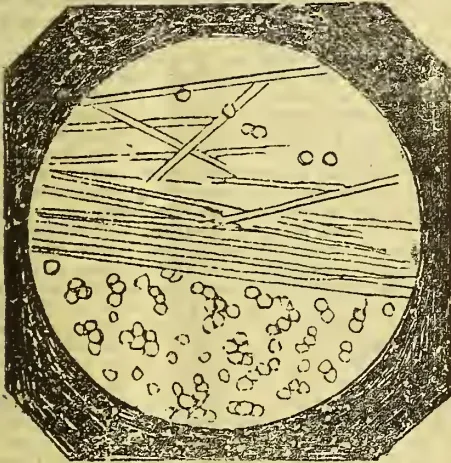

Fig. 2.

A hundred of the grubs are laid close together on a flat earthen dish covered with damp earth or sand.

They are then sprinkled one by one with these spores and the dish is covered with a plank on which there is damp moss. After about six hours the grubs become infected—they are then buried in a flower pot, and in about 15 days they will all be found dead, they will then present an appearance as shown in fig. 3, and will have assumed a light rose color.

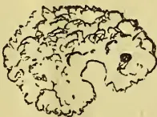

Fig. 3.

In about a month after they present an outward appearance like the fig. below, 4.

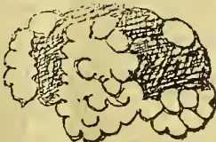

Fig. 4.

Fourteen days later on they take the form shown by figure 5.

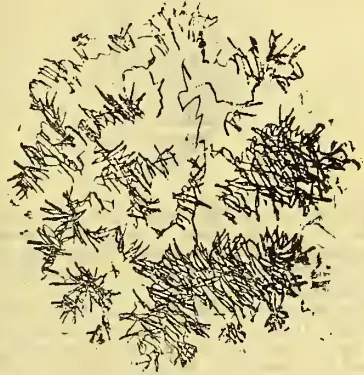

Fig. 5.

It can be easily conceived that the grubs (oerets) thus surrounded on all sides by poisoned spores—from which the blight plant itself derives its origin, the poison being buried right and left near the trees, cause the remaining still healthy grubs and beetles, which burrow in the ground, to come into contact with the infected remains of others, become diseased and die, and help to renew new the infecting poison, and to spread the deadly disease more and more in all directions.

It should moreover be remembered that besides the wind and the rain the digging up or ploughing of the soil is naturally a great help in disseminating the poisoning blight plant.

When 100 grubs can be successfully infected with a tube of *Botrytis Tenella*—95 of them are buried in the soil about a foot deep. The remaining five infected insects are placed with some hundreds of healthy specimens in close contact in an earthen pot—the newly infected insects are buried in the soil, retaining some of them, for the purpose of communicating the infection to others—which in their turn are to be put out into the ground.

The infection germs can be cultivated in other ways namely by strewing the *Botrytis Tenella* on boiled potatoes mixed with glycerine. This preparation should be placed in different parts of the ground. The grubs and beetles which come into contact with it will become infected.

As all experiments are subject to failure I cannot sufficiently urge on the planters the necessity for perseverance, and for their not giving up the efforts in consequence of failure at first.

What has succeeded at Pagilaran may well be brought to pass elsewhere.

Since the Académie des Sciences at Paris has interested itself in the matter, and as the German Agricultural Journals have declared that on ploughing an infected field the grubs (oerets) were found dead in thousands, it seems to me that in this matter science goes hand in hand with practice.

I could here produce a translation of letters by way of attestation to the importance of this subject, for example:—

From Monsieur de Bassoreille dated 21st Sept. 1891.

From the same, Bellevue, 15th Jan. 1892.

From Monsieur Devane, dated La Bozoche, 19th Nov. 1891.

From Monsieur Tribondeau élève diplômé of Grand-Jonau, dated 13th Nov. 1891.

To infect the beetles, they are put into a box in which air, holes are pierced and powdered with the *Botrytis Tenella*.

At the expiration of 10 days the blight begins to show, and they assume an appearance like that shown in the figure 6. Buried in the ground they help to disseminate the poison.

285------------------------------------------------

260THE TROPICAL AGRICULTURIST.[OCT. 1, 1892.]

Fig. 6.

It is an undoubted fact that the *urets* are the origin of an enormous extent of damage in the Government coffee plantation. Consequent on bad upkeep, nothing has been done to cause the destruction of this insect. In 1884 a Controller in the public service informed me that in the eastern extremity of Java, a vast extent of coffee plantations had been "written off," in consequence of the injury caused by these larvae. In the residences of Pekoloogan, Tegal and Cheribon I could point out a great number of such abandoned coffee plantations. Are the Government coffee harvests not greatly diminished?

Seeing that the Académie des Sciences of Paris has attracted attention to the damage caused to agriculture by this insect, and that numerous foreign agricultural periodicals have for some time past been publishing articles devoted to this subject, it is to be hoped that the rulers of Java will invite the Director of the Experimental Garden and Laboratory at Buitenzorg to institute an elaborate research into the nature of the *Botrytis Tenella* and its properties.

Should the proposed remedy be found effective it becomes not only the interest of the governing powers to have the whole question thoroughly examined, but by acting with promptitude in the matter much good may be done to Indian cultivation.

The Hague, June 1892. (Signed) H. J. PRINS.

[The exemption in Ceylon of tea from attacks of grubs, so fatal in former days to coffee, is remarkable. We have seen dense swarms of cockchafer beetles on a coffee estate,—by striking a eucalyptus with a stick we have dislodged dozens from the stem, and we know as a fact of millions having been captured and killed on one property, while coffee was the culture. Now that tea has been substituted the sight of a beetle on this estate is as rare as that of a black swan.—Ed. T.A.]

## AGRICULTURE.

### MANURES AND MANURING.

#### II.

It must not be supposed that the remarks I intend making on this very large and important branch of Agricultural Science are *ex-cathedra*. Manuring is a very interesting and a very difficult subject and I, unfortunately for me, not having received a technical training can speak only as a practical and enthusiastic agriculturist, who by the aid of much thought and observation is trying to apply the principles of Agricultural Science to his daily duties.

In drawing attention to the communication on a substitute for cattle manure, you speak of application in holes. I thought this form of application was out of date now, and that the scientific and more beneficial plan of spreading the particles of manure over the soil and forking it in, was generally practised. The objections to manure holes are that the benefit of the manure is limited and the holes become one mass of rotlets, which of course is cut at the next application. The better plan will be to sprinkle the manure over the soil, leaving a clear space of about 15 or 18 inches round the bushes, and to fork it in with mamoty-shaped 3-pronged forks. In practice it will be found that this system is not more expensive than cutting holes and filling them up again, while for efficiency the

two systems cannot be mentioned together. It may be asked why I mention mamoty-shaped forks especially. Because I have seen, and read in the discussion in your columns on forking for tea, the evils of long pronged shovel-shaped forks in the hands of careless and ignorant coolies. They are driven deep into the soil near the bushes and levered towards them in such a way as to all but root them out. No wonder a tea planter finds his bushes "shut up" for a considerable period after deep forking. It may be said that on many estates the lie is too steep for forking. It is well-known that wash is less on a free than on a stiff soil, and surely soil that is subjected to the battering effect of frequent showers of rain, aggravated by the action of coolies' feet once a week or ten days when it is in a moist and sticky state, will be all the better for letting sun and air into it. If some consider it essential to bury the manure in the soil, I found very satisfactory results in coffee cultivation follow the application of manure in shallow depressions formed round the bushes by scraping away with small 3 or 4 pronged forks, the soil round the stem to a distance of 18 inches or 2 feet. If the coolies are taught to be always facing the bushes during the operation of scraping away the soil, the primary roots will be combed out and not broken, and the shock to the bushes will be slight.

To connection with the frequent stirring of the soil, perhaps you have not forgotten that I carried on a rather acrimonious (I say it with regret) discussion on this subject with a veteran Coconut Planter. The position I took in it was, that those who advocate and recommend it where perennials occupy the ground, showed a blind adherence to the teachings of Agricultural Science, which they adopted without modification or extension as circumstances required. That if by the breaking up of the soil and the comminution of its particles they were rendered soluble and available as plant food, then it was opposed to reason to disturb the roots, the mouths of a tree, just as they were beginning to feed on the food rendered available by the process of stirring the soil. It was particularly gratifying to me to find the views I enunciated on this subject confirmed in the "General Items" of the last issue of the "Magazine of the School of Agriculture." "It is certainly opposed to commonsense to suppose that the annual destruction or mutilation of the effective feeding roots of a tree should promote its health and luxuriance; on the contrary it is calculated to effect serious injury." Under these circumstances a careful planter will hesitate breaking the feeding roots of his tea bushes by annual forking in addition to the mutilation the bushes suffer by the hacking they undergo and which is dignified by the name of pruning. I may mention *en passant* that I was always inclined to the belief that the cutting of manure holes with mamoties had a great deal to do with the hold leaf disease had on the coffee bushes thus suffered. How then it may be asked can the manuring of tea estates be carried on without mutilation of the rootlets? This is an impossibility, but the operation of manuring can be so carried on as to cause a minimum of injury to the feeding roots. The system I practice even with so hardy a tree as the coconut is, to dig manure one year in the space between four trees, the next year in the space between the trees across the line of coconuts and in the year following in the space along the line of coconuts. By this means all the feeding roots are never disturbed during any one operation, the whole surface of the ground is stirred and manured though not at the same time, the shock to the tree is lessened and the effect of the manuring is increased. If any one will take the trouble to sprinkle manure between every four of his tea bushes and fork it in with mamoty-shaped forks, he will find the cost about a fourth of cutting manure holes and covering them up again.

Though not a tea planter myself, I carefully follow everything connected with its cultivation as bearing on Agriculture. I read with interest the experience of planters that manuring gave them a weak tea. Tea and tea alone surely cannot be an exception to the rule that manuring improves and does not deteriorate

286------------------------------------------------

OCT. 1, 1892.]THE TROPICAL AGRICULTURIST.261

the quality of any product to which it is applied. I believe that if planters carefully taste their tea, they will find the flavor and quality improved a few months after manuring. I wish now to propound a theory accounting for the liquor from tea that has been recently manured being weak and flavorless. It may or may not be supported by the investigations of Science. One of the first results of manuring is an abnormal activity of growth resulting in heavy flushes. It is reasonable to suppose that in these flushes the sap, or in other words the constituents of tea, are found in an attenuated form and not concentrated as when the flush is normal. Is it not a fact that the tea made from the first few flushes after pruning when the growth is abnormal, is weak? Is not the tea made during the wet months of June-July invariably condemned as inferior in the Lame? Wasn't there a big outcry against the tea made during the excessively wet months of last year? I am strongly inclined to think that these experiences support my theory that anything that tends to diffuse the sap, prejudicially affects the quality of the tea.

The practical lesson to be deduced from this is, that a stimulating manure is unsuited for tea if the object of the planter is quality and not quantity. Practical experience will show whether the active properties of Guano will be checked by a large admixture of vegetable matter in the shape of fibre dust. I am inclined to the opinion that it will. If it be not, any suitable manure to be composed with it can be used. Vegetable matter decaying in soils is an absolute necessity for the healthy growth of vegetation, more especially in a clayey soil. For a "humus through its decay in the soil furnishes carbonic acid among other solvent agents, and this carbonic acid plays an important part by bringing the native" insoluble stock of plant food within easy reach. "Soluble plant food added to the soil in commercial fertilizers, needs the help of humus, finally, for its solution." "Plant food in most animal and vegetable residues used as manures, costs much less than commercial manures." This is a powerful plea for fibre refuse which through its decay in the soil if forked in will render soluble the large quantities of potash that clayey soils contain, not to speak of their other constituents. As a slow acting manure it will be interesting to have the results of the experiment on Mariawatte with the shoddy manure Mr. Hughes recommended. B.

#### TEA AND COFFEE AT MERGUI.

The following are extracts from Mr. Ingram's Report on the experimental garden at Mergui for 1891-2:—Two small plots for planting Liberian coffee were cleared in the dry season and will be planted up during this rains. The number of Liberian coffee plants at the beginning and close of the year are shown below:—At beginning of the year 3,353. At close of the year 3,338. Decrease 15 due to two deaths among the larger plants and 13 among the smaller ones. The plants were again attacked by the leaf-disease of last year. As the dry season advanced the plants gradually recovered and shook themselves free of the disease, but it appeared again when the rains had properly set in. The result of two years' disease is seen in the very poor condition of the plants and in the crop, which was the smallest collected since 1887. The coffee crop collected during the year amounted to 47.45 viss. This together, with the balance from last year, 31.70 viss were all but 6.32 viss disposed of during the year. As there seems no likelihood of sanction being accorded to coffee being grown experimentally on a large scale (of 20 or 30 acres), the experiment with this species may be considered as closed, and the future usefulness of the small coffee plot in the Mergui garden will lie in its being used as a source of supply for seedlings and seed for free distribution or for sale.

The number of tea plants was reduced to 69. They were removed during the year to another situation on lower ground and near the stream. Since their re-

moval the plants have brightened up and are now looking healthy if still somewhat scraggy.

With reference to the foregoing remarks about Coffee the *Rangoon Times* says:—There is an inference in this that, if permission were granted to cultivate coffee on a large scale, it would be profitable to continue the experiment. The experiment with Liberian coffee has practically failed, and the failure cannot but have the effect of impressing the people with the belief that it would not be profitable for them to invest their money in the industry, and it must, also, make European planters timid of undertaking the cultivation of coffee in Burma. Would it not, then, have been wise to continue the experiment on a larger scale, especially as the Forest Officer in charge of the garden would appear to think that it is justifiable. The failure was occasioned by the plants being attacked with leaf disease, but that surely is not sufficient reason for throwing up the experiment and discouraging those who may be inclined to turn their attention to the cultivation of coffee.—*M. Mail*.

#### INDIAN PATENTS.

Applications in respect of the undermentioned inventions have been filed:—Andrew Charles Guy Thompson, Engineer and Tea Planter, Saggooten, Nowgong, Assam, for "cultivating the ground between rows of plants, especially between tea plants or bushes and currant, gooseberry, and such like plants." Montfort Chamney, Tea Planter, Nowgong, Assam, for "the Disintegrating, sifting and oxygenising of tea leaf, after the process known in tea manufacture as Rolling."—*Bombay Gazette*, Aug. 31.

INDIAN AND CEYLON TEAS AND PRICES.—In glancing over Messrs. Stenning, Irskipp & Co.'s Tea Report of 11th Aug. our eye has been arrested by average prices for the teas of some Indian estates or companies, compared with which Ceylon teas are nowhere. The generality of Indian prices are no better than the present low prices for our own product, but then while the highest price quoted for Ceylon is only 11½d per lb., we have Assam teas selling 48 packages at 2/3¾; 204 at 2/2; and 595 at 1/2½. Why is it that Ceylon now shows nothing like such figures? We should be glad to have an answer to the question, so that, if possible, the position of our staple product may be redeemed.

CHECK ON COFFEE PLANTING IN SELANGOR.—The collector of Land Revenue at Kuala Lumpur calls attention to his having recently received complaints from various planters who hold their land under the Land Regulations, 1882, respecting the cutting of timber on their estates by the holders of ordinary timber passes. It was formerly held that special permission was required for the felling of timber on alienated land in accordance with the provisions of Section 3, Sub-section 2, of the old Regulations. The Court, however, has decided otherwise. This is in his opinion a source of great inconvenience to the coffee planter, not only because it is desirable for the sake of the soil that the timber should be where it falls, but also on account of the difficulty of eradicating the brushwood which springs up immediately after the clearing of the jungle. He thinks it desirable that the Government should reserve the power to confer the right of timber felling on alienated land kept uncultivated, but that this right should be allowed to be exercised only in virtue of special permission. Coffee planting under European supervision is an industry which he finds it is most expedient to encourage, and while planters comply with the conditions of their grants they should be encouraged in every possible way. If they fail to do so, it is better to forfeit their land altogether than to punish them by allowing indiscriminate timber cutting thereon.—*Straits Times*, Aug. 24.

287------------------------------------------------

262THE TROPICAL AGRICULTURIST.[OCT. 1, 1892.]

### THE BRITISH CUSTOMS AND SMALL BREAKS OF TEA.

Our London Correspondent informs us that, having read in the last of our Overland issues received by him the letter written by the Secretary of the British Customs stating that the amalgamation of small breaks of tea would be permitted for the purpose of duty-paying, he sought further information on the subject. He appears to have satisfied himself that, although this departure from established custom had been made permissible, it was not in the least likely that the permission given would be availed of. Indeed, it is hardly conceivable that the Customs authorities could have properly understood what had been demanded of them, for we do not see that it could be within the power of the head of the great department responsible to overrule, even for the purpose of collecting duty, the stringent provisions of the Merchandise Marks Act. And it appears to us to be very certain that the object of those who first addressed the Customs on the subject could not have been solely amalgamation for the purpose of paying duty. There was an ulterior object, that of rendering it legal to put up such lots as might be constituted for duty-paying purposes in the gross at the public auctions. We have before referred to the great difficulties the handling of a number of small breaks of tea entails on those to whom they are consigned for public sale, and we can fully appreciate the desire these must feel to be relieved of a duty which must weigh heavily upon them and tend greatly to confine their business transactions. But so long as the brokers are willing to accept the dealing with such small breaks, so long, we apprehend, must they be content to put up with the inconveniences inseparable from such dealing. We have already pointed out the objections proprietors must entertain to the vending of their produce in association with that of other parties. Tea sold under such conditions could not be possessed of the advantages to be expected from the authority of well-known and favored marks. Parties purchasing would scarcely know what proportion of the lots bought by them could claim, or be possessed of, the much-valued *imprimatur* of highly reputed marks, and it is not to be doubted that for this reason both proprietors and purchasers would feel, were the proposal made carried out, that their interests had been sacrificed to suit the convenience of the brokers and Customs authorities alone. Therefore, we say, let the former of the two parties who desire to reap the benefits of the suggested innovation show a spirit of independence in the matter if they think it would be worth their while to do so. Let them notify to their constituents that they will refuse to accept the responsibility and trouble of dealing with breaks below a certain fixed standard of quantity. We have always admitted that we regard it as a mistake on the part of our planters and shippers to forward to Europe for sale the small breaks as to which complaint has arisen. And we have done so because we cannot but consider that it is inimical to their interests to do this; for it is well-known throughout the wholesale tea trade in London that, except for qualities of tea of extraordinarily fine character, these small breaks command less attention, and consequently fetch lower prices at the auction, than do breaks of more important dimensions. But, nevertheless, the practice of forwarding these small consignments continues, and probably will do so until the brokers take the step we have suggested that they should do and refuse to be troubled with them. This seems

to us to be the only practical course to be followed. Any attempt such as that indicated by the application apparently successfully made to the Customs would be sure to be resented by those whose interests, as we have pointed out, must be injuriously affected by it. And these last must be possessed of the whip-hand in the matter. No broker could be bold enough, or imprudent enough, as regards his personal interests, to include in a large break for sale consignments intrusted to him by constituents without previously seeking and obtaining permission from the last-mentioned to do so. We may be sure that this would be withheld under almost any conceivable circumstances; but even presuming that such might not in every instance be the case, it may well be asked whether the trouble and delay caused by reference to parties here would not much more than counterbalance the saving of trouble and labour which the existing system entails on the brokers. We feel assured that the permission granted by the Customs must remain, as our London Correspondent assures us will be the case, a dead letter in practice. Therefore let the brokers take the matter into their own hands if they deem it to their interest to do so; and notify to consignors that they will refuse acceptance of breaks below a certain standard. The practice complained of is an evil one in every respect, but it is not to be got rid of by any high-handed measure such as the brokers seem to have thought to be of possible adoption.

### THE ORANGE.

#### AND THE FOOD REQUIRED TO PRODUCE IT.

The latest Bulletin (No. 17) of the Florida Experiment Station gives the results of a number of analysis of oranges made during the past year. The oranges were contributed by Rev. Lyman Phelps and Mr. H. S. Williams. The bitter-sweet and sour oranges, as grown in Lake City, were also analyzed, and the following table gives the average composition of all the oranges examined:

<table border="1">
<thead>
<tr>
<th colspan="3">COMPOSITION.</th>
</tr>
<tr>
<th></th>
<th>(a)</th>
<th>(b)</th>
</tr>
</thead>
<tbody>
<tr>
<td>Moisture .. .. per cent</td>
<td>87.710</td>
<td>....</td>
</tr>
<tr>
<td>Organic Matter (exclusive of nitrogen) .. ..</td>
<td>.246</td>
<td>....</td>
</tr>
<tr>
<td>Nitrogen .. ..</td>
<td>11.124</td>
<td>....</td>
</tr>
<tr>
<td>Silica .. ..</td>
<td>.009</td>
<td>1.00</td>
</tr>
<tr>
<td>Sulphuric acid .. ..</td>
<td>.042</td>
<td>4.86</td>
</tr>
<tr>
<td>Phosphoric acid .. ..</td>
<td>.077</td>
<td>8.63</td>
</tr>
<tr>
<td>Ferric oxide .. ..</td>
<td>.006</td>
<td>0.68</td>
</tr>
<tr>
<td>Lime .. ..</td>
<td>.207</td>
<td>0.916 22.77</td>
</tr>
<tr>
<td>Magnesia .. ..</td>
<td>.045</td>
<td>5.01</td>
</tr>
<tr>
<td>Potash .. ..</td>
<td>.479</td>
<td>52.05</td>
</tr>
<tr>
<td>Soda .. ..</td>
<td>.039</td>
<td>4.26</td>
</tr>
<tr>
<td>Chlorine .. ..</td>
<td>.011</td>
<td>1.23</td>
</tr>
<tr>
<td></td>
<td>99.996</td>
<td>100.49</td>
</tr>
<tr>
<td>Less oxygen for chlorine .. ..</td>
<td>....</td>
<td>.28</td>
</tr>
<tr>
<td></td>
<td></td>
<td>100.21</td>
</tr>
</tbody>
</table>

Column (a) gives the percentage of the constituents in the fresh orange as a whole; (b) those in the pure, dry ash.

Our analyses of the ashes give sulphuric acid 3.8 to 6.8 per cent.; average, 4.86 per cent.; phosphoric acid, 7.5 to 9.8 per cent.; average, 8.6 per cent.; lime, 13 to 32 per cent.; average, 22.77 per cent.; potash, 42 to 59 per cent.; average, 52 per cent.; magnesia, 3.5 to 6.4 per cent.; average, 5 per cent.; soda, 2.8 to 5.5 per cent.; average, 4.26 per cent.

What proportions of the various constituents should an orange fertilizer contain?

Taking our average analyses as a basis, a fertilizer which is to restore to the soil the plant food removed by the orange should be composed as follows:

288------------------------------------------------

Oct. 1, 1892.]

THE TROPICAL AGRICULTURIST.

263

FERTILIZER INGREDIENTS BY WEIGHT.

<table border="1">
<thead>
<tr>
<th></th>
<th>Fla.</th>
<th>Cal.</th>
</tr>
</thead>
<tbody>
<tr>
<td>Phosphoric acid, parts by weight,</td>
<td>1.0</td>
<td>1.0</td>
</tr>
<tr>
<td>Nitrogen.....</td>
<td>1.6</td>
<td>3.4</td>
</tr>
<tr>
<td>Potash.....</td>
<td>6.0</td>
<td>4.0</td>
</tr>
<tr>
<td>Lime.....</td>
<td>2.7</td>
<td>.....</td>
</tr>
<tr>
<td>Magnesia.....</td>
<td>0.6</td>
<td>.....</td>
</tr>
<tr>
<td>Sulphuric acid...</td>
<td>0.5</td>
<td>.....</td>
</tr>
<tr>
<td>Soda.....</td>
<td>0.5</td>
<td>.....</td>
</tr>
<tr>
<td>Chlorine.....</td>
<td>0.14</td>
<td>...</td>
</tr>
<tr>
<td>Silica.....</td>
<td>0.10</td>
<td>.....</td>
</tr>
<tr>
<td>Ferric oxide.....</td>
<td>.08</td>
<td>.....</td>
</tr>
</tbody>
</table>

It is commonly accepted as true that the planter need concern himself only about the first four, all the others being, with rare exceptions, abundantly present in all soils. The rare exceptions are, perhaps, sulphuric acid and magnesia. The latter (as also lime) is always abundantly present in acid phosphate, or can be supplied in the form of gypsum or land plaster. Magnesia is rarely absent from any fertilizer, amounting sometimes to 10 per cent, or more. Silica never needs to be supplied; nor do ferric oxide, soda or chlorine; or, if they do, they are always present as incidental parts of all fertilizers, often to so great an extent as to be a nuisance. The orange draws *potash* from the soil in far larger quantity than any other constituent. This is, however, precisely that constituent which is relatively deficient in popular orange fertilizers now on sale in Florida. These fertilizers contain from 1 to 2.5 times as much phosphoric acid as potash, and 2 to 5 times as much phosphoric acid as nitrogen. Whereas according to our analyses, the orange takes from the soil 6 times as much potash and 1.6 times as much nitrogen as phosphoric acid (in case of the California orange, 4 times as much potash and 3 times as much nitrogen) That one of these three most important constituents of which the orange removes the least, the one, moreover, which is most likely to be present, and often actually is present in Florida soil in excessive abundance, namely, phosphate, is the one which these fertilizers supply in excess.

FERTILIZER INGREDIENTS BY PERCENTAGE.

A fertilizer who would return to the soil the constituents extracted by the orange, should contain about 2.7 per cent phosphoric acid, 4 per cent nitrogen, and 16 per cent of potash. These remarks have reference to old bearing trees. Our analyses are of the orange merely, not of the leaves, trunk root or twigs. The leaves and new growth extract food from the soil, but this should, by decay of leaves and burning of prunings, be returned. (In case of burning the nitrogen would be lost.)

A FERTILIZER AS IT IS.

The quantity of an excellent and popular fertilizer recommended to be applied on old bearing trees on pine land is such as would furnish yearly to each tree twenty-two to thirty-nine ounces of available, to say nothing of the insoluble, phosphoric acid; twenty-three to thirty-nine ounces of potash, and 10.5 to eighteen ounces of nitrogen. The poosphoric acid is greatly in excess of what would seem to be needed, and the nitrogen somewhat so.

The fertilization of fruit trees is a subject about which there is little accurate knowledge, and greatly needs to be studied. The formulas for orange fertilizers undoubtedly need to be revised; the quantity of potash relatively to the other constituents needs to be increased.

A FERTILIZER AS IT SHOULD BE.

A fertilizer containing something like 2.7 percent of phosphoric acid, 4 per cent, of nitrogen and 16 per cent, of potash would restore these elements to the soil in something like the relative proportions in which the orange takes them. About 12.5 pounds of this fertilizer would be enough for the production of 1,000 oranges. The orange is a large consumer of lime, and makes no inconsiderable drafts upon sulphuric acid. Those constituents should be looked after. And there doubtless are soils which would respond gratefully to an occasional application of magnesia.

In the following table is a record of the

WEIGHT AND SPECIFIC GRAVITY

of ten oranges from week to week. It shows the interesting fact that, whereas the weight of an orange constantly decreases, the specific gravity increases for a while, then afterwards falls off. This means that for a period after plucking the orange becomes more and more compact, then afterwards "loosens up," so to speak. When the first weighings were made the oranges had been plucked from the trees three to nine days. The determinations of specific gravity were made at intervals of about a week, until decay of the orange was observed to have set in. In all cases, except one, the initial specific gravity was less than unity. This case is not to be reckoned as an exception, for the reason that the orange was three weeks from the tree at the time the determination was made. In eight cases the specific gravity gradually increased during the first three to six weeks, then declined. In two cases there was a decline from the first. In six cases the increase reached a maximum of over one. In all cases there was a constantly increasing loss of weight. If these ten oranges fairly represent what usually takes place, the matter may be summed up as follows. (1). The specific gravity of a freshly pulled orange is generally less than unity; that is, it will generally rise to the surface if placed in rain or distilled water. (2). The specific gravity of a fresh orange generally increases for a while as the drying-out goes on, then decreases the maximum often exceeding unity; that is, an orange which at first would rise in water will after a few days or a week sink, than later rise.

In making up the scale for honors and medals, weight is put down at ten. In view of our record, it would be manifestly unfair to compare the weights of oranges that had been pulled from the trees different lengths of time.

WHEN ORANGES GET SOLIDEST.

We have not room for this table; but we will summarize it as follows: No specimen when freshly plucked had a specific gravity greater than one; that is, they would all float in water. After being kept twenty-eight days the Majorca turned the point and became so dense as to sink; the Jaffa in twenty-one days; the Navel in twenty-eight; the Tangerine not at all, Columbia county (large) not at all; Columbia county (small) twenty-one; Maltese Blood thirty-five; Improved Malta fourteen; Double Imperial not at all; Indian River not at all; Indian river foundling sixteen.

WEIGHT OF PEEL IN FLORIDA AND CALIFORNIA ORANGES.

Last year Professor E. W. Hilgard made an analysis of California oranges of the crop of 1891, which was published in the Pacific Rural Press of July 11, 1891. He analyzed twenty-two samples, from which we exclude three because they were coarse seedlings. The average percentage of weight of peel to the entire orange in the nineteen samples was 26.22. The Florida Experiment Station (Mr. J. J. Earle) analyzed fifteen, from which we also exclude three seedlings for the same reason. The average percentage of weight of peel in the twelve samples was 21.25.—*Florida Dispatch*.

BARK AND DRUG REPORT.

(From the *Chemist and Druggist*.)

LONDON, Aug. 25th.

CINCHONA.—Tuesday's cinchona auctions were again light, the total quantity of bark offered consisting only of:—

<table border="1">
<thead>
<tr>
<th></th>
<th>Packages.</th>
<th>Packages.</th>
</tr>
</thead>
<tbody>
<tr>
<td>Ceylon cinchona...</td>
<td>91 of which</td>
<td>819 were so'd</td>
</tr>
<tr>
<td>East Indian cinchona</td>
<td>111 "</td>
<td>84 "</td>
</tr>
<tr>
<td>Java cinchona</td>
<td>30 "</td>
<td>30 "</td>
</tr>
<tr>
<td>West African cinchona</td>
<td>40 "</td>
<td>40 "</td>
</tr>
<tr>
<td>South American Calisaya cinchona</td>
<td>435 "</td>
<td>284 "</td>
</tr>
<tr>
<td>Cuprea bark</td>
<td>3.3 "</td>
<td>— "</td>
</tr>
<tr>
<td></td>
<td>1,850</td>
<td>1,287</td>
</tr>
</tbody>
</table>

The assortment was very poor, barks of high analysis being almost entirely wanting. There was also a noteworthy paucity of East Indian barks. Holders were very firm, while on the other hand there was a good deal of competition among the manufacturers, with the result

289------------------------------------------------

264THE TROPICAL AGRICULTURIST.[Oct. 1, 1892.

that barks of fair quality realised a slight advance, while the poorer kinds remained stationary. The average unit remains 13-16ths per lb.

The following are the approximate quantities purchased by the principal buyers :-

<table border="1">
<thead>
<tr>
<th></th>
<th>Lb.</th>
</tr>
</thead>
<tbody>
<tr>
<td>Agents for the Brunswick factory</td>
<td>79,637</td>
</tr>
<tr>
<td>Agents for the Mannheim and Amsterdam works</td>
<td>40,239</td>
</tr>
<tr>
<td>Messrs. Howard &amp; Sons</td>
<td>26,684</td>
</tr>
<tr>
<td>Agents for the Frankfurt and Stuttgart works...</td>
<td>35,805</td>
</tr>
<tr>
<td>Agents for the Auerbach factory</td>
<td>30,810</td>
</tr>
<tr>
<td>Agents for French (Paris) factory</td>
<td>14,233</td>
</tr>
<tr>
<td>Agents for the American and Italian works</td>
<td>11,112</td>
</tr>
<tr>
<td>Sundry druggists</td>
<td>21,391</td>
</tr>
<tr>
<td>Total quantity sold</td>
<td>269,911</td>
</tr>
<tr>
<td>Bought in or withdrawn</td>
<td>74,440</td>
</tr>
<tr>
<td>Total quantity offered</td>
<td>344,351</td>
</tr>
</tbody>
</table>

It should be well understood that the quantity of bark purchased affords very little clue to the quantity of sulphate of quinine represented by the purchases of each firm. The following prices were paid for sound bark :-

The following are the exports of cinchona bark from Java during the years ending June 30th :-

<table border="1">
<thead>
<tr>
<th rowspan="2"></th>
<th>Private Plantations.</th>
<th>Govt. Plantations.</th>
<th>Total</th>
</tr>
<tr>
<th>Amsterdam lb.</th>
<th>Amsterdam lb.</th>
<th>Amsterdam lb.</th>
</tr>
</thead>
<tbody>
<tr>
<td>July 1, 1891 to June 30, 1892...</td>
<td>7,181,075</td>
<td>605,792</td>
<td>7,786,867</td>
</tr>
<tr>
<td>" '90</td>
<td>91...6,323,561</td>
<td>553,255</td>
<td>6,876,816</td>
</tr>
<tr>
<td>" '89</td>
<td>90...4,579,787</td>
<td>541,481</td>
<td>5,101,268</td>
</tr>
<tr>
<td>" '88</td>
<td>89...3,599,525</td>
<td>815,506</td>
<td>4,415,031</td>
</tr>
<tr>
<td>" '87</td>
<td>88...3,124,924</td>
<td>617,101</td>
<td>3,742,025</td>
</tr>
</tbody>
</table>

#### THE DUTCH MARKET.

Amsterdam, Aug. 12.

All the analyses for the cinchona-bark sales on August 25th have now been published. The manufacturing bark contains about 18½ tons sulphate of quinine, or 4.63 per cent on the average. About 1 ton contains 0.1, 2 tons 1.2, 41 tons 2.3, 117 tons 3.4, 127 tons 4.5, 60 tons 5.6, 17 tons 6.7, 20 tons 7.8, 4 tons 9.10, 1 ton 11.12, 9 tons 12.13 per cent sulphate of quinine.—*Chemist and Druggist*.

#### GENERAL NOTES.

**FRUIT GROWING IN CEYLON.**—Udapussellawa is noted for its genial climate; but Mr. Pelson of Alnwick estate has surprised us by a present of mangoes grown at an altitude of at least 4,000 feet. The orange-yellow-coloured fruits strongly resemble "Bombay" mangoes, and in one of which we partook we noticed that elevation (we suppose) had eliminated the terebinthine flavour, and there being not trace of stringiness, the flesh tasted more like that of pear or apple than mango. With the mangoes came some baking pears which when well stewed are delicious; also some excellent oranges of the ordinary kind with golden yellow skins and the loose-jacketed variety known popularly as "mandarins." With proper attention the culture of many varieties of excellent fruit ought to succeed in Ceylon, some in one of its many climates and some in others.

**FRUIT CULTURE IN TRAVANCORE.**—The *Western Star* says:—"The Simla Fruit-Culture Committee has recommended the appointment of an Inspector of orchards." Such is the telegram that appears in the *Madras Mail* of the 18th instant; and that paper had on the same day, a long leader on the subject advocating the extension of fruit culture, and giving some interesting details connected with the industry. In our articles on "Railways for Travancore" a fortnight ago, we stated that for want of railway communication "much of the chief product in Travancore in the shape of vast quantities of fruit, are so to speak, thrown away, in the absence of a convenient and appreciative market." To the cultivator of fruit-trees in Travancore and Cochin, the coconut is the only one that yields a profitable return now. In estimating the returns made by a coconut plantation, the sale of the ripe fruit, and in its prepared state as copra is not everything;

there are the cadjans made from good leaves, then the brooms made from leaves partially eaten by the destructive coconut beetle, then there is coir fibre for which there is always a great demand and lastly, the fuel yielded by the tree which is considerable in amount. A flourishing plantation on the Sea Coast will yield a clear profit of R2 a year a tree, but this is only for a few years, after which 1½ rupees a year may safely be counted upon for 50 or 60 years. The villages immediately on the sea coast give themselves up entirely to coconut cultivation, whereas the ryots in the interior, where the trees do not thrive nearly as well, plant the Mango, Jack, Plantain, Anjelly, Laurel, Sapodilla, Breadfruit, Pineapple, Cachewant, Guavas, &c. Many of the peasantry, during the fruit season exist wholly on fruit. Jack fruit, in its green state is cooked in an infinite variety of ways, and is with many a staple form of diet. We have purchased juicy pineapples in the season at a little over a pie and a half each, and a hundred Goa mangoes for 2 annas. There is no reason why, if a market were secured and communication made easy and rapid, an essential thing where a perishable commodity like fruit is concerned, that Travancore should not take a front rank as a fruit-producing centre. A form of industry that would return handsome profit is the manufacture, and exportation of the plantain fruit in its dried form. We have eaten preserved dried plantains equal to the best dried fruit of European manufacture. Careful housewives preserve the plantains in this manner in Travancore, and use it as dainty, and there appears, to us, to be every facility for the development of the enterprise; and energy and capital, are all that are needed.

**COFFEE IN BRITISH NORTH BORNEO.**—Liberian coffee was first experimented with in Silam, and during the time Mr. F. G. Callaghan, the present Resident of Labuan, presided over the district of Darvel Bay, Silam Coffee was sold and eagerly bought in the Sandakan markets. Mr. Christian's coffee estate also at Kudat, though also on a small scale, thoroughly proved the fact that Liberian coffee can grow and flourish luxuriantly in this country. Coffee estates are now being opened up in both Sandakan and Marudu Bays.—*B. N. B. Herald*.

**GRAPHITE (PLUMBAGO) AS A LUBRICANT FOR MACHINERY** is thus noticed in the *Louisiana Planter and Sugar Manufacturer* :-

The Joseph Dixon Crucible Co., which advertises its graphite goods in this journal, encloses us the subjoined letter of a correspondent to *The American Machinist*, wherein the great merit of graphite is well stated :

If engineers, machinists and millwrights in general and pipe fitters in particular knew of the good qualities of graphite, I dare say there would be ten times the demand for it. Its lubricating qualities are questioned only by the impractical, and it is this quality alone that sounds its key note, so to speak. Let me describe a few of what I consider its most important uses. As above stated, its primary object is lubrication, and it is to this fact we must credit good pipe joints and cool bearings. In making pipe cement (or as I would term it, pipe smear), it is not necessary to use the best oil or grease, as it is the graphite, and not the body in which it is suspended, that makes the mixture valuable and the joint perfect. I use the drippings from the shaft-bearings, caught in the ordinary way, and mix it with the best Tioonderoga flake graphite so that it can be applied with an ordinary sash tool.

During the past three years I have used about fifteen or twenty pounds of dry Tioonderoga flake graphite for pipe joints, cylinder heads, piston rod packing, etc.

Bolts smeared with graphite mixed as above, I have unscrewed after having been in the dampest places for upward of two years or more, proving the anti-rusting qualities of graphite. To cool hot bearings, put it on as thick as it will mix with oil.

Almost any oil or grease will answer, but don't use poor graphite.

290------------------------------------------------

OCT. 1, 1892.]THE TROPICAL AGRICULTURIST.265THE TEA ROLLER PATENT CASE.JACKSON *v.* BROWN AND THE  
COLOMBO COMMERCIAL COMPANY.

The case of Jackson *v.* Brown and the Colombo Commercial Company, in which the plaintiff alleges that defendants have embodied in their Triple Action Tea Roller certain machinery which he had patented in regard to his Excelsior Tea Roller, came on in appeal before the Chief Justice and Mr. Justice Lawrie in the Supreme Court on the 8th September. Messrs. Advocates Wendt and Sampayo appearing for the plaintiff, and Messrs. Dodwell Browne, Dornhorst, and Hermann Loos for the defence.

OPENING SPEECH OF COUNSEL.

Rising at 11.30, directly after the Judges had taken their seats, Mr. WENDT said that he might state in opening that both sides had agreed to accept a print of Mr. J. Kirby Maynard's shorthand notes of the proceedings in the Court below, and he desired to hand this print in, as it would be more handy for their lordships than MSS.

The CHIEF JUSTICE consented, so long as both parties agreed.

Adverting to the libel in the case, Mr. WENDT then said that the Court would observe that two defendants were sued, one being Mr. Brown who took out the specification of the Triple Action Roller in Ceylon; the other being the Colombo Commercial Company, who were sued as they were alleged to have done certain acts separately for which the plaintiff had a right to put in a claim. The allegation against the first defendant was that he imported into and sold in Ceylon the alleged infringements; while in regard to the Company the case was for importing, using and selling. To this action three lines of defence were given; the first being a contention that the procedure should not have been by action but by an application under the Patents Ordinance; secondly that there had been no infringement; while, thirdly, there were denials of the usefulness, utility and novelty of that which plaintiff claimed as his invention.

The CHIEF JUSTICE:—The objection to the procedure must be a legal objection, by demurrer.

Mr. WENDT said it was put in as a matter of law based on new averments of fact. The defendants objected that the plaint disclosed no cause of action—their reasons were set out—and as further matter of law on which they relied for their defence the defendants went on to say that on the 24th October 1888 (the Court would remember that the date of plaintiff's patent was 1881) His Excellency the Governor, with the advice and consent, &c. granted to the first defendant a patent for an invention for improvements in machinery for rolling tea leaf, &c. Such invention had always been known as Brown's Triple Action Tea Roller and possessed utility, so it was claimed, far superior to that designed by the plaintiff. Certain issues had also been agreed upon, as would be seen in the record. After the opening of the plaintiff's case the plaintiff himself with his witnesses were called, and, on behalf of the defendants three or four witnesses were called, and on this the learned Judge had pronounced the judgment he intended to lay before the Court that day. Of course, the most material thing in regard to the first issue raised was the specification of the plaintiff's invention, and to this he desired first to direct the attention of their lordships. He also wished to refer them to the models produced in Court, which were those introduced in the case in the lower Court.

The CHIEF JUSTICE:—Are they worked by steam? Mr. WENDT:—No; by hand, and fortunately I am strong enough to work them here. The one marked as the Excelsior was a model of the machine patented by the plaintiff which had been put in and agreed to as embodying the invention patented.

Messrs. BROWNE and DORNHORST:—No, no.

Mr. WENDT:—Well, the plaintiff said that was a model and it had certainly been put in as evidence. Now, a great deal of time was spent in the lower

Court in determining what was the "case" or "jacket" so often referred to in plaintiff's specification; the defendants submitting that it was one inside portion of the machine which plaintiff only called the "lining" of the jacket, Mr. Jackson claiming that the whole upper structure of the Roller was the "case" or "jacket." On the question of novelty; on the question of utility; in fact on every single question but the question of infringement the District Judge had found for the appellant; in fact, in one part of his judgment his reasons would have been expected to be followed by a pronouncement that the defendants had infringed the plaintiff's patent. However, it concluded by saying quite the contrary; and the District Judge, therefore, found for the plaintiff on every point but this question of infringement, and here he found that the defendant's machine was not an infringement of the plaintiff's. Now, although this was so, he would briefly refer their lordships to another machine which was introduced in the evidence led in the Court below and which had a very material bearing on the question of these two competing machines now before the Court. This was the machine known as the Standard Roller, and it was a machine which was patented in India and introduced and worked in Ceylon but not patented here. It was, therefore, open to anybody to a certain extent to adopt the principles embodied in it; not being patented in Ceylon, no infringement of it could be prosecuted in Ceylon; but what the plaintiff contended in this present action was that the defendants in their Triple Action Roller appropriated a great improvement which plaintiff made in his Excelsior machine over his old and antiquated Standard. Finding the Standard was defective in many important particulars plaintiff improved it and he patented the improvement, and this was the patent he now alleged defendants had infringed. He now claimed that the defendants could not adopt that improvement without confessing their obligation to his machine and making arrangements for obtaining his license; while if they embodied the improvement without his license they were liable for infringement. He would ask their lordships for a brief moment to look at the Standard machine and observe how much more cumbersome it looked than the Excelsior. By the side of it the Excelsior looked a model of simplicity. Now, the distinctive principles alleged to have been infringed in the case of the Excelsior machine did not appear in the Standard, that was to say, there was no motion communicated to the upper rolling surface through the case or jacket surrounding it, and the improvement effected by the Excelsior was to detach the driving mechanism from the upper rolling surface and attach it to the jacket which enclosed the upper rolling surface whereby the upper rolling surface was left free to move up and down so as to accommodate the capacity of the rolling chamber, so to speak, to the quantity of the leaf and the different stages of its rolling. There must be in every machine some means of confining the leaf; that was supplied by the case or jacket; then there must also be some means of contracting the rolling chamber and this was done in the Standard by screwing up the under table by means of a chain working on a pulley. A cooly had to stand at the top and work up the table as the tea got rolled. Another objection to the Standard was the difficulty in regard to feeding the machine with leaf. Then too, in the case of a large machine the case or jacket weighed several cwt., and as it was pushed about it had to be strengthened by metal bands to take off the friction, because it rested on the table. Another objection was that there was no ventilation for the leaf in the rolling chamber, while oil used in lubricating the machine often dropped in and damaged the leaf. These were some of the principal objections. Seeing the defects of this machine and also recognising that it was very expensive both to work and to make, Mr. Jackson patented the Excelsior which possessed advantages not only in point of cost but also in efficiency and in case of working. The main point of difference was quite clear; the upper surface was left free to

34

291------------------------------------------------

266THE TROPICAL AGRICULTURIST.[OCT. 1, 1892.]

work vertically. In the Standard it was the lower surface that had to be moved to reduce the rolling space; in the case of the Excelsior it was the upper surface which was made movable vertically in order to admit the leaf for rolling and to allow of the pressure on the leaf being regulated. Another advantage gained by the new machine was that the upper table while carried so near to the lower table as to prevent leakage of leaf yet did not touch the lower table and the immense amount of friction present in the Standard was taken away, with the result at once to be anticipated and expected that the machine was easier to drive; it took less motive power to drive it than was the case with the Standard and it was not so stiff or cumbersome, while the oil could not have access to the tea, feeding was far more easily accomplished and ventilation was secured to a much greater extent than could be done in the Standard, and there were many other advantages which it was not necessary to point out. One great improvement was that the driving machinery was taken off from the upper rolling surface and attached to the case or jacket. That improvement had been taken by the defendants and applied to the Triple Action Roller,—that was the appropriation plaintiff complained of. Passing on counsel drew attention to the Triple Action Roller, pointing out that while the case in the Triple Action was round and in the Excelsior square yet the function in each case was to hold the leaf and to confine it between the two rolling surfaces, and the one point in the Triple Action machine which justified its name over and above what appeared in the Excelsior, was the revolution of the upper rolling surface. He asked the Court to picture the machine made square instead of round and then to consider the action on the leaf. The two machines worked so as to produce the same action on the leaf.

The CHIEF JUSTICE asked if this was really the case; if the two machines had exactly the same effect on the leaf?

Mr. WENDT replied that this was so if the rotary motion of the Triple Action's upper surface was left out of consideration. Opinion was divided as to whether that in itself was an advantage; but, leaving that alone, the action was the same. Of course the machines sought to imitate the action of the human hand in rolling the leaf. Hands were used in China still and these machines were made to imitate the rolling there. The effect of these two machines was the same.

The CHIEF JUSTICE remarked that it seemed to him that the motion of the one was distinct from the other; one being rectilinear whereas the other was circular.

Mr. WENDT said this was so in the result but the motion of the two rolling surfaces by themselves was the same, namely, circular which would be demonstrated if a pencil were attached to either surface and made to mark a line on a piece of paper. In addition the defendants had provided what they claimed as an improvement, namely, rotary movement of the upper surface. The upper rolling surface was given a rotary motion on its own axis while at the same time to quote the defendants words, it had the eccentric motion imparted to it by the hollow cylinder corresponding to the jacket in the plaintiff's machine. As the plaintiff said the rotary motion of the upper rolling surface might or might not be an improvement. Let it be so; it was open to anyone to apply that rotary motion to anybody else's machine so long as permission to do so had been granted; but what the plaintiff contended in this case was that the defendants had adopted this principle of giving the eccentric motion to their rolling surfaces from the plaintiff's machine. This induced him to pause and say that the Standard was said to have been common property in Ceylon before the Excelsior was patented; but this improvement could not possibly be applied to that common property for in the Standard the upper rolling surface was kept in one position by sliding on two parallel rods. Defendants could not possibly have applied the rotary motion there-

fore, without getting the upper rolling surface free of the jacket surrounding it. In the Standard the motion was imparted to the case or jacket from the upper rolling surface while in the Excelsior and the Triple Action the principle was motion imparted to the upper rolling surface through the case or jacket, and that was the point on which they claimed that there had been an infringement. Passing on to the judgment delivered by the District Judge, counsel alluded to the fact that because certain portions of the jacket in the plaintiff's machine answered the purposes of a connecting rod, certain scientific witnesses called by defendants who had studied mechanics in the abstract declared that those parts were a connecting rod, but he submitted that the whole was a case or jacket because it confined the tea. Defendants' witnesses had said that it formed a connecting rod however, and the learned Judge appeared to have gone off on that line. Mr. WENDT then went on to refer to defendants' specification, and then, reverting to the District Judge's remarks, he said that the D. J. had stated that the motion of the plaintiff's upper rolling surface was acquired by impact whereas the defendants' rolling surface got no impact whatsoever. Plaintiff, however, contended that it received impact from the outer case by means of the bracket. Then the District Judge had said that the defendants' machine could be worked if the wooden lining was taken out. They granted that, and with their machine it was exactly the same thing; but they were only producing models and the defendants' model had been so made that it could be dissected, which was not the case with the Excelsior model, and this appeared to have impressed the Judge. Their model was made as though it was a machine for work and it was not so made that the wooden portion could be taken out. Then, too, the learned Judge said that the upper rolling surface had its rotary and its horizontal—otherwise called its eccentric—motion entirely independent of the case or jacket. If the learned Judge meant that piece of wood that might be true, but if the hollow cylinder carried the upper rolling surface it was not true, because their lordships would see that the defendants in their own specification described this upper rolling surface as having a rotary motion in addition to the eccentric motion imparted by the hollow cylinder. The fact that the machine worked without the lining had evidently impressed the District Judge, and he disregarded the rest of the evidence and said he saw with his own eyes that it could be taken off and this was not done with the Excelsior. But the Excelsior Roller would work on the same principle. And then came the part on which he desired to lay great stress, because it was the part that he had said should have been followed by a verdict for the plaintiff. Said the District Judge: "As the Excelsior was an improvement on the Standard, so the Triple Action Roller is an improvement on the Excelsior," and he added, "and is a decidedly far more efficient and satisfactory machine"—a thing he was not called upon to say. He desired to repeat this passage, for it was an important one. Plaintiff improved on the Standard by disconnecting the driving mechanism from the upper rolling surface and connecting it to the jacket. The learned Judge said that defendants had improved on their improvement.

The CHIEF JUSTICE said it seemed to him the whole question hinged on what was the jacket? It seemed to be time thrown away by arguing questions of motive power.

COUNSEL agreed; but pressed his last point. It was a principle that if he improved another man's machine that had been patented it did not entitle him to any right to the machine. If A had patented a tea roller and he discovered something that would add to its efficiency, all he could patent was the improvement he had discovered. Suppose he found A's machine might be bettered by fluting a surface, or by making the machine of some other material, he might patent his improvements so as to prevent the original patentee from adopting them, but he could not adopt A's machine for the purpose without obtaining his license.

292------------------------------------------------

OCT. 1, 1892.]THE TROPICAL AGRICULTURIST.267

Mr. Justice LAWRIE asked what cases there were in support of this assertion; but Mr. WENDT replied that this was not contested. A man could not adopt another man's patent for the purpose of bringing out his improvement. Yet, after saying the Triple Action was an improvement on the plaintiff's improvement, the learned Judge went on to give judgment in favour of the defendants. He would now like to make a short reference to some of the authorities on the subject. As he had said in opening, one had to look very closely to the specifications, as there they found what was the nature of the invention and what was patented, and, for convenience sake, if their lordships would permit him, he would refer to a text-book, namely, Johnson's Patentees' Manual, page 161, and following pages. The two cases to which he specially wished to direct attention were both cases in which the Master of the Rolls had given his opinion. One was the case of Hicks *vs.* the Safety Lighting Co. (Law Reports, 4 Chancery Division p. 670), and the other was the case of Clark *vs.* Adie (2 Appeal Cases, p. 423). In these, the remarks were directed to showing how a specification should be looked at in ascertaining what was meant by a patentee. This brought him to the specifications, and here he would suggest an adjournment for luncheon if their lordships did not object.

This was agreed to, and the Court adjourned for half-an-hour.

On resumption Mr. WENDT said there was one other case he meant to cite, namely, the action Proctor *vs.* Bennis (Law Reports, 36 Chancery Division, p. 751). He then went at some length into the plaintiff's specification, and contended that what was meant by the case was something more than the mere wooden portion to which the District Judge had restricted it. Then finally came the claim of the invention which began with a sort of disclaimer. What they considered novel and original was, first, the arrangement which was the subject of that action, and, second, the arrangement for turning over the jacket B to give ready access to the upper rolling surface. Was there any arrangement described for turning over the wooden lining simply? The words used were "turning over the jacket B." There could not be a doubt that what was intended was the whole case or jacket, as the plaintiff contended. Much had been said as to the location of the distinguishing letters in the drawings, but a careful study of the specifications showed exactly what parts were referred to. Looking at the specifications and well weighing all he had adduced, he hoped the Court would say the case or jacket was all they claimed for it, and that their principle had been adopted by the defendants, which act on their part was an infringement entitling plaintiff to a verdict on that one issue alone.

Counsel then resumed his seat, after speaking for about three hours.

#### THE REPLY.

In response, Mr. DOWELL BROWNE said he appeared with his friends Mr. Dornhorst and Mr. Loos on behalf of the defence, and they had now drifted so far away from the question of the pleadings with which his learned friend opened his case that it would be perhaps well for him to follow his latest line first, and, much as he admired the lucidity of the address which his learned friend had made to their lordships, he ventured to say that he had not touched upon the real point in the case. The plaintiff had come into the Court and by his counsel he had said he claimed a patent right which was the arrangement of transmitting motion to a certain thing in a certain way for a certain result. He did not think his learned friend had touched at all in his address on the transmission of motion, and yet when they came to look at his first claim of novelty they found these words:—"I claim an arrangement of transmitting motion to the top rolling surface through the case or jacket surrounding it, whereby the top rolling surface is left free as regards vertical movement from the mechanism operating it," and, naturally, there came to their minds five questions:—"What is the motion transmitted; what is the top rolling surface; what is the case or jacket;

what is the mechanism operating it, and what is your arrangement for transmitting that motion?" His learned friend had dealt with several of these, but he did think he had dealt with them all. He thought he might agree with him in saying that one of the largest was "What is the case or jacket," but, to determine that, they had to look into certain mechanical principles, and they had to search thoroughly into the plaintiff's specification and determine thereon as to what was the case or jacket, and what was not? Now, there was one point on which he agreed with the other side. It was: *qua* the plaintiff, the Court had to attend to his specification, but there was one point on which he disagreed with him, and that was, *qua* the defendant the court had to attend to his specification. The whole of the plaintiff's case against the defendants was a sporting action resting on one man's writing of a principle in defendant's specification. Mr. WENDT had rung the changes over and over again on the impartiality of the motion to the upper rolling surface by the cylinder surrounding it whereas it ought to have been imparting the motion to the top rolling surface of the cylinder surrounding it. He submitted he was not to be judged by what he had written, but by what he had done. If he had made a machine that infringed the plaintiff's patent it was immaterial if he wrote a word or not and if he had only written an idea of a machine, if he had not a specification for it he had not infringed his patent. Infringing was an act, and though he believed a specification might be read against a man for the purpose of prejudice to a certain extent, it would not really affect the issue, for the issue was what had he done in fact not what had he written; what had he made; not what he had designed; what had he sent to the whole country the use of which had limited the sale of Mr. Jackson's machines?

The CHIEF JUSTICE could not accept the last remark; it was, what had defendants done; had they worked up plaintiff's machine in some other shape and served it out to his disadvantage?

Mr. BROWNE agreed. Now the plaintiff had gone into this case and he must say he was amused at one of the last arguments of counsel who had said it was a question of specification and that the judge need not have gone into the evidence. Why plaintiff called witness after witness into the box and examined them as to whether the defendant's invention constituted an infringement or not defendants also called evidence on this point and when the Court came to attend to that evidence he had no doubt it would decide that the evidence of the plaintiff and his witness must be taken with a good deal of discount after the cross-examination for that adduced on behalf of the defence was indisputably of a superior character. Let them start at the point Mr. Withers did. Somewhere in the seventies the Standard machine came to Ceylon and was imported to Looecondora estate, and no patent was taken out or it. The model of the machine came into the Court bearing a lid with the inscription that it was Jackson's tea rolling machine and plaintiff stood up in the District Court and swore on his oath that he had invented the machine. Then at the Court he saw on defendants' model of the same machine "Kinmond's Patent" and he went to Looecondora and got the name plate from the machine, when it turned out that the machine was not Jackson's; it was Kinmond's with a few minor improvements made by Jackson and these improvements involved him in litigation with Kinmond which resulted in his having to get Kinmond's license; so that Mr. Jackson when he wanted to come into the Court as an inventor had to be disallowed the credit as far as that machine was concerned. The Standard was a purely rectilinear machine. Undoubtedly scientific books told them that circular motion might be always resolved into its two component parts; but the separate parts of it made two rectilinear lines. Mr. Jackson took objection to this machine, as had been stated, and so he altered his machine completely and discarded the old process. Then came the question of what was the jacket, and here the defendants claimed that the wooden lining was the jacket, in

293------------------------------------------------

268THE TROPICAL AGRICULTURIST.[OCT. 1, 1892.]

that it was entirely a separate part from the lower portion of the machine, which was the connecting rod. The under part was a part of the mechanism of the machine and was necessary for the suppression of circular into rectilinear motion. Passing on, counsel drew the attention of the Court to the fact that the model was not in accordance with the drawing of the machine, where the bow bracket did not spring from the connecting rod as in the model but from the wooden portion; while he asked the Court to remember that in the Court below the plaintiff distinctly disclaimed the transmission of any motion whatever to the top rolling surface by means of the spindle, so that his method of transmitting motion which he patented did not include that. The next point was what motion did the plaintiff give to his top-rolling surface; it was by leaving it loose and letting it lie an inert weight inside the box. There was no motion through the spindle. It was a motion of impact; the motion of a pea in a thimble; or of a dice in a box. The Excelsior was a rectilinear machine which began with a circular motion which was afterwards suppressed to rectilinear to make a circular roll. It began with a single action which resolved itself to two to go back again to one. The Triple Action on the other hand began with three and worked out a triple quotient in the end. The machines were entirely different in design and entirely different in the arrangement of transmitting motion because in the Excelsior the motion was transmitted from the side of the jacket by impact, whereas in the Triple Action it was all transmitted through the spindle. If he made a mark with any one part of the plaintiff's machine while in working the result would be a straight line; but with defendants' machine all parts would describe a circle. This he thought brought him to the end of his argument; but he should like to say a word about the skilled evidence they had brought forward; and counsel went on to refer at some length to the evidence given by Major Day and L. Browne, reading long portions of their evidence. In the course of this the question of driving and driven machinery again came up, and the CHIEF JUSTICE got in a difficulty in regard to the subject. To help in the matter he asked whether a horse in a carriage would be described as driven or driving, viewing the whole as a machine?

Mr. BROWNE replied that the horse would be the motive power, and the wheels of the carriage part of the driving machinery.

The CHIEF JUSTICE:—I am talking about the horse.

Mr. BROWNE:—Well, take a leg off the horse. (Laughter.)

The CHIEF JUSTICE further instanced a riksha man pushing a riksha backwards, and Mr. BROWNE repeated that the man would be the motive power.

The CHIEF JUSTICE, laughingly remarked that all this was very interesting; indeed, he did not know when he had been so interested before.

Mr. BROWNE replied that the case was one that if they once went into detail there was no saying where they would end. The great thing aimed at by plaintiff, he contended, was to leave his upper surface free as regarded vertical movement from the mechanism operating it. It was so settled in his specification but was not stated so in the libel. On the other hand, defendants' machine was not free in this respect, but got all its motion that way. They had adhered to Kinmond; but plaintiff had discarded Kinmond. Jackson in trying to fasten the liability of infringement on them had left out the very pith and marrow of his claim as set forth in his specification. As regarded points of law he had left these to his friend Mr. Dornhorst who would if necessary speak to them.

The CHIEF JUSTICE said he could not hear two counsel; upon which Mr. BROWNE referred the Court to the judgment in the case of *Curtis vs. Platt*, and, then briefly recapitulating his points, he gave way to Mr. WENDT who briefly replied. On the point of whether there was a case against Mr. A. Browne, counsel stated that he had admitted he was receiving a benefit from the making and selling of the

Triple Action Roller. On the other points he urged Mr. Browne had not met the case plaintiff put forward. As to the motion of the machine it did not matter if it was circular or rectilinear; if the defendants acquired motion through the case or jacket they had infringed, and he urged that they did so acquire motion and that consequently they were liable. As to the fact that their machine would work if the cylinder was removed, defendant's said their cylinder was supported by horns and gudgeons, but in removing the cylinder they did not remove these horns and gudgeons, but they were as much a part of the cylinder as the bearing. Defendants had also fought to amend their specification on the subject of the eccentric motion imparted by the cylinder. They said now it should be of the cylinder; but he contended that "by" was meant and was not improperly used. The case of *Curtis and Platt* he admitted was good law, but did not throw much light on the case.

The CHIEF JUSTICE remarked that judgment could not be given for some time, as he had to go on circuit, but he asked that the models might be sent to his house to look into them carefully with his brother Lawrie, remarking facetiously that they might induce them to alter their professions and to give up the law for engineering. The case was closed after lasting nearly five hours.

#### DECISION OF THE SUPREME COURT.

MR. JACKSON WINS.

In the Supreme Court on 13th September, judgment was given in the appeal in the Tea Roller patent case in favour of Mr. Jackson.

#### THE CHIEF JUSTICE'S VIEW.

The CHIEF JUSTICE said:—As might be expected actions of this kind for infringement of patent are of very infrequent occurrence in Ceylon, and it cannot but be a matter of consolation to us to know that whatever judgment we may arrive at is subject to appeal to the Privy Council, and if we are wrong we may be set right at the instance of either party. It is useless for us to burthen our judgment with any recital from the pleadings. The parties at the trial agreed upon the issues which the learned Judge settled as the issues between them as follows:—(1) What is the nature of the invention which it is alleged the defendant has infringed—is it the arrangement for transmitting motion to the top rolling surface through the case or jacket surrounding it? (2) Is the plaintiff the first and true inventor of that? (3) Was it new and useful? (4) Did defendants infringe it? Connected with these issues we take it that it was admitted as a fact that the plaintiff had in July 1881 obtained a patent in Ceylon for "improvement in machinery or apparatus for rolling tea leaf," and had under that patent manufactured and sold a machine or apparatus called "Jackson's Excelsior"; and it was also admitted that the second defendant had on the 4th day of October 1888 (seven years and more afterwards) obtained a patent in Ceylon of "an invention for improvements in machinery for rolling tea," and that under the patent the first defendant Company with the license and authority of the second defendant had manufactured and sold a machine or apparatus called the "Triple-action roller"; and it was with regard to this machine that it was alleged the infringement of the plaintiff's patent had taken place. The learned District Judge has given judgment for the defendant, his finding on the respective issues being, as to the second issue, that the plaintiff was the first and true inventor of the machine "Excelsior"; as to the third issue that it was a novel and useful machine; and as to that part of the first which referred to infringement, that the defendants have not infringed plaintiff's particular right to the transmitting of motion to the upper rolling surface through the case or jacket. Now as regards the first issue, it is to be observed that there is no definite finding of the learned judge as to the first part of it—

294------------------------------------------------

OCT. 1, 1892.]THE TROPICAL AGRICULTURIST.269"WHAT IS THE NATURE OF THE INVENTION?"

On it must necessarily depend all the other issues, particularly the fourth—did the defendants' machine infringe the plaintiff's patent? I take it for granted that the nature of the plaintiff's invention is, by peculiar mechanical means and contrivances developed in a machine, a manner of rolling tea is secured to be substituted for, and made to resemble tea rolled by the human hands. If this is so, then it follows that we may assume that the direct findings of the District Judge involve the further finding that that was the nature of the invention of which the plaintiff was the patentee inventor. The District Judge has, as I have said, directly found that it was a new and useful invention. He also has found, as I have said, that in the particular specified in the first issue, the defendants have not infringed the plaintiff's patent. On the fourth issue Did the defendants infringe the plaintiff's patent as a whole?—the learned District Judge has either come to no distinct finding or, if I am to treat what he has said as indicating what his finding should have been, it was, as I shall hereafter show, that the defendants' machine was an infringement of the plaintiff's patent. I do not forget that under the 20th section of the Inventions Ordinance it is provided that in suits for infringements the plaintiff shall deliver particulars of the breaches complained of in the suit, and at the trial no evidence shall be given in support of any infringement which shall not be contained in the particulars. I do not understand that an infringement occurs if one machine is made on the pattern of another, or if one part of a machine is adapted to another, unless it is as well used as such to the plaintiff's damage; it is the use of the machine as well as the making of it to which the words "particulars of infringement" must relate, the acts of making and utilizing which entitle the plaintiff to damages, and not to the particular parts only of one machine which may be pirated but not utilized. Now, although in the plaintiff's particulars he asserted that the machine which the defendants imported and sold possessed

A PECULIAR ARRANGEMENT

which his machine possessed, I cannot understand that he was thereby restricted to show only in that respect that his patent had been infringed. Therefore, besides the particular issue—Was the motion transmitted in a particular way an infringement?—there was as well the general issue stated fourthly by the District Judge—Had the defendants infringed the plaintiff's patent?—Had they made and sold a machine or machines which infringed the special privileges of the plaintiff's machine? Both in the Court below and in this Court in appeal the defendants laboured this issue and endeavoured to show that their machine was an improvement upon another machine used in India known as the "Standard" but not patented in Ceylon. It is authoritatively said "that provided the particulars of breaches give the defendants a fair idea of the case to be made against him they will be sufficient if they refer to specific claims and specify certain machines of the defendant as an infringement of those claims, and it is not necessary that they should state by reference to page and lines what portion of the specification has been infringed." I don't therefore think that either party can now treat that issue as not fairly within the pleadings; they both consented to it being raised and they both dealt with it as embracing the contest between them. Where a question arises as to the infringement of a patent, the substance and not merely the form of the invention will be looked into in a Court of Justice, and where it is shown that two machines are alike in principle and that the construction of the second machine has carried the principle into effect by substituting one mechanical equivalent for another, it will be held that that is an infringement. (*Thom v. Worthing Skating Rink Co.*, L. R. 6 Ch., D 415; *Adair v. Young* L. R. 12 Ch. 21.) I now proceed to deal with the issues as contested and found. I prefer taking the second and third issues first, inverting their arrangement in the Court below which

PUT THE CART BEFORE THE HORSE

—(2) Was the plaintiff the first and true inventor? (3) Was the invention new? The learned District Judge has found both these issues in plaintiffs favour, and I don't think we are prepared to say that finding was wrong. We may here revert to our Patent Ordinance again. In the interpretation clause (36) "the word inventor" when not used in conjunction with the word "actual" shall include the importer of an invention not publicly known or used in Ceylon: or by section 17, an invention shall be deemed "a new invention within the meaning of this Ordinance if it shall not before the time of applying for leave to file the application, have been publicly used in Ceylon." In the words of an old authority "if the invention be new in England, a patent may be granted though the thing was practised beyond the sea before, for the statute speaks of new manufactures within this realm, so that if it be new here it is within the statute, for act intended to encourage new devices useful to the kingdom and whether learned by travel or by study, it is the same thing." The machine called the "Standard" had never been patented here; the necessity for such machines must necessarily have existed only in connection with

THE TEA INDUSTRY OF VERY MODERN DAYS

and there is nothing to show that any such machine had been publicly used in Ceylon before. The "Excelsior" certainly contained principles and combinations of principles of a distinct character from, but used to produce the same effect, as in the "Standard," but novel as regards the "Excelsior" and I do not doubt that the plaintiff's patent was for a new machine in Ceylon as developed in the "Excelsior," and that he was protected by his patent in the substance of his invention as well as in the particular novelty of any portion of it, and these two issues have been properly decided in the affirmative. I may pass over the issue of utility: the fact of its being in demand for the purposes for which it is intended, may be accepted as proof of its utility. Then we come to the

ALL-IMPORTANT

first issue—what is the nature of the plaintiff's invention? I cannot answer this question, other than I have already done, viz. that by a combination of mechanical appliances and apt arrangement in a machine, amongst which is a case or jacket and two corrugated surfaces, top and bottom, acting on each other horizontally, one of which is confined within the case or jacket, the driving power being by any motive force acting upon wheels and cranks, to obtain as nearly as possible, by a machine, the result on tea leaves submitted to the machine, which is obtained in China by the manual process of passing or rolling the leaves through the palms of the human hands. One of the

PRINCIPAL NOVELTIES

which the plaintiff claims in his specification is the arrangement of transmitting motion to the top rolling surface through the case or jacket surrounding it, whereby such rolling surface is left free as regards vertical movement from the mechanism operating it; and one of the issue, perhaps the issue most strongly contested was—does the defendants' machine infringe this particular novelty? The learned District Judge has, in our opinion, fallen into error on this point more perhaps from a too literal reliance on what the scientific witnesses said rather than from the actual bearing of the evidence itself. Both Major Day and Lieut. Brown refer to the plate or band encircling the case as the connecting rod, although anything less like a rod than the bit of iron in question it would be difficult to imagine, but in the language of specialists it is easy to understand that the name is applied to it because of the function it performs, and I do not understand these witnesses to say that because this plate performs the part in mechanics which is assigned to a connecting rod, that therefore everything connected with it can only be called a connecting rod, and that it is not possible to speak of "case or jacket" as including the four-sided box from

295------------------------------------------------

270THE TROPICAL AGRICULTURIST.[Oct. 1, 1892.

lid to bottom and through which the upper rolling surface passes. The specification alludes to the case or jacket surrounding the upper-rolling surface. It could never have intended to mean only one side of the box or the top or bottom of the box. Is there anything in the specification to restrict those words to the mere wooden or metal lining of the case itself? We have no doubt upon this point; it would be idle and

CONTRARY TO COMMON-SENSE

to say that plaintiff called only one part of his case "the case," because that part was made of wood; but it is still more repugnant to common-sense to urge that the thin cylinder of metal which is inserted as a lining to the cylinder of the defendant's machine and which confines the upper rolling surface and which is movable at will, corresponds to the "case or jacket" of the plaintiff's machine. We hold against both these contentions, and we hold that what is called the "cylinder" in the defendant's machine is nothing more nor less than the "case or jacket" of the plaintiff's machine, from its top edge to the bottom, both inside and out. Then, has the defendant's machine infringed the principle upon which motion is transmitted to the upper rolling surface? After much and most anxious consideration I have come to the conclusion that it has, and that in this respect the one machine is the counterpart of the other. The gearing is the same, the cranks are the same, and the motive power thereby transmitted operates with the exception directly referred to, on the upper rolling surface in the same way. For the defendants it was contended that it did not operate in their machine through the lining of the cylinder which it was urged corresponded with the plaintiff's case or jacket. We repeat, the two things are manifestly distinct. We say the defendants' cylinder is the corresponding part to the plaintiff's case or jacket, and that in both machines linear motion is conveyed to the upper rolling surface by reason of its connection with the jacket in the one case, and with the cylinder in the other. The square sides of the rolling surface in the plaintiff's machine which are acted on by the jacket pushing them to give it motion, correspond to the circular surface of the vertical shaft in the defendants' machine which starts out of the upper rolling surface called the lid, and is acted on by the connecting bracket of the cylinder pushing the shaft from side to side or eccentrically to give the lid or upper rolling surface its motion. But if the model machines before us are to be relied on there is even not that difference between the two machines, because the rolling surface of the defendants' machine has as well a vertical shaft attached to it which passes through a bracket and embraces the jacket in the same way as the bracket embraces the cylinder of the defendants' machine, and by which motion is conveyed to the upper-rolling surface by the bracket in contact with the vertical shaft. What is the evidence of the defendants' own specification on this point? It says "The pulley connected with the 'lid' causes it to revolve inside the hollow cylinder while at the same time it has the eccentric motion imparted to it by the hollow cylinder." For "lid" read "upper rolling surface," and for "cylinder" read "case or jacket," and you have the defendants' machine described in precisely the same words as the plaintiff has specified his, and so important was this piece of evidence, and such was its

ADVERSE BEARING UPON DEFENDANTS' CONTENTION,

that one of the defendants wished to make it appear that it was a mere clerical error by which "by" had been written for "of." In this respect therefore we hold that as this particular result was novel in its application to the plaintiff's machine and was embraced and particularized in the specification of his invention, it was not competent to the defendants to appropriate it to any machine of their own. There is one difference as we have said between the action of the two machines, and it is this: that whereas the plaintiff's machine accomplishes but two surfacial motions that of the de-

fendants' has three leading to its appellation "Triple-action roller." This super-added third motion is doubtless new to the plaintiff's machine, but it cannot exist independently of it, and cannot be regarded in any other light than as an improvement or application to the plaintiff's machine, and in that respect it might be the subject of a patent right, but the defendants could not use or apply it without the license of the plaintiff. This brings us to the last issue, one of fact, upon which we are called to perform the functions of a jury. We have already said that if we take the learned District Judge's expression of opinion upon it as indicating how it should be decided, it must lead to a finding in favour of the plaintiff. This is what the learned District Judge has said—we quote from his judgment—"As the Excelsior was an improvement on the 'Standard,' so the 'Triple-action roller' is an improvement on the 'Excelsior,' and is decidedly a far more efficient and satisfactory machine." This finding of fact would necessarily lead to judgment against the defendants, for while the plaintiff had a perfect legal right to appropriate to himself and secure by patent all the novel and useful mechanical contrivances contained in the "Standard" which had never been patented here and in which no public use had been acquired; so soon as he had done so, shut the defendants out from the appropriation of the same invention, and it was not possible for the defendants to have patented a mere improvement on his (the plaintiff's) invention, independently of the plaintiff. Looking at the two machines and working them side by side, and bearing mind the identical purpose which both are intended to secure, I am unable to come to any other conclusion than that the defendants' machine is the result of an adoption of the mechanical principles and contrivances which found practical adaptation and arrangement in the plaintiff's machine varied no more than in non-essential form, but with certain improvements made by the defendants and which are practically useful only in connection with it. The plaintiff must therefore have judgment and the case must go back in order that the District Judge may deal with the prayer for accounts and for damages.

JUSTICE LAWRIE'S OPINION.

JUSTICE LAWRIE said:—I agree. The plaintiff has by his patent an exclusive right to sell tea rolling machines in which motion is transmitted to the top rolling surface through the case or jacket. The best evidence in this case proves that the case or jacket is the sides which surround the upper roller, which form a space or box into which the tea leaf is poured and which keeps the leaf together while it is being rolled between the surfaces of the two rollers. The projections which connect this case or jacket with other parts of the machine have been called by some of the witnesses a connecting rod, and in a sense that part of the projection which joins the case to the gearing is a connecting rod; but the better part of the evidence, and I think

A REASONABLE USE OF WORDS,

leads me to the conclusion that a part of the jacket is the thickened band which passes round the case or jacket and which at once serves to connect it with the gearing and to give it strength. I do not include as part of the case or jacket, the bow bracket, spindle, &c. By "through" I understand "by means of." If this meaning were attached to the words "case or jacket" there would be but little difference of opinion between the witnesses, and I think that all would agree that in the Triple-action roller the motion is transmitted to the upper roller by means of the case or jacket if case or jacket includes as much as I hold it does. The motion is not transmitted precisely at the same place or in the same way in the defendants' machine as in the plaintiff's, though I confess I agree with those witnesses who are unable to see much difference; but the exact way in which the motion is transmitted is not the question. The question is—Is the case or jacket whether

296------------------------------------------------

OCT. 1, 1892.]THE TROPICAL AGRICULTURIST.271

it be made of wood or brass or iron the structure through which the motion is transmitted in the defendants' machine?—and that question I answer in the affirmative. The rotatory motion imparted to the upper rolling surface which is not in the plaintiff's machine, is transmitted by gearing above it, but that gearing rests on and is attached to the case or jacket. The defendants lay stress on the part taken by the bow brackets, but these also rest on the case or jacket. Even if in the Triple-action roller no part of the upper-rolling surface comes in contact with the jacket in any other way than that the spindle which passes into the roller is connected to that jacket by the two bows, still this communication transmits motion to the rolling surface and in the transmission the jacket plays a necessary part. The upper rolling surface has a horizontal as well as a rotatory motion and that rotatory motion is given to it by means of the jacket. The weight of evidence proves that the two machines are

ALMOST IDENTICAL.

and this evidence is consistent with the impression which a study of the models has made on my mind.

### THE PLANTING ENTERPRISE IN THE DISTRICT OF MATALE.

A report from the Government Agent of the Central Province with no mention of the planting enterprise, is surely the closest of possible approximations to "the play of Hamlet, with the part of Hamlet omitted by special request." The omission may be due to the fact that Mr. P. A. Templer took charge of the Province late in the year. Not only is there nothing in the report on the Kandy district about the position and progress of planting, but the same silence in regard to the great enterprise of the colony marks the report on the Nuwara Eliya district. That we have information regarding the position of the planting enterprise in the district of Matale is due to Mr. Hugh Fraser, with whom tea on Bandarapolla has been such a marvellous success. We recently wrote of the district of Matale as fallen from its once pre-eminent state as a coffee producer, without having as yet retrieved its fortunes by means of tea. The description is essentially true, although Mr. Fraser shows that good progress has been made with tea, and that no district in the island has been more successful in the cultivation of cacao. The statistics for coffee place the poor old dethroned monarch in a far worse position than we imagined. To those who remember Matale, West and East, the Kelebokka Valley &c. in all their glory as coffee yielders, how melancholy must it be to contemplate the remains of a deceased potentate represented by such figures as 944 acres yielding 1,159 cwts. or at the rate of 1.23 cwt. per acre! But there are 70 acres out of the 944 young and not in bearing, 53 acres having been actually planted in 1891 by some enthusiast who believes that "there is life in the old dog yet." But, oh! we see it is not the old Arabian dog but the young Liberian. Let us hope that the 13,517 acres of tea, yielding 3,607,000 lb., and the 3,806 acres cacao yielding 6,272 cwt., are but harbingers of a time when the glories of the coffee era shall be excelled by that of "new products." Much of the district is so low in elevation that the climate is suitable for the cultivation not only of *Theobroma cacao* but of the coconut palm (*Cocos nucifera*), so frequently confounded with the chocolate shrub by people "at Home." With so many and varied resources there is no reason why Matale should not flourish, although the decree has gone forth and is made absolute, that railway extension northwards shall not start from the station in Matale town, but from Pol-

gahawela and Kurunegala. We can understand what Mr. Saxton says about gingelli, an oil-yielding plant, not flourishing on recently exhausted chena soil. But *per contra* to what he writes about paddy fields being injured by silt from estates, we have in another administration report a complaint by a native headman that since the abandonment of coffee estates, the paddy fields below them, failing to receive, as of old, welcome supplies of manure washed down from the estates, have failed to yield at their former rate. The portion of Mr. Saxton's report on the Matale district which deals with "CULTIVATION" is as follows:—

Mr. H. Fraser, of Bandarapola estate, has favoured me with the remarks below about various products.

I had sent a circular to all the planters in the district with the object of obtaining accurate figures for the Blue Book return, but my efforts did not meet with universal response, although I had promised to treat the individual returns as confidential. Mr. Fraser has been more successful, and the result of his inquiry is embodied in the statement annexed to his remarks. It contains more accurate figures than those I sent in for the Blue Book return.

As I have previously stated, a good deal more paddy land has been cultivated this year than in preceding years. I have issued several esweddun licenses, most of them for lands which have been out of cultivation for a considerable time. There are also a few applications for the restoration of more tanks, as people see the benefits derived from those already restored.

There is hardly any tea cultivated by natives, the only piece I know of being a small garden on the Elkaduwa road planted by an estate kangani.

It is impossible to say how much cacao has been planted, but there is immediate application for the seed as soon as I receive a parcel from the Peradeniya Gardens. There has been a good deal of gingelly (tala) cultivation, which is somewhat of a novelty; but the general impression is that it requires new soil, and does not give a good return on chena land recently cultivated.

The cultivation of garden produce must have declined in some places where the owners of land have been selling their properties to planters, as at Ukkuwela, Warakamura, and other places. Frequently they sell right down to the edge of their fields, leading to their paddy being covered up with silt from the new clearings.

Jak and mango and other trees are being ruthlessly cut down for estate purposes, and no one takes the trouble to replant any. I tried to get rid of a large number of jak seedlings from my own grounds, but no one thought the offer worth accepting. Mr. Fraser writes as follows:—

TEA.—Although not all equally well grown in all the divisions of the district, yet in most localities near and far apart, it has become thoroughly established, and there are well authenticated figures of yields in old coffee and chena lands, in third and fourth year of plucking, of from 450 to 750 lb. an acre.

The total area under tea, young and old, in the Revenue District of Matale, is approximately 13,517 acres, producing 3,607,346 lb., averaging 266 lb. per acre.

Deducting 1,540 acres young tea from the total area, 13,517—11,977 acres plucked, averaging 301 lb. per acre.

Six hundred and fifty-seven acres have been added during 1891 to the area under cultivation in tea, divided over all the districts, but principally in Laggala, Matale East, Matale North, and Ukkuwela.

It is quite apparent, should tea continue to be the important staple it is at present, that the Matale Districts have as long a lease of prosperity before them as any quarter of the Island.

Cacao is another product which has helped Matale to compete successfully during recent years in the struggle for existence, and there are magnificent expanses of this cultivation in several portions of the district. The area under it is approximately 3,806 acres, producing 6,272 cwt., averaging 1.65 cwt. per acre.

297------------------------------------------------

272

THE TROPICAL AGRICULTURIST.

[Oct. 1, 1892.

Deducting 726 acres young cacao from the total area, 3,806=3,080 acres, averaging 2.04 cwt. per acre.

The total quantity is about one-third of the whole annual export from the Island.

Five hundred and twenty-two acres have been added during 1891 to the previous area, principally in the Ukkwela District.

In its youth cacao, like many other useful products, requires and deserves a good deal of care and attention, and this may be one of the causes of its not being more adopted by the villagers; but seeing the troubles are not unsurmountable, that good seed is procurable at reasonable rates, occasionally given gratis from the Kachcheri, that the arts of successful cultivation are now well understood, and that good prices (R60 a cwt.) are obtainable at their doors for quite inexpensively and primitively cured produce, it is well worth the increased attention of the villagers, who invariably have, in even the poorest localities, suitable space enough for small gardens of it.

Tea they do not at all, so far as is known to me, affect. This is not I think, to be regretted; on the contrary it is well it is so.

The original expenditure necessary is in most cases prohibitory, and even when this is got over the leaf might not be well enough manufactured to keep up the reputation of Ceylon tea; and I anticipate that after a time there would be no sale for the green leaf at large factories, as their owners would soon tire of buying their own leaf mixed with that of the villagers, which would almost certainly be the case.

The villagers, however, male and female, I am glad to say, to the mutual benefit of themselves and the planters come much more readily than formerly to pluck, prune, hole, weed, and do all other estate work on the same footing, at the same rates, and same tasks as the Tamils.

I am aware of a recent instance where a rather intelligent, elderly man, owner of some cattle, proprietors of some acres of land, and shareholder in some small gardens, was most anxious to succeed a Tamil man as tappal and beef-box cooly, saying that the constant employment and regular pay which enabled the Tamil to "eat" (live) better was having a great effect on the modern Sinhalese, who have begun to appreciate the opportunity of "eating" (living) like the Tamils on estates. On some estates the Sinhalese are paid daily, weekly payments being, however, more common at a fixed rate per lb. for tea plucking, which is the fairest mode for all concerned.

They sometimes come by themselves, singly or in families, but generally they are brought by a kangany of their own class, which is an unavoidable necessity under the circumstances.

Were they not so poor they would probably be better off without kanganies, but as it is, the kanganies know them, collect them, and advance them small sums (for "selavu" or "viyadam"), which are fully repaid, not unfrequently, being so poor that they have to be advanced money the previous day to procure the meal of the following day, otherwise they are unable to come to work.

COCONUT cultivation does well in Matale, and can be profitably encouraged and extended. It is almost a native cultivation at present, but it is being adopted in suitable situations on several estates. Cotton and tobacco may be said to have become a blank for the present. There are some fine fields of tea in Matale from which heavy crops of tobacco have been taken.

COFFEE (Liberian, Arabian, and Coorg) is cultivated, but on a very reduced scale. The acreage has, however, been added to in 1891 by 53 acres.

The total area is 944 acres, yielding 1,159 cwt., averaging 1.23 cwt. per acre.

Deducting 70 acres young coffee from the total area, 944 acres = 874 acres, averaging 1.32 cwt. per acre.

The cultivation will most probably pay in suitable positions and conditions of soil at present rates.

CARDAMOMS.—This cultivation is decreasing rather than extending, all suitable land for it having been fully planted years ago. The acreage under this spice

is 671 acres, yielding 57,875 lb., averaging 86 lb. per acre.

There are 140 acres cinchona, 350 acres anatto, and 30 acres arecanuts under cultivation in various portions of Matale East.

The cultivation statistics are compiled from returns obligingly supplied by fourteen planters residing in different portions of the district.

PADDY.—The rainfall of 1891 is said to have been too much for the paddy crops. Paddy land has shared in the general depreciation of property in recent years. I am aware of a sale of 5 acres for R1,000. A dozen years ago the same land would have fetched R2,000.

TIMBER.—This is becoming a serious question in Matale, accessible places being almost denuded of large trees. A deal of money must have reached native hands by the sale of timber in recent years. Not a seed or plant is being put into the ground for future needs, and this source of income will very soon utterly fail them. They have few others to fall back upon.

GENERAL.—By this time the beneficial results of the Agri-Horticultural Shows of a few years ago, if such are to accrue, should be becoming apparent. There is undoubtedly an increased demand from outside for fruits, vegetables, fowls, and eggs, but I am not aware that the people of Matale have risen to the occasion in trying to produce either increased quantities or improved qualities to any appreciable extent.

It might be worth inexpensive experiment in the interest of the natives were good eggs and fowls occasionally distributed from the Kachcheri, gratis, for breeding purposes, and were the natives occasionally encouraged by remunerative rates to bring to the Kachcheries sample lots of their best efforts in fruit and vegetable growing and fowl rearing.

European Cultivation Statistics for the Revenue District of Matale for 1891.

<table border="1">
<thead>
<tr>
<th></th>
<th>Acreage.</th>
<th>Quantity.</th>
<th>Average.</th>
<th>Acreage not in bearing.</th>
<th>Acreage planted in 1891</th>
</tr>
</thead>
<tbody>
<tr>
<td>Tea</td>
<td>13,517</td>
<td>lb. 3,607,348</td>
<td>268</td>
<td>1,510</td>
<td>657</td>
</tr>
<tr>
<td>Cacao</td>
<td>3,506</td>
<td>cwt. 6,272</td>
<td>158</td>
<td>726</td>
<td>522</td>
</tr>
<tr>
<td>Cardamoms</td>
<td>61</td>
<td>lb. 51,875</td>
<td>86</td>
<td>—</td>
<td>—</td>
</tr>
<tr>
<td>Coffee</td>
<td>944</td>
<td>cwt. 1,169</td>
<td>123</td>
<td>70</td>
<td>73</td>
</tr>
<tr>
<td>Cinchona</td>
<td>140</td>
<td>—</td>
<td>—</td>
<td>—</td>
<td>—</td>
</tr>
<tr>
<td>Anacardus</td>
<td>350</td>
<td>nuts 4,500,000</td>
<td>150,000</td>
<td>—</td>
<td>—</td>
</tr>
<tr>
<td>Anatto</td>
<td>30</td>
<td>lb. 195,000</td>
<td>657</td>
<td>—</td>
<td>—</td>
</tr>
<tr>
<td>Tea:—</td>
<td></td>
<td></td>
<td></td>
<td></td>
<td></td>
</tr>
<tr>
<td>Total</td>
<td></td>
<td></td>
<td>Acreas. 13,517</td>
<td></td>
<td></td>
</tr>
<tr>
<td>Young</td>
<td></td>
<td></td>
<td>1,540</td>
<td></td>
<td></td>
</tr>
<tr>
<td>Plucked</td>
<td></td>
<td></td>
<td>11,977 = 301 lb. per acre.</td>
<td></td>
<td></td>
</tr>
<tr>
<td>Cacao:—</td>
<td></td>
<td></td>
<td>3,806</td>
<td></td>
<td></td>
</tr>
<tr>
<td>Total</td>
<td></td>
<td></td>
<td>726</td>
<td></td>
<td></td>
</tr>
<tr>
<td>Young</td>
<td></td>
<td></td>
<td>3,050</td>
<td>2.04 cwt per acre.</td>
<td></td>
</tr>
<tr>
<td>Picked</td>
<td></td>
<td></td>
<td>944</td>
<td></td>
<td></td>
</tr>
<tr>
<td>Coffee:—</td>
<td></td>
<td></td>
<td>70</td>
<td></td>
<td></td>
</tr>
<tr>
<td>Total</td>
<td></td>
<td></td>
<td>874 = 1.32 cwt. per acre.</td>
<td></td>
<td></td>
</tr>
<tr>
<td>Young</td>
<td></td>
<td></td>
<td></td>
<td></td>
<td></td>
</tr>
<tr>
<td>Picked</td>
<td></td>
<td></td>
<td></td>
<td></td>
<td></td>
</tr>
</tbody>
</table>

298------------------------------------------------

Oct. 1, 1892.]THE TROPICAL AGRICULTURIST.273CEYLON TEA IN AUSTRALIA.

The *Sydney Daily Telegraph* of 24th August records a little business in Ceylon teas at from 10½d to 12d; and the same paper in its issue of 27th August announces the sale of 40 chests Ceylon at 8¾d to 9d. The *Melbourne Argus* of 29th August says:—

Ceylons have had steady attention at late rates. The Custom-house statement of receipts and deliveries of tea at the bonds for the last week, together with the stocks in bond at the close of the week, is as follows:—

<table border="1">
<thead>
<tr>
<th rowspan="3"></th>
<th colspan="4">Deliveries.</th>
</tr>
<tr>
<th>Receipts</th>
<th>For Home</th>
<th>For</th>
<th>Stocks</th>
</tr>
<tr>
<th>into Bond. lb.</th>
<th>Con- sumption. lb.</th>
<th>Export. lb.</th>
<th>on Aug. 20. lb.</th>
</tr>
</thead>
<tbody>
<tr>
<td>China ...</td>
<td>3,850</td>
<td>89,978</td>
<td>46,692</td>
<td>1,797,113</td>
</tr>
<tr>
<td>India ...</td>
<td>177,944</td>
<td>6,615</td>
<td>5,389</td>
<td>187,030</td>
</tr>
<tr>
<td>Ceylon ...</td>
<td>73,202</td>
<td>12,879</td>
<td>14,563</td>
<td>159,693</td>
</tr>
<tr>
<td>Totals ...</td>
<td>254,996</td>
<td>109,472</td>
<td>66,644</td>
<td>2,143,836</td>
</tr>
</tbody>
</table>

CONSULAR REPORTS.MACAO.

Mr. H. B. Joly writes the British Consular Report on the trade of Macao for the year 1891, which Mr. Watters forwards. Mr. Joly writes:—

The year 1891 has been, so far as trade is concerned, a very uneventful one, business having continued in the same groove, presumably with some falling-off, as the export of tea and rice was below former years. As regards imports, the usual average must have been attained, as the supplies necessary for the consumption of the colony and neighbouring districts continued to arrive.

EXPORTS.

*Tea*.—Tea appears from year to year to lose ground and to feel more and more the competition from India and Ceylon. Lower prices than heretofore ruled during the last year, but none the less, no great profits seem to have been realised. Indeed, heavily handicapped as the teas exported from Macao are, not by duties here, as this colony is a free port, but by inland imports levied by the Chinese authorities, they can with difficulty hold their own, and would seem to be doomed to a heavy shrinkage. The quantity exported during 1891 amounts to about 155,000 chests, and falls short of that of 1890, so that this branch of trade, which was once the most important here, gradually becomes more and more insignificant.—*L. and C. Express*, Aug. 19th.

NOTES ON PRODUCE AND FINANCE.

*TEA PLANTING IN WYNAAD*.—A writer in the *Madras Times* takes a very favourable view of the outlook for tea planting in the Wynaad, and he winds up by saying:—"Wynaad has, unfortunately, an evil name in the London money market. So much capital was collected and squandered in the gold mania of a previous decade, that it is thought that no good thing can come out of it. But this prejudice is being gradually overcome, and we may hope to see the district rise again before long to something of its former success. New blood and new capital will again flow in, to the encouragement of the old planters who have survived the many vicissitudes of the past, and of whom the planting community of Wynaad mostly consists." He is quite right about the prejudice. The sons and daughters of Mammon, when they have a prejudice, show considerable persistency in holding on to it. That unfortunate gold business created an unfavourable impression in London, and the mention of the Wynaad even now provokes strong language in certain circles, who are quite ignorant of the fact that tea is grown there, but associate it only with mining speculation. The district will live down its bad name, no doubt, and we hope that tea will flourish and renew confidence.

*PURE TEA*.—The *Grocer* calls attention to the care taken by the Customs authorities that only pure tea is sold to grocers and the public. It says:—"If the article be not pure it is not permitted to enter into consumption in this country. Under Section 30 of the Sale of Food and Drugs Act, tea is analysed at the Custom House, so as to ensure that there is nothing in the shape of adulteration in the imports; and if the same plan were practised in regard to one or two other commodities that might be named, retailers certainly would not feel disposed to complain. We subjoin a table showing the results of the analysis of tea conducted at the London Custom House, in accordance with the statute above mentioned, during each of the last ten financial years:—

Importations represented by these samples thus disposed of.

Submitted for board's directions with following results.

<table border="1">
<thead>
<tr>
<th>Year ended March 31.</th>
<th>Samples analysed.</th>
<th>Delivered on certificate of analyst.</th>
<th>Allowed to be admitted for home use.</th>
<th>Allowed to be delivered for exportation only, but not for use as ships' stores.</th>
<th>Admission refused.</th>
</tr>
</thead>
<tbody>
<tr>
<td>1883....</td>
<td>890</td>
<td>867</td>
<td>13</td>
<td>7</td>
<td>4</td>
</tr>
<tr>
<td>1884....</td>
<td>855</td>
<td>346</td>
<td>..</td>
<td>6</td>
<td>..</td>
</tr>
<tr>
<td>1885....</td>
<td>930</td>
<td>890</td>
<td>2</td>
<td>39</td>
<td>3</td>
</tr>
<tr>
<td>1886....</td>
<td>2,348</td>
<td>2,168</td>
<td>25</td>
<td>155</td>
<td>4</td>
</tr>
<tr>
<td>1887....</td>
<td>1,701</td>
<td>1,651</td>
<td>2</td>
<td>41</td>
<td>1</td>
</tr>
<tr>
<td>1888....</td>
<td>956</td>
<td>800</td>
<td>11</td>
<td>9</td>
<td>76</td>
</tr>
<tr>
<td>1889....</td>
<td>650</td>
<td>527</td>
<td>19</td>
<td>40</td>
<td>64</td>
</tr>
<tr>
<td>1890....</td>
<td>855</td>
<td>808</td>
<td>25</td>
<td>12</td>
<td>..</td>
</tr>
<tr>
<td>1891....</td>
<td>518</td>
<td>452</td>
<td>1</td>
<td>52</td>
<td>13</td>
</tr>
<tr>
<td>1892...</td>
<td>932</td>
<td>874</td>
<td>25</td>
<td>19</td>
<td>14</td>
</tr>
</tbody>
</table>

*PLANTING IN NORTH BORNEO*.—The prospect in North Borneo seems more cheerful. Pineapples are for sale in abundance at two cents each, if anyone likes to start a pineapple jelly factory. Pepper and coffee growing by the Dyaks is receiving the attention of the Raja, who is parcelling out land in the Lundi district, where tobacco has been grown. Ten piculs of coffee grown in gardens in Sandakan and another shipment of North Borneo coffee have also been sent home. The trial shipment of ten piculs of Liberian coffee grown in gardens at the back of Sandakan and shipped by the Development Corporation has been very well reported upon in London, and valued at 93s per cwt. if properly dried. Coffee, sugar, copra, tanning material, Manilla hemp, and paddy are all products of world-wide demand and likely to afford material for export; and now a start has been made in the right direction. Cocoa, pepper, indiarubber, gambier, and other things are being tried, and experiments are been made with three descriptions of cotton—Shanghai, Sea Island received direct, and Sea Island already acclimatised in a tropical country. Of these the acclimatised Sea Island is doing the best.—*H. and C. Mail*, Aug. 26.

BRAZILIAN COFFEE.

Brazil has just broken her own record with regard to the production of coffee. The crop of the season just closed is declared to be the largest yet known. The total shipments during the twelve months, including the stocks left over at Rio and Santos on June 30, are estimated by Messrs. Alexander von Glehn & Co. at 7,530,000 bags, as compared with 6,705,200 bags for the year ended June 30, 1889—the previous largest crop on record. Favoured by the big crop and lower prices, consumption has nearly kept pace with the increased production, deliveries showing an advance of about 1,000,000 bags during the year, so that stocks in European ports at the beginning of the present month were not more than 87,285 tons, against 64,526 tons on August 1, 1891.—*Colonies and India*.

35

299------------------------------------------------

274THE TROPICAL AGRICULTURIST.[OCT. 1, 1892.INDIAN TRADE PRODUCTS.

Referring to the catalogue of the articles of Indian commerce by Dr. George Watt, Professor of Botany in Calcutta, *The Times* says:—"We have thus at last obtained an exhaustive account of the economic products of India, done with scientific accuracy and a fair amount of local knowledge, arranged in the simple alphabetical order. The task proved of too great magnitude for a single worker, and since the appearance of his third volume in 1890 Dr. Watt has had the assistance of Mr. Dntchie, director of the Botanical Department of Northern India, together with two other experts belonging to the Indian Medical Service. The leading impression left by an examination of this Encyclopædia, or, as Dr. Watt modestly terms it, Dictionary of the Economic Products of India, is the large number of valuable articles of local Indian trade which still remain to be utilised by European commerce.

"That the work has, so far as the materials permit, been done with care and completeness is attested by every volume. For example, an idea of the information given under the camellia, or tea-plant, may be formed from the fact that the mere references to the works consulted almost fill three closely-printed pages. The articles on cochineal, the cocoa-nut, coffee, and the jute plant (*corchorus*) are each of them admirable for their wideness of research and valuable for their commercial information and statistics. The elaborate notice of cotton (*gossypium*, Vol. IV.), runs to 173 pages. It clears up several obscure and disputed questions of the past, while it affords a clue to practical methods for improvement in the quality and length of the Indian staple in the future. The immense importance of this product may be estimated from the fact that the total value of the cotton trade to India works out at sixty millions sterling per annum.

"Two other articles of capital importance deal with indiarubber and indigo. The former narrates the series of experiments at acclimatizing the tree in India, and the success obtained. The notice of indigo is particularly instructive. It shows that the weak points in the present system of manufacture in Bengal are to a large extent due to ignorance of the chemistry of the substance and to unacquaintance with the chemical principles which underlie the isolation and preparation of the colouring matter. A suggestive article in the same volume, under the heading of 'Introduced Plants,' will repay careful perusal alike from its scientific and its commercial aspects. The elaborate account of flax (*linum*, Vol. V.) has a special economic value, as it deals with the old standing failure of India, while abundantly growing a linseed rich in oil, to enter the world's markets as a producer of flax-fibre. Under the collective title of narcotics is given a detailed list of the articles used in India to produce narcotism or intoxication, and the extent of the traffic in each. A reference to the separate headings will convince any person who is still unconvinced, yet open to conviction, that one of the greatest immoralities which we could perpetrate upon the Indian peoples would be to prohibit the use of the comparatively innocuous opium and to force them back on the more baneful alternative drugs. The article on the opium plant (*papaver*, Vol. VI.) has already attained the dignity of a Parliamentary paper, and was noticed in our columns last October.

"The great mercantile questions involved in the Indian sugar trade are dealt with in the most elaborate exposition which has ever yet appeared of the subject (Vol. VI., Part II.) The article traces the history of sugar in India from remote times, and narrates the various unsuccessful efforts, arranged in three separate periods to establish sugar planting as a European industry in that country. The lesson which Dr. Watt desires to convey is that those failures were not a matter of necessity, but mainly the result of a disregard of the conditions of India and of the capabilities of the native sorts of cane. Vast sums were spent in vainly trying to acclimatize exotic races of the plant, and in unwise endeavours to introduce foreign systems of cultivation and refusing unsuitable to India. This, in-

deed, is a subject in regard to which Dr. Watt's volumes are pregnant of instruction on other matters besides the manufacture of sugar. Too many of our efforts to improve the agriculture of India have been based on the false assumption that progress must come from without. Dr. Watt holds, on the other hand, that the careful cultivation of well-selected indigenous stocks would, in the case of sugar at any rate, develop a cane as rich in crystallized sugar as any that can be found in the world. The conclusion is forced on us that the acclimatizing system has had a long enough opportunity of doing what it can for India, and that a systematic survey of the existing resources of India should now be undertaken with a view to improvement of the native plants and fibres.

"Meanwhile, it is important to obtain a clear view of the effect of European competition on the Indian sugar industry. From the very elaborate statements reviewed by Dr. Watt it appears that the cheapest foreign sugars imported into India have been unable to undersell the article in common use among the people. The Indian refineries have, indeed, keenly felt the competition of foreign sugars. But the Indian cane-growers have not suffered. Owing to fall in the price of *gur*, the raw sugar used by the bulk of the people, consumption has increased and the area under the crop has largely extended. Dr. Watt estimates the value to India of her sugar industries, including the palms cultivated for this purpose, at 20 millions sterling a year, and the annual output at 2½ million tons of coarse sugar. The import from foreign countries brings up the total to three million tons. This represents a quantity of the refined article equal to more than one-half the total consumption of the continent of Europe, excluding the British Islands."—*H. and C. Mail*, Aug. 26th

ORCHID TEA.

One would not look to the *Kew Bulletin* for a hint upon French customs. But some who have been thinking themselves familiar with the ways of Gaul may be surprised to learn from that recondite periodical that a tea of orchid leaves has long been popular across the Channel. There is record of it fifty years ago as a beverage fairly well established, and of late consumption has increased. The sagacious and enterprising people of this country are always glad to hear of something new for the tea-table, and acquaintance with this boon should not be confined to the readers of the *Kew Bulletin*—a peculiarly estimable class, but limited. The mere name of orchid tea has something lordly and impressive in its sound. We fancy a millionaire consigning plants worth their weight in gold to the housekeeper's room, there to be stowed and served up for royal guests. It seems a revival of the luxury of old Rome. Vitellius should have drunk Orchid Tea at his feasts. Cleopatra should have dissolved her pearl therein. It is a theme for the invective of those guileless moralists who denounce the unparalleled extravagance of the Upper Classes.

Looking more closely, however, we fail to see anything really wicked in the fashion of orchid tea. The article is genuine enough. It is not compounded of some homely weed which botanists alone identify as akin to the gorgeous Cattleyas and the stately Dendrobates of the Tropics. The orchid from which this tea is made is a member of one of the handsomest and most expensive families—the *Angraecum*,—and a very pretty member too. It grows in the forests of Bourbon and Mauritius and the scientific know it as *Angraecum fragrans*. Probably the natives have been using it for ages. Incidentally we may remark that those who fear the extermination of the nobler orchids may find solace here. If a small species, occupying a very narrow area, of which flowers and leaves alike are eagerly stripped, can hold its own for generations, there is not much cause to dread that the most ruthless of collectors can do worse than retard for a little while the increase of more showy species which are quite as prolific.

The commercial virtue of *Angraecum fragrans* lies in the strong perfume of its leaves. The genus is allied to vanilla—also an orchid, of course

300------------------------------------------------

OCT. 1, 1892.]THE TROPICAL AGRICULTURIST.275

—and in this instance the kinship displays itself. It is enough, we read, “to touch the fresh leaves for the fingers to remain impregnated with the aroma,” which remains when the leaves are dried. This process is as simple as could be, apparently. No heat is applied, no colouring matter. Describing samples at Kew, the *Bulletin* observes that they are unshrivelled and as “flat as we should find them in any herbarium.” And the decoction is equally simple. You just lay the leaves and stalks in cold water, about one gramme to a tea-cup—more or less according to taste—close the vessel tight and boil for ten minutes. It may be sweetened; milk and rum bring out the flavour of the vanilla more strongly. It is as good cold as hot and may be warmed up without deterioration. Finally, we are told that material enough for fifty cups is sold in Paris for 2 fr. 50c., 105 cups 5 fr. It is called Faham, as in Mauritius.

The uses of orchids make an interesting theme for speculation. The list of those identified by European science is strangely brief at present. No large family of plants has so few members which serve a visible purpose; and if we regard the question proportionately this uselessness becomes far more striking. Not fewer than 10,000 species of orchids are known among which only twenty at the outside are credited with any virtue besides beauty. Some people hold in truth that this is all-sufficient. The enthusiast who thanked God—prematurely—that “those fiends the hybridizers” could do nothing with orchids, would ask no other merit. But a larger view may tempt one to suspect that flowers so conspicuous, so fitted in every way to draw attention, have more significance in nature’s scheme. It is to be observed that Europe was not so much as acquainted by sight with any epiphytal orchid a hundred years ago. Sixty years ago one could count the species grown upon one’s fingers. Has any savant, chemist, or doctor made a study of these plants? We never heard of his labours. Out of three thousand species or so in cultivation have so much as a score been analyzed? It is suggestive to remark that the commonest of those which are found in the Temperate Zone—our field varieties of *orchis*—are highly esteemed from the Atlantic to the Pacific; more than that, the root of a North American species, one of the *Habenaria*, which proves to have very nearly the same constituents, was and is equally esteemed among the Indians. Our own forefathers reckoned *Orchis mascula* as one of their most important drugs. We have forgotten it; but from Poland to the Bosphorus, and again to the China Seas, it is still a panacea. Those who have visited Constantinople do not forget the droning cry “Saleep—saleep!” which pedlars of that milky substance raise the whole day through. If, discarding the tropic species, we take those plants of which our forefathers learned the use during countless generations, the great orchid family holds its own with any of them. We have reason to believe that the natives of India, and more especially of Africa and tropical America, could tell our scientific men some properties of orchids which would astonish them. But no one asks; perhaps he would not learn much if he did. There are so many ugly secrets in native medicine that the professors do not willingly communicate their lore.

Orchid tea is not accredited with vigorous properties of any kind. In Mauritius and Bourbon they esteem it as a digestive, and it is prescribed in diseases of the organs of respiration. Vanilla has the same merit in a higher degree, and many more. It is one of the most powerful restoratives known in cases of weakened vitality, when a large dose is given. South America in general shows a much slighter tendency to madness than any of the countries which may be called civilized. Statistical authorities attribute this fact to the ignorance and thoughtlessness of the population, but they themselves give the credit to vanilla. At the first sign of mental disturbance they ply the sufferer therewith. We are afraid to daunt the reader with a string of squippadian names if we go further into a most interesting subject, the importance of which will be recognized one day. But for that consideration it

would be easy to name the species of orchid which are admitted to the pharmacopoeia, though rarely, if ever, used in Europe. It would occupy but little space. Briefly, however, to cite the most conspicuous, a *Goodyera* is used in cases of scrofula, an *Epipactis* for inflammation of the joints, a *Gymnadenia* for dysentery, an *Arethusa* for toothache, a *Cypripedium* (American) for spasms. We venture to predict that when, if ever, the medical uses of orchids are investigated, this list will be prolonged indefinitely. And the additions will be startling.—*St. James’s Budget* Aug. 26.

#### TEA—COFFEE—CHICORY—TOBACCO IMPORTED TO THE UNITED KINGDOM.

The Commissioners of Customs present a report for the past financial year which is satisfactory, if not indicative of exuberant national prosperity. The gross receipts for 1891-2 show an increase of £343,257, which might have been accounted considerable had not public opinion been habituated to leaps and bounds in revenue. Of late, however, British trade has manifestly not been in a condition to justify anticipations of indefinite fiscal expansion. The wonder rather, is after the melancholy tone adopted by many representatives of national industry, that the country has been able to consume goods liable to duty to the enormous amount implied in the receipt by the Custom-house of more than twenty million sterling. To a certain extent, no doubt, the payment in a particular year of vast sums in Customs does not prove the existence of the industrial activity which means that the kingdom is maintaining its ancient rank in the world. Men will not consent to starve, so long as they have a reserve of savings. Though British trade were afflicted with sudden decrepitude, the gross receipts of the Custom-house would continue for some time to be large. At present it is possible that the working classes, which contribute very much to the revenue from Customs as from Excise, may, out of their wages, have kept it at a level beyond that it could have preserved had it been dependent on the profits of capital. Wages are slower to feel the effects of a dwindling commerce than capital, and might go on feeding the revenue after capital had lost not a little of its vitality. At the same time, that is merely a matter of a year or two at most. Within no long period wages could not but obey the downward impulse, if it were of a permanent and serious character. The interval has been more than enough, since lamentations for depression in trade began to be heard, for the effect to be very visible in the receipts from Customs all around. The country has a right to infer, from the testimony of the Commissioners of Her Majesty’s Customs to the persistency, and even increase, of the revenue from imports, that the spending capacity of the people cannot have as yet diminished. Practically this signifies that industry remains positively fruitful, though, it may be, not profitable at some former rate of increase.

One fact in the history of the past financial year the Commissioners mention as a reason, it seems, why the period does not call for exceptional attention which in reality distinguishes it emphatically. “No alteration,” they record, “was made in the Tariff.” Probably in not one of the thirty-five previous reports of the Department can such an assertion be found. That the statement is made now says much for the discretion of the outgoing Chancellor of the Exchequer, and much also for the simplicity to which the Tariff has been reduced. Fiscal changes which are not necessary are noxious. When publicly and commercially beneficial they are sure

301------------------------------------------------

276THE TROPICAL AGRICULTURIST.[OCT. 1, 1892.

to cause a good deal of personal inconvenience, and often hardship. If they be superfluous, the vexatiousness to individuals has no compensation. The absence recently of any clear demand for modifications arises from the thoroughness with which relief to the subject has already been granted. For a succession of Administrations the Tariff has been submitted to the severest inspection, for the discovery of imposts which trouble consumers without material advantage to the State. Gradually one after another has been eliminated till virtually none remain which the Treasury, in the absence of some sudden new breeze of prosperity could relinquish in whole or part. There are but three main sources of Customs revenue left. Tobacco yielded last year in duties £10,135,666 being more than half of the entire amount. Tea gave £3,424,830 and spirits, foreign and colonial, £4,642,638. Thus less than two millions sterling have to be put to the account of all the other items still contained in the British Tariff. The only appreciable benefit to consumers which could be derived from further concessions in Customs must come if at all from additional curtailments, or from the total abolition, of the duties on spirits, tea, and tobacco. At present it is evident that the State needs the money. If it surrendered a portion or all of the income it raises from them, or one of them it would have to recoup itself elsewhere. On a review of possible heads of taxation it is difficult to see how it could equitably choose a substitute without flagrant violation of the principle that all classes of a community are bound to aid in the pecuniary support of their Government and institutions. Unless by the payment of duties on the tobacco they smoke, and the tea and spirits they drink, the masses of the people contribute nothing from their pockets. They ought to contribute; and it is not easy to perceive how their *quota* could be more equitably assessed than by the actual distribution of the load over the heads we have named. For the general good of the nation, and, in particular, of the consumers themselves, it might be wished that the smokers and imbibers of strong liquors should consent to a transfer of the value of the duties on tea and analogous imports to the articles they favour. The impediment to the realization of that agreeable and remote prospect is that, should it ever be attained, it would only be through the acceptance by the self-denying patrons of alcohol and smoke of tea instead, which must leave the Exchequer as much at a loss as before for an alternative to its present millions from the tea drinkers.

The Commissioners do not profess to have curious or remarkable incidents to relate of the past year. Still, no Customs report can be without subjects of interest. It is a mirror at once of the world outside and of the national life. A climatic disturbance in Asia Minor a twelvemonth ago was felt in English kitchens in the shape of a dearth of sultanas. A more even temperature there has now replenished the supply. Though the Excise has gained by an increase of home-made spirit, the Custom-house sympathizes not the less with the sufferers by the famine in Russia, which has intercepted for human food the usual imports of cheap alcohol distilled from surplus grain. Similarly the Department has to lament the eruption of phylloxera into the Marne heightening the price of champagne and lessening the duty-paying imports. Of domestic phenomena reflected in the Customs statistics the chief are connected with tobacco and tea. The gross revenue from tobacco, which was never so high, exceeds that for the year before by £417,882 and 1890-1 had itself outstripped 1889-90 by £503,157. The Commissioners are informed by experts that the receipts would have been yet

more had not influenza checked consumption in the last months of the financial year. For anti-tobacconists the results are even more dismal than the figures suggest. According to the Commissioners, who speak in a congratulatory tone, the increased revenue has been drawn mainly from Western American tobacco. Being drier, it is smoked faster; so that more leaf is consumed, and less water. In tea the most observable phenomenon of the twelvemonth has been the rapid rise in the imports from Ceylon. It is forty-eight per cent, the increase being gained at the expense alike of Indian tea and of Chinese. For the first time Ceylon tea has exceeded China tea in quantity. Year by year China tea declines, and it is impossible to say where the decadence will stop. To a certain extent China planters and merchants might arrest the tendency by more care in cultivation, preparation of the leaf, and attention to European tastes. In general, though the best Chinese will always please delicate palates, the India and Ceylon kinds are certain to predominate popularly on account of their strength. To tea altogether, whatever the particular sort, the supremacy among non-alcoholic beverages is at all events destined. Once upon a time it would have appeared absurd to dispute the ascendancy of coffee; and for generations the conflict between it and tea proceeded on even terms. There is no sort of rivalry any longer; and the admirers of the elder beverage will not attempt to pretend to equality for it. They are at least entitled to remark with surprise as well as concern the periodical symptoms in successive Customs reports that it has not yet reached the bottom in its fall. For 1890-1 there was an increase in the receipt, which inspired a hope of a rally. The Commissioners were sceptical of a revival; and they have proved to be correct. Last year the revenue fell from £185,906 to £181,287. That is only double the receipt from cocoa, and but three times that from chicory. Perhaps the juxtaposition of the figures for chicory may help to explain the extraordinary disrepute of a beverage in some respects unequalled. The one real explanation is that the preparation of tea is among the easiest of culinary processes, and that coffee, though anybody might acquire the art needs intelligence. That, however, is a matter about which Commissioners of Customs have no sensibility. They betray a little human feeling for cocoa, which they express some confidence, will become, when better known for its wholesome nutritiousness, a more valuable milch cow to them than it has hitherto been. Coffee they dismiss as useless for any purposes of revenue. It is a sombre point in a document which otherwise contains not a few pleasant features.—*London Times*, Aug. 17.

#### THE AMSTERDAM CINCHONA SALES.

(Telegram from our Correspondent.)

AMSTERDAM, Thursday night.

Of about 5,100 packages Java cinchona offered here today, 3,274 packages sold (the rest being held for too high limits) at 6½s. (= 1¼d per lb.), a price which very nearly corresponds with that obtained at the London auctions of this week. The following prices were paid: Manufacturing barks, in quills, broken quills, and chips, from 8s. to 174s. (= 1¼d to 2s 1½d per lb.); ditto root, from 18s. to 35s. (= 3¼d to 6½d per lb.). Druggists' barks, in quills, broken quills, and chips, from 5s. to 35s. (= 1d to 3½d per lb.); and ditto root 13s. to 19s. (= 1¼d to 3½d per lb.). The principal buyers were the Brunswick works, the Auerbach works, and the Amsterdam factory.—*Chemist and Druggist*, Aug. 26.

302------------------------------------------------

OCT. 1, 1892.]THE TROPICAL AGRICULTURIST.277INDIAN TEA COMPANIES IN 1891.

The figures in Mr. Tye's table are very interesting. The acreages in cultivation vary from 812 to nearly 10,000, the latter in the case of the great Assam Company. The yield per acre runs from 325 to 672 lb. The profit on each pound of tea varied from  $\frac{2}{3}$ d to 3d, and the dividends, where declared, from 2 $\frac{1}{2}$  to 17 per cent. Only in one case was there no profit made.

INDIAN TEA COMPANIES.

(Registered in London.)

Arranged according to area of cultivation.

RESULTS OF WORKING IN 1891.

<table border="1">
<thead>
<tr>
<th>Name of Company.</th>
<th>Capital paid up £</th>
<th>Acreage of cultivation</th>
<th>Capital per acre £</th>
<th>Yield per mature acre lb.</th>
<th>Cost of Tea per lb. d</th>
<th>Value of Tea per lb. including seed &amp;c. d</th>
<th>Profit per lb. of Tea d</th>
<th>Dividend for year. 6 per cent.</th>
</tr>
</thead>
<tbody>
<tr>
<td>aAssam Company.....</td>
<td>187,160</td>
<td>9,841</td>
<td>19</td>
<td>393</td>
<td>8<math>\frac{1}{2}</math></td>
<td>9<math>\frac{3}{8}</math></td>
<td><math>\frac{1}{2}</math></td>
<td></td>
</tr>
<tr>
<td>Land Mortgage Bank of India, Ltd.</td>
<td>364,633</td>
<td>8,393</td>
<td>43</td>
<td>325</td>
<td>8 15-16th</td>
<td>9</td>
<td>1-16th</td>
<td>nil. Profit £880</td>
</tr>
<tr>
<td>aJokai (Assam) Tea Company Ltd.</td>
<td>200,000</td>
<td>5,592</td>
<td>36</td>
<td>510</td>
<td>8<math>\frac{1}{2}</math></td>
<td>10<math>\frac{1}{2}</math></td>
<td>2<math>\frac{1}{2}</math></td>
<td>10 do</td>
</tr>
<tr>
<td>aJorehaut Do.</td>
<td>100,000</td>
<td>4,797</td>
<td>20</td>
<td>356</td>
<td>8<math>\frac{1}{2}</math></td>
<td>10<math>\frac{1}{2}</math></td>
<td>2</td>
<td>10 do</td>
</tr>
<tr>
<td>aDooars Do.</td>
<td>161,008</td>
<td>4,078</td>
<td>39</td>
<td>577</td>
<td>7</td>
<td>8<math>\frac{1}{2}</math></td>
<td>1<math>\frac{1}{2}</math></td>
<td>10 do</td>
</tr>
<tr>
<td>Assam Frontier Do.</td>
<td>220,000</td>
<td>4,000</td>
<td>55</td>
<td>672</td>
<td>8<math>\frac{1}{2}</math></td>
<td>11</td>
<td>2<math>\frac{1}{2}</math></td>
<td>7<math>\frac{1}{2}</math> do</td>
</tr>
<tr>
<td>Chargola Tea Association, Ltd.</td>
<td>153,017</td>
<td>3,113</td>
<td>49</td>
<td>610</td>
<td>6<math>\frac{1}{2}</math></td>
<td>8</td>
<td>1<math>\frac{1}{2}</math></td>
<td>8 do</td>
</tr>
<tr>
<td>Brahampootra Tea Company, Ltd.</td>
<td>114,500</td>
<td>2,968</td>
<td>38</td>
<td>586</td>
<td>6<math>\frac{3}{8}</math></td>
<td>9<math>\frac{3}{8}</math></td>
<td>3</td>
<td>17 do</td>
</tr>
<tr>
<td>aUpper Assam Do.</td>
<td>194,224</td>
<td>2,950</td>
<td>65</td>
<td>430</td>
<td>10<math>\frac{1}{2}</math></td>
<td>1/0</td>
<td>1<math>\frac{1}{2}</math></td>
<td>nil. Profit £8501</td>
</tr>
<tr>
<td>Jhauzie Tea Association, Ltd.</td>
<td>56,500</td>
<td>2,244</td>
<td>25</td>
<td>355</td>
<td>9</td>
<td>11<math>\frac{1}{2}</math></td>
<td>2<math>\frac{1}{2}</math></td>
<td>10 do</td>
</tr>
<tr>
<td>Doom Dooma Tea Company, Ltd.</td>
<td>126,440</td>
<td>2,209</td>
<td>57</td>
<td>671</td>
<td>8<math>\frac{1}{2}</math></td>
<td>10<math>\frac{1}{2}</math></td>
<td>2<math>\frac{1}{2}</math></td>
<td>10<math>\frac{1}{2}</math> do</td>
</tr>
<tr>
<td>aDarjeeling Do.</td>
<td>135,420</td>
<td>2,094</td>
<td>64</td>
<td>313</td>
<td>9<math>\frac{3}{8}</math></td>
<td>11<math>\frac{1}{2}</math></td>
<td>2<math>\frac{1}{2}</math></td>
<td>5 do</td>
</tr>
<tr>
<td>Attaree Khat Tea Do.</td>
<td>57,280</td>
<td>1,660</td>
<td>34</td>
<td>533</td>
<td>8<math>\frac{1}{2}</math></td>
<td>10<math>\frac{1}{2}</math></td>
<td>2</td>
<td>7<math>\frac{1}{2}</math> do</td>
</tr>
<tr>
<td>aLebong Tea Do.</td>
<td>82,070</td>
<td>1,546</td>
<td>53</td>
<td>379</td>
<td>10</td>
<td>1/0</td>
<td>2</td>
<td>6 do</td>
</tr>
<tr>
<td>Majuli Tea Do.</td>
<td>55,790</td>
<td>1,255</td>
<td>44</td>
<td>504</td>
<td>9<math>\frac{1}{2}</math></td>
<td>11<math>\frac{1}{2}</math></td>
<td>2</td>
<td>7 do</td>
</tr>
<tr>
<td>Borelli Tea Do.</td>
<td>73,170</td>
<td>1,126</td>
<td>69</td>
<td>672</td>
<td>8<math>\frac{1}{2}</math></td>
<td>10<math>\frac{1}{2}</math></td>
<td>1<math>\frac{1}{2}</math></td>
<td>6 do</td>
</tr>
<tr>
<td>India Tea Company of Cachar, Ltd.</td>
<td>94,060</td>
<td>1,085</td>
<td>86</td>
<td>528</td>
<td>7<math>\frac{1}{2}</math></td>
<td>10<math>\frac{1}{2}</math></td>
<td>2<math>\frac{1}{2}</math></td>
<td>6 do</td>
</tr>
<tr>
<td>Borokai Tea Company, Ltd.</td>
<td>43,560</td>
<td>1,055</td>
<td>41</td>
<td>374</td>
<td>8<math>\frac{1}{2}</math></td>
<td>11<math>\frac{1}{2}</math></td>
<td>3<math>\frac{1}{2}</math></td>
<td>10 do</td>
</tr>
<tr>
<td>Tiphook Tea Do.</td>
<td>28,000</td>
<td>1,050</td>
<td>27</td>
<td>265</td>
<td>10<math>\frac{1}{2}</math></td>
<td>9<math>\frac{1}{2}</math></td>
<td>—</td>
<td>nil do</td>
</tr>
<tr>
<td>Luigla Tea Do.</td>
<td>36,110</td>
<td>1,025</td>
<td>35</td>
<td>590</td>
<td>6<math>\frac{1}{2}</math></td>
<td>6<math>\frac{1}{2}</math></td>
<td>—</td>
<td>5 do</td>
</tr>
<tr>
<td>aLuokimpore Tea Co. of Assam, Ltd.</td>
<td>76,852</td>
<td>1,000</td>
<td>76</td>
<td>447</td>
<td>10<math>\frac{1}{2}</math></td>
<td>11<math>\frac{1}{2}</math></td>
<td>1<math>\frac{1}{2}</math></td>
<td>3 do</td>
</tr>
<tr>
<td>Chuhwa Tea Company, Ltd.</td>
<td>36,140</td>
<td>950</td>
<td>38</td>
<td>441</td>
<td>8<math>\frac{1}{2}</math></td>
<td>9<math>\frac{3}{8}</math></td>
<td>—</td>
<td>2<math>\frac{1}{2}</math> Profit £8501</td>
</tr>
<tr>
<td>Moabund Do.</td>
<td>35,007</td>
<td>920</td>
<td>38</td>
<td>467</td>
<td>1/0<math>\frac{1}{2}</math></td>
<td>1/3<math>\frac{1}{2}</math></td>
<td>3</td>
<td>10 do</td>
</tr>
<tr>
<td>British Assam Do.</td>
<td>16,720</td>
<td>888</td>
<td>20</td>
<td>550</td>
<td>8</td>
<td>9</td>
<td>1</td>
<td>7<math>\frac{1}{2}</math> do</td>
</tr>
<tr>
<td>Scottish Assam Do.</td>
<td>79,590</td>
<td>883</td>
<td>90</td>
<td>493</td>
<td>8<math>\frac{1}{2}</math></td>
<td>10<math>\frac{1}{2}</math></td>
<td>1<math>\frac{1}{2}</math></td>
<td>4 do</td>
</tr>
<tr>
<td>Dejoo Do.</td>
<td>43,580</td>
<td>862</td>
<td>50</td>
<td>650</td>
<td>8<math>\frac{1}{2}</math></td>
<td>9<math>\frac{1}{2}</math></td>
<td>1<math>\frac{1}{2}</math></td>
<td>5<math>\frac{1}{2}</math> do</td>
</tr>
<tr>
<td>Nonoi Do.</td>
<td>29,020</td>
<td>814</td>
<td>35</td>
<td>475</td>
<td>8</td>
<td>9<math>\frac{1}{2}</math></td>
<td>1<math>\frac{1}{2}</math></td>
<td>7 do</td>
</tr>
<tr>
<td>Shumshernugger Do.</td>
<td>21,100</td>
<td>812</td>
<td>26</td>
<td>540</td>
<td>7</td>
<td>8<math>\frac{1}{2}</math></td>
<td>1<math>\frac{1}{2}</math></td>
<td>10 do</td>
</tr>
</tbody>
</table>

a Indicates that the Company has a quotation on the Stock Exchange.

ERNEST TYE, Secy.; Indian Tea Districts' Association,

14, St Mary Axe, E. C.

August 26th, 1892.

—H. & C. Mail.

SIAM AS A SCENE OF PLANTING ENTERPRISE.

A former tobacco planter in Deli (Sumatra) writes to us as follows:—

“Singora, Siam, Aug. 4th.

“Will you kindly send me your books ‘A.L. about Tobacco’ and ‘Liberian Coffee.’ I saw a copy of the former and was exceedingly surprised to find you had compressed so much matter into so small a volume. I take the liberty of enclosing a photograph of a leaf taken from a Liberian coffee plant about 3 feet high and 10 months old, it was only transplanted May 20th, I believe the leaves are unusually large; hence my reason for sending this photo of one to you. It measures 14 $\frac{1}{2}$  x 6 $\frac{3}{4}$  inches. Will you oblige by your comments on same.

“On the hills\* in Jena there are a number of Arabian coffee plants in great vigour, giving big crops without any signs of leaf disease on a low elevation of only about a hundred and twenty feet planted by natives. The Jena hills are close to the Keddah and Singora road in about latitude N 7° 20', are well sheltered and are not subject to violent winds. The soil is a brownish yellow loam of great depth, and there are lime stone hills in the vicinity. The surveying engineers

are hard at work planning out the line of railway from Singora to Province Wellesley, Penang, from which these hills are only two or three miles distant. I have given you this information, as with the high prices of coffee and cheap Siamese labour with land ready to be given away some of your energetic planters who visited Perak last year may find it suit them far better to try the soil here.”

The photo of the big coffee leaf, which is very well taken, can be seen at our office.

A HERESY IN THE MANUFACTURE OF TEA is broached by Mr. Arthur Sinclair in a narrative of his Peruvian travels. After stating that the leaves of *Erythroxylon Coca* are plucked when well matured, dried in the sun and simply packed in bundles for use or export, he goes on to write:—“Probably tea might be treated in the same way, and its real virtues conserved in the natural vessels of the leaf till drawn out in the teapot; the fermenting and elaborate manipulation introduced by Chinamen are of doubtful utility.” If so, what needless expense have planters incurred in rollers, driers, &c. Who has tried or will try the experiment of simply drying the flush in the sun?

\* These hills run to 2,000 feet in height.

303------------------------------------------------

278THE TROPICAL AGRICULTURIST.[OCT. 1, 1892.VEGETABLE PRODUCTIONS OF KOREA.

Mr. C. W. Campbell (of H.M.'s Consular Service in China) read a paper before the Geographical Section of the British Association on Aug. 9th, at Edinbrgh. The subject was the journey undertaken by him through the northern half of Korea to the Manchurian frontier in the autumn of 1889, which has already been mentioned once or twice in our columns.

Starting from Söul, the capital of Korea, on Aug. 31st, Mr. Campbell crossed the Peninsula by a north-easterly route to Wön-san, the treaty port on the east coast. The interesting portion of this traverse was the Keum Kang San, or Diamond Mountains, which had not previously been visited by a European. They are a notably irregular section of the principal Korean range which descends from the Ch'ang-pai Shan (Ever-White Mountains) of Manchuria, are the *chef-lieu* of Korean Buddhism, and possess some striking scenery which attracts numbers of native tourists every year in spring and autumn.

From Wön-san the route followed the coast to Ham-heung and Puk-ch'öng, where it broke inland to Kap-san and the Yalu River. At Po-ch'ön, a village on a branch of the Yalu, Mr. Campbell procured guides and bearers, and continuing northwards through an uninhabited forest, made an attempt to ascend the now extinct volcano of Peik-tu San (White Head Mountain), better known as the "Long White Mountain," which is an erroneous translation of the Chinese *Ch'ang-pai Shan*, or Ever-White Mountain. It was first authentically visited in 1886 by Mr. James and his party, who approached it from the Manchurian side. Besides being the centre of much legend and fable in both Manchu and Korean history, the White Mountain is remarkable physically by reason of an Alpine lake which has formed in the extinct crater at 7,000 or 8,000 feet above sea-level. Mr. Campbell just failed to reach this lake in consequence of heavy falls of snow and the illness of his principal guide. The return journey to Söul was varied by recrossing the Peninsula to P'öng-yang. Altogether the ground covered was 1,300 miles, a good deal of which was unknown to geography.

Mr. Campbell interspersed his descriptions with some fresh observations on the economic products of the country. The following extracts bearing on the field of agriculture are interesting:—"As to the extent of land under cultivation I have no information, nor do I believe that any reliable data exist. Some rough conception, which is perhaps better than none at all, may be found by a comparison with Japan, where official investigations have furnished tolerably correct estimates of the proportion of tilled to untilled and forest land. In the Japanese islands, including Yezo, about 12 per cent of the whole area is devoted to agriculture, and Korea being almost to a certainty less widely cultivated than its more populous neighbour, we may surmise that probably not a tenth of its surface is farmed. Rice, of course, is the great food plant of Korea: there are many varieties, a remarkable one, upland rice (*Oryza montana*), which thrives without irrigation, being only occasionally met with. It is grown throughout the southern and central provinces, but in Ham-kyöng it is confined to the sea-coast, and in P'öng-yang to warm, low-lying valleys. Barley and wheat are common winter crops wherever rice can be grown, and in the mountainous regions one may see them as summer crops. Oats, however, are much more frequently cultivated in the highlands of the north. The pretty white flowers of the buckwheat (*Polygonum fagopyrum*) are met with everywhere: it is usually planted in small fields where the soil is comparatively poor or sandy. Italian millet (*Panicum italicum*), punice millet (*Panicum miliaceum*), and *su-su*, or tall millet (*Holcus sorghum*) are, after rice, the important cereals. Indeed, in the interior of Ham-kyöng and P'öng-yang Italian millet takes the place of rice in the peasant economy. Maize is not largely grown, at any rate in the centre of Korea: the peasant seldom cultivates more than a few score of plants in the garden near his hut."

"Of leguminous plants the soy-bean (*Glycine hispida*) is most prominent, and the ready market found for it in Japan tends to increase its cultivation. Kidney

beans (*Phasedus vulgaris* and *P. radiatus*?) and peas are ordinary summer growths.

"The potato is not uncommon in mountain districts, but it does not find much favour as a food. Like tobacco, it seems to have been introduced from Japan within the last three centuries. Small ponds of lotus (*Nelumbo nucifera*), grown partly for its seeds and partly for its starchy rhizomes, occur near Söul, and, I am told, in the south of Korea. The radish-turnip (*Raphanus sativus*) and "Chinese cabbage" (*Brassica chinensis*) are abundant crops everywhere. Briejal (*Solanum melongena*), garlic (*Allium sativum*), onion (*Allium cepa*), and ginger (*Zingiber officinale*) also find place in gardens, but not to such an extent as chilli (*Capsicum frutescens*), which is the condiment *par excellence* of the Korean nation. Melons (*Citrullus edulis* and *Cucumis melo* amongst others), pumpkin (*Cucurbita pepo*), cucumber (*Cucumis sativus*), and gourd (*Lagenaria vulgaris*) are cultivated universally in the centre and south, as well as in the warm valley of the north of Korea.

"The principal textile plants in their order of importance are cotton (*Gossypium herbaceum*), hemp (*Cannabis sativa*), and China-grass (*Boehmeria nivea*). Cotton is grown little or not at all above the 39th parallel, and I do not think that *Boehmeria* succeeds so far north. Hemp is the sole cloth-plant to be found in the greater part of the two northern provinces, where it flourishes exceedingly well. The progress of foreign trade, bringing with it cheap Manchurian goods, seems destined to reduce cotton cultivation to a low ebb, but the production of hemp is not so likely to decrease for that reason—at any rate, so long as hemp is used for mourning clothes.

"The white mulberry (*Morus alba*) and the paper mulberry (*Broussonetia papyrifera*) are included in the list of cultivated trees. Plantations of *morus* were established at Söul (where an old disused palace and grounds were given up for the purpose), and near Chemulpo, some years ago, by the Korean Government, acting under foreign advice, the object being the advancement of silk culture. The scheme has proved abortive, purely in consequence of lack of funds, coupled with a near-sighted opposition from officials. In no case that came under my observation was I more struck by the want of perseverance and enterprise which too frequently marks the national character. The failure was regrettable, for there was little doubt that a moderate outlay and careful management must have made these mulberry plantations a considerable benefit to the silk industry in Korea. The paper and white mulberries are generally found in hedges and gardens, singly or alternating with other shrubs, and do not occur in plantations.

"As with rice and cotton, tobacco thrives everywhere, except in the interior of Ham-kyong and P'öng-yang. The best leaf is said to come from the eastern provinces, Kang-won and Kyong-sang. According to the annals of the present dynasty\* tobacco was introduced some three centuries ago by a Korean envoy on his return from a mission to the Japanese Court. Sesame (*Sesamum indicum*), castor-bean (*Ricinus communis*), and rape (*Brassica chinensis*), are grown for the oil which is expressed from their seeds, that of sesame being considered the purest and most palatable. A knotweed (*Polygonum tinctorium*) furnishes a well-known indigo dye, for which it is cultivated. Other dye plants are safflower (*Carthamus tinctorius*) and stone-crop (*Lithospermum officinale*), used for colouring red and violet.

"Many edible fruits common to the temperate regions of the earth, and a few which are peculiar to the Far East, are widely distributed in Korea. In comparison with the European fruits they are all sadly inferior in size and flavour. Whether or not, as some say, the soil and climate of Eastern Asia is unfavourable to fruit culture—an assertion to some extent borne out by the well-known deterioration of European species which have been transplanted to China and Japan—it scarcely admits of a doubt that the woful inferiority of Korean fruits is due to the slight attention devoted to them. The trees are neither pruned nor manured, no serious endeavours are made to prevent the ravages of insects, and the improvement of species by propagating

304------------------------------------------------

OCT. 1, 1892.]

THE TROPICAL AGRICULTURIST.

279

select varieties has rarely occurred. Apples are small and acid or bitter. Pears (*Pyrus sinensis*?) are usually round, like apples, juicy and sweet, but hard and coarse. The Ham-heung pears are exceptionally good. A few that I bought on the road between Puk-ch'ing and Ham-heung were shaped like English 'William' pears and almost equalled them in flavour; they were the only evidence I noticed in the country of a fruit being improved to anything approaching a European form by selection and cultivation.

"A dwarf variety of orange grows, the Koreans say, on Quelpart Island, but not on the mainland. Grapes (*Vitis vinifera*) are small, thick-skinned, and harsh in taste. The vine grows readily in warm situations as far north as Soul, yet very little seems to be cultivated. Peaches, apricots, plums of two or three kinds, cherries, and 'jubies' (*Zizyphus vulgaris*), are common stone-fruit. Berries rarely appear to be grown for food. The fruit of brambles (*Rubus*), the gooseberry-like product of an *Actinidia*, the Cape gooseberry and mulberries are eaten; and walnuts, chestnuts, and seeds of pine, lotus, and *Salisbury adiantifolia*, are always exposed for sale in the markets.—*L. and C. Express*, Aug. 19th.

THE COFFEE-PLANTING ENTERPRISE IN SELANGOR.

The Collector of Land Revenue (Mr. L. P. Ebden) reports as follows:—

The most encouraging feature in the progress of the District during the past year is to be seen in the development of coffee-planting enterprise. Particulars are shewn in the following table:—

<table border="1">
<thead>
<tr>
<th rowspan="2">Situation</th>
<th rowspan="2">Name of Estate</th>
<th rowspan="2">Proprietors</th>
<th rowspan="2">Managers</th>
<th colspan="2">Average:</th>
</tr>
<tr>
<th>Total</th>
<th>Under Cultivation</th>
</tr>
</thead>
<tbody>
<tr>
<td>Batu, 3rd mile</td>
<td>Batu.....</td>
<td>H Huttenbach ..</td>
<td>A K Hampshire ..</td>
<td>200</td>
<td>50</td>
</tr>
<tr>
<td>K Lumpur</td>
<td>Selangor.....</td>
<td>C &amp; J Glassford..</td>
<td>D....</td>
<td>25</td>
<td>20</td>
</tr>
<tr>
<td>Setapak.....</td>
<td>The Mount.....</td>
<td>C &amp; R S Meikle..</td>
<td>C &amp; J Glassford..</td>
<td>50</td>
<td>50</td>
</tr>
<tr>
<td>Setapak.....</td>
<td>Wartieburn.....</td>
<td>A Cure, W Dods</td>
<td>C &amp; R S Meikle..</td>
<td>560</td>
<td>107</td>
</tr>
<tr>
<td>Setapak.....</td>
<td>Hawthornden</td>
<td>Gen. Executors of Swood &amp; F A Toynbee.....</td>
<td>F A Toynbee &amp; L Dods.....</td>
<td>500</td>
<td>198</td>
</tr>
<tr>
<td>Setapak.....</td>
<td>Lincoln.....</td>
<td>M A Stonor.....</td>
<td>M A Stonor.....</td>
<td>500</td>
<td>58</td>
</tr>
<tr>
<td>Din Klang ..</td>
<td>Klang Gates ..</td>
<td>Hill and Rain-borne.....</td>
<td>A B Lake.....</td>
<td>200</td>
<td>40</td>
</tr>
<tr>
<td>Batu .....</td>
<td>Batu Caves..</td>
<td>Do.</td>
<td>C M Cumming..</td>
<td>850</td>
<td>180</td>
</tr>
<tr>
<td>K Lumpur..</td>
<td>Weld's Hill..</td>
<td>Do.</td>
<td>Do.</td>
<td>180</td>
<td>140</td>
</tr>
<tr>
<td></td>
<td></td>
<td></td>
<td></td>
<td>3015</td>
<td>753</td>
</tr>
</tbody>
</table>

I have recently received complaints from various planters who hold their land under the Land Regulations 1882, respecting the cutting of timber on their estates by the holders of ordinary timber passes. It was, I believe, formerly held that special permission was required for the felling of timber on alienated land in accordance with the provisions of Section 3, Sub-section 2, of the old Regulations. The Court however, has decided

otherwise. This is a source of great inconvenience to the coffee planter, not only because it is desirable for the sake of the soil that the timber should be where it falls, but also on account of the difficulty of eradicating the brushwood which springs up immediately after the clearing of the jungle. I think it desirable that the Government should reserve the power to confer the right of timber felling on alienated land uncultivated, but this right should be allowed to be exercised only in virtue of special permission. Coffee planting under European supervision is an industry which it is most expedient to encourage, and while planters comply with the conditions of their grants they should be encouraged in every possible way. If they fail to do so, it is better to forfeit their land altogether than to punish them by allowing indiscriminate timber cutting thereon.

I may mention that a Ceylon planter, Mr. E. V. Carey, has applied for 1,000 acres of land for planting coffee, which there seems to be every prospect of his taking up, and that a permit has already been prepared for the same.

999 pikuls 84 cattie of coffee were exported from Klang during the past year, the total value of the same being \$24,424.85.—*Selangor Gazette*.

CONSULAR REPORTS.

SHANGHAI.

EXPORTS.

In order to show the changes that have taken place among the various consumers of Chinese produce, I append a comparative table of the distribution of the export trade for 1881 and 1891:—

<table border="1">
<thead>
<tr>
<th>Exported to</th>
<th>1881.</th>
<th>1891.</th>
</tr>
</thead>
<tbody>
<tr>
<td>Great Britain ..</td>
<td>Hk, Tls. 12,670,300</td>
<td>9,169,021</td>
</tr>
<tr>
<td>India .. ..</td>
<td>484,171</td>
<td>1,560,111</td>
</tr>
<tr>
<td>Singapore .. ..</td>
<td>562,559</td>
<td>313,636</td>
</tr>
<tr>
<td>Australia .. ..</td>
<td>30,185</td>
<td>28,865</td>
</tr>
<tr>
<td>Continent of Enrope ..</td>
<td>9,782,446</td>
<td>14,746,572</td>
</tr>
<tr>
<td>United States .. ..</td>
<td>7,507,574</td>
<td>6,285,463</td>
</tr>
<tr>
<td>British America .. ..</td>
<td>17,271</td>
<td>471,832</td>
</tr>
<tr>
<td>Russian Manchuria ..</td>
<td>315,027</td>
<td>825,084</td>
</tr>
<tr>
<td>Japan .. ..</td>
<td>1,127,017</td>
<td>4,606,276</td>
</tr>
<tr>
<td>Other countries .. ..</td>
<td>948,011</td>
<td>2,002,407</td>
</tr>
<tr>
<td>Total .. ..</td>
<td>33,444,461</td>
<td>40,009,267</td>
</tr>
</tbody>
</table>

It will be observed that there have been considerable changes during the ten years. In particular the Continent of Europe takes a great deal more directly, and great Britain takes a great deal less.

This is principally due to the fact that ever since the opening of the Suez Canal, the tendency of trade has been to divert that portion of it meant for Continental markets to one or other of the Mediterranean ports, instead of going, as it used to do, first to London for re-distribution. When all the cargoes went round the Cape, London lay practically on the direct geographical route, between the East and the Continent.

But that is no longer so, and the Mediterranean ports, such as Marseilles and Genoa, must necessarily attract all cargo destined for the southern half of Europe. The several new lines of steamers, which within recent years have begun to run between China and the Continental ports, still further enhance this tendency.

India has trebled her requirements, and is now a customer of Chinese produce to the extent of 100,500,000,\* but her purchases are but a sorry set off against the large bill which she has against China for opium and cotton yarn, the former being some 12,500,000 taels, and the latter nearly 10,000,000 taels.

Japan has increased her requirements from 1,227,000 taels to 4,606,000 taels, the greater part of which is for Chinese cotton supply her mills in Osaka. Her debtor and creditor about balances.

\* ? See figures above.—*Ed. L. & C. Ex.*

305------------------------------------------------

280THE TROPICAL AGRICULTURIST.[OCT. 1, 1892.

The increase to British North America is also noticeable, that being due, no doubt, to the direct line of steamers placed by the Canadian Pacific Railway between China and Vancouver.

**SILK.**—The export of silk given in the yearly returns shows a large increase over last year, the total of raw silk, white and yellow, being 60,000 piculs, as against 40,000 piculs in 1890. This, however, is accidental, as the silk season extends from June to June, and it is therefore a question of market, and not of production, how much of the crop is exported before and how much after Dec. 31st.

As regards the season 1891-92, business has been on the whole steady and fairly satisfactory. The total export for the season up to date has been about 61,000 bales, with a stock on the local market of some 8,000 bales, more. This is rather over the average of previous years. The export of China silk is, on the whole, increasing, but at no very rapid rate, nor does the quality improve to any appreciable extent.

The filatures in Shanghai, belonging to foreign firms, continue to be kept fully employed. Of the total export some 1,500 bales is reeled and prepared in the foreign filatures. But notwithstanding the use of foreign reeling machinery, the production of these filatures, either through carelessness or for want of efficient foreign supervision, is not free from fault, and compares, I am informed, very unfavourably with the silk sent out from the filatures in Japan.

China silk is intrinsically the best silk in the world, but from ignorance or lack of energy on the part of the producers, it continues from year to year to be prepared in the old faulty method, while Japan silk, by nature much inferior, is beating it in the market, simply by the care and attention bestowed on its preparation, and by the fostering provision of the Japanese Government, who provide the means of educating their people in the most approved methods in vogue in Europe.

The export of silk piece goods is increasing, having risen from 3,500 piculs in 1881, costing 3,900,000 Haikwan taels, to 6,500 piculs in 1891, costing 9,300,000 Haikwan taels. The great proportion of this export is for France.

**BLACK TEA.**—For the following information I am indebted to a gentleman of long experience in the tea trade:—In the early part of the season a very active business was done in Hankow first crop teas, three-fourths of it being for the Russian market, which now takes more than the half of the black tea exported from North China. The Chinese had bestowed special care in the preparation of the crop, with a view to meeting the demand of the Russian buyers, and sent to market some remarkably fine teas, equalling the best of former years. Handsome profits were realised by the native dealers, as much as 86 taels a picul (3s 5½d per lb.) being paid by Russian buyers for choice Ningchow. But the Russian demand being satisfied prices fell off, and the dealers lost severely, especially on second and third crops. Shippers to Eogland realised more or less heavy losses, profits being quite the exception. Some rash buyers who shipped fine teas to London, costing about 2s, lost over 1s per lb. while losses of 4d to 6d per lb. were quite common. The only kinds which are said to have covered cost were common grades, costing about 5½d per lb.

This disastrous result was in no way due to the quality sent forward. The export to England for the season 1891-92 being only 26,750,000 lb. In 1880-81 the amount sent forward was 74,500,000 lb.

The real mischief which is driving China teas out of the market is the heavy local taxation, which makes it impossible to compete with the untaxed produce of India and Ceylon. Duty and lekin together come to about 6 taels per picul, which, considering that the average price of Shanghai bought teas is 13 taels to 14 taels per picul, represents a taxation of some 36 per cent. On the commonest sorts it is as much as 53 per cent of the cost.

These facts have been urged on the attention of the Chinese Government again and again, but they seem indifferent to the threatened ruin of the once great

national industry. At the present moment Russia is the best customer for China, and if the Russian taste were changing to India, which is always possible, the China tea trade would soon be a thing of the past.

It is a delusion to suppose that China tea has deteriorated; the apparent deterioration of late years in teas sent to England has been due to the low prices paid by English buyers, at which they could naturally only get inferior teas. The Russian buyers who pay good prices get teas of the former excellence. If the onerous burden of taxation were brought down to something like what it was originally meant to be, viz., 5 per cent ad valorem, instead of 20 per cent to 50 per cent as it now is, there would be a good chance for China teas yet. For the time being, India and Ceylon teas are the most popular, no doubt, but there is a large consensus of medical and expert opinion in favour of the view that China tea is more wholesome, and in its method of preparation freer of tanning and other deleterious elements.

**GREEN TEA.**—The business in this kind holds its own with difficulty, and has this season been a losing trade for native dealers, and an unremerunerative one for foreign buyers. Japan teas, being untaxed except to the extent of \$1 per picul, can undersell Shanghai green teas in America, which is the principal market for this class. It is not, perhaps, too much to hope that the Chinese Government will yet follow the example of the Japanese in the matter of both tea and silk.

Comparing the exports of 1891 generally so far as they are destined for foreign consumption with those of the years 1879-81 the following changes may be noted:—The export of silk has increased by some 3,000,000 of taels, and that of tea has fallen off by nearly 2,000,000, and general exports have increased by some 5,500,000 of taels. The combined effects of cheap tea transit and cheap silver have brought into the market a vast quantity of raw material, most of which goes to England. The principal items (not counting straw-braid which has long been exported), are hides, goat skin rugs, camel and sheeps' wool, hemp, feathers, &c.—*L. and C. Express*, Ang. 19.

**THE GOVERNMENT COFFEE CROP IN JAVA** has been taxed upon 586,477 piculs for the month of July last, this being an increase of 79,582 piculs on the preceding month. The population of Palembang are discontented, owing, it is said, to the liberal grants which have been made by Government of uncultivated land.—*S.F. Press*, Sept. 3rd.

**COFFEE IN WEST AFRICA.**—Information respecting railway progress in South-West Africa has a bearing on coffee production. One line is now open for 220 kilometres, and we read in the *Manchester Guardian*, that

It is hoped that a few months will bring it to Casengo where all the coffee plantations are. Great efforts are being brought to bear for this end, and the works on the more distant sections have been greatly reduced for the present, the staff employed on them being added to that between kilometre 220 and Oeiras. All work being concentrated on that one section. The constructors have had many difficulties to contend with, not the least being the scarcity of labour. Heavy rains have also done a great deal of damage; in December, 1891 the loss was enormous. In one part the line was washed away in 18 different places in as many kilometres, the gaps varying from 10 to 150 metres in width, rails, sleepers, embankment, and culverts being washed completely away. This damage was not caused by local rains, although they were considerable, but by an enormous body of water suddenly coming down from the higher lands further in the interior. The receipts though small, have been increasing steadily from the commencement; but no really great difference can be looked for until Casengo is reached and the coffee brought down by train, instead of, as now, taken by carriers to Dondo, and shipped thence by steamer via the Quanza River to Luanda.

306------------------------------------------------

Oct. 1, 1892.]THE TROPICAL AGRICULTURIST.281MR. JACKSON ON TEA IN INDIA AND CEYLON  
AND ON HIS PROJECTED TEA WITHERER.

The representative of the "Times" has regularly "interviewed" Mr. Jackson (see extract below) regarding his projected witherer. Mr. Jackson told us that, when in India, he had seen some patented machines, the principle of which he regarded as good although the machines themselves were imperfect in execution and action. Believing that he could improve upon the principle and the action of the machines, he pursued the honourable course of purchasing the patents at some considerable cost. Mr. Jackson, it will be seen, was "reticent;" but the witherer which is in course of trial on Great Western, we now feel justified in saying, will combine the use of Blackman's fans with trollies by which the tea leaves to be withered will be carried forward through the space on which the fans are acting. We believe Mr. Jackson does not anticipate the entire supersession of withering lefts by the machine which he hopes to perfect, but rather that it should be a valuable adjunct to such lofts, especially in weather unfavourable for the ordinary withering process. Pending the production of a really effective withering machine, it must not be forgotten that Mr. Jackson's "Britannia" and other driers are to a large extent useful in the withering of green leaf. We suppose that Mr. Jackson is correct in stating that what is considered inferior jât tea cannot be got to flush in Assam as it can be in Ceylon. On the higher Ceylon estates especially we have noticed that tea bushes which in large leafage appealed to the eye as of high class and nearly approaching Assam indigenous, does not flush so plentifully as a lower looking jât does, while we have not discovered compensation in better quality. On mountain estates a medium jât does better than what is deemed first class.—If Mr. Jackson correctly judges that the superiority in Assam tea is due to the opening up of new gardens on superior virgin soil, the old, even when yielding as Mariawatte does, being abandoned, then indeed Ceylon cannot possibly compete with Assam. But Assam is a very comprehensive term, embracing not only the valleys of Assam proper (Brahmaputra, Surma, &c.) but the specially moist district of Sylhet, the teas from which do not share in the high prices realized by the teas of Assam proper. We cannot help thinking, therefore, that not merely soil but meteorological conditions affect the problem. In the very wet districts of Ceylon and in very wet weather in other districts, we know there is much difficulty in producing good tea. It becomes Ceylon planters, therefore, to see if they cannot by the judicious use of fertilizers improve their soil, while such appliances as Mr. Jackson's withering machine may enable them to overcome the inimical influences of a damp climate.

A CHAT WITH MR. W. JACKSON.TEA IN CEYLON AND INDIA: TEA WITHERERS.

Mr. Wm. Jackson, who has just won his case in the Supreme Court against the Colombo Commercial Company with regard to their alleged infringement of his tea-roller patent, leaves Ceylon today (Sept. 15th) by the P. & O. steamer "Rome" for London. The case, Mr. Jackson is aware, will be carried to the Privy Council, and he returns not only to watch his own interests in London, but also to carry out several improvements in tea machinery which he has already projected. He returned from Calcutta about four months ago having, whilst away, visited most of the Indian tea districts. Mr. Jackson, in reply to an inquiry from our representative as to how it was that Assam

gardens were getting such high prices for their tea at this time, remarked, with a smile: "Well, you see, in the olden days, when I was a planter in India, we did not care very much about seed or soil; but pitched upon spots to open gardens where transport was easy and labor fairly abundant. But, nowadays, with Ceylon competition so keen it is necessary to pay attention to other matters, and every care is taken to obtain good seed and good soil, resulting in fine prices. Why, I have seen 500 acres of as fine tea as Mariawatte abandoned because it would not pay, for poor jât will not flush in India as it does here. Nowadays only the finest plots of land—and there are magnificent blocks of forest there—are planted with tea, and Assam planters are gradually abandoning their old fields and opening new land. This is why they secure good prices."

THE COST OF PRODUCTION.

What about cost of production? Well, perhaps, they are not so well off as you are in Ceylon. They have not such good roads or such excellent means of communication, which cheapen production. But their expenses are being rapidly reduced, and some gardens compare favourably even with Ceylon. Take the Borjuli garden for instance—one of the finest in Assam. It gave 15 maunds all over, and the tea is laid down in London at 3½d. a lb. Ceylon can do the same I know, for many Kelani Valley places can lay down their tea in London for this, but they don't get 15 maunds regularly over a large acreage. I have seen stems of trees as thick as my leg, and every tree the same, due to the fine soil and to the system of plucking which allows the trees to grow more. In Ceylon this style of plucking cannot be followed.

MR. JACKSON'S NEW WITHERER.

Asked regarding the new witherer he is bringing out, Mr. Jackson was somewhat reticent, but said that it was an improvement on Turton's machine brought out in India, the patent of which he has purchased for a large sum. Several of these machines are at work in India, the Jhansi Association having withered the whole of their leaf for the last two years, no matter whether the weather were favourable or not, in the witherer. An improvement on the original patent has been effected by Mr. Jackson on Great Western estate, excellent results having been obtained by Mr. Mackie, who will, it is hoped, make them public as soon as convenient. The machine is, we believe, very simple, being in reality the better application of the principle of Blackman's fan. Mr. Jackson is confident, with a little more time, of being able to so improve the machine as to give us one which will enable planters to wither quite independently of the weather, and how great a boon that will be, only those situated in districts where a good wither is almost impossible to obtain in certain seasons, can appreciate.

Mr. Jackson will be back some time next year,\* and he has our best wishes, for no one has done more for tea planters than he has.—Local "Times."

THE experimental farm established by the Government of Victoria for the purpose of ascertaining the suitability of the soil and the climate for numerous kinds of crops, and for the instruction of students in agriculture, now extends to nearly five thousand acres. It is situated at Dookie, in the north-eastern district of the Colony, and has been in practical operation for the last seventeen or eighteen years. A small portion of the land is under vines, another portion is devoted to Zante currants, and various medicinal plants are also cultivated. The Dookie experimental farm, however, represents but a small part of what is being done for agriculture by the Government of Victoria. The Agricultural College Act provides for the permanent reservation from sale of 150,000 acres of Crown and by way of endowment of State Agricultural co.1 gas and experimental farms.—*Indian Agriculturist* July 23.

\* Mr. Jackson told us that he would not be back in Ceylon for some years.—*Ed. T.A.*

36

307------------------------------------------------

282THE TROPICAL AGRICULTURIST.[OCT. 1, 1892.WHAT IS OUR STOCK OF QUININE?

SIR,—With reference to your interesting note of August 27 under the heading "What is our Stock of Quinine?" supposing the number of cases to be correct, the net weight is considerably over-estimated. The weight of a case of 10 tins of 100 oz. each B & S. for Aderbach quinine is as near as possible 1 cwt. 1 qr., more often a few pounds over than less, while 2 cases of five 100-oz. tins each of Brunnswick go about 145 lb. gross total. The contents of 2,550 cases should therefore not be estimated at over 1,750,000 oz., and would probably weigh less, as we have to make a reduction for smaller packages, such as 25-oz. tins and 1-oz. vials. There must be a fair amount of the latter (Howards' and Pelletier's), and the tare of a case of 100 oz. net weighs probably nearer 56 lb. than 28 lb.

The stocks at Smiths's warehouses have decreased for years, and if we add, for safety's sake, 1,250,000 oz. for Smith's & Bull wharves—a figure, in my opinion, very considerably in excess of the actual stocks there—we get at a total stock of 3,000,000 oz. in London. We have very little stock of suitable barks to fall back upon should the regular supplies be interrupted, and a stock of 3,000,000 oz. of quinine is just enough to protect the trade against very violent fluctuations. In any case it should not frighten the most timid holder, and your statement that stocks have actually decreased during the biggest years of production shows that quinine is slowly working into a very sound position indeed.—Yours faithfully,

H. BUCHLER.  
Dunster House, Mincing Lane, E.C., Aug. 30.

WHAT IS OUR STOCK OF QUININE?

In our correspondence columns will be found a letter from a well-known operator in quinine, who states it as his opinion that our estimate of 3,500,000 oz. as the net weight of our stock of quinine in the Dock Company's warehouses is much too high. With regard to our correspondent's estimate of the stock of quinine at Smith's warehouses and Bull Wharf (the two other chief points of storage in London) at 1,250,000 oz., we should think that that is much in excess of the actual fact. Very little quinine, so far as we are aware, has been imported into either of these two warehouses since 1887 or 1888, while, on the other hand, the old stocks there have been constantly drained by deliveries to consumers. Our correspondent himself, we believe, has not entered a single package of quinine at Smith's warehouse for the last five years, and, so far as we can gather, the only quinine importers who are regularly in the habit of consigning their imports to Bull Wharf are the agents for a brand which has practically been out of the market ever since the German makers began to undersell one another. It is doubtful, therefore, whether the total stocks outside the dock warehouses would do more than account for the difference between the figures mentioned by ourselves—viz., 3,500,000 oz.—and Mr. Buchler's estimate of 3,000,000 oz.—*Chemist and Druggist*, Sept. 3.

FIBRE INDUSTRY AT THE BAHAMAS.

(*Agave rigida*, var. *Sisalana*.)

The development of an important fibre industry at the Bahamas has already been the subject of notes in the *Kew Bulletin* (see March 1889, p. 57, and October 1889, p. 254.)

As indicating the character of the industry from an American point of view the following Report prepared by the United States Consul at Nassau at the beginning of this year will be read with interest. This Report is reproduced exactly as it appears in the "*Reports from the Consuls of the United States*," No. 114, March 1890:—

CONDITION OF THE SISAL INDUSTRY IN THE BAHAMAS.  
REPORT BY CONSUL MCLAIN, OF NASSAU.

One year ago I made a report to the Department upon the culture of Sisal hemp in this colony, calling attention to it as a new industry just being introduced, and which promised to bring substantial prosperity to these islands in the near future.

During the year, and especially within the last few months, so many letters have been received at this Consulate from various parts of the United States, making inquiries upon the subject, that I am satisfied a statement touching the present condition of the industry would interest many of our people, and I therefore submit the following:—

The progress made in the development of Sisal culture in the Bahamas during the past twelve months is marvellous. One year ago there was scarcely a dollar of foreign capital, and very little local, invested in this business in the colony, while to day parties from Great Britain, Canada, and Newfoundland, representing large resources, are interested in Sisal, have bought tens of thousands of acres of Government land, and are industriously engaged in clearing and planting the same to the full measure of their ability to procure the material. A local stock company, styled the Bahama Hemp Company, organised and managed by Nassau capitalists exclusively, has also purchased a large tract of land and is developing the same, whilst thousands of acres are being planted in every direction by individual owners of smaller pieces. American capital up to this date, I regret to say, for it is to its own disadvantage, has been conspicuous by its absence. One company, however, styled the Inagua Hemp Company, organised under the laws of the State of New Jersey, with D. D. Sargent, United States Consular Agent at Inagua, as manager, has lately procured about 1,200 acres at Inagua, and has begun operations.

Messrs. Munro & Co., of St. John's, Newfoundland, have obtained a grant of 18,000 acres of Crown land at Abaco, and are planting the same. Another tract of 20,000 acres has been allotted to a London company on the same island. Mr. Alex. Keith, of Edinburgh, Scotland, has taken 2,000 acres on Andros Island, and is working upon it. But the largest demand has been made lately by two London companies, who are said to be applying for not less than 200,000 acres between them.

Many applications for land have not been reached at all as yet on the files, the Surveyor-General's Department being hard pushed in the matter of surveys and locations, whilst applications are being constantly received, and have to wait their turn of consideration. So much land has been taken up that the Governor, a short time ago, advanced the price of Crown land from \$1.25 per acre, the ordinary price, to \$4 per acre, withholding also the benefit of the bounty. And lately it has been decided to sell no more large allotments of Crown land at present, the quantity already allotted with a view to cultivation being as great as the condition of labour in the colony will justify. The number of acres of Crown land already disposed of is about 120,000 acres, whilst pending applications on file, and not yet reached, will amount to at least 200,000 more.

This substantial withdrawal of Crown lands is creating some movement in real estate—as is natural under the circumstances—between private parties, some old properties changing hands at prices double and treble their supposed values two years ago. Persons buying private lands and cultivating them will share in the bounty of 1 per cent. per pound provided by law on all fibre raised and exported. Private lands in New Providence can be bought, unimproved, for from \$8 to \$12 per acre, and for less on the out-islands.

The employment given to labourers in clearing land and in setting out plants has already put considerable money into circulation, the beneficial effects of which are being felt in various quarters. There has been no special advance in the price of labour, field hands commanding from 40 to 60 cents per day, and finding themselves. Each month, however, witnesses a large increase in the number of those who find remunerative employment, and pleasant relations obtain between employers and employed. The labour question has been and is one that here, as elsewhere, requires delicate treatment; but it has been skilfully met by Sir Ambrose Shea, the Governor, who long ago perceiving that to permit investors to locate upon adjoining lands would induce sharp competition in

308------------------------------------------------

OCT. 1, 1892.]THE TROPICAL AGRICULTURIST:283

wages in thinly settled districts, adopted the plan of scattering the allotments about the different islands, or in localities remote from each other on the same island, so that each settlement should have its share of the benefits of the new industry, by obtaining, at fair wages, employment for its local labour. In this way, also, a surplus of labour at one point and a scarcity at some other has been avoided. When the entire labouring population becomes employed, as will happen before long at the present rate of development, a new phase of the labour question will arise; but that time is yet in the future, and the remedy can be applied when the situation demands it.

Small shipments of fibre continue to be made by nearly every steamer, a few old plantings furnishing the material. It is not likely that shipments in any quantity will be possible under two years, but after that time an enormous increase may begin to be looked for, increasing steadily as new fields come into bearing, until the annual exports of the colony, which now average about \$600,000 will leap well up into the millions, as a moment's reflection will show.

It is a very low estimate to expect half a ton of fibre per acre, and a very low estimate to call it worth \$100 per ton, for it is worth over \$200 per ton in the world's markets today. When even the present quantity of land sold and applied for, to wit, 300,000 acres, is bearing, which ought to happen within five or six years, it will produce 150,000 tons a year, worth \$15,000,000, an increase of prosperity that sounds more like a fairy tale than a strong probability deducted from reasonable figures. And yet 300,000 acres is but a small portion of the uncultivated lands within the limits of the Bahamas.

It is estimated that about 6,000 acres of land have already been planted in Sisal (a plantation once started needs no replanting for many years), and that many additional ones have been cleared and made ready for the plants, the obtaining of which has been almost impossible, the industry being seriously retarded thereby. The prices paid for plants have risen from 6 cents per dozen to 36 cents, so great has been the demand; but the price will now decline rapidly, since the supply of plants is developing enormously, about 2,000,000 being now available for planting, and others coming on speedily. The Pita plant is being found on all the islands growing wild, and the stock of old plants is very great. From the centre of the old plant rises a pole about 16 feet in length, on the branches of which small plants grow, averaging a thousand to each pole, and from these poles a vast supply is coming into market, creating a profitable business; for what were two years ago only noxious weeds have all at once become worth \$20 apiece for pole plants alone. Quantities of old plants have lately been discovered growing on the cays along the Florida coast, and small schooners are already buying these up and bringing them here for sale. This fact suggests the question whether this new hemp industry, which is about to revolutionise the condition of the Bahamas, may not also be developed in the southern portion of Florida. The plants are found there growing wild just as they are in these islands, and they flourish best in dry sandy soils, fit for little else. I would earnestly call the attention of the Department of Agriculture to this matter, and suggest the propriety of looking into it, and of calling the notice of the people of Florida to this possible source of wealth and prosperity. The conditions of soil, climate, &c., which make its culture a success here may not obtain there, but the simple fact that the plant is found growing wild in Florida is of itself a consideration that should warrant an investigation at the hands of the Department.

The unexampled success of the Sisal industry, in so brief a period, in this colony is entirely attributable to the business-like, systematic manner in which it has been managed by the present Governor, Sir Ambrose Shea, who has all long taken a most earnest interest in the matter. He is a man of large experience in affairs, and has practical knowledge of the proper way to manage industrial enterprises.

From the start he realised that this industry would be the salvation of the Bahamas, and, setting his heart upon it, he pushed it forward with great energy and prudence, overcoming numerous difficulties, surmounting obstacles, encouraging the faint-hearted, until now the people are touched with his own enthusiasm, and the industry is fairly afloat. He visited England, and by personal effort enlisted capitalists and procured large investments. To Sir Ambrose Shea the colonists owe a large debt of gratitude; and when the signal prosperity which is already hanging over the islands shall have been developed to its full measure, they will more perfectly realise how not only their individual interests, but those of outside investors, have been wisely and prudently promoted and guarded from the very inception of the industry by the practical, discreet, and conservative action of their Governor.

There can be no doubt or question as to the success of Sisal culture in this colony. It has passed far beyond the experimental stage, and is giving daily evidence that it will become a source of wealth to all concerned. The combined conditions of soil and climate especially adapted to the growth of first-class fibre giving this colony a marked advantage over other West Indian islands, where the plant may grow luxuriantly enough, but will be found deficient in good strong fibre. The poorer and more sterile the soil the better the result, and here the plant flourishes where ordinary vegetation seems almost impossible. It is a plant of unfailing growth, it will live without rain to moisten the soil, you can scarcely exterminate it if you try, it requires but little cultivation, and at an expense below that of almost any other agricultural product, and its value is substantial.

As two-thirds of the trade of the Bahamas is now with the United States; as their only steam communication with the outside world is by a subsidised line of American steamships running between Nassau and New York; as their increased wealth and prosperity means a larger and more profitable commercial intercourse with our own country, we should view this coming development of their material interests with pleasure, and with the warmest wishes for its complete success.

In conclusion, I would add that I have sent by this mail four samples of the Bahama fibre for the information and satisfaction of the State Department, believing that the same would be of sufficient interest to justify me in so doing. These specimens were not specially selected, but are only fair samples of the average fibre which is now being grown and shipped from the colony. Two of them have still attached a stub, or portion of the butt end of the leaf, which was purposely not passed through the machine, showing the character of the Sisal plant when extracted.

THOS. J. McLAIN, jr.,  
United States Consulate, Nassau, Consul,  
January 20th, 1890.—*Kew Bulletin*.

#### SYLHET NOTES.

A couple of years ago there was quite a little sensation amongst the *cognoscenti* in tea—a little tempest in a teapot—over a mysterious

##### NEW PROCESS OF TEA MANUFACTURE.

It seemed to be on a par with Schrotky's discovery of some wonderful process connected with indigo, of which, I regret to say, I am densely ignorant, even as to whether Schrotky's idea ever came to anything, or ever amounted to much to begin with. My knowledge of the processes of indigo manufacture is derived from "Ali Baba's" instructive pages, which although immensely interesting, are scarcely quite accurate in detail. There were several brilliant (and otherwise) "ekits" in your columns from Doora's correspondents about the secrecy and mystery enshrouding this new process. The tea houses wherein it was carried on were *tabu* and no one might enter therein save the duly initiated. Fantastic rumours as to bottled essence of

309------------------------------------------------

284THE TROPICAL AGRICULTURIST.[OCT. 1, 1892.]

tea and other marvels were rife; and nobody seemed to know exactly what was being done.

But in South Sylhet I think I came upon the track, alas, it was a defaced and abandoned track, of the mystery. The new process which, even now, is more or less of a secret, was an attempt to make tea on some new and scientific system, on the part of

MR. JAS. DAVIDSON,

whose success in the machinery line, and in sale of tea in packets, has made him so well-known in the tea world. Carried away by his reputation as a successful and "level-headed" man, the South Sylhet Tea Company gave him *carte blanche* to conduct his experiments in their factories, regardless of expense. Existing machinery was altered, moved about, and generally turned end for end and upside down; new machines and new "fakes" of various sorts were indented for; and the whole system of manufacture reorganised throughout all the big factories of the Company. Such thorough confidence was felt by Davidson himself in the new system; and by the Company in him, that the experiment was tried, not in one factory only as one would have thought advisable in introducing an entire revolution in manufacture, but throughout all the factories. Davidson himself remained up in Sylhet throughout the greater portion of the manufacturing season last year, superintending the operations, and working himself, early and late, in the tea house, with all the ardour of a young and energetic assistant just out; having to be extracted forcibly for his meals and necessary rest. But, alas! "the best laid plans o' men and mice;"—you know the rest. Whatever the mysterious process was, it was by no means a brilliant success. The market was not educated up to the tea of the future probably. Anyhow

THE RESULTS WERE ALMOST DISASTROUS; and a drop of a penny or more per pound on all the teas manufactured under the new process added to the expense of moving machinery, getting up new machines, and so on, made a big hole in the profits of the Company for the year. Davidson went home, disheartened—but only for the time—at his failure, financially speaking, to improve prices; and the machinery has had to be all moved back again, and the old style of manufacture reverted to. But it is said Davidson is still full of the hope of yet revolutionizing the process of tea making by his new system, further thought out and perfected; and more than one of the planters who worked on his system, believe in it, and declare that, notwithstanding sale results on the market, the process produced the finest drinking tea they have ever tasted. So we may yet educate the tea market up to scientifically manufactured teas. The *profanum vulgus* has to be educated up to many new ideas, and the process takes time. It is said that even beer-drinking is an acquired taste: but the British public—and the planter too—have thoroughly acquired it. Meanwhile we have Mr. Bamber carrying on a series of careful chemical experiments on the various processes employed in the present "common or garden" method: testing the temperatures, the time necessary for each process, the gases evolved during fermentation or "oxidization" and various other things I don't pretend to understand, up at the Jhauzi Associations estates, with a view to crystallizing

#### A FIXED SYSTEM OF MAKING GOOD TEA

into a certainty, and evolving a knowledge of how to produce with scientific accuracy any particular qualities which the market for the time being may demand. This is undoubtedly a step in the right direction: tea manufacture hitherto has hardly emerged from the "rule of thumb" stage, resulting from the practical experience of individual planters; and is dependent to a far greater extent that it ought to be on that very uncertain factor, the weather. It is far behind the scientific accuracy of most other manufactures, and it is unquestionable that the marks which command the highest prices (I am not speaking of those absurd "fancy" thirty guinea Ceylon teas, the outcome of advertising dodges and a ring of bidders, but of steady high averages at reasonable prices) are the production of exceptionally careful men who give

an unusual amount of attention to their leaf, from the time that it is to be taken off the bushes, right through the tea house, into the boxes; and who endeavour to reduce their manufacture to an unvarying and most carefully supervised system.

#### THE GEOGRAPHY OF SOUTH SYLHET

is somewhat peculiar. The district is divided into a number of valleys by parallel spurs running out almost due north from the Lushai hills; each valley drained by its own main stream, flowing into the Barak or its tributary, the Moan River. These spurs between the different valleys are of varying height, and are traversed by roads of more or less pretensions, called *pharis*, locally;—short cuts from valley to valley. A longer and better road round from one valley to the other is generally available by going right out of the valley and round the end of the separating spur into the next one; but the *pharis* are much shorter routes; and, except after unusually heavy rain, when bridges, and sometimes whole bits of road "carry away," are more generally used. A ride through one of these *pharis*, winding up the minor valleys in the spurs, through forest and bamboo of every variety across an almost imperceptible watershed, and down again into the other valley, is by no means an unpleasant experience in good weather. The road is very pretty in places; you come round a corner now and then on quite picturesque little nooks. But crossing a *phari* after heavy rain is, well, it may be picturesque, but it is not pleasant. Bridges conspicuous by their absence, leaving yawning chasms,—just round a corner as a rule, so that you come on them unexpectedly; slips, by which portions of the road have retired down to the bottom of the valley to spend the rest of the season, and what is left of the road either cut up or rendered intensely slippery, so that your pony's legs go all abroad as if they didn't belong to him; these things keep your interest in the road from flagging, and attract your attention undoubtedly, but they are hardly cheerful or exhilarating experiences. I heard one or two

#### HEARTRENDING STORIES

of parties crossing from the Balisera Valley to the Dhnlai Valley by the Kamalganj *phari*; how a couple of young ladies and one of the men went perfectly astounding "croppers;" how their horses either went dead lame or bolted (while the riders had retired temporarily down the *khud*). I forget the exact details of the cause of the catastrophe, but remember the result; that these unfortunate dismounted ones had to sit pensively on the edge of the road for hours while one of the cavaliers rode back (or forward was it?) to the nearest garden to procure chairs, or *dhulis*, or ponies, or some means of conveyance. Of course it was raining, as it knows how to rain in Sylhet, all the time; and those young ladies—one of whom was rather badly hurt by her spill, got slightly damp. N. B.—The breed of leeches in these *pharis* is an extremely thirsty, insinuating and energetic one.

The Sylheti is a gentleman I confess I do not like. To my mind, he is the worst type of about the worst class in India,—the Eastern Bengali Mahammadan,—and under the fostering influences of a permanent settlement, and a ready access to minor local courts wherein he has sharpened his already naturally fine talents for litigation, with its concomitant luxuries of perjury, forgery, and subornation of evidence—he has developed into

#### THE MOST OBJECTIONABLE KIND OF NATIVE

I have met in my wanderings. Very probably I have only seen the worst side of him. He may have many virtues I am unacquainted with. I have generally come in contact with him in connection with boundary disputes,—or in trying to get him to do something in the way of work or assistance (for reasonable payment of course), and I have invariably found him untrustworthy, "cheeky," lazy, and withal truculent. He is hardly plucky; but, in numbers, he has been known to go for a *salib* occasionally,—and to get him, too. During the first settlement of the Balisera lands, there was more than one *marpit* case in which a *salib* got a broken head. There is always trouble about land questions in Sylhet. The

310------------------------------------------------

OCT. 1, 1892.]THE TROPICAL AGRICULTURIST.285

wretched permanent settlement; and the still more wretched *thakbast* survey of 1860 odd, which was supposed to define the limits of the permanent settlement; combined with some vague and ill-defined rights of the Maharajah of Tipperah, who claims nearly all the land outside the permanent settlement, holds lands within it, and exercises certain surface rights of cultivation and jungle cutting—*jhum* and *gurkhatti* over the lands he doesn't own;—all these mixtures of tenures and claims result in a fruitful and endless crop of litigation, which the average Sylhetti seems to revel in.

Another of the propensities of this specimen of the people we sacrifice ourselves and govern India for, is a matter one can hardly write calmly about. They are ghouls, these brutes; they

DIG UP GRAVES,

*pour s'amuser*, I suppose, for their plea, or rather the plea advanced for the culprits (who have never been caught) by their brethren when questioned as to the reason of this ghastly practice,—that the *sahibs* are supposed to have a lot of treasure buried with them, is too transparent to be accepted. Whatever the reason, there is the fact. Not a European has ever been buried in South Sylhet but has had his grave desecrated, his body dug up, and his bones scattered abroad, unless most extraordinary precautions have been observed to guard and watch the grave. Time is no object to these loathsome villains: if they can't dig you up fresh, they'll wait weeks and months for you. More than one man has sat up night after night with a rifle or shot gun over a friend's grave, only to find that, the first night precautions were relaxed—the deed had been done. Which is one of the reasons I don't like the Sylhetti.—*Indian Planters' Gazette*, Aug. 27.

WEST AFRICAN ANNATTO.

(Bica, Orellana, L.)

The cultivation and preparation of the colouring substance known as Annatto were fully discussed in the *Kew Bulletin* for the months of July and Sept. 1887. Since that time attention has been given to Annatto in West Africa, where the plant has apparently become widely naturalised. From the correspondence with follows, it will be gathered that the Annatto seed so far received from West Africa does not possess the qualities of Jamaica Annatto; but this may be due to the fact that the seeds had been gathered before they were fully ripe, or that they had been packed in a damp condition. There is apparently only a limited demand for Annatto in commerce, and it would be undesirable in any case to embark upon the industry on a large scale. Where, however, plants are found in a semi-wild state, as in some parts of West Africa, it might be possible to establish a small trade in preparing "flag" and "roll" Annatto. These consist of the colouring matter washed from the seeds and made up into rolls or paste. There is a steady demand for good Annatto made up into this form, and as the freight and other charges would be less on paste than on seeds, there is a distinct inducement to adopt the preparation of paste. While the price of seeds varies from 1½d. to 3d. per pound, the price of paste ranges from 6d. to 1s. 8d. per pound, according to quality.

From the correspondence which follows we make an extract.

Messrs. Fullwood and Bland writes:—

We have received the parcel of Annatto seed from Lagos, and inasmuch as they are not a good sample, being small, and their colour not so bright as it should be, evidently having been gathered before they were quite ripe, we think that the present market value of such a quality would not be worth more than 2d. per lb. We, in fact, bought 70 barrels of about the same quality at 1½d. per pound. The value is, of course, regulated by the quality and the quantity in the market. The highest price obtained in the London market last year was 3d. per pound, but when there was a scarcity in previous years they have realised

as much as 6d. per pound. We think that before they send the seeds to London for sale they should send a sample first, and ascertain the market value, which we shall at all times be pleased to obtain for them. The Ceylon people made a great mistake in 1888 in sending one consignment of 150 barrels; the consequence of so large a quantity being thrown on the market was that they were sold for less than cost of freight, dock charges, &c.—*Kew Bulletin*.

THE CINCHONA SYNDICATE.

Baron J. von Rosenberg writes as follows from Manalé, Devikulam, Madras, to the *Chemist and Druggist*:—

Some weeks ago I read in your columns a notice and prospectus of a proposed cinchona "Association." It was not the first I had heard of it, but the details were interesting—the more so as I was the first, some years ago, to propose a union of planters and merchants, with a view to giving a "fillip" to the bark market. As to the attitude of the planters towards the scheme, I need only refer you to my former letter. At the present prices these gentlemen cannot live, much less keep up their estates. My figures have been confirmed by those issued by the Java Government. An output of 260 lb. per acre, with 4½ per cent., average analysis and 1d. unit, means starvation to a proprietor or "no dividends" to a company. It must be further noted that this item of 260 lb. per acre includes a considerable vanishing-point in the future, and for this reason a very considerable portion of the bark exported from Java has been root-bark, and no root-bark can be taken unless trees are uprooted. But in order to emphasise yet further the present untenable position of the cinchona-producer and his ultimate supply of bark, I venture to give you a few figures with regard to our own small District. Out of, say, 1,700 acres planted with cinchona, 373 acres (nearly 20 per cent.) are being, or have during last season been, coppiced; and this in spite of the fact of our average analysis being higher than that of the Java planters, and the mark of our District being the well-known "Elephant" brand. Then, again, our outturn per acre is above that of our Java *confrères*, an average of 500 lb., of shaving per acre being not uncommon, and 800 lb. per acre having just been realised on this and an adjoining estate. It will be apparent to you that if, with all these circumstances in our favour, estates here are sold for a song, and a very old one at that, or coppiced, the cinchona-planter is reduced to his last legs. Only the capitalist can hold out, and even he will prefer to put his "eggs into other baskets," if some remedy is not shortly found to give a "quinine" tonic to the market. And I believe that the planter has at last awakened to the necessity of co-operation with merchants and others, subject to an equitable arrangement with the merchant being arrived at. And, with regard to this latter question, it will be necessary for the founders and merchants to issue an estimate of the "office and general costs" of working the Association, and they should sign an agreement to keep within these estimated costs, subject to heavy damages, just as the planters sign, agreeing to sell their produce on the stated agreement, with the penalty of being heavily mulcted if they don't adhere to their word. It will be evident to my brother planters that, with 800 lb. per acre of well-known "Elephant" bark, I have not advised them selfishly. It would certainly have paid me better to say, "Those who cannot do as I do, let them go to the deuce with a low unit; my time will come the sooner and the stronger." But since I have never said this, I hope and believe that my letters will have the more

311------------------------------------------------

286THE TROPICAL AGRICULTURIST.[Oct. 1, 1892.]

effect in convincing my brother planters of India and Java of the value of my advice—"Work together, and co-operate with the merchants and brokers." Shortly such co-operation must be and will be effected, and I am certain it will not harm either the retail chemist, the wholesale druggist, or the manufacturer. The purchasing public will have to pay more for their ounce of quinine, but, considering the amount of manual and brain work an ounce of quinine represents, and the immense benefit the public derives from a judicious use of the drug, there is no hardship in the consumer having to pay a shilling or two more for the many doses contained in an ounce of quinine. While upon this latter subject—*i.e.* the consumer's point of view—I would advise your constituents, if they wish to increase their sale of quinine, to suggest its being taken in ginger wine—say 3 grs. to a wineglassful. Taken in this way it is agreeable, and quite equal to a sherry and bitters.

#### COLOMBIAN INDIARUBBER.

(*Sapium biglandulosum*, Muell. Arg.)

The United States of Colombia have long been recognised as a subsidiary source of Indiarubber. Colombian rubber has been generally known in commerce from the place of export as "Carthagenia." It has been supposed to be the produce of a species of *Castilla*, and this may to some extent have been actually the case. The larger proportion of the export found its way to the United States.

In the following correspondence Mr. Robert Thomson, formerly in charge of the Cinchona plantations, Jamaica, and now settled at Bogota, gives an interesting account of a tree which yields the indiarubber, known in commerce as "Colombia Virgen." This has the peculiarity, unlike all other known sources of this substance, of growing at high elevations, and therefore in a comparatively cool climate.

From the indications furnished by Mr. Robert B. White, and subsequently by Mr. Thomson, there can be little doubt that the tree is one of the multi-form varieties of *Sapium biglandulosum*, a member of the family *Euphorbiaceae*, to which the trees yielding the Pará and Ceara rubbers also belong. This widely spread and extremely variable species extends from Mexico and Panama to Colombia, Venezuela, Guiana, and Brazil. The variations which it presents in habit are probably as extreme as are to be met with in the vegetable kingdom. And it is probable that its rubber-producing qualities may be equally variable. In the West Indies it exists in forms which are probably conspecific. But though recognised as abounding in a milky juice it has never been regarded in that region as a source of caoutchouc, at any rate in appreciable qualities.

In British Guiana the species occurs in two forms, which have been carefully studied by Mr. G. S. Jenman, F.L.S., Government Botanist. The form which occurs on the Pomeroon River is known in Carib as *Touchpong*, in Arawack as *Cumakaballi*. The examination of the caoutchouc-like product of this tree, conducted at the works of the Indiarubber, Gutta Percha, and Telegraph Works Co., Limited, at Silvertown, through the courtesy of Mr. S. W. Silver, F.L.S., were, on the whole, unsatisfactory as regards its utilisation for any commercial purpose. This was due to the presence of a resinous substance, which seriously deteriorates its characteristic properties. There can, however, be no sort of doubt as to the value of the Colombian rubber yielded from the same species, and this would make it desirable to give the Guiana trees a fresh trial. Mr. Sagot, the well known Guianan botanist, to whom Mr. Jenman's specimens were submitted, knew nothing of the caoutchouc-producing properties of the species beyond the fact that the aborigines of the West Indies used the sap as a bird-lime for catching birds.

Mr. Thomson in his letter states:—

I have established in this country during the last five years a plantation of this rubber consisting of about 70,000 trees, this being, I believe, as yet the only plantation made of this sort. Under cultivation this tree thrives admirably, growing with great rapidity, and averaging about five feet a year.

Crops are obtainable in from six to eight years, but a tree five years old yields as much as 1 lb. of rubber. It is a large forest tree, the trunks attaining six and seven feet in circumference. Four arrobas (100 lbs.) of rubber have been extracted from a single tree, but the average yield is far less.

I would undertake to convey to India a supply of plants and seeds, the germination of the latter to be ensured on the spot, and to deliver the same in Sikkim, the Nilgiris, or Ceylon. The supply of plants thus to number from 10,000 to 50,000, which I would deliver for the sum of 1,000*l.*—*Kew Bulletin*.

#### TEA TRADERS' TALK.

CHINA TEA AND TEA TRADE.

(By Consul Bedloe, of Amoy.)

Tea culture is assuming large proportions outside of the Chinese boundaries. The Spanish authorities have tried to raise it in the Philippines; the Dutch in Sumatra, Java and Borneo; the English in the Straits Settlements, and the French in Cochinchina. Nearly all these experiments have been failures; the only successes reported being from mountain countries, where there was moisture, good soil, and not an excess of warmth. The Dutch have turned this discovery to account, and now confine their efforts to the high mountainous districts with which their colonial possessions abound. While good tea has been produced in a number of places under these auspices, the quality has been very inferior to the fine growths of Formosa and Foochow.

The reports from other tea districts of China are all assuring. The Congous, which come from north of Amoy, are certainly equal in quantity and quality to those of last year, and probably a trifle better. The Pekoes, from the south, are up to the average. The northern teas are reported as better than ever. This will not affect the American market, as they are bought up in advance by the Russian merchants and command prices that seem the height of extravagance. Chops running from \$100 to \$300 per picul are not uncommon, while now and then extra fine pickings find customers who pay from \$10 to \$50 a pound. In Russia and Japan, and above all in China, there are epicures more dainty as to their daily tea than wealthy connoisseurs are over their Madeira and Burgundy. The Governor of Formosa pays from \$10 to \$20 per pound for his tea. When I dined with him I justified the extravagance. The perfume of the tea filled the palace, and the exquisite, incomparable flavor lingered upon my palate hours after the meal was over. After drinking such tea the finest comet-growth of Burgundy seems coarse and savage.

Tea drinkers at home may revel in the fact that they will have better tea in 1891-92 than they have had for a long time. They are the only Americans who derive any benefit from the tea industry. At one time it poured a stream of wealth into our land, but somehow or another we grew careless and allowed the channel to be diverted to other nations. The spectacle is very painful to a patriot. The heavy capital with which the crops are raised, the experts who taste, and the dealers who buy the leaf, the lead in which it is cased, the steamers in which it is carried, the companies which insure it, and the banks which attend to the financing are all foreign, chiefly British. When we pay for it in money, we send the amount to be shaved in London; and when we pay in kerosene, flour and manufactures, we pass them through almost the same line of hands from New York to Amoy.

The American people will spend over \$11,000,000 for Chinese tea in 1891-92. Of this vast sum the planters will receive \$3,000,000, the tradesmen and home dealers \$2,500,000, and foreigners, with no

312------------------------------------------------

Oct. 1, 1892.]THE TROPICAL AGRICULTURIST.287

interest in America or China, the handsome balance of \$5,500,000! Why cannot we have some of it? There is the same field here today as in the time of Low, Grinnell, Howland and Train, when we were the owners of the China trade. Why do not our business men take advantage of the opportunity?

A few words of advice to tea-drinkers may not be *malapropos*. When I left the United States I was considered a fair judge of tea. Now, after having visited Ceylon, Formosa and the Amoy district, I find I knew nothing of tea. We Americans don't know the first principles of making tea. The delicate leaf should never touch metal. It should be kept in paper, wood, glass or porcelain. To make it, put a small quantity in a porcelain cup, fill the latter with boiling water, cover it up with a porcelain saucer and let it stand three minutes.

Then, if you desire to be an epicure, drink only the upper layer of the golden liquid, throw the rest away, rinse the cup, and begin drawing *de novo*. Never use sugar any more than you would sweeten Chambertin or pour molasses into Mumm's extra dry. Do not use milk. It ruins the flavor of the tea, and the combination ruins the stomach. The cloudiness produced by adding milk to tea arises from the action of the tannin upon the casein, and is, chemically speaking, pure leather.

Above all things, do not boil tea. The heat drives off the perfume, spoils the flavor, and extracts the tannin, the astringent principle. If the boiling be done in a tin or iron pot the tannin attacks the metal and makes the liquid black. This fluid is simply diluted ink.

Never let the tea stand except in a tightly closed porcelain pot. Standing changes it from a delicious, wholesome heverage into an ill-tasting and bitter liquor. Better make it in small quantities, and make it often. In summer, when you want to cool off quickly, sip the tea boiling hot, with a slice of previously-peeled lemon, or nicer still, of orange without the rind, floating in it. In winter, especially when you have a cold and require a sudorific, add a wineglass-full of arrack to it and drink it down as hot as you can stand it. It will bring out a profuse perspiration when punch or hot Scotch fails to thaw you out.

Beware of green tea! It is an abomination and a fraud. In the first place it is the unripe leaf and bears the same relation to the real article that the green does to the ripe peach. The green tea of commerce derives its rare color from being cured, or rather killed, on dirty copper pans, from being mixed with weeds and shrubs, from being stained with indigo and chrome-yellow, from being colored with verdigris, grass juice, or chlorophyll. Every green dye known to commerce has been used to produce that much admired but death-dealing color, excepting it may be Paris green. As soon as the use of that poisonous substance will give a profit of a cent a pound, no doubt it will be liberally used by the mercenary Mongolian merchant and the much more mercenary cultured European tea trader.

I will venture the statement that there is no fine tea in the United States. What goes to our country is the cheap stuff used here by the coolies and jail inmates.

When an American housekeeper pays \$1 per pound for her Oolong or English Breakfast, she is buying what is sold here for 25 cents. No really good tea is sold here for less than \$1 per pound by the wholesale. If laid down in the market at home it could not be sold for less than \$1 75.

The tea-plant is very sensitive. It flourishes best on a mountain side, where it is neither very warm nor cool; where the soil is dry, but the rains and dews are frequent; where the force of the wind is broken by adjacent woods or hill; where there is a maximum of sunlight, and according to the Celestials, of moonlight; and where the surrounding ground is kept free from weeds or other vegetable growths.

There are farms in Formosa, Fo-Kien, and other tea districts where these conditions exist unchangingly, whose tea crop is as famous and distinctly known in the Eastern world as the various chataux of France

are to the wine experts of Europe. Just as the millionaires of Europe control certain vineyards, so do the millionaires of the flower kingdom control tea plantations, whose annual output is worth a king's ransom.

Another point of the many we have to learn from the Chinese is the proper mode of packing the leaf. That which goes to America is dumped as soon as it is "fired," burning hot into a lead-lined box, the lead is soldered, and the airtight coffin is sent around the globe in the hot hold of a steamer. The tea sweats and undergoes many changes, which alter its flavor altogether, and vitiate its quality.

The Mongolian packs the poorest kind in strong paper packages, and these in turn in mortuary lead; the better kind in soft tin paper covered boxes; still better ones in silver foil inside of 1-pound cases, made of spirit, sun-dried bamboo, and the best in porcelain jars and vases. He packs in eighths and quarters of a pound, so that if a few leaves are improperly treated or not cured they will not contaminate much surrounding tea.

The Russians compress the tea into bricks, or cover it with silver foil and many paper wrappings, or else put it into glazed jars.

The principle is the same—the subdivision of the tea and the prevention of risks attending larger packages or in bigger bulk, such as heating, sweating and moulding.

This principle we have yet to learn and apply, and will be fully rewarded by the exquisite pleasure to be found in a cup of truly fine tea. The color is a delicate gold; each leaf unfolds into a perfect olive oval; its fragrance, delicate and yet penetrating, dainty but distinguishable above all other perfumes.—*American Grocer*, April 13.

## THE RED CEYLON PEACH.

*Editor, Farmer and Fruit Grower.*

I am sending you today by express a few Red Ceylon Peaches. All my trees were loaded again this year. I have been here four years and every year the trees have had to be propped up to prevent the branches from breaking. In this part of Florida, at any rate, the Red Ceylon is a sure crop; it is very strong growing and seems to be free from all disease, but I do not think it is long lived, and it is best to keep up a succession by raising new seedlings every year. All the seedlings I have seen came quite true.

The oldest trees I have are about eight years old, and they are fine big trees; they branch out low from the ground and don't form a single stem like many peaches. Some of the branches are about fifteen feet long and never grow straight up, as the fruit bends them so that they always remain arched. Of course if I had thinned the fruit the peaches I send you would be larger, but I didn't have time to do it. The Red Ceylon Peach, though not the finest to eat raw, preserves and cans better than any other I know, and, being a freestone, is less trouble to put up than a cling. It should prove a valuable peach to cross with other varieties. It ripens about the same time as the Peento.

Trusting the peaches will arrive in good condition, believe me yours truly, LOUIS BOSANQUET,

Fruitland Park, Fla.

The peaches were received in excellent condition. Most of them were evidently picked before they were quite ripe. The mature specimens were of a fairly good size for this dry season—shape, roundish oblong compressed, a conspicuous suture on one side at the stem end, a bulge on the same side at the blossom end; with the peculiar recurved point like the Honey, but not so long and sharp; skin yellow and green, washed with dull red; flesh white, red next to the stone, moderately juicy and of a pronounced acid; perfect freestone.—*Florida Dispatch*, June 16.

["The Red Ceylon Peach" is, we presume, a fancy name, for there is certainly no peach indigenous to Ceylon.—Ed. T.A.]

313------------------------------------------------

288THE TROPICAL AGRICULTURIST.[Oct. 1, 1892.DID YOU EVER TRY

A mixture of alum, glycerine, vinegar and water for mosquito bites?

Salt or ashes for removing discolorations from coffee cups or other dishes?

Cleaning the lint from a clothes wringer with a cloth saturated in kerosene?

Alcohol to remove grass stains from the children's white aprons, skirts, etc?

Pulverized chalk and ammonia for removing stains from marble basins and closet bowls?

To clean a gilt picture frame by using a sponge wet with hot spirits of wine or oil of turpentine, then leaving it to dry?

To cook onions, cabbage or turnips without having the odor escape to all parts of the house? If you have, then you probably failed, even if you had a dish of vinegar on the stove.

To do over the much-used baby carriage, staining with equal parts of solution of extract of logwood and solution of saffron in diluted spirits of wine, with a solution of tin thrown in for tone?—*Good Housekeeping*.

HELP FROM MEMBERS OF THE CITRUS FAMILY.

**PRESERVED LEMON PEEL.**—Make a thick syrup of white sugar; grate off the yellow portion of the peel and boil it in syrup ten minutes. Put in glass jars and paste paper over. A teaspoonful of this flavors a loaf of cake or dish of sauce very acceptably.

**ORANGE AND LEMON TARTS.**—Cream two tablespoonfuls of butter and a cupful of sugar; add the grated rind and soft pulp of two oranges. Beat separately the yolks and whites of three eggs; mix all together with half a cupful of milk and two tablespoonfuls of rolled cracker crumbs. Fill shells made of puff paste. Lemon tarts are made in the same way, substituting for the oranges one large or two small lemons. A twisted strip of paste may be put on like a handle, converting these tarts into tasty baskets.

**ORANGE JELLY.**—One-half box of gelatine, one-half cup of cold water, one cup of boiling water, juice of one lemon, one cup of sugar, one pint of orange juice. Soak the gelatine in cold water half an hour and add the boiling water, lemon juice, sugar and orange juice; stir till the sugar is dissolved, then strain. Lemon jelly is equally nice, substituting a half cup of lemon juice instead of the orange juice and steeping the grated yellow rind in hot water ten minutes. Make a day before you wish to use it.

**ORANGE SHORTCAKE.**—Take a dozen juicy oranges, peel and put in a cool place. Make a shortcake of a pint of prepared flour, a tablespoonful of lard and the same of butter rubbed well together and made into a dough with a cup of rich sweet milk. Roll out about an inch thick into a sheet, put it into a well buttered pan and bake in a quick oven a light brown. Take out of the pan, and pull apart and dot with butter. When it has melted spread the sliced oranges on half the cake, sprinkling well with sugar, put the rest on top, cover with sugar just before sending to the table. Occasionally a person prefers this shortcake served with sauce made from the juice of three oranges and two lemons boiled in a pint of water with sugar and nutmeg to taste. When the sauce is used the butter is omitted.

**LEMON SYRUP.**—Roll the lemons, then press the juice into a bowl or any deep earthen dish, take all the seeds out as they give a bitter taste. Remove the pulp from the peels and cover with water and boil a few minutes, then strain the water with the juice of the lemons. Allow a pound of white sugar to every pint of juice, boil ten minutes and then bottle and seal. A tablespoonful or two of this in a glass of water with cracked ice furnishes a delicious drink on a July day.—*Florida Dispatch*, May 26.

GENERAL NOTES.

**CREAM TOMATO.**—One-half can of tomato, heated and seasoned with salt, sugar, butter, and thickened slightly with flour. Just before turning on to slices of hot buttered toast, add one cupful of cream (the

richer the better), into which has been stirred a small pinch of soda. Serve immediately. This makes a nice supper dish.

**TOMATO DRESSING FOR FISH.**—One can of tomato, one small onion, one-half spoonful of celery seed, two cloves, a small slice of turnip and carrot, a sprig of parsley. Cook twenty minutes. Three tablespoonfuls of flour mixed with butter (size of an egg) added after the tomato is strained. This is especially nice with fried cod and halibut.—*Good Housekeeping*.

**PINEAPPLE CAKE.**—Use any nice recipe for layer cake. Spread each layer with boiled icing, then with grated pineapple, finishing the top with a plain icing.

**PINEAPPLE FRITTERS.**—Make a batter of one pint of sweet milk, three eggs, one pint flour, one teaspoonful good baking powder, a scant half teaspoonful salt; divide slices of pineapple into pieces of a suitable size, dip each piece into pulverized sugar, then in the batter and fry in boiling lard to a golden brown color. Dish them on a folded napkin, sprinkle lightly with pulverized sugar, and serve as quickly as possible, with plenty of sugar. Another way is to cut the pine into dice and add a pint of such bits to the batter.

These are equally good made with peaches.

**PINEAPPLE RICE PUDDING.**—Prepare a quantity of plain boiled rice. To a quart of it, while hot, add a tablespoonful of butter, half a cup of white sugar and three well-beaten eggs. Butter a plain pudding mold or basin and strew it with bread crumbs. Mean-time the pine should be prepared by cutting it into dice and stewing gently in a little sugar and water till tender, then draining it from the syrup. Fill the mold with alternate layers of rice and fruit and bake it about fifteen minutes. When done turn out of the mold and serve with a boiled custard sauce flavored with the syrup in which the pine was stewed.

**BAVARIAN CREAM WITH PINEAPPLE.**—Cut a pineapple into small pieces, boil it with half a pound of white sugar till reduced to pulp. Rub this through a colander, drain off part of the juice. Add half a package of gelatine dissolved in half a cup of water. Stir well and when cold add a pint of cream which has been well whipped and more sugar if needed. Put in a mold and set on ice to harden.

**PINEAPPLE ICE CREAM.**—One and a half pints of rich milk, two cupfuls of granulated sugar and the yolks of three eggs well beaten should be scalded together in a double boiler till slightly thickened (too much cooking will curdle it). When cold add a pound of pineapple grated fine, and when it begins to set in the freezer add a half pint of cream (whipped). If cream cannot be obtained, however, a half pint of milk should be added to the quantity given above.—*Florida Agriculturist*.

**PLANTING IN NETHERLANDS INDIA.**—The Amsterdam correspondent of the *L. & C. Express*, writes:—

Aug. 3.—\*\*\* The Sourabaya Bank and Trading Company, de Rijk, Gro-kamp and Co., held its annual meeting on the 29th July. The agricultural undertakings were considerably extended, and the contracts for consignments of produce increased from 29 to 34 contracts. The total production of the undertakings was 26,126 piculs prepared coffee, and 20,764 piculs coffee in parchment. Of many coffee estates it may be said that the cultivation is only commencing, so that larger quantities may be expected in the forthcoming years. The prices went from 48 to 53 guilders for parchment coffee, and from 60 to 65 guilders for prepared coffee. Of the new crop there were sold already on delivery 12,500 piculs parchment coffee, and 1,500 piculs prepared at average prices of 51½ and 63 guilders. \*

The profit and loss account of the Soerabaya office exhibits a net profit of f. 222,984. Reserve fund receives f. 50,000, and after writing off there is an amount of f. 101,521 available, from which 7 per cent. will be paid to shareholders, while bond-holders will receive f. 7.50 per bond. Within a short time shareholders will be again convoked to a meeting, at which a plan of reorganisation will be discussed.

The Cinchona Company "Goeroet" has declared a dividend of 5 per cent.

314------------------------------------------------

OCT. 1, 1892.]THE TROPICAL AGRICULTURIST.289Correspondence.

To the Editor.

VANILLA PREPARATION AND TRANSPORT.

London, E.C., Aug. 10th.

SIR,—You do so much to try and bring up any facts to the latest date as they are discovered that I feel bound to send you any information of a reliable nature which comes before me. I have just received from France some vanilla beans that have been sent over in spirit. Of course I am unable to give the whole details of the treatment, but the spirit was thoroughly impregnated with the flavor and the beans arrived in a full meaty state, without having lost very much of their flavor. I am told that the vanilla in this form has been found very acceptable to the chocolate and the cream makers in France. I need hardly say that by preparing the vanillas in this way great risk is avoided of the beans becoming mouldy, also when they are sold there is a great difference in price between a crystallised bean and one that has not been perfectly dried. No such discrepancy will arise with the vanilla beans sent home in spirit. They are packed as tightly as possible into the vessel and then spirit poured upon them.—Yours truly,

THOS. CHRISTY.

SEEDS WANTED IN JAVA.

Soerabaya, 22nd Aug.

DEAR SIR,—Would any reader of the *Tropical Agriculturist* kindly inform me where I can buy the following seeds or, if better, young plants of the best of the (1) Criollo and Forastero types of Cacao; (2) Mountain Papaw (*Carica Candamercensis*); (3) *Carica* (*Vasconcellia*) *Centiflora*; (4) Chocho; (5) *Arracacha*; (6) *Cherimoyer* (*Anona Cherimolia*); (7) *Mahwah* (*Bassia Latifolia*). They need not, of course, all be from one place or person. I wrote more than a year ago to Messrs. J. P. William & Bros. about them, but got no reply.—Yours faithfully,

THOS. C. WILSON.

[J. P. William & Bros. have been advertising the last-named, and could have got or could now get all the others (except, perhaps, the cherimoyer) from Mr. Nock.—Ed. T.A.]

"AN OLD COFFEE STUMP."

DEAR SIR,—Doubtless, if we give this writer time enough, and rope enough, we shall get, indirectly, at the meaning of the statements he so freely asserts, yet is so shy to explain. His last dictum is: "What little good there is in Ceylon soil is being pumped out of it by fine plucking." This implication is by no means original: we have all heard it before. But what we have not yet been told is: how the law, thus laid down, operates. When we understand that clearly we shall know what to do. "An Old Coffee Stump" must know this "law" as he so forcibly insists upon it; and it is the height of selfishness to keep to himself whilst twitting us with it abuse. It, most likely (in his opinion), has something to do with the "atmosphere"; but what? If we did not pluck "so fine" we should give the atmosphere more chance, he as good as says. And in this there is a sparkle of truth, for 'the larger the weight of the produce, the more the carbon and its compounds; and, the coarser we pluck, the more produce we get.' Is this what he means? But the more we produce the less coin we get

for it. How then? As regards this *nom de plume*, it also is not original. It will, sir, be in your recollection that it was appended to a series of letters in the *Observer* seven or eight years ago by a very different pen. Memory though latent, is tanacious, and it is as well to note this now to prevent a confusion of epitaphs hereafter.

ANOTHER PROPRIETOR.

[We suspect that "An Old Coffee Stump" does not answer because he is "stumped." That carbon is derived from the atmosphere every tyro knows, but what planters hoped to learn from the man who seemed so confident and well informed, was how to attract nitrogen from the same source. We doubt if "An Old Coffee Stump" has any secret to tell in regard to this important question. Has any experiment in growing leguminous plants between rows of tea and turning such leguminous plants down green, or when dried, into the ground? —Ed. T.A.]

AN AGRICULTURAL DEPARTMENT.

Colombo, 15th Sept.

SIR,—Your suggestion that the Central Irrigation Board should be developed into a Central Agricultural Department or Board, and worked on the lines of the Agricultural Society of Jamaica, is an admirable one. This is I think the second time the reform has been suggested by you, and I trust you will continue to urge the advisability of such a measure till it is carried out. There is a tendency amongst us, in making innovations, to be content with merely nominal appointments and half measures. The result of such action is even worse than if no innovation was sought to be introduced, for it tends to bring discredit on the movement itself and those who are connected with it. This has been the case in more than one instance of late, where those who have been appointed are given no facilities for performing their duties with that freedom which they should in justice have so as to render the maximum amount of service in the cause which they are supposed to be working for. The hampering of persons who are acknowledged to know and are willing to conscientiously perform their duty has been the cause of much evil in our midst. The blame for "omissions and commissions" and the ridicule by the supercilious who are ever ready to throw contempt on every attempt at reform always come down in the head of the nominally responsible, while the *deus ex machina* hides behind his cloud. If agricultural, veterinary, or technical work is to do any good it should be left to the direction of those who are qualified to control in such matters and help in its development and progress. Let an agricultural department or board such as you suggest be established, and then will follow, as it should, the consummation of the objects you have indicated—the collection of useful information, correspondence with other societies, the encouragement and improvement of certain processes in agriculture, the discovery of new varieties of the staples and other plants useful for man and animals, the enlightenment of the cultivator, the improvement of stock, the development of old products and the introduction of new, the amelioration of unfavourable conditions for culture, &c. This can only result from free intercourse, mutual advice and consultation of such qualified men as should be urged to co-operate in these important matters. Here we are still stagnating while other colonies are doing everything in their powers to advance the interests of agriculture, veterinary and technical education. We must drop our make-believe schemes

37

315------------------------------------------------

290THE TROPICAL AGRICULTURIST.[OCT. 1, 1892.]

and go in for honest thorough methods; for if these branches are to be conducted on the present hollow system, the results must be defective and ridiculous, disappointing to those who look for their advantages and discouraging to the workers.—I am, yours, X.

#### COFFEE TEA.

SIR,—I do not know if many of your readers are aware that a large quantity of tea is made from coffee leaves, and that some 2,000,000 persons are said to drink this coffee tea. It has been estimated that the percentage of theine in the leaves of coffee was 1.26 against 1.00 in the berry. It is a question whether it would not be an advantage to pick its leaves, and if so, as long as it did no harm to the berry it would greatly enhance the value of coffee estates to be able to get this double crop; certainly I think the experiment would be worth a trial.

H. H.

[Certainly not; planters would, by depriving the bushes of their leaves, be imitating leaf-disease, and with a like evil effect on crop.—Ed. T.A.]

#### WEEDS AS MANURE FOR TEA.

Marakona, Sept. 15th.

DEAR SIR,—I have read with interest the conversation between Tom and Placid Joe in your issue of 13th inst. The latter is on the right track: green weed and turf worked into the soil is the best food for plants of all descriptions; if we have the seed in the ground let it grow, if not scratch your soil between every second line same as a in-halese do for their kurakkan. Sow kurakkan or other weeds, hack them down when grown up six inches, new shoots will come up; roots in ground will spread; when again six inches high, if ground is not well covered again repeat the cutting down; but if well covered then turn the soil (weeds under) with mamoties, give a top dressing of stiff soil with lime (even in tea); if light soil with wood ash, smoothing surface if on steep land and sow the seed of small creepers a grasses\* we have in Ceylon which do not grow high but cover the land like a green sheet to protect moisture in soil,—absorb more of our rain and save wash.

The first time you prune after that make trenches in your other line, cut up the prunings small, mix with a little soil and put in trenches, cover and give a top dressing of lime or ash or any other manure you are able to add as may be required. This treatment will give more crop, strength in tea, if carefully fermented flavour in cup, estate more valuable, and save tons of soil at a moderate expense. I know clean estates, good crops and cheap work is what proprietors want and therefore visiting agents try for it; but what about long life to your trees or bushes, future outturn and value of estate? You can run a willing horse to death, same has been the case with many coffee, cinchona, cacao and tea estates already. I know estates in the front rank which eventually had to give way to others that were despised but which came on at great speed and are now far ahead of their former leaders and giving handsome returns. The soil is so grateful if you only treat it properly (assist it) that you can grow almost anything with success in Ceylon.—Yours faithfully, J. HOLLOWAY.

P. S.—I know of fair cacao being condemned some years ago near Wattegama; cacao and shade was cut down and tea planted where, a little extra assistance had then been given and proper work done that cacao would now have given good

\* Names of grass or samples I will give to anyone writing for it.

profits. Now the tea (also without help) never came on and does not pay; holes are again cut for cacao after so much soil has been washed away and shade lost. What a waste of time and money!—doing things in haste and repenting at leisure, while adjoining estates near it with same soil, carefully nourished at the proper time when young, now give good crops and paying handsome profit, worked when young as I describe above.

[As we understand Mr. Holloway, he fully carries out the system he describes. In that case full accounts of results would be valuable.—Ed. T.A.]

#### TEA CULTURE: THE BURYING OF WEEDS AND PRUNINGS.

SIR,—The following satirical conversation between two old planters was held in an upcountry bungalow.

##### DEBILITATED TEA BUSH.

Placid Joe.—Good morning Tom, have a smoke?  
Tom.—(Just in, and dashing his hat on the table.) Smoke?!—be blown!—That's all you think of! Why, that wretched tea maker of mine has not only smoked but burnt about a thousand lb of leaf last night: if this sort of thing continues I shall be ruined before my time!

P. J.—"Keep your hair on" old man, take things philosophically, better let him burn some more, you are the gainer by it—

T.—Gainer! how?

P. J.—You can't put your tea in the Colombo market under 46c., the average price there, by last sales was 40c., ergo you've saved a clear 6c., a pound by it!!!

T.—Hum!—well—but how is one to produce it for less?

P. J.—"Old Coffee Stump" in the *Observer* has thrown out a hint or two, why don't you act up to it?

T.—"Old Coffee Stump"?! some Indian planter, I expect, come over here to try and teach his grandmother how to suck eggs; why does he not give us a reason for his absurdities?

P. J.—Likely! but you'll admit that the Indian planter is taking the wind out of our soils, and probably "Old Coffee Stump" is not paid to give his reasons.

T.—Yes! but the Indian men have the soil, which we lack.

P. J.—All the more reason why we should make, the most of the little we have. Scientists have proved that the principal constituents necessary for the production of good tea are "potash" and "nitrogen," from the analysis of the soil on your own "totum," shows that it is woefully deficient of both.

T.—Granted, but how am I to make more of the wretched soil than I do? I can't run to manure, that's flat!

P. J.—Why keep your "totum" so free of weeds?  
T.—Good Heavens! surely you would not be so idiotic as to suggest allowing any to grow? There is hardly sufficient nutriment left in the soil as it is to help put a little flush on the bushes, yet you would have me grow weeds to exhaust the soil still more! to say nothing of spoiling the look of my estate.

P. J.—If you buried the weeds in green you would return far more to the soil than they took out, you would return what has been taken from the soil, plus those chemicals (nitrogen, &c.) that the weeds have absorbed from the atmosphere, leaving aside the saving of wash. Supposing I were to clear an acre of jungle, keep it free from weeds and drain it carefully without growing anything upon it, do you mean to say that by the end of ten years that land will have improved? Why, the sun and air combined continually acting on the soil would tend to evaporate those chemical constituents that tea soils owe their fertility to; tea 4x4 does not use all the soil round it, but only a little, and the remainder lying idle, I say, becomes barren. I thought profits was what you were working for, not losses.

T.—That's all skittles! no one does it in the island

P. J.—Well they do it in India, and it has been found to pay there, and where the rainfall is far

316------------------------------------------------

OCT. 1, 1892.]THE TROPICAL AGRICULTURIST.291

heavier than we ever get here. Besides; why do you prune "down to the ground" and so religiously pull off every leaf of the pruned bush? Surely you must know that the leaves are the *very lungs* of a plant! and by that terribly severe butchering, you do more harm than good, were you to prune lightly leaving as many leaves as possible they would (after doing their duty) fall off of their own accord and the bushes would winter (?) just as well, exhaust the soil less, and yield better; why not bury the green prunings?

T.—It's the custom, and everyone does it here, I can't afford to bury the prunings, it's cheaper to rake them down into the river, when I want the fields to look clean, besides they do no good.

P. J.—Oh! custom!!! were it the *custom* for every planter to drown himself after five years' hard work, would you consider it necessary to follow suit? Prunings if buried green would add to the soil, a weeding and burying of prunings could be combined, the digging *alone* necessary for it would enable the fresh soil to take in a little of the atmospheric chemicals.

T.—Now Placid Joe! you are talking "rot"; you know perfectly well no one ever does it here, our main object is to get as much out of the places as we can and in as short a time as possible at the least cost.

P. J.—Steady old man! Sit tight!! How about present prices hardly allowing the places to pay expenses with the *small flushes you now get*, what will you do if they go down still lower?

T.—Do! why I trust it will never come to that, however, I hope to sell out before them!

P. J.—Ah!—well—I won't be the buyer!!! I admit you have as good a chance of selling as you have of drawing the winner of the St. Leger, the odds are heavy! However, I think it very stupid of you, you evidently want a "short and merry" life; you are certainly going the proper way about it, but where the merriness comes in I fail to see, "slow but sure" I should have thought the best. No plant life can possibly go on for ever in the *same way* of cultivation, they like change as well as we do.

T.—Now "dry up" Placid Joe, why on earth don't you carry out your ideas on your own *totum* or better still cut your throat?

P. J.—My dear fellow! I'm only paid to *do what I am told*; if my "boss" would guarantee to support for life those I would have to leave behind I would gladly do the latter!

## THE CINCHONA AND OLEANDER MOTHS.

New Cornwall, Nuwara Eliya, Sept. 23rd.

DEAR SIR,—Will you kindly tell me if the cinchona moth is the same as the death's head hawk moth of England—and whether the larva feeding on oleander is called the cinchona larva.

I should say the cinchona and oleander moth are quite different species. "Newman," one of our greatest entomologists, gives a plate in his book of the oleander moth and larva how. Can you tell me if this is what is called in Ceylon the cinchona moth—or are the cinchona and death's head the same and the oleander a different species? Sorry to trouble you, but this is worth knowing.—Yours faithfully,  
F. H. A. FOSTER.

P. S.—I have not found any larva feeding on cinchona so cannot give an opinion as to difference.

[If our recollection serves us aright the cinchona moth is a hawk moth. We do not know the oleander moth, but we should think it improbable that it was identical with the cinchona insect. On reference to our entomological authority he states that the cinchona and death's head hawk moths are two distinct species. He has never heard the oleander larva called the cinchona larva; and cannot say if the cinchona and oleander moths are different species, never having compared them; they may be only varieties. The oleander moth, he says, is also a hawk moth.—Ed. T.A.]

## THE CINCHONA MOTHS.

Colombo, Sept. 27th.

DEAR SIR,—In regard to Mr. Foster's query in your last night's paper, it may be of interest to know that there are in Ceylon two species of the cinchona moth:—

1. That known as *Daphnis nerii*, identical with the oleander moth of Europe, and the larva of which feeds on the oleander as well as cinchona.

2. *Daphnis hypothous*, slightly more robust than the former, and very similar in markings on the wings and body, the light green of *nerii* being replaced by a blackish or deep purple green. The larva of this moth feeds only on cinchona so far as I know.

The death's head moth is quite different to the two foregoing, and of it there are also two species in Ceylon:—

1. The large death's head, *Acherontia lachesis*, with wide curved black bands on hind wings and blue and black markings on the upper surface of abdomen.

2. The smaller one, *Acherontia styx*, distinguished by its ochreous yellow hind wings and abdomen with narrow black markings.—Yours faithfully,  
M.

## A VALUABLE DISCOVERY.

Col. M. B. Wever, of this county, has discovered a process by which the orange may be perfectly preserved for an indefinite time. He has been experimenting for some years, feeling assured that it was within the range of human possibilities to discover some process whereby the orange might be kept from decay and the loss of those properties which render it so delicious. In the early part of this year he perfected, as he believed and hoped, his process. He began at once to subject his oranges to treatment and placed them in store to await results. He brought to Dade City a few days since several oranges, which he treated on the 20th day of February last. These were inspected and critically examined by several of our most prominent citizens, who were surprised at the perfect state of preservation of the fruit. It was natural in color, weight, juices, flavor and every other property. When cut and eaten the orange was in every respect just as if plucked from the tree during the proper season. Col. Wever is an intelligent man of sound judgment and strong practical common sense, who is not likely to be led astray by visionary schemes, and he feels assured that he has solved the problem which will revolutionize the orange business and take the growers out of the clutches of commission men. He is now preparing to secure letters patent to protect his process, which he claims will not only preserve all kinds of citrus fruits, but all other fruits and vegetables that have traces of silica in their covering or peel. We trust that his faith is well founded and that he may realize his fondest hopes.—Pasco County Democrat.—*Florida Agriculturist*.

COFFEE IN JOHORE.—A few days ago we announced the sale of Loonchoo Coffee Estate in Johore; and we now hear that an offer has been made to the proprietor of Drumduan Estate to lease his property for a term of years. As Loonchoo has been purchased by a practical planter, and the offer for Drumduan has also been made by another planter of long and varied experience, it looks as if coffee planters, at least, believed in the future of "Libertian" in the "State and Territory." Coffee prices are still healthy, not to say handsome; and though such a product is always liable to fluctuation, we do not think that there is any danger whatever of over-production causing a collapse in price, such as has occurred in Tea and Pepper.—*S. F. Press*, Sept. 12.

317------------------------------------------------

292THE TROPICAL AGRICULTURIST.[Oct. 1 1892.]CONSULAR REPORT.CANTON.

Mr. T. Watters reports to the Marquis of Salisbury on the trade of Canton for 1891 as follows:—

TEA.—The customs returns gives the following as the export of all tea, including dust and stalks, for 1891, viz:—Canton, 10,611,867 lb.; Kowloon, 4,428,933 lb.; Lappa, 3,422,400 lb.; total, 18,463,200 lb. Of tea proper the total export was 17,533,333 lb., being 3,000,000 lb. above 1890, and larger than the export for several years before. Still the tea merchants have represented the year as unsatisfactory alike to foreigners and natives. One of them, to whose kindness I am indebted for information on the subject, states that “congous were in small supply, but sold in London at lower rates than have ever been known previously.” He adds: “Scented capers have been in over-supply, and the export by the end of the season reached a figure much in excess of the most liberal estimates previously formed. This was brought about partly by a large increase of the supplies of the lower grades, caused in a great measure by the addition to them of leaf from inferior districts, partly by the native shipping on their own account to an unusually large extent, and partly by a reduction in the duty on tea passed through the natives customs. The consequence has been a most depressed market in London, where teas are now selling at 2½d. to 3d. under rates ruling at this time last year.”—*L. & C. Express*.

COCONUT BRUSHES.

The manufacture of brushes of coir, one of the industries of Rhode Island, is carried on at East Greenwich, by Messrs. Pierce and Wadleigh. This material for brushes, says the “Providence Journal,” is obtained from the husk of the coconut, which at first sight would be considered very unpromising, but by macerating in water and fermentation all the gelatinous substance is washed out, leaving the fibres in a state to be spun into a coarse yarn. The natives spin the fiber by rolling it on the knee by the hand until there is twist enough to form it into a coarse thread, somewhat like rope yaru, which is then made up into bales for exportation. The best is obtained from coconuts grown on some of the Islands on the India coast—Islands that are mere coral circles, on which a fringe of the trees grows, with the salt water on both the inner side and the outer side; while that produced by the trees on the mainland, for lack of the salt water, apparently, is much inferior, and many arts are used by the natives to make this fibre simulate that of the Islands, and obtain a corresponding price in the market. It is imported in bales weighing about 250 pounds, in the form of small skeins, very tightly packed. The first process in manufacture of the brush consists in reeling the skeins in spools. These are placed on a very ingenious machine invented by John Earnshaw, of East Greenwich. The brushes come from the machine in couples, like the two webs of a double-pile fabric of plush, for instance, face to face, which is separated by cutting apart. The next process is putting the binding, which is made from the same material on a heavy braiding machine. This is secured by stitching through and through the brush and is also done on a machine. Then the brushes are finished by trimming and shearing, like the pile fabrics before referred to, to give them a smooth, uniform face. The brush is semiflexible, as it consists almost wholly of the fibre. A few light strips of wood are inclosed in the back to give it some stiffness. They are made in quite a variety, from the common scrubbing brush up to the neat clothes brush and brush for the bath. This coir fibre, owing, probably, to the tannin contained in it is found to be almost indestructible by decay, as shown by an incident that occurred early in its manufacture. Mr. Earnshaw used some of the tangled fibre for bedding in his stable, from whence it went into the rubbish heap and after remaining there all winter it was used with the fertilizer in raising potatoes, and when the potatoes were dug

to Mr. Earnshaw's great surprise the fibre was found unchanged. So he had some of it cleaned out and manufactured, as it was evidently as good as ever and as useless for a fertilizer as are scraps of leather. This property of the fibre of resisting decay makes the brushes invaluable for use in markets, as they never become foul, as the bristle brushes do in a very short time. The coir fibre is also used in making mats, for which purpose Mr. Earnshaw invented a loom.—*Scientific American*, Aug. 20.

THE WEEDING OF COFFEE ESTATES.\*

SIR,—I invariably peruse with interest the excellent letters from your Coorg correspondent and venture to consider them of the greatest assistance to the planting community. He has evidently such favourable opportunities for making extended and careful observations relative to routine cultivation, that his remarks and suggestions are most valuable. He will, however, I feel sure, be the first to regret that by quoting my writings from memory he has misinterpreted my statement that “burying in weeds sours the soil.” My views were expressed in 1879, and did not refer in any way to the approved system of digging or stirring in small weeds in a well-worked soil, but to a pernicious method adopted in olden days of scraping together with a mamotte vast quantities of rank grass and weeds off land in faulty condition at the end of the monsoon, and burying them deeply in closed pits, in which, after undergoing fermentation, they were converted into what may be termed very bad ensilage. My remarks relative to stacking large weeds on the surface or in renovation pits were pointedly directed to the necessity for hand weeding or grass-knifing before a general digging. As the matter is one of great importance I may be permitted to quote what was really written by me:—

“The soil assisted by the atmosphere must, as it were, cook the food for the plant, and must do so thoroughly, otherwise the proximity of semi-decomposed vegetable matter must be as hurtful to the living plants as a festering corpse is to a human being. Land that has been superficially worked and long exposed to atmosphere action always gets covered with moss and creeping weeds, loses its granular form and becomes clogged. The soil after a time becomes cold and surcharged; with all sorts of acidity and noxious gases. Decomposition of organic matter is checked. . . . and the plant has to eke out a wretched existence surrounded by a clammy mess of soil and organic matter in a form alone favourable for the formation of pernicious combinations. . . . If weeds and rubbish are to be buried, such should not be done merely to get rid of them, but to benefit the condition of the soil, and every means must be adopted to insure their becoming useful as they are not ornamental. They must not be hermetically sealed up in a small hole cut cheese-like in a cold retentive soil, but should be mixed generally with the soil, an operation which will make the land friable and rich; at the same time decomposition will not be checked and the trees will be generally benefited. A sample of partially decomposed vegetable matter found during digging in a cold, sour, retentive soil after 80 inches of rainfall, clearly shows what sort of food the plants have in their proximity. This substance is composed of leaves of forest trees, twigs and general debris and is found to be completely bound together with fungoid filaments. Immediately it is broken up, exposed to the air and generally mixed with the soil it changes its appearance and the fungus disappears. Does this prove that the food for the fungus has passed into a more advanced stage and has become food for a higher order of plant? . . . . “The ground must be deeply worked. Digging, draining and the burial of surface matter and green weeds are indispensable, but each operation must be systematically performed with the objects of maintaining the texture and condition of the soil in a proper state,

\* And the disposal of weeds generally.—*Ed. T.A.*

318------------------------------------------------

OCT. 1, 1892.]THE TROPICAL AGRICULTURIST.293

rendering its properties available, and of making its temperature more uniform. . . . If weeds and debris are abundant, such should on no account be buried deeply, but should be allowed to decay in heaps on the surface or in renovation pits and be utilised subsequently as manure. 'Scraping and burying' is a most objectionable process and should be discontinued. The 'turning in' of weeds is a very different operation and one much to be recommended being adopted by gardeners in England and elsewhere. It consists of digging the surface to the extent of a few inches, each spadeful being completely upset; thus the weeds are superficially buried and the soil improved. The old system consisted in scraping all weeds and debris into a deep trench which was then covered up and the surplus soil from the pit scattered over the surface. No good can possibly result from such an operation. The weeds thus deeply buried pass through a tedious process of fermentation, but ultimate decomposition is seriously retarded. The continual burial of surface debris in this way robs the upper layer of soil of all the valuable organic elements of plant-food and the feeder roots are unable to support the plant in vigour. The operation, moreover, seriously affects the physical condition of the soil, which gradually becomes compact, retentive and unmanageable. The land rapidly loses its hygrometric properties and during the monsoon becomes quickly sodden or saturated."

In conclusion, allow me to point out that the ravages of the borer were far greater in the days when the operation of "scraping and burying in" was in fashion. The great object which must never be lost sight of in the matter of making arrangements to lessen the effects of this pest, is to reduce the temperature of the plantation during the hot weather. Properly selected and well-arranged shade is of course a first essential, but the maintenance of the surface of the soil in a finely pulverised condition is equally important, and this is best effected by summer stirring, which, be it marked, is a very different operation from hot weather digging, being in fact a secondary operation performed after the ordinary digging of the estate, and one that does not interfere with the roots. A field turned up into large clods loses more moisture and becomes far more heated during sunny weather than one that has the first few inches of the surface well pulverised. The great object is to maintain a fine, open surface and a free, deep and rich feeding ground for the fibrous roots. Captain Thomason, in an Essay written in 1871, pointed out several most important facts which are well deserving of the closest study by all planters in arranging their shade and when endeavouring to check-mate the borer. Whatever the heat may be that is necessary for the successful hatching of the insect's eggs, it must be remembered that the cooler the plantation be kept, the fewer eggs will come to maturity. Of course rain or thunder occurring before the eggs are hatched are of the greatest benefit to the planter; but as the insect probably lays several different batches of eggs, artificial arrangements must not be neglected, and in this respect Captain Thomason's remarks are extremely valuable. In general, the most dense bodies are the best conductors of heat; probably because the denser the body the more the number of points that come into contact with caloric. The faculty of absorption seems to be a great deal influenced by colour. The amount of refraction for the same medium varies with the obliquity with which the rays strike the surface. When perpendicular to the latter, it passes without change of direction at all; and in other positions the refraction increases with the obliquity. The plane of refraction coincides with that of incidence. Generally speaking, the densest substances refract the most. Bodies that absorb the most light, and of course radiate heat, are heated the most when exposed to solar rays. Of all known constituents of soils, dry quartz sand absorbs heat most rapidly. I venture to think that the above clearly proves why the borer is worse in some soils and situations than in others: but a few thermometers placed in different

fields will readily show what I mean. It is well to remember that in shallow soils mulching must be associated with surface stirring. No amount of surface stirring, however, can ever compensate for deficient depth of working, which should have attention bestowed upon it at a season which must be chosen most carefully with due regard to the condition of the coffee plants, as it is self-evident that the cutting of roots while the trees are bearing a heavy crop, or just before the blossoming time, is certain to have anything but a desirable effect. Too frequent digging may be safely said to decrease fibrous roots near the surface, which all gardeners preserve as essential in crop time and for the development of fertile blossom.

GRAHAM ANDERSON.

Barguai, Munzerabad, 28th August.

—*M. Mail*, Sept. 3.

#### THE AUSTRALIAN TEA SEASON 1891-1892.

The Australasian tea season closed on the 30th June and the following is a review of the various changes in the markets of production, and the course of the Australasian trade during the year.

##### CHINA.

The principal supply still comes from China, from whence we received—From Foochow, 16,038,000 lb., from Hongkong, 1,500,000 lb.; the receipts from the former port including a small quantity of Northern teas and from the latter Macao and Canton sorts. Foochow has again failed to supply the demand for common Congou, and consequently the latter half of the season has seen very high prices for the small quantity that was available. But so small was this quantity that towards the close there have been no marked transactions at all for any of the lower grade China descriptions, whilst for any that previously remained upon the market 6½d was obtained for even coarse descriptions. Better kinds have had a gradually falling market in sympathy with the markets of production, and the fall in the value of silver. Choicest kinds, however, brought very full prices at the opening, and have remained firm throughout, owing entirely to the very limited supply. Fine grades down to good medium, for which there is a large consumption, were gradually forced down, until fine teas showed a fall from 1s 2d to 10d and good mediums from 1s down to 7½d. Fair mediums and flavoury sorts also participated in the fall, but recovered somewhat, and in sympathy with common kinds closed strong. All fancy teas, such as scented (which show a rapid falling off from Foochow, but a small increase from Hongkong), and Kaisow buds have had but little interest taken in them, which in itself is a certain indication that other growths are displacing them. Amoy now sends us nothing at all, Macao only a small quantity of new makes, Tayshan congous and scented (except kooloo kinds) are gradually disappearing. Hankow sends but a few thousand pounds' weight, and Shanghai greens are almost unknown, so that for all practical purposes we received all our congous from Foochow, and our scented teas from Canton.

The financial result of the China shipments has not, however, been unfavourable, supplies upon the whole being well regulated. The existence of a good, steady demand enabled sales to be effected, and so prevented accumulation of stocks. Where, therefore, at times small losses were made, at others considerable profits resulted. Bearing in mind the volume of stock disposed of at each period, we incline to the opinion that for once importers of Foochow congous have made a small profit upon their season's trading, and also that the distributing trade have enjoyed a steady but profitable business throughout the extraordinary value shown in all the useful medium flavoury sorts during the latter half of the season, helping materially to swell the profits of the year.

##### INDIA

comes next in importance, over 5,160,000 lb. having been shipped from Calcutta to the colonies. This supply would have been far below our requirements had the pressure not been relieved from another

319------------------------------------------------

294THE TROPICAL AGRICULTURIST.[OCT. 1, 1892.]

quarter, and consequently we are of opinion that taken throughout the past season has shown importers a small loss. Prices opened high but while there has been a very limited supply of good class pekoes and pekoe souchongs, common kinds were in over-supply, and thus a range of prices existed for many months in these grades that must have proved very satisfactory to shippers. Good pekoes had also an unsatisfactory result upon the whole, owing mainly to the London demand forcing rates above our idea of relative value which contrast became more marked when compared with the prices ruling locally for lower grades that had been forced below their relative value. Choice teas can hardly yet be said to have a market, the quantities being so small, and that this is so is because the public demand is limited for "straight" Indian teas, almost every pound sold passing through the blenders.

CEYLON,

With shipments of 3,500,000 lb., completes the list of the important sources of the Australasian tea supply. Although today its position is apparently rather low, there can be no question that a considerable improvement is close at hand. "Straight" consumption is not only admitted, but is of considerable moment, and the public now ask for Ceylon tea, consequently choice kinds are more freely taken than is the case with Indian. Shipments that commenced with 150,000 lb. per month now reach 300,000 lb. to 500,000 lb. per month, and the demand has continued so strong for the value offering, that dealers have had to live up frequently to get even a chance of bidding. Prices at which these teas could be profitably sold have for several months past been very low, and it was this in part that made the trade less dependent upon Foochow for low cost stocks.

So far buyers do not take kindly to small leaf. Broken pekoes and dusty teas have almost throughout shown an unsatisfactory result to sellers. Good rates are readily paid for all true Ceylon character kinds. Even dust has friends if the liquor is distinctive. All fannings and broken leaf pekoe souchong kinds have had strong support, and fine liquoring orange pekoes show a much-improved demand. Fainty liquoring kinds of all descriptions have always been difficult to place, but, taken as a whole, the trade has throughout proved satisfactory to dealers, and although for the first half of the season shippers complained about the prices their teas realised, the rapidly-increasing shipments towards the end of the season indicated a very satisfactory trade.

TRADE GENERALLY.

In the face of the depression that has existed, it has been somewhat surprising that the tea trade has continued so sound. Shippers, importers, and dealers all appear to have enjoyed a fairly successful season and owing to the very low prices ruling, the public were also satisfied. The shipping interest shows signs of increasing, and the importing strength diminishing. Dealers now almost all devote their energies to blending, and so are enabled to hold much smaller stocks, and with this frequent buying in smaller quantities the long terms once so necessary to induce sales of quantities are now disappearing, and the great bulk of the trade is done upon a cash basis.

Of the total shipments, 26,200,000 lb., from the three principal ports as shown above, Melbourne provided a market for 15,000,000 lb., or over one-half of the entire trade of the Australasian colonies.—*Indian Agriculturist*, Aug. 13.

### THE INFLUENCE OF TEA, COFFEE, AND COCOA ON DIGESTION.

Dr. James W. Fraser, in a recent number of the *Journal of Anatomy and Physiology*, has recorded the results of an interesting series of experiments on the action of our common beverages on stomachic and intestinal digestion. The experiments have been most carefully arranged from a physical standpoint, and give us some valuable hints on the digestion of the chief alimentary principles, but they have no bearing, it should be mentioned, on individual variations of

human digestion, or on the influence of the various glands in preparing the gastric or intestinal juices. They are, however, of much value in showing how standard preparations of the peptic and pancreatic ferments are modified in action when our ordinary daily beverages are allowed their free action on the digestion of various articles of food. The digestive processes were carefully investigated, and absorption was imitated by a proper dialyzing arrangement. An artificial peptic juice, and afterwards an artificial pancreatic juice, were employed, and the amount of nitrogenous matter dialyzed was most carefully estimated. The food stuffs experimented on were raw and cooked serum and egg albumens, raw and cooked myosin, syntonin, alkali albumen, casein, gluten, starch, and oleine. The results obtained from an exhaustive series of experiments and analyses show that all the three typical infused beverages—tea, coffee, and cocoa—retard the digestion and absorption of all the nitrogenized proximate principles of dietetic substances when peptic and pancreatic digestion was taken together, and that they uniformly retard peptic digestion, although tea may assist the diffusion of peptones from the stomach. Pancreatic digestion is also uniformly retarded, and diffusion thereafter is but rarely assisted, so that neither of them compares advantageously with water as a standard beverage for experimental investigations. A summary of dietetic advice is added to Dr. Fraser's observations, which will, in the main, agree with that which is now given by our best authorities in cases of dyspepsia; and we are glad that experimental inquiries afford so strong a basis of support to empirical clinical observations:

"1. That it is better not to eat most albuminoid food stuffs at the same time as infused beverages are taken, for it has been shown that their digestion will in most cases be retarded, though there are possibly exceptions. Absorption may be rendered more rapid, but there is a loss of nutritive substance. On the other hand, the digestion of starchy food appears to be assisted by tea and coffee; and gluten, the albuminoid of flour, has been seen to be the principle least retarded in digestion by tea, and it only comes third with cocoa, while coffee has apparently a much greater retarding action on it. From this it appears that bread is the natural accompaniment of tea and cocoa when used as the beverage at a meal. Perhaps the action of coffee is the reason why in this country, it is usually drunk alone or at breakfast, a meal which consists much of meat, and of meats (eggs and salt meats) which are not much retarded in digestion of coffee.

2. That eggs are the best form of animal food to be taken along with infused beverages, and that apparently they are best lightly boiled if tea, hard boiled if coffee or cocoa is the beverage.

3. That the casein of the milk and cream taken with the beverages is probably absorbed in a large degree from the stomach.

4. That the butter used with bread undergoes digestion more slowly in the presence of tea, but more quickly in the presence of coffee or cocoa; that is, if the fats of butter are influenced in a similar way to oleine.

5. That the use of coffee or cocoa as excipients for codliver oil, etc., appears not only to depend on their pronounced tastes, but also on their action in assisting the digestion of fats."

### COFFEE AND TEA GROWING IN PERAK.

Mr. Butler, the Collector and Magistrate, at Kuala Kangsar, in his annual report for 1891 published in the *Perak Government Gazette* of the 26th August thus describes the progress of coffee planting there last year:—

Sir Graeme Elphinstone informs me that he is much pleased with the character and promise of the young coffee on the Waterloo Estate, and that his favourable opinion is shared by others who have had many years experience in Ceylon coffee. In referring to the labour question, he writes: "I have now 80 Mala

320------------------------------------------------

OCT. 1, 1892.]

THE TROPICAL AGRICULTURIST.

295

working, and hope to have over 100 next week. I pay them weekly, and find them capital 'workmen.' The following is a report on the estate for 1891 with which he has kindly furnished me:

<table border="0">
<thead>
<tr>
<th colspan="2">Acreage of coffee :—</th>
<th>Acres.</th>
</tr>
</thead>
<tbody>
<tr>
<td>Old coffee...</td>
<td>...</td>
<td>67</td>
</tr>
<tr>
<td>Young coffee</td>
<td>...</td>
<td>159</td>
</tr>
<tr>
<td>Grass</td>
<td>...</td>
<td>8</td>
</tr>
<tr>
<td colspan="2">Total planted ...</td>
<td>234</td>
</tr>
<tr>
<td colspan="2">In course of planting</td>
<td>48½</td>
</tr>
<tr>
<td colspan="2"></td>
<td>282½</td>
</tr>
</tbody>
</table>

Owing to the illness and death of the late able manager, Mr. Thomas Fraser, the clearing work was for 1891 unavoidably delayed.

<table border="0">
<thead>
<tr>
<th colspan="2">Crop for 1891 :—</th>
<th>Bushels.</th>
</tr>
</thead>
<tbody>
<tr>
<td>Parchment</td>
<td>...</td>
<td>1,188</td>
</tr>
<tr>
<td>Cherry dried</td>
<td>...</td>
<td>564</td>
</tr>
<tr>
<td colspan="2"></td>
<td>1,752</td>
</tr>
</tbody>
</table>

Equal to 330 cwt. clean coffee.

PROSPECTS FOR 1892 CROP.—It is as yet too early to give an estimate; there is a very fine blossom in sight but no blossom of importance will be out till the end of February or March.

ESTIMATED WORK FOR 1892.—Completing 48½ acres now in hand. Felling and roading another 50 acres of jungle. The most favourable time to commence felling is, I believe, in September. Prior to felling, however, in view of successfully planting the estimated 50 acres, roads through the jungle must be cut, boundaries cleared out, and a good nursery completed. The Kamuning Liberian Coffee Estate is working very well, and has been greatly extended during the year. There are now 265 acres under cultivation, 252 of these being planted with coffee and 13 with pepper. The latter and about 120 of the coffee are now in bearing. Picking was commenced in March, when 1½ boxes were obtained. The quantity of crop gradually increased, and in December 296 boxes were gathered, the total quantity picked during the year being a little over 100 piculs. About 12 piculs were cured from the dry cherry and sent to Singapore, where the price realised was \$37 a picul. The estimated crop for the current year is 360 piculs. Cleaning is at present performed by drying and pounding, but a pulping machine is expected shortly, and the building for it is in course of erection. The estate has about three miles road frontage, that portion of it to the north of the road having a depth of about two miles, and that on the southern side about half a mile. A block of 5,800 acres was surveyed during the year. The remainder of Mr. Hill's concession of 10,000 acres has been selected and is being cut out. It adjoins the present block, and extends up to the left bank of the Plus river. The estate will thus be particularly well situated as regards transport and means of communication, having a cart-road on one side of it and a deep and easily navigated river, flowing into the Perak river, on the other. The total number of coolies employed on the estate is 135 the daily out-turn being from 110 to 115. The last of the contracts of the statute immigrants expired in June, and now, with the exception of eight female coolies lately arrived from India, the estate is worked entirely with free Tamil labour. The health of the coolies has much improved. During the last three months of the year the daily average number of coolies in hospital has been only four, whereas in 1890 it was between 30 and 40. The manager attributes this to the new water supply, well water being used instead of water from the stream. The total expenditure on the estate for 1891 was, I am informed, \$12,890.

The Cicely and Hermitage Estates have been greatly improved during the year. They were let to a Chinese company in 1890, but for some months afterwards were much neglected, in consequence of which, and bad

pruning, the trees were considerably damaged. In March last an experienced tea planter, Mr. F. Watson, was put in charge, and the monthly output of tea, which was then only 600 lb. and produced at a cost of 30 cents per lb. has now, with a small increase of labour and judicious penning, been increased to 1,500 lb. at the reduced cost of 21 cents per lb. The climate and soil appear to be in every way favourable to the growth of tea. Eight months' seedlings, planted in April last, are now four feet high, and will, I am informed, be picked in April next. The average local price of tea is 60 cents per lb. and there is sufficient demand to warrant a far larger cultivation of it.

INVENTION OF A NEW WOOD CONCRETE.—A new wood concrete, according to the *Bautechnische Zeitschrift*, has been invented in Germany. Shavings and planing mill chips, either of common or fancy woods, which may be stained before use if desired, are mixed with cheese or, rather, casein, calcined magnesian limestone, glycerine, silicate of soda and a little linseed oil, and this queer mess is forced by hydraulic pressure into moulds, where it is allowed to harden. When dry, the composition is strong and solid, and can be sawed, planed, polished and varnished. It is expected that it will be found useful as an "ornament" in the shape of panels, or as a covering for entire wall surfaces.—*Indian Engineer*.

CEYLON EXPORTS AND DISTRIBUTION, 1892.

<table border="1">
<thead>
<tr>
<th rowspan="2">COUNTRIES.</th>
<th rowspan="2">Plantation</th>
<th colspan="2">Coffee, cwt.</th>
<th rowspan="2">Cinnamon</th>
<th colspan="2">Cocoa, cwt.</th>
<th rowspan="2">Chips, lb.</th>
<th colspan="2">Coconut, cwt.</th>
<th rowspan="2">Phago, cwt.</th>
</tr>
<tr>
<th>Native</th>
<th>Total</th>
<th>Tea, 1892 lb.</th>
<th>lb.</th>
<th>1892 cwt.</th>
<th>1891 cwt.</th>
</tr>
</thead>
<tbody>
<tr>
<td>United Kingdom</td>
<td>21318</td>
<td>152</td>
<td>21470</td>
<td>4342314</td>
<td>12792</td>
<td>149670</td>
<td>61406</td>
<td>98397</td>
<td>110990</td>
<td>86059</td>
</tr>
<tr>
<td>Austria</td>
<td>5142</td>
<td>159</td>
<td>5301</td>
<td>110718</td>
<td>...</td>
<td>11877</td>
<td>4507</td>
<td>12900</td>
<td>10998</td>
<td>5568</td>
</tr>
<tr>
<td>Belgium</td>
<td>19</td>
<td>...</td>
<td>19</td>
<td>355</td>
<td>...</td>
<td>...</td>
<td>4507</td>
<td>2428</td>
<td>2507</td>
<td>683</td>
</tr>
<tr>
<td>France</td>
<td>383</td>
<td>...</td>
<td>383</td>
<td>12853</td>
<td>...</td>
<td>...</td>
<td>35100</td>
<td>11</td>
<td>3002</td>
<td>1055</td>
</tr>
<tr>
<td>Germany</td>
<td>491</td>
<td>204</td>
<td>623</td>
<td>96659</td>
<td>144</td>
<td>4694</td>
<td>321500</td>
<td>21736</td>
<td>17067</td>
<td>25578</td>
</tr>
<tr>
<td>Holland</td>
<td>...</td>
<td>...</td>
<td>...</td>
<td>970</td>
<td>...</td>
<td>...</td>
<td>5000</td>
<td>18200</td>
<td>...</td>
<td>10938</td>
</tr>
<tr>
<td>Italy</td>
<td>12</td>
<td>...</td>
<td>12</td>
<td>1279</td>
<td>...</td>
<td>...</td>
<td>69700</td>
<td>2207</td>
<td>5612</td>
<td>34</td>
</tr>
<tr>
<td>Russia</td>
<td>...</td>
<td>...</td>
<td>...</td>
<td>400</td>
<td>...</td>
<td>...</td>
<td>75000</td>
<td>...</td>
<td>1001</td>
<td>...</td>
</tr>
<tr>
<td>Sweden</td>
<td>...</td>
<td>...</td>
<td>...</td>
<td>5840</td>
<td>...</td>
<td>...</td>
<td>...</td>
<td>...</td>
<td>...</td>
<td>...</td>
</tr>
<tr>
<td>Turkey</td>
<td>...</td>
<td>...</td>
<td>...</td>
<td>1500</td>
<td>...</td>
<td>...</td>
<td>...</td>
<td>...</td>
<td>...</td>
<td>...</td>
</tr>
<tr>
<td>India</td>
<td>360</td>
<td>362</td>
<td>722</td>
<td>416908</td>
<td>...</td>
<td>88993</td>
<td>4096</td>
<td>71361</td>
<td>78875</td>
<td>359</td>
</tr>
<tr>
<td>Australia</td>
<td>6866</td>
<td>817</td>
<td>7653</td>
<td>356607</td>
<td>23</td>
<td>221</td>
<td>2577</td>
<td>776</td>
<td>1355</td>
<td>152</td>
</tr>
<tr>
<td>Africa</td>
<td>161</td>
<td>408</td>
<td>569</td>
<td>67009</td>
<td>907</td>
<td>5700</td>
<td>55000</td>
<td>165274</td>
<td>81784</td>
<td>19704</td>
</tr>
<tr>
<td>China</td>
<td>32</td>
<td>...</td>
<td>32</td>
<td>10188</td>
<td>...</td>
<td>...</td>
<td>...</td>
<td>...</td>
<td>33</td>
<td>...</td>
</tr>
<tr>
<td>Malaya</td>
<td>146</td>
<td>...</td>
<td>146</td>
<td>61452</td>
<td>477</td>
<td>...</td>
<td>32000</td>
<td>12351</td>
<td>...</td>
<td>...</td>
</tr>
<tr>
<td>Singapore</td>
<td>14</td>
<td>...</td>
<td>14</td>
<td>6534</td>
<td>64</td>
<td>...</td>
<td>10318</td>
<td>6700</td>
<td>...</td>
<td>...</td>
</tr>
<tr>
<td>Mauritius</td>
<td>91</td>
<td>...</td>
<td>91</td>
<td>73317</td>
<td>...</td>
<td>...</td>
<td>...</td>
<td>...</td>
<td>...</td>
<td>...</td>
</tr>
<tr>
<td>Malta</td>
<td>...</td>
<td>...</td>
<td>...</td>
<td>15126</td>
<td>...</td>
<td>...</td>
<td>...</td>
<td>...</td>
<td>...</td>
<td>...</td>
</tr>
<tr>
<td>Total Exports from 1st Jan. to 3rd Oct.</td>
<td>1892</td>
<td>34978</td>
<td>2111</td>
<td>37088</td>
<td>14966</td>
<td>261157</td>
<td>1481155</td>
<td>398116</td>
<td>398064</td>
<td>326764</td>
</tr>
<tr>
<td>Do</td>
<td>1891</td>
<td>65795</td>
<td>4034</td>
<td>69832</td>
<td>16556</td>
<td>4179395</td>
<td>51625817</td>
<td>314655</td>
<td>309675</td>
<td>309675</td>
</tr>
<tr>
<td>Do</td>
<td>1890</td>
<td>96613</td>
<td>2569</td>
<td>69182</td>
<td>11157</td>
<td>651817</td>
<td>35027226</td>
<td>223457</td>
<td>277526</td>
<td>277526</td>
</tr>
<tr>
<td>Do</td>
<td>1889</td>
<td>56564</td>
<td>4024</td>
<td>60706</td>
<td>11713</td>
<td>208614</td>
<td>1777473</td>
<td>219105</td>
<td>309802</td>
<td>309802</td>
</tr>
</tbody>
</table>

321------------------------------------------------

<!-- stage4: ACCEPT_TABLE vsplitV/V_002:35+36+37+38+39 -->

296THE TROPICAL AGRICULTURIST[Oct. 1, 1892.

---

**MARKET RATES FOR OLD AND NEW PRODUCTS.**

*(From S. Figgis & Co.'s Fortnightly Price Current, London, September 8th, 1892.)*

---

<table border="1">
<thead>
<tr>
<th colspan="3">EAST INDIA.</th>
<th colspan="3">EAST INDIA Continued</th>
</tr>
<tr>
<th>Bombay</th>
<th>Calcutta</th>
<th>Madras</th>
<th>East Coast Africa.</th>
<th>Mala-</th>
<th></th>
</tr>
<tr>
<th></th>
<th></th>
<th></th>
<th>Quality.</th>
<th>Quotations</th>
<th>Quality.</th>
<th>Quotations</th>
</tr>
</thead>
<tbody>
<tr>
<td></td>
<td></td>
<td></td>
<td></td>
<td></td>
<td></td>
<td></td>
</tr>
</tbody>
</table>

Bombay, Ceylon, Maura  
Coast and Zanzibar.

<table border="1">
<tbody>
<tr>
<td><b>ALOES</b>, Socotrine ... ..</td>
<td>Good and fine dry liver...</td>
<td>£4 a £6</td>
</tr>
<tr>
<td>Zanzibar &amp; Hepatic</td>
<td>Common and good ...</td>
<td>40s a £5 10s</td>
</tr>
<tr>
<td><b>BARK, CINCHONA Crown</b></td>
<td>Renewed ... ..</td>
<td>3d a 8d</td>
</tr>
<tr>
<td></td>
<td>Medium to fine Quill ...</td>
<td>4d a 7d</td>
</tr>
<tr>
<td></td>
<td>Spoke shavings ... ..</td>
<td>2d a 4d</td>
</tr>
<tr>
<td></td>
<td>Branch ... ..</td>
<td>1d a 2d</td>
</tr>
<tr>
<td>Red...</td>
<td>Renewed ... ..</td>
<td>2d a 7d</td>
</tr>
<tr>
<td></td>
<td>Medium to good Quill...</td>
<td>4d a 6d</td>
</tr>
<tr>
<td></td>
<td>Spoke shavings ... ..</td>
<td>2d a 3d</td>
</tr>
<tr>
<td></td>
<td>Branch ... ..</td>
<td>1d a 2d</td>
</tr>
<tr>
<td></td>
<td>Twig ... ..</td>
<td>1d a 1½d</td>
</tr>
<tr>
<td><b>BFES' WAX, E.I., White</b></td>
<td>Good to fine ... ..</td>
<td>£7 a £8 10s</td>
</tr>
<tr>
<td>Yellow ... ..</td>
<td>" " ... ..</td>
<td>£6 a £7</td>
</tr>
<tr>
<td>Mauritius &amp; Madagascar...</td>
<td>Fair to fine ... ..</td>
<td>£4 10s a £5 10</td>
</tr>
<tr>
<td><b>CARDAMOMS—</b></td>
<td></td>
<td></td>
</tr>
<tr>
<td>Allepee ... ..</td>
<td>Fair to fine clipped ...</td>
<td>1s a 2s 6d</td>
</tr>
<tr>
<td>Mangalore ... ..</td>
<td>Bold, bright, fair to fine...</td>
<td>1s 6d a 3s 3d</td>
</tr>
<tr>
<td>Malabar ... ..</td>
<td>Good to fine plump, clipped</td>
<td>2s a 2s 6d</td>
</tr>
<tr>
<td>Ceylon, Malabar sort</td>
<td>Fair to good bold bleached</td>
<td>2s 3d a 3s 3d</td>
</tr>
<tr>
<td></td>
<td>" " medium "</td>
<td>1s 6d a 2s 2d</td>
</tr>
<tr>
<td></td>
<td>" " small</td>
<td>1s a 1s 6d</td>
</tr>
<tr>
<td></td>
<td>Small to bold brown ...</td>
<td>1s a 1s 6d</td>
</tr>
<tr>
<td>Allepee and</td>
<td>Fair to fine bold ...</td>
<td>2s 3d a 4s</td>
</tr>
<tr>
<td>Mysore sort</td>
<td>" " medium ...</td>
<td>1s 6d a 2s 2d</td>
</tr>
<tr>
<td></td>
<td>" " small ...</td>
<td>1s a 1s 5d</td>
</tr>
<tr>
<td>Long wild Ceylon...</td>
<td>Common to good ...</td>
<td>6d a 2s 2d</td>
</tr>
<tr>
<td><b>CASTOR OIL</b>, 1sts</td>
<td>White ... ..</td>
<td>3d</td>
</tr>
<tr>
<td>2nds</td>
<td>Fair and good pale ...</td>
<td>2½d a 2½d</td>
</tr>
<tr>
<td>3rds</td>
<td>Brown and brownish ...</td>
<td>2½ a 2½d</td>
</tr>
<tr>
<td><b>CHILLIES, Zanzibar</b> ...</td>
<td>Fair to fine bright ...</td>
<td>42s 6d a 48s 6d</td>
</tr>
<tr>
<td></td>
<td>Ord'y. and middling ...</td>
<td>33s a 40s</td>
</tr>
<tr>
<td><b>CINNAMON</b>, 1sts</td>
<td>Ord'y. to fine pale quill...</td>
<td>6½d a 1s 5d</td>
</tr>
<tr>
<td>2nds</td>
<td>" " " " ...</td>
<td>6d a 1s</td>
</tr>
<tr>
<td>3rds</td>
<td>" " " " ...</td>
<td>5½d a 10d</td>
</tr>
<tr>
<td>4ths</td>
<td>" " " " ...</td>
<td>5d a 9d</td>
</tr>
<tr>
<td>Chips</td>
<td>Fair to fine plant ...</td>
<td>2½d a 7d</td>
</tr>
<tr>
<td><b>CLOVES, Zanzibar</b></td>
<td>Fair to fine bright ...</td>
<td>2½ a 2½d</td>
</tr>
<tr>
<td>and Pemba.</td>
<td>Common dull and mixed</td>
<td>2½d a 2½d</td>
</tr>
<tr>
<td><b>STEMS</b></td>
<td>Common to good ...</td>
<td>1d a 5d</td>
</tr>
<tr>
<td><b>COCULUS INDICUS</b> ...</td>
<td>Fair sifted... ..</td>
<td>10s a 11s</td>
</tr>
<tr>
<td><b>COFFEE</b> ... ..</td>
<td>Mid. Plantation Ceylon</td>
<td>106s a 109s</td>
</tr>
<tr>
<td></td>
<td>Low Middling " "</td>
<td>99s a 105s</td>
</tr>
<tr>
<td>" ... ..</td>
<td>Good to fine bright sound</td>
<td>35s a 40s</td>
</tr>
<tr>
<td><b>COLOMBO ROOT...</b> ...</td>
<td>Ordinary &amp; middling ..</td>
<td>20s a 30s</td>
</tr>
<tr>
<td><b>CROTON SEEDS</b>, sifted...</td>
<td>Fair to fine fresh ...</td>
<td>15s a 20s</td>
</tr>
<tr>
<td><b>CUTCH</b> ... ..</td>
<td>Fair to fine dry ...</td>
<td>24s a 34s</td>
</tr>
<tr>
<td><b>DRAGONS BLOOD, Zan.</b></td>
<td>Ordinary to good drop ...</td>
<td>50s a 90s</td>
</tr>
<tr>
<td><b>GALLS, Bussorah &amp; Turkey</b></td>
<td>Fair to fine dark blue ...</td>
<td>70s a 80s</td>
</tr>
<tr>
<td></td>
<td>Good white and green ...</td>
<td>60s a 65s</td>
</tr>
</tbody>
</table>

<table border="1">
<tbody>
<tr>
<td>GINGER, Cochin, Cut</td>
<td>...</td>
<td>Good to fine bold</td>
<td>...</td>
<td>90s a £5</td>
</tr>
<tr>
<td>"</td>
<td>...</td>
<td>Small and medium</td>
<td>...</td>
<td>58s a 70s</td>
</tr>
<tr>
<td>Rough...</td>
<td>...</td>
<td>Fair to fine bold</td>
<td>...</td>
<td>47s a 50s</td>
</tr>
<tr>
<td>"</td>
<td>...</td>
<td>Small and medium</td>
<td>...</td>
<td>42s a 46s</td>
</tr>
<tr>
<td>Bengal, Rough</td>
<td>...</td>
<td>Fair to good</td>
<td>...</td>
<td>30 a 35s</td>
</tr>
<tr>
<td>GUM AMMONIACUM</td>
<td>...</td>
<td>Blocky to fine clean</td>
<td>...</td>
<td>25s a 60s</td>
</tr>
<tr>
<td>ANIMI, washed</td>
<td>...</td>
<td>Picked fine pale in sorts,</td>
<td>...</td>
<td>£10 10s a £12</td>
</tr>
<tr>
<td></td>
<td></td>
<td>Part yellow &amp; mixed do.</td>
<td>...</td>
<td>£9 10s a £10</td>
</tr>
<tr>
<td></td>
<td></td>
<td>Bean &amp; Pea size ditto</td>
<td>...</td>
<td>£5 a £7 10s</td>
</tr>
<tr>
<td></td>
<td></td>
<td>Amber and red bold</td>
<td>...</td>
<td>£7 10s a £9</td>
</tr>
<tr>
<td></td>
<td></td>
<td>Medium &amp; bold sorts</td>
<td>...</td>
<td>£6 a £9</td>
</tr>
<tr>
<td></td>
<td>scraped...</td>
<td>Good to fine pale frosted</td>
<td>...</td>
<td>55s a 80s</td>
</tr>
<tr>
<td>ARABIC E.I. &amp; Aden</td>
<td>...</td>
<td>sifted</td>
<td>...</td>
<td>55s a 80s</td>
</tr>
<tr>
<td></td>
<td></td>
<td>Sorts, dull red to fair</td>
<td>...</td>
<td>35s a 50s</td>
</tr>
<tr>
<td></td>
<td></td>
<td>Good to fine pale selected</td>
<td>...</td>
<td>40s a 50s</td>
</tr>
<tr>
<td>Ghatti</td>
<td>...</td>
<td>Sorts middling to good...</td>
<td>...</td>
<td>23s a 33s</td>
</tr>
<tr>
<td></td>
<td></td>
<td>Good and fine pale</td>
<td>...</td>
<td>55s a 70s</td>
</tr>
<tr>
<td>Amrad cha.</td>
<td>...</td>
<td>Reddish to pale brown</td>
<td>...</td>
<td>25s a 50s</td>
</tr>
<tr>
<td></td>
<td></td>
<td>Dark to fine pale</td>
<td>...</td>
<td>15s a 50s</td>
</tr>
<tr>
<td>Madras</td>
<td>...</td>
<td>Fair to fine pinky block</td>
<td>...</td>
<td>40s a 80s</td>
</tr>
<tr>
<td>ASSAFETIDA</td>
<td>...</td>
<td>and drop</td>
<td>...</td>
<td>40s a 80s</td>
</tr>
<tr>
<td></td>
<td></td>
<td>Ordinary stony to middling</td>
<td>...</td>
<td>15s a 35s</td>
</tr>
<tr>
<td>KINO</td>
<td>...</td>
<td>Fair to fine bright</td>
<td>...</td>
<td>80s a 90s</td>
</tr>
<tr>
<td>MYRRH, picked</td>
<td>...</td>
<td>Fair to fine pale</td>
<td>...</td>
<td>£5 a £7</td>
</tr>
<tr>
<td>Aden sorts</td>
<td>...</td>
<td>Middling to good</td>
<td>...</td>
<td>75s a 85s</td>
</tr>
<tr>
<td>OLIBANUM, drop...</td>
<td>...</td>
<td>Fair to fine white</td>
<td>...</td>
<td>35s a 60s</td>
</tr>
<tr>
<td>"</td>
<td>...</td>
<td>Reddish to middling</td>
<td>...</td>
<td>22s 6d a 32s</td>
</tr>
<tr>
<td>pickings...</td>
<td>...</td>
<td>Middling to good pale</td>
<td>...</td>
<td>12s a 18s</td>
</tr>
<tr>
<td>siftings...</td>
<td>...</td>
<td>Slightly foul to fine</td>
<td>...</td>
<td>10s a 15s</td>
</tr>
<tr>
<td>UNDIARUBBER</td>
<td>...</td>
<td>Red hard clean ball</td>
<td>...</td>
<td>1s 10d a 2s 2d</td>
</tr>
<tr>
<td>East African Ports, Zanzi-</td>
<td>...</td>
<td>White softish ditto</td>
<td>...</td>
<td>1s 7d a 1s 11d</td>
</tr>
<tr>
<td>bar and Mozambique Coast</td>
<td>...</td>
<td>Unripe root</td>
<td>...</td>
<td>10d a 1s 4d</td>
</tr>
<tr>
<td></td>
<td></td>
<td>Liver</td>
<td>...</td>
<td>1s 4d a 1s 10d</td>
</tr>
<tr>
<td></td>
<td></td>
<td>Sausage, fair to fine on sticks</td>
<td>...</td>
<td>1s 8d a 1s 11d</td>
</tr>
<tr>
<td>Assam,</td>
<td>...</td>
<td>Good to fine</td>
<td>...</td>
<td>1s 6d a 2s 1d</td>
</tr>
<tr>
<td></td>
<td></td>
<td>Common foul &amp; middling</td>
<td>...</td>
<td>9d a 1s 5d</td>
</tr>
<tr>
<td>Rangoon</td>
<td>...</td>
<td>Fair to good clean</td>
<td>...</td>
<td>1s 6d a 1s 9d</td>
</tr>
<tr>
<td>Madagascar, Tamatave,</td>
<td>...</td>
<td>Good to fine pinky &amp; white</td>
<td>...</td>
<td>1s 10d a 2s 2d</td>
</tr>
<tr>
<td>Majunga and Nossibe</td>
<td>...</td>
<td>Fair to good black</td>
<td>...</td>
<td>1s 3d a 1s 8d</td>
</tr>
<tr>
<td>SINGLASS or Tongue...</td>
<td>...</td>
<td>Good to fine pale</td>
<td>...</td>
<td>1s 8d a 2s 6d</td>
</tr>
<tr>
<td>FISH MAWS</td>
<td>...</td>
<td>dark to fair</td>
<td>...</td>
<td>1s a 1s 6d</td>
</tr>
<tr>
<td>Bladder Pipe...</td>
<td>...</td>
<td>Clean thin to fine bold...</td>
<td>...</td>
<td>1s 6d a 3s</td>
</tr>
<tr>
<td>Purse</td>
<td>...</td>
<td>Dark mixed to fine pale</td>
<td>...</td>
<td>8d a 1s 4d</td>
</tr>
<tr>
<td>Kermadec Leaf</td>
<td>...</td>
<td>Common to good pale</td>
<td>...</td>
<td>1s 2d a 2s 9d</td>
</tr>
</tbody>
</table>

<table border="1">
<tbody>
<tr>
<td>bar and Madras Coast, Bengal.</td>
<td></td>
<td></td>
<td></td>
</tr>
<tr>
<td>INDIGO, Bengal</td>
<td>...</td>
<td>Middling to fine violet...</td>
<td>4s 8d a 5s 6d</td>
</tr>
<tr>
<td></td>
<td></td>
<td>Ordinary to middling ...</td>
<td>3s 10d a 4s 6d</td>
</tr>
<tr>
<td>Kurpah</td>
<td>...</td>
<td>Fair to good reddish violet...</td>
<td>3s 6d a 3s 10d</td>
</tr>
<tr>
<td></td>
<td></td>
<td>Ordinary and middling...</td>
<td>2s 10d a 3s 4d</td>
</tr>
<tr>
<td>Madras (Dry Leaf).</td>
<td></td>
<td>Middling to good ...</td>
<td>2s 8d a 3s 2d</td>
</tr>
<tr>
<td></td>
<td></td>
<td>Low to ordinary ...</td>
<td>2s a 2s 6d</td>
</tr>
<tr>
<td>IVORY--Elephants' Teeth--</td>
<td></td>
<td></td>
<td></td>
</tr>
<tr>
<td>65 lb. &amp; upwards</td>
<td>...</td>
<td>Soft sound</td>
<td>£63 a £74 10s</td>
</tr>
<tr>
<td>over 30 &amp; under 60 lb.</td>
<td>...</td>
<td>" "</td>
<td>£52 a £68</td>
</tr>
<tr>
<td>40 a 100 lb.</td>
<td>...</td>
<td>Hard "</td>
<td>£40 a £53</td>
</tr>
<tr>
<td>Scrivelloes</td>
<td>...</td>
<td>Soft "</td>
<td>£25 a £40</td>
</tr>
<tr>
<td>"</td>
<td>...</td>
<td>Hard "</td>
<td>£15 a £27 10s</td>
</tr>
<tr>
<td>Billiard Ball Pieces 2½ a 3½ in</td>
<td></td>
<td>Sound soft ...</td>
<td>£75 a £83 10s</td>
</tr>
<tr>
<td>Bagatelle Points</td>
<td>...</td>
<td>Sli. def. to fine sound soft</td>
<td>£65 a £79 10s</td>
</tr>
<tr>
<td>Cut Points for Balls</td>
<td></td>
<td>Shaky to fine solid sd. sft</td>
<td>£58 a £63 10s</td>
</tr>
<tr>
<td>Mixed Points &amp; Tips...</td>
<td>...</td>
<td>Defective, part hard ...</td>
<td>£40 a £50</td>
</tr>
<tr>
<td>Cut Hollows</td>
<td>...</td>
<td>Thin to thick to sound, soft ...</td>
<td>£33 a £53</td>
</tr>
<tr>
<td>Sea Horse Teeth--</td>
<td></td>
<td></td>
<td></td>
</tr>
<tr>
<td>⅔ a 1¼ lb.</td>
<td></td>
<td>Straight crked part close</td>
<td>1s a 3s 6d</td>
</tr>
<tr>
<td>MYRABOLANES, Bombay</td>
<td></td>
<td>Bhimlies I, good &amp; fine</td>
<td></td>
</tr>
<tr>
<td></td>
<td></td>
<td>pale</td>
<td>9s a 10s 6d</td>
</tr>
<tr>
<td></td>
<td></td>
<td>" II, fair pickings</td>
<td>5s 6d a 6s 6d</td>
</tr>
<tr>
<td></td>
<td></td>
<td>Jubblepore I, good &amp; fine</td>
<td></td>
</tr>
<tr>
<td></td>
<td></td>
<td>pale</td>
<td>8s 3d a 9s 6d</td>
</tr>
<tr>
<td></td>
<td></td>
<td>" II, fair re- jections ...</td>
<td>5s 6d a 7s</td>
</tr>
<tr>
<td></td>
<td></td>
<td>Vingorlas, good and fine</td>
<td>7s a 7s 6d</td>
</tr>
<tr>
<td>Madras, Upper Godavery</td>
<td></td>
<td>Good to fine picked ...</td>
<td>8s a 9s</td>
</tr>
<tr>
<td>"</td>
<td>...</td>
<td>Common to middling ...</td>
<td>6s a 7s</td>
</tr>
<tr>
<td>Coast</td>
<td>...</td>
<td>Fair ...</td>
<td>7s a 7s 6d</td>
</tr>
<tr>
<td>Pickings</td>
<td>...</td>
<td>Burnt and defective ...</td>
<td>5s a 6s</td>
</tr>
<tr>
<td>MACE, Bombay</td>
<td>...</td>
<td>Dark to good bold pale...</td>
<td>1s 8d a 3s</td>
</tr>
<tr>
<td></td>
<td></td>
<td>W'd com. dark to fine bold</td>
<td>6d a 1s 6d</td>
</tr>
<tr>
<td>NUTMEGS,</td>
<td>...</td>
<td>65's a 81's ...</td>
<td>2s 10d a 3s 6d</td>
</tr>
<tr>
<td></td>
<td></td>
<td>90's a 125's ...</td>
<td>2s 1d a 2s 9d</td>
</tr>
<tr>
<td>NUX } Cochin, Madras</td>
<td></td>
<td>Fair to fine bold fresh</td>
<td>8s a 9s 6d</td>
</tr>
<tr>
<td>VOMICA } and Bombay</td>
<td></td>
<td>Small ordinary and fair</td>
<td>6s a 8s</td>
</tr>
<tr>
<td>OIL, CINNAMON</td>
<td>...</td>
<td>Fair to fine heavy ...</td>
<td>1s a 2s 6d</td>
</tr>
<tr>
<td>CITRONELLE</td>
<td>...</td>
<td>Bright &amp; good flavour...</td>
<td>⅔d a ¾d</td>
</tr>
<tr>
<td>LEMONGRASS</td>
<td>...</td>
<td>" " " ...</td>
<td>1¼d a 1½d</td>
</tr>
<tr>
<td>ORCHELLA } Ceylon</td>
<td>...</td>
<td>Mid. to fine, not woody</td>
<td>20s a 25s</td>
</tr>
<tr>
<td>WEED } Zanzibar</td>
<td>...</td>
<td>Picked clean flat leaf ...</td>
<td>10s a 20s</td>
</tr>
<tr>
<td></td>
<td></td>
<td>" wiry ...</td>
<td>25s a 35s</td>
</tr>
<tr>
<td>PEPPER--</td>
<td></td>
<td></td>
<td></td>
</tr>
<tr>
<td>Malabar, Black sifted ...</td>
<td></td>
<td>Fair to bold heavy ... }</td>
<td>2¾d a 3½d</td>
</tr>
<tr>
<td>Alleppe &amp; Tellicherry</td>
<td></td>
<td>" good " ... }</td>
<td></td>
</tr>
<tr>
<td>Tellicherry, White</td>
<td>...</td>
<td>" " " nom</td>
<td>10d a 1s</td>
</tr>
<tr>
<td>PLUMBAGO, Lump</td>
<td>...</td>
<td>Fair to fine bright bold</td>
<td>15s a 25s</td>
</tr>
<tr>
<td></td>
<td></td>
<td>Middling to good small...</td>
<td>11s a 14s</td>
</tr>
<tr>
<td>Chips</td>
<td>...</td>
<td>Sli'tly foul to fine bright</td>
<td>9s a 12s</td>
</tr>
<tr>
<td>Dust</td>
<td>...</td>
<td>Ordinary to fine bright...</td>
<td>2s 9d a 5s</td>
</tr>
<tr>
<td>RED WOOD</td>
<td>...</td>
<td>Fair and fine bold ...</td>
<td>£3 a £3 10s</td>
</tr>
<tr>
<td>SAFFLOWER, Bengal</td>
<td></td>
<td>Good to fine pinky nominal</td>
<td>60s a 80s</td>
</tr>
<tr>
<td></td>
<td></td>
<td>Ordinary to fair ...</td>
<td>40s a 55s</td>
</tr>
</tbody>
</table>

<table border="1">
<tbody>
<tr>
<td>10s</td>
<td>SALTPETKE, Bengal</td>
<td>...</td>
<td>Inferior and pickings</td>
<td>2s a 30s</td>
</tr>
<tr>
<td>10s</td>
<td>SANDAL WOOD, Logs..</td>
<td>...</td>
<td>Ordinary to good</td>
<td>16s 6d a 17s</td>
</tr>
<tr>
<td></td>
<td>Chips..</td>
<td>...</td>
<td>Fair to fine flavour</td>
<td>£35 a £60</td>
</tr>
<tr>
<td></td>
<td>" "</td>
<td>...</td>
<td>Inferior to fine</td>
<td>£9 a £30</td>
</tr>
<tr>
<td></td>
<td>SAPAN WOOD</td>
<td>...</td>
<td>Lean to good bold</td>
<td>£4 a £7</td>
</tr>
<tr>
<td></td>
<td>SEEDLAC</td>
<td>...</td>
<td>Ordinary to fine bright</td>
<td>40s a 70s</td>
</tr>
<tr>
<td></td>
<td>SENNA, Tinnevelly</td>
<td>...</td>
<td>Good to fine bold green...</td>
<td>8d a 1s</td>
</tr>
<tr>
<td></td>
<td></td>
<td></td>
<td>Medium to bold green...</td>
<td>5d a 7d</td>
</tr>
<tr>
<td></td>
<td></td>
<td></td>
<td>Small and medium green</td>
<td>2½d a 4d</td>
</tr>
<tr>
<td></td>
<td></td>
<td></td>
<td>Common dark and small</td>
<td>1d a 2d</td>
</tr>
<tr>
<td></td>
<td>Bombay</td>
<td>...</td>
<td>Ordinary to good</td>
<td>1d a 2d</td>
</tr>
<tr>
<td></td>
<td>SHELLS, M.-o'-P.</td>
<td>...</td>
<td>EGYPTIAN—bold clean...</td>
<td>87s 6d a 100s</td>
</tr>
<tr>
<td></td>
<td></td>
<td></td>
<td>medium part stout</td>
<td>£5 5s a £6 5s</td>
</tr>
<tr>
<td></td>
<td></td>
<td></td>
<td>chicken</td>
<td>£4 15s a £5 5s</td>
</tr>
<tr>
<td></td>
<td>large</td>
<td>...</td>
<td>BOMBAY—good to fine</td>
<td>95s a 110s</td>
</tr>
<tr>
<td></td>
<td>medium part stout</td>
<td>...</td>
<td>clean part good color</td>
<td>£5 12s 6d a £6 15s</td>
</tr>
<tr>
<td></td>
<td>chicken part stout</td>
<td>...</td>
<td>" " "</td>
<td>95s a 100s</td>
</tr>
<tr>
<td></td>
<td>oyster &amp; broken pcs</td>
<td>...</td>
<td>" " "</td>
<td>55s a 70s</td>
</tr>
<tr>
<td></td>
<td>Mussel</td>
<td>..</td>
<td>bold sorts (1 lot 75s)</td>
<td>50s a 60s</td>
</tr>
<tr>
<td></td>
<td></td>
<td></td>
<td>small and medium sorts</td>
<td>35s a 47s 6d</td>
</tr>
<tr>
<td></td>
<td>Lingah Ceylon</td>
<td>...</td>
<td>Thin and good stout sorts</td>
<td>6s a 12s</td>
</tr>
<tr>
<td>6d</td>
<td>TAMARINDS</td>
<td>...</td>
<td>Mid. to fine black not stony</td>
<td>8s a 9s</td>
</tr>
<tr>
<td></td>
<td></td>
<td></td>
<td>Stony and inferior</td>
<td>4s a 6s</td>
</tr>
<tr>
<td></td>
<td>TORTOISE SHELL</td>
<td>...</td>
<td>Sorts good mottle, heavy</td>
<td>23s a 25s</td>
</tr>
<tr>
<td></td>
<td>Zanzibar and Bombay</td>
<td>...</td>
<td>Pickings thin to heavy</td>
<td>7s 6d a 18s</td>
</tr>
<tr>
<td></td>
<td>FURMERIC, Bengal</td>
<td>...</td>
<td>Leanish to fine plump</td>
<td></td>
</tr>
<tr>
<td></td>
<td></td>
<td></td>
<td>finger</td>
<td>19s a 21s</td>
</tr>
<tr>
<td></td>
<td>Madras</td>
<td>...</td>
<td>Fin. fair to fine bold brgt</td>
<td>28s a 32s</td>
</tr>
<tr>
<td></td>
<td>"</td>
<td>...</td>
<td>Mixed middling</td>
<td>23s a 27s</td>
</tr>
<tr>
<td></td>
<td>"</td>
<td>...</td>
<td>Bulbs</td>
<td>9s a 12s</td>
</tr>
<tr>
<td></td>
<td>Cochin</td>
<td>...</td>
<td>Finger</td>
<td>14s a 17s</td>
</tr>
<tr>
<td></td>
<td>VANILLOES,</td>
<td></td>
<td></td>
<td></td>
</tr>
<tr>
<td></td>
<td>Bourbon,</td>
<td>1sts</td>
<td>Fine, cryst'ed 5 to 9 in.</td>
<td>12s a 21s</td>
</tr>
<tr>
<td></td>
<td>Mauritius,</td>
<td>2nds...</td>
<td>Foxy &amp; reddish 5 to 8 in.</td>
<td>9s 6d a 15s</td>
</tr>
<tr>
<td></td>
<td>Seychelles,</td>
<td>3rds...</td>
<td>Lean &amp; dry to mid. un-</td>
<td></td>
</tr>
<tr>
<td></td>
<td></td>
<td></td>
<td>der 6 in.</td>
<td>6s a 10s</td>
</tr>
<tr>
<td></td>
<td>Madagascar,</td>
<td>4ths...</td>
<td>Low, foxy, inferior and</td>
<td></td>
</tr>
<tr>
<td></td>
<td></td>
<td></td>
<td>pickings...</td>
<td>4s a 7s</td>
</tr>
</tbody>
</table>

322------------------------------------------------

# THE TROPICAL AGRICULTURIST MONTHLY.

Vol. XII.]

COLOMBO, NOVEMBER 1ST, 1892.

[No. 5.

## THE CEYLON FOREST CONSERVANCY: REPORT OF 1891.

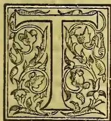

HERE are some droll features in this grave official report. It bears on its title-page that it is the "Report of Mr. A. M. Walker, acting Conservator of Forests," it is signed by him, and in a portion of it

he expresses gratitude for a personal allowance of R2,000 per annum added to his salary of R6,000. And yet Captain Walker is repeatedly mentioned in the third person as acting for Mr. Broun, or giving over charge to the latter, who is really the "I" of the report. The explanation is that the report which has been only now produced in a complete form was prepared by Mr. Broun before he went on leave six months ago, all but a portion which he was unable to complete because of the culpable delay in the sending in of reports by some of his subordinates, whose conduct is severely reprehended. The voice is the voice of Mr. Broun though the hand which signs may be that of Captain Walker. Another amusing statement, although to Mr. Broun himself it was no joke, relates to the slowness with which Government forests are demarcated. At the present rate of procedure he calculates it will take four centuries to complete the work. Then we do not know whether Mr. Broun was "kinder sarkastic" when he indicated that the members of his department had not done heavy work during 1891; but he was certainly serious enough and correct enough in stating that "there is no department in the island which has to work at all times in more unhealthy localities." But ineasubrity will be modified, and it is to be hoped ultimately banished as boundaries, roads and paths are cut by the officers and areas of forest cleared of creepers and parasitical growths and thinned of superfluous trees,—although in many cases these latter have long ago disappeared under the destructive systems which prevailed prior to the establishment of a regular forest conservancy department. During 1891 only one reserve forest of 782 acres was proclaimed in the Kurunegala district including which the acreage of reserved forest was at the end of the year 26,580 acres. It is on these unsatisfactory figures that Mr. Broun found

his estimate of 400 years as necessary for the completion of the work. The number of forests taken in hand during the last three years, but not proclaimed, was 53. Details are given; and from the report of the Assistant Conservator of Sabaragamuwa we quote a few significant paragraphs:—

The Weywilla forest was the subject of some litigation in 1891, with results so far quite unsatisfactory. It will be remembered that one Jayasundara Kirelle Menika claimed upon a sitta certain lands in the village of Weywilla, and that she objected to the finding of the Forest Settlement Officer and carried her appeal to the Supreme Court, with the result that the Forest Settlement Officer's proceedings were quashed.

Later, a case was brought against her for felling certain trees in Weywilla in primeval forest, and the lower court found in favour of the Crown, but upon an appeal being made to the Supreme Court the case was again reversed in favour of the claimant, with the distinct implication that no proof of trespass was disclosed by the prosecution.

The result of so unfavourable a finding by the Supreme Court, added to its first finding upon the judgment of the Forest Settlement Officer, tends to strengthen the claimant's claim upon Weywilla as a whole, while her rights to a part is only admitted.

The crown is deprived by this of one of the best pieces of forest in the Kuruwiti korale, at a place where not only is forest scarce, but highly important as being part of the reserves situated round the Labugama reservoir that, I need hardly remark, demand the greatest care and preservation.

The proposed reserve at Weoya, in the Kegalla District mentioned in the annual report for the Province of Sabaragamuwa for 1890, remains still unsettled, as no further surveys have been made with this end in view.

The importance of establishing a reserve here is very great as the tea industry in the Kelani Valley will in time bring a large demand upon the Forest Department to supply fuel, upon which it depends entirely for its existence.

A rough estimate of the extent of forest in the island which it will be necessary to reserve is represented by the figures for square miles, 2,974, but as no information came from Uva we may safely increase the area to over 3,000 miles. This seems a small proportion out of a total of 25,000 square miles for the surface of the whole island. Multiplied by 640 for acres, however, the area looks respectable. Mr. Broun contends that

In order to show some marked progress in the reservation of forests, it will be necessary to take in hand large stretches of forest in which there are not large numbers of claims to stay the work of the Settlement Officer. Excepting in the densely populated Provinces, and within easy reach of the railway, it will as a rule not be desirable to take in hand small

323------------------------------------------------

298THE TROPICAL AGRICULTURIST.[Nov. 1, 1892.]

forest areas which would be costly to demarcate and to supervise, and which, moreover, might with advantage be utilised as village forests. In the forest Provinces, such as the Northern, the North-Central and Eastern Provinces, and a large portion of the North-Western Province, the cost of reserving thousands of acres and of demarcating and supervising them will not be greater than on one-tenth of the area in Sabaragamuwa and portions of the Western Province.

The length of boundaries cut by the Survey Department in connection with forest surveys has been 116,788 chains and the boundary pillars erected have been 321.

The area surveyed during the year amounts to 63 square miles and 232 acres, and the total area of forest surveys amounts to 359 square miles and 216 acres. The cost to the Survey Department amounts to R25,760.25 for the year, but to the Forest Department it only comes to R5,184.50, which was disbursed on coolly pay, chiefly in the Western Province.

The completion of the survey of lands taken up for railway fuel plantations at Galboda was urgently required,—we say was, because we presume the work was completed before the report was issued in the middle of September 1892. We quote what is said about working plans (for thinning and replanting natural forest) and Enumeration Surveys:—

**WORKING PLANS.**—The work in the Nanuoya forest has been carried out on the strip system, as described in the annual report for 1889. Plots Nos. 14 to 29, amounting to 25 acres, were felled, and plots 14 to 22, amounting to 15 acres, were replanted with blue gum. *Eucalyptus robusta*, *Citrodora amygdalina* and *diversicolor*, *Acacia decurrens* and *Melanoxylon*. No working plan has, however, yet been drawn up. At Nanuoya system of working has merely been adopted, but the possibility and rotation have not yet been properly fixed. Some of the Assistant Conservators have also adopted special systems in their forests. It is hoped, however, that before long working plans for the railway fuel reserves at Mirigama and Nanuoya will be submitted for the sanction of Government.

**ENUMERATION SURVEYS.**—On his return from Dehra Dun Forest School Mr. J. St. L. Hansard was deputed to Mirigama to report on and make enumeration surveys in the forests set apart for the railway fuel supply. After a stay of about three months he was permitted to exchange duties with Mr. Ferguson, who carried on the work until he took over the duties of Superintendent, Railway Fuel Supply, at the end of November. The work is not yet completed, but enough has been done to show that the forests have been cut into in a most extensive manner, and that at present the average yield per acre is very low, and that a larger extent will be required to satisfy the yearly requirements of the Railway Department.

The following paragraph is one of a series in which the Government Agent of the Western Province is represented as ignoring or placing himself in dead opposition to the officers of the Forest Department:—

For some unaccountable reason the 200 acre block referred to in my annual report for 1890 has not yet been taken in hand. I have drawn the attention of the Hon. the Government Agent to this, but hitherto without success, and it appears as if it would be even too late to do anything in 1892. The orders of Government as regards this experiment were issued more than a couple of years ago, and it is strange that, although the land has been subdivided into plots for different villages, they should not be allowed to begin.

An enumeration by Mr. Huddleston at Trincomalee of trees per acre in Government forest was disappointing, the totals being 30.81 sound trees and 5.54 unsound. The prevalent timbers were *palai* or *palu*, satinwood, ebony, *ranai*, with very little *halmilla* and *milla*, while "other good species" not described were about one-third of the whole. Between thirty and forty years ago, the Trinco-

malee forests were subjected to a barbarous system of destruction from which it will take them long to recover. On 10 acres of what Mr. Tocke called "good ordinary forest" in the Northern Province, he enumerated 18.10 trees of satin, ebony, *palai*, and *ranai* per acre,—a "beggarly account" surely. Mr. Broun in view of his Indian experience remarks:—

This table is useful for comparison with the table given above for Trincomalee forests, for it shows 0.6 satin tree per acre above 6 ft. in girth against 0.01 in Trincomalee, 0.3 ebony against 0.02 in Trincomalee. The *palai* is, however, somewhat less abundant—a fact which rather surprises me, as the Northern Province forests usually teem with *palu* of large girth. Still, taking the four species—satin, ebony, *palu*, and *ranai*—there are in the Northern Province sample area 1.5 tree per acre above 6 ft., while in Trincomalee there are only 0.89. The other girth classes not being the same, it is difficult to make comparisons between trees of smaller girth. There are, however, in the Northern Province 5.8 trees of the same four species per acre between 4 and 6 ft. in girth, while in the Trincomalee District there are only 6.81 between 3 and 6 ft. in girth. To a Forester who has been accustomed to work in gregarious forests neither of these results appear good, and if Mr. Tocke's enumeration is a good sample of a fairly good forest, it helps in explaining why the working of our forests is so expensive compared with that of good Indian forests, and it shows that we require large areas of supplying the same requirements in good timbers.

It seems hard that Mr. Broun should have to tell the public which pays, in regard to "sample plots":—

Notwithstanding my remarks in paragraph 19 of my last annual report little zeal has been displayed by the large number of the Assistant Conservators in establishing sample plots in natural forests. Every year wasted means one year's delay in the progress of the Department. The sample plot near Anuradhapura has not yet been measured—indeed it had a narrow escape from being sold—and the only officers who have taken active measures are the Assistant Conservators of the Central and North-Western Provinces. Near Dambulla two sample plots have been started, and in Narigama forest in the Chilaw District a sample plot among kumbuk trees was started in 1890 by Mr. Tatham. Measurements were again taken in 1891. In this sample plot there are 20 trees ranging in 1890 from 2 ft. 7 in. to 7 ft. 10½ in.. The average girth increment of these trees is 1.37 in., but if they are taken girth class by girth class the mean annual girth increment is, for—

<table>
<tbody>
<tr>
<td>1 tree, VIth girth class (paragraph 23)</td>
<td>1.00 in.</td>
</tr>
<tr>
<td>10 trees, IIIrd</td>
<td>do .. 1.35 "</td>
</tr>
<tr>
<td>7 trees, IIId</td>
<td>do .. 1.43 "</td>
</tr>
<tr>
<td>2 trees, Ist</td>
<td>do .. 1.50 "</td>
</tr>
</tbody>
</table>

If this sample plot is a fair example it accounts for the large girth which the kumbuk attains, for it attains its highest mean annual increment only when it gets well above 6 ft. in girth. Another sample plot for *palu* and *tamma* was started in the Kulingaha forest, Kurunegala District.

Sample areas were also chosen in plantations in the Eastern, North-Western, and Uva Provinces. These will be referred to under the head "Artificial Reproduction."

Under the heading "protection and improvement" it is stated by Mr. Broun:—

In six of the Provinces the dealings between Government Agents and the Assistant Conservators have on the whole been satisfactory, notwithstanding occasional friction. The Government Agents consider the Assistant Conservators as their Assistants in forest matters, and entrust them largely with the forest administration of their respective Provinces. Where this co-operation exists the administration is by far the most successful, and the headmen knowing that the forest officers have the Government Agent's support are much more willing to help them. The Eastern Province and Sabaragamuwa can be quoted as examples in point. On the other hand, in the

324------------------------------------------------

Nov. 1, 1892.]THE TROPICAL AGRICULTURIST.299

Western and Northern Provinces there is no such co-operation. The Government Agents give orders to subordinates without referring to the Assistant Conservators, who are in the same cases left in ignorance of forest work which has been carried out, and of expenditure disbursed during the year. This has in the case of the Western Province led to confusion in the accounts and to an expenditure larger than the vote allotted. In the Central Province the Government Agent declined to have any responsibility with respect to forest business, and as I received no orders from Government to take over the responsibility, the Assistant Conservator was more or less independent of all control.

We take it for granted that the Governor, who read this report before it was printed, took immediate and stringent measures to correct a state of things so injurious to the public interests as is above represented. Mr. Broun complains, too, of discouragement from the judicial officers of Government:—

Altogether 1,364 cases were taken up, and resulted in 799 convictions implicating 1,294 persons, and 459 acquittals concerning 916 persons. The proportion of acquittals to convictions is somewhat large, but it is not to be wondered at when Magistrates take so little trouble to deal severely with cases of chena and of timber theft. The Assistant Conservator, Sabiragamuwa, complained to me that it was of little use his bringing any cases in Kegal'a and Ra'napura courts, as the Judge in the latter court gave such slight punishments when convictions were obtained, that they were rather an encouragement than a prevention to offenders. At Kegal'a the District Judge ill conceals his sympathy with the accused. Only recently in a case brought against an estate for cutting down a stream reservation he stated that Government had received in exchange land covered with tea, and that it had therefore not suffered, but obtained improved value.

At Vavuniya two men were caught by the Assistant Government Agent cutting branches of palai trees for fruit. Notwithstanding that this is a practice which has been grossly abused for years, the men were discharged with a caution.

A man was prosecuted by the Assistant Agent in the Tangalla Court for clearing a chena in Palla Rota, where he felled a number of large trees. The Magistrate fined the defendant R50. On appeal to the Supreme Court the judgment was quashed, because the proceedings had been irregularly taken. Another case was entered against him on precisely the same evidence and before the same Magistrate, who, however, this time acquitted the accused! In both cases the latter produced a "labima," not registered. This "labima" only showed one boundary, "the river." On the strength of the judgment the man now claims a large extent of country, including a portion of Palla Rota, always looked upon as Crown forest. He appeared with a large knife at a place where 15 palu trees had been felled by the Assistant Conservator, and threatened to use it against anybody who touched the trees.

A case was brought by the Forest Ranger, Kalmuui, against a man for offering him a bribe to induce him not to report a theft of timber from Crown forest. The Police Magistrate held that the timber theft being compoundable, section 211 of the Penal Code does not apply to it. The consequence is that almost all forest offences being compoundable, no man can be punished for offering bribes for concealing them and that, conversely, no forest officer can be punished for accepting bribes for concealing offenders other than those under sections 66 and 67 of the Ordinance! I represented the matter to Government, and stated that the officer in question was not empowered to receive compensation, but to no effect, and the Hon. the Attorney-General expressed a doubt as to the possibility of altering either the Penal Code or the Ordinance, because ordinary people cannot be expected to know what officers are empowered and who are not.

The case in Kegal'a court mentioned in paragraph 29

of my last report has, for some unaccountable reason not yet been finally dealt with. In another case known as the Mitipola case, the Superintendent of "Fairfield" estate was fined for cutting timber out on adjoining Crown forest to build his bungalow, but, notwithstanding that the Magistrate visited the spot himself to satisfy himself as to its being forest or not, his finding was set aside by the Supreme Court.

The above examples show how disheartening it is for forest officers who attempt to preserve the forests under their charge to try and bring cases against people who go in for systematic pifering and destruction.

In dealing with forest fires Mr. Broun starts the theory that the upland patanas originated with them! He writes:—

Fire protection is happily not as important in Ceylon as in India, as the shrubby evergreen undergrowth and the dense leaf canopy as a rule prevent any fires reaching far into the forest. In Tamankaduwa, however, where large herds of cattle graze in the open plains near the Mahaweli-ganga and around Kandela, Topari, Giritulla, and Minneri, the graziers set fire to the withered grass so as to obtain a green and succulent crop for their cattle. These fires gather strength until they reach the forest, where they kill most of the trees or at least saplings within some distance from the edge. Thus, year by year the grass lands encroach upon the forest, and it is necessary that steps be taken to save them from further damage. Very possibly the patanas of Uva and elsewhere in the island originated in this very manner. The hills which are now covered with grass were probably covered with park-like forest, such as is now found near Ekiyankumbura and Bibile resembling in many respects, as well in species as in grassy undergrowth, the sub-Himalayan forests. The annual recurrence of fires must have stripped the hills of all their woody covering except in cool sheltered hollows and ravines where fringes of trees are still to be seen.

Some of the patanas may have been due to fire and that "devouring element" may have extended others, but the received geological opinion is that most of the grassy prairies of Nuwara Eliya, the Horton and Elk Plains and Uva are due to ancient water floods of great extent and violence.

What is said about natural and artificial reproduction is so interesting generally and calculated to be so useful to planters and others who may be trying experiments in arboriculture that we will quote those portions of the report in full on the completion of this notice. We submit that special attention should be paid to the careful collection of well-ripened seeds of such valuable trees as satinwood, palu, kumbuk, &c., and that full information should be tabulated and published regarding the success, or otherwise, at different altitudes and in differing climates of experiments with the Australian eucalypti and acacias, *Grevillea robusta* and other foreign trees as well as those indigenous to the island. It seems to us that special attention ought to be paid to the cultivation of jak. It is one of the few valuable timber trees which grows rapidly, and which during its life yields large supplies of fruit for human food, while the spare portions of its luxuriant foliage affords an excellent forage for animals. A young man planting from 3'0 to 500 acres of jak in a good position with reference to carriage and demand for timber, would at middle age be possessed of a fortune. Of the introduced trees *Eucalyptus robusta* and *E. diversicolor* seem amongst the best. After reference to roads and buildings, we are told under "other works" that

The most important addition was the arrival of a circular saw and steam engine from England. The saw mill was sent to Batticalca, where it was expected to be of most use. It was put up, but owing to the site being unsuitable and objectionable to the police, it is to be shifted to another ground which is to be

325------------------------------------------------

300THE TROPICAL AGRICULTURIST.[Nov. 1, 1892.

purchased by Government for a depôt and site for the Assistant Conservator's bungalow.

In the Central Province two wire shoots, each a quarter of a mile long, were purchased at a cost of a R330 for the railway fuel operations at Nann-oya. New sling carts were obtained for the North-Central Province and North-Western Province, which, it is expected will considerably reduce the cost of transport.

The Pasweli-oya in the Barawa forest in the Western Province was cleared of snags and overhanging trees at a cost of R2,363.92. Of the wood obtained in this manner 541 cubic yards were sent to Kelaniya depôt and 500 are lying in the forest awaiting a public sale.

The very wet weather which has prevailed during the year has greatly impeded operations, and much stock which should have been brought out of the forest had to be kept. Cholera, which appeared during the year, had also its effect in scaring away sawyers in the Central and Eastern Provinces especially. The result has been that a large unexpected balance of funds had to lapse to revenue at the end of the year.

The total value of timber and other produce sold during the year amounted to R377,562.77, against R371,215.03 in 1890 and R337,120.84 during 1889.

As we read what follows about timber for sleepers and telegraph posts, we feel inclined to ask if much of the failure of certain timbers was not due to imperfect seasoning?

**SLEEPER OPERATIONS.**—The Railway Extension Department indented for 5,700 railway sleepers, which were to be supplied at Hatton, Matale, and Polgahawela respectively. Of these, the Assistant Conservator, Sabaragamuwa, delivered 1,906 sleepers at Hatton, the Assistant Conservator, Central Province, 644 sleepers at Wattegama and Matale, and the Assistant Conservator, North-Western Province, 563 sleepers at Polgahawela. The Assistant Conservator, Central Province, attributes his delay to cholera, which caused his sawyers to bolt.

Experimental sleepers of alubo (*Eugenia Sylvestres*) etaheraliya (*Kurrimia zeylanica*), and dawata (*Carlta integerrima*), were supplied to the Railway by the Assistant Conservator of Forests, Western Province, during the year, but, excepting the alubo, which stood fairly well, the sleepers made no stand against damp, and rotted away quickly. Dawata had the additional fault of being liable to attacks of white-ants. No reports have been as yet received as to the behaviour of other Island sleepers, although the low-country dun sleepers supplied to the Kalutara-Bentota extension do not appear to have done very well.

**TELEGRAPH POSTS.**—The pandikasa posts supplied from the North-Western Province have not done well at all: a large proportion rotted flush with the ground and broke down, and towards the end of the year the Postmaster-General applied to have them renewed by the Department. Instructions for a new supply of posts made of good wood were issued shortly after the close of the year. I have informed the Postmaster-General that in future no species would be guaranteed, and that if he wanted posts made of the cheaper woods he must take the risk of premature decay himself. If attempts are made to do a large quantity of work for a small outlay, accidents must be allowed for. The Postmaster-General attempted to obtain posts for the Tangalla-Hembantota extension at so low a price that neither the Southern Province nor Sabaragamuwa were able to undertake the job.

How white-ants could find a lodgement in sleepers subject to the reverberations of several trains daily, puzzles us. But perhaps the sleepers were merely buried in earth. Could not what are called inferior timbers, such as *hora*, be profitably utilized by being subjected to some cheap preservative process, such as the application of kerosene which renders naturally poor pinewood so useful? As regards satinwood, we are told that

The demand for this timber in the log has increased largely during the year, and inquiries have been made by several firms for large quantities for export to India and Europe; and if the Central Depôt can be kept

supplied by the Provinces at a fairly regular rate, a steady trade can be made in this timber.

Restrictive measures of an apparently vexatious character have affected injuriously the

**RAILWAY FUEL SUPPLY.**—Although it had been estimated that about 93,000 cubic yards would be required by the Railway Department, this year only 82,079 cubic yards of Crown and private wood were delivered by the Department. The cause of this has been the strict enforcement on the part of the Hon. the Government Agent, Western Province, of the system of passes for all firewood brought to the line. The contractors complained of being subjected to much hardship owing to their being sent about from headman to korala and from korala to Mudaliyar, in a way to make them lose time and money. The Government Agent thought that it was merely a trick on the part of the contractors to get better price out of Government, but the system has had sufficient effect on the public generally. The Director of a mill in Colombo informed me that since the enforcement of the stricter system of passes the prices of firewood for his mill had risen from R3 to R5 per ton. Anyhow the supply to the railway materially diminished, and at last the running engines on the railway—i.e. those which did not, like mail trains, take the wood supply for a whole section at Colombo, but filled in again at Henarattgodu, Veyangoda, or Mirigama—had to give up wood altogether and had to burn coal. This has caused a considerable extra expenditure to the Railway and a noticeable falling off in the revenue to us.

Of the 82,079 cubic yards, 26,710 came from Crown forests. The expenditure on them was R29,502.07, or R1.10 49.100th per cubic yard.

Then as to

**FUEL SUPPLY TO THE PUBLIC.**—Jaffna is the only town in which a large traffic in firewood goes on. The sale of firewood at Jaffna produced a revenue of R12,676, which is by R355 larger than that of last year. At Trincomalee an attempt was made towards taking the firewood supply under the management of the Department, and a stock to start with was being collected towards the end of the year. It is now time for Galle and Anuradhapura to begin to adopt some system for the firewood supply. At Badulla and Nuwara Eliya a good stock of firewood is being kept in the depôt, the sales to private purchasers at the latter place amounting to 1,169 cubic yards, worth R2,155.75. Kandy is utterly unprovided for, and it may become necessary to start plantations for the fuel supply of the town.

The largest sales of standing timber were in the planting districts, Sabaragamuwa selling timber to the value of R13,676.51, while the Central Province and Uva show sales amounting to R3,552.56 and to R8,806.76 respectively. The Assistant Conservator, Central Province, however, reports that there have been few extensions of factories, and that demand has consequently been somewhat low. Exclusive of the Western Province, for which no returns can be obtained the sales of timber on payment of royalty amounted to—

<table>
<tbody>
<tr>
<td>Total number of trees</td>
<td>..</td>
<td>..</td>
<td>25,183</td>
</tr>
<tr>
<td>Number of warichches</td>
<td>..</td>
<td>..</td>
<td>43,000</td>
</tr>
<tr>
<td>Number of shingles</td>
<td>..</td>
<td>..</td>
<td>5,200</td>
</tr>
<tr>
<td>Number of cubic feet</td>
<td>..</td>
<td>..</td>
<td>109,754</td>
</tr>
<tr>
<td>Value</td>
<td>..</td>
<td>..</td>
<td>R34,866.07</td>
</tr>
</tbody>
</table>

The Assistant Conservator, Northern Province, says that the number of permits to fell on payment of royalty has increased during the year, and represents that it is not proper policy, as with the very imperfect protection the forest have it is very easy for license holders to commit timber thefts.

**OTHER PRODUCE.**—Like last year Uva leads the list on account of its revenue on the lease of gallnut (*Terminalia chebula*), which this year fetched even higher prices than usual. There is no reason why the Eastern Province should not make almost as good a revenue over the same product.

In the Northern Province R480.50 were obtained from licenses to lop green leaves for manure. The Assistant Conservator observes that, notwithstanding his complaints, care has not been taken to restrict

326------------------------------------------------

Nov. 1, 1892.]THE TROPICAL AGRICULTURIST.301

the species to be lopped. The operation is a very exhausting one to the forest, and gives only small returns, and should be restricted. In the Southern Province the kitul rent has only obtained R263-02. The headmen in the villages usually bid for the lease of all the kitul trees in a forest, and make a profit by re-planting single trees to separate people. When they bid of course the other people in the village do not like to outbid them and the revenue is as yet small. The total value of minor produce taken from the forests by purchasers amounts to R6,980-55.

**EXPORTS OF FOREST PRODUCE.**—The Hon. the Principal Collector of Customs has kindly furnished me with a table showing the exports of timber and other forest produce sent from Ceylon. The table will be found in appendix D. The exports of ebony and halmilla have considerably diminished during the year, but those of satin have risen from 306 to 1,409 cwt. The export of ironwood, which I expect must be palu, have nearly doubled. The export of palmirah laths and rafters fell off by about half during the year. This may be due to the attention of the Jaffna people being diverted to the collection of palmirah fibre for Messrs. Vavasseur & Co. Amongst the officers mentioned with special approbation by Mr. Broun is the Assistant Conservator of Sabaragamuwa, Mr. Lewis. While dilatoriness was complained of in regard to many, Mr. Lewis

was the first to send in his annual report, which reached me on 7th March. He sent a very full report, accompanied by a map showing very clearly the distribution of different classes of forests, the mountain ranges, and the catchment areas of the Kalu and Walawe gangas. The Assistant Conservator, Sabaragamuwa, has also annexed a map to his report showing the areas which, in his opinion, should be reserved.

As regards probationers at Dehra Dun forest school, we learn that

Mr. W. Ferguson obtained the Ranger's certificate at Dehra Dun, while Mr. J. St. L. Hansard failed to obtain the necessary certificate. The illness which he contracted after being mauled by a man-eating tiger interfered with his studies, notwithstanding that he was given one year extra at the school, and he was unable to get pass marks. Mr. A. M. Walker was the only student left at Dehra during the rest of the year. He passed the final examinations after completion of the year.

The concluding paragraphs of this interesting report are as follows:—

**AGRI-HORTICULTURAL SHOW IN COLOMBO.**—All Assistant Conservators, except the Assistant Conservator North-Central Province, sent specimens of timber and forest produce to this Show. The collection was really a very good one, that from the North-Western Province calling for special remark on account of the handsome timber specimens exhibited, while the Eastern Province sent in a capital collection of minor forest produce. Uva also sent a very good collection, but it was broken up, and the fibres, dyes, &c., were exhibited in another section.

The following silver medals were awarded:—

For the best collection of cabinet woods—Assistant Conservator, North-Western Province.

For the best collection of forest produce—Assistant Conservator, Eastern Province.

For the best collection of timber—Assistant Conservator, Central Province, Assistant Conservator, Sabaragamuwa.

For the best collection of jungle fruit—Assistant Conservator, Uva.

For the best collection of jungle roots, &c.—Assistant Conservator, Western Province.

**GAME LAWS.**—A law for the protection of elephants and buffaloes has at last been passed, and a law for raising an export duty on hides and horns. It is hoped that these measures will have some effect in stopping indiscriminate slaughter. There has been a great deal of grumbling on account of the license for shooting elephants being raised to R100. I cannot see much cause for this grumbling. To a person who has never

shot an elephant and who is desirous of killing one an elephant should be well worth R100, and one animal of this kind should satisfy most men. Those who are not satisfied should, if they are not willing to pay the money, confine themselves to proscribed rogues which the Government Agents will gladly allow them to kill without paying for licences. The export duty on hides and horns will no doubt have some effect in checking wholesale slaughter of game, but it will not put a stop to the *battues* organised by gypsies and by estate coolies, who go to the low-country for the sake of the meat of deer and pig, which they dry and take up for sale to the estates.

The Assistant Conservator of Uva reports a case of this sort and suggests that Forest Officers be empowered by Government to arrest any person killing game or shooting out of his division without a license.

**ELEPHANT ESTABLISHMENT IN THE EASTERN PROVINCE.**—An elephant was captured, but received a fall when it was caught, from the effects of which it ultimately died. Another was found in the jungle, but having lost its mother and being still very young it died before it could be taken out of the jungle. Another, a cow-elephant, was caught and is doing well. She was found stuck in the mud at Lahugalla tank and was rescued and brought in. The elephant caught in 1890 is doing well and growing fast. He is now very fairly trained for depot work.

**COLLECTION OF PALMIRAH FIBRE.**—Dr. Trimen, in his annual report, has already referred to the trade in palmirah fibre which has sprung up in the Jaffna peninsula. What is sought for is the base of the petiole of the leaf, and only the ends of old leaves which have already dropped off should be pulled from the trees. But the people in their greed for money pull off stalks which have not died off completely, and thus the naked stems of the palms are exposed prematurely, and many trees die off. It is to be hoped that in Crown lands at least a check is given to this new trade, and that only trees which would any how be felled for their timber will be stripped of their leaves.

We now quote the section on natural and artificial reproduction:—

#### NATURAL REPRODUCTION.

Most of the Assistant Conservators' reports speak more about the sending than about the reproduction. On the whole the year seems to have been fairly good, although the Assistant Conservator, Central Province, complains that the excess of wet in the wet part of his Province killed the seed, while the Assistant Conservator, Northern Province, blames the dry weather in his Province for causing much of the seed to be sterile. The Assistant Conservator, Sabaragamuwa, who has evidently studied the natural reproduction of his forests with great care, and who gives in his report the result of his remarks, reports that the abnormal rainfall has caused a large increase of seedlings in his forests.

The reports on all species are shown in table in appendix A, and I shall here only make special mention of the more important species.

*Na (Mesua ferrea)*: in the Kadawatu and Atakalan korales of the Ratnapura District the seed crop of the year was not quite so large as in previous years, but a good supply of plant was produced.

*Red Dun (Doona zeplanica)* flowered abundantly and germinated very freely in the Morahella forests in the Ratnapura District. I noticed that the white dun (*Doona trapezifolia*) also seeded freely, but the seeding of not only the duns but of other Dipterocarps, such as *Shoreas* and *Hopeas*, appears to be very uncertain, or only recurred at intervals of several years. I have thus for the last two years been unable to get the seed of several species which are yet unidentified.

*Halmilla (Berrya ammonilla)*. In the Matale District of the Central Province this tree is springing up in favourable localities wherever light is admitted by the felling of other trees. In the Eastern Province seedlings are also abundant and fill up gaps in the forests, and in the Manuwangama forest of the Chilaw District, North-Western Province, and in the Kolonna korale of the Province of Sabaragamuwa there is a plentiful crop. In

327------------------------------------------------

302THE TROPICAL AGRICULTURIST.[Nov. 1, 1892.

the North-Central Province it seeded freely towards the end of the year.

Satinwood (*Chloroxylon Swietenia*). During my inspection of the Eastern Province in May last the forests were white with the blossom of satinwood, the trees of which could thus be recognised miles awsy. A plentiful supply of seed and a very fair crop of seedlings followed. The seed appears to have been plentiful and reproduction fair in the dry forests of the Central, Northern, North-Western and North-Central Provinces, and in the Kolonna and Atakalan korales of Sabaragamuwa.

Nedun (*Pericopsis Mooniana*). Seed crop large along the banks of the Hangomwa and Kurnwiti gangas in Sabaragamuwa.

Kumbuk (*Terminalia glabra*). This magnificent tree which grows in abundance along the banks of most streams and tanks in the dry zone, generally seeded in profusion. A large proportion of the seed is carried out to the sea during floods: portion is stranded on the banks and germinates, and it depends on the moisture which the young plant gets during its first year whether it lives.

Palu or Palai (*Mimusops hexandra*). This tree seeded profusely in the North-rn, Eastern, and North-Western Provinces, and fairly well in the Central and North-Central Provinces. There is a general complaint as to the way palu trees are mutilated for the sake of their fruit. It is a pity that the custom cannot be restricted to the scrub palu which grows in the low forests near the sea, as not only are the trees themselves ruined, but the chances of natural reproduction are very much impaired. A glance at the table furnished by the Assistant Conservator, Northern Province, and given in paragraph 24 above, shows that of all valuable species palu is the one which shows the smallest number of seedlings.

Ebony (*Diospyros ebenum*). Reports from the Northern, North-Western, and Sabaragamuwa Provinces show a fairly good crop of seed, but only little is said about a natural reproduction. This species requires a careful study.

Milla (*Vitex altissima*). There was a moderate fall of seed in Matale, North-Central Province, and the Assistant Conservator, North-Western Province, reports that a large number of seedlings have sprung up in the Kalugalla forest, where the palu felling have been made.

Wewerana (Ranai or Yawarana), *Persea semicarpifolia*. Good falls of seed are reported from the Central and Eastern Provinces, and fair crops from the Northern and North-Central Provinces.

Observations made in the forest tend to show that for na, kina, dun, hora, mendora, tumpalai, hal-milla, and domba, moderate fellings are sufficient to encourage natural production, while satin, palu, ebony, milla, and wewarana require fairly heavy preparatory fellings, either by the removal or girdling of trees of inferior species in the neighbourhood of the seed bearers.

ARTIFICIAL REPRODUCTION.—During the year 4755 acres were added. Form No. 5. in the appendix will show that the increase is due chiefly to the starting of railway fuel plantations at Galboda.

WESTERN PROVINCE.—No change.

CENTRAL PROVINCE.—Plots Nos. 14 to 22, amounting to 15 acres, were planted with *Eucalyptus robusta*, *citriodora*, *amygdalina*, and *diversicolor*, and with *Acacia melanoxylon* and *decurrens*. These plantations of the year are very successful. The plots planted in 1890, were supplied with the same species as mentioned above, and are now doing well, and those planted during 1889, and which had to be largely supplied during 1890, are now showing up, some of the trees being 14 to 15 ft. in height and 15 in. in girth, at breast height. The number of standards left standing on the strips varies a great deal, and is much greater in the earlier coupes. It will now be interesting to see how Australian trees behave with different degrees of shelter. At Nuwara Eliya the plants now show above the young trees of spontaneous growth which had been left when the clearing was made; a number of young trees of worthless species and with low spreading crowns had however been left standing, and were impeding the growth of many young *Eucalypti*. It

became necessary therefore to remove these, which was done but after the close of the year.

The nursery and small plantation near Gall-wey's land were extended by about 4 acres. The nursery has been used for rearing plants for all the plantations in the Central Province. The system appears costly, and I do not much approve of it, but it had the advantage of constant supervision on the part of the Forester. It appears also that some of the species spring up more readily at Nuwara Eliya than in local nurseries. At Galboda four fields of patana land, known as Blackwater, Dekinda, Mapakanda, and Penbros, were taken in hand. It was intended to plant 600 acres, but, as is usual in the first year, there were a great many difficulties to overcome, the chief of which were an uncertain and irregular supply of labour, an unusually wet and destructive rainy season and the want of surveys showing the actual boundaries of our land. As a result only 320 acres were planted. Of the four fields the Blackwater field, situated close to Blackwater estate, has been the least successful. The land is exposed to the full force of both monsoons, and the soil is gravelly and poor. In the most exposed places only *Acacia melanoxylon* seems to be able to stand the strong wind, and *Casuarina* also does fairly well. *Eucalyptus robusta* does well in sheltered places, but I noticed that some had been attacked by white-ants, musk rats, and by pigs. *Grevillea* looked sickly on Blackwater, as it could not stand the wind properly; it was moreover much attacked by a locust which nipped the head of many tender seedlings.

In the other fields the results are far more promising, although the violent rain which came on steadily through the greater part of the year washed a lot of the top soil off and caused immense quantities of weed to spring up. *Eucalyptus marginata*, *amygdalina*, and *citriodora* are doing fairly well, and *hal* and *hora* are doing well near the streams at the bottom of the slopes. *Jak* also did well at the lower elevations, but was rooted up by pigs. *Grevillea* has been slow. It seemed to get too much wet. The plants which did best had their roots dipped in liquid manure just before they were put in. The plantations were at first under the direct supervision of an overseer, then on his return from the Dehra Dun Forest School. The latter officer, however, soon after exchanged duties with Mr. Hansard, about whose work the Assistant Conservator reports very favourably.

NORTHERN PROVINCE.—Nothing has as yet been done towards starting palmirah plantations. In existing palmirah forests it will, however, I think be sufficient to close them to grazing to ensure abundant natural reproduction.

EASTERN PROVINCE.—A clearing was done at stake with teak seed, behind the Tumplancholai resthouse, but it failed. The Acting Assistant Conservator advises to follow the plan which has been successful at Put-talam, of making nurseries close to the plantations.

The growth in the teak chenas has progressed favourably, and a table showing measurements corresponding to those shown in appendix A of last year's report are now shown in appendix B.

It is curious to note that the mean annual increment has considerably improved in all the Paulakanawa plantations, while it has fallen off in all but the youngest plantations of Divilane.

Mr. Tatham reports that in some of the chenas he saw natural seedlings from five-year old trees.

A plantation started at Divilane in 1890-91, consisting of satin, halmilla, and teak, is doing well.

NORTH-WESTERN PROVINCE.—The plantations in the North-Western Province give great satisfaction, and are quite a success. The Puttalam teak plantation, which was started in 1879, consists now of 99 acres fully planted with teak, 56 acres having been added during the year. Of these 56 acres, 8 were planted on the old system, the plants being put in 5 ft. by 5 ft., and were a success. The remainder were planted on a new system which was advocated by Sir D. Brandis when Inspector-General of Forests in India. It consists in parallel strips  $\frac{1}{4}$  chain long being cut through the jungle, leaving belts of standing jungle  $\frac{3}{4}$  chain broad standing in between; each strip

328------------------------------------------------

Nov. 1, 1892.]THE TROPICAL AGRICULTURIST.303

is half a mile long and runs in a direction to escape as much as possible the effect of the strong wind and to afford shelter against the sun. This system promises to be a success, as it will afford shelter to the young plants and later on a mixture of species, which is favourable to teak.

The whole block No. 5 planted in 1890 had to be re-supplied in consequence of a large number of plants having died owing to a severe drought which came on just after they were put out, and owing to weeds suppressing most of the survivors. It took 17,000 plants to replace vacancies in this one block, which is now doing well. A number of self-sown satinwood seedlings have sprung up, and will mix well with teak. The nurseries were a great success, and Mr. Armitage deserves credit for the manner in which he kept them up. Teak seed was obtained through the courtesy of the Conservator of Forests, Quilon. The seed was spread in trenches 2 in. deep and watered constantly. After seven days it commenced to germinate, and the number of sterile seeds proved to be very small. Palu seed also came up very readily, being watered twice a day.

The older plantations are also doing well notwithstanding the somewhat rough treatment which some of the blocks have received. The gaps in the oldest plantations have in many places been filled with a spontaneous growth of satin, which mixes well with teak. The Assistant Conservator submits with his report the measurements of two lots of twenty trees each taken in the plantations of 1879 and 1881, and of ten satin poles measured in the plantation of 1890. The teak poles in the block of 1879 were measured shortly after the close of the year: on an average 25.85 in. in girth at 4 ft. from the ground, the average girth increment for the last year being 1.7 in. and the mean annual increment 2.11 in. The 1881 lot measured on an average 19.54 in., showing an increment during the year of 1.49 in. and a mean annual increment of 1.95 in. These girth measurements are on the whole as good as those taken in the Eastern Province, although the trees in the latter Province are as a rule picked trees taken here and there, and frequently standing isolated. The ten satinwood trees which grew up spontaneously in the plantation of 1880 have attained an average girth of 18.6 in. Their mean increment during the last year has been 1 in. and the mean annual increment 1.69 in.

During my inspection tour through the North-Western Province the Assistant Conservator, the Forester, and I marked a thinning in the plantations older than that of 1886. 532 poles were removed and portion sold for Rs 370. A large quantity of firewood which was sold from off the last plantation should have been credited to the plantation, but this has not been done.

The Kumbalpola plantation of ten acres, started near Kurunegala in 1890 as stated in the last report, suffered at first a good deal from drought, rats, and cattle, and a large number of vacancies had to be filled in during the north-east monsoon of 1890. The growth of the plantation is in consequence somewhat irregular, but is now doing very well, the tea saplings being now from 8 to 20 ft. in height and from 3 to 7 in. in girth. Jak, which has been most ill-treated by cattle, is now 6 to 15 feet in height, and halmilla has a very uniform height of 4½ feet. The Sandapola plantation, also near Kurunegala, is also a very great success, and consists of jak, teak, na, satin, mahogany (*S. macrophylla*), and bora. The plantation was at first made under partial shelter, the creepers and undergrowth being cleared and useless trees girdled. It appeared to me that the seedlings required a little more light, and subsequently the Assistant Conservator adopted a system similar to the one adopted at Pattalam, by clearing strips 15 ft. wide and leaving alternate belts of forest 40 ft. broad. Twenty-eight strips were thus cleared, covering about fifteen acres. The growth of all species of plants on this plantation is excellent, and Mr. Fyrs can be congratulated on the success of all the plantations in the North-Western Province.

PROVINCE OF UVA.—Judge's Hill plantation of twenty-four acres. The portions which have been kept clear of weeds are doing very well, but the un-

weeded portions are somewhat stunted. The sapu plants put in 1888 have formed complete leaf canopy, and no grass can grow underneath them. It is to be hoped that weeding will not much longer be necessary in the plantations of 1888 and 1889.

Elladuwu Plantation of thirteen acres close to Badulla. The plants are coming on well, and there are few vacancies. A road, 6½ chains long, was cut right through the clearing.

Haputale Plantation. The *Eucalyptus robusta* and *Acacia melanoxylon* put in 1889 are doing very well. There is hardly a vacancy. One and a half acre has been added during the year.

Bandarawela Plantation. There is not much of a success. A good deal of the *Pinus longifolia* has come up, but made little progress. Some *Eucalyptus robusta* which was put in have also a stunted appearance. The Assistant Conservator attributes this to the whole land not having been cleared of weeds.

Appendix C shows the measurement taken in the Uva plantations by the Assistant Conservator.

PROVINCE OF SABARAGAMUWA.—Para Rubber plantations. During 1891 a fresh plantation of this species was made at Yetipona, in the Medapattu of the Kuruwiti korale, of some 16 acres in extent, beside adding another acre to the older plantation at Edangoda. The old plants at Edangoda are now from 15 to 18 ft. high, and look as healthy as possible. No branches were formed up to the end of 1891 by any of the Edangoda trees. The Yetipona plantation being well above flood-level is the most even in growth, while the plants show an equal robustness, though the soil of Edangoda is superior to that of Yetipona.

The teak plantation at Gabella is a failure. Defective seeds in the first instance and poor soil appear to have been the causes of failure.

In order to make up as much for the loss of the teak the Assistant Conservator planted 500 jak plants, besides hal and hora, that appear to succeed moderately well. The hal seeds planted along the sides of a small stream in the Gabella plantation have proved a success, and on this experiment Mr. Lewis planted more at Edangoda at the flood line, with equally favourably results, still following up the experiments at Yetipona, where there is a piece of swampy or damp ground, making 1,000 plants in all.

Of mendora he planted 1700 seeds within the flooded area of the rubber plantation at Edangoda, the greater number of which have succeeded. A few nedun seedlings have been tried at Edangoda with success.

On the whole, I think that the Department has made very marked progress in its plantations during the year under report, and the work has been well carried out by the Assistant Conservators.

IMPROVEMENT FELLINGS AND CREEPER CUTTINGS.—Small improvement fellings of various kinds have been made in some of the Provinces. In the Central Province three small areas were taken up, in which the inferior species were removed and the better classes left standing. It depends on the manner in which this was done whether the operation can be called an "improvement" felling. Similar operations which I have inspected in the North-Central Province near Anuradhapura and Alnt-oya can hardly deserve that name, young saplings of valuable species having been left to stand unsupported, exposed on all sides to sun and wind. I propose during my next inspection tours to make a few improvement fellings and clearings together with Assistant Conservators, and to see this useful work started in earnest. I have shown the assistant Conservator, Northern Province, how to make clearings in halmilla forest, but nothing seems as yet to have been done.

Creeper and climber cutting was carried out in the Kalugalla forest by the Assistant Conservator, North-Western Province, and in the Gabella forest by the Assistant Conservator, Sabaragamuwa. The operation has had a very beneficial effect on the standing trees, poles, and saplings, and in Sabaragamuwa has caused the springing up of a large number of seedlings.

EXPERIMENTS IN EXOTICS.—The plantations in the Central Province, in which exotics have chiefly

329------------------------------------------------

304THE TROPICAL AGRICULTURIST.[Nov. 1 1892.

been planted, can in some respects be said to have passed the experimental stage. In the Galboda plantations, however, some species were tried about which little was known at that elevation. Such were *Pithecolobium dulce* at Blackwater, which did not succeed at all, while *Pithecolobium saman* and *Pterocarpus indicus* at Dekinda have made somewhat slow progress.

The conifers, the seed of which was obtained from India, have not done well: *Pinus excelsa* dying out while *Pinus longifolia* is making only slow progress. This tree is however somewhat slow at starting, and may make better progress in a year or two. The deodar plants are looking very sickly, and I fear that the Nuwara Eliya climate does not suit them.

#### POULTRY KEEPING.

OVERCROWDING THE HENS.—The greatest of all temptations to resist, is that of overcrowding. The majority of poultrymen, in order to save expense of buildings and yards, usually put too many hens together in one flock. It is false economy, for what is gained in space is lost in product. The smaller the number of hens together the larger the number of eggs obtained, proportionately, although we do not advise having the flocks smaller than ten hens and a cock. The size of the flock should depend upon what may be the object of the breeder. If eggs only are desired, as many as thirty hens may be kept together in a building 10 x 20, and they will lay well if rightly managed, while no cocks at all will be necessary. The eggs from hens not in company with cocks, will keep twice as long as will those that are fertile. If the eggs are intended for hatching purposes, ten or twelve hens and a cock may be kept in a building 10 x 10 feet. If a larger number of hens are used, they will require more than one cock, and such mode will occasion strife and combats.

There is another difficulty in the evil of overcrowding, which is that, in all flocks, there are "boss" hens, and they compel the more timid ones to keep at a respectful distance to the rear, the consequence being that when feed is given, some of the hens will secure more than their share, while others will not have enough. Disease often results from overcrowding also, and in summer the animal heat renders the poultry-house uncomfortable, while lice will certainly appear, unless the sanitary regulations, in regard to cleanliness, are strictly observed.

INVIGORATORS AND EGG FOODS.—The majority of egg foods are composed of those elements that enter into the composition of an egg, and their success depends upon the fact that they supply material which is often overlooked by those who keep poultry. For instance, ground bone, ground meat, salt and charcoal, are ingredients—the first, to supply the phosphates; the second, the albumen; the third, that which is often not supplied, and the fourth as a corrective. Hence, two pounds of ground bones, two pounds of ground meat, half a pound of salt, a pound of charcoal, a pound of fenugreek (used as a tonic, and assistant to digestion) with an ounce each of sulphur, bread soda and ginger, makes a very good egg-food, which may be given to six fowls daily, using a tablespoonful. We have given other egg-foods, but mention the above as very cheap.

WHITEWASHING MADE EASY.—In whitewashing the poultry-house use a forcepump. There are forcing contrivances by which the contents of a bucket can be forced from a nozzle. Make thin whitewash, and then force it against the walls, roof, on the floor, and over every part of the poultry-house. By so doing the work can be performed in a few minutes, while by the old method of using a whitewash brush it sometimes takes a whole day. Anything can be pumped over the house. A solution of copperas, carbolic acid, or soapsuds, can be used as well as whitewash. A great saving of labor will be effected while the work can be done much better than in any other manner.

When chicks droop, and appear sick without cause especially in summer, look for lice—not the little red mites, but the large grey body lice on the heads and necks.—*Poultry Keeper*.

#### USEFUL NOTES.

It takes many years, and often many generations, to develop a fruit or vegetable with the best edible qualities from its original wild state. It was the opinion of Dr. Gray that if modern civilization had begun in America our Ground Nut (*Apios tuberosa*) would have been the earliest developed esculent tuber, and would probably have held its place among the first, along with Potatoes and Sweet-Potatoes.—*Garden and Forest*.

CINNAMON IN JAMAICA.—Mr. Allan Eric, in a recent number of the *Drug Reporter*, writes:—

*Cinnamomum zeylanicum*, or cinnamon, is cultivated extensively in Jamaica, where it was introduced from Ceylon about 1782. There is also a species of wild cinnamon which grows plentifully in Jamaica, but possesses scarcely any commercial value. The first-named grows to a height of from twenty to thirty feet, and has a trunk about eighteen inches in thickness. Its bark is of a grayish brown colour, and the inside of the bark is yellowish red. The leaves are oval, from four to six inches long, and have blunt points. The flowers are silky-gray on the outside, and of a pale yellow colour internally. The fruit is somewhat like an acorn in shape, and is brown when ripe. In gathering cinnamon bark the branches of from three to five years' growth are cut down, the epidermis is scraped away, the bark is then ripped up longitudinally with a knife, and gradually loosened until it can be removed. The slices are then exposed to the hot tropical sun, when they curl up into "quills," in which form they are familiar to commerce. The smaller of these quills are inserted into the larger, after which the bark is tied up into bundles of about eighty-five pounds each, in which form it is ready for export.

A GREAT INDIAN TEA "CONCERN" is thus described by a correspondent of the *Indian Planters' Gazette*:—

The South Sylhet Tea Company is a Big Thing. Figures hardly give one an idea of it: you want to ride round the property to get an idea of the size of it. They have some 24,000 acres of land lying round a big *bhil*, the "Hael Hanr" they call this *bhil* locally, and it isn't a bad name for it. I was "shipwrecked" (in a country boat) and nearly drowned in it some seven years ago,—so it nearly introduced me to its namesake where I've been in the paving line so long. There are four divisions, comprising some 8,000 acres under tea; including another concern sandwiched in between two of the divisions, in the same agency, 10,000 acres of tea would be nearer the mark. All these gardens, sixteen of them, lie between the foot of a sort of horseshoe range of hills and the big *bhil*; the gardens all touch; and you can ride for over 20 miles through tea and a good deal further if you count in a few adjacent gardens not belonging to the same company, without a break in the continuity of the stretch of bushes yielding the "cup which cheers but not inebriates." From the Superintendent's bungalow on the hill at Kalighat you can see 12 or 13 bungalows, and five or six huge central factories; there are forty Europeans employed in the concern; eighteen miles of horse-tramway laid down and regularly worked; a sort of co-operative store which supplies whisky and other necessaries of life to the employees; and the annual outturn of tea shipped on that *bhil* is something I am afraid to put into figures. But as the average outturn of full-bearing tea there is from 8 to 10 maunds an acre, it might safely be put at between four and five million pounds without any unpleasant references to Ananias. Of course they have their own Doctor and their own "boss" engineer, the latter of whom I had the pleasure of meeting again recently up at Darjeeling, recruiting—his health, not coolies. But they further indulge in a luxury not common to most concerns, however big; they have their own *padre*. The Doctor and the Engineer may be classed, from a tea planter's point of view, as necessaries of life, but the *padre*, from the same point of view, is distinctly a luxury; and a well appreciated one too, may be added in this case.

330------------------------------------------------

Nov. 1, 1892.]THE TROPICAL AGRICULTURIST.305

THE NEW INDUSTRY IN PALMIRA  
STEM FIBRES.  
DANGER OF THE EXTIRPATION OF THE  
PALMS.

Ever since the peninsula of Jaffna was peopled, —and the population of the Northern end of the island is exceedingly dense (280,000 in the district) —there has been an extensive export trade in the products of the palmira palm (*Borassus flabelliformis*) apart from the use of those products locally by the people themselves. The nuts yield nutritious matter, the wax-like juice being inspissated and preserved under the name of *panato*; the seedlings are rich in farinaceous matter; jaggery, a coarse kind of sugar, is made from the saccharine juice of the flower-spathe; and there can be no better timber for the rafters and reapers of houses than sections of old palmira tree. There are palmira rafters and reapers in houses built by the Dutch at Jaffna two centuries ago, which are still undecayed. Next in importance to tobacco in products exported from the Northern Province beyond sea, (mainly to Southern India) have been palmira timber and jaggery. While all who have the well-being of the people of the Northern Province at heart have been urging the extended cultivation of this valuable palm—which flourishes where the coconut palm will not grow, with fully four times as many trees to the acre—we have noticed with concern a serious lessening of the exports of palmira produce. As it is not at all likely that the demand in the Madras Presidency for the valuable timber and the jaggery for mixing with mortar or for refining purposes has abated, there can be little doubt that a reckless destruction of trees to secure immediate returns has been the cause of the diminution of exports. And now it looks as if the discovery that the leaf-stems yield a valuable fibre were likely to prove fatal to the remaining portion of the groves of straight-growing, round-headed stiff-leaved palmira palms which impart so special a character to the scenery of much of the Jaffna Peninsula, so different to that produced by the long, graceful drooping foliage of the coconut. One curious effect of the new fibre industry and the employment of the people in its preparation is, according to Mr. Twynam, that votes for metalling the North-Central Road for a couple of years back could not be spent, from the impossibility of obtaining labour. We suspect, however, that the repeated cholera scare frightened away labourers who would have otherwise worked on the road. If the information Mr. Twynam has collected is correct, it would seem as if in this case, as in that of so many other agricultural products which become articles of commerce, the middlemen take the lion's share of the profits, the owners of the trees which are ruthlessly deprived of the leaves on which their continued vitality depends having to be contented with—we mean no pun—the *leavings*. How seriously the industry initiated by Messrs. Vavasseur & Co. of Colombo has affected the export trade in palmira products, the figures for the past two years shew. The pieces of palmira timber exported in 1891 were only 177,047 value at R44,146, against 262,315 pieces and R60,000 in 1890. In jaggery the fall was nearly one half, 3,325 cwt. valued at R11,846 in 1891 against 6,426 cwt. and R22,457 in 1890. Meantime fibre prepared from the leaf-stems was prepared and shipped to Colombo, for export thence to Europe, equal to 450 tons in weight and R122,559 in value. Of the sum for value less than half, it is believed has gone into the hands of the poor people who extracted the fibre. Mr. Broun, in his report on the Forest Department, noticed the injury which the large deprivation of leaves would inflict on the

palmira palms; and Mr. Twynam mentions 1,000 fatalities from this cause amongst young trees in one locality, the trees bleeding to death from the wounds inflicted in the process of tearing away the leaves. The case is so serious as to demand the attention of Government; although we suppose the policy of killing the goose that lays the golden egg can only be met with "moral suasion." No amount of money paid to and distributed amongst the people at present can compensate for the impending disappearance of one of the chief supplies of THE FOOD OF THE PEOPLE, apart from the destruction of the timber. Mr. Twynam has but performed his duty in requesting the attention of the Government to the danger of extirpation which threatens the palm which for ages has been so important a food and timber yielder to the people of Jaffna, and well may he say, "It would be a bad day for the Northern Province when the palmira palm is killed out, as it is African (I believe) palm from which fibre was extracted has apparently been cleared out by the process." What is so awkwardly stated about an African palm destroyed by similar means and for similar purposes is new to us. There are palms which, like our own *kitul* (*Caryota urens*), produce masses of fibre at the junction of the leaf-stems to the trunks of the trees, but until Messrs. Vavasseur & Co. started the industry which has attained such large proportions, we never heard of useful fibres being extracted from the leaf-stems of palms. Previously to the enterprise which has given such new and we fear baleful value to the short stiff stems of the palmira leaves, the older leaves, as they were gradually cut from the trees, were used for fences and thatch and largely as manure for tobacco and other culture. We now quote what Mr. Twynam states in his report on the Northern Province for 1891, regarding the

PALMIRAH FIBRE INDUSTRY.

A new industry, called the "palmirah fibre industry," was started in the beginning of the year by a Mr. Appleby, agent of the firm of Messrs. Vavasseur & Co. of Colombo.

The industry has no doubt brought a large sum of money into the Province and benefited the poorer classes, the middlemen, and those who have acted as agents of the firm in Colombo. The fibre is extracted from the stalks, and there is no doubt that the trees are being injured by the manner in which the stalks are torn off. It was reported to me that over 1,000 young trees had been killed in Eluvativu by the stalks having been torn off.

The following are extracts from my diary regarding the destruction of the trees in Eluvativu, and the process carried on in the factory at Point Pedro:—

Kayts, January 30, 1892.—After appointing headmen went in the afternoon to Eluvativu to judge for myself what truth there is in the reports that the palmirah trees were being destroyed in consequence of the stalks being torn off for the purpose of extracting the fibre now being bought up in large quantities by Messrs. Vavasseur & Co. of Colombo. Found that the statements made to me were perfectly true. I saw about 100 young trees that had been killed out by the process, the trees having bled as it were to death. The Acting Maniakar informed me in September that over 1,000 trees had been killed out in Eluvativu alone. The sap appears to have oozed out where the stalks were removed in a thick black gummy fluid.

Complaints are numerous now of the destruction of palmirah trees consequent on the new fibre industry. I have reported the matter to Government, and can take no further action in the matter. It would be a bad day for the Northern Province when the palmirah palm is killed out as its African (I believe) palm from which fibre was extracted has apparently been cleared out by the process.

39

331------------------------------------------------

306THE TROPICAL AGRICULTURIST.[Nov. 1, 1892.

Jaffna, February 9, 1892.—Returned to Jaffna last night after making an inspection of a part of the town of Point Pedro which is being cleaned up and cleared of the mess left by the late floods, Mr. Strong's fibre factory, and extending the warrants of the police-vitanais. Mr. Strong is agent for Messrs. Vavasseur & Co., who introduced the new palmira fibre industry, which no doubt has given the people of the peninsula and islands about R100,000—300\* tons of fibre having been exported last year. At the same time it cannot be denied that the trees are being injured by the manner in which the stalks are torn off.

Mr. Strong's factory is well worth a visit. It is very interesting to see the processes gone through in cleaning, sorting, and packing the fibre; most of the work appears to be done by women, of whom a large force is employed by Mr. Strong. Messrs. Vavasseur & Co. paid at first 16 cents a pound for the fibre; they now only pay 11 cents. The fibre is now purchased up in the bazaars and villages by petty traders and hawkers, chiefly Moors, who bring it to the agents of the firm in Jaffna and Point Pedro; they pay from 6 to 9 cents a lb. for it.

The following is the quantity and value of palmira fibre shipped from the different ports of the Province for Colombo in 1891:—

<table border="1">
<thead>
<tr>
<th rowspan="2"></th>
<th colspan="3">Quantity.</th>
<th colspan="2">Value.</th>
</tr>
<tr>
<th>Cwt.</th>
<th>qr.</th>
<th>lb.</th>
<th>R.</th>
<th>c.</th>
</tr>
</thead>
<tbody>
<tr>
<td>Jaffna ..</td>
<td>1,942</td>
<td>0</td>
<td>17</td>
<td>19,629</td>
<td>20</td>
</tr>
<tr>
<td>Kayts ..</td>
<td>150</td>
<td>3</td>
<td>8</td>
<td>2,070</td>
<td>0</td>
</tr>
<tr>
<td>Kankesanturai..</td>
<td>3,129</td>
<td>3</td>
<td>1</td>
<td>51,380</td>
<td>0</td>
</tr>
<tr>
<td>Point Pedro ..</td>
<td>3,806</td>
<td>1</td>
<td>0</td>
<td>49,480</td>
<td>0</td>
</tr>
<tr>
<td>Total..</td>
<td>9,028</td>
<td>3</td>
<td>26</td>
<td>122,559</td>
<td>20†</td>
</tr>
</tbody>
</table>

#### NATAL TEA INDUSTRY. LIST OF ESTATES.

How the tea industry is satisfactorily progressing in this colony is well illustrated by the particulars given below. The total estimated acreage is 1,900 acres; out-turn for 1891-2, 360,000lb., being a short crop owing to the long drought. The estimated out-turn for 1892-3 is 560,000lb., of course, assuming that the planters have a good season. It will probably not be known to many, even in Natal, that there are so many growers of tea, or so many tea-gardens, in the colony as the subjoined list shows. Those opposite whose name an asterisk appears make their own tea:—

<table border="0">
<tbody>
<tr>
<td>*Kearsney—J. Liege Hullett, M.L.C.</td>
<td rowspan="10">} Kearsney Central Factory.</td>
</tr>
<tr>
<td>Kirly Vale—Ditto</td>
</tr>
<tr>
<td>Island Farm—W. Clayton</td>
</tr>
<tr>
<td>Michelham—B. Balcombe</td>
</tr>
<tr>
<td>Glenwood—G. Clayton</td>
</tr>
<tr>
<td>Sprouston—T. Peachey</td>
</tr>
<tr>
<td>Merindol—Capt. Malan</td>
</tr>
<tr>
<td>Isivundu—H. Balcombe</td>
</tr>
<tr>
<td>Highlands—Schram</td>
</tr>
<tr>
<td>Balgownie—Sime</td>
</tr>
<tr>
<td>Ashley Hill—F. Thring</td>
<td rowspan="2">} Teas made at Bulwer; but sorted, sifted, and packed at Kearsney.</td>
</tr>
<tr>
<td>Ocean Lodge—Bebrmann</td>
</tr>
<tr>
<td>*Bulwer, Jas. Hullett, junior</td>
<td rowspan="2">} Aroma, C. F</td>
</tr>
<tr>
<td>Orwell—Capt. Barker</td>
</tr>
<tr>
<td>*Aroma—Ladyhoer</td>
<td></td>
</tr>
<tr>
<td>Hermelo—Colenbrander</td>
<td></td>
</tr>
<tr>
<td>*Clifton—W. R. Hindson.</td>
<td></td>
</tr>
<tr>
<td>*Cobham—Ditto.</td>
<td></td>
</tr>
<tr>
<td>*Nonoti—Ditto.</td>
<td></td>
</tr>
<tr>
<td>*Simton—Ritchie.</td>
<td></td>
</tr>
<tr>
<td>*Bonnie Doon—Davis (changed hands—now Mr. Flower).</td>
<td></td>
</tr>
</tbody>
</table>

\* I have since ascertained that the quantity exported is 450 tons, and its value over R122,000.

† Of this R62,000, at least, has gone into the hands of the poor people who extracted the fibre, and the rest into the hands of the middlemen, hawkers, and agents. All those bringing fibre for sale whom I have questioned on the subject have informed me that they received 9 cents a lb. I am told, however, that 7 and 8 cents only have been paid by Moorish traders in the more distant villages.

- \*Upton Park—Robbins.
- \*Prospect—Brickhill.
- \*Barrow Green, Bisset.
- \*Ruthville—Aiken.
- \*Bozaino—P. Wilson (not started manufacturing yet).

#### TEA INDUSTRY IN NATAL. A SUCCESSFUL CONCERN. PRIVATE COMPANY FLOATED.

Mr. Hindson, whose name is so familiar in connection with tea-growing in this country, returned to the colony yesterday, after a visit to England. While there he succeeded easily in floating a private company, with a capital of £50,000 in £10 shares, to carry on the business of tea and coffee merchants and planters, and the style adopted is that of W. R. Hindson & Co. The concern is not a speculative one, the whole of the capital being privately subscribed, with, in addition, £12,000 in debentures, and none of the shares can be sold for seven years. The object of the company is, of course, to promote extension of the enterprise, and that there is ample scope is sufficiently apparent from the following facts. There are three estates, viz., Clifton, Cobham, and Nonoti, on which there are 450 acres under tea, 16 under coffee, and with other products the total cultivated area is 500 acres. The whole area of the estates is 3300 acres. The output of tea for the past year totalled 80,000 lb., and it is expected the yield for the season 1892-93 will be 100,000 lb. Mr. Hindson (through Mr. R. W. Evans, of West Street, the company's agent) has been singularly successful in disposing of his tea in the local market. Indeed, it is very doubtful whether the supplies will last till the new season's teas come in. One reason for the growing popularity of this Natal tea is doubtless due to the fact that none is sent to the market until it has matured for three or four months. As colonists, taking an interest in our colonia products, it is exceedingly gratifying to note the favour with which Natal tea has been received both in the colony and by the neighbouring states. Mr. Hindson had further proof of the excellent quality of his own growth while in London. He took with him about 170 lb. of tea of different qualities, which were put on to the Mincing Lane market, with the result that the commonest kind was valued at 7d, and the highest at 14d, brokers' prices—this in a market where the average quotations for teas from Ceylon and India was not above 9½d. It will, therefore, be seen that the newly-formed company has good prospects. The first subscribers are:—Messrs. J. W. Arrowsmith, J. P. Browth, J. Brown, J. Adams, and J. R. Pascoe, and there are to be not less than three or more than seven directors. The first are the gentlemen above named, who are permanent directors, their qualification being £5,000 each. Subsequent directors' qualification is £510. Remuneration is to be fixed by the company in general meeting.

#### NATAL TEAS.

In our references to the formation of a company to work Clifton and other tea estates we omitted to mention that Mr. W. R. Hindson, the original owner, is in the list of subscribers, and that he is the managing director, a post he undertakes to retain for seven years.—*Natal Mercury*, Ang. 17th.

#### NOTES ON PRODUCE AND FINANCE.

IT CAN BE DONE.—Indian tea planters have good reason to know that the retailer plays a very important part, not only as a distributor of produce, but in pushing certain articles, if he be so minded. At one time the grocer, having decided that tea should come from China, and that it was very wrong of the consumer to desire the teas of India, preferred to sell Indian tea blended with China. Later on, when the consumer insisted on having his Indian tea pure, the grocer kindly gave way, and the result is that, owing to the magnitude of the trade in Indian and Ceylon teas, China is practically out o

332------------------------------------------------

Nov. 1, 1892.]THE TROPICAL AGRICULTURIST.307

the field. There is no doubt that if grocers decided be given to chicory mixture. The *Grocer* mentions the case of a correspondent who took a special interest in selling pure coffee as opposed to chicory mixtures:—'He began to sell coffee 'fresh ground and pure'—that is, without the sophistication of chicory—and how the results have come up to his most sanguine expectation. During the last six months his trade in this branch alone has risen from 7 lb. per mouth in January last to 40 lb. in July (he is not in a very large way of business), and the profit realised has been thoroughly satisfactory. He has not been specially favored by circumstances in any respect, and has been able to push the trade entirely on its merits.'

**DRYING COCOA.**—In his report on the trade of Paramaribo for the past year, Consul Wyndham says with reference to drying cocoa:—Four different systems of cocoa drying are in use or have been tried. 1. Sun-drying on large trays on trams run out from under sheds when the weather is favourable, and brought under cover in rainy weather. 2. Drying on brick floors under which furnaces are placed. 3. Fruit-drying machines of various sizes. 4. A system of drying by steam outside an enclosed cylinder has been tried, and another of drying by hot air in a revolving cylinder is about to be tried. Of the first, it may be said that it is unsatisfactory as it is dependent on the season, and a wet season may cause much loss of good cocoa by its becoming sour before it is properly dried. Of the second, that it is apt to shrivel up the beans and to discolour them. Of the third, that fruit driers, even the best and most expensive as yet introduced, have only served to partially dry the bean and saves it until it can be sun-dried ready for sacking. Of the fourth, that the machine requires some alterations; as it stands it appears rather to cook than to dry the bean. And, lastly, the revolving cylinder has not yet had a fair trial. An English firm has patented a cocoa-drier called, I believe, the "sirocco," which was lately tried at Trinidad before the Governor of the colony and several officials and planters with satisfactory results. Details of the trial, however, are not yet to hand, but if on receipt they prove the machine to be a success, I think the member of the firm who visited this colony and invited the planters and the Government to send some one to represent the colony at the public trial of the "sirocco," at Trinidad, even offering to pay all the expenses, will have no cause to regret his trip, and that orders for the drier will reach him from Surinam.—*H. and C. Mail*, Sept. 2.

**A CHEERFUL NOTE.**—At this dead season of the year it is quite a boon to be able to chronicle a meeting of tea shareholders, and though the gathering was merely a statutory one, the note of cheerfulness sounded was in pleasant relief to the general financial gloom. Mr. J. Berry White is an excellent chairman at a meeting of shareholders, and he may be reckoned upon at all times to take a clear and open view of the situation. He is a firm believer in the resources of Assam, and the province is under no little obligation to him for an advocacy which has done it some substantial service in the commercial world. His remarks upon the prospects of the Assam tea industry, founded as they are upon practical and up to date knowledge, are well worth the attention they always command.

**CAN LOOK ON AND SMILE.**—At the statutory meeting held on Monday of the Makum Assam Tea Company, Limited, Mr. J. Berry White emphasised the fact that the depreciated rupee was a matter that the proprietors could regard complacently. The fall of 12½ per cent in silver, which has depressed the importer of merchandise in India and caused the Government of India, the officials, and other classes serious trouble, enables the directors of a concern like the Makum Tea Company to get one-eighth more work done for the sterling capital now than they did when the company was first started. Under these circumstances, the dark cloud of a depreciated rupee has a silver lining indeed to some eyes.

**A NICE POINT.**—Tea dealers, who pride themselves on selling tea direct from their own gardens, and who endeavour to persuade their customers that this is a great advantage, are not allowed to have all the fun to themselves. Large grocery firms, who do not grow their own tea, endeavour to impress upon their customers that the advantage lies in buying teas blended from many gardens. One firm has issued a circular in which this is pointed out, so that in any case the dealer who buys in the market from the very best growers offered, and judiciously blends the different kinds, can produce and supply a much more uniform and cheaper tea than any so-called grower can possibly do. This is a nice point, and would afford a good subject for debate at a Grocers' Association meeting.

**PRODUCE IN BOND.**—According to the B Bill of Entry showing the quantity of bonded goods remaining in the Customs and Excise Warehouses of the United Kingdom on the 31st ult., the stock of tea was 84,139,211 lb., against 81,089,221 lb. at the corresponding date of last year, and 80,756,666 lb. in 1890; coffee, 149,645 cwt., against 160,323 and 286 678 cwt.; cocoa, 13,095,203 lb. against 14,214,829 and 12,518,148 lb.

**THE TRADE BAROMETER.**—The Board of Trade returns for the month ended August 31st, just published, are more favourable. They show that the imports for the month amounted £34,844 365, showing an increase of £2,098,086 as compared with the corresponding month last year. The exports for the month were £20,051,330, being a decrease of £619,159. The imports for the eight months ended August 31st amounted to £281,019,613, or an increase of £3,302,683, compared with the corresponding period last year; while the exports for the same time were £151,375,929, showing a decrease of £15,305,924 compared with the first eight months of 1891. The imports of tea were 2,238,351 lb. more than in August last year, but most of that increase is due to China having sent more; the value of the larger total, however, is declared to be £32,102 less.

**CINNAMON.**—At the quarterly sales of cinnamon held last week the auctions passed off at better prices. As against 4,240 packages in 1891, the landings of Ceylon cinnamon in London for the last thirty-four weeks have not exceeded 3,220 packages, and whilst the deliveries have been 750 packages heavier than in the preceding year, the stock remaining on hand on the 27th inst. was the lightest that has been known for years past, being reduced to 2,615 packages in comparison with 4,390 packages in 1891. Therefore it followed that of the 900 bales Ceylon offered nearly the whole was cleared off, excepting a small portion really fine which was withdrawn at extreme rates, and, confirming the improvement in value recently observed privately, the rates obtained were mostly 3d to 1d per lb. above those current in May last, viz., ordinary to fine firsts at 7d to 1ld; seconds at 6d to 8½d; thirds at 6d to 10d; fourths at 5½d to 7d; and broken (in nine boxes) at 5½d to 6½d per lb.—*H. and C. Mail*, Sept. 9.

#### THE RICE TRADE FOR 1891.

Messrs. Fraser and Co.'s annual review states:—The trade of the past twelve months does not afford very much scope for an interesting review. Indeed, for the first seven months of the year, nothing of importance arose to cloud the horizon, and there was a minimum fluctuation in prices, thereby allowing purchases and sales to proceed on the even tenour of their way without any extraneous excitement. There appeared to be the prospect of rice enough and to spare, notwithstanding that the expected surplus available for shipment of 400,000 tons from Japan turned out to be over 300,000 tons short, and the "good prospects cabled from Saigon resulted only in 33,565 tons! A larger quantity from Burmah, however, had to be reckoned with, and an extra amount from Bengal, while even Persia sent a few thousand bags more than in the previous year to swell the list. Still the rice trade had its little flutter, as most trades have just to relieve the monotony of register-

333------------------------------------------------

308THE TROPICAL AGRICULTURIST.[Nov. 1, 1892.]

ing what had almost come to be considered as standard quotations. According to the published statistics from certain European ports, it was evident that consumption had wonderfully increased in several districts, and with the end of July came a breath of suspicion that this increased demand might exceed the probable supply, and before summer was over prices were 1s. per cwt., dearer! The August boom was not so short lived, as such sudden advances generally are; miners had rushed in where even speculators feared to tread, and, consequently, a level of rates above 8s for Rangoon rice was maintained to the end of the year. Once more steamer shipments have increased in comparison with the quantity taken by sailing ships. 100,000 tons over last year is a large increase, the actual figures being 677,700 tons against 566,800 in 1890, 466,480 tons in 1889, and 378,390 tons in 1888. Freights fluctuated between 32s 6d and 40 during the year, and similar rates have been paid for the coming season. Cleaned Rice: speaking generally, we think we may describe the trade of the past year as very satisfactory; both to millers and dealers, and it must be noticed that so far as London and Liverpool are concerned, millers are fast adopting the position of dealers, there being in face of continued and increasing shipments from Burmah, but few opportunities left to them to mill rough rice to advantage. They therefore meet their altered circumstances by purchasing the cleaned instead of the rough article, as formerly from Burmah in large quantities, and so to speak become distributors and retailers to provide the requirements of their buyers. Although the shipments, to Europe and America have increased to the extent of some 50,000 tons, the shipments to the Far East Straits, China and Japan have fallen off to the extent of about double this quantity, which is almost entirely due to the absence of demand from Japan, which drew so largely on Burmah in the previous year, in consequence of the partial failure of the crop in that country. The course of prices has been generally a steady rise throughout the year, embracing an advance of about 1s 3d per cwt on shipping quantities of Rangoon while cleaned broken rice and rice meal showed at one time an improvement of 2s to 2s 3d per cwt from the lowest point. Values ranged as follows say, fair shipping qualities of Rangoon and Bassein and Neeransie 8s 7½d to 10, Patna 10s to 13s 9d. Japan 12s 9d to 14s. Japan: Contrary to general expectations shipments were on a much smaller scale than foretold in our last review. Although the crop of 1890-91 was undoubtedly very abundant the troubles consequent on the failure of the previous crop seem to have created a feeling of anxiety throughout the country which had the effect of maintaining values at such a high level that exports were necessarily curtailed. We had the highest authority for stating in our last year's review that quantity available for export would be some 400,000 tons, but as a matter of fact the actual shipments did not amount to more than about 25 per cent of that quantity, and were distributed as under:—Shipments to Europe 80,000 tons, America 14,000 tons, Australia 4,000 tons. The quality and condition were extremely satisfactory as a whole, and the deliveries of the rough grain were without exception, quite up to the selling standards. Some of the cleaned shipments were, on the other hand, most disastrous, and in some cases as much as 3s to 3s 6d per cwt. was awarded to buyers for difference in sample. It is only fair to state, however, that these great differences were due to damage by either sea or fresh water as also to the presence of worms which infested some parcels. We attribute these troubles to the fact of the damage having taken place previous to shipment, most probably from being kept a long time in stock in Japan, and not from any fault in the actual cleaning. Prices ranged from 10s 3d to 11s 9d for rough and the cleaned, which was chiefly sold on a fine standard, at about 14s per cwt. For the coming season only about 8,000 tons have been sold at from 11s to 11s 9d, delivered terms. The crop is said to be a fair average one, but the recent disastrous earthquake has so unsettled the country that it is extremely difficult to say what may

be the result. All that is known is that prices remain very high, and the speculative element is quite master of the situation. In a country where this feeling is so rife, it is quite possible the present range of values may be maintained as last year, in spite of ample supplies, though the typhoon in the month of September is said to have reduced the available quantity of export quality very considerably; at the same time the Northern rice, which is not suitable for export and is entirely consumed in the country is said to be very abundant. Java shipments continue on a comparatively large scale, and exceeded those of the previous year by about 3,000 tons. The quality was fairly good, though some parcels shipped to London were found to be considerably under the standard of sale being chiefly deficient in colour and containing too great a percentage of broken. As usual, the bulk of the imports were landed in Holland and prices are difficult to trace. The values of shipments to London ranged from about 11s to 14s 3d. per cwt. Siam and Saigon (Cochin China): shipments of both descriptions were less than the previous year, especially from Siam, where the crop suffered very considerably from drought and the quantity directed to Europe was some 70,000 tons less than in 1890. Saigon, on the other hand, contributed within about 4,000 tons of the total of the previous year. The qualities were fairly good and the Saigon shipments were nearly all taken by France where the protective system favours this grain to a very marked degree, coming, as it does, from a French possession. The rates obtained for cargoes ranged from about 7s. c. i. f. for Siam, to 7s. 1½d. to 7s 2½d. for Saigon.

The total-shipment of Siam to Europe were 9,950, against 80,500 tons in 1890, and 59,000 tons in 1889, and 110,000 tons in 1888, and from Saigon 33,565, against 37,000 in 1890, 17,400 in 1889, and 71,500 tons in 1888.

New crop prospects in Siam are less promising than last year at this time, when a partial failure was predicted. The reports so far seem to point to there being no available supplies for Europe, but on the contrary it would appear the crop has suffered to such an extent, that there may not be sufficient for the internal requirements of the country. The crop reports from Saigon are good, and already over 40,000 tons steam-milled, including some 4,000 tons pneumatic shelled, have been sold for shipment to Europe during February, March, April and May, at about 7s. 4½d. and 7s. 3d. c.i.f., shipping weights.

COMPARATIVE SHIPMENTS FROM THE DIFFERENT FAR EASTERN PORTS FOR THE PAST TEN YEARS.

<table border="1">
<thead>
<tr>
<th></th>
<th>1891.</th>
<th>1890.</th>
<th>1889.</th>
<th>1888.</th>
<th>1887.</th>
</tr>
</thead>
<tbody>
<tr>
<td>Saigon ..</td>
<td>33,565</td>
<td>37,000</td>
<td>17,400</td>
<td>71,500</td>
<td>25,000</td>
</tr>
<tr>
<td>Siam ..</td>
<td>9,950</td>
<td>80,500</td>
<td>59,000</td>
<td>110,000</td>
<td>63,000</td>
</tr>
<tr>
<td>Java ..</td>
<td>25,000</td>
<td>2,250</td>
<td>11,879</td>
<td>21,965</td>
<td>17,330</td>
</tr>
<tr>
<td>Japan ..</td>
<td>80,000</td>
<td>7,000</td>
<td>163,800</td>
<td>144,500</td>
<td>32,200</td>
</tr>
</tbody>
</table>

—L. and C. Express.

### THE CINCHONA INDUSTRY IN BENGAL.

The annual Report of the Government Cinchona Plantation and Cinchona Factory in Bengal for the year 1891-92 is submitted by Mr. J. A. Gammie, Acting Superintendent. In marked contrast with the heavy rainfall in 1890-91, the year under review witnessed the scantiest fall at the plantation since its formation being 81 inches against an average 126. Fortunately it was well distributed and proved sufficient for the requirements of the plants. Flights of locusts visited the cinchona reserves, but caused no material injury to the cinchona trees, which they passed by for the leaves of the acacias and the wormwood which abounds in these parts. The number of cinchona plants in the plantation on the 1st April, 1892 was 4,369,971, of which 3,149,971 were quinine-yielders. The cultivation of the *Calisaya Verde* and *Morada* species, of which great hopes were at first entertained, is being gradually abandoned, their yield of quinine being scanty as compared with that of *Calisaya Ledgeriana* which must occupy the first place on the plantation as a quinine-yielder. The statistics given at the end of the report show that no red bark trees were

334------------------------------------------------

Nov. 1, 1892.]THE TROPICAL AGRICULTURIST.309

planted out during the year, while the number of such plants up-rooted was 200,000. This is in accordance with the policy steadily observed for years past of gradually reducing the red bark trees, which, though rich in the inferior alkaloids, are poor in quinine. The complete exhaustion of these plants is only a question of time, the object being to gradually convert the Government Plantation into a source of quinine rather than of cinchona febrifuge.

The crop collected amounted to 285,500 lb. of dry bark against 293,972 lb. in the previous year, of which 80,430 lb. were of red bark, 114,540 of *Ledgeriana*, 70,870 of hybrid, 19,170 of *Verde* and *Morada*, and 550 of Crown or *Officialis* bark. In other words, the crop was composed of 205,130 lb. of the quinine yielding, and 80,430 lb. of the febrifuge-yielding bark. The whole of this crop, with the exception of a small quantity supplied on indent or sold to Government institutions, was made over to the Febrifuge Factory for disposal.

The outturn of the factory, which is regulated by the demand, was 4,500 lb. of sulphate of quinine, and 4,190 lb. of febrifuge, against 4,010 and 4,031, respectively, in 1890-91. The entire quantity was manufactured by the fusel oil process, which continues to work satisfactorily. The issues from the factory were as follows:—Sulphate of quinine 3,714 lb., cinchona febrifuge 4,726 lb., the corresponding amounts in 1890-91 being 3,789 and 3,857 lb.

It is not explained why the medical depot at Bombay has ceased to indent for the drug. In 1890-91 the demand from Bombay was no less than 400 lb. of sulphate of quinine, and 1,000 lb. of the cinchona febrifuge. The report also fails to distinguish clearly the supply to dispensaries; this should be separately shown in future reports.

The revenue derived from the sale of sulphate of quinine, cinchona febrifuge, cinchona bark, and other products of the plantation amounted to R1,09,321 against R1,18,576 in the previous year. The net profit on the working of the estate amounts to R7,962 12 8, against R17,040 2 in 1890-91. The decline is attributed to the unusually low market rates, above which the Government quinine is not sold. The profit, small as it is, is sufficient. As explained in last year's Resolution, the Government does not aim at a profit, the sole object in establishing the cinchona plantations being to secure for the people a cheap remedy for fever. In pursuance of this principle the question of reducing the price of Government quinine lately engaged the attention of Government. Under the orders of the Government of India, the rate for locally manufactured quinine supplied to Government should be the rate in England of Messrs. Howard and Son's quinine on the 1st January each year converted into Indian Currency at the official rate of Exchange. The price of the quinine supplied to Government officers and local authorities is, however, slightly higher than that charged to medical depots, and the question is under consideration whether the former should not be placed in the same position as the latter. Another important scheme is now being matured by which pure Government quinine will be placed within the easy reach of the poorer classes in Bengal. The quinine will be made up into packets containing five grains each and sold for a pice apiece. The sales will be conducted at all public offices in the interior, such as thanas and police outposts, dispensaries, offices of managers of Ward's estates, etc., and also through the more effective agency of the village post office.

The Lieutenant-Governor again acknowledges the efficient management of the Department by Dr. King and Mr. Gammie.—*Madras Times*, Sept. 12.

## AGRICULTURE.

### MANURES AND MANURING.

#### III.

I see that *A Wanderer* in your columns, while expressing the opinion that the compost suggested by me is deserving of trial, falls into the common error of supposing that bones are suitable only for a seed-producing crop, and therefore by inference unsuit-

able for tea. It must not be forgotten however that though the dominant constituent of bones is phosphate of lime, yet it contains an appreciable quantity of ammonia. In a very useful little publication "McConnell's Agricultural Note Book," dissolved, boiled and finely ground bones appear both as a nitrogenous (or forcing) and phosphatic (or seed forming) manure. It must also be borne in mind that phosphoric acid in some cases in appreciable quantities, enters into the composition of leaves. Hughes in a letter to your columns in 1886 wrote: "Coffee leaves are really far more exhausting to the soil than parchment coffee, and if the trees can produce plenty of leaf naturally, no manure should be necessary in order to produce the coffee bean, which is certainly not an exhausting crop." It is necessary to bear this in mind in view of the thoughtless suggestion recently made in your columns by a correspondent, that coffee bushes might be made to yield handsome profits by converting the leaves into tea in addition to harvesting the berries.\* In an analysis of Assam Hybrid tea leaves by Schrottky we find phosphoric acid represented as composing 16.214 per cent. of their ashes. It may be of use to reproduce the analysis:

<table>
<tbody>
<tr>
<td>Chloride of Sodium</td>
<td>...</td>
<td>...</td>
<td>...</td>
<td>2.247</td>
</tr>
<tr>
<td>Soda</td>
<td>...</td>
<td>...</td>
<td>...</td>
<td>8.941</td>
</tr>
<tr>
<td>Potash</td>
<td>...</td>
<td>...</td>
<td>...</td>
<td>36.514</td>
</tr>
<tr>
<td>Magnesia</td>
<td>...</td>
<td>...</td>
<td>...</td>
<td>10.089</td>
</tr>
<tr>
<td>Lime</td>
<td>...</td>
<td>...</td>
<td>...</td>
<td>8.517</td>
</tr>
<tr>
<td>Oxide of Iron and Manganese</td>
<td>...</td>
<td>...</td>
<td>...</td>
<td>3.966</td>
</tr>
<tr>
<td>Phosphoric Acid</td>
<td>...</td>
<td>...</td>
<td>...</td>
<td>16.214</td>
</tr>
<tr>
<td>Sulphuric "</td>
<td>...</td>
<td>...</td>
<td>...</td>
<td>13.017</td>
</tr>
<tr>
<td>Silica</td>
<td>...</td>
<td>...</td>
<td>...</td>
<td>0.439</td>
</tr>
</tbody>
</table>

—99.924

An *Old Coffee Stump* has recently relieved itself by the delivery of enigmatical dicta. These have raised the ire of a few planters who have evidently thought them deserving of refutation. Of course the Stump has been asked to demonstrate how the unlimited resources of the atmosphere can be more freely drawn upon them at present and equally of course sphinx-like he preserves a discreet silence. We have been made acquainted with the possibility of conducting the nitrogen of the atmosphere to the soil by the artificial aid of electricity, and the most recent investigations of agricultural science point to the possibility of a certain class of plants absorbing the free nitrogen of the atmosphere through the infection of their roots with bacteroids. These researches after all point to the possibility of our being able to draw on the atmosphere for only one of the constituents of plant food.† How for the rest and for the important mineral constituents?

It may be within your recollection and that of your planting readers that not very long ago a Mr. Reeves started the world of science by the very original discovery that plants obtain water and mineral food through their leaves from the atmosphere, while the roots absorb most of the gases required for their growth. This fossilized *Coffee Stump* is evidently a disciple of Reeves' but he surely out-Reeves' Reeves when he sapiently counsels us to draw more from the atmosphere than from the soil. How are we to lessen the action of the roots and to increase that of the leaves?

After a period of suspended animation *An Old Coffee Stump* displays signs of vitality by the not very original remark that "what little good there is in the Ceylon soil is being pumped out of it by fine plucking." He has common sense on his side this time, though *Another Proprietor* attempts to combat it. This latter

\* Which we denounced.—Ed. T.A.

† As a matter of fact, much the same constituents of a manure which are good for coffee are good for tea and good also for wheat.—Ed. T.A.

‡ But one of the most important and most costly to purchase.—Ed. T.A.

335------------------------------------------------

310THE TROPICAL AGRICULTURIST.[Nov. 1, 1892.]

gentleman I would designate as an agricultural agnostic. Before he accepts *Old Coffee Stump's* statement he wishes to know how the "law" laid down by him operates. As it is unlikely that the *Coffee Stump* will break his rule of speaking in enigmas and then keeping silence, I will attempt to point out how the "law" operates. The leaves of plants perform the functions of the lungs and stomach. The crude sap travels up to the leaves (apologising to Mr. Reeves), is elaborated there by the aid of the chlorophyll and sunlight and descends to nourish and build up every part of the plant. These functions are performed by leaves only during a certain period of their existence, after which they harden and are not of very much use. The tea hushes that are constantly picked, are constantly throwing out new shoots or flushes to lessen the injury done them and to have sufficient foliage to support them. If we are not perverts to Mr. Reeves' theory, then we must believe that the mineral matter for the formation of the flushes is drawn from the soil. It may be urged that this is true of plucking generally whether coarse or fine. Yes to a certain extent; but if fine plucking means more, frequent plucking, then it follows that fine plucking draws more from the soil than coarse. It also impoverishes the bushes more than coarse plucking, because it allows less time for the leaves to perform their all-important work of assimilation. Why tender leaves and twigs contain more potash than those of older growth becomes apparent from the preceding.

The reviewer of Reeves' theory says "cultivated trees that are pruned and deprived of their life-giving foliage, decrease in strength and fall easier victims to disease than the heavily foliaged trees in their natural state." If this be true of trees that are pruned and deprived of their foliage once a year, how much more true is this of a plant that, if I mistake not, stands alone amongst cultivated plants for the exceptional treatment it receives. It is deprived of its foliage 3 or 4 times a month, and when nature is no longer able to replace what has been removed, is cut down and is called pruned, an operation with no pretension to Science.

It stands to reason that plants so exceptionally treated as regards the crop gathered from them, require to be more than ordinarily liberally treated as regards manuring and aids to root development. It is no answer to say that because Tea continues to flush freely on certain situations without the aid of manure, therefore the preceding conclusions are falsified. These experiences only prove that Tea is a more than ordinary hardy plant and is able to adapt itself to very adverse circumstances. The length of time it will be able to do this will be dependent on circumstances, chiefly of soil and climate; but the day of reckoning must surely come. Mr. Shand, to whose interest it cannot surely be said it is to decry Tea, found the bushes enfeebled when visiting the Island after an absence of a few years. Mr. Hawes said, and said truly, that the quality of Ceylon Tea deteriorates as estates age. It may be to the interests of planters to combat this and as chivalrously as Mr. John Ferguson has. But the conclusions of an outsider like myself who has not the slightest interest in Tea, but who carefully watches events, were precisely those of Mr. Owen. In private conversation I always instanced in support of this belief those estates whose averages dazzled Tea Planters and promoted emulation a few years ago, but have now subsided to the level of the multitude. These are facts and not opinions. How can these be accounted for? Can it be that the makers of all the leading brands of a few years ago have entered into a conspiracy never to make good Tea hereafter? Since the above was written I have seen the statement credited to Mr. Jackson, that Assam keeps up its quality of Tea by abandoning old estates and opening new ones. We have not the land nor the necessity to do that; but I submit we can maintain the quality of our Tea by judicious manuring after consultation with experts. B.

\* Many who plucked very fine found the system did not pay and abandoned it.—Ed. T.A.

### THE BRAZIL COFFEE CROP.

The receipts of coffee in Rio and Santos, for the trade year ending June 30, compare with preceding years, as follows:

<table border="1">
<thead>
<tr>
<th></th>
<th>Rio bags.</th>
<th>Santos bags.</th>
<th>Total bags.</th>
</tr>
</thead>
<tbody>
<tr>
<td>1891-92 .. ..</td>
<td>3,722,000</td>
<td>3,675,000</td>
<td>7,397,000</td>
</tr>
<tr>
<td>1890-91 .. ..</td>
<td>2,413,000</td>
<td>2,945,000</td>
<td>5,358,000</td>
</tr>
<tr>
<td>1889-90 .. ..</td>
<td>2,389,000</td>
<td>1,871,000</td>
<td>4,260,000</td>
</tr>
<tr>
<td>1888-89 .. ..</td>
<td>4,189,000</td>
<td>2,638,000</td>
<td>6,827,000</td>
</tr>
<tr>
<td>1887-88 .. ..</td>
<td>1,912,000</td>
<td>1,121,000</td>
<td>3,033,000</td>
</tr>
<tr>
<td>1886-87 .. ..</td>
<td>3,497,000</td>
<td>2,581,000</td>
<td>6,078,000</td>
</tr>
</tbody>
</table>

The exports from Rio and Santos for the year ending June 30 and the preceding five years were as follows:

<table border="1">
<thead>
<tr>
<th></th>
<th>To U. S.</th>
<th>To Europe.</th>
<th>Total Exports.</th>
</tr>
</thead>
<tbody>
<tr>
<td>1891-92—Rio ..</td>
<td>2,556,000</td>
<td>1,148,000</td>
<td rowspan="2">} 7,267,000</td>
</tr>
<tr>
<td>Santos ..</td>
<td>997,000</td>
<td>2,556,000</td>
</tr>
<tr>
<td>1890-91—Rio ..</td>
<td>1,556,000</td>
<td>750,000</td>
<td rowspan="2">} 5,537,000</td>
</tr>
<tr>
<td>Santos ..</td>
<td>798,000</td>
<td>2,253,000</td>
</tr>
<tr>
<td>1889-90—Rio ..</td>
<td>1,767,000</td>
<td>724,000</td>
<td rowspan="2">} 4,570,000</td>
</tr>
<tr>
<td>Santos ..</td>
<td>512,000</td>
<td>1,567,000</td>
</tr>
<tr>
<td>1888-89—Rio ..</td>
<td>2,332,000</td>
<td>1,542,000</td>
<td rowspan="2">} 6,431,000</td>
</tr>
<tr>
<td>Santos ..</td>
<td>533,000</td>
<td>2,024,000</td>
</tr>
<tr>
<td>1887-88—Rio ..</td>
<td>1,337,298</td>
<td>541,876</td>
<td rowspan="2">} 3,189,383</td>
</tr>
<tr>
<td>Santos ..</td>
<td>427,750</td>
<td>822,459</td>
</tr>
<tr>
<td>1886-87—Rio ..</td>
<td>2,121,000</td>
<td>1,335,353</td>
<td rowspan="2">} 5,949,581</td>
</tr>
<tr>
<td>Santos ..</td>
<td>554,954</td>
<td>1,938,274</td>
</tr>
</tbody>
</table>

The arrivals of Brazil coffee in the United States in 1891-92, were 3,451,689 bags of Rio and Santos; 1,165,330 bags of other kinds, making a total of 4,617,019 bags. In eight principal ports of Europe, 6,715,935 bags; a grand total for the United States and Europe of 11,432,954 bags. The total visible supply in both countries July 1st, 1892, was 2,955,023 bags, against 1,909,120 bags, July 1st, 1891.

The exports from Rio and Santos for the year ending June 30th, 1892, were larger than any previous year on record. During the six years ending June 30th, 1892, the exports from the two ports to the United States and Europe, aggregated 32,763,964 bags, or an average annual export of 5,460,661 bags, or 321,215 tons. The exports for the past year were 427,470 tons, being 127,506 tons above the annual average of five preceding years, and 106,255 tons as the average for the last six years.

Prices have been remunerative to the planter, making the industry one of the most profitable on the globe.

The total sales for future delivery on the New York Coffee Exchange amounted to 6,949,000 bags for the year ended June 30, 1892, compared with 7,700,750 bags in 1890-91 and 13,014,500 bags in 1889-90. The largest transactions for any one month were in September, when they reached 1,057,000 bags, and for the quarter ending November 30, 3,595,250 bags. More than one-half of the year's business was done at this time. The highest price paid was 17.25 cents for July delivery in July 1891, and the lowest was 10.35 cents for January and February delivery in October last.—*American Grocer*, July 20.

### CINCHONA IN JAVA.

The report for the second quarter of 1892 by the acting director of the Government cinchona enterprise in Java says:—

The weather during the quarter was not unfavourable for the growth of the plants, owing to an alternation of dry weather and rain. In the first half of the quarter there was an exceptionally heavy fall of rain, whilst the latter half was pretty dry, intermitted by a few showers. No commencement was yet made with the working of the soil in the old plantations; in the younger fields, on the other hand, the upkeep cost a good deal of manual labour, owing to the vigorous growth of the weeds. Of the crop of this year already some 150,000 half-kilograms of bark have been obtained, of which by the end of the quarter about 100,000 half-kilograms had been despatched to Tandjong Priok. This product was ob-

336------------------------------------------------

Nov. 1, 1892.]

THE TROPICAL AGRICULTURIST.

311

tained by the digging out of sickly trees, and by the removal of branches, which had become sickly from scraping. Of the branches scraped about a year ago many were apparently still healthy after that operation, and the mass of leaves, where such existed, had retained their green color; but a closer examination showed that at the union of branch and stem and somewhat above, the bark had died off and had acquired a black hue. In order to prevent further loss of bark and alkaloid all these sickly branches were removed, and the still living bark was harvested. Without exception the phenomenon was presented, that all the trees whose branches were scraped blossomed very profusely; whilst this was much less the case with those which had not undergone this operation. On the Tjibeureum establishment a couple of old plantations suffered greatly from stem and branch canker. The trees affected by this disease were dug out, and where it was only the branches, these were removed, after which the healthy bark was harvested, and the diseased was burnt. Several old plantations at Tjibeureum, and on the other hand the young plants at Tjibitoeng and Tirtasari still suffered much from the *Helopeltis Antoni*; whilst on the Nagrah establishment will pigs caused great damage by the destruction of terrace walls and the uprooting of the ground in the young plantations. The grafting of *Cinchona pitayensis* on *Cinchona succirubra*, begun in 1888, was stopped. Having in view the result of the examination of 7-year-old grafts of this variety of cinchona, and the high quantity of quinine, found a short while ago in *Cinchona officinalis*, further cultivation of this variety cannot be recommended. The analyses 1-10 in appendix B give the yield of the ten trees of *C. pitayensis* which are to be found on the Tjinjiroean establishment; whilst analysis No. 11 gives the yield of 150 grafts, all offshoots of these ten mother-trees. The grafts examined were three years old and had a height of  $\frac{1}{2}$  meter. In consequence of the working at the sawahs and the large coffee crop, the supply of labour was small, both on the neighbouring private estates as well as on the Government estates, so that operations suffered much therefrom. On 5th May and 9th June sales of cinchona bark of the crop of 1891 were held in Amsterdam. The unit price of manufacturers' bark was at both sales 6 cents.

Appendix A gives the number of plants in the Government gardens at the end of the second quarter, viz.:—In the nurseries—267,000 ledgeriana (including 27,000 grafts) and 702,000 succirubra—total 969,000. In the open—2,118,000 ledgeriana (including 300,000 cuttings and grafts, and exclusive of the more or less 3,000 original ledgerianas), 2,200 calissya and hasskariana 620,00 succirubra and caloptera, 46,900 officinalis, and 2,000 lancifolia—total 2,789,100. Grand total of plants 3,758,100. Appendix B is as follows:—

<table border="1">
<thead>
<tr>
<th>No.</th>
<th>Variety.</th>
<th>Place of growth.</th>
<th>Quinine.</th>
<th>Cinchonidine.</th>
<th>Quindine.</th>
<th>Cinchonine + Amorph. Alkaloid.</th>
<th>Total</th>
</tr>
</thead>
<tbody>
<tr>
<td>1..</td>
<td>C. Pitayensis.</td>
<td>Tjinjiroean.</td>
<td>6.75</td>
<td>1.00</td>
<td>—</td>
<td>1.80</td>
<td>9.55</td>
</tr>
<tr>
<td>2..</td>
<td>id.</td>
<td>id.</td>
<td>3.31</td>
<td>1.81</td>
<td>—</td>
<td>1.34</td>
<td>6.45</td>
</tr>
<tr>
<td>3..</td>
<td>id.</td>
<td>id.</td>
<td>3.37</td>
<td>2.40</td>
<td>—</td>
<td>0.59</td>
<td>6.36</td>
</tr>
<tr>
<td>4..</td>
<td>id.</td>
<td>id.</td>
<td>3.50</td>
<td>0.80</td>
<td>—</td>
<td>2.70</td>
<td>7.00</td>
</tr>
<tr>
<td>5..</td>
<td>id.</td>
<td>id.</td>
<td>6.05</td>
<td>1.25</td>
<td>—</td>
<td>2.39</td>
<td>9.70</td>
</tr>
<tr>
<td>6..</td>
<td>id.</td>
<td>id.</td>
<td>2.80</td>
<td>1.43</td>
<td>—</td>
<td>0.82</td>
<td>5.10</td>
</tr>
<tr>
<td>7..</td>
<td>id.</td>
<td>id.</td>
<td>4.03</td>
<td>1.10</td>
<td>—</td>
<td>0.37</td>
<td>5.50</td>
</tr>
<tr>
<td>8..</td>
<td>id.</td>
<td>id.</td>
<td>3.60</td>
<td>1.21</td>
<td>—</td>
<td>1.42</td>
<td>6.23</td>
</tr>
<tr>
<td>9..</td>
<td>id.</td>
<td>id.</td>
<td>4.10</td>
<td>0.90</td>
<td>—</td>
<td>0.87</td>
<td>5.87</td>
</tr>
<tr>
<td>10..</td>
<td>id.</td>
<td>id.</td>
<td>2.71</td>
<td>2.90</td>
<td>—</td>
<td>2.51</td>
<td>8.12</td>
</tr>
<tr>
<td>11..</td>
<td>id.</td>
<td>id.</td>
<td>2.31</td>
<td>0.90</td>
<td>—</td>
<td>1.64</td>
<td>4.85</td>
</tr>
</tbody>
</table>

The analyses are calculated on absolutely dry bark.

MAKUM (ASSAM) TEA COMPANY.

The statutory meeting of the Makum (Assam) Tea Company, Limited, was held on Monday, at the offices, Blomfield House, London Wall. The Chairman, Mr.

J. Berry White, said the list of applications was opened on May 7th and closed on May 10th, the whole of the shares being over-applied for. They were allotted to 191 persons, and one-third of these were either planters or residents in Assam, which indicated that experts on the spot held a high opinion of the value of the property and of the good opinion entertained in the Assam district. The season, since the company was formed, had been a very rainy one; but, notwithstanding that disadvantage, their local resident reported that very good progress had been made on the estates. Upper Assam was the natural home of the tea plant, and many attempts had been made to dispute its supremacy, but this year it stood head and shoulders above any other district, whether in India or Ceylon. This country had been educated to drink Indian tea, and now remained to educate the world. There was no doubt, notwithstanding what medical journals said, that Assam tea was a most wholesome and nourishing beverage. Referring to the silver question, he remarked that since the company was projected silver had fallen about 12½ per cent. Now, all their expenditure was in silver, and this fall, which had so disastrously affected the officials and the Government of India itself, meant to this company that they would get one-eighth more work done for their sterling capital than they did when they projected the company. With regard to the finances, the money paid on application and allotment would be sufficient to carry on the company for this year. Another call of 5s. would be made in December, to be payable in February, and that, he anticipated, would carry them on for more than a year. Next year they would be making some tea, although the amount would be infinitesimal, and the following year he hoped they would be making a considerable amount. In reply to a shareholder, the Chairman said that after the holidays a formal application would be made for a Stock Exchange quotation, and he had no doubt it would be granted. A vote of thanks to the Chairman concluded the proceedings.—*H. and C. Mail*, Sept. 9.

ANALYSIS OF TEA.

In regard to the purity of tea, both the grocers and the public are protected in a special manner. If the article be not pure, it is not permitted to enter into consumption in this country. Under Section 30 of the Sale of Food and Drugs Act, tea is analysed at the Custom House, so as to ensure that there is nothing in the shape of adulteration in the imports: and if the plan were practised in regard to one or two other commodities that might be named, retailers certainly would not feel disposed to complain. We subjoin a table showing the results of the analysis of tea conducted at the London Custom House, in accordance with the statute above mentioned, during each of the last ten financial years:—

<table border="1">
<thead>
<tr>
<th colspan="7">Imports represented by these samples thus disposed of. Submitted for board's directions with following results.</th>
</tr>
<tr>
<th>Year ended March 31st.</th>
<th>Samples analysed.</th>
<th>Delivered on certificate of analyst.</th>
<th>Allowed to be admitted for home use.</th>
<th>Allowed to be delivered for exportation only, but no use as ships' stores.</th>
<th>Admission refused.</th>
</tr>
</thead>
<tbody>
<tr>
<td>1883</td>
<td>890</td>
<td>867</td>
<td>13</td>
<td>6</td>
<td>4</td>
</tr>
<tr>
<td>1884</td>
<td>855</td>
<td>846</td>
<td>...</td>
<td>9</td>
<td>...</td>
</tr>
<tr>
<td>1885</td>
<td>930</td>
<td>890</td>
<td>2</td>
<td>35</td>
<td>3</td>
</tr>
<tr>
<td>1886</td>
<td>2,348</td>
<td>2,168</td>
<td>25</td>
<td>151</td>
<td>4</td>
</tr>
<tr>
<td>1887</td>
<td>1,710</td>
<td>1,651</td>
<td>2</td>
<td>47</td>
<td>1</td>
</tr>
<tr>
<td>1888</td>
<td>956</td>
<td>860</td>
<td>11</td>
<td>9</td>
<td>76</td>
</tr>
<tr>
<td>1889</td>
<td>650</td>
<td>527</td>
<td>19</td>
<td>40</td>
<td>64</td>
</tr>
<tr>
<td>1890</td>
<td>855</td>
<td>808</td>
<td>35</td>
<td>12</td>
<td>...</td>
</tr>
<tr>
<td>1891</td>
<td>518</td>
<td>452</td>
<td>1</td>
<td>52</td>
<td>13</td>
</tr>
<tr>
<td>1892</td>
<td>932</td>
<td>874</td>
<td>25</td>
<td>19</td>
<td>14</td>
</tr>
</tbody>
</table>

—*Indian Planters' Gazette*, Sept. 17.

337------------------------------------------------

312THE TROPICAL AGRICULTURIST.[Nov. 1, 1892.INDIAN TEA.

Our friends at home, as was recently shown, have great difficulty in procuring Indian tea, pure and simple. This is, of course, vastly in favour of the middleman, the skilled taster and blender of tea, the grocer who likes to sell apparently cheap tea and yet net his profit. These are powerful interests, and they practically rule the tea trade. Indian planters are taxed with a want of enterprise, they are charged with not realising the virtues of advertisement. But what is the good of advertising wares which rarely if ever make their appearance in an undisguised form in the market? Before this can be done, we must have unmixed Indian tea introduced by competent persons to drinkers at home. We cannot doubt that the pure tea will prove as pleasant to British palates as it does to us here. Probably the great Mr. Lipton's enterprise in Ceylon tends in this direction. That eminent purveyor of breakfast table foods and drinks has bought gardens of his own, and will no doubt place their produce on the English market in a pure and unmixed state. This will help towards a right appreciation of Indian tea. The consumer will be content to pay a little more for his tea, partly because it is stronger and will go further than the mixtures now in voyage, partly because he will in time realise that the flavour of the Indian product is pleasanter more stimulating to the duly educated palate. We may yet see the English purchaser taking an intelligent interest in discriminating between the produce of different Districts, and the geography of the Terai, of Darjiling, of Assam, and Sylhet, and Cachar may become as fascinating a subject to the educated tea-drinker as that of the winegrowing countries is to men who are experts in vintages. An educated taste in tea should surely be as much respected as an appreciation of the flavours of wine, in view of the prevalent tendency to adjure alcohol in all its seductive forms. The drinking of tea is held to be a harmless luxury, whether by washerwomen or bishops. The difficulty is to make men realise how many varieties and niceties of flavour and fragrance our Indian tea-gardens afford. The way of education would seem to lie in the sale, —and the judicious advertisement,—of pure and unmixed brands of Indian tea.—*Englishman*.

CEYLON AND CHINA TEA.

*To the Editor of the "North-China Daily News."*

SIR,—I was interested in reading in your issue of this morning a copy of the circular of Messrs. Gow, Wilson, and Stanton. Though not in the tea trade, but being personally acquainted with some of the tea growing districts, it has always been a puzzle to me to understand why the first crop of tea, which can be bought at or near the place of growth for 3d per catty, or even less, should be sold at Hankow for 40 or more, taels per picul. This no doubt explains why Ceylon can be laid down in London so much cheaper than Chinese tea.—I am, etc., C. J. E.

Sept. 6th.

SOUTH WYNAAD NOTES.

We are rejoicing in a complete change in the weather, and not before it was needed. For seventy consecutive days there was not one wholly free from rain, and on this estate, which has a very medium rainfall as a rule, we registered over 100 inches in that time. It was becoming a serious anxiety to us as the continual damps and lack of sunshine, brought out a tolerably sharp attack of leaf disease and leaf rot, and a good deal of crop has fallen in consequence. I am glad to notice, however, that leaf seems to be passing off again, and that the coffee is making a brave struggle to recover itself. No doubt this is due to the long rest from disease, during the hot weather drought. There is a steady increasing demand for Liberian seedlings, and even those who hitherto have set their faces most determinedly against the introduction of anything but Arabica, are now putting Liberian wherever there is room for it. Those who planted it some years ago, are proving by experience, that it must become exceedingly valuable to

us for its hardness, strong cropping and immunity from leaf disease. I hear that it is intended to try some experiments on hybridising Liberian with a view to producing a variety which will crop at a more convenient season, and have softer pulp. Of course it is rather a nuisance having to pick crop in June.

Tea prospects have advanced considerably since I last wrote. There have been about 1,000 acres sanctioned for opening on different estates, which certainly looks like business. But opinions differ considerably, as to the advisability of planting tea in Wynaad, and there are those who consider it a great mistake because they say that even now the tea market is becoming overstocked. Of course it can only be done by companies or very well-to-do proprietors. Those of us who can just screw out our bread and cheese with nothing or very little over, cannot think of attempting the outlay necessary for the opening and working of a tea estate, but we all of us have excellent land for sale, and a few good purchases, with money to carry things on would simply be the making of Wynaad. But I suppose we must wait patiently until the present openings come into bearing, and prove practically that tea will pay; no doubt there will then be a good time coming for our rising generation. Cinchona, I am sorry to say, is not flourishing, and it is very disgusting to see our fine ledgers dying out, for we had hitherto hoped that they were impervious to oanker.—*Madras Times*, Sept. 23.

BARK AND DRUG REPORT.

(From *Chemist and Druggist*.)

London, Sept. 1.

ARECA NUTS.—Fifty bags of fair quality, which have been bought in on several occasions previously, were again taken out today at 32s 6d per cwt. A bid of 27s per cwt. was declined.

CALUMBA suffered an almost unprecedented downfall today, a considerable quantity selling at a decline of from 10s to 15s, which is equal to from 50 to 75 per cent. Of 420 bags, 164 sold at 24s to 26s for fine medium to bold brownish and yellow mixed natural sorts, 20s to 22s for rather darker ditto, and 19s for rather ordinary grey mixed.

COCA-LEAVES.—Four small boxes from Ceylon nice green leaf, good flavour, but rather broken, were bought in at 2s to 2s 6d per lb. today.

QUININE is dearer, and yesterday some business was done in second-hand German bulk at 9d on the spot, while for January delivery we hear 9d was refused. Today the owners' quotation may be called 9d, at which, however, there are buyers and sellers. "This," said a dealer to us yesterday, "is the first occasion I can remember upon which quinine has gone up in price without any speculative action to cause the advance."

OTHER USES FOR GRAPHITE.—A correspondent says:—I have read an article on graphite taken from the *American Machinist*. Let me say that I have used graphite for many purposes, some that the correspondent did not name, which I will give, as it may benefit some of my brother engineers, who perhaps have not experimented to any great extent with the article. I have used handhole and manhole gaskets eight or times by carefully smearing the surface next boiler shell, taken out at periods of three to four weeks, using steam pressure as high as 100 pounds. In packing water glasses, by putting a little graphite and oil on the gasket they would vulcanize as soft as lamp wick and retain their elasticity until the glass was changed, when the old rubber could be removed without trouble, while by the old way I have spent much time in digging out the rubber, baked as hard as vulcanite. Another thing I used it for was after putting back my handhole plate or plugs in back connection, I carefully brush all the soot and ashes, then with a small brush paint a good coat of graphite over flange, stud and nuts. After running boiler from three to six months, and using coke for fuel, with forced draft, the nuts can be removed without trouble, as the heat has not been enough to burn the lead.—*Louisiana Planter*.

338------------------------------------------------

Nov. 1, 1892.]THE TROPICAL AGRICULTURIST.313THE AGRICULTURAL PESTS OF INDIA.

Considerable attention has been directed lately to agricultural pests of all kinds, and especially to insect pests, in various countries, because the injuries occasioned to crops by their agency have greatly increased, and in some instances altogether new disorders and diseases attributable to them have appeared. The universal international exchange of agricultural produce and other commodities has tended and must tend to distribute insects, fungi, and other sources of evil to mankind, animals, and plants, throughout the world. Thus the terrible scourge of the vine, the *Phylloxera vastatrix*, was first introduced into the French vineyards with plants, or cuttings, of vines imported from the United States. Very many insects most noxious to agricultural, fruit, and garden crops in the United States were brought there with plants, cuttings, fruits, and seeds. The elm-leaf beetle, *Galeruca xanthomelæna*, which is now seriously damaging elm trees, was not known in the United States until 1837, and came probably from France, or Germany, where it had been a troublesome pest long before that date. The hop fly, *Aphis humuli*, called the "barometer of poverty," by a Kentish historian of hop culture, has only recently visited the hop plantations of America; yet it caused almost a total blight last year in those of the Eastern States, upon an area of nearly 40,000 acres. Without any doubt this insect was conveyed from England in "hop sets." The Hessian fly has been conveyed to Great Britain by some means or other not yet discovered, during the last year, and bids fair to be a dangerous and permanent scourge to the wheat and oat crops of this country.

It is the same with moulds, or mildews, or "blights," occasioned by fungi. The vine mildew, *Oidium tuckeri*, was not dreamed of in France until 1845. The potato mould, *Peronospora infestans*, had shown no important sign in Great Britain until 1844. The coffee mildew, *Hemileca vastatrix*, did not serious harm in the coffee plantations of Ceylon until after 1870; but during the last ten years it has enormously decreased their yield.

Diseases of animals have also been greatly intensified during the past thirty years in Great Britain and in other countries. In India, as we gather from this little book of Surgeon-General Balfour, anthrax, pleuro-pneumonia, rinderpest, foot-and-mouth disease, are so rampant that the Madras Government has recently appointed an inspector of cattle diseases with a sufficient staff under him.

There is no doubt that the attacks of certain insects and parasitic fungi are more frequent and more fatal than formerly. Hop blights from aphides and mildew, *Sphaeroteca castaneæ*, are far more common and destructive in England than they were fifty years back; and the orange-growers of Florida, California, and other places where oranges are cultivated, are at their wits' end to combat the ravages of scale insects, Coccidae, which have greatly increased since 1870.

It is a moot point as to whether this is due, or not, to modern and more artificial systems of cultivation, which may be more favourable to the spread of insects and parasitic fungi. Or it may be that these new systems interfere with the balance of Nature by decreasing parasitic and other insects, and birds and other animals, which are the natural foes of injurious insects. It has been discovered by Prof. Forbes, of Illinois, that several species of the Carabidae and Coccinellidae eat the spores of fungi; therefore an unusual increase in the number of birds, or other foes of these insects, might occasion a serious spread of mildews.

The importance of the subject of agricultural pests cannot be overrated. It is now fully recognized by the Government of the United States who have a distinguished entomologist upon the staff of the National Agricultural Department. Besides this, many of the States have their own entomologists, who furnish frequent and valuable reports and advice as to methods of treatment. In England the Agricultural Department of the Privy Council have lately issued a series of reports upon insects injurious

to crops, written by Mr. Charles Whitehead; and Miss Ormerod, the entomologist of the Royal Agricultural Society, has published annual reports for upwards of ten years, which have been of the utmost value and practical benefit to agriculturists. And in India, as Surgeon-General Balfour tells us in this work, the serious injuries caused by insects and other animals, fungi, and bacilli, to mankind, animals, and plants, have at last attracted the attention of the Government of India, and it is proposed to invite communications from those engaged in agriculture, forestry, and horticulture in that country, to furnish matter for periodical reports like those issued from time to time by Miss Ormerod. These would of course be published in the vernacular and should be illustrated by woodcuts, as Miss Ormerod suggests in her comprehensive letter in the preface of "Agricultural Pests of India." It is much to be hoped that a competent entomologist may be appointed in India to direct this work.

Surgeon-General Balfour, so far back as 1880, recommended the Secretary of State for India to obtain reports on the diseases of cattle and plants, and on creatures noxious to mankind and vegetation. In his admirable "Cyclopædia of India and of Eastern and Southern Asia," published in 1885, he gave a general view of the entomology of these regions, and described the losses sustained by agriculturists from these and similar causes. He has followed this up with the work now under review.

Though a small book, the "Agricultural Pests of India" is very ambitious in design, as it treats not only of insects and fungi and animals injurious to mankind and agricultural crops, but of all manner of birds, beasts, and fishes. Several of these cannot, even by the greatest stretch of the imagination, be classified as pests to agriculture, and seem to be altogether out of place in this category. Under the heading "Fish," sharks and siluroids are described, though it is not by any means clear in what way they are agricultural pests, except, perhaps, that they might bite off the limbs of unwary agriculturists disporting in the sea. The book should have been styled the "Natural History of India," or "A Manual of the Natural History of India," rather than the "Agricultural Pests of India." But the fact that rather too many subjects are dealt with cannot be held to be a very serious fault in a compilation containing an immense amount of serviceable information arranged alphabetically, together with a good index; so that any head can be quickly found. The author had great opportunities of acquiring knowledge of the branches of natural history he has here discussed while he was engaged in forming the Government Central Museum at Madras, and other Museums in various parts of India as well as in the preparation of "The Cyclopædia of India" and his work on "The Timber Trees of India." He was therefore very well qualified to prepare this manual or dictionary of natural history, which will serve to show Indian agriculturists what are the principal foes of their crops and herds. No remedies or methods of prevention are given in detail. Some general instructions appear in the introductory chapters, such as to farm cleanly, and to use certain washes and powders in case of the attack of some insects. These, however, have evidently been taken from lists of remedies prescribed by American and English practical entomologists, and have not been actually tried in India. Now that Surgeon-General Balfour has demonstrated the dangers, and indicated general remedies which have been found advantageous in other climes, the farmers, the foresters, and fruit-growers of India should at once make experiments, and prove for themselves whether these are as efficacious in the fiery heat of the East as in the temperate climates of Great Britain and America.

This notice cannot be concluded without an allusion to some of the errors which have been carelessly allowed to remain in the book, having evidently escaped the notice of the eminent scientific man who "revised nearly the whole in manuscript, and the proofs as they passed through the press." It is not to be expected that Surgeon-General Balfour should be a skilled entomologist, but it is very unfortunate for

40

339------------------------------------------------

314THE TROPICAL AGRICULTURIST.[Nov. 1 1892.

him that those on whom he relied for assistance should have so signally failed him. He says that the *Cecidomyia tritici* is the Hessian fly of Europe and America. In reality the Hessian fly of Europe and America is *Cecidomyia destructor*, named so by Say long ago, and is completely and specifically distinct from *Cecidomyia tritici*, which is the true wheat midge of Great Britain. This is a mistake which appears unpardonable in a scientific reviser. On p. 45 it is stated that "the species of *Necrophorus* and *Silpha* are useful; they feed on carrion and by scratching the ground from under dead animals they partially bury them." As a fact the *Silpha opaca*, and another species the *Silpha atrata*, eat and seriously injure plants of beet and mangelwurzel as, has been shown by Curtis and Miss Ormerod in England, by Guélin Méneville in France, and Taschenberg in Germany. It need hardly be said that correct information as to the habits of insects is as necessary as accurate nomenclature at least to agriculturists.

Again, under the heading *Buprestidæ* and *Elateridæ* (click beetles) it is remarked that the larvae feed on living wood and are more or less injurious. The wire-worm, the larva of *Elater lineatus* is fearfully destructive to the roots of crops of all kinds. In the description of *Elateridæ* further on, this kind of mischief is attributed to their larvae; so that there are two utterly conflicting accounts of the habits of these insects calculated to puzzle the inquiring Indian farmers.

A sweeping statement that "all the weevil family insert their eggs in the stigma of the flower" cannot be supported, and is utterly opposed to the experience of observers. A few species do this, but others deposit their eggs in a variety of places. Of weevils it is also said that they "attack principally in their larval stage every part of vegetable tissues." As a fact, many weevils do incredible harm to vegetation in their perfect or weevil form, and it would be difficult for the larvae—mere maggots—to hold on to leaves.

Sitonas, described as attacking stored grain and seed, have been evidently mistaken for species of *Bruchi*.

These and other mistakes ought to be corrected before the work is put into the hands of the agriculturists of India as a text-book for their guidance.—*Nature*.

#### PLUMBAGO MINING IN TRAVANCORE.

We print in another column a letter addressed by a London correspondent to a Ceylon contemporary on the above subject, which has evidently exercised considerably the minds of those in Ceylon who are interested in the plumbago industry. From information which we have been able to gather we are inclined to think that our neighbours are not entirely wrong in supposing that the monopoly which they have hitherto looked upon as theirs is theirs no longer. But that the competition which has now arisen is as serious as the London correspondent would lead them to believe we are not as yet quite satisfied. It is nearly two years since mining operations for plumbago were started in Travancore by Messrs. Parry & Co., who, we may say at once, are the Madras concessionaires whose enterprise has so seriously disturbed the mind of the Ceylon miners. That plumbago existed in large quantities in various districts of Travancore territory has been known for some years, and it was indeed the existence of old workings which led Messrs. Parry & Co. to consider whether under a more modern system of mining, and with the newest machinery, this valuable mineral could be extracted at a cost likely to prove remunerative. The trial has apparently been a thorough one, and if the results so far obtained fall somewhat short of the description contained in the letter to which we have referred, at least they have been so far satisfactory as to decide Messrs. Parry and Co. to continue their operations, which are, we believe, still in an experimental stage, in the hope that as the workings extend and the ore obtained improves in quality, the value may be so increased as to put them on a more level footing with their Ceylon competitors.

Under the old methods of working, which methods still obtain in most of the Ceylon mines, the extraction of plumbago in Travancore was found to be unremunerative, as proved by the abandoned workings to which we have already referred; but Messrs. Parry & Co. have gone to very considerable expense in laying down the latest machinery, and it is hoped that in spite of many disadvantages with which they have to contend the eventual output of the mines, both as to quantity and quality, will justify the outlay. Messrs. Parry & Co. have had every facility afforded them by the Travancore Government, which has wisely determined to foster the development of this new and valuable industry by every means in its power, and they have received such assistance in the matter of concessions as will effectually protect the industry from premature competition. It may be interesting to the Ceylon plumbago miners to learn that in the early state of the operations a small parcel of Travancore plumbago was shipped to Ceylon for valuation. The report obtained was that the quality was far below even the most inferior of that shipped from the Ceylon mines, and that it was in fact unsaleable. This report was hardly justified, however, for the parcel afterwards realised in the London Market £9 per ton, or about the equivalent of £7 per ton, f.o.b. From a Ceylon point of view, no doubt, this price was not encouraging, but it would appear from Messrs. Marshall and Trench's (we presume the well-known firm of Messrs. Marshall and French is meant) remarks quoted in the London correspondent's letter, that the quality has since steadily improved and is presumably now worth a better price. As to this, however, we understand that the concessionaires have not heard anything before. On the other hand, the fears expressed in Ceylon that Travancore plumbago will improve in quality as a greater depth is attained would appear to be unfounded, since the Travancore deposits are already being worked at a depth of 150 feet, and not only 50 feet as stated. We believe that very few of the Ceylon workings exceed this depth.

In commenting on its London correspondent's letter our Ceylon contemporary remarks that while the Travancore mines can possibly be worked at a cheaper labour rate than those of Ceylon, the advantage in cost of transport should rest with the latter. Of this we think there can be little doubt, and it was chiefly this question of transport which was in our mind when we spoke of the disadvantages with which Messrs. Parry and Co. have to contend. Our Ceylon contemporary's London correspondent was unable to furnish any information as to the distance from the coast at which the mines now being worked in Travancore are situated, or of the means of transport available for traversing it. The mines are, we understand, situated at a distance of about one hundred and fifty miles from the port of shipment, and transport is both difficult and expensive. At present the plumbago is carried part of the distance by cart, and part by boat, and the time occupied is considerable. The disadvantage as regards transport is not, however, limited to the journey between the mines and port of shipment, for ocean freights are both high and uncertain, as compared with those obtainable from Ceylon. At present a portion of the labour employed in the Travancore mines is imported from Ceylon, and is expensive; but this will no doubt be dispensed with in favour of local labour after a time. One of the difficulties of working lies in the fact that the climate is extremely feverish, and it may be found impossible to continue working without interruption during the unhealthy season. This in itself would be a very serious disadvantage. But, as we have already said, hopes are entertained that, in spite of the disadvantages named, the undertaking will prove a sound commercial enterprise, and justify the large outlay made in its experimental stages. This has as yet hardly been ascertained, but there seems to be no doubt that the demand for plumbago is at present considerable and even should the Travancore plumbago prove decidedly inferior to that obtained in Ceylon, there still appears to be an outlet for the

340------------------------------------------------

Nov. 1, 1892.]THE TROPICAL AGRICULTURIST.315

inferior quality, and we trust that a large, and valuable industry may be established in Southern India.—*M. Mail*, Sept. 22.

#### CALIFORNIA COFFEE.

A coffee planter from Guatemala has recently been investigating the climate and soil of the Alessandro Valley, San Bernardino county, with a view to the introduction of coffee growing in that section. The conditions there, it is stated, he regards as favorable, and he has offered to invest capital in a company to be organized to carry on the business. It is proposed to put two acres in nursery which would yield 80,000 sprouts per year, worth 25 cents each, and to set thirty-eight acres to coffee trees. This would require 30,400 trees, and the estimated yield on the third year is 91,200 pounds, valued at 20 cents per pound, or a total of \$18,240. The fourth year after planting the yield, it is estimated, would be \$34,340, figuring four pounds to the tree. This is a good exhibit, but like others in regard to the profits to be derived from the introduction of tropical or semi-tropical products in this State, it should be carefully considered before capital is invested. In regard to the cultivation of coffee, even if the climate and soil are found favorable here, the fact should not be lost sight of that in countries where this staple is largely grown, labor an important element in its cost, is to be had at a very low rate. On this coast, conditions are quite the contrary, a fact that precludes the introduction of many new industries which otherwise might prove remunerative and successful.—*S.F. Grocer*.

REMARKS.—The estimate given above for the yield of coffee is a long way off. An average of one pound per tree is a fair yield at three years old. And one and a half to two pounds per tree, when five years old; and if this average is maintained in future years, the plantation will do well. In Ceylon, a crop in full healthy bearing formerly averaged about 700 pounds of cleaned coffee per acre, though exceptional yields may have reached 2,000 or even 3,000 pounds per acre.—Editor Planter.—*Planters' Monthly*.

#### THE TEA PLANTERS AND THE CURRENCY QUESTION.

The following is the memorial of the Darjiling and Terai Planters' Association to the Viceroy upon the Currency Question:—That your memorialists are an association representative not only of the European and Indian capital which for the last thirty years has been so largely invested in the development of the staple industry, viz., the tea industry, carried on in the hill districts of Darjiling and Kurseong and in the district of the Terai, but also of the important resident community of skilled Europeans who for a like period have been similarly engaged. To that capital and to the efforts of that community is almost entirely attributable the degree of prosperity at present enjoyed by the districts named. Your memorialists have read with concern the petition of the Indian Currency Association addressed to the Honourable the House of Commons, praying that the Government of India be fully empowered to take such immediate measures as to it may seem fit for the purpose of remedying the evils attending on the present condition of the Indian currency system; for instance, by the prohibition of the free coinage of silver and by the adoption of gold as the monetary standard of value.

Your memorialists submit that if that prayer be granted and acted upon there is every probability that the Indian tea industry will collapse. In clause 20 of the petition above referred to it is stated that, under the present conditions of the currency system "the exporter is no gainer, for each fall in exchange is followed by an equivalent fall in the gold price of the commodities he exports." Your memorialists submit that this statement, besides being an insuffi-

cient representation of the facts, is one which it is extremely difficult, if not impossible, to verify. On the other hand it is a fact well within the experience of your memorialists that the fall in gold prices at home, which has been going on steadily for the last twenty years, is attributable to *over production of tea*. That it has nothing to do with the fluctuations of exchange is obvious from the fact that within recent years, whenever the gold value of the silver rupee has risen in England, that rise has not been followed by an equivalent rise in gold prices. In clause 22 of the same petition it is stated that "the investment of English capital in the development of the material resources of the Empire is discouraged, for both as regards the remittance of interest and the final transfer of invested profits and economies the continuous fall in exchange imparts to the investment of capital in this country a speculative character and a risk which the capitalist is unwilling to face." Your memorialists submit that, apart from the fact that many of the capitalists engaged in the development of the Indian tea industry are resident in India, thus eliminating to a great extent the question of remitting interest home, and also apart from the fact that the idea of finality is a very indeterminate one to attach to the operations of the English capitalist, which are continuous operations, and therefore postulate the return to India, under advantageous conditions of exchange, and in the shape of further capital, of the interest previously remitted home; it is within the experience of your memorialists that whatever difficulties they meet with in procuring financial assistance from capitalists resident in England, are also, like the fall in gold prices at home, attributable to *over production of tea* and not to any deterrent effects produced upon English capitalists by the fluctuations in exchange.

Those countries which still retain silver as their monetary standard of value have hitherto entered into no international agreement under which they shall all combine (1) to check the present continuous fall in the value of silver, or (2) to impart a character of stability to any rate of exchange upon which they may fix for the rupee or dollar, or (3) to adopt gold as the common monetary standard of value. China is a country with a silver standard, and the rise and fall of the price of her silver *tael* is regulated by the same conditions that govern the fluctuations in the price of India's silver rupee. She is also a tea producing country and thus enters into competition with the community who are engaged in developing the tea industry of this country. In days gone by, China exported as much as 170 millions of pounds of tea to the London market. Since then, however, the superior quality of the tea exported to the same market from India has precluded China from exporting more than 50 millions of pounds, and thus the ascendancy in this respect once belonging to China has been transferred to and now rests with India. Your memorialists submit that any interference, such as that prayed for in the petition of the Indian Currency Association, with the natural course of exchange between India and the country where both she and China find a market for their teas, would inevitably cause the price of the Indian rupee either to be stationary or to rise gradually or suddenly, whilst at the same time the price of the Chinese *tael* would be falling; and your memorialists are therefore apprehensive not only lest China should, in consequence of that interference, regain the ascendancy which has been wrested from her, but even lest the tea industry of India should be entirely and irretrievably ruined.

Your memorialists, therefore, pray that, until such time as an international agreement is entered into by all countries having a silver standard, the Government of India, even if empowered by Her Majesty's Government in the way prayed for in the petition of the Indian Currency Association, will stay its hand and not interfere with the present condition of the currency system; for under it those engaged in the Indian tea industry enjoy a considerable degree of prosperity, and this to the best of their ability they endeavour to share with all with whom they are con-

341------------------------------------------------

316THE TROPICAL AGRICULTURIST.[Nov. 1, 1892.

nected, thus making the surrounding regions what they are, a happy district for the natives, with busy factories and an enormous population, of industrious, contented coolies—a prospect which will immediately vanish should the prayer of the petition above alluded to be granted, and your Excellency's Government act upon the powers conferred on it. And your memorialists, &c.—*M. Times*, Sept. 27.

#### A GREAT BANANA FARM.

The banana trade of the United States is enormous. Among the most attractive features to those passing along the lower portion of New York city's water front are the East River piers, occupied by tropical fruiters, where the steamers lie discharging cargoes of delicious bananas. From one side of a steamer gangs of men carry the bananas to the waiting truckmen on the pier, while on the opposite side of the fruiter lies a large float, on the deck of which receiving their loads are railroad cars especially constructed for carrying bananas in good condition to different parts of the United States. Four years ago Messrs. H. Dumois and Co. purchased thirty-five square miles of land in Banes, Cuba, which at that time was a dense forest and there were only ten inhabitants in the whole district. With indomitable energy and enterprise, and a sufficient amount of capital, they began the arduous work of clearing away the forest and putting the land into a proper state for agricultural purposes and making improvements. Level roads, ranging from 60 ft. to 100 ft. in width, have been laid out so that carriages can be driven over the entire plantation. The company have built a 3 ft. gauge railroad ten miles long, and an extension of eight miles is now in progress. They have also built a pier 300 ft. long from the hard native woods, and have a saw-mill and water-works. One thousand five hundred men are employed on the plantation during crop time, and Banes had in May last a population of 3,500 which shows the rapid progress that has been made, and it bids fair to be one of the finest and most thrifty portions of Cuba, besides the most important fruit centre in the world. The company has about one-half the entire land cleared, and 9,600 acres planted with bananas—2,400,000 fruit-bearing trees. There are twenty-six steamers in the banana trade plying between Cuba and New York all the year round. Between the months of April and July a steamer arrives at New York almost daily, and during the busy season each steamer will discharge her cargo, which averages 12,000 bunches, and depart the same day in ballast. The demand for bananas has reached such large proportions that this year the export from Banes to the United States will be about 1,500,000 bunches.—*Indian Agriculturist*, Sept. 3.

#### COCOA ADULTERANTS.

##### REPORT OF THE GOVERNMENT CHEMIST.

The raw material from which the cocoas and chocolates of commerce are manufactured is the "cocoa bean," the seed of the cocoa, or cacao tree (*Theobroma cacao*). While this tree has been successfully introduced into various warm countries, tropical America, its native land, still furnishes the larger and more highly valued portion of the world's supply of cocoa. From Mexico to Peru on the west coast, Mexico to Bahla, Brazil, on the east coast, and on the West India Islands, the most favorable conditions for its cultivation are met. After removal from the fruit two processes are used for the preparation of the seeds for market. For the production of "unfermented cocoa," they are freed from adhering fruit pulp and are at once dried in the sun. For the production of "fermented cocoa," the beans are placed in piles in sheds or are buried in trenches and allowed to ferment for a time before being completely dried in the sun. When buried the beans are now placed in casks or other coverings; hence, the earthy coating is no longer a mark for determining the process of preparation. Much of the

acridity and bitterness disappears in this process of fermentation; the beans so prepared have a mildly oleaginous, pleasant, slightly bitter taste, and are more or less aromatic. The value of the product therefore greatly depends upon the care bestowed upon this operation. On account of the peculiar properties of the cocoa bean, its preparations merit a place on our tables for two reasons. In addition to being, like tea and coffee, the material for the preparation of a pleasant and exhilarating beverage, it is a valuable food material. Not only is it much richer in nutritive substances than tea or coffee, but both the soluble and insoluble portions become a part of the beverage, while only the constituents soluble in hot water are obtained in the beverages prepared from tea and coffee.

The investigations of Stutzer and others clearly prove, however, that the food value of cocoa preparations has been greatly overestimated, and that many of the present modes of preparation do not develop in the highest possible degree the pleasing aroma and flavor. The inventive energy of many manufacturers seems to be spent on the production of a highly nutritive and easily digestible preparation; the valuable fat is removed and the delicious aroma and flavor destroyed by chemicals for the ostensible purpose of rendering more digestible a residue of doubtful food value. The more important constituents of the husked cocoa bean are fat, theobromine, the nonalkaloidal nitrogenous substances, starch, the coloring matter called cocoa red, and the mineral matter. The fat, cocoa or cacao butter, in consequence of its quantity and peculiar excellence, is unquestionably the constituent of the cocoa bean possessing the highest food value. It usually forms 45 to 55 per cent of the husked bean, rarely falls below 45 per cent, and only one recent analysis shows as low as 36 per cent. At ordinary temperatures it is a white, or slightly yellowish, brittle solid, having a pleasing taste and odor and showing but little tendency to become rancid. The preparations of cocoa are so numerous that more or less confusion of terms naturally arises. Most American manufacturers prepare a plain chocolate (known in Europe as cacao-masse), made by reducing the roasted and husked beans to a paste and pressing into the form of cakes. When this is combined with much or little sugar (generally much), vanilla and spices, the various "sweet," "vanilla sweet," "vanilla," "spiced," etc., chocolates are produced. These are also usually met in the form of cakes, but are sometimes pulverized and sold as "powdered chocolates." The high percentage of fat renders a permanent powder impossible without its partial removal or the addition of some diluent, as sugar, starch or flour. The preparations in powder, known as "cocoas," "bromas," etc., are prepared in accordance with one or the other, or a combination of these methods.

No cocoa in the market contains a very considerable percentage of matter soluble in water, unless the material so dissolved is foreign soluble material that has been added during the process of preparation. The term seems to be used to denote a preparation that allows none of the insoluble matter to deposit from the beverage prepared from it. This purpose may be accomplished in two ways—the material may be so finely divided that a very long time will be required for its deposition, or foreign substances (as starch or sugar) may be added to render the liquid of so high a specific gravity, or so pasty, that the insoluble matter will not deposit. The removal of the fat is not considered to be an adulteration when it is acknowledged. It seems important, however, that the public have a means of accurately knowing to what extent it has been removed. Perhaps no food material offers conditions so favourable for profitable adulteration and so well utilized by its manufacturers as do cocoa preparations.

Here were given the results of analyses of cocoa preparations made in the laboratory of the United States Department of Agriculture, of nearly forty different samples procured in open market of the makes well known, most of which contained stock, flour or arrowroot. The amount of sugar ranged from 25 to 65 per cent.

342------------------------------------------------

Nov. 1, 1892.]THE TROPICAL AGRICULTURIST.317

Beef tea was once considered to be a very concentrated and easily digested food, and was given to invalids in small quantities with full confidence in its great, almost miraculous, nourishing power. It has long since been degraded very nearly to the rank of a mere stimulant and is never intelligently administered except when accompanied by an ample amount of nourishing food. As a concentrated and easily digestible food for invalids cocoa preparations are already beginning to share the same fate; as material for the preparation of pleasant, exhilarating and slightly nutritive beverages for both weak and strong, the career of cocoa preparations is just begun. Moreover, their progress in popular favor will keep pace with the manufacturers' appreciation of this fact.

The results of these investigations emphasize in many ways the many pleas that have been made for the establishment of standards of purity, strength and quality for foods—for some certain means of enabling the public to know the strength, quality and degree of purity of the food materials on the market.—*Oil, Paint and Drug Reporter.*

### TEA, COFFEE AND COCOA ADULTERATIONS.

The Chemical Division of the Department of Agriculture has for some time been engaged in making analyses of tea, coffee and cocoa preparations as sold by retailers in leading cities. There were sixty-three analyses of tea bought in Washington, New York and Baltimore, covering all grades, including India and Ceylon tea of special brands. The report says of

#### TEA.

As nearly as possible all the grades of tea on the market are represented in this work.

Many of these samples are of very inferior quality, but neither the analytical nor microscopical data give positive evidence of the addition of spent or foreign leaves.

A large number of the samples examined by the writer were faced. With the present ideas in regard to this practice, it cannot be considered a form of adulteration, but facing should be condemned on account of its use in making inferior teas appear to be of a superior quality.

The analytical and other work indicates that there are few if any spurious teas on the market. The range in quality is undoubtedly very great, many samples deserving to be termed "tea" simply because they are composed of the leaves of the *Thea*, and not through the many pleasant qualities which we usually associate with the beverage of this name.

With the strict enforcement of the United States adulteration act, the consumer is reasonably well protected, so far as securing the genuine leaf is concerned, but of course has no protection from the sale of inferior teas.

#### COFFEE.

Of course, 112 samples were analyzed, of which thirty were ground, sixty of whole roasted beans, three coffee extracts, eighteen of green coffee, one coffee substitute.

But three of the samples of whole roasted coffees were adulterated. Knowing the large amount of imitation coffee that is on the markets, this result was unexpected. Three samples each contained imitation coffee.

The imitation coffee in one case was introduced by the roaster. It is very probable that roasted coffees are adulterated to a very much greater extent for sale in packages in districts not readily accessible to a roaster. Large quantities of package coffees are sold in Kansas. One sample was roasted with a large amount of a glazing material.

Coffees are sometimes treated with sugar or syrup, then roasted. When the caramel formed on roasting amounts to an appreciable weight, it should be considered an adulterant.

#### A — Coffee Roasted With Sugar.

<table border="1">
<thead>
<tr>
<th></th>
<th>I. Per cent.</th>
<th>II. Per cent.</th>
<th>III. Per cent.</th>
</tr>
</thead>
<tbody>
<tr>
<td>Moisture .. ..</td>
<td>9.91</td>
<td>10.46</td>
<td>4.41</td>
</tr>
<tr>
<td>Calculated on the dry substance:</td>
<td></td>
<td></td>
<td></td>
</tr>
<tr>
<td>Soluble matter adhering to the beans ..</td>
<td>7.72</td>
<td>7.59</td>
<td>5.91</td>
</tr>
<tr>
<td>Reducing sugar, calculated as dextrose ..</td>
<td>1.49</td>
<td>1.49</td>
<td>.91</td>
</tr>
<tr>
<td>Total water soluble matter ..</td>
<td>28.12</td>
<td>27.71</td>
<td>26.07</td>
</tr>
<tr>
<td>Fat (volatile oil, ether extract) ..</td>
<td>12.62</td>
<td>12.34</td>
<td>9.45</td>
</tr>
</tbody>
</table>

#### B.—Coffee Roasted With Sugar.

<table border="1">
<thead>
<tr>
<th></th>
<th>I. Per cent.</th>
<th>II. Per cent.</th>
<th>III. Per cent.</th>
</tr>
</thead>
<tbody>
<tr>
<td>Moisture .. ..</td>
<td>3.14</td>
<td>2.73</td>
<td>2.79</td>
</tr>
<tr>
<td>Calculated on the dry substance:</td>
<td></td>
<td></td>
<td></td>
</tr>
<tr>
<td>Soluble matter adhering to the beans ..</td>
<td>4.77</td>
<td>4.15</td>
<td>4.43</td>
</tr>
<tr>
<td>Reducing sugar present calculated as dextrose ..</td>
<td>.44</td>
<td>.34</td>
<td>.19</td>
</tr>
<tr>
<td>Total water soluble matter ..</td>
<td>24.09</td>
<td>21.81</td>
<td>25.97</td>
</tr>
<tr>
<td>Fat (volatile oil, ether extract) ..</td>
<td>16.29</td>
<td>13.44</td>
<td>12.06</td>
</tr>
</tbody>
</table>

The large percentage of moisture retained by the glazed coffee and the decided increase in the soluble matters adhering to the beans must certainly prove of considerable profit to the roaster without advantage to the consumer.

It is probable that the retail dealer is not usually directly to blame in foisting imitation coffee upon the market, though he must in many cases know that he cannot obtain a good merchantable coffee for the price he is paying. In most cases the imitation coffee is probably introduced by the roaster. The price paid for roasting coffees is usually very small and the competition is very sharp. A dishonest roaster can so easily increase his profits by the addition of imitation coffee, and with so little fear of detection, that he is often tempted and probably as often yields to temptation.

#### GREEN COFFEES.

A large number of green coffees, bought on the open market, were examined, all of which were genuine. It was impossible to detect cases where coffee of one grade was sold for that of another. There were undoubtedly many such samples.

#### GROUND COFFEES.

Ground coffees afford a very wide field for adulterations. This class of coffee is sold largely by the smaller dealers. The large stores usually grind the coffee to order, but in the latter case the presence of the purchaser does not always insure pure coffee.

The result of the examination of thirty samples of ground coffee show that twenty-six samples, or 86% per cent. of the samples examined, were adulterated. One sample, sold as ground Rio, contained no coffee at all. The price paid for some of the samples was certainly high enough to have insured a pure coffee.

#### SUBSTITUTES.

The number of coffee substitutes on the market is large. Many of these are sold under this name and others are simply designated as substitutes. One sample was sold as a coffee substitute. It is composed largely of chicory (50 to 75 per cent.), with wheat and peas or beans.

There is no objection to the so-called coffee substitutes, provided they are sold as such and do not contain harmful ingredients. All substitutes should be sold in packages, bearing labels distinctly stating their composition.

The report says the examination of the coffees and coffee preparations on our markets shows that the

343------------------------------------------------

318THE TROPICAL AGRICULTURIST.[Nov. 1, 1892.]

consumers, and especially the poor, are being grossly deceived. Very little pure ground coffee is sold, and even whole coffee does not escape sophistication. The purchase of green coffee for home roasting does not insure a pure product, since even the green coffee is imitated. Stringent laws are certainly needed to suppress these frauds.

That there is a large demand for imitation coffee is evidenced by the fact of its importation from Germany. The manufacture of these coffees in imitation of the form of the genuine bean should be interdicted, even if the product is said to be sold as a substitute.

Of greater interest than the analyses of tea and coffee is the report on cocoa preparations. Sixty-four samples, including leading foreign and domestic brands, were examined. This report is of so much importance that we reproduce the main table, with copious extracts from the report, as follows:

On account of the peculiar properties of the cocoa bean, its preparations merit a place on our tables for two reasons: In addition to being like tea and coffee, the material for the preparation of a pleasant and exhilarating beverage, it is a valuable food material. Not only is it much richer in nutritive substances than tea or coffee, but both the soluble and insoluble portions become a part of the beverage, while only the constituents soluble in hot water are obtained in the beverages prepared from tea and coffee. The investigations of Stutzer and others clearly prove, however, that the food value of cocoa preparations has been greatly overestimated and that many of the present modes of preparation do not develop in the highest possible degree the pleasing aroma and flavor. The inventive energy of many manufacturers seems to be spent on the production of a highly nutritive and easily digestible preparation; the valuable fat is removed and the delicious aroma and flavor destroyed by chemicals for the ostensible purpose of rendering more digestible a residue of doubtful food value.

The more important constituents of the husked cocoa bean are fat, theobromine, the non-alkaloidal nitrogenous substances, starch, the coloring matter called cocoa red, and the mineral matter.

The fat, cocoa or cacao butter, in consequence of its quantity and peculiar excellence, is unquestionably the constituent of the cocoa bean possessing highest food value. It usually forms 45 to 55 per cent of the husked bean, rarely falls below 45 per cent, and only one recent analysis shows as low as 36 per cent.

The commercial importance of theobromine at present offers no temptation to remove it from cocoa preparations before placing them on the market.

Small percentages of caffeine have been found in cocoa beans, especially in the shells. It is separated from the theobromine by solution in cold benzol, in which the theobromine is practically insoluble.

The aroma of cocoa is considered to be due to the presence of minute quantities of an aromatic volatile oil. Boussein gault proves its presence by distillation of the roasted grains with water.

The preparations of cocoa are so numerous that more or less confusion of terms naturally arise. Most American manufacturers prepare a plain chocolate (known in Europe as cacao masse), made by reducing the roasted and hnsked beans to a paste and pressing into the form of cakes. When this is combined with much or little sugar (generally much), vanilla and spices, the various "sweet," "vanilla sweet," "vanilla," "spiced," etc., chocolates are produced. These are also usually met in the form of cakes, but are sometimes pulverized and sold as "powdered chocolates." The high percentage of fat renders a permanent powder impossible without its partial removal or the addition of some diluent, as sugar, starch or flour. The preparations in powder, known as "cocoas," "bromas," etc., are prepared in accordance with once or the other, or a combination of these methods.

The chemist Stutzer, who has made a careful study of the effect of different processes of manu-

facture on the chemical constituents of cocoa, the quality of the product, etc., states that many roasting processes hitherto used are faulty, the duration of the roasting being too long. The faults disappear when new double roasting apparatus is used. He regards it—

For the interest of the public and of the manufacturers that the artificial perfuming of cocoas be abandoned in future, and that only such preparations be brought into the market as contain the natural cocoa aroma in pure unadulterated condition. The technical arrangement of roasting apparatus and the methods of preparation heretofore in use seem to render this artificial perfuming necessary. This, as well as the addition of alkalis or ammonia, becomes unnecessary when Salomon's apparatus is used.

The value of cocoa as a mere pleasant addition to the table depends entirely upon the content of the natural aroma. The finer it is the higher the price that will be paid for the product. The manner of preparation, especially the manner of roasting, in a marked degree influences the development and maintaining of the aroma.

The quantity of the physiologically important constituent appears to vary only slightly with the different kinds of cocoa and different methods of preparation.

The value of cocoa as a nutritive material is essentially dependent on the content of the cocoa powder in digestible albumen. The amount of cocoa butter should not exceed 30 per cent. as a rule. The digestible albumen can easily be rendered ingestible by too high a temperature in roasting. By examination of a well-prepared cocoa powder, we found the relation of the quantity of digestible albumen to the quantity of indigestible nitrogenous substances to be nearly 4:3. If too high a temperature be used, this relation rises to 4:4, or even to 4:5. In the four samples investigated, No. 1, which was roasted in C. Salomon's apparatus, shows in this regard the most favourable and the Holland cocoa the most unfavourable relation.

There is probably no more misleading or more abused term in the English language than the term "soluble cocoa." No cocoa in the market contains a very considerable percentage of matter soluble in water, unless the material so dissolved is foreign soluble material that has been added during the process of preparation. The term seems to be used to denote a preparation that allows none of the insoluble matter to deposit from the beverage prepared from it. This purpose may be accomplished in two ways—the material may be so finely divided that a very long time will be required for its deposition, or foreign substances (as starch or sugar) may be added to render the liquid of so high a specific gravity, or so pasty, that the insoluble matter will not deposit. The first method is decidedly to be preferred; it accomplishes the object in view and puts the preparation in better condition for the action of the digestive juices—all this without the addition of a cheap diluent that is always at hand in every kitchen, should its use be desired. Any additions of this kind should be considered adulterations unless their nature and quantity are accurately stated.

The husk, because of its coarse nature and consequent tendency to act as an irritating substance in the alimentary canal, and in consequence of its poverty in the constituents that render cocoa valuable, is regarded as an adulterant when not removed or when added to increase the weight or bulk of the preparation.

Of sixty-four samples, twenty-seven contained large additions of starch and flour; fourteen contained large amounts cocoa husks. This was true of eight out of thirty samples of sweet chocolate and six out of twenty-eight samples of cocoas, bromas, etc.

Determinations to show the solubility of cocoa and its constituents in water show great variation. Of seven samples, the total ash varies from 3.17 per cent., the lowest, to 8.64, the highest, the former an American brand, the latter, European. The total matter soluble in water varies from 11.28 per cent. for American made to 19.84 for foreign, these latter all running high. One American made rises to 18.27 per cent.

344------------------------------------------------

[Nov. 1, 1892.]

THE TROPICAL AGRICULTURIST.

319

The amount of fat was not sufficiently inconsistent with the amount of the other ingredients to attract suspicion to any one of the samples.

"Sugar and starch are used to a most deplorable extent." In adding "phosphates, as found in wheat," the manufacturers of Digestible cocoa "overlooked the fact that the husked cocoa bean is fully as rich in phosphoric acid as is wheat."

Beef tea was once considered to be a very concentrated and easily digestible food, and was given to invalids in small quantities with full confidence in its great, almost miraculous, nourishing power. It has long since been degraded very nearly to the rank of a mere stimulant and is never intelligently administered except when accompanied by an ample amount of nourishing food.

As a concentrated and easily digestible food for invalids cocoa preparations are already beginning to share the same fate; as material for the preparation of pleasant, exhilarating and slightly nutritive beverages for both weak and strong, the career of cocoa preparations is only just begun. Moreover, their progress in popular favor will keep pace with the manufacturers' appreciation of this fact.

In conclusion the report says: The results of these investigations emphasize in many ways the many pleas that have been made for the establishment of standards of purity, strength and quality for foods—for some certain means of enabling the public to know the strength, quality and degree of purity of the food materials on the markets. The question of economy alone is sufficiently important to justify serious consideration of this need, for no question can be of more importance to a great part of our nation than questions of economy in food, drink and clothing.—*American Grocer*, June 29.

PLANTATIONS AT MAHANORO.

ALMOST ALL BELONGING TO BRITISH SUBJECTS.

I send you a list of the plantations of Mahanoro and its neighbourhood. We reckon in the Mahanoro district, 43 plantations of Vanilla, and in the district of Vatomandry, close to Mahanoro, 8 plantations. The planting of vanilla is increasing gradually, and is now very important. Almost all these plantations (with a few exceptions) belong to British subjects. It will also be remarked that the cultivation of Cocoa, Tea and Liberian Coffee has commenced. As regards the sugar cane, which would succeed very well, when judged from specimens of those cultivated by the natives who, however, do not take the least care of their plantations, its cultivation has not yet been undertaken, owing to the scare French pretensions have placed on all of us, every one fearing to engage much money at once in such critical times.

MAHANORO AND ITS NEIGHBOURHOOD.

PLANTATIONS OF VANILLA, &c.

<table border="0">
<tr>
<td colspan="4">Mangoro River:—</td>
</tr>
<tr>
<td>Beau Retour, Fch:—</td>
<td>4000</td>
<td>Vanilla Vines.</td>
<td></td>
</tr>
<tr>
<td>Reunion ——— Br:—</td>
<td>4000</td>
<td>" "</td>
<td>" "</td>
</tr>
<tr>
<td>Flora ——— Br:—</td>
<td>11000</td>
<td>" "</td>
<td>" "</td>
</tr>
<tr>
<td>Avenir,——Native</td>
<td>12000</td>
<td>" "</td>
<td>" "</td>
</tr>
<tr>
<td>Bonne Veine Br:—</td>
<td>12000</td>
<td>" "</td>
<td>3000 cocoa trees.</td>
</tr>
<tr>
<td>Beau-Sejour — Br:—</td>
<td>25000</td>
<td>" "</td>
<td>" "</td>
</tr>
<tr>
<td>Bon Espoir — Br:—</td>
<td>25000</td>
<td>" "</td>
<td>100 "</td>
</tr>
<tr>
<td>Surprise ——— Br:—</td>
<td>6000</td>
<td>" "</td>
<td>" "</td>
</tr>
<tr>
<td>Gibraltar — Br:—</td>
<td>1600</td>
<td>" "</td>
<td>" "</td>
</tr>
<tr>
<td>New Chance — Br:—</td>
<td>3000</td>
<td>" "</td>
<td>" "</td>
</tr>
<tr>
<td>Imprevu ——— Br:—</td>
<td>8000</td>
<td>" "</td>
<td>" "</td>
</tr>
<tr>
<td>Cascades ——— Br:—</td>
<td>10000</td>
<td>" "</td>
<td>600 cocoa trees, 2000 tea &amp; 4000 coffee (Liberia).</td>
</tr>
<tr>
<td>Hermitage ——— Br:—</td>
<td>6000</td>
<td>" "</td>
<td>600 cocoa trees.</td>
</tr>
<tr>
<td>Trianon ——— Br:—</td>
<td>3000</td>
<td>" "</td>
<td>" "</td>
</tr>
<tr>
<td>Revolution — Fch:—</td>
<td>6000</td>
<td>" "</td>
<td>" "</td>
</tr>
<tr>
<td>Tandrokomby — Br:—</td>
<td>3000</td>
<td>" "</td>
<td>" "</td>
</tr>
<tr>
<td>Venture ——— Br:—</td>
<td>6000</td>
<td>" "</td>
<td>" "</td>
</tr>
</table>

<table border="0">
<tr>
<td>Menagisa</td>
<td rowspan="10">} Native-300000 ,, "</td>
<td></td>
<td></td>
</tr>
<tr>
<td>Anosy (islet)</td>
<td></td>
<td></td>
</tr>
<tr>
<td>Lebanon</td>
<td></td>
<td></td>
</tr>
<tr>
<td>Marotsiriry</td>
<td></td>
<td></td>
</tr>
<tr>
<td>Mahatsinjo</td>
<td></td>
<td></td>
</tr>
<tr>
<td>Ankazon</td>
<td></td>
<td></td>
</tr>
<tr>
<td>Andriampianinana</td>
<td></td>
<td></td>
</tr>
<tr>
<td>Mahamasina</td>
<td></td>
<td></td>
</tr>
<tr>
<td>Manolotsoa</td>
<td></td>
<td></td>
</tr>
<tr>
<td>Nazareth</td>
<td></td>
<td></td>
</tr>
<tr>
<td>Ambatomby</td>
<td></td>
<td></td>
<td></td>
</tr>
<tr>
<td>Andevobe ————</td>
<td>Br:—</td>
<td>12000 Vanilla Vines, 100 Cocoa trees</td>
<td></td>
</tr>
<tr>
<td>Native</td>
<td>———</td>
<td>" "</td>
<td>" "</td>
</tr>
<tr>
<td>Native</td>
<td>——— 2000</td>
<td>" "</td>
<td>" "</td>
</tr>
<tr>
<td>Native</td>
<td>——— 1000</td>
<td>" "</td>
<td>" "</td>
</tr>
<tr>
<td>Miandry ny zara</td>
<td>——— 4000</td>
<td>" "</td>
<td>" "</td>
</tr>
<tr>
<td>Betsizaina</td>
<td>Antitezana-</td>
<td></td>
<td></td>
</tr>
<tr>
<td>Native</td>
<td>——— 4000</td>
<td>" "</td>
<td>" "</td>
</tr>
<tr>
<td>Fangarina, Fch</td>
<td>——— 7000</td>
<td>" "</td>
<td>" "</td>
</tr>
<tr>
<td>Masomeloka, Temps</td>
<td rowspan="2">} 5000 " "</td>
<td></td>
<td></td>
</tr>
<tr>
<td>Perdu Br:—</td>
<td></td>
<td></td>
</tr>
<tr>
<td>" Ambodicoco native</td>
<td>2000</td>
<td>" "</td>
<td>" "</td>
</tr>
<tr>
<td>Mangidihidy, Pain de Sucre</td>
<td>Br:— 9000</td>
<td>" "</td>
<td>" "</td>
</tr>
<tr>
<td>Lohariana</td>
<td>Br:— 5000</td>
<td>" "</td>
<td>" "</td>
</tr>
<tr>
<td>Ihosy, Solitude</td>
<td>Br:— 8000</td>
<td>" "</td>
<td>" "</td>
</tr>
<tr>
<td>Eden</td>
<td>Br:— 20000</td>
<td>" "</td>
<td>" "</td>
</tr>
<tr>
<td>Amitié</td>
<td>Br:— 8000</td>
<td>" "</td>
<td>" "</td>
</tr>
<tr>
<td>Unknown</td>
<td>Br:— 5000</td>
<td>" "</td>
<td>" "</td>
</tr>
<tr>
<td colspan="2"></td>
<td>245,100 Vanilla Vines, 4400 (Cocoa trees:</td>
<td></td>
</tr>
</table>

BEPARASY.

<table border="0">
<tr>
<td colspan="4">MANANDRY RIVER:—</td>
</tr>
<tr>
<td>Bon Espoir ——— Br:—</td>
<td>6000</td>
<td>" "</td>
<td>" "</td>
</tr>
<tr>
<td>Lac Marié ——— Br:—</td>
<td>20000</td>
<td>" "</td>
<td>" "</td>
</tr>
<tr>
<td colspan="4">UPPER BEPARASY:—</td>
</tr>
<tr>
<td>La Resource ——— Br:—</td>
<td>6000</td>
<td>" "</td>
<td>" "</td>
</tr>
<tr>
<td>Mon Repos ——— Br:—</td>
<td>8000</td>
<td>" "</td>
<td>" "</td>
</tr>
<tr>
<td colspan="4">SAHASAKANA:—</td>
</tr>
<tr>
<td>Bonne Chance — Br:—</td>
<td>4000</td>
<td>" "</td>
<td>" "</td>
</tr>
<tr>
<td>Union ——— Br:—</td>
<td>8000</td>
<td>" "</td>
<td>" "</td>
</tr>
<tr>
<td>Unknown ——— Fch:—</td>
<td>8000</td>
<td>" "</td>
<td>" "</td>
</tr>
<tr>
<td>Ruisseau Rose — Br:—</td>
<td>20000</td>
<td>" "</td>
<td>" "</td>
</tr>
</table>

80,000 Vanilla Vines.

The number of Vines on the above-mentioned estates are approximate.—*Madagascar News*, July 9.

AGRICULTURE AND HORTICULTURE IN PERAK.

Mr. Oliver Marks, Superintendent Government Plantations, has made the following report regarding the District of Taiping in 1891:—

The year has hardly been a successful one in regard to agriculture. No coffee planting has been done, to any large extent; and in spite of the very favourable terms offered by Government to pioneer planters, the results have been disappointing. Several applications have been made for coffee land, and large grants have been given to approved applicants, but up to date nothing has been done to open up the land.

The natives, and the Sumatra Malays now in Perak, have planted several small blocks of laud with Liberian coffee and fruit trees, and the demand for seed increases as the success of Liberian coffee becomes known. Raja Mahmud, of Batu Gajah, and Imam Prang, of Gopeng, have already large tracts of land under cultivation and are adding to their estates, and have been supplied with seed and plants from the Government nurseries. Several thousand pepper cuttings have been sold and distributed to native planters, principally in the Kuala Kangsar district, where the cultivation of pepper is daily on the increase. Kong Ling's estate and that of Syed Musa are both doing excellently, and should both give fair crops this year. Pepper cultivation is admirably suited to the Malays, the easy and idle work of tending the vines requiring very little exertion, and the small profit satisfying their ambition.

The Government pepper gardens at Pandang Rengas have been kept in good order during the

345------------------------------------------------

320THE TROPICAL AGRICULTURIST.[Nov. 1, 1892.

year. The young vines from which the unripe crop was pulled look exceedingly well, and will be allowed to yield this year. The nurseries have been well tended by Mat Saleh, and kept well stocked with strong healthy cuttings. All the Liberian coffee plants in the nurseries here have been disposed of, and more nurseries are being prepared. An experimental nursery of native fruit trees was also successfully tried on a small scale, and arrangements are being made to supply the applicants who were too late to obtain plants from these nurseries.

A large number of coconuts have been planted by Haji Mat Saman in the Kinta district, and by others in the small native kampons in the various districts. The planting of coconuts should be encouraged as much as possible, as it is one of the most paying enterprises, and the trees flourish equally well inland as on the sea coast in this State, and experienced judges have said that the old trees at Kuala Kangsar are more than equal to those on the best Ceylon plantations.

The tea on the Cicely and Hermitage Estates has greatly improved under the able supervision of Mr. F. J. Watson, and has given a yield of over 240 lb. per acre for the year; this is very creditable, as all the fields had to be pruned during the year and considering the large percentage of vacancies, the tea never having been supplied until Mr. Watson took over charge. The young tea planted in April has come on remarkably well, and the plants are now very vigorous and healthy. The made tea has been very favourably reported on by both London and Calcutta brokers, and has realised a good profit in local markets. Mr. Watson deserves great credit for the manner in which he has managed the estates for the lessee, Mr. Li Chin Ho, and for his hard work in pushing the sale of the tea.

\* \* \*

The fruit gardens at Kuala Kangsar have been slightly enlarged, and are now in thorough order. All the fruit trees have been manured and bore heavy crops, and give every promise of doing well again this year. The pines have been separated and re-planted after the ground had been manured. The field of Indian mango trees is not very successful, the young branches blackening back and dying before properly matured; this is hard to account for, as the native variety thrives well in the same soil and under the same treatment. The cattle establishment at Kuala Kangsar is also doing well.

Waterloo and Kamuning estates are doing exceedingly well respectively in Arabian and Liberian coffee. The former estate has some young coffee equal to any seen on Ceylon estates in their most prosperous days. This estate suffered a great loss by the death of Mr. T. Fraser, a planter whose wide experience was invaluable in a new country like Perak. Kamuning estate is a great credit to the manager, Mr. Darby; nothing could look better than the Liberian coffee, which is bearing an estimated crop of 5½ cwts. per acre. The managers of both these estates find it more satisfactory to work them with free labour instead of Statute Immigrant coolies, who occasionally are quite useless for agricultural work, having been recruited from towns, and in consequence are unable to stand the exposure to sun and rain when working on estates.

#### NOTES ON PRODUCE AND FINANCE.

**INDIAN TEA COMPANIES.**—It is satisfactory to find the *Economist*, the leading financial weekly journal, devoting one of its paragraphs to the Indian tea industry. The following appeared in a recent issue of that paper, and ought to be of service in directing the attention of the highest class of investors and financiers to tea companies' shares:—"We have received a copy of a very complete and exhaustive table, compiled by Mr. George Seaton, showing the results of the working in 1891 of thirty-five joint stock Indian tea companies having their headquarters in London. The inference to be drawn from this statement is that, notwithstanding an adverse market for the produce, and the recent very great competition

of the Ceylon plantations, the Indian tea industry, as a whole, still holds a flourishing position, and yields pretty good results to capitalists. The statement deals with concerns having an aggregate capital of nearly £3,500,000 sterling, owning lands extending to about 300,000 acres, of which 80,000 are planted with tea, and produced last year 30,000,000 lb. of tea. After allowing for losses made by seven of the companies, which are over-capitalised, and pay no dividend, the profits amounted to fully 6 per cent upon the entire capital invested, while the dividend varied from 2 per cent (the smallest) up to 17 per cent, the largest earned. It may be noted, however, that these thirty-five companies only represent about one quarter of the entire Indian tea industry, which, it has been computed, has a capital of from ten to fifteen millions sterling and a total cultivated area of over 300,000 acres, expected to produce in 1892 about 125,000,000 lb. of tea. From another statement we learn that while the home consumption of China tea fell off in the twelve months ending July last by 23,000,000 lb., that of Indian tea increased 11,000,000 lb., and of Ceylon 14,000,000 lb.; while the total consumption of all kinds increased from 193,000,000 lb. in 1890-1, to over 205,000,000 lb. in 1891-2, or about 90,000 tons weight in the United Kingdom alone.

**THE CHINESE GOVERNMENT AND INDIAN TEA.**—One of the causes of the delay in the conclusion of the negotiations between China and Great Britain in regard to Tibet is said to be the difficulty of coming to an arrangement as to the import of Indian tea to Tibet. At present Chinese tea only is consumed in that country, and it is generally believed that it is a monopoly in the hands of certain important personages in Lhasa, the capital. The import of the cheap Indian tea, which is grown close to the Tibetan frontier, would, it is thought, interfere with this monopoly, and hence the opposition of the Chinese to allowing Indian tea to enter Tibet.

**THE COFFEE AND CHICORY QUESTION.**—This question is continually cropping up, and analysts and the police magistrates are often in dispute as to what constitutes adulteration of coffee. Mr. A. W. Stokes reports to the Vestry of St. Luke's that in one instance where 85 per cent of chicory was present and there was no "mixture label" on the package, the vendor swore he verbally stated that the article was a mixture; the inspector swore that no such statement was made. On this the magistrate dismissed the case. "Hence," says Mr. Stokes, "it appears that a dealer may sell any amount of chicory to a buyer who asks for coffee without even pretending to label it. Certainly the teetotaler has a worse time of it than the others; the law protects the purchaser from having his beer or spirits watered, but winks at any amount of coffee adulteration." In another case a sample of coffee was found to contain 70 per cent, of chicory. Here Mr. Bros, the magistrate, ruled that because on a part of the packet occurred the words "this is sold as a mixture" the case must be dismissed. Other magistrates, Mr. Stokes says, have held that if "coffee" is asked for the vendor commits an offence if he substitutes any mixture, however labelled. We believe the law at present provides for a label, but says nothing about the proportion of chicory and coffee to be used. Until this is done, and vendors of chicory and coffee required to state plainly what they are selling, magisterial decisions will be at variance.

**HOLLAND AND JAVA.**—An important Bill has been brought into the Netherlands Parliament. It is proposed that in future the Dutch East Indies shall be made self-dependent. Their revenue, instead of being made a source of income for the mother country, is, according to this Bill, to be devoted entirely to the service of the several colonies. All grants at present made to them from Holland are to be abolished, and the colonies are, in fact, to be made self-dependent. This proposal involves, of course, many important alterations in the trade of the Dutch East Indies, which is at present largely under the control of the Home Government.—*H. & C. Mail*, Sept. 16.

346------------------------------------------------

Nov. 1, 1892.]THE TROPICAL AGRICULTURIST.321

PALMIRA FIBRE, COIR AND DESICCATED COCONUT.

With reference to Mr. Twynam's report, which we recently published and commented on, Mr. Figg, as the agent of Messrs. Vavasseur & Co., very naturally wished to explain that the Firm were no parties to the alleged destruction of trees by the tearing away of immature leaves. Accordingly in a very interesting visit to the mills yesterday we were assured that fibre from immature leaves was most undesirable, as sure to be weak and inferior. What the conductors of the enterprise desiderate are the old leaves, or rather portions of leaves which the old trees can well spare, and which, indeed, must be removed before the trees can be climbed to procure either fruits or the saccharine juice from the flower spathes known as "toddy" (*tari*) used in the manufacture of "jaggery." It is the fibres from fully matured and withered leaves which possess the necessary thickness and strength. It is not, we find, from the stem proper that the fibre is obtained, but from its broadened base, that portion which clasps the trunk of the tree for the larger portion of its circumference. The outer edges of these are trimmed away, and the superfluous matter in which the fibres are embedded got rid of in the localities where the leaf-bases are collected, by such means as wooden mallets and water. The unassorted fibres are then shipped to Colombo; and the processes which we saw yesterday conducted at the mills consisted in sorting the fibres into various lengths cutting the ends of bundles straight, dyeing the fibres of a uniform dark colour, making up quantities of different lengths equal to  $\frac{1}{2}$  cwt. in each case, subjecting the parcels to the action of a screw press, hooping and covering with gunny cloth. As far as Messrs. Figg and Heinekey know, the only uses to which the fibres are put are for the manufacture of brooms and brushes, the expenditure per annum of which must be enormous, judging from the large and increasing demand for the raw substance. The demand was previously met principally by imports of a similar substance from Brazil, the *piassava* fibre, which seems now to have given out or to be too expensive. The advantages of the enterprise in Ceylon are abundance of the material in the Jaffna Peninsula in the vicinity of cheap labour. We should think the same conditions must largely prevail in the Shanar regions of Tinnevelly and Madura. The calculation we have seen gave five millions of palmira trees to the former district, but in Southern India it is the jaggery enterprise which is principally encouraged by the European firms of Madras and Cochin. The tree is known in India as the *brab*, and is widely distributed there and in Burma; and when we were editing the late Mr. Wm Ferguson's monograph, we were able to quote Livingstone's notices of the existence of *Borassus flabelliformis* on the borders of the African lakes. The palmira is, in tropical regions of the earth, one of the most plentiful of palms, but it is seldom that cheap labour is so closely associated with the trees as it is in the Northern Province of Ceylon. An enterprise which has distributed a deal of much needed money amongst the poor peasantry of Jaffna, would be regarded with unqualified pleasure and approval, but for the danger indicated by Mr. Twynam, that the greed of the owners of young palmira trees may lead them to sacrifice such trees. But, as we have shown, it is the interest of Messrs. Vavasseur's agents to discourage such reckless destruction, by rejecting or paying greatly lowered prices for fibre from immature leaves, so that, we trust, the undesirable process resorted to on a small scale and

exceptionally may not continue. We also trust that Government as well as individuals will slacken no efforts in extending the growth of this valuable food as well as fibre-yielding palm.

Besides palmira fibres, Messrs. Vavasseur & Co. are large exporters of coir, the fibre which surrounds the coconut. This, we should say, is the cheapest fibre which enters into commerce, the price in London being only £5 per ton, while £3 of this sum is absorbed by freight. It is only the very large transactions which Messrs. Vavasseur & Co., and other firms conduct, that leave any profit to them and the portion which accrues to the poor natives who prepare it more or less in a finished state must, we fear, be very small. Much of the work of steeping in water, cleaning, drying, &c., is done by women and children, however. The use of coir mats in Europe and America is very extensive; and Messrs. Treloar have manufactured many fancy articles from this substance, including a lady's bonnet!

The coir industry is an old one, but the main enterprise conducted at the Mills we visited yesterday, that in desiccated coconut, is, like the fibre industry, a new one, and exceedingly interesting. As our readers are, most of them, aware, the juice and meat in the interior of a coconut shell are in young coconuts deliciously saccharine. In the copra (dried kernels) of fully ripe coconuts, the saccharine matter has been converted into an oleaginous substance, and the oil expressed from the ground copra has a very pronounced flavour, which we cannot honestly describe as agreeable. The nuts used in the desiccating process must be mature though not over-ripe. A very large force of labourers, much machinery and great heat were all employed yesterday in the various operations of opening the shells, taking out the kernels, slicing them into films and threads, and in some cases grinding them to the consistence of very fine arrow-root. This latter preparation, we were told, was used in biscuit-making, the other forms entering largely into confectionary, dear to the juveniles of Britain, the United States and everywhere. A *soupçon* of the peculiar coconut odour seems only to add zest to appetite in regard to these preparations. What greatly excited our admiration was the snow-white hue preserved in all the forms into which the kernels were prepared. The process of desiccation was conducted in a number of Brown's Tea Desiccators, which required but slight adaptation to suit them to this purpose and which may ultimately be employed in drying plantains for export? The coconut kernel preparations finished off in tea desiccators are packed and hermetically closed in lead-lined tea-chests, long rows of which, to our mystification at first, we found ready for filling and soldering in the factory. As finally packed for export the desiccated coconut contains about 4 per cent of saccharine matter and only 2 per cent of moisture, the latter about the smallest proportion which any substance, however prepared, can show. The result is that no injurious chemical action takes place *en route*, and the pure and wholesome substances reach purchasers and users, with their snowy hue as clear and untainted as when they left the shores over which the palms which yield this and so many other products bend. The Tamil writer, by the way, who enumerated the "Thousand Uses of the Palmira Palm" never in his wildest dreams contemplated the additional use which is at the root of Messrs. Vavasseur's interesting enterprise. We very naturally asked if experiments had been tried with the bases of coconut leaves with reference to fibre. The answer was in the affirmative, but that the resulting fibre, and also the *eckels* from the leaf

41

347------------------------------------------------

322THE TROPICAL AGRICULTURIST.[Nov. 1, 1892.]

midribs which the natives use for brooms and whisks, had been found too weak and brittle to be of use. The reason is supposed to lie in the fact that the coconut palm flourished only where moisture in the soil was abundant, while the palmira palms grow in dry and even arid situations. The timber, too, of the palmira vies with ebony in denseness and hardness, while the trunks of all save very old coconut palms are composed of soft fibre.

Since writing the above, we have read the following notices of the palmira fibre and allied substances in the *Kew Bulletin* for May and June, which we quote for the information of our readers:—

PALMYRA BASS FIBRE.

(*Borassus flabelliformis*, L.)

Owing to the scarcity of the Bass fibres hitherto obtained from two Brazilian palms, *Attalea funifera* (*Kew Bulletin*, 1889, p. 237) and *Leopoldinia Piassaba*, inquiry has been made in most tropical countries for palms likely to yield fibres of a similar character. A bass fibre has been obtained in Madagascar from a species of *Dypsis*; and more recently Lagos or West African bass has been obtained from *Raphia vinifera* (*Kew Bulletin*, 1891, p. 1). A fibre almost identical has still more recently been prepared in Ceylon from the Palmyra palm (*Borassus flabelliformis*). The following information has been obtained on this subject.

DIRECTOR OF NAVY CONTRACTS to ROYAL GARDENS, KEW.

Admiralty, Whitehall, S.W., June 1, 1892.

Sir,—I shall be much obliged if you will be good enough to inform the Department whether anything is known of a material called "Bassine" said to be grown in India and dressed for the English market at Colombo, as to its value as a substitute for Brazilian Bass, and whether it is likely to displace bass on account of its quality or price.—I am, &c., (Signed) C. M. HEATH, for Director of Navy Contracts.

The Director, Royal Gardens, Kew.

ROYAL GARDENS, KEW, to DIRECTOR OF NAVY CONTRACTS.

Royal Gardens, Kew, June 8, 1892.

Sir,—I am desired by Mr. Thiselton-Dyer to acknowledge the receipt of your letter of the 1st instant on the subject of fibre prepared from the Palmyra palm as a substitute for Brazilian Bass.

As shown in the enclosed extract from the Report of the Director of the Botanical Gardens, Ceylon, the fibre from the Palmyra palm is being prepared in small quantities in the north of the island. The quantity available is evidently limited, and as the palm is an important source of food supply to the people it would be impossible to develop the industry to any very large extent without affecting that supply.

As regards the value of the fibre in European markets it may be useful to communicate to you a copy of a letter received from Messrs. Ide and Christie, a firm of fibre brokers in the City, giving particulars of the prices recently obtained for the fibre. A small quantity of the fibre as received today is forwarded to your address in a separate parcel.

This fibre is apparently not so good as the West African Bass (*Kew Bulletin*, 1891, p. 1), and it is decidedly inferior in length and flexibility to the Bahia Piassaba (*Kew Bulletin*, 1889, p. 237). Its chief use would probably be to adulterate these fibres and not to be used alone.—I am, &c. (Signed) D. MORRIS.

The Director of Navy Contracts,  
Admiralty, Whitehall, S.W.

EXTRACT FROM THE REPORT OF THE DIRECTOR OF THE ROYAL BOTANIC GARDENS, CEYLON, 1891, p. 15.

PALMYRA FIBRE.—The sheathing leaf-stalks of the palmyra, as of many other palms, contains a stiff thick fibre, and a new industry in the collection of this has sprung up, under the auspices of a Colombo firm, in the north of the island. These fibres or

bristle are much like the "Piassaba" so largely exported from Brazil (the produce of the palms *Attalea funifera* and *Leopoldinia Piassaba*) for brush-making and are doubtless exported hence for the same purpose. Immense numbers of the palmyra exist in the Jaffna peninsula and the islands near, and it is in the latter especially that the business of collecting the leaf-stalks for sale has been carried on by the inhabitants. In Elavaitivu the value thus collected in six months was about R3,000, a great addition to the means of the people. Unfortunately, in their eagerness for this easy method of money-getting, they have treated the trees so badly that it is reported that in that island alone 1,000 young palmyras have been destroyed. As this palm is the principal permanent source of food in the country, and is besides of immense utility for timber, fences, &c., it became obviously necessary to put a stop to this reckless destruction, and I understand that steps have been taken to regulate the fibre industry, which, properly conducted, should become a valuable addition to the means of living for the inhabitants.

MESSRS. IDE AND CHRISTIE to ROYAL GARDENS, KEW.  
72, Mark Lane, London, E.C., June 7, 1892.

Sir,—We duly received your favour of the 2nd instant and have pleasure in sending you a sample of Palmyra fibre as offered on this market. This is of average quality and valued today at 28/- per ton in London.

The first arrivals of this fibre took place about a year ago, the scarcity and high values of Brazilian Piassaba having induced the production and shipment of substitutes. The early imports realized from 36/- to 42/- per ton, against West Coast African Piassaba 55/- to 65/-, but with fuller supplies of these brush-making fibres (including split bamboo) market values have receded, and Palmyra ranges to day from 22/- to 33/-.

The chief objection to Palmyra by manufacturers is that it lacks straightness, but experiments are being made in this country to overcome this defect, and should they prove successful it is claimed by importers and dressers that Palmyra should, for wear then, be found equal to the best Brazilian.

We are, &c. (Signed) IDE AND CHRISTIE.  
D. Morris, Esq., M.A., F.L.S., Royal Gardens, Kew.

## FROM THE METROPOLIS.

LONDON, Sept. 16th 1892.

ESTIMATE OF CEYLON TEA CROPS FOR 1892.

In reducing from 85 to 72 million lb. the estimate of exports for the current year, you have surely gone from one extreme to the other—and I should judge that the actual result will be some way in the middle, say from 77,000,000 lb. to 78,000,000 lb. Supposing that only the same proportion is kept up, we have 48 million lb. shipped up to middle of August in 7½ months, and at that rate we would get in the remaining 4½ months about 29 million lb., or 77 millions in all. The London Brokers in their circulars as a rule only take cognizance of the estimated exports from Ceylon to London—so that to their estimate of 70 millions will have to be added 6 or 7 millions for what is sent to Australasia, America, &c. No clear light has yet been shown on the big discrepancy between the Customs and Chamber's figures. For myself I shall be disappointed if our total outturn of tea in 1892 does not approximate nearer to 80 millions lb. than to 77 millions lb. As for the tea market and prices, alterations in the estimates can have little or no effect. Tea dealers judge by the immediate stocks and their own requirements mainly; but the great factor in respect of estimates early in the season for India and Ceylon is undoubtedly found in the encouragement, or discouragement, offered to the China trade, and no doubt exports in the early months were increased from China to London owing to the exportation of short supplies from India and Ceylon.

348------------------------------------------------

Nov. 1, 1892.]THE TROPICAL AGRICULTURIST.323CEYLON PRODUCTS BEFORE THE LONDON CHAMBER.

I have not yet seen the *Chamber of Commerce Journal* with the second portion of my paper. Dr. Trimen who has read it all in "proof" gives me one or two important corrections and is good enough to write:—"I have enjoyed reading your lecture, which gives an excellent review of the present position of our 'planting' industries. I am glad you speak up for cacao and Liberian coffee. As to rubber, I do not expect it ever to become an article for private cultivation, and still less can guttaprcha be so, as the trees are of little value till 80 years old, and then the yield is small. As to the introduction to Ceylon of some of our leading products. Coffee was certainly unknown in Tropical Asia till the Dutch introduced it to Java in 1690; it was brought thence by them to Ceylon, probably about the same year. I have not my books and notes here to refer to, but I am pretty sure that the following are the known facts as regards tea. Bennett gives a figure (a good one) of the real tea plant which he says was collected near Batticaloa (I think in 1826), but from the text he clearly confused it with our 'Matara tea,' the leaves of the 'Ranawara' (*Cassia auriculata*). Still I think true tea may have been grown in some gardens in Ceylon, as it was certainly in the Botanic Gardens at Kalutara before 1824, the date of Moon's 'Catalogue.' This is the earliest date I have met with for it, and I have no reason to suppose it was in Ceylon in Dutch times. Assam tea was sent from Calcutta as early as 1839 and planted at Nuwara Eliya. As to cacao, the history is somewhat the same. The first certain record is Moon's 'Catalogue' (1824), and as the plant is not mentioned in a list of useful things introduced in 1804 (given I think in Percival's History) I put its introduction somewhere between these dates, and am inclined to think we owe it to Moon himself. It may, of course, have been someone else, but the date must be about that indicated above, and therefore after the Dutch periods."

I am disappointed to learn that Dr. Trimen does not favour private cultivation of rubber trees: I was quite hopeful that the later experience gained in Dumbara and Hewa Eliya would show that it was worth going in for the quicker-growing rubber-yielding trees and creepers. The information as to the beginnings of coffee, tea and cacao in Ceylon from Dr. Trimen is, of course, the most reliable extant. My term "shrewd," as applied to our worthy Director, has been challenged as scarcely so applicable as "cautious," but I should certainly insist that he is both or at any rate keenly observant as well as scientifically exact, and withal as truly modest as the great Darwin himself. By the way Dr. Trimen tells me that "Grains of Paradise" are quite a different product from cardamoms, though they are certainly given as synonymous in Porter's and other works on tropical products. Among others present at the lecture whom I missed was Mr. T. C. Owen who says it excited great interest, though some dissatisfaction over the allusions to West Indian planters and cacao. By the way I am reminded that Mr. Owen's remarks on the difference in "flavour" of Ceylon teas referred to high estates of which it is the characteristic in their teas; while "strength," the characteristic of the lowcountry, was not referred to by him.—Another old friend (Mr. T. Wright), after reading the lecture, sends me the following interesting and suggestive remarks:—

"Your London lecture ought to have a wide circulation and you should send a copy to the editor of each leading London and Provincial newspaper. Many of them want enlightening on coffee, tea and cocoa questions. For instance only the other day

the editor of *Manchester Guardian*, in an editorial note, called attention to the enormous figures representing 1891-2 (financial year) clearances of tea for home consumption in United Kingdom indicating 196 odd million of lb. Why, 10 years ago, the clearances were just as heavy *per head*, if the population at that time is taken into account. There has been a vast increase in liquid measurement no doubt, but that is to be deplored, for the people are 'stewing' strong Indian and Ceylon teas, to their detriment of course. The teas are now cheap enough in all conscience and if 3 minutes' brew were the universal practice instead of the exception, as respects the majority, 250,000,000 lb. to 300,000,000 lb. would be consumed by the people in the United Kingdom who now take so vigorously to tea drinking owing, in a great measure no doubt, to coercion brought about by *bad trade* unfortunately!

"TIN CANS FOR TEA.—Send to 'The Self-opening Tin Box Company, Limited' for their list of sizes and prices and a sample tin to show you what the lever tin is like. It is perfection and should suit the American market, and most excellently so for the Chicago Exhibition and for the United Kingdom too. These tins can be opened and closed hermetically again in a moment, and they can be used over and over again. Flavour in them will be never lost. They are made all sizes and very cheap. [I have sent for prices and sample.—J.F.] Referring to your appendix to lecture and taking the United Kingdom consumption of

<table>
<tr>
<td>Tea</td>
<td>..</td>
<td>@</td>
<td>1/6 per lb.</td>
</tr>
<tr>
<td>Coffee</td>
<td>..</td>
<td>@</td>
<td>£5 per cwt.</td>
</tr>
<tr>
<td>Cocoa</td>
<td>..</td>
<td>@</td>
<td>£5 per cwt.</td>
</tr>
</table>

£17½ millions sterling represents the total value of the lot. The *duty* alone on tobacco last financial year come to over £10 millions sterling and what the value of alcohol sold each year is now I know not, but it increased itself by £20 millions in the last 10 years; so I read somewhere the other day. This is awful and the Board Schools must teach the rising generation something on these questions—how to prepare tea, coffee from the green berry and cocoa from the nib for instance, or with bad years in front of the nation its proud position of late years will be followed by years untold of distress and decay. Two hours per month or 24 hours per year could be well spent in inculcating such necessary knowledge and the young boy would take the news home to their elders. Send lecture also to Dr. Cameron, M.P. for Glasgow, who is taking up the food and drug act to amend coffee adulteration with chicory.

Mr. Wright's suggestion as to school-board teaching is not at all a bad one: how to make tea, coffee and cocoa properly for drinking purposes should be quite as practical and careful a lesson as one on sewing or playing the piano for little girls at Board Schools. I must report to you about the "self-opening" tins.—In another note Mr. Wright remarked that "the heavy importations of low China tea were no doubt causing an increasing demand for strong and flavoury high-priced teas from India and Ceylon for blending purposes;—but such importations, on an increased scale too, must result badly and may therefore be expected to come to a close soon. Meantime they are doing positive harm to Indian and Ceylon planters."

TEA ON THE NILGIRIS.

The history of tea cultivation on the Nilgiris dates from the year 1835, when some boxes of plants were sent from Calcutta to the Nilgiris, and at the same time to Coorg, Mysore and the Agri-Horticultural Society at Madras. The plants received on the Nilgiris were planted chiefly at the Experimental Farm in the Kaity Valley between Ootacamund and Coonoor, and they are cared for by Colonel Creive and M. Perrottet, the French botanist. They had been raised from seed brought direct from China by Mr. Gordon, the Secretary of a Committee, specially appointed by Lord W. Bentinck, then Governor-General, to consider means

349------------------------------------------------

324THE TROPICAL AGRICULTURIST.[Nov. 1, 1892.

or the introduction of the tea industry into India. The experiment appears on the whole to have been a failure, at least as regards the Madras Presidency, although a few plants are said to have survived in each locality to which they had been sent. General Chullen, Resident of Travancore, writing to Government in October, 1859, with reference to reports which he had received of the growth of tea at Coonoor, says: "The tree thrives well in the Travancore country, both at the level of the sea and altitudes of 1,8000 and 3,200 feet. I first met with it in the coffee plantation of Mr. Huxham in the year 1841 on the route from Quilon to Courtallum at a farm called Cahdoorly about 40 miles inland and 600 or 700 feet above the sea. There are some ten or fifteen trees from 20 to 25 and 30 feet high; they were, I believe, introduced during the Government of Mr. Lushington, who, I believe, also introduced those formerly at Kaity on the Nilgiris."

Attempts were made at different times to manufacture tea from the bushes on the Nilgiris, but without success. It was not until some years later that Mr. Mann of Coonoor succeeded in producing fair drinkable tea from the Nilgiri plants. Thus encouraged, Mr. Mann brought with him from China in February, 1854, a good supply of seed of the best description collected by Mr. Fortune, author of "Wanderings in China"—this gentleman was sent by the Court of Directors to China to collect plants and seed with the view of introducing the culture into the North-West Provinces—from the finest plantations in the country, and applied at once to Government for land in the neighbourhood of Coonoor to form a nursery. After many delays, during which a large number of the seedlings died—the remainder were only saved by being sent to Wynad—Mr. Mann succeeded in acquiring a piece of land near Coonoor which is now known as the Coonoor Tea Estate. The seedlings were planted in grass land to save time, the forest land not being ready. As early as 1856 the tea produced from these plants was favourably reported on by the London brokers. Mr. Mann, however, appears to have been disheartened by the difficulty of procuring forest land to extend his estate, as will be seen from the following extract of a letter to Dr. H. Cleghorn, then Conservator of Forests, when referring to a second importation he writes in April 1855:—"I got another small supply of seeds from China brought round in the same way," (*i.e.*, in earth in which the seeds germinated during the voyage) "which I put down in my nursery at Coonoor immediately they arrived, and scarcely lost a single plant. About 2,000 of these I planted out, though still very small, in the forest land in November, of the same year, and the remainder, about 800, remained in the nursery till November, 1856. I was convinced from the way those plants came on that the tea plant would grow well there, and applied through the Collector to the Government for a suitable piece of forest land for a tea plantation, which, if they had granted me, I would at once have returned to China and brought over a large quantity of seed; but I could get nothing but poor grass land, on which nothing would grow without being heavily manured; and to my repeated solicitations they at last sanctioned two cawnies of forest land subject to all kinds of restrictions; so I gave the thing up, and went on with the coffee, though I still think, if given fair play, the tea plant would not only grow well on the Nilgiris but pay well too."

Dr. Cleghorn, in a visit made a few months later, was struck by the thriving condition of the plants in Mr. Mann's nursery, and called his attention to the quantity of seed falling from the trees. Almost simultaneously with the formation of Mr. Mann's garden at Coonoor, Mr. Rae of Ootacamund had obtained a grant of land seven miles from the station, which now constitutes the estate known as Dunsandle, which has lately been leased by Mr. Best, son of the Hon. Justice Best of the Madras High Court.

Mr. Rae experienced similar difficulties to those of Mr. Mann in securing suitable land. Shortly after this a garden was begun at Kotagiri, and in 1863 the estate known as Belmont

was formed on the Bishopsdown property in Ootacamund. When Sir William Denison was Governor of the Madras Presidency in the early sixties, some direct encouragement was afforded to the tea industry by introducing in 1863 skilled manipulators from the North-West Provinces, distributing in 1864 a supply of tea seed procured from the same source gratuitously, and by forming in the same year a small tea nursery for raising good and fresh seed at Dodabetta within the Government Cinchona Plantation. The manipulators remained eighteen months; their services did not appear to be much appreciated. The nursery at Dodabetta was of little use to Government or the public, and after a short time was leased to a private planter. The energy of the Nilgiri planters has sufficed for the success of the enterprise without the fostering aid of Government. The introduction of the Waste Land Rules in 1863 was, however, the measure which set this energy free. By the end of 1869 there were probably some two or three hundred acres of tea cultivation in the Nilgiri District. At the Agricultural Exhibition held at Ootacamund in 1869, no less than eighteen exhibitors appeared, and the exhibits in some cases proved of very good quality. The teas were, with two exceptions, black. Reporting on this product Mr. J. W. Breeks, late Commissioner of the Nilgiris, wrote: "I attach great importance to tea, viewed as an investment for English capital on these hills. Several private individuals have commenced its cultivation here. . . . As far as soil and climate go the practicability of growing tea on the Nilgiris has been established." At his request the Government sanctioned samples of tea being forwarded to England for brokers' opinions. Many of the exhibits were pronounced good, and some very good, the values ranging from 1s 4d to 1s 6d per pound. Soon after this the Government requested the Commissioner to report as to what steps should be taken to develop the enterprise. The planting community being consulted suggested the following measures:—

1. (1) Free tenure of land for a certain period.
2. (2) The introduction by Government of experts to teach the best method of manufacture.
3. (3) The purchase of Indian instead of China tea by the Commissariat Department.
4. (4) The importation and raising by Government of the best kinds of hybrid China and Assam seed.

The first concession was partially accorded by Government, the second refused, as also the third; the last was approved, but the approval was practically inoperative. The land taken up for tea cultivation on the Nilgiris now exceeds ten thousand acres.—*Asian*.

#### PLANTING NOTES FROM COORG.

COORG, Sept. 24.—The efforts made to induce Tamils to settle temporarily or otherwise in the Santikoppa District have, in some cases, ended in sorry failures. They were an indolent, squalid and altogether unsatisfactory lot, and so insanitary in their habits as to render the neighbourhood of their lines and drinking wells filthy and noisome in the extreme. All coolies are more or less insanitary, but the other castes are generally careful to preserve their water supply from pollution. It was hopeless trying to enforce sanitary measures, as they would not desist from continuing to offend in the same way. The wonder is that the mortality amongst them was not greater than it was, given, as they were also, to eating indiscriminately all sorts of deleterious things. They consumed a surprising amount of medicine, but their general health continuing unsatisfactory, the few deaths amongst them served to scare away the better lot of them whom it would have been desirable to keep. The dregs that were left were, probably, the wretchedly poor and friendless ones for whom there was no attraction to return to their villages, even though the rains had been favourable there and the growing crops promised well. There was, of course, not much use to be got out of coolies of this description, and so it was deemed advisable, on some places, to get rid of them, and they were settled with and sent away. Reports of

350------------------------------------------------

Nov. 1, 1892.]THE TROPICAL AGRICULTURIST.325

the altered condition of affairs in their countries brought about by timely rain, which reached the coolies, had much to do with making some of the better class, who held land, in their villages abscond. In one case, I believe, two people were especially sent up from the plains with glowing accounts of the change for the better that had taken place there to induce people to return and cultivate their holdings. While we do not mind getting rid of useless coolies, it is very annoying to lose a fine body of men and women. This happened here very much to my surprise, as the people were keeping very well and appeared to be quite contented. Some one mischievously inclined instilled the stupid notion into their heads that the maistry would get all their pay, and they would derive no benefit by remaining and working here. All that they could be told to the contrary did not convince them and they went away in a body, 30 strong. The loss of the labour was not fortunately felt at all, because as these people ran away there were fresh arrivals from below the Ghauts who more than made up for the deficiency. We had the former at a time when other labour is difficult to be had and this helped us to a great extent.

The maistry, or contractor, is the chief sufferer. The cost of taking out warrants being R4-4 per head, would, in the case of so many absconders in his case be almost prohibitive. Of course he could recover the money from the coolies if he should succeed in catching them. Act XIII of 1859 would, as far as Coorg is concerned, work very satisfactorily if the Police in the districts could be depended on to apprehend defaulters. The small trouble they give themselves in this respect is apparent from the large number of warrants that are returned with the intimation that the persons wanted are not to be found. Matters are not much bettered by sending some one to point them out, unless, it is said, they are prepared with tips. "Bobbies" make their wishes in this respect known by going through a pantomime of taking snuff or something of that kind! Assertions of this kind are very difficult to prove. The only way to do it is to get the policemen fixed in a hole by pre-arrangement; but ordinary natives of the cooly class are wanting in the ingenuity of carrying through a scheme of the kind indicated to a successful issue. The following is an illustration of the hardships entailed on maistries, as labour contractors are called here, owing to the unsatisfactory working of the Act. Some time last year a maistry here took out a warrant against a defaulter and pointed him out to the Police, who arrested him. He was, however liberated on another man, a Madiga, giving bail for his appearance on a specified date in Court at Mercara. He did not turn up and the maistry obtained a decree for R28 or thereabouts against his surety. There was nothing gained by it, however, as it was found that all the earthly possessions of the latter did not in value amount to anything near that sum! This shows the little interest the Police take in promoting respect for the Law. It was a palpable neglect of duty, as no enquiries whatever appear to have been made as to whether the man was a proper person to accept as bail; and they are not made to suffer for their misdeeds! When the way in which matters stood was brought to the notice of the Shubidar at Mercara, he issued another warrant against the defaulter. He was evidently powerless to do anything more. This time the Police appear to have been more careful, a fairly well-to-do gowda being selected as the man's surety, with the result that the former took good care to keep him company all the way up to Mercara as the safest means to avoid loss. No one is compelled to take advances. The maistry seeks them from the planter and the cooly from the maistry; and surely it is not too much to look to Government for protection against defaulters. It is, therefore, to be hoped that the powerfully supported Memorial to the Government of India on the subject will meet with success.

All coolies are, as I have said, more or less insanitary in their habits, and in order to enforce the strict observance of the rules for the better sanitation of cooly lines, drawn up by Drs. Banks and Marsden, it will be necessary, I am afraid, to insti-

tute a system of fines. The sunflower plant is said to effectually drain places and dispel malaria; it might therefore be advantageously planted about cooly lines. It would, perhaps, tend to keep the coolies in better health. The introduction of Tamil labour into South Coorg has been more of a success, I believe, there being large number of that class of coolies working contendedly in parts of the District. On some estates in North Coorg good numbers of Tamils have been settled for some years. The great thing is to get the right stamp of people. Efforts in this direction have, however, proved so discouraging that it would not be surprising if they were entirely discontinued for the future.

It is about time for Puthur coolies, who began to come in in July, to return to their villages to reap their paddy. These coolies, who are less skilled than the Canarese, have usually enjoyed an advantage over the latter in being allowed extra remuneration in the shape of rice supplied to them at lower rates than those ruling in the bazaars, or 2 annas per man per week. It is surprising the small extent of discontent this gave rise to amongst the Canarese and others, who seemed to be quite satisfied that there were good reasons for it, as the Puthur coolies lived entirely on rice and therefore could not live as cheaply as they, who are chiefly raggi consumers. The concession appears to have been made on European places with the twofold object of encouraging the people to become attached to them, and to prevent their being drawn away by native landholders who always allow rice. Nevertheless, it was an anomaly and, as such, has been rightly discontinued on most places this season, without, it is gratifying to notice any serious diminution in their ranks. They will begin to return here again about November, when they come in very usefully for manuring and the second digging. Some of the more intelligent ones can also be trained into very decent pruners. The work on local paddy fields being about entirely finished, the Knn numbers will be putting in appearance seeking work on places. They are especially handy at shade lopping. Unfortunately their numbers have been considerably diminished this side owing to the outbreak of cholera in the Nellore village near Suntikoppa, those who did not die having made tracks to put themselves out of the reach of danger. The wavy green expanse of paddy fields in the valleys between the jungle-clad hills forms a beautiful feature in the landscape. They are copiously supplied with water this season, as the rainfall has been well over the average. Shade planting and lopping forms, it may safely be said, an annual charge on most if not all places. The object of lopping young growing trees is to give them a good length of stem and enable them to form thick leafy heads well above the coffee. This ensures the free circulation of air. If the leafy heads, which may be made to spread by cutting off the ends of the branches growing upwards, become too thick, rendering parts unwholesomely dark, the intervening branches are sometimes cut out to enable the sunlight to penetrate the mass of foliage. In lopping up trees care is taken to make them grow as straight stems as possible. It makes them look better, and straight timber is obtained. In new clearings, where much shade is not required during the early years, the trees are kept continually lopped up to help on their growth. Clearings are usually planted very closely with shade to get them soon under cover. After a time the trees that are in excess of requirements are gradually rung out. Some contend that trees do all the better if allowed to grow at their own sweet will and pleasure. But I believe it has been proved otherwise by experiment, parts being left unlopped and they compared very unfavourably with the parts that had been lopped.

During lopping the opportunity is taken to ring out objectionable bad *jak* trees and the older ones to make room for the growing good kinds. I have heard of trees being wholly cut down in Munzerabad, Mysore. This must cause very severe damage to the coffee. Here a ring is cut into the stem and the trees are left to dry standing. As they fall to pieces gradually and do not all come down at the same time the damage is reduced to a minimum.

351------------------------------------------------

326THE TROPICAL AGRICULTURIST.[Nov. 1, 1892.]

Bad *jak* trees keep the coffee about them in check till they are killed. Clearings are sometimes planted under forest shade, but better kinds of shade are also added, the object being to gradually eliminate the forest trees. The coffee under some do so badly that these are killed first. *Nundi* is said to be a very bad tree for coffee, but I have seen a very good sheet of coffee under it. It appears to do no harm when grown up with the coffee. The fact seems to be that all old forest trees that have got a good hold of the ground are more or less detrimental to coffee. Thinning out shade excessively, especially in old places, results in increase of borer owing probably to the sudden raising of the temperature caused by letting in so much sunlight. The *buti* tree is *par excellence* the best forest shade for coffee, as is evidenced by the trees under it being always full of large, glossy, dark green leaves. The benefit results from its being of the leguminous order. As the *palwan*, which was made use of very largely as temporary shade, belongs to the same order it is now being planted out on some places under the more durable kinds. Different varieties of trees of the leguminous order, which are not surface feeders can be obtained at the Madras Agri-Horticultural Gardens. Fortunately the list of trees suitable for coffee is a long one. The *jak* was prime favourite at one time but it has lost that high place. It has not, I believe, been found to answer quite as well when it has grown old. The *noga* has come into general favour for some years, owing chiefly I fancy to its rapid growth. After a certain age it is subject to attacks from a parasite to which it eventually succumbs. It lasts long enough however, to make fine timber; and as one of the objects of shade planting now-a-days is to get up a variety of shade and have continual relays of young growing trees successively taking the places of the older ones as they are eliminated to prevent the land becoming sick, it lasts long enough to be very useful. The *attie*, or jungle fig, will probably never go out of favour. In some former notes I said that an unfailing way of growing large numbers of these plants from seed was to pass the fruit through cattle, dry and pulverise the dung and broadcast over prepared nursery beds. I was made to say that the seed should be passed through cattle dung. I meant that the cattle should be fed on the fruit. Another good way is to plant *attie* twigs along the road sides, where they would be constantly under the eyes of the Superintendent, and come to no harm during the monsoon. A good percentage of plants can be obtained in this way for planting out the following season.

I am very sensible of the great honour a planter of Mr. Graham Anderson's ability and experience does me in holding such a flattering opinion of my writings as to consider them of service to the planting community; and much regret having misrepresented his statement about burying in weeds. But I cannot help thinking the mistake was well worth making, since it was the means of eliciting the able letter from him which he sent you on "The Weeding of Coffee Estates." He appears to have hit on the right explanation as to why borer is severer in some soils than in others, and all planters would do well to take note of it. Temperature must have a great deal to do with it, and the teachings of agricultural science go to show that this is influenced by the manner in which the soil is worked and its colour. In the latter case the application of marl (being white) tends to keep places cool. Carbonate of lime would answer the purpose equally well besides being useful in neutralising the formation of injurious acids in the soil.

During August we had some very fine weather which was doing all the good in the world. Sunshine with intermissions of rain was the rule. Sick patches were beginning to make marked improvement under these genial conditions. Towards the early part of this month we thought that the monsoon had been played out; it appeared, however, to set in afresh on the 17th inst. and wet weather continued till the 22nd. Yesterday was a deliciously fine day, and today

promises to be the same. Leaf disease has appeared badly in some patches, and is, I hear, very bad in the Bamboo. Excessive wet weather has been the cause of it. Digging is being pushed on and supplies are beginning to look up—*M. Mail*, Sept. 27.

#### CEYLON TEA IN AUSTRALIA.

The Melbourne *Argus* of 14th Sept. has the following:—

Auction sales of Indian and Ceylon tea were held this afternoon. The Indian teas consisted of 2,503 chests and 601 half-chests ex "Clitus," out of which 1,924 chests and 402 half-chests were sold. Bidding throughout was rather slow, and prices realised were generally easier, the lower grades showing a decline of 0½d per lb. Fine teas, however, fetched full prices. \* \* \* Pekoe fetched 6½d to 11d, orange pekoe 7½d to 1s 2d, flowery pekoe and flowery orange pekoe 1s 2d to 1s 5d; broken pekoe and pekoe fannings 5d to 7½d, pekoe souchong 5½d to 8½d, (and for a small line 5d), broken pekoe souchong 5d to 6½d, and souchong 5d to 5½d. The Ceylon teas consisted of 245 packages ex "Austral" and "Parramatta," all of which were sold at 5½d to 6d for pekoe souchong, 6½d to 8½d for pekoe and orange pekoe, and 11d to 1s 1½d for broken pekoe. \* \* \* Ceylon fancy teas (in 1oz. packets and boxes), grown on Nuwara Eliya, were sold as follows:—77 packets golden tip at 1s 8d per oz. d.p., 13 packets and 15 boxes silver tip at 1s 9d and 2s 4d per oz. d.p. respectively. Privately a considerable business has been done in medium Ceylon at, say, 7½d to 9d. Our compilation of tea statistics for the week ended Saturday last, 10th inst., is as follows:—

<table border="1">
<thead>
<tr>
<th></th>
<th></th>
<th>Corresponding Week Last Year.</th>
</tr>
<tr>
<th></th>
<th>Lb.</th>
<th>Lb.</th>
</tr>
</thead>
<tbody>
<tr>
<td>Entered for bond</td>
<td>769,965</td>
<td>362,426</td>
</tr>
<tr>
<td>Duty paid</td>
<td>Ex ship 401 Ex bond 103,638 Ex bond 152,357</td>
<td>2,130 192,089 165,646</td>
</tr>
<tr>
<td>Exportation</td>
<td>Under draw- back 27,843</td>
<td>65,440</td>
</tr>
</tbody>
</table>

The Custom-house statement of receipts and deliveries of tea at the bonds for the last week, together with the stocks in bond at the close of the week, is as follows:—

<table border="1">
<thead>
<tr>
<th rowspan="2"></th>
<th colspan="2">Receipts</th>
<th colspan="2">Deliveries.</th>
<th rowspan="2">Stock on Sept. 10</th>
</tr>
<tr>
<th>into Bond.</th>
<th>For Home Con- sump- tion.</th>
<th>For Export.</th>
<th>For Home Con- sump- tion.</th>
</tr>
<tr>
<th></th>
<th>Lb.</th>
<th>Lb.</th>
<th>Lb.</th>
<th>Lb.</th>
<th>Lb.</th>
</tr>
</thead>
<tbody>
<tr>
<td>China</td>
<td>14,230</td>
<td>89,754</td>
<td>124,145</td>
<td>2,797,083</td>
<td></td>
</tr>
<tr>
<td>India</td>
<td>258,152</td>
<td>7,089</td>
<td>445</td>
<td>* 410,482</td>
<td></td>
</tr>
<tr>
<td>Ceylon</td>
<td>20,296</td>
<td>5,562</td>
<td>14,496</td>
<td>† 164,163</td>
<td></td>
</tr>
</tbody>
</table>

Totals .. 292,678 102,405 139,086 3,371,728

\* Not including shipments ex "Bhundra."

† Not including shipments ex "Austral."

The Melbourne *Age* of Sept. 17th says:—

Teas have large sales; 200 half-chests of Ceylon sold from 5½d.

The Sydney *Daily Telegraph* of Sept. 17th says:—

Some little business was done in tea, sales of 140 packages Ceylon ex "Austral" being mentioned at from 5½d to 12d, and 50 at 5½d. A cable from Colombo received yesterday advised an advance of ¾d on common teas and of 1d on mediums.

#### THE AMSTERDAM MARKET.

Amsterdam, Sept. 9.

The cinchona bark auctions to be held in Amsterdam on September 29th will consist of 459 cases and 5,108 bales, about 445 tons, divided as follows:—From Government plantations, 63 cases and 502 bales about 47 tons; from private plantations, 396 cases and 4,606 bales, about 398 tons. This quantity contains of druggist's bark; *Succirubra* quills 174 cases; broken

352------------------------------------------------

Nov. 1, 1892.]THE TROPICAL AGRICULTURIST.327

quills and chips 176 bales, 109 cases; root 82 bales Calisaya quills 112 cases; broken quills and chips 36 bales, 32 cases; root 24 bales. *Lancifolia* quills 17 cases; broken quills and chips 15 cases. Manufacturing bark: *Ledgeriana* broken quills and chips 3,428 bales; root 840 bales. *Officialis* broken quills and chips 45 bales. Hybrid, broken quills and chips 448 bales; root 29 bales. The manufacturing bark contains about 17½ tons sulphate of quinine, or 4.42 per cent. on the average. About 1 ton contains 1.2 per cent.; 62 tons contains 2.3 per cent, 121 tons, 3.4 per cent.; 109½ tons, 4.5 per cent.; 49 tons 5.6 per cent.; 31 tons, 6.7 per cent.; 14 tons, 7.8 per cent.; 10½ tons, 11.12 per cent sulphate of quinine.—*Chemist and Druggist*.

#### NOTES ON PRODUCE AND FINANCE.

THE DECAYING TEA TRADE OF CHINA.—The Chinese tea-grower receives plenty of advice as to the best means he should adopt to revive his departing tea trade. A report by the Belgian Legation at Pekin published in a Brussels paper, has the following on the subject:—The tea trade in China is passing at the present time through a period of depression for which no other remedy can be suggested than the withdrawal of the export duty to which this article is subject. But this would be a very serious measure to adopt, the duty bringing in from £720,000 to £1,000,000 per annum, and the resources of the Chinese Government will hardly admit of their relinquishing this sum. The following statement shows the fluctuations of the export trade during the last four years:—1888, 2,167,562 piculs; 1889, 1,877,331 piculs; 1890, 1,665,396 piculs; 1891, 1,750,040 piculs. It is evident that if, in the future, the diminution is as constant and as regular—for the increase of 1891 over 1890 is only due to a delay in the export—it will be necessary to adopt serious measures if one of the chief articles of Chinese trade (silk only being superior to it) is to retain its importance. It is black tea, comprising the varieties known as "Congou, Oolong, Souchong, Pouchong, Flowery Pekoe, Orange Pekoe, and Scented Caper," the export of which has chiefly diminished, whilst the other qualities, and particularly green tea, appear to maintain their position. From 1887 to 1891 the export of black tea, fell off to the extent of 428,000 piculs, and it is chiefly in the export to England and her Colonies that this decrease has shown itself. Russian consumption continues to make great progress, but the development of this market cannot compensate the Chinese producer for the loss of the English market, which has become dependent upon the products of India and Ceylon. The producers of the latter country are making headway owing to the personal supervision which they exercise over their plantations, to the use of machinery, and finally to the almost complete absence of middlemen between the producer and the consumer. It should, on the other hand, be recognised that certain Chinese teas—Hankow, for example—have within late years deteriorated in quality, and are no longer what they were formerly. In order that the Chinese industry may resume its flourishing condition, it is necessary, apart from the reduction of the export duty by the Chinese Government, that the Chinese producer should take more care in his cultivation, that he should look well after his land, that he should not prepare his product so hastily, that he should extend the use of machinery, that the granaries where the crop is gathered should be weatherproof, and, lastly, that he should exhibit that spirit of enterprise which is absolutely indispensable at the present day.

THE WATER USED IN TEA BREWING.—We print elsewhere a letter signed "Pilgrim" in which the writer calls attention to the importance of the water question in tea brewing, and points out the difference in flavour of tea brewed in various parts of England and Scotland. It is well known in Mincing Lane that certain teas suit certain districts because of the nature of the water in those districts, and we have heard of cases where tea tasters used to tasting teas, say, in Dublin, Glasgow, or Manchester, become so perplexed by the

difference of flavour due to the different quality of the water in London that they have imported water from their own district by way of experimenting with their palates. If tea varies so considerably in flavour according to the water used, does not this point to the advantage possessed by a local dealer who buys his tea to suit the water which his customers use, over the seller who supplies one class tea for all buyers? We agree with our correspondent that it is a matter worthy of more attention than it receives, although we can assure him the dealers in Mincing Lane are quite aware of the influence of different waters in the brewing of tea.

A GROCER'S LAMENT.—The following letter expresses the sorrows of a grocer who objects to the sale of tea by all sorts and conditions of men. Planters, on the contrary, are rather indifferent as to who sells the tea so long as it is sold, although, no doubt, it is an advantage even to the grower when his tea is handled by an expert. *Fair Play*, writing to a grocer's paper, says:—"During the last few years the trade in blended and packet tea, especially in the former, has assumed an importance which was not thought possible only a short time ago, and the business has been pushed in various ways with an amount of energy which could hardly be surpassed. Legitimate warfare in trade no one can fairly object to, but the case stands on an altogether different footing, when, as in the case in question, the retail dealers, principally through the medium of more or less sensationally worded advertisements, are invited to support with their orders, and thus to extend very materially the businesses of a class of traders who are their most active opponents. The grocers are, in fact, asked to buy of competing retailers, having shops scattered over London and the country, which may be numbered by the score or hundred, although, of course, the fact that such is the case is very carefully concealed from those to whom they appeal for wholesale business. Do the retail trade really grasp the situation? I think not, for otherwise none of them would adopt such a suicidal course as to support with their orders the very traders who, either through their shops or by direct appeals in the papers made to the public, are doing their utmost to destroy the grocers' trade. Until recently it has been regarded as a cardinal maxim in business that a trader must elect to do either a wholesale or a retail trade. But lately a new class has sprung into existence, who, by means of extravagantly worded advertisements (which in many cases pay a very poor compliment to the intelligence of the readers to whom they appeal), have, at any rate for a time, apparently found it possible to successfully combine the two. I cannot, however, think this will long continue the case, when the grocers fully recognise the effects likely to result to themselves from encouraging this dual way of trading. The retail dealers at the present time are no doubt subject to an amount of competition never before experienced, but that is obviously no reason why this should become greatly intensified through their own want of thought. The larger the wholesale trade done by the dozen or the hundred shop men, the cheaper they can sell retail. These remarks, though they apply more or less to other groceries have a special bearing in the case of tea, where the attempt is being most conspicuously made to supply those whom the sellers are at the same time endeavouring to supplant. Now, in tea, my own idea would be not only to absolutely decline to support the enemy, but for the grocers in the various districts to arrange among themselves to obtain a fractional profit on sugar and to drop the price of tea in proportion. As twenty pounds of sugar are consumed to one pound of tea, a very easy arithmetical calculation would show what could readily be done, with the result of completely ousting the new form of competition, which is so heavily burdened with the cost of advertisement, postage, and the like. Tea fresh out of a chest, and judiciously selected by a grocer who knows his business and the taste of the district, ought at least to leave no chance to the butcher, or baker, or buttermann, who are now striving so hard to oust the

353------------------------------------------------

328THE TROPICAL AGRICULTURIST.[Nov. 1, 1892.]

legitimate trader. Of course, if the grocer throws up the sponge, and buys his tea wholesale where he buys pork chops for his lunch, the question is ended. In the same way, to buy tea of people who deliver the same thing carriage-paid to all his connection is equally fatal. Some are even to be found who are blind enough, to publicly act as agents for their bitterest competitors, but this extremity of meekness and self-immolation is happily uncommon."

**COFFEE IN GUATEMALA.**—Some planters seem to make coffee cultivation pay. One of the largest of the coffee growers of Guatemala is General Manuel Barillas, the late President who owns large estates which are connected by cart road and rail with the Pacific port of Champerico, and are said to be among the most favourably situated plantations in the whole Republic. These estates are roughly valued at £400,000, but it is commonly believed that General Barillas' fortune may be put down at over £1,000,000. The finest quality of Guatemalan coffees are consumed by England and Germany. France imports a little by way of Havre. The poor kinds are exported to the United States, where the finest qualities are not in demand.—*H. and C. Mail*, Sept. 22.

### TEA AND THE WATER USED IN INFUSING IT.

To the Editor of the *Home and Colonial Mail*.

SIR,—Although it is generally admitted that the nature of the water used in making the domestic cup of tea plays some part in its action upon the leaf, I do not think sufficient importance is attached to it. I will give you my experience with some tea from a well-known Assam garden. With London water this tea was rough in flavour, but of great strength. In the Highlands of Scotland it had quite another flavour, was altogether softer, and more like a leaf blended with Ceylon tea. I was afterwards staying in the South of England, where the water was impregnated with iron and the tea was totally different in flavour from that produced from the same leaf elsewhere. Where the water is chalky the result of a brew of tea is again different, so that it seems that the water question is one of considerable importance in buying tea for certain districts. I should be glad if any of your readers with a knowledge of chemistry would give their views on this matter.—I am, sir, yours, &c., PILORIM.  
—*H. and C. Mail*, Sept. 22.

### BANANAS FOR THE TABLE.

There are as many kinds of bananas as there are kinds of apples—medium sized ones, such as we see in the North; big ones a foot long; thick ones, almost like small muskmelons; and little ones only three or four inches in length. When you visit a fruit stand you are likely to select the biggest and handsomest bananas you see, and there is just where you make a mistake. The smallest bananas are in nearly all cases the sweetest and juiciest, the tiny "fig" banana being the best of all.

The rind should be thin, and there should be no ridges or corners to it. The larger the ridges the coarser the fruit. The plantain, which is the very coarsest kind of banana, has enormous ridges. This species is not fit to eat without being cooked, but when boiled or baked or fried is delicious. Any coarse banana—that is, one having a thick rind with large ridges—is good for cooking.

All bananas contain starch while green, which upon ripening is changed by nature's wonderful chemistry into sugar. Now if the banana is taken just after its rind has begun to grow golden, but is still streaked with green, it will contain a great deal of starch, which will make it palatable when cooked, while the small amount of sugar which has been formed will give it a sweetness like a sweet potato. Strip the rind off, and boil it until soft, and it will make one of the nicest vegetables you ever ate.

It is one of the commonest sights along the Amazon to see groups of half clad Indian men and women squatting around little camp fires roasting bananas, and having endless mirth trying to pick them out of the hot coals without burning their fingers. We are all used to fried bananas, but we are prone to forget that for this purpose they should not be fully ripe, as that makes them too soft and too sweet. Above all, a banana roasted or fried should be served hot, for as soon as it becomes cold it grows tough and unpalatable.—*Grocer and Trade Journal*.

### VARIOUS NOTES.

**DISCREPANCY IN CINCHONA ANALYSES.**—In our issue of September 3rd we called attention to a parcel of 89 bales of *Ledgeriana* shavings from the Government plantations in Java, which was sold by auction in Amsterdam on August 25th at the parity of 11½d to 12½d per lb., and the published quinine sulphate test of which was 125 per cent. Our Amsterdam correspondent now points out that this percentage was declared by the official analyst in Java, where the Government barks are tested, but that when re-analysed in Amsterdam the bark was found to contain only 9·8 per cent of quinine sulphate. Hence the price paid at auction gave a unit of nearly 1½d per lb, instead of one of less 1d per lb. at which the official analysis declares the sale to have been effected. "There are sometimes," adds our correspondent, "big differences between the Java Government tests and those made independently in Amsterdam." The buyers evidently place most reliance upon the latter, which does not say much for the efficiency of the Java Government laboratory.—*Chemist and Druggist*.

**WHITE-ANTS AND MANCO TREES.**—If the bark of the trees is attacked by white ants, it must be first scraped off at all parts where the animals have made tunnels and painted with kerosine. Let the ground be dug between the trees as deeply as necessary, the soil turned over and watered with phenyl, if procurable; if not, with kerosine and water. In Ceylon a decoction of the leaves of *Mauritius hemp* is used for expelling white-ants, but I fear, a correspondent writes, you have got into too bad a state for that to be efficacious. It has the advantage of being of course quite harmless to any trees. In using the phenyl, put some in a pail and add water till it is of the colour and consistency of good milk. (Every plantation should keep phenyl. It is perfectly safe with foliage; carbolic acid and kerosine are not. It is exceedingly good for mealy bug.) Corrosive sublimate and Paris green will both destroy white ants; dissolve in water and pour into the holes. But be careful not to poison the trees by putting these poisons too close to the roots. Corrosive sublimate is very popular here being used dry. The planters have told me that one white-ant eats a grain, dies, and is eaten in turn by another, who dies and so on till the nest is exterminated. I cannot quite credit this, but the poison has a very strong effect on white-ants. Of course care should be taken in dealing with corrosive sublimate in bulk, as it is an exceedingly dangerous poison. After you have well poisoned the white-ants, remember to manure the trees well, so that they can have strength to recover. If it is possible to flood the plantation for a few days the ants would have to retire, but this is rarely possible here at least. I do not think it would hurt the trees, as I have here splendid old trees growing in water. I should like to know the results of these suggestions should you find time to inform me, as I am collecting together all kinds of notes on destructive insects and methods of destruction.—*Indian Agriculturist*, Sept. 3.

354------------------------------------------------

Nov. 1, 1892.]THE TROPICAL AGRICULTURIST.329

### THE PALAIS INDIEN TEA HOUSES, LIMITED.

Directors: William Livingstone Watson, John Berry White, Richard Blamey Magor, John Robert Boyson, Robert Gordon Shaw, George Seton, Thomas Longb, M. P. Secretary: F. A. Roberts. Registered office: Rochester Buildings, 138, Leadenhall Street, London, E. C.

The following is from the report of the directors, to be made to the members at the first ordinary general meeting to be held at the office of the company, on Monday, the 26th inst.—

The directors beg to submit their first annual report on the operations of the company, together with the accounts made up to June 30, 1892.

In accordance with the terms of the prospectus the business were taken over as from the commencement thereof respectively. The purchase money paid by the company (apart from shares allotted to the vendor, some of which were transferred to the original guarantors) was the actual cost of fitting up and establishing, and this sum has been placed to block-account.

It will be observed that only 5,055 of the 6 per cent. Preference shares were applied for out of 10,000 offered for subscription. These were taken up by a small proportion of the shareholders of the Associated Tea Planters, Limited, and considering the large body interested in developing the trade in Indian tea, the directors feel that it was a very meagre response to their appeal. They hoped, however, that this sum would have proved sufficient to have sustained the business already opened in Paris until they should become remunerative, when no doubt further capital would be provided.

Owing to the considerable outlay required on advertising and in maintaining a good service in Paris, and owing to the bad season due to the dynamite scare and other causes, the loss on the first year's working of the three restaurants has proved greater than was expected. Although this loss is diminishing steadily it is evident that a certain sum must be provided to meet it for one or two years. The directors felt bound to make some efforts to plant agencies for the sale of Indian tea in other large towns in France, and it will be seen that an outlay of over £70 has been incurred for this purpose, but any such outlay is quite inadequate to the necessities of this branch of the business.

Advertising also on a large scale is necessary specially now that the experiments both in Paris and the Departments have proved that only a little outlay of capital and patience is required to see Indian tea supplant to a large extent the very inferior China tea now used, and to secure a considerable development in the extent of the trade. Indeed the whole efforts have been so much in the nature of advertising that it would not be unreasonable to view the deficit as a just expenditure with that object. Rents and advertisements during the past fourteen months account for more than two-thirds of the total loss, so that the gross profits have been almost sufficient to meet all other working expenses and in the initial stage of a business of this description such a result may be considered encouraging.

It is with great regret that the directors now find themselves hampered for want of sufficient working capital, letting alone what is necessary in the business is to be judiciously extended. The shareholders, therefore, must take this matter into their serious consideration. To enable them to do so the several houses are treated separately in this report, and considerable information is furnished. Taken as a whole, the noticeable features are the steady increase in the sale of dry tea, the gradual reduction of the losses, and the large percentage of gross profit shown. There are ample facilities at each of the premises for doing a remunerative business. For its development time would be required, even if the articles sold were well-known; but when, as in this case, the restaurants are established to introduce an entirely new article to cultivated people

like the Parisians, it will be fully realised that no progress can be made without a reasonable amount of capital also.

It is hardly reasonable to expect those who are not shareholders, or interested in the development of the Indian tea trade, now to furnish further capital, the directors, therefore, earnestly appeal to those who have a stake in the company to provide what is needful.

The Paris houses have during the past year been visited by several of the directors and shareholders, as well as the secretary, all of whom give most favourable reports of the situation and suitability of the various premises, and speak in high terms of the manner in whom the business is conducted. Many most flattering notices have appeared in the Press, and the directors feel that it would be most unwise to sacrifice the outlay that has been undertaken so far, or permit the enterprise to languish for want of funds, when there is no doubt that it can be brought to a successful issue.

WHOLESALE DEPOT: 25, BOULEVARD BONNE NOUVELLE.

The wholesale depot was moved on Jan. 1, 1892, from 204, Rue de Rivoli, to 25, Boulevard Bonne Nouvelle. Since then the retail houses have been supplied with tea, &c., at cost price instead of at a profit of 25 per cent. as previously. Notwithstanding these changes the business has increased and the losses have also been slightly reduced, as may be seen from the following comparative statements of takings and losses:—

<table border="1">
<thead>
<tr>
<th rowspan="3">Periods.</th>
<th colspan="2">Gross Takings.</th>
<th colspan="2">Nett Loss.</th>
</tr>
<tr>
<th colspan="2">Avge.</th>
<th colspan="2">Avge.</th>
</tr>
<tr>
<th>Tls. per fcs.</th>
<th>month fcs.</th>
<th>Tls. per fcs.</th>
<th>month fcs.</th>
</tr>
</thead>
<tbody>
<tr>
<td>8 mos. to Dec. 31, 1891</td>
<td>58,139</td>
<td>7,267</td>
<td>5,297</td>
<td>662</td>
</tr>
<tr>
<td>6 mos. to June 30, 1892</td>
<td>44,458</td>
<td>7,409</td>
<td>3,941</td>
<td>657</td>
</tr>
</tbody>
</table>

The following statement shows the monthly sales of dry tea for fourteen months, the weights being given in kilogrammes (1 kilo. being equal to 2 lb. 3½ oz. avoird.) During the four months, March to June, 1892, a special account was opened with a Paris merchant in China tea only, particulars of which are given separately.

<table border="1">
<thead>
<tr>
<th colspan="3">1891.</th>
<th>Kilos.</th>
</tr>
</thead>
<tbody>
<tr>
<td>May</td>
<td>..</td>
<td>..</td>
<td>480</td>
</tr>
<tr>
<td>June</td>
<td>..</td>
<td>..</td>
<td>408</td>
</tr>
<tr>
<td>July</td>
<td>..</td>
<td>..</td>
<td>360</td>
</tr>
<tr>
<td>August</td>
<td>..</td>
<td>..</td>
<td>245</td>
</tr>
<tr>
<td>September</td>
<td>..</td>
<td>..</td>
<td>365</td>
</tr>
<tr>
<td>October</td>
<td>..</td>
<td>..</td>
<td>538</td>
</tr>
<tr>
<td>November</td>
<td>..</td>
<td>..</td>
<td>553</td>
</tr>
<tr>
<td>December</td>
<td>..</td>
<td>..</td>
<td>451</td>
</tr>
<tr>
<td colspan="3">Special account</td>
<td></td>
</tr>
<tr>
<td colspan="3">China Tea.</td>
<td></td>
</tr>
<tr>
<th colspan="3">1892.</th>
<th>Kilos.</th>
</tr>
<tr>
<td>January</td>
<td>..</td>
<td>526</td>
<td>—</td>
</tr>
<tr>
<td>February</td>
<td>..</td>
<td>561</td>
<td>—</td>
</tr>
<tr>
<td>March</td>
<td>..</td>
<td>519</td>
<td>444</td>
</tr>
<tr>
<td>April</td>
<td>..</td>
<td>675</td>
<td>311</td>
</tr>
<tr>
<td>May</td>
<td>..</td>
<td>830</td>
<td>321</td>
</tr>
<tr>
<td>June</td>
<td>..</td>
<td>601</td>
<td>401</td>
</tr>
<tr>
<td colspan="3">Total sales for fourteen months,</td>
<td>8,618 kilos.</td>
</tr>
<tr>
<td colspan="3">Less special account China tea,</td>
<td>1,506 kilos.]</td>
</tr>
</tbody>
</table>

Total sales of blended tea, 7,112 kilos,  
Equals 15,669 lb.,  
of which 75 per cent Indian tea and 25 per cent China.  
The report, which is very ample, also gives full particulars of the provincial agencies.—*H. and C. Mail*, Sept 23.

### HOW LIME JUICE IS MADE.

In a recent report the United States Consul at Kingston gives the following description of the manufacture of lime-juice in Jamaica. The juice in its crude state is obtained either by running the limes through an ordinary cone mill, when the same is convenient and the fruit to be had in sufficient quantities, or by placing them in a squeezer especially adapted to the purpose, which

42

355------------------------------------------------

330THE TROPICAL AGRICULTURIST.[Nov. 1, 1892.]

seems to be the simpler and more usual plan. To clarify the same requires straining and filtration, when some foreign substance is added to prevent decomposition of the vegetable matter, in which shape most of the juice is shipped from the island. In order to concentrate, it is strained from the seed and pulp and placed in a copper battery and boiled on the same principle as sugar, care being taken not to scorch or burn it, as that destroys the acid. The more densely the juice is concentrated, the more valuable it is; but it is not advisable to go too far, as it burns easily without forming a crust on the copper. No iron vessel must be used, as the iron turns the acid black. From the latest data the amount exported, which was doubtless about all that was made, was 53,884 gallons, of which 44,492 gallons went to the United Kingdom, 110 to Canada, and 9,282 to the United States. The average valuation in the export list is 20 cents per gallon, but the price for the raw juice ranges from 18 to 20 cents according to the supply and demand, while the concentrated juice sells according to the percentage of citric acid it contains. Substantially the same process is adopted in the manufacture of sour orange juice.—*Globe*, Sept. 23.

#### CEYLON TEA IN SYDNEY.

In the *Sydney Trade Review* of 16th Sept. Messrs. H. W. Carey & Co. say:—

Ceylon teas: Each week's arrival by the mail steamer has been generally quickly absorbed at steady prices, although the quality has been somewhat indifferent, there having been few fine teas among them. Sales have been made of common rough leaf Souchongs  $4\frac{1}{2}$  to  $5\frac{1}{2}$  per lb., Pekoes Souchongs 6d to  $7\frac{1}{2}$  per lb., Pekoes 7d to  $11\frac{1}{2}$  per lb., broken Pekoes 9d to 1s  $2\frac{1}{2}$  per lb.

In the *Sydney Daily Telegraph* of 20th Sept. we read:—

Tea had some attention, 110 chests common Ceylons being placed at  $5\frac{1}{2}$ d to  $5\frac{3}{4}$ d and 70 chests Indian up to 11d.

In its issue of the 21st the same paper says:—  
Tea is dull. At auction a few hundred packages China were sold at from  $5\frac{1}{2}$ d to  $6\frac{3}{4}$ d. Very little disposition to operate was shown. Privately 100 boxes scented orange Pekoe were placed and about 100 packages Ceylons ex "Massilia" at about  $6\frac{3}{4}$ d.

#### NEW CROP TEA.

Retailers desirous of increasing their tea trade and enjoying a reputation for always keeping fine tea should take pains to secure from the early arrivals of new crop Japan tea, a supply sufficient to carry them to the beginning of next season. The finest tea is now available, and such as for appearance and flavor will be hard to match some months hence.

As regards fine Formosa there is no such precaution necessary, many regarding the September outing better. The first picking is generally light as regards flavor and strength while just the reverse is true of Japan, the first picking being the finest. In buying Formosa avoid tea that is rank, or too highly burnt. The quality of Formosa tea depends greatly upon the time and character of the fermentation. The longer it is carried on, the nearer the tea approaches a Congou.

It is always in order for a retailer to acquaint consumers with these facts, and induce many to lay in enough new crop tea for a year and thus save the carrying of stock, by a plan which affords customers the highest satisfaction.

Green teas may be selected at any time, as the method of curing etc., does not make it necessary to avail of the early receipts in order to secure the finest grades. There are fine green tea districts in China, designated as "Moyune," "Tienkü," "Fychow," "Taping," and "Pingsuey," grading in quality in the order named. The "Moyune" district produces two grades

"Nankin" and "Packlong"—the former, a full, rich strong, toasty tea; the leaf of a dull, pale green in color and quite free from coloring matter. Young Hyson is the finest leaves and is graded into first, seconds, thirds and fourths.—*American Grocer*, Sept. 7.

[The *American Grocer* does not condescend to mention Indian or Ceylon tea! We had personal experience of equal prejudice in Australia, and look to the change between 1880 and 1892. A similar process will take place in America.—*Ed. T.A.*]

#### TEA GROWING IN AUSTRALIA:

Experiments are going to be tried with a view of testing the soil and climate of certain localities in Australia for the cultivation of tea. It was announced some time since that a tea-planter from Assam had arrived in the colony with the intention of ascertaining what could be done with the hybrid variety of tea obtained by crossing the China with the Assam tea plant. It seems that the visitor had an idea of experimenting with this hybrid at Mildura, to see whether the humidity from the irrigation water would counteract the dryness of the climate. It may be also tested in some of the moist valleys in Gippsland and elsewhere. One paper suggests that tea culture in Australia might be a recommendable venture under the bonus system; or a tea-growing company might be started. According to Mueller, the tea plant has proved hardy in the lowlands at Melbourne, where, in exposed positions, it endures quite unharmed light night frosts, as well as the free access of scorching summer winds. But it is in humid valleys, with rich alluvial soils, and access to springs for irrigation, that the most productive tea fields can be formed. The greater the rainfall in any region otherwise adapted, the richer the yield of the tea plant. It comes into plentiful bearing of its product as early as the grape vine, and earlier than the olive. Its culture is not difficult, and it is singularly exempt from fungus diseases if planted in proper localities. Pruning is effected in the cool season, in order to obtain a large quantity of small tenders leaves from young branches.—*Auckland paper*.

[There are large areas of tropical and subtropical Australia where tea would flourish, but the dearthness of labour puts commercial success out of the question. India and Ceylon grow and can continue to grow all the tea the world wants.—*Ed. T.A.*]

#### VARIOUS NOTES.

QUININE MANUFACTURE IN ITALY.—The two Italian quinine factories (in Milan and Genoa) produce together from 1,000,000 to 1,250,000 oz. of quinine salts per annum, two-thirds of which are exported. So, at least, says a German official report on the trade of Italy.—*Chemist and Druggist*.

LIBERIAN COFFEE IN JAVA.—It is reported that the Government compulsory cultivation of coffee in Java will soon strike into another line. It has been decided to experiment officially with Liberia coffee in the Preanger districts. The *Locomotief* says that the cultivation of Liberian coffee has come more and more into favour in European planting enterprise there from its making better head against the diseases which beset Java coffee, and from its commanding equally high prices in the market.—*Straits Times*, Oct. 1.

A GOOD CROP OF GINGER in Jamaica may yield as high as 2,000 pounds, but the average yield of dried and cured ginger, ready for the market is from 1,000 to 1,500 pounds. It need not be peeled for two or three days after digging, if kept from the sun, but after peeling the roots are soaked in water over night, washed, cleaned and weighed, than put on mats and turned over carefully at midday for six or eight days, until cured. Three pounds of green ginger makes one pound of the dry root of commerce.—*British and Colonial Druggist*.

356------------------------------------------------

Nov. 1, 1892.]THE TROPICAL AGRICULTURIST.331

TEA IN ITS PRIME IN CHINA, AND THE  
FIRST BEGINNINGS OF THE TEA ENTER-  
PRISE IN INDIA IN 1848-51.

These are the principal topics dealt with in a second charming book by Robert Fortune, author of "Wanderings in China." On the first occasion Fortune visited China as a plant collector or a great English firm of florists. On the second journey, while devoting special attention to his special mission of obtaining seeds and plants of "the best teas of China," for his employers, the then puissant "Hon. East India Company," he did not neglect the collection of other rare and beautiful plants in which China abounds; and few men have enriched his native country and the world outside China with so many botanical, horticultural and floral treasures as did this accomplished writer, enterprising traveller and conscientiously careful observer. His enthusiasm in connection with each find of rare and beautiful trees, plants and flowers is delightful to read about and contagious in its effect. As regards tea he was the first to dissipate the popular idea that green and black teas were made from distinct species of plants, *Thea viridis* and *Bohea*; and he came to India in 1851, with his four years' experience and observation in China, just in time to prevent the young enterprise ending in failure instead of the grand success which it has achieved from the absurd idea which prevailed amongst Indian authorities that tea required the same culture by irrigation which was applied to rice! On many of the experimental plantations on the slopes and in the valleys of the Himalayas he found the tea plants sickly, dying and dead from water-logging and being grown on flat, undrained land. The most successful plants were grown where means of irrigation were most deficient. He was sent to China to collect the very best tea plants; and he succeeded in finding them on the lower slopes of the higher mountain ranges of China, between 25° and 31° North, the best of all growing between 27° and 30°, where not only was the soil good, but the natural drainage was perfect. The very frontispiece to his book "Visit to the Tea Districts of India and China" is reassuring to tea planters in Ceylon whose estates are on the slopes of high and precipitous mountains. The grand difference between the Ceylon mountain plantations and those of China and we may add of India,—the Himalayas and the Nilgiris,—is, that, whereas in China and India the summits of the mountains are generally barren from the wash of soil downwards, a large proportion of our hill ranges are not only cultivable to the summits, but in some cases have the richest soil on the highest altitudes. Even the "lowcountry" tea estates of Ceylon are generally on steep although not lofty knolls, with undulations in all cases sufficient to secure perfect drainage into rivers and streams below. Besides good soil and drainage (a yellow-coloured somewhat stiffish clay if well mixed with humus, being appreciated), Mr. Fortune indicated conditions of climate—temperature and rainfall—which are well fulfilled in Ceylon, except that cold, down as low as 40°, 32° and even 28°, is utterly absent from our lowcountry plantations in Ceylon. Perhaps this absence of cold alternating with tropical heat accounts for some absence of the delicate flavour in the lowcountry teas which distinguishes those grown up to 5,000-6,000 and even 7,000 feet altitude, the compensatory advantages in the former case being luxuriant growth and strength of product. But Robert Fortune, writing in the first year of "the fifties," while recognizing the fact that the tea plant could be grown (although

not in a commercially profitable scale) in Britain, America and Australia, seems to have as little appreciated the idea of Ceylon growing tea as of India availing herself of her indigenous product, which was ultimately found to be superior, not only to the inferior China plants first imported, but to the very best, carried with such care and success to India from "the Bohea mountains" of China to India by himself. The now varying "jâts" of tea existing in India and Ceylon, from indigenous large-leaved Assam, to the most minute-leaved China variety, with all possible sizes and qualities between, must be attributed to the bringing back to India of its own degenerated tea from China and the resulting hybridization or mixture which ensued. But Robert Fortune well performed his duty; and we have more than once expressed our disagreement with Col. Money and other writers who regard the introduction of China tea to India in the time of Lord William Bentinck and his successors as an unqualified evil. We believe, on the contrary, that the results have been the production of hybrids better suited for culture, especially on estates of high altitude, than either the original Assam or its denegrate, or at any rate diminutive, offspring in China would have been. Although Mr. Fortune, very strangely, never referred to the indigenous tea of Assam as preferable or even equal to the China plant, and although, naturally enough, with his prepossessions as to altitude and latitude, he did not anticipate the growth of tea on a commercial scale in Ceylon, he indulged in anticipations regarding the use of tea as a beverage by the natives of India, and of benefits resulting to them from the practice such as the people of the tea districts of China enjoy, which, unhappily, have not been fulfilled and which are not likely to be fulfilled unless the small farmers of certain portions of India themselves take to growing and preparing tea for household use. It seems to us that it would be almost impossible to exaggerate the benefits which the wretched rayats of India would derive from the general use of a warm, cheering and, we insist, nutritious diet such as tea is. Tea is the real "staff of life" of millions of Chinese,—millions who are poorer even than the depressed because (largely) improvident and debt-encumbered labouring classes of India. We are glad, therefore, to believe that amongst the natives of Ceylon the use of tea as a beverage is increasing to a very encouraging degree. If only the 300 millions of India consumed even a few ounces *per caput, per annum*, the additional demand and additional market would be far more important than America, Russia and the nations of Continental Europe can be for many long years to come. The accounts which Fortune and all succeeding writers give of the almost incredible poverty of the masses in China, many of whom live on 2½ or even 2d per diem, awakens our sympathy for the classes of Chinese who are thrown out of employment as artisans (box-makers) and transport coolies by the lessened foreign demand for China teas. Mr. Fortune describes in a most graphic manner the long rows of coolies he encountered on some of the mountain passes and paths, carrying boxes of tea which had to perform 24 or 26 days' journey before reaching their destination! The inferior teas were carried, two boxes to a cooly, one box at each end of a bamboo "pingo." These boxes were thrown on the ground at every rest taken by the coolies, and were thus greatly injured, as was the quality of their contents. The finer teas were carried on an arrangement of bamboos, which prevented the boxes' ever touching the earth. In this case there was only one for each cooly, the

357------------------------------------------------

332THE TROPICAL AGRICULTURIST.[Nov. 1 1892.

bamboos being fixed in the ground when the coolies rested on the road and with the box secured to the top, laid against the wall of the building in which the coolies slept. Mr. Fortune estimated the gains of the tea growers of China in his time at a very moderate proportion of what accrued to middlemen and merchants, and his information led him to believe that plots or plantations of tea wore out and were renewed every nine or twelve years. This article is written on a property running from 4,660 to 6,075 feet elevation, where we regard the tea plant as only attaining full bearing in the 8th-10th year after planting out; while, with proper culture and occasional treatment with manure, there is no idea of the bushes wearing out for half a century at least, if even then they are not, in this forcing but recuperative climate, in their prime. In contrast with Mr. Fortune's statement of the short life of a probably severely plucked tea plantation, is the notice by the traveller Cooper of some tea trees of gigantic size he found growing, if we recollect aright, near a Chinese inn, the authentic history of which gave them an existence of five centuries. Judging by the well-supported statements regarding yews, cypresses, oaks and other trees, which have seen even a thousand years of life, we find nothing improbable in Cooper's statement; and we certainly see no reason to doubt that Ceylon tea estates, especially those at high altitudes, if they receive justice in cultural treatment may survive and yield luxuriant returns of leaf for several successive generations. In Ceylon we have heard of the "incumbents" of Buddhist temples leasing temple lands to European tea planters and sacrilegiously appropriating the rents to their personal use and indulgence in luxury and vice. But we have not heard of any of the "monks" here imitating the Buddhist and Taoist "priests" of China in regularly growing, preparing and selling tea in quantities to middlemen or merchants. Many of the Buddhist priests of Ceylon might be and probably are worse employed, for we all know who the personage is who finds "mischievous still for idle hands to do." Here we take leave for today of Mr. Fortune's fascinating and instructive narrative of his adventurous and abundantly successful journeys through the beautiful river-valleys and the grand mountain-ranges of China, and, we may add, of India. But there is much of interest regarding not only tea and tea soils and climates, but also the remarkable geological features and botanical productions of China generally,—with their striking analogy to similar conditions in the Himalayan provinces of India,—to which we must revert in another article. —Our notice of a book published in 1852, that is forty years ago, is due to the kind attention of a friend who picked up the volume at a bookstall, read it with great interest himself, and presented it to us for perusal and notice. We have to thank him for an intellectual treat; and we believe our readers will appreciate the interesting information we have thus been able to resuscitate.

Terracing hill slopes has always been a favourite system in tea culture in India; and we recollect the favourable impression created in our mind by this mode of cultivation as we saw it in Darjiling as applied to tea and in Java on some of the Government cinchona plantations. But, unless the soil is very deep, there is the risk of raw subsoil being brought up to the roots of the plants, the process is in all cases an expensive one, and there is danger of the terraces collecting water during rainstorms and being swept away. Mr. Fortune, with his commonsense views and

his experience of culture in China, described terracing as being equally unnecessary with irrigation, although he emphasized the necessity of good drainage. As regards the carriage of tea seeds, too, Mr. Fortune anticipated the principles which are now generally applied; and he specially recommended the use of wardian cases for the transport of seeds as well as seedlings and good plants. On this subject we must quote:—

In the autumn of 1848 I sent large quantities of tea-seeds to India. Some were packed in loose canvas bags, others were mixed with dry earth and put into boxes, and others again were put up in very small packages, in order to be quickly forwarded by post; but none of these methods were attended with much success. Tea-seeds retain their vitality for a very short period if they are out of the ground. It is the same with oaks and chestnuts, and hence the great difficulty of introducing these valuable trees into distant countries by seeds.

In 1849, however, I succeeded in finding a sure and certain method of transporting tea-seeds to foreign countries in full life; and as this method will apply to all short-lived seeds as well as to those of the tea-plant, it is important that it should be generally known. It is simply to sow the seeds in Ward's cases soon after they are gathered.

My first experiment was tried in the following manner. Having procured some fine mulberry-plants from the district where the best Chinese silk is produced, I planted them in a Ward's case in the usual way, and watered them well. In two or three days, when the soil was sufficiently dry, a large quantity of tea-seeds were scattered over its surface, and covered with earth about half an inch deep. The whole was now sprinkled with water, and fastened down with a few crossbars to keep the earth in its place. The case was then screwed down in the usual way, and made as tight as possible.

When the case reached Calcutta the mulberry-plants were found to be in good condition, and the tea-seed had germinated during the voyage, and were now covering the surface of the soil. Dr. Falconer, writing to me upon the receipt of this case, says, "The young tea-plants were sprouting around the mulberries as thick as they could come up."

During this year (1849) large quantities of seeds were sown in other cases between the rows of young tea-plants. These also germinated on their way to India, and reached their destination in the Himalayas in good condition.

When the news of the success of these experiments reached me from India, I determined to adopt the same plan when I packed the cases which I was now taking round under my own care. Tea-seeds were therefore sown in all the cases between the rows of young plants.

Fourteen cases having been packed and prepared in this manner, I had still a large quantity of seeds—about a bushel—remaining on hand. These I determined to dispose of in the following manner. Two glazed cases had been prepared to take a collection of camellias from China to the Botanic Garden at Calcutta. The tea-seeds were emptied out in front of these cases and a small portion of earth thrown in amongst them. A layer of this mixture, which now consisted of about one part earth and two parts seeds, was laid in the bottom of each case, and the camellia-plants were lifted gently out of their pots and placed upon it. The spaces between the plants were then filled up to the proper height with this mixture of tea-seeds and earth, and a little soil was sprinkled upon the surface to cover the uppermost seeds. The whole was then well watered, bars were nailed across to keep the earth in its place, and the lids of the cases were fastened down in the usual manner.

My collections of plants and seeds, which now filled sixteen glazed cases, were in this state when I left Shanghai.

When the cases were opened in Calcutta the young tea-plants were found to be in good condition. The seeds which had been sown between the rows were also just beginning to germinate. These, of course,

358------------------------------------------------

Nov. 1, 1892.]THE TROPICAL AGRICULTURIST.333

were left undisturbed, as there was room enough for them to grow; but it was necessary to take other measures with those in the camellia cases. On opening the latter, the whole mass of seeds, from the bottom to the top, was swelling, and germination had just commenced. The camellias, which had now arrived at their destination, were lifted gently out and potted, and appeared as if they had never left their native country. Fourteen new cases were got ready, filled with earth, and these germinating seeds were sown thickly over the surface, and covered with soil in the usual way. In a few days the young plants came sprouting through the soil; every seed seemed to have grown; and by this simple plan about twelve thousand plants were added to the Himalayan plantations.

Many attempts are yearly made by persons in Europe to send out seeds of our oaks and chestnuts to distant parts of the world, and these attempts generally end in disappointment. Let them sow the seeds in Ward's cases as I have described, and they are almost sure of success. If they are to be sent to a great distance, they [should be sown thinly, not in masses. The plants arrived in equally good condition at Saharanpore, where they were handed over to Dr. Jameson. In view of the fact, so well-known to planters who have imported seed from India, of the short period during which tea seeds retain their vitality, it is curious to read Mr. Fortune's description of the mode in which the Chinese tea cultivators treat the seeds they collect:—

In the black-tea districts, as in the green, large quantities of young plants are yearly raised from seeds. These seeds are gathered in the month of October, and kept mixed up with sand and earth during the winter months. In this manner they are kept fresh until spring, when they are sown thickly in some corner of the farm, from which they are afterwards transplanted.\* When about a year old they are from nine inches to a foot in height, and ready for transplanting. They are planted in rows about four feet apart. Five or six plants are put together in each hole and these little patches are generally about three or four feet from each other in the rows. Sometimes, however, when the soil is poor, as in many parts of Woo-e-shan, they are planted very close in the rows, and have a hedge-like appearance when they are full grown.

The young plantations are always made in spring, and are well watered by the rains which fall at the change of the monsoon in April and May. The damp moist weather at this season enables the young plants to establish themselves in their new quarters, where they require little labour afterwards, except in keeping the ground free from weeds.

A plantation of tea, when seen at a distance, looks like a little shrubbery of evergreens. As the traveller threads his way amongst the rocky scenery of Woo-e-shan, he is continually coming upon these plantations, which are dotted upon the sides of all the hills. The leaves are of a rich dark green, and afford a pleasing contrast to the strange and often barren scenery which is everywhere around.

The natives are perfectly aware that the practice of plucking the leaves is very prejudicial to the health of the tea-shrubs, and always take care to have the plants in a strong and vigorous condition before they commence gathering. The young plantations are generally allowed to grow unmoisted for two or three years, or until they are well established and are producing strong and vigorous shoots: it would be considered very bad management to begin to pluck the leaves until this is the case. Even when the plantations were in full bearing I observed that the natives never took many leaves from the weaker plants, and sometimes passed them altogether, in order that their growth might not be checked.

But, under the best mode of treatment, and with the most congenial soil, the plants ultimately become stunted and unhealthy, and are never profitable when they are old: hence in the best-managed tea-districts the natives

\* Sometimes the seeds are sown in the rows where they are destined to grow, and, of course, are in that case not transplanted.

yearly remove old plantations and supply their places with fresh ones. The length of time which a plantation will remain in full bearing depends of course on a variety of circumstances, but with the most careful treatment, consistent with profit, the plants will not do much good after they are ten or twelve years old; they are often dug up and the space replanted before that time.

In Ceylon tea seed is sown in nurseries as soon as possible after it ripens and is gathered: no planter would ever think of keeping the seeds for four or six months in sand or otherwise. It seems significant that no mention is made of pruning in the case of the China tea plantations or plots, which became unprofitable and had to be renewed in ten or twelve years. Prices must have been good, and labour of cultivators and carrying and manufacturing coolies rated on a very low scale indeed to render the enterprise at all profitable under such conditions and in the absence of rolling and other machinery. The above extract is from the chapter in which Mr. Fortune sums up the results of his observation and experience in the tea districts of China. The botany of the black tea country, in the absence of thermometrical observations, enabled Mr. Fortune to judge what the characteristics of the climate were, and the geology indicated the mineral constituents of the soil. As we have already mentioned, the botany and geology of the mountain tea districts of China were found reproduced on the Himalayan ranges in India. The cosmopolitan nature of the tea plant, however, is shown by the wonderful way in which it has flourished in Ceylon, in conditions geologically, botanically and climatologically so different to those of its habitat in China. Amongst the natural productions of the tea districts of China are the camphor laurel and the tallow tree, with such pines, as *Pinus sinensis* and *Cunninghamia lanceolata*; while tea on the slopes of the Himalayas has replaced pines and deodars; oaks, elms and birches, magnolias and other trees which are foreign to Ceylon, where all attempts to introduce the deodar have as yet been unsuccessful. We mentioned a yellowish, clayey soil such as is common in Ceylon, but it may be well to quote what is said about tea soil and situation:—

The soil of the tea-lands about Woo-e-shan seemed to vary considerably. The most common kind was a brownish-yellow adhesive clay. This clay, when minutely examined, is found to contain a considerable portion of vegetable matter mixed with particles of the rocks above enumerated. [Clay slate, quartz, dark micaceous granite, conglomerate, and fine calcareous sandstone and dolomite limestone.—Ed. T.A.]

In the gardens on the plains at the foot of the hills the soil is of a darker colour, and contains a greater portion of vegetable matter, but generally it is either brownish yellow or reddish yellow. As a general rule the Chinese always prefer land which is moderately rich, provided other circumstances are favourable. For example, some parts of Woo-e-shan are exceedingly sterile, and produce tea of a very inferior quality. On the other hand, a hill in the same group, called Pa-ta-shan, produces the finest teas about Tsong-gan-hien. The earth on this hillside is moderately rich, that is, it contains a considerable portion of vegetable matter mixed with the clay, sand, and particles of rock.

By far the greatest portion of the tea in this part of the country is cultivated on the sloping sides of the hills. I observed a considerable quantity also in gardens on the level land in a more luxuriant state even than that on the hill-sides; but these gardens were always a considerable height above the level of the river, and were consequently well drained. It will be observed, therefore, that the tea-plants on Woo-e-shan and the surrounding country were growing under the following circumstances:—

1. The soil was moderately rich, of a reddish colour, well mixed with particles of the rocks of the district.

359------------------------------------------------

334THE TROPICAL AGRICULTURIST.[Nov. 1, 1892.

2. It was kept moist by the peculiar formation of the rocks, and the water which was constantly oozing from their sides.

3. It was well drained, owing to the natural declivities of the hills, or, if on the plains, by being a considerable height above the watercourses.

These seem to be the essential requisites as regards soil, situation, and moisture.

In China and in India most of the tea cultivation is carried on so far north as between 25° and 30°, and in both places the temperature ranges from 100° to freezing point. In the Ceylon tea districts the mercury rarely or never exceeds 90° in the shade, and still more rarely does it descend below 40°. Snow, which is a near neighbour of tea in China and in the Himalayas, has never been seen and cannot occur in Ceylon; while the rainfall is generally sufficient and well distributed without being excessive. Planters with only Indian experience to guide them have been greatly surprised that tea should flourish as it has done in Ceylon, an island without a winter and 20° nearer the equator than the plantations of Assam and Darjiling. They fall back on the idea, that, having gone up like a rocket, our descent will be of like rapid character; but our climate is humid as well as hot, and therefore we cherish the belief that tea plantations here, especially in our mountain regions, will be as lasting as those of Darjiling on which snowy Kinchinjunga looks down or those in the valleys of Assam through which the frequently flooded Brahmaputra pursues its course to a junction with the Ganges and the ocean. The tea farms of China are of small extent and are cultivated in a style very different from the scientific system pursued in India and Ceylon; and, as far as we know, tea in China is never packed on the land or even in the district where it is grown. It is finally prepared, fired and packed at the ports of shipment, its previous treatment being generally not conducive to the retention of its good qualities. After going into the long transit and changes on tea in Great Britain, Mr. Fortune thus concludes his chapter on tea production in China:—

Let me confer a boon upon my countrywomen, who never look so charming as at the breakfast-table by a quotation or two from a Chinese author's advice to a nation of tea-drinkers how best to make tea. "Whenever the tea is to be infused for use," says Tüng-po, "take water from a running stream, and boil it over a lively fire. It is an old custom to use running water boiled over a lively fire; that from springs in the hills is said to be the best, and river-water the next, while well-water is the worst. A lively fire is a clear and bright charcoal fire.

"When making an infusion, do not boil the water too hastily, as first it begins to sparkle like crabs' eyes, then somewhat like fish's eyes, and lastly it boils up like pearls innumerable, springing and wavering about. This is the way to boil the water."

The same author gives the names of six different kinds of tea, all of which are in high repute. As their names are rather flowery, I quote them for the reader's amusement. They are these: the "first spring tea," the "white dew," the "coral dew," the "dewy shoots," the "money shoots," and the "rivulet garden tea."

"Tea," says he, "is of a cooling nature, and if drunk too freely, will produce exhaustion and lassitude; country people before drinking it add ginger and salt to counteract this cooling property. It is an exceedingly useful plant; cultivate it and the benefit will be widely spread; drink it, and the animal spirits will be lively and clear. The chief rulers, dukes, and nobility esteem it; the lower people, the poor and beggarly, will not be destitute of it; all use it daily, and like it." Another author upon tea says that "drinking it tends to clear away all impurities, drives off drowsiness, removes or prevents headache, and it is universally in high esteem."

There is no answering for tastes; and while we should scarcely think ginger and salt more agreeable additions to tea than the butter and meat which the Tartars mix with their brick tea, the Chinese cannot understand our sophistication of tea with milk and sugar, while the Russians, with better reason, contend for the superiority of their own elegant flavouring of lemon peel. With sugar and milk, or still better cream, however, tea is a substantial food as well a pleasant and cheering beverage. Mr. Fortune left no doubt of the fact that green and black teas were made from the same species and that *Thea viridis* and *Thea Bohea* were merely different names for the same species. He gave details of the preparation in both cases, and showed that the essential difference between green and black tea was that the latter was withered and oxygenated, while the former was not. After describing the manufacture of green tea Mr. Fortune writes:—

It will be observed, then, with reference to green tea—1st, that the leaves are roasted almost immediately after they are gathered; and 2nd, that they are dried off quickly after the rolling process.

*Black tea.*—When the leaves are brought in from the plantations they are spread out upon large bamboo mats or trays, and are allowed to lie in this state for a considerable time. If they are brought in at night they lie until next morning.

Then follow the details of the manufacture of black tea, after which Mr. Fortune writes:—

It will be remarked, therefore, with reference to the leaves which are to be converted into black tea—1st, that they are allowed to lie for some time spread out in the factory after being gathered and before they are roasted; 2nd, that they are tossed about until they become soft and flaccid, and then left in heaps, and that this also is done before they are roasted; 3rd, that after being roasted for a few minutes and rolled, they are exposed for some hours to the air in a soft and moist state; and 4th, that they are at last dried slowly over charcoal fires. The differences in the manufacture of black and green teas are therefore most marked, and I think fully account for the difference in colour, as well as for the effect produced on some constitutions by green tea, such as nervous irritability, sleeplessness, &c. This is shown in some observations made by Mr. Warrington, of Apothecaries' Hall, in his paper which I have already quoted.

"The question presents itself, then," says Mr. Warrington, alluding to the variation of physical and chemical properties in green and black teas, "from whence do these distinguishing peculiarities arise, and to what are they to be attributed? From observations made in other directions, in the course of the routine work of the establishment to which I am attached, I had formed in my own mind certain conclusions on this subject. I allude to the exsiccation of medicinal herbs; these are for the most part nitrogenous plants, as the *Atropa belladonna*, the *Hyoscyamus niger*, the *Conium maculatum*, and others. The plants are brought to us by the growers or collectors from the country, tied up in bundles, and when they arrive fresh and cool they dry of a good bright green colour; but on the contrary, it is found that if they are delayed in their transit, or remain in a confined state for too long a period, they become heated, from a species of spontaneous fermentation, and when loosened and spread open emit vapours, and are sensibly warm to the hand: when such plants are dried, the whole of the green colour is found to have been destroyed, and a red brown and sometimes a blackish brown result is obtained. I had also noticed that a clear infusion of such leaves evaporated carefully to dryness was not all undissolved by water, but left a quantity of brown oxidised extractive matter, to which the denomination *Apothem* has been applied by some chemists; a similar result is obtained by the evaporation of an infusion of black tea. The same action takes place by the exposure of the infusions of many vegetable substances to the oxidising influence of the atmosphere; they become

360------------------------------------------------

Nov. 1, 1892.]THE TROPICAL AGRICULTURIST.335

darkened on the surface, and this gradually spreads through the solution, and on evaporation the same oxidised extractive matter will remain insoluble in water. Again, I had found that the green teas, when wetted and re-dried, with exposure to the air, were nearly as dark in colour as the ordinary black teas. From these observations, therefore, I was induced to believe that the peculiar characters and chemical differences which distinguish black tea from green were to be attributed to a species of heating of fermentation, accompanied with oxidation by exposure to the air, and not to its being submitted to a higher temperature in the process of drying, as had been generally concluded. My opinion was partly confirmed by ascertaining from parties conversant with the Chinese manufacture, that the leaves for the black teas were always allowed to remain exposed to the air in mass for some time before they were roasted."

Here, then, we have the matter fully and clearly explained; and, in truth, what Mr. Warrington observed in the laboratory of Apothecaries' Hall may be seen by every one who has a tree or bush in his garden. Mark the leaves which are blown from tress in early autumn; they are brown, or perhaps of a dullish green, when they fall, and yet, if they are examined some time afterwards, when they have been exposed to air and moisture in their detached state, they will be found quite as black as our blackest teas. On variations in tea, very sensible remarks are made:—

I believe that the Woo-e-shan plant is closely allied to the *Thea viridis* and originally identical with that species, but slightly altered by climate. On the closest examination I was only able to detect very slight differences, not sufficient to constitute a distinct variety, far less a species, and in many of the plants these differences were not even visible. The differences alluded to were these—the Woo-e plant showed less inclination to throw out branches than the Hwuy-chow one, and its leaves were sometimes rather darker and more finely serrated.

But it is possible to go into a tea-plantation in any part of China, and to find more marked distinctions amongst its plants than these I have noticed. The reason of this is obvious. The tea-plant is multiplied by seed like our hawthorns, and it is perfectly impossible that the produce can be identical in every respect with the parent. Instead therefore of having one or two varieties of tea plant in China, we have in fact many kinds, although the difference between them may be slight. Add to this, that the seeds of this plant are raised year after year in different climates, and we shall no longer wonder that in the course of time the plants in one district appear slightly different from those of another, although they may have been originally produced from the same stock.

For these reasons I am of opinion that the plants of Hwuy-chow and Woo-e are the same species, and that the slight differences observed are the results of reproduction and difference of climate.

On the principles thus propounded we have no doubt that marked varieties of tea have already been produced in the different districts of Ceylon, and that more will follow, let us hope, in the direction of improved "jât," Mr. Fortune, in concluding his notices of the tea plant, anticipated its possible cottage cultivation for use in Britain thus:—

Those persons in England who possess tea-plants and who cultivate them for pleasure, should always bear in mind that, even in the tea-districts of China, this shrub will not succeed when planted in low wet land: and this is doubtless one of the reasons why so few persons succeed in growing it in this country. It ought always to be planted on a warm sloping bank, in order to give it fair chances of success. If some of the warm spots of this kind in the south of England or Ireland were selected, who knows but our cottagers might be able to grow their own tea? at all events they might have the fragrant herb to look upon. But Britain can now be supplied with tea from her own dependencies, of such good qualities and at

such cheap rates, as to place beyond the region of the practical the cultivation of the plant save as an ornament and a curiosity. We have no room for Mr. Fortune's graphic descriptions of the various scenes on the Himalayas in which he found tea-growing experiments conducted; but we cannot refrain from giving our readers what is said of a district near Almora, to show how greatly facilities of transit by railway were needed in India 40 years ago—a need now happily so largely supplied in India and also in Ceylon:—

The soil of this extensive district is most fertile, and is capable of producing large crops of rice on the low irrigable lands, and dry grains and tea on the sides of the hills. From some cause, however, either the thinness of population, or the want of a remunerative crop,\* large tracts of this fertile district have been allowed to go out of cultivation. Everywhere I observed ruinous and jungle-covered terraces, which told of the more extended cultivation of former years.

On "land and cultivation" Mr. Fortune thus summed up his views:—

From the observations already made upon the various tea-farms which I have visited in the Himalayas, it will be seen that I do not approve of low flat lands being selected for the cultivation of the tea-shrub. In China, which at present must be regarded as the model tea-country, the plantations are never made in such situations, or they are so rare as to have come under my notice. In that country they are usually formed on the lower slopes of the hills, that is, in such situations as those at Guddowli, Hawulbaugh, Almora, Kutoor, &c., in the Himalayas. It is true that in the fine green-tea country of Hwuy-chow, in China, near the town of Tnn-che, many hundred acres of flatish land are under tea cultivation. But this land is close to the hills, which jut out into it in all directions, and it is intersected by a river whose banks are usually from 15 to 20 feet above the level of the stream itself, not unlike those of the Ganges below Benares. In fact, it has all the advantages of hilly land such as the tea-plant delights in. In extending the Himalaya plantations this important fact ought to be kept in view. The cultivation of tea in the valley of the Brahmaputra may appear to be opposed to such views; but all the Assam plantations are, of course, well above the normal level of the great river and its tributaries, though at times some of them are flooded. On the use of tea by the natives of China and its hoped for use by the natives of India, to which we alluded, we must quote what Mr. Fortune says:—

In these days, when tea has become almost a necessary of life in England and her wide-spreading colonies, its production upon a large and cheap scale is an object of no ordinary importance. But to the natives of India themselves the production of this article would be of the greatest value. The poor *paharie*, or hill peasant, at present has scarcely the common necessities of life, and certainly none of its luxuries. The common sorts of grain which his lands produce will scarcely pay the carriage to the nearest market-town, far less yield such a profit as will enable him to purchase even a few of the necessary and simple luxuries of life. A common blanket has to serve him for his covering by day and for his bed at night, while his dwelling-house is a mere mud-hut, capable of affording but little shelter from the inclemency of the weather. If part of these lands produced tea, he would then have a healthy beverage to drink, besides a commodity which would be of great value in the market. Being of small bulk compared with its value, the expense of carriage would be trifling, and he would have the means of making himself and his family more comfortable and more happy.

Were such results doubtful, we have only to look

\* The crops of this district, such as rice, muddoo, and other grains, are so plentiful and cheap as scarcely to pay the carriage to the nearest market town, much less to the plains. In Almora a maund of rice or muddoo sells for something less than a rupee, of barley for eight annas, and of wheat for a rupee.

361------------------------------------------------

336THE TROPICAL AGRICULTURIST.[Nov. 1, 1892.]

across the frontiers of India into China. Here we find tea one of the necessities of life in the strictest sense of the word. A Chinese never drinks cold water, which he abhors, and considers unhealthy. Tea is his favourite beverage from morning until night; not what we call tea, mixed with milk and sugar, but the essence of the herb itself drawn out in pure water. Those acquainted with the habits of this people can scarcely conceive the idea of the Chinese existing, were they deprived of the tea-plant; and I am sure that the extensive use of this beverage, adds much to the health and comfort of the great body of the people.

The people of India are not unlike the Chinese in many of their habits. The poor of both countries eat sparingly of animal food, and rice with other grains and vegetables form the staple articles on which they live; this being the case, it is not at all unlikely the Indian will soon acquire a habit which is so universal in China. But in order to enable him to drink tea, it must be produced at a cheap rate; he cannot afford to pay at the rate of four or six shillings a pound. It must be furnished to him at four pence or six pence instead, and this can easily be done, but only on his own hills. If this is accomplished, and I see no reason why it should not be, a boon will have been conferred upon the people of India of no common kind, and one which an enlightened and liberal Government may well be proud of conferring upon its subjects. Here we must close; but, at a future time, we may, perhaps with interest to our readers, quote some of the graphic descriptions, of scenery, natural productions, men and manners, with notices of Buddhism and the other religions and antiquities of China, which are to be found in this charming book.

#### PLANTAINS.

The following extract is taken from the last report of the Botanical Garden at Demerara:—

The generally accepted opinion of botanists is that the Banana and Plantain are but forms of one species. Yet, from an economic point of view, the two are widely separated, for in regard to utility as a food-product, the banana cannot be compared with the plantain. Without explaining all the differences, it may be briefly stated that while the banana is a pleasant, agreeable and much-appreciated fruit, it has judging by the preference of the people of torrid lands, little economic value as a food-product; the plantain, on the other hand, is regarded as intrinsically one of the best natural food-products in the world. Yet the opinion of the botanists is in a way supported by the non-scientific observer, for except in rare instances, only after long and well-trained field experience can one plant be distinguished from the other when not in flower or fruit. When in fruit, however, the case is different. There is then a character, observable at sight, which requires to be pointed out for the veriest novice in the subject to be able to tell which is which. In the banana, after the fruit has set, the succeeding clusters of flowers, often a hundred or more in number, and their large embracing bracts, drop away, leaving a clear, absolutely naked, long extended and still elongating stem or axis, hanging tail-like two to three feet beyond the fruit, with the firmly compacted mass of unopened bracts and flowers, bud-like, at the end; while in the Plantain the stem ceases to extend more than twelve or eighteen inches beyond the fruit, the succeeding clusters of flowers and bracts all opening to the very end, and remaining persistent, withered and dry—the trash as it is called in colonial phraseology—permanently attached to the stem. In the Banana the axis continues to grow as long as the fruit hangs, cluster after cluster of flowers, with their bracts, opening and dropping away, a mass, like an enlarged *Nelumbium*-bud, still unopened, remaining at the far extended end when the hunch is cut; while in the Plantain the growth of the axis is arrested soon after the fruit sets, the abortive flowers opening, and remaining attached, from end to end of the stem. A single exception to the rule obtains in the case of the Dwarf or Chinese Banana (*Musa*

*Cavendishii*), in which, as in Plantains, the abortive flowers and their bracts are constantly persistent. The texture of the plantain is such that at whatever stage it is used, whether green or ripe, it must be cooked to make it palatable. It is this quality in the plantain which makes the great economic difference between the two fruits. Plantains are chiefly used by the populace while still green—i.e. cut at some period before they are full grown. They are cooked either by boiling or roasting, chiefly the former. To successfully peel a green plantain without soiling it, the operation must be performed with wet hands or with the fruit immersed in water. The plantain contains a measure of tannic acid, and consequently in boiling in a metal pot has a tendency to turn very dark. This may, however, be prevented by boiling a little fat with the fruit—say a bit of fat pork. Green plantains are also used for making soup. For this purpose they are boiled and then pounded in a mortar, when they form a homogeneous mass, like dough, which is put into soup and eaten with it. In the mature, but still green stage, plantains are roasted and eaten with butter, pepper and salt, and in some cases cheese. In this state they are delicious. The plantain parts with its beat very rapidly, and in cooling it loses, to the palate, much of its best taste. It is spoiled by re warming. For this reason roast plantains are usually served wrapped in a table-napkin, for, to be enjoyed at all, they must be eaten before they cool. When ripe—that is, when the skin has turned yellow—a fruity character is assumed, and then they are used either baked whole in an oven, or cut in slices and fried. Baked ripe plantain has much the taste of baked apple, but with a distinctive flavor, and a much more tenacious nature. Lastly, gathered green, dried and ground or pounded, an excellent meal or flour is produced, which makes delicious custards, puddings, gruel, etc., and is highly palatable and nutritious.

Plantains being the staple food of the Creole population, Plantain cultivation is a firmly established industry. Three or four varieties are grown, one or two of which, however only on a very small scale. Two color-varieties, presenting hardly any distinction in the character of the fruit, but with the stems and stalks of the leaves blackish in one and green in the other, are most generally grown, and form the bulk of the cultivation. They pass under the names of the Black and White, Common or Cow, and sometimes Maiden Plantain. The others are the Giant, or Horse, and the Barooma, both very large-fruited kinds, the latter of which is not much grown. Plantains give a heavier yield than Bananas from the same land. They delight in the stiff, newly empoldered clay lands of this colony, not objecting to the slightly saline element found where the sea or river has invaded the place periodically at spring-tides while it was lying fallow under the natural bush-growth. Such lands yield heavily, but the crop is liable to suffer, if the seasons for the first two years after planting prove very wet, from the Plantain-disease of the colony. On dry land it does not do much damage. Introduced to such land it soon disappears again. The disease which effects Coconut-trees, from which many are from time to time lost in ill-drained situations, appears to be identically the same. In both cases it takes the form of internal decay, the substance turning to a sodden, offensively scented, putrid mass. The plantains produced by diseased trees are black inside, but not soft like the interior of the stems and root-stocks of the plants. They are, of course, quite unfit for food. Its nature has not yet been determined, though it has been observed closely in the fields, and samples of the affected parts have been examined by distinguished mycologists to ascertain whether or not it be of fungoid origin. The aboriginal Indian inhabitants of the interior do not, as a rule, cultivate this fruit, though they grow here and there in their cassava fields pineapples and a few bananas.—*Garden and Forest*.

[Is the distinction above made between plantains and bananas understood in Ceylon? Our idea has been that the fruits we call plantains are really bananas.—Ed. T.A.]

362------------------------------------------------

Nov. 1, 1892.]THE TROPICAL AGRICULTURIST.337.

## TROPICAL PRODUCTS: THEIR CULTIVATION IN DIFFERENT COUNTRIES.

### CEYLON AS A FIELD FOR PLANTERS.

Before a general meeting of the members of the London Chamber of Commerce, held on the 25th June, Sir ARTHUR N. BIRCH (late Lieut.-Governor of Ceylon) in the chair, Mr. J. FERGUSON (Hon. Corresponding Secretary of the Royal Colonial Institute and of the Imperial Institute) delivered an address on the "Production and Consumption of Certain Tropical Products with reference to their cultivation in Ceylon, namely, Tea, Coffee, Cacao or Cocoa, Coco Palm Nuts, Fibre and Oils, Cinchona Bark, Cinnamon, Cardamoms, Rubber, Pepper, &c."

He said, Sir Arthur Birch and Gentlemen,—I fear that you will have been anticipating, from the rather discursive title of my paper, that it is to cover a very large area, and to lead you into the consideration of a mass of varied statistics. But I will spare you the latter as much as possible this afternoon, and will endeavour, in the treatment of my subject, to be concise enough to suit even a city audience in business hours.

My object is to refer (1) to Ceylon as a field and school for the tropical agriculturists; (2) to some of the staple products cultivated in that island, and exported thence; and (3) to the present position and prospects of such staples with reference to the world's production and consumption thereof.

Ceylon is well-known as one of the most beautiful and attractive of British dependencies. It is a paradise to the botanist, but of scarcely less importance to the naturalist generally; and it is historically, socially, and scientifically interesting. But it is from the planting and commercial point of view that we are now to regard it, and I would begin by saying that the island is one-sixth less than Ireland in area, and has, to-day, a population of about 3,050,000. For situation, while poetically described as a pearl-drop on the brow of India, it may be said to occupy a central position in Southern Asia, its capital, Colombo, being now the greatest calling and coaling port for the mail and commercial steamers in the Eastern seas. At this time, when the London press is full of the records of disasters from hurricanes, volcanic eruptions, and big fires, the position and circumstances of Ceylon are of special import to the British capitalist, the merchant, and planter; for we can speak of an almost complete immunity from cyclones, such as occasionally ravage the shores of the Bay of Bengal to our north; from the earthquakes and eruptions which distinguish Java and the Archipelago to our East; and from the hurricanes bred in the Gulf of Mozambique, which periodically devastate the sugar island of Mauritius, and the Zanzibar coast in the west. The wind and rainstorms which usher in the monsoons occasionally inflict some damage on our crops, but there is no comparison in this respect between the risks attaching to cultivation in our island, and those experienced in Mauritius and the Eastern Archipelago.

With such advantages, and with ready and comparatively cheap means of transport to the European markets, with a good system of roads and railways in the island, and with a favourable climate, it might be supposed that Ceylon should be the paradise of the cultivator and exporter. But here, as elsewhere, it has been demonstrated very clearly, in spite of occasional exceptions, that only in the sweat of his brow is the planter or business man to earn his livelihood, or, at any rate, his competency. Although covered with vegetation, which is always green and luxuriant, Ceylon, has, on the whole, but indifferent soil—only here and there are there rich alluvial sections, or valleys, or plateaux, with fertile deposits. The great compensation is in a forcing climate—the constant alternation of sunshine and rain over at least the populous south-western division of the island; so that, as the exaggerated illustration runs, if you stick an iron crowbar in a macadamized road in Colombo, it must needs begin to sprout. Certainly no such thing as a dry fence can exist with us, since every post and stick touch-

ing the earth is soon ready to send forth shoots. Our tropical rains, too, are peculiarly rich in ammonia—a very important matter where leaf production is concerned, and one to which I shall have to refer by-and-by, and there is scarcely any month of the year without some rain, though the temperature is high enough to minimize its effects, save in respect of vegetation.

The next great advantage for the planter in Ceylon is a good supply of free, cheap labour. The immigrant Tamil coolies from Southern India, under proper management, are among the most docile and useful of field or factory workers. Many years ago, in the height of coffee prosperity, when scarcity of labour was often the cry, it used to be said that the planting enterprise in Ceylon depended entirely on the Tamil coolie, and that a number of abundant grain harvests in Southern India, superseding the necessity for his leaving home, would bring ruin to the Ceylon planter, who might as well shut his store door and return home. Since then there has sprung up a considerable supply of indigenous, or resident Tamil labour in the island, while this is, in certain districts, supplemented by Sinhalese men, women, and children, who have taken kindly to the light work of tea-leaf plucking. Still our plantations continue to be very largely depended on immigrant coolies, and, with the competition offered to us in Southern India, by the Straits Settlements and Burmah, it is quite necessary that everything possible should be done to encourage and maintain an ample flow of such immigrants to Ceylon.

We are accustomed to say that Ceylon is the best field and school in the world for the training of the tropical planter. This saying is based, not simply on the interested opinion of our very good selves, but on the observation of scientific gentlemen connected with Kew, or other botanical, agricultural, and chemical institutions, who have visited us; of travellers who have been able to compare plantation work in different colonies; and on the evidences of intelligence, skill and experience in the development of our local enterprise. A young man properly graduating as a planter in Ceylon is bound to acquire much practical knowledge respecting the best treatment of the plant and soil on which he is engaged; in regard to the proper management of coloured labour—(and nowhere are labourers treated more kindly)—including the learning to speak the coolies' language colloquially; he is expected to understand not only the mysteries of seed nurseries, of planting, draining, and road making; but to be able to design and superintend buildings, whether in wattle and daub for coolie lines, or in brick and stone for his own buungalow and factory, and the more he is, or becomes, of a practical engineer, land surveyor, and even physician for his coolies, the better. To know something of chemistry and geology, of soil constituents and manurial applications is no drawback, but the reverse to such colonists. Many of our planters, after they have learned the nature of their work, are anxious to experiment—backed by the expert in Mincing Lane, the machinist, or the analytical chemist, or by all three, in the hope of turning out a better, or better prepared product, of securing a more abundant crop, without injury to the plants, or waste of soil; or of economizing in their field or factory work, in freight or other expenses, by some mechanical contrivance or improvement. For such improvements there is still plenty of scope in connection with nearly every department of tropical agriculture. Supported by the local press—(and Ceylon produces an organ, the monthly *Tropical Agriculturist*, unique among English periodicals, and which finds its way to the Agricultural Department in Washington, whilst it is highly valued all over India; in Australia, East and South Africa, Central and South America, in fact, all round the tropics)—there is a constant interchange of ideas, experiments, and criticism in our island. Therefore it is no wonder that, to have earned the reputation of being a reliable, experienced planter in Ceylon, should pretty well be a passport to respect, if not profitable employment, in any part of the tropical world. In this region the Ceylon

43

363------------------------------------------------

338THE TROPICAL AGRICULTURIST.[Nov. 1, 1892.

trained planter, like the Scotchman, who is never so much at home as when he is abroad, promises to become ubiquitous. The first great exodus took place after the collapse of our coffee, when some 300 planters gradually left Ceylon, and began cultivation in the jungles of Perak and Johore, of the Straits Settlements, in North Borneo or "New Ceylon," in the tobacco fields of Deli, Sumatra; in the sugar-growing regions of Northern Queensland; while I found some of them in 1884 in the vineyards and fruit orchards of California, and orange-growing in Florida. Others went to try coffee on the Blue Mountains of Jamaica, to revive cacao planting in Grenada, to open coffee and cinchona plantations for the President of Guatemala, and to supervise coffee investments in Brazil. Farther, two ex-Ceylon planters of experience have lately returned from a Trans-Andean Expedition in Peru, where they explored and selected arge areas of fine land for tropical products, these areas lying along the tributaries of the Amazon, and being taken up for the Peruvian Corporation of London, while another gentleman, Mr. J. L. Shand, closely connected with Ceylon, has just been reporting on cultivation in Johore and North Borneo.

New Guinea and Madagascar have been explored by Ceylon planters, and among the pioneers in the hill-country of East, or rather Central Africa, at this moment are men trained in our island.

An illustration of what is thought of such training in other lands came under my notice the other day. One of our planters was travelling through a West Indian island. The director of the local Botanic Gardens, greatly interested in his cacao field, and seeking the opinion of his Ceylon visitor on the different kinds he had growing together, was reminded by the latter of one result in the probability of his different plants *hybridizing*. "Ah!" said the director, "that word alone teaches me a lesson as to your training, such a suggestion I have never heard from any West Indian Planter."

But it must not be supposed that there are no black sheep, nor ill-trained men, nor those who decline hard work, among Ceylon planters. Indeed, the joke is that a few under the last category, who have come to the country with capital, having, by sheer good luck, so invested that they have been able in a short time to return to the old country with scarcely a day's hard work to their credit, but with the prospect of a fair income,—have gone about saying that "the old fogies" who toil and slave out there for long years "have no brains, Sir." In other cases, no doubt, it has been a question of "capital" *versus* "experience," and sometimes these commodities are somehow, after a time, rightly or wrongly, exchanged! Then there is what we call the "tropical swing"—the tide and ebb of prosperity—the alternation of prosperity and depression, not unknown, I take it, in the city of London, as in the plantation colonies of Britain.

In Ceylon we have freely demonstrated the great law of the "survival of the fittest," for there are some products which though experimented with, have never proved a success. Among these is *Cane Sugar* for which, even if we had the needful expanses of rich alluvial soil, our persistently moist climate in South-west Ceylon—the populous occupied side—is not suited; although fifty years ago a great deal of money was spent before this was conclusively demonstrated. Again, more recent experiments and investments have shown that Ceylon can never be much of a tobacco-growing country, and yet in certain districts the natives do grow a great deal of tobacco for themselves, and some, at least, sent home by Europeans fetched good prices. In growing cotton, too, we have not had much success. But on the other hand, we profess to know from the best of practical experience and success, as much about *spice*-yielding trees and shrubs and their bark and seeds; about palms, their nuts, fibres and oils; about cinchona, coffee, cacao and tea, as all the rest of the world put together: and we aim at turning out the very best of products under these heads.

Let me run over the staple products thus indicated, with reference more especially to the purpose

of this paper; and first I will take the spice CINNAMON, which has longest been identified with Ceylon and, indeed, is the only one of our principal products of which we can speak as indigenous. For, we have not only the cinnamon shrub growing in Colombo and in the cultivated plantations of the Negombo and Morotuwa districts; but we have the same cinnamon as one of our most striking forest trees in the interior. There it blazes out at certain seasons in every shade of pink, crimson and scarlet. Nowhere else does the cultivated cinnamon grow so well or produce bark of so fine a quality as on the Coast of Ceylon. The island has been famed for this spice since the dawn of historical records. Merchants in Rome traded in cinnamon in the time of Augustus, contenting themselves with nothing less than 100 per cent. profit, and this, the price then prevailing for the rare precious bark, of 8*l.* sterling per lb. amply covered, even with all the risks attending the annual trading expedition in its transit across Egypt and down the Red Sea to the Far East. The command of its cinnamon was the main attraction in Ceylon to the Portuguese and Dutch, and indeed also to the British in the early days. Because of its spice, Ceylon was considered, in the 16th and 17th centuries, the most valuable gem in the crown of Portugal; and yet at that time, and up to 1767, there was no systematic cultivation of cinnamon, while until fifty years ago the trade was a Government monopoly.

With the abolition of the monopoly and heavy export duties, the cultivation and export rapidly increased; but alas, as with so many other products, the prices fell in correspondence from 8*s.* to 5*s.* to 2*s.* 6*d.*, and now to a rate (1*s.* 2*d.* to 1*s.* 6*d.*) which is said barely to cover the cost of cultivation and careful preparation. This is partly owing to the fault of Ceylon growers themselves, in starting and persisting in a trade in "*chips*," which affects the demand and price for the properly *baled* spice; but it is due still more to the competition of inferior cinnamon from Java and other parts of the Eastern Archipelago, and to large quantities of cassia from China. We have to consider, too, that cinnamon is scarcely a necessary food product. Indeed its consumption largely depends on the demand for incense in Southern Europe and other Roman Catholic countries, although a certain quantity is worked up in chocolate—notably in Spain. So far as I can learn, the world's production of the true cultivated cinnamon does not exceed three million pounds, Java and the Malabar Coast supplementing the Ceylon supply; but of cassia, double or even treble this quantity is collected and shipped from China, Siam, Sumatra and other parts of the Far East.

Ceylon can produce finer cinnamon than any other land, and if only the price afforded a fair profit to the planter, our permanent supply could easily be increased 50 or even 100 per cent., but of late years a good deal of cinnamon cultivation has had to be abandoned, the land being used for coconut and other palms and fruit trees.

I will next talk of PEPPER, a spice closely allied with cinnamon in the early days in the records of the Ceylon trade. "3000 lb. weight of Cinnamon and Pepper" was the gift sent by the King of Kandy to the King of Holland, when invoking his aid against the Portuguese in 1602. The Dutch paid special attention to the pepper trade, and Ceylon pepper was by them very highly prized, their Ceylon Governor in 1740 considering it a more important article than coffee, because he did not fear an over-supply. In this respect I believed until lately he was a true prophet; for I had considered that pepper was one of the few tropical products for which the demand was in advance of the supply, but I learn that of late supplies have come in from the Eastern Archipelago in much larger quantities, that pepper is likely to fall to 2*d.* a lb. From Ceylon, the Dutch exported nearly half a million pounds of pepper 150 years ago, but strange to say, ever since the export has fallen off, until when the British arrived, at the beginning of this century, it did not exceed 100,000 lb., and now, in spite of attempts to revive the cultivation on the part of European planters, and of encouragement to the natives through the Botanical Gardens

364------------------------------------------------

Nov. 1, 1892.]THE TROPICAL AGRICULTURIST.339

the export from Ceylon, apart from local consumption, does not exceed a few hundred pounds. From India, the export in a single year has been as much as 12,000,000 lb., Java and Sumatra sending three times that quantity to Europe; while the Malayan Peninsula, Siam, Borneo and other parts of the Eastern Archipelago contribute to make up the rest of the world's production, which is estimated at seventy million pounds.

CARDAMOMS, or "grains of paradise," on the other hand, are a spice which, freely cultivated and exported from Ceylon in the time of the Portuguese (between three and four hundred years ago), and also in that of the Dutch, afterwards, like pepper, fell off to a few hundreds or thousands of pounds; indeed, the Ceylonese had, some thirty years ago, begun to import some from India for local consumption. This, however, was one of the products which the coffee planter (when his staple failed) began to cultivate with profit, and thus the export from Ceylon has risen from 9,000 lb. in 1873-4 to 400,000 lb.; and Indian planters have been complaining that the rush in Ceylon is likely to spoil the market, if it has not already done so. Altogether there are about 5000 acres cultivated with this spice on Ceylon plantations, apart from small plots in native gardens, the produce of which is chiefly consumed locally; and although I do not think there is much room, even if there were encouragement, for extension, yet I see no reason why Ceylon should not keep up a steady export of from 400,000 to 500,000 lb. of cardamoms. Travancore, Coorg, and Mysore supply the greater part of the Indian production of cardamoms, a market for which is found in the Presidency towns as well as in Europe. India, of late years, has not exported more than 400,000 lb. of cardamoms; latterly, indeed, only half that figure has been reached, although the Customs accounts show for all spices (chiefly ginger and pepper, with cardamoms) a total export of nearly 25,000,000 lb.

The price of cardamoms in the London market has certainly fallen steadily in correspondence with increased exports from Ceylon, so that while the highest quotation was 9s. 1d. in 1880-1 when we shipped 16,069 lb., it fell to 5s. 2d. five years afterwards, when our export was 154,405 lb., and now that we send you more than 400,000 lb., it is only a little over 2s. So that here is another product, like "Cinnamon," the cultivation of which, if suggested in new lands, to you gentlemen—capitalists of the city of London—should be met with *Punch's* well-known negative, "Don't;" or, at any rate, with only very cautious encouragement.

Still more has that lesson been impressed by the logic of facts in reference to our next product, CINCHONA, the history of which in Eastern lands, and the metamorphosis resulting in the Cinchona bark and quinine trade, is probably without parallel in the whole history of agriculture and trade. The result has brought little or no permanent benefit to the planter, with the ruin of the bark trade as formerly conducted; but the consequent cheapening of quinine has proved an immense gain to humanity, especially in malarious countries, and the full extent of this has, as yet, by no means been realized. Systematic cinchona culture was first begun in Java; but Mr. Clements Markham was not far behind with his earliest batch of plants for the Nilgiris from South America, and, from the depot formed at the Royal Botanic Gardens at Kew, seed soon after reached the Ceylon Gardens. For a long time, though, our director could hardly get a planter to look at what they knew as "a medicine plant." The first private experiment was begun in 1863-4 by a Kandy firm, one former partner in which (Mr. Leake) I am glad to see in the room, and who still maintains a close connection with Ceylon. By-and-bye plants were taken and put out to grow as ornamental trees, or as groves or shelter belts. After some years it was found, on stripping or coppicing such trees, that the return per tree or per acre was not simply handsome, but enormous, and gradually it dawned upon a good many that here was not only a suitable quick-growing plant, but a commercial product of high value. The

steady failure in coffee which about that time set in, gave an impetus to the rush after cinchona, until there was scarcely a coffee district—nay, a plantation—which had not cinchona planted right over it. The few early planters, of course, profited heavily, some to the tune of 100*l.* or more per acre cultivated; but there were only a few acres in most cases.

One old planter is fond of narrating how his partners threw away 35,000*l.* to 40,000*l.* because they would not allow him to put 150,000 cinchona plants on the boundaries and among the coffee in opening their plantation in the early sixties, an arrangement which (after striking off half for deaths) would certainly have given 40,000*l.* worth of bark seven to ten years later. In 1880 high-water mark for Ceylon bark may be said to have been reached, when a quantity from trees eight years old realized 10s. per lb.; while as high a price as 15s. 8d. was got for renewed bark from the Nilgiris. Is it any wonder, then, that the Ceylon planters, with their coffee crops growing smaller by degrees and beautifully less, should have all gone in for cinchona, until, in 1883, it was estimated there were 60,000,000 of plants or young trees growing in our hill-country? and men counting on one-half, one-fourth, or even one-tenth, of the return per tree that had been actually got by their neighbours, could not fail to reckon that fortune was within their grasp. For instance, seeing that seven to eight-year-old trees had actually given 15s. net per tree of bark, what could be safer than to count at least on an average of 2s. per tree, in which case it was plain that by 1888 to 1890 there would fall some five to six millions sterling to be distributed among the lucky Ceylon cinchona growers! How that dream vanished is, perhaps, to most of you a familiar tale. In the first place, hard necessity, or the failure of his coffee, forced the Ceylon planter ("my poverty and not my will consents") to harvest bark from young, immature trees, and exports ran up from 500,000 lb. in 1879 to nearly 12,000,000 lb. in 1884, and to close on 16,000,000 lb. (as a maximum) in 1887. Even though such bark did not realize heavily, yet, seeing that the total supply from all countries, a few years before, did not equal 2,000,000 lb., the natural result was a great fall in price. "Who could have supposed," said an experienced ex-cinchona merchant to me the other day, "that when we gave out 75,000*l.* in advances to South America on contracts based on 48 to 50 cents of a dollar per lb. for 2 per cent. bark, Ceylon was going to bring the price down to 1*d.* the unit!" But such was the case. Howard's quinine, which was 12s. 2½*d.* in 1878-9, fell to 2s. 4*d.* by 1886-7, and is now not much over 1*s.* per ounce. Very speedily the systematic cultivation of cinchona in Ceylon was discontinued, save on a few estates in the Uva province, where unusually rich bark can be grown and the risks of failure of plants are very few. But everywhere else tea took the place of cinchona, and over a wide expanse young plants of the latter were pulled out as weeds, until, from 60,000,000 trees in 1883, a liberal calculation now cannot make more than 7,000,000 to 8,000,000 of cinchona trees over two years old as growing in Ceylon, and the export of bark in the last four years has diminished to one-third of its highest figures. In proportion as the Ceylon export has fallen off, however, so has that of Java—where the planters, less pressed for funds, were able to allow their trees to mature—gone on increasing, and the bark is a much richer one. Java, in fact, along with Ceylon and India, now controls the market, leaving but little room for South American bark.

My estimate of the World's PRODUCTION, or rather SUPPLY OF BARK AND CONSUMPTION OF QUININE, *quantum valeat*, is as follows:—

<table border="1">
<thead>
<tr>
<th colspan="5">CINCHONA BARK.</th>
<th>Total of</th>
</tr>
<tr>
<th>Quinine</th>
<th>Exports,</th>
<th>Exports,</th>
<th>India,</th>
<th></th>
<th>quinine,</th>
</tr>
<tr>
<th>required,</th>
<th>Java,</th>
<th>Ceylon,</th>
<th></th>
<th></th>
<th>ozs. out of</th>
</tr>
<tr>
<th>total in</th>
<th>lbs.</th>
<th>lbs.</th>
<th>lbs.</th>
<th></th>
<th>bark from</th>
</tr>
<tr>
<th>ozs.</th>
<th></th>
<th></th>
<th></th>
<th></th>
<th>Java, Ceylon,</th>
</tr>
<tr>
<th></th>
<th>mil.</th>
<th>mil.</th>
<th>mil.</th>
<th>mil.</th>
<th>India,</th>
</tr>
<tr>
<th></th>
<th>p. c. bark.</th>
<th>p. c.</th>
<th>p. c.</th>
<th>p. c.</th>
<th>mil.</th>
</tr>
</thead>
<tbody>
<tr>
<td>1892 9</td>
<td>8 4</td>
<td>5 2</td>
<td>2 2½</td>
<td></td>
<td>7½</td>
</tr>
<tr>
<td>1893 9½</td>
<td>8½ 4½</td>
<td>4 2½</td>
<td>2 "</td>
<td></td>
<td>8½</td>
</tr>
<tr>
<td>1894 10</td>
<td>9 4½</td>
<td>3½ 2½</td>
<td>2½ "</td>
<td></td>
<td>8½</td>
</tr>
</tbody>
</table>

365------------------------------------------------

340THE TROPICAL AGRICULTURIST.[Nov. 1, 1892.]

There is in this reckoning a margin left for a fair proportion of South American bark; but if prices should improve, it is quite certain that Eastern lands could increase their exports, although if prices keep low for some years to come, and less and less attention be given to the trees, it is possible we may see a much smaller supply and a reaction in prices. Meantime, no one can be encouraged to plant *cinchona* in new lands, any more than *cinamom* or *cardamoms*, at any rate until the demand and prices improve very considerably.

Rather different is the case of the next product I will venture to mention, namely **INDIARUBBER**, for which I understand there is a large and growing demand at remunerative prices, while there is the prospect of the supply from South America, Africa, and the East—nearly all from forest trees—gradually falling off, or at any rate below the requirements of manufacturers. If it be true, as I learn, that the one province of Para in Brazil has developed an export equal to 17,000 tons per annum in a favourable year, and worth 300*l.* a ton or five millions sterling, all the rubber being got from systematic tapping of forest trees, there ought certainly to be room for extensive planting experiments, with a view to the supply of the future. In Ceylon, considerable attention was given to the cultivation of Caoutchouc or Indiarubber yielding trees over a dozen years ago, when we were hard pressed for products to take the place of coffee, and for some years great hopes were expressed that the industry would become a profitable and permanent one. Sample parcels of Ceylon Ceararubber harvested from trees eight to ten years old sold as high as 4*s.* per lb. It was stated that ten years' old trees yielded  $\frac{3}{4}$  lb. of rubber daily: this would pay fairly well if there were a sufficient area and number of trees to work over. But the rush into tea and the greater ease with which returns could be got from this product, together with the long time required by rubber trees to mature, and the greater expense in tapping and harvesting, discouraged further planting, and I cannot speak of more than 450 acres in all Ceylon as now being cultivated with rubber plants. However, of late years Dr. Trimen has been able to report very favourably of experiments under his direction in the Botanical Gardens, and attempts are now being made by the Ceylon Forest Department to grow the tree in jungle clearings. The Gardens have also sent plants and seed to North Borneo and East Africa. In Colombo we have endeavoured to bring together all the information about rubber into an "Indiarubber Planters' Manual," and there can be little doubt if the Ceylon garden and forest experiments go on well during the next few years, that planters will once more take up the industry, and there should be a large extent of land fit for such cultivation, although unsuited perhaps for more popular but delicate products. Meantime, there is in the European and American demand, and market prices, great encouragement to cultivate generally in the tropics, the plants which yield the rubber and guttapercha of commerce.

I might here refer to several minor products such as **GAMBIER**, **KOLA-NUT** and **ERYTHROXYLON COCA**, in which interesting experiments are being made in Ceylon under the auspices of Dr. Trimen and the Botanical Gardens (backed up by Kew, whence aid is always readily procurable), and of a few of our planters; but these have not yet advanced to the importance of planting industries, and I must pass on to consider the **COCONUT\* PALM** industry and the different commercial products derived therefrom. There are said to be over a thousand known species of palms, but not more than 25 are found in Ceylon, though these include the best known and most useful, more particularly the coconut, palmyra, areca, kitul, or jaggery, and talipot palms. These are of vast importance for food and other domestic and general purposes to many millions of the people of India and Ceylon as of other tropical

\* To distinguish this palm and its products from "Cocoa" the product of Cacao (the chocolate tree) we in Ceylon spell the palm's name now as "coconut."

lands; but commercially, so far as the markets of Europe and America are concerned, we need notice only the **COCONUT PALM**, with the kernel of the nut used in many forms, the oil prepared from it and the fibre from the husk. This palm constitutes a very important garden and plantation industry in Ceylon, chiefly in the hands of natives—Sinhalese and Tamils—who extended the cultivation of palms very greatly with the money which the coffee industry and the trade created by it put in their way. Altogether we reckon there are over 500,000 acres in Ceylon covered with from 40 to 45 millions of coconut palms, yielding annual crops worth perhaps about two millions sterling, the greater part of which is consumed in the island; but of which, in a favourable season, perhaps nearly one million sterling worth is sent away, chiefly in **COCONUT OIL**, **COIR FIBRE** and **YARN**, **NUTS**, **COPRA** (the dried kernel), **DESSICATED COCONUT** (a new preparation for confectionery), **ARRACK** and other minor products. Some of the largest oil-expressing mills in the world are to be found in Colombo, and over 400,000 cwt. of coconut oil was last year exported, apart from 100,000 cwt. of coir fibre, yarn and rope; some millions of nuts and large quantities, perhaps 300,000 cwt. more of **COPRA**, **POONAC** and **DESSICATED COCONUT**. In all, in a favourable year we make up about 80,000 "shipping" tons of freight with the exported produce of our coconut palms; but the trade, especially in oil, is far from leaving the margin of profit that it once did. African palm oil and other competitors have gradually brought down the price of Ceylon coconut oil from 50*l.* per ton, which I remember it to have been thirty years ago, to not much more than half, or well under 30*l.* at present. Save where there is a good local market for the nut and its contents, or proximity to the American market, as in the West Indies, there is not much encouragement therefore to Europeans to plant with coconuts. But still, in suitable parts of Ceylon, where the tree comes into bearing in less than the average period (which is about fifteen years), a coconut plantation is not without its attractions to the capitalist, for it is assuredly the most stable and long-lived of cultivated tropical products. Altogether, I estimate there are over three millions of acres under the coconut palm alone in the world. It may be of interest to give the distribution of the exports of coconut palm products from Ceylon for last year and the total exports for five years; and these will be found in an Appendix.

I now turn to **COCOA**, the product of the **CACAO** or **CHOCOLATE** tree. (There is great danger of this product being confounded in name with the palm, and indeed many English consumers believe that their cocoa drink has to do with the coconut palm. Since Mincing Lane has stereotyped "Cocoa" in place of "Cacao," the distinction we have tried to make in Ceylon is to leave out the "a" in the name of the palm and its products, this spelling being also more in harmony with the botanical name of the latter.) Cacao is supposed to have first been introduced into Ceylon in the time of the Dutch, and it was certainly grown in the Botanical Gardens 75 years ago, but not until 1872 was its systematic planting commenced by the late Mr. R. B. Tytler, and now we have about 13,000 acres cultivated with this product, the total export for last year being over 20,000 cwt.

This, although to a certain extent satisfactory, indicates but slow work in the development of a tropical industry, at least in Ceylon—which in less than a dozen years saw such wonderful development in respect of coffee, cinchona, tea, &c.—slow especially when the encouragement of a good demand and remunerative prices is considered. But our experience of cacao in Ceylon fully accords with that of the Dutch authority on the culture in British Guiana, when he wrote eight years ago that "there is no agricultural production that requires more care, trouble, patience, perseverance, and outlay, than cacao;" but against this adverse experience, which he said generally lasts over the first ten years of the plant, there followed, perhaps, a century of success, during which time the cacao tree, if properly

366------------------------------------------------

Nov. 1, 1892.]THE TROPICAL AGRICULTURIST.341

cared for, yields steadier crops and handsomer profits than almost any other product. At any rate, in Surinam there exist, according to Mr. Berthelink cacao plantations which have descended from generation to generation, representing great wealth in their annual crops, and which after a long course of years have lost no jot of their productiveness, but have rather increased in value. In Java there is, however, on the whole, no doubt a better soil for cacao than in Ceylon: with us the area can never be very greatly extended, because of the plant requiring both good soil and an exceptionally sheltered situation; for it has been found that strong wind is a great and almost fatal enemy to it in its early years. Those who do own well-established cacao plantations in Ceylon, in the West Indies, Java, or Guiana, may therefore be congratulated on having a product for which the demand is well in advance of the supply, and the price of which is less subject to fluctuations than that of most tropical products. I am hopeful still that we may see an appreciable addition to the cultivation in some parts of the low country—by the native villagers in their gardens, as well as by planters; also in the rich province of Uva, when Sir Arthur Gordon's Railway Extension is in full working order, and the resources of the district can be adequately utilized. So far, what the Ceylon cacao planter especially prides himself upon, is the improved preparation of his product for the London market. The industry is scarcely more than a dozen years old in Ceylon (only 120 cwt. were exported in 1880), and yet in that period more improvements have taken place in the preparation of the pod than has been in the case in Guiana and the West Indies during the century\*. I see in the room one of the Ceylon pioneers in this planting industry who recently visited some of the finest West Indian plantations, and he was simply astounded at the rough, primitive way in which the factory work was done, while another gentleman, writing to me the other day, says that after seeing the Trinidad system of claying over the pods, he did not think their "cocoa" was food for men, far less for gods, alluding to the high-sounding name *Theobroma*. This is, of course, going a little too far; for all the cocoa that comes to the London market is no doubt equal to yielding a most nutritious beverage; and I am aware that West Indian proprietors aver that their system of preparation is less expensive. Nevertheless, I think there can be no question of the superiority of the Ceylon system and product, as indeed is proved by the price obtained. There is little doubt that if Ceylon produced 50,000, or even 100,000 cwt. of cocoa in place of 20,000, a ready and profitable market would be found for it. This, then, is a product, the cultivation of which on suitable fertile soil in sheltered situations, whether in Ceylon or elsewhere in the tropics, provided cheap labour is available, can be strongly recommended to capitalists or pioneer planters.† In

\* Many inquiries have been addressed to me by persons interested in the West Indies as to the causes of the much higher prices reached by the Ceylon product. So far as I am able to judge I believe it to be almost wholly due to the greater care and skill employed in the processes of manufacture, and especially to the copious washing and thorough drying of the beans. I do not think it possible to attribute it to any general superiority in the cacao here grown, both as to the "Old Red" and "Forastero" varieties, though no doubt it is the former sort alone which exhibits the peculiar light colour of the interior so appreciated by the chocolate maker.—*Dr. Trimen in his Report on the Royal Botanic Gardens of Ceylon for 1891.*

† Mr. John Hughes, of 79, Mark Lane, Consulting Analytical Chemist to the Ceylon Planters' Association, sends me figures to show that the crop from the cacao plant is not so exhausting to the soil as that from the tea-bush:—

"One thousand pounds weight of Trinidad cocoa-seed, as removed from the pods, contains as follows:—

Appendices, will be found the figures for export and distribution of Ceylon cocoa, and also an approximate estimate of the world's production and consumption.

I have now to refer to COFFEE, once the great staple product of the *planting* industry in Ceylon. Beginning with an export of 30,000 cwt. in 1837, our crops increased until in 1870 we shipped more than a million cwt., and we continued this, more or less, on to 1875 and 1877, the greatest area planted being 275,000 acres.

Most of you, gentlemen, are aware of the woful change effected through the operation of a minute fungus on the coffee leaf, first noticed in 1869, and which, though fought against for twelve years, with all that practical skill and science and experimental treatment could devise, gradually wore out the coffee fields in all the older districts, and so affected what has been retained in cultivation, that last year only 90,000 cwt. were exported from about 40,000 acres, thus carrying us back in Ceylon to the position occupied in respect of coffee well nigh fifty years ago. The spread of the disease can only be compared to that of the *oidium* and *phyloxera* in the vine; for the coffee industry in Southern India, in Java, and the East generally, all suffered in the same way; and although the younger plantations in the richer portion of Mysore and Coorg, and in some parts of Java, as well as in the Uva and parts of the Dambula and Dikoya districts in Ceylon, have resisted its ravages so as still to yield remunerative crops at the high prices recently available; yet there does not seem sufficient encouragement to justify fresh cultivation within the area troubled by the fungus, at least of the same species of coffee. The time has not yet come when young clearings of Arabian coffee in Ceylon could be expected to escape a full dose of the fungus. The case is rather different in new regions, and planters from Ceylon have been experimenting in the Malayan Peninsula, in North Borneo, Northern Queensland, on the Blue Mountains of Jamaica, as well as in Brazil and Guatemala, and, last of all, on the hill ranges of Nyassaland in East Africa, whence very good accounts have recently been received of coffee planting prospects. Attempts made in virgin soil, in the midst of primary forests in Perak, in the Malayan Peninsula, are said to promise very well. Certainly the relation between supply and demand in respect of coffee—the high prices prevailing, and the limited supply of a really fine product, notwithstanding the wide extension of cultivation in Brazil, and much progress in Central American States—would seem to encourage capitalists and planters to do their best to open up new coffee-growing fields. In this connection I may refer to the recent mission of two reliable and experienced Ceylon planters on behalf of the Peruvian Corporation to the upper valley of the Amazon in East-

<table>
<tbody>
<tr>
<td>Nitrogen</td>
<td>..</td>
<td>..</td>
<td>..</td>
<td>..</td>
<td>23½ lbs.</td>
</tr>
<tr>
<td>Potash</td>
<td>..</td>
<td>..</td>
<td>..</td>
<td>..</td>
<td>10½ "</td>
</tr>
<tr>
<td>Phosphoric acid</td>
<td>..</td>
<td>..</td>
<td>..</td>
<td>..</td>
<td>8½ "</td>
</tr>
<tr>
<td>Lime</td>
<td>..</td>
<td>..</td>
<td>..</td>
<td>..</td>
<td>2¼ "</td>
</tr>
<tr>
<td colspan="6">"Whereas 1000 lb. of made tea leaf contain:—</td>
</tr>
<tr>
<td>Nitrogen</td>
<td>..</td>
<td>..</td>
<td>..</td>
<td>..</td>
<td>45 lbs.</td>
</tr>
<tr>
<td>Potash</td>
<td>..</td>
<td>..</td>
<td>..</td>
<td>..</td>
<td>22 "</td>
</tr>
<tr>
<td>Phosphoric acid</td>
<td>..</td>
<td>..</td>
<td>..</td>
<td>..</td>
<td>8 "</td>
</tr>
<tr>
<td>Lime</td>
<td>..</td>
<td>..</td>
<td>..</td>
<td>..</td>
<td>2½ "</td>
</tr>
</tbody>
</table>

Mr. Hughes adds:—"From the above results it will be seen that cocoa as a crop cannot be considered as exhausting as tea. The principal mineral constituent in both cacao and tea is *potash*, hence the importance of the soils selected being as rich as possible in this particular mineral constituent is very obvious. I should imagine that cacao soils should be generally a rich loam capable, under favourable climatic conditions, of producing crops of good quality for a great number of years with but little manure. I believe it will be found that tea will require manuring if estates are to keep up their yield of made tea of good quality; but that cacao, if planted on naturally good and suitable soil, will continue in a flourishing condition and yield well for many years without any manure whatever."

367------------------------------------------------

342THE TROPICAL AGRICULTURIST.[Nov. 1, 1892.

ern Peru, where they found a wide expanse of rich, well-watered forest land, admirably suited for the cultivation of coffee and cacao, and already steps have been taken to send out small colonies of cultivating settlers—Italians chiefly—under the charge and direction of Scotchmen, planters and gardeners, to make a beginning in the Perene valley. Of course the lack of a good and cheap labour supply is the difficulty in opening up new land for tropical products in most countries.

The preparation of coffee, through steadily improved processes and much ingenious machinery, was brought nearly to perfection in Ceylon during the palmy days of the enterprise; and by degrees the improved machinery found its way—in many cases from Colombo—to the Indian districts, to Java, Guatemala, and Brazil. Now, of course, we in Ceylon can only stand aside and watch the progress of our neighbours, there being no prospect of our exceeding, even if we reach, an export of 100,000 cwt. of coffee, for many years to come.

My remarks, so far, however, chiefly apply to the best-known coffee, the Arabian, or rather Abyssinian shrub. Among the efforts made by Ceylon planters to fight the fungus were several for the introduction of new coffee seed from regions unaffected by disease. In this way selected seed from isolated plantations in Mysore, from Mocha and more especially seed of a new species of coffee from Liberia, West Africa, were procured. But none showed immunity from the fungus; on the contrary, in some cases the disease seemed to revel more abundantly in the new clearings. But in the case of Liberian coffee, though fungus-stricken, the bush or tree was a much bigger and more vigorous one than that of the Arabian species, requiring, however, a longer time for the tree to bear crops and for the berries to mature. These facts, coupled with the abundant appearance of the disease, discouraged the promotion of the enterprise—begun very freely in different districts—with Liberian coffee, and tea proving a success just at that time, the new coffee was discarded, abandoned, and in some cases the plants were pulled out to make way for tea. It is now generally felt in Ceylon that those concerned were too hasty in giving up their trial of Liberian coffee. This is shown not only by the experience gained over the area (1,500 acres of all ages) still left to us, from which nearly 3,000 cwt. were exported in 1890; but still more by what has been done in Johore, North Borneo, and especially Java. Dr. Trimen, our very observant, shrewd Botanical director, as the result of a visit to Java last year, has written in his Official Report to the Ceylon Government, a few months ago:—"I am more than ever of opinion that the cultivation of Liberian coffee in Ceylon was too hastily abandoned, and would be still a profitable one." It is in this direction, then, that we may hope for some further coffee-growing in Ceylon. Native villagers are already being encouraged to grow the Liberian plant, which, like, cacao, is admirably adapted to many of their gardens, while the crops are easily gathered and are readily sold in a good market. In the valleys of Uva again we may soon find the robust Liberian coffee freely planted along with cacao even under European auspices. Still it can only be the day of small things with Coffee, though we may have a revival of cultivation, for a long time in Ceylon; and therefore, apart from Brazil, Central American States and Java, so far as British enterprise is concerned, the hope of fresh supplies must be directed chiefly for the present to the Straits Settlements, North Borneo, and the ranges of Zamnesia and Nyassaland in East Africa, together with what may be added from plantations in Jamaica or adjacent territory where, however, labour is by no means certain or cheap enough to enable much to be done. In Appendices, will be found the statistics of export and distribution, and also an estimate of the world's production and consumption of coffee.

Finally, I have to direct your attention—and that very briefly—to what is undoubtedly the most important division of Ceylon planting enterprise at the present time, namely, **TEA**—our staple product

now *par excellence*. There is little need for me here to recapitulate facts within the cognizance of most of you, and which have recently formed the subject of correspondence in the public press; but I may say that although there is a tradition that the Dutch tried tea cultivation in Ceylon and failed, it is more likely that the first tea plants introduced into Ceylon were from Assam, in the time of Governor Stewart-Mackenzie, in 1839-40. Soon after, tea plants were brought from China by the Messrs. Worms, uncles of the present Under-Secretary of State for the Colonies, and planted by them on "Rothschild" and neighbouring properties. The plants grew fairly well, and the owners imported a Chinaman to show how tea should be made; but he proved a rogue, each lb. of tea costing about 5*l.* sterling to produce! This experience and the success of coffee deterred any farther tea experiments till 1866, when a gentleman, now in this room (Mr. Leake) made a first importation of Assam-hybrid tea seed, but notwithstanding the cultivation that followed, and some successful attempts at tea-making, the planting industry cannot be said to have been fairly commenced before 1875, by which year about 1,000 acres were planted, and indeed only 10,000 acres were cultivated with tea by 1880; but by 1885 the extent had risen to 100,000 acres, while 1890 saw this area more than doubled, and now we count about 255,000 acres planted with tea, or very nearly the maximum extent ever reached by coffee. In the same way our exports, beginning with 3,000 lb. fifteen years ago, got to be over 3 millions by 1885; 47 million lb. five years later, in 1890; 68½ million lb. in 1891; and this year they are to be nearer 80 than 70 million lb., I suppose. Ceylon has therefore in less than seven years, sprung up from quite an insignificant position, to rank alongside of India and China—the two greatest tea-producing countries of the world. The wonder now is, of course, that the admirable fitness of the south-west moist zone of Ceylon to grow tea was not seen thirty or twenty years ago. No country in the world is more capable of producing leaf crops: we have a constantly high temperature, with rains (rich in ammonia) every month of the year, and we find in tea a plant so hardy and adaptable that it flourishes from the sea-borde to the tops of our highest plateaux or mountains. Tea is indeed so hardy that it can be grown with some care in temperate regions, as may be seen at Earl's Court Gardens at present, and I saw it flourishing in the open air at Washington in 1884; but not, of course, so as to produce proper and plentiful flushes. But still it is not alone soil nor climate so much as an abundance of suitable cheap labour that is necessary to the success of a tea-growing country, and here Ceylon, like India and China, has the advantage.

The cleanly and better mode of preparation adopted for Ceylon, as for Indian tea, give it a great advantage over that of China, and should cause tea grown in British Dependencies to be preferred throughout Europe and America.

Much has also been done by improved machinery and factory arrangements to ensure the better and more economical preparation of tea in Ceylon. But I consider that there is still plenty of room for the application of the skill of the agriculturist in the field, of the planter and his assistant in the factory, as well as of the chemist, the machinist and the tea expert, in order to secure even greater improvements in cultivation and preparation.

As regards the future of tea in Ceylon, there is no reason why we should not see the planted area still farther extended, and the export thereby increased, provided remunerative prices are maintained. Although the greater portion of the land best fitted for tea is no doubt already planted, still out of 300,000 acres reserve in the hands of owners of plantations, there must be a good deal that could be put into tea if only the "will it pay" condition is satisfactorily answered. It is possible too that the Sinhalese may take to growing tea freely in their village gardens, and so add largely to production, selling the leaf perhaps to

368------------------------------------------------

Nov. 1, 1892.]THE TROPICAL AGRICULTURIST.343

the nearest factory. But, to balance this we expect a large local consumption of our commoner teas to spring up among the natives both of India and Ceylon. Universal tea drinking could not fail to benefit the mass of the people; for most true is the old adage in the East, that there is nothing more dangerous to drink than *brandy except water*!

If there is to be a struggle for existence, in the face of the tea supply increasing out of proportion to demand, we in Ceylon believe that with our advantages of climate, labour supply and ready means of transport, we can hold our own against India, China or Java. What we want now is to get the people of America and Australasia, as well as many on the Continent of Europe, to use Ceylon and Indian teas as freely as do the people of the United Kingdom, and then we should have an assured market. Of the prospect of progress in this direction, we hope to hear this afternoon from the Ceylon Commissioner to the Chicago Exhibition, and very satisfactory are the latest statistics showing the great increase in Ceylon tea exports from London. In the Appendix will be found the latest statistics of production and consumption, &c. Meantime, as regards production generally, I cannot help being reminded of the commentary which these modern times must suggest on the well-worn saying, that he was the greatest benefactor of mankind who caused two stalks of corn to grow where only one grew before. In the present depressed state of British agriculture, our farmers at best will scarcely agree in this dictum of the famous Dean of St. Patrick's; and much the same experience has been realized through the over-production of some of our tropical products.

I think it will be seen by any one who studies the statistics which I offer with this paper, that there is very little encouragement to attempt the cultivation of *Tea* in other countries, than those in which it is at present established—at any rate with reference to the markets and requirements of Europe and America. This I have also shown to be the case in regard to *Cinchona Bark*, *Cinnamon* and *Cardamoms*, and to some extent in respect of the produce of the *Coconut Palm* and *Pepper*. In the case of the firstnamed (*Bark*) the commanding position once held by Ceylon has been acquired by Java; but in all the rest, as to a great degree in *Tea*, our island holds the pre-eminence. The case is different in regard to *Coffee*, probably *Cacao* (“Cocoa”), and certainly *Rubber*. For the cultivation of each and all of these valuable products in new lands there is much encouragement, and, whether it be in Peru, and the valley of the Amazon, in East Africa, Borneo, the Malayan Peninsula or in Ceylon itself, there is room for the pioneer, the planter and the capitalist to do what they can to add to the supply.

I have ventured to take up a very wide subject in dealing with the position of the several important products referred to, and my treatment has been, I am conscious, very inadequate; but, whatever else may be the result, I trust enough has been said to excite increased interest in the island whose industries have afforded me a text:—the first and most enterprising of Crown Colonies and the best school for tropical planters in the world. That there is still ample room for experiment and extension in Ceylon may be judged from the fact that of sixteen million acres, the area of the Island—or say twelve millions, excluding lakes, tanks, lagoons and rivers, little more than one-fourth, or three and a quarter million acres, are so far, under cultivation.

I might have alluded to several other products, to the supply of which British capital and skill might be directed. In *Fibres* for instance there is much scope, Ceylon being quite a paradise for the growth of fibrous plants. There are also some valuable medicinal plants in demand, as well as other food products. There are valuable timber supplies to be rendered available, as well as farther cultivation to be facilitated, by Railway extension to North Ceylon, while plantations of ornamental and useful timber trees are likely to prove remunerative. In passing, I may further say that there is room for the proper development of our *Plumbago Mines*, yielding

even now over 20,000 tons a year; and of hidden wealth in Precious Gems such as are dug out to the value of 20,000*l.* every year on their own account by the Sinhalese. In all such directions, and in enterprises appertaining to a British Dependency, I feel sure your capital would, at least, be more wisely and safely invested, from time to time, than it has been, when given to projects in Foreign States such as the badly governed, unreliable Republics of South America.

## APPENDIX.

### ESTIMATES OF THE WORLD'S PRODUCTION AND CONSUMPTION OF COCOA, COFFEE, AND TEA.

[Compiled by Mr. J. Ferguson for “Ferguson’s Ceylon Handbook and Directory.”]

#### I.

#### COCOA: PRODUCE OF “THEOBROMA CACAO.”

#### APPROXIMATE ESTIMATE OF THE WORLD'S PRODUCTION AND CONSUMPTION.

##### Production.

<table>
<thead>
<tr>
<th>COUNTRIES.</th>
<th>Cwt.</th>
</tr>
</thead>
<tbody>
<tr>
<td>Brazil .. .. .</td>
<td>60,000</td>
</tr>
<tr>
<td>Celebes and adjacent Islands .. .. .</td>
<td>8,000</td>
</tr>
<tr>
<td>Ceylon .. .. .</td>
<td>20,000</td>
</tr>
<tr>
<td>Central America .. .. .</td>
<td>85,000</td>
</tr>
<tr>
<td>Trinidad .. .. .</td>
<td>140,000</td>
</tr>
<tr>
<td>Dominica 2,000; Grenada 30,000; Jamaica 5,000; San Domingo 10,000; St. Lucia 3,000; St. Vincent 3,000; Total .. .. .</td>
<td>53,000</td>
</tr>
<tr>
<td>Ecuador and Peru .. .. .</td>
<td>200,000</td>
</tr>
<tr>
<td>Venezuela .. .. .</td>
<td>200,000</td>
</tr>
<tr>
<td>Guadeloupe .. .. .</td>
<td>2,000</td>
</tr>
<tr>
<td>Guiana (French) 2,000; (Dutch) 30,000; (British) 6,000; Total .. .. .</td>
<td>38,000</td>
</tr>
<tr>
<td>Hayti .. .. .</td>
<td>38,000</td>
</tr>
<tr>
<td>Martinique .. .. .</td>
<td>7,000</td>
</tr>
<tr>
<td>Mexico .. .. .</td>
<td>20,000</td>
</tr>
<tr>
<td>Philippines .. .. .</td>
<td>5,000</td>
</tr>
<tr>
<td>Réunion .. .. .</td>
<td>1,000</td>
</tr>
<tr>
<td>Total cwt. .. .. .</td>
<td>877,000</td>
</tr>
</tbody>
</table>

##### Consumption.

<table>
<thead>
<tr>
<th>COUNTRIES.</th>
<th>Cwt.</th>
</tr>
</thead>
<tbody>
<tr>
<td>America, North and Central .. .. .</td>
<td>90,000</td>
</tr>
<tr>
<td>America, South .. .. .</td>
<td>65,000</td>
</tr>
<tr>
<td>France and Dependencies .. .. .</td>
<td>195,000</td>
</tr>
<tr>
<td>Italy, South Europe and Mediterranean .. .. .</td>
<td>80,000</td>
</tr>
<tr>
<td>Germany and North Europe .. .. .</td>
<td>55,000</td>
</tr>
<tr>
<td>Spain and Dependencies .. .. .</td>
<td>170,000</td>
</tr>
<tr>
<td>Switzerland and Central Europe .. .. .</td>
<td>60,000</td>
</tr>
<tr>
<td>United Kingdom .. .. .</td>
<td>100,000</td>
</tr>
<tr>
<td>United Kingdom non-cocoa-producing Dependencies .. .. .</td>
<td>25,000</td>
</tr>
<tr>
<td>West Indies .. .. .</td>
<td>35,000</td>
</tr>
<tr>
<td>Total cwt. .. .. .</td>
<td>875,000</td>
</tr>
</tbody>
</table>

Another estimate gives the total production and consumption of cocoa at 80,000,000 lb. The consumption of cocoa is constantly increasing, especially in Latin Europe, and in the United States, where its use has increased sixfold since 1860, while that of tea and coffee has not more than doubled. There is no reason to fear over-production for many years to come. Trinidad has 43,360 acres under “cacao and coffee” according to assessment, but this must be chiefly under cacao alone, for the export has been as high as 150,000 to 160,000 cwt. in one years,

369------------------------------------------------

344THE TROPICAL AGRICULTURIST.[Nov. 1, 1892.

II.  
THE WORLD'S PRODUCTION OF COFFEE.

<table border="1">
<thead>
<tr>
<th style="writing-mode: vertical-rl; transform: rotate(180deg);">Countries.</th>
<th>Estimated Area under cultivation.</th>
<th>Present Max. Export of Coffee.</th>
<th>Estimated Local Consumption.</th>
<th>Total Max. Production.</th>
</tr>
<tr>
<th></th>
<th style="text-align: center;">Acres.</th>
<th style="text-align: center;">Tons.</th>
<th style="text-align: center;">Tons.</th>
<th style="text-align: center;">Tons.</th>
</tr>
</thead>
<tbody>
<tr>
<td>Brazil (including exports from Rio, Santos, Bahia, Pernambuco, and Ceará) ..</td>
<td style="text-align: right;">2,500,000</td>
<td style="text-align: right;">465,000</td>
<td style="text-align: right;">35,000</td>
<td style="text-align: right;">500,000</td>
</tr>
<tr>
<td>Java, Sumatra, and Dependencies .. ..</td>
<td style="text-align: right;">500,000</td>
<td style="text-align: right;">50,000</td>
<td style="text-align: right;">7,000</td>
<td style="text-align: right;">57,000</td>
</tr>
<tr>
<td>Ceylon .. .. .</td>
<td style="text-align: right;">45,000*</td>
<td style="text-align: right;">4,000</td>
<td style="text-align: right;">300</td>
<td style="text-align: right;">4,300</td>
</tr>
<tr>
<td>India .. .. .</td>
<td style="text-align: right;">250,000</td>
<td style="text-align: right;">18,000</td>
<td style="text-align: right;">2,000</td>
<td style="text-align: right;">20,000</td>
</tr>
<tr>
<td>Central America and Mexico (all countries between United States and New Granada) .. .. .</td>
<td style="text-align: right;">600,000</td>
<td style="text-align: right;">70,000</td>
<td style="text-align: right;">15,000</td>
<td style="text-align: right;">85,000</td>
</tr>
<tr>
<td>Venezuela, Colombia or New Granada, Peru, Bolivia, and Guianas .. .. .</td>
<td style="text-align: right;">400,000</td>
<td style="text-align: right;">40,000</td>
<td style="text-align: right;">10,000</td>
<td style="text-align: right;">50,000</td>
</tr>
<tr>
<td>Hayti and San Domingo .. .. .</td>
<td style="text-align: right;">320,000</td>
<td style="text-align: right;">35,000</td>
<td style="text-align: right;">8,000</td>
<td style="text-align: right;">43,000</td>
</tr>
<tr>
<td>Cuba and Porto Rico</td>
<td style="text-align: right;">260,000</td>
<td style="text-align: right;">25,000</td>
<td style="text-align: right;">10,000</td>
<td style="text-align: right;">35,000</td>
</tr>
<tr>
<td>The remainder of West Indies (Jamaica, &amp;c.)</td>
<td style="text-align: right;">45,000</td>
<td style="text-align: right;">5,000</td>
<td style="text-align: right;">2,500</td>
<td style="text-align: right;">7,500</td>
</tr>
<tr>
<td>Arabia, Madagascar, Mauritius, Réunion, Abyssinia, Mozambique, and North-East Coast of Africa</td>
<td style="text-align: right;">320,000</td>
<td style="text-align: right;">12,500</td>
<td style="text-align: right;">22,500</td>
<td style="text-align: right;">35,000</td>
</tr>
<tr>
<td>Natal .. .. .</td>
<td style="text-align: right;">600</td>
<td style="text-align: right;">20</td>
<td style="text-align: right;">80</td>
<td style="text-align: right;">100</td>
</tr>
<tr>
<td>Liberia, West Coast from Congo to Cape de Verde Islands, including Lagos, Sierra Leone, Gambia, Gold Coast, Elmina, St. Thomas, St. Helena, &amp;c., &amp;c. .. ..</td>
<td style="text-align: right;">150,000</td>
<td style="text-align: right;">8,000</td>
<td style="text-align: right;">12,000</td>
<td style="text-align: right;">20,000</td>
</tr>
<tr>
<td>Philippines (Manila), Celebes, and rest of Eastern Archipelago</td>
<td style="text-align: right;">55,000</td>
<td style="text-align: right;">7,500</td>
<td style="text-align: right;">3,500</td>
<td style="text-align: right;">11,000</td>
</tr>
<tr>
<td>Sandwich Islands and rest of Pacific Isles, including Fiji and New Caledonia ..</td>
<td style="text-align: right;">8,500</td>
<td style="text-align: right;">500</td>
<td style="text-align: right;">700</td>
<td style="text-align: right;">1,200</td>
</tr>
<tr>
<td><b>Total .. ..</b></td>
<td style="text-align: right;"><b>5,454,100</b></td>
<td style="text-align: right;"><b>740,520</b></td>
<td style="text-align: right;"><b>128,580</b></td>
<td style="text-align: right;"><b>869,100</b></td>
</tr>
</tbody>
</table>

The value of the world's production of coffee (about 17 million cwt) would be about 70 millions pounds sterling in the wholesale markets.

ESTIMATE OF THE WORLD'S CONSUMPTION OF COFFEE.

<table border="1">
<thead>
<tr>
<th></th>
<th style="text-align: center;">Tons.</th>
</tr>
</thead>
<tbody>
<tr>
<td>Continent of Europe .. .. .</td>
<td style="text-align: right;">435,000</td>
</tr>
<tr>
<td>United States and Canada .. .. .</td>
<td style="text-align: right;">280,000†</td>
</tr>
<tr>
<td>Mexico, Central American States and the West Indian Islands .. .. .</td>
<td style="text-align: right;">30,500</td>
</tr>
<tr>
<td>Brazil and the rest of South American States .. .. .</td>
<td style="text-align: right;">36,500</td>
</tr>
<tr>
<td>Asia including India, Java and the Eastern Archipelago .. .. .</td>
<td style="text-align: right;">37,000</td>
</tr>
<tr>
<td>Africa .. .. .</td>
<td style="text-align: right;">25,000</td>
</tr>
<tr>
<td>United Kingdom .. .. .</td>
<td style="text-align: right;">14,000‡</td>
</tr>
<tr>
<td>Australasia and Pacific Isles .. .. .</td>
<td style="text-align: right;">5,000</td>
</tr>
<tr>
<td><b>Total tons .. .. .</b></td>
<td style="text-align: right;"><b>863,000</b></td>
</tr>
</tbody>
</table>

\* Including native gardens and Liberian coffee.

† What tea is in the United Kingdom coffee is to the United States, and more specially the Southern States.

‡ The consumption of coffee in the United Kingdom rose to 16,730 tons so far back as 1847; since then consumption has declined.

This is about the total result in a year of abundant production. In 1820 the world's consumption of coffee was not more than 200,000 tons.

[For further information as to these Estimates and Explanatory Notes, reference can be made to "The Ceylon Handbook and Directory."]

III.

APPROXIMATE ESTIMATE OF THE TEA PRODUCTION OF THE WORLD.

<table border="1">
<thead>
<tr>
<th></th>
<th>Area cultivated Acres.</th>
<th>Production. lb.</th>
<th>Exports lb.</th>
</tr>
</thead>
<tbody>
<tr>
<td>China .. .. .</td>
<td style="text-align: right;">10,000,000</td>
<td style="text-align: right;">a1,040,000,000</td>
<td style="text-align: right;">b240,000,000</td>
</tr>
<tr>
<td>Japan .. .. .</td>
<td style="text-align: right;">750,000</td>
<td style="text-align: right;">c100,000,000</td>
<td style="text-align: right;">c45,000,000</td>
</tr>
<tr>
<td>India .. .. .</td>
<td style="text-align: right;">380,000</td>
<td style="text-align: right;">130,000,000</td>
<td style="text-align: right;">125,000,000</td>
</tr>
<tr>
<td>Burma and Andamans .. .. .</td>
<td style="text-align: right;">20,000*</td>
<td style="text-align: right;">2,000,000</td>
<td style="text-align: right;">...</td>
</tr>
<tr>
<td>Ceylon .. .. .</td>
<td style="text-align: right;">255,000d</td>
<td style="text-align: right;">80,000,000</td>
<td style="text-align: right;">d79,000,000</td>
</tr>
<tr>
<td>Java .. .. .</td>
<td style="text-align: right;">70,000e</td>
<td style="text-align: right;">12,000,000</td>
<td style="text-align: right;">e10,000,000</td>
</tr>
<tr>
<td>Natal .. .. .</td>
<td style="text-align: right;">300f</td>
<td style="text-align: right;">70,000</td>
<td style="text-align: right;">...</td>
</tr>
<tr>
<td>Fiji, Jamaica</td>
<td style="text-align: right;">500f</td>
<td style="text-align: right;">30,000</td>
<td style="text-align: right;">...</td>
</tr>
<tr>
<td>America (Brazil, California, and other small producing countries) .. .. .</td>
<td style="text-align: right;">10,000</td>
<td style="text-align: right;">800,000</td>
<td style="text-align: right;">100,000</td>
</tr>
<tr>
<td>" " (Besides Mate tea, indigenous or wild) .. .. .</td>
<td style="text-align: right;">...</td>
<td style="text-align: right;">20,000,000</td>
<td style="text-align: right;">5,000,000</td>
</tr>
<tr>
<td>Straits Settlements and other small producing countries</td>
<td style="text-align: right;">600g</td>
<td style="text-align: right;">20,000</td>
<td style="text-align: right;">5,000</td>
</tr>
</tbody>
</table>

Total acres 11,486,400 1,384,920,000 504,105,000

a Of the 300 millions of population of China and its dependencies everyone who can possibly afford it, it said to drink tea morning, noon, and night, a wise habit in a country where the water is specially dangerous from bad sanitation, &c. The area of unoccupied land suitable for tea planting is practically unlimited, and as of the tea planted much remains unpicked every year; it may be presumed that the cost of the beverage is not much hindrance to tea drinking among almost all the adult population. The cost of the raw leaf is said to be 2*d.* a lb.; picking, firing, land-carrage, and duties, export duty and freight and charges, make up the cost of the better teas to 8*d.* a lb. Inferior tea is often sold at a loss at the China ports as well as in London.

b Including about 45 millions brick and other tea sent to Thibet, Central Asia, &c.; 65 million lb. to United Kingdom; 35 million lb. to America (besides Japan); 70 million lb. to Russia, including the export to Siberia as well as Russia overland; 20 million lb. to Australia and other places.

c In 1886-7 Japan sent 12½ million lb. to Canada and 34½ million lb. to United States, altogether 47½ million lb.; but latterly the export has fallen off. In Japan, as in China, the people drink an immense quantity of tea.

d A good deal of young tea; exports in season 1891 were over 68 million lb., and in 1892 they will be probably close on 79 million lb.

e The Assam hybrid plant is now beginning to be chiefly cultivated in Java. English machinery is being introduced for preparing tea, and "Java" tea is now an acknowledged competitor of Indian; cultivation and preparation being carefully attended to.

f Acreage chiefly of young tea.

g Russia is trying to grow tea in Central Asia, having a plantation at Soukhum Kaleh, to be worked by Chinese coolies; also, tea is being tried in the Caucasus.

\* Part indigenous tea in Upper Burma.

370------------------------------------------------

Nov. 1, 1892.]

THE TROPICAL AGRICULTURIST.

345

IV.

ESTIMATE OF TEA CONSUMPTION OF THE WORLD.

<table border="0">
<thead>
<tr>
<th></th>
<th style="text-align: right;">lb.</th>
</tr>
</thead>
<tbody>
<tr>
<td>Australasia <i>a</i> .. .. .</td>
<td style="text-align: right;">32,000,000</td>
</tr>
<tr>
<td>British North America <i>b</i> .. .. .</td>
<td style="text-align: right;">21,000,000</td>
</tr>
<tr>
<td>British West Indies, Guiana, and Honduras .. .. .</td>
<td style="text-align: right;">300,000</td>
</tr>
<tr>
<td>British West and South Africa and adjacent Isles <i>c</i> .. .. .</td>
<td style="text-align: right;">3,000,000</td>
</tr>
<tr>
<td>West-Central Asia, apart from Russia <i>d</i> .. .. .</td>
<td style="text-align: right;">3,000,000</td>
</tr>
<tr>
<td>Thibet, Persia, and East Asia outside China .. .. .</td>
<td style="text-align: right;">40,000,000</td>
</tr>
<tr>
<td>Ceylon <i>e</i> .. .. .</td>
<td style="text-align: right;">600,000</td>
</tr>
<tr>
<td>China <i>f</i> .. .. .</td>
<td style="text-align: right;">800,000,000</td>
</tr>
<tr>
<td>Europe, Continent of (apart from Russia) <i>g</i> .. .. .</td>
<td style="text-align: right;">18,000,000</td>
</tr>
<tr>
<td>India <i>e</i> .. .. .</td>
<td style="text-align: right;">3,000,000</td>
</tr>
<tr>
<td>Japan .. .. .</td>
<td style="text-align: right;">55,000,000</td>
</tr>
<tr>
<td>Java .. .. .</td>
<td style="text-align: right;">2,000,000</td>
</tr>
<tr>
<td>North Africa (Morocco, Egypt, &amp;c.) .. .. .</td>
<td style="text-align: right;">1,000,000</td>
</tr>
<tr>
<td>Russia (in Europe and Asia) <i>h</i> .. .. .</td>
<td style="text-align: right;">78,000,000</td>
</tr>
<tr>
<td>South American States <i>i</i> .. .. .</td>
<td style="text-align: right;">15,250,000</td>
</tr>
<tr>
<td>Straits Settlements and Eastern Archipelago .. .. .</td>
<td style="text-align: right;">1,000,000</td>
</tr>
<tr>
<td>United Kingdom <i>j</i> .. .. .</td>
<td style="text-align: right;">210,000,000</td>
</tr>
<tr>
<td>Channel Islands .. .. .</td>
<td style="text-align: right;">750,000</td>
</tr>
<tr>
<td>United States, with Pacific Coast <i>k</i> .. .. .</td>
<td style="text-align: right;">76,000,000</td>
</tr>
<tr>
<td><b>Total lb. .. .. .</b></td>
<td style="text-align: right;"><b>1,359,90,000</b></td>
</tr>
</tbody>
</table>

*a* Australasia now gets 9 to 10 million lb. Indian and Ceylon tea, the rest from China and Japan.

*b* Canada gets 8 million lb. tea from the United Kingdom, and 13 from China and Japan.  
*c* Two million lb. are reported as imports into Cape Colony and Natal.

*d* Afghanistan, and territory beyond, get 1 million lb. Indian tea and 1½ China through India.

*e* Tea is taking the place of coffee among the natives of Ceylon and India as a drink.

*j* See note to China under Production.

*g* Germany 4½ million lb.; Holland 5½; Denmark 1; Norway and Sweden ½; France 1¼; Austria 1¼; Spain and Portugal 1; rest 3.

*h* Half this quantity is conveyed overland from China *via* Siberia, and the other half by sea through the Black and Baltic Seas (Odessa and Kronstadt) or through Germany. Tea cost Russia about 6 million pounds sterling per annum some time ago.

*i* Including the consumption of Mate tea.

*j* In 1717 the tea sold in England was 700,000 lb.; in 1787 it had risen to 19 million lb. received in 27 ships. In 1886-7 the deliveries were over 221 million lb.; but in 1887-8, through the use of more of the stronger India tea, the total fell to 218,200,000 lb. (86 million Indian, 117 China, 12½ Ceylon, 3 Java). In 1887 the United Kingdom home consumption was 183,630,000 lb.; export 34,741,000 lb.; transshipped 9,014,000 lb.; total 227,391,000 lb. In 1891 the total imports were 239,345,774 lb., deliveries for home consumption 200,065,005 lb., for re-export 32,983,334 lb. Of the home consumption 97,854,612 lb. were Indian, 51,393,481 lb. Ceylon, 48,950,554 lb. China, 1,866,358 lb. other countries.

V.

Some of the Staple Exports from Ceylon, with their Distribution, for the year 1891; compared with the total Exports of the same in each of the three previous years.

<table border="1">
<thead>
<tr>
<th rowspan="2">Countries.</th>
<th colspan="3">Coffee, cwt.</th>
<th>Cin-chona.</th>
<th>Tea.</th>
<th>Cocoa.</th>
<th>Carda-moms.</th>
<th colspan="2">Cinnamon.</th>
<th>Coco-nut Oil.</th>
<th>Plum-bago.</th>
</tr>
<tr>
<th>Plan-tation.</th>
<th>Native.</th>
<th>Total.</th>
<th>Branch &amp; Trunk, lb.</th>
<th>lb.</th>
<th>cwt.</th>
<th>lb.</th>
<th>Bales lb.</th>
<th>Chips lb.</th>
<th>cwt.</th>
<th>cwt.</th>
</tr>
</thead>
<tbody>
<tr>
<td>To United Kingdom..</td>
<td>63,429</td>
<td>2,000</td>
<td>63,629</td>
<td>4,945,557</td>
<td>63,744,987</td>
<td>17,415</td>
<td>150,879</td>
<td>1,177,559</td>
<td>260,078</td>
<td>133,232</td>
<td>155,343</td>
</tr>
<tr>
<td>Austria .. .. .</td>
<td>4,923</td>
<td>195</td>
<td>5,118</td>
<td>..</td>
<td>145,008</td>
<td>..</td>
<td>4,088</td>
<td>6,300</td>
<td>21,290</td>
<td>17,693</td>
<td>..</td>
</tr>
<tr>
<td>Belgium .. .. .</td>
<td>18</td>
<td>2</td>
<td>20</td>
<td>293,800</td>
<td>85</td>
<td>..</td>
<td>..</td>
<td>68,500</td>
<td>5,600</td>
<td>4,312</td>
<td>9,958</td>
</tr>
<tr>
<td>France .. .. .</td>
<td>209</td>
<td>27</td>
<td>306</td>
<td>3,362</td>
<td>21,210</td>
<td>149</td>
<td>..</td>
<td>136,400</td>
<td>30,364</td>
<td>3,002</td>
<td>..</td>
</tr>
<tr>
<td>Germany .. .. .</td>
<td>114</td>
<td>302</td>
<td>416</td>
<td>..</td>
<td>92,291</td>
<td>275</td>
<td>2,701</td>
<td>467,965</td>
<td>126,784</td>
<td>18,984</td>
<td>34,636</td>
</tr>
<tr>
<td>Holland .. .. .</td>
<td>..</td>
<td>..</td>
<td>..</td>
<td>21,438</td>
<td>2,280</td>
<td>..</td>
<td>..</td>
<td>..</td>
<td>..</td>
<td>..</td>
<td>944</td>
</tr>
<tr>
<td>Italy .. .. .</td>
<td>55</td>
<td>..</td>
<td>55</td>
<td>..</td>
<td>4,649</td>
<td>..</td>
<td>..</td>
<td>126,300</td>
<td>164,584</td>
<td>5,969</td>
<td>..</td>
</tr>
<tr>
<td>Russia .. .. .</td>
<td>..</td>
<td>..</td>
<td>..</td>
<td>..</td>
<td>11,230</td>
<td>..</td>
<td>..</td>
<td>50</td>
<td>95,200</td>
<td>5,512</td>
<td>..</td>
</tr>
<tr>
<td>Spain .. .. .</td>
<td>..</td>
<td>..</td>
<td>..</td>
<td>..</td>
<td>16,995</td>
<td>..</td>
<td>..</td>
<td>81,000</td>
<td>..</td>
<td>..</td>
<td>..</td>
</tr>
<tr>
<td>Sweden .. .. .</td>
<td>..</td>
<td>..</td>
<td>..</td>
<td>..</td>
<td>300</td>
<td>..</td>
<td>..</td>
<td>..</td>
<td>..</td>
<td>..</td>
<td>..</td>
</tr>
<tr>
<td>Turkey .. .. .</td>
<td>..</td>
<td>100</td>
<td>100</td>
<td>..</td>
<td>4,211</td>
<td>..</td>
<td>89</td>
<td>..</td>
<td>..</td>
<td>..</td>
<td>..</td>
</tr>
<tr>
<td>India .. .. .</td>
<td>1,930</td>
<td>2,927</td>
<td>4,857</td>
<td>..</td>
<td>549,579</td>
<td>..</td>
<td>244,679</td>
<td>44,272</td>
<td>..</td>
<td>106,936</td>
<td>307</td>
</tr>
<tr>
<td>Australia .. .. .</td>
<td>9,733</td>
<td>1,449</td>
<td>11,182</td>
<td>..</td>
<td>3,210,598</td>
<td>..</td>
<td>188</td>
<td>8,820</td>
<td>11,148</td>
<td>2,341</td>
<td>687</td>
</tr>
<tr>
<td>America .. .. .</td>
<td>259</td>
<td>50</td>
<td>309</td>
<td>407,414</td>
<td>163,137</td>
<td>2,609</td>
<td>7,643</td>
<td>92,100</td>
<td>..</td>
<td>109,994</td>
<td>188,295</td>
</tr>
<tr>
<td>Africa .. .. .</td>
<td>127</td>
<td>..</td>
<td>127</td>
<td>..</td>
<td>70,828</td>
<td>..</td>
<td>290</td>
<td>..</td>
<td>..</td>
<td>33</td>
<td>..</td>
</tr>
<tr>
<td>China .. .. .</td>
<td>110</td>
<td>..</td>
<td>110</td>
<td>..</td>
<td>163,041</td>
<td>..</td>
<td>525</td>
<td>100,368</td>
<td>..</td>
<td>1,455</td>
<td>..</td>
</tr>
<tr>
<td>Singapore .. .. .</td>
<td>35</td>
<td>..</td>
<td>35</td>
<td>..</td>
<td>3,318</td>
<td>84</td>
<td>..</td>
<td>..</td>
<td>..</td>
<td>58</td>
<td>..</td>
</tr>
<tr>
<td>Mauritius .. .. .</td>
<td>263</td>
<td>145</td>
<td>408</td>
<td>..</td>
<td>68,783</td>
<td>..</td>
<td>..</td>
<td>..</td>
<td>..</td>
<td>..</td>
<td>..</td>
</tr>
<tr>
<td>Malta .. .. .</td>
<td>..</td>
<td>..</td>
<td>..</td>
<td>..</td>
<td>2,000</td>
<td>..</td>
<td>..</td>
<td>..</td>
<td>..</td>
<td>..</td>
<td>..</td>
</tr>
<tr>
<td><b>Total Exports from Jan. 1 to Dec. 31, 1891.</b></td>
<td>81,225</td>
<td>5,467</td>
<td>89,692</td>
<td>5,679,339</td>
<td>68,274,420</td>
<td>20,532</td>
<td>422,109</td>
<td>2,309,774</td>
<td>588,264</td>
<td>409,251</td>
<td>400,268</td>
</tr>
<tr>
<td>Do 1890.</td>
<td>79,038</td>
<td>2,927</td>
<td>81,965</td>
<td>8,655,990</td>
<td>45,943,469</td>
<td>14,888</td>
<td>365,606</td>
<td>1,839,814</td>
<td>435,847</td>
<td>340,371</td>
<td>372,502</td>
</tr>
<tr>
<td>Do 1889.</td>
<td>81,416</td>
<td>4,583</td>
<td>86,117</td>
<td>9,433,715</td>
<td>38,337,145</td>
<td>18,742</td>
<td>295,095</td>
<td>2,279,284</td>
<td>518,536</td>
<td>327,652</td>
<td>452,224</td>
</tr>
<tr>
<td>Do 1888.</td>
<td>130,469</td>
<td>8,814</td>
<td>139,283</td>
<td>12,251,120</td>
<td>23,670,268</td>
<td>12,936</td>
<td>260,443</td>
<td>1,657,332</td>
<td>465,852</td>
<td>365,852</td>
<td>215,764</td>
</tr>
</tbody>
</table>

VI.

PRINCIPAL RECENT WORKS ON CEYLON OF INTEREST TO THE VISITOR OR INTENDING SETTLER.

"Murray's Handbook for India and Ceylon," 1891.

"Fifty Years in Ceylon." An autobiography by the late Major Thomas Skiuner, C.M.G. [W. H. Allen & Co., 1891]

"Two Happy Years in Ceylon." (Illustrated.) By Miss Gordon Cumming. [Blackwoods, 1891.]

"Palms and Pearls, or Scenes in Ceylon." (Illustrated.) By Alan Walters. [R. Bentley & Sons, 1892.]

"About Ceylon and Borneo." (Illustrated.) By Walter J. Clutterbuck. [Longmans, 1891.]

"Ceylon in 1893." (Illustrated.) By John Ferguson. Being a fourth edition of a Popular History and Guide to the Island. (In the press.) [John Haddon & Co., London.]

"The Ceylon Handbook and Directory for 1891 and 1892." By A. M. & J. Ferguson. [John Haddon & Co., London.]

"Guide to Colombo." By Geo. Skeen. [John Haddon & Co., London.]

"Guide to Kandy and Nuwara Eliya." By S. M. Burrows. [John Haddon & Co., London.]

"The Buried Cities of Ceylon." By S. M. Burrows. [John Haddon & Co., London.]

44

371------------------------------------------------

346THE TROPICAL AGRICULTURIST.[Nov. 1, 1892.]

"Manuals on Tea, Coconuts, Cacao, Rubber, their Cultivation, &c." Compiled by A. M. & J. Ferguson. [John Haddon & Co., London.]

"The Tropical Agriculturist," for Planters, published monthly. Compiled by A. M. & J. Ferguson, Colombo, Ceylon. [John Haddon & Co., and al publishers, London.]

### THE PALMIRAH PALM AND THE FIBRE INDUSTRY.

\* \* \*

The history of the industry is briefly told. It was started in the beginning of 1891. Mr. Appleby, an Agent of the firm of Messrs. Vavasseur & Co. of Colombo, came to Jaffna and instructed the people how to make fibre from the stalks of the palmyra tree. The industry was altogether a new one; but considering the short time that has elapsed since it was started, it has attained very large proportions. It has no doubt brought large sums of money into the Province and benefited numerous classes of the indigent population. The quantity of palmyrah fibre shipped from the different ports of Jaffna during 1891 was 450 tons and its value over R122,000. But the continuance of the industry cannot any longer be countenanced. The process of tearing away the stalks has already proved detrimental to a very large number of the trees. We have from time to time pointed out the danger of extirpation with which the palm is threatened. Not long ago, we quoted the remarks which Dr. Trimen made, in his report on the Botanical Gardens, on the trade on palmyrah fibre, which had sprung up in Jaffna. In the Report on Forest Conservancy, Mr. A. M. Walker makes a few observations which are very pertinent. He says that what is sought for is the petiole of the leaf and only the ends of old leaves which have already dropped should be stripped; but the people in their greed for money pull off stalks which have not died off completely and thus the naked stems of the palms are exposed prematurely and many trees die off. Mr. Walker hopes that in Crown lands at least a check would be given to the New trade and that only trees which would any how be felled for their timber, will be stripped of their leaves. Mr. Twynam in his report on the Northern Province refers to the ruthless destruction of palmyrah trees consequent on the new industry. He says that as many as one thousand trees has been destroyed in the island of Elnativoe alone by the stalks being torn off. Mr. Twynam has we think but done his duty in calling the serious attention of the Government to the recklessness with which the palm is attacked.

Well has Mr. Twynam said that it would be a bad day for the Northern Province when the palmyrah palm is killed out. We cannot but echo his sentiments. For ages past the palmyrah has been an important food and timber yielder to the people of this Province. To as many as three-fourths of the local population it is the mainstay. The produce of the palm and the uses to which it is put are so many and varied that the Tamil proverb says that the palmyrah benefits its grower a thousand years during its lifetime and a thousand years after its death. The products of the palmyrah are numerous and they are so well known to our readers that we think it needless for us to enumerate them. Of these products there has been an extensive trade in Jaggery and timber with Southern India. During the last two years however there has been a decrease in the export of these articles. The obvious reason is that the fibre industry by damaging the trees for immediate profits has seriously affected the export trade with India. In 1890 the timber exported was 262,315 pieces valued at R60,000, whereas in 1891 it has gone down to 177,047 pieces valued at R44,146. In Jaggery the fall was one half. The case is so serious as to demand the urgent and earnest attention of Government. We feel it our duty to urge on the authorities the necessity of immediate interference with a view to putting an effectual stop to an industry

which, whatever benefit it may at present confer on the people, threatens to deprive them in no long time of the chief sources for their food supply.—Jaffna "Patriot," Oct. 7th.

### NOTES ON PRODUCE AND FINANCE.

THE IMPORTS OF TEA IN INDIA.—The Indian authorities are puzzled by the fact that the imports of tea have nearly doubled in five years, the quantity imported last year having amounted to 6,353,000 lb. Much of the tea, it is said, is re-exported, some by sea and some across the frontier. But a substantial proportion remains in the country, though a great part of this is inferior China tea consumed by people who cannot afford the better Indian tea. It is not a sign that Indian tea is unpopular in India because a European firm in Bombay advertises that it regularly supplies Ceylon teas to various clubs, military messes, and private individuals in Western India. Coals are occasionally conveyed to Newcastle, and Scotch Whisky is still sold in Ireland.

THE TRADE IN CHINA TEA.—Sir Charles Dilke, in a recent speech, made some reference to the China tea trade. Messrs. Lloyd, Matheson, and Carritt, in a letter to the *Standard* say:—"Sir Charles Dilke made several statements upon China tea which display extreme ignorance on the subject, and we should like to draw attention to the actual facts. So far from the consumption of China tea being 'almost extinct, and Ceylon sending three times as much tea as China, and India three times as much as Ceylon,' as Sir Charles Dilke stated, it will be seen from the warehouse returns below for the first eight months of this year, that the consumption of Ceylon tea was only four million pounds in excess of China, while even Indian is not twice as much, and further, the import of Ceylon tea to the end of this year will probably only slightly exceed that of last, while the export from India for the same period is expected to show no increase at all; in fact this season's crop from India is expected to be less than last year, but it is not sufficiently late in the season for this to be apparent:—Delivery of Indian tea from Jan. 1 to Aug. 31, 1892, 72,000,000 lb. ditto Ceylon, 43,750,000 lb.; ditto China, 39,750,000 lb. We feel obliged to reply to this incorrect assertion of Sir Charles Dilke in the interests of the trade, and also in consequence of the misleading statements one reads in the press from time to time with regard to China tea."

A "NEW LONDON TEA MARKET."—We see by the prospectus of the New London Tea Market, Limited, that the "advisory Board" of the concern informs grocers and tea dealers "that a new tea market has been opened to enable a grocer to purchase his teas at London market rates, and thus dispense with the wholesale dealer's profit of 1d. to 4d. per lb. The formalities of and conditions imposed by the present London Tea Market make it almost impossible for a grocer to purchase his teas there, and the tendency is to increase the stringency in favour of the leading wholesale houses. The lots are made as large as possible, often upwards of 100 chests in one lot, a prohibitory quantity to an ordinary retailer. The object of this company is to remove all obstacles which at present prevent an ordinary grocer, able to pay cash, from hnying at London market rates, and this is carried out as follows:—The company purchases its teas at public sale (or direct from plantations) in large lots, and offers the same to its members in lots of from one chest upwards at the actual public sale price, charging only a small brokerage (2½ per cent.) for the trouble and expense involved. A catalogue of all offers, with public sale price and full description of each tea, is sent every week to each member three days before sale day, in order to give him time to sample any lot and send his orders, which will be invoiced as before mentioned at the actual public sale price. To suit the convenience of buyers of blended teas, any lots purchased from

372------------------------------------------------

Nov. 1, 1892.]THE TROPICAL AGRICULTURIST.347

catalogue can be specially blended for members at a cost of about 3d. per lb., and forwarded as required in one or more lots. All contracts for teas purchased by the company are open to the inspection of any member, which proves beyond doubt the *bona fides* of the company's dealings. A fee of 5s. per annum is payable in advance by each member as subscription to catalogue and samples, but in order to test the company's system the first 300 members elected will be admitted free of fee until March, 1893, when any such members can elect to continue or resign. We now invite those who wish to improve their tea trade, and are able to pay cash, to make application for membership, in doing which there is no responsibility attached."  
—*H. and C. Mail*, Sept. 30.

### AN ATTACK ON INDIAN AND CEYLON TEA.

After brooding all this time over the matter, and observing with long faces the rapid decay of the tea trade of China, the champions of Chinese tea have dropped into pamphleteering. No doubt, in its way, the pamphlet entitled "Theine versus Tannin, or China tea versus Indian and Ceylon tea," published by Stuart Cranston, Glasgow, and Whittingham & Co., Limited, 91, Gracechurch Street, is a well-arranged and skilfully directed attack on Indian and Ceylon tea. Briefly, the argument is this:—The late Chancellor of the Exchequer asserted, "on the authority of impartial judges, that the tea now supplied to the people goes further than it used to do when the tea came from China alone." Mr. Stuart Cranston, of the firm of Stuart Cranston & Co., has, in the interests of the public health, been kind enough to make an enquiry into the relative values of Chinese teas and those of India and Ceylon. He gives the result, adding also the report of an independent analyst—Professor Dittmar, LL.D.—and in the form of a report to the Chancellor of the Exchequer, argues that Indian and Ceylon teas yield a little more theine than Chinese, but very much more tannin. Theine is an alkaloid identical with caffeine, and that element of tea which imparts its sustaining and refreshing qualities. Tannin is an acid very injurious to digestion. The Chinese, by their system of preparation (according to Mr. Cranston), extract the tannin at the expense of a little of the theine, and the Indian and Ceylon growers do the reverse. After submitting some credentials, including one from Sir Robert Hart, which "entitle me to be heard on the subject," Mr. Cranston goes on as follows:—

#### THE TANNIN BOGEY.

"Tannin forms the basis of colour, and its presence in all tea-leaf, when chemically acted upon by oxygen of the air in 'rolling,' and subjected to great heat in 'firing,' causes the public palate to mistake bitterness for quality, and the eye to assume that blackness of liquor indicates strength, whereas it is the result of over-fermenting and over-firing. Those experts were also victims to this fallacy when they caused you to argue that 'Indian and Ceylon teas are more economical than China tea.' They ought to have said Indian and Ceylon yield a little more theine and a great deal more tannin, and so deceive both the palate and the eye!

"Why do we drink tea? It is in the hope of being exhilarated and refreshed. What active principle creates this sensation? It is theine, and in this principle China, Indian, and Ceylon are much nearer than is commonly supposed—in the amount they yield out in minutes' infusion. This period of maceration is considerably less than is allowed by nine-tenths of tea-drinkers, but is a fair and reasonable time for the purpose of comparison. A longer period would be in favour of China, as the succeeding paragraphs and analyses will demonstrate, and when we consider the time allowed for the tea to draw—the time it stands upon the table between the first cup and the second—it will be found that the time of infusion is more often fifteen minutes than ten.

"But when we come to the question of tannin—that most objectionable and pernicious property in tea—we

find that both Indian and Ceylon yield more than double and in many cases nearly treble, the amount of tannin as compared with China. The practice of housewives of pouring a second supply of hot water upon the already opened-out leaves extracts the tannin to the very dregs, and under this almost universal practice we believe that Indian and Ceylon yield from four to five times more tannin than China similarly treated. "What would be thought of a distiller who collected the 'foresbot' and mixed it with the whisky in order to add to its 'bite' on the palate?

"Something akin to this is perpetrated by the Indian and Ceylon planters, because they collect and retain all the tannin, while the Chinese discard tannin as a waste product. This is the one radical difference in the two systems, and explains why the Indian and Ceylon yield 6, 9, and 11 per cent of tannin, while China tea yields only 3 and 4 per cent. The most remarkable fact is that all three yield nearly the same amount of theine. In China—immediately after 'withering,' and before 'rolling,' 'fermenting' and 'firing'—the raw leaf is placed in boxes perforated with holes and subjected to great pressure, which causes a large quantity of thick viscid greenish juice to exude, carrying with it the bulk of the tannin—doubtless, at the same time, some of the natural colouring matter, some of the gum, and other extractive matter, which are all soluble in water, tending to rob the infusion of some of its colour and juiciness, and also some of that active principle which by chemists is called theine. The Chinese thus act upon the hygienic principle of sacrificing a little of the 'good' in order to get quit of much that is 'evil.' Contrast this process with Colonel Money's reiterated instructions in his prize essay, page 124—'The roll is ready to make up into a ball when it is in a soft *mashy* state, and when in the act of rolling it gives out juice freely. None of this juice must be lost; must be mapped up into the roll again and again in its passage up the table, and finally into the ball when made up.'"

#### A FEW CRUMBS OF COMFORT.

After doing his best to prove that Indian and Ceylon teas are very injurious, Mr. Cranston introduces the following in praise of the Indian and Ceylon planter:—

"We do not wish to place you (Mr. Goschen) or ourselves in the unpatriotic position of speaking against the produce of our own Colonies, nor in favour of that of the Empire whose Government was apparently so tardy in repressing those dreadful riots and massacres of 1891; and who, on other occasions, have done so much to alienate our sympathies, and whose tea hongs turned out some dreadfully sophisticated tea in years gone by—now happily a thing of the past.

"We do not believe that one chest of adulterated tea has been imported into London from any country since the Fools and Drugs Act came into operation.

"As far back as 1881 we urged Indian planters to alter their system by sending us teas with less tannin and more of the softness and refreshing property of China tea; nor do we consider it unpatriotic to repeat our advice now, for it is quite within the power of both Indian and Ceylon planters to eliminate the tannin during manufacture, and so to render us quite independent of China for 'soft,' healthful, and harmless teas.

"Such a change would give an immense impetus to the consumption of both Indian and Ceylon at the expense of China tea.

"Considering that the quality of the raw leaf through India and Ceylon is so much finer (than that of China), and as their planters have the command of every modern appliance (while the Chinese have few or none) they ought to be able to send us teas of the finest flavour, and free from excess of tannin to the great advantage of the public health.

"If this remarkable displacement of China tea continues by reason of their 'softness,' the Chinese will soon learn, in self-defence, to retain the tannin and send us 'hard' teas to compete with Indian and Ceylon teas upon this special characteristic—

373------------------------------------------------

348THE TROPICAL AGRICULTURIST.[Nov. 1, 1892]

it will be a keen race between the three; and then the condition of the public health will be in a perilous state.

"What will the medical profession say if this—by no means remote—contingency should come to pass?"

#### AN OLD STORY RETOLD.

Then follows a long chemical treatise on tea in support of the argument, tempered with a kind of dietetic philosophy, of which the following is a specimen:—"The late Mr. Isaac C. C. Edwards—a very worthy man, well versed in tea—was the first to stimulate us in our study of this important question; and his opinion is worthy of being here quoted, in support of our own personal contention and physical experience when drinking tea, namely that 'the small extra amount of theine given up by Indian and Ceylon teas, as compared with China tea, is overpowered and neutralised by their much greater amount of tannin,' and therefore proves the truth of Mr. C. C. Edwards's personal sensations to which he gave expression long before Ceylon tea was known:—'Indian tea satisfies, but does not refresh; China tea refreshes without a feeling of over-satisfaction, and is not followed by a sense of depression and heaviness such as is caused by Indian tea.' Many of the best all-round judges of tea—who are engaged in the trade—have entirely discarded Indian and Ceylon teas in favour of China for their own drinking because of the effect they feel after drinking the different varieties."

#### THEY REGRET THE DECADENCE OF THE CHINA TRADE.

The opinion of this "worthy man well versed in tea," seems to have stimulated Mr. Cranston to some purpose. It seems to us, however, that the gist of the whole thing is to be found in the following:—"We, the undersigned, importers, brokers and wholesale tea dealers, regretting the decadence of the China tea trade, in which we have no pecuniary interests, other than that of selling and buying on the market—like our neighbours—and have studied early proof copies of Mr. Stuart Cranston's memorial to the Right Hon. G. J. Goschen, Chancellor of the Exchequer upon the question of 'Theine versus Tannin,' we cordially endorse his arguments; and from our position as dealers in all kinds of teas and our experience as tea tasters, we are able to roughly substantiate the accuracy of analysis by Professor Dittmar, LL.D., F.R.S., so far as it relates to tannin; the amounts of tannin stated against the individual teas described by Mr. Stuart Cranston conform to our sensations of palate at the tasting board day by day; and believing that the gravity of that question in its bearing on the public health merits the utmost publicity, we humbly crave of the right hon. gentleman that he will receive the memorial and deal with it according as he in his enlightened judgment and ability may determine:—Harvey Twining, Reid, Twining and Co.; J. Mason Harrison, Harrison and Crossfield; E. H. Absolom, Meares, Absolom and Young; Thomas Hillhouse, Reid, Hillhouse and Sons; Williamson, Clodsley and Webb; Browne, Rosenheim and Co.; Thomas F. Easterbrook, for Wm. Ford and Sons; George Clark and Co., Hankow, China; H. S. Hancock, of Hancock, Bros. and Co., Brokers; Rothwell Marshall and Co., Brokers, 59, Eastcheap; Alexander Campbell, Kewkiang, China; Moffat and Heath, Brokers, 33, Mincing Lane; H. Johhins, Broker, 9, Mincing Lane; H. F. Cornish, late Broker, 9, Mincing Lane; Herbert Townsend and Co., Brokers, 39, Eastcheap; W. W. King and Son, Hankow and Shanghai, China; Wilson, Collins and Wilson, 25, Eastcheap; R. Beazley and Co., Idol Lane; Cæsar, Hyde and Co., exporters, 27, Mincing Lane; Mosard and Bluhm, exporters, 32, Fenchurch Street; Edwin Gamman & Co., importers, 65, Fenchurch Street, Theodor and Rawlins, brokers, 71, Eastcheap; Hamilton Brothers and Co., 157, Fenchurch Street; Henry Carus Wilson, manager for the Asiatic Tea Agency; James Sanderson and Co., St. George's House, Eastcheap; Fergusson and Odell, brokers, 5, Great Tower Street."

Mr. Cranston's pamphlet must be met by a counterblast, or it may work some mischief. There are points in it to be refuted, and doubtless the Indian and Ceylon Tea Associations will deal with the chemistry of it. As a sensational attack on the Indian and Ceylon tea trade, issued to the Press in the dull season, it is, no doubt, a clever move; and it is clear that, if Mr. Stuart Cranston has taken all this trouble out of consideration for the health of his fellow-creatures, Glasgow possesses a real philanthropist.—*H. and C. Mail*, Sept. 30.

#### GUTTA PERCHA MANUFACTURE.

The Gutta Percha Manufacturing Co., Ltd., publishes its prospectus in the *Bangkok* papers. The capital is \$600,000, and the object of the company is to get gutta-percha from the leaves and twigs, instead of cutting down the trees, according to M. Rigole's patent. The great merit claimed for this invention is that it allows the trees from which the gutta is extracted to be utilised continuously during their natural life. It is proposed to purchase the Pulo Obia Estate (\$40,000) and establish a factory and plantation there, in addition to the arrangements for procuring a regular supply of leaves and twigs from Borneo and Johore. The working capital is to be \$275,000; \$80,000 for the factory, \$20,000 (half purchase money) for Pulo Obia, M. Rigole \$30,000, planting 66,000 trees \$10,000, contingencies \$20,000, funds in hand \$110,000. The annual expenditure in manufacturing 6,000 pikuls of gutta-percha is calculated at \$1,123,500 giving a total net profit of \$971,500 per annum or 150 per cent. per annum on the whole capital. The *Bangkok Times* says:—

The history of how M. Rigole came to hit upon the process which the new Company will purchase hereafter is curiously interesting. Some four years ago M. Seligmann-Lui and Serullas—the latter a botanist, and the son of a distinguished *savant*—came out to the East under the auspices of the French Government, to inquire into the methods of gutta-percha gathering, with a view to introducing scientific processes. They visited Tonquin, the Malay Peninsula, Java, Sumatra, and other likely places, everywhere finding the natives pursuing the wasteful policy of felling the gutta-bearing trees, with infinite labour, and with a minimum of results. The *modus operandi* might be compared to that of a butcher slaughtering a cow for the sake of her milk, instead of judiciously titillating her under periodically. The experiments which M. Serullas made were valuable in so far as they indicated the particular variety to the *Isonandra* or gutta-bearing trees, which gave the best results, and the possibility of tapping them without injury. By incising the sap thus obtained he produced a sort of gutta-percha, samples of which he submitted to a Singapore syndicate. Tests, however, showed that his process oxidised the gum, and as that rendered it useless for insulating purposes it was valueless to electricians, the largest consumers. The process, too, proved excessively expensive.

Contemporaneously with these researches a French doctor named M. Dieudonné Rigole was pursuing similar investigations. After spending some years in Tonquin in the service of the Government his attention was drawn to the importance of the question, and at his own expense he visited the forests of Sumatra about three years ago. There he made the important discovery that the greatest percentage of sap was to be found in the twigs and leaves of the trees, and not—as the Malays imagined—in the trunk. The next difficulty was the production of chemically pure gutta-percha at a remunerative rate. This difficulty he satisfactorily overcame nearly a year ago, the samples exhibited at private tests, both in Paris and Singapore admittedly possessing far higher insulating properties than any hitherto put on the market, and commanding correspondingly high prices, while the cost of manufacture was greatly diminished. The value of the discovery was at once apparent to M. Rigole's supporters, and

374------------------------------------------------

Nov. 1, 1892.]THE TROPICAL AGRICULTURIST.349

they now propose to buy the rights, which have been patented in most of the European countries and in the United States, and form a Company on the lines set out in the prospectus. The prospects of the enterprise are apparently far from exaggerated by the promoters. Already large cable companies in Europe have turned their attention to it, and are desirous of purchasing the product. They have offered as much as 1,200 francs per picul for the new gutta-percha in large quantities—a price leaving a profit of not less than 150 per cent and possibly of as much as 200 or 300, if the process is further improved.—*Singapore Free Press*.

#### CHINA V. INDIA AND CEYLON TEA.

The correspondence which has taken place in our columns upon the trade in China tea has reference to one of the most remarkable features of modern commercial history. Less than fifty years ago Indian tea was practically unknown to the consumer. It is true that in 1838 a small parcel was exported to England, and that thenceforward a trade in it gradually arose; but only within the last twenty years has there grown up a general knowledge of the capacity of the Indian Empire to out China from the tea market. Most of us remember the time when tea was nearly everywhere understood to be exclusively the product of China, and when no proprietor of packet tea would have thought of submitting the article without a pictorial representation of showy Mandarins and equally gaudy labourers obviously belonging to the Celestial Empire. In many cases the tea was altogether, or in part, the produce of India, for even then considerable quantities of the unrecognised leaf were being placed upon the market, and the pictures were devised merely for the purpose of satisfying the popular demand. Within the last few years, however, the trade has been founded on a proper basis, and the public now hear so much about Indian and Ceylon tea that there is a danger of their forgetting China in that connection. Indian names are given to proprietary blends, and the Mandarin is falling into complete obscurity, and making way for pictures of dusky maidens. This change is completely justified by the extraordinary transformation which the trade itself has undergone. Fifty years ago, as we have said, our tea supply was derived entirely from China; but in the first eight months of the present year the inhabitants of the United Kingdom consumed seventy one and a half million pounds of Indian tea, and only about twenty-two and a half million pounds of the article were imported from China. Two years since we imported from China considerably more than half as much tea as came from India, but this year the proportion, so far, is much below a third. The rapid growth of the Indian trade, however, has been less remarkable than that of the Ceylon trade. Tea was not cultivated on the island, which has gained a somewhat unmerited reputation for "spicy breezes," until irretrievable disaster overtook the coffee plantations. In 1873 the first parcel of tea, weighing only twenty-three pounds, was exported; yet in the United Kingdom alone the consumption of Ceylon leaf in the first eight months of this year was, in round figures, forty-one and a quarter million pounds or nearly twice as great as the consumption of China tea. About two years back the proportion was exactly the other way. Perhaps it is useless to inquire into the causes which have brought about such a revolution of trade; but we believe these causes are not to be found solely in the relative merits of China and other teas. The public taste has been educated to the more pungent Indian and Ceylon growths, and is willing to sacrifice something of the delicacy which is undoubtedly possessed in a high degree by the finest teas of China. The Indian and Ceylon planters, however, owe their success primarily to their own enterprise. They have always been ready to adopt improvements in the methods of growth and preparation, while their rivals have obstinately persisted in following the practices which had been pursued in their country from time im-

memorial. As a result, the trade of our Empire and Colony has advanced by leaps and bounds, and that of China has, so far as the United Kingdom is concerned, receded almost as rapidly. Four or five years ago the authorities in China awoke to the disastrous results which were attending the indifference, and worse than indifference, of the growers, and efforts have since been made to introduce improvements and to provide greater security as to quality. Whatever may be done in this direction, it is probably too late for the people of the Celestial Empire to regain a preponderance in the tea trade of this country. They have simply been supplanted by rivals whom, only a few years ago, they regarded with contempt.—*Standard*, Oct. 1.

#### PLANTING IN FIJI.

Aug. 1892.

COCONUTS.—We escaped a blow this last season, and the consequence is that the export of copra will, I should say, be greater than it has been since 1886, when we had an awful hurricane. All the coconut planters are in better spirits than they have been for years past; and the trees are looking and bearing like they used to do in former years.

TOBACCO.—The Fiji Tobacco Company, of which Mr. Lanyon, a former Ceylon planter, is the manager, has fairly started, and hopes are entertained that the Company will be fairly successful in spite of the fact that the kind of tobacco they are growing (for wrappers) is at a low price at the present time. An experienced tobacco planter has started on his own account, and is making cigars for the local market out of leaf grown by himself. He cannot supply the demand for his cigars which are highly spoken of. The only fault I can find with them is that they want ripening. He makes them well and packs them in very neat well got up boxes.

TEA holds its own, and nearly all that is grown meets a ready local sale. Alpha has not extended its operations, but another estate called Masusu has planted up another 100 acres or so; and it is to be hoped that others will enter into tea planting.

SUGAR.—On the Rewa the large Company are offering higher rates per ton of cane to induce the small planters to enter into the cultivation again. The former contracts have expired, and from what I hear the higher rates offered will have the desired effect. The smaller plantations and mills will this year, if all goes well, do much better than last season. The Colouial Sugar Company are opening up their new place at Labasa very fast. A lot of new coolies have gone there this year, and in 1893 I expect everything will be in full swing.

LABOUR.—Three vessels with full complements of coolies came in this year. Most of them were ordered by the C. S. R. Company. Only one schooner recruited Polynesians, and she was fairly successful. The men cost £15 a head and were engaged for three years. The same vessel will be leaving again shortly. The price has been raised to £20 a head, and the Government Agent is to get instructions to try and get the men to serve for five years. No Line Islanders (Tokolano) have come in this year. They are a bad-tempered lot of men as a rule, and are not liked, and are only really suitable for coconut plantations and in districts where there is only a small rainfall.

GUBERNATORIAL.—Our present Governor's time will soon expire, and we are wondering who will be his successor. During his term of office, Sir J. B. Thurston has put the financial position of the colony on a satisfactory footing. He has worked very hard; has been Governor, Colonial Secretary and Native Administrator all combined, and thus saved the colony a lot of money which would have been expended in salaries. He has served the planters in that he has not needlessly interfered with our labourers. Ordinances have been passed by which we can work our men better than formerly, and are able to get men who systematically shirk their work properly punished. For all these points great credit is due to him, but nevertheless Fiji has not taken those strides ahead which I expected.

375------------------------------------------------

350THE TROPICAL AGRICULTURIST.[Nov. 1 1892.

LAND IN FIJI.—I should say that there are fewer small planters, the backbone of every new colony, than formerly. Fiji, I think, requires to be properly advertised before it has a chance of getting the men I refer to. Experienced tropical planters in all parts of the world ought to be informed that, if they like to try Fiji, they can get land readily, and in any part of the group they may fix on to try the cultivation they wish to go in for. This land ought, at first, still something proves successful, be given them for nothing or a mere nothing. By this I mean if anyone is willing to come out here and try any kind of cultivation, he should be able to get up to 300 or 400 acres free, provided he only paid survey fees and agreed to have a small portion of the land granted to him cleared and planted up in three years' time. No delay ought to take place; when once a man has chosen a piece of land that he thinks suitable, of course by land I mean land that is not in the occupation of or likely to be used by Fijians, of which there are hundreds of thousands of acres available. Likely settlers ought also to be fully informed of the cost of and how labour is recruited and the kind of ordinances the men can be worked under. Until something of this kind is done I really do not see what inducements there are for small planters to come out here to try their luck and spend their money. Wishing Ceylon a prosperous season,—  
Yours faithfully,  
A. J. S.

#### THE AMSTERDAM CINCHONA AUCTIONS.

AMSTERDAM, Thursday evening.

At today's bark auctions only 3,130 packages Java bark out of a total of 5,567 were sold, over 40 per cent of the supply being held at limits over the market value. The average sale-unit was 6½s, or 1¾d per lb. (the same as at the last sales), and the principal buyers were the Auerbach factory, Mr. Gustav Briegleb (of Amsterdam), the Frankfurt factory, and the Brunswick factory. The following prices were paid:—Manufacturing barks in quills, broken quills and chips, 9s. to 69s. (=1¾d to 12½d per lb.); ditto root, 11s. to 49s. (=2d to 8½d per lb.); druggists' barks, in quills, broken quills and chips, 9s. to 17s. (=1¾d to 12½d per lb.); ditto root, 10s. to 16s. (=1¾d to 3d per lb.)—*Chemist and Druggist*, Sept. 29.

#### NOTES ON PRODUCE AND FINANCE.

A CORRESPONDENCE DEBATE ABOUT TEA.—A casual remark made by Sir Charles Dilke at a meeting of the Chelsea Board of Guardians to the effect that the consumption of China tea was on the way to extinction in this country, not only drew from Messrs. Lloyd, Matheson and Carritt the letter which we published last week, but it has led to further correspondence in the *Standard* upon what one writer calls "this universally interesting topic," tea. \* \* \*

A TEA-TASTER'S OPINION.—A tea-taster, writing on the same subject, says:—"It has become too much the rule of late for householders to vie with each other in buying tea at the lowest price, rather than to take a pride in having the best. Retail dealers have taken advantage of this craze for cheapness, and some profess to sell the finest tea at one shilling and sevenpence per pound. This is manifestly impossible, as large quantities are sold weekly, at the Commercial Sale Rooms, at and above two shillings per pound, to which has to be added the duty and all expenses. Many of the public believe these and similar statements, the result being that in many houses where nothing but fine wine is drunk really fine tea is unknown. There is no reason whatever that as great pride and pleasure should not be taken in having the finest tea carefully prepared as in putting a bottle of old port on the table. A cup of fine Ceylon or Darjeeling tea can be quite as well appreciated by a trained palate."

A SNEER AT INDIAN AND CEYLON TEAS.—This reminds another correspondent that there is a good opening here for a sneer at Indian and Ceylon

and an opportunity to deliver himself in praise of China teas. Cha. Sze accordingly writes: "Your correspondent, "Tea Taster," is quite right as to the inferior quality of tea consumed in most houses where it is the usual thing to offer you a cup of tea which, to a cultivated taste, is simply undrinkable, and this when the preceding glass of wine has been carefully selected, and is of the choicest kind. If it comes to quality—real quality—we must go to China for the true tea flavoured kinds, with the delicious pekoe flavour only to be found in China teas, such as are used and appreciated in Russia. The Indian and Ceylon teas have nothing more than strength and pungency to commend them, and, from the different manner in which they are prepared, must necessarily contain a much larger quantity of tannin than the China leaf. To those who prefer this pungency and more or less rankness, the Indian and Ceylon teas will undoubtedly be most appreciated; but for choice richness of tea, flavour, and bouquet, let them procure Russian China tea, and they will at once recognise the difference. Such tea cannot be bought under half-a-crown per pound, and the difficulty is to get it in these days, when the popular and—may I add—degraded taste runs on nothing but strength and pungency. Nevertheless, it is to be had, and I would recommend those who appreciate a really choice cup of tea, free from injurious properties, to try this Russian tea, and if they get the right thing, the difference in flavour and smell compared with Indian and Ceylon teas will be a revelation to them."

HE DOES NOT HAVE IT ALL HIS OWN WAY.—The importer of tea from China is evidently tired of the waiting game, and is determined to make things "hum" on his own account, if possible. He is not having it all his own way in the correspondence debate, for "Inquirer" asks, with a touch of irony, "Cha. Sze" would confer a great benefit on myself, as doubtless on very many of your readers, if he would kindly state where the Russian China tea which he so strongly recommends, and the difficulty of procuring which he admits, can be obtained." And "Cingalese" says:—"It is rather staggering to read the assertion of your correspondent, "Cha. Sze," that for 'real quality' in tea we must go to China. It is true that the first steamer or two from Hankow bring every season a few parcels of more or less 'fine' tea, which fetch, say, from 1s 8d to 2s 4d per lb. for the Russian market, but the quantity of fine tea we get from China is a bagatelle to the amount of rubbish the Celestial Empire sends us. For pure rich flavour and bouquet high-grown Ceylon, Darjeeling, and Kangra Valley teas are not to be beaten, and if people would only take the trouble to pour off their East Indian teas, after infusing for three to five minutes, into another teapot, they would not have to complain of too much pungency or tannin. But after all, 'the proof of the tea is in the drinking.' In 1881 the home consumption of China tea was 112,000,000 lb., in 1891 it was 59,000,000 lb.; in 1881 the home consumption of Indian and Ceylon together was only 49,000,000 lb., in 1891 it was nearly 150,000,000 lb., and up to date this year the home consumption of Ceylon tea has almost doubled that of China, and, what is more, fastidious Russia is even buying Ceylon tea now."

TEA AND THE COMPLEXION.—Now we now exactly why tea has gained so much in popular estimation of late. It is used for the complexion. "It is well known," says the *Daily Telegraph*, "that physicians have often to urge upon ladies equipped with weak nerves restraint from over-indulgence in strong decoctions of the precious products imported from China, Assam, and Ceylon. But still quite recently the medical ban has not been evoked by consumption of the tea leaf in a dry state. Nevertheless, it appears, on undoubted authority, that cause for prohibition in this respect has arisen. It seems that there is a spreading idea among young women, and especially among domestic servants, that a pinch of unwatered tea-leaves is an infallible aid to the acquisition of a good complexion. In many instances

376------------------------------------------------

Nov. 1, 1892.]THE TROPICAL AGRICULTURIST.351

the believers in this infernal cosmetic have taken so many pinches that they have become seriously ill. Nevertheless they have still elected to suffer to become beautiful, and strong locks have had to be placed on tea-caddies by stern mistresses and house-keepers. Indeed, the desire for the leaf seems gradually to assume the form of a craze. It resembles opium-smoking or dram-drinking, and is thoroughly pernicious. Is it impossible that the appetite may have originally been created by the "facing" of Chinese teas with arsenic—a long-reputed skin-improver?"—*H. and C. Mail*, Oct. 7.

#### THE ATTACK ON INDIA AND CEYLON TEA.

To the Editor of the *Home & Colonial Mail*.

Sir,—We have read Mr. Stuart Cranston's, of the firm of Stuart, Cranston & Co., remarks on China tea *v.* Indian. We are surprised that a man in his position could be so ignorant of what he has been writing about. Mr. Cranston can no more persuade the British public to give up drinking Indian tea and go back to China tea than he can persuade people to believe that black is white.

Facts are stubborn things, and, write as he likes he must acknowledge that the United Kingdom consumes about double the quantity of Indian tea it does of China, although a few years ago the reverse was the case.

Mr. Cranston tries to make the consumer believe that Indian tea is more injurious to health than China tea, and talks about tannin and theine as if he were an analyst. He tells us that Indian tea contains two or three times as much tannin as China tea; such is not the case. Indian tea certainly does contain a little more tannin than China, but the proportion, instead of being two or three times as much, as Mr. Cranston states, is only about a fourth more than China, and, considering that Indian tea contains more theine and extract we think that a comparison between Indian and China tea, even from an analyst's standpoint, would not be unfavourable towards the former.

Mr. Cranston seems to think that the tannin could be extracted from Indian teas by the planters before shipping to this country, and talks about the Chinese extracting this tannin from their teas. Such an idea is absurd, and it is well seen that he has never been a practical grower of tea himself or he would never write such nonsense. His advice to Indian growers is really amusing, and if any of them would follow it (which I don't think they will), he tells them they will be rewarded by their Indian becoming like China tea, *soft and harmless*.

If the Indian planters will not follow his advice, he tries to frighten them by stating that the Chinese will soon learn, in self-defence, to retain the tannin, and send to this country hard teas to compete with Indians. We have read all kinds of nonsense written about teas and tea-growing, but Mr. Cranston's remarks are about the worst we have read for some time. We should strongly advise him to go with the times, and let the Chinese look after their own interests. If he remains much longer in the tea trade he must sooner or later grasp the fact that the consumers of tea in this country will not drink China tea when they can get good Indian tea at reasonable prices; and why should they, as there is no comparison in the relative value between Indian tea and China.

With reference to another matter to which one of your correspondents recently called attention viz., "Tea and the Water used in Infusing it," we have experienced similar results to those of your correspondent from many samples not only from Assam, but from all the districts of India. There is, however, one fact which we would like to draw attention to—namely, really fine, pure, indigenous Indian tea will come out well in any water; and it is only the hybrid teas, or teas of some peculiar flavour, which come out so differently in different waters.—Hoping you will excuse us taking up so much space in your valuable paper, we are, Sir, yours, &c.,

Belfast, Oct. 5.

VALENTINE AND CO.

To the Editor of the *Home and Colonial Mail*.

Sir,—As you point out, the importers of China tea have dropped into pamphleteering because they have no other resource. Mr. Cranston's pamphlet will have no effect. Indian and Ceylon teas have too firm a hold on the market to be disturbed by such a tirade. What is the value of the analysis he produces? It is a well-known fact that different analysts, even with the best intentions, produce marvellously different results. The pamphlet appears to me to be a dead failure, and it is particularly appropriate to the close of the silly season.—Yours,  
—*H. and C. Mail*, Oct. 7.

MINCING LANE.

#### TEA COMPANIES' REPORTS.

To the Editor of the *Home and Colonial Mail*.

Sir,—In perusing the various Calcutta financial papers, such as *Capital* and others, I notice that at this period of the year almost all the Calcutta tea companies publish for the benefit of their share holders, and no doubt also for the instruction of their managers or directors, pretty ample *interim* reports, in which the general situation as regards crop, outturn, price realised for the produce up to date, and frequently also the expenditure compared with the estimates, are referred to. A special advantage of this system is that it keeps up the interest of shareholders in the progress of their affairs and final results at the end of the season, whether good or evil come upon them, with somewhat less of a shock than would otherwise be the case.

The system is a very good one, and in view of the fact that most of the London tea companies defer the publication of their final reports and accounts until very far on in the spring, it might, I think, be very well imitated by them.

Would you kindly give publicity in your columns to this suggestion, and if possible ascertain whether the idea commends itself to any or many of your correspondents who have interest in the London tea companies?

It is only right to mention, perhaps, that a limited number of the more go-ahead and well-known companies *do* publish such interim reports, although as a rule they are a little late in issuing them, and I would suggest that the date of such issue should be, as near as possible, just six months from the approximate date of the issue of the annual report or of the annual general meeting.

Such reports need not necessarily give agents or secretaries very much trouble to compile, as only brief and general figures, such as are no doubt readily available in the companies' books, are all that would be wanted.—I am, Sir, yours, &c., A SHAREHOLDER.  
—*H. and C. Mail*, Oct. 7.

#### CHINA TEA.

Sir Charles Dilke once spent twenty-four hours in Shanghai, and thereby qualified himself, as we all know, to speak authoritatively on Chinese questions. But though aware of that fact we had not, perhaps, realised that it involved, as a necessary consequence, exceptional knowledge about Tea. It was at the Chelsea Board of Guardians, last week, that he was able to silence all disputants by the extent of his acquirements on that point. "The consumption of China tea was (he said) almost extinct in this country, Ceylon sending three times as much as China, and India three times as much as Ceylon!" Whereupon a Guardian who had been presuming to criticise the quality of the tea supplied withdrew from the discussion in deference to the Chairman's "exceptional knowledge on the subject."—The incident is, perhaps, not of much importance, except as illustrating the truly "exceptional" knowledge which is commonly displayed by speakers who venture to deliver themselves on Chinese topics. For let us see how Sir Charles' figures work out. The delivery of China tea during the first eight months of this year was, in round numbers, 40,000,000 lb. Three times that quantity would give Ceylon 120,000,000 lb., and three times that quantity

377------------------------------------------------

352THE TROPICAL AGRICULTURIST.[Nov. 1, 1892.

again would give India 360,000,000 lb.: a gross total of 520,000,000 lb. ! whereas the actual figures were—for China, 39,750,000 lb.; Ceylon, 43,750,000 lb.; and India, 72,000,000 lb. Or, lest the deliveries of eight months only should be condemned as misleading, let us take the estimated import on the current twelve-month. China is expected to send, altogether, about 55,000,000 lb., which would give, by Sir Charles Dilke's table, 165,000,000 lb. for Ceylon, and 495,000,000 lb. for India ! instead of 70,000,000 lb. and 108,000,000 lb., which are the actual estimates. There seems to be a fascination about "China's millions." Except that Sir Charles is helittling instead of magnifying facts, we might almost be reminded of a missionary enthusiast lamenting over the 400,000,000 of benighted heathen for whose chastening this rivalry has, perhaps, arisen.

The real figures, however, are discouraging enough and must surely end by startling even the Chinese Government out of its lethargy. Tea may be only one item in the commerce of the Empire; the quantity exported may be trifling compared to the great internal consumption; English demand may be only a single feature of the export trade. Still, a demand which once amounted to nearly 200,000,000 lb. is a consequential item; and China may rest assured that the Russian demand which seemed at one time to be growing as fast as the English shrank, will prove, in the long run, a delusive reed. It seems probable indeed that both the Russian and English markets have reached, temporarily, their approximate limits, both of expansion and contraction. It is unlikely that China tea will disappear completely from the latter, but the size of Russia is not an exact criterion by which to measure her capabilities of purchase. The bulk of her population will have to abate their taste for alcohol before they will have money to spare for buying tea; and nothing is more likely than that India and Ceylon will succeed, by-and-by, in conciliating the Russian as they have captivated the English taste. Already Ceylon teas have obtained an entry into the Russian market, and considerable shipments have been made this year to Odessa. With Japan gradually supplanting her in the United States China might therefore see reason to hasten herself vigorously indeed, if Orientals could ever be induced to look beyond the requirements of the hour.

Unwillingness to adopt the machinery which is employed to such economical purpose by its rivals may have something to do with the decline of China before their competition; though the excellence of her best teas goes to show that it is chiefly in an economic sense that that form of competition tells. Negligent cultivation is probably more important. The unpruned trees growing in comparatively uncultivated grounds, which have been so often depicted, cannot be expected to yield an average crop comparable with the bulk of the carefully-tended India and Ceylon leaf. But does this not bring us back after all to the question of inland taxation which seems to thwart every prospect of commercial development in China? How, it may be asked again, can tea which is subject to an average tax of 30 per cent. compete with tea which is put on board ship free? Would not that 30 per cent. just enable the grower to expend on his plants the time and attention they require? Chinese Tea merchants appreciate the situation; and certain inquiries made, lately, from Peking would seem to indicate that the Government itself is at last awaking to the truth of the fable of the golden egg. But even if the Board of Revenue could be brought to decree the immediate abolition of *lekin* and the reduction of a Customs valuation which is so monstrously in excess of the reality—there would remain very much to be done if China is to hold her own in the world's market. All who are interested in the China trade must be content to put their hands in their pockets and exhibit something of the enterprise which has helped forward India and Ceylon. It has been truly said that the English housewife who would buy a pound of China tea can actually not procure it. She can buy pure Assam, or pure Ceylon, as much as she wants;

but China is only procurable as a mixture with other kinds. There may be shops in existence which form an exception to that rule, but they are practically nonexistent to the everyday buyer. Nor is the slightest attempt ever made to challenge the standing advertisements that Ceylon teas beat the world in cheapness and fragrance and flavour and every other virtue. We may be certain that Japan as well as India and Ceylon, will take care to be adequately represented and to advertise, each, the excellence of its produce, at the forthcoming Chicago Exhibition. The desirability of China Tea being similarly pushed to the front has, we know, been mooted. Have arrangements been perfected for carrying out the proposal? All this requires money and effort, and it may be argued that it is the Chinese, as the people most interested, who should take the necessary action. But Chinese require help and guidance. The Chinese Government need that Sir Robert Hart should impress upon them the danger to their revenue, instead of contending, as he once did, that there is no evidence that the trade is in need of fiscal relief. Chinese merchants need to be put in the way of opening shops and of having them advertised in London and other great cities, and of having provision made for the supply of China tea, as well as models of Chinese junks, at the forthcoming American Exhibition. We believe, as we have already said, that they appreciate the situation, and would be willing to contribute to those ends; nor do we believe that the majority of foreigners interested in the trade would refrain from giving their mced of help if those projects were taken energetically in hand and given purpose and shape. If all concerned, from the Government down to the grower, would put their shoulder to the wheel, we are far from believing that the consumption of China tea is "almost," or likely to become, "extinct." But there never was a time in the world's history when it was more necessary for men to help themselves: and Chinese teamen are certainly no exception to the rule.—*L. and C. Express*. Oct. 7

A NEW TEA DRIER.—Mr. Humphry Aram Hole, tea planter of Atgram, Sylhet, has applied for registration of an invention for "An improved tea drying machine which can also be used for withering fresh tea leaf."—*M. Times*.

IS AMERICA AS A RICE-GROWER TO COMPETE WITH INDIA?—The *Pioneer* states:—

The latest American papers received contain some news of considerable interest to the rice exporters of Rangoon and Calcutta. The new rice crop in the Southern States is said to be the most extraordinary ever raised in America, and if the statements of the New Orleans press can be credited, one can well believe it. The bulk of the rice hitherto grown in the United States was raised in South Carolina and Georgia on their low-lying lands; but some pushing men from the Western States migrated southwards some half dozen years ago, and their energy and enterprise have resulted in an enormous extension of the area of cultivation. Louisiana alone will raise more rice this year by a hundred million pounds than the entire United States ever raised before. Two years ago there were some 12,000 acres cultivated in rice; this year the area had risen to 179,000 acres; and we are told that next year the acreage will be doubled. Within the last few years the export of rice from India to South America has been rising rapidly; last year it amounted to 1½ million cwt.; and there is even a small trade with the United States. With the enormous development of rice cultivation in the Southern States, however, it is plain that the competition for these markets will become much more acute. Unless the present season in the Southern States is to be accepted as altogether abnormal, the chances are that Indian grown rice will be gradually excluded—a somewhat disconcerting prospect if we remember that, omitting the last two years, when the conditions were abnormal owing to a failure of the harvest in Japan and an extraordinary demand in Europe, the exports of India have been practically stationary.

378------------------------------------------------

Nov. 1, 1892.]THE TROPICAL AGRICULTURIST.353MR. WILLIAM JACKSON AND HIS TEA MACHINERY.

What Mr. John Walker was in regard to coffee machinery, that and much more Mr. William Jackson is with reference to the appliances required for the manufacture of tea. We say "much more," because coffee machinery went little beyond a good pulper, while tea requires withering, rolling, fermenting, drying, sifting and sorting and cutting appliances, all of which Mr. Jackson has invented or improved and provided for the use of tea planters. What the extent of the benefit thus conferred on his brother planters by Mr. Jackson (he began life as a planter) must be, we can judge from one fact mentioned in an article which appeared in the Calcutta *Englishman* last year. The writer stated that the 3,000 of Jackson's rollers sold had each saved the labour of 120 coolies: that is, 360,000 coolies in the aggregate. This, apart from putting an end to weary night work and the hard, slow and objectionable process of hand rolling. Scarcely less are the merits of Mr. Jackson's driers, culminating in the grand "Britannia" capable of turning out 300 to 400 pounds of well and equally dried tea. Compare this with the process of tea roasting, as so many of us remember it in pre-machinery days and as thus graphically described in the article to which we have referred:—

After rolling the leaf it had to be dried, and in the whole of the British colonies not a tea-drying machine of any kind existed in 1870. The leaf was dried on the old Chinese method over charcoal fires, one pound of charcoal being required to produce one pound of dry tea ready for the market, and allowing for wastage, it required eight pounds of wood to make a single pound of charcoal: consequently eight pounds of firewood went to the production of one pound of dry tea.

Here, again, by this primitive method of drying the quality of the tea often suffered, as a bright clear charcoal fire would give off a much greater heat than the dull one newly replenished with fresh charcoal. No even temperature could be relied on for drying the leaf by means of these fires, and no even flavour could be produced in the tea.

With hundreds of these fires spread over the floors of large drying-houses, the effect of the fumes on the health of all who were engaged in the work may be imagined. Nor was this all. The charcoal had to be made in the forests, and as this was one of the operations which planters could not control, it was a part of the system of tea-making to which they most strongly objected.

The "Britannia" requires only three-fourths of a pound of wood fuel to dry a pound of tea, in a machine which, acting automatically, needs only the attendance of a few coolies to feed it and remove the perfectly and equally dried tea,—unhealthy charcoal fumes and weary and depressing night work being obviated. Mr. Jackson's fame as an inventor and gradual perfecter of tea machinery is largely founded on his Excelsior roller, the crank principle of which is said to be—has been, indeed, held by the Supreme Court of this island—to be unique. But Mr. Jackson is evidently determined to gratify his honourable ambition of being a "universal provider" of tea machinery for all branches of manufacture; and "not standing on the order of his going" he has just succeeded, by improving on patents for which he honestly paid, in providing a withering machine, which promises to be as great a boon to planters as those by which the processes of rolling, drying, sifting and cutting have been so wonderfully facilitated, that the language used by the Calcutta journalist is really not exaggerated, when the results of Mr. Jackson's useful inventions are summed up thus:—

It is undoubtedly due to William Jackson's determined efforts in inventing and adapting his inventions to the manipulation of tea leaf that the British possessions of Assam and Ceylon have been able to compete so successfully and profitably with China in the economical production of tea, and are now making a good profit on 9d per lb. It is also in a great measure due to William Jackson's efforts that the British public have now the boon of being able to get a far cleaner and better tea at 1s 2d per lb. than could be obtained for 3s per lb. 20 years ago.

Most of our readers are acquainted with Mr. Jackson's rollers, driers, sifters and cutters; but of his most recent achievement they may be glad to have details. We therefore quote from a pamphlet issued by Messrs. Walker Sons & Co., Limited, Colombo, by whom the withers are to be manufactured, Mr. Jackson's description of his patented adaptation and improvement of Turton's Cyclone, which has yielded good results in India:—

The machine will be made in one size, the chamber of which will be 6 feet 6 inches square, two sets of rails inside and one on either outer side.

The framework of the chamber will be made of teakwood, and the lining of corrugated iron, and a neat English section of rail used.

Sixteen wrought iron trolleys will be supplied, with 320 wire mesh trays with teakwood frames, each 3 ft. 6 in. by 3 ft. square, and capable of taking 800 lb. of green leaf at a charge.

A 5 ft. dia. Blackman fan for a speed of 400 rev. per min. will be supplied with each machine, and the whole got up in a very neat substantial form.

No air-heating stove will be supplied unless specially ordered, and this will be charged for extra.

I made a test of the machine on the Great Western Estate under the following conditions:—

Very wet day, with atmospheric temperature standing at 65°. Leaf came in from the garden as wet as it could be at 11 a.m., at 11-30 the machine was charged with 800 lb. temperature raised to 85 degs., and the machine fan started, and at 5-30 p.m. the leaf was ready for rolling. No test could possibly have been made under more adverse circumstances, and if the leaf is kept over night before being treated, the machine will do a large amount of work, equal to the best system of natural withering.

The apparatus will save an enormous amount of withering space and buildings, and being controllable, the Planter can manipulate his leaf just as suits him best. Price in Colombo Rs4,000.

Moro even than in India, we believe, have Mr. Jackson's excellent and substantial machines been purchased; and he has determined to show his gratitude for the past and his determination to slack no effort to secure favour in the future by resolving to employ Mr. A. F. Corrie, a well-known Ceylon tea planter, to itinerate through the tea districts at his (Mr. Jackson's) expense.

For the special purpose of chatting over the successful and unsuccessful methods of operating our machines, and helping Planters by suggestions and otherwise to get into the best system of manipulating the leaf by our appliances, and I much trust his services may be useful in our mutual interests. Mr. Corrie will be fully qualified to suggest and advise, for Mr. Jackson states:—

To show that I retain the keenest interest in my patent machinery after it has reached the tea houses, I have engaged the services of Mr. A. F. Corrie, a successful Planter and user of our machinery, have sent him to Messrs. Marshall, Sons & Co., in England, to gain all the latest information at headquarters. From the "note by Mr. William Jackson," in which the above is stated, we quote further:—

I have also to state that I have purchased from the Patentees in Ceylon their patent for the exclusive right to make and use Brass Battens on rolling surfaces, and although these Brass-mounted Rollers are a little more expensive than the wooden ones, this extra cost insignificant, when compared with the great improvement effected in the

45

379------------------------------------------------

354THE TROPICAL AGRICULTURIST.[Nov. 1, 1892.

working and durability of these machines, and I would strongly advise planters requiring more rolling power to carefully look into this before making their selection.

I have also purchased from the Patentee in India and Ceylon his patents for a withering machine, many of which are doing excellent work in India, and have done for some years. One of these has been erected on the Great Western Estate, and through the courtesy of Mr. Thomas Mackie I am allowed to state that proprietors and managers may inspect this machine by making appointments with Mr. Mackie.

Believing as I do that it is of the first and greatest importance to wither the leaf well, I have given the most careful attention to this machine, which promises to be a great success, and as users of it in India state that it withers leaf quite equal to the best natural system. I think it would be well for those interested to have a look at it.

Finally Mr. Jackson states that his personal efforts will be continued in the field which he has made so much his own:—

I now leave for England to continue my efforts in improving and keeping tea machinery up to the mark, and I thank all who have contributed to make my visit to your world-famed Island such a pleasant one. The pamphlet which we are noticing, and from which we have quoted, contains the memoir of Mr. Jackson which, with the reproduction of an excellent photograph, appeared in the *Indian Planters' Gazette* and was copied into the *Observer*. From this it appears that Mr. Jackson must be in the prime of his physical life and intellectual energies; for he was born so late as 1849, on Lord Kintore's estate, Keith Hall, Aberdenshire. From earliest childhood the instinct of the future engineer and machinist was so strongly developed that "Geordie Wid" (Wood) had to threaten to put baby Jackson in the furnace, if he "spearred ovy mair questions about the thrashing machine." But neither by fire nor by watery mud was his useful life destined to be terminated; for in his advent to Assam, where his genius was developed in the direction of machinery, he had a somewhat narrow escape, thus described:—

When he reached Kookleamook, the steamboat station on the river, it was about 4 p.m., and a letter awaited him from Mr. John giving instructions to put himself in the bearer's hands who would bring him safely to Mazengah. This was done, and the first two hours were spent in a dugout boat which took him into a *bheel* or shallow piece of water, the edges of which terminated in mud in which the buffaloes wallow. Here an elephant was waiting him, which was brought alongside the boat, and caused to kneel down in the mud for Mr. J. to mount.

On attempting to do this, however, the monster beast trumpeted so loudly, that Mr. Jackson made a bounding leap, and landed himself headlong in the mud and water as far from the beast and boat as he could, out of which mess he was lifted by the coolies and put on the *hattie*, and in this state reached Mazengah about 10 p.m. little or none the worse of the fright he had got.

Then after much experience of wearying work through the night hours, necessitated by the absence of such appliances as now, thanks mainly to him, are at the disposal of every manufacturer of tea,

He made his first resolution in the lonely midnight hour that he would produce a machine that would do the work so as to give him time for sleep at any rate, and before 3 a.m. next morning he had made a model disclosing exactly the motion imparted by coolies in rolling leaf on tables by hand.

His career since then, with the interruption of the litigation with Mr. K'mmond, who bears witness to his honorable conduct, has been successful in every sense. He has succeeded in providing appliances of the most superior and effective quality for the use of tea planters; and none of these at least will grudge him, or his agents

Messrs. Marshall of Gainsborough and Messrs. Walker of Colombo, the due rewards of hard work, of brain and of body, well and honestly done. Mr. and Mrs. Jackson reside on the banks of the Dee, not far from Aberdeen, whence the magistracy and leading inhabitants went not long ago to see how their villa and Mr. Jackson's model-rooms and workshop looked when illuminated by the electric light.—Many will join us in good wishes for Mr. Jackson's extended life in good health and accompanied by well-deserved prosperity.

## THE TEA ROLLER PATENT CASE.

### THE PETITION OF APPEAL.

The following is the petition of appeal in the case William Jackson of Aberdeen v. Alfred Brown of Colombo, the Colombo Commercial Company, Limited.

The petition of the above-named defendants humbly sheweth:—

(1.) On the 13th of September, 1892, your Hon. Court set aside the judgment of the District Court of Colombo in your petitioners' favour, and entered judgment in favour of the plaintiff with costs.

(2.) Your petitioners, being desirous of appealing against your Lordship's judgment of the 13th day of September, 1892, to Her Majesty in Council, hereby apply to your Hon. Court to have the said judgment brought before your Hon. Court collectively by way of review.

The following are the grounds of your petitioners' proposed appeal and reasons for submitting that the case is a fit one for appeal to Her Majesty in Council. (a.) That the claim in this action was to restrain the appellants from an alleged infringement by them of a patent granted to the respondent, and for damages and in value exceeding Rs. 5,000 and costs of suit. (b.) That the claim involved questions of public importance and interest in that it was sought to restrain the appellants from using or selling at invention of great practical utility in the tea enterprise of Ceylon.

And for further reasons for appealing from the said judgment the appellants would submit as follows:—

I.—The Hon. the Supreme Court has failed to appreciate what is at issue between the parties, and has misunderstood the facts upon which this action must be decided.

II.—The learned Chief Justice has found that the plaintiff had a perfect legal right, and did appropriate to himself and secure by patent all the novel and useful mechanical contrivances contained in the Standard and developed in the Excelsior and that, therefore, he is in possession of a patent for a machine illustrating a principle in the conversion of motion which had never before been practically applied, which is described by the learned Chief Justice as follows:—

"By peculiar mechanical means and contrivances developed in the machine a manner of rolling tea is secured to be substituted for, and made to resemble, tea rolled by the human hands."

And the learned Chief Justice has read the word "it" in the forth issue settled in the District Court to refer to the said invention. The appellants submit that this view of the plaintiff's invention is incorrect.

(1.) The Standard roller was never patented in Ceylon, and public right to the Standard roller had been acquired, one of these machines having been imported into Ceylon in 1879, and used to roll tea leaf on Loolecondura estate in the district of Hewaheta, Ceylon, from that year—as admitted by the respondent in his evidence in the District Court.

(2.) The plaintiff obtained on the 4th day of July, 1881, in conformity with the provisions of Ordinance No. 5 of 1859, a grant under the public seal of the Island of Ceylon for the sale and exclusive privilege of making, selling, and using a certain new and useful invention entitled—"An invention for improvements in machinery or apparatus for rolling tea leaf," and in the specification of this invention filed by him he declares what, he considers to be novel and original and therefore claims as the invention. *First.* The

380------------------------------------------------

Nov. 1, 1892.]THE TROPICAL AGRICULTURIST.355

arrangement for transmitting motion to the top rolling surface through the case or jacket surrounding it whereby such rolling surface is left free as regards vertical movement from the mechanism producing it. *Second.* The arrangement for turning over the jacket B to give ready access to the upper and under rolling surfaces. *Third.* The combination in machinery or apparatus for rolling tea leaf of a crank shaft having three crank movements so arranged or constructed as to cause the rolling surfaces to move simultaneously across each other all substantially as herein-before described—and the plaintiff having claimed the above three points of novelty in his invention has disclaimed all else (Harrison vs. the Anderson Foundry Company, L. R. 1 App. Ca. 574)(G221) and his invention cannot be infringed except in respect to these three points of novelty.

(3) The word “it” used in the fourth issue settled in the District Court, refers to the first claim of novelty of the plaintiff’s invention set forth in the first of the issues settled in the District Court, and not to plaintiff’s machine as a whole.

III. The appellants deny that they contend, or ever have contended, (1) that because the connecting plate or link “performs the part in machines which is assigned to a connecting rod, therefore everything connected with it can only be a connecting rod” (2) Or “that it is not possible to speak of ‘case or jacket’ as including the four sided box from lid and bottom and through which the upper rolling surface passes.” (3) Or “that the thin cylinder of metal which is inserted as a lining to the cylinder of the defendants’ machine and which confines the upper rolling surface and which is moveable at will corresponds to the ‘case or jacket’ of the plaintiff’s machine,” *i.e.*, the case or jacket as described by the plaintiff himself in his evidence in the District Court.

IV. The defendants contend, and have always contended, that the ‘case or jacket’ of the plaintiff’s machine is the four sided box from top to bottom through which the upper rolling surface passes and from which it receives its motion, and that the ‘case or jacket’ which is made of wood in the model of the plaintiff’s machine, which is moveable at will, and which contains the leaf being rolled corresponds to and is the exact equivalent of the thin cylinder which is made of brass in the model of the first defendant’s machine, which is also moveable at will, and which also contains the leaf.

V. The appellants submit that their machine cannot be “the result of an adoption of the mechanical principles and contrivances which found practical adoption and arrangement in the plaintiff’s machine varied no more than in unessential form, but with certain improvements made by the defendants, and which are practically useful only in connection with it,” because, if this were so, then it would be possible to take one of the plaintiff’s machines and adapt to it the improvements in tea-rolling machinery possessed by the first defendant’s machine, whereas the appellants submit that it is impossible to use the improvements in tea rolling machinery possessed by their machine in conjunction with the means used by the plaintiff for imparting motion to the top rolling surface.

VI. The appellants submit that on the facts found by the learned Senior Puisne Justice, judgment should have been given for the defendants in this action.

The learned Senior Puisne Justice finds “that the best evidence in this case proves that the ‘case or jacket’ is the sides which surround the upper roller which forms a space or box into which the tea leaf is poured, and which keeps the leaf together while it is being rolled between the surfaces of the two rollers. The projections which connect this case or jacket with other parts of the machine have been called by some of the witnesses a connecting rod, and in a sense that part of the projection which joins the case to the gearing is a connecting rod, but the latter part of the evidence, and I think a reasonable use of the words, leads me to the conclusion that a part of the “jacket is

the thickened band which passes round the case or jacket,” and which at once serves to connect it with the gearing, and to give it strength.”

The appellants beg to submit that the definition of the “case or jacket” properly laid down by the learned Senior Puisne Justice is in their opinion absolutely correct; but they do not agree that the thickened band which passes round the “case or jacket” can be held to be a part of the case or jacket. And the appellants submit that the learned Senior Puisne Justice has misunderstood the evidence of the scientific witnesses with reference to this part of the machine.

The appellants contend, and they submit that their contention is fully borne out by the evidence of the scientific witnesses both for the plaintiff and for the defendants, that the thickened band is a connecting rod formed into the shape in which it is used to carry and lend support to the case or jacket. The learned Senior Puisne Justice appears to consider the connecting piece alluded to as that which connects the box with the gearing. The appellants beg to submit that that is not what the scientific witnesses stated. The connecting rod is that which connects and completes the driving mechanism. The undoubted mechanical authority, D. J. M. Rankine thus defines a connecting rod (Rankine’s Applied Mechanics p. 458):—“The pieces which are connected by link work if they rotate or oscillate are usually called crank beams or levers. The link by which they are connected is a rigid bar which may be straight or of any other figure. The straight being the most favourable to strength is used when there is no special reason to the contrary. The link is known by various names under various circumstances, such as coupling rod, connecting rod, crank rod, eccentric rod, &c. It is attached to the pieces which it connects by two pins about which it is free to move.”

VII. The learned Senior Puisne Justice finds that “the motion is not transmitted precisely at the same place or in the same way in the defendants’ machine as in the ‘plaintiffs,’ and he goes on to say ‘but the exact way in which the motion is transmitted is not the question.’”

The appellants would beg to submit that on the contrary this is the whole question. It is the way or arrangement of transmitting motion to the upper rolling surface which the plaintiff states has been pirated by the defendants, and, if the Senior Puisne Justice finds that the defendants do not transmit motion to the upper rolling surface in the same manner as the plaintiff does, then the defendants have not pirated the plaintiff’s invention.

Wood, V. O., in Curtis vs. Platt (S. T. R. N. S. 246) has laid down that “if you find a specific mechanical improvement claimed then you must hold the person strictly to that particular mechanical device which he has claimed for effecting the object he had in view, and if he says it is to be done in one precise and particular way, he must be held to that one precise and particular way, and those who have, *bona fide*, employed a different system and a different way must not be held to have infringed.”

VIII. The appellants submit that to form a correct opinion on the merits of this action it is necessary that the following points be kept distinctly in view:—

(1) That the plaintiff stands or falls by what he has specified and claimed in his Excelsior patent, and that the defendants stand or fall by what they have manufactured, sold, and used. (2) That the Standard roller, a machine which carries into effect the principle of rolling tea leaf confined in a box between two superposed rolling surfaces was in use and publicly known in Ceylon for some years previous to the date on which the plaintiff filed his specification of the Excelsior roller. (3) That the Standard roller was never patented in Ceylon. (4) That the plaintiff’s Excelsior patent is for an invention of a new combination of well-known parts, and not for a new invention.

In the Standard, Excelsior, and Triple Action tea rollers the idea or principle is to confine a certain quantity of tea leaf in a box having neither top nor bottom, and to operate on the leaf so confined by two

381------------------------------------------------

356THE TROPICAL AGRICULTURIST.[Nov. 1, 1892.]

rolling surfaces, the one placed at the bottom and the other at the top of the box; so that, virtually, these rolling surfaces form the top and bottom of the box, and it will be seen that, as the tea leaf becomes rolled and compressed together, it is necessary to approach the two rolling surfaces, and, to permit of this being done, the upper rolling surfaces in the Standard, Excelsior and Triple Action tea rollers has been made of less area than the inside area of the box. In the Standard roller the driving mechanism is directly attached to the upper rolling surface in such a manner that vertical movement of the upper rolling surface is impossible, and, therefore, to approach the two rolling surfaces of the Standard roller the cumbersome method of raising up the heavy lower rolling surface had to be adopted.

The plaintiff, in his Excelsior roller, to avoid this cumbersome method of approaching the two rolling surfaces, gave up positive driving of the upper rolling surface, and attached his mechanism directly to the box, leaving the upper rolling surface to be pushed about by the sides of the box, and perfectly free, as regards vertical movement, from the mechanism operating it, and this free vertical movement is the very pith and marrow of the plaintiff's first claim. It is the result sought by the arrangement of transmitting motion adopted and patented by him.

The appellants beg however to submit that though the plaintiff's Excelsior roller possesses advantages not found in the Standard, still that both the Excelsior roller and the Standard roller have serious defects which cannot be avoided with the arrangement of transmitting motion to the upper rolling surface adopted in these two machines, viz., giving positive motion to only one of the parts, leaving one to be pushed about by the other. The upper rolling surface in both these machines has no rolling effect, its sole office being to keep the charge of leaf pressed hard down on to the lower rolling surface which does all the work. The upper rolling surface in both these machines has to be made a working fit to the box, or the box would very soon be broken to pieces by the impact of the lid on it, and the leaf is therefore contained in practically an air tight box, and it will be readily understood that great heat is generated in the leaf while it is being rolled, whereas it is very advantageous to keep the leaf cool while undergoing this process of manufacture.

In the Triple Action tea roller sold by the appellants, positive motion is imparted to all three parts, viz., the box and the two rolling surfaces independently of each other, no one of these three parts driving the other, and not only is the appellants' roller outside the spirit of the plaintiff's claim, but it is submitted that it is equally clearly outside the letter of it. The top rolling surface is not driven "through" the box: both are driven by one and the same reciprocating part, but neither transmits motion to the other. It is submitted that it cannot be said that these two things are identical. In the ordinary construction of steam engines the slide valves are driven from the same shaft that drives the fly-wheel, but it cannot be argued that therefore the slide valves drive the fly-wheel.

This arrangement of independently driving the three rolling parts, viz.—the box and the two rolling surfaces, it is submitted, has enabled the first defendant to avoid the two serious defects contained in both the Standard and Excelsior rollers previously alluded to. As the upper rolling surface of the Triple Action roller is not driven by the sides of the box which surrounded it, the first defendant is enabled to provide ventilation by leaving a free margin of space between the upper rolling surface and the surrounding case or jacket, and again as the upper rolling surface of the Triple Action roller is not driven by the case or jacket surrounding it, the first defendant was able to give the upper rolling surface of the Triple Action roller an independent rolling motion; so that the leaf is being operated on at both ends of the case or jacket, whereas in the Standard and Excelsior rollers the leaf is being rolled by the lower rolling surface alone.

The appellants submit that the substance of the matter is that the plaintiff has claimed a definite mode of driving the upper rolling surface, viz., that it gets

its motion not from any part of the mechanism, but from the sides of the box surrounding it, and that is a totally different thing, it is submitted, from the sides of the box being driven by the same thing that drives the upper rolling surface.

To be within the claim of the plaintiff, it is submitted that it must be the sides of the box that do the driving.

The appellants deny that the bearing in the bow bracket of the defendant's machine can be regarded as the equivalent of "the case or jacket" of the plaintiff's machine as held by the learned Chief Justice, but for the sake of argument allow them to be mechanically equivalent, and still the defendant's machine would not infringe the plaintiff's patent, for by the substitution of this mechanical equivalent, distinct improvement in tea rolling machinery are obtained for a distinct purpose, which cannot be obtained by the arrangement used by the plaintiff, and the appellants submit that it is quite open to any person to substitute a mechanical equivalent for another without infringing that which it is substituted for provided that a distinct public benefit be obtained by the new method over the old. Lord Westbury, L.C., remarks in *Curtis vs. Platt*, with reference to a patent taken out by Mr. Platt for improvements applicable to mules, &c., might in this matter be paraphrased thus:—Mr. Brown, although he to a certain extent avails himself of the same elements, yet put them in a different continuation he makes their effect on the upper rolling surface different, he makes the results different. It has been urged that Mr. Jackson's invention is capable of or might be made to produce a result co-extensive and co-equal with Brown's invention. If it is so, all I can say is that Mr. Jackson has not given to the world the benefit of a description of the mode by which they may be effected. I think it is a very material thing \* \* \* that in comparing the two things together the result on the work done by Brown's patent are *treble*, and if *treble*, *trebly* more beneficial than the work done by Jackson's patent.

The appellants submit that the above exactly deals with the point at issue in this action, and they further submit that the superior usefulness of the Triple Action roller cannot be attributed to the improvement added to the invention secured by the plaintiff's patent, because the mechanism used by the first defendant to produce this desirable result cannot be used in conjunction with the arrangement patented by the plaintiff for the transmission of motion to the top rolling surface, and the appellants again rely on the doctrine laid down by Lord Westbury in *Curtis vs. Platt*, with reference to the doctrine of mechanical equivalents when directed to secure a certain end that was previously well-known.

The rolling motion given to the rolling parts of the Triple Action roller, viz., the case or jacket and two superposed rolling surfaces, is obtained by an arrangement of mechanism consisting of two opposing vertical crank shafts, each having two crank pins connected by connecting rods, plates, or pieces, and it is the motion produced by these two connecting rods, plates, or pieces to which the rolling parts are attached that rolls the tea leaf, in continuation with an additional rolling motion given to the upper rolling surface taken from a continuation of one of the opposing crank shafts.

Because one of the motions given to the top rolling surface is isochronal with the motion given to the case or jacket, it does not follow that, therefore, either drives the other. In all rolling machines on the principle of the Standard, Excelsior, and Triple Action, the motion given to the top rolling surface must be more or less isochronal with that of the case or jacket, to prevent the one coming into collision with the other and, indeed, if this latitude of interpretation be allowed, it might be argued with equal force that the arrangement used in the Standard roller, viz., that of driving the case or jacket by the upper rolling surface, is the same as that used in the Excelsior roller, viz., driving the upper rolling surface by the case or jacket, and the Plaintiff's Patent is void.

382------------------------------------------------

Nov. 1, 1892.]

THE TROPICAL AGRICULTURIST:

357

With reference to the specification of the Triple Action roller filed in the Ceylon Patent Office, and considered as part of the evidence, despite the objection of Appellants' Counsel, the Appellants would submit as before that the issue is not what they have said or written, but what they have done to the effect of infringing the Plaintiff's patent, and that the specification, at best admissible in evidence only for purposes of prejudice, is so admissible only when it is an absolutely true description of the machine that is said to infringe, and that with reference to this specification the Appellants have pointed out the clerical error which has rendered it an erroneous description of their machine. The proof that the word "by" is a misprint for "of" will be found in the preamble of the 1st Defendant's specification, where it is stated that the leaf is rolled or twisted by the combined action of the table, the hollow cylinder, and the lid, all of which have motion directly imparted to them.

Lastly, with reference to the finding of the District Judge, viz:—"As the Excelsior was an improvement on the Staudard, so the Triple Action roller is an improvement on the Excelsior, and is decidedly a far more efficient and satisfactory machine," the appellants would beg to suggest that the D. J. intended to convey not that the first defendant had added improvement's to the peculiar means of transmitting motion to the upper rolling surfaces which the plaintiff had patented, but that (both the plaintiff and the first defendant working on what was admittedly public property, viz. the rolling of leaf contained in a box between two superposed plates) the improvements possessed by the Triple Action roller were greater, more useful, and more advanced than the improvements possessed by the plaintiff's Excelsior roller over the Standard machine.

Your petitioners therefore pray

1. For a certificate in terms of section 781 of the Civil Procedure Code, to the effect that the present case in value and nature fulfils the requirements of section 42 of the Courts Ordinance 1889, or that it is otherwise a fit one for appeal to Her Majesty in Council.

2. That upon grant of such certificate and upon security being duly given for the costs of the respondents the judgment of the Supreme Court, dated the 13th day of Sept. 1892, be brought before your Hon. Court collectively by way of review, and that the judgment of the District Court of Colombo, dated the 2nd of May, 1892, be restored and confirmed.

3. For his costs in this behalf incurred, and for such other reliefs as to your Honorable Court shall seem meet.

Settled by Messrs. D. F. Browne and F. Dornhorst, Advocates.

(Signed) HECTOR VAN CUYLENBURG,  
Proctor for Defendants-Appellants.

BARK AND DRUG REPORT.

(From the Chemist and Druggist.)

LONDON, Oct. 6.

CINCHONA.—The auctions held here on Tuesday were very small in extent, and consisted principally of Ceylon bark. The catalogues comprised:—

<table border="1">
<thead>
<tr>
<th></th>
<th>Pkgs.</th>
<th>Pkgs.</th>
</tr>
</thead>
<tbody>
<tr>
<td>Ceylon cinchona ...</td>
<td>987 of which 804 were sold</td>
<td></td>
</tr>
<tr>
<td>East Indian cinchona</td>
<td>74 do</td>
<td>74 do</td>
</tr>
<tr>
<td>Java cinchona ...</td>
<td>30 do</td>
<td>30 do</td>
</tr>
<tr>
<td>West African cinchona</td>
<td>277 do</td>
<td>277 do</td>
</tr>
<tr>
<td>South American cinchona</td>
<td>456 do</td>
<td>200 do</td>
</tr>
<tr>
<td></td>
<td>1,824</td>
<td>1,385</td>
</tr>
</tbody>
</table>

The assortment was very poor; no yellow, and few grey barks of Eastern growth, being offered, but there were some very fine parcels of red chips and shavings, both original and renewed, from Ceylon. At first the prices appeared to show a lower tendency, but the competition gradually improved, and at the close of the sales the unit was practically equal to that of the previous auctions, and slightly above the average at last week's Amsterdam sales. It may therefore be placed at 1½ all round.

The approximate quantities purchased by the principal buyers were:—

<table border="1">
<thead>
<tr>
<th></th>
<th>Lbs.</th>
</tr>
</thead>
<tbody>
<tr>
<td>Agents for the Mannheim and Amsterdam works</td>
<td>164,185</td>
</tr>
<tr>
<td>Agents for the Auerbach works</td>
<td>50,90</td>
</tr>
<tr>
<td>Agents for the Frankfurt o/M. and Stuttgart works</td>
<td>47,148</td>
</tr>
<tr>
<td>Messrs. Howards &amp; Sons</td>
<td>18,214</td>
</tr>
<tr>
<td>Agents for the American and Italian works</td>
<td>12,655</td>
</tr>
<tr>
<td>Agents for the Brunswick works</td>
<td>8,940</td>
</tr>
<tr>
<td>Sundry druggists, &amp;c.</td>
<td>24,160</td>
</tr>
<tr>
<td>Total quantity sold</td>
<td>326,272</td>
</tr>
<tr>
<td>Bought in or withdrawn</td>
<td>20,660</td>
</tr>
</tbody>
</table>

Total amount of bark offered ..... 346,932  
 ESSENTIAL OIL.—Lemon-grass oil is quiet at 1½ per oz on the spot; for arrival there are buyers at 1¾ "c.i.f." terms.

NOTES FROM SOUTH-EAST WYNAAD.

There is now so much life and hope among the planters in S.-E. Wynaad, that a few words as to what I saw and heard, during a run through the district will, I think, be interesting.

First, as to the old staple, coffee. Leaf disease is much less virulent than of old; there was a great improvement in this respect last year, and it is even much less this season. There are great discussions as to the cause of this. It is asserted by some that the improved cultivation is quite sufficient to account for the improvement in the healthiness of the trees. A leading planter declared his opinion that leaf disease is caused by the earth-bound diseased condition of the coffee roots, and is not climatic in any way.\* He believes that if the soil had always been dug up among the trees thoroughly, there would never have been much damage from disease. However, there is very much less damage from leaf this year, and last year, even where digging of the soil has not yet been attempted; and the general opinion is that the disease is wearing itself out, and the improved cultivation is the outcome of greater confidence, from the improved appearance of the trees.

Stirring up of the soil is now generally carried out, though in many different forms. Deep renovation pits cut close to the stem of the tree, three feet by two feet, and two feet deep, cutting off all the principal lateral radical roots, turning sub-soil to surface, the pit being filled up, with prunings, weeds and surface soil to supply food to the young spougiolo feeding roots that start from all the old cut roots. I saw one amazing change in an old estate that two years or so ago seemed hopeless from leaf disease; the trees were there, and the soil splendid, one of these big pits to every tree has made a new place of it again. They are now granted trees full of wood and crop. Elsewhere continuous trenches two feet deep were dug across the hill side between every alternate row of trees, but as these trenches could not be filled up soon enough, and remained open during last season's hot weather, subject to a drought of 151 days, the improvement has not yet been marked, the trees only now beginning to feel the benefit and make root, though on another Tea estate, where with prunings and manure the trenches were at once filled up, the improvement is most striking. Another planter is digging deep trenches three feet wide by two feet deep between all the rows of trees, not across the hill side, filling up at once with weeds and soil; others are digging up the whole soil eighteen inches deep to within a foot or less of the tree stems, others again are only digging nine to twelve inches, while some are loosening the soil with forks into big clods. Others again are making eighteen inch pits in the centre of four trees, and some are making deep pits three feet cube, and spreading the dug up soil over the adjoining surface.

\* This opinion was prevalent in Ceylon above time, but experience falsified it. The better the soil and the stronger the bushes the greater, no doubt, the power of resistance, and those which have survived in Southern India cannot but benefit by the cultural operations described; some of which would be equally beneficial in the case of tea.—ED. T.D.

383------------------------------------------------

358THE TROPICAL AGRICULTURIST.Nov. 1, 1892.

leaving the pits to be filled in time with weeds and wash, while there are planters still continuing the o.d system of scraping and burying weeds. It is evident that any system of tillage is of benefit to the trees, and the more thoroughly it is done, the better; the cost varies from R10 to R25 per acre.

There is also great diversity in the systems of pruning in vogue. On one large property Laboret's old Jamaica system of pruning is carried out. The only wood left for bearing must be direct from the primary branches. All secondary wood after crop is ruthlessly removed, and almost all the enormous growth of young shoots, caused by such severe pruning is handled off during the rains, leaving only the few shoots on the primary branches for next crop. Other men are encouraging all the wood they can get on their trees, removing nothing but heart wood and suckers, to let light into the centre, occasionally cutting off dead wood and excessive growth. Every variety of pruning is to be seen between these extremes; but the general idea is that leaf and cover to protect the blossom during the hot weather saves crop, and experiments are being made to find the effect of pruning at different periods of the year, instead of immediately after crop, in the hottest weather.

The subject of manure is also one that gives rise to great variety of opinion. One leading planter considers the application of all organic manure a waste. He is a firm adherent to Ville's principles, and urges that the mineral deficiencies of the soil should alone be supplied. On these grounds he has been applying bone alone or rocks, as containing lime and decayed Feldspathic potash. His neighbour confines his attention to cattle dung only, and carts in dry bratties at a cost of five rupees per load from great distances all round. One planter was applying bones and poonac to help some heavily bearing trees. Another denies the possibility of benefit from poonac, and I saw large quantities of cattle dung in the neighbourhood of coffee, which had apparently been wasting away for years, as not worth applying.

I heard of the application of saltpetre, but could learn of no special effect as yet, and I saw that ashes had been applied to young plants as a preventive of leaf disease. Borer have been very destructive this last year, encouraged by the long drought, and large numbers of trees are being removed and their places re-supplied. A great authority from Coorg expressed his opinion that the success of Coorg, compared with Wynaad, was partly attributable to the greater occurrence of Borer in that district, and the consequent regular re-planting of damaged trees, so that there was hardly any old coffee trees in the Coorg Bamboo District. But there is very great difficulty in bringing on supplies in Wynaad. Many men, in the past difficulties with leaf disease, discontinued planting out supplies, and I only saw one good field of young coffee more than two years old. Plants put out last year and this season are generally coming on well. Great care is taken in planting, plants being carefully removed from the nurseries with extractors in hall, or planted out in baskets, or in split bamboos, this last being now preferred. Several extensive plantations have been opened out in the past three years in Nellacotta District and in some of them too much regard has been shown to the rapid establishment of a large extent of coffee without that careful consideration as to exposure and aspect, which experience in the past history of Wynaad coffee should inculcate. With other products now available, hardy plants that will flourish anywhere, it seems a pity to plant coffee in other than the most favoured hillows. But it seems to be considered that shade is a panacea for all the difficulties hitherto experienced with coffee. Shade for coffee is now a most important branch of study for the planter. Some successful estates have been opened under the original forest trees, but the damage done to old coffee by the frequent fall of some great tree, and the difficulty of rearing new shade, is altogether against this system, while it is only a few of the forest trees that are really friendly to coffee, and it is much better to have only such trees under which coffee

is known to thrive. Blackwood, tara, the different cedars and figs, are always preserved, but these must be supplemented with young shade plants, put out with the coffee. Grevillea is planted out largely for this purpose, but I noticed that there was more attee shade grown than anything else, though effort is made to vary the trees planted out as much as possible, jack, grevillea and cedar interspersed among the attees.

Cinchona, which has been the ruin of many a fine field of coffee in Wynaad, is now being rapidly eliminated. There are still fine fields of cinchona, originally planted by themselves, or in fields where the coffee has been killed out. It is quite certain that the two will not thrive together, and I saw coffee that had been relieved of the cinchona coming round wonderfully. Cinchona of good quality is still an adjunct to a planter's resources, and should pay for some cultivation, but it seems to be left entirely to itself.

I saw some ledger being planted out on only one estate, and that too among coffee, and on a most promising your property, and by a planter who has always made coffee pay. This more than anything impressed me, as to the diversity of opinions current among planters. There was only one subject on which they were all united, and in this matter they could allow no heretic views, this was that the depreciated Rupee had itself solved the Currency Question so far as they were concerned.

My pen has so run away with me that I must leave my notes on Tea, Gold and minor products to another day.—*Madras Times*, Oct. 12.

#### VARIOUS NOTES.

BANANA CULTURE.—With us the banana is regarded as a luxury, though in some countries it is a staple article of food and in others is destined to become so. For several years experiments have been made with a view to extend its culture. Great Britain seeks to increase its growth in her tropical colonies, and Germany 'sees in the banana a most nutritious sausage for feeding its soldiers,' that will be cheaper than the maize it has recently used in army rations. The banana is a curious as well as important article. It may be called a "fruit" as above, but it might with equal propriety be termed a "vegetable," and its original was a flower, being the lily. Its producing power is stated to be forty-four times that of the potato, and, according to Humboldt, a hundred and thirty-three men can be fed with bananas grown on an area that would only produce enough wheat for one. Supposing that this applies to an average yield of a little less than thirty bushels of wheat to the acre, the culture of bananas would maintain a population of not far from half a million people to the square mile. The bananas can be ground into a meal, which will keep as long as flour, and which is claimed to be more nutritious than meat, and can also be used economically in the manufacture of beer. Then the skin contains a fibre from which can be manufactured a durable and fine cloth, while the juice of the skin forms an indelible ink and can be fermented into a good vinegar. It is not impossible that spreading a knowledge of these facts will result in a large extension of banana culture in the Colonies. The business is a paying one, and should offer an inviting field for an industry which promises so well for those who engage in it, while it would enable many to obtain an abundance of cheaper food than is now available to them. It would seem that this prospect is opening out, as wide areas are reported to have been bought with a view to banana culture, for the production of meal and cloth.—*Horticultural Times*, Sept. 12.

384------------------------------------------------

Nov. 1, 1892.]THE TROPICAL AGRICULTURIST.359

STATISTICAL FALSEHOODS: A DISINGEN-  
UOUS ATTEMPT TO BOLSTER  
UP CHINA TEA.

It is an old saying that figures can be so dealt with as to represent anything, that by a transposition in fact, or the quotation on one side only of the question it is desired to represent, the truth can be made to appear to rest in precisely the opposite direction to that in which fair representation would apportion it. There has never, perhaps, been a fuller and more decisive exposition of this statement than was exhibited when Sir Arthur Gordon desired to make it appear that the financial condition of our harbour was so unfavourable as to prevent any further expenditure being incurred upon it. According to Sir Arthur Gordon's figures the revenue derived from our harbour was considerably below the annual outlay incurred upon its maintenance and working; but when his figures came to be analysed it was proved that in the expenditure stated by them had been included the payments made for the sinking fund, or in other words the gradual paying off of the capital outlay. When this was eliminated from the account, it was demonstrable that, so far from our harbour revenue being insufficient to meet the annual expenses connected with it, there remained a very material excess of revenue over expenditure. Of a similar character of misstatement has been the assertion made during the course of correspondence in the *London Standard* to the effect that the tea of China still maintains a high position in the home consumption of that article. This assertion was put forward by a firm of brokers of high standing, which occupies perhaps a leading position among these brokers whose business had for very many years been almost exclusively confined to dealing with the tea imported with Great Britain from the Celestial Empire. According to what that firm wrote, and by its quotation of figures, it would have seemed that China tea still occupies a very important position in the item of home consumption; and, had it remained uncontradicted, the conclusion might naturally have been come to by the general public at home that all that it had read as to the rapid supersession of the China variety by those of India and Ceylon growth was a palpable falsity. Fortunately for the exposition of the truth there have not been wanting those capable of demonstrating the incorrectness of the interpretation put upon the figures quoted. These had been taken from official sources; and to those not fully acquainted with the specialities of the tea trade would have seemed to be authoritative as to the correctness of the deductions made from them. But it is a significant fact that, by stepping short of full analysis of the returns made use of, black was made to appear white and white to assume the tint of black. We do not pause to dilate upon the manifest injustice—nay, downright dishonesty—of such a course. As to this our readers may well be left to judge for themselves. The imports of China tea and those of India and Ceylon were no doubt correctly given, but the fact was absolutely ignored that a very large proportion of the imports from China were destined for re-export and never entered at all into the consumption by British tea drinkers. When these re-exports were allowed for, it was proved, that, of all the tea drunk throughout England, Scotland, Ireland and Wales, only about 17 per cent was of Chinese growth, and that the balance of 83 per cent was exclusively of that of India and Ceylon. Sir Charles Dilke was therefore most certainly correct in the statements he

made upon this matter of the home consumption of tea. But he was, perhaps, not sufficiently well acquainted with the technicalities of the published returns to be able to state his case with that succinctness which was necessary to carry full conviction. It needed the after-dealing with the subject by another firm of brokers to bring to light and expose the fallacies whereby the champions of the China tea trade had endeavoured to bolster up the assertions made by them. All causes must suffer by such a disingenuous statement of their case, and Ceylon has especial reason to complain that, in conjunction with its great neighbour, India, it has been exposed to a *suppressive vert* for which it must be difficult, nay quite impossible, to find any palliation or excuse whatever. The bulk of the China tea for which home use was claimed never penetrated into the country further than the bonding warehouses to which it was temporally consigned. Foreign markets, foreign purchasers and foreign users absorbed this bulk; and this fact was, we fear, studiously kept back in order to make it appear that the superiority claimed for the consumption of India and Ceylon varieties had been wrongfully asserted.

THE PRESENT PRICE OF TEA AND  
LOCAL PRODUCTION.

We constantly hear it said that wisdom and prudence should dictate caution as to the opening out of fresh areas of land for tea planting in Ceylon. It is argued that until new markets can be found for some of that we already produce further increase in production is likely to be injurious to the stability of our present greatest industry. Opposed to this view have been the statement of such men as Mr. Roberts of Messrs. I. Rucker & Co., whose view has all along been that the British market can absorb all that Ceylon can send to it up to the high figure of 100 millions of pounds annually. That Mr. Roberts and those who shared his opinion were not altogether wrong has been shown by the extraordinary manner in which China tea has made way for that of Ceylon and India in Mincing Lane. But we as tea planters have to take a somewhat different standpoint to that upon which Mr. Roberts founded his assertion. Great Britain would almost certainly absorb all we can send her up to the figure mentioned; but then the question arises whether her people are ready to pay the price for which alone it would be worth the while of our planters to supply her. Very recently we have been favoured with a marked increase in the rates obtained for our teas in London, and the consensus of home expert opinion seem to justify the hope that this increase may prove lasting, may continue at all events for some considerable time. But when that opinion is asked to account for this improvement it is distinctly stated as being due to a restriction of export from this island during the last few months. Were our export again to increase, or to promise to greatly further expand in the near future, the question might well be asked if the improvement in price now noticeable would be likely to be maintained. Now, if we are to go on adding field to field as there has been so marked a tendency to do during the last few years, it is certain our figures of export must again rise, and then, to judge from all experience, there will follow a recession of the prices to old standard at which tea cultivation cannot be made remunerative, at all events

385------------------------------------------------

360THE TROPICAL AGRICULTURIST.[Nov. 1, 1892.]

to those who have incurred the cost of opening up and planting new land. Therefore, we hold that the recent advance in price founded upon a restriction of export affords conclusive evidence of the wisdom of those who hold that we should wait the development of new markets before we go rashly to work extending our present area of cultivation. The ungenial weather, of course, mainly accounts for the recent diminution in the quantity of our export. With tea, however, this is not so significant as it would have been with coffee or other products, because the method of plucking and the quality of the tea produced largely affects the weight of the general outturn. It may well be that the counsel of late so freely tendered as to the results to be dreaded to a continuance of the practice of over-plucking has had something to do with the diminished weight of our exports, and if so the latter fact is perhaps not altogether to be regretted. Compensation for this is to be found in the higher price obtainable for a lower return in quantity. However this may be, we now see that a restricted export is an important element in maintaining better prices. To unduly swell that export by hasty extensions, before new markets are opened, would, we feel sure, lose us much of that advantage.

---

#### COCHIN FOWLS.

To keep Cochins in health when confined they must—more than any other variety—he *plentifully* supplied with green food; if not, their digestive system soon suffers, and the plumage becomes ragged and scurfy. Particular care must also be exercised to prevent overfeeding, as this breed has a special tendency to accumulate internal fat, causing sterility, disease and even death. Indian corn is, therefore, not good for them. In severe cases of this prejudicial fattening the hinder part of the body almost touches the ground, penguin-fashion, and rupture is a frequent result. The most beneficial course in such an event is to allow the bird to sit for as long as five or six weeks, feeding her very sparingly till the system is reduced, by which means a cure may often be effected. Cochins have great merits, the chief of which are their hardiness, their winter-laying qualities, their large size, and the *extremely* small space in which they may be kept. In illustration of the last point we may refer to Mr Tomlinson's account of his own yard. If they are sparingly fed on everything except green food, this being given liberally, they are scarcely ever ill; but these two conditions are essential. Perhaps the greatest drawback to these good qualities is the unearthly howl, rather than crow, of the cocks, which makes it in towns impossible to keep them, where but for this they would be the very best fowls for the circumstances. Their rather coarse quality of meat and deficiency of breast are also faults, though for home use they are profitable, as the legs, which are very large, are, in our opinion, and that of many others (and the same remark may be made of the Brahma) far superior to those of other breeds. We speak, of course, of young birds; the leg of an old Cochin is certainly an unmanageable morsel—From "*Wright's Illustrated Book of Poultry*" for October.

---

#### SOME VEGETABLE.

##### RECENT PUBLICATIONS.

*Le Potager d'un Curieux.* By Messieurs Paillieux and D. Bois (second edition, Paris, 1892).

Variety is the great characteristic of man's diet, as it is of man's raiment. Still, to confine our remarks to such articles of food as are derived from the vegetable kingdom only, it is curious to note that the number of fruits and vegetables usually found in the best-stocked market is a mere trifle in com-

parison with the total produce which might be used as food. Some nations have a much more extensive diet than we have, and a highly competent authority asserts that "one would sooner make a list of vegetable produce left uneaten by Chinamen than enumerate all the articles which they actually eat."

Among the most promising of the plants introduced in the *Potager d'un Curieux* three are especially worthy of notice, namely, Arctium Lappa, var. Japonicum, *Soja hispida* and *Stachys affinis*.

Arctium Lappa, var. Japonicum, described also as *Lappa major*, is simply a variety of the cosmopolitan "Burrs." The fleshy root of the plant grows and swells rapidly in deeply trenched soil; so much so that it can be obtained one inch thick in the space of three months, and yields a vegetable resembling salsify or scorzonera, but of quicker growth, very white and tender, and easily made very palatable by proper cooking.

*Soja hispida* is a Chinese plant of the order Leguminosæ, which is remarkable for the large proportion of fat and of nitrogenous matter contained in its seeds. It is from the *Soja* that the Chinese and Japanese manufacture the "vegetable cheese," a highly nutritious paste which can hardly be recognised from cheese made of milk and the "Sho-yu," a condiment of everyday use, which appears to enter largely in the composition of many of the patent "sauces" made in England.

*Soja* is not very delicate as a fresh vegetable, as the seed, which is the eatable part of the plant, has a very thick and hard skin. But it might be removed before dishing up. The plant is so prolific, so perfectly hardy and disease-resisting, that it would be worth while to devote some time and care to its improvement. Most varieties of the *Soja* ripen their seeds too late to be of much use in northern Europe, but several of them might be grown easily in North America.

*Stachys affinis*, otherwise *S. tuberifera*, first introduced to notice by Monsieur Paillieux, can be said to have attained in Europe the position of a standing vegetable. In France it is fast becoming popular as *Stachys*, or "Crosnes du Japon," and it is recognized in England as the "Chinese Artichoke." It is a perfectly hardy vegetable, consisting of the fleshy, pearl-white, underground stems of *S. affinis*. The tubers, although very watery to all appearance and easily crushed between the thumb and fingers, contain a rather high proportion of albuminous and gummy substances, and therefore constitute a not altogether despicable food. The tubers intended for propagation should be kept in sand over winter, planted out in rows or on mounds early in spring and left to themselves, with the exception of occasional weeding all through the season. The tubers are not wholly formed till the vines die off. They will stand any amount of frost if left in the ground, and they are all the more delicate for being pulled up just before cooking.

A good deal of attention is paid by the authors to such plants, or parts of plants, as are well adapted for being pickled in vinegar, so as to introduce some variety in the "pickles," too commonly made exclusively of gherkins, small onions and bits of cauliflower. The West India Gherkin (*Cucumis Anguria*), the tuberous Nasturtium (*Tropæolum tuberosum*), the Martynia, the Chinese Artichoke, and last, not least, the Mioga, the unexpanded flower of a sort of Giuger (*Amomum Mioga*), are specially recommended for pickling.—*Garden and Forest*.

---

THE SHORT TEA CROP in the Assam valley is said to be turning out the most disastrous on record. At present the decrease in the outturn as compared with that of last year is upwards of three million pounds. Rain is very much wanted both for the tea and rice crops, and, unless a heavy shower falls, the season will close even earlier than last year. The actual exports from May to September, inclusive, were 50.75 million lb., against 53.47 million lb., during the same period last year.

386------------------------------------------------

Nov. 1, 1892.]THE TROPICAL AGRICULTURIST.361Correspondence.

To the Editor.

INFORMATION WANTED AS TO THE APPLICATION OF ELECTRICITY IN AGRICULTURE.

Elk Hill Farm, Coonoor, Nilgiris, Sept. 26.

SIR,—In the August number of your interesting paper the *Tropical Agriculturist* appears a short extract headed "The Electric Light in Agriculture" (page 118). This affirms that by simply placing a number of conductors (lightning-rods, I assume) round a field, active currents can be produced by which the crop is increased 50 per cent.

I should be greatly indebted to you if you or any of your numerous subscribers could give me some plain directions as to the manner of carrying out a similar experiment, keeping in mind, however, that I am intensely ignorant of practical electricity.

CREIGHTON.

TEA NOT OVER-PRUNED IN CEYLON.

Sept. 30.

DEAR SIR,—When Mr. Hughes expressed his opinion as to the evil effects of your London Correspondent's suppositionary excessive pruning of tea in Ceylon, he was evidently not fully cognizant of what actually takes place after we prune our bushes.

The prunings are either buried or they are not.

In the first case the soil is more or less generally broken up during the process and therefore made more capable of absorbing rainwater, and there is consequently less waste during this time than when the bushes are fully covered with leaves. When the prunings are not buried they completely cover the ground and so shade it from the scorching effects of the sun until the bushes have renewed their foliage and they form a better preventative of wash and waste of soil on steep land than any system of digging or holing for the purpose of their burial could do.

At the higher elevations, where moss forms a perfect carpet of green on the surface of the soil, a thorough good scorching every second year when the bushes are pruned must be more beneficial than the reverse.

Look at the appearance of our fields 15 or more years old and study their returns, and you will not be alarmed as to the longevity of our bushes. I know such fields which are looking as well and doing as well as ever they did. A word or two in reference to Jackson's puff of our neighbours over the water. Borjulli, with its 15 maunds or 1,200 lb. per acre, at a cost of 3½d per lb, must be a very rare exception indeed.

In your issue of the 15th inst. you give a list of 28 Indian Tea Companies owning 70,000 acres of tea in cultivation, the returns from which ranged from 265lb. to 672 lb. per acre, at a cost of from 6½d to 1s 0½d per lb.

The dividends paid by these companies ranged from less than nothing to 17 per cent.

I see nothing much to be afraid of there, and must therefore sign myself yours truly,

SCEPTIO.

WEEDS AS MANURE.

Marakona Estate, 19th Oct.

DEAR SIR,—With reference to your footnote to my letter of 15th September, I have the pleasure of stating that I have tested my system of using weeds for the saving of wash and also as a manure in the cultivation of coffee, cinchona, cacao and tea to my entire satisfaction, and am now carrying out the same system on this estate with marked success in the cultivation of cacao.

I now send you by this morning's train three samples of the most suitable grasses to plant on steep land (where great loss of soil is occasioned by wash) for the purpose of checking the wash, saving and making soil and retaining the rain. And eventually the weeds are worked into the soil with any other patent manure as may be found necessary.

The following is a list of the samples sent with particulars of native names, etc., on which I would like you to give me the technical names.

No. 1. Native name: Tamil, Moorogu-pillu; Sinhalese, Unnura-wall. (sic.)

No. 2. Native name: Tamil, Pallara-ooddi. Sinhalese, Gotukola.

No. 3. Native name: Tamil, Sivan ooddie; Sinhalese Undupiyali.

No. 1.—This grass is specially suited for the purpose of retaining moisture, as it grows to the height of about four inches with a very small depth of root. It is useful as a clover for feeding cattle, and also serves the purpose of a manure, if hacked down and allowed to rot. This operation can be repeated as soon as it grows up again, which means a continual collecting of decayed vegetable matter. In addition to this you will find that this grass is a surface feeder, and the roots do not penetrate to any depth in the soil. I do not consider it as good as some other grasses of deeper root, for the purpose of manuring, for in my opinion it is the roots which constitute the manuring qualities; for instance look at the native paddy fields, how they first turn the turf over and allow it to rot! It was only the other day that a planter remarked, when asked if he believed in this system of allowing weeds to grow as a manure, etc.: "What about exhausting in the soil?" Talk of exhausting the soil when at that very moment the "cream" of his soil was rolling down the ravines in the shape of liquid mud.

No. 2.—This creeper grows to an even height of about two inches, but of thick growth, which helps it to retain moisture save wash, etc. Growing to a small height it was the trouble of hacking. The roots go down to a somewhat deeper depth than the former. It will serve as a good manure if cut and applied with patent manures in holes.

No. 3.—This grass is in my opinion the best, as it requires no cutting whatever and makes a thick covering on the top of the soil, and has a thick network of roots under the surface, which go down to a deeper depth than the two preceding ones. It is the best of the three in manuring qualities.

As to their respective qualities of retaining the nitrogen, either in the leaves or roots, kindly refer to analysis.—Yours faithfully, J. HOLLOWAY.

FOOD FOR POULTRY.

DEAR SIR,—In reply to E. H. B.'s letter in your issue of the 22nd inst. I would suggest her trying "Indian corn." It contains both egg and bone making material, whereas paddy is chiefly composed of starch,

46

387------------------------------------------------

362THE TROPICAL AGRICULTURIST.[Nov. 1, 1892.

I am not aware what the price of Indian corn is at present, but when I used it I found that a measure of Indian corn goes much further than a measure of paddy, besides being in every way much better and more nourishing food for poultry, so that even if the price of Indian corn is the same as paddy it is still nevertheless more economical than paddy, or, in other words, a handful of Indian corn is more filling than one of paddy. For chickens it should be ground.

Lewis Wright, a great authority on poultry, says:—"Cheap as it is, we would warn everyone that it *never pays* to use rice as the food of *laying birds*."

He goes on to say: "Rice contains less than half the flesh, or egg-making material of several other grains and is useless, except when mixed with milk for *fattening fowls*."

Attached is a table, showing the various foods in the order of their richness in the nitrogenous or flesh forming substances. L. T.

<table border="1">
<thead>
<tr>
<th rowspan="2">There is in every 100 Parts.</th>
<th colspan="6">Warmth &amp; Fattening.</th>
</tr>
<tr>
<th>Flesh Forming.</th>
<th>Fat or Oil.</th>
<th>Starch.</th>
<th>Bone makers Materials,</th>
<th>Husk or Fibre.</th>
<th>Water.</th>
</tr>
</thead>
<tbody>
<tr>
<td>Beans and Peas</td>
<td>25</td>
<td>2</td>
<td>48</td>
<td>2</td>
<td>8</td>
<td>15</td>
</tr>
<tr>
<td>Oatmeal</td>
<td>18</td>
<td>6</td>
<td>63</td>
<td>2</td>
<td>2</td>
<td>9</td>
</tr>
<tr>
<td>Meddlings, thirds of fine Sharps</td>
<td>18</td>
<td>6</td>
<td>53</td>
<td>5</td>
<td>4</td>
<td>14</td>
</tr>
<tr>
<td>Oats</td>
<td>15</td>
<td>6</td>
<td>47</td>
<td>2</td>
<td>20</td>
<td>10</td>
</tr>
<tr>
<td>Wheat</td>
<td>12</td>
<td>3</td>
<td>70</td>
<td>2</td>
<td>1</td>
<td>21</td>
</tr>
<tr>
<td>Buckwheat</td>
<td>12</td>
<td>6</td>
<td>58</td>
<td>1½</td>
<td>11</td>
<td>11½</td>
</tr>
<tr>
<td>Barley</td>
<td>11</td>
<td>2</td>
<td>60</td>
<td>2</td>
<td>14</td>
<td>11</td>
</tr>
<tr>
<td>Indian Corn</td>
<td>11</td>
<td>8</td>
<td>65</td>
<td>1</td>
<td>5</td>
<td>10</td>
</tr>
<tr>
<td>Rice</td>
<td>7</td>
<td>—</td>
<td>80</td>
<td>—</td>
<td>—</td>
<td>13</td>
</tr>
</tbody>
</table>

#### NOTES FROM SOUTH-EAST WYNAAD.

Considerable progress has been made in tea cultivation this year. Forty maunds of seed have been purchased for different plantations in Wynaad from the owners of the old Surrey Estate Tea Seed Bearers, and with the nurseries planted by them, these will be quite a million tea plants ready for the field next year, which is a fair beginning, and the amount of seed that will be available next year will be largely increased. The advantage of pure Assam seed is not universally admitted. A considerable admixture of China hybrid is still stated to improve flavour, but although this strong Assam has an astringent taste that may not be liked by itself, as far as the grower is concerned, the blending should be done by the buyer, and the long price obtainable for strength secured. The question of quantity is also a consideration. The large leaf and much more vigorous growth of the Assam variety must tell favourably in this respect notwithstanding the very large crops that have been gathered in Wynaad, which were lately quoted by "St. Louis," the older fields on one estate in Wynaad having given over 1,700 lb. to the acre, and this from by no means good hybrids. The plucking is rather coarse, principally because finshings are not got in quick enough, and the price this tea has hitherto fetched has not been encouraging. The experiment was made, by running some leaf through a distance of 56 miles, to a well known Factory on the Nilgiris, to try what the best machinery, and latest knowledge of manufacture might have on the quality. The result has been most satisfactory for the character of Wynaad Tea, for in spite of poor *jit*, very coarse leaf and long transport, the tea has turned out better by 2½d. than the previous average, showing how much good manufacture has to do with price. Tea making has now commenced on a small scale on the Pandalur field of tea of Assam *jit*, which is now three years old. These trees were left to grow as they would until July of this year, when they were cut down to the three feet, and notwithstanding

this waste of growth, they have now a very respectable spread. Many of them measured over four feet across. The first flush was taken in towards the end of September, and there is a great show of the delicate light new leaves over the field now, which is already nearly covering the ground, and is a most refreshing sight, as a promise of what Wynaad may be a few years hence. I have lately turned up a list of the Coffee Estates in the Devalah and Pandalur Districts of S.-E. Wynaad in 1875. There were at that time 20 Coffee Estates in Devalah, with an area of 2,174 acres under coffee cultivation, in the Pandalur District 10 Estates with an area of 1,080 acres under coffee, these two districts now entirely belong to the different gold mining companies, and there is not 200 acres in all under tea and coffee and cinchona that is cultivated.

Two of the Devalah Gold Mining Companies are still doing thoroughly good mining work. The Indian Gold mines are still keeping its mill at work, obtaining something under 100 ounces of gold per month, from all the upper stopes, while a deep exploration tunnel is being carried below. This tunnel cuts the reef from an adit near the Mill House, at a perpendicular depth from the outcrop of the reef on the Hill above of over 400 feet, and giving a depth of backing on the reef itself of over 1,700 feet for stoping. The tunnel has now been carried on the reef itself for a distance of over 700 feet, proving the existence of a continuous lode running up to 25 feet in thickness. The facilities for mining and crusing are almost unparalleled. The mine is self-drained, the stone being taken to the mill in tramcars by gravitation, the only labour is bringing back the empty cars. The mill is worked by Turbines with constant water-supply, but unfortunately the ore is very poor and though 2 dwt. to the ton covers all cost of mining and milling; even this poor value cannot yet be depended on. One day a decent face is exposed and then comes almost barren quartz, the stone is so patchy.

On the Devalah Moyer, exploratory work alone is being carried out, the mill is not being worked. This mine is most interesting. From the outcrop on the top of the Hill, where extensive natives' works were found, the reef was followed by a winze, about 300 feet down the hill, and a tunnel was driven to cut the reef along which it has been followed for several hundred feet, while at the same time the winze is being continued in depth on the reef, so that the size and continuance of the lode may be thoroughly proved, both the tunnels heading and the winze are being driven by compressed air with Rock drills of which there are now three at work. The winze is now some three hundred feet below the tunnel level. The descent is by ladders, the winze following the reef, and was more than I could face. The engine for compressing the air, and the workshops where all the work required in the mines is carried out, were in admirable order. But the most interesting of all the mines at the present time is one that has just been taken up by two Planters who have leased the mine and plant, from a Company that has spent its capital; and with their own money, the experience and knowledge acquired from watching the work done in the district during the past fifteen years, and with British grit to back them up, they have put the deserted mill into good order, added the saving apparatus, that they think has been the most successful, and have opened up a new mine to the reef, and if successful will re-ascite the industry. Their doings are being watched with the greatest interest. A little work is also still being carried on by the Perseverance Company, and I saw a nice little lump of gold, the result of their last trial crusing. But Devalah and Pandalur bazaars and villages are but remnants of the past. There are still fine public buildings—Post Office, Telegraph, Public Bungalow and the road is worthy of Ceylon. I saw sweepers scraping up the leaves and dirt among the shanties, but behind the houses is a sea of cattle dung, which was formerly so valued. There is now no cultivation in the neighbourhood where it can be utilised.—*M. Times*, Oct. 21.

388------------------------------------------------

Nov. 1, 1892.]THE TROPICAL AGRICULTURIST.363PRINCIPLES OF FRUIT CULTURE.

Fruit culture is afflicted with many evils, and for those evils numerous cures are prescribed, usually with little or no effect, and so the two-fold evil of harm to the fruit and the infliction of nostrums goes on to the detriment and no small discouragement of fruit-growing. And the evil will continue, if not increased, till a more rational course is pursued, namely, carrying out the principles that apply, suiting the treatment to the condition as circumstances may require; in other words, giving through, intelligent culture. This is not a panacea, but it strikes at the root of most of the evils, and puts fruit culture on a successful basis. A knowledge of the principles that apply is necessary to distinguish and direct as circumstances may require, suiting the culture to the varied demands of climate, sorts of fruit and soil, and other circumstances of our widely diversified country, never losing sight of general principles that necessarily apply to all, which must be respected, or harm will as certainly result. Experience has demonstrated that, under all circumstances, a dry, deep soil is the best, stagnant water not then being able to harm the roots, or the extreme heat and cold reach them. This is the first thing to be considered yet few avail themselves of it. There is considerable trouble and expense, for most soils must first be drained and otherwise treated to be fit for an orchard. This is imperative; no high success can be obtained without it. Equally important is fertility, but with great qualification. It is well known that fruit trees, like other crops, are usually in need of manure; but, what is less considered, it is equally important to avoid excess. There must be enough enrichment for a full growth, both of wood and fruit—no more, no less—and this be kept up, change being always more or less hurtful. More growth will result in immature wood, to tender to withstand the cold of winter, or if barely escaping, not coming out in that sound condition required for best growing fruit. As to the amount of fertility, it is not all dependent upon the quality of the manure applied. There is the thinning out of the fruit and wood remaining, supplying thus far the place of manure. Cultivating and mulching the soil will also aid. The true orchardist will avail himself of those means, and of the manure, if any, which is required to secure the desired vigour, which favours the soundest and healthiest growth, both of wood and fruit, keeping the balance established between them to their mutual benefit, particularly as to the wood, as good wood is necessary to produce good fruit. Such a growth will be abundantly able, with hardy sorts, to withstand our severest winters and our hottest and driest summers, the size, soundness and quality of the fruit increased, with more perfect maturity, and what our observation has impressed us with as more important still, is less blasting of the blossoms and the premature dropping of the fruit.—*Horticultural Times*, Sept. 26.

THE CEYLON TEA FUND.MEETING AT KANDY.

Minutes of proceedings of a meeting of the Standing Committee of the Ceylon Tea Fund held at Kandy on Friday, the 14th day of October 1892, at eight o'clock in the morning.

Present:—Messrs. Giles F. Walker, Chairman, Planters' Association of Ceylon; A. L. Cross, Kandy; J. Anderson, Kandy and Matale West; A. W. Lloyd, Chairman, Haputale Association; W. D. Gibbon, Kandy; A. E. Wright, Maskeliya; A. Melville White, Kandy and Kelebokka; Hon. J. J. Grinlinton, Kandy; and A. Philip, Secretary of the Planters' Association of Ceylon, Kandy.

The notice calling the meeting was read.

The minutes of proceedings of a meeting of the Standing Committee held at Kandy on Friday, the 2nd day of September 1892, were taken as read, and were confirmed.

CEYLON TEA AT THE WORLD'S COLUMBIAN EXPOSITION AT CHICAGO IN 1893.

Read (I.) letter from the Colonial Secretary stating that the Governor in Executive Council was prepared to give effect to the proposals of the Association in terms of the resolution passed at the general meeting specially convened for the purpose of considering how funds could best be raised to ensure an adequate representation of Ceylon at the World's Fair, and Columbian Exposition at Chicago in 1893. (II.) Letter from the Colonial Secretary acknowledging the vote of thanks to His Excellency the Governor passed by the Planters' Association in general meeting in connection with his action as regards the representation of Ceylon at the Chicago Exhibition. (III.) Letter from the Ceylon Chamber of Commerce transmitting copy of resolution approving of the proposals made by the Planters' Association for raising funds for the adequate representation of Ceylon Tea at the Chicago Exhibition. (IV.) Letter from Mr. H. K. Rutherford making suggestions for raising the necessary funds. (V.) Letter from the Special Commissioner World's Columbian Exposition notifying that the Government had granted free Railway freights on exhibits for the Exhibition.

Read letter from Messrs. John Fraser, Joseph Fraser, and Wm. H. Morrison suggesting that, considering the impossibility of many estates contributing such a quantity, the contribution for Fancy Teas be reduced to three pounds of each grade, the difference being made up in commercial teas.

Resolved (I):—"That in the case of exhibits of fancy teas 3 lb. of each grade of such teas will be accepted, the balance of 5 lb. in each instance to be made up by substituting commercial teas for general exhibition purposes."

(II). "That a copy of this resolution be transmitted to the Special Commissioner, and that the Special Commissioner be asked to favour the Planters' Association with 700 copies of the rules *re* contribution of estates and other products for the World's Columbian Exposition with the amending resolution about fancy teas to be circulated by the various District Associations to every member."

Read letter from the Colonial Secretary transmitting a copy of a report from the Assistant Commissioner World's Columbian Exposition showing the progress made to date in the work of constructing the main and miniature courts for the Exposition.

THE FUNDS ALREADY VOTED FOR THE EXPOSITION AND THE DESIRABILITY, OR OTHERWISE, NOW THAT AN EXPORT DUTY IS SANCTIONED, OF SETTING ASIDE PART OF THEM FOR OTHER PURPOSES.

Resolved:—"That in view of the planting community having subjected themselves to a special tax for the World's Fair at Chicago, the Standing Committee of the Tea Fund resolves that the balance of the funds voted for the World's Fair by the Standing Committee and not yet appropriated for that purpose shall be devoted to the furthering of Ceylon tea interests elsewhere."

BASIS OF SUBSCRIPTION TO THE TEA FUND, AND THE DESIRABILITY OF REDUCING IT.

Resolved:—"In view of the funds for the World's Fair having been otherwise provided for, but that a great necessity still exists for pushing Ceylon teas in other parts of the world as well as in America, the basis of subscription to the Ceylon Tea Fund be reduced from 25 cents to 10 cents per 1,000 lb. of green tea leaf made during each six-monthly period, and that the reduction do take place as from 1st July 1892."

CEYLON PLANTERS' TEA COMPANY OF NEW YORK.

Considered the following resolution passed by the Committee of the Planters' Association of Ceylon at a meeting held on the 2nd September 1892:—"That Messrs. Watson & Farr's letter be referred to the Standing Committee of the Ceylon Tea Fund with a recommendation from the Committee of the Planters' Association for its favourable consideration,

389------------------------------------------------

364THE TROPICAL AGRICULTURIST.[Nov. 1, 1892.]

and that a copy of this resolution be forwarded to Messrs. Wattson & Farr through the Secretary, Ceylon Association in London." Resolved:—"That a grant of 9,000 lb. of Ceylon Tea in three instalments of 3,000 lb. each at intervals of two months be made through Messrs. Wattson & Farr to the Ceylon Planters' Tea Company of New York, and that Messrs. Darley, Butler & Co. be requested to purchase and forward teas similar to those they are in the habit of sending to that Company."

CEYLON TEA IN RUSSIA.

Considered correspondence. Resolved:—"That the Standing Committee of the Ceylon Tea Fund will be prepared to vote a grant or grants of Ceylon tea to Mr. Rogivue for the furtherance of his enterprise in Russia on the receipt from him of samples of the kind of teas required for the Russian market, such teas to be shipped from Colombo, and to be delivered at any Russian port that may be decided upon by Mr. Rogivue, who would be required to pay the import duty on such tea."

CEYLON TEA IN SIEBRA COUNTY, CALIFORNIA.

Read letter from Messrs. Whittall & Co., advising that the tea for California had been delivered to Messrs. George Stewart & Co. on behalf of Mr. J. C. Dunbar and enclosing debit note for cost of same.

CEYLON TEA IN BRITISH COLUMBIA.

Read letters and copy telegram from Mr. C. E. H. S. Mons.

CEYLON TEA IN MEXICO.

Read letter from Mr. W. E. Master.  
The Standing Committee of the "Ceylon Tea Fund" then adjourned.

A. PHILIP,  
Secretary to the Planters' Association of Ceylon.

TEA ROOT CARVING.

For more than a hundred generations there has been a guild of artists in the populous Chinese province of Fo-kien whose life work is the conversion of the gnarled and interlaced roots of the tea tree into things of beauty, that is to say, beauty from a celestial point of view. The herb, the leaves of which gladden western palates in the form of Oolong, Hyson and Souchong, is a hardy plant and takes a firm hold on mother earth. Its roots seem to have no regular law of growth. Sometimes they develop very much as a beard sprouts from the chin; at others they separate and move along parallel lines as if they were a lignose centipede. In general, it may be said that they make one large, clumsy mass, from which shoot out anywhere from three to thirty rootlets. Their surface is never smooth but always irregularly corrugated. The value of a root depends upon its size, its outline, its freedom from decay, and its suggestive-ness of some everyday object.

The roots are dug from the soil and allowed to thoroughly dry in the open air under a shed or else in a moderately warm room. The loose earth is carefully removed, as is the loose bark and all pieces decayed, cracked or worm-saten. The artist then determines what is to be done. The favourite types are dragons, buffaloes, cows, carnivores, bears, mandarins, priests, howling dervishers, dancers or mystic heroes. If the root cannot be worked into one of these shapes it is converted into a pedestal or platform for a figure piece. The primary operation consists in sawing it into rough shape. This is done with a fine cross-cut, and the clean edges removed by rubbing them on tiles or bricks. Sometimes a root is bent by softening it with steam or boiling water, and then twisting it in any desired direction.

Now comes the hardest task of all. The most valued piece is that which shows no art and seems perfectly natural. The carver goes over the block, removing here a fibre and there a set of roots, here thinning out one on the under side and forcing it down, and there burning another and expanding it at the burned point. I have one in my drawing-room which is a capital

figure of a dragon, rearing and opening his jaws as if to spring upon his prey. Careful examination shows that nothing has been added to the mass, but that hundreds of fibres, knots and corrugations have been skilfully removed.

In nearly every instance a human figure, made in the same manner, or carved from a wood of the same colour, or else made partly from tea roots and partly from carved wood is added to the first piece. The designs are endless in this field. Learned men lecturing birds, mandarins standing on dragons, boys riding cows and other ridiculous quadrupeds, dancing beggars, men fighting each other, are the commonest groups, but of the more uncommon there are thousands. One famous artist in Foochow claims to have produced, with the aid of his apprentices, over fifty thousand different designs, and, judging from his stock on hand, his claim seems reasonable enough.

The tea-root carvings are seldom very costly, running from 2s. to £2. Nine-tenths bring less than 8s. each. A handsome set of a dozen can be purchased for 80s., which will decorate a drawing-room or hall better than a bric-à-bric many times more expensive. The figures are strong, durable, and in no danger of fracture by Bridget or Ah Sin. Outside of their aesthetic value they are of interest in showing the wonderful ingenuity and economy of our Chinese cousins.—*Forticultural Times*.

NOTES ON PRODUCE AND FINANCE.

THE TEA DISCUSSION.—As wind-up to the correspondence in the *Standard* a correspondent signing himself "Ahom" goes what the Americans call "bald-headed" for "Cha-sze," who sneered at Indian and Ceylon tea. He says:—"Your correspondent 'Cha-sze' must either be joking or ignorant of the qualities of tea when he advises the use of the rank, unfermented class of teas sent from China to the Russian markets. Does he know those teas to be more or less poisonous and analogous to the *digitalis* (foxglove) in their effects, from the unchanged character of the essential oils contained? Does he know that one thousand years before China ever grew the degenerated shrub as known in China, the tea tree grew in rank luxuriance in the Assam jungles, from which it was introduced into China? Does he know that the Chinese admit the use of no less than two hundred substitutes or adulterants for tea, the least injurious being sloe, beech, chloranthus, and willow leaves? Does he know that the Chinese paint their teas with Prussian blue, black-lead, copperas, gum, and soap-stone powder, &c.? Does he know that Indian, Assam, or Ceylon teas are pure, uncoloured, and unadulterated, solely for the reason that Indian planters could not afford it? Does he know that large cargoes of China 'tea' have been seized and destroyed in the United States in recent years as unfit for consumption, and as he ever heard of one chest of Indian or Ceylon teas so destroyed? Is he aware that about three years ago the Shanghai Chamber of Commerce decided to send 'intelligent Chinamen' to Ceylon to learn tea manufacture? The 'tail now wags the dog,' and China tea is snowed under, i.e., nowhere."

THE TEA BROKERS' ASSOCIATION ON THE SUPPLY OF TEA.—The Tea Brokers' Association has decided to try and limit the supplies of Indian tea at public auction to 35,000 packages per week up to the end of the year. The amount brought forward last week was exceptionally large, namely 52,355 packages, or equal to 4,500,000 lb., the estimated value of which was £25,000. The future course of the Indian market will be regulated to a great extent by the quantity available for shipment to this country, the estimates ranging from 105,000,000 lb. to 110,000,000 lb. The statistics for this season, that is from June 1st, show that the deliveries of Indian and Ceylon teas of both growths exceeds the imports. The total quantity of Indian landed during the past four months amounted to 30,340,632 lb, and Ceylon 23,535,546 lb., while the deliveries reached 32,309,700 lb. and 24,819,274 lb. respectively. The stock on Indian tea on September 30 was,

390------------------------------------------------

Nov. 1, 1892.]THE TROPICAL AGRICULTURIST.365

however, 27,343,362 lb., compared with 25,959,810 lb., at the corresponding date last year; but the present supplies of Ceylon are 104,576 lb. less, namely, 16,477,414 lb. With respect to values, the low-priced Indian and Ceylon teas are still  $\frac{1}{2}$ d to  $\frac{3}{4}$ d. per lb. below the prices ruling twelve months ago, but the finer qualities are higher. Assam, for instance has been sold on garden account by auction at an average of 1s 0 $\frac{1}{2}$ d per lb., whereas last year the average was 10 $\frac{1}{2}$ d. Darjeeling is also higher, 1s  $\frac{1}{2}$ d, against 10 $\frac{1}{4}$ d per lb. The small visible supplies of Ceylon and the deliveries exceeding imports have kept prices of these sorts strong, and the average price for last week was 10 $\frac{1}{2}$ d. against 10s per lb. for the same week last year.

**VALUING TEAS BY ANALYSIS.**—No doubt it will be a long time before the tea taster will complain—even if he ever does so—that his occupation is gone; but we notice, says the *Grocer*, that analytical chemists are trying to compete with him in his business. Already in France some firms, it is stated, prefer to buy large parcels of tea on the results of an analysis by a competent chemist; and now we hear that the Germans, who generally lead the van in these matters, are following suit. The chief constituents which confer quality upon tea are known to be the theine and the "extract," and upon an estimation of these a buyer may feel safe in making purchases. The other day two German chemists, A. Domergue and O. Nicolas, examined a number of samples for a leading firm of tea merchants with the following results:—

<table border="1">
<thead>
<tr>
<th>Commercial varieties.</th>
<th>Extract.</th>
<th>Theine.</th>
</tr>
</thead>
<tbody>
<tr>
<td>Assam ...</td>
<td>53.85</td>
<td>4.39</td>
</tr>
<tr>
<td>Flower of Pekoe (1) ...</td>
<td>48.18</td>
<td>4.25</td>
</tr>
<tr>
<td>do do (2) ...</td>
<td>43.60</td>
<td>3.78</td>
</tr>
<tr>
<td>Moring Congou ...</td>
<td>45.25</td>
<td>3.20</td>
</tr>
<tr>
<td>Congou Pekoe (1) ...</td>
<td>55.73</td>
<td>2.74</td>
</tr>
<tr>
<td>Orange Pekoe (1) ...</td>
<td>49.03</td>
<td>3.49</td>
</tr>
<tr>
<td>Extra Souchong (1) ...</td>
<td>35.10</td>
<td>2.56</td>
</tr>
<tr>
<td>Pekoe Congou (2) ...</td>
<td>40.60</td>
<td>3.00</td>
</tr>
<tr>
<td>Extra Souchong (2) ...</td>
<td>37.55</td>
<td>2.27</td>
</tr>
<tr>
<td>" Oongou (1) ...</td>
<td>38.75</td>
<td>2.75</td>
</tr>
<tr>
<td>Java Souchong ...</td>
<td>39.50</td>
<td>3.00</td>
</tr>
<tr>
<td>Extra " ...</td>
<td>31.30</td>
<td>2.73</td>
</tr>
<tr>
<td>Superior " ...</td>
<td>29.55</td>
<td>2.72</td>
</tr>
<tr>
<td>Orange Pekoe (2) ...</td>
<td>42.55</td>
<td>2.33</td>
</tr>
<tr>
<td>Superfine Souchong (1) ...</td>
<td>31.00</td>
<td>2.68</td>
</tr>
<tr>
<td>" (2) ...</td>
<td>31.40</td>
<td>2.35</td>
</tr>
<tr>
<td>Fine Souchong ...</td>
<td>29.35</td>
<td>1.20</td>
</tr>
<tr>
<td>Extra Congou (2) ...</td>
<td>33.10</td>
<td>1.60</td>
</tr>
<tr>
<td>Fine " ...</td>
<td>33.35</td>
<td>0.91</td>
</tr>
</tbody>
</table>

**TEA, COFFEE, AND COCOA, IN BOND.**—According to the "B" Bill of Entry, showing the quantities of bonded goods remaining in the Customs and Excise warehouses of the United Kingdom on Sept. 30, the stock of tea was 84,237,216 lb., against 87,846,350 lb. on the same date of last year, and 81,290,147 lb. on the corresponding date of 1890; the quantity of coffee was 148,057 cwt., against 162,310 cwt. and 220,602 cwt. cocoa, 12,511,854 lb., against 13,637,696 lb. and 12,602,399 lb.

**A SELANGOR COFFEE COMPANY.**—Under the title of the Selangor Coffee Company, Limited, a company has just been registered with a capital of £15,000 in £1 shares. The object is to acquire land in the Straits Settlements and to carry on thereat or elsewhere the business of tea and coffee planters in all their respective branches.—*H. and C. Mail*, Oct. 14.

#### NOTES FROM PEERMAAD.

A friend who is rather good at the banjo, and is horribly fond of that dear old Irish song "The Wearin' of the Green," when called upon for "only one more," sang as an encore a verse somewhat to the following effect:—

So I sent a 1 lb. Packet to Her Gracious Majesty,  
And the Queen's commands came out last Mail,  
"I like your Peermaad Tea."

I have so far received but a poor response to my request for particulars of yield, per acre, of tea, but the following are at your disposal, the rest will follow shortly:—

<table border="1">
<thead>
<tr>
<th></th>
<th>Elevation feet.</th>
<th></th>
</tr>
</thead>
<tbody>
<tr>
<td>Mount ...</td>
<td>3,350</td>
<td>400 lb. per acre from 70 acres</td>
</tr>
<tr>
<td>Mai Mulay ...</td>
<td>4,000</td>
<td>340 " " 70 "</td>
</tr>
<tr>
<td>Stag Brook ...</td>
<td>3,350</td>
<td>380 " " 50 "</td>
</tr>
<tr>
<td>Granly ...</td>
<td>3,550</td>
<td>218 " " 40 "</td>
</tr>
</tbody>
</table>

Our monsoon has been very peculiar.

Rainfall in June, inches 12.63, the lowest on record.

July, inches 58.05.

<table border="1">
<thead>
<tr>
<th>Heaviest days</th>
<th>19th &amp; 20th</th>
<th>11.21 In.</th>
</tr>
</thead>
<tbody>
<tr>
<td>...</td>
<td>22nd</td>
<td>2.23 "</td>
</tr>
<tr>
<td>...</td>
<td>23rd</td>
<td>10.91 "</td>
</tr>
<tr>
<td>...</td>
<td>24th</td>
<td>3.50 "</td>
</tr>
<tr>
<td>...</td>
<td>25th</td>
<td>2.83 "</td>
</tr>
</tbody>
</table>

Total in a week; inches 30.71, and the only accident that occurred in the district was the loss of the laryliar with two cart loads of rice, at the Peryar crossing and of one bandyman.

It is satisfactory to see prices (for tea) improving again and while it is with no undue (I hope) amount of pride and satisfaction that I am able to chronicle the success of the Tea Enterprise in a country where I have spent nigh 30 of the best (?) years of my life, yet I would offer a word of timely warning to any who may imagine that Immense Fortunes (capitals, if you please) are to be made in tea even at Peermaad. On some future occasion I may perhaps be tempted with the Editor's permission, to publish a series of articles which are in course of preparation on the Coffee and Tea Enterprises in Travancore, for the past 30 years, i.e., practically from the commencement, though no one knows better than myself that the subject is deserving of an abler pen than mine.

I have lately seen some young coffee clearings, both Arabian and Liberian, in which I am not altogether uninterested, that bid fair to be a success, and I shall watch their growth and development with no little amount of interest. That the back of Leaf Disease is broken up, here at any rate, I have no hesitation in affirming; and given suitable land, careful opening, shelter and partial shade, plants from selected seed and careful and judicious management, with high cultivation, I see no reason why old King Coffee, as a writer in the *Trop. Ag.* used to call him, whether of Arabia or Liberia matters but little, but of the latter for choice, should not be the Grand Old Monarch of the future generations of planters. If *Le Roi est mort* then *Vive le Roi!*

#### THE PALAIS INDIEN TEA HOUSES, LIMITED. (Paris Business.)

At a recent meeting of this company, the Chairman made the following remarks on the working of the company up to the present time:—I have but few observations to make, as the report is very clear and comprehensive, and shows the monthly working of each of our department. Had this company been started as an ordinary trading concern, the loss shown would need some explanation; but I would remind you that, when the company was started, the projectors did not hold out any hope that it could, at first, pay expenses, and no capital was sought from anyone except those interested as tea-growers, and who were prepared to wait for the indirect benefit which would accrue to the industry from extending the taste for pure Indian teas in France and on the continent generally.

I think we may fairly claim that we have effected this object, as a very material increase in the consumption of Indian tea in France and on the continent has taken place since the commencement of our operations, as shown by the Board of Trade returns.

The progress made from a mere profit and loss point of view is, to anyone acquainted with this class of business, most encouraging, and there is every reason to hope that if we continue at the pace at which we have started, we shall before any considerable time elapses, not only cover expenditure, but be able to show a fair margin of profit. Having had some experience myself in the working of a similar undertaking, I am perfectly satisfied with the figures shown in the report.

391------------------------------------------------

366THE TROPICAL AGRICULTURIST.[Nov. 1, 1892.

During the depressed state of the industry in 1880-81, 1, and a few friends, started a small company in this country to educate the taste of the public up to an appreciation of Indian tea, without any admixture of tea from other countries. The first and second years of this venture were most disheartening, and we were about to abandon it with the loss of the small capital invested therein, when at the commencement of the third year, a turn came, and we then began to more than cover expenses. From that time forward the improvement went on with rapid strides and we have since earned an average dividend of 20 per cent. on the small capital of £5,000 invested.

I am quite sure that similar results may be looked for from the Palais Indien, but we must have more capital to continue the enterprise, and we appeal in our report to our existing shareholders to subscribe further—and to those connected with the Indian tea industry generally, who are not shareholders—to subscribe something in proportion to their stake in the industry.

I do not wish to make invidious comparisons, but it is a remarkable fact that in this, as in all other efforts that have been made during the last few years to extend the use and improve the position of Indian tea, the onus has fallen almost exclusively on the tea growers of Assam and Darjeeling, the very districts which have least to gain by such exertions, seeing that the character of their product is more assured, and requires less support than that of the newer districts of Oachar and Sylhet and the Doars. The enterprise and energy of our friends in Ceylon have brought their tea most favourably before the public, and have caused their industry to attain the well-deserved success which we find it enjoys.

I can only conclude by recommending the subject of my discourse to the attention of all who are interested in the extension of the consumption of Indian tea in new quarters of the globe.—*H and C. Mail*, Oct. 14.

#### TO GIVE FLOWERS AN ARTIFICIAL COLOR.

Subsequent upon the notes which we printed from our Paris correspondent regarding the artificial coloration of flowers, we have had some inquiry as to how the trick is done. We have given one method of doing it which is successful, but perhaps the simplest method, says the *Chemist and Druggist*, is that suggested by Mr. Wm. Brockbank, in the *Gardner's Chronicle*. It is to place the cut flower in solutions of aniline and similar dyes. Aniline scarlet dissolved in water to about the transparency of claret has a very rapid action on flowers, coloring them pink and scarlet. Indigo carmine produces beautiful blue tints. The two combined dye various shades of purple, with curious mottled effects, some parts of the flower becoming pink and other parts blue and purple. Greens are produced by using the blue dye with the yellow. Indigo and cochineal are not very satisfactory. Amongst some of the effects produced are the following. Lily of the valley flowers become beautifully tinged with pink or blue in six hours, narcissi are changed from pure white to deep scarlet in twelve hours, and delicate shades of pink are imparted to them in a very short time. Yellow daffodils are beautifully striped with dark scarlet in twelve hours; the edges of the corona also become deeply tinged, and the veining of the perianth becomes very strongly marked. It is well to note that it is by the passage of the colored solutions through the vascular tissue of the flowers that the effect is produced, and the result is beautifully seen in white tulips, which in a few hours become prettily marked with pink, blue, or whatever the colour of the solution may be. So also with snowdrops, leucojums, white lilac, and many other familiar flowers.

Very singular results are obtained in the variegated leaves of the aucuba and ivy. Single leaves with their stalks placed in aniline dye-water, began to color in about three hours, and in twelve hours had their margins deeply coloured. Forced leaves of the Swedish turnip grown in the dark are very susceptible to color.—*Pharmaceutical Era*.

#### VARIOUS NOTES.

TEA ROOT CARVING.—The article on this subject on page 364, from the *Horticultural Times*, is interesting and may prove suggestive. Root stems of coffee bushes in Ceylon are converted into legs for tables and the more slender stems into walking-sticks. But we are not aware that our local cabinet-makers have turned their attention to the wood, stem or root of the tea tree. Nicely polished and carved specimens will, doubtless, figure in the collections sent from Ceylon to the Chicago World's Fair.

JAPAN TEA.—The *Japan Gazette* says:—Talka Shoten is a Japanese tea firm in Kobe which for years past has been exporting black tea prepared in Japanese style and also brick tea to Vladivostock. The brick tea has been received with greater favour than anticipated, but the black tea is unpopular and is considered much inferior to that from China. This, according to the *Nichi Nichi*, is due not only to the want of skill of the Japanese in preparing the tea, but also to the unfavourableness of the soil and climate of Japan. The export of black tea in competition with that from China is impracticable, and the Takeda has therefore decided to ship no more immediately after preparation, but to store it in godowns for a year or two and then mix it with China tea for export. This plan, it is thought, will make the export industry to Russia a success, though of course the experiment remains to be tried. The brick tea, we are told, is prepared from the black tea powder and one would naturally expect that it would be received with equal disfavour as the black tea. The reverse, however, has been the case, and our contemporary explains that this is because the brick tea manufactured here is pure tea, while in China other than tea leaves are usually mixed with the tea.

Considerable attention has lately been drawn to the eucalyptus or the blue gum of Australasia, and the Forest Department would be well advised did they pay more attention to its propagation in Northern and Eastern India. More has been done in the Nilghiris, but chiefly by private enterprise, and where large spaces are available extensive planting might be laid down. The bark, leaves, and fruit of the tree, all possess valuable qualities, and though its use as a rain attractor has seemingly escaped notice, its great height and quick growth place it in the first rank in this respect. But perhaps the most important recommendation of the tree lies in the decoction made from the leaves which is used for preventing scaling in boilers. The oil, which we presume is expressed from the ripe fruit,\* may or may not possess all the therapeutic qualities ascribed to it, and either as an illuminant or lubricant cannot be expected to hold its own against kerosine or vaseline; but it may be found useful in the manufacture of soap and cosmetic. The scent derivable from maceration of the flower would hardly recommend itself to general public favour, being almost overpowering in pungency; but doubtless when blended with a perfume less pronounced, it would be agreeable enough. The timber from its liability to split and crack is unfortunately not suited to all purposes, though posts and rails made from it last a long time, and if painted with a mixture of sulphate of copper and gurjan, or, perhaps, eucalyptus oil, resist effectively the attacks of the white-ant, borer, and other destructive insects. As the eucalyptus grows quite as luxuriantly in most of our hill tracts as in Tasmania, it might be as well to ascertain what other plants attain perfection on land affected by it in that colony, with a view of their introduction here, and the Government of India in the Agricultural Department might reproduce the Tasmanian reports in the different *Gazettes* for the benefit of the public.—*Indian Agriculturist*.

\* We never heard of oil from the fruit: it is distilled from the strong-smelling leaves.—Ed. T.A.

392------------------------------------------------

Nov. 1, 1892.]

THE TROPICAL AGRICULTURIST.

367

**NEW PATENT TEA APPLIANCE BY MR. JACKSON.**—In a list of patented inventions in the *Indian Engineer* we find the following:—No. 325 of 1891. William Jackson, of Nuwara Eliya, in the Island of Ceylon, Engineer, for "Improvements in application of air blast or exhaust apparatus for keeping tea leaf cool whilst being operated on in Tea Rolling Machines." (Filed 16th September 1892)

**THE USES OF THE PLANTAIN.**—A correspondent writing to the *Sugar Journal* on the uses of the banana says:—"I don't think that the health-giving properties of the banana are appreciated by the people of our large towns, where the fruit is so cheap. They merely look upon it as a cheap edible when other fruits are scarce or out of season; but in slices the banana makes an excellent salad served with any kind of dressing; cured it is far more palatable than meat; boiled as a vegetable while green in the skin for one hour and peeled before sending it to the table it will be found excellent, and would make Paddy smile and think he was in old Ireland again. It also makes an extremely delicious pudding for children, served with sweet milk and some sugar, and baked for one hour in a moderately quick oven. Many people in different parts of the world can, with truth, say in regard to the banana, 'This is what I live on.' A very good breakfast dish is to be made by frying slices of banana in the hot bacon fat with plenty of pepper, and serving together as one does a dish of bacon and eggs."

**SOY BEAN AS CATTLE FEED.**—Professor Georgeson of the Kansas Agricultural College, writes to the *Industrialist* that he is filling a small silo with a portion of the Soy Bean crop in order to test its feeding value when so preserved. He has four varieties, two of which are so far advanced toward maturity that the leaves have begun to fall, while in the others the seeds are only half-grown. The plants were grown in rows thirty-two inches apart in loam of only fair quality, which has not been manured, and the yield of green plants is about five and one third tons to the acre. The growth has been made in exactly three months. Its feeding value compares favorably with that of Clover and Alfalfa in nutritive qualities, and the ripe beans are only excelled by oilmeal. Cattle and hogs eat all parts of the plant greedily, and even the dry bean-straw thrown into the yard after the beans were threshed out was all eaten by the cattle. But, perhaps, the quality which will be most highly appreciated in Kansas is its power to withstand drought, so that not even the severe drought of last year affected it disastrously. When all these qualities become known, Professor Georgeson thinks it must take a leading place among our fodder plants.—*Garden and Forest*.

**THE PRODUCE OF INDIAN FORESTS.**—Mr. Ribbentrop, Inspector-General of Indian Forests, has issued an announcement that the Government of India will publish unofficially, as appendices to the "Indian Forester," a series of notes on the produce of Indian forests. These publications will, it is hoped, by degrees increase the public knowledge of Indian forest produce, especially with regard to its utilization for manufactures or trade, and will at the same time serve as the most convenient record of facts available for the compilation of the Imperial Institute handbooks. Mr. Ribbentrop has no doubt that Indian forests contain still many undeveloped, and in some instances even undiscovered, treasures in the shape of tanning materials, oils, resins, dyes, fibres, paper material, &c., and even as regards timber, a fact which has been brought prominently to his notice by the recent development of the trade in Padouk.—*London Times*.

**WEEDS INDICATING SOIL.**—Weeds are not often either respecters of persons or of soils, but usually grow at random with the crops unless diligently resisted by the aggressive farmer, though the fact that some kinds of weeds only grow on rich soil, and their presence indicates fertility, is well understood by farmers. The common thistle cannot be grown successfully on thin, cold soil. Possibly its seed might germinate on such land, but it could not amount to much. The common mallows, growing in gardens, and often a great nuisance there, will not grow in fields of only ordinary fertility. On the other hand, mullein and ragweed grow better on poor soil than on any other, probably because other plants run them out if the land is rich. A story is told of a blind man who was very wealthy, and who has made much of his money buying and selling land. Driving one day with his servant to a piece that had been commended highly, he asked "Can you find a thistle here to hitch the horse to while I walk about the land?" "No," was the response, "but here is a mullein that will do as well." "Drive on," said the blind man, "a soil that grows mulleins rather than thistles never does for my buying."—*Horticultural Times*, Sept. 12.

**CEYLON EXPORTS AND DISTRIBUTION, 1892.**

<table border="1">
<thead>
<tr>
<th rowspan="2">COUNTRIES.</th>
<th colspan="2">Coffees, cwt.</th>
<th colspan="2">Cinchona.</th>
<th colspan="2">Tea.</th>
<th colspan="2">Cocoa, c. months.</th>
<th colspan="2">Chinaman.</th>
<th colspan="2">Accout.</th>
<th colspan="2">Oil, P. bags.</th>
</tr>
<tr>
<th>Plan-</th>
<th>Total.</th>
<th>1892 B'ch &amp; Trunk lb.</th>
<th>1892 lb.</th>
<th>cwt.</th>
<th>lb.</th>
<th>lb.</th>
<th>lb.</th>
<th>Bales lb.</th>
<th>Chips lb.</th>
<th>1892 cwt.</th>
<th>1891 cwt.</th>
<th>1892 cwt.</th>
<th>1891 cwt.</th>
</tr>
</thead>
<tbody>
<tr>
<td>United Kingdom</td>
<td>21817</td>
<td>152</td>
<td>4986799</td>
<td>53700207</td>
<td>12854</td>
<td>154543</td>
<td>11877</td>
<td>154543</td>
<td>838755</td>
<td>97079</td>
<td>106079</td>
<td>117205</td>
<td>93742</td>
<td></td>
</tr>
<tr>
<td>Austria</td>
<td>5142</td>
<td>159</td>
<td>383</td>
<td>355</td>
<td>...</td>
<td>...</td>
<td>...</td>
<td>...</td>
<td>28000</td>
<td>4607</td>
<td>17864</td>
<td>1979</td>
<td>5863</td>
<td></td>
</tr>
<tr>
<td>Belgium</td>
<td>19</td>
<td>...</td>
<td>462150</td>
<td>...</td>
<td>...</td>
<td>...</td>
<td>...</td>
<td>...</td>
<td>35109</td>
<td>44744</td>
<td>2734</td>
<td>3118</td>
<td>683</td>
<td></td>
</tr>
<tr>
<td>France</td>
<td>383</td>
<td>...</td>
<td>1000</td>
<td>14834</td>
<td>...</td>
<td>...</td>
<td>...</td>
<td>...</td>
<td>153831</td>
<td>43428</td>
<td>11</td>
<td>3002</td>
<td>25578</td>
<td></td>
</tr>
<tr>
<td>Germany</td>
<td>420</td>
<td>204</td>
<td>624</td>
<td>106034</td>
<td>144</td>
<td>4694</td>
<td>...</td>
<td>...</td>
<td>350100</td>
<td>160148</td>
<td>22237</td>
<td>17973</td>
<td>10938</td>
<td></td>
</tr>
<tr>
<td>Holland</td>
<td>...</td>
<td>...</td>
<td>59240</td>
<td>970</td>
<td>...</td>
<td>...</td>
<td>...</td>
<td>...</td>
<td>5000</td>
<td>26288</td>
<td>...</td>
<td>...</td>
<td>34</td>
<td></td>
</tr>
<tr>
<td>Italy</td>
<td>12</td>
<td>...</td>
<td>...</td>
<td>1279</td>
<td>...</td>
<td>...</td>
<td>...</td>
<td>...</td>
<td>75700</td>
<td>51184</td>
<td>2411</td>
<td>...</td>
<td>...</td>
<td></td>
</tr>
<tr>
<td>Russia</td>
<td>19</td>
<td>...</td>
<td>...</td>
<td>400</td>
<td>...</td>
<td>...</td>
<td>...</td>
<td>...</td>
<td>75000</td>
<td>...</td>
<td>...</td>
<td>...</td>
<td>...</td>
<td></td>
</tr>
<tr>
<td>Spain</td>
<td>...</td>
<td>...</td>
<td>...</td>
<td>11830</td>
<td>...</td>
<td>...</td>
<td>...</td>
<td>...</td>
<td>...</td>
<td>...</td>
<td>...</td>
<td>...</td>
<td>...</td>
<td></td>
</tr>
<tr>
<td>Sweden</td>
<td>...</td>
<td>...</td>
<td>...</td>
<td>...</td>
<td>...</td>
<td>...</td>
<td>...</td>
<td>...</td>
<td>...</td>
<td>...</td>
<td>...</td>
<td>...</td>
<td>...</td>
<td></td>
</tr>
<tr>
<td>Turkey</td>
<td>...</td>
<td>...</td>
<td>...</td>
<td>1900</td>
<td>...</td>
<td>...</td>
<td>...</td>
<td>...</td>
<td>...</td>
<td>...</td>
<td>...</td>
<td>...</td>
<td>...</td>
<td></td>
</tr>
<tr>
<td>India</td>
<td>389</td>
<td>...</td>
<td>...</td>
<td>459990</td>
<td>...</td>
<td>...</td>
<td>...</td>
<td>...</td>
<td>97648</td>
<td>17074</td>
<td>83840</td>
<td>92451</td>
<td>398</td>
<td></td>
</tr>
<tr>
<td>Australia</td>
<td>7187</td>
<td>884</td>
<td>4082</td>
<td>4260183</td>
<td>23</td>
<td>224</td>
<td>...</td>
<td>...</td>
<td>4577</td>
<td>8456</td>
<td>776</td>
<td>1838</td>
<td>152</td>
<td></td>
</tr>
<tr>
<td>America</td>
<td>161</td>
<td>408</td>
<td>60756</td>
<td>90756</td>
<td>907</td>
<td>5700</td>
<td>...</td>
<td>...</td>
<td>55000</td>
<td>...</td>
<td>171257</td>
<td>86983</td>
<td>202828</td>
<td></td>
</tr>
<tr>
<td>Africa</td>
<td>32</td>
<td>...</td>
<td>...</td>
<td>12928</td>
<td>...</td>
<td>...</td>
<td>...</td>
<td>...</td>
<td>...</td>
<td>...</td>
<td>...</td>
<td>33</td>
<td>...</td>
<td></td>
</tr>
<tr>
<td>China</td>
<td>146</td>
<td>...</td>
<td>...</td>
<td>61973</td>
<td>477</td>
<td>900</td>
<td>...</td>
<td>...</td>
<td>32000</td>
<td>...</td>
<td>12764</td>
<td>...</td>
<td>...</td>
<td></td>
</tr>
<tr>
<td>Singapore</td>
<td>14</td>
<td>...</td>
<td>...</td>
<td>8752</td>
<td>832</td>
<td>...</td>
<td>...</td>
<td>...</td>
<td>10318</td>
<td>...</td>
<td>16023</td>
<td>...</td>
<td>...</td>
<td></td>
</tr>
<tr>
<td>Mauritius</td>
<td>94</td>
<td>...</td>
<td>...</td>
<td>78917</td>
<td>...</td>
<td>...</td>
<td>...</td>
<td>...</td>
<td>...</td>
<td>...</td>
<td>...</td>
<td>58</td>
<td>...</td>
<td></td>
</tr>
<tr>
<td>Malta</td>
<td>...</td>
<td>...</td>
<td>...</td>
<td>16128</td>
<td>...</td>
<td>...</td>
<td>...</td>
<td>...</td>
<td>...</td>
<td>...</td>
<td>...</td>
<td>...</td>
<td>...</td>
<td></td>
</tr>
<tr>
<td>Total Exports from 1st Jan. to 31st Oct.</td>
<td>35828</td>
<td>2177</td>
<td>35005</td>
<td>5585630</td>
<td>5899727</td>
<td>15237</td>
<td>298256</td>
<td>1669136</td>
<td>454883</td>
<td>458496</td>
<td>438496</td>
<td>...</td>
<td>340319</td>
<td></td>
</tr>
<tr>
<td>Do</td>
<td>71491</td>
<td>4161</td>
<td>75652</td>
<td>4715088</td>
<td>5640152</td>
<td>17379</td>
<td>265283</td>
<td>183894</td>
<td>473168</td>
<td>354684</td>
<td>351427</td>
<td>...</td>
<td>351427</td>
<td></td>
</tr>
<tr>
<td>Do</td>
<td>1890</td>
<td>62296</td>
<td>2720</td>
<td>7195713</td>
<td>37811781</td>
<td>11578</td>
<td>270316</td>
<td>1561192</td>
<td>381338</td>
<td>254476</td>
<td>299716</td>
<td>...</td>
<td>299716</td>
<td></td>
</tr>
<tr>
<td>Do</td>
<td>1889</td>
<td>58487</td>
<td>4063</td>
<td>7376144</td>
<td>27282507</td>
<td>11757</td>
<td>228679</td>
<td>2065752</td>
<td>388204</td>
<td>232268</td>
<td>232268</td>
<td>...</td>
<td>232268</td>
<td></td>
</tr>
</tbody>
</table>

393------------------------------------------------

<!-- stage4: ACCEPT_TABLE vsplitV/V_002:40+41+42+43+44 -->

368THE TROPICAL AGRICULTURIST.[Nov. 1, 1892.]**MARKET RATES FOR OLD AND NEW PRODUCTS.***(From S. Figgis & Co.'s Fortnightly Price Current, London, October 6th, 1892.)*

<table>
<thead>
<tr>
<th colspan="3">EAST INDIA.</th>
<th colspan="2">EAST INDIA Continued</th>
</tr>
<tr>
<th>Bombay</th>
<th>Ceylon</th>
<th>Madras</th>
<th>East Coast Africa, Malabar and Madras Coast</th>
<th></th>
</tr>
<tr>
<th></th>
<th>QUALITY.</th>
<th>QUOTATIONS</th>
<th>QUALITY.</th>
<th>QUOTATIONS</th>
</tr>
</thead>
<tbody>
<tr>
<td></td>
<td></td>
<td></td>
<td></td>
<td></td>
</tr>
</tbody>
</table>

Coast and Zanzibar.

**ALOES, Socotrine ...**  
**Zanzibar & Hepatic**  
**BARK, CINCHONA Crown**

<table border="1">
<tr>
<td>Good and fine dry liver...</td>
<td>£4 a £5</td>
</tr>
<tr>
<td>Common and good ...</td>
<td>40s a £5 10s</td>
</tr>
<tr>
<td>Renewed ... ..</td>
<td>3d a 8d</td>
</tr>
<tr>
<td>Medium to fine Quill ...</td>
<td>4d a 7d</td>
</tr>
<tr>
<td>Spoke shavings ... ..</td>
<td>2d a 4d</td>
</tr>
<tr>
<td>Branch ... ..</td>
<td>1d a 2d</td>
</tr>
<tr>
<td>Red... Renewed ... ..</td>
<td>2d a 7d</td>
</tr>
<tr>
<td>Medium to good Quill...</td>
<td>4d a 6d</td>
</tr>
<tr>
<td>Spoke shavings ... ..</td>
<td>2d a 3d</td>
</tr>
<tr>
<td>Branch ... ..</td>
<td>1d a 2d</td>
</tr>
<tr>
<td>Twig ... ..</td>
<td>1d a 1½d</td>
</tr>
<tr>
<td>BEES' WAX, E.I., White</td>
<td>Good to fine ... .. £7 a £8 10s</td>
</tr>
<tr>
<td>Yellow ... ..</td>
<td>„ „ „ „ £6 a £7</td>
</tr>
<tr>
<td>Mauritius &amp; Madagascar...</td>
<td>Fair to fine ... .. £4 10s a £5 10s</td>
</tr>
</table>

**CARDAMOMS—**  
**Allepee ... ..**  
**Mangalore ... ..**  
**Malabar ... ..**  
**Ceylon. Malabar sort**

<table border="1">
<tr>
<td>Fair to fine clipped ...</td>
<td>1s a 2s 6d</td>
</tr>
<tr>
<td>Bold, bright, fair to fine...</td>
<td>1s 6d a 3s 3d</td>
</tr>
<tr>
<td>Good to fine plump, clipped</td>
<td>2s a 2s 6d</td>
</tr>
<tr>
<td>Fair to fine bold bleached</td>
<td>2s 3d a 3s 3d</td>
</tr>
<tr>
<td>„ „ medium „</td>
<td>1s 6d a 2s 2d</td>
</tr>
<tr>
<td>„ „ small</td>
<td>1s a 1s 6d</td>
</tr>
<tr>
<td>Small to bold brown ...</td>
<td>1s a 1s 6d</td>
</tr>
<tr>
<td>Fair to fine bold</td>
<td>2s 3d a 3s 10d</td>
</tr>
<tr>
<td>„ „ medium</td>
<td>1s 6d a 2s 2d</td>
</tr>
<tr>
<td>„ „ small</td>
<td>1s a 1s 5d</td>
</tr>
<tr>
<td>Common to good</td>
<td>6d a 2s 2d</td>
</tr>
<tr>
<td>White ... ..</td>
<td>3d</td>
</tr>
</table>

Allepee and  
Mysore sort

Long wild Ceylon...  
**CASTOR OIL,**  
1sts  
2nds  
3rds

<table border="1">
<tr>
<td>Fair and good pale</td>
<td>2½ a 2½d</td>
</tr>
<tr>
<td>Brown and brownish</td>
<td>2 a 2½d</td>
</tr>
<tr>
<td>Fair to fine bright</td>
<td>55s a 60s</td>
</tr>
<tr>
<td>Ord'y. and middling ..</td>
<td>47s 6d a 52s 6d</td>
</tr>
<tr>
<td>Ord'y. to fine pale quill...</td>
<td>6½d a 1s 5d</td>
</tr>
<tr>
<td>„ „ „ „</td>
<td>6d a 1s</td>
</tr>
<tr>
<td>„ „ „ „</td>
<td>5½d a 10d</td>
</tr>
</table>

**CHILLIES, Zanzibar ...**  
**CINNAMON,**  
1sts  
2nds  
3rds

<table border="1">
<tbody>
<tr>
<td></td>
<td>4ths</td>
<td></td>
<td></td>
<td></td>
<td></td>
</tr>
<tr>
<td></td>
<td>Chips</td>
<td>Fair to fine plant</td>
<td>2 1/2d</td>
<td>a 9d</td>
<td>7d</td>
</tr>
<tr>
<td>CLOVES, Zanzibar</td>
<td></td>
<td>Fair to fine bright</td>
<td>2 1/2d</td>
<td>a 3 1/2d</td>
<td></td>
</tr>
<tr>
<td>and Pemba.</td>
<td></td>
<td>Common dull and mixed</td>
<td>2 1/2d</td>
<td>a 2 3/4d</td>
<td></td>
</tr>
<tr>
<td>STEMS</td>
<td></td>
<td>Common to good</td>
<td>1/2d</td>
<td>a 3/8d</td>
<td></td>
</tr>
<tr>
<td>COCULUS INDICUS</td>
<td></td>
<td>Fair sifted</td>
<td>10s</td>
<td>a 11s</td>
<td></td>
</tr>
<tr>
<td>COFFEE</td>
<td></td>
<td>Mid. Plantation Ceylon</td>
<td>106s</td>
<td>a 109s</td>
<td></td>
</tr>
<tr>
<td></td>
<td></td>
<td>Low Middling</td>
<td>99s</td>
<td>a 105s</td>
<td></td>
</tr>
<tr>
<td>COLOMBO ROOT</td>
<td></td>
<td>Good to fine bright sound</td>
<td>25s</td>
<td>a 30s</td>
<td></td>
</tr>
<tr>
<td></td>
<td></td>
<td>Ordinary &amp; middling</td>
<td>18s</td>
<td>a 22s 6d</td>
<td></td>
</tr>
<tr>
<td>CROTON SEEDS, sifted</td>
<td></td>
<td>Fair to fine fresh</td>
<td>15s</td>
<td>a 20s</td>
<td></td>
</tr>
<tr>
<td>CUTCH</td>
<td></td>
<td>Fair to fine dry</td>
<td>20s</td>
<td>a 32s</td>
<td></td>
</tr>
<tr>
<td>DRAGONS BLOOD, Zan.</td>
<td></td>
<td>Ordinary to good drop</td>
<td>50s</td>
<td>a 90s</td>
<td></td>
</tr>
<tr>
<td>GALLS, Bussorah &amp; Turkey</td>
<td></td>
<td>Fair to fine dark blue</td>
<td>60s</td>
<td>a 70s</td>
<td></td>
</tr>
<tr>
<td></td>
<td></td>
<td>Good white and green</td>
<td>50s</td>
<td>a 60s</td>
<td></td>
</tr>
<tr>
<td>GINGER, Cochin, Cut</td>
<td></td>
<td>Good to fine bold</td>
<td>90s</td>
<td>a £5</td>
<td></td>
</tr>
<tr>
<td></td>
<td></td>
<td>Small and medium</td>
<td>58s</td>
<td>a 70s</td>
<td></td>
</tr>
<tr>
<td></td>
<td>Rough</td>
<td>Fair to fine bold</td>
<td>47s</td>
<td>a 50s</td>
<td></td>
</tr>
<tr>
<td></td>
<td></td>
<td>Small and medium</td>
<td>42s</td>
<td>a 46s</td>
<td></td>
</tr>
<tr>
<td></td>
<td>Bengal, Rough</td>
<td>Fair to good</td>
<td>30s</td>
<td>a 35s</td>
<td></td>
</tr>
<tr>
<td>GUM AMMONIACUM</td>
<td></td>
<td>Blocky to fine clean</td>
<td>25s</td>
<td>a 50s</td>
<td></td>
</tr>
<tr>
<td>ANIMI, washed</td>
<td></td>
<td>Picked fine pale in sorts</td>
<td>£11</td>
<td>a £13</td>
<td></td>
</tr>
<tr>
<td></td>
<td></td>
<td>Part yellow &amp; mixed do.</td>
<td>£9</td>
<td>10s a £10</td>
<td>10s</td>
</tr>
<tr>
<td></td>
<td></td>
<td>Bean &amp; Pea size ditto</td>
<td>£5</td>
<td>a £8</td>
<td>10s</td>
</tr>
<tr>
<td></td>
<td></td>
<td>Amber and red bold</td>
<td>£8</td>
<td>a £9</td>
<td>15s</td>
</tr>
<tr>
<td></td>
<td></td>
<td>Medium &amp; bold sorts</td>
<td>£6</td>
<td>a £9</td>
<td></td>
</tr>
<tr>
<td></td>
<td>scraped</td>
<td>Good to fine pale frosted</td>
<td></td>
<td></td>
<td></td>
</tr>
<tr>
<td>ARABIC E.I. &amp; Adeu</td>
<td></td>
<td>sifted</td>
<td>55s</td>
<td>a 70s</td>
<td></td>
</tr>
<tr>
<td></td>
<td></td>
<td>Sorts, dull red to fair</td>
<td>35s</td>
<td>a 50s</td>
<td></td>
</tr>
<tr>
<td></td>
<td></td>
<td>Good to fine pale selected</td>
<td>40s</td>
<td>a 50s</td>
<td></td>
</tr>
<tr>
<td></td>
<td>Ghatti</td>
<td>Sorts middling to good</td>
<td>23s</td>
<td>a 33s</td>
<td></td>
</tr>
<tr>
<td></td>
<td></td>
<td>Good and fine pale</td>
<td>55s</td>
<td>a 70s</td>
<td></td>
</tr>
<tr>
<td></td>
<td>Amrad cha.</td>
<td>Reddish to pale brown</td>
<td>25s</td>
<td>a 50s</td>
<td></td>
</tr>
<tr>
<td></td>
<td></td>
<td>Dark to fine pale</td>
<td>15s</td>
<td>a 50s</td>
<td></td>
</tr>
<tr>
<td></td>
<td>Madras</td>
<td>Fair to fine pinky block</td>
<td></td>
<td></td>
<td></td>
</tr>
<tr>
<td>ASSAFETIDA</td>
<td></td>
<td>and drop</td>
<td>40s</td>
<td>a 80s</td>
<td></td>
</tr>
<tr>
<td></td>
<td></td>
<td>Ordinary stony to middling</td>
<td>15s</td>
<td>a 35s</td>
<td></td>
</tr>
<tr>
<td>KINO</td>
<td></td>
<td>Fair to fine bright</td>
<td>90s</td>
<td>a 109s</td>
<td></td>
</tr>
<tr>
<td>MYRRH, picked</td>
<td></td>
<td>Fair to fine pale</td>
<td>£5</td>
<td>a £7</td>
<td></td>
</tr>
<tr>
<td></td>
<td>Aden sorts</td>
<td>Middling to good</td>
<td>70s</td>
<td>a 80s</td>
<td></td>
</tr>
<tr>
<td>OLIBANUM, drop</td>
<td></td>
<td>Fair to fine white</td>
<td>35s</td>
<td>a 60s</td>
<td></td>
</tr>
<tr>
<td></td>
<td></td>
<td>Reddish to middling</td>
<td>22s 6d</td>
<td>a 32s</td>
<td>6d</td>
</tr>
<tr>
<td></td>
<td>pickings</td>
<td>Middling to good pale</td>
<td>12s</td>
<td>a 18s</td>
<td></td>
</tr>
<tr>
<td></td>
<td>siftings</td>
<td>Slightly foul to fine</td>
<td>10s</td>
<td>a 15s</td>
<td></td>
</tr>
<tr>
<td>INDIARUBBER</td>
<td></td>
<td>Red hard clean ball</td>
<td>1s 10d</td>
<td>a 2s 2 1/2d</td>
<td></td>
</tr>
<tr>
<td>East African Ports, Zanzibar and Mozambique Coast</td>
<td></td>
<td>White softish ditto</td>
<td>1s 7d</td>
<td>a 1s 11d</td>
<td></td>
</tr>
<tr>
<td></td>
<td></td>
<td>Unripe root</td>
<td>10d</td>
<td>a 1s 5d</td>
<td></td>
</tr>
<tr>
<td></td>
<td></td>
<td>Liver</td>
<td>1s 4d</td>
<td>a 1s 10d</td>
<td></td>
</tr>
<tr>
<td></td>
<td></td>
<td>Sausage, fair to fine on sticks</td>
<td>1s 7d</td>
<td>a 1s 10d</td>
<td></td>
</tr>
<tr>
<td></td>
<td>Assam,</td>
<td>Good to fine</td>
<td>1s 6d</td>
<td>a 2s 1d</td>
<td></td>
</tr>
<tr>
<td></td>
<td></td>
<td>Common foul &amp; middling</td>
<td>9d</td>
<td>a 1s 5d</td>
<td></td>
</tr>
<tr>
<td></td>
<td>Rangoon</td>
<td>Fair to good clean</td>
<td>1s 5d</td>
<td>a 1s 9d</td>
<td></td>
</tr>
<tr>
<td>Madagascar, Tamatave,</td>
<td></td>
<td>Good to fine pinky &amp; white</td>
<td>1s 10d</td>
<td>a 2s 2d</td>
<td></td>
</tr>
<tr>
<td>Majunga and Nossibe</td>
<td></td>
<td>Fair to good black</td>
<td>1s 3d</td>
<td>a 1s 8d</td>
<td></td>
</tr>
<tr>
<td>SINIGLASS or</td>
<td></td>
<td>good to fine pale</td>
<td>1s 8d</td>
<td>a 2s 4d</td>
<td></td>
</tr>
<tr>
<td>FISH MAWS</td>
<td>Tongue</td>
<td>dark to fair</td>
<td>1s</td>
<td>a 1s 6d</td>
<td></td>
</tr>
<tr>
<td></td>
<td>Bladder Pipe</td>
<td>Clean thin to fine bold</td>
<td>1s 6d</td>
<td>a 3s</td>
<td></td>
</tr>
<tr>
<td></td>
<td>Purse</td>
<td>Dark mixed to fine pale</td>
<td>3d</td>
<td>a 1s 6d</td>
<td></td>
</tr>
<tr>
<td>Karrachee Leaf</td>
<td></td>
<td>Common to good pale</td>
<td>1s 2d</td>
<td>a 2s 9d</td>
<td></td>
</tr>
</tbody>
</table>

<table border="1">
<tbody>
<tr>
<td colspan="3">Bar and Madras Coast, Bengal.</td>
<td></td>
</tr>
<tr>
<td rowspan="3">INDIGO, Bengal</td>
<td>...</td>
<td>Middling to fine violet...</td>
<td>4s 8d a 5s 6d</td>
</tr>
<tr>
<td>...</td>
<td>Ordinary to middling ...</td>
<td>3s 10d a 4s 6d</td>
</tr>
<tr>
<td>Kurpah ...</td>
<td>Fair to good reddish violet</td>
<td>3s 6d a 3s 10d</td>
</tr>
<tr>
<td rowspan="2">Madras (Dry Leaf).</td>
<td>...</td>
<td>Ordinary and middling...</td>
<td>2s 10d a 3s 4d</td>
</tr>
<tr>
<td>...</td>
<td>Middling to good ...</td>
<td>2s 8d a 3s 2d</td>
</tr>
<tr>
<td></td>
<td>...</td>
<td>Low to ordinary ...</td>
<td>2s a 2s 6d</td>
</tr>
<tr>
<td rowspan="6">IVORY--Elephants' Teeth-- 65 lb. &amp; upwards ... over 30 &amp; under 60 lb. 40 a 100 lb. ... Scrivelloes ...</td>
<td>...</td>
<td>Soft sound</td>
<td>£63 a £74 10s</td>
</tr>
<tr>
<td>...</td>
<td>Hard ,, ,,</td>
<td>£52 a £68</td>
</tr>
<tr>
<td>...</td>
<td>Soft ,, ,,</td>
<td>£40 a £53</td>
</tr>
<tr>
<td>...</td>
<td>Hard ,, ,,</td>
<td>£25 a £40</td>
</tr>
<tr>
<td>...</td>
<td>Sound soft ...</td>
<td>£15 a £27 10s</td>
</tr>
<tr>
<td>...</td>
<td>Sli. def. to fine sound soft</td>
<td>£75 a £83 10s</td>
</tr>
<tr>
<td>Billiard Ball Pieces 2½ a 3½ in</td>
<td>...</td>
<td>Shaky to fine solid sd. sft</td>
<td>£65 a £79 10s</td>
</tr>
<tr>
<td>Bagatelle Points ...</td>
<td>...</td>
<td>Defective, part hard ...</td>
<td>£58 a £68 10s</td>
</tr>
<tr>
<td>Cut Points for Balls</td>
<td>...</td>
<td>Thin to thick to sound, soft ...</td>
<td>£40 a £50</td>
</tr>
<tr>
<td>Mixed Points &amp; Tips...</td>
<td>...</td>
<td></td>
<td>£33 a £53</td>
</tr>
<tr>
<td>Cut Hollows ...</td>
<td>...</td>
<td></td>
<td></td>
</tr>
<tr>
<td>Sea Horse Teeth -- ¾ a 1¼ lb.</td>
<td>...</td>
<td>Straight crked part close</td>
<td>1s a 3s 6d</td>
</tr>
<tr>
<td rowspan="5">MYRABOLANES, Bombay</td>
<td>...</td>
<td>Bhimlies I, good &amp; fine pale</td>
<td>9s a 10s 6d</td>
</tr>
<tr>
<td>...</td>
<td>,, II, fair pickings</td>
<td>5s 9d a 7s 3d</td>
</tr>
<tr>
<td>...</td>
<td>Jubblepore I, good &amp; fine pale</td>
<td>8s a 9s 6d</td>
</tr>
<tr>
<td>...</td>
<td>,, II, fair re- jections ...</td>
<td>5s 6d a 7s 3d</td>
</tr>
<tr>
<td>...</td>
<td>Vingorlas, good and fine</td>
<td>7s a 7s 6d</td>
</tr>
<tr>
<td>Madras, Upper Godavery</td>
<td>...</td>
<td>Good to fine picked ...</td>
<td>8s a 9s</td>
</tr>
<tr>
<td>Coast ...</td>
<td>...</td>
<td>Common to middling ...</td>
<td>6s a 7s</td>
</tr>
<tr>
<td>Pickings ...</td>
<td>...</td>
<td>Fair ...</td>
<td>7s a 7s 6d</td>
</tr>
<tr>
<td rowspan="2">MACE, Bombay</td>
<td>...</td>
<td>Burnt and defective ...</td>
<td>5s a 6s 3d</td>
</tr>
<tr>
<td>...</td>
<td>Dark to good bold pale...</td>
<td>1s 7d a 2s 11d</td>
</tr>
<tr>
<td rowspan="3">NUTMEGS, ,,</td>
<td>...</td>
<td>W'd com. dark to fine bold</td>
<td>6d a 1s 6d</td>
</tr>
<tr>
<td>...</td>
<td>65's a 81's ...</td>
<td>2s 5d a 3s 1d</td>
</tr>
<tr>
<td>...</td>
<td>90's a 125's ...</td>
<td>1s 6d a 2s 4d</td>
</tr>
<tr>
<td>NUX } Cochin, Madras</td>
<td rowspan="2">}</td>
<td>Fair to fine bold fresh</td>
<td>8s a 9s 6d</td>
</tr>
<tr>
<td>VOMICA } and Bombay</td>
<td>Small ordinary and fair</td>
<td>6s a 8s</td>
</tr>
<tr>
<td>OIL, CINNAMON</td>
<td>...</td>
<td>Fair to fine heavy ...</td>
<td>9d a 2s</td>
</tr>
<tr>
<td>CITRONELLE</td>
<td>...</td>
<td>Bright &amp; good flavour..</td>
<td>¾d a ¾d</td>
</tr>
<tr>
<td>LEMONGRASS</td>
<td>...</td>
<td>,, ,, ,,</td>
<td>1¼d a 1½d</td>
</tr>
<tr>
<td>ORCHELLA } Ceylon</td>
<td>...</td>
<td>Mid. to fine, not woody</td>
<td>20s a 25s</td>
</tr>
<tr>
<td>WEED } Zanzibar</td>
<td>...</td>
<td>Picked clean flat leaf ...</td>
<td>10s a 20s</td>
</tr>
<tr>
<td>PEPPER-- } Mozambique</td>
<td>...</td>
<td>,, wiry ...</td>
<td>25s a 35s</td>
</tr>
</tbody>
</table>

<table border="1">
<tbody>
<tr>
<td>Malabar, Black sifted ...</td>
<td>Fair to bold heavy ...</td>
<td>3½d a 3½d</td>
</tr>
<tr>
<td>Alleppe &amp; Tellicherry</td>
<td>" good " ...</td>
<td></td>
</tr>
<tr>
<td>Tellicherry, White ...</td>
<td>" " " nom</td>
<td>10d a 1s</td>
</tr>
<tr>
<td>PLUMBAGO, Lump ...</td>
<td>Fair to fine bright bold</td>
<td>15s a 25s</td>
</tr>
<tr>
<td></td>
<td>Middling to good small...</td>
<td>11s a 14s</td>
</tr>
<tr>
<td>Chips ...</td>
<td>Slightly foul to fine bright</td>
<td>9s a 12s</td>
</tr>
<tr>
<td>Dust ...</td>
<td>Ordinary to fine bright...</td>
<td>2s 9d a 5s</td>
</tr>
<tr>
<td>RED WOOD ...</td>
<td>Fair and fine bold ...</td>
<td>£3 a £3 10s</td>
</tr>
<tr>
<td>SAFFLOWER, Bengal</td>
<td>Good to fine pinky nominal</td>
<td>60s a 80s</td>
</tr>
<tr>
<td></td>
<td>Ordinary to fair ...</td>
<td>40s a 55s</td>
</tr>
<tr>
<td></td>
<td>Inferior and pickings ...</td>
<td>20s a 30s</td>
</tr>
<tr>
<td>10. SALTPETRE, Bengal ...</td>
<td>Ordinary to good ...</td>
<td>16s 6d a 17s</td>
</tr>
<tr>
<td>SANDAL WOOD, Logs ..</td>
<td>Fair to fine flavour ...</td>
<td>£35 a £60</td>
</tr>
<tr>
<td>" " Chips..</td>
<td>Inferior to fine ...</td>
<td>£9 a £30</td>
</tr>
<tr>
<td>SAPAN WOOD ...</td>
<td>Lean to good bold ...</td>
<td>£4 a £7</td>
</tr>
<tr>
<td>SEEDLAC ...</td>
<td>Ordinary to fine bright</td>
<td>40s a 70s</td>
</tr>
<tr>
<td>3ENNA, Tinnevelly ...</td>
<td>Good to fine bold green...</td>
<td>8d a 1s</td>
</tr>
<tr>
<td></td>
<td>Medium to bold green...</td>
<td>6d a 8d</td>
</tr>
<tr>
<td></td>
<td>Small and medium green</td>
<td>3½d a 5d</td>
</tr>
<tr>
<td>Bombay ...</td>
<td>Common dark and small</td>
<td>1d a 2½d</td>
</tr>
<tr>
<td>SHELLS, M.-o'-P. ...</td>
<td>Ordinary to good ...</td>
<td>1d a 2d</td>
</tr>
<tr>
<td></td>
<td>EGYPTIAN—bold clean...</td>
<td>37s 6d a 100s</td>
</tr>
<tr>
<td></td>
<td>medium part stout</td>
<td>£5 5s a £6 5s</td>
</tr>
<tr>
<td></td>
<td>chicken</td>
<td>£4 15s a £5 5s</td>
</tr>
<tr>
<td>large ...</td>
<td>BOMBAY—good to fine thick</td>
<td>5s a 110s</td>
</tr>
<tr>
<td>medium part stout</td>
<td>clean part good color</td>
<td>£5 12s 6d a £6 15s</td>
</tr>
<tr>
<td>chicken part stout</td>
<td>" " "</td>
<td>9s a 100s</td>
</tr>
<tr>
<td>oyster &amp; broken pcs</td>
<td>" " "</td>
<td>55s a 70s</td>
</tr>
<tr>
<td>Mussel ...</td>
<td>bold sorts (1 lot 75s)</td>
<td>50s a 60s</td>
</tr>
<tr>
<td></td>
<td>small and medium sorts</td>
<td>35s a 47s 6d</td>
</tr>
<tr>
<td>Lingah Ceylon ...</td>
<td>Thin and good stout sorts</td>
<td>6s a 12s</td>
</tr>
<tr>
<td>3d. TAMARINDS ...</td>
<td>Mid. to fine black not stony</td>
<td>8s a 9s</td>
</tr>
<tr>
<td></td>
<td>Stony and inferior ...</td>
<td>4s a 6s</td>
</tr>
<tr>
<td>d TORTOISE SHELL ...</td>
<td>Sorts good mottle, heavy</td>
<td>23s a 25s</td>
</tr>
<tr>
<td>Zanzibar and Bombay</td>
<td>Pickings thin to heavy</td>
<td>7s 6d a 18s</td>
</tr>
<tr>
<td>PURMERIC, Bengal ...</td>
<td>Leanish to fine plump</td>
<td></td>
</tr>
<tr>
<td></td>
<td>finger ...</td>
<td>19s a 21s</td>
</tr>
<tr>
<td>Madras ..</td>
<td>Fin. fair to fine bold brgt</td>
<td>28s a 32s</td>
</tr>
<tr>
<td>" ..</td>
<td>Mixed middling ...</td>
<td>23s a 27s</td>
</tr>
<tr>
<td>" ..</td>
<td>Bulbs ...</td>
<td>9s a 12s</td>
</tr>
<tr>
<td>Cochin ...</td>
<td>Finger ...</td>
<td>14s a 17s</td>
</tr>
<tr>
<td>VANILLOES,</td>
<td></td>
<td></td>
</tr>
<tr>
<td>Bourbon, { 1sts ...</td>
<td>Fine, cryst'ed 5 to 9 in.</td>
<td>12s a 21s</td>
</tr>
<tr>
<td>Mauritius, { 2nds...</td>
<td>Foxy &amp; reddish 5 to 8 in.</td>
<td>9s 6d a 15s</td>
</tr>
<tr>
<td>Seychelles, { 3rds...</td>
<td>Lean &amp; dry to mid. un-</td>
<td></td>
</tr>
<tr>
<td></td>
<td>der 6 in. ...</td>
<td>6s a 10s</td>
</tr>
<tr>
<td>Madagascar, { 4ths...</td>
<td>Low, foxy, inferior and</td>
<td></td>
</tr>
<tr>
<td></td>
<td>pickings... ..</td>
<td>4s a 7s</td>
</tr>
</tbody>
</table>

394------------------------------------------------

# THE TROPICAL AGRICULTURIST MONTHLY.

Vol. XII.]

COLOMBO, DECEMBER 1ST, 1892.

[No. 6.

## MR. E. J. YOUNG ON OOTACAMUND AND THE MADRAS GOVERNMENT CINCHONA PLANTATIONS.

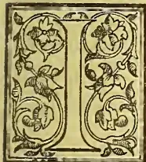

In a second brochure on "My Mission to Southern India," dedicated to his brother planters, Mr. Young records the impressions he received during a week's visit to Ootacamund, and the cinchona plantations on Dodabetta and at Nedevuttam. Mr. Young was enchanted with the scenery, which for grandeur and beauty are almost unsurpassed. The climate, too, from its dryness (not 45 inches of rain per annum as Mr. Young states, but a little over 50 inches) is exceedingly pleasant and salubrious, and with the rich soil is all that could be wished for cinchona culture although not for a remunerative yield of tea leaf. The elevation of Ootacamund is not, as Mr. Young states, 8,000 feet, but only 7,000, exactly the height of the lofty table land of Ceylon, "Horton Plains" which resemble the South of India sanitarium in soil and general surroundings, although the Ceylon station gets at least twice the rainfall which falls on the Plain of Ootacamund. On the cinchona plantation up the side of Dodabetta, however, and especially at Naduvatam, there is abundance of rain 100 to 150 inches per annum occasionally at the latter station. Mr. Young does not take a sanguine view of the success of the mountain railway, which is in course of construction from the foot of "the ghauts" to Coonoor, 6,000 feet above sealevel, to be ultimately carried 1,000 feet higher into Ootacamund. Mr. Young dwells on the paucity of goods traffic downwards, but this traffic will increase as well as that in passengers, Ootacamund being, deservedly, a favourite health resort, not only by Europeans in the Presidency, but others beyond it. The success of this mountain railway will be watched with interest in other parts of India and Ceylon. Much of it will be on the Rigi principle, lines on which principle we expect will ultimately enable visitors to our island, tourists and residents to ascend with ease to the summits of Pidurutalagala, Adam's

Peak, and others of our Ceylon mountains. Mr. Young recommends for adoption in the case of Nuwara Eliya and its neighbourhood, the system which the Madras Forest Department has carried out in Ootacamund of planting large plots of eucalypts, especially blue gums, and Australian acacias, and which are now valuable for purposes of shelter as well as for timber and fuel. The leaves and small twigs of the blue gum are also valuable as yielding an essential oil largely used in medicine and on the virtues of which, especially as a cure for rheumatism, Mr. Young is quite enthusiastic. Mr. Jameson who, under Mr. Lawson, is in charge of the exquisitely beautiful Botanical and Public Gardens at Ootacamund, indoctrinated Mr. Young into the method of distilling this oil. From a recent visitor to Ceylon from the Nilgiris, Mr. Brown, who is employed on one of Mr. Stanes's properties, we received a bottle of this oil, "Oleum E. Globulus," prepared by himself at the Felixstowe Laboratory, Coonoor, and we have just had presented to us, as an infallible cure for rheumatism and other ailments, including diptheria, (which has been cured by the inhalation of steam from a decoction of blue gum leaves,) a phial of Tasmanian Eucalyptus oil. If all that is said of this substance is true and if the demand increases, Ceylon now possesses so many blue gums that it could well be a source of manufacture and supply. As we saw and greatly admired the well-grown trees of *C. officinalis* on Dodabetta and the *succirubras* at Naduvatam in 1877, we are not surprised that Mr. Young should be struck with the gigantic survivors of poor McIvor's first plantings. We are rather surprised, however, that Mr. Young should have told Mr. Lawson he never heard of cinchonas being manured. Why, the thousands upon thousands grown amongst coffee in Ceylon received the full benefit and profited by it, of the manure applied to the main culture. In noticing the Nilgiri Plantations reports, too, for a quarter of a century or more, we have constantly quoted statements as to the wonderful effects of ammoniacal manures in increasing the cinchona alkaloids, especially quinine. The cinchonas are simply no exception to other cultivated plants which respond to the application of fertilizing matter, and Messrs. Lawson and Hooper are wisely following out the policy which poor Broughton recommended in his time. If ever the cultivation of coffee and cinchona revives in Ceylon, manure must be liberally applied to obtain the best results. Here as on the Nilgiris, of course, only the best species, and best varieties of hybrids will be employed: *Ledgerianas*, *Officinalis*, with *Magnifolia* and other good

395------------------------------------------------

370THE TROPICAL AGRICULTURIST.[DEC. 1, 1892.

hybrids as tested by results of alkaloids in the barks. At present, certainly we in Ceylon must give first and second place to Java and India in regard to cinchona culture. As to tea we can hold our own, but we suspect the statement of our good friend Mr. Young that Wynad is no more likely to succeed with tea than the higher slopes of the Nilgiris, will be sharply challenged,—judging from sanguine letters in the Madras papers.

Having thus given a general idea of the contents of Mr. Young's pamphlet, we now proceed to take over a few interesting extracts:—

The usual mode of travelling in Southern India is by a curious vehicle called a Tonga, which is usually drawn by two horses or good sized ponies. It has two seats back to back, suspended on two wheels, and is covered by an awning, and being very light is admirable adapted for hill travelling and I cannot understand why it has never been introduced into Ceylon in place of our Cumbrous Coaches.

At the top of the Coonoor pass the road skirts two or three estates under European management; and near the road itself I saw some fairly cultivated coffee; the trees looked healthy and vigorous and were kept in good order, and reminded me of the days of yore when the bushes flourished in our midst; but further back, the coffee fields had a weedy and semi-abandoned appearance, and I was told by planters this was the customary cultivation in that part of India.

The public gardens are a most agreeable resort; they are well cared for, and laid out prettily and with taste, and contain many rare and interesting plants from all quarters of the globe. They appear to be singularly adapted by nature for charming scenes and this has been cleverly taken advantage of and augmented by art, and the delightful results are probably heightened by the beautiful views afforded all around over mountain, hill, and dale; with bungalows peeping out here and there from amidst the forest of Acanthias and Bluegums.

I made several pleasant visits to these gardens, and carried away a deep impression of their beauty; they are, I believe, about 50 acres in extent, and have an extensive conservatory, a Herbarium, and a good Library which contains many rare and valuable works; and the whole reflects the greatest credit on those in charge. I have seen nothing in the East to compare with them.

Surrounding the Sanatorium are large plantations of Bluegums the property of Government. These woods are of all sizes and ages, and add greatly to the beauty of the place, and give it a homelike and cosy appearance, recalling Scotland to one's memory; indeed Ooty, with its environments, reminded me greatly of the neighbourhood of Dunkell.

The *Eucalyptus globulus* not only adds to the beauty of the scenery, but forms a shelter to the whole town during the prevalent winds; and is a most profitable cultivation for fuel, affording also a useful essential oil which has found a sound footing of recent years in the pharmacopoeia.

*Eucalyptus* oil, distilled from leaves of *Eucalyptus globulus*, is now used in hospitals, as the best cure for Influenza, Rheumatism, and Lumbago; and is an antiseptic; and has moreover replaced in Surgery Carbolic acid.

I tried this oil for an attack of Lumbago, and found its effect marvellous; the best way to apply is to put about a table spoonful into a hot bath, and then lie in the bath for some time; the result is speedy, and efficacious, and I can recommend it in the same manner for Colds and Chills; and also to remove aches and stiffness after long rides and great exposure to heat or cold. It has a most soothing and restorative effect, and produces sleep. No bungalow should be without a bottle of this invaluable medicine.

It is now distilled in considerable quantities at the Ooty Botanical gardens; and the Curator, Mr. Jameson, very kindly initiated me into the secrets of extracting the oil.

The distillation is carried out in the usual way; and a still such as is used for Arrack or Whisky would answer the purpose perfectly, care being exercised

that the oils should be distilled at as low a temperature as possible.

Adult leaves and small twigs are the best, and are richest in oils during the dry months. It takes 70 to 80 lb. green leaf to yield 1 lb. of essential oil, valued at present from 4s to 10s. per lb. in the London market; while to extract the oil the cost is, from first to last nearly £1 per lb., although it can undoubtedly be done for much less when carried out on an extensive scale.

The gardeos find a ready local sale for the oil at £5 per quart bottle. The natives buy eagerly, and are great believers in its curative properties.

To facilitate extraction, and also to increase the yield, the leaves and young twigs are put through a Chaff cutter; this operation breaks up the oil cells, and I consider it would be a still further improvement, (and suggested the idea to the Curator,) to pass all the leaves and twigs between rollers made somewhat after the fashion of Tea machinery.

The present system is to root up the tree, fell the wood for fuel, and extract oil from the leaves; this struck me as a very wasteful method, and I suggested that by topping the lateral branches, one tree would continue to yield leaves for many years, and thereby prove a still greater success commercially.

There is no reason why Ceylon Planters should not go in for this cultivation; particularly towards Dimbula and Nuwara Eliya, where the blue gum grows to such perfection, as it would prove a remunerative adjunct to tea.

I am strongly of opinion that the Ceylon Government should be guided by the Madras Authorities and plant up extensively all sorts of trees in the neighbourhood of Nuwara Eliya, under the direction of the Forest Department. It would add greatly to the beauty of the place, and would, I am certain, in the long run prove remunerative.

Dodabatta is about three miles from the Ooty Club; and is on the steep side of a hill overlooking the town. A friend took me up there one afternoon, and we rode all over the place. It is planted with officinals, or Crown Bark; with a few Hybrids interspersed, and is a fairish cover, the trees being thinned out in many parts; they are well grown, strong and healthy, and I could not discover a sickly or cankered tree.

This garden was originally opened 25 to 30 years ago, and the trees have all the appearance of their age, and are well grown and set.

The soil and climate seemed to me perfect for this cultivation; the former is a dark rich friable loam of any depth, without the slightest sign of clay, or a stone anywhere about; and with all the appearance of what we call in Ceylon "Patnasoil." The average annual rainfall is about 50 inches.

Mr. Lawson informed me that very recently at Dodabatta 12 acres of the crown bark, 25 years of age, were uprooted and yielded 4,400 lb. dry bark per acre; the trees in question had been barked some 6 or 7 times, and the plot was the worst on the Estate.

After a most enjoyable drive without incident or adventure, we arrived safely at Mr. Lawson's hospitable bungalow in good time for breakfast, and received a hearty welcome from our kind host.

The bungalow is at the very top of Naduvatam, at an elevation of 6,000 feet above sea level, or say at the altitude of Nuwara Eliya; and the view from the front of the house surpasses anything I have ever seen. I can call to mind no other place with such grand glimpses of nature; nothing equal to it. Many beautiful scenes are to be met with in our own little Island but they dwarf into insignificance in comparison with the magnificent view, spread out like a panorama in front of Mr. Lawson's house.

At our feet stretches the Wynad, estates being seen dotted here and there, with the cart road leading to the seaport at Calicut, winding down the face of the hills; till at last, all is lost in the haze of the low country.

Gold is found in the hills immediately below; and companies have been started with a view to working it but the results so far have been small, yet, I believe sufficient, to give encouragement to continue working.

Towards the north is a parklike country, inter-

396------------------------------------------------

DEC. 1, 1892.]THE TROPICAL AGRICULTURIST.371

sected with ranges of hills beautifully tinted in varied colours, and interspersed with what appears in the distance to be lakes, and rivers, and this comprises the Mysore country. Mysore itself can I believe be seen on a clear day from Naduvatam.

At our back and towering over us, mountain upon mountain, are the Ootacamund hills; with the Sanatorium in the centre. The whole makes a wild and charming picture which language is quite inadequate to describe.

The Cinchona at Naduvatam is planted in two deep and well sheltered valleys running down parallel on each side of the bungalow.

The lay of land is very steep in parts, and indeed the trees seem to thrive and grow best on ground of that nature, owing no doubt, to the drainage being better, and no moisture lodging at the roots.

Both the climatic conditions and soil at Naduvatam are similar to those already described at Dodabetta; and are equally favourable to the growth of Cinchona.

The principal cultivated variety is *Succirubra*; but *Pubescens* mixed with a good many different species of Hybrids is also in evidence. In fact I recognised most of the Cinchonas grown in our Island. There are some younger fields, but the principal part of the cultivated area consists of trees from 25 to 30 years old, which are beautifully grown with magnificent stems, and form quite a forest, this being by far the finest show of Cinchonas I have ever seen. There is nothing in Ceylon to equal the size or evenness of the trees, but of course it must be borne in mind that we possess none of the same age.

What pleased me most was the extremely healthy appearance of the trees which appeared to have taken a firm hold as if in their natural habitat; not a single caulked tree could I discover anywhere, though I searched for one in every direction.

The whole cultivated area is well roaded, and in excellent order. I was there during the dry season, and the weeds had mostly been carefully trenched, or dug under, and the land had a highly cultivated appearance.

Mr. Lawson told me that fourteen acres of 25 years old *Succirubras* on the Naduvatam Estate, which had been barked 7 or 8 times, yielded on being coppiced 3,250 lb. of dry bark per acre. The trees were on poor ground, and many of them were dying.

I had long and most interesting conversations with Mr. Lawson on cinchona cultivation, and got an immense amount of valuable information from him on the subject; but there were many points on which we did not agree.

I explained that we had suffered most in Ceylon from canker, brought on by the excessive moisture of the climate; clayey, or damp soil, and consequent "Wet feet." But this Mr. Lawson would not on any account agree to, and attributed canker in cinchona to poor soil and bad cultivation. Canker, he says, can be surmounted, and almost invariably eradicated, provided the disease has not proceeded too far, by the following mode of cultivation:—

Cut parallel trenches 10 feet apart running across the face of the hill, and make them 2 feet deep by 1 foot broad, and into this put your manure, if procurable; and then scrape in and mix well together all leaves which are lying about, with weeds and top soil, till the trench is well filled up.

Mr. Lawson considers that excessive moisture at the roots, amounting to "Wet feet" has nothing to do with Canker, and that it arises simply from poverty or exhaustion of the soil, and can, if taken in time, be destroyed by a thorough system of cultivation as described above; moreover, he is of opinion, that weeds do little or no harm to Cinchona, and that it will be quite sufficient if they are cut down once during the twelve months.

I told Mr. Lawson that I had never before heard of manuring Cinchona; but he said it requires sustenance equally with any other plant, and that he preferred his system of manuring as already described to ours of pitting or forking-in, for the following reasons; the advantages of the system according to Mr. Lawson's idea being 3 fold, viz:—

1. It cuts all the whiplike roots on one side of the

tree within 2 feet of the stem; these roots producing very few feeding fibres; whereas from the cut ends of the roots large bunches of fresh feeding fibres are sent out into the trenches amongst the fresh soil and cool damp earth; and well out of the reach of the drying influence of the trying sun during the hot weather.

2. It is much cheaper than pitting, in the same proportion as digging a ditch to digging wells, the cost on the Government Estates being from R13 to R30 per acre.

3. By treating the land in this manner you bring up subsoil which eventually is made into rich surface loam, and thus the whole estate in the course of time, is renovated at a small outlay.

The great point is to cut the roots and let them get into fresh and free soil.

Most Ceylon planters, equally with myself, will be surprised at the foregoing views regarding cinchona cultivation, as we generally hold to the belief that cutting, or meddling with the roots, or manuring in any form whatsoever, brings on canker, which speedily kills the tree. That Mr. Lawson's treatment answers on the Nilgiris his magnificent fields of cinchona clearly testify; they speak for themselves; at the same time, I must beg to differ from my learned friend, as I consider his great success is not altogether owing to the mode of cultivation, but is due, in a great measure, to the perfect climate and soil of the Nilgiris which are so admirably adapted to this plant.

I came away deeply imbued with the impression that the [quinine] manufacture in a commercial sense is not a success; and that it would never answer, or pay, to start a similar establishment at Nuwara Eliya, as was at one time contemplated.

Another point which exercised my mind not a little, was the idea that the febrifuge is not all, or nearly all of it, extracted from the bark. Whether this is owing to climate influences, the water, or both; or whether it arises from insufficiency, or weakness of the chemicals and appliances used, I am unable to say; still I strongly hold to the opinion from all I saw and heard on the subject, that nothing like the full amount is extracted from the raw material.

I was told that on an average the factory extracts 3 to 4 per cent. of Quinine; considering therefore that the trees from which the bark has been harvested are 25 to 30 years old, perfectly healthy, and that the bark is mostly renewed, and very often is Crown bark, the average does seem absurdly low.

I went into figures with Mr. Lawson as to the acreage under Cinchona cultivation in Government hands, and into the approximate estimate of yield, were the whole to be coppiced, with the following result:—

<table>
<tbody>
<tr>
<td>Dodabetta cultivated</td>
<td>...</td>
<td>320 acres</td>
</tr>
<tr>
<td>Naduvatam "</td>
<td>...</td>
<td>350 "</td>
</tr>
<tr>
<td>Pykara "</td>
<td>...</td>
<td>250 "</td>
</tr>
</tbody>
</table>

920 acres

Deduct acreage recently coppiced and young ...

120 "

800 acres.

There are therefore 800 acres old, and well grown Cinchona, in Government hands, which I put down at an average of 3000 lb. per acre, or say in round numbers 2½ million lb. dry bark; however, I look upon this as a very safe estimate, and consider that 3 or even 3½ million lb. would be nearer the mark.

There are several Cinchona Estates in this neighbourhood in private hands, but I had no spare time to pay any of them a visit, however much I should have liked to do so. Nevertheless I cannot help remarking on one property which took my fancy immensely. It faces Naduvatam, and the cart road to Ooty skirts the estate. It is called "Liddesdale" and belongs to the "Nilgiri Tea and Cinchona Co., Ltd.," and is one unbroken sheet of 700 acres old Cinchona: mostly Hybrids, and high class varieties, which it would be difficult to beat. The lay of land, soil, and climate, of this valuable property are very similar to our Agras.

I came across three or four small tea gardens in the neighbourhood of Ooty and Naduvatam, but the plant does not look happy, nor does it answer on the

\* We take leave to dissent.—ED. T.A.

397------------------------------------------------

372THE TROPICAL AGRICULTURIST.[DEC. 1, 1892.

Nilgiris. The fact is that both the soil and climate which are so favourable to cinchona militate strongly against tea: the rainfall is insufficient, and the soil much too dry and friable. For six months the bushes are nipped down by frost and the bitterly cold nights, and for a like period are unable to flush owing to strong wind and cold rain; hence the yield is insignificant, and the only way it can possibly be made to pay is when worked as an adjunct to Coffee or Cinchona; and also by getting a local sale for the produce through the Madras Presidency.

From all I could learn tea is also likely to be more or less a failure in the Wynad, where it has to contend against drought as well as the unhealthy season, which extends from March till June the best-flushing months—when not even a cooly can stand the climate.

Mr. Lawson took me for a charming walk of about three miles over the hill at the back of his house, where we had a splendid view of the far famed "Ouchterlony Valley," which lay at our feet bathed in sunshine. Both in contour and size it reminded me greatly of Kelebokka; being a long narrow basin backed by high hills on either side, with a cart road down the middle. The two valleys are also very similar in altitude, and lay of land, and each contains about a dozen different properties.

"Ouchterlony Valley" was originally a magnificent sheet of coffee, and I believe gave wonderful yields in the palmy times, but a good portion of it is now planted up with cinchona which thrives well, not only here but all over this country.

I was not able to get down to the coffee fields, but in the distance they looked thin and poor, and have no doubt here as elsewhere suffered from the scourge of leaf disease. I was told the yield is not nearly so great as it was in the times previous to leaf disease, and the cultivation is now giving way, in a great measure, to that of tea and cinchona.

One of the great drawbacks to the Sanatorium is the scarcity and costliness of public conveyances. The common Tonga and pair is the only vehicle to be had on hire; and indeed I was informed that on occasions of public gatherings and social festivities, it was often impossible to get a carriage for love or money.

I expressed surprise to several of the residents that the machine called a jinrickshaw had never been introduced into Ooty.

#### THE INDIAN TEA CROP OF 1892.

The clearances of this season's tea crop to 30th September total up 584,523 packages weighing 50,936,063 lb., and of the declared value of R2,66,32,158, giving an average of about annas 8 4/4 per lb., which must be satisfactory to the proprietors as compared with last season. Had, however, the Currency Bill been in operation and the rate of exchange fixed at 1s. 6d. there would have been a difference on the wrong side to those parties interested in tea gardens of about 37 lakhs of rupees, and which by the end of the season would possibly be doubled. It looks as if one-half of the tea crop had been exported up to 30th September, as the total crop is not likely to turn out as large as the latest revised estimate of the Tea Association, the weather in the Tea Districts having continued unfavourable.

It appears strange that out of the 584,523 packages which have already been exported, only 232,944 packages have been sold at the public sales, and that 351,579 packages have been on account of the proprietors. What is the cause of this? There are six large firms of tea brokers in Calcutta, all of whom look well after their business, and who, during the reason, are tasting tea samples from early morn until late in the evening. At the commencement of the season, before the tea sales begin, all the brokers are inundated with garden samples for report and valuation, and after all their labour—and it must not be overlooked that tea tasting is more injurious to the health than B. and S.—they only get 40 per cent of the teas for their sales. Proprietors or their Agents may assert that the prices obtained

in the local market are not to be compared with the rates realised in the London market, but against this assertion it is very difficult to find many regular shippers who purchase their teas in the local market that have realised any large profits on their shipments. Generally it is all the other way, and it is only when an unexpected spurt takes place in the London market that shippers who have teas near arrival, make a good profit, but, subsequent shipments made after the news of the rise in London has reached here generally leave very unsatisfactory results.

Perhaps it may be that there are not buyers in the market (notwithstanding the operations of the largest tea dealer in England, who has lately commenced to make his purchases in this market) to take off a larger quantity of the crop, but it is not at all improbable that Agents' commissions have a good deal to answer for. Ceylon teas appear to have caused a falling off in the demand for our teas in both the Australian markets and in Bombay and Persian ports.—*Capital*.

#### THE WOODS OF ENGLAND; TENDENCY TOWARDS RE-AFFORESTATION.

Will the England of half a century hence look much more like the England of Elizabeth's time than does that of these days, and is the appearance of the country going back in any way to that which it presented in primitive ages? These questions will be sure to be asked by those who study the part of a recent return procured by the Board of Agriculture respecting the extension of woodlands in England and Scotland. Many shrewd observers have long maintained that the plough has been going where it had no business to be, and that ambitious agricultural improvements upon which thousands have been spent little purpose would have proved remunerative had they taken the form of planting young forest trees at a trifling original cost. It would seem that this opinion is gaining ground. The increase in the acreage under wood, though not rapid, is unmistakable. It has been steadily going on; at all events, since 1872, when the first trustworthy returns on the subject were published. Between 1888 and 1891 it had increased from 2,561,000 to 2,695,000 acres; and there are signs that it may go on at still greater speed. In a recent contribution to the small native literature of forestry, Mr. Nairne has pointed out that some discouragements to afforestation are coming to an end. In the northern parts of Scotland, where is so much waste land growing barely herbage enough for sheep, landowners did not care to plant much while the crofters' agitation was at full flood, though it must be mentioned that two-fifths of the entire surface planted in the last decade is in that country. It was not to be expected that, with very bad times and falling rents, they would care to make profuse outlays, the return for which would not begin to come in until after 40 or 50 years, and we are told of nurserymen who grew tired of cultivating year after year young forests trees, which they burnt to make room for a younger stock, and who sold what little they did sell at insignificant prices. In the districts to which Mr. Nairne refers it has generally been deemed preferable to turn tracts available for planting into sheep-farms or deer forests, and the preference is likely to survive. Those who are offered handsome rents for high moorlands or mountain wastes, where fir or larch would have a hard strife for life, are not likely to hesitate; they will take what comes in their way, and bid posterity look after itself. Between 1888 and 1891 there has been an addition of 31,000 acres to the wood and area of Scotland, which is not indicative of any great changes going on in the rural economy of the country, but which does speak of a removal of some of the former obstacles to afforestation. In England an increase of about 96,000 acres in the above-named period is recorded. But it is curious to note the conservative ways of the country. The counties which were

398------------------------------------------------

DEC. 1, 1892.]THE TROPICAL AGRICULTURIST.373

best wooded in Elizabeth's time are still so. Sussex, for example, still answers to the description given of it by Camden as being "pleasantly shaded by woods"—it is the second in extent of woodland of all the English counties, and there is a survival of primitive conditions in the fact that the Hants, Surrey, Kent, and Sussex have between them nearly one-fourth of the whole English Woodland.

Old ways will not quickly change; and it is not to be anticipated that young trees will generally take the place of wheat, cattle, and sheep. What is permissible to say is that the outlook for afforesting is better than it ever was. There are limits to the resources of the Norwegian and other forests, upon which even distant Australia makes a drain. In a quarter of a century the Baltic ports may no longer send to the vast supplies upon which we have long counted. Canada and the United States have growing home demands to meet; and there is no new country to which we can look to give us, in abundance, the cheap timber needed in mining and the construction of railways. Will the rural economy of England and Scotland mere and mere conform to the altered conditions of supply? Political economists have always admitted that in the case of afforesting there might be a conflict between the interests of the community and those of a private owner. He, as a rule, cares to sow only where he will reap; and the harvest is very far off to him who plants the oak or beech, or even the larch or pine. If rich and public-spirited, he may, out of his superfluity, give wherewith to provide for his successors full-grown and valuable timber. But the temptation to most men to prefer returns coming in at the end of four or five years, or less time to those postponed, it may be three-quarters of a century is strong. He may have an estimate for planting fir and larch at, say, 40s to 50s an acre—that given by Mr. Nairne—even at less; the work will, at any price, appear too costly—the public benefit private imprudence. So much have some economists and writers upon forestry been impressed by the possibility of this contradiction that they have argued that the State should insist upon continuity of production. Such a policy is needless; something might be said for it if it were necessary; that a sudden change should be made, and that large tracts should be without loss of time turned into woodland. Nothing of the sort is advisable; the history of English agriculture is full of warning against a policy of spasmodic "improvements" or changes carried out in a spirit of panic. What is required on the part of those who have the means to plant is that they study oftener than they do the capabilities of their estates to grow marketable timber. Some of those who plead poverty when counselled to plant trees where generations of farmers have fought in vain against the stubborn poverty of nature have money enough to invest in dubious foreign investment, and provide for their families in ways which will be worthless by the time that goodly timber, a veritable mine of wealth to its owner, would have grown up.

It is interesting to know that the counties best wooded in Elizabeth's time are still so; it would be more satisfactory to hear of greater variety and fresh experiments being tried in districts where wood is rare. The returns which we have cited show a considerable area—about 311,351 acres—under woods or plantations in Ireland. But as to that country, it cannot be doubted that vast tracts of which no industry can make much as arable land are well adapted for the growth of timber. In Wales the additional acreage brought under wood between 1888 and 1891 was only 7,000. Will it be said that this is all that under a wise rural system should be added? From the growth of a taste for forestry and the spread of knowledge respecting it more is to be hoped than from crude, ambitious schemes fostered by legislation and carried out by a Woods and Forest Department of the country councils. For twenty experts in ordinary agriculture among landowners not

one is acquainted with the rudiments of woodcraft. Evelyn deplored in his time the "disproportionate spreading of tillage, caused through that prodigious havoc" wrought by those who would raze the "many goodly woods and forests which our prudent ancestors had left for the ornament and service of their country." A diffusion of the tastes which the author of "Sylvæ" cultivated would be a blessing all round. There would be the certainty that there would be no "disproportionate spreading of tillage," that forest trees of all sorts would have their fair share in our rural economy, and that there would be no wasteful use of timber without taking care to replenish the stock.—*London Times*, Oct. 21.

#### COOLIE LABOUR.

Sir,—There is a letter in your issue of August 27 on the coolie labor question which, though moderate in tone, yet does not deal with the matter from the broad political point of view from which politicians require to look. Humanitarians and social reformers are not always the best political guides, as in the instance of the C.D. (woman's) act in England and India. But I do not desire to argue the rights or wrongs of that Act, or the repeal of the same. My present object is to controvert some of the arguments used by Mr. Kirby. I have spent 19 years in Ceylon and India, and during that long period I have been engaged in various planting enterprises, and all the time I have employed colored labor; hence I may be considered competent to give your readers the other side of the subject. Mr. Kirby deals with the danger of a half-caste progeny arising in our midst, which is the sure result of the mingling of the dark races with those of the white, and the terrible demoralisation and degeneration which will ensue. He says the result of bringing a number of coolie women to Australia will be the flooding of Australia with the lowest sort of half-caste, and the Australian blood will become abased. This cannot but help raise a smile at the extremely narrow horizon which confines the views of Mr. Kirby. Let us widen out the matter, and see fairly how the introduction of coolie labor will be a blessing instead of a curse. Missionaries and others have an idea that the heathen are governed by low morals. Mr. Kirby may be surprised when I tell him that the ordinary coolie class suffers more injury from contact with the white man than the white man could possibly suffer from contact with it. They are guided by the stern rules of caste which act as a hereditary moral principle, and in their villages these rules are strictly enforced. It is only when the coolie tries to imitate the European vices that the power of caste ceases to restrain him. If Australia included only countries of temperate climate Mr. Kirby's arguments would have more weight, but large tracts of tropical lands lie waiting for tropical agriculture, and Mr. Kirby only proclaims his ignorance of tropical matters when he soars into utopian dreams of mythical labor-saving machines which will enable the white man to cultivate tropical lands. The Tamils are an intelligent, docile race, and it is a base libel to say that their women are so immoral that they would contaminate the people here. The coolie prefers to have his hut and domestic happiness to himself; but, as in all communities in all countries, even in Australia, there are women (and men, too) "of the baser sort;" the presence of these, however, does not corrupt the others. Careful selection of labourers and good fair treatment will result in a most useful class of labour being introduced into the tropical regions of Australia, and thereby releasing the latent locked-up wealth which awaits the enterprising planter. Then Australia would be dependent on no outsider for her supplies. Coconuts, cocoa, rice, coffee, tea, arecanuts, spices—all these products and many more would be produced in the country. Employment as managers and overseers would be found for your educated youth, new and remunerative channels would open out for your money, and fair sensible laws would control the coloured immigrant, and prevent any clashing or inharmonious contract

399------------------------------------------------

374THE TROPICAL AGRICULTURIST.[DEC. 1, 1892.]

with the white labourer. In conclusion, I would beg Mr. Kirby not to malign a class of labourers, thus showing his utter ignorance of the subject in hand. Wise laws and a strong Government could easily control and arrange the introduction of Tamil coolies so as to prevent any conflict or antagonism between white and black labourers.—I am, &c.,

Buckalow, Broken Hill. W. A. TYTLER.  
—*Adelaide Advertiser*, Oct. 11.

[We do not see how the tropical portions of South Australia are to be utilized unless by means of Indian labour, but for the sake of Ceylon we are glad to believe that the views which will prevail with the white settlers are those expressed by Mr. Kirby and not the optimistic opinions of our good friend, Mr. W. A. Tytler.—*Ed. T.A.*]

#### FORMS OF ADULTERATION.

The most universally coloured article is butter (says *Food, Drugs, and Drink*), and it may with great confidence be asserted that there is hardly a pound of butter sold at the present time in this country which has not been doctored, mostly by the aid of a harmless vegetable colouring matter—annatto—in order to impart to such butter a rich golden colour. Butter naturally varies much in colour, according to the season, the breed of the cow, and mainly its food; and it is but rarely the natural butter possesses the colour to which the public is now accustomed. The desire of those who introduced this admixture was obviously to make their product appear richer and more enticing to the eye than nature had intended. One after the other the rest of the butter merchants had to follow suit.

Milk is also generally coloured by the milkman. Here the object is plain. Watered milk assumes, as is well known, the tell-tale sky-blue colour which at once betrays that the milk has been tampered with. To hide this the blue milk is again artificially provided by means of a yellow solution of colour with a rich creamy appearance. To hide the original fraud the second deception is practised.

Mustard, especially that which has been adulterated with flour, which in consequence also would look sickly pale, is brought up to the original colour of genuine mustard by the addition of turmeric, and a similar practice is beginning to be adopted in the pepper trade.

Sausages, both meat and skin, are dyed with aniline colours, for the purpose of hiding the colour of unhealthy or stale meat which may have been used. Jams, especially plum jam, are generally dyed with aniline colours, and sugar confectionary is hardly ever without such artificial dye. Ale is darkened with burnt sugar, as also are brandies and whiskies.

It must be admitted that in by far the majority of these cases the colour used is entirely harmless, and has no influence upon the health of the consumer. Yet there are a number of aniline colours which are positively poisonous, even when pure. Such colours are picric acid and its salts, Martius yellow, saffranine, methylen blue, dinitro-cresol, and aurantia. Others, unobjectionable in themselves, become poisons owing to their mode of manufacture, which leaves in the products poisonous impurities, such as arsenic (rarely), salts of copper, tin, or zinc. The manufacturer of sausages or jams has not the least idea whether the colours he uses may not belong to one or other of the above, to which doubtless many others could be added, and even if the quantity of colour consumed by one individual may be exceedingly small it is palpably evident that no such manufacturer should have the right to use such colours. Almost every civilized country has passed legislative measures regulating the use of colours such as those referred to, but England, the mother of all Adulteration Acts, has done nothing, and has in this, as in many other points concerning the sale of food and drink, remained far behind most other nations, even including the equalling South American Republics.—*Pall Mall Budget*

#### PEPPER, PEPPERCORNS AND OTHER THINGS.

A grocer, speaking of pepper the other day, confessed that he was unaware that white and black pepper were both derived from the same plant. We supposed this was so well known that no one in the trade could be ignorant of the fact. The berries of the *Piper nigrum* are gathered as they begin to turn red, and when dry they form the ordinary black pepper, while white pepper are the same berries deprived of their pulp, or sometimes by blanching the outer layer of the berry. What is known as long pepper is the berry of the *Piper longum*; it is less powerful than the former, though a considerable article of commerce. Pepper was greatly prized by the ancients and sometimes even made a medium of exchange. The plant itself is a stout shrub, trailing or rooting at the ends, or rooting at the joints or climbing on trees. The stems grow to a length of 20 feet, bearing large ovate leaves and flowers and berries in spikes. It is a native of forests in India, and is everywhere cultivated in hot, damp, tropical countries. Sumatra produces the commonest and cheapest qualities, the heavier kinds of which are called "shot" pepper.

The term "peppercorn" is frequently heard in England, but the average grocer of the United States would hardly know that plain pepper was meant, should one of his customers ask for peppercorns.

In olden times grocers were called pepperers, and they formed an important part in the community when much of the food was salted meat, and pepper was in great request as a seasoning.

There is a dish called pepper-pot made of tripe shredded and stewed to the liquor of which small balls of dough are added, together with a high seasoning of pepper.—*American Grocer*.

#### NAILS IN FRUIT TREES.

Driving usty nails in pear trees, as a preventive or cure for blight, has long been practiced in some sections of the country. The Fruit Trade Journal, of New York, refers to the use of nails in peach and other fruit trees, as follows:

A singular fact, and one worthy to be recorded, was written us by a gentleman who stated that while on a visit to a large peach orchard, in which every tree was totally spoiled by the ravages of the worm, with the exception of three, and these were the most thrifty and flourishing peach trees he ever saw. The only cause of this superiority known to the host, was an experiment made in consequence of observing that those parts of worm-eaten timber into which nails had been driven were generally sound.

A chemical writer on the subject says: "The oxidation or rusting of iron by the sap, evolves ammonia which as the sap rises, will of course impregnate every part of foliage and prove too severe a dose for a delicate plant of intruding insects."

This writer recommends driving half a dozen nails into the trunk.

Several experiments of the kind have resulted successfully.—*Florida Agriculturist*.

#### PLANTING NOTES FROM COORG.

COORG, Oct. 29.—The condition of the roads has invariably been a standing grievance with the planting communities in perhaps all districts. \* \* \* Owing to the steep gradients of parts of the roads their bad state becomes a greater hardship and the wear and tear entailed on all draught animals must be very severe. There are some roads in the country which are never metalled. The important Mercara-Somwarpett road is one of them. During the wet weather there are regular puddles in parts and the slough-like hollows are usually filled in with boughs of trees, great blocks of stone or "D. P. W. mixtures" of sorts to render them passable. Sometimes the remedy is worse than the disease. I was told by an ex-Ceylon planter that it was a standing order of the Government of Ceylon that no part of its roads

400------------------------------------------------

DEC. 1, 1892.]THE TROPICAL AGRICULTURIST.375

should be made a steeper gradient than 1 in 14, and that nowhere had he seen roads kept in such excellent order as in Ceylon. A very different policy appears to commend itself to the authorities here, a policy which would deprive an industrial class engaged in the development of the resources of the country and adding materially to its wealth and importance, of the advantages of good roads. I shall not enlarge upon the subject further beyond expressing the hope that the ventilation it has received in the Press will be fruitful in bringing about some permanent good.

The important works of digging and, to a smaller extent, renovation pitting have now been in hand for some time. The latter is a luxury that cannot be largely indulged in unless labour happens to be exceptionally abundant. The benefit which results from it is fully recognised everywhere; but, owing to the slow progress of this work, it has to be limited to fields which are deemed to require it most, and is generally carried out in rotation. With regard to trench-ploughing, it is said that "the incorporation of subsoil with soil is a procedure to be adopted only with great caution," as, being more of the nature of the underlying rock, it tends to weaken the surface soil. Renovation pitting does not, however, operate in the same way, as it is only done some time after the coffee has been planted. The pits also form reservoirs for much valuable matter which would otherwise be dispersed and lost; and thus, in process of time, an increased depth of good soil is obtained. Some planters are of opinion that renovation pits answer very well in lieu of drains; indeed, they would appear to lower the level at which water stagnates, but they can only do so temporarily. The only objection, apparently, that can be urged against renovation pitting is that it prevents the soil being kept in a fine state of tiltb. The intervals between the pits become by compression quite dense and hard, which, for reasons explained in Mr. Graham Anderson's letter on "The Weeding of Coffee Estates," would give rise to increased temperature. That an increase of borer would follow is very probable. The totals of the losses from borer this season were, in many cases, so appalling that Mr. Anderson's remarks in this connection are well deserving of the attention of all planters. From what can be gathered on the subject from agricultural works, there can be no doubt that keeping the soil in a fine state of tiltb, by frequent stirring, would tend to keep places cool, as its capillarity is increased; and, for reasons which Mr. Anderson gives, the probabilities are that this would operate to some extent in checkmating borer. It was noticeable here that borer was severer in parts that had been renovated last year than in those that had been dug; but it was just the reverse as regards leaf disease. This defect in renovation pitting would perhaps be remedied by digging the parts renovated late in the year and filling in the pits; but unless they have been opened early in the year, it is generally considered undesirable to fill them in the same season. I have mentioned the practice on some estates of manuring in renovation pits. This is done in November and December, sometimes late, in pits opened between June and August. It has been attended by the best possible results. Two successive good crops have been obtained off fields treated in this way. Forking and loosening the hard intervals between the pits, without filling them in, has been found to act beneficially, as indicated by the improved appearance of the trees. There are fields of coffee all over the country which practically enjoy a complete immunity from leaf disease. It is evident that the conditions which obtain in these fields are unfavourable to the spread of the fungus. I must not omit to mention that a field here which had had an attack of leaf disease 3 years ago has kept remarkably free of it ever since. The additional care and attention paid to it probably accounts for this. On the other hand, fields free of it in some seasons take it in other seasons, and it is invariably found that, where this is the case, the soil has become sour.

The excessive wet weather this year has considerably retarded the recovery of sick trees. The N.-E. Monsoon set in here on the 3rd instant, and since then there has been almost continuous gloomy weather with light rain and occasional heavy showers. The entire absence of thunder makes the resemblance to the S. W. Monsoon almost complete. Plenty of sunshine with occasional thunderstorms is normal October weather. This afternoon the clouds and rain were travelling up from the South-West. It is supposed that the excessive wet will prove hurtful to young supplies. Preparations for crop are being begun. It ripens earlier in the Bamboo than up here. On one place here, however, a few children have been put on gathering and are, I believe, bringing in a quarter of a bushel each.—*M. Mail*, Nov. 4.

#### GOVERNMENT CINCHONA PLANTATIONS.

We have received a copy of Mr. M. A. Lawson's Administration Report of the Government Cinchona Plantations and Quinine Factory for the year ending 31st March, 1892. The information concerning the work on the plantations is meagre, but we gather that no new acreage was opened during the year under review but that only young plants were put out in the fields where the old trees had been uprooted or had died out. From a statement showing the approximate number of plants in the permanent plantations, we learn that on the 31st March last there were 1,779,894, of which 34,200 were planted out during the previous twelve months. Whether this latter number represents the actual plants put down without any allowance for vacancies or only for vacancies up to the end of the monsoon, we have no means of finding out, nor are we aware when the last census of the old trees was taken. In the statement referred to there are only columns for "plants last year," "coppiced or uprooted," "planted in this year"; but considering the mortality which exists in every cinchona plantation to a greater or less degree, it would be more satisfactory if another column were added showing the number of plants that had died out during the twelve months under review. As it is, we are doubtful whether the grand total of, say, 18 lakhs gives even an approximate idea of the correct number of trees in these plantations. In January and February last ten acres of old *Saccharubras* were uprooted at Naduvatam. These trees were very old and bad, and only yielded 40,150 lb. of dry bark, and this, too, of a very inferior quality, from a manufacturing point of view. The ground uprooted was replanted in March and April. This is much earlier than customary; but, adds Mr. Lawson, "it is in accordance with horticultural principles, and the result, so far, has proved satisfactory." Besides the up-keep of roads, bridges, buildings, &c., trenching and manuring was the chief work done in the field. The principal fertiliser applied consisted of a mixture of cattle dung, 20 parts, lime 1 part and wood ashes  $\frac{1}{2}$  part, a quarter of a bushel being given to each plant. Experiments were made in planting out seedlings in the field earlier than the monsoon, but apparently such work requires extra care and expense, and with such a poor paying product as cinchona is, this change of the planting season is never likely to be adopted by the practical planter. Particular attention was given to the harvesting of cinchona seed and the raising of plants in the nurseries. Writing of this, Mr. Lawson remarks:—

"It has been often stated that the seed of cinchona is deteriorating, and this may be true in certain cases; but experience would tend to show that when the seed is collected from healthy trees, and taken only when quite ripe, it is perfectly sound; that it germinates freely, and produces vigorous plants. The cause of the great mortality which used to take place in the Government nurseries in former years was due to the seed being grown in too damp a soil, and to the plants being over-shaded and over-watered. Also the plants were put out in the beds far too close to each other; formerly the seedlings were pricked out at distances of 2 inches  $\times$  1 $\frac{1}{2}$ , but they are now pricked out 4 inches  $\times$  4,

401------------------------------------------------

376THE TROPICAL AGRICULTURIST.[DEC. 1, 1892.]

This allows all plants to become well developed before they are transplanted in the field."

The interest of planters in the Government cinchona plantations centres in the quinine factory. Here Mr. Lawson is doing splendid work. Though Government, so far, has reaped all the advantage, we believe that the day is not far distant when these quinine-manufacturing operations will prove of real benefit to the cinchona industry of Southern India. On the 31st March, 1891, the amount of bark in stock was 510,695 lb., and 53,833 lb were harvested during the year, bringing the total to 564,528 lb., of which 147,670 lb. were disposed of, the *bulk* 144,500 lb. being used in the factory, thus leaving a balance in stock on the 31st March, 1892, of 416,858 lb., of which more than 60 per cent was Succiiruba, or red bark, showing a very poor analysis. There were at the commencement of the year (*i.e.*, on 31st March 1891) 1,572 lb. of sulphate of quinine and 1,200 lb. of febrifuge in stock. During the year 4,425 lb. 14 oz. of quinine and 3,174 lb. of febrifuge were manufactured, making a total of 5,997 lb. 14 oz. of quinine and 4,374 lb. of febrifuge. Of these amounts 3,345 lb. 4 oz. and 3,019 lb. respectively, were disposed of during the year, leaving at its close a balance of 2,652 lb. 10 oz. of quinine and 1,355 lb. of febrifuge. From the foregoing figures it will be noticed that 144,500 lb. of bark gave an outturn of 4,425 lb. 14 oz. of quinine and 3,174 lb. of febrifuge. Turning to the cost of production, we find the expenditure for the year aggregates R75,805, of which R51,899 were for the maintenance of the general establishment and the upkeep of the estates, while the Quinologist Department cost R23,906. The receipts amounted to R77,066, of which no less than R75,262 were realised by the sales of quinine and febrifuge, which should apparently give a very handsome profit on the working of the factory during the year.

When the quinine factory was started at Nadavattam it was hoped that in a very short time the result of the manufacture of sulphate and febrifuge locally would lead to a largely increased consumption of these drugs in this country owing to their being placed within the reach of the very poorest classes. Mr. Lawson has spared no pains to bring this about, but so far his efforts have not met with the success that they deserved. For instance, we find in the present report this short paragraph:—"The sale of quinine in paper packets has increased during the year in most of the districts, but to no considerable extent. From one district the whole of the packets were returned with the remark that 'Next to no use is made of this medicine in this district;' also in another report it is gravely stated that the quinine causes itch." As it has been pointed out by the Surgeon-General, the sale of the powders depends quite as much, or perhaps even more, upon the interest which officials of the lower grades take in distributing the medicine than in the reduction of the price at which it is to be sold. The cost of the powders, as now sold, is, we understand, a trifle under cost of production. It is evident, therefore, that in this direction nothing further can well be done to popularise the medicine, but that now it rests with the subordinate District officials to make known to the people at large what a wonderful safeguard can be purchased for a few pies against the fevers which are prevalent at one time or other of the year in well-nigh every village in Southern India. Mr. Lawson quotes an extract from the *Chemist and Druggist* which takes exception to the sale of Government quinine to private individuals, as "such a course is undesirable for many reasons." It adds:—"In Madras we believe planters and private individuals are at liberty to purchase quinine in certain quantities from the Nadavattam factory. The English quinine makers, however, are about, it is rumoured, to protest against a continuance of this practice." Up to the present time Government quinine has been sold only to planters and other persons, when it has been ascertained that it was the intention of the purchaser to administer the whole of it to the coolies on his estates, and none has

been sold to the public direct. Such sales can only help to increase consumption, a consummation for which no one should more devoutly wish than the English quinine makers themselves. The whole future of the cinchona industry, in so far as European capital is concerned, depends on a largely increased consumption of quinine, and it is as much to the advantage of the manufacturer as of the planter that nothing should be left undone which would tend to this result. Since Mr. Lawson's Report was written, we understand work has been going on steadily at the quinine factory, and in his next Report we expect to be told that his stock of bark has been still further diminished. We hope also to find that the sales of quinine powders will have been very considerably larger; but this does not depend on the Director of the Government Cinchona Plantations but on the District Officers and their subordinates.—*Madras Mail* Oct. 29.

MACE AND NUTMEGS IN BANDA.—The spice growers on the island of Banda (Dutch Indies) had a very prosperous year in 1891 owing to the rise in the market value of nutmegs and mace. There are thirty-four nutmeg-plantations in the island, and the recent sale of two of these showed that this kind of property has increased very largely. The total output of nutmegs and mace in the islands of the Banda group in 1891 was about 14,580 piculs. The cultivation of nutmegs is extending to many of the neighbouring islands, but the trees there are not yet in bearing.—*Chemist and Druggist*, Oct. 22.

AN AMERICAN FRUIT DRYER.—Messrs. Ph. Mayfarth & Co., of Frankfurt-on-the-Main and of Mincing-lane, have already shown their evaporators, Ryder's Patent, to the Fellows of the Royal Horticultural Society, and yesterday and the day before they gave another demonstration, at the Society's gardens, Chiswick. The machine is an ingenious combination in which many of the mistakes of former inventors have been avoided, and will even in this country be of some use to producers in enabling them to postpone the sale of their products at times when the markets are glutted, and to make a saleable article out of their windfalls. Many evaporators are made, and the speciality of that exhibited is in the slope lines given to the flue or hot chamber—an arrangement which materially assists the passage of the drying agents, currents of hot air ascending from a nicely-adjusted furnace. The stove burns coke, coal, or wood; and the air which it has raised in temperature passes under the rows of wire trays in wooden frames containing the fruit to be dried. The chamber in which these trays are placed rests on the stone at an angle slightly inclined. The fruits being desiccated at present are apples, which remain from two to three hours in the chamber. The only preparation apples require before being dried is peeling, coring, and slicing, which is done simultaneously by a parer, corer, and slicer. There is no waste as the cores and peel are converted into apple jelly. Different fruits require varying periods of exposure to the evaporator—thus pears are dried in four to five hours, whilst plums take eight to ten. Not only fruits, but vegetables, can be preserved in the same manner, Messrs. Mayfarth show samples of spinach, turnips, red, white, and green cabbage, broad and French beans, pears, parsley, and prepared julienne vegetables that have undergone this process of desiccation. In preparing dried vegetables for food it is not necessary to soak them, but merely to boil them gently, whereas fruits require steeping in water for about ten hours before they can be cooked satisfactorily. During the evaporation the starch and sugar are converted into glucose, which retards the process of decomposition, so that the fruits can be kept for years.—*London Times*, Oct. 7.

402------------------------------------------------

DEC. 1, 1892.]THE TROPICAL AGRICULTURIST.377NOTES FROM OUR LONDON LETTER.

LONDON, Oct. 21st.

GOOD PRICES FOR CEYLON TEA.

The week has seen the continuation of the recently established good prices for Ceylon tea, and there has even been an improvement upon those of late quoted. It is rather difficult to assign this improvement altogether to the restricted shipments from Ceylon, because there has lately arisen, side by side with the higher rates for your own teas, a very active demand for those of China, and the position of importers of those growths is described in the *Times* market report as a strong one, the prices for China "ruling very firm." Possibly this is because buyers of Ceylon have not been able to get all their wants supplied; and I should think this to be the case, because the same report states that while Indian teas advanced 2 to 3 points those of China only advanced by a single point. There seems to be every prospect that, certainly until after Christmas, the existing strong demand for all sorts of teas will be maintained.

THE CEYLON TEA PLANTATIONS COMPANY.

The Directors of the Ceylon Tea Plantations Company have declared an interim dividend of 7 per cent on the ordinary shares payable on the 27th instant.

A but little-known paper, called *Siftings*, has taken up the cudgels this week on behalf of

CHINA TEA.

The article appearing in it says the recent letters appearing in the *Standard* claiming superiority over China for Indian and Ceylon teas are a "lot of nonsense," and it asserts that the advance of the two latter sorts over that first-mentioned has only been due to their superior strength, which *Siftings* declare to be due only to the larger amount of tannin that they contain. We don't suppose a paper of the kind will have much influence, or that its partisanship will go any great way towards disturbing the public taste now so fully in favour of British-grown teas.

SIR CHARLES DILKE AS "AN AUTHORITY ON TEA."

The *West Middlesex Advertiser* declares Sir Charles Dilke to be "an authority on tea," but seems to regard his advocacy of certain blends for workhouses are to be somewhat mistaken. Referring to some recent supplies obtained, this paper writes:—"According to the Chairman, the tea now supplied to the house is the acme of perfection. If this is so, it cannot surely be the same as that given to the guardian in the afternoon of the Board meeting. That tea is extraordinary. It must be a blend fortunately little known and less used. It resembles tea in one thing and that only, viz., the colour; but here it sometimes misses it, and has a beautifully pinky hue. It would be satisfactory if the Chairman would explain if he "enthuses" on the tea supplied to the guardian or to the inmates."

THE DUTCH MARKET.

AMSTERDAM, Oct. 13.—The cinchona auctions to be held in Amsterdam on November 3rd will consist of 177 cases and 4,809 bales, about 414 tons, divided as follows:—From Government plantations, 61 cases and 366 bales, about 37 tons; from private plantations, 116 cases and 4,443 bales, about 377 tons. This quantity contains, of Druggists' bark: *Sucirubra*—quills, 95 cases; broken quills and chips, 32 bales, 40 cases; root 14 bales; Officialis quills, 42 cases; and of Manufacturing bark: *Ledgeriana*—broken quills and chips,

3,714 bales; root, 775 bales; Officialis—broken quills and chips, 36 bales; root, 13 bales; Hybrid—broken quills and chips, 213 bales; root, 12 bales. The manufacturing bark contains about 18 tons sulphate of quinine, or 4.52 per cent. on the average. About 4 tons contain 1-2 per cent., 36 tons 2-3 per cent., 128 tons 3-4 per cent., 116 tons 4.5 per cent., 53 tons 5-6 per cent., 34 tons 6-7 per cent., 16 tons 7-8 per cent., 7 tons 8-9 per cent., 6 tons 10-11 per cent. sulphate of quinine.—*Chemist and Druggist*.

WHITE PEPPER VS. BLACK PEPPER.

Under the title "Grind your own Pepper," Gorgantuas Gastronomies discusses learnedly of the benefits to be derived from using the little "Moulin à Poivre" or table pepper-mill, which is used extensively in France, and which enables an epicure to have his pepper freshly ground, either fine or coarse, as he prefers, for different dishes. The writer of the article noted above makes a great mistake in saying, "above all, use white pepper for a table condiment."

White pepper is nothing more nor less than black pepper bleached with acids which destroy the finer aromatic properties, and no real connoisseur will ever use white pepper.

The pepper grains form on stems not unlike currants. The berries are red when ripe. The reddish pulp which surrounds the kernel is deliciously aromatic and when dried turns black.

In the preparation of the berries for market, if white pepper is to be made, this pulp is soaked off and the kernels bleached to make them slightly to the eye without any regard whatever for the pulp.

It is one of the most striking vagaries of fashion. Owing to the expense of the manipulation, white pepper costs about twice as much as black pepper, and yet is not as good or as intrinsically valuable—*American Grocer*.

NOTES ON PRODUCE AND FINANCE.

PLAIN VIEWS ON THE CURRENCY PROBLEM.—The views expressed by the Darjeeling and Terai Planters' Association on the silver question find an echo among the planters on this side. The Darjeeling planters declare, in a memorial to the Viceroy, that the closing of the Indian mints to the free coinage of silver would result in the collapse of the Indian tea industry. The Association claims to represent not only European but Indian capital which during the past thirty years has been invested in the tea plantations of the hill districts of Darjeeling and Kurseong and in the district of the Terai. To that capital and to the resident community of skilled Europeans engaged in the industry, it is urged, the undeniable prosperity of the region in question is due; and the memorialists pray that "until such time as an international agreement is entered into by all countries having a silver standard, the Government of India, even if empowered by Her Majesty's Government in the way prayed for in the petition of the Indian Currency Association, will stay its hand and not interfere with the present condition of the currency system." They frankly confess that they are not convinced that a fall in exchange brings no advantage to the Indian exporter, and they declare that their own experience has taught them that the fall in the gold prices of tea has been the consequence of the "overproduction" of that commodity, and not of the decline in exchange. The adoption of the gold standard in India, with the issue of silver rupees limited, would, it is stated, "inevitably cause the price of the Indian rupee either to be stationary or to rise gradually or suddenly, while at the same time the price of the Chinese tael would be falling." The Chinese tea-growers would thus be enabled to undersell the Indian growers, and the memorialists are apprehensive that China would "regain the ascendancy that has been wrested from her." This is plain, and may be taken as a set-off to the

48

403------------------------------------------------

378THE TROPICAL AGRICULTURIST.[DEC. 1, 1892.

argument used in Lancashire to the effect that, under existing conditions, every fall in the gold price of silver gives the Bombay millowners an advantage over their Lancashire competitors. The *Times* correspondent cables that the Government, in acknowledging the Darjeeling planters' memorial expressing views contrary to those of the Currency Association, delivers itself of a long economic essay and concludes by stating that the adoption of the same standard of value by England and India—always assuming that standard to be good—would facilitate international trade, stimulate production in both countries, and place China at a disadvantage as compared with India in the production of tea and other commodities. The correspondent also adds that the mercantile community are dissatisfied with the attitude of the Government.

THE CHANGES IN THE TEA TRADE.—Among the manifold changes brought about during recent years by the increased competition manifest in all trades and professions, there is no department of the grocer's business which has undergone a greater change or has been more fiercely assailed than the tea trade, says the *Grocer*. Compared with the grocer, the tea merchant has doubtless been the greater sufferer of the two. "The good old times" of twenty years ago, aye, and less,—when merchants in selling, and our readers in buying tea, reaped profits on their sales and purchases in proportion to their knowledge, sagacity, and experience, are gone, never to return. At that time the leading City firms scorned to do business with any grocer who could not buy ten chests at once. Today, it may with truth be said, the same firms will gladly book an order for two chests from any safe man. This is mainly owing to the rapid extension of suburban districts, and the proportionate—disproportionate, perhaps, we should say—increase of grocers' shops. Blended and packet teas have obviously proved a desideratum to a large number of grocers throughout the country, as evidenced by the increasing sales of that class of tea by those firms who have laid themselves out for that trade and are vigorously pushing their "famous blends." That blended and packet teas of reliable quality, now obtainable from merchants of good repute, have been a boon to many of our readers, no one will attempt to deny. Much anxiety and expenditure of time have always been entailed by retailers in tasting tea, especially by those anxious to cultivate that branch of their business. They are now freed from this trouble, and are in a position to compete with their more formidable opponents. They are less liable to buy badly as the saying is, and can generally depend upon the mixtures being regular in quality and character. These are certainly advantages to the modern grocer, whose stock-in-trade is multiplying year by year, and whose tea business forms only a very small portion of his weekly turnover.

THE ART OF TEA BLENDING.—There is, however, another aspect of this revolution, says the authority we have quoted. Grocers of the old school, whose careers in that capacity date back into the sixties and early seventies contemplate the change with less satisfaction. At the time referred to, and before the prices of Indian teas were within the reach of the two-shilling canister, a trader who had spent some years in studying and tasting teas could almost always offer better value to his customers than could his more inexperienced rivals. It was only in the fitness of things, therefore, that he should reap the advantages of his knowledge and experience. Many of his opponents frequently knew little or nothing about tea, and had never thought it worth their while to take the matter up as a study. This state of things continued down to 1880 or thereabouts, when one or two enterprising tea agents conceived the idea that by a free course of instruction in the art of blending to the more ignorant grocers who were doing a fairly good tea trade they would ultimately monopolise the bulk of the business in the respective districts which they represented. How egregiously deceived they have been time has since proved. They little suspected that they were making rods

for their own backs. They captured fresh customers it is true, but overlooked the fact that ingratitude is the reward frequently received by those who seek to become benefactors of mankind. The new customers did not refuse to be taught the arts and mysteries of blending teas, but after picking the brains of their instructors they gradually returned to the firms with whom they had previously dealt, and who, it is needless to say, had been obliged to make up and offer blends.

GONE ARE THE GOOD OLD TIMES.—Now, what has been the result? The "kings" and "princes" of Mincing Lane have had to "climb down" to small orders and smaller profits. The experienced grocer, to whom we have just referred, finds himself on a level with younger and comparatively ignorant members of the trade, who can scarcely distinguish China from Indian teas. The time he has devoted, the knowledge he has acquired, and the capital he has accumulated, are now of little or no avail; while the would-be monopolist agents have discovered, to their chagrin, that they have become the first victims of their own folly. All things must have an end, and the change is doubtless in keeping with the spirit of the times in which we live. The enormous supplies from India and Ceylon have put an end to the scenes of animation formerly witnessed in and about the salerooms of Mincing Lane, when Moings and Kaisows held the sway. Speculative purchases, then so rife, are now remembered as belonging to a past age. The then great event of the year—the first arrival of new season's tea—excites little attention nowadays. Agents from the provinces do not now rush off to London to meet the ship before she docks. It is no longer a coveted distinction to be the first purchaser of new tea. There are now only reminiscences of what some few choose to term the "good old times." But, in our opinion, the tranquility which characterises the produce markets of the present day is more calculated to promote a healthy tone than the conditions which prevailed in the speculative times to which we have referred.—*H. and C. Mail*, Oct. 21.

#### SOME INDIAN COMMERCIAL PRODUCTS.

The first five of the Handbooks which the Government of India has arranged to provide to the Imperial Institute for the illustration of the economic products of India treat respectively of Padawood; *Ipecacuanha*; Sida fibre, jute and *Podophyllum emodi*. The object of the first of these tomelets is to bring to prominent notice a timber which is abundant in the forests of Burma and the Andaman Islands, and has recently been introduced into the English market under the direction of Mr. Ribbentrop, C.I.E., the Inspector-General of the Indian Forest Department. The wood is reported to be about as hard as teak, is capable of taking a high polish, and is considered to be admirably adapted for furniture, panel work, parquet, windows, doors, etc., in fact, as a substitute for teak. It is also well suited for gun carriages, and it has been annually exported from Burma to Madras for this purpose since 1873. The Andaman red-wood or padawuk tree (*Pterocarpus indicus*) is described by Dr. Mason as "a majestic evergreen, whose yellow papilionaceous flowers scent the air, like the magnolias, for several hundred yards around. It is propagated by simply planting large branches in the ground at the commencement of the rains. There are two species, the red and the white, as distinguished by the Burmese, the red producing the finest timber, but the white padawuk is by far the finest ornamental tree." When the wood is thoroughly seasoned, it is said to be almost unaffected by alternate dryness and moisture of the atmosphere, and it is not attacked by white ants. The all round price of the wood in London last year was about £7-10 per ton, and £67 per ton for squares and £76 for planks was realised in Calcutta. The introduction of this wood—which has been favourably reported on by cabinet makers and carriage builders in England—into the London market dates from the Indo-Colonial Exhibition; but

404------------------------------------------------

DEC. 1, 1892.]THE TROPICAL AGRICULTURIST.379

though the timber is not being so generally used as one might have expected, yet its excellent qualities have been recognised, and every attempt is being made to extend its sale in England. Arrangements are being made to have a portion of the panelling and some of the furniture in the Imperial Institute made of padauk wood from the Andamans. With more careful selection the timber, it is thought, will probably secure increased sales, and the price rise above £10, the rate at which the most recent consignment was sold in London.

The medicinal ipcacuanha plant is a native of Brazil, and attempts are being made, but with only qualified success, to introduce it into India and Burma. The late Dr. Anderson, Superintendent of the Royal Botanic Gardens near Calcutta was the first person who conceived the possibility of the cultivation in India of this valuable shrub, and he took the first specimen to Calcutta in 1866; but, after many trials, it was reported that it could not be made to thrive. In the plantation near Darjeeling, however, the plants thrived better, and in 1874 there were some 61,000 plants growing there, in glass covered frames, at an elevation of about 3,000 feet. The rapid success of propagation was entirely due to the discovery that this plant, unlike most others, can be freely propagated by root cuttings. This is so far satisfactory, but we are not in a position to say whether ipcacuanha can be grown profitably as a crop. The success obtained in the cultivation of this product on the Nilgiris seems to justify the brief that it will pay to grow it there. A sample of the root of a plant two years old, grown in the Wynaad, was analysed by the Madras Government Quinologist, who found it to contain as much emetine as is found in the commercial drug. Dr. King says that ipcacuanha "is a humble creeping under-shrub of peculiarly slow growth; that it apparently requires a thoroughly tropical climate—by which I mean a pretty equal day and night temperature—the absence of a decided cold season, and an atmosphere pretty steady and thoroughly saturated with moisture. We have proved that it cannot stand a hot sun, and that it is apparently impatient of stagnant moisture at its roots." The imports of ipcacuanha into England, chiefly from Brazil, amount annually to about 65,000 lb. of the value of some £15,000, so that there is only a comparatively small demand. But if the cost of cultivation on the Nilgiris permitted of the sale of the roots at a lower figure than those from Brazil, the demand might greatly increase in England and on the Continent. In the Straits Settlements, when a proper situation is found, the plant grows with all the luxuriance of its native country, so it might also be planted profitably there.

Sida fibre is a strong, fine, round fibre of excellent spinning properties, fit for higher textile purposes than jute, and has been recommended to the consideration of flax manufacturers. The suggestion has been made that sida might be successfully grown over a wide area where jute cultivation is impossible, and that Southern India or Bombay would prove better suited for the development of a sida industry than the damper regions of Bengal. There appear to be five descriptions of this fibre, but the *Sida rhomboides* is the variety that has been hitherto chiefly experimented with. Major Haunay, of Assam, was the first person to commercially draw attention to it, in about 1853; and it seems rather extraordinary that, notwithstanding the highly favourable reports which have been made about sida, no attempt, so far as we are aware, yet been made to cultivate it on a large scale. Its cultivation is attended with no difficulty, and its commercial value would appear to be favourable to an extended trial. One cause that operated against its cultivation was that the attention of the Calcutta fibre merchants, shortly after Major Haunay's discovery, was forcibly directed to the establishment in India of jute mills in opposition to those in Dundee, and for forty years sida was forgotten. It was not until 1880 that attention was again drawn to it, by the Bengal Government, which forwarded to the Agri-Horticultural Society of India samples of the fibre which it had received from Rajah Krishendro Roy, of Balibar,

in the District of Rajshahye. Mr. Cogswell, an eminent practical authority, twice reported on this article, and favourably on both occasions. The fibre, he wrote, has a glossy colour, "bright in the extreme and of a very high order. It is strong fine round, and of excellent spinning properties." A distinguished firm of chemists also reported highly upon it and said that as compared with jute, it possessed a relatively high percentage of cellulose, wherein lies the most important factor of its superiority over jute. In the Handbook on jute, Dr. Watt, while not omitting to mention the unfavourable report of the Agri-Horticultural Society of India, maintains that the intrinsic superiority of sida over jute fibre would seem to justify its experimental and systematic cultivation until a stock is produced that can be grown as readily and admit of as rapid decortication as is the case with jute. Nothing further, however, appears to have been done in the matter, and Dr. Watt may well say that, considering the infinitely superior quality of sida, "it is surely worthy of the time and expenditure necessary to ascertain whether or not all these advantages are financially counterbalanced by a less acreage yield." The plant grows wild in the Nellore District, where it springs up after the North-East Monsoon, and could probably be easily cultivated at little cost. One drawback, however, to the success of this fibre is the difficulty experienced in extracting it, for it does not separate easily from the outer bark or inner wood. In Nellore it is extracted by beating the stems of the plant with a wooden mallet and washing them during the intervals of beating.

Jute, the staple industry of Bengal, was known to the people of India from comparatively remote periods, and until the increased demand for cloth resulted in the importation of cheap European piece-goods, the industry was a thriving one. For a time the indigenous industry declined, but with the rapid progress in every other branch of enterprise a remunerative foreign trade was opened up, which has gone on increasing in a marvellous manner. In course of time machinery in England naturally superseded manual labour in India in the manufacture of gunny bags, etc. and the Bengal ryots, bowing to the inevitable, forthwith proceeded to discontinue the manufacture of bags and devoted their attention to the preparation of an extra quantity of fibre; and to such purpose that the supply soon outstripped the demand for home manufacture, and a large export trade was established in raw jute to feed the Dundee Mills. There the manufacture of jute into bags proceeded most successfully until 1854, in which year the Ishera Yarn Mills Company, (now the Wellington Mill\*) was established near Calcutta by Mr. George Ackland, a large owner of coffee plantations in Ceylon.\* Other factories were built in quick succession; the trade in gunnies developed very rapidly; and in 1869-70 no less than 6½ million bags made in Bengal were brought into competition with the Dundee bags; in 1879-80 some 56 million bags were exported from India, and in 1889 no less than 109 million bags were exported, while the Indian consumption was 76½ million bags! The exports of raw jute are, however, far greater than those of manufactured jute, the former being valued in 1891-92 at about 7 crores of rupees and the latter at about 2 crores. In the opening of the jute season of 1890-91 the price of jute was about R4 per maund; as the supply greatly exceeded the demand the price fell in December, 1890, to R2-4-0. Owing to these low prices the cultivators suffered severely, and last year they entailed the cultivation of this article and sowed rice and other crops. The season was also unfavourable. But all this, curiously enough, does not appear to have been known to the trade, with the result that, whereas at the beginning of the 1891-92 season the price was R3-8-0 per maund, it had risen—demand having soon greatly exceeded the supply—to R9-8 per maund in May of this year! A

\* Mr. Ackland had been owner of coffee estates, as the head of the firm of Ackland, Boyd & Co., after the failure of which he went to Calcutta.—ED. T.L.

405------------------------------------------------

380THE TROPICAL AGRICULTURIST.[DEC. 1, 1892.

reaction in favour of jute planting has, as was mentioned in the recently issued Report, naturally taken place, and the area planted during the present official year must, says Mr. Thurston, be as great as if not greater than, that of 1890-91. For the information of the uninitiated it may be mentioned that jute is manufactured into cloth of different qualities ranging from substitutes for silk to shirtings, curtains, carpet, and gunnies; into paper, chiefly prepared from therejections and cuttings, and into the coarser and stronger qualities of cordage. Where side fibre excels jute is in its durability, and the perishable nature of the latter is thought to be fatal to its obtaining a position much higher than it has already attained. It has, however, it seems, a new sphere of usefulness viz., in the form of "juteite," the name of an explosive invented by a German chemist, which is composed of jute and glycerine, and which is reported to have many points of superiority over the numerous explosives now in the market.

As regards *Podophyllum emodi* and *morinda*, we may merely mention that the Indian roots of the former are reported as yielding 12 per cent of resin, whereas the American roots only yield 4 per cent. Owing to the peculiar property of the dye stuff obtained from *morinda*, cloth dyed with it is not attacked by white ants, and cloth so prepared is used in India to wrap round the account books of bankers and shopkeepers, and it might with advantage be more generally used for bookbinding and other purposes for which protection from insects is a desideratum. The plant, or small tree, seems to grow all over India. It is known in Madras as *Togari*. This is the *Morinda citrifolia*, or Indian mulberry, and large quantities of the roots are exported from Malabar to Guzerat and Northern India.—*Madras Mail*, Oct. 31.

#### THE BAMBOO—ITS MANIFOLD USES.

Editor Farmer and Fruit Grower.

1. It is impervious to mold and other fungoid growths, and probably this is the reason why European physicians in the Orient advise their patients in convalescence from climatic fevers to leave their houses built in European fashion and live in the bamboo bungalows of the natives. Experience must have taught them, for they did so in Java long before the germ theory was started.\*

2. The bamboo partakes of the peculiarities of many palm trees, which in sea water are not attacked by the teredo or boring millusk, so destructive to all other wood submerged in water.

3. There are some varieties, highly prized by the Chinese, which grow in joints or sections four or five feet long; these are used for cheap aqueducts by fitting the end of one cane into another. They grow forty to fifty feet high, and canes fifteen or twenty feet long may be obtained. Why might not these be used for irrigating purposes in orange groves and truck farms? They will withstand a high pressure, if not weakened and rotted by being kept constantly wet. It takes thirty years to bring them to complete maturity, indicated by blossoming and seeding; but plantations propagated from suckers may be cut in four or five years. They are usually cut in the winter, as their wood is then hardest.

4. Probably the most important use to which they could be put in Florida would be in making slight temporary sheds or roofing for pineapples and summer gardens of various plants and vegetables, which do not quite relish the strong heat of the mid-summer sun. They could be much more easily manufactured into seats by softening in water and splitting, than the clumsy pine rails now used for this purpose can be made.

The almost innumerable uses to which the bamboo is put by the Oriental nations, of course, would find little acceptance with Americans, as that would imply the abandonment of nails for lashing and the louse for the bungalow. It would

\* The use of bamboo houses in Java is referrible to the prevalence of volcanic disturbance.—*Ed. T.A.*

make a serviceable windbreak for our orange groves if grown on the north and west sides.

There are several varieties that are considered hardy enough to grow in the orange belt at least. Among these are mentioned the *coryphea*, the *arundinaria falcata*, the *bambusa vulgaris*, the *dendrocalamus strictus*, the *dendrocalamus Hamiltoni*. L.P.

#### THE ECONOMIC USES OF LEAVES.

Of the three divisions of Nature's products, man is most chiefly indebted to the vegetable kingdom, whether for his food, medicine, or domestic comforts. Every part of plants and trees is more or less utilised by savage and civilised men, and a common category might be furnished by the various uses of the separate parts—the roots, stems, sap, bark, fruit and seeds and leaves. If we take the last-named, the foliage, apparently the most insignificant part of the plant, how dependent are we on these for food, clothing, medicine, dyes, stains, and various comforts.

The miscellaneous application of leaves for different purposes as domestic appliances, and for manufacturing uses, of themselves, would furnish a long list: some few of these we may pass under notice, because their adaptability and usefulness are mainly confined to tropical countries. It is true that some leaves have been utilised by the paper-maker, as in those of the dwarf Palm, Maize leaves, and others, but this is only on a small scale.

The leaves of many Palms are largely employed for making hats. Those best known are Panama hats, so named from being shipped from that port. These are made from the finely-plated fibre of the leaves of a South American Screw-pine (*Carludovica palmata*). These hats are much prized for wear in the tropics, being light and flexible, and can be washed and bleached repeatedly. The tree has no stems, the leaves have long slender petioles, springing from the ground they are some 2 feet long fan-shaped and four-parted, each segment being again ten-cleft, so that when folded in venation, each segment on its own rib, there are eighty layers in a young leaf. The tree occurs only on the slopes of Andes. About 200,000 dozens of these hats are made in Ecuador and different States of South America. These hats are distinguished from all others by consisting only of a single piece, and by their lightness and flexibility they may be rolled up and put in the pocket without injury. In the rainy season they are apt to get black, but by washing with soap and water, besmearing them with lime-juice or any other acid, and exposing to the sun, their whiteness is easily restored. The plaiting of the hats is very tedious and troublesome; the coarse ones may be finished in two or three days, but the fine ones take as many months to plait. It commences at the crown, and finishes at the brim. The hats are made on a block, which is placed upon the knees, and requires to be constantly pressed with the breast. The hats vary in price, according to fineness and quality, from 20s. to as many pounds.

The unexpanded fronds of *Livistonia australis*, prepared by being immersed in boiling water, are dried, and the fibre thus obtained is much valued for the manufacture of hats in Australia, which much resembles the celebrated Panama hats.

The rough leaves of the *Chumico* (*Curetella americana*) and of *Davilla lucida* are used for cleaning iron, and polishing and scouring wood. *Curatella alata* is used in the West Indies for polishing bows, sabres, &c.; and *C. sambaiba* in Brazil—indeed, they serve all the purposes of sand-paper to the Indians for polishing their blow-pipes and war clubs. The leaves of *Celtis orientalis* are used for polishing horns in the East Indies.

The foliage of *Guaiacum officinale* is very detersive, and is frequently used in the West Indies to scour and whiten floods, which it is said to do better than soap.

Leaves sown together are much used in India as substitute for the plates and dishes of more civilised life. It is not always poverty that leads natives to use them in preference to metal or porcelain articles

406------------------------------------------------

DEC. 1, 1892.]THE TROPICAL AGRICULTURIST.381

as caste or custom has often some influence in the matter. The leaves principally used are those of the Egyptian Lotus (*Nelumbium*), *speciosum* Bauhinia species, *Semecarpus anacardium*, *Butea frondosa*: those of the Banyan (*Ficus bengalensis*), by Brahmins, and the Plantain-leaf (*Musa paradisaica*).

The leaves of Bauhinia Vahlii are used in the construction of the curious rude leaf bellows in Sikkim with which the natives of the hills smelt iron. These leaves, when sown together are used as plates, cups, rough table cloths, rain hats and caps. The leaves are shaped, and above a foot in breadth, and the same in length. Sewn together with twigs, they also serve for baskets for holding pepper, turneric, and ginger, and are likewise used for thatching.

Under the name of "Chattahs," a kind of umbrella, hat or sunshade, is made in the East of the leaves of the Lacuala peltata and the Talipot Palm or a Plantain leaf. These Chattah hats are much worn by the ploughmen cow-keepers, and coolies of Bengal and Assam.

The large fan-shaped leaves of the Talipot Palm (*Corypha flabelliformis*) are like those of the Palmyra Palm, carried over the heads of people of rank as an umbrella and are also used for making books, and for various domestic purposes. The leaves are also put up into neat bracelets, worn by Santal girls in India. Those of Vanda, Roxburghii, split, are also worn by them as anklets. Those of another species *Barossus æthiopicus* occur as much as 12 feet across; they serve also for the manufacture of baskets, mats, ropes, and sieves. The leaves of Nipa fruticans attain a height of 15 to 20 feet, presenting a very handsome appearance resembling the fronds of huge Ferns. This graceful Eastern Palm is utilised in various ways, the principal being in the manufacture thatching for house roofs in the East called Ataps; this manufacture is quite an industry of itself and affords employment to many natives, chiefly women, the men simply bringing cargoes of the fronds to the women to be stitched with split rattans and made up. Atap roofs are the best adapted for these climates, for while the winds are never strong enough to blow them away, they afford the coolest protection against the sun or any kind of roofing known.

The leaves of the Palmyra Palm *Barossus flabelliformis* were formerly used like paper to write books on, and to this day they are applied to this purpose in Orissa, Southern India, and Ceylon, where an iron style is employed to write upon them; in certain parts of Bengal young children use them to write the alphabet lessons on. They are largely employed for making pans, bags, winnows, hats, umbrellas, and for thatching, &c. The leaf takes a dye well, and is worked up in Madras into pretty-coloured patterns in baskets and mats.

The slips of Talipot and other Palm leaves are coming into European commerce for the manufacture of ornamental braids, and in the construction of straw or Leghorn hats. The fibre obtained from the base of the leaves of the Chusan Palm (*Ohamærops Fortunei*) is used by the Chinese for making hats and coarse clothing. The sale of Palm leaves for decorative purposes in the town of Elche and Alicante in Spain produces a considerable income to the towns.

Kadjan mats, manufactured out of Nipa leaves, are indispensable for travelling purposes packed up in smallest compass when not required, each mat is capable of affording sufficient cover at night for two or three persons either in boat or forest journeys. They also form almost exclusively the material for side-walls and divisions within houses. The young leaf unfolded and dried, under the name of Roko, forms the favourite covering for cigarettes in the Malay Peninsula in preference to paper.

The large leaves of the Teak tree (*Tectona grandis*) are used for plates, for packing, and for thatching. The leaves of *Cordia myxa* are employed as plants in Pegu, and to cover Burmese cheroots. In Bangalore the leaves of *Canna indica* are used by the natives in lieu of plates, to serve their Ragi or Millet puddings and other dishes on.

The leaves of the Papaw tree (*Carica papaya*) are employed by the negroes in washing linen, as a

substitute for soap. They have also the property of rendering meat wrapped in them tender, owing to the alkaloid papain which they contain, and which acts as solvent.

For cordage and other textile purposes, numberless leaves are used and they serve very generally for pealing and wrapping up small parcels in India.

In Guiana, Tibisiri fibre is obtained from the inner surface of the spiral leaves of the Ita Palm (*Mauritia flexuosa*); it is used by the Indians for making hammocks, &c. The leaves are cut before they are open, and the midrib separated by drawing each division of the leaf through the finger and thumb. After drying, the fibre is ready for us without further preparation. About a quarter of a pound may be procured from each leaf, and if the central leaf is left uninjured, no evil effect is produced on the tree. Bags or matting could be cheaply and easily made from this fibre, as well as hats similar to those known as Pamana.

The foregoing is only a brief enumeration of some of the many uses to which leaves are industriously applied—P. L. SIMMONDS.—*Gardeners' Chronicle*.

## NEWS FROM NORTH BORNEO.

Kandy, Nov. 3.

The following extracts from the *British North Borneo Gazette* may be of sufficient interest to your readers to warrant your publishing them. The Governor on his travels remarks on tobacco planting as follows:—

As regards the tobacco industry notwithstanding the unusually heavy rains and the terrible floods on the Kinabatangan some of the East Coast estates expect fairly good crops and Mr. Little writing on 12th instant informs me that "good results are anticipated in Marudu Bay. Tandik and Rarau are far ahead and Pitas is magnificent." Another Kudat correspondent who is well posted in planting matters writes "the estates are looking very favourable in Marudu Bay." So on the whole the outlook may be considered promising. Efforts are already being made by Deli planters, which I think will be successful, to re-establish some of the estates that have been closed: for there are many who (judging from the actual results of past operations) are convinced that with good land and capable management the industry must succeed.

Many unfortunate and often very expensive mistakes have undoubtedly been made in selecting and cultivating the crop which whether avoidable or not when very little was known of the soil and climate are not likely to occur again. Labour too is much cheaper and less difficult to procure than formerly, while the improved climatic and sanitary conditions on estates enable better work to be obtained and a larger proportion of the coolies to be effectually employed. Desertion also once so common as to threaten some of the strongest companies with ruin and to strain to the utmost the resources of Government and the energies of the police and magistrates is now of such rare occurrence that during my recent visit to the East Coast estates I did not hear of a single recent case.

On the whole therefore although pioneers may have to suffer here as they did in Deli I consider that the ultimate prospects of the tobacco industry are healthier and more promising now than they have ever been in the past, and I feel pretty confident that if land is carefully selected and cultivated and the crop properly sorted and fermented by trained Deli hands tobacco planting will become a profitable industry.

The Lang crop was one of the few which realised the expectations of the owners at last season's sales. Although this crop (consisting of over 350 bales) contained about 40 per cent of broken leaf it secured the high average of 1 guilder and sixty two cents a pound. Some large crops from other estates went for much less than their estimated value, but the fact that many of these were resold by the purchasers at

407------------------------------------------------

382THE TROPICAL AGRICULTURIST.[DEC. 1, 1892.

large profits is a sure indication of the real value of the local staple which there is little doubt will realise much better prices when the different companies establish a better reputation for even marks and sorting.

### PROGRESS IN PROVINCE DENT. MONTHLY REPORT FOR AUGUST.

#### PROVINCE DENT.

1. TRADE.—The following figures show a marked increase as compared with the returns for last year.

<table border="1">
<thead>
<tr>
<th></th>
<th>Imports.</th>
<th>Exports.</th>
</tr>
<tr>
<th></th>
<th>$</th>
<th>$</th>
</tr>
</thead>
<tbody>
<tr>
<td>August 1892 ... ..</td>
<td>18,506 11</td>
<td>21,162 38</td>
</tr>
<tr>
<td>" 1891 ... ..</td>
<td>7,503 67</td>
<td>6,823 44</td>
</tr>
<tr>
<td>Increase</td>
<td>11,002 44</td>
<td>14,333 94</td>
</tr>
</tbody>
</table>

The returns up to 31st August as compared with last year are:—

<table border="1">
<thead>
<tr>
<th></th>
<th>Imports.</th>
<th>Exports.</th>
</tr>
<tr>
<th></th>
<th>$</th>
<th>$</th>
</tr>
</thead>
<tbody>
<tr>
<td>Up to 31st August 1892 ...</td>
<td>91,841 35</td>
<td>124,133 45</td>
</tr>
<tr>
<td>" 1891 ...</td>
<td>37,218 89</td>
<td>50,990 95</td>
</tr>
<tr>
<td>Increase</td>
<td>54,622 46</td>
<td>73,142 50</td>
</tr>
</tbody>
</table>

The increase is due to the great activity in the sago trade. As compared with last year's output the figures for this year are very encouraging.

<table border="1">
<thead>
<tr>
<th></th>
<th>Raw Sago Exported.</th>
<th>Sago Flour Exported.</th>
</tr>
</thead>
<tbody>
<tr>
<td>Up to 31st August 1892</td>
<td>$17,719 28</td>
<td>$60,089 18</td>
</tr>
<tr>
<td>" " " 1891</td>
<td>6,059 00</td>
<td>10,575 40</td>
</tr>
<tr>
<td>Increase</td>
<td>$11,660 28</td>
<td>$49,513 78</td>
</tr>
</tbody>
</table>

#### LIBERIAN COFFEE IN BORNEO.

In commenting upon the article *Liberica v. Arabica* in our July issue, the *Madras Times* questions the statement as to Liberian bearing as soon as Arabian. We can assure our contemporary that in the third year a first though somewhat small crop is obtained while in the fourth year it bears continuously, after a year or two of this it settles down into giving its main crop about November, December and January although picking to some small extent is possible all the year round. This is at sea level no doubt the higher the elevation the longer the plant takes to bear and the worse the crop; the plantation our contemporary bases his statement upon was we notice situated at an elevation of from 500 to 800 feet, which probably accounts for the time the trees took to bear; Liberian Coffee should be planted as near sea level as possible as long as the land is dry.

#### LORD BRASSEY JOINS THE BOARD OF DIRECTORS.

The Right Honorable Lord Brassey K.C.B. has re-joined the board of Directors of the British North Borneo Company to fill up the vacancy caused by the retirement from the board of Sir Julian Goldsmid Barr. The vacancies caused by the deaths of Admiral Mayne C.B. and Mr. Myburgh Q.C., are not yet filled up.

Retirement of Mr. Callaghan late of Ceylon from the service of the Government.

Mr. F. G. Callaghan Resident Labuan and Province Dent resigned the Civil Service of North Borneo and left for England in the s.s. "Ranee" at the end of September. Mr. Callaghan joined in 1882 and has been some ten years in the service of the Company. Mr. Callaghan has served as Resident of the Darvel Bay District, and the West coast; and latterly as Resident of Labuan and Mempakol. We hear that all Labuan turned out to give the popular departing Resident a good "end off." We heartily wish Mr. Callaghan a pleasant voyage home and every success in the future.

COFFEE.—The Manager of Taritipan Estate, Mr. Johnstone, is energetic and has considerably improved the aspect of the place. All his young cocoa, shade trees and seedlings are doing remarkably well at a low elevation. A toukang (Small Junk) keeps up communication with Kudat at regular intervals. Victoria Estate in Kudat is looking up again. The trees are full of young cherries and Mr. Christian

Yos now secured a pulper from J. M. Lyon & Co. of Singapore. The other day the first free Hakka children labor was obtained to pick up the monkey coffee. I discovered a new species of cherry (?) which might be described as Kidney coffee. The tree was amongst others but distinguished by long pointed cherries. I visited Pitas Estate last month and Taritipan Estate once and was several times at Victoria Estate. An attempt to enter Bongon River was frustrated by the beacons being wrecked by the late storms.

#### EXPORTS OF TIMBER FROM BORNEO.

The s.s. "Teresa" Captain Slaker left Sandakan for Hongkong on September 5th fully laden with timber for the China markets shipped by Messrs Koh Heen and Company. The "Teresa" will probably return here for another cargo. She is a steamer of 751 tons register and 1,500 tons burden, and has accommodation for eight saloon, twelve second, and over two hundred steerage passengers.

The s.s. "Memnon" left for Hongkong on September 17th having on board as passengers Mr. and Mrs. Sturdee. The "Memnon" had on board a full loading of timber consigned to China by various Sandakan firms.

### CLOVE CULTURE IN ZANZIBAR.

#### REPORT OF CONSUL PRATT.

Zanzibar is noted for being the principal source of the world's supply of cloves, and a report on the cultivation of this article of domestic economy may prove of interest.

When speaking of Zanzibar, we include the islands of Zanzibar and Pemba, three-fourths of the entire crop of cloves being produced in Pemba. Those grown on the island of Zanzibar are reckoned of superior quality and command the better price, but this is probably due to the fact that the owners reside here, and can thus give their affairs the benefit of direct supervision.

Certainly the conditions for their successful cultivation are most favourable at Pemba, where the rainfall exceeds that of Zanzibar, but the management being left to careless overseers, the result is the cloves are imperfectly cured and (but little care being observed in handling) are frequently marketed in an inferior condition.

The clove-tree was first introduced into this country by the then Sultan, Seyed Said bin Sultan, about the year 1830, since which time its cultivation has gradually extended, until it is now the chief industry of the islands.

The industry received a check in 1872, the date of the great hurricane. At least nine-tenths of the trees were destroyed at that time, so the larger part of those now standing are of new growth.

A peculiarity of the clove-tree is that every part is aromatic, but the greatest strength is found in the bud, which is the "clove" of commerce. The finest quality of cloves are dark brown in color, with full, perfect heads, free from moisture.

In the cultivation of the clove, the first thing to be done is the starting of the shoot. The seeds are planted in long trenches and are kept well watered until after sprouting. In the course of forty days the shoots appear above ground. They are carefully watered and looked after for the space of two years, when they should be about 3 feet in height. They are then transplanted, being set about 30 feet apart, and are kept watered till they become well rooted. From this time on the young trees require only ordinary care, though the best results are obtained when the ground about the trees is well worked over and kept free from weeds.

The growth of the tree is very slow, and five or six years are required for it to come into bearing, at which time it is about the size of an ordinary pear-tree and is usually very shapely. It is a pretty sight to see a young plantation just coming into bearing. The leaves, of various shades of green tinged with red, serve to set off the clusters of dull red clove buds.

408------------------------------------------------

DEC. 1, 1892.]THE TROPICAL AGRICULTURIST.383

As soon as the buds are fully formed and assume this reddish colour the harvesting commences and is prosecuted for fully six months at intervals, since the buds do not form simultaneously, but at odd times throughout the said period. The limbs of the tree being very brittle, a peculiar four-sided ladder is brought into requisition, and the harvesting proceeds apace.

As fast as collected, the buds are spread out in the sun, until they assume a brownish color, when they are put in the storehouse and are ready for market.

A ten-year-old plantation should produce an average of 20 pounds of cloves to a tree. Trees of twenty years frequently produce upwards of 100 pounds each.

The present season, commencing with July, 1889, is very favourable, and the crop will exceed that of any previous season. It will, in all probability, amount to 13,000,000 pounds, averaging a local value of 10 cents per pound.

The Sultan derives no inconsiderable portion of his revenue from this source, since the duty is levied at 30 per cent. ad valorem, thus placing to the Sultan's credit for the present year nearly if not quite \$400,000.

Besides the clove buds, the stems are also gathered, and form an article of commerce, commanding about one-fifth of the price of cloves and having about the same percentage of strength. To this circumstance is due the fact that ground clove can frequently be purchased in the market at a lower price than whole cloves.

For the past fifteen years the cultivation of cloves has been the chief occupation of the Arab planters, and has always netted good returns. It seems probable that it will continue to be a profitable crop, since the consumption of the article appears to keep pace with the inevitable increase of production.

Up to the present time the plantations have been worked with slave labor at comparatively small expense; but with stoppage of slave supplies from the mainland, great difficulty will be experienced by the planters during harvest time. One result will be an increase in expenses; but what the planters have most to fear is that the curtailment of the labor supply will entail a direct loss by rendering it impossible to harvest the crop until after it has blossomed, when it would be unfit for the uses of commerce.—*Oil, Paint and Drug Reporter.*

## EDIBLE BIRDS' NEST COLLECTING.

By M. V. PORTMAN.

From the collection is generally made by convicts whom I have trained, as I don't often have the chance to go out myself, but when I do go, I find it the most enjoyable trip of the year.

The work is as follows:—

The edible birds' nest-building Swift *Collocalia nidifica* (or "Juciphaga") arrives in the Andamans about the end of November in each year, and as soon as the rain ceases, i.e., about the 1st of January, commences to build its nests in the caves which abound here.

The best qualities of nests are found in the caves in limestone and volcanic rock, but the bird also builds on serpentine, and soft clayey sandstone.

Some birds, of a lazy or unpatriotic disposition, build nests of twigs, moss, and feathers glued together, and fastened on to the roof and walls of the caves by a gelatinous mucus, generally green or muddy-coloured. These birds keep to themselves and have their own caves, which is lucky, as their nests are of no value.

The marketable nests are of three qualities:—

1st class nests, which are pure white, and look as if they were made of thin threads of isinglass woven together. They resemble in shape the mud Swifts' nests one sees under eaves at home, but are smaller.

2nd class nests, which have feathers and other foreign matter mixed with the "isinglass."

3rd class nests, which are yellow in colour, and contain a good deal of dirt and foreign matter.

In addition to the above, what is called "refuse," that is, the clippings and cleanings of the nests, which have to be carefully cleaned and packed, bits of white "gelatine," which may occur in moss of twig nests, and the old nests which have been through the rains, is collected and sold.

During the long break of calm fine weather which usually occurs in October, between the monsoons, a party of convicts and Andamanese are sent out round the islands to clean the caves. This is a very important operation, as the nests which the birds last built during the preceding dry season, and in which they hatched out their young, are still in the caves, dirty and discoloured from the rain, etc. It is necessary to take all these away, and to scrape and clean the roof and walls of the caves, leaving a clean surface for the birds to rebuild on. If this was not done they would breed in the nests of the former year.

All the dirty nests are brought to me, and sold, as they are, for Rs. 2-8 per lb.

The birds arrive in November, but do not settle down to business till January, at the end of which month a party is sent out who make a clean sweep of all the nests built. As a rule, this crop of nests is small, and not of much value, and if there has been rain in December, is often discolored and yellow from the droppings from the roofs of the caves.

The birds who have hitherto worked leisurely in their building, now begin to hurry up, and a second collection of nests is made at the end of February. These are usually large, thick, and of excellent quality.

The birds, resolved to have one more try, build again, and the next collection is made in April, but the quality of these varies. The nests are often thin, and very dry and brittle, though the color is good. It is the making of this third collection which I generally supervise, and I will now describe it in detail.

Bundles of torches, (for many of the caves are dark as night,) a couple of iron tridents, some clean linen bags with long straps, a ladder of bamboos, some rope, and a large chest, securely locked, are the equipment; and taking these, with the two convict collectors, on board the "Ross," making a boat and an Andamanese canoe fast astern, I proceed south accompanied by a staff of 40 Andamanese.

The first thing the Andamanese do is to strip off every rag of clothing, and thank heaven they are away from civilisation for a fortnight!

Starting at 7 A.M. we reach the Cinque Islands at noon, but as the caves here, and on the next island "Passage," are small, and, being in serpentine, yield inferior nests, I don't go ashore always but send the collectors in a canoe, taking shots at them with the camera. In about an hour they return, and if the weather is very fine I go to the Brothers and collect tortoise-shell, and then return to Rutland Island. The caves here, on Jollyboys, and Malay Tapu yield few and inferior nests, but the scenery is lovely, the Labyrinth Islands, south of Port Mouat, being one of our show places. As Rutland Island rises to 1,400 feet, and all the country is more or less hilly, there are plenty of good views to be taken.

The calophylla and bullet wood trees covered with hoyas and orchids in blossom, make the beach very lovely from March till June, as the former trees, with two or three other species often in flower, hang over the sand, and the sea washes in under their branches, so that one can bathe in shade and surrounded with flowers.

The next place to go to is Port Campbell, on the west coast, about 20 miles north of Port Mouat. Here, the first thing that would strike you is the fearful damage done by the cyclone of 1st November 1891, and as there are fine cliffs and headlands, and at the same time curious patches of wrecked forest, as if the wind had really gone mad (in one place a whole mangrove swamp has been torn up, and the trees laid flat), one can have a busy time with the cameras. I now unpack my 15" x 12" camera to the disgust of the Andamanese who have to carry it, and several views are taken which I may be tempted to send to your Exhibition next winter.

This is all done at high water, and when the tide has fallen we row round to the sea face of Mont-

409------------------------------------------------

384THE TROPICAL AGRICULTURIST.[DEC. 1, 1892.]

gomery Island, and scramble half-way up a cliff, then slide down a long slope of sandstone to the mouth of a cave. The water is waist deep, and the opening small, so look out if there is any surf on, as over the rough ground, if one trips, the consequences would be unpleasant. Once inside, the cave is found to be large and lofty, and the birds, knowing our errand, fly about wildly dashing themselves against the torches and in our faces, and chattering in what, if translated, would doubtless prove to be very bad language.

The trident is slid up the wall, and the nests, one by one, are carefully detached and put into the linen bags, where they must be neither crushed nor soiled, and on no account wetted with salt water. The yield from this cave is always a good one, and the nests are large and white. About four hours suffice to collect them all, and then we return to the "Ross" and pack them in the chest.

Leaving Port Campbell next day we steam up to Spike Island, cross through Homfray Strait to Strait Island on the east coast, 35 miles north of Port Blair, and anchor. There are some small caves here which are stripped of their nests, and the next day is spent at the South Button Island.

This is of volcanic origin, and full of fissures, which suit the birds admirably. It is only a few hundred feet across, and rises from deep water to a height of 60 feet. One can touch the cliffs from the deck of the "Ross," and looking down into the clear blue water, see the brilliantly-coloured coral fish in thousands. This island is second in importance of all our stopping places, and a whole day is taken up in making the collection, which is usually of the first quality.

And now for the last and most important place, "Méopong," at the north end of Stewart's Sound, 84 miles from Port Blair. All up the east coast of the Middle Andaman the scenery has been fine, as the hills which form the backbone of the islands rise to about 1,600 feet. Stewart's Sound itself is composed of mangrove swamps and low islands, but 5 miles to the south is a hill 1,500 feet high, and 10 miles to the north are the twin peaks of Saddle Hill 2,400 feet high. I know no lovelier view in the islands than Stewart's Sound at sunset, best seen as one leaves it by the southern entrance. We anchor in a little sandy bay "Chaka-mat-koito," (the village of jack-fruits,) and then have a three miles walk through the jungle to a limestone hill. In this are the caves, and it takes us two whole days to collect the nests. These caves are quite dark, and snakes, lizards, and bats live in them. How they were discovered so far from the sea I cannot say, but probably the flight of the birds was watched. The Andamanese take no interest in the subject, and of course could not communicate with the first collectors, who were probably Malays. These people would watch everywhere during the day season for the Swifts, and whenever a flock was seen would search in the neighbourhood till their building-place was found. Doubtless many caves exist in these islands, of which as yet we are ignorant.

The Andaman Islands have been known for a long time to the Malays who have been accustomed to come here for trepang, birds' nests, and slaves. So far back as 1600 the Andamanese were kidnapped as slaves by Arab and Malay traders, which fully accounts for their subsequent hostility to all comers. The Malays have maps of the islands, and names for all parts of them; indeed the word Andaman is supposed to be of Malay origin, they looking on the Andamanese as the Hanoumans, (as they pronounce it, Handoumans,) or monkey gods of the Ramáyana.

On arrival in Port Blair, the nests have to be cleaned and packed which must be done very carefully so as not to break, or soil them; all dirt and feathers being removed. They are then wrapped one on the other, and tied with twine till a circular bundle like a wheel is formed, weighing about 4 lb.

The price of these nests varies. First class nests should be worth their weight in silver or about Rs. 145 per viss, but rarely fetch more than Rs. 130 per viss (3 lb. 10 oz.) Second class nests are worth Rs. 100

—Rs. 110 per viss; and third class nests about Rs. 75 per viss. One collection is worth about Rs. 1,400. The refuse from the cleaning is sold at Rs. 5—Rs. 7.8 per seer. The birds are now left alone to build for themselves, which they do hurriedly, hatch out their young, and are off "somewhere," with the first of the S. W. monsoon. These nests last built are small, discoloured with dirt, and often with spots of blood as if the bird was exhausted, and would be of very little value if taken.

Like isinglass, once thought so highly of, they are of no nutritious or tonic value. Their composition is unknown, but it is generally supposed to be a gelatinous secretion from the salivary glands of the birds.

I will conclude with a recipe for "Potage au nid d'hirondelle."

For each nest allow one tea-cupful of chicken broth. Soak the nest for two hours in cold water, pull it apart and then drain, and boil in the chicken broth for ten minutes, until the nest is entirely dissolved. Season to taste, and serve.—*Journal of the Photographic Society of India.*

**TEA PRUNERS.**—The importance of really good cutlery for use on tea plantations cannot be over-estimated. Messrs. George Westenholme and Son, Limited, of Washington Works, Sheffield, who have given special attention to this branch of their industry, are manufacturing excellent tea pruners, the strength, durability, and finish of which are of the first order. The pruners are hand made and of the best crucible steel, matters of considerable importance.—*H. and C. Mail*, Oct. 14.

**TREE TOMATOES FOR STEAMERS.**—In converse with Mr. Nock at Peradeniya the subject of tree tomatoes was broached; and with reference to the statement published by a resident at Nuwara Eliya that if a remunerative demand existed he could supply the fruits in hundredweights, Mr. Nock said they ought to be in demand for passenger steamers. In his own case when proceeding to Britain he took a quantity on board which were much appreciated, eaten ripe as gooseberries are eaten. They lasted quite good as far as Malta, and Mr. Nock has no doubt that they would keep good for a whole voyage. We hope this statement will lead to experiments resulting in a large and steady demand for a fruit which is excellent for dessert, cooking and jelly, is easily and plentifully grown on our hills, up, as we have indicated, to Nuwara Eliya, where on a recent visit we saw plants put down as a shelter for a cabbage garden.

**BOMBAY AND CEYLON MANGOES.**—Though the mangoes of Bombay are highly prized by the epicure, they are not equal to those of Ceylon. Around the former place they grow in profusion, several varieties are raised, among which are the small round, the large round, the long cylindrical, the sweet and delicate, and the coarse fibrous mango. The fruits of the Bombay mango are of a peculiar pink and yellow colour, and are retailed at very high rates. The tree is large with a spreading habit, the leaves have a sweet resinous smell, and the fruit in shape resembles a short thick cucumber. The ripe fruit is very perishable, and when it begins to decay is very offensive. Like the apple, the number of varieties raised from the seed are very great. So highly are some of the best trees prized in India, that they are carefully guarded night and day through the fruiting season. The above from the "Horticultural Times" takes us by surprise. That the grafted and highly cultivated Bombay mangoes should be inferior to those of Ceylon, which are but rarely grafted and still more rarely cultivated, is flattering to Ceylon, but surely it is a horticultural heresy?—*Ed. T.A.*

410------------------------------------------------

DEC. 1, 1892.]

THE TROPICAL AGRICULTURIST.

385

GOVERNMENT QUINOLOGY.

Mr. D. Hooper, the Madras Government Quinologist writes as follows in his Report on the analytical work conducted in the laboratory during the year ending 31st March, 1892:—My visits to the Quinine Factory have not been so frequent as in former years, but several samples of bark have been sent in for analysis from the Dodahetta and Naduvatam plantations, and the products of manufacture have been constantly tested as to their purity. The sulphate of quinine has responded favourably to the chemical tests; it contained only a trifling amount of sulphate of cinchonidine, and its appearance and solubility were all that could be desired. The febrifuge has been made by the oil process, and has been somewhat lighter in colour than when the factory was first started. Some interesting barks have been analysed during the year, and the results are given in the following table. The majority of the barks are from hybrid trees, a number of which are grown at Naduvatam and are gradually replacing the poorer succirubras or red bark trees. It is difficult to tell the value of hybrid trees except by analysis, as the variable habit of these trees is accompanied by a variable alkaloidal composition, and some trees having the habit of a succirubra contain a good amount of quinine in their bark, while others with the appearance of an officinalis sometimes contain a preponderance of the inferior alkaloids characteristic of the succirubra. Some of the hybrids were very rich in quinine, exceeding the amount found in the best crown barks, and knowing that these trees are faster growers and have a thicker bark, their cultivation is more profitable. Some of the better kinds of hybrids are being propagated by cuttings from analysed trees, and it will be interesting to observe the success of these experiments when the young plants are sufficiently developed. The following is a description of the different barks analysed:—

1. 1. Hybrid bark marked "Magnifolia" from Naduvatam.
2. 2. Bark from smooth-leaved officinalis type of hybrid.
3. 3. Magnifolia hybrid with pubescent leaves.
4. 4. Officinalis type of hybrid, 10 years old.
5. 5. Officinalis type of hybrid, 9 years old.
6. 6. Magnifolia hybrid from Dodahetta, 4 years old.
7. 7. Officinalis hybrid from Naduvatam.
8. 8. Natural magnifolia bark, 20 years old.
9. 9. Mixed hybrid thinnings from Chinamen's lines.
10. 10. Hybrid, Naduvatam.
11. 11. Succirubra hybrid.
12. 12. Succirubra hybrid, 9 years old.
13. 13. Crown bark from an old tree, Dodahetta.
14. 14. Uritusinga, variety of *C. officinalis*.

<table border="1">
<thead>
<tr>
<th></th>
<th>Quinine.</th>
<th>Cinchonidine.</th>
<th>Quindine.</th>
<th>Cinchonine.</th>
<th>Amorphous Alkaloids.</th>
<th>Total.</th>
<th>Sulphate of Quinine.</th>
</tr>
</thead>
<tbody>
<tr>
<td>1</td>
<td>5.82</td>
<td>1.29</td>
<td>...</td>
<td>.55</td>
<td>.60</td>
<td>8.26</td>
<td>7.83</td>
</tr>
<tr>
<td>2</td>
<td>5.18</td>
<td>1.18</td>
<td>.23</td>
<td>.10</td>
<td>.45</td>
<td>7.14</td>
<td>6.97</td>
</tr>
<tr>
<td>3</td>
<td>4.85</td>
<td>4.20</td>
<td>...</td>
<td>.42</td>
<td>.71</td>
<td>10.18</td>
<td>6.52</td>
</tr>
<tr>
<td>4</td>
<td>3.18</td>
<td>2.08</td>
<td>...</td>
<td>.42</td>
<td>.48</td>
<td>6.16</td>
<td>4.28</td>
</tr>
<tr>
<td>5</td>
<td>2.67</td>
<td>2.04</td>
<td>...</td>
<td>.56</td>
<td>.47</td>
<td>5.74</td>
<td>3.59</td>
</tr>
<tr>
<td>6</td>
<td>2.45</td>
<td>1.19</td>
<td>...</td>
<td>.40</td>
<td>.32</td>
<td>4.36</td>
<td>3.30</td>
</tr>
<tr>
<td>7</td>
<td>2.40</td>
<td>.93</td>
<td>.14</td>
<td>.29</td>
<td>.34</td>
<td>4.10</td>
<td>3.23</td>
</tr>
<tr>
<td>8</td>
<td>2.28</td>
<td>1.91</td>
<td>.09</td>
<td>.34</td>
<td>.42</td>
<td>5.04</td>
<td>3.07</td>
</tr>
<tr>
<td>9</td>
<td>2.28</td>
<td>1.93</td>
<td>...</td>
<td>1.40</td>
<td>.42</td>
<td>6.08</td>
<td>3.07</td>
</tr>
<tr>
<td>10</td>
<td>2.26</td>
<td>.87</td>
<td>...</td>
<td>1.34</td>
<td>.52</td>
<td>4.99</td>
<td>3.04</td>
</tr>
<tr>
<td>11</td>
<td>1.95</td>
<td>1.75</td>
<td>.04</td>
<td>.91</td>
<td>.61</td>
<td>5.26</td>
<td>2.62</td>
</tr>
<tr>
<td>12</td>
<td>1.40</td>
<td>1.95</td>
<td>...</td>
<td>.88</td>
<td>.41</td>
<td>4.64</td>
<td>1.88</td>
</tr>
<tr>
<td>13</td>
<td>5.75</td>
<td>1.15</td>
<td>.16</td>
<td>.27</td>
<td>.30</td>
<td>7.60</td>
<td>7.73</td>
</tr>
<tr>
<td>14</td>
<td>4.21</td>
<td>1.66</td>
<td>...</td>
<td>.43</td>
<td>.51</td>
<td>6.81</td>
<td>5.66</td>
</tr>
</tbody>
</table>

These are only a selection of the barks analysed during the year. It will be seen that the sulphate of quinine ranges from 7.83 per cent in No. 1, to 1.88 per cent in No. 12, and the last named, with respect to its alkaloids, generally yields its maximum at this age. As an instance of the variation in the value of these trees No. 6 from a 4-year old tree contains more quinine than the sample No. 8 taken from a 20-year old tree, and this shows the importance of ascertaining the quality of a bark when it is young and preventing the mistake of cumbering the land with very poor trees. The average analysis of barks from some young plots has given quinine to be over 3 per cent, but as the harvesting was made from the poorer and smaller trees, the succeeding crops will be much richer. It is satisfactory to find such old trees, as represented by No. 13, yielding such rich bark, but it is only what should be expected if the trees are treated to manure. The estates are now being subjected to a course of systematic manning and the effect is felt in the barks affording more alkaloids. If trees are allowed to grow for many years without their roots being artificially fertilised, the quinine in the bark is sure to deteriorate and the tree itself will show signs of decay. This rule does not only apply to the slow growing species of officinalis, but also, and more emphatically, to the fast growing hybrids which are more exhausting to the soil.

*Astringent Bark.*—Two years ago I reported on the analysis of a large number of astringent barks from Indian trees, some of them never before analysed. Since then further opportunities have been given of examining other barks to ascertain the amount in them of tannic acid or other principle having a similar action. The bark of *Anogeissus latifolia* has hitherto been supposed to be one of the most astringent drugs, but I have recently found that a bark much richer in tannin, is derived from the *Bridelia montana*, a tree belonging to the natural order Euphorbiaceæ. This species of *Bridelia* is common on the ghauts of the Nilgiris and in other parts of India. It is well known as a valuable astringent in Western India and is used by the Goanese in certain diseases. Some years ago in Orissa a case of poisoning was traced to the employment of this bark. The tanners of this country, however, do not seek after drugs very rich in tannin; as the quality of the tannin present appears to be the criterion of the value, and the bark of the Tangedu tree (*Cassia auriculata*) which contains only 11 per cent of tannin, is used more than any other bark in South India. Of the other barks in this table, Casuarina bark is used in Madras as a dye and tan, and *Mirica Nagi* bark is largely used by Mahomedans and Hindus in the north in medicines where astringents are required. Some of the fig barks have been chemically investigated during the year, and as some of them contain tannin, they are included in the list:—

<table border="1">
<thead>
<tr>
<th></th>
<th>Tannin.</th>
<th>Water extract.</th>
<th>Ash.</th>
<th>Colour with iron salts.</th>
</tr>
</thead>
<tbody>
<tr>
<td><i>Bridelia montana</i></td>
<td>39.9</td>
<td>41.7</td>
<td>7.3</td>
<td>Blue-black.</td>
</tr>
<tr>
<td><i>Acacia pycnantha</i></td>
<td>33.8</td>
<td>46.7</td>
<td>8.5</td>
<td>Do.</td>
</tr>
<tr>
<td>Do decurrens</td>
<td>33.4</td>
<td>44.8</td>
<td>3.2</td>
<td>Do.</td>
</tr>
<tr>
<td><i>Kandellia Rheedii</i></td>
<td>27.4</td>
<td>45.5</td>
<td>9.1</td>
<td>Do.</td>
</tr>
<tr>
<td><i>Acacia melanoxylon</i></td>
<td>26.8</td>
<td>54.2</td>
<td>4.1</td>
<td>Do.</td>
</tr>
<tr>
<td><i>Macaranga tomentosa</i></td>
<td>18.4</td>
<td>22.2</td>
<td>11.0</td>
<td>Do.</td>
</tr>
<tr>
<td><i>Casuarina equisetifolia</i></td>
<td>18.3</td>
<td>22.1</td>
<td>9.5</td>
<td>Do.</td>
</tr>
<tr>
<td><i>Acacia dealbata</i></td>
<td>17.8</td>
<td>32.1</td>
<td>5.3</td>
<td>Do.</td>
</tr>
<tr>
<td><i>Mangifera indica</i></td>
<td>16.7</td>
<td>32.3</td>
<td>6.3</td>
<td>Do.</td>
</tr>
<tr>
<td><i>Ficus racemosa</i></td>
<td>14.1</td>
<td>20.5</td>
<td>12.2</td>
<td>Greenish.</td>
</tr>
<tr>
<td><i>Myrica Nagi</i></td>
<td>13.7</td>
<td>27.0</td>
<td>7.1</td>
<td>Blue-black.</td>
</tr>
<tr>
<td><i>Diospyros embryopteris</i></td>
<td>12.4</td>
<td>19.9</td>
<td>4.9</td>
<td>Do.</td>
</tr>
<tr>
<td><i>Ficus indica</i></td>
<td>10.9</td>
<td>17.2</td>
<td>8.0</td>
<td>Greenish.</td>
</tr>
<tr>
<td><i>Flouggia leucopyrus</i></td>
<td>10.3</td>
<td>20.5</td>
<td>3.5</td>
<td>Blue-black.</td>
</tr>
<tr>
<td>Do. <i>miserocarpa</i></td>
<td>8.9</td>
<td>18.3</td>
<td>11.4</td>
<td>Do.</td>
</tr>
<tr>
<td><i>Ficus gibbosa</i></td>
<td>4.3</td>
<td>10.4</td>
<td>15.0</td>
<td>Greenish.</td>
</tr>
<tr>
<td><i>Curculigo orchoides</i> (root)</td>
<td>4.1</td>
<td>19.9</td>
<td>8.6</td>
<td>Do.</td>
</tr>
<tr>
<td><i>Ficus religiosa</i></td>
<td>3.8</td>
<td>12.3</td>
<td>11.7</td>
<td>Do.</td>
</tr>
<tr>
<td>Do. <i>hispida</i></td>
<td>2.1</td>
<td>11.7</td>
<td>13.6</td>
<td>Do.</td>
</tr>
</tbody>
</table>

49

411------------------------------------------------

386THE TROPICAL AGRICULTURIST.[DEC. 1, 1892.]

**Wattle Barks.**—The Australian acacias or wattles introduced in the hills many years ago have firmly established themselves, but nothing seems to be done, as in Australia, in collecting the bark as a commercial article. It is true that the common forms of wattle (*A. melanoxylon* and *A. dealbata*) are more plentiful on the hills than these species—*A. decurrens* and *A. pycnantha*—which yield rich tanning barks, but wherever the better species have been planted they have grown vigorously and well, and the bark is equally rich in tannin as that from trees growing in Australia. The price of good wattle bark is £10 per ton in the English market, and the market is supplied exclusively from Australia. A sample of bark from some *Acacia decurrens* grown on the Nilgiris was forwarded a few months ago to London for valuation. The reply stated that the sample of bark was in good condition and rich in tannin, but as buyers were in the habit of procuring their bark from a certain country, in regular quantities, there would be a prejudice in receiving it from a new source such as the East Indies, and there is nothing to guarantee their receiving a regular supply of the same quality. Tanners do not like changing the materials they employ, and English and Continental firms after obtaining wattle barks from the Australian Colonies for nearly a century are apt to look with suspicion upon other wattle barks. I have obtained the following results in analysing the barks of the Nilgiri grown acacias:—

<table>
<tr>
<td><i>A. pycnantha</i></td>
<td>33.8</td>
<td>per cent.</td>
<td>tannin.</td>
</tr>
<tr>
<td><i>A. decurrens</i></td>
<td>33.4</td>
<td>"</td>
<td>"</td>
</tr>
<tr>
<td><i>A. melanoxylon</i></td>
<td>28.6</td>
<td>"</td>
<td>"</td>
</tr>
<tr>
<td><i>A. dealbata</i></td>
<td>17.8</td>
<td>"</td>
<td>"</td>
</tr>
</table>

The samples of *pycnantha* and *decurrens* were from a private estate near Dodabetta. The *melanoxylon* was from a good sized tree after it had been cut up in logs for firewood, and represents the strength of the bark found on the majority of the fuel used in Ootacamund. The *dealbata* was a fresh sample from some young bushes of the very common yellow-flowering species. All these have an astringent principle of the same chemical characteristics, which I feel assured is the same as that found in the trees grown in their own native country. I have also made extracts or "tannage" from these barks, preparations which hold the virtues in a concentrated form, and much better than the crude bark for exporting. There is a good market in Europe for well prepared wattle bark extract, and the demand has been on the increase during the last few years.—*M. Mail*, Nov. 4.

## GOVERNMENT PLANTATIONS IN SELANGOR.

A memorandum for establishing Government Plantations in Selangor has been drawn up by Mr. E. A. Watson and appears in the last *Gazette*. Estimates of expenditure have been drawn up, of which we append the totals.

The State of Selangor contains a very large area of virgin forest suited to the cultivation of tropical products, especially coffee, which will not only yield large profits to the investors, but will be a source of steady and permanent revenue to the State. Coffee, however, is comparatively a long time in bringing in a return, which to a great extent makes capitalists, especially those knowing nothing of its cultivation, hesitate before venturing on what they consider to be a risky investment, whereas they might not hesitate to purchase at a good price an estate in bearing showing good returns. Unless the State takes an active lead in the matter, I am afraid it will be a long time before planting will take the prominent place it should.

At present the State is chiefly dependent upon tin for its revenue, and at the present rate at which these alluvial deposits are being worked it is only, in my opinion, a question of time for the large tin fields to be exhausted. Should the Government commence planting operations on a comparatively large scale, I believe that in the course of a few years all

the fine upland grounds in the State will be converted into flourishing coffee districts, and the Government would never have any difficulty in getting any plantations taken off their hands at a good profit; the value of the remaining forest land would also be considerably enhanced. With carefully kept Government books recording expenditure and returns on the different estates, capitalists would have little hesitation in investing, while, on the other hand, they would be cautious in accepting figures given by private individuals, especially as the Government need never be anxious to part with their estates.

The labour and other conditions are so different from Ceylon and other Planting countries, that if planters do not fail entirely, the amount of money they throw away is so considerable that they, and others who may have joined in the venture, get disheartened, and the State gets a bad name as regards planting prospects.

I would suggest that a district be selected, and that the land be cut up into blocks, one mile long by half a mile wide, giving an area of 320 acres to each, and if possible every block should have a river frontage as, for coffee, water and especially water power is of great importance, and does not seem to have received sufficient attention in the estates already opened up. When the land is blocked out, I would recommend that in the meanwhile only alternate blocks be granted to planters, the Government reserving each alternate block; and, when all the available land in the district is taken up, it might then be advisable, should planters apply for these reserved blocks, to put up annually a certain number at public auction, as, if the district is a flourishing one, planters would not hesitate to pay \$50 an acre for good land adjoining their own property when no other land is available close by.

I would recommend that on all main ridges of the mountain ranges a Government reserve of, say, 10 chains be kept on each side; this does not apply to spurs branching off the main range.

When the land is blocked out, applicants might be allowed to take up any block, excepting those reserved, on the usual terms and paying survey fees.

Should any individual or company apply for the purchase of any Government Estate, the Government might consider the proposal and sell the estate on receiving, say, not less than 25 per cent over and above what the property has cost to plant and develop. This, I think, would attract capitalists, who might be inclined to invest in a property that they can see for themselves is an assured success and bringing in immediate returns.

A very important point, and one on which the greatest care and judgment should be exercised, is the selection of seed for planting. I attribute the hold the *Hemileia vastatrix*, or leaf disease, took on the coffee in Ceylon due to a great extent to the want of discretion on this point, as year after year seed was taken from young diseased trees, instead of importing good seed from picked trees from other countries; and in proof of this, I can say, from practical experience in Ceylon, that old coffee in other districts stood the disease and gave better crops than the young coffee in the newer districts; and from personal experience in the Straits I can state that seed imported from Liberia has always produced a superior class of tree of that obtained locally.

When one district is fairly started, the Government could then take up others. In fact, the Planting Department would practically prospect the land, and the intending investor would merely have to get a block plan, at a small cost, from the Survey Department and go over any block marked out, which he could take up on the usual terms.

I consider that, should this or some similar scheme be taken up by the Government, the State of Selangor will in the course of a few years be a very flourishing planting country.

I herewith enclose very carefully drawn out estimates of expenditure and returns for Liberian coffee, which I think will be found to be pretty accurate.

412------------------------------------------------

DEC. 1, 1892.]THE TROPICAL AGRICULTURIST.387

<table border="1">
<thead>
<tr>
<th colspan="2">EXPENDITURE.</th>
<th>$</th>
</tr>
</thead>
<tbody>
<tr>
<td>1st year.—Opening and planting</td>
<td>300 ac.</td>
<td>21,050</td>
</tr>
<tr>
<td>2nd.— Do do</td>
<td>300 ac.</td>
<td></td>
</tr>
<tr>
<td>    Weeding and upkeep</td>
<td>300 ac.</td>
<td>25,300</td>
</tr>
<tr>
<td>3rd.—Opening and planting</td>
<td>300 ac.</td>
<td></td>
</tr>
<tr>
<td>    Weeding and upkeep</td>
<td>600 ac.</td>
<td>31,600</td>
</tr>
<tr>
<td>4th.—Opening and planting</td>
<td>300 ac.</td>
<td></td>
</tr>
<tr>
<td>    Weeding and upkeep</td>
<td>900 ac.</td>
<td></td>
</tr>
<tr>
<td>    Plant for dealing with coffee</td>
<td></td>
<td>43,900</td>
</tr>
<tr>
<td>5th.—Felling and planting 300</td>
<td></td>
<td></td>
</tr>
<tr>
<td>    Cultivating</td>
<td>300 at $60</td>
<td></td>
</tr>
<tr>
<td></td>
<td>300 at ,, 20</td>
<td></td>
</tr>
<tr>
<td></td>
<td>600 at ,, 15</td>
<td>43,000</td>
</tr>
<tr>
<td>6th.—Cultivating</td>
<td>600 at ,, 60</td>
<td></td>
</tr>
<tr>
<td></td>
<td>300 at ,, 25</td>
<td></td>
</tr>
<tr>
<td></td>
<td>300 at ,, 15 and pulp-</td>
<td></td>
</tr>
<tr>
<td></td>
<td>ing houses, &amp;c. 61,000</td>
<td></td>
</tr>
<tr>
<td>7th.—</td>
<td>900 at ,, 60</td>
<td></td>
</tr>
<tr>
<td></td>
<td>600 at ,, 25</td>
<td>69,000</td>
</tr>
<tr>
<td>8 h.—</td>
<td>1,200 at ,, 60</td>
<td></td>
</tr>
<tr>
<td></td>
<td>300 at ,, 25</td>
<td>79,500</td>
</tr>
<tr>
<td>9th.—</td>
<td>1,500 at ,, 70</td>
<td>105,000</td>
</tr>
<tr>
<td>10th.—</td>
<td>1,500 at ,, 80</td>
<td>120,000</td>
</tr>
<tr>
<td colspan="2" style="text-align: center;">Total</td>
<td style="border-top: 1px solid black;">602,350</td>
</tr>
</tbody>
</table>

STATEMENT OF EXPENDITURE AND RETURNS.

<table border="1">
<thead>
<tr>
<th rowspan="2">Year.</th>
<th rowspan="2">Yield</th>
<th rowspan="2">Receipts.</th>
<th colspan="2">Cr. or Dr.</th>
</tr>
<tr>
<th>Expend.</th>
<th>Balance.</th>
</tr>
</thead>
<tbody>
<tr>
<td>1</td>
<td>...</td>
<td>...</td>
<td>21,005</td>
<td>— 21,050</td>
</tr>
<tr>
<td>2</td>
<td>...</td>
<td>...</td>
<td>25,300</td>
<td>— 46,350</td>
</tr>
<tr>
<td>3</td>
<td>...</td>
<td>...</td>
<td>31,600</td>
<td>— 77,950</td>
</tr>
<tr>
<td>4</td>
<td>...</td>
<td>...</td>
<td>43,900</td>
<td>— 121,850</td>
</tr>
<tr>
<td>5</td>
<td>900 cwt.</td>
<td>23,400</td>
<td>43,000</td>
<td>— 141,450</td>
</tr>
<tr>
<td>6</td>
<td>2,700</td>
<td>70,200</td>
<td>64,000</td>
<td>— 135,250</td>
</tr>
<tr>
<td>7</td>
<td>5,100</td>
<td>132,000</td>
<td>69,000</td>
<td>— 71,650</td>
</tr>
<tr>
<td>8</td>
<td>7,500</td>
<td>195,000</td>
<td>79,500</td>
<td>+ 43,850</td>
</tr>
<tr>
<td>9</td>
<td>9,900</td>
<td>257,400</td>
<td>105,000</td>
<td>+ 196,250</td>
</tr>
<tr>
<td>10</td>
<td>11,400</td>
<td>296,400</td>
<td>120,000</td>
<td>+ 370,650</td>
</tr>
</tbody>
</table>

Yield calculated at 3 cwt. fifth year; 6 cwt. sixth year; 8 cwt. afterwards. Produce 78s in London, at 3s = \$26 per cwt.

This table shows that \$140,000 is required to bring into bearing 1,500 acres of Liberian Coffee. No return is taken until the fifth year. By the end of the eighth year the whole expenditure on the property is recovered and a profit of \$43,850 left. The expenditure is liberal, and the estimate of returns moderate, and I consider the table to be a safe estimate, under ordinary circumstances with good management and Indian labour.—*S. F. Press*, Oct. 31.

[Mr. Watson's proposal is in direct violation of all the principles of political economy. The business of Government is to provide all possible facilities of communication and for the provision of labour, but certainly not to plant estates in order to sell them. How could ordinary planters meet such competition? Mr. Watson is not right about fresh coffee seed, too; for seed was imported from various countries, including Liberia, into Ceylon, and the seedlings were scarcely above ground when they were attacked by leaf disease.—*Ed. T.A.*]

BAMBOO AND ITS USES.

A museum, and neither a small nor an uninteresting one, might well be formed for the single purpose of illustrating the innumerable and varied uses to which the Bamboo is put. Exterminate the Bamboo, and the poor Chinaman is deprived of his big sun hat, and the wealthier Chinaman of the soles of his shoes. And although as a rule one associates the Bamboo chiefly with the Chinese, yet it is hardly, if at all, less important to the natives of India, the Malays, the Dyaks of Borneo and the Japanese. The gracefulness and beauty of its growth render it one of the happiest subjects of the Japanese artist. And in a Japanese landscape what fitter frame to a view of the Peerless Mountain could be imagined than a cluster of slender bamboos gracefully arching the foreground. Without Bamboo how many

screens, fans, and vases would present only a blank surface. Even many a Kensington drawing-room would be deprived of much of its decoration, and perhaps even of some of its furniture.

The Chinese cultivate it in plantations. They have a method of keeping the shoots cut down close to the ground for three years, not allowing them to grow till the fourth. These young shoots are boiled and eaten, as most writers say, 'like asparagus.' But besides serving as fresh vegetables, these shoots are preserved by different methods, being either candied or pickled. One of the medicines of Chinese physicians called *tabachir* is extracted from the Bamboo, being developed from a fluid secreted in the joints. But if the wonderful property claimed for the leaves acted as it ought, there would be no need for any more medicine. A charm against sickness or misfortune has only to be written on a Bamboo leaf which is to be burned and the ashes drunk mixed with tea. Whilst we are speaking of it as food and medicine, it may be mentioned that it is applied more directly and externally in the form of *bastinado* to offenders of the law, a form of Bamboo *Chow-chow* which has been the last meal of many a poor wretch who has perhaps also found in Bamboo the staff of a miserable life.

In some places Bamboo forms the only material in the construction of a house. The framework consists of poles lashed together with long strips of the outer fibre, the thatch is of the leaves, and the walls of matting, while for the floor the largest poles are split into narrow strips. This is the case in Borneo where also the same material is used for the construction of pathways round the faces of precipices, and of bridges spanning the gorges. Some of these native bridges are formed of a single Bamboo for a footway and a smaller one for a handrail,—truly the very simplification of a bridge. The tobacco pipe of these bridge-builders is a kind of large hubble-bubble formed of the same material as their houses and bridges.

More than thirteen centuries ago, in the year 550, a small hollow bamboo cane (so it is said) formed the packing case in which the first silkworms eggs were smuggled from China to Constantinople by two Persian monks in the service of the Emperor Justinian.

Some of the oldest Chinese books consisted simply of strips of Bamboo pared thin, upon which the writing was scratched. And to-day paper is made from the interior part of the stem beaten into a pulp. From this paper the thick sole of the Chinese shoes, previously spoken of, are made. From the fibre is made a very light material which not only the Chinaman but the foreign resident uses for summer clothing, the difference only being in the fashion of the garments.

The rain-coats which in wet weather make the coolies, and the sampan and jinricksha-men look like strange, big, bedraggled birds, are made simply of dried Bamboo leaves. Its use is as frequent afloat as ashore. Strong ropes and cables are made from the fibre, and masts from the poles. The shavings are used to stuff pillows and beds with, and the leaves serve as bedding for cattle. One species has so hard a surface that it can be used for a whetstone. On the busy wharves where steamers load or discharge the weight of heavy loads is distributed amongst a dozen or more coolies by an ingenious but simple arrangement of bamboo poles. In the same way large blocks of stone or granite are transported as rapidly as one can walk. Indeed the almost universal method of carrying burdens in China is to suspend them from either end of a bamboo carried across the shoulder. In this way pigs, poultry, and vegetables go to market, and in this way too the hawker and itinerant restaurant transport their stalls.

Perhaps one of the prettiest and certainly one of the simplest forms it takes is in the manufacture of a Japanese fan. A piece of bamboo about a foot long with a point in the middle is taken. One half of this forms the handle. The other half is split down to the point into numerous fine strips, which being spread out form the framework of the fan

413------------------------------------------------

338THE TROPICAL AGRICULTURIST.[DEC. 1, 1892.

upon which the paper is pasted. And frequently enough its only decoration will be a simple, boldly-drawn spray of bamboo. In front of nearly every tombstone in a Japanese cemetery may be seen a short length of bamboo, forming a very simple vase containing a small branch of green leaves or a few flowers. It would be tedious to do more than enumerate such miscellaneous articles which bamboo enters into the construction of, as handles for pens, brushes, and agricultural tools, holders for pens or joss sticks, fishing rods, water pipes, stems for tobacco pipes, carved tobacco boxes, mats, sedan-chairs, cages, stools, flutes, shopkeepers' measures, both of length and capacity, and a host of other things literally 'too numerous to mention.'

Regarding its use as fuel the following quaint lines from the book of Messer Marco Polo, the Venetian, may be of interest as a specimen of traveller's tales in the days when there was little fear of contradiction. 'The people cut the green canes, of which there are vast numbers, and set fire to a heap of them at once. After they have been awhile burning they burst asunder, and this makes such a loud report that you might hear it ten miles off. In fact, any one unused to this noise, who should hear it unexpectedly, might easily go into a swoon or die of fright. But those who are used to it care nothing about it. Hence those who are not used to it stuff their ears well with cotton, and wrap up their heads and faces with all the clothes they can muster; and so they get along until they have become used to the sound.....I tell you the truth, however, when I say that the first time you hear it nothing can be more alarming.'

In those climes where the bamboo does not flourish and where humanity boasts of a higher civilization, the mathematician proves with deep abstrusities of  $x$  and  $y$  that a cylinder is the strongest form a material can take. He simply recognises in the style of architecture which nature adopts not only in bamboos but in bones, a combination of strength and lightness which he clumsily endeavours to imitate in hollow rods for his clanking machines. But he nevertheless condescends to lean upon a yard of bamboo for a walking-stick.

ERTSILON.

—China Mail.

## COFFEE-PLANTING IN MADAGASCAR.

SIR,—The inclosed are extracts from a letter which I have just received from a young Swiss whom I knew at Maroantsetra, and who is beginning a coffee plantation in the neighbourhood of Tamatave. Did I not know him to be of unimpeachable veracity, I should hesitate to believe him. However, his statements are confirmed by two well-known British residents at Tamatave—Messrs. R. and B., of the New Oriental Bank, and Mr. W., a merchant. Writing under date on May 27, my informant says:

I will give you all the particulars I know about Liberia coffee. I have planted already 700 young plants, which I bought from Mons. D., who has a small coffee and cacao plantation. This gentleman is nearly the only one who has Liberia coffee. He has only about eighteen large trees, and, most unluckily, they are planted too close together—6ft. square; so only the outside trees are in properly good order. Everyone who sees these trees is astonished at the quantity of coffee they have borne. The trees are five years old; from 8ft. to 10ft. high; branches from the bottom to the top; the outside trees over 5 ft. in diameter, and covered with coffee. The proprietor is willing to bet £10, or more, that one of his corner trees will give 50 lb. of dry coffee in one year's time. And I believe it, and everyone who sees the trees does the same. Messrs W. and B. (alluded to above) have seen the trees, last Sunday, the day before yesterday, and you can ask them. . . . The trees are planted too close. They ought to be at least 8 ft. by 10 ft., or, better, 10 ft. by 10 ft. The inside trees are also covered with coffee; but, as they have not enough air, they have run up into height,

and don't look as well as the outside ones. . . . He also has some young trees, two years old next month; they are full of flowers and fruit, and will at least give from 1½ lb. to 2 lb. of dry coffee this year. . . . Mr. D. has already sold, from his few trees, over £40 worth of seed. . . .

When one remembers that land suitable for coffee and cacao can be got very cheap; that labour, although not plentiful, does not cost more than 16s per month at the worst of times; and that the climate of the east coast, although very hot, is not particularly unhealthy, while in the islands of the interior it is really enjoyable, one wonders that more Englishmen do not try their fortunes out here.

The political situation is still, and likely to continue, *tendue*, but that would not in any way affect planters.

While this was being written, a friend here informs me that, some time ago, "he sent some samples of Malagasy coffee to London, to be reported upon; and that he has just heard from home that three separate experts have valued it at 2s a pound!" As he says, "he supposes that this means the retail value; but, even so, it is extraordinary." Of course, we all drink it here, and find it deliciously fragrant and wholesome; and it is pretty dear, too. I have over 15,000 young coffee plants in my garden here; but they are all sold to go to a new plantation, about two days' journey east of this capital, the land here being two hard as a rule. If my first informant's figures are correct, and there seems to be no doubt about them, a plantation in Madagascar should give extraordinary returns. Taking 500 trees per acre, before the end of three years we should have from 750 lb. to 1,000 lb. per acre; while at the end of six years it might reach nearly 25,000 lb. per acre. This, at only 8d per pound, would give over £800 per acre. Surely this is the "biggest thing" in coffee planting any of us have ever heard of? Probably one of your numerous correspondents may be able to say whether it "beats the record" or not.

F. CORNWALLS MAUDE,

(Late Colonel Royal Artillery).

Antananarivo, Waterloo Day, 1892.  
—Field, Aug. 6.

In a communication to the *Field* of August 6th last by Col. Cornwallis Maude, some statements are made and figures given in relation to the cultivation of Liberian coffee in Madagascar that, if correct (and there would seem no valid reason for doubt on this point) well deserve the attention of coffee planters and capitalists all over the world.

An analysis of the remarks of the Colonel himself and those of his young Swiss friend reveals the startling facts that an acre of Liberian coffee in the island of Madagascar, planted 10 feet by 10 feet apart, or say 500 plants to the acre, yields at two and-a-half years old, 1,000 lb., or over 9 cwt. per acre of dry coffee; and at the age of six years the yield per acre would be 223 cwt., or over 11 tons per acre.\* This at 8d per lb., or £74 13s 4d per ton—which at present prices is a low quotation—means a return of £821 6s 8d per acre.

Col. Maude makes no mention of the probable yearly amount required for the cultivation of an acre of coffee in Madagascar, gathering of the crop, &c.; but judging from my experience of this work in India, I should say that a sum of about £35 per acre would be ample to meet all expenditure for a twelvemonth. This, then would leave us a net balance of £786 8s 8d on the year's working. The worthy Colonel may well exclaim "Surely this is the 'biggest thing' in coffee planting any of us have ever heard of."

Having an intimate acquaintance with nearly all the coffee-growing districts of Southern India, the following figures may be relied on:—Clearing and planting a coffee estate costs about £10 per acre for the first twelvemonths, and for the following five years, say, an average of £7 10s per acre per annum. The trees

\* If clean coffee is meant, the statement is utterly incredible.—ED. T.A.

414------------------------------------------------

DEC. 1, 1892.]THE TROPICAL AGRICULTURIST.389

are planted 6 ft. by 6 ft. apart, or 1,210 to the acre; 5 cwt. of dry coffee per acre for a maiden crop, *i.e.*, at two and a-half years old, is considered a good crop, and from 7 cwt. to 10 cwt. per acre per annum for the following four seasons is thought to be an exceptionally paying crop. I have known estates or portion of estates, yield at the rate of 1 ton to 30 cwt. per acres in a single season, but such are altogether exceptional returns.

In Southern India the trees are not allowed to exceed a height of 3½ ft. to 4 ft.; but according to Col. Maude's young friend, those in Madagascar are permitted to attain a height of from 8 ft. to 10 ft., which of course, makes a very great difference in the matter of crop.

Whilst engaged in coffee planting in India, and at the time when the coffee leaf disease was at its height, I had sent me from London a wardian case of young Liberian coffee plants as an experiment, thinking it possible that they might resist the disease; but in this I was disappointed. When planted out in the spring they made a good start, and grew well throughout the south-west monsoon, but perished from the disease during the ensuing hot season, although no old trees suffering from the blight grew nearer to them than a couple of miles. A warning Col. Maude's information to be correct, I would venture to give this advice to those of our countrymen who are contemplating coffee planting. Go not to India, Java, the Brazils, or Ceylon, but steer a straight course for the Island of Madagascar.\*

J. LOWRIE.

—*Field*, Oct. 8.

#### A NEW SELANGOR COMPANY.

Our London correspondent writes under date Oct. 7: The Selangor Coffee Company, Limited, has just been registered at Somerset House, London, with a capital of £15,000. Its objects are:—To purchase or otherwise acquire any lands in the Straits Settlements, and to cultivate, manage, and develop the same; to superintend estate and properties in the Straits Settlements, and generally to undertake the business of estate agent; to plant grow, and produce coffee, tea, cinchona, cocoa, cardamoms and other natural products of any kind in the Straits Settlements, and to trade and deal in the same; to work mines or quarries, and to manufacture or otherwise deal in ores, metals, minerals, oils, precious and other stones, or products, and generally to carry on the business of mining in all its branches; to construct coffee curing mills, tea factories, roads, docks, wharves, tramways, ships, barges, &c.; to carry on the business of merchants, exporters, importers commission agents, shipping agents, shipowners, engineers, insurance and advertising agents. The liability of the members is limited. The first subscribers are:—

Henry Kerr Rutherford, managing director Ceylon Tea Plantations Co., Mincing Lane, E.C.  
Wm. Herbert Anderson, managing director new Dumbula Co.

Henry Tod, director Ceylon Tea Plantations Co.  
Alexander Wm. Martin, stockbroker, Thogmorton St., E.C.

D. A. W. Reid, managing director of the National Bank of India.

Frank Watkin, merchant, City.

Gustavus Arthur Talbot, director Ceylon Tea Plantations Co.

The qualification of a director is £100. Messrs. Henry Kerr Rutherford and William Herbert Anderson have been appointed the first directors of the company. The registered office is at 21, Mincing Lane, E.C.—*S. F. Press*.

#### GOVERNMENT PLANTATIONS v. PRIVATE ENTERPRISE.

Our planting friend writes:—It is strange that the day after my note on Mr. E. A. Watson's scheme for Government Plantations appeared in your columns, you should give the names of the first subscribers to and the first directors of "The Selangor Coffee Company Limited." A company of this description

\* But see about a reliable labour supply.—*Ed. T.A.*

will do more towards opening up the State and bringing it to the fore than any number of Government or Government-propped plantations. All success to the "Selangor Coffee Company Limited." A bumper and no heeltaps. The names of Rutherford, Anderson, Tod and Talbot are a tower of strength, and are a sufficient guarantee that whatever is undertaken will be done thoroughly and done well. A further good omen is that all these men are money-makers. Not money-grubbers; but money-makers: for it may almost be said that everything they have touched for the past ten years or so has turned to gold. There is abundant evidence, apart from the formation of the Selangor Coffee Company, that men who have done well in Ceylon in recent years, are now beginning to think that the mercury of success has reached its highest point; and "fresh fields and pastures new" are eagerly being enquired for by those who wish to withdraw their money while prices are at their highest. To this end the ubiquitous Ceylon planter might have been found at any time during the past few months prospecting for land in Dutch Indies, in French Indies, in New Zealand, in New Hebrides, in British North Borneo, and heaven knows where besides. The opinion of your scribe is that the Malay Peninsula will be the first point of attack for this restless and pushing army; and, granted a measure of success to the Selangor Coffee Company, Limited, capital will pour into the country so fast as the country can take it.—*S. F. Press*, Nov. 5.

#### BARK AND DRUG REPORT.

(From the *Chemist and Druggist*.)

LONDON, Oct. 20.

CINCHONA.—At Tuesday's fortnightly auctions a fairly large quantity of bark was offered, the catalogues comprising:—

<table border="1">
<thead>
<tr>
<th></th>
<th>Pkgs.</th>
<th>Pkgs.</th>
</tr>
</thead>
<tbody>
<tr>
<td>Ceylon cinchona</td>
<td>884 of which</td>
<td>857 were sold</td>
</tr>
<tr>
<td>East Indian cinchona</td>
<td>297 do</td>
<td>239 do</td>
</tr>
<tr>
<td>Java cinchona</td>
<td>58 do</td>
<td>58 do</td>
</tr>
<tr>
<td>West African cinchona</td>
<td>235 do</td>
<td>235 do</td>
</tr>
<tr>
<td>South American (Calisaya) cinchona</td>
<td>755 do</td>
<td>545 do</td>
</tr>
<tr>
<td>Cuprea bark</td>
<td>664 do</td>
<td>51 do</td>
</tr>
<tr>
<td></td>
<td>2,893</td>
<td>1,955</td>
</tr>
</tbody>
</table>

The assortment of bark was a fairly good one; red barks, as usual, formed the great bulk of the Ceylon supply, while among East Indian barks the yellow varieties predominated. Competition was pretty brisk throughout the sales, and almost the entire offerings (not counting Cuprea) sold at an average advance of about 5 per cent upon the previous sales—the unit being now from 1½ to 1¾ per lb.

The following were the approximate quantities purchased by the principal buyers:—

<table border="1">
<thead>
<tr>
<th></th>
<th>Lbs.</th>
</tr>
</thead>
<tbody>
<tr>
<td>Agents for the Mannheim and Amsterdam works</td>
<td>159,184</td>
</tr>
<tr>
<td>Messrs. Howards &amp; Sons</td>
<td>58,970</td>
</tr>
<tr>
<td>Agents for the Frankfurt o/M. and Stuttgart works</td>
<td>41,720</td>
</tr>
<tr>
<td>Agents for the Brunswick factory</td>
<td>30,832</td>
</tr>
<tr>
<td>Agents for the American and Italian works</td>
<td>20,463</td>
</tr>
<tr>
<td>Agents for the Auerbach works</td>
<td>14,782</td>
</tr>
<tr>
<td>Paris works</td>
<td>8,070</td>
</tr>
<tr>
<td>Sundry druggists, &amp;c.</td>
<td>41,628</td>
</tr>
<tr>
<td>Total quantity sold</td>
<td>372,649</td>
</tr>
<tr>
<td>Bought in or withdrawn</td>
<td>103,837</td>
</tr>
<tr>
<td>Total quantity of bark offered</td>
<td>484,486</td>
</tr>
</tbody>
</table>

#### REMINISCENCES OF A TRAVANCORE PLANTER.

It is nearly twenty-two years ago since I, seated on the "knife-board" of a London "bus," was informed by a sanguine friend the delights of coffee planting. It was, theoretically, a glorious life in a splendid climate, and with a moderate outlay a speedy fortune was a moral certainty. Soon after this eventful "bus ride I retired with a gay and joyous heart from the dreary City office in which I was engaged; I borrowed a "Pope's Tamil Handbook" and studied the language; purchased books

415------------------------------------------------

390THE TROPICAL AGRICULTURIST.[DEC. 1, 1892.]

on coffee planting, with wonderful estimates of crops and profits, and also a gnu, and, finally, I set sail for the East. I am now a middle-aged man, whose gray hairs are becoming imperceptibly chtrusive, and that glittering mirage of a fortune is still as distinct from me as it was 20 years ago! Travancore was the happy hunting-ground I choose for the pursuit of Fortune. In those days planters were few and far between. Laud was to be held at the upset price of one rupee per acre, and there was no competition at the auctions. Some time in the fifties, General Cullen, who was then British Resident in Travancore and a good totanist, opened small experimental gardens of coffee and spice trees on the Assamboo Hills and in other places in the State. Most of these little garçons, after helping to make a beginning, and to start the idea of planting, have been abandoned; but even now in out-of-the-way nooks and corners of the jungles the traveller sees to his astonishment a few nutmeg and fruit trees planted long ago by the enterprising old General. Mr. Maltby, who succeeded General Cullen, conceived the idea of opening a tea, coffee and cinchona garden at Peermad, which he called "Maryville." It is still in existence, surrounding the iron-roofed Residency, though there is but little left of the coffee and cinchons, and the tea is of the China variety. It was planted in the days when a tea bush was simply a tea bush, and long before the planter vexed his soul about the quality of his *jat*.

These Residential efforts were from their nature tentative and amateurish, but they were soon followed by professional planting over large areas in Peermad. "The Hope" and "Woodlands" estates were planted in 1861 by Mr. Munro and General Stevenson respectively; "Stag Brook" in 1862 and "Twyford" and "Fairfield" in 1863. About the same time Messrs. Cox, Grant and Fraser, and other pioneers of Travancore planting, who had come over from Ceylon,\* were busy in the South, and by the time I arrived on the scene the coffee-planting industry was fully established. Of course it was all coffee in those days for no one dreamed of planting any other product. There were fields upon fields and acres upon acres of glorious coffee trees, covered with dark green leaves unsullied by any taint of leaf-disease, glistening white with fragrant blossom in the Spring, and red with ripened berries in the Autumn. No wonder that the heart of the old planter waxed glad within him, and the young planter thought that he had but to plant his coffee seedling, and his fortune was assured. The industry developed with enormous rapidity. Thousands of acres of forest fell under the planter's axe, and applications for land poured in on the Government. The upset price was raised from Re. 1 per acre to R10, but competition was keen, and at the last auction—held, I think, in 1876—the average price was, if I remember aright, R22. Since then the Government has stopped all public sales, but why, I cannot say. The planter, one would think, is a person to be encouraged; he spends all, or almost all his money in the country, and draws not a cent out of it; he employs the natives of the country as writers, conductors, oangannis, maistries, coolies, not to mention the servants of his household, and enriches many of them so that they advance to the status of taxable citizens. Except in one particular I do not grumble at the Government. It has been kind to us in many ways, and it gives us grants for roads. It is our own fault if our private roads are in bad order; but who is to blame except the Government for a public road being almost impassable? There is one road I wot of, along which the whole traffic of this district passes, which a couple of months ago was a disgrace to civilization. Foundation it had none, and its "surface," had disappeared into deep holes, or was swamped with mud, or covered with rocks and boulders. Years of correspondence with Government Officials failed to improve the state of that road. Its reported vileness was probably put down to "Planters' exaggeration."

\* Mr. Cox did not go from Ceylon to Travancore, but had been for years resident there.—Ed. T.A.

In spite of carts being upset, and tea chests and boxes broken. That was two months ago. Now, it is as if a fairy's wand had passed over the whole of its once foul length, for it is a beautiful, hard firm and well-drained thoroughfare! Why? Because notice was received that H. E. the Governor was to pass along it. The D. P. W. was stirred to its innermost depths, and thousands of coolies were sent to embellish and beautify the slough. May Heaven bless His Excellency! The use of the road for once only in his lifetime has achieved more good than the protestations and petitions for years of us poor planters who use the road every day. And H. E. probably thinks it a very good road, which it is now. If it is allowed to relapse into its normal condition we might do worse than petition another Governor to come and visit us.

Looking back at the pioneers' far-away days it is wonderful to think what boys we all were. In this district there was hardly a man over 30. We had all the energy and hopefulness of youth, and a very bright future loomed before us. The young man of the present day seems a far more sober and serious being than we were. *Autres temps, autres mœurs*, I suppose. But they were good friends and merry companions, these old by-gone comrades, and it is sad to think what has become of many of them. I can count just fifty men who had come and gone in this district alone since I have been here. Of these I know for certain that eleven are dead, and probably many more who have wandered away beyond our ken have joined the great majority. For many years coffee flourished exceedingly, and extensions of estates were made on all sides. But the enemy was within our gates, and leaf-disease, slowly, insidiously but surely was sapping the industry to its core. War was waged against the foe; analytical chemists prescribed remedies; all sorts of experiments were made with various manures, and with different methods and times of pruning; volumes of correspondence were published on the subject in the planting journals. But it was all of no avail. The enemy was sometimes repulsed and seemed about to retire altogether, but it was only to advance again with redoubled vigour. The planter was teeter, and had to admit it. But he did not sit still with folded hands and become his fate. If not utterly ruined, as he sometimes was, he cast about with characteristic pluck for some new product with which to retrieve his past disasters. His choice of products was limited, and the tea and cinchona were these most generally chosen. The latter thrived well, particularly on the High Rango in the extreme North of Travancore, where the oldest trees were planted twelve years ago and yield of bark is from 500 to 900 lb. per acre. At lower elevations *Succinbra* was the variety principally grown, and the harvesting of the bark paid well for many years, till prices steadily dropping through over-production reached their present low level, at which cultivation of this variety hardly pays. There is still a good deal of coffee left in Travancore. Some men have stuck hold to it in spite of leaf-disease, and, cheered by present high prices, refuse to have anything to do with tea. Others, who when they gave up coffee and replanted their estates with tea, have several fields and patches of coffee still left on sheltered hill sides where the soil is good. These relics of the past represent the survival of the fittest, and yield good, though perhaps irregular, crops. But speaking generally of Travancore, King Coffee is dead, and Tea reigns in his stead. Peace to his ashes, and long life to his successor! TORUM.

—M. Mail, Nov. 2.

CASTOR OIL is made palatable by repeatedly treating it with hot water, and the addition of saccharin, until it tastes like a thin syrup. Then small quantities of the aldehyde of Ceylon cinnamon oil and some essence of vanilla are added until all traces of the scratching taste disappear. Its action is the same as that of the ordinary castor oil.—*Pharmaceutical Era*.

416------------------------------------------------

DEC. 1, 1892.]THE TROPICAL AGRICULTURIST.391SOME FIBRE-YIELDING PLANTS.THE COCONUT PALM.

(Cocos Nucifera.)

The coconut palm is at the present day cultivated largely in many parts of the world. It is extensively grown in tropical India, Burma, Ceylon, the Pacific Islands, and even in Africa.

It is a graceful tree with a cylindrical straight stem of about three feet in circumference, and generally attaining a height of from sixty to eighty feet. The long pinnate leaves, ten to fourteen feet in length, are formed in a crown on the top of the tree. When systematically cultivated the coconut is planted fifteen to twenty feet apart, and comes into bearing in from seven to ten years, gradually increasing in its production, and continues to thrive well for fifty to sixty years.

There are two kinds of fibres obtained from this palm, the one, the most important, from the husk of the fruit, and the other variety from the base of the leaf-stalk.

The first kind, which is obtained from the husks of the fruit, has a regular demand, and is put to a great many uses, in consequence of which certain coconut-growing districts carry on a thriving trade.

The fibre obtained from the husk is known as coir in commerce. Coir is obtained from the husks in various ways: of these two are very important, viz., one by crushing the husk in machinery, and the other by soaking it and crushing it by a hand process. The quality of the fibre obtained by the hand process is generally superfine to the other, and this in its turn depends to a great extent on the time at which the nuts are plucked, and their soaking or maceration in a green or fresh state before they dry up. The husking of the nuts themselves is very expeditiously done by those who are accustomed to the work, a single man with the help of pointed spike fixed to the ground husking from eight hundred to a thousand nuts per day.

The maceration is done in ponds or pits containing the water, or in enclosures in streams, or sometimes the sea. In each case the husk, divided into pieces, is thrown in and weighed down in the water, and in a month's time they get thoroughly soaked. Next the pieces are placed on a small wooden block, and are one by one struck with a short piece of heavy wood made round, till the soft cellular substance is removed and the fibre remains behind.

In the case of crushing by machinery, the husks are easily soaked or macerated in water before subjecting them to crushing. This system tends to produce a less elastic and springy fibre.

Coir was known in Europe as a commercial product from very early years, at least so far back as the sixteenth century, but a development in the manufacture of coir goods did not take place till after the great Exhibition of 1851. The specimens exhibited there drew the attention of many capitalists in England, who began gradually increasing the number of articles manufactured out of this product.

Europe takes in this fibre in two forms, one cleaned fibre and the other coir yarn. It should be mentioned that before the fibre is ready for export it has to be combed and sorted, for the husk of the coconuts contains fibres of various lengths and textures. In this process of sorting, we get the coarse fibres, the long and elastic fibres, and the short and woolly fibres. The other form of export coir yarn is largely made in Ceylon, Cochin and the Malabar Coast, and it forms a regular and thriving industry in some of the villages of these districts. Yarn is twisted by hand from the coir by drawing out to thick strings of fibre and twisting them: this is done in quite an expert manner by those who are practised to the work.

Coir and yarn from Cochin are considered to be superior to any produced in other countries, and hence always fetch good prices. This has been found out by investigations to be to a certain extent an anomaly of trade, for oftentimes good yarn exported from other countries are classed as Cochin.

The yield of coir per nut or tree has been variously estimated. Husks from forty middle-sized nuts yield on an average six pounds of coir, and when made into yarns thirty-five fathoms are generally made out of a pound of fibre.

In Ceylon, where coconuts are cultivated largely, and where a very flourishing trade in coconut fibres exists, a fine yarn is made, of which nearly fifty fathoms go to make a pound.

The fibres and yarns command very good prices in the London market. According to one of the latest reports, Cochin coir has been fetching £19 to £25 per ton good, £15 to £19 common; Cochin yarn £26 to £46, whilst Indian yarn fetched £21 to £23 good, £14 to £22 common.

Coir was first used in England for stuffing mattresses; later on, table mats, fauny baskets, bonnets, and a variety of other articles were manufactured out of it. The coir or fibre is made sufficiently fine for the loom and matting, both coloured and plain, of different textures, are made, whilst in combination with wool, fine hearth rugs and carpeting are made. The fibre is largely used in making brushes, brooms, &c.

The value of yarn in the manufacture of rope was long recognised, and is considered to be one of the best for cables, as it resists moisture and especially sea water to a considerable extent.

There are at the present day over 480,000 acres, more or less, under coconut cultivation in various parts of the world,\* and the ever-increasing demand for the products of this tree makes its cultivation a profitable undertaking.—*Indian Textile Journal*.

VARIOUS NOTES.

VALUE OF THE INDIAN TEA INDUSTRY.—A correspondent writing to the *Englishman* points out that it has been estimated by the *Economist* that in tea alone in Northern India fifteen millions sterling has been invested. He computes that the Indian tea industry, not including Southern India, represents a capital of two hundred million of rupees. In Southern India the amount of money invested in planting property generally must be enormous, for it is well-known that one firm alone lost in the Sampaji Ghaut, a comparatively-speaking tiny District, even when it was at its best, not far off hundred thousand sterling. It would be most interesting to know just how much sterling money the various estates between Koppa and Comorin represent, and further what sum is annually distributed throughout the different districts by planters.

PLANTING ON THE NILGIRIS.—A friend writes me from the Nilgiris:—Owing to the drought during Sept., we had a very sharp attack of leaf disease—one of the worst known, from all accounts. But the late abundant rains have driven it off, and we are now getting a nice flush out. Crop, too, is ripening fast, giving a very fair quality bean. Unfortunately the leaf disease and drought have caused a lot of black coffee on the ends of the branches, one estate starting with 200 bushels of black before crop had actually begun. The drought and rain, too, brought out a fair blossom which will interfere greatly with all our work next year, rendering thorough pruning impossible and necessitating taking coolies off for picking when they ought to be cattle-manuring. Labour has been and is very scarce here this year, owing to the railway work both here and in Mysore. Canarese coolies are decidedly rare this year, and the local coolies being able to get 10 annas a day on the railway naturally go there in preference to doing estate work on R6 to 6-8 a month. Consequently nearly all work is decidedly behindhand.—“Croppy,” in *Madras Times* of Nov. 5.

\* We should think a million acres would be nearer the mark.

417------------------------------------------------

392THE TROPICAL AGRICULTURIST.[DEC. 1, 1892.]

**TEA IN PERAK.**—From the Kuala Kangsar Monthly Report for September, in the *Perak Government Gazette*, we quote the following aragraph:—

On the 16th I visited the Cicely Tea Estate with the Acting Superintendent of Government Plantations. The lessees ask that their lease of this and the Hermitage Estate may be cancelled on the ground that they have been working them at a loss, there being no demand for the tea they have manufactured. The Cicely Estate is in better order now than when it was first taken over by them, and if they manufactured only rough cheap tea, for which they would obtain a ready sale amongst the Chinese miners, they would probably make it pay. They have, therefore, being allowed to give up the lease of the Hermitage Estate only, which was of very little use to them.

**AGRICULTURAL CHEMISTS FOR INDIA.**—Among the passengers by the P. & O. steamer "Kaiser-i-Hind" which left London on the 14th October, are, as we have already announced, Dr. Leather and Mr. S. H. Collins, who are coming out as agricultural chemists to make analyses for the Agricultural Department of India. One of these gentlemen will reside at Simla and one at Dehra; and we have learned that they have both had special experience in agricultural analysis, having spent some years as assistants in the laboratory of the Royal Agricultural Society of England under Dr. John A. Voelcker. Among the inquiries intended to be carried out will be a full and exhaustive analysis of the various Indian crops, cereals, pulse and straw and hay used as fodders; also the soils producing these crops, with a view of preparing a more just and reliable classification upon which the various land taxes shall be assessed. We believe this new department of agricultural investigation is one of the results of Dr. Voelcker's, recent visit to India; and we should like to see something of the same kind established in Ceylon.

**THE BRITISH NORTH BORNEO DEVELOPMENT CORPORATION (Limited)** have issued a circular to their shareholders enclosing a report by their manager in North Borneo (Mr. Pryer) detailing the work accomplished to June 30. They say that Mr. Pryer's subsequent advices lead them to hope that by the end of the year he will have nearly 1,000 acres in all under cultivation—viz., about 300 acres in Liberian coffee, 200 acres in Manila hemp, and the rest spread amongst the various other products he is assaying the planting of, in order to find out what plant will best suit settlers to grow. A small sugar mill promises to be standing by that time, with an acreage of sufficient well-grown cane at hand to keep it at work; a large number (many thousands) of coco-nut and sago trees coming up, and a good many self-providing and rent (in kind or money) paying tenants seeking their own livelihood settled on the estate, whose number can be indefinitely increased if they can earn a living, of which Mr. Pryer has little doubt. There will also be the estate houses finished and furnished, roads made, planks sawn, growing plants of all kinds, &c.; in fact, as he says, "a rentable country and not merely a plantation of one or two particular things." The unsatisfactory results so far attending tobacco planting in North Borneo have reacted on the prosperity of Sandakan, and given so great a check to the value of the corporation's town concessions that they have had to devote their entire attention to planting. Manila hemp will be the first product to come in, and Mr. Pryer hopes to show a satisfactory profit on this cultivation in due course. Coffee in the fourth year should be giving good returns.—*London Times*, Oct. 15.

**BRAZIL WOOD**, although associated with the country of Brazil, grows quite extensively in Jamaica, as well as in other parts of tropical America (says Allan Eric in the *Drug Reporter*). As is well known, it is used to produce reds and browns, and decoctions of it are very extensively used in printing calicoes. While Brazil wood is very abundant in Brazil, and is an important article of export from that country, most of that used in the United States comes from the West Indies. Whenever I saw the tree it was growing in mountainous or rocky localities, in dry places. It scarcely, if ever, grows to be more than twenty-five feet high. The leaves are bi-pinnate with many smooth, obtuse, oblong leaflets. The flowers are in panicles and have downy stalks. Like logwood and fustic, the heartwood alone is valuable. There is another wood, called Braziletto, which is found in Jamaica, but it is inferior to *Cesalpinia brasiliensis* as a dyewood. Pernambuco wood is from another tree of the same species. This tree has a prickly trunk, with prickly pods and the flowers, which are red and yellow, possess a delicious perfume. The sap wood of this tree is extremely thick and the heart wood from which the dyes extracted composes only about one-third of the entire diameter of the trunk.

**TEA IN TIBET.**—A correspondent writes from Torchendo to the *N.-C. Herald* on 11th Sept:—

The tea crop is coming in and as many as 500 porters have arrived in a single day, each laden with loads of brick tea from Yachow, weighing from one to two cwts., according to the age and strength of the coolie, man or woman. It is marvellous how they struggle over our mountain paths;—many are children of 8 to 10 years, who begin by carrying 40 to 50 catties. The journey takes about 25 days. From here on it is conveyed on the backs of yaks, and droves of these queer, short-legged, bushy-tailed oxen are now constantly arriving from the interior and helping to block up our already overcrowded town more hopelessly than ever. But, at last, it is a satisfaction to find that beyond the frontier human muscle ceases to be cheaper than that of beasts of burden, with which it so painfully competes in China.

**THE ARROWROOT** grown and produced in Jamaica is almost, if not quite, equal to that of Bermuda, says a writer in an American paper. The arrowroot starch, as we know it here, comes from the tuberous roots or more correctly, root stalks of the *Maranta arundinacea*. The plant grows about 2 feet high has branching stems, ovate-lanceolate hairy leaves and panicles of white flowers. It bears a globular fruit about the size of a currant. The roots are often more than a foot long and are about as thick as a man's finger. They are jointed almost white, and are covered with large paper-like scales. These roots sometimes curve so that the points come up out of the earth, and thus form new plants. The roots are dug up when a year old, washed, carefully peeled, and reduced to a milky pulp. Mills for this purpose are used in some places, but in Jamaica the roots are usually reduced by beating in deep wooden troughs. The pulp is then mixed with much water, cleared of fibre by means of a sieve of coarse cloth or hair, and the starch is allowed to settle to the bottom. The water dissolves and so removes the greater part of the albumen and salts, while the starch quickly settles down as an insoluble powder. Successive washings are employed for further purification. The arrowroot is finally dried in the sun, great care being taken to exclude dust and insects. The careful peeling of the roots is of the greatest importance as the skin contains a resinous matter, which imparts a disagreeable flavour to arrowroot with which it is allowed to mix.

418------------------------------------------------

DEC. 1, 1892.]THE TROPICAL AGRICULTURIST.393CEYLON TEA IN AMERICA.

The visit of Mr. Farr, of the well-known firm of Messrs. Wattson & Farr of New York, to London, of which we are informed by our London letter by this mail, may, we hope, be of good augury for the future of the enterprise so energetically pushed on by Mr. Elwood May. With the apparent misunderstandings between the gentlemen last-named and Mr. Grinlinton, as the special Commissioner for Ceylon at the Chicago Exhibition, we are all now well-acquainted, and we have the fullest assurance that these have been fully removed and that the cordial co-operation which had been hoped for between those two gentlemen will not be hindered by anything that has taken place. We are told that Mr. Farr had expressed himself as confident that he will now be able to secure the monetary assistance which his firm consider to be necessary for the full carrying out of their schemes for the due representation of Ceylon tea at the Chicago Exhibition, and for the further prosecution of the enterprise with which their names and that of Mr. Elwood May have been so prominently associated. Confidence appears to have been felt by Mr. Farr that the Ceylon Tea Fund would give him sufficient assistance to warrant its being represented that the Company in which he is interested has the full recognition of the Planters' Association of Ceylon. It is this recognition that we know has all along been sought as being most desired by those who have been working in the interests of Ceylon in the United States, and when this has been fully obtained there would seem to be good reason for hoping that the work so energetically commenced may ere long have full fruition. Information that has reached us from London is to the effect that the shipments thence of Ceylon tea to America have largely increased within the last few months; and Messrs. Gow, Wilson and Stanton, a firm which deals so largely in Ceylon tea, we know to have strongly deprecated what they deem to have been the shortsightedness of our local public associations in not granting in the fullest sense to Mr. Elwood May the authorization of their names in his dealings with the American public. But our London letter above referred to gives us further items of intelligence that have a direct and most important bearing on the future of the enterprise with which our present remarks deal. It tells us of sundry parcels of our teas having been forwarded by a well-known company largely interested in Ceylon to New York, and of these having been submitted to the judgment of tea experts in that city. To the astonishment of the consignors these gentlemen assigned a lower place in their valuation to broken pekoe than they had given to the pekoes! This is a complete reversal of the customary judgment of the long-experienced London brokers, and we may well inquire as to the meaning of this singular decision. Then again, the New York brokers valued much of the Ceylon tea submitted to them at eightpence when the same break of tea was being sold at the Mincing Lane sales at one shilling and twopence. Here we have the astonishing discrepancy between the two prices of no less than six pence per pound, and this fact, added to that above stated, leads, we think, necessarily to the doubt as to whether our teas are likely to be fairly dealt with by those interested in the tea trade of America. It will be within the recollection of our readers that it was one of the complaints made by Mr. Elwood May that the tea broker and firms of New York had shown themselves to be inimical to the work he had undertaken. He stated while in London that those brokers and

firms felt that they could make more money out of the coarse teas of Japan and Java with which they were accustomed to deal than they could out of the finer and more expensive teas of Ceylon. We think we may see proof of the correctness of that statement in the information now supplied to us. Either the brokers and dealers consulted have shown themselves to be very ignorant of the value of our teas and the relative qualities of the different sorts, or else they have wilfully set themselves to bring about a depreciation of their value in the American market. However this may be, whether the cause of the decision given be due to ignorance or wilfulness, we can appreciate the difficulty that the New York traders have thrown in the way of the American Ceylon Tea Company, and the fact, should, we consider, make our public bodies more determined than ever to grant the fullest assistance towards breaking down the barriers that such a course of action is likely to oppose to our teas receiving full acceptance by the American public. We are glad to hear that Mr. Farr has stated it to be the intention of his company, if all his hopes are realized, to establish an outside store in Chicago which will be able to respond to all references made to it by our representatives at the Exhibition to be held in that city.

NOTES FROM OUR LONDON LETTER.

LONDON, Oct. 28.

MR. FARR'S VISIT TO LONDON AND PUSHING CEYLON TEA IN AMERICA.

We are just now having a visit in London from Mr. Farr, of the firm of Wattson & Farr, of New York. The name of this firm has been repeatedly mentioned as having given most valuable assistance, monetary and otherwise, to Mr. Elwood May and to the American Ceylon Tea Company that that gentleman represents. I have not been fortunate enough to meet Mr. Farr myself, but a friend who has done so tells me that the (Mr. Farr) has expressed himself very hopefully with regard to the future operation of the company mentioned above. He told my friend that he felt there was now every chance that the Ceylon Tea Fund would grant assistance, and in that sense become associated with and lend the *egis* of its name to the enterprise in which his firm has so largely engaged. Mr. Farr said that the sum wanted to enable them to continue the work so ably begun by Mr. Elwood May was £5,000, and that he had no doubt that, if the hopes he expressed with regard to the Ceylon Tea Fund were realized, this sum could be raised. It has always been understood by me—if my memory serves me rightly—that Messrs. Wattson & Farr would further adventure a similar sum if that outside aid were forthcoming. We hope therefore soon to hear that a decision favorable to Mr. Farr's hopes has been taken in Ceylon. Relieved as it has now been of responsibility for the Chicago Exhibition expenditure by the public step of late taken in the way of taxation, the Tea Fund might well be able to give liberal support to an enterprise from which so much may be confidently hoped to result. It has been mentioned to me that your Planters' Association has already made a recommendation of such a purport to your Tea Fund Committee, so little doubt is expressed here that that Committee will respond to it. Mr. Farr speaks most highly of Mr. Elwood May and of what that gentleman has already accomplished. Indeed he describes him as having "done wonders." Mr. Farr's presence in London has no direct connection with

50

419------------------------------------------------

394THE TROPICAL AGRICULTURIST.[DEC. 1, 1892.]

the affairs of the Ceylon American Tea Company1 but is due to some negotiation arising out of the late failure of an important London firm. He is comparatively a young man, but seems to have favorably impressed all those who have come into contact with him since his arrival here. He speaks with much enthusiasm as to the prospect of pashing your teas at the Chicago Exhibition, and states it to be the intention of his firm to establish a store in that city for the purpose of supplying all wants that may arise out of your representative in the Great Show itself. We know that Mr. Grinlinton made special mention of the importance of having such an establishment when he addressed the members of the Ceylon Association on his last return from America, and we recollect, we think, that he further said he would himself aid such a scheme financially; so no doubt, he will be glad to hear of Messrs. Wattson & Farr's resolution.

#### THE RENEWED ACTIVITY IN THE CHINA TEA TRADE.

During the week I have had a long conversation with a gentleman well qualified to inform me with respect to the causes which have led to a renewal of activity in the China tea trade. On my asking if he could account for this he replied:—"The fact is that the market is almost denuded of cheap teas from India and Ceylon. There is nothing to be bought now at the sales of those kinds below 6½d, and the result is that those traders who advertise their cheap blends of Ceylon and Indian with China are at their wits' end to keep within their advertised prices. They must either use almost exclusively China, or they must put their prices up. This last, of course, they are exceedingly unwilling to do. It would give a great blow to their trade, and so they are bidding freely for any China rubbish they can find offering. It would be much more sensible, in my opinion, if they took the bull by the horns and raised their retail prices so far as to enable them to keep up the standard of their blends to what it has hitherto been. Do I think that this putting into circulation a larger amount of China tea will improve the popularity of that of Ceylon? No, I cannot think this to be likely. The taste for the last variety is far too firmly established. What has to be dreaded, however, is the possible effect this present demand for China may have during next year. You see we cannot expect to receive any large quantity of Indian and Ceylon before next June, or possibly later. Therefore there seems every reason to expect that the present high rates will be maintained until that date. Possibly this fact may induce the China shippers to send home a large quantity of their cheaper teas, and we may have the market flooded with them. In that case a weaker demand will probably follow for Indian and Ceylon. You see men who advertised the finest tea the world produces at 1s 7d per lb. cannot possibly sell pure Ceylon of high quality at that price. Take off the fourpence duty and this is changed to one shilling and threepence, out of which all sorts of charges for storage and packing, and at least these profits, besides cost of transport to distant towns, has to be paid. Now a really fine Ceylon tea cannot be bought at the sales below a shilling the pound, and it stands to reason, therefore, that there must be a large use of inferior teas to make up. That is why these advertising people are now failing the pinch due to the absence of cheap Ceylon and Indian teas. Of course they are buying the only cheap teas available just now, and these come from China only. As I have said, there is no need for us to care about the present heavy sales of China, but it is the probable effect

on the course of next year's supplies that must be regarded with some anxiety? This view had not previously occurred to me, and I am not sufficiently up in such matters to offer any reliable suggestion based upon it; but as an outsider it occurs to me that the more you can send us at the present time of the cheaper teas, the less chance there will be of a renewed competition by China next year.

#### VALUATION OF CEYLON TEA IN NEW YORK.

Dealing with the foregoing topic reminds me of a further communication had by me this week on the subject of tea. A friend—well-known to yourselves—toid me that he recently sent several samples of Ceylon tea to New York for valuation by the experts there. When the report from these were received my friend was exceedingly astonished to find that the broken pekoes had been valued by the New York referees at threepence per pound below the price they had quoted for the pekoes! This is quite a renewal of the judgments universally given in London, the broken pekoes always selling higher than the pekoes. Further, the New York valuation on a particular sample was eightpence per lb., whereas at the time this valuation was made the same teas were selling at the Mincing Lane auctions at 1s 2d! What can be concluded from such a report? The question to my mind is whether it is due to ignorance or to some malevolent desire to keep out Ceylon tea as far as possible. We all know that the New York brokers have all along been opposing Mr. May's efforts. Indeed, that gentleman told us when last in England that almost the hardest part of his work on behalf of Ceylon teas was to combat the opposition of the New York brokers. This was at the time confirmed by Mr. Delmege, who said at the meeting of the Ceylon Association reported to you that some years back his firm had endeavoured to introduce your teas into America, but that they could not induce the New York brokers to have anything to do with them, the fact being that they—or the dealers—could make much more profits out of the cheap Japan and Java teas they were accustomed to deal with than they could out of the finer Ceylon teas. As the result Messrs. Delmege had to wholly abandon their attempts on your behalf, and it has been left to Mr. Elwood May to at length obtain some footing in the States for your production. It is evident from what my friend told me that the opposition among the New York brokers and traders still exists. It is impossible except under such a supposition, to account for the extraordinary character of the report furnished to my friend.

#### CHINA VS. CEYLON TEA: A NEW BROCHURE.

While on the subject of tea it may be mentioned that there has just been published a brochure entitled "*Theine versus Tannin*," and a copy has been obtained by me of this to forward to you with this letter. This pamphlet is written by Mr. Stuart Cranston, of Glasgow, and purports to be a letter addressed to Mr. Goschen when Chancellor of the Exchequer. [As we extracted a lengthy notice of the pamphlet from the *H. and C. Mail* some time ago, we omit our correspondent's remarks.—Ed. T. A.]

It will be unnecessary for me to further allude to the contents of Mr. Cranston's pamphlet. After reading it I feel convinced that every argument it adduces has been fully met and threshed out before, and it is the general view here that its publication is only the "expiring kick" made by those interested in the doomed teas of China.

420------------------------------------------------

DEC. 1, 1892.]THE TROPICAL AGRICULTURIST.395

### COMPARATIVE VALUE OF ANIMAL MANURES.

The application to the land of animal manure, either alone or mixed with vegetable substances, has from the earliest times been considered as the best means of producing fertility in the soil, or of restoring its productive powers when exhausted.

Of all what may be termed auxiliary manures at the command of the gardener, probably guano occupies the first and most important position. And although guano of the strength in nitrogen formerly obtained can scarcely be bought at the present time, yet the unshaken belief in this manurial agent entertained by many market gardeners may be explained by the fact that in certain cases they get as good a crop from it now as they did previously. The fact being, that in the majority of cases 8 to 10 per cent. of nitrogen is quite sufficient to apply in any manure at the ordinary rate, and the larger quantity formerly used was, in too many instances, wasted.

Guano, as is probably known, is composed of the excrements of sea-birds, which have accumulated in the course of time, in layers of greater or less depth, upon uninhabited islands and rocks. Good guano comes to us from those zones of the earth in which it never, or at least extremely seldom, rains, and from such islands as are sufficiently elevated to prevent the overflowing of sea-water; for if either happened, the best and most efficacious portions of the guano would be dissolved and washed away. If a dung-heap is suffered to lie without attention for only a few years with the sun shining upon it, the air driving through it, and the rain washing its goodness away, what will at last be left? Not much, beyond the carbonaceous and mineral substances which could not be dissolved or volatilised.

Such is the case with washed-out and bad guano, and this inferior article is now very frequently to be found in commerce, in the place of the rich guanos formerly to be purchased; therefore, gardeners should be on their guard when buying this fertiliser.

Enquiries are often made as to the value of poultry manure, and its comparison with other animal excrements. We have therefore given in the table below the quantities of four of the principal manurial constituents contained in cow-manure, pig-manure, and fowl-manure; each in its natural state and free from litter. The quantities are shown in pounds per ton of manure.

*Selected Constituents in Three Animal Manures, in lbs. per Ton.*

<table border="1">
<thead>
<tr>
<th rowspan="2">Constituents.</th>
<th>Cow</th>
<th>Pig</th>
<th>Fowl</th>
</tr>
<tr>
<th>Manure.</th>
<th>Manure.</th>
<th>Manure.</th>
</tr>
<tr>
<td></td>
<td>Lb.</td>
<td>Lb.</td>
<td>Lb.</td>
</tr>
</thead>
<tbody>
<tr>
<td>Potash.....</td>
<td>7</td>
<td>2</td>
<td>24</td>
</tr>
<tr>
<td>Phosphoric acid ....</td>
<td>5</td>
<td>18</td>
<td>41</td>
</tr>
<tr>
<td>Lime .....</td>
<td>6</td>
<td>33</td>
<td>47</td>
</tr>
<tr>
<td>Nitrogen .....</td>
<td>9</td>
<td>13</td>
<td>87</td>
</tr>
</tbody>
</table>

The data thus given shows that of the three manures quoted, that produced by cows is by far the least valuable, except in the matter of potash; and it is generally so regarded. This may be explained by the large quantity of fertilising constituents withdrawn from the food by the milk yielded. It has been estimated that a milch cow will carry off from a meadow in the course of a year by the milk which she yields as much plant-food as is contained in 1½ ton of farm-yard manure.

The excrements of cows contain the smallest quantity of nitrogen, and the largest quantity of water, amongst the manures of which we have spoken. On this account they pass but slowly into putrefaction, and become less heated when lying in heaps; for heating is exclusively a result of the putrefactive fermentation, and keeps pace with this process. In addition to this, the substance of these excrements does not acquire a crumbling texture by lying or desiccation, but becomes saponaceous and compact; by which its distribution in the soil, as well as its decomposition and liquefaction are rendered more difficult. The slow but persistent action of this manure is thus explained at once.

Pig-manure varies in character probably more than that of any of our domestic animals, for pigs are of all creatures the most indiscriminate in their diet, and their excrements must, on that account, vary much, according to the kind of food they may happen in any particular case to obtain. Containing so much water and so little nitrogen, dung, like that from cows, but slowly undergoes decomposition in the soil, and is, therefore, regarded as one of the "cold manures."

Fowl-manure, like that of guano from sea-birds, is a powerful fertilising agent; it contains as much or more nitrogen than many of the commercial manures in the market, besides 1 per cent of potash, and 1.83 per cent. of phosphoric acid. The dung of fowls contains not only the undigested food, but also in solid form the excretions of the kidneys, which in cattle are voided as urine, and are apt to be lost both by drainage and by rapid fermentation. Thus the richer food, and the fact that the dung of fowls is comparatively dry, explains the higher percentage of nitrogen, phosphoric acid, and potash in it. Care in its use is necessary, as also with guano and other of the strong manurial agents, or mischief may be done to the plants for which it is employed. If dissolved in water, it may advantageously be applied to all fruits trees, especially during the period of fruiting; also for Tomatoes, Onions, Chrysanthemums, Fuchsias, Geraniums, &c. If fowl-manure is used for Vine borders, for which purpose it is admirably adapted, it should be mixed with equal quantities of charcoal-dust or cinder siftings.

Farmyard manure is particularly liable to fluctuations in its chemical composition, according to its preparation, and the amount of food and litter supplied to the animals. The following may, however, be taken as about the average composition per ton:—

*Selected Constituents in 1 ton of Farmyard Manure.*

<table border="1">
<thead>
<tr>
<th></th>
<th>Lb.</th>
</tr>
</thead>
<tbody>
<tr>
<td>Potash .. .. .</td>
<td>11</td>
</tr>
<tr>
<td>Phosphoric acid .. .. .</td>
<td>8</td>
</tr>
<tr>
<td>Lime .. .. .</td>
<td>16</td>
</tr>
<tr>
<td>Nitrogen .. .. .</td>
<td>12</td>
</tr>
</tbody>
</table>

It has been found that by far the larger part of these ingredients in farmyard manure are in an insoluble connection—that is to say, in a state in which plants cannot feed upon them until they have undergone further change.

For example, a portion of the nitrogen in farmyard manure exists as ready-formed ammonia—our sense of smell readily detects this fact—but a large proportion becomes only very gradually converted into ammonia, as the nitrogenous organic matter decomposes in the soil.

Thus, owing to the slow decomposition of farmyard or stable-manure, and the tardiness with which a large proportion of its nitrogen becomes available for the use of the growing crop, three or four times, or even more nitrogen, than in active artificial manures or fowl-dung, must be applied to produce the same effect upon the immediately succeeding crop. Stable-dung, however, possesses two very important properties—one mechanical and the other chemical.

By reason of its bulk and the quantity of organic matter it contains, it serves to render the soil more open and porous, and so to enable it not only to retain more water in a favourable condition, but also to absorb and retain more of the valuable constituents of the manure, and thus to arrest the passage of them in solution below the root-range of the plants. Further, by the gradual decomposition of the organic matter of the dung the pores of the soil become filled with carbonic acid, which probably serves to retard the oxidation of the ammonia into the more soluble form of nitric acid, in which it would be more liable to be washed out of the soil, and lost by damage. At the same time, the carbonic acid evolved in the decomposition of the stable-dung will, with the aid of moisture, serve to render the mineral resources of the soil more soluble.—J. J. WILLIS, Harpenden.—*Gardeners' Chronicle.*

421------------------------------------------------

396THE TROPICAL AGRICULTURIST.[DEC. 1, 1892.CELEBRATED TREES.

BY A. H. DUNCAN.\*

As the subject of Forestry seems to be one that attracts considerable attention in the columns of the *Farming World*, a reference to a few of the more famous trees now living may be of interest to some readers, and, as I have had the privilege of personal inspection of many of these, my remarks will doubtless be acceptable to those who prefer facts to fiction.

These trees may be classed thus:—

1st.—Those celebrated for their size.

2nd.—Those notorious for their extreme age; and

3rd.—Those that have acquired fame for some other reason.

Of those celebrated for their great size, I may begin by mentioning the Plane tree in the grounds of Kippendavie, near Dunblane, which, with a girth of 42 feet, and a height of 100 feet, is allowed to be the largest of its kind in Scotland; but, as most of my readers have probably seen this tree, I will say no more about it, but will pass on to what in France they consider their most gigantic trees. These grow in Normandy, and are two yews of the *Haye-dé-Routot*, in the Eure. The largest of these, although measuring 30 feet in circumference, is only 60 feet in height. Its hollow trunk has now been transformed into a chapel, but before this was done, it was capable of holding forty people, and eight musicians on one occasion played a piece therein. It is supposed to be 1500 years old. There is an oak tree at Guerbaville which, although only 250 years of age, has attained a height of 130 feet.

In England something better can be shown than this, and in the park at Welbeck Abbey, the seat of the Duke of Portland, there stands the celebrated Greendale oak, over 800 years of age, and measuring 33 feet in girth, while its branches cover an area of 2,700 square yards. But these are but as pignies when we come to speak of the big trees of California, the "Giant-Sequoias." Those are divided into three lots, namely, the Mariposa grove, the Caleveras grove, and the King's River grove. In the Caleveras grove there are 27 trees of 250 feet or more in height, 4 of which are upwards of 300 feet, the highest being 325 feet. Of 300 trees that were measured in the Mariposa grove, the tallest was 272 feet, and in the King's River grove no single tree reached the height of 300 feet.

The celebrated "King of the Forest," when discovered by white men, was prostrate, already partly decayed, and the whole top burned away, consequently no one knows how high it was; and, although the accounts published at the time of its discovery speak of it as perhaps over 400 feet when living, these were merely guess work and not proved to be fact. I have stood inside the hollow trunk of the "King of the Forest," and have no hesitation in saying that it was the largest tree, in circumference, that I have ever seen. What the measurement was I now forget, but it must have been immense, from the fact that of the 2,675 giant-trees which are still left standing in California, the largest one is exactly 99 feet in circumference, and this is considerably smaller than the old "King" was.

My readers may fancy that, with the giant trees of California, my record of forest Kings has come to an end, but such is not the case, for in the deep dense bush of the Gippsland district of Victoria, in Australia, there are trees of the *Eucalyptus* species which would tower over the Sequoias were they placed alongside of one another. Many a time and oft have I lain down, rolled up in my rug, and camped for the night under these huge gum trees, which grow between the Yarra-yarra and the Watts rivers in Victoria, and, looking up 300 feet of clean and branchless barrels, have watched the possums gambolling and chasing each other, chattering as they frisked about in the light of the pale cold moon. And often, as I lay, have I thought that if one of these little creatures should happen to miss its footing, and came whirling through the air, down on the top of my devoted head, that it would have been a bad day for the possum, but an equally bad day for me.

These huge trees, although tremendous in height, do not grow to anything like the same diameter as the Giants of California, 60 feet being an exceptional size in circumference for any of these to attain. But, although 300 feet is a very usual height for them to grow to, there are cases where they even exceed this, such as the one measured by Baron Von Mueller, at Neerim, on the Gippsland railway line, which proved to be 525 feet. The late Mr. William Ferguson, chief inspector of forests, has also left it on record that he measured a fallen tree from the butt to a point where the top had been broken off, and the length was 485 feet. With these trees, the tallest in the world, I will conclude the first part of my paper, and proceed, secondly, to consider those notorious for their extreme age, and of course, I mean by this, the trees whose correct age we actually are acquainted with, and not those like the Giants of California, which, according to some, may or may not be 2000 years old, as no one really knows their age.

In the first place there is a vine, at Hampton Court, which was planted 150 years ago, and which is supposed to be the oldest vine in the world. It is upwards of 150 feet long, its stem being 32 inches in circumference, and in a good season, it yields more than 3000 bunches of grapes, weighing in the whole nearly one ton. They are of the finest black Hamburg kind, and are reserved chiefly for the Queen's table.

The oldest rosebush in the world is at Hilderheim, in Hanover. It was planted by Charlemagne, and, consequently, is over 1000 years of age. The Emperor planted it in commemoration of a visit made to him by the Ambassador of the Caliph Haroun-al-Raschid, but why he should have commemorated this important event in so singular a manner has not been handed down to posterity by any historian. Such a visitation, in the present day, would be commemorated by a succession of sham fights, dinner parties, and unlimited speechifying, and not in the humble way adopted by Charlemagne. There are various trees in public parks and in private grounds which are said to be from 1000 to 1500 years of age, such as the "Parliamentary Oak" in Clipstone Park, London, which is believed to be 1500 years old, and "Tasso's Tree," the famous oak under which the celebrated poet spent the greater part of the day during the last year of his life, when he had retired to the convent of Sant Onofrio, and which tree was blown down only recently, had also a great age attributed to it; the Cedars of Lebanon also, a few of which are still standing, we know existed at the commencement of the Christian era, but the oldest historical tree in the world, the one whose age is distinctly recorded in the traditions of the sacred annals of Ceylon, the planting of which, in the year 288 B.C., was one of the greatest events in connection with the Buddhist religion, is the celebrated "Bo Tree," which is growing amongst the ruins of Anuradhapura, carefully guarded by the priests and worshipped by pilgrims who come annually from all parts of the east to do homage to the "Invincible, powerful, all glorious Bo Tree." Compared with its age, 2180 years, the historical trees of England and Scotland, which are looked upon with veneration, are mere saplings; and the very Cedars of Lebanon, and the most ancient of continental trees, are far younger than this remarkable tree. It received the same homage 2000 years ago as it does now, and age after age the annals of Ceylon record the works each succeeding monarch has executed for its preservation, works which, although in many instances very old and crumbling away, can still be seen and recognised at the present day. Should such a calamity happen as the death of the great "Bo Tree" of Anuradhapura, it would spread consternation not only throughout Ceylon, but over India, Siam, and China. I have stood beneath the spreading branches of the "sacred pre-eminent Bo Tree," the appearance of which quite bears out its enormous age, and have examined the numerous ancient and remarkable structures that have been from time to time erected in connection with it, and are still standing as evidence of its long continued existence, and it seemed to me as if indeed the prophecy at the time it was planted

\* Formerly of Rangala, Ceylon—Ed. T.A.

422------------------------------------------------

DEC. 1, 1892.]THE TROPICAL AGRICULTURIST.397

(that it would continue and flourish *for ever*), was likely to come true. I have also in my possession several leaves of the sacred Bo Tree, which are specially valuable from the fact that they can only be got by stealth or at great personal risk, as the priests refuse to allow any such degradation as plucking leaves from the tree which obtained its sacred character from the fact that it sprang from a branch of the Bo Tree at Magadha, under which the great Gautama was reclining when he attained Buddhahood.

We now come to the third class of celebrated trees, namely, those that have acquired fame for some other reason than that of extreme height or old age. Of this class, perhaps, fruit trees have gained the greatest notoriety for the extraordinary crops they are capable of producing.

In Malta and Naples 15,000 oranges have frequently been picked from a single tree, and one case is recorded of a tree in the Sandwich Islands which bore 20,000 oranges, whilst in two instances in Southern Europe 38,000 were picked from one tree.

There is an apple tree, near the homestead of Bungamero Estate, in Australia, the property of the late Mr. Hugh Glass, which, when 45 years old, measured 6 feet 6 inches round the trunk at 4 feet from the ground, and yielded 5 tons of apples. This tree is growing in a grass paddock, has never been pruned, and is yet perfectly healthy.

I read the other day of a monster Maréchal Niel rose at Warminster, which was planted on April 16th, 1888, and which made, the first year after planting, shoots 25 feet long, and produced 200 roses before it had been planted twelve months. Next year its shoots reached to the length of 30 feet, and the number of blooms amounted in 1890 to 2000. The plant covers at the present time an area of 450 square feet, and is carrying flower-buds and blooms of more than 3000 in number. As these remarks were published in several gardening journals, and never contradicted, I presume they are correct, and therefore include them amongst my own personal observations on celebrated trees.

No doubt many of my readers who have visited Archnacarry, the principal seat of Cameron of Lochiel, have been surprised at the double row of beeches, the outer boughs of which trail in the swiftly flowing Arkaig, and wondered why they were thus planted. The circumstances attending the setting of these were as follows:—Just before the rising of '45, Lochiel received a quantity of young trees for planting round Archnacarry; when the summons came for the clan to join the standard of Prince Charlie, the plants were hurriedly consigned to trenches, to await more peaceful times. But the men whose duty it was to have planted them out "came back to Lochaber no more," and so the plants struggled on in the trenches as best they could, and there they stand to this day, so closely crowded that a man can scarcely squeeze through between some of them.

As certain trees are famous for their height, and others for their age, so there are some also which have gained notoriety from the enormous size of their leaves, as for instance the Inaja palm of the Amazon country, whose leaves reach a length of 30 feet, and a breadth of 10 to 12 feet. The leaves of the Talipot palm of Ceylon are also very large, being frequently 20 feet by 18 feet, and are used by the Sinhalese in building their residences. Indeed, I have myself often resided in huts made entirely of talipot leaves, and on one occasion had a stable built of them, in which my racehorses were quartered, when in training, on a private racecourse in the Medamahanuweara district of Ceylon.

Before closing this paper I must say a word about the well-known Banyan tree, the sacred fig-tree of India. One could hardly call this a single tree as, owing to its peculiar mode of growth, it is rather to be considered as an aggregate. The branches keep dropping off shoots, which take root, and then the branches, continuing to grow outwards, drop other roots, until, in course of time, the area covered by these trees is marvellous. I have seen many very famous ones, which cover large areas of ground, but the largest known one is probably that in the Royal Gardens, Calcutta. Planted in 1782, it now

covers an acre and a quarter of ground, although much injured by cyclones.

It is needless for me to say that there are many trees entitled to a place in a paper such as this is, but, wishing to give only particulars of such as I have personal knowledge of, or am convinced of the correctness of my information about them, I have abstained from mentioning many that I would otherwise have gladly referred to. I am sure that there are readers of the *Farming World* who could supplement my paper by giving information concerning some of the more celebrated trees that they have visited, and which it has not been my privilege to see, and I need hardly say how pleased I, for one, would be to read any remarks that they would kindly forward for publication in the columns of the *Farming World*.

## PLANTING NOTES.

The *Grocers' Journal* of 21st Oct. discusses the question "Is tea being over-produced." Quoting statistics it says that from them it would not appear that there is a plethora just yet of tea from India or Ceylon; and adds:—We feel, looking at solid fact and at consumptive agencies, and putting as de the possible loss or gain for the maintenance of markets at their present level to certain sections or individuals, that any attempt to curtail production would be far from beneficial to the consumers here, who have learnt to rely so much upon the products of our Asiatic Empire that any material cessation of supplies from thence must be exceedingly prejudicial to their pockets. And it is clear that it would re-act on the Indian and Cingalese planters themselves in the long run, because it is a fact, which is known to most of those who watch with interest this mighty trade, that China is beginning to feel that though it is still alive, it must soon die if it does not improve, and that consequently she is straining every nerve, even going so far as to adopt modern methods and machinery, and taking instruction from her sisters in the Kangra Valley, in her anxiety to bear once more in Europe her old figure and regain the prestige and the profit which has been wrested from her. Her production once failed in India, and all the wit of the Celestial tea-gardeners will be set to work to increase their export; and as "the finest tea the world produces" can still be obtained from the land of the Great Mogul, it would be wise in those whose interests are antagonistic to hers not to open a door which may be closed upon themselves.

The *Scientific American* draws attention afresh to the danger in planting Oroton oil trees among tea bushes.

Here is a tea joke:—"What do you think of this story of tea in South Carolina?" "It is true, of course. You can't spell South Carolina without it." In this respect Travancore scores over Assam, Ceylon, Wynaad and even China, yet, paradoxical though this may seem, not over the Celestial Empire.

Here is another joke, from the city of the coming World's Fair:—Customer (in restaurant)—"Have you any crisp green lettuce?" Waiter—"Yes, sir. Perfectly fresh, sir." Customer—"And some fresh berries?" Waiter—"Some brought in today, sir." Customer—"And some nice green tea?" Waiter—"Yes, sir. I got some just picked this morning, sir."

At a meeting of the Peermad Planters' Association on the 27th October, it was resolved to guarantee the amount demanded to insure the telegraph line being continued to that district from Kottayam, and the Travancore Government has also guaranteed a considerable sum. Competition now is so great and planting has become so much more of a business than it was in the days of coffee, when the planter could, "like the fine old English gentleman," etc., that the telegraph is almost indispensable, and if that of Travancore is connected with the Periar works it will doubtless pay handsomely. The only other item of interest settled, was sending a sample case of tea from the various estates to the Chicago Exhibition and all efforts in this direction to advertise Travancore tea is of importance. Planters in Ceylon invariably, col-

423------------------------------------------------

398THE TROPICAL AGRICULTURIST.[DEC. 1, 1892.

lectively get a better average, and yet the Travancore tea is equally good, and certainly has as much attention paid to its manufacture but the big companies in Ceylon have got the name and (all credit to them) have advertised themselves so much, that many people have been forced to believe that there is but one tea and that Ceylon.

CHOPPY.

—Madras Times, Nov. 12.

### BADULLA PLANTING REPORT.

Nov. 12th.

After a fortnight's fine weather, which has been rather a trial to those who planted with the first rains in October, we are having true north-east rains. The 11th was the heaviest rains we have had for years at this part of the district, the raingauge showing 6.60 as the result of some three hours' rain. Several coolies have been killed, and the wash has been something dreadful. I have never known streams so high, and the damage done by slips and wash has been very great. On the 8th there was a very distinct shock of earthquake felt in the district and it seemed to be moving from south to north. We had a very successful breakfast to Mr. Fisher on the 4th, almost the whole district being present. The compliment to Mr. Fisher was well deserved, for he has done a great deal to the district during the past few years, both for planting and native interests; and the province now is in a very different condition from what it was when he took it over. We shall all miss him both in his official and private capacities. Tea is flushing very well indeed, and prices are so good at present that we should all do well this year. The higher coffee in the district is looking well, but there is very little crop set for the coming spring crop; and they are commencing to show up in hollows. Autumn crops are coming in well, and the quality is excellent, there being practically no light at all. Prices for this product are most remunerative, and the pity is there is so little left. The prices realized for Uva teas are very noticeable. There is hardly a factory in the district that does not rank with the best marks, and in the last sale to hand every break was well over the shilling, two or three being much higher. Uva teas will run Beganatalawa very close this year for first place. Yields also this season promise very well, and we are all ahead of last year.

### GOLD PROSPECTING IN MYSORE.

Mysore, having an area of some 27,000 square miles, and there being little known of the geology of the greater part of the country, and less still of its gold-yielding capabilities, the prospector has pretty well to trust to his own intelligence as to the most likely ground on which to begin operations. The *Gazetteer* of the province has a brief allusion to gold in the Bettamangala Taluk, Kolar district; the low flat hills near Ooscottah are said by Dr. Heyne to be gold bearing; Huliur Durga, according to the *Gazetteer* yields a little gold; while from the Administration Reports of the Province the gold-prospector will find that in the Shimoga district a certain amount of revenue was derived by the State from the farming out of the right to wash for gold in certain streams of that district. An inspection of the localities would reveal to him certain well-marked and similar features in all of them; low hills showing little signs of vegetation, an absence of boulders and *tors* which are conspicuous on other hills in Mysore, the taluks on the hillsides consisting of angular fragments of slaty rock of a dark green or inky blue colour. In the water-courses below the alluvium he will find the bed-rock, where exposed to the action of the weather, soft and of light yellow colour, showing a schistose structure (splitting into layers) and having a greasy feel; below the action of the weather, this schistose rock is harder and tougher and of a distinct green or dark blue tinge. Later on he will learn to identify this rock as

a chlorite or talcose-schist—the great gold-bearing rock of Mysore. The eye can recognise the schistose hills of Mysore with unfailing accuracy, and once familiar with their general characteristics, a close inspection is unnecessary; they can be distinguished by sight from long distances. Mysore is traversed from end to end in every direction by good roads, and the Government bungalows, maintained at State expense, are situated at convenient distances from each other throughout the Province so that, provided with a good bullock coach one can traverse the country in any direction in comparative comfort. Draught-bullocks are not necessary, every village having a supply which can be had at three annas per mile per pair. An acquaintance with colloquial Canarese is essential; if not a servant that speaks English and Canarese to act as interpreter is indispensable, as scattered all over the country and within a mile or two of each other are villages of cultivators who are acquainted with the features of the neighbourhood, and from whom by judicious questioning much information can be derived and much unnecessary tramping saved.

A steel crow-bar, small pestle and mortar for pounding specimens, a hammer and a gold washing dish make up the stock-in-trade of the gold prospector. The washing dish should be of wood and can be readily made by any carpenter, a pattern dish being procurable from the village jeweller, as they are commonly used for washing the "sweeping" of the goldsmith's shop for the recovery of the waste gold in the manufacture of jewellery. The gold-washing dish used by the natives of Mysore is called *halagay*, i.e., plauk—in fact, it is a circular piece of wood, fifteen inches in diameter and three inches thick, scooped out to resemble a shallow dish. This makes a capital "panning off" dish, quite equal to the Australian miners, "tin dish" for ordinary purposes and superior to it for testing purposes, as the graining of the wood detains particles of gold which could not be recovered in the tin dish. With a small supply of tinned stores packed away in his bullock coach and the prospecting plant above enumerated, the gold-seeker is sufficiently equipped for his undertaking. Having settled on the tract of country to be examined, he sends to the *a mildar* (revenue official) of the railway station from whence he means to make his start, to have bullocks stationed along the route he means to travel, giving the probable date of his departure from the railway station. A *rhadaree* or tariff is sent him, showing the intermediate stages and distances of postig-stations, with sums to be paid at each for hire of bullocks. Having arrived at the headquarters of the district he means to prospect it, is as well to call on the Deputy Commissioner to state the object of the journey and obtain all the information available as to the most likely localities. There is always an amount of unofficial information to be obtained in this way, and it is surprising how much is known of old mines and gold-washing grounds, and yet how little of this information finds its way into official records. A letter from the Deputy Commissioner to the *a mildar* of the taluk or revenue division in which the locality to be examined occurs, smooths the way wonderfully. In India little can be done without the aid of the Government. Let it be known that the *Sircar* has given permission, and all things are easy. Arrived at the scene of operations the first thing to be done is to obtain the confidence of the village *sonnar* (goldsmith). Most Indian villages, however small, have their gold or silversmith. If there is none in the village visited, be sure the next will have, and a word to the *a mildar* will quickly bring him to your presence. Judicious questioning with a small present for his trouble and he will conduct you to the best gold-washing streams in the neighbourhood. If it is old mines you are in search of, take with you the village goldsmith, the *thotu* (village watchman) and make for the nearest hills. When there ask if any *goones* (pits, shafts) or *guvees* (caves, drives) are to be found, and examine all such; little seems to be known by the natives of the nature of these workings. In low or flat ground a slight depression in the surface, with perhaps a more vigorous

424------------------------------------------------

DEC. 1, 1892.]THE TROPICAL AGRICULTURIST.399

growth of shrubs on the margin, is all that testifies to what is perhaps the mouth of a shaft of considerable depth. The shafts have no uniformity of shape, the old mines appearing to have followed down the rich shoots of gold in all their windings and zig-zagging, so that timbering in the modern sense of the word was impossible. The walls (foot and hanging) are kept apart by blocks of reef allowed to remain unworked, and where the reef has proved so rich as to make it worth-while taking all out, large blocks of stone from elsewhere have been inserted and all the rich quartz taken out. The depth to which these old pits descend is very great. On the Mysore Mine at Kolar, old workings have been found extending to 310 ft. below the surface. In other parts of Mysore soundings to a depth of 185 ft. have not reached the bottom of some of these old mines now partially filled with water. In addition to the shafts, adits and drives (tunnels) were known to the old workers. They generally occur in high ground on the side of a hill where the reef has been exposed by a land-slip or from other causes. Here the reef has been followed along its course for long distances, and tunnels a quarter of a mile long have been discovered in the Mysore Province. Of these tunnels and pits the natives know little. Local names such as *Jalgar-gunni* (gold-washer pit), *Hon-dhona* (golden well), *Thungala-guvve* (mint caves) give some indication of the nature of the workings, but it is only by close and frequent questioning that the existence of such pits is discovered, as the ignorant natives believe that these old works are the shrine of some malignant spirit that will punish those who point them out to the sacrilegious. The existence of works of this character is a sure sign to the prospector that he has hit on likely ground, and so far, not a spot has been found in Mysore giving indications of being auriferous where these old mines are wanting. It is difficult at these old mines to find visible gold in any of the quartz remaining unworked, or in the *debris* surrounding the shaft. Perhaps, after making numerous tests a few specks of yellow, in the dish, may reward him. The natives were careful and patient workers, and it is only worthless stone that has been rejected at the surface; down below, now and again, the portion of the quartz-lode left to support the sides may be found rich. A few ounces of quartz crushed up the mortar and then panned off in the wooden dish gives ample evidence of the character and worth of the stone.

If the existence of old workings is not known or is denied by the natives then the prospector must ask to be taken to the washing grounds of the *jalgars*. A sandy water course draining the adjacent hills is generally pointed out. This contains water only during the rains, and it is only during the rainy season that the *jalgars* carry on their operations. It is well for the prospector to carry with him several water-pots filled with water to enable him to carry on his tests. It is no use attempting to test the bed of the watercourse, as several feet of sand and coarse gravel generally cover the bottom. Should a portion of the bed rock be exposed in any part here, the loose sand should be scraped off and thrown away, and the crevices in the rock carefully swept out and the resulting handful or two of sand washed in the dish. Any gold that may be in the sand will be most likely to be found in the sweepings from the rock crevices, as the great weight of the gold makes it work its way below the lighter sand and lodge in the crevices of the bed-rock. If no portion of the bed-rock can be conveniently got at, then a little of the surface earth should be swept up on a pathway or any other hard surface on the neighbouring fields. A handful or two will suffice to test in the dish. Should the alluvium prove to be auriferous it will be time to look about for the reefs from which the gold must necessarily have come. It has been stated that the gold exists in the alluvium where no reefs have been found, and it is thought that either the gold comes from the schistose rocks about and not from quartz-rocks or that it has been washed down from long distances. In Mysore the prospector may be sure that if he finds gold in the alluvium the quartz-reefs are not far off. If the

specks in his dish resulting from the washing of the scraping from the bed-rock or pathway are very small and light, he may assume the reef is some little way off; if the specks are heavy then the reefs are in the neighbourhood. Quartz reefs which stand up prominently and whose course can be traced by wall-like ridges running over the surface of the country for miles, may be at once abandoned as worthless. In such reefs the quartz is hard and white, or perhaps stained here and there with brown iron rust; it breaks off into large blocks having saccharoid appearance and is *hungry looking*, in miner's parlance. The auriferous quartz of Mysore is seamy, *i.e.*, the quartz appears to have been deposited in layers of varying thickness from an inch or two to a few lines. Between the layers a dark-coloured mineral is apparent, and in these seams much of the gold is found. Frequently the whole mass of quartz has a blue-black appearance with darker lines to mark the layers; included pieces of the chlorite and talcose schists which form the adjacent ground will also be seen entangled in the reef. A patchy out-crop here with another out-crop some yards off and only slightly above the surface ground is the usual indication of this class of quartz reef. Below the surface a compact mass of hard dark-coloured quartz cutting through the schistose rocks will be found. It is not always that an out-crop yielding gold can be hit on, but such out-crop are not uncommon and sometimes an out-crop may be found showing gold to the eye, (the gold is best seen by dipping the sample in water). Near to the reef any portion of the adjacent earth should give a speck or so of gold.

Satisfied of the gold-bearing capabilities of the locality examined to secure the land for mining purposes, the prospector must mark off the block required (restricted by the Government to one square mile) pointing out the boundaries to the Revenue authorities, and sending in a plan of the ground to the Chief Secretary to the Mysore Government. The application has to be accompanied by a deposit of Rs.2,000. The plan can be best prepared with the aid of the village map, a copy of which is always with the village clerk. This plan shows the boundaries of the various "holdings" of private individuals and Government lands, and also gives the assessment to be paid on each holding. Private lands must be purchased from the holders by the gold seeker; Government lands can be had free on payment of the assessment which for wastelands is 8 annas an acre. The plan and assessment statement prepared from the village map must accompany the application for the block. The rights of way, rights to water-courses, and grazing rights, are not to be interfered with, and the surface right of the ryots must be acquired by the applicant. A lease of the mining rights for 30 years is granted by the Mysore Government on payment of the usual land tax and a royalty of 5 per cent on the gross yield of gold. Such briefly is the manner in which lands are prospected and acquired for mining purposes. No regular survey (geological or mining has yet been undertaken by the Government. Dr. Bruce Foott, Superintendent of the Geological Survey of India has made a sketch map of the country showing roughly the limits of the best known auriferous tracts, but much remains to be done before the mineral wealth of the Mysore Province can be even approximately estimated. Large tracts of country have yet to be examined, while careful survey of even known auriferous tracts has not yet been thought of.—*Indian Agriculturist*.

---

#### VARIOUS NOTES.

TO DESTROY ANTS.—A correspondent in the New York *Observer* says the following has worked like magic; 1 spoonful tartar emetic, 1 spoonful of sugar, mixed into a thin syrup. As it evaporates, or is carried off, add ingredients as needed. For ants on the lawn, a spoonful of Paris green cut with alcohol and made into syrup with sugar and water can be placed on pieces of glass or crockery.—*Pharmaceutical Era*.

425------------------------------------------------

400THE TROPICAL AGRICULTURIST.[DEC. 1, 1892.]

**YELLOW COMPLEXION FROM EATING PAPAWS.**—The *Singapore Free Press* of 1st Nov. says:—

We read in the *Java Bode* that the military surgeon Dr. Jacobs, relates in the last number of the medical periodical there, three cases of persons whose skin became yellow by eating papayas. The first was a European lady with a fine, white skin and a healthy complexion. She was accustomed to eat a papaya after tiffin and also after supper. The second is the commander of a man-of-war, who used to eat papaya every day, and the third a gentleman of Italian origin who daily for the last three years had been in the habit of eating these fruits. The lady gradually lost her yellow complexion by no longer eating the fruit, the marine-officer regained his normal complexion on leaving for Europe, but he resumed his yellow tint on returning to India and on again eating the fruit. The Italian still continues to eat his daily and to be yellow. The conclusion Dr. Jacobs arrives at is that the papaya contains some colouring matter which reacts on the skin.

**VOLATILE CONSTITUENTS OF CINNAMON.**—Schimmel and Co., in their October report, claim that the result of Weber's examination of cinnamon leaf oil (*ante*, p. 6) is in full accord with their experiments with oil distilled by themselves. They further state that the product formerly known as cinnamon root oil likewise originates from cinnamon leaves, but that it shows a rather different composition. Safrol is present besides eugenol, whilst cinnamic aldehyde is replaced by benzoic aldehyde, and terpenes are present in larger proportion. The oil from cinnamon bark contains a large amount of cinnamic aldehyde and 6 to 8 per cent. of eugenol. The presence of safrol has not yet been established, though it probably does occur. In an examination of the terpenes of Ceylon cinnamon oil of their own distillation, Messrs. Schimmel recognised phellandrene. It is noted as a peculiarity of *Cinnamomum zeylanicum* that it contains quite different volatile constituents in its roots, leaves, and bark; camphor being most prominent in the root oil, eugenol in that from the leaves, and cinnamic aldehyde in the oil from the bark.—*Pharmaceutical Journal*, Oct. 29.

**BOILER PITTING CURED BY GRAPHITE AND OIL.**—In the *American Machinist* of July 28th, Mr. T. T. Parker has a very interesting column article regarding pitting in boilers. Besides some clever theories, he has this to say from a practical point of view: "A boiler of the porcupine persuasion pitting was found in the mud drum. Acting under advice, the drum was cleaned and scraped, after which it was painted with graphite mixed with cylinder oil. Measurements of the depths of the pits were taken, and six months after they were found no deeper, and no new ones had shown up. Other parties have since tried this experiment in mud drums, but it is too early as yet to give the result. However, knowing the character of plumbugo, if the interior of a boiler could be painted with it in such a way that it would stay it may be this would prove a remedy. I am satisfied also that the person doing so would kill two birds with one stone, as the scale could be easily detached. In a pair of cylindrical boilers 42 x 28 occasional applications of cylinder oil (mineral) and plumbugo has kept back corrosion on a trial of six months. Boilers were new when plumbugo was used. The boilers which the new ones replaced were thrown out rotten from corrosion. The feed was mine water, as nothing else could be had." In addition to Mr. Parker's remarks we add that Messrs. Harig, Hoop & Co., Louisville, Ky., after experiencing more or less trouble from rust and scale in the mud drums of their boilers, applied with great success graphited oil, purchased from the Joseph Dixon Crucible Company, Jersey City. The mud drums were cleaned out and the graphited oil applied with swab, brush or anything handy to the joints and parts where the water enters the drums. Every four or six weeks this process is repeated with the most gratifying results.

**COFFEE LEAF DISEASE IN JAVA.**—The *Singapore Free Press* of 1st Nov. says:—Sourabaya reports as to the coffee leaf disease are somewhat contradictory. Nevertheless the *Handelsblad* assures us that numbers of gardens belonging to the Government as well as to private individuals have suffered very much from this sickness. Perhaps the approaching West monsoon will do something to stay the disease, otherwise the prospect of a good coffee crop is very doubtful. An agreeable prospect for the gentlemen coffee planters and the Government's exchequer.

**THE GOLD PRODUCTION OF THE WORLD.**—Year by year the gold production of the world is (says the *London Times*) increasing, and the result for 1891 were the largest on record. In round numbers, the production for the last five years was as follows:—1887, 5,097,600oz.; 1888, 5,251,000oz; 1889, 5,641,000oz.; 1890, 5,58,6000oz.; and 1891, 6,033,000oz. For the first time for many years there was a slight-set back in 1890. A noticeable feature of recent years has been the development of the Witwatersrand Goldfields. The production of these fields has been as follows:—1887, 34,897oz.; 1888, 230,917oz.; 1889, 379,733oz.; 1890, 494,801oz.; and 1891, 729,213oz. Adding in 1891 the output of other Transvaal goldfields, which amounted to about 107,000oz., the total production of the Transvaal for 1891 reaches 836,250oz. For the current year it is expected that the production will quite reach 1,250,000oz. In 1888 the Transvaal only produced  $\frac{4}{5}$  per cent. of the world's yield, but in 1891 the proportion had risen to 13.8 per cent. and this year it is tolerably certain to reach 21 per cent. The following was the production in 1890 for the countries named:—United States about 1,586,500oz.; Australia, 1,469,200oz.; and Russia, 1,019,000oz. As the return for these countries has not altered to any large extent, the Transvaal will probably take the third place for the current year and very likely the second place in 1893. Mining in the Transvaal has not yet reached its culminating point, as new mines are being constantly opened and old ones still further developed.

**ANALYSIS OF THE BANANA.**—W. M. Doherty, Assistant Government Analyst, New South Wales, has undertaken the analysis of the banana fruit, basing his investigations on the Cavendish or Fiji variety (*Musa Cavendishi*). which is the kind in chief demand in Australia. In his report, read before the Australian Association for the Advancement of Science, he gave the results of the analysis of picked specimens divested of their skins. These proved that, far from the fruit being a perfect food for man, as frequently claimed, the small quantity of albuminoids present indicates it as being insufficiently nutritious. To obtain the quantity ( $\frac{1}{2}$  ounces) of flesh-forming substances required by the average man under normal conditions, fifteen pounds weight of the fruit would need to be consumed daily, and this would contain nine pints of water. The banana is therefore described as a very unevenly balanced food, not suited alone for the diet of man, but an excellent and wholesome addition to a diet rich in nitrogenous substances. In nutritive properties it bears a resemblance to the potato, as shown by the following results of a comparison analysis:—

<table border="1">
<thead>
<tr>
<th></th>
<th></th>
<th>Cavendish</th>
<th>Potato.</th>
</tr>
<tr>
<th></th>
<th></th>
<th>Banana.</th>
<th></th>
</tr>
</thead>
<tbody>
<tr>
<td>Water</td>
<td>...</td>
<td>75.71</td>
<td>75.77</td>
</tr>
<tr>
<td>Albuminoids</td>
<td>...</td>
<td>1.71</td>
<td>1.79</td>
</tr>
<tr>
<td>Total carbonaceous matter (non-nitrogenous)</td>
<td>...</td>
<td>20.13</td>
<td>20.72</td>
</tr>
<tr>
<td>Woody fibre</td>
<td>...</td>
<td>1.74</td>
<td>0.75</td>
</tr>
<tr>
<td>Ash</td>
<td>...</td>
<td>0.71</td>
<td>0.77</td>
</tr>
</tbody>
</table>

*Chemical News*, lxvi, 187).—*Pharmaceutical Journal*, Oct. 29.

426------------------------------------------------

DEC. 1, 1892.]THE TROPICAL AGRICULTURIST.401

## ADVANTAGES OF CEYLON TO BRITISH MANUFACTURERS.

BY MR. JOHN FERGUSON OF THE "CEYLON OBSERVER."

The Colony of Ceylon is now recognised as the best school in the world for the training of the tropical agriculturist or planter of sub-tropical products, such as coconuts, palmyra, or any of the palm family, coffee, cacao, tea, sugar, cinnamon, cinchona bark, tobacco, cardamoms, nutmegs, etc.

It is well that British manufacturers should know that every improvement in machinery bearing on sub-tropical plantation work is eagerly canvassed by Ceylon planters, and discussed in the press. All motors—electric, steam, gas, water-turbines, etc., etc.—rolling, drying, sifting, pumping, pulping, hydraulic machines; also improvements in furnishing, tropical clothing, tinned fruit products, etc.; experiments with new seeds, plants, etc., and all novelties in hardware, implements, building, labour-saving, etc.

To show the position attained by Ceylon as a plantation colony, it may be mentioned that the export of tea, which, so recently as 1886, was under eight million pounds, was, in 1891, over sixty-eight million pounds, and will in 1892 approximate to eighty million pounds, while ultimately it may reach to one hundred and fifty millions—making Ceylon the greatest tea growing country in the world.

Of coconut palm trees there are over fifty millions planted in the island, the exported produce being valued at over twelve millions of rupees apart from home consumption. The island also produces the finest cocoa, cinnamon, and cardamoms.

The mining of plumbago has developed greatly of recent years, so that the export has quadrupled in ten years, being now close on 400,000 cwt. a year.

Precious stones and gems are dug for, and exported to the value of £20,000 to £40,000 every year.

The advertisements suitable for the Ceylon papers include all machinery, electric motors, gas, steam, wind, and water engines, agricultural implements, and machinery connected with the production of tea.  
—*Fame.*

## PLANTERS AND THE TRAVANCORE STATE.

A communication received from a Peermaad correspondent suggests reflections upon the past, the present and the future of planting in the Travancore State. Our correspondent enters upon comparisons with Ceylon, and probably the remark will be generally approved that "what Travancore wants, is more advertising." Ceylon has given itself bold advertisement for some time past, and has reaped a rich reward. But the secret of its success does not lie in this alone. Planters' interests are better looked after in Ceylon than in Travancore, or indeed in India; and more encouragement is given for the investment of capital. There is a Planting Member of Council in Ceylon; there is none yet in India. In Ceylon there are fine roads, while in Travancore there are not. All these points are of importance; and it is unquestionable that in Travancore, and in the whole of Southern India up to the present time, the planting community has not received from Government the consideration that it merits, from the capital that it represents and the labour that it employs. It must be remembered, too, that where the State takes an interest in a community, the feeling usually becomes reciprocal, and thus tends to the benefit of all concerned. Alluding now to affairs in the Travancore State, we may remark that the Government there is not unmindful of Planters' interests. Indeed, a considerable amount of praise might be bestowed upon its treatment of planters. Yet the fact remains that the good which planters do to the country is not fully realised. Every year half-a-dozen young capitalists are coming into the country. Unless they see their way to get land, and good means of transport for their produce they are scarcely likely to prefer Travancore to Ceylon. Nevertheless, the sale of forest land has been stopped. No sales of such land have taken place for some fifteen years, though miles and miles of forest is left,

which is absolutely valueless except as a nursery for elephants. During the year there have certainly been one or two sales of land of sorts, but these have been unimportant; and the question arises, "When the old lands are all planted, what is to be done if no more land is sold?" Travancore is in many ways exceptionally well-suited to the production of tea, and probably there is no place where the present inclination to increase the industry is so strong. But if the State places obstacles in the way of sales of suitable land, the extension of the planting industry cannot go on very long; and the natural resources of the country cannot be properly developed.

The history of the last decade in Travancore is one of growth of tea-planting, and partial decay of coffee planting. Ten years ago Mr. Parker's estate of Penhurst, in the Peermaad district, was the only real tea estate in Travancore; at any rate the only one which shipped tea regularly to London. The total export from Travancore will, this year, be certainly 10 millions, most of it of a very desirable quality. Some of the yields in Peermaad were very large. Mr. Acworth's place, Arnakalle, gave in 1891 just 60,000 lb. at an average of 10J. whilst Bon Ami with a yield of considerably over 100,000 lb. was but a fraction below, and in all the districts the price was kept up nearly at this level. The yield on Arnakalle is said to have been abnormal, giving rather over than under a thousand pounds an acre. But many estates give an average of over five hundred, and the total, an average yield of just above 400 lb. an acre for all tea in hearing, which compares very favourably with Ceylon. This year in sympathy with every tea-producing country in the East, the crops have been below estimates, but it is to be hoped that the heavy rains which have been falling recently will benefit the yield of the latter months. Coffee, unfortunately, is now very nearly a thing of the past in Peermaad; the only three estates which can be called Coffee Estates, and are by their size really worthy of the name are Tiuyford, Paycarum and Cheukara, and both the latter places lie on the banks of the Periyar river at a much lower elevation than the generality of the others. Of course, most other places have nice little sheltered bits, which are nursed, and amply repay the care thus bestowed on them; but they are seldom 50 acres in all, and can therefore hardly be called Coffee Estates, especially as there is generally treble or quadruple the amount of tea on the same places. There can be no doubt that in the best and most sheltered places, given good soil, and various other advantages thrown in, high cultivation in the broadest sense of the word is necessary to obtain a continuance of even fair crops of coffee, whilst if these are wanted, and the land is cold or exposed, it is but lost labour. Still with present prices, it is worth the effort to keep any tree alive that will bear, and this is, we believe, generally done. Cinchons, of course, flourishes best in the Northern ranges at and near Davyoolum, where they have been growing the finer kinds, and have kept along well, even through the awful prices which have been ruling. In Peermaad over to the South there is still a very great amount of Suceiruba growing luxuriantly, and forming in parts regular forests. But these are left alone very much, in hopes of better days, nearly all the bark which is taken now being from trees which had to be rooted out of tea. Cinchona no doubt stops tea flushing very much, and if it is thick, says 6 or 7 feet apart, tea will do nothing. But it fairly kills coffee in a very short time.

From what we have said it will be seen that the prospects of tea are excellent, that coffee promises a fair return under favourable conditions, and that cinchona flourishes, though of late years prices have fallen so much as to counteract to a very great extent the advantages of healthy growth. There is enough in this statement to warrant the Travancore Government making some slight effort to encourage the planting industry. There is a good deal, too, in a suggestion which has been put before us, that a Planting Member of the Travancore Legislative

51

427------------------------------------------------

402THE TROPICAL AGRICULTURIST.[DEC. 1, 1892.]

Council would be useful. With a similar Member in Madras, and with a combined effort on the part of Planters in this Presidency and in the Native States of Southern India to obtain recognition as a community, and to get progress aided rather than impeded, Travancore would, doubtless come in for some share of the improvement that would result. Good roads, just laws impartially administered, and the withdrawal of unreasonable restriction upon sales of land would do much to give Travancore a chance of asserting its claim to be regarded as one of the most important planting districts of Southern India. We would advise local Associations to take up the question of a planting member, and subsequently to urge, through the gentleman appointed to this responsible position, the needs of the district, and the desirability of giving the planting industry all reasonable encouragement. Lord Wenlock has held out encouragement to planters in the Madras Presidency, and the inquiries now being made, as mentioned in the report of the Nilgiri Planters' Association published on another page, are tolerably sure to result in the appointment of a planting member. It would be good news, indeed, if Travancore decided to follow suit.—*Madras Times*, Nov. 11.

### MANURES AND THEIR APPLICATION.

BY PROFESSOR H. E. SHELTON.

[Professor Shelton is an Agricultural Instructor imported by the Queensland Government from the United States. In addressing the Conference of Sugar Planters at Mackay, he gave utterance to much useful matter mixed with sentiments in regard to commercial fertilizers as extreme in one direction of the doctrines of M. Ville on the other. No doubt cattle manure is excellent but it is costly to apply and sometimes hard, or impossible to obtain. Such is the case on most of our tea estates, which are certainly benefited by applications of bones, castor cake and perhaps some salts of potash.—ED. T.A.]

Mr. Shelton said:—Mr. Chairman and gentlemen, the subject of manures seems to be one of considerable interest in this district. During my short stay here questions relating to fertilisers have been raised by planters more than I have heard in the same time in other parts of the colony. I put this as a compliment, I admit, or not. It may argue increased intelligence or increased interest in the question. It may also be that your soils need it. On second thoughts I may say that I have a bad throat and may likely have to cut short my remarks at any time. I just say this lest it be thought that the difficulty lies higher than the throat. Thus in manures—I mean by this the subject in its most limited sense—Mr. McLellan has said that water is a great fertiliser. So it is and so is sunlight and heat not ordinarily regarded as manures, and what we have to do is to try and define this term 'manures' in one sentence which will give a definition which will hold water. It is commonly said that manures are anything which will increase fertility. We could then add heat, water, and the others. The definition best given was by Joseph Harris, and he gives: "It is anything that added to the soil increases its fertility within a given climate." And this seems to be, on the whole satisfactory. I thus take the subject in its limited sense—I mean those things the farmer takes to increase the fertility of his land. I would call attention to this writing on the board, which, I may say, is not Greek or Choctaw, but is a list of the fourteen elements—namely, oxygen, hydrogen, carbon, nitrogen, potash, phosphoric acid, lime, and others. These are the fourteen elements which have been found in plants, some invariably but not all so. The only ones the farmer has to consider are nitrogen, potash, phosphoric acid, and lime, and we might draw the line through the last as it seldom appears. Then the elements for the farmer are nitrogen, phosphoric acid, and potash, putting them in their order of importance. Before

touching upon these elements it is important to hold in mind certain facts with regard to the soils we treat. Every practical farmer knows we can add to the fertility of soil by cultivation. We depend not only upon the chemical condition of the soil, but upon other conditions than the knowledge of the elements contained therein. Take the great boulders on your hill-sides. They contain a large proportion of valuable elements, but in their form cannot be utilised. Take a strong clay land—it is right enough if something was not wanting. That is, an improvement in the physical condition of the soil, and we improve it by ploughing and deep tillage, and by summer fallowing. Let us bear in mind that fertility is not only from the three elements but because it has been made possible for the plants to get hold of them. Let me give you another illustration. There is the deep volcanic soil of the Bundaberg district. The soil has a great reputation for the production of cane, and gives good crops. If you analyse the soil it does not contain extreme quantities of potash, phosphoric acid, and nitrogen. The source of the strength of the lsis scrub is this: Take it in your hand and squeeze it and if it is dry it all runs through your fingers. It is in the condition of an impalpable powder. It has been worked up and ground into a condition that it is instantly available to the plant. You have there, also, a depth of 10, 20, or 30 feet, so that the plant can send down its roots to a great depth. Thus soils may be physically perfect and chemically worthless, or chemically perfect and physically worthless. We may take the hardest soils and pulverise them by drainage and sub-soiling. The object is to improve generally all soils physically. This leads us to another fact. Men who have had chemical analyses of their soils taken have often found that the physical condition of soil may be worthless, though it contains excellent chemical properties. The ordinary chemical analysis, unless there is a knowledge also of the physical conditions, is of little value. This subject of the physical and chemical relations of soils has an important relation to the general subject of manures. Put them on stiff or undrained soil and they count for little. If you put manures on such land, and the ground is hilly, the water rushes down, the manures are carried away and count for very little. But put them into well drained land and you will quickly get the best results from the application. It is thus sufficient to show that we can easily explain the chief principle of values in the use of fertilisers. There are a lot of peculiar facts about manures which no one can explain. The English farmer always puts bone dust to his turnip crop. Theoretically we should apply it to the grains rich in this element. Manure rich in nitrogen, again, the farmer puts to grass and cereals while leguminous crops always get mineral manures. Then, too, we may get in the rich scrub lands a soil which cannot be artificially made by combining nitrogen, potash and phosphoric acid, etc. And if we take the same quantities of these elements and manufacture a soil containing exactly these things, excellent though it looks, yet we should get three crops from the first soil and nothing from that made by chemistry. We can make soils that will give results—we may admit that from the outset. As far as the farmer is concerned, the main sorts of manures are the manures which give the best results all round, and those to him are the good old ones of farm refuse and barn yard manures. All experience goes to show that. Experience shows that commercial fertilisers are often severe and thus unsuitable. They eventually bring loss and serious loss to the man who applies them and they cannot pay their way on the whole. They have a peculiar effect on the soil. If you try sulphate of ammonia you get good crops, for a time, but afterwards you can get no results as the land seems to be over stimulated. Like the old toper who takes his three nips a day and four or five on Sunday, and then on Monday thinks he must take six, and then they don't have the same effect as the three, although I do not speak from personal experience but only as an analogy, so it is with the

428------------------------------------------------

DEC. 1, 1892.]THE TROPICAL AGRICULTURIST.403

land. I have a little girl and she is an enthusiastic gardener, and had tried sulphate of ammonia and nitrogen but afterwards found out that where before three doses had been given she would now have to give five or six. Thus the last state of the garden was worse than the first. Another sort of manure is barn yard manure. None other could give better results than this at present. Barn yard is the farmers' manure and is a most valuable one as it gives back to the soil what it takes from it. But you may think that your land is constantly wanting something in excess of this. You may say such is not strictly true; the bulk of the cane grows from the air. The average of the waste when we take the three tons of sugar from the cane will be five or six tone of megass, leaves, tops, etc., probably sufficient to pay for what has been taken out of the soil. Sir John Bennett Lawes, who stands head and shoulders above all agricultural experimenters, has been growing wheat on the same land for 40 years. For the first 20 years he got 16½ bushels and for the second 20 a good deal less, or an aver ge over the whole time of about 10 to 11 bushels. There were sufficient elements or enough of nitrogen, potash and phosphoric acid broken down to supply these crops. It was a useful experiment but bad farming all the same. In another plat Sir J. B. Lawes grew his crop one year and summer followed the next. He got as much wheat from the one year's crop as he had got from the two in the other way. One good crop in two years is certainly better than two poor crops in two seedings. We learn from this—and I want to say this as far as I can see and give my impressions—your soils will crumble down and work up enough to make up for the necessary loss from your fields. If bagass and the tops and the other waste could be put back on the fields and simply the sugar carried off my impression is that the soil would be improved from year to year. Some of you are now deciding it in a practical way but my impression is that there would not be much loss if the waste products were put back. Supposing then we want to make our manures. There is this difficulty with planters. It is difficult to see how you can get on without cattle. Stock manure must be used in some of its forms, either as cattle or horses. If you take care of this, take the filter press cake and other refuse and add it to the manures of the farm, the question is how shall we use them to get the best result. The climate is most severe on the soil and on the manure we put upon it. The burning sun, great moisture, and the heavy rains are very severe on them. Our soils are deficient in nitrogen because they are always being cooked by the burning sun, and washed by tropical rains. If we loosen up our soils the sun and the rain will have much less effect, but if we loosen up the manure we find it wastes its substance and loses its properties. If we stir up a manure heap we find in the centre it has a white fungus, like so much sawdust. (Mr. Dunne: Is the steam escaping the ammonia being lost?) Keep water on it but don't let it leach, back up the heap and cover it if possible, but don't get too high a pile. Now about composting and saving wastes. This is a most important matter. If we have got a good pile of rich stuff (and you can usually tell the value by the odor except in the case of nitrates and one or two other things that do not smell) and get all of the odds and ends and put them on next to your cane and it will give it a quick start and make a fast crop. If you want a greater quantity of manure made then you can increase the pile by covering it over with six inches of earth. Don't use sand it might as well be not covered at all, but cover with three, four, or six inches of soil which is rich in humus. You will then nearly double the size of your manure pile and conserve what would have gone to waste in the manure. The next question will be how to apply the manure. The old rule was to put the manure in the fields in small heaps and farmer John said the heaps held the nitrogen. Farmer John is usually right, but this time he was wrong. He now spreads it all over the fields. An excellent machine has been made in the States which a man drives along and spreads the manure evenly over about 15ft. The objection to leaving it in piles

is that more or less of the manure sinks into the ground. With the help I had to employ I could not get anyone to dig out the bottoms of the heaps and you could tell where the heap had been over the field by the more vigorous growth at those places, the soil absorbing as it did a good deal of the valuable constituents of the heaps of manure. The best thing to do is to cart your manure to the ground as quickly as possible. It has been shown that the earth has a tendency to seize upon the ammonia as fast as made. About ploughing in manures the general practice is to be condemned. If you plough them in you bury them at the bottom of the furrow in lumps. The manure will not ferment and will give next to no results the first season. Get the manure so that the earth can be worked up with it thoroughly. This is the rule and simply harrowing will do the thing as quickly as possible. Roots will always find the manure. They go wherever the food is. There is another branch of the subject which should not be left out, that of green manuring. Many a man has taken an old worn out farm abandoned by its former owner, and by judiciously cultivating certain crops such as the hean, the pea and the clover, and ploughing them in and following them by putting in crops which are not specially exhausting has raised a poor hungry farm to a condition of extreme fertility. Green manures will do this. Farmers, however, often made mistakes. They plant such crops as rape, rye and others, and plough them in and get a benefit therefrom. They at once jump to the conclusion that they have added to the fertility of the soil, but they have probably done nothing of the kind, but they have only altered the soil physically by loosening it. Take lucerne, clover, peas, beans, and plough in the whole of the crops at a certain stage and you add immensely to the soil. These crops have the property of taking nitrogen from the atmosphere and it is thus conveyed to the soil. You will see now why careful cropping goes for so much, simply because it takes nitrogen out of the atmosphere. It is a subject of tremendous importance is that of green manure. In the Southern States the farmers have found that the great problem is to get nitrogen into the soil and nothing will do it so well as by the cow pea. The cow pea will do more in the way of furnishing this rare element than any other crop generally available to planters. Get the pea, sow it broadcast and let it grow itself. Let it rot on the ground sooner than plough it too soon. It is better never to plough in a green crop than to plough it in before everything is ready for it. The following is another means of improving the soil. I had hoped this morning that Mr. Coyne would have opened the subject with a discussion on fallowing. The additional effect of fallowing besides putting the land in excellent condition is to kill the grass and weeds out. It is worth while to remember these things in Queensland. A second class of fertilisers are the chemical or commercial fertilisers. These are those which are commercially valuable or have a position in the market. I have given an opinion against using them, but I do not wish it to be understood that they could not be made useful upon every plantation or farm. Frequently you have need of some manure to give the crop a quick start and you have the phosphates. But I have no sympathy with the idea that commercial fertilisers will revolutionize agriculture. The whole subject is gradually working itself out and in my opinion the most that can be said of the commercial fertilisers is that the time is near when the man who uses them only will have to give up agriculture altogether. The man who neglects to attend ordinary sources of manure, the refuse, waste in the fields and expects to get on with commercial fertilisers will have crops and he will be in a position to harvest them by himself. This reminds one of the old story about the Scotch Laird. He was out with his gardener and looking proudly over his field, said, alluding to the commercial fertiliser he used, "Well Sandy, and we'll soon be able to manure a' this land with the fill of one of your vest pockets." "Ay," said Sandy, "an' ye'll tak' the hale crap hame in tither pocket, I'm thinkin'." And so with the man who uses nothing

429------------------------------------------------

404THE TROPICAL AGRICULTURIST.[DEC. 1, 1892.]

but commercial fertilisers, he will soon put his crop in his 'vest-pocket.' Commercial fertilisers are valuable for the nitrogen, phosphoric acid and potash they contain and not for the many other things, as iron, lime, etc., which are quoted often by people who have them for sale. You probably ask which is most valuable but it is a question I cannot answer. It depends upon the crop. As a general thing we want nitrogen but there are many limitations in cane growing as you will find out. If you give large applications of nitrogenous manures you will get a cane with a rank growth but you will have a cane crop which will make a lot of trouble in the sugar house. If you apply phosphoric acid you will not always get an increased growth but you will get an early crop; you will bring it to early maturity. If the land is poor then it will be well to do with a proportion of nitrogen. If you use potash it seems to depend upon the condition of the soil. It is very uncertain as to the results in manuring as it will often give much trouble and no one will get better results from it. On the whole they are found to be most beneficial when least depended upon, the favorites for moderate use being nitrogen and ammonia. About the application of these fertilisers, it is always better to apply a good many small quantities than one good feed at a time. Let the plant send up its plate as often as it likes, but don't give it enough to disgust it at once. This means more expense and the planter must exercise his judgment in the number of applications he can afford to give. A few years ago, it was customary to apply a ton or so to the acre. Now they give 2 or 3 cwt. to the acre and they get much better results. These fertilisers should be put on the top of the ground as close as possible to be planted without touching it. It is generally said that all manures wash down, but the principle is that if the manure goes down, the plant's roots go after it, so that if the bone dust is put two or three inches down it will not matter, because the roots will go after the manures in whatever position they are placed. It is quite enough to sprinkle over the surface with a little light soil. Another subject which I might touch upon is the application of manures to orchards and fields. The orchards are permanent but the field crops are not. The orchard being permanent we must manure it with something that is permanent to the soil. However this subject and that of manuring by irrigation cannot be touched upon now as I have to speak tonight and have already occupied your time long enough. I will therefore conclude by thanking you Mr. Chairman and friends for your attention.

Mr. H. D. Penderson asked which was the best way to prepare a manure heap. Should a pit be dug 5 ft. deep or so for the cattle to go on.

Mr. Shelton said: Don't prepare the manure in a pit, or the cattle tread in the edges and you get a very nasty hole. Simply remove the surface soil for a few inches, put down your manure and let the cattle and hogs go on it.

Mr. Shelton further said he would not put the manure direct to the roots unless the manure was thoroughly rotted. The principle in forming a farm-yard manure heap was not to let it rot rapidly as it meant waste by the escape of the nitrogen with the ammonia as shown by the strong smell, hence the advisableness of covering with a layer of soil.

In reply to Mr. Stevens, he said that the trash itself he thought would be a better manure than the ashes.

Mr. Dunne said there were three green crops which could be used here: Corn, Sorghum and Sweet-potato. Were the potato vines a good green crop to grow?

Mr. Shelton said he did not think the vine was much good but it still had some value, say to put the product of 10 acres on one. Potato vine was heavy on the soil. On heavy clay soils he would plough in sorghum and corn, but he would not do so on light soils.

In reply to Mr. Paget, he said he did not think the manure-spreader could be applied to an ordinary dray. He thought the price of the wagon and spreader in the

States, was about £25. He thought the Strawsonier would be suitable for bone dust and manures; it costs about £40. It does its work well and is good if the work required from it is sufficient.

In reply to Mr. Stevens, he said that there was really no waste from the manure blowing away, in spreading with the spreader.

Mr. McDonald stated that in Trinidad he had experimented with five different manures, at a place he was on in Trinidad, blood-manure, Sulphates, yard-manure, guano and a mineral manure and found the best results from guano and yard manure. He found the best method to apply guano was 5 cwt. to the acre  $\frac{1}{2}$  at a time the second application to be made when the cane formed the first point as after that the cane deteriorated and formed molasses. The guano he used was the Pernuvian. He thought it better to feed stock on the ground than fallow it.

Mr. Shelton said the fallowing deprived the grubs of food and starved them out.

Mr. McDonald said green megass was a bad manure to use; he thought it injured the land the juice in it doing harm rather than good. Lime he found was beneficial on the whole as it prevented souring.

Mr. Stevens said they were making a compost at Homebush of megass and the filter press cake, etc.

Mr. Shelton said the filter press cake was an excellent manure. In reply to Mr. McDonald he said that the manure when spread out on the soil dried quickly and did not ferment as moisture was required to produce fermentation. The ground would seize on the ammonia and thus there would be no waste.

In reply to Mr. Man as to how to use green manures, Mr. Shelton said Messrs. Young of Fairmead were experimenting with 200 acres of cowpeas and we would presently have the result of their experiments. Barn yard manure should not be applied direct to the plant but placed above it and thus the valuable elements would sink down and be followed by the roots of the plant. In reply to Mr. Penderson he said that bone manure would be better if the bones were crushed before being boiled or used in a refinery as all the elements except the phosphoric acid would be boiled out. The best way to use them would be to puddle a piece of ground, put them alternate layers 6 in. deep of farm yard manure and bones the whole to be covered and kept moist and to remain for 6 or 8 months. The bones would then fall to pieces under the hammer.—*Sugar Journal and Tropical Cultivator*.

## MANUFACTURING INDUSTRIES OF THE MADRAS PRESIDENCY.

Of all the indigenous manufactures of the Madras Presidency, weaving continued to be the chief one during the year 1891-92 among the population outside the agricultural classes. Although it is difficult to give the exact number of looms at work, they are steadily on the decrease, being run out of the market by the competition of cheap machine-made foreign goods, and the decline during the year has been more marked in consequence of the distress which prevailed. To add to the difficulties under which Native weavers labour, large mills worked by machinery have been started during the last decade in several districts of the Presidency. There are four of these spinning and weaving mills at the town of Madras, three in the Tinnevelly district, and one each in Malabar, Bellary and Coimbatore. The quantity of cotton worked at these mills was estimated at over 230,800 cwts. Besides these mills the Basel German Mission in the Malabar and Canara districts have extensive weaving establishments, at which excellent cloths are manufactured in large quantities annually. The quantity manufactured by the Mission Establishments during 1891-92 was 263,600 yards, valued at £1,50,000. There were also 38 cotton presses at work in the Presidency, of which 14 were in the black cotton soil districts of the Dekkan, 11 in

430------------------------------------------------

DEC. 1, 1892.]THE TROPICAL AGRICULTURIST.405

Coimbatore, 10 in Tinnevelly, 2 in Trichinopoly and 1 in Kristna. The aggregate quantity of cotton cleaned and pressed into bales at these presses for export was about 790,100 cwts., valued at R1,75,75,000. Next to cotton come works for curing coffee, of which 28 works were maintained during the year, viz., 15 in Malabar and South Canara, 11 in Madura, and 2 in Coimbatore; 125,400 cwts. of coffee were cured at these works, the value of the article being estimated at R66,00,000. Amongst the other large works in the Presidency are the four Sugar Factories in South Arcot owned by Messrs. Parry and Co., one Hemp Factory at Chittivalsa, in the Vizagapatam district, owned by Messrs. Arhuthnot and Co., and a Cement Factory at Madras owned by the same firm, and several Brick and Tile Factories in South Canara. Of the last those worked by the Basel Mission have earned a name for themselves, and the demand for the machine-made tiles manufactured has been greatly on the increase both within and outside the district. No statistics are available of the quantities exported by land, but 7,669,800, valued at R3,21,800, were exported by sea during the year, against 6,880,700, valued at R3,02,300 in the previous year. The manufacture of indigo and the tanning of hides and skins are also carried out to a large extent in several districts of the Presidency.—*Madras Times*, Nov. 14.

## GOVERNMENT ENCOURAGEMENT OF PLANTING IN PROTECTED NATIVE STATES.

### A PROPOSAL.

We copied in our issue of the 3rd instant a "Scheme for Government Plantations in the State of Selangor," which bears the signature of Mr. E. A. Watson, and is "published for general information, by order," in the *Government Gazette* of that State for the 28th October. The argument is this:—Selangor contains a very large area of virgin forest suited for cultivation of tropical products generally, and coffee in particular. The planting of coffee would bring in large profits to the planters and steady permanent revenue to the State treasury. The deduction to be drawn is an obvious one—the planting of coffee should be encouraged and fostered by the Government of the State in every conceivable legitimate way, to the manifest advantage both of the individual and of the public as represented by the State.

Should it be thought that we are proceeding too rapidly, and that the dictum as to the suitability of Selangor for coffee has to be proved, we may at once point to the success of the small coffee estates already opened in Selangor and in the neighbouring State of Perak; to the example of Ceylon, and the statements of veteran Ceylon planters that the climate and the soil of the Malay States are, if anything, more favorable for their culture than those of the Island. Hear what Sir Græme Elphinstone says, speaking with the authority of years of practical experience: "The quality of the strong, deep soil is very suitable; the climate is superior to that of Ceylon, being free from the incessant squalls and heavy rainfall, with a complete absence of sunshine, sometimes for ten days or a fortnight, which is a frequent experience in Ceylon in both monsoons, and has a most prejudicial effect upon the yield and the vigour of coffee and tea."

We trust we have carried our readers so far with us, and now proceed to examine the means proposed by Mr. Watson to secure the desired object. Stated briefly, his proposal is that Government should establish, not experimental gardens, but one or more *bona fide* coffee estates—in fact that Government should play the part which have been played by some one in every new country, of the pioneer and the experimentalist, and publish for the benefit of succeeding planters the full results of its operations, with complete records of expenditure and returns. In the old country and in Crown Colonies of the severe type, and among Government officials of the ancient style and the school of *laissez*

*faire*, such a proposal for Government initiative—or interference as it would be termed—would call forth howls of warping and depreciation; but there are manifest signs that the views as to the part which a Government should play are year by year broadening and extending, and we would strongly urge on the local powers that be the advisability of giving serious consideration to the present proposition, and of not pushing it aside on general grounds of the impolicy of State interference and initiative. Surely such a disposition of Government surplus balances is preferable to investment in Indian or Ceylon 4 per cents? The capital sum required is not large, the risk not great, and the returns, with ordinary care and prudence, are certain, so far as certainly can be predicated in such matters, to be remunerative, if not handsome, directly, while the agricultural interests of the State—always of great importance and, in the long run, probably ranking above mining—would be stimulated, encouraged and developed.

Estate estimates are strange things, and we have known of some elaborate and detailed schemes, with full allowances for unforeseen contingencies, death rates and so forth, which on paper showed the impossibility of avoiding handsome returns, but which when put to the practical test have proved fallacious. The estimates and returns accompanying this scheme have been prepared by an expert, and most certainly appear to be drawn on the basis of liberal expenditure and moderate returns. They shew that to bring into bearing 1,500 acres of Liberian coffee in Selangor, \$140,000 are required; that by the end of the eighth year the whole expenditure would be recovered and a profit of \$43,850 be attained. Once the experiment is proved and results published, there would be no longer necessity for Government to pose as a planter; and Mr. Watson calculates that successful Government estates could be disposed of to capitalists at "not less than 25 per cent over and above what the property has cost to plant and develop."

One word more. Government undertakings are not uniformly successful nor economically managed. To work such a scheme as that proposed it would be necessary to employ, not planters who have proved a failure elsewhere, or gentlemanly amateurs, but *bona fide* planters, with youth, energy and, above all, a good record of practical experience.

There are two sides to every question, and there may be strong arguments against Mr. Watson's proposal. All we maintain is that it deserves consideration, and we shall gladly open our columns to correspondence on the subject.—*Pinang Gazette*, Nov. 8.

## THE FRUIT GROWING MOVEMENT.

### BY THE APOSTLE OF FRUIT CULTURE.

It is well that the public should bear in mind the following facts:—

1. That the *Horticultural Times* is the official organ of the fruit-growing movement.

2. That after ten years persistent advocacy by its originator it has, at last, the gratification of seeing its principles attracting the attention of all classes of the community.

3. That our "improved System of Culture for Profit"—two of the leading features of which were the substitution of the pyramid for the standard tree, and the cultivation only of special varieties—has now been adopted by the horticultural world as the only system by which fruit culture can be made to pay.

4. That we have been the means of having horticultural education incorporated in Board Schools in rural districts by the County Councils, besides securing the first government grant ever made in this country for the advancement of horticulture.

5. We planned and established the first horticultural college in England.

### ABOUT FRUIT TREES.

We find that lime, wood ashes, and old iron, put round the roots of declining trees, have a very beneficial effect. These fertilizers restore the trees to a healthy condition, and also greatly improve the fruit

431------------------------------------------------

406THE TROPICAL AGRICULTURIST.[DEC. 1, 1892.]

in quality: about half a bushel of mixed lime and ashes to each, and dig it in with a hoe some six feet around the trunk, and put the old iron immediately around the base of each. The trees put forth with renewed vigour, bloom abundantly, and yielded a good crop of fruit. An excellent wash for trees may be made thus: Heat an ounce of salsoda to redness in an iron pot, and dissolve it in one gallon of water, and while warm apply it on the trunk. After one application the moss and old bark will drop off and the trunk will be quite smooth. This wash has quite recuperative properties, making old trees bear anew. We have tried soft soap as a wash with good results, and also a coating of lime in the spring season, which is a fine specific for old trees.

#### CLEAR POTASH AS A FRUIT MANURE.

We have used within the last few years a good deal of potash in connection with the trees in our orchard, usually buying it by the cask for this purpose. We simply break the potash into small pieces, not larger than egg size, using about eight pounds to an average sized tree, scattering it upon the ground about the tree in a circle extending half-way from the trunk to the extremity of the branches. When this is done in the autumn or early spring, the rains and snow dissolve the potash, which will be absorbed and spread through the soil, thus bringing the fertilising properties directly to the small roots of the trees, without the slightest injury to the vegetation. The future crops will show remarkable results, both in quantity and quality of the fruit. In 1889 our trees bore, as did everybody's that year, a heavy crop of apples; and, again last year, we have had, what few others had, a crop nearly as large as the previous year, which proved of a remarkable fine quality both in appearance and freedom from decay. This we attribute to the free use of potash on the soil about the trees, proving clearly that potash is a fertilizer essential to the growth of fruit. One pear tree which for a long time had small and imperfect fruit, the spring following the application of potash produced pears of extraordinary size, and singularly free from blemish. We esteem potash as admirably adapted to all kinds of fruits, large and small.

[Of course what answers for apples and pears in Europe will equally benefit oranges, peaches, plums and other fruit grown in Ceylon.—*Ed. T.A.*]

#### ORCHARD HOUSES.

Every year we feel more convinced that the orchard house, as a rule, is not managed in such a manner as will produce the most amount of fruit. Our ideal house is a span-roofed house with a path running round the inside about four feet from the sides of the house. This will allow a row of plants, or trees rather, round the sides of the house in pots, and a centre bed of trees in pots; by good culture as fine fruit may be grown on pot trees as those planted out. When the crop is cleared from the trees, they may be given all air possible, and eventually placed outside. Such a house is very suitable for growing a crop of tomatoes after the trees are turned out. Good plants should have been grown or made ready as soon as the house is ready for them, when they will soon begin to fruit. By this means two crops may be obtained in the year, without any waste time.—*Horticultural Times*.

#### FIBROUS PLANTS AND THEIR TREATMENT.

A factory has been established in High Street, Lambeth, under the supervision of Mr. Taylor Burrows, late of Lisle, for the treatment of various fibrous plants. Samples of these plants of every species can be submitted for carefully-supervised trial, and if the present machines or processes prove unsuitable in some little detail or other, the defect will be discovered and remedied. In like manner advice will be given as to the best machines and methods of treating fibrous plants, and the opportunity will be afforded of studying the various processes of production, and of acquiring a knowledge of the most scientific methods of preparing fibres. In fact the present

enterprise promises to develop into an important public technical school, for it is proposed to establish branches in textile manufacturing and cognate centres. From a still wider point of view the fibre factory may be regarded as an exhibition and a permanent institution for perfecting machinery and process relating to the treatment of fibre-bearing plants of every description.

The various processes to be carried at the model-fibre factory comprise the rapid retting and ungumming of fibrous plants: automatic breaking, scutching, combing, and hackling: spinning into simple or mixed yarns; cottonising and woollenising fibres to imitate fine cotton or wool, suitable for the manufacture of various mixed and cheap fabrics as well as for fine and costly goods; bleaching and dyeing the same and the rapid drying of fibres by means of cold air. The factory consists of a spacious warehouse and store room for machines and samples, with offices annexed; and a large machinery and operating room, with a laboratory and an engine and boiler house. The chief feature in the operating room is a new machine for dealing more particularly with leaf plants, such as phormium tenax, aloes, agavas, palms, and the like.

"We saw," says a writer in *The Times*, who describes the factory, "some phormium tenax put through this machine with great success, and with rapidity and simplicity. Another machine is a scutcher for hemp, flax, rhea, and, in fact, all stem fibres. In this we saw some rhea stems from France easily decorticated without previous soaking or steaming. The wood was well taken out and the fibre left ready for ungumming and subsequent treatment. In the plants thus treated the fibre is got out mechanically, and is then treated according to requirement, by ungumming, bleaching, and preparing for spinning. There is also a spinning machine in order to test the various fibres in this respect, and to see how they are likely to meet the requirements of a commercial article. Another important improvement is also being introduced at this factory, and that is the rapid retting of flax. The usual method of retting is to soak the flax in water for about three weeks. By the new process this will be effected in about a couple of hours. This quick action is brought about by submitting the flax to the intermittent influence of heat and moisture, which is stated to be very effective, and in no way to act prejudicially upon the fibre."—*H. and C. Mail*.

#### MR. MAXWELL ON COCONUT BEETLES.

The resident of Selangor issues the following notification about what he calls cocoa-nut trees; but probably he means coconut trees:—

No. 185.—THE COCOANUT-TREE BORER (BEETLE).—District Officers are instructed to use their influence with the native owners of cocoa-nut plantations in order to induce them to clean their trees periodically and rid them of beetles. The palms should be ascended once every month or six weeks. The lowest leaves, if shewing signs of drying up, should be chopped off and the trunk cleared of any old leaf-stumps and of ants'-nests, etc., which the latter may have harboured. At the same time the top shoot should be carefully examined. If they are of a yellowish, sickly colour the beetle is probably the cause. There is no difficulty in finding the whole, as an accumulation of short loose fibre marks the spot. This fibre should be removed and a wooden or metal probe pushed into the hole (one of the side-ribs separated from a frond will answer the purpose.) The beetle is soon transfixed and pulled out. A little sand should be thrown into the whole.

The above is the system employed on the Malabar Coast where the removal of beetle is one of the ordinary routine operations of the coconut-growers. A single toddy-drawer will there clean from fifty to one hundred full-grown trees in a day.

The insertion of a little kerosine oil into the hole may be usefully tried. Kerosine oil if mixed with an equal proportion of milk form an emulsion which can then be diluted with water to any desired extent.—*Straits Times*.

432------------------------------------------------

DEC. 1, 1892.]THE TROPICAL AGRICULTURIST.407SIR WALTER HELY-HUTCHINSON ON THE COCOA\* BEETLE.

(The following notice has been published in Grenada.)

The attention of cultivators of cocoa is drawn to the fact that at the present season the Cocoa Beetle is in its mature state, and that the females are depositing their eggs on the cocoa trees.

The female beetles are capable of depositing hundreds of eggs.

Each egg, thus deposited, may, and probably will, produce a grub (worm).

Each grub (worm) is capable of destroying the branch of the cocoa-tree on which the egg is laid.

As the number of grubs will probably be considerable, unless steps be taken to check the laying of the eggs, it will be seen that the present is the time to destroy as many of the beetles as possible.

There is no cause for alarm, for the remedy is simple, and only requires united action to ensure success.

The beetles are easily captured, especially in the early morning, when they may be caught by the hand on the cocoa trees.

Cultivators of cocoa are therefore strongly urged to examine their trees, or to cause them to be examined, every morning; and to use every effort to capture and destroy the beetles.

The beetles may be easily recognized. The female is about one inch long, the male is smaller. The beetles are black, with faint white markings. Orders have been given for the public exhibition of specimens at every police station and at every school house in the island.

In addition to the above measures, it is very desirable that as far as possible, all prunings, and rotten wood of every description, should be removed from the plantations and burnt.

This notice has been drawn up after consultation with, and the advice of, Mr D. Morris, F.R.S., the Assistant Director of the Royal Gardens at Kew. Mr. Morris has been in consultation with the members of the Cocoa Commission, and has himself, since he has been in Grenada, been studying the habits of the Beetle.

VARIOUS NOTES.

MR. CLEMENTS MARKHAM AND CINCHONA.—In reviewing "A History of Peru," by Mr. Clements Markham, the *Athenæum* of 29th Oct. says:—

In 1860 he again visited the interior of Peru, for the purpose of transporting cinchona plants to India; and his success in that undertaking is shown by the rapid increase of plantations in the East, and the heavy fall in the price of quinine. This result, so detrimental to the trade of Peru and Bolivia, was fully anticipated; and in the republic which he loves so well the expediency of his assassination was freely discussed, his escape being chiefly due to the indolence of the natives and to the fact that "what's everybody's business is nobody's business." As the Irish peasant said of the unpopular landlord. Seeing that the British Minister had recently been riddled with bullets in his own house at Lima and in broad daylight, with hardly a protest from our Government, it was not likely that much fuss would be made over a mere traveller; and, moreover, open violence would have been superfluous, for a well-flavoured *picante*, a glass of *chicha* or a cup of excellent Yungas coffee would have sufficed.

We were not aware before that Mr. Markham had so incurred the anger of the Peruvians. Ceylon planters ought to cherish feelings of gratitude towards Mr. Markham; for certainly cinchona was the salvation of Ceylon in the interregnum between coffee and tea. But the grand benefit has been to suffering humanity.

\* Evidently not the palm in this case but the chocolate plant.—ED. T.A.

CEYLON TEA AND PRODUCE COMPANIES.—We publish on page 408 a list of Ceylon tea and other produce companies registered in England, as framed by Mr. H. K. Rutherford. Judged by dividends on ordinary shares, the most prosperous companies in the list are the Scottish Ceylon with 18 per cent against it and the Ceylon Tea Plantations with 15. Then come three companies each of which divided 10 per cent: Ceylon Land and Produce; Standard Tea, and the Kelani Valley Tea Association. The New Dimbula Company divided 8 per cent. A dividend of 7½ per cent is opposite the Ceylon Investment Estates Association, and 6¼ against the name of the Dukwari Ceylon Tea, with 6 per cent in the case of the Spring Valley and 5 for the Scottish Trust and Loan and the Colombo Commercial Companies. The Uva Coffee divided 3½ per cent, while two companies, the Oriental Bank Estate and the Lanka Plantations, each show a dividend of 2½ per cent. The most important Company of all judged by the amount of its property (over 9,000 acres in tea out of a total acreage of 16,791) gave only 1½ per cent on ordinary shares, the preference shares taking 5 per cent. In the case of the Madulsuma Coffee there is a *Nil* opposite ordinary shares, while preference took 8 per cent. Opposite the Hunasgeria Tea there is an unqualified *Nil*. There are blanks opposite five new companies. Judged by acreage under tea the Ceylon Tea Plantations stands second in the list with 7,362 acres, the United Planters coming next with 5,193, and as the fourth in rank, the Oriental Bank Estates with 4,421 acres. For other interesting details we refer to the tables.

A GORGEOUS FLOWER is that of *Brownea coccinea*, a specimen of which was lately sent from the Peradeniya Botanic Gardens to a lady in Colombo who had purchased a plant and had written to ask what the flower was like. The one in question was a huge mass of brilliant red petals, looking at a little distance something like a gigantic rhododendron. The Dictionary of Botany gives the following information:—

BROWNEA.—A genus of small evergreen trees belonging to the *Leguminosæ* and to that section having regular corollas. The species are peculiar to Venezuela, New Grenada, and some portions of central America, one of them being also found in Trinidad. The leaves are alternate, equally pinnate, and from one to one and a-half foot long, with from four to twelve pairs of entire leaflets. The flowers are rose-coloured or crimson, and disposed in dense terminal or axillary sessile heads. The pods are compressed scimitar-shaped, often covered with rusty pubescence, and contain many seeds. It would be difficult to point out a more beautiful genus of stave-plants than this, and few tropical plant-houses of any pretensions are without some of them. *B. grandiceps* has long pinnate leaves with about twelve pairs of leaflets and axillary or terminal flower-heads eight inches in diameter; the flowers are pink, very numerous, and arranged in tiers as it were round a conical axis, the outer ones expanding first, followed by the others until all are open, when the flower-head is not unlike that of a *Rhododendron*. The leaves droop during the day so as almost to hide the flowers from view; but they have been seen to rise up in the evening and remain erect all the night; the flowers are thus exposed to the falling dew, but the leaves drooping again during the day, protect the flowers from the heat of the sun. This species is a native of Venezuela, where it is called Rosa del Monte or Palo de Cruz, and was introduced to England in 1828. Altogether there are six species in cultivation, some of them with bright scarlet flowers, as in *B. coccinea*, which was the first known in our gardens. The genus is named in honour of Patrick Browne, who wrote a history of Jamaica.

433------------------------------------------------

408

THE TROPICAL AGRICULTURIST.

[DEC. 1, 1892.

CEYLON TEA ESTATE AND OTHER PRODUCE COMPANIES REGISTERED IN ENGLAND,  
SHOWING ACREAGES, CAPITAL, AND DIVIDENDS PAID, &c., FOR YEARS 1890-1891.

<table border="1">
<thead>
<tr>
<th rowspan="2">NAMES OF COMPANIES.</th>
<th rowspan="2">Acreages under Teas.</th>
<th rowspan="2">Acreages under various products.</th>
<th rowspan="2">Reserve acreage.</th>
<th rowspan="2">Total acreage.</th>
<th rowspan="2">Authorized Capital.</th>
<th colspan="2">Capital issued.</th>
<th rowspan="2">Debentures.</th>
<th colspan="3">Dividends paid 1890-1891.</th>
<th rowspan="2">Reserve.</th>
<th rowspan="2">Year ending.</th>
<th rowspan="2">REMARKS.</th>
</tr>
<tr>
<th>Ordinary Shares.</th>
<th>Preference Shares.</th>
<th>Ordinary.</th>
<th>Preference.</th>
<th>Reserve.</th>
</tr>
</thead>
<tbody>
<tr>
<td>Eastern Produce &amp; Estates Co., Ltd. -</td>
<td>9,236</td>
<td>1,090</td>
<td>6,465</td>
<td>16,791</td>
<td>323,000</td>
<td>299,135</td>
<td>£ 753</td>
<td>185,190</td>
<td>1½ p.c.</td>
<td>5 p.c.</td>
<td>10,000</td>
<td>Dec. 31/91</td>
<td>Has Mills in Colombo &amp; general Estate Agency business.</td>
</tr>
<tr>
<td>Oriental Bank Estates } Ceylon</td>
<td>4,421</td>
<td>2,603</td>
<td>6,066</td>
<td>13,090</td>
<td rowspan="2">566,700</td>
<td rowspan="2">226,888</td>
<td rowspan="2">204,510</td>
<td rowspan="2">150,000</td>
<td rowspan="2">2½ p.c.</td>
<td rowspan="2">¾ p.c.</td>
<td rowspan="2">...</td>
<td rowspan="2">Mar. 31/92</td>
<td rowspan="2">This Company is not the owner of all the Mauritius property but is largely interested therein.</td>
</tr>
<tr>
<td>Co., Ltd. } Mauritius</td>
<td>...</td>
<td>...</td>
<td>...</td>
<td>14,465</td>
</tr>
<tr>
<td>United Planters of Ceylon Co., Ltd.*</td>
<td>5,193</td>
<td>164</td>
<td>6,937</td>
<td>12,294</td>
<td>250,000</td>
<td>138,050</td>
<td>...</td>
<td>68,950</td>
<td>...</td>
<td>...</td>
<td>...</td>
<td>Dec. 31</td>
<td>...</td>
</tr>
<tr>
<td>Ceylon Tea Plantations Co., Ltd.</td>
<td>7,362</td>
<td>142</td>
<td>2,152</td>
<td>9,636</td>
<td>300,000</td>
<td>146,590</td>
<td>70,000</td>
<td>...</td>
<td>15 p.c.</td>
<td>7 p.c.</td>
<td>20,000</td>
<td>Dec. 31/91</td>
<td>Has paid 15 p.c. annually for last 5 years.</td>
</tr>
<tr>
<td>Ceylon Land &amp; Produce Co., Ltd.</td>
<td>1,870</td>
<td>961</td>
<td>1,691</td>
<td>4,522</td>
<td>100,000</td>
<td>21,500</td>
<td>26,450</td>
<td>40,122</td>
<td>10 p.c.</td>
<td>6 p.c.</td>
<td>...</td>
<td>June 30/91</td>
<td>Debuture amount includes last 5 years.</td>
</tr>
<tr>
<td>Lanka Plantations Co., Ltd.</td>
<td>1,666</td>
<td>1,418</td>
<td>1,013</td>
<td>4,097</td>
<td>200,000</td>
<td>150,000</td>
<td>14,200</td>
<td>...</td>
<td>2½ p.c.</td>
<td>6 p.c.</td>
<td>...</td>
<td>June 30/91</td>
<td>Debuture amount includes last 5 years.</td>
</tr>
<tr>
<td>Madulima Coffee Co., Ltd.</td>
<td>1,100</td>
<td>958</td>
<td>1,400</td>
<td>3,458</td>
<td>110,000</td>
<td>70,000</td>
<td>28,750</td>
<td>5,200</td>
<td>Nil</td>
<td>8 p.c.</td>
<td>...</td>
<td>Dec. 31/91</td>
<td>£11,500 mortgage.</td>
</tr>
<tr>
<td>New Dimbula Co., Ltd.</td>
<td>1,688</td>
<td>623</td>
<td>814</td>
<td>3,125</td>
<td>130,000</td>
<td>22,080</td>
<td>55,710</td>
<td>8,410</td>
<td>8 p.c.</td>
<td>6 p.c.</td>
<td>...</td>
<td>June 30/91</td>
<td>...</td>
</tr>
<tr>
<td>Colombo Commercial Co., Ltd.</td>
<td>1,510</td>
<td>321</td>
<td>1,763</td>
<td>3,594</td>
<td>200,000</td>
<td>70,000</td>
<td>18,150</td>
<td>17,70</td>
<td>A shares</td>
<td>B shares</td>
<td>...</td>
<td>...</td>
<td>...</td>
</tr>
<tr>
<td>Ouvah Coffee Co., Ltd.</td>
<td>1,409</td>
<td>937</td>
<td>578</td>
<td>2,924</td>
<td>100,000</td>
<td>100,000</td>
<td>...</td>
<td>...</td>
<td>5 p.c.</td>
<td>6 p.c.</td>
<td>4,000</td>
<td>May 31/92</td>
<td>Has Mills and Engineering Business in Colombo.</td>
</tr>
<tr>
<td>Spring Valley Co., Ltd.</td>
<td>768</td>
<td>872</td>
<td>716</td>
<td>2,356</td>
<td>80,000</td>
<td>80,000</td>
<td>...</td>
<td>...</td>
<td>3½ p.c.</td>
<td>...</td>
<td>4,012</td>
<td>May 31/92</td>
<td>...</td>
</tr>
<tr>
<td>Hunasgeria Tea Co., Ltd.</td>
<td>789</td>
<td>30</td>
<td>1,436</td>
<td>2,235</td>
<td>30,000</td>
<td>22,728</td>
<td>...</td>
<td>...</td>
<td>Nil</td>
<td>...</td>
<td>...</td>
<td>Dec. 31/90</td>
<td>...</td>
</tr>
<tr>
<td>Scottish Trust and Loan Co. of Ceylon, Ltd.</td>
<td>1,187</td>
<td>528</td>
<td>743</td>
<td>2,458</td>
<td>250,000</td>
<td>45,000</td>
<td>...</td>
<td>32,000</td>
<td>5 p.c.†</td>
<td>...</td>
<td>10,000</td>
<td>June 30/91</td>
<td>Besides being Estate proprietors, hold mortgages over other Tea Estates for £26,848.</td>
</tr>
<tr>
<td>The Haputale Co., Ltd.</td>
<td>818</td>
<td>1,127</td>
<td>357</td>
<td>2,302</td>
<td>85,000</td>
<td>8,834</td>
<td>57,713</td>
<td>5,000</td>
<td>5 p.c.</td>
<td>7 p.c.</td>
<td>...</td>
<td>Dec. 31/91</td>
<td>...</td>
</tr>
<tr>
<td>The Scottish Ceylon Tea Co., Ltd.</td>
<td>1,560</td>
<td>14</td>
<td>374</td>
<td>1,948</td>
<td>50,000</td>
<td>41,000</td>
<td>...</td>
<td>...</td>
<td>18 p.c.</td>
<td>...</td>
<td>2,000</td>
<td>Dec. 31/91</td>
<td>...</td>
</tr>
<tr>
<td>The Standard Tea Co. of Ceylon, Ltd.*</td>
<td>681</td>
<td>300</td>
<td>748</td>
<td>1,729</td>
<td>50,000</td>
<td>42,000</td>
<td>...</td>
<td>...</td>
<td>10 p.c.</td>
<td>...</td>
<td>...</td>
<td>Dec. 31/91</td>
<td>...</td>
</tr>
<tr>
<td>The Ceylon &amp; Oriental Investment Co., Ltd.*</td>
<td>3,944</td>
<td>330</td>
<td>4,076</td>
<td>8,350</td>
<td>250,000</td>
<td>120,000</td>
<td>1,860</td>
<td>100,000</td>
<td>...</td>
<td>...</td>
<td>...</td>
<td>Dec. 31*</td>
<td>Carries on Tea Estate and financial business, in addition to being Estate proprietors.</td>
</tr>
<tr>
<td>The Kelani Valley Tea Association, Ltd.</td>
<td>634</td>
<td>...</td>
<td>309</td>
<td>943</td>
<td>20,000</td>
<td>20,000</td>
<td>...</td>
<td>8,450</td>
<td>10 p.c.</td>
<td>...</td>
<td>654</td>
<td>Dec. 31/91</td>
<td>...</td>
</tr>
<tr>
<td>Ceylon Estates Investment Association, Ltd.</td>
<td>571</td>
<td>192</td>
<td>50</td>
<td>813</td>
<td>60,000</td>
<td>30,000</td>
<td>...</td>
<td>...</td>
<td>7½ p.c.</td>
<td>...</td>
<td>...</td>
<td>Mar. 31/91</td>
<td>...</td>
</tr>
<tr>
<td>Rangala Tea Co. of Ceylon, Lt.*</td>
<td>568</td>
<td>87</td>
<td>626</td>
<td>1,281</td>
<td>22,000</td>
<td>21,000</td>
<td>...</td>
<td>...</td>
<td>...</td>
<td>...</td>
<td>...</td>
<td>Dec. 31*</td>
<td>...</td>
</tr>
<tr>
<td>Duckwari Ceylon Tea Co., Ltd.</td>
<td>500</td>
<td>27</td>
<td>1,154</td>
<td>1,681</td>
<td>20,000</td>
<td>8,000</td>
<td>12,000</td>
<td>...</td>
<td>6½ p.c.</td>
<td>7</td>
<td>...</td>
<td>June 30/90</td>
<td>...</td>
</tr>
<tr>
<td>The Blackwood Coffee Co., Ltd.*</td>
<td>360</td>
<td>380</td>
<td>271</td>
<td>1,011</td>
<td>100,000</td>
<td>52,500</td>
<td>...</td>
<td>8,000</td>
<td>...</td>
<td>...</td>
<td>...</td>
<td>Dec. 31</td>
<td>...</td>
</tr>
<tr>
<td>Kellie Tea Plantation Co. Lt.*</td>
<td>934</td>
<td>3</td>
<td>1,129</td>
<td>2,066</td>
<td>60,000</td>
<td>20,000</td>
<td>25,000</td>
<td>...</td>
<td>...</td>
<td>...</td>
<td>...</td>
<td>...</td>
<td>...</td>
</tr>
<tr>
<td>The Caledonian Tea Plantation Co., Ltd.</td>
<td>544</td>
<td>...</td>
<td>1,002</td>
<td>1,544</td>
<td>30,000</td>
<td>25,000</td>
<td>...</td>
<td>...</td>
<td>...</td>
<td>...</td>
<td>...</td>
<td>...</td>
<td>6 p.c. per annum guaranteed by Vendor for 7 years.</td>
</tr>
</tbody>
</table>

\* New Companies.

† With bonus of 5 p.c.

H. K. RUTHERFORD 21, Mincing Lane, B.C.

434------------------------------------------------

DEC. 1, 1892.]THE TROPICAL AGRICULTURIST.409

MR. JOHN BROWN ON THE PRESENT  
CONDITION OF CEYLON COFFEE.

We presume it will be admitted that few men could be better qualified to judge of the present condition of the few coffee trees yet remaining in Ceylon than is Mr. John Brown of the Colombo Commercial and Uva and Spring Valley Companies. This gentleman has but recently returned to England after a stay in this island of a good many months; and as the representative of the three Companies mentioned he must have had every opportunity of forming a judgment of the state of things upon the several estates owned by them upon which some fields of coffee yet remain. It is understood that by a process of gradual elimination every "shuck" tree has been got rid of, each of those remaining being apparently in full health and vigour. Mr. Brown, it appears, has stated since his arrival at home that he never saw fields of coffee looking more promising than did those under his observation while recently in Ceylon. Even in the palmiest days when coffee was king in the island, there could not be seen, according to Mr. Brown, trees looking in better heart or promising more fairly. Alas that such appearance should be delusive! Fine and healthy as these yet remaining fields appear, and promising as is the appearance of blossom and of the subsequent fruiting, but few of the herbage produced will ripen upon the trees. They fall off immaturely, and the crop returns are most heart-breaking. We may recognise in this fact, perhaps, the justness of the assertion frequently made by experts that the soil and climate of Ceylon are both of them better adapted to the production of a leaf than to that of a fruit crop. In the case of the Uva estates visited by Mr. Brown he found the coffee trees covered with verdure; and had the putting forth of this been the ultimate purpose of their planting we should hear nothing of the continuance of the distressing effect of *Hemileia vastatrix* upon the coffee cultivation of the island. And, yet what has always been termed the "leaf disease" appears to have had little or no effect upon the production of foliage at the present time. Indeed this is stated to be luxuriant. Failure now only occurs when the time for fruiting arrives; and it would be interesting to consider whether, since so far as any affection of the leaf is concerned, the effects of the disease appear to have passed away, a little longer period of patience and waiting may not witness a similar beneficial change as regards the fruit-bearing of the trees. It used to be common in the days when *Hemileia vastatrix* was at the height of its virulence to see whole fields left utterly leafless. No such sight, according to Mr. Brown, is now to be seen. He has stated that nothing could be finer than the condition of the trees when he saw them from a leaf-producing point of view. Here we have a distinct amelioration upon former common conditions. Is it hopeless to expect that the trees, having so far recovered from the weakening effect of the disease from which they so long suffered as to produce full crops of leaf, may in time become so far further recuperated as to be able to bear their crops of berries until maturity be reached? We do not pretend to predict whether such a hope, if entertained, will ever be justified; but it would seem to be certain that to some extent the

trees have slowly recovered from the effects of the disease. If we could pass through one or more seasons without experiencing a recurrence of further outbreaks of this, we can see no assignable reason why in time strength may not be so further obtained as to enable the full function of the trees to be performed? At all events it would be unwise, in the face of all present evidence, to decide that the day may not ultimately return when an acre of coffee may yield crop rivaling that of our former experiences.

NOTES FROM OUR LONDON LETTER.

LONDON, Nov. 4.

THE CEYLON TEA FUND COMMITTEE'S GRANT TO THE  
AMERICAN CEYLON TEA CO.

We understand that a telegram has been received by Mr. Farr, of Messrs. Wattson & Farr of New York, to whose presence in London my latest letter made reference, intimating that your Tea Fund Committee had resolved upon voting to the American Ceylon Tea Company a grant of ninety chests of tea. Mr. Farr, it appears, is greatly pleased at the receipt of this intelligence, because it gives him what he and those connected with him in the States have so greatly desired, an official recognition of their status by the leading planting body of Ceylon. Mr. May and Messrs. Wattson & Farr had, we believe, asked that

A CONCESSION OF £1,000

should be made to them for two succeeding years by your Planters' Association, but it was replied to them that the resolution before referred to was taken before their letter of detailed application was received. Mr. Farr, who is a man of between 30 and 35 years of age we should say, thinks that he may well be pleased with the aid now voted by your planting community, and he believes it will enable him to obtain all the further aid he requires here and in America. It may be concluded from the fact that Mr. Farr leaves today upon his return journey to New York that he has been able to make all arrangements with respect to aid obtainable on this side before the receipt of the telegram from Ceylon, and it is possible that he had secured promises in advance the performance of which was contingent upon his obtaining the help now guaranteed to him from Ceylon.

MR. MAY AND PUSHING CEYLON TEA IN AMERICA.

When speaking relative to what Mr. Elwood May has already accomplished in America with regard to the introduction of Ceylon tea, Mr. Farr remarked that perhaps no man had ever succeeded as Mr. May had done in getting services rendered for nothing. "Nothing for nothing" is a customary saying; but Mr. May, according to Mr. Farr, has succeeded in proving an exception to the rule of it. Probably Mr. May, as a man of considerable independent means made by some lucky ventures and added to by marriage to a lady of considerable means, was in a more likely position to effect this than the generality of businessmen could be. He occupies a good social position in New York, and is liberal in the exercise of hospitality, so that he can place matters before businessmen from a platform which a more needy man could not possibly occupy.

VALUATIONS OF CEYLON TEA IN NEW YORK.

I was mentioning the fact of recent valuations of your teas in New York to several Ceylon men this week. These held that the facts narrated in my last letter fully justify Mr. May in his assertion that it would be no use attempting to effect the

52

435------------------------------------------------

410THE TROPICAL AGRICULTURIST.[DEC. 1, 1892.

introduction of Ceylon tea into America through the ordinary channels, and that it would be necessary to "go round" them. Mr. May was certainly right when he said to me:—"You don't know my countrymen, sir. If you did you would see that you can't deal with them as you do with Britishers. My people are peculiar, you see." It is very certain to my mind that Mr. May knows what he should do far better than anyone here or in Ceylon can do or suggest. Every day seems to bring to light some fact demonstrating that in view you have an agent who does not require any dictation as to his methods of working. As he has said he knows his countrymen, and he knows, I suspect, how to humbug them for their good. To do so may be somewhat critical, but it seems to be the only way of working successfully in approaching Brother Jonathan, who—he may say what he likes—hates all Britishers and everything they produce in opposition to him. But certain things he must have, and so is willing to take them if he can obtain nothing of equal quality elsewhere.

#### THE NEW BROCHURE ON CHINA VS. CEYLON TEA.

The pamphlet sent you by the last mail entitled "Theine vs. Tannin" has been the subject of a good deal of conversation in various circles since its issue. The dealers and others interested in China teas of course welcome it warmly, and predict that it will have much effect in remaking a taste for China tea. This, however, is much to be doubted; for it is hardly likely that the work will reach the hands of any large number of consumers, its circulation being certain to be almost entirely confined to those who make their living by dealing with tea. And with such the interests they have acquired of a promising character are likely to weigh much more than any abstract questions as to quality or healthfulness. Besides this, the fact is now established that, rightly or wrongly, the public at large will have strong teas, whether the strength be due to the presence of an extra quantity of tannin or not. That this is so is evidenced by the prices attached to a table of analyses of different qualities of tea drawn up, we hear, by Mr. John Hughes. This shows that tannin rules the markets, for the rate of price obtained follows the amount of tannin existing in the various samples. That there are many whose digestive organs cannot stand the strong teas of India and Ceylon there is no manner of doubt, though if these would only drink first infusions and those of not longer than three minutes' duration, there is every reason for the belief that they would not suffer from after ill-effects however much of tannin may be yielded by analysis of the tea they consume.

#### CEYLON TEA: AN EXPLANATION BY THE WIFE OF A CEYLON-TEA PLANTER.

*Modern Society* has recently published a considerable amount of correspondence dealing with the foregoing topic, and in its issue for the 29th Oct. there appeared the following—

"The wife of a Ceylon Tea Planter" writes:—"A copy of your valuable paper, *Modern Society*, dated Oct. 1st, having come into my hands, I note particularly the remarks of a correspondent in reply to an article from 'Alice' of the 17th ult. Will you allow me to say that if 'Alice' and all your readers will try the Ceylon and Indian teas they will find them perfectly pure and unadulterated. The tea after being plucked from the trees is prepared entirely by machinery, and no colouring matter is used, and 'Alice' will find it only necessary first to warm the teapot with a little boiling water, which she should pour away, then put in the tea and add boiling water. Care should be taken not to allow the tea to stand too

long on the leaves to draw out the tannin, which is most injurious."

#### THE FALLING-OFF IN THE QUALITY OF CEYLON TEA.

Speaking with an expert this week he told me he thought it must be conceded that the quality of the Ceylon teas now received was distinctly below the average of those upon which the public taste for them had been educated. He attributed this falling-off to the larger proportion of low-grown teas now reaching us from Ceylon. In his opinion these were decidedly inferior in every way to the teas grown at higher elevations, and he feared that the increasing yield of these would be likely to somewhat damage the public estimation of Ceylon tea. He also thought that the large receipt of such growths had done a good deal to depress prices, and deemed that it would be worthy the while of dealers in packeted teas to name on the labels the elevation at which these were grown. He regarded this matter so seriously that he even went so far as to say that efforts should be made to check the extension of your cultivation of:

#### TEA IN THE LOWCOUNTRY.

and that your Government should refuse to sell land in districts so situated unless a guarantee be given that they should not be devoted to tea planting. It is, of course, out of the question that I can offer you advice in such a matter; but really the opinion expressed relative to the evil result apparent from the indiscriminate offering for sale of high and low grown teas is so strong, that it would probably be well to give some consideration to the matter.

#### THE TEA-GROWING INDUSTRY IN BRITISH INDIA.

It quotes particulars as to thirty-four companies engaged in the pursuit, and states that of these six paid no dividend whatever in 1891, while the average result of twenty-eight dividend-paying concerns was a return of 7.44 per cent, representing the mean between the maximum 17 per cent of the Brahmapootra and 2 per cent of Noakachara. In 1890 twenty-seven companies sent to market 23,824,328 lb. of prepared tea, gathered from 55,752 acres. The gross price realized was 11.91d per lb. against a cost of 9.33d, leaving a profit of 2.58d. In the year following, 1891, thirty-five companies sent 31,300,259 lb. to market, gathered from 69,566 acres. The average price realized was 9.84d against a total cost of 8.29d, leaving a profit of 1.55d. The difference between the two years was probably on a rough calculation about £100,000, or about 3 per cent on the capital all round. A comparative statement given shows that in 1890 24 companies paid an average dividend of 8.69 per cent, three companies paying nil. In 1891 28 companies paid 7.44 per cent, seven companies paying nil. The article states that there are about sixty tea companies working in India in tea cultivation, and that the sterling capital of these aggregates 5½ millions, with a debenture liability of three-quarters of a million, and owning a cultivated area of about 125,000 acres. The average production in 1890 of 27 companies was 448 lb. per acre, and in 1891 for 35 companies 450 lb. The editor of the *Capitalist* remarks that "the unevenness of results is one of the most important points to be investigated in the search for a judicious purchase." He remarks further that the prospects for 1892 are much brighter, although there will be a short field, and he adds "the rapid increase of production in Ceylon has now come to a standstill." Your readers will probably find the few figures above quoted of considerable interest to them,

436------------------------------------------------

DEC. 1, 1892.]THE TROPICAL AGRICULTURIST.417NOTES ON PRODUCE AND FINANCE.

**INDIAN AND CEYLON TEA IN NEW YORK.**—There is a trade exhibition held in New York at which the agents of the Ceylon and Indian tea companies have attractive pavilions. Natives are in attendance to sound the praises of Ceylon tea, and to furnish visitors with a cup of the beverage. Of course, the Ceylon people are pushing ahead in a well-organised and effective manner.

**TEA IN NATAL.**—Natal tea planters are going ahead. Natal mail advices say that the 1892-93 tea season of that colony had just been opened. The rains of August and September had done a great amount of good to the crop, and the prospects of a good season were decidedly satisfactory. A total yield of 560,000 lb. is expected. This would show a considerable advance on the out-turn for 1890-91.

**INVESTMENT IN TEA SHARES.**—As pointed out in more than one financial paper, investors might with advantage to themselves turn their attention to Indian tea companies. "Wiry Leaf" writes in the *Financial News*:—"I have been reading Messrs. Hawes' report on Indian and Ceylon tea in your *Produce Market* column of the 28th inst., and it does not take much foresight to see the effect such an advance in prices as is there indicated must have on the profits made this season by some of the Indian tea companies. Somewhere about Christmas, 1891, I tipped Eastern Assam Company shares at 15s. I am now buying them at £2 12s 6d. I will now tip British Indian Tea Company £1 10s—should be worth £3 in six months. The position of this company is this:—Formed about twenty-five years since with a capital of £240,000; nearly in liquidation about ten years later; saved by the energy of the present chairman and a few friends raising £11,000 debentures; £20 shares now reduced to £5 value 30s., stands—debentures about £11,000; shares at market value £18,000, or, in all, £29,000. A dividend of 3s, honestly earned, was paid in 1891: none last; year debt after paying debenture interest, about £150; and, I think, this year, with the market in this strong position, a dividend of 5s may fairly be looked for. Many tea companies pay 6 per cent and 10 per cent, as per list published by Mr. Martin, 27, Throgmorton Street; but unfortunately (for them) the public seem to prefer building societies, mines, breweries, &c., run and directed by fat guinea-pigs and hungry M.P.'s, of which none of these companies that I know of can boast. The two companies named and several others, as Assam Company and Jorehaut Company, which are cheap at present prices, are quoted in the Official List." In an article on "Indian Tea Companies," in the *Capitalist*, a London financial paper, the writer says, referring to the table published by the Indian Share Exchange, 126, Bishopsgate Street:—"The 1892 Indian crop, though of excellent quality, is considered certain to give a short yield, owing to unfavourable weather conditions, while the rapid increase of production in Ceylon has now come to a standstill. Prices for both descriptions of tea have accordingly advanced very much. So far as can be foreseen at this moment, the working results of the 1892 crop are likely to show a considerable improvement over 1891. The low prices ruling for the past two years in the selling markets have given a great stimulus to the trade both in this country and especially abroad, and there is a tolerable certainty that consumption will go on expanding gradually from year to year, and that even increased crops will be readily absorbed. All these considerations help to recommend the present time as opportune for investments in shares, with excellent promise of remunerative returns."

**MIENG OR LAO TEA.**—The last number of the *Kew Bulletin* contains some interesting facts about the "mieng," or chewing tea of Laos, in Siam, which has proved to be the leaves of the Assam tea-plant (*Camellia theifera*). The leaves are steamed, then tied in bundles, and buried in the ground for about fifteen days. They are chewed by men, especially when hard at work rowing or poling on the rivers. Mr. Stringer, Acting Vice-Consul at Chiengmai, in a report on the culture and use of Mieng or Lao

tea says:—"In gathering the leaves only the young ones are taken, and the upper portion of the leaf is nipped off with the fingers, about a quarter of the leaf being left attached to the tree. If the whole leaf is picked, the young branches from which the leaves are picked off die. Each handful of leaves as it is gathered is tied tightly together. The picking takes place in the early morning, and about mid-day the leaves are steamed. This process take place in a shed built for the purpose, and provided with one or more furnaces. The furnace consists of a hole in the ground, and over this is placed an earthen pot or chatty containing water. The 'mieng,' tied in small bundles or handfuls, is placed in a wooden cylinder, about 24 in. in height and 15 in. in diameter. At the bottom of the cylinder is a network of small strips of bamboo. This cylinder is suspended over the earthen pot, and round the edge of the pot is placed a wet cloth so that all the steam may pass up through the cylinder. When the 'mieng' has been thoroughly steamed, which is ascertained by its having sunk down to a certain point in the cylinder, it is left to cool and then taken out and retied, as the bundles have decreased in size, and it is then ready for use. If, however, the 'mieng' is to be kept for any length of time, it is placed in small pits dug in the ground and lined with large leaves, and it is then well trodden down to prose out as much of the liquor as possible. It is then covered up with leaves and large stones are placed in the top, and it is left thus buried for about fifteen days. I am informed that 'mieng' which has been pressed and buried in this way will keep for two years. If the 'mieng' is required for immediate consumption it is not necessary to bury it, but it is packed in large baskets, and large stones are placed on it to press out the liquor. The liquor which is left in the pot after steaming the 'mieng,' and which is of a dark reddish-brown colour, is used as an article of food by the Laos and Siamese. The habit of chewing 'mieng' is almost universal among the Laos, and to the men engaged in hard work, such as poling or rowing boats, a quid of 'mieng' seems to be almost indispensable. It appears to have the same effect upon the nerves as that of drinking tea. The price of the prepared article at the village which I visited was one rupee (1s 3d) for twelve packages, a package containing ten bundles or handfuls. In Chiengmai from seven to ten packages are sold for one rupee."

**JAVA TEA.**—Messrs. Hawes and Co. say in their report:—"It is satisfactory after so long a time of depression in this department to be able to report an improvement both in the quality and values of Java teas. During the past month a great rise has taken place in all grades of Indian and Ceylon, especially in the common and good common teas. Similar grades of China have also risen, but, like Java, not to the same extent as their competitors, the two latter having at present marked advances of only  $\frac{3}{4}$ d to 1d per lb. No good common Indian or Ceylon leaf teas are to be had under 7d to  $7\frac{1}{2}$ d per lb.—and little at these figures—or of China under  $6\frac{1}{2}$ d per lb. This fact made those who are responsible for the low-priced blends at 1s to 1s 2d per lb. look about for something under these quotations, and the cheapness of good common leaf Java, as compared with similar grades of other growths, was soon recognised, some of which were still hanging on the market, without enquiry, at about  $5\frac{1}{2}$ d to  $5\frac{3}{4}$ d per lb. Active competition to secure these parcels made sellers firm, and there is nothing now under 6d to  $6\frac{1}{2}$ d per lb. The quantity offered during the past month totalled 5,175 packages, of which 4,576 packages were of "direct import," as against 2,786 packages in September. The general quality of the late arrivals has shown improvement, some very useful invoices having sold from the Tjiboengoe, Tjiomas, Perbawattoe and Sinagar Estates. With the reduced exports from other forts, and the demand for lower-priced teas, we may fairly expect a better enquiry and a firmer market for Java teas for sometime forward."

**THE ALLYNUGGER TEA COMPANY, LIMITED.**—The prospectus has been issued of the above company. The

437------------------------------------------------

412THE TROPICAL AGRICULTURIST.[DEC. 1, 1892.

capital is £120,000, in 5,000 six per cent cumulative preference shares of £10, and 7,000 ordinary shares of £10. The company is formed to take over the Allynugger and Chatlapore plantation in Sylhet, and other properties. The directors are Messrs. Thomas McMeekin, W. L. Watson, and Sir Alexander Wilson.—*H. and C. Mail*, Nov. 4.

### THE AMSTERDAM CINCHONA AUCTIONS.

Amsterdam, Nov. 3.

At today's auctions, 3,761 bales of Java bark were sold, leaving about a quarter of the supply undisposed of. The market was a trifle easier, the average unit being  $6\frac{1}{2}$  cents (equal to not quite  $1\frac{1}{2}$ d per lb.) Manufacturing bark in chips, quills, and shavings sold at 9 to 66 cents (equal to  $1\frac{1}{2}$ d to 12d per lb.); ditto root at 17 to 41 cents (equal to 3d to  $7\frac{1}{2}$ d per lb.); manufacturing bark in quills and chips at 18 to 54 cents (equal to  $7\frac{1}{2}$ d to 10d per lb.); and ditto root at 9 cents (equal to  $1\frac{1}{2}$ d per lb.) The principal buyers were the Anerbach, Brunswick, Frankfort-on-Maine, and Mannheim factories.—*Chemist and Druggist*.

### TEA TRADERS' TALK.

The variation in new season's tea as compared one year with another, indicates of how little value is the established trade grading as an indication of quality. This is particularly true of China teas. Superior Formosa, for instance, may mean one thing this year, another last, and so on through all the gradings. In Japans there is a closer adherence to grade. Good medium is pretty nearly the same thing from year to year. This variation cannot be overcome, except when a careful selection is made by experts, who match the style of leaf and cup quality, and place thereon a private brand. Tastes differ just as much with tea brokers as consumers. If all the shippers in China should get together, examine each lot of tea and grade according to an established standard recognized and adhered to at every shipping port, then reliance might be placed upon invoice or line grades.

Tea and coffee are like all other vegetable products, influenced temperature, climate, soil and methods of curing. The first two are beyond man's control, and hence uniformity of tea from any one district is not to be expected, and can only be secured by a careful comparison and grading.

It is amusing to note how experts differ as to the value of tea. We had three values placed on a sample of fancy Formosa by three experts, there being a difference of 25 cents per pound between two of the estimates.

A broker distributed a sample into seven parts, and upon each part the expert placed a different value.

An English salesman of high repute made repeated tests of tea, naming the district in China where grown and its value, viz., 32 cents. The tea was a Japan Congou, which cost 18 cents in the auction room.

Every retail grocer should draw teas and familiarize himself with style of leaf and flavour, and become so expert as to be able to match teas and keep grades uniform. This should be carried on with the aid and assistance of an expert buyer of large experience and one in whom confidence can be placed. Then it will be possible to maintain any established grade.

—*American Grocer*, Oct. 12.

### RAMIE AND ITS CULTURE.

The following communication, recently published in the *Pacific Rural Press*, will be read with interest, as it contains much valuable information:—

*To the Editor:* In writing this article on the very important subject of raimie for this country, and the great State of California in particular, at your request, please pardon me if I confine myself, in a homely way, closely to the important information on the subject closest to the people's interest. I shall endeavour to give the most important facts in the fewest and plainest words possible to make it understood, interesting and most useful.

Ramie is a species of nettle, but thornless. There are three different varieties all suitable for this climate; but they vary in excellence in the market from two to four cents a pound, the best, which I recommend, being worth six cents a pound here in the rough as it comes from the decorticators, dried and baled.

Decortication of itself is of a very simple nature, being to strip or peel the bark from the wood, to knock out the inner wood, which must be done as fast as leafed and cut, or on the same day of cutting. It can be done to play by flail, treading with horses, or flax break, and shaken out; or more properly in these days, with a machine run by horse or steam power, and with four to six men working two acres a day easily. One machine will run through 120 acres in two months, and keep a gang of men busy all the summer through. Ramie will grow in about that time if well supplied with water, irrigation or natural moisture.

Ramie should be cut green when about four or five feet high, and when it first begins to brown at the bottom of the stalks. Ramie will not rot like flax or hemp, and thus must be broken green before the gum or glue sets to the stalk. It should be run from the decorticator on an endless wire carrier through a drier and baled at the exit for shipping to the factory, where it is, by a process, ungunmed and prepared for carding and spinning. It is excellent to knit or weave into goods of superior quality, pure or mixed with wool for cassimeres, woollen and worsted fabrics.

Ramie fibre is of a very firm texture and of uneven length, from two to six inches. It is a flat, hollow ribbon, and thus takes dyes in all shades of the brightest colors, as well as for black silk. It is not of such a glossy nature as common silk, but partakes more of what is called dead silk in black, which all ladies know is most desired in expensive goods. Silk is wound off the cocoons from 80 to 1,000 yards long and doubled in the winding seven strands, while ramie, being short, must be carded and spun like raw silk or broken silk, and therefore is not mixed with line silk in the way sometimes spoken of, but after made into thread is used to mix in the body, the strongest parts needed, for the warp or filling, and sometimes for the body of the goods when silk may be used for the raised glossy figures of flowers, giving a beautiful contrast and exquisite shading. In wool mixtures it can be cut or graded to the even lengths and carded and spun as a completed mixture, benefiting the wool by its superior strength, gloss and finish, the wool making the nap and warmth, the ramie alone being porous and cool for summer wear.

Ramie fibre being smooth, tough and strong like silk, makes a splendid worsted line of goods pure, such as fancy braids, binding, linings and dress goods, or mixed with long wool in the more expensive and intricate varieties of cassimeres and worsteds, upholstery, plush and other goods. In tapestry and curtain goods and rugs, it cannot be excelled by Oriental importations, as it is most durable and fast in colors. For fish lines, nets, hammocks, yacht sails and any uses exposed to moisture, where strength and durability are desirable, it is not to be equalled.

Ramie is not adapted to be worked on liuen, hemp, cotton or jute machinery. It is estimated that some \$30,000,000 to \$70,000,000 worth of worsted alone, and of wool and woollen goods worth many more million dollars, are imported into the United States annually. Ramie fibre that can be grown in this country can take the place of this and excel in durability and fine finish, besides for all other purposes in ramie goods, pure, mixed silk and other ways, I have no doubt, to amount to much more.

438------------------------------------------------

DEC. 1, 1892.]THE TROPICAL AGRICULTURIST.413

There is no end or limit to the possibilities, apparently, to the uses to which it can be put. Why should we not hasten to reap the direct benefit, as well as the incidental impetus it would give to all other enterprises, employments and home markets?

Ramie is now grown in China, Japan, India, Mexico, Cuba, Hawaii, Samoa, West Indies, Guatemala, Columbia and Brazil, and in the United States in Alabama, Louisiana, Texas, California, Washington and Oregon in small quantities. It is also grown in South France, Italy and Hungary, and is worth in China \$100 to \$200 per ton cleaned by hand. This is done there by scraping the pellicle off the outside of the stalk, cut green, then peeling the bark, and with a bamboo stick rubbing out the mucilaginous gummy matter over a log, and repeated washing and drying on scaffolds or roofs or their houses. For export it is only partially ungummed. For their hand-weaving they strip this partially ungummed fibre into threads as long as possible, containing, of course, thousands of fibres, which they fasten, stick or tie together end to end, making long threads in imitation of silk, which they weave into goods, then boil and bleach out and color in the piece. This primitive way of working, which can only be done with the cheapest of labor, has deceived most of our experiments into the belief that the fibre was long as the stalk, like flax and hemp, and of course prevented success in our working it to manufacture by machinery. But now that we have scientifically investigated the fibres before we undertook to build machinery, and found out just what was wanted, it was easy enough to solve the difficulty, which of course, "was in a decorticator" (if a decorticator was to do, or could do, the whole business), which never has or never will be done economically by one. But when only decorticating was wanted by a decorticator (see Webster), and we had a simple way to treat or finish it afterward, success was attained. The farmer is not bothered with the ungumming, which is the difficult part of the work.

#### AS TO PLANTING.

It can be done in various ways, but I have had early and extended experience in nursery and farming, as well as machinery and manufacturing, so looking to the end that the greatest success and efficiency might be attained, I will suggest this plan. After properly moistening, plow and pulverize your ground well and deep, roll smooth, mark out as for corn, but make the rows six feet apart, plant in the furrows from one to three feet apart, drop like potatoes, and cover like corn—or you can stick the roots, butt down, slanting sideways, two or three inches deep and cover the top about one inch, or let it come almost or quite to the surface, if the ground is not mellow and sandy and is moist to the surface, or is liable to bake. Cultivate well between the rows until the sprouts are up two or three feet high, when layer out to cover the ground in a bed four feet wide, leaving a space two feet wide between the beds to cultivate, from which you can procure roots that spread out into these spaces to replant or sell without disturbing the beds. You will find it will pay you for some years to come to raise roots to sell as a little demand will absorb all now on hand, and I have no doubt the price will double or treble before the rush is supplied.

The first crop after layering can be cut with a sickle by hand and all the poor or branchy shoots can be layered to fill up any vacancies or cut into cuttings and planted like grape-vine cuttings.

Now these two-feet paths can be kept open and used for cultivation, or, after the four-foot beds have become solid, can be allowed to spread full.

I advise this plan as a four-foot bed can be grown solid thick sooner than six feet, and after that can be easily extended. When roots become plentiful and cheap you can plant thickly all over the ground at first planting, if you choose, but with roots \$3 a piece, as at first in New Orleans, it could not be afforded. Although one planting lasts for a life-time it is supposed that five cents would be high, but two or three cents is reasonable, and \$21.63 per thousand is very reasonable, delivered in good order, the

purchaser running no risk in shipping at all. Two thousand five hundred, six feet by three apart, or 7,500, six feet by one apart, makes the first cost enough on a large scale, and with layering and cuttings will soon cover the beds.

If planted this spring a scattering crop can be cut in the fall from the layers, and the next season three or four fair crops can be expected, and the next year your most sanguine hopes ought to be realized. Anyone purchasing larger amounts or where possible, can have my personal attention as to soil, preparation and care, I will contract to buy all you will raise from roots purchased of me, for five or ten years, at six cents a pound, in bales delivered in San Francisco, Los Angeles, San Bernardino, Sacramento, Tulare or Bakersfield, Cal.; El Paso, Dallas or Galveston, Tex.; New Orleans, La.; or Mobile, Ala.; Atlanta, Ga., or Jacksonville, Fla.; Salem, Or.; or Seattle, Wash. I will also agree to furnish decorticators at a reasonable cost; now \$700 to \$800 for two acres a day, and give freely all necessary information and assistance possible personally; deposit a forfeit of \$50,000 for every two thousand acres planted from roots purchased from me and paid for, or leave that amount approved, due on the same at 8 per cent interest and accept notes payable in fibre; build manufactory and buy your crop for five or ten years at 6 cents a pound, paying cash 90 days for the name, each crop delivered as above.

Ramie is not a noxious weed, does not spread over the country by seed, is not hard to eradicate, dies with drought, flood, or plowing out to sell the roots or replant. As to its injury or drain on the soil I must say that has been over-estimated, as the comparisons have been made with grain and fruit that grow and ripen, grain, wood, fruit, seed or pits, which make the greater drain and from the surface. The ripening of seed or pits, hardening of stem or wood, is much more exhaustive of the soil than the first or green part of the growth. Ramie should be compared with alfalfa more properly, but has some very important advantages over that also. While alfalfa roots deep and draws its substance not mainly from the surface, but deep down in the subsoil and far into subterranean depths for moisture, it does not materially exhaust the surface, though in cutting green it is all removed, stalk, leaves and all sold or used, hardly if ever, returned even in manure if fed on the place; yet, if ripened for seed, it exhausts the soil much more, while with ramie the roots also go down deep, not only one tap root, but many, each stalk supplying its own, every joint or piece supplying them if detached from the mother roots. Ramie is always properly cut green, all the leaves, about two-fifths of the whole weight, being stripped and left on the field; the wood and juice is separated and burned in dryers, and the ashes can be returned with little trouble, so that nothing but the pure fibre need be taken permanently away.

Now if an old overgrown stalk should be cut, weighed and burned to estimate the loss, the result multiplied by the number supposed to be on an acre, it might be that "fifty tons per acre" might be estimated, which would give a very erroneous impression from the real facts, I think the leaves and wood being returned might add to the soil, together with irrigation and the air, all, or nearly all, removed in the fibre, and possibly more in some cases at least. Something is taken from the air and water, and more brought up from the subsoil, or below. At any rate, I have seen as fine stalks on ten, fifteen and twenty-year-old grown patches of ramie (that I have been told have not been fertilized and not much watered) as I could which to raise. About five tons green stalks can be expected off an acre each cutting, making a thousand or more pounds of fibre, or three to four thousand pounds in a season of three or four cuts.

Ramie fibre must not be bleached before used in the factory, as it needs a different treatment for different uses, and you must not be deceived by long, fine bleached or unbleached samples, as there is no practicability in them. Ramie is not ungummed if

439------------------------------------------------

414THE TROPICAL AGRICULTURIST.[DEC. 1, 1892.

long, and cannot be used in that condition except by hand, and then must be prepared, while green and fresh by hand. We want no hand work, and cannot compete with foreign labor in that way. So do not be deceived by gaudy showings.

Bales of it have been made and shipped from the south, twelve to twenty years ago, and found unsaleable for profit to this country, and spoiled for their uses in Europe, by hand or otherwise. We want plain, practical working material.

It must be thoroughly and economically ungummed, and then it is as free and pure as wool, camel's hair or alpaca, and cut to even lengths, or separated into two, four and six-inch lengths, will card and spin as readily by machinery, and if properly done is full of strength and gloss. The farmer, except for curiosity or satisfaction, does not need to be a manufacturing expert to pass on the machinery or fibre. He simply, necessarily wants to be satisfied that he can put into bales and sell the raw material, and roots maybe, enough for several years to pay him for planting, raising and marketing, as well or better than anything else he can raise, and that he will get a better market for his other products, and be able to buy a superior article of goods for less money than is possible without it. If he can make \$180 or \$240 per acre on a large number of acres for several or many years, and never less than \$50 clear, or double or quadruple his market, and that at home instead of the chances abroad; get his goods for less than half or one-fourth of the price he now pays; get a genuine, durable article that will wear four times the length of time the adulterated article he now pays a big price for, builds up his country, makes his property valuable, I think it is worth a little effort and faith, even if there is a good deal of work, and may be some few mishaps to start with.

—*Planters' Monthly.*

S. H. SLAUGHT.

### THE ORANGE IN JAPAN.

[Report by Consul Smithers of Osaka and Hiogo, prepared from information obtained from the Governor of the Hiogo Ken and from facts furnished by Mr. H. E. Amoore, an English gentleman engaged in exporting young trees to California.]

#### VARIETIES.

There are many varieties of the orange found in Japan, of which the most profitable are the Oonshiu, Hira-Mikan, Koji, Kinkan and Natsu-Mikan. In the prefecture of Osaka the location of the orange trees is about 3 miles distant from the sea, at an elevation of 2,016 feet, and at Arita-Gun, in the Province of Kii, they are located from half a mile to three miles from the sea, at an elevation of 610 to 800 feet.

A southerly exposure is best for the trees and the best soil a sandy loam with gravel about 3 feet from the surface. Hilly and rolling land is preferable for the "Oonshiu" and "Hira-Mikan" varieties.

The minimum temperature is 36° F.; maximum 95° and average 65°.

#### THE OONSHIU

is in every respect the best variety. The tree, or more properly, the bush, grows to the height of 10 or 12 feet and covers a space 22 or 23 feet in diameter, or 70 feet in circumference. It branches close to the ground, and, not being pruned, the weight of the fruit causes the lower branches to lie on the ground completely covering the trunk. They are extremely prolific, and as the fruit is not thinned out when small, it does not often attain a size of over 3 or 3½ inches in diameter, and the majority not over 2½. Like all other fruits, they are picked by the Japanese when green (unripe) and sour, as early as the 1st of October, and are gathered and packed by December, when they are stored, keeping so well as to be found in the market as late as the end of May. The fruit of the Oonshiu is flattened at the poles, the rind peels off very easily and the segments part as readily.

When the orange is cut horizontally, the juice is so abundant that it runs over freely. They are

practically seedless; out of 200 only 2 were found to have seeds. Their flavor is very pleasant—sweet, but not too sweet—and is much liked by foreigners in Japan and China.

#### THE "HIRA" MIKAN,

sometimes called "Kishin" Mikan, or "Kino-Kuni" Mikan, is a smaller fruit than the Oonshiu, and though it has a few seeds it is desirable. The tree goes to the height of 30 feet, is an immense bearer and is a hardy as the Oonshiu.

#### THE "KIN-KAN,"

known in China as the "Kumquat," or golden orange, grows to the height of 16 feet and is very prolific. There are two kinds, the "Maru-mi" (round fruit) and the "Naga-mi," or long fruit. It contains 4 or 5 seeds and is palatable, eaten raw, rind and all, but its chief use is as a preserve in syrup or crystallized. It has long been popular both in Japan and China, when treated in this way.

#### HOW PROPAGATED.

The orange tree is propagated in Japan by grafting on sour stock, "Citrus Trifoliata," or native wild orange, which is so extremely hardy that it does not appear to suffer with cold. It grows to the height of 25 to 30 feet. The fruit is perfectly round, somewhat larger than a billiard ball and full of seeds. The stock for grafting is propagated from these seeds. The young trees are transplanted each spring and after two years are ready for grafting. The leaf is trifoliate, like the clover. The tree is very thorny and it is deciduous; the sap falls in the winter and does not rise until late in the spring, and it is to this that the extreme hardness of trees grafted on this stock may be attributed. The Japanese do not appear to give the same attention to the cultivation of orange trees as in California and Florida, allowing vegetables and corn to grow between the trees, which are planted so closely together that the branches often interlook.

The irrigation which takes place only in the dry season is done by pails and the liquid manure is distributed with dippers by hand.

There are no nicely laid out groves as in the United States, but irrigation patches and many trees are planted on the hillsides in terraces the same way as rice and other products.

#### INSECTS.

No attention is paid to insects beyond burning the chrysalis or beetles. The "scale" is injurious in some parts and almost unknown in others as may be seen by the smooth-skinned oranges from Arita.

#### NURSERIES.

The principal ones are about 12 miles from the sea and the trees are protected in the winter till the third year with coarse straw matting roughly tied around, the idea being to preserve the young growth and not because they fear injury to the matured branches. As the Japanese see no beauty in an upright tree, but rather prefer them crooked or dwarfed, the young trees are not staked or trained.

One reason for preferring the low tree is that they can pick the fruit without ladders, and another is that the branches keep the ground cool and more moist than if exposed to the sun.

As the tree is not a rapid grower, although it produces fruit at an early stage, it would not be a difficult or expensive thing to cover them with a light framework and awning during the cold weather in parts of the United States where the climate is intemperate rather than to be deprived of so valuable and ornamental a tree.

#### THE MARKET PRICE OF THE OONSHIU.

Fruit in Japan is from 2 to 5 silver yen per 1,000 according to size and quality, and considerable shipments are made to San Francisco, but, owing to their being packed in air tight boxes often arrive in bad condition.—Agricultural Department, Washington, D. C. Consular report, December, 1890. No. 708. —*Florida Dispatch*,

440------------------------------------------------

DEC. 1, 1892.]THE TROPICAL AGRICULTURIST.415CARDAMOMS.

Zingiberaceous planters are frequently met with in the tropical forest. Large specimens of *Elettaria*, particularly *Elettaria speciosa* form a constant constitution of the underbrush—for instance, upon Java. The leaves of the *Elettaria* often reach an enormous length, up to 15 and 20 feet, and for this reason serve as a magnificent ornament of the forest.

*Elettaria cardamomum* white et maton is indigenous to Ceylon, but not to Java. Its cultivation is carried on in a number of districts, the total amount of the harvest of 1891 being estimated at 443,000 pounds.

In British India cardamoms are cultivated chiefly in Coorg and Mysore 2,500 to 5,000 feet above sea level. Some of the Mysore plantations have an extent of 1,000 acres. The cultivation was first commenced in 1871 by a few coffee planters.

Upon Ceylon the Dutch collected cardamoms about the middle of the eighteenth century. At that time the export amounted to 7,000 to 8,000 pounds. Subsequently it fell off considerably amounting to only 5,500 pounds in 1813. Some years ago the cultivation was started in nearly all districts below the level of 4,000 feet, which resulted, of course, in over-production and a great decrease in value of the product. In 1887 to 1888 there were under cardamom cultivation 4,572 acres. The production amounted to 250,000 pounds from regular plantations, and 100,000 from the so-called kampong cultivation (crude country farming).

There are three kinds of cardamoms to be found in Ceylon; the indigenous, the Malabar, and the Mysore. All three are probably only varieties of one and the same species.

"Malabar" cardamom has a pale green "indigenous" a red stem of dark color near the bottom. The fruit of the "indigenous" cardamom (in Sinhalese, "ensal") is known in commerce as "Ceylon natives," and less esteemed than the "Malabar" (called "rota ensal.") The former is longer than the latter. The Mysore variety is more robust than the others. It grows at higher altitudes, is more hardy, and has larger, not velvety, leaves.

Good soil and moisture are the chief requisites for a successful cultivation. Tropical valleys are the most favorable localities. Some shade appears to be necessary, and the excess of winds must be guarded against.

Cardamoms ripen very irregularly. When growing in stiff loam and exposed to too much rain, the plant grows vigorously, but bears no fruit.

When the plantation is started in the forest, the undergrowth is first removed and the forest thinned out so as to still preserve the requisite amount of shade. The soil is drained by suitable trenches where required, and all weeds carefully removed.

Planting is usually done in rows, so far as the remaining trees permit. In good soil plants are set at distances of 7 feet. Propagation is made mostly by planting pieces of the tuberous rhizome, rarely by seeds. A special part of the plantation is usually reserved for propagating purposes. The plants raised there are taken completely out of the ground, and the root divided into the several tuberous sections, which are either planted at once or first developed in a nursery and then transplanted. Plants raised from seeds, of course, require a longer time before they bear fruit, but the seed method has the advantage that the planter is always sure of the variety, while he has no such assurance when he has to buy pieces of rhizome in the market, particularly from natives.

The pieces of rhizome are laid immediately under the surface of the soil. After three or four years the plants produce fruit, but a full harvest is not obtained until the fifth year. They continue bearing for six or seven years and sometimes longer. The usual yield of an acre of five-year-old plants is estimated at 300 pounds. The plants flower throughout the whole year. Fruit and flower are always seen on the plant at the same time. But the harvesting is confined to the time between the end of August and the beginning of the next April, more particularly to the last three months of the year.

The capsules are collected when they become firm, but before they have become entirely yellow, in which latter condition they are apt to burst on drying. Fully ripe fruit separate easily from the stem, those nearly ripe do not. A coolie can gather as much as 12 to 15 pounds per day. Four pound fresh capsules furnish one pound of dry.

In order to impart a yellow straw color to the capsules, they are subjected to a so-called "curing" process. They are first placed for a short time into cold, and then for a minute into boiling water, next they are exposed to the sun, three hours during the morning, and two during the afternoon, which bleaches them. In some mills of Colombo the fruits are sometimes treated with sulphur fumes. When the fruit is picked the stems still adhering are broken off.—*Montreal Pharmaceutical Journal.*

AN IMMENSE POULTRY FARM.

Americans are not noted for doing anything on a small scale. Even the poultry farms are the largest of any in the world. Except in Egypt, artificial hatching is carried on more extensively than in any other country. Mr. Ross A. Smith, of Charleston, S. C., gives an account of a visit to the largest poultry farm in this country, or in any other, under one management.

The owner is Dr. T. A. Greene, of Boston, but the farm is located at Long Island, New Hampshire, and is known as the Roxmont Poultry Farm. It consists of 1,300 acres; 200 are under cultivation to raise feed for poultry kept on the place, and thirty-five carloads are purchased besides.

Fifteen thousand hens and four thousand ducks are the average number, and 120,000 chickens and ducks are hatched annually by seventeen incubators of 640-egg capacity each, and they are kept in operation all the time.

One laying house 1000 × 25 feet and 600 houses 6 × 8, incubator, house 70 × 40, two stoves and cellar. When all the incubators are located the upper stories are used as nurseries for chickens just hatched, up to eight days old.

One hundred tons of coal is annually used to heat the buildings and furnish power to grind and cook feed. Ten thousand ducks and 45,000 broilers are marketed annually, and the daily shipment of eggs averages 220 dozen. The Roxmont farm represents a capital of \$120,000, and netted a profit the first year of \$6,000, with a fair prospect of doubling it this year.

Here is an instance where capital invested in poultry, properly managed in a business way, pays. As a rule, poultry on a large scale has not been a profitable investment for its owner, but it has been a lack of management or mismanagement, undertaken by an inexperienced person. We are glad to present this statement to our readers, for we know it is authentic. Knowing Mr. Smith personally and of his public career for several years, we can vouch for the correctness of this statement. I wish we had one capitalist in Florida who had sand enough to back such an enterprise. If it can be made profitable in frozen New Hampshire, it certainly can be in our almost perfect climate in Florida.

This is practical poultry culture, with the *fancy* left out. Eggs and meat are the objects sought after. The varieties are not mentioned, but no doubt a cross is used. As the fowls are raised for market, principally eggs, I should say are secondary to a meat supply, and broilers are the most prominent.

E. W. AMSDEN.

—*Florida Dispatch.*

[Like banana and orange growing, poultry rearing on a large scale requires to have a good market close at hand. That and cheap grain exist in America.—*Ed. T.A.*]

HINTS AND HELPS.

TO REMOVE PAINT STAINS FROM FLOORS.—Soak them with benzine or turpentine for a short time, then rub with emery paper or pulverized pumice stone,

441------------------------------------------------

416THE TROPICAL AGRICULTURIST.[DEC. 1, 1892.

**HOW TO MAKE HENS LAY EGGS.**—Provide them with clean quarters. See that they get at least one meal a day of food in which there is red pepper, and do not go near the nests till sundown.

**TO CLEAN OILCLOTH.**—Never use soap in scrubbing oilcloth nor a hard scrub brush, but use a soft brush and then wipe with a wet cloth. Once in a while apply a coat of copal varnish to keep it looking new.

**TO REMOVE SCORCHES FROM LINEN.**—Scorches may be removed from linen by spreading over them the juice of two onions and half an ounce of white soap. To remove rust or ink stains spread the stain with a paste of lemon juice and salt and lay in the sunlight. Of course this applies to white linens only.

**TO OBTAIN OIL OF ROSE GERANIUM.**—Fill a wide-mouthed bottle with fresh rose geranium leaves that have been gathered when dry, and pour in as much perfectly pure glycerine as the bottle will hold. Cork it securely and keep in a warm place for several weeks, then it will be ready for use. It is good for the bath, also for rough or chapped skin.

**HOW TO CARE FOR SHOES.**—A little linseed or sweet oil well rubbed into the leather about once a week prevents the leather cracking. Whenever you have the misfortune to wet your feet, don't despair. Fill your shoes with oats, which will help absorb the moisture and preserve their shape. When nearly dry rub with oil, and the next day your shoes will look as well, and mayhap better, than before their wetting. The oats may be dried and saved to the next time. Above all things else don't neglect the heels. At the first evidence of so-called "running over" have them repaired.

**TO PRESS SEAMS TAILOR FASHION.**—The pressing board needed is about twenty-six inches long and shaped like a shirt board, perhaps two and one-half inches wide at the small end and three and one-half at the large end. It has rounded edges and is thick enough not to need padding or covering. Press thick cloth with a firm, hard stroke, letting the iron remain on the goods if necessary. If unlined cloth or flannel is being pressed the iron must not stand on it, for a mark would be left on the right side. The flat sides of the board are used to press the waist seams, the long edges are for the sleeve seams and the round ends for the armhole seams. In doing these last the board is braced between the knees, one end resting on the floor. All this pressing is done holding the board in the lap. But the special knack is to press all seams above the waist line down and below the waist line up. This keeps out wrinkles.

**LEMON JELLY CAKE.**—Two cups of sugar, half cup of butter, two teaspoonfuls of cream tartar, one cup of milk, one teaspoonful soda, three cups of flour. Bake in five layers, use juice; yellow rind grated, of one lemon, mix with water and boil till it thickens.

**PINEAPPLE JELLY.**—Soak half a box of gelatine an hour in a cup of cold water and stir in a cup of sugar. Add a little more than half a cup of the liquor drained from a can of pineapple, and half a pint of boiling water. Strain, stir in a cupful of the pineapple chopped fine, turn into a mold and set on ice.

**LEMON CUSTARD PIE.**—Grate the rind of one lemon and squeeze the juice on one teacupful of sugar and a tablespoonful of flour, mixed together. Beat to a froth the yolks of three eggs, and stir into them one cupful of new milk, then mix in the sugar, flour and juice, and bake in a plate lined with paste.—*Florida Dispatch.*

#### ENORMOUS PRUNE YIELD.

On the Briggs orchard, Visalia, Cal., three trees of the French prune variety yielded a total product of 2,813 pounds, the average per tree being 937.66 pounds.

The *Visalia Delta*, says: With sixty-four trees to the acre this would give a yield of 60,910 pounds, or 80½ tons. As 2.65 pounds of fresh prunes are required to make one pound dried, one acre would produce 23,362 pounds ready for market, and at 11 cents per pound, the present selling price, the gross value of the yield of a single acre would reach the sum of \$2,569.82;

at 2½ cents per pound on the ground, for which they could be sold today, the price of an acre's product would be \$574.05.

In the Briggs orchard there are twelve acres of prune trees of different ages and several experienced orchardists estimate the average yield at 600 pounds per tree. There are 64 trees to each acre, which would make 38,400 pounds to the acre, the value which at 2½ cents per pound on the ground—the price at which prunes are now selling here—would be \$960 per acre, a net profit (after allowing for every possible expense and loss) of more than \$900 per acre. If dried at the orchard and sold the value of the crop per acre would be \$1,593.90, and for the twelve acres the enormous sum of \$19,126.80 would be realized.—*American Grocer*, Oct 12.

#### VARIOUS NOTES.

**TEA IN FOCCHOW.**—The *Focchow Daily Echo* of 15th Oct. says:—

We hear that the activity in the tea market during the latter part of last month led to wired orders being sent up country to prepare more, and that the answer came back "Too late, no more to be got. Sacks of old tea have been used as fuel to boil rice." We give this information, which is not derived from Hong-men, Brokers or Tea-boys, for what it may be worth. It is thought that there are still some 20,000 chests to arrive, which is not likely to be added to, on account of the demand having sprung up so late.

**A BLEND OF COFFEE AND COCOA.**—In noticing a food exposition at New Haven, the *American Grocer* writes:—

The space occupied by the Clark Coffee Co., is a centre of attraction. The decorations are tasteful, and their effect heightened by the brilliant red of the handsome packages containing Cocoa-Coffee, which we noticed in many of the New Haven stores. People tested the merits of the goods at the exposition, going away pleased with this new blend of coffee and the cocoa bean. Soyer, the famous French chef, was, we believe, the first to combine coffee and chocolate, the compound being named by him "choca."

**FORESTRY IN BURMAH.**—From the official reports on forest administration in Upper and Lower Burmah during the past fiscal year, it appears that the most important work done in the upper province was the reservation of forest, the total area reserved during the year being 1,059 square miles, including the most valuable teak-producing areas in the country. The total area of protected forests is 16,461 square miles. The experimental cultivation of eucalyptus and English fruit trees has not been successful. The experience of recent years in Upper Burmah teaches that, with few exceptions, the forests have been much overworked and that it will be a long time before they reach the normal condition of productiveness. The drought of last year had the effect of largely decreasing the export of teak, for the rivers were so low that between 40,000 and 50,000 tons remained stranded and could not be got down to the sea. The reports from various parts of the country show that forests of all kinds have been wastefully worked—the rubber forests by the Kachin chiefs and the Shan forests, where the chiefs entered into improvident agreements with speculators. But the Government did not think it prudent to interfere at present with the Shans. The exports of teak last year from Rangoon and Moulmein amounted to 161,967 tons, valued at more than 117 lakhs of rupees. Of this less than one-third went to Europe, the remainder going to India. The exports of teak from Siam at one time threatened to come into rivalry with the Burmah teak, but they have fallen off, and last year no Siam teak went to India. The Moulmein teak all descends the Salween and its tributaries, while that in Rangoon reaches the sea by the Irrawaddy and the Sittang. The net revenue from forest administration to Lower Burmah last year was nearly 16 lakhs of rupees, and in the upper province nearly ten lakhs.—*London Times*.

442------------------------------------------------

DEC. 1, 1892.]THE TROPICAL AGRICULTURIST.417BLEACHING AND BLEACHING AGENTS.

(Being one of the series of *Marsh Lectures*, delivered by Mr. C. Drieberg, Oct. 15th, 1892.)

Bleaching is a very ancient art, as passages referring to it in the earlier sacred and profane writers fully testify. It had probably reached a high degree of excellence among the inhabitants of the first Assyrian Empire, and was certainly practised in Egypt long before the commencement of written history.

In Scripture we have special mention of "fine linen, white and clean." Herodotus tells us that the Babylonians wore "white cloaks"; and Athenæus makes mention of "Shining fine linen" as opposed to that which was "raw" or unbleached. At this early period and for many centuries afterwards, the operations of washing, fulling and bleaching were not distinctly separated. The common system of washing followed by drying in the sun adopted by the ancients, by frequent repetition, decolourised the raw materials of textile fabrics, and thus must no doubt have taught them the art of natural bleaching. Washing or steeping in ammoniacal or alkaline lyes, or milk of lime, followed by exposure to the sun, formed the chief basis of their system, while woollens, then as now, were treated with soap and Fuller's earth, potter's clay or like argillaceous deposits.

[The use of lyes—like that of "washing soda" in modern times—results in the formation of a soap with the resinous and fatty substances naturally inherent in vegetable fibres or communicated to them in the process of weaving; while Fuller's earth and similar natural deposits have the property of extracting, by absorption, the fatty substances present in wool.]

We read that in the time of Vespasian (about 60 A.D.) and undoubtedly long before it, cloths were "sulphured," and according to Pliny, "sulphuring" was often had recourse to in ordinary washing as well as in the bleaching process.

Bleaching continued to be practised with no essential change of its principles, until the discovery of chlorine. In the last century Holland had a reputation for bleaching; the process passed next to Ireland and Scotland, and thence to England.

The first step towards the modern or chemical system of bleaching was the investigations of Berthollet on chlorine in 1784.

The knowledge of the use of chlorine as a bleacher was soon after brought to Great Britain and practically applied in Aberdeen, and about the same time in Glasgow, from whence it reached the Manchester manufacturers. After this a number of patents were taken out for various bleaching liquors and powders consisting of compounds or mixtures containing chlorine, till the new and "continuous process of bleaching," as it is called, was introduced and patented about 1828.

The term bleaching is generally understood to mean the process of decolourising cloth, but the word may, and is also applied to the whitening of other substances as well, as we shall see later. In this paper, therefore, the signification of the term will extend not only to the decolourizing of textile fabrics and solid bodies alone, but also to the bleaching or removal of the natural colours of any substance.

And first, I shall notice what is known as the "natural method" of bleaching, where exposure to light, air and moisture forms the leading part of the process.

The simplest form of natural bleaching is to spread out the cloth to be bleached on a grass

field called a "bleaching green" or to hang it out on lines in the open, and to continue sprinkling it with water several times a day. After being exposed for a considerable time to the action of air, light and moisture, the cloth is rendered white. The process is necessarily tedious, and occupies much valuable land (not to speak of time), and it is for this reason that in past days much of the cloth to be bleached was sent over from England to Holland. A particular kind of cloth which was regularly sent to Holland received on that account the name of "Holland"; and another kind of linen which, owing to its fineness, was spread on the better grass-fields or lawns, received the appellation of "Lawn."

Let us now enquire into the chemistry of this the simplest form of bleaching. Till comparatively recent times it was thought that the only agent in the natural mode of bleaching was resident in the sun's rays. Chemical change, both of combination and decomposition, but more particularly the latter, can be effected by the action of light, and many instances of this may be cited. Such change is chiefly produced by certain invisible rays which accompany the luminous rays of the sun, though the latter also under certain circumstances exert similar powers. The chemically acting rays are sometimes called "actinic" rays, and the peculiar agency or principle associated with light and heat in the sun's rays, and upon which their chemical power depends is known as actinism. This power was first discovered by M. Berard in 1812. It is essential to the growth and development of all the higher orders of plants, and to the existence of healthy animal life. But the discovery of the substance called *ozone*, which possesses powerful bleaching properties, and which in greater or less quantities exists in the atmosphere of country districts, led to the opinion now held by chemists that the bleaching which takes place when cloth is moistened and exposed to the air is mainly due to the *ozone* present in the atmosphere, and this is proved by the fact that in town districts, where little or no *ozone* exists, cloth is never able to be bleached perfectly white.

*Ozone*, which is a gas, was discovered by Schönbein of Basle, and when first identified was supposed to be a new elementary principle analogous to chlorine, but is now known to be *oxygen* in a second or allotropic state—*ozone* *oxygen* as it is sometimes called—in which it exhibits increased activity and new properties. Roscoe describes *ozone* as oxygen in a condensed state, being  $1\frac{1}{2}$  times as heavy as oxygen; that is, 3 volumes of oxygen condense into 2 volumes of *ozone*. Thus the molecular formula of oxygen being  $O_2$ , that of *ozone* would be represented by  $O_3$ .

*Ozone* can be prepared artificially by hanging a piece of phosphorus in a bottle filled with moist air, or by the action of strong sulphuric acid on permanganate of potash (a substance which in the form of a solution is familiar as "Condy's Fluid"). *Ozone* is, however, largely produced in Nature by electric discharges which occur during thunderstorms, and the credit of purifying the air commonly attributed to "thunder and lightning" must be given to *ozone*. This same substance is of the utmost importance in the plant economy as helping to form the higher compounds of nitrogen for the nutrition of plants. *Ozone* derives its name from the strong and peculiar metallic odour which characterizes it. Of course its artificial preparation is of no practical value, and in fact it would be almost impossible to perceive it in a room full of people. Besides, as I have indicated, it is the free

53

443------------------------------------------------

418THE TROPICAL AGRICULTURIST.[DEC. 1, 1892.]

ozone in Nature, and not artificially prepared ozone that is of importance in the bleaching process. But, how does ozone act as a bleaching agent? Let me first state that ozone bleaches by oxidation. Now change of colour is a very common accompaniment of chemical change. This is of the utmost importance in chemical tests as all students of practical chemistry will know—the mere application of heat is sometimes sufficient to produce a loss of colour, instance the case of sulphate of copper or bluestone. In the same manner oxidation nearly always produces change of colour (as in the conversion of ferrous into ferric oxide), and so the oxidation by ozone of the colouring matter (that is the coloured substance diffused throughout the tissues of the material to be bleached), tends to produce a change or rather a loss of colour and to whiten the material. Why, it may be asked, is it that the oxygen of the air, constituting as it does one-fifth of the whole atmosphere—why is it that this oxygen does not readily oxidise all oxidisable substances? Well, oxygen does oxidise a good many substances, as those who have studied the “weathering” of rocks know; but there are a good many other substances which are not easily or not at all oxidisable by the normal form of oxygen, but require the more active form of “ozonized oxygen” or ozone before oxidation, *i.e.*, combination with oxygen can take place.

Again, the question may suggest itself, why is ozone a more active oxidiser than ordinary oxygen? The answer to this question is: In consequence of the readiness with which the molecule of ozone gives away a part of its oxygen and reverts to the normal molecule of oxygen. For reasons, which I will not attempt to explain here, there are some substances which are stable and others which are unstable; that is to say, some have a character of permanency and others have a tendency to decompose or change their chemical condition. Ozone is one of these unstable bodies, and as I said before, has a tendency to revert to the normal and stable condition of oxygen, whenever circumstances favour the change. This may be better understood by saying that the 3rd atom of oxygen in ozone or  $O_3$  is not firmly held in the molecule, and has therefore a tendency to break away and join some other substance and to oxidize it, leaving behind two atoms of oxygen which form the normal oxygen molecule. (I am going into this explanation rather fully since it applies also to the case of other bleaching agents.)

A molecule is the smallest particle of any substance that can exist in a free state, and a molecule is made up of more than one atom; for instance, the molecules of Hydrogen, Nitrogen, and Oxygen each consist of two atoms, and they are therefore represented by the molecular formula  $H_2$ ,  $N_2$  and  $O_2$ —the figures indicating the number of atoms in the molecule. Ozone, as I said, consists of three atoms of oxygen, and is represented by the formula  $O_3$ . Now when ozone, for the reasons mentioned, tends to be reduced to  $O_2$  (normal oxygen), one atom of oxygen or O becomes separated, but as we have seen, one atom of oxygen cannot exist in a free state but must become united either to another atom of oxygen or to another atom of some other element or to a group of other dissimilar atoms. And it is this readiness of the atom of oxygen that has been liberated by ozone on its conversion to common oxygen, it is this readiness to combine with other substances that makes ozone such an active oxidising agent, that is such a powerful bleaching agent,

for when ozone oxidises a vegetable colour it bleaches it. The condition of an element the moment it is liberated from a compound is known as the “nascent state,” (which is in reality only a transient state), and it is the fact that ozone sets free “nascent oxygen” that makes it a more active chemical agent than ordinary oxygen, and stamps its character as a powerful oxidizer and bleacher. The natural process of bleaching is also taken advantage of for the decolourizing of oils.

Another chemical agent that bleaches by oxidation is Hydrogen peroxide. The molec. formula of this substance is  $H_2O_2$ , and it may be said to be water, which is  $H_2O$ , with an additional atom of oxygen, hence it has been called “oxygenated water.”

Hydrogen peroxide was discovered by M. Thenard in 1818, and may be prepared among other ways by the action of Hydrochloric acid upon Barium dioxide: when pure  $H_2O_2$  is a thickish liquid. In its chemical properties it closely resembles ozone: and as ozone tends to give up one atom of oxygen and revert to common oxygen, so  $H_2O_2$  tends also to give up one atom of oxygen and become water. Here again it is the nascent oxygen that is the active agent which oxidises and bleaches vegetable colouring matters. In the arts peroxide of oxygen is used to restore the lights of paintings that have become darkened by sulphurised hydrogen. There is another curious use to which it is put. Though it is no secret that the art of dyeing is made use of by some vain people, it is not, I think, commonly known that they sometimes avail themselves of the opposite art of bleaching! A weak solution of peroxide of hydrogen is sold by hair-dressers for transforming the darker shades of golden tresses into the lighter flaxen tints.

The third and most important bleaching agent is chlorine, as such or in the form of “bleaching powder.” It is the chlorine present in bleaching powder which is the active agent in bleaching, and if we understand the manner in which chlorine acts, we shall be in a position to follow the bleaching action of its compounds.

The element chlorine which is a gas was discovered by Scheele in 1774. It is not found free in Nature, but many of its compounds occur—the most familiar being sodium chloride, common salt. Chlorine can be prepared from common salt by beating it with sulphuric acid or oil of vitriol, but is generally prepared in the laboratory by the action of Hydrochloric acid (also called muriatic acid or spirits of salt) on a black powdery substance called manganese dioxide. Chlorine is a greenish yellow gas, whence its name, possessing a disagreeable and peculiar smell. The gas when present in any quantity causes violent irritation and excessive coughing. The most remarkable property of chlorine is its affinity for hydrogen with which it combines to form hydrochloric acid. Now water as before stated is chemically represented as  $H_2O$ , and the bleaching action of chlorine depends upon its power of combining with the hydrogen in water and liberating the oxygen. Chlorine without water cannot bleach, and water without chlorine cannot bleach, but the two together, forming what is known as “wet-chlorine” exerts a bleaching action.

Here we again have nascent oxygen whose powers of oxidation and bleaching we are already acquainted with. Chlorine may be termed an “indirect bleacher,” because of itself it cannot bleach—it cannot oxidise because it has no oxygen to give—but it is able by its attraction

444------------------------------------------------

DEC. 1, 1892.]THE TROPICAL AGRICULTURIST.419

for hydrogen to induce water to part with its oxygen which in the nascent state is able to bleach as well as disinfect, that is to convert colouring matters and many offensive gases and vapours into colourless and inodorous substances.

We next come to "bleaching powder" which has acquired the erroneous name—that has stuck to it—of "chloride of lime." Bleaching powder is in reality a compound of calcium chloride and calcium hypochlorite with the formula  $\text{CaCl}_2\text{CaCl}_2\text{O}_2$ . It is prepared on a large scale by passing chlorine gas into chambers on the floors of which a layer of slaked lime about 2 inches thick is spread—the gas is all absorbed and bleaching powder formed, *i.e.*, slaked lime and chlorine give bleaching powder and water. In all processes of bleaching by means of "bleaching powder," the material to be bleached has first to be "soured" or dipped in an acid solution. This is a very important operation as I shall show you presently. In the early days of bleaching "sour milk" was used in carrying out this operation, owing to the lactic acid it contained, but it was afterwards found that a stronger acid, namely sulphuric acid, reduced the time required for bleaching by one half. Now, what is the importance of this "souring"? Well, in bleaching powders we see that we have chlorine, but the chlorine is, as it were, locked up; and we must somehow set it free. The setting free of chlorine is brought about by the action of the acid. When sulphuric acid comes in contact with bleaching powder the calcium hypochlorite is first acted upon and hypochlorous acid formed; next the calcium chloride is acted up and hydrochloric acid formed; and these two acids reach upon each other to form chlorine and water.

Thus by the use of an acid, or by the process of "souring" the bleaching powder is decomposed and finally yields *the* bleaching agent, namely chlorine, whose action in combination with water as "wet chlorine" we have already seen; and goods to be bleached by bleaching powder must be dipped in a solution of it as well as in a dilute solution of acid; it does not matter which operation is carried out first, the only essential being that the bleaching powder and the acid should meet together in the material and liberate within its tissues the chlorine which in conjunction with water does the bleaching work. Chlorine as gas or as bleaching powder is also used for bleaching paper materials such as old rags, paper pulp as well as cotton waste. Printed paper as books, engravings, maps &c. that have been stained or discoloured may also be whitened by the use of dilute solutions of bleaching powder. Again, chlorine is useful in the process of bleaching sponges, and as dilute bleaching powder solution, for whitening straw.

Another bleaching agent that is worthy of some note is sulphur dioxide or sulphurous acid gas. It is used in the bleaching of silks, woollens, straw, &c.

The gas, which is produced when sulphur is burnt in air or oxygen, has the peculiar suffocating odour of burning brimstone, and possesses the power of extinguishing flame, on which account it has been used with success in the putting out of chimney fires.

When silk is required to be very white, as for gloves, stockings, &c., the goods are cautiously submitted for two or three hours to the action of the fumes of burning sulphur, or they are sometimes immersed in a solution of the gas. Woollen goods and fleeces are sulphured in sealed

rooms in which sulphur is left to burn. In the process of removing printed paper, such as engravings, maps, books, &c., the articles are exposed to sulphur fumes after being slightly moistened. In bleaching straw goods sulphuring is done in a "sulphur chamber" or stove. Sulphuring is a method of sophistication employed almost universally where fruit drying and preserving are carried on wholesale. The object of sulphuring fruit is to brighten the colour of the fruit, and to secure it from the attacks of insects. The operation has, however, been condemned as being more or less prejudicial to the health of the consumers. Not long ago another objectionable mode of sophistication was brought to light, namely the colouring of "green peas" by means of sulphate of iron or green vitriol, and this imposture was traced out owing to symptoms of poisoning following the consumption of the adulterated articles. In Ceylon sulphuring is known to be used in the bleaching of cardamoms, and it is to be hoped it will not go further and extend itself to other products whose value is ruled by outward appearance as well as other qualities such as cocoa.\*

And how does sulphur bleach? Sulphur in burning takes up two atoms of oxygen from the air, forming sulphurous acid gas,  $\text{SO}_2$  which is the bleaching agent under consideration. The fumes may be used or a solution of the gas in water is sometimes conveniently employed, for one volume of water dissolves about 30 volumes of the gas at the ordinary temperature. Now sulphur dioxide, to use the shorter name,  $\text{SO}_2$  in bleaching, acts in a manner exactly opposite to that in which chlorine acts, inasmuch as it either directly removes oxygen from the colouring matter present, or it does so indirectly in the presence of water by itself removing the O from water and allowing the Hydrogen to rob the colouring matter of some of its oxygen. With the oxygen it takes to itself  $\text{SO}_2$  unites to form a higher oxide  $\text{SO}_3$ .

Thus the bleaching action of  $\text{SO}_2$  is a "de-oxidising" or "reducing" action, (since it takes away oxygen), while the bleaching action of chlorine as well as of ozone and peroxide of hydrogen is an oxidising action.

Sulphur dioxide does not entirely destroy colour, as chlorine does by oxidation, but by its reducing action produces a loss of colour which in a sense is not permanent, for dilute acid or alkaline solutions tend to restore the lost colour. Flowers bleached by sulphur dioxide regain their colour when dipped into dilute acid. Again, new woollen goods or garments, such as flannels, blankets, &c., though almost colourless when new return to their natural yellow after repeated washing, for the washing soda which may be used, or the potash or soda present in the soap employed, helps to destroy the colourless compound formed in the texture of the wool during sulphuring and resuscitates the original colour.

The last bleaching agent of any importance is chromic acid in the anhydrous form, represented chemically as  $\text{CO}_3$  and also called chromium trioxide. It is prepared by the action of sulphuric acid on bichromate of potash. Chromic acid is thus got as red needle-shaped crystals, soluble in water. Now this chromium trioxide is easily reduced to the sesqui-oxide  $\text{C}_2\text{O}_3$  in the

\* In preparing the "uncoated ginger" of Jamaica for medicinal use, the fresh rhizomes after being scraped, washed and dried, are afterwards bleached by being subjected to the fumes of burning sulphur, or immersed in a chlorinated bath.

445------------------------------------------------

420THE TROPICAL AGRICULTURIST.[DEC. 1, 1892.]

presence of organic matter and in the change oxygen is energetically evolved. The ease with which chromic acid parts with some of its oxygen and becomes reduced to the green sesqui-oxide, constitutes its value as a bleaching agent—bleaching as it does by oxidation. It is largely employed in the arts in calico printing, bleaching of textile fabrics, tallow, oils, &c. Chromic acid has, however, rather fallen into disuse, at any rate so far as textile fabrics are concerned.

I may here mention that there are many chemicals which have the property of extracting and precipitating colouring matters, such as sulphuric acid in the case of oils, phosphoric acid in sugar refining and the like, but here there is no true chemical bleaching action. Again, chlorate and manganates, which easily part with their oxygen, have also been proposed as bleaching agents, but have never been accepted with favour.

I have thus endeavoured to bring before your notice, in as general a manner as possible, the most important bleaching agents, and to explain the manner in which they exert their bleaching action. There are of course many modern patent preparations that have been offered to the public as "bleachers," but these, if their composition be made known will most probably be found in every case to owe their action as such to one or other of the chemical agents I have mentioned. Here for instance is the description of a preparation made known within the last few months, and called

OZONINE.—A new product, called ozonine, appears to be destined to render service in the bleaching industries. In the proportion of 15 grains to a quart of water, the product acts energetically upon fibres, wood, straw, cork, and paper, as well as upon solutions of gum and upon soap, and the effect of the bleaching is identical in acid and alkaline solutions. The product is obtained in the following manner:—125 parts of resin are dissolved in 200 parts of oil of turpentine, and to this is added a solution of 25 parts of hydrate of potassa in 40 parts of water and 90 parts of peroxide of hydrogen. The jelly obtained, on exposure to the light, changes in two or three days into a clear fluid, to which the name of ozonine has been given.

And this brings the consideration of my subject to a close, and I trust it has proved of some little interest to you. A knowledge of the science of such processes as bleaching, whether in this case it will merely help you to understand the action of the sun and air upon the linen laid upon the grass or hung upon the line, or whether it will go further and aid you in discovering the best means of bringing into a more marketable form our fibres and paper-making materials, oils, and wax, and other substances that are capable of being bleached by any one of the agents I have indicated, and whose action I have attempted to explain, I say such knowledge is never useless, and if I have been instrumental in adding in the smallest degree to your stock of technical knowledge, I shall be perfectly satisfied with myself this evening.

#### THE TEA ROLLER PATENT CASE. LEAVE TO APPEAL TO PRIVY COUNCIL REFUSED.

Today (Nov. 25th.) Chief Justice Burnside delivered the following judgment in the tea roller patent case, *Jackson v. Brown* and the Colombo Commercial Co., refusing the defendants' application for a certificate preparatory to the hearing of the case in review and to leave being granted to appeal to the Privy Council. Mr. Justice Lawrie concurred.

This was an application by the defendants praying for a certificate under the 781st sect. of the Civil Procedure Code for hearing in review previous to appeal to Her Majesty in Council. The plaintiff showed cause against the granting of the certificate. The action is in the District Court of Colombo by the plaintiff against the defendants' alleging an infringement of a patent and the prayer was for (1) an injunction to restrain the infringement; (2) for an account of all gains and profits derived by defendants from importing into use and sale of infringement of plaintiff's patent and a decree for the amount of such gains or profits accruing from such infringement; (3) for costs; and (4) for further relief. The defendants traversed the infringement, and at the trial on the merits in the Court below the learned District Judge dismissed the plaintiff's action with costs on his finding of fact that the defendants had not infringed the plaintiff's patent, and the plaintiff appealed to this Court. On the appeal the District Judge's finding of fact was reversed and the judgment of the Court below was set aside, this Court holding on the facts that there had been an infringement by defendants of the plaintiff's patent. The following is

#### THE DECRETAL ORDER

which the defendants desire to appeal from:—"It is ordered and decreed that the decree made in this action by the District Court of Colombo and dated the 2nd day of May 1892 be and the same is hereby set aside, and in lieu thereof it is decreed and declared that the plaintiff is entitled to, and it is accordingly ordered that the said District Court do issue an injunction restraining the first defendant and the second defendant company or their servants, agents, or workmen severally from importing into, using, selling or procuring to be imported, used or sold in Ceylon, any tea leaf rolling machine possessing the arrangement of transmitting motion to the top rolling surface through the case or jacket surrounding it as described in the plaint and in the specification therein mentioned and claimed by the plaintiff as novel and original, and further from infringing the plaintiff's grant of exclusive privilege and invention, in manner aforesaid, and it is also further ordered and decreed that the case be and the same is hereby remitted to the said District Court in order that the District Judge may deal with the plaintiff's prayer for an account of all gains and profits derived by each of the defendants from the importing into use and sale in Ceylon of tea leaf rolling machines infringing as aforesaid, imported into Ceylon or used or sold here by the defendants or either of them or by any person or persons by the order or for the use of the defendants or either of them, and that thereafter the defendants be severally ordered to pay to the plaintiff the amount of the gains and profits so derived by them, and it is also further ordered and decreed that the defendants do pay the plaintiff the costs of this appeal." By the Courts Ordinance and by the provisions of the C. P. Code cl. 63.

THE POWER OF THIS COURT TO GRANT LEAVE to appeal to the Privy Council is restricted to cases in which an appeal is sought against a party or parties to a civil action—(1) any final judgment, decree or sentence or against any rule or order made in any such civil suit or action having the effect of a final or definitive judgment decree or sentence. And by sect. 42 sub-sec. 2 of the Courts Ordinance every such judgment, decree, sentence, or order shall be given or pronounced for or in respect of a sum or matter at issue above the amount or value of Rs. 5,000, or shall (2) involve directly or indirectly the title to property or to some civil right, exceeding the value of Rs. 5,000. It is not possible to read the Courts Ordinance and the Civil Code on this subject together without, I admit, encountering some if not considerable confusion; but I think it is clear that both provisions contemplate that the judgment to be appealed against must satisfy the material requirements, which I have just quoted. But whether it is the judgment in review which is the matter of appeal or the judgment reviewed

446------------------------------------------------

DEC. 1, 1892.]THE TROPICAL AGRICULTURIST.421

is certainly not clear and both Ordinances leaves it quite open that it may be both judgments. The 42nd section of the Courts Ordinance refers to

THE DESIRE IN THE FIRST PLACE TO APPEAL against the judgment at first pronounced, and the first proviso declares that before any "such appeal" shall be "so brought" such judgment shall &c. The plain meaning of this is that whatever occurs subsequently that is the judgment to appealed against. Then the second proviso refers to "such judgment &c. in review" clearly referring to the judgment in review which under the latter part of the previous proviso the Court had had authority to pronounce, and it is to that judgment in review only that the provision as to value, finality &c. attaches; and it is the third proviso which gives direct authority to appeal against such judgment. But when we come to the Code we find that precisely as in the Courts Ordinance it refers to the right to appeal to Her Majesty against any final judgment, decree &c., and the desire to appeal against such judgment. It is therefore the original judgment against which the desire must exist to appeal, and it is this judgment by section 780 that he must apply by petition to have brought in at review, and against which he must state his grounds of appeal, and he must pray for a certificate that as regards amount or value or nature, the case fulfils the requirements of section 42 which I have just quoted, or that it is otherwise a fit one for appeal to Her Majesty in Council. I will dispose of this latter exception directly. Here then by the Code with regard to the original judgment, as by the Courts Ordinance with regard to the judgment in review,

#### FINALITY AND VALUE

are essential ingredients; and that this was distinctly contemplated is made clear by the subsequent 782nd section which declares that the judgment decree or sentence of the Supreme Court after such hearing in review, shall be pronounced in accordance with the rules hereinbefore prescribed for the judgment and decree on appeal. And then comes section 783 which says the person feeling aggrieved by such judgment in review shall if he desires to appeal therefrom, apply &c. I do not think therefore it possible to successfully contend that no conditions attach to the judgment at first pronounced, and that every such judgment must be heard in review if desire to appeal is asserted. The question therefore for us to decide is—does this judgment or decree in question come within the category of those above enumerated and against which only we are empowered to grant a certificate that it may be heard in review previous to appeal to Her Majesty in Council. I have most carefully considered it without any reference to my own feeling or inclinations except so far as they would naturally lead me to grant leave, if I thought we had the power to do so, and I can arrive at no other conclusion than that we have

#### NO POWER TO GRANT THE CERTIFICATE

asked for. In disposing of the question it is proper to deal with the provisions of the Code as to the value of the judgment. Till that point is settled it is immaterial whether the judgment, decree or order be final or not. And this brings us to decide at once whether the judgment is given or pronounced for or in respect of a sum or matter at issue above the amount or value of Rs. 5,000. For myself I have no hesitation in saying it is not. It is on the contrary as yet and so far only a judgment given and pronounced upon the bare question of fact of infringement or no infringement, and involves no definite sum or matter at issue of any definite value save and except the costs of appeal. Then does it involve directly or indirectly the title to property or to a civil right exceeding the value of Rs. 5,000? It was not denied at the hearing that upon the face of the proceedings it was not easy to gather what was the value of the property, the right to which was affected by the judgment but it was suggested that this Court might order information to be obtained by enquiry

in accordance with some dictum based on circumstances only which is to be found in the older authorities of this Court, in which it was assumed that a money value could be attached to a decree for a divorce upon a fiction as to the value of every marriage. It is scarcely necessary to say that these dicta are of little or no value in the light of decided authorities by which we must be governed. Lord Selborne laid down the rule in *Allan v. Pratt*, 57 L. C. P. C. that the judgment is to be looked at as it affects the interests of the party who is prejudiced by it, and who seeks to retrieve himself from it by appeal. If there is to be a limit of value at all, that seems evidently the right principle on which to measure it, and looking at this case upon that principle I cannot see how it can be but that the value of any right or property affected by it exceeds Rs. 5,000. Coming to the question as to the finality of the judgment, I am also of opinion that the partial decision of the action by our decree is not final so as to bring it within the category of judgments or orders upon which we are permitted to allow an appeal.

#### THERE CAN BE BUT ONE FINAL DECREE

in an action and this is certainly not the final decree. No final decree can be made till the District Court has adjudicated on the matter remitted to it and which involves the decision of the general question of costs. As the decree in respect of which the certificate in review now stands, it is final on a question of fact, but not final regarding the object of the suit, viz. damages for the infringement of the plaintiff's patent. I am now brought to the words to which I had promised to refer and which find place in the order with respect to the original judgment, but are not to be found in the Courts Ordinance or in the Code, in relation to the judgment in review, viz. "Or that it is otherwise a fit one for appeal to Her Majesty in Council." Beyond the fact that these words have been taken from the Indian Code I cannot find any authority as to their intent and meaning. I am disposed to think that they have found their way into our law rather through inadvertency than from any deliberate intention to confer on a single judge of this Court

#### AN UNLIMITED DISCRETION

to grant a certificate in any case in which one judge of this Court may consider a fit one for appeal. Looking at the source from which the words come I think they must be construed to refer to those cases peculiar to India in which the particular laws and customs and social life of the people often call on her local courts to decide large questions involving not merely rights of property but of personal status and of caste affecting at once Imperial interests and rule, and as well, the interpretation of many systems of law. I have carefully examined the reports of all the cases dealt with by the Privy Council for the last 30 or 40 years and I can find none on which an appeal has been taken by leave of the local courts on principles analogous to this case. The defendants have the right to go to the Privy Council for

#### SPECIAL LEAVE

to appeal and looking to the practice of the Council not to grant special leave in those cases in which the Court below have improperly granted leave which has been set aside. I feel it the safer course and move in the interests of the defendants to refuse a certificate, and so leave them free to go to the Privy Council for special leave which will certainly be granted if we are wrong, without the prejudice against granting special leave, if without authority we grant leave improperly. I would add that my brother Lawrie whilst concurring in this judgment, has had some difficulty in arriving at the conclusion that it is requisite that the judgment sought to be appealed from should, in the first instance, and before a certificate is granted, disclose the money value referred to in the Ordinance. His opinion was that it was only the judgment in review to which the value qualification applied, and in agreeing with this judgment he has done so more in deference to the

447------------------------------------------------

422THE TROPICAL AGRICULTURIST.[DEC. 1, 1892.

strong opinion which, as head of the court, I have expressed. And I may say with regard to the Inventions Ordinance which contains a clause giving a right of appeal to the Privy Council, that clause requires that the appeal shall be governed by the same rules as those laid down in the charter. The charter has since been repealed and the terms of it re-enacted in section 42 of the Courts Ordinance, so that our judgment applies as well to the right of appeal as given by the Inventions Ordinance.

### GEIKIELITE AND BADDELEYITE, TWO NEW MINERAL SPECIES.

Various pebbles were lately brought to this country by Mr. Joseph Baddeley, who has been acting as manager of a Gem and Mining Company in Ceylon. They had been picked up by him in the neighbourhood of Rakwana (Rackwané) at various times, and had then attracted his special attention by reason of their high specific gravity. Their real nature not being evident on inspection, Mr. Baddeley, when invalid brought them home to England for identification.

One kind of pebble, kindly analyzed for him by Mr. Caudet, was found to be essentially a tantalate of yttrium.

Pebbles of another kind were taken to the Museum of Practical Geology in Jersey Street for examination. The external characters being found by Mr. Pringle insufficient for the determination of the species, the pebbles were handed over to Mr. Allan Dick for chemical investigation. Quantitative analysis proved the mineral to be essentially magnesium titanate ( $MgTiO_3$ ) and chemically analogous to Perovskite, calcium titanate ( $CaTiO_3$ ). To this interesting new species Mr. Dick, in a paper read before Mineralogical Society in June, gave the name Geikielite, in honour of Sir Archibald Geikie, F.R.S., Director-General of the Geological Survey, in whose laboratory the analysis had been made.

As described by Mr. Dick, Geikielite has a specific gravity 3.98 its hardness (65) is between that of quartz and felspar. It has a perfect cleavage, with a splendid metallic lustre, and an imperfect cleavage nearly at right angles to the former. The pebbles themselves show no remains of crystal-faces, are bluish-black in colour, and opaque; but thin cleavage-flakes, when seen in the microscope have a peculiar purplish red tint, and in convergent polarized light show a uniaxial figure, of which the axis is just outside the field of vision. When digested with hot strong hydrochloric acid the finely powdered mineral is slowly decomposed, and the titanic acid separates out. In strong hydrofluoric acid complete solution takes place in a few hours. The mineral is infusible with the blowpipe; fused with microcosmic salt it gives the characteristic reaction of titanic acid notwithstanding the presence of a small proportion of oxide of iron.

Shortly after Mr. Dick's paper had been read, Mr. Baddeley courteously offered to allow me to select a single pebble for the British Museum Collection out of his small store of the mineral, the remaining ones being required by him for sending as samples to be used by searchers in Ceylon. But this store, small though it was consisted of more than one kind of pebble, the close similarity of aspect being due to friction against a bit of graphic which was with them. On this heterogeneity being pointed out, Mr. Baddeley allowed me to take not only the promised pebble of Geikielite, but also those three pebbles which, not being Geikielite, were useless as samples of that mineral. One of the three fragments proved to be garnet, a second was ilmenite—both of them common minerals—but the third, a fragment of a crystal still retaining some of its faces, presented characters which give it unusual interest.

The fragment, which weighs just over three grams, is black and opaque, and has the general aspect of columbite; its extremely high specific gravity (6.02) and its hardness (65) are also suggestive of that mineral.

In microscopic fragments it transmits light and is dichroic, changing from a greenish yellow to brown with the plane of polarization of the light; the fragments, when examined in convergent polarized light, show a biaxial figure, the apparent axial angle being large (near  $70^\circ$ ); the character of the double refraction is negative. There is only one well-developed zone of crystal-faces remaining on the fragment; it consists of two rectangular pairs of parallel faces (pinakoids) and of four prism faces ( $m$ ), the faces of one pinakoid ( $a$ ) being much larger than those of the other ( $b$ ); the angle  $am$ , as determined by means of reflection, is about  $44^\circ$ , but the images of the signal are multiple and wanting in definition; the dispersion of the optic axes indicates that the system of crystallization is mono-symmetric. Two other faces form a re-entrant edge parallel to the larger pinakoid, and inclined to the edges of the well-developed zone, but whether this is really due to twinning or not is far from evident.

The above set of external characters suggested that the fragment does not belong to any of the known species and it became necessary to determine its chemical behaviour, but on account of the necessity of preserving the natural faces of what might possibly be an unique fragment, this was a process demanding great caution; fortunately, the behaviour was such that it was practicable to determine the precise chemical nature of the mineral without interference with the crystal faces, or, indeed, any appreciable destruction of material. It will be sufficient to state here the result, namely that the material is no other than crystallized zirconia; the technical details relative to both this mineral and Geikielite will be given in the next number of the *Mineralogical Magazine*. It is remarkable that, notwithstanding the wide prevalence of zircon itself (silicate of zirconium) the natural occurrence of the oxide of zirconium has not previously been noticed. For this new species I beg to suggest the name Baddeleyite, in recognition of the services of Mr. Baddeley to mineralogical science; but for his close scrutiny of the mineral products of Rakwana, the existence of the above remarkable species would doubtless have long remained unknown. L. FLETCHER.

—Nature, Oct. 27.

[This is interesting; and we trust a full account of the researches of Mr. Baddeley and others will be published.—Ed. T.A.]

### SECRETS ABOUT TEA.

INTERESTING FACTS AND SUGGESTIONS TO LOVERS OF GOOD TEA—AMERICANS DRINK THE WORST AND CHEAPEST—PAYING \$1,000 FOR FIVE POUNDS OF CEYLON TEA.

Tea drinkers will be interested in an interview a Mail and Expressman recently held with Mr. S. Elwood May, president of the great Ceylon Planters' Tea Company, at No 110 Fifth avenue, in this city. He is a tea expert, and said:

#### THE PERFECT TEA.

"The perfect tea does not please at first, for two or three reasons. Too strong; or, rather, you use too much of it. Excellent fault, when you find it out and adapt your making of it. Too strong in another sense; that is, you steep it too long and get the tannin. You want the tea without the tannin. Stop, then, between tea and tannin. This applies to all sorts of tea. Hotel and restaurant tea is steeped by the hour, and nobody wants a second cup of it. Tea at home, as a rule, is steeped too long; it is tea and tannin; puckery; wrong in strength; it is tea, strong, not of tea, but of tannin.

#### THE FAMOUS CEYLON TEA.

"The tea of Ceylon has two strengths: that of tea which is delicate, fine, inspiring, and that of tannin, puckery, harsh, unpleasant, bitter. One is a beautiful amber; the other is dark and forbidding. All tea has these two strengths. A proper steeping extracts the better and leaves the worse. Japan and China teas, at their best, are coarse compared with that of Ceylon, which is new to your taste. This newness

448------------------------------------------------

DEC. 1, 1892.]THE TROPICAL AGRICULTURIST.423

is 'herby.' Why not? Is not tea an herb? Would you have it met-lic? Excuse the herby taste for a week; you will, find it outgrowing excuse. Your taste is righting itself.

AMERICANS DRINK THE WORST TEA.

"The worst tea in the world are sold to this country. English Breakfast tea is a name invented to bumbg with; there is no such tea. American teas are weighted and colored; some of them steeped and the leaves 'manufactured' over again. It is useless to say they are poisonous—people do not die of them. Taste is perverted. Give it time to recover. Drink the herby tea for a week, but be sure that you follow directions in making it."

This is a fair introduction of tea—pure, clean, fine tea—an attempt to get it made right, steeped right and judged deliberately, with some allowance for taste, misled by long habit.

CULTIVATE A TASTE FOR FINE TEA.

Is it your while to reform your taste in the trifle of tea? In a week you will know. Let us send you a sample. A primer goes with it with clear and full instructions for steeping. As often happens, they need it most who least suspect it. You shall say you never knew the comfort, the cheer, the power of a. And the tea would be cheap if the price were double.

\$1,000 FOR FIVE POUNDS OF TEA.

Mr. May related this interesting incident:—"As I was sitting in my private office one morning, not long ago, I heard a well-bred woman's voice in the outer office asking our native Ceylon servant if the company could furnish her with Golden Tip Ceylon tea, worth \$200 a pound. I was not long in presenting myself, and informed her that the last sale of Golden Tip Ceylon tea brought at public auction \$183 in London and was brought by an English lord, that it would be impossible to say when the next parcel would be offered, and that only five to eight pounds came to the London market at a time, and that only occasionally. There must have been some of the curiosity I felt as to what she could want with such costly tea depicted on my countenance, for after a short pause she said: "I would gladly purchase five pounds at \$200 a pound, as I am going to give a tea. I am constantly going abroad, and always proclaim, when provoked to do so, that we Americans have the best of everything. I should like to feel that we had entertained our friends in America with tea at \$200 a pound, for I recently read of the sale of tea you speak of in London at \$183." I was so carried away with her national pride, that I forthwith offered, if she would permit me, to send her some of our best Bhud tea, with my compliments. After her departure my mind turned to other whims that rich Americans had indulged in, and I concluded that nowhere are there so many people willing to spend fabulous sums for the gratification of their pride and fancies."—*New York Mail and Express*.

REMINISCENCES OF A TRAVANCORE PLANTER.—II.

The first tea bushes that I saw in Travancore were some planted in the garden of Mr. John Grant's hospitable hungalow at Mahendragherry, on the Assamboo Hills, where an old friend and myself arrived fresh from home in the beginning of 1871. I did not pay much attention to them, as my mind was at that time full of coffee; but, so far as I remember, there were two varieties, planted on each side of a garden path, one being Assam indigenous, and the other Assam hybrid. There were, I think, only a few bushes, and they were allowed to grow up to their natural height. No use was made of their leaves, and they were less objects of economy than curiosity, though I believe in after years their seeds were found particularly useful, and these few trees are the ancestors of many tea estates in Assamboo. Whether these were the first tea bushes planted in Travancore I cannot say for certain, but I fancy those planted by Mr. Maltby at the Peermaad Residency are older, though the latter, as I said in my former article, are of

very inferior *jat*. When I went to Peermaad at the end of 1871 there were patches of China or China hybrid tea round every hungalow. But little use was made of it, and though occasionally some hold man made experiments in tea manufacture, making his "boys" roll the leaf, and firing it in the common chatty or the domestic frying pan, the result was not altogether pleasing. The hot, might sip his home-made tea with a smack of pleasure and try to deceive himself into a sense of enjoyment, but his guest was not so amenable. He would not like that tea; he even, with great politeness suggested comparisons between its flavour and that of nauseous drugs, and the result was that these little flickering attempts at tea-making always died out, and domestic tea came up to the hills in packets with the other stores. One estate, which had a few acres of tea planted on grass-land, was hold enough to make a whole break of tea and ship it to the London market. But the result was very disappointing. The Brokers wrote disparaging—not to say insulting—remarks on the shipment; the price obtained was unprofitable, and the experiment was not repeated. Some samples from the 'Mary Ville' garden near the Peermaad Residency were favourably reported on by the London Brokers, but I do not think this resulted in any tea being shipped home, the tea from this little experimental garden being sold annually at Alleppy, where cardamoms and other Travancore Sirear produce are disposed of.

I believe the first tea clearing in Travancore for which forest land was felled, and the produce of which has regularly gone to the London market was planted on the Penshurst Estate in the Peermaad District in 1877. The manager had at the time 100 acres of coffee, but, owing to leaf-disease and heavy monsoons, was having a bad time of it. Every Spring the trees looked beautiful. They were covered with dark green leaves, the blossoms came and set, and a big crop seemed too great a certainty to bet on. Then the South-West Monsoon came raging and threshing among the trees; the dire red fungus ate away the leaves; the branches died back, and held out, as if in derision, their bare black tips; and the immature herries, weary of the rain and wind and leaf-disease, were lying on the ground in hushels. Some stuck to their posts on the branches, and swelled and ripened into pickable cherry, but these were, if possible, more disappointing than their fallen friends. They were comely to the eye, but there was no coffee inside them—nothing but a black smelling mass of sudden rot. Ruin seemed advancing on that manager by leaps and bounds. He tried manuring; but it was of no use—the manure might affect the soil, but not the weather or the climate. Then he considered deeply, and argued with himself thus:—"If China tea grown on grass-land does well, why should not a good *jat* grown on forest-land do better?" There was no debate on the question, which was carried *nem. con*. Several maunds of good Assam hybrid seed were ordered from the Nilgiris; down went twenty-five acres of forest, and in the monsoon of 1877 the seedlings were planted. No Royal children were more anxiously watched than were those young plants in their early struggles for existence. But they well repaid all the care and anxiety bestowed on them. There was no doubt about their growth; they seemed determined to show the poor weather-beaten coffee in the adjoining field that they, at any rate, had found a congenial home, and by the time they were eighteen months old many of them were over six feet high. So far it had all been easy work and plain sailing, but after they had been topped, and a new growth of young leaves were ready to pluck, the difficulties of manufacture loomed large on the manager, and his efforts at making those leaves into tea were crude and peculiar. There were no tea-planting neighbors to go to for help and information, and the assistance derived from books, though very good in its way, was of less value than a little practical tuition would have been. However, one day he plucked some leaves; his coolies rolled them with their hands and made them up into pretty little cones, and then left them to ferment. This

449------------------------------------------------

424THE TROPICAL AGRICULTURIST.[DEC. 1, 1892.

was at mid-day, and the hook said they ought to be left to ferment till they attained a "bright copper colour." About every ten minutes the manager went to look at them, but he could see no trace of anything approaching "copper colour," only a nasty olive green, which kept getting darker and darker. It was still the same when the day waned, so he left those little cones with his blessing till the following morning. He was up early the next day, and hurried to his primitive little glass-built tea house. He did hope that long-delayed "copper colour" had come by that time, and with trembling finger lifted the corner of the black that covered the cones. But, alas! his nose was assailed by a horrid sour smell, and his gaze fastened on a revolting sight of black rotten putrefaction, and all that first attempt at tea-making had to be thrown into the manure pit.

They are very funny to look back upon, those old experimental days, and it is wonderful to think what difficulties ignorance managed to introduce into what is really a very simple process. But experience, though dearly bought, came at last, and thanks to this, and also very greatly to kindly-given hints from tea-planting friends from other Districts, good marketable tea at length found its way from Travancore to Mincing Lane. About 1883 tea planting began to be general throughout Travancore, but it was carried on gradually though steadily. There was no violent rush to plant up large acreages with borrowed money and mortgaged title-deeds. The Travancore planter, as a rule, prefers to keep these in his safe, and to go steadily and cautiously ahead as far and as fast only as his means permit. But the industry has now grown from small beginnings to goodly proportions, and is still increasing. The following is about the acreage under tea in each District in Travancore:—Ashamboo, 1,500 acres; Punmudi District, 1,180 acres; Northern District 2,260 acres; Peermaad 3,400 acres; High Range 600 acres or a total of nearly 9,000 acres. Of this a large percentage is not as yet in bearing: but when the whole arrives at maturity, the tea exported from Travancore will probably exceed three million pounds annually. The yield varies exceedingly as it is affected by soil, climate and elevation. Individual fields have given as much as 1,100 lb. of made tea per acre, while it is difficult to persuade others, where the soil is poor, or the situation exposed, to rise to a greater effort than 300 lb. Still judging from what the older tea produces, it is safe to estimate an annual average yield of 400 lb. per acre over the whole of Travancore when all the tea now planted comes into full bearing. The climate closely approaches that of Ceylon, and tea thrives at all elevations, from nearly sea-level to the breezy heights of the High Range, about 5,000 feet above the sea, a finer flavour at the higher elevations compensating for a smaller yield than is obtained lower down. The cost of production is small. With an estate in good order and yielding 400 lb. per acre, tea is placed on board ship for under 4 annas per lb., and unless the market be hopelessly demoralised, this leaves a good margin of profit. Prices have lately been very bad, though they are now showing signs of a welcome rise. But though the good old days when we were sure of 1s a lb. and were rather angry if we didn't get 1s 2d, seem to have gone for ever, we can still show a satisfactory result in the annual balance sheet. Oliver inventors have been vying with each other in introducing machinery to lessen the cost of labour; and low exchange which means drawing more rupees against our produce with which to pay our coolies, is almost our salvation. I have heard it said that if the rate of exchange rose, prices would follow suit. It may be so, I don't pretend to understand these things. But, personally, I should be sorry to see the experiment tried, and would prefer letting sleeping dogs lie, and leaving things as they are. In many possible ignorance, the price of tea seems to me to be much more a question of supply and demand than of the different values of sovereigns and rupees.

I must conclude with a tribute to the character of my brother-planters, among whom I have spent so many years of my life. A planter, if you come

to consider him, is really a most talented person. He must know something of almost everything—building, engineering, book-keeping—and the more he knows of the subjects the better—besides all the details of planting and manufacture. He must be able to speak the language of the people he works among, and have tact and temper to manage them properly. Where will you find a more hospitable, generous, kind-hearted body of men, more united in trying to attain any desired object, or more ready to forget their little private differences—which, alas! must arise in any community—and stand shoulder to shoulder in repelling any infringement of their rights? Who are keener sportsmen, pleasanter companions, better friends? Twenty-one years is a big slice out of one's life. I might, perhaps, have turned them to better advantage elsewhere. But, on the other hand, I might have done far worse, and if I had the power I would gladly live all those twenty-one years over again among the planters of Travancore. TOTUM.

—*M. Mail*, Nov. 14.

**COTTON-SPINNING IN JAPAN.**—The cotton-spinning industry in Japan had a period of extraordinary activity during the first half of the current year. The mills in that period produced 41,000,000 lb. of yarn against 44,000,000 during the whole of 1891 and 42,000,000 during the whole of 1890 and the total production of the year is expected to reach a hundred million pounds. Of the ten largest mills only two paid dividends under 10 per cent. for the six months, while others paid 25, 20, 19, 18, 15, 12, and 10 per cent. The explanation of this sudden prosperity is said to be a succession of good rice crops, accompanied by high prices for grain and a great improvement in silk culture and the prices in foreign countries for Japanese silk. The agricultural classes have profited by these and have more money to spend in purchasing yarns. The main advantage of the Japanese cotton spinner is the low price of labour, which is only 6d a day for men and 3d for women; the great obstacle to permanent success is defective organization. The cotton industry in Japan does not depend on protection. There is a small revenue duty on imported yarns and on imported raw cotton, while the mills receive no Government assistance, but are wholly the outcome of private enterprise.—*Times Weekly Edition*, Oct. 28.

**CHINESE GINGER.**—The Superintendent of the Botanical Department, Hong Kong, writing to the Royal Gardens, Kew expresses his belief that Chinese ginger is much more succulent than West Indian ginger—so much that it is impossible to dry the rhizomes sufficiently to render them fit for export in the usual commercial form,—or, if it had been otherwise, dried ginger would have been exported from China long ago. So far as he has been able to learn, preserved ginger is made at Canton and Hong Kong only. The Imperial Chinese customs returns for last year show that in junks alone the quantity of fresh ginger exported from Canton to Hong Kong was over 6,000 piculs (a picul is 183 lb). Preserved ginger is manufactured in Hong Kong to a large extent for export to the United States. "Preserved ginger as understood by us, is not made in Swatow. What is preserved there is made for native consumption, to be used medicinally or for cooking, and is exported largely to the Straits Settlements, and never to Hong Kong. This is kind of ginger is called Ng Mai Keung." This is an *Alpinia*, but it does not resemble the Canton ginger, and is not preserved in syrup. The rhizomes of true ginger, *Alpinias* and *Curcumas*, are all classed generically by the Chinese under the name Keung, —*Grocer*.

450------------------------------------------------

DEC. 1, 1892.]THE TROPICAL AGRICULTURIST.425

### OUR PLUMBAGO AND GEM MINING INDUSTRIES.

Apparently it must be concluded that to a very great extent the two industries mentioned in the above heading will hereafter be closely allied. As pursued by itself, the second of the two has not hitherto promised to result in much success to the several companies formed locally and at home for the sole purpose of pursuing it; but to judge from what our London Correspondent has written us by this mail, there seems to be at least a fair prospect that a better result may ere long be attained by the Ceylon Gemming and Mining Estates Syndicate formed and promoted chiefly by Mr. Henry Saunders. It will be within the memory of our readers that this Syndicate went to a very considerable expense in sending out an expert, Mr. Barrington Brown, to examine and report on the various properties proposed to be acquired by the Syndicate; and that upon receipt of that gentleman's report steps were taken to secure a very considerable amount of land in several localities. That report was withheld from publication pending the conclusion of certain negotiations entered into with respect to some of the properties it was proposed to acquire. These having now been brought to a successful issue, the report mentioned has been made public, and we are in receipt of a copy of it by the last mail. Mr. Barrington Brown would appear, to judge from that document—to have carried out the work entrusted to him with much thoroughness; and, on the whole, the tenor of the report was decidedly encouraging to the syndicate, which upon its receipt commenced early operations, the sending out of two practical miners and a quantity of machinery. Although but little has of late been heard of the work performed by the men and the machinery at their disposal, we now learn that time has by no means been wasted. At the present moment active operations are in progress with plumbago pits situate about twenty miles inland from Bontota; but the ore as yet obtained from these has been too mixed with grit to be commercially very valuable. A prospect is held out, however, that ere long the output from the pits will be sixty tons monthly, and of greatly improved quality; and the syndicate has reason for feeling certain that when this amount of yield has been attained capitalists will come forward with the cash necessary to work the other and more valuable properties at Dambetence obtained either by purchase or on lease from their former proprietors. So far as we can form an opinion nothing seems to stand in the way of a prosperous future for the syndicate, but the want of the money to develop properties acquired by it. It started, we believe, with a capital sum of £10,000 subscribed by the few gentlemen composing it. Of this sum £2,000 was absorbed by the expenses attending Mr. Barrington Brown's investigations. The machinery sent out, and the charges for its transport and erection probably cost an additional like sum; and these expenses, added to what had to be paid for the properties secured, reduced the balance of capital available for working and development to a wholly incommensurate amount. Still much progress has been made; and if the prospect mentioned above of turning out sixty tons of plumbago *per mensem* can be realized, there should be little

or no difficulty in obtaining the further moneys required for extended development. This, indeed, we understand to have been promised should such a stage of advancement be reached; and there is some hope, therefore, that both industries may in the future be placed upon a satisfactory basis. Difficulties we know have been experienced with regard to associated gem mining which are not attendant upon the raising of plumbago. Our London Letter, however, mentions a recent invention which, should it fulfil all that it promises, will go far towards overcoming one of the most important of these. The separation of the gems from the *illan* (associated débris of pebbles, &c.) on anything like a large scale has hitherto presented obstacles, as it had to be done by hand, and the operation of course placed much temptation to theft in the way of the natives employed upon it. A description of the new mechanical separator will be found in our London Letter, a stream of water, we learn from our Correspondent's description, being so arranged that the gravity of the gems causes their separation from the gravel under conditions which prevent any attempt at robbery being made. The Syndicate hopes to be able to send out some of these separators, should that branch of its enterprise which deals with plumbago prove to be sufficiently remunerative. In that case we may yet see some measure of success attend the efforts made at gem mining on a large scale. All that is necessary to secure this end is, in the opinion of the Syndicate, adequate capital. Should plumbago be raised in sufficient quantity to enable this to be obtained, both industries may be found hereafter to be flourishing side by side with each other. The leading gems of Ceylon, we may remind our readers, are generally composed of the higher forms of corundum, with which mineral the diamond is associated in India, although this most precious of all stones has never been found in Ceylon. Sapphires and especially good rubies come next to the diamond in value; and our readers may like to see what is said about these and other varieties of corundum in Dana's great work on Mineralogy, of which a copy has just arrived to our order. After quoting names and synonyms and showing the forms of crystallization, the more popular matter runs thus:—

VAR.—There are three subdivisions of the species prominently recognized in the arts, and until early in this century regarded as distinct species; but which actually differ only in purity and state of crystallization or structure. Hatry first (in 1805) formally united them under the name here accepted for the species, though the fact that adamantine spar and sapphire were alike in crystallization did not escape the early crystallographer Romé de Lisle, and led him to suggest their identity.

Var. 1. SAPPHIRE, RUBY.—Includes the purer kinds of fine colors, transparent to translucent, useful as gems. Stones are named according to their colors: *Sapphire* blue; true *Ruby*, or *Oriental Ruby*, red; *O. Topaz*, yellow; *O. Emerald*, green; *O. Amethyst*, purple. A variety having a stellate opalescence when viewed in the direction of the vertical axis of the crystal, is the *Asteriated* sapphire or *Star Sapphire* (*Asteria* of Pliny). The ruby sapphire was probably included under the *livthraç* of Theophrastus, and the *Carbunculus* and *Lychris* of Pliny. The blue sapphire (Ceylon) was called *Salamstein* by Werner.

*Barkylite* is a more or less opaque magenta-colored ruby from Victoria, cf. Liversidge, Min. N. S. W., 198, 1888. *Chlorosapphire* is a deep green variety occurring in bombs of a "sanidine-gneiss" enclosed in an ancient trachytic tufa at Königswinter on the Rhine, cf. Polig. Ber. nied. Ges. May 7, 1888.

2. CORUNDUM.—Includes the kind of dark or dull colors and not transparent, colors light blue to gray, brown, and black. The original adamantine spar from India has a dark grayish smoky-brown tint,

54

451------------------------------------------------

426THE TROPICAL AGRICULTURIST.[DEC. 1, 1892.]

but greenish or bluish by transmitted light, when translucent, and either in distinct crystals, often large, or cleavable-massive. It is ground and used as a polishing material, and being purer, is superior in this respect to emery. It was thus employed in ancient times, both in India and Europe. The "Armenian stone" is supposed by King to have been corundum rather than emery.

3. **EMERY.** Schmirgel *Germ.*—Includes granular corundum, of black or grayish black color, and contains magnetite or hematite intimately mixed. Sometimes associated with iron spinel or hercynite. Feels and looks much like a black fine-grained iron ore, which it was long considered to be. There are gradations from the evenly fine-grained emery to kinds in which the corundum is in distinct crystals. This last is the case with part of that at Chester, Massachusetts. The specific gravity varies rather widely,  $G. = 3.75-4.31$  Smith.

**COMP.**—Alumina,  $Al_2O_3 = \text{Oxygen } 47.1$ , aluminium  $52.9 = 100$ . The crystallized varieties are essentially pure; analyses of emery show more or less impurity, chiefly magnetite.

For analyses, etc., see J. L. Smith, *Am. J. Sc.*, 10, 354, 1850, 11, 53, 1851, 42, 83, 1866, and 5th Ed., p. 139.

**PYR., ETC.**—B.B. unaltered; slowly dissolved in borax and salt of phosphorus to a clear glass, which is colorless when free from iron; not acted upon by soda. The finely pulverized mineral, after long heating with cobalt solution, gives a beautiful blue color. Not acted upon by acids, but converted into a soluble compound by fusion with potassium bisulphate.

**Obs.**—Usually occurs in crystalline rocks, as granular limestone or dolomite, gneiss, granite, mica slate, chlorite slate. The associated minerals often include some species of the chlorite group, as prochlorite, corundophilitite, margarite, also tourmaline, spinel, cyanite, diaspore, and a series of aluminous minerals, in part produced from its alteration. Occasionally found in ejected masses enclosed in younger volcanic rocks, as at Königswinter, Niedermendig, etc. Rarely observed as a contact-mineral. The fine sapphires are usually obtained from the beds of rivers, either in modified hexagonal prisms or in rolled masses, accompanied by grains of magnetite, and several kinds of gems, as spinel, etc. The emery of Asia Minor, Dr. Smith states, occurs in granular limestone.

The best rubies come from the mines in Upper Burma, north of Mandalay, in an area covering 25 to 30 square miles, of which Mogok is the centre. Also found in the marble hills of Sagyin, 16 miles north of Mandalay. The rubies occur *in situ* in crystalline limestone, also in the soil of the hillsides and in gem-bearing gravel. All the crystallized varieties of the species occur here; the spinel ruby is a common associate. A ruby weighing 304 carats is said to have been found here in 1890. Rubies and sapphires have also been reported from other localities, and the massive varieties are common especially in the crystalline rocks of Southern India. Ruby mines have also been worked at Jagdalak, 32 miles east of Kabul, Afghanistan. Some fine sapphires were obtained in 1882 from the Zanskar range of the Kashmir Himalayas near the village Machel in Padar, and since then mining has been carried on there with some success (Mallet, *Min. India*; La Touche, *Rec. G. Surv. India*, 23, 59, 1890). Blue sapphires are brought from Ceylon, often as rolled pebbles, but also as well-preserved crystals. Corundum occurs in the Carnatic on the Malabar coast, on the Chantibun hills in Siam, and elsewhere in the East Indies; also near Canton, China. At St. Gothard, it occurs of a red or blue tinge in dolomite, and near Mozzo in Piedmont, in white compact feldspar. Adamantine spar is met with in large coarse, hexagonal pyramids in Gellivara, Sweden.

Emery is found in large boulders at Naxos, Nicaria, and Samos of the Grecian islands; also in Asa Minor, 12 m. E. of Ephesus, near Gumuchdagh, where it was discovered *in situ* by Dr. J. Lawrence Smith associated with margarite, chloritoidite, pyrite, calcite, etc; and also at Kulah, Adula, and Manser, the last 24 m. N. of Smyrna; also with the

nacrite (?) of Cumberland, England. Other localities are in Bohemia, near Petschau; in the Ural, near Ekaterinburg; and in the Ilmen mountains, not far from Miask; in the gold-washings northeast of Zlatoust as small crystals (called *soimonite* after Senator Soimonov) in barsovite (Kk. Min. Russl., 1, 30, 2, 80.) Corundum, sapphires, and less often rubies occur in rolled pebbles in the diamond gravels on the Cudgegong river, at Mudgee and other points in New South Wales.

In N. America, in Maine, at Greenwood, in crystal, in mica schist, with beryl, zircon, lepidolite, rare. In Massachusetts, at Chester, corundum and emery in a large vein, consisting mainly of emery and magnetite, associated with diaspore, ripidolite margarite, etc; the corundum occasionally in blue pyramidal crystals. In Connecticut, at W. Farms, near Litchfield, in pale blue crystals; at Norwich, with sillimanite, rare. In New York, at Warwick, bluish and pink, with spinel, and often in its cavities; Amity, white, blue, reddish crystals, with spinel and rutile in gran, limestone. Emery with magnetite and green spinel (hercynite) in Westchester Co. in Cortlandt township, near Cruger's Station and elsewhere (Am. J. Sc. 33, 194, 1887.) In New Jersey, at Newton blue crystals in gran, limestone, with grass-green hornblende, mica, tourmaline, rare; at Vernon, near State line, red crystals, often several inches long. In Pennsylvania, in Delaware, Co. in Aston, near Village Green, in large crystals; at Mineral Hill, in loose crystal; in Chester Co., at Unionville, abundant in crystals, some masses weighing 4,000 lb., and crystals occasionally 4 in. long with tourmaline, margarite, and albite; in large crystals loose in the soil at Shimersville, Lehigh Co. In Virginia in the mica schists of Bull Mt. Patrick Co.

Common at many points along a belt extending from Virginia across western North and South Carolina and Georgia to Dudleyville, Alabama; especially in Madison, Buncombe, Haywood, Jackson, Macon Clay and Gaston counties in North Carolina. The localities in which most work has been done are the Culsagee mine, Corundum hill, near Franklin, Macon Co., N. C., and 26 miles S.E. of this at Laurel Creek, Ga. The corundum occurs in beds in chrysolite (and serpentine) and hornblendic gneiss, associated with a species of the chlorite group, also spinel, etc, and here as elsewhere with many minerals resulting from its alteration. (Cf. Shepard, *Am. J. Sc.* 4, 109, 175 1872; also Genth, l.c.) Fine pink crystals of corundum occur at Hiawassie, Towns Co., Georgia.

In Colorado, in small blue crystals in mica schist near Salida, Chaffee Co. Gem sapphires are found near Helena, Montana, in gold-washings and in bars in the Missouri river, especially the Eldorado bar. In California, in Los Angeles Co., in the drift of San Francisquito Pass. In Canada, at Burgess, Ontario, red and blue crystals.

**ALT.**—Corundum undergoes extensive alteration, a series of aluminous minerals being the result. The commonest change is to the potash mica damourite, also to spinel, cyanite, fibrolite, zoisite, margarite, and other species. Cf. Genth, *Am. Phil. Soc.* 13, 361, 1873; *ibid* 20, 381, 1882; *Am. J. Sc.*, 39, 47, 1890.

**ARTIF.**—Formed by decomposing potash alum by charcoal (Gandin); in crystals by exposing to a high heat 4 pts. of borax and 1 of alumina (Ebelmen); by subjecting in a carbon vessel aluminium to the action of boric acid, the process yielding large rhombohedral plates (Deville & Caron); by addition to the last of chromium fluoride in varying amounts, affording the red sapphire or blue sapphire, or a fine green kind; by action of aluminium chloride on lime (Danbrée.) Again by the fusion of alumina and munnin in siliceous earthen crucibles, yielding a feeble lead aluminate which was subsequently decomposed by the silica, setting free the alumina in hexagonal crystals of considerable size (Frémy and Pell); under varying conditions rubies, sapphires, etc., being obtained. Also by the decomposition of aluminium chloride by magnesium and water vapor at a high temperature in a sealed tube (Mennier.) Cf. Fouqué-Lévy, *Synth. Min.*, 218-224; 1882; *Bourgeois. Reprod. Min.*, 62, 1884.

452------------------------------------------------

DEC. 1, 1892.]THE TROPICAL AGRICULTURIST.427NOTES FROM OUR LONDON LETTER.

LONDON Nov. 11.

After what I have recently written you as to expressions of complete content spoken by Mr. Farr before leaving London with the prospects now before the American Ceylon Tea Company as the result of the grant of tea made to it by your Tea Fund Committee it was a most serious and disagreeable surprise to me to be shown a letter just received from that gentleman in which he states that the company mentioned is without a farthing of money to carry on its work, and that unless some can be immediately obtained the Company must proceed to early liquidation. When last writing you my doubts were expressed as to

WHAT MR. FARR HAD BEEN ABLE TO ACCOMPLISH in a monetary way before leaving London, and my supposition was stated that he had concluded all his arrangements beforehand conditionally on news as to the grant above referred to being received. We can only surmise now that he had been too hopeful when he spoke as he did to my informant. His letter shown to me does not attempt to explain the discrepancy between his former hopeful view and that he now presses upon our notice. It remarks that Ceylon tea is now on the very "threshold of success" in America but that it cannot advance without immediate financial aid. Already his firm has made very large advances, and he writes that it is

NOT DISPOSED TO PROCEED FURTHER

though it is willing to hold back from any attempt to recover the sum the Company is indebted to it. That indebtedness, Mr. Farr further writes, is the sole debt of the Company, and he thinks that with comparatively slight aid the "threshold" mentioned may be crossed and future success secured. For this end he proposes to issue £10,000 of ADDITIONAL SHARES

at par, the selling price of which is to be five shillings per £1 of stock. No doubt it is necessary to hold out some strong allurement to probable investors in this transatlantic scheme, but the price mentioned appear to be rather a startling one. Still it is evident that money must be had somehow or other. Mr. Farr also wrote that he had cabled Mr. Grinlinton as to his pressing needs, and he probably relies much on that gentleman's well-known persuasive powers towards reaching the pockets of planters and merchants in Ceylon. He also declares himself to be confident that he can duplicate every subscription promised in India and Ceylon by a similar contribution in America. Now it seems that

WHAT IS DEEMED REQUISITE

is a cash realization of £2,500. Half of this would be £1,250; and if that sum can be obtained here and in Ceylon, Mr. Farr guarantees the whole demand being secured. You see it is not a heavy pull upon the purses of the numerous people interested in Ceylon tea that is asked for. Mr. Farr has represented his case to

THE CEYLON ASSOCIATION IN LONDON;

and we hear it is in contemplation to call a meeting of the Tea Committee of that body to consider how help can be given to the American Company. All of us here would regret to see this come to grief after so much has already been accomplished; and we hope that the deliberation of the Committee when it meets will decide upon some course which, in conjunction with what you may do in Ceylon, will avert so fatal a retrograde movement with respect to the prospects of a market for your tea in America. The position is decidedly largely connected with

THE FORTHCOMING SHOW AT CHICAGO.

Your representation there must be most injuriously affected if, just at the moment before its opening, it becomes known that your teas have secured so little of success in America that their representative Company has smashed up! What can be done to avert this? we are all asking. The strain is just as annoying as was that Mr. Grinlinton found himself to be in with regard to the funds necessary for the carrying out of his own work; but in this case we can have no taxation to fall back upon such as he has induced the planters of Ceylon to voluntarily submit to. I shall send you early intelligence as to what decision the Committee of the Ceylon Association in London may arrive at. There is no time to be lost if the Company is to be placed in a sound position before the Exhibition at Chicago opens, and most of us consider it to be vital to your island interests that this should by some means or other be done. We hear it said that probably £500 of the shares proposed to be issued could be disposed of here in London. If this should be the case we can hardly suppose that there would be any insuperable difficulty in obtaining a subscription of the balance of £750 in Ceylon; but all efforts towards this end here must await the meeting referred to of the Association's Tea Committee.

THE "ORCHILLA."

It is unknown to me if the orchilla referred to in the subjoined extract is identical with the orchilla weed which is an export from Ceylon. I rather fancy that it is; and in that case the information given in the extract will be of interest to many of your readers.

THE ORCHILLA.—Three interesting reports from United States Consuls, in Lower California, Cape Verd, and Ecuador, dealing with the orchilla lichen and its economical value, have recently been published simultaneously by the Washington State Department. It grows on rocks on the coast of the Canary and Cape Verd Islands, Sardinia, Minorca, and elsewhere, and in some places is described as a miniature shrub rather than a lichen. It yields the archil of commerce, which gives a rich and extremely beautiful purple tincture. It was extensively used by dyers when, in 1853, the discovery of the orchilla in America and on the Galapagos Islands is said to have created a commercial sensation in Europe, because of its superiority over any lichen in use prior to that time. In 1872 a ship's captain discovered it in Lower California, and after a few years a certain Mr. Hale succeeded in obtaining a concession from the Mexican Government of the entire orchilla lands on the Pacific coast of that State—a belt six miles broad and comprising nearly eight degrees of latitude. About 3,000 men were employed in the industry; but since the Congo Free State has become the main source of supply the California industry has languished. In the Cape Verd Islands it is plentiful, but difficult to obtain, for it grows on the sides of precipices where it is shaded from the sun the greater part of the day. The export amounts to about 120 tons, and goes mainly to Lisbon. In Ecuador it is gathered by hand, put in the sun to dry and cure, and is then pressed into bales. The demand at present is small. It is used in Europe, especially the Galapagos variety, because of the delicate colour, lustre, and tone that it gives to silk.

THE SEPARATION OF PRECIOUS STONES FROM THEIR

MATRIX,

I this week sought an interview with Mr. Henry Saunders, who, it had been told me, would be able to afford me full information with respect to it. That gentleman was kind enough to furnish me with very full particulars, and communication of these to yourselves will doubtless be possessed of interest. You are aware that one of the greatest

453------------------------------------------------

428THE TROPICAL AGRICULTURIST.[DEC. 1, 1892.

difficulties experienced with regard to associated gem mining in Ceylon has been the necessity of having all material excavated picked over by natives, who are of course exposed to much temptation to fraudulently conceal gems found by them when doing this. The invention is intended to overcome this difficulty. It is due to the cleverness of Mr. W. S. Lockhart, a member of the Institution of Civil Engineers. The machine designed by this gentleman has a hopper into which is poured the material brought up from the pits. A series of sieves first divides the different sized pieces of quartz or gravel for the purpose of facilitating the further operations. After this is done the gravel is allowed to drop into a tube—which in the instance of the machine now on exhibition is of glass for the purpose of showing the operation in progress. At the entrance to the tube the gravel is met by a stream of water falling, from a height of 18 inches only. This fall is said to be quite sufficient for the purpose, and by its power the quartz particles are forced out of an opening midway down the tube, the whole of the gravel being put into a strong gurgitation during its passage down the tube by the force of the water. But although this force is adequate to deal with the quartz or other pebbles, it is insufficient to affect the greater specific gravity of the gems. It results that, while the quartz is forced out of the tube, the gems fell through the remaining portion of it into a locked receptacle at the bottom. Mr. Saunders told me that he saw a quantity of Ceylon gravel experimented with in this machine. A number of rough gems of different kinds, together with a few nuggets of gold, had been well mixed up in the gravel before it was put into the machine. When the mixture reached the glass tube the effect of the water was seen in it to be what looked like a violent boiling, the particles being strongly agitated and tossed up and down. On reaching the circular slot all the gravel was worked out of it, and the gems and gold could be seen falling through the bottom part of the tube into the receptacle at its base. Not one of the gems dealt with missed falling into this, all those inserted being found in the box. If this invention should prove to be capable of being worked on a large scale all your gemmers will have to do is to guard the security of the stuff excavated until raised to the surface for treatment by it, and one of the greatest difficulties as yet experienced will have been overcome. Negotiations are in progress with the inventor for the despatch of some of these machines to Ceylon, but we believe these cannot at present be completed owing to the uncertainty of the position of

#### THE CEYLON GEM AND MINING ESTATES SYNDICATE.

In conversation relative to the last matter Mr. Saunders obliged me with many details respecting it. The expenses incurred by the Syndicate in sending out Mr. Barrington Brown in the first place, the despatch to Ceylon of the two practical miners at present working there, the acquirement of land and provision of machinery, have nearly exhausted the capital at first subscribed by the members who formed the Syndicate. It is now necessary, therefore, to raise further capital. The copy of the last report that I send you with this will explain pretty fully how this necessity has arisen. Mr. Saunders tells me that at the present time the miners sent out are working on plumbago pits about twenty miles inland from Bentota. As yet these pits have not been sunk deep enough to insure a good outturn, about 15 tons of plumbago per month having been only as yet obtained, and that too much mixed with grit to

be of good commercial quality. All reports received, however, promise better things, and it is confidently expected that sixty tons per month will ere long be raised. This would pay well, and Mr. Saunders has reason for believing that as soon as that quantity has been secured for three months in succession, ample capital for further extension will be forthcoming. What it is desired to do is to work the old pits secured by the Syndicate at Nambapanie in Dumbara. There are known to contain a large supply of plumbago, but the late proprietors bad, we believe, to abandon them because the mines could not be ventilated. Mr. Barrington Brown is of opinion that all difficulty in this respect can be overcome by driving a ventilating gallery, the cost of which will be £2,000; and if means should become available this work will be carried out. The question now before the syndicate is whether a reconstruction of it should not at once be proceeded with; but the prospects of doing this successfully are largely dependent on increased yield being obtained from the pits now being worked. If ultimately the Nambapanie properties can be re-opened the search for gems in their neighbourhood would be resumed, and then Mr. Lockhart's invention will receive thorough trial. It is already exciting much curiosity among the Burma mining companies and those working in South Africa and Australia, though only an experimental machine has as yet been constructed.

#### MR. BARRINGTON BROWN'S REPORT.

Mr. Saunders further told me that the report made by Mr. Barrington Brown to the Syndicate had been kept private until arrangements had been concluded with respects to certain properties the management desired to secure. These are now complete, and a copy of Mr. Brown's report was given to me. I am uncertain whether you have ever received one of these, so it may be advisable to send you a copy with this; you will observe that it is of a hopeful character.

#### NOTES ON PRODUCE AND FINANCE.

THE PURITY OF TEA.—A report has been supplied from the Commissioners of Customs, on the examination made by their analyst under the 30th section of the Sale of Food and Drugs Act, 1875, of imported teas before they are taken out of bond. Of the 412 samples of tea procured by the officers of local authorities from retailers during the year, not one was found to be adulterated. This certainly would not have been the case a few years ago, when the import of China tea was on a larger scale.

TEA IN MAURITIUS.—The success of the Ceylon tea-planting industry has filled other Colonists with a desire to emulate it. The planters of Mauritius are turning their attention to tea. The *Kew Bulletin* says:—"We have the pleasure of recording the fact that tea of very good quality has been grown in Mauritius, and a total weight of 865 pounds has been manufactured since January last. This, it is true, is only a small beginning, but if the island produced only sufficient tea for its own consumption it could very well support one or two small estates on hilly land in the interior, not required for other cultivation." The following remarks on tea were written by Mr. John Horne, F.L.S., late Director of Gardens and Forests, in a report on the agricultural resources of Mauritius, published in 1886:—"The tea shrub grows well in the higher lying parts of Mauritius. So far as the climate is concerned the growth of this shrub in most parts of the island that are situated at an elevation of more than 800 feet above the level of the sea is proved beyond a doubt. It has long since been introduced and planted at several places; but what has to be proved is the quality of the tea which the Mauritian grown leaf will produce. Then, whether the yield will be sufficient

454------------------------------------------------

DEC. 1, 1892.]THE TROPICAL AGRICULTURIST.429

to give a profit on the expense of cultivating the shrub picking its leaves, preparing them into tea, as well as other expenses incident to the cultivation of the shrub and the preparation of the leaves for the market, in such a condition as to compete favourably with teas from Ceylon, India, China, Java, &c. There is at present growing in the borders, &c., of the nursery gardens at Curepipe, a number of plants that would yield a sufficient quantity of leaves to test their quality when prepared into tea. So far, then, that test could be applied at once. The wants are appliances to cure the leaf, and a tea maker or curer. If these problems are satisfactorily solved there is not the least doubt that tea will take a place, perhaps, of no small importance, among the products of the colony."

**UGANDA AND ITS PRODUCE.**—Captain Lugard, at the invitation of the London Chamber of Commerce, gave an address on Saturday at the Cannon Street Hotel on "Uganda: Its abandonment or retention considered from a commercial point of view." He referred to the importance of the cultivation of tea and coffee, and said that cotton had been successfully planted in one district. If they could extend the cultivation of cotton, Lancashire would soon be independent of other markets. The country had capabilities of commercial development, and what was really needed was railway extension. England, he said, was pledged to protect Uganda and to remain in it, and a great disgrace would rest upon this nation if we abandoned a helpless people.

**THE CHICORY DODGE.**—As an instance of the difficulty surrounding the coffee and chicory question, the public analyst of East Sussex, in his quarterly report alluding to the adulteration of coffee, points out that in the cheap tins the proportion of added mixture is often from 40 to 60 per cent (in one instance 70), and some of them really ought to be labelled "Chicory mixed with coffee." Even at the low prices paid, he says, buyers are losers of the true dietetic value belonging to pure coffee.

**THE TRADE RETURNS.**—The Board of Trade returns for October do not give signs of improving trade. The decrease of both of imports and exports continues, and so far as they effect the home trade of the country, they may be regarded as confirming the impression which pervades all the great centres of industry in the kingdom, that the winter will be a bad one. According to the return issued on Monday, we find that there was a decrease in the imports for the month of £2,146,971, and for the ten months of £1,468,484. The export trade shows the same results. With the exception of living animals and food and drink there is a decrease under every head, both for the month and ten months. With regard to the import of dutiable articles, we notice a falling off in the imports of tea to the amount of 4,561,543 lb., and in coffee of 10,477 cwt.—*H. and C. Mail*, Nov. 11.

#### THE CASTLEREAGH TEA CO., OF CEYLON.

The first general meeting of this Company was, according to notice, held at the Company's offices, Colombo, at 3 p.m. today. Present:—Messrs. V. A. Julius, W. Moir, and J. H. Starey (Directors), W. H. Bailey, F. H. Wiggins, G. C. Trask, F. C. Roles, R. Reid, Dr. J. B. Spence; and by proxy, Messrs. C. L. Martin, A. H. Dingwall, B. Bremner.

Mr. John H. Starey having been called to the chair, the notice of meeting was read by the Acting Secretary, Mr. A. C. Courtney.

The CHAIRMAN stated that the business before the meeting was mainly formal as it was requisite by the statute for the Directors to retire within a year of the registration of the Company. Unfortunately this did not admit of accounts for the full year being presented, but the full accounts of expenditure and crops for 13 months to 31st Dec. 1892 would be submitted as early as practicable in 1893, probably before the end of January. In view of the exceptional season and general shortness of tea crops in Dikoya the position of the company might be regarded as satisfactory, though far less so than

was anticipated when the estimates were framed. The directors had that day received from the superintendent of the estate a letter confirmatory of the reduced estimates he had submitted about August last, and on this basis a rough estimate of results had been computed. There was necessarily at this time much room for doubt as to the ultimate results, but if the crop of 110,000 lb. tea should be realized, if the present price of about 57 cents should be obtained for the portion of the crop yet to be sold, the directors hoped to be in the position to recommend a dividend in January of like amount to the interim dividend paid in August, viz., 4 per cent. The estate as is well-known, is not at maturity and the weather has been very unfavorable for quantity and quality. Referring to the prospects of coffee crop:—the season is very late, and as usual with crop only on suckers it is difficult to estimate. The statement with reference to prospects of dividend was based upon the expectation of a crop of 200 bus.—Before proceeding to the election of directors the chairman would be pleased to answer any questions.

It was then proposed by Mr. W. H. BAILEY and seconded by Dr. J. B. SPENCE:—That Messrs. Starey, Moir and Julius be re-elected Directors; which was carried unanimously.

The CHAIRMAN stated that this concluded the business of the meeting and while heartily thanking the gentlemen present for their attendance and for re-electing the present Board said, that it seemed desirable not to change the directors before the first year's accounts could be submitted. There would be another meeting in a short time when he would be quite willing to retire.

A vote of thanks duly acknowledged terminated the proceedings.

#### AN EX-CEYLON PLANTER IN AUSTRALIA.

A REMARKABLE CONTRAST—CLOSE OF THE SHEARING SEASON—A FINE SIGHT—SHEARING VERSUS GATHERING COFFEE—AMUSEMENTS OF THE WOOL SHEARERS—RACES AND BETTING—AUSTRALIAN POLO—"WALERS" IN CEYLON.

The Barrier, N. S. W., Oct. 26th, 1892.

The contrast of the present surroundings with those six months ago is remarkable. It is not only the change from cold winter's snow to budding spring as in Europe, but it is the wilderness blossoming as the rose, the dry dust wastes transformed into grassy swards spangled with wild flowers over which the stock roam happy and glad. Not only does this mean more money to the owner, but it gladdens the eye. The whole aspect, formerly so dreary, so desirping, now becomes an actual "thing of beauty," but alas! not a "joy for ever." If it would only last. Many an "if" comes in our thoughts in this life. If Ceylon had this climate what a paradise! The chief fault of Ceylon is the relaxing tendency of the climate and consequent waste of tissue and drain of secretions formed and supported by blood supply. There is no tonic like bitter cold, and those who live in countries where bitter cold is experienced at one time of the year are indeed fortunate, as they do not require a "changes." Our bitter cold is all over now. Spring is far advanced. Shearing is a thing of the past, and the once busy scene of operations is deserted save by the half wild cats and the few miserable "killing sheep" doomed to slaughter. The shearers and roundabouts all received their cheques and departed red-not for a big spree, and their money, no doubt, is long ago spent. Matters are very quiet now. The sheep have to be distributed properly in their different paddocks. Here and there a "woolly one" turns up who eluded the musters; but there are very few, and it speaks much of the care with which these enormous paddocks are gone over, that out of close on 50,000 (fifty thousand) sheep so very few were missed. All the wool-bales are not off yet, but only a few remain. It was a fine sight one day during shearing when work was stopped for want of rain to see the boss, boss of the shed, wool-classer, and a visitor, start off in the big

455------------------------------------------------

430THE TROPICAL AGRICULTURIST.[DEC. 1, 1892.

waggonette with 6 horses, all with rifles or guns, to shoot the kangaroo or turkey, and at the same time visit one or two camps on the run. All the hands turned out to see the start. The wool-presser came past and said to me: "Ah that looks like good times. Grand sight! six in hand, is n't it?" And so it was. I wondered when I would be able to drive 6 in hand 20 miles without smashing a gate. Shearing differs from gathering coffee-crop in this that there is no immediate hurry. If rain comes work stops. Of course the longer shearing lasts the longer you have to pay the rouseabout at 25s a week, and that is important. One evening some of us from the house went to look on at a "Buck-Ball" at the shed. Huge "slush-lamps" flared and flickered, lighting up the shed and casting strange shadows behind the variously grouped men, sitting on wool bales or lying amongst greasy "combings." At one time there would be a set-to with the gloves between one from the house and a shearer, and the various hits provoked applause. Then they would start songs and they would go round for a time in great variety. Then clog-dances or step-dances to the music of an accordion would take up the attention of the audience. Then a great contest at the "Straight-pull-up," or what the Scotch call the "Sweetree": some good hard tussles took place. Then the accordion began dreamy languishing strains, and huge shearers in greasy soiled moleskins and heavy boots, rough boundary-riders, and smart "pickers-up," all waltzed slowly round, swaying gently and revolving in the same spot;—it was too ridiculous. We came away having enjoyed the evening on the whole. What a mixed crew you see at a station during shearing. There was a doctor here one year as cook to the shearers, and I have heard of an ex-colonel and his son as boundary-riders. They are a cheery good-natured lot, but the reverse of thrifty.

We had some races, too, on the fine racecourse near, and great was the betting among the men. A little mare "Podge" has carried everything before her and great things are prophesied of her. After the preliminary canter the boss asks "Is all your stuff up?" (meaning "Are your bets made?")—and away he goes with the horses and jockeys round to the starting point. "A flying start! They're off!" "The gray's leading." "Wait till little Podge comes to the hill." And afterwards I have to pass the various transfers of small sums which result from the betting.

Then polo was a favourite game. We generally played it on Saturday afternoons. The rapidly changing groups of keen riders and smart ponies the shouts, the clouds of dust, the waving of clubs, and then the breathing time, when a huddled group of men and panting ponies formed a contrast to the dashing activity seen during the play. Now a club is broken, now a rider has to dismount for his dropped club, now a scrimmage forms, now a bold rider dashes away taking the ball with him right from goal to goal. These are all born riders (I don't include myself—a new chum) and they guide their steeds better than the polo players at Colombo or Bangalore. It is a fine game, and the better the riders the safer the game. A duffer on a hard-mouthed brute of a pony will make sad havoc among good players. My own efforts have not been distinguished for much brilliancy yet, but I suppose that will come in time. I begin to see what the horses are like now, and it is really wonderful how well-bred the ordinary station horses are. I raise a horner's nest about my ears sometimes by twitting the others about the "fiddle-heads" Australians send over to India and Ceylon. Of course there are many well-bred ones, but the general rule is that the better the breeding the worse the breaking in of the nags sent to Ceylon and India. They are better off in India than in Ceylon; because a planter can get casts from military remount depots; but in Ceylon, where there is little or no military demand, the horse-market is not what it should be. I could procure very suitable nags for friends in Ceylon; but the buyers must take the risk of the journey. You can buy for £18 what would fetch R400 to R600 in Colombo. I don't mean a big raking weight-carrier but a nice bit of blood, young

and well-broken. A lot of those fiddle-headed ewe-necked "walers" that you see in Ceylon are ugly outcasts who have left their country for their country's good. ABERDONENSIS.

## PLANTING NOTES FROM PEERMAAD.

(FROM A CORRESPONDENT.)

His Excellency's visit has turned the eyes of the outside world to this little State, which is apt to be rather overlooked, not being able yet to keep itself continually before the world as do some of the others. This probably influences the tea interests, more than anything else, in the matter of keeping its light hidden under a bushel. Let us hope that the Chicago Exhibition will give it a good help forward. The Peermaad Planters' Association are pushing forward the matter of roads very strongly before the Government, and the Southern districts are preparing an address to present to His Excellency at Trivandrum, setting forth their wants. It was a matter of regret to all the planters in this district that owing to the uncertainty of the date of His Excellency's arrival from the shooting camp, and the limited space of time of his stay at the Residency, no address of welcome should be presented before he descended to the plains. I believe that this is the first time in history that a Governor of Madras has honoured this district by a visit, though Lord Connemara came to the Periyar Project which, though in the Periyar Valley, cannot be considered as part of the Periyar planting district. This aforesaid Periyar Project is not an unmixed benefit to the Peermaad Planter, as coolies under advance have a knack of getting off the estates, under the plea of buying provisions at the huge bazaar there. And unscrupulous maistries and petty contractors persuade them with all the guile of a recruiting sergeant to stay there. The difficulty, of course, in getting them back is very great, there being no Civil Court within 50 miles or so. And many Estates, especially those near these works, suffer in consequence to some extent. It lies of course with Travancore only to help Planters in that way, by establishing guard houses on the routes approaching the works, and by Civil Courts, which would be accessible, and I believe then that the men could be brought to hand; but so far, nothing has been done.

Considering that in Travancore planters have been to a great extent self-taught, the result shown by the sales list of tea is very creditable. The coffee crop is now ripening up slowly, but surely; the heavy burst of rain, which all came from the South-West accompanied by mist and wind, did much damage, and knocked off (on all the places outside the Periyar Valley) a great deal of crop. Probably the wily coffee thief is now awakening and preparing for his campaign, but the law as to theft of this description is very good and clear, and a great help to planters, the only thing being, that Subordinate Magistrates do not use the powers given them as they might do.—*M. Times*, Nov. 18.

## A PRIVATE QUININE FACTORY.

In our review of the Administration Report of the Government Cinchona Plantations and Quinine Factory for the year ending 31st March last, we remarked that it was our belief that the day was not far distant when the quinine manufactury operations carried on at Naduvatum would prove of real benefit to the cinchona industry of Southern India. The work accomplished at that factory under the supervision of Mr. M. A. Lawson has proved a most important fact, viz., that quinine can be made in this country and show a very handsome profit on the manufacture. Much of course depends on the manner in which the bark treated; but under scientific management it has now been placed beyond a doubt that there is ample scope for a factory to be started by private enterprise which would repay investors a good return on the capital sunk in it. Five thousand

456------------------------------------------------

DEC. 1, 1892.]THE TROPICAL AGRICULTURIST.431

pounds sterling properly expended would, we understand, be sufficient to erect, equip and maintain for one year a factory of twice the extent of the one at Naduvatum—this, of course, would not include the cost of the purchase of bark. Such a factory would be able to grind up one ton of bark *per diem*, or says, 300 tons *per annum*. Naturally the amount of quinine and febrifuge manufactured would depend upon the quality of the bark; it would not pay to treat the Red bark, but the Crown and Ledger barks would pay handsomely. Should a factory be started, there should be no lack of bark to work upon. The Wynad, North Tranv-noore and the Nilgiris still have several thousand acres under cinchona cultivation, and within five years or so the output could be doubled, if necessary. What the Government of Madras has done, can be done by private individuals, and with this extra advantage, that whereas Mr. Lawson's hands are tied when he wishes to dispose of his sulphate of quinine, the private quinine maker will be able to place it in whatever market he likes. A very good demand for sulphate and febrifuge ought to spring up almost at the very doors of the factory, and a private Company in a short while should have in its hands the supply of the entire consumption of this drug in India, Burma and the East. During the last official year 144,500 lb. 4 oz. of bark gave an output of 4,425 lb. 4 oz. of quinine and 3,174 lb. at the Naduvatum Factory so that, presuming the bark to be of the same average quality, 300 tons should give an output of over 20,000 lb. of quinine, and some 15,000 lb. of febrifuge in the course of the year. We have been unable to ascertain the annual consumption of quinine in this country, but Messrs. W. E. Smith & Co., of Madras, inform us that they dispose of as much as seven thousand ounces in the course of a year. Whatever the total consumption here may be, there is no doubt that it is much below what it should be, and though hitherto the attempts to popularise this medicine have not met with much success, it is to be hoped that they will be preserved in, and should a private factory be started the efforts of Government to make this drug more widely known will be supplemented by private enterprise. It is almost needless for us to add that although a factory can be started for £5,000 the enterprise must be conducted with the strictest regard to economy to ensure success. We should be glad to see the matter taken in hand as we feel convinced that not only would it be profitable to the investor, but it would give an impetus to the cinchona industry which is sorely needed, and would in time probably lead to the complete rehabilitation of cinchona cultivation in Southern India.—*M. Mail*, Nov. 22.

### BOTANICAL GARDENS IN JAVA.

The following account of these Gardens is taken from one by Dr Treub, the present Director; it appeared originally in the "*Revue des Deux Mondes*," and later, as a translation, in the "*Chautauquan*."

"The number of Botanical Gardens situated within the tropical zone is much greater than is generally supposed. It is necessary to say, however, that not all are Botanical Gardens, in the proper sense of the word, but rather limited agricultural stations or gardens of acclimatization. Some among them merit the name of great scientific establishments, and, holding the first rank in this list, are the gardens of Calcutta, and those on the Islands of Ceylon and Java. We propose briefly to trace the history of the last of these three, and to show by a study of its organization, how a new era is beginning for such institutions and that they are destined to play a steadily increasing part in the evolution of vegetable life.

On the 29th of October, 1815, a squadron, quitting the roadstead of Texel, in the north of Holland, set sail for the East Indies. It was taking to Java the commissioners-general to whom the sovereign of Holland had confided the office of taking back from England in his name the Government of

the Netherlandish Indies. Guided by large views, the new King had added to the number of Commissioners a distinguished naturalist, Reinwardt, a professor of the Athenæum of Amsterdam, in order to establish upon a solid basis the study of the marvellous nature which forms the wealth of the Dutch possessions in southern Asia.

The squadron did not reach the Strait of Sunda until the last of April of the following year. The passengers were delighted after their long and dreary voyage, to sail among the charming islands set as so many emeralds in the narrow silvery bands into which they divided the strait; and to breathe in the sweet perfumes wafted from the shores. They might well have desired to remain there and to put off the task awaiting them, for the future held many vexations.

Buitenzorg, situated about twenty-six miles from Batavia, in latitude 6°35' south, longitude 106°53' east, upon one of the long northern slopes of Mount Salak, a charming site enjoying a beautiful and healthful climate, was selected as the site of a Botanical Garden. Work upon it was commenced with 50 native laborers under the direction of two head gardeners, one of whom had followed the same calling in Holland, while the other had been brought up in the Royal Gardens of Kew. It would have been difficult to find in all Java a place better adapted to an undertaking of this kind, because, thanks to especial conditions, Buitenzorg added to its other advantages that of not being visited by the dry monsoon.

It is evident that a period of drought almost continuous for four or five months, as is common in the Island of Java would be suitable for only a very small part of plant life. Even the climate of Batavia, where an absence of heavy rains for two or three months is not of rare occurrence, would be much less adapted to a botanical garden than that of Buitenzorg, where they complain of it as an unfavourable year if in the midst of the dry season, so-called, there occur three consecutive weeks without rain. These frequent and heavy rains have a double advantage for the garden: first, Buitenzorg is indebted to them for its luxuriant vegetation which grows continuously; and in the second place the rains cause a lowering of the mean temperature which renders possible the culture of many plants of the virgin forests of the mountains, although Buitenzorg is situated at an altitude of only about nine hundred feet. In order to give an idea of how much water falls yearly on an average upon this Sans Souci of Java it will be sufficient to say that here the rainfall measures about one hundred and seventy-five inches, while in Holland, one of the most rainy countries in Europe, it reaches only about twenty-five inches.

At first no regular plan was decreed for the management of the garden. The archives contain no indication of any rules whatever regarding it. It is only known that its founder, Reinwardt, made numerous expeditions into the surrounding country for plants. The first Catalogue of the "State Botanical Garden," the name officially adopted, published some months after the departure of Reinwardt, contains an enumeration of nine hundred and twelve species. Reinwardt returned to Europe in 1822, in order to occupy a chair in the University of Leyden. During the succeeding years there were several changes in the management of the garden and its experienced varying degrees of fortune. Finally, in 1830, J. E. Teyssmann was named chief gardener. This man, who had had only the education of a Primary School, received a half century later a testimonial, as remarkable as it was rare of the esteem in which he was held by the whole scientific world. Besides the Diplomas of Honour given him and the felicitations sent from all parts of the world, there was presented to him an Album in which more than one hundred Botanists, among them Darwin and Candolle, presented him their respects; and this Album upon its gold plate bore the following inscription: "To the most distinguished and indefatigable J. E. Teyssmann, who has spent half of his life-time in the exploration of the botanical treasures of the Indian Archipelago, from his admir-

457------------------------------------------------

432THE TROPICAL AGRICULTURIST.DEC. 1, 1892.

ing colleagues." It was under the management of this man that the garden became a scientific institution of State, with a Director and a special budget and an entire independence of the Viceroy. Let us now rapidly glance over its actual organization.

The Institution comprises three distinct Departments. First, there is the Botanical Garden, properly so called, in the centre of the town, occupying an area of about eighty acres. It is crossed by a large and beautiful walk called the Walk of the Kanaries, after the native name of the trees which border it, beautiful specimens of the *Canarium commune*, frequently reaching a height of ninety feet. Over this walk which runs along by the side of an artificial lake containing a little Island, pass daily numberless carriages and pedestrians. Leading out from it in every direction, numerous paths penetrate to all parts of the grounds. Plants of the same family are found grouped together, or occupying one of the entire divisions marked out by the paths. At one corner of each such plot is to be found a notice of the species which it incloses; and each species is represented by two plants, one of which bears a label giving its scientific name, its common name, and usually its special characteristics. His attention being attracted to the great number of climbing plants in the tropical regions, Teysmann conceived the happy idea of giving them a special place in the garden, where each might be surrounded with its natural conditions; and this department now offers a vast field for interesting observations. The total number of herbaceous plants comprised is about nine thousand.

In the middle of the garden is found a series of nurseries where young plants are cultivated partly under shelter, which protects them from the heat of the sun and from injury by the heavy rains. Some plants demand particular care, notably certain species of ferns and of the *Araceæ* and of the orchid family. These are placed in buildings, resembling the hot houses of Europe, but with this difference that here they serve to keep the plants cool, instead of procuring for them a higher temperature. The garden has its own carpenters for executing such constructions—a little detail, which, however, will serve to give an idea of the scale upon which it is organized.

The native *personnel* is composed of a hundred individuals, among whom are three possessed of a special botanical knowledge, much more profound than one would expect to find among the Malays. This force works under the supervision of the Gardener-in-Chief and his Assistant.

The agricultural garden, the second department comprised in the Institution, situated about a mile from the centre of Buitenzorg, occupies more than one hundred and fifty acres. The local arrangement and the distribution of the plants at once indicate an object exclusively practical. All is laid out in regular order here; the roads and the paths cross each other at right angles, the plots which they set off are nearly all of the same size, the plants in each plot are of the same species and of the same age. While in the scientific garden each species had only two representatives, it has here on an average one hundred. But here the limitations are placed on the kinds of plants, which must be such as are or may become useful to agriculture or to colonial industries. There are to be found the different species and varieties of the coffee tree, of the tea plant, sugar cane, caoutchouc and gutta-percha trees, the *Erythroxylon Coca*, which furnishes cocaine, the trees which produce tannin and oils, plants used for fodder, etc. A special part of the garden is reserved for medicinal plants. A chief gardener conducts the work which is carried on by a force of seventy native workers.

The third garden is located at quite a distance from Buitenzorg, upon the slope of the neighbouring volcano, Gedeh. With an area of seventy acres, situated at an altitude of 5,000 feet, it possesses a climate which is marvellously adapted to the cultivation of the flora indigenous to mountains as well as to that of Australia and Japan. A force of a dozen natives work here under the direction of a European gardener. These three gardens which together constitute the State Botanical Garden

occupy an area of more than three hundred acres.

The Museum built opposite the first garden described, is a building about one hundred and fifty feet long and comprises a large central hall and two wings. On the lower floor the hall contains cupboards running all along its walls and glass cases through the centre, in which are kept the botanical collections. Some of the specimens are dried and some are preserved in alcohol. A gallery running the whole length of the upper hall is exclusively occupied by the herbarium. The pressed plants are not kept in portfolios as in Europe but in tin boxes in order the better to protect them against insects and mould, the great enemies of such collections in tropical countries. The number of such boxes exceeds twelve hundred, and each box contains one hundred specimens. One of the wings of the building is used as a Museum, and the other for a Library which contains five thousand volumes.

There are three Laboratories connected with the gardens to which a fourth is soon to be added, for the *personnel* is to be increased by the addition of two new officers, a Botanist and a Chemist, to whom will fall the special task of furnishing by long and patient researches, scientific information to those asking it, regarding the useful plants of the tropics. Behind the Museum in a special building is the Medical Laboratory where a Pharmacist makes researches into the nature of alkaloids and other curious and useful substances found in tropical plants. Of the other two Laboratories, placed behind the nurseries, one is reserved for the use of scholars who come from beyond the seas to study in this place. The room is lighted by five windows, in each of which is a large work-table. Cupboards against the wall contain all the necessary implements. There is in it, besides a small collection of the books which are needed, always at hand, in order to save the trouble of going to consult them in the regular Library. It is now proposed also, in order to facilitate the work of the visitor, to place here an herbarium composed entirely of the plants cultivated in the garden, in order that a rapid identification can be made in any doubtful case without being obliged to have recourse to the general herbarium. The arrangement of this building is simple, and presents the two great advantages of plenty of light and plenty of room. The last point is a very essential one in a warm country where one can endure no crowding, especially in work requiring close research. The third Laboratory is devoted to the use of the Director of the Garden. Close to these buildings are the offices and a photographic and lithographic gallery. All of these well-equipped buildings show the interest taken in the enterprise both by the Netherlands Indies and by the mother country.

The Government of the Indies has authorized the Director of the Garden to distribute gratuitously the seeds and plants of useful vegetables. In 1888 fourteen hundred packages of seeds and cuttings and young plants were scattered through all parts of the Archipelago. It is especially the garden of agriculture which has been able to supply all of these demands; but it forms only one part of this scientific organization, and would very badly meet the requirements were it alone. The following statements will give a proof of this. When the remarkable anæsthetic properties of cocaine were discovered, it was only necessary to have recourse to the two plants of the *Erythroxylon Coca* in the botanical garden to make preparations for a large supply of the article. Enough seeds were gathered from these trees to set out a small plantation in the agricultural garden. When a year later a learned *savant* called the attention of the Dutch government to the necessity of the culture of the plant in Java, they were able to reply to him that the seeds gathered from the plants in the agricultural garden had already been planted by the thousands. The tree for a long time known as the producer of gutta-percha has been in such demand and was so rapidly destroyed in order to obtain the juice that it was believed to be exterminated and it was even impossible to obtain seeds that it might be propagated again. In the plot devoted to the order *Sapotaceæ* in the Buitenzorg garden

458------------------------------------------------

DEC. 1, 1892.]THE TROPICAL AGRICULTURIST.433

were found two trees aged about thirty years which produce yearly a great quantity of seeds. It was from these that a young plantation was started in the Garden of agriculture, and thus the great number of young trees were obtained which were required for the vast plantation established a number of years ago, by the Dutch Government, under the auspices of the Garden. The camphor tree of Sumatra, a tree of great value, is exceedingly difficult to grow, first, because it bears very few seeds, and second, because these seeds very soon lose their germinating power, often being found worthless after a very short voyage. With particular care Teysmann succeeded in raising the trees at Buitenzorg. In 1885 the plants began to fructify, and now the garden possesses a young plantation of the camphor trees and a great number of plants can be distributed from there during the next rainy season.

The researches made up to this time into the pathology and the physiology of plants have not been very extensive, and yet they have been such as to tax the powers of the present *personnel*. Upon the arrival of the two new functionaries to be set apart exclusively for this kind of work, the force will be strong enough to meet fully all such demands.

Every one interested in natural history knows that Zoology owes a great part of its recent rapid development to the founding of various Zoological "Stations" (establishments in places where the species to be studied occur naturally). Of still greater importance in the development of the science of botany, are such great botanical "Stations" as this one at Buitenzorg, destined to be in the near future."

It is interesting to compare what is said of these gardens by Dr. Trimen, Director of Botanic Gardens in Ceylon. He visited them in 1891, and in his Report he states his experience as follows:—

"The Dutch botanical establishment at Buitenzorg is maintained entirely on a scientific basis.

"The Director has the control of all the six departments into which the institution is divided, as follows:—1, the Herbarium, Library and Museum; 2, the Botanical Laboratory; 3, the Experimental Garden and Laboratory for Agricultural Chemistry; 4, the Pharmacological Laboratory; 5, the Botanic Gardens; 6, the Photographic Institution. Each of these departments is under the immediate management of a highly-trained scientific or technical chief from Holland, and most of these have also an assistant. There is thus a very large staff of Europeans. The Laboratories, Library, &c. are completely stocked, and kept fully up to the time, and everything is provided for close investigation and original research in all branches of botanical study. Many students are thus attracted from Europe, and the Laboratories afford accommodation for a considerable number of workers. A valuable serial publication, the "Annales du Jardin Buitenzorg," is issued at intervals, devoted to scientific botany, and another one, "Teijsmannia," occupied with economic and garden subjects

"The Botanic Gardens themselves at Buitenzorg occupy between 60 and 70 acres, at an elevation of about 800 feet, with a fine soil and abundant water, and are well protected by a high iron railing and a barbed wire fence. Nearly the whole is occupied by a classified arboretum, each Natural Order being isolated by a road or path. The collection is extremely rich, and every species is elaborately labelled with upright labels made of the very hard wood of *Eusideroxylon*, which is never attacked by termites. The whole is now much too crowded, and cannot be said to be of much beauty, but is of course extremely convenient for scientific study. Connected with Buitenzorg is a small Hill-garden at Tjibodas, 4,700 feet, also under a European Superintendent, where is also a house for the Director and a Laboratory and accommodation for four students.

"The experimental Garden (Cultuur-tuin) is about two miles from the main garden, and is 200 acres in extent, but is not all at present occupied. It is laid out in square plots, each devoted to one product; large labels at each corner give the name, date of sowing, or planting, and other information. Here are

very many plants of great interest. Though a large distribution of seeds and plants is made to planters and others, no charge is made for anything.

"On the whole, I was filled with surprise and admiration at the completeness of Buitenzorg as a centre for botanical work; the only weak side seemed to be the Herbarium, which is by no means kept up on a par with the rest of the means of study,"

#### A TALK ON MANURES.

[By Professor Shelton before the Bundaberg Agricultural Conference, and reprinted from the Bundaberg *Mail*.]

Professor Shelton said the subject put down was "A Talk on Manures," and it was not a misnomer as there would be nothing technical about it, but the practical view of the matter. It was the question how to improve soils, and how to make cheap manures. The ground they tilled was not a simple depository of substances that went to make up vegetation crops, &c. The ground was much more than that. The ground was a great laboratory. A constant round of chemical changes went on in it. They (the farmers) were all the time thinking and planning that if they knew the deficiencies of the soil they could put into it what it required. That was a great mistake. They could employ an analyst to test their soils and pay him £10 10s. for the experiment, but it would be simply waste of money. A soil could be made that was chemically equal to the natural soil, but they couldn't get out of it what was in the natural soil. There were a lot of things required to make up the nutrition of plants. The common notion was that if they knew what vegetation took out of the ground, they could put back into it what was taken out. That was an error. He had noticed in reading the debates which took place in Bundaberg at the meeting of the Agricultural Society that that belief wast current here. His saying that it was a mistake looked like a condemnation, and a sweeping charge, but he did not wish to put it like that—he only wished to correct them. They wanted to know the composition of the soil, and of the commodity grown. A chemical analysis of the soil was very good as far as it went, but if they had it they would be no nearer a solution of what they wanted; they would be no nearer the mark as how to restore fertility to the soil at a paying cost. What was it that made a soil good or bad. Several things. If the Burnett River overflowed its banks it would destroy the crops, and impoverish the ground. Yet there were the same properties in the ground, but they would no longer grow profitable crops. The same soils have the same composition and may be fertile yet not payable for growing crops. The chemical condition of the soil was the only one that had to be considered in the great question of fertility. They might have a soil that would no longer produce crops profitably. They might perhaps go and put 400lb. of bone dust on each acre, and they would immediately get good crops. In that 400lb. there was 100lb. of phosphoric acid, and the application of that had made already a crop from a failure to a success. In America it was a common thing to use gypsum about 100lb. to the acre. In that quantity there was lime also. It was good for lucerne, or clover, but not for everything. After the application of these manures the chemical analysis of the soil would show nothing out of the ordinary. Chemistry was one thing and farming another. The old idea that chemistry could come in and give an analysis as to what to put in for the crop which was to grow on it, and also make an application of the manures useful to the ground, was useless. It had been proved by scores of scientific men. It was something like the "vespotic" Scotchman. The story went that a Scotch gardener was walking out one day with his lordship. The latter said "Sandy, the time is coming when we shall be enabled to manure a whole paddock with your vespotic," "and" said Sandy, "you will be able to take the crop home in the other vespotic." (Laughter.) There are such peculiar changes in

55

459------------------------------------------------

434THE TROPICAL AGRICULTURIST.[DEC. 1, 1892.

the soil that an analysis would not be of service in trying to apply, what the land was supposed to want. Using fertilisers in all cases was not altogether successful. An analysis of the soil was certainly useful to a man who knew what chemistry was and how to use it, but how many farmers understood it? Chemistry came in handy when it came as natural causes. The use of potash to their ground, if they could afford to use it, might prove beneficial. If the soil were absolutely wanting, too, chemistry would be of practical utility. Unless they understood the chemistry of farming they would get into a quagmire. All vegetation was supposed to contain the following thirteen things:—Oxygen, nitrogen, hydrogen, carbon, phosphates, sulphates, chlorine, silicon, iron, magnanese, magnesium, sodium and potash. All these alums were found in vegetation and were naturally provided for its growth. All the man could apply in the way of manure numbered four—namely, nitrogen, phosphorus, potash and lime. The air and earth formed the others. The most important fertilisers that ever have been found are those materials taken directly from the farm and the plantation. While they talk of those four manorial forms, they all try to put them in the soil. Humus was something that came from decayed vegetables or animals and formed in the earth. It was in itself a food for plants and also acted on the elements and made plant food. That was one of the inconsistencies which they experienced. Then it was held that the soil contained a lot of little animalculæ which had the power to produce nitrates in the soil. That was another inconsistency, which was given to show how complex was the question. Nitrates should be good to the soil. The application of water to the plant, it was well known had a powerful effect on its growth. It was altogether a fascinating question the matter of applying manure to the ground. Take for instance, stable or cattle manure or anything that came from animals. The composition consisted of the four alums mentioned and a mixture of some of the other 14 gases, etc. They might have manure good in weight and the right color which would make them believe it to be a perfect fertiliser, yet it might not be worth hauling to the field. Manure to be valuable must come from something valuable. Horses fed on one thing might produce ten times better manure than if fed on anything else. For himself he (Professor Shelton) would sooner have manure made from the decomposition of lucerne than ten times as much coming from the decomposition of cane tops. Lucerne contained a lot of nitrogen. Manures get their value out of the substances from which they are made. English farmers knew these things on account of the keen competition which went on amongst them—each one trying to be better than his neighbor. Cotton seed was enormously rich in nitrogen. It seemed that all the numerous nitrogenous seeds went to Europe mostly to England and the English Isles. It seemed to be the focus into which all those seeds were gathered. The soil when taken from the cotton seed or linseed, left the nitrogen behind, and that was most valuable for their soil. The colonial farmer wasted his manure as a rule, or allowed it to waste its nitrogen and become valueless. Oftentimes he had seen the stable manure piled up against the walls of the stable, and the rain from the eaves of the roof pouring down through. The water carried off all its good qualities. If it were kept in a compact mass it would still hold its value; and if it was to be of use it must be protected from, and not receive the rain or soakages from buildings. How might they apply these fertilisers to the best advantages? He had noticed in going around the district a lot of cane tops and weegass on the land. They were not valueless, however, when allowed to rot there was a lot of acid in them. It took a long time to decompose even when in the ground. If any of the common nitrates were used with them there would no doubt be a good result. Lime, for instance, would be a good thing to mix with them, and it would cause a speedy decomposition. Their scrub lands around

here, though, were in a splendid natural physical condition, and perhaps if the cane waste were used to too great an extent the soil might be depreciated. To place manures in the land in heaps was obsolete, a thing of the past. There could be no use in the heaps until the oxygen got to it. The old notion when the manure was spread and gave out a rank odor in the field was that it was indicative of waste. The farmer then said let us put it into heaps. The odor was not really ammonia, as they supposed, unless it was stirred up. What did escape was in infinitesimal quantity of ammonia and several other gases. The knowledge of this has effected the process of farming of to-day. The manure was now spread on the field, and the rain beat it into the earth. There was no waste practically, it was "of the earth, earthy." It didn't matter how long it laid, if for six years. Another good lesson had sprung from this knowledge. The best method was now found to be to plough the land, spread the manure over it, and then go over it with a light plough or harrow. There were of course objections to it, as everyone must work according to his requirements. The methods of ploughing it in to a depth of six inches below the ground was one to be avoided, because the manure remained a solid mass in the bottom of the furrows practically untouched. The roots of a plant could not get through it as it became a green, festering mass, and was useless for the purpose intended. The land then takes two or three ploughings to co-operate with it. If it could be worked in, it would have been beneficial throughout the land—the young plant would have got the use of it—whereas it doesn't. One of its great functions is that it must be used so as to give the young plant a quick start. Among old English and Scotch farmers, where the pennies are of value, every grower knows what this is. Now every grower knows what a quick start is to a plant. All experienced farmers study little things. Yet this was not a little thing, for to give a quick growth meant no trouble about its after growth. It is astonishing, he said, how a young plant will go after the manure. For the matter of that it strikes one forcibly the strange affinity both young and old plants have for manure. They will send down their arms like outposts with all the avidity of a hungry rapacious traveller. Where the food is there the root will be always. Only the other day he was digging up a portion of his garden which he manured about six months ago and distant about three or four feet from a poinciana. It never occurred to him that that would be affected in any way. But he noticed in time that its phloxes were dried up with the slightest drought. Examination proved that the whole garden was a mass of poinciana roots. It had, so to speak, sent its skirmishers out in the direction of the manure and practically taken possession of the flower garden. They had eaten out every particle of the nitrogen. They ought not to lose sight of the great difference in manures necessary for different plants. One variety of plant life is benefited by one, another by another entirely different, and so on. For example, the orchard requires manure different entirely from that necessary for sugar or maize. There are different classes of crops and plants with different desires. Farmers need this fact brought to their attention continually. Some require something that acts quickly and is easily dissolved and easily accessible to the plant. Take broken bones for instance. Under an orange tree there may be nothing the first year or two, but it may be fruit bearing for the next. Again, he repeated they must adopt for different plants and crops different manures. Speaking of commercial fertilisers he continued, the most important were the nitrates. They exist under certain forms, the commonest of which is obtained from the arid regions of South America. Thousands of lives have been lost to get possession of them; they had made the fortunes of millions, and in late years England as usual had taken the great bulk. This, however, was only one of a series. Sulphate of ammonia was another obtained from the refuse of gas works, and here he would not let the opportunity pass of saying

460------------------------------------------------

DEC. 1, 1892.]THE TROPICAL AGRICULTURIST.435

that a great quantity of this invaluable preparation was going to waste. Even in the gas works of Brisbane they allowed the liquor to run to waste in the river. In Sydney they now utilised it as a manure. He reckoned it was one of the most valuable manures next to ammonia. Phosphates of lime he also reckoned a highly valuable fertiliser. Lime, he said, acts in two ways. It is a source of fertility to the lands that need it. Again, it was favourable to the soil and makes heavy clayey soil loose and friable, and, again, it puts soil in a condition to be used by plants. He had heard of two or three hundred loads being put to the acre. Some argued it must be used in large quantities. Some even favor it being put on the land and not altogether because the plant needs the lime. That lime does wonders to the soil English farmers know well, even in their cold slow English climate. Even in this sun-baked land our soils have another source of dissipation by what plants can get hold of them. There was a need of thinking twice before they put some of the old adages into practice. Referring to potash, or wood ashes, he said it was an element generally deficient in the soils of Queensland. In some soils where potash exists if you taste it you burn your tongue, but where it is deficient such is not the case. Most soils were deficient in this element. On the other hand along the coast the mangrove gets hold of a lot of it and generally contains a lot of it. It would therefore be wise on their part to burn down the mangrove and they would get the same results. Potash was largely obtained from certain mines in Germany. In a salt running district they discovered a great ruin of cyanide. It only contains a small amount of potash, however, 12 per cent. probably, besides a proportion of sodium, lime, etc. It is useful where soils need the use of this element. The nitrate is better when applied in connection with farmyard manure. All commercial fertilisers should be applied with others to supply this humus. The nitrates are quick in action, but do not last any great time. If applied injudiciously you get a tremendous growth of rank vegetation the first year, and nothing perhaps the next year. Just like an old toper. It acts as a kind of whip and spur to the soil. They urge things on, and then leave exhaustion. Unless renewed you have this debauching influence. There is such a thing as debauch in manures. The phosphates on the other hand are slow in action, but last longer. Every rain carries it into the soil, and the roots go after it like a race-horse. Bonedust decomposes slowly and can't be washed down. It remains on the land a long time. It is therefore best to use a good deal of phosphate, and here he added, the finer the phosphate is broken up the better. Bonedust contains in addition a good deal of nitrogen. It may be interesting to use the bones that are found round about our slaughter-houses in the back hand. They might be made available by every farmer. It is not necessary for a farmer to have a mill; with a hammer he might pound down bones to a degree, but another plan was to gather the bones and put them in a pit, say a layer of bones then a layer of horse manure, another layer of each and so on, keeping moist for 8 or 10 months, in which time the whole will soften and rot away, then they are in good condition for the plant to get hold of. In the case of all commercial fertilisers the best practice is to apply small doses and often. The successful manurers know this. To throw it in largely is to waste much of it, as it gets carried away. With the phosphates Sir John Bennett Lawes applied 200 lb. of nitrate of soda, with 200 lb. phosphate of lime; a pretty heavy dose. It is generally best to apply near the surface and work in with the hoe or rake. Pine apples, cane and plants generally feed near the surface. Most of their food is six or eight inches in the ground. Keep it where the roots are. It is nevertheless possible to get along without any manure and some present may have tried it. An old adage says cultivation is manure. The following process is a wasteful one. In Southern Europe he had read that crops of barley had been grown for 2000 years in certain parts of Greece. The plan adopted is tilling this year

thoroughly and growing a light crop the next. In the East of New York State the farmers plough freely one year and plant rye, then change the crop. On the former they get from eight to twelve bushels to the acre. Sir John Bennett Lawes who was the most practical agriculturist of the age, and who might be called the king of agriculturists, and besides whose experience all others were as child's play, had grown wheat for forty years on the same land. For 20 years he got  $16\frac{1}{2}$  bushels to the acre, and for the last 20, well, he was not quite sure. [Mr. McLean: 12 bushels.] "Yes, 12 to the acre and that would very likely go on for ever." That soil, he said, is crumbled down and decomposed to furnish food for that quantity. It is for the farmer to determine whether it is profitable or will not be. From J. B. Lawes' experiments he was sure where he added 14 tons of farm yard manure he got 30 bushels, and he gives a table showing what can be done in farming by the use of phosphates and the other is mere scouring. Sir J. B. Lawes in these experiments wished to see the strength of the soil. It is useless to think of applying great doses of nitrogen to cane as it will give great growth of stalks with a low density, and that is not what is wanted. You must use largely phosphoric acid, the chief fertiliser for the cane crop. Generally 23 parts of phosphoric to about 6 of nitrogen and seven of potash. The phosphoric must equal or be considerably more than the combined results of nitrogen and potash. He apologised for the great length at which he had spoken, but the subject was a great big one and after all he had only been able to touch on a few of the most salient points.—*Sugar Journal and Tropical Cultivator*.

## THE NILGIRIS.

### COFFEE.

What has become of the N. W. monsoon, is a question which planters are asking one another with increasing earnestness, and there is no doubt that the failure up to date of the usual rains has already done serious damage. On Monday and Tuesday there were heavy showers in the evening, and the weather generally has been more cloudy, but steady rain is what is wanted for a bit. On every side one hears that coffee has stopped ripening, and that black cherry is coming on at an alarming rate, while there is no doubt that a continuance of the present state of things will result in a terrible falling off in quality in the latter part of the crops. Quality last season was very bad, and the year before not much better, but with a good S.W., and early rains, it did seem as if Nilgiri coffee would this season regain its usual good standard, and as far as picking has gone, this hope has been confirmed. However, a failure of the N.E. monsoon is never without bad results, and it is to be feared that, later on, these results will show themselves in shrivelled and light-beans.

Prospects for next season are, at present, very uncertain. Wood is ripening far too rapidly under the influence of the unseasonably dry weather, and this probably means too early blossoms in most cases. Many estates are having sprinkling of blossom out now, otherwise coffee generally is looking well. A vicious go of leaf disease has mostly passed of without doing much damage, or rather, the generally improved cultivation which now obtains, enables the trees to resist their old enemy more effectually. 'Bug,' both black and green, though there are few estates to be found without a touch of one or the other, is comparatively harmless at present, and not a few mean look forward to a bumper next season, in spite of present want of rain.

### TEA, ETC.

Tea, of course, though looking as usual as if it didn't care a rap what the weather was, is not flushing very well, and cold nights are not conducive to tender leaf. By the way, apropos of nothing, why do not the population of the Nilgiris generally show an interest in the proposed amendments of the Land Acquisition Act. There is no doubt that eventually the Nilgiri Railway will be extended to Ooty and thence to Gudalore, so that a good deal of property will be interfered with.—*South of India Observer*.

461------------------------------------------------

436THE TROPICAL AGRICULTURIST.[DEC. 1, 1892.

## Correspondence.

### To the Editor.

#### ADULTERATION OF INDIAN BONE MEAL.

Analytical Laboratory, 79, Mark Lane,

London, E.C., Nov. 4.

SIR,—I enclose you a newspaper cutting containing an account (only an abstract) of a trial in which I was called to give evidence as the analyst who had detected the adulteration of Indian bone meal with calc-spar or crushed coral.

You will remember that on the 21st of February 1891 I addressed a communication to the Planters' Association directing the attention of planters to this new and clever form of adulteration, with a view of cautioning all purchasers of Madras meal.

This letter was afterwards published in the Ceylon papers and copied into some of the Indian papers, so that I hope an effectual check has been put upon the fraud. The particular cargo referred to in this trial aimed as long since as the spring of 1891 and had therefore been waiting purchase a considerable time.

You will notice that by the verdict the sellers have to refund the money paid and will have the adulterated bone dust thrown again on their hands. — Yours faithfully, JOHN HUGHES.

[The case is a very important one and the verdict of the jury is satisfactory; but what is the meaning of Madras bone meal going to Britain generally from Ceylon? — Ed. T.A.]

(Before Mr. Justice WRIGHT and a Special Jury, Sitting at Guildhall.)

M'CARNIE v. CULVERWELL AND Co.

This was an action brought by Mr. Thomas M'Carnie, a broker, carrying on business at Billiter Street, to recover the sum of £143 odd paid for 383 bags of Madras bone meal under a contract of April 8 last, and which turned out to be adulterated with fifteen per cent. of crushed coral. Mr. Leese, Q.C., and Mr. Lyon appeared for the plaintiff, and Mr. Green, Q.C., for the defendants.

Mr. Leese, in opening the case, stated that Madras bone meal was ground bones, which came mainly from Ceylon, and was used for purposes of manure. On April 8 the plaintiff, having a buyer for this kind of manure, entered into a contract with the defendants for the purchase of 383 bags of bone meal, on the "Clan Cameron" vessel. Between the date of the contract and the delivery Mr. Montgomery, the plaintiff's buyer, ascertained that certain shipments brought by the Clan line of ships were not pure bone meal, and he applied for samples. These were furnished, and when analysed they were found to contain fifteen per cent. of crushed coral. Plaintiff paid for the purchase on April 23, prior to receiving the report of the analyst, and when he received that report he communicated with the defendants, who replied, "We have nothing to do with your buyer's complaints; the meal was sold on its merits, and a sample handed to you." Under these circumstances proceedings were taken.

Evidence was then given on behalf of the plaintiff, the effect of which was that the bone meal in question was not a good merchantable article, owing to the adulteration, and that no sample was given with the contract, though a sample of the same shipment was furnished to the plaintiff for another buyer about a fortnight previously. It was further stated that it was not usual for brokers to have the bone meal analysed.

Mr. Green, for the defence, said that some time in March last the defendants had a cargo of stuff by the "Clan Cameron" from India, known as Madras bone meal. Of that cargo plaintiff purchased half at £1 per ton, having had a

sample of it, the defendants refusing to guarantee it to be anything more than according to sample. The delivery was made on March 23rd, and on April 8th plaintiff purchased the remainder of the cargo at £3 17s 6d., and therefore the plaintiff was bound by his contract.

Evidence was then given which showed that Madras bone meal was well known in the market to be impure, and the price was considerably less than of any other bone meal. Madras bone meal was the only bone meal coming from India that was adulterated.

Counsel having summed up on both sides.

Mr. Justice Wright remarked that the case was one of considerable importance to commercial men. When persons reduced their bargains to writing, as all business men should do, that writing alone was to be looked at to see what the contract was. The contract was to supply 383 bags of "bone meal" and the sole question for the jury was whether what was sold was in an ordinary mercantile sense commercially bone meal. In coming to their conclusion they must look only at the contract, and take no notice of the prior contract which was sold by sample.

The jury, without retiring, returned a verdict for the plaintiff.

#### INSECT ENEMIES OF ROSES.

Colomto, Nov. 8th.

SIR,—I am nearly driven to despair in my attempt to grow fine roses by some insect which eats the tender shoots as they appear. I have applied flour of sulphur constantly but every shower of rain washes it off and the destruction at once goes on. Can you or any practical horticulturist help me? — Yours faithfully, ROSE.

[Picking the insects off at night is the best remedy. Carbolic soap spray is also good. — Ed. T.A.]

#### LOW GROWN TEA.

SIR,—The latest tea "crank" (*Anglic* expert) who has been victimizing your good-natured London correspondent attributes the now notorious falling-off in the quality of Ceylon tea to the greater proportion of low-grown than formerly when the public taste was being educated. Is that borne out by facts or figures? You will be able to tell us if it is so. My own impression is that when the average of Ceylon tea was about 1/6 there was a larger proportion of low-grown tea than at any time during the present year. X.

#### EXCEPTIONAL AND AVERAGE YIELD OF LIBERIAN COFFEE.

Kalutara, Nov. 15th

DEAR SIR,—With reference to the estimate of crop on an individual specimen of Liberian coffee in Madagascar I can quite believe the quantity picked would turn out equal to the estimate, as 71 measures clean coffee was picked from one tree on this estate in a year, or considerably over 2 bushels, and I picked  $\frac{1}{4}$  bushel from a four-year old tree at a single picking! These exceptions prove nothing however as the adjoining area of Liberian coffee never gave 10 cwt. an acre. I should think that 6 was about the average crop it gave till removed in favour of tea. — Yours faithfully, L. D.

#### LARGE EXPORT OF CARDAMOMS!

Angroowelle, Teldeniya, Nov. 19.

DEAR "OBSERVER,"—Was not that a mistake in your export table of 65,000 odd of cardamoms shipped between mails? The s.s. "Assaye" was put down as taking away over 59,000 lb. This

462------------------------------------------------

DEC. 1, 1892.]THE TROPICAL AGRICULTURIST.437

large export startled us oardamom plantere, and a neighbour largely interested in this product wrote to Colombo about it. The reply that came back was: "The *Observer* is wrong; the 'Assaye' took away 3,795 lb. only." If a mistake has been made, it would be as well to deduct the overplus from the total export, or perhaps it will have a tendency to bear the market.—Yours faithfully,

RICHARD BURKE.

[The figures we published were so given in the Chamber of Commerce Price Current; but on inquiry we learn that by a clerical error 187,386 lb. of tea were added to 3,795 of oardamoms. This will be corrected in the next circular.—ED. T.A.]

#### VARIOUS NOTES.

**INDIAN PATENTS.**—No. 82 of 1892—Samuel Cleland Davidson of Sirrocco, Works Belfast, Ireland, Merchant, for "improvements in the means or apparatus for transmitting rotary motion from one shaft to another shaft revolving at right-angles thereto." (Filed 11th October 1892.) No. 134 of 1892—Hamor Lockwood, Chemical Manufacturer, Chapel Walks, Cross Street, Manchester, England, for "improvements in or connected with the purification of sewage and other foul waters." (Filed 11th October 1892).—*Indian Engineer*.

**AMERICAN TEXTILE INDUSTRIES.**—A recent bulletin issued by the United States Census Office deals with the textile industries of the country. The statistics show that while during the last ten years the number of factories remained stationary, the amount of capital invested was nearly doubled. The growth is greatest in the silk industry, the product of which more than doubled in the decade cotton coming next with an increase of more than a third, and woolen with less than a third. But in actual value of the product the woolen industry stands first with a production, in 1890, valued at about 338 million dollars, cotton coming next with 268, and silk third with 87 million dollars. The total product of the three in 1880 was 500 million dollars, and in 1890 693 millions, an increase which is said to be without parallel in any other country in ten years. It is curious that the sum paid for dyeing and finishing all these textiles in 1890 was less than for the much smaller production in 1880, but this is ascribed to the great improvement in methods and reduction in cost. On the other hand, the average annual wages increased in all the industries by about a fourth.—*London Times Weekly Edition*, Nov. 4.

**THE FINANCES OF JAMAICA.**—The report of the Collector-General of Jamaica for the year ended March 31st, 1892, can hardly be considered highly satisfactory by those interested in the Colony. The imports amounted to 1,759,890*l.*, which shows a decrease of 400,000*l.* in round figures, while the exports, which totalled 1,628,777*l.*, showed a falling off of over 180,000*l.* The revenue from import duties for the year aggregated to 319,732*l.*, or 13 per cent. less than the amount yield from this source in the previous year, while the internal revenue of the Colony—316,940*l.*—showed a diminution of nearly 20,000*l.* The shipping returns also fell away considerably; but the bright side of the picture is to be found in the agricultural industry. During the year 1,100 acres were added to the area under coffee in the Colony, while, although the acreage of sugar-cane, corn, tobacco, and ginger remained practically stationary, the cultivation of ground products and of guinea grass showed a good increase. But, taken on the whole, the position in Jamaica at the moment is such that friends of the Colony might well wish to see an early and substantial improvement.—*Colonies and India*.

#### PRACTICAL AGRICULTURE.

Mr. T. W. Armstrong, Manager of the Markham Grant in the Eastern Dun, has published a small pamphlet, bearing on practical agriculture, for the use of cultivators in preparing their lands for sowing. The little treatise can be had both in Hindi and Urdu, and being cast in simple language, is made intelligible to the meanest intellect. The suggestions given will be acceptable to both Hindu and Mussulman cultivators, as to suit followers of either faith are mentioned; while the parallels drawn from the common events of every-day life will make the descriptions easily understood by the Indian Hodge. The work is eminently practical, but is based on scientific principles; and is evidently the production of a farmer who knows what he is writing about.

The section about ploughing directs that it be done deeply, and that the earth be not merely scratched; that the ploughed land should be left as light and open as possible, to admit of the greatest atmospheric influence; and special reference is made to the proper soils for growing sugar, rice, wheat, and potatoes. Suggestions are given for the proper succession of crops, and the proper times for allowing the land to lie fallow, points so much neglected by the ordinary *kashkar*: and the correct manner of preparing, manuring, and sowing the various crops. A good deal is said about manures, the proper way for collecting and preserving them, and how they are to be introduced into the soils; in a village with mixed inhabitants nothing should be lost, from old bricks to chaff; the good use to which bone ash can be put is specially referred to, and how well it fertilizes potatoes, tobacco, and the better classes of crops. Instructions are given for the selection of a lime soil for sugar-cane, and the proper mode of planting it in trenches; for the preparation of land in trenches for potatoes, the best method for manuring, and the necessary ridging and watering after the shoots reach the proper height. The various requirements for sowing rice, tobacco, gram, peas, and wheat are dwelt on in full detail.

This simple treatise concludes with some account of the results obtained from good ploughing and manuring; from the proper succession of crops, and allowing the land to lie fallow every few years. We recommend this little work to all those who wish to introduce scientific agriculture in a practical manner to their cultivators, in a way to be readily understood by the most ignorant.—*Pioneer*.

#### TEA PESTS.

Read correspondence with Messrs. Hemingway & Company of London and New York in reference to the use of London Purple against Tea pests. This preparation has been very extensively tried with excellent results in America, and more recently in England, for insect pests of various kinds attacking fruit trees, potatoes, &c. In an article in the journal of the Royal Agricultural Society of England (part II. Vol. III. 3rd Series) for June last. On the methods of preventing and checking the attacks of Insects and Fungi, by Charles Whitehead, F.R.S., F.G.S., arsenical insecticides are noticed as been recommended by Professors Riley and Lintner, "and many other United States entomologists of high standing. They have been tried in England for two seasons, but not largely, as the fruit growers are rather afraid of their poisonous qualities. Where they have been applied with care and thoroughness, the results have been decidedly satisfactory, but it must be borne in mind that if washes made with them are too strong, they will burn up the foliage and blossoms; therefore great care and accuracy are necessary in preparing them." Of London Purple Mr. Whitehead, quoting Dr. Pickard says, that "in America the efficacy of London Purple is established, and it is generally preferred because of its cheapness, better diffusibility, and visibility on the foliage. London Purple seems also to injure the plants less than Paris Green." Mr. Whitehead de-

463------------------------------------------------

438THE TROPICAL AGRICULTURIST.[DEC. 1, 1892.]

votes several pages of his valuable paper to London Purple, and describes and illustrates the various forms of spraying machines and nozzles used for diffusing it in fine spray over affected plants.

The manufacturers of the London Purple responded very liberally to a suggestion made by the Society, and have forwarded a quantity of their preparation, and an American spraying machine fitted with Climax nozzles, for trial on tea gardens. A supply of the "Purple" and the pump have been forwarded to Kurseong for exhibition and trial at the Agri-Horticultural show in progress there. The pump is shown in a wood-cut in Mr. Whitehead's paper; the body, plunger and other parts are made of brass and gun-metal, and though it is small and very portable, it is "capable of being worked to a pressure of 100 lb. on the square inch with a moderate amount of hand power, though 50 to 60 lb. pressure is sufficient. It sends a fine mist to a height of 20 feet, and a single stream from 40 to 50 feet." It should be possible with a portable light pump of such power, for a couple of men to go over a considerable area in the course of a day. This may be practically settled by the Kurseong Show Committee.—*Agricultural and Horticultural Society of India.*

#### INDIAN FIBRES.

The officer in charge, Department of Land Records and Agriculture, Bengal, forwarded copies of correspondence with the Collector of Mozufferpore, and sample of fibre prepared at the request of Mr D'Oyley by Raja Krist Indra Roy Bahadoor of Balehar, Rajshahye, Mr D'Oyley mentions the Indian name of the plant furnishing this fibre as *Bariara*, but was at the time unable to say whether it is the *Sida rhomboidea* or *S. lanceolata*, (of Roxburgh). It is probably one of the varieties of *S. rhombifolia* (*Linn*) which includes Roxburgh's *rhomboidea*. The *Bariara* fibre has been noticed or reported on from time to time for a great many years, and valuations have also been made. Valuations of small samples of new products are not reliable. It is different with well known articles, but an unknown article has to be tested in various ways and under different conditions, the loss of weight in manufacture noted, and its adaptability for any purpose ascertained. In the case of fibre about 1 cwt. at least, is required to get reliable data for rope making purposes alone, and, if the fibre appears suitable for finer purposes, at least as much more is necessary for practical trial. In no case is any ordinary fibre worth the trouble involved in such trials, unless it can either be obtained wild in large quantities, or can be grown to give a good weight of fibre per acre cheaply.

The Deputy Commissioner, Akola, forwarded specimens of two plants yielding fibre named respectively *Baru* and *Ambara*, and requested to know their botanical names. They were identified as *C. otalaria juncea* (*Linn.*), or sun hemp, and *Hibiscus Cannabinus* (*Linn.*) Ambari hemp respectively: both are well known commercial fibres.—*Agricultural and Horticultural Society of India.*

#### HOW TO MAKE COFFEE.

A host of correspondents have been beseeching us these many weeks past to give them a recipe for making coffee. On the principle of every man thinking his own geese swans, I believe that we make as good coffee in our house as is to be met with in most middle-class families, where the master and mistress know something about cookery; and I will tell you in a very few words how our coffee is made. We allow a table-spoonful and a half for each breakfast cup and we use the best coffee that we can get. Formerly we had a coffee mill and ground the so-called beans, which are really the seeds of the coffee berry at home; but now we are content to use good colonial coffee, with a very small modicum of chicory in it. To make the delicious beverage we use that simple percolator, of block tin which, to my precise knowledge, I have seen used for fifty years. In the

upper cylinder of the percolator, we place the coffee, we close the top with a perforated block tin disc to prevent the aroma from escaping during the process of infusion and the water from falling with a rush on the coffee, then we pour in a sufficiency of boiling water, and the infusion percolates into the lower cylinder, and is in due time poured out from the spout strong, and clear as a bell. That is all. Stay, my cook tells me that the percolator must be kept from boiling again, which would be fatal to its flavour and its clearness; but it must be placed on a "hot plate," to prevent the contingency of its becoming tepid. Lukewarm coffee is an abomination, on which only tortured dumb animals and miscreants, guilty of the hideous offence of breach of promise of marriage ought to be fed.

In case you should think our coffee recipe too rough and ready, I have given you on the other side a number of recipes culled from long acknowledged authorities on the subject. As I say, there are a hundred and one ways of making coffee, but I have found ours not only palatable to ourselves, but to our friends. In the morning at breakfast we drink *café au lait*—one part of coffee to three parts of boiling milk. After lunch and after dinner, and altogether against the advice of my medical attendant, I drink black coffee without milk and with a little sugar. At luncheon I take *no petit vert* with my coffee; after dinner, I have a liqueur glass of green chartreuse with my *café noir*, and it does me good. My medical attendant may go to Hong-Kong; and I have not the slightest doubt that when he dines at the Esculapian Club he never fails to take his *petit vert* with his coffee. I remember dining once with no less than nine doctors; they all ate turtle soup, they all took curry, they all drank champagne and port afterwards, they all had liqueurs with their *demie tasse*, and they all smoked.

It is amusing to read what some old culinary authorities have to say about coffee. Worthy Dr. Kitchener, in his "Cock's Oracle" (1827), observes that coffee, as used on the Continent, serves the double purpose of an agreeable tonic and an exhilarating beverage, without the unpleasant effects of wine; but, as drunk in England, it debilitates the stomach and produces nausea, being usually made from bad coffee served up tepid and muddy, and drowned in a deluge of water, sometimes deserving the title given to it in "The Petition Against Coffee" (1874), "a black, base, thick, nasty, bitter, stinking, puddle water." For making coffee, the doctor recommended—sixty five years ago, you will remember—the use of the "German filter," which was only a simple percolator, and he adds that at least four shillings a pound must be paid for the coffee, and that at least an ounce should be allowed for two breakfast cups. As to making coffee in the ordinary coffee pot, the old fashioned mode of boiling and clearing the liquid, it is simply abominable. I have read one recipe where you are told that before you make your coffee you should put it into a basin and break into it an egg, white, yolk, shell and all. This compost being put into the pot, it is to be boiled up three times. It will then, says the prescriber of this nastiness, be as clear as amber, and "the egg will give it a rich taste." Sometimes the dried skin of sole and cod fish scraped, washed, and dried, and cut in pieces an inch square were used for settling the coffee, and isisuglass was another favourite clearer. We had a cook once who maintained that the only possible way of clearing coffee was to throw a live coal into the pot after its final boil. That cook, I hope, came to a bad end.—*Sala's Journal.*

#### RECIPES.

SOYER'S METHOD.—Choose the coffee of a very nice brown colour, but not black (which would denote that it was burnt, and impart a bitter flavour); grind it at home if possible, as you may then depend upon the quality; if ground in any quantity, keep it in a jar hermetically sealed. To make a pint put two ounces into a stewpan, or small iron or tin saucepan

464------------------------------------------------

DEC. 1, 1892.]

THE TROPICAL AGRICULTURIST.

439

which set dry upon a moderate fire, stirring the coffee with a wooden spoon until it is quite hot through, but not in the least burnt; should the fire be very fierce, warm it by degrees, taking it off every now and then until hot (which would not be more than two minutes), then pour over a pint of boiling water, cover close, and let it stand by the side of the fire (but not to boil) for five minutes, then strain it through a cloth or a piece of thick gauze, rinse out the saucepan, pour the coffee (which will be quite clear) back into it, place it upon the fire, when nearly boiling serve with hot milk if for breakfast, but with a drop of cold milk or cream if for dinner.

**COFFEE, FRENCH FASHION.**—To a pint of coffee, made as before directed, add a pint of boiling milk, warm both together until nearly boiling, and serve. The French never use it any other way for breakfast.—*Soyer.*

**WHITE COFFEE.**—Put two ounces of unground coffee, slightly roasted, into a clean stewpan, which set upon a moderate fire, slowly warming the coffee through, shaking the stewpan round half a minute; when very hot, which you will perceive by the smoke arising from it, pour over half a pint of boiling water, cover the stewpan well, and let it infuse by the side of the fire for fifteen minutes, then add half a pint of boiling hot milk, pass the coffee through a small, fine sieve into the coffee pot or jug, and serve with white sugar candy or crystallized sugar. It is, as you will perceive, a great novelty, and an agreeable change; but if by neglect you let the coffee get black, or the least burnt, do not attempt to make use of it; it should only be sufficiently charred to break easily into a mortar if required.—*Soyer.*

**COFFEE MADE WITH A FILTER.**—To make a quart. First put a pint of boiling water through the filter to warm it, which again pour away, then put a quarter of a pound of ground coffee upon the filter, upon which put the presser lightly, and the grating; pour over half a pint of boiling water let it drain three or four minutes, then pour over a pint and a half more boiling water; when well passed through, pour it into a clean stewpan, which set at the corner of the fire until a light scum arises, but not boiling; pour it again through the filter, and when well-drained through, pour it into the coffee pot and serve with hot milk or a little cream separately.—*Soyer.*

**ANOTHER WAY, MORE ECONOMICAL.**—Proceed as in the last, but drain the coffee through once only, and serve, after which pour another quart of boiling water over the coffee grounds, which, when drained through reserve, and boil up for the next coffee you make, using it instead of water, and an ounce less coffee.

**COFFEE.**—The simplest, the easiest, and most effectual means to produce well-made coffee is to procure a percolator. Put the coffee in the well, place the perforated presser upon it, and then pour in the boiling water gently and gradually, until the quantity required is completed; put the lid on the percolator, and set it by the fire to run through. By strict attention to the foregoing instructions excellent coffee will be produced in a few minutes—the proportions of coffee and water being, one ounce of coffee to a large breakfast-cup of water. This is Francatelli's way.

**INDIAN MILITARY WAY OF MAKING COFFEE.**—Beat up an egg with a little water; mix it with four ounces of fresh-roasted ground coffee; then pour one quart or three pints of water upon it, and boil for five minutes; let it settle a few minutes to clear, or strain through napkin, flannel, or muslin bag. If this be done, it requires heating again; or, instead of clearing with an egg, pour a little cold water into the pot before taking it off the fire. It may be made this way on the night previous to marching; the cleared part poured off, bottled and corked, if made treble strong, and will keep strong for many days.—*Riddell's "Indian Domestic Economy."*

**COFFEE, BURNT (The French "Gloria").**—This coffee should be served in small cups, and be made as strong and clear as possible, and sweetened almost to a syrup. At the last moment a little brandy should

be poured gently over it on a spoon, fire set to it, and when the spirit is partly consumed, the flame blown out, and the coffee drunk quite hot. Allow a cupful for each person.—*Cassell's Cookery Book.*

**COFFEE, ESSENCE OF, to prepare.**—Pour a breakfast cupful of boiling milk over a dessert-spoonful of the essence of coffee, and stir the mixture until it is smoothly blended. It is a good plan to keep the essence of coffee in the house when any one is in the habit of leaving early in the morning. With it a comforting cup of coffee may be made with very little trouble in a short time. Sufficient, three dessert-spoonfuls for a breakfast-cupful.—*Cassell's Cookery Book.*

**THE SUPERIORITY OF INDIAN TEA.**—Sir John Muir, Birt., at a recent function dilated to a great extent on the superiority of Indian tea over any other, and facetiously told how by a series of experiments he got Lady Muir to use nothing else at home. Sir John evidently holds a different opinion from that of Mr. Stuart Cranston, who in a recently-published pamphlet gives, as the result of the analysis of experts, apart from his own knowledge, his vote in favour of China tea, telling us that it contains a much lower percentage of tannin than the Indian and Ceylon plant.—*Glasgow Evening News*, Oct. 27.

CEYLON EXPORTS AND DISTRIBUTION, 1892.

<table border="1">
<thead>
<tr>
<th rowspan="2">COUNTRIES.</th>
<th rowspan="2">Plan- tation</th>
<th rowspan="2">Coffee, cwt.</th>
<th colspan="2">CINCHONA.</th>
<th colspan="2">TEA.</th>
<th colspan="2">CEYLON.</th>
<th colspan="2">CUMIN.</th>
<th colspan="2">P'bagos.</th>
</tr>
<tr>
<th>1892 Total.</th>
<th>1892 Per- &amp; Truck lb.</th>
<th>1892 lb.</th>
<th>1892 cwt.</th>
<th>1892 lb.</th>
<th>1892 lb.</th>
<th>1892 lb.</th>
<th>1892 cwt.</th>
<th>1892 cwt.</th>
<th>1892 cwt.</th>
</tr>
</thead>
<tbody>
<tr>
<td>To United Kingdom</td>
<td>22250</td>
<td>152</td>
<td>22002</td>
<td>5716738</td>
<td>50010829</td>
<td>13174</td>
<td>16449</td>
<td>866455</td>
<td>97529</td>
<td>117010</td>
<td>123143</td>
<td>108609</td>
</tr>
<tr>
<td>" Austria</td>
<td>5142</td>
<td>159</td>
<td>5301</td>
<td>462450</td>
<td>95751</td>
<td>...</td>
<td>1677</td>
<td>4607</td>
<td>25500</td>
<td>19481</td>
<td>14871</td>
<td>...</td>
</tr>
<tr>
<td>" Belgium</td>
<td>19</td>
<td>...</td>
<td>19</td>
<td>...</td>
<td>555</td>
<td>...</td>
<td>...</td>
<td>...</td>
<td>5554</td>
<td>2956</td>
<td>3116</td>
<td>10416</td>
</tr>
<tr>
<td>" France</td>
<td>383</td>
<td>383</td>
<td>383</td>
<td>1000</td>
<td>14574</td>
<td>38</td>
<td>...</td>
<td>153631</td>
<td>43428</td>
<td>11</td>
<td>3602</td>
<td>684</td>
</tr>
<tr>
<td>" Germany</td>
<td>423</td>
<td>204</td>
<td>627</td>
<td>...</td>
<td>105049</td>
<td>144</td>
<td>4084</td>
<td>38760</td>
<td>174448</td>
<td>22297</td>
<td>17973</td>
<td>25730</td>
</tr>
<tr>
<td>" Holland</td>
<td>...</td>
<td>...</td>
<td>...</td>
<td>59240</td>
<td>970</td>
<td>...</td>
<td>...</td>
<td>5000</td>
<td>29288</td>
<td>...</td>
<td>...</td>
<td>10938</td>
</tr>
<tr>
<td>" Italy</td>
<td>12</td>
<td>...</td>
<td>12</td>
<td>...</td>
<td>1779</td>
<td>...</td>
<td>...</td>
<td>110000</td>
<td>69534</td>
<td>3406</td>
<td>5969</td>
<td>34</td>
</tr>
<tr>
<td>" Russia</td>
<td>12</td>
<td>...</td>
<td>...</td>
<td>...</td>
<td>400</td>
<td>...</td>
<td>...</td>
<td>87500</td>
<td>...</td>
<td>...</td>
<td>5512</td>
<td>...</td>
</tr>
<tr>
<td>" Spain</td>
<td>...</td>
<td>...</td>
<td>...</td>
<td>...</td>
<td>18330</td>
<td>...</td>
<td>...</td>
<td>...</td>
<td>...</td>
<td>...</td>
<td>...</td>
<td>...</td>
</tr>
<tr>
<td>" Sweden</td>
<td>...</td>
<td>...</td>
<td>...</td>
<td>...</td>
<td>...</td>
<td>...</td>
<td>...</td>
<td>...</td>
<td>...</td>
<td>...</td>
<td>...</td>
<td>...</td>
</tr>
<tr>
<td>" Turkey</td>
<td>492</td>
<td>362</td>
<td>854</td>
<td>...</td>
<td>3130</td>
<td>...</td>
<td>162905</td>
<td>27848</td>
<td>41206</td>
<td>98791</td>
<td>102403</td>
<td>437</td>
</tr>
<tr>
<td>" India</td>
<td>7867</td>
<td>955</td>
<td>8903</td>
<td>4062</td>
<td>4703809</td>
<td>23</td>
<td>221</td>
<td>5877</td>
<td>8456</td>
<td>1546</td>
<td>2341</td>
<td>152</td>
</tr>
<tr>
<td>" Australia</td>
<td>161</td>
<td>408</td>
<td>569</td>
<td>62079</td>
<td>100593</td>
<td>907</td>
<td>5700</td>
<td>75000</td>
<td>...</td>
<td>190251</td>
<td>65993</td>
<td>246990</td>
</tr>
<tr>
<td>" America</td>
<td>38</td>
<td>...</td>
<td>...</td>
<td>14078</td>
<td>...</td>
<td>...</td>
<td>...</td>
<td>...</td>
<td>...</td>
<td>...</td>
<td>...</td>
<td>...</td>
</tr>
<tr>
<td>" China</td>
<td>165</td>
<td>165</td>
<td>165</td>
<td>...</td>
<td>63995</td>
<td>477</td>
<td>500</td>
<td>32000</td>
<td>...</td>
<td>6534</td>
<td>1455</td>
<td>...</td>
</tr>
<tr>
<td>" Singapore</td>
<td>14</td>
<td>14</td>
<td>14</td>
<td>...</td>
<td>9976</td>
<td>832</td>
<td>...</td>
<td>10318</td>
<td>...</td>
<td>...</td>
<td>...</td>
<td>...</td>
</tr>
<tr>
<td>" Mauritius</td>
<td>94</td>
<td>...</td>
<td>102</td>
<td>...</td>
<td>85017</td>
<td>...</td>
<td>...</td>
<td>...</td>
<td>...</td>
<td>34353</td>
<td>...</td>
<td>...</td>
</tr>
<tr>
<td>" Malta</td>
<td>...</td>
<td>...</td>
<td>...</td>
<td>...</td>
<td>18326</td>
<td>...</td>
<td>...</td>
<td>...</td>
<td>...</td>
<td>...</td>
<td>...</td>
<td>...</td>
</tr>
<tr>
<td>Total Exports from 1st Jan. to 5th Dec.</td>
<td>37072</td>
<td>2228</td>
<td>38900</td>
<td>6305669</td>
<td>65738824</td>
<td>15595</td>
<td>342749</td>
<td>1821136</td>
<td>529235</td>
<td>496586</td>
<td>...</td>
<td>399139</td>
</tr>
<tr>
<td>Do</td>
<td>1891</td>
<td>75980</td>
<td>4634</td>
<td>5083299</td>
<td>61536166</td>
<td>17490</td>
<td>395988</td>
<td>2064714</td>
<td>507623</td>
<td>378861</td>
<td>...</td>
<td>359563</td>
</tr>
<tr>
<td>Do</td>
<td>1890</td>
<td>75285</td>
<td>288</td>
<td>835995</td>
<td>42717447</td>
<td>13419</td>
<td>329250</td>
<td>172484</td>
<td>420615</td>
<td>307547</td>
<td>...</td>
<td>342470</td>
</tr>
<tr>
<td>Do</td>
<td>1889</td>
<td>69570</td>
<td>4389</td>
<td>74077</td>
<td>5836145</td>
<td>3103130</td>
<td>280771</td>
<td>2179738</td>
<td>503470</td>
<td>323448</td>
<td>...</td>
<td>420137</td>
</tr>
</tbody>
</table>

465------------------------------------------------

<!-- stage4: ACCEPT_TABLE vsplitV/V_002:45+46+47+48+49 -->

440THE TROPICAL AGRICULTURIST.[DEC. 1, 1892.]

---

 MARKET RATES FOR OLD AND NEW PRODUCTS.

 (From S. Figgis & Co.'s Fortnightly Price Current, London, November 17th, 1892.)
 

---

<table border="1">
<thead>
<tr>
<th colspan="2">EAST INDIA.</th>
<th colspan="2">EAST INDIA Continued</th>
</tr>
<tr>
<th>Bombay, Ceylon, Madras</th>
<th>QUALITY.</th>
<th>East Coast Africa. Mala-</th>
<th>QUALITY</th>
</tr>
</thead>
<tbody>
<tr>
<td></td>
<td></td>
<td></td>
<td>QUOTATIONS</td>
</tr>
</tbody>
</table>

Coast and Zanzibar.

<table border="1">
<tbody>
<tr>
<td><b>ALOES, Socotrine</b> ... ..</td>
<td>Good and fine dry liver...</td>
<td>£4 a £5</td>
</tr>
<tr>
<td>Zanzibar &amp; Hepatic</td>
<td>Common and good</td>
<td>40s a £5 10s</td>
</tr>
<tr>
<td><b>BARK, CINCHONA Crown</b></td>
<td>Renewed ... ..</td>
<td>31 a 8d</td>
</tr>
<tr>
<td></td>
<td>Medium to fine Quill</td>
<td>4d a 7d</td>
</tr>
<tr>
<td></td>
<td>Spoke shavings ... ..</td>
<td>2d a 4d</td>
</tr>
<tr>
<td></td>
<td>Branch ... ..</td>
<td>11 a 21</td>
</tr>
<tr>
<td>Red...</td>
<td>Renewed ... ..</td>
<td>2d a 7d</td>
</tr>
<tr>
<td></td>
<td>Medium to good Quill...</td>
<td>4d a 6d</td>
</tr>
<tr>
<td></td>
<td>Spoke shavings ... ..</td>
<td>2d a 3d</td>
</tr>
<tr>
<td></td>
<td>Branch ... ..</td>
<td>1d a 2d</td>
</tr>
<tr>
<td></td>
<td>Twig ... ..</td>
<td>1d a 1½d</td>
</tr>
<tr>
<td><b>BEES' WAX, E.I., White</b></td>
<td>Good to fine ... ..</td>
<td>£7 a £8 10s</td>
</tr>
<tr>
<td>Yellow ... ..</td>
<td>" " ... ..</td>
<td>£6 a £7</td>
</tr>
<tr>
<td><b>Mauritius &amp; Madagascar..</b></td>
<td>Fair to fine ... ..</td>
<td>£4 10s a £5 10s</td>
</tr>
<tr>
<td><b>CARDAMOMS—</b></td>
<td></td>
<td></td>
</tr>
<tr>
<td>Allepee ... ..</td>
<td>Fair to fine clipped ... ..</td>
<td>1s a 2s 6d</td>
</tr>
<tr>
<td>Mangalore ... ..</td>
<td>Bold, bright, fair to fine...</td>
<td>1s 6d a 3s 3d</td>
</tr>
<tr>
<td>Malabar ... ..</td>
<td>Good to fine plump, clipped</td>
<td>2s a 2s 6d</td>
</tr>
<tr>
<td>Ceylon, Malabar sort</td>
<td>Fair to fine bold bleached</td>
<td>2s 3d a 3s 3d</td>
</tr>
<tr>
<td></td>
<td>" " medium "</td>
<td>1s 6d a 2s 2d</td>
</tr>
<tr>
<td></td>
<td>" " small</td>
<td>1s a 1s 6d</td>
</tr>
<tr>
<td></td>
<td>Small to bold brown ... ..</td>
<td>1s a 1s 6d</td>
</tr>
<tr>
<td>Allepee and Mysore sort</td>
<td>Fair to fine bold ... ..</td>
<td>2s 31 a 3s 10d</td>
</tr>
<tr>
<td></td>
<td>" " medium ... ..</td>
<td>1s 6d a 2s 2d</td>
</tr>
<tr>
<td></td>
<td>" " small ... ..</td>
<td>1s a 1s 5d</td>
</tr>
<tr>
<td>Long wild Ceylon...</td>
<td>Common to good ... ..</td>
<td>6d a 2s 2d</td>
</tr>
<tr>
<td><b>CASTOR OIL, 1sts</b></td>
<td>White ... ..</td>
<td>3d</td>
</tr>
<tr>
<td>2nds</td>
<td>Fair and good pale ... ..</td>
<td>2½ a 2½d</td>
</tr>
<tr>
<td>3rds</td>
<td>Brown and brownish ... ..</td>
<td>2 a 2½d</td>
</tr>
<tr>
<td><b>CHILLIES, Zanzibar</b> ... ..</td>
<td>Fair to fine bright ... ..</td>
<td>5s a 60s</td>
</tr>
<tr>
<td></td>
<td>Ord'y. and middling ... ..</td>
<td>17s 61 a 52s 6d</td>
</tr>
<tr>
<td><b>CINNAMON, 1sts</b></td>
<td>Ord'y. to fine pale quill...</td>
<td>6½ a 1s 5d</td>
</tr>
<tr>
<td>2nds</td>
<td>" " " " ... ..</td>
<td>61 a 1s</td>
</tr>
<tr>
<td>3rds</td>
<td>" " " " ... ..</td>
<td>5½d a 10d</td>
</tr>
<tr>
<td>4ths</td>
<td>" " " " ... ..</td>
<td>5d a 9d</td>
</tr>
<tr>
<td>Chips</td>
<td>" " " " ... ..</td>
<td>2½d a 7d</td>
</tr>
<tr>
<td><b>CLOVES, Zanzibar</b></td>
<td>Fair to fine plant ... ..</td>
<td>2½ a 2½d</td>
</tr>
<tr>
<td>and Pemba. }</td>
<td>Fair to fine bright ... ..</td>
<td>2½d a 2½d</td>
</tr>
<tr>
<td>STEMS</td>
<td>Common dull and mixed</td>
<td>½d a ¾d</td>
</tr>
<tr>
<td><b>COCULUS INDICUS</b> ... ..</td>
<td>Common to good ... ..</td>
<td>8s a 9s</td>
</tr>
<tr>
<td><b>COFFEE</b> ... ..</td>
<td>Fair sifted... ..</td>
<td>108s a 111s</td>
</tr>
<tr>
<td>... ..</td>
<td>Med. Plantation Ceylon</td>
<td>103s a 107s</td>
</tr>
<tr>
<td><b>COLOMBO ROOT...</b> ... ..</td>
<td>Low Middling " " ... ..</td>
<td>25s a 30s</td>
</tr>
<tr>
<td></td>
<td>Good to fine bright sound</td>
<td>Ordinary &amp; middling .. 18s a 22s 6d</td>
</tr>
<tr>
<td><b>CROTON SEEDS, sifted...</b></td>
<td>Fair to fine fresh ... ..</td>
<td>15s a 20s</td>
</tr>
<tr>
<td><b>CUTCH</b> ... ..</td>
<td>Fair to fine dry ... ..</td>
<td>20s a 32s</td>
</tr>
<tr>
<td><b>DRAGONS BLOOD, Zan.</b></td>
<td>Ordinary to good drop ... ..</td>
<td>50s a 90s</td>
</tr>
<tr>
<td><b>GALLS, Bussorah &amp; Turkey</b></td>
<td>Fair to fine dark blue ... ..</td>
<td>55s a 60s</td>
</tr>
<tr>
<td></td>
<td>Good white and green ... ..</td>
<td>50s a 57s 61</td>
</tr>
<tr>
<td><b>GINGER, Cochin, Cut</b> ... ..</td>
<td>Good to fine bold ... ..</td>
<td>90s a £5</td>
</tr>
<tr>
<td>" ... ..</td>
<td>Small and medium ... ..</td>
<td>58s a 70s</td>
</tr>
<tr>
<td>Rough...</td>
<td>Fair to fine bold ... ..</td>
<td>47s a 50s</td>
</tr>
</tbody>
</table>

<table border="1">
<tbody>
<tr>
<td></td>
<td>"</td>
<td>Small and medium</td>
<td>42s a 46s</td>
</tr>
<tr>
<td></td>
<td>Bengal, Rough</td>
<td>Fair to good</td>
<td>30 a 35s</td>
</tr>
<tr>
<td><b>GUM</b></td>
<td><b>AMMONIACUM</b> ...</td>
<td>Blocky to fine clean</td>
<td>25s a 50s</td>
</tr>
<tr>
<td></td>
<td><b>ANIMI</b>, washed ...</td>
<td>Picked fine pale in sorts</td>
<td>£11 0s a £13</td>
</tr>
<tr>
<td></td>
<td></td>
<td>Part yellow &amp; mixed d.</td>
<td>£9 10s a £10</td>
</tr>
<tr>
<td></td>
<td></td>
<td>Bean &amp; Pea size ditto</td>
<td>£5 a £8 10s</td>
</tr>
<tr>
<td></td>
<td></td>
<td>Amber and red bold</td>
<td>£3 0s a £9 1s</td>
</tr>
<tr>
<td></td>
<td></td>
<td>Medium &amp; bold sorts</td>
<td>£6 0s a £9</td>
</tr>
<tr>
<td></td>
<td>scraped...</td>
<td>Good to fine pale frosted</td>
<td></td>
</tr>
<tr>
<td><b>ARABIC</b></td>
<td><b>E.I. &amp; Adeu</b> ..</td>
<td>sifted</td>
<td>55s a 70s</td>
</tr>
<tr>
<td></td>
<td></td>
<td>Sorts, dull red to fair</td>
<td>35s a 50s</td>
</tr>
<tr>
<td></td>
<td></td>
<td>Good to fine pale selected</td>
<td>40s a 50</td>
</tr>
<tr>
<td></td>
<td>Ghatti ...</td>
<td>Sorts middling to good...</td>
<td>23s a 33s</td>
</tr>
<tr>
<td></td>
<td></td>
<td>Good and fine pale</td>
<td>55s a 70s</td>
</tr>
<tr>
<td></td>
<td>Amrad cha.</td>
<td>Reddish to pale brown</td>
<td>25s a 50s</td>
</tr>
<tr>
<td></td>
<td></td>
<td>Dark to fine pale</td>
<td>15s a 50s</td>
</tr>
<tr>
<td></td>
<td>Madras ...</td>
<td>Fair to fine pinky block</td>
<td></td>
</tr>
<tr>
<td><b>ASSAFETIDA</b></td>
<td></td>
<td>and drop</td>
<td>10s a 80s</td>
</tr>
<tr>
<td></td>
<td></td>
<td>Ordinary stony to middling</td>
<td>15s a 35s</td>
</tr>
<tr>
<td><b>KINO</b></td>
<td>... ..</td>
<td>Fair to fine bright</td>
<td>100s a 110s</td>
</tr>
<tr>
<td><b>MYRRH</b>, picked</td>
<td></td>
<td>Fair to fine pale</td>
<td>£5 a £7</td>
</tr>
<tr>
<td></td>
<td>Aden sorts</td>
<td>Middling to good</td>
<td>70s a 80s</td>
</tr>
<tr>
<td><b>OLIBANUM</b>, drop...</td>
<td></td>
<td>Fair to fine white</td>
<td>35s a 60s</td>
</tr>
<tr>
<td></td>
<td>"</td>
<td>Reddish to middling</td>
<td>22s 6d a 32s</td>
</tr>
<tr>
<td></td>
<td>pickings...</td>
<td>Middling to good pale</td>
<td>12s a 18s</td>
</tr>
<tr>
<td></td>
<td>siftings ...</td>
<td>Slightly foul to fine</td>
<td>10s a 15s</td>
</tr>
<tr>
<td><b>INDIARUBBER</b></td>
<td>... ..</td>
<td>Red hard clean ball</td>
<td>1s 10d a 2s 2d</td>
</tr>
<tr>
<td></td>
<td>East African Ports, Zanzibar and Mozambique Coast</td>
<td>White softish ditto</td>
<td>1s 7d a 1s 10d</td>
</tr>
<tr>
<td></td>
<td></td>
<td>Unripe root</td>
<td>10d a 1s 5d</td>
</tr>
<tr>
<td></td>
<td></td>
<td>Liver</td>
<td>1s 4d a 1s 10d</td>
</tr>
<tr>
<td></td>
<td></td>
<td>Sausage, fair to fine on sticks</td>
<td>1s 7d a 1s 10d</td>
</tr>
<tr>
<td></td>
<td>Assam,</td>
<td>Good to fine</td>
<td>1s 6d a 2s 1½d</td>
</tr>
<tr>
<td></td>
<td></td>
<td>Common foul &amp; middling</td>
<td>9d a 1s 5d</td>
</tr>
<tr>
<td></td>
<td>Rangoon ...</td>
<td>Fair to good clean</td>
<td>1s 5d a 1s 9d</td>
</tr>
<tr>
<td></td>
<td>Madagascar, Tamatave, Majunga and Nossibe }</td>
<td>Good to fine pinky &amp; white</td>
<td>1s 10d a 2s 2d</td>
</tr>
<tr>
<td></td>
<td></td>
<td>Fair to good black</td>
<td>1s 3d a 1s 8d</td>
</tr>
<tr>
<td><b>SINIGLASS</b> or } <b>Tongue.</b></td>
<td></td>
<td>good to fine pale</td>
<td>1s 8d a 2s 4d</td>
</tr>
<tr>
<td><b>FISH MAWS</b> }</td>
<td></td>
<td>dark to fair</td>
<td>1s a 1s 6d</td>
</tr>
<tr>
<td></td>
<td>Bladder Pipe ...</td>
<td>Clean thin to fine bold...</td>
<td>1s 6d a 3s</td>
</tr>
<tr>
<td></td>
<td>Purse ...</td>
<td>Dark mixed to fine pale</td>
<td>6d a 1s 8d</td>
</tr>
<tr>
<td></td>
<td>Karrachee Leaf ...</td>
<td>Common to good pale ...</td>
<td>1s a 2s 6d</td>
</tr>
</tbody>
</table>

<table border="1">
<thead>
<tr>
<th colspan="2"></th>
<th>QUALITY,</th>
<th>QUOTATIONS</th>
</tr>
</thead>
<tbody>
<tr>
<td colspan="2">bar and Madras Coast, Bengal.</td>
<td></td>
<td></td>
</tr>
<tr>
<td>UNIGO, Bengal</td>
<td>...</td>
<td>Middling to fine violet ..</td>
<td>5s 21 a 5s 10d</td>
</tr>
<tr>
<td></td>
<td></td>
<td>Ordinary to middling ..</td>
<td>4s 31 a 5s 2d</td>
</tr>
<tr>
<td>Kurpah</td>
<td>...</td>
<td>Fair to good reddish violet</td>
<td>3s 9d a 4s 4d</td>
</tr>
<tr>
<td></td>
<td></td>
<td>Ordinary and middling ..</td>
<td>3s 2d a 3s 8d</td>
</tr>
<tr>
<td>Madras (Dry Leaf)</td>
<td></td>
<td>Middling to good ..</td>
<td>3s a 3s 10d</td>
</tr>
<tr>
<td></td>
<td></td>
<td>Low to ordinary ..</td>
<td>2s 4d a 2s 101</td>
</tr>
<tr>
<td colspan="2">IVORY--Elephants' Teeth--</td>
<td></td>
<td></td>
</tr>
<tr>
<td>65 lb. &amp; upwards</td>
<td>...</td>
<td>Soft sound</td>
<td>£65 a £71 10s</td>
</tr>
<tr>
<td>over 30 &amp; under 65 lb.</td>
<td>...</td>
<td>" "</td>
<td>£53 a £63</td>
</tr>
<tr>
<td>50 a 100 lb.</td>
<td>...</td>
<td>Hard "</td>
<td>£14 a £54</td>
</tr>
<tr>
<td>Scrivelloes</td>
<td>...</td>
<td>Soft "</td>
<td>£25 a £39 10d</td>
</tr>
<tr>
<td>"</td>
<td>...</td>
<td>Hard "</td>
<td>£18 a £27</td>
</tr>
<tr>
<td>Billiard Ball Pieces 2½ a 3½ in</td>
<td></td>
<td>Sound soft</td>
<td>£70 a £82</td>
</tr>
<tr>
<td>Bagatelle Points</td>
<td>...</td>
<td>Sli. def. to fine sound soft</td>
<td>£63 a £69 10s</td>
</tr>
<tr>
<td>Cut Points for Balls</td>
<td></td>
<td>Shaky to fine solid sd. sft</td>
<td>£55 a £67 10s</td>
</tr>
<tr>
<td>Mixed Points &amp; Tips...</td>
<td></td>
<td>Defective, part hard</td>
<td>£33 a £48 10s</td>
</tr>
<tr>
<td>Cut Hollows</td>
<td>...</td>
<td>Thin to thick to sound, soft</td>
<td>£30 a £51</td>
</tr>
<tr>
<td>Sea Horse Teeth -- ¾ a 1¼ lb.</td>
<td></td>
<td>Straight crk'd part close</td>
<td>1s 2d a 4s 5d</td>
</tr>
<tr>
<td colspan="2">MYRABOLANES, Bombay</td>
<td>Bhimlies I, good &amp; fine pale</td>
<td>9s a 10s 6d</td>
</tr>
<tr>
<td></td>
<td></td>
<td>" II, fair pickings</td>
<td>6s a 7s 3d</td>
</tr>
<tr>
<td></td>
<td></td>
<td>Jubblepore I, good &amp; fine pale</td>
<td>8s 1½d a 9s 6d</td>
</tr>
<tr>
<td></td>
<td></td>
<td>" II, fair rejections</td>
<td>6s a 7s 3d</td>
</tr>
<tr>
<td></td>
<td></td>
<td>Vingoras, good and fine</td>
<td>6s 91 a 7s 6d</td>
</tr>
<tr>
<td>Madras, Upper Godavery</td>
<td></td>
<td>Good to fine picked</td>
<td>8s a 9s</td>
</tr>
<tr>
<td>"</td>
<td>...</td>
<td>Common to middling</td>
<td>6s a 7s</td>
</tr>
<tr>
<td>Coast</td>
<td>...</td>
<td>Fair</td>
<td>7s 3d a 7s 91</td>
</tr>
<tr>
<td>Pickings</td>
<td>...</td>
<td>Burnt and defective</td>
<td>5s 6d a 6s 61</td>
</tr>
<tr>
<td>MACE, Bombay</td>
<td>...</td>
<td>Dark to good bold pale</td>
<td>1s 7d a 2s 11d</td>
</tr>
<tr>
<td></td>
<td></td>
<td>W'd com. dark to fine bold</td>
<td>6d a 1s 6d</td>
</tr>
<tr>
<td>NUTMEGS, "</td>
<td>...</td>
<td>65's a 81's</td>
<td>2s 5d a 3s 1d</td>
</tr>
<tr>
<td></td>
<td></td>
<td>90's a 125's</td>
<td>1s 6d a 2s 4d</td>
</tr>
<tr>
<td>NUX</td>
<td>Cochin, Madras</td>
<td>Fair to fine bold fresh</td>
<td>8s a 9s 6d</td>
</tr>
<tr>
<td>VOMICA</td>
<td>and Bombay</td>
<td>Small ordinary and fair</td>
<td>6s a 8s</td>
</tr>
<tr>
<td>OIL, CINNAMON</td>
<td>...</td>
<td>Fair to fine heavy</td>
<td>9d a 2s</td>
</tr>
<tr>
<td>CITRONELLE</td>
<td>...</td>
<td>Bright &amp; good flavour</td>
<td>¾d a ¾d</td>
</tr>
<tr>
<td>LEMONGRASS</td>
<td>...</td>
<td>" "</td>
<td>1¼d a 1½d</td>
</tr>
<tr>
<td>ORCHELLA</td>
<td>Cey on</td>
<td>Mid. to fine, not woody</td>
<td>2½s a 28s</td>
</tr>
<tr>
<td>WEED</td>
<td>Zanzibar</td>
<td>Picked clean flat leaf</td>
<td>14s a 23s</td>
</tr>
<tr>
<td></td>
<td>Mozambique</td>
<td>" wavy</td>
<td>27s a 35s</td>
</tr>
<tr>
<td colspan="2">PEPPER--</td>
<td></td>
<td></td>
</tr>
</tbody>
</table>

<table border="1">
<tbody>
<tr>
<td>Malabar, Black sifted ...</td>
<td>Fair to bold heavy ...</td>
<td>3d a 3dd</td>
</tr>
<tr>
<td>Alleppe &amp; Tellicherry</td>
<td>„ good „ „</td>
<td></td>
</tr>
<tr>
<td>Tellicherry, White ...</td>
<td>„ „ „ nom</td>
<td>10d a 1s</td>
</tr>
<tr>
<td>PLUMBAGO, Lump ...</td>
<td>Fair to fine bright bold</td>
<td>15s a 25s</td>
</tr>
<tr>
<td></td>
<td>Middling to good small...</td>
<td>11s a 14s</td>
</tr>
<tr>
<td>Chips ...</td>
<td>Slighty foul to fine bright</td>
<td>9s a 12s</td>
</tr>
<tr>
<td>Dust ...</td>
<td>Ordinary to fine bright...</td>
<td>2s 9d a 5s</td>
</tr>
<tr>
<td>RED WOOD ...</td>
<td>Fair and fine bold</td>
<td>£3 a £3 10s</td>
</tr>
<tr>
<td>SAFFLOWER, Bengal</td>
<td>Good to fine pinky nominal</td>
<td>60s a 80s</td>
</tr>
<tr>
<td></td>
<td>Ordinary to fair ...</td>
<td>40s a 55s</td>
</tr>
<tr>
<td></td>
<td>Inferior and pickings ...</td>
<td>20s a 30s</td>
</tr>
<tr>
<td>SALTPETKE, Bengal ...</td>
<td>Ordinary to good ...</td>
<td>16s 6d a 17s</td>
</tr>
<tr>
<td>SANDAL WOOD, Logs...</td>
<td>Fair to fine flavour ...</td>
<td>£35 a £60</td>
</tr>
<tr>
<td>„ „ Chips..</td>
<td>Inferior to fine ...</td>
<td>£9 a £30</td>
</tr>
<tr>
<td>SAPÁN WOOD ...</td>
<td>Lean to good bold ...</td>
<td>£4 a £7</td>
</tr>
<tr>
<td>SEEDLAC ...</td>
<td>Ordinary to fine bright</td>
<td>40s a 70s</td>
</tr>
<tr>
<td>SENNA, Tinnevelly ...</td>
<td>Good to fine bold green...</td>
<td>10d a 1s 5d</td>
</tr>
<tr>
<td></td>
<td>Medium to bold green...</td>
<td>7d a 9d</td>
</tr>
<tr>
<td></td>
<td>Small and medium green</td>
<td>4d a 6d</td>
</tr>
<tr>
<td></td>
<td>Common dark and small</td>
<td>1d a 3d</td>
</tr>
<tr>
<td>Bombay ...</td>
<td>Ordinar to good ...</td>
<td>1d a 3d</td>
</tr>
<tr>
<td>SHELLS, M.-o'-P. ...</td>
<td>EGYPTIAN—bold clean ..</td>
<td>95s a 107s 6d</td>
</tr>
<tr>
<td></td>
<td>medium part stout</td>
<td>110s a 117s 6d</td>
</tr>
<tr>
<td></td>
<td>chicken</td>
<td>94s 6d a 102s 6d</td>
</tr>
<tr>
<td>large ...</td>
<td>BOMBAY—good to fine</td>
<td>110s a 115s</td>
</tr>
<tr>
<td>medium part stout</td>
<td>clean part good color</td>
<td>£5 12s 6d a £7 2s 6d</td>
</tr>
<tr>
<td>chicken part stout</td>
<td>„ „ „</td>
<td>37s 6d a 105s</td>
</tr>
<tr>
<td>oy-ter &amp; broken pcs</td>
<td>„ „ „</td>
<td>55s a 65s</td>
</tr>
<tr>
<td>Mussel ...</td>
<td>bold sorts (1 lot 75s)</td>
<td>45s a 55s</td>
</tr>
<tr>
<td></td>
<td>small and medium sorts</td>
<td>35s a 40s</td>
</tr>
<tr>
<td>Lingah Ceylon ...</td>
<td>thin and good stout sorts</td>
<td>3s a 12s</td>
</tr>
<tr>
<td>LAMARINDS ...</td>
<td>Mid. to fine black knot stony</td>
<td>1s a 25s</td>
</tr>
<tr>
<td></td>
<td>stony and inferior ...</td>
<td>4s a 6s</td>
</tr>
<tr>
<td>TORTOISE SHELL ...</td>
<td>S sorts good mole, heavy</td>
<td>21s 6d a 24s</td>
</tr>
<tr>
<td>Zanzibar and Bombay</td>
<td>Pickings thin to heavy</td>
<td>8s a 16s</td>
</tr>
<tr>
<td>FURMERIC, Bengal ...</td>
<td>Leanish to fine plump</td>
<td></td>
</tr>
<tr>
<td></td>
<td>finger ...</td>
<td>22 a 24s</td>
</tr>
<tr>
<td>Madras ...</td>
<td>Fine, fair to fine bold brgt</td>
<td>29s a 34s</td>
</tr>
<tr>
<td>„ ...</td>
<td>Mixed middling ...</td>
<td>24s a 28s</td>
</tr>
<tr>
<td>„ ...</td>
<td>Bulbs ...</td>
<td>9s a 12s</td>
</tr>
<tr>
<td>Cochin ...</td>
<td>Finger ...</td>
<td>16s a 20s</td>
</tr>
<tr>
<td>VANILLOES,</td>
<td></td>
<td></td>
</tr>
<tr>
<td>Bourbon, 1sts ...</td>
<td>Fine, cryst'ed 5 to 9 in.</td>
<td>12s a 21s</td>
</tr>
<tr>
<td>Mauritius, 2nds...</td>
<td>Foxy &amp; reddish 5 to 8 in.</td>
<td>9s 6d a 15s</td>
</tr>
<tr>
<td>Seychelles, 3rds...</td>
<td>Lean &amp; dry to mid, un-</td>
<td></td>
</tr>
<tr>
<td></td>
<td>der 6 in. ...</td>
<td>6s a 10s</td>
</tr>
<tr>
<td>Madagascar, 4ths...</td>
<td>Low, foxy, inferior and</td>
<td></td>
</tr>
<tr>
<td></td>
<td>pickings... ..</td>
<td>3s a</td>
</tr>
</tbody>
</table>

466------------------------------------------------

# THE TROPICAL AGRICULTURIST MONTHLY.

Vol. XII.]

COLOMBO, JANUARY 2ND, 1893.

[No. 7.

## CEYLON MANUAL OF CHEMICAL ANALYSES :

A HANDBOOK OF ANALYSES CONNECTED WITH  
THE INDUSTRIES AND PUBLIC HEALTH OF  
CEYLON FOR PLANTERS, COMMERCIAL  
MEN, AGRICULTURAL STUDENTS,  
AND MEMBERS OF LOCAL  
BOARDS.

By M. COCHRAN, M.A., F.C.S.,  
*Professor of Chemistry in the Ceylon Medical College,  
City Analyst to the Municipality of Colombo, Member  
of the Ceylon Branch of the Royal Asiatic Society.*

### PREFACE.

HE following pages contain a record of analytical work connected with the various industrial enterprises and with the public health of Ceylon. A large portion of the work is necessarily devoted to agri-horticultural enterprises, these forming the chief industries of the island.

The work, in great part, may, therefore, be regarded as a contribution to the agricultural chemistry of Ceylon; and, as such, it is hoped that it will have an interest for planters, commercial men, and students of agriculture. I have, by way of illustration and comparison of Ceylon resources and products with those of other countries, drawn largely on the work of others, laying under contribution the best authorities within my reach on the subjects treated of. I trust this has added to the value of the Manual; and that the book, as a whole, may be regarded as a step towards the supplying of a felt-want, both on account of the comparatively full information supplied on some subjects, and by drawing attention to the lack of information on others, thus indicating lines of future investigation. Amongst

the subjects still requiring analytical treatment may be mentioned paddy and coconut soils, the annual rainfall, grasses, trees useful for shade or fruit bearing, Ceylon-grown cereals and food stuffs. The chemical examination of clays useful to the potter and cement manufacturer is likewise a desideratum. The mineral resources the island have received but little attention from a chemical point of view. For want of time and of skilled assistance, I have been unable to undertake any investigations purely from motives of scientific interest; hence the mineral analyses undertaken, as distinct from analyses of soils, are confined to surface rocks occurring on estates, plumbago and clay. A short chapter on precious stones and gems has been compiled from the work of others. The value of precious stones is based on their physical properties rather than upon their chemical composition; still the latter subject is of sufficient interest to justify the insertion of several analyses of precious stones and gems.

The direct bearing that the food and water supplies and the disposal of town refuse have on the public health, required the introduction of many analyses which will have an interest for all who are concerned for the public health. In this department further investigations are much to be desired.

Colombo, September, 1892.

### CHAPTER I.—SOILS AND ROCKS.

PRACTICAL UTILITY OF SOIL ANALYSIS—FAILURE IN SPECIAL INSTANCES TO DETECT THE CAUSES OF INFERTILITY—DIRECTIONS FOR SAMPLING SOILS FOR ANALYSIS—ANALYSIS OF INFERTILE PADDY SOIL—ANALYSIS OF BURMA RICE SOIL—ANALYSIS OF JAPAN RICE SOILS—COFFEE AND TEA SOILS—DOLOSBAGE SOILS—MATALE SOILS—SOMBREORUM MANURE—DIMBULA, MASKELIYA, MATALE, AND VARIOUS OTHER SOILS—SOUTH COORG SOILS—BURNT SOIL—FIJI SOIL—CLASSIFICATION OF CEYLON COFFEE AND TEA SOILS—ROCKS AND STONES ON HILL COUNTRY ESTATES IN CEYLON.

As the cultivation of the soil is the most important of the industries of Ceylon, it is appro.

467------------------------------------------------

442THE TROPICAL AGRICULTURIST.[JAN. 2, 1893.

pricate that I should begin this Handbook with analyses which represent the composition of Ceylon soils, so far as this has been determined.

Much has been said for and against the practical utility of soil analysis. When first the principles of chemistry were brought to bear upon the cultivation of the soil, it was confidently expected that methods of agriculture would assume the nature of an exact science. The cultivator had but to get his soil and a crop, such as he meant to raise, analysed, and he would see at a glance what constituents it was necessary for him to add to the soils in the shape of manure. Cases, however, occurred in which soils which yielded good results on analysis, were nevertheless found to be much less fertile than others which appeared to be lacking in a due proportion of available elements of plant food. Such instances still occur of failure on the part of the agricultural chemist to account for the infertility of a soil by the analysis of a sample thereof. Thus the planters of Ceylon have had before them the case in which the late Dr. Voelcker analysed a sample of soil taken from a patch of land on which coffee trees were dying out; but was unable to discover any peculiarity in the composition of the soil to account for the failure. The three most important elements of plant food—nitrogen, phosphoric acid, and potash—were found in proportions considerably above the average for Ceylon coffee soils, while no actively injurious substance was discovered. While frankly admitting, then, that present methods of soil analysis may fail, in certain cases, to detect a deficiency of available plant food, the solvents used in the laboratory being different from those at work in the soil, chemical analysis may nevertheless be generally trusted to detect an absolute deficiency of plant food in the soil, to discover the presence of injurious substances, and to give a general indication of the resources of the soil. The utility of soil analysis is also greatly increased, when a number of carefully selected samples of soils known to be fertile for any particular product have been analysed, so as to afford a standard with which to compare other soils on which it is intended to raise the same kind of crop, or which have disappointed the hopes of the cultivator. Care should, of course, be taken that the sample selected for analysis is representative. The following are the instructions issued by the Royal Agricultural Society for the collection of samples of soil for analysis:—

“Have a wooden box made 6 inches long and 6 inches wide and from 9 to 12 inches deep, according to the depth of the soil and subsoil in the field. Mark out in the field a space of about 12 inches square; dig round in a slanting direction a trench so as to leave undisturbed a block of soil with its subsoil from 9 to 12 inches deep; trim this block or plan of the field so as to make it fit into the wooden box; invert the open box over it, press down firmly, then pass a spade under the box and lift it up, gently turn over the box and nail on the lid. The soil will then be received in the exact position in which it is found in the field.

“In the case of very light sandy and porous soils the wooden box may be at once inverted over the soil and forced down by pressure and then dug out.

“When the soil is evidently of unequal character, separate samples should be taken of the different qualities and examined separately, as an indiscriminate mixing could only by chance result in yielding an average composition of the whole field.”

Professor Church, formerly of the Royal Agricultural College, Cirencester, recommends the following method of sampling:—

“Where the soil of a field is uniformly and distinctly marked out from the subsoil, three or four parcels of earth may be taken from different parts of an acre. The surface vegetation and accidental foreign matter are first cleared from the selected spots; then a trench is dug down to the subsoil, so as to leave a square block 12 or 18 inches square of the surface soil intact; from this, vertical slices are cut until 5 kilograms or 10 lb. of each have been obtained. This material is then placed on a piece of sacking in a wheelbarrow. The same operations are repeated on the other selected spots, and from the united quantities of soil thus obtained, after thorough mixing with the spade, a final sample of about 4 or 5 kilograms (8 to 10 lb.) is taken. This should be transported to the Laboratory in a wooden box, not in a closed metallic or glass vessel. A sample of the subsoil may be obtained from the spots opened in the above operations, the depth to which the subsoil is excavated being at least equal to that of the soil.

When the surface soil shows any kind of inequality to exist in the texture, color, or other character of the surface soil, it will be necessary to take a number of representative specimens from places which resemble one another closely, and to mix them together. Then a second series of samples is secured from other places in the field, differing from those first selected; but also resembling one another. Of course, if three sorts of soil exist alongside of one another, a third series of samples will be required.”

Much has already been done by the Ceylon Planters' Association in getting unmanured representative coffee, now mostly tea, soils analysed by Mr. John Hughes; but scarcely anything has been done for the paddy soils of the island, by way of determining the composition of fertile and infertile soils.

The following is an analysis of infertile paddy soil from the Walaganwala paddy fields. This was a soil on which the paddy plant grew well enough to a certain stage; but was unable to mature its seed. The air-dried soil yielded the following results:—

*Analysis of Infertile Paddy Soil.*

<table border="1">
<thead>
<tr>
<th></th>
<th>per cent</th>
</tr>
</thead>
<tbody>
<tr>
<td>Moisture</td>
<td>2.500</td>
</tr>
<tr>
<td>* Organic matter</td>
<td>6.460</td>
</tr>
<tr>
<td>Soluble in standard Hydrochloric acid</td>
<td></td>
</tr>
<tr>
<td>Silica</td>
<td>*590</td>
</tr>
<tr>
<td>Iron protoxide</td>
<td>*836</td>
</tr>
<tr>
<td>Iron peroxide</td>
<td>3.526</td>
</tr>
<tr>
<td>Alumina</td>
<td>5.640</td>
</tr>
<tr>
<td>Lime</td>
<td>*126</td>
</tr>
<tr>
<td>Magnesia</td>
<td>*115</td>
</tr>
<tr>
<td>Potash</td>
<td>*077</td>
</tr>
<tr>
<td>Soda</td>
<td>*028</td>
</tr>
<tr>
<td>Phosphoric acid</td>
<td>*034</td>
</tr>
<tr>
<td>Sulphuric acid</td>
<td>*056</td>
</tr>
<tr>
<td>Chlorine</td>
<td>*012</td>
</tr>
<tr>
<td>Quartz and + Insoluble silicates }</td>
<td>80.000</td>
</tr>
<tr>
<td></td>
<td>100.000</td>
</tr>
<tr>
<td>* Containing nitrogen</td>
<td>*129</td>
</tr>
<tr>
<td>+ Containing silica</td>
<td>72.000</td>
</tr>
</tbody>
</table>

This analysis represents the composition of the soil which passed through a sieve having 10 meshes to the lineal inch. The sieve kept back 3.1 per

468------------------------------------------------

JAN. 2, 1893.]

THE TROPICAL AGRICULTURIST.

443

cent of gravel, nearly pure quartz, and '654 per cent of organic matter in the shape of roots, seeds, &c. The soil was of a free sandy nature, containing a very large proportion of insoluble siliceous matter. By a fusion analysis, the 80 parts of insoluble siliceous matter were found to contain 72 parts of silica leaving only about 8 per cent of basic substances as the future resources of the soil.

The element of plant food on which this soil appears to be especially deficient is phosphoric acid. I therefore took special pains in the determination of this ingredient. I made two determinations of the phosphoric acid soluble in hydrochloric acid with closely concordant results, obtaining only '034 per cent. A third determination of the phosphoric acid, in which the solvent used was nitric acid, yielded '045 per cent. This deficiency of phosphoric acid accounts for the paddy not yielding seed, as this ingredient of plant food is by far the most abundant of the mineral constituents of rice grain, and even in the husk it is present in greater proportion than potash or lime, as may be seen from a glance at the following analyses:—

*Analysis of Rice Ash.*

<table border="1">
<thead>
<tr>
<th></th>
<th>Ash of Grain. * Average of different chemists.</th>
<th>Ash of Grain. (Muspratt.)</th>
<th>Ash of Husk. (Muspratt.)</th>
</tr>
</thead>
<tbody>
<tr>
<td>Phosphoric acid ...</td>
<td>55.00</td>
<td>53.36</td>
<td>1.86</td>
</tr>
<tr>
<td>Potash ...</td>
<td>23.70</td>
<td>18.48</td>
<td>1.60</td>
</tr>
<tr>
<td>Soda ...</td>
<td>4.00</td>
<td>10.67</td>
<td>1.58</td>
</tr>
<tr>
<td>Lime ...</td>
<td>3.15</td>
<td>1.27</td>
<td>1.01</td>
</tr>
<tr>
<td>Magnesia ...</td>
<td>12.10</td>
<td>11.69</td>
<td>1.96</td>
</tr>
<tr>
<td>Oxide of iron ...</td>
<td>trace</td>
<td>.45</td>
<td>.54</td>
</tr>
<tr>
<td>Sulphuric acid ...</td>
<td>.05</td>
<td>...</td>
<td>.92</td>
</tr>
<tr>
<td>Chlorine ...</td>
<td>trace</td>
<td>.27</td>
<td>...</td>
</tr>
<tr>
<td>Silica ...</td>
<td>2.00</td>
<td>3.35</td>
<td>89.71</td>
</tr>
<tr>
<td></td>
<td>100.00</td>
<td>99.54</td>
<td>99.18</td>
</tr>
</tbody>
</table>

On the other hand the whole amount of mineral matter in rice grain is so very small, viz., in dried rice '9 per cent, and in naked rice '3 per cent compared with other cereals, *e.g.*, wheat, different kinds, from 1.7 to 3.02 per cent., oats 2.4 to 3.8, peas 2.4, beans 3.1, that paddy might be expected to succeed on land in which cereals richer in mineral ingredients would starve. This is just a case in which the analytical chemist would be materially assisted by a table of analyses of soils from fertile paddy lands to which he could refer. When compared with good paddy soils of other countries which have been analysed, the soil of the Walaganwala paddy fields must be pronounced very deficient in phosphoric acid.

The soil also contained '836 per cent of protoxide of iron, an ingredient generally regarded as unfavorable to plant growth; but the amount of this ingredient is rather less than the average of six determinations of the same in coffee soils.

The portion of the above soil not required for analysis was divided into four equal parts of somewhat less than 2 lb. each. These were placed in four pots. One was left unmanured, one was manured with sufficient bone dust to add .111 per cent of phosphoric acid to the soil, so that it

now had as much phosphoric acid as a good coffee soil. To the third pot of earth sufficient slaked lime was added to increase the lime by .260 per cent. The fourth pot was manured with a little dry cow dung. Four seeds of paddy were planted in each pot on the 19th of January. The pots were placed in the back verandah of my bungalow with northern exposure and were watered daily. From their position they could only get the benefit of the direct rays of the sun for a short time in the afternoon, a circumstance which was no doubt adverse to the natural development of the plants; but, if placed on the compound, the plants would have been liable to be cropped by animals.

The average time taken for the first three seeds in each pot to germinate and appear above ground was, in the soil treated with lime, 9 days; in the unmanured soil, 12 days; in the soil manured with bone dust 15 days; in the soil manured with cow dung, the first two seeds took 14 and 27 days respectively. On the 26th of May I measured the growth from the ground to the tips of the blades.

The results with other data are tabulated below:—

<table border="1">
<thead>
<tr>
<th>Length of straw from ground to lowest seed</th>
<th>Length of straw from ground to lowest seed</th>
<th>Number of ears</th>
<th>Number of ears</th>
<th>Date when in ear</th>
<th>Mean length</th>
<th>Greatest length</th>
<th></th>
</tr>
</thead>
<tbody>
<tr>
<td>14</td>
<td>12</td>
<td>2</td>
<td>1</td>
<td>June 1</td>
<td>3ft. 0 1/2 in.</td>
<td>3ft. 0 1/2 in.</td>
<td>Manured with Bone dust.</td>
</tr>
<tr>
<td>7</td>
<td>7</td>
<td>2</td>
<td>1</td>
<td>May 28</td>
<td>2ft. 9 1/2 in.</td>
<td>2ft. 9 1/2 in.</td>
<td>Not manured.</td>
</tr>
<tr>
<td>...</td>
<td>...</td>
<td>...</td>
<td>...</td>
<td>May 26</td>
<td>2ft. 7 1/2 in.</td>
<td>2ft. 7 1/2 in.</td>
<td>Manured with cow dung.</td>
</tr>
<tr>
<td>...</td>
<td>...</td>
<td>...</td>
<td>...</td>
<td>...</td>
<td>1ft. 6 1/2 in.</td>
<td>1ft. 6 1/2 in.</td>
<td>Treated with lime.</td>
</tr>
</tbody>
</table>

None of the seeds was well filled, and some were mere leaves. Although the paddy manured with bone dust had the greatest number of seeds, these were not quite equal in quality to those grown in the unmanured soil, and in the soil manured with cow dung. The sickliest plants were those in the soil treated with lime, although these were the first to germinate. These last came to nothing. The blades were short, of a very light green, evidently very deficient in chlorophyll. The blades of the paddy manured with bone dust were of a rich dark green, and those of the unmanured paddy were but little inferior. It is evident that, as grown to a great extent in the shade, the paddy has little if at all benefited by the phosphoric acid in the bone dust, but had profited somewhat by the nitrogen in the same. I cannot, however, infer from this experiment the comparative inertness of bone dust for the paddy crop; but simply that, having been added to the soil at the time of planting, this insoluble or rather very slowly soluble form of phosphate had not had time to be decomposed, and rendered

\* From Johnston and Cameron's "Agricultural Chemistry."

469------------------------------------------------

444

THE TROPICAL AGRICULTURIST.

[JAN. 2, 1893.

available for plant food. Had the bone dust been in the soil for a season before planting, or had a more readily assimilable form of phosphate been used, and had the conditions of growth been more natural, I have no doubt the result would have been more markedly in favor of the phosphatic manure.

Although I cannot refer to the analyses of any Ceylon soils fertile for the paddy crop, I am able to quote from the "Journal of the Chemical Society" analyses of two Burma rice soils from Syriam near Rangoon. The analyses are by the late Dr. R. Romanis, Government Chemical Examiner at Rangoon, who says that in any one district "the valuation of the soil by the amount of phosphoric acid present corresponds pretty well with the settlement officer's valuation. Comparing two districts with each other, it was found that soil in one district, comparatively poor in phosphoric acid, might yield as large crops as soil in the other district which was richer in phosphoric acid; but it could generally be explained by the fact that, whereas in the latter, where the holdings were larger, the grain was sown broadcast, in the former the rice was grown in nurseries and planted out by hand. The conclusions drawn from these investigations by Romanis are that, climate and situation being equal, the value of the soil for paddy cultivation depends on the phosphoric acid in it, and that the planting out system is far superior to the broadcast system of cultivation.

The following are the two analyses referred to. Both are alluvial soils from the delta of the Irrawaddy. No. 2 was virgin soil.

*Analyses of Burma Paddy Soils.*  
(ROMANIS.)

<table border="1">
<thead>
<tr>
<th rowspan="2">Soluble in Hydrochloric Acid.</th>
<th colspan="2">Per cent.</th>
</tr>
<tr>
<th>No. 1.</th>
<th>No. 2.</th>
</tr>
</thead>
<tbody>
<tr>
<td>Organic matter</td>
<td>4.590</td>
<td>8.508</td>
</tr>
<tr>
<td>Peroxide of iron and alumina</td>
<td>8.939</td>
<td>7.179</td>
</tr>
<tr>
<td>Magnesia</td>
<td>.469</td>
<td>.677</td>
</tr>
<tr>
<td>Lime</td>
<td>traces</td>
<td>.131</td>
</tr>
<tr>
<td>Potash</td>
<td>.138</td>
<td>.187</td>
</tr>
<tr>
<td>Soda</td>
<td>.136</td>
<td>.337</td>
</tr>
<tr>
<td>Phosphoric acid</td>
<td>.100</td>
<td>.108</td>
</tr>
<tr>
<td>Sulphuric acid</td>
<td>.025</td>
<td>.117</td>
</tr>
<tr>
<td>Silica</td>
<td>—</td>
<td>.005</td>
</tr>
<tr>
<td>Soluble in Sulphuric Acid.</td>
<td></td>
<td></td>
</tr>
<tr>
<td>Alumina</td>
<td>17.460</td>
<td>15.684</td>
</tr>
<tr>
<td>Magnesia</td>
<td>.459</td>
<td>.446</td>
</tr>
<tr>
<td>Lime</td>
<td>.286</td>
<td>traces</td>
</tr>
<tr>
<td>Potash</td>
<td>.616</td>
<td>1.250</td>
</tr>
<tr>
<td>Soda</td>
<td>.317</td>
<td>.285</td>
</tr>
<tr>
<td>Residue.</td>
<td></td>
<td></td>
</tr>
<tr>
<td>Silica</td>
<td>61.152</td>
<td>59.546</td>
</tr>
<tr>
<td>Alumina</td>
<td>3.062</td>
<td>4.178</td>
</tr>
<tr>
<td>Lime</td>
<td>.700</td>
<td>.134</td>
</tr>
<tr>
<td>Magnesia</td>
<td>.212</td>
<td>traces</td>
</tr>
<tr>
<td>Potash</td>
<td>.276</td>
<td>1.180</td>
</tr>
<tr>
<td>Soda</td>
<td>.503</td>
<td>1.048</td>
</tr>
</tbody>
</table>

*Japan Rice Soil and Ordinary Arable Soils.*

Professor O. Kellner, Agricultural Chemist at the College of Tokio, Japan, gives analyses, showing the chemical composition of the soil of the rice field as compared with the ordinary arable soil at the Experimental Farm of the College.

Comparison of the chemical composition of

ordinary arable soil with soil of rich field on Experimental Farm, Tokio. (Kellner)

<table border="1">
<thead>
<tr>
<th rowspan="2"></th>
<th colspan="2">Dry Field.</th>
<th colspan="2">Rice Field</th>
</tr>
<tr>
<th>Soil.</th>
<th>Subsoil.</th>
<th>Soil.</th>
<th>Subsoil.</th>
</tr>
</thead>
<tbody>
<tr>
<td>Hygroscopic water</td>
<td>15.49</td>
<td>18.69</td>
<td>14.30</td>
<td>12.84</td>
</tr>
<tr>
<td>Loss on ignition</td>
<td>20.01</td>
<td>14.90</td>
<td>22.30</td>
<td>18.79</td>
</tr>
<tr>
<td>Humus</td>
<td>7.90</td>
<td>7.17</td>
<td>9.96</td>
<td>8.86</td>
</tr>
<tr>
<td>Nitrogen</td>
<td>.80</td>
<td>.60</td>
<td>.489</td>
<td>.799</td>
</tr>
<tr>
<td>Combined water</td>
<td>11.31</td>
<td>7.13</td>
<td>11.850</td>
<td>9.130</td>
</tr>
</tbody>
</table>

The soils of both fields dried at 100°C. and extracted with cold hydrochloric acid Sp. Gr. 1.15, gave the results shown in the following table:—

<table border="1">
<thead>
<tr>
<th rowspan="2"></th>
<th colspan="2">Dry Field.</th>
<th colspan="2">Rice Field.</th>
</tr>
<tr>
<th>Soil.</th>
<th>Subsoil.</th>
<th>Soil.</th>
<th>Subsoil</th>
</tr>
</thead>
<tbody>
<tr>
<td>Silica</td>
<td>.31</td>
<td>.29</td>
<td>.82</td>
<td>.79</td>
</tr>
<tr>
<td>Alumina</td>
<td>15.93</td>
<td>19.73</td>
<td>18.50</td>
<td>14.15</td>
</tr>
<tr>
<td>Peroxide of iron</td>
<td>11.73</td>
<td>11.36</td>
<td>7.00</td>
<td>7.49</td>
</tr>
<tr>
<td>Lime</td>
<td>.60</td>
<td>.66</td>
<td>.75</td>
<td>.70</td>
</tr>
<tr>
<td>Magnesia</td>
<td>1.41</td>
<td>1.44</td>
<td>.45</td>
<td>.55</td>
</tr>
<tr>
<td>Potash</td>
<td>.29</td>
<td>.18</td>
<td>.10</td>
<td>.17</td>
</tr>
<tr>
<td>Soda</td>
<td>.17</td>
<td>.13</td>
<td>.14</td>
<td>.01</td>
</tr>
<tr>
<td>Phosphoric acid</td>
<td>.19</td>
<td>.18</td>
<td>.37</td>
<td>.35</td>
</tr>
<tr>
<td>Sulphuric acid</td>
<td>.11</td>
<td>.12</td>
<td>.18</td>
<td>...</td>
</tr>
<tr>
<td>Insoluble residue</td>
<td>30.74</td>
<td>34.09</td>
<td>25.31</td>
<td>24.21</td>
</tr>
<tr>
<td>Humus and combined water</td>
<td>48.30</td>
<td>49.48</td>
<td>50.00</td>
<td>51.16</td>
</tr>
<tr>
<td></td>
<td>23.67</td>
<td>18.33</td>
<td>26.02</td>
<td>25.83</td>
</tr>
<tr>
<td></td>
<td>102.71</td>
<td>101.90</td>
<td>101.33</td>
<td>101.20</td>
</tr>
</tbody>
</table>

The character of the surface soils in Japan is modified by the prevalence of long droughts and high winds. The finest particles of the soil are blown across the face of the country, collecting in sheltered places after the manner of snow drifts. The rice fields, being moist, do not suffer in this way; but on the contrary are fertilised by this fine dust, part of which is arrested by the moist paddy fields. This fine dust is, therefore, highly prized by the cultivators of rice.

It will be observed that the soil of the rice field is nearly twice as rich in available phosphoric acid as that of the ordinary arable field. Both soils are very rich in nitrogen.

(To be continued.)

THE AGE OF ORANGE TREES.—There has been much discussion among horticulturists during the past few years concerning the extreme age that orange trees will bear well and produce good fruit. There are many who maintain that an orange tree, no matter how much care is put upon it, will slowly wither and die after it has reached half-a-century of growth. Others have argued that about seventy-five years is the limit of usefulness of a well-cared-for orange tree. Several horticulturists who have been traveling along the Mediterranean sea have recently found trees over 120 years old, that are still producing fruit of excellent quality. On the island of Elba, where Napoleon was banished, there is an orange grove of over 700 St. Michael orange trees that was planted by an Italian in 1781, and it produced last year over 1,800 boxes of fruit, but it produced four times that quantity twenty-five years ago. There are several small orange orchards in Southern Italy that are over eighty years old, and are still productive of large quantities of fruit. On the island of Malta, James Pellman found one orange tree that, there can be no doubt, is 142 years old, and that yielded seven boxes of fruit last year. It is even alleged that in the Azores there are orange and lemon trees over 200 years old that still bear fruit, but there is no good authority for the allegation.—*Horticultural Times*, Oct. 31.

470------------------------------------------------

JAN. 2, 1893.]

THE TROPICAL AGRICULTURIST.

445

**NAMES OF THE FIELD CROPS GROWN IN THE MADRAS PRESIDENCY.**

A Bulletin has reached us from the Madras Agricultural Department, prefaced by the following note:—

The following list of the synonyms of the common Field Crops of the Presidency has been corrected up to date; the Botanical names having been made uniform with those adopted in the Dictionary of Economic Products, and doubtful names in previous lists have been verified. Information regarding additional or local synonyms or pointing out errors in the list is invited by the Department.

The names are given in English, with the botanical equivalents. Then follow the names in Tamil, Telugu, Malayalam, Canarese, Hindustani and Uriya. We give the three first columns, the Tamil names being those ordinarily in use:—

<table border="0">
<thead>
<tr>
<th><i>English.</i></th>
<th><i>Botanical.</i></th>
<th><i>Tamil.</i></th>
</tr>
</thead>
<tbody>
<tr>
<td>Paddy</td>
<td><i>Oryza sativa</i></td>
<td>Nellu</td>
</tr>
<tr>
<td>Great Millet</td>
<td><i>Sorghum vulgare</i></td>
<td>Sholam</td>
</tr>
<tr>
<td>Spiked Millet</td>
<td><i>Pennisetum typhoidum</i></td>
<td>Kambu</td>
</tr>
<tr>
<td>Ragi</td>
<td><i>Eleusine Corocana</i></td>
<td>Kizhva ragu</td>
</tr>
<tr>
<td>Italian Millet</td>
<td><i>Setaria italica</i></td>
<td>Tinai</td>
</tr>
<tr>
<td>Do.</td>
<td><i>Setaria glauca</i></td>
<td>...</td>
</tr>
<tr>
<td>Little Millet</td>
<td><i>Panicum miliere</i></td>
<td>Shamai</td>
</tr>
<tr>
<td>Common Millet</td>
<td><i>Panicum mileaceum</i></td>
<td>...</td>
</tr>
<tr>
<td>Saowa Millet</td>
<td><i>Panicum frumentaceum</i></td>
<td>...</td>
</tr>
<tr>
<td>Kodo Millet</td>
<td><i>Paspalum scrobiculatum</i></td>
<td>Varagu</td>
</tr>
<tr>
<td>Wheat</td>
<td><i>Triticum sativum</i></td>
<td>Godumai</td>
</tr>
<tr>
<td>Barley</td>
<td><i>Hordeum vulgare</i> varieties</td>
<td>Valgodumai</td>
</tr>
<tr>
<td>Maize Indian Corn</td>
<td><i>Zea mays</i></td>
<td>Ganji</td>
</tr>
<tr>
<td>Bengal Gram</td>
<td><i>Cicer arietinum</i></td>
<td>Makkacholam</td>
</tr>
<tr>
<td>Canjan Pea, Red Gram or Dholl</td>
<td><i>Cajanus indicus</i></td>
<td>Kadalai</td>
</tr>
<tr>
<td>Horse Gram</td>
<td><i>Dolichos biflorus</i></td>
<td>Tuvarai</td>
</tr>
<tr>
<td>Field Bean</td>
<td><i>Dolichos Lablab</i></td>
<td>Kollu</td>
</tr>
<tr>
<td>Green Gram</td>
<td><i>Phaseolus Mnugo</i></td>
<td>Moccaikottai or Avarai</td>
</tr>
<tr>
<td>Black Gram</td>
<td><i>Phaseolus Mnugo</i> var <i>radiatus</i></td>
<td>Paccappayarn</td>
</tr>
<tr>
<td>Field Gram</td>
<td><i>Phaseolus trilobus</i></td>
<td>Ulnndu</td>
</tr>
<tr>
<td>Do.</td>
<td><i>Phaseolus aconitifolius</i></td>
<td>Vayalpayarn</td>
</tr>
<tr>
<td>Oow Gram</td>
<td><i>Vigna Catiang</i></td>
<td>—</td>
</tr>
<tr>
<td>Garden Pea</td>
<td><i>Pisum sativum</i></td>
<td>Karaman</td>
</tr>
<tr>
<td>Ohilly</td>
<td><i>Capsicum frutescens</i></td>
<td>Pattaani</td>
</tr>
<tr>
<td>Onion</td>
<td><i>Allium Cepa</i></td>
<td>Milagai</td>
</tr>
<tr>
<td>Garlic</td>
<td><i>Allium sativum</i></td>
<td>Vengayam</td>
</tr>
<tr>
<td>Tarmeric</td>
<td><i>Curcuma longa</i></td>
<td>Vellapipundu</td>
</tr>
<tr>
<td>Coriander</td>
<td><i>Coriandrum sativum</i></td>
<td>Manjal</td>
</tr>
<tr>
<td>Cumin</td>
<td><i>Cuminum Cyminum</i></td>
<td>Kott</td>
</tr>
<tr>
<td>Mustard—White</td>
<td><i>Brassica alba</i></td>
<td>Shira</td>
</tr>
<tr>
<td>Black</td>
<td><i>„ nigra</i></td>
<td>—</td>
</tr>
<tr>
<td>Indian</td>
<td><i>„ juncea</i></td>
<td>Kdangu</td>
</tr>
<tr>
<td>Tamriud</td>
<td><i>Tamarindus indica</i></td>
<td>—</td>
</tr>
<tr>
<td>Pepper</td>
<td><i>Piper nigrum</i></td>
<td>Puli</td>
</tr>
<tr>
<td>Ginger</td>
<td><i>Zingiber officinale</i></td>
<td>Milaigu</td>
</tr>
<tr>
<td>Fenugreek</td>
<td><i>Trigonella Foaum-greum</i></td>
<td>Ingi</td>
</tr>
<tr>
<td>Caradamom</td>
<td><i>Elettaria Cardamomum</i></td>
<td>Vandayam</td>
</tr>
<tr>
<td>Jack</td>
<td><i>Artocarpus integrifolia</i></td>
<td>Elakkai</td>
</tr>
<tr>
<td></td>
<td></td>
<td>Pala</td>
</tr>
</tbody>
</table>

<table border="0">
<thead>
<tr>
<th><i>English.</i></th>
<th><i>Botanical</i></th>
<th><i>Tamil.</i></th>
</tr>
</thead>
<tbody>
<tr>
<td>Pomegranate</td>
<td><i>Punica Granatum</i></td>
<td>Madala</td>
</tr>
<tr>
<td>Lime—Sweet</td>
<td><i>Citrus Medios var. acida</i> do <i>var. Limetta</i></td>
<td>Elumico</td>
</tr>
<tr>
<td>Guava—White</td>
<td><i>Psidium Guayava vars.</i></td>
<td></td>
</tr>
<tr>
<td>Red</td>
<td><i>pyriferum and pomiferum</i></td>
<td>Koyya</td>
</tr>
<tr>
<td>Mango</td>
<td><i>Mangifera indica</i></td>
<td>Mangai</td>
</tr>
<tr>
<td>Ca-bewnnit</td>
<td><i>Anacardium occidentale</i></td>
<td>Mundiri</td>
</tr>
<tr>
<td>Coconut Palm</td>
<td><i>Cocos nucifera</i></td>
<td>Tennai</td>
</tr>
<tr>
<td>Areca (Betel) nut Palm</td>
<td><i>Areca Catchu</i></td>
<td>Pakku</td>
</tr>
<tr>
<td>Plantain</td>
<td><i>Musa sapientum</i></td>
<td>Vazhai</td>
</tr>
<tr>
<td>Brinjal</td>
<td><i>Solanum Melongena</i></td>
<td>Kattiri</td>
</tr>
<tr>
<td>Cluster Bean</td>
<td><i>Cyamopsis psoraloides</i></td>
<td>Kottavara</td>
</tr>
<tr>
<td>Melon Pumpkin</td>
<td><i>Cucurbita maxima</i></td>
<td>Pusbio-nikkai</td>
</tr>
<tr>
<td>Cucumber</td>
<td><i>Cucumis sativus</i></td>
<td>Vellirikhai</td>
</tr>
<tr>
<td>Sweet Melon</td>
<td><i>Cucumis Melo</i></td>
<td>Karbuja</td>
</tr>
<tr>
<td>Water Melon</td>
<td><i>Citrullus vulgaris</i></td>
<td>Pasham</td>
</tr>
<tr>
<td>Ladies' Fingers</td>
<td><i>Hibiscus esculentus</i></td>
<td>Picoappazham.</td>
</tr>
<tr>
<td>Sweet Potato</td>
<td><i>Impomoea Batatas</i></td>
<td>Vendasikkai</td>
</tr>
<tr>
<td>Tapica</td>
<td><i>Manihot utilisima</i></td>
<td>Vallikkizhangu</td>
</tr>
<tr>
<td>Do.</td>
<td><i>Amorphophallus campanulatus</i></td>
<td>Maravallikkizhangu</td>
</tr>
<tr>
<td>Egyptian Arum</td>
<td><i>Colocasia antiquorum</i></td>
<td>Karakkarana</td>
</tr>
<tr>
<td>Elephant Yam</td>
<td><i>Typhonium trilobatum</i></td>
<td>Sheppankizhangu</td>
</tr>
<tr>
<td>Arrowroot</td>
<td><i>Curcuma angustifolia</i></td>
<td>Karanai</td>
</tr>
<tr>
<td>Potato</td>
<td><i>Solanum tuberosum</i></td>
<td>Araruttu</td>
</tr>
<tr>
<td>Sesame, Gingelly or Til seed</td>
<td><i>Sesamum indicum</i></td>
<td>Kuikkizhangu</td>
</tr>
<tr>
<td>Castor oil seed</td>
<td><i>Ricinus communis</i></td>
<td>Urulaikkizhangu</td>
</tr>
<tr>
<td>Groundnut</td>
<td><i>Arachis hypogaea</i></td>
<td></td>
</tr>
<tr>
<td>Niger seed</td>
<td><i>Quizotia abyssinica</i></td>
<td>Ellu</td>
</tr>
<tr>
<td>Linseed</td>
<td><i>Linum usitatissimum</i></td>
<td>Amanakkku</td>
</tr>
<tr>
<td>Rapeseed</td>
<td><i>Brassica campestris</i></td>
<td>Shittamanakkku</td>
</tr>
<tr>
<td>Safflower</td>
<td><i>Carthamus tinctorius</i></td>
<td>Verkkadalai</td>
</tr>
<tr>
<td>Mohwa</td>
<td><i>Bassia longifolia</i></td>
<td>Peyellu</td>
</tr>
<tr>
<td>—</td>
<td><i>Bassia latifolia</i></td>
<td>Alivirai</td>
</tr>
<tr>
<td>Sugarcane</td>
<td><i>Sacobarum officinarum</i></td>
<td></td>
</tr>
<tr>
<td>Palmira Palm</td>
<td><i>Borassus flabelliformis</i></td>
<td>Kneumba-virai</td>
</tr>
<tr>
<td>Date Palm</td>
<td><i>Phoenix sylvestris</i></td>
<td>Iluppai</td>
</tr>
<tr>
<td>Cotton</td>
<td><i>Gossypium herbaceum</i>, arboreum, and exotic species</td>
<td>Kattiluppai</td>
</tr>
<tr>
<td>Dekkan Hemp</td>
<td><i>Hibiscus cannabinus</i></td>
<td>Karunnu</td>
</tr>
<tr>
<td>Sunn Hemp</td>
<td><i>Crotalaria jucea</i></td>
<td>Panai</td>
</tr>
<tr>
<td>American Aloe</td>
<td><i>Agave americana</i></td>
<td>Iccamaram</td>
</tr>
<tr>
<td>Indigo</td>
<td><i>Indigofera tinctoria</i></td>
<td></td>
</tr>
<tr>
<td>Indian Mlnberry</td>
<td><i>Morinda citrifolia</i></td>
<td>Parutti</td>
</tr>
<tr>
<td>Morinda</td>
<td><i>„ tinctoria</i></td>
<td>Puliccai</td>
</tr>
<tr>
<td>„</td>
<td><i>„ nmbellata</i></td>
<td>Shanal</td>
</tr>
<tr>
<td>Chay-root</td>
<td><i>Oldenlandia umbellata</i></td>
<td>Kattakha-or Rakai samattai</td>
</tr>
<tr>
<td>European Madder</td>
<td><i>Rubia tinctorum</i></td>
<td>Avuri</td>
</tr>
<tr>
<td>Indian Madder</td>
<td><i>„ cordifolia</i></td>
<td>Nuna</td>
</tr>
<tr>
<td>Safflower</td>
<td><i>Carthamns tinotorius</i></td>
<td>Shayaver</td>
</tr>
<tr>
<td>Betel</td>
<td><i>Piper Betle</i></td>
<td></td>
</tr>
<tr>
<td>Tobacco</td>
<td><i>Nicotiana Tabacum</i></td>
<td>—</td>
</tr>
<tr>
<td>Indian Hemp</td>
<td><i>Cannabis sativa</i></td>
<td>Mandishti-ver</td>
</tr>
<tr>
<td>Opium</td>
<td><i>Papaver somniferum</i></td>
<td>Kusumba-Vetilai</td>
</tr>
<tr>
<td>Anise</td>
<td><i>Pimpinella Anisum</i></td>
<td>Pagaiyilai</td>
</tr>
<tr>
<td>Bishop's Weed</td>
<td><i>Carnm copticum</i></td>
<td>Gauja</td>
</tr>
<tr>
<td>Country Senna</td>
<td><i>Cassia obovata</i></td>
<td>Apini</td>
</tr>
<tr>
<td>Tinnevelly Senna</td>
<td><i>Cassia angustifolia</i></td>
<td>Silombu</td>
</tr>
<tr>
<td>Tea</td>
<td><i>Camellia theifera</i></td>
<td>Omam</td>
</tr>
<tr>
<td>Coffee</td>
<td><i>Coffea arabica</i></td>
<td>Nattu Nila</td>
</tr>
<tr>
<td>Cinchon</td>
<td><i>Cinchona officinalis</i>, succirubra, &amp;c.</td>
<td>virai</td>
</tr>
<tr>
<td></td>
<td></td>
<td>Nilavirai</td>
</tr>
<tr>
<td></td>
<td></td>
<td>Tévilai</td>
</tr>
<tr>
<td></td>
<td></td>
<td>Kápi</td>
</tr>
<tr>
<td></td>
<td></td>
<td>Shurap-pattai</td>
</tr>
</tbody>
</table>

471------------------------------------------------

446THE TROPICAL AGRICULTURIST.[JAN. 2, 1893.]TEA ESTIMATES.

One "keenly observant" planter replying to "H.A.T." reminds us that he never said a word "against the planters using their one great organization to collect an annual estimate of tea crop, in place of numerous inaccurate irresponsible estimates" (italics are ours), but against any estimate official or otherwise. He adds:—

'If newspapers and representatives in Council erred greatly early this year, so did hundreds of superintendents in the case of the properties under their charge. And they are liable to do so again. An estimate now, when all are smarting under a sense of disappointment, if followed by a genial season, is likely to be as far under the mark, as estimates this year were over. Then what will become of the credit of the official estimates! A low official estimate would undoubtedly encourage shipments from China. Then, given a genial season, a crop 12 to 15 per cent over estimate, more China teas than would otherwise be the case, a fall in prices, and a happy time for the official estimators! "H. A. T." admits that, for the last nine months, the telegraphed shipments probably formed the only true basis for London operations. Why not let them do so in the future?"

Mr. J. L. Shand, writing on the 24th ult., offers a word of warning in respect of the Estimate for 1893. He will probably be pleased to hear of an "official" Estimate being arranged for by the P. A. Committee. He very fairly takes credit for having made the best estimate for 1892. He writes:—

"In February after I had had a good look round I wrote home:—'I do not think so far as I have seen, 1892 will be far ahead of 1891, 70,000,000 lb. with an ordinary season 74,000,000 lb. with an exceptionally favourable one will, I believe, be the thing. Many places show signs of having been hard pruned and will not do as much as they did last year.'

"This was the text from which a good deal of childish abuse was lavished upon me, but I adhere to every word of it. Nearly all the old planters I met and I travelled between Matale and Madulsuma told me they would make less tea off their fields in full bearing in 1892 than they did in 1891—their reasons being 1891 had been an exceptionally favourable season and they had all let their tea run longer and plucked harder than they intended to do in 1892. In spite of all that has been said to the contrary 1891 was a more abnormally favourable season than 1892 has been abnormally unfavourable—the normal yield for 1891 should have been 59,000,000 lb.; for 1892 71,000,000; and for 1893 78 to 82,000,000. The weather alone is not to blame for the apparent shortcoming of 1892. If tea is plucked for 16 18 or 20 months without pruning, it of course takes longer to recuperate after pruning."

Now, we must say that the opinion we have formed is rather different in respect of the weather and this year's crop. At any rate during September–November a great deal more tea would have been made and shipped, were it not for unusually unfavourable weather, and the cry at this moment is that nearly all individual estimates are short—that is, estimates framed when Mr. J. L. Shand was in the island. However, there is the fact that Mr. Shand's "70" millions is the nearest guess at the actual result—may we say more by luck than good guidance, just as our own estimate of 68 millions made in July 1891 happened to be exactly right at the end of that year? Curiously enough for 1893, Mr. Shand gives nearly the same figures as we put forth tentatively ten days ago:—78 to 82—we said 78 to 83 millions.

THE CHINA TEA SEASON.

The beginning of the end of the tea season at Foochow has come upon us unprecedentedly early this year. There is an unsold stock of Congou left of 9,000 chests and we understand 7,000 chests more are

expected to arrive. This, in the ordinary course of business, would take a week only to dispose of, but it would seem that the actual close of the season is not to be yet, as the foreign buyers do not care to buy and the teamers are in no hurry to sell. It is a feature in this month's business that a full fortnight elapsed without so much as the chance of shipping to Europe. Since the departure of the "Oarfa" on the 4th instant no steamer arrived to take the berth until the "Priam" yesterday, and even after this long interval, she leaves today with less than  $\frac{1}{2}$  of a million lb. It is true that the "Pingsuey" and "Glenfalloch" are due next week but they will take no larger quantity each, and the month's export will be complete. It is curious that shipping should be going on in this desultory way at the last, but it does not alter the fact that the season has virtually come to an end unprecedentedly early. The following figures are interesting:—

<table border="1">
<thead>
<tr>
<th></th>
<th>Stock on 19th Nov.</th>
<th>Arrived after.</th>
</tr>
</thead>
<tbody>
<tr>
<td></td>
<td>chests.</td>
<td>chests.</td>
</tr>
<tr>
<td>1880...</td>
<td>50,000</td>
<td>26,000</td>
</tr>
<tr>
<td>1881...</td>
<td>73,000</td>
<td>16,000</td>
</tr>
<tr>
<td>1882...</td>
<td>37,000</td>
<td>16,000</td>
</tr>
<tr>
<td>1883...</td>
<td>31,000</td>
<td>20,000</td>
</tr>
<tr>
<td>1884...</td>
<td>50,000</td>
<td>3,000</td>
</tr>
<tr>
<td>1885...</td>
<td>5,000</td>
<td>14,000</td>
</tr>
<tr>
<td>1886...</td>
<td>55,000</td>
<td>6,000</td>
</tr>
<tr>
<td>1887...</td>
<td>88,100</td>
<td>10,000</td>
</tr>
<tr>
<td>1888...</td>
<td>55,000</td>
<td>nil.</td>
</tr>
<tr>
<td>1889...</td>
<td>35,000</td>
<td>8,000</td>
</tr>
<tr>
<td>1890...</td>
<td>28,000</td>
<td>16,000</td>
</tr>
<tr>
<td>1891...</td>
<td>45,000</td>
<td>7,000</td>
</tr>
<tr>
<td>1892...</td>
<td>8,000</td>
<td>8,000 ex-</td>
</tr>
<tr>
<td>—Foochow Echo.</td>
<td></td>
<td>pected</td>
</tr>
</tbody>
</table>

INDIAN AND CEYLON TEA COMPANIES.

(The Echo, London, Nov. 23.)

A correspondent, who considers that we have "rather persistently" disparaged Indian and Ceylon tea companies, and that this arises from "a desire not to recommend" what we have no special knowledge of, forwards a few particulars, which we place before readers of this column:—Of Indian companies, perhaps some of the best known are the Assam, Darjeeling, Dooms, Jorehaut, Lebong, and Upper Assam. The £20 shares of the first-named are now quoted at 29 to 30. The company has 9,341 acres under cultivation, and after the payment of 6 per cent. On the Debentures, the distribution on the Ordinary capital has been 10 per cent. for 1890 and 1891, and 6 per cent. for 1892—the yield at the present price being rather more than 4 per cent. The Darjeeling, with a cultivated area of 2,094 acres, has paid 6 per cent. in 1890 and 1891, and 5 per cent. in 1892. Its £20 shares stand at 18 to 20, and the return at this quotation is 5 per cent. The Dooms, with 5,178 acres, after the payment of 7 per cent. on the Preferred capital, has distributed 10 per cent. on the Ordinary shares for three consecutive years, and at the present price the latter yield £7 11s 6d per cent., and the Preference £5 17s. The Jorehaut, with a rather smaller cultivated acreage, has paid dividends at a similar rate for 1890, 1891 and 1892, and at 30 to 32, the price now quoted, the return would exceed 6 per cent. Two properties, the shares of which are at a considerable discount, are reported to be on the improve, viz, the British India and Eastern Assam. The former is likely to pay 5s per share shortly, and it is deemed probable that the other may also come to the front again as a dividend-earning concern. Nothing has been paid since 1877. The Ordinary capital of the British India Tea Company, which originally was £240,000, has been reduced to £60,800, its market value at present quotations being not much more than £18,000. There are, however, £11,000 of Debentures bearing 10 per cent. interest. Of the Ceylon Tea Companies, that of the Ceylon Tea Plantations (Limited) stands high in public estimation, a dividend of 15 per

472------------------------------------------------

JAN. 2, 1893.]THE TROPICAL AGRICULTURIST.447

cent. having been paid each year since 1887. The £10 shares stand at 15, and yield a return of 10 per cent.; while the Scottish Ceylon Tea Company distributed 15 per cent. in 1890, 18 per cent. in 1891, and has paid an interim dividend of 10 per cent. for the current year, the £10 shares being quoted 16 to 17, and giving a return at that price of £11 5s. per cent. The results given above are good enough to tempt investors in this kind of security, but it must be borne in mind that sooner or later the supply may and probably will, exceed the demand; and if the market price of tea gets down below a certain level many estates not only cannot be advantageously worked but dividends will fall off. Anyone, therefore, electing to buy shares in tea companies should be especially careful to select those which are of the highest class, and whose tea is thoroughly appreciated in the Mincing-lane market.

We have received the following letter on the subject of "Shares as Payment" which will be of interest both to our correspondent "Contract" and also to others:—"Sir,—Your financial correspondent appears to me to be hardly correct in his answer to 'Contract' in today's *Echo*. I consider that he ought to have advised that 'Contract' would be quite safe in accepting fully-paid shares as remuneration for services to be rendered to a company about to be formed, provided that such shares were the subject of an agreement between 'Contract' (or the party from whom he had to receive them) and a trustee acting on behalf of the proposed company, and that such agreement was lodged with the Registrar of Joint Stock Companies before the issue of the shares. If that were done, the shares would be held as in every way fully paid, and no liquidator would be able to justify any claim on 'Contract' in respect of them.—Yours &c.,  
"Nov. 21st," "S."

#### QUININE FOR THE MILLION IN INDIA.

Good news for cinchona planters (and there are still some left among us) is contained in the following telegram in the *Madras Mail*:—

QUININE FOR THE MILLION.

Calcutta, 28th Dec.—Yesterday's *Calcutta Gazette* contains the Government scheme for promoting the use of quinine among the millions of Bengal. It has been arranged that the drug shall be supplied of the finest quality from the Government Factory in packets of 5 grs. each, to be sold at one pice each. These packets will be sold at all public offices in the interior of the Districts such as the Police Stations, Outposts, Dispensaries and Post Offices. Pending the elaboration of the scheme, the packets will at present be sold at the Post Offices only, and the Postmasters will be paid a small commission on the sale. Private employers desirous of utilising this method of distributing the quinine will be supplied with packets.

We should press on the Ceylon authorities to follow this good example for the benefit of our natives in many feverish districts; the packets would no doubt be supplied by the Government of India for such a purpose at cost price. The benefit to planters will be found in the great stimulus to consumption, when the people of India realize the full benefit of the febrifuge, and their example is followed by the Burmese, Siamese and Chinese. All the bark as yet grown in the world would not then suffice for one-tenth of the demand. The *Mail* has the following editorial remarks:—

The experience of planters has proved that it does not require many doses before the coolie becomes fully cognisant of the benefit he derives from this febrifuge. There is but little doubt that if only subordinate officials were for a year or two to exert themselves in effecting the sales of these small packets of quinine, the demand would increase with astounding rapidity. We believe it is no exaggeration to say

that India does not produce sufficient cinchona bark for the manufacture of the quinine necessary for the proper treatment of the malaria that prevails in this country. Up to the present time only a minute fraction of the people suffering from this malaria has been either aware of the existence of this febrifuge or able to purchase it. There should be an enormous demand in Bengal, where hitherto practically none has existed. We trust that success may attend this new scheme, but this will only be when District officials take a direct interest in the sale of the quinine. The small commission to postmasters may prove an incentive, but the direct interest of the officials is what is chiefly required. At first prejudice must be overcome, but when once this has been effected, we feel confident that the millions of their own free-will will hasten to purchase the febrifuge. We are glad to see that the Government of Bengal permits employers to purchase these packets of quinine from it for the purpose of distributing them amongst their employees. This will probably be found in the end one of the most effective means of popularising quinine.

#### A BREED OF FOWLS SPOILT BY POULTRY JUDGES.

It is deeply to be regretted that in great measure the economic merits of the true Brahma, as the fowl actually was, belong now to the past, and are not found in the same degree in the fowl of today. Probably in no case have the vagaries of judges done so much harm as in this breed. At one time the two most prominent arbitrators of the day (since deceased) gave prizes so entirely to a peculiar pencilling composed of very broad dark markings, quite foreign to the Brahma fowl, that pullets resembling in shape and size small Silver-grey Dorkings displaced the truer-bred birds. Then an excessively pure "silver" pencilling was encouraged by the same judges and with the same result. These were temporary aberrations, and were both recovered from in due time, though not till a weak constitution and weedy habit had been introduced into many yards. But a more permanent mischief has been persistent judging and consequent breeding according to the Cochin type, and including the encouragement of profuse feather and vulture-hocks. The change in these respects has been enormous since the first edition of this work; as may be seen by comparing the engraved plates representing Brahmias as shown to-day, with the coloured plates prepared for the original edition of this work in 1872. What we here desire to insist upon is the fact that these differences, which can be seen at a glance when thus represented are not matters merely of personal preference, but have injured the fowl, which is no longer what it once was. With heavy hocks have come deficient breast and loss of constitution; the Cochin type itself has fostered the same want of breast; with the looser and more fluffy plumage are associated a more or less yellow skin, coarse flesh, inferior laying powers and sluggish temperament; for it may be stated as a general truth, that no "loose-feathered" breed is ever a good table-fowl, or a first rate layer. To a great extent, what was truly characteristic and best in the breed—its hardiness, its pink or white skin and good flesh, and its splendid laying powers—have vanished, and we have instead (in reality now, what was wrongly affirmed in the early days), simply Cohins of another colour. This is in no way consistent with our remarks in Chapter IX. It has been no unavoidable result of "fancy" judging, but a result long and persistently foretold by the present writer, of foolish and flagrantly wrong judging. So really is this the case, that present profit and satisfaction from the fowl will largely depend upon simply reversing the disastrous path which has been followed, and returning to the older and more tight-feathered model. In keeping the Brahma for profit, all this must be considered. It will generally be found, at present, that the light variety is most valuable, both as a

473------------------------------------------------

448THE TROPICAL AGRICULTURIST.[JAN. 2, 1893.]

table bird and as a layer; and if the Dark be chosen, the stock should be carefully bred and chosen by the *owner himself*, with reference to the neglected points, by which means a vast improvement may be rapidly effected.—From "*Wright's Illustrated Book of Poultry*."

#### TEA CHESTS OF UNSEASONED WOOD.

We had hoped that what had been previously written with respect to the injury inflicted upon the Ceylon tea industry by packing teas in chests of unseasoned wood, had completely put an end to the practice and to the many complaints reaching us from London to which it had given rise. For the last two years, there has been complete silence upon the subject of such complaints; and it was natural to conclude from this fact that a great, and, it was to be hoped, permanent improvement had followed upon the agitation previously raised upon this question. There is now, unfortunately, a recrudescence of such complaints. The Secretary of the London Wholesale Tea Dealers' Association had been directed to write to our London Association bringing to its notice a resumption of the objectionable practice by some Ceylon tea planters, and pointing out the injury thereby caused to the reputation of Ceylon tea generally. It is neither necessary nor desirable for us to again traverse the same ground that we followed when we wrote last on this subject. The evil consequences of packing teas in chests of unseasoned wood are now so fully acknowledged that nothing that we could add to our previous denunciation of the practice would or could be of any useful effect. The letter of the Secretary of the Wholesale Tea Dealers' Association would seem to indicate the existence of a belief that a return to the evils complained of may be due to the establishment of private saw-mills upon certain estates. It may be worth while to consider how far such a belief may have sufficient ground. Estate proprietors, undertaking their own supply of wood, must of necessity entrust it to men who might not unnaturally be deficient in the knowledge enabling them to discriminate between wood that is thoroughly seasoned and wood that is not so. They may also very possibly be duped in the matter by unscrupulous contractors or subordinates, an imposition to which specialists would not be likely to be open. Then again, it may be far from impossible that such private and unskilled agents may be deceived as to the nature of the woods they obtain and as to the suitability or unsuitability of many descriptions to the purpose designed. We apprehend that, if there be any known cases which have guided the suspicion of the faults exhibited being traceable to estates employing their own saw-mills, then the fault may be attributable to the possible wants of knowledge to which we have referred. For it would be most unlikely, we should assert, that, knowingly, any estate superintendent would be willing to risk his reputation and that of the estate the interests of which may be entrusted to him, by packing tea in chests of wood which he was aware was of inferior description or insufficiently seasoned. It would be cutting his own throat to do this, an operation he would certainly carefully avoid. We would, therefore, recommend all estate proprietors who may be the preparers of their own chest material to ascertain how far their agents may be qualified to pronounce upon the character of the timber they may work up. It will be poor economy to take the supply of their needs into their own hands, ignoring the practised dealer, if it is done at the risk of ruining the reputation of their

produce. "A little leaven leaveneth the whole lump," and even a comparatively few consignments of Ceylon teas possessing the "chessiness" of flavour complained of, must do much towards sacrificing the reputation, not alone of individual estates, but of Ceylon tea generally.

#### VARIOUS NOTES

WILL TEA LAST IN CEYLON? This is the answer of "Old Colonist" (Mr. A. Sinclair) in his lecture on "Our Leading Crown Colony" delivered before the Aberdeen Philosophical Society:—

"But will this industry last?" may well be asked after the various vicissitudes the Colony has already come through. I see no reason to doubt it. In the first place, tea is not an exotic like coffee; second, no island in the world produces tender leaf so profusely; labour is cheap and abundant; and third, the crop is not exhausting like the fruit or seed crops taken from coffee or cocoa. Moreover, there are tens of thousands of acres eminently suited for tea that never would have produced coffee. The only real danger is over-production. There is a limit to the capacity of even this tea-drinking nation, but in any case the Ceylon planter deserves well of British housekeepers. The fact that the price of tea has been reduced by one half during the last decade is chiefly, if not entirely, owing to the persistent energy of our countrymen there.

FRUIT GROWING IN CEYLON.—"R. S. M." writes to the *Morning Post*:—"Quoting from 'Ferguson's Ceylon Mercantile and Planting Directory,' I learn that in Ceylon there are 9,000 acres of pineapples and about 28,000 acres of plantains, or bananas. In 1890 fine oranges were offered freely in the market in Nuwara Eliya for 50s. (half a rupee) per hundred. What a field is open here for European energy and capital. All these products (and some of them can be grown with a minimum of labour and attention) are sure to meet with a ready sale either prepared or *au naturel*. It would be possible, I think, for Ceylon to enter into competition with Florida, and the transport would not take much longer. When the railway in Ceylon is opened to Haputale a magnificent country will be opened up for ventures in fruit growing, as well as the hitherto recognised staple products. In Badulla orange trees thrive wonderfully without any care. This town is 2,200 feet above sea level. I have heard of 200 oranges being picked off a tree without much affecting the appearance of the crop."

COFFEE PROSPECTS IN NYASSALAND.—The following passage occurs in the report of the Directors of the British South Africa Company issued for the year ending 31st March 1892, and published in the London papers of Nov. 26th:—

Under Mr. Johnston's Administration, steady development has been effected. During the past year successful operations were conducted against the slave traders in the district by the Indian police force under Captain C. M. M. M. It is now believed that with the assistance which the Imperial Government has at length afforded by placing two gun boats on Lake Nyassa and a steam launch on the Upper Saire, the power of the slave traders will be effectually broken. Recent reports confirm the favourable anticipations previously formed as to the resources and capabilities of the regions lying to the north of the Zambezi. Rich agricultural and pastoral districts are ready for occupation and cultivation, and indications of mineral wealth invite investigation by the prospector. Already the cultivation of coffee has made large strides. One planter alone, the Directors are informed, owns 1,000,000 coffee plants. Additional areas are being brought under cultivation by planters who have recently proceeded to the country.

474------------------------------------------------

JAN. 2, 1893.]THE TROPICAL AGRICULTURIST.449

### MR. BARRINGTON BROWN'S REPORT ON GEM MINING IN CEYLON.

We preface before our readers that portion of Mr. Barrington Brown's able and interesting report to the Syndicate by which he was employed, regarding the general position of the properties secured; the descriptive geology of the gem-bearing region of the Ratnapura district and a description of the numerous properties acquired or offered. The rest of the report, including a notice of the mode of working gem and plumbago mines by the natives, follows after this. It will be seen that the rock formations are generally of a simple character; the all-pervading gneiss being varied by graphic granite, hornblende gneiss and rarely by beds of granular limestone. The latter is probably the source of the spinels which are found occasionally amongst the more precious sapphires and rubies. The gems are just crystallized clay, and they are found, in more or less abundance, in beds of gravel known to the natives as "illan." In many cases, several beds of this illan can be reached successively, divided by strata of alluvial matter in the shape of mould and clay. It seems to us that the chances of success on the part of the Company depend largely on their attacking the lower beds of pebbles, for most of those near the surface must have been repeatedly searched in the course of the many generations,—the many centuries—during which gem-digging has been pursued, not merely by Sinhalese but by natives of India sent over for the purpose. The strange part of the matter is that no gems of consequence have ever been found in the rock-matrix, although one case is mentioned where an abundance of valuable gems were found beneath a mass of huge gneiss rocks. Has it never occurred to anyone to disintegrate and search those and similar rocks. Gems are largely found in rivers and streams, but into those rivers and streams they must have found their way from bordering and overhanging rocks. Mr. Barrington Brown refers only to rubies, sapphires and catseyes, as the gems to be searched for; but surely there are scores of other varieties. Garnets of small size form considerable constituents of the gneiss rocks; tourmaline of various colours is sold at a few shillings the pound for cheap jewelry; and in the course of digging operations through illan of a bluish gray colour were found flat pieces of a curious gray felspathic rock, containing blue felspar and green mica crystals along with coarse pink spinels. When a stream dredger is used and regular mining appliances, we expect to hear of specimens being found of the vast variety of gems for which—with the finest pearls—Ceylon is so famous. The beautiful form of adularia called moonstone with its pearly and opalesque lustre is not valued as it ought to be; but there is no question of the great value of good specimens of the starstone, amethyst, alexandrite, squamarine, chrysolite, chrysoberyl, topsiz, zircon, &c. An alexandrite catseye must be specially rare and valuable; one was shown by Mr. Streeter at the Colonial and Indian Exhibition of 1886. Regular hydraulic working ought to be rewarded with good specimens of these and other gems, and we trust that gemming systematically pursued will prove equally profitable with plumbago mining on scientific principles.

If natives with their very imperfect methods of working have been rewarded with so much success in regard both to gems and plumbago, it seems beyond question that greater success in proportions should result from the adoption of scientific methods, including steam dredgers and hydraulic washings of formations. We are surprised as well as pleased at Mr. Barrington Brown's opinion that in the case of a large portion of the properties acquired by his company only a trifling proportion of the deposits have been worked by the natives. In view of the bits of gold found at one time in diggings at Ratnapura, it is curious that the search on behalf of the Syndicate should reveal only a few trifling flakes. A very curious piece of socialism marks the public auctions of gems. The nominal commission of the auctioneer is  $1\frac{1}{2}$  per cent. but half of this sum he divides amongst the Moormen and miners present at the auction! We suppose outsiders are excluded from this "benevolence."—As regards some of the Nambapana plumbago mines, it will be seen that some of the veins yield cubes of pure graphite, weighing up to  $1\frac{1}{2}$  ton. To continue mining of this nature, our readers will see that expenditure on drainage and ventilation, such as the native mine owners cannot accomplish, would pay well,—if the price of plumbago is not materially reduced by the finds in Travancore. We wait for a final deliverance on this point.

### REPORT ON MINING PROPERTIES IN CEYLON FOR THE CEYLON GEM AND MINING ESTATES, SYNDICATE LIMITED.

Contents.—Gem Mines:—I. General Position, page 5; II. Descriptive Geology, page 5; III. Description of the Properties, page 7; IV. Mode of Working adopted by Natives, page 21; V. Butiyatenne Gem Sales, page 26; VI. Opinion on the Value of the Properties, page 28. Plumbago Mines:—VII. Position, page 32; VIII. Description of Mines, page 34; IX. Opinion on their Value, page 41.

London, 28th April, 1890.

*The Board of Directors,*

CEYLON GEM AND MINING ESTATES SYNDICATE, LIMITED.

GENTLEMEN,—I have the honour to submit herewith my report on the properties in Ceylon, which I have made as concise as possible. I have much pleasure in acknowledging the great assistance I received in carrying out my investigations in Ceylon from Mr. Harding, your Managing Director there, as well as from the Hon. F. R. Saunders and Mr. W. Saunders. To the Hon. F. R. Saunders I am indebted for the assistance he secured me in our two Superintendents, Peris and Mendis, whose services were invaluable.

In the Report I have not entered into the cost of working the mines, as it will require a little time to make an estimate, and the extent of operations will have to be known first. I have the honour to be, Yours faithfully, C. BARRINGTON BROWN.

### GEM MINES.

#### I.—GENERAL POSITION.

The lands acquired for gemming purposes by the Syndicate are situated in three localities in the Province of Sabaragamuwa, where precious stones, chiefly sapphires, catseyes and rubies, have been mined for by natives from time immemorial and where, undoubtedly, many valuable stones, have been procured.

These properties which are situated in the vicinity of Ratnapura, Rakwame and Doloswella, will be subsequently described. It is admitted by all the natives who have any knowledge of the subject, and

475------------------------------------------------

450THE TROPICAL AGRICULTURIST.[JAN. 2, 1893.]

who either own or work gem lands, that some of these are in the best localities in Ceylon for gems that have as yet been discovered.

## II.—DESCRIPTIVE GEOLOGY.

Gneiss forms the chief rock over all this portion of Ceylon. It is of a bedded character, the foliation coinciding with the bedding; and contains layers of graphic granite, hornblende gneiss, and in some few instances of granular limestone. The graphic granite and hornblende gneiss are usually seen passing gradually into the gneiss at the planes of contact; but the former exist also as veins in the gneiss. Granular limestones occupies a very subordinate position as regards its extent in beds, being only seen in three or four places, and in such instance in obscured positions. In other portions of the country it is said to be more fully developed. Very few instances of contorted foliation of the gneiss are to be seen, and fibrous varieties are rare. In some places this rock occurs in a series of thin layers, but is chiefly met with in extensive massive beds.

High mountain ranges, entirely composed of these rocks, cross the country, one the main range—culminating in Adam's Peak, 7,352 feet in height. These fall away to the plains on either hand at various distances from the sea coast. Minor ridges and isolated hills lie between, amongst which are extensive valleys, in which flow numerous rivers and streams having their sources in the mountains. All the ranges trend in a south-easterly and north-westerly direction about Ratnapura and Balangoda; but westward of Dodampe they run almost north and south; while at Rakwanne they lie nearly east and west.

The streams in their courses flow through alluvial valleys where nearly all the flat land is given up to rice cultivation. In the alluvium are layers of gravel which in many places are worked for gems, either by a sort of hand-dredging process with hoes under the beds of the rivers, or by pits sunk to them near the banks of the streams.

Upon the hill sides, bordering mountain streams and torrents, there is usually a heavy coating of hill-wash, in which are layers of gem-bearing gravel, which in some places is mined for gems. This class of gem-mining is the most important one in the whole colony, and the mode of working adopted more systematic than that carried on in the flat alluvial diggings.

By the decomposition and subsequent disintegration of the rocks forming the mountain and hill masses the precious stones contained therein in crystallized form have been liberated, and after transportation to greater or lesser distances, deposited in the alluvia.

As far as can be ascertained no stones have yet been discovered in the matrix, which undoubtedly is gneiss, graphic granite and granular limestone. Garnet crystals of small size very frequently occur in the gneiss and granite, forming in many instances a large proportion of the constituents of the rock.

## III.—DESCRIPTION OF THE PROPERTIES.

The following is a list of the properties leased to the Syndicate by Native Owners, or offered for selection by the Government, and also includes one which was purchased:—

### IN RATNAPURA DISTRICT.

<table>
<tbody>
<tr>
<td>1. Millewitiya</td>
<td>.. 790 acres.</td>
<td>Leased by Owner.</td>
</tr>
<tr>
<td>2. Kahangama</td>
<td>.. 253 "</td>
<td>" "</td>
</tr>
<tr>
<td>3. Maraiya</td>
<td>.. 10 "</td>
<td>" "</td>
</tr>
<tr>
<td>4. Maraliyawatte</td>
<td>.. 13 "</td>
<td>" "</td>
</tr>
<tr>
<td>5. Hiddelena</td>
<td>.. 14 "</td>
<td>" "</td>
</tr>
<tr>
<td>6. Pothgool</td>
<td>.. 20 "</td>
<td>" "</td>
</tr>
<tr>
<td>7. "</td>
<td>.. 9 "</td>
<td>" "</td>
</tr>
<tr>
<td>8. Haldola</td>
<td>.. 21 "</td>
<td>Offered by Government.</td>
</tr>
<tr>
<td>9. Weraniyagoda</td>
<td>.. 55 "</td>
<td>" "</td>
</tr>
</tbody>
</table>

1,185 acres.

### IN DOLOSWELLA DISTRICT.

<table>
<tbody>
<tr>
<td>10. Doloswella</td>
<td>.. 1,200 acres.</td>
<td>Leased by Owner.</td>
</tr>
<tr>
<td>11. Dela Mindagama</td>
<td>1,000 "</td>
<td>" "</td>
</tr>
<tr>
<td>12. Erabodda</td>
<td>.. 1,800 "</td>
<td>" "</td>
</tr>
</tbody>
</table>

4,000 acres.

### IN RAKWANNE DISTRICT.

<table>
<tbody>
<tr>
<td>13. Butiyatenne</td>
<td>.. 357 acres.</td>
<td>Leased by Owner.</td>
</tr>
<tr>
<td>14. Golden Grov</td>
<td>.. 507 "</td>
<td>Purchased.</td>
</tr>
<tr>
<td>15. Spring Vale</td>
<td>.. 235 "</td>
<td>Leased by Owner.</td>
</tr>
<tr>
<td>16. Depedene</td>
<td>.. 220 "</td>
<td>" "</td>
</tr>
<tr>
<td>17. Fernlee</td>
<td>.. 267 "</td>
<td>" "</td>
</tr>
<tr>
<td>18. New Depedene</td>
<td>.. 226 "</td>
<td>" "</td>
</tr>
<tr>
<td>19. Melbrake</td>
<td>.. 185 "</td>
<td>" "</td>
</tr>
<tr>
<td>20. Bulatkande</td>
<td>.. 244 "</td>
<td>" "</td>
</tr>
<tr>
<td>21. Tulukan</td>
<td>.. 213 "</td>
<td>" "</td>
</tr>
<tr>
<td>22. Upper Tulukan</td>
<td>.. 123 "</td>
<td>" "</td>
</tr>
</tbody>
</table>

2,577 acres.

<table>
<tbody>
<tr>
<td>22A. Aratchy's Lot</td>
<td>.. 2 acres.</td>
<td>Leased by Owner.</td>
</tr>
</tbody>
</table>

### IN KUKU KORALE (RAKWANNE).

<table>
<tbody>
<tr>
<td>23. Traquair</td>
<td>.. 163 acres.</td>
<td>Leased by Owner.</td>
</tr>
</tbody>
</table>

### IN BALANGODA DISTRICT.

<table>
<tbody>
<tr>
<td>24. Morahela</td>
<td>.. 7,000 ? acres.</td>
<td>Offered by Owner.</td>
</tr>
</tbody>
</table>

The positions of these properties is shown on the accompanying map of one inch to the mile.

1. Millewitiya is a large property the greater portion of which is level, or very slightly undulating land, while the remainder is hill-side. Its northern boundary is about a quarter of a mile from the western side of the Kalu Ganga River, about 3½ miles from Ratnapura. A fine stream comes off the hill, and flows through it, emptying itself into the Kalu Ganga; while the Hincla Ganga flows in a level bottom close by its southern side.

Pits were sunk on this property to test the value of the gem bearing gravel, "illan," as it is called by the natives, and which being short, is a convenient term to use. One of these was sunk on the edge of the stream above-mentioned, at a height of some 200 feet, in the alluvium bordering it, which showed nearly 4 feet of illan, with a cover of only 2 feet 6 inches of loam. Twenty-five cubic feet of illan, when washed, produced a good prospect. (See prospect No. 1.)

In the second pit, which was sunk at the head of a small stream on the level land in the vicinity of numerous shallow pits of some 2 feet in depth—where natives get during wet weather, when water can be obtained for washing the illan procured—a depth of 13 feet 6 inches was reached. Here the first illan commences at the surface, and descends to a depth of 2 feet 6 inches, being composed of mixed gravel and loam. From this downwards there was yellow clay and 2 feet of illan a second layer; and beneath was bluish-gray clay covering a third illan of 2 feet in thickness. The fourth illan, of 3 feet in thickness, was of a bluish-gray colour, similar to the third, but mixed with flat pieces of a curious gray felspathic rock, containing blue felspar and green mica crystals along with coarse pink spinels.

The first and fourth illan, when washed, showed very good results, whilst the third was good and the second poor. In all, about 125 cubic feet was operated upon with very promising results. (See prospects Nos. 2, 3, 4, 4A & 5.)

The miners say that the top part of the illan produces catseyes and rubies and the lower sapphires.

In all, we obtained 42 pale blue sapphires of fair size and 13 pale rubies, besides chrysoleryl, tourmaline and pink spinel. The inference is that when working a large amount of gravel good sapphires may be met with amongst the large number of good-sized though off-colored stones known to exist in the illan.

From the way this place has been worked, it is natural to conclude that it pays those who dig the numerous holes in the immediate vicinity which extend over acres of land. There is over 100 acres of this land, the surface illan of which could be easily washed in a sluice, water being led round the hill from the stream before-mentioned; besides other portions of the flat land to the south.

A few hundred yards north of this, on a small stream, are the remains of large workings in its bed, which is known as the King's Gem Pond, and the tradition relating to it, according to the natives living near the spot, is that at one time, ages ago, a Tamil king in India sent over every year one

476------------------------------------------------

JAN. 2, 1893.]THE TROPICAL AGRICULTURIST.451

thousand coolies to dig gems for him there. From this, across the level to Maraliya, there are numerous old shallow gem pits where natives have sought for precious stones.

2. KAHANGAMA has an area of 250 acres of hilly land with two flats, one at the head of a small stream and the other lower down on the same. This stream runs south for about half a mile in the property, and then turning east forms its boundary for a short distance, running still in an easterly direction, through it.

The prospects obtained from three shallow pits to surface illan resting on decomposed bed rock in the upper flat was good and showed a large proportion of sapphires, although of a pale blue colour, and one ruby of fourth quality of about  $\frac{1}{2}$  carats. Our other pit, in the lower flat, gave poor results, and contained surface illan. Both of these flats have been worked by natives to some extent, but to what degree can not be accurately determined. (See prospects Nos. 6, 7 and 8.)

3. MARALIYA.—This is a small property of some 10 acres, adjoining Milawitiva on the north-east. One pit on it was put down to a depth of 6 feet 3 inches, of which, from the soil downwards for 3 feet 3 inches there was a yellowish-brown clayey loam mixed with illan, in which were blocks of an old gravel bed cemented firmly by sequi-oxide of iron. The prospect obtained from it was a very poor one, there being only one pale blue sapphire of about 1 carat found.

Owing to the illan being at the surface it could be easily worked when carted to a sluice on Milawitiva close by. Maraliya is constituted of flat land, with one small patch of rocky rising ground not far from the river. (See prospect No. 9.)

4. MARALIYAWATTE is just Maraliya on the north, and is all flat, or of a slightly undulating nature, similar to the latter property, having surface illan.

5. HIDDELANA, which is a small piece of land close to the Ratnapura main road, has a very small workable area of surface illan only, and seems to have been pretty thoroughly worked out. From the pit we had sunk we obtained very poor results, and from some illan I had washed from a pit of one of the owners there was not a gem of any sort to be seen. (See prospect No. 10.)

6. POTHGOOL is situated in a portion of a group of hills two miles due west of Ratnapura, near Karaugola, the western face of which slopes down to the Hangomawa Ganga River. A small mountain stream flows through it called Nagaha-dola, and falls into the above-mentioned river. This small tract has been leased to the syndicate by the Gem notary, who is credited with having made quite £200.00 at panning. He informed us that he had made £35,000 out of his famous Ukatedenya alluvial mine near Ratnapura.

Now this property covers a lot of land of six acres in extent; and between it and the Hangomawa Ganga, partly on the lower slope of the hill and partly in level ground, a small tract of 9 acres (No. 7) which has been leased to the Syndicate and being similar, may be embraced in the description of the Pothgool lot.

On the upper part of the Nagaha-dola, on the hill top, a good amount of illan has been taken out by the owner, as well as on the side of the very precipitous face of the slope, from amongst large blocks of gneiss on each side, as well as in the bed of the stream. A large open cutting with a face of 60 feet in height has been excavated there which, if properly drained, could be worked by hydraulic power to good account. No work was being executed at the time of our visit, but the Gem Notary's brother said that they had got a quantity of precious stones out of this property, and pointed out a place under some huge gneiss rocks from which he had procured £2,000 worth of sapphires.

9. WERANIYAGODA is a tract of hill-side, adjoining Pothgool, on the south, of 55 acres in extent, offered for prospect to the Syndicate by the Government of Ceylon, but without promise to lease, in the event of their agent applying for it. It has not been considered worth testing by the natives.

More to the northward, on the western face of the same group of hills, is the other property, called Haldola (No. 8), which they have intimated that they may perhaps let the Syndicate have. It consists of a little over 21 acres. The hills here are from 150 to 200 feet in height, and are traversed by two small streams, which, it is said, contained surface illan but which our local guide stated had all been gemmed by natives long since, and was now considered to be exhausted ground.

It was not deemed advisable under the circumstances to have trial pits sunk on these two properties as the chances of acquiring them after having done so were very uncertain.

10. DOLOSWELLA.—This is a large tract of land containing in all 1,200 acres, consisting of hilly country some of the ridges rising to a height of nearly 800 feet. Along the borders of the Hangomawa Ganga, which flows through it, are extensive reaches of flat alluvial land.

A trial pit was sunk close to a large mountain stream, flowing amongst gneiss rocks, and having a considerable tail, which is a tributary of the Hangomawa, joining it at about half a mile on to the northward. Here we reached the illan at a depth of 10 feet, at a lower level than the bed of the stream. The illan obtained was a dark gray sandy material, containing waterworn pebbles of gneiss and quartz, and gave promise of the lead extending into the hill. We were unable to bottom this pit owing to a heavy fall of rain, after we had dug out a large quantity of illan, causing a landslide which covered it over completely.

Out of 150 cubic feet of the illan, washed in basket batens, we obtained excellent results, although none of the sapphires were of first quality, though of very fair size. Judging from this, the promise of valuable stones, were a large quantity of ground worked, is very encouraging. The fine stream there having a steep run, can be turned to good account by hydraulicizing. Close by our pit is one not long since dug by the natives, from which, they say, they procured some good rubies and sapphires. One sapphire shown me, which came from a pit on the same stream, three miles higher up was of 12 carats, partly of first water and partly off colour. (See prospects Nos. 11 and 12.)

11. DELA MINDAGAMA is a large property a few miles northward of Dooswella, not far from Newitigala; its eastern boundary being the Wey-ganga River. The ground is hilly, but the ridges do not attain a height of more than 300 feet. Along the margin of the Wey-ganga is a strip of level alluvium, in which a pit was sunk at a distance of 20 yds. from the river. It reached a depth of 15 ft., in which was some ft. of illan. Of the portion we washed we have obtained poor results. Owing to the friable and sandy nature of the alluvium, and the quantity of water in it, drainage is there rendered next to impossible. (See prospect No. 13.)

12. Erboda lies along the opposite side of the Wey-ganga to Dela, and has hills of the same height, with alluvium on the river's edge here and there.

Our pit on it reached a depth of 19 feet in yellowish clay and sand, but did not reach the gravel; the dangerous nature of the clay and sand passed through, and the influx of water prevented the men from sinking further.

Both Dela and this property are considered to be good gem lands; and the natives work the illan below the bed of the river, when the water is low, with long-handled hoes, with good results. A Sinhalese at Dela, who owns a small property, a good bungalow and 50 head of cattle, made his money out of precious stones, obtained by dredging in the river bed one quarter of a mile from his place, during the last 16 years. Commencing with absolutely nothing, he is now if not rich exceedingly well-off. He told me he has sold sapphires for as much as £100 a piece.

It has occurred to me that a stream dredger, which could take up the bottom to a depth of 10 feet, worked in those portions of the river bed where there are no large rocks, would be able to deal with a large

477------------------------------------------------

452THE TROPICAL AGRICULTURIST.[JAN. 2, 1893.]

quantity of material, and have every chance of success.

13 to 20. THE RAKWANNE PROPERTIES.—As these are all adjoining each other in the same valley, and are similar, they are described together.

BUTIYATENNE is situated on the south side of the headwater of the Rambuke River, and consists of rough undulating and hilly land lying between it and a steep mountain range to the south. Adjoining it on the west is Golden Grove Estate, consisting of undulating valley-land between the continuation of the same mountain range and the river; while next beyond it comes Spring Vale and Depedene, the latter properties extending across the Rambuke for some little distance on its northern side. Bulatkande and Melbrake lie, one on the South, and the other on the north of Depedene, and are chiefly mountain-side lands; while Ferulee lies north of Spring Vale. While Butiyatenne, Golden Grove, Bulatkande and Ferulee, are not at present under cultivation, Spring Vale, Depedene, and part of Melbrake are planted with tea. The Rambuke is, in this part, a mountain torrent of considerable size, flowing amongst gneiss boulders, whilst numerous similar rocks are spread over the surface of the surrounding country. On the road, the watershed between this and the Rakwanne River is 2,600 feet above the sea, while at Depedene, the river flows at a level of 1,770 feet, showing a rapid fall of 830 feet in a distance of two and a half miles; which renders the district a most suitable one for hydraulic workings, any amount of pressure being obtainable. Both Butiyatenne and Golden Grove are watered by numerous streams, two of which—Handapan Dola and its branch—are of considerable size, and contained a good supply during the dry season. From either of these an abundant supply of water may be obtained for working purposes, which can be easily led to any portion of the four properties situated on the south-side of the Rambuke.

Gemming on these lands had long been carried on in the shallow illans in the river and stream beds, and adjoining hill-wash, when some 16 years ago a rich layer of gem-bearing gravel was discovered near the watershed of the Rambuke. In working this, it was found that it formed a lead becoming deeper and richer when traced westward down the valley. This induced one of the Sinhalese mine owners to sink a deep pit in the stream bank on Butiyatenne, in which, at some 60 feet, he came to the lead which proved of exceptional richness, chiefly in sapphires of a fine colour. Since that time numerous pits have been sunk, and a large extent of ground mined by means of shafts, with tunnels driven from their bottoms, by which more than one gutter was discovered, and the contained gem-bearing gravel extracted. The main lead runs in a southwesterly direction, and will be most probably found in the portion of Butiyatenne leased to the Syndicate. On the six acre Butiyatenne lots, worked by natives, the deepest pit at present is 90 feet; and there the illan lies at a depth of 40 feet below the level of the present bed of the Rambuke. This deep illan does not appear to be in the hill-wash (though under it), but is a true alluvial deposit, and has a layer of under-clay called "Malawa," between it and the bed-rock. In this part of Butiyatenne a shallow illan, a few feet below the surface, likewise produced valuable gems; and in various other portions of these properties are layers of gravel in the hill-wash, all of which are gem-bearing a greater or lesser degree.

The following information received from persons living on the spot is, I think, well worth recording, as it throws some light upon the possible capabilities of these properties. On the hillside not far from the Depedene Bungalow, a coolie picked up a catseye which he sold for 50 rupees to a Moorman, who subsequently re-sold it in Colombo for 1,000 rupees. This stone was found lying on the surface at an illan out-crop. On other parts of the same estate the coolies turn out after heavy rain, and search on the surface of the ground in the tea fields for gems, sometimes with success.

The Manager of the Estate found some men gem-

ming in Depedene, one quarter of a mile west of the Bungalow, and had them arrested. The illan they had dug out of a small pit was washed by the conductor, and a sapphire found which sold for 400 rupees.

Mendis, our Superintendent, states that the natives formerly worked the shallow illans on part of Depedene and Spring Vale, as in Butiyatenne, and he has seen many valuable sapphires sold by auction in Rakwanne which have come from these estates. He himself, from a small pit in the latter property, of some 6 feet in depth, got out £200 worth of sapphires. He also said that whilst sinking our Golden Grove Pit, No. 2, a Rakwanne man, well-known to him, in passing visited it, and told him that 7 years ago, when Spring Vale and Depedene were abandoned estates, he put down a pit within 30 feet of where we were sinking, from which he got, besides sapphires, a catseye which he sold for 5,000 rupees. I found this pit to be about 12 feet deep and as it is on the slope at a level of 10 feet below ours, the illan there is evidently the one we passed through at a depth of 25 feet from the surface.

Across the road from our pit there are numerous old shallow pits from which, it is said, some very fine sapphires were formerly obtained; and that in the bed of the small stream at the lower rice store in Spring Vale, a catseye was dug out of shallow illan which fetched 4,000 rupees.

Our head man at Ferulee pit, who has gormed for years on Depedene and Spring Vale, showed me a place at the head of a small stream in the latter property flowing down to Depedene Bungalow, where there were numerous shallow excavations under large gneiss rocks, from which a good many stones had been procured. He said he had secured sapphires there of the value of 400 rupees each. When these estates were again put in cultivation, no gemming was allowed. The Rakwanne miners, if allowed, would gladly resume mining for gems in Golden Grove and the two above-mentioned estates.

It was deemed advisable to sink a few trial pits in these properties, for the purpose of ascertaining the positions of the various illans; and if possible to try for a deep illan in places where the covering might reasonably be supposed to be not great. Owing to the rocky nature of the hill-wash, which contained numerous large boulders of gneiss, the work was difficult and slow, and a great deal of blasting with dynamite had to be performed. We put down five pits, one on Butiyatenne near the foot of the mountain; two in Golden Grove; one in Ferulee; and one in Depedene. Of these, the centre pit in Golden Grove, at a depth of 27 feet, got into running ground and had to be abandoned; the one in Ferulee, at 51 feet, reached the under-clay without passing through and well defined illan; while that in Depedene reached the bed-rock at 42 feet, 32 feet below the bed of the river, after passing through a layer of gravel, 3 feet 6 inches from the surface, of one foot in thickness, which gave a poor prospect. (See No. 20.)

The second pit in Golden Grove, at a depth of 21 feet, struck an illan of a grey sandy nature, containing large well water-worn pebbles of quartz, which, however, did not give good results; and eventually came to the bed-rock at a depth of 50 feet, 30 feet below the bed of the river. The pit on Butiyatenne, where we expected to reach illan at 18 feet or so, was down 50 feet without reaching the deep gravel; but as it promised well when I left, it was being continued. As so six men were engaged in getting out some more illan from the second pit in Golden Grove by a tunnel driven in on the south side, which work would only occupy a few days.

Besides these pits, some shallow ones were made, and gravel from three tunnels was tested; the resulting prospects from which, though promising, did not show any gems of value. But this could hardly be expected where a few trial pits are put down over such a large area. The object of so doing was to ascertain if the gem-bearing gravel was there, and if it gave indications of containing precious stones; and this I have satisfied myself is the case. (See prospects Nos. 14 to 24.)

478------------------------------------------------

JAN. 2, 1893.]THE TROPICAL AGRICULTURIST.453

Nearly all the properties mentioned, with the exception of Golden Grove, are leased to the Syndicate, some on one-tenth and others on one-fifth of the profits made in working them, and for all tea destroyed during mining operations the owner is to receive compensation at the rate of £60 an acre. The only ones now under tea cultivation are Depedene and Spring Vale.

During the time I was investigating the Rakwanne properties, I was informed by your Oeylou representatives that they had an opportunity of purchasing Golden Grove estate; and as other parties were trying to negotiate for it, they would be glad of my opinion on the subject at once. As I considered your mining operations in that part would be greatly hampered, should it fall into the hands of a rival company, I replied recommending its purchase on that ground alone, for at the time my examination of the properties was incomplete. Subsequently I fully satisfied myself of its intrinsic value.

22a. ARATCHY'S LOT.—This small property is situated on the borders of the Rakwanne River, a short distance down from the village of Rakwanne, and contains not more than four square chains of alluvial land. The prospect obtained from the pit we put down in it close to the stream was poor; and as the illan is below the bed of the river it would be difficult to work. (See prospect No. 26.)

21. TULIKAN is situated on a steep mountain side about one mile west of Rakwanne, but does not extend down to the valley. It contains one stream, flowing from Upper Tulikan, the illan of which does not show any gems.

22. UPPER TULIKAN is a mountain top property above Tulikan which has two small streams, upon which are three diminutive level flats, having a layer of shallow illan, showing no gems as far as my prospecting went. (See prospect No. 27.)

23. TRAQUAIE.—In the young tea cultivation of this estate is a small valley through which flows a good sized stream having small branches, where some gem diggings are situated, as well as in the jungle adjoining it on the west. There is an area of 7,000 square yards of land suitable for gemming purposes a portion of which is leased to a Sinhalese miner of Rakwanne. It is said to be a noted place for catseys as is also the Government land in the vicinity. Near the Bungalow of the estate, a few yards from the stream the illan is met with at a depth of 9 feet, and is some 2 feet in thickness. Besides chrysoberyl, catseys and small worn pieces of plumbago, a violet red tourmaline—a sort of rhellite—is found. The latter, which is common there, when heated becomes white, and is sold at six rupees a pound, to be cut for cheap jewellery. This property could be worked to advantage, the fall of land allowing the gravel to be drained. The conductor of the estate has a pit there from which he obtained a catsey which sold for 400 rupees. (See prospect, No. 28.)

24. MORAHELE.—Here the Syndicate has only a promise of a large tract of land along the Wellaway ganga of seven miles in length. I went through the property, but did not see any signs of gemming having been done there, and from the information obtained from the native, I was led to conclude that it was not a place where gems had ever been found.

We visited an estate near by called Massena, which was offered for sale, and had a pit put down in one part which showed poor results. The illan there was at the surface, and apparently of no great extent, and the place is not worth buying. (See prospects, No. 29.) With exception of a small tract of land at Athede, a place some ten miles down the Wellaway ganga from the main road, where in the alluvium of the river a few people are gemming, there is little being done, as far as could be ascertained, in this district.

#### IV.—MODE OF WORKING ADOPTED BY NATIVES.

Surface illans occur in the upper parts of river alluvium in some places, and in the upper portion of hill-

wash on mountain sides in others. They are easily worked, the ground being first loosened by means of short chisel-end crowbars, and then dug out with hoes called "mamatees." In all kinds of mining in loose ground these are the only tools used. When working amongst large rocks on the mountain side, blasting is frequently resorted to, to enable the miners to extract the illan from beneath; while in some instances fires are built under them, and when heated, water is thrown upon them, which causes them to split up, and thus their removal is facilitated. Small tunnels are often made under the large boulders. The extracted illan is put in small baskets made of rattan cane, and carried to the nearest stream, where it is washed in large, closely-constructed baskets of split bamboo, shaped like a batea, and having a rounded thick rim inside its upper edge. The baskets are worked with a semi-rotatory motion, the clay loam and sand being thus washed out, while the lighter particles of pebbles are run over the rim, the heavier and precious stones, by their gravity, remaining behind. After a certain number of small basketsful have been put in and washed in succession, the number being regulated according to the supposed richness of the material, the washer sorts the resulting gravel carefully over by hand, picking out the gems and placing them in small bamboo tubes. This mode of procedure is continued until all the illan extracted from the pit or hole has been washed and sorted. From many of these diggings valuable stones have been procured.

PITS IN ALLUVIUM.—These are sunk in the alluvial strips along the edges of small rivers, to the layer of illan which is usually met with at a lower level than the bed of the present stream, usually from 1 to 10 feet below it. No large rocks are met with, and seldom is it necessary to timber the pit's sides, unless in sandy, running ground. Accumulated water is hoisted out, as well as the excavated material, by buckets and baskets attached to a balance pole. These pits are usually made of a considerable area so as to obtain as much illan as can be got at beneath; but when that is taken out for the full size of the pit's bottom, the shaft is abandoned, and a fresh one sunk close by. The mode of washing is the same as adopted in the case of surface, and all other illans, no matter from what depth it has been procured. But in one or two instances a large, long, wooden trough—a kind of sluice—with perforated iron gratings is used, a stream of water being conducted through it. By this method of procedure all the clayey matter is carried off in suspension; but, owing to the imperfect way in which it is used, much sand remains behind, thereby rendering it necessary to wash the resulting gravel in batea baskets. When timber corner posts are used they are braced across with round timbers, wedged horizontally, to keep the sides apart, and either upright planking, or small poles, and grass are placed behind to prevent the walls from falling. This is the chief method of working adopted by the natives, and from these sources have come most of the gems for which Ceylon is so celebrated.

DREDGING IN LARGE STREAM BEDS.—When the rivers are low, from November to April, this method of obtaining gems from below the beds of the streams is resorted to. Selecting a spot where there are no rocks, a rude dam of bamboo is constructed almost across the river, and the force of the current concentrated upon the spot to be worked. Five or six men with large hoes, having handles 20 feet in length, drag off the sands and clays of the river's bottom down stream towards them, which the current sweeps away. In this manner they excavate a large paddock to a depth of 8 or 10 feet, as the case may be, down to the surface of the illan. They carefully haul out, and placing it in baskets, transport it to the bank, where it is placed in a heap. When they have extracted all they can obtain, it is washed in the usual way. Where possible, they cut down the banks of the river, which are some 15 feet in height, and proceed as in the case of working in the stream. In one instance I saw a party of these dredging miners who had cut down and removed, assisted by the rush of the water, a

479------------------------------------------------

454THE TROPICAL AGRICULTURIST.[JAN. 2, 1893.

corner of a bend 30 yards in length with a greatest width of 15 yards, and thereby procured, at a depth of 9 feet below the water, and 21 feet below the top of the alluvium, a large area of illan of 1 foot 6 inches to 2 feet in thickness, from which they said they were obtaining a good return.

In most of these dredging places the miners get fine specks of gold in the underclay, but not in paying quantity.

Near Ratnapura I saw two large batea baskets of illan washed by a small party of men engaged in dredging, which showed one large pale sapphire of about 10 carats, some small similar ones and a catseye.

**DEEP PITS NEAR MOUNTAIN STREAMS.**—This mode of mining is conducted on more systematic principles than any other gem mining in Ceylon, and at present, as far as I am aware, is only carried on in the Butiyatenne district, from near the watershed of the Rakwanne and Rambuke Rivers, to some distance down the Rambuke Valley.

The nature of the gem-bearing gravel is of a different character in Butiyatenne to what it is elsewhere in elevated valleys, and more nearly resembles a deep lead, in countries where gold is obtained. While the old gutters, some 40 feet below and alongside the present bed of the Rambuke stream, have had gem-bearing gravel washed into them, the superincumbent strata is old hill-wash, being a homogeneous reddish and yellowish clay, in which great boulders and blocks of gneiss are embedded, that have not been brought into their present position by the stream, but by the washing down of clay from the hill-sides. These leads are said by the miners to run more or less parallel to the beds of the river at first, and then to turn more to the south-westward, and are supposed to continue under the Golden Grove property. About 16 years ago the Government sold some reserved lands along the edge of the Rambuke, commencing about 300 yards or so westward of the watershed at Butiyatenne, in six acre lots, and these were purchased by the owners of the adjoining estates. Some of these, bought by the proprietor of Butiyatenne, are leased to Sinhalese men who have some capital to enable them to work them on one-fifth of profits. A description of the mode of working one of these pits will suffice for all. The shaft, 12 feet by 7 feet 6 inches in area, in reddish hill-wash, has no planking, as the ground is firm, but has upright corner posts held in their places by round timbers between each, at distances apart of about three feet; while across the centre of the pit are timber braces in line at every four feet or so. The depth from the surface to the bottom is 90 feet. Over it is a thatched shed for protection from the weather, and a windlass with buckets for hoisting out the stuff and water. From the bottom of the pit are levels driven in various directions, at first in search of the lead, which was found a little to the south of the shaft, and followed in a south-westerly direction for 180 feet, where from want of ventilation no further work could be done. The drift under the river also struck illan and a lead was worked both north and south. These drifts and cross cuts are small and low, except in places in the gutters, where they are three to four feet high in illan, but narrow, the bed-rock rising up on either hand. In some parts the gravel is not more than six inches thick, and almost dies out, being connected with the next by a thin layer of sand. Beneath the illan is usually a layer of stiff yellow under clay lying on the bed-rock. In the leads nearest the river are found precious stones of small size and much waterworn, while those in each succeeding lead become larger and less worn. The lights used by the miners are small, flat, open earthenware oil lamps, with pieces of wick lying in them, the ends hanging over lips in each corner. They also use the ordinary tin kerosene oil lamps near the bottom of the shaft. From the pit bank, where the gem bearing gravel is stored when brought up, it is turned in a long, steep, woodoo shoot, which carries it down to the water's edge, where it is washed. When a pit is abandoned, the timber is all removed for future use.

Only Singalese men are employed in mining, and as many as 100 are engaged about one pit at a time. Six

pits were in operation at Butiyatenne in January and February last.

In order to point out the value of these mines I may here mention, that I obtained a statement from our Superintendent which I got from the owner of the pit just described, whereby it was shown that the latter had, for the year 1889, obtained from his pit gems that were sold, chiefly by auction at Butiyatenne, for 17,500 rupees; and that the cost of getting these amounted to 7,400 rupees, leaving a profit of 10,100 rupees. The principal pit owner there as per a similar statement sold gems during the same period amounting to 40,000 rupees in value, at a profit of 24,500 rupees. The wages paid to men working in the mines is from 1 to 1½ rupees per day, while surface men receive from 50 to 87 cents.

It is impossible to obtain any reliable information regarding the number of natives engaged in gemming operations, but it is supposed that the greater portion of the inhabitants of the Ratnapura and Rakwanne districts make their living out of this class of industry. Numbers of Moormen are engaged in the gem traffic, and they employ a considerable number of men cutting and polishing inferior gems for cheap jewellery, which finds a market in India.

The deep pits are worked all the year round, but the other classes of gem mining, owing to the rains can only be prosecuted, it is said, from October to May.

#### V.—BUTIYATENNE GEM SALES.

On the 2nd of January I attended a sale by auction of precious stones obtained from three pits, the proceeds of their working from 27th of November, 1889, to 3rd of January 1890:—

<table border="0">
<thead>
<tr>
<th colspan="4">FIRST PIT.</th>
</tr>
</thead>
<tbody>
<tr>
<td rowspan="2">1 Parcel</td>
<td>2 large Catseyes</td>
<td>...</td>
<td>Sold for</td>
</tr>
<tr>
<td>12 Sapphires, weighing 26 carats</td>
<td>...</td>
<td>R</td>
</tr>
<tr>
<td></td>
<td>70 " do " do 73 "</td>
<td>...</td>
<td>2,310</td>
</tr>
<tr>
<td>1 Parcel of mixed stones</td>
<td>...</td>
<td>...</td>
<td>225</td>
</tr>
<tr>
<th colspan="4">SECOND PIT.</th>
</tr>
<tr>
<td rowspan="2">1 Parcel</td>
<td>13 large Sapphires, weighing</td>
<td>carats</td>
<td>R</td>
</tr>
<tr>
<td>41 small " do " do</td>
<td>31</td>
<td>910</td>
</tr>
<tr>
<td></td>
<td>32</td>
<td></td>
<td></td>
</tr>
<tr>
<td>1 Parcel of mixed stones</td>
<td>...</td>
<td>...</td>
<td>165</td>
</tr>
<tr>
<th colspan="4">THIRD PIT.</th>
</tr>
<tr>
<td rowspan="2">1 Parcel</td>
<td>21* Sapphires, weighing</td>
<td>49</td>
<td rowspan="2">1,400</td>
</tr>
<tr>
<td>60 " do " do</td>
<td>42</td>
</tr>
<tr>
<td></td>
<td>1 Catseye</td>
<td>...</td>
<td></td>
</tr>
</tbody>
</table>

There were also three parcels of small sapphires sold, which were from other pits viz:—

<table border="0">
<tbody>
<tr>
<td>1 Parcel Sapphires</td>
<td>...</td>
<td>35</td>
</tr>
<tr>
<td>do " do</td>
<td>...</td>
<td>24</td>
</tr>
<tr>
<td>do " do</td>
<td>...</td>
<td>35</td>
</tr>
</tbody>
</table>

Total R5,104

On January 22nd, the principal mine owner at Butiyatenne brought me the result of one week's work in his pit to show me the pick of the stones he got—a lovely lot of sapphires of first quality, without flaws. One was a sapphire of little over five carats, valued at 300 rupees; the remainder of small sapphires, valued together at 300 rupees. Next day he sold the whole to a Moorman for 550 rupees.

I attended another sale at Butiyatenne on February 26th, the result of some seven weeks' work of the pit I have above described.

<table border="0">
<thead>
<tr>
<th></th>
<th>Carats.</th>
<th>R.</th>
</tr>
</thead>
<tbody>
<tr>
<td>1 Parcel, 30 Sapphires of</td>
<td>170</td>
<td>...</td>
</tr>
<tr>
<td>" 60 "</td>
<td>124</td>
<td>...</td>
</tr>
<tr>
<td>" 84 "</td>
<td>95</td>
<td>5,120</td>
</tr>
<tr>
<td>1 Parcel, 3 large Catseyes</td>
<td>...</td>
<td>280</td>
</tr>
<tr>
<td>1 Parcel of mixed stones</td>
<td>...</td>
<td>620</td>
</tr>
<tr>
<td></td>
<td></td>
<td>6,020</td>
</tr>
</tbody>
</table>

There were also some small parcels from other pits which realized together 153

At these sales the auctioneer receives 1½ per cent on the amount realized, of which he has to distribute half, ¾ per cent., amongst those who attend the sale, whether Moormen or misers, in proportions in accordance with their standing in life—a most curious custom.

\* One of these sapphires was of 25 carats.

480------------------------------------------------

JAN. 2, 1893.]THE TROPICAL AGRICULTURIST.455

On March 1st, the principal mine owner sold the gems he obtained from two pits, one an old abandoned one, which he reopened on the six acre lots at Butiyatenne, and the other on the Aratchy's lot, near by.

OLD PIT.

<table border="0">
<thead>
<tr>
<th colspan="2"></th>
<th>Carats.</th>
<th></th>
</tr>
</thead>
<tbody>
<tr>
<td>1 Parcel,</td>
<td>3 Sapphires of</td>
<td>13</td>
<td>...</td>
</tr>
<tr>
<td>"</td>
<td>12 "</td>
<td>24</td>
<td>...</td>
</tr>
<tr>
<td>"</td>
<td>9 "</td>
<td>15</td>
<td>...</td>
</tr>
<tr>
<td>"</td>
<td>9 "</td>
<td>26</td>
<td>...</td>
</tr>
<tr>
<td>"</td>
<td>31 "</td>
<td>31</td>
<td>...</td>
</tr>
<tr>
<td>"</td>
<td>13 "</td>
<td>17</td>
<td>...</td>
</tr>
<tr>
<td colspan="2">
</td>
<td>
</td>
<td>
</td>
</tr>
<tr>
<td colspan="2">77</td>
<td>126</td>
<td>R900</td>
</tr>
</tbody>
</table>

<table border="0">
<thead>
<tr>
<th colspan="2"></th>
<th>Carats.</th>
<th></th>
</tr>
</thead>
<tbody>
<tr>
<td>1 Parcel,</td>
<td>6 Sapphires of</td>
<td>16</td>
<td>...</td>
</tr>
<tr>
<td>"</td>
<td>19 "</td>
<td>31</td>
<td>...</td>
</tr>
<tr>
<td>"</td>
<td>2 Catseyes</td>
<td></td>
<td>...</td>
</tr>
<tr>
<td>"</td>
<td>Mixed stones</td>
<td></td>
<td>...</td>
</tr>
</tbody>
</table>

He also sold at private sale as follows:—

<table border="0">
<tbody>
<tr>
<td>1 Parcel for</td>
<td>R400</td>
</tr>
<tr>
<td>"</td>
<td>R170</td>
</tr>
<tr>
<td colspan="2">
</td>
</tr>
<tr>
<td>"</td>
<td>R570</td>
</tr>
</tbody>
</table>

The price of good sapphire in Ceylon is £6 a carat, and there is a fair sale for all gems of inferior quality. Catseyes are at present in demand, and bringing high price.

## VI.—OPINION ON THE VALUE OF THE PROPERTIES.

In order to form an opinion on the probable value of the properties you have leased, or secured in other ways, it was found necessary to obtain all the procurable information as to what had been done by natives in the gemming line in these districts and other parts of the country, so as to render the investigations as searching as possible, and to supplement this with my own personal observations. With this object in view, I visited the native mines within reach however, were somewhat limited in extent, and procured a reliable information as I could. In this I was greatly assisted by the help I received from those who were appointed by your representatives here to carry out my instructions, in testing the lands required by you.

Gemming having hitherto been carried on by natives alone in an unobservant way, very little is known of what has been done, and only when sales have been held, at which anyone who pleased might attend, has any accurate idea been formed of the extent of the production of this class of mining, by the value of the gems sold. The Government has not interfered in any way in the matter, save with the exception of exacting licenses from those working on Crown Lands, and no official records have been hitherto kept. Thus it is not known for how many years the alluvial deposits have been worked, nor data at hand to guide anyone investigating the matter in coming to a conclusion on the value of these deposits. I have given above all the information that could be collected from native sources, together with my opinion of the prospects I have obtained from your properties.

From my experience of the deposits in which precious stones are discovered, and the prospecting I have done, coupled with native results and information, I have been enabled to arrive at the following conclusions, viz. :—

That there are extensive gem bearing deposits in certain districts in the Colony.

That some of these are more or less rich in gems of value.

And that some of the lands leased by you, if judiciously and scientifically worked, should undoubtedly yield good results.

Some of your properties, viz. : Butiyatenne, Golden Grove, Spring Vale and Depedene, are so situated that hydraulic mining can be resorted to with good effect, so that a large extent of gem bearing deposits of a promising nature can be worked rapidly and reasonably. By this method of working the large amount of material, yielding gems in various quantities, and of various sizes,

when worked by natives in a slow laborious way thus subjected to treatment in a short space of time, should produce a large amount of precious stones at small cost.

The nature of the alluvial deposits, more especially of the hill-wash, which contains layers of illan disposed in uncertain positions and directions, which renders pit sinking in order to strike them a risky and expensive undertaking should, with hydraulic mining, be rendered easy and profitable; and all the small irregular layers of illan should be found and utilized; while the deep leads, on being thus exposed, should be discovered and easily worked where they exist. These latters are in places, such as beneath the 6 acre lot mines on Butiyatenne, proved to be very rich in sapphires of the first quality, and often of large size, besides good catseyes and other gems. They are at various depths below the present level of the bed of the stream, in old gutters as deep in places as 100 feet from the surface. By commencing operations at the lower ends of Depedene, Golden Grove and Butiyatenne, and cutting away with water about 100 feet in depth of surface deposits for some distance, a perfect drainage can be obtained, and continuous workings upwards of the properties be thus effected. One of the chief difficulties will consist in the getting rid of the huge blocks of gneiss in hill-wash, but I think this can be done. Water in abundance can be obtained, and led from streams in the higher parts of the properties along the mountain sides, or in flumes, and any degree of fall, producing any amount of pressure may be obtained. No expensive dams for storing water will be required. By this means continuous workings of 100 yards in width, in a distance of nearly three miles, may be secured.

On Millewitiya, water can be led to the shallow illans there, for washing purposes in sluices, but they will have to be dug up. In the case of the surface illan, this can easily, and I think, be profitably done; for here we had good prospects though the colour of the sapphires was light.

At Doloswella, where I prospected, the place is suitable for hydraulic mining, and should also yield good returns of sapphires, as the result of our pits there showed great promise, and the lead was running into the hill.

At Dela and Eraboda, the chief difficulty will be in getting rid of the water, as the river is large, and the illan in the alluvium is below the level of the bed; but I think, with a steam dredger provided with a shoot, at certain states of the river, in those parts where there are no rocks, the gem-bearing gravels, 10 feet to 12 feet below the bed of the river could be excavated and washed for gems with advantage.

In giving an opinion on the paying capabilities of such deposits as these described, it must be understood that the irregular nature of the gem-bearing gravels makes it a most difficult matter to give a positive and decided answer to the question—will they pay to work? The working of such is a lottery, like the manipulation of most superficial deposits. But there is little doubt of the gravels containing valuable gems, and when such are discovered, as should be the case at times, along with small stones, they will pay for dead work, or the finding of numerous light off-colour stones, and leave a considerable margin for profit. The latter are, as my prospects show, on some of the properties, very numerous. On Butiyatenne quantities of fine stones of small, and many of large size have been found, as described above in my notes on those I saw at the sales I attended; and some which were besides shown me by their finders—the lease e of the pits—who afterwards disposed of them by private sale. There can be no doubt of this, I think, that quantities of valuable sapphires and true catseyes have been dug up in these gem districts of Ceylon by natives for a long series of years; and that but a trifling portion of these deposits has been worked out.

I certainly can recommend the Syndicate to commence hydraulic mining on their Rakwane properties, which I am of opinion will turn out to be a profitable undertaking. They might also at the same time

481------------------------------------------------

456THE TROPICAL AGRICULTURIST.[JAN. 2, 1893.

begin operations at Millewitiya and Doloswella, and elsewhere should these prove remunerative, as I think they will.

Limited prospecting of shallow and deep illan gives but a slight clue to the value and extent of the illan beneath the surface, and a preliminary examination like the present one in which I have been engaged, produces but a slight idea of what the probable results may turn out. It would take a long period of time, at great cost, to enable one to say positively where the best grounds are situated; and it is in these cases only by actual workings, as I have described, that a true knowledge of the value of the properties the Syndicate has procured can be accurately ascertained.

On the Rakwanne properties, apart from a portion of Bntiyatene, no gemming operations by natives are now being carried on, as the owners of these have not permitted it.

## REPORT ON SOME PLUMBAGO MINES IN CEYLON.

### VII.—POSITION.

**NAMBAPANI DISTRICT.**—The plumbago mines I visited in this district are situated on the sides of a mountain range, of about one thousand feet in height, trending nearly south from Kirillawella point; and are distributed over an area of seven miles in length by one mile in width. There are two sets of veins, the one on the western side of the range dipping with gneiss rock which encloses them in a westerly direction, and those on the eastern side in an easterly direction. The gneiss is of the usual composition and character as before described, but the bedding and foliation here strike north and south, instead of north-east and south-west at Ratnapura, and east and west at Rakwanne. In all other respects the rock is the same. Flowing in a gorge across this range is the Kaiuganga, a fine river, at a distance of  $2\frac{1}{2}$  miles from Nambapani resthouse by the road, or  $1\frac{1}{2}$  in a straight line.

Eight mines are at present being worked, the principal being designated as follows:—

1. 1. Kirillawella Owners Pedrick and Brampy Peris
2. 2. Tunpelhena Owner Priest of Dumbra Temple lands
3. 3. Palapola " " " "
4. 4. Madapola " " " "
5. 5. Ehelepola " " " "

Of the other mines,  $4\frac{1}{2}$  and 5 miles from the river in a direct line, upon the same veins, one belongs to Pedrick and the other to the Dumbra Temple; but these were not visited.

Of the five mines mentioned in the list, one leased to the Chetty, known as the famous Dumbra plumbago pits, are second to none in the island for the production of plumbago of the first quality. Next to this in the district is Kirillawella mine, and probably the third is Tunpeleheua.

They were all discovered many years ago by the natives living on the spot finding small loose pieces of plumbago on the surface of the soil, when open diggings were commenced, and continued to a depth of many feet, where the veins were small, narrow and branching; but these when followed in depth seemed to come together. When the solid undecomposed gneiss rock was reached they increased in size, but, owing to the influx of water and hardness of rock, were more difficult and expensive to work. At this stage, such mining required the aid of capital and skill, in order to free the workings from water, and in this the natives are deficient; so the works are not prosecuted as they might be by European companies in command of capital.

I will now proceed to describe each mine in the order in which I visited them.

### VIII.—DESCRIPTION OF MINES.

**TUNPELEHENA MINE.**—This mine, some three miles south of the Kalu ganga, is reached from Nambapani by traversing the main road to Ratnapura for  $3\frac{1}{2}$  miles, and then crossing the river in a ferry to the south side, and continuing the journey along a path for 3 miles to an elevation of about 600 feet.

The main vein is in a decomposed gneiss for a depth

of 50 feet, and in grey gneiss of a solid character downwards. Two large open cuttings, and one pit, 7 feet by 10 feet, of a depth of 60 feet, timbered, and provided with a strong windlass form the chief workings.

No. 1 Cutting has had 45 tons of plumbago extracted from it in decomposed rock, and some from the solid gneiss. It is 40 feet by 50 feet, with a depth of about 50 feet. On its south side are three drifts, one above the other, and on the west are three more on a sort of imperfect parallel vein, but these have been discontinued. Both this and the main vein have branches which shoot in various directions, but are small; and the main vein, where first worked, is 4 inches wide, dipping east at an angle of  $10^\circ$  in the decomposed rock, while the solid beds of gneiss dip at an angle of  $50^\circ$  in the same direction, and there the vein coincides with this. Fifteen feet from the south end of the cutting is the pit which struck the main vein at a depth of 50 feet, and the lessee says cost 5,000 rupees to sink; but this I think cannot be correct, and probably includes work done on the vein besides.

The main vein runs in a south  $15^\circ$  east direction, and has been proved for 100 yards in length by open cuttings. From the first cutting, one of the drifts was driven through to the pit, which in its south side has 3 drifts at various levels, the longest being 82 feet; and 3 on the north. In the deep level the width of the vein varies from 5 to 6 inches, but in places is nipped to smaller dimensions.

No. 2 Cutting is 100 yards southward of the first, and is 60 feet by 70 feet, and 60 feet deep, in which is seen the main vein of 4 inches in width, together with small parallel and branching ones. The shaft was partially sunk by other lessees, and 6 months ago the present lessee continued it and struck the vein. When in full work, from 75 to 100 men are employed. At the time of my visit, only 20 men were at work on the windlasses, taking the water out by means of large iron-bound buckets, one ascending full whilst the other descended empty; and 2 men and 8 boys were cleaning the plumbago with small triangular hatches and knives, on the dressing floor, the others being away getting in their rice harvest. Plumbago got from this vein, in the upper part of the decomposed rock, is broken up and washed free from earth and impurities in basket baskets. The lessee (Arrolis) informed me that their output averaged about three-fourths to 1 ton per working day, or about 300 tons per annum; which he sold on the river's bank to boat-owners for from £8 to £10 per ton. At the time there were three large cows awaiting loads at the ferry, from these and mines to the southward.

The plumbago is carried in baskets down to the river by both men and women, the former receiving 50 cents for a load of two baskets for every two trips, and the latter 15 cents.

Gray gneiss forms the country rock, and the veins of plumbago are in parts in a coarse felspathic rock, a sort of graphic granite, which is in layers in the gneiss.

From a rough calculation I make out that the profits to the owner on the output he named is £700 per annum.

**Madapola Mine.**—Madapola is leased to a Chetty, who chiefly resides in Colombo.

This Mine is on the western side of the range, at an elevation of 375 feet above the sea, and  $\frac{3}{4}$  of a mile south of the river, at a distance of 2 miles by road from Nambapani.

Along the vein, for a distance of 100 yards, there are eleven pits, the most northern one being down through the decomposed gneiss into the solid rock. The northern pit, 120 feet deep, has two 7-inch pumps, worked by a horizontal steam engine, for draining the mine; but the pumps had recently split, and the crank of the forcing set was broken, so that the machinery was at a standstill, and there was 36 feet of water in the shaft; consequently, nearly all mining, except in the upper level, was suspended for the time. Altogether, there are nearly 200 men employed, of whom 32 were engaged on the windlasses, hoisting out water. When in full work, formerly, they say 800 men were employed.

482------------------------------------------------

JAN. 2, 1893.]THE TROPICAL AGRICULTURIST457

The pits are 10 feet by 10 feet well timbered and planked, and have a timbered division in the centre; and drifts are driven in from their sides north and south, at different levels in the vein between which the plumbago is got out by stoping.

Besides the main vein which strikes south 15° east, and north 15° west, there are small branch veins some of which, being 6 inches in thickness, are worked.

The main vein increases in size as greater depth is attained, and in the bottom of the mine is said to be from 4 feet 6 inches to 6 feet wide in places, producing pure plumbago of the first quality, which does not contain any impurities, and is sent up in blocks of almost a foot cube. The underground manager—a Singalese—told me that they had blown down with dynamite at one shot, in stoping, a mass of solid plumbago, weighing one and a half tons. One pit to the south showed the plumbago in the solid rock of one foot in width, at thirty feet from the surface.

It is said that some years ago the lessee of this mine obtained as much as £30,000 for his plumbago output in one year. Owing to the difficulty and expense of unwatering the mine in the manner in which it is now being performed, it does not do anything approaching this, though the plumbago in the mine is better and in greater quantity than ever, through being followed to a greater depth.

To illustrate the primitive way in which things are being done, I may mention that the boiler was fed from a tank supplied with water by two men, who hoisted it from a stream; and the watchmaker of Ratnapura, a Singalese native, had arrived to repair the pumps. I think it may safely be concluded that he failed in accomplishing this, for on my second visit, some time after, all work was suspended, and the water in the pits was up to within 12 feet of the surface. A large stream flowing close by could easily be turned to account to work the pumps by a water-wheel. The area of land leased to the Chetty is 10 acres in extent, and the mine has been worked or many years, but I could not obtain any lucid account of his history.

**KIRILLIWELLA MINE.**—This is situated on the south side of a steep gulley in the same range as the last mentioned mine, but on its eastern slope, northward of the river, and six miles from Nambapali, at an elevation of about 200 feet above the valley. The mine consists of a large open cutting on the gully side, and four levels driven on the veins, which are here eight in number, apparently bedded in the gneiss, which dips east at an angle of 30°, and is mostly in a semi-decomposed condition; but in places where it has resisted the weathering action, is a dark grey rock of the usual kind. On four of the veins there are adit levels, the longest being in 46 feet.

The large paddock, or open cutting, is sunk to a depth of 18 feet, and its dimensions are 50 feet by 20 feet. It is sunk so as to show the three principal veins down to the solid rock, in which the main vein is said to have a width of 2 feet 6 inches of plumbago of the best quality.

The gneiss above is white, though decomposed, for 50 feet, and passes upwards into red loam of 30 feet in thickness. Veins of plumbago in the decomposed rock show a thickness of from 1 inch to 6 inches, impregnated with iron oxide, but have all been more or less, worked small plumbago, and freed from iron by washing in baskets.

The mine is on freehold property of four acres, originally purchased from Government. Plumbago was first discovered there 30 years ago, and was worked by the Ellawella of Ratnapura till 1873 when a huge land-slip, some 200 yards in length, occurred on the mountain side, and covered up nearly all the workings. Other parties leased it, and tried to remove the debris for seven years, but failed; when in 1890, Perick took over the lease and continued the work of excavation by blasting an enormous mass of rock, which had almost filled the paddock. Besides doing some work in the veins in getting out plumbago, he is still removing rocks. Since that time, he has bought the place for £400, in partnership with Peris (our superintendent), whose shares is a little over one third. From the com-

mencement of this year, he has had 180 to 200 men at work, chiefly occupied in blasting and removing rocks, which are carted to a dump in bullock carts, while the larger pieces are hauled out by elephants. To show how this place, in spite of what is spent on dead work, pays, I may mention that Peris, who, from not finding any capital to work with, is only entitled to receive one twentieth of the profits as rent for a one-third share, has received £50 per annum from Perick. Thus if £50 is one-twentieth of what was made, the profits must have amounted to £1,000 per annum.

A level driven in 150 yards east of the veins would procure drainage to a depth of 150 feet on them.

No mining was being done at the time of my visit, 40 men were engaged in removing rocks and the large amount of those carted out showed what efforts were being made to re-open the place.

In the store were some 15 tons of undressed plumbago, and a few of good first quality stuff, pieces of which were of seven to eight inches across, showing that the vein from which they came was a large one.

At all these mines the wages paid to workmen were the same; a mine receiving from two rupees to 2.50 rupee per day; a surface workman receiving 50 cents, and boys 12 cents; all being supplied with rations, consisting of rice alone. It is said that plenty of Singalese labour is procurable.

Should these mines be worked by an English Company, these natives will have to be employed, for English miners could not stand the climate. They work well, and under the supervision and direction of English over men, mining could be successfully carried on.

Immediately adjoining Kirilliwella mine in the north is a property of 9 acres in extent, which is said by Perick to contain the northern extension of the plumbago veins he is working, which widen out in that direction but no work has been done on it. This property will be leased to the Syndicate by the owner, Kirilliwella-manaka's son.

**EHELEPOLA MINE.**—Ehelepolu is one mile south of the Chetty's pits on the same vein, at an elevation of about 500 feet above the sea. It has one pit 50 feet deep on a vein of plumbago 6 inches wide, and a large open cutting on the hill side. There are three adits, one 46 feet long, driven in from the face of the cutting, from which the veins tapped are small, the largest being four inches wide. Very little is being done there, and the pit was full of water.

Three quarters of a mile south there is another small plumbago mine on the same vein.

#### MINE NEAR PANTURA ROAD.

**RATMALGODA** plumbago mine is situated one mile north of the Pantura road in undulating country, not more than 100 feet above the sea level, and has been offered to the Syndicate on a share of profits; but no terms have been arranged. All that is here seen is a long cutting 20 feet deep, and two large other paddocks, all in decomposed gneiss, in which are four small veins lying south 25 degrees east at a high angle. From this small seized plumbago has been taken out, but the miners, having much water to contend with, are not now prosecuting the work with much energy. In the bottom of the mine the chief vein is from 4 to 6 inches wide.

**PELIPITGODA** mine is also in low undulating country, about one mile from Ratmalgoda, and consists of two large open cuttings. In the one to the eastward, which is 40 feet deep, are two pits one 102 feet deep and the other 114 feet. The main vein runs in a south 60° east direction, and is said to be from 1 foot 6 inches to 3 feet in width at those depths. Besides the main vein, there are two smaller ones, and a number of small branches. The large cutting is 100 yards by 20 yards and 40 feet deep. A number of pits along a vein below it, now abandoned, are said to be 210 feet deep.

For 25 years these mines have been worked off and on and continuously for the last six years.

58

483------------------------------------------------

458THE TROPICAL AGRICULTURIST.[JAN. 2, 1893.]

They are celebrated mines, and the land on which they are was not long since sold for £600 an acre.

PROPERTY IN KURNEGALLE.

WOODSLER ESTATE.—I examined a vein of plumbago in this property, but so little work has been done in it that there was hardly anything to be seen on which to base a judgment. But as the owners wanted to sell the property, and asked a large price—£1,800, I believe—I could not recommend its purchase.

IX.—OPINION ON VALUE OF PLUMBAGO MINES.

I consider that the Madapola, Kirilliwell, and Tunpelehana mines, especially the two former, if scientifically worked, would be a most profitable undertaking, owing to the purity of the plumbago, and to the width of the veins. All those who have worked in these mines affirm that the plumbago widens and improves in depth.

From what I could learn, their owners have derived considerable gains from them, though worked in a most primitive way most of the money expended being wasted in unwatering them by manual labour.

They have only been proved to a depth of 120 feet at most, but their lateral extension for over 100 yards has been confirmed.

I think it only rests with the expenditure of capital, and good management, to obtain from them a large out-put of plumbago of the best quality, for which a good market could be procured.

Here the wages to miners and surface laborers is most reasonable, and would render the getting of the stuff at the cheapest possible rate.

Pumping machinery, either by steam, or, in the case of Madapola, perhaps by water power, would be most effective.

Owing to the nature of the rock in which the veins are situated they are very irregular in width, but are shown to widen and narrow by turns when followed.

A width of 6 inches, I estimate, will give 1.13 tons to the fathom, and in the hardest ground this would not cost more than £7 13s per running fathom. Two men should get out 2 tons a month, and 50 men 600 tons a year. 600 tons at £20 will bring £12,410. The cost of production being £4,593, will leave a profit of £7,410 on the 600 tons. This does not, however, include any other expenses, except those of actually getting.

From the table of Exports from Ceylon, in "Ferguson's Ceylon Handbook and Directory," it will be seen that for the years 1880, 1885, 1886 and 1887 the export of plumbago has been as follows:—

<table>
<tr>
<td>1880—205,738 cwt.</td>
<td>1886—241,760 cwt.:</td>
</tr>
<tr>
<td>£205,738 value.</td>
<td>£241,760 value.</td>
</tr>
<tr>
<td>1885—196,400 cwt.</td>
<td>1887—238,599 cwt.:</td>
</tr>
<tr>
<td>£196,400 value.</td>
<td>£238,600 value.</td>
</tr>
</table>

Judging from these values the price of plumbago has averaged £1 per hundred weight, that is, £20 per ton for these years. In February last I was told it had risen to £24, but fell again.

The table just referred to gives an idea of the large quantity of plumbago mined solely by natives each year; but the value they receive for it from the merchants does not appear. Another good feature in these mines is their situation within easy reach of a fine river, navigable to the sea at Kalutara for good sized scows, and with a railway connecting the latter place with Colombo. There is timber on these properties to a certain extent, and plenty is to be obtained in the neighbourhood. Amongst the natives the district is considered to be a very healthy one, there being but little fever there.

I can most highly recommend the Madapola, Kirilliwell, Tunpelehana properties to the Syndicate, the first two mentioned being the most valuable. The other property of Ratmalgoda is also well worth securing, though quite unproved at present.

C. BARRINGTON BROWN, Assoc. R.M.S., F.G.S.

London, April 28th, 1890.

VARIOUS NOTES.

FRENCH TOMATO PICKLE.—First of all you must have a peck of green tomatoes. Then you will also require six large onions, half a pint of salt, one pint of brown sugar, two tablespoonfuls of curry-powder, two table spoonfuls of turmeric, two teaspoonfuls of ground cinnamon, two teaspoonfuls of ground clove, two teaspoonfuls of ground allspice, two teaspoonfuls of mustard, three quarts of vinegar and one quart of water. Slice the tomatoes and onions and put them in a large bowl or stone jar. Sprinkle with the salt, and let them stand over night. In the morning, drain off the liquid, and put the vegetables in the preserving kettle with one quart of vinegar and one quart of water. Let them boil for five minutes, and then drain off the liquid. Return the drained vegetables to the preserving kettle. Mix the spice smoothly with a part of the two quarts of vinegar. Add to this, the remainder of the vinegar and the sugar to the vegetables, and heat to the boiling point. Cook for fifteen minutes after the pickles begin to boil. Put it up in small jars and seal.—*Good Housekeeping*.

WASTE PRODUCTS.—In the current number of the *North American Review*, Lord Playfair shows how waste products are made useful. He says there are some perfumes which are really oils and ethers extracted from flowers. There are others which are made artificially, and curiously most frequently out of bad-smelling compounds. Fusel oil which has a most sickening odour, after treatment with acid and oxidizing agents, is used to make the oil of apples and the oil of pears. Oil of grapes and oil of cognac, we also learn, are little more than fusel oil largely diluted. On the other hand, oil of pineapples is best made by the action of putrid cheese, or by distilling rancid butter with alcohol and oil of vitriol. It is to be feared that his lordship's disclosures will be a distinct shock to the feminine mind. Probably they would prefer to be left in ignorance of the fact, as Lord Playfair, following Lord Palmerston, states that "dirt is only matter in a wrong place."—*Sala's Journal*.

INDIAN PATENTS.—Nov. 2nd.—No. 269 of 1892.—Bresford Lovett, a Colonel in the corps of the Royal Engineers, at present Chief Engineer in the Military Works Departments and residing at Auckland, Otago, for "Cleaning grain, such as gram, kolti and rice, from grit, gravel and sand." No. 271 of 1892.—Henri Galopin, of Temple Court Place, Chancery Lane, Melbourne, in the Colony of Victoria, Scientific Engineer, for Improvements in and connected with apparatus for "Using Liquid Fuel for Lighting and Heating purposes." No. 46 of 1892.—Eva Jennie Hall, wife of Hugh Hall, residing at No. 1010, Sixth Avenue South in the City of Stillwater, County of Washington and State of Minnesota, one of the United States of America, for "Improvements in and relating to needles for use in sewing machines." (Filed 23rd September 1892) No. 56 of 1892.—Andrew Charles Guy Thompson, Engineer and Tea Planter of Sagoctea Tea Estate, Nowgong, Assam, for "Transporting or conveying material or substances from one point or place to another and is specially adapted from its portability and ready means of applying tension and speedy discharging apparatus to such works as conveyance of earth or soil (commonly called top dressing) or making up earthworks." (Filed 17th October 1892.) No. 158 of 1892.—Samuel Cleland Davidson of Sirecco Works, Belfast, Ireland, Merchant, for "Improvements in the manufacture of tea leaf into black tea." (Filed 14th October 1892)—*Indian Engineer*, Nov. 12.

484------------------------------------------------

JAN. 2, 1893.]THE TROPICAL AGRICULTURIST.459

### THE POSITION OF THE AMERICAN CEYLON TEA COMPANY.

This, we regret to hear from intelligence reaching us by a recent London mail, is by no means so assured as previous statements sent to us seemed to indicate. It had been quite understood that the liberal grant made by our Tea Fund of ninety chests of tea would so establish the footing and prestige of the Company that no difficulty would be experienced in raising the money required to carry on its affairs. Mr. Farr, of Messrs. Wattson & Farr, had, we were given to understand, felt assurance that this would be the case; but we now hear that before leaving England on his return to New York that gentleman had signified that the Company was without any capital to carry on its work, and that unless early financial aid were forthcoming it would have to proceed to almost immediate liquidation. It can only be concluded from this regrettable statement that Mr. Farr had been much too sanguine as to the effects the grant made here would have upon the minds and purses of capitalists in London and New York. The discovery of this overestimate by Mr. Farr appears to have been made before his departure from London, and he had written to make it known to be his intention to issue £10,000 of new shares in the Company, each £1 of which was to be sold for five shillings with no remaining liability to the purchasers of such shares. If these can be placed it would render available an immediate sum of £2,500 for carrying on the operations of the Company. Whether it will be possible to obtain this sum must of course be for the present in doubt. Certainly the terms offered should be alluring to those interested in the continuance of the work in America from which we hope so much. At the same time the issue of the shares at a discount of 75 per cent is a very liberal watering of the Company's new capital, but the peculiar circumstances of the case would perhaps warrant such a proceeding, one, we believe, not to be unusual in the endeavour to float schemes having a somewhat speculative character. We must say that the intelligence as to what is now proposed has come upon us with somewhat of a shock after all we had heard recently of the probable issue to the grant made by the Tea Fund Committee. Mr. Farr stated in his letter that he had cabled to Mr. Grinlinton the position of affairs; and it remains to be seen what steps can be taken by the latter gentleman to avoid the collapse of the Company in which from first to last he has shown so great, so intelligent, and so patriotic an interest. For it cannot be denied that the collapse of this Company, and its proceeding to the almost immediate liquidation with which it is threatened, must strike a severe blow to the prospects of Ceylon tea in America, just as we are hoping so much as the result of the efforts making for the due representation of our staple product at the Chicago Exhibition. We sincerely trust that such a fiasco may be avoided, but those concerned will have to bestir themselves to secure this. It does not seem to be a large sum that Messrs. Wattson & Farr state to be required. Surely among our planters and merchants £2,500 might be subscribed, and the more readily because of the very liberal terms offered to secure it. If the money be not forthcoming we greatly fear the chances of Ceylon tea finding a ready market in America will be almost indefinitely postponed. It has, we know, to battle against many antagonistic conditions, and to overcome these it is necessary that all concerned in the enterprise should put their shoulders to the wheel.

This is one of those companies in favour of which, in common with the Spinning and Weaving Company, the editors of the *Tropical Agriculturist* felt bound to depart from the rule they had laid down for themselves, not to take shares in concerns which it might become their duty freely to criticize. We (the senior editor) hold five shares in the American Tea Company, fully paid up, from which we never expected and do not now expect any return beyond that we should share with other estate owners from extended demand for Ceylon tea. There was quite a rush of withdrawals by planters and others from the Company when it became an American corporation; chiefly, we believe, from the unfounded dread that liability would not be limited. Although limited liability was secured, there was no further encouragement offered, that we are aware of, by the planters taking shares, and we suppose Mr. Grinlinton, who paid for all shares thrown up, is by far the chief shareholder in Ceylon. We feel sure he will do what he can to prevent the collapse of the Company at this juncture, not for the sake of his own personal interests, but for those of the Ceylon tea enterprise in America. A deliverance from Mr. Grinlinton on the subject will be welcome.

### THOMSON'S PATENT TEA PLUCKERS.

Mr. E. B. Creasy writes:—

"In your issue of September last a correspondent signing 'M.' asked for results of Thompson's Patent Tea Pluckers. Will you kindly send him a copy of enclosed and I send a second copy for your notice? I think the results so far show that a very large economy can be gained by the use of the pluckers."

The best thing we can do is to reprint the account sent us:—

Copy of a letter received from J. Ashington Thompson, the Inventor of the Patent Tea Pluckers.

Salgunga Tea Estate, P. O. Kumbir,  
Cachar, 3rd August, 1892.

E. B. Creasy, Esq., Colombo, Ceylon.

Dear Sir,—I see I last wrote you on the 3rd May and since then have received yours of the 14th id. and 4th June the contents of which have my attention. I have also to thank you for copy of your pamphlet.

My pluckers have not done badly so far but a great many planters have not had the patience to try them long enough. It takes a *whole season's working* to prove their capabilities, for it is not till the latter half of the year that they prove their superiority over hand plucking, and the second year's working gives better results than the first. At the first start off they do not give as good or as much leaf as hand picking, but in the second half of the season *when the bushes are formed*, they soon make up for lost time and in the end my pluckers show a decided gain and leave much better bushes for next season than is to be got by hand picking.

I would impress on you and would wish you to impress strongly on all purchasers of my Pluckers that *less than 12 months working* is no test of their capabilities. It takes nearly 6 months to train the coolies to work them properly, and it takes nearly as long for the bushes to spread and show a large even surface which is indispensable to the successful working of my Pluckers. I would also remind you that the baskets are *very important*. The Tea Pluckers should be used as shown in the Photo I sent you.

I now forward for your information copy of a letter to Messrs. T. E. Thomson & Co. received from a planter in Sylhet. He is one of the men who has persevered with my pluckers and is now reaping his reward. His neighbours just tried them for a month and threw them aside. 16 lb. leaf an hour is about 160 lb. a day. The average plucking, in Cachar and Sylhet is about 30 lb. leaf a day.—I am, yours faithfully,

(Signed) J. ASHINGTON THOMPSON.

The letter referred to above:—SONAKHIRA, Patharkandi P. O. Sylhet District, 20th June, 1892.

485------------------------------------------------

460THE TROPICAL AGRICULTURIST.[JAN. 2, 1893.]

Dear Sir,—Your favour of 16th inst to hand. Re pluckers the pluckers are getting an honest trial here, and so far they have done as well as could be expected, but now that my bushes are in good order for plucking I expect greater results from them. At the present time I have women who can pluck 16 lb. per hour which is saying a great deal and hope still to do better when all my pluckers are in order. I shall have more to say about pluckers later on in the season, as I am keeping a record as against hand plucking. I am getting other 10 pluckers through O. S. & Co. This will increase my stock to 45 so that you see that same are getting a fair trial.—In the meantime, I am, yours faithfully,

(Signed) ALEXANDER WHITE.

N.B.—Copies of the photographs alluded to above can be had on application also sample baskets.

E. B. CREAMY, Agent,  
Thompson's Patent Tea Pluckers.

Copy of a letter from Mr. T. S. Dobree, Dikoya Estate, Dikoya, Ceylon.

Tea clipped from 15 acres with Thompson's Patent Clippers with cost of clipping per month and yield of tea per acre per month,

<table border="1">
<thead>
<tr>
<th></th>
<th>lb. made tea per acre.</th>
<th>Cost of clipping per lb. tea made.</th>
<th></th>
</tr>
</thead>
<tbody>
<tr>
<td>June.....</td>
<td>30</td>
<td>6 cts.</td>
<td>Fair flushing month</td>
</tr>
<tr>
<td>July.....</td>
<td>16</td>
<td>8 6</td>
<td rowspan="2">Exceptionally had flushing months</td>
</tr>
<tr>
<td>August... ..</td>
<td>20</td>
<td>7 3</td>
</tr>
<tr>
<td>September...</td>
<td>18</td>
<td>6 2</td>
<td></td>
</tr>
</tbody>
</table>

The field was first tipped after pruning in May with the clippers.

The bushes have spread and found a better flushing surface than they would have done if hand plucked but to a certain extent have rather a nibbled appearance up to now in four months clipping. I consider the clippers a decided improvement on hand plucking, but whether the bushes will run as long as they would if hand plucked I cannot say. I am inclined to think they will not. The cost of clipping up to date is much cheaper than hand plucking.

(Signed) T. S. DOBREE, Dikoya.

September 30th, 1892.

N.B.—The first pluckers were supplied to Mr. Dobree five months ago.

E. B. CREAMY.

## BOTANY, &c., IN CENTRAL AFRICA.

MR. A. WHYTE, BOTANIST OF THE BRITISH CENTRAL AFRICAN ADMINISTRATION, TO MR. W. NOCK OF THE HAKALA GARDENS, CEYLON.

We have been permitted to publish the following interesting communication:—

The Residency, Zomba, B. C. A., 1st August, 1892 (3,000 ft. altitude and about 50 miles north of Blantyre, the mission station).

You will scarcely expect a letter from me from this centre of savagedom, but I would have written to you sooner but for the great variety of work I have had here, collecting and laying out experimental gardens, planting of some, and in fact a hundred odd little jobs requiring immediate and close supervision in a new country. I am stationed here at present with Mr. Johnston, our Commissioner, and Consul General for Nyassaland; and both of us are very much interested in establishing botanical gardens in the grounds of the Residency—a fine large baronial-looking brick building—the finest mansion in Central Africa, and built by contract some years since by the Buchanan Brothers, the most enterprising planters in B. C. A. and who have now a large coffee acreage in bearing. We can grow almost *anything* in this climate, which corresponds very closely to that of Hakala, and I have told Mr. Johnston that I am sure you and Dr. Trimen will willingly assist us in introducing new things. I have written the doctor and I enclose this letter in his, so that he may peruse it also, for I have no doubt you will be glad to hear what we are doing in these outlandish parts.

We shall be deeply grateful to you, if you can make us up a case of things that will be likely to carry such as fleshy roots and bulbs. Caladiams, arum lily, agapanthus, hegonias, formium tenax, cocoa-yam, lily bulbs, yuccas, marantas, dracaenas, alocasias, in fact all or any of the common things. Then seeds of trees and creepers and showy plants you could send direct by post in packages of say 5 lb. weight and addressed

H. H. Johnston, Esq., c.n.,

H. B. M. Commissioner & Consul General,  
British Central Africa,

Seeds express.

via Zanzibar.

Cases of roots and plants would go by steamer to Zanzibar, addressed as above, but also to the care of H. B. M. Consul General,

Plants express.

Zanzibar.

who would at once see to the forwarding one of them to Chindi our seaport at mouth of the Zambezi and we would get them up river from there in two weeks. Altogether they ought not to take more than 5 to 6 weeks in reaching us from Colombo to Zomba. Now in return for all this I promise to set about collecting seeds of many lovely things we have on our mountains and plains, and which you have not got and which will be despatched from here say end of September. I would send some *now*, but none of the seeds have yet matured, but are just beginning to do so. We have many beautiful things growing wild but no plants from the outside world have yet been introduced except such as, coffee, grains, Ceara rubber and a few more. As to English vegetables they do splendidly here and castor seeds out the best of seeds. I have raised magnificent potatoes from his seed (not sets) and have noted something like 500 varieties to select from. They are producing at the rate of 5 tons an acre without manure and there is no trace of disease. I lost all the large stocks of English potatoes I brought out with the expedition this time last year, but luckily I had some seed with me and now in 12 months I am reaping full-grown large potatoes from the second planting. These consequently will be regularly native reared African varieties, some of which I have no doubt will become of great value and suitable to the country.

As to collecting I have done a good deal and sent home collections of the fauna and flora of the Zoneba and Hielangi districts. This country is a perfect paradise for the sportsman and within a day's march of this we get on the plains nearly all the large antilopes, the sable and the water bock, bush and reed bock, the eland and buffalo and all these with zebra. I have got leopards (larger than yours) are common and hyenas, the elephant, rhino, and lion are farther a field. Hippos are abundant in the Shire now, and we have got six. I had a very near shave with a big bull hippo in the Ruo, a tributary of the Shire, who made for me with open mouth but fortunately I succeeded in stopping him with a No. 10 bullet down his throat out of one (No. 2) of Sir Samuel Baker's trusty old M. L. rifles. This interesting old weapon I got from Reilly, the maker, and I value it not only for its excellent shooting qualities but as an interesting historical piece, being one of a pair (No. 1 and No. 2) built by Reilly for Sir Samuel years ago and mentioned by Sir S. in his books. This is sure to be a great resort for sportsmen when the country is better known and the means of transport is better. In the meantime there is only one horse in the whole of this vast region—Nyassaland—the sole remaining one of 15 we brought with the expedition from Aden and Zanzibar! The Teetse fly does for them and for cattle and donkeys also. At Zomba this pest is absent and all stock thrive well. Our first calf born last week, and we have donkeys, and fat-tailed sheep, goats, fowls, pigeons and muscovy ducks.

Remember me very kindly to Kellow and ask him to send me two or three roots of cush-cush yam (and anything else he thinks of), that delicious root I introduced from the West Indies. It and all the yams family would do splendidly here. A few lines from you will tell the Nuwara Eliya news would be most welcome. We have two old Ceylon men here. Henry,

486------------------------------------------------

JAN. 2, 1893.]THE TROPICAL AGRICULTURIST.461

Brown who occasionally writes to the *Observer* (which I should also be glad to do if I only could find some spare time), and Mr. T. H. Lloyd who recently joined the administration as surveyor.

Trusting you will be able to give us a helping hand and to hear from you soon, believe me, yours sincerely,  
A. WHYTE, Naturalist to B.C.A.A.

## TRAVELS IN PERU AND THE UPPER VALLEYS OF THE AMAZON.

BY ARTHUR SINCLAIR.

PART II.

(Continued from page 176.)

From Guayaquil, Payta—our next port of call and first introduction to modern Peru—is reached in one day, and never was a more complete transformation seen. Last night we were sailing down a noble river, lined on either side by banks of the dearest vegetation; today not a particle of vegetable life is to be seen, as far as the eye can reach. From Adeu to India the transition is equally remarkable; but that takes a week to accomplish. Here, in a few hours, the scene changes from moist luxuriance to an arid waste; from a damp, relaxing climate to a dry, bracing air; from dark chocolate soil to light driven sand. "And this is a fair sample of what you will see for the next 2,000 miles along this forsaken coast," says our captain.

The fact is, we have passed the dividing line which separates the rainy from the rainless locality, and let me say at once I prefer the latter. Refreshing as the rain-drops are to the thirsty soil and flagging plants, and taught, as we long have been, to look upon the gentle rains as blessings falling upon the just and unjust alike, still it is not only found possible to live and enjoy good health in an absolutely rainless country, but the soil can be rendered even more productive—as will be seen by-and-by—where the agriculturist does not directly depend upon these fitful supplies of moisture from the clouds.

It is, perhaps, not strictly correct to speak of Payta as an absolutely rainless district, as occasionally they do get the tail-end of a shower here—"About once in nine years," said the local weather clerk, and then there is a rush of vegetation marvellous to look upon; plants growing where seeds were never known to be cast; and particularly one was described to me, belonging to the Cucumber family, but containing a sponge and soap—a formidable rival to Pears—of which the inhabitants here stand much in need. But the most valuable plant of the interior of this locality—for nothing is to be seen on the coast—is, doubtless, the perennial Cotton-tree, a very superior variety, surpassing anything of the kind growing in North America, and, no doubt, with ordinary industry and judicious irrigation, the cultivation of this valuable product might be greatly extended.

The next port of call to which I would like to introduce the reader is Salaverry; about 300 miles south from Payta, and, as seen from the sea, an equally bleak and altogether unprotected coast. To land here without being drenched is next to impossible. The poor rickety place itself is chiefly notorious for the inquisitiveness of the not overworked Custom House officials, who will examine the toe of every stocking, and even peer into the tins of Swiss milk purchased, perchance, at Payta, and charge duty thereon. And while you haggle over the exorbitant demands, ten to one you lose the only train for the day, by which you hoped to reach Trixillo. It is better, perhaps, under the circumstances, to calmly submit to a little extortion than run the risk of being left in the lurch in such a place.

Trixillo lies about nine miles inland; was founded by, and named after the birth-place of Pizarro; a sort of third-rate Lima, containing about 15,000 inhabitants, many great and garish-looking churches, and a few more or less empty hotels, all slowly falling into decay. On the roughly-paved streets we now and again meet a decaying sample of the dignified

Spaniard; while the only busy man in the place—the Chinese cook, to wit—comes to his door for a breath of fresh air or to look for a fresh customer. In the Plaza—which corresponds to our public square—young Peru may be seen, leaping against the rail of the little central garden, smoking cigarettes and looking languidly at the few brilliant crotons, poinsettia and vincas which surround the fountain.

The priests, like great black beetles, creep stealthily along in twos and threes, entering or emerging from the always-open churches, from which we can hear what is intended for sweet, seductive notes of music. But we must push on. A run of twenty miles brings us to the centre of one of the most flourishing groups of sugar estates in Peru. The Casa Grauda Estate, which I specially visited, is an admirably-managed property of some thousands of acres; more luxuriant cane, or cane richer in saccharine juice, could scarcely be found, and yet this is an absolutely rainless district. Men live and die here without having once seen a shower of rain, and wonder to hear of the haphazard agriculturists of other lands, who simply plant or sow their seeds, and wait for the fitful clouds to water them. Here the chief work and art of cultivation consist in applying water, when absolutely necessary, and withdrawing it the moment it would prove injurious, and unquestionably a richer cane is raised by this means than is possible in the rainy region of the tropics. The labour here is exclusively Chinese—experts at this particular work—and I doubt if equally good results could be obtained by any other class of labourers. The maturing of the cane is so managed that there is a daily supply, sufficient to produce 500 cwt. of the finest sugar. The machinery is one of the most modern description, and the whole works and yards are thoroughly lighted up by electricity. There are several other equally well-managed estates in the same valley, and the cultivation might well be indefinitely extended for hundreds of miles. It is nearly a question of capital and suitable labour.

But we must now resume our voyage for about 100 miles further along the coast, our next port of call being Chimbote, at the mouth of the river Santa, the largest Peruvian river on the western side of the Andes. This was the farthest point reached by Pizarro on his first memorable voyage of discovery. He was satisfied with what he had seen that the country was not only worth the conquest, but rich beyond his wildest dreams, and from here he was induced to return to tell the story of his adventures to his avaricious masters. But however prosperous the district of Santa may have been then, it is now a poor, abandoned place; and yet with such an ample supply of water, it might vie with the richest spots on the coast of Peru in productiveness. As it is, it is chiefly interesting to the antiquarian. The remains of Inca roads, rivalling anything the Romans ever built in Britain, the marvellous aqueducts, and more particularly the hauchas, or mounds, scattered over the country at irregular intervals. When opened, these hauchas proved to be burial places, and besides the bones, various curious utensils are often found, chiefly water chatties, of which I secured a number of specimens. The bay of Chimbote itself is remarkable as the best sheltered bay on the coast of Peru, protected by a semi-circle of rocky islands which, though here lacking the vegetation that adorns the islands around the Bay of Panama, supply the means of vegetation to many an unfertile spot on the earth's surface. Those sea-lions which so startled us with their roar as we were coming ashore, and myriads of seals frequent these islands daily, to bask in the sun. It is their refuse, and not the refuse of birds, as generally supposed, that forms the bulk of Peruvian guano.

We make no further calls till we reach Callao, the chief commercial port of Peru, where, however, in the most uncommercial-like way, we were kept waiting two hours for the captain of the port, who was supposed to be at a cock-fight. Our own dignified old English salt is a Christian gentleman and not a swearing man; but as he nervously paced the bridge he looked so uncommonly like a man

487------------------------------------------------

462THE TROPICAL AGRICULTURIST.[JAN. 2, 1893.]

whom an "aith" would relieve, that I would not have ventured near him had he not beckoned to me. "You are now leaving us" he brusquely said, "and will be coming in contact with Peruvian officials. My advice is, never believe one word they say, even supposing they should swear to it upon a cartload of Bibles." A warning, I regret to say, which proved not altogether unnecessary. Callao has no special interest for us. With its quays and wharfs, ugly warehouses, and polyglot population, it is like any other seaport town; and as Lima is only seven miles distant, we prefer to pass on at once.

And now, when in the capital, I am afraid I shall disappoint you, for I am not fond of cities: my heart lies always in the quiet country beyond. A simple man, my tastes lie among the simple people on the mountains, or culling the common weeds by the wayside. I cannot, therefore, enter into any detailed description of Lima, which at one time, we are told, was considered the gem of South America, and though now somewhat sullied, is still beautiful; picturesque situated, and with a climate almost perfect; where the sun rarely scorches, and the rains never bedraggle the inhabitants.

The two chief characteristics of the city are, perhaps, its magnificent churches—more than seventy in number—and its great bull ring, "Plaza de Ache," where over ten thousand, chiefly women, weekly witness and applaud the cowardly slaughter of poor helpless animals. From the churches we might, perhaps, with advantage take one little lesson—they are always open from 4 a.m. till 10 or 11 p.m., while here, in Scotland, we build, by a supreme effort, substantial kirks and then lock them up, looking only at the outside, for 312 days in the year. Foreigners laugh at this, and perhaps there are few greater absurdities to be seen on the face of the earth.

The population of Lima may be about 130,000, but no one knows exactly, as they have not succeeded in taking a census for many years. The last attempt showed something like eight ladies to every man, and the ladies are as famous for their beauty and energy as the men are for their feebleness. The marriages seem only to number about 83 per annum, or less than 1 per 1,000, not a very prosperous sign.

Now for the hills. By rail to Chicla—87 miles—thence on mule back. This railway, it will be remembered, is, without any exception, the highest in the world: the engineering, the most audacious. "We know of no difficulties," the consulting engineer said to me. "We would hang the rails from balloons if necessary!"

When rather more than halfway to Chicla we reach Matucana station, at an altitude of 7,788 feet above sea level, and here we resolved to stop for two days, in order to get accustomed to the rarefied air, but were not idle. Procuring mules, we proceeded to ascend the surrounding mountains. Matucana may be described as a village of 250 inhabitants, situated at the bottom of a basin only a few hundred yards wide, but widening out to 50 miles at the upper rim, which is covered with snow. The hills rise at an angle of from 45 degrees to 75 degrees, and the so-called roads are really a terror to think of. In the distance the mountains of Peru, or the Andes, look as bleak and barren as Aden, and most globe-trotters who take a passing glimpse say so; but such is not the case. I have not yet seen an acre upon which the botanist might not revel, and but for the fact that I had to watch with constant dread the feet of my mule, I have never spent a more intensely interesting afternoon than I did during this memorable ride. Up, up, we went, zig-zagging on paths often not more than 18 inches wide, and sloping over chasms that made one blind to look down. Speak o' "loupin' o'er a linn!" here is a chance for any love-sick Duncan.

But, oh! the flowers! the sweet flowers! who could pass these unheeded? So many old friends, too, in all the glory of their own native home, to welcome us, and indicate the altitude more correctly than any of our aneroids. First comes the heliotrope, scenting the air with its massive blue clusters. So different from the

straggling exotic in Britain, or the leafy, lanky plant in India. This grows in the greatest perfection and profusion to about 8,000 feet above sea level. Then come miles of bright yellow calcearias, intermixed so prettily with brilliant red and blue salvias, every vacancy apparently filled up with lovely little lobelias, curious cupheas, and creeping solanums, while our old enemy in India, the ageratum, everywhere intruded its white, thummy head. Suddenly all was changed, and hundreds of acres of the most beautiful blue lupine cover the ground; this grows up to 14,000 feet, and then gives way for the anemone, sedum and dandelion, which dispute with the snow the limit of 16,000. We were contented, however, on this occasion to reach about 13,000 feet, and "sair forfochen" as we were, eagerly accepted the invitation of a Chola Indian to enter his hut. And here let me say that my ignorant prejudices against the Indian changed at once as I looked upon this evidently happy and most hospitable family. The best they had was placed before us, and one sweet lassie, seeing we were fond of flowers, disappeared into a tidy little garden and brought us such bouquets as I had rarely seen. Imagine real red roses, stock, fischias, sweet peas, giadiola, &c., mixed with springs, of fennel; I could not help contrasting this delightful reception with what I had sometimes seen amongst more pretentious people.

The present terminus of Oroya railway is Chicla at an altitude of 12,215 feet above sea level; a dreary enough spot, where passengers not infrequently get their first experience of *Soroche*, or mountain sickness, caused by the rarefied air, the disagreeable symptoms being headache, vomiting and bleeding at the ears and nose—the only cure, a greater atmospheric pressure. Horses and mules from the low country frequently drop down dead here from failure of the heart's action.

Leaving Chicla the real tug of war begins: the Cordilleras have to be encountered and crossed. A wretched road is made worse by the *debris* from the railway, which, for the first fifteen miles, we see being constructed still far above us. The navvies hang over the cliffs by ropes, looking like venturesome apes. Higher and still higher goes this extraordinary zig-zagging railway, boring into the bowels of the mountains and emerging again, at least a dozen times, before it takes its final plunge for the eastern side of the Andes. Meanwhile, we continue our scramble to the top of the ridge, 17,000 feet above sea level. I have no desire to magnify the difficulties and dangers of this tedious ride. The great question is, what do we see when we get there? This I cannot well magnify. It is not a case of merely going up one side of a range, like the Grampians, and down the other, but there is now before us a table land as far as the best eyes can reach, and ten times father, with its hills and dales, lochs and rivers, more than equal in extent to Great Britain itself, at an average height of about 13,000 feet above sea level.

Viewing this plateau from here, we have spread out before us a region unlike anything we have ever before seen, far above the rest of the world, upon the cares and troubles of which it looks down with calm, if cold, indifference, sharing none of its alarms, and seldom, indeed, disturbed by the insane political broils of the lower regions. The clear sky above, the occasional clouds chasing each other up from the valley of the Amazon, only to be dissipated on the snowy peaks which they cannot possibly pass; above all, the glorious sun, so welcome a benefactor here, that we can no longer marvel that it was the great object of worship by the Inca. And all this bleak but most interesting region has to be traversed before beginning our descent into the promised land beyond, the real basin of the great Amazon for which we are now bound, a region which even the Inca, in the plenitude of his power, never subdued; and, we are assured, no living Peruvian has penetrated. It would be tedious for you were I to describe too minutely the ride of the next few days over the great grassy puna. Here is the home of the gentle llama, a sort of link between the camel and the sheep, the wool of which is so much appreciated; the paco

488------------------------------------------------

JAN. 2, 1893.]THE TROPICAL AGRICULTURIST.463

also, which supplies the world with alpaca; and their more timid relative, the vicuna, with wool still more valuable. Here and there, we came upon the remains of roads and crumbling ruins, indicating a civilisation which may date back thousands of years, even before the advent of the Inca.

Of human inhabitants there are now comparatively few but such as there are, are interesting specimens of sturdy little Highlanders. The women, particularly, are admirable examples of a hardy, industrious race. No finer female peasantry in the world, I should say.

One of the chief towns of this region is Tarma, about 200 miles inland, altitude 9,800 feet, population about 8,000. We stayed for some days here, greatly enjoying its splendid climate; a paradise, I should think, for consumptive patients. Excellent wheat and barley are grown here. This, also, is the home of the potato, having been cultivated here as carefully as we now do in Europe, perhaps hundreds of years before America was discovered by Europeans. "Papa" they are still called, being the old Inca name of the tuber, and the quality is fully equal to the best we have ever produced. Moreover they have some better varieties than any of ours, one of which I hope to introduce to Scotland.

It was in the latter end of July, 1891, that one fine morning (every morning is fine here), we managed to muster our retinue and make a fair start for the famous low country. The peculiar vegetation on the steep mountain slopes, more grotesque than beautiful, betokens a comparatively dry climate all the year round. Such expanses of gigantic cacti and broad-leaved agave we had not before seen, and prior to the age of mineral dyes, fortunes might have been made here in cochineal, as they still might be, by any enterprising agriculturalist who would devote his attention to fibres.

The resplendent flowers of the cacti were just closing as the morning sunbeams fell across their brilliant petals, and we, too, were soon reminded that we were in the tropics, being glad to hug closely the little belt of trees which shaded the lower side of the winding path.

Here a watercourse carries grateful moisture to the Alfalfa (Lucerne) fields below. The banks of this little water course are a delightful study. I can scarcely express to you the pleasure I had in recognizing so many old familiar friends: the trees themselves were chiefly alder and buddlea. The former, our "ain arn," the latter, with its silvery leaf, a well-known native of Peru. Here are veritable bourtree bushes; there a line of the beautiful Peruvian willow, named after the illustrious Humboldt. Nor can we pass unnoticed the sweet little flowers that line the margin of the rippling stream. The yellow calcæaria, ever ready to assert its nativity, blended with the blue salvia and ageratum, various vincas, passion flowers, solanum and thunbergias, all so familiar, and all so much at home here, gave a peculiar charm to this morning's ride. We halted for breakfast at Acobamba, only six miles from Tarma, from which we had been rather late in starting. Acobamba is a beautifully situated but decaying hamlet, with about 1,500 rather seedy looking inhabitants, where not long ago there had been more than double that number; evidently destined before long to become another deserted Sweet Auburn, of which this grand Spanish colony furnishes so many sad examples. Here already

"Ha'f the business of destruction's done."

Every second house is in ruins, and what had doubtless, once been trimly kept gardens—

"And still, where many a garden flower grows wild," is now a scene of desolation. Not without its interest, however, and as one curious in such matters, I accomplished the feat of scrambling through the straggling fence, "unprofitably gay," and I dare confess, explored the wild spot with more real pleasure than I would look upon well-clipped bushes. Beneath a jungle of tea roses were violets scenting the morning air, and many other exotics as far from home as myself, including the gaudy geranium, Southernwood, and Costmary—bachelor's buttons—

"The golden rod, and tansy running high,  
That o'er the fence top smiles on passer-by."

How they came there is a question we leave to others. Buxom women squat under the trees industriously weaving on the most primitive of looms, the cloth of which their husband's ponjo and trousers are made, while their lords, such as they are, may be seen loafing in crowds round the drinking bars on the Plaza. The tippie here is appropriately called "chichi," made from fermented maize and similar to the ale from which rawl grain whisky is distilled. By no means a very deadly poison, "for," says our host, "these people live to a great age, 110 to 120 years being not unusual"; but then, I daresay, there is no Dr. Crummond in Acobamba.

The padre, we are told, not unfrequently joins his flock in their drunken orgies, indeed, the so-called Church festivals seem to have degenerated into blasphemous ribaldry, enough to make one shudder. It is the boast of the proud Spaniard that he has at least given the Peruvians a *language* and a *religion*. The language may be all right, but we cannot congratulate them upon their religion, and who will dare to say that it would not have been better for them had they still been speaking their native quichua, and reverently saluting the glorious rising sun, as they wended their way to work in their well-tilled fields as in the olden time, when industry formed part of their religion?

I have perhaps lingered rather longer over Acobamba than the reader could have wished, but it is the last remnant of a decaying village I shall at present have to notice, for, with the exception of a half-deserted hamlet, called Palca, a few miles further on, we see little more of the homes of the mountain cholas during our present journey. The gorge along which our road threads its way now gradually narrows, a gurgling little torrent runs at the bottom, and the presence of half-hardy little shrubs, growing without irrigation, shows that the tail end of many a tropical shower must now reach this limit. Amongst the native plants here may be noted the beautiful trailing Rubus and the Monnina; the bark of the root of this plant is used for soap, and the Peruvian ladies ascribe the beauty of their hair to the use of it. Amongst other plants there are many brilliant billbergias, nightshades, &c. We are now thirty miles from Tarma; the ravine gets narrower and more dismal-looking, and as the sun has already sunk behind the mountains, we decide to halt for the night at a place called Huacapistana, where there is a very miserable hovel in which benighted travellers are invited to rest; but such were the surroundings, and so strange were the bed-fellows, that of that weary night, I have still rather more than a hazy recollection of lying watching my companion trying to sleep with a loaded revolver in his hand. But nothing happened, and next morning we were off betimes. Steeper and steeper became the descent. We preferred "shank's mare" to the already tired mules. Narrower and narrower became the gorge, until it culminated in two "tall cliffs which lift their awful forms" many hundred feet high, leaving only room for the now raging river and a very narrow path between. Once through this, the valley opens out, and the vegetation assumes a more luxuriant aspect. Our aneroids indicate an altitude of 3,650 feet, and the moist steamy heat tells us that we are truly in the tropics. The district is called Chanchamayo, where for twenty years a number of Frenchmen and Italians have been trying their hand at coffee, indigo, and sugarcane growing, it must be confessed, with very indifferent success, though certes, "if vain their toil they ought to blame the culture, not the soil." But these men had evidently been sent out without sufficient training. "That is a splendid specimen of Cinchona," we said to a planter, pointing to a tree near his bungalow. "Cinchona!" he exclaimed, in real amazement, "I have been fifteen years here and never knew I had been cutting down and burning Cinchona trees." In Chanchamayo we learned that the Convent of St. Louis, on the borders of the Chuncho country, was about twenty-five miles distant; we had letters of introduction to the chief priest

489------------------------------------------------

464THE TROPICAL AGRICULTURIST.[JAN. 2, 1893.]

there, and after resting a day in the house of a hospitable Frenchman, eagerly pushed onwards. The trip was now getting decidedly interesting, for although I have no great leaning towards the Spanish priesthood, still I honestly tried to go forward unprejudiced, thinking only of the monks of old and the good work they did in their day. But this convent was a revelation to me: we had never seen anything quite so filthy and suspicious looking before, and would have gladly escaped within an hour, indeed, did so, and began erecting our tent at a safe distance, but were implored not to insult the reverend fathers by refusing to accept their hospitality, an infliction which we now bore patiently for several days. We were introduced to a number of Chunchos—miserable specimens they were, and more familiar than pleasant. Those had left their country for their country's good. Just as a herd of elephants in Ceylon occasionally expels the incorrigible rogues, so the Chunchos, it seems, have their outcasts, male and female, who make a parley-ground of this Convent, fit converts to this fearful mockery. After sundry rather meaningless postponements, we at length got a start. In Peru every good work is to be done tomorrow; "mañana" is in everybody's mouth on all occasions. I often wonder what the degenerate Spaniard will do when there is no longer a "mañana." Two priests, who professed to know the country, volunteered to accompany us. The start was made on a Saturday morning, and as the padres pretended that they were prepared to hold service in a village next day, we flattered ourselves that we would still have another Sunday in something like civilisation, but we have not yet seen the village, much less the service.

(To be continued.)

#### SOUTH WYNAAD NOTES.

It looks more like settled fine weather now than it has done for some time past, and we needed the change very badly. The continual rain was doing a great deal of harm, encouraging weeds and leaf disease, and checking the ripening of crop, and driving distracted those who were anxious to get their bark dry. By the way, talking of leaf disease, it strikes me that our Planting brethren must "do these things differently" on the hills, for I noticed in "Croppy's" notes, that some one from the Nilgiris had written to him that "they were longing for rain, as they feared that the continued drought would increase leaf disease. Now with us, we regard a long spell of dry weather as about the only real check to this abominable affliction. Our trees gained immensely by the long drought before unseasonably, and we hoped that all our crop was therefore tolerably safe. Then came this continual rainfall, followed by a sweeping attack of leaf. The consequences of this are now painfully visible, for naturally, where the branches became denuded of leaves, the crop died back, and a great deal, which we had hopefully included in our estimates, has dropped off shrivelled and useless. The trees are now recovering themselves, and there is a very good show of young wood for next year. But every severe attack is bound to tell upon old coffee, and a great deal must die out shortly, fortunately, even the most sceptical are awakening to this fact now, and everywhere you see the old patches being replanted with vigorous young Liberians. The growth in these during the past year has been simply extraordinary and most encouraging. It is quite evident that bumpers are not to be the order of the day. This season, though, I hear of one young place which is doing very bravely, and the "Happy Valley" waits us promises of wonders!

The pepper crop seems likely to be very heavy, the vines have a most lovely show of racemes upon them, and the plant themselves have made an exceedingly fine growth this year. But our old friend, the "seperda," is busy again, and is now hard at work cutting down the Moorica standards which have been planted for the support of the pepper vines. It is not at all unusual to see fine stems, nearly as thick as one's wrist, sawn clean through during the night. If you

remember, it was just about this time last year that they persecuted us in a similar manner.

Three was an idea that very large quantities of cinchona would be coppiced in Wynaad this season; by very large, I mean, of course, as relative to our districts. But from what I can gather, the probable rise in the price of quinine, will check the wholesale harvesting, and besides the ordinary shaving, only the trees showing canker or those which need thinning for the sake of the coffee growing under them will be coppiced. It is distressing to see how in some fields the canker has got hold of fine ledgers; and, of course, most of the succirubras have been so martyred already.

I think the general spirit in Wynaad is more hopeful owing to the push we have had in the opening and planting up of so much Tea and Liberian. But still, we have the years to fight through until these come into bearing, and during that time our outlook cannot be very brilliant, as it will be a case naturally of much out-go and little in-come. Yet there is a rift in the clouds, and it is comforting to believe that dear old Wynaad will weather her storms yet and find a safe haven, independent of Arabica. Rumour whispers of things likely to happen and changes to occur in the near future, but as yet the shadow of coming events is so shadowy, that I cannot venture to speak of them as solid facts.

Crop will certainly be very late this year. So far little but "fly-picking" has been possible, and by far the greater part of the berries are still quite green. This is particularly aggravating when one realises the importance of shipping one's coffee as early as possible. I remember long ago, when we used to be afraid that we should not be able to attend the "Catterbury Week" in Calcutt in September, because coffee was getting ripe, and chickdoras must not be off the Estates! and now, we are half over November, and can only here and there perceive a few red berries. It is sincerely to be hoped there may not be very many empty ones amongst them. But last year's experience make us somewhat tremble.—*Madras Times*, Nov. 25.

#### VARIOUS NOTES.

WOODEN TEA BOXES IN ASSAM.—Among the various branches of Assam Forest Revenue, the royalty paid on wood used in the manufacture of tea boxes is not the least important. The outturn of boxes from saw mills has nearly trebled itself during the past four years. The produce chiefly required for this purpose consists for the most part of inferior timber, such as simal, kadam and kokan, all of which are trees of rapid growth. It is proposed, in view of the expansion of this offshoot of the tea industry, that certain well-situated areas shall be reserved for supplying the demand for these woods.—*Indian Engineer*, Nov. 12.

THE SILKWORM IN ITALY.—It appears that the quantity of silkworm grain cultivated in Italy is decreasing. According to a recent report from Sir Dominic Colnaghi, 1,200,000 ounces of the grain was cultivated last year—chiefly crossed yellow breeds prepared in Italy, pure European yellow and white breeds, and Japanese and Chinese breeds—whereas, ten years ago the amount was 1,525,000 ounces. But the greater care shown in the selection of the grain and its healthy condition, as well as the diffusion of more rational methods of culture, have, to a great extent, made up for the dismissed quantity of grain distributed for incubation. Last year the scarcity of mulberry leaves, which had to be bought at very high rates, was unfavourable to the interests of the breeders; but the results of the breeding were, on the whole, satisfactory. The total yield of the cocoons was 82 million pounds avoirdupois in round figures, about a third of which belonged to Lombardy. The total value of the silk produced from the cocoons was over five million sterling.—*Times Weekly Edition*, Nov. 11.

490------------------------------------------------

JAN. 2, 1893.]THE TROPICAL AGRICULTURIST:465

### THE GREAT TEA-PLANTING INDUSTRY: THE CHANGE IN TEN YEARS!

#### THE NEED OF PLANTING TIMBER AND FUEL TREES FOR SHELTER, &c.

ABOUT the middle of 1881, the area under the several principal products, which went to make up "the Ceylon planting enterprise" (apart from palms), was represented as follows:—

<table>
<tr>
<td>COFFEE—Arabica</td>
<td>.. 252,000 acres</td>
</tr>
<tr>
<td>" Liberica</td>
<td>.. 4,000 "</td>
</tr>
<tr>
<td>CINCHONA</td>
<td>.. 34,000 "</td>
</tr>
<tr>
<td>TEA</td>
<td>.. 9,500 "</td>
</tr>
<tr>
<td>CACAO</td>
<td>.. 5,400 "</td>
</tr>
<tr>
<td>CARDAMOMS</td>
<td>.. 1,000 "</td>
</tr>
</table>

Ten years later, the return for the same enterprise, ran as follows:—

<table>
<tr>
<td>TEA</td>
<td>.. 250,000 acres</td>
</tr>
<tr>
<td>COFFEE—Arabica</td>
<td>.. 38,750 "</td>
</tr>
<tr>
<td>" Liberica</td>
<td>.. 1,650 "</td>
</tr>
<tr>
<td>CACAO</td>
<td>.. 12,900 "</td>
</tr>
<tr>
<td>CINCHONA</td>
<td>.. 9,500 "</td>
</tr>
<tr>
<td>CARDAMOMS</td>
<td>.. 5,000 "</td>
</tr>
</table>

And the returns, which we are about to ask for, in reference to the compilation of a new edition of the "Ceylon Handbook and Directory," will probably show that, while the area of coffee has still further shrunk, that under tea cultivation has gone on until the total is perhaps at the end of 1892 in excess of 260,000, perhaps 265,000 acres. With such figures before us, we can have little hesitation in answering the question so pointedly addressed to us personally, by an old journalist and colonist who asks if we are prepared to give the same advice to tea planters in Ceylon as we have offered to the future planters of Uganda? Certainly: our advice is not to open new plantations of tea in Ceylon any more than in Uganda, or anywhere else—at least until the hold of Indian and Ceylon teas on the American and Australian markets as well as on those of the Continent of Europe is more firmly established. But, it is a very different matter opening new tea plantations and still more new tea districts, to such extension of an established planting enterprise as is involved in new clearings or new fields added to existing plantations. This process will inevitably go on both in Indian and Ceylon districts, unless a decided check is given by another fall of price or the enhancement of the rupee. All on-lookers—and perhaps the large majority of planters—are fully agreed that Ceylon has for the present enough of tea planted. We are even told that no inconsiderable proportion of gardens cropped (especially, we suppose, where formed on old coffee land) exist through the influence of the *debased rupee* rather than from *bona fide* profits due to the returns of leaf in proportion to value and expenditure. Leaving aside, for the present, the question as to whether or not the price of tea in the London market would rise, to some extent at least, in proportion to any possible enhancement of the rupee, we would simply ask, who is to lay down, much less enforce, a rigid rule to the individual planter:—"Don't plant another acre of tea—say during next year." It is all very well for the proprietor who has been early in the work and who may have got his fields fully opened in proportion to his reserve, or, alas! as we fear in too many cases, in excess of the due and safe proportion,—to say "Don't plant any more" to less fortunate neighbours who are busy making up a decent working acreage, or rounding off a few fields by new clearings. Men who can point to a considerable margin of profits from their 100 or 150 acres are not to be deterred from adding 100 or 50 acres more, in order to make a plantation worthy of the attention of a European Manager;

nor are proprietors with well-furnished factories to be kept back from extending even a larger acreage. In such cases, it must be left to individual proprietors or the directors of each Company, to settle the point of adding to the planted area, for themselves. Still, it may be safely said that no considerable addition to the cultivated extent under tea is, for the present, to be anticipated. And one good reason for this is found in the fact that nearly the whole of the available area is practically planted up. Taking into consideration the necessities of plantations in timber and fuel, it is certain indeed that the total unplanted reserves in private hands are less than the requirements of the case. And these reserves are most valuable. Only the other day, we had such a reserve in forest pointed out to us, some 20 to 30 acres, which the proprietor, in a high district, was said to rate as highly per acre as he did his planted tea!

To judge by what we have just seen in Dimbula—and the same is, we suppose, true in Dikoya and Maskeliya—the transformation from coffee to tea is practically complete. No doubt there are certain fields of coffee still carefully watched over: it was cheering to learn from the laird of Tiliicowlu that he was satisfied with his crop, and from the cheery managing proprietor of Middleton that he had his 2½ cwt. picking per acre of the old berry; and, no doubt, this could be paralleled in Agrapatanas and Bogawanatalawa, as well as in Udapussellawa and Haputale. But, for all practical purposes Dimbula, Dikoya and Maskeliya—the hundred square miles of plantations formed out of the "wilderness of the Peak"—are now *tea districts*. It is exceedingly pleasant in this connection to hear that experiments in planting the old staple, coffee, are being made in selected, sheltered parts of Uva, and we wish all success to the young clearings, while we think a great deal more might be done in the lowcountry with Liberian Coffee. But, for the present, such cases do not affect our arguments that in the established districts—leaving out of view those favoured with cacao or cardamoms to any extent—the planters have only tea fields to attend to. The change visible to the traveller through Dimbula, for instance, is simply marvellous. Travelling by the road from Nanuoya to Talawakele, with its almost unbroken expanse of vigorous leaf-abounding tea, who could imagine that only a few years ago this was all under an entirely different plant? Looking along the verdant fields of Wangie-oya, Galkandewattie, and Great Western, or again at the young and old clearings of tea in splendid jât which cover the easy slopes of Palmerston, not to speak of the valuable younger properties, higher up the valley, it is difficult to believe that anything but their present staple ever supplanted the original forest. And yet we remember Scalpa and Great Western when they were being revived and replanted, under the indefatigable superintendence of Mr. R. Porter, as a coffee plantation after a long period of neglect if not abandonment. Now, under the special care of one of the leading managers in the country, Great Western may be taken as a model of a well-ordered Ceylon Tea Plantation. No less startling is it to note the series of extensive, well-finished and well-furnished factories, which the tea era has called into existence in Dimbula. There was surely cause for reflection in seeing the old coffee store by the riverside near the ferry on Great Western—where, among others, Mr. G. A. Talbot had his first lessons in preparing and despatching coffee—in ruins, levelled to the ground; while on the

59

491------------------------------------------------

466THE TROPICAL AGRICULTURIST.[JAN. 2, 1893.]

eminence above, we passed through Mr. Mackie's modern Tea Factory with its series of Jackson's and Brown's Rollers, a grand Britannia Dryer, Siroccos, and (still more interesting) the separate building with Jackson's Patent Witherer, the success of which we can well believe from what we saw—all being readily driven by steam engine or supplementary waterwheel. Verily, we are in the era of Buildings and Machinery as well as of Tea.

But there is one special feature of the change in Dimbula and adjacent districts, to which we must give prominence for the benefit of home critics and for the advantage of planters in other districts who have yet to go and do likewise. "If Dimbula, Dikoya and Maskeliya are "all in tea—under one unbroken product, contrary "to nature's plan, what more likely than another "visitation of widespread disease"—will no doubt, be,—

the common if the hidden thought of all,— already alluded to by us, after noting the change. We shall say nothing now of our ability to fight such a visitation in fungus or insect blight in tea, with advantages that were never possessed in dealing with coffee leaf disease. Prevention is better than cure; and though the best means of prevention—a diversity of cultivated products—is beyond our command, the next best means, the growth of trees as shelter belts, on boundaries, on path-sides, in isolated clearings as timber or fuel reserves, or in some cases all over the plantation, has taken a wonderful hold on Dimbula in this tea era. The district is no longer a bare expanse of one lowly product. It is diversified and beautified by the great show of ornamental and useful trees, not simply growing round each bungalow or along the main avenue, but along each boundary and at vantage points all over the estates in many cases. Now apart altogether from the important question of adequate timber and fuel reserves—a most vital matter to upcountry planters in old districts,—herein lies the future salvation of our tea. Shelter and boundary belts and ravine plantings of trees must become an indispensable adjunct of every tea plantation in Ceylon. No local tea planter can be regarded as fulfilling his duty either towards himself, or the community, unless he attends to this matter, except indeed he can point to such natural forest reserves around his tea as precludes the necessity for special cultivation. Tree-planting is therefore, more than ever, the immediate duty before planters who, having finished their tea clearings, want some work to do. We feel so strongly on the matter that our next Manual compilation for the benefit of the planters will be, "*All about the Trees suitable to plant on Tea Plantations.*" The subject has been already most adequately dealt with in the columns of the *Observer* and *Tropical Agriculturist* by our veteran senior, and all we have to do is to go over such writings and collate the practical portions. And may we not say that no one has set a better example in tree-planting than the proprietors of Abbotsford, while their present manager, Mr. John Fraser, has unequalled knowledge and experience in the growth of timber and ornamental trees in plantations. No doubt there is much to be learned from the Forest Department; but no one is better qualified than Mr. Fraser to draw up a series of practical hints and instructions for the benefit of his brother planters, in this branch. In one clearing of some acres—now grown up into a grand forest plantation—Mr. Fraser has no fewer than twenty different varieties of introduced trees flourishing on Abbotsford. He has several splendid specimens of the true Jarrah (*Eucalyptus marginata*)

so often confounded with *E. robusta*, the latter tree above all others suitable to grow around swamps or in ravines. What a delightfully ornamental as well as useful tree, the *Grevillea* can become in a short period, can be seen alongside the Dessford and Lorne properties with their fine tea; while equally noteworthy are the splendid Cinchonas on the Inverness and Edinburgh roadsides, only beaten in circumference perhaps by some on Abbotsford. What again can be more attractive, than the rows of light green sapu trees which break the monotony along the slopes of Galkandawatta and Scalpa? Surely then we are right in urging proprietors in the old planting districts, to see to it that they do their duty in planting useful trees—useful for fuel or timber as well as ornament. Only today in casually questioning a planter from an old coffee district of medium altitude, he gave shelter as in his opinion a special condition for the successful permanent growth of tea. We trust therefore that the next few years in the older districts particularly, will be distinguished by even greater attention than hitherto, being given to the planting and cultivation of useful timber and fuel trees on the tea plantations.

It may be asked how far it can be the duty of Government to restrict sales of forest land in order to discourage the further extension of tea-planting. Until the markets already referred to, are secured for Ceylon teas, it would certainly not be wise of Government to arrange for the opening of any new district—say on the Western slopes of Adam's Peak—but the sale of blocks of land in existing districts and more especially when such are required mainly for timber and fuel purposes stands on a different footing. It may be argued, too, that the rule about no sale whatever of Crown land above 5,000 feet should be relaxed. Is all the country between Dimbula and Haputale, with a railway running through it, to be left unutilized—is it to yield not a ton of freight to this expensive locomotive line? Surely not: a system of leases, under which all valuable trees in the jungle should be conserved, can at least be arranged for, while small blocks of patana, scrub or poor jungle might well be sold to purchasers who would bind themselves to plant, a proportion of the area, with useful trees.

#### NEWS FROM THE CENTRAL PROVINCE: PLANTING AND OTHERWISE.

THE WATTEGAMA CORRESPONDENT in the *Observer's* issue of Nov. 26th, has hit on a very ingenious way of improving Ceylon tea, which he should patent "as a method of improving the manufacture and flavour of Ceylon tea." This method appears to be the utilization of the brains of newly imported Englishmen. There now appears to be some likelihood of a use being found for the many creepers now finding their way to Ceylon.

INDIAN TEA COMPANIES are certainly not doing so well by their shareholders as the Ceylon. An average dividend of 4½ per cent over the whole of them is not startling, and you feel still less inclined to venture money in them, when you are told that 40 Companies are paying no dividends at all. The Castlereagh directors groan that they are only able to pay 8 per cent.

PRICE OF CEYLON TEA.—The quotations for forward delivery on the London Clearing-house point to fair average prices for some time to come. So late back as 8th September forward delivery for the next twelve months was quoted 6½d for whole Indian leaf. On November 10th, the quotation for same leaf is for next twelve months

492------------------------------------------------

JAN. 2, 1893.]THE TROPICAL AGRICULTURIST.467

8 $\frac{1}{2}$ d—a rise of 1 $\frac{1}{2}$ d. China black leaf congou has also risen within the last five weeks 1 $\frac{1}{2}$ d. The only danger is, China exporters in spring making contracts for heavy exports of China cheap tea to London. However, we may choke that movement off by shipping largely in the first three months of the year.

**PRICE OF SILVER.**—Mr. Alfred de Rothschild seems to think he is quite solving the silver difficulty by calling on the several European powers to make silver a legal tender up to £5. He also wishes the European Powers to combine to buy 5 millions of silver annually for a period of five years at no higher a figure than 43 pence per lb. What a pity it is that our late planting member of Council is not available for this Conference. Why does not the Chairman of the Planters' Association write a circular letter to the Great Powers suggesting this idea?

**CHICAGO EXHIBITION.**—Has Mr. Grinlinton received a sufficient quantity of tea exhibits from estates yet?

**WEATHER** just what was wanted. Fine, hot, dry weather. Cocoa will ripen and tea will flush on the hills in good style if this weather continues.

**THE ELECTION OF MR. CLEVELAND** to the office of President of the United States must be gratifying to Fair Traders. No doubt the McKinley Bill will now be much modified, with the result of trade between America and England resuming its old proportions to the increase of goodwill between the two greatest nations in the world. I am sure Ceylon planters will not grudge plenty of our money being spent at Chicago now that they know the mother country is no longer to be harassed by one-sided taxation on its exports to America.

**THE AMERICAN TEA COMPANY** seems to have fallen on evil times, and this sudden throwing up the sponge by Messrs. Watson & Farr must be disappointing to Messrs. Grinlinton and Mitchell, who so strongly advised the Ceylon Planters' Tea Company to intrust their funds with their American correspondents.

## PLANTING IN BRITISH CENTRAL AFRICA.

THE PLANTERS' ASSOCIATION OF BRITISH CENTRAL AFRICA—  
MAJOR WISSMAN'S EXPEDITION—THE PACIFICATION OF ARAB CHIEFS—MESSRS. A. WHYTE AND LLOYD—SETTLEMENT OF LAND CLAIMS—WANT OF COMMUNICATION: A RAILWAY WANTED—SCARCITY OF FRUIT: A CHANCE FOR A PHILANTHROPIC CEYLON PLANTER—BUSHGRASS—FLIES AND WILD BEASTS—COFFEE AND COFFEE-BORER—THE SANITARIUM OF B. C. A.—LOVELY SCENERY.

Milangi, British Central Africa, 1st Oct. 1892.

A monster meeting was held at Blantyre lately for the purpose of forming a Planters' Association to keep our Government in check, and represent in a body our grievances to the British Central African Administration, and if no redress is obtained to petition the home Government.

We have twenty-four planters here, at least that number are interested in planting, and it is expected all will be enrolled as members at a meeting to be held on the 5th inst.

The entrance fee is to be £1 1s, and quarterly subscription 5s. I will send you a copy of the proceedings at the meeting on the 5th inst.

Major Wissman's anti-slavery expedition is at Misongwi on the Zambezi consisting of some 40 Europeans and about 200 natives. They had two steamers with them in sections, one for Lake Nyassa and the other for Tanganyika. Smallpox has broken out amongst them, but every precaution is been taken to prevent the spread of the disease by segregation. It is expected that this expedition will take 2 years to meet the expedition on its way inland from Bagomoyo. They are determined to punish all native

chiefs between Tanganyika and the coast who are concerned in the massacre of some 39 Germans lately.

Mr. Sharp, Vice-Consul (whose usual residence is at Blantyre), has been sent up to Lake Nyassa to try and use his influence with the Arab chiefs in maintaining peace, as they are again assuming a hostile attitude, so much so that the manager of the African Lakes Company has telegraphed home that it is impossible to carry on trade.

Mr. A. Whyte has been laid up at Zomba with congestion of the Inngs,—the first illness he has had since he came here, he seems fever-proof. I am glad he is now better for a more useful man the Administration does not possess.

A Mr. Lloyd, who was once surveying in Ceylon, has turned up here and is employed by the B. C. A. Administration. I've not seen him, but expect he will be round our way soon on duty and hope to have the pleasure of a chat about dear old Ceylon, although, I am told, he left the island before my time.

The Commissioner is on a tour trying to settle land claims. One gentleman who had 10,000 acres has had to accept a title for 2,000 or stop work, as Mr. H. H. Johnstone told him, should he not agree to his proposal he would put his veto on him and prevent him clearing another acre! at the same time saying an appeal to the Foreign Secretary was useless, and if he wished to take it before the Privy Council he would make the delay vexations and expensive probably costing £500 before a final settlement is arrived at. So what can do? We have Mr. Rhodes's little brother here, against whom it is useless to appeal. So you see how the law is meted out to us here. We can only grin and bear it and hope the Liberal Government will give us a change, for it is sadly needed.

The Shiré river has almost run dry: only small canoes can come up to Chilomo and nearly everybody is out of the current coin of the country calico. The same thing happened last year, and nothing will satisfy us but a railway, which might be cheaply made as the country is easy and slightly undulating to the coast,—in fact so much so that I was seriously thinking of spouting coffee down to the Zambezi, or Shiré. I suppose lots of old coffee spouting could be bought for a trifle in Ceylon now, as well as coffee plumpers for that matter. Postage to as well as from here seems not to be depended upon, for I have not received "All About Tobacco" and the "Planters' Manual" you advise me as having posted now nearly a year ago. I wrote to the Vice-Consul at Quilimane to find out if they were at the post office, but it seems not.

There is a great want of fruit in this country. There is nothing here except the plantain. By way of fruit it would be a boon and a blessing to man in Africa if some philanthropic Ceylon planter were to send a parcel of seed of mandarin oranges, breadfruit, jak, soursop, custardapple, jambu, roseapple, bullock's heart, mangosteen and any other fruits common to Ceylon and the East. They are plentiful enough in the Colombo market all the year round. I would send in return Landolphia Florida and Bogota rubber, and bush grass seed. The whole country is overrun by a large variety of bush grass. It grows up every year to about 6 to 8 feet, dries during the dry season and is burned off; it thrives even under a dense cover of forest, some of them cattle and goats fatten on but some are poisonous and they don't touch. For some cattle got down a year ago from the Lake Nyassa are doing well I mean to train them as tavalams to send away coffee. By the way this can only be done for about 20 miles of the way to the river as tsetse fly abounds beyond that limit, in proof of which Mr. Johnstone lost all his horses brought from the Cape, except one which is now at Blantyre. Our usual mode of travelling here is on foot or in a machela or dandy, a hammock slung on a bamboo. One gets about 8 to 10 men to a long journey and they take it in turns two at a time and get along at a fairly good pace about 4 miles per hour. By the bye I had a donkey here but he was killed by a leopard in broad daylight within 60 yards of a house. I set a trap gun and shot him, also another one the following night who came and had a look at his brother's hand.

493------------------------------------------------

468THE TROPICAL AGRICULTURIST.[JAN. 2, 1893.]

work; also two hyenas, the latter are awful brutes weighing more than a full-grown leopard; they devour each other, hunt down game in packs, but strange to say the noble lion will not touch his scavenger attendant when a corpse. I saw an instance of this the other day; having shot a hyena some lions came roaring to the scent about dawn but not one of them touched the carcass. I got out of my tent and tried to get a shot, but they cleared off before I got within range.

For the past month hush fires have been running along the mountain slopes on both sides of me and have driven the leopards into a corner behind my bungalow. I can hear them night and day barking to each other. I've got a trap set in the old Ceylon fashion with a goat as a bait, but they walk past. About 7-30 one evening when my servant had gone a rather cheeky fellow walked into my kitchen, seized one of my dogs (an African pariah), who made the rocks echo with his yells. I ran out gun in hand, but Master Spot had got too far off for me to get a good shot, it being dark too. I, however, made him drop the dog with two bullets from my express, one of which I found hit him somewhere about the loins, for he got away dragging his hind quarter leaving lots of blood on his trace. The dog died next day, although I heated his neck wounds immediately with warm water and put cotton steeped with carholic lotion into them.

I have a blossom in spike on the coffee, about 8 acres, planted with stamps brought from Mandalay 18 months ago. It looks well and healthy. About 5 cwt. per acre blossom I should say. We have no signs of leaf disease or bug here, the only enemy coffee has is borer and grub. The former attacks the tree when 12 to 18 months old going up and down the pith the same fellow as I've seen in Travancore and Ceylon, but spare me from grub, the larva of the cock-chaffer evidently the same as the Ceylon. Our own land is full of them. I have lost about 25 per cent of plants in my new clearing. I maoaged after all during last planting season to put out 28,000 plants—not had in one year for wild Africa.

If I can get the labour I am going to make a hridle path up to the Milanji upper plateau 6,400 feet above sea level. This to be our sanitarium. For about 2 months in the year there is hoar frost on the grass and during the hottest months the thermometer is only reached to 68° at noon, and 50° at 6 a.m. The scenery is lovely with its cedar forest, spruce, firs, heather, heath, mosses, &c. It is really a wonder in Central Africa Mr. Johnstone says there is no place like it from Kilamajaro to Basutoland.

I shall send you some hunting yarns in my next if you care for them. H. B.

## UNITED STATES CONSULAR REPORTS.

### FOOCHOW TEA TRADE.

REPORT BY CONSUL GRACEY.

The chief export from Foochow to the United States is tea, the retrograde in which trade, beginning eleven years ago, still continues. In the year 1880 the shipments of Congou tea from this port were about 850,000 chests, or 654,000 piculs, and of all kinds 738,000 piculs; in 1891 only 345,000 chests of Congou and 361,966 piculs of all kinds were shipped. The production and sale of Oolong tea has been about the same as in the more prosperous years, but the entire product of this kind of tea has only been about 19,000 piculs or 2,533,666 pounds. A large portion of this has gone to American markets.

The entire shipment of all kinds of tea to the United States in 1880 was 2,753,600 pounds according to the customs report, during the year 1891 it was 3,658,133 pounds, which is a gain of 1,148,000 pounds over the year 1890. Turning our attention to the shipments to Great Britain, in 1880 the figures were 71,500,000 pounds, which have fallen to 17,600,000 pounds in 1891. While the trade in tea from this port to Great Britain has fallen off nearly three-fourths in ten years, it has increased to the United States, as shown above.

As compared with England, Australia and Russia we are not a tea-drinking people. Three years ago statistics showed that the consumption of tea per capita by Americans was about half a pound; by Englishmen at home, 7 pounds for each inhabitant; by Australasians, 13 pounds.

The decrease in the export of China teas to Great Britain is due to the fact that India and Ceylon teas, raised under British protection by English growers, have been put upon the home markets at much lower rates than China could furnish them, and every encouragement has been given to the production and sale of the teas raised in those countries.

The trade in tea for London markets has not proved remunerative for foreign dealers at this port as compared with former years, while those shippers who have been supplying the American market report better profits. This is due almost entirely to the fact that China tea is not brought into competition with the India and Ceylon product in the United States.—*L. and C. Express.*

## THE PLANTING INDUSTRY OF SOUTH INDIA.

During the time that H. E. the Viceroy remains with H. E. the Governor of Madras, certain subjects of policy and statemanship connected with the administration of this Presidency will no doubt be discussed by the distinguished host and his more distinguished guest, and remembering that quite recently addresses were presented by the Planters of Coorg and Mysore to Lord Lansdowne and an address was handed to Lord Wenlock by the Chairman of the Travancore Planters' Association, it is not unreasonable to presume that the present status of the planting industry in South India will come up for serious consideration. There is a petition being prepared for presentation to the Governor-in-Council by the Planters' Associations in this Presidency, praying that one of their number may be appointed to a seat in the Legislative Council. With the Viceroy's notable Poona speech on the subject of Reformed Legislative Council still fresh in our minds, we should not be surprised to learn that Planters' Associations were one of the rural hoards to whom the right of electing one of their members to a seat in Council was conceded. The Collector of the Nilgiris has asked the Honorary Secretary of that Association to endeavour to furnish him with accurate statistics showing the amount of money invested in plantations on those Hills. This may be feasible on the Nilgiris, where the various products cultivated by the planter have always thriven well, but there are many districts where it would be impossible to ascertain the amount of money that has been sunk by Europeans in land from the time that the first planter laid axe to tree. To exemplify the foregoing, let us turn to Travancore, now a young and flourishing tea-district, which compares favourably on a small scale with Ceylon. The Chairman of the Travancore Planters' Association could with but little difficulty show the amount of the money at present invested in the tea-industry; but could he make even a remote guess at the lakhs of rupees swallowed up by coffee? We doubt it. Further, there may be cases in this district—we know there are in others—where a few acres under cultivation represent hundreds of pounds sterling sunk by one planter in land now reverting to jungle or in the occupation of others who sought it for a song; but the sum sunk by such a man could hardly be returned as money invested in the small acreage under cultivation.

### HOW THE COUNTRY AND PEOPLE HAVE BENEFITED BY PLANTING CAPITAL.

We have thus shown how impossible it is to obtain any accurate information concerning the volume and extent of that Pactolian stream of British capital which for the last half century and more has been flowing steadily and perennially through the jungles and forest glades of South India, enriching directly the peasantry of the surrounding districts and indirectly the coffers of the Governments of India, of

494------------------------------------------------

JAN. 2, 1893.]THE TROPICAL AGRICULTURIST.469

Madras, of Mysore, Cochin and Travancore. But while accurate figures cannot be obtained, showing the full benefit the country has reaped from the Planting industry in the past, we may shadow forth slightly the sum of money that is being spent annually by the planting community. Taking Travancore, for instance, we find that the number of pounds of teas sold in the Mincing Lane Sales' room last year—a figure not altogether identical with the number of pounds exported or produced—was 1,334,280. The actual cost of a pound of tea f. o. b. in Travancore is 4as. 6p., so that the total cost of production was Rs. 76,500; that is to say, the actual sum of money that had to be spent in this country before this amount of tea, could be exported was over 3½ lakhs. It may be taken, roughly speaking, that a further 3½ lakhs were realised by the sales of the tea and of this sum we do not suppose that a pie was spent out of the country, but was sunk in new clearings, improved machinery, &c. 7½ lakhs may thus be set down as the minimum that the tea industry of Travancore, still in its infancy, expended last year in that province, and we should not be surprised to learn, should a statistical table be prepared, that the sum was even larger. Tea, it should be mentioned, is only one of the products of the Travancore planting industry, both coffee and cinchona being cultivated, the latter largely. Turning to the coffee industry, we find from Messrs. Alston Low & Co.'s figures that in 1890-91, 78,464 cwt. of plantation coffee were shipped from the West Coast. We choose this season as it was so abnormally bad that it was a moral impossibility for the coffee planter to spend a penny outside his estate, and on many large properties the sum realised by the sale of crop had to be largely supplemented from other sources. Taking Rs. 5 as the average value per cwt. of plantation coffee f. o. b. that year, the total sum realised by the plantation coffee exported from the West Coast that season was just over 58 lakhs, and, as we have pointed out, all of this money must be spent in the country. This is only a moiety of the cost of the production of the coffee crop that season. No little plantation coffee from Mysore and Coorg is shipped from Madras, and also no inconsiderable sum of money is realised by the sales of small crops and the stripped cherry coffee to local native dealers, which is either consumed in this country or exported as native coffee. During the season 1890-91 the plantation coffee exported from the West Coast totalled 156,827 cwt. or a value f. o. b. of Rs. 1,09,77,890, taking Rs. 70 as the average value per cwt. Of this sum if we bulk the districts, not much, we are convinced, found its way out the country. The number of acres under coffee cultivation in this Presidency are returned at 64,511, but as these figures apparently include native gardens and *parumba* cultivation, it is impossible to draw from them any conclusion concerning the annual expenditure for cultivation. The Dewan of Mysore has kindly sent us statement showing the acreage under cultivation in that province, from which we learn that the total number of acres at present under coffee cultivation in Mysore is 125,773; this also includes the small coffee gardens of native cultivators. The last figures available showing the acreage of European plantations were compiled in 1881, in which year it was set down at 40,262 acres. Since then the total area under coffee has increased in that Province by 21,200 acres, of which a certain proportion at any rate was due to European capital. In Coorg 32,500 acres are the extent of European plantations, and the cost of cultivation is returned at Rs. 100 an acre, which proves that in that Province alone 32½ lakhs are spent annually by European planters. These figures are necessarily incomplete, but they give some idea of the great importance of the planting industry in South India. Now we take it that the value of an industry in the eyes of Government depends not on the sum taken out of the country but the sum of money annually spent within its borders. It would be very easy for planters to put this on record and to establish once for all, beyond all cavil and beyond all doubt, what the community does expend annually in this country, if each man were to consent

to furnish the Honorary Secretary of his Association with the average amount that he has spent on this estate during, say, the past three years. These figures could be submitted privately to the Honorary Secretary of each Association, and no one beyond this gentleman need be aware of his neighbours' annual expenditure. Such a statement from each district would finally establish the great benefit this country derives annually from the Planting Industry, and would, we trust, lead Government to do more to assist in the development of this industry.

#### A PLANTING MEMBER OF THE MADRAS COUNCIL.

We need not refer here to the advantage which a Planting Member of Council will be to the community, or to the grievances about which the community have just cause of complaint. We will confine our remarks to that question of most vital importance to this industry, the establishment of good communications. It is no exaggeration to say that in the majority of districts, highways that pass under the name of roads are little better than the tracks along which at the beginning of the century the grower of jungle produce conveyed his scanty store to market in a vehicle drawn by buffaloes and mounted on wheels of solid blocks of wood, once almost round. Bridges are constructions that are conspicuous only by their absence in many districts, and in the monsoon estates are isolated from the rest of the world for weeks at a time. It is ridiculous to suppose that any agricultural industry can be properly developed without good means of communication and transport. An argument, at times adduced and one not unknown to the lips of Government officials, is that the planter came to this country of his own free will and with the intent to make money, and he should therefore put up with the existing surroundings and not grumble. Now, we consider it may be laid down as an axiom that all Europeans come to this country with the purpose of making money. How many succeed does not at present signify. He would remind those who bring forward this argument that until the planter came, the tracts of country in which he sunk his money were practically unproductive, and that the planting industry is—private enterprise. Lord Lansdowne at Mysore told the Planters' Deputations that if a railway to the West Coast were to be constructed in the near future it would have to be by private enterprise. If His Excellency had been cognisant of what his Government had done to encourage private enterprise in Coorg as represented by the large planting community in that province—and what it is still doing to encourage it he could hardly have supposed that any Coorg planter blest with an ordinary degree of sanity, or any Associations which had the least regard for its probity, could advocate private enterprise expending money on a railway. There is at the present time a more than usual amount of vitality about the planting industry, and we hope that the combined deliberations of Lord Lansdowne and Lord Wenlock may result in some greater degree of official recognition being extended to this enterprise; that in the near future those just grievances from which the community suffers may be removed, and that some endeavours may be made to assist in a greater degree than in the past the development of this important industry. If Government be honestly and truly desirous of encouraging private enterprise, it can prove it to the world at large with but little trouble by its actions in the future towards the Planting Industry of South India. Until it does so, it need not expect that private capital will be forthcoming for other enterprises when a private enterprise that expends annually in South India a crore of rupees or more has been up to now, to all intents and purposes ignored.—*Madras Mail*, Nov. 24.

#### PLANTING IN TRAVANCORE.

SIR.—My attention has been drawn to articles that have appeared in your paper signed "Totum" As it is a pity that incorrect information should b

495------------------------------------------------

470THE TROPICAL AGRICULTURIST.[JAN. 2, 1893.]

handed down to posterity, I hope you will allow me to correct one or two of the errors that have crept into what otherwise may be considered interesting articles. In the Peermaad District coffee was first opened by Mr. J. W. Munro and General Stevenson in 1861.—Stag Brook was opened in 1862 by Mr. Robert Baker, and Twyford in 1863 by Mr. F. G. Richardson. Fairfield was only opened in 1865, and the other estates some years afterwards. Your correspondent, in alluding to the failure of his own coffee as well as that of others, *ba*, let us hope, unwittingly omitted to mention the fact that the Twyford Estate, some 400 acres in extent, is *entirely* coffee still, and, when I saw it a few weeks ago, was in a most prosperous condition. To the owner of Penshurst, doubtless, belongs the credit of having started the first Tea Estates on Peermaad. The seed was procured for him from the Catisfield Estate, Kotagiri, then the property of Mr. E. J. O. Brace, who is still well remembered as having done a great deal towards improving the cultivation and manufacture of tea on the Nilgiris. The seed from Penshurst was very much in demand for many years, as also seed from The Mount, which was planted from seed also grown on Catisfield. The owners of both Penshurst and The Mount have great cause for thankfulness that they were induced to procure tea seed from Catisfield, and your correspondent is proud to think that he had a little to do with the introduction of a good *jat* of tea into Travancore. The Mahendragory tea was grown from seed procured from General Cullen's garden, and I am making enquiries at Trevandrum with a view to ascertaining, if possible, where the General procured the seed that has of late years attracted so much attention.

Nov. 23rd.  
—*M. Mail*, Nov. 26.

"LABUNTUR ANNI."

#### ANNUAL ADMINISTRATION REPORT OF THE GOVERNMENT BOTANICAL GARDENS AND PARKS, NILGIRIS, FOR THE YEAR 1891-92.

From Mr. Lawson's report we quote as follow:—  
SEASON AND RAINFALL.—The rainfall for the year, as registered at the Government Gardens, Ootacamund, was 51.29 inches, or 2.68 inches more than that ganged the year before. The average for the last seven years has been 53.61 inches, so that the amount registered for the year, viz., 51.29, was about the average. October was a very wet month, in which there fell the unusually large quantity of 17.07 inches. This was in fact one-third of the rain for the whole year. The weather in January, February and March was very dry and the drought was trying to the smaller and younger plants.

COONOOR.—SIM'S PARK.—The park itself was, during, the year, maintained in good order, and the coppice mentioned in last year's report has grown rapidly and has made considerable progress during the past season, notwithstanding the drought which occurred during several of the months. The frost on several occasions was again very severe, and damaged many of the less hardy plants, especially the *Acrocarpus fraxinifolia*, all of which were much injured.

BARLIAR.—EXPERIMENTAL GARDEN.—The storms of October last created havoc in these gardens. The upper portion was almost completely swept away. Boulders, 3 feet in diameter and more, crashed through the garden and destroyed in their downward course nearly all the fruit-trees which had been imported from the Straits Settlements ten years ago. The Durian, which was over 40 feet in height, and was an exquisitely proportioned tree, was grazed by one of these boulders, and the bark for 6 feet from the ground was removed entirely from the stem, with the exception of about 4 inches on one side, and it was expected that the tree must speedily die. It was, however, promptly covered with moss, and watered daily all through the dry season. The tree at the present date is not only still alive, but it produced for the first time this spring both flower and fruit.

The two fruits, which were quite spherical, were 5 inches in diameter, and possessed the grateful taste and nauseous odour of those grown in Burma. During the same storm the lower part of the gardens suffered very greatly from wash, many of the trees having their roots completely denuded of soil. Such a storm as that which occurred in October last has probably never happened before on the Coonoor *ghāt* since it was first opened out for European traffic.

The wooden bridge with its stone pillars was completely swept away, apparently by the agency of a single rock which was dislodged from the upper part of the Barliar Garden and carried by the force of the stream about a furlong and a half, where it was at last pulled up by a bend in the river. Many persons attributed the excessive amount of rain to the constant blasting of rock on the new railway, which was then and is now in progress, and this blasting may perhaps have aggravated the local atmospheric conditions; but as the rainfall was unusually excessive, at the same time, all over the plateau, the blasting ought hardly to be regarded as the primary cause of the storm.

ECONOMIC PLANTS—(1) *Bluegum boiler fluid extract*.—A reference to this, as a scale preventative for boilers, was made in the report for 1889-90. It is a bye-product, obtained in distilling the essential oil from the bluegum leaves, and in order to make its properties more widely known, in January last some was made, concentrated in bulk to one-sixth of that which is ordinarily used, and a sample was sent to the Muir Mills, Cawnpore, Messrs. Bortham & Co., Madras, the Bombay, Baroda and Central India Railway, Bombay, the Commissariat Storekeeper-General, Madras, and also latterly through him to the Commissariat Department, Mandalay, Upper Burma. The Manager, Muir Mills, wrote to say that they have been able to obtain the leaves of the *Eucalyptus* in the North-West Provinces, and now make the extract for themselves. Messrs. Bortham & Co. wrote that they could not report favorably on the extract, as it was found to cause an accumulation of sediment about the cocks and valves, which cut the latter up to such an extent that they had to be ground down three times during the time that the fluid was being experimented with. The Manager of the Bombay, Baroda and Central India Railway Company wrote to say that they had sent the extract to the Locomotive Superintendent, Ajmere, but did not want any more to be sent till he wrote again, and this he never did. The Commissariat Storekeeper-General, Madras, reported that it was tried in the Government Bakery, with the result that it was found superior to any previously used, and asked for a further supply of 2 gallons to be sent to Mandalay, Upper Burma. This was sent, and he was informed that after making careful experiments as to what the cost of manufacture of the extract would be, it was found that it could be turned out at 6 annas 10 pies per gallon, and that this represented the cost of the fluid, without bottling, package, or profit. Also that the fluid could not be sent out in any large quantities from the gardens and as he had an offer from Mr. Wallace to supply him with the fluid, he was recommended to make arrangements with him, as his charges were not considered exorbitant.

*Broomstick grass (Aristida setacea)*.—In a letter dated 18th May 1891, No. 947, the Government of India asked that they might be supplied with specimens of this grass, which is said to be used largely in the brush-making trade. Specimens were obtained from the Acting Collector of Nellore and identified as *Aristida setacea*, and a report thereon, with properly prepared specimens, was sent to the Board of Revenue for despatch to the Government of India in January last.

[After discouraging reports of *ipecaouanha*.]

*Jalap*.—Some years ago, Nilgiri grown *jalap* excited considerable interest in the London market on account of the high percentage (18 per cent) of activresin which it yield. Mr. Hooper in January 1891 examined some samples of well-powdered and mixed *jalap* and found 16 per cent of the resin, while Dr. Ward, on

496------------------------------------------------

JAN. 2, 1893.]THE TROPICAL AGRICULTURIST.471

analysis of various tubers from Mussoorie, only obtained from 64 to 10.7 per cent. This shows that the Nilgiri jalap is in no way deteriorating. The price of jalap during the past year ranged from 1s to 1s 9d, while the cost of production is something under 3 annas per pound.

*Eucalyptus ficifolia* (Scarlet flowered gum).—Seed of this elegant Australian tree was presented by the Hon. J. F. Price. The seed germinated freely and the young plants are growing vigorously.

[This must be due to the drier climate; as the rain at between 5,000 and 6,000 feet in Dimbula seems to be adverse to this fine tree.—Ed. T.A.]

*Bluegum oil*.—During the last two years the demand for this oil has greatly increased. It is satisfactory to be able to state that the manufacture of this very useful drug has been taken up at last by Mr. S. G. Wallace, who not only makes it on a large scale, but also, according to analysis of several samples by Mr. Hooper, of very excellent quality; and it is to be hoped that he will receive sufficient encouragement to continue his manufacture. Mr. Wallace makes also many other preparations from the indigenous plants of the hills, and notably, amongst other things, oil of Winter Green, from the leaves of *Gaultheria fragrantissima*.

*Consignment of seed from New Zealand*.—In May 1890 the Commissary-General, Madras, brought to the notice of Government that some vegetables raised in the Commissariat gardens at Fort White Chin Hills, Upper Burma, from seed obtained by Conductor Mills from New Zealand far surpassed anything raised from English, or Indian seed, and he, the Commissary-General, suggested that a consignments should be obtained for experiment in these gardens. In G.O., No. 2863 of 10th May 1890, Revenue, Government desired that an indent for this seed should be sent in, and on this being done, Government in G.O. No. 485 of 21st June 1890, Revenue, ordered that the seed should be obtained direct by this office. Messrs. Hesketh and Aitkin, Florists and Seedsmen, Auckland, New Zealand, was accordingly written to on the 30th June 1890, and they despatched the seed, so ordered, on the 23rd September 1890. Nearly a year passed away, however, before the seeds were received, and though the Agent for Government Consignments and Messrs. Arbuthnot and Co., Madras, Agents for the Peninsular and Oriental Line of steamers, were addressed on the subject, no trace of the package could be obtained, and it was assumed that it had either miscarried, or was altogether lost. Government in G.O., No. 4521 of 17th August 1891, Revenue, desired that Messrs. Hesketh and Aitkin should be written to again. Meanwhile, on the 31st July 1891, the Sydney Transfer Company wrote to say that the seeds were on their way here, and that the delay was due to the Peninsular and Oriental Company having at first refused to carry them, but afterwards agreed to do so, and the Agent for Government Consignments wrote and advised that he had cleared the case. The seeds arrived here on the 21st September 1891, exactly a year after despatch from New Zealand, and when sown in these gardens, it was found that they germinated freely, and that the plants raised produced vegetables of an excellent quality, proving that the seed had been carefully harvested, and well packed.

[A very unexpected result, surely.—Ed. T.A.]

*Scrub Exterminator*.—In the last year's report it was remarked that the material which went under this name was very poisonous, and might be the source of much danger to people possessing it, and also to cattle grazing where it had been used for the destruction of noxious plants. This opinion was founded on Mr. Hooper's analysis of the compound, and the view of the dangerous nature of the compound then taken has since been justified by several cases of poisoning which have taken place in England.

In the Government order on the report it is stated:—

In last year's review the Director was requested to expedite the submission of his proposals for a

Botanical Survey of the Presidency called for in G.O., No. 1988, dated 21st April 1891. In May 1891 he reported that he was in communication with Drs. King and Trimen on the subject and expected to be able to submit a reply shortly, but in his statement of unanswered references for the quarter ending 31st March 1892 he has informed Government that he will not be able to organize a survey during the current year. The reasons for this inability have not been stated and the matter should be more fully explained, as the survey has been ordered under instructions from the Government of India and should not be unnecessarily delayed.

[It seems probable that Dr. Trimen's absence in Britain may, to some extent account for the delay.—Ed. T.A.]

### MAURITIUS TEA.

The fact is recorded that tea of very good quality has been grown in Mauritius, and a total weight of 865 pounds has been manufactured since January last. This, it is true, is only a small beginning, but if the island produced only sufficient tea for its own consumption it could very well support one or two small estates on hilly land in the interior, not required for other cultivation. A recent letter from the Administrator of Mauritius to the Colonial Office forwards copy of a letter which I have received from Mr. Regnard, chairman of the Experimental Plantations Committee, enclosing a report from Mr. Corson relative to the experiment which is being made in tea planting in the colony. A report and valuations made in Ceylon by Messrs. Somerville & Co. on the samples of Mauritius grown teas is also included. The experiments in this direction, so far they have gone, augur well for the future development of tea planting in this colony, and I will not fail to keep your Lordship informed of the progress made in extending this new industry. It may interest your Lordship to know that during the recent hurricane these plantations did not suffer in the least.

Messrs. Somerville and Co. report as follows.

<table border="0">
<tr>
<td>Orange Pekoe...</td>
<td>Loudon value 2s.</td>
<td>Blackish, well made very tippy broken orange pekoe leaf. Liquor, strong, dark, fine quality.</td>
</tr>
<tr>
<td>Broken Pekoe...</td>
<td>Do 1s 7d.</td>
<td>Blackish, well made and twisted orange pekoe leaf. Liquor, strong, dark, fine quality.</td>
</tr>
<tr>
<td>Broken Pekoe...</td>
<td>Do 1s 8d.</td>
<td>Blackish, well made, very tippy leaf, broken pekoe leaf. Liquor, strong, dark, some flavour (quality fine).</td>
</tr>
<tr>
<td>Broken Pekoe...</td>
<td>Do 1s 9d.</td>
<td>Blackish, well made, very tippy leaf, broken pekoe leaf. Liquor, strong, dark, fine quality.</td>
</tr>
<tr>
<td>Pekoe Souchong</td>
<td>Do 9s</td>
<td>Blackish greyish, small hoppy leaf, little flakey. Liquor, strong, dark, good quality.</td>
</tr>
</table>

P.S.—The orange pekoe and broken pekoes are very fine in appearance.

—L. and O. Express, Nov. 11.

### ALLYNUGGER TEA COMPANY, LIMITED.

Registered by Sanderson, Holland and Adkin, 46, Queen Victoria-street, E.C., with a capital of £120,000, in £10 shares (5,000 £6 preference and 7,000 ordinary). Objects: To enter into and carry into, effect an agreement with Thomas McMeekin to purchase or otherwise obtain grants or leases from Government, and to purchase, take on lease, or in exchange hire or otherwise acquire from any company or companies, person or persons, any tea or other estates or lands, real or personal property of any description situate in British India or elsewhere; and to cultivate tea and other produce, and to carry on the business of cultivators and buyers of every kind of vegetable, mineral or other produce. The first signatures are:—

497------------------------------------------------

472THE TROPICAL AGRICULTURIST.[JAN. 2, 1893.]

<table border="1">
<thead>
<tr>
<th></th>
<th>Shares</th>
</tr>
</thead>
<tbody>
<tr>
<td>Thomas McMeekin, Falkland Park, South Norwood Hill, Surrey, tea planter</td>
<td>1</td>
</tr>
<tr>
<td>Sir Alexander Wilson, Bart., 2, Dartmouthgrove, Blackheath, S. E.</td>
<td>1</td>
</tr>
<tr>
<td>W. L. Watson, 35A, St. James's-street, S. W.</td>
<td>1</td>
</tr>
<tr>
<td>F. Catesby Holland, 46, Queen Victoria-street, E.C., solicitor</td>
<td>1</td>
</tr>
<tr>
<td>H. A. Adkin, 46, Queen Victoria street, E. C., solicitor</td>
<td>1</td>
</tr>
<tr>
<td>John McEwan, 5, Billiter-avenue, E. C., tea importer</td>
<td>1</td>
</tr>
<tr>
<td>R. A. Lemon, 5, Billiter avenue, E.C.</td>
<td>1</td>
</tr>
</tbody>
</table>

Number of directors not less than two nor more than five, the first being Thomas McMeekin, W. L. Watson, and Sir Alexander Wilson. Qualification, £500 stock or share. Remuneration, £100 per annum each. Thomas McMeekin managing-director till December, 1896, with a salary as fixed by the directors.—*Financial Times*.

### THE PRODUCTS TO CULTIVATE IN EAST AFRICA.

#### COFFEE versus TEA.

The following letter appears prominently in the *London Times* of Nov. 10th:—

#### THE RESOURCES AND DEVELOPMENT OF UGANDA.

To the Editor of the *Times*.

Sir,—At a time when the commercial importance of Uganda is attracting attention it may be well to mention one important tropical product which can be cultivated successfully in, and abundantly supplied from, this division of East Africa. One authority, indeed, has already mentioned in your columns that coffee is indigenous to the forests of Uganda. This I can well believe; for Abyssinia—the recognized *habitat* of *Coffea Arabica*—is not far distant, and already flourishing coffee plantations have been formed by Ceylon planters further south at Blantyre. I wish specially to emphasize the fact I tried to make clear in a paper read before the London Chamber of Commerce a few months ago—namely, that the present supply of coffee—unlike that of most tropical and other products—is scarcely equal to the demand; the price of good coffee is abnormally high, and, since the appearance of the fungus disease in Ceylon and India, British dependencies especially have been able to supply very little coffee. Brazil and Central America are now the great coffee-growing countries, and it is a matter of some importance to British merchants and planters (the latter available from Ceylon) to revive a great coffee industry in a British State.

On the other hand, I would venture to repeat what I stated in the Chamber of Commerce, that there is no such encouragement to introduce and extend tea cultivation in East Africa. India and Ceylon (leaving China, Japan, and Java cut of view) have of late years so increased their outturn of tea that the price has fallen perilously near the average remunerative limit, at any rate for a new country.

Cacao (the "chocolate" shrub) is a product that can be recommended for Uganda; while the collection of rubber from its forests ought to be specially profitable, considering the increasing demand both in Europe and North America.—I am, &c., J. FERGUSON, of the *Ceylon Observer* and *Tropical Agriculturist*.

GENOA, Nov. 5.

P.S.—I would just add that, while coffee, cacao, and rubber are recommended to the notice of British capitalists and planters for East Africa, the products which are in danger of being over-supplied include, besides tea, pepper, cardamoms, cinnamon, and the oil, fibre, and nuts of the coconut palm, though for local consumption the latter should be valuable in East Africa as everywhere else.—J. F.

### VARIOUS NOTES.

**MAURITIUS TEA.**—Mauritius is now among the tea-growing colonies. Samples of leaf cultivated and prepared in the hilly parts of the island are pronounced of good quality, so that even if none is exported, it may before long supply not only its own population, but much of the neighbouring parts of Africa.—*British Trade Journal*, Nov. 1.

**THE COFFEE ENTERPRISE IN BRAZIL.**—The coffee fields of Brazil cover an area of two million acres, and contain upwards of eight hundred million trees—that is, four hundred per acre, each tree producing on an average one pound of berries per annum. The industry finds employment for over eight hundred thousand men.—*Horticultural Times*.

**COFFEE IN THE UNITED STATES.**—The imports and exports of coffee for the fiscal year were as follows:—

<table border="1">
<thead>
<tr>
<th></th>
<th>1891-92.</th>
<th>1890-91.</th>
</tr>
</thead>
<tbody>
<tr>
<td>Imports, free of duty..Pounds</td>
<td>632,942,912</td>
<td>519,528,432</td>
</tr>
<tr>
<td>" dutiable ..</td>
<td>7,268,876</td>
<td>...</td>
</tr>
<tr>
<td>Total .. ..</td>
<td>640,211,788</td>
<td>519,528,432</td>
</tr>
<tr>
<td>Exports .. ..</td>
<td>10,539,040</td>
<td>8,486,973</td>
</tr>
<tr>
<td>Net imports .. ..</td>
<td>629,672,748</td>
<td>511,041,459</td>
</tr>
<tr>
<td>Average import value ..</td>
<td>20.07c.</td>
<td>18.50c.</td>
</tr>
</tbody>
</table>

The increase in the average import value of coffee, nearly 1½c per lb., was no doubt due to the imposition of the duty of three cents per lb. on certain mild grades, under the reciprocity provisions of the tariff. The announcement of the intention of the President to levy the duty caused heavy importations of the said grades and the relative increase of the average value of the total imports of the bean for the year.—*New-York Merchant's Review*, Aug. 2.

**THE INTRODUCTION OF COFFEE.**—Paris is celebrated above all the capitals of Europe for its cafés; and the beverage which gives its name to these establishments seems to have been known earlier in France than in any other European country. Coffee was introduced into central Europe in 1863, the year of the battle of Vienna; and from the Austrian capital the use of coffee spread rapidly to all parts of Germany. The circumstances under which the Austrians first became acquainted with it were somewhat curious. The Turks had brought with them to Vienna an imposing siege train. No European power possessed such formidable artillery; and their stone balls of sixty pounds each were not only the largest projectiles ever fired, but were regarded as the largest which by any possible means could be fired. According to the ingenious, but incorrect, view of one of Sohieski's biographers (the Abbé Coyer), the amount of powder requisite for the discharge of a missile of greater weight would be so enormous as not to give time for the whole of it to become ignited before the ball left the cannon. Kara Mustapha, the Turkish general, had also brought with him a number of archers; and when a letter from Sohieski to the Duke of Lorraine was intercepted by a Turkish patrol, the document was attached to an arrow and shot into the town, accompanied by a note in the Latin language to the effect that all further resistance was out of the question, and that the Vienna garrison had now nothing to do but accept its fate. The Turks, moreover, brought Vienna an immense number of women, whose throats, when the Turkish army was forced to retire in headlong flight, they unscrupulously cut. The stone cannon balls of prodigious weight, the arrows, and the women could all be accounted for. But the Turkish left behind them a large number of hags containing white berries, of which nothing could be made. Of these berries, however, after duly roasting and pounding them, an Austrian soldier, who had been a prisoner in Turkey, made coffee; and as he had distinguished himself during the battle, the Emperor granted him permission to open a shop in Vienna for the sale of the Turkish beverage which he had learned under such interesting circumstances to prepare.—From "*Old and New Paris*" for November.

498------------------------------------------------

JAN. 2, 1893.]THE TROPICAL AGRICULTURIST.473

CEYLON TEA CROPS :  
ESTIMATE AND RESULTS.

WHAT IS THOUGHT OF AN "OFFICIAL" ESTIMATE, AND  
OF THE PATENT "TEA-PLUCKER."

What is the correct explanation about the great discrepancy between the estimates of our Tea Crop or Exports this year and the actual results? Local estimates varied from 78 to 83 million lb. we believe. In London, we think Mr. J. L. Shand, after his visit to the island, as well as Mr. Ruiterford were credited with going a good deal lower; but we scarcely think anyone put the total outturn at so low a figure as 66 million lb. of tea to the United Kingdom apart from 6 millions to Australia and other countries, or only 72 million lb. in all. After shipping over 68 million lb. in 1891 and considering that according to the Directory returns, no less than 22,000 acres of tea were planted between 1888 and 1889, there can be no doubt, of the disappointment attaching to such figures. Early in 1890, we offered estimates of the years' crops, which ran as follows:—

<table>
<tr>
<td>1890</td>
<td>equal to</td>
<td>46,500,000 lb.</td>
</tr>
<tr>
<td>1891</td>
<td>"</td>
<td>54,000,000 "</td>
</tr>
<tr>
<td>1892</td>
<td>"</td>
<td>61,000,000 "</td>
</tr>
</table>

But about the middle of 1891, we saw reason to alter our estimates as follows:—

<table>
<tr>
<td>1891</td>
<td>equal to</td>
<td>68,000,000 lb.</td>
</tr>
<tr>
<td>1892</td>
<td>"</td>
<td>80,000,000 "</td>
</tr>
</table>

In respect of actual results, we now stand as follows:—

<table>
<thead>
<tr>
<th></th>
<th>ESTIMATE.</th>
<th>RESULT.</th>
</tr>
</thead>
<tbody>
<tr>
<td>1890</td>
<td>46,500,000 lb.</td>
<td>46,900,554 lb.</td>
</tr>
<tr>
<td>1891</td>
<td>68,000,000 "</td>
<td>68,274,420 "</td>
</tr>
<tr>
<td>1892</td>
<td>80,000,000 "</td>
<td>72,000,000 "</td>
</tr>
</tbody>
</table>

It may be interesting to repeat here the detailed estimate for 1892 compiled in January 1890:—

<table>
<thead>
<tr>
<th>1892.</th>
<th>Acre.</th>
<th>lb.</th>
<th>Yield lb.</th>
</tr>
</thead>
<tbody>
<tr>
<td>6 years old and upwards</td>
<td>99,000</td>
<td>at 340</td>
<td>= 33,660,000</td>
</tr>
<tr>
<td>5 to 6 years</td>
<td>33,000</td>
<td>300</td>
<td>= 9,900,000</td>
</tr>
<tr>
<td>4 to 5 "</td>
<td>51,000</td>
<td>250</td>
<td>= 12,750,000</td>
</tr>
<tr>
<td>3 to 4 "</td>
<td>20,000</td>
<td>200</td>
<td>= 4,400,000</td>
</tr>
<tr>
<td>2 to 3 "</td>
<td>12,000</td>
<td>100</td>
<td>= 1,200,000</td>
</tr>
<tr>
<td>Not in bearing</td>
<td></td>
<td></td>
<td></td>
</tr>
<tr>
<td>planted in 1890-91 (say)</td>
<td>20,000</td>
<td></td>
<td></td>
</tr>
<tr>
<td>At beginning of (1892 acres)</td>
<td>235,000*</td>
<td>lb.</td>
<td>61,910,000</td>
</tr>
<tr>
<td>Local consumption (say)</td>
<td></td>
<td></td>
<td>660,000</td>
</tr>
<tr>
<td></td>
<td></td>
<td></td>
<td>For export lb. 61,250,000</td>
</tr>
</tbody>
</table>

In July 1891, we added the following note:—

[This estimate is still interesting, for comparison, although the yield in each case, must be increased one-third.]

The total acreage at the beginning of 1892 was, we need scarcely say, 250,000 rather than 235,000 acres. Now, while our forecast was almost exactly right for 1890 and also (as revised in July 1891) for 1891, it seems that, eighteen months ago, and again in London early this year, we were 8 millions above the mark in our estimate of 80 million lb. for 1892. Had we added one-sixth instead of one-third to our detailed estimate of January 1890, we should have been nearer the actual result. But then we worked on precisely the same basis in our final estimate for 1891 as in that for 1892. How then did the one come right, while the other proves so far out? So far as we can learn there are two diametrically opposite opinions generally held among the

\* Leaving out native gardens.

planting community on this point. On the one side we are told, that the year 1891 was an entirely abnormal one—in a favourable sense—and that moreover there was decided encouragement in London prices, to pluck "coarsely"; while it is stated, in the case of the year just closing, we have simply got back to our normal condition and to an outturn which corresponds very fairly with the estimates of earlier years. On the other hand, it is pressed upon us by many planters whose estimates have not been realized, that the year 1892 was a very abnormal one in the number of months with exceptionally bad weather and that herein lies the true explanation of such poor returns this year from August till November inclusive. They admit that "coarse" plucking, no doubt, influenced the exports of 1891; just as they feel sure that a spell of "fine" plucking has this year reduced the outturn. Broadly speaking, however, they maintain that while 1891 was a favourable year all through for tea-plucking, the year 1892 was an exceptionally bad one. Very many careful planters, whose individual estimates are out from 7 to 15 per cent, insist that not they are at fault, but that the weather is to blame. At the same time, it is quite evident that, as a whole, our tea planters will profit by their experience during both 1891 and 1892. Considering how much depends on the weather all through the twelve months, and how impossible it is to forecast it from the beginning, the safe way in future would be to render Estimates after a minimum and maximum fashion, as from ——— to ——— according to the season being favourable or unfavourable. We shall await with interest the result of the "official" Estimate now under collection in the different districts, and this we may be able to check by means of our own Directory returns. In the meantime we suppose the safe course would be to say that the figures representing the total exports for 1893 will probably be found between 78 and 83 million lb.?

Having thus expressed our view of the "situation" so far as we have been enabled to form an opinion since our return, we have pleasure in giving prominent insertion to the rather different ideas of a thoughtful and keenly observant tea planter. He is good enough to write as follows:—

"I don't note much that is significant of change for better or worse with regard to tea, so far as its health or cost is concerned. It grows everywhere, and this year's total exports will slightly exceed last year's, although most estates are short on the same acreage. The increased age and area make up for falling off in older portions. We were all depressed until prices recovered two months ago, but you know what a mercurial creature the Ceylon planter is, and now a Company would float were the chances of getting paying crops as meagre as those of a dairy farm on the Aden sands. The 'pest' we heard of on some of the Kelani Valley places last year is never mentioned now, and I hope never seen also. What did us most injury this year was the excessive expectations we formed early in the year. The London buyers took us at our word!

"The truth is, we now find it is more difficult to estimate a year's tea crop than it was to foretell a coffee crop. The weather and appearance of the trees during the first four months of the year, were a fair criterion to one who looked at facts with his eyes, instead of through the lamps of Faith and Hope, in the days of coffee. Now we have the weather of the whole year to take into account, and this year S.W. from July to October has taught us a lesson. Four estates I know upcountry are to be 20,000, 30,000, 40,000 and 140,000 lb. short of estimates! And mind you, finer plucking has nothing to do with this. It is due to the undoubted fact that the trees would not flush.

60

499------------------------------------------------

474THE TROPICAL AGRICULTURIST.[JAN. 2, 1893.]

"I see a movement is on foot for an official estimate. I am sorry for it. Our monthly shipments are wired to London, and these form the only true basis for London operations. They are known a month before the teas are sold. An official estimate now may be quite upset by a favorable season (unless we all agreed to pluck fine down to our estimates) and then our estimates would be discredited in future. Then nothing is gained by such an estimate, nor any purpose or want supplied.

"The 'clipping' machine now being used or tried on many estates may and probably will enable us to dispense with 2-5ths of our labor force, and pluck our tea at 6c. per lb. dry weight. But then it will enable half the world to compete with us in tea growing. The less said of it the better! The Planters' Association should buy the patent, and suppress it. The export to the Colonies is now a great factor, and Ceylon teas are being exported in fast increasing quantities from London. Then much is hoped from the Grand Show 'J. J. G.' is to make in Chicago, his energy, courage, faith in his brother planters and theirs in him, and his readiness, and fearlessness in undertaking responsibility are unbounded, and he is admirably backed up by his assistants. The seed he will sow may yet blossom into 10,000,000 lb. and this will take off our surplus for some years.

"Your advice to Government should be sell no more tea land; to planters, plant no more; cultivate what they have; lay up their profits in something more stable than hanks, and in every way make provision against the next reverse even although the horizon seem cloudless for years ahead."

As regards the alleged "injury" done by the over-estimates, what does our correspondent say to the fact that we were assured in the City, again and again, that London tea-buyers and country dealers pay no attention to estimates,—what they look to are the statistics of stocks in bond and of actual shipments from Colombo and Calcutta, and of deliveries. But on the other hand, we learned that the importers of China teas into Europe do pay special attention to the Estimates of Indian, Ceylon and Java crops and upon them base to a great extent, the orders they give in the Foochow and other China tea ports. There is therefore another side to the question of over-estimates affecting London prices. Of course it must be the desire, as it is indeed the duty as well as good policy of all concerned, in every way to be as accurate as possible in their estimates; and we, at least, have shown in the past, a uniform tendency to be below rather than over the mark; although like so many others this year, we were entirely out in our reckoning—very much due to the fact of our being out of touch with the planting districts.

Our correspondent's opinion respecting an "official estimate" deserves to be carefully considered by his brother planters.

#### THE INDIAN TEA CROP.

In all probability the Indian tea crop of 1892-93 will not exceed that of the previous season, and even the most sanguine can only look for an infinitesimal increase. With the prices that were ruling at the opening of the season such a falling off in the anticipated increment for the season as ten millions of pounds would have meant ruin to many planters, but fortunately the Home market during the past three months has awakened to the fact that the supply from India will be far short of that anticipated, and the Ceylon equally deficient and China showing its annual decline in export, prices have risen. The averages realised at the last few public auctions in Calcutta must have gratified Managers as well as Shareholders. It may be said that the rise in price has more than compensated for the falling off in output, and that prospects for the coming season are brighter than they have been for several years past.

The supply of tea is certainly not equal to the demand, and stocks at home will be depleted before the next crop can be placed on the London market. In former years, when Ceylon had not entered the arena as a serious competitor, the prospects would have been more than bright, but with this vigorous competition the spring season at home is no longer what it was for Indian planters. The new Ceylons now reach the London market at the very time when India is barely beginning manufacture for the new season, and of necessity it will benefit first from the depleted state of the Home market. But India must also gain with every maund of tea sent forward early in the season. Under the circumstances the question of pruning will occupy the serious attention of the planter during the next two months, for he must know that as he prunes so he will reap, either early or late. This is specially true of those parts where the China plant predominates. The fact to bear in mind is that in the coming season the race will be to the swift, and the advantage will rest with those who get their teas first to market. Darjiling and the Dnars are to a certain extent favourably situated in this respect.

Although, as we have said, the heavy prices that are now being realised will more than compensate for the shorter output, the remark must be taken in a general sense. There are districts such as the Darjiling Terai, where owing to the ravages of mosquito blight no rise in price can cover the disastrous yield of the present season. So serious, indeed, is the situation in some parts that there is nothing for it but abandonment, and that means instant sacrifice of invested capital. In many instances not a third of the estimated crop has been gathered. Mosquito blight set in unusually early, and with its appearances many gardens ceased to yield. It is no exaggeration to say that the many lakhs of rupees that have been spent in opening out the Darjiling Terai have been practically thrown away. All endeavours to deal with the blight, have been unavailing, and in many instances it has been decided to allow the garden to run into jungle for a period of, say, two years. So far, the low China plants has succumbed to the attack of the pest, but in some cases even the best plant has begun to feel its effects, and the neighbouring District of the Dnars has this year found it spreading. Mosquito is as deadly as the leaf-disease in Ceylon, and it is but poor consolation to learn that other Districts have so far escaped the blight. It would surely be worth while if the Tea Association were to secure one of the abandoned gardens in the Terai, and institute at the general cost a series of experiments with the object of discovering a cure for the disease. This very blight at one time threatened Northern Assam with ruin, and is said to have disappeared after a few years, but nothing certain is yet known as to the causes which lead to the sudden migration of this terrible pest. It is, indeed, lamentable to see a model tea-garden, otherwise healthy and well-cultivated, and to know that every shoot that appears is doomed by this plague. An expert is now in the country from the Tea Association analysing the various soils, and this may lead to some good. But so far his services have not been directed to the Districts where blight is so prevalent, and which is now on the point of being abandoned wholesale. Obviously that is the point to which the investigations of the expert should be directed, for it is the latest battle-field upon which this pernicious insect has inflicted a serious reverse upon human industry and enterprise.—*Englishman*.

#### THE PROJECTED QUININE FACTORY IN JAVA.

We are indebted to one of our friends among the cinchona planters in Java for a copy of a small pamphlet which is being circulated to the bark-growers in that island by one of their number, and in which definite proposals are sketched for the establishment of a quinine factory in the Preanger district (Western Java). The pamphlet seems to us to contain many

500------------------------------------------------

JAN. 2, 1893.]THE TROPICAL AGRICULTURIST.475

sound arguments, although the writer does not seem to give the difficulties in the way of the undertaking the same prominence as its advantages. Our correspondent tells us that the proposals are being discussed with much interest in the island. The chief features may be summarized as follows:—The total share capital is to be 800,000f., of which 200,000f. (to be represented by preference shares) are estimated to be required for the erection of the factory, with plant to manufacture quinine and other cinchona alkaloids, cocaine, caffeine (from tea refuse), theobromine, arrack, ether, hydrochloric and sulphuric acids, and sulphate of ammonia. The raw materials for the acids are obtainable in the island at very little cost, and arrack is, of course, obtainable very cheaply in a sugar-growing country. Petroleum is also obtainable cheaply, as it has recently been found in many parts of the Dutch colonies. All other chemicals that may be required must be brought from Europe. Another 400,000f. of the capital is to be subscribed among the planters, who must either pay their shares in cash or furnish their equivalent in cinchona for manufacturing purposes. The output of each separate bark plantation is to be ascertained by a commission, and no planter will be allowed to supply more bark than his proportionate share. The planters are to be repaid for their bark as soon as the quinine is sold. For every kilo of quinine sold a sum of 20 cents is to be placed to the credit of a fund for the payment of interest to the holders of the 200,000f. in preference shares. The factory is to be managed by a Board of seven members; elected from among the shareholders. The quinine is to be consigned for sale to two chief agents, one in London and one in Hamburg. The profits of the factory are put down (on paper) at 17½ per cent per annum, on an average price of 18f. per kilo (about 10d per oz.) of sulphate of quinine, rising to 70 per cent per annum with a quinine price of 24f. per kilo (or about 1s 2d per oz.).—*Chemist and Druggist*, Nov. 12.

#### TEA-GROWING AT BATOUH.

A representative of the firm of K. S. Popoff, well known in the trade in China teas in Russia, has conceived the idea of introducing the cultivation of the tea plant in Russia. With this object, says the *Russie Commerciale*, he has visited the Chinese provinces producing the better kinds of tea, and has closely studied the cultivation of the shrub and the processes connected with the drying and the preparation of the leaves. After an attentive examination of the Russian provinces presenting some prospects of success for the proposed cultivation, M. Popoff came to the conclusion that the district of Batoum was the most suitable spot by reason of the salubrity of the climate, and of the warmth and other conditions suitable for the regular growth of this plant. It is said that the plantations will shortly be commenced, and the women and Chinese foremen who are thoroughly conversant with the processes to be adopted with the plant and the manner of preparing the leaves, will at first be engaged.—*L. & C. Express*, Nov. 18th.

#### NOTES ON PRODUCE AND FINANCE

INDIAN AND CEYLON TEA AT THE CHICAGO EXHIBITION.—At the ordinary general meeting of the Society of Arts, on Wednesday, Sir Richard Webster referred to the British exhibits at the forthcoming Chicago Exhibition. Ceylon, he said, would have one or more tea houses in the grounds of the exhibition for the sale of Ceylon tea. As regards India, while he deeply regretted that the Government of India did not see their way to assist actively the exhibition, the tea planters would be well represented, and there would also be a collection of Indian art.

THE CEYLON PLANTERS' TEA COMPANY OF NEW YORK.—From copies of extracts from American papers just to hand, it is clear that Mr. Elwood May is going the right way to work in order to popularise

Ceylon tea in America. He has been interviewed by some Press representatives, and he told them a few truths about tea. He has persuaded them at last, to use the language of one of the interviewers, that "the worst teas in the world are sold to Americans. English breakfast tea is a name invented to humbug with; there is no such tea. American teas are weighted and coloured; some of them steeped, and the leaves 'manufactured' over again." The company publishes a list of its agents throughout the United States, and its advertisements are very much to the point.

THE TEA TRADE OF DANTZIC.—The trade of Dantzic during 1891 was anything but flourishing. The reason for the diminution of the import of tea to nearly half of the quantity was the small demand, owing to the large stocks of the preceding year; further, the low exchange of roubles and the bad harvest and its consequences in Russia. Besides, China tea, which was formerly largely imported *via* Königsberg, was last year mostly forwarded *via* Odessa or there consigned. The bad experience of the last year, however, which Russian tea merchants had to suffer induces the hope that, as formerly, this article will find its way *via* Königsberg, and so enable Russian merchants to cover their requirements of those qualities which they want in course of the year at the London and Königsberg markets.

A NEW VARIETY OF SUGAR CANE.—According to the *Kew Bulletin* a new variety of sugar-cane is stated to have been discovered in the Upper Niger region of Central Africa. It is described as "a giant variety possessing great saccharine richness, and capable of being readily reproduced from seed, which in this variety is well developed." Several enquiries have already been addressed to Kew in regard to this cane, and it may be well to state at once that there are grounds for believing that the plant mentioned is not a sugar-cane at all, but the ordinary Guinea corn or sorghum (*Sorghum vulgare*), which is widely distributed over Africa. This plant, it is well known, yields a useful syrup, and strenuous efforts are being made in the United States at the present time to extract a granulated sugar from it. Should the Niger plant prove to possess any special merits as a sorghum, we shall, no doubt, hear more about it. It can have, however, little or no interest to the tropical sugar planter.—*H. and C. Mail*, Nov. 18.

#### THE CEYLON PLANTING ENTERPRISE:

##### OPINION OF EXPERIENCED PLANTERS ON THE SITUATION AND PROSPECTS.

We are much indebted to a number of gentlemen who have been kind enough to write to us from different districts, and who, besides conveying their good wishes on our resumption of the editorial chair, convey valuable information in reference to the all-important Tea Industry. We quote as follows: and first from Uva, we have the following interesting though pungent report:—

I am very glad you have returned to Ceylon and hope you have benefited by the change, I suppose I may say holiday, although you seem to have been very busy in our interests.

The Coffee crop in Haputale will be short this year, due chiefly to showery weather at the time we should have had dry. Coffee still goes on; but if things go bad as at present, it is only a matter of a very few years. I do not think bug does such extreme damage as it did (I have known one attack kill out strong coffee); still it helps to weakening the tree, thus preventing blossom from setting, and it also causes crop in all stages to fall off prematurely. Leaf-disease is as bad as ever. It may be that the attack is lighter one season, but it makes up for it the next. Leaf-disease (unaided by bug) can be fought to a certain extent by cultivation. Bug cannot, to my knowledge, be checked by any paying means in our power.

Tea will require help like everything else? I do not think that manure will pay on a very large acreage.

501------------------------------------------------

476THE TROPICAL AGRICULTURIST.[JAN. 2, 1893.]

that has been planted up with tea, the soil being exhausted. On good land and where transport is cheap manure will pay with tea at anything over 8d to 9d. I do not see how we can avoid attracting some known, or giving rise to some at present unknown pest. Thousands and thousands of acres have been very badly planted, the result of want of funds. The unfortunate bush gets no rest. Plucking was commenced at far too early a stage of its existence. And certainly one-third the area planted is on land that cannot continue to give a paying yield.

What more do you want to start a pest? With regard to the remark I have made on the impossibility of our old and poor land continuing to produce tea, I am simply going by the experience gained in Assam, where with far richer soil than ours ever was, and with a winter rest for the bushes, it is found that tea after a time ceases to yield in paying quantities. We may talk of climate and subsoil, but this will not last us long; and the yield must fall to such an extent and make it worthless to continue, or the leaf will be so poor that it will not be worth manufacturing. Tea is hardy, extremely so, and treated as it is in China would last, I should think, an indefinite time; but treated as ours is, it cannot hope for a long paying existence.

I am sure it would pay us to allow our bushes to run and rest for a time before pruning. The best thing that could happen to us would be, I think, for a lot of the tea planted on the poorer land to go; it would lessen the chances of a pest, and it would do something to keep up the good name Ceylon tea made. Tea in its earlier stages in Uva generally grows slowly, as did coffee, but the latter was none the worse for that, and if people would only have patience tea would benefit immensely.

Try any bush or shrub in your garden and nip off all the shoots steadily; the earlier you begin the treatment the sooner will you stunt the plant; no plant will stand it permanently and tea is no exception.

On the contrary, practical horticulturists point to hedgerows, the more you clip them the better they be! And our correspondent forgets we have tea plucked for 24 years in Hewaheta and as good today as at the outset.—From a friend in one of the higher districts we have:—

Welcome, *thrice* welcome, back to you. You'd be glad to find everything so wonderfully prosperous on your return, and so far as we can see, there is every likelihood of a continuance for some time to come. May it be so. That was an admirable article "Ceylon and its Cycles" in Saturday's *Observer*, and I hope many will take the good advice to heart. From a low district we learn:—

We are doing finely. Crop will be short of estimate but that is a general thing. The estates in the valley as far as I have seen, seem to me to be good for years and years to come.

From a northern district, one report is:—

TEA, both in Kelebokka valley and Laggala, is doing as well I imagine as in any of the Kandyan districts. I may say that nearly all are behind last year's output; and as you quoted one top estate here as the rainiest station in Ceylon for number of wet days there is surely some reason for this deficiency! Mr. Gordon Reeves has sold out of Laggala, and the new proprietors of the Brae group, now including Hattanwella, are opening very largely and will, I believe, ere long have some 600 to 700 acres under tea; and this practically all new forest land and sure to do well. Again from a resident in a north-eastern district we have the following —

I was very glad to hear of your safe return to the little island once more, and with renewed health and vigor to do battle for us in the old *Observer*. I am glad to say tea is doing very well both in old and fresh lands in these districts—*always provided* we do not get below 3,000 feet; anything under that altitude seems to suffer, I fancy, mostly from insufficient rainfall.

We have been so busy in the past planting up,

that very little has as yet been done in the way of manuring; but we have commenced experiments, and I will be glad to keep you posted in results later on. For my own part, I am rather dubious about manuring tea—considering there are 4,000 and more bnshees to the acre against 1,600 of coffee: its rather a serious undertaking.

And another:—

Tea on this side has been rather backward in flushing during most of the present year, mostly owing to excessive wet and cold weather, most of places are behind with estimates, but there are some who will get the quantity estimated. Tea planted in old coffee land continues to *improve*: in the high fields where coffee did little in the way of crops, except in a very dry season, the tea is good and where it has got to 10 years old it does well; the tea planted in the lower fields where we had heavy bearing coffee is rather poor and gives very little leaf, but I think will improve as the roots get farther down. I have not heard of anyone abandoning any fields or even patches. I am not aware of any one manuring or experimenting with manure; and I do not think it would pay where transport is heavy, at least I would not care to try the experiment. The weather throughout the year has been most unusual: we have about 50 per cent more rain up to date than we usually get, and have had no lull between the S.-W. and N.-E. monsoons. A certain percentage of the shortness of crops for the year, I think, might be found to be due to people plucking rather finer when the prices were low.

Cardamom crops, I believe, will be a good deal under the quantity estimated owing to the continual wet misty weather.

## PLANTING NOTES FROM PEERMAAD.

TEA AND COFFEE; CARDAMOMS; TIMBER TREES; BEES, CINCHONA; TEA "POOCHIE."

The weather since I wrote last has been steadily improving; but mornings and plumps of rain towards dark are now the rule, and whilst the latter keeps the ground damp, it is not enough to cause waste on the hill sides, and the hot sun in the mornings produces a steamy atmosphere most beneficial to the tea plants, and also for ripening up the coffee. The thing we now all dread is the approach of the land wind, which dries up ground and vegetation, and is neither good for man, beast nor plant! This month, after the many rains of October, will probably give far the biggest yield of tea of any month during the year. I heard this week of one estate giving a picking of 4,000 lb. in a day, and ooolies generally all over the district are picking 20 to 25 lb. of leaf a head. On some estates every work has had to give way to the rush of leaf men, all being employed in keeping down the flush. Luckily up here, the labour supply is fairly good, but I question if any single planter would not hail an increase to his force with delight? Prices are going up steadily. I see that little if any tea sold under 7d. during the week ending October 26th, and 3 months ago few places could rise much above 8d. Supplies seem short everywhere, so there is every prospect of prices keeping up, at any rate till April next. And as tea can be sold for about 6½d. a lb. in London, without a loss, an average of 9d. or 10d., which no doubt will be obtained shortly, should show a good balance on the right side. Coffee crop is coming in but slowly; still it seems now-a-days that it never does much else.

Coffee now is so difficult to get by fair means or foul, that natives are taking to use tea to some extent. And I have already noticed signs of a new industry being started for getting this article at not too expensive a rate! I fancy an Act will before long have to be granted for this product.

The cardamom crop, which of course is a Government monopoly, is now getting into swing. These old monopolies are very curious things. In Travancore you are bound to give up all the cardamoms that

502------------------------------------------------

JAN. 2, 1893.]THE TROPICAL AGRICULTURIST.477

grow on your land to Government, who sell it and give you one-third of the price. They, however, give a small advance first. Upon the cardamom hills the ground is worked by ryots from the low country; these men cultivate and give it up to the Sircar, getting payment in the same way; they weed it once a year and then pick the crop, if they want seed they buy it from the Sircar. I believe the Sircar has no idea as to the acreage in cultivation; the gardens extend parallel with the British boundary for about 80 miles, and there is a Sircar official (European) in charge. Peons are left at various watch stations at the heads of passes to prevent theft, and a certain number of the Maharajah's army are sent off every year to protect the crop when it is handed into the store, and to assist in the protection, generally, of the Sircar interests. But what an extraordinary idea these monopolies are. Go into a cardamom garden here, and you will see the plants growing luxuriantly, it is true, but irregularly, and uncared for, to the last degree; especially does this strike you before the annual weeding! No one goes near them for months, and elephants live in them for weeks together. I suppose it is no exaggeration to say that 10 acres of cardamom in Ceylon cultivated, give the equivalent of 50 under this system; and what an inducement to theft! when a man knows that all he can take away, or have taken away, realises thrice as much as what he gives up.

I wonder how many people there are in India who have any idea of the wealth of Travancore in the matter of timber? Sawyers are conservative, and if you put them to saw timber in any 100 acres of untouched forest, will in a brief space declare it is all finished, that is because they know about 10 trees their ancestors have always sawn, and of which about one-third are rather inferior timber. And as a matter of fact, there are probably about 50 kinds in any fair forest that make excellent timber, some for one work, some for another.

I believe there is nothing they will not do within their limited art, to prove that any new wood is ever tolerable. I believe there are in Travancore some 400 odd different trees, and I do not suppose that anyone not in the forest department knows more than 20 of them. The hillmen are just as ignorant; in fact, their knowledge extends only to what they call, good honey trees, *i.e.*, trees the bees select for their hives, and these, except those favoured by the big bee, which bites most disagreeably, of course are only hollow ones. The big bee called in Ceylon the Bambara bee, has, I believe, there been captured and taken to Europe. But I never heard if anything came of the experiment.

By the way, we have been inflicted with an extraordinary little caterpillar who coils himself round the young shoots of the tea leaf and twists two or three of the tenderest shoots into a little nest; he is never over quarter of an inch long. When small he is the colour of a maggot, but when full grown develops into a black sort of beast. I do not know what he hatches out into, but probably it is a sort of fly; that is a question I have not seen solved yet; and the idea is he is a product of the wet weather and will die off in the dry; this may be the case, but last year I only noticed a small number, and this year I have seen thousands; in fact, during September, one or two flushes have been reduced 15 per cent. by it. So this looks as though it at any rate does not die out in the dry weather, and as I have seen on a single bush as many as a dozen of these little *poochies*, it may be very serious certainly if only a small percentage hatched out and laid a few hundred eggs, in another year we shall run the chance of having something very like a plague. I wonder if any of your readers interested in planting have come across them in other parts? Except for this animal we are very free of tea ills. I wonder how long it will last?

There is a good deal of harking Cinchona going on in the district, and as this product if by itself does no harm and does not cost 1 anna a lb. to harvest and put on the coast, it will be a nice little addition to places which have it. But though exports

have gone down, the price is absurdly low, and is, I suppose, likely to keep so. It is wonderful what an enormous sum, freight and selling charges amount to in this product. Ordinary bark fetching 3d a lb. has a deduction of over 1d. always to be made for these charges, whilst quill bark, which of course has to be packed in cases, will cost quite 50 per cent., that is if it does not fetch over 6d a lb.; this takes away a good deal of the margin, and in fact it is only the ridiculously small amount it takes to harvest and get it down that makes barking pay at all. Ceylon reports are very good, I see the average for tea is higher now, then it has been for 18 months.—*M. Times*, Nov. 3.

#### THE FUTURE OF TEA IN CEYLON.

A successful tea planter, who has closely watched our industry from the beginning, writes:—

"I never felt more satisfied or convinced about the permanency of tea than I do at the present time. If tea not only grows but yields 300 lb. to 400 lb. per acre in land that was in coffee for 30 years or more what is likely to be the length of life of the plan in new land carefully drained and cultivated from the first. In Darjiling two years ago, I asked poor Curtis, the manager of Tukvar (since dead), to show me his oldest tea. We went to a certain field, and I said 'What is the age of this?' 'Well' he replied, 'I have been here 18 years; my predecessor 15, and when he came it was old tea!'—and this planted on land as steep as Ramboda Pass, but a peculiar soft mica-looking sort of soil being free from stone and grit and no wash visible; wash in steep stony lands is the thing to be dreaded."

A well-known Dimbula planter writes:—

"We are getting a good cover of tea in Dimbula; and as you will see by the tea sale lists good average prices. The yield varies considerably from 400 lb. made an acre up to 600 lb. to 700 lb.; but 400 to 500 lb. may now be put down as the average yield of the whole district in bearing. I am assisting in collecting figures for the estimate from the island for the coming year."

A planter in a high district beyond Nuwara Eliya writes:—

"As to tea, some of the best paying estates don't give more than 300 lb. per acre, but they get price, but all the low-priced places can't go on, I should think on less than 300 lb., and I don't think it will pay to manure. There is no doubt, that a great deal of unsuitable land is planted and it won't pay to work it. Tea is a wonderful weed, but even tea can't do well everywhere."

#### TEA IN EASTERN HAPUTALE.

An old planter writes:—

"Tea is doing very well in Haputale, and as far as anyone can see at present, will be permanent, barring visitations of pests as yet unknown, such as bug which extinguished coffee. Last year hopes were high that there was to be a revival of coffee, prices being so good, the little that was left was cultivated with great care, pruned, and in some cases manured, and all for what; the worst attack of bug I have seen for many years, and crops woefully short. There are exceptional fields in the district where bug is not so bad, and crops are fair; these are few and far between. The appearance of coffee in this district at least is not very encouraging; some of the best fields may give a crop or two; the results of the season will convince most men that all coffee must give way to the new Queen Tea at no distant date. Uva-grown tea will hold its own so far as quality is concerned, and with the railway to Haputale approaching completion, it will not be so heavily handicapped in the way of transport, although it can never compete with the Kelani Valley for instance, in cost of transport. Still there are not a few estates in Uva that will run them very close in yield per acre,

503------------------------------------------------

478THE TROPICAL AGRICULTURIST.[JAN. 2, 1893.]BARK AND DRUG REPORT.(From the *Chemist and Druggist*.)

London, Nov. 17.

CINCHONA.—Tuesday's periodical auctions were of very small extent, the seven catalogues including only:—

<table border="1">
<thead>
<tr>
<th></th>
<th>Packages.</th>
<th>Packages.</th>
</tr>
</thead>
<tbody>
<tr>
<td>Ceylon cinchona...</td>
<td>819 of which</td>
<td>819 were so'd</td>
</tr>
<tr>
<td>East Indian ichnchona</td>
<td>230 "</td>
<td>230 "</td>
</tr>
<tr>
<td>Java cinchona</td>
<td>60 "</td>
<td>60 "</td>
</tr>
<tr>
<td>South American cinchona</td>
<td>511 "</td>
<td>318 "</td>
</tr>
<tr>
<td></td>
<td>1,620</td>
<td>1,427</td>
</tr>
</tbody>
</table>

The assortment was rather above the average, and comprised a fair proportion of grey and yellow barks from Ceylon, but Indian kinds were very poorly represented. Competition was dull at first, but gradually a slight improvement set in, and ultimately almost the entire supply offered was disposed of at unaltered rates, the unit averaging from 1½d to 1¾d for common red to good yellow barks, which is slightly above that of the recent Amsterdam auctions, and not quotably below the last London sales.

The approximate quantities purchased by the principal buyers were:—

<table border="1">
<thead>
<tr>
<th></th>
<th>Lb.</th>
</tr>
</thead>
<tbody>
<tr>
<td>Agents for the Mannheim and Amsterdam works</td>
<td>99,005</td>
</tr>
<tr>
<td>Agents for the Brunswick quinine works...</td>
<td>61,250</td>
</tr>
<tr>
<td>Agents for the Frankfurt-o/Main and Stuttgart works</td>
<td>44,093</td>
</tr>
<tr>
<td>Agents for the Auerbach factory</td>
<td>37,150</td>
</tr>
<tr>
<td>Messrs. Howsrd &amp; Sons</td>
<td>30,732</td>
</tr>
<tr>
<td>Agents for Paris factory</td>
<td>13,930</td>
</tr>
<tr>
<td>Sundry druggists</td>
<td>24,120</td>
</tr>
<tr>
<td>Total quantity of bark sold ...</td>
<td>310,330</td>
</tr>
<tr>
<td>Bought in or withdrawn ...</td>
<td>31,670</td>
</tr>
</tbody>
</table>

Total quantity offered ... 342,000

It is worthy of observation that the agents for the American factory, for the first time for some years, did not make a single bid.

VARIOUS NOTES.

COFFEE IN SELANGOR.—The district officer of Kuala Langat (Selangor) in his report for October, tells how, early that month, he visited a small coffee plantation owned by a Tamil named Sangille. It is a 12-acre patch on a steep spur of the Jugra Hill, of which he has 10 acres planted up with about 8,000 plants; of this, 6,000 plants have been in bearing for 18 months, yielding 10 piculs of beans, and the balance of the trees are in blossom. The beans he sells there to a trader, who furnishes him with supplies, at 23¢ per picul, or at a loss of about at least \$10 per picul market rates. He works himself with six Tamil coolies, whom he pays at the rate of \$7.50 per mensem, and is quite satisfied with his prospects. The plants look healthy and robust and are heavily laden, a matter which surprised that officer, as the patch he selected has been covered with lalang for years. The soil is a composition of yellow earth with a large proportion of decayed granite in it.—*Straits Times*.

TEA DRYING BY ELECTRICITY.—The practice of electrical engineering is very different from other branches of engineering—for instance hydraulics and mechanics, inasmuch as, while the latter are fairly well defined in their scope, no one really knows what branch of business electricity will not invade. And in this lies the great charm, and the great chance for young electrical engineers. At any time an entirely new field may open out lying quite outside ordinary practice. Of this we have a very good example in the business of tea-drying in Ceylon, now proposed, we see, to be carried out by means of electricity with a simple, clean, and economical process. Some gentlemen resident in Ceylon have brought the idea before certain influential electrical and mechanical engineers, we are told, in England, and the idea being favourably reported upon may result in transforming the process.—*Electric Engineer*.

CELERY COFFEE.—A company has been organized in Glasgow, Scotland, as we learn from the London *Vegetarian*, to manufacture celery coffee. The celery is dried, roasted and ground, being sold in the form of a brown powder from which a beverage is made which is considered exceedingly wholesome and valuable for dyspeptics, rheumatics and sufferers from nervous prostration. It is described as "free from those strong stimulative elements which render tea and coffee so dangerous." The celery growers should take the hint and use their trimmings for this purpose.—*American Grocer*.

VALUE OF CHEMICAL MANURES.—The experiments which continue to be carried on at the Cawnpore Experimental Farm, judging by the last report of the Director of Agriculture, appear to have but little practical value, and absolutely no effect in improving the indigenous methods of agriculture. It has been found that chemical manures, and the more expensive manures generally, have a less marked effect in increasing the outturn than the ordinary farm-yard manures which are within the reach of the native agriculturist, but it has been satisfactorily proved that the reduction of farm-yard manure to ashes seriously reduces its fertilising value. Anything, therefore, that can be done towards enabling the ryot to conserve his one valuable fertilising agent, by providing him with cheap fuel in another form deserves encouragement. The Assistant Director advocates the use of saltpetre, but has to confess that the value of saltpetre earths for manurial purposes is already well-known to the native agriculturist.—*Indian Engineer*.

INDIAN TEA AND THIBET.—The *Statesman* says:—The question of introducing Indian tea into Thibet is now exercising the minds of the plenipotentiaries engaged in conducting the interminable negotiations between the Indian and Chinese Governments. It is demanded on the Indian side that the produce of Darjeeling gardens should be admitted. The Chinese, on the other hand, decline to admit the possibility of Indian tea competing with that of Szechuen, which now holds a monopoly of the Thibetan market. The "cup that cheers" is unknown on the northern slope of the Himalayas. Coarse China tea is imported in compressed cakes. These are broken up and boiled with water and mutton-fat, and the resulting soup—for such it is—is greatly appreciated in the valleys of Thibet. Indian tea is not suitable as a basis for this decoction; and a planter who, some years ago, was at the expense of importing machinery for compressing his leaf into bricks, reaped nothing but disappointment and loss from the venture. The inhabitants of Bhootan, Sikkim, and Thibet will have nothing to do with Indian tea in any shape, averring that it deranges their digestions. It is, in fact, too strong, too rich in tannin and theine, to be consumed in their fashion. China tea is actually sold in the Darjeeling bazaars at a price considerably above that of good, honest Indian leaf from the neighbouring gardens. A sample was sent home two years ago and an eminent firm of London brokers, after subjecting it to a minute examination, informed the exporter that it was a species which they had never previously met with. It strongly resembled the leaf which was produced by Ceylon in the earlier stages of the manufacture there. With care and scientific treatment, they wrote, considerable improvement might be expected, but they deprecated the addition of another field of supply, as likely to be detrimental to the interests of an industry which was already suffering from over-production.

504------------------------------------------------

JAN. 2, 1893.]THE TROPICAL AGRICULTURIST479

**ACME TEA CHESTS.**—We hear of a small consignment being on the way to the island of 150 half-chests from the Acme Company Ltd. As the Acme chest is said to have many special qualities it will no doubt attract attention. The consignment is to send a sample chest to the Office of the *Tropical Agriculturist* for the inspection of all interested in the careful packing of our staple product.

**TREE-PLANTING UPCOUNTRY.**—Mr. Mackie of Great Western assures us that great as is the change which we have seen come over Dimbula within the past few years, it is nothing to that which will be seen in the next half dozen years; for half the tree seed or young tree plants put in are not visible yet. In his own case, he has put grevilleas not only on his roadsides, but all along the sides of drains, ravines, the riversides and the boundaries, and most of them are still very young.

**COFFEE IN JAMAICA.**—While we read that on the whole coffee cultivation is extending in Jamaica, we regret to learn from our old friend, Mr. Wm. Sabonadière, that his plantation of Arntully is not turning out a success, bearing very poor crops, much of the land being too steep and light to pay well. Mr. Sabonadière now feels that he would have done better had he returned to Ceylon and gone into "tea" at the time he went to Jamaica. Mr. Sabonadière is 63 years of age. We hope yet to hear of greater success for him on the Blue Mountains, and of his being able to revisit Ceylon and take a trip by-and-by on the Railway to Uva.

**INDO-CEYLON TEA IN CANADA.**—To Messrs. Kearney Bros., of 27 St. John street, is due the credit of introducing pure Indigo-Ceylon Thistle brand tea, which is now consumed all over the Dominion, and is daily growing in popularity. The sales of this enticing article at first were small, but when its good qualities became better known they rose very rapidly, putting Messrs. Kearney under the necessity of largely increasing their staff in order to supply the demand. Judging from the past, there is very little doubt it will become the recognized article for every home. Visitors to the Exhibition should not fail to call at Messrs. Kearney's handsomely arranged exhibit in the main building, where Mr. Kearney will personally present them with a sample of the Thistle Brand Tea in order to give them an opportunity to test for themselves its quality.—*Montreal Daily Herald*.

**COFFEE IN SELANGOR.**—Mr. C. H. A. Turney, in his report for the month of October, states that on 5th, he visited a small coffee plantation owned by a Tamil, named Sangilie on a steep spur of the Jugra Hill. It is a 12-acre patch of which he has 10 acres planted up with about 8,000 plants; of this 6,000 plants have been in bearing for 18 months, yielding 10 pikuls of beans, and the balance of the trees are in blossom. The beans he sells to a trader, who furnishes him with supplies, at \$23 per pikul, being at least \$10 per pikul under market rates. He works himself with six Tamil coolies, whom he pays at the rate of \$7.50 per mensem, and is quite satisfied with his prospects. The plants look healthy and robust and are heavily laden, although the patch he selected has been covered with lalang for years. The soil is a composition of yellow earth with a large proportion of decayed granite in it.—*Penang Gazette*.

**"SECRETS ABOUT TEA".**—This is the title of an interview which representative of the *Mail and Express*, New York, had with Mr. S. Elwood May. After some general remarks the president of the Ceylon Planters' Tea Company thus referred to the famous Ceylon tea:—

"The tea of Ceylon has two strengths: that of tea, which is delicate, fine, inspiring and that of tannin, puckery, harsh, unpleasant, bitter. One is a beautiful amber; the other is dark and forbidding. All tea has these two strength. A proper

steeping extracts the better and leaves the worse. Japan and China teas at their best, are, coarse compared with that of Ceylon, which is new to your taste. This newness is 'herby.' Why not? Is not tea an herb? Would you have it metallic? Excuse the herby taste for a week; you will find it outgrowing excuse. Your taste is righting itself." Mr. May also related how a lady had called at his office and desired to be supplied with golden tip Ceylon tea:—

"I was not long in presenting myself, and informed her that the last sale of Golden Tip Ceylon tea brought at public auction \$183 in London and was bought by an English lord, that it would be impossible to say when the next parcel would be offered, and that only five to eight pounds came to the London market at a time, and that only occasionally. There must have been some of the curiosity I felt as to what she could want with such costly tea depicted on my countenance, for after a short pause she said: 'I would gladly purchase five pounds at \$200 a pound, as I am going to give a tea. I am constantly going abroad, and always proclaim, when provoked to do so, that we Americans have the best of everything. I should like to feel that we had entertained our friends in America with tea at \$200 a pound, for I recently read of the sale of tea you speak of in London at \$183.' I was so carried away with her national pride, that I forthwith offered, if she would permit me to send her some of our best Bhud tea, with my compliments. After her departure my mind turned to other whims that rich Americans had indulged in, and I concluded that nowhere are there so many people willing to spend fabulous sums for the gratification of their pride and fancies."

**CEYLON TEA IN AMERICA.**—The inconsistency of some people is wonderful! Here is a journalist and certain other members of the community who have taken care, we suppose, that their own pockets have not suffered, sneering away at the advertising of Ceylon tea effected in the United States by the Planters' Tea Company, during the last three years and yet they are as urgent as any of us in the desire to spend £20,000 of Ceylon money at Chicago, in what is nothing if not a big advertisement, and mainly with the view to advertise Ceylon tea! What is the Columbian Exposition to this Colony save as a big advertisement for Ceylon tea? Were it not for the need of making known our staple at the Show, we question if an expenditure of even 20,000 rupees would be sanctioned at Chicago. Some people indeed doubt if we are doing altogether the right thing in order to get the greatest return for our money. Here is what a City man (not a merchant or broker and yet interested as an outsider in Ceylon tea) writes to us:—

"In America the £20,000 that is to be spent seems a large sum for Ceylon to spend in helping private firms to start a new business." As regards the increased demand for Ceylon tea in America since the Company began its work, it is simply silly of our contemporary to take advantage of a slip made in our absence, and for him to repeat the figures of local export, as if they represented all the Ceylon tea sent to America (see next page). In the case of Australia all the Ceylon tea taken has been shipped direct from our shores. In the case of America, we should have to get the London figures for 1889, 1890 as well as 1891 and 1892 to add to the local returns before we realized the very considerable increase which has taken place. We surely need not point out that Australia has always been essentially a tea-consuming country, whereas in America coffee has been, and still is, the drink *par excellence* of the people. The distance, too, of America from Ceylon (as compared with the Southern Colonies,) tells against our efforts to convert our American cousins to the use of Ceylon tea.

505------------------------------------------------

480THE TROPICAL AGRICULTURIST.[JAN. 2, 1893.]

**COTTON CULTURE in South Russia**, which was initiated some time ago by the Minister of Imperial Domains is now giving promising results. The earlier attempts failed through the ignorance of the cultivators, but since the Kerson School of Agriculture took the matter up the propagation of American cotton seed has proved entirely successful. Specimen parcels of South Russia cotton have been sent to Mr. Howard manager of the St. Petersburg Cotton Spinning Mill, who declares that the Russian product is quite equal in quality to the American.—*Piazova*.

**QUININE MANUFACTURE IN JAVA**.—Mr. David Howard, to whom we showed a copy of the pamphlet, recently printed in Java, advocating the establishment of a quinine factory in the island, writes us:—"I have examined, with much interest, the Dutch pamphlet which your representative kindly gave me yesterday to read. It is evident that the writer has no practical experience of manufacturing quinine, but derives his information from laboratory experience, and from incorrect information which he has picked up. The inaccuracies would be too many to point out, but we can only say that if quinine is to be made at a profit in Java, it will require a knowledge of the real difficulties of which the writer of the pamphlet has no idea."—*Chemist and Druggist*, Nov. 19.

**PLANTING IN TRAVANCORE: COFFEE THERE AND IN DUMBARA**.—Mr. Valentine of Central Travancore is at present on a visit to Ceylon, and speaks so well of tea there that he doubts if we have any fields finer than he can show in Travancore at from 700 to 1,500 feet above sea-level.—In coffee, Mr. Valentine a short time ago made a careful experiment in a clearing surrounded by forest, quite away from any other coffee, while the seed (Nalkanaad) was most carefully selected and every justice done; and yet when the young plants came over, they were just as much covered with leaf disease as in ordinary fields in the days of old. We were sorry to hear, too, the other day from Mr. Vollar that the experience of the past three years in the Dumbara Valley has not been very favourable in respect of coffee cultivation, though we believe there are still young fields in Kondesalle.

**THE AMERICAN TEA COMPANY**.—Nothing is easier than to cast ridicule, and to shout "Did I not tell you so?" after the fashion adopted by our contemporary of the "Times" in reference to this Company. But never were critics less entitled to exult over failure—if failure it be—than in this case. For if the planters and others who chose to support Mr. Elwood May and Messrs. Wattson & Farr in their campaign some years ago, had chosen rather to follow our contemporary's advice, there can be no doubt, that the demand for Ceylon tea in America today—the day of small things though it be—would be very different from what it even now is. Look at the export figures:—

<table>
<tbody>
<tr>
<td>Ceylon Tea shipped to</td>
<td>lb.</td>
</tr>
<tr>
<td>America from Colombo in 1889 ...</td>
<td>42,752</td>
</tr>
<tr>
<td>in 1890 ...</td>
<td>204,223</td>
</tr>
<tr>
<td>in 1891 ...</td>
<td>163,137</td>
</tr>
<tr>
<td>Up to Nov. ... in 1892 ...</td>
<td>100,868</td>
</tr>
</tbody>
</table>

We have no hesitation in affirming that the continued demand is very largely, if not almost entirely due to the stir made by the American Tea Company as represented by Mr. May and Messrs. Wattson & Farr, and that therefore, they deserve the best thanks, rather than the ridicule (and abuse) of the tea planters and press of Ceylon.

**TEA IN AMERICA**.—We had no idea in penning the paragraph on the Tea Company that the figures for our export in 1892 so far, would show a comparative decrease in place of increase. This is unfortunate: that the demand for Ceylon tea should be less, according to the Chamber of Commerce returns in 1892 than in 1891 and especially in 1890; but it must be remembered that these figures represent only the *direct* shipments. From England the shipments across the Atlantic of our staple, more than make up, we feel sure, for the deficiency in the direct exports; and this is due to the exertions of the American-Ceylon Tea Company, Mr. May and Messrs. Wattson & Farr. Can there be baser ingratitude, at this juncture in the history of Ceylon tea, than to flout and jibe and sneer at the men who have managed to place our teas in the stores of so many New York grocers and outside State Agencies as detailed in a paragraph elsewhere today? Whatever be the fate of the Company, no one can deny that Ceylon tea has a position in America today, very different to what it occupied a few years ago, through the exertions of the gentlemen referred to, and that the work for tea, which we all hope to see achieved through the Chicago Exhibition, must be rendered all the easier through the splendid advertising of our staple by this Tea Company. Messrs. Gow, Wilson & Co. reported in May last, that in 1891, the United States had taken 744,000 lb. of Ceylon tea against 600,000 lb. in 1890. For 1892, the figures, we feel certain, will show a further considerable increase.

**PLANTING IN EAST AND CENTRAL AFRICA**.—Special attention should have been called in our last issue to the extremely interesting letter from our correspondent "H. B."—an old Matala planter—dated from the Blantyre district, 1st Oct. It will be found on page 467, and is well worth the perusal of every planter in Ceylon—at any rate of all who are interested in the rapid development of what will soon be the great planting districts of East-Central Africa. It will be observed that in our own letter to the *London Times*, written at Genoa (see page 472) we deprecated the suggestion of Capt. Lugard and other authorities that attention should be given in Africa to tea, any more than to spices or cinchona; but we showed once again that in coffee there was a product ready to the hands of Uganda, as of other East-African, planters which offered the greatest possible encouragement, in present high prices and limited supply more especially from British dependencies. It is evident that coffee planting in Blantyre is to be a great success: "H. B." speaks of a "5-cwt. blossom" and no appearance of leaf-disease or bug, although grub (as often in new clearings) is troublesome. Our correspondent's offer to exchange seeds of rubber, fruits, trees, flowers, &c., will no doubt be readily responded to. We hope we were not wrong in stating (in the *London Times*) that if the British Government decided to retain Uganda, and to encourage its development as a planting colony, Ceylon could provide the planters to pioneer with coffee, cacao and other suitable products, and to collect rubber from the primeval forests. Seeing that only very lately enterprising Ceylon planters have been taking up land for coffee in Java, under the Dutch Government, we feel sure that no less readily will men of experience, and perhaps some capital, be ready to try their fortunes, and establish a "new Ceylon" in Uganda, so soon as the news comes that the British flag is to be permanently established there, and the country to be opened up by roads and railway or lake and river steamers,

506------------------------------------------------

JAN. 2, 1893.]THE TROPICAL AGRICULTURIST.481TEA AND ITS ENEMIES.

THE NEED FOR YOUNG PLANTERS STUDYING THE T.A.  
The following is a diquieting paragraph from the *Pioneer* of D.C. 3rd.—

A bitter cry comes from the Darjeeling Terai tea-gardens, where mosquito blight is said to have been doing so much injury that the abandonment of gardens, in which large sums of money have been sunk, begins to be talked about as by no means a far-away contingency. None of the insecticide washes that have hitherto been tried seem to have been for any practical use, and the general opinion at present appears to be that there is nothing for it but to hold on and wait for better times. Very little is yet known of the habits of the insect, beyond the fact that it multiplies very quickly and passes the whole of its existence, from egg to winged imago, upon the tea shoots. In view of the failure of other measures, it may be worth while to call attention to the gas treatment, which does not seem to have yet been tried on any considerable scale in Indian tea-gardens, though, according to the account published in a recent number of *Indian Museum Notes*, it has been widely adopted against insects which attack orange trees in America.

What about *helopeltis* on Ceylon tea? That it is present to some extent in certain districts is undoubted. Mr. J. M. Boustead mentioned to us only the other day how, on one of his rounds, he saw the obnoxious insect freely at work on a plantation he passed through, though the superintendent in charge seemed not to be aware of its identity. Now this brings us to another question as to how many of the present generation of planters take an intelligent eager interest in their work and really read about tea, its proper cultivation and preparation and especially about its enemies? We have not a word to say against cricket, tennis, and sport generally—holidays and athletic exercises are most important in their own place; but we trust it is not the case that young tea planters, in some cases, are beginning to trust to conductors in the field and to teamakers in the factory? Ceylon planters will soon lose their reputation as leading the world, if the habits of observation, study and reflection, which have hitherto distinguished them, are given up. We were shocked the other day to hear a proprietor, who has graduated as Sinna Durai and Manager, say, that he did not think one planter in ten of the present day ever read articles on Manuring, Cultivation or Enemies of Tea, and that the *Tropical Agriculturist* is by no means studied as it used to be. Well, all we can say is that on the Proprietors and Companies, or their Agents, who give plantations in charge of planters of this modern type (who care more for sport than for a proper mastery of their work), will rest the responsibility of consequences, should troubles appear through ignorance or neglect. If a man is not up in the Manuals bearing on his profession, or in the best recent information respecting his every-day work, well, he can only deserve to remain a Sinna Durai all his life!

We have been collecting some valuable information in respect of manuring tea, which will shortly be published; and in a letter just received from Mr. John Loudon Shand, he says:—"I wish you could stir up the planting community to the importance of studying '*The Chemistry of Tea*.' I believe £5,000 spent upon securing the services for five years of a first-class chemist would do more for manuring good than Chicago Exhibition." We recommend the employment of an Analytical Chemist to study our teas on the spot, as the next big operation for the Committee of the Ceylon Tea Fund: and feel sure, if the right man were got, a good deal of advantage would be derived as the result of his labours.

DRUGS FROM CAPE COLONY.

The enormous changes which have been wrought in international commerce during the present generation by improved means of communication and the rapid spread of commercial news, have tended to diminish the importance of those ports which depended mainly on their favourable position as distributing centres. They have also resulted in cheapening nearly all staple crops. That cheapening, in its turn, has had the effect of rendering the haphazard collection of natural products of the soil absolutely unremunerative and unskilled or careless cultivation nearly so. Hence, general despair among jog-trot agriculturists all over the world, followed by the appointment, in every direction, of Government commissions to find out how to help them.

The people of Cape Colony have not hitherto had the reputation either of paying much attention to the propagation of new products upon their soil, or even of making the most of what it brings forth at present. Want of suitable communications accounts to some extent for their backwardness, but, never an all-sufficient excuse, its force is lessened from year to year; and now, the Cape Government, following in the wake of other authorities, has appointed a "Commission on Colonial Industries," which is gathering expert evidence for the purpose of finding out to what new profitable ends the soil of Cape Colony may be turned.

At the last sitting of this Commission Professor MacOwan, Director of the Cape Town Botanical Gardens, gave evidence on Cape vegetable products. His testimony, as reproduced in a lengthy report in the *Cape Argus*, has not by any means a cheerful or confident ring about it. Possibly the stingy treatment by the Cape Legislature of its botanical gardens and museum affected Professor MacOwan's spirits. If the Cape people are really in earnest about the growth of new products, they should prove their sincerity by providing the funds required to make their botanical gardens as useful to South Africa as those of Kew are to this country, of Buitenzorg to the Dutch East Indies, and of Peradeniya to Ceylon.

There appears to be a feeling among the Cape Colony agriculturists that olive-growing would prove a paying investment. There are plenty of wild olive-trees at the Cape, and the idea seems to be that the best varieties of French and Italian plants might be grafted upon these. Professor MacOwan appears inclined to throw cold water upon this scheme, and not without reason. We doubt if olive-farming is a paying industry anywhere at present. Cotton-seed and other oils have replaced olive oil to a large extent, not only for manufacturing but also for eating purposes. In common or technical oils, the Cape farmer could scarcely expect to compete successfully with his fellow-agriculturists in Morocco, Tunis, and the Levant generally, and to attempt to drive out the fine French and Italian table-oils would be an altogether hopeless task. A suitable soil, a good climate, and cheap unskilled labour are excellent things in their way, but they are, fortunately, not everything. Dexterous workmanship and plodding watchfulness also count for much, and nowhere more than in industries in which the French excel. Just as the Americans find that they cannot make tin-plates or fine cutlery unless they import British workmen to teach them the way, so the Cape people would discover that any natural advantages they might possess would avail nothing without the aid of French workmen excelling in gifts acquired by training as much as in those inherited from generations of predecessors in the same industries. The same obstacles to success apply to the distillation of essential oils. Professor MacOwan mentions that some twenty years ago a London firm of perfumers sent out a small distilling and enfleurage plant for experimental purposes to a Mr. Kennedy, of Humandorp, in Cape Colony. Unfortunately, the consignee died before the plant could be put to work, and since then no other efforts at essential-oil distillation have been heard of. We doubt whether, if initiated, they could be successful now. To say that there are

507------------------------------------------------

482THE TROPICAL AGRICULTURIST.[JAN. 2, 1893.

not at this moment half-a-dozen kinds of essential oils produced outside Europe which leave a fair profit to their growers is but to record a fact notorious in the trade. Whether it be eucalyptus, patchouly, lemongrass, citronella, or what not, a new grower need but attempt to find a sale for his goods in Europe or America to receive proof of the hopelessness of his task. Saffron is next suggested as a possible Cape growth, the reason given for advocating it being that the western parts of Cape Colony are pre-eminently the country for bulbous plants. We are afraid that here, again, cultivators would fail to find a profitable market. Spain and France produce saffron enough for the world's requirements; in fact, if rumour speaks truly, the Spaniards are likely to restrict their cultivation greatly next year. Some years ago samples of saffron of very good quality from Ceylon were shown in London, but the would-be shipper, upon closer investigation of the market prospects, refrained from sending any further consignments. Scammony and castor oil, which are also suggested, are similarly likely to cause disappointment, though it is but fair to say that of the latter drug South Africa now imports large quantities from India, in spite of the abundance of the ricinus plant on her own soil. But is there, then, no consolation anywhere for the intelligent and industrious cultivator, anxious to lead the way in new methods of cultivation? There is; and such a one need not go far a-field. The choicest gifts, as the poet has said, lie neglected around him—lie close about his feet. How is it that we get little beeswax and practically no honey from the Cape? To Professor MacOwan the same question has evidently occurred and he can only answer that the almost entire absence of both products from among the list of Cape exports is inexplicable to him. So it is to us. We import thousands upon thousands of packages of honey from Chili, California, Jamaica, Cuba, Australia, and other countries every year, and hundreds of tons of beeswax from almost every part of the world. Both honey and beeswax are products of which the consumption is increasing materially. Neither in California nor in Chili is bee-farming as yet a generation old. Fine pressed honey in tins is worth about 45s. per cwt. now upon our markets; good yellow Jamaica beeswax from 7l. 5s. to 7l. 15s. per cwt. But if the Cape people must needs introduce some new economical plants, we should think that the cultivation of insect-flowers offers about as good a prospect of success as that of any other drug. By providing a cheap and plentiful supply of insect-powder the cultivator would not only benefit himself financially, but he would have the satisfaction of contributing largely to the comfort of his fellow-citizens all over South Africa. The commercial cultivation of the plant, we believe, is about to be undertaken now in Natal, and the growers there commence with the prospect of a practically unlimited market at their own doors.

Professor MacOwan, in his evidence before the Commission, comments severely upon the slovenly manner in which aloes-juice is prepared in South Africa. With a proper mode of cultivation, he thinks, Cape aloes might be made as valuable as the best Socotrine kind, which now, we may observe by the way, fetches about six times as much money. The Professor mentions the interesting fact that in 1860 an English farmer in Natal showed him a calabash of treacly aloes-juice, which he had prepared experimentally for the English market, and which contained as large a proportion of crystallisable aloin as the best Socotrine aloes. Unfortunately, the experiment was not repeated. The reason that the Cape aloes of commerce contains no aloin must be sought, Professor MacOwan thinks, solely in the unworkmanlike manner of its preparation. If this view be correct, we shall have to revise our authorities. Natal aloes is, indeed, known to yield an aloin ("Nataloin"), but all pharmacognosists have hitherto held that in Cape aloes, which is the produce of a different plant, aloin is constitutionally absent.

Of the other drugs, the cultivation of which Professor MacOwan discusses, jalap would seem to us

to offer a fair chance of remunerative cultivation; and if the South African farmers could be induced to see the wisdom of investments for the future, it might be advisable to try the cultivation of camphor, which has been successfully accomplished in Florida and in certain parts of Natal. In fact, the planting of forest-trees is usually a profitable investment; "but," says our witness, "I doubt if patience is a common virtue here. In this colony we plant trees, truly, but they must be quick-growing ones or we will have nothing to do with them. Then we cut them down for timber while they are still babes, and cry out on them for not having heart-wood."

After all, perhaps, nothing among new cultures will pay the South African soil-tiller better than the intelligent cultivation and treatment of edible fruits of all kinds, and, in some parts of his country, of fibre-plants. For these he has the materials ready at hand. He might raise bad exotic drugs which would compel us to throw his physic to the dogs, much as, in the Transvaal, he throws his own peaches to the pigs.—*Chemist and Druggist*.

## INSECTICIDES.

BY HOWARD EVARTS WEED.

The term fungicides is used to designate those substances which kill low vegetable organisms known as fungi, and in like manner, substances which are used to kill insects are known as insecticides. Fungicides, as a rule, consist of compounds of poisonous chemical substances, while insecticides may consist of similar combinations, as in Paris green, or simply powdered plants, as in pyrethrum. Some substances may act both as fungicides and insecticides, and in some cases we may combine an insecticide with a fungicide, so as to be able to kill plant diseases at the same time we kill injurious insects—thus killing two birds with but a single stone.

Insecticides may be divided into two general classes: (1) those which kill by external contact, and (2) those which kill by internal contact. The external contact class are applied directly to the insects, killing them either by closing the breathing pores, as is the case with pyrethrum, or by producing an irritation of the skin, as is the case with kerosene. The internal contact class kill by being eaten, and are applied upon the plants being destroyed by leaf-eating insects.

Insects destroy plants in two ways: (1) by sucking the juices, and (2) by eating the leaves, according as to whether their mouth parts are formed for sucking or for biting. Insects which suck the juices from plants have the various parts which form the mouth prolonged into a beak, and are known as *Haustelate Insects*. Those insects which eat the leaves of plants are provided with more or less well-developed mandibles or jaws by which small particles of the leaves are eaten off and taken into the stomach. These are known as *Mandibulate Insects*.

The external contact class of insecticides are applied to the haustelate insects, and the internal contact class to the mandibulate insects. Sometimes, however, it may be convenient to apply the external contact class to the mandibulate insects; but the internal contact class are never used for the haustelate insects. Thus we may apply Paris green to any true bug and it will have no effect.

Pyrethrum is a substance made by powdering the leaves and flowers of the pyrethrum plant. This plant grows in tropical and semi-tropical climates, and is especially cultivated in California and Persia. The pyrethrum grown in California is known as "Bubach," while that grown in Persia is sold under the name of "Persian Insect Powder," or "Delmaton Insect Powder." Although made from the same plant, the Califor is a product, "Bubach," is much stronger in its action, owing, no doubt, to the fact that the Persian product is probably diluted to make it

508------------------------------------------------

JAN. 2, 1893.]THE TROPICAL AGRICULTURIST.483

cheaper. Bubach sells in the drug stores for about seventy-five cents per pound, while the Persian Insect Powder sells at thirty-five cents.

Pyrethrum belongs to the external contact class of insecticides, and kills by closing the breathing pores of the insects. It is a perfectly harmless substance, not being poisonous in any way, and for this reason is most used to kill insects upon plants where we would not wish to apply poisons. Hence it makes an excellent remedy to kill the green worms upon cabbage plants, and is largely used for this purpose. It can be applied dry by means of a hand bellows, or mixed with water, a tablespoonful to the pail, and applied with a common sprinkler or a force pump. When applied dry it can be advantageously mixed with three times its bulk of flour. It is a good application for plant lice when applied as a liquid.

Tobacco belongs to the external contact class of insecticides, and is used to destroy plant lice, various caterpillars, and lice upon domestic animals. It consists of the powdered leaves and stems of the tobacco plant, and may be applied in the same manner as pyrethrum. Refuse tobacco can be obtained through a drug store at a cost of little more than the freight, and this if ground or cut into small pieces will make an excellent insecticide for many purposes. When the tobacco is used to destroy lice upon domestic animals it is applied by washing the skin with a decoction made by soaking or boiling the tobacco in water. Tobacco is also useful as a repellent whereby insects are kept away from plants; e.g., by putting it upon cucumber hills the striped cucumber beetle may be kept away.

Hellobore kills by both external and internal contact, and, hence, in some cases is a very useful insecticide. It is a vegetable poison, consisting of the powdered roots of the white hellobore plant. It is applied in the same manner as pyrethrum, and sells at about twenty-five cents a pound. Hellobore is especially used for the well-known imported currant worm.

Paris green is an arsenite of copper, and contains about fifty-five per cent. of arsenic, the proportion being somewhat variable. It belongs to the internal contact class of insecticides, and sells at about thirty-five cents per pound.

London purple is a by-product in the manufacture of aniline dyes, placed upon the market by the Hemingway London Purple Co. of London, England. Its action is nearly the same as Paris green, and it contains nearly the same amount of arsenic.

London purple and Paris green are known as the arsenites. They are used in a dry form or they can be mixed with flour to advantage in many cases. The arsenites are practically insoluble in water, the particles remaining suspended. The proportion generally used is one pound arsenite to 200 gallons of water. If too strong a proportion is used, the foliage to which the arsenites are applied will be scorched; hence, for tender foliage, such as the peach, a weaker mixture, say one pound to 300 gallons, should be used.

Damage to foliage, however, can be almost entirely prevented by mixing a little lime water with the arsenical mixture. We owe this discovery to Prof. C. P. Gillette, of Colorado, formerly of the Iowa Experiment Station. If lime water be added to the mixture the arsenites can be safely applied to the most tender foliage, when used in the ordinary proportion of one pound arsenite to 200 gallons of water.

The arsenites are used to destroy any of the mandibulate insects, and kill by being taken into the alimentary system. Eleven years ago they were first brought forward as a remedy for the well-known codling moth. Spraying with the arsenites for this pest is now practiced by all the more progressive farmers of the Middle and Eastern States, and any fruit growers who do not practice it are annually losing a large per cent. of their crop through a neglect of this simple operation.

Kerosene emulsion is the best insecticide of the external class. Kerosene itself cannot be used upon plants infested with insects as it would kill the foli-

age, hence it must be diluted if it is to be used as an insecticide. The idea of diluting the kerosene with soap suds probably originated with Mr. Henry Bird, of Newark, N. J., in 1875, and two or three years later an emulsion was made by Prof. A. J. Cook, of the Michigan Agricultural College, and Dr. C. V. Riley, Entomologist of the United States Department of Agriculture. It was first practically used and recognized as a valuable insecticide by Mr. H. G. Hubbard while conducting some experiments upon scale insects in Florida under the auspices of the Department of Agriculture. During the last three years the kerosene emulsion has come into general use.

There are two formulae for making the kerosene emulsion now in use. The one is known as the Hubbard-Riley formula and the other as the Cook formula, the difference between them being that the former contains eight times more kerosene to the same amount of soap and water than does the latter formula.

The Hubbard-Riley formula is made as follows: kerosene, two gallons; hard soap, one-half pound; hot water, one gallon. The soap is dissolved in the hot water; and, while still hot, should be poured into the kerosene and thoroughly mixed by pumping through a force pump, when the soap suds will unite with the kerosene, forming a thick, creamy emulsion. The emulsion thus formed can be put away in bottles for use at a future time, or can be used at once. When used it should be diluted with about nine times its bulk of water.

The Cook emulsion is made in a similar way according to the following formula: kerosene, one quart; hard soap, one-half pound; hot water, one gallon. The soap is dissolved in the hot water, and the kerosene mixed with it as before. When ready for use it is diluted with two or three times its bulk of water.

A good emulsion is one in which the kerosene will not separate; and either of the above, if made properly, will be found excellent for use against any insect, where we wish to kill by external contact.

Bisulphide of carbon is an excellent insecticide for some purposes. By means of volatile fumes of this substance we can reach many insects, which cannot be well destroyed in any other way. It is especially useful in destroying ants and grain insects. To destroy an ant-hill, by means of a crowbar or stick, a hole is made in the center of the hill, into which a small amount of the bisulphide is poured. The hill is now covered with a wet blanket, to allow the fumes to penetrate all parts for a few minutes, when the blanket is removed and a match applied. The fumes are explosive, and the odor will effectually destroy all ants within the hill.

For grain insects the bisulphide is used to destroy various weevils and moths found within stored grain. This is done by putting the grain into a bin as tight as possible, in order that the fumes may not escape. In such a bin the bisulphide is put into an open dish on top of the grain, and allowed to evaporate. As the fumes are heavier than air they will penetrate to the bottom of the bin.

There are many other insecticides of greater or less importance, among which should be mentioned whale-oil soap and carbolic acid, both of which make an excellent wash for trunks of apple trees, to prevent borers.—*Cor. N. Y. Independent*.

Agricultural College, Miss.

## NOTES ON PRODUCE AND FINANCE.

THE WOOD USED FOR TEA PACKAGES.—The following letter has been addressed by the hon. secretary of the London Wholesale Tea Dealers' Association to Mr. Ernest Tye, secretary of the Indian Tea Districts Association:—"The attention of my committee has been drawn to the objectionable flavour in some cases imparted to Indian teas by the wood used for the packages, and I am informed that in particular gardens saw mills are frequently part of the plant, and when the wood used is too green, the juices produce in'

509------------------------------------------------

484THE TROPICAL AGRICULTURIST.[JAN. 2, 1893.]

contact with the lead, an acid, which perforates through minute punctures into the tea itself, and creates what is commonly known as a 'cheesiness' in the flavour. May I ask you to be good enough to bring this subject under the notice of tea growers, with the view of their recognising the necessity of only using wood which is properly seasoned, and this request I venture to make both in the interest of the importer as well as the buyer."

**THE TEA DUTY.**—There are many who hold the opinion that the entire abolition of the tea duty would be the best thing possible for Indian and Ceylon. This opinion is not shared by all those interested in tea, but it is advocated by Mr. C. J. Rowe, who writes as follows:—"Pessimists who objected to the reduction of the tea duty in 1890 on the ground that the remission of 2d per lb would infallibly result in a largely increased home consumption of cheap China teas, at the expense of British-grown teas from India and Ceylon, must now be anxious to explain away their prophecies. So far from the ruin of the tea industries of Ceylon and India having been achieved by John Chiuaman, the exact opposite has been the result. The reduction became operative in May, 1890. For the year ending June, 1890, the home consumption of China teas was, approximately, 60,000,000 lb. For the year ending June, 1892, it was 40,000,000 lb., thus showing a reduction in the two completed seasons following the remission of 33 per cent. From Jan. 1st to the end of October in the present year rather over 28,000,000 lb. of China tea has been consumed at home. At the same rate for the remaining two months of the year the home consumption will be about 33,000,000 lb. a falling off, as compared with 1889, of 45 per cent. On the other hand, the growth of British-grown teas in public favour has undoubtedly been the factor that has procured the displacement. Their quality, as evidenced by market price—the reflex of quality—has enabled them, since reduction of duty, to come into enormously increased use in the United Kingdom and practically, to drive China teas out of the field. The increase in Indian teas consumed at home for the season 1891-2, as compared with the season of 1889-90, was 5½ per cent. But in Ceylon teas—articles of superior quality to Indian teas—the increase over the corresponding period was no less than 88 per cent and, if the rate of home consumption of Ceylons for the present year be maintained for the remaining two months, the rate of increase for 1892 over the 1889-90 season works out 105 per cent—i. e., 63,500,000 lb., against 31,000,000 lb. If there is one thing perfectly clear about these figures it is that the remission of duty was favourable to the consumption of the best and unfavourable to the consumption of the worst teas. I am therefore fully justified in assuming that the entire abolition of the remaining duty of 4d per lb. would operate as a very great stimulus to the further consumption of high-quality teas; to the disease, by consequence, of inferior teas. As long as any duty is maintained it will act as a handicap, *pro tanto*, in favour of the worst and against the best articles—a premium on rubbish, in fact. Is not that an all-sufficient reason for effecting the entire abolition of the duty in the 1893 Budget?"

**TEA STATISTICS.**—The imports of tea from the British East Indies into the United Kingdom during the first ten months of the year were little above those in 1891, viz., 80,651,250 lb., against 79,241,100 lb., though, as compared with 73,011,200 lb. in the same period of 1890, there was an increase of 7,640,050 lb. On the other hand, the deliveries of Indian tea for home consumption in the past ten months were considerably augmented, and the total amounted to 90,131,250 lb. in contrast with 80,621,200 lb. last year, which exhibits an increase at the rate of 1,000,000 lb. per month; and with a heavier quantity exported, say, 3,127,900 lb., against 2,394,200 lb. in 1891, it is not surprising that the surplus stock in bond is much reduced. No separate account, says the *Grocer* in an article on Indian tea, is officially kept of each description of tea lying in the bonded warehouses, so as to show how

one sort stands in respect to another at the same time, as all kinds are included in a single total, which on the 31st ultimo was 86,610,3000 lb., in comparison with 95,067,700 lb. in the previous year, and the nearest approximation to the stock of Indian tea by itself is that returned in London, as contained in our usual monthly statement, which at the latest date referred to comprised 33,393,200 lb. against 31,534,000 lb. in 1891, and 26,057,200 lb. at the end of October 1890. At the end of last year and the beginning of the present one, the excess in the London stock of Assam and such-like teas was large, consisting of about 10,000,000 lb.; but now, from the particulars just given, the overplus does not appear to be more than 1,859,200 lb. From these few facts it is easy to infer that the statistical position of Indian tea is greatly improved in the interests of holders, whether they be importers or wholesale dealers, and further evidence on this point may not be uninteresting to those who are anxious to know if the market is likely to maintain an upward tendency during the remainder of 1892.

**WRONG ESTIMATES.**—It is well known, says the authority we have quoted, that early in the present year very extravagant estimates were put forth of the probable yield of the tea crops in different parts of India, some authorities placing the aggregate production at 129,000,000 lb. or 10,900,000 lb. above that in 1891-92; and although the news for fear it should create a panic among the home trade at the idea of such an overwhelming supply looming in the future, was partly suppressed, and was only allowed to leak out gradually, yet, when it became more widely spread, it did not fail to have a depressing effect on the article generally, and for months afterwards prices were drooping, until in August they descended to an unprecedentedly low level. After that a material reduction was made from the original estimates of this season's crops, when the out-turn was finally fixed at about 118,206,000 lb. Almost simultaneously with the above cutting down of the estimates came reports of a considerable falling off in the crop of Ceylon tea followed by the loss of the "Angia" with 617,000 lb. in the river Hooghly, when it was reckoned that the actual shipments from India to Great Britain for this season would not exceed 103,000,000 lb., and a conviction began to settle in men's minds that prices had touched their lowest point, being, as they were, several pence per pound lower than in 1891. In the meantime the unheard-of cheapness of tea of every kind had acted as a powerful stimulus to the daily consumption throughout the country, and an extensive demand having been built up everywhere there was nothing to oppose a strong reaction in favour of higher rates. Week by week and month by month, as the proportion of common to fine and finest qualities in the regular supply by auction appeared smaller than hitherto, the competition for the former grades perceptibly increased, and the value unmistakably advanced until it ranged fully 3d. per lb. above that in August last—sound common quality of tea, which then went at about 5d., subsequently bringing 8d. to 8½d.

**PRICES WILL BE STEADY.**—The question has therefore come to this: Whether quotations will recede, remain where they are, or go higher still? For prices to decline one of two things must happen, viz., either excessive supplies and forced sales, or a diminution in the deliveries of tea for home use. In the latter case it would, says our contemporary, no doubt, be the result of the late sharp rise in the current rates, and for that reason we do not think that the distributing section of the trade would bear an additional advance without setting up some resistance, as it would assuredly tend to whittle away their profits to next to nothing. Further, if holders are not too eager to sell at the top of the market, as it were, but wish to inspire confidence all round, they must adhere to the agreement entered into we know ago to restrict the weekly public sales to an average of 35,000 packages and not stretch the offerings to 10,000 packages beyond that limit otherwise buyers may suddenly take fright especially if the very latest estimates of the crop

510------------------------------------------------

JAN. 2, 1893.]THE TROPICAL AGRICULTURIST.485

just wired from Calcutta, bringing it up to a par with that in 1891-92, should be confirmed, and then the whole movement will collapse. As to prices again advancing, there is little likelihood of that after the smart rebound that has already taken place; and the most reasonable deduction to make, in view of all the circumstances connected with the article, is that it will pursue a tolerable even course, being neither unduly buoyed up nor severely depressed, but preserving a steady equilibrium between one extreme and the other, so that few or no risks will be involved in keeping a fairly workable stock in reserve.

**TEA AND ADVERTISING.**—Tea bids fair to eclipse scan in the advertisement market. The rivalry amongst the large retailers must prove profitable to the newspapers. Large advertisements setting forth the merits of tea sold by certain firms are conspicuous just now. The profits on the e advertised teas must be considerable, or the expense could not be borne. The consumer has much to learn about tea. There appears to be no standard of excellence other than that established by the various retailers, many of whom persuade the public into the opinion most in harmony with their own ideas of profit.

**LEBONG TEA.**—A half-yearly interim dividend of 6s per share is announced by the directors.

**THE ADULTERATION OF COFFEE.**—A deputation from the Federation of Grocers' Association waited on Sir W. Foster, Secretary to the Local Government Board at the Treasury Buildings, yesterday, for the purpose of urging the desirability of amending the Food and Drugs Act. Sir W. Foster, in replying, promised that the representations of the deputation should be placed before the Government and receive careful consideration, though many of the points were dealt with in the Bill of Dr. Cameron, who had been very successful in obtaining private legislation. As to the sale of coffee and chicory, he thought, however, that the provision of Dr. Cameron's Bill would be rather confusing to the public, and he suggested that, instead of one mixture, being labelled "coffee and chicory" and another "chicory and coffee" to denote the degree of admixture, the label should state the proportions, whether half-and-half or three-parts chicory and one part coffee, and so on. That would be intelligible to every one, and would be a thing that he was sure every honest trader would be desirous of complying with.

—*H. and C. Mail*, Nov. 25.

## TRAVELS IN PERU AND THE UPPER VALLEYS OF THE AMAZON.

BY ARTHUR SINCLAIR.

### PART III.

Peruvians are not famous as travellers; as a rule they know very little of their country. They have their geographical society, forsooth, and possess maps more or less inaccurate, compiled by industrious foreigners, but the richest portion of the interior is practically a *terra incognita* to them. "Have you ever been to the interior?" I asked a leading authority in Lima. "No, my dear sir," was the naïve reply; "I never but once rode twenty miles, and that only because the Chilians were at my back."

But the worst weakness of the Hispano-Peruvian race is their utter inability to tell truthfully the little they do know. David said in his haste that all men were liars, but had he lived at present in Peru, he might—as the Scotch minister put it—say the same very deliberately. The common people are born and bred to it, but their lies are clumsy, palpable and comparatively harmless; with the priests and privileged classes, however, it becomes a studied art. "We must dissimulate," said the chief priest of the convent, and I will give him the credit for consistency in this, for during the three weeks I had the opportunity of studying this great economist of truth, I never once knew him utter a word that could be relied upon, and yet we must own to the weakness of being over and over again misled by the arch-deceivers; forgetful of all warnings, we went

on trusting that by some accident they might prove truthful to us. Such were the guides with which we entered the great Trans-Andean forest after crossing the Pucartambo river. We were a goodly company to start with, consisting of seven Europeans, as many cholas and a score of mules. The shade of the gigantic trees seemed grateful at first; it was like passing from the hot blazing noonday to the cool dim gloaming. But the road was a villainous rut, at a gradient of about one in three, a width about eighteen inches, and knee deep in something like liquid glue. Before we had gone five miles, one-half the cavalcade had come to grief, and it was some weeks ere we saw our pack mules again, indeed, I believe some of them lie there still. We soon found out that the padres knew as little about the path as we did ourselves, and the upshot was we were benighted. Shortly after six o'clock we were overtaken in inky darkness, yet we plodded on, bespattered with mud, tried, bitten and blistered by various little insects. Whole boxes of matches were burned in enabling us to scramble over logs or avoid the deepest swamps. At last, there was a slight opening in the forest, and the ruins of an old thatched shed was discovered, with one end of a broken beam still resting upon an upright post, sufficient to shelter us from the heavy dews. It turned out to be the tomb of some old Inca chief, whose bones have lain there for over 350 years, and there, on the damp earth we lay down beside them, just as we were, our dinner consisting of a few sardines, which we ate, I shall not say greedily, for I left tired and sulky, keeping a suspicious eye upon the Jesuit priests. We had resolved before leaving home that we would never move on Sunday, but when next day dawned we saw the absurdity of sitting in that old damp sepulchre longer than we could help.

We were told, by the way, that the bones of Athawalpa, so treacherously murdered by Pizarro, but in Peru, of course, every such tale must be taken *cum grano salis*. A start was again made, without much regard to toilet, and on we rode for a few hours till the path the government of Peru had prepared for us came abruptly to an end, and we were not sorry. This path, which we had the pleasure of wading along for some twenty miles at a gradient of one in three up and down, is looked upon as a great piece of engineering for a Peruvian, and so delighted were the authorities in Lima with the achievement, that they actually bestowed upon the engineer-in-chief the degree and title of Doctor. I have in other countries travelled in tracks traced and made by elephants, and had reason to admire their gradients, and marvel at the topographical knowledge displayed, but anything so perfectly idiotic as this atrocious path I had never before been doomed to follow so far. It was a relief to leave it, and cut our own way through the jungle or follow occasionally the paths of the Chunchos who come hither for salt. The Cerro de Sal, or mountain of salt, lies a few miles to the west, providentially placed here for the benefit of the poor natives who come from many hundreds of miles around. The supply is said to be practically inexhaustible, and as to its savour and purity, I can well vouch, having for months used it as it was quarried out of the hill. Soon after leaving the Peruvians' path we found ourselves upon an extensive Pajonal or "Patena," as we call it in Ceylon, where the great forest abruptly and completely ceases, and we have instead a grassy sward, it may be from a few acres up to a few thousand acres. Here there are about 500 acres, and our

"Scottish fairies never tread  
A greener nor a softer sod."

But our chief delight was in the glorious view. I shall never forget that calm, bright Sunday afternoon, when we looked out for the first time on the great interminable forest of the Upper Valleys of the Amazon. Right in front of us as we stood with our face to the east, were evergreen hills of various altitudes, all richly clad, and undulating down towards the great plains of Brazil. We were standing at a height of 4,600 feet, but even in that clear atmosphere, could see but a comparatively short distance; still it showed better than any words can

511------------------------------------------------

486THE TROPICAL AGRICULTURIST.[JAN. 2, 1893.]

convey the extent and richness of this vast reserve and the absurdity of the cry that the world is getting overcrowded. Why, we have only as yet been nibbling at the outside borders, and now trying to peep over the walls of the great garden itself. The extent of this forest is probably three million square miles, equal to about 40 Great Britains.

"From Plymouth to Peterhead," said Mr. Stanley, in describing the extent of forest he came across in Africa—but here is a forest stretching as far as from Plymouth to Timbuctoo—with a few hundred miles to spare! In estimating this, I adopt the figures of that very reliable authority, Alfred Russell Wallace, who travelled in the lower portions of this forest for some three years, and whose definition of the upper Peruvian boundaries I can confirm. Behind us tower the snowcapped Cordilleras from which the ever watchful condor swoops down in search of prey; and woe to the unwary traveller who may be found sleeping or exhausted on these distant and dismal mountain passes; but our immediate surroundings are mild and peaceful to a degree, the faint buzzing of bees, the subdued chirping of finely feathered birds, the flutter of brilliant butterflies being the only commotion in the air, itself the perfection of summer temperature. What a glorious spot in which to form a quiet, comfortable home! Quiet, it certainly would be. Lonely it might seem to those accustomed to town life, but healthy it could scarcely fail to be at this altitude, where the climate seems similar to that of the best parts of Great Britain, say Braemar, in August. Imagine this all the year round, every month seed time and every month harvest. What crops of vegetables and fruit might not be produced in such a climate and in such a soil! Had poor old Malthus only been permitted to look upon a country like this, so rich, and yet so tenantless, his pessimistic fears of the population outgrowing the means of sustenance would have quickly vanished.

Right below we could see the River Perene wending its way to swell the mighty Amazon, and our object now was to get down to this tributary. Unfortunately, we had lingered rather too long over this view and it was four o'clock ere we felt inclined to move. Better for us had we pitched our camp there for the night, but we were induced once more, against our better judgment, to believe the padre, who declared he could in two hours take us to the house of one King Chokery, a Chuncho chief. "I know the way," he said, as he mounted his mule, but scarcely had he gone a hundred yards when the so-called way became impassable, each step being something like from a mantelpiece to the floor. For a time we dragged the poor animals after us, but ultimately had to leave them behind, plunging into the forest again just as it was getting dusk. We were now down to about 2,000 feet above sea level. The air was very steamy and the vegetation most luxuriant, but we were past the stage of studying botany. Tantalised by thorny creepers like the "wait a bit" of Ceylon, tripped up by gnarled roots, rising again only to have our hats knocked off by an overhanging branch; elegant fern trees and beautiful palms may be there, but we are in no mood to admire. We now come to a newly-burned clearing intended for Yucca, as we afterwards learned. It is not the first clearing we had scrambled through by any means, but this had been so badly lopped that the fire had only succeeded in burning the leaves and blackening the branches. To scramble through such a confused mass in daylight tries the best of tempers. You can imagine what it was for tired men in the dark. We plodded on, however, ashamed to think how we had again been befooled by the dissembling priest, shouting till we were all hoarse and listening only to the echo from the opposite ridge. Still we knew, if we kept on descending, we must, sooner or later, come to the river. But our strength and patience were getting sadly exhausted and every five minutes we had to sit down to breathe, the perspiration pouring from us in little streams.

The night was calm, and a death-like silence reigned all around; not even a jaguar growled not, a monkey chattered, but we could now hear the dis-

tant murmur of the water, and "Oh Caramba!" a human voice at length answered our call. Nearer and nearer we drew to the spot; and at length, through an opening in the jungle, saw the swinging of a fire stick. A few minutes more, and half our troubles were forgotten in shaking hands with the owner of the welcome voice.

This gentleman turned out to be the king's medical adviser. I do not know if he had taken his M.D., but the learned doctor had at least one European word, which he used to good effect, "Amigo! Amigo!" he said, as he shook hands with us. It turned out the king was prostrate with fever.

The palace was simply a thatched roof, supported by a few jungle trees, and on a raised bench in the centre of the only apartment, lay his Majesty, groaning. Our chief priest cautiously approached, unbuckled his flask, a sort of bladder he always carried well primed with rum (the only spiritual matter he dealt in). The tube attached to this, he placed in the royal mouth, into which he injected a liberal supply of the spirit, which, for the moment, had the desired effect. The king, lifting his head, indicated that we might be permitted to lie down on the earthen floor at his feet, and there we lay, supperless and saturated with perspiration, till next morning, I arose, I need scarcely say, but little refreshed. But then, the surroundings were so intensely interesting, that I soon forgot my aching limbs as I gazed upon the marvellously beautiful vegetation. We were within a hundred yards of the river Perene, and after a bath in its clear tepid water, I felt fit to tackle the Manioc roots upon which we breakfasted. Our surroundings in the palace were, however, very filthy, and the curiosity displayed by the royal family became rather inconvenient as they grew more familiar. They had never, for instance, seen human beings with anything in the shape of beards before, and seemed greatly amused as they looked and came to rather closely handle us. The queen, by the way, seriously suggested that your humble servant would be much improved by being well tattooed, and actually proposed carrying the operation into effect herself, a decoration, however, which, to her great disappointment, I, being a modest man, protested against.

For day after day we had to remain the involuntary guests of this curious household. Our object was to get down the river, and we had to await the recovery of the king before labour could be commanded, and balsas (rafts) made. But the time was not altogether wasted, for we made daily excursions into the forest, with increasing interest and admiration. Never had I seen such a variety of plants. It is one of the characteristics of tropical vegetation that plants of the same family are less sociable as it were, than in the cooler regions of the world; in North America for instance, the same dark green pine covered thousands of square miles and, in Australia, the dingy eucalypti and myrtle monopolise half the ground; or, nearer home, where that most sociable of all plants, our heather, still covers a very large extent of our country. There is nothing of that kind in the purely tropical regions, and here, in the upper tributaries of the Amazon, the variety is almost incredible. Scarcely two plants of the same family can be seen growing side by side. Diversity is the rule, nature delighting both in variety and contrasts, one tree upright as an Areca palm, another sloping over a chasm; one with bark, smooth as ivory, the next prickly as "Acacia horrida." Exceptions there are, and one may be seen by the river banks, viz., the Balso wood (*Ochroma piscatoria*), as if providentially placed there for the natives, who invariably use its remarkably light wood for their rafts. The *Ochroma* has a cottonlike fruit, which might be used for stuffing mattresses, &c.

The graceful ivory palm (*Phytelephas*), may also be seen in small groups, indicating the very richest spots of soil. Near to this may be found a solitary cacao (*Theobroma*) thirty to forty inches in circumference, and rising to the mature height of fifty feet.

Coffee, of course, is not found wild here, but at intervals we came upon gigantic specimens of the Cinchona, both *Calisaya* and *Succirubra*, six feet in circumference. The walnut of Peru an undescribed

512------------------------------------------------

JAN. 2, 1893.]THE TROPICAL AGRICULTURIST.487

species of *Juglans*, is frequently seen in the Perene Valley, growing to a height of sixty to seventy feet. Satinwood there is also, but not the satinwood of Ceylon (*Chloroxylon*); for though the wood looks similar, the family (*Ebenacea*), is in no way related to our Ceylon tree. The indigenous coca, as an undergrowth, we rarely came across, except in semi-cultivated patches. Gigantic cottons, the screw pine (*Carludovia*), from which the famous Panama hat is made, the grand scarlet flowering *Erythrina*, and another tall and brilliant yellow flowering tree—probably the laburnum of Peru—add much to the beauty of the scene. Many other leguminous plants we also noted, particularly *Calliandra* and *Clitoria*.

Innumerable orchids, mosses, and ferns sufficiently indicated the humid nature of the climate. Probably the chief distinguishing feature in Peruvian vegetation is, that it is an essentially flowering and fruit-bearing vegetation, rather than the excessive leaf-producing, which so distinguished the luxuriant greenery in Panama, the West Indies, and Ceylon. Peru undoubtedly possesses a richer soil and a climate more favourable to fruit-bearing; while compared with the massiveness and grandeur of the Trans-Andean forest monarchs, the jungle trees of India and Ceylon are somewhat diminutive. A few plants we missed; the beautiful and useful yellow Bamboo is not there, nor are the *Palmyra*, *talipot*, and coconut palms. The jack and hread fruit trees might also be introduced with great advantage. The cultivated grasses of the East, the Guinea and Mauritius grasses are here already, but as a nutritious fodder, they cannot be compared with the "Alfalfa."

There cannot be said to be any cultivation here, but we can see by the well beaten foot paths leading to them that certain plants are more highly prized than others, and Coca (*Erythroxylon*) is one of the chief favourites. Around little patches of this plant the jungle is occasionally cleared away, and the coca leaves are carefully harvested.

Coca, from which the invaluable drug cocaine is obtained, is a native of this locality, a plant not unlike the Chinese tea, though scarcely so sturdy in habit, growing to a height of from four to five feet, with bright green leaves and white blossoms, followed by reddish berries. The leaves are plucked when well matured, dried in the sun, and simply packed in bundles for use or export. Probably tea might be treated in the same way, and all its real virtues conserved in the natural vessels of the leaf till drawn out in the teapot; the fermenting and elaborate manipulation introduced by Chinamen is of doubtful utility.

Of the sustaining power of coca there can be no possible doubt; the Chunchos seem not only to exist but to thrive upon this stimulant, often travelling for days with very little, if anything else to sustain them. Unquestionably it is much superior, and less liable to abuse, than the tobacco, betel, or opium of other nations. The Chuncho is never seen without his wallet containing a stock of dried leaves, a pot of prepared lime, or the ashes of the quinna plant, and he makes a halt about once an hour to replenish his capacious mouth. The flavour is bitter and somewhat nauseating at first, but the taste is soon acquired, and if not exactly palatable, the benefit under fatiguing journeys is very palpable. Cold tea is nowhere, and the best of wines worthless in comparison with this pure, unfermented, heaven-sent reviver.

The chief food of the Chuncho when at home is, however, the Yucca (*Jatropha manihot*), the Cassava of the East, which also obtains a certain amount of care and protection, in this case almost amounting to semicultivation. The plant may be freely grown from cuttings, the thickness of one's finger, stuck obliquely into the ground. In about nine months the roots, the only edible part, are fit for use. They look like huge kidney potatoes or roots of the dahlia and taste, when boiled, something between a waxy potato and a stringy yam; roasted they are better. Still, one wearies even of roasted yucca. For weeks I had no other solid food morning, noon, nor night, and though duly thankful of these mercies, I have no craving for another course of yuccas. With the Chunchos, as I have said, they form the chief food. Fish is the favourite accompani-

ment, though they do not despise a slice of wild turkey when obtainable, which is but seldom. Black monkey and white maggots are delicacies set before a king.

They have no regular meal hours, but eat like cattle, whenever they have a mind to, that is to say, if food is at hand; if not, there is always the coca.

The Papaw (*Carica*) is here one of the most abundant of indigenous fruit trees. The eastern world has been indebted to Peru for many good things, and the best variety of papaw is one of them. The pleasant, melon-like fruit is not only very agreeable and digestible in itself, but it has the property of helping the digestion of other foods particularly flesh meats, with which it may come in contact. Even the leaves rolled round tough beef is said to tender it, and the most ancient fowl hung up in this tree for a night will become like chicken. The juice is used by the Spanish ladies as a cosmetic, but the most valuable product of this prolific tree is fibrine, so beneficial to the dyspeptic.

One peculiarity is that its male and its female flowers grow on separate plants, and the tree is thus called Papaya or Mamai, according to sex.

After a weary wait of eight days, the royal patient began to show signs of recovery, his subjects coming in crowds to call upon him, bringing presents, generally large white maggots, about three inches long, which the king greedily ate.

On such occasions it was curious to note how, on the approach of visitors, the ladies disappeared, just as ladies sometimes do nearer home, re-appearing again in all the dignity of the war-paint of their tribe. The preliminaries were soon over, and hunkering down in a circle, the social chat over the latest sensation seemed soon to have full play. No doubt we formed the chief topic, and judging from the loud laughter of the company, we were evidently looked upon as harmless lunatics, frequent allusion being made to bunches of flowers and weeds we had gathered, which caused much merriment.

King Chokery at length gave orders for balsas to be made, and trees were at once cut down and fixed together by pins of palm wood. The balsas, or raft, consisted of seven logs about twenty-four inches in circumference, rather roughly pegged together, but sufficiently buoyant to support three of our party on each. Seven of these rafts carried our company of twenty. The king accompanied us, and as he himself had never been forty miles down the river, it was an interesting voyage of discovery to all concerned.

We started in single file, I electing to sit in the prow of the foremost balsas. It was a glorious morning, and as we glided onward at the rate of four miles an hour through ever-changing, but always enchanting scenery, the effect was indescribably exhilarating. Every nerve seemed stretched to the highest pitch of enjoyment; the eyes, glancing from scene to scene took in more impressions than the mental powers could take note of. Such a wealth of vegetation seems to mock at the idea of a few poor, puny planters ever making any impression upon it. The leafy monarchs may, indeed, be cut down, but who is to keep that interminable undergrowth in check? Beautiful as these creepers are as they hang in festoons from the lofty trees, they almost bid defiance to the progress of explorers, and a path cut, which in other countries would remain open for years, would here close up in a few weeks. Such seems the inexhaustible fertility of the soil, and such the forcing nature of the climate, that there is a mixture of awe in our admiration. In every other country we know the more fertile the soil the more friendly it is to man, but here its excessive fertility has led it to be looked upon as an enemy to his progress. But, as an old planter, I do not despair of its fertility being yet turned to good account, if we could only tap the labour supply of India and China, where there are millions to spare, and conduct the stream hither; the result, if we I-directed, would bring a wealth of supplies such as the world has not before been blessed with.

Turning a bend in the river we are struck by what seems the ivy-clad ruins of an ancient castle, but it turns out to be only an aged tree, clad from top to bottom with verdant creepers, its huge horizontal arms supporting a perfect screen of living trellis work below, while ferns, lycopods and rare orchids, beautiful

513------------------------------------------------

488THE TROPICAL AGRICULTURIST.[JAN. 2, 1893.]

in hue as they are grotesque in form, grow upright from the damp decaying bark; the original tree itself being so hidden that it is hardly recognizable, but from its curious buttresses we suppose it to be a ficus. Right behind, on the steep bank stands a lovely scarlet *Erythrina*, 40 to 50 feet in height in full flower, while 100 yards to the right a still taller tree with bright yellow blossoms stood out conspicuously—evidently a very near relative of our own laburnum. To the left a group of palms, near to which we can see a grand specimen of the cinchona tree, and another of the cacao.

One of the noblest trees in this forest is the walnut, a variety I never saw, certainly not the *Juglans nigra* of North America. The whole scene is one of surpassing beauty, but it must be remembered that from the river we see it to the greatest advantage; the leaf boughs naturally bend to the light and lean lovingly over the water, while flowers can only bloom in the bright sunshine. Nothing could be more dismal than to scramble beneath the dark forest, and the further one penetrates the more monotonous it gets; scarcely a flower or a bird is to be seen there, is all such life at the top. Not even the snakes will cross your path, for they, too, are children of the sun. It is like living in a dark cellar and longing to get out into the cheerful light again. Merrily our rafts glide down the river; here and there we have a few yards of rocky rapids requiring careful navigation, but beyond an occasional ducking, nothing of importance happens to us. Natives armed with bow and arrows creep from below the trees and look at us with evident wonder and some suspicion, but offer no active hostility. Or suddenly we come upon them as they are shooting their arrows into a passing fish. Our padre here astonished the natives by throwing in a charge of dynamite, the result of which was five or six dozen fine fish on the surface within a minute.

This diabolical and unsportsman-like mode of fishing is, I am sorry to say, daily practised by these convent fathers. There was a tremendous scrimmage in the water after the dead fish, and by the time it was over the sun was sinking behind the trees. Moreover, heavy rain set in, causing us to seek such shelter as was obtainable. We followed the Chunchos into the jungle by tortuous paths for about a mile ere we came to a hut, but before being permitted to enter it, we were first led to witness their prowess as marksmen, the target being a banana tree at about 40 yards distant, which was soon bristling with arrows. Sufficiently impressed with this, we were allowed to enter a hut about 10 by 20 feet, into which we all (about 30 in number) were huddled for the night, and after drinking a little Liebig's extract tried to sleep, *without success*. We lay on the flock like sardines in a box, our hosts crowding on to a rule bench in front watching our every movement. The house was so narrow that my head lay right below the eaves which continued to drip all night. Sleep was an impossibility. The Chunchos drank their abominable masato and soon became uproarious, and evidently cracked their favourite jokes, judging from the screaming laughter. This was varied by an idiotic war dance, and in other respects their deportment was even more objectionable. We are apt to imagine that man in a perfectly natural state must be a very delightful and interesting creature. On the contrary, my experience is, that no other animal is less lovable or more repulsive in its habits than a thoroughly untamed man or woman. These Chunchos or "Campas" are evidently the remnant of a very barbarous and low caste race of untamable savages, recognising no laws, and killing each other with as little compunction as we kill our rodents. On the night before we passed down the river, a woman and two children were tumbled off a raft and drowned. It seemed the standing joke of the day, and no one more enjoyed it than the woman's husband, who danced with fiendish glee the whole night through, encouraged by the screaming laughter of the native ladies. If loud laughter, by the way, be a healthy and happy sign, the Chunchos are to be envied; my experience of mankind however, is that he who laughs loudest and is most easily moved to tears is not the man to be most trusted.

I was not sorry to see the sun rise next morning,

and did not linger long over our early breakfast, which consisted of tea and Yucca, the latter like badly boiled potatoes.

Once more on the river we were all alive with excitement. Several tributaries fall in; one, the "Ipuki," equal to the Don in volume, adds palpably to the depth and force of the Perene, upon which we are now carried at the rate of about five miles an hour. Denser and denser became the forest, now no longer relieved by patches of grassy land. Such perfect lands for coffee and cocoa cheered the heart of old planters, while such unheard-of varieties of orchids, ferns, gloxiniæ, begonias and caladiums, were enough to drive a botanist frantic.

The question here naturally arises, why has this rich country been allowed to remain from the creation to the present day, in a wild and desolate condition? A country capable of supplying many millions of inhabitants with not only the necessities of life, but all the luxuries the most fastidious appetites could desire. When we see so many less favoured countries crowded and cultivated to the utmost, it does seem strange to see this magnificent land left to a few Chunchos, who are really little better than the monkeys that grin on the branches above us. Practically it is *no man's land*, for it has never been taken possession of, the present scattered tribes recognising no laws, no government, no God.

In every other country we know, men have succeeded in subjecting the productive powers of nature to his sway and is there no hope that such will yet be the case with the valleys of the Amazon? Are men always to despair of utilising this marvellous vegetation, and be for ever overwhelmed by the excessive bounties of nature? Surely the time has come, or will soon come, when this, the richest portion of the globe, will no longer be entirely left to nature and the few wandering tribes who are so utterly incapable of making any proper use of it.

We had landed for luncheon, under a far-spreading rubber tree, and so refreshing was the shade and inviting the scene, that we fain would have pitched our camp there for the night, in order to thoroughly explore the locality; but our guides, who were fast becoming an insufferable nuisance, urged us onwards, stating that the cascades were still a long day's journey off and that we ought to push on for a few hours more, so as to reach them next night. So again we started, but had scarcely moved three hundred yards when I, still in the prow of the first balsa, began to feel we were gliding along rather faster than pleasant, and distinctly heard a not very distant roar like muffled thunder. All at once, it dawned upon us that we had reached uncomfortably near the rapids, and the greatest possible exertion was required to heave our rafts. I never jumped on the banks of a river with greater feeling of relief. We had now time to take a leisurely view of the rapids, though not more than four or five feet of a fall in any one place. A succession of these were sufficient to obstruct further navigation, though this only for a few miles, probably under ten. Our aneroids told us we were now 1,050 feet above sea level, and as the water has nearly 3,000 miles yet to run before reaching the Atlantic, the average fall is not great. We would now have naturally wished to work our way down to the Atlantic—by far the easiest and most natural outlet—but we were under orders to visit other tributaries of the Amazon 200 miles to the north, so had reluctantly to wend our way back. We slept that night rather comfortably under a tree, but before going to rest I shot a large snake which hung from a branch above us, and the only one we saw during our sojourn. Next morning we arose more refreshed than usual, explored the country a little, finding the vegetation now gradually assuming a low, country type, took some photos of the rapids, and then prepared to start on our return voyage. We found, however, that something like a mutiny was brewing in the camp. The priests declared that the rum was done, and that it was ridiculous to think that men could live in this country without drink. The king grumbled because the jam was finished, while the Chunchos struck work for no earthly reason at all.

(To be continued.)

514------------------------------------------------

JAN. 2, 1893.]THE TROPICAL AGRICULTURIST.489Correspondence.To the Editor.THE TEA ESTIMATE FOR 1891—AND  
WHAT MIGHT HAVE BEEN.

Upcountry, Dec. 10th, 1892.

DEAR SIR,—I see that the battle of the estimates has come round again. I consider that with normal conditions of the weather the *Observer's* estimate for the present season would have been fully secured; and that with both normal conditions of weather and a continuance of the style of plucking of even a year ago, the estimate would have been considerably exceeded. Had the estimates of individual estates been published at the beginning of the season I fancy the total figures would have made all of us "sit up."—Yours truly,

AN OLD COFFEE STUMP.

CEYLON AND LIBERIAN COFFEE  
PLANTATIONS.

Kegalla, Dec. 10 1892.

SIR,—Tea, as the staple product of Ceylon, has taken up the attention of the Ceylon public so much, that the other products hitherto called "minor" have attracted but little attention. Everything is to be done at the Columbian Exposition obviously to boom Ceylon tea. Ceylon cacao, cinchona and even coffee Arabica or the rising Liberian are thrown in the shade. There are two products, however which will need no expositions to help them, and these are cocoa and Liberian coffee. Some ridiculous articles appeared in your columns\* by a writer who complained bitterly of his unfortunate experience in his cocoa plantation, and who expected that his wild vapourings would be endorsed by others. If there was much truth in his statements, cacao would have ceased to be a Ceylon product years ago. The exports have been increasing, and so has the price, and who would not now exchange a 400 acre tea totam for 100 acres of cacao. There were a great many wrong ideas about the cultivation of this product now fully exploded, viz., that it can only be grown "in pockets" amongst the hills and on flat and undulating land, &c. Cacao is seen now thriving exceedingly well even on what is called steep land, much in the same way as coconut trees have been successfully raised on hill sides. The only enemy is really the wind and even its ill-effect can easily be prevented by growing belts of trees *early* in a clearing. There is, however, plenty of land available where the wind does not play havoc and such parts of an estate exposed to winds need not be planted and it must be a singularly very bad plantation where the unsuited portions exceeds 20 per cent. of the average. It is difficult to make folks understand that you cannot "run up" a cacao plantation as you can a tea clearing. Coffee and tea are shrubs, and you can make a showy clearing in a few months, but cacao cultivation is as good as an orchard cultivation. In never so poor or rich soil, if the first steps of making good large holes, removing woody matters when filling the holes, to prevent attacks of termites, shading thoroughly, &c., &c., are carefully attended to, and the plants put down or even seeds at seasonable weather, success must follow

\* In a contemporary's.—ED. T.A.

and the percentage of deaths will be very small, and can be easily set right by a second repetition of the *proper* course. Any ordinary kangani will plant up a tea clearing, and stick in the plants "any way and anyhow" and the weather being favorable, you can feel comfortably assured that the plants are coming up, and view your tea field with your glasses from afar. Cacao planting is a different matter. *Personal*, and may I say close ocular inspection of almost every plant laid down, and that being selected and intelligent coolies is essential. Then only fifteen months of constant care is needed, shading, &c., the plant, and whether the shade trees are well up or not, the plant will be found needing no further attention, save that in poor soils only, after the second or third year, trenching and manuring will be needed and perhaps repeated every third or fourth year. A yield of 3 cwt. per acre is really *very ordinary*. Proper cultivation can raise it to 5 cwt, and with the old prices of R50 per cwt. and the small expenditure needed for upkeep, why should not this product be expected to be in a few years hence considered as the more lasting and more reliable and paying product than tea? The highest price is paid for this product in Europe, and, with little or no booming, has been going on to bring it into the large markets. The quantity shipped is not a fiftieth part of what those in the trade are ready to purchase (at perhaps even the former prices) before they cry "Hold! enough!"

As to Liberian coffee even at R8 per bushel and leaf-disease notwithstanding, there is a decent margin left as profit; but the average local price of R10 per bushel will rule for at least ten years hence, even if there were over 100,000 acres yielding this coffee. Unfortunately for this product, when first introduced prices were low, the yield was insufficient owing to too distant planting, viz., 12 by 12 ft. and 8 by 8, &c. These distances are only good in *extremely* rich soils, extents of 10 to 20 acres of which are hard to find.

In the coming year the Ceylon public will find that more attention is being paid to these products hitherto unnecessarily and thoughtlessly neglected for tea, the all-absorbing topic now. Arabian coffee at R17 a bushel now, and Liberian coffee at R12 is sure proof of a good demand for these products that it will take years to satisfy, and those first in the field can expect something more than ordinary profits.—I am, &c.,

OLD HAND.

TEA BUYERS IN MINCING LANE.

Colombo, Dec. 13, 1892.

SIR,—I am requested by the Secretary of the Ceylon Association in London to hand you the enclosed "Correspondence for publication and I am to ask if you are willing to give your authority for the story told by you of the "Tea Buyers in Mincing Lane."—I am yours faithfully,

C. E. H. SYMONS, Secretary.

[The illness of our senior who was responsible editor of the *Observer* in October last, makes a difficulty in regard to the identification of the informant as his name cannot be recalled by our predecessor here. He was a gentleman, we are told, who had then recently arrived in the Colony and who on telling his experience to some one in the Fort, was advised to come to the *Observer* Office and relate it. Pending the attempt still being made to get at the name through the shipping list, and Mr. A. M. Ferguson's recovery, in the hope that he may recall it—we can only request the gentleman

62

515------------------------------------------------

490THE TROPICAL AGRICULTURIST.[JAN. 2, 1893.

concerned to communicate with us at once in order that the necessary information, or correction of history may be afforded. We very much regret if injustice has been done to the Brokers, and we must have something more to say soon.—ED. T.A.]

4, Mincing Lane, E. C. 21st Nov. 1892.

Dear Sirs,—My attention has been called to a paragraph in the *Ceylon Observer* of 28th ult. headed "Tea Buyers in Mincing Lane—A Queer Story," the gist of which is that at the tea sales the brokers are accustomed to combine to keep prices down. As the truth of the story told is vouched for as being "beyond question" by the editor of the *Observer*, I shall be glad to have your views of the matter so that I may send it for publication in that newspaper.—I am, yours faithfully, (Signed) W. MARTIN LEAKE, Secretary.

Messrs. W. J. & H. Thompson, Messrs. Gow, Wilson & Stanton; Messrs. Geo. White & Co.; Messrs. Wilson Smithett & Co.

31 Fenchurch Street, E. C., 23rd Nov. 1892.

Wm. Martin Leake, Esq. Secretary the Ceylon Association in London, 4, Mincing Lane, E. C.

Dear Sir,—In reply to your favour of yesterday we beg to say that we had noticed the paragraph in the *Ceylon Observer* of 28th ult. to which you draw our attention, but never heard of the transaction referred to before.

Anyone conversant with the circumstances under which the Ceylon tea auctions are conducted in London must be aware that competition among buyers is far too keen to admit of anything of the kind being general and we think the inference which the inspirer of the paragraph intended should be drawn from it is entirely uncalled for. In our opinion the heading "A Queer Story" is very appropriate!!—We are, dear sir, yours faithfully (Signed) GEO. WHITE & CO.

38, Mincing Lane, E. C.

W. M. Leake, Esq.,—Dear Sir,—Without fuller details it is impossible to comment upon the "very queer story" you allude to. We have no hesitation in saying that no combination exists among brokers to keep down the prices, and that the buying broker who would let anyone else have a tea under the limit he had for it is unknown to yours faithfully, (Sgd.) W. J. & H. THOMPSON.

P.S.—Was the buying broker in the room when it was sold? Was it a small lot of pekoe dust?

13, Rood Lane, E. C. 23rd Nov.

W. Martin Leake Esq., London E. C.

Dear Sir,—We are in due receipt of your favour dated 21st inst. and in reply we beg to state that we read the paragraph to which you allude in the *Ceylon Observer* with some surprise, as we are ourselves unable to place any credence whatever upon such an extraordinary statement. You are aware that it is distinctly to the interest of the "first hand" or selling brokers to keep prices up and not down, and we do not think that they would be at all likely to combine together, to do that which is manifestly wrong and against their own interest.—We are, dear sir, yours faithfully,

(Sgd.) GOW, WILSON & STANTON.

41, Mincing Lane, E. C., 28th Nov. 1892.

W. Martin Leake, Esq., the Ceylon Association in London.

Dear Sir,—With regard to your enquiry as to the truth of the story stated as "beyond question" in the *Ceylon Observer* of the 28th ult., we can scarcely think that their readers can regard it as serious we should characterize it as "beyond belief."

It would obviously be very short-sighted policy on the part of selling brokers to combine to keep down prices of tea, as besides destroying their reputation for making best possible sales they would be reducing their brokers (in this case to the extent of some 50 per cent) for it is not suggested, that the broker benefitted by the 4d per lb,

advance so quickly offered, which was duly secured by the fortunate buyer of the tea, whose extraordinary cheapness had somehow or other escaped the attention of a room full of dealers all, of course eager to pick up such bargains! However, seeing that this very "queer story" is anonymously told through the inevitable friend, we think brokers are entitled to demand that the author of it should emerge from obscurity and give us full particulars of this curious transaction, with date and names of the parties involved in it; and explanation would then, no doubt, be speedily forthcoming which would prove satisfactory to everybody.

In the meantime we are constrained to think that the story has got considerably mixed in its travels.—We are, dear sir, yours faithfully,

(Signed) WILSON SMITHETT & CO.

#### CEYLON TEA IN NEW SOUTH WALES AND AN OLD PLANTER ON EXISTENCE THERE.

DEAR SIR,—Your staple has had such an extraordinary advance that I am afraid we shall have to do without it for a time, though we are very glad to see the rise both for your sakes and our own. I am getting very tired of passing contracts for half our business—for teas at 5d to 6d per lb. I can assure you we much prefer them at 9d to 10d; it makes a big difference in one's returns. Your improvement is already helping India and China, but they will keep you out of this market until you lose a bit, which you can well afford to do. We cannot sell ordinary Ceylon Pekoe Souchong at 8d to 8½d, but by all means make *hay* as fast as you can while London will keep you going. You will do better in the long run with 300 lb. an acre at 10d than 400 or 450 lb. at 8d.

I always get a pleasant half-hour reading the Ceylon papers when the mail arrives: what a wonderful little place it is, and what an interest everyone in it takes in its welfare; it ought to be called "The Pivot of the World." If people here exhibited similar proportionate energy and patriotism America wouldn't be in it.

Apropos of the foregoing the following anecdote is worth repeating. I was dining one evening at The Bristol during my visit to Ceylon in 1890 with a small party, mostly old acquaintances. The conversation led on to the relative merits of Ceylon and Australia, and one member of the party (a regular Ceylon patriot) said to me "Look here, Rowbotham, wouldn't you be very glad to get back to Ceylon if you could get a decent billet or saw your way to making a decent living?" With the idea of drawing him a little more I replied that for every hundred a year I could earn in Sydney I should require a thousand in Ceylon. For half a minute he was speechless at such an awful insult to his beloved land, and then roared out: "Well, you must be making d—d little in Sydney then." Nevertheless I should like to be dining with him again at the same place tonight. Still there are points which make Sydney not the worst place in the world to live. The community in general undoubtedly take life easier than any other collection of the Anglo-Saxon race, and get more ease and pleasure out of existence than any other nationality. You can pick out the Sydney native or long-standing resident anywhere by his self-possession and *laisser-faire* manner, and yet he is very much "all there" if you wish to call his mental powers into operation.

At the present moment I am sitting at a large bay window 150 feet above the sea level—(although within a month of midsummer it is too chilly to sit on the verandah); out of this window I can see at anchor without turning my head nine ships of the Australian Naval Squadron, the P. & O.

516------------------------------------------------

JAN. 2, 1893.]THE TROPICAL AGRICULTURIST.491

"Arecdia" and seven other large steamers, more than a dozen large sailing vessels, and moving about hundreds of yachts, half-decks, canvass dingies and row-boats (it's Sunday afternoon). All the vessels at anchor are within ten minutes pull from my own boat-house. Beyond these is the City of Sydney itself and some of its prettiest suburbs. Not a bad lookout for a poor man and an invalid. I am looking on instead of assisting in this panorama, because two months ago I slipped on that curse of "Fin de Siècle" houses—"a polished floor" smashed up my legs and ankles, and have been on my back ever since. It is this misfortune, and the singing to banjo accompaniment of a pretty sister-in-law that you must blame for this rambling epistle. I started to write a few business lines only, and as I have many other letters to get through I must now wish you a pleasant holiday season and subscribe myself, Faithfully Yours,

H. M. ROWBOTHAM.

#### VARIOUS NOTES.

**NEW PRODUCTS: THE CULTIVATION OF LIBERIAN COFFEE EXTENDING.**—We are delighted to learn that Liberian coffee is being planted in more than one district on a liberal scale. Besides the 20 acres occupied with this product on Gikiyankande, Kalutara, we learn that the new proprietors of Arampola estate, Kurunegala district (Messrs. Harper and Davidson) have planted up no less than 100 acres with Liberian coffee. We trust to hear of this example being freely followed elsewhere during the next South-west monsoon. Nor should the extension of cacao be overlooked.

**PLANTING IN PEERMAAD.**—The operations of manuring and pruning are now coming in for both coffee and tea, and whilst everyone is agreed as to the necessity of doing both to the former yearly, there is still a good deal of variety of opinion as to the methods to be pursued as to tea. For some men doubt the advisability of manuring at all, their theory being, that though the leaf yield is much larger, the quality is correspondingly reduced; many again, differ very much as to the kind of manure, and method of application, whilst as to pruning, though it is admitted that it must be done some time, the greatest difference exists as to severity or lightness required, and the proper season. My own idea is that it is generally impossible to lay down any hard and fast rule, and that what suits a free soil and Southern face at 3,000 feet elevation, may be utterly unfit for a Northern one at 4,000 feet. But, on these operations I hope in some future article to comment more fully.—*M. Times*, Dec. 31.

**NOTES FROM PEERMAAD, Dec. 25.**—We have been nearly blown away to the Western seas during the last few weeks. A cold, cutting North-East raging at night, and in the early mornings, curling up the tea leaves, as effectually as the finest improved roller could do, but without waiting for them to be picked, nipping off the young shoots, blowing tons of thatch off roofs, and making itself generally as objectionable (only with more damage), as a does in our Northern homes. It has unluckily been unaccompanied by rain, and indeed in the Madurit district and parts round there, something very nearly approaching famine prices have arrived during the last month. Rice has doubled itself in price, and scarcity is very apparent, by the numbers of Tamil coolies who are flocking up daily without advance. Scarcely an estate employing Tamil labour, that is not overstocked now. True we are getting sight of rainy weather now; but this will be too late for the rice, though it may benefit other crops, and will be invaluable for our tea flushes if rain falls. In the last six weeks barely one inch has been registered.—*Madras Times*, Dec. 31.

#### WOOD FOR TEA BOXES.

4, Mincing Lane, London, E.C., 25th Nov., 1892.  
A. Philip, Esq. Secretary, Planters' Association, Kandy, Ceylon.

Dear Sir,—I have the pleasure to forward for the information of your Association copy of a letter from the London Wholesale Tea-dealer Association on the subject of the wood used in Ceylon for packing Tea.—I am, yours faithfully, WM. MARTIN LEAKE, Secretary, London Wholesale Tea Dealers' Association, 4, Fenchurch Street, E.C. Nov. 21st, 1892.

W. MARTIN LEAKE, Esq., Secretary, The Ceylon Association, 4, Mincing Lane, E.C. D. 31 Sir,—The attention of my Committee has been drawn to the objectionable flavour in some cases imparted to Ceylon teas by the wood used for the packages, and I am informed that in particular gardens, saw mills are frequently part of the plant, and when the wood used is in too green a state, the juices produce in contact with the lead, an acid, which perforates through minute punctures into the tea itself and creates what is commonly known as a "cheesiness" in the flavour.

May I ask you to be good enough to bring this subject under the notice of tea growers with the view of their recognising the necessity of only using wood which is properly seasoned, and this request I venture to make, both in the interest of the importer as well as the buyer.—I am, dear sir, yours faithfully, (Signed) R. SEDGWICK.

#### CEYLON TEA ON THE CONTINENT OF EUROPE.

The Secretary of the Planters' Association sends us for publication the following letters and annexure regarding Ceylon tea in Russia, Switzerland and Austria:—

4, Mincing Lane, London, E.C., 18th Nov. 1892.  
A. Philip, Esq., Secretary Planters' Association, Kandy.

Dear Sir,—I have today received your letter of 29th ult., a copy of which shall be forwarded to Messrs. Wattson & Farr, as requested.

I have the pleasure to enclose a copy of letter just received from Messrs. Wilson, Smithett & Co. on the subject of the lining of tea chests for export to Russia.

I am sending you a sample of the lining required.—I am, yours faithfully, WM. MARTIN LEAKE, Secretary.

Copy.  
41, Mincing Lane, London, E.C., Nov. 18th 1892.  
W. Martin Leake, Esq., The Ceylon Association in London,

Dear Sir,—In the Ceylon papers received this week we notice a letter from Mr. Street with reference to the Continental demand that teas should be packed with a lining of paper between the lead and the leaf. As it seems desirable that further particulars should be furnished, we think it may be advisable to acquaint planters through the medium of their Association in Ceylon with the causes which have led to this request being made.

Some years ago the authorities both in Russia and Germany had their attention attracted to a case of lead poisoning in Odessa, which was alleged to be traceable to tea taken from an ordinary lead lined chest; probably in this particular instance the tea was sea damaged or tainted by the action of "cheesy" wood on the lead which has been ascertained to produce both acetate of lead (sugar of lead) and carbonate of lead (white lead); but whether the case of poisoning was really due to tea or not it made some stir at the time, and the zeal of the sanitary authorities was aroused without any definite ukase being enforced; representations were, however, made in China as to the desirability of an inner lining of paper, and for some time past China teas have been shipped with paper on both sides of the lead as per sample, which we send you herewith. Within the past few

517------------------------------------------------

492THE TROPICAL AGRICULTURIST.[JAN. 2, 1893.

months, owing no doubt to the development of the trade done in Ceylon and Indian teas and perhaps to the consequent jealousy of the large importers of China tea in Moscow, the attention of the Russian authorities has again been directed to the matter, and the exclusion of all tea packed in simple lead-lined chests will be enforced in May next. All the firms through whom we send samples to Russia are of opinion that it would be highly desirable if Ceylon planters could manage to pack their teas in the manner indicated, as this stringent Customs regulation will otherwise entail repacking with paper in London before shipping. We may add that in the case of teas which are habitually hulked here, there would be no need to insert the paper, as after hulking in London warehouses the lead casing is always lined with paper before the packages are refilled. Many growers may not, perhaps, consider it worth while to incur any extra expense in order to satisfy a Continental Customs regulation which may be complied with by repacking here; but, on the other hand, we think it would be to the advantage of those high-country estates whose teas so often sell for Russian account if they could fall in with the suggestion; anyhow with the full facts before them planters will be able to decide for themselves what course to pursue.—We are, dear sir, yours faithfully,

(Signed) WILSON, SMITHE & Co.

*N.B.*—The difficulty could not be overcome by using metal chests, as there is a duty on these on the Continent, and teas thus packed have, as it is, to be repacked before they are allowed to pass the Customs.

Winterthur, Sept. 30th, 1892.

To the Secretary of the Planters' Association of Ceylon, Kandy.

Dear Sir,—I beg leave to refer to my letter of June 10th, by which I took the liberty of asking you to refund me £23 1s 7d for duty paid on 500 pounds of tea granted by you as samples for my friend, Mr. Weiner of Vienna.

Although I suppose that Mr. Rogive will inform you of all that is taking place in Russia with reference to tea, I nevertheless send you herewith a translation of an information contained lately in an Austrian newspaper, which may be of some interest for you.—Believe me, dear sir, yours truly, CHARLES OSWALD.

It is intended to establish a *Tea Museum* in St. Petersburg, which will contain everything referring to the culture and commerce of tea, beginning with tea plants and ending with the ready produce in the different kinds of packing. There will be also a separate department containing all kinds of vessels and other things used for the preparation of tea, such as Samowars in the various shapes, tea pots, tea sieves, etc. The purpose of the museum is to give a complete view of the tea industry in its entire extension. The greatest part of the objects to be exhibited is already on the way from Kiachta to St. Petersburg.

Winterthur, October 14th, 1892.

To the Secretary of the Planters' Association of Ceylon, Kandy.

Dear Sir,—I last had the pleasure of writing to you on Sept. 30th, and received on the 9th instant your letter of Sept. 15th, covering your remittance of £23 1s 7d on demand on London, against my payment of the Austrian import duty on the 500lb tea granted kindly by your committee as samples. I am much obliged to you for this payment.

The sale of tea in Switzerland and Austria progresses favourably. Later on I intend giving you a more explicit report.—I am, dear sir, yours truly, CHARLES OSWALD.

#### CEYLON TEA IN GERMANY.

Secretary's Office, No. 42, King Street, Kandy, December 13th, 1892.

Sir,—At the request of the committee, I enclos

for publication copy letter regarding Ceylon Tea in Germany.—I am, &c., A. PHILIP, Secretary to the Planters' Association of Ceylon.

The Secretary of the Planters' Association of Ceylon, Kandy.

Dear Sir,—We beg to acknowledge with thanks the receipt of the shipment of 2,500 lb. of tea per s.s. "Hobenzollern", being one half of the grant of 5,000 lb. made to our Mr. Schrader by the standing committee of the Ceylon Tea Fund, and are now expecting the second 2,500 lb. to arrive in a few days per s.s. "Salier" at Bremen.

Owing to different circumstances we have not been able to make a start with the tea business before this, but intend to commence operations within the next few days. We have taken an office with stores in the business centre of Berlin, and our preparations being nearly complete, we shall now try what can be done with Ceylon tea here.

We have made use of our leisure to get all the information obtainable about and have come to the conclusion that the Ceylon produce will stand a good chance in Germany. It must be admitted, that Germany so far is not a tea drinking country, but tea is gaining ground steadily and becoming more popular year by year. It is in the Northern parts, on the coasts of the German Sea and the Baltic, that most of the teas now imported into Germany are consumed, and it is there where we shall in the first time have to look for a market. In Middle and Southern Germany tea is only being used in winter time, mostly at supper and it is an exception, if tea is taken at the breakfast table. However, much progress has been made of late and it is the medical profession, who in first place advocate the use of tea. We have, therefore, made up our mind to supply this profession liberally with samples, from the grant, and are confident that they will recommend our teas. The consumption of tea in Germany may roughly be estimated at 2 million kilos, equal to 4½ millions English pounds, or about 1.12th of a pound per head of population. The Berlin consumption amounts to 125,000 kilos a year, or about 1.6th of a pound per head. To our opinion the small demand for tea is a consequence of the high prices charged by retailers, and of the poor quality generally sold by them. Whoever can afford it buys so-called "Russian Tea", viz., tea coming from Russia, whether it is alleged to be sent by the overland route from China, it being supposed that the transport overland gives it additional flavor. Big prices are paid for these Russian or Caravan teas. Who requires cheaper stuff buys so-called China tea, which is in fact a blend of China with Indian or Ceylon tea. These are sold to the retailers at from 1 m. to 1.75 m. respectively to m. 2. utmost and resold by them at from m. 2 to m. 4. the so-called very finest qualities at m. 5. The grocers sell mostly in packets of 50 or 100 grammes and they have consequently to make a big profit; in fact we know of instances, where a retailer bought at m. 1.80 and sold at m. 4. We had half an intention at first, to take some rooms in the principal thoroughfares for the sale of tea in packets and for free distribution of tea in cup, but on further inquiry we had to abandon the idea, as it would have made all the retailers our enemies; and as they are after all the chief buyers, we have to count with them. The first importance for Germany is that we get leafy teas; Broken Pekoe for instance will not be liked for a long time to come, as people will always believe it mixed up with dust.

The conclusion we have come to is that in Germany a fully flavored, but not too pungent tea of leafy character, and at a price, which can compete with China teas, will be the most asked for; with such teas we are confident to do a good business and to be able to push the Ceylon produce in Germany. We shall report more fully after we have had some practical tests.

518------------------------------------------------

JAN. 2, 1893.]THE TROPICAL AGRICULTURIST.493

Samples of our packets, showcards, pamphlets, etc., will be sent you by an early opportunity as the showcards are too big to be sent by post; and we therefore prefer to wait until everything is complete to be sent by parcel-post. The packets we believe will be a success, as they are very neatly made and are showy, without being gaudy. The showcards we trust will also be much liked; they are of artistic appearance and especially the larger kind quite a novelty. Our pamphlet which is now being printed, will contain several illustrations, showing the preparation of tea; we have spared no expense or trouble to make everything attractive in order to make the Ceylon tea known.

We beg to add, that we had several samples of Ceylon tea analyzed by Government authorities with the following result:—

<table border="1">
<thead>
<tr>
<th></th>
<th>Ceylon Tea</th>
<th>Orange Pekoe.</th>
<th>Assam Tea.</th>
<th>China Tea</th>
</tr>
</thead>
<tbody>
<tr>
<td>Moisture ...</td>
<td>6.10</td>
<td>5.81</td>
<td>8.37</td>
<td></td>
</tr>
<tr>
<td>Total extracts</td>
<td>42.50</td>
<td>38.40</td>
<td>34.38</td>
<td></td>
</tr>
<tr>
<td>Tannin ...</td>
<td>17.2</td>
<td>13.19</td>
<td>10.14</td>
<td></td>
</tr>
<tr>
<td>Salts ...</td>
<td>5.</td>
<td>5.6</td>
<td>5.7</td>
<td></td>
</tr>
<tr>
<td>Salts soluble</td>
<td>3.6</td>
<td>3.5</td>
<td>3.</td>
<td></td>
</tr>
<tr>
<td>Salts insoluble</td>
<td>1.4</td>
<td>2.1</td>
<td>2.7</td>
<td></td>
</tr>
<tr>
<td>Theine ...</td>
<td>2.4</td>
<td>2.4</td>
<td>2.7</td>
<td></td>
</tr>
</tbody>
</table>

As we were told by the analyst, other Berlin firms have had Ceylon tea analysed several times already, with about the same result.

We still beg to bring the following matter before the standing committee of the Ceylon Tea Fund:—

We have had to pay for duty on the 2,500 lb. ex s.s. "Hohenschlern" (half of the grant to our Mr. Schrader) the sum of £54 8 10 (M.1104.90 at the exchange of M.20.40 pr. £) and shall have to pay the same amount on the second 2,500 lb. pr. s.s. "Salier." As we have according to the conditions of the grant, to give away these 5,000 lb. as samples, we don't think we can fairly be expected to pay the duty for same. We may add that our Mr. Schrader when he first applied for a grant, was asked to state, what duty tea has to pay in Germany, which certainly conveyed the intention of the standing committee to refund the duty. We believe this to be a reasonable contention, and trust the committee will kindly authorize the payment of the duty. We are quite prepared to take the equivalent in tea against it.

—We remain, &c., KRONING & SCHRADER.

Berlin, O, October 8th, 1892.

Note on Duty paid on Tea referred to:—  
2500 lb, "ea" 25 chest w/gross 1435 kilos.  
less 23 per cent tare 330.1 ,,

1104.9 kilos at p fenning  
per  $\frac{1}{2}$  kilo M1104.90  
at M20.40 per £ £54 8s 10d

#### UVA PLANTING REPORT.

WEATHER—COFFEE—TEA—CINCHONA.

Badulla, Dec. 11, 1892.

THE WEATHER is dull and misty with a great deal of wind. The monsoon proper has disappeared, and the days are cold; except on the eastern slopes of Namunakula there is no sun, and we are having no heavy rains in the afternoons at all. There is no doubt lots more rain to come and Christmas and earlier portions of January will probably be very wet, as they so often are. Everyone is busy finishing off clearings, planting grevillea and supplying; and a considerable acreage is going into tea this year, though not so much as in the past few seasons.

COFFEE PICKINGS are coming in well, and autumn crop estimates will generally be secured: while the sample is a good one and prices magnificent. Spring crops, on the contrary, are woefully short and bug—now rampant in the higher portions of the district—will reduce them still more. Poor old coffee is having a hard struggle just now and bug certainly looks as if it was going to get the upper hand at

last, on many fine fields. That coffee may pull through this attack as it has done through others, is the wish of everyone.

TEA on the contrary is looking particularly well; and, for the time of year, flushing excellently; far better than usual. This product is really doing wonderfully well up here; I hear of some very extraordinary yields, notably two hundred and fifty pounds made tea per acre in the past three months. This, too, over a considerable acreage. I can't give you any such figures from my own experience, worse luck. That with the splendid prices Uva teas are now fetching, those with estates in full bearing must be having a real good time. As far as I hear now estimates all promise to be secured.

CINCHONA has practically disappeared from the district, though a few of the higher estates have some quantity left.

THE NEW ROAD to be cut this season in the district in conjunction with the opening of the Railway to Haputale will mark a new era in the province. They will really make a great change, not only to the estates but also to the villagers; and life will be rendered pleasanter to all residents in these parts, while proprietors will at last be able to reap some profits from land they have opened in tea. There will be no pleasanter residential district in the island, than Badulla under the new régime; and it always did and always will hold its own in productiveness with the rest.

RICE is dear, and supplies somewhat doubtful; an early opening of the railway is much looked forward to.

#### IMPROVED TEA MACHINERY:—SOUTAR'S PATENT ROLL-BREAKER; A NEW SIFTER WANTED.

We omitted the other day in referring to Great Western Tea Factory to note the good work we saw done by "Soutar's Patent Roll Breaker." It appeared to be a most useful machine and the general appreciation in which it is held is shown by their being turned out at the Hatton Works just now, at the rate of three or four a day.

As regards an improved Sifter, which some planters consider a want, notwithstanding existing patents,—it is reported that the busily inventive brain of Mr. Jackson is at present engaged in perfecting one with a circular motion, which it is expected will come as near the perfect article as anything can.

#### TEA SALES IN MINCING LANE: "THE QUEER STORY."

We have now heard from the gentleman who related the "queer story" in this office which was reproduced in the *Observer* of Oct. 28th last, and we find him to be above all suspicion of having invented the tale, or tampered with the "facts" so far as they go. He makes one correction, however, on the printed version, in stating that the tea was bought at 8d not 7d. From his letter to us, we extract as follows:—

"I see that what I told you, and what you subsequently printed, about the sale of one particular lot of tea in Mincing Lane has caused quite a little storm in the London tea market. Mr. Shand does not appear to have understood what I said, for he writes:—'How anyone who has ever been at the public sales could imagine that a stranger could go in and without trouble turn 7d (I said 8d) into 11d passes the wit of man.' Now I told you that a informant, so far from being a stranger, was a tea dealer, having an office and staff of clerks, within half a mile of the saleroom,—that he is a regular attendant

519------------------------------------------------

494THE TROPICAL AGRICULTURIST.[JAN. 2, 1893.]

at the tea sales,—that the tea he bought in at 81 (not 7d) was his own tea grown on one of his own estates in Ceylon, and that on his telling the man who stood next to him that the lot had been knocked down to him, that person offered him first 9d, then 10d and finally 11d a pound for tea which while under the auctioneer's hands he had declined or at least had failed to bid more than 8d."

We have also heard from London by a recent mail to the effect that 'those concerned do not allege, that the circumstances stated would be impossible of occurrence, though they deem it to be extremely unlikely that they can have been altogether correctly reported. But, on the other hand, they hold that, supposing the facts to be as stated, these could not justify the conclusion that there exists any combination among the brokers to keep down prices at the sales. Even if it might pay buying brokers to enter into any such combination, it would be distinctly adverse to the interests of the selling brokers to join in it.' Now, on this point of "combination" we, having lately returned from Minoing Lane, can give the fullest assurance that from all we saw and learned of the mode in which business is transacted, such a suspicion can at once be dispelled. At no sales in the world we suppose are there freer competition and therefore less chance of combination effecting any result than in Minoing Lane. Of course the particular Broking Firms who have been addressed by Mr. Leake and whose letters we published the other day, can never have been thought of in connection with the "queer story." What may have happened may, we suppose, be indicated by what we learned many years ago from an Anglo-German coffee buyer whose acquaintance we made in Eastcheap. He had never seen Ceylon nor a Ceylon Directory, but he was accustomed to buy in the Lane a good deal of our coffee for the Continent and the way he ran over marks and names of estates classifying the coffee very fairly (according to altitude) astonished us. Well, he told us that, occasionally at the end of a very extensive and prolonged sale (alas! over 15 years ago) when the big English buyers had got all they wanted, if there were small lots (2 or 3 casks) at the end of the catalogue, they were sometimes sold distinctly below value from want of competition. But this was a rare occurrence; and on the average, our friend added, nowhere could producers be more certain of a sale according to value than in Minoing Lane coffee sales. Well, we believe the same is true of tea; but there may be an exceptional case now and then—we should want to know the size of the break and the time of day at which the tea was offered and whether "the broker" (a buying broker we suppose) who cried out, was the only one, or one of two or three stragglers in the room left at the end of a long afternoon's sale;—before we attached importance to the experience. We are giving, as we say, the impressions we have gathered after being back and fore in "the Lane" at intervals during twelve months. During this time we could not but form the highest opinion of the mode in which business was done considering the enormous quantities of produce passed through the salerooms. Of course no system can be perfect: and just as a cask or two of coffee now and then dropped through below value on big sales-days, so may it be with a small break of tea, for we cannot believe that the lot bought at 8d and for which 11d was refused, could be otherwise and one too sold at the close of the day? On this point we will now ask our informant (in whose *bona fides* we have perfect confidence—but he is not a tea-planter himself) to communicate with the gentle-

man whose experience he related, to ask if he has any objection to further inquiry such as is indicated as to size of break and time and date of sale, and further to the giving of names? Of course it rests now with the London tea estate owner to decide; but as to "combination" among broker to keep down tea prices, our personal experience of the Lane and the sale-rooms shows it to be absolutely impossible.

#### A "VINTAGE YEAR" FOR TEA.

(To the Editor of the *Leeds Express*.)

Sir,—As "Tea" interests everybody, we venture to submit the following, as possibly worthy of the attention of your numerous readers.

About half of this season's crop having now arrived, and having been seen and sampled, we are happy to assure the tea-loving British public that 1892-93 is fairly entitled to rank as a "Vintage Year" for Tea—a season of exceptional quality. The crops gathered in the fertile valleys of Assam and especially on the rich lands bordering on the Bramaputra River are of marked merit and strength. This is mainly due to the ample rainfall but moderate heat of last summer.

Such propitious weather induces the tea-bush to grow vigorously, but not rankily. Its medium-sized leaf contains less water and more "sap," meaning, when dried, exceptional strength and fragrance. In a season of temperate warmth, too, like the present, the skilled picker plucks mainly the richer tip and the ends of the leaves, leaving the lower halves on the plant to protect its coming buds from being unduly checked by possible cold.

The yield of '92 is consequently smaller than was estimated before the growth matured, and, as a rule, a lesser crop is of finer quality than a larger. The Indian teas which have hitherto been placed upon the market display the greyish leaf with bright yellow tip which experts know to be characteristic of a season such as this.

An excessively wet season unduly stimulates the "flushing" of the plant, producing a somewhat rank foliage, drying ultimately into a Tea of a weak, watery, "sapless" type, with characteristically black leaf and yellowish-white "tip." In an excessively dry year, on the other hand, the plant is very shy of "flushing"; and owing to the scanty yield of the older bushes planters are reduced to stripping the younger plants to excess. The expert at once identifies a dry-season's Tea by its brown-red tinge and bright-yellow tips, yielding, on infusion, a liquor of clear ruby red.

Of the vast lulk of more than two hundred million pounds of Tea consumed in the United Kingdom during the current year more than two-thirds come from our own possessions in the East, from India and Ceylon, while less than a sixth is drawn from China. Only a generation ago the Celestial Empire sent us all our Tea. Even at this reduced rate, the Tea tax produced, last year, the stupendous total of three and a half million pounds sterling.

Owing to the qualities being finer and the crops smaller than anticipated at the beginning of the season, Teas, especially the kinds preferred by the masses, have suddenly and considerably advanced in price during the last three months. On the Minoing Lane market they are now fetching nearly twenty-five per cent. more money than they could have been bought at in August last.

Thanking you for permitting us to occupy so much of your valuable space, with these notes,—We are, Sir, Yours faithfully, BROOKE, BOND & CO., LIMITED.  
November 21st, 1892.

#### CEYLON TEA IN THE LONDON MARKET: WHAT THE REPORTS SAY.

The following is the cream of a number of Reports by a recent mail on Ceylon tea:—  
Geo. White & Co. from 25th Nov. to 1st Dec

520------------------------------------------------

JAN. 2, 1893.]

THE TROPICAL AGRICULTURIST.

495

On the whole, prices were well maintained, although Broken Pekoes were irregular, and occasionally easier. Considering the small sales, more breaks than usual were withdrawn, owing to low offers, this being especially the case with Colombo-bought invoices.

Ewart, Maccaughy & Co., London, Dec. 1st.

The absence of tip in the Broken Pekoes, too, was very much against quotations, even the finest liquoring parcels, with few exceptions, being very wanting in this respect. The continued shrinkage in the qualities offered naturally led most operators to look for an increasingly strong market. This, however, has not been the case, and on the last few days of the month the enquiry was very dull for everything except tea for price, and the market closed flat.

I. A. Rucker & Bencraft, Dec. 1st.

Fine broken pekoes from 1s 1d to 1s 4d are irregular, and so very cheap in comparison with leaf kinds below is that they are sure to have their turn. So far they have not advanced in anything like a fair proportion, and we should say are by far the best value of any tea in the market.

Wm. Jas. & Hy. Thompson, Dec. 1st.

CEYLON.—In spite of continued very moderate supplies at auction, the tendency of prices has been to droop, following the course of the Indian market: Broken pekoes over 1s per lb., showing the greatest reduction. Dealers complain that the country trade has been checked by recent rates, and that the amount of business is exceedingly limited; however, the month closed with rather more firmness, and an improved demand in tea for price. The average is now about 10½d per lb. Telegraphic advices from Colombo place the export at 5,360,000 lb. for Nov. against 4,436,000 lb. last year, which is about the increase that was looked for. Deliveries in Nov. were 5,500,000 lb., against 4,788,000 lb. last year.

Stenning, Iuskipp & Co., Dec. 1st.

The quantities at auction have been very moderate but have met with little animation in the biddings, until a day or two ago, when the low range of prices caused more attention and values became steadier. The quality generally is without improvement, and really fine Invoices have been scarce.

VARIOUS NOTES.

A NEW ANESTHETIC.—It is stated that a new anesthetic has been discovered by Professor Von Mering, Director of the Medical and Polytechnic College in Halle, which he has named Pental. This new compound is very volatile, combustible and has been found to contain five atoms of carbon, whence its name. It is administered in the same way as chloroform, taking effect in about three minutes after administration, but possesses as its most important characteristic freedom from any deleterious after effects. It is especially suited for use in small operations, and for producing unconsciousness during the extraction of teeth.—*Chemical Trade Journal*.

COLONIZING AND PLANTING IN PERU.—The Peruvian Corporation held its annual meeting on Dec. 15th, 1892, Sir Alfred Dent in the chair. One sentence of his speech alone refers to the colonizing-planting experiment which follows on the exploration and reports of Messrs. Ross, Sinclair and Clarke:—

After some detailed remarks respecting the various lines of railway, the chairman spoke in encouraging terms of the expedition of colonists, under the charge of Mr. Mackenzie, which had reached the lands of the corporation on the banks of the Perené river. It was confidently hoped that Mr. Mackenzie would be able to make the colony a success. The dispute with Messrs. Antony Gibbs about the quality and condition in which some of the guano had arrived was now forming the subject of arbitration, and they had little doubt that an amicable settlement would be arrived at. Matters in connexion with the Cerro de Pasco concession remained *in statu quo*, but negotiations had been initiated with a view to placing it on a footing beneficial to both the Peruvian Government and the corporation.

KAPOK OR TREE-COTTON, formerly a despised export article in Java, now comes into greater prominence there since leaf disease has checked coffee cultivation. Lack of suitable means to clean the fibre has hitherto stood in the way of the industry advancing, but this obstacle is said to be now almost overcome by the introduction of newly invented machinery for the purpose utilised in East Java.—*Straits Times*, Dec. 6.

TOMATO FRITTERS.—Pare six ripe tomatoes of good size and set them near the ice to chill. Put into a bowl half a pint of flour mixed with one teaspoonful of baking powder, one teaspoonful of sugar and half a teaspoonful of salt. Beat the yolks of two eggs well and add a gill of milk to them. Stir this into the dry mixture. Add two tablespoonfuls on salad oil or melted butter, and set this mixture away until the time comes to cook the fritters. Cut the tomatoes into slices about half an inch thick and cut these slices into four parts. Season with a little pepper and one teaspoonful of salt. Beat the white of the eggs to a stiff froth and stir them into the batter. Dip the slices of tomato, one at a time, into the batter, and fry in hot fat until brown—which will be in about three minutes. On lifting them out, drain on brown paper. Serve at once on hot plates.—*American Grocer*.

CEYLON EXPORTS AND DISTRIBUTION, 1892

<table border="1">
<thead>
<tr>
<th rowspan="2">COUNTRIES.</th>
<th colspan="2">Coffee, cwt.</th>
<th colspan="2">Cinchona.</th>
<th colspan="2">Tea.</th>
<th colspan="2">Oocoa, Cinnamon.</th>
<th colspan="2">Cinnamon.</th>
<th colspan="2">Coconut Oil.</th>
<th colspan="2">P. Dago.</th>
</tr>
<tr>
<th>Plan-</th>
<th>Native</th>
<th>Total.</th>
<th>1892 B'nch.</th>
<th>1892 lb.</th>
<th>cwt.</th>
<th>lb.</th>
<th>lb.</th>
<th>lb.</th>
<th>lb.</th>
<th>1892 cwt.</th>
<th>1891 cwt.</th>
<th>1892 cwt.</th>
<th>1892 cwt.</th>
</tr>
</thead>
<tbody>
<tr>
<td>To United Kingdom</td>
<td>22999</td>
<td>152</td>
<td>23151</td>
<td>5940501</td>
<td>6350505</td>
<td>14199</td>
<td>170710</td>
<td>911455</td>
<td>97829</td>
<td>123033</td>
<td>132792</td>
<td>113813</td>
<td></td>
<td></td>
</tr>
<tr>
<td>" Austria</td>
<td>6142</td>
<td>139</td>
<td>5501</td>
<td>59781</td>
<td>49781</td>
<td>...</td>
<td>11877</td>
<td>4607</td>
<td>28400</td>
<td>19451</td>
<td>17695</td>
<td>...</td>
<td></td>
<td></td>
</tr>
<tr>
<td>" Belgium</td>
<td>...</td>
<td>...</td>
<td>...</td>
<td>598312</td>
<td>600</td>
<td>...</td>
<td>...</td>
<td>40100</td>
<td>...</td>
<td>55914</td>
<td>4312</td>
<td>...</td>
<td>12416</td>
<td></td>
</tr>
<tr>
<td>" France</td>
<td>...</td>
<td>...</td>
<td>355</td>
<td>...</td>
<td>15351</td>
<td>38</td>
<td>...</td>
<td>15351</td>
<td>...</td>
<td>...</td>
<td>...</td>
<td>...</td>
<td>683</td>
<td></td>
</tr>
<tr>
<td>" Germany</td>
<td>...</td>
<td>...</td>
<td>672</td>
<td>122027</td>
<td>144</td>
<td>...</td>
<td>7203</td>
<td>400000</td>
<td>44428</td>
<td>1366</td>
<td>...</td>
<td>...</td>
<td>...</td>
<td></td>
</tr>
<tr>
<td>" Holland</td>
<td>...</td>
<td>249</td>
<td>...</td>
<td>...</td>
<td>...</td>
<td>...</td>
<td>...</td>
<td>217618</td>
<td>29258</td>
<td>24249</td>
<td>18654</td>
<td>...</td>
<td>30487</td>
<td></td>
</tr>
<tr>
<td>" Italy</td>
<td>...</td>
<td>...</td>
<td>...</td>
<td>59240</td>
<td>970</td>
<td>...</td>
<td>...</td>
<td>5000</td>
<td>...</td>
<td>...</td>
<td>...</td>
<td>...</td>
<td>10938</td>
<td></td>
</tr>
<tr>
<td>" Russia</td>
<td>...</td>
<td>12</td>
<td>...</td>
<td>...</td>
<td>3029</td>
<td>...</td>
<td>...</td>
<td>...</td>
<td>...</td>
<td>3408</td>
<td>5969</td>
<td>...</td>
<td>...</td>
<td></td>
</tr>
<tr>
<td>" Spain</td>
<td>...</td>
<td>...</td>
<td>...</td>
<td>...</td>
<td>400</td>
<td>...</td>
<td>...</td>
<td>...</td>
<td>...</td>
<td>...</td>
<td>...</td>
<td>...</td>
<td>...</td>
<td></td>
</tr>
<tr>
<td>" Sweden</td>
<td>...</td>
<td>...</td>
<td>...</td>
<td>...</td>
<td>13530</td>
<td>...</td>
<td>...</td>
<td>...</td>
<td>...</td>
<td>...</td>
<td>...</td>
<td>...</td>
<td>...</td>
<td></td>
</tr>
<tr>
<td>" Turkey</td>
<td>...</td>
<td>...</td>
<td>...</td>
<td>...</td>
<td>...</td>
<td>...</td>
<td>...</td>
<td>107500</td>
<td>...</td>
<td>...</td>
<td>...</td>
<td>...</td>
<td>...</td>
<td></td>
</tr>
<tr>
<td>" India</td>
<td>...</td>
<td>...</td>
<td>854</td>
<td>503842</td>
<td>...</td>
<td>...</td>
<td>162849</td>
<td>25150</td>
<td>41266</td>
<td>114437</td>
<td>106936</td>
<td>...</td>
<td>456</td>
<td></td>
</tr>
<tr>
<td>" Australia</td>
<td>...</td>
<td>...</td>
<td>9689</td>
<td>5002086</td>
<td>...</td>
<td>...</td>
<td>221</td>
<td>9577</td>
<td>...</td>
<td>1546</td>
<td>2341</td>
<td>...</td>
<td>191</td>
<td></td>
</tr>
<tr>
<td>" America</td>
<td>...</td>
<td>408</td>
<td>...</td>
<td>62079</td>
<td>100983</td>
<td>1116</td>
<td>5700</td>
<td>...</td>
<td>...</td>
<td>191425</td>
<td>109994</td>
<td>...</td>
<td>252108</td>
<td></td>
</tr>
<tr>
<td>" Africa</td>
<td>...</td>
<td>...</td>
<td>...</td>
<td>...</td>
<td>...</td>
<td>...</td>
<td>...</td>
<td>...</td>
<td>...</td>
<td>...</td>
<td>...</td>
<td>...</td>
<td>...</td>
<td></td>
</tr>
<tr>
<td>" China</td>
<td>...</td>
<td>...</td>
<td>38</td>
<td>65532</td>
<td>...</td>
<td>...</td>
<td>...</td>
<td>...</td>
<td>...</td>
<td>...</td>
<td>...</td>
<td>...</td>
<td>...</td>
<td></td>
</tr>
<tr>
<td>" Singapore</td>
<td>...</td>
<td>...</td>
<td>225</td>
<td>79888</td>
<td>...</td>
<td>...</td>
<td>900</td>
<td>32000</td>
<td>...</td>
<td>6782</td>
<td>1455</td>
<td>...</td>
<td>...</td>
<td></td>
</tr>
<tr>
<td>" Mauritius</td>
<td>...</td>
<td>...</td>
<td>14</td>
<td>9976</td>
<td>...</td>
<td>...</td>
<td>...</td>
<td>10318</td>
<td>...</td>
<td>...</td>
<td>...</td>
<td>...</td>
<td>...</td>
<td></td>
</tr>
<tr>
<td>" Malta</td>
<td>...</td>
<td>...</td>
<td>...</td>
<td>...</td>
<td>...</td>
<td>...</td>
<td>...</td>
<td>...</td>
<td>...</td>
<td>...</td>
<td>...</td>
<td>...</td>
<td>...</td>
<td></td>
</tr>
<tr>
<td>Total</td>
<td>...</td>
<td>...</td>
<td>...</td>
<td>...</td>
<td>...</td>
<td>...</td>
<td>...</td>
<td>...</td>
<td>...</td>
<td>...</td>
<td>...</td>
<td>...</td>
<td>...</td>
<td>...</td>
</tr>
<tr>
<td>Exports from 1st Jan. 1892</td>
<td>38452</td>
<td>2459</td>
<td>40941</td>
<td>6665194</td>
<td>69626531</td>
<td>16819</td>
<td>359371</td>
<td>183838</td>
<td>567555</td>
<td>...</td>
<td>...</td>
<td>...</td>
<td>...</td>
<td>421026</td>
</tr>
<tr>
<td>Do to 31 Dec. 1891</td>
<td>81225</td>
<td>5467</td>
<td>86692</td>
<td>5679339</td>
<td>58274420</td>
<td>20532</td>
<td>421109</td>
<td>2209774</td>
<td>588264</td>
<td>...</td>
<td>...</td>
<td>...</td>
<td>...</td>
<td>400268</td>
</tr>
<tr>
<td>Do 1890</td>
<td>92005</td>
<td>4004</td>
<td>86509</td>
<td>5728336</td>
<td>46891534</td>
<td>15931</td>
<td>387940</td>
<td>189154</td>
<td>414447</td>
<td>...</td>
<td>...</td>
<td>...</td>
<td>...</td>
<td>385754</td>
</tr>
<tr>
<td>Do 1889</td>
<td>83300</td>
<td>4732</td>
<td>88082</td>
<td>5283792</td>
<td>3340450</td>
<td>19054</td>
<td>361224</td>
<td>2010956</td>
<td>562543</td>
<td>...</td>
<td>...</td>
<td>...</td>
<td>...</td>
<td>475516</td>
</tr>
</tbody>
</table>

521------------------------------------------------

<!-- stage4: ACCEPT_TABLE vsplitV/V_002:50+51+52+53+54 -->

496THE TROPICAL AGRICULTURIST.[JAN. 2, 1893.

---

**MARKET RATES FOR OLD AND NEW PRODUCTS.**

(From S. Fiadis & Co.'s Fortnightly Price Current, London, December 15th. 1892.)

<table border="1">
<thead>
<tr>
<th data-bbox="103 12 468 68">EAST INDIA. Bombay, Ceylon, Madras Coast and Zanzibar.</th>
<th data-bbox="568 28 718 52">QUALITY.</th>
<th data-bbox="815 28 1000 52">QUOTATION.</th>
</tr>
</thead>
<tbody>
<tr>
<td data-bbox="103 92 468 110">ALOES, Socotrine ... ..</td>
<td data-bbox="475 92 810 110">Good and fine dry liver...</td>
<td data-bbox="815 92 925 110">£4 a £5</td>
</tr>
<tr>
<td data-bbox="188 110 468 128">Zanzibar &amp; Hepatic</td>
<td data-bbox="475 110 810 128">Common and good ...</td>
<td data-bbox="815 110 975 128">40s a £5 10s</td>
</tr>
<tr>
<td data-bbox="103 128 468 146">BARK, CINCHONA Crown</td>
<td data-bbox="475 128 810 146">Renewed ... ..</td>
<td data-bbox="815 128 925 146">3d a 8d</td>
</tr>
<tr>
<td></td>
<td data-bbox="475 146 810 164">Medium to fine Quill ...</td>
<td data-bbox="815 146 925 164">4d a 7d</td>
</tr>
<tr>
<td></td>
<td data-bbox="475 164 810 182">Spoke shavings ... ..</td>
<td data-bbox="815 164 925 182">2d a 4d</td>
</tr>
<tr>
<td></td>
<td data-bbox="475 182 810 200">Branch ... ..</td>
<td data-bbox="815 182 925 200">1d a 2d</td>
</tr>
<tr>
<td data-bbox="388 196 468 214">Red...</td>
<td data-bbox="475 200 810 218">Renewed ... ..</td>
<td data-bbox="815 200 925 218">2d a 7d</td>
</tr>
<tr>
<td></td>
<td data-bbox="475 218 810 236">Medium to good Quill...</td>
<td data-bbox="815 218 925 236">4d a 6d</td>
</tr>
<tr>
<td></td>
<td data-bbox="475 236 810 254">Spoke shavings ... ..</td>
<td data-bbox="815 236 925 254">2d a 3d</td>
</tr>
<tr>
<td></td>
<td data-bbox="475 254 810 272">Branch ... ..</td>
<td data-bbox="815 254 925 272">1d a 2d</td>
</tr>
<tr>
<td></td>
<td data-bbox="475 272 810 290">Twig ... ..</td>
<td data-bbox="815 272 945 290">1d a 1½d</td>
</tr>
<tr>
<td data-bbox="103 282 468 300">BEES' WAX, E.I., White</td>
<td data-bbox="475 290 810 308">Good to fine ... ..</td>
<td data-bbox="815 290 985 308">£7 a £8 10s</td>
</tr>
<tr>
<td data-bbox="333 300 468 318">Yellow ... ..</td>
<td data-bbox="475 308 810 326">" " ... ..</td>
<td data-bbox="815 308 925 326">£6 a £7</td>
</tr>
<tr>
<td data-bbox="103 318 468 336">Mauritius &amp; Madagascar...</td>
<td data-bbox="475 326 810 344">Fair to fine ... ..</td>
<td data-bbox="815 326 1000 344">£4 10s a £5 10</td>
</tr>
<tr>
<td data-bbox="103 336 333 354">CARDAMOMS—</td>
<td></td>
<td></td>
</tr>
<tr>
<td data-bbox="188 354 468 372">Allepee ... ..</td>
<td data-bbox="475 354 810 372">Fair to fine clipped ...</td>
<td data-bbox="815 354 955 372">1s a 2s 6d</td>
</tr>
<tr>
<td data-bbox="188 372 468 390">Mangalore ... ..</td>
<td data-bbox="475 372 810 390">Bold, bright, fair to fine...</td>
<td data-bbox="815 372 985 390">1s 6d a 3s 3d</td>
</tr>
<tr>
<td data-bbox="188 390 468 408">Malabar ... ..</td>
<td data-bbox="475 390 810 408">Good to fine plump, clipped</td>
<td data-bbox="815 390 955 408">2s a 2s 6d</td>
</tr>
<tr>
<td data-bbox="188 408 468 426">Ceylon, Malabar sort</td>
<td data-bbox="475 408 810 426">Fair to fine bold bleached</td>
<td data-bbox="815 408 985 426">2s 3d a 3s 3d</td>
</tr>
<tr>
<td></td>
<td data-bbox="475 426 810 444">" " medium "</td>
<td data-bbox="815 426 1000 444">1s 6d a 2s 2d</td>
</tr>
<tr>
<td></td>
<td data-bbox="475 444 810 462">" " small</td>
<td data-bbox="815 444 925 462">1s a 1s 6d</td>
</tr>
<tr>
<td></td>
<td data-bbox="475 462 810 480">Small to bold brown ...</td>
<td data-bbox="815 462 955 480">1s a 1s 6d</td>
</tr>
<tr>
<td data-bbox="288 472 468 490">Allepee and</td>
<td data-bbox="475 480 810 498">Fair to fine bold ...</td>
<td data-bbox="815 480 1000 498">2s 3d a 3s 10d</td>
</tr>
<tr>
<td data-bbox="308 490 468 508">Mysore sort</td>
<td data-bbox="475 498 810 516">" " medium ...</td>
<td data-bbox="815 498 985 516">1s 6d a 2s 2d</td>
</tr>
<tr>
<td></td>
<td data-bbox="475 516 810 534">" " small ...</td>
<td data-bbox="815 516 955 534">1s a 1s 5d</td>
</tr>
<tr>
<td data-bbox="188 526 468 544">Long wild Ceylon...</td>
<td data-bbox="475 534 810 552">Common to good ...</td>
<td data-bbox="815 534 955 552">6d a 2s 2d</td>
</tr>
<tr>
<td data-bbox="103 544 468 562">CASTOR OIL, 1sts</td>
<td data-bbox="475 552 810 570">White ... ..</td>
<td data-bbox="815 552 925 570">3d a 3½d</td>
</tr>
<tr>
<td data-bbox="408 562 468 580">2nds</td>
<td data-bbox="475 570 810 588">Fair and good pale ...</td>
<td data-bbox="815 570 955 588">2½ a 2¾d</td>
</tr>
<tr>
<td data-bbox="408 580 468 598">3rds</td>
<td data-bbox="475 588 810 606">Brown and brownish ...</td>
<td data-bbox="815 588 955 606">2½ a 2¾d</td>
</tr>
<tr>
<td data-bbox="103 598 468 616">CHILLIES, Zanzibar ...</td>
<td data-bbox="475 606 810 624">Fair to fine bright nom...</td>
<td data-bbox="815 606 925 624">52s a 55s</td>
</tr>
<tr>
<td></td>
<td data-bbox="475 624 810 642">Ord'y. and middling ...</td>
<td data-bbox="815 624 925 642">45s a 50s</td>
</tr>
<tr>
<td data-bbox="103 642 468 660">CINNAMON, 1sts</td>
<td data-bbox="475 642 810 660">Ord'y. to fine pale quill...</td>
<td data-bbox="815 642 975 660">6½ a 1s 5d</td>
</tr>
<tr>
<td data-bbox="408 660 468 678">2nds</td>
<td data-bbox="475 660 810 678">" " " " ...</td>
<td data-bbox="815 660 925 678">6d a 1s</td>
</tr>
<tr>
<td data-bbox="408 678 468 696">3rds</td>
<td data-bbox="475 678 810 696">" " " " ...</td>
<td data-bbox="815 678 955 696">5½d a 10d</td>
</tr>
<tr>
<td data-bbox="408 696 468 714">4ths</td>
<td data-bbox="475 696 810 714">" " " " ...</td>
<td data-bbox="815 696 925 714">5d a 9d</td>
</tr>
<tr>
<td data-bbox="398 714 468 732">Chips</td>
<td data-bbox="475 714 810 732">" " " " ...</td>
<td data-bbox="815 714 945 732">2½d a 7d</td>
</tr>
<tr>
<td data-bbox="103 732 468 750">CLOVES, Zanzibar</td>
<td data-bbox="475 732 810 750">Fair to fine plant ...</td>
<td data-bbox="815 732 925 750">3½ a 3¾d</td>
</tr>
<tr>
<td data-bbox="258 750 468 768">and Pemba.</td>
<td data-bbox="475 750 810 768">Common dull and mixed</td>
<td data-bbox="815 750 945 768">3d a 3½d</td>
</tr>
<tr>
<td data-bbox="258 768 468 786">STEMS</td>
<td data-bbox="475 768 810 786">Common to good ...</td>
<td data-bbox="815 768 925 786">¾d a 1d</td>
</tr>
<tr>
<td data-bbox="103 786 468 804">COCULUS INDICUS ...</td>
<td data-bbox="475 786 810 804">Fair sifted... ..</td>
<td data-bbox="815 786 925 804">8s a 9s</td>
</tr>
<tr>
<td data-bbox="103 804 468 822">COFFEE ... ..</td>
<td data-bbox="475 804 810 822">Mid. Plantation Ceylon</td>
<td data-bbox="815 804 985 822">109s a 110s</td>
</tr>
<tr>
<td data-bbox="288 822 468 840">... ..</td>
<td data-bbox="475 822 810 840">Low Middling " "</td>
<td data-bbox="815 822 985 840">104s a 107s</td>
</tr>
<tr>
<td data-bbox="103 840 468 858">COLOMBO ROOT... ..</td>
<td data-bbox="475 840 810 858">Good to fine bright sound</td>
<td data-bbox="815 840 925 858">22s a 27s</td>
</tr>
<tr>
<td></td>
<td data-bbox="475 858 810 876">Ordinary &amp; middling ..</td>
<td data-bbox="815 858 925 876">18s a 20s</td>
</tr>
<tr>
<td data-bbox="103 876 468 894">CROTON SEEDS, sifted...</td>
<td data-bbox="475 876 810 894">Fair to fine fresh ...</td>
<td data-bbox="815 876 925 894">15s a 20s</td>
</tr>
<tr>
<td data-bbox="103 894 468 912">CUTCH ... ..</td>
<td data-bbox="475 894 810 912">Fair to fine dry ...</td>
<td data-bbox="815 894 925 912">20s a 32s</td>
</tr>
<tr>
<td data-bbox="103 912 468 930">DRAGONS BLOOD, Zan.</td>
<td data-bbox="475 912 810 930">Ordinary to good drop ...</td>
<td data-bbox="815 912 925 930">50s a 90s</td>
</tr>
<tr>
<td data-bbox="103 930 468 948">GALLS, Bussorah &amp; Turkey</td>
<td data-bbox="475 930 810 948">Fair to fine dark blue ...</td>
<td data-bbox="815 930 925 948">55s a 60s</td>
</tr>
<tr>
<td></td>
<td data-bbox="475 948 810 966">Good white and green ...</td>
<td data-bbox="815 948 985 966">50s a 57s 6d</td>
</tr>
<tr>
<td data-bbox="103 966 468 984">GINGER, Cochin, Cut ...</td>
<td data-bbox="475 966 810 984">Good to fine bold ...</td>
<td data-bbox="815 966 925 984">90s a £5</td>
</tr>
<tr>
<td data-bbox="388 984 468 1000">" ... ..</td>
<td data-bbox="475 984 810 1000">Small and medium ...</td>
<td data-bbox="815 984 925 1000">58s a 70s</td>
</tr>
<tr>
<td data-bbox="358 984 468 1000">Rough...</td>
<td data-bbox="475 984 810 1000">Fair to fine bold ...</td>
<td data-bbox="815 984 925 1000">47s a 50s</td>
</tr>
</tbody>
</table>

<table border="1">
<tbody>
<tr>
<td></td>
<td>Bengal, Rough</td>
<td>Small and medium</td>
<td>42s a 46s</td>
</tr>
<tr>
<td>GUM</td>
<td>AMMONIACUM ...</td>
<td>Fair to good ...</td>
<td>30 a 35s</td>
</tr>
<tr>
<td></td>
<td>ANIMI, washed ...</td>
<td>Blocky to fine clean ...</td>
<td>25s a 50s</td>
</tr>
<tr>
<td></td>
<td></td>
<td>Picked fine pale in sorts,</td>
<td>£11 0s a £13</td>
</tr>
<tr>
<td></td>
<td></td>
<td>Part yellow &amp; mixed do.</td>
<td>£9 10s a £10</td>
</tr>
<tr>
<td></td>
<td></td>
<td>Bean &amp; Pea size ditto ...</td>
<td>£5 a £8 10s</td>
</tr>
<tr>
<td></td>
<td></td>
<td>Amber and red bold ...</td>
<td>£8 a £9 15s</td>
</tr>
<tr>
<td></td>
<td></td>
<td>Medium &amp; bold sorts ...</td>
<td>£6 0s a £9</td>
</tr>
<tr>
<td></td>
<td>scraped...</td>
<td>Good to fine pale frosted</td>
<td></td>
</tr>
<tr>
<td>ARABIC E.I. &amp; Aden ..</td>
<td></td>
<td>sifted ...</td>
<td>50s a 70s</td>
</tr>
<tr>
<td></td>
<td></td>
<td>Sorts, dull red to fair ...</td>
<td>35s a 45s</td>
</tr>
<tr>
<td></td>
<td></td>
<td>Good to fine pale selected</td>
<td>40s a 50</td>
</tr>
<tr>
<td></td>
<td>Ghatti ...</td>
<td>Sorts middling to good...</td>
<td>23s a 33s</td>
</tr>
<tr>
<td></td>
<td></td>
<td>Good and fine pale ...</td>
<td>35s a 70s</td>
</tr>
<tr>
<td></td>
<td>Amrad cha.</td>
<td>Reddish to pale brown ...</td>
<td>25s a 50s</td>
</tr>
<tr>
<td></td>
<td></td>
<td>Dark to fine pale ...</td>
<td>15s a 50s</td>
</tr>
<tr>
<td></td>
<td>Madras ...</td>
<td>Fair to fine pinky block</td>
<td></td>
</tr>
<tr>
<td>ASSAFRETIDA</td>
<td></td>
<td>and drop ...</td>
<td>40s a 80s</td>
</tr>
<tr>
<td></td>
<td></td>
<td>Ordinary stony to middling</td>
<td>15s a 35s</td>
</tr>
<tr>
<td>KINO ...</td>
<td></td>
<td>Fair to fine bright ...</td>
<td>110s a 120s</td>
</tr>
<tr>
<td>MYRRH, picked</td>
<td></td>
<td>Fair to fine pale ...</td>
<td>£5 a £7</td>
</tr>
<tr>
<td></td>
<td>Aden sorts</td>
<td>Middling to good ...</td>
<td>70s a 80s</td>
</tr>
<tr>
<td>OLIBANUM, drop...</td>
<td></td>
<td>Fair to fine white ...</td>
<td>35s a 60s</td>
</tr>
<tr>
<td></td>
<td></td>
<td>Reddish to middling ...</td>
<td>22s 6d a 32s</td>
</tr>
<tr>
<td></td>
<td>pickings...</td>
<td>Middling to good pale ...</td>
<td>12s a 18s</td>
</tr>
<tr>
<td></td>
<td>siftings ...</td>
<td>Slightly foul to fine ...</td>
<td>10s a 15s</td>
</tr>
<tr>
<td>UNDIARUBBER ...</td>
<td></td>
<td>Red hard clean ball ...</td>
<td>1s 10d a 2s 2</td>
</tr>
<tr>
<td>East African Ports, Zanzi-</td>
<td></td>
<td>White softish ditto ...</td>
<td>1s 7d a 1s 11d</td>
</tr>
<tr>
<td>bar and Mozambique Coast</td>
<td></td>
<td>Unripe root ...</td>
<td>10d a 1s 5d</td>
</tr>
<tr>
<td></td>
<td></td>
<td>Liver ...</td>
<td>1s 4d a 1s 10d</td>
</tr>
<tr>
<td></td>
<td></td>
<td>Sausage, fair to fine on sticks</td>
<td>1s 7d a 1s 10d</td>
</tr>
<tr>
<td></td>
<td>Assam,</td>
<td>Good to fine ...</td>
<td>1s 6d a 2s 1½d</td>
</tr>
<tr>
<td></td>
<td></td>
<td>Common foul &amp; middling</td>
<td>9d a 1s 5d</td>
</tr>
<tr>
<td>Rangoon ...</td>
<td></td>
<td>Fair to good clean ...</td>
<td>1s 5d a 1s 9d</td>
</tr>
<tr>
<td>Madagascar, Tamatave, {</td>
<td></td>
<td>Good to fine pinky &amp; white</td>
<td>1s 10d a 2s 2d</td>
</tr>
<tr>
<td>Majunga and Nossibe {</td>
<td></td>
<td>Fair to good black ...</td>
<td>1s 3d a 1s 8d</td>
</tr>
<tr>
<td>ISINGLASS or {</td>
<td>Tongue.</td>
<td>good to fine pale ...</td>
<td>1s 8d a 2s 4d</td>
</tr>
<tr>
<td>FISH MAWS {</td>
<td></td>
<td>dark to fair ...</td>
<td>1s a 1s 6d</td>
</tr>
<tr>
<td></td>
<td>Bladder Pipe ...</td>
<td>Clean thin to fine bold...</td>
<td>1s 6d a 2s 9d</td>
</tr>
<tr>
<td></td>
<td>Purse ...</td>
<td>Dark mixed to fine pale</td>
<td>6d a 1s 8d</td>
</tr>
<tr>
<td>Karrachee Leaf ...</td>
<td></td>
<td>Common to good pale ...</td>
<td>1s a 2s 3d</td>
</tr>
</tbody>
</table>

EAST INDIA *Continued*  
 East Coast Africa, Mala-  
 bar and Madras Coast,  
 Bengal.

<table border="1">
<thead>
<tr>
<th colspan="2"></th>
<th>QUALITY,</th>
<th>QUOTATIONS</th>
</tr>
</thead>
<tbody>
<tr>
<td rowspan="5">INDIGO, Bengal</td>
<td>Middling to fine violet ..</td>
<td>5s 6d a 6s 2d</td>
</tr>
<tr>
<td>Ordinary to middling ..</td>
<td>4s 6d a 5s 6d</td>
</tr>
<tr>
<td>Fair to good reddish violet</td>
<td>3s 9d a 4s 4d</td>
</tr>
<tr>
<td>Ordinary and middling ..</td>
<td>3s 2d a 3s 8d</td>
</tr>
<tr>
<td>Middling to good ..</td>
<td>3s a 3s 10d</td>
</tr>
<tr>
<td>Madras (Dry Leaf)</td>
<td>Low to ordinary ..</td>
<td>2s 4d a 2s 10d</td>
</tr>
<tr>
<td rowspan="7">IVORY--Elephants' Teeth</td>
<td>65 lb. &amp; upwards ..</td>
<td>Soft sound</td>
<td>£65 a £71 10s</td>
</tr>
<tr>
<td>over 30 &amp; under 65 lb.</td>
<td>" "</td>
<td>£53 a £68</td>
</tr>
<tr>
<td>50 a 100 lb. ..</td>
<td>Hard "</td>
<td>£44 a £54</td>
</tr>
<tr>
<td>Scrivelloes ..</td>
<td>Soft "</td>
<td>£25 a £39 10s</td>
</tr>
<tr>
<td>" ..</td>
<td>Hard "</td>
<td>£18 a £27</td>
</tr>
<tr>
<td>Billiard Ball Pieces 2½ a 3½ in</td>
<td>Sound soft ..</td>
<td>£70 a £82</td>
</tr>
<tr>
<td>Bagatelle Points ..</td>
<td>Sli. def. to fine sound soft</td>
<td>£63 a £69 10s</td>
</tr>
<tr>
<td rowspan="3">Cut Points for Balls</td>
<td>Shaky to fine solid sd. sft</td>
<td>£55 a £67 10s</td>
</tr>
<tr>
<td>Defective, part hard ..</td>
<td>£33 a £48 10s</td>
</tr>
<tr>
<td>Cut Hollows ..</td>
<td>Thin to thick to sound, soft ..</td>
<td>£30 a £51</td>
</tr>
<tr>
<td>Sea Horse Teeth— ¾ a 1¼ lb.</td>
<td>Straight crckl part close</td>
<td>1s 2d a 4s 5d</td>
</tr>
<tr>
<td rowspan="5">MYRABOLANES, Bombay</td>
<td>Bhimlies I, good &amp; fine pale</td>
<td>9s a 10s 6d</td>
</tr>
<tr>
<td>" II, fair pickings</td>
<td>5s 6d a 7s 3d</td>
</tr>
<tr>
<td>Jubblepore I, good &amp; fine pale</td>
<td>8s 4½d a 9s 6d</td>
</tr>
<tr>
<td>" II, fair re- jections ..</td>
<td>5s 9d a 7s 3d</td>
</tr>
<tr>
<td>Vingorlas. good and fine</td>
<td>6s 9d a 7s 6d</td>
</tr>
<tr>
<td rowspan="4">Madras, Upper Godavery</td>
<td>Good to fine picked ..</td>
<td>8s a 9s</td>
</tr>
<tr>
<td>Common to middling ..</td>
<td>6s a 7s</td>
</tr>
<tr>
<td>Fair ..</td>
<td>7s 3d a 7s 9d</td>
</tr>
<tr>
<td>Burnt and defective ..</td>
<td>5s 3d a 6s 6d</td>
</tr>
<tr>
<td rowspan="2">MACE, Bombay</td>
<td>Dark to good bold pale..</td>
<td>1s 7d a 2s 11d</td>
</tr>
<tr>
<td>W'd com. dark to fine bold</td>
<td>6d a 1s 6d</td>
</tr>
<tr>
<td rowspan="3">NUTMEGS, "</td>
<td>65's a 81's ..</td>
<td>2s 5d a 3s 1d</td>
</tr>
<tr>
<td>90's a 125's ..</td>
<td>1s 6d a 2s 4d</td>
</tr>
<tr>
<td>Fair to fine bold fresh</td>
<td>8s a 9s 6d</td>
</tr>
<tr>
<td>NUX } Cochin, Madras</td>
<td>Small ordinary and fair</td>
<td>6s a 8s</td>
</tr>
<tr>
<td>VOMICA } and Bombay</td>
<td>Fair to fine heavy ..</td>
<td>9d a 2s</td>
</tr>
<tr>
<td rowspan="2">MIL, CINNAMON</td>
<td>Bright &amp; good flavour..</td>
<td>5d a 1½d</td>
</tr>
<tr>
<td>" " " ..</td>
<td>1½d a 1¾d</td>
</tr>
<tr>
<td>CITRONELLE</td>
<td>Mid. to fine, not woody</td>
<td>2½s a 28s</td>
</tr>
<tr>
<td>LEMONGRASS</td>
<td>Picked clean flat leaf ..</td>
<td>14s a 23s</td>
</tr>
<tr>
<td>ORCHELLA } Ceylon</td>
<td>" wiry ..</td>
<td>27s a 35s</td>
</tr>
<tr>
<td rowspan="2">WEED } Zanzibar</td>
<td></td>
<td></td>
</tr>
<tr>
<td>Mozambique</td>
<td></td>
</tr>
</tbody>
</table>

<table border="1">
<tbody>
<tr>
<td>PEPPER—</td>
<td></td>
<td></td>
<td></td>
</tr>
<tr>
<td>Malabar, Black sifted ...</td>
<td>Fair to bold heavy...</td>
<td>3d a 3½d</td>
<td></td>
</tr>
<tr>
<td>Alleppe &amp; Tellicherry</td>
<td>„ good „ ...</td>
<td></td>
<td></td>
</tr>
<tr>
<td>Tellicherry, White ...</td>
<td>„ „ „ nom</td>
<td>10d a 1s</td>
<td></td>
</tr>
<tr>
<td>PLUMBAGO, Lump ...</td>
<td>Fair to fine bright bold</td>
<td>15s a 25s</td>
<td></td>
</tr>
<tr>
<td></td>
<td>Middling to good small...</td>
<td>11s a 14s</td>
<td></td>
</tr>
<tr>
<td>Chips ...</td>
<td>Sli'tly foul to fine bright</td>
<td>9s a 12s</td>
<td></td>
</tr>
<tr>
<td>Dust ...</td>
<td>Ordinary to fine bright...</td>
<td>2s 9d a 5s</td>
<td></td>
</tr>
<tr>
<td>RED WOOD ...</td>
<td>Fair and fine bold ...</td>
<td>£3 a £3 10s</td>
<td></td>
</tr>
<tr>
<td>SAFFLOWER, Bengal</td>
<td>Good to fine pinky nominal</td>
<td>60s a 80s</td>
<td></td>
</tr>
<tr>
<td></td>
<td>Ordinary to fair ...</td>
<td>40s a 55s</td>
<td></td>
</tr>
<tr>
<td></td>
<td>Inferior and pickings ...</td>
<td>20s a 30s</td>
<td></td>
</tr>
<tr>
<td>SALTPETKE, Bengal ...</td>
<td>Ordinary to good ...</td>
<td>16s 6d a 17s</td>
<td></td>
</tr>
<tr>
<td>SANDAL WOOD, Logs</td>
<td>Fair to fine flavour ...</td>
<td>£35 a £60</td>
<td></td>
</tr>
<tr>
<td>Chips</td>
<td>Inferior to fine ...</td>
<td>£9 a £30</td>
<td></td>
</tr>
<tr>
<td>SAPÁN WOOD ...</td>
<td>Lean to good bold ...</td>
<td>£4 a £7</td>
<td></td>
</tr>
<tr>
<td>SEEDLAC ...</td>
<td>Ordinary to fine bright</td>
<td>40s a 70s</td>
<td></td>
</tr>
<tr>
<td>JENNA, Tinnevelly ...</td>
<td>Good to fine bold green...</td>
<td>9d a 1s 4d</td>
<td></td>
</tr>
<tr>
<td></td>
<td>Medium to bold green...</td>
<td>6d a 8d</td>
<td></td>
</tr>
<tr>
<td></td>
<td>Small and medium green</td>
<td>3d a 5d</td>
<td></td>
</tr>
<tr>
<td></td>
<td>Common dark and smal</td>
<td>1d a 3d</td>
<td></td>
</tr>
<tr>
<td>Bombay ...</td>
<td>Ordinary to good ..</td>
<td>d a 3d</td>
<td></td>
</tr>
<tr>
<td>SHELLS, M.-o'-P. ...</td>
<td>EGYPTIAN—bold clean..</td>
<td>92s 6d a 102s 6d</td>
<td></td>
</tr>
<tr>
<td></td>
<td>medium part stout</td>
<td>110s a 122s 6d</td>
<td></td>
</tr>
<tr>
<td></td>
<td>chicken</td>
<td>35s a 97s 6d</td>
<td></td>
</tr>
<tr>
<td>large ...</td>
<td>BOMBAY—good to fine</td>
<td>25s a 110s</td>
<td></td>
</tr>
<tr>
<td>medium part stout</td>
<td>clean part good color</td>
<td>£5 10s a £6 15s</td>
<td></td>
</tr>
<tr>
<td>chicken part stout</td>
<td>„ „ „</td>
<td>100s a 105s</td>
<td></td>
</tr>
<tr>
<td>oyster &amp; broken pcs</td>
<td>„ „ „</td>
<td>55s a 72s 6d</td>
<td></td>
</tr>
<tr>
<td>Mussel ...</td>
<td>bold sorts (1 lot 73s)</td>
<td>45s a 57s 6d</td>
<td></td>
</tr>
<tr>
<td></td>
<td>small and medium sorts</td>
<td>36s a 42s</td>
<td></td>
</tr>
<tr>
<td>Lingah Ceylon ...</td>
<td>Thin and good stout sorts</td>
<td>3s a 1½s</td>
<td></td>
</tr>
<tr>
<td>TAMARINDS ...</td>
<td>Mid. to fine black knot stony</td>
<td>8s a 9s</td>
<td></td>
</tr>
<tr>
<td></td>
<td>Stony and inferior ...</td>
<td>4s a 6s</td>
<td></td>
</tr>
<tr>
<td>TORTOISE SHELL ...</td>
<td>Sorts good mole, heavy</td>
<td>20s a 22s</td>
<td></td>
</tr>
<tr>
<td>Zanzibar and Bombay</td>
<td>Pickings thin to heavy</td>
<td>8s a 15s</td>
<td></td>
</tr>
<tr>
<td>FURMERIC, Bengal ...</td>
<td>Leanish to fine plump</td>
<td></td>
<td></td>
</tr>
<tr>
<td></td>
<td>finger ...</td>
<td>22 a 24s</td>
<td></td>
</tr>
<tr>
<td>Madras ..</td>
<td>Fin. fair to fine bold brgt</td>
<td>29s a 34s</td>
<td></td>
</tr>
<tr>
<td>„ ...</td>
<td>Mixed middling ...</td>
<td>24s a 28s</td>
<td></td>
</tr>
<tr>
<td>„ ...</td>
<td>Bulbs ...</td>
<td>9s a 12s</td>
<td></td>
</tr>
<tr>
<td>Cochin ...</td>
<td>Finger ...</td>
<td>23s a 25s</td>
<td></td>
</tr>
<tr>
<td>VANILLOES,</td>
<td></td>
<td></td>
<td></td>
</tr>
<tr>
<td>Bourbon, 1sts ...</td>
<td>Fine, cryst'ed 5 to 9 in.</td>
<td>12s a 21s</td>
<td></td>
</tr>
<tr>
<td>Mauritius, 2nds...</td>
<td>Foxy &amp; reddish 5 to 8 in.</td>
<td>9s 6d a 15s</td>
<td></td>
</tr>
<tr>
<td>Seychelles, 3rds...</td>
<td>Lean &amp; dry to mid. un-</td>
<td></td>
<td></td>
</tr>
<tr>
<td></td>
<td>der 6 in. ...</td>
<td>6s a 10s</td>
<td></td>
</tr>
<tr>
<td>Madagascar, 4ths...</td>
<td>Low, foxy, inferior and</td>
<td></td>
<td></td>
</tr>
<tr>
<td></td>
<td>pickings... ..</td>
<td>4s a 7s</td>
<td></td>
</tr>
</tbody>
</table>

522------------------------------------------------

# THE TROPICAL AGRICULTURIST MONTHLY.

Vol. XII.]

COLOMBO, FEBRUARY 1ST, 1893.

[No. 8.

## CEYLON MANUAL OF CHEMICAL ANALYSES:

A HANDBOOK OF ANALYSES CONNECTED WITH THE INDUSTRIES AND PUBLIC HEALTH OF CEYLON FOR PLANTERS, COMMERCIAL MEN, AGRICULTURAL STUDENTS, AND MEMBERS OF LOCAL BOARDS.  
BY M. COCHRAN, M.A., F.C.S.

(Continued from page 444.)  
COFFEE AND TEA SOILS.

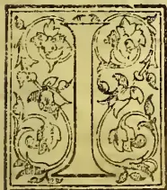

GIVE four pretty complete analyses of soils from contiguous estates in the *Dolosbage district* of Ceylon. These formerly produced good crops of coffee, and now yield satisfactory returns as tea soils.

These soils were subjected to a physical as well as to a chemical examination. The specific gravities varied from 2.25 to 2.64. The specific gravity was highest when the proportion of gravel was greatest.

The apparent specific gravity or relative weight of the soil, i.e., the ratio which the weight of a given volume of the soil, including the interstitial air, bears to the same volume of water, was not determined. Such a determination, however, is of use for calculating the weight of a soil per acre for any specified depth.

The soil, as a whole, is seldom submitted to chemical analyses, only the finer portion of it being analysed, and the amount of available plant food is usually calculated on a basis of 1,000 tons per acre to a depth of nine inches. Thus, 1 per cent in an analysis is equivalent to 10 tons per acre, and 1 per cent to 1 ton per acre.

### *Analyses of Dolosbage Soils.*

<table border="1">
<thead>
<tr>
<th>Physical Examination.</th>
<th>No. 1.</th>
<th>No. 2.</th>
<th>No. 3.</th>
<th>No. 4.</th>
</tr>
</thead>
<tbody>
<tr>
<td>Specific gravity</td>
<td>2.64 per ct.</td>
<td>2.43 per ct.</td>
<td>2.25 per ct.</td>
<td>2.37 per ct.</td>
</tr>
<tr>
<td>Moisture in air-dried soil</td>
<td>6.10</td>
<td>5.16</td>
<td>10.00</td>
<td>6.67</td>
</tr>
<tr>
<td>Power of dry soil to absorb atmospheric moisture in 24 hours</td>
<td>3.52</td>
<td>2.93</td>
<td>3.52</td>
<td>2.9</td>
</tr>
<tr>
<td>Water required for saturation of air-dried soil</td>
<td>30.14</td>
<td>33.52</td>
<td>37.30</td>
<td>35.6</td>
</tr>
<tr>
<td>Moisture given off from saturated soil in 24 hours</td>
<td>28.20</td>
<td>29.70</td>
<td>36.00</td>
<td>28.0</td>
</tr>
<tr>
<td>Percentage of stones</td>
<td>4.4</td>
<td>8.10</td>
<td>None</td>
<td>1.8</td>
</tr>
</tbody>
</table>

<table border="1">
<thead>
<tr>
<th>Mechanical Analyses of soil without stones.</th>
<th>per ct.</th>
<th>per ct.</th>
<th>per ct.</th>
<th>per ct.</th>
</tr>
</thead>
<tbody>
<tr>
<td>Coarse gravel</td>
<td>28.68</td>
<td>6.72</td>
<td>None</td>
<td>1.06</td>
</tr>
<tr>
<td>Organic matters</td>
<td>1.81</td>
<td>.38</td>
<td>None</td>
<td>.09</td>
</tr>
<tr>
<td>Fine gravel</td>
<td>17.07</td>
<td>9.81</td>
<td>6.47</td>
<td>9.97</td>
</tr>
<tr>
<td>Organic matters</td>
<td>2.11</td>
<td>.84</td>
<td>.37</td>
<td>.10</td>
</tr>
<tr>
<td>Coarse sand</td>
<td>26.84</td>
<td>49.13</td>
<td>56.01</td>
<td>62.40</td>
</tr>
<tr>
<td>Organic matters</td>
<td>4.39</td>
<td>5.97</td>
<td>5.73</td>
<td>7.53</td>
</tr>
<tr>
<td>Fine sand</td>
<td>.53</td>
<td>3.72</td>
<td>10.47</td>
<td>3.34</td>
</tr>
<tr>
<td>Organic matters</td>
<td>.11</td>
<td>.92</td>
<td>.26</td>
<td>.89</td>
</tr>
<tr>
<td>Finest particles</td>
<td>14.56</td>
<td>19.21</td>
<td>15.59</td>
<td>11.83</td>
</tr>
<tr>
<td>Organic matters</td>
<td>3.90</td>
<td>3.30</td>
<td>5.10</td>
<td>2.48</td>
</tr>
<tr>
<td>Total mineral matter in above</td>
<td>87.68</td>
<td>88.59</td>
<td>88.54</td>
<td>88.60</td>
</tr>
<tr>
<td>Total organic matter in above</td>
<td>12.32</td>
<td>11.41</td>
<td>11.46</td>
<td>11.40</td>
</tr>
</tbody>
</table>

<table border="1">
<thead>
<tr>
<th>Chemical Analyses.</th>
<th>per ct.</th>
<th>per ct.</th>
<th>per ct.</th>
<th>pe</th>
</tr>
</thead>
<tbody>
<tr>
<td>Water lost at 212°F</td>
<td>6.416</td>
<td>5.210</td>
<td>10.000</td>
<td>6.584</td>
</tr>
<tr>
<td>*Organic matter and combined water soluble in standard hydrochloric acid</td>
<td>13.208</td>
<td>11.561</td>
<td>11.460</td>
<td>11.508</td>
</tr>
<tr>
<td>Silica</td>
<td>.085</td>
<td>.405</td>
<td>.095</td>
<td>.525</td>
</tr>
<tr>
<td>Protoxide of iron</td>
<td>1.703</td>
<td>.797</td>
<td>1.500</td>
<td>1.106</td>
</tr>
<tr>
<td>Peroxide of iron and traces of manganese</td>
<td>9.917</td>
<td>5.614</td>
<td>10.000</td>
<td>6.285</td>
</tr>
<tr>
<td>Alumina</td>
<td>12.569</td>
<td>8.289</td>
<td>9.448</td>
<td>9.226</td>
</tr>
<tr>
<td>Lime</td>
<td>.076</td>
<td>.310</td>
<td>.151</td>
<td>.015</td>
</tr>
<tr>
<td>Magnesia</td>
<td>.185</td>
<td>.455</td>
<td>.171</td>
<td>.260</td>
</tr>
<tr>
<td>Potash</td>
<td>.136</td>
<td>.194</td>
<td>.442</td>
<td>.096</td>
</tr>
<tr>
<td>Soda</td>
<td>.067</td>
<td>.094</td>
<td>.143</td>
<td>Trace</td>
</tr>
<tr>
<td>Phosphoric acid</td>
<td>.128</td>
<td>.166</td>
<td>.077</td>
<td>.195</td>
</tr>
<tr>
<td>Sulphuric acid</td>
<td>.126</td>
<td>.055</td>
<td>.031</td>
<td>.034</td>
</tr>
<tr>
<td>Chlorine</td>
<td>.016</td>
<td>.057</td>
<td>.110</td>
<td>.006</td>
</tr>
<tr>
<td>Insoluble silicates</td>
<td>55.368</td>
<td>66.793</td>
<td>56.372</td>
<td>64.160</td>
</tr>
<tr>
<td></td>
<td>100.000</td>
<td>100.000</td>
<td>100.000</td>
<td>100.000</td>
</tr>
<tr>
<td>*Containing Nitrogen</td>
<td>.167</td>
<td>.141</td>
<td>.140</td>
<td>.192</td>
</tr>
</tbody>
</table>

The moisture in the air-dried samples of the different soils varied considerably. It was highest in No. 3, in which the soil was in the finest state of division, and which had the lowest specific gravity. It was next highest in No. 4, which was also second lowest in specific gravity, and in the second finest state of division. No. 1, although of higher specific gravity, and in a coarser state of division, had more moisture than No. 2; but No. 1 was richest of all in alumina (the base of clay) and its insoluble silicates were lowest.

The water required to completely saturate the air-dried soil, varied inversely as the specific gravities.

523------------------------------------------------

498THE TROPICAL AGRICULTURIST.[FEB. 1, 1893.]

The moisture given off when the saturated soil was spread out and left for 24 hours also varied inversely as the specific gravity in the three surface soils; but it was lowest in the subsoil. Of course in comparing quantitatively the power of different soils to absorb, retain, or give off moisture, results will be affected by the state of the atmosphere as regards humidity at the time when the experiments are made.

It will be observed from the mechanical analysis that, while the state of division of the four soils is very varied; the proportions of the total mineral and organic matters differ only to a very small extent.

For the chemical analysis only that portion of the soil was taken which passed through a sieve of ten meshes to the lineal inch. This excluded the coarse gravel. For ordinary analyses it is commoner to exclude the fine gravel also. Thus at Cirencester Royal Agricultural College the portion of soil taken for chemical analysis is what passes through a sieve of .6 millimeter (one-fiftieth of an inch) mesh. This includes the coarse sand, fine sand, and finest particles with the accompanying organic matter. The coarser ingredients are examined, or analysed separately when it is considered desirable to do so.

In the portions taken for the chemical analyses, the proportion of moisture varied in the same order as in the mechanical analyses.

The organic matter in the chemical analyses is not notably higher than in the mechanical analyses except in the case of No. 1. In this case there was a considerable proportion of coarse gravel associated with only a small proportion of organic matter, which is not included in the portion of soil taken for the chemical analysis.

In two of the surface soils the amount of protoxide of iron was higher than in the subsoil; but the proportion of protoxide to peroxide was higher in the subsoil. There have been too few determinations of the former in Ceylon soils to enable one to fix a limit above which the presence of protoxide of iron is to be regarded as injurious. In his numerous analyses of Ceylon soils, Mr. Hnghes does not appear to have made a separate determination of this ingredient, but only in conjunction with peroxide, of which the amount may be very high without any detriment to the fertility of the soil, and a large percentage of which is even desirable, on account of its property of fixing the atmospheric ammonia brought down by the rain.

The available lime was lowest in the subsoil. In No. 2 it was well above the average of the older estates. The magnesia in these contiguous soils was higher than the lime.

The potash is present in good proportion, the quantity available being highest in the three surface soils.

In soil No. 3 the amount was phenomenally high for a Ceylon soil. The sender of this sample stated that it was drawn from a new clearing, and not according to either of the two methods of sampling described. The probability is that it contained an undue proportion of wood ashes due to the burning of the forest. The available soda was found to vary in the same order as the potash, only a trace being found in the subsoil.

The phosphoric acid was present in good proportion in No. 1 and No. 2, in fair proportion in No. 3, and in the highest proportion in the subsoil.

The nitrogen was present in fair proportion in all four soils being highest in the subsoil.

Analysis of soil from an old coffee estate in the Matala district, Ceylon, together with that of the prevailing rocks, and of the fertiliser used.

Only the more important ingredients of this soil were determined, the following being the results obtained:—

<table border="1">
<thead>
<tr>
<th></th>
<th>per cent</th>
</tr>
</thead>
<tbody>
<tr>
<td>Organic matter and combined water ...</td>
<td>12.84</td>
</tr>
<tr>
<td>Nitrogen ...</td>
<td>.197</td>
</tr>
<tr>
<td>Phosphoric acid ...</td>
<td>.098</td>
</tr>
<tr>
<td>Potash ...</td>
<td>.179</td>
</tr>
<tr>
<td>Lime ...</td>
<td>.150</td>
</tr>
</tbody>
</table>

This soil, the sender said, "represents a field of about 3,500 feet elevation, western aspect, rather steep, comparatively free from wind, with a rainfall of 100 inches, well distributed, full of small stones same as sample No. 1. The field lies on a slab rock of much the same nature. There is also a pretty fair proportion of stones same as No. 2."

Stone No. 1 was a piece of light-colored metamorphic rock with a distinctly stratified structure. Stone No. 2 was a piece of metamorphic rock much darker in color than No. 1, the stratification being also much less distinct. Another stone marked No. 3 was also sent with the remark that it was a chip from a boulder near which the coffee was very flourishing. These three pieces of rock were analysed with the following results:—

*Analyses of stones from a Coffee Estate in Matala.*

<table border="1">
<thead>
<tr>
<th></th>
<th>No. 1.</th>
<th>No. 2.</th>
<th>No. 3.</th>
</tr>
</thead>
<tbody>
<tr>
<td>Silica ...</td>
<td>65.55</td>
<td>51.04</td>
<td>61.19</td>
</tr>
<tr>
<td>Alumina ...</td>
<td>19.79</td>
<td>19.99</td>
<td>21.78</td>
</tr>
<tr>
<td>Oxide of iron ...</td>
<td>4.61</td>
<td>10.02</td>
<td>5.51</td>
</tr>
<tr>
<td>Lime ...</td>
<td>1.96</td>
<td>9.47</td>
<td>5.40</td>
</tr>
<tr>
<td>Magnesia ...</td>
<td>.50</td>
<td>5.75</td>
<td>1.15</td>
</tr>
<tr>
<td>Potash ...</td>
<td>4.74</td>
<td>1.20</td>
<td>3.12</td>
</tr>
<tr>
<td>Soda ...</td>
<td>2.72</td>
<td>2.05</td>
<td>1.80</td>
</tr>
<tr>
<td>Phosphoric acid ...</td>
<td>.13</td>
<td>.12</td>
<td>Trace</td>
</tr>
<tr>
<td></td>
<td>100.00</td>
<td>100.00</td>
<td>99.95</td>
</tr>
</tbody>
</table>

No. 1, it will be observed, has the highest percentage of potash, No. 2 the highest percentage of lime, while No. 3 has a considerable proportion of both of these, but is poorer in phosphoric acid.

Of the soil the sender remarked "that it had been thirty years in coffee, and had given originally large crops without manure. It had gradually declined from average crops of 8 cwts. per acre to less than an average of 4 cwts. per acre. By the application, in alternate years, of a manure, at one time well known in Ceylon, called Sombreorum, the crops had been increased in a series of eight years from 4.68 cwts. per acre average, in the first four years, to 5.54 cwts. per acre average in the last four. The Sombreorum had been regularly applied in semi-circular holes round the trees one foot from the stem. The sender had been careful in drawing samples of the soil to take them at some distance from the holes. His mode of taking a sample was to scrape the surface slightly in four different parts of the field, near to each other, and of the same physical appearance, and to take the soil from under these spots, to mix the four samples together, and to send a portion for analysis."

A sample of the Sombreorum manure was submitted to me for analysis by my correspondent, but which he was careful to state was not in the same dry condition as when received, having

524------------------------------------------------

FEB. 1, 1893.]

THE TROPICAL AGRICULTURIST.

499

been lying at the estate for a considerable time. The sample, as I received it, had the following composition:—

*Analysis of Sombreorum.*

<table border="0">
<tr>
<td>Moisture</td>
<td>...</td>
<td>18.65</td>
</tr>
<tr>
<td>* Organic matter and water chemically combined</td>
<td>...</td>
<td>6.29</td>
</tr>
<tr>
<td>Calcium sulphate</td>
<td>...</td>
<td>13.94</td>
</tr>
<tr>
<td>Magnesium sulphate</td>
<td>...</td>
<td>3.25</td>
</tr>
<tr>
<td>Potassium sulphate</td>
<td>...</td>
<td>8.53</td>
</tr>
<tr>
<td>Sodium sulphate</td>
<td>...</td>
<td>9.78</td>
</tr>
<tr>
<td>Sodium chloride</td>
<td>...</td>
<td>.88</td>
</tr>
<tr>
<td>Insoluble earthy matter</td>
<td>...</td>
<td>.96</td>
</tr>
<tr>
<td>† Biphosphate of lime</td>
<td>...</td>
<td>6.29</td>
</tr>
<tr>
<td>Tribasic phosphate of lime</td>
<td>...</td>
<td>12.21</td>
</tr>
<tr>
<td colspan="2"></td>
<td style="border-top: 1px solid black;">100.00</td>
</tr>
<tr>
<td>* Containing nitrogen</td>
<td>...</td>
<td>1.80</td>
</tr>
<tr>
<td>Equal to ammonia</td>
<td>...</td>
<td>2.19</td>
</tr>
<tr>
<td>† Equal to tribasic phosphate of lime</td>
<td>...</td>
<td>9.84</td>
</tr>
<tr>
<td>Total phosphoric acid equal to tribasic phosphate of lime</td>
<td>...</td>
<td>22.05</td>
</tr>
</table>

Another sample of soil from the same, and one from a contiguous estate, were analysed by Mr. A. C. Dixon with the following results:—

*Analysis of Matala Soils. (DIXON.)*

<table border="0">
<thead>
<tr>
<th></th>
<th>per cent.</th>
<th>per cent.</th>
</tr>
</thead>
<tbody>
<tr>
<td>Organic matter</td>
<td>17.483</td>
<td>11.525</td>
</tr>
<tr>
<td>Nitrogen</td>
<td>.205</td>
<td>.174</td>
</tr>
<tr>
<td>Lime</td>
<td>.134</td>
<td>.113</td>
</tr>
<tr>
<td>Potash</td>
<td>.121</td>
<td>.090</td>
</tr>
<tr>
<td>Phosphoric acid</td>
<td>.089</td>
<td>.104</td>
</tr>
</tbody>
</table>

The percentage of plant food in this old property compare favorably with that of many much younger estates. The phosphoric acid, however, is somewhat deficient, hence the increased yield produced by a phosphatic manure. The manure *Sombreorum* has, however, been manufactured to serve the purpose of a general manure for coffee, as it supplies nitrogen, and more especially potash, in much larger proportion than is found in ordinary superphosphates.

The unnecessarily high proportion of sodium sulphate is no doubt due to the difficulty of getting potash salts free from soda at a cheap enough rate for manuring purposes.

The rocks on the estate cannot be regarded as very deficient in lime; but this constituent

in an available state has disappeared from the soil to a greater extent than the two other important mineral ingredients; thus, while the rocks contained from about 2 to 9½ per cent of lime, only .150, or, according to Mr. Dixon's analyses, only .134 and .113 per cent respectively, remained in an available state in the soil.

The following are average analyses of *Dimbula*, *Maskeliya* and *Matala* soils, computed from the analyses made by Mr. John Hughes, F.C.S., F.L.C., and published in his "Report to the Ceylon Coffee Planters' Association of 1879." The samples of the *Dimbula* and *Maskeliya* soils were selected by the Association, those of the *Matala* soils were sent by private individuals:—

*Average Analyses of Dimbula, Maskeliya and Matala Soils, computed from the Analyses of Mr. John Hughes.*

<table border="0">
<thead>
<tr>
<th></th>
<th>Average of 9 Dimbula Soils.</th>
<th>Average of 6 Maskeliya Soils.</th>
<th>Average of 6 Matala Soils.</th>
</tr>
</thead>
<tbody>
<tr>
<td>Water lost at 212° F ...</td>
<td>5.690</td>
<td>3.990</td>
<td>3.347</td>
</tr>
<tr>
<td>* Organic matter and water of combination</td>
<td>14.242</td>
<td>12.542</td>
<td>7.532</td>
</tr>
<tr>
<td>Oxides of iron</td>
<td>8.901</td>
<td>12.312</td>
<td>11.830</td>
</tr>
<tr>
<td>Oxides of manganese</td>
<td></td>
<td></td>
<td>1.206</td>
</tr>
<tr>
<td>Alumina</td>
<td>12.393</td>
<td>11.531</td>
<td>10.741</td>
</tr>
<tr>
<td>Lime</td>
<td>.139</td>
<td>.118</td>
<td>.166</td>
</tr>
<tr>
<td>Magnesia</td>
<td>.133</td>
<td>.143</td>
<td>.276</td>
</tr>
<tr>
<td>Potash</td>
<td>.105</td>
<td>.091</td>
<td>.165</td>
</tr>
<tr>
<td>Soda</td>
<td>.043</td>
<td>.043</td>
<td>.027</td>
</tr>
<tr>
<td>Phosphoric acid</td>
<td>.118</td>
<td>.051</td>
<td>.099</td>
</tr>
<tr>
<td>Sulphuric acid</td>
<td>.082</td>
<td>.018</td>
<td>.040</td>
</tr>
<tr>
<td>Chlorine</td>
<td>.006</td>
<td>.007</td>
<td>.006</td>
</tr>
<tr>
<td>Carbonic acid</td>
<td>Trace</td>
<td>Trace</td>
<td>—</td>
</tr>
<tr>
<td>Silica soluble in alkali</td>
<td>2.647</td>
<td>1.676</td>
<td>6.755</td>
</tr>
<tr>
<td>† Insoluble silicates</td>
<td>55.501</td>
<td>57.478</td>
<td>57.810</td>
</tr>
<tr>
<td colspan="2"></td>
<td style="border-top: 1px solid black;">100.000</td>
<td style="border-top: 1px solid black;">100.000</td>
</tr>
<tr>
<td>* Containing nitrogen</td>
<td>.254</td>
<td>.162</td>
<td>.091</td>
</tr>
<tr>
<td>† Containing quartz</td>
<td>18.129</td>
<td>17.563</td>
<td>24.741</td>
</tr>
</tbody>
</table>

I further quote from the *Tropical Agriculturist* a table of analyses of Ceylon Soils by Mr. Hughes, the samples in these cases having been selected by the Planters' Association:—

*ANALYSES OF CEYLON SOILS. (HUGHES.)*

Samples selected by the Planters' Association and representing estates upon which Coffee, Tea, Cinchona and Cacao have respectively been planted.

The following analytical results represent the soils in the air-dried condition:—

<table border="0">
<thead>
<tr>
<th></th>
<th>Coffee.</th>
<th></th>
<th></th>
<th></th>
<th>Tea.</th>
</tr>
<tr>
<th>Name of Estate</th>
<th>Ragalla</th>
<th>Dambattenne</th>
<th>Rookwood No. 1</th>
<th>Rookwood No. 2</th>
<th>Rookwood No. 3</th>
</tr>
<tr>
<th>District</th>
<td>Udapussellawa
<td>Haputale
<td>Hewaheta</td>
<td>Hewaheta</td>
<td>Hewaheta</td>
</td></td></tr>
</thead>
<tbody>
<tr>
<td>Water lost at 212° F</td>
<td>4.022</td>
<td>3.765</td>
<td>2.555</td>
<td>1.549</td>
<td>3.091</td>
</tr>
<tr>
<td>* Organic matter and combined Water</td>
<td>21.337</td>
<td>14.345</td>
<td>11.799</td>
<td>9.005</td>
<td>15.893</td>
</tr>
<tr>
<td>Oxides of Iron and some Manganese</td>
<td>8.247</td>
<td>9.444</td>
<td>11.679</td>
<td>6.015</td>
<td>4.611</td>
</tr>
<tr>
<td>Alumina</td>
<td>11.949</td>
<td>9.467</td>
<td>11.769</td>
<td>7.933</td>
<td>5.546</td>
</tr>
<tr>
<td>Lime</td>
<td>.385</td>
<td>.434</td>
<td>.339</td>
<td>.213</td>
<td>.149</td>
</tr>
<tr>
<td>Magnesia</td>
<td>.057</td>
<td>.394</td>
<td>.981</td>
<td>.087</td>
<td>.141</td>
</tr>
<tr>
<td>Potash</td>
<td>.137</td>
<td>.210</td>
<td>.170</td>
<td>.119</td>
<td>.107</td>
</tr>
<tr>
<td>Soda</td>
<td>.045</td>
<td>.122</td>
<td>.165</td>
<td>.058</td>
<td>.050</td>
</tr>
<tr>
<td>Phosphoric Acid</td>
<td>.122</td>
<td>.160</td>
<td>.161</td>
<td>.025</td>
<td>.184</td>
</tr>
<tr>
<td>Sulphuric do</td>
<td>.013</td>
<td>.043</td>
<td>.027</td>
<td>.068</td>
<td>.063</td>
</tr>
<tr>
<td>Carbonic do</td>
<td>.791</td>
<td>.273</td>
<td>.242</td>
<td>.594</td>
<td>.164</td>
</tr>
<tr>
<td>Chlorine</td>
<td>.090</td>
<td>.090</td>
<td>.004</td>
<td>.007</td>
<td>.006</td>
</tr>
<tr>
<td>† Insoluble Silicates and Quartz</td>
<td>49.880</td>
<td>61.253</td>
<td>60.709</td>
<td>74.337</td>
<td>69.995</td>
</tr>
<tr>
<td colspan="2"></td>
<td style="border-top: 1px solid black;">100.000</td>
<td style="border-top: 1px solid black;">100.000</td>
<td style="border-top: 1px solid black;">100.000</td>
<td style="border-top: 1px solid black;">100.000</td>
</tr>
<tr>
<td>* Containing Nitrogen</td>
<td>.521</td>
<td>.411</td>
<td>.232</td>
<td>.114</td>
<td>.429</td>
</tr>
<tr>
<td>† Containing Quartz</td>
<td>8.940</td>
<td>10.720</td>
<td>15.740</td>
<td>25.000</td>
<td>30.780</td>
</tr>
</tbody>
</table>

525------------------------------------------------

500THE TROPICAL AGRICULTURIST.[FEB. 1, 1893.Analyses of Ceylon Soils. (HUGHES.)—(Continued)

<table border="1">
<thead>
<tr>
<th rowspan="2">Name of Estate :— Do District :—</th>
<th rowspan="2">Dunedin Kelani Valley</th>
<th colspan="2">Tea and Cinchona.</th>
<th colspan="2">Cacao.</th>
</tr>
<tr>
<th>Dryburgh Matale</th>
<th>Liddesdale Udapussellawa</th>
<th>Pallekelle Dumbara</th>
<th>Wariapolla Matale</th>
</tr>
</thead>
<tbody>
<tr>
<td>Water lost at 212° F</td>
<td>1.938</td>
<td>4.244</td>
<td>3.333</td>
<td>1.218</td>
<td>2.781</td>
</tr>
<tr>
<td>* Organic matter and combined Water ..</td>
<td>12.838</td>
<td>18.002</td>
<td>16.134</td>
<td>4.818</td>
<td>9.183</td>
</tr>
<tr>
<td>Oxides of iron and some Manganese ..</td>
<td>9.811</td>
<td>9.131</td>
<td>1.638</td>
<td>6.857</td>
<td>13.111</td>
</tr>
<tr>
<td>Alumina ..</td>
<td>10.803</td>
<td>10.594</td>
<td>9.030</td>
<td>5.477</td>
<td>9.911</td>
</tr>
<tr>
<td>Lime ..</td>
<td>.302</td>
<td>.449</td>
<td>.743</td>
<td>.450</td>
<td>.287</td>
</tr>
<tr>
<td>Magnesia ..</td>
<td>.216</td>
<td>.484</td>
<td>.271</td>
<td>.645</td>
<td>.554</td>
</tr>
<tr>
<td>Potash ..</td>
<td>.081</td>
<td>.246</td>
<td>.176</td>
<td>.353</td>
<td>.301</td>
</tr>
<tr>
<td>Soda ..</td>
<td>.0.6</td>
<td>.104</td>
<td>.024</td>
<td>.010</td>
<td>.328</td>
</tr>
<tr>
<td>Phosphoric Acid ..</td>
<td>.083</td>
<td>.131</td>
<td>.175</td>
<td>.064</td>
<td>.118</td>
</tr>
<tr>
<td>Sulphuric do ..</td>
<td>.001</td>
<td>.014</td>
<td>.041</td>
<td>.020</td>
<td>.056</td>
</tr>
<tr>
<td>Carbonic do ..</td>
<td>.120</td>
<td>.391</td>
<td>.531</td>
<td>.201</td>
<td>.451</td>
</tr>
<tr>
<td>Chlorine ..</td>
<td>.003</td>
<td>.005</td>
<td>.005</td>
<td>.009</td>
<td>.004</td>
</tr>
<tr>
<td>† Insoluble Silicates and Quartz ..</td>
<td>63.768</td>
<td>55.905</td>
<td>61.894</td>
<td>79.878</td>
<td>63.0.2</td>
</tr>
<tr>
<td></td>
<td>100.000</td>
<td>100.000</td>
<td>100.000</td>
<td>100.0.0</td>
<td>100.000</td>
</tr>
<tr>
<td>* Containing Nitrogen ..</td>
<td>.117</td>
<td>.496</td>
<td>.501</td>
<td>.114</td>
<td>.199</td>
</tr>
<tr>
<td>† Containing Quartz ..</td>
<td>11.020</td>
<td>7.890</td>
<td>8.660</td>
<td>14.680</td>
<td>12.280</td>
</tr>
</tbody>
</table>

The following are analyses of soils in the dry state from *South Coorg*, made by the late Mr. William Pringle. These are also quoted from the *Tropical Agriculturist* :—

Analyses of Soils from South Coorg. (PRINGLE.)

<table border="1">
<thead>
<tr>
<th></th>
<th>A.</th>
<th>B.</th>
<th>C.</th>
</tr>
</thead>
<tbody>
<tr>
<td>* Organic matter and combined water ..</td>
<td>9.530</td>
<td>8.080</td>
<td>5.475</td>
</tr>
<tr>
<td>Oxides of iron and alumina ..</td>
<td>13.065</td>
<td>6.861</td>
<td>7.844</td>
</tr>
<tr>
<td>Lime ..</td>
<td>.522</td>
<td>.120</td>
<td>.380</td>
</tr>
<tr>
<td>Magnesia ..</td>
<td>.396</td>
<td>.446</td>
<td>.101</td>
</tr>
<tr>
<td>Potash ..</td>
<td>.044</td>
<td>.127</td>
<td>.042</td>
</tr>
<tr>
<td>Soda ..</td>
<td>.019</td>
<td>.063</td>
<td>.020</td>
</tr>
<tr>
<td>Phosphoric acid ..</td>
<td>.135</td>
<td>.039</td>
<td>.122</td>
</tr>
<tr>
<td>Sulphuric acid ..</td>
<td>.128</td>
<td>.079</td>
<td>.013</td>
</tr>
<tr>
<td>Chlorine ..</td>
<td>.003</td>
<td>.001</td>
<td>.002</td>
</tr>
<tr>
<td>Insoluble Silicates ..</td>
<td>76.158</td>
<td>84.184</td>
<td>86.001</td>
</tr>
<tr>
<td></td>
<td>100.000</td>
<td>100.000</td>
<td>100.000</td>
</tr>
<tr>
<td>* Containing Nitrogen</td>
<td>.143</td>
<td>.292</td>
<td>.089</td>
</tr>
<tr>
<td>Equal to Ammonia ..</td>
<td>.174</td>
<td>.355</td>
<td>.094</td>
</tr>
<tr>
<td>Moisture in air-dried sample ..</td>
<td>3.24</td>
<td>12.130</td>
<td>1.780</td>
</tr>
</tbody>
</table>

The mechanical condition of B was probably very different from A and C, as there is nothing in the chemical composition of B to account for its high percentage of moisture in the air-dried state, as compared with A and C.

On the above analyses Mr. Pringle recommended the conservation of moisture in A and C by means of shade, and the use of 'as much good cattle manure, made by bedding the cattle with ferns and leaves, as possible.' Both being deficient in potash he recommended 1 ewt. per acre of nitrate of potash.

A requiring nitrogenous manure as well as potash, and also phosphoric acid to prevent soil exhaustion, he recommended for this coffee land 2 cwts. bone meal and 1 ewt. nitrate of potash per acre, the manure to be mixed with one cubic yard of burnt earth, or 2 bandy loads of cattle manure.

B being deficient in phosphoric acid, and rich in nitrogen, he recommended for this land 4 cwts. bone meal, to be succeeded 6 months later by an application of lime. The application of oil cake to such land he would regard as waste.

C being a poor sandy soil, deficient in moisture, in nitrogen, in potash, and not very rich in phosphoric acid, he recommended for this soil thick shade, and for manure, cattle manure 2 tons; fine bone meal 1 ewt.; good fish manure 2 cwts.; and nitrate of potash  $\frac{1}{2}$  ewt. per acre.

Mr. Pringle also made the two following analyses to illustrate the changes produced in soil by burning the same. The general effect is the dissipation of the organic matter with the nitrogen, and the increase in the available amount of all the mineral ingredients; part of the augmentation, however, and especially in the case of the potash is attributed to the ashes of the word used as fuel.

Analyses of Earth before and after being burnt.

<table border="1">
<thead>
<tr>
<th></th>
<th>A. Natural.</th>
<th>B. Burnt</th>
</tr>
</thead>
<tbody>
<tr>
<td>* Organic matter and combined water ..</td>
<td>7.572</td>
<td>.623</td>
</tr>
<tr>
<td>Oxides of iron and alumina ..</td>
<td>10.369</td>
<td>14.345</td>
</tr>
<tr>
<td>Lime ..</td>
<td>.253</td>
<td>.499</td>
</tr>
<tr>
<td>Magnesia ..</td>
<td>.161</td>
<td>.196</td>
</tr>
<tr>
<td>Potash ..</td>
<td>.070</td>
<td>.389</td>
</tr>
<tr>
<td>Soda ..</td>
<td>.026</td>
<td>.096</td>
</tr>
<tr>
<td>Phosphoric acid ..</td>
<td>.159</td>
<td>.289</td>
</tr>
<tr>
<td>Sulphuric acid ..</td>
<td>.024</td>
<td>.069</td>
</tr>
<tr>
<td>Insoluble Silicates (Sand &amp;c.) ..</td>
<td>81.367</td>
<td>83.494</td>
</tr>
<tr>
<td></td>
<td>100.000</td>
<td>100.000</td>
</tr>
<tr>
<td>* Containing Nitrogen ..</td>
<td>.180</td>
<td>.005</td>
</tr>
</tbody>
</table>

Fiji Soil.

The following analyses of a sample of soil sent to me from Fiji in the year 1880 may have an interest for Ceylon and Indian planters. The soil was from *Gt. Amalgam Estate*, where coffee leaf disease first made its appearance in Fiji. The sample was taken from different depths and represents the composition of the soil from the surface to a depth of three feet :—

Analysis of Soil from Great Amalgam Estate, Fiji.

<table border="1">
<tbody>
<tr>
<td>Water expelled at 212° F. ..</td>
<td>3.998</td>
</tr>
<tr>
<td>* Organic matter and combined water ..</td>
<td>12.848</td>
</tr>
<tr>
<td>Soluble in standard hydrochloric acid</td>
<td></td>
</tr>
<tr>
<td>Silica ..</td>
<td>.194</td>
</tr>
<tr>
<td>Peroxide of iron ..</td>
<td>.887</td>
</tr>
<tr>
<td>Peroxide of iron and oxide manganese ..</td>
<td>6.020</td>
</tr>
<tr>
<td>Alumina ..</td>
<td>11.090</td>
</tr>
<tr>
<td>Lime ..</td>
<td>.199</td>
</tr>
<tr>
<td>Magnesia ..</td>
<td>.065</td>
</tr>
<tr>
<td>Potash ..</td>
<td>.096</td>
</tr>
<tr>
<td>Soda ..</td>
<td>.063</td>
</tr>
<tr>
<td>Phosphoric acid ..</td>
<td>.128</td>
</tr>
<tr>
<td>Chlorine ..</td>
<td>.026</td>
</tr>
<tr>
<td>Carbonic acid ..</td>
<td>Trace</td>
</tr>
<tr>
<td>Insoluble Silicates ..</td>
<td>64.386</td>
</tr>
<tr>
<td></td>
<td>100.000</td>
</tr>
<tr>
<td>* Containing Nitrogen ..</td>
<td>.201</td>
</tr>
</tbody>
</table>

526------------------------------------------------

FEB. 1, 1893.]THE TROPICAL AGRICULTURIST.501

The chemical composition of the part of this soil extracted by acid is upon the whole very similar to that of our Ceylon Coffee Soils. There is no marked deficiency of any of the elements of plant food as compared with other coffee soils, while the phosphoric acid, although not very high, is above the average proportion. The insoluble silicates, however, are of a more argillaceous nature than is the case with Ceylon Coffee and tea soils. The numerous crystals of quartz, so noticeable in the insoluble silicates of Ceylon soil, were absent from the sample Fiji soil. The insoluble residue in the latter, after being freed from organic matter, consisted of white clay.

The air-dried soil required 40 per cent of its weight of water for complete saturation, shewing thus a greater capacity for water than the 4 Dolosbage soils examined in a similar way. The reaction of the soil was distinctly acid, as the sample, however, represented a depth of three feet, this acidity was probably in the subsoil.

#### Classification of Coffee and Tea Soils.

A sufficient number of these soils has been analysed to warrant a classification being attempted on the basis of the proportion of nitrogen present, and also of the amount of the two important mineral ingredients of plant food that are soluble in hydrochloric acid, viz., potash and phosphoric acid. Those that contain nitrogen under .1 per cent, potash and phosphoric acid each under .05 per cent might be described as poor soils. Those that contain from .1 to .2 per cent of nitrogen and from .05 to .1 per cent of potash and the same of phosphoric acid might be described as of fair or medium quality, while those containing above .2 per cent of nitrogen, above .1 per cent of potash and the same of phosphoric acid might be described as rich soils. Of course soils may be of poor fair or rich quality in respect of one or more of the three most important ingredients. This classification or comparison of Ceylon soils with each other might be drawn out in tabular form thus:—

#### Classification of Ceylon Coffee and Tea Soils.

<table border="1">
<thead>
<tr>
<th rowspan="2">Quality of Soil.</th>
<th colspan="3">Percentage.</th>
</tr>
<tr>
<th>Nitrogen.</th>
<th>Potash.</th>
<th>Phosphoric Acid.</th>
</tr>
</thead>
<tbody>
<tr>
<td>Poor ...</td>
<td>under .1</td>
<td>under .05</td>
<td>under .05</td>
</tr>
<tr>
<td>Medium ...</td>
<td>.1 to .2</td>
<td>.05 to .1</td>
<td>.05 to .1</td>
</tr>
<tr>
<td>Rich ...</td>
<td>above .2</td>
<td>above .1</td>
<td>above .1</td>
</tr>
</tbody>
</table>

#### Rocks or Stones founded on Ceylon Estates.

The following are analyses of rocks or stones found on Ceylon estates. The first three analyses are of pieces of quartz which were sent to me to be tested for gold and not to ascertain if they possessed any agricultural value. They are inserted here, as such rocks or stones abound on many of the Ceylon estates, and fuller analyses of them were made than were necessary merely for the purpose of finding out whether or not they were auriferous:—

#### Analyses of Quartzose Rocks.

<table border="1">
<tbody>
<tr>
<td>Silica ...</td>
<td>99.810</td>
<td>94.57</td>
<td>97.00</td>
</tr>
<tr>
<td>Alumina and oxide of iron ...</td>
<td>.020</td>
<td>5.20</td>
<td rowspan="3">3.00</td>
</tr>
<tr>
<td>Lime ...</td>
<td>.628</td>
<td>.02</td>
</tr>
<tr>
<td>Magnesia ...</td>
<td>.054</td>
<td>.13</td>
</tr>
<tr>
<td>Alkalies ...</td>
<td>.088</td>
<td>.08</td>
<td></td>
</tr>
<tr>
<td>Gold ...</td>
<td>absent</td>
<td>absent</td>
<td>absent</td>
</tr>
</tbody>
</table>

#### Analysis of Metamorphic Rocks.

<table border="1">
<thead>
<tr>
<th></th>
<th>Light colored.</th>
<th>Dark colored.</th>
</tr>
</thead>
<tbody>
<tr>
<td>Silica ...</td>
<td>82.63</td>
<td>50.35</td>
</tr>
<tr>
<td>Oxide of iron and alumina ...</td>
<td>18.51</td>
<td>34.45</td>
</tr>
<tr>
<td>Lime ...</td>
<td>1.19</td>
<td>9.48</td>
</tr>
<tr>
<td>Magnesia ...</td>
<td>.23</td>
<td>3.49</td>
</tr>
<tr>
<td>Potash ...</td>
<td>3.86</td>
<td>.80</td>
</tr>
<tr>
<td>Soda ...</td>
<td>3.40</td>
<td>1.14</td>
</tr>
<tr>
<td>Phosphoric acid ...</td>
<td>.18</td>
<td>.29</td>
</tr>
<tr>
<td></td>
<td>100.00</td>
<td>100.00</td>
</tr>
</tbody>
</table>

Three other analyses of Metamorphic rock have already been given; see page 17.

The next two analyses are by Mr. J. H. Wilson. They are quoted from the *Ceylon Observer*:—

#### Analysis of Ceylon "Orthoclase Granite." (WILSON.)

<table border="1">
<tbody>
<tr>
<td>Silica ...</td>
<td>69.26</td>
</tr>
<tr>
<td>Peroxide of iron ...</td>
<td>4.50</td>
</tr>
<tr>
<td>Alumina ...</td>
<td>15.20</td>
</tr>
<tr>
<td>Potash ...</td>
<td>6.75</td>
</tr>
<tr>
<td>Soda ...</td>
<td>2.10</td>
</tr>
<tr>
<td>Phosphoric acid ...</td>
<td>.05</td>
</tr>
<tr>
<td>Magnesia ...</td>
<td>1.75</td>
</tr>
<tr>
<td>Lime ...</td>
<td>.49</td>
</tr>
<tr>
<td></td>
<td>100.00</td>
</tr>
</tbody>
</table>

#### Analyses of Decomposed Ferruginous Gneiss. (WILSON.)

<table border="1">
<tbody>
<tr>
<td>Moisture and combined water ...</td>
<td>8.38</td>
</tr>
<tr>
<td>Organic matter ...</td>
<td>12.26</td>
</tr>
<tr>
<td>Silica ...</td>
<td>33.26</td>
</tr>
<tr>
<td>Alumina ...</td>
<td>21.02</td>
</tr>
<tr>
<td>Peroxide of iron ...</td>
<td>20.64</td>
</tr>
<tr>
<td>Lime ...</td>
<td>1.51</td>
</tr>
<tr>
<td>Magnesia ...</td>
<td>.50</td>
</tr>
<tr>
<td>Alkalies ...</td>
<td>1.50</td>
</tr>
<tr>
<td>Phosphoric acid ...</td>
<td>.44</td>
</tr>
<tr>
<td>Loss ...</td>
<td>.49</td>
</tr>
<tr>
<td></td>
<td>100.00</td>
</tr>
</tbody>
</table>

I also analysed a sample of decomposed rock from *Dimbula*, which differed from the preceding in not being ferruginous. The following were the results obtained:—

#### Analyses of Decomposed Rock.

<table border="1">
<tbody>
<tr>
<td>Moisture ...</td>
<td>10.00</td>
</tr>
<tr>
<td>Organic matter and combined water ...</td>
<td>10.07</td>
</tr>
<tr>
<td>Alumina with traces of oxide of iron ...</td>
<td>37.95</td>
</tr>
<tr>
<td>Lime ...</td>
<td>.34</td>
</tr>
<tr>
<td>Magnesia ...</td>
<td>.06</td>
</tr>
<tr>
<td>Phosphoric acid ...</td>
<td>.35</td>
</tr>
<tr>
<td>Potash ...</td>
<td>.61</td>
</tr>
<tr>
<td>Soda ...</td>
<td>.22</td>
</tr>
<tr>
<td>Silica ...</td>
<td>39.00</td>
</tr>
<tr>
<td></td>
<td>100.00</td>
</tr>
</tbody>
</table>

For the analyses of Ceylon limestones see the chapter on Manures.

(To be continued.)

CEYLON TEA FOR NEW ZEALAND.—So far as the Colombo Customs are aware, the direct shipments of tea to New Zealand last year were 96,002½ lb; but we suspect a good deal more of the 5 million lb. sent to "Australia" was transshipped thence to the Britain of the South. We are glad to see that during January this year our tea exports to "Australia and New Zealand" are more than double what they were in the same month of 1892.

527------------------------------------------------

502THE TROPICAL AGRICULTURIST.[FEB. 1, 1893.]

## COFFEE PLANTING IN MEXICO AND GUATEMALA BY AN OLD CEYLON PLANTER.

WESTERN MEXICO, Nov. 1st, 1892.

To the Editor "Tropical Agriculturist," Ceylon.

I still read with great interest the movements and writings of ex-Ceylon Planters; and feel anew the obligations of writing what I have learned lately, thinking that possibly some other planter may be interested equally with what I communicate as I have been with other contributors.

I write from the district of Soconuxo, State of Chiapas, Mexico. This district formed part of the neighbouring Republic of Guatemala; but was conceded to Mexico about thirty years ago.

This estate, which I am at present engaged in opening, is situated only ten miles (10) from the boundary line which separates the two countries.

The character of the country for 200 miles along what is known as the Pacific slope of the mountain range is very uniform indeed.

The lands rise with a gentle slope upwards from the sea coast to an elevation of about 5,000 feet, then rise abruptly to their highest ridges 12,000 to 15,000 feet above sea-level.

The distance throughout the whole coast from sea shore to beginning of coffee belt is about the same 30 miles.

In the neighbouring Republic, Guatemala, there are some very fine coffee estates. *El Porvenir* is one of the largest if not the very largest of all I know the property well, and if agreeable will relate some of the figures in connection with the opening and production of the estate.

*El Porvenir* (in the future) was a pet place of the late President, General Rufino Barrios. It was purchased and opened by him, and at the time I knew it best, from 1883 to 1886, was already a large concern. His unfortunate death at the battle of Chalchiapa checked the development; and it was recently sold to a German Syndicate, who have added greatly to the concern.

The following figures were Notes taken by me in 1886, and are still interesting:—

The total area of land was 12,915 acres, which covers everything, and so made up in the following way:

<table>
<tbody>
<tr>
<td>416</td>
<td>acres</td>
<td>of</td>
<td>7</td>
<td>years</td>
<td>old</td>
<td>coffee</td>
</tr>
<tr>
<td>315</td>
<td>"</td>
<td>5</td>
<td>"</td>
<td>"</td>
<td>"</td>
<td>"</td>
</tr>
<tr>
<td>315</td>
<td>"</td>
<td>4</td>
<td>"</td>
<td>"</td>
<td>"</td>
<td>"</td>
</tr>
<tr>
<td>210</td>
<td>"</td>
<td>3</td>
<td>"</td>
<td>"</td>
<td>"</td>
<td>"</td>
</tr>
<tr>
<td>315</td>
<td>"</td>
<td>2</td>
<td>"</td>
<td>"</td>
<td>"</td>
<td>"</td>
</tr>
</tbody>
</table>

1,571 acres planted up with coffee in 1886.

At that time there were approximately about 2,500 acres of virgin forest lands eminently suitable for coffee, which it was Barrios's intention to cover with coffee. The land was good and rich, soil a deep chocolate-colored volcanic loam. The balance of the lands are rough and high, and also slope downwards to the hot country, too low for coffee; but which has been planted up with grass.

*Barbaccues.*—There were thirty barbaccues 25 yards square each made of stone, paved, and well cemented, offering a perfectly smooth surface and floor.

*Driers.*—There were four No. 4 Guardiole driers, each capable of drying 75 quintals of coffee daily.

*Peelers.*—Three Smoot's peelers of the largest size, one Gordon peeler, and one Mason peeler. The latter was not very popular and little used.

*Pulpers.*—Six Gordon cylinder breast pulpers disposed of all the coffee cherry.

*Receiving Cistern.*—The receiving cistern for coffee cherry was a very large concern, all stone paved and cemented; the actual dimensions I have not got.

*Fermenting Cisterns.*—Eight fermenting cisterns for wet parchment, 6 × 8 yards and 8 × 10 yards stone work.

*Washers.*—Two Guardiole washers and one Mason's washer for wet parchment after fermentation.

400 working oxen and 65 carts; 37 mules, 15 carts. Power to work the whole concern in the height of picking was furnished by one waterwheel 40 feet in diameter, one of 24 feet diameter, and one of 12 feet diameter. Two blacksmith's forges and a saw-mill.

*The Building.*—The building which contained all this machinery was L-shaped or one-half of a square, one side was 204 feet by 48, other side equal, namely 204 by 48. House and office for accommodation of clerks and managers contained 8 rooms. Telegraph office, and cottage of 10 rooms for accommodation of the President when he visited the estate.

150 houses for the accommodation of the resident labourers; also scattered throughout the coffee estate were additional houses to furnish sleeping room for the extra number of hands needed during crop. There were 18 of these houses 90 to 120 feet long by 24 to 30 feet wide.

*Roads.*—The whole estate was interlaced with paths cut 6 feet wide, the total length of which would record many miles; 12 miles of good cart road too led from the store to the Pueblo of Rodco.

*Harvest.*—In the year under notice there were 21,000 quintals of clean coffee picked: each quintal is equal to 100 lb. English measurement. A very large estate compared with the size of our Ceylon and Southern Indian plantations. The manager was also busy at work lining and holing 300 acres of land more which he purposed planting up as soon as the rains began. This estate to me was very interesting indeed, and I am sure would have been equally so to any Ceylon planter who might have had the fortune to see it; I must admit I extended the field of my knowledge greatly, and learned much of the ways of working in these countries.

I raised 600,000 cinchona plants on the property and distributed them throughout the place, chiefly on the lee side of the roadways, which greatly added to and adorned the estate. All the coffee cherry was brought by carts, or carried by men to the central curing establishment, where it was pulped, fermented, dried and cured, and despatched ready for market. I was present during crop time 1886, and saw by far the largest number of people engaged picking I ever beheld. There were about 3,000 hands on the estate at that time; and the stir in the evening when the cherry was measured was great and exhilarating. The room was cramped indeed, and the time taken to measure palam twice as long as we take in Ceylon. However, these defects are matters of detail, and improvements were made next year.

When the pulpers began their work, a stream of parchment coffee was concentrated and focused, when it issued into the fermenting tank, that did one's heart good to see. All the coffee was not measured in the evening at the receiving cistern, not by a great deal. During the day, carts were arriving and leaving regularly filled with cherry, to and fro, from the coffee fields; yet, in the evening, the number of pickers seemed innumerable, and the palam they brought immense. The figures alone tell a good tale. Allowing 9 bushels of cherry to 1 quintal or cental of coffee, then 21,000 centals equals 189,000 bushels of cherry. The figures I take from Ferguson's Directory, page 154, for year 1883-4, for the calculation, allowing also an average turn-out of labor equal to 2,000 pickers, and that each picker averages 1 bushel per day, 94½ days would be employed from beginning to end of the harvest. This is not the case, however. The season began with I suppose about 200 pickers, and as the harvest called for more men more were engaged, so as I have stated about 3,000 pickers turned out daily. A German Syndicate purchased the property from Madame Barrios after her husband's death, and have added

528------------------------------------------------

FEB. 1, 1893.]THE TROPICAL AGRICULTURIST.503

very largely to the estate. Mr. Charles Schultz, the managing partner, is a friend of mine, and has sent me an invitation to see the estate, which I shall avail myself of when the dry season advances, and, if agreeable, will let the readers of the *Tropical Agriculturist* know further particulars of this large and excellent property.

Throughout these countries a very different system of coffee planting is employed to the method we are acquainted with in Ceylon and Southern India.

The elevations best for the cultivation of coffee are from 2,000 feet to 5,000 feet, much the same as in Ceylon. From 3,000 to 4,000 feet is considered the very choicest elevation of all. It is very difficult to introduce any new method in work; much more so than it would be in Ceylon. The very crudest work is all the Mozo, Indians, of this country can understand; hence the agriculture of these countries is also of the very crudest kind. Unlike the Tamil cooly the Mozo is a very stupid person. The tool he uses, which they all use, and the only one they have any knowledge of, is called a machété, a long-bladed knife 22 inches long by  $3\frac{1}{2}$  inches broad at the point. The point is very broad and shaped exactly like an ordinary sailor's sheath knife, or butcher's knife. With this instrument they can do almost anything. I have seen them picking their teeth, digging jiggers out of their toes, felling fairly-sized trees, and flatwise flogging their wives. They are never without their machété journeying or at home, they have it ever near them. It constitutes all their belongings. Their whole worldly possessions are concentrated in a machété. Hence the machété is a force in the land. All agriculture is guided according to what this instrument is capable of accomplishing. I can fairly state without the least exaggeration that nearly all the work of a coffee estate, from the very beginning to end, outside of picking and curing, is done by the machété.\*

It must be very patent therefore that any planter coming to these countries with a view to open a coffee estate must not have too iron-bound notions about how to go about his work. Not by any means must he sacrifice and put away all his previous knowledge and experience. This would be foolish and needless; but he would have to, of necessity, adopt the general principles of planting as it is conducted here, which would force him into strange and new channels of working.

Firstly, although the coffee country is all very heavily forest-clad, like the jungles of Ceylon, we planters here never burn, or rather very rarely, and when a planter does burn he is careful not to make a big one, what we in Ceylon would call a bad burn. To accomplish this he watches his chances carefully, after the clearing is dry enough to fire he waits still further until a heavy shower has fallen sufficient to fairly damp the ground, then scorches off the worst brush. The usual way, however, is altogether different. The jungle is felled down and allowed to lie for not less than two years. During this time a second growth begins and shoots up very densely throughout the branches of the fallen jungle. This growth is rapid, spongy, sappy, and has a strong tendency to assist in rotting the fallen jungle. In two years, that is two rainy seasons and two dry ones, the most of the branches of the jungle are rotted away, in three years or four entirely so. The soft spongy wood that has taken its place is easily cleaned off again, or rather fallen, lining is then done immediately afterwards, 12 x 12 feet apart. A base line is run as is usual in Ceylon, between each peg, or stake, a distance of 12 feet is carefully measured. Then a gang of four men are furnished with two straight sticks 12 feet long. These sticks are placed each one end at the bottom of a peg on the measured line, then at the apex of the angle formed by joining the other two ends together a peg is put, and so on the process is repeated until the whole is lined up. This method is very simple, easily learned, and difficult for men strange to the work, to go wrong in. In fact the whole process is a repetition of the first propo-

sition in Euclid (to which refer): given a straight base line a, b, and a triangle raised to c, then the angle a, b, c, is equal to the angle a, c, b; and the whole an equilateral triangle.

This method has an agreeable look; all the lines in which ever way the person looks are straight.

*Holing.*—Holing is done the same as in Ceylon. A task for each Mozo is 80 holes per day 18 x 18 inches. We are able to get a much larger task out of our people here than in Ceylon, because of the nature of the soil; being very free, friable, it is easy to dig, much more so than with you.

Before dismissing the burning of jungle I should like to say that I am quite a convert to the rotting way against my earliest teaching of burning. I believe most thoroughly that burning, however right, scorches and ruins the surface mould, especially in these countries, whereas the gradual decay of the forest timbers assuredly returns to the ground more and retains the virtue of the soil better than the ash, that is the residue of the fire.

I notice from the five letters that have come to my notice through the *Tropical Agriculturist*, written by Mr. Scott Blacklaw, the information he gives of the *modus operandi* of coffee planting as conducted in Brazil is very much the same as the process in vogue in these countries. I have not seen all of that gent's contributions; and there are great gaps in the process of work that I have missed; which I have no doubt he has most exhaustively described.

*Nurseries.*—Especially is this true in regard to nurseries. I have not seen anything he has written on this section of the subject, therefore shall describe them as done here. This work differs so widely from the way you raise the coffee plants, that I am not far off in saying the work is entirely reversed. We select a piece of land flat and entirely open to the sun, if possible. It sometimes happens in a virgin forest, no open clear place is conveniently available for the purpose. Then the smallest natural tree shade is selected. The ground is cleaned thoroughly of all surface rubbish and the surface merely broken to rid the soil of strong roots. The Mozos (coolies) are then each furnished with a stick 9 inches long (nine), and beginning at one end of the land selection measure the distance equi-distant between each plant and work backwards until the whole is filled up. No beds are formed, simply a drain is made to carry off the surface water in the event of heavy rainfall. The seedlings are sprouted in a small bed and are set out in the extended nurseries before they expand into anything like plaut form. While the form of the coffee berry is still on the delicate stem, it is considered the safest time for transplanting into extended nurseries; when the two leaves expand first they are called Mariposa (butterfly) to which insect they have quite a likeness. The seedling is never transplanted until it has passed the Mariposa, and has produced four or more leaves. But the most of the transplanting is done before ever the leaves open at all. The shade is gradually reduced, and the plants hardened off in the usual way. The planting, when the season arrives, is what is benefitted by the form of nursery as described. The coolies cut around each plant, in a very skillful way, with the point of his machété, and extracts a plant with a ball of earth the size of a good flower pot. These plants are then carefully carried out into the field and placed into the bottom of the hole, and the seeds packed with earth mould carefully. A nursery of plants, planted wide apart certainly produce themselves infinitely better than when crowded together. A two-year old plant is considered the best of all, although for my own part I have been more successful with a hardy 14 or 16 months plant.

I have described the method ruling the labor supply of these countries to my old friend T. A. Cockburn of Rathkelle estate, and as he usually sends you notes that may be fitted for printing, I daresay he has already furnished you with a description. It is too lengthy a subject, therefore shall shunt it for the present. Suffice it to say no way is more unsatisfactory.

\* An axe is used of course for felling big trees.

529------------------------------------------------

504THE TROPICAL AGRICULTURIST.[FEB. 1, 1893.]

I am busily engaged opening a large coffee plantation. We have nearly 3,000 acres, mostly good for coffee. In 1891 I planted 250 acres, this year I planted another 150 acres, and next year I shall plant another 100 acres and finish by June 1893. I have 300 acres of virgin forest fallow, which is rotting away, and which I shall plant up in 1895 and 1896. I shall not do any planting in 1894. I am just now beginning to build my receiving cisterns, store, and barbaeues. My power is furnished by a Pelton wheel, with an 80 feet fall of water.

W. J. FORSYTH.

[We hope to hear soon again from Mr. Forsyth—Ed. T.A.]

#### NEW PRODUCTS.

We are glad to find that the attention of Planters is being prominently directed by the Editor of the *Observer* since his return to the Island to the wisdom of extending the cultivation of other products than Tea. Dr. Trimen has in annual Report after annual Report pleaded against the practical restriction of upcountry cultivation to Tea; and we have ourselves—whether in reviewing Administration Reports on the Botanic Gardens, or in dealing with Customs and commercial statistics—condemned the apparent devotion of Planters to a single product. To be sure Cocoa, Cinchona, Cardamoms and Coffee are cultivated in a fashion; but there has scarcely been any extension to mention in any of them. The acreage under Cardamoms may have increased somewhat; but not to an extent to arrest attention; and perhaps wisely so. Spices must be reckoned among luxuries; and the demand for them does not expand with the supply—as Cinnamon Planters know to their cost. It is doubtful whether there has been any increase in the acreage under Cocoa. Even allowing for the delicacy of the plant, at least in its younger stages, its love for sheltered nooks, and its impatience of wind, there is not a sufficiently determined effort, we fear, in any district to find out spots suitable for its cultivation. At the prices which have ruled throughout the year if not beyond it, Cocoa ought to pay handsomely. Why then is it neglected to the extent that it is? The chief reason probably is, that its returns are not as quick as in the case of Tea. It is the old story of hastening to be rich. Without being able fully to endorse the views of a correspondent who has just been singing the praises of Cocoa most lustily in the pages of our contemporaries, we do think land may be found in which experiments might be undertaken with almost the certainty of success, not only in upcountry districts, but also in the low country. Its gradual extension among the Natives in sheltered gardens, is a pleasing feature; but this cannot, at any rate for a considerable time, appreciably affect the Exports. With regard to Coffee, it is most difficult to form or pronounce a decided opinion. The prices which the fragrant bean now commands in the markets of the world are such as should encourage its cultivation. And it has the advantage—if it be an advantage—like Tea of yielding quick returns. But *Homoleia rastatrix* is not the only enemy with which the shrub has to contend, as the few who own coffee land can sadly testify. If "Once bit, twice shy" explains the unwillingness of Planters to commence planting new clearings with coffee, or to extend the acreage they already have, the explanation does not apply to the maintenance of the land under the product without shrinkage. How is it that the acreage is steadily dwindling and the exports decreasing? Black bug, green bug, unfavourable seasons are turn about offered as explanations; and the Planters are too hard-headed a race to offer them without just cause. But is this really conclusive against fresh experiments? May not the conditions under which the plants have grown and borne fruit—their productiveness having been stimulated by topping and pruning—be fatal to their longevity? Because these can no longer survive or be profitably cultivated, does it necessarily follow that cultivation on fresh land—on virgin forest—should not be tried? To be sure, with Tea regarded as a

certainty, and Coffee, even if our theory be accepted as a risky experiment, people naturally prefer the former to the latter. It is to be hoped, however, in the interests of the community generally, and the prosperity of the planting enterprise particularly, that wealthy Companies and well-to-do individuals will make experiments, even on a small scale, to test the practicability of reviving Coffee cultivation in new fields. Even Liberian Coffee fetches prices which are abundantly satisfactory; and although we cannot say we are believers in the immunity of this species from leaf-disease or even in its ability to resist attacks better than the Arabian variety, we do not despair of its continuing to flourish, if it be allowed to grow as it does in its native habitat. In our limited experience, trees which have not been topped resist attacks of leaf disease better than bushes which have been topped and pruned; while there has not been the same mortality—if indeed any trees have died—among them from that specific cause.

In writing as we do, we do not mean to imply that Tea is in a bad way; or that the cry of over-production is a valid one, at any rate here. New markets are taking away all that we are producing at remunerative rates. Those who speak of the small margin of profit which Tea leaves, in order to secure some concession in transport or otherwise, unconsciously do much harm to a very promising and, we may add, profitable enterprise. Tea pays generally, and very handsomely in particular cases. Plantations which do not pay are those which should never have been opened; and it is impossible to treat any product in a way that all who engage in it, whether wisely or unwisely, should be able to grow rich on it. To the warning that Tea is profitable because of the depreciated value of the Rupee, the simple answer is that there seems to be no prospect of its appreciation. The world is prepared to take up all the Tea we can grow; and to pay better prices for it, too, than for the product of any other country. Still, the unwisdom of placing all one's eggs in a single basket has been demonstrated again and again in other countries, and very painfully here in the case of Coffee. It is for that reason we should be glad to know that other products are not neglected while Tea is being attended to. And that suggests the need of real attention. Are Planters doing justice to their bushes, on which a very unusual strain is placed by the severe pruning and the continuous plucking to which they are alternately subjected? The returns of manure imported, and the information touching cattle establishments on Estates, do not point to any general appreciation of the need of giving back to the soil some part of the constituents regularly taken away from it. It may be too late, in many cases, before this is realised; and it behoves the Planters' Association and the Press to draw very serious attention to the matter.—Ceylon "Examiner."

**RATS!**—Talking about rats, says the *Nilgiri News*: these at times make their appearance in ravenous swarms that stop at nothing. We were informed the other day, by a planter of long standing, that even the very calves and cattle on his estate were not exempt from their depredations. On one occasion, by the attractive bait of a little grain, placed in juxtaposition to his cattle shed, he succeeded in killing as many as twenty by a single shot, and he repeated the experiment with success.

THE CURRENT CROP OF COFFEE IN BRAZIL has been reduced by about 300,000 bags in consequence of the want of labour. This want tends to increase in a very sensible degree, and causes a large advance in the wages paid by planters. The disorganisation in the transportation service adds another very serious difficulty in the way of cultivation. The next crop has been estimated provisionally by a delegation of coffee factors of Rio de Janeiro at 2,700,000 bags, subject to the character of the season up to February next.—*Capitalist*, London, Jan. 7.

530------------------------------------------------

FEB. 1, 1893.]THE TROPICAL AGRICULTURIST.505THE REPORT OF THE LANKA PLANTATIONS COMPANY.

Had the seasons been more favourable to the cultivation of coffee and cacao than were those of the period covered by the report of this Company for 1891-2 up to 30th of June last, we should doubtless have been able more fully to congratulate its shareholders upon the issue to the working of that period. The Lanka Plantations Company is one of those which we may characterize as of the old *régime*, for it has had to gradually change the character of the cultivation it started with, and the cost entailed by doing this has hardly even as yet been wholly surmounted. Still the report under notice evidences that the time approaches when the change from coffee to tea as the main production of the Company will have been fully effected, and the heavy annual charges incurred for making this change will have become a thing of the past. It is certain that all estate proprietors will feel sympathy with the directors when making the statement contained in the report that, as regards coffee and cacao the weather during the blossoming season for both products, was "most unfavourable" and "most unpropitious." Planters generally will bear evidence that this statement is warranted. In the case of the Lanka Company we find that its production of coffee fell off from the figures of 2,031 cwt. in the year previous to little more than 914 cwt. in that represented by the report. Similarly with regard to cacao there was a decrease from 1,106 cwt. to 707 cwt. We are sorry to observe that the directors declare that their cultivation of cardamoms is to be abandoned as being unprofitable, a like declaration being made with regard to cinchona, the statement being added that "as the trees are very injurious to the tea nearly all have now been uprooted." "*Sic transit gloria mundi.*" An industry which at one time promised to go far towards the redemption of the prospects of our planters when overshadowed by the prevalence of coffee leaf-disease has been declared to be not alone "unremunerative," but distinctly injurious to the new cultivation which has superseded that of the nearly wholly abandoned coffee. The failure of the coffee and cacao crops on this Company's estates would not perhaps have been so trying, were it not for the fact that, as yet, the acreage planted by it with tea has not come into full bearing. It is this fact which constitutes the great difference between the Lanka Company's operations and those on the great mass of our island estates. The change from coffee to tea has had, in this Company's case, to be proceeded with gradually, so that while surrounding their properties there is a large area covered with tea that has long attained maturity, a very considerable proportion of the Company's connected acreage is as yet immature. Had it not been for this fact we should certainly have had to welcome a report which, in spite of reduction in the yield both of coffee and cacao, would have shown a most favorable result to the operations of the year. Even as it is, and notwithstanding the adverse circumstances narrated, the directors are able to announce a dividend of 6 per cent. on its preference shares and one of three shillings, per share (free of income tax) on the ordinary shares. All things considered this is not a bad result to have attained, and as the returns of Companies now working plantation properties in Ceylon are carefully and critically watched by our opponents in tea-growing throughout India, it is as well that the circumstance under which a restricted dividend is declared in the case of the present Company should be fully

set forth. For if it be not so, the uninstructed might be led to the conclusion that tea-growing could not be profitably pursued in Ceylon, and upon this would be based a conclusion that might injuriously operate against the investment of public capital in Ceylon agricultural enterprise.

The tea production announced seems to us to be very satisfactory. The amount of it during the twelve months covered by the report was no less than 377,327 lb. against 248,574 lb. of the year preceding. When the cash return, however, comes to be looked at, we see the effect of diminished prices on the amount obtained. These averaged for the year under review only 8½d per lb. against 9½d mentioned in the previous report. As matters have gone the average now announced is not a bad one, considering how much the home market was disorganized by the mistaken estimates formed of the general outturn of tea for the present year. A table given in the report shows that the company is possessed altogether of 4,157½ acres of land, of which 528 yet remain under coffee, while 1,899 are cultivated with tea, 412 with cacao, and 18 with areca. The shareholders are to be congratulated on securing the services of one so well acquainted with Ceylon and its planting enterprise and of such good business attainments as Mr. Henry Bois. The place worthily filled by Sir Herbert Sandford could not be more fitly occupied now. We sincerely hope that the directors in their next report will be able to show a progress undiminished by the comparative failure of either coffee or cacao crops.

THE LANKA PLANTATIONS COMPANY, LTD.  
REPORT.

To be presented at the Twelfth Ordinary General Meeting of the Lanka Plantations Company, Limited, to be held at the Offices of the Company, on Wednesday, the 7th December, 1892, at 12 o'clock noon.

1. The Directors submit their Report for the twelve months ending 30th June last, together with the Balance Sheet and Accounts of the Company made up to that date.

2. The coffee crop was only 914 cwt. 3 qr. 4 lb. (against 2,031 cwt. last year), and the amount realised therefrom was £4,509 10s 11d. The season was most unfavorable for this product owing to the excessive rainfall in Haputale, which caused the berries to drop prematurely. The best fields on Thotulagalla and the other Ouvah estates are being kept in a good state of cultivation, in the hope that they will give more satisfactory returns. All other fields were either planted, or ready for planting, with tea on the 30th June last.

3. The Cinchona Bark shipped has been 71,697 lb. which realised £668 7s 11½. This cultivation is no longer remunerative, and as the trees are very injurious to the tea nearly all have now been uprooted.

4. Cocoa realised £3,120 2s 4d, the quantity gathered being 707 cwts. 0 qrs. 26 lb., against 1,106 cwts. last year. The weather during the blossoming season was most unpropitious, and to this alone the lessened yield may be attributed. Such weather as that which prevailed in Matale at the critical time is, fortunately, quite exceptional, and the Directors look upon the future of this product with confidence. The trees are reported to be in excellent heart, and the arrangements for curing have been perfected. Fifty acres of jungle have been felled and are now being planted. The Superintendent reports very favorably of the suitability of the land for cocoa.

5. The Cardamoms produced 1,200 lb., realising £80 5s 1d. The cultivation has been abandoned as unprofitable, and the land planted with cocoa on Yatta-watte and tea on Rillamulle.

6. The tea received from the Company's estates (without purchase of outside leaf) amounted to 377,327 lb., which sold at an average of 8½d per lb., and realised £13,028 0s 3d, against 248,574 lb., averaging

64

531------------------------------------------------

506

THE TROPICAL AGRICULTURIST.

[FEB. 1, 1893.

9th last year. The very heavy supplies which came forward during the first half of the year led to very exaggerated estimates of the Ceylon tea crop for the season, and quite disorganised the market. These estimates have proved much too high: deliveries have lately exceeded imports, and the statistical position is now decidedly strong.

7. The following statement shows the acreage and state of cultivation of the Company's estates on the 30th June last.

<table border="1">
<thead>
<tr>
<th>Estate.</th>
<th>Coffee.</th>
<th>Tea.</th>
<th>Cocoa.</th>
<th>Areca.</th>
<th>Nius.</th>
<th>Grass.</th>
<th>Pattha.</th>
<th>Forest &amp; Timber Trees.</th>
<th>Total.</th>
</tr>
</thead>
<tbody>
<tr>
<td>Ampittiakande</td>
<td>.. 110</td>
<td>178</td>
<td>...</td>
<td>...</td>
<td>...</td>
<td>...</td>
<td>39</td>
<td>332</td>
<td></td>
</tr>
<tr>
<td>Arnhall</td>
<td>.. 40</td>
<td>140</td>
<td>...</td>
<td>...</td>
<td>...</td>
<td>173</td>
<td>20</td>
<td>373</td>
<td></td>
</tr>
<tr>
<td>Fruit Hill</td>
<td>.. 225</td>
<td>...</td>
<td>...</td>
<td>...</td>
<td>...</td>
<td>12</td>
<td>...</td>
<td>237</td>
<td></td>
</tr>
<tr>
<td>Fordyce, Garbawn, Gonagalla and Paramatta</td>
<td>31</td>
<td>731</td>
<td>...</td>
<td>...</td>
<td>39</td>
<td>...</td>
<td>135</td>
<td>936</td>
<td></td>
</tr>
<tr>
<td>Rappahannock</td>
<td>.. 35</td>
<td>290</td>
<td>...</td>
<td>...</td>
<td>25</td>
<td>431/2</td>
<td>80</td>
<td>4731/2</td>
<td></td>
</tr>
<tr>
<td>Rillamulle</td>
<td>.. 15</td>
<td>215</td>
<td>...</td>
<td>...</td>
<td>2</td>
<td>6</td>
<td>20</td>
<td>258</td>
<td></td>
</tr>
<tr>
<td>Thotulagalla</td>
<td>.. 297</td>
<td>120*</td>
<td>...</td>
<td>...</td>
<td>...</td>
<td>126</td>
<td>53</td>
<td>601</td>
<td></td>
</tr>
<tr>
<td>Yattawatte</td>
<td>.. 412</td>
<td>18</td>
<td>95</td>
<td>145</td>
<td>...</td>
<td>277</td>
<td>917</td>
<td></td>
<td></td>
</tr>
<tr>
<td></td>
<td>528</td>
<td>1899</td>
<td>412</td>
<td>18</td>
<td>166</td>
<td>501/2</td>
<td>629</td>
<td>41571/2</td>
<td></td>
</tr>
</tbody>
</table>

\* Partly in Coffee.

8. The directors regret that the result of the years's working is not more satisfactory; the reason being the diminished receipts from both coffee and cacao before the acreage under tea is in full bearing. The profits for the past year amounted to £4,235 19s 10d, and after writing £1,499 off the suspense account, and reducing the machinery account by £307 10s 8d, they recommend the payment of the dividend of 6 per cent on the preference shares and a dividend of 3s per share (free of income tax) on the ordinary shares, carrying forward a balance of £76 14s 2d to the next account.

9. The Directors regret to have to report the death of their esteemed colleague, Sir Herbert Bruce Sandford, K.C.M.G., who was a large shareholder. The vacancy thus caused has been filled by the appointment of Mr. Henry Bois, who is now permanently resident in England. Mr. Bois, having been elected in the place of the late Sir H. B. Sandford, retires on this occasion, and being eligible, offers himself for re-election. It is hoped that his long connection with Ceylon will be of great value to the Board and of material assistance to the Company.

In the Balance Sheet, the estates are valued as follows:—

<table border="1">
<thead>
<tr>
<th></th>
<th>£</th>
<th>s.</th>
<th>d.</th>
<th>£</th>
<th>s.</th>
<th>d.</th>
</tr>
</thead>
<tbody>
<tr>
<td>Ampittiakande</td>
<td>...</td>
<td>...</td>
<td>...</td>
<td>26,225</td>
<td>5</td>
<td>0</td>
</tr>
<tr>
<td>Arnhall</td>
<td>...</td>
<td>...</td>
<td>...</td>
<td>18,521</td>
<td>6</td>
<td>9</td>
</tr>
<tr>
<td>Fordyce and Garbawn</td>
<td>16,149</td>
<td>2</td>
<td>0</td>
<td></td>
<td></td>
<td></td>
</tr>
<tr>
<td>Gonagalla and Paramatta</td>
<td>18,185</td>
<td>12</td>
<td>11</td>
<td></td>
<td></td>
<td></td>
</tr>
<tr>
<td>Fruit Hill...</td>
<td>...</td>
<td>...</td>
<td>...</td>
<td>34,334</td>
<td>14</td>
<td>11</td>
</tr>
<tr>
<td>Rappahannock</td>
<td>...</td>
<td>...</td>
<td>...</td>
<td>22,846</td>
<td>10</td>
<td>7</td>
</tr>
<tr>
<td>Rillamulle</td>
<td>...</td>
<td>...</td>
<td>...</td>
<td>10,333</td>
<td>11</td>
<td>9</td>
</tr>
<tr>
<td>Thotulagalla</td>
<td>...</td>
<td>...</td>
<td>...</td>
<td>35,143</td>
<td>13</td>
<td>1</td>
</tr>
<tr>
<td>Yattawatte</td>
<td>...</td>
<td>...</td>
<td>...</td>
<td>6,257</td>
<td>9</td>
<td>6</td>
</tr>
<tr>
<td></td>
<td></td>
<td></td>
<td></td>
<td>163,887</td>
<td>17</td>
<td>2</td>
</tr>
</tbody>
</table>

TRADING ACCOUNT FOR THE YEAR ENDING JUNE 30th, 1892.

<table border="1">
<thead>
<tr>
<th>Dr.</th>
<th>£</th>
<th>s</th>
<th>d</th>
<th>£</th>
<th>s</th>
<th>d</th>
</tr>
</thead>
<tbody>
<tr>
<td>To Cost of Cultivation in Ceylon, viz:—</td>
<td></td>
<td></td>
<td></td>
<td></td>
<td></td>
<td></td>
</tr>
<tr>
<td>To Ampittiakand</td>
<td>2,300</td>
<td>4</td>
<td>8</td>
<td></td>
<td></td>
<td></td>
</tr>
<tr>
<td>To Arnhall</td>
<td>828</td>
<td>9</td>
<td>9</td>
<td></td>
<td></td>
<td></td>
</tr>
<tr>
<td>To Fordyce Gonagalla, &amp;c.</td>
<td>5,145</td>
<td>1</td>
<td>5</td>
<td></td>
<td></td>
<td></td>
</tr>
<tr>
<td>To Fruit Hill</td>
<td>1,597</td>
<td>7</td>
<td>0</td>
<td></td>
<td></td>
<td></td>
</tr>
<tr>
<td>To Rappahannock</td>
<td>1,845</td>
<td>16</td>
<td>7</td>
<td></td>
<td></td>
<td></td>
</tr>
<tr>
<td>To Rillamulle</td>
<td>1,337</td>
<td>6</td>
<td>10</td>
<td></td>
<td></td>
<td></td>
</tr>
<tr>
<td>To Thotulagalla</td>
<td>2,123</td>
<td>0</td>
<td>5</td>
<td></td>
<td></td>
<td></td>
</tr>
<tr>
<td>To Yattawatte</td>
<td>2,412</td>
<td>13</td>
<td>3</td>
<td></td>
<td></td>
<td></td>
</tr>
<tr>
<td>To General Expenses</td>
<td>1</td>
<td>17</td>
<td>10</td>
<td></td>
<td></td>
<td></td>
</tr>
<tr>
<td></td>
<td>17,621</td>
<td>17</td>
<td>9</td>
<td></td>
<td></td>
<td></td>
</tr>
<tr>
<td>LESS—Debit to Suspense Account—</td>
<td></td>
<td></td>
<td></td>
<td></td>
<td></td>
<td></td>
</tr>
<tr>
<td>Special Expenditure</td>
<td></td>
<td></td>
<td></td>
<td></td>
<td></td>
<td></td>
</tr>
<tr>
<td>—Tea Planting</td>
<td>1700</td>
<td>14</td>
<td>2</td>
<td></td>
<td></td>
<td></td>
</tr>
<tr>
<td>Yattawatte Cocoa extension</td>
<td>203</td>
<td>16</td>
<td>0</td>
<td></td>
<td></td>
<td></td>
</tr>
<tr>
<td></td>
<td>1,904</td>
<td>10</td>
<td>2</td>
<td></td>
<td></td>
<td></td>
</tr>
</tbody>
</table>

15,717 7

<table border="1">
<tbody>
<tr>
<td>To Insurance</td>
<td>..</td>
<td>..</td>
<td>102</td>
<td>6</td>
<td>6</td>
</tr>
<tr>
<td>To Balance carried down</td>
<td>..</td>
<td>..</td>
<td>5,957</td>
<td>17</td>
<td>5</td>
</tr>
<tr>
<td></td>
<td></td>
<td></td>
<td>£21,777</td>
<td>11</td>
<td>6</td>
</tr>
<tr>
<td>To Interest on Loans, &amp;c..</td>
<td>..</td>
<td>..</td>
<td>809</td>
<td>5</td>
<td>3</td>
</tr>
<tr>
<td>To London Expenses—</td>
<td></td>
<td></td>
<td></td>
<td></td>
<td></td>
</tr>
<tr>
<td>Directors' Fees, Secretary, Income Tax and General Office Expenses ..</td>
<td></td>
<td></td>
<td>912</td>
<td>12</td>
<td>4</td>
</tr>
<tr>
<td>To Balance carried to Profit and Loss Account</td>
<td></td>
<td></td>
<td>4,235</td>
<td>19</td>
<td>10</td>
</tr>
<tr>
<td></td>
<td></td>
<td></td>
<td>£25,957</td>
<td>17</td>
<td>5</td>
</tr>
</tbody>
</table>

<table border="1">
<thead>
<tr>
<th>Cr.</th>
<th>£</th>
<th>s</th>
<th>d</th>
<th>£</th>
<th>s</th>
<th>d</th>
</tr>
</thead>
<tbody>
<tr>
<td>By Net Proceeds of Coffee sold in London</td>
<td>4,509</td>
<td>11</td>
<td>11</td>
<td></td>
<td></td>
<td></td>
</tr>
<tr>
<td>By do Bark do</td>
<td>668</td>
<td>7</td>
<td>11</td>
<td></td>
<td></td>
<td></td>
</tr>
<tr>
<td>By do Tea do</td>
<td>13,028</td>
<td>0</td>
<td>3</td>
<td></td>
<td></td>
<td></td>
</tr>
<tr>
<td>By do Cocoa do</td>
<td>3,120</td>
<td>2</td>
<td>4</td>
<td></td>
<td></td>
<td></td>
</tr>
<tr>
<td>By do Cardamoms do</td>
<td>80</td>
<td>5</td>
<td>1</td>
<td></td>
<td></td>
<td></td>
</tr>
<tr>
<td></td>
<td>21,406</td>
<td>6</td>
<td>6</td>
<td></td>
<td></td>
<td></td>
</tr>
<tr>
<td>By Net Proceeds of Coffee sold in Ceylon</td>
<td>214</td>
<td>4</td>
<td>0</td>
<td></td>
<td></td>
<td></td>
</tr>
<tr>
<td>By do Tea do</td>
<td>148</td>
<td>3</td>
<td>0</td>
<td></td>
<td></td>
<td></td>
</tr>
<tr>
<td>By do Cocoa do</td>
<td>8</td>
<td>18</td>
<td>0</td>
<td></td>
<td></td>
<td></td>
</tr>
<tr>
<td></td>
<td>371</td>
<td>5</td>
<td>0</td>
<td></td>
<td></td>
<td></td>
</tr>
<tr>
<td></td>
<td>£21,777</td>
<td>11</td>
<td>6</td>
<td></td>
<td></td>
<td></td>
</tr>
<tr>
<td>By Balance brought down—Gross Profits</td>
<td>5,957</td>
<td>17</td>
<td>5</td>
<td></td>
<td></td>
<td></td>
</tr>
<tr>
<td></td>
<td>£25,957</td>
<td>17</td>
<td>5</td>
<td></td>
<td></td>
<td></td>
</tr>
</tbody>
</table>

A NEW TEA COMPANY.

LONDON, Dec. 9th, 1892.

BANDARAPOLA CEYLON CO., LIMITED. (37,603.)

This company was registered on the 23rd inst., with a capital of £50,000, divided into 5,000 shares of £10 each, to cultivate tea, cinchona, coffee, tapioca, indiarubber, cocoa, and fibre-producing grasses, plants and trees in the island of Ceylon, India, and elsewhere; with power to farm, cultivate, prepare, manufacture, treat, and carry on any trade or business for making marketable the same and such other products as may hereafter be approved of by the company. The subscribers are:—

<table border="1">
<thead>
<tr>
<th></th>
<th>Shares</th>
</tr>
</thead>
<tbody>
<tr>
<td>J. Anderson, 16, Philpot Lane, E. C., merchant...</td>
<td>1</td>
</tr>
<tr>
<td>G. G. Anderson, same address, merchant</td>
<td>1</td>
</tr>
<tr>
<td>J. D. Campbell, same address, cashier</td>
<td>1</td>
</tr>
<tr>
<td>N. Aunum, same address, accountant</td>
<td>1</td>
</tr>
<tr>
<td>G. C. Thompson, same address, clerk</td>
<td>1</td>
</tr>
<tr>
<td>M. R. Hall, same address, clerk</td>
<td>1</td>
</tr>
<tr>
<td>G. T. Robinson, 19, Eastcheap, E.C., solicitor</td>
<td>1</td>
</tr>
</tbody>
</table>

The number of directors is not to be less than 3 nor more than 5; the first being Messrs. G. W. Paine, C. J. Scott, and John Anderson; qualification, 50 shares; remuneration, £200 per annum until the company earns 15 per cent., then at the rate of £300 per annum, or such further sum as the shareholders may vote to them at a general meeting. Registered by Messrs. Robinson & Standard, 19, Eastcheap, E.C. Registered office, 16, Philpot Lane, E. C.

The prospectus is as follows:—

This Company has been formed to purchase from Mr. Hugh Fraser the properties of Bandarapola and Muendeniya, situated in the district of Matale in Ceylon, within 3½ miles by cart road, and 1½ miles by bridle path of the railway terminus.

The Estates consist approximately of 1,340 acres of Freehold, and 130 acres of Leasehold land of which

<table border="1">
<tbody>
<tr>
<td>300</td>
<td>Acres</td>
<td>are</td>
<td>under</td>
<td>Tea</td>
<td>in full bearing</td>
</tr>
<tr>
<td>25</td>
<td>do</td>
<td>do</td>
<td>do</td>
<td>partial bearing</td>
<td></td>
</tr>
<tr>
<td>40</td>
<td>do</td>
<td>do</td>
<td>do</td>
<td>recently planted</td>
<td></td>
</tr>
<tr>
<td>32</td>
<td>do</td>
<td>do</td>
<td>Cocoa</td>
<td></td>
<td></td>
</tr>
<tr>
<td>6</td>
<td>do</td>
<td>do</td>
<td>Grass</td>
<td></td>
<td></td>
</tr>
<tr>
<td>1,067</td>
<td>do</td>
<td>do</td>
<td>Forest and Chena</td>
<td></td>
<td></td>
</tr>
</tbody>
</table>

1,470 Acres.

532------------------------------------------------

FEB. 1, 1893.]THE TROPICAL AGRICULTURIST.507

The price Mr. Fraser has agreed to accept for the properties is £21,000, payable:—

£7,000 in fully paid up Shares  
7,000 in Dohentures at 6 per cent.  
7,000 in Cash.

£21,000

Bandarapoia is equipped with a complete Factory and Machinery sufficient for twice the present acreage and has ample water power. There are also two excellent Bungalows with outhouses, and permanent brick and tiled lines for a sufficient supply of cooly labourers. The Forest and China is all available for Tea, and it is intended to open up some 600 acres as soon as it can properly be done, leaving the balance as a timber and firewood reserve. The facilities for transport, and the cheap and abundant labour, enable the produce to be delivered in Colombo at an exceptionally low cost, and this will be a material factor in the earnings of the Company. The yield of the Tea in hearing was 650 lb. per acre for 1891, and this yield will be exceeded for the year 1892. Mr. William Mackenzie, a recognised authority as a valuer of Ceylon property, has valued and reported on the Estates, and his report is appended. It is proposed to take over the properties from 1st January, 1893. No promotion money whatever has been, nor will be paid, and the Vendor will pay all charges up to date of allotment of the shares.

#### FINE TEA

which to a great extent reviews the little pamphlet *Theine vs. Tannin*, recently forwarded to you. The writer of the article believes that the authors of the letters cited in that pamphlet had reasons for being biased in favour of China tea and is disposed therefrom to largely discount the opinions expressed in them. He goes on to remark that grocers have to consult the public taste, and that this is pronounced in favour of Ceylon and Indian teas. At the same time he thinks a vigorous effort should be made to impress upon the British public that fine tea cannot be purchased "at the absurdly low prices that one now often sees advertised in the general press." Owing to the system of blending Indian with China teas of a low grade, the article declares that a taste for the former has superseded the latter, fine teas from China being now scarcely procurable. The idea that the public health is affected by the drinking of British-grown teas is laughed at as a fallacy, the increase in consumption being pointed out as a refutation of the notion. It is argued that "if the late Chancellor of the Exchequer was correct in thinking that one pound of Indian tea when infused would equal one and a half or two pounds of China, then the weight of Indian tea referred to by Professor W. Dittmar, as containing 2.16 per cent tannin, would, in the case of an equal quantity of China tea when liquored, be 2.70 per cent tannin."

#### NOTES ON PRODUCE AND FINANCE.

THE TANNIN BGEY.—The pamphlet to which we referred some months since, issued by a Glasgow firm, calling attention to the excessive amount of tannin in Indian and Ceylon teas, has not been a success. Scarcely any notice has been taken of it in the Press, and even the *Grocer* has not referred to it, unless we may take some remarks appearing in its last issue as reference. It says:—"The attention of the public has recently been conspicuously drawn to this subject, several letters having been published and leading articles written in the daily papers, generally with the view of proving that really fine teas can only be grown in China, while Indian and Ceylon teas contain an excessive quantity of tannin, which is not only injurious but, as the writer of a pamphlet entitled '*Theine versus Tannin*' contends, is actually

dangerous to the public health. The late Professor W. Dittmar gave an opinion, based upon the results of a number of analyses, that there is larger amount of theine in Indian than in China tea, but this advantage is more than counterbalanced by the greater amount of tannin they contain. The experiments upon time infusions were as follows:—China tea which had drawn for ten minutes produced 1.0 theine and 1.35 of tannin; in Ceylon tea the figures were 1.0 theine and 2.21 tannin, while Indian tea produced 1.0 theine and 2.16 of tannin; and the results from five minutes' infusion went to confirm the impression that the relative weight of tannin is less in China than in Indian or Ceylon teas. The conclusion to be drawn from reading the correspondence is that the writers of some of the letters are either personally interested in the importation of China teas, and their minds are biased to a certain extent, or that they are ignorant of the fact that grocers and other retailers of tea have to study the taste and requirements of the public. It would be well, too, if a vigorous attempt were made to educate the public to an appreciation of the fact that fine tea cannot be purchased at the absurdly low prices that one now often sees advertised in the general Press.

THE ECONOMICS OF INDIAN TEA.—The teas from China which came to this country fifteen or twenty years ago varied both in strength and quality, and grocers, by judiciously blending certain kinds, could produce a delicious cup of tea at what was considered a reasonable price then; but the circumstances have entirely altered since, continues the *Grocer*, and grocers now must be up to date both as regards price and the public taste. When India first, and Ceylon of late years, sent strong, pungent kinds, which, when blended with low-priced China teas, produced at a lower cost a flavour which the public appreciated, it was not a matter of wonder that the demand for fine, high-priced China teas declined, and the bulk of the trade was diverted to Russia, where the public pay a good price, and generally drink tea with lemon, whereas in Great Britain a deep colour is necessary to stand the addition of cream or milk. As regards the alleged injury to health, previously alluded to, the case has, of course, been ridiculously exaggerated, for the consumption of tea per head of the population has yearly increased with rapid strides, and no evidence is produced to show that the community at large are any the worse for using Indian and Ceylon teas; more over, despite the fact that the custom of drinking an additional cup of tea in the afternoon had become fashionable, no statistics have been cited to indicate the slightest increase in diseases arising from the consumption of tannin, either as affecting the digestive organs or the nervous system. It should be noted, too, that Indian and Ceylon tea goes farther than China, and if the late Chancellor of the Exchequer was correct in thinking that one pound of Indian tea, when infused, would equal one and a half or two pounds of China, then the weight of Indian tea referred to by Professor W. Dittmar as containing 2.16 per cent tannin would, in the case of an equal quantity of China tea when liquored, be 2.70 per cent tannin.

AVOID INFERIOR TEA.—But, in the opinion of the *Grocer*, the reason of the increase in the use of Indian and Ceylon teas must be traced to other causes; the first is the relative cost of the teas, and this is most important, as touching the pockets of the public, more particularly as consumers have been educated to drink teas at prices ranging from one to two shillings per pound, whereas, allowing for the difference in the duty, they formerly were content to pay two or three shillings per pound. Thus now the finest China teas cost more than the public will generally pay, and consequently they are neglected and attention is only given to the lower grades, which will blend with strong, thick Indian or Ceylon teas; and, in many cases, China tea is avoided altogether. Another reason, is owing to milk being added to tea, it is necessary to have not only a pungent flavour, but also a dark colour to withstand

533------------------------------------------------

508THE TROPICAL AGRICULTURIST.[FEB. 1, 1893.

its effect, and fair-priced Indian teas supply these conditions, which are frequently wanting in low-priced China teas. This subject is of importance to the public generally, but more especially to retail grocers—particularly at a time like the present, when a substantial rise has taken place in India teas—but we have full confidence in our readers being able to gauge the wants and tastes of their customers, and, by carefully studying the art of blending, be in a position still to produce, tea at a price which will not only leave them a reasonable profit, but also please the palates of consumers. The great thing, however, is to avoid the tendency to deal in inferior tea because the price is low. The public will pay a fair price if the article be good enough.

TEA IN AUSTRALIA.—While on the subject of tannin, there is a miserable picture drawn in a new book called "Australian Life," published by Messrs. Chapman and Hall, of the way they drink stewed tea at all times in the Australian bush and the results arising therefrom. It is quite time that something was done for Australia in the way of introducing Indian and Ceylon teas in place of the miserable compressed rubbish they drink upcountry. The writer of the book, Mr. Francis Adams, says:—"The heathenism of the bush is intense. Everyone is at heart a pessimist. The horrible condition of the coatings of stomachs perpetually drenched with tannin (speciously termed 'tea') doubtless counts for something in the action and reaction of body and climate. After a good spell of drought, endured on a diet of mutton, bread, jam, and stewed Bohea, one's indifference to life becomes remarkable. There is nothing wild or hysterical about it. It is merely a deep, quiet, stoical heedlessness of danger and death. In certain natures it becomes combative, and the drawing 'blow' (Anglicé, boasting) of the competitive bushman borders on an anger which is so high-strung as to threaten insanity. Gordon, with the acute impressionability of a poet, absorbed, all the natural influences of the climates and the life, and has become the absolute spokesman of its morality." This is not drinking tea, it is making and consuming soup. In the first place the tea is bad and in the second it is stewed. The man who can drink stewed tea and not become a pessimist must possess the constitution of an elephant—*H. and C. Mail*, Dec. 2.

#### TEA ESTIMATES AND RESULTS FOR 1892.

(By a tea planter.)

J. L. Shand has good reason to be proud of his estimates for this year. I agree with him in thinking pruning was too long delayed in many instances, 14 months in the lowcountry and 18 on the hills, seem to be the best system of pruning.

I cannot say that if each and every planter had got his estimates this year the total would have reached 85,000,000, or that only two or three months' bad weather and fine plucking prevented estimates being got. The weather has been blamed throughout the year, sometimes, I think, without reason: certainly it was wet, cold and ungenial from July to October; but I do not think the plucking, as a rule, had much to do with it.

The curious thing is, that estates can be selected in almost every district that have done well, much better than last year.

But apart from these few lucky places, the falling off between results and expectations on the same acreage is so great that one wonders how the total has exceeded that of last year. Even in the Kelani Valley, where the excessive wet and wind did not prevail, several of the largest estates are giving absolutely less, and considerably less than last year. This, too, with a larger area in bearing.

Our P. A. Chairman may find the cause in the actinism of the sun's rays. In the declining years of coffee, between '81 and '85, this principle

often did duty as an explanation why crops were short.

Increased age and area have saved us from a total export considerably less than that of '91.

#### AMERICAN TEA.

MR. HENRY COTTAM AGAIN TO THE FORE.

Now and then we hear the term "American grown" tea. It is not usually taken seriously, however. The brief, fugitive newspaper paragraphs in which it is met are treated by northerners in much the same way as sensational news from remote lawless regions, whose bad name gives probability to the fabrication, and whose remoteness makes it hard to disprove. Thus often very readable news is coined. But American grown tea is not the figment of a press agency's fancy. It is a reality, neglected instead of exaggerated by the authors of despatches. The production of it is likely to become an important Southern industry, an industry that has already emerged from its experimental stage. Its growth is worth looking into.

Summerville, South Carolina, has the distinction of being the place where the initial attempt to grow tea in America was made. There at Pinehurst, an estate of 600 acres, twenty-two miles from Charleston, the State capital, Dr. Charles U. Shepard renewed the experiment that the United States Commissioner of Agriculture had begun on the same ground shortly after the war. The efforts of the Commissioner were premature, as the South was in a state of industrial and financial prostration unfavourable for any economic departures of this kind, and tea culture was abandoned until Dr. Chas. U. Shepard undertook it at Pinehurst. He succeeded in bringing tea to maturity at four years of age. Export knowledge was necessary, however, to bring his experiments to their most successful issue, and this was supplied by Mr. Henry Cottam, who at the critical time in Dr. Shepard's labors at tea cultivation was taking advantage of colder climates to recruit his strength after attacks of fever. Mr. Cottam had spent twenty-five years in the island of Ceylon as a tea and coffee planter, and consequently was just the man to render the assistance Dr. Shepard needed. Mr. Cottam has written thousands of columns for the press on tea subjects, and is the author of books on tea. He has few equals in this department of knowledge. He gave to Dr. Shepard the modus operandi of growing and preparing tea for commerce. He corrected a mistake in the mode of drying, sun-drying having caused the tea to be red leafed instead of a good black tea, a result which spoiled its value. After shade-withering, careful rolling, firing at a proper temperature of 280 degrees, and sifting through proper sieves, made specially for the purpose, Mr. Cottam succeeded in turning out as good a tea, he claims, as was ever produced in India or Ceylon, and shows samples that either of those dominions might be proud of. He believes that the United States can produce all the 90,000,000 lb. of tea it consumes, and does not consider that conditions of climate, soil or economy stand in the way. There are millions of acres that in his opinion are suitable. These lands are inside the yellow pine belt, where the *camellia japonica* grows to a height of 30 feet. The tea plant being a sister (*camellia thea*) it will do equally well. Tea will stand all the cold it is likely to suffer in the South, because, he argues, it grows successfully in high elevations in tropical climates, and he holds that the same amount of rainfall is not so necessary in countries so distant from the equator. The average rainfall of 60 inches in S. Carolina he regards as equal to 80 or 90 inches in the tropics. The Indian planters at the outset said that tea could not be grown in Ceylon because of the cold of high lands, but now Ceylon produces half as much tea as India. Dr. Shepard will have no difficulty in securing cheap labor, which is supposed to be the chief advantage in favour of Asiatic teagrowers. He has a school on his estate in which he gives a free education to the children of the district, and thus has them

534------------------------------------------------

FEB. 1, 1893.]THE TROPICAL AGRICULTURIST.509

assembled so as to bring their labor to bear easily and cheaply upon picking. Men are required only to look after the machinery. Dr. Sheppard has planted far apart so as to be able to use the plough instead of the hoe.

The tea turns out well in the cup. Its retail value is 75c. a pound for Orange Pekoe, 50 to 60c. for Pekoe, and 30 to 40c. for Pekoe Souchong. It is an Assam hybrid, a cross between China and India tea. The Assam tea is a higher jet. Mr. Cottam, who has the honor of being the pioneer in making American tea, is now with Steel, Hayter & Co. of this city.—*Canadian Grocer*.

#### VARIOUS NOTES.

**MOSQUITOES AND KEROSENE OIL.**—Mosquitoes cannot multiply without a breeding pool of stagnant water. If householders take care that there is no pool, no marshy hollow, or other damp corner in their compounds, they ought not to be persistently troubled with mosquitoes. But sometimes, the pool is not easily got rid of. In that case here is the next best cure apparently, according to the *Globe* :—

Kerosene has been tried in the United States for destroying mosquitoes, the old idea of keeping down their number by dragonflies having proved a failure. Four ounces of kerosene were poured on a breeding pool 60 square feet in area, and for the next ten days the pool, which had before swarmed with the insects, was cleared of them.

**PLANTING PROSPECTS IN WYNAAD** are not very bright to judge by the annual report of the Wynaad Planters' Association, which has just reached us; and yet one of the first items in the report is the statement that "coffee stealing is still as flourishing a trade in the district as ever." Farther on, however, we come on the following paragraphs of considerable interest to Ceylon planters :—

During the past two years considerable attention has been directed towards the possibility of discovering a cure for leaf disease; numerous experiments have been tried in the district, and Government was approached with a view of getting the services of an expert. After giving the question their careful consideration and consulting with Dr. D. D. Cunningham, Government decided that an investigation would be of value merely from a scientific point of view, and would not be likely to result in the discovery of anything which would be of service to the planter, and I fear that most of us coincide in this opinion.

Amongst other matters to which the Association has directed its attention during the past two years has been to the encouragement of Tea growing in the district. With this object a prize of R200 was offered last year for the best essay dealing with the question of small acreages under different proprietors with a common factory. This prize was won by Mr. W. M. Standen of Noddiwattum.

As for the general prospects of the district, the periodical ravages of leaf disease have so diminished the profit from our staple product, notwithstanding the high prices and low exchange that have ruled during the last two years, that planters have been forced to turn their attention to other cultivation. Liberian Coffee is on many estates replacing the Arabian; tea is now being widely planted, and an experiment is being made in growing Fourcroya Gigantea for fibre, the result of which, whether successful or not, will be reported for the benefit of the Association. At any rate I think we may congratulate ourselves that there is no lack of capital in the district, or of energy to work it.

The Associations of Southern India have very properly asked the Madras Governor to have an M. L. O. of their own, and they are anxious to have railways extended. Mr. J. W. Hoskin is Chairman and Mr. Geo. Romilly, Hon. Secretary of the Wynaad Association; we wish it a long career of usefulness.

#### THE MANURING OF TEA.

The receipt of an interesting communication from Mr. John Hughes of Mark Lane on the value of coir dust as a manure to the tea planter, affords a good opening for touching on the subject of the manuring of tea in general. Since our return, we have been making inquiries as to how far liberal cultivation in this way has extended, and the result is a series of rather contradictory replies. For, while we have on one side not a few practical men maintaining that if tea will not pay without manure, even on old coffee land, it had better be left alone,—on the other we have indubitable evidence afforded of the advantage of manuring in the paying returns from land which without such cultivation, could not be saved from abandonment in view of the fall in prices. There are old coffee estates now in tea which come under this category in several districts; and without going so far in other cases as to say the choice was between "abandonment" and "manure," yet the results in these instances of less worn-out land have been exceedingly satisfactory to the proprietor. This is the case in the high and medium districts,—in Dimbula and Dikoya as well as in Dolosbage. One manager in a high district, reports :—

"Manure ( $\frac{1}{2}$  ton to acre) pays splendidly on medium soil, but don't put it in till say 7 or 8 months after pruning. I would not manure tea that will average 450 lb. per acre without. Tea at 300 lb. per acre with London price at 7 $\frac{1}{2}$ d will pay about R50 per acre; but bad soil and bad situation are always to be avoided."

Another still higher up, writes :—

"We have still a large cattle establishment and manure tea on a pretty extensive scale; but you know I have a large acreage of old soil to work with, which was put under coffee over 50 years ago, and all my labour and cost of manuring does not, I fear, do more than bring our yield up to the average of younger places receiving no manure. So far I see no reason to change our system, and if the average price would only keep about 10d gross a pound and exchange at about 1s 4d to 1s 5d per rupee, present owners, believe me, should have no reason for complaint with their tea investments."

Of course, in both cases, we take it that land once under coffee is referred to. We suppose in the case of tea planted on virgin forest land, at any rate in the lowcountry, little or no manuring has as yet taken place. We do not forget the case of Mariawatte with its splendid facilities easy lay of land and proximity to Gampola—advantages equally possessed, no doubt, by Bandarapolla in reference to Matale. Most tea planters, however, with comparatively unexhausted soil to begin with, must share what is the more general opinion, namely, that for the present, manure is not required, nor should it be touched until its necessity becomes quite apparent. And yet there may be such a case as delaying too long. At any rate Mr. Hughes' proposal to the Planters' Association about collecting the leaves off a few tea bushes of different sizes; "weighing the green leaf and drying in the sun and again weighing so as to note the loss of weight in water; then sending him samples of the dried leaves and the particulars of the original weights, and number of trees per acre," so that he, Mr. Hughes, might calculate what exhaustion was caused by severe pruning, should receive attention. We trust now that the hurry incident to the Chicago Exhibition, is drawing to an end, Mr. Hughes' wish as above expressed will not be forgotten by the Planters' Association Committee; for he is assuredly worthy of all support in his endeavours to throw light on problems of great practical importance connected with tea culture. The

535------------------------------------------------

510THE TROPICAL AGRICULTURIST.[FEB. 1, 1893.

question has been asked: have the Chinese found it necessary to apply manure to their tea? As among the best horticulturists in the world and as their gardens are generally small holdings, we may be sure the Chinese do not overlook the advantage of returning fertilizing matter to the soil in the case of tea as of their other cultivated plants. Meantime, we append the useful information afforded by Mr. Hughes in regard to "Ceylon Coir Dust as a Manure for Tea," which is sure to be read with interest by planters:—

CEYLON COIR DUST AS A MANURE FOR TEA.

Attention having recently been directed to the utilization of coir dust as a manure for tea and coffee, it may be of interest to publish an analysis of this material which was made by myself in connection with a special inquiry into this matter in conjunction with the late Mr. Borron, in March 1891. In general composition, coir dust as represented by this analysis closely resembles that of ordinary farm-yard manure so far as the actual quantities of nitrogen, potash and phosphoric acid, except that, unless the coir dust has fermented by being allowed to remain in a moist state in a heap for some time, it is not likely to decompose and become available as plant food as rapidly as ordinary dung. It is obvious, therefore, that such a material will not pay for removal any great distance, the percentage of the important plant food elements being small, while there is always the possibility that the native ingenuity towards fraudulent adulteration would cause the proportions of water and sand to become unduly increased above those shown by this analysis. Provided, however, that caution be observed in this respect, there is no reason why coir dust should not be used as a means of supplying useful plant food on tea estates situated near the railway, assuming that a low rate for carriage could be obtained. Of course, it could be used for mixing with more concentrated fertilizers such as castor-cake, fish guano, dried blood, or bones, though the fact of being mixed with more valuable materials would not increase the natural intrinsic value of the coir dust itself.

On soils such as those of Ceylon tea estates, which are not particularly rich in humus or vegetable organic matter, the addition of a material such as coir dust, containing at least 67.27 per cent of organic matter, must be beneficial, not only on account of the plant food constituents directly supplied, but also as furnishing a plentiful store of carbonaceous matter which on decomposition would become resolved into carbonic acid; and this would exercise a solvent action on the mineral resources of the soil which would be rendered available as plant food more rapidly than under ordinary circumstances when such organic matter was supplied.

Indeed this is a special advantage which organic matter of a carbonaceous character always possesses; hence the value for shrubs, of dead leaves for making leaf mould, and we find that planters approve of the plan of allowing the prunings of the tea to remain on the surface *for a time*, because they furnish a protection from *sun* and *rain*, while the leaves are gradually decaying and forming suitable food to be afterwards covered up and afford nourishment to the feeding roots.

JOHN HUGHES.

ANALYSIS OF COIR DUST FROM CEYLON.

<table>
<tbody>
<tr>
<td>Water (lost at 212° F)</td>
<td>..</td>
<td>..</td>
<td>12.50</td>
</tr>
<tr>
<td>* Organic matters</td>
<td>..</td>
<td>..</td>
<td>67.27</td>
</tr>
<tr>
<td>Phosphoric Acid</td>
<td>..</td>
<td>..</td>
<td>.27</td>
</tr>
<tr>
<td>Lime</td>
<td>..</td>
<td>..</td>
<td>1.20</td>
</tr>
<tr>
<td>Poash</td>
<td>..</td>
<td>..</td>
<td>.78</td>
</tr>
<tr>
<td>Soda</td>
<td>..</td>
<td>..</td>
<td>.43</td>
</tr>
<tr>
<td>Oxide of Iron, Alumina</td>
<td>..</td>
<td>..</td>
<td>2.89</td>
</tr>
<tr>
<td>Magnesia, Sulphuric Acid, etc.</td>
<td>..</td>
<td>..</td>
<td>14.66</td>
</tr>
<tr>
<td>Sand</td>
<td>..</td>
<td>..</td>
<td>100.00</td>
</tr>
<tr>
<td>* Containing Nitrogen,</td>
<td>..</td>
<td>..</td>
<td>.56</td>
</tr>
<tr>
<td>equal to Ammonia</td>
<td>..</td>
<td>..</td>
<td>.68</td>
</tr>
</tbody>
</table>

From the above results one ton of this coir dust would contain as follows:—

<table>
<tbody>
<tr>
<td>Nitrogen</td>
<td>..</td>
<td>..</td>
<td>12½ lb.</td>
</tr>
<tr>
<td>Potash</td>
<td>..</td>
<td>..</td>
<td>17½ "</td>
</tr>
<tr>
<td>Phosphoric Acid</td>
<td>..</td>
<td>..</td>
<td>6 "</td>
</tr>
</tbody>
</table>

TEA IN UPPER AND LOWER DIKOYA—  
SPECIALLY BOGAWANTALAWA.

DEL REY—THE FLATS—AND KOTIYAGALA.

(From an Old Planter.)

I was up to Bogawantalawa the other day, and on my way I kept my eyes open; and I must say that taking the appearance of the tea into consideration, say from Abergeldie up to Kotiyagala, the yield for the next six months is bound to be heavy. Every place I went through seemed in grand trim for flushing. Del Rey is a sight, and, all the flats (that used to be "patana") from Tientsin Bridge to Kotiyagala are also well worth the journey to see. No doubt Bogawantalawa is the place for tea in Ceylon. The coffee—and there is still a good lot about—is very poor as far as crop is concerned; and it does not look as if it would do much the coming year. So I fear its days are numbered.

I see you have been advocating planting timber trees on all estates. You are again right, for we do want a lot of shelter and also firewood. The Great Western Rajah is also right when he told you that there has been a great deal planted already which only wants time to show. Last year there must have been millions of plants put out. I have put out some thousands myself and will put out more next year.

Kotiyagala estate is the place you ought to see. There you will find all the fields laid out with original jungle belts and any number of other trees—in fact it is a model estate.

THE TEA PLANTING ENTERPRISE AND  
MANURE.

We are now enabled through the courtesy of the General Manager to give the figures showing the quantity of manure carried upcountry by the railway for a series of years. The statement appended goes back to 1882, when there were not 7,000 acres of tea in bearing in the island. The figures for that year and indeed up to 1885, we should say, show manure which must have been used for coffee rather than tea fields. The tonnage of manure carried by rails, is as follows:—

<table>
<thead>
<tr>
<th>Years.</th>
<th>Tons.</th>
<th>Years.</th>
<th>Tons.</th>
</tr>
</thead>
<tbody>
<tr>
<td>1882</td>
<td>.. 4,173</td>
<td>1888</td>
<td>.. 2,098</td>
</tr>
<tr>
<td>1883</td>
<td>.. 5,332</td>
<td>1889</td>
<td>.. 2,519</td>
</tr>
<tr>
<td>1884</td>
<td>.. 3,928</td>
<td>1890</td>
<td>.. 3,576</td>
</tr>
<tr>
<td>1885</td>
<td>.. 2,093</td>
<td>1891</td>
<td>.. 3,355</td>
</tr>
<tr>
<td>1886</td>
<td>.. 1,881</td>
<td>1892 (11 months)</td>
<td>3,011</td>
</tr>
<tr>
<td>1887</td>
<td>.. 2,507</td>
<td></td>
<td></td>
</tr>
</tbody>
</table>

The minimum was reached in 1886, and since then there has been a satisfactory increase especially in 1890, when a total was reached in excess of that for last year or, we suspect, for the present year though we have the figures for eleven months only. We suppose the whole of 1892 will show about the same return as 1891.

NEW PRODUCTS—AND THE NEED FOR THEIR  
DEVELOPMENT TO COUNTERBALANCE TEA.

The letter (on page 521) which "An Old Coffee Stump" sends us in answer to our correspondent, "Wanderer," is a truly alarmist one! To remind the planting world of Ceylon that

536------------------------------------------------

FEB. 1, 1893.]THE TROPICAL AGRICULTURIST.511

there are 40,000 acres available in private hands in what we used to call the "Southern Coffee Districts" for extended tea cultivation is to give them the very reverse of welcome or seasonable intelligence. We cannot contest the special illustration afforded by an "Old Coffee Stump" as to the success of tea on the Balangoda chenas; but certain we are that there is as much prospect of the difference between the total and cultivated area on all our plantations (namely 353,879 acres according to last Directory) being transformed into tea fields, as that, of the private reserves in Balangoda, Rakwana, Kukulu and Morawak Korale, there should be 40,000 acres fit for profitable cultivation.

But it is surely time, in view of speculation as to farther large extents available for tea, to urge on all desirous of a field for planting enterprise and capital in this island, to give their attention to other products, rather than our staple. To open more tea plantations until at least there is increased encouragement in new markets, will probably be as suicidal on the part of the investors as it will prove injurious to existing interests. The intending investor in new tea land should ask himself seriously what the prospects are in the face of a considerable fall in prices and the certainty of increased production.

Now we should like to plead for renewed attention at this time both to Cacao and Liberian Coffee. With the early prospect of the railway to Uva being opened, we think there is room for prospecting in that province for land—in small blocks perhaps—suitable for these two much-required products. It is with regret that we see no encouragement to try clearings with ordinary coffee: on the contrary we much fear a farther contraction of area under cultivation when we have to face such a doleful account as the following from an Uva planter:—

"My wish has been to keep in a good deal of the old staple. I have been taking the utmost care of the coffee for the last twelve months; and although the weather at the flowering season was not particularly favourable, the trees set an excellent crop. Just as the berries began to swell up, a fearful attack of green bug came on, which will rob me of half the crop. We read of the olive leaf before the deluge, of the grape and the vine in ancient classic lore, and are we to believe that the coffee hush, as a sign of Heaven's displeasure, has been smitten to rise no more. What theories have been urged to explain the ruin that has come over a splendid cultivation in less than a life-time. One scientist declared that an almost microscopic fungus would kill every coffee tree in Ceylon; were he alive now he would moderate his prognostication of absolute ruin; others wrote of excessive inbreeding, unnatural electric action, variation in the magnetic earth currents, excessive stimulus, more waste than supply; while the philosophic geologist said plants die out, the coffee's race is run and it has ever been so, since the creation of the world. Poor blind mortals, we are only groping in the dark; perchance, a score of years hence, as science advances, the mist will be rolled away and we shall see clearly what natural law violated brought on us this destruction and misery. It is true that small coffee clearings have been put out in this district. The time has not yet arrived, however, in my opinion to do so with any chance of success. *Hemileia vastatrix* does not now

do much damage, but this green bug is a dreadful pest much more destructive than any other. I hope that a remnant of the coffee in Uva will yet be saved; but it will be a smaller portion than I at one time believed. Time flies and the financial situation presses, so that we cannot afford to wait for the change which sooner or later, be the cause what it may be, will come and will enable coffee again to be cultivated successfully in Ceylon."

We can only hope, even if against hope, that green-bug and *hemileia* will disappear and leave us still, especially in Uva, a certain and profitable area under the old staple. But be that as it may, surely the news of success at the Straits with Liberian coffee ought to stimulate Ceylon planters to make further experiments in this direction. Mr. T. H. Hill, formerly of Matale, has been giving some wonderful figures in statements published in the *Kew Bulletin* (which we are taking over in full into the *Tropical Agriculturist*). Returns of 9½ cwt. and 11½ cwt. per acre must be enough to make young planters desire to share in so good a thing, and it is impossible that Ceylon cannot have land in considerable area as suitable for Liberian coffee as that taken up in the Straits. We have mentioned the Uva province with the facilities in many ways which the railway will offer to extended occupation. The same may be said of the Southern Province which can by no means be played out or fully settled in the districts suitable for planting. But still more what about the expanse of rich land north-east of Matale, beyond and around the Minneri tank? We had a visitor the other day who, with special knowledge of the country, declared that in that direction lay the very richest reserves of Crown land for agricultural purposes in the island, and he strongly protested for that reason against Mr. Waring's route for the Northern railway being adopted, in so far as it ran in a straight line from Kurunegala to Anuradhapura. In the public interests as well as in the interests of traffic, the line ought, in his opinion, to tend Eastward to the point that would best command the route to Trincomalee and from which a road or branch railway could easily be run into the heart of the fertile reserves referred to. He did not think, too, that the actual outlay per mile of the Northern line would be much if anything increased. This is a matter for the Government in connection with the Surveyor-General and Government Agents to decide. Mr. Waring has to do his work as Engineer, but he will only be too ready, we suppose, to adapt his line to fresh industrial and revenue claims, if these are pointed out to him and he is asked, to serve them. Meantime we have surely, among our younger generation of planters, men of enterprise, who will not shrink from thoroughly exploring this region with reference to the cultivation of Liberian coffee, cacao, &c. The question of rainfall will have to be answered, and yet in rich soil with shelter and shade, fruit trees can get on well with a limited rainfall. The distance and climate should not deter pioneers; for the difficulties would be trifling compared with those encountered in the early days in

537------------------------------------------------

512THE TROPICAL AGRICULTURIST.FEB. 1, 1893.

the lower and remoter planting districts before the era of roads and bridges, and of a reliable labour and food supply.

We would fain hope, therefore, that further new investments in planting in Ceylon may take the direction of cacao and Liberian coffee rather than of tea; and that proprietors with considerable reserves in the lower districts may consider well whether sheltered pockets of good soil, where such exist, would not be a safer investment if put in the products in keen demand, and for which high prices are available, rather than in the one in danger now of being overproduced and of falling in value to actual cost of production.

#### LOCAL AND HOME TEA SALES.

The letter of our correspondent, "A Local Seller," (on page 521) appears at an opportune moment when, with the figures published for the total of tea offered and sold in Colombo during 1892, we are considering the comparison between the Baillie Street and Mincing Lane Sales. The growing importance of the former cannot be denied: they take off considerable percentage now of our total outturn as may be judged from the figures compiled by a contemporary and given on page 513. That 15 million lb. should have been sold in Colombo this year and still more that so much as 6½ millions should be sent to other countries than the United Kingdom—mainly Australasia—are very satisfactory features. The more rapidly our direct exports to "other countries" increase, the better chance of Ceylon teas holding their own in the Lane, and as direct exports are chiefly fed by local sales, it must be the wish of our planters to see the Colombo tea sales extend and flourish. In this light, the experience of "A Local Seller" will be regarded as extremely satisfactory and will no doubt encourage other producers to think of trying the Colombo sales. Nevertheless, it must not, of course, be forgotten that considerable as the number of local buyers has become, there is a limit to what they can take off. A continuous steady increase of a few million lb. each year in the quantity locally offered is the most we can expect or desire. We suppose that nearly all the finer teas are sent to Mincing Lane, and though for small parcels (such as those from the little Naseby garden giving a total crop of only 16,000 lb.) there is nearly always a better demand and price than could probably be realized in "the Lane"; yet we recognize the fact that no such competition could be anticipated for a continuously large supply of the finer teas. Our correspondent's experience, however, refers to considerable quantities of ordinary teas and the result, as he says, tells strongly for the local market. Let us hope that during 1893, the direct order to Colombo "from other countries" may so increase as to still further stimulate local sales and business generally in a way satisfactory to planters and brokers as well as to buyers.

#### DRUGS, &c., IN THE LONDON MARKET.

(From the *Chemist and Druggist*.)

London, Nov. 30.

THE CINCHONA SALES.—The London auctions of December 13th will be the last of the current year. The first cinchona sales of 1893 are fixed for January 10th. The dates of the ten cinchona sales to be held in Amster-

dam in 1893 have been fixed as follows:—January 12th, February 16th, March 23rd, April 27th, June 1st, July 6th, August 31st, October 5th, November 9th, and December 14th.

CINNAMON.—At the quarterly auctions on Monday the comparatively small supply of 12,181 bales of Ceylon cinnamon (including some 700 bales unworked) was offered. There was a fairly steady demand, which improved as the sales went on, and about 1,650 bales sold at 1d to 2d per lb. advance for good to superior, and ¾d per lb. for ordinary grades. The following are the present prices:—Firsts: Superior, 1s 1d to 1s 5d; ordinary to fine 7d to 11½d per lb. Seconds: Superior 1s 2d to 1s 3d; ordinary to fine 6d to 10¾d per lb. Thirds: Superior 11d to 11½d; ordinary to good 6d to 9d per lb. Fourths and unworked 5¾d to 8½d per lb. Cinnamon chips sold steadily at 1¾d per lb.; quillings at 4¾d to 5½d, and broken quills at 6d to 6¾d per lb.

CINCHONA.—Tuesday's auctions were larger by a long way than their predecessors for several months back. The catalogues comprised of:—

<table border="1">
<thead>
<tr>
<th></th>
<th>Packages.</th>
<th>Packages.</th>
</tr>
</thead>
<tbody>
<tr>
<td>Ceylon cinchona</td>
<td>1,381 of which</td>
<td>1,235 were sold</td>
</tr>
<tr>
<td>East Indian cinchona</td>
<td>454 "</td>
<td>420 "</td>
</tr>
<tr>
<td>Java cinchona</td>
<td>107 "</td>
<td>107 "</td>
</tr>
<tr>
<td>West African cinchona</td>
<td>466 "</td>
<td>466 "</td>
</tr>
<tr>
<td>South American cinchona</td>
<td>301 "</td>
<td>250 "</td>
</tr>
<tr>
<td></td>
<td>2,719</td>
<td>2,476</td>
</tr>
</tbody>
</table>

The assortment of bark offered was a fairly good one, though there were no very rich parcels, only one or two lots realising over 7d per lb. The Indian bark consisted almost wholly of *Officinalis*, and there was an unusually large quantity of West African bark (*scincirabra* character) of poor quality. Competition was anything but brisk, and only two of the German agents bought considerably. The result of the auctions may be summed up as showing an average decline of 5 to 10 per cent, reducing the unit to 1½d at the most.

The following are the quantities purchased by the principal buyers:—

<table border="1">
<thead>
<tr>
<th></th>
<th>Lb.</th>
</tr>
</thead>
<tbody>
<tr>
<td>Agents for the Mannheim and Amsterdam works</td>
<td>251,112</td>
</tr>
<tr>
<td>Agents for the Frankfurt-o/Main and Stuttgart works</td>
<td>72,433</td>
</tr>
<tr>
<td>Agents for the Brunswick factory</td>
<td>54,874</td>
</tr>
<tr>
<td>Agents for the Auerbach factory</td>
<td>33,295</td>
</tr>
<tr>
<td>Messrs. Howard &amp; Sons</td>
<td>26,091</td>
</tr>
<tr>
<td>Agents for the American and Italian works</td>
<td>22,955</td>
</tr>
<tr>
<td>Agents for the Paris factory</td>
<td>22,140</td>
</tr>
<tr>
<td>Sundry druggists</td>
<td>41,288</td>
</tr>
<tr>
<td>Total quantity of bark sold</td>
<td>524,188</td>
</tr>
<tr>
<td>Bought in or withdrawn</td>
<td>49,610</td>
</tr>
</tbody>
</table>

Total quantity offered ... 573,798  
 ESSENTIAL OILS.—Citronella: A parcel of 24 cases in auction last week is held for ¾d per oz. Sales of Lemon-grass oil are reported privately at 1½d per oz.

THE TEA PLANTERS OF ASSAM, like the Indigo Planters of Behar, and the Coffee Planters of the South—who besought the Viceroy the other day not to touch the exchange question on the ground that a rise would be disastrous to the imperial interests of Coorg—are, says the *Pioneer*, jubilant over the high prices they are getting for their tea. We hear of one concern which with a capital of two lakhs of rupees is expected to turn over a profit of Rs60,000 on this year's working. This indicates a beautiful state of things no doubt from the manager's point of view; and may he satisfactory enough to the shareholders as long as they desire to draw and employ their dividends in this country. But the satisfaction would vanish so soon as they should desire to take their money to England: and one does not quite see why anyone living a European life in India should prefer earning a comparatively large number of low value rupees to a comparatively small number of high value ones. It is true that the labour and raw material which the planter employs are paid for in rupees at prices which are tolerably constant; but the shrinkage in the real value of the planter's income (which he cannot escape any more than his fellows) amply takes off, as far as his individual prosperity is concerned, from the increase in its bulk. But planters are on the whole well content with the prices paid in sterling for their produce just now.

538------------------------------------------------

FEB. 1, 1893.]THE TROPICAL AGRICULTURIST.513MANURING TEA: A QUERY.

(From a Planter in a High District.)

Is there any objection to putting fresh cattle manure mixed with much litter to the tea, applied in shallow holes in the centre of the lines, 18" × 18" × 4": I mean on a gentle slope, not on steep land or on absolutely flat land on which pools of water stand. My own experience is that this is the best way of applying cattle manure. The extra cost of transport I leave out of the question, as if taken by estate carts and applied, within easy distance of the road, it does not amount to much. Of course, well rotted manure has quicker effect: but it is not so lasting.

I ask this question as, on page 404 of the *T.A.* for December, Mr. Shelton is reported to have said "he would not put the manure direct to the roots unless the manure was thoroughly rotted." He was speaking of manuring an orchard.

[What do the planting authorities whom we quoted yesterday say to this?—ED. T.A.]

ON THE PRONUNCIATION OF TEA.

In Gay's *Trivia*, bk. ii. l. 249, "prey" and "sea," and l. 297 "pay" and "tea" are given as rhymes. Were "sea" and "tea" ever pronounced in this way generally? G.H.T. (*Notes and Queries* 6th S. vi., Aug. 12, 1882, p. 129.)

In his *English Grammar* Ben Jonson illustrates the diphthong *ea* by the words *earl*, *pearl*, *meat*, *seat*, *sea*, *flea*; then adds:—"To which add *yea* and *plea*; and you have at one view all our words of this termination." That is, according to Jonson, there are only four words ending in *ea*. Prof. Earle (*Philology of the English Tongue*, p. 171) continues the list thus: "He forgot the word *lea*, or perhaps regarded it as a bad spelling for *ley* or *lay*. This makes five. A sixth, *plea*, has come into existence since. To these there has been added a seventh, viz. *tea*." It seems likely that the diphthong *ea*, from the 15th century onwards, was sounded like modern *ay*. \* \* \*

The word *tea* is, of course, comparatively modern, the pronunciation in the 18th century being due to French influence. Here again, however, one cannot but note the coincidence there is in that pronunciation with the original sound of the diphthong in the small class of words with which *tea* is grouped. Pope was not only using a fashionable utterance, but also speaking in accordance with the genius of the language, when (*Rape of the Lock*, iii. 7) he apostrophized the queen thus:

"Here thou, great Anna! whom three realms obey,  
Dost sometimes counsel take and sometimes tea."  
See Archbishop Trench's *English Past and Present*, pp. 120, 292-3.—THOMAS BAYNE, HELENSBURGH, N.B.

This question strikes a student of English as a little odd, but it is probable that many Englishmen have never even heard of Mr. Ellis's wonderful book upon early English pronunciation, in which it is only too conclusively shown that the pronunciation of modern English differs in every conceivable way, and always for the worse, from that of Middle English and Anglo-Saxon. The word *sea*, spelt *see* in Middle-English, was universally pronounced for many centuries precisely as we now pronounce *say*; and the pronunciation of the Anglo-Saxon *sæ* did not greatly differ from that. The German *see* and Dutch *zee* have preserved the true sound of the *ee* to this moment. The word *tea*, being, comparatively, a late word, is in somewhat a different case, but was certainly pronounced like *Fr. the. Gar. thee* in the 17th century and later.—WALTER W. SKEAT.

As rhyme to "tea" Pope gives *away* (*Rape of the Lock*, i. 62), *obey* (*ibid.* iii. 8), *stay* (*Misc. Poems*, ix. 28): and to "bohea" *way* *R. of the L.* iv. 155. Dr. Watts, in his *Lyric Poem to John Locke*, make *day* and *play* rhyme to *sea*.—WILLIAM PLATT, CALLIS COURT, ST. PETER'S. ISLE OF TRANET. (*Notes and Queries*, 6th S., vi., Aug. 26, 1882, p. 171-2.)

It may be worth while to note the few survivals in good English speech of the former sound of the diphthong, *great*, *bear*, *wear*, *tear*. Are there any others? The cause of the survival is, I presume, to be found in the awkwardness of the confusion with other words in familiar use which would have been produced in these cases by the change to the modern sound. In the popular speech of Ireland, as we all know, the old sound of the diphthong is generally preserved, *bate* for *beat*, *mate* for *meat*, &c. This usage, therefore, is not a vulgar correction, but a survival amongst an isolated people, whose talk in this particular has remained stationary, being separated from the main current of English speech. Matthew Prior, in his ballad, *Down Hall*, written in 1715, has:—"Near a Nymph with an urn, that divides the highway, And into a puddle throws mother of tea."

W.H. HUSK. (*Notes and Queries*, 6th S., vi., Sept. 9, 1882, p. 213.)

That *tea* was even spelt *tay*, between 1608 and 1650, might be proved from the record of the old East India Company. I have a distinct recollection of a visit I paid to John Stuart Mills, many years ago at his office at the India House in Leadenhall Street, when he pointed out to me a framed autograph letter from the authorities there to their agent (at Bantam, I think) desiring him to send home twenty-five pounds of the "best *tay* he could get." The date of this letter was within the above-mentioned years.—FREDK. HENDRIKS. (*Notes and Queries*, 6th S., vi., Sept. 30, 1882, p. 277.)

THE COLOMBO TEA SALES FOR THE YEAR 1892.DETAILS OF SALES AND AVERAGES.

The last public sale of tea to be held in Colombo during the year 1892 took place yesterday—Tuesday December 20th—and brought up to the total quantity of tea sold in *sale* during the year to 11,518,869 lb., equivalent to 16½ per cent upon the total shipment for the year, say, 70,500,000 lb. The figures showing the quantity of tea offered and sold in Colombo during the last three years compare as follows:—

<table border="1">
<thead>
<tr>
<th></th>
<th>Offered lb.</th>
<th>Sold lb.</th>
<th>Percentage to total shipped.</th>
</tr>
</thead>
<tbody>
<tr>
<td>1889</td>
<td>6,841,529</td>
<td>4,627,762</td>
<td>14</td>
</tr>
<tr>
<td>1890</td>
<td>8,807,510</td>
<td>6,114,525</td>
<td>14</td>
</tr>
<tr>
<td>1891</td>
<td>13,933,793</td>
<td>9,578,611</td>
<td>14½</td>
</tr>
<tr>
<td>1892</td>
<td>15,060,681</td>
<td>11,518,869</td>
<td>16½</td>
</tr>
</tbody>
</table>

The figures are taken from the brokers' weekly reports; but it would not be far out if we calculated that all the tea offered was sold locally, for much that is withdrawn from sale is sold afterwards privately. We feel certain that over 14,000,000 lb. has been actually sold in Colombo during the year now closed. In calculating the percentage sold to total quantity shipped, however, we have only taken into consideration the actual amount which passed the hammer in the sale room. It will thus be observed that the proportionate quantity of tea sold locally to that shipped has increased a good deal during the past year, the percentage having risen from 14½ to 16½, more than half the quantity (6,500,000 lb. out of 11,518,869 lb.) being shipped to countries other than Great Britain.

The following table compiled by us will show the weekly quantities offered and sold; whilst the average for each sale may be relied on as accurate, taken as they are from Messrs. Forbes and Walker's price cur-

65

539------------------------------------------------

514THE TROPICAL AGRICULTURIST.[FEB. 1, 1893.

rent, and know that they are very carefully worked out. The table below will be found very interesting;—

COLOMBO TEA SALES.

<table border="1">
<thead>
<tr>
<th>1892.</th>
<th>Date.</th>
<th>Offered lb.</th>
<th>Sold lb.</th>
<th>Forbes &amp; Walker's Weekly Average.</th>
</tr>
</thead>
<tbody>
<tr>
<td>January</td>
<td>6</td>
<td>379,016</td>
<td>323,466</td>
<td>39 cts.</td>
</tr>
<tr>
<td>"</td>
<td>13</td>
<td>384,183</td>
<td>232,612</td>
<td>39</td>
</tr>
<tr>
<td>"</td>
<td>20</td>
<td>319,846</td>
<td>202,930</td>
<td>37</td>
</tr>
<tr>
<td>"</td>
<td>27</td>
<td>335,061</td>
<td>224,233</td>
<td>35</td>
</tr>
<tr>
<td>February</td>
<td>3</td>
<td>288,084</td>
<td>207,164</td>
<td>35</td>
</tr>
<tr>
<td>"</td>
<td>10</td>
<td>276,337</td>
<td>215,504</td>
<td>40</td>
</tr>
<tr>
<td>"</td>
<td>17</td>
<td>347,743</td>
<td>233,974</td>
<td>36</td>
</tr>
<tr>
<td>"</td>
<td>24</td>
<td>209,600</td>
<td>137,444</td>
<td>37</td>
</tr>
<tr>
<td>March</td>
<td>2</td>
<td>183,296</td>
<td>133,436</td>
<td>36</td>
</tr>
<tr>
<td>"</td>
<td>9</td>
<td>233,368</td>
<td>153,633</td>
<td>36</td>
</tr>
<tr>
<td>"</td>
<td>16</td>
<td>347,210</td>
<td>156,552</td>
<td>35</td>
</tr>
<tr>
<td>"</td>
<td>23</td>
<td>279,267</td>
<td>205,330</td>
<td>38</td>
</tr>
<tr>
<td>"</td>
<td>30</td>
<td>241,616</td>
<td>178,564</td>
<td>33</td>
</tr>
<tr>
<td>April</td>
<td>6</td>
<td>270,021</td>
<td>219,241</td>
<td>35</td>
</tr>
<tr>
<td>"</td>
<td>13</td>
<td>319,768</td>
<td>225,572</td>
<td>38</td>
</tr>
<tr>
<td>"</td>
<td>20</td>
<td>—</td>
<td>—</td>
<td>—</td>
</tr>
<tr>
<td>"</td>
<td>27</td>
<td>481,846</td>
<td>375,604</td>
<td>35</td>
</tr>
<tr>
<td>May</td>
<td>4</td>
<td>375,001</td>
<td>282,829</td>
<td>39</td>
</tr>
<tr>
<td>"</td>
<td>11</td>
<td>309,985</td>
<td>244,158</td>
<td>36</td>
</tr>
<tr>
<td>"</td>
<td>18</td>
<td>367,035</td>
<td>301,955</td>
<td>38</td>
</tr>
<tr>
<td>"</td>
<td>25</td>
<td>361,077</td>
<td>281,671</td>
<td>37</td>
</tr>
<tr>
<td>June</td>
<td>1</td>
<td>262,521</td>
<td>193,465</td>
<td>36</td>
</tr>
<tr>
<td>"</td>
<td>8</td>
<td>303,654</td>
<td>267,097</td>
<td>38</td>
</tr>
<tr>
<td>"</td>
<td>15</td>
<td>316,291</td>
<td>251,957</td>
<td>38</td>
</tr>
<tr>
<td>"</td>
<td>22</td>
<td>404,623</td>
<td>244,960</td>
<td>36</td>
</tr>
<tr>
<td>"</td>
<td>30</td>
<td>237,475</td>
<td>195,296</td>
<td>35</td>
</tr>
<tr>
<td>July</td>
<td>6</td>
<td>244,762</td>
<td>203,591</td>
<td>33</td>
</tr>
<tr>
<td>"</td>
<td>13</td>
<td>296,618</td>
<td>257,327</td>
<td>34</td>
</tr>
<tr>
<td>"</td>
<td>20</td>
<td>366,046</td>
<td>312,287</td>
<td>34</td>
</tr>
<tr>
<td>"</td>
<td>27</td>
<td>342,519</td>
<td>254,294</td>
<td>31</td>
</tr>
<tr>
<td>August</td>
<td>3</td>
<td>226,902</td>
<td>169,850</td>
<td>35</td>
</tr>
<tr>
<td>"</td>
<td>10</td>
<td>220,895</td>
<td>192,605</td>
<td>37</td>
</tr>
<tr>
<td>"</td>
<td>17</td>
<td>276,365</td>
<td>224,697</td>
<td>38</td>
</tr>
<tr>
<td>"</td>
<td>24</td>
<td>237,655</td>
<td>220,600</td>
<td>40</td>
</tr>
<tr>
<td>"</td>
<td>31</td>
<td>223,406</td>
<td>191,347</td>
<td>39</td>
</tr>
<tr>
<td>September</td>
<td>7</td>
<td>182,927</td>
<td>169,425</td>
<td>42</td>
</tr>
<tr>
<td>"</td>
<td>14</td>
<td>254,976</td>
<td>234,265</td>
<td>45</td>
</tr>
<tr>
<td>"</td>
<td>21</td>
<td>300,127</td>
<td>287,140</td>
<td>49</td>
</tr>
<tr>
<td>"</td>
<td>28</td>
<td>262,369</td>
<td>235,799</td>
<td>49</td>
</tr>
<tr>
<td>October</td>
<td>5</td>
<td>309,652</td>
<td>273,694</td>
<td>47</td>
</tr>
<tr>
<td>"</td>
<td>12</td>
<td>415,298</td>
<td>336,126</td>
<td>52</td>
</tr>
<tr>
<td>"</td>
<td>19</td>
<td>281,585</td>
<td>235,367</td>
<td>50</td>
</tr>
<tr>
<td>"</td>
<td>26</td>
<td>252,332</td>
<td>211,775</td>
<td>53</td>
</tr>
<tr>
<td>November</td>
<td>2</td>
<td>282,099</td>
<td>185,371</td>
<td>51</td>
</tr>
<tr>
<td>"</td>
<td>9</td>
<td>411,797</td>
<td>335,520</td>
<td>54</td>
</tr>
<tr>
<td>"</td>
<td>16</td>
<td>386,164</td>
<td>289,581</td>
<td>50</td>
</tr>
<tr>
<td>"</td>
<td>23</td>
<td>287,905</td>
<td>203,899</td>
<td>49</td>
</tr>
<tr>
<td>"</td>
<td>30</td>
<td>200,011</td>
<td>191,571</td>
<td>47</td>
</tr>
<tr>
<td>December</td>
<td>7</td>
<td>302,869</td>
<td>228,839</td>
<td>47</td>
</tr>
<tr>
<td>"</td>
<td>14</td>
<td>380,064</td>
<td>208,683</td>
<td>46</td>
</tr>
<tr>
<td>"</td>
<td>20</td>
<td>281,414</td>
<td>176,547</td>
<td>47</td>
</tr>
</tbody>
</table>

Total 15,060,681 11,518,869

That the quantity of tea offered for sale in Colombo during the year 1892 should aggregate as much as 15 000,000 lb. will probably surprize a good many of our readers. The quantity is greater than the total shipment from the Island five years ago (in 1887, and we are extremely pleased to see that the tendency is towards an increase in the relative amount of tea offered for sale in Colombo, as shipments to other countries than Great Britain can only increase with the increase of local sales. The year is not yet closed for shipments; but the total will probably work out much as follows as compared with the year:—

<table border="1">
<thead>
<tr>
<th></th>
<th>1891</th>
<th>1892.</th>
</tr>
</thead>
<tbody>
<tr>
<td>To United Kingdom</td>
<td>63,744,987 lb.</td>
<td>64,000,000 lb.</td>
</tr>
<tr>
<td>To other countries</td>
<td>4,529,433 lb.</td>
<td>6,500,000 lb.</td>
</tr>
</tbody>
</table>

Total 68,274,420 lb. 70,500,000 lb.

The significance of these figures ought not to be lost! Shipments to the United Kingdom this year show no real increase upon those for 1891; but those to other countries, such as Australia, India, the Continent of Europe, &c., have gone up nearly 50 per cent! May this growth of shipments to new Markets yearly increase.—Local "Times."

COFFEE IN THE MALAY NATIVE STATES.

(From a Correspondent.)

The latest publication dealing with the Malayan States is the "Kew Bulletin," the official organ of the Director of the Royal Gardens at that botanical station, which deals with a number of interesting questions, affecting agricultural interests. Amongst others it takes up the subject of Liberian coffee in the Malay Native States. This product, which has proved so disappointing in other parts of the tropical world, is evidently about to become an undoubted success in the Malayan peninsula, where it seems to have found both soil and climate adapted to its requirements. As an admirable substitute for the Arabian variety it was introduced into Ceylon when leaf disease first played havoc with the plantations of that island, and much was hoped from it. At first it gave good promise of successful results, but at the end of a year or two these hopes were doomed to failure and now the cultivation has almost ceased. This was a terrible blow to many a planter who had invested largely in the product, for the bean was full flavored and has made a mark in the London market.

In Ceylon, although the early crops of Liberian coffee were fairly abundant, they were not lasting, whereas in the Malayan Peninsula they range from about 9 cwt. to 11½ cwt. per acre annually. The Editor of the "Bulletin" says of these estates: "Important plantations yielding regular crops of Liberian coffee are established in Java and in the Straits Settlements. In the latter the yield of per acre in full bearing is given as ranging from 9½ cwt to 11½ cwt per acre. Placing the price of Liberian coffee as low as 90s per cwt this would show a gross return of from 42s to 52s per acre. This is a higher return than is obtained from almost any plantations of Arabian coffee. These figures, it should be remembered, are based on returns supplied to Kew by an experienced and competent planter."

The returns to which the "Kew Bulletin" refers give the following results in crops:—Linsum Estate in Sungei Ujong, average yield per acre for 4 years in full bearing 11½ cwt per acre. S'Lian Estate, in Sungei Ujong, average for three years full bearing 10.7-16th cwt. Weld's Hill Estate, in Selangor 8 cwt. Batu Caves Estate, in Selangor, for one year in full bearing 11½ cwt.

In the report accompanying these returns I find it stated that Batu Estate has not been manured until 1891, because the soil was so much superior to that of the other estates as to render it theoretically unnecessary to apply manure. In future the same system will be followed as on the other estates.

The secret of the abundant yields of some of the above estates lies in what is stated in regard to the climate, which was one of great heat and plentiful rain supply, which latter quality was so greatly wanting in Ceylon, Linsum and S'Lian, in Sungei Ujong, estates are surrounded by forest, and the atmosphere there is generally laden with moisture (rainfall from 90" to 120") and rain falling on over 200 days in the year, with heavier and more continuous rains in October, November and the early part of December. The older fields on these estates are manured yearly, and weeds are allowed to grow and have been for many years for a large portion of the year. This latter practice is so opposed to the system almost universally adopted in other coffee-growing countries as to need some explanation; of the results however there can be no doubt. The cost of cultivation is reported as from 70 dols to 90 dols per acre per annum. It is stated that the younger fields on one of these properties are finer than the old coffee was at the same age, all having been planted from "selected" seed from the finest trees, thus obtaining "pedigree seed," some of the clearings being planted from the fourth generation of this selected seed.

—*Pinang Gazette.*

540------------------------------------------------

FEB. 1, 1893.]THE TROPICAL AGRICULTURIST.515MR. JOHN BROWN'S VIEWS ON THE CEYLON  
TEA INDUSTRY.

LONDON, Dec. 9th 1892

During a long chat with Mr John Brown this week—whom I then met for the first time since his recent return from Ceylon—he obliged me with many remarks upon what he observed during his last visit to your island. He had little to tell me but what was hopeful, and in high praise of the energy and skill of the present generation of your planters. At the same time he felt, he said, somewhat doubtful as to tea remaining a remunerative planting industry if prices were continued at their late low level. He remarked that the cost of bringing land into cultivation with tea was very heavy; and that there were often to be seen instances of too early planting-out that he thought would be sure to produce bad results. He told me that this planting-out was often done when the seedling was but a twelvemonth old, and that he believed it would be far wiser to delay this until the plants were fully double the age. He was of opinion that bushes planted out at so tender a period of growth would have but a weakly maturity. Then he observed that a very large area of inferior land, with but little depth of soil, was now being taken up for tea planting. He feared very bad results from this:—"If," he said, "we get large acres of weak trees, I can imagine no condition of things more likely to bring upon us the visitation of some pest or other, such as worked sooth havoc with us in the old coffee days." Mr. Brown further said that tea growing on some exceptional estates must be still very remunerative even at the present low prices, but that such instances must not be taken as forming a general rule. He asserted that it required a strong capital to properly plant out a tea estate and to wait for its profitable maturing. If haste were made to force young trees into bearing by planting out too early, he believed there would be but a short life before the trees, and that nothing could be more dangerous for the future of the whole industry than the presence of any considerable area of weakly growth. Mr. Brown tells me he has now no symptom left of the malarial fever that hastened his departure from Ceylon. Sleep and appetite returned to him, indeed, the very first night he passed on board ship; but he is troubled with a bronchial delicacy which may be the result of the feverish attack.—*London Cor.*

THE HON. ALFRED DEAKIN OF VICTORIA  
ON IRRIGATION IN CEYLON.

(From his forthcoming book.)

IRRIGATION IN CEYLON: PAST  
AND PRESENT.

Irrigation has been practised in Ceylon for many hundreds of years, and upon a scale that, considering the size of the island and the difficulties which it presents is truly surprising. "Excepting the exaggerated dimensions of Lake Moeris in Central Egypt, and the mysterious basin of Al-aram, the bursting of whose embankment devastated the Arabian city of Mareb, no similar constructions formed by any race, whether ancient or modern, exceed in colossal magnitude the stupendous tanks of Ceylon," says Sir Emerson Tennent. One or two illustrations will convey an idea of the extent of these ancient operations.

THE PADIVIL DAM.

is 11 miles long, 200 feet wide at the base, 30 feet wide at the crest, and in places 70 feet

high. It was faced along its whole length with steps of large squared stone, and at the rates for native labour is estimated to have cost £1,300,000.

THE KALAWEWA TANK.

was 40 miles, in circumference, with an area of 6,000 acres, and contained over 3,000,000,000 cubic feet, or three times as much as the Yan Yean.\* The work requisite to retain this quantity was much more than three times that required on the Plenty. The dam had a length of 12 miles, averaging 50 to 60 feet in height, and was 20 feet broad at the crest. Anuradhapura, the former capital city, was supplied from this site by means of a channel 40 feet wide and 53 miles long. In addition to this it fed innumerable tanks of varying capacity and constituted in itself a storage of no mean order. Two schemes in the north are of such dimensions that their restoration at the present time would absorb £200,000. They are now recommended to be carried out upon the old lines, which are still discernible. The Ambanganga River was dammed by a solid work of masonry 99 feet in top width, and rising 40 feet above the ordinary high level of the stream. An embankment was carried thence, from 40 feet to 90 feet in height, for 24 miles, forming a series of navigable lagoons, and then further prolonged by a canal for 57 miles more. Even allowing for the despotic authority exercised by the kings over their subjects, who were required in many cases to give their labour, the boldness of these designs and their massive execution are still the wonder of the modern engineer.

IRRIGATION IN THE TIME OF THE SINHALESE MONARCHS.

A report of a committee of the Legislative Council in 1867 states that "the Sinhalese monarchs vied with each other in the construction of irrigation works and in giving every possible encouragement to agricultural enterprise. Vast tracts of country, now covered with the vegetation of centuries, once abounded in grain." The truth of this statement may be supported by the record of one of the kings, Prakrama Bahu I., who flourished about the middle of the twelfth century of the present era. This king constructed 1,470 tanks and 534 canals, and repaired 1,395 large with 960 smaller tanks and 3,621 canals. Some of the older works which he put into working order are believed to date back to 500 B.C., their original constructor being the son of a chief of the Ganges valley, well acquainted with irrigation in his own country, who landed with a small body of followers and made himself master of Ceylon. The feature of the Sinhalese system of supply, however, is akin to that of Southern Madras, and differs entirely from that of Bengal, since it relies very largely upon storage. There are today more than 5,000 reservoirs in the island, from which the cultivators derive their streams for irrigation, and almost the whole of these are situated upon the sites of former works constructed ages since. Its monarchs of that far time were faithful Buddhists who sought to give those practical proofs of their religious zeal which the great founder of their creed required of his followers. They decided, and wisely, that to a vegetarian race there was nothing so important as the assurance of certain and abundant harvests, and consequently put their whole strength into an irrigation policy. The works remain monuments to their piety and wisdom, combined perhaps with a natural proportion of personal pride in leaving such memorials behind them. Even British Governors and engineers in modern times have nourished a similar and not ignoble ambition.

BRITISH TIMES.

Irrigation has been a chief article in the programmes of successive Governors, and their provincial officers have pushed it enthusiastically. There are six honorary titles in the gift of the Crown which are much prized among native notabilities, and by their means it is said that irrigation enterprise is rewarded and schemes are encouraged. The planters are inclined to complain that the paternal solicitude of the State is devoted too much to this one branch of in-

\* The great water reservoir for Melbourne.—ED. T.A.

541------------------------------------------------

516THE TROPICAL AGRICULTURIST.[FEB. 1, 1893]

dustry, but taking all things into consideration it is hard to see how it could be otherwise. Other products might be encouraged, it is true, but rice is likely to remain first in the needs and tastes of the people.

#### RICE GROWING IN CEYLON.

The natural difficulties in the way of the cultivation of rice are naturally made much of by the opponents of irrigation, and even its advocates are unable to ignore their seriousness. It is a thirsty crop, and the provision of a sufficient supply of water by means of storage is therefore most expensive in proportion to area affected. Then again the rich deltaic soils of the Ganges and the Brahmaputra, with their annual floods richly laden with silt, secure crops which are fifty fold to eighty fold of the seed sown. There is much argument as to what may be considered a fair return in Ceylon, and as rice is grown almost everywhere, there are, as is natural, very different returns. In some districts it is insisted that the harvest gives only four or five fold, while the average claimed is not more than fifteen to eighteen fold. It is confessed, therefore, that the island is heavily handicapped in this regard, and cannot compete with the mainland. In 1888-89 India exported nearly 27,000,000 cwt., while Ceylon imported 3,330,000 cwt. Sometimes it has been questioned whether rice growing does not involve an absolute loss to the Sinhalese farmer, and very careful estimates of his working expenses and profits have been made. The result appears to show that in certain districts which are well irrigated, such as Matara and Batticaloa, it pays well, but that in others it yields only a bare profit. The doubt has arisen whether the limit of its payable production has not been reached, and certainly, the fact that some 6,000,000 bushels annually have been brought from India during the past few years would seem to lead to such a conclusion. On the other hand Mr. Elliott, the Government agent at Batticaloa has conducted some careful experiments in rice growing by means of hired labour in two districts with which he is intimately acquainted, and gives a balance-sheet which shows a profit of 40 per cent. in the one instance, and 70 per cent in the other. If such profits are open to the average cultivator, as many believe, there is still a fine future before the Sinhalese and Tamils of the low country, and the Government policy is abundantly justified.

#### HOW THE POLICY WAS DEVELOPED.

That Ceylon should have adopted an irrigation policy at all is somewhat remarkable, but the form which it has taken is perhaps more remarkable still. Though separated from India by but a narrow channel of sea, the island has developed upon its own lines independently of its great neighbour. While in both countries the State have stepped in to aid the cultivator, and has undertaken costly works to provide his fields with an unfailing water supply, yet in Ceylon, owing to the cautious character of Lord Grey, it has done so with certain reserves, and only upon conditions of local responsibility. When it is remembered that the population to be dealt with is entirely Asiatic, and that the forms insisted upon are those associated in Europe with responsible Government, the difficulty of the task imposed may be appreciated. A short reference to the circumstances under which the policy was developed in the first instance may lead up to a better understanding of its present character, and of the important conclusions to which it points.

#### PORTUGUESE AND DUTCH PERIODS.

During the earliest ages the Sinhalese had developed an irrigation system on the greatest scale. As the official report for 1888 says:—"There is no part of the island, except the central mountain districts, in which the remains of canals and tanks are not found; but whether the whole island was ever at any one time under cultivation, as some suppose, or whether the population, abandoning or driven from ancient centres of habitation, gradually migrated from one district to another, erecting new works where they settled, and allowing the old ones to decay, is a disputed question. The fact, however, that almost all irrigation works are found on investigation to form but parts of large connected systems, affecting

great stretches of country, would appear to favour the former supposition. . . . The Yodiela (canal) itself, 54 miles long, is only one link in a connected chain of tanks reaching far north and westward. . . . Another system, as yet only partially explored . . . extended from the foot of the Central Mountains to the sea on the south coast; while the remains of ancient cities, which are frequent in Uva, show that the country was once highly cultivated by the agency of canals, the remains of which are often crossed when traversing the forest." During the period of the Tamil invasions of the thirteenth century many of these were destroyed and others neglected so as to soon destroy themselves. The Portuguese were blind to their value and guilty of wilful vandalism, though the Dutch who succeeded them were enabled from their own experience to appreciate the navigable canals and take some steps for their maintenance. Still little was done, and the island which had maintained according to the records no less than 5,000,000 people, was unable when its irrigation was restricted to support more than 750,000.

#### RESTORATION OF WORKS BY THE BRITISH.

The British had scarcely taken possession before the cause of the national decline was discovered, and proposals were made even as early as 1800 for the restoration of some of the works. With customary deliberation successive Governors debated the question, and in 1832 it was referred to a commission, which, actuated by a laudable desire to free the people from the oppression of the *corvée*, or contribution of forced labour, recommended that not even her Majesty should be authorised to demand it for the future without payment. As it was by this means that the works had always been maintained, the ruin of many of those remaining speedily resulted. "Each cultivator was ready to grumble and complain that his neighbour would undertake no work of repair; but he was firmly resolved to do none himself so long as his fellows refrained from doing their part also." In 1846 Sir Emerson Tennent, then Colonial Secretary, endeavoured to awaken his superiors to the necessity for action. In 1847 he obtained a recommendation from a committee in favour of the repair of old tanks, and immediately afterwards tabled a proposal to apply portions of the road funds to this purpose.

#### LORD GREY'S MINUTE.

Lord Grey emphatically refused to follow a diversion exactly equivalent in Australia to the application of municipal rates to water supply purposes, and in a minute of 1849 laid down the principles upon which he would insist before authorising a new departure in State interference. His first condition was that the cultivators themselves must be consulted and form for the purpose a local body, and the second was that the works, being for the benefit of a particular body of persons in a particular locality, those thus favoured must bear at least a portion of the cost and maintenance of the scheme. The immediate effect of these requirements and of political exigencies was to delay the initiation of legislation for six years; not that it was impossible to comply with the conditions, for, indeed, in some respects they had long been anticipated.

#### VILLAGE COUNCILS OF IRRIGATION.

Every village in the island had possessed for centuries a kind of assembly of notables and elders, to whom all questions of common interest were referred. The absolute necessity for joint effort in connection with irrigation had been felt, and at a remote period a complete system of administration had sprung up, of which the tradition remained where the works had been destroyed, and the practice where they were still in existence. All land-holders were compelled to do their share of repairs or else they were refused water. They were forbidden to irrigate fresh fields unless there was a surplus available, and in a season of drought were allotted only a fair proportion of the diminished stream. The rotation of watering and the order of supply were strictly determined, and thefts of water or breaches of the custom promptly punished. This

542------------------------------------------------

FEB. 1, 1893.]THE TROPICAL AGRICULTURIST.517

communal system was readily revived when the need arose. The mere fact of its existence and persistence in the island, reiterating as it does the lessons of French and Italian experience, is full of significance for Australia. It offers another evidence that, to parody a French saying, if local bodies did not exist for other purposes it would be necessary for the sake of irrigation to create them. There must be some organisation such as that of the Victorian Trusts, no matter what part the Central Government may take in securing or distributing water supply.

IRRIGATION DURING SIR HENRY WARD'S ADMINISTRATION.

Sir William\* Ward was the Governor to whom Ceylon owes its first ordinance on irrigation, dated 1st January, 1857, and in force for five years afterwards. The measure was tentative in character, and provided for little more than the revival of the ancient customs for obtaining and regulating a water supply whenever a two-thirds majority of the landed proprietors of any district approved. It was really applicable only to parts in which rice cultivation was already proceeding, in which there were comparatively few proprietors, and they happened to be unanimous. It was successful, therefore, only in one or two places, and supplies a parallel in several respects to the first Victorian Irrigation Clauses of 1883. In 1861 the same ordinance was renewed, with slight amendments, for another period of five years, during which time the same difficulty that was and is felt at Victoria, when an influential minority opposes the legalisation of any scheme was keenly realised. Sir Hercules Robinson, who was in office in 1867, accordingly endorsed a measure in that year which destroyed the power of the minority to permanently obstruct. It provided for a vote of the land-owners for and against the establishment of irrigation districts to decide the issue, and for their control by a village council or headman under by-laws supported by penalties. Most important of all was the authorisation of the advance of money by the State for expenditure upon private lands. This at once indicated a new departure of a momentous kind. Taken as a whole this ordinance resembles the Victorian Act of 1886. Curiously enough it was largely founded, as that was, upon the report of a commission whose recommendations were more generous to the cultivator on some points than the Act itself proved to be. While free grants were suggested in Victoria, the free construction of minor works costing less than £100 was urged in Ceylon,

SIR HERCULES ROBINSON

remained faithful on the whole to the policy of Lord Grey, making one concession, however, which is more liberal than anything yet granted in Victoria. The capital required by the farmers to construct irrigation works was to be obtained from the State and repaid by 10 per cent instalments in 10 years, but the advance was made for that period without any interest. The representative of the Tamils in the Council contended that even this treatment was not sufficiently liberal, inasmuch as, in his opinion, the rice excise and increased land rents would amply repay the Government for its outlay. As it stands, the Government of Ceylon, by its gift of interest and by its departmental expenditure, will have probably paid as much towards a scheme ten years after its execution as have the farmers who directly benefit by it. This is handsome treatment.

SIR WILLIAM GREGORY AND HIS SUCCESSORS.

The success of the Ordinance of 1867 has been unquestionable. During Sir Hercules Robinson's term of office £105,000 was advanced or expended under its provisions. Sir William Gregory proved as energetic in this direction as his predecessor, a further £121,000 being provided under his administration. His successor, Sir James Longden, was a less vigorous ruler, but £117,000 was spent during his reign. Sir Arthur Gordon, who took office at the end of 1883, imparted fresh life to the policy involved in this class of public works. In 1884 a further concession was made to the irrigators, who were allowed

the option of accepting a permanent rate of 2s per acre in lieu of the obligation to repay the capital advanced to them in 10 years. This rate also provides for maintenance and repairs. In other words the Government made a permanent loan of the sum spent on the works, contenting itself with the receipt of its bare interest and cost of management. This is the Victorian system, minus its sinking fund and its compulsory acceptance of, and payment for, water. Assuredly if the operation of the rice tax and land rent be rendered equitable in themselves, the native farmer of Ceylon who irrigates cannot complain of the treatment he has received from his Government. There is nothing so liberal to be found in America, Europe, Egypt, or Australia.

CONSOLIDATION OF THE IRRIGATION MEASURES.

In 1889 the existing ordinances, five in number, relating to irrigation and rice cultivation were repealed and replaced by a consolidating measure which today embodies the law in Ceylon upon these subjects. It commences by establishing a series of provincial irrigation boards and a Central Irrigation Board. As is natural in a Crown Colony, these boards are nominated, consisting of Government officers and any other person or persons whom the Governor chooses to appoint. The settlement of the question as to whether an irrigation scheme shall be adopted or not, is left to be decided by a two-thirds majority of the local land-holders within its boundaries, who must represent at least one-third of the acreage to be benefited, or by the votes of those who own at least two-thirds of the acreage to be watered, irrespective of their number. This is exactly parallel to the Victorian law, which more strictly requires in each case the endorsement of a majority in number of proprietors, owing at least one-half of the area to be included. The application from owners to be lodged with the provincial board, like that furnished to the Victorian Department, must give the names of the proprietors and the allotments proposed to be watered. The preparation of plans and estimates rests with the provincial board, and if these involve an expenditure of not more than £250 they are empowered at once to make the advance; if the cost exceed that sum the proposal, with all necessary particulars, goes to the Central Board, whose decision is final on the question, just as that of the Executive Council is final in Victoria. That assent in our case is conveyed to the public through the *Government Gazette*, while in Ceylon the law requires that it should "be published in each village affected by the work by beat of tomtom."

THE FUNDS.

The funds available for irrigation each year are apportioned among the provinces. It was for some years the practice to charge the watered land with only the estimated cost of the works but that has now been abandoned in favour of the Victorian system of charging the exact cost. Farmers in Ceylon are giving the option of executing certain earth-works themselves so long as they are done to the satisfaction of the officer in charge. This enables them to claim a grant of a certain amount of money or its equivalent in works, at the expense of the State, and is a provision of which much advantage is taken. Land required for any scheme may be acquired on payment of compensation. The capital cost of a scheme may be repaid in ten yearly instalments and in that case the works are maintained by the Government for 2½d. per acre, per annum, or a perpetual rate fixed by the Government, but not exceeding 2s per acre, may be paid for both interest and maintenance. The debt as in Victoria is a first charge upon the land, which may be seized and sold if the proprietor be in default. The setting aside of one-fourth of the grain tax as a special appropriation for irrigation works, and the appointment of village councils or headmen, are peculiar to Ceylon, but in other respects the ordinance bears a most remarkable likeness to the present Victorian law. Our Parliament has never suspected that the main principles of our act were anticipated in this Crown colony, but such

\* Sir Henry G. Ward.—ED. T.A.

543------------------------------------------------

518THE TROPICAL AGRICULTURIST.[FEB. 1, 1893.

is the fact. The similarity speaks strongly in favour of the principles thus mutually but independently approved. The last addition to the policy in Ceylon is the appointment of a Central Board charged with the function devolving upon the Minister in Victoria. It is within the bounds of possibility that the admitted success of the ordinance in this particular may be hereafter worthy of very careful consideration by our own Legislature.

#### A CONTRAST.

The great difference in point of practice between the two countries is that the State in Ceylon not only offers greater inducements to its irrigators, but that it does more for them. It is the State that constructs and maintains the works—instead of the Trusts. All that the individual does is to undertake to pay the rates levied upon him. Although the village councils are greatly relied upon in the island it is, of course, impossible to compare their capacity for self-government with that of Australian shires. The authority which is properly placed in the hands of the Victorian farmer over the design and management of the scheme in his district, like that of the irrigator in Lomhardy, Piedmont, and the south of France, is very considerable. Such a power could not with safety be entrusted to the Tamil or Sinhalese. They must be content to remain under control for some generation to come. The native can accept or reject a scheme, and provide for its minor administrative duties, but beyond these he must trust to those who are placed over him, and accept their judgment as to what is most for his interest.

In one other respect the experience of Ceylon is worthy of remark. It was the suggestion of Lord Grey that

#### THE IRRIGATING SYSTEMS OF OTHER COUNTRIES

should be studied with a view to their application so far as they might be suitable to Ceylon, and Sir Arthur Gordon notes that it was to the inquiries of Mr. J. Bailey into Indian and Italian methods that much of the first success of the movement was due. The first ordinance was based upon his report, and it proceeded upon lines which experience has amply justified. If we are not as successful in Australia it will not be from any want in this direction. The articles of Mr. J. L. Dow, M.P., and of Mr. T. K. Dow, together with the reports published and circulated gratis by the Victorian Government, including the recent letters of Mr. West, have familiarised those who read them with the practices in the United States, Egypt, and Italy, while Mr. Ward has preached the gospel of irrigation with graphic power in New South Wales.

#### LARGE TANKS.

The one hostile criticism offered in the island against its policy of irrigation has been levelled only against schemes which were new and large and against the undue encouragement alleged to be offered to rice growing. Smaller works and restorations of a minor kind have been expressly approved even by opposition critics. The general public appears to be well contented with the policy. Those who can claim to speak on the subject free from all official trammels, such as Hon. J. J. Grublinton, M.L.C., an old resident who enjoys the confidence of the natives to a remarkable degree, and who has taken an active and independent interest in public affairs for many years, assert that the system as a whole, whether from a political or professional point of view, is a complete success. The task of the Central Board was declared by itself to be one of no early or easy fulfilment. "It is to the gradual and patient renewal of the ancient irrigation systems of a whole district, utilising every drop of water available, that our efforts should be directed. It is by this means that the crops of a district are multiplied manifold and secured from failure; that many forms of disease and extreme want are banished; and that the health, wealth, and comfort of the people are permanently assured." With what has been done to give effect to this programme its members have expressed their cordial satisfaction in one of their published reports,

in which they testify that in Ceylon irrigation has already "meant health instead of sickness, comfort instead of starvation, in many cases life instead of death."

The circumstances of the island have called for

#### DESIGNS OF A SPECIAL CHARACTER.

The rivers of Ceylon are solely rain-fed, for though hail is occasionally seen, there is no snow. The largest of its streams has a drainage of 4,000 square miles, is 134 miles in length, and reaches the sea near Trincomalee. It was not because of the deficiency of precipitation that irrigation was employed in the east and to the north, where it most flourishes, but because its time-lines could not always be relied upon. The rainfall on the coast is 88.85 inches. The cultivated areas of the low country have a mean of 32 inches, while in the mountains 2,000 feet above sea level it rises to 217 inches as the average of nine years. The important circumstance connected with the rainfall is the largeness of the fall in very short periods; 9 inches to 12 inches during the twenty-four hours being experienced occasionally in many parts of the island. Eight inches per day for four consecutive days has been actually measured. The monsoon pours itself over the land in torrents, which cut for themselves deep channels of rapid escape, and at times flood a whole country side, though dry for the rest of the year. It is this condition which renders storage essential to all irrigation, and the immense reservoirs of the past were constructed accordingly to impound these enormous downpours for the use of farmers during the dry season.

It may be noted in passing that the violence of the rainstorms necessarily denudes the higher lands and heavily charges the streams with silt. This collects at the mouth of each river, and forms a bar which diverts it at last for some distance parallel with the sea, though from time to time it forces a new outlet. Along the coast there are stretches of lagoon country closely resembling the sea-frontage of Gippsland from Lake Denison to Cunningham, with its chain of shallow and brackish waters divided from the ocean by a narrow strip of made ground. A somewhat similar phenomenon may be observed on the eastern shore of India, from Madras northwards to the Godaveri. Both there and in Ceylon these lagoons have been improved and utilised for navigation.

#### THE BASIS OF IRRIGATION IN CEYLON

is the tank. There exist throughout the low country an immense number of minor storages, from each of which one or more fields are watered. Often the smallest are dependent upon their own little catchments only. The larger, however, both in ancient and modern times, were seldom constructed unless it was possible to supplement the supply from a stream or to connect a chain of tanks so as to minimise the possibilities of failure in dry seasons. The tanks themselves were always rudely built and often insignificant in capacity, but the headworks of the system consisted, and consist, of a large reservoir or an expensive weir, with probably channels of considerable size to or from it. In the past, according to the testimony of more than one district engineer, by means of elaborate connections and distributories, every dribble of water was employed, and it has been the best hope of recent Administrations to be able to restore the schemes which made this economy possible hundreds of years ago. There have been already 2,250 small tanks repaired by British engineers, without counting those which have been indirectly benefited.

#### THE RECENT RESTORATION.

These restorations have involved the reconstruction of 9 large reservoirs, of 245 anicuts, as weirs are here termed, and of 700 miles of canal either partially or wholly renewed. Many of these works are of notable dimensions. The Kantalai reservoir irrigates 25,000 acres, the Walawe-ganga weir commands 10,000 acres and the Tissamaharama tank 2,000 acres. The famous Kalawewa storage has been once more brought into use. Its by-wash has been raised to

544------------------------------------------------

FEB. 1, 1893.]THE TROPICAL AGRICULTURIST.519

20 feet, giving a water surface of 3,300 acres, a contour of nearly 32 miles, and a capacity of close upon 2,000,000,000 cubic feet. By raising the by-wash another five feet the quantity retained can be increased by over 50 per cent. It can irrigate 23,000 acres, and if enlarged could do so through the longest drought ever experienced in its neighbourhood. It feeds eighty tanks and commands a large area of country. Such works as these may be taken as illustrative of the scope and character of the engineering ability of the ancient Sinhalese and of the present Department, which has in Mr. McBride a highly competent chief, whose name is already associated with a reform of the system of macadamised road-making by which 50 per cent has been saved to the State, and the reputation of the island for the excellence of its highways fully maintained. Much, however, remains to be done before the work of restoration is completed. Mr. Grinlinton considers that £500,000 would finish all the schemes that are at present called for, but this would probably prove to be under the mark. Mr. Vine, the able engineer in charge of the chief province speaks of a native canal, 40 feet wide and 40 feet in depth, of which he has traced the course, and it would require but a few works of this class to be added to increase the present estimate.

#### UNDER-ESTIMATES AND MISCALCULATIONS.

It is not to be assumed that Ceylon has proved an exception to the universal rule that experience has to be paid for in the inauguration of any new enterprise. The history of its engineering discovers miscalculation, such as that with regard to the capacity of Tissamabarama, which proved to be but one-fifth of the estimate. The surveys at Adichchikalu were so faulty that the progress of the undertaking was stopped altogether. The Elahera canal by no means realised expectations, while more than once the Governor has had to complain of the under estimate of the cost of works in one part, or the indifferent execution of in another part. Sir William Gregory, speaking upon this point in 1874, said, "I cannot attach blame to any person connected with these works for these insufficient estimates. I blame the system. The great object of the then Government was to get irrigation set on foot without delay." There has been the same anxiety in Victoria, but the errors discovered pertain less to the works than to the purposes to which they were limited.

#### LIBERAL CONCESSION BY GOVERNMENT.

Neither is it to be assumed that the great works constructed have been immediately successful. As a matter of fact in every case the utilisation of the supply provided has been gradual. Recognising this the Government has made liberal concessions to those commencing to irrigate. It charges no rates for four years, foregoes interest for ten years, and makes free grants in connection with small tank construction. It the natives construct the earth-work of a tank the Government gives them gratis a masonry by-wash, or spill water as it is termed, and an outlet of cement pipes. These concessions are greatly appreciated by the inhabitants, especially the last, one officer reporting that in the Matale district during 1888-89, while the Government expenditure was £1,295 that of the natives in labour was worth £1,998. Up to 1889 the earthwork done by them in this way amounted to over 6,000,000 cubic yards. Yet even with these concessions, those who are most satisfied with the policy pursued consider that time must be allowed in every instance for the development of every considerable work. Several of those now classed as successes were held to be failures for some time after their completion, and one district controller goes so far as to say that twenty years is necessary to determine the true value of each great scheme. Impatient critics in Australia are not likely to be persuaded by him to hold their peace for such a protracted term.

So many of the Ceylon works are restorations that the sums expended occasionally appear

#### DISPROPORTIONATE TO THE RESULTS.

obtained, since no allowance is made as in Madras for the value of the original work embodied in the new scheme. Then the expenses of maintenance require to be deducted from the annual total, so that the total capital invested, and upon which interest should be earned, can be roughly set down, making allowance for all kinds of outlay, at £500,000, for which 100,000 acres are being permanently watered. This is a high rate per acre; higher than that of the Victorian authorised schemes and national works, in spite of the fact that labour can be obtained for a wage of fewer pence per day than we pay shillings. The explanation is that rice is a thirsty crop, requiring according to Mr. J. R. Mosse, M. Inst. O. E., late director of public works, a cubic yard of water to every square yard of ground, or thrice as much as is likely to be required in Australia. This of course, increases the acreage cost proportionately.

#### LABOUR IN CEYLON.

is not merely cheap, but in many respects good also. The present head of the Irrigation Department considers that for either earthwork or stonebreaking the Tamil is equal to the European. But the labour has its peculiarities. It is not males only who are employed; whole families work together. On the roads, in the rice fields, or in the plantation, the women are side by side with the men, taking the lighter share of severe exertion but bearing most of the burdens. Children, so soon as they are able, work with their parents. None of them are violent in their exertions, but their efforts are sustained, and are continued in most cases, with little intermission, from dawn till dusk.

#### OTHER CONDITIONS

are equally novel to us and render comparisons unprofitable. Communal labour is frequent and there is a good deal of communal proprietorship among the villages. Inheritances of real estate are often, on the French method, divided equally among children, and joint partnership becomes so complicated that a suit has been conducted in the courts in which the subject of litigation was the 2,520th part of ten coconut trees. Machinery is unknown, except the rudest kind of water lifters, and the implements of agriculture are of the simplest. The native is a stolid conservative in opinions and practices, and though thus evidencing the limited range of his ideas cannot be condemned altogether for his adherence to traditional practices. He knows what just suits his present style of living, and has no ambition to alter its general character. If he possesses sufficient for the day he is contented and prefers to obtain that sufficiency in a time-honoured way, rather than venture upon a change that promises a better return to greater perseverance.

#### UNUSED TANKS.

Irrigation has therefore in Ceylon a series of obstacles in the way of its progress, owing to the inherent conservatism of the irrigators. Some fine tanks constructed by the Government, notably those in the western districts, Magalawewa, Galgamuwa and Mahawewa, have remained for some time unutilised, because the Sinhalese decline to leave their present homes, which are at a little distance, in order to take advantage of the storage. Fortunately the Tamils are more enterprising, and the force of their example operates, though slowly, upon their neighbours. Another and greater difficulty arises from indolence and greed. Even rice, though an amphibious plant, may be overwatered, and partly from carelessness and partly from the desire to take all the water they can, many of the Sinhalese drown rather than irrigate their crops and suffer accordingly. The low yields often complained of, arise as much from bad farming as from any other cause, for when skill and caution in the use of water go together, the best irrigators obtain twenty fold and thirty fold. The silt in the low country is a valu-

545------------------------------------------------

520THE TROPICAL AGRICULTURIST.[FEB. 1, 1893.]

able addition, but in the mountains the streams are clear, except when there are plantations above. The clearing and cultivation of the planter occasion a sediment in the streams near his estate, which is distinctly traceable below; a fact which has a direct bearing on the influence of forest cultivation, and the necessity for reservation of land above all town supplies.

THE SINHALESE BAD FARMERS AND ENGINEERS.

The Sinhalese is sometimes a bad farmer, and very often a bad engineer. Thus a Government agent is compelled to report that "The distributing channels have apparently had no attention paid to them, the old native courses have been adopted, and the development of new ones left nearly altogether in the hands of the Vanniys. These men know nothing of levels, and consequently do not always select the best line, though the people are very energetic and willing to spend money to obtain water. To secure this in many places the level of the surface of the fields is reduced several feet, with a loss, of course, of the best soil which is heaped up in banks." There is little or no excuse for such blindness as this discloses. Water will reach its own levels. Other conditions are quite favourable. The red soil of the uplands must be very stiff since it permits channels to be constructed with a fall of over ten feet to the mile without erosion. The narrow checks made to retain the flow in the rice fields appear to maintain their consistency very satisfactorily, so that the natives have an easy task before them if they supplement these many natural advantages by knowledge, judgment, and energy.

The problem in Ceylon relates for the future less to irrigation than to the irrigator. The law is liberal; its administration intelligent, and its results admirable. The market is favourable, and success is only limited by the courage and capacity of those for whose use the water has been diverted or stored. Fast as rice cultivation has extended, population has increased faster, and the imports grow year by year in spite of the duty. Everything, therefore, waits for the cultivator, everything is ready to his hand, he has but to stretch it out to grasp his reward. Before we reproach him for his tardiness and timidity we had better, perhaps, assure ourselves that in Victoria we are not open in some degree to a similar criticism even at the present moment.

UVA PLANTING REPORT.

BADULLA, Jan. 3.

WEATHER is most extraordinary and most unseasonable. The wind is N.-West instead of N.-East and is very strong. A bright and hot sun has taken the place of the clouds and rain we should have at what is usually the wettest time of the year. While the western slopes of Namunakula had a fair amount of rain and mist in December, the eastern slopes had practically none. This is a pity in more ways than one. We want rain to ripen up the remaining coffee crop, and the unexpected break has played havoc with those clearings which were planted in the early part of December. It has been the most treacherous planting season I remember.

COFFEE still looks bad. Bug is in the black stage, and fields affected with this pest look particularly unhappy; all coffee however looks bad just now, for at this dead season of the year, there is, as always, a heavy fall of leaf, which makes ridges and weak features look thin and poor. The wind has accentuated this.

TEA.—Tea never does much in this district in the end of December-January, and this year is no exception. There is very little leaf coming in, and factory hands are having an easy time of it. A few weeks more, however, and they will have quite as much as they can do. A little pruning is being done and a considerable acreage will be down before the end of the month. The past six months have been very favourable for growth of leaf, and returns are everywhere better than last year. There has been a much smaller acreage put into tea this year

than usual—due probably to the splendid prices coffee is now fetching; and what has been planted will not all be very regular at a year old, I fancy.

GENERAL.—The work on our new roads has not been commenced yet, but I understand that they will be in full swing in another few weeks. The railway cuttings are now visible almost to Bandarawela, and 1893 will be a great landmark in the history of the province; energy and progress are visible everywhere; and if only tea will keep at a moderate paying figure the next ten years will see a wonderful change in "Outcast Uva." There is, I hear, to be a great function at the railway opening in April.—The general meeting of the Association is fixed for 11th February.

TEA CHESTS IN PEERMAD.

It is curious how the tea chest industry has sprung up of late, and how competition has cut down prices. When it first began, full chests of mango wood cost Re' 14 annas on the coast, or wherever they were made; gradually they went down, till now you can obtain the same kind for 11½ annas at Alleppy, and though some firms are keeping up their prices they will, of course, have to reduce. Probably 11 annas is about the margin they will pay at. Besides the coast firms, innumerable natives have also undertaken the trade, and if only they could be relied on to execute the orders punctually, would monopolise the trade, being nearer the hills and consequently being able to put them on the estates cheaper. But this, and the regular native failing of being unable to resist a little extra profit by infirm timber, is fatal to their doing as well as they should do. I have made chests myself on the hills, with native carpenters; but could never turn them out under 12 annas on the place, and then the time required to season the timber, and difficulty at above 3,000 ft. in getting suitable timber in large quantities, would always be a bar, though, at a little lower elevation with a circular saw worked by power, it should pay. Chests are always made of light wood of the Mango or Cotton, which is of little use otherwise; so it is a source of revenue to the Sircar caused by the planter, which I am sure the Forest Officers appreciate. The chests are of 3 sizes, called full, half and quarter, and contain about 100 lb., 50 lb. and 25 lb. respectively. Many Estates put these exact amounts in, and this, I think, is the simplest and best way. If the weights are really correct, the Customs people take it as bulked, otherwise with uneven weights, they rebulk the whole break. All packages are called chests, unless otherwise stated clearly by the shipper (*b*) stands for boxes i.e.  $\frac{1}{3}$  chests, ( $\frac{1}{2}$ c) for chests, (*p*) for packages i.e., full chests, (*x*). Prices marked thus represent the biggest offer made. All brokers stick to these rules, and send circulars weekly, with the price of each grade of tea, and the average price of the whole break. In calculating the average, a chest is taken at 100 lb. 2 half chests or 4 boxes to equal a chest.—*Cor. M. Times.*

TEA PROSPECTS.—Two items of considerable interest to the growing body of shareholders in Indian tea companies are published, both relating to railway enterprise. One is that the Bengal-Dooars Railway is likely to be ready for passenger traffic in April and for the conveyance of goods rather earlier, while the fact that the line is one of the cheapest in India gives promise of easy rates. The Dooars being one of the leading tea districts in India, the construction of this railway is of no little importance to the industry. The Assam-Bengal Railway, which will bring the Assam tea gardens much nearer the ports of shipment, is also being actively constructed.—*Financial News, London.*

546------------------------------------------------

FEB. 1 1893.]THE TROPICAL AGRICULTURIST.521Correspondence.

To the Editor.

CEYLON CACAO PLANTATIONS.

Kegalla, Dec. 18th, 1892.

SIR,—With reference to the letter of "Danger" commenting on mine, I apologise to him and to you for describing certain letters as articles. As to my description of those letters, I think I can count a majority of those who have had experience in cacao endorsing my view of those letters. It strikes me that "Danger's" letter, if not a "wild" one, is to say the least, very peculiar and deserves little notice. He says "Let the bare simple truth be told, and if the enterprise cannot stand, by all means let it fall;" and then lower down he upholds the gist of my contention by saying "cacao wants no writing up, but it has some special requirements that have been duly noted both by old and modern agriculturists, and for any young investor to ignore these and local experiences as well would be extremely foolish," and so say I.

In my letter I did not make anyone believe that fortunes can be made in this cultivation as did after all only a fraction of the coffee planters in the best of times. Nor did I intend to insinuate that there are no enemies to contend with. Would the fact that occasional droughts or the appearance of red spider deter tea being planted in Ceylon now? As to Government railway rates, thieves, and the refusal of Government to lash them, these are minor matters that can be to a great extent remedied by preventive measures and agitation and combination on the part of those interested.

I still maintain that the price of cacao has increased considerably, the occasional rise and drop of prices from 125s to 105s notwithstanding. Compare the present average annual price with those of former years, commencing from the earlier years of this cultivation, and my contention will be found to be correct. "Danger" says the crop is short by 2,000 cwt.; but the year is not out, and the cacao crop is late this year in ripening. The cultivation, I maintain, is increasing though I regret to say chiefly by the natives, as the returns at the Kacheries will show. As to the destructive agencies in the West Indies, we are not concerned about them, and if that is to be a deterrent, tea planters had better let their enterprise fall, because red spider plays havoc in the Assam-gardens. Even years ago a sturdy coffee planter of Dimbula, who in his earlier years had travelled and was in some business in China, described the tea enterprise in Ceylon as adding more "coals to fire" when leaf-disease was impoverishing the island! Poor man, if alive now, how astonied he would be? I certainly never advocated planting cacao alone: there is too much waste ground that could be utilized interplanting other products till the plantation is well established, and what is to be interplanted depends on soil and locality. Liberian coffee is about the best for the purpose. Come down from your wind-blown soil-washed dismal hills, where even weeds and mana seem loath to grow, and select lands in the lower hill ranges and valleys, leaving questions of delightful climate aside, and you may get the land that will yield that you want. I have heard some ask what is the trenching system. It is this. Cut a circular trench 2½ to 3 feet from the tree 15 to 18 inches deep. The soil raised should form an outer bund or walling. Fork up carefully the soil left between the trench and the tree. Throw in a compost of everything available: cattle dung, ashes, leaves, twigs, coarse bones, husks, &c. Trees that after yielding their maiden crops have fallen back will again develop and yield nearly double their former crop, and the cost of this system once in three years is not more than that was spent annually in manuring 3,000 to 4,000 coffee trees.

OLD HAND.

TEA SALES: THE HOME V. COLOMBO MARKET.

DEAR SIR,—Is it better to sell your tea in the Local Market or ship it to London? To enable your readers to answer this, allow me to state that X, Y, Z three different properties—have their leaf manufactured in one factory as if all belonged to one estate. X ships to England all its tea in breaks of about 7,000 lb.—Y and Z sell in the local market under their respective marks, in breaks of about 4,500 and 3,000 lb. each.

<table>
<tbody>
<tr>
<td>X London sales averaged..</td>
<td>7.80d.</td>
</tr>
<tr>
<td>Y Colombo do do ..</td>
<td>39.33 cts.</td>
</tr>
<tr>
<td>Z do do do ..</td>
<td>43.34 ,,</td>
</tr>
</tbody>
</table>

If you deduct 1½d per lb. for freight and all London charges, X's net average is 6.30d; and as exchange for 3 months' credits during 12 months ending 30th June 1892 averaged about 4½d, you have 37.80 cents for X's tea against 39.33 cents and 43.34 cents with the advantage of cash on delivery less the small local charges.—Yours truly,

A LOCAL SELLER.

[We notice from last volume of our *Tropical Agriculturist*, page 282, that the same experience pretty well was recorded for 1890-91. A's tea getting 44.36 cents at home; while B's sold for 47.03 cents and C's for 49.56 cents locally.—Ed. T.A.]

LAND AVAILABLE FOR THE EXTENSION OF TEA CULTURE IN CEYLON: TOO MUCH OF A GOOD THING.

Upcountry, Dec. 20th.

DEAR SIR,—"Wanderer" in your issue of the 17th inst. says "there is not much to increase in the hill districts" and further on "there is any amount of land in native hands in the low-country quite suitable for the tea weed." Now, as to the former it depends on what he considers "hill districts;" but if from 2,000 to 4,000 feet can be considered such, I think there is still a large extent available for tea in private hands (not natives.) I take from your Directory for 1891—the only one I have at hand at the moment:—

<table>
<thead>
<tr>
<th></th>
<th></th>
<th>acres.</th>
</tr>
</thead>
<tbody>
<tr>
<td>Balangoda ..</td>
<td>...</td>
<td>17,015</td>
</tr>
<tr>
<td>Rakwana ..</td>
<td>..</td>
<td>12,903</td>
</tr>
<tr>
<td>Kukulu Korale</td>
<td>...</td>
<td>5,895</td>
</tr>
<tr>
<td>Morawak Korale</td>
<td>..</td>
<td>13,258</td>
</tr>
<tr>
<td></td>
<td>Total</td>
<td>49,076</td>
</tr>
<tr>
<td>Cultivated ..</td>
<td>..</td>
<td>8,871</td>
</tr>
<tr>
<td>Balance ..</td>
<td>..</td>
<td>40,205</td>
</tr>
</tbody>
</table>

Mr. Mantell can give you the quantity available in the hands of Government, which will be a nice addition to the above. Where then could there be a better field for "Creeper" to try their hands at reducing the price of tea. As for chena land, this is the home of it, and dozens of Mariawattes can be carved out of it. Anyone wishing to see for themselves what can be done in the way of tea-growing in this quarter, should visit Chetnole estate. I mention this estate as it is a very handy one to get at from Balangoda, and is in the heart of the chena country.

AN OLD COFFEE STUMP.

TEA CHESTS WARRANTED AGAINST DESTROYING FLAVOUR OR WARRANTED NOT TO DESTROY THE FLAVOUR.

DEAR SIR,—The arrival of the Acme Tea Chests is most opportune, as they are made of steel, and therefore cannot impart any foreign flavour to the tea. They are made by machinery and are there-

66

547------------------------------------------------

522THE TROPICAL AGRICULTURIST.[FEB. 1, 1893.]

fore same in weight and capacity—ensuring even fares. They save 20 per cent in freight and 10 per cent on the inland carriage.

They are put together in four minutes by an ordinary coo'y, and are opened and closed in two minutes, and conveniently sealed against pilferage. The chests when emptied have a return value of 81 per chest and 61 per half-chest.

I was informed that the grower will actually save 2½ per chest, although the primary cost is greater, no lead, hoop iron or nails being required; but this is not borne out by experience—see figures below.

<table>
<thead>
<tr>
<th>Here is the comparative price:—</th>
<th>s.</th>
<th>d.</th>
</tr>
</thead>
<tbody>
<tr>
<td>Acme 100 lb. chest ...</td>
<td>3</td>
<td>6</td>
</tr>
<tr>
<td>Saving on inland carriage 2d ...</td>
<td>0</td>
<td>11</td>
</tr>
<tr>
<td>Saving on freight 9d ...</td>
<td>0</td>
<td>7</td>
</tr>
<tr>
<td>Cost of wooden chest R1 ...</td>
<td>1</td>
<td>3</td>
</tr>
<tr>
<td>Lead and solder ...</td>
<td>1</td>
<td>3</td>
</tr>
<tr>
<td>Nails and hoops, &amp;c. ...</td>
<td>0</td>
<td>3½</td>
</tr>
<tr>
<td></td>
<td>2</td>
<td>9½</td>
</tr>
</tbody>
</table>

In reply to your query as to cost of tea chests, here are my figures for year ending 30th June 1892:—

<table>
<thead>
<tr>
<th></th>
<th>Per lb. of made tea.</th>
</tr>
<tr>
<th></th>
<th>Cents.</th>
</tr>
</thead>
<tbody>
<tr>
<td>Cost of Japanese full-sized chests delivered at Matale</td>
<td>992</td>
</tr>
<tr>
<td>Hoop iron and nails..</td>
<td>12</td>
</tr>
<tr>
<td>Lead, solder fluid, stencil ink ...</td>
<td>761</td>
</tr>
<tr>
<td>Cart transport to estate ...</td>
<td>10</td>
</tr>
<tr>
<td>Carpenter's wages ...</td>
<td>97</td>
</tr>
<tr>
<td></td>
<td>2090</td>
</tr>
</tbody>
</table>

Packages have therefore cost 209c. per lb. of made tea.—Yours truly,  
PLANTER.

COFFEE PLANTING IN MEXICO.—We received by yesterday's mail, a long and most interesting account from our well-known correspondent, Mr. W. J. Forsyth (formerly of Maturata) of his experience as a coffee planter in Mexico. It is addressed to the *Tropical Agriculturist* and covers some 13 pages of post, giving full particulars of his experience, with figures for cost and results, and a description of the lands available for coffee. These are chiefly on the Pacific slope and the beginning of the coffee belt is distant only about 30 miles from the coast. The Guatemala coffee districts are not far off. The jungle is very fine and the soil rich: the mode of working very different from that in India and Ceylon. Mr. Forsyth is husily engaged opening a large coffee plantation himself out of some 3,000 acres of fine forest land: he planted 250 acres in 1891; 150 acres this year and he will have another 100 acres in by June 1893—300 more acres (the forest now decaying away after only a slight burn) to be planted in 1895-6. But we must refer to the letter itself for the full particulars and further letters are to follow. It is quite clear that in Mexico and Guatemala, besides Jamaica, the Straits and the East African hillcountry there is plenty of scope still for the experience and energy of Ceylon coffee planters; and it will be our business to keep them fully apprised through the *T.A.* and *Observer*, of the chances open to them, and to collect the best information respecting these new coffee countries from our own correspondents and other reliable sources.

## THE DRAINAGE OF OUR ESTATES AND PADDY CULTIVATION.

A correspondent asks us if we have ever considered how seriously the change made from coffee to tea as the main growth on Ceylon estates has affected the paddy cultivation among our higher ranges. He tells us that stories have reached him of long cultivated lands having had to be abandoned because of the cessation of the supply of the manurial element which in days gone by used to be washed down from our coffee estates. We cannot cite any instances known to ourselves of such abandonment, but it is not difficult to imagine them as the result of changes made within the last twenty years. In the early days when coffee was king, not much attention was given in the lower planting districts to systematic drainage on estates. The leaves and cuttings from the trees were turned into the soil loosened by the mamoty, and curing heavy rains a large proportion of such admixture was washed down the steep hill-sides until it found a resting-place in the paddy fields cultivated at their base. No doubt this wash was of a particularly fertilizing description, and must have been most valuable to the cultivators of fields so situated. It is alleged that this supply is now altogether stopped, and that the adoption of systematic drainage, which has stayed the denudation of soil from the uplands under cultivation with tea, has become a serious matter for the paddy growers in the lower country. However, this may be, it is certain that improved methods of drainage had become a vital necessity for our planters. Denudation of the soils of our hillsides, which no longer enjoyed their natural protection of long grasses and undergrowths, had been proceeding for a long series of years, until it became a question as to how long there would remain any depth of soil upon them sufficient for cultivation of any kind to be carried on. Now one of the chief outlays that has to be made where new land is being opened for tea, or old coffee-growing is being abandoned for it, is upon the establishment of a thorough system of drainage. The tea bush does not yield to the soil that return of leaf which the coffee tree did, and which in some degree compensated for the waste due to the carrying-off of soil by the heavy surface wash. If any soil at all was to be retained, therefore, it became an absolute necessity to put a stop to this surface wash, and the care taken to lead off the waters by accurately graded drains that is now apparent on most estates, proves how thoroughly alive our planters have become to the duty imposed upon them by changed conditions. No doubt, however, some wash, in spite of all the care taken to prevent it, still reaches the lower levels in which the paddy fields we have alluded to are situated. But, as we have pointed out, such wash does not contain the same manure as it did in the days of coffee cultivation, and we therefore think it likely to be correct that many paddy fields that in the olden time were reinvigorated by the drainage off the coffee estates, and flourished exceedingly as the consequence, are now suffering so greatly from its absence as to render it not worth the while of their owner to continue to cultivate them. It was time, as we have before remarked, that some steps should be taken to maintain a depth of soil upon our hills. The fallen coffee leaves no doubt contributed towards this end. With tea, even though mainly a deep feeder, it was necessary to adopt a more scientific method; and although we may sympathize with the paddy growers, we can hardly regret the loss they have now to put up with.

548------------------------------------------------

FEB. 1, 1893.]THE TROPICAL AGRICULTURIST.523PROGRESS IN BORNEO.

For several reasons we in this island have always felt much interest in the affairs of what has been called the sixth continent, though Joseph Hatton dubbed the Northern and British portion as "New Ceylon." A good many of our planters as well as of Ceylonese have, from time to time, left their native soil in order to take up occupation of some kind or another in Borneo, and this fact alone would go far to account for the feeling with which its affairs are watched here. Then, again, Borneo has not at any time threatened to become a rival in any of our chief local products. At the time when tobacco cultivation on a large scale was thought to be likely to become an important industry among us there was, perhaps, reason why some slight feeling of jealous rivalry might have been entertained, but with the collapse of our own hopes in that respect, there came the feeling that we had no competition to dread from the cultivation pursued by the several Companies which have been striving to develop the resources of North Borneo. We need therefore feel nothing but sympathy with the shareholders in these Companies when, year after year, their directors have to meet them with the statement that it is as yet impossible to give them any return upon their investments, a disappointment which can only be partially soothed by the hopes annually held out of better things to come. Unfortunately, the latest information received of affairs in Borneo differs in no respect from that which it has been the painful duty of the directors of the British North Borneo Company to submit to their shareholders for the past ten years. It is still a case of hope deferred and of renewed disappointment. It can hardly be wondered at that the shareholders are beginning to turn restive under such provocation, though the insinuations made that the directors are to blame would seem to be hardly warranted by the facts made public. Indeed, when some two years back there was a rush for land belonging to the Company with the intention of planting tobacco on a large scale, it seemed as if the days of its difficulties were over and that a bright future was in store for its shareholders. But then came the increase in the rate of the American tariff, and that vast field for disposal of produce became as completely closed to the tobacco planters of Sumatra and Borneo as it had for the buttons of some French towns and for the cutlery of Sheffield. An idea may be formed of the disastrous effect that the MacKinnley tariff had on the tobacco planters of Sumatra from consideration of the fact that the annual yield of their produce for the present year is estimated at 120,000 bales only, against the 240,000 bales of 1891. Half the land formerly cultivated with tobacco in Sumatra has been thrown out of cultivation owing to the effect of the increased duty imposed in America. Naturally, such a result was felt with equal, indeed with even greater, stress among the planters in North Borneo, who were then struggling with the difficulties of a newly-commenced industry. It can hardly surprise us to learn that under such conditions estates have had to be abandoned in great numbers, and there seems to be but little chance of their again being cultivated while the Americans continued to impose a duty of two dollars per pound upon imported tobacco. This rate of duty is alone equal to the retail selling prices of the finest tobaccos in the London shops, and so long as this tariff is retained, the planters of Sumatra and Borneo can hardly look for a revival of hope. Tobacco is now indubitably the staple of

production in Borneo, and until its growth can be made to pay, we fear the shareholders in the several companies working there will hardly obtain a return upon the money invested by them. It is not the case, however, that tobacco is the sole cultivation of Borneo. We are told of hemp, Liberian coffee, and gambier, all doing well; but these industries, although said to be full of promise, are but yet in their infancy, and cannot be said to hold out any prospects of early profitable return to those who have taken up land for the purpose of pursuing them. Then the search after gold has also proved disappointing. The metal is found in paying quantities, but sickness has struck down in large numbers the Chinese diggers who have immigrated in the hopes of making rapid fortunes. Year after year, when the directors have met the shareholders, there have been hopes expressed that railways would soon be commenced and their construction prove a panacea for most of the ills with which the territory is afflicted; but as yet this scheme has not gone beyond the discussion stages, and it is with reference to this delay that so much of blame is attributed to the directors of the British North Borneo Company. It is impossible for us to say how far the hopefulness these express for the future may be justified, but it is certain that hitherto the results to European enterprise in North Borneo have been discouraging in the extreme.

---

 THE CEYLON LAND AND PRODUCE COMPANY, LIMITED.
 

---

Your Directors beg to submit the annexed Profit and Loss Account and Balance Sheet for the year ending 30th June, 1892, duly audited.

The amount at credit of Profit and Loss Account, after reducing the mortgage over North Male Estate, &c. by £2,015 7s. 5d., is £6,118 14s. 11d., which, with the sum of £1,096 15s. 2d. brought forward from last year, leaves £7,215 10s. 1d. to be dealt with.

On the 20th of July last an Interim Dividend of 7½ per cent. on the Ordinary Shares, and 3 per cent. on the Preference Shares was paid, and your Directors now propose to pay on the 31st day of January next the balance of the fixed cumulative Dividend on the Preference Shares (3 per cent.), making 6 per cent. for the year, and 7½ per cent. on the Ordinary Shares, both free of Income Tax, making 15 per cent. for the year. It is also proposed to take from the Profit and Loss Account a sum of £500 for the further reduction of the North Male Mortgage. This will leave a balance of £1,903 10s. 1d. to be carried forward, subject to the Directors' remuneration for the year under review, to be fixed at the General Meeting, and to the payment of Income Tax, &c.

The result of the operations during the past season has not been quite so favourable when compared with that of the preceding year, and this is largely owing to the abnormally wet and cold weather that has prevailed. The Tea bushes have been prevented from flushing to their average extent, and, as a natural consequence the estimates of the crops have not in all cases been reached. The Cocoa crop rather exceeded the forecast, but the yield of Coffee was very deficient.

TEA.—During the first six months of 1892 the sales of Ceylon Tea showed an increase over those in the same period of 1891 of nearly 55,000 packages, but the average price was disappointing, being 1½d. per lb. less. For the last eleven months (January-November) the total quantity offered at auction was 753,000 packages, sold at an average of 9½d. per lb., against 695,600 packages in the previous year, which realised 10¾d. per lb. Heavier supplies, and the expectation of a considerably increased yield, combined with the dullness of trade generally, kept our market depressed, until the lowest point was

549------------------------------------------------

524THE TROPICAL AGRICULTURIST.[FEB. 1, 1893.

tonched in July, when the monthly average declined to 8½d per lb., being about the lowest yet recorded. From this time, however, better teas commenced to come forward, which together with advices of smaller shipments from Colombo, gave buyers more confidence, and a gradual reaction took place. Later on this developed into a strong demand, especially for all the lower grades, when the trade realized that the monthly deliveries were exceeding the arrivals by about 1½ million lb., so that by the end of November the monthly average had risen to 11½d per lb.

No doubt the abnormally low rates current during several months for clean sweet liquoring pekoes and pekoe souchongs were instrumental in forcing these on the notice, not only of the London dealers, but, as the export returns testify, also of Continental, Canadian and American buyers. On the whole, therefore, recurring periods of depression in prices appear beneficial to the trade generally, as by these the teas from the island are made more widely known, and the area of consumption is increased.

Your Directors are pleased to report that notwithstanding the lower prices ruling for Ceylon tea generally during the past year, better results have been obtained for the produce from the Company's Fetteresso and Rickarton estates; on the other hand, however, the low-grown teas have shared in the general depression.

**COFFEE.**—The market for this article has been good throughout the year, and very satisfactory prices have been obtained, but the production from the island appears to diminish rather than increase. The fears of reduced prices generally expressed at the end of last year, happily proved groundless, as the large Brazil crops were absorbed without seriously increasing the stocks of the world. The high prices which have now existed for over six years have, however, rendered the expansion in consumption slow, and planting in various countries, especially in Columbia, has been pushed forward during recent years, so that increased supplies may in due course be anticipated. In the near future, however, no great change can be looked for, as the large estimates of this season's Brazil crops are being reduced.

The highest price paid for Liberian Ceylon coffee this year was realized for a parcel of the Company's from North Matale Estate on the 6th October, when 9s/ per cwt. was obtained.

**COCOA.**—A good demand has prevailed throughout the year, but prices are lower than those ruling last year, although the production of the island has been less. This falling off in value is partly attributable to the competition of Java which was anticipated in last year's report, and also to the pernicious system of making direct offers from Colombo to the various Markets, thus stifling competitive orders; as a consequence the output of Java being almost entirely sent to Holland, the price of "good red" has rather stopped that of Ceylon. The outlook, however, is still encouraging, the consumption continues satisfactory, and prices are much above those existing for Western growths. It is satisfactory to report that the sales of the Company compare favourably with those of other estates, in many instances the prices obtained being above those of similar quality of other marks.

From reports by the Visiting Agent, Mr. W. Forbes Laurie, your Directors are able to assure the Shareholders that all the Estates belonging to the Company and buildings thereon are in excellent condition, also that the factory accommodation is quite equal to requirements during the current year; in fact it is not expected that any important additions or alterations will have to be effected for some years to come. It will, however, be necessary to sanction some expenditure, in order to keep our machinery well abreast of the times.

The Mortgage Account, which originally stood at £15,000, has now been reduced to £9,500.

Your Directors have every confidence in the continued prosperity of the Company:

Your Board have to record their appreciation of the services rendered by the Managers in Ceylon Messrs. D. Edwards & Co., of Hatton.

PROFIT AND LOSS ACCOUNT, 1st July 1891 to 30th June 1892.

<table border="0">
<thead>
<tr>
<th>Dr.</th>
<th>£</th>
<th>s</th>
<th>d</th>
</tr>
</thead>
<tbody>
<tr>
<td>To Expenditure in Ceylon on account of crop</td>
<td>22,571</td>
<td>15</td>
<td>8</td>
</tr>
<tr>
<td>To Agency and Office Expenses in Ceylon</td>
<td>385</td>
<td>17</td>
<td>2</td>
</tr>
<tr>
<td>To Charges in London consisting of Rent, Salaries, Low Charges, Postages, Stationery, &amp;c...</td>
<td>254</td>
<td>6</td>
<td>9</td>
</tr>
<tr>
<td>To Interest on Debentures, Loans, &amp;c. to 30th June 1892</td>
<td>2,451</td>
<td>19</td>
<td>3</td>
</tr>
<tr>
<td>To Debenture Charges .. .. .</td>
<td>46</td>
<td>2</td>
<td>11</td>
</tr>
<tr>
<td>To Reduction of Mortgage over North Matale Estate, &amp;c...</td>
<td>2,015</td>
<td>7</td>
<td>5</td>
</tr>
<tr>
<td>To Balance .. .. .</td>
<td>7,215</td>
<td>10</td>
<td>1</td>
</tr>
<tr>
<td></td>
<td><b>£34,943</b></td>
<td><b>19</b></td>
<td><b>3</b></td>
</tr>
</tbody>
</table>

<table border="0">
<thead>
<tr>
<th>Cr.</th>
<th>£</th>
<th>s</th>
<th>d</th>
</tr>
</thead>
<tbody>
<tr>
<td>By Amount brought forward from last Balance Sheet</td>
<td>5,377</td>
<td>13</td>
<td>1</td>
</tr>
<tr>
<td>Less Dividend's of 6 per cent on Preference Shares and 10 per cent on Ordinary Shares, less Income Tax</td>
<td>£3592</td>
<td>7</td>
<td>9</td>
</tr>
<tr>
<td>Loss on Produce</td>
<td>4</td>
<td>4</td>
<td>1</td>
</tr>
<tr>
<td>Directors' Fees for 1890-91</td>
<td>500</td>
<td>0</td>
<td>0</td>
</tr>
<tr>
<td>Auditors' Fees for 1890-91</td>
<td>15</td>
<td>15</td>
<td>0</td>
</tr>
<tr>
<td>Income Tax</td>
<td>168</td>
<td>11</td>
<td>10</td>
</tr>
<tr>
<td></td>
<td><b>4,280</b></td>
<td><b>18</b></td>
<td><b>—</b></td>
</tr>
<tr>
<td>By Proceeds of Produce sold to 30th June 1892</td>
<td>25,762</td>
<td>7</td>
<td>3</td>
</tr>
<tr>
<td>By Produce in course of realization (all of which has since been sold).....</td>
<td>7,713</td>
<td>9</td>
<td>10</td>
</tr>
<tr>
<td>By Commissions, Transfer Fees, &amp;c.</td>
<td>33,475</td>
<td>17</td>
<td>1</td>
</tr>
<tr>
<td></td>
<td>371</td>
<td>7</td>
<td>0</td>
</tr>
<tr>
<td></td>
<td><b>£34,943</b></td>
<td><b>19</b></td>
<td><b>3</b></td>
</tr>
</tbody>
</table>

TEA IN MATALE IN 1892.

Our rainfall for 1892 is 141.38 inches,—24 inches over our 14 years' average, but 2½ inches less than 1891, which was also largely in excess of the average. Taken as a whole I should say 1892 has been rather unfavorable for flushing. The heavy rainfall of January, some 43 inches, preceded by a cold and wet December affected the fields in that and the following month; dry cold winds in May and June brought on a severe attack of the yellow tea mite *Acarus translucens* on all tea six months from pruning and seriously reduced the yield for these months; then the cold wind and wet of the south-west monsoon continued into the north-east and gave us a poor yield for October which is usually a hot, steamy, wet month, good for flushing. December, on the other hand, has been more favourable than usual. The rest of the months of the year were, I think, normal. Anyhow the result is that we are fully 5,000 lb. short of the original estimate, though we have exceeded the revised figures in June.—Cor.

NOTES ON PRODUCE AND FINANCE.

**OCEAN FREIGHTS AND TEA.**—An important meeting of the Indian Tea Districts' Association was held this week, at which there was a fair attendance. The members present almost unanimously expressed a strong feeling against entering, in future, into any arrangement with the Steam Conference, which would tie their hands or tend to prevent free trade and open competition in freights. A feeling was expressed, however, that, within reason, there was no desire on the part of shippers to drive down freights below a certain point, so long as the rate of freight for tea was not out of proportion to what was charged on other classes of cargo. A reversion, however, to the old rebate arrangement was strongly deprecated

550------------------------------------------------

FEB. 1, 1893.]THE TROPICAL AGRICULTURIST.525

and eventually, after some discussion, a resolution was passed, placing on record this view. It was also decided for the present to await the course of events, but to carefully observe the position taken up by the newly-re-formed Steam Conference, so that, if necessary, tea shippers and members of the Tea Association might be prepared to act on the defence. Instructions were given to the Secretary to forward a copy of the resolution to the association in Calcutta for distribution to the various agency houses and others interested.

**CHEAP TEA.**—There is a strong feeling amongst the leading grocers that the advertising and sale of cheap rubbish called tea is likely to prove very injurious to the tea trade generally unless it is checked. One correspondent, writing on the subject, says:—"Form a union over the length and breadth of the land for the purpose of raising a common fund to be used in defraying the cost of inserting an advertisement in every journal and periodical in which these misleading advertisements appear—such announcements to set forth the danger incurred in drinking low-priced rubbish as advertised; and if it were vouched by some high medical authority, so much the better. This is a matter of vital importance to growers and wholesale dealers, even more so than to retailers. I say, let it emanate from the growers and wholesale dealers' associations; and, whatever remedies may be proposed for what is no longer a personal crisis, but a trade one, the first antecedent condition to be fulfilled is to organise the trade interest into one compact body, because otherwise they would never attain their wishes, but end where they had begun. Without this we can get no nearer the desired goal. It is imperative, in view of the present great crisis, for the trade to form itself into one great advertising union, in which all interested, from grower to petty retailer, can find membership, with its headquarters in London."

**TEA IN PERSIA.**—In the report of Consul-General Elias, of Meshed, on the trade of Northern Khorasan the following reference to tea in Persia occurs:—"A larger quantity of both green and black tea was imported. Nearly the whole of the green tea is from China and passes on to Central Asia. The Indian green tea is considered of very inferior quality, and is used only by the Meshed traders to mix with the Chinese tea they despatch to Merv, Bokhara, &c. Nevertheless, about 100,000 lb. of this tea were imported into Meshed last year. In Persia black tea is almost universally drunk. The favourite tea now is what is called 'telai,' or golden, and is Assam tea sent from Calcutta. There is another tea also called here Indian black tea, which comes from Kangra via Bombay, and for which there is a good demand."

**"HOME MADE" GERMAN COFFEE.**—Pity the poor coffee planter! Between periodical blight and adulteration he is not as happy as he might be, and now his soul is to be vexed by German manufacturers of "home made coffee," in which malt plays an important part. The malt is first soaked in water at 40deg. C., and dried in a coffee-roaster until the grains assume a glossy brown appearance. It is then sprinkled with hot water and the roasting is continued until the skin of the malt is loosened. A liquid having the aroma of coffee, and prepared as described below, is then sprayed into the roaster, which is kept revolving; when the spray is discontinued, the malt is further heated until it becomes quite dry. The roaster is removed from the fire and when the contents have cooled somewhat, a little cocoa-butter or some similar fatty matter is introduced, and the roaster is rotated until the "malt coffee" has become covered with a very thin layer of grease. The coffee liquid above alluded to is made by condensing the vapours which arise when genuine coffee is being roasted. The condensed liquid is concentrated by boiling, and neutralised with a little bicarbonate of soda. Sufficient sugar is then added to make a syrup, when the liquid is ready for being sprayed into the roaster. Instead of going to the trouble of preparing this liquid, the manufacturers sometimes use extract of coffee for spraying into the roaster. The finished product, when ground, is said to be a passable coffee substitute.—*H. and C. Mail*, Dec. 23.

## RUBIES IN QUEENSLAND.

Messrs. H. L. Davis & Co. have just received the first ruby ever found in Queensland. The gem was discovered at Withersfield, on the Central Railway. Its present weight is fifteen carats; it is somewhat flawed, but of beautiful colour, and it is estimated will cut into a stone of from four to five carats, having a value of something like £70. Mr. Davis has no doubt that there are other rubies where this one was found.

Concerning the discovery Mr. Davis writes:—"The recent finding of a true ruby (red sapphire) of fifteen carats on Richardson and Fisher's gem selection at Withersfield adds so vastly to the importance of the gem districts of Central Queensland that I ask permission to offer through your columns a few remarks with the view of directing attention to the possible value of this discovery. Streeter in 'Precious Stones and Gems' describes the ruby as 'not only standing in the very foremost class of coloured gems, but as occupying among precious stones in general a position which is unquestionably supreme. It seems probable that all the finest rubies in the world have been derived either directly or indirectly from Upper Burmah. When a perfect ruby of five carats is brought into the market a sum will be offered for it ten times the price given for a diamond of the same weight, but should it reach the weight of ten carats it would be almost invaluable.' Of late years the value of rubies has been greatly augmented by failure of supply from the Burmah mines, but the rarity as compared with diamonds coupled with the singular beauty of this gem when of pure 'pigeon blood' tint has always given to it a special value. In 1875 two rubies weighing respectively 325/16 and 389/16 carats were sold, the former in London for £10,000 (about £380 per carat), the latter in France for £20,000 (about £500 per carat). The Withersfield ruby (which I shall be very pleased to exhibit to any one curious in the matter) is a hexagonal crystal weighing fifteen carats. It is somewhat flawed, has a semi-opaque protuberance on the base, and a decided blue tint at one corner (defects which will be removed in cutting), and should furnish a gem of very fine colour weighing from three to four carats. It may be confidently affirmed that the district which has produced a ruby of such size must contain many others, and will ultimately confirm the opinion expressed some months ago in my report on the Oriental Gem Company's ground, that 'the occurrence of small rubies in the finer drift obtained indicated that larger specimens would be met with.' The present discovery certainly adds vastly to the value of all gem-bearing ground in the Withersfield district, which, in the event of large rubies being found in only very moderate quantity, would equal, if not exceed, in value the celebrated diamond bearing district of South Africa. Referring to the so-called rubies of South Australia, a parcel of these gems is in my possession, and are only spinels of very small value, soft, and readily scratched by the Withersfield gem, which may claim to rank as the first moderate-sized true ruby ever found in Australia."—*Queenslander*, Dec. 3rd.

## THE RICE-CROP IN INDIA.

(Dated Calcutta, the 20th December 1892.)

An average full crop being represented by 16 annas.

In Bengal the season was generally favourable. Except in Behar, the rain at the end of October and the beginning of November was general and plentiful, and the extension of cultivation is ascribed to the more favourable season. The outturn is rather under, than over, stated at 14 annas: thirty-four out of forty-five districts report a better crop than that of 1891, five districts report a crop as good, and only five a worse crop.

In Madras the area under crop shows an increase of 12 per cent over that of last year. Reports as to condition and probable outturn are very favourable for

551------------------------------------------------

526THE TROPICAL AGRICULTURIST.[FEB. 1, 1893.]

the Northern, Deccan and West Coast districts, good for the hulk of the crop in Tanjore and Trichinopoly, but elsewhere standing crops are suffering owing to the failure of the November rains.

In Burma the prospects of the crop are everywhere good, and it is estimated that there will be available for export 27,118,000 cwt. of cleaned rice, including the quantity required for consumption in Upper Burma.

#### ANOTHER CEYLON PLANTER IN EAST AFRICA.

We are glad to learn that good news has been received of Mr. W. H. Cowley, formerly of Opalgalla, who some time ago left for German East Africa. Mr. Cowley reports himself to be in good health, enjoying the country and his work which has not been trifling, seeing he has opened no less than 400 acres with cacao. Well done, the Ceylon planter. Mr. Cowley's labourers has been Chinese who were introduced last year and he declares that they are capital workers and he gets on well with them. What a revolution—to have Chinese planting up East Africa!

#### PAVING BLOCKS OF COIR.

Mr. J. Hart-Davies, 186, Fleet Street, London.—  
(J. McDonnell, Chilaw, Ceylon.)

Coir or coconut fibre is compressed into blocks with the fibres arranged vertically. The fibres or blocks may be steeped in or treated with tar, pitch, resin, creosote, or with a solution of indiarubber or gutta-percha. Brick dust or fine sand may be mixed with the tar, and the blocks may be bound round by bands.—*Patent Journal*, Dec. 14, 1892.

#### TEA IN AMERICA.

Indian planters are, I think, observes a writer in a *Calcutta* paper, not altogether hopeful of the Chicago Exhibition doing great things for their tea. The Americans have already got accustomed to cheap inferior tea, and it is a slow and difficult process to charge the public taste. This was the difficulty experienced in Australia. All large employers of farm labour are obliged to give their men tea along with other rations, and it is obviously in their interest that the tea should be as cheap as possible. The country is, therefore, flooded with China tea and cheap Indian tea, but the superior infusions have no chance. It was long before pure Indian tea could be purchased in London, and some people argue that the "blends," with which the public were imposed on for many years, were a necessary education before the public could be got to drink the pure Indian beverage. The seller of the blend may have been unconsciously educating the public taste, but their chief aim, I am afraid, was to make an unfair profit for themselves, and they deserve no praise for any good which resulted from their evil. Anyhow, the preference for Indian tea has got a hold on the English public now, and China is being steadily driven out of the market. It is to be hoped that in America the process of education, if slow, will be equally sure, and that the Exhibition will serve as a primary school. America is really a more promising market than Australia, and if once a start is made great things may be accomplished.—*Times of India*.

#### ECHOES OF SCIENCE.

(From the *Globe*, Dec. 16, 1892.)

Professor Forbes, who occupies the enviable position of consulting electrical engineer to that greatest of modern electrical undertakings, the utilisation of the water power of the Niagara Falls, delivered a most interesting lecture on Wednesday night, at the Royal Society of Arts, and illustrated it with numerous photographs of the actual state of the works, many

of which were taken by himself. Most people acquainted with this enterprise had supposed that the power of the Falls would be disseminated far and wide by means of electric wires, but the Cataract Construction Company has no immediate intention of doing this, for the simple reason that all the 100,000 horse power of which it will presently avail itself, and probably also the 350,000 it holds in reserve through its concessions for a second hydraulic tunnel on the American side and others on the Canadian side, will most likely be taken up in the industrial city which it is building at the Falls and in Buffalo, twenty miles distant. Niagara is apparently destined to become the nucleus of a great city which may rival Chicago, and become the most important commercial centre in the United States if not on the entire continent.

It is a compliment to British electrical engineering that Professor Forbes has been chosen consulting electrician by the Cataract Construction Company. He is Scotch by origin, and a son of the celebrated Principal Forbes of Edinburgh University. For some time he was Professor of Natural Philosophy in Anderson's College, Glasgow, and he took part in one of the great eclipse expeditions. He also acted as special correspondent for the *Times* with the Russian Army in Asia Minor during the Russo-Turkish War, and he has travelled widely in Russia. In 1881 he was created a Chevalier of the Legion of Honour in connection with the Paris Electrical Exhibition. Professor Forbes is about to pay another visit to Niagara, and the Cataract Construction Company has given him a free hand to go to any part of the world he likes and report upon the electrical systems there. American business men apparently shun doing things by halves, and the directors of the company wish to have the benefit of all the best experience the world can offer them.

Maize, or Indian corn, according to Mr. C. J. Murphy, was first cultivated by white men on James River, Virginia, in 1608. Although much used for food in America it is still neglected in Europe, yet its nutritive value is estimated at five-sixths that of wheat. When maize was the staple grain of America 50 years ago dyspepsia was almost unknown. Numerous delicate dishes are now prepared from it, there being 130 receipts for cooking it. The surplus crop is usually given to cattle and hogs, while glucose, starch, beer, whisky, and oil are made from the corn. The fodder of the plant can be eaten by animals, or burned as fuel on the treeless prairies, and the husks are made into paper, or used as stuffing and wrappers. The "corn-cob" makes a pipe which has been patronised by Mark Twain.

The Pinna oyster, found in warm seas, especially on the coast of Sicily, is a wing-shelled bivalve, one species of which is two feet long, and attaches itself to the rocks by a cable of strong filaments of silken texture. Hence it has been called the "silk oyster," and mummy cloths, as well as other fabrics, were formerly woven from the silk. The animal is scarce, but it seems to contain the germ of a textile industry, and might repay cultivation.

#### BARK AND DRUG REPORT.

(From the *Chemist and Druggist*.)

London, Dec. 15.

CINCHONA.—At Tuesday's fortnightly auctions (the last of the current year) a moderate quantity was offered. The catalogues comprised of:—

<table border="1">
<thead>
<tr>
<th></th>
<th>Pkgs.</th>
<th>Pkgs.</th>
</tr>
</thead>
<tbody>
<tr>
<td>Ceylon cinchona ...</td>
<td>1,351 of which</td>
<td>1,155 were sold</td>
</tr>
<tr>
<td>East Indian cinchona</td>
<td>317 do</td>
<td>317 do</td>
</tr>
<tr>
<td>Java cinchona ...</td>
<td>64 do</td>
<td>64 do</td>
</tr>
<tr>
<td>South American cinchona ...</td>
<td>208 do</td>
<td>208 do</td>
</tr>
<tr>
<td></td>
<td>1,940</td>
<td>1,744</td>
</tr>
</tbody>
</table>

With a very poor assortment of bark, the highest price paid for any lot was only 6½d per lb. At the beginning of the sale the tone was rather quiet, but gradually it improved somewhat, and, upon the whole, it may be said that the prices obtained were slightly above those of the auctions last preceding, the unit being 13-16ths d. per lb upon the average.

552------------------------------------------------

FEB. 1, 1893.]THE TROPICAL AGRICULTURIST.527

The following are the approximate quantities purchased by the principal buyers:—

<table border="1">
<thead>
<tr>
<th></th>
<th>Lb.</th>
</tr>
</thead>
<tbody>
<tr>
<td>Agents for the Auerbach factory .....</td>
<td>90,358</td>
</tr>
<tr>
<td>Agents for the Mannheim and Amsterdam factory .....</td>
<td>73,778</td>
</tr>
<tr>
<td>Agents for the Frankfurt o/M and Stuttgart factories .....</td>
<td>61,741</td>
</tr>
<tr>
<td>Agents for the American and Italian factories .....</td>
<td>55,250</td>
</tr>
<tr>
<td>Agents for the Brunswick factory .....</td>
<td>48,506</td>
</tr>
<tr>
<td>Messrs. Howards &amp; Sons .....</td>
<td>13,438</td>
</tr>
<tr>
<td>Agents for the Paris factory .....</td>
<td>7,600</td>
</tr>
<tr>
<td>Sundry druggists.. ..</td>
<td>46,330</td>
</tr>
<tr>
<td>Total quantity of bark sold .....</td>
<td>397,102</td>
</tr>
<tr>
<td>Bought in or withdrawn... ..</td>
<td>48,640</td>
</tr>
<tr>
<td>Total quantity offered .....</td>
<td>445,742</td>
</tr>
</tbody>
</table>

At the Amsterdam auctions on Tuesday last, 25,318 kilos bark, representing 1,187 kilos sulphate of quinine were bought in. About 10 per cent of this quantity sold immediately after the sales. The following equivalents of quinine were bought by the principal buyers:—  
 The Auerbach factory .. 5,432 Kgr. sulph. quinine  
 The Brunswick factory .. 3,529 do  
 The Mannheim factory .. 3,497 do  
 Mr. Gustav Briegleh .. 1,562 do  
 The Frankfurt-o/Main factory .. 1,092 do  
 Messrs. Matthers & Bormeester.. 461 do

The agents for Messrs. Böhringer & Sons assure us that the quantity of bark exported from Ceylon to Amsterdam and Hamburg does not by any means represent the total of their direct purchases in the island, as much of what they buy from the growers is forwarded to London and transshipped.

ESSENTIAL OIL.—Oil of Lemongrass is quoted 19-16ths d, per oz, on the spot.

## CACAO, TEA AND LIBERIAN COFFEE IN CEYLON. THE UKUWELLE ESTATES COMPANY, LIMITED.

CAPITAL.—R150,000.

Provisional Directors.—A. Collingwood-Smail, Esq., J. R. Fairweather, Esq., F. M. Mackwood, Esq., and T. O. Owen, Esq.

Secretary.—T. B. Campbell, Esq.  
 Agents.—Messrs. Mackwood & Co.

This Company is formed to acquire, in the first instance, the Ratwatte Estate, belonging to the Ceylon Tobacco Company, Limited (in Liquidation), and the investment is particularly recommended to shareholders of that Company as a means of closing the liquidation. It is further proposed to bring up the present acreage under Tea to 220 acres, and speedily to open 100 acres in Cacao in 1893 and another 100 in 1894-95, if sufficient approved land is available. It may be also stated that a successful cultivation of Cacao is its main object, Tea being only a secondary consideration to be utilized as a means of bringing Cacao into bearing.

SITUATION AND OUTLET.—The estate is situated on a Government minor road which runs through it, about  $\frac{1}{2}$  mile from the Ukuwelle Station on the Matale Railway line, and within three miles of Wariapola Estate.

ACREAGE.—There are 320 acres more or less at present forming the Ratwatte Estate, belonging to the Ceylon Tobacco Company, Limited (in Liquidation). A further area of 147 acres has been negotiated for by the late Tobacco Company (advances having been made to owners), and the purchase of which can be completed for about R5,200. It is proposed to buy these lands, and with one or two other suitable available lots the area could be brought to a little over 500 acres.

ELEVATION.—From 1,300 to 1,600 feet.

RAINFALL.—From 60 to 70 inches well distributed.

LAY OF LAND AND SOIL.—The land is undulating—about one-fifth of the 320 acres is forest, balance good chena. The soil is of deep good loam, admirably suited for either good Tea, Cocoa, or Liberian Coffee cultivation.

CONDITION OF ESTATE.—120 acres were opened by the Tobacco Company in 1891; but though this is all roaded and drained, there are only about 20 acres of 1891 Tea successful. The balance was again planted by Mr. C. Gibbon in 1892, and is fairly successful.

The jât of the Tea is good, being mostly *Kerrimettia*, Indigenous.

ESTIMATED YIELD.—Of Cocoa for 5th to 8th year is estimated to yield at an average of  $1\frac{1}{2}$  cwts. per acre and after that at  $2\frac{1}{2}$  cwt. per acre; the upkeep from the 5th year should not exceed 50 rupees per acre. The Tea is estimated to yield at 500 lb. per acre in the 4th year from January, 1892.

ESTIMATED EXPENDITURE.—A detailed estimate has been made out, and can be seen on application to the Secretary. It provides liberally for establishing Cocoa, in view of the fact that in the Ukuwelle district the weather is somewhat precarious, and white-ants troublesome.

The upkeep of the existing Tea in 1893 is estimated at R6,550; Planting up 100 acres Tea, 1893 R15,225; Planting up 100 acres Cocoa, 1893, inclusive of cost of buildings R10,200; 1894 expenditure on Tea and Cocoa, with tea factory and machinery, estimated at R35,600; 1894 planting up 50 acres Cocoa R4,000; 1895 up-keep Tea and Cocoa R28,750; 1895 planting up 50 acres Cocoa R3,700; 1896 up-keep Tea and Cocoa R35,000. Or a total for the 4 years of R139,025. Against this it is expected that the Tea clearings will produce at least 200,000 lb. of Tea, at, say, 36 cents per lb = R72,000, and enabling a dividend to be declared in 1896. It is not yet quite certain how much of the land will be available for Cocoa; but it is thought that 200 acres of such land will be the minimum.

BUILDINGS.—Small temporary bungalow and temporary lines only at present.

LABOUR.—Ample labour facilities exist.

VALUATION.—Messrs. Deane and Fairweather visited the property in July, 1892, and again in December, 1892. On this latter occasion Mr. T. N. Christie and Mr. T. C. Owen accompanied them. They value the land at R45 per acre, and the Tea at R140 per acre all round. They consider R25,000 would be a fair price to pay for the property as on 1st January, 1893.

A large proportion of the land is well suited for the successful cultivation of cocoa.

PROMOTION MONEY.—None has been, nor will be paid.

EPITOME.—Estimate of aggregate cost to end 1896:—

<table border="1">
<thead>
<tr>
<th></th>
<th>R</th>
</tr>
</thead>
<tbody>
<tr>
<td>1. Purchase of property from Tobacco Company .. ..</td>
<td>25,000</td>
</tr>
<tr>
<td>2. Purchase extra lands from natives .. ..</td>
<td>5,200</td>
</tr>
<tr>
<td>3. Probable expenses re formation of Company .. ..</td>
<td>3,000</td>
</tr>
<tr>
<td>4. Secretariat in Colombo, 4 years .. ..</td>
<td>4,000</td>
</tr>
<tr>
<td>5. Directors' fees, &amp;c., 4 years .. ..</td>
<td>10,000</td>
</tr>
<tr>
<td>6. Expenditure on property, deducting value of produce to end 1896 .. ..</td>
<td>67,025</td>
</tr>
<tr>
<td></td>
<td>R114,225</td>
</tr>
</tbody>
</table>

At close of 1896 the property on present date of exchange and prices for tea and cocoa should be worth:—

<table border="1">
<thead>
<tr>
<th></th>
<th>R</th>
</tr>
</thead>
<tbody>
<tr>
<td>220 acres Tea, at R450 per acre ..</td>
<td>99,000</td>
</tr>
<tr>
<td>100 ,, Cocoa, 3 years old, at R360 per acre ..</td>
<td>36,000</td>
</tr>
<tr>
<td>100 ,, Cocoa, 1 and 2 years, at R240 per acre ..</td>
<td>24,000</td>
</tr>
<tr>
<td>80 ,, Waste land and reserves, at R45 per acre ..</td>
<td>3,600</td>
</tr>
<tr>
<td></td>
<td>R162,600</td>
</tr>
</tbody>
</table>

It will thus be seen that at the end of 1896 less than 75 per cent of the proposed capital will have been spent should all the shares be taken up, and a dividend of at least 10 per cent could be declared that year, when the company would own the property the value of which would be 50 per cent. in excess of paid up-capital.

553------------------------------------------------

528THE TROPICAL AGRICULTURIST.FEB. 1, 1893.ELEPHANTS AND IVORY.

The subject of elephants and the supply of ivory has been receiving a good deal of attention of late in the leading English papers. Remarks which had been made by Capt. Lugard with regard to the African pachyderm called forth an appreciative letter from Mr. Arnoldo Girolamo Povoleri, F.Z.S., in which he gave some most interesting information and pointed out a way in which what he described as "the unnecessary and brutal butchery of vast herds of valuable, inoffensive and tractable animals which takes place year by year" might be avoided. He said:—

"The African animal is valued in his native land solely for the sake of his pair of tusks. For their ivory alone elephants are annually slaughtered in Africa to the number of at least 75,000. Since an elephant's tusks, which are solid, can be cut off with a sharp saw without causing pain to the animal, and an elephant once captured by the methods employed in the Government Kheddahs in India can be easily secured for this process, it seems to me that the ivory traders would gain time, save labour, and avoid the criminal folly of exterminating their source of revenue, if they could be induced to resort to this more humane method of obtaining ivory. When it is remembered that reproduction in the African elephant does not commence until the animal is over 20 years old, and that the period of gestation is three years, and, further, that the female elephant produces but one calf at a time, and that only at rare intervals, it will at once be seen that we are well within measurable distance of the date of the annihilation of the 'Ivory King' of the Dark Continent."

In this letter the *Globe* saw a further argument for the retention of Uganda and said that by establishing Kheddahs and adopting the methods suggested by Mr. Povoleri we might simultaneously preserve the sources of the ivory-harvest, and obtain a means of transit, which will be almost as efficient as a railway, and a good deal less expensive. The *Standard* also expressed the opinion that the taming of the African elephant would be one of the most important steps in the civilisation and opening up of Africa which could possibly be taken. A correspondent in the same paper was of opinion that for most practical purposes a smaller, handier, and cheaper animal was wanted. As the African buffalo is itself proof, he suggested it was worth while to make once more an experiment with his Indian congener, and find out whether a domesticated creature so useful for draught cannot be successfully introduced into Southern and Central Africa. If it could be done, Mr. Cecil Rhodes might find the Indian buffalo of immense service in the development of Mashonaland, and it might go far to settle the question of Uganda.

Another correspondent in the *Standard* mentioned that in a Sheffield trade report he had seen it stated that the scarcity of ivory was causing quiet a stocking of the material in that district. In one Sheffield cellar alone was ivory to the value of twenty thousand pounds, and it was further stated that the annual produce of eight hundred elephants was, a few years since, required by one firm alone to keep them supplied with ivory, but the demand had now so greatly grown that they required no less a quantity than the tusks of one thousand two hundred and eighty elephants every year. Referring to this letter Mr. Povoleri said it might be worth the consideration of the wealthy manufacturing cutlers of Sheffield to adopt a suggestion which he ventured to make—viz., that they should take steps to secure the preservation of the African elephant by purchasing as many living

specimens of the animal as can be obtained in Africa, and conveying them either to Cape Colony or to Algeria, to be placed upon preserves where their safety can be insured. Thus the African elephant and the ostrich would stand side by side as monuments of British enterprise, rescued from extinction, and converted into valuable sources of revenue to their preservers. The ivory collectors he thought would probably sell a living elephant for very little more than they now require in payment for a single pair of tusks. A Mincing Lane ivory broker in an interview he had with a representative of *Cassell's Saturday Journal* said he could see no indication at present of the ivory supply failing. "Most of the ivory was got from Africa, and, of course, when civilisation spread over the Dark Continent, the herds of wild elephants that now roam in the forests of the interior would be annihilated. That, however, was looking a long way ahead; meanwhile, the extension of railways would enable traders to bring produce more readily to the coast, so that for a time increasing quantities of ivory should come into the market. The question of transport was the difficulty at present, ivory for shipment having to be carried hundreds of miles on the backs of negro porters. It must be remembered in considering this matter, that there were known to be hoards of ivory of immense value in Central Africa, apart altogether from the tusks that still remained the property of living beasts. He had also seen ivory offered for sale in London that, from its condition, must have positively been lying about in the open air for centuries. London was, of course, the principal market, although since the establishment of the Congo State sales had been held on the Continent. There were four sales in Mincing Lane every year, and during 1892 the total amount offered was 423 tons. In 1891 the total was 430 tons, but between that and 1885 the quantity never came up to 400 tons in any single year, although in 1884 531 tons were offered. The temporary falling-off was largely due to the anarchy which has prevailed in the Soudan, and the consequent closing of trade routes. However, ivory was now coming forward again through Egypt. The demand for ivory had largely increased and the price had also risen to a remarkable extent. He had seen cut pieces for billiard balls sold in London for £40 the hundred-weight. They had since been up to £120, but the price fell away again, and at the last sale the highest figure was about £80 the hundred-weight."

THE FIJIAN BANANA IN AUSTRALIA.—Mr. H. Rieck of Coff's Harbour, in the Clarence River country (N.S.W.), has demonstrated that the Fijian banana can be successfully grown on the Australian coast. He lately sent a large bunch to Grafton, the first taken from his grove raised from Fijian plants, which bore 217 fine bananas, and this was exceeded on some other bunches. Hitherto the Plain, Lady's Finger, and Cavendish were the only varieties produced on the Clarence River, and these were completely run out of the market by the superior fruit imported from Fiji. As a consequence, planters ploughed out their groves, some of which were from 15 to 20 acres in extent, as the fruit, at 3d per bunch net, would not pay. But if the Fijian variety can be successfully cultivated the Clarence farmers, with the advantage of near proximity to market, will outstrip the Fijian planter, and cut him out of the running. It may be added that the soil at Coff's Harbour is of volcanic formation, and not so fertile as the alluvial of the Clarence Valley.—*E. Mail*.

554------------------------------------------------

FEB 1, 1893.]THE TROPICAL AGRICULTURIST.529FREE POLICY TEA COMPANY, LIMITED.

Registered by T. T. Hull, 22, Chancery-lane, W. C., with a capital of £20,000 in £1 shares. Object, to adopt and carry into effect an agreement, made November 25, between John Carty of the one part and James H. Marsh, on behalf of this company, of the other part; generally, to carry on business as tea and colonial produce merchants in all its branches. There shall not be less than three nor more than seven directors. The first are E. W. Humphreys, A. G. Goodwin, and J. Pritchard. Qualification, £100. Remuneration, 50 guineas each per annum.—*Financial News*, Dec. 15, 1892.

THE MANNHEIM QUININE FACTORY AND THE JAVA CINCHONA PLANTERS.

A general meeting of the Java Planters' Association ("Soekaboemise Landbouw Vereeniging") was held at Soekaboemi, Java, on October 14th last. On that occasion one of the members (Mr. A. Massink), a cinchona-planter, read to the meeting a letter dated June 30th 1892, received by him from Messrs. F. O. Böhringer & sons, of Mannheim, of which the following is a translation:—

"Since many years we do an important business with Colombo, as we buy a very large part of the cinchona bark which is brought to market there. For this purpose a friendly firm in Colombo has installed an analytical laboratory, to be able to analyse personally, and on the spot, the barks which are offered.

"The constant increase of our purchases in Colombo appears to us to prove that the majority of the cinchona-planters regard the sale of their produce in Colombo as more advantageous than its shipment to London. As the Ceylon planters, by selling in Colombo, obtain approximately the same price, with the addition of the freight, as they do when their barks are sold in London, they have the very important advantage of saving the heavy sale expenses in London, and of receiving cash for the bark sold immediately after shipment.

"We estimate that our direct purchases in Colombo have for some time amounted to one-half of the entire output. We now propose to establish an analytical laboratory in Java, in order to be able to effect direct purchases in that island also. But before taking further steps in this matter, we are anxious to put to some of the largest plantation owners in Java the questions whether they are prepared to support our intention, and whether we may count upon being able to buy in Java cinchona bark from their plantations. We address these questions to you among others and you will much oblige us by having the courtesy to send us your esteemed answer as early as possible."

The President of the Association commented in a somewhat unfavourable manner upon Messrs. Böhringer's letter. He said that during his visit to Colombo in 1886 his factory did purchase fairly large quantities of bark in the manner described. There was, at that time, a very serious crisis in the bark industry, consequent upon the appearance of cancer, and many of the planters were financially in the hands of Moorish money-lenders. Messrs. Böhringer were in business relation with most, if not all, of these people, and purchased almost all the produce at their own analysis. In 1887 Mr. Böhringer travelled in Java, and on that occasion he concluded some transactions with planters there; but the President had not heard that any further business had resulted. The Secretary advised all the planters strongly not to sell any of their bark outside the ordinary sources but to consign the whole of it to Amsterdam.

It may be remembered that formerly the Brunswick Quinine Factory bought directly in Java, though upon a different basis from that suggested by Messrs. Böhringer & Sohne. As we were anxious to ascertain the effect of the large purchases of bark in Colombo, of which the latter speaks upon the distribution of exports from Ceylon, we looked

up the last statistics from that island. These show that of the 5,428,137 lb. of cinchona exported from Ceylon between January 1st and October 24th 1892, London received 4,839,306 lb., New York 62,079 lb., Amsterdam 59,240 lb., and Antwerp 462,450 lb. The insignificant remainder went to France and Australia. If we credit Messrs. Böhringer & Sons with the whole of the shipments made to Amsterdam and Antwerp, their direct share of the Ceylon shipments this year amounts to just over 9½ per cent.—*Chemist and Druggist*, Dec. 10th, 1892.

TEA IN MELBOURNE.

The tea market has been quiet. Our special cable correspondence from Foochow reports the sailing on 18th inst., of the "Ching'u." She will, we believe, call at Hongkong, and will probably not arrive here until the end of January. She brings principally common to medium, 300,000 lb being destined for Sydney, and 1,000,000 lb for Melbourne. The market is practically closed with a total export to the colonies of 14,000,000 lb. This is not too large a supply. A provisional summary of the shipments to the colonies for the present season are as follows:—

<table>
<thead>
<tr>
<th></th>
<th>Lb.</th>
</tr>
</thead>
<tbody>
<tr>
<td>China tea (June to December) ...</td>
<td>14,000,000</td>
</tr>
<tr>
<td>Indian tea (May to October) ...</td>
<td>2,400,000</td>
</tr>
<tr>
<td>Ceylon tea (May to November) ..</td>
<td>3,500,000</td>
</tr>
<tr>
<td></td>
<td>19,900,000</td>
</tr>
</tbody>
</table>

The consumption of the colonies is 25,000,000 lb to 26,000,000 lb annually.

The custom-house statement of receipts and deliveries of tea at the bonds last week, together with the stocks in bonds at the close of the week, is as follows:—

<table>
<thead>
<tr>
<th rowspan="2"></th>
<th colspan="3">Deliveries.</th>
<th rowspan="2">Stocks on Dec. 17.</th>
</tr>
<tr>
<th>Receipts into Bond.</th>
<th>For Home Consumption.</th>
<th>For Export.</th>
</tr>
<tr>
<th></th>
<th>Lb.</th>
<th>Lb.</th>
<th>Lb.</th>
<th>Lb.</th>
</tr>
</thead>
<tbody>
<tr>
<td>China</td>
<td>1,900</td>
<td>13,467</td>
<td>96,619</td>
<td>4,315,705</td>
</tr>
<tr>
<td>Indian</td>
<td>...</td>
<td>30,921</td>
<td>122,644</td>
<td>448,682a</td>
</tr>
<tr>
<td>Ceylon</td>
<td>17,699</td>
<td>7,705</td>
<td>26,291</td>
<td>227,538b</td>
</tr>
<tr>
<td>Totals</td>
<td>19,599</td>
<td>169,093</td>
<td>245,554</td>
<td>4,991,925</td>
</tr>
</tbody>
</table>

a Not including shipments ex "Goalpara."

b Not including shipments ex "Rome," and a small portion of the shipments ex "Woolloomooloo."  
—Melbourne *Argus*, Dec. 21, 1892.

ZANZIBAR AND TROPICAL AGRICULTURE.

A valuable report on the agricultural condition and prospects of Zanzibar has been sent home by Sir Gerald Portal, and is published by the Foreign Office. The author, Mr. Fitzgerald, is a specialist on tropical agriculture, and is now in the employment of the British East Africa Company. The marked similarity between Zanzibar and the leading West Indian islands—notably Trinidad and Jamaica—in the matter of soil, temperature, and rainfall is, he points out, undoubtedly a very important matter, inasmuch as the principal tropical products can with certainty be introduced. He deals with the labour question, suggesting the importation of Indian coolies; but the real difficulty, he tells us, lies elsewhere. Will the Zanzibar landowners, he asks, now that slavery is doomed, face the altered state of affairs? "Aber judges than himself," says Mr. Fitzgerald, "reply distinctly in the negative; and it is certainly a fact that many of the larger estates are heavily encumbered and entirely in the hands of Indian traders and merchants." The factor required is European enterprise, and the sooner this can be more largely attracted the quicker will development commence. He suggests that the Government should make known the fertility of the country, and he

87

555------------------------------------------------

530THE TROPICAL AGRICULTURIST.[FEB. 1, 1893.

also recommends the extension of the existing system of roads. The use of cattle as draught animals is further proposed, for at present, he observes, "the only means of sending produce to the coast is on porters' heads." It appears that there is some talk of opening a fruit trade with India by shipping the surplus supply to Bombay. There ought to be a large market for Zanzibar fruit, especially in the Western Presidency, as the seasons of cropping are different in the two countries.—*O. Mail*, Dec. 23, 1892.

#### CEYLON LAND AND PRODUCE CO., LD.

The shareholders of the Ceylon Land and Produce Company, Limited, held their eighth ordinary general meeting on Wednesday, at Leadenhall House, Leadenhall Street, L.C., under the presidency of Mr. James Wilson. In moving the adoption of the report, the chairman said that the results of the operations during the past season had not been quite so favourable as they were in the previous year, which was largely owing to the abnormally wet and cold weather that had prevailed. The tea bushes had been prevented from flushing to their average extent, and, as a natural consequence, the estimates of the crops had not been reached. The cacao crop rather exceeded the forecast, but the yield of coffee was very deficient. Notwithstanding the lower prices ruling for Ceylon tea generally during the past year, better results had been obtained for the produce from the company's Fetteresso and Rickarton estates. On the other hand, however, the low-grown teas had shared in the general depression. It was also gratifying to the board to report that the highest price paid for Liberian Ceylon coffee that year was realised for a parcel that came from the company's North Matale estate on October 6th for which 98s. per cwt. was obtained. All the estates belonging to the company, and buildings thereon, were reported to be in excellent condition; also that the factory accommodation was quite equal to requirements during the current year—in fact, it was not expected that any important additions or alterations would have to be effected for some years to come. It would, however, be necessary to sanction some expenditure in order to keep their machinery well abreast of the times. The mortgage account, which originally stood at £15,000, had now been reduced to £9,500. The result of the year's operations enabled the board to pay a dividend of 15 per cent. per annum on the ordinary shares and 6 per cent. on the preference shares. Mr. Lewis seconded the motion, which was adopted.—*H. & C. Mail*, Dec. 23, 1892.

#### IRRIGATED INDIA.

Irrigated India, an Australian view of India and Ceylon, their Irrigation and Agriculture, by the Hon. Alfred Deakin, M.L.A., formerly Chief Secretary and Minister of Water Supply of Victoria, Australia (W. Thacker & Co.), is the work of an Australian statesman who has been officially concerned with the vital question of irrigation works and water supply in the colony of Victoria and has qualified himself for his duties by a personal study of the problem and the means adopted for its solution in other parts of the Old and New Worlds, such as the United States, Egypt, and Italy, and now, finally, India and Ceylon. The book consists of a series of articles, originally written for an Australian newspaper, and now recast and revised for publication in Europe. Mr. Deakin's survey of irrigation work in India is of great practical moment in its bearing on the Australian problem; but what gives his book a special value for English readers is the fact that it is written by an Australian public man with a saving faith in the solidarity of the Empire and a prophetic grasp of the relations which geography and history are destined to establish in the future between Australia and India. Mr. Deakin writes

somewhat rhetorically, and he says of himself that, writing originally in a newspaper, he did not hesitate "to pass judgment upon the gravest issues with an easy infallibility that is almost editorial." But he writes often with clear insight, his prepossessions are Imperial rather than purely British, and he approaches Indian problems with an Australian freshness of view and frankness of comment that are often singularly suggestive. His point of view is well set forth in the following characteristic passages:—

"By the hoary and weary age of India now stands the eager youth of these southern lands, beholding as if in a magic mirror, its rapidly passing throng of peoples, kingdoms, dynasties, and creeds, that have succeeded, and are still succeeding each other, in an apparently endless chain. There is matter for meditation here. Today Australia is full of hope, as Asia of despair. Racially, socially, politically, and industrially, as far as under as the poles, their geographical situation, bringing them face to face, may yet bring them hand to hand, and mind to mind. They have much to teach each other. \* \* \*

"Finally, then, the British Government of India is a compound of contradictions, for, while practically absolute in authority and vested in two or three men entirely, it is supposed by many to be controlled by a popular assembly; military in spirit, it is bureaucratic in method, and pacific in end; Conservative in practice, it adopts many Radical principles; and committed, wholly at first, and often still, to the energy, judgment, and initiative of individuals, has created for them a complete system of written regulations embracing the whole field of possible activity. No public service is so enslaved by the pen, and yet even the civil members of it may be said to live in the shadow of the sword. Separated by immense distances which forbid frequent personal association, all business is conducted by correspondence, the affairs of the country, from the most momentous foreign relations to the pettiest details, being set out upon papers which are passed from hand to hand. It is a Government of minutes based upon memos. Even its soldiers command in the attitude in which Boehm has placed the great governor of the Punjab in his bronze statue at Lahore, sword in one hand and quill in the other. It would be hard indeed to say which has now the mightiest influence on its administration. While the soldier, like Henry Lawrence has often done the most distinguished work in times of peace, the civilian, like John Lawrence, has come forward as a warrior in the hour of need to save an Empire tottering under a stab in the back from the treacherous band of mutiny.

"British India, in short, is British neither in race, religion, language, policy, sentiment, nor aspiration. Garrisoned by a few Britons, and governed by still fewer, it not only retains its Asiatic complexion, but impresses its character to a large extent upon its coquerors. The British in India have themselves ceased to be British in many respects. They have developed castes and curious creeds, walk with troops of retainers, live like Persian satraps or Roman proconsuls, coming at last to think and speak in the phrase of the Orient, and with its vivid colouring. It is they who have adapted themselves to the Hindu, and not the Hindu who has taken their imprint. It was not to strengthen her hold upon her British subjects that the time-honoured title of the Queen was altered to that of Empress of India. Bearing in mind how few are the whites in proportion to the hordes of varied hue who swarm from Cape Comorin to the Himalaya, and the extent to which they have required to stoop to the conditions of life in the tropics in order to conquer, it is not too much to say that the first fact requiring to be fixed in the mind of the inquirer is that India today is altogether Asiatic in the spirit and form of its life and institutions, and British only in flag, in fame, and in name."

There is some exaggeration, perhaps, in these latter sentences, but it is not unprofitable for Englishmen to be told how the spectacle of the British "raj" in India strikes a clear-sighted Australian.—*London Times*,

556------------------------------------------------

FEB. 1, 1893.]THE TROPICAL AGRICULTURIST.531COFFEE.

The principal feature of the week has been the sale of a large portion of the coffee which was damaged by the recent fire at the London Docks. Some of it was so badly damaged that it was comparatively useless, but it was taken with the greater part of the remainder for export. The few lots of Ceylon and East Indian that were only slightly injured, and that exterrily fetched prices almost equal to those for perfectly sound coffee. In the terminal market values have shown a further decided fall, owing to continuous heavy receipts at the Brazil ports, and low offers to sell for forward delivery by Brazilians, so that quotations are 1s. 6d. lower. This, together with the slackness of the demand from the country, which is always the case during December, has led to slightly lower rates, good Central American sorts being 2s. cheaper, while of the common kinds only lower offers could be obtained for Santos, which holders would not accept.—*Produce Market Review*, Dec. 17th, 1892.

PLANTING IN NORTHERN AUSTRALIA.

A gentleman writing by the last mail from Palmerston states that he has been engaged in an experiment with coconut pines on land at Fanny Bay, and has now eighty trees as fine as any planter could wish them to look. He has also some mangoes, and this year one of the trees is bearing. The writer was so pleased with the success of the coconut trees that he had applied for a block of 640 acres near Night Cliff for the purpose of starting a plantation upon a large scale.—*Adelaide Observer*.

VARIOUS NOTES.

"MOCHA," COFFEE.—That all is not "Mocha" that goes by that name, is a fact well known to those engaged in the coffee trade. Perhaps the following quotation from the *South of India Observer* throws a little light on the matter:—"It is a curious coincidence that native buyers secured nearly every bean of coffee available last month on the Hills and in Mettapollium, and the largest buyer was shipping his purchases to Egypt, the prices paid being quite above the equivalent of London rates." Hitherto most "Mocha" coffee has really been grown in Abyssinia, but apparently India is entering into competition.—*Madras Times*.

ARTIFICIAL GUM ARABIC.—For the preparation of a so-called artificial gum arabic the *Rev. de Chem. Indust.*—through *Nouv. Remèdes*, 1892, No. 13 supplement.—gives the following process:—10 kilograms linseed are boiled with 80 kilograms sulphuric acid and 100 litres of water for three or four hours. The liquid is then filtered, and four times its volume of alcohol is added. The precipitate is collected, washed, and dried. The product is amorphous, colourless, insipid, and gives, with water, a thick mucilage.—*Public Opinion*.

A LUMINOUS TREE.—One of the most remarkable of trees or shrubs (says the *Horticultural Times*) grows near some springs, about twelve miles north of Tuscarora. It is about six or seven feet high, with a trunk which at its base is three times the size of an ordinary man's wrist. It has numberless branches and twigs, and resembles somewhat the barberry. Its truly wonderful characteristic is its luminosity, which is so great that on the darkest night it can be plainly seen a mile away. A person standing near could read the finest print by its light. Its foliage is extremely rank, and its leaves resemble somewhat those of the aromatic bay tree in shape, size, and colour. The luminous property is due to a gummy substance, which can be transferred to the hand by rubbing, and with the transfer the phosphorescent light, while that on the leaf disappears. This luminosity is thought to be due to a parasitic form. The Indians regard it with superstition, and will not come near it, even in daytime. They give it a name which means "witch tree."

BRITISH NEW GUINEA AS A PLANTING COLONY.ANOTHER ATTRACTION TO CEYLON COFFEE AND COCONUT PLANTERS.

A recent mail brought us some copies of a "Handbook of Information for intending settlers in British New Guinea," published by the authority of the Queensland Government and in fact drawn up by the Administrator, Sir Wm. Macgregor, the very best possible adviser and authority on the subject. In this pamphlet of 34 pages there is a great deal of most useful information and a very good map. It is quite clear that British New Guinea has now got to such a settled administrative stage that there is a desire to have trained planting settlers with some capital to develop the resources of the country. Sir Wm. Macgregor in fact wishes to have men of the type of Ceylon planters with some capital to back them; and it is for them primarily he has compiled this little Guide. For instance, in an introductory letter to the Governor of Queensland he writes:—

As tribes become settled they have on their hands more leisure than was formerly the case. It is very desirable that this should be turned to some use; that they and the European settler should mutually benefit each other, the one by working with his hands for the other, while at the same time becoming acquainted with new products and new industries, the use and advantage of which he would learn from his employer. The difficulty is, however, that it is not easy to find in quantity the practical European settler with a good head, strong arms, some capital, and sufficient experience of tropical cultivation; and when met with he has such a wide range of choice that it is not an easy matter to secure him for such a remote and little-known place as British New Guinea.

He then proceeds to give needful information under the following heads:—

Position and Area of the Possession, Political Condition, Legislation, Administration of Justice, Police, Communication, Health, Domestic Animals, Sport-land, Labour, Tariff, Exports, Meteorology, Map, and in Appendix:—The Crown Lands Ordinance of 1890, Parts IV., V., and VI., The Native Labour Ordinance of 1892, and Tariff.

As to position and area it is evident British New Guinea is well-fitted to develop into a great tropical planting colony:—

According to a return recently prepared in the office of the Surveyor-General of Queensland, the total area of British New Guinea is about 90,540 square miles. It has an approximate coast-line of 1,728 statute miles on the mainland, and of 1,936 miles on the islands, giving a total coast-line of about 3,664 miles. Its northern boundary lies from 5° south latitude at the west end to 8° south latitude on the east end; the southern boundary in the west is the sea and the Colony of Queensland, and in the east end it comes as far south as 12° south latitude. The eastern and western boundaries are respectively the 141° and the 155° of east longitude. The western boundary meets Dutch New Guinea; the northern boundary meets Kaiser Wilhelm's-land.

The next three heads show there is settled reliable Government, and then we come to a very important matter:—

A contract has been entered into between the Government of the Possession and the firm of Burns, Philp, & Co. to run a regular mail service between Queensland and the Possession for four years beginning with January, 1893. A round trip will be made every eight weeks, starting from Cooktown for Samarai and proceeding thence to visit all ports on the New Guinea coast from Samarai to Mahuduan, and thence by Thursday Island to Cooktown. The vessels employed cannot be less than 100 tons. Other vessels cross at irregular intervals between Australia and British New Guinea, and many small craft trade on

557------------------------------------------------

532THE TROPICAL AGRICULTURIST.[FEB. 1, 1893.

the coast of the mainland and among the islands. Sir Wm. Macgregor is a qualified M.D., so that he can be listened to with respect in regard to "health":—

With the exception of fever the country is remarkably free from disease of a serious kind. But for fever the country would be a very healthy one for Europeans; and the fever is not nearly so severe as is generally supposed. "Old hands" become acclimatised, and, as a rule, suffer from only mild attacks that speedily pass off. Its great characteristic is uncertainty. Frequently it does not follow the greatest exposure to cold, wet, heat, or travelling and sleeping in mangrove country; at other times it arrives under apparently favourable sanitary conditions. It begins with a feeling of cold and uneasiness, with headache and lumbar pains, until the sufferer begins to perspire, when there is almost instant relief. In many cases a man will take his breakfast, will be down with fever at noon, and will meet the muster roll for duty next morning. In other cases, especially in new arrivals, it remains persistent and is attended with much prostration, which, in certain persons, requires a change of climate for a few months. These persistent cases are dangerous to those that cannot tolerate quinine. In the great majority of cases the fever is well controlled by quinine and antifebrine, but the number of people that cannot take quinine seems to be considerable. Natives suffer from occasional mild attacks of fever; but they are soon over. The congestion of the internal organs during an attack of fever causes distress to Europeans, and might be a serious matter to anyone with organic disease of the chest, liver, or kidneys. The most predisposing cause of fever is exposure to a cold wind when one is perspiring; next come great fatigue and exposure to the direct rays of the burning sun. By reasonable care and by taking appropriate remedies whenever fever threatens, the danger from it to a person actively employed and otherwise healthy is not at all great.

We may repeat here, that we do not know a Governor or Administrator in the whole Colonial Service under whom it would be a greater privilege for planters of the right stamp to pioneer and settle, than Sir Wm. Macgregor. He would be certain to appreciate good, honest, practical work, and to make full allowance for the difficulties incidental to the commencement of industry on a big scale in a new country. If any Ceylon planters, with some capital, turn their attention to New Guinea, to try coffee or coconut palms, we feel sure that Sir William will welcome and officially aid them as far as possible in their start. We now proceed to quote further from his little Guide and here are important items in respect of Food and Sport:—

There are in the Possession some two dozen horses and, perhaps, about fifty cattle. Sheep have not been much tried, but they appear to suffer from spare grass. Pigs thrive well, and are probably indigenous. The native pig is a handsome, intelligent, active animal, which largely provides for itself. It would probably, if crossed with more fleshy kinds, produce a very superior swine. Fowls seem free of disease of any kind, and do well if protected from mosquitoes during the hot season, and if guarded from native dogs, carpet snakes, and lizards.

The list of game procurable in the Colony is a varied one, comprising wild swine, wallahy, and the never-failing crocodile. Among birds there are the cassowary, goura pigeon, hornbill, geese, ducks, and smaller water fowl. There are a great many varieties of pigeons. Scrub fowl and turkey are to be found everywhere. There are many birds that are more of interest to the naturalist than to the sportsman, such for example as the Birds of Paradise. No doubt there are many birds in the country still unknown to science. But although game may be abundant, one may, on account of the difficult nature of the country, make only a poor bag after hard work. Fishing has not been much tried, and does not seem to be very encouraging.

But of still more consequence to the intending planter are the rules about "Land and Labour":—

The Government may sell Crown land by private bargain or by public auction. If Crown land is sold by the Government by private bargain on the condition that the purchaser shall introduce some new industry in cultivating the land, and shall carry out some specified extent of improvement within a given time, the price of the land alienated may be as low as two shillings and sixpence an acre. If no conditions as to improvements are imposed, the price to be paid for land cannot be less than an acre than—

1. (1) For agricultural land, 10s.;
2. (2) For pastoral land, 2s.;
3. (3) For land for trading or fishing purposes, £5;
4. (4) For land for the planting of coconuts, 5s.

Land in parcels not exceeding 50 acres can be purchased at £1 an acre, this payment being made in installments extending over a period of five years.

Crown lands, or land in which the Crown possesses a leasehold interest, can be leased to applicants by the Government. If no improvement conditions are attached to a lease of agricultural land, the annual rent cannot be less than 1s. an acre; if the land is leased subject to improvement conditions, no rent may be payable for three years, but after that period the minimum rent would be 6d. an acre. Leases may also be granted with a purchasing clause.

Land suitable for planting coconut trees may be leased for sixty years. No rent may be payable for the first five years, but for the next five years it cannot be less than 6d. an acre, and for the remainder of the lease not less than 1s. an acre each year.

To a person thinking of taking up land in the Possession, the best course would be to visit the country and see what unoccupied land would suit best the particular industry he has in view. As already pointed out, it would be futile to choose land that is occupied by natives; but, as the Government is extremely anxious to have all lands now lying idle turned to some useful purpose, and to procure employment for the native population in their own country, and that the latter should learn to become producers on their own account of articles for export, all legal means will be used by the Government to procure for an agricultural settler the land he may desire to possess.

There is a very great variety of soil in the Possession, but of the quality of the land chosen by an intending settler he should satisfy himself on the spot, and he must take on himself the sole responsibility of judging whether any given place is suitable for his special purpose. There are flat alluvial river lands suitable for rubber growing; flat, wet, marshy land fit for planting wet rice; river bottom land, fit for growing sugar-cane or maize; hilly country of brown soil on limestone conglomerate and slate, suitable for growing coffee and tea; and there are fine forest patches for large shady trees on rich soil, well adapted for vanilla, cocoa, &c., &c.

It may, perhaps, be considered that the indigenous products give trustworthy indication as to what might be cultivated in the Possession. Amongst food articles the natives cultivate a great many different varieties of yams, as many as three dozen kinds being sometimes used by one large tribe; different varieties of taro and of sweet potatoes; and very many different kinds of bananas, some of which are of decidedly superior quality. Sago grows in the swamps all over the Possession, and is used everywhere, more or less, as an article of diet. In some districts maize is coming much into use. Beans seem to be indigenous. In some districts the pineapple is domesticated, and is of excellent flavour. The papaya is ubiquitous, but not indigenous. The orange family has only very poor indigenous representatives, but the introduced trees do remarkably well. Coffee seeds and plants have been obtained free from disease, and their importation from places infected with "coffee-leaf disease" will now be prohibited. There is a native ginger of very strong flavour, as yet untried, which will probably be found to be of commercial value; East

558------------------------------------------------

FEB. 1, 1893.]THE TROPICAL AGRICULTURIST.533

Indian ginger has also been introduced. Rice has been shown to thrive remarkably well. As the Possession has almost all varieties of soil, and elevations varying from sea-level to 13,000 f. e., it may, perhaps, be assumed that the country, extending as it does from the fifth to the twelfth degree of south latitude, could be made to grow any tropical product. Tobacco and sugar-cane require special remark. If tobacco is not indigenous to the country, it has been cultivated there for so long that for all practical purposes it may be considered to be so. It has been found growing on the spurs of the Owen Stanley Range, and on the Fly River, at over 500 miles from the sea. It is cultivated, as far as can be seen, by all agricultural tribes. It varies so little in appearance wherever grown that it is probably all of one species or variety. The leaf is very remarkable on account of its small size. It has been pronounced by London experts to be of great value. It grows so readily as to be rather troublesome as a weed at the Government Station of Mekeo.

Perhaps every tribe in the Possession that plant anything cultivates a certain amount of sugar-cane. Of this there are many varieties, of widely different sizes and colour. Individual canes are often met with that have been to some extent attacked by a boring insect; but no other disease has been noticed in it. It may be regarded as being indigenous.

It may be that the future of the Possession will depend as much on the coconut as on any other product. It would appear that, if it is possible to grow the coconut at a profit in any country, it should pay well in British New Guinea. Nowhere does this tree bear more fruitfully than it does in many of the districts of the Possession. There are already large groves of it in the country, sufficient to provide copra for direct shipment to Europe. There are long stretches of coast line and river bank suitable for this cultivation and available to the European settler. As hurricanes are unknown in the Possession, the coconut planter could depend on a continuous yield; and this most important point, together with the productiveness of the tree and the cheapness of local labour, ought to make this cultivation a most attractive industry for a man with some capital. It is an industry that would be specially suitable for a man that would at the same time fish for pearl-shell, and trade in copra, bêche-de-mer, and other native products. British New Guinea is not a pastoral country. The greater portion of its area is covered by a grassless forest. There are some limestone low hills in the Central and other districts covered by soft grass, but this is exceptional. The native tribes are too numerous, their cultivation too great and too widely distributed, to permit of the existence of large cattle runs. It is essentially an agricultural country.

Then as to "Labour":—

The employment of native labourers is regulated by "The Native Labour Ordinance of 1892," which will be found on pages 20-31. Natives cannot be removed from the Possession except under such circumstances as are specially mentioned in that Ordinance. They can be engaged orally by an employer for periods not exceeding one month, provided that the natives are not employed ashore or adrift at a greater distance than twenty-five miles from their home.

They must be engaged before a magistrate if the period of engagement exceeds a month, or if they are to work at any place more than twenty-five miles from home. Natives may be engaged before a magistrate in any part of the Possession, to work in any other part.

Women cannot be engaged to work on board vessels. Persons not having a residence or place of business in the Possession cannot engage native labourers before a magistrate. The greatest period for which natives can be engaged as labourers under engagement is twelve months.

Natives employed by the Government receive the first year 10s a month in trade goods or money, and are "found." After the first year they receive £1 a month. They have been employed to do plantation work for private employers, at the eighth of a pound of tobacco a day, with food. The tobacco would cost about 2s 3d to 2s 6d a pound.

They appear to work well and faithfully, as a rule. They are easily managed, being as employees docile, and decidedly sharp. They are remarkably good-natured. Quarrels very seldom occur among those employed by the Government, although members of many formerly hostile tribes are brought together. Naturally, large numbers of them are addicted to stealing and lying; but many tribes are remarkably honest. On the whole, they are a mild and timid race, without any inherent disposition towards war and bloodshed.

We must not quote any more save the "Exports":—

The principal exports for the year last past were—

<table>
<tbody>
<tr>
<td>Copra</td>
<td>...</td>
<td>340 tons.</td>
</tr>
<tr>
<td>Bêche de-mer</td>
<td>...</td>
<td>50 tons.</td>
</tr>
<tr>
<td>Gum</td>
<td>...</td>
<td>13 tons.</td>
</tr>
<tr>
<td>Pearl-shell</td>
<td>...</td>
<td>18 tons.</td>
</tr>
<tr>
<td>Turtle-shell</td>
<td>...</td>
<td>613 lb.</td>
</tr>
<tr>
<td>Sandalwood</td>
<td>...</td>
<td>42 tons.</td>
</tr>
</tbody>
</table>

The natives begin in some districts to prepare copra themselves. They have collected nearly all, if not all, the bêche-de-mer, gum, turtle-shell, and sandalwood that was exported. A great many coconuts that could be made into copra are not utilised yet. Many other articles will be added to the above list of exports as settlement progresses.

The rainfall seems to range from 53 to 113 inches. It is quite clear that British New Guinea, with its proximity to the Australian market, offers many attractions to the intending tropical planter—indeed for the pioneer with some capital it is possible that it may be preferable to East Africa, Mexico or even Java. We can spare one or two copies of the pamphlet to any persons specially interested.

## STAPLE EXPORTS FROM CEYLON FOR TEN YEARS.

(The Chamber of Commerce Returns.)

Through the courtesy of the Secretary of the Chamber of Commerce in sending us early copies of the annual tables compiled in his office, we are enabled to offer some remarks on the results. We are also fortunately able to give the Review of our Special Planting Correspondent for the past year in respect of certain estate staples, amending his figures to correspond with the Chamber's return. Of course it will be remembered that in the latter return, only Exports for the two ports of Colombo and Galle are taken into account; but as a matter of fact from these alone are our principal products sent across the seas. At the same time there will always be a difference between the Customs' and the Chamber's returns for the calendar years, for this reason. The Customs enters in its Export return every shipment as it passes on board vessels in the harbour and on 31st December has in its total a good deal of produce that has not left our harbour; while the Chamber of Commerce makes no entry in its Export return until the vessel has cleared and left our shores. We published the total of our chief Exports for 1892 according to the Customs' figures on the 5th inst. and it will be interesting here to compare the same with the Exports as given by the Chamber of Commerce, thus:—

### Staple Exports from Ceylon during 1892.

<table>
<thead>
<tr>
<th></th>
<th>Chamber of Commerce.</th>
<th>Customs.</th>
<th>Difference.</th>
</tr>
</thead>
<tbody>
<tr>
<td>TEA lb.</td>
<td>71,153,657</td>
<td>71,809,465</td>
<td>655,808</td>
</tr>
<tr>
<td>COFFEE cwt.</td>
<td>43,143</td>
<td>43,232</td>
<td>89</td>
</tr>
<tr>
<td>COCOA cwt.</td>
<td>17,327</td>
<td>19,174</td>
<td>1,847</td>
</tr>
<tr>
<td>CINCHONA BARK lb.</td>
<td>6,793,320</td>
<td>6,846,741</td>
<td>53,421</td>
</tr>
</tbody>
</table>

It will thus be seen that in each case the Customs' returns are in excess of those compiled by the Chamber, though the difference is but trifling in respect of coffee and cinchona, nor in tea is it very

559------------------------------------------------

534THE TROPICAL AGRICULTURIST.[FEB. 1, 1893.]

appreciable. But a difference of 1,847 cwt. (or about ten per cent of the total export) in respect of Cocoa is more serious.

We have now to note especially that while between the extremes of the decade, tea has risen from 1,641,810 to 71,153,657 lb; yet the small increase over 1891 of less than three millions must be deemed a great check on the progress hitherto indicated. But if the return of 68,274,420 lb. for 1891 be treated as quite exceptional—as, in fact, ten million lb. above what it ought to have been,—then we get a fairly regular outturn rising since 1888 by 10 to 12 million lb. annually and this season would then show 13 in place of 3 million of an advance. We must, of course, await the estimate of the Planters' Association before referring to the probable outturn for 1893; but we believe the general current of opinion points to a figure between 77 and 83 million lb. as the anticipated official estimate for the present year.

Coffee need not detain us long, the woeful falling-off of last year making it of less importance than ever; and yet how great the encouragement in good prices, to revive this industry, especially in Liberian Coffee, in the island. To think that between 1883 and 1893, the export of our old staple should fall from over 300,000 to only 43,000 cwt. is very lamentable indeed. Nor do we get much comfort from Cocoa, seeing that while we shipped over 19,000 cwt. in 1889, and 20,532 in 1891, only 17,327 were available last year. If this product is to give alternate crops, we ought to have an export of over 22,000 cwt. for 1893. In Cardamoms the returns are steadier, though the falling-off last year on the previous one was considerable.

Turning to native products, we find Cinnamon keeping up fairly well; while the exports of the various products of the Coconut palm show up exceedingly well, indicating indeed a wonderful increase last year in oil, copra, punac, and desiccated coconut. Here is a summary of the exports for 1892:—

<table border="1">
<thead>
<tr>
<th></th>
<th></th>
<th></th>
<th>Shipping Tons.</th>
</tr>
</thead>
<tbody>
<tr>
<td>Coconut Oil</td>
<td>cwt.</td>
<td>550,977 equal to</td>
<td>34,436</td>
</tr>
<tr>
<td>Copra</td>
<td>"</td>
<td>134,590 "</td>
<td>11,215</td>
</tr>
<tr>
<td>Punao</td>
<td>"</td>
<td>204,166 "</td>
<td>10,208</td>
</tr>
<tr>
<td>Desiccated</td>
<td></td>
<td></td>
<td></td>
</tr>
<tr>
<td>Coconut</td>
<td>lb.</td>
<td>3,849,724 "</td>
<td>3,849</td>
</tr>
<tr>
<td>Coconuts</td>
<td>Number</td>
<td>9,717,386 "</td>
<td>9,717</td>
</tr>
<tr>
<td>Coir Fibre</td>
<td>cwt.</td>
<td>43,445 "</td>
<td>7,140</td>
</tr>
<tr>
<td>Do. Yarn</td>
<td>"</td>
<td>101,375 "</td>
<td>13,000</td>
</tr>
<tr>
<td>Do. Rope</td>
<td>"</td>
<td>7,895 "</td>
<td>986</td>
</tr>
</tbody>
</table>

Shipping tons... 90,551

Against say 71,153 shipping tons of tea—so that even if we add for coffee, cocoa, cinchona bark and cardamoms—which last year, we reckon, gave together about 8,700 shipping tons—we only get a little below 80,000 shipping tons for all the produce of our "planting districts" in the usual acceptance of the term, against over 90,000 tons for the exported produce of our one leading palm and leaving out of view the enormous quantity of its produce consumed in the island. Here we remark that we fear the trade in "desiccated coconut" like so many new things started in Ceylon, has been overdone; but then we know how impossible it is to prevent competition having its full swing whenever there is a chance of profit from a new industry, in the present day.

Before leaving the Coconut Palm, we may attempt an estimate of the value of its produce exported in 1892 as compared with that of the Tea, Coffee, Cocoa, Cinchona Bark and Cardamoms credited to the plantations chiefly in European hands. Taking

generally the quotations found in the Chamber's latest Price Current, the following is the result —

<table border="1">
<thead>
<tr>
<th></th>
<th>Nominal averages.</th>
<th>R</th>
</tr>
</thead>
<tbody>
<tr>
<td>Coconut Oil</td>
<td>550,977 cwt. at R.15.50</td>
<td>8,540,143</td>
</tr>
<tr>
<td>Copra</td>
<td>134,590 cwt. at 48 per candy of 560 lb.</td>
<td>1,292,064</td>
</tr>
<tr>
<td>Poonao</td>
<td>204,166 cwt. at 89.75 per ton</td>
<td>905,960</td>
</tr>
<tr>
<td>Desiccated</td>
<td></td>
<td></td>
</tr>
<tr>
<td>Coconut</td>
<td>3,849,724 lb. at 21c. per lb.</td>
<td>803,442</td>
</tr>
<tr>
<td>Coconut's No.</td>
<td>9,717,386 at R38 per 1000</td>
<td>369,246</td>
</tr>
<tr>
<td>Coir Fibre</td>
<td>43,445 cwt. at R6½</td>
<td>271,531</td>
</tr>
<tr>
<td>Yarn</td>
<td>101,375 cwt. at R9</td>
<td>912,375</td>
</tr>
<tr>
<td>Rope</td>
<td>7,895 cwt. at R9</td>
<td>71,055</td>
</tr>
</tbody>
</table>

Total R13,170,816

Treating "Estate products" in the same way we have a much more important return:—

<table border="1">
<tbody>
<tr>
<td>Coffee Plantation</td>
<td>40,604 cwt. at R80</td>
<td>3,248,320</td>
</tr>
<tr>
<td>Native</td>
<td>2,539 " at 70</td>
<td>177,730</td>
</tr>
<tr>
<td>Cinchona</td>
<td>6,793,320 lb at 6c</td>
<td>407,599</td>
</tr>
<tr>
<td>Tea</td>
<td>71,153,657 " at 45c</td>
<td>32,019,145</td>
</tr>
<tr>
<td>Cocoa</td>
<td>17,327 cwt. at R74</td>
<td>1,282,198</td>
</tr>
<tr>
<td>Cardamoms</td>
<td>372,510 lb at R1 25</td>
<td>465,637</td>
</tr>
</tbody>
</table>

Total R37,600,629

It will thus be seen that although the "shipping tons" of "estate" products worked out to a good deal less than those represented by the coconut-palm exports; yet that in value the former represent a sum nearly three times larger than is due to coconuts, even though tea is very moderately estimated.

We now pass on to PLUMBAGO and observe that last year's export of 426,761 cwt. showed a notable increase (26,500 cwt.) over that of 1891, although nearly 50,000 cwt. behind the unprecedented shipments of 1889. The future of the plumbago industry in Ceylon is full of interest, more especially when the application of European engineering skill with steam engines and improved pumps to some of the pits, is beginning to take effect. If the improved working is found to be a success financially, we may see quite a revolution in the industry all over our plumbago country. Meantime we have yet to see how far Travancore plumbago is to prove a rival to the Ceylon article.

There is not much to note in respect of some minor Exports—Ebony, Deer Horns, Sapan Wood, Orchella Weed, Kitul Fibre,—in the Chamber's table. The trade in Ebony is but a fourth in magnitude of what it was seven to ten years ago, although last year showed a great improvement on 1891. On the other hand, Deer Horns made the poorest show on record in 1892; while the export of Sapanwood gave a great leap forward from an average of between 2,000 and 3,000 cwt. to a shipment of no less than 10,704 cwt., only reached before in 1883 when we sent 10,280 cwt. Orchella Weed—the lichen common in Ceylon on trees in the stunted coast forests of the dry zone, on our North-west coast chiefly, and which is used for making litmus paper and for dyeing—fell off in 1892 to 120 cwt. against 774 the year before and 1,394 cwt. in 1887. Kitul fibre on the other hand gave a good return for 1892 in 2,491 cwt. against 1,899 the previous year. There remain but the two Essential Oils in the table before us, namely Citronella and Cinnamon. The former gives one of the highest exports on record, 13½ million cunces in round figures for 1892, being only exceeded in 1890 when over 14½ millions were shipped. Of Cinnamon oil the export 106,303 ounces was a good average, though 16,500 ounces behind the shipments in 1891. Altogether, to judge by the Chamber's table, the Export of our Staple Products during last year was fairly satisfactory both in volume and value.

560------------------------------------------------

FEB. 1, 1893.]THE TROPICAL AGRICULTURIST.535

We have now to refer to the Distribution during the past year as compared with 1891 with such references as we may make to the distribution in earlier years. And first in respect of TEA, it is certainly a striking fact that although our total shipments for last year give an increase of nearly 3 million lb. the quantities sent to the United Kingdom in the two years show a difference very little in excess of a million lb., thus:—

<table>
<thead>
<tr>
<th colspan="3"><i>Ceylon tea to the United Kingdom.</i></th>
</tr>
</thead>
<tbody>
<tr>
<td>In 1892</td>
<td>..</td>
<td>= 64,815,075 lb.</td>
</tr>
<tr>
<td>In 1891</td>
<td>..</td>
<td>= 63,744,987 "</td>
</tr>
</tbody>
</table>

Increase .. 1,070,088 lb.

The great rise in our shipments home was, of course, in 1891 as compared with 1890 when only 43,756,912 lb. were sent and but 32,510,747 lb. in 1889. A rise of 100 per cent—nearly 32 million lb.—in two or three years is entirely phenomenal. It would have looked better perhaps had last year shown shipments to London, of 53 to 54 millions out of a total export of 58 to 60 millions and as bearing out such an anticipation, we have before us as we write, a letter which we sent on 17th Dec. 1888, to a high official who was seeking information as to the prospects of tea, and on that date we only ventured to put the probable crop of 1891-92 at 58 million lb.! On the other hand, as regards shipments to London, Mr. J. H. Roberts of Messrs. Rucker & Co. has held consistently to the view for many years back that, if we take the permanent benefit of the Ceylon Tea industry into account, the sooner we sent to the London market 80 million lb. of tea in one season, the better. Mr. Roberts of course means, that only with this quantity can we get such a hold of the market as to shut up China effectually and also take the pre-eminence over India. But then the planter who is dependent on each season's return as it comes, will ask what would the throwing of 80 million lb. from Ceylon in the present year mean, if it were possible, in regard to prices? There's the rub! If it meant a further fall in the average, most certainly we, in Ceylon, will feel it to be to our advantage rather to encourage the direct shipments to our Southern Colonies, and to the European and American Continents and to lessen as far as we can, the direct shipments to London, lest the prices should fall. And yet, it is possible that, even in the interests of current prices, this may not be the wisest policy if it encourage China buyers during the approaching season to trade freely for the London market. On this point our London Correspondent may be able to get us the opinion of Mr. Roberts and other experts on the present situation and prospects.

In respect of the Distribution of our Tea last year, assuredly the most satisfactory feature is the great increase in the direct shipments to Australasia (not "Australia" because New Zealand is included). These have mounted up as follows during the past four years:—

*Tea from Ceylon to Australia and New Zealand.*

<table>
<tbody>
<tr>
<td>In the year 1889</td>
<td>equal to</td>
<td>1,120,044 lb.</td>
</tr>
<tr>
<td>do 1890</td>
<td>do</td>
<td>2,559,901 lb.</td>
</tr>
<tr>
<td>do 1891</td>
<td>do</td>
<td>3,210,593 lb.</td>
</tr>
<tr>
<td>do 1892</td>
<td>do</td>
<td>5,166,154 lb.</td>
</tr>
</tbody>
</table>

Is it too much to expect that from 7 to 8 millions of our crop may this year be taken off for the Southern Colonies? Even then we shall not control one-third of their annual tea consumption.

If we turn now to America including Canada as well as the United States, the comparison is a very unsatisfactory one; until we remember that "direct shipments" thither are no test of the total quantity of Ceylon tea taken; for it is notorious how freely the trade of re-export from London

across the Atlantic has been expanding of late. The figures for the four years are as follows:—

*Ceylon Tea direct to America:*

<table>
<tbody>
<tr>
<td>In the year 1889</td>
<td>.. equal to</td>
<td>42,252 lb.</td>
</tr>
<tr>
<td>" 1890</td>
<td>.. "</td>
<td>204,223 lb.</td>
</tr>
<tr>
<td>" 1891</td>
<td>.. "</td>
<td>163,137 lb.</td>
</tr>
<tr>
<td>" 1892</td>
<td>.. "</td>
<td>100,893 lb.</td>
</tr>
</tbody>
</table>

This is progress backwards with a vengeance. Let us hope that the next Export summary of Messrs. Gow, Wilson and Stanton may far more than make amends for the deficiency; while we all look to the £20,000 spent on the Chicago Exposition as bound to bear fruit in a largely increased demand for Ceylon tea as well as other staples.

Strangely enough, "India" shows up largely in our Tea exports, but the produce sent to Bombay must be intended chiefly for the Persian Gulf. The figures run as follows:—

*Ceylon Tea to India:*

<table>
<tbody>
<tr>
<td>1889</td>
<td>.. equal to</td>
<td>289,637 lb.</td>
</tr>
<tr>
<td>1890</td>
<td>.. "</td>
<td>144,631 lb.</td>
</tr>
<tr>
<td>1891</td>
<td>.. "</td>
<td>620,161 lb.</td>
</tr>
<tr>
<td>1892</td>
<td>.. "</td>
<td>528,037 lb.</td>
</tr>
</tbody>
</table>

"China" too is our customer to an appreciable extent—can the tea be for blends and re-export or mean a local consumption of Ceylon tea? To China we may add Singapore:—

*Ceylon Tea to China and Singapore:*

<table>
<tbody>
<tr>
<td>1889</td>
<td>.. no separate return</td>
<td></td>
</tr>
<tr>
<td>1890</td>
<td>.. equal to</td>
<td>100,666 lb.</td>
</tr>
<tr>
<td>1891</td>
<td>.. "</td>
<td>166,659 lb.</td>
</tr>
<tr>
<td>1892</td>
<td>.. "</td>
<td>115,369 lb.</td>
</tr>
</tbody>
</table>

"Africa" which probably means Egypt more than Cape Colony, takes from 60,000 to 70,000 lb. of Ceylon tea and little "Malta" got its 18,326 lb. direct (mainly for the troops) last year.

And now we have left the Continent of Europe, of which Germany stands for the largest quantity 123,077 lb. last year, followed by Austria with 93,743. The total direct to the European Continent for the four years according to the Chamber's tables stands as follows:—

*Ceylon tea direct to the Continent of Europe.*

<table>
<tbody>
<tr>
<td>1889</td>
<td>.. equal to</td>
<td>54,743 lb.</td>
</tr>
<tr>
<td>1890</td>
<td>.. "</td>
<td>92,839 "</td>
</tr>
<tr>
<td>1891</td>
<td>.. "</td>
<td>227,677 "</td>
</tr>
<tr>
<td>1892</td>
<td>.. "</td>
<td>255,458 "</td>
</tr>
</tbody>
</table>

This shows a satisfactory increase on the whole; but we look for a much greater development shortly.

## A RUSSIAN TEA BUYER IN CEYLON.

Mr. A. Maligin of Moscow was much pleased with his inspection of tea samples in Colombo (at the office of Messrs. Somerville & Co.) and with a trip to Nuwara Eliya where Mr. Cross took him to Naseby (of which tea he got some samples) and afterwards to the big Company's estate, "The Scrubs." Mr. Maligin hopes to be back in April on his way out to China again; but meantime he is to try to get orders for Ceylon tea from the great Russian dealers. He added though, gravely enough, that it is a very difficult matter to get the Russians to take to a new tea and that progress in introducing Ceylon tea must necessarily be slow. He is, however, hopeful of making some impression. The visit of Mr. Popoff and his party some years ago to Abbotsford had been much talked of in tea circles in Russia and the samples then sent home were the subject of a good deal of speculation. Mr. Maligin is to interview the Planters' Agent M. Rogivue while at home, to estimate the progress made. Personally, Mr. Maligin would be well pleased to be sent to Colombo to buy, in place of Foochow or Shanghai; but the Russian buyers of the East have to obey orders. In time we have no doubt much Ceylon tea will be taken direct to

561------------------------------------------------

536THE TROPICAL AGRICULTURIST.[FEB. 1, 1893.]

Russia.—Meantime; Messrs. Somerville & Co. are to send some Ceylon dust tea to Henkow by Mr. Maligin's order, and probably the intention is to try an experiment with it in the manufacture of "brick tea."

### PLANTING REVIEW FOR 1892.

(By "Wanderer.")

TEA.—The year now under review has been on the whole a fair paying one for the tea planter. He has been well supplied with labour, and though he did feel a little uncomfortable when prices went down to 8½d, low exchange, cheap freight and plentiful labour enabled him to tide over that difficulty. The excellent prices ruling since the end of September, also combined with low exchange and cheap freight, have enabled him to spend a happy Christmas with less of carking care for the future than possibly any agriculturist in any other part of the world. The yield up to the last six weeks was decidedly less than 1891 considering the increasing age and size of the bushes. Hill planters blamed the wet cold weather since the S.-W. monsoon set in. A friend of mine, who went over his estate with his pluckers every nine or ten days found his leaf ever so much finer than usual, owing to the slow growth of the foliage in the last S.-W. monsoon. In the low-country the same excuse cannot be given, but all the same the yield of tea there has not been so great as in 1891, considering the increased age of the tea. In November and December there has been rather a rush of leaf especially on the hills. I believe more pruning has been done in 1892 than in 1891, which may also account in some measure for the crop being so short of estimate. If that is so, then we may look to a rather better crop than people are inclined to estimate for 1893.

SUPPLYING has been well attended to. We could not have had a better planting year than we have enjoyed in 1892. The planted area of tea has not been much extended in 1892.

TIMBER PLANTING has been carefully attended to. With what planting was accomplished up to 1890 the appearance of many estates has been improved. When the planting of the last two years shows up, absentees from the island for five years will scarcely recognize them, when they revisit their old haunts.

The following memo. of exports for the last three years tells its own tale:—

<table>
<tr>
<td>Exported tea</td>
<td>1890 ..</td>
<td>46,691,554 lb.</td>
</tr>
<tr>
<td></td>
<td>1891 ..</td>
<td>68,274,420 lb.</td>
</tr>
<tr>
<td></td>
<td>1892 ..</td>
<td>71,153,657 lb.</td>
</tr>
</table>

COFFEE.—Alas! This old product has now to take a very back seat. The price of the staple is simply magnificent, but if you have not got it, what good does that fact do you? The blossoms were late and the crop has followed suit. So much comes off suckers, the wood of which is very irregular in ripening blossom, that the gathering of crop is a slow, slow process. The orders now given in most cases to managers are to root cut all coffee trees that do not appear likely to give crop in 1893. I expect your reviewer of 1893 will have an easy task before him as far as coffee is concerned:—

<table>
<tr>
<td>Exports (Coffee)</td>
<td>1890 ..</td>
<td>86,009 cwt.</td>
</tr>
<tr>
<td></td>
<td>1891 ..</td>
<td>86,692 "</td>
</tr>
<tr>
<td></td>
<td>1892 ..</td>
<td>43,143 "</td>
</tr>
</table>

COCOA.—All cacao planters are growing at the lateness of the crop. If we were to judge by the exports alone of 1891 and 1892 we would feel inclined to say what has come over this product? The year 1890, however, showed a decrease on 1889. We must therefore trust that this product, like

the flowing tide with its waves at times apparently receding yet ever gaining ground, is really advancing. Late blossoms have however a great deal to do with this apparent shortness of 1892, and the early part of 1893 will prove it. Much labour and skill has been expended by cacao planters in growing the right sort of shade, the fruits of which will be seen in the next two years. Cocoa stealing is exercising the Matala men. Corporal punishment seems to be the only cure:—

<table>
<tr>
<td>Exporte</td>
<td>1890 ..</td>
<td>15,981 cwt.</td>
</tr>
<tr>
<td></td>
<td>1891 ..</td>
<td>20,532 "</td>
</tr>
<tr>
<td></td>
<td>1892 ..</td>
<td>17,327 "</td>
</tr>
</table>

CINCHONA.—Exports in 1892 hold their own with 1891. Unless a lot of bark is stored in Colombo or upcountry, the exports must tumble down in 1893. One sees so little of it travelling in any part of the country:—

<table>
<tr>
<td>Exports</td>
<td>1890 ..</td>
<td>8,728,836 lb.</td>
</tr>
<tr>
<td></td>
<td>1891 ..</td>
<td>5,679,339 "</td>
</tr>
<tr>
<td></td>
<td>1892 ..</td>
<td>6,793,320 "</td>
</tr>
</table>

CARDAMOMS are a speciality, but the specialist seems to be keeping up the exports and the prices are good. I should not mind being a cardamom specialist, for he must be making money:—

<table>
<tr>
<td>Exports</td>
<td>1890 ..</td>
<td>387,940 lb.</td>
</tr>
<tr>
<td></td>
<td>1891 ..</td>
<td>422,109 "</td>
</tr>
<tr>
<td></td>
<td>1892 ..</td>
<td>372,510 "</td>
</tr>
</table>

### VARIOUS NOTES.

DR. JUSTUS KARL HAESEKARL, the veteran cinchona pioneer, who is now living at Cleve, in Germany, has been awarded a gold medal by the Dutch Government in acknowledgment of the gift of his herbarium to Leyden University. The herbarium consists of over 20,000 botanical specimens, mostly collected by the donor and arranged by him. Dr. Haesekarl has also presented to the same university his valuable collection of cinchona specimens.—*Chemist and Druggist*.

"THE GARDEN OF EAST AFRICA"—is described by Commissioner Keane as Nyassaland; and this is how he was reported by the daily *Graphic* recently:—

"From Matope to the Lake it is one long garden. The traveller passes fields upon fields of cereals of every description, interrupted here and there only by plantations of the biggest sugarcane I have ever seen. Blantyre is like a prosperous English village. If you were to see it you would never imagine that you were in Africa. It has a flourishing population of English and Scotch planters and employers of the African Lake Company, who live the European life in every respect, except, perhaps, that they do not wear top hats. The great question in African colonisation is always 'Can a white man live in the region it is proposed to settle?' Well, this question has been solved in Nyassaland. Not only can the white man live there, but he can prosper and multiply, which is more than he can do in India. In Nyassaland," added the Commander enthusiastically, "the white man can enjoy a rattling good time and make money."

"How it is," inquired our representative, "that there is so rush of emigration to this Canaan?"

"Fortunately for us, we have escaped the notice of the outcast and thrifless emigrant. The people who have settled among us are an exceedingly nice sort—young men with muscle and intelligence and a few hundred pounds of capital. We hope to make the country a kind of overflow reservoir for Ceylon, which is getting rather crowded now. Whatever can be grown in Ceylon can be grown in Nyassaland." "An overflow reservoir for Ceylon" may not be a bad description of Blantyre, and by-and-by of the Uganda Planting district.

562------------------------------------------------

FEB. 1, 1893.]THE TROPICAL AGRICULTURIST.537

### THE FIRST AND BIGGEST TEA PLANTATION COMPANY IN CEYLON.

This honour belongs to the Ceylon Tea Plantations Company, of which the late Mr. David Reid may have been said to be the founder, while Mr. H. K. Rutherford is now Managing Director in London and Mr. G. A. Talbot, Manager in Ceylon. The last-named gentleman is good enough to inform us that "the total outturn of tea for the Company in

1892 was 4,666,699 lb.  
In 1891 it was 4,291,584 lb.  
In 1890 ,, 2,939,766 lb.

Of course, there were several plantations purchased between 1890 and 1891. We suppose there is no Indian Tea Company giving an outturn in excess of the Ceylon Tea Plantations Company, although the outturn of the North and South Sylhet concerns is probably rather above than below 4 million lb. It is something for Ceylon to have the Premier Tea Company, and we feel sure that none in India can be better managed than is the Company under the care of Messrs. Rutherford and Talbot, in whom the shareholders have emphatically the right men in the right places.

### THE CEYLON TEA CROP IN 1893.

#### THE OFFICIAL ESTIMATES.

A "keenly observant planter" writes:—  
"Have the 'official estimators' taken into account the very severe drought now afflicting high and low tea? It may be said to have commenced on 20th November,—December only giving a fall of 3 to 6 in. When will it break up? We are entering the long dry season with dry tanks. Have responsible parties made it known in Mincing Lane?"

Mr. Wm. Smith of Dimbula expresses the opinion:—

"Had we had rain in December 80,000,000 would have been nearly touched. We are now in want of rain up here, and tea would flush to our hearts' content. We got from 200 acres 21,000 lb. made tea in December."

### CACAO ABOUT KANDY—A WONDER!

A planter writing from a Kandy District, reports:—

We are much in need of rain, although the flush is far from stopping. Cacao is a wonder. Our crop should be about over now, but instead of that the trees are still full of pods in all stages, and blossom as well. This, too, in spite of a bigger crop in 1892 than we had in 1891. I am not sure, however, that this is the general experience, for the cacao autumn crop is late and only those who stood well in the spring months have found 1892 a season to pipe about.

### SAPPHIRES AND RUBIES OF SIAM.

The report of the directors states:—Being anxious to avoid incurring any outlay for machinery until the value of the company's property had been ascertained, they approved of a temporary system of working the mines suggested by Mr. Gibbon, the company's chief agent in Siam, by granting licenses to selected diggers. The results obtained under this system have been sufficient to prove that the company possesses mines containing a large quantity of ruby-bearing earth, which, with suitable gem-washing machinery, there is every hope it will afford satisfactory returns. This trial system of working by means of certificated diggers has been

continued during the past year, but it has not been allowed to develop largely, owing to the growing suspicion with regard to the illicit detention of stones by the diggers, and particularly in view of the proposed adoption of machinery. Within the past few months a system of digging by labour paid for at daily wages has been tried with very promising results. Having regard to the state of Mr. Gibbon's health, which had been seriously impaired by severe fever, and to the desire of the Board to discuss with him personally the future policy of the company, the directors telegraphed to him to come home.

While the aggregate yield of stones under the system temporarily adopted has been considerable, it is clear that many first-class stones have been purloined, and, consequently, the necessity for adopting some theft-preventing machinery for washing and separating the gems has become imperative. The attention of the directors has recently been drawn to a gem-separator invented by Mr. W. S. Lockhart, Mem. Inst. C.E., who has had special experience in gemming. The advantages claimed for this machine are not only that it effectually separates the gems from the worthless gravel, but that it absolutely prevents theft.

During the past twelve months very considerable progress has been made in surveying and exploring the country within the company's concession. Those acquainted with the conditions under which surveys and works of this kind have to be conducted in the jungle districts of Siam will fully appreciate the value of the work done by Mr. Gibbon and his staff, often, unfortunately, at a great sacrifice of their health.

The directors have to announce the retirement from the board of Mr. F. W. Verney, owing to his time being fully engaged with other occupations.—*L. and C. Express*, Dec. 23, 1892.

### PUNCH ON CEYLON TEA.

Under the heading of "Lays of Modern Home: the Muffin Man," *Punch* of the 24th Dec. 1892, after extolling the dainty "orisp my native-bred, my British muffin" thus concludes:—

"Then; brew my cup—the best Ceylon—  
And, bidding care and chill begone,  
Concentre heart and mouth upon  
Thy warm perfections."

RUBBER IN BENGAL.—A native of Pará proposes to start the production of *mangabeira* rubber in the district of S. Simão, S. Paulo. He claims to have discovered that there are forests of the trees in the state, and that the result of the extraction of rubber will be very profitable. The botanical name of the *mangabeira* is *Hancornia pubescens*, which may lead to its identification in foreign parts.—*Rio News*.

A CEYLON PLANTER IN WEST AFRICA.—The last mail brought us letters from Mr. W. B. Hope, late of Yattiantota, who is now carrying on business in Liverpool with a Mr. Fletcher, under the style and title of Messrs. Fletcher and Hope. Mr. Hope had just returned from a trip to the English settlements on the West Coast of Africa, and is struck with the lethargy displayed by the British in that part of the world, and particularly with the absence of good roads. "Oh!" he says, "for a few years of Sir Arthur Gordon." Climatic influences, however, are said to be very adverse to energy and progress in that part of the world, whilst its unhealthiness to human life is proverbial. Mr. Hope's visit, however, is likely to be productive of much good to his firm now that he has established personal relations with the agents on the Coast.—*Local "Times,"* Jan. 12,

69

563------------------------------------------------

538THE TROPICAL AGRICULTURIST.FEB. 1, 1893.

TEA PRODUCTION AND CONSUMPTION:  
ANNUAL REPORT OF MESSRS. GOW,  
WILSON & STANTON.

Messrs. Gow, Wilson & Stanton's Tea Report for the past year has certain features which call for some comment at our hands. Very true and forcible are the opening remarks in reference to the transfer of the English tea trade from China to India and Ceylon. Never was this shown more strikingly than in the figures adduced which tell us that cut of every 100 lb. of tea used in the United Kingdom last year, 53 lb. were grown in India and 31 lb. in Ceylon, or 84 lb. in British Dependencies against only 16 lb. in China! Verily China has indeed at length "been nearly beaten out of the market." We are not so well-satisfied with the explanation given in the circular before us of the fall in prices of Ceylon tea last year: the average which was 10d for 1891 being only 9½d for 1892 against 10¼d and 10d respectively in the same two years for Indian tea. This is considered by a contemporary to be very extraordinary in the face of the fact that our shipments of tea to London in 1892 were so very little in excess of 1891—why then should the price fall, with short crops both from India and Ceylon? But it will be observed that the deliveries of our tea last year were much in excess of those in 1891, the increase being no less than 13 million lb. Still, we want information on two points not referred to in the Report before us:—(1) if with shipments to London of from 63 to 64 million lb., the price for Ceylon tea falls to a point very near the remunerative limit, what will be the result of our sending the 80 million direct next year (or the year after) which some of our good tea friends in London have been urging us to despatch as soon as possible? It is true there are 16 million of China tea still to suppress in the United Kingdom; but we think the risk attending increased shipments to London too great, not to lead us at this end to cultivate the direct trade with Australasia and other countries by every means in our power. Secondly, we are a little disgusted to see in this annual Report from Rood Lane, not the slightest reference to the influence which big crops or anticipated big crops in India and Ceylon, might have had on the purchases and shipments of China tea. We are told that "the excessive crop estimates indulged in both from India and Ceylon" "hung like a pall over the market"; but the actual outturn barely coming up to that of last season, there came a reaction in price to a more remunerative figure. But here surely was the place for expressing an opinion on what must have happened in China, had the estimates early in 1892 indicated that the India and Ceylon tea crops were to show no increase. Would there not have been larger shipments from China to London, and would the prices then not have tumbled down in the end, in place of in the beginning of that year?

It is satisfactory to see credit given for improved quality in Ceylon teas which, towards the end of the year "were particularly good, those grown at high elevations being noticeable for very fine delicate flavour." Let us hope that all through 1893 our teas may continue in similar good repute. It is also gratifying to note that flavoury kinds of Ceylon tea are finding a market in Russia at remunerative prices. This must mean a direct trade from London; but unfortunately no figures are given to enable us to judge of the extent of this trade, or the total of the tea re-exported from London to the Continent of Europe, America, &c. Such a return will no doubt come later on. Meantime it is very

satisfactory to note that the stock of Ceylon tea which stood in November 1891 at 14,966,572 lb. was, at the end of November last, no more than 12,205,854 lb. The stock of Indian tea was also below that at the same date in 1891, and there is therefore every reason to anticipate a good market during the present year, unless indeed China buyers make a great effort to secure a bigger share of the home consumption than was allowed them during the past year. Of this, we trust there is not much likelihood; for each year's experience of Indian and Ceylon tea must confirm the British taste for a product superior both in flavour and strength to the poor and oil-adulterated China teas.

COFFEE IN S. INDIA.

A correspondent of the *S. of India Observer* thinks that the failure of the N.-E. monsoon has resulted, or will result, in a loss of one-fifth of the coffee estimate on an average, and also in the spoiling of a certain amount of wood, which has already had, or is about to have, an untimely blossom. Tea has not suffered much, though the lack of rain and cold nights have lessened yield to some extent. As regards Cinchona he says that "there is a general belief that the worst is over, and that Java production will gradually lessen; at the same time it must not be forgotten that this idea is causing a good deal of Indian bark to be harvested, which will probably prevent any rise to speak of at present. Those who are wise will hold on for another year, at least."

THE AGRICULTURAL CONDITION OF SAMOA.

Mr. W. D. P. Keppel, (formerly in Ceylon?) writing to us from Samoa to register him as a subscriber to the *Tropical Agriculturist* as likely to be of great service to him, says:—"As nominal, unofficial, unappointed and unsalaried acting minister for agriculture for the Government of this little kingdom, but practically only a 'globe-trotter' of the botanical persuasion, I have 'stayed over' for over twelve months, endeavouring to raise the place from a bankrupt state, as a solitary export of about 4,000 tons per annum of copra to a low and falling market implies." We wish him every success in his efforts.

YOUNG ENGLISHMEN IN THE COLONIES.

NOT AFRAID OF HARD WORK.

Wonderfully invigorating is the "Old Students' Column" in that excellent little publication "Colonia," the Hollesley College magazine. The number for this winter session, dated December, 1892, has been forwarded us, and the first forty pages are devoted to letters from old students at the College, giving their experiences in Greater Britain. The forty pages will well repay perusal. The real, straight up-and-down tone in which everybody writes, and the utter absence of the smallest approach to pride, except the pride of doing one's duty, presents a striking contrast to the unreality of modern life in England. Here everybody is trying to be just a little bigger than he can afford to be: the young man who has begun to try his fortune in Australia or Canada has an evident contempt for anything of that kind. For example, Mr. A. C. Hardy writes from Ceylon telling how after three years' work in Australia he has come to Ceylon, where he hopes to manage a tea farm. "I booked my passage," he says, "to Colombo, and contented myself with a £10 steamerage ticket, thereby keeping 20 golden sovereigns in my pocket. I had no cause to regret it. And here let me suggest to some of your embryo colonists that they too should let their false pride keep company with a few extra pounds in their pockets, and for a few weeks do in Rome as Rome does, or to use a Darwinian expression, 'correspond with their en-

564------------------------------------------------

FEB. 1, 1893.]THE TROPICAL AGRICULTURIST.539

vironment.' They will have ample opportunity to quit themselves like men and gentlemen, and need not think that they demean themselves by being kind and chivalrous to the weaker sex, though not clad in silks and satins." If only we could manage to let our false pride keep company with a few golden sovereigns in our pockets at home, how much better it would be for all of us.

There is the same manly respect for work, and the same manly contempt either for idleness or grumbling with the country and the times, when the fault is the want of energy or wit in the grumbler. Mr. G. E. Church writes from the North-West Territory:—"I see in 'Colonia' in talking about Colonial education they leave out one thing necessary, that is common sense, which is equal to everything else put together. Lots of people out here never think, they just go along anyhow; they have no aim beyond living. In breeding, for instance, they exercise no discretion, and it is the same with other things. They take the same crop off the same land year after year, and talk against the country when their crop fails." Contentment and hard work seem to be written on every page of this letter. Mr. H. P. Earnshaw writes from West Virginia:—"My brother and I arrived here two years ago today. We bought a farm of 530 acres this spring, and we are very well contented with our life and prospects." Mr. Macnoughton writes from Tasmania:—"I have now been five months in this country, and think it is a splendid place for any one with a little capital, but not less than £50 a year and a couple of hundreds to fall back upon. To anyone with no capital I should certainly advise New Zealand in preference, as I think he would have a better chance with pure farming." There is, he adds, certainly no poverty, if not much wealth. Mr. J. W. Reid, of British Bechuanaland, tells us that he is not doing badly; he has been able to make a comfortable living ever since I have been out here. But Mr. Reid's idea of a comfortable living is widely different to that entertained at home. The comfort is only purchased by real hard work.

"Things seem to be looking up a bit up country. There is plenty of work for men willing to put their shoulders to the wheel, but it is work. I don't know how some of the Colonials would like to work all day with pick and shovel, and then sit down to a meal of lung-sick ox and mealies (Indian corn). But a man must not mind little trifles like that if he wants to get on.

"I often think when I have been sitting down to a meal of holly beef and mealies, of the grub we got at Holesley, and how some men used to grumble at it. How would they like to live on such tack for weeks, and nothing else, not even a pinch of salt to be had for love or money, for hundreds of miles round. I am not speaking of "Colonials" in particular, but of home-born fellows in general, who when they come out expect to find fortunes ready-made, and seem disappointed that they are only to be attained by hard work, energy, perseverance and steadiness."

Everyone out there has to turn his hand to manual labour, he be paer or peasant in the old country. Mr. Reid wishes one of his old College mates was with him, as anyone "who can shoe a horse properly and has a slight knowledge of carpentry could knock out £4 or £5 a day anywhere between the Crocodile and the Zanzibar rivers."

It is worth noticing the great attention that is being paid to fruit-growing by many of these young colonists. Alike in Australia and America, the writers allude to their own fruit plantations, or those of their neighbours. It is the English market most of them are catering for; would not the same care make the acres of apples or plums a profitable adjunct to a farm at home? There is a hint, too, for the agricultural labourer. Mr. Seth Smith writes from Oamaru, New Zealand, that a man who lives on the farm gets his board and lodgings, and between 3s and 5s a day—in some parts even more. Is it not a love of home carried to excess which alone prevents the English peasant from greatly bettering his condition?—*East Anglian Daily Times*, Dec. 16, 1892.

#### CHARACTERISTICS OF A GOOD MILKER.

At a recent sale of farming stock in Gloucestershire, England, the auctioneer says the *Farming World*, gave the following extempore description of a good milk cow:

Long in her sides, bright in her eyes,  
Short in her legs, thin in her thighs,  
Big in her rib, wide in her pins,  
Full in her bosom, small in her shins,  
Long in her face, fine in her tail.  
She's never deficient in filling the pail.

A New York dairy farmer used the following ration in a herd of cows which produced 320 pounds per cow: Meadow hay, 12 pounds; corn meal, 3 pounds; wheat bran, 3 pounds; linseed meal, 3 pounds; oat meal, 3 pounds. In commenting on this ration, Prof. Henry says in *Breeders' Gazette*: "In this ration, there would be of digestible albuminoids 2.03 pounds; carbohydrates 10.3 pounds; fat .63 pounds; the nutritive ratio being 1.5.7. This is a good ration, but it might be profitable to use the different foods in varying quantities. Corn will probably be the cheapest food, dropping the oats if they are high, as the light crop seems to indicate they will be."—*Southern Planter*.

#### RICE CROPS IN BURMAH.

With the gloomy season prospects in most of the districts in this Presidency, and loss of crops owing to failure of rain it is gratifying to learn that the prospects in Burma are good, and that Lower Burma will be able to export rice to a very large extent to supplement the food supply of India. Crop prospects are everywhere good; seven districts estimate far more than a full average crop, while only the Prome district estimates less than a full average crop. It is estimated that there will be available for export 1,600,000 tons of cargo rice, equivalent to 27,118,645 owts. of cleaned rice, including what is required for Upper Burma.—*M. Times*, Jan. 11.

#### NOTES ON PRODUCE AND FINANCE.

GREEN WOOD AND TEA CHESTS.—The condition of the wood from which tea chests are made is the subject of a warning note in the *Grocer*, which says:—"Our readers cannot fail to have noticed that tea in the present day deteriorates, through keeping, with greater rapidity than formerly; and this is particularly the case with that imported from India and Ceylon. But unfortunately an additional drawback has now been prominently brought forward, and consists in an objectionable flavour which some teas possess, and, from the evidence of experts who have had considerable experience in tea gardens, it appears that saw mills often form part of the plant of a garden. When the wood for the packages is used in too green a state the juices produce, in contact with the metal, an acid, which perforates through minute punctures into the tea itself, and creates what is commonly known as a 'cheesiness,' whereby the tea is seriously damaged. If the effect is not immediately developed, the buyer may not discover it until too late, and may be landed with a tea which is not only undesirable, but may lead to a whole blend being vastly effected. Under these circumstances it is evidently necessary that great care should be exercised in seeing that only properly seasoned wood is used, and we hope representations will be made to all growers of tea to secure this much-needed result."

A TEA PROPRIETOR'S VIEW OF THE RUPEE QUESTION.—The following quotation from a private letter gives the views on this subject of a gentleman who directs the affairs of one of the largest Indian tea concerns, and will be read with some interest.—"Mr. Christie, and no doubt Mr. Rutherford, see clearly the injury which would be inflicted on our producers

565------------------------------------------------

540THE TROPICAL AGRICULTURIST.[FEB. 1, 1893.]

in Ceylon if the value of the rupee is artificially raised; but, fortunately for them, Ceylon is a Crown Colony, and not under the Government of India, and they may in consequence escape the threatened evil. But the people of India have no such escape. The only hope is that the Imperial Government may not yield to the pressure being brought to bear on them by the Indian officials. I do not think that the cruelty and injustice of the measure is generally known; but the great mass of the vast population of India are 'producers,' and it is clear that if these producers have to pay their rent, their labour and all their costs in rupees artificially raised in value, they are placed at a ruinous disadvantage as compared with their foreign competitors, who pay all their costs with silver at its natural price. This is the great evil of the scheme, but it however, affects all contracts and all debts. All debtors would be required to pay their debts with the dear rupees, all agriculturists would have to pay land rent with the inflated rupees. Can a more dishonest act be imagined on the part of any Government than, after settling the land rent in rupees, to legislate with a view to enhance those rupees?"—*H. and C. Mail*, Dec. 30, 1892.

### CINCHONA BARK.

(From *C. M. & C. Woodhouse's Report*.)

LONDON, Dec. 22nd, 1892.

The statistical position continues to improve stocks of bark in London being under 40,000 packages, (more than half of which consists of South American of low analysis and light packages as compared with Ceylon and East Indian). The exports from Java from 1st January to 30th November shew a deficiency of about 1,750,000 lb. as compared with last year, and although Ceylon shipments are larger, yet this may be partly owing to the fact that for some months past East India bark from the Travancore district has been sent to London via Colombo, and has probably been included in Ceylon exports. It is also worthy of notice that at the last sale in Amsterdam on 8th instant. 4,543 packages Java were practically all sold, thus leaving no stock to be carried forward to next sales.

In spite however of the improving position of the article, we have to report a declining market during the past month. The demand at the public sales has been good and almost the whole of the supplies offered were sold, but the value of the unit of quinine has on each sale day been quoted slightly below that of the previous sales. At the last auctions the value of the unit was 1½d to 1 3-16th d per lb. This decline is probably in a great measure due to the prolonged description in the market for quinine, but this cannot last for ever and as consumption is undoubtedly increasing, and we are now coming to the season when during the last two years there has been an extensive demand for quinine in consequence of the influenza, it is not unlikely that (if Java exports continue moderate) we may before long see an improvement in prices both of bark and quinine.

Telegraphic advices from Java state exports during November were 747,000 lb., against 677,645 lb. in 1891.

The imports of quinine into British India for the past three years has been:—

<table>
<thead>
<tr>
<th></th>
<th>1892.</th>
<th>1891.</th>
<th>1890.</th>
</tr>
<tr>
<th></th>
<th>lb.</th>
<th>lb.</th>
<th>lb.</th>
</tr>
</thead>
<tbody>
<tr>
<td>1st April to 30th Sept. ..</td>
<td>13,646</td>
<td>10,244</td>
<td>9,115</td>
</tr>
</tbody>
</table>

Imports of Quinine into United States:—

<table>
<thead>
<tr>
<th></th>
<th>oz.</th>
<th>oz.</th>
</tr>
</thead>
<tbody>
<tr>
<td>1st Jan. to 31st Oct. ..</td>
<td>3,004,105</td>
<td>2,200,606</td>
</tr>
<tr>
<td>Imports of Cinchona Bark into United States:—</td>
<td>lb.</td>
<td>lb.</td>
</tr>
<tr>
<td>1st Jan. to 31st Oct. ..</td>
<td>2,835,699</td>
<td>2,168,778</td>
</tr>
</tbody>
</table>

The Board of Trade Returns give the imports, &c., or bark, as follows:—

<table>
<thead>
<tr>
<th></th>
<th>1893.</th>
<th>1891.</th>
<th>1890.</th>
</tr>
<tr>
<th></th>
<th>Cwt.</th>
<th>Cwt.</th>
<th>Cwt.</th>
</tr>
</thead>
<tbody>
<tr>
<td>Imports, 11 months</td>
<td>94,987</td>
<td>96,113</td>
<td>103,253</td>
</tr>
<tr>
<td></td>
<td>£</td>
<td>£</td>
<td>£</td>
</tr>
<tr>
<td>Valued at ..</td>
<td>204,938</td>
<td>228,066</td>
<td>305,717</td>
</tr>
<tr>
<td></td>
<td>Cwt.</td>
<td>Cwt.</td>
<td>Cwt.</td>
</tr>
<tr>
<td>Exported, 11 months</td>
<td>102,670</td>
<td>97,126</td>
<td>100,004</td>
</tr>
<tr>
<td></td>
<td>£</td>
<td>£</td>
<td>£</td>
</tr>
<tr>
<td>Valued at ..</td>
<td>187,594</td>
<td>169,520</td>
<td>221,565</td>
</tr>
</tbody>
</table>

The present value of British sulphate of quinine (Howards') in bottle is 1s 2d to 1s. 3d per oz. against 1s 3d to 1s 4d per oz. last year.

The present value of German sulphate of quinine (best marks) on the spot is 9½d per oz.

### SCIENTIFIC NOTES.

That extreme cold paralyses every vital function is, of course, a piece of every-day knowledge, but it has been left to Professor Pictet, who has been conducting some experiments on this subject, to discover that at a temperature of 150 deg. below the centigrade zero there is no chemical action between nitric or sulphuric acid and potash, or between oxygen and potassium, though under ordinary circumstances the affinity of the latter metal for oxygen is so great that it will burn if thrown into water, owing to its combination with the oxygen in that fluid. But if the electric spark is played on bodies which have thus lost the power of chemical affinity, some new and curious combinations result. The latest investigation, the conclusions of which, however, have been theoretically pressed for some years past, may, says the writer of Science Notes in the *Daily Chronicle*, require us to reconsider the question of the temperature of outer space, and the possibility of an atmosphere composed of gases in combination existing there.

One of the most remarkable of trees or shrubs, says the *Horticultural Times*, grows near some springs, about twelve miles north of Tuscarora. It is about 6 or 7 feet, high, with a trunk which at its base is three times the size of an ordinary man's wrist. It has numberless branches and twigs, and resembles somewhat the barberry. Its truly wonderful characteristic is its luminosity, which is so great that on the darkest night it can be plainly seen a mile away. A person standing near could read the finest print by its light. Its foliage is extremely rank, and its leaves resemble somewhat those of the aromatic bay tree in shape, size, and colour. The luminous property is due to a gummy substance, which can be transferred to the hand by rubbing, and with the transfer the phosphorescent light, while that on the leaf disappears. This luminosity is thought to be due to a parasitic form. The Indians regard it with superstition, and will not come near it, even in daytime. They give it a name which means "witch tree."—*Overland Mail*.

THE "KEW BULLETIN" gives the result of certain enquiries as to the composition and use of a preparation called *meing* used for chewing by the natives of Siam. The plant used in the preparation of *meing* is, it appears, none other than Assam tea. It is prepared by steaming the leaves and then burying them in the ground for 14 or 15 days. On being taken out the stuff is fit for use, and will keep good for two or three years. The chewing of *meing* is almost universal, it is stated, amongst the Laos; and it is highly esteemed for its sustaining qualities by those who have to perform hard physical work. On more grounds than one it would seem desirable to exhaustively enquire into and practically test the qualities of this *meing*.

566------------------------------------------------

FEB. 1, 1893.]THE TROPICAL AGRICULTURIST.541THE CEYLON LAND AND PRODUCE COMPANY.

The visit to the island of the Chairman (Mr. J. Wilson) of this Company directs attention to its progress and position, and a few particulars may not be without interest to our readers. The Company was formed if we remember rightly about ten years ago, the moving spirits being Mr. Alex. Ross of North Matale and Dikoya, and Mr. T. J. Lawrance, formerly a well-known Dimbula planter. Several valuable properties were secured for the Company and Mr. James Wilson whose business connection had previously been with China, became Chairman of the Board with two or three capitalists as co-Directors; Mr. Ross became Manager and Inspector of Estates in Ceylon, and Mr. Lawrance, the Secretary to the Board. The strong point with the new Company was the cacao on their estates; but they quickly went in for tea to supplement the coffee and now they have altogether some 2,000 acres under tea, and about 800 in cacao and coffee. When Mr. Ross returned to Europe some years ago, the agency and management of the Company's business in the island was taken over by Messrs. D. Edwards & Co., Hatton, while Mr. Forbes Laurie became Inspector or Visiting Agent; and soon after another Secretary took the place of Mr. Lawrance though the latter retains a considerable interest in a Company which may be said to have originated with him and Mr. Ross. The Company has recently had a prosperous career and the latest Report, which we publish on page 530, announced an ordinary dividend for the year at the rate of 15 per cent besides 6 per cent paid on the Preference Shares. The strong point about the Company is its having several products on its plantations, and more especially cacao and Liberian coffee in addition to tea. We have no doubt that Mr. Wilson—who is a keen man of business—will be interested and pleased with all that Mr. Laurie has to tell him about the Company's properties, and what he may see in going round. These include that fine tea plantation New Peradeniya, with some 360 acres of the staple product; Fetteresso in Bogawantalawa with 329 acres; Rickarton in Maskeliya with 500 acres; the North Matale group covering 1,500 acres in extent with about 400 acres in tea and 600 in cacao, coffee and tea; besides some cardamoms; also Alloowihare and Dickeria in Matale West with about 550 acres of cacao, Liberian coffee and some tea; besides some minor properties. We hope the result of Mr. Wilson's visit will be to extend the Company's interest in such products as cacao and Liberian coffee and that he will have a pleasant time during his stay in the is'a d.

TEA SORTING AND CUTTING.MESSRS. DAVIDSON & CO.'S NEW MACHINERY.

There has been a good deal of talk lately regarding the application of the principle employed in Messrs. Davidson & Co.'s new cutting and sorting machines, many considering that the "rotary" sorter was a thing of the past, and one which could not be made to give satisfaction. We are now, however, glad to be able to congratulate Mr. S. C. Davidson on having overcome the difficulties previously experienced by the invention of his new rotary sorter, which, from all we hear, has turned out a great success, and which, we understand, is likely to be appreciated by the planting community in general. When it is taken into consideration that with this new machine the

customary weight of upwards of half a ton, which in other machines has to be shaken backwards and forwards in order to sort a few pounds of tea, is entirely done away with, the enormous saving in wear and tear, and power required to drive, will be fully appreciated. The new machine glides off without a vibration when the belt is moved on to the fast pulley, and it would practically be noiseless, were it not for a couple of iron balls which are placed on slides inside the revolving cylinder; as it rotates these balls drop with a sharp concussion twice in every revolution, thus imparting a shock to the mesh which knocks out any bits of tea that may be sticking in it. In practice, however, it is found that these balls are not absolutely required, for should any bits of tea stick in the mesh, a tap with the cooly's hand on the cylinder frame will do the needful.

The maker estimates that this machine will sort no less than 1,000 lb. of tea per hour. The new cutter and separator in its construction, workmanship and general appearance reflects the greatest credit on the firm from which it emanates. The following remark made by a well-known practical factory superintendent when reporting to his firm on the working of the machines speaks volumes in itself:—"The machines are out and away the best in the market." During a trial of the sorter and cutter in Mayfair Factory, Dikoya, the sorter turned out tea at the rate of 1,684 lb. per hour, thus working nearly 70 per cent over the maker's estimate. The quality of the work done was all that could be desired. That this machine is capable of manipulating such enormous quantities of tea in so short a space of time will be found a very great advantage. Large or small factories will be able to sort their tea in a few minutes daily or they need only work their machine once or twice a month, thus economizing power, labour, and wear and tear to belting, shafting and machinery.

The main feature of the cutters is that they cut the tea longitudinally thus giving it a wiry appearance instead of the usual "choppiness" observed in most cut teas. The knives and rollers can be regulated so as to cut to any degree of fineness and the separating sieve can be set at any required angle so as to take more or less fine tea cut of the coarse. These machines can be controlled in every respect with remarkable nicety; and we again offer our congratulations to the inventor, who has spared neither time nor money in bringing them to perfection, and who has done so much for the tea industry in general.

VARIOUS NOTES.

A RECORD IN COFFEE.—Yesterday coffee in Singapore was sold at \$34 per picul. This is a record price so far. May it cease to be a record soon.—*S. F. Press*, Jan. 5.

IT APPEARS THAT TEA-CHEWING is really a more common habit than most people dream of, and I do not see why the *H. & C. Mail* should apply the adjective *infernal* to it more than to the chewing of tobacco. There is really a great deal of rubbish talked about tannin and the nerves. We know Australians who boil their tea for hours are not particularly nervous. I came across a man here the other day, a Queen's marksman who has perhaps gained more prizes for shooting than any other Scotchman; he says he is a great tea-drinker, insists upon having it "drawn" for 20 minutes, and *chews continually* a mouthful of leaves! Yet this man is about the most perfect picture of health I have seen for many a day. Why should we discourage the habit? Rather prepare a special leaf for the purpose, well matured and dried something like hops.

567------------------------------------------------

542THE TROPICAL AGRICULTURIST.[FEB. 1, 1893.]

**CACAO AND LIBERIAN COFFEE.**—We call attention to the practical letter of "Experto Crede" (on page 545) and earnestly back up his counsel to his brother planters to go in for these two products in addition to tea, wherever possible.

**THE TRIUMPH OF ART** over nature is illustrated in the fact that an artist recently made a painting of some beech trees in an old pasture that he sold for \$280. The owner of the pasture parted company with his property at about the same time for \$150, and called it a good sale at that. *Augusta (Me) Farmer.—American Grocer.*

**THE FLORA OF CEYLON.**—With reference to the advertisement of this work in four parts at £3 13s 6d in advance, there is a mistaken notion as to the price in proportion to the cost of printing and publication. The price is large, no doubt, but not really high as compared with similar books, indeed it is less than most of them. For, 100 quarto coloured plates must cost from first to last quite £1,200, and there is of course the text besides, probably involving another £500—a large expenditure altogether to be recouped by the sale of copies.

**OUR TEA TRADE IN 1892.**—This is how the London *Financial Times* of December 30th, 1892, reviews the year's tea trade:—

Tea producers have certainly reason to be pleased with the results of the year. Prices, it is true, were low, but that very feature is no doubt accountable for the very large home consumption of 207,000,000 lb. and was also probably a strong factor in substituting Indian and Ceylon teas for those of China. The change in the public taste has been very rapid during the past twelve months; and the consumption of Chinese tea has in consequence fallen from 52,000,000 lb. in 1891 to 34,000,000 in 1892, while the use of Indian tea increased from 99,000,000 lb. to 109,000,000 lb. and Ceylon teas from 51,000,000 lb. to 64,000,000 lb. in the same period. The increased consumption, combined with more remunerative prices, due to the crop barely equalling that of last year, is certainly encouraging to planters, while the danger of over-production is for the present indefinitely shelved.

**FARMERS AND PLANTERS:**—How far do they correspond may be asked after reading the following extract from a home paper:—

Are farmers the most indocile of mankind? It would almost seem to be so if we understand aright the words quoted in the report on the Distribution of Grants for Agricultural Education in Great Britain just issued by the Board of Agriculture. At page 43 we read: "There are few farmers, it is to be feared, who will study or even perhaps read, steadily and attentively, through a report of agricultural experiments however brief. Not a few farmers appear to have an extraordinary lack of appreciation of the practical value of properly conducted experiment, as compared with their excessive reverence for a more or less unverified experience." This is certainly trenchant criticism, and there is nothing in the statement to indicate that it does not apply to the whole race of farmers without exception. The teachers and the funds necessary to instruct them in more scientific and therefore more profitable ways of farming are all ready, but in the words of the report they prefer still to be guided by their own uncertain and undefinable experience. There seems to be nothing for it but to catch the farmer young enough—in fact, before he has signed his first lease—and get some better ideas into his mind, and then, perhaps, he may think that after all there is something in scientific agriculture.

We suspect one reason why Ceylon planters have usually taken such an intelligent interest in all that concerns their branch of agriculture is that they begin their tropical work at an early age as a rule.

**CEYLON TEA EXPORTS FOR 1892.**—It is of interest to refer to the figures supplied by Messrs. Forbes & Walker in their closing circular for 1892. Thus in respect of the United Kingdom, this is how they show the exports of Indian and Ceylon tea to stand:—

*Export to the United Kingdom.*

<table border="1">
<thead>
<tr>
<th>From</th>
<th>1891</th>
<th>1892</th>
<th>Increase</th>
</tr>
</thead>
<tbody>
<tr>
<td>India</td>
<td>94,750,000</td>
<td>96,000,000</td>
<td>1,250,000 lb.</td>
</tr>
<tr>
<td>Ceylon</td>
<td>63,300,000</td>
<td>64,790,000</td>
<td>1,490,000 ,,</td>
</tr>
</tbody>
</table>

Total 158,050,000 160,790,000 2,740,000 lb.  
Much more satisfactory, for us in Ceylon, is it to turn to the figures for,—

*Export to Australia and New Zealand.*

<table border="1">
<thead>
<tr>
<th>From</th>
<th>1891</th>
<th>1892</th>
<th></th>
</tr>
</thead>
<tbody>
<tr>
<td>India</td>
<td>4,105,000</td>
<td>3,300,000</td>
<td>805,000 lb. (dec.)</td>
</tr>
<tr>
<td>Ceylon</td>
<td>3,200,000</td>
<td>5,105,000</td>
<td>1,905,000 ,,</td>
</tr>
</tbody>
</table>

Total 7,305,000 8,405,000 1,100,000 increase

To other countries, notably America, we have by no means so good a comparison; but then the exports of Ceylon tea to New York are chiefly made from London.

THE REPORT OF THE DIRECTORS OF THE GEMMING AND MINING COMPANY OF CEYLON (LIMITED) states that after the issue of the last report the directors came to the conclusion that it was expedient to pay off the European establishment at the mines, to stop all gem mining going on at own account, and lease the gem lands to the highest bidders. The result shows that the native miners know the value of the lands for precious stones, as the mining rights were at once let for R3,200 per annum to responsible parties. The rent has been paid regularly, and the first year's lease having nearly run out the gem lands will again be put up to public competition. Plumbago mining has met with varied success, 164 tons having been brought to surface and sold, producing to the company R28,733. The directors regret that they are unable to place a more satisfactory report before the shareholders, but they still hope that by success in plumbago mining, and the lease of their gem lands, the company may be placed in a better position and as the capital was low, and the shareholders objected to a further call, the directors felt that the best course to adopt was the one now submitted to the shareholders.—*Mining Journal*, Dec. 12, 1892.

**TREES AND BIRDS IN THE TEA DISTRICTS.**—Next to the cultivation of useful timber and fuel trees on our tea plantations as shelter belts (and disease preventives!) we place in importance the encouragement and "cultivation" of insect-eating birds. But indeed, the one is very much dependent on the other: plant and grow the trees and we shall soon see them occupied, though it may also be wise to introduce or encourage certain of the more useful of insect-feeding birds. Here for instance is a paragraph to illustrate our meaning:—

Ladybirds are known at home as great wheat-pest destroyers. In America and the Colonies also they are numbered among "friendly insects." The Australian ladybird (*Vedalia cardinalis*) has cleared the Californian orange orchards of their most deadly enemy, and one of the field agents of the Entomological Division of the United States Department of Agriculture has lately visited the Australian Colonies in search of other friendly ladybirds and other insects which feed upon the scales and aphides that so greatly trouble the American fruit growers.

Now, we want the bird who will feed on the yellow tea mite (*Acarus translucens*) which troubled the Matale tea last year, and still more do we require to encourage every possible enemy of red spider and of the tea bug or *Helopeltis*.

568------------------------------------------------

FEB. 1, 1893.]THE TROPICAL AGRICULTURIST.543

A CACAO, TEA AND LIBERIAN COFFEE COMPANY.—We should be glad to see the Ukwella Company, from whose prospectus we quote freely (see page 527) liberally supported, because it is to promote the culturs of Cacao and Liberian Coffee as well as Tea. The prospects, too, are very good with an assurance of 10 per cent dividend in 1896 and property then worth a great deal more than the paid-up capital. To have several strings to its bow should be a distinct recommendation for a Ceylon Planting Company in the present day.

"COCOA: ALL ABOUT IT"—is the title of a popular work by "Historicus" and published by Sampson Low, which affords some odd, out-of-the-way information respecting this product, accompanied by engravings, some of which are decidedly curiosities. These are reproductions of plates from old books (1630 is the date of one of them) on chocolate; but again there are interspersed a good many modern plates, some of them coloured, of the trees and pods. We have a history of the cultivation, use, analyses, and manufacture of cocoa (extracts respecting Ceylon being made from our Handbook). There is also a chapter and appendix on vanilla with useful information. But the great feature of the volume undoubtedly is the chapter on manufacture, devoted with coloured plates to an account of Messrs. Cadbury's establishment at Bournville, the "Worcestershire Eden" which makes it look as if the book were got out in the interests of this firm—no doubt one of the very important manufacturing houses of cocoa and chocolate; but by no means the sole representative of British manufactures by a long way. However, the little book before us affords a great deal of useful information in a popular interesting way about cocoa and should help to promote the consumption of this food product considerably.

CHINESE LABOR IN BRAZIL.—The *Rio News* of Oct. 11 says:—

Now that it has been decided that the Chinese may be imported, Congress should lose no time in passing two necessary measures—one providing for their proper transportation to and from this country, and the other protecting them while here. The great distance at which they must be procured renders it necessary that stringent laws should be provided to prevent over-crowding and bad treatment during the voyage. If this is not done it is certain that we shall have to again record abuses and atrocities which will raise a storm of indignation throughout the civilized world. As for the second measure, it must be evident to every well-informed person that present labor laws will not protect the Chinese laborer in this country, and also that a very large proportion of employers will take advantage of their helplessness to rob them of the petty wages they may earn. The recent experiences of immigrant laborers here is a proof of this assertion, and if this is not enough we have only to call attention to the treatment which the freedmen received after emancipation. Of course, there are many planters who treat their laborers justly and humanely; of these we do not speak. But it is against the hundreds who are hard, cruel and unjust, that these helpless laborers must be protected. The government can now make the necessary provisions, for the traffic has not yet begun. Will it do so, or must we see slavery re-established in Brazil, with all its abuses and unrestrained oppression?

A COFFEE ASSOCIATION IN BRAZIL.—The *Rio News* of Sept. 27 says:—

The scheme now under consideration for the organization of a central association of all classes interested in the coffee trade, is so decidedly good that it needs no advocacy. For a branch of production and commerce representing so much money and such vast economic interests, an association of this character is a necessity, and it reflects very

little credit on those interested that such an organization was not long ago effected. The questions constantly arising as to production, transportation, grading and shipping are so important that they require the best study and solution that the whole trade can give them, and these alone demand co-operation. Such an association could easily undertake to secure information in details of planting and to encourage experiments tending to an improvement of the product, all of which would be of direct benefit to the country and to the reputation of its principal product. No such effort has ever been made, although its advantages are clearly apparent. In questions of transportation it could not help being of incalculable benefit, particularly at the present time. The costs of marketing the product and the obstacles met in handling it in this port, are also questions of pressing importance, and which will never be solved until all the classes interested are brought more closely together and are made to see that their interests are dependent upon each other, and not antagonistic. By all means let the association be formed and then let us have concerted action in carrying out improvements which all must admit are most necessary.

PORTUGUESE SULPHATE OF QUININE.—It may be remembered that about two years ago, when the relations between this country and Portugal became unpleasantly strained over the now almost forgotten Manica dispute, public opinion in Portugal ran strongly in favour of the emancipation of the kingdom from dependences upon British goods. We mentioned at that time that among the projects that were planned was one for the establishment of a factory in Lisbon, in which the Portuguese-grown cinchona from the Island of San Thomé should be converted into quinine. Since that time the imports of San Thomé bark into London have considerably increased but it would seem, nevertheless, that quinine making in Portugal has become an established fact, for Mr. David, in the course of a speech at a social gathering mentioned elsewhere, stated that he had recently had occasion to examine a sample of quinine manufactured in that country. Mr. Howard's opinion of the product was not flattering, for he considered the specimen absolutely the worst he had ever come across in his experience.—*Chemist and Druggist*.

THE JAVA CINCHONA PLANTATIONS.—The quarterly report of the Java Government cinchona plantations for the three months July—September, which has just been published, states that the abnormal weather of the period described has caused a great deal of disease, not only among the young trees, but particularly among the nine and fifteen year old plantations. The disease manifested itself in the reddening of the leaves upon the young shoots and in root-cancer. The seed did not ripen this season, and no seed auctions have been held. Scarcity of labour accounted for the smallness of the bark output during the quarter under review, and had it not been for the employment of the regular hands upon the work of harvesting, that branch would have come to a standstill altogether. The new mode of harvesting, first adopted in 1891 and continued this year, consists in the scraping of the stems and branches of the smallest trees in the plantations, in order to limit their growth, and thereby to afford more room for development for the heavier trees, the bark of which is at present left intact. It is possible that the scarcity of labour referred to in this report may have made itself felt at the private undertakings in an acuter form even than at the Government plantations, and that therein, rather than in approaching exhaustion, lies the reason of the marked diminution in the Java cinchona exports which has been observed this season.—*Chemist and Druggist*.

569------------------------------------------------

544THE TROPICAL AGRICULTURIST.[FEB. 1, 1893.

**PRESSED TEA.**—The Mokhumpure tea estate management, at Dehra Dun, have introduced a deuced novelty in their pressed tea. It is simply tea, unmixed and unadulterated, compressed into a third of the space it usually occupies. Pressure makes a pound of tea take the size and shape of one of those peat blocks still to be found in the more remote West county villages. The aroma of the tea is preserved, and thus a cheering cup becomes much more easily obtainable on occasions when the bulk of the leaf would ordinarily make it impossible.—*Pioneer*.

**UTILITY OF COUNTRY COKE.**—A correspondent writes to the Editor of the *Englishman*:—"With reference to your interesting account of the large casting that was recently made at Jamalpur, I would point out that this shows what can be done with materials of Indian production, and in these times of low exchange the Government of India might save no inconsiderable sum if country coke were more generally used in its manufacturing departments. Large quantities of imported coke are at present used in the Ordnance, Marine and Public Works Department, the cost of which is three to four times greater than that of Indian coke. Allowing for the admitted superiority of English coke, there would still be a saving of at least one-half of the amount paid if Indian coke were used instead. As Government is anxious to foster local industries, it need only be pointed out to them where an opening exists for the exercise of their praiseworthy efforts."—*Indian Engineer*, Jan. 7.

**EUCALYPTUS OIL.**—One of the most remarkable instances of sudden inflation of value in the price of a drug occurred early in the year, when eucalyptus oil was seized upon by a panic-stricken public as a prophylactic for cholera and influenza. The rush upon the article took the importers unawares. The oil had been greatly neglected for a long period, and, as shipments had ceased to be profitable, the imports had fallen off considerably without anyone heeding the fact. So, when eucalyptus became the remedy of the day, there was very little available supply, and, though consignments were hurried forward, a hiatus supervened sufficient to enable holders to advance their prices to a point many times in excess of the ant-specific days. Unlike other cleverly-boomed articles eucalyptus has stood the test of usefulness as an influenza prophylactic and disinfectant fairly well, and its employment has been materially extended as a result of the run upon it.—*Chemist and Druggist*, Dec. 31, 1892.

**THE FIJIAN AS TRADERS.**—The Consul at Suva, Fiji, reports to the Foreign Office that during the year 1891 Tonga was happily free from any political or religious disturbances. In February the Government ceased accepting copra by way of taxes, up to which date it had been received at the rate of 14lb. for 1s (or 8/ per ton), while the large mercantile houses were giving 10/ per ton to white collectors, and time bargains made then are still in force for 10/ 10s per ton. As the year advanced the price of this export (practically Tonga's one) fell considerably, and at its close the natives were only receiving 1s for 20lb. or at the rate of 5/ 12s per ton; and small traders, upon whom devolves the trouble of purchasing and collecting in small quantities were only able to obtain from 6/ to 6/ 10s from the exporting houses. Some few contracts were made for copra at 8/ per ton to be delivered, free on board, at Vavau. At such low prices the natives have not cared to sell copra but preferred to wait for a rise in the market. Trade has in consequence been dull, and taxes have not been properly paid. The natives are unfortunately falling into arrears with their taxes. It was noticed during the year that owing to the

Samoa Government deciding not to accept German silver marks as legal tender, this coin in large quantities was again being introduced. Tonga is now the only place in the South Pacific where this inconvertible coin is accepted as currency, even at a discount. Although, for internal purposes the mark may be as useful as a shilling, still when it is considered that Tongan direct trade is exclusively with countries in which the German mark is not a legal tender, it is to be regretted that the Tongan Government does not wholly exclude it from circulation, as has been done with great commercial advantage in Samoa. During the months of November and December the islands suffered from a severe epidemic of influenza, causing the death of a great many of the natives. The epidemic was so severe as to greatly affect trade, little business having been done during the months specified.—*O. Mail*.

**COFFEE CULTIVATION AT NELLAKOTTA** is said to be progressing by leaps and bounds. The *Nilgiri News* states that in the last three years the area under coffee has been trebled, and that an addition has just been made to the planting community in the shape of a new superintendent; Mr. Walker, of Vayitri, having found it necessary to increase the number of those entrusted with his growing interests. By the way, that expression "growing interests" is aptly chosen.—*M. Times*.

**TEA AND LIBERIAN COFFEE IN SOUTH WYNAAD.**—The Crop dribbles on, it will not ripen properly, and stripping has already commenced on several estates. I heard a growseome tale the other day of canker having broken out in arabica, but I think this must be a mistake. And I hope so, its quite bad enough to have it in our oinchona. I am accused of "wailing," but why "Fac's is stubborn thisge," but I am always only too ready to admit a bright side to our prospects. I am not, as your veracious correspondent, going to tell you that we are rapidly making our fortunes with arabica, because it would just be anything but the, "true word," but I am quite prepared to nail my colors to the mast, in defence of Liberian, and tea, and the future possibilities of Wynaad, if anybody will only come and realize how good a land it is, and how splendid a field of enterprise lies therein for those who have more money than they know what to do with! Unfortunately most of us are not in that position, but the few who have already been able to open for the new products are rightly full of pleasant expectations, which I firmly believe will in a few years time be realized.—*S. of I. Observer*, Jan. 11.

**GRAND SCENERY IN NORTH QUEENSLAND.**—The *London Times* has a special commissioner at present writing from Queensland. From his latest letter we quote the following passage:—

The falls of the Barron River, which flows out to the sea at Cairns, are counted as one of the most beautiful pieces of North Australian scenery. The falls themselves are about 600ft. high, and they occur in a narrow pass in the range of coast mountains 1,300ft. above the sea. With them the river drops into an irregular y-shaped gorge, of which the sides are densely covered with jungle and lined with bold spurs of red rotten slate. The railway line to the interior, of which only 30 miles or so have been completed, traverses this gorge, and is thrown on piles from spur to spur at a height of 500ft. or 600ft. above the bed of the river. There is scarcely a spot at which a handkerchief might not be dropped from the train into the water beneath, and as the line descends through the windings of the gorge the mountains on either side frame pictures of a landscape widening over Chinamen's gardens and acres of bananas and pineapples to the coast. Here the cane fields of Hambleton Plantation stretch in a sea of green across the feet of jungle covered hills. A little further down upon the Johnstone River the plantation of Goondi and Mourilyan spread palm-rimmed from the banks of the river to the edges of the still uncleared scrub,

570------------------------------------------------

FEB 1, 1893.]THE TROPICAL AGRICULTURIST.545Correspondence.To the Editor.FRESHLY PLUCKED TEA SEED—HOW TREATED.

Colombo, 2nd Jany. 1893.

SIR,—A large quantity of tea seed locally grown is now bought. Can you or some qualified reader inform me how best to treat seed freshly plucked from the trees? Should it be put into a germinating heap at once or kept for a time? If the latter how kept and for how long?

Perhaps Dr. Trimen may consider the subject worthy of remark.—Yours, &c., B.

[What does our correspondent exactly mean? Dr. Trimen will tell him that tea-seed, like all other seeds and especially oily ones, should be sown as soon after it is fully ripe and plucked as possible. We cannot imagine any advantage in keeping it.—Ed. T.A.]

A WORD FOR CACAO AND LIBERIAN COFFEE.

Jan. 11th.

DEAR SIR,—Re prospectus of the new Cacao, Tea and Coffee Company and your appreciative notice of the same, the latter being in continuation of your recent writings on the same subject, you cannot too earnestly impress upon your readers the advisability of cultivating other products in addition to tea, and the very imminent danger there is of the latter being overdone.

That can never happen to Cacao, in Ceylon at least, the area of perfectly suitable land being very limited.

There is a wider field for Liberian Coffee, which in fairly warm and sheltered districts will give a fair crop up to 2,000 ft. above sea level. It gets leaf disease, of course, and bug but it is very hard to kill.

I have 20 acres planted 10 years ago among cacao, by which it is being slowly, but surely rubbed out. The parent trees had their home in Ceylon and suffered from bug and leaf disease from their infancy; and yet this coffee gave me 150 bushels dried cherry this last season, or 7½ bushels, value £35, to each acre: the cacao at the same time giving a full crop. Naturally better results would have been obtained from selected seed. Arabian coffee, too, will grow to pay well in land on which it has not been cultivated before; but fresh seed should be imported. Vacancies in tea after second year should be filled up with either variety according to elevation and climate, and the trees should be allowed to grow up at their own sweet will.

No topping, no pruning.

EXPERTO CREDE.

P.S.—Close planting is advisable. Liberian coffee 6 by 6; Arabian 4 by 4, supplemented in either case, where the climate suits, by cacao, 12 by 12.—E.C.

**KEW GARDENS.**—A large bed of the *Gladiola* (Childsi) was seen in Kew Gardens last summer and attracted much attention. At that time they were not named, but Mr. Watson, the Curator, writing to the American paper, *Garden and Forest*, stated that "the raisers might be congratulated on the excellence of their seedings; that some of the spikes were fully six feet high, well furnished with flower larger than any other *Gladialis* previously seen, and that the colours were brilliant, as well as variable." Prices will be found in our Advertisement Pages.

STAPLE EXPORTS FOR TEN YEARS :  
DISTRIBUTION OF PRODUCTS OTHER  
THAN TEA.

Not much can be made out of our old staple "Coffee" and yet it is a matter of considerable interest, as showing how our trade with the Southern Colonies is growing, to note that out of our small export of the fragrant berry, no less than 9,856 cwt. or over 23 per cent of the whole, went last year to Australasia. The United Kingdom got 56 per cent of the total shipments and Austria direct, 6,200 cwt. or about 15 per cent. Of our Cocoa, Australia takes scarcely any and yet if the product were prepared in Colombo as it is by Messrs. Shand and Haldane, among others, in England, we feel sure there would be a good demand from Melbourne, Sydney and other big Southern towns. As it is all our Cocoa goes, practically, to London save last year, 1,106 cwt. direct to America and 1,029 cwt. to "Singapore" of all places. In "Cardamoms," India,—that is we suppose, Calcutta mainly—is almost as good a customer as the United Kingdom; for, in 1892, as many as 170,503 lb. went to the former against 174,096 lb. to London; while Austria, Germany and America took small quantities direct. The export of Cinnamon is much more freely distributed, the direct shipments to the Continent of Europe, especially to Germany, being very large; while appreciable quantities go to India, Australia, America and the Far East. This is also true of the produce of the Coconut Palm and the following summary statement is worth compiling for these staples:—

SHIPPED IN 1892.

<table border="1">
<thead>
<tr>
<th></th>
<th>Cinnamon lb.</th>
<th>Coconut</th>
<th>Copra</th>
</tr>
<tr>
<th>To</th>
<th>bales.</th>
<th>chips.</th>
<th>cwt.</th>
</tr>
</thead>
<tbody>
<tr>
<td>United Kingdom..</td>
<td>936,855</td>
<td>97,829</td>
<td>123,033</td>
<td>30,594</td>
</tr>
<tr>
<td>Continent of Europe</td>
<td>858,938</td>
<td>464,832</td>
<td>54,197</td>
<td>82,256</td>
</tr>
<tr>
<td>America ..</td>
<td>75,000</td>
<td>—</td>
<td>191,425</td>
<td>—</td>
</tr>
<tr>
<td>Australia ..</td>
<td>5,877</td>
<td>11,196</td>
<td>1,704</td>
<td>—</td>
</tr>
<tr>
<td>India ..</td>
<td>28,150</td>
<td>41,298</td>
<td>116,208</td>
<td>21,051</td>
</tr>
<tr>
<td>Far East ..</td>
<td>42,718</td>
<td>—</td>
<td>64,410</td>
<td>114</td>
</tr>
<tr>
<td>Other Places ..</td>
<td>—</td>
<td>—</td>
<td>—</td>
<td>575</td>
</tr>
<tr>
<td>Total ..</td>
<td>1,947,538</td>
<td>615,155</td>
<td>550,977</td>
<td>134,590</td>
</tr>
</tbody>
</table>

Of the new product, "Dessicated Coconut," while London took nearly 85 per cent, there were last year appreciable exports to Germany, America, Australia and "Africa." The latter surely means Egypt? And if so it may also have got the 650,000 coconuts down for "Africa." Australia, America and the Far East are also fairly good customers of ours for Coir, especially for "Coir Rope," none of which goes to Europe, though "Yarn" and "Fibre" are largely sent to London and the European Continent. Of Citronella Oil, America takes direct nearly as much as the London market; while India and Germany last year got considerable shipments.

Of the only mineral in the Chamber's table, Plumbago, America now takes direct a much larger quantity than is sent to London and this American trade showed a large increase last year over 1891, while the trade to London has gone back. Germany, Holland and Belgium are each entered for direct shipments on the whole showing an increase.

We have still to notice Cinchona Bark, the total export of which in 1892—notwithstanding all the prophecies of the Ceylon trade collapsing—was more than a million lb. in excess of that of the previous year. Where has this increase come from? Not, we are assured from Uva, nor from the Dimbula-Dikoya districts: there has been no increased "harvesting" in our planting districts, because in reality the harvest was not there to gather. The extra million or perhaps a couple of millions of lb, it seems, must have been drawn from

69

571------------------------------------------------

546THE TROPICAL AGRICULTURIST.[FEB. 1, 1893.]

Colombo stocks, the attraction being not so much better prices at home as the very low exchange and freight which have latterly prevailed. Of course, in this connection, it would be interesting to know what stock of bark remains in Colombo and what prospect there is of further harvestings upcountry. About the latter we may have reliable information a little later; but meantime we think we may confidently say that there is no probability of Ceylon exporting 6, or even 5 millions lb. of cinchona bark during 1893. There can be no doubt, that the quinine and bark markets are once more approaching an interesting stage; for while the consumption of quinine has very largely increased, owing to its cheapness, and big profits are once more made by manufacturers, it is very doubtful if Java or the other bark-supplying countries will be able to go on shipping all the bark now required, at any rate without the inducement of better prices. There are not many in Ceylon now to profit to any great extent by an improved bark market; but still a rise in the unit of from 25 to 50 per cent. even, during the current year, would be acceptable to those who hold, or are able to harvest, bark. The following review of the "Quinine and Cinchona" markets during 1892 from the *Chemist and Druggist* is of interest, in this connection:—

The quinine and cinchona traders have not been greatly disturbed this year. "Association" and "syndicate" rumours were, indeed, as plentiful as usual, but up to the present nobody is one penny the worse or the better for them. In April it was reported that a syndicate of bark-buyers, with a capital of 25,000*l.*, had been formed in Amsterdam, but that syndicate, like certain chemical combinations, existed, if at all, in the nascent state only, and was never heard of again. About a month afterwards an elaborate preliminary prospectus of the "Cinchona Association (Limited)" burst upon the world, which did not seem to be greatly disturbed by its apparition. The "Association" was to have its headquarters in London and Amsterdam, and was intended to embrace all mercantile firms and planters interested in the bark-trade. Its actual incorporation, however, was not to come to pass until the unit had fallen below 1*d.* per lb., and as that contingency has not yet been realised, the Association still remains an ethereal essence. The direct consignments of cinchona-bark from Java to one of the German factories have ceased, and there has been a good deal of talk of the desirability of founding a quinine-factory in Java. Elaborate plans have been drawn up, showing that the profits of such an enterprise would probably be very great, and, with an improved market, might become almost fabulous. The Java planters' enthusiasm, however, has not yet reached the practical height of planking down the cash. Meanwhile the low quinine prices continue, and yet one of the principal German factories has paid a 30-per cent. dividend to its shareholders. We have not heard much of any discoveries of processes for the manufacture of artificial quinine, although an attempt to prepare methyl-cuprine, which is identical with quinine, from cinchona-bark proved successful. Unfortunately for the discoverer, it is at present much cheaper to manufacture quinine direct in the usual way.

#### THE GEMMING AND MINING CO. OF CEYLON, LIMITED.

#### A BETTER YEAR AND AN IMPROVED OUTLOOK.

The third ordinary general meeting was held at the offices of the Company, 184, Gresham House, Old Broad Street, on Thursday, the 22nd ult.

MR. THOMAS DICKSON

presided.

The Secretary having read the notice convening the meeting,

The CHAIRMAN moved the adoption of the report and accounts, and said that although the year 1891 had not been so prosperous as they could have wished, the directors had done their best by cutting down expenses and leasing the gemming ground to make both ends meet. The plumbers mining had enabled them to tide over their difficulties and put them in funds to the present time; and he was happy to find, from a supplementary statement which had been prepared and was now laid before the meeting, that the receipts this year from all sources amounted to 1,246*l.* 12*s.* 8*d.*, whilst the expenses had been only 847*l.* 14*s.* 1*d.*, leaving them with

#### A CASH BALANCE IN HAND

this day of 398*l.* 18*s.* 7*d.* He hoped, therefore, that the year 1892 would, when completed, compare favourably with 1891.

A SHAREHOLDER suggested that in offering to lease the gemming land for another year, the Company would do well to fix a minimum sum, as there was no doubt a disposition on the part of the natives to get it as cheap as possible, whilst, perhaps, they might have such good finds in the shape of sapphires and rubies as to bring their profits up to a 1,000*l.* or more. He also thought as the meeting was very late in the year, the supplementary statement of accounts might have been issued with the audited accounts, so that the shareholders might see that the property was really doing better than they were led to suppose from the accounts brought up to the end of 1891.

The CHAIRMAN, in reply, stated that the suggestion as to placing a minimum figure on the lease should be attended to. They were already alive to the desirability of getting the natives to compete, and had instructed their agent at Colombo to have the property advertised in Cingalese and Tamil in the local papers. With regard to the meeting being later than last year, this was owing to

#### A CHANGE IN THE MANAGEMENT,

which caused an interregnum in the accounts, and as the auditors could not pass them in the form rendered, the books and accounts had to be returned to the present manager for completion. These have now been put in order and duly audited, as will be seen from the auditors' certificate to the balance-sheet.

The directors' report and accounts were then put to the meeting and carried unanimously.

Mr. James Wiceman was re-elected director, and Messrs. Lovelock, Whiffen and Dickenson re-appointed auditors.

#### ORANGE FLOWER WATER.

The orange growers in the south of France have long been dissatisfied with the terms paid them for their produce by the local distillers, who are their only possible customers. They have, therefore, decided to form a co-operative society for the distillation of their produce and the sale of oil of neroli, orange flower water, and the like. Each shareholder will undertake to deliver the whole of his produce to the society, and it is estimated that the output of the first season's work will be 600 kilos of oil of neroli and 600,000 liters of orange flower water. The sale price is expected to be 300*fr.* per kilo for the oil, and 0.50*fr.* per liter for the water, and upon this basis the society will be able to pay the growers 0.65*fr.* per kilo for their flowers and a dividend of 7 to 8 per cent. on the capital.—*Oil, Paint and Drug Reporter.*

#### FARMYARD MANURE.

A neat little pamphlet printed at the Happy Valley Orphanage Press is "An Essay on Farmyard Manure," a copy of which we have received from the writer Mr. E. T. Hoole, agricultural instructor. The essayist has carefully studied the opinions of home authorities for and against manure as a fertilizer and he gives a very good

572------------------------------------------------

FEB. 1, 1893.]THE TROPICAL AGRICULTURIST.547

summary of these showing how they apply or do not apply locally. The concluding part of the essay is worth quoting:—

In conclusion, let me point out the great ignorance and negligence that exist among most of our countrymen, about farmyard manure. They are blind as regards its valuable qualities. True, some of them manure their fields and gardens with it; but this is more the exception than the rule, especially in many parts of the South and West of our Island. It is astonishing to see the reckless manner in which valuable manure is wasted by the majority of our goiys. They are nothing of the large quantities of droppings that may be had on the roads and compounds and from the public cattle stalls. This indeed is bad enough; but it is shocking to find that they do not make cattle sheds for housing their own animals at night and collecting the manure. They are sometimes tied in the open; but very often they are left to wander about on the roads, jungles, meadows, &c. Many villagers seem to have a prejudice against the use of farmyard manure.

In some places, the leaf of the "Keppetiya" (*Croton lacciferum*) which is easily procurable in the low-country jungles, is used for gardens as a favourite substitute for farmyard manure. I will not say a word against the use of this leaf as green manure. As such it has special virtues and deserves to be in good repute. But it is nonsense to suppose that it can supply the place of farmyard manure. An exhausting system of burning the land is also practised instead of manuring it.

#### JAVA CINCHONA AND CUBEBS.

The exports of cinchona and cubebs from Java during the four months from July 1 to October 31 have been:—

<table border="1">
<thead>
<tr>
<th></th>
<th>1892</th>
<th>1891</th>
<th>1890</th>
<th>1889</th>
</tr>
</thead>
<tbody>
<tr>
<td>Cubebs piculs</td>
<td>1,198</td>
<td>714</td>
<td>360</td>
<td>303</td>
</tr>
<tr>
<td>Cinchona, Govt. plantations lb</td>
<td>204,435</td>
<td>288,751</td>
<td>64,208</td>
<td>231,410</td>
</tr>
<tr>
<td>Cinchona, private plantations lb</td>
<td>2,040,943</td>
<td>3,488,974</td>
<td>2,035,890</td>
<td>1,600,888</td>
</tr>
</tbody>
</table>

Total ... 2,245,378 3,777,725 2,100,098 1,832,298

The quality of the cassia oil which has recently been brought to market in Hongkong has proved extremely unsatisfactory; the highest quality (No. 1) is wanting altogether, and the percentage of cinnamonaldehyde in parcels pretending to answer the test (70 per cent is required to attain the standard) is greatly deficient.—*Chemist and Druggist*.

#### THE AMSTERDAM CINCHONA SALES.

The bark auctions to be held in Amsterdam on January 12th will consist of 212 cases and 6 017 bales (about 530 tons), divided as follows:—From Government plantations, 49 cases and 324 bales (about 33 tons); from private plantations, 163 cases and 5,693 bales (about 497 tons). This quantity contains: Of *Druggists' bark—Succirubra*, quills, 212 cases; ditto broken quills and chips, 176 bales; ditto root, 47 bales. Of *Manufacturing bark—Ledgeriana*, broken quills and chips, 4,280 bales; ditto root, 860 bales; *Officialis*, broken quills and chips, 74 bales; ditto root, 19 bales; *Hybrid*, broken quills and chips, 499 bales; ditto root, 62 bales.—*Chemist and Druggist*.

COFFEE.—Have any of our planting readers experimented with the *Maragogipe* coffee plant, and if so, to what extent and with what result? There is a very showy little field of this variety on the "Sophia Estate" at Kullutty, and the plants so far (nearly three years old) have developed a fine healthy and vigorous habit. They made a decided push of blossom at the commencement of the season, but of which they were promptly denuded from motives of policy. A good deal has lately been done in the way of putting out shade-trees on the above mentioned estate, and one of the best kinds with rapid growth would appear to be a species of jungle tree, the native appellation of which if we mistake not, is "howleg" and is extensively utilized by Mysore planters.—*Nilgiri News, Jan. 4.*

#### THE KOLAR GOLD FIELD FOR 3 AND 7 YEARS.

MYSORE.—During last month 3,910 tons of quartz crushed at this mine produced 3,320 oz. 11dwt. of gold, while 817 oz. 8dwt. were obtained from 4,413 tons of tailings treated. The following are the monthly returns for the past three years:—

<table border="1">
<thead>
<tr>
<th></th>
<th>1892</th>
<th>1891</th>
<th>1890</th>
</tr>
<tr>
<th></th>
<th>oz.</th>
<th>oz.</th>
<th>oz.</th>
</tr>
</thead>
<tbody>
<tr>
<td>January</td>
<td>5,578</td>
<td>5,360</td>
<td>5,003</td>
</tr>
<tr>
<td>February</td>
<td>5,573</td>
<td>5,452</td>
<td>5,884</td>
</tr>
<tr>
<td>March</td>
<td>5,023</td>
<td>5,477</td>
<td>5,869</td>
</tr>
<tr>
<td>April</td>
<td>4,436</td>
<td>5,506</td>
<td>4,571</td>
</tr>
<tr>
<td>May</td>
<td>4,938</td>
<td>5,729</td>
<td>4,263</td>
</tr>
<tr>
<td>June</td>
<td>4,018</td>
<td>5,560</td>
<td>4,461</td>
</tr>
<tr>
<td>July</td>
<td>4,924</td>
<td>5,650</td>
<td>4,174</td>
</tr>
<tr>
<td>August</td>
<td>5,529</td>
<td>5,790</td>
<td>4,118</td>
</tr>
<tr>
<td>September</td>
<td>6,043</td>
<td>5,326</td>
<td>4,258</td>
</tr>
<tr>
<td>October</td>
<td>6,154</td>
<td>5,912</td>
<td>5,014</td>
</tr>
<tr>
<td>November</td>
<td>6,032</td>
<td>5,618</td>
<td>5,250</td>
</tr>
<tr>
<td>December</td>
<td>6,137</td>
<td>5,121</td>
<td>5,316</td>
</tr>
</tbody>
</table>

Total 64,385 66,501 58,181

The yield of the mine in the year just closed, viz., 64,385 oz., was worth a little over a quarter of a million sterling, or some £8,000 less than in 1891. This is not exactly satisfactory; but the comparatively poor result is mainly due to the small returns in April, May, June and July. During the last four months of the year, however, the returns were very encouraging, and it is to be hoped that the mine will continue to show as good results during the whole of the current year. As regards the price of the shares last year, there was considerable fluctuation. The highest figure reached was £5-7-6 in January, and the lowest £4-2-6, which was quoted in July, November and December. The present price is £4-5-0. In January 1891, the price of the shares was £6, and in December of that year, £5-2-6. The following table shows the quantity of ore crushed and the quantity of gold obtained—including that from the tailings—for the years 1886 to 1892 inclusive:—

<table border="1">
<thead>
<tr>
<th></th>
<th>1886</th>
<th>1887</th>
<th>1888</th>
<th>1889</th>
<th>1890</th>
<th>1891</th>
<th>1892</th>
</tr>
</thead>
<tbody>
<tr>
<td>Ore tons</td>
<td>7,166</td>
<td>12,001</td>
<td>20,189</td>
<td>32,576</td>
<td>38,812</td>
<td>40,353</td>
<td>45,482</td>
</tr>
<tr>
<td>Gold oz.</td>
<td>15,917</td>
<td>12,964</td>
<td>19,077</td>
<td>49,201</td>
<td>58,181</td>
<td>66,501</td>
<td>64,385</td>
</tr>
</tbody>
</table>

Total .. 196,579 tons. 286,226 oz.

The average yield of gold over the whole period of seven years was thus 1 oz. 9 dwts. 2 grs.—*M. Mail*.

#### REMARKABLE WEAPONS OF DEFENCE.

The following extract from a letter from such a careful observer as Mr. E. E. Green is of such general and special interest as to require publication.

Mr. R. J. Pocock informs me that the Acaroid is almost certainly *Holothyirus coccinella*, Grev., a species that appears to be common in Mauritius, and that in the lateral membranous area between the carapace and the cephalothoracic limbs is a distinct orifice which was regarded by Dr. Thorell as of respiratory import, but in connection with Mr. Green's interesting discovery of the existence of offensive glands in this animal it is necessary to bear in mind the possibility of its being the outlet of these organs.

The mite has such a hard integument, that being taken into the mouths of the lizards and birds that would probably prey upon it in the situations it frequents, would probably do it little or no damage if it were speedily rejected. G. F. HAMPSON.

The accompanying insects—apparently Orobatid mites—were found by me in the district of Tallawakelle, Ceylon (alt. 4,600 feet), under stone and rocks in damp, shady situations. It was only by accident that I became aware of their remarkable weapons of defence—an exceedingly pungent secretion,

573------------------------------------------------

548THE TROPICAL AGRICULTURIST.[FEB. 1, 1893.]

About five hours after handling one of these insects I accidentally touched my tongue with my finger. Immediately an extraordinarily pungent, galvanic sensation or taste commenced rapidly to spread over my mouth, quickly reaching my throat. Rinsing my mouth and gargling with hot water failed to arrest the progress of the sensation, which was accompanied with excessive salivation. The unpleasantness lasted for several hours, and then died away without any further consequences. I also unconsciously rubbed my face at the angle of the eye, with the same finger; after which a rather pleasant warmth spread over that part of my face, and was distinctly perceptible the following morning.

I could not for some time trace the cause of this effect. I at first put it down to the agency of a fungus that I had been carrying, but a further experiment negatived this idea. I afterwards tested the insect, and found it to be the real agent. The experiment was repeated at my suggestion, by a medical friend—Dr. R. J. Drummond—who can testify to the result. He described the sensation as somewhat like that produced by the strongest menthol. We both noticed that it had a numbing effect upon the mucous membrane of the mouth.

It is evident that this property must be a very efficient protection to the insect. The rapidity with which the secretion acts would cause it to be very quickly ejected if picked up by either a bird or a lizard—the only enemies that would be likely to attack it.

E. ERNEST GREEN.

Etton, Pundulorja,\* November.  
—*Nature*, Dec. 29.

#### FEEDING FOR EGGS.

The profit of a poultry yard demands to a great extent as to how it is managed, says the *American Stockman*. This true of any business. The idea should be to make every fowl pay as large a profit as possible. There is a great difference in markets, and one should be governed by them: for instance, in one market there is more demand for eggs than fowls. Then it should be the business of the breeder to cater to the trade. As a rule, I think there is more profit in eggs than fowls.

With proper care and feed, one can increase the number of eggs to a great extent. Hens cannot lay or produce eggs unless their feed contains the elements of which the egg is composed. That is, a large share of albuminous or egg producing elements. In addition to the quantity of albumen required in the organism of the fowl, the laying hen requires an extra amount of ovarian organization, the white of a hen's egg being about twelve per cent. of albumen, and this must be furnished in her feed.

By making a chemical analysis of the different grains, you will find that wheat contains a larger amount of albumen than any other grain. Therefore it is the grain to make the base for egg-producing food. The other important items are when the fowls do not have a large field to range in, to give once a day, if possible, a feed of chopped meat and more or less green food.

Chickens are like the human family in one respect—in that they like a change of food. As a proof, take fowls that have been fed on one kind of grain for some time and do not seem to have the appetite that you would seem to think they should have, give them a little cooked food, such as cake made from coarse cornmeal and scraps together, or some other grain than you have been feeding, and you will see that they will jump at it and eat it in a style that will be satisfactory to the most exacting.

While wheat is one of the best feeds for producing eggs, it is one of little value for fattening purposes, compared with corn, as corn contains a great deal of fatty or oily substance, which puts the flesh on fowls in a very short time. Pure water is also a very essential item to the health of the fowls; or if you have milk to spare, that is better still, as it not only moistens the food, but also contributes albumen, which goes to the formation of the egg.—*Southern Planter*.

\* The latest form of Pundulorja.—Ed. T. d.

#### GOLD AND FRESH GOLD FIELDS.

In Utah gold is stated to have been "struck big" on the Colorado River, and in distant Tierra de Fuego, hitherto the most unproductive of semi-Antarctic wastes, the discovery is even more astounding if the tales told are only approximately true. Indeed though the information comes backed by the *inverimatur* of Her Majesty's Chargé d'Affaires in Chili, it is so trying to the faith of simple folks that one prefers to reserve complete belief in the statement until it is confirmed by the production of the actual metal. For even with the precedent before us of the miners in Caritoo, who, after working for months without seeing "the colour," actually shovelled the gold off the "bed-rock" when they reached that long-looked-for obstacle, it verges on the fabulous to be told that on Lennox Island "two and a half tons" of nuggets were secured in the course of two months. The Chargé d'Affaires admits that the rumour needs corroboration, though it is clear, from the fact of his sending the tale told him to the Foreign Office, that he does not quite reject it. If further inquiry lends any countenance to the story, it is certain that, though Tierra del Fuego is hard to get at, and the half-bred Indians who are its present monopolists are extremely handy with the knife, it will not be long before Lennox Island will be as "live" a camp as if it was in the latitude of Ballarat or Grass Valley. There is, however, less reason to doubt the intelligence from the Colorado. For the spot where the new El Dorado is situated is within easy touch of the telegraph, and no great distance from Denver City. Gold is one of the most widely scattered of metals. There is scarcely a land in which some is not to be found; but it is sporadically distributed, one piece of ground being often rich in it, while another at a short distance does not yield enough to render worth undertaking the toil of washing the earth through which it is sprinkled. Again as the experience of Cariboo shows, the richest deposits are frequently very deeply seated. All the drift gold was originally embedded in quartz veins, having in the course of ages been separated from its matrix by the action of the weather crumbling down the rock. It is unnecessary to add that even in California only a trifling proportion of these hidden hoards has been got at, while in Australia, British Columbia, and Alaska, which is now known to be extremely auriferous, even the surface deposits have in many instances been left undisturbed.

But the regions mentioned are only a few of the recognised gold-producing countries. How much is annually turned out by the rich mines of Siberia and the Urals only the private cabinet of the Czar, to whom most of them belong, can tell. It is certain that, were a horde of old Californian or Australian prospectors let loose in these preserves, the figure would, in a few months, be quadrupled. West Africa so ancient a gold-yielding country that the old "guineas" took their name from the region—is still scarcely more than scratched, and while South Africa is every day becoming more and more rich in gold yield, East Africa, which, as Mr. Bent has shown, was one of the Old World's sources of wealth, is still among the speculative auriferous lands, so far as the modern prospector is concerned. It may yet be as rich as the Ophir which many consider it to be—if, indeed, the old Arab miners did not skin the surface deposits before they left for good. But none of these countries seems so promising as the Atlantic slope of the Andes. The border lands between Guyana and Venezuela are said at this moment to be yielding an amazing amount of dust to the rudest appliances; and from time to time strange tales come from the headwaters of the Amazon of the still untouched wealth of that land, rumored to be so full of the metal that in Raleigh's day it was the fabled site of the Golden City of Manoa. During the times of the Incas, gold we know was prodigiously abundant. It covered the walls of the temples, and, as the implements found in the tombs prove, was employed in the fabrication of all manner of semi-sacred objects. A room is still shown in the Palace at Cuzco which Atahualpa offered to fill with

574------------------------------------------------

FEB. 1, 1893.]THE TROPICAL AGRICULTURIST.549

gold up to a mark pointed out on the wall, if Pizarro would spare his life; and it is known that Indians laden with the ransom were on their way to the capital when they heard of their Sovereign's death. The streams from which they washed it are still unprospected, and any white men attempting to penetrate the tropical forests through which they flow would be likely, if fever spared him, to end his career by a poisoned arrow. Without placing much dependence on the legends of the Indians, it is certain that these stolid folks know of secret deposits which they will not reveal, lest they should meet the fate which befell their ancestors. Old people were, until recently alive, who remember Pumaçagua, the rebel descendant of the Lucas, coming to the meeting place of the conspirators dripping wet, but laden with the sinews of war, which he had taken from a cave in the bed of a river, the memory of which is preserved by carefully guarded tradition. Indians still bring gold into Panama, but effete ignorance when they are asked where they obtained it, and quite recently Her Majesty's Minister in Quito reported that Indians from the Jivaro and Napo forest country use the metal to pay their taxes, exacted in the old manner by "repartamientos," or fixed purchases of Government goods, and then, if they have any surplus, toss it back again into the rivers, in terror lest their supposed wealth should subject them to the cruelties still traditional amongst them as the result of the greed of Pizarro and the "Conquistadores."—*Standard*.

#### LIBERIAN COFFEE IN MADAGASCAR ON TRIAL.

Mahanoro possesses at the present time only one single plantation of Liberian coffee, on the Estate "Cascades;" where there are 8,000 plants which the owner hopes to increase to 12,000, in a few months. The trees are planted at 10 feet distance from each other, say: 400 coffee-trees per acre; the owner will continue his plantation, placing the trees at 12 feet distance from each other, and we are of opinion that that is too much, for we must suppose that trees like these, which, in a few years, attain some 25 to 30 feet in height, ought to have each a space of 12 feet in diameter.

The plantation on "Cascades" estate is eighteen months old, some of the plants have attained two feet in height; the leaves measure from 12 to 14 inches in length, and six inches wide.—They grow with a speed very incredible, in spite of the great dryness now prevailing.

Mr. L. has since one or two months left Mahanoro for the upper part of Vatmandry, where he intends to try a plantation of Liberian coffee on a large scale, we wish him every success. The estate "Cascades," moreover, possesses a plantation of tea, 2,000 plants, which, also, the owner will augment by degrees.

Though there is no other plantations of Liberian coffee than that of "Cascades" at Mahanoro, we understand that several owners of different estates have already asked for seeds of that plant, and will begin to sow them as soon as received.—*Madagascar News*, Dec. 17, 1892.

**CITRIC ACID AS A WATER-PURIFIER.**—The well-known chemist M. Girard, chief of the Paris Municipal Laboratory, has lately been engaged in making researches concerning the bacilli of cholera and typhoid-fever; in so doing he has once more proved the effects of acids in destroying microbes. He finds citric acid to be the most useful and powerful of all. One gramme he says, added to a quart of tainted water, will effectively destroy all the microbes that may be in it. Consequently he recommends the use of natural lemonade as an excellent beverage at all times, and especially during epidemics. If necessary, a little bicarbonate of soda can be added as a means of neutralising the acidity of the lemon.—*Chemist and Druggist*, Dec. 31.

#### UPPER FLOORS.

A correspondent asks us if we have ever considered the advantages which might be secured by the more free adoption of upper floors to residences in Ceylon. He writes that he believes we are in this island notably behind other tropical countries in which Europeans reside in the provision of houses so constructed, and he attributes to the sparsity of these, a prevalence of neuralgia and other similar complaints among many of the Europeans who live in Ceylon. He points out that much of the tendency to the ailments named is due to sitting in the strong draughts which are almost inseparable from the design of most of our dwellings. In order to secure a free circulation of air in such buildings, doors have to be left open on all sides of our living rooms, with the result that it is almost impossible to find a corner in them which is free from a direct draught of air, the consequences of which are pretty universally recognised. Now in houses possessed of upper stories the coveted circulation of air is secured by the freer movement of that element as elevation is increased, and our correspondent states it to have been apparent in his own case that neuralgia, to which painful complaint he had for years been a martyr, ceased when circumstances admitted of his living in a house provided with an upper storey. Independently of this, it will be recognised, our correspondent asserts, that it must be beneficial to sleep well above the influences of vapour arising from the soil of a tropical country at night, and he gives us his opinion that in no country within the tropics are Europeans so liable to neuralgic attacks as they are in Ceylon, and, as we have said, he attributes this largely to the paucity of upper floors to our dwellings.

We think that our correspondent has a *prima facie* case, and that it would be found good economy to pay a somewhat higher rent than is charged for single storey bungalows in order to secure the advantages mentioned. Of course we know that the single storied houses so largely used throughout the tropics were brought into common use mainly in dread of the effect of earthquakes upon buildings of loftier construction. But in Ceylon, and probably throughout the greater part of India, these phenomena are but rarely felt, and when they are so, scarcely to an extent which might influence injuriously a building of two stories. There is next to be considered the question of expense in construction, but we doubt very much if this would prove to be a very serious one if the design was made on scientific principles. For if the work of building walls of increased height is expensive, it may be remembered that the upper part of these may be largely reduced in thickness. Then, although doubtless timber flooring is somewhat costly, this would be largely compensated for by the diminished area of roofing required; while certainly a smaller plot of ground—often very costly in our large towns—would suffice for an upstorey building than for one which must provide all the accommodation required on a single floor. There is doubtless very much in what our correspondent has written about the sanitary advantages which can be secured by an upstorey house, and we cordially recommend those who invest their capital in the building of house property to consider his statement. Of late years there has been a marked advance in this direction in some of our larger and more progressive towns, but much yet remains to be desired in this respect, and the importance of the arguments employed by our correspondent is

575------------------------------------------------

550THE TROPICAL AGRICULTURIST.[FEB. 1, 1893.]

increased in the case of residences built in situations around which there may be a dense growth of vegetation.

### TREE PLANTING ON ESTATES.

(From a Planter.)

I am very glad to see you advocating tree-planting. Go on. The way that some districts have been cleared of every stretch of forest is a crying shame. Men are too grasping and greedy for filthy lucre. Thank God I live in a place where I can see all round, only a little of man and a great deal of His creation. Nature will surely rebel sooner or later if she is offended in this way by pulling off all her clothes; it is absolutely indecent only to allow her a close fitting chemise! I am planting up 3 to 5 acres of my waste land every year with trees, although I have a reserve of 120 acres of fine heavy forest, and dotting these copses all over the place, besides planting up roadside and exposed ridges in the tea. I hope to have wood of 20 acres in extent before long Eucalypts, Wattle, Grevillea and indigenous trees such as Sapus, Dieleniaceæ, Pihimbia, (*Filicum decipiens*) and others, with gorse growing about the edges to add to the effect.

[Well done: may our friend's example be freely copied.—Ed. T.A.]

### NEWS FROM THE CENTRAL PROVINCE: PLANTING AND OTHERWISE.

(Notes by Wanderer.)

20th Jan.

The Ceylon agriculturist, like his brother at home, is always on the grumble. In my travels last week, everyone was abusing the long-continued drought. In the beginning of this week I found myself in a district where two copious showers had fallen, and a planting friend remarked, if this confounded showery weather lasts, the flush will be stopping again.

TEA, as a rule, is flushing less in January than December, when some fine harvesting of leaf took place. The difference between the good grades of pekoes is now no little, that an experienced tea planter said he began to think the only way now was for all Ceylon Tea Factories to send home unassorted tea. He believed that this would put an end to the *Blender* who, he believes, is at the bottom of all the mischief.

China tea.—In your extracts in Tuesday's issue under "Notes on Produce and Finance" I notice the following:—

"It is at the Indian and Ceylon tea sales that these unruly scenes are principally witnessed, as the department for China teas, being more old-fashioned and select, is the quietest of any, and much of the uproariousness of the other auctions is due to the exuberance and youthfulness of the majority who are present."

I fancy the selectness and quietude of the China auctions arise from the fact that the days of China tea are about numbered, and so the buyers and sellers of that article have not the same reasons for excitement that exist in the Indian and Ceylon tea sale rooms.

SILVER.—Some of us did not quite follow the reasoning in a recent article in your columns on this tantalising metal. Presuming the rupee is worth in India and Ceylon 1s 3d, and its value in silver is only 1s. will not the China exporter score over his Indian and Ceylon rival by that 3d.\* If by any legislative action you can fix the rupee at 1s 3d why not give it at 1s 6d or to meet the case of the

\* Yes, but the argument referred to was based on the London Times' view that if silver is left alone by all legislators, it is never likely to fall lower than at present.

—Ed. T.A.

indebted Ceylon Civilian who seems always to have to remit money home, why not give it at 1s 9d. Such fixing can't be done.

The Ceylon Planter is never happy unless he is patenting something, so here is one of our number coming to the front:—

NEW PATENTS.—Applications in respect of the under mentioned inventions have been filed:—Mr W. A. P. Cosserat, Foreman, Bengal Nagpur Railway Workshops Nagpur, for improved joints or couplings for screws made of bamboo, canes and the like. Jessop & Co. and Mr. G. Roddick, for controlling pumps and other Direct-Acting Motors, to be called the "Phoenix Positive Action Valve Gear." Mr. J. Bridges-Lee, M.A., Barrister at law, of Lahore, for an improved method for separating surplus liquor from Indigo during indigo Manufacture.—Mr. L. M. Torin, Tea Grower, of Aldourie Estate, Agra P tta, Ceylon, but now residing in London, for an improved method of and means for the drying of the leaves of tea and other plants.

TEA EXPORTS TO AUSTRALIA.—An increase of 2,800,000 lb. in one year is very encouraging. If teas put up for sale in Colombo are bought for export to Australia I can see why a certain class of our tea finds a better market here than at home. But if tea is bought here merely to be shipped to England, the local buyer must have his profit which the planter would get if he shipped himself. Only half the quantity of tea (if so much) sold here goes to other markets than London. Is the local buyer a philanthropist?

POONAO.—I see our German friends take nearly  $\frac{2}{3}$  of the stuff shipped, I can therefore understand the reason why I may get better prices for this article here than in London.

COFFEE finds its way to the extent of half the export to foreign ports.

CARDAMOMS must also from the same reason find a good local market.

TEA puzzles me—but then I am not a philanthropist

CREEPERS.—I am glad to notice that attention is being drawn to the importation of these interesting young gentlemen by correspondents in your evening contemporary. The traffic should be stopped.

FREIGHT down at one time to 15s in tea and now reported to be rising to 35s—means something rotten in the management of those who provide their constituents with freight.

The Dimbula P. A. Report is a smart one, and I trust the remarks on the Hospital buildings will be well digested by the "Mortality in Hospitals" Commission.

### HAIL ON BRAZIL COFFEE PLANTATIONS.

On the 17th Nov. a violent hail-storm struck the district of Rio Claro, S. Paulo. As is usually the case the hail was the size of hens-eggs, and the damage to plantations, gardens, etc. was heavy. Hail-stones in Brazil are rarely smaller than hens-eggs, and always play the mischief with coffee plantations.—Rio News.

GIELLE TEA COMPANY.—Outturn was during the season just closed 1,760 maunds against 1,700 estimated for, and quality very satisfactory, while expenditure was less than anticipated. The average obtained was a shade over 11½ annas. In the accounts the various block debts in reference to building, &c. are now wiped out and the reserve fund, Rs25,000, is intact and available as working capital. Revenue account is Rs32,371 to the good, and in adjustment in profit and loss Rs3 239 is available, from which a dividend of 8 per cent will be paid. The estimate for 1893 is 1,725 maunds at a total expenditure of Rs5000. The scheme for amalgamating with the Teessa Valley Tea Company, that has been pending for some time, has fallen through.—Pioneer.

576------------------------------------------------

FEB. 1, 1893.]

THE TROPICAL AGRICULTURIST.

55

THE CHINA TEA MARKET AND EXPORTS.

From the *Hongkong Daily Press* we get the latest statistics in reference to the exports of China and Japan teas:—

EXPORT OF TEA FROM CHINA TO GREAT BRITAIN.

<table border="1">
<thead>
<tr>
<th></th>
<th>1892-93</th>
<th>1891-92</th>
</tr>
<tr>
<th></th>
<th>lb.</th>
<th>lb.</th>
</tr>
</thead>
<tbody>
<tr>
<td>Canton and Macao</td>
<td>9,154,100</td>
<td>10,803,861</td>
</tr>
<tr>
<td>Amoy</td>
<td>756,521</td>
<td>732,636</td>
</tr>
<tr>
<td>Foochow</td>
<td>14,434,665</td>
<td>17,887,484</td>
</tr>
<tr>
<td>Shanghai and Hankow</td>
<td>29,719,194</td>
<td>32,062,372</td>
</tr>
<tr>
<td>Total to date ...</td>
<td>54,064,480</td>
<td>61,486,353</td>
</tr>
</tbody>
</table>

EXPORT OF TEA FROM CHINA TO UNITED STATES AND CANADA.

<table border="1">
<thead>
<tr>
<th></th>
<th>1892-93</th>
<th>1891-92</th>
</tr>
<tr>
<th></th>
<th>lb.</th>
<th>lb.</th>
</tr>
</thead>
<tbody>
<tr>
<td>Canton and Macao</td>
<td>3,209,938</td>
<td>1,958,326</td>
</tr>
<tr>
<td>Amoy</td>
<td>17,505,903</td>
<td>15,342,629</td>
</tr>
<tr>
<td>Foochow</td>
<td>4,904,569</td>
<td>4,051,595</td>
</tr>
<tr>
<td>Shanghai and Hankow</td>
<td>21,236,741</td>
<td>20,069,933</td>
</tr>
<tr>
<td>Total to date ...</td>
<td>46,857,151</td>
<td>41,422,483</td>
</tr>
</tbody>
</table>

EXPORT OF TEA FROM JAPAN TO UNITED STATES AND CANADA.

<table border="1">
<thead>
<tr>
<th></th>
<th>1892-93</th>
<th>1891-92</th>
</tr>
<tr>
<th></th>
<th>lb.</th>
<th>lb.</th>
</tr>
</thead>
<tbody>
<tr>
<td>Yokohama</td>
<td>28,291,012</td>
<td>29,957,597</td>
</tr>
<tr>
<td>Kobe</td>
<td>18,126,570</td>
<td>19,475,389</td>
</tr>
<tr>
<td>Total to date ...</td>
<td>46,417,582</td>
<td>49,432,986</td>
</tr>
</tbody>
</table>

It will be observed that to Great Britain the current season shows a falling-off in 1892, of over 7,400,000 lb. of tea; but in the case of the United States and Canada, from China, there was a comparative increase of 5,400,000 lb.; but from Japan a decrease about 3 million lb. It is interesting to see the total of China and Japan teas sent for the two seasons to North America:—

Exports to United States and Canada.

<table border="1">
<thead>
<tr>
<th></th>
<th>Season 1892-3</th>
<th>1891-2</th>
<th>lb.</th>
</tr>
</thead>
<tbody>
<tr>
<td>China tea</td>
<td>46,857,151</td>
<td>41,422,483 inc.</td>
<td>=5,434,668</td>
</tr>
<tr>
<td>Japan tea</td>
<td>46,417,582</td>
<td>49,432,986 dec.</td>
<td>=3,015,404</td>
</tr>
<tr>
<td></td>
<td>93,274,733</td>
<td>90,855,469</td>
<td>=inc. 2,419,264 lb.</td>
</tr>
</tbody>
</table>

So that what Ceylon has to aim at is the supplanting of some considerable portion of the 93 millions of lb. of tea which America gets at present chiefly of inferior, adulterated, artificially-faced teas from China and Japan.

In reviewing the Foochow tea trade of the past year, the local *Echo* has the following remarks:—

The tea trade of the port has further contracted during the past twelve months. The supply of congou has been 22,000 chests less than the previous season. Some improvement was noticeable as regards the strength of the crop, and this, combined with a cheaper sale cost of 10 to 15 per cent, added to a lower exchange of 10 per cent., turned a succession of years of losses into one, on the average, of profit. Small profit, may be, but a ill, on the average, profit. The London deliveries of China congou have continued very disappointing. For the five months ending the 31st Oct., there was a falling-off of 6,650,000 lb. or, nearly 1½ million lb. per month. Of other kinds of tea, a noticeable feature is the increase of supply of Oolong and Flowery Pekoe, the former being 26 per cent. and the latter 40 per cent. more than last year. Souchongs, which were rather in excess in supply, were of poor quality, and meeting a ready market, sold at favourable results to the shippers. We regret to have to record the failure of a long established firm in the tea trade brought about by a succession of years of unsuccessful trading.

VARIOUS NOTES.

COFFEE STEALING IN THE OUCHTERLONY VALLEY.—A serious case of coffee stealing which was brought to light a short time ago in the Ouchterlony Valley, has just been disposed of. Four accused were charged under Sections 457 and 381 of the Indian Penal Code by the Gualdar police for stealing coffee from the Helen Estate. Two of the accused were discharged under Section 253 C. P. C., as there was no evidence against them other than the implication made by the co-accused. Two were convicted and sentenced each to four months rigorous imprisonment for the theft of 125 seers of coffee from the Helen Estate store, under Section 381 of the Indian Penal Code.—*Nilgiri News*, Jan. 18.

PEASANTS AT OOTACAMUND.—The new Ooty paper, the *Nilgiri News* writes that the pheasants imported last year by Messrs. Oakes are doing well. During the past season, April to July, they laid some 500 eggs, but these unfortunately were the greater part sterile, some 60 chicks were, however, hatched, and the eggs laid by these C. B.'s will it is hoped, prove more successful. It is found that the Kulhutti environment is too warm for the birds in confinement, and they have all been brought up to Ooty, where the climate at present is cold enough (at night) not only for pheasants, but polar bears.—*Pioneer*.

CEYLON EXPORTS AND DISTRIBUTION, 1893.

<table border="1">
<thead>
<tr>
<th rowspan="2">COUNTRIES.</th>
<th colspan="2">Coffee, cwt.</th>
<th colspan="2">Cinnamon.</th>
<th colspan="2">Ceylon Tea.</th>
<th colspan="2">Ceylon Tea.</th>
<th colspan="2">Ceylon Tea.</th>
<th colspan="2">Ceylon Tea.</th>
</tr>
<tr>
<th>Plan-</th>
<th>Total.</th>
<th>1893 Booh</th>
<th>1893 Booh</th>
<th>1893 Booh</th>
<th>1893 Booh</th>
<th>1893 Booh</th>
<th>1893 Booh</th>
<th>1893 Booh</th>
<th>1893 Booh</th>
<th>1893 Booh</th>
<th>1893 Booh</th>
</tr>
<tr>
<th></th>
<th>tation</th>
<th></th>
<th></th>
<th></th>
<th>lb.</th>
<th>lb.</th>
<th>lb.</th>
<th>lb.</th>
<th>lb.</th>
<th>lb.</th>
<th>lb.</th>
<th>lb.</th>
</tr>
</thead>
<tbody>
<tr>
<td>To United Kingdom</td>
<td>2076</td>
<td>2076</td>
<td>420106</td>
<td>420106</td>
<td>3630487</td>
<td>3630487</td>
<td>457</td>
<td>457</td>
<td>16389</td>
<td>16389</td>
<td>31910</td>
<td>31910</td>
</tr>
<tr>
<td>" Austria</td>
<td>599</td>
<td>599</td>
<td>20553</td>
<td>20553</td>
<td>509</td>
<td>509</td>
<td>...</td>
<td>...</td>
<td>...</td>
<td>...</td>
<td>5500</td>
<td>5500</td>
</tr>
<tr>
<td>" Belgium</td>
<td>...</td>
<td>...</td>
<td>...</td>
<td>...</td>
<td>7521</td>
<td>7521</td>
<td>...</td>
<td>...</td>
<td>...</td>
<td>...</td>
<td>14000</td>
<td>14000</td>
</tr>
<tr>
<td>" France</td>
<td>...</td>
<td>...</td>
<td>...</td>
<td>...</td>
<td>1780</td>
<td>1780</td>
<td>...</td>
<td>...</td>
<td>...</td>
<td>...</td>
<td>...</td>
<td>...</td>
</tr>
<tr>
<td>" Germany</td>
<td>...</td>
<td>...</td>
<td>...</td>
<td>...</td>
<td>1065</td>
<td>1065</td>
<td>...</td>
<td>...</td>
<td>...</td>
<td>...</td>
<td>...</td>
<td>...</td>
</tr>
<tr>
<td>" Holland</td>
<td>...</td>
<td>...</td>
<td>...</td>
<td>...</td>
<td>...</td>
<td>...</td>
<td>...</td>
<td>...</td>
<td>...</td>
<td>...</td>
<td>...</td>
<td>...</td>
</tr>
<tr>
<td>" Italy</td>
<td>...</td>
<td>...</td>
<td>...</td>
<td>...</td>
<td>...</td>
<td>...</td>
<td>...</td>
<td>...</td>
<td>...</td>
<td>...</td>
<td>...</td>
<td>...</td>
</tr>
<tr>
<td>" Russia</td>
<td>...</td>
<td>...</td>
<td>...</td>
<td>...</td>
<td>...</td>
<td>...</td>
<td>...</td>
<td>...</td>
<td>...</td>
<td>...</td>
<td>...</td>
<td>...</td>
</tr>
<tr>
<td>" Spain</td>
<td>...</td>
<td>...</td>
<td>...</td>
<td>...</td>
<td>5420</td>
<td>5420</td>
<td>...</td>
<td>...</td>
<td>...</td>
<td>...</td>
<td>...</td>
<td>...</td>
</tr>
<tr>
<td>" Sweden</td>
<td>...</td>
<td>...</td>
<td>...</td>
<td>...</td>
<td>...</td>
<td>...</td>
<td>...</td>
<td>...</td>
<td>...</td>
<td>...</td>
<td>...</td>
<td>...</td>
</tr>
<tr>
<td>" Turkey</td>
<td>...</td>
<td>...</td>
<td>...</td>
<td>...</td>
<td>...</td>
<td>...</td>
<td>...</td>
<td>...</td>
<td>...</td>
<td>...</td>
<td>...</td>
<td>...</td>
</tr>
<tr>
<td>" India</td>
<td>...</td>
<td>...</td>
<td>...</td>
<td>...</td>
<td>...</td>
<td>...</td>
<td>...</td>
<td>...</td>
<td>...</td>
<td>...</td>
<td>...</td>
<td>...</td>
</tr>
<tr>
<td>" Australia</td>
<td>...</td>
<td>...</td>
<td>...</td>
<td>...</td>
<td>...</td>
<td>...</td>
<td>...</td>
<td>...</td>
<td>...</td>
<td>...</td>
<td>...</td>
<td>...</td>
</tr>
<tr>
<td>" America</td>
<td>...</td>
<td>...</td>
<td>...</td>
<td>...</td>
<td>...</td>
<td>...</td>
<td>...</td>
<td>...</td>
<td>...</td>
<td>...</td>
<td>...</td>
<td>...</td>
</tr>
<tr>
<td>" Africa</td>
<td>...</td>
<td>...</td>
<td>...</td>
<td>...</td>
<td>...</td>
<td>...</td>
<td>...</td>
<td>...</td>
<td>...</td>
<td>...</td>
<td>...</td>
<td>...</td>
</tr>
<tr>
<td>" China</td>
<td>...</td>
<td>...</td>
<td>...</td>
<td>...</td>
<td>...</td>
<td>...</td>
<td>...</td>
<td>...</td>
<td>...</td>
<td>...</td>
<td>...</td>
<td>...</td>
</tr>
<tr>
<td>" Singapore</td>
<td>...</td>
<td>...</td>
<td>...</td>
<td>...</td>
<td>...</td>
<td>...</td>
<td>...</td>
<td>...</td>
<td>...</td>
<td>...</td>
<td>...</td>
<td>...</td>
</tr>
<tr>
<td>" Mauritius</td>
<td>...</td>
<td>...</td>
<td>...</td>
<td>...</td>
<td>...</td>
<td>...</td>
<td>...</td>
<td>...</td>
<td>...</td>
<td>...</td>
<td>...</td>
<td>...</td>
</tr>
<tr>
<td>" Malta</td>
<td>...</td>
<td>...</td>
<td>...</td>
<td>...</td>
<td>...</td>
<td>...</td>
<td>...</td>
<td>...</td>
<td>...</td>
<td>...</td>
<td>...</td>
<td>...</td>
</tr>
<tr>
<td>Total Exports from 1st Jan. 1893 to 30 Jan.</td>
<td>3231</td>
<td>3277</td>
<td>440661</td>
<td>4405218</td>
<td>1039</td>
<td>1039</td>
<td>20661</td>
<td>20661</td>
<td>59221</td>
<td>59270</td>
<td>18451</td>
<td>18451</td>
</tr>
<tr>
<td>Do</td>
<td>3833</td>
<td>4190</td>
<td>418898</td>
<td>5125-66</td>
<td>4434</td>
<td>4434</td>
<td>21323</td>
<td>21323</td>
<td>99126</td>
<td>24760</td>
<td>17520</td>
<td>37105</td>
</tr>
<tr>
<td>Do</td>
<td>1891</td>
<td>6661</td>
<td>336-57</td>
<td>4325383</td>
<td>2552</td>
<td>2552</td>
<td>177708</td>
<td>177708</td>
<td>19521</td>
<td>19521</td>
<td>11656</td>
<td>2567</td>
</tr>
<tr>
<td>Do</td>
<td>1890</td>
<td>17314</td>
<td>428132</td>
<td>8114936</td>
<td>2674</td>
<td>2674</td>
<td>37675</td>
<td>37675</td>
<td>111328</td>
<td>39598</td>
<td>1095</td>
<td>1275</td>
</tr>
</tbody>
</table>

577------------------------------------------------

<!-- stage4: ACCEPT_TABLE vsplitV/V_002:55+56+57+58+59 -->

552THE TROPICAL AGRICULTURIST.[FEB. 1 1893.

---

 MARKET RATES FOR OLD AND NEW PRODUCTS.

*(From S. Figgis & Co.'s Fortnightly Price Current, London, January 12th, 1893.)*

---

<table border="1">
<thead>
<tr>
<th colspan="3">EAST INDIA.</th>
<th colspan="3">EAST INDIA Continued</th>
</tr>
<tr>
<th>Bombay. Ceylon. Madras</th>
<th>QUALITY.</th>
<th>QUOTATIONS.</th>
<th>East Coast Africa. Mala-</th>
<th>QUALITY</th>
<th>QUOTATIONS</th>
</tr>
</thead>
</table>

Bombay, Cochin,  
Coast and Zanzibar.

<table border="1">
<tbody>
<tr>
<td><b>ALOES</b>, Socotrine ... ..</td>
<td>Good and fine dry liver...</td>
<td>£4 a £5</td>
</tr>
<tr>
<td>Zanzibar &amp; Hepatic</td>
<td>Common and good ...</td>
<td>40s a £5 10s</td>
</tr>
<tr>
<td><b>BARK, CINCHONA Crown</b></td>
<td>Renewed ... ..</td>
<td>3d a 8d</td>
</tr>
<tr>
<td></td>
<td>Medium to fine Quill ...</td>
<td>4d a 7d</td>
</tr>
<tr>
<td></td>
<td>Spoke shavings ... ..</td>
<td>2d a 4d</td>
</tr>
<tr>
<td></td>
<td>Branch ... ..</td>
<td>1d a 2d</td>
</tr>
<tr>
<td>Red...</td>
<td>Renewed ... ..</td>
<td>2d a 7d</td>
</tr>
<tr>
<td></td>
<td>Medium to good Quill...</td>
<td>4d a 6d</td>
</tr>
<tr>
<td></td>
<td>Spoke shavings ... ..</td>
<td>2d a 3d</td>
</tr>
<tr>
<td></td>
<td>Branch ... ..</td>
<td>1d a 2d</td>
</tr>
<tr>
<td></td>
<td>Twig ... ..</td>
<td>1d a 1½d</td>
</tr>
<tr>
<td><b>BEES' WAX</b>, E.I., White</td>
<td>Good to fine ... ..</td>
<td>£7 a £8 10s</td>
</tr>
<tr>
<td>Yellow ..</td>
<td>" " ... ..</td>
<td>£6 a £7</td>
</tr>
<tr>
<td><b>Mauritius &amp; Madagascar</b>...</td>
<td>Fair to fine ... ..</td>
<td>£4 10s a £5 10s</td>
</tr>
<tr>
<td><b>CARDAMOMS</b>—</td>
<td></td>
<td></td>
</tr>
<tr>
<td>Allepee ... ..</td>
<td>Fair to fine clipped ...</td>
<td>1s a 2s 6d</td>
</tr>
<tr>
<td>Mangalore ... ..</td>
<td>Bold, bright, fair to fine..</td>
<td>1s 6d a 3s 3d</td>
</tr>
<tr>
<td>Malabar ... ..</td>
<td>Good to fine plump, clipped</td>
<td>2s a 2s 6d</td>
</tr>
<tr>
<td>Ceylon. Malabar sort</td>
<td>Fair to fine bold bleached</td>
<td>2s 3d a 3s 3d</td>
</tr>
<tr>
<td></td>
<td>" " medium "</td>
<td>1s 6d a 2s 2d</td>
</tr>
<tr>
<td></td>
<td>" " small "</td>
<td>1s a 1s 6d</td>
</tr>
<tr>
<td></td>
<td>Small to bold brown ...</td>
<td>1s a 1s 6d</td>
</tr>
<tr>
<td>Allepee and Mysore sort</td>
<td>Fair to fine bold ...</td>
<td>2s 3d a 3s 10d</td>
</tr>
<tr>
<td></td>
<td>" " medium ...</td>
<td>1s 6d a 2s 2d</td>
</tr>
<tr>
<td></td>
<td>" " small ...</td>
<td>1s a 1s 5d</td>
</tr>
<tr>
<td>Long wild Ceylon...</td>
<td>Common to good ...</td>
<td>6d a 2s 2d</td>
</tr>
<tr>
<td><b>CASTOR OIL</b>, 1sts</td>
<td>White ... ..</td>
<td>3d a 3½d</td>
</tr>
<tr>
<td>2nds</td>
<td>Fair and good pale ...</td>
<td>2½ a 2¾d</td>
</tr>
<tr>
<td>3rds</td>
<td>Brown and brownish ...</td>
<td>2¼ a 2½d</td>
</tr>
<tr>
<td><b>CHILLIES</b>, Zanzibar ...</td>
<td>Fair to fine bright nom...</td>
<td>50s a 55s</td>
</tr>
<tr>
<td></td>
<td>Ord'y. and middling ...</td>
<td>5s a 50s</td>
</tr>
<tr>
<td><b>CINNAMON</b>, 1sts</td>
<td>Ord'y. to fine pale quill...</td>
<td>6½ a 1s 5d</td>
</tr>
<tr>
<td>2nds</td>
<td>" " " " ...</td>
<td>6d a 1s</td>
</tr>
<tr>
<td>3rds</td>
<td>" " " " ..</td>
<td>5½d a 10d</td>
</tr>
<tr>
<td>4ths</td>
<td>" " " " ...</td>
<td>5d a 9d</td>
</tr>
<tr>
<td>Chips</td>
<td>Fair to fine plant ...</td>
<td>2¼d a 7d</td>
</tr>
<tr>
<td><b>CLOVES</b>, Zanzibar</td>
<td>Fair to fine bright ...</td>
<td>3 15-16d a 4½d</td>
</tr>
<tr>
<td>and Pemba. }</td>
<td>Common dull and mixed</td>
<td>3½d a 3¾d</td>
</tr>
<tr>
<td><b>STEMS</b></td>
<td>Common to good ...</td>
<td>¾d a 7d</td>
</tr>
<tr>
<td><b>COCULUS INDICUS</b> ...</td>
<td>Fair sifted ... ..</td>
<td>8s a 9s</td>
</tr>
<tr>
<td><b>COFFEE</b> ... ..</td>
<td>Med. Plantation Ceylon</td>
<td>10s a 110s</td>
</tr>
<tr>
<td></td>
<td>Low Middling " "</td>
<td>105s a 108s</td>
</tr>
<tr>
<td><b>COLOMBO ROOT</b>...</td>
<td>Good to fine bright sound</td>
<td>2s a 27s</td>
</tr>
<tr>
<td></td>
<td>Ordinary &amp; middling ..</td>
<td>16s a 20s</td>
</tr>
<tr>
<td><b>CROTON SEEDS</b>, sifted...</td>
<td>Fair to fine fresh ...</td>
<td>15s a 20s</td>
</tr>
<tr>
<td><b>CUTCH</b> ... ..</td>
<td>Fair to fine dry ...</td>
<td>20s a 32s</td>
</tr>
<tr>
<td><b>DRAGONS BLOOD</b>, Zan.</td>
<td>Ordinary to good drop ...</td>
<td>50s a 90s</td>
</tr>
<tr>
<td><b>GALLS</b>, Bussorah &amp; Turkey</td>
<td>Fair to fine dark blue ...</td>
<td>55s a 60s</td>
</tr>
<tr>
<td></td>
<td>Good white and green ...</td>
<td>50s a 57s 6d</td>
</tr>
<tr>
<td><b>GINGER</b>, Cochin, Cut ...</td>
<td>Good to fine bold ...</td>
<td>90s a £5</td>
</tr>
<tr>
<td>" ...</td>
<td>Small and medium ...</td>
<td>58s a 70s</td>
</tr>
<tr>
<td>Rough...</td>
<td>Fair to fine bold ...</td>
<td>5s a 57s 6d</td>
</tr>
<tr>
<td>" ...</td>
<td>Small and medium ...</td>
<td>45s a 50s</td>
</tr>
<tr>
<td>Bengal, Rough</td>
<td>Fair to good ...</td>
<td>30 a 35s</td>
</tr>
<tr>
<td><b>GUM AMMONIACUM</b> ...</td>
<td>Blocky to fine clean ...</td>
<td>25s a 50s</td>
</tr>
<tr>
<td><b>ANIMI</b>, washed ...</td>
<td>Picked fine pale in sorts,</td>
<td>£11 0s a £13</td>
</tr>
<tr>
<td></td>
<td>Part yellow &amp; mixed do.</td>
<td>£9 10s a £10 1</td>
</tr>
<tr>
<td></td>
<td>Bean &amp; Pea size ditto ...</td>
<td>£5 a £8 10s</td>
</tr>
<tr>
<td></td>
<td>Amber and red bold ...</td>
<td>£8 a £9 15s</td>
</tr>
<tr>
<td></td>
<td>Medium &amp; bold sorts ...</td>
<td>£6 a £9</td>
</tr>
</tbody>
</table>

<table border="1">
<tbody>
<tr>
<td rowspan="3">ARABIC E.I. &amp; Aden ..</td>
<td>scraped...</td>
<td>Good to fine pale frosted</td>
<td>50s a 70s</td>
</tr>
<tr>
<td></td>
<td>sifted ... ..</td>
<td>35s a 45s</td>
</tr>
<tr>
<td></td>
<td>Sorts, dull red to fair ...</td>
<td>40s a 50s</td>
</tr>
<tr>
<td rowspan="3">Ghatti ...</td>
<td></td>
<td>Good to fine pale selected</td>
<td>23s a 33s</td>
</tr>
<tr>
<td></td>
<td>Sorts middling to good...</td>
<td>55s a 70s</td>
</tr>
<tr>
<td></td>
<td>Good and fine pale ...</td>
<td>25s a 50s</td>
</tr>
<tr>
<td rowspan="3">Amrad cha.</td>
<td></td>
<td>Reddish to pale brown ...</td>
<td>15s a 50s</td>
</tr>
<tr>
<td></td>
<td>Dark to fine pale ...</td>
<td></td>
</tr>
<tr>
<td></td>
<td>Fair to fine pinky block</td>
<td></td>
</tr>
<tr>
<td rowspan="3">Madras ...</td>
<td></td>
<td>and drop ... ..</td>
<td>40s a 80s</td>
</tr>
<tr>
<td>ASSAF CETIDA</td>
<td>Ordinary stony to midling</td>
<td>15s a 35s</td>
</tr>
<tr>
<td>KINO ... ..</td>
<td>Fair to fine bright ...</td>
<td>110s a 120s</td>
</tr>
<tr>
<td rowspan="3">MYRRH, picked</td>
<td></td>
<td>Fair to fine pale ...</td>
<td>£5 a £7</td>
</tr>
<tr>
<td>Aden sorts</td>
<td>Middling to good ...</td>
<td>70s a 80s</td>
</tr>
<tr>
<td>OLIBANUM, drop...</td>
<td>Fair to fine white ...</td>
<td>35s a 60s</td>
</tr>
<tr>
<td rowspan="3">,,</td>
<td></td>
<td>Reddish to middling ...</td>
<td>22s 6d a 32s</td>
</tr>
<tr>
<td>pickings...</td>
<td>Middling to good pale ...</td>
<td>12s a 18s</td>
</tr>
<tr>
<td>siftings ...</td>
<td>Slightly foul to fine ...</td>
<td>10s a 15s</td>
</tr>
<tr>
<td>INDIARUBBER ... ..</td>
<td></td>
<td>Red hard clean ball ...</td>
<td>1s 10d a 2s 2d</td>
</tr>
<tr>
<td rowspan="3">East African Ports, Zanzibar and Mozambique Coast</td>
<td></td>
<td>White softish ditto ...</td>
<td>1s 7d a 1s 11d</td>
</tr>
<tr>
<td></td>
<td>Unripe root ... ..</td>
<td>10d a 1s 5d</td>
</tr>
<tr>
<td></td>
<td>Liver ... ..</td>
<td>1s 4d a 1s 10d</td>
</tr>
<tr>
<td rowspan="3">Assam,</td>
<td></td>
<td>Sausage, fair to fine on sticks</td>
<td>1s 8d a 1s 11d</td>
</tr>
<tr>
<td></td>
<td>Good to fine ... ..</td>
<td>1s 7d a 2s 3d</td>
</tr>
<tr>
<td></td>
<td>Common foul &amp; middling</td>
<td>9d a 1s 6d</td>
</tr>
<tr>
<td>Rangoon ... ..</td>
<td></td>
<td>Fair to good clean ..</td>
<td>7s 4d a 1s 11d</td>
</tr>
<tr>
<td>Madagascar, Tamatave, }</td>
<td></td>
<td>Good to fine pinky &amp; white</td>
<td>1s 11d a 2s 4d</td>
</tr>
<tr>
<td>Majunga and Nossibe }</td>
<td></td>
<td>Fair to good black ...</td>
<td>1s 4½d a 1s 9d</td>
</tr>
<tr>
<td>JSSA SLN or } Tongue.</td>
<td></td>
<td>Good to fine pale ...</td>
<td>1s 8d a 2s 4d</td>
</tr>
<tr>
<td rowspan="3">FISH MAWS }</td>
<td></td>
<td>dark to fair ...</td>
<td>1s a 1s 6d</td>
</tr>
<tr>
<td>Bladder Pipe ...</td>
<td>Clean thin to fine bold...</td>
<td>1s 6d a 2s 9d</td>
</tr>
<tr>
<td>Purse ...</td>
<td>Dark mixed to fine pale</td>
<td>6d a 1s 8d</td>
</tr>
<tr>
<td>Karrachee Leaf ...</td>
<td></td>
<td>Common to fine pale ...</td>
<td>1s a 2s 9d</td>
</tr>
</tbody>
</table>

QUALITY.

QUOTATIONS.

bar and Madras Coast,  
Bengal.

<table border="1">
<tbody>
<tr>
<td>INDIGO, Bengal</td>
<td>...</td>
<td>Middling to fine violet...</td>
<td>5s 6d a 6s 2d</td>
</tr>
<tr>
<td>Kurpah</td>
<td>...</td>
<td>Ordinary to middling ...</td>
<td>4s 6d a 5s 6d</td>
</tr>
<tr>
<td></td>
<td>...</td>
<td>Fair to good reddish violet</td>
<td>3s 9d a 4s 4d</td>
</tr>
<tr>
<td></td>
<td>...</td>
<td>Ordinary and middling...</td>
<td>3s 2d a 3s 8d</td>
</tr>
<tr>
<td>Madras (Dry Leaf).</td>
<td></td>
<td>Middling to good ...</td>
<td>3s a 3s 10d</td>
</tr>
<tr>
<td></td>
<td></td>
<td>Low to ordinary ...</td>
<td>2s 4d a 2s 10d</td>
</tr>
<tr>
<td>IVORY--Elephants' Teeth-</td>
<td></td>
<td></td>
<td></td>
</tr>
<tr>
<td>65 lb &amp; upwards</td>
<td>...</td>
<td>Soft sound</td>
<td>£65 a £71 10s</td>
</tr>
<tr>
<td>over 30 &amp; under 65 lb.</td>
<td>...</td>
<td>Hard, ,, ,,</td>
<td>£53 a £68</td>
</tr>
<tr>
<td>50 a 100 lb.</td>
<td>...</td>
<td>Soft ,, ,,</td>
<td>£44 a £54</td>
</tr>
<tr>
<td>Scrivelloes</td>
<td>...</td>
<td>Hard ,, ,,</td>
<td>£25 a £39 10s</td>
</tr>
<tr>
<td>,,</td>
<td>...</td>
<td>Hard ,, ,,</td>
<td>£18 a £27</td>
</tr>
<tr>
<td>Billiard Ball Pieces 2½ a 3¼ in</td>
<td></td>
<td>Sound soft ...</td>
<td>£70 a £82</td>
</tr>
<tr>
<td>Bagatelle Points</td>
<td>...</td>
<td>Sli. def. to fine sound soft</td>
<td>£63 a £69 10s</td>
</tr>
<tr>
<td>Cut Points for Balls</td>
<td></td>
<td>Shaky to fine solid sd. sft</td>
<td>£55 a £67 10s</td>
</tr>
<tr>
<td>Mixed Points &amp; Tips...</td>
<td></td>
<td>Defective, part hard ...</td>
<td>£33 a £48 10s</td>
</tr>
<tr>
<td>Cut Hollows</td>
<td>...</td>
<td>Thin to thick to sound, soft ...</td>
<td>£30 a £51</td>
</tr>
<tr>
<td>Sea Horse Teeth --</td>
<td></td>
<td></td>
<td></td>
</tr>
<tr>
<td>¾ a 1¼ lb.</td>
<td></td>
<td>Straight crked part close</td>
<td>1s 2d a 4s 5d</td>
</tr>
<tr>
<td>MYRABOLANES, Bombay</td>
<td></td>
<td>Bhimlies I, good &amp; fine pale</td>
<td>10s a 11s 3d</td>
</tr>
<tr>
<td></td>
<td></td>
<td>,, II, fair pickings</td>
<td>5s 6d a 7s 3d</td>
</tr>
<tr>
<td></td>
<td></td>
<td>Jubblepore I, good &amp; fine pale</td>
<td>8s 9d a 9s 6d</td>
</tr>
<tr>
<td></td>
<td></td>
<td>,, II, fair re- jections ...</td>
<td>5s 9d a 7s 3d</td>
</tr>
<tr>
<td></td>
<td></td>
<td>Vingorias. good and fine</td>
<td>6s 9d a 7s 6d</td>
</tr>
<tr>
<td>Madras, Upper Godavery</td>
<td></td>
<td>Good to fine picked ...</td>
<td>8s a 8s 6d</td>
</tr>
<tr>
<td>,,</td>
<td>...</td>
<td>Common to middling ...</td>
<td>5s 6d a 7s 3d</td>
</tr>
<tr>
<td>Coast</td>
<td>...</td>
<td>Fair ...</td>
<td>7s a 7s 3d</td>
</tr>
<tr>
<td>Pickings</td>
<td>...</td>
<td>Burnt and defective ...</td>
<td>5s 3d a 6s 6d</td>
</tr>
<tr>
<td>MACE, Bombay</td>
<td>...</td>
<td>Dark to good bold pale...</td>
<td>1s 7d a 2s 11d</td>
</tr>
<tr>
<td></td>
<td></td>
<td>W'd com. dark to fine bold</td>
<td>6d a 1s 6d</td>
</tr>
</tbody>
</table>

<table border="1">
<tbody>
<tr>
<td>NUTMEGS, ..</td>
<td>65's a 81's ...</td>
<td>2s 5d a 3s 1d</td>
</tr>
<tr>
<td></td>
<td>90's a 125's ...</td>
<td>1s 6d a 2s 4d</td>
</tr>
<tr>
<td>NUX } Cochin, Madras</td>
<td>Fair to fine bold fresh</td>
<td>8s a 9s 6d</td>
</tr>
<tr>
<td>VOMICA } and Bombay</td>
<td>Small ordinary and fair</td>
<td>6s a 8s</td>
</tr>
<tr>
<td>OIL, CINNAMON ...</td>
<td>Fair to fine heavy ...</td>
<td>9d a 2s</td>
</tr>
<tr>
<td>CITRONELLE ...</td>
<td>Bright &amp; good flavour</td>
<td><math>\frac{1}{2}</math>d a <math>\frac{3}{4}</math>d</td>
</tr>
<tr>
<td>LEMONGRASS ...</td>
<td>" " " "</td>
<td><math>1\frac{1}{2}</math>d a 1<math>\frac{1}{4}</math>d</td>
</tr>
<tr>
<td>ORCHELLA } Ceylon ...</td>
<td>Mid. to fine, not woody</td>
<td>2s a 28s</td>
</tr>
<tr>
<td>WEED } Zanzibar ...</td>
<td>Picked clean flat leaf ...</td>
<td>14s a 23s</td>
</tr>
<tr>
<td></td>
<td>Mozambique " wiry ...</td>
<td>27s a 35s</td>
</tr>
<tr>
<td>PEPPER—</td>
<td></td>
<td></td>
</tr>
<tr>
<td>Malabar, Black sifted ...</td>
<td>Fair to bold heavy ... }</td>
<td>3d a 3<math>\frac{1}{2}</math>d</td>
</tr>
<tr>
<td>Alleppe &amp; Tellicherry</td>
<td>" good " ... }</td>
<td></td>
</tr>
<tr>
<td>Tellicherry, White ...</td>
<td>" " " nom</td>
<td>10d a 1s</td>
</tr>
<tr>
<td>PLUMBAGO, Lump ...</td>
<td>Fair to fine bright bold</td>
<td>15s a 25s</td>
</tr>
<tr>
<td></td>
<td>Middling to good small...</td>
<td>11s a 14s</td>
</tr>
<tr>
<td>Chips ...</td>
<td>Slightly foul to fine bright</td>
<td>9s a 12s</td>
</tr>
<tr>
<td>Dust ...</td>
<td>Ordinary to fine bright...</td>
<td>2s 9d a 5s</td>
</tr>
<tr>
<td>RED WOOD ...</td>
<td>Fair and fine bold</td>
<td>£3 a £3 10s</td>
</tr>
<tr>
<td>SAFFLOWER, Bengal</td>
<td>Good to fine pinky nominal</td>
<td>60s a 80s</td>
</tr>
<tr>
<td></td>
<td>Ordinary to fair ...</td>
<td>40s a 55s</td>
</tr>
<tr>
<td></td>
<td>Inferior and pickings ...</td>
<td>20s a 30s</td>
</tr>
<tr>
<td>SALTPETRE, Bengal ...</td>
<td>Ordinary to good ...</td>
<td>16s 6d a 17s</td>
</tr>
<tr>
<td>SANDAL WOOD, Logs..</td>
<td>Fair to fine flavour ...</td>
<td>£35 a £65</td>
</tr>
<tr>
<td>" " Chips..</td>
<td>Inferior to fine ...</td>
<td>£9 a £30</td>
</tr>
<tr>
<td>SAPAN WOOD ...</td>
<td>Lean to good bold ...</td>
<td>£4 a £7</td>
</tr>
<tr>
<td>SEEDLAC ...</td>
<td>Ordinary to fine bright</td>
<td>40s a 90s</td>
</tr>
<tr>
<td>SENNA, Tinnevelly ...</td>
<td>Good to fine bold green...</td>
<td>9d a 1s 4d</td>
</tr>
<tr>
<td></td>
<td>Medium to bold green...</td>
<td>6d a 8d</td>
</tr>
<tr>
<td></td>
<td>Small and medium green</td>
<td>3d a 5d</td>
</tr>
<tr>
<td></td>
<td>Common dark and small</td>
<td>1d a 3d</td>
</tr>
<tr>
<td>Bombay ...</td>
<td>Ordinar to good ...</td>
<td>1d a 3d</td>
</tr>
<tr>
<td>SHELLS, M.-o'-P. ...</td>
<td>EGYPTIAN—bold clean...</td>
<td>92s 6d a 102s 6d</td>
</tr>
<tr>
<td></td>
<td>medium part stout</td>
<td>110s a 122s 6d</td>
</tr>
<tr>
<td></td>
<td>chicken</td>
<td>85s a 97s 6d</td>
</tr>
<tr>
<td>large ...</td>
<td>BOMBAY—good to fine</td>
<td>95s a 110s</td>
</tr>
<tr>
<td>medium part stout</td>
<td>clean part good color</td>
<td>£5 10s a £6 15s</td>
</tr>
<tr>
<td>chicken part stout</td>
<td>" " "</td>
<td>100s a 10s</td>
</tr>
<tr>
<td>oyster &amp; broken pcs</td>
<td>" " "</td>
<td>55s a 72s 6d</td>
</tr>
<tr>
<td>Mussel ..</td>
<td>bold sorts (1 lot 75s)</td>
<td>45s a 57s 6d</td>
</tr>
<tr>
<td></td>
<td>small and medium sorts</td>
<td>36s a 42s</td>
</tr>
<tr>
<td>Lingah Ceylon ...</td>
<td>Thin and good stout sorts</td>
<td>3s a 12s</td>
</tr>
<tr>
<td>TAMARINDS ...</td>
<td>Mid. to fine black not stony</td>
<td>8s a 9s</td>
</tr>
<tr>
<td></td>
<td>Stony and inferior ...</td>
<td>4s a 6s</td>
</tr>
<tr>
<td>TORTOISE SHELL ...</td>
<td>Sorts good mottle, heavy</td>
<td>20s a 22s</td>
</tr>
<tr>
<td>Zanzibar and Bombay</td>
<td>Pickings thin to heavy</td>
<td>8s a 15s</td>
</tr>
<tr>
<td>TURMERIC, Bengal ...</td>
<td>Leanish to fine plump</td>
<td></td>
</tr>
<tr>
<td></td>
<td>finger ...</td>
<td>22 a 24s</td>
</tr>
<tr>
<td>Madras ..</td>
<td>Fin. fair to fine bold brgt</td>
<td>29s a 34s</td>
</tr>
<tr>
<td>" ...</td>
<td>Mixed middling ...</td>
<td>24s a 28s</td>
</tr>
<tr>
<td>" ...</td>
<td>Bulbs ...</td>
<td>9s a 12s</td>
</tr>
<tr>
<td>Cochin ...</td>
<td>Finger ...</td>
<td>23s a 25s</td>
</tr>
<tr>
<td>VANILLOES,</td>
<td></td>
<td></td>
</tr>
<tr>
<td>Bourbon, 1sts ...</td>
<td>Fine, cryst'ed 5 to 9 in.</td>
<td>13s a 24s</td>
</tr>
<tr>
<td>Mauritius, 2nds...</td>
<td>Foxy &amp; reddish 5 to 8 in.</td>
<td>11s a 16s</td>
</tr>
<tr>
<td>Seychelles, 3rds...</td>
<td>Lean &amp; dry to mid. un-</td>
<td></td>
</tr>
<tr>
<td></td>
<td>der 6 in. ...</td>
<td>7s a 11s</td>
</tr>
<tr>
<td>Madagascar, 4ths...</td>
<td>Low, foxy, inferior and</td>
<td></td>
</tr>
<tr>
<td></td>
<td>pickings... ..</td>
<td>5s a 8s</td>
</tr>
</tbody>
</table>

578------------------------------------------------

# THE TROPICAL AGRICULTURIST MONTHLY.

Vol. XII.]

COLOMBO, MARCH 1ST, 1893.

[No. 9.

## CEYLON MANUAL OF CHEMICAL ANALYSES:

A HANDBOOK OF ANALYSES CONNECTED WITH THE INDUSTRIES AND PUBLIC HEALTH OF CEYLON FOR PLANTERS, COMMERCIAL MEN, AGRICULTURAL STUDENTS, AND MEMBERS OF LOCAL BOARDS,

BY M. COCHRAN, M.A., F.C.S.

(Continued from page 501.)

### CHAPTER II.—RICE AND OTHER CEREALS.

ANALYSES OF RICE—JAPAN MARSH AND MOUNTAIN RICE—AVERAGE COMPOSITION OF CEREAL GRAINS—COMPOSITION OF THE ASH OF CEREAL GRAINS—NUTRIENT RATIO, ALBUMENOIDS AND NUTRIENT VALUE IN CEREALS AND BUCKWHEATS—NUTRIENT RATIO, ALBUMENOIDS AND NUTRIENT VALUE IN LEGUMINOUS SEEDS—RICE STRAW—AVERAGE COMPOSITION OF VARIOUS CEREAL STRAWS—ASH ANALYSES OF CEREAL STRAWS—COMPOSITION OF PARTS OF THE RICE PLANT—PARTS AND PRODUCTS OF CEREAL GRAINS—MANURING OF RICE.

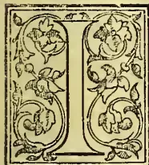

MENTIONED that I was not aware that anything had been done toward the determination of the composition of Ceylon soils fertile for the paddy crop; neither do I find that Ceylon-grown rice grains have come under the investigation of the analytical

chemist. It is therefore necessary to look elsewhere for analytical data. The following analyses of rice may be quoted:—

#### *Analyses of Rice.*

<table border="1">
<thead>
<tr>
<th></th>
<th>Rice. (Graham.)</th>
<th>Cleaned Rice. (Church.)</th>
<th>Naked Rice. (Wrightson's Agricultural Text Book.)</th>
<th>Rice. (Church.)</th>
</tr>
</thead>
<tbody>
<tr>
<td>Water ...</td>
<td>10.8</td>
<td>14.6</td>
<td>14.0</td>
<td>12.8</td>
</tr>
<tr>
<td>Fat ...</td>
<td>.1</td>
<td>.5</td>
<td>.4</td>
<td>.6</td>
</tr>
<tr>
<td>Cellulose ...</td>
<td>.2</td>
<td>.9</td>
<td>2.2</td>
<td>.4</td>
</tr>
<tr>
<td>Starch ...</td>
<td>78.8</td>
<td rowspan="2">} 76.0</td>
<td rowspan="2">75.4</td>
<td rowspan="2">78.3</td>
</tr>
<tr>
<td>Other non-nitrogenous substances ...</td>
<td>1.6</td>
</tr>
<tr>
<td>Albumenoids ...</td>
<td>7.2</td>
<td>7.5</td>
<td>7.7</td>
<td>7.3</td>
</tr>
<tr>
<td>Ash ...</td>
<td>.9</td>
<td>.5</td>
<td>.3</td>
<td>.6</td>
</tr>
<tr>
<td>Loss ...</td>
<td>.4</td>
<td></td>
<td></td>
<td></td>
</tr>
<tr>
<td></td>
<td>100.0</td>
<td>100.0</td>
<td>100.0</td>
<td>100.0</td>
</tr>
</tbody>
</table>

Professor O. Kellner gives the following as the composition of Japan undressed rice, in the dry state. There, as in Ceylon, there are many varieties of rice; but they can all be grouped under two classes, the marsh rice and the mountain rice, the former being cultivated in irrigated fields, the latter on dry ground.

Of the marsh rice there are two principal kinds, the ordinary and the glutinous rice. The moisture in the marsh rice is 14.20 per cent, and in the mountain rice 12.77 per cent. The percentage composition of the dry matter is given below.

#### *Analyses of Marsh and Mountain Rice. (UNDRESSED.)*

<table border="1">
<thead>
<tr>
<th rowspan="2"></th>
<th colspan="2">Marsh Rice.</th>
<th rowspan="2">Mountain Rice.</th>
</tr>
<tr>
<th>Ordinary.</th>
<th>Glutinous.</th>
</tr>
</thead>
<tbody>
<tr>
<td>Protein matter...</td>
<td>7.00</td>
<td>5.87</td>
<td>8.75</td>
</tr>
<tr>
<td>Fat ...</td>
<td>2.29</td>
<td>3.44</td>
<td>2.58</td>
</tr>
<tr>
<td>Cellulose ...</td>
<td>4.58</td>
<td>5.19</td>
<td>1.98</td>
</tr>
<tr>
<td>Starch and non-nitrogenous extract ...</td>
<td>84.76</td>
<td>83.89</td>
<td>85.53</td>
</tr>
<tr>
<td>Ash ...</td>
<td>1.37</td>
<td>1.61</td>
<td>1.18</td>
</tr>
<tr>
<td></td>
<td>100.00</td>
<td>100.00</td>
<td>100.00</td>
</tr>
</tbody>
</table>

Other analyses are given according to which marsh rice contains 9.84 per cent of protein matter, and 1.571 per cent total nitrogen, while mountain rice contains 11.27 and 1.8 respectively. The mountain rice is thus shewn to be richer than the marsh rice both in protein compounds and in starchy matter, but not in mineral matter.

The following are Kellner's analyses of the mineral matter in rice:—

#### *Ash Analyses of Rice.*

<table border="1">
<thead>
<tr>
<th></th>
<th>Marsh.</th>
<th>Mountain.</th>
</tr>
</thead>
<tbody>
<tr>
<td>Potash ...</td>
<td>22.94</td>
<td>21.73</td>
</tr>
<tr>
<td>Soda ...</td>
<td>4.94</td>
<td>1.59</td>
</tr>
<tr>
<td>Lime ...</td>
<td>3.24</td>
<td>2.12</td>
</tr>
<tr>
<td>Magnesia ...</td>
<td>10.54</td>
<td>6.61</td>
</tr>
<tr>
<td>Peroxide of iron ...</td>
<td>1.03</td>
<td>1.66</td>
</tr>
<tr>
<td>Phosphoric acid ...</td>
<td>51.37</td>
<td>51.99</td>
</tr>
<tr>
<td>Salphuric acid ...</td>
<td>1.85</td>
<td>2.08</td>
</tr>
<tr>
<td>Silica ...</td>
<td>3.14</td>
<td>9.63</td>
</tr>
<tr>
<td>Chlorine ...</td>
<td>1.05</td>
<td>4.49</td>
</tr>
<tr>
<td>Deduct oxygen equivalent to chlorine ...</td>
<td>100.10 .24</td>
<td>101.90 1.01</td>
</tr>
<tr>
<td></td>
<td>99.86</td>
<td>100.89</td>
</tr>
</tbody>
</table>

579------------------------------------------------

564THE TROPICAL AGRICULTURIST.[MARCH 1, 1893.]

In these analyses of the ash of Japan rice, the predominance of phosphoric acid (already noticed in the chapter on soils) is conspicuous. Kellner's analyses of rice are remarkable, as shewing a much higher percentage of fat than in American or East Indian rice. They also shew a higher percentage of fat than that obtained by Kinch in Japan rice, viz., 2.0 per cent, but, as Kellner's analyses are of undressed rice, and that of Kinch is of cleaned rice, the results are not inconsistent. Compared with other cereals, rice, other than Japan rice, is very poor in fat. All kinds of rice are also deficient in nitrogenous matter. Rice is, however, one of the most digestible of grains, and those people who use it as a chief article of food have learned to supply those constituents

in which it is deficient by supplementing rice diet with vegetable or animal fats, and with various leguminous seeds, which are rich in nitrogen. Rice in the husk is still poorer in nitrogen than cleaned rice, hence the necessity of supplementing it with gram as food for horses. The proportion of mineral matter in most kinds of rice is also very low, but it is higher in Japan rice than in the others. A glance at the following table of the average composition of cereal grains from the article on "Cereals" of Mr. R. Warrington, F.R.S., in Thorpe's "Dictionary of Applied Chemistry" will enable the reader to compare the chemical composition of rice with that of other cereals. I also quote from the same source a table of the composition of the ash of cereal grains.

*Average Composition of Cereal Grains.* (THORPE'S DICTIONARY OF APPLIED CHEMISTRY.)

<table border="1">
<thead>
<tr>
<th>Description of Grain.</th>
<th>Number of Analyses.</th>
<th>Water.</th>
<th>Nitrogenous Substance.</th>
<th>Fat.</th>
<th>Carbohydrates.</th>
<th>Fibre.</th>
<th>Ash.</th>
<th>Authorities.</th>
<th>Rates of Nitrogenous to non-nitrogenous substance.</th>
</tr>
</thead>
<tbody>
<tr>
<td>Wheat (European excluding Russian) ...</td>
<td>208</td>
<td>13.7</td>
<td>12.3</td>
<td>1.8</td>
<td>67.9</td>
<td>2.5</td>
<td>1.8</td>
<td>König chiefly</td>
<td>1:5.9</td>
</tr>
<tr>
<td>" (American) mean ...</td>
<td>407</td>
<td>10.2</td>
<td>12.2</td>
<td>2.2</td>
<td>71.7</td>
<td>1.8</td>
<td>1.4</td>
<td>Richardson</td>
<td>1:6.3</td>
</tr>
<tr>
<td>" " highest p.c. ...</td>
<td>—</td>
<td>12.5</td>
<td>18.0</td>
<td>3.6</td>
<td>78.7</td>
<td>3.1</td>
<td>3.6</td>
<td>"</td>
<td>—</td>
</tr>
<tr>
<td>" " lowest p.c. ...</td>
<td>—</td>
<td>7.7</td>
<td>7.7</td>
<td>1.4</td>
<td>64.8</td>
<td>.4</td>
<td>.8</td>
<td>"</td>
<td>—</td>
</tr>
<tr>
<td>" (East Indian) ...</td>
<td>—</td>
<td>12.5</td>
<td>13.5</td>
<td>1.2</td>
<td>68.4</td>
<td>2.7</td>
<td>1.7</td>
<td>Church</td>
<td>1:5.3</td>
</tr>
<tr>
<td>Spelt, with husk ...</td>
<td>12</td>
<td>12.1</td>
<td>11.0</td>
<td>2.8</td>
<td>66.4</td>
<td>5.5</td>
<td>2.2</td>
<td>König</td>
<td>1:6.7</td>
</tr>
<tr>
<td>Rye (European) ...</td>
<td>48</td>
<td>15.0</td>
<td>11.5</td>
<td>1.8</td>
<td>67.9</td>
<td>2.0</td>
<td>1.8</td>
<td>"</td>
<td>1:6.3</td>
</tr>
<tr>
<td>" (American) mean ...</td>
<td>57</td>
<td>8.7</td>
<td>11.3</td>
<td>1.9</td>
<td>74.5</td>
<td>1.5</td>
<td>2.1</td>
<td>Richardson</td>
<td>1:7.0</td>
</tr>
<tr>
<td>" " highest p.c. ...</td>
<td>—</td>
<td>10.0</td>
<td>15.6</td>
<td>2.9</td>
<td>77.5</td>
<td>1.9</td>
<td>3.7</td>
<td>"</td>
<td>—</td>
</tr>
<tr>
<td>" " lowest p.c. ...</td>
<td>—</td>
<td>7.0</td>
<td>8.8</td>
<td>1.4</td>
<td>68.7</td>
<td>1.1</td>
<td>1.3</td>
<td>"</td>
<td>—</td>
</tr>
<tr>
<td>Oats (European) with husk ...</td>
<td>170</td>
<td>12.3</td>
<td>10.4</td>
<td>5.2</td>
<td>58.0</td>
<td>11.1</td>
<td>3.0</td>
<td>König chiefly</td>
<td>1:6.8</td>
</tr>
<tr>
<td>" (American) mean ...</td>
<td>100</td>
<td>6.4</td>
<td>10.8</td>
<td>5.9</td>
<td>67.4</td>
<td>6.3</td>
<td>3.2</td>
<td>Richardson</td>
<td>1:7.6</td>
</tr>
<tr>
<td>" " without husk mean ...</td>
<td>179</td>
<td>6.9</td>
<td>14.3</td>
<td>8.1</td>
<td>67.1</td>
<td>1.4</td>
<td>2.2</td>
<td>"</td>
<td>1:6.1</td>
</tr>
<tr>
<td>" " highest p.c. ...</td>
<td>—</td>
<td>11.1</td>
<td>19.4</td>
<td>11.2</td>
<td>71.9</td>
<td>2.1</td>
<td>2.9</td>
<td>"</td>
<td>—</td>
</tr>
<tr>
<td>" " lowest p.c. ...</td>
<td>—</td>
<td>4.7</td>
<td>9.1</td>
<td>6.5</td>
<td>62.8</td>
<td>.9</td>
<td>.9</td>
<td>"</td>
<td>—</td>
</tr>
<tr>
<td>Barley (European) ...</td>
<td>125</td>
<td>13.7</td>
<td>11.1</td>
<td>2.2</td>
<td>65.7</td>
<td>5.3</td>
<td>2.7</td>
<td>König</td>
<td>1:6.4</td>
</tr>
<tr>
<td>" (Saxon) ...</td>
<td>many</td>
<td>15.0</td>
<td>8.4</td>
<td>1.6</td>
<td>66.8</td>
<td>4.6</td>
<td>3.6</td>
<td>Märecker</td>
<td>1:8.4</td>
</tr>
<tr>
<td>" (Canadian) ...</td>
<td>12</td>
<td>8.0</td>
<td>9.8</td>
<td>2.7</td>
<td>73.2</td>
<td>3.5</td>
<td>2.8</td>
<td>Richardson</td>
<td>1:8.2</td>
</tr>
<tr>
<td>" (United States) mean ...</td>
<td>60</td>
<td>6.5</td>
<td>11.3</td>
<td>2.7</td>
<td>72.8</td>
<td>3.8</td>
<td>2.9</td>
<td>"</td>
<td>1:7.0</td>
</tr>
<tr>
<td>" " highest p.c. ...</td>
<td>—</td>
<td>9.2</td>
<td>14.9</td>
<td>3.5</td>
<td>76.8</td>
<td>4.7</td>
<td>4.4</td>
<td>"</td>
<td>—</td>
</tr>
<tr>
<td>" " lowest p.c. ...</td>
<td>—</td>
<td>4.5</td>
<td>8.8</td>
<td>2.1</td>
<td>69.7</td>
<td>2.6</td>
<td>1.5</td>
<td>"</td>
<td>—</td>
</tr>
<tr>
<td>" " without husk ...</td>
<td>15</td>
<td>6.3</td>
<td>11.8</td>
<td>2.7</td>
<td>75.4</td>
<td>1.6</td>
<td>2.2</td>
<td>"</td>
<td>1:7.0</td>
</tr>
<tr>
<td>Maize (European) ...</td>
<td>27</td>
<td>13.3</td>
<td>9.8</td>
<td>4.5</td>
<td>68.4</td>
<td>2.5</td>
<td>1.5</td>
<td>König</td>
<td>1:8.1</td>
</tr>
<tr>
<td>" (American) mean ...</td>
<td>114</td>
<td>10.7</td>
<td>10.5</td>
<td>5.2</td>
<td>70.7</td>
<td>2.1</td>
<td>1.5</td>
<td>Richardson</td>
<td>1:8.1</td>
</tr>
<tr>
<td>" " highest p.c. ...</td>
<td>—</td>
<td>15.1</td>
<td>13.7</td>
<td>7.5</td>
<td>75.7</td>
<td>3.1</td>
<td>3.1</td>
<td>"</td>
<td>—</td>
</tr>
<tr>
<td>" " lowest p.c. ...</td>
<td>—</td>
<td>7.4</td>
<td>7.0</td>
<td>3.9</td>
<td>66.0</td>
<td>.8</td>
<td>1.0</td>
<td>"</td>
<td>—</td>
</tr>
<tr>
<td>Rice with husk ...</td>
<td>1</td>
<td>9.6</td>
<td>5.9</td>
<td>1.8</td>
<td>72.7</td>
<td>5.8</td>
<td>4.2</td>
<td>König</td>
<td>1:13.1</td>
</tr>
<tr>
<td>Rice cleaned (American) ...</td>
<td>10</td>
<td>12.4</td>
<td>7.4</td>
<td>.4</td>
<td>79.2</td>
<td>.2</td>
<td>.4</td>
<td>Johnson</td>
<td>1:10.8</td>
</tr>
<tr>
<td>" (East Indian) ...</td>
<td>—</td>
<td>12.8</td>
<td>7.3</td>
<td>.6</td>
<td>78.3</td>
<td>.4</td>
<td>.6</td>
<td>Church</td>
<td>1:10.9</td>
</tr>
<tr>
<td>" (Japanese) ...</td>
<td>—</td>
<td>12.8</td>
<td>6.1</td>
<td>2.0</td>
<td>73.9</td>
<td>4.0</td>
<td>1.2</td>
<td>Kinch</td>
<td>1:12.9</td>
</tr>
<tr>
<td>Millet, Sorghum vulgare ...</td>
<td>—</td>
<td>12.5</td>
<td>9.3</td>
<td>2.0</td>
<td>72.3</td>
<td>2.2</td>
<td>1.7</td>
<td>Church</td>
<td>1:8.3</td>
</tr>
<tr>
<td>" " tartarienum ...</td>
<td>7</td>
<td>11.1</td>
<td>9.5</td>
<td>4.2</td>
<td>71.7</td>
<td>1.7</td>
<td>1.8</td>
<td>Various</td>
<td>1:8.2</td>
</tr>
<tr>
<td>" Panicum miliaceum with husk ...</td>
<td>2</td>
<td>13.2</td>
<td>10.2</td>
<td>3.8</td>
<td>56.9</td>
<td>12.8</td>
<td>3.1</td>
<td>"</td>
<td>1:6.5</td>
</tr>
<tr>
<td>" " without husk ...</td>
<td>6</td>
<td>11.6</td>
<td>12.4</td>
<td>4.7</td>
<td>65.6</td>
<td>3.3</td>
<td>2.4</td>
<td>König chiefly</td>
<td>1:6.2</td>
</tr>
<tr>
<td>" " miliare ...</td>
<td>—</td>
<td>10.2</td>
<td>9.1</td>
<td>3.6</td>
<td>69.0</td>
<td>4.6</td>
<td>3.5</td>
<td>Church</td>
<td>1:8.6</td>
</tr>
<tr>
<td>" " frumentaceum ...</td>
<td>—</td>
<td>12.0</td>
<td>8.4</td>
<td>3.7</td>
<td>72.5</td>
<td>2.2</td>
<td>1.9</td>
<td>"</td>
<td>1:9.5</td>
</tr>
<tr>
<td>" " colomum without husk ...</td>
<td>—</td>
<td>12.0</td>
<td>9.6</td>
<td>.6</td>
<td>74.3</td>
<td>1.5</td>
<td>2.0</td>
<td>"</td>
<td>1:7.9</td>
</tr>
<tr>
<td>" Paspalum scrofula'um with husk ...</td>
<td>—</td>
<td>11.7</td>
<td>7.0</td>
<td>2.1</td>
<td>77.2</td>
<td>.7</td>
<td>1.5</td>
<td>"</td>
<td>1:11.8</td>
</tr>
<tr>
<td>" Pennisetum typhoideum with husk ...</td>
<td>—</td>
<td>11.3</td>
<td>10.4</td>
<td>3.3</td>
<td>71.5</td>
<td>1.5</td>
<td>2.0</td>
<td>"</td>
<td>1:7.7</td>
</tr>
<tr>
<td>" Setaria Italica without husk ...</td>
<td>—</td>
<td>10.2</td>
<td>10.8</td>
<td>2.9</td>
<td>73.4</td>
<td>1.5</td>
<td>1.2</td>
<td>"</td>
<td>1:7.5</td>
</tr>
<tr>
<td>" Eleusine corocaria with husk ...</td>
<td>—</td>
<td>12.5</td>
<td>5.9</td>
<td>.8</td>
<td>74.6</td>
<td>3.6</td>
<td>2.6</td>
<td>"</td>
<td>1:13.4</td>
</tr>
<tr>
<td>" " without husk ...</td>
<td>—</td>
<td>13.2</td>
<td>7.3</td>
<td>1.5</td>
<td>73.2</td>
<td>2.5</td>
<td>2.3</td>
<td>"</td>
<td>1:10.6</td>
</tr>
</tbody>
</table>

580------------------------------------------------

MARCH 1, 1893.]THE TROPICAL AGRICULTURIST.555

Composition of the Ash of Cereal Grains. (THORPE'S "DICTIONARY OF APPLIED CHEMISTRY.")

<table border="1">
<thead>
<tr>
<th>Description.</th>
<th>Number of Analyses.</th>
<th>Pure Ash in Dry Grain.</th>
<th>Potash.</th>
<th>Soda.</th>
<th>Lime.</th>
<th>Magnesia.</th>
<th>Peroxide of Iron.</th>
<th>Phosphoric Acid.</th>
<th>Sulphuric Acid.</th>
<th>Silica.</th>
<th>Chlorine.</th>
</tr>
</thead>
<tbody>
<tr>
<td>Wheat (winter) ... ..</td>
<td>110</td>
<td>1.96</td>
<td>31.2</td>
<td>2.1</td>
<td>3.3</td>
<td>12.1</td>
<td>1.3</td>
<td>47.2</td>
<td>.4</td>
<td>2.0</td>
<td>.3</td>
</tr>
<tr>
<td>Spelt with chaff ... ..</td>
<td>2</td>
<td>4.29</td>
<td>15.6</td>
<td>1.0</td>
<td>2.6</td>
<td>6.5</td>
<td>1.6</td>
<td>20.7</td>
<td>2.9</td>
<td>46.7</td>
<td>.6</td>
</tr>
<tr>
<td>Do. without chaff ... ..</td>
<td>4</td>
<td>1.68</td>
<td>30.1</td>
<td>4.8</td>
<td>4.3</td>
<td>12.4</td>
<td>1.5</td>
<td>45.2</td>
<td>—</td>
<td>1.0</td>
<td>—</td>
</tr>
<tr>
<td>Rye (winter) ... ..</td>
<td>36</td>
<td>2.09</td>
<td>32.1</td>
<td>1.5</td>
<td>2.9</td>
<td>11.2</td>
<td>1.2</td>
<td>47.7</td>
<td>1.3</td>
<td>1.4</td>
<td>.5</td>
</tr>
<tr>
<td>Oats (with husk) ... ..</td>
<td>57</td>
<td>3.12</td>
<td>17.9</td>
<td>1.7</td>
<td>3.6</td>
<td>7.4</td>
<td>1.2</td>
<td>25.6</td>
<td>1.8</td>
<td>39.2</td>
<td>.9</td>
</tr>
<tr>
<td>Do. (naked) ... ..</td>
<td>4</td>
<td>2.07</td>
<td>28.0</td>
<td>—</td>
<td>7.5</td>
<td>10.1</td>
<td>1.5</td>
<td>47.7</td>
<td>—</td>
<td>1.2</td>
<td>.3</td>
</tr>
<tr>
<td>Barley (with husk) ... ..</td>
<td>57</td>
<td>2.61</td>
<td>20.9</td>
<td>2.4</td>
<td>2.6</td>
<td>8.8</td>
<td>1.2</td>
<td>35.1</td>
<td>1.8</td>
<td>25.9</td>
<td>1.0</td>
</tr>
<tr>
<td>Do. (naked) ... ..</td>
<td>3</td>
<td>2.13</td>
<td>28.5</td>
<td>1.8</td>
<td>3.1</td>
<td>12.0</td>
<td>1.9</td>
<td>47.1</td>
<td>2.9</td>
<td>3.6</td>
<td>—</td>
</tr>
<tr>
<td>Maize ... ..</td>
<td>15</td>
<td>1.45</td>
<td>29.8</td>
<td>1.1</td>
<td>2.2</td>
<td>15.5</td>
<td>.8</td>
<td>45.6</td>
<td>.8</td>
<td>2.1</td>
<td>.9</td>
</tr>
<tr>
<td>Rice with husk ... ..</td>
<td>2</td>
<td>8.21</td>
<td>17.5</td>
<td>5.5</td>
<td>4.0</td>
<td>10.8</td>
<td>1.8</td>
<td>40.6</td>
<td>.9</td>
<td>18.3</td>
<td>.9</td>
</tr>
<tr>
<td>Do. without husk ... ..</td>
<td>5</td>
<td>.39</td>
<td>21.7</td>
<td>5.5</td>
<td>3.2</td>
<td>11.2</td>
<td>1.2</td>
<td>53.7</td>
<td>.6</td>
<td>2.7</td>
<td>.1</td>
</tr>
<tr>
<td>Millet (<i>P. Milceaceum</i>) with husk ... ..</td>
<td>3</td>
<td>3.43</td>
<td>11.4</td>
<td>1.3</td>
<td>.6</td>
<td>9.6</td>
<td>1.1</td>
<td>21.9</td>
<td>.2</td>
<td>53.</td>
<td>.5</td>
</tr>
<tr>
<td>Do. without husk ... ..</td>
<td>1</td>
<td>1.46</td>
<td>17.4</td>
<td>5.3</td>
<td>—</td>
<td>17.0</td>
<td>1.5</td>
<td>49.2</td>
<td>1.3</td>
<td>8.3</td>
<td>—</td>
</tr>
<tr>
<td>Do. (<i>P. Italicum</i>) without husk ... ..</td>
<td>1</td>
<td>1.26</td>
<td>20.6</td>
<td>3.3</td>
<td>2.4</td>
<td>14.1</td>
<td>0.4</td>
<td>39.6</td>
<td>3.3</td>
<td>11.6</td>
<td>3.7</td>
</tr>
<tr>
<td>Do. (<i>S. Saccharatum</i>) with husk ... ..</td>
<td>1</td>
<td>2.72</td>
<td>14.9</td>
<td>8.4</td>
<td>.7</td>
<td>13.2</td>
<td>0.4</td>
<td>24.8</td>
<td>.8</td>
<td>36.8</td>
<td>.1</td>
</tr>
<tr>
<td>Do. (<i>S. Saccharatum</i>) without husk ... ..</td>
<td>1</td>
<td>5.26</td>
<td>21.4</td>
<td>4.9</td>
<td>2.6</td>
<td>14.5</td>
<td>1.8</td>
<td>49.7</td>
<td>2.5</td>
<td>.2</td>
<td>1.4</td>
</tr>
<tr>
<td>Do. (<i>S. Tartaricum</i>) with husk ... ..</td>
<td>1</td>
<td>1.86</td>
<td>20.3</td>
<td>3.3</td>
<td>1.3</td>
<td>14.8</td>
<td>1.9</td>
<td>50.9</td>
<td>—</td>
<td>7.5</td>
<td>—</td>
</tr>
</tbody>
</table>

In the preceding table of the average composition of cereal grains, the last column may require explanation. It expresses what is called the nutrient ratio of the cereal grains, or the ratio of albumenoids to starch, and the word starch used in this sense includes the carbohydrates and the starch-equivalent of the fat. One part of vegetable oil or fat is regarded as equal to 2.5 parts of starch; hence, by multiplying the fat or oil by 2.5, we get the starch-equivalent of the oil. Professor A. H. Church, in his work "The Food Grains of India," adopts not 2.5 but 2.3 as the starch equivalent of oil. The ratio in a standard diet is 1 to 5; hence cereals which nearly approach this ratio of albumenoids to starch are capable by themselves of supporting the human frame in a state of health for a lengthened period, such, *e.g.*, as Indian wheat in which the ratio is 1.5.2, while rice and still more so Kurakkan are deficient in albumenoids, the nutrient ratio in each case being respectively 1.10 and 1.13, so that both of these foods require to be supplemented by diet in which the albumenoids bear a higher ratio to the starch than 1 to 5.

Another expression that is met with in the valuation of foods is "nutrient value." This expresses the sum of the albumenoids and the starch in 100 parts of the food. Starch, in this sense also, includes the starch-equivalent of the oil or fat as well as the carbohydrates. From Professor Church's work on the "Food Grains of India," I quote two tables, one giving the nutrient ratio, albumenoids and nutrient values of Indian cereals and buckwheats, the other giving the same for the pulses or leguminous seeds. It will be observed that while, in the cereals, the ratio of albumenoids to starch is less than that of standard diet, in two of the buckwheats, and in most of the leguminous seeds, it is greater, so that cereals and pulse supplement each other.

Nutrient ratio, Albumenoids and Nutrient value in Cereals and Buckwheats. (A. H. CHURCH.)

<table border="1">
<thead>
<tr>
<th></th>
<th>Nutrient ratio or Albumenoids to Starch.</th>
<th>Albumenoids percentage of</th>
<th>Nutrient Value.</th>
</tr>
</thead>
<tbody>
<tr>
<td>Kurakkan or Ragi (Eleusine coracana) ... ..</td>
<td>1:13</td>
<td>5.9</td>
<td>84</td>
</tr>
<tr>
<td>Koda Millet ... (Paspalum scrobiculatum) ... ..</td>
<td>1:11.7</td>
<td>7.0</td>
<td>89</td>
</tr>
<tr>
<td>Rice ... (Oryza sativa) ... ..</td>
<td>1:10.8</td>
<td>7.3</td>
<td>86.5</td>
</tr>
<tr>
<td>Sánwa Millet ... (Panicum frumentaceum) ... ..</td>
<td>1:9.5</td>
<td>8.4</td>
<td>88</td>
</tr>
<tr>
<td>Little Millet ... (Panicum miliare) ... ..</td>
<td>1:8.4</td>
<td>9.1</td>
<td>85</td>
</tr>
<tr>
<td>Maize ... (Zea mays) ... ..</td>
<td>1:8.3</td>
<td>9.5</td>
<td>88.5</td>
</tr>
<tr>
<td>Great Millet ... (Sorghum vulgare) ... ..</td>
<td>1:8.2</td>
<td>9.3</td>
<td>86</td>
</tr>
<tr>
<td>Shama Millet ... (Panicum colonum) ... ..</td>
<td>1:8</td>
<td>9.6</td>
<td>85</td>
</tr>
<tr>
<td>Bulrush Millet... (Pennisetum typhoideum) ... ..</td>
<td>1:7.6</td>
<td>10.4</td>
<td>89.5</td>
</tr>
<tr>
<td>Italian Millet ... (Setaria italica) ... ..</td>
<td>1:7.4</td>
<td>10.8</td>
<td>91</td>
</tr>
<tr>
<td>Broom Corn ... (Sorghum saccharatum) ... ..</td>
<td>1:6.4</td>
<td>11.8</td>
<td>87</td>
</tr>
<tr>
<td>Bamboo Rice ... (Bambusa arundinaceae) ... ..</td>
<td>1:6.4</td>
<td>11.8</td>
<td>87</td>
</tr>
<tr>
<td>Barley ... (Stordeum vulgare) ... ..</td>
<td>1:6.3</td>
<td>11.5</td>
<td>84.5</td>
</tr>
<tr>
<td>Indian Millet ... (Panicum miliaceum) ... ..</td>
<td>1:6</td>
<td>12.6</td>
<td>89</td>
</tr>
<tr>
<td>Wheat ... (Triticum sativum) ... ..</td>
<td>1:5.2</td>
<td>13.5</td>
<td>84.5</td>
</tr>
<tr>
<td>Common Amaranth (Amaranthus paniculatus) ... ..</td>
<td>1:5.3</td>
<td>13.7</td>
<td>90</td>
</tr>
<tr>
<td>Buckwheat ... (Fagopyrum esculentum) ... ..</td>
<td>1:4.7</td>
<td>15.2</td>
<td>86</td>
</tr>
<tr>
<td>Quinon Seed ... (Chenopodium quinon) ... ..</td>
<td>1:3</td>
<td>19.2</td>
<td>78</td>
</tr>
</tbody>
</table>

581------------------------------------------------

556THE TROPICAL AGRICULTURIST.[MARCH 1, 1893.]

Nutrient ratio, Albumenoids and Nutrient value in Pulse or Leguminous Seeds. (A. H. CHURCH.)

<table border="1">
<thead>
<tr>
<th>Description.</th>
<th>Nutrient ratio or Albumenoids to Starch.</th>
<th>Albumenoids percentage of</th>
<th>Nutrient value.</th>
</tr>
</thead>
<tbody>
<tr>
<td>Lupines ... (<i>Lupinus albus</i>)</td>
<td>1:1.4</td>
<td>31.7</td>
<td>77</td>
</tr>
<tr>
<td>Vetches ... (<i>Vicia sativa</i>)</td>
<td>1:1.6</td>
<td>31.5</td>
<td>81</td>
</tr>
<tr>
<td>Cyamopsis-beans ... (<i>Cyamopsis psoralioides</i>)</td>
<td>1:1.7</td>
<td>29.8</td>
<td>79</td>
</tr>
<tr>
<td>Vetchlings ... (<i>Lathyrus sativus</i>)</td>
<td>1:1.75</td>
<td>31.9</td>
<td>87</td>
</tr>
<tr>
<td>Soy-beans ... (<i>Glycine soja</i>)</td>
<td>1:2</td>
<td>35.3</td>
<td>105</td>
</tr>
<tr>
<td>Sword beans ... (<i>Canavalia ensiformis</i>)</td>
<td>1:2.2</td>
<td>25.0</td>
<td>80</td>
</tr>
<tr>
<td>Peas ... (<i>Pisum sativum</i>)</td>
<td>1:2.4</td>
<td>23.6</td>
<td>81</td>
</tr>
<tr>
<td>Lablab beans ... (<i>Dolichos lablab</i>)</td>
<td>1:2.5</td>
<td>22.4</td>
<td>80</td>
</tr>
<tr>
<td>Moth beans ... (<i>Phaseolus aconitifolius</i>)</td>
<td>1:2.5</td>
<td>23.8</td>
<td>81</td>
</tr>
<tr>
<td>Lentils ... (<i>Lens esculenta</i>)</td>
<td>1:2.5</td>
<td>24.9</td>
<td>87</td>
</tr>
<tr>
<td>Vigna beans ... (<i>Vigna catian</i>)</td>
<td>1:2.5</td>
<td>23.1</td>
<td>81</td>
</tr>
<tr>
<td>Haricot beans ... (<i>Phaseolus vulgaris</i>)</td>
<td>1:2.5</td>
<td>23.0</td>
<td>75</td>
</tr>
<tr>
<td>Horse gram ... (<i>Dolichos biflorus</i>)</td>
<td>1:2.7</td>
<td>22.5</td>
<td>83</td>
</tr>
<tr>
<td>Mung beans ... (<i>Phaseolus mungo</i>)</td>
<td>1:2.7</td>
<td>22.9</td>
<td>83</td>
</tr>
<tr>
<td>Pigeon peas ... (<i>Cajanus indicus</i>)</td>
<td>1:3</td>
<td>20.3</td>
<td>80</td>
</tr>
<tr>
<td>Lima beans ... (<i>Phaseolus lunatus</i>)</td>
<td>1:3.2</td>
<td>19.8</td>
<td>80</td>
</tr>
<tr>
<td>Chick peas ... (<i>Cicer arietinum</i>)</td>
<td>1:3.3</td>
<td>19.5</td>
<td>84</td>
</tr>
<tr>
<td>Inga beans ... (<i>Pithecolobium dulce</i>)</td>
<td>1:4.6</td>
<td>17.6</td>
<td>98</td>
</tr>
<tr>
<td>Pea nuts ... (<i>Arachis hypogaea</i>)</td>
<td>1:5.2</td>
<td>24.5</td>
<td>151</td>
</tr>
<tr>
<td>Carob beans ... (<i>Ceratonia siliqua</i>)</td>
<td>1:8.5</td>
<td>7.1</td>
<td>68</td>
</tr>
</tbody>
</table>

#### Rice Straw.

The following are analyses by Kellner of Japan rice straw, both from irrigated and from dry land, together with co-efficients of digestibility.

Analyses of Rice Straw. (KELLNER.)

<table border="1">
<thead>
<tr>
<th>Constituents.</th>
<th>Rice straw from irrigated land.</th>
<th>Co-efficient of digestibility.</th>
<th>Rice straw from dry land.</th>
<th>Co-efficient of digestibility.</th>
</tr>
</thead>
<tbody>
<tr>
<td>Moisture per cent. ..</td>
<td>20.79</td>
<td></td>
<td>10.33</td>
<td></td>
</tr>
<tr>
<td>Dry substance:</td>
<td></td>
<td></td>
<td></td>
<td></td>
</tr>
<tr>
<td>Albumenoids ...</td>
<td>6.80</td>
<td>46.54</td>
<td>6.75</td>
<td>43.84</td>
</tr>
<tr>
<td>Fat ...</td>
<td>2.17</td>
<td>41.45</td>
<td>2.16</td>
<td>51.90</td>
</tr>
<tr>
<td>Fibre ...</td>
<td>48.68</td>
<td>58.10</td>
<td>40.35</td>
<td>55.24</td>
</tr>
<tr>
<td>Non-nitrogenous extract ...</td>
<td>24.80</td>
<td>35.41</td>
<td>32.14</td>
<td>28.86</td>
</tr>
<tr>
<td>Ash ...</td>
<td>17.55</td>
<td></td>
<td>18.60</td>
<td></td>
</tr>
<tr>
<td></td>
<td>100.00</td>
<td></td>
<td>100.00</td>
<td></td>
</tr>
<tr>
<td>Dry matter ...</td>
<td></td>
<td>43.86</td>
<td></td>
<td>39.18</td>
</tr>
<tr>
<td>Organic matter ...</td>
<td></td>
<td>49.88</td>
<td></td>
<td>44.03</td>
</tr>
</tbody>
</table>

Kellner remarks that both these straws surpass all others as fodder.

Further on I have calculated the above analytical results of dry straw into straw, with the respective amounts of moisture indicated above for the sake of easy comparison with published results of the analyses of other cereal straws; but first, I give another table of analyses of paddy straws from various districts in the Carnatic by Dr. Van Geyzel (formerly of Ceylon), now Chemical Examiner to the Madras Government; and further on I have re-stated his average results, so as to allow of easy comparison with other analyses of cereal straws.

(To be continued.)

#### VARIOUS NOTES.

NEARLY 1,900 TONS OF PARA RUBBER.—According to the annual report of Messrs. Norton & Co., of Para, the receipts of rubber at that port during the crop year amounted to 18,490 tons of 1,000 kilos, and the exports to 18,787 tons. Of the exports 11,605 tons were for the United States and 7,182 tons for Europe. The total value of the rubber exports from the Amazon districts has been given at from four to five millions sterling a year!

SINHALESE EMIGRATION TO EAST AFRICA!—We call attention to the further very interesting letter with which our correspondent "B." supplies us on this subject. We think our readers will agree with us that he goes on whetting our curiosity almost too far—as to the real explanation of the Sinhalese being so ready to leave their homes, cross the ocean and begin life and hard work, in unknown East Africa. What can it be? We must, however, wait till the official negotiation is ended, before demanding the answer. In one respect "B." is surely a little illogical if not inconsistent: he says the Sinhalese in some cases dread leaving their homes (to do local plantation work) because their property may be sold up and their house burnt down by their nearest friend and neighbour. How then do these same people volunteer to leave the island altogether? Perhaps they sell out of house and land beforehand? As regards the "educated" class referred to, we do not see why the slightest obstacle should be placed in their way by the Government or anybody else, if they wish to go to East Africa by the score or hundred; but as regards the ignorant goyiya or agricultural labourer, the case is surely different—that is, if it be the fact that there is well-remunerated work available on the tea plantations. Surely planters can afford really good substantial lines, and regular food and pay to such Sinhalese workers? We shall, however, in any case continue to take a special interest in "B.'s Mission" and to wish him and his German friends all success. Nine years ago, a letter of ours in the *Pall Mall Gazette* attracted some attention in London; because on the faith of 24 years' watching of native and foreign Governments in Asia, it boldly averred that for Africa the very worst form of European rule—even a Russian despotism of the severest kind—would be far superior to the very best native Government—to Muhammadans with their slavery, or Dahomey with its cannibalism. We urged then, long before it was dreamed of, that the European Powers should combine to take possession of Africa and dividing it up, each take a part in administering and opening up large districts. Since then Great Britain, France and even Italy have made great strides in Africa; while Germany has come in for a big slice; Portugal has wakened up; and the Belgian-Congo State has been fully established. How great a change will railways, telegraphs, roads and settled Government make within the next ten years in Africa

582------------------------------------------------

MARCH 1, 1893.]THE TROPICAL AGRICULTURIST.557TEA.

[Fireside Facts from the Great Exhibition, by the Editor of "Pleasant Pages": being an Amusing Series of Object Lessons on the Food and Clothing of all Nations in the year 1851, p. 52 et seq.]

If you wish to find specimens of Tea in the Great Exhibition, you will find several in the CHINESE DEPARTMENT. I must repeat, however, before beginning our lesson, that tea is not strictly a tropical plant. It will grow inside the tropics, but not in the very warm climates. It is cultivated by the Chinese, particularly in the tract of land round about the 30th degree of latitude.

Here are some specimens for you to examine. You may begin by discovering the *qualities*, and the *uses*. Then, if you have paid attention to your part of the lesson, I will pay attention to my part, and see if I can give you an interesting *history*.

W. The first quality I observe in the tea is, that it is thoroughly *dry*.

Ion. It is also *brittle*—"crisp" would be a better word to use;—and it may be ground into a powder: it is *pulverable*.

L. It is *shrivelled*—that is a very good word to apply to it.

W. I do not see any more qualities. We have examined its appearance, and its substance; we cannot say anything of its shape, but we may add something of its colour, and something about its weight. It is *black*, and *green*, and in weight it is *light*.

Ion. We may add that it is a *vegetable substance*. It is really necessary to say that to describe it properly.

P. Why?

Ion. Because nobody would really think that it was a vegetable substance at first sight.

W. That is because it does not look natural. I suppose we must not call it a *natural* substance. We will say that it is *artificial*.

Ion. I don't think that that is correct. It is not made by man.

W. Well, I have heard that it is. Men dry and shrivel it up, in some way or other, to make it like this. Therefore I think that it is an artificial substance.

Ion. But at the same time, you see, men do not make it, they only alter its *shape*.

L. And they alter its *state*—from a moist green state to a dry state.

P. You say that it loses some of its moisture. By thus losing its moisture, it loses one of its *qualities*.

W. Yes. One of its natural qualities, papa.

P. Then it is no longer in quite a natural state. It has been changed by the art of man, so it is in an artificial state.

Ion. And yet, papa, the tea leaf is a natural substance, because men could not in any way make such a substance. When a substance is *compound* (that is, formed of two or three different substances—such as bread, which is made of flour, water, yeast, salt, &c.), then I call it an artificial substance. So this is what I should say of tea.—"It is a natural substance in an artificial state." Will that do?

P. Perhaps that is the best way to express it. It certainly is not an artificial substance; and it is not in a natural state.

Ion. Then I will write down the qualities of the tea. "Tea is a vegetable substance, and is therefore *natural*; but it has been brought into an *artificial* state, for it is *dry*, *shrivelled*, *crisp*, *light*, and *pulverable*; sometimes it is *black*, and sometimes *green*."

P. You have not made a complete list of the qualities. I think I have said before, there are many hidden qualities in a substance, which you cannot discover by observation.

L. You mean, papa, the qualities which we discover in using a substance. We call them its *effects*.

W. I know one effect of tea; it causes people to talk and be more lively. When people are dull, it serves to *stir them up*, just as coffee does. What is the Latin word for "stir-up?" I forget.

Ion. I remember it: *stimulare*, to stir up; and we call the coffee *stimulating*.

L. And, if you remember, we said that coffee is *refreshing*; and because it makes people glad, we call it *exhilarating*.

W. And because it acts as a medicine, and keeps the students from going to sleep, we call it *medicinal*.  
P. Yes, you said that the coffee in its "effects" is refreshing, stimulating, exhilarating, and medicinal: and these effects also belong to the *tea*.

W. It is very easy to know that tea has such effects, because we can feel them, and can notice them in other people, but I should like very much to know *how* the tea does so. Do you know, papa?

P. What do you want to know?

W. *How* the tea exhilarates people, and refreshes them. What it does *inside* them, to change them so.

P. Well, I cannot say that I know, exactly, but I will tell you all I have learned about it. There is, both in the leaves of tea, and the berries of coffee, a peculiar substance, which produces these effects. Although this substance is found in both articles, we give it different names. When found in *tea*, we call it "theine"; and when found in coffee, we call it "caffeine."

I have a little book on chemistry, written by a German gentleman named *Liebig*, and I will read you what he says of *Theine*. "When common tea-leaves are placed in a watch-glass, loosely covered with paper, and gradually heated on a hot iron plate, until they are brown, long, white, shining crystals appear on the paper, and on the surface of the leaves. This is *theine*." You can now easily understand that, if instead of heating the leaves on a watch glass, they are heated in boiling water, the *theine* would not form dry crystals.

L. No, it would be dissolved in the water.

P. That is the case. So the next time you are going to drink a cup of tea, you may look at it, and remember that it is the *theine* dissolved in the water, which will refresh you.

W. Now I know something more, papa. But still you have not told us *how* the *theine* in the tea refreshes us.

P. I will tell you as much as I know of the subject. You have often heard how, when your food in being digested, it is dissolved by a fluid called the *gastric juice*. The food is afterwards acted upon by another fluid from the liver, which are called *bile*; but if we have not sufficient bile within us, what then?

L. Then our food will not be digested, I suppose.

P. And we shall feel unwell. Persons who do not take sufficient exercise, do not form sufficient bile; but the *theine* in tea will supply the substance required for the purpose. This fact explains why men who sit much, and study, and females who do not often go out of doors, are so fond of tea.

W. Then, we may say,—as the tea helps to form bile, the food is digested more quickly.

P. Yes, or the food is *assimilated*, as we say. By assimilation we mean that the food becomes part of our body, by being changed into blood. The bile helps in this process; and thus, when the *theine* of the tea helps to form bile—?

W. The bile helps to form the food into blood.

Ion. And the blood begins to circulate more quickly, and we feel more lively,—we are stimulated and refreshed. Most people feel lively after tea.

P. Thus, where food is difficult to digest, tea is often useful. Which kind of food have I told you is harder to digest—*Animal* or *Vegetable* food?

L. You said that vegetables were more hard to digest, and that grass-eating animals required salt to help their digestive organs.

W. Just as you said that we require pepper to help to digest cucumber and other raw vegetables.

P. Thus, we find that *tea*, also, is much used amongst nations which subsist principally on vegetables. The great chemist, named *Liebig*, whom I mentioned just now, says in one of his books, "Tea and Coffee were originally met with among nations whose diet is chiefly vegetable."

Ion. But suppose, papa, that a nation could not procure any tea! The English people had no tea at one time, I suppose. What did they do then?

P. Then, they used something else which answered the same purpose by helping digestion: or by stimulating and refreshing their bodies. Let me tell you something which is worth remembering. If people would only live on proper food, and eat it

583------------------------------------------------

558THE TROPICAL AGRICULTURIST.[MARCH 1, 1893.]

in proper quantities, and take proper exercise, they would seldom require such stimulants. But whenever people are poor, and are poorly fed, they make up for the "sinking feeling" which such want occasions, by tea, coffee, tobacco, opium, and worse still, beer and spirits. It is said that in Germany, those who receive the lowest wages, while they are obliged to live on bread and potatoes, always reserve a portion of their wages for coffee.

*Ion.* I quite understand why they do that!

*P.* I should like you to understand it very clearly. I will say it to you once more: "Where there is good and nutritious food (containing *azote*, a word which I will explain to you some day), and with such nutritious food exercise is taken, the *azote* in the food forms sufficient bile; but, where the food is poor, or hard to digest, and sufficient exercise is not taken, then sufficient bile is not formed, and men use the *theine* in tea, or the *caffeine* in coffee, or some other stimulant for the purpose."

*L.* Then the lesson we may make about tea, is, that if we took great care to have proper food and exercise, we might do without it, and other stimulants also.

*P.* Yes: but it is not very likely that this will ever be the case. Until all men give due attention to their food, there will be some people craving for stimulants, to make up for their carelessness. In another part of M. Liebig's book, there is a paragraph expressing this opinion. I will read it to you:—

"It is a question whether, if we had no tea, and no coffee, the popular instinct would not replace them. Every people of the globe has appropriated some such means of acting on the nervous life,—from the shores of the Pacific, where the Indian retires for *days*, to enjoy the bliss of intoxication with Koka, to the Arctic Regions, where the Kamtschatdales prepare an intoxicating drink from a poisonous mushroom."

*Ion.* Or he might add, when the student in the university, who wants to study all night, prepares a decoction containing either *theine* or *caffeine*.

*P.* Yes, whether the university be in England or Germany, or elsewhere; or whether it be in the cottage or mansion, such stimulants are still in use. In the same book it is said concerning Germany—

"In the Customs Union (Zollverein), more than 60,000,000 pounds of coffee are consumed every year; while in Europe and America *Tea* forms part of the daily arrangements of the poorest laborer and the richest landowner—and the consumption of this article is more than 80,000,000 pounds per year.

*L.* And a pound of tea will last as long as two or three pounds of coffee.

*W.* What a long lesson we are having on the uses of tea! Now I will sum it all up. "*Tea and other stimulants are very useful things, because they have refreshing qualities which make up for the most of good food.*"

*P.* Oh, indeed! Is that the lesson you make? I make out a very different case. Listen! Tea, and all other stimulants are (except in occasional cases) *bad* things, because they enable people to neglect their diet, and indulge in bad habits, without feeling the natural consequences. As long as men will use such stimulants to remove for a time the bad effects of their neglect, so they will not give the attention they ought to give, to their diet and exercise.

*Ion.* To be sure, Willie! Don't you see that? If the tea and other stimulants were taken away, then people would be obliged to take proper care of themselves.

*P.* Shall I show you another way in which tea and stimulants are bad?

*W.* Yes papa, please.

*P.* Because they wear out the body. We do not observe this fact so much, because we take them in small quantities, and their action is gradual: but as soon as the stimulants are used in a little more than moderate quantity, their effect becomes evident. It is said of the frequent use of *Tea*, that it answers the purpose for a time, but the object is attained at "a fearful price"—the destruction of health, and vigour of body and mind being the penalty. Tea is worse in this respect than coffee, as its effects are more permanent.

The property in tea which has such injurious effects, is weakened by keeping the leaves for a long time. Fresh tea is so stimulating, that it is seldom used until it has been kept twelve months. The injurious property may also be weakened by *heat*, for *green* tea is more exciting than *black*, because when being prepared it is not "roasted" so often.

Tea is a very improper drink for young children; it produces too strong an excitement, and causes a diseased state of the brain and nerves. It has been said by a well-known physician, that "it ought by no means to be the common diet of boarding schools. If it be sometimes allowed to the children as a treat, they should be informed that it might, if used frequently, injure their strength and constitution."

Before we leave the subject of tea, I must not forget to mention that, although it may produce bad effects, the effects of stimulants which contain *alcohol*, instead of *theine* or *caffeine* (such as beer and spirits) are far worse. So dreadful are many of the evils which these stimulants bring, that a great society, called the National Temperance Society, has been formed both in England and in Scotland, to induce the British Nation to abstain totally from their use.

*L.* Have many people abstained from using them?

*P.* Yes, great numbers; especially drunkards, who have suffered from their bad effects: and when these societies do more to teach poor people how to spend their money in buying the best food, and how to regulate their diet and exercise, then these people will be able to give up stimulants more easily.—they will not *want* them. It has been found in the reports of large towns, that when wages have been high, or food has been plentiful, there has not been much drunkenness: but that when there has been scarcity and poverty, drunkenness has increased; for when the poor cannot obtain the *natural* refreshment for the body from wholesome food, they get *artificial* refreshment from stimulants.

There! we must not go any further into the question of stimulants in general. We have made too long a subject of it already. I should, however, like you, when we print this lesson, to read it over several times. Then, perhaps, you will see that it will be one of your *duties* so to attend to the diet and exercise of your body, as to enjoy life without the help of stimulants.

(To be continued.)

## PLANTING PRODUCTS.

(From the Thirty-ninth Annual Report of the Ceylon Planters' Association held 17th Feb. 1893.)

TEA.—The reason was an unfavourable one, and in most instances crops fell short of estimates. The abnormal season affected quality also—with poorer quality for the first half of the year, your teas had to compete with exceptionally fine teas, approaching fancy make from India, that the market took off freely for a time at high prices, which, however, gave way and the same teas fell 3 $\frac{1}{2}$  a lb. later in the season: not only this but an exaggerated report of your cut-turn got abroad, and it was no wonder your average fell in July to 8 $\frac{1}{2}$ d., the lowest point touched. Your average in London for the first 9 months of the year was 9d., for the last 3 months 11d. The general average for the year being 9 $\frac{3}{4}$ d. against 10d. for 1891. The Chamber of Commerce returns show a total export for the year of 71,153,357 lb. as against 68,274,420 lb. for 1891, or an increase of 2,879,237 lb., the increase in 1891 over 1890 being 21,372,566 lb. Steady progress has been made in most foreign markets, i.e., other than London. Thus Australia shows the large and satisfactory increase of 1,955,556 lb. or 5,166,154 lb. in 1892 as against 3,210,593 lb. in 1891. Germany also shows an increase of 30,786 lb. or 123,077 lb. in 1892 as against 92,291 lb. in 1891, America on the other hand shows a falling off of 62,244 lb. viz: 163,137 in 1891 and only 100,893 lb. in 1892 of direct exports, the falling off in 1891 being 41,086 lb. as

584------------------------------------------------

MARCH 1, 1893.]THE TROPICAL AGRICULTURIST559

against 1890. Your unrelaxing efforts should be given to forward the consumption in this country, and with the large amount subscribed to the Chicago Exhibition, placed at the disposal of your able Commissioner the Hon. J. J. Grimlinton, you may confidently look forward to better results in the near future. The increased consumption in this country and Russia are what is wanted for the continued prosperity of your staple, with a larger output to be expected during the next three years. The continued displacement of China in the London Market by your Teas is most satisfactory. Quoting from Messrs. Gow, Wilson & Stanton's report, the percentages in London of India, Ceylon and China compare as follows as from 1889 to 1892:—

<table border="1">
<thead>
<tr>
<th></th>
<th>India.</th>
<th>Ceylon.</th>
<th>China.</th>
</tr>
</thead>
<tbody>
<tr>
<td>1889 ...</td>
<td>52</td>
<td>15</td>
<td>33</td>
</tr>
<tr>
<td>'90 ...</td>
<td>52</td>
<td>18</td>
<td>30</td>
</tr>
<tr>
<td>'91 ...</td>
<td>49</td>
<td>25</td>
<td>26</td>
</tr>
<tr>
<td>'92 ...</td>
<td>53</td>
<td>30</td>
<td>17</td>
</tr>
</tbody>
</table>

Notwithstanding the lower market rates ruling, your Committee has pleasure in reminding you that your local companies have in all cases declared as good dividends as formerly, and in some cases even higher dividends than in 1891. With the reduced subscription now asked for, your Committee hopes that the Tea Fund will have your continued hearty support as it has done, and still continues to do so much for the spreading abroad of your Tea throughout the world. Labour was plentiful in all districts and good results are to be expected with regard to your future Labour Supply, by the able work done by your Commissioner, Mr. E. J. Young, backed as he was by the Local as well as by the Madras Government. For purposes of comparison and reference the statements furnished to the Association by the courtesy of the Hon. the Collector of Customs, showing the total export and distribution of your teas for the past three years are of much interest.

**COCOA.**—The cocoa crop for the year 1892 falls a little short of that shipped in 1891, but as was pointed out in last year's report the year from the 1st of January to 31st of December is not a very good one for ascertaining the exact annual cocoa yield of the island, and in this instance it is particularly misleading. The wet cold weather at the beginning of 1892 retarded the blossoms both for the spring and autumn crops, and a great majority of the annual crop of 1892-93 will be picked in January, February and March, instead of as usual in October, November and December. It is probable therefore that the shipments of the earlier part of 1893 will quite make up for the deficiency of 1892. Taking this into consideration with the ascertained fact that cocoa crops show their increase in alternate years, and remembering that the shipments of 1891 were the largest on record, the crop of 1892 may be looked upon as progressive. Reports from all districts speak of the healthy condition of the trees, and confidence in this product is now greater than it has been for some years. There is not the same hesitation noticeable in embarking on this cultivation which was apparent some years ago, and it is beginning to be recognized that with a proper study of the requirements of the plant, cocoa may be much more generally grown than was supposed at one time to be possible. It is unnecessary here to refer to the necessary system of cultivation, these conditions are now very generally understood and attended to, and as their benefits are seen, it is probable the acreage and yield of cocoa will increase. Natives are planting to some extent, but the proportion of cocoa in bearing in native hands is very small. Cocoa stealing has assumed a very systematic and dangerous aspect. And your Committee hopes that your Association will keep in view the need for vigorous measures being taken for repressing this.

**COFFEE.**—The exports of this product which was once the staple of the country have been again reduced during the year. The amount shipped was 39,013 cwt. against an export of 82,324 cwt. in the previous year. Leaf disease and green bug have been severe and the crop has been disappointing, Liberian coffee from its harder nature is able to resist the attacks of the disease and may be expected to show

better results. The falling off in the export of coffee has been very considerable as will be seen by a comparison of the last five years.

<table border="1">
<tbody>
<tr>
<td>1888 ...</td>
<td>137,793 cwt.</td>
</tr>
<tr>
<td>1889 ...</td>
<td>88,986 , a reduction of 48,807 cwt.</td>
</tr>
<tr>
<td>1890 ...</td>
<td>81,334 , , 7,652 "</td>
</tr>
<tr>
<td>1891 ...</td>
<td>82,324 , a slight advance of 990 "</td>
</tr>
<tr>
<td>1892 ...</td>
<td>39,013 , a reduction of 43,311 "</td>
</tr>
</tbody>
</table>

**CARDAMOMS.**—The past year has turned out disappointing to cardamom growers, both as regards quality and price. The shortness of yield may be accounted for in a great measure to drought in the early months of the S. W. monsoon, which is the most critical time for blossoming. The following statistics of exports will show that this has been the shortest crop for the last three years:—

<table border="1">
<tbody>
<tr>
<td>Total exports for 1892...</td>
<td>372,510 lb.</td>
</tr>
<tr>
<td>Do 1891...</td>
<td>408,866 "</td>
</tr>
<tr>
<td>Do 1890...</td>
<td>395,576 "</td>
</tr>
<tr>
<td>Do 1889...</td>
<td>466,168 "</td>
</tr>
</tbody>
</table>

Though undoubtedly cultivation is contracting as far as Natives are concerned, it is being largely extended by Europeans, and particularly to the North of Kandy. The area being planted is, however, about counterbalanced by that going out of bearing; therefore, it is not likely there will be any large increase in the future exports. Probably the shipments for the current year will not exceed 350,000 lb.

**CINCHONA.**—All interest in this cultivation has now been given up, and even those parts of the country where it had been most largely planted have been almost entirely cleared of bark.

#### YATIYANTOTA TEA COMPANY, LIMITED.

##### FROM REPORT OF THE DIRECTORS.

The weather during the past year was not favourable for flush and the yield of tea was 24,200 lb. under the estimated quantity. The clearing of 33 acres referred to in the last Report has been successfully planted and the clearing of 30 acres planted in 1891, which from the beginning of this year will be treated as part of the Estate in bearing, is expected to yield about 250 lb. of made Tea per acre in the current season.

The whole crop of 225,800 lb. Tea has been sold locally at an average net price of 43½ cents per lb. against a cost of 21½ cents per lb. laid down in Colombo. After making the usual provision for depreciation of Buildings and Machinery, the net balance of profit for the year amounts to R36,808.47, out of which an interim dividend at the rate of 15 per cent (on R90,000) has been paid, absorbing R13,500. The Directors recommend that a final dividend for the year of 15 per cent on the present Capital of R100,000 be declared and made payable on the 18th February, that a sum of R7,500 be added to the Extension Fund and that the balance of R308.47 be carried forward to next year's account.

The capital of the Company was increased on the 20th August to R100,000 by calling up the final instalment of R100 per share.

At a Government sale held in May last the directors purchased at upset price three blocks of land called Mugunuwala in extent acres 723.0.26. The land contains a large quantity of good timber which was much needed for building and other purposes on Polatagama Estate and being situated close to this property, will form a valuable adjunct for further Tea Extensions. Having acquired this land the Directors deemed it advisable to dispose of the Abamalla property and, with the consent of the Shareholders at a Special General Meeting held on the 12th August, a sale to the Wé-Oya Tea Company Limited for the sum of R12,323.61, as on 30th June 1892, was effected. The sale involved an apparent loss to the Company of R1,790.61 which is charged in the Profit and Loss account of the year but as, in the place of Abamalla which originally cost over R30 an acre, the Company has acquired land more suitable for their pur-

585------------------------------------------------

560

THE TROPICAL AGRICULTURIST.

[MARCH 1, 1893.

poses at a cost of about R15 an acre, it will be seen that a distinct advantage has been gained. The Company now owns 1,422 acres of land, of which 251 acres have been planted in Tea. It has been decided to plant about 150 acres more land in Tea this year and the necessary arrangements for this clearing have been made.

The construction of a Grant-in-aid Cart Road to the Estate is progressing and will it is hoped, be completed about the middle of this year.

A large expenditure on new Machinery and extensions to the Factory was incurred last year. It is not expected that any further additions to the Factory will be required this year but a sum of R23,000 for new clearings and other expenditure on "Capital" account has been allowed for in the estimates.

The estimated crop expenditure on the Estate, season 1893, is R51,250 on a yield of 250,000 lb. of Tea.

THE DUNKELD ESTATE COMPANY.

FROM REPORT OF THE DIRECTORS.

The yield of Tea for the season has turned out a good deal less than was anticipated, the total crop being 110,925 lb., or 39,075 lb. under the estimated quantity. Owing to the unfavourable weather for flushing which prevailed during several months of the season Estates generally have yielded smaller crops in the past year than was expected. In this respect Dunkeld was singularly unfortunate, as in the early months of the year, when the weather was favourable, a large proportion of the acreage had been recently pruned; while during the months that the bulk of the estimate was expected to be secured unfavourable weather prevailed. Under these circumstances the Directors are gratified at being able to recommend a substantial dividend for the year.

The Tea realized an average net price of over 51 cents per lb., which is satisfactory, considering the low prices ruling during many months of the year.

After writing off R4,175.73 to provide for depreciation of buildings and machinery, the net balance of profit available for dividend is R17,950.04, of which the sum of R7,500 has been absorbed in paying an interim dividend of 5 per cent. The Directors recommend that a final dividend of 5 per cent. be declared and made payable on the 18th February, that R2,750 be transferred to an Extension Fund, and that the balance of R200.04 be carried forward to the next account.

The paid up capital was increased in July last to R150,000 by the issue of 20 shares, which were not allotted on the formation of the Company. These shares were issued at a premium of 20 per cent. which appears in the annexed accounts.

The estimated crop expenditure, season 1893, is R39,350 lb. on 190,000 lb. of Tea, and a further sum of R2,250 has been allowed in the estimates for young clearings and buildings. The Factory is now fully equipped, and beyond the cost of ordinary upkeep, repairs no expenditure should be incurred under this head during the year.

DR. DUNKELD ESTATE WORKING ACCOUNT 1892. CR.

<table border="0">
<tr>
<td>To Expenditure for years as per Superintendent's Reports..</td>
<td>R46,847 93</td>
<td></td>
</tr>
<tr>
<td>Less Expenditure on Permanent Works transferred to debit of Dunkeld Estate, viz :-</td>
<td></td>
<td></td>
</tr>
<tr>
<td>On Buildings ..</td>
<td>R3,794 16</td>
<td></td>
</tr>
<tr>
<td>On Machinery ..</td>
<td>R4,238 12</td>
<td></td>
</tr>
<tr>
<td>On Clearings ..</td>
<td>R2,149 32</td>
<td></td>
</tr>
<tr>
<td>On New Dam and Road ..</td>
<td>R 882 01</td>
<td></td>
</tr>
<tr>
<td></td>
<td>R11,063 61</td>
<td></td>
</tr>
<tr>
<td></td>
<td>35,784 32</td>
<td></td>
</tr>
<tr>
<td>To Amount transferred to Depreciation Account—</td>
<td></td>
<td></td>
</tr>
<tr>
<td>Account of Buildings ..</td>
<td>R1,414 28</td>
<td></td>
</tr>
<tr>
<td>Do. Machinery ..</td>
<td>R2,761 45</td>
<td></td>
</tr>
<tr>
<td></td>
<td>4,175 73</td>
<td></td>
</tr>
</table>

<table border="0">
<tr>
<td>To Balance transferred to credit of Profit and Loss account ..</td>
<td>1,198 33</td>
<td></td>
</tr>
<tr>
<td></td>
<td>R59,158 38</td>
<td></td>
</tr>
<tr>
<td>By Proceeds of Crop, viz. :-</td>
<td></td>
<td></td>
</tr>
<tr>
<td>110,925 lb. Tea</td>
<td>R56,652 20</td>
<td></td>
</tr>
<tr>
<td>20,149 lb. Cinchona Bark</td>
<td>R 2,466 18</td>
<td></td>
</tr>
<tr>
<td>2 bus. Coffee</td>
<td>R 40 00</td>
<td></td>
</tr>
<tr>
<td></td>
<td>59,158 38</td>
<td></td>
</tr>
<tr>
<td></td>
<td>R59,158 38</td>
<td></td>
</tr>
</table>

GLASGOW ESTATE COMPANY, LIMITED.

(FROM REPORT OF THE DIRECTORS.)

The yield of tea in the year was satisfactory, the estimate having been exceeded by 6,400 lb. and as it was found advisable to cut down many cinchona trees which were doing harm to the tea, the quantity of bark harvested was very much larger than had been anticipated.

The season was unfavorable for coffee and the crop secured to the 31st December amounted to less than 300 bushels of parchment. In view of the small crop and of the uncertain prospects of this product in the future the Directors decided to plan tea without delay in all the land remaining under coffee. Eighty-six acres were successfully planted last year and the rest will be planted shortly.

Good prices were realized for the produce in the local market, the average net price of tea being 61½ cents per lb., of coffee R16 per bushel, and of cinchona bark 14½ cents per lb.

After writing off R3,131.50 to provide for depreciation of buildings and machinery, the net balance of profit for the year amounts to R27,375.38, of which R12,000.00 has been absorbed in paying an interim dividend of 6 per cent. In dealing with the remainder the Directors recommend that a final dividend of 6 per cent. be declared and made payable on the 18th February, that the sum of R2,846.66 be added to the Extension Fund and that the balance of R528.72 be carried forward to the next account. The amount at credit of the Extension Fund will then represent the expenditure on new tea plantations in 1891-92.

The estimate of expenditure on working account in 1893 is R36,318.00, against 105,000 lb. tea, 500 bushels coffee and 25,000 lb. cinchona bark; whilst a further sum of R5,350.00 has been allowed in the estimates for tea extension, additions to the factory and a wire bridge over the river.

<table border="0">
<tr>
<td>Dr GLASGOW ESTATE WORKING ACCOUNT, 1892.</td>
<td></td>
<td></td>
</tr>
<tr>
<td>To Expenditure for year as per Superintendent's report ..</td>
<td>R49,966 54</td>
<td></td>
</tr>
<tr>
<td>Less Expenditure on permanent works transferred to debit of Glasgow estate, viz.:-</td>
<td></td>
<td></td>
</tr>
<tr>
<td>On Buildings</td>
<td>R5,049 93</td>
<td></td>
</tr>
<tr>
<td>On Machinery</td>
<td>3,632 54</td>
<td></td>
</tr>
<tr>
<td>On Tea Extension</td>
<td>4,388 48</td>
<td></td>
</tr>
<tr>
<td></td>
<td>13,070 95</td>
<td></td>
</tr>
<tr>
<td></td>
<td>36,895 5</td>
<td></td>
</tr>
<tr>
<td>To Amount transferred to Depreciation account—</td>
<td></td>
<td></td>
</tr>
<tr>
<td>On account of Buildings..</td>
<td>R1,004 99</td>
<td></td>
</tr>
<tr>
<td>Do Machinery...</td>
<td>2,126 51</td>
<td></td>
</tr>
<tr>
<td></td>
<td>3,131 50</td>
<td></td>
</tr>
<tr>
<td>To Balance transferred to the Credit of Profit and Loss account ..</td>
<td>27,956 93</td>
<td></td>
</tr>
<tr>
<td></td>
<td>R67,984 02</td>
<td></td>
</tr>
<tr>
<td>Cr.</td>
<td></td>
<td></td>
</tr>
<tr>
<td>By Net Proceeds of produce sold, viz. :-</td>
<td></td>
<td></td>
</tr>
<tr>
<td>83,400 lb. Tea ..</td>
<td>R53,962 23</td>
<td></td>
</tr>
<tr>
<td>295.19.32 bushels coffee</td>
<td>4,743 88</td>
<td></td>
</tr>
<tr>
<td>55,043 lb Cinchona Bark</td>
<td>9,009 11</td>
<td></td>
</tr>
<tr>
<td></td>
<td>67,715 22</td>
<td></td>
</tr>
<tr>
<td>By Receipts for manufacturing outside Tea Leaf ..</td>
<td>1,268 80</td>
<td></td>
</tr>
<tr>
<td></td>
<td>R67,984 02</td>
<td></td>
</tr>
</table>

586------------------------------------------------

MARCH 1, 1893.]THE TROPICAL AGRICULTURIST.561ELEMENTS OF AGRICULTURE.\*

ALL ABOUT SOILS AND MANURE: THE TEA TRADE AND SOIL.

This is a book which should be valuable to all who get their living by the cultivation of the soil. This, of course, is practised in the best and most scientific manner in general "farming" and gardening; but the principles are the same everywhere, so far as they apply to the mechanical (geological) and chemical nature of the soil, its fitness for any particular product, its preservation and fertilization. This book explains the science of tillage in language brought down to the level of the most ordinary intelligence, while it teaches all the elementary facts of the geology of the earth's surface, of agricultural chemistry, the practical cultivation of soil, as well as (for the farmer in Europe) all about the live and dead stock he necessarily has to employ; and also how to know, and to treat, the insect and fungus pests that attack his crops. For the Ceylon Planter Parts I. and II., which deal with the "Soil" and the "Plant," are wholly interesting, and should be well understood by all who lay claim to a liberal education. The book has over 400 pages, is profusely illustrated, and provided with a good "Index," by means of which reference can be instantaneously made to any of the many subjects it deals with.

Some of these are, in Part I., "Origin and properties of soils, composition and classification, sources of loss and gain, moisture and manures;" while in Part II., we are instructed regarding "Seeds and their germination, the selection, functions and cultivation of seeds and plants, weeds, fungus and insect pests." It may be useful to notice a few of the lessons here taught:—

"All crops can be traced back to two primary sources, the soil and the atmosphere. The same is true of animals and their products.

"The soil can be regarded as derived from the sub-soil; air, moisture, temperature, plants and animals being the chief agents in effecting the change.

"Humus (organic matter). After having thoroughly dried a portion of soil of its moisture, weigh 1 lb. of it, and burn it on a red hot iron plate or old frying-pan: a strong smelling smoke will arise. After the smoke has ceased to appear let it cool. Weigh, and the loss was the humus (the decaying remains of plants and of animals.)

"Humus is of value because the final products of its decomposition—chiefly carbonic acid, ammonia and water—administer to the food requirements of plants. The quantity of humus in cultivated soils usually ranges from 2 to 9 per cent, and within these limits the soil will be the more fertile the more humus it contains. It is possible, however, for a soil to contain too much decaying organic matter; this is the case with peaty soils and boggy moorlands.

"Put another weighed quantity of the dried and powdered soil into a bottle of rain water—shake it well, and let it stand a day or so. Then carefully pour off the clear liquid into a saucer, or basin. The loss in weight (after again being dried) represents the SOLUBLE ingredients, and these may be obtained by evaporating the water in the basin. It is the soluble parts of the soil only that plants feed on.

"When water that has trickled through a soil flows away from it, some of the soluble matter—and in some cases a considerable portion of it—may be carried away in the water.

\* "Elements of Agriculture."—A Text Book prepared under the authority of the Royal Agricultural Society of England, by W. Fream, LL.D. 3rd Edition. 2s 6d. John Murray, London.

"The constituent parts of a soil are for ever changing. —Crops are continually carrying away certain ingredients, whilst the fine earth of the soil is as constantly being added to by the decomposition, or decay of the stony fragments which the soil contains. In addition, the rain which falls upon the land brings with it from the atmosphere certain substances which are of much importance in cultivated soils."

Here the reviewer may stop to add that *ground aqueous* rocks is coming largely into use in England as manure.

"For many years past the reduction of rocks for manure has been carried on in a small way by a system of calcining, thus softening the rock, and afterwards reducing to powder by a primitive method of stamping. In a German standard work on vegetarianism I read: 'With Hensal's rock-flour as manure there has been obtained for years past the best and soundest crops without any addition whatever of nitrogenous substances.'—*English Mechanic*."

THE CLASSIFICATION OF SOIL into sandy, loamy, clayey, clay-loamy and strong clay is then shown to be a simple process. "Experience proves that a soil is best adapted for cultivation when it contains of—

<table border="0">
<tr>
<td>Sand (siliceous and calcareous) from</td>
<td>50 to 70 per cent</td>
<td></td>
</tr>
<tr>
<td>Clay</td>
<td>..</td>
<td>20 to 30 "</td>
</tr>
<tr>
<td>Pulverized limestone</td>
<td>..</td>
<td>5 to 10 "</td>
</tr>
<tr>
<td>Humus</td>
<td>..</td>
<td>5 to 10 "</td>
</tr>
</table>

"It thus contains enough sand to make it warm and pervious to air and moisture; enough clay to render it moist, tenacious and conservative of manures; enough limestone to furnish calcareous material and to decompose organic matter; and lastly, sufficient humus to assist in supplying the food requirements of the plants, and to aid in maintaining the carbonic acid in the interstitial air of the soil.

"Nitrogen, phosphoric acid, potash and lime are the four ingredients that are liable to run short in a soil, and the deficiency of which has to be made good by the cultivator.

Soil, sustains loss in the crops it bears, and in the drainage water carrying away fine earth in suspension, and in solution. Experience has shown that expulsion of soluble salts from the soil takes place most freely when the percolation of moisture is the most rapid, so that a heavy rainfall, restricted to a few days, does far more harm in washing a soil, than would the same amount of rainfall spread over a month.

"The sources of GAIN to soils are in the land itself, in the atmosphere, in the residues of crops, and the application of manures, and of other dressings."

The above are a few of the elementary, but useful, lessons taught and fully explained in the early chapters of this book. From them and others the thoughtful reader may deduce much knowledge and solve problems that puzzle him in practice. Thus, near old cooly lines tea will seldom grow, because the soil has been "soured." We read:—"Soils containing too much organic matters become what is termed 'sour' owing to the excess of organic acids. LIME by combining with such acids, renders them harmless."

We talk (it may be incidentally remarked) of the tea tree being a deep-feeder. Of course the roots wandering down into the sub-soil are in search of what they may devour; but this consists chiefly of moisture supporting the plant through droughts, though when such long whippy roots strike, or find a hole, or pocket of good soil, or food they develop at that spot a bunch of fibrous rootlets to absorb the nourishment. Generally, I

71

587------------------------------------------------

562THE TROPICAL AGRICULTURIST.[MARCH 1, 1893.

should say, the tea tree flourishes above ground in branch and flush in a ratio directly proportioned to the space occupied by its roots in fertile soil. In shallow soils manuring is necessary, and must be continuous; but one generation is not long enough to exhaust the riches contained in soils of great depth.

"Artificial Manures" (we quote again from the book) possess the advantage of presenting a large quantity of fertilizing material in a small hulk. Some artificial fertilizers contain only one valuable ingredient and are then spoken of as "Nitrogenous, phosphatic or potash manures," as the case may be. Others, such as Peruvian Guano, contain more than one. Then follows all about Peruvian Guano.

Fish Manure is the refuse of fish-curing establishments, and consists of fish offal, sometimes of whole fish, dried and ground. This "Fish-guano" yields from 8 to 10 per cent of Ammonia, and from 10 to 15 per cent, and even more, of phosphate of lime. They often contain fish-oil, which renders them less serviceable as manures, because it delays decomposition.

"Bones are essentially a phosphatic manure. Coarsely crushed bones decompose but slowly and occupy some years in yielding up their fertilizing ingredients." And so on in great detail concerning to various kinds of manures natural and artificial.

## PLANTING IN GERMAN NEW GUINEA.

TOBACCO—COTTON.

(From a Correspondent.)

German New Guinea or the territory of New Guinea Company may be divided in two principal parts: the mainland of New Guinea, and the Bismarck Archipelago and Solomon Islands. Colonisation in New Guinea proper is still in its infancy. After many experiments, the New Guinea Company decided to open up the country around Astrolabe Bay, where the commodious and land-locked harbour "Friederich-Wilhelms-Hafen" presents a favourable base of operations, and where the soil gives promise to yield first-rate tobacco. The first experiment with Sumatra tobacco was so favourable, that at once a German Company was started under the name of the "Astrolabe-Bay-Company" and work was commenced about a year ago. The results have so far proved successful; the tobacco of this year's crop is regarded as far superior to the best Deli tobacco. Preparations are at present being made for bringing four stations:—Jomba, Gorima, Erima, and Stephanort in proper working order. The great difficulty has been, and still is, the unhealthy state of the country. Fever and dysentery are prevalent, and about 50 per cent of the imported Chinese and Malay labourers have died of these diseases. Besides the tobacco plantations, a cotton plantation is started at Constantinhafen where the Sea Island variety is grown. The Bismarck Archipelago has been colonized since about 1875. Two German firms, Hemsheim & Co. at Matupi, and a branch station of the German firm in Samoa at Mioko, as well as the American firm of E. E. Forsyth at Ralnm, have for many years carried on business in those parts for the purpose of collecting copra, tripang, and other island produce. The firm of E. E. Forsyth has also large plantations in New Britain, where first class Sea Island cotton is grown. The plantation comprises at present about 900 acres planted with cotton, between which, at intervals of 32 feet, coconuts have been planted. These latter already begin to bear. The plantation employs about 400 labourers and has a complete set of machinery for cleaning and packing the cotton and shipping it ready for the market. A few years ago, the New Guinea Company also started a cotton plantation at Herberts-hohe, which still is in its infancy. The labour question is not beset with so many difficulties in the

Bismarck Archipelago as in many other countries. The islands are densely populated, and the natives like to go away for a space. It is still the question whether they will continue to go to New Guinea when news of the unhealthy effect of the climate spreads to the different islands. Protestant and Roman Catholic missionaries labour among the natives, who to a great extent are still very dangerous and opposed to colonisation. Not a single year passes without murders by the natives. The firms in the Bismarck Archipelago sometimes suffer severely in this way as their traders on outstations are killed, the stock in trade robbed, and the produce, already gathered, burned. Very little is done to punish the offenders; a German war vessel will run down to the place, fire a few shells into the village, land a number of men, and burn the houses. The natives are so accustomed to these tactics, that they invariably leave their villages as soon as they see a war-vessel approach, and quietly return after it is gone, knowing that they will be left in peace in future. Under these circumstances, it is easily understood that many parts of the island are too unsafe for settlers, and the authorities openly acknowledge this by proclaiming that they are unable to protect settlers in certain parts of the islands, notably so in parts of New Ireland. On the other hand, settlers are not permitted to protect themselves in such cases, and not long ago a trader was kept imprisoned for about six months because he had fired upon natives in order to recover a certain quantity of trade, which had been stolen out of his boat. The man was eventually acquitted as being perfectly innocent of any guilt or offence, but it is not a very satisfactory thing for a trader to be imprisoned in case of any complaint being made against him justly or unjustly, and then to wait the decision of the Court, all the while being a prisoner. The taxes and duties levied by the New Guinea Company are not exorbitant. The firms and settlers, however, complain that they in many cases are hampered with petty restrictions on trade and communication, and that the taxes and duties go to pay the expenses of the New Guinea Company, which latter in no way does anything for the benefit of the islands. Even the steam communication which on every occasion is set forth by the Company as a great boon is not of so great a benefit as it on first sight might appear. The German firms get their supplies by sailing vessels direct from Germany. The American firm of E. E. Forsyth deals with Sydney, and the only benefit is a comparatively regular mail, although, through the nature of the business carried on in the Bismarck Archipelago, a regular mail certainly is a convenience but not a necessity to any of the firms. Lately a small trade has been opened up with Singapore but as far as the Archipelago is concerned, we do not think that it will be of any consequence.

There is unquestionably great scope for future undertakings, especially in the plantation line, but German capitalists have up to date, with very few exceptions, been very reluctant about investing money in their own Colonies, and considering that a great deal of red tape is still in use here, foreign capital is not likely to be invested as long as better chances offer in other countries.—*Straits Times*.

## NETHERLANDS INDIA.

The *Locomotief* calls attention to the prevalence of adulteration of food among Chinese dealers at Samarang. Butter, for instance, is mixed with plaintain flour and the aerated waters are of the foulest kind. All the falsified articles are in tins and bottles provided with counterfeit labels.

Papers just laid before the Netherlands Parliament give particulars of spice growing in the Moluccas, showing that, in some of the islands clove cultivation has been given up owing to unremunerative prices. In Banda, the nutmeg plantations still yield heavy profits. In south and central Halm-heira, the nutmeg tree grows wild and so high, that only the fruit easily within reach is plucked. On the north coast of New Guinea, as well as on the western portion of the south

588------------------------------------------------

MARCH 1, 1893.]THE TROPICAL AGRICULTURIST.563

coast, the coconut palm is reported to grow luxuriantly. From there, copra was first exported on a large scale in 1891. In the Bargai group, too, this article is prepared in large quantities and is bought up by Chinese from Gornalo. The cultivation of coffee, formerly so widespread in the island of Ternate, has been abandoned owing to the variable climate hampering the fruiting of the trees. The trees show abundance of leaves and blossom but rain prevents fruit from being formed. The Sultans of Ternate and Tidore have taken steps at the prompting of Government to encourage coffee growing among the mountaineers in Halmaheira. The Government has undertaken to supply them with berries for the purpose. In the island of Bechian, the growing of tobacco has been unsuccessfully tried by two companies started in the Netherlands.

In Acheen, the year has closed quietly, as the Achinese proved less harassing than at the close of 1891. During the year tranquillity prevailed with the lines held by the army of occupation, who have also successfully balked the designs of the Achinese. On the coast, progress has been made in gaining the people over through the shipping regulation.—*Straits Times*.

### COFFEE PLANTING IN COORG.

By far the greater number of European estates are situated in the great Bamboo or South Coorg District, where many of them lie contiguously grouped together, so much so in parts as to present vast sheets of continuous coffee extending over very large areas. It is this which lends so much force to the arguments in favor of running a railway from Mysore through S. Coorg on to Telicherry. The district consists for the most part of low undulating hills divided by valleys which have been terraced for the cultivation of paddy. These paddy fields form a beautiful feature in the landscape all over Coorg. The coffee is planted on flats or up gentle slopes, steep land being exceptional. The soil is exceedingly rich and it is altogether a splendid district for coffee, its only fault being that places down there have sometimes a bad habit of giving an excessively heavy crop one season and an extremely light one the next. The altitude of the country averages about 3,000 feet above sea level, and the rainfall to about 70 inches a year. Next in importance comes the Sunbroppe District of North Coorg, which resembles the Bamboo very closely in the undulating character of the country, the nature of the jungle, soil, climate etc; but differs in regard to the estates not being so closely grouped and the crops being more regular. The third district consists of some large properties more or less scattered further North towards the Sowrapette (Monday Bazar) side of the country. I believe some of them are doing excellently. The Perambadi and Sampaji Ghauts and the region round about Mercara, the chief town in the country, which, once upon a time, were flourishing districts, have long since been almost entirely abandoned, and overrun as they are with lantana, present a scene of the most utter desolation. Some pieces of coffee are, I believe still kept up on the Perambadi Ghaut and three estates, one of which is a Cinchona estate, are still extant on the Sampaji Ghaut. Native gardens are to be met with almost everywhere. Having given a short description of the planting districts of Coorg, we may proceed to notice the position of the industry during recent years, and as it is at present. Its prospects in the near future may next be dealt with. During the great depression in the Coffee Market some years ago, which is still fresh in the memory of all of us, what with leaf disease, borer, small crops and low prices the position of the Planter had become well nigh hopeless. It was enough to make the stoutest love heart, nevertheless planters managed to keep things going buoyed up by the hope that better times were ahead; they came at last, prices mounted higher and higher, exchange went on steadily declining; and matters assumed quite an

altered complexion when estates, regaining some of their prime vigour, gave the humper crops of 1891-92. These crops came most fortunately for the Bamboo as they had been preceded by three bad seasons, in the last of which the crops were so short on many places as not to pay working expenses. Probably the rigorous economy that had to be practised during the depression alluded to was partly accountable for this state of things. Last year the highest price offered for parchment in the country was R14-8-0 per bushel delivered on the estate. This was considered sufficient inducement by some to sell, with the result that they sustained some loss as compared with those who sent their crops home to England. It was an ill-advised thing to do in the face of the prospects of a continued fall in exchange. The blossom showers of the present season were not entirely favorable. Nevertheless the crops which are now being picked on some of the North Coorg estates, will be a decided improvement on those of last season, while on all the others they will pay handsomely enough. The same cannot be said of the crops in the Bamboo, the gathering of which is probably nearing completion. The trees could hardly be expected to do much after their supreme effort of last season. However it is satisfactory to learn that no losses will be incurred. The highest price offered for parchment delivered on the estates that I have heard of this year, is R18 per hushel. A very good price no doubt, but general feeling seems to be in favour of shipping home, the object being to reap the benefit of any further decline in exchange that there may be. It is confidently predicted by people in Mercara that the price of native coffee, pounded and cleaned will fetch R400 per caddy or R1,600 per ton! If this be the case the question may well be asked—"Wouldn't it pay planters to strip and sell their crops as native coffee? A saving would be effected in gathering which could be done at 2 annas a bushel and a number of other ways; and any apparent loss there may be, compared with prices obtained for parchment, would perhaps be more than made up for, by the increased vigor imparted to the trees which would enable them to bear better next year than will be the case with the present crop left to ripen upon them to the bitter end. It remains to be seen, however, whether these predictions will be verified. The highest price realised for clean native coffee last season was, I believe, R295 per caddy. Owing to the high prices that have now been ruling for some time, lands which would otherwise have been left alone have been brought under cultivation. Several clearings were opened last year and are doing excellently; clearings that are well looked after come into bearing in the 2nd year. One estate three years ago, gave its 4 cwt. an acre in the 2nd year! Labor in S. Coorg has been quite up to requirements, but generally, places in North Coorg have not been quite so well off, indeed some places are shorthanded for crop, but I expect matters in this respect, will be notified by the influx of Poohur coolies which is now taking place. The losses from borer during the season just past have been very great, and the number of supplies put out enormous, amounting in many instances to 100,000 on places of 250 acres or so in extent. Leaf disease has also been very bad in parts, but good work has enabled the trees to throw it off and recover sufficiently to hold out fair promises of crop for the next season. On the whole, coffee is looking exceedingly well for crop next year, especially in the Bamboo, and now we await with anxiety the blossom showers in March, upon which the realisation of our expectations almost entirely depend.—*Nilgiri News*.

### NOTES ON PRODUCE AND FINANCE.

TEA IN 1892.—Notwithstanding a lament from the Darjeeling district, last year was not a bad one for tea planters. Prices, it is true, were low, but that very feature is no doubt accountable for the very large home consumption of 207,000,000 lb. and was

589------------------------------------------------

564THE TROPICAL AGRICULTURIST.[MARCH 1, 1893.

also probably a strong factor in substituting Indian and Ceylon teas for those of China. The change in the public taste has been very rapid during the past twelve months; and the consumption of Chinese tea has in consequence fallen from 52,000,000 lb. in 1891 to 34,000,000 lb. in 1892, while the use of Indian tea increased from 99,000,000 lb. to 109,000,000 lb., and Ceylon teas from 51,000,000 lb. to 64,000,000 lb. in the same period. The increased consumption, combined with more remunerative prices, due to the crop barely equalling that of last year, is certainly encouraging to planters, while the danger of over-production is for the present indefinitely shelved.

THE CONSUMPTION OF VANILLA.—In view of the extended use, and, so far as household consumption is concerned, the frequent abuse, of vanilla, some statistics as to its consumption are interesting. A few years ago it was estimated that the world's consumption of vanilla was about 230,000 lb. per annum. There has probably been little increase in the requirements, as vanillin, the synthetic product, has usurped the place of the natural drug in many branches of manufacture. But, assuming that the consumption is now 250,000 lb. per annum, the depreciation which vanilla has undergone during the last two or three years appears fully justified by the increased output; for the crops of Bourbon, Mauritius, and the Seychelles alone are estimated at about 260,000 lb. in 1891, 200,000 lb. in 1890, 150,000 lb. in 1889, 150,000 lb. in 1888, and 350,000 lb. in 1887. And to this the Mexican production, which in good years is perhaps 100,000 lb., and it will be seen there is probably a sufficiency of old stock in the various centres to enable us to do without the 40,000 lb. a year or so which may be expected from Mauritius.—*H. and C. Mail*, Jan. 6.

#### TEA COMPANIES.

The writer of the article, which appears below, has taken a very superficial view of the situation of India and Ceylon Tea Companies, though that no doubt is natural enough. He has failed to notice the facts that whilst the date of Indian Companies go some way back, most of the Ceylon Limited Liability investments are but of yesterday. On more than one occasion we have remarked in these columns on the small number of undertakings of this kind in the island, as compared to the total capital invested in the enterprise. Gradually all this has been changed, and for some time insular Tea Companies have been launched to a large extent, many of them having their office and agency staff in the island.

The method adopted by the local promoters of many of these companies is to begin by the purchase of one single property; having started it on its own basis of capital and working staff, the proceeds of crops are employed in its gradual extension, either by planting up spare land or by the absorption of some adjacent estate, which can of course be worked under the same supervision thus reducing that item of expenditure. The shareholders of these locally-formed Companies being to a large extent resident in the colony, are, as a rule, tolerably well informed as to the value of their acquisition and take care to keep themselves well posted up in all that relates to the property. They are mostly within easy reach of their estates and herein they have an advantage over those individuals who are chiefly resident in Europe or Calcutta, in any case a long distance from Assam.

No doubt all these conditions, as well as the opening of new land, go towards ensuring the success of Ceylon Tea Companies, nearly all of which are returning good dividends to shareholders; some few being remarkable instances of dividend-earning properties. The generality of these small companies, "limited" in more than one sense, are found most acceptable means for the investment of savings of persons of moderate means, who could not have taken up shares to any large extent, and thus would have been debarred from becoming estate proprietors on any scale such as prevails in India. We suppose none of the investors in the more for-

tunate Companies of Ceylon, anticipate a continuance of recent dividend earning exploits, but there is room for a sensible reduction on some late phenomenal distribution of profits, and at the same time leaving a very satisfactory account of profit and loss at the close of the year's operation. In India a return of 12 per cent is considered a remarkably good dividend, whereas in Ceylon the amount declared on each share ranges from ten to thirty per cent., one favoured Company having divided fifteen per cent. in six successive years with every prospect of a continuance of the rate.—"Ceylon Advertiser."

#### INDIAN AND CEYLON TEA COMPANIES.

Of Indian companies, perhaps some of the best known are the Assam, Dajeeeling, Dooars, Joreh-hut, Lebou and Upper Assam. The £20 shares of the first-named are now quoted at 29 to 30. The Company has 9,341 acres under cultivation, and after the payment of 6 per cent. on the Debentures, the distribution on the Ordinary capital has been 10 per cent. for 1890 and 1891, and 6 per cent. for 1892—the yield at the present price being rather more than 4 per cent. The Dajeeeling, with a cultivated area of 2,094 acres, has paid 6 per cent. in 1890 and 1891, and 5 per cent. in 1892. Its £20 shares stand at 18 to 20 and the return at this quotation is 5 per cent. The Dooars, with 5,178 acres, after the payment of 7 per cent. on the preferred capital, has distributed 10 per cent. on the Ordinary shares for three consecutive years, and at the present price the latter yield £7 11s 6d per cent., and the Preference £5 17s. The Joreh-hut, with a rather smaller cultivated acreage, has paid dividends at a similar rate for 1890, 1891, and 1892, and at 30 to 32, the price now quoted, the return would exceed 6 per cent. Two properties, the shares of which are at a considerable discount, are reported to be on the improve, viz., the British India and Eastern Assam. The former is likely to pay 5s per share shortly, and it is deemed probable that the other may also come to the front again as a dividend-earning concern. Nothing has been paid since 1887. The Ordinary capital of the British India Tea Company, which originally was £240,000, has been reduced to £60,800, its market value at present quotations being not much more than £18,000. There are, however, £11,000 of Debentures bearing 10 per cent. interest. Of the Ceylon tea companies, that of the Ceylon Tea Plantations (Limited) stands high in public estimation, a dividend of 15 per cent. having been paid each year since 1897. The £10 shares stand at 15, and yield a return of 10 per cent.; while the Scottish Ceylon Tea Company distributed 15 per cent. in 1890, 18 per cent. in 1891, and has paid an interim dividend of 10 per cent. for the current year, the £10 shares being quoted 16 to 17, and giving a return at that price of £11 5s per cent. The results given above are good enough to tempt investors in this kind of security, but it must be borne in mind that sooner or later the supply may, and probably will, exceed the demand; and if the market price of tea gets down below a certain level, many estates not only cannot be advantageously worked, but dividend will fall off. Anyone, therefore, electing to buy shares in tea companies should be especially careful to select those which are of the highest class, and whose tea is thoroughly appreciated in the Mincing-lane market.

CELLULOSE is being used as a protective covering for bottles. It is intended to take the place of the straw cases at present in very general use. Sheets of common cellulose are stamped with fairly deep indentations, oval in shape, about one inch long, less than half inch wide, and about the same distance from each other. The sheets are then cut into strips of the length of a wine bottle, and sufficiently long to go twice round it. They are then rolled round the bottle with the hand, so as to form a double shell, and are fastened together near the top and bottom with a metal spring, so that there is double protection to the bottle.—*Electrical Trade Journal*.

590------------------------------------------------

MARCH 1, 1893.]THE TROPICAL AGRICULTURIST.565

### THE STEALING OF CACAO PODS FROM CEYLON PLANTATIONS.

The state of things revealed by Messrs. Martin and Gibbon on page 577 is simply monstrous and fully explains the necessity for the motion which Mr. J. H. Barber is to bring forward at the annual meeting of the Planters' Association. The Cacao planter is evidently worse off than ever his Coffee brother was, even in the palmy days of our former staple. And yet we can recall the time when on estates near Kaudy, up the side of the Hantane range, the coffee thieves from town became so bold as to refuse to move from among the bushes even when the European Superintendent was close up to them. Nothing but the sight of a rifle in his hand frightened them; and even then we believe there was one case on Hopewell, where the thieves had a gun too, and threatened to fire if any attempt was made to capture them! The experience used to be, twenty to thirty years ago, that a certain (and sometimes a considerable) proportion of the coffee on the plantations around Kaudy was bound to find its way through native thieving hands into the town bazaars, do what the managers would. And it seems now to be very much the same case in regard to the Cacao gardens in the Wattegama and Matale districts, with this difference: that proprietors now-a-days cannot afford to lose the percentage of their crop which they often scarcely felt out of their profits in the best days of coffee. We remember how Robert Boyd Tytler, the most humane of planting employers, urged that the evil of stealing produce from plantations had become so serious that nothing but permission to responsible Managers to pepper the culprits, found in the act in the fields, with "small shot" would stop it. Mr. Tytler seriously contemplated an appeal to Government for this permission to be granted in certain cases under a license from the Governor. But the "peppering with shot" suggestion was treated rather as a good joke. The punishment, it is clear, must be left in the hands of the Magistrates; but at the same time, it should be exemplary and deterrent; and it is evident that the stealing of cacao pods from the open field has got to such a pitch that only *flogging* can be expected to stop it. Considering the difficulty of capturing the thieves, we do not see why, after formal due proclamation round the villages, the infliction of lashes should not be ordered by Magistrates—if not for a first, most certainly for a repeated offence. It is evident that Government are waking up to the need of some step being taken; for the following circular has been issued by the Matale Assistant Agent:—

Matale Kachecheri, Jan 19th, 1893.

Sir,—I have the honor to request that you will be good enough to let me know, at your earliest convenience, about what number of cases of theft of cocoa there were on ——— estate during 1892, mentioning probable value of produce stolen.—I am, &c., G. SAXTON.  
The Superintendent, ——— estate, Matale.

We think there is a good deal in Mr. Martin's suggestion that better than the passing of a resolution bearing only on one side of the evil, would be the appointment of a small committee of planters—say Messrs. J. R. Martin, Vollar, C. Gibbon, Dewar, Barber, Pyper, with Mr. Philip as Secretary—to draw up a Report with suggestions as to special legislation and special executive precautions which could, after adoption by the Association, be laid before the Government. Such a Report could not fail to receive full consideration; for it is impossible to deny the urgency of the case already made out for special protection and relief at the hands of the authorities.

### TEA.

TO THE EDITOR OF THE DAILY POST.

Sir,—Referring to your very interesting article in Tuesday's *Daily Post*, will you allow me to ask the writer or "any other man" how it is that after allowing the full claim of Indian and Ceylon tea being 50 per cent. stronger than China, by putting in the teapot half as much again or even double the quantity of China, we do not obtain the same milky appearance in the cold liquor as in the case of Ceylon and Indian, and why like port wine it clings to the sides of the cup in sinuous veins. As an amateur naturalist I have inquired of an analyst what that "something" is. Some have put it down simply to the extra strength; others that the two plants are of different species. From my own experience I am perfectly satisfied it is something more than extra strength, and something not findable in China tea at all. I am also very sceptical as to soil and climatic change evolving such an altogether new feature.—Yours, &c, E. F.

### PLANTING IN THE EASTERN ARCHI- PELAGO IN 1892.

Perak seems to have been the most prosperous among the Protected States. Roads have been extended, and surveys made for railways in prospect. Trade shows an improvement, having attained the respectable figure of \$18,500,000; while the export of tin (15,400 tons) was the largest on record. P. ogress has also been made in agriculture, numerous small lots having been taken up by Malays and Chinese, while Japanese are obtaining very satisfactory results with tobacco at S' tiswan. European capital, however, is wanted to make planting an important industry, and the Government is urged to offer more liberal terms. Specimens of Perak tea have been sent home; but the better prospect seems to lie with Liberian coffee. There is enough tea in the world, whereas the demand for coffee is still insufficiently met. The Sultan has been made a K.C.M.G., in recognition of his successful administration. In Selangor, also, Liberian coffee promises well. The Uln Selangor extension railway was opened by the Governor in November. We have often urged that the Colony should be self-supporting as regards food, and gladly note that the Governor has addressed a circular to the several Residents of the Native States, desiring them to encourage rice, choll, and grain cultivation. The development of North Borneo still proceeds slowly; but foundations are being laid for eventual prosperity. The immediate future seems bound up largely with tobacco, but not even yet can it be affirmed what will be the ultimate issue of this industry. There is no doubt that the soil will produce excellent leaf, but there is still some doubt about the climate. The probable redaction of the McKinley tariff is in favour of its commercial prospects. The North Borneo Development Corporation is casting

591------------------------------------------------

566THE TROPICAL AGRICULTURIST.[MARCH 1, 1893.]

a wider net. Mr. Pryer hopes, at the end of the year, to have 1,000 acres under cultivation with hemp, Liberian coffee, sago, sugar, coconut and various experimental crops. He believes he can get sufficient labour at reasonable rates, and he has the unquestionable advantage of knowing how to manage natives. Alluvial gold has been found in Darvel Bay, but it remains to ascertain the value of the find. The ordinary trade and revenue continue to grow; but land sales have practically stopped, figuring for £841 only, against £39,942 in the previous year. As a consequence the accounts of the Administration for 1891 show a deficit. A concession has been granted for a railway, which would open up valuable territory; but the time is not opportune for floating schemes of the kind. The population has been estimated at 120,000. The frontier between British North Borneo and Dutch territory has been settled, and agreed to by the British Government and the Netherlands Chambers.

The experiment of tobacco-growing in Sarawak has conclusively failed, and the estate has been closed at a loss of \$600,000. The yield of sago is increasing, jungle produce is abundant, and the condition of the country generally, prosperous. The total value of the trade in 1891 was \$5,000,000, an excess of \$436,000 over the previous year. Ten thousand tons of coal were turned out of the Sadong mines.

Gold has also been found in the native State of Ootie; otherwise we hear little of Dutch Borneo. Trade throughout Netherland's India generally seems to have been fairly prosperous. Financial equilibrium has been restored besides providing for the expenditure on railways in Java and Sumatra, and on waterworks at Tarjung Priok. Disaffection seems to have disappeared, and the population has been quiet. Sugar has been free from disease. A proposition to tax it was wisely rejected by the Colonial Minister. The Government policy as regards coffee appears to be still in a state of solution; but the tendency is evidently towards more liberal payments and eventual freedom. The present crop is estimated at 694,000 piculs. The yield of tobacco in Sumatra this year is estimated at 130,000 bales.—*L. and C. Express.*

### MAURITIUS.

PORT-Louis, JAN. 10TH.

SUGAR.—The weather and the crop. The present hot and rainy season is very favorable to the plantation which is very fine all over the Island.

The Crop is over and it remains only to manufacture inferior syrups from the turbine. On the 31st December last, the number of bags received in town were less by 467,482, compared with the number received at the same corresponding period of 1891.

VANILLA.—The market is firm. A few small lots were sold at R20 to R23 per kil; Vanillons at R8 to R10. We entirely maintain our last as regards the outturn of the present crop which will not exceed 8,000 kilos. We quote nominally:—

<table border="0">
<thead>
<tr>
<th></th>
<th></th>
<th></th>
<th></th>
<th>per kilo.</th>
<th></th>
</tr>
</thead>
<tbody>
<tr>
<td>1st quality</td>
<td>..</td>
<td>R. 20</td>
<td>to</td>
<td>23</td>
<td rowspan="3">} above 6 inches</td>
</tr>
<tr>
<td>2nd "</td>
<td>..</td>
<td>" 18</td>
<td>"</td>
<td>20</td>
</tr>
<tr>
<td>Good to Middling</td>
<td>..</td>
<td>" 15</td>
<td>"</td>
<td>16</td>
</tr>
<tr>
<td>Vanillons</td>
<td>..</td>
<td>" 1</td>
<td>"</td>
<td>10.</td>
<td></td>
</tr>
</tbody>
</table>

ALOE FIBRE.—The market is firm. We have to report the sale of 50 bales, first quality.

The following quotations are nominal.

<table border="0">
<tbody>
<tr>
<td>1st quality</td>
<td>..</td>
<td>R. 250</td>
<td>to</td>
<td>275</td>
<td>per ton</td>
</tr>
<tr>
<td>2nd "</td>
<td>..</td>
<td>" 175</td>
<td>"</td>
<td>180</td>
<td>"</td>
</tr>
</tbody>
</table>

COFFEE.—Good quality have advanced owing to restricted importations and it is worth today R75 to 76 per 50 kil. Mixed triage qualities are nominal at R40 to 54 per 50 kilos according to quality. Reunion and Madagascar are wanting.—*Merchants and Planters Gazette.*

### TEA FROM ASSAM.

The total outturn of tea from the Assam Valley during 1892 has been 44,617,676 pounds, against 467,373 pounds in 1891, or a decrease of 4,849,697 pounds.—*M. Times, Jan. 9.*

### LIBERIAN COFFEE AND CACAO CULTIVATION IN NORTH-EAST MATALE LOWCOUNTRY:—

#### A LAND GRANT OF OVER 5,000 ACRES.

We think it must be nearly two years since we were enabled to report that Messrs. Wm Gow and E. Gordon Reeves (both of the K lebokka district) were in treaty with Government for a large grant of land in the lowcountry north-east of the Lagzala range. We cordially supported the application at the time and urged Government to afford the enterprising applicants every encouragement, their object being to give a fair trial to such products as Liberian Coffee and Cacao. Mr. Gow discussed the prospect of the enterprise very freely with us in London and he was sanguine of success both in a planting and financial sense. It is satisfactory now to learn that the grant has been officially conceded and that it covers a lease of no less than 5,014 acres alongside and west of a fine deep stream, the Kaluganga, which falls into the Ambanganga about 15 miles due east of Nalanda resthouse. One condition is that 500 acres of the block should be brought into cultivation within the first five years, and from the favourable reports passed on the land, among others by Mr. Wm. Mackenzie, there can be little doubt of this condition being fulfilled. Along with the two gentlemen already named, Messrs. Buchanan and Frazier are now associated in the grant, and all are determined to spare no pains to make this promising plantation a success. Mr. Gordon Reeves is naturally the one who knows most about the location, climate and outlet, and on these points he writes to us as follows:—

"The rainfall has been ascertained, having been carefully recorded since 1st March 1891 and is ample, fairly well distributed. I am now drawing up a comparative statement showing rainfalls of such cacao stations as Rajawella, Warriapola and D-a Ell, as compared with our Pallegama. The *mors* that Pallegama is looked into the better will it appear. The result, will, I expect please you. The Kaluganga valley was some 160 years gone by, a most fertile well cultivated centre: as is still to be seen in the remains of great works and broad flats of old rice lands now *much* frequented by the beautiful mangla, always a sign of ancient human habitation. The land is as well adapted for such cultivation as cacao, tobacco, and fibres of various kinds as any I have seen. The lay of the land and the depth and richness of the soil is, so to say, unrivalled and of the rainfall you shall judge by my returns which are absolutely reliable. We have, just as Dumba-ra has, our spell of very dry weather, July and August; but that cacao can stand a very severe drought wherever the soil is good has been amply proved, and I will certainly tack the Pallegama soil against any in Dumba-ra or elsewhere: moreover it is of such quality the land of such even lay that a drought would be of less danger than in a more exposed, gravelly, and hilly situation. We are practically on the flat; and on alluvial land where drought would take a long time to tell, and where roots would work very deep."

We supplement the above with information given by Mr. Reeves in a letter to our evening contemporary as follows:—

"The rainfall very carefully taken for about three years, proves an annual, mean fall between 100 and 120 inches. Last year's fall was doubtless as everywhere else, exceptionally heavy, and amounted to 144½ inches! Of the average fall, say 110 inches, about 75 inches fell during November to April inclusive, in the N. E. monsoon; and the balance of 30 to 35 inches between April and November. We receive by the lease, 0.14 acres, and are bound to cultivate 10 per cent. during the first 5 years. Our particular block is a long and very carefully selected strip, about 7 miles x 1 mile, with the Kaluganga, a large deep stream, for

592------------------------------------------------

MARCH 1, 1893.]THE TROPICAL AGRICULTURIST.567

its Eastern frontage, and a cart road (bridges not yet finished) bisecting it longitudinally. There is some very fine land lying between our block and Pallegama to the South, perhaps 1,500 acres, and more land with the soil to the North; but the rainfall rapidly diminishes in this direction; in fact every mile would show a decrease of probably 10 inches as far as the Tamankadua boundary, where the fall is probably not over 60 inches, of which 90 per cent. would come down in November, December, and January. Our land is very well sheltered, nearly the whole, quite 90 per cent., being heavily timbered and containing much valuable wood—ebony, halmilla, wewarani, etc. The soil is a rich loam, many feet deep, with a fair admixture of fine sand. The whole block is either nearly level or gently undulating, intersected West to East by a single low and rather gravelly ridge, perhaps  $\frac{1}{2}$  a mile wide. That cocoa will grow in the district I took the trouble to ascertain for myself some years since, by distributing seeds of fine varieties obtained from G. Nambili, and the trees grown from this seed produced pods over 8 inches in length at 3 years old, with the beans well developed. We hope to work our concession almost entirely with local labor, employing Tamils only for special work. The climate is not really unhealthy much of the disease existing being clearly attributable to low living, bad food. *miserable dwellings* built with no regard for dryness of floor and wall. Pallegama is an exception to the rule, being a very flourishing village of some 40 inhabitants with several fine stretches of luxuriant paddy, groves of coconut, and area palms, lying in a bend of the Kaluganga. I have known this country for the last 18 years and have always believed that there was a future in store for it 1,000 years ago the valley of the Kaluganga was probably one of the richest in Ceylon. I see no reason why it should not once more become the scene of prosperity. There is certainly no more beautiful corner in the island than the neighbourhood of Pallegama; and it may fairly be called a sportsman's paradise, for it affords every variety of sport both with the hound, the rifle, and the rod."

There can be no doubt therefore of our being face to face with a most interesting, planting experiment in a new part of the country, and one which, if successful, may lead to a large extension of cultivation and to the great advantage of the local population as well as of the Government. The latter are to provide a decent outlet to join the Northern road at once, and it is in view of an extension of cultivation in this direction that we pleaded for the trending of the future Anuradhapura railway North-eastwards, so as to make it easy of access to the planters of the future by the Kaluganga, Ambanganga and Luke Minery and in the rich Tamankadua district. There is no reason why this region should be exceptionally unhealthy when properly opened up, and as the beginning of a work which may be fruitful in important consequences, we wish the quartett of lessees all possible success in their venture. We fully approve of tea being excepted by Government from the list of products to be planted in the and thus specially granted.

#### THEFTS FROM CACAO PLANTATIONS.

We have received expressions of opinion in favour of a Sub-Committee being appointed at the Planters' Association Meeting to report on the best mode of dealing with the serious evil brought to light by Mr. J. R. Martin and Mr. G. Gibbon. One name that ought to be added to our Provisional Committee list is that of Mr. Melville White; but indeed the list of Cacao planters as shown in our Directory is a long one and includes besides those already mentioned, the following among others:—

Wm. Milne of North Matale F. H. Davidson of North Matale; G. A. Wyatt, Matale; L. B. H. Dickenson, Matale Thomas Jepp, Matale; E. Taylor Grigg, Matale; J. B. Tennant, Matale; J. Inch, Matale; Simon E. Purdon, Matale; W. Penny, Matale; R. J. Farquharson, Hastane; P. D. Young, Matale; A. J. Thomas, Morankanda; E. Scott, Morankanda; Alfred Payne, Kurunegalle; D. M. Davidson, Hurasgeriya; C. H. T. Wilkison, Dumbara; C. W. Sinclair, Dumbara; R. bert Brown, Raja; Hugh Miller, Teldeuiya; Dr. V. Duke, Kandiy; J. Munton, Matale proprietor; J. A. Roberts, Pussellawa; H. C. Iuman, Pussellawa; J. T. Hawke, Orion, Gampola; R. Boustead, Wattagama; W. W. Parrinton, Wattagama; R. N. Anley, Wattagama; S. J. Sparkes, Passara; J. H. Betts, Passara; J. H. B. Cockburn, Badulla; S. McNicol, Pundainoya; F. H. Shelley, Madawalatenna; P. N. Braine, Galagedara.

To these may be added the different Visiting Agents. One cacao planter writes:—"Your editorial is not one whit too strong, and I'll have to write myself in support of strong measures shortly." Another gentleman, who does not seem to have suffered so much as his brethren in the Watagama and Matale districts, writes:—

"I am glad to see that you are giving the true note on the cacao question. Here we suffer too, but not to the extent evidently that they do in Matale and at Wattagama. My experience is that the robberies are committed by our own coolies, and much of it goes to be exchanged for arrack and toddy. I have had three thefts this year, and finding the watchmen had a good effect, for they hunted out the supposed rogue—a drunken fellow—who was cleared off the place at once, as there was no legal evidence against him, although the moral proof was strong enough, otherwise I should have had him up. As to selling to Moormen—there are Moormen and Moormen—I have done it, the cacao going straight to the station from the estate, and the price I have got for the produce in this way compared favourably with London prices. A lot which I sold in July last, 54 cwt. a sixth of which was No. 2, netted £4 13s 8 $\frac{1}{2}$ d a cwt. At the same date in London a shipment of *No. 1 alone* realized £4 8s 8 $\frac{1}{2}$ d.

"The watching of a cacao crop is a terrible worry and any means that could be devised to bring the petty pilferer to his senses, and the receiver to Government stone breaking would be a welcome relief. But after all the planter must depend very much on his own exertion, aided of course by every means which the Government can legitimately assist us with."

#### SUGAR IN BRAZIL.

Although coffee is the chief product of Brazil, its capacity for producing sugar is far greater. The cultivation has, however, been checked by the low prices prevailing for several years. Sugar refineries have been established under a State guarantee. The number of these factories is stated to be 53, the capital on which the Government guarantee interest being 33,950,000 milreis (4,381,875*l.*). In addition, there are 41 other sugar factories, which, although not enjoying a Government guarantee, are granted certain favours.

The Brazilian Minister of Agriculture states in his report for this year, that the results obtained from the granting of these concessions, have not answered to the expectations of the various Governments which have been in office since the promulgation of the law granting them in 1875. In order, therefore, to stimulate rivalry and lessen the burden falling upon the State through the guaranteed interest, a decree of October 4th, 1890, established the following prizes for such sugar factories as shall obtain the largest percentage of sugar at the smallest cost, namely, 50 contos (5,625*l.*) to those obtaining at least 50 per cent of sugar, with ut distinction of quality; 30 contos (3,375*l.*) to those obtaining 11 per cent; and lastly, 15 contos (1,687*l.* 10*s.*) to those obtaining not less than 10 per cent of sugar.—*Bullionist*, Dec. 31st.

593------------------------------------------------

568THE TROPICAL AGRICULTURIST.[MARCH 1, 1893.A MYSTERY IN FLORIDA.

Our excellent American contemporary the *Mechanical News*, is responsible for the following:—"From the centre of a large dense swamp, bordering on the Gulf Coast of Middle Florida, rises a mysterious smoke in the day, which changes to a reflection of light in the clouds at night, that is supposed to be a volcano. This mystery was observed by the earliest settlers of that portion of the State, and has remained visible ever since. The light is particularly bright during hazy weather, and can be seen for miles away, especially from the Gulf. Several attempts have been made by different parties to go in this swamp to its centre, and discover the cause of this mysterious smoke and light, but it is so dense and watery that all have failed to accomplish their purpose. Some distance in from its edge is growing perhaps one of the tallest pines in the State, which has been made use of by all the explorers. They nailed strips on it for steps, and ascended to its very top, from which point they could view at a distance the spot from which the smoke emanates and light reflects. They claim that the smoke does not rise in a steady flow, but in gentle puffs or billows, that appear to be white. Some claim that this is a bed of burning peat, others a vein of gas, but the general belief is that it is a volcano. The swamp is covered with rocks, all shaped as if they were deposited there in a molten state by a volcanic eruption, which confirms the idea of its being a volcano. In this swamp is also an Indian arrow point quarry, from which perhaps all the Indian tribes of Florida and South Georgia were supplied with arrow points."

—*Discovery*.

NEWS FROM THE SEYCHELLES: PLANTING.

MAHE, Dec. 16th.

Immediately after the last mail left for Europe rain commenced to fall, and has continued almost without interruption up to the present. The vanilla crop is therefore saved, but is nevertheless estimated at 50 per cent less than would have been the case had the rains commenced a month earlier. A good yield may be expected, however.

There is a very valuable vanilla, clove, and hardwood timber estate at present in the market for sale, affording an excellent opportunity to an energetic and capable owner or manager of realising a fortune with a moderate amount of capital to work the concern.

Reports are frequently circulated in Seychelles that there is a want of labour, but experience has shown that where proprietors are prepared to pay fair wages, and treat their labourers with consideration as well as firmness, no difficulty is to be apprehended upon that score.—*Colonies and India*.

KAPOK.

Zanzibar.—The export trade in kapok in Ceylon is of very recent origin, probably not older than ten years. Previous to this the product had only a local demand for the purposes of stuffing pillows, cushions, &c., and this demand was so small that it did not even encourage the collection of the kapok found on the trees which were growing wild. Since an export trade has begun, the demand has increased so much that not only is kapok carefully collected from the trees growing wild, but great care is taken to preserve it, and plant new trees wherever the opportunity occurs. There is a large demand for the article in Australia, where it is used in the manufacture of pillows and cushions; and it is also exported to Holland and Fiji, where it is said to be used for the manufacture of cloth. Ceylon is not the only country where this article is produced, for Java, Sumatra, and the adjacent island are also exporting it largely. The cultivation of the kapok-producing tree in Ceylon could be very much extended, not by growing it as a separate product, for then it would not pay, but by planting the trees at intervals in the low country plantations as shade and boundary-trees.—*British Trade Journal*, Jan. 1.

PLANTING NOTES.

Lower Dikoya, Jan. 30.

THE WEATHER here at present although apparently favorable—showers and sunshine alternating—is characterized by excessively cold winds at night which seem to prevent the bushes from flushing as freely as might be expected. One exception I hear of is when a neighbour thinks it necessary, for the strengthening of his bushes to allow the flush to run for 25 days. Some of us think with this leaf in the London market he might strengthen his purse more and thus compensate himself for any loss by harder plucking! The range of planting ideas in this district seems to differ as much as our rainfall: min. 195 ins. odd to a max. of 260 ins. for 1892, Nov. giving 6 ins. odd and Dec. only 1.58 in., with a start for 1893 of over 6 ins. to date. This is surely an unusual range of rainfall for one district?

TIMBER TREE PLANTING.—We have not yet been able to find the sort that will grow in our ravines principally composed of white clay, quartz, rock and swamp, &c., but have anticipated your suggestions in the *Observer* by having planted out as much as 200 acres on some estates with *grevillea* *moiuccana*, *wattle*, *iron hark*, *sapu*, and *jak*, &c. A good few thousands of the last, now over 15 years old along boundaries and roads, show a good many fine specimens which will in time give some valuable timber. There can be no doubt the *grevillea* takes first place as being the most suitable for the varied elevations and soils of Ceylon. Perhaps 20 feet apart may be rather close for regular planting all over tea estates, but a simple remedy for this is always at hand.

OIL-DISTILLING IN GRASSE.—In an account of a visit to Messrs. *Sozio & Andrioli's* essential oil distillery in Grasse which appears in a French journal it is stated that an average quantity of 2,000,000 kilos, of orange-blossom, 1,800,000 kilos of roses, 3,000,000 kilos of violets, and 400,000 kilos of jasmine flowers is distilled every year by all the factories of Grasse combined.—*Chemist and Druggist*.

MATALE EAT. Jan. 25.—We have been having fairly good flushing weather until lately when the wind changed from moderate to what might be called immoderate, or a beastly wind, as you have got to hold on to your hat if you don't want to lose it, and be on the look-out at every corner to make sure of your progress. Under present circumstances the wonder is that tea flushes at all. The rainfall this month has been well distributed, 16 of the 25 will add to the year's total of wet days. We did not do so badly in that line last year with 154 days and 129.77 inches to which January contributed 51.18 inches in 26 days. Our driest months were:—

<table>
<tr>
<td>March</td>
<td>2 days</td>
<td>2.44 inches</td>
</tr>
<tr>
<td>May</td>
<td>7 "</td>
<td>3.92</td>
</tr>
<tr>
<td>June</td>
<td>2 "</td>
<td>2.26</td>
</tr>
<tr>
<td>July</td>
<td>2 "</td>
<td>3.72</td>
</tr>
<tr>
<td>Sept.</td>
<td>7 "</td>
<td>1.83</td>
</tr>
</table>

Although August with 2.66 inches had less rainfall than July, its record was for 21 days.—Jan. 26th.—With the rain last month which measured .37 inch, the wind has ceased and the weather looks like more rain. Coolies are leaving in gangs for the Coast many of them via Colombo as they can do the journey so much easier and quicker. It is reported that East Matale area of tea 5 years old is 5,145 acres

867 acres 2 years and upwards  
7.9 acres 2 years

6,731 acres and the estimated yield 1,950,000 lb.  
for 1893.

594------------------------------------------------

MARCH 1, 1893.]THE TROPICAL AGRICULTURIST569

COMPARATIVE STATEMENT OF RAINFALL  
IN THE CACAO DISTRICTS OF CEYLON.

We are indebted to Mr. Gordon Reeves for the following return of rainfall in the principal cacao-growing districts of Ceylon. The comparison is afforded for two years only, a period rather too short for absolutely safe conclusions, but there is enough evidence to show that Palle-gama, where—the 5,000 acres grant of land is situated,—has as much and as well distributed a rainfall as the Dumbara Valley and Matala town:—

<table border="1">
<thead>
<tr>
<th rowspan="2">Name of estate and District.</th>
<th colspan="2">1891.</th>
<th colspan="2">1892.</th>
<th colspan="2">Means.</th>
</tr>
<tr>
<th>Rainfall</th>
<th>No. of days.</th>
<th>Rainfall</th>
<th>No. of days.</th>
<th>Rainfall</th>
<th>No. of days.</th>
</tr>
</thead>
<tbody>
<tr>
<td>Rajawella,</td>
<td></td>
<td></td>
<td></td>
<td></td>
<td></td>
<td></td>
</tr>
<tr>
<td>Dumbara</td>
<td>..41.09</td>
<td>136</td>
<td>57.67</td>
<td>153</td>
<td>59.21</td>
<td>120a</td>
</tr>
<tr>
<td colspan="7" style="text-align: center;">For 10 ms.</td>
</tr>
<tr>
<td>Palle-gama village,</td>
<td></td>
<td></td>
<td></td>
<td></td>
<td></td>
<td></td>
</tr>
<tr>
<td>East Matala</td>
<td>..89.56</td>
<td>113</td>
<td>159.21</td>
<td>144</td>
<td>134.38</td>
<td>138b</td>
</tr>
<tr>
<td>Matala Town</td>
<td>..</td>
<td>—</td>
<td>—</td>
<td>—</td>
<td>76.09</td>
<td>130c</td>
</tr>
<tr>
<td>Dea Ella,</td>
<td></td>
<td></td>
<td></td>
<td></td>
<td></td>
<td></td>
</tr>
<tr>
<td>Madawalatenna</td>
<td>—</td>
<td>—</td>
<td>—</td>
<td>—</td>
<td>93.08</td>
<td>162d</td>
</tr>
</tbody>
</table>

Remarks:

a Means for 22 years. This record would hold good for Pallikele estate which adjoins.

b Approximate mean for 2 years. Taking the rainfall of January and February 1891, the 2 missing records at 20" on as many days.

c Mean for 6½ years. This station lies halfway between the estates of Berredewela, Suduganga N., Warriapola, S.

d This record is for 8½ years and is practically the same as Kurunegala town which shows about 80 inches on 165 days.

NATIVE EMIGRATION FROM CEYLON.

It is a curious fact, as once more made evident by our correspondent "B." (see page 578), that the Sinhalese—usually regarded as among the most conservative and stay-at-home people—are, in some parts of the island, very ready to offer themselves as emigrants to other lands. Be it Queensland or Central Africa for which plantation labourers are required, it seems to make no difference, they are ready in certain districts to offer themselves by scores and hundreds to any Emigration Agent who will pay their passage, promise good wages and perhaps (as one specially inducing cause?) who will give them an advance or indenting bounty before departure? This strange fact was first realized some twelve years ago when a Ceylon planter, Mr. H. St. Geo. Caulfeild, engaged a shipload of Sinhalese to proceed to Northern Queensland to supersede or supplement Kanaka labour on the sugar plantations. Both official and unofficial observers were astonished at the readiness with which the Sinhalese then engaged themselves to cross the ocean to an unknown land. But it was soon discovered that a large proportion of these were adventurers in the sense of being old gaol-birds; and the late Sir John Douglas,—entering into the humour of the situation, and thinking there would be no harm, as there was no law to prevent such emigration, in relieving the island of a proportion of her criminal class,—gave Mr. Caulfeild the hint that he had better expedite departure in his case, as the Government was bound forthwith to pass an ordinance to regulate such emigration. Mr. Caulfeild's shipload departed, and we all remember their reception and conduct in Northern Queens-

land. The less said about Sinhalese there to this day, the better! Then came the Ordinance No. 4 of 1882, to regulate the Emigration of Native labourers from this island under Contract of Service. This was absolutely necessary, because otherwise the Indian authorities would have stopped the free flow of Tamil coolies to Ceylon, seeing that *they* might thence be taken beyond seas without that control and regulation which are insisted on in respect of all coolies emigration save to Ceylon. It is, therefore, useless for any agent here to expect to engage Tamil coolies labourers, save under regulations as precise as those of the Indian Government. The ordinance of 1882 was, of course, intended to apply more particularly to Ceylon-born labourers, whether Sinhalese, Tamil or of other native races, and no contract with them to go abroad can be allowed unless emigration to the particular place or country has been previously proclaimed by the Governor in the *Gazette* as lawful. Now, we are not aware that any such notification has ever appeared up to this date? Therefore, it is clear that no emigration to East Africa or anywhere else can take place. But perhaps the Government at this moment are considering, under "B.'s" application, the propriety of making such a notification in the *Gazette*. If so, and the result is an approval of East Africa, then it will be lawful to enter into contract before a Police Magistrate with Sinhalese or other native labourers to proceed thither.

Thus so far is how the case stands; but now we have to consider the strange readiness of the Sinhalese in some districts to leave their country. One organ in the press and a certain section who are never done declaiming against the British administration (which has done so much for the Ceylonese) will, of course, say "Oh, such readiness is because the people are oppressed and have not enough to eat." The answer to this is afforded beforehand by "B" who testifies that, while the adjacent planter, who is ready to pay them well and to stand between them and oppression, cannot get the Sinhalese to pluck his tea or otherwise work or him, yet the same people are ready in large numbers to go to East Africa to work on plantations! The only explanation that occurs to us, besides that hinted above,—the desire for a bounty sum in advance, is that the people of this island, even the so-called conservative Sinhalese, are getting imbued with a love of travel and adventure. Why not? The inhabitants of islands (and particularly of comparatively small ones) are always among the readiest to move, to cross the sea, or to try a new life. Then, the Sinhalese have for well-nigh 400 years been overrun by successive European nations—by the Portuguese, the Dutch and the English, all teaching them so many object lessons about the ease with which the ocean is crossed and recrossed. While in these modern days, first at Galle and more recently at Colombo, thousands upon thousands of the people have watched the regularity of the arrivals and departures of steamers from and to Europe, China, Japan, Australia, &c., until these and other names have become familiar in village houses not simply in the Colombo district but in the more distant Kegalla and Kurunegala districts. There may possibly be a simpler and more cogent reason than we have hit upon, but we must await its elucidation until our correspondent "B." has one way or other settled his negotiation with the Government.

72

595------------------------------------------------

570THE TROPICAL AGRICULTURIST.[MARCH 1, 1893.]

## ASSAM—A PARADISE; AND CEYLON FAR BEHIND!

(From a planting correspondent.)

Two Assam tea planters who were here lately would have it that they live almost in a Paradise. Their factories were equipped with all the latest improvements. No machines in use in these parts but were obsolete in Assam, thrown out long ago! Coolies were plentiful. The average plucking was 80 lb. a day, the leaves often rivalling in size the biggest you would find on cacao. And their Calcutta agents' one cry was "Don't spare expense." Prices were at the top of the market, so were salaries, not to mention substantial bonuses. The atmosphere about these fellows much resembled what some of our planters experience in trains—only it was more so. They had it that India was lying low, till Ceylon was played out, and then she would step in and take the cake. One of them when passing a swamp in the lowcountry, where some old cinnamon trees were struggling for life, asked "When was that tea abandoned?" They were in a carriage however, remember, and the train in this case had nothing to do with it.

## WHAT THE NATIVES THINK OF VALUABLE COCONUT LANDS.

(From the "Dinakaraprakasa.")

It is seldom that valuable coconut properties can be purchased. Now there is an opportunity of buying such lands. Some valuable coconut estates situated near the Mahaoya and belonging to the estate of the late Mr. J. B. Daniel are advertised for sale on the 11th proximo at Colombo. On referring to the small book in which the accounts of these estates for the last 15 years have been entered it appears that 70 nuts was the average product of each tree. The portion of land of 81 acres is fully bearing, and those who know the value of coconuts will know the value of these lands. In the other properties, half of their extent contains fully bearing trees, and each tree produces on an average more than 50 nuts. As there are thousands of trees to becoming productive year by year these lands will become very valuable in the future. When the trees in Colombo lands are considered, and that even substantial banks do suffer heavy losses, there is no better way to invest money safely than in the purchase of coconut lands.

It is seldom people get an opportunity to buy such valuable properties as are to be sold now, and therefore we say that those who wish to invest their money safely ought to buy these properties. On reference to the account books now in the possession of the owners and auctioneers it appears that those who purchase these properties will be able to get the interest on the purchase amount safely.

The properties are to be sold to enable the executors to act according to the last will of the late Mr. Daniel.

## TEA PLANTING AND PRICES.

(From a Planting Correspondent.)

If we don't get better prices for fine teas, we must go in for coarser plucking. These pestiferous blenders and packet-men can only take so much of fine tea to mix up with rubbishy China and Indian tea.

## AN AUSTRIAN SCIENTIFIC VISITOR.

Herr John Bolle, Knight of the Iron Crown 3rd Cl., Director of the I. R. Experimental Station of Agricultural Chemistry, Vice President of the I. R. Agricultural Society, from Götz, Austria, is on a visit of a few days to the island. He goes to Kandy and Peradeniya Gardens tomorrow, and to Nuwara Eliya and Hakgala and Tea Gardens on Monday and Tuesday, returning to Colombo on

Wednesday and leaving on the following day. Mr. Bolle is very anxious to see coffee leaf-disease (which he may do at Peradeniya probably) and also tea in the field and factory. We bespeak attention to this Agricultural savant during his few days up-country.

## THE AREA OF LAND UNDER COFFEE CULTIVATION IN THE MADRAS PRESIDENCY.

The following are the figures published by the Government, as to the area, production, and cost of cultivation of Coffee in the different districts of the Madras Presidency for the year 1890-91, which is the last available. It will be observed that the area given for each District, is the amount taken up for cultivation, not the area of mature Coffee while the figures on which the average out-turn per acre is calculated are not given. The cost of production per acre varies so greatly in the different districts that it cannot be accepted. The great difference cannot be accounted for by the larger crop per acre which would entail greater cost per acre for the preparation and carriage of the crop, as the largest bearing districts are by no means the most costly. While the statement of the total production of the Presidency by no means agrees with the statement of exports from the West Coast for that year, which amounted to nearly 15,000 tons. And although the fine coffee districts of Coorg and Mysore are not included in these figures for the Madras Presidency their crops would by no means account for so great a difference. While from so many small proprietors it must be possible to get reliable information. The total area of land in the Madras Presidency taken up for coffee cultivation is stated to be 192,000 acres of which 66,800 are under mature plants, 9,200 under immature plants, and the remainder 116,000 acres not yet planted. This land is divided up into 16,676 separate plantations giving each proprietor 12½ acres of land as an average or 4½ acres of mature coffee each: the total production is put at 7,792,000 lb. say 3,500 tons or about 1 cwt. per acre average all round and the cost of production is said to vary from R150 per acre in Malabar to R12 per acre in Tinnevelly. With such statistics only at hand it is not to be wondered at that the Government and the Collectors desire further information. Probably the only reliable figures are with reference to the area taken up for cultivation, and number of plantations.

<table border="1">
<thead>
<tr>
<th>District.</th>
<th>Area in acres.</th>
<th>No. of plantations.</th>
<th>Yield in Pounds.</th>
<th>Average per acre in lb.</th>
<th>Cost of production per acre.</th>
</tr>
<tr>
<th></th>
<th></th>
<th></th>
<th></th>
<th>lb.</th>
<th>R.</th>
</tr>
</thead>
<tbody>
<tr>
<td>Nilgiris</td>
<td>93,635</td>
<td>679</td>
<td>4,126,000</td>
<td>190</td>
<td>70</td>
</tr>
<tr>
<td>Malabar</td>
<td>73,798</td>
<td>10,562</td>
<td>1,980,829</td>
<td>64</td>
<td>150</td>
</tr>
<tr>
<td>Salem</td>
<td>10,954</td>
<td>368</td>
<td>506,611</td>
<td>112</td>
<td>60</td>
</tr>
<tr>
<td>Madura</td>
<td>6,353</td>
<td>4755</td>
<td>670,747</td>
<td>139</td>
<td>78</td>
</tr>
<tr>
<td>Tinnevelly</td>
<td>1990</td>
<td>52</td>
<td>67,705</td>
<td>34</td>
<td>12</td>
</tr>
<tr>
<td>Colmbatore</td>
<td>1693</td>
<td>18</td>
<td>206,941</td>
<td>296</td>
<td>87</td>
</tr>
<tr>
<td>Vizagapatam</td>
<td>700</td>
<td>3</td>
<td>2,085</td>
<td>19</td>
<td>215</td>
</tr>
<tr>
<td>S. Canara</td>
<td>70</td>
<td>10</td>
<td>6,753</td>
<td>155</td>
<td>54</td>
</tr>
<tr>
<td>Travancore</td>
<td>3010</td>
<td>29</td>
<td>224,862</td>
<td>70</td>
<td>60</td>
</tr>
<tr>
<td></td>
<td>191,915</td>
<td>16,476</td>
<td>7,69,533</td>
<td></td>
<td></td>
</tr>
</tbody>
</table>

Immature and not cultivated ... 125,000

Mature ... 67,000  
—Nilgiri News.

DAVIDSON'S SIROCCO DRIERS.—The number of down-draft Siroccos exported by Messrs. Davidson & Co. now amounts to over 2,700. We also learn that a large shipment of up-draft Siroccos has just been received in Ceylon. There is evidently a "boom" among planters in these machines.

596------------------------------------------------

MARCH 1, 1893.]THE TROPICAL AGRICULTURIST.571TREE PLANTING ON TEA ESTATES.

(By Old Colonist.)

Your leading article in the *Observer* of the 5th ult on "The Great Tea Planting Industry" strikes a key which I trust will be taken up all over the planting districts. For, unquestionably, the planting and cultivation of useful trees for fuel, timber and shelter, is a matter of vital interest to the proprietors of tea estates. Nothing could improve the beauty and amenities of these properties so much, and nothing at so little cost could add so much to their value or tend to their duration. The planter who neglects this important duty is less than half a planter,—merely a "*tea tota karum*!"! Indeed, the caution and advice has equal force for agriculturists in every part of the world, particularly where the cultivation of any one plant predominates; and nowhere is it more necessary than in our own beloved Scotland.

A few days ago I had to notice a work on forestry (as under), and in today's *Aberdeen Free Press* I am glad to note our distinguished neighbour, Sir Arthur Grant of Monymusk, in leading type reviewing the reviewer very appreciatively says "the example of financial success you give which attended a plantation in Athole, is, I believe, quite true," but pests have increased since then. He adds that he himself "plants from 300,000 to half a million trees every year," chiefly to give shelter and improve the climate, though he has four enemies to contend with, viz., "rabbits, squirrels, larch disease and lucifer matches."

The review referred to is as follows:—

TREE-PLANTING IN SCOTLAND.

THE JOURNAL OF THE ROYAL HORTICULTURAL SOCIETY. Edited by Rev. W. Wilks and Mr. John Weathers. Offices: 117, Victoria Street, S. W.

To all who love the "good green woods"—and who does not?—the goodly volume of 583 pages, demy 8vo. constituting the "Journal of the Royal Horticultural Society," ought to prove interesting reading, and as a work of reference on its special subject it deserves a place in every Public Library.

The specialty of this volume (XIV) is a report on the Conifer Conference held at the Obiswick Gardens, October 7th and 8th, 1891, but unlike most books, it is more than it professes to be, containing, as it does very valuable papers by Dr. Maxwell T. Masters and Professor Carl Hansen, of Copenhagen, which they had carefully recast at their leisure, since the Conference was held. Both are reliable authorities on conifers, a subject a more intimate knowledge of which would be of the greatest importance to us in this country.

We well remember, some twenty years ago, our late keenly-intelligent townsman, Mr. George Reid, endeavouring to impress upon proprietors the advantage of planting up waste lands with conifers, instead of reclaiming them with the vain hope of profitably growing corn. He also addressed a communication on the subject to the Government of the day without eliciting any favourable response. He next addressed himself to the President of the United States, backing up his recommendation by the offer of a large consignment of suitable plan's gratis, an offer which was at once accepted, and for which he received the cordial acknowledgments and thanks of the United States Ministers.

Mr. Reid's theory, as applied to Scotland, was that average moorland at a moderate altitude would, if planted, improve in value at the rate of about 20s. per acre per annum up to 60 years, when the timber would be worth from £60 to £70 per acre. That this was a moderate estimate has already been incontestably proved in many instances, one of which we might quote:—

On Athole estate some bleak hillsides were planted up, which never yielded 2s 6d an acre

in rent. There was of course, little return for the first 25 years, but after this period the plantations yielded in thinnings sufficient to cover cost of planting and interest; and when 80 years old the timber was sold for £130 per acre, which sum, capitalised and invested at  $\frac{3}{4}$  per cent., would give a perpetual rent of £4 4s per acre, in place of the half-crown for which it was formerly rented by a grazing tenant! Nor is this all the benefit to be derived from planting. The shelter to cattle and amelioration of climate locally, have helped as much as anything to the improvement of our stock.

There is still an absurd notion abroad, that the land and climate of Scotland are unsuited for timber-growing on an extensive and profitable scale, the fact being, that—notwithstanding the dictum of Dr. Johnson—there are few countries in the world more suitable for the growth of conifers. Let anyone who now doubts this listen to the chairman of the Conference in his opening address on the 8th October 1891.

Anyone, said Mr. Thistlethwaite Dyer, C.M.G., who had not travelled in Scotland could form no idea of the extent of which rare conifers were cultivated in that country, and the splendid development which they attained. . . . . Magnificent examples, 70, 80, and 100 feet high, were to be met with. Such trees could only be seen in Scotland, and were the result of a peculiar association of physical conditions. In the south-west of England it was impossible to find a parallel, though even on the sunburnt soil of Kow good specimens of the pines were occasionally to be seen. With regard to the abies, however—that section of conifers of which the spruces may be taken as a type—a state of things prevailed in Scotland which could not be rivalled in England.

We might also quote other sources—the opinion of M. Boppe, Inspector of French Forests, who visited and reported on the forests of Scotland on behalf of his Government. "North," he says, "of a line drawn from Perth to Greenock there are 5,000,000 acres regarding as waste which are capable of furnishing valuable timber forests. Everywhere, both at a few feet above sea-level and on the sides of mountain at an altitude of 2500 feet, in the sands of Forres and in the scists, sandstones, granite, and gneiss of the interior, we were struck by the wonderful aptitude of the soil to forest vegetations, favoured, as it is, by a regular climate and the constant humidity of the atmosphere.

There is, it seems, no country in the world of the same limited area where so many exotic species of conifers grow and thrive, and yet we cannot claim but 3 out of the 250 now cultivated as natives of Scotland, viz:—Our Scotch pine, juniper, and the common yew.

As to the quality of the timber of our Scotch pine we would, by the way, differ *in toto* from one of the speakers—Mr. A. D. Webster—who declared that "the almost valueless timbers of this tree will always be a serious draw-back." This is entirely opposed to our own experience, and we venture to think that of most others. The celebrated engineer Brindley declared it to be "as durable as the oak; beams which had been built in old castles in the Highlands were found quite fresh and sound after 300 years," while another equally good authority says, "the economic value of the Scotch pine as a timber tree is probably not surpassed in the aggregate by that of any other tree known."

Many who have not hitherto paid much attention to this subject must marvel at the variety and number of species which have here been called from every corner of the earth. From our own noble fir—(*Pinus Silvestris*), and a native of Upper Desside, to the tentantulcey-topped pine (*Phyllocladus rhombowalis*), which adorns the moist mountain-ranges of Tasmania; from the mammoth tree of California (*Wellingtonia gigantea*) to the Lilliputian junipers of Siberia, what a wealth of woods and interesting sylvan territory is represented! But the important lesson for us to learn from the report of this Conference is how to select

597------------------------------------------------

572THE TROPICAL AGRICULTURIST.[MARCH 1, 1893.

and utilise the most suitable varieties for our local requirements.

The only serious fault that we, as amateurs, are disposed to find with these savants is their nomenclature. And it is not merely the outlandishness of the names they choose to give but the ever-recurring tendency to change these names, however well established, often for no better reason than palpable petty jealousy. Take, for instance, the *Wellingtonia*, which we have just mentioned, a tree discovered and brought to England by an Englishman, very appropriately named this loftiest of trees after one of the noblest of men. But by-and-by the Yankee botanists began to express a desire that the tree should be called *Washingtonia*, while the savants shrugged their shoulders and said, "We do not love the name of *Wellington*." So a compromise has been made, and a fiat has gone forth that henceforth the mammoth tree shall be known by the name of—*Sequah*!—We beg its pardon—*Sequoia* is the spelling, and which may mean *Tenfelsdrück* for anything we know! Now imagine the result of this caprice—every botanical dictionary printed during the last 40 years is pronounced incorrect, every label in every botanical garden in the world upon which "*Wellingtonia*" is printed has to be replaced, and every nurseryman is urged to "correct" his catalogue. We doubt, however, if the average Briton will submit to this dictation, and more than suspect that "*Sequoia*" will be left very much to the French, German, and Dutch sages. We note also that the well-known *Abies Aertiana* is henceforth to be known as *Tsuga Mertensiana*, the Douglas fir to be transmogrified into the sweet-sounding *Pseudotsuga*, while dozens of other changes add to the inextricable confusion. One would imagine that these Continental experts delight in making the language of botany and horticulture as difficult, incongruous, and repellent as possible.

Not the least interesting pages of the work under review are the tables showing the heights of the various conifers growing in the United Kingdom from which we note that the loftiest *Wellingtonia* in Scotland is at Murtby Castle 66½ feet. (The two *Wellingtonias* planted by the Queen and the Prince Consort at Haddo House 36 years ago, are each 50 feet in height.)

*Araucaria imbricata* Reached height of 55 feet at Potalloch,

<table>
<thead>
<tr>
<th></th>
<th></th>
<th></th>
<th></th>
<th>Argyllshire.</th>
</tr>
</thead>
<tbody>
<tr>
<td><i>Abies Douglasii</i></td>
<td>...</td>
<td>94</td>
<td>do</td>
<td>Dunkeld.</td>
</tr>
<tr>
<td>Do</td>
<td>do</td>
<td>90</td>
<td>do</td>
<td>Durris.</td>
</tr>
<tr>
<td>Do</td>
<td><i>Nobilis</i></td>
<td>...</td>
<td>82</td>
<td>do</td>
<td>Dunblane.</td>
</tr>
<tr>
<td>Do</td>
<td>do</td>
<td>...</td>
<td>64</td>
<td>do</td>
<td>Haddo House.</td>
</tr>
<tr>
<td>Do</td>
<td><i>Pectinata</i></td>
<td>...</td>
<td>110</td>
<td>do</td>
<td>Luiss.</td>
</tr>
</tbody>
</table>

Dumbarton.

(The loftiest in Scotland).

Only one specimen of *Dacrydium* (the celebrated *Huan pine*) is enumerated, 8 feet high. No *Phyllocladus*, though specimens of this valuable and beautiful pine were said to thrive in County Down 30 years ago. The peculiarity of this tree is that its wood is unshrinkable. It may, and often is in Tasmania cut down one day and made into furniture the next, without fear of shrinkage or warping.\*

A. S.

## THE AMSTERDAM CINCHONA AUCTIONS.

(TELEGRAM FROM OUR CORRESPONDENT.)

AMSTERDAM, Thursday Night.

At today's bark sales a considerable proportion of the Java cinchona offered was bought in, only 3,690 packages being sold at an average decline of 5 per cent, on the preceding auctions, the unit being now 5-80c., or equal to just 1d per lb. Manufacturing barks in chips, broken quill, and dust brought from

\* I would be glad to learn if this valuable tree (the *Celerytopped pine*) has been introduced into Ceylon. I sent seeds at one time, but never heard if they germinated.

5c to 80c (equal to 2½d to 7½d); druggists' barks in broken and whole quill, partly very fine, from 10c to 122c (equal to 2d to 1s 10d; ditto root, 10c to 16c (equal to 2d to 3d per lb.)) The principal buyers were the Manns in Brunswick, and Auerbach Quinine-works, Mr. Gustav Briegleb, and Messrs. Matthes & Bormester,—*Chemist and Druggist*, Jan. 14.

## CHINESE TEA MILLIONAIRES.

There are, we understand, altogether in the various tea districts as many as eighteen reputed millionaires. The least wealthy of these is said to be possessed of two millions of dollars and the richest eight millions, all made out of the tea trade in its flourishing days. In spite of the adverse turn taken in the trade they still continue in it.—*Foochow Echo*, Jan. 14.

## SPORT IN SOUTHERN INDIA AND JAVA.

A most handsome volume, copiously illustrated and well printed on good paper, has recently been added to the always increasing library of the chase, under the title of *Records of Sport in Southern India* by the late General Douglas Hamilton, M.D. (Porter) General Hamilton's experience in Southern India appears to have extended from 1839 to 1871, and consequently was chiefly with the muzzle-loader; indeed, it does not appear that he ever used a breech-loading rifle in India. Hence his book is useful rather as a record of what has been done than as a guide to what may be done now. And it is doubtful whether the increased advantages in weapons compensate for the decrease of game which is general over India save where it is specially preserved. In fact, one of the first things about this book to strike a sportsman as remarkable is the great variety and quantity of game found in a limited area. It seemed by no means uncommon that the author should go out in quest of one sort of game and return having killed or seen in addition four or five wholly distinct species. For some of the animals the name used by Madras sportsmen seem singularly inappropriate. Thus they invariably call the gaur (*Gavus gaurus*) a bison, which is wrong; the author, curiously enough, p. 237, finding fault with Col. Campbell for saying that they call this animal a wild bull, which is right. Moreover, though a fire animal, it does not equal in size or spirit the wild buffalo (*B. arni*), whose horns instead of being from twenty to thirty-five inches, attain the prodigious length of six and half feet, and are used by it to charge, and even overthrow, a moderate-sized elephant. Again, the well-known barking deer (*C. aurcus* or *C. muntjac*) is miscalled "jungl-sheep"; the reason given for so doing sounds somewhat Irish—"the name being derived from the word *Jungle bakri*," which unfortunately means wild goat. The wild goat of the Nilgiri hills is styled ibex, a term which is, however, somewhat elastic and indefinite. (Chap. iv. in which the reader is carried to Singapore, Java, and Labuan, has interest apart from that belonging to sport. In it several words are used which appear to form part of the colloquial speech of Java, and are not to be found in Yule's "Glossary." They would have greatly interested the accomplished author—now, alas! no more—of that mine of information; and as they may still be of service to his book, we quote the following (p. 78):—"These trees are generally planted in the centre of the Allon-Allon, the Javanese name for the open square before all the houses of the great men, on which they have there tiger fights and parades of troops, &c." Again p. 84. "There are open plains of low allon-allon\* (a broad-bladed grass), up to a man's waist," and p. 89, "the banting (*B. sondaicus*), somewhat like an Indian bison." Banteng is mentioned in Jordon's "Mammals of India" as the Burmese wild cow. We have difficulty in excusing the constant slaughter of females

\* This should, of course, be "alang-alang," the illuk grass of Ceylon.—ED. T.d.

598------------------------------------------------

MARCH 1, 1893.]THE TROPICAL AGRICULTURIST.573

of the various breeds by so experienced a sportsman, and it would seem that the gaur was of en shot and 1-ft to decay in the jungle. There may possibly be reasons for this which are not stated. The killing of elephants also appears to have been indiscriminate; but this has probably, since those days, been regulated by Government.—*Athenæum*.

### THE EUCALYPTUS-OIL INDUSTRY.

Of all the minor benefits to the community that came in the trail of last year's visitations of influenza and cholera, the magnificent business opportunities which these epidemics afforded to the originators of sundry new remedies were, perhaps, the most clearly definable. Scores of enterprising manufacturers knew how to take occasion by the hand, and have waxed fat accordingly. Among these the eucalyptus-oil distillers and their agents occupy a distinguished position; but while these gentlemen have reason to feel some measure of gratitude for the epidemics, they have probably long ago come to the conclusion that it was, for them, an ill-starred speculation that caused the price of eucalyptus oil to advance for a few brief spring weeks in 1892 from 3s to 12s per lb. What most people foresaw has come to pass. The production of the drug has out-distanced the demand at an enormous pace, and today the commercial outlook for the oil, from the producer's point of view, is as bad as it has ever been. There are few brands of proved excellence, the proprietors of which, aided by clever and free-handed advertising, have obtained a hold on the market so firm that it will carry them through the period of over-production upon which we have entered; but the mass of smaller or less enterprising producers who have shut up like weeds in all quarters of the world will assuredly have to face extinction after an ineffectual struggle to make their industry pay. Only a few weeks ago we announced the inauguration of several new distilleries in Tasmania, but in the neighbouring colony of Victoria the eucalyptus mania is developing still more alarming symptoms. All the Australian colonies are passing through a cycle of commercial depression almost unexampled even in new countries; and it is therefore but natural that industries which in better times attracted comparatively little attention should now be resorted to with something like the energy of despair. Still, the news that within the last few months from 30 to 40 new eucalyptus distillers have been started in the Victorian districts of Bendigo and Gippsland, denotes a recklessness on the part of the persons concerned which is only ascribable to their absolute ignorance of the extent of the field of consumption of the oil. It is, therefore, in the interests of the misguided over-crowders, quite as much as of the established traders in the drug, that the new-comers should be warned not to cherish any hope whatever of making a living by the venture. There is much more eucalyptus oil produced now than there is an outlet for at present. We quite recognise that the Australian distiller commanding plenty of practically gratuitous material on the Crown lands of his colony, which it only requires a still of some sort to convert into what we will by courtesy call eucalyptus oil, can produce cheaply; but that is not all that is required. Most of the new distillers, if we are rightly informed, have little or no knowledge of the variety or quality of oil they produce; and, unlike the well-organised Australian and Californian companies, they cannot ship direct to London. They are dependent upon some trader in Melbourne or elsewhere who can only afford to pay them a starvation price, and who, in his innocence, mixes together all that he buys from his various clients and consigns the whole to Europe to be sold as well as may be. There are lots of such consignments in the market here now; they come in tins, in cases, and in kegs, they obtrude themselves to wearisomeness at the public sales, and if sometimes they are ostentatiously "knocked down" at one auction, it is only to bob up serenely again on a subsequent occasion. There is more than one holder who would take 2s per lb. gladly for his stuff if he could but get an offer. But he cannot. Wholesale and retail dealers almost with-

out exception have stocked themselves full in anticipation of fresh epidemics this spring, and it would take an influenza on the scale of one of the plagues of Egypt to create a fresh scarcity of eucalyptus oil.

Much attention has lately been paid to the chemistry of this oil, and careful investigations, if perhaps not carried out altogether in the spirit of the philosopher to whom science is its own reward, have elucidated many points of considerable commercial value to those handling the article. The researches of Helbing and Passmore, for instance, to go no further, have established that an oil of eucalyptus to be medicinally trustworthy should yield "about 40 per cent of eucalyptol by crystallisation from the fractions obtained above 172° C.; and it is generally believed that the oils of high-r density should yield less than 5 per cent of distillate below 170° C., with only traces of aldehydic bodies"—a condition which necessitates careful redistillation. According to the same investigators, the manifestation of irritating action on the mucous membrane when inhaling the odour of a sample showing itself in a tendency to produce coughing indicates the presence of a volatile aldehydic compound which constitutes an impurity. Whether this opinion is correct or not is another matter, but it at least deserves consideration.—*Chemist and Druggist*.

### COFFEE CULTIVATION IN MEXICO.

The *Bulletin du Musée Commercial* of Brussels for the 29th October extracts the following information respecting coffee cultivation in Mexico from a report addressed on the 30th September last to the Belgian Department for Foreign Affairs by M. Fedor Berns.

The cultivation and export of coffee will become very shortly one of the largest sources of wealth in Mexico. The climatic and topographical conditions of the country adopt themselves marvellously to the cultivation of coffee of superior quality, equal to the best Java product.

The districts where the best Mexican coffee is produced are situated on the slopes of the "Sierra Madre," as well as in the valleys to the north of Sinaloa and on the coasts of Yucatan and Tamaulipas. A large proportion of Mexican territory consists of elevated masses formed by the extension of the Cordillera and declining gradually to the Atlantic on the east and the Pacific on the west.

The whole of this vast stretch of land forms one of the richest and most fertile zones in the world. Owing to its geographical position, it enjoys a tropical vegetation, and its altitude above the level of the sea secures for it an unrivalled fertility and an enormous variety of natural products.

It has been sufficiently shown, by trials for more than 50 years, that the lands and climate of Mexico are adapted to the production of fine coffee; these trials have also shown that the profits for the coffee-grower and the quality of the product cannot be surpassed by any country in the world.

The lands suited to the cultivation of coffee in Mexico are almost unlimited. Labour is cheap, rarely exceeding 25 centavos per workman per day. The best coffee in the world is at present grown at Cordoba (Vera Cruz) and at Sinaloa, as well as in those lands of Guatemala which border on the States of Chiapas and Tabasco, to the south of Mexico.

The first-mentioned districts produce the best coffee, but the quantity of it is limited, whilst the others produce more, but the bean is of inferior quality. Cultivation is, however, very backward, and the modern methods are not employed for growing and preparing the coffee for market.

In the territory of Tepic, coffee is grown which rivals that of Mocha, and Cordoba produces a coffee superior in aspect, colour, and taste to the best Java. The coffee of Oaxaca surpasses in quality that of Jamaica and of the island of Ceylon, whilst that of Michoacan is superior to the different kinds of Maracaibo and to the best Indian coffee, so much appreciated in the English markets. The fact that Mexico does not occupy the first place among countries producing and exporting coffee is due to

599------------------------------------------------

574THE TROPICAL AGRICULTURIST.[MARCH 1, 1893.

many causes, independent of its capacity of production, climate, fertility, and the profits realised by the cultivator. But the situation appears to be on the point of changing, and the day is not far distant when her coffees will be met on all the markets of the world. The total exports of coffee amounted, during the year 1890-91, to 6,150,358 piastres, or 1,339,358 piastres more than during the preceding year, and an increase of 99 per cent. on the average of the last five years. The consignments were made by the following ports:—

Vera Cruz (5,554,365 piastres), Soconusco (202,328), Puerto Angel (176,478), Tampico (201,328), other ports (26,859).

The countries of destination were England (37,310 piastres), Germany (188,619), Spain (2,130), the United States (5,715,459), France (206,680), Italy (40), British Colombia (120).

The State of Vera Cruz, by reason of its privileged position and its ready communication with the United States and Europe, has become the chief centre of the cultivation of coffee.

The average cost price of coffee in the small plantations of the interior never exceeds, 12 piastres per quintal, and the exports effected last winter were made at the average rate of 24 piastres. Prices have even reached 27 piastres, leaving to the middleman an average profit of 13 piastres per quintal, or more than 118 per cent. If it be considered that a coffee plantation, worked under the above conditions, brings back, in five years at the most, what it has cost, it is seen that very few industries present such favourable conditions.

In those regions situated on the sea coast, as for example in the States of Vera Cruz and Tamaulipas, the owners, being able to export their products more easily, realise still larger profits. Thus the plantations in these States are yearly increasing to such an extent that, according to the estimate of M. Carlos Gris, it may be expected that in 12 years the exports of coffee from the State of Vera Cruz will be probably increased tenfold.—*Board of Trade Journal*.

### CEYLON TEA.

(From *I. A. Rucker and Bencroft's Weekly Circular*.)

LONDON, Jan 12th, 1893.

TEA.—CEYLON.—The following table showing the relation between prices and deliveries for the past two years may be of interest:—

1892.

<table border="1">
<thead>
<tr>
<th></th>
<th>Auctioned. packages.</th>
<th>Average.</th>
<th>Deliveries. lb.</th>
</tr>
</thead>
<tbody>
<tr>
<td>January</td>
<td>68,000</td>
<td>9½d</td>
<td>4,729,000</td>
</tr>
<tr>
<td>February</td>
<td>64,800</td>
<td>9¼d</td>
<td>4,760,000</td>
</tr>
<tr>
<td>March</td>
<td>78,300</td>
<td>9d</td>
<td>5,158,000</td>
</tr>
<tr>
<td>April</td>
<td>50,500</td>
<td>9¼d</td>
<td>4,968,000</td>
</tr>
<tr>
<td>May</td>
<td>95,000</td>
<td>9½d</td>
<td>5,997,000</td>
</tr>
<tr>
<td>June</td>
<td>62,000</td>
<td>8¾d</td>
<td>5,487,000</td>
</tr>
<tr>
<td>July</td>
<td>73,100</td>
<td>8¾d</td>
<td>6,166,000</td>
</tr>
<tr>
<td>August</td>
<td>92,200</td>
<td>8¾d</td>
<td>6,502,000</td>
</tr>
<tr>
<td>September</td>
<td>71,500</td>
<td>9¾d</td>
<td>6,663,000</td>
</tr>
<tr>
<td>October</td>
<td>47,000</td>
<td>10¾d</td>
<td>6,183,000</td>
</tr>
<tr>
<td>November</td>
<td>47,600</td>
<td>11¾d</td>
<td>5,500,000</td>
</tr>
<tr>
<td>December</td>
<td>40,900</td>
<td>10¾d</td>
<td>4,202,000</td>
</tr>
</tbody>
</table>

1891.

<table border="1">
<thead>
<tr>
<th></th>
<th>Auctioned. packages.</th>
<th>Average.</th>
<th>Deliveries. lb.</th>
</tr>
</thead>
<tbody>
<tr>
<td>January</td>
<td>48,600</td>
<td>11¾d</td>
<td>3,565,000</td>
</tr>
<tr>
<td>February</td>
<td>54,400</td>
<td>1s</td>
<td>2,884,000</td>
</tr>
<tr>
<td>March</td>
<td>53,000</td>
<td>11¼d</td>
<td>2,770,000</td>
</tr>
<tr>
<td>April</td>
<td>77,400</td>
<td>10¾d</td>
<td>3,942,000</td>
</tr>
<tr>
<td>May</td>
<td>56,700</td>
<td>10d</td>
<td>4,578,000</td>
</tr>
<tr>
<td>June</td>
<td>85,600</td>
<td>9½d</td>
<td>5,480,000</td>
</tr>
<tr>
<td>July</td>
<td>63,900</td>
<td>9¼d</td>
<td>5,420,000</td>
</tr>
<tr>
<td>August</td>
<td>68,800</td>
<td>9¼d</td>
<td>5,156,000</td>
</tr>
<tr>
<td>September</td>
<td>72,800</td>
<td>9¼d</td>
<td>5,277,000</td>
</tr>
<tr>
<td>October</td>
<td>59,800</td>
<td>10d</td>
<td>5,340,000</td>
</tr>
<tr>
<td>November</td>
<td>54,500</td>
<td>9½d</td>
<td>4,787,000</td>
</tr>
<tr>
<td>December</td>
<td>45,600</td>
<td>10d</td>
<td>4,282,000</td>
</tr>
</tbody>
</table>

The largest deliveries were in September, after two months of 8¼d to 8½d cost. The smallest were in December, after two months of 10¾d to 11¼d cost. The year 1893 has opened well for the tea trade. The position has continued to improve, and the article is now stronger than for many years. Telegrams from Colombo advising an export of 4,800,000 lb. for December have re-assured the dealers here, who are acting with confidence. We have often remarked on the tendency of prices for fine teas to fall in proportion as common teas go up, and this feature has been strongly accentuated in the past three months.

### QUININE AND DRUG REPORT FROM MANNHEIM.

WALDH F, Jan. 9 h, 1:93.

QUININE AND BARK.—In the beginning of last year there was a very lively demand for quinine on account of the Influenza, it having become evident, that quinine is the only really effective remedy against this epidemical disease without any of the evil consequences to the heart and kidneys, which have been observed with patients taking antipyren and other similar preparations. At the same time large quantities of quinine were sent into France, a great augmentation of the duty on this article coming into force on the 1st February. In the following months however the market became very quiet with drooping value, and in July-August the price of quinine reached the lowest point ever known, business being done in London 8¾d, in New York at 17 cts. per ounce and in Germany Mk. 24.—per kilo. From these low figures prices rallied only very slowly until in October suddenly a great speculative demand sprang up in London and large contracts for future delivery partly over all this year were made at rising prices from 9¾d to 10¾d. Since then the value kept fairly steady, manufacturers held for 10¾d, whilst second hand sold small quantities 9¾d-9¾d.

The position of quinine seems to improve. The consume has increased, arrivals of bark from Java, and stocks in London and Amsterdam are decreasing, second hand has no doubt sold a large proportion of its stocks of quinine. The quantities of bark offered in the auctions at London and Amsterdam find a ready sale, and go directly into consumption.

We may therefore look forward to a steady market which would be desirable in the interests of both manufacturers and dealers

Our official prices of Sulphate of Quinine in tins were last year

<table border="1">
<thead>
<tr>
<th></th>
<th>d.</th>
<th></th>
<th>d.</th>
</tr>
</thead>
<tbody>
<tr>
<td>January</td>
<td>11</td>
<td>July</td>
<td>10</td>
</tr>
<tr>
<td>March</td>
<td>11</td>
<td>August</td>
<td>10</td>
</tr>
<tr>
<td>April</td>
<td>11</td>
<td>September</td>
<td>10</td>
</tr>
<tr>
<td>May</td>
<td>11</td>
<td>October</td>
<td>10</td>
</tr>
<tr>
<td>June</td>
<td>10</td>
<td>November</td>
<td>11</td>
</tr>
</tbody>
</table>

We beg to call your attention to the following statistics, which might be of interest to you:—

#### PRICES OF SULPHATE OF QUININE IN LONDON.

<table border="1">
<thead>
<tr>
<th rowspan="2">1st Jan.</th>
<th colspan="3">per ounce.</th>
<th rowspan="2">1st Jan.</th>
<th colspan="3">per ounce</th>
</tr>
<tr>
<th>s.</th>
<th>d.</th>
<th>to s. d.</th>
<th>s.</th>
<th>d.</th>
<th>to s. d.</th>
</tr>
</thead>
<tbody>
<tr>
<td>1893</td>
<td>0</td>
<td>9¾</td>
<td>0 0</td>
<td>1879</td>
<td>12</td>
<td>0</td>
<td></td>
</tr>
<tr>
<td>1892</td>
<td>0</td>
<td>9¼</td>
<td>0 9½</td>
<td>1878</td>
<td>10</td>
<td>4</td>
<td></td>
</tr>
<tr>
<td>1891</td>
<td>1</td>
<td>0</td>
<td>1 1</td>
<td>1877</td>
<td>10</td>
<td>10</td>
<td></td>
</tr>
<tr>
<td>1890</td>
<td>1</td>
<td>3</td>
<td>1 3½</td>
<td>1876</td>
<td>6</td>
<td>7</td>
<td></td>
</tr>
<tr>
<td>1889</td>
<td>1</td>
<td>3½</td>
<td>1 4</td>
<td>1875</td>
<td>6</td>
<td>4</td>
<td></td>
</tr>
<tr>
<td>1888</td>
<td>2</td>
<td>0</td>
<td>2 2</td>
<td>1874</td>
<td>9</td>
<td>0</td>
<td></td>
</tr>
<tr>
<td>1887</td>
<td>2</td>
<td>3</td>
<td>0 0</td>
<td>1873</td>
<td>7</td>
<td>10</td>
<td></td>
</tr>
<tr>
<td>1886</td>
<td>2</td>
<td>8</td>
<td>2 9</td>
<td>1872</td>
<td>7</td>
<td>8</td>
<td></td>
</tr>
<tr>
<td>1885</td>
<td>4</td>
<td>3</td>
<td>0 0</td>
<td>1871</td>
<td>7</td>
<td>4</td>
<td></td>
</tr>
<tr>
<td>1884</td>
<td>7</td>
<td>0</td>
<td>7 6</td>
<td>1870</td>
<td>5</td>
<td>8</td>
<td></td>
</tr>
<tr>
<td>1883</td>
<td>6</td>
<td>9</td>
<td>7 0</td>
<td>1869</td>
<td>4</td>
<td>9</td>
<td></td>
</tr>
<tr>
<td>1882</td>
<td>9</td>
<td>6</td>
<td>10 0</td>
<td>1822</td>
<td>40</td>
<td>0</td>
<td></td>
</tr>
<tr>
<td>1881</td>
<td></td>
<td>3</td>
<td>10 6</td>
<td></td>
<td></td>
<td></td>
<td></td>
</tr>
<tr>
<td>1880</td>
<td>11</td>
<td>0</td>
<td>11 6</td>
<td></td>
<td></td>
<td></td>
<td></td>
</tr>
</tbody>
</table>

600------------------------------------------------

MARCH 1, 1893.]THE TROPICAL AGRICULTURIST.575EXPORTS OF BARK FROM CEYLON.

<table border="1">
<thead>
<tr>
<th>1892</th>
<th>7,130,000 lb. engl.</th>
<th>1885</th>
<th>14,097,142 lb. engl.</th>
</tr>
</thead>
<tbody>
<tr>
<td>1891</td>
<td>5,940,000 "</td>
<td>1884</td>
<td>11,923,190 "</td>
</tr>
<tr>
<td>1890</td>
<td>8,800,000 "</td>
<td>1883</td>
<td>7,296,671 "</td>
</tr>
<tr>
<td>1889</td>
<td>9,283,729 "</td>
<td>1882</td>
<td>4,402,901 "</td>
</tr>
<tr>
<td>1888</td>
<td>12,697,146 "</td>
<td>1881</td>
<td>1,329,453 "</td>
</tr>
<tr>
<td>1887</td>
<td>12,599,847 "</td>
<td>1880</td>
<td>1,151,102 "</td>
</tr>
<tr>
<td>1886</td>
<td>14,838,402 "</td>
<td></td>
<td></td>
</tr>
</tbody>
</table>

ARRIVALS IN CEYLON BY RAIL.

<table border="1">
<tbody>
<tr>
<td>1892</td>
<td>1,665 tons.</td>
</tr>
<tr>
<td>1891</td>
<td>1,520 "</td>
</tr>
<tr>
<td>1890</td>
<td>2,255 "</td>
</tr>
<tr>
<td>1889</td>
<td>2,715 "</td>
</tr>
<tr>
<td>1888</td>
<td>4,422 "</td>
</tr>
</tbody>
</table>

EXPORTS OF BARK FROM JAVA

during the season from 1st July to 30th June in

<table border="1">
<thead>
<tr>
<th></th>
<th>Amsterdam lb.</th>
<th></th>
<th>Amsterdam lb.</th>
</tr>
</thead>
<tbody>
<tr>
<td>1891-92</td>
<td>7,204,000</td>
<td>1886-87</td>
<td>2,230,275</td>
</tr>
<tr>
<td>1890-91</td>
<td>6,564,000</td>
<td>1885-86</td>
<td>1,531,156</td>
</tr>
<tr>
<td>1889-90</td>
<td>4,750,000</td>
<td>1884-85</td>
<td>1,195,976</td>
</tr>
<tr>
<td>1888-89</td>
<td>4,415,000</td>
<td>1883-84</td>
<td>1,194,534</td>
</tr>
<tr>
<td>1887-88</td>
<td>3,492,913</td>
<td>1882-83</td>
<td>420,668</td>
</tr>
</tbody>
</table>

Exports from 1st July to 31st December 1892

3,736,000 Amsterdam lb., against 4,560,000 Amsterdam lb. in 1891.

EXPORTS OF BARK FROM BRITISH INDIA

from 1st July to 30th June

<table border="1">
<tbody>
<tr>
<td>1891-92</td>
<td>3,633,728 lb. engl.</td>
<td>1889-90</td>
<td>1,943,264 lb. engl.</td>
</tr>
<tr>
<td>1890-91</td>
<td>3,256,979 "</td>
<td>1888-89</td>
<td>2,763,685 "</td>
</tr>
</tbody>
</table>

BARK SALES IN LONDON COMPRISING.

<table border="1">
<tbody>
<tr>
<td>1892</td>
<td>56,833 packages</td>
<td>1889</td>
<td>70,635 packages</td>
</tr>
<tr>
<td>1891</td>
<td>53,850 "</td>
<td>1888</td>
<td>90,470 "</td>
</tr>
<tr>
<td>1890</td>
<td>67,528 "</td>
<td>1887</td>
<td>90,435 "</td>
</tr>
</tbody>
</table>

BARK SALES IN AMSTERDAM COMPRISING.

Pkgs.

<table border="1">
<tbody>
<tr>
<td>1892</td>
<td>45,293</td>
<td>containing about 5,960,405 oz. Sulp. of Qui.</td>
</tr>
<tr>
<td>1891</td>
<td>42,520 "</td>
<td>4,946,341 "</td>
</tr>
<tr>
<td>1890</td>
<td>30,636 "</td>
<td>4,286,126 "</td>
</tr>
<tr>
<td>1889</td>
<td>24,749 "</td>
<td>2,721,277 "</td>
</tr>
<tr>
<td>1888</td>
<td>18,216 "</td>
<td>1,781,137 "</td>
</tr>
</tbody>
</table>

PRICES OF BARK IN LONDON.

<table border="1">
<thead>
<tr>
<th>1st Jan.</th>
<th>per Unit.</th>
<th>1st Jan.</th>
<th>per Unit.</th>
</tr>
<tr>
<th></th>
<th>d. to d.</th>
<th></th>
<th>d. to d.</th>
</tr>
</thead>
<tbody>
<tr>
<td>1893</td>
<td>0 1<math>\frac{1}{2}</math></td>
<td>1888</td>
<td>2<math>\frac{1}{4}</math> 2<math>\frac{1}{2}</math></td>
</tr>
<tr>
<td>1892</td>
<td>0 1</td>
<td>1887</td>
<td>3<math>\frac{1}{4}</math> 3<math>\frac{1}{2}</math></td>
</tr>
<tr>
<td>1891</td>
<td>1<math>\frac{3}{4}</math> 1<math>\frac{1}{2}</math></td>
<td>1886</td>
<td>4<math>\frac{1}{2}</math> 5</td>
</tr>
<tr>
<td>1890</td>
<td>1<math>\frac{3}{4}</math> 2</td>
<td>1885</td>
<td>6 7</td>
</tr>
<tr>
<td>1889</td>
<td>1<math>\frac{3}{8}</math> 1<math>\frac{3}{4}</math></td>
<td></td>
<td></td>
</tr>
</tbody>
</table>

AVERAGE YIELD OF SULPHATE OF QUININE.

<table border="1">
<tbody>
<tr>
<td>In Ceylon</td>
<td>Bark</td>
<td>2<math>\frac{1}{2}</math> per cent.</td>
</tr>
<tr>
<td>In Brit. India</td>
<td>"</td>
<td>2 "</td>
</tr>
<tr>
<td>In Java</td>
<td>"</td>
<td>4 "</td>
</tr>
<tr>
<td>Calisaya</td>
<td>"</td>
<td>4<math>\frac{1}{2}</math> "</td>
</tr>
</tbody>
</table>

STOCKS OF BARK IN LONDON.

<table border="1">
<thead>
<tr>
<th>31st Dec.</th>
<th>Pkgs.</th>
<th>31st Dec.</th>
<th>Pkgs.</th>
</tr>
</thead>
<tbody>
<tr>
<td>1892</td>
<td>37,878</td>
<td>1887</td>
<td>59,619</td>
</tr>
<tr>
<td>1891</td>
<td>49,142</td>
<td>1886</td>
<td>62,350</td>
</tr>
<tr>
<td>1890</td>
<td>48,213</td>
<td>1885</td>
<td>61,690</td>
</tr>
<tr>
<td>1889</td>
<td>57,181</td>
<td>1884</td>
<td>80,500</td>
</tr>
<tr>
<td>1888</td>
<td>56,754</td>
<td>1883</td>
<td>99,667</td>
</tr>
</tbody>
</table>

**COCAINE.**—We have had in the beginning of last year large arrivals of the raw material, which caused a decline in prices of Hydrochloras of Cocaine, and only toward the end of the year, the larger part of the stocks of raw cocaine in Hamburg and London having been disposed off, prices began to recover.

The consum has been satisfactory and the stocks of the raw material having become small, there is every prospect of a further rise in the near future.

We note our list prices for Hybrid of Cocaine during last year per ounce:

<table border="1">
<tbody>
<tr>
<td>January</td>
<td>23s 6d</td>
<td>July</td>
<td>19s 6d</td>
</tr>
<tr>
<td>March</td>
<td>22s 0d</td>
<td>August</td>
<td>18s 6d</td>
</tr>
<tr>
<td>April</td>
<td>21s 0d</td>
<td>September</td>
<td>18s 6d</td>
</tr>
<tr>
<td>May</td>
<td>19s 6d</td>
<td>October</td>
<td>18s 6d</td>
</tr>
<tr>
<td>June</td>
<td>19s 6d</td>
<td>November</td>
<td>19s 0d</td>
</tr>
</tbody>
</table>

C. F. BOEHRINGER & SÜHNE.

PLANTING IN PERAK.

There appear in the *Perak Government Gazette*, (Jan. 20th) the following Notes to Planters:—

Notice is given that the Circular of 22nd April, 1891, offering land on special terms to the first ten applicants is hereby cancelled, the whole of the land then offered having been taken up. The Government of Perak is, however, prepared to grant to a limited number of approved applicants the following special terms, that is to say—Leases in perpetuity for one block of land not exceeding 500 acres or for two blocks neither exceeding 500 acres. No premium; quit-rent 30 cents an acre after two years' free occupation. The Government reserves the right of levying an export duty on produce which may not exceed 2 $\frac{1}{2}$  per cent *ad valorem*. If selected with road frontage the depth to be three times the frontage; *bona fide* commencement to open to be made within 12 months from Government approval of selection; cost of demarcation and survey (to be made when required by Government) and registration fees to be borne by lessees. If desired by applicants, \$4 an acre and no quit-rent will be accepted. Minerals are reserved, and with the above exceptions, the land would be subjected to the general Land Regulations of the State, which will be forwarded on application to State Commissioner of Lands, Taiping, to whom all communications in connection with this circular should be addressed.

It being the wish of the Government to encourage the planting of fruit trees throughout the State, agriculturists requiring plants and seeds can obtain them on applying, with references, at the Government Gardens, Kuala Kangsar. A stock of the following plants is kept on hand:—Coconuts, Pará Rubber, Liberian Coffee, Cocoa, Pomeles, Oranges, Lemons, Limes, Pepper Cuttings, and plants of Native Fruit trees.

THE DOCK CHARGES ON CINCHONA BARK.

At the cinchona sales on Tuesday, Mr. Samuel Figgis read a letter from a firm of importers of African cinchona bark in which they complained of the heavy charges made for re-weighing, and suggested that the matter should be brought before the buyers of the drug in order, if possible, to find the means of foregoing the necessity of having the bark re-weighed, in the case of parcels recently landed, in which there is practically no loss. Some little discussion ensued in which Mr. David Howard, Mr. Tabor, and Mr. Broicher took part, and it was ultimately proposed and carried without opposition, "That in future all barks that have been weighed within one month of the date of sale are to be taken and paid for at the landing weights." This will now apply to all barks offered at the cinchona auction, but it is not clear whether it will do so also to the Loxa, Huanoco, and red barks of the drug-sales. The charge for re-weighing is 4 $\frac{1}{2}$ d per cwt. and for rehousing also 4 $\frac{1}{2}$ d per cwt.—*Chemist and Druggist*, Jan. 14.

WASTE PRODUCTS MADE USEFUL.

BY LORD PLAYFAIR.

In the *North American Review* for November there is a very interesting article by Lord Playfair under the above title. It is crammed full of facts illustrating the extraordinary progress that has been made by modern chemistry in the use of waste products. "Dirt," said Lord Palmerston, "is matter in the wrong place." Dirt, says Lord Playfair, is of money value if you only know how to get at it.

THE CASH VALUE OF A LUCIFER MATCH.

Phosphorus was formerly made from human sewage; it is now extracted from old bones. By the utilisation first of sewage and then of old bones, Lord Playfair calculates that every man, woman, and child in the country saves seventy-eight hours a year or ten working days, in the quickness with which

601------------------------------------------------

576THE TROPICAL AGRICULTURIST.[MARCH 1, 1893.]

he can strike a light now as compared with the tedious method in use before phosphorus matches were invented. He estimates that the gain of these extra ten days represents for the United States alone an aggregate economy of sixty-two million pounds sterling per annum. Human liquid sewage is no longer in demand for phosphorus, but it is used for making smelling salts. 2,200 tons are daily taken out of the cesspools of Paris to be converted into ammonia.

#### THE RESURRECTION OF RAGS.

Lord Playfair lovingly describes the utilisation of rags. He considers that the competition for cotton and linen rags is a better indication of civilisation than even the consumption of soap. In 1887 England used 600,000 tons of paper per head, the United States 1010 lb., Germany 910 lb., France 810 lb., and Italy 410 lb. Black coats when they are used up beyond possibility of survival are sent to France, Russia, and Poland, to be made into caps. The British red jacket when worn out goes to Holland, where the Dutch imagine it to be the best protection against rheumatism, when worn on the chest.

When old woollen rags have reached their fourth stage of degradation, so that they are unfit for the shoddy maker, they are still economically useful. They are then mixed with other degraded waste, such as shavings of hoofs and horns, and the blood of slaughter-houses, and are melted in an iron pot with wood ashes and scrap iron. This process produces the material out of which the beautiful dye Prussian blue is made.

#### THE TRANSMUTATION OF SMELLS.

In the utilisation of waste substances it is very odd that some of the nicest things come out of the nastiest materials. For instance, fusel oil is the stinking product of the distillation of spirits. It is, however, utilised to make oil of grape and oil of cognac. Oil of pine-apple is made by the action of putrid cheese upon sugar, or by dissolving rancid butter with alcohol or oil of vitriol. The ladies' favourite, Eau de Mille Fleurs, is made from the drainings of cow byres. Gas tar, however, is the great resource of all utilisers of waste. It is from gas tar that they make saccharine, turkey-red, and all the aniline dyes. Coal tar has destroyed the cultivation of madder, which used to be used in making turkey-red, and at any moment it may destroy the whole of the Indian indigo industry. At the close of his article Lord Playfair says:—

#### THE UTILIZATION OF RATS.

Of all living things rats seem to be among the most repulsive; and when dead what can be their use? But even they are the subjects of production in industrial arts. In Paris there is a pond surrounded by walls into which all dead carcasses are thrown. A large colony of rats has been introduced from the catacombs. The rats are most useful in clearing the flesh from the bones, leaving a clean-polished skeleton fitted for the makers of phosphorus. At the base of the wall numerous shallow holes are scooped out just sufficient to contain the body of the rats but not their tails. Every three months a great *battue* takes place, during which the terrified rats run into the holes. Persons go round and, catching the extending tails, pitch the rats into bags, and they are killed at leisure. Then begins manufacture. The fur is valuable and finds a ready sale. The skins make a superior glove—the *gant de rat*—and are especially used for the thumbs of kid gloves, because the skin of the rat is strong and elastic. The thigh bones were formerly valued as tooth-picks for clubs, but are now out of fashion; while the tendons and bones are boiled up to make the gelatine wrappers for bon-bons.

Surely I have established my thesis that dirt is only matter in a wrong place.

#### THE MIRACLES OF CHEMISTRY.

Chemistry, like a thrifty housewife, economises every scrap. The horseshoe nails dropped in the streets are carefully collected, and re-appear as swords and guns. The main ingredient of the ink with

which I now write was probably once the broken hoop of an old beer barrel. The chippings of the travelling trucker are mixed with the parings of horses' hoofs and the worst kinds of woollen rags, and these are worked up into an exquisite blue dye, which graces the dress of courtly dames. The dress of port wine, carefully decanted by the toper, are taken in the morning as a seidlitz powder to remove the effect of the debauch. The offal of the streets and the wastings of coal gas re-appear carefully preserved in the lady's smelling bottle, or used by her to flavour blanc manges for her friends. All this thrift of material is an imitation of the economy of Nature, which allows no waste.

In the *Engineering Magazine* for November Mr. Griswold has an article which is somewhat on the line of Lord Playfair's, entitled "What Engineering Owes to Chemistry." The writer maintains, not without good cause, that chemistry lies at the root of all civilisation.—*Review of Reviews*.

#### VARIOUS NOTES.

THE INDIAN TEA COMPANIES' Reports, that are now being published, says the *Calcutta Englishman* show a much better condition than was expected:—

So far, it is chiefly Darjeeling Companies that are thus early in the field with their reports, owing to the fact that the season begins and closes earlier, but from information that has reached us and from the many *ad interim* dividends that have been declared by Companies in other Districts, it seems that prosperity has not been confined to one District, and 1892 must be considered a prosperous year for the tea industry notwithstanding a short crop and an abnormally inclement season. In many instances advantage has been taken of a prosperous season to present a clean balance sheet and to make provision for a working capital with the object in time of eliminating the annual debit for interest which for years past has disfigured so many reports. It is premature yet to form an opinion as to the coming season, but the short crop of 1892 has proved that when the demand approximates to the supply, the planter is remunerated for his trouble, and investors receive a fair return for their money. It is only to be hoped that no effort will be made to flood the London market in the present year.

INDIAN TEA AT CHICAGO.—Indian planters are, I think, observes a writer in a *Calcutta* paper, not altogether hopeful of the Chicago Exhibition doing great things for their tea. The Americans have already got accustomed to cheap inferior tea, and it is a slow and difficult process to change the public taste. This was the difficulty experienced in Australia. All large employers of farm labour are obliged to give their men tea along with other rations, and it is obviously in their interest that the tea should be as cheap as possible. The country is, therefore, flooded with China tea and cheap Indian tea, but the superior infusions have no chance. It was long before pure Indian tea could be purchased in London, and some people argue that the "blends," with which the public were imposed on for many years, were a necessary education before the public could be got to drink the pure Indian beverage. The sellers of the blend may have been unconsciously educating the public taste, but their chief aim, I am afraid, was to make an unfair profit for themselves, and they deserve no praise for any good which resulted from their evil. Anyhow, the preference for Indian tea has got a hold on the English public now, and China is being steadily driven out of the market. It is to be hoped that in America the process of education, if slow, will be equally sure, and that the Exhibition will serve as a primary school. America is really a more promising market than Australia, and, if once a start is made, great things may be accomplished.—*Colonies and India*, Jan. 14.

602------------------------------------------------

MARCH 1, 1893.]THE TROPICAL AGRICULTURIST.577Correspondence.To the Editor.CACAO GROWING AND THEFTS—AN EXTRA-ORDINARY STATE OF THINGS.

Goonambil Estate, Wattegama, Jan. 25th.

SIR,—Mr. Martin's letter in the "Times"\* regard-

\* Mr. Martin's letter was as follows:—

MR. MARTIN ON COCOA THEFTS IN MATALE.

Sir,—From your remarks on Mr. Barber's resolution to be proposed at the meeting of the P. A. on the 17th proximo, as to cocoa stealing, it is evident that you are not aware to what an extent it prevails. Those cases which are disposed of in Court, form no criterion as to the amount stolen, and I think very few cocoa planters will agree with you in thinking that the existing law affords sufficient protection.

It is not too much to say that the life of a cocoa planter in crop time, that is for six months of the year, is one perpetual struggle with theft. Stealing is done on an organized system and almost openly.

There are well-known receivers of stolen cocoa within hail of every estate, generally keepers of road-side boutiques with half a dozen cocoa trees growing behind them, and, once the planters' cocoa enters the boutique, the existing law is practically powerless, and in this district at least the planter may see his produce almost any day in crop time spread out on the high road in front of their places to dry, in lots ranging from a bushel to a few cwts. Receiving stolen cocoa has risen to the dignity of a profession. One of the favourite devices of the receiver is to get a kangany on a cocoa estate into his pay; this man then bribes the watchmen and store coolies and makes arrangements for the removal of such small lots of cocoa as the coolies can bring in daily from their work in their clothes and cooty sacks. I know of an instance of such a case where one of the store coolies received a present of R150, and where one of the small kanganies received R150. In default of the kangany, travelling Moormen do the business. The Ratemahatnaya of this district told me a few days ago that many are going about the district paying 60 cents per lb. for cocoa.

In the field, stealing is done by daylight, the cocoa trees themselves and the shade under which they are planted hiding the thieves. Sometimes one acre or so is stripped of its ripe produce, cocoa too unripe to be of value being easily taken; but more generally pods are taken from a tree here and there, and the husks are thrown into the chena to avoid detection. I know of an instance where a regular path was cut through the jungle belonging to an estate, in order to facilitate the removal of stolen cocoa.

The percentage of cocoa stolen every year is a large one, and is increasing, and I think you will find that the opinion of cocoa planters is that the existing law is quite unable to cope with the emergency.

To my thinking, Mr. Barber's resolution does not meet the case. It appears to me that the registration of buyers would only throw the profits of stealing business into fewer hands, and, by thus condensing organization, make it more formidable; and why should Colombo be exempted in any legislation? All stolen cocoa is eventually disposed of there, and it is, therefore, the very place where inquisition is most required. The question is so many-sided that I do not think it can be met by a resolution of the Planters' Association, but I do think that Government might be asked to confer with certain members of the Association with a view to adopting such measures as are advisable and possible.

We cocoa planters are not in the habit of taking up the time of the Association, and are quite content that it should be devoted mainly to subjects connected with the tea industry; but in this case we have a distinct grievance, and we hope for the support of our brother planters, and also for it in your columns.—

JAS. R. MARTIN.

Yatawata, Matale, 22nd January, 1893,

ing the prevalence of cacao thefts has appeared none too soon. Only a horror of the "Cacoethes scribendi" has kept me silent on the point so long.

Mr. Martin's statements are absolutely true of this district as well as of Matale. Our coolies are employed, watchmen corrupted, kanganies bribed, storemen and kanackapulleys bought over (and in some cases conductors too) and there is a huge system of wholesale and petty robberies on a vast scale, carried on night and day, by \_\_\_\_\_? the ubiquitous Moorman (and in some cases Sinhalese traders).

Many proprietors and superintendents are much to blame for giving encouragement to this nefarious trade by the habitual selling of produce on the spot. I have heard of some who own to selling all their crop, good, bad, and indifferent, to the Moorman at their store doors!! Very high prices are occasionally given, simply that the trade may get possession of a little legitimately, to mix with that illicitly bought, ripe and unripe, fermented and unfermented! The one voucher he keeps in case he is questioned, but it does duty for several parcels!

Proprietors and Colombo agents should instruct their managers and superintendents on estates, to send down every atom of produce to Colombo direct, and prohibit strictly sales to Singalese or Moor traders. Every cocoa planter who respects himself and his fellow-growers should in future boycott the Moorman, warning him off their properties, and summoning him for trespass when he persists. His occupation like Othello's would soon be gone.

Lashes should be given to coolies and receivers convicted, and watchmen caught sleeping on duty. Licenses should be required for all native dealers in cocoa in Colombo, as well as elsewhere, who should be required also to account for every hundredweight passing through their hands.

Proprietors might with advantage form a "Cacao Growers Association" (which Cardamom growers might also join) for mutual protection, with a subscription based on bearing acreage, and so enter into a Defence League. Those refusing to join should be put in Coventry, as it is a most vital matter concerning every honest man, native or European, among planters (applying even to tea growers) for the ubiquitous Moor will buy any rubbish for mixing, hence some of the beautiful blends palmed off on passengers and others in your port.

On the round 250 acres of cacao in my charge, there have been last year SEVENTEEN distinct detected robberies, and this year over a dozen already; and this, despite seven to eight night watchmen, and five to seven day squirrel shooters and poochie-hunting coolies, who detect many of the robberies in the field, but of course fail to find the culprits. One villager was shot in the back, but disappeared from his quarters in the village (Udagoda.) Two men were caught on the Government road at 11 p.m. by Wattegama Peace Officer carrying off a sack of newly-gathered cocoa, but struggling from him they got off, leaving a coat and sarong in his hands, and the cocoa (which I recovered) on the road. In the coat were found two tundus with the numbers and dates of case in Panwila Court, a maintenance case. The names are known, but parties not to be found by police!

The latest news is that the Ratemahatmaya close by, having been robbed of some cocoa, a Moorman boutique man on the Teldeniya road has been run in and convicted! This reminds of the suggestion made by Mr. Punch to place the Directors of Railway Companies on the engine buffers in order to avoid collisions. The headmen and police are now under the Government Agent. Let our Kandy G. A.

73

603------------------------------------------------

578

THE TROPICAL AGRICULTURIST.

[MARCH 1, 1893.

hold shares in Cacao properties, and we should soon find drastic measures adopted to detect or prevent theft!

In the robbery of R250 worth of clothes stolen from my bungalow in September 1892, not a single trace of blazers, handkerchiefs, tennis flannels, dress suits &c., has been found.

In January 1892 one of my Tamil watchmen on Eria gastenne was shot dead while watching, and as his money and silver chain were left on him, one may reasonably conclude that vengeance was the motive of the deed. The murderer has not been brought to justice yet! I unhesitatingly assert that if headmen were kept up to their duties crime would more oftener be detected and culprits brought to justice. The police alone are not to blame. But *special legislation* is required at once.—Yours truly,  
CHAS. GIBBON.

EMIGRATION OF SINHALESE.

Jan. 26th.

DEAR SIR,—In your Notes and Comments in yesterday's issue you remark: "There is something anomalous in a Ceylon planter trying to send Sinhalese to East Africa while there is plenty of work here if they would only do it."

As the question of emigration is still *sub judice*, I am not at liberty to enter yet into details, and now write merely to remove the impression that your note might make, that I have an interest in promoting the emigration of Sinhalese labourers. This impression is altogether incorrect.

My endeavours were in the first instance made to obtain Tamil labour for service in East Africa, but owing to a misunderstanding of local Ordinances, it was found impossible without reference to the Government of India. There was no intention of taking coolies from any district in Southern India from which Ceylon obtains its present supply of labour, so that the proposal need not have caused any anxiety either to the local Government or to Ceylon planters.

As regards the emigration of Sinhalese coolies I fully agree with you that there is plenty of work for them in the island, if they would only do it. But in many districts it would seem that they prefer a life of semi-starvation to regular work on the estates. It is hard to say what the reason is, but it cannot be due to want of advertisement by local employers of labour; because I have, without issuing any notification whatever, been inundated with applications for employment in Africa, and this in spite of the warnings of numerous headmen, recently circulated against the dangers of enormous snakes, cannibals and other wild beasts.

One explanation of this anxiety for emigrating occurs to me; but it is not expedient just now to refer to it.—Yours faithfully,  
B.

RAINFALL IN AGRAPATANAS.

Torrington, Agrapatanas, Jan. 28.

DEAR SIR—I send you herewith the rainfall records of these estates for the past 15 years, showing an average annual fall of 111.12 inches (elevation about 5,000 feet).

As you will see 1891 stands out as a year of excessive fall; the rainiest year of the whole 15 recorded. 1892 is notable for the unseasonable manner in which rain fell, as you will see from the following figures:—

<table border="0">
<tr>
<td></td>
<td>Rainfall 1892.</td>
<td>Average of 15 years.</td>
</tr>
<tr>
<td>Jan.-February</td>
<td>= 14.15 "</td>
<td>6.51 "</td>
</tr>
<tr>
<td>March-June</td>
<td>= 21.20 "</td>
<td>41.04 "</td>
</tr>
<tr>
<td>July-October</td>
<td>= 70.79 "</td>
<td>46.97 "</td>
</tr>
</table>

—Yours faithfully,

A. ROSSI ASHITON.

RAINFALL ON THE TORRINGTON AND IONA ESTATES, DIMBULA, CEYLON.

For the Years 1878 to 1892.

<table border="0">
<tr>
<td></td>
<td>1878</td>
<td>'79</td>
<td>'80</td>
<td>'81</td>
<td>'82</td>
<td>'83</td>
<td>'84</td>
<td>'85</td>
<td>'86</td>
<td>'87</td>
<td>'88</td>
<td>'89</td>
<td>'90</td>
<td>'91</td>
<td>'92</td>
</tr>
<tr>
<td>January.....</td>
<td>2.79</td>
<td>1.63</td>
<td>1.43</td>
<td>1.2</td>
<td>4.72</td>
<td>4.06</td>
<td>1.22</td>
<td>46</td>
<td>9.33</td>
<td>1.54</td>
<td>31</td>
<td>2.72</td>
<td>3.05</td>
<td>4.62</td>
<td>7.63</td>
</tr>
<tr>
<td>February.....</td>
<td>3.90</td>
<td>4.52</td>
<td>4.23</td>
<td>3.18</td>
<td>2.33</td>
<td>5.40</td>
<td>5.34</td>
<td>1.13</td>
<td>50</td>
<td>1.19</td>
<td>2.61</td>
<td>2.11</td>
<td>5.28</td>
<td>3.75</td>
<td>6.49</td>
</tr>
<tr>
<td>March.....</td>
<td>5.76</td>
<td>4.89</td>
<td>12.01</td>
<td>1.68</td>
<td>3.71</td>
<td>7.02</td>
<td>2.01</td>
<td>6.32</td>
<td>8.90</td>
<td>2.40</td>
<td>3.67</td>
<td>7.38</td>
<td>8.23</td>
<td>8.99</td>
<td>2.96</td>
</tr>
<tr>
<td>April.....</td>
<td>7.22</td>
<td>8.28</td>
<td>5.09</td>
<td>6.46</td>
<td>7.77</td>
<td>10.17</td>
<td>5.88</td>
<td>6.99</td>
<td>7.23</td>
<td>11.99</td>
<td>5.97</td>
<td>10.04</td>
<td>8.74</td>
<td>13.77</td>
<td>5.32</td>
</tr>
<tr>
<td>May.....</td>
<td>10.32</td>
<td>22.1</td>
<td>12.08</td>
<td>3.83</td>
<td>7.76</td>
<td>15.39</td>
<td>4.67</td>
<td>14.99</td>
<td>14.38</td>
<td>7.37</td>
<td>9.43</td>
<td>12.96</td>
<td>4.43</td>
<td>31.33</td>
<td>6.72</td>
</tr>
<tr>
<td>June.....</td>
<td>20.03</td>
<td>17.42</td>
<td>4.55</td>
<td>19.35</td>
<td>17.69</td>
<td>8.92</td>
<td>7.60</td>
<td>26.34</td>
<td>12.16</td>
<td>12.10</td>
<td>32.35</td>
<td>17.54</td>
<td>10.90</td>
<td>19.24</td>
<td>6.20</td>
</tr>
<tr>
<td>July.....</td>
<td>24.59</td>
<td>18.50</td>
<td>14.99</td>
<td>4.54</td>
<td>34.60</td>
<td>17.49</td>
<td>7.33</td>
<td>13.20</td>
<td>16.21</td>
<td>9.32</td>
<td>6.08</td>
<td>11.98</td>
<td>9.53</td>
<td>8.90</td>
<td>24.12</td>
</tr>
<tr>
<td>August.....</td>
<td>5.43</td>
<td>7.81</td>
<td>8.92</td>
<td>21.49</td>
<td>18.43</td>
<td>12.29</td>
<td>11.56</td>
<td>3.75</td>
<td>13.59</td>
<td>5.09</td>
<td>5.76</td>
<td>8.05</td>
<td>7.03</td>
<td>7.25</td>
<td>18.71</td>
</tr>
<tr>
<td>September.....</td>
<td>9.16</td>
<td>11.51</td>
<td>4.40</td>
<td>9.58</td>
<td>6.26</td>
<td>1.89</td>
<td>6.81</td>
<td>6.32</td>
<td>22.73</td>
<td>9.55</td>
<td>8.92</td>
<td>8.05</td>
<td>11.69</td>
<td>5.21</td>
<td>9.91</td>
</tr>
<tr>
<td>October.....</td>
<td>9.29</td>
<td>10.78</td>
<td>18.92</td>
<td>11.68</td>
<td>15.51</td>
<td>11.22</td>
<td>16.14</td>
<td>13.40</td>
<td>12.03</td>
<td>13.13</td>
<td>13.78</td>
<td>5.93</td>
<td>9.92</td>
<td>18.77</td>
<td>18.75</td>
</tr>
<tr>
<td>November.....</td>
<td>6.15</td>
<td>9.38</td>
<td>5.35</td>
<td>13.41</td>
<td>10.07</td>
<td>9.52</td>
<td>8.34</td>
<td>10.10</td>
<td>4.53</td>
<td>12.31</td>
<td>10.18</td>
<td>7.91</td>
<td>9.78</td>
<td>6.90</td>
<td>9.26</td>
</tr>
<tr>
<td>December.....</td>
<td>1.39</td>
<td>5.88</td>
<td>6.35</td>
<td>16.27</td>
<td>5.67</td>
<td>5.24</td>
<td>7.28</td>
<td>5.10</td>
<td>2.05</td>
<td>11.35</td>
<td>10.99</td>
<td>4.58</td>
<td>8.92</td>
<td>17.82</td>
<td>4.54</td>
</tr>
<tr>
<td>Total.....</td>
<td>106.03</td>
<td>122.80</td>
<td>98.33</td>
<td>111.59</td>
<td>134.52</td>
<td>108.61</td>
<td>84.18</td>
<td>108.10</td>
<td>123.64</td>
<td>101.63</td>
<td>110.05</td>
<td>98.44</td>
<td>92.50</td>
<td>146.64</td>
<td>119.94</td>
</tr>
</table>

Average Annual Fall 111.12.

TWO NEW MINERALS FOUND IN CEYLON.

Binoya, Ambagamuwa, Jan. 27th.

DEAR SIR,—I am sending you by this post a copy of "Natural Science" for December in which there is mention of two new minerals which have been found in Ceylon, and which will perhaps be of interest to you and some of your readers.—Yours etc.,  
O. C.

A new mineral named Geikielite, in compliment to Sir Archibald Geikie, has lately been described before the Mineralogical Society by Mr. Allan Dick. In composition the mineral is a magnesian titanite, and it was brought from Rakwana, in Ceylon, by Mr. J. Baddeley. It was found in the form of a pebble, and was taken, with a number of other pebbles, to the Museum at Jermyn Street, and submitted to Mr. A. Fringle for examination. The

604------------------------------------------------

MARCH 1, 1893.]THE TROPICAL AGRICULTURIST.579

particular specimen, now named Geikielite, was found by Mr. Pringle to differ in specific gravity and other "external characters" from any known mineral, and it was consequently handed to Mr. Dick for chemical investigation.

Among the store of pebbles collected by Mr. Baddeley, another new mineral was afterwards recognised by Mr. L. Fletcher, and this (as he announces in *Nature* for October 27) proves to be crystallised zirconia. He proposes for it the name of Baddeleyite, as the natural occurrence of this oxide of zirconium has not previously been noticed.

#### CACAO-GROWING AND THEFTS.

Jan. 29th, 1893.

DEAR SIR,—Mr. Chaz. Gibbon's letter, like Mr. Martin's, on which he comments, "has appeared none to soon." Probably many planters in other districts have wondered how many years would elapse before the Matala and Wattegama plantere would assert their right to obtain justice. Last year, month after mootb, cases were instituted by them, and the affable Magistrate, intent on obliging the European prosecout, regularly sentenced the accused to varyog terms of imprisonment and a certain number of lashes, but the latter part of the sentence was never inflicted. The Magistrate ought to have known (even if the Matala planters and their proctors did not) that he had not the power to prescribe lashes as a cure for thefts of prädial produce.

The Kurunegala planters were wiser in their generation (perhaps made more vindictive by shorter crops and malarial fever), and they agitated for the infliction of lashes as the only cure for the eyetematic stealing of cacao. After a great deal of opposition, from quarters where it should least have been expected, the required ordinance was passed, but in such a manner as to avoid giving offence to thievee and receivers. Passed at the end of a crop which might have been a good one (the European grower can only judge by the export returns!), its effect was somewhat modified, and it was found necessary very soon to agitate for the proclamation of the ordinance in the Kurunegala Dietrich. Without this, the ordinance so obligingly passed by the Legielative Council, after so much delay and deliberation, was absolutely null and void. Strange as it may seem to any mind which cannot properly appreciate the apparent burlesque of a Crown Colony's laboured legislation, the proclamation of this ordinance was opposed with considerable vigour, but since the provisione of the ordinance have been put in force, cacao-stealing in Kurunegala has been reduced to a minimum.

Why did not the Matala planters adopt the same course? Do they know of any method of circumventing Janus, the jungle proctor, and the pestilential parasites of a Minor Court, or did they suppose the Government would relent and refund all deficiencies on their crop estimates? It is late in the day for the merry men of Matala to call their brother plantere to join them in a crusade, and while so doing to use disparaging remarks!

Mr. Gibbon runs a preliminary tilt at those who sell their crop locally to natives, especially those who sell at their store doors, and he argues that the crop so sold is mixed with any unfermented and overfermented rubbish bought from estate coolies and nativee. Is the ubiquitous (or iniquitous) Moorman such an ass? I think not. And as to the vouchers given by those who sell crop locally, they are always I suppose *dated*; and I cannot see how (if they are ever shown to the police) they can be used a second time. But, supposing we

all give up eelling produce locally as your correspondent suggests, what is to prevent the constant pilfering of estate coolies and the steady traffic in the bazaars?

In euggesting a "Cacao Growers' Aseociation" your correspondent has forgotten that we should have to reckon with the native owuere of small gardens, the corner-stone of every receiver's business. These gardens are of course unregistered as "estatee," they are mostly hidden from the public view, and the crop they give are probably very good. The district receiver is their storekeeper and forwarding agent.

I agree entirely with your correspondent that "lashee should be given to cooliee and receivers when convicted," but the difficulty is to obtain a conviction, as the law is entirely in favour of the thievee. I am glad to say I do not know the originator of an ordinance which preumed that all thievee were colour-blind or preferred *unripe* fruit; if a humorist, he has the satisfaction of knowing that most of those who trusted to him have had a bitter experience.

As regards remedial measures, I do not think that Meers. Barber, Martin and Gibbon go far enough. After the exposure of the existing state of affaire, it is only natural to conclude that the local headmen and the police are in partnership; if the police are ignorant of the receivers' doings, they were better dead. The remediee I euggeet are:—(1) All native buyere of cacao, coffee and cardamome, and their houses should be registered and LICENSED: their dealings duly entered in books open to inpection; (2) No healman should be allowed to own, or have any interest in, any such boutique; (3) No cacao, coffee or cardamoms should be accepted at any railway etation except under a registered mark and (4) every headman should be held responsible for the suppression of thefts in his district. Later on, when the police have been reformed, as was promised some years ago, it might be possible to sanction the search of suspected boutiques and houses by a constable, *on information*, without the farce of the planter's going to Court and publishing his suspicions to the whole district; and other more rational modes of procedure might be adopted, but as I share your correspondent's dread of printer's ink, I abstain from further suggestions.—Yours faithfully,  
A KURUNEGALA PLANTER.

#### LIBERIAN COFFEE IN TRAVANCORE.

##### ENCOURAGING PROSPECTS.

Jan. 29.

DEAR SIR,—"*Experto Crede*" in his letter to you of 11th inst. says of Liberian coffee:—"It gets leaf-disease of course, and bug; but it is very hard to kill." My experience here—I am happy to say—is very different. My old coffee is 11½ years of age, and was raised from selected seed from Ceylon. It is true the trees get leaf-disease, *some* badly, but the majority, however, suffer but little—"bug" it is quite free from. Crops have been good for some years, and I think your correspondent would be more successful if he did not advocate "*No topping, no pruning*."

Plants now 2½ years old, grown from selected seed from my own trees, topped at an average of 5 feet have on them today a splendid blossom, and the plants appear to be vigorous enough to carry the crop (supposing the bloomee all eete). These plants have never had a real dose of leaf-disease, and I attribute their healthinee to the careful selection of the seed they were grown from.—Yours &c.,

VENTURE—TRAVANCORE.

605------------------------------------------------

1580THE TROPICAL AGRICULTURIST.[MARCH 1, 1893.THE CEYLON PLANTERS' TEA CO.

DEAR SIR,—The "C. P. T. Co." of America have sent me an interesting New York publication in which a couple of their advertisements appear. Not long ago I received a batch of the leaflets issued by themselves, and that just after the Company was reported to have gone into liquidation! I do not know what proportion of shares are held by Ceylon men, but I thought at the time—having had a good deal of experience of Companies myself—that if as I understood all the capital sunk in the preliminary working and establishing the business had been found in America, the winding-up move was rather a sign of prosperity than of failure—prospective success of course but pretty certain! For why, thought I, should the two American firms spend their money and time only to share the profits with people here with whom they were so profoundly dissatisfied? I suppose they can out-vote all shareholders, and quietly done, such a winding-up would only mean a slight change in the Company's name for a new one, which would be the same minus the Ceylon shareholders. A dodge of this kind would be a trifle for any ordinary company promoter. But nothing of the kind has taken place or been contemplated it would seem. The late award of tea, let us hope, has removed the discontent and that all concerned will now share in the coming boom. I am not a shareholder, and this I fancy is why I am being looked up! as I do not see how otherwise I can serve the Company. I think, the Company is on the high-road to success, their strong card is the "nervousness" induced by the bad tea, badly made, in general use in America. It is an argument founded on unimpeachable truth: the Americans *do* injure their health by drinking badly made China tea. Teach them to cultivate a taste for a delicate flavor and a mild stimulant in place of a coarse raspihness and temporary excitement (followed by the inevitable reaction) and they will be the gainers both in enjoyment and health. This fact is slowly but surely asserting itself, as a vast number of testimonials by people of sense and position in letters to the Company prove. By being successful, the Company will do all America as well as themselves much good. The New York publication referred to is an interesting one, and affords a glimpse into New York life and architecture very instructive to a stranger. It is a book of 160 pages, of which fifty are full-page pictures of the most prominent churches in the city, including the projected new Cathedral. There is also a directory of every place of worship in New York, pastors' names and hours of services; the remainder is all advertisements. I see one greccer says: "The Ceylon tea so much advertised lately we have been selling for the last ten years"!!!

Ceylon planters are not medical men and therefore cannot be expected to know *all* the virtues in their tea. There must be something to account for the hold it has taken on English and Australian tea drinkers, and a very important part of this explanation comes from America. E. Valentine Buck, M.D., writes to the Company in these words: "The tonic effect is distinctly apparent, and is explained, no doubt, by the fact that the soil upon which it is grown is rich in iron."

Another "M. D." (A. Van Der Veer) writes:—"It is a good, nutritive tonic drink."

We now know, therefore, the professional authority, that our tea is not only a gentle stimulant and food, but it is also a "tonic." Dr. Buck has hit the right nail on the head in guessing at "iron" in our soil. He should see the red iron deposit staining the stones and

beds of all our streams to convince him of that. Query: is it not this "iron" which causes the milkiness in the cold infusions, which no China tea ever shows? J.

NATIVE EMIGRATION FROM CEYLON.

Jan. 31st.

DEAR SIR,—In your editorial notice in yesterday's issue there are one or two points which I think require some explanation, although, as I remarked in my letter of 26th inst. I am not yet at liberty to discuss the matter fully.

In the first place, as regards the inducement offered, you quote the shipment of Sinhalese to Queensland some ten years ago. The native agent who engaged these people (many of them, as you say, old jail-birds) received R5 per head as commission! In the present instance no commission has been offered to any agent, and no notice whatever has been published, but information has somehow leaked out that there is employment to be got in East Africa, and for months past I have had applications, written and personal, almost daily, for work there. No questions asked, in most cases, as to wages, and many applicants have come from a radius of 20 miles' distance. And this in spite of the notices posted up by some of the Kandyan headmen. Is this due altogether "to a love of travel and adventure"? I do not think so.

In the second place, as I have little experience of employing *resident* Sinhalese coolies, I am not qualified to speak as to their treatment on estates, and I merely said that "they seem in many districts to prefer a life of semi-starvation to regular work." In some cases this is doubtless due to their dread of leaving their homes: their nearest friend and neighbour may sell up their property or burn down the house! In other cases the style of the coolies and the exposure to wet weather account for a good deal of disinclination to go to work on estates, at even a few miles' distance. But, as I hinted before, I think there is another reason.

So much as regards the native labourer. As regards the educated class, comprising conductors, clerks and skilled mechanics, the applications for employment, are, in proportion, much more numerous. It would shock the heads of departments if I were to reveal the number of applications received from their subordinates. Every branch in which education and technical skill are of use seems to be overcrowded and promotion, in consequence, very slow. You have lately, I believe, advised the transfer to British East Africa and other Colonies of surplus Civil Servants, and I feel sure I may rely on your pressing the claims for employment in German East Africa, under sufficient guarantees, of all natives of Ceylon who may wish to work there.

The opening up of the German Protectorate is likely to materially aid in the suppression of the slave trade.

A railway inland is to be begun in March (the trace is already cleared, I believe, for sixty miles), and I hope that the early sanction of His Excellency Sir Arthur Haselock will enable British subjects from Ceylon to help forward the work.—Yours faithfully, B.

From a leaf of the *Gazette for Zanzibar and East Africa*, sent by "B.," we quote as follows:—  
Mr. H. M. Stanley:—"In Uganda we have a magnificent objective point. We have that immense lake the second largest fresh-water sea in the world (Lake Victoria), and round about it are other large

606------------------------------------------------

MARCH 1, 1893.]THE TROPICAL AGRICULTURIST.581

Lakes. On the shores are large populations which would contribute their productions to make the railway remunerative. There is a little railway about 140 miles long in West Africa, and the latest Consular report says that the natives freely patronise it and that the passengers traffic is already very large. Now, if there are 20,000 porters leaving the East Coast every month for the interior, those who are responsible for those caravans would naturally utilise the railway to get 700 miles further on their way. Among the customers of this railway would of course be the British, German and Congo States Administrations, the Roman Catholic mission, the Church, the London, and other religious missions, the Arabs with their caravans in addition to which we have European traders, Government agents, agriculturists, tea and coffee planters, hunters, and tourists. It is a three months' journey on foot to the lake from the sea; allowing one month to rest it makes a seven months' journey there and back which would be shortened to seven days if the railway were constructed. Further considerations are the economy of life, labour, and time, and that immense army of porters now wasted in carrying these goods would be utilised as policemen, soldiers, and food producers. Look at the money side of the question. It has cost the British East Africa Company 40,000*l.*, a year to retain Uganda. In ten years, with interest at 4 per cent., that is equal to 488,000*l.* and yet the Company is not richer by a penny because every possible profit has been absorbed in paying that extravagant freightage of 300*l.* per ton. The German Government is giving at least 50,000*l.* a year towards the development of the interior in support of her military stations exclusive of the coast. In ten years that means 600,000*l.* with interest. Then you have over a million pounds expended unremuneratively. There are the missions, which spend 30,000*l.* a year combined. That is 350,000*l.* in ten years paid for carrying supplies. We will not count the Arab traders. Put those three sums together, and you will see what a vast amount of money has been lost by not proceeding to build that railway. It would be a capital idea if the English and German Government could combine to construct it and make it a sort of International railway.

Baron von Soden, Governor of German East Africa, has issued an order with regard to the passage of caravans through the German protectorate. Most of the attacks on Europeans have been caused by the improper conduct of the members of the expeditions, whom the leaders are frequently unable to prevent from committing excesses against the inhabitants of the districts through which they pass. The result is that the natives either avenge themselves on other caravans, or withdraw from the trade routes and so render them impassable, owing to the lack of provisions. In order to put a stop to this state of things, Baron von Soden has forbidden all caravans to pass through the German Protectorate without permission from the authorities, and has ordered that they shall deposit a sum not exceeding twenty rupees for each of their members, as security for the indemnification of the natives, the damages to be fixed by an arbitrator, whose verdict shall be binding on the leader of the caravan. The security must, in every case, be deposited by caravans consisting of foreigners who are either not domiciled, or do not possess property in the Protectorate.

In a further article on the question of Lake Tchad, the *National Zeitung* points out that the Anglo-German Agreement fixes the Anglo-German boundary only as far as Jola, and adds that the commercial road north of the Benue, as far as Lake Tchad, must not be closed against either of the two Powers. England is, therefore, still able to take possession of the no-man's land between Jola and Tchad, especially as the energetic Royal Niger Company has already established a station at Garna, in the Ribago district above Jola. It is desirable that Germany should not wait to be surprised by Treaties concluded by England, that the question of *meum* and *tuum* be settled betimes, and that the continuation of the frontier from Jola to Lake Tchad be better done than the fixing of the

running from Rio del Rey to Jola, especially as Lieutenant Morgan describes the latter in his new book, "Through the Cameroons from South to North" is very disadvantageous to Germany.

The Katanga Company. At a meeting of the shareholders of the Katanga Company, held in Brussels on the 16th November it was unanimously decided to accept the proposals made by Commander Cameron who, at the meeting held on Saturday last, offered on behalf of the Transport Company established by him for South-East Africa, to conduct the whole of the transport work of the Katanga Company, by a service connecting that Company's territories with the East Coast by way of the Zambezi and the Great Lakes.—Ed. T.A.]

#### VARIOUS NOTES.

LIBERIAN COFFEE IN TRAVANCORE.—We call attention to the very encouraging account given by an old Ceylon planter, now in Travancore, of his experience of Liberian Coffee. We trust his example and letter may encourage the further spread of the cultivation in Ceylon.

IVORY TRADE.—Owing to the increasing scarcity of ivory, manufacturers are putting on the market quantities of plated knife handles, known in the trade as "solid-handled, hard-soldered" work, which are being made to carry steel blades. These present a most durable appearance, and for ships, hotels, and restaurants are serviceable. They are, however, inferior to ivory or whole handles of any description. The tone of the ivory market for 1892 has been much firmer, yet the uncertainty which attends the acquisition of a supply sufficient to meet the great demand is such that manufacturing cutlers will have to look for a substitute in order to make themselves safe from possible surprises, as ivory is in increasing request.—*Work*, Jan. 14.

PEPPERMAAD, Jan. 12.—My prophecy of some six months ago that coffee crops would be above average is, I am pleased to record, being fulfilled and I hear that as a rule, estimates will be obtained. I hear of more Liberian being planted up this season. One planter has put down five bushels of seed; it germinated well, and the young plants in the nurseries look promising. When down South, I met two or three. Planters, who have gone in for Liberian, and they are very cheerful at the fair promises of success in their venture. At a time when nearly every other planter you meet, is as strong in his depreciation of coffee of any kind as in his praise of tea, it was quite pleasant to meet with some who hold similar views to one's own.—*Madras Times*, Jan. 19.

GAME IN MYSORE.—A correspondent of the *Asian* says:—Heaven knows when the long-wished-for game laws are to be instituted in Mysore; it probably won't be done in this century. The other day two grand cock bustards, some dozens of pea-fowl and hundreds of quail and partridge were brought alive into the town for sale. The mild Hindu is not the only aggressor, other *jaths* occasionally come in. The shikari of a man here, who loves to pose as a sportsman, shot a doechital big with young, for his master, and also wounded and lost another. We are all aware of what the consequence will be of this sort of thing in the long run. Why can't the person who ought to "lep" on these people *ek dum*. *Appropos* of chital, good heads cannot be had now unless by pure accident, as the bucks are either without horns or in velvet, and it is doubtful if a clean pair could be had till March or April. I am glad to hear Captains Fairholme and Lecky bagged fifty six couple of snipe in one day, but their score has been beaten. Something very close to that number has been lately made by one gun not very far from where they made their big bag.—*Pioneer*.

607------------------------------------------------

582

THE TROPICAL AGRICULTURIST.

[MARCH 1, 1893.

PRICES OF CEYLON TEA IN LONDON:  
AVERAGES FOR EACH MONTH OF 8 YEARS.

The following table will, in the first place, make our tea planters of the present day, think of the good times there were in 1885-7 when the Ceylon average was so constantly above the shilling. The maximum in any one month was reached in October 1885 with an average of 1s 4½d. Of course the quantity of Ceylon tea then on offer was limited. The monthly minimum in our table was recorded at 8¼d in July last year. May that depression not be experienced again for a long time if ever. The special practical lesson to be derived from our table is the constancy with which the middle of each year sees the lowest prices. July is the black month for Ceylon tea in five out of eight years as we may say, and June or August comes next. In the same way October usually sees the best prices: it is so, according to our table in five out of eight years, November and February sharing the pre-eminence in other years. Our table will be of interest, and it may prove of some practical service to our tea planting readers:—

<table border="1">
<thead>
<tr>
<th colspan="12">AVERAGE PRICES OF CEYLON TEA IN LONDON.</th>
</tr>
<tr>
<th></th>
<th>1885.</th>
<th>1886.</th>
<th>1887.</th>
<th>1888.</th>
<th>1889.</th>
<th>1890.</th>
<th>1891.</th>
<th>1892.</th>
<th></th>
<th></th>
<th></th>
</tr>
<tr>
<th></th>
<th>s.</th>
<th>d.</th>
<th>s.</th>
<th>d.</th>
<th>s.</th>
<th>d.</th>
<th>s.</th>
<th>d.</th>
<th>s.</th>
<th>d.</th>
<th></th>
</tr>
</thead>
<tbody>
<tr>
<td>January.....</td>
<td>1 2½</td>
<td>1 3</td>
<td>1 2½</td>
<td>1 0</td>
<td>10½</td>
<td>0 10¾</td>
<td>0 11¾</td>
<td>0 9½</td>
<td>0 9½</td>
<td>0 9½</td>
<td></td>
</tr>
<tr>
<td>February.....</td>
<td>1 2½</td>
<td>1 3 1</td>
<td>7¾</td>
<td>10 11¾</td>
<td>0 10½</td>
<td>0 10¾</td>
<td>1 0</td>
<td>0 9½</td>
<td>0 9½</td>
<td>0 9½</td>
<td></td>
</tr>
<tr>
<td>March.....</td>
<td>1 3 1</td>
<td>2 1</td>
<td>1 1</td>
<td>0 11</td>
<td>0 10½</td>
<td>0 10¾</td>
<td>0 10¾</td>
<td>0 9½</td>
<td>0 9½</td>
<td>0 9½</td>
<td></td>
</tr>
<tr>
<td>April.....</td>
<td>1 3 1</td>
<td>1 1</td>
<td>1 1</td>
<td>0 11</td>
<td>0 10</td>
<td>0 10¾</td>
<td>0 10¾</td>
<td>0 9</td>
<td>0 9</td>
<td>0 9</td>
<td></td>
</tr>
<tr>
<td>May.....</td>
<td>1 4 1</td>
<td>1 1</td>
<td>1 1</td>
<td>0 11½</td>
<td>0 9½</td>
<td>0 9¾</td>
<td>0 9¾</td>
<td>0 9½</td>
<td>0 9½</td>
<td>0 9½</td>
<td></td>
</tr>
<tr>
<td>June.....</td>
<td>1 4 1</td>
<td>1 0</td>
<td>1 0</td>
<td>10 10½</td>
<td>0 9 3</td>
<td>9¾</td>
<td>0 0</td>
<td>0 8</td>
<td>0 8</td>
<td>0 8</td>
<td></td>
</tr>
<tr>
<td>July.....</td>
<td>1 3½</td>
<td>1 0</td>
<td>3 11½</td>
<td>0 11</td>
<td>0 10½</td>
<td>0 10¾</td>
<td>0 9</td>
<td>0 8</td>
<td>0 8</td>
<td>0 8</td>
<td></td>
</tr>
<tr>
<td>August.....</td>
<td>1 3½</td>
<td>1 0½</td>
<td>1 0</td>
<td>11 11</td>
<td>0 11½</td>
<td>0 11</td>
<td>0 9</td>
<td>0 8</td>
<td>0 8</td>
<td>0 8</td>
<td></td>
</tr>
<tr>
<td>September.....</td>
<td>1 4 1</td>
<td>1 1</td>
<td>1 1</td>
<td>0 11</td>
<td>1 1</td>
<td>1 1</td>
<td>1 1</td>
<td>0 9½</td>
<td>0 9½</td>
<td>0 9½</td>
<td></td>
</tr>
<tr>
<td>October.....</td>
<td>1 4 1</td>
<td>2 1</td>
<td>2 1</td>
<td>0 11</td>
<td>1 1½</td>
<td>1 1</td>
<td>1 1</td>
<td>0 10</td>
<td>0 10</td>
<td>0 10</td>
<td></td>
</tr>
<tr>
<td>November.....</td>
<td>1 4 1</td>
<td>2 1</td>
<td>2 1</td>
<td>0 11</td>
<td>1 1</td>
<td>1 1</td>
<td>0 9½</td>
<td>0 10</td>
<td>0 10</td>
<td>0 10</td>
<td></td>
</tr>
<tr>
<td>December.....</td>
<td>1 4 1</td>
<td>2 1</td>
<td>2 1</td>
<td>0 11</td>
<td>1 1½</td>
<td>1 1</td>
<td>0 10</td>
<td>0 10</td>
<td>0 10</td>
<td>0 10</td>
<td></td>
</tr>
<tr>
<td>Average for the year.....</td>
<td>1 3½</td>
<td>1 1½</td>
<td>1 1</td>
<td>0 11½</td>
<td>0 11</td>
<td>0 10¾</td>
<td>0 10</td>
<td>0 9½</td>
<td>0 9½</td>
<td>0 9½</td>
<td></td>
</tr>
<tr>
<td>Quantity (Customs) Exported to London:</td>
<td>lb.</td>
<td>lb.</td>
<td>lb.</td>
<td>lb.</td>
<td>lb.</td>
<td>lb.</td>
<td>lb.</td>
<td>lb.</td>
<td>lb.</td>
<td>lb.</td>
<td></td>
</tr>
<tr>
<td></td>
<td>1885.</td>
<td>1886.</td>
<td>1887.</td>
<td>1888.</td>
<td>1889.</td>
<td>1890.</td>
<td>1891.</td>
<td>1892.</td>
<td></td>
<td></td>
<td></td>
</tr>
<tr>
<td></td>
<td>4,246,809</td>
<td>7,626,123</td>
<td>13,282,980</td>
<td>22,950,790</td>
<td>32,657,589</td>
<td>42,855,072</td>
<td>63,380,411</td>
<td>64,815,075</td>
<td></td>
<td></td>
<td></td>
</tr>
</tbody>
</table>

SISAL HEMP INDUSTRY IN YUCATAN.

In accordance with instructions received from Sir Ambrose Shea, Governor of the Bahamas, Captain E. Jerome Stuart, the resident Justice of Long island, has recently visited Yucatan for the purpose of comparing the soil of the Bahamas and its adaptability to the fibre industry with the soil of that State; to find out the different species of agaves planted, and their liability to disease; the character of the machinery used for extracting the henequen fibre and the cultivation and general management of the crop. In his report, which is published by the *Kew Gardens*.

Bulletin for November, Captain Stuart submits the following information:—

There are several species of agaves to be found in Yucatan, but two only are of chief commercial value.

*The Henequen.*—The kind of fibre plant growing in Yucatan, and known as the sacqui or henequen is a different and distinct agave from that of the Bahama hemp.

The plant is hardy, and has, when cultivated, an average life of 18 years; and propagates itself by sending out "snackers" from its roots.

The henequen (*Agave rigida* var. *elongata*) requires from five to eight years' growth to produce a marketable length (3 ft.) of fibre. The leaf from which the fibre is extracted has a thorn at the point, and spines on its edges, and averages 3½ ft. in length.

The fibre of the plant is white, but being inferior to that of the Bahama hemp is rated in the market at from 6l. to 8l. per ton lower.

*The Bahama Hemp.*—The Bahama hemp (*Agave rigida* var. *sisalana*) differs from the henequen inasmuch as the leaves are without spines on their edges; and the fibre is superior in texture. The plant matures from two to three years earlier than the henequen, and has an average life of 12 years. Like the henequen it propagates itself from suckers, but is also capable of producing over 2,000 plants from the pole that grows from the centre of the plant.

The Bahama hemp is found both in Yucatan, where it is known as the yaxqui, and in Cuba, but it is not largely cultivated, as it requires a more congenial climate than these countries afford. In this colony the plant luxuriates, the length of leaf being 4½ ft. to 5 ft., weighing 1½ lb. to 2 lb. In Yucatan a leaf of the yaxqui from a plant of the same age would measure 3½ ft., and weigh 11 oz. only.

The henequen and Bahama hemp are the hardest of all the agaves. Their power to withstand drought is almost incredible. I have known plants of the Bahama hemp to lie on the ground for three months, exposed to the rays of the sun, and when planted to grow with the greatest vigor.

It has never been known for those plants to be troubled with any organic disease. No fungus or insect can apparently damage or affect them; and in 1883, when the locust devastated the State of Yucatan, the cattle and birds died of starvation, and men were on the eve of despair, the only green living plants to be seen were the different species of agaves, and they are now looked upon as the salvation of the State.

I walked through hundreds of acres of the henequen, but beyond noticing that a leaf here and there had a few inches dried on its end, similar to what is seen in this colony and Cuba the plants were perfectly healthy and free from disease.

There are several kinds of machinery used for extracting the fibre on the different estates.

Those cleaning less than 75,000 leaves per day use the large common wheels, Raspador and Barraclough; and those cleaning from 80,000 to 120,000 per day use the larger and more complicated machines, the Prieto, Villamore, Weicher, Death and Ellwood, &c.

The planters, if using one of the large machines, keep several of the Raspadors in reserve for use in case of accidents; for should the large machine break down or get out of order, leaving 70,000 or 80,000 leaves on hand, and there be no means of cleaning them, it would involve a loss of over 4,000 lb. of fibre.

*Cleaning Machines.*—The *Raspador* is a 54-inch "wheel," said to be invented and manufactured in Mexico. It requires a two-horse power engine to run it at a steady rate of 200 revolutions per minute, at which speed the best results are obtained. Capacity 500 lb. dry fibre per day of 10 hours requires the services of two men.

The *Barraclough*, constructed by T. Barraclough & Co., Manchester, England, is similar to the *Raspador*, but of superior make. Capacity 500 to 600 lb. dry fibre daily.

The *Prieto* machine is manufactured by Ping and Negre, Barcelona, Spain; requires a 16-horse power

608------------------------------------------------

MARCH 1, 1893.]THE TROPICAL AGRICULTURIST.583

engine and the services of two men and a boy. Capacity 7,000 lb. dry fibre per day of 10 hours. Cost 4,500 dols.

The *Villamore* machine, made by Karajewski and Pesant, 35, Broadway, New York; requires a 15-horse power engine and the services of two men and a boy. Capacity 6,000 lb. fibre per day of 10 hours. Frame made of wood. Cost 500 dols.

The *Weicher* machine, constructed by J. J. Weicher, 108, Liberty Street, New York, is fitted with a service pipe for throwing a stream of water on the fibre as it is being cleaned, and is claimed by the inventor to lose but  $\frac{1}{4}$  per cent. only, as the leaves are fed into the machine endwise. Requires 12-horse power engine and services of three men. Capacity 2,500 lb. dry fibre per day of 10 hours.

The *Death and Ellwood* machine, constructed by W. E. Death, of Brixton, England, requires a 30-horse power engine to drive it at a velocity of 40. revolutions per minute, and washes the fibre when cleaning. Like the "Weicher," the leaves are fed into the machine endwise.

With the exception of the *Raspador* and *Barraclough* all the other machines are automatic; they rasp the pulp from the fibre on the same principle as the *Raspador*. Their wheels being smaller, require a velocity of 500 revolutions to the minute to give good results. Beyond cleaning a greater number of leaves they do not appear to do better work, as the percentage of loss is as great in the one as the other, and the fibre is equally as clean.

*Press.*—Most of the small estates use screw presses, baling from three to eight bales daily. The large estates, baling 16 to 30 bales daily, use hydraulic presses, constructed by Appleby Bros., London, and Fawcett and Preston, Liverpool.

*The Estates.*—There are 200 henequen estates in Yucatan, varying from 500 to 28,000 acres in extent, having a total number of 105,000 acres under cultivation, employing 12,000 Indian labourers.

The largest and best estates are on the rocky gravelly lands, and they are valued from 100,000 dollars to 500,000 dollars each. Each estate is managed by three principal men—the attorney, the manager, and assistant manager. The largest of them employ locomotives for hauling in the crop from the fields, others using tramway trucks or carts drawn by mules or oxen.

Estates with less than 800 acres under cultivation erect one *Raspador* for every 100 acres. Those of 1,000 acres use the large automatic machines.

*Preparing the Fields.*—The size of the cultivations on the estates range from 250 to 3,500 acres. They are laid out in fields or sections of 50 to 200 acres, and contain from 600 to 900 plants to the acre.

When preparing the fields the land is cut during the dry season, is then allowed to spring up, after which it is "spig weeded" and burnt after the first fall of rain. The stumps are cut close to the ground, so as to be out of the way of the leaves of the plants, and to facilitate the running of the line for planting and getting the rows straight.

*Planting.*—The plants are "set out" on the different estates at various distances, being 6 ft. by 11 ft., 5 ft. by 11 ft., 4 ft. by 11 ft., 4 ft. by 10 ft., 5 ft. by 10 ft., 4 ft. by 10 ft., 6 ft. by 9 ft., 5 ft. by 9 ft., 4 ft. by 9 ft., 6 ft. by 8 ft.

The rows are kept perfectly straight, for if they be otherwise there would be the greatest difficulty in getting through the fields.

When planting, the labourers have a small line with the distances at which the plants are to be "set out" knotted on it, and a pole cut to the length that the rows are to be apart. A man and a boy are employed at each line. The boy drops the plants along the row at the distance marked on the line, and then removes the line to the next row, dropping the plants as before. The man does the planting, and is responsible for the rows being straight. When coming to a rock the planter does not turn aside, but goes on, and places the plant in the row a little beyond.

The row system facilitates weeding, admits a free current of air and sunlight, which is necessary to harden and give strength and texture to the fibre;

and allows the labourer to cut and bring out the leaf with despatch; and, what is of greatest importance, gives room for replanting the field when the life of the old plants is about to terminate, which cannot be done if the plants are growing over the fields irregularly.

Plants of less than 15 inches are not planted.

*Cutting.*—In Yucatan the henequen matures in five to eight years. In the Bahamas the Bahama hemp matures in three to five years.

To neglect cutting the leaves after the plant is matured retards its growth, which causes it to "pole," at the appearance of which the life of the plant is ended, and the planter, after reaping a few leaves only, must then plant his fields afresh. On the other hand, when the cutting is regularly attended to, the life of the plant is prolonged, the plant will produce a greater number of leaves, and fibre of a greater length and superior quality.

The plant is cut every three months, when seven to nine leaves are gathered. The leaf is taken from the plant with a "clean cut," making the cut down and inward at an angle of 45°.

*Cleaning.*—As soon as the leaves are cut they are taken to the machine for cleaning. The cleaning is so arranged that one-half of the leaves to be cleaned is taken from the cuttings of the day previous, and the other half from the cuttings of the same day, as in this manner the work can be commenced early in the morning, and steadily carried on without waiting for leaves to be brought in from the field. The leaves are not allowed to accumulate beyond half a day's cleaning, for if left to dry beyond the second day they become hard, and the fibre when extracted will be dark.

When the *Raspador* is used for extracting the fibre two operators are required; one stands to the left of the wheel and the other to the right. The operator on the left takes a leaf fastens the small end with a lever to prevent the whole of it being drawn into the machine; the larger end is inserted and cleaned; the other operator then hauls out and reverses the leaf, putting in the uncleaned end, at the same time taking a turn with the cleaned end of the leaf around a brass cleat which is fitted to the machine for the purpose, and managing a brake that regulates the pressure required for cleaning the leaf, finally drawing out the clean fibre. In this manner 14 leaves per minute, or 8,400 leaves are cleaned for a day's work.

When cleaning with the *Villamore*, *Prieto*, or other automatic machines, all that is necessary is to lay the bundles of leaves on a platform fitted for the purpose, when an endless chain draws them into the machine, the mechanism of which is so arranged that one wheel cleans one half of the leaf, the chain taking it along, where another wheel cleans the other half, and then throws out the clean fibre at the opposite end. Two men and a boy are employed at the machine, one man to see that the leaves enter the machine on their length and that they do not ride one on the other; one to attend to and regulate the machine, and the boy to receive the fibre as it is brought out by the endless chain.

As soon as the fibre is extracted it is dried, for if allowed to remain without being exposed to the sun immediately after cleaning it becomes dark and spotted.

*Yield per Acre.*—The yield of fibre from an acre of henequen is from 1,000 lb. to 1,470 lb. per annum. The number of plants usually set out in an acre is 650, giving an average of 33 leaves from each plant, and from 50 to 70 lb. of clean fibre to the 1,000 leaves. Making an average calculation of 650 plants to the acre, 33 leaves from each plant, yielding 60 lb. of fibre to the 1,000 leaves, the return would be as follows:— $33 \times 650 = 21,450$  Leaves, yielding  $60 \times 21,450 = 1,287$  lb. clean fibre per annum. The planters never speak doubtfully of their returns, as experience shows them that their crops can be relied on with almost complete certainty.

*Cost of Working and Profits.*—The planter estimates his crop to cost for cultivating, cutting, cleaning, baling, and marketing from  $2\frac{1}{2}$  cents to 3 cents per lb.

609------------------------------------------------

584THE TROPICAL AGRICULTURIST.[MARCH 1, 1893.

At the present price of fibre 5 per cent. per lb. taking 3 cents as the cost of production, and acre yielding 1,287 lb. would give a net profit of 25 dollars

#### NOTES ON PRODUCE AND FINANCE.

THE SALES OF INDIAN AND CEYLON TEA.—The sales of Indian and Ceylon teas during last week and this are the heaviest on record, and the work entailed on the brokers in consequence must be very great. Of course this state of things cannot last, and the sales will adjust themselves again soon. Outside Mincing Lane there is very little doing interesting to the tea industry. In a few weeks now the reports of some of the companies will be looked for.

CEYLON TEA IN AMERICA.—From a batch of newspapers received from New York and elsewhere we see that the business of advertising Ceylon tea in the United States is conducted on very enterprising lines. If our cousins do not take kindly to Ceylon tea it will not be for lack of clever advertising—but they will take to it.

CARDAMOMS.—The trade once done on arrival terms in Mysore, Aleppy, and other East Indian cardamoms is only a memory now, and the *Commercial Record*, discussing this, says:—"It is curious, and at the same time distressing, to notice how a trade which once proved remunerative to all parties concerned could almost entirely disappear. For years people in the trade followed a hand-to-mouth policy, buying their requirements in the open market in small lots at the time, instead of contracting ahead for larger quantities, until last year an attempt was made to revive the arrival business, but, although every inducement was held out to purchasers to support the movement, the transactions done, as far as Malabar berries were concerned, never acquired any importance, and this year they will in all probability be less. Ceylon, who entered the market last year in competition to the coast, was to some extent more successful, a fair quantity finding buyers; but, as these purchases mostly showed a loss already on or even before their arrival, owing to large supplies being thrown upon our market by Ceylon shippers and native consignors labouring under the delusion that the demand for arrival stuff was the outcome of an actual scarcity in London, buyers have so far resisted all temptations put before them in the shape of cheap offers by eager Ceylon shippers, and there can be but little doubt that last year's ventures in Ceylon berries will not be repeated this season. In the meantime the reports from the Malabar Coast regarding the prospect of the growing crop continue to sound highly unfavourable."—*H. & C. Mail*, Jan. 20.

#### PRACTICAL ADVICE ABOUT TEA.

Mr. Ernest Tye, the secretary of the Indian Tea Districts Association, writes us:—"I send you for publication a most interesting letter just received from one of the largest London wholesale dealers in Indian tea. I suppress his name, but you will render a service to the industry by giving its contents due prominence." The letter is as follows:—

"It must be evident to those who have made a study of the tea trade that one of the greatest hindrances to success, either as growers or importers of tea, is the excessive fluctuations which occur in the value of the different grades. For instance, during one season good and fine qualities command extreme prices, whilst common descriptions sell at heavy losses. The next season this will be reversed: Good and fine teas will be sacrificed, and common teas pay good profits. It is, of course, always the class which is in largest supply that involves the loss, the depreciation arising from the very abundance.

The question is, Can the cause of these ruinous fluctuations be removed?

To prevent fluctuations in the value of tea as a whole is impossible, but in my opinion the loss from the cause above noted can be very considerably reduced to the great advantage of all concerned in the trade.

If I am not wrong, the greatest cause of these fluctuations is the fact that growers of tea in India

and Ceylon now, as formerly in China, strive to produce the largest supplies of those qualities of tea which paid best during the previous season, and to reduce the supply of those which did not pay; when this is done it necessarily reverses the conditions, hence the great losses. The only remedy that can be found for this ruinous mistake is by a general arrangement amongst planters to supply the various classes of tea, year by year, as far as possible in the same proportions. Take for instance this rough calculation, that about 3-6ths of the tea consumed is under 10d. per lb., 2-6th between 10d. and 1s. 4d., and 1-6th above that price.

If the large growers would agree to produce tea year by year as nearly as possible in these proportions the fluctuations in the value of the various sorts would be comparatively small.

Of course, the price of tea as a whole must always be regulated by the supply, but the fluctuations would balance one another, and would not be nearly so serious as the perpetual fluctuations which now take place in the various classes.

This is a question which affects all persons in the trade, and the past year offers an example of the great injury these fluctuations inflict.

The extreme depression in "good common" to "medium" tea, which culminated in August last when Pekoe Souchong, worth on an average 9d per lb was sold at 5½d encouraged some of the cutting retailers to offer very low-priced canisters, which, as the quality was so good, threw the consumers off the higher priced teas, to the great detriment of growers and dealers.

I am quite aware that the matter is a difficult one to arrange, as it necessitates combination, and unfortunately there are always some objectionable persons who take a narrow view of their own interest, but it is of such importance to the tea-growing industry that it is worth while, at any rate, to make a strong effort to put production upon a safer basis. Another cause of great loss to growers and importers arises from their placing too great quantities on the market at one time. It does not seem yet to be realised that neither wholesale nor retail dealers will now hold the stocks they used to do, and any excessive offerings unduly depress prices. As an example I may quote the unnecessary fall of 15 per cent. which took place in November, entirely owing to the large amount of tea placed on the market at a favourable time, which must have cost growers and importers some thousands of pounds, simply because about 20,000 packages too many were put up for sale in one week."—*H. and C. Mail*, Jan. 20.

COFFEE LAND IN JAVA.—Landed proprietors in Java are evidently waking up to the probability of capitalists from Ceylon taking up land for coffee cultivation. It will be seen by an advertisement in our columns today that no less than 20,000 acres of first-class land are now on offer, either in one block or in divisions. It would be suitable for a strong coffee cultivating Company.

COCONUT PLANTING IN MIRIGAMA DISTRICT.—We have had very glowing accounts of the success which has attended Mr. W. H. Wright's cultivation of his fine Mirigama property. He has brought many of his trees of a fine large growth, into bearing within six years, and the whole plantation of some 350 acres is quite a picture of luxuriant growth and vigorous palms. Mr. Wright himself, now in his 70th year, is as fresh and vigorous-looking as the first day we saw him in Hspitale opening for coffee, over 25 years ago. Few more active or muscular planters are to be found in Ceylon or better able to get through a hard day's work. But Mr. Wright's delight, since he began life as a lad in Peradeniya Gardens, has been in an outdoor life and as a cultivator and planter. May his useful career, so valuable as an example to his countrymen, be prolonged for many more years.

610------------------------------------------------

MARCH 1, 1893.]THE TROPICAL AGRICULTURIST.585.

### TEA PLUCKING, CROP AND SHIPMENT PROSPECTS.

The announcement made by our contemporary of the "Times" the other day that the "coarse plucking" of tea was once more coming into vogue in the planting districts, created no little perturbation in some quarters. It was so far justified by the apparent better demand for the time, for the coarser teas, and the natural expectation was that, as a consequence, our tea shipments would begin rapidly to rise. We concluded at once to make inquiries upcountry and the result we are glad to say is entirely contradictory of the report that a season of "coarse plucking" had set in and still more that increasing shipments might be expected. One gentleman with extensive means of knowing what is going on in the tea districts, writes:—"I do not believe coarse plucking has commenced to any extent. A few places may have gone back to it; but it has not come under my notice except in a very few places, and I have just been all round the country." That seems decisive, and the opinion is backed up by that of another authority who writes:—"When tea prices rose a few months ago the plucking became a little coarser on some estates, but absent proprietors as a rule are so particular about the *quality* of the teas that go home from their estates that superintendents are obliged to be careful about the leaf. This at any rate is my experience, and if it is that of others also, there need not be much fear of an undue proportion of the lower grades finding their way to the London market from Ceylon, unless, of course, there is a great rush of leaf and not enough coolies to deal with it. The country at the present time however is abundantly supplied with labour."

We learn further that the latest reports received in Colombo from the higher districts are of unfavourable weather for the flush, the cold wind at night still prevailing. And as a matter of fact the receipts of tea here at present are not such as to warrant any increase in shipments. The conclusion arrived at therefore is that (notwithstanding the large shipment of nearly a million lb. by one vessel in this month as in last) the total export for February is not likely much, if at all, to exceed that for the month of January. Such is the effect of the information which reaches us from upcountry today checked by what we have learned in Colombo.

### ADULTERATING COCOA

will certainly possess interest for many of your planters. In the days when coffee was king in Ceylon prosecutions of this nature were of almost daily occurrence. With tea superseding coffee one has heard but little of such cases as of interest to Ceylon; but it would now seem as if another of your leading products was to take the place of coffee in our police reports. If the practice of adulterating cocoa should appear to extend, it may become the duty of your Ceylon Association to renew the efforts it made to check the illegitimate advertising of rubbishy blends purporting to be pure Ceylon tea. Although those efforts were put a stop to for fear of harassing the trade and so creating a feeling among its members inimical to Ceylon teas, there can be no doubt that the precautions instituted by the Association did a great deal of good, and there are many among us who regret that its was deemed advisable, for the reason above mentioned, to discontinue them.

**ADULTERATED COCOA**—At the Harlesden Petty Sessions, yesterday, James Henry Attfield, an oil

and colour man, of High-street, Harlesden, was summoned for selling cocoa adulterated with at least 40 per cent of starch and sugar. Mr. Lay appeared for the Middlesex County Council, and Mr. St. John Wontner defended. Walter Tyler, the inspector under the county council for the western division of Middlesex, and his assistant, Edward Reeve, proved purchasing a  $\frac{3}{4}$ lb. packet of Epps's cocoa for 3 $\frac{1}{2}$ d. at the defendant's shop. Mr. Bevan, the county analyst, had given his certificate that the portion of the cocoa sent to him contained at least 40 per cent of starch and sugar. The defence was that the label upon the packet showed that it contained a mixture of cocoa, arrowroot, and sugar. Mr. Wontner argued the case at great length, stating that cocoa must be adulterated to be made palatable. Mr. H. Epps said he was a member of the firm of James Epps and Co. The starch was certainly not ordinary washing starch, but the best West Indian arrowroot. The Bench said they must convict because they were of the opinion that the label did not show the packet to contain a mixture. There was a label upon the packet, but it was in learned and scientific language. The defendant must pay a fine of 40s. A case would be stated for a higher Court.—John Taylor, a chandler, of Kilburn, was also summoned for selling cocoa which contained 60 per cent of starch and sugar and about one third of the fat usual in genuine commercial cocoa. In this case the cocoa was a 2d packet of Fry's. Mr. Hood appeared for Messrs. J. S. Fry and Sons. The purchase and analysis were proved, but the Bench held that the wording of the label upon the packet was clear, and showed that the packet contained a compound; they therefore declined to convict.

—*London Cor.*, Jan'y. 20.

### INTERESTING NOTES ON TEA.

(Specially collected for the "Tropical Agriculturist" by A. M. Ferguson, Jr., London.)

**AFTERNOON TEA.**—(16th S. iv, 49, 136.) In a sketch of the Count de Circourt (friend of Macaulay and Stanley), by Hubert Saladin, the *Salon* of Madame de Circourt comes prominently before as one of those frequented by the most intellectual Society of Paris in 1837. A reviewer in the *Revue Britannique* for this month suggests that to her (she was a Russian) we are perhaps indebted for the first 5 o'clock teas.—K. H. B. (*Notes and Queries*, 6th S., vi, Aug. 5th, 1882, p. 116.)

The reviewer of Mrs. Fanny Kemble's *Record of a Girlhood and Record of Later Life*, in the *Quarterly Review* for July, 1882, p. 117, says:—

"She dates, and (we think) somewhat antedates what has now become an institution, the afternoon tea, from a visit to Belvoir Castle, in March, 1842, when she received on several occasions private and rather mysterious invitations to the Duchess of Bedford's room, and found her with a small and select circle of female guests of the Castle busily employed in making and drinking tea with her Grace's own private tea kettle. 'I do not believe that now universally honoured and observed institution of 'five o'clock tea' dates further back in the annals of English civilization than this very private, and, I think, rather shame-faced practice of it.' It was not universally honoured or observed till many years further on."—JOHN CHURCHILL SIKES, 106, Godolphin Road, Shepherd's Bush, W. (*Notes and Queries*, 6th S., vi., Sept. 30th, 1882, p. 277.)

I first saw it at a large country-house about the year 1830 or 1832. The ladies only partook of it, and very few of them. It was a consequence of the later dinner hours, but was disapproved by the doctors.—P. P. (*Notes and Queries*, 6th S., vi., Nov. 25th, 1882, p. 438.)

When did this modern usage of afternoon or five o'clock tea first come into fashion? and did

74

611------------------------------------------------

586THE TROPICAL AGRICULTURIST.[MARCH 1, 1893.]

not a similar custom prevail in the last century?—A. C. B. (*Notes and Queries*, 6th S., iv., July 16th, 1881, p. 49.)

I shall be glad to see what date may be fixed by a general consensus. My date would be 1848-9, my place the house of the then Lieutenant-Governor of Sandhurst; but the practice of having "afternoon tea" soon became very general, and then, one may say, universal.—GIBBES RIGAUD, 18 Long Wall, Oxford.

I remember very well the first time I saw afternoon tea brought in. There was a small archery party—croquet had not then been introduced. About five o'clock the butler came to us and said: "If you please, my lady, the servants are going to have tea, if you would like to have some." The weather was hot, and tea was brought out. After this the practice became a regular one at the house, and I suppose at other houses also. This was somewhere between 1845 and 1850.—E. LEATON BLENKINSOPP.

Sixty years ago it was common in Roxburghshire for the wives to take tea in the afternoon four hours after their mid-day dinner. Owing to the interval the tea taking got the name of "four o'clock tea." (*Notes and Queries*, 6th S., iv., Aug. 10, 1881, p. 136.)

In a late number of *Chamberlain's Journal* (Nov. 20, 1875) it is asserted that "afternoon tea is a product of advanced civilization." This little meal being generally called "afternoon tea" is presumed to have first come into vogue during the last decade or so. Like many other novelties, however, it is merely the revival of a custom of the last century. Dr. Alexander Carlyle, in his *Autobiography*, p. 434, describing the fashionable mode of living at Harrogate, in 1763, writes:—"The ladies gave afternoon's tea and coffee in their turns, which, coming but once in four or five weeks, amounted to a trifle."

—H. A. KENNEDY, Junior, United Service Club. (*Notes and Queries*, 5th S., v., Feb. 19, 1876, p. 145.)

TEA AND SCANDAL.—In reading Congreve's "Way of the World," lately, I was amused to find how soon tea became popularly associated with scandal, a partnership which has, I fancy, not even yet been dissolved. Mirabell, in Act. iv. scene 1, says to Mrs. Millamaut:—"Lastly, to the dominion of the tea table I submit,—but with proviso that you exceed not in your province; but restrain yourself to native and simple tea table drinks, as tea, chocolate, and coffee: as likewise to genuine and authorised tea table talk—such as mending of fashions, spoiling reputations, railing at absent friends, and so forth." As tea was at the date of the play (1700), comparatively new, and was even then an expensive luxury, it would seem that there must be a natural sympathy between tea and scandal. Can anyone point out a still earlier allusion to the union of this happy pair? A friend, to whom I mentioned the above passage, asks me, "Why did our forefathers invariably speak of a dish of tea?" I suppose there was no reason other than *sic volubat usus* [so usage willed it.—A. M. F., Jr.]. When did people begin to speak of a cup of tea? They must have begun by Cowper's time—"the cups that cheer but not inebriate,—in 'The Task,' 1785. Did our ancestors ever say "a dish of coffee"? Pope, in the "Rape of the Lock," Canto iii., speaking of coffee, says, "And frequent cups prolong the rich repast." A passing character in "The Way of the World" I, 2, orders "two dishes of chocolate." The Retired Citizen in the 317th *Spectator*, in his delightfully "fusionless" diary, notes that he had "a dish of Twist" at the Coffee-house, what was this? There is a coarse tobacco called "Twist," but did our forefathers at any period speak of a dish of tobacco? The French as a nation are not, and I suppose never were, great tea-drinkers; and yet the poet, Jacques Delille (ob. 1813), who seems to have been as domestic in his tastes and habits as Cowper, in a passage in his poem "Les Trois Regnes," quoted in Chapsal's "Modèles de Littérature Française," mentions tea and coffee as though he considered them entitled to equal honours:—

Mon cœur devient-il triste et ma tête pesante,  
Eh bien! pour ranimer ma gaieté languissante,  
La fève de Moka, la feuille de Canton,  
Vont verser leur nectar dans l'émail de Japon,

Dans l'airin échauffé déjà l'onde frissonne,  
Bientôt le thé doré jaunit l'eau qui bouillonne,  
Ou des grains du Levant je goûte le parfum.  
In another passage Delille breaks out into absolute enthusiasm over coffee:—

C'est toi, divin café, dont l'aimable liqueur,  
Sans altérer la tête, épanouit le cœur.  
Whether this couplet was written before or after "The Task," I do not know. It is curiously like the well-known passage I have quoted above. Delille was well read in English literature; he translated "Paradise Lost" and the "Essay on Man"; but it may be merely a coincidence. Again:—

Viens donc, divin nectar, viens d'Antigone, inspire-moi,  
Je ne veux qu'un désert, un désert, inspire-moi,  
We must remember the "désert," mon Antigone, et toi, that inspired the "désert," that it was French-made coffee English coffee. A single cup of average siasm would have quenched the poet's enthusiasm effectively.—JONATHAN BOUCHIER, Ropley, Hereford.

P.S.—Since writing the above I have met with "a dish of coffee" in Swift's "Polite Conversation." Meg Dods, in 'St. Ronan's Well' speaks of a 'dish of tea' more than once. (*Notes and Q.*, 7th S., vi., Oct. 13, 1888, p. 282.)

Mr. Bouchier asks what was the "twist" of which the retired citizen took a dish. Hotteu's *Slang Dicty*. says that *twist* is gin and brandy mixed. In *Pendennis*, vol. ii. chap. i. we are told that "giu-twist and devilled turkey had no charms" for Mrs. Harry Fokes. Mrs. Mortimer Collins, in 'Frances,' chap. v., seems to use the word simply as a synonym for ordinary grog: "As Walter Carey smoked his evening pipe over his evening *twist*, he felt perfectly satisfied."—GEO. L. APPERSON. (*Notes and Q.*, 7th S., vi., Dec. 22, 1888, p. 498.)

HAIR AND TEA.—It is commonly believed that we English, or at least the Mercian part of us, were once a fair-haired people, but that for some reason the hair has become darker each succeeding generation for a long time past. I know not whether this be so, nor am I able to suggest any means of settling the question. Assuming, however, that au increasing darkness in the hair be proved, I have heard it suggested that it may have come about by our habit of drinking tea. Tea taken in large quantities will, says a scientific friend of mine, darken the complexion, and therefore the hair. I should like to know whether this be mere dreaming, or whether there be truth therein.—A. MERCIAN. (*Notes and Quiries*, 5th S., vii., April 28th, 1877.)

TEA.—The following notice of tea is copied from the *Relation of the Voyage to Siam by Six Jesuits in 1685*, London, 1688, p. 269:—"It is a civility amongst them to present betel and tea to all that visit them. Their own country supplies them with betel and areca, but they have their tea from China and Japan. All the orientals have a particular esteem for it, because of the great virtues they find to be in it. Their physicians say that it is a sovereign medicine against the stone and pains in the head that it allays vapours: that it cheers the mind: and strengthens the stomach. In all kinds of fevers they take it stronger than commonly, when they begin to feel the heat of the fit, and then the patient covers himself up to sweat, and it hath been very often found that this sweat wholly drives away the fever. In the East they prepare the tea in this manner: when the water is well-boiled, they pour it upon the tea, which they have put into an earthen pot, proportionably to what they intend to take (the ordinary proportion is as much as one can take up with the finger and thumb for a pint of water), then they cover the pot until the leaves are sunk to the bottom of it, and afterward give it about in China dishes, to be drank as hot as can be without sugar, or else with a little sugar-candy in the mouth: and upon that tea more boiling water may be poured, and so it may be made to serve twice. These people drink of it several times a day, but do not think it wholesome to take it fasting."—W.E.A.A. (*Notes and Quiries*, 4th S., vii., 18th Feb. 1871, p. 139.)

SHEFFIELD EXPRESSIONS.—A curious expression, prevailing here, is the use of the word "gamest" as applying to the most direct road to a place. A

612------------------------------------------------

MARCH 1, 1893.]THE TROPICAL AGRICULTURIST,587

cabmen will tell you that he knows "the gamest" (meaning the shortest) road to such and such a place. Another curious phrase is that of "mashing" instead of *making* the tea. Is this a provincialism?—F. B. DOVETON. (*Notes and Queries*, 5th S., i, Mar. 14, 1874, p. 205.)

**MASHING TEA.**—(5th S., i., 205). This phrase, meaning *infusing* tea, is not peculiar to Sheffield. It evidently had its origin from the brewer's *mash-tub*. In certain parts of Scotland the process of infusing tea is called *mashing*, probably a corruption of *mashing*.—W. A. C., Glasgow.

*Mash* is to infuse (*miscere*), familiar in the brewer's *mash-tub* but as applied to the tea-pot it is generally *mash*—

Then up they gat the masking-pat,

And in the sea did jaw, man,

And did nae less, in full congress,

Than quite refuse own law, man.—*Burns*.

—W. G. (*Notes and Queries*, 5th S., i., Mar. 28, 1874, p. 255.)

**TEA** is said, in Haydn's *Dictionary of Dates* to have been brought to Europe by the Dutch, 1610. It is mentioned as having been used in England on very rare occasions prior to 1657, and sold for £6, and even £10, the pound! In 1666, it was brought into England by Lord Osory and Lord Arlington, from Holland, and, being admired by persons of rank, it was imported thence and generally sold for sixty shillings per pound, till our East India Company took up the trade. The following short poem by Edmund Waller is believed to be the first one written in praise of "the cups that cheer but not inebriate".—

Venns her myrtle, Phœbus has his bays:  
Tea both excels, which she vouchsafes to praise,  
The best of Queens, and best of herbs, we owe  
To that bold nation which the way did show  
To the fair region where the sun doth rise,  
Whose rich productions we so justly prize.  
The Muse's friend, tea, does our fancy aid,  
Repress those vapours, which head invade,  
And keeps that palace of the soul serene,  
Fit on her birthday to salute the Queen."

Waller was born in 1605; died 1687, aged 82.  
—FRED. RULE. Ashford. (*Notes and Queries*, 5th S. I. May 23rd, 1874, p. 405.)

**TEA IN CUMBERLAND IN 1792.**—Housman's 'Notes,' cited in Hutchinson's History of Cumberland (1794) i. 177, say of the Crunwhitton folk, in Eskdale Ward: "Tea, though a luxury stealing in upon them, is held in such detestation with some, that they would rather cherish a serpent than admit a tea-kettle." He also says, 'Not till this year, 1792, has a newspaper entered the parish, and now one solitary *Cumberland Pacquet* has been introduced. No taste for science or polite literature: books are regarded as puerile amusements.'—F. J. F. (*Notes and Queries*, 7th S. x., Nov. 22, 1890, p. 405.)

**DUTCH TEA CADDY.**—Can any amateur of old silver plate throw light on the history and present whereabouts of a small Dutch tea caddy which bears an inscription recording that one Dirk Jans did, on January 21st, 1725, with horse and sleigh, fetch the said caddy from Enkhuyse?—G. W. T. (*Notes and Queries*, 7th S., xi., June 6th, 1891, p. 440)

**TEA-POY.**—A friend points out to me what he deems a slip in Webster-Mahu concerning this word. There *tea-poy* is defined as a table "inclosing caddies for holding tea," or "for holding a cup of tea, &c." the *tea* justifying the explanation. But is not *tea poy* (so well-known to Indian residents) really connected etymologically with *tripos*, the *tea* being no more the beverage than *cray fish* is a fish? I have not Col. Yule's "Glossary" at hand.—EDWARD H. MARSHALL, M. A., Hastings. (*Notes and Queries*, 7th S., xi., Feb. 7th, 1891, p. 106.)

**TEA-POY**—(7th S., xi, 106.) The following extract is given in the "Imperial Dicty." revised and annotated by Annandale:—

*Tea-poy* is in England often supposed to have connection with *tea*; but it has no more than "Cream o' Tartar" has with Crim-Tartary. It is a word of Anglo-Indian importation, viz. *tipd'i*

an Urdu or Anglo-Indian corruption of the Persian *sipai*, *tripos* (perhaps to avoid confusion with *seapoy*) and meaning a three-legged table, or tripod generally. H. Yule.—F. O., Birkbeck Terry.

Mr. E. H. Marshall says.—"I read that in Webster-Mahn &c. The word is a Hindustani one, *thipai*, and has nothing to do with *tea*, though so misunderstood by "griffs," as newcomers are called in India.

I have heard a griff, knowing that *char* in Hindustani means *tea*, call for a *charpoy*, which means a bedstead, instead of a *traypoy*. Any kind of small table is called a *thipai* in India; but whether the word is "connected etymologically with *tripos*" as Mr. E. H. Marshall thinks, I cannot say. I fancy it is a Persian word, Hindustani or Urdu being composed mainly of Persian and Hindi.—D. P. WILLIAMS. (*Notes and Queries*, 7th S., xi., April 11th, 1891, p. 292.)

**TEA-POY.**—(7th S., xi., 106, 292.) Col. Yule's Glossary gives a very clear explanation of this word. It has nothing to do with tea, but is, as Mr. Marshall surmises, connected etymologically with *tripos*. It is compounded of the Hindustani *tin*=3, and the Persian *pae*, a foot, and means a three-legged table, and thence any very small table. Similarly *charpoy*, from Pers: *chihar*=4, and *pae*, signifies a four-legged bedstead.—W. F. PRIDEAUX. Kashmir Residency. (*Notes and Queries*, 7th S., xi., May 16th, 1891.)

**TEA-CADDY.**—A lady of advanced age tells me that what is called a tea-caddy now was formerly called a tea-chest, and that the smaller boxes inside it were called caddies. If this word is derived, as no doubt it is, from the Chinese *katty*, a weight of something over a pound, this will probably be correct. Have we any recorded testimony of it?—R. C. A. PRIOR. (*Notes and Queries*, 7th S., iii., April 16th, 1887, p. 308.)

There is a story, which I think I have communicated to "N. & Q." but I cannot find a reference to it, which shows that "tea-chest" was in common use before 1741 to denote the whole box containing the tea for the use of the table. It is this:—

"Tu doces." A correspondent, observing this paragraph in a newspaper, "Harry Erskine, the Selwyn of Edinburgh, puzzled the wits of his acquaintance by inscribing on a tea-chest the words "tu doces," observes that this pun was on the tea-chest of J. Coulson, F.R.S., above fifty years ago, when he was member of the mathematical free-school of Rochester. He was after that of Sidney College, Cambridge, and Lucasian Professor of Mathematics." *Gentleman's Magazine*, Pt. 1., p. 259, March, 1791.—ED. MARSHALL.

Fifty years ago, when tea was dearer than in these days, my mother had a large locked box, with two metal lined boxes with lids, and a cut-glass sort of large tumbler for the dear "loaf" or "lump" sugar of those days. The large box with the lock was always called the tea-chest, and the two boxes (for black and green tea) were called caddies or caddyrs, each meant, probably, to hold about a half-pound of tea. They were well-made, and lifted up out of the tea-chest, and their lids opened to take out the tea, with a small silver shell-form scoop.—ESTE.

The well-known punning inscription upon "what is called a tea-caddy now" lores all point of *tu-doces* is to be translated "thou tea-caddy."—J. ROSE, Southport. (*Notes and Queries*, 7th S., iii., May 28th, 1887, p. 435.)

**TEA-CADDY.**—(7th S., iii., 308, 435.) Sometimes a box without any compartments, and not metal-lined, is called variously "tea-box," "tea-caddy," never "tea-chest" to my knowing. I have heard some call a tinbox or chest, used to hold tea, a "tea-caddy," not having any divisions inside. On the other hand, a large chest, such as described by Este (7th S., iii., 435) is called a "tea-chest" the metal-lined boxes within it being called "caddies." Some of these large "tea-chests," one a very old one I know of, also contain an extra compartment, which serves as a small medicine-chest. But "tea-caddy" is sadly misused, as other names.—HERBERT HARDY, Thornhill Lees, Dewbury

I noticed in one of your late numbers an enquiry as to the origin of the name "tea-caddy." I import tea from Shanghai, and this account is made out in

613------------------------------------------------

588THE TROPICAL AGRICULTURIST.[MARCH 1, 1893.]

"cattys," a Chinese weight, equivalent, if I remember rightly to two and a quarter pounds. There is a similarity in the names "caddy" and "catty," which suggests the origin of the former, and its derivation from the latter. May I be excused, when writing on tea, if I draw the attention of those of your readers who are connoisseurs in tea to the remarkable fact that the greater merit of *sun-dried* tea compared with *high-dried* tea (that is tea dried by artificial heat) appears to be unknown to more than a few of the consumers in England, and to most of the tea-merchants. *Sun-dried* tea is superior to *high-dried* as an Havana cigar is to its English-made imitation. The high-drying process was invented many years ago, so I was informed by my friends at Shanghai (when the tea had to remain in the hold of a sailing ship for several months,) to protect it from mildew. If any of your readers are tempted to order *sun-dried* tea from Shanghai or Foochow or Ichang, &c., they will find a small packet of lime in each case. This is to absorb any moisture that may get in during the voyage, which, however, now lasts for only a few weeks. The Russian "overland" tea is sun-dried, hence its high character.—ALFRED P. RYDER, Admiral of the Fleet. (*Notes and Queries*, 7th S. iv. July 9th, 1887, p. 33.)

TEA CADDY.—(7th S., iii., 308, 435 iv., 33.) Catty from the Malay. See Marsden's Dictionary.—R. S. CHARNOCK, St. Honoré-les-Bains. (*Notes and Queries*, 7th S., iv., Sept. 3rd, 1887, p. 195.)

TEA CLIPPERS.—Can any reader of "N. & Q." give me a hint as to the best book for information respecting the now almost obsolete "tea clippers"? RICHARD EDGUMBE, Mount Edgumbe, Devonport. (*Notes and Queries*, 7th S., vii., Feb. 16th, 1889, p. 128.)

TEA CLIPPERS.—(7th S., vii., 128.) Mr. Edgumbe will find a brief notice of the so-called clipper sailings, accompanied by a wood-cut illustration of one of them, in the first edition of "Chambers's Encyclopædia" (1862) vol., iii., p. 18. In the third volume of the new issue of the Encyclopædia just published, the notice is cut down to ten lines, an abbreviation accounted for by the fact that in the interval since 1862 the clipper has been superseded by the steamship, and is now little more than a memory. Fortunately, however, a competent author, who evidently writes from experience, has put on record a vividly realistic picture of the actual working of a China tea clipper, and of the life of a sailor on board. This is contained in "Spun yarn and Spindrift" by Robert Brown, published in 1886 by Messrs. Hulston & Sons. It purports to be a sailor boy's log, and is a narrative in the form of fiction of the voyage out and home of the "Albatross," a China tea clipper or barque of 722 tons. The race home of the three rival clippers from Foochow is a graphic and stirring bit of writing, and apart from the now historic value of the book as a description of an obsolete state of things in the sea-faring world, the story shows that Mr. Brown is not unworthy to take his place among the best of our modern tea novelists.—JOHN H. NOBAL, Heaton Moor, Stockport. (*Notes and Queries*, 7th S., viii., April 13th, 1889, p. 295.)

#### AMERICANS AS RUBBER CONSUMERS.

The *India Rubber World* says:—"In order to show the respective standing of the countries which are the most important consumers of India rubber and gutta-percha, the following table is given showing the imports of crude gums for the first nine months of 1892, also the exports of crude material, after which is given the amount remaining, which represents stock or the consumption in manufactures:—

<table border="1">
<thead>
<tr>
<th rowspan="2">Details.</th>
<th colspan="3">pounds</th>
</tr>
<tr>
<th>United States.</th>
<th>Great Britain.</th>
<th>German empire.</th>
</tr>
</thead>
<tbody>
<tr>
<td>Imports, nine months</td>
<td>27,407,233</td>
<td>26,373,424</td>
<td>7,506,180</td>
</tr>
<tr>
<td>Exports, nine months</td>
<td>734,710</td>
<td>11,740,806</td>
<td>1,661,580</td>
</tr>
<tr>
<td>Remaining for home use</td>
<td>26,672,523</td>
<td>14,902,618</td>
<td>5,844,300</td>
</tr>
</tbody>
</table>

It will be observed that of the amount consumed by the three countries named largely more than half is used by the United States. If allowance be made for the fact that of the rubber goods made in Great Britain a considerable share is exported, while by far the larger part of those made in this country are sold and used at home, it may safely be calculated even in view of our large population, that the use of rubber goods per capita is much greater in the United States than in any other part of the world. It may be added, by the way, that a similar fact exists with regard to almost every other commodity entering into general use in America—from iron to sugar, from paper to beefsteaks. Truly the buying classes in this country afford a wonderful market."

#### VARIOUS NOTES.

JAVA TEAS, which are of no value for exportation, are being improved in flavour by the flowers of *Jasminum sambac*, Aiton, *Aglia odorata*. Lour., and *Gardenia pictorum*, Hassk. According to *Rev. Internat. des Falsifs*, an industry has been started at Cheribon, Java, to prepare such teas in imitation of Chinese tea—*Amer. Jour. Phar.*

NORTH BORNEO.—We regret to hear bad accounts of the prospects of North Borneo: retirement is the order of the day to such an extent that all the leading Government servants, save three or four are under orders to leave. Of those retained, our old friend Mr. Henry Walker is one we are glad to say. We hope matters will improve before long in the settlement.

THE EUCALYPTUS OIL INDUSTRY.—We call attention to the interesting paper from the *Chemist and Druggist* in the *Tropical Agriculturist*, giving an account of the rush into this distilling business caused some time ago by the influenza epidemic in England. Of course, the first manufacturers in the field made a fortune—pity that some Ceylon owners of blue gums were not able to share in the profits—but now alas! the industry has been so overdone that it will take a long time to reduce stocks, unless indeed influenza become generally rife again, or what is more likely and more to be desired, new uses are found for the Eucalyptus oil.

GAMBIR AS A PLANTING PRODUCT.—Our attention has been called by Dr. Trimen to the number of the "Agricultural Bulletin of the Malay Peninsula" which contains an "admirable and exhaustive account of Gambir" prepared by Mr. H. N. Ridley, Director of Gardens and Forests at the Straits, and which he thinks ought to be reprinted in the *Tropical Agriculturist*. We very readily give effect to this request. Mr. Ridley's compilation is at once concise and exhaustive; it covers some 20 pages dummy, and gives a description and history of the plant and drug, and short chapters on "the uses of the Drug, the forms of Gambir, Planting, Nursing, Cuttings, Seedlings, Enemies, Cropping, Manufacture, adulteration, Chemical Composition, Analysis, Cultivation for Profit," &c. The profit Mr. Ridley shows in certain cases to be equal to about £70 per acre. Gambir is the second most important vegetable product of the Malay Peninsula and the average annual export for five years is equal to £4,682,333 dollars; and yet this important cultivation has scarcely been touched by Europeans, being all in the hands of the Chinese and Malays. Now, with Mr. Ridley's paper before them on page 590, we do not see why Ceylon planters should not do something more in the lowcountry with Gambir. We are aware of experiments already made; but we think there is hope for greater success if attention be paid to Mr. Ridley's instructions.

614------------------------------------------------

MARCH 1, 1893.]THE TROPICAL AGRICULTURIST.589

NEW LOCAL INDUSTRIES IN CEYLON :  
AND HOW THE GOVERNMENT ENCOURAGES  
THEM.

Swift's aphorism on the deserts of the man who makes two blades of grass to grow where there was only one before, is of world-wide quotation. Dealing with the "over production" of certain staples, in our lecture before the London Chamber of Commerce, we ventured to call in question, the wisdom of the Dean of St. Patrick, and to say that in the case of Ceylon at least, we had to be cautious in our praise of agricultural benefactors who, when they were good, were apt to become too good! More to the point perhaps, is the motto we have prefixed to our *Tropical Agriculturist* quoting Sir John Sinclair when he wrote:—"He who introduces, *beneficially*, a new "and useful Seed, Plant or Shrub into his district, "is a blessing and honour to his country." Canny Scot was Sir John: the introduction must not only be "beneficial," but the seed, plant or shrub prove to be a "useful" one, for the commendation to be merited. Many have been the illustrations in the planting history of Ceylon, however of the need of such qualifications, not only, in reference to the risk of over producing as in the case of cinnamon, cinchona, cardamoms and tea; but also of introducing innocently, seed or plant—like the white weed *ageratum*—which may prove a curse instead of a blessing.

But in turning from agricultural to mechanical industry, we come on far surer ground in the case of this Colony; for very apparent it is that the great want of Ceylon as of India and other Asiatic lands is in the direction of manufactures, mechanical industry, rather than in the extension of agricultural pursuits. This is most true, so that the man or firm, or limited Company successfully introducing a new and useful manufacturing industry for the employment and benefit of the natives in our towns or suburbs, can unquestionably be classed as a public benefactor. Under this designation indeed, came all the coffee planters on account of the large mechanical industry which they started and supported in cask-making for their produce, and in the preparation of the coffee bean in Colombo stores so giving employment to some 20,000 men, women and children. No less important to the people at large (though not to those of Colombo) is the box-making industry created by tea and the abundant employment afforded to masons, carpenters and other artificers by the many factories required for 260,000 acres of that product.

But it may be truly said that all such mechanical employment depends directly on Planting and has no independent footing of its own. It is in other and independent directions that we should seek out the men whom it ought to be the business of an enlightened Government to honour and reward. In the Australian colonies, where there is scope for new branches of agricultural development as well as for manufactures, the system of bonuses has, in many cases, been found to work well. Now why in Ceylon should not the colonist or native, or even the Firm or the Company that may start and establish a new beneficial industry, be rewarded with a substantial bonus, unless he should prefer a medal of honour which might be graded from "leather" up to the purest "gold" according to the importance of the industry claimed for. Such encouragement,—even to the voting, annually, of a substantial sum in the Supply Bill,—would prove true economy in the end. Here for instance, are we introducing at considerable expense a Technical Instructor who will require a little Establishment of his own if he is to make any progress. Altogether, the ex-

penditure on his account including house rent, and assistance cannot, we suppose, begin at less than R10,000 to R12,000 per annum. Now, the result aimed at must either be the improvement of existing industries, or the introduction of new forms. But if such can be promoted through unofficial agencies with a greater chance of permanency, it may be found advisable later on to make our Technical officer, an Inspector of such new branches, so that on his Reports it may be decided where official encouragement or honour should be bestowed on our Industrial pioneers.

We have been led into this train of speculation through the consideration of many minor as well as greater branches of industry introduced into Colombo of late years through private enterprise and without the recognition of, but rather in some cases, in the face of discouragement from Government. We are not prepared to give "facts and figures" or an exhaustive list at this time; but we may refer to what has already been noticed in our columns, "the nickel-plating" industry begun and in a fair way of establishment by Mr. George Armitage, giving employment in an extremely novel and interesting way to a number of natives. Why should not Mr. Armitage, after due inspection, have some recognition from Government? There is then Mr. E. B. Creasy's "plumbing" establishment, the necessary outcome to some extent of our Water Supply Works, but still leading native workmen into new employment. Still more interesting is it to learn how Messrs. H. W. Cave & Co. have succeeded in establishing two entirely new and interesting branches of mechanical industry at their Colombo Establishment. This firm has not only benefitted the community by the importation of pianos and organs, and of pictures and others works of art on a large scale; but out of this business has arisen the steady employment of some score of native artificers in the work of repairing and refitting pianos and other instruments and of making and fitting frames to pictures. In respect of pianos, we are assured that under the instruction of a European assistant (uner, &c.) the Sinhalese have developed such care, neatness and finish that instruments in need of repair and refitting can now be treated as successfully in Colombo as in England. Electrical and small scientific instruments are also dealt with. In picture framing, quite a large business has been developed by the same firm, so that as many as fifteen natives are now regularly employed to meet the demands of Ceylonese customers chiefly. This is most satisfactory; for both branches of art—music and pictures—are specially calculated to uplift the people. And this is the more notable, because the character of the pictures imported of late by Messrs. Cave is of a very high order. Engravings of some of the finest pictures in the Royal Academy of late years—such engravings as figure in certain Pall Mall windows—now form a most attractive gallery in the "Amen Corner" establishment in which any one can spend half-an-hour or more very instructively. Surely then, we may well ask how the Ceylon Government encourages gentlemen like those we have already mentioned in starting new industries? Why, of course, by taxing their raw material at the Customs! So that in the case of Messrs. Cave & Co. we have the comical experience that while all pictures, engravings and photographs imported, in or out of frames, are free of duty; yet, on the raw material for picture frames, the "moulding," "beading," "glass" &c. they have to pay 6½ per cent duty. What our authorities in effect, therefore, say, is "Get your pictures framed in England, and they will pass free; as we do not

615------------------------------------------------

590THE TROPICAL AGRICULTURIST.[MARCH 1, 1893.]

care to encourage local industry in picture-frame-making by our Sinhalese"! But this is only in keeping with the experience of the various firms engaged in mechanical industry after a much more extensive fashion. We refer to our Iron and Machine Firms, in Colombo, Kandy, Hatton, Badulla, &c., who employ hundreds of natives; but who find all their raw material required for the construction of machines taxed, while if they choose to import the same machinery ready-made in England or elsewhere, it pays no Customs duty whatever! Such are some of the absurd anomalies of our Customs tariff which urgently call for rectification in the interests of the community at large and especially of mechanical industry and manufactures. But with "machinery," we have entered on a large branch of the subject which must be treated more fully in a future issue.

#### VARIOUS NOTES.

**COTTON CULTURE IN CENTRAL ASIA.**—It is reported from Odessa that several large new cargoes of raw cotton, grown in Russian Central Asia are to be shipped at Odessa for Danzic and other ports in Germany. The Russians are sanguine that the future will see a vigorous development of this new branch of trade. Should their hopes be realised, the raw cotton would hereafter be sent by rail, river, and canal, *via* Odessa and Warsaw, so as to avoid the long voyage round Europe. In competent quarters in Berlin, however, the *St ndard* correspondent says, the hopes of the Russians are regarded as at present illusory. The quality of the cotton from Russian Asia is inferior. Still, it is reported that the quantity shipped to North Germany has, so far, amounted to about ten thousand bales.—*Pioneer*.

**COFFEE PLANTING.**—A correspondent writes to say that in order to obtain an experienced opinion on Mr. E. A. Watson's scheme for Government Coffee Plantations in Selangor, he sent all the cuttings relating to the matter home to a friend, a planter of 30 years' standing, and now a gentleman of England, who lives at home at ease. He appends that opinion which is as follows:—"I read your enclosures with interest and quite agree with the *Singapore Free Press* that no Government can push an industry, especially an agricultural one, satisfactorily. If the planting of coffee will pay at Selangor or elsewhere you may depend on it private capital will soon discover the fact. There are millions of pounds in London seeking investment, in many instances only wanting to be shown the probability of a return."—*S. F. Press*, Feb. 1.

**THE JAVA COFFEE CROP.**—According to a telegram from the Governor-General of Netherlands India, dated the 15th inst., the Government coffee crop in Java for this year is estimated at 144,496 piculs. The year 1893 promises thus to be again a year of total failure of the crop, as generally the outturn remains under the estimate. The first estimate of the crop of 1890 was 189,000 piculs, and the outturn was only the half of it. In connection with this decrease attention is fixed upon the Java finances, and the necessity is pointed out of increasing the revenue by the introduction of taxes, for which the Minister had already proposed some Bills, which were, however, withdrawn, owing to the satisfactory culture of the coffee crop of 1892. A deficit on the Budget of 1894 will for the greater part be covered by the balance of the current year; but it is advised that measures should be taken for a more reliable basis of the Java finances.—*L. and O. Express*, Jan. 27.

#### GAMBIR.

(From the Agricultural Bulletin of the Malay Peninsula.)

##### INTRODUCTION.

Of all the vegetable products of the Malay Peninsula, Gambir takes the second place only in importance. In the tanning and silk trades it is well known to be indispensable, and it is also used to a small extent in medicine. The larger portion of the drug which finds its way into the market is exported from Singapore, and the average value of the annual export for the last five years is \$4,682,333.

The import into the British Islands in 1889 was, roughly speaking, of the value of £460,000, and the United States took in the same year nearly £180,000 worth. Nevertheless hitherto this important cultivation has been in the hands of the Chinese and Malays only. Europeans as yet have hardly begun to think seriously of undertaking it, and yet it is certain that a properly treated estate would bring a good profit. The reason of this neglect is, it seems, that the Malay Peninsula with the adjoining islands of Rhio, Lingga, Banka and some others, where alone the plant seems to thrive, has not yet come under the hands of the European planter to any large extent, and the few planters who have settled down in the Straits Settlements and Malay Peninsula have devoted themselves almost exclusively to coffee and tea cultivation.

There are signs, however, of an increasing interest in planting, and the attention of the planter is turning to other products than these, and among them to gambir, and indeed there is no reason why this plant should not be grown on a large scale. In the Malay Peninsula there is plenty of suitable land, the cultivation is easy and not expensive, the plant is quick-growing and will bring a return within a year or a year and-a-half after sowing, and the demand for the product is steady and constant.

It is true that, on the whole, the price of gambir has fallen in the last few years, but this is due entirely, I believe, to deterioration of the quality. The Native, working with rough apparatus and being very careless as to result, supplies the market with an inferior article unnecessarily loaded with water, often containing as much as from 30 to 50 per cent. In the hands of Europeans, with the aid of better methods of cultivation, and of improved machinery, a much superior class of gambir might easily be produced, while at the same time by doing away with the middleman, represented here by the Chinese *towkay*, the expenses of the product would be lessened.

Nor is the interest in the gambir cultivation confined to the Straits planter. Requests for seed and young plants have been addressed to the Botanic Gardens at Singapore from all parts of the world. To Borneo, India, Australia, Africa, the West Indies and other tropical colonies of the Empire, seed has been sent in quantity. In some of these countries it is probable that the gambir will not thrive well enough to bring profit by its cultivation, owing to the difference in climate, but this is impossible to decide till the experiment has been tried.

Comparatively little has been written on its cultivation and manufacture, and much of that has been published is inaccurate and misleading. I have, therefore, besides consulting all accessible works referring to the subject, visited plantations in different parts of the Straits Settlements, cultivated the plant myself, and, with the aid of Dr. Bott, Government Analyst, made some experiments in improved methods of preparation. The information thus obtained I have set forth in order, so that this article may be as full as possible and may perhaps be of use to intending planters.

##### DESCRIPTION OF THE PLANT.

The Gambir plant (*Uncaria Gambir*, Roxb.) is a climbing shrub, clambering over trees and bushes to a considerable height by the aid of its recurved hooks. The stems are from one to three inches in diameter in the cultivated plant, but usually slenderer when the plant is allowed to climb as in a wild or half

616------------------------------------------------

MARCH 1, 1893.]THE TROPICAL AGRICULTURIST591

wild state. The branches are slender, smooth, quadrangular and rather stiff, with a thin, reddish bark.

The leaves are opposite and arranged in one plane, in shape ovate, acute sometimes acuminate about four inches in length and two in diameter with short stout petioles a quarter of an inch long. They are dark green, and shining above, paler beneath, with the midrib and five lateral veins on each side prominent. The old leaves are stiff and firm in texture and possess a strong astringent taste. The stipules are light green, ovate lanceolate, blunt, three eighths of an inch in length.

The flowers are very numerous, in compact balls about an inch and a-half through, on straight, stiff peduncles about one and a-half inches long. These peduncles, which arise from a point a little above the pairs of leaves, are often converted into hooks. The flowers are about half-an-inch in length, sweet-scented in the evening.

The calyx is shortly tubular with five small lanceate obtuse sepals not oppressed to the corolla tube but rather spreading, pale-green with darker points. The corolla is tubular half-an-inch long, slender, gradually increasing in size upwards, green or pale red, ending in a limb of five small lobes, blunt, spreading, one-eighth of an inch long.

The stamens are five in number, alternating with the corolla lobes, the anthers sessile at the mouth of the tube linear. The style is long and slender, projecting a quarter of an inch beyond the corolla mouth, ending in an entire club-shaped stigma.

After flowering the pedicels of the flowers, previously very short, lengthen, and in the fruit are half-an-inch long. The fruit is a narrow fusiform capsule three-quarters of an inch long crowned with the calyx lobes. It splits on one or both sides longitudinally in the middle for the greater part of its length, and lets fall the exceedingly minute seeds, which are very copious. The seeds are thin and flat with an oblong papery wing at each end.

The flowers, which last but a short time, are visited by the small bees known as *kelulut* (*Trigonia* sp.) in the search for pollen. As they creep over the flowers while gathering it, they do not fail to rub the abdomen sprinkled with pollen over the far projecting stigmas and so fertilize the flowers. For the greater number of flowers are fertilized and set fruits. The seeds, which are very light, are drifted to suitable spots by the wind.

There are about twenty species of *Uncaria* to be met with in the Malay Peninsula, but *U. gambir* is the only one which has been used to obtain the drug. It is possible that some of the allied species, however, might produce a certain amount. The *Uncarias* are usually found on the borders of jungle, climbing over the trees. Some, like *U. sclerophylla* and *U. pedicellata*, attain an enormous size, forming huge lianes, and are met with in the high jungle. One or two of these are water vines producing when cut a good supply of excellent water. *U. gambir* and the allied species are much more slender plants. I have rarely seen the plant in such a position that I could say that it was really wild. It remains on old cultivated ground long after that has reverted to jungle, and in these cases often looks different from the plant as seen in cultivation, being more slender, and narrower in the leaf. There can be little doubt, I think, that the plant is a native of the Malay Peninsula, and will probably be found in a really wild state sooner or later.

There seems to be some idea current that a plant described by Hunter under the name of *Nauclea acida* (*Uncaria acida*, Roxb.) is also cultivated for the production of gambir. What Hunter intended by this plant, it is impossible now to guess. His description is too meagre, and none of his specimens are extant. He found it in Penang, but he does not say in his paper that it produced gambir at all, or was used for that purpose.

#### HISTORY OF THE PLANT AND DRUG.

I have been unable to find any earlier reference to gambir than that of Rumphius (*Herbarium Amboinense*,

v. 63, t. 34) in 1750.\* There is no mention of it in Garcia's *Historia Aromatum*, nor in Pomet's *Historie des Drogues* (1694), nor even in Steven's *Complet Guide to the East Indies* (1766), although in that book the prices of goods at Malacca are given. Rumphius describes three species of *Uncaria*, under the name of *Dawn Gatta Gambir*, but his figures and descriptions are so bad that it is impossible to tell what the species were he had in view. Probably, however, the plant he called *Funis uncatus latifolius* was *Uncaria gambir*. This plant, he says, was very common in open country in Amboina, Celebes, Bali, and Sumatra near Palembang. It was called *Dawn Gatta* (and *Gitta*) *Gambir*, because its leaves had a taste of the lozenges called *Gatta Gambir*, although these were obtained from a different plant. The Malays chewed the leaves with the betel (but did not at that time make the extract), and also cultivated it for the scent of its flowers. The Amboinese, however, used the juice for healing ulcers. The plant was thus first cultivated for its flowers and for the leaves as a masticatory.

The original *Gatta Gambir* referred to in Rumphius as being used in the form of lozenges was probably the product of *Acacia catechu*, which was imported into Malacca from Cambay as early as 1514 (Barbosa in Hakluyt's Voyages, 1866, p. 191) for use as a masticatory.

The Tamil name of this *Catechu* is *Kate*, which is spelt in Garcia's *Historia Aromatum* (Lib. I, 43.) *Cate*, and the variant *Cato* is said to have been the name of the drug in Malacca. Couperus (1780) gives *Catjoe* as the Dutch name in Malacca in his time, and of course *Cachou* and other similar names are mere variants of this.

Before 1750 the Malays discovered the use of gambir in place of cutch, which was too expensive for the poorer classes (Couperus, l.c.). It was probably at first called *Katta Krambu*, i.e., scented cutch, and the Tamils to this day in Singapore call it *Katta Krambu*, or *Kambu*. Much of the chewing gambir came at that time and still comes from Siak in Sumatra where it is made up with cloves, hence the product was called scented cutch to distinguish it from the *Acacia catechu*, common cutch. This name *Katta Krambu* was altered by the Malays into *Gatta Gambir*, and later into *Getah Gambir*, often incorrectly spelt *Gambier* by Europeans. The word *Getah* is not applied by the Malays to an extract made by boiling, but signifies a viscid milky liquid like that of *Dichopsis gutta* (*Getah Percha*).†

The earliest account of the cultivation of gambir in the Malay Peninsula was published by Abraham Couperus in the *Verhandelingen van het Bataavisch Genootschap* (1823, II, pp. 209-226). The paper is dated 1780. He says that the seed was first brought from Pontjan (Puntian in Johor) in 1758, and failed to germinate at Malacca. Young plants were then obtained, and proved so successful that many plantations were soon established. Chewing gambir only was produced, but in such large quantities that in 1780 gambir that produced from 26 to 28 *ryksdalers* a pikul fell to 6 *dalers*, and plantations which formerly fetched 800 *ryksdalers* sold for 60. I am indebted to Mr. J. Fleury, the Netherlands Vice-Consul, for a translation from the Dutch of Couperus' very interesting paper.

The next account is that of William Hunter (Trans., Linn. Soc., IX, p. 218, read in 1807). He

\* Colonel Yule in "Hobson Jobson," however, quotes Derby for an earlier reference. This book I have not seen.

† Rumphius gives, however, another derivation, viz., from a word *Gambir*, which signifies a Jasminum, and says that the plant was so called on account of its being scented like jasmine, but this word is not used for the wild jasmine in the Peninsula, as far as I know, though Favre gives *Bunga Gambir* as the name of "Jasminum grandiflorum." I am more inclined to think the Jasmine in the case takes its name from the Gambir and not *vice versa*. Some of the wild Gambirs are called *Akar Kayet Kayet*, which is perhaps the same word as *Cate*.

617------------------------------------------------

592THE TROPICAL AGRICULTURIST.[MARCH 5, 1893.]

describes the cultivation in Penang, by Chinese and Malays. It was still only used for chewing and for medicine, but the cultivation seems to have revived a little by this time. Siak in Sumatra produced a large quantity for export, as it did in Couperus' time and still does. Good gambir now fetched 8½ dollars a pikul. About 1820 it began to be exported to China and Java as a tanning and dyeing material (Crawford, *Dict., E. Indian Islands*, Vol. iii, p. 415). It then fetched no more than 3 to 4 dollars a pikul in the Peninsula, and double that price in Java.

In 1819 the cultivation was introduced into Singapore, but so much was shipped from the adjoining islands, and the necessary supply of fuel diminished so rapidly from the destruction of the forests, that the cultivation began to decline rapidly. The first shipments to Europe from Singapore took place in 1830, when 3,234 cwts. were exported. In 1834 the export had fallen to 2,322 cwts.

Since that time the demand and exports have enormously increased, and in 1890, 769,704 pikuls, equalling 4,567 tons, were exported from Singapore alone. The greater part of this comes from the Dutch islands, especially Rhio, Lingga, Bintang, Carimons, and a little from Sarawak. Bangka gambir is apparently not imported into the Singapore market, or if it comes in, it does so *via* Rhio, as Rhio gambir.

In the Malay Peninsula the cultivation is by no means as extensive as might have been expected. In Singapore there are still a number of plantations, all small, but the great extent of country now covered with lalang-grass shows how extensive the former cultivation was and how it has fallen off. Johor and Muar produce a large quantity, the best of which is obtained at Batu Pahat on the West Coast.

In Negri Sembilan are a few small plantations, where chewing gambir only is made. In Malacca there are two or three large plantations carefully cultivated by the Chinese, where export gambir is made, and some smaller Malay ones where a good deal of chewing gambir is produced. Perak, Penang, Province Wellesley and the East Coast States produce little or none. In Pahang some way up the river Tembeling is a small amount of cultivation for local consumption, which appears to have been going on for many years.

#### USES OF THE DRUG.

Gambir is, as stated above, one of the most important tanning materials. Mr. Evans informs me that it gives a peculiar gloss to the leather not produced by the other tanning substances. It holds the second place in importance, oak bark being naturally the most important. Sumach (*Rhus coriaria*), an European shrub, is almost of equal importance with gambir, and is produced in large quantities in Southern Europe.

It is also used as a brown dye and for strengthening canvas and making it waterproof, and a very large quantity is used in the silk works.

For these purposes, the greater part of the gambir exported from Singapore is sent to Europe and the United States. The amount exported has not fluctuated much of late years. Since 1886, the smallest yearly export was 672,183 pikuls in 1888, and the highest 769,784 in 1890.

Of this, the largest quantity goes to the British Islands, which took 2,789,975 dollars' worth in 1890—a distinct increase on former years. Germany and France since 1886 have both doubled their import, the former from 366,852 dollars' worth in 1886 to 677,554 in 1890, the latter from 397,752 to 797,443.

Italy, which takes a comparatively small amount, has fluctuated very much. The highest value it received during that period was 93,411 dollars' worth.

The United States have increased their demand since 1886 from 783,404 to 1,197,403.

British India's demand has increased from 79,627 in 1886 to 132,655 in 1890.

The Dutch Indies take also an increasing quantity, viz., from 530,000 to 778,170.

In Australia, however, the import has fallen very considerably, viz., from 59,152 to 1,050 dollars' worth. This is probably due to the larger use of Sumach, which is abundant in this country.

The price of gambir has fallen very considerably of late. The reason for this is not over production, for it appears that the amount produced is not much in excess of former years, but is due to decreased consumption, from depression in the silk trade.

The following table gives the exports of gambir from Singapore from 1886 to 1890, from the Straits Settlements Gazette of May 29th, 1891:—

<table>
<tbody>
<tr>
<td>1886.....</td>
<td>673,718</td>
<td>pikuls.</td>
</tr>
<tr>
<td>1887.....</td>
<td>732,962</td>
<td>"</td>
</tr>
<tr>
<td>1888.....</td>
<td>672,183</td>
<td>"</td>
</tr>
<tr>
<td>1889.....</td>
<td>720,931</td>
<td>"</td>
</tr>
<tr>
<td>1890.....</td>
<td>769,704</td>
<td>"</td>
</tr>
</tbody>
</table>

This shows that there is, on the whole, a little increase in its cultivation.

Besides its use as a tanning material and a dye, gambir is used, to a small extent, in medicine under the name of *Pale catechu* as an astringent. It is efficacious in chronic diarrhea and dysentery, and is thus used by the Malays, and also for uterine hemorrhage and general mucous discharges, for bleeding of the nose, in the form of an ointment for ulcers, and in other cases where an astringent is required, and it is especially valuable for relaxed uvula and hoarseness. It is more powerful in its action than the catechu of *Acacia catechu*. Dr. TRIMEN in *Medical Botany* states that it is more commonly used in medicine in India and England than in America.

As a masticatory in place of areca-nut, it is very extensively used throughout the East, and is sold in all the small shops in the country. The chewing gambir is made chiefly by the Malays, but a large quantity is imported from Siak in Sumatra. Siak manufacturers mix cloves and other ingredients with it, to improve the flavour, but the Malacca Malays make it quite pure.

Another use for gambir has been suggested by Mr. T. C. Drysdale in *Logan's Journal*, 1850, Vol. v, 162, namely, as a preservative of timber in sea water. He states that in 1848 the vessel *Ocean Queen*, while on a voyage from Singapore to London, was wrecked on the North-East coast of Linggin, and sank in nine fathoms of water. Four months after it was found that the whole upper decks were "riddled with barnacles" (probably *Teredo* is intended). There was a quantity of gambir in the hold, and when it was broken into the water all round the ship was saturated with gambir, whereupon all the "barnacles" died, and had not reappeared eight months afterwards. Acting upon this, a Mr. Clunis tested the effects of gambir by painting the bottom of a boat with a composition of dammar oil, gambir and chnamm, and observed that the mixture appeared to preserve the boat from barnacles and algæ for a considerable period. Attempts have also been made to use it as a preservative of timber against termites, and it seems to have some effect at first, but being soluble in water it appears to lose its efficacy soon, and furthermore as in all other liquid wood preservatives, it is useless to merely paint the outside of the timber as the termites attack the interior, and no method has yet been found by which the wood itself can be impregnated thoroughly with it.

(To be continued.)

INSECTIVOROUS BIRDS.—On page 599 will be found a reference to an order of the Madras Government and a list of 57 insectivorous birds which it is proposed to protect. This, as pointed out, is going a little too far, because the list includes a number of game birds in demand for food; but there can be no doubt that the policy indicated is a wise one in the interests of planting and of agriculture generally. One great advantage of tree culture on upcountry tea plantations in Ceylon is that they will afford shelter for birds which will return in great numbers to such districts as Dimbula, for instance, where the clearing of forest in coffee days nearly drove them all away.

618------------------------------------------------

MARCH 1, 1893.]THE TROPICAL AGRICULTURIST.593TEA CROPPING—WEATHER ESTIMATES:  
INFORMATION FOR LONDON.

Our Badulla Planting Correspondent reports a poor month for tea in January, and the continuance of adverse weather for flushing up to date. It is becoming a matter of practical importance as to whether telegraphic reports of weather as affecting "flush," as well as of estimates monthly and otherwise should not be sent to London? One gentleman whose opinion we sought, writes:—

I believe I must have been the planter who first suggested wiring this scorching drought to London. I suggested it long ago to Colombo people; and while refusing to have anything to do with the "official estates," I recommended the Association here to leave what they did not know alone, and wire the short pluckings which they do know. But I find wires are sent by many for private purposes, rather than for the information of purchasing merchants in the Lane. The shipments are regularly wired and some firms wire at the middle of each month the shipments up to 15th and their estimate for 2nd half of month. An official wire from "Chairman, Planters' Association" of this scorching drought would, I believe, send tea up at once. February's pluckings will be miserable."

The Ceylon Tea Fund Committee ought certainly to authorise the Chairman to telegraph at once.

KURAKKAN.

Cereal from W. Ferguson's Notes on Ceylon Grasses (*Eleusine Coracana*). *Eleusine Coracana*, Goert. Rox. Fl. Ind. 1. p. 342. *E. Stricta*, Rox. l. c. p. 343? *Cynosurus Coracanus*, Linn. Kurakkan, Sinhalese, Hermaun Mus. Zeyl. p. 58, Linn. Fl. Zeyl. No 458. p. 208. Knox's Ceylon, p. 22. Kayvaru, and Kelwaragu, Tamil. Natchne, Ragee, Hind. Raggi, of Madras. I can find no explanation of the meaning of the specific name adopted by Linnaeus and Goertner, but can scarcely doubt that it is derived from the Sinhalese *Kurakkan*, under which it has been known to, and cultivated by, the natives time out of mind. There is no record of its having been found in a wild state. This is cultivated extensively by the Sinhalese from the coast up to several 1000 feet in the Kandyan country, especially in the cheenas—to what is called *Kumari* in the Madras Presidency "This is the most prolific of cultivated grasses, forming the chief diet of the poorer classes in some parts of India as Mysore, North Circars, slopes of the Ghauts, &c. It is considered by the natives to be the most nourishing and invigorating of cheap food. On analysis Raggi has been found to contain, on an average 6.53 per cent of nitrogenous matter, whereas rice contains 7.40 and wheat 13.42. In this respect Raggi stands last among the cereals of India. But Dr Forbes Watson thinks that the want of nitrogen is more than compensated by the mineral constituents of Raggi. It is rich in iron required for the blood corpuscles, and in potassa, lime and phosphoric acid essential to various tissues of the body. On the whole Raggi thus stand high in food value. See a very full account on this grain in the Supplement to the *Ceylon Observer* of 19th July, 1879, extracted from the *Madras Athenæum*:—One variety of *E. Stricta*, Rox. gives 120-fold, and another 500-fold, whilst on two tufts, the produce of one seed, 50 culms grew, and no less than 81,000-fold was carefully calculated to be the produce of this plant. Five varieties of Kurakkan are cultivated by the Sinhalese.

UVA PLANTING REPORT.

Badulla, Feb. 3rd.

The past has been the driest January I remember, and we have had far more wind than usual. THE WEATHER here now is simply delightful. Bright hot days with a cool breeze, mornings and evenings bitterly cold.

TEA did very little in January, and the weather is still too cold and there is too much wind for much flush even now. But we shall probably get good flushes towards the end of the month. The district prices continue fairly good though we have had nothing very sensational lately. Factories are paying from 9c. to 11c. per lb. green leaf. A good deal of pruning has been done in the district this last month, and the habit of pruning in January is growing in favour.

COFFEE is if anything looking more wretched than when I wrote last. A few estates at medium elevations have a good blossom in spike, but crop this year will be woefully short from Badulla. Bug, which is usually dead at this season of the year, is still flourishing; and I am afraid we shall have another attack. I attribute this to the want of rain this year, for except in October and early part of November we have had none of the heavy afternoon showers we generally expect. Large acreages of coffee will go under tea this year, and I think even the most hopeful of us now realize that coffee is no longer to be relied upon. The two new cart roads have been commenced and the Spring-Valley-Naula road is making great progress.

LABOUR is fairly plentiful in the district, and health generally good.

TRAVANCORE TEA IN COLOMBO.

AN INTERVIEW WITH A TRAVANCORE PROPRIETOR.

No one in Colombo is more directly interested in Travancore than Mr. Donald Noble, the Manager of the local branch of the Bank of Madras, so that his views on the question of the advisability of remitting the import duty at present levied in Ceylon on tea have the merit of being those of one well up in the subject. As owner of a fine young estate in Travancore—the Glen Mary estate—and as largely interested in Ceylon tea, Mr. Noble is well qualified to express an opinion on the subject, though we certainly do not agree with what he says.

In answer to an inquiry as to the possibility of a large number of Travancore estates sending tea to Colombo, Mr. Noble said:—

"It all depends upon the duty. Abolish the duty and I feel sure a number of estates would ship teas here for public sale in Colombo. Anyone wanting their money soon would naturally do so. At present it is not worth the trouble. I have tried it, and so have others, and we have all stopped. Teas come here via Tuticorin, and, if they are damaged in transit, or require re-booping or re-fixing, or even re-bulking, it can't be done, as they have to be sold in bond or else duty has to be paid on them. This is a direct discouragement to the development of the trade of Colombo. The duty is absolutely indefensible. Let any member of Parliament put a question to the Secretary of State in the House of Commons, and an order to rescind the duty would be sent out at once. Ceylon puts a 6d. duty on Indian tea, and India allows 600,000 lb. of Ceylon tea yearly to find its way into consumption in India yearly free of duty! The anomaly is monstrous."

Asked about the cost of bringing down tea from Travancore, Mr. Noble said:—"It does not cost much. It is far cheaper in many ways, as cheaper freight to London is secured from Colombo than from India Coast ports. That the trade would grow I verily believe, if encouraged. You must remember that it is far nearer to Colombo from any port of the Coast of India than it is from one coast of India to the other. Have I made any representation to Government in the matter? Of course I have. I saw the Colonial Secretary last year, and even he did not attempt to defend the duty in theory. He promised his best assistance when the tariff was revised, but so far nothing has been done."

When the danger of Java and China teas being shipped to Colombo and mixed with Ceylon teas as soon as the duty was removed was pointed out to him, Mr. Noble expressed a confident

75

619------------------------------------------------

594THE TROPICAL AGRICULTURIST.[MARCH 1, 1893.

hope that rival merchants would expose such underhand practices and thus put a stop to it. "But in any case," said he, "the duty is quite indefensible. What have you got to say in its favour? The matter will shortly be taken up by the Travancore Planters' Association and by the Madras papers, all of whom will be down on you about this duty. The only way out of it would be by allowing Travancore teas in duty free whilst maintaining the duty against other teas, but do you think differential duties will be allowed? Not for a moment. There is no help for it—the duty must go."—Local "Times."

### THE CINCHONA REWEIGHTS.

At Tuesday's bark-sales the question of the reweighing of recently-imported cinchona bark again came up for discussion. Mr. David Howard set the hall rolling by intimating that buyers would in future not be willing to content themselves with a statement of the weight of the packages upon their invoice, but would require a duplicate of the original weighing account from the Dock Company to be sent with it. On behalf of the importers, Mr. Rucker assented to this wish, and after a desultory discussion the proposal was unanimously agreed to.—*Chemist and Druggist*, Jan. 27.

### WHY EGGS DON'T HATCH.

As a rule, those who purchase eggs look for them all to hatch, and blame the breeder from whom they were purchased if they do not do so. Nine times out of ten the reason for failure to hatch is the fault of the buyers or their faithful "hiddies." Hundreds, aye, thousands, of people don't know how to set a hen, and even after she has been successfully set, there are just as many thousands of people who do not know how to care for her, in fact, consider it a tiresome job to even "peep" at her, or throw her a handful of food.

Many times a setting hen is surrounded with lice. I remember a sight at the home of a thrifty farmer which I shall never forget. The farmer's wife was very much interested in poultry, and she would have her own way in setting the hens. These were placed on the ground and directly under the roofs, and on visiting the house at night with a light, I often saw the ground and the sides of the building literally alive with lice, spider lice, which hide away during the daylight, but, like bed-bugs, come out at night in myriads. Tormented with these lice, I saw the hens standing by the eggs cold. Thus they were spoiled, unnoticed by the attendant, as the faithful hen was true to her task in the day. Again, some hens do not know their business, and fail to turn their eggs. I have often noticed that when a good setting hen is through feeding and enters her nest, she steps carefully about as she turns around to take in the surroundings, and see if she is at home. After this the very first thing she will do is to "tuck under" the eggs from the outside. These are the hens that hatch the eggs. Again, a great many people put too many eggs under hens. Thirteen are plenty.

As a rule, eggs from young pullets do not hatch well. I prefer two-year-old hens for hatching from. The chicks are healthier and stronger. Eggs from fat hens never hatch well. Another reason for eggs from the heavy breeds not hatching is the fault of the male. A broken egg in the nest will spoil the balance, unless the whole lot be immediately washed in lukewarm water. A rotten egg will damage the whole batch; and again, no matter how careful the breeder may be in packing and shipping eggs, they meet occasionally with very careless handling from railroad employees and others.

Last, but not least, some persons who purchase high priced eggs are too anxious and disturb the hens too frequently, especially during the last ten days, just the very time when they should be left alone. These are the people who seldom get a chick, but who are ready to "set upon" the man who sold them the eggs.

I have known of parties who paid regular visits to the nests, and each time shook each egg to see if it

rattled, just the way to make them bad, if not so; yet all the failures are charged to the breeder. These are some among the reasons why eggs don't hatch; and when I know all I do, it is almost a wonder that any hatch at all.

B. A. Fox.

—*Southern Planter*.

### IMPORTANT SALE OF CEYLON COCONUT ESTATES.

YAKKEDEGALLA.

The first estate on the list was Yakkedegalla also known as Yakkedegalle Haina, and regarding its details were given since 1888. When the plants were counted, in that year the number of trees in bearing and trees which had flowered was given as 199, young plants 4,034, and vacancies 941—total 5,174. The total crop for the year was 1,788 and the average nuts per tree 8. In 1889 the total crop was 2,480 and the average nuts per tree 12; in 1890 the total was 3,320 and the average 16; and in 1891 the total was 7,028, the average being 35. In July 1892 they were again counted and the figures were:—trees in bearing 345, young plants 4,980, vacancies 15—total 5,340, the total crop for the year being 7,788, and the average nuts per tree 37.

Mr. Arnold Dias started the bidding with R5000 and Mr. E. A. Daniel, and Mr. H. Van Cuylenburg followed each putting on R250. Mr. Dias put on a similar sum when he was again followed by Mr. Daniel, and Mr. U. D. S. Gunasekara, shortly after Ana Sappiyah Chetty had a look in bidding R7,000. Messrs. Daniel and Gunasekara then bid alternately till the sum had reached R8,250 when the Chetty again made an offer and competed with Mr. Daniel till R10,000 was reached when he retired leaving Mr. Daniel to carry on the sale with Mr. Arthur Alwis, who bid R10,500 and Mr. J. D. Bartholomenz R11,500. The next bid was Mr. E. A. Daniel's and he became the purchaser of the property for R11,750.

"MAUSA."

The next on the list was the small piece of land known as "Mausa," the plants were counted in 1888. In 1888 the trees in bearing and trees which had flowered were 205, young plants 98, vacancies 20—total 323. The total crop for the year was 5,150 and the average nuts per tree 25. In 1889 the total crop was 6,500 and the average 31; in 1890 the total crop was 7,030 and average 34; and in 1891 the total crop was 9,214 and average 44. In July 1892 they were again counted and the figures were:—trees in bearing and trees which had flowered 240, young plants 170, vacancies 20—total 430. The total crop for the year was 7,675 and the average nuts per tree 42.

For this property Mr. D. S. Senanaika started the bidding with R500, Mr. Gabriel de Croos following with R100. Mr. S. P. de Soysa at once offered R1,000 and by thousands the bidding was carried on respectively by Messrs. Van Cuylenburg, Senanaika, Croos, A. Dias, C. Perere, A. Dias, Croos and P. de Soysa till R2,000 was reached. Mr. Senanaika offered R2,100 and Mr. S. P. de Soysa R2,200 for which sum the property was knocked down to him for Lady de Soysa.

Mabaoya, Upper Kudaoya and Lower Kudaoya were then put up in one lot. The bidding which was started at R50,000 by Mr. R. Daniel was continued by Messrs. Alwis and Stevenson, each of whom put on R10,000 fetching the sum up to R70,000 when Mr. J. W. Jenkins offered R71,000. Mr. Alwis followed with R80,000, Mr. Stevenson offered R85,000 and Mr. R. Daniel R90,000. Messrs. Jenkins and Stevenson carried on the competition till R102,000 was reached. That sum was offered by Mr. Jenkins being R500 more than Mr. Stevenson but the sale was not concluded as it was arranged that the estates should be put up separately. The auctioneer accordingly called for bids for

LOWER KUDA OYA.

Also known as Polkatua Mookelana and Bogaha Haina (total extent—Ac. 74, 2. 8.) was afterwards

620------------------------------------------------

MARCH 1, 1893.]THE TROPICAL AGRICULTURIST595

put up. In 1884 a count took place and the figures were—trees in bearing, and trees which had flowered 962, young plants 340, vacancies 1,416: total 2,718. The total crop for the year was 9,147 and the average nuts per tree 9; in 1885 the total crop was 7,756 and the average 8; in 1886 12,846 and average 13; and in 1887, 22,326 and average 23. In 1888 they were again counted and the figures were—trees in bearing and trees which had flowered 1,096, young plants 2,334, vacancies 242: total 3,672. The total crop for the year was 20,151 and the average 18. In 1889 the total crop was 19,721 and average 17; in 1890 28,838 and average 26, and in 1891 52,729 and average 48. In July 1892 there was another count and the figures were—1892 trees in bearing and trees which had flowered 1,384, young plants 2,994, vacancies 27: total 4,405. The total crop for the year was 55,186 and average 53.

Mr. Arthur Alwis started with R15,000—a price which was doubled when the hammer fell. Mr. Jenkins went as high as R29,500 but Agonis Apphamy and U. D. S. Gunasekera went on by R500's till R31,500 was reached and at that price the latter became the purchaser.

#### UPPER KUDA OYA ESTATE.

Also known as Narangaha Haina and Kadurugaha Wette. (Total extent Ac. 52 2 22) came next. In 1878 account took place and figures were—trees in bearing and trees which had flowered 600, young plants 168, vacancies 2,545: total 3,313. The total crop for the year 4,250. The average nuts per tree 7. In 1879 the total crop was 9,400 and average 15; in 1880 14,300 and average 23; in 1881 8,000 and average 13; 1882 6,864 and average 11; in 1883 19,094 and average 31. In 1884 they were again counted and figures were—trees in bearing and trees which had flowered 688, young plants 72, vacancies 2,543: total 3,303. The total crop for the year was 20,541 and average 29; in 1885 the total crop was 24,310 and average 35; in 1886 25,252 and average 36; in 1887 26,099 and average 37. In 1888 there was another count and figures were: trees in bearing and trees which had flowered 760, young plants 2,538, vacancies 15 and total 3,313. The total crop for the year was 19,624 and average 25. In 1889 the total crop was 20,094 and average 26; in 1890 28,507 and average 37; in 1891 37,295 and average 49. In July 1892 there was another count and figures were trees in bearing and trees which had flowered 906, young plants 2,369, vacancies 29 and total 3,304. The total crop for the year was 40,964 and average 60.

The bidding started at R10,000—a price which was tripled when a sale was effected. Messrs. J. S. Sananaike, A. Alwis and Gabriel Croos were the highest bidders. The first mentioned went as high as R27,000, the second R29,000 and Mr. Croos R30,000.

#### MAHAOYA ESTATE.

Also known as "Jambugaha Haina," of the extent of 81 acres. In 1878 a count was made and the figures were—trees in bearing and trees which had flowered 3,134, young plants 130, vacancies 994: total 4,258. The total crop for the year 90,500, average nuts per tree 28; in 1879 the total crop was 131,815 and average 42; in 1880 154,826 and average 49; in 1881 97,000 and average 30; in 1882 123,572 and average 39; in 1883 179,743 and average 57. In 1884 there was another count and figures were—trees in bearing and trees which had flowered 3,134, young plants 130, vacancies 994: total 4,258. The total crop for the year 175,281 and average 55; in 1885 165,419 and average 52; in 1886 169,984 and average 54; in 1887 201,933 and average 64. In 1888 there was another count and the figures were—trees in bearing and trees which had flowered 3,240, young plants 24, vacancies 994: total 4,258. The total crop for the year 171,400 and average 52; in 1889 171,924 and average 53; in 1890 197,406 and average 60; in 1891 241,537 and average 74. In July 1892 there was another count and the figures were—trees in bearing and trees which had flowered 3,149, young plants 46, vacancies 1,152: total 4,347; and the total crop for the year was 221,712 and average 71 nuts per tree.

R40,000 was the first bid by Don Juanis Appoo. When R60,250 was reached Mr. J. S. Sananaike retired and then Messrs. Gabriel Croos and Gabriel Silva fought the matter out Mr. Silva making the highest bid R70,250—the bid of Mr. Croos being R70,000.

The total realised for the three estates put up separately was R131,750 as against R102,000 when put up in one lot. The highest bidders separately were therefore the purchasers.

The total realised for the Fort property and estates together was R218,950.

The sale lasted about three hours.

### THE INDIAN TEA DISTRICTS.

Our Kangra Valley correspondent writes on the 17th instant:—The new year is coming in splendidly. Rainfall 5.95 inches registered to date, and still coming down with a prospect of a fall of snow on the higher gardens. Pruning, hoeing and work generally in full swing. Every prospect of a good season. Temperature 55° maximum; 38° minimum.

Our Darjeeling correspondent writes on 18th January 1893:—For the last week we have experienced wretched days; no sun, and when it looked like heavy rain only a few drops fell. Thermometer very low, ranging at nights not above 36°. Pruning going ahead strong throughout the district.

Our Moriani correspondent writes on 21st January 1893:—Cold miserable; wet weather for the last week. Pruning all finished and hoeing in full swing.

Our Dera Doon correspondent writes on 24th Jan. 1893:—Last night we had 48 inches of rain and all the hills are covered with snow. It is still raining and is very cold.—*Indian Planters' Gazette*.

### THE PRICE OF COCONUTS.

The price of Coconut writes our Negombo correspondent, is phenomenal, and bids fair to beat the record of all previous years. There is great competition among buyers at prices varying from R40 to R43. Owing to the drought of last year the crop of the latter end of 1892 and of the beginning of this year has fallen considerably. It might surprise some of your readers to hear that the coconut crop of the present season has fallen by half, and in some estates by more than half. The consequence is that the supply falls short of the demand, hence the unusual rise in the price of coconuts. Messrs. Vavassur & Co. of Colombo are about the greatest purchasers. There is a gentleman here who has agents stationed in different localities in this and in Chilaw districts buying up all the available nuts without reference to quantity.

### TEA IN SOUTH CAROLINA:

#### MR. HENRY COTTAM AGAIN.

It is amusing to see that in all the paragraphs circulating for many months back about Mr. Henry Cottam's trial of tea in the Southern States and the expectations of success, not one word is said about the one indispensable condition—cheap labour!

A recent issue of the *Canadian Grocer*, a trade journal published in Toronto, contains a short article which may give rise to some apprehension in the tea-producing districts of the world. A fresh attempt it appears, has been made to grow tea in South Carolina. Shortly after the War of Secession, the United States Minister of Agriculture instituted an experiment in tea-growing on an estate near Charleston; but the results were not encouraging, and after a short time the enterprise was abandoned. A Dr. Charles Shephard has now made a further attempt to raise tea on the same estate, and has been assisted by Cottam, a planter of considerable experience in Ceylon. Mr. Cottam states that the produce of this South Carolina estate is fully equal in quality to the teas grown in India and Ceylon, and that in his opinion the United States can easily produce the

621------------------------------------------------

596THE TROPICAL AGRICULTURIST.[MARCH 1, 1893.]

90,000,000 lb. of tea which it now consumes annually. There are, he says, millions of acres that are suitable for tea cultivation, notably the lands inside the yellow pine belt.

If India and Ceylon do not over-produce, we have not the slightest fear of the United States producing 5 million lb. a year of tea (in place of 93) within the next twenty years!

### INDIAN TEA CROP ESTIMATES, 1892.

To the EDITOR, "INDIAN PLANTERS' GAZETTE."

DEAR SIR,—In their Circular of the 17th September 1892 the General Committee reproduced the original estimate of the Indian Tea Crop in the following figures:—

*Original Estimate of Crop of 1892.*

<table>
<thead>
<tr>
<th></th>
<th>lb.</th>
</tr>
</thead>
<tbody>
<tr>
<td>Assam .. ..</td>
<td>54,210,100</td>
</tr>
<tr>
<td>Cachar and Sylhet .. ..</td>
<td>39,208,652</td>
</tr>
<tr>
<td>Darjeeling, Terai, Dooars .. ..</td>
<td>25,691,617</td>
</tr>
<tr>
<td>Chittagong and Chota Nagpore .. ..</td>
<td>1,442,910</td>
</tr>
<tr>
<td>Dehra Dun, Kumaon and Kangra .. ..</td>
<td>4,500,000</td>
</tr>
<tr>
<td>Private and Native Gardens .. ..</td>
<td>4,000,000</td>
</tr>
</tbody>
</table>

129,053,278

They also published a revised estimate based upon actual results to the 31st August as follows:—

<table>
<thead>
<tr>
<th></th>
<th>Manufactured to 31st August 1891.</th>
<th>Manufactured to 31st August 1892.</th>
</tr>
<tr>
<th></th>
<th>lb.</th>
<th>lb.</th>
</tr>
</thead>
<tbody>
<tr>
<td>Assam</td>
<td>29,305,908</td>
<td>27,260,859</td>
</tr>
<tr>
<td>Cachar and Sylhet</td>
<td>20,541,311</td>
<td>18,771,078</td>
</tr>
<tr>
<td>Darjeeling and Terai</td>
<td>7,048,694</td>
<td>6,539,686</td>
</tr>
<tr>
<td>Dooars</td>
<td>6,771,616</td>
<td>7,379,084</td>
</tr>
<tr>
<td>Chittagong and Chota Nagpore</td>
<td>722,591</td>
<td>567,719</td>
</tr>
<tr>
<td></td>
<td>
64,390,120</td>
<td>
60,518,426</td>
</tr>
</tbody>
</table>

Revised estimate of crop of 1892.

<table>
<thead>
<tr>
<th></th>
<th>lb.</th>
</tr>
</thead>
<tbody>
<tr>
<td>Assam .. ..</td>
<td>49,046,574</td>
</tr>
<tr>
<td>Cachar and Sylhet .. ..</td>
<td>35,772,048</td>
</tr>
<tr>
<td>Darjeeling and Terai .. ..</td>
<td>10,498,850</td>
</tr>
<tr>
<td>Dooars .. ..</td>
<td>13,125,350</td>
</tr>
<tr>
<td>Chittagong and Chota Nagpore .. ..</td>
<td>1,263,835</td>
</tr>
<tr>
<td>Dehra Dun, Kumaon and Kangra .. ..</td>
<td>4,500,000</td>
</tr>
<tr>
<td>Private and Native Gardens .. ..</td>
<td>4,000,000</td>
</tr>
</tbody>
</table>

118,206,657

They have now the pleasure to give you the figures showing the actual outturn of the Indian Tea Crop of 1892.

Actual Outturn of Crop of 1892.

<table>
<thead>
<tr>
<th></th>
<th>lb.</th>
</tr>
</thead>
<tbody>
<tr>
<td>Assam .. ..</td>
<td>46,307,348</td>
</tr>
<tr>
<td>Cachar .. ..</td>
<td>16,110,506</td>
</tr>
<tr>
<td>Sylhet .. ..</td>
<td>17,744,557</td>
</tr>
<tr>
<td>Darjeeling .. ..</td>
<td>6,796,315</td>
</tr>
<tr>
<td>Terai .. ..</td>
<td>2,807,530</td>
</tr>
<tr>
<td>Dooars .. ..</td>
<td>14,889,006</td>
</tr>
<tr>
<td>Chittagong .. ..</td>
<td>830,293</td>
</tr>
<tr>
<td>Chota Nagpore .. ..</td>
<td>201,328</td>
</tr>
<tr>
<td>Dehra Dun, Kumaon and Kangra .. ..</td>
<td>4,000,000</td>
</tr>
<tr>
<td>Private and Native Gardens .. ..</td>
<td>4,000,000</td>
</tr>
</tbody>
</table>

113,686,883

The total shipments to all places from 1st May to 31st December 1892 are 99,883,106 b. The exports to the Colonies and other ports are estimated not to exceed 7 millions, which will leave 10 $\frac{2}{3}$  millions for export to the United Kingdom.—Yours faithfully,  
S. E. J. CLARKE, Secretary.—*Indian Planters' Gazette*.

### POTATO CULTURE AND DISEASE.

(FROM A CORRESPONDENT.)

In order to ascertain the effect of applying a mixture of sulphate of copper and lime to potatoes for the purpose of prevention of potato disease, a series of experimental plots have been cultivated

in three areas in the Warminster district. The cultivation was carried on in connection with the teaching of the principles of agriculture and cottage gardening in Wiltshire, by a sub-committee of the County Council Technical Education Committee. One portion of the plot was dressed twice with a mixture composed of 2lb each of sulphate of copper, lime, and molasses in ten gallons of water. This mixture was sprayed over the foliage by an "Eclair" sprayer on July 20th and August 16th at the rate of 160 gallons an acre. The effect of the dressing in prolonging the life of the plants for weeks after the undressed foliage was decayed, was very marked.

The crop of potatoes which was raised and weighed on the ground in the presence of reporters and visitors, weighed on the undressed half perch of "Imperators" 175lb. large, 2 $\frac{1}{2}$ lb. small, 6 $\frac{1}{2}$ lb. diseased—total 184lb. The weight on the adjoining half perch which had been sprayed was 205lb. large, 3 $\frac{1}{2}$ lb. small, 1 $\frac{1}{2}$ lb. diseased—total 210 $\frac{1}{2}$ lb., being at the rate of 30 tons 1 cwt. per acre gross, and an increase over the undressed area at the rate of over 4 tons per acre of sound tubers.

The extraordinary weight of potatoes raised from these and other plots has excited much surprise. It is alluded to by Sir John Lawes in terms of gentle irony. "We have," he says, "carried out experiments on potato growing for many years. As, however, our highest yield per acre does not amount to much more than half the lowest yield in the Warminster experiments, it is evidently quite time to bring ours to a close. If technical education can make such rapid progress in its infancy, what may we expect when it reaches maturity?" The experiments were carried out with every possible care, and the full report is now being published by the Wiltshire County Council. In explanation of the phenomenal weight of potatoes obtained from many of the plots, and particularly from the one illustrated, it may be stated that—(1) The cultivation was of the most thorough kind. (2) The land was allotment land, deep and rich, and Dr. Munro (who acted as consulting chemist to the committee) predicted from the analysis that a good crop would be yielded, even by the unmanured plots. One unmanured plot of "Beauty of Hebron" (a far less heavy crop than many of the sorts grown) yielded at the rate of nearly eleven tons per acre. (3) The sets were carefully selected of large size, and were planted at distances of 31 by 17 $\frac{1}{2}$  inches apart; also the time of planting was sufficiently early. (4) The manure was at the rate of 4 cwt. per acre each of superphosphate of lime, kainit, and nitrate of soda, the latter being applied in two instalments five weeks apart. (5) "Imperators" have been recognised by Continental and American growers as the heaviest cropping variety in cultivation. (6) The steady and moderate rainfall during the latter half of the growth favoured this and other late varieties.—*Daily Graphic*, Dec. 22.

### COMMERCIAL ENTERPRISE IN CENTRAL AFRICA.

INTERVIEW WITH CAPTAIN LOVETT CAMERON, R.N., C.B.

A couple of years ago every one in London was talking of the South African Company and of Mr. Rhodes. For the last three or four months we have all been discussing the East African Company and the railway projected by Sir Wm. McKinnon and his able co-directors. Now it seems probable that in the near future yet another company with similar aims may gain the public ear. The Central African and Zoutpansberg Exploration Company deserves more attention than has yet been accorded to it. First of all, it is an international undertaking with purely commercial objects. From the King of the Belgians it has acquired rights over that part of the vast  *Hinterland*  of the Congo Free State which abuts on Lake Tanganyika. The Portuguese Government has ceded to it valuable powers over the Por-

622------------------------------------------------

MARCH 1, 1893.]THE TROPICAL AGRICULTURIST.597

tuguese possessions which lie north of the Zambezi, and Colonel Serpa Pinto has joined its board as one of the foreign directors. These rights and powers, we are informed, give the Central African Company practical command of the great waterway from the Zambezi, by the Sbiré river and lakes Nyasa and Tanganyika, to the Victoria Nyanza and the East African Company's territory on the Equator. For the purpose of utilizing this communication by water between its chief possessions the Central African Company has recently formed a subsidiary company entitled the African Flotilla and Transport Company, with a capital of £50,000.

As Captain Lovett Cameron is the chairman of the Central African Company, and also one of the directors of the Flotilla and Transport Company, one of our representatives called upon him for information as to the new undertaking.

"Transport by water," he said, "is cheaper—at least in all new countries—than transport by land. Even in England canals hold their own with railways. But in Africa the owner of the waterway has immense advantages. Take one example. It is said to cost £300 to transport one ton weight of goods from Zanzibar to Uganda, through the East African Company's possessions, across some 500 miles of land. And even now we can take it up the Zambezi and Shiré rivers by the lakes at half that price."

"But when Sir William McKinnon's railway is finished," I interjected, "surely the advantage will be with him?"

"It is not proposed to run the railway more than half-way; there are some awkward mountains to be crossed before the Victoria Nyanza can be reached, and my waterway taps nearly 1,500 miles of country as against 500—and such country! Why, on the Sbiré alone one firm has a coffee plantation with nearly a million trees in bearing, and this within two hundred and fifty miles by water from the mouth of the Zambezi. Englishmen and Scotchmen, settled colonists like the Buchanans, will have to trade with us. At Tete, on the Zambezi, there is first rate coal in immense quantity on the surface. The Zambezi, too, offers the shortest and cheapest route to Fort Salisbury. And, to judge by the remains of old gold-diggings, our land north of the Zambezi is at least as rich in precious metals as Matabeleland."

"But what do you intend to do with the £50,000 of the Flotilla and Transport Company?"

"The sum seems to you small, but acorns produce oaks. We are now building at Messrs. Yarrow's light-draught stern-wheelers, and at Thornycroft's equally light-draught turbine screw boats. Commander Keane, who for two years has been in command of our gunboats on the Zambezi, has directed the construction of these vessels; they will be adapted to their purpose. I hope to have these steamers running on the Zambezi by the middle of February next. Then we shall put a steamer on Lake Nyassa, and so on."

"But the service on the Zambezi will be unhealthy?"

"Commander Keane's crews did not suffer. Health on the Zambezi, as in London, depends chiefly on careful living."

"But why do you suppose that these steamers will earn large profits?"

"The Congo companies are already paying satisfactory dividends. The Central African Company possesses immense territories—highlands north of the Zambezi and along the Shiré—which are fit for immediate colonization by Europeans. On the east bank of the Shiré are the coffee plantations. The Zambezi taps far richer country than the Congo, and more quickly. Some British colonists on the Shiré have already made large fortunes; others are on their way out. Nothing has prevented the colonization of this country by Europeans, but lack of transport; we are about to supply that; the results can be foreseen."

"Your Flotilla and Transport Company, in fact, will help to develop the possessions of the Central African Company?"

"Yes, certainly. That is why the Central African Company found half the capital of the Flotilla Company."

"And you look forward to a prosperous future for both?"

"I do, and my opinion of the Zambezi and the lake waterway was formed when I crossed Africa in 1876. I then decided that this was the most fruitful field for enterprise in all Africa. Consider, too, that we have no watered capital; money is found at once for what is needed, without extravagance or waste of any kind; every step is taken on the best and most careful advice; the Central African Company means business, and business alone."—*P. M. Budget*, Jan. 19.

#### THE TRICHINOPOLY PHOSPHATES.

We understand that Dr. A. Voelcker and Mr. J. Falconer King have reported on the Trichinopoly phosphatic nodules sent home by the Madras Government. The reports agree very closely with the results obtained in the Geological Survey laboratory at Calcutta. The average of the six analyses published in the records of that Department show that the nodules contain phosphoric acid equivalent to 59.68 per cent of tribasic phosphate of lime, whilst Dr. Voelcker obtains 57 per cent and Mr. Falconer King 59 per cent. These gentlemen agree also in saying that the deposit may be reckoned as a valuable one, although not of the highest class, and that it would hardly pay to export to England during the present state of the market, although it might be used on the plantations of Southern India, either in its raw state, or in the form of superphosphate. This Report, it is satisfactory to observe, agrees precisely with the opinion expressed by Mr. Holland, of the Geological Survey, who examined the nodules in the laboratory last year.—*M. Mail*, Feb. 8.

#### COCOA.

LONDON, Jan. 20.

The auctions this week were much less extensive, the total of all growths being 2,704 bags, of which 535 bags were Ceylon, 720 bags Trinidad, 124 bags Grenada and other West India, 1,253 bags Guayaquil and 42 bags Caracas. Active competition took off all the freshly landed parcels of Ceylon at firm rates, the following being the details of sale:—

<table border="0">
<tr>
<td>Maria ...</td>
<td>99 bags...</td>
<td>85 A at 112s 0d 14 B at 96s 0d.</td>
</tr>
<tr>
<td>Gangwarily 19</td>
<td>..</td>
<td>13 No. 1 at 112s 6d, 2 No. 2 at 91s 6d, 4 No. 3 at 57s 6d.</td>
</tr>
<tr>
<td>Sunnyside 21</td>
<td>..</td>
<td>10 No. 4 bought in, 4 No. 2 sold at 95s 0d, 7 No. 3 and D 57s 6d to 58s 0d.</td>
</tr>
<tr>
<td>Warriapolla 200</td>
<td>..</td>
<td>99 sold at 116s 0d, 73 at 115s 6d, 6 at 105s 6d, 11 at 75s 0d, 11 at 58s 6d.</td>
</tr>
<tr>
<td>Coodulgalla 58</td>
<td>..</td>
<td>37 No. 1 sold at 112s 6d, No. 2 at 100s 0d, 6 No. 3 at 76s 0d.</td>
</tr>
<tr>
<td>Sundry ... 138</td>
<td>..</td>
<td>chiefly in second hands, bought in.</td>
</tr>
</table>

LONDON, Jan. 27.

Auctions this week were restricted to 2,400 bags of growths. The demand keeps strong although the arrivals, per "Essequibo" and "Nonpareil" together 5,370 bags induced some of the trade to await the offering of the fresh supplies next week. Ceylon met with strong competition and a general improvement of 1s to 2s was established, whilst occasional list of exceptional quality realised 3s to 5s advance.

CEYLON.—Yattawatte .. 93 bags, 89 No. 1 sold at 112s 6d per cwt.  
 Bulatwatte .. 41 bags, A No. 1 sold at 115s 6d per cwt.  
 Ingurugalla .. 28 bags, A No. 1 sold at 119s 0d per cwt.  
 Palli .. 80 bags, 76 bags at 115s 0d to 117 0d per cwt.  
 Hylton .. 28 bags, 26 bags No. 1 sold at 120 6d per cwt.  
 Glenalpine .. 4 bags, B sold at 80s per cwt.  
 Total 274 bags

623------------------------------------------------

598THE TROPICAL AGRICULTURIST.[MARCH 1, 1893.

OF OTHER GROWTHS.—350 bags Trinidad sold, mixed red to good at 70s to 74s 6d, fine at 79s; 100 bags Grenada at 67s to 70s; 121 bags Dominica at 66s to 68s; 70 bags St. Lucia at 68s to 70s; 222 bags Jamaica at 66s to 68s 6d, with 12 bags fine red, cured like Java, at 80s; 180 bags St. Domingo, Sanchez at 67s to 68s, and Jeremie at 62s 6d to 65s, and 350 bags Guayaquil at 71s to 92s per cwt. The African sold last week amounted to nearly 1,000 bags; this week further sales of 800 bags are reported at 68s to 69s, a few very low at 63s per cwt:

<table>
<tr>
<td>1892.</td>
<td>1891.</td>
<td>1890.</td>
<td>1889.</td>
<td>1888.</td>
</tr>
<tr>
<td>cwt.</td>
<td>cwt.</td>
<td>cwt.</td>
<td>cwt.</td>
<td>cwt.</td>
</tr>
</table>

Total Ceylon shipments ..16,819 20,532 15,961 19,054 12,906

The following table shews the movements in England, France, and Hamburg during the past six years:—

<table>
<thead>
<tr>
<th></th>
<th>1892. Tons.</th>
<th>1891. Tons.</th>
<th>1890. Tons.</th>
</tr>
</thead>
<tbody>
<tr>
<td>Imports in the year—England ..</td>
<td>13,684</td>
<td>13,940</td>
<td>12,440</td>
</tr>
<tr>
<td>" " France ..</td>
<td>24,123</td>
<td>23,978</td>
<td>26,504</td>
</tr>
<tr>
<td>" " Hamburg ..</td>
<td>9,453</td>
<td>8,917</td>
<td>7,268</td>
</tr>
<tr>
<td>Total ..</td>
<td>47,260</td>
<td>46,835</td>
<td>46,212</td>
</tr>
<tr>
<td>Delivered in the year—England, Home use..</td>
<td>9,280</td>
<td>9,643</td>
<td>9,020</td>
</tr>
<tr>
<td>" " England, Export ..</td>
<td>3,970</td>
<td>3,930</td>
<td>3,181</td>
</tr>
<tr>
<td>" " France, Home use..</td>
<td>14,330</td>
<td>14,186</td>
<td>13,954</td>
</tr>
<tr>
<td>" " France, Export ..</td>
<td>9,282</td>
<td>8,853</td>
<td>9,621</td>
</tr>
<tr>
<td>" " Hamburg, total ..</td>
<td>9,152</td>
<td>9,078</td>
<td>7,683</td>
</tr>
<tr>
<td>Total ..</td>
<td>46,014</td>
<td>45,690</td>
<td>43,462</td>
</tr>
<tr>
<td>Stocks at close of year—England, 5,090</td>
<td>5,110</td>
<td>5,030</td>
<td></td>
</tr>
<tr>
<td>" " France, 9,180</td>
<td>11,052</td>
<td>12,233</td>
<td></td>
</tr>
<tr>
<td>" " Hamburg, 1,090</td>
<td>788</td>
<td>942</td>
<td></td>
</tr>
<tr>
<td>Total ..</td>
<td>15,360</td>
<td>16,950</td>
<td>18,205</td>
</tr>
<tr>
<td></td>
<td>1889. Tons.</td>
<td>1888. Tons.</td>
<td>1887. Tons.</td>
</tr>
<tr>
<td>Imports of the year—England ..</td>
<td>11,935</td>
<td>13,199</td>
<td>12,260</td>
</tr>
<tr>
<td>" " France ..</td>
<td>18,626</td>
<td>24,392</td>
<td>20,080</td>
</tr>
<tr>
<td>" " Hamburg ..</td>
<td>6,092</td>
<td>8,031</td>
<td>6,934</td>
</tr>
<tr>
<td>Total ..</td>
<td>36,653</td>
<td>45,672</td>
<td>39,274</td>
</tr>
<tr>
<td>Deliveries in the year—England, Home use..</td>
<td>8,343</td>
<td>8,137</td>
<td>7,086</td>
</tr>
<tr>
<td>" " England, Export ..</td>
<td>3,640</td>
<td>3,541</td>
<td>3,610</td>
</tr>
<tr>
<td>" " France, Home use..</td>
<td>12,668</td>
<td>12,148</td>
<td>12,537</td>
</tr>
<tr>
<td>" " France, Export ..</td>
<td>7,705</td>
<td>6,318</td>
<td>6,187</td>
</tr>
<tr>
<td>" " Hamburg total ..</td>
<td>7,474</td>
<td>7,244</td>
<td>6,658</td>
</tr>
<tr>
<td>Total ..</td>
<td>39,830</td>
<td>37,388</td>
<td>36,078</td>
</tr>
<tr>
<td>Stocks at close of year—England 5,230</td>
<td>5,778</td>
<td>4,641</td>
<td></td>
</tr>
<tr>
<td>" " France ..</td>
<td>8,858</td>
<td>11,717</td>
<td>7,877</td>
</tr>
<tr>
<td>" " Hamburg ..</td>
<td>1,337</td>
<td>2,719</td>
<td>1,883</td>
</tr>
<tr>
<td>Total ..</td>
<td>15,425</td>
<td>20,214</td>
<td>14,400</td>
</tr>
</tbody>
</table>

TEA IN AUSTRALIA.—In one of the "Around the World" papers by Dr. F. E. Clark, of Boston, is an interesting description of a monster tea meeting in Melbourne, Australia. "There can be no doubt," he says, "about the national beverage of Australia. It is tea, beyond a question; tea in the morning, tea at noon, and tea between meals. Whenever a caller sits down for a few minutes, he is hospitably offered a cup of tea; and the last thing before going to bed at night we take our evening dram from the teapot."—*M. Times*, Feb. 18.

BARK AND DRUG REPORT.(From the *Chemist and Druggist*.)

London, Jan. 26.

CINCHONA.—At Tuesday's cinchona-auctions a moderate quantity of bark was offered for sale, the catalogues being composed as follows:—

<table>
<thead>
<tr>
<th></th>
<th>Pkgs.</th>
<th>of which</th>
<th>Pkgs.</th>
</tr>
</thead>
<tbody>
<tr>
<td>Ceylon bark ..</td>
<td>1,150</td>
<td>909</td>
<td>were sold</td>
</tr>
<tr>
<td>East Indian bark ..</td>
<td>623</td>
<td>do</td>
<td>423 do</td>
</tr>
<tr>
<td>Java bark ..</td>
<td>52</td>
<td>do</td>
<td>52 do</td>
</tr>
<tr>
<td>African bark ..</td>
<td>242</td>
<td>do</td>
<td>152 do</td>
</tr>
<tr>
<td>South American bark ..</td>
<td>402</td>
<td>do</td>
<td>144 do</td>
</tr>
<tr>
<td></td>
<td>2,431</td>
<td></td>
<td>1,630</td>
</tr>
</tbody>
</table>

The assortment of bark was a mediocre one, and did not include any parcels calling for special notice. At first the tone was fairly steady, but it slacked off, pretty soon, and, upon the whole, the sales were slightly lower than the last, the unit averaging only about 1 1/6ths d. Nearly one-fourth of the bark offered was bought in.

The following are the approximate quantities purchased by the principal buyers:—

<table>
<thead>
<tr>
<th></th>
<th>Lb.</th>
</tr>
</thead>
<tbody>
<tr>
<td>Agents for the Mannheim and Amsterdam factory</td>
<td>147,256</td>
</tr>
<tr>
<td>Agents for the Auerbach works ..</td>
<td>83,623</td>
</tr>
<tr>
<td>Agents for the Brunswick works ..</td>
<td>44,094</td>
</tr>
<tr>
<td>Messrs. Howards &amp; Sons ..</td>
<td>35,195</td>
</tr>
<tr>
<td>Agents for the American and Italian works ..</td>
<td>30,733</td>
</tr>
<tr>
<td>Agents for the Paris works ..</td>
<td>30,095</td>
</tr>
<tr>
<td>Agents for the Frankfurt o/M and Stuttgart works ..</td>
<td>13,125</td>
</tr>
<tr>
<td>Sundry druggists..</td>
<td>40,599</td>
</tr>
<tr>
<td>Total quantity of bark sold ..</td>
<td>424,725</td>
</tr>
<tr>
<td>Bought in or withdrawn...</td>
<td>113,383</td>
</tr>
</tbody>
</table>

Total quantity offered .. 538,118  
It should be remembered that the weight of bark purchased is no criterion to the quantity of quinine acquired by the buyer.

AUSTRALIAN GEM STONES.

Many persons think that there is a prospect of valuable finds of gem-stones being made in these colonies, if only the work of searching for them was gone about in a systematic and proper manner. It seems that a dealer in precious stones in London has taken up a large area of land in Western Australia, in the belief that he will be able to find gem-stones in quantities that will warrant some considerable expenditure in the search for them. From time to time we hear of discoveries of precious stones in the various colonies, but the work of searching for them has not been carried on systematically anywhere except in New South Wales, and there with but a very moderate degree of success. Many years ago diamonds were found at the Ovens in Victoria, when the miners were sluicing the decomposed granite for gold, but the gems were small and were few and far between, like the proverbial visits of the angels. In other parts of Victoria gems have been found, and what are called rubies, that is garnets and topazes are tolerably plentiful in many places, leading to the belief that with proper management a commercial operation might be carried out in searching for them. It is estimated that in New South Wales the number of diamonds found in that colony to the end of 1887 was 50,000, the largest of which weighed 16 1/2 grains. In 1889 one company, near Tingha, found diamonds weighing 2,195 1/2 carats, valued at £878 5s. The business of searching for these stones does not, however, appear to pay, nor for emeralds, which have been found in some quantities. Sapphires, rubies, opals, garnets, topazes, and other stones have also been found in New South Wales, whilst in Queensland works for finding opals have been carried on for many years. In Tasmania gems have been found at various times, and probably many more would be if they were searched for, but the question is, could the work be made to pay? That there is a market for all sorts of gem stones appears from a letter recently addressed to Signor Bernacchi from C. B. Klein, of Lichfield-street, Christchurch, New Zealand, who seems to have an idea that such stones may be found at Maria Island. Mr. Klein states that he is prepared to buy regular supplies of yellow crystal, brown crystal, blue, brown, yellow and water-coloured topaz, blue sapphires, and other

624------------------------------------------------

MARCH 1, 1893.]THE TROPICAL AGRICULTURIST.599

varieties of stones. At present Mr. Klein obtains the greater portion of the stones which he uses from Brazil, but he finds the distance very inconvenient. This shows that there is a good market close at hand for all sorts of gem-stones, a fact which miners should bear in mind, as it may lead them not only to institute a search for such stones, but to more carefully examine than they usually do the tailings from their sluice-boxes.—*Tasmanian Mail*.

## BANANAS AND BANANA MEAL.

*To the Editor of the Jamaica Gleaner.*

SIR,—Some time ago you published one or two articles on banana meal, as I was then preparing for a month's absence from this island there was not time for any reply, and as your subject has occupied the minds of shrewd men during the past 12 years I felt confident it would survive until my return.

Last January I had placed in my hands the affairs of a company incorporated in the United States for the manufacture of bananas into long-keeping products. The directors had previously produced samples of banana meal, dried bananas, and canned. The last two products were not to be considered as articles of commerce. Only the first was worthy of attention but no one knew the cost of production, the process by which it was obtained was by evaporation. No other process to my knowledge had ever been tried.

Ascertaining the cost of production by this process is a simple mathematical problem in which there need be no mistake. As bananas contain 80 per cent. liquid to 20 per cent. solid, and as the number of pounds of water that can be evaporated by one pound of coal is no mystery, it is readily seen that the first cost of producing banana meal by the tow, cannot be less than four pence per lb. marketing price should be 10 cents per lb. in New York or London. This is \$20 per bar. of 200 lb. Considering that at this price 4 barrels of good wheat flour could be had for one barrel of banana meal, it is no wonder that the latter is more talked of than seen.

Soon after deciding that there was no money in making banana meal by this process, I made some experiments in another direction.

About that time His Excellency the Governor stated in his address at the opening of the Legislative Council last spring. "Experiments are now being made for the manufacture of banana meal which is successful" &c., &c., supposing the experiments were being made in Jamaica, I wrote to His Excellency that the business management of an incorporated company for that purpose was now located in Jamaica, and with ample capital ready to put in operation any profitable method for producing banana meal. By His Excellency's request I called at Kings House and then learned that the experiments were being made in Demerara and that the cost of production was 5 pence per lb. Unless I am mistaken, the Demerara experiments were being conducted by experts in the Government service. By the familiarity which His Excellency showed with the subject it was evident that he too had been wrestling with this problem about which so much has been said and nothing yet done.

Twelve years ago an extensive fruit drying establishment in Northern New York State, having every facility in Machinery and skilled labor made experiments in drying bananas, with the intention, if successful, of establishing a plant in some banana growing region in the tropics. The experiments proved the project to be unprofitable. Many experiments of a similar nature have been made in the United States, with like results. A few years ago before figuring the relation between the cost of fuel and the obtained solids of the banana a steam plant was set up at Port Limon. It ran a little while and was abandoned as unprofitable. Four years ago experiments were made up the Bluefields river in the Mosquito Reserve and abandoned.

About a year and a half ago experiments were made in Jamaica by men having large capital and skilled advice and as they are large growers and shippers they

had every incentive for pushing the experiments to success. But, they would not see any profit in banana meal.

It is singular that all these experiments should have been on the single idea of evaporation. No one appears to have considered the value of the juices evaporated.

Thirty years ago the only value of the cotton plant was the fibre. The waste of the cotton plantation then, is now as valuable as the fibre. About 20 years ago heets had no other value than that of cattle food, somebody conceived the idea of learning the value of its juice. The result revolutionised the sugar industry of the world. As the banana contains 80 per cent liquid to 20 per cent solid, any effort made for destroying the greater to obtain the less, must be a thoughtless and unscientific one, saving both is within the range of mechanics. The process is by compression. The following are some of the results of my experiments in that direction.

A banana when peeled may be so dry as not to moisten the fingers. Twenty of them were placed in the apparatus. Under a pressure of 100 lb. per square inch, they had the consistency of a thin tapioca pudding. At 200 lb. they became thin as cream, yet no sign of separation of the solid from the liquid. A third attempt was made, and a fresh lot of bananas were put under a pressure of 300 lb. per square inch and I obtained a colorless liquid sweet in taste, sticky in feeling.

The apparatus with which I worked was constructed partly in Boston and altered in Kingston several times as experiments required. It was rudely made and unable to give any greater pressure, but it demonstrated that the juice can be pressed out of bananas. One mule power or the same in water or steam power will make more "banana meal" in an hour than a ton of coal by the evaporating process in two days.

Judging from the experience already gained I estimate that pressed dry banana loaves delivered at seaside in Jamaica shall not exceed 1½ per pound, first cost. These loaves will be as hard as bricks and as long keeping as wheat flour. This cost is with the supposition that the 80 per cent liquid pressed out, has no value, yet I have good reason for thinking that its commercial value is greater than that of the solid.

One more item of the value of the banana plant. During the past 25 years the cordage, coffee hags, hall mats, and a multitude of useful things used in the Republic of San Salvador have been made from the stalk of the banana plant.

This subject had to be suspended for want of time until now when I find that it will have to be longer postponed, but I shall be pleased to talk with persons sufficiently interested to establish the business.—I am, &c. D. F. MURPHY.

## INSECTIVOROUS BIRDS.

While approving of the rules proposed by the Board for a close season for four-footed game and birds generally, within reserved forests, Government in July last asked the Board to amend the rules so as to protect insectivorous birds, which it considered should be protected at all times of the year, not in reserved forests only, but in all forest areas. Government intends to extend the rules as regards insectivorous birds not only in forest areas, but throughout the Presidency, and will address the Government of India on the subject of special legislation in the matter when the rules under the Forest Act for the protection of four-footed game and birds are submitted for the approval of the Government of India. Meanwhile, the Board of Revenue has drawn up a list of insectivorous birds and has circulated it to Forest Officers, Collectors, Mr. H. R. P. Carter, and the Superintendent, Government Central Museum, for any alterations or additions they may consider necessary. These officers have also been asked for their opinion as to whether the predatory birds which eat insects only when they cannot get flesh food should be protected, and if so, to distinguish them from other birds. The list drawn up by the Board contains the names of 57 birds, and if all are to be pro-

625------------------------------------------------

600

THE TROPICAL AGRICULTURIST.

[MARCH 1, 1893.

tected, as proposed by Government, throughout the Presidency, the people of this Presidency will have to deprive themselves of the best game that now graces their tables, and also be deprived of their best sport, as the list, which we give below, includes quails, partridge, teal, wild duck, pea-fowl, jungle-fowl, spur-fowl, guinea-fowl, turkey, snipe, woodcock, dove, rook-pigeon, &c.

<table border="0">
<thead>
<tr>
<th>BIRDS.</th>
<th>LATIN NAMES.</th>
</tr>
</thead>
<tbody>
<tr>
<td>Sparrow</td>
<td>Passer Indicus</td>
</tr>
<tr>
<td>Common weaver</td>
<td>Ploenus baya</td>
</tr>
<tr>
<td>Myna and Paramyna</td>
<td>Acridotheres tristis</td>
</tr>
<tr>
<td>King-crow or common drungo..</td>
<td>Buchanga atra Dicrurua macrocercus Dicrurus albicinctus</td>
</tr>
<tr>
<td>Crow</td>
<td>Corvus splendens</td>
</tr>
<tr>
<td>Madras bulbul</td>
<td>Pyconotus hemorhous</td>
</tr>
<tr>
<td>Jerdon's green bulbul</td>
<td>Jora zeylanica</td>
</tr>
<tr>
<td>Magpie</td>
<td>Copychus saularis</td>
</tr>
<tr>
<td>Crimson-breasted barbet and common green barbet</td>
<td>Xantholœma indica Megatœma caniceps</td>
</tr>
<tr>
<td>Indian hoopoe</td>
<td>Upupa nigripennis</td>
</tr>
<tr>
<td>Consul or crow pheasant</td>
<td>Centrocoeca Rupipennis</td>
</tr>
<tr>
<td>Rufus backed shrike</td>
<td>Lanius erythronotus</td>
</tr>
<tr>
<td>River or large pied wagtail</td>
<td>Motocilla Madraspatensis</td>
</tr>
<tr>
<td>The whole family of fly-catchers and bee-eaters</td>
<td>Muscicapa and Meropidae</td>
</tr>
<tr>
<td>The rollers including the blue jay</td>
<td>Coraciadæ</td>
</tr>
<tr>
<td>The egrets and the pond heron or paddy-birds, night heron and purple heron</td>
<td>Buphus Coromandns, Ardeola leucoptera, Myctocorax griseus and Ardea purpurea</td>
</tr>
<tr>
<td>The Indian jay and finches</td>
<td>Fringillus species</td>
</tr>
<tr>
<td>The parrot</td>
<td>Psittacus erythacus</td>
</tr>
<tr>
<td>The eagle</td>
<td>Aquila</td>
</tr>
<tr>
<td>Quails</td>
<td>1 Micropadix erythrorhynchus 2 Coturnix Coromandeli-ca</td>
</tr>
<tr>
<td></td>
<td>3 Perdica argoonda 4 Do Asiatica 5 Turnia pagnan 6 Do jondera 7 Do dussmire</td>
</tr>
<tr>
<td>Blackbird</td>
<td>Merula Muscia</td>
</tr>
<tr>
<td>Partridge</td>
<td>Francolinus Vulgaris Do pictus</td>
</tr>
<tr>
<td>India or cholum birds</td>
<td>Ortygornis pondiceriana Latin name not known</td>
</tr>
<tr>
<td>Stone-cheek</td>
<td>Do</td>
</tr>
<tr>
<td>Wood-pecker</td>
<td>Picus minor</td>
</tr>
<tr>
<td>Golden Oriole</td>
<td>Oriolus kundoo</td>
</tr>
<tr>
<td>Teal</td>
<td>Nettapus Coromandellanus and Dendrocygna arenata</td>
</tr>
<tr>
<td>Wild duck</td>
<td>Sarkidornis Melanotus &amp; Anaspœ kelrphynxia</td>
</tr>
<tr>
<td>Honey-sucker</td>
<td>Leptocoma Zeylonica and Archnechthra Asiatica</td>
</tr>
<tr>
<td>Peafowl</td>
<td>Pavo cristatus</td>
</tr>
<tr>
<td>Jungle-fowl</td>
<td>Gallus apodiceus and Gallus ferrugineus</td>
</tr>
<tr>
<td>Spur-fowl</td>
<td>Galloperdix spodiœus and Gallœpedix binulatus</td>
</tr>
<tr>
<td>Guinea-fowl</td>
<td>Munida Meleagris</td>
</tr>
<tr>
<td>Turkey</td>
<td>Meleagris Gullapavo</td>
</tr>
<tr>
<td>Snipe</td>
<td>Rynchœa Bengalensis</td>
</tr>
<tr>
<td>Wood-cock</td>
<td>Scelopax rusticola</td>
</tr>
<tr>
<td>Tailor bird</td>
<td>Ornathomus longicauda</td>
</tr>
<tr>
<td>Wrens</td>
<td>Troglodytes</td>
</tr>
<tr>
<td>Indian thrush-varieties</td>
<td>Pitta Bengalensis, Geocichla cyanotus</td>
</tr>
<tr>
<td>Lark</td>
<td>Eromaptula cornuta</td>
</tr>
<tr>
<td>Florican</td>
<td>Syphesides aurita</td>
</tr>
<tr>
<td>Plover, lapwing, pewit</td>
<td>Vanellus cristatus</td>
</tr>
<tr>
<td>Swallow or martin</td>
<td>Hirundo urbica</td>
</tr>
<tr>
<td>Bats</td>
<td>Cheiropters</td>
</tr>
<tr>
<td>Kites</td>
<td>Milvus ictinus</td>
</tr>
<tr>
<td>Hawks</td>
<td>Naucerus fuscatus</td>
</tr>
<tr>
<td>Indian nightingale</td>
<td>Latin name not known</td>
</tr>
<tr>
<td>Crane—white-necked atork</td>
<td>Ciconia leucocephala</td>
</tr>
<tr>
<td>White breasted king-fisher</td>
<td>Halcyon amyrnensis</td>
</tr>
<tr>
<td>Griphon</td>
<td>Latin name not known</td>
</tr>
<tr>
<td>Redbreast</td>
<td>Gracula indica</td>
</tr>
<tr>
<td>Dove</td>
<td>Turtur meena. Cambayensis suratensis, risoroua and senegalensis</td>
</tr>
<tr>
<td>Binstard</td>
<td>Eupoditis Edwards</td>
</tr>
<tr>
<td>Rook-pigeon or sand-grouse</td>
<td>Pterocles fasciatus, Pterocles exustus and Columba intermedia</td>
</tr>
<tr>
<td>Tree-climber</td>
<td>Latin name not known</td>
</tr>
<tr>
<td>Black bittern</td>
<td>Ardetta flavicollis</td>
</tr>
<tr>
<td>Flamingo</td>
<td>Phœnopterus roseus</td>
</tr>
<tr>
<td>Tickell's flower pecker</td>
<td>Dicaœundeninum</td>
</tr>
<tr>
<td>Orange minivet</td>
<td>Pterocrotus flammens</td>
</tr>
</tbody>
</table>

—Madras Times.

AMSTERDAM MARKET.

AMSTERDAM, Feb. 1.—The cinchona auctions to be held here on Feb. 16th will consist of 71 cases and 4,342 bales (about 341 tons), divided as follows: From Government plantations, 27 cases and 402 bales (about 41 tons); private plantations, 44 cases and 3,940 bales (about 300 tons). This quantity contains of druggist's bark: *sucirubra* quills, 16 bales 64 cases; broken quills and chips, 149 bales 7 cases: root, 59 bales. *Officialis* quills, 1 bale; broken quills and chips, 2 bales. Of manufacturing bark: *ledgeriana* broken quills and chips, 3,067 bales; root, 471 bales. *Officialis* broken quills and chips, 51 bales; root, 1 bale. *Hybrid* quills, 198 bales; broken quills and chips, 162 bales; root, 96 bales. *Calisaya* quills, 42 bales; broken quills and chips 27 bales.—Chemist and Druggist.

LATEST TEA PLANTING NEWS FROM INDIA.

Our Dam Dim Correspondent writes on the 31st January 1893:—Pruning is now well ahead on all gardens throughout the district. Rainfall since 1st December last over 4 inches, and the weather still remains dull and unseasonable. Our local Meet comes off at Oodlabarrie about the end of February and promises to be a successful gathering.

Our Ranchi Correspondent writes on 31st January 1893:—Owing to very seasonable rain pruning is now in full swing and an early flush anticipated. The extra cultivation given to the gardens last season has had a beneficial effect on prices generally. Some estates having an average of nearly three annas, Managers are sanguine of almost covering expenses. Health of coolies good.

Our Dehra Dun Correspondent writes on 31st Jan. 1893:—This last week we have had 2.09 inches of rain. This cold weather we have had altogether 8.68 inches of rain. Heavy snow has fallen in the hills and is still lying there. We are having heavy frosts at night, ice being found in the early mornings in some places one-fourth of an inch thick.—Indian Planters' Gazette.

VARIOUS NOTES.

TEA-MAKING.—The following poetic directions for tea-making are painted on many of the teapots used in the Celestial Empire: "On a slow fire set a tripod; fill it with clear rainwater. Boil it as long as it would be needed to turn fish white and lobster red; throw this upon the delicate leaves of choice tea; let it remain as long as the vapour rises in a cloud. At your ease drink the pure liquor, which will chase away the five causes of trouble, —M. Times.

COCONUTS IN THE KURUNEGALA DISTRICT.—Is it possible that a Kurunegala coconut plantation is going to "beat the record" in Ceylon for the bearing qualities of its trees? We hear from a recent planting visitor, most glowing accounts of Delgolla, once the famous cacao plantation of the Messrs. Laurie, now likely to be more famous under coconuts. The palms are described as loaded with nuts, and as yielding last year, in many cases on the authority of the Superintendent, no less than eighty nuts per tree! What do Messrs. W. Lamont and W. H. Wright say to this? One native gentleman of great experience throughout the Western province to whom we mentioned the return, simply denied its possibility over any considerable number of trees, and we know that 40 nuts a year is a good average—33 was the figure given for a fairly well cultivated plantation, and 20 the average for the island, by our intelligent native friend. What is the highest number plucked in one year from an acre by Mr. Lamont and Mr. Wright, we should like to know?

626------------------------------------------------

MARCH 1, 1893.]THE TROPICAL AGRICULTURIST.601Correspondence.

To the Editor.

GINSENG.

Ontario, Canada, Nov. 7, 1892.

DEAR SIR,—Will you kindly answer the following inquiries from a former resident of Ceylon who was a planter in Ramboda about 20 years ago:—There is a plant found in the woods here called gin-seng or ginesing,—not gentian mind,—the roots of which are eagerly bought up by a few local agents at a high figure, it is sent abroad somewhere we know, and sold we suppose at a very high figure, but the buyers refuse to give any information as to its final destination or the price they get for it, so the matter has been sent to me for solution.

Now I believe it to be used in India or China for medical purposes, and think if any of it is used in Ceylon you will be sure to know something about it. Ask anyone you may know, who corresponds with China or Straits Settlements. Here is the exact shape and size of an entire root; it is white and has a slight pungent taste (lots of people here say it is good for indigestion, but I don't find it much use myself).—Yours faithfully, F. N.

[In back volumes of the *Tropical Agriculturist* our correspondent will find information regarding ginseng. The *Treasury of Botany* has the following:—

GINSENG. The root of one or more species of *Panax*. It is also called Ginschen. Pereira gives *P. quinquefolium* as American Ginseng, and *P. Schinseng* as Asiatic Ginseng.

The name *Panax* is an adaptation of the Greek word *panakes*, signifying a panacea, or remedy for all complaints, in allusion to the supposed or real virtues possessed by some of these plants. The root of the N. Asiatic *P. Schinseng*, or *Ginseng*, is highly esteemed by Chinese physicians, who affirm that it is able to ward off or remove fatigue, to restore exhausted animal powers, to make old people young, and in a word to render man immortal if anything on earth can do so. At Pekin it is said sometimes to have been worth its weight in gold. In Europe the root has failed to produce any remarkable effects, though it is described as mucilaginous, bitter, and slightly aromatic. [The name *Ginseng* has been said to mean the 'Wonder of the World,' but Mr. Stronack informs us that the first syllable means 'humane,' the second uncertain, possibly meaning 'drug,' or 'root,' as it forms part of the name of this root, and of another drug which is also a root.] The roots of *P. quinquefolium*, a native of North America, and which has been sometimes confounded with the foregoing, are exported to China, but they are not so highly valued as the indigenous plant. *P. fruticosum*, *P. cochleatum*, and *P. Anisum* have all aromatic properties.

Wherever the Chinese abound, there is ginseng sure to be found.—Ed. T.A.]

TEA-GROWING IN AMERICA.

Sessay, Thirsk, Jan. 24.

DEAR SIR,—Enclosed please find a cutting from *American Investments*. Possibly you may think it amusing enough to insert in your paper. And it is only fair that the eyes of my fellow planters should be opened to the existence of so formidable a rival, and to success of tea growing in America as an established fact.—Yours truly,

ARTHUR DUPUIS, late of Nayabedde.

The extract is as follows:—

SUCCESSFUL TEA-PLANTING IN AMERICA.

Mr. Charles U. Shepard, of South Carolina, brought to Baltimore recently samples of tea grown and cured

on the "Pinehurst" Farm, near Summerville, South Carolina. This is the first marketable tea that has ever been produced in the United States, and Mr. Shepard is much encouraged at the success of his experiment. The American tea was tested by an expert, who pronounced it equal to the best high-grade English breakfast tea, and superior to many grades that come from India and China. The samples brought here by Mr. Shepard are all of one quality and character—black, crisp, and well scented. It makes a strong beverage. This quality of the American tea is said to be due solely to its treatment in fermentation and curing. Other methods of curing the American product will produce tea similar to the several brands that come from India and China. Judging from Mr. Shepard's samples, the expert says he believes the successful growing of tea in the United States is established, and that the industry should be encouraged and fostered. Mr. Shepard only raised forty pounds of tea this year, which was cured in an ordinary fruit evaporator.

Mr. Shepard gave the following account of his tea raising: "For a number of years," said he, "I was the agricultural chemist in South Carolina, and became interested in the experiments the Government made to grow tea in that State. After the abandonment of the plantation by the Government I set to work to find out the causes of the failure and to see if they could be remedied. I informed myself on tea culture from the best sources of information, and after careful study and research I determined to take up the matter where the Government had left off. I secured twelve acres on the 'Pinehurst' Farm, which were carefully prepared and set out in tea plants. It requires three years of cultivation before a plant will commence to bear marketable tea. During the three years of growth I watched and attended to the cultivation of the small plantation in a way that I thought would produce good results. This is the first year that I have gathered and cured tea with the view of putting it on the market. Judges of tea say I have a good article, and I will therefore continue the work. I have gathered and cured forty pounds of tea. Next year I will get 160 pounds, the year after 240 pounds, the fourth year 400 pounds. So it will go on increasing each year as the plant expands and throws out more shoots. In gathering tea for market only the young and tender leaves are taken from the end of each sprout. As the leaves are taken off others soon appear in their place. This is what tea-growers call 'flushing,' and as many as six or eight gatherings can be made in one season. I have already called the attention of the Agricultural Department to my work, and have been promised assistance and encouragement from the Government. I will have an exhibit of American-grown tea at the World's Fair next year and will give visitors an opportunity to taste and test its quality.

"The 'Pinehurst' Farm is about twenty-two miles inland from Charleston, and is well adapted to tea-growing. The climate of South Carolina seems to be well suited to the growth of the plant with proper attention. Tea requires a great deal of moisture and unless we get from fifty to eighty inches of rainfall in a year the crop will not be prolific. I have ordered a steam curing apparatus, which I will put up on the farm, and from which I anticipate better results than from the crude methods of curing employed this year.—Baltimore Sun.

[Of course we have not the slightest fear of America growing tea in any appreciable quantity to a profit.—Ed. T.A.]

A PRACTICAL QUESTION FOR TEA PLANTERS.

Upcountry, Feb. 7th.

DEAR SIR,—Is it a fact that tea will not now run so long after pruning as it used to, and that after pruning the bushes take longer coming into full flush?—Yours truly,

AN OLD COFFEE STUMP.

76

627------------------------------------------------

602THE TROPICAL AGRICULTURIST.[MARCH 1, 1893.TRAVANCORE TEA IN CEYLON.

The Grand Oriental Hotel, Colombo, Feb. 8.

SIR,—I have seen the correspondence in your paper with reference to the above subject; and I am glad to notice the strong support you have given to the proposal made as to the abolition of the duty on Indian tea imported into Ceylon. If Indian teas were allowed into Ceylon *free* there is no doubt Colombo would become a much more important "centre" than at present, and it is certainly the most suitable port for Travancore, being much nearer than any other.

Ceylon during the last two years has shipped about 1½ million lb. to India *free*; and it appears to me it would be a selfish policy to continue to block Indian tea from your market, while Ceylon is permitted to compete with India on equal terms. India at the present moment is the third best customer Ceylon has got. Ceylon has a fair field in India both as to labor and produce, and our planters there expect a fair field in Ceylon.—Yours &c.

HENRY M. KNIGHT.

P.S.—I am aware that the Dewan of Travancore takes a great interest in this matter.

TRAVANCORE PLANTERS' ASSOCIATION.

Feb. 9th.

DEAR SIR,—I have to request that the accompanying proceedings of a meeting of the T. P. Association be inserted in the columns of your valuable paper.—Yours faithfully,

J. E. FOWLER, Hon. Secy.

Proceedings of the Travancore Planters' Association for year 1892-93. General Meeting held at the Club, Trevandram, 11th January 1893.

Present.—H. M. Knight (Chairman), Wm. Mar hall, Baron V. Rosenberg (President K. T. P. A.), T. Clarke, R. T. Mille, H. S. Buist, E. C. Chisholm, T. B. Berger (visitor), J. S. Valentine, Hon. Secretary.

Notice of meeting having been read the Chairman explained why this meeting was called, and it was unanimously agreed to make the present, the Annual General Meeting—and that in future it shall be held 3rd Wednesday in January.

The HONORARY SECRETARY then read his report for the year and the Chairman reviewed the past year's work and said the Association had never before been in such a flourishing state.

BARON J. VON ROSENBERG in flattering terms proposed a vote of thanks to Chairman and Hon. Secretary for the work done by them during the last few years. Mr. Knight having responded, he was again elected Chairman for current year, but a substitute had to be found for Mr. Valentine who goes on leave—Mr. J. E. Fowler being elected to the post.

The following resolutions were then carried:

(1) That the Madras Government be petitioned to extend the S. I. Railway from Tinnevelly to the Travancore boundary, and that a committee consisting of Messrs. T. Clarke, E. C. Chisholm and Chairman be formed to draw up the petition.

2) That the Chairman be asked to visit the congested District of Madras and make enquiries as to the best way to import labour into Travancore, make arrangements for starting an agency, and report results. That the Association guarantee Rs. 1,000 towards his expenses and that subscriptions be called for.

(3) That registration of Kanganies by the Association be adopted according to the scheme approved of by the registration Committee, Messrs. Knight, Clarke, Baron J. Von Rosenberg, Buist and Valentine—and that the following members form the standing Committee.

<table>
<tbody>
<tr>
<td>South.</td>
<td>J. Fraser</td>
</tr>
<tr>
<td>Central.</td>
<td>J. S. Valentine.</td>
</tr>
<tr>
<td>Forth.</td>
<td>T. Clarke.</td>
</tr>
<tr>
<td>Kanan Devan.</td>
<td>A. H. Sharp.</td>
</tr>
<tr>
<td>Peermade.</td>
<td>F. M. Parker.</td>
</tr>
</tbody>
</table>

With Chairman and Secretary.

Registration if found possible, to commence from the 1st of April next.

Planters and Exchange. The reply of Wynaad Association to Government met with general approval. With the usual vote of thanks, the meeting closed.

HENRY M. KNIGHT, Chairman, Travancore Planters' Association.

CATTLE FOR CEYLON.

DEAR SIR,—If they want to improve the breed of Ceylon cattle, the Kerry cattle are the animals to import—splendid milkers, easily fed; where a Sinhalese beast can live these mountain cattle will thrive well. Their milk is known to be rich, none can beat them there. They are a healthy and sturdy breed of cattle, short-legged, square-bodied, and make excellent butchers' cattle.

KERRY MAN.

We take the following from the special agricultural correspondent of the *Dublin Evening Mail*, and it ought to be an inducement to the farmers and breeders of Kierries in this country—their native one—to go in for a better class than they have and not be beaten out of the markets by those that are increasing every year; in fact Kerry is the last place that persons look for them now:—

Our little native cattle, Kierries and Dexters, are fast becoming spread over the world. It is not very long ago since they were entirely confined to their own green isle, but of late they have been taken up extensively in England, and have this year been shipped to Gibraltar and South Africa by Mr. James Robertson, of La Mancha, Malahide. Now we understand that a lot of ten have arrived at Victoria on the 4th of last month. They were selected in England by Mr. David Syme, and were to be located at his Kildare estate near Liffordale when the period of quarantine had expired. One of the bulls is a Kerry named Best Man, of whose breeding we are told nothing; the other is a Dexter named Denham Melbourne, and is by Limelight, 12 (the famous winner of the Queen's gold medal at Windsor in 1889) dam Denham Molly, 66. By the name and pedigree we can trace Denham Melbourne to be from Mr. Swinthank's herd at Denham Court, as also the Dexter cow Denham Olive, 67. Marguerite, Aster, and her daughter named Dahlia were, no doubt, selected from Mr. G. F. Roumieu's stock. Two of the Kerry cows, Killarney 3rd and 4th, both by Uncrowned King out of Killarney, were bred in Ireland. Killarney was recommended and highly commended at the Royal Show at Warwick this year. The remaining cows are Lady Kenmare and Lady Clara. These are from the well-known herds of Mr. Adeane, Babraham, and the Express Dairy Company, Finchley. Lady Clara was purchased by the Express Dairy Company from Mr. James Robertson, and exhibited by the company at Warwick, where she was awarded second prize, and was so much admired, and had such a show of milk, that some anticipated first place for her.

PLANTING AND THE TREATMENT OF THE SOIL:PRACTICE VS. THEORY PLUS SCIENCE.

DEAR SIR,—I think the practical man with a fair knowledge of a few of the fundamental laws of tillage is more likely to be successful than the scientific faddist. Considered from one point of view the conditions that present themselves for consideration are so many that no ordinary mortal could meet them all, as they vary in every field, aspect, lay, climate, condition and past history. There are farms at home, where the working and history of every field have been known for generations; All the farmer wants from the chemist in such a case, is a guarantee that the manures of commerce are what they pretend to be, and unadulterated. But to approach for the first time the scientific

628------------------------------------------------

MARCH 1, 1893.]THE TROPICAL AGRICULTURIST.603

cultivation of the many fields constituting a large estate would mean loss and disappointment as well as gain. I do not think it would be safe to go beyond the experience that has already been pretty generally acquired: that cattle manure, bones, poonac and castor-cake, judiciously applied are safe and sure, pretty nearly everywhere, leaving alone soils of great depth giving yearly good average returns. Shallow hurings of weeds and prunings are good on easy lays of land. They always get well rotted and decomposed where the conditions allow the rain to sink in—air follows the moisture infallibly, for as the moisture sinks it leaves a vacuum which the pressure of the atmosphere as quickly fills up with air. Burying immense quantities of prunings together in one large, deep hole can only be for the purpose of getting rid of them, to the prejudice of a few neighbouring plants, unless soil is plentifully added and well mixed. Scientific cultivation of a large estate requires the purse of a Worms on a Rothschild estate.—Yours truly,

OLD PLANTER.

[The above was partly written with reference to an extract from Coorg Notes in the *Madras Mail*, of which we give the gist:—

#### PLANTING NOTES FROM COORG.

(FROM OUR OWN CORRESPONDENT.)

COORG, Jan. 23.—I thought it necessary in the interests of planting to call attention to the errors which "Planter" was led into in writing on the subject of the Weeding of Coffee Estates in the *Madras Mail* of the 19th of September last. "Planter's" observations were obviously the first-fruits of a perusal of Mr. Graham Anderson's letter on the same subject; but, as I said in some previous Notes, none of them were warranted by anything the latter had written. The following statements occur in the opening lines of "Planter's" letter:—"The burying of weeds is a mistake, favouring as it does fermentation rather than decay. Fermentation, unlike decay, is not a process of oxidation." It will be sufficient to quote what Dr. Fream has to say of fermentation in his "Elements of Agriculture" to convince him that these statements are erroneous. We learn that "fermentation is the name given to those chemical changes which result in making the manure 'ripe' or 'mellow' and better adapted to the immediate use of growing plants. It is a process of oxidation, and can only take place where there is free access of air. Heat is produced by the union of oxygen with the ingredients of the dung, and the more rapid the fermentation the greater is the heat. It is obvious then that fermentation may be controlled by increasing or diminishing the quantity of air that gains access to the heap, the oxidation being most active when the manure lies loosely, and least so when the heap is compressed." We see, then, that the burying of weeds would have the effect of checking fermentation to the extent to which it prevented access of air to them; and that fermentation resembles decay in being a process of oxidation. In fact, I think they may safely be taken as synonymous terms.

But first let us see what may be learnt as regards the changes which take place in the formation of silage that may aid in elucidating the matters here dealt with. In Fream we read that the object in silage is to imitate and improve upon the tightly pressed dung heap, and, by excluding the air, to prevent oxidation. Whether "sweet" or "sour" silage results from the operation is mainly dependent on the temperature at which fermentation takes place within the mass of herbage. When the precautions that have to be adopted to insure success in silage are considered, it is difficult to conceive how air could be so thoroughly excluded in "burying in" as is claimed to have been the case. It all depends on the depth of the earth covering put over the weeds. The operation as practised in Coorg was as it is described by Hull, i.e., a shallow hole or trench was dug and all the weeds for

several feet round were scraped on to it and covered over. Hull speaks very highly of it as being an effectual plan in getting rid of weeds where they are high and rank, and yet in another place he says that weeds should not be turned in too deeply, as fermentation to separate the woody fibre is thereby prevented, so that he did not consider that "burying in" did harm in the same way. Sabonadiere says that closed trenching in Ceylon was attended with marked benefit, especially in stiff soils. This consisted of cutting a ditch across the entire length of the rows of coffee and filling them in with manure grass, the vegetable matter of swamps, &c., and covering them over with soil. Munro says that the decay of vegetable matter serves to keep soils open or porous by continually producing gas. We thus see how the supply of air would be kept up in "burying in." The air buried in with the weeds would start fermentation as it does in silage, and the gas thus generated would burst air passages through the covering of mould, provided it was not too dense.

Mr. Anderson's saying that "the proximity of semi-decomposed vegetable matter must be as hurtful to the living plants as a festering corpse is to a human being" is, to say the least, unhappy, for we are told (*Elements of Tropical Agriculture*) that the effect of alkaline substances in the soil is to counteract the evils arising from the accumulation of acid substances and other "pernicious combinations." If there be an insufficiency of these alkaline substances, the further natural decay of organic matter would be arrested and the soil would become sour. If there are any indications of this, however, matters are best remedied by the addition of lime, the duty of which is to keep soil permanently *basic*. In one estate here, lime has been mixed with cattle manure. This proceeding is countenanced by scientists and is bound to be beneficial; but planters generally still fight shy of it. It is not only in "burying in" that "pernicious combinations" are formed, as we read in the same book that they result when organic matter undergoes decay in the presence of air and water, so that they are formed in well worked soils as well. The great argument in favour of "burying in" was that the volatile products of the first stages of the decay of the weeds, instead of being dissipated in the air, was caught by the covering of mould and made to take new forms which are most valuable food for plants; and the surface was not robbed of organic matter as the humus particles were returned to the surface when the pits were reopened and in renovation pitting, &c. In another place Mr. Anderson speaks of a sample of vegetable matter completely bound together with fungoid filaments which, after the digging, was altered in appearance and the fungus disappeared, and he asks:—"Does this prove that the food for the fungus has passed into a more advanced stage and has become food for a higher order of plant?" We will presently come to the work of fungi, but first let me say that this would seem to imply that after vegetable matter has crumbled into the humus stage it becomes a direct plant food. All agriculturists say this is not the case, but that the final products of its decomposition—chiefly carbonic acid, ammonia and water—are capable of administering to the food requirements of plants. "Planter" further said:—"Fermentation is always accompanied by the development of living organisms of the fungus class." We have an instance in sweet silage of high temperature fermentation killing living organisms. These living organisms the most familiar of which is the yeast plant, are productive of the greatest possible good to plants as they are instrumental, as Munro tells us, in bringing about nitrification, which is the name given to the production and accumulation of nitrate of lime, a most valuable plant food, in the soil. Soil exposed to much heat (over 140°F) results in the stoppage of the production of nitrate of lime, as this heat, as has been seen in silage, kills the living ferments. It is obviously undesirable therefore that weeds should be so exposed as to cause a high temperature fermentation,

629------------------------------------------------

604THE TROPICAL AGRICULTURIST.[MARCH 1, 1893.

After what has been said, we need say very little to show that burying manures is in no way harmful. In the first place "Planter" loses sight of the fact that the cattle manure generally made use of in estates is well rotted stuff in which state it is more immediately available as plant food, and in which fermentation has practically ceased. The burial of unfermented manure is not hurtful either. Its immediate action is not perceptible, but the ultimate benefit is said to be greater. I would be sorry if I were understood to be arguing in favour of "burying in" and against digging. I simply wished to show that the former was not hurtful in the way attributed to it. Digging is a most necessary work where it can be carried out safely; but "Planter" will be surprised to hear that there are some planters here who don't believe in it, although this looks so much like discrediting any established scientific truth.

—ED. T. A.]

### THE ANSWER TO "A PRACTICAL QUESTION FOR TEA PLANTERS"— TEA PRICES.

DEAR SIR,—With reference to the inquiry in your issue of the 9th instant, I do not think there is evidence to show our tea is feeling the strain of plucking and pruning, or that we can ascribe the disappointing yields during the last eight months to such a cause. Young fields have been as backward as old, and unless we admit that the young fields are naturally weaker than those planted earlier, some other reason must be found. But we know that in the coffee districts tea was first planted in the weaker fields, and gradually and grudgingly put into better soil as coffee ceased to pay.

We have no difficulty in finding a cause for a short crop in February, viz., the very dry weather since middle of November. The decline in prices in London must, whatever may be said to the contrary, be due to a tacit combination among the few large packet people, none of whom will give way in prices charged to the public, even when the wholesale market shows good cause for a rise by retail.

EXPERIENCE.

### MAXIMUM YIELD OF COCONUTS BY THE OLDEST EUROPEAN COCONUT PLANTER IN THE ISLAND.

DEAR SIR,—Your native referee would have been within his right, had he measured his statements by his own experience, but he exceeded his right when he called 80 coconuts per tree an impossible yield.\* I have nothing to say against his averages: that of 20 nuts per tree is rather over than under the truth for the whole island, but I have myself gathered 250 nuts from a single tree in twelve months. Individual trees yielding over 100 nuts annually are by no means rare, and I know patches of several acres that fall very little short of that average. The Mahaoya field of the Nalla estate sold the other day for R888 per acre, gave an average yield per tree for the four years ending in 1891 of over 60, and in the year 1891 no less than 74 per tree. That coconuts grown on the rich crumbly loams common in the Kurunegala district should yield not only 80 nuts on pet trees, but that average over acres is exactly what might be expected; and I have no doubt the report that reached you to that effect is perfectly correct.

Even on soils of inferior quality, such crops may be obtained by high cultivation, and at a cost that will yield a better return than most other investments of capital in the colony, but

to take all and give nothing, is the immemorial native system, and not even proved facts will change it.

I was asked by the trustee of the Daniel coconut estates for a valuation some months ago, and I gave one to the best of my judgment. I kept well within the true value, as I had no means of estimating the effects of the present boom, and of the rapid decline in the local interest of money. My valuation turned out therefore 27% under that of the Ceylon public.

W. B. L.

### No. II.

DEAR SIR,—Referring to a notice in your issue of 1st Saturday on this product, I am not at all surprised to learn that 80 nuts per tree per annum has been the yield last year on the estate mentioned, and you are likewise correct in stating that 20 nuts per tree is the average for the island, for everybody knows what coconuts are like in a native garden in the midst of jak, mangoes and other fruit trees.

The sale of the coconut estates last Saturday clearly shows what ordinary cultivation will do, for to my own knowledge and that of one of your referees (Mr. Lamont) we know the abandoned condition these Nalla estates were in at the death of the testator; and the value then put upon it some 14 years ago was, I believe, only R20,000 for the whole extent which realized over R140,000.

The average per tree as given of the different blocks and the prices these properties realized at last Saturday's sale clearly shows what attention does and what value is set upon them by the people of the country.

There is no doubt Mr. W. H. Wright is a most successful cultivator, a born gardener, but his actual experience of coconuts is limited to its cultivation on the property he now resides on, which I learn is a model of an estate. I should however like to hear Mr. Lamont, who, I have no doubt, will tell you that coconut with fair treatment from their infancy and in favoured localities should give 100 nuts per tree, otherwise there is something radically wrong in its management.

Coconut plantations are now receiving more attention than hitherto, and it's a pity that more Europeans do not go in for it. Their cultivation is not now confined to Negombo, Chilaw and other maritime districts as in the past, but is extended across country from stations on the main line from Colombo to Polgahawela, across the Kelani river to the Kaluganga and the Bolgoda lake and with the most satisfactory results.—Yours faithfully,

A COCONUT ESTATE PROPRIETOR.

### VARIOUS NOTES.

GROUND NUTS can be successfully substituted for coffee. The nuts when roasted and properly ground and manipulated in the same way as the genuine article, afford a pleasant and refreshing drink. Ground nuts have been used in America for many years as a substitute, and very largely for adulterating coffee.—*Nilgiri News*.

JAPAN TEA AT CHICAGO.—It is stated, the *Japan Gazette* asserts, that the application for permission to send a few girls to Chicago in order to give an exhibition of the tea ceremonial, floral arrangement and similar accomplishments at the tea stall was consented to by the Agricultural and Commercial department on certain conditions. But as the sending of these girls will necessitate a large expenditure, it is thought the proposal may not be carried into practical effect.—*O. China Mail*, Feb. 16.

\* Over a "considerable area" remember.—ED. T. A.

630------------------------------------------------

MARCH 1, 1893.]THE TROPICAL AGRICULTURIST.605

## THE AGRA OUVAH ESTATES COMPANY, LIMITED.

(FROM REPORT OF DIRECTORS.)

The Directors have pleasure in submitting to the Shareholders the Accounts of the Company to the 31st December 1892, which shew, after providing for all expenses incidental to the formation of the Company and payment of interest on purchase money to the vendor (amounting to R6,162.58,) a balance of profit of R530.92. This sum in terms of the Prospectus of the Company, has been applied towards reduction of the cost of the estates.

The estimated outlay on Working Account in 1893, which includes unusually heavy expenditure on repairs, tools and drains, is R67,419, against 138,000 lb. Tea, 1,800 bushels coffee and manufacturing &c. receipts estimated at R15,240.

With average weather the above estimate of tea should be realized, but it will be understood that the figures as regards Coffee must be considered nominal, for at this early period of the year it is impossible to frame anything approaching a reliable estimate. All things being favorable, a very much larger crop than that estimated is possible.

The above mentioned outlay is exclusive of the amount required to complete the Estate buildings, including the Factory and its equipment, for which it is expected that R13,200 will be required.

### Agra Ouvah Estates Working Account for three Months to 31st Dec. 1892.

<table border="0">
<thead>
<tr>
<th style="text-align: left;">Dr.</th>
<th style="text-align: right;">R</th>
</tr>
</thead>
<tbody>
<tr>
<td>To Expenditure for three months as per Superintendent's Monthly Reports.....</td>
<td style="text-align: right;">R23,973.71</td>
</tr>
<tr>
<td>To Less Expenditure on Permanent works transferred to debit of the Agra Ouvah Estates viz:—</td>
<td></td>
</tr>
<tr>
<td>On Buildings.....</td>
<td style="text-align: right;">R 763.68</td>
</tr>
<tr>
<td>On Machinery.....</td>
<td style="text-align: right;">R9,387.24</td>
</tr>
<tr>
<td></td>
<td style="text-align: right; border-top: 1px solid black;">R10,150.87</td>
</tr>
<tr>
<td></td>
<td style="text-align: right;">R13,822.84</td>
</tr>
<tr>
<td>To Balance transferred to the credit of Profit and Loss Account.....</td>
<td style="text-align: right;">7,875.40</td>
</tr>
<tr>
<td></td>
<td style="text-align: right; border-top: 1px solid black;">R21,698.24</td>
</tr>
<tr>
<td>Cr.</td>
<td></td>
</tr>
<tr>
<td>By Net proceeds of 19,786 lb. Tea..</td>
<td style="text-align: right;">R11,611.61</td>
</tr>
<tr>
<td>By Net proceeds 334.7-32nd Bus. Parchment Coffee.....</td>
<td style="text-align: right;">5,753.24</td>
</tr>
<tr>
<td>By Net proceeds 7 467 lb. Cinchona Bark</td>
<td style="text-align: right;">1,016.26</td>
</tr>
<tr>
<td>By Receipts for manufacturing outside leaf.....</td>
<td style="text-align: right;">2,945.83</td>
</tr>
<tr>
<td>By Rents and sundry receipts on Estates</td>
<td style="text-align: right;">338.25</td>
</tr>
<tr>
<td></td>
<td style="text-align: right; border-top: 1px solid black;">21,698.24</td>
</tr>
<tr>
<td></td>
<td style="text-align: right; border-top: 1px solid black;">R21,698.24</td>
</tr>
</tbody>
</table>

## THE WE-OYA TEA COMPANY, LIMITED.

The following is the Report of the Directors which was presented to the annual ordinary general meeting of the shareholders this afternoon:—

The Directors have pleasure in submitting to the Shareholders the Accounts of the Company for the past year.

The Tea crop was 97,557 lbs, being 12,557 lbs. in excess of the estimate, and realized R41,031.37 or an average net price of 42 cents per lb., against an expenditure of R22,283.28 equal to 23 cents per lb.

After providing for depreciation of buildings and machinery, the net Profit for the year including the balance from 1891 and premium on issue of new shares, amounts to R21,003.21 out of which the Directors recommend that Dividends be declared and made payable on the 18th February of 20 per cent on old shares, absorbing R15,000, and 5 per cent on the new issue of shares absorbing R1,000. They propose that the profit of R5,000 derived from the issue of new shares be transferred to Depreciation account, to provide for

Factory extensions and that the small balance remaining be carried forward to the next account.

During the year the Directors effected the purchase from the Yatiyantota Tea Company Limited of their Abamalla property, consisting of acres 210 3 20 (48 acres of which had been planted in Tea) for the sum of R12,323.81 and they purchased at upset price from Government acres 15 1 25 of Forest land. Both of these lands adjoin We-Oya Estate and form very valuable additions to the Company's property. The acreage now owned by the Company consists of—

<table border="0">
<tbody>
<tr>
<td>219</td>
<td>acres</td>
<td>planted</td>
<td>in</td>
<td>Tea</td>
<td>1888-1890</td>
</tr>
<tr>
<td>92</td>
<td>do</td>
<td>do</td>
<td>do</td>
<td>do</td>
<td>1892</td>
</tr>
<tr>
<td>5</td>
<td>do</td>
<td>Grass</td>
<td></td>
<td></td>
<td></td>
</tr>
<tr>
<td>307</td>
<td>do</td>
<td>Forest</td>
<td></td>
<td></td>
<td></td>
</tr>
</tbody>
</table>

Total..623 acres

The young clearings promise well and arrangements have been made to plant 76 acres more land with tea this year, thus bringing up the cultivated acreage to nearly 400 acres.

To meet the cost of the purchases and clearings above referred to and to provide for any further extensions which may be decided upon, the nominal Capital of the Company has been increased to R105,000 by the creation of 300 new shares of R100 each, 200 of which were issued in September last at a premium of R25 per share.

The Crop Expenditure in 1893 is estimated at R24,600 on 120,000 lb. of Tea and a further sum of R17,506 has been allowed for in the estimate to cover expenditure on clearings, new permanent lines, extension of Cart Road and other items on Capital Account.

In terms of the Articles of the Association, Mr. Eric S. Anderson now retires from the office of Director but, being eligible, offers himself for re-election.

The appointment of an Auditor for the current season will rest with the meeting.

<table border="0">
<tbody>
<tr>
<td>To Expenditure for year as per Superintendent's Reports...</td>
<td style="text-align: right;">R 31,490.99</td>
</tr>
<tr>
<td>To visiting fee for year ...</td>
<td style="text-align: right;">R 400.00</td>
</tr>
<tr>
<td></td>
<td style="text-align: right; border-top: 1px solid black;">R 31,890.99</td>
</tr>
<tr>
<td>To Less Expenditure on permanent works transferred to debit of We-Oya estate viz:—</td>
<td></td>
</tr>
<tr>
<td>On Buildings ..</td>
<td style="text-align: right;">1,233.91</td>
</tr>
<tr>
<td>On Machinery...</td>
<td style="text-align: right;">566.01</td>
</tr>
<tr>
<td>On Clearings ...</td>
<td style="text-align: right;">7,807.79</td>
</tr>
<tr>
<td></td>
<td style="text-align: right; border-top: 1px solid black;">9,607.71</td>
</tr>
<tr>
<td></td>
<td style="text-align: right;">22,283.28</td>
</tr>
<tr>
<td>On amount transferred to Depreciation account</td>
<td></td>
</tr>
<tr>
<td>On account Buildings</td>
<td style="text-align: right;">609.99</td>
</tr>
<tr>
<td>On account Machinery</td>
<td style="text-align: right;">1,478.02</td>
</tr>
<tr>
<td></td>
<td style="text-align: right; border-top: 1px solid black;">2,088.01</td>
</tr>
<tr>
<td>On Balance transferred to credit of Profit and Loss account</td>
<td style="text-align: right;">16,660.08</td>
</tr>
<tr>
<td>By Proceeds of 97,557 lb tea</td>
<td style="text-align: right;">41,031.37</td>
</tr>
</tbody>
</table>

## THE ACME TEA CHEST.

This improved tea chest which has been the subject of several notices in our columns—a specimen having been left on show in our office—is to be specially pushed in Ceylon. We learn that Mr. Andrew Polson is coming out per s.s. "Oroya" (due on Monday) as Agent for the Acme Tea Chest Syndicate, Ltd.; and in advance we attract attention to the advertisement which appears in our columns today. We have no doubt that Mr. Polson will do justice to his Syndicate and with a good article, secure a big sale for the Acme Tea Chest in Ceylon.

631------------------------------------------------

605THE TROPICAL AGRICULTURIST.[MARCH 1, 1893.]COCONUT CULTIVATION RETURN AND PROSPECTS IN CEYLON.

It would really seem as if a prosperous cycle were setting in for the great Coconut Planting Industry of Ceylon. In no other branch of planting, perhaps, has so much British capital been sunk unprofitably in this island in days of old as in Coconuts. At one time a considerable number of our merchants and a still larger number of European resident proprietors and managers were interested in Coconuts. There were settlements of such planters in the Batticaloa and Kalmunai districts of the Eastern Province, in the Jaffna Peninsula, and along our Western Coast at intervals between Negombo and Matara. How few of the once long list remain! How fewer ever got any return for their labour, and fewer still recovered even the capital they had sunk—not to speak of profits. The only prosperous period was during the period of the Crimean War, when the Baltic being closed against the Russian Export trade in tallow, coconut oil as one of the substitutes in candle-making and for other purposes, rose in value to £50 and £60 per ton, while of late years it has been down to half that rate. Gradually, most of the European proprietors of Ceylon coconut plantations sold out at a great sacrifice of capital, in some cases to their managers, in others to natives. A few only of the original proprietors have held by their plantations through good and evil report to the present day, but only the strictest economy has enabled them in most cases to make an income worthy of the name. As the late Dr. Sortain wrote to us when the question of a land-tax was proposed, perhaps twenty-five years ago, a levy of even a rupee an acre would mean, in his opinion, the abandonment of many hundreds if not thousands of acres under coconuts. That indicated an exceedingly poor state of things and of course as regards native cultivation, the wonder is that over large areas of "gardens" the palms grow or yield at all, so absurd is the overcrowding and so gross the neglect of every rule of proper treatment of the trees. Rather different is the case of the plantations owned by Ceylonese gentlemen who may be said to be the successors of the European pioneers. To the wealth brought to the island by the great coffee enterprise in the "fifties" and "sixties" and distributed through native hands, is mainly due the investment and opening up of the now extensive coconut region extending from Negombo inland along the valley of the Mahaooya towards Kurunegala and Kegalla. In this region may be found as well-cultivated plantations with native owners as any to be found under European management. But while the local demand for the coconut as a food product has always been uniform among the people, the export trade in the products of the palm continued for a long period after 1860 or so, to languish until at last prices for oil, coir, &c. fell to a rate that would scarcely pay the bare cost of production and manufacture. The recent revival in prices owing to demands for the oil and kernel in new directions and for novel purposes, has been most welcome and the gradual rise in the price of nuts until from less than R30 per 1,000, we now hear of sales at R50 per thousand, has no doubt had a good deal to do with the unprecedented prices paid the other day at the sale of Mr. Daniel's properties. We suppose that never before in the history of Ceylon has a coconut plantation realized over R880 per acre. At the same time, that the high prices were justified is made evident by the letter (page 604) of our correspondent "W. B. L.", probably the best authority on the subject as the one of most experience in the island.

Nevertheless "W. B. L." confesses that his valuations of the properties were, on the whole, 27 per cent. below the prices realized, and yet the native purchasers ought to be shrewd judges of the returns they can expect to recover from coconuts. Perhaps some of them calculate on the present high prices for nuts and oil continuing for a long time to come. We hope so for the sake of the industry and also because in the future reformed fiscal arrangements of this Colony, it is quite evident that coconut cultivation either by a direct tax or more probably by an export duty on surplus produce, must make a more distinct contribution to the general revenue.

But out of the present consideration of our Coconut Planting Industry, there has arisen an interesting practical question as to the maximum yield of nuts per acre from a well-cultivated coconut plantation. The proper number of palms to plant per acre being 70—certainly not more than 80—our recollection was that 30 to 40 nuts per tree per annum or a total of 2,500 to 2,800 per acre, might be considered a good average for well-managed plantations with good soil and in a favourable climate. When, therefore, we heard of 80 nuts per tree being gathered over the larger portion of Delgolla plantation in the Kurunegala district, we challenged the statement and asked for information from our older coconut planters. "W. B. L." has responded in a way which is very much to the point, and he convinces us that the soil being favourable, good cultivation might well secure a return even so high as 80 nuts per tree or 5,600 per acre over a considerable area say 50 to 100 acres. At the present maximum price of R50 per 1,000, that would mean R250 gross return per acre—and would, we suppose, beat the more prosperous tea plantations considering the comparatively smaller expenditure required? But surprise has been expressed by our contemporary of the "Examiner" that we did not at once satisfy our scruples about a large yield by a reference to the statistics of the Daniel estates, and our contemporary sums up these in a convenient form. We extract as follows:—

Curiously, our senior contemporary, in the same issue in which he publishes the particulars of the sale, seems astonished, and almost expresses incredulity, at 80 nuts being picked off trees on Delgolla Estate. Here we have 71 nuts off nearly 60 acres! Such high yields, though they do occur, are unfrequent; and the Proprietor who has purchased his land at a moderate figure and planted it up without extravagance, ought to be content with 30 to 40 nuts per acre, which should represent a fair rate of interest on his investment. The average yield for the whole Island, including Native Gardens, we are quite prepared to believe does not exceed 20 to 25 nuts per tree. It is well to bear in mind that heavy crops generally mean small nuts; and a Sinhalese gentleman mentioned to us that, while 900 of his Chilaw nuts gave him a candy of Copra, it required twelve to thirteen hundred Kurunegala nuts for a candy.

The following table we have compiled is likely to be of interest, and may prove useful for reference hereafter:—

<table border="1">
<thead>
<tr>
<th></th>
<th>Acreage.</th>
<th>Trees per acre.</th>
<th>Tress in bearing.</th>
<th>Nuts per tree.</th>
<th>Price Rs.</th>
<th>Rate per acre Rs.</th>
<th>Rate per tree Rs.</th>
</tr>
</thead>
<tbody>
<tr>
<td>Yakkedegalle...</td>
<td>80</td>
<td>67</td>
<td>345</td>
<td>37</td>
<td>11,750</td>
<td>147</td>
<td>2.20</td>
</tr>
<tr>
<td>Mausa ...</td>
<td>5</td>
<td>86</td>
<td>240</td>
<td>42</td>
<td>2,200</td>
<td>440</td>
<td>5.12</td>
</tr>
<tr>
<td>Lower Kuda</td>
<td>...</td>
<td>...</td>
<td>...</td>
<td>...</td>
<td>...</td>
<td>...</td>
<td>...</td>
</tr>
<tr>
<td>Oya ...</td>
<td>72</td>
<td>61</td>
<td>1,384</td>
<td>53</td>
<td>31,500</td>
<td>437</td>
<td>7.</td>
</tr>
<tr>
<td>Upper Kuda</td>
<td>...</td>
<td>...</td>
<td>...</td>
<td>...</td>
<td>...</td>
<td>...</td>
<td>...</td>
</tr>
<tr>
<td>Oya ...</td>
<td>54</td>
<td>61</td>
<td>906</td>
<td>60</td>
<td>30,000</td>
<td>555</td>
<td>9.</td>
</tr>
<tr>
<td>Maha Oya ...</td>
<td>81</td>
<td>54</td>
<td>3,149</td>
<td>71</td>
<td>70,250</td>
<td>867</td>
<td>18.</td>
</tr>
</tbody>
</table>

632------------------------------------------------

MARCH 1, 1893.]

THE TROPICAL AGRICULTURIST.

607

The yield of nuts here, it will be observed, varies from 37 to 71—the last-mentioned figure being got where the trees per acre only numbered 54 in place of the orthodox 70. But apart from this fact, we had been told that some of the estates referred to, had been quite exceptionally dealt with in respect of the application of manure during the past few years, and we were therefore ready to eliminate them from the discussion. Turning to our own "Coconut Planters' Manual" for instance, the most complete statement hitherto available for the yield of the coconut palm in Ceylon is the following:—

Tabular Statement of General Yield of Coconuts per Tree on the average of the various soils:—

<table border="1">
<thead>
<tr>
<th>Names of Soil</th>
<th>Average yield per tree annually</th>
<th>Remarks</th>
</tr>
</thead>
<tbody>
<tr>
<td>1—White poor sandy soils</td>
<td>15</td>
<td rowspan="4">In all these averages the trees are supposed to have reached from 14 to 20 years old, as the bearing of a coconut tree is very irregular until it attains a full bearing condition, except by manuring.</td>
</tr>
<tr>
<td>2—Dark mouldy "</td>
<td>30</td>
</tr>
<tr>
<td>3—Reddish "</td>
<td>40</td>
</tr>
<tr>
<td>4—Strong rich upland soil bordering the banks of a river....</td>
<td>50</td>
</tr>
</tbody>
</table>

The above seems a very fair and reliable statement; and it is borne out in respect of general experience by most of the headmen in coconut districts who would consider 33 nuts per tree as a good average for plantations. But it is clear that it is possible under favourable circumstances to reach a much higher average. "W. B. L." shows that very plainly in his letter, and we suspect he was also the writer who, a good many years ago, argued that an expenditure of 50 cents per annum per tree (or R35 per acre) ought to keep up the annual yield of a good coconut plantation to 100 nuts per tree—(worth at the time he wrote R160 but now quite double that or R320 per acre!). Still, while we may be told of the extraordinary yield of 250 nuts from a single coconut palm in one year in Ceylon, we question if an average of 100 nuts per tree (70 trees to the acre) has ever been gathered in this island—and whether therefore the return of 80 from Delgolla is not the maximum so far attained over any considerable area? We suppose Mr. W. H. Wright's Mirigama property is as yet too young to come into competition; but we look to this gentleman to "beat the record" and to report to us when he has got his trees bearing at a rate equal to 5,000 to 7,000 nuts and upwards per acre per annum, that we may go there "to see!" Meantime the ordinary proprietor who gets a steady crop of from 2,500 to 3,000 coconuts per acre per annum in Ceylon may be well satisfied, while aiming by liberal cultivation at better results especially in these days of high prices.

CEYLON TEA IN AMERICA.

We are indebted to Mr. Mitchell for the following satisfactory news:—"By the mail of 27th Jan. from London, Mr. Grinlinton writes me as follows:—"I have received a very satisfactory letter from Mr. Elwood May from Chicago. He and Mr. Pineo have been travelling, and he reports well of his progress in placing orders for tea, but he has omitted to mention that I paved the way for Ceylon tea there and for his Company. This, however, is of no moment; what we have to regard is the progress made, come from whatever source it may, and I have good reason to be glad that I worked as I did in our tea interest for nearly two months last year in Chicago and elsewhere, giving away my own teas without stint."

THE INDIAN TEA COMPANIES hope much from the Chicago Exhibition. The Americans have got accustomed to cheap inferior tea, and it is a slow and difficult process to change the public taste. This was the difficulty experienced in Australia. All large employers of farm labour are obliged to give their men tea along with other rations, and it is obviously in their interest that the tea should be as cheap as possible. The country is, therefore, flooded with China tea and cheap Indian tea, but the superior infusions have no chance. It was long, says a correspondent of an Indian Paper, before pure Indian tea could be purchased in London, and some people argue that the "blends," with which the public were imposed on for many years, were a necessary education before the public could be got to drink the pure Indian beverage. It is to be hoped that in America the process of education, if slow, will be equally sure, and the exhibition will serve as a primary school. America is really a more promising market than Australia, and if once a start is made great things may be accomplished.—*Financial World*, Feb. 28.

CEYLON EXPORTS AND DISTRIBUTION, 1893.

<table border="1">
<thead>
<tr>
<th rowspan="2">COUNTRIES.</th>
<th colspan="2">Coffee, cwt.</th>
<th colspan="2">Cocoa, lb.</th>
<th colspan="2">Cinnamon, lb.</th>
<th colspan="2">Coconut, cwt.</th>
<th colspan="2">P'bagos.</th>
</tr>
<tr>
<th>Plan- tation</th>
<th>Native Total</th>
<th>1893 B'chn &amp; Trunk</th>
<th>1893 cwt.</th>
<th>Bales</th>
<th>Chips</th>
<th>1893 cwt.</th>
<th>1892 cwt.</th>
<th>1893 cwt.</th>
<th>1893 cwt.</th>
</tr>
</thead>
<tbody>
<tr>
<td>To United Kingdom</td>
<td>7866</td>
<td>7866</td>
<td>923785</td>
<td>10257040</td>
<td>101821</td>
<td>69318</td>
<td>10083</td>
<td>12197</td>
<td>16413</td>
<td>*</td>
</tr>
<tr>
<td>" Austria</td>
<td>599</td>
<td>599</td>
<td>20553</td>
<td>...</td>
<td>17000</td>
<td>5600</td>
<td>1212</td>
<td>4913</td>
<td>2314</td>
<td>...</td>
</tr>
<tr>
<td>" Belgium</td>
<td>10</td>
<td>10</td>
<td>...</td>
<td>4604</td>
<td>5600</td>
<td>11200</td>
<td>600</td>
<td>705</td>
<td>3533</td>
<td>...</td>
</tr>
<tr>
<td>" France</td>
<td>200</td>
<td>200</td>
<td>...</td>
<td>32323</td>
<td>45900</td>
<td>28728</td>
<td>504</td>
<td>4816</td>
<td>...</td>
<td>...</td>
</tr>
<tr>
<td>" Germany</td>
<td>...</td>
<td>...</td>
<td>...</td>
<td>3440</td>
<td>...</td>
<td>...</td>
<td>...</td>
<td>...</td>
<td>...</td>
<td>...</td>
</tr>
<tr>
<td>" Holland</td>
<td>...</td>
<td>...</td>
<td>...</td>
<td>3115</td>
<td>5000</td>
<td>...</td>
<td>101</td>
<td>505</td>
<td>...</td>
<td>...</td>
</tr>
<tr>
<td>" Italy</td>
<td>...</td>
<td>...</td>
<td>...</td>
<td>...</td>
<td>...</td>
<td>...</td>
<td>1921</td>
<td>...</td>
<td>...</td>
<td>...</td>
</tr>
<tr>
<td>" Russia</td>
<td>...</td>
<td>...</td>
<td>...</td>
<td>...</td>
<td>...</td>
<td>...</td>
<td>...</td>
<td>...</td>
<td>...</td>
<td>...</td>
</tr>
<tr>
<td>" Spain</td>
<td>...</td>
<td>...</td>
<td>...</td>
<td>10460</td>
<td>...</td>
<td>...</td>
<td>...</td>
<td>...</td>
<td>...</td>
<td>...</td>
</tr>
<tr>
<td>" Sweden</td>
<td>...</td>
<td>...</td>
<td>...</td>
<td>...</td>
<td>...</td>
<td>...</td>
<td>...</td>
<td>...</td>
<td>...</td>
<td>...</td>
</tr>
<tr>
<td>" Turkey</td>
<td>...</td>
<td>...</td>
<td>...</td>
<td>...</td>
<td>...</td>
<td>...</td>
<td>...</td>
<td>...</td>
<td>...</td>
<td>...</td>
</tr>
<tr>
<td>" India</td>
<td>103</td>
<td>112</td>
<td>125308</td>
<td>...</td>
<td>10000</td>
<td>...</td>
<td>3844</td>
<td>12400</td>
<td>1612</td>
<td>...</td>
</tr>
<tr>
<td>" Australia</td>
<td>1291</td>
<td>1374</td>
<td>1019831</td>
<td>392</td>
<td>...</td>
<td>2500</td>
<td>214</td>
<td>...</td>
<td>511</td>
<td>...</td>
</tr>
<tr>
<td>" America</td>
<td>...</td>
<td>83</td>
<td>8455</td>
<td>238</td>
<td>...</td>
<td>600</td>
<td>10083</td>
<td>4014</td>
<td>49528</td>
<td>...</td>
</tr>
<tr>
<td>" Africa</td>
<td>...</td>
<td>...</td>
<td>2915</td>
<td>...</td>
<td>...</td>
<td>...</td>
<td>...</td>
<td>...</td>
<td>...</td>
<td>...</td>
</tr>
<tr>
<td>" China</td>
<td>25</td>
<td>25</td>
<td>14478</td>
<td>44</td>
<td>...</td>
<td>...</td>
<td>...</td>
<td>...</td>
<td>...</td>
<td>...</td>
</tr>
<tr>
<td>" Singapore</td>
<td>...</td>
<td>...</td>
<td>3926</td>
<td>66</td>
<td>...</td>
<td>...</td>
<td>3880</td>
<td>510</td>
<td>...</td>
<td>...</td>
</tr>
<tr>
<td>" Mauritius</td>
<td>...</td>
<td>...</td>
<td>11068</td>
<td>...</td>
<td>...</td>
<td>...</td>
<td>...</td>
<td>...</td>
<td>...</td>
<td>...</td>
</tr>
<tr>
<td>" Malta</td>
<td>...</td>
<td>...</td>
<td>4550</td>
<td>...</td>
<td>...</td>
<td>...</td>
<td>...</td>
<td>...</td>
<td>...</td>
<td>...</td>
</tr>
<tr>
<td>Total Exports from 1st Jan. 1893 to 27 Feb. Do</td>
<td>10694</td>
<td>92</td>
<td>944338</td>
<td>11500432</td>
<td>184721</td>
<td>129446</td>
<td>32442</td>
<td>...</td>
<td>...</td>
<td>73992</td>
</tr>
<tr>
<td>Do</td>
<td>14940</td>
<td>636</td>
<td>807286</td>
<td>10284321</td>
<td>204136</td>
<td>103314</td>
<td>40091</td>
<td>...</td>
<td>...</td>
<td>43372</td>
</tr>
<tr>
<td>Do</td>
<td>1891</td>
<td>938</td>
<td>1149309</td>
<td>9708301</td>
<td>310338</td>
<td>17111</td>
<td>37319</td>
<td>...</td>
<td>...</td>
<td>65855</td>
</tr>
<tr>
<td>Do</td>
<td>1890</td>
<td>33332</td>
<td>1198231</td>
<td>6094278</td>
<td>255937</td>
<td>57748</td>
<td>7637</td>
<td>...</td>
<td>...</td>
<td>41447</td>
</tr>
</tbody>
</table>

\* Deducted 1385 cwts. Plumbago per ss. "Elberfeld," entered by error to Plantation Coffee.

633------------------------------------------------

608

THE TROPICAL AGRICULTURIST.

[MARCH 1, 1893.

MARKET RATES FOR OLD AND NEW PRODUCTS.

(From S. Figgis & Co.'s Fortnightly Price Current, London, January 26th, 1893.)

<table border="1">
<thead>
<tr>
<th colspan="3">EAST INDIA. Bombay, Ceylon, Madras Coast and Zanzibar.</th>
<th>QUALITY.</th>
<th>QUOTATIONS</th>
<th colspan="3">EAST INDIA Continued East Coast Africa, Mala- bar and Madras Coast, Bengal.</th>
<th>QUALITY.</th>
<th>QUOTATIONS</th>
</tr>
</thead>
<tbody>
<tr>
<td colspan="5">
<b>ALCOES, Socotrine ...</b> 
<b>BARK, CINCHONA Crown</b> 
                    Red... 
                    BEES' WAX, E.I., White 
                    Yellow ... 
                    Mauritius &amp; Madagascar... 
<b>CARDAMOMS—</b> 
                    Alleppe 
                    Mangalore ... 
                    Malabar ... 
                    Ceylon, Malabar sort 
                    Alleppe and Mysore sort 
                    Long wild Ceylon... 
<b>CASTOR OIL,</b> 1sts 
                    2nds 
                    3rds 
<b>CHILLIES, Zanzibar ...</b> 
<b>CINNAMON,</b> 1sts 
                    2nds 
                    3rds 
                    4ths 
                    Chips 
<b>CLOVES, Zanzibar and Pemba.</b> 
<b>COCOLUS INDICUS</b> 
<b>COFFEE ...</b> 
<b>COLOMBO ROOT...</b> 
<b>CROTON SEEDS, sifted...</b> 
<b>CUTCH</b> 
<b>DRAGONS BLOOD, Zan.</b> 
<b>GALLS, Bussorah &amp; Turkey</b> 
<b>GINGER, Cochin, Cut ...</b> 
                    Rough... 
                    Bengal, Rough 
<b>GUM AMMONIACUM ...</b> 
<b>ANIMI, washed ...</b> 
                    scraped... 
<b>ARABIC E.I. &amp; Adeu...</b> 
                    Ghatti ... 
                    Amrad chs. 
                    Madras 
<b>ASSAFETIDA</b> 
<b>KINO ...</b> 
<b>MYRRH, picked</b> 
                    Aden sorts 
<b>OLIBANUM, Jrop...</b> 
                    pickings... 
                    sittings... 
<b>INDIARUBBER ...</b> 
                    East African Ports, Zanzibar and Mozambique Coast 
                    Assam, 
                    Rangoon 
                    Madagascar, Tamatave, Majunga and Nosibe 
                    ISINGLASS or TONGUE 
<b>FISH MAWS</b> 
                    Bladder Pipe 
                    Purse 
                    Karrachee Leaf
                </td>
<td colspan="5">
                    Good and fine dry liver... £4 a £5 
                    Common and good ... 40s a £5 10s 
                    Renewed ... 3d a 8d 
                    Medium to fine Quill ... 4d a 7d 
                    Spoke shavings ... 2d a 4d 
                    Brauch ... 14 a 21 
                    Renewed ... 2d a 7d 
                    Medium to good Quill... 4d a 6d 
                    Spoke shavings ... 2d a 3d 
                    Branch ... 1d a 2d 
                    Twig ... 1d a 1½d 
                    Good to fine ... £7 a £8 10s 
                    Fair to fine ... £6 a £7 
                    Fair to fine ... £4 10s a £5 10s 
                    Fair to fine clipped ... 1s a 2s 6d 
                    Bold, bright, fair to fine... 1s 6d a 3s 3d 
                    Good to fine plump, clipped... 2s a 2s 6d 
                    Fair to fine bold bleached... 2s 3d a 3s 3d 
                    " " medium ... 1s 6d a 2s 2d 
                    " " small ... 1s a 1s 6d 
                    Small to bold brown ... 1s a 1s 6d 
                    Fair to fine bold ... 2s 3d a 3s 10d 
                    " " medium ... 1s 6d a 2s 2d 
                    " " small ... 1s a 1s 5d 
                    Common to good ... 6d a 2s 2d 
                    White ... 3d a 3½d 
                    Fair and good pale ... 2½ a 2½d 
                    Brown and brownish ... 2½ a 2½d 
                    Fair to fine bright nom... 50s a 55s 
                    Ord'y. and middling ... 45s a 50s 
                    Ord'y. to fine pale quill... 6½ a 1s 5d 
                    " " " " ... 6d a 1s 
                    " " " " ... 5½d a 10d 
                    " " " " ... 5d a 9d 
                    Fair to fine plant ... 2½d a 7d 
                    Fair to fine bright ... 3 15-16d a 4½d 
                    Common dull and mixed ... 3½d a 3½d 
                    Common to good ... ¼d a ½d 
                    Fair sifted... 8s a 9s 
                    Mid. Plantation Ceylon ... 110s a 112s 
                    Low Middling ... 106s a 109s 
                    Good to fine bright sound ... 12s a 27s 
                    Ordinary &amp; middling ... 16s a 20s 
                    Fair to fine fresh ... 15s a 20s 
                    Fair to fine dry ... 20s a 32s 
                    Ordinary to good drop ... 50s a 90s 
                    Fair to fine dark blue ... 55s a 69s 
                    Good white and green ... 50s a 57s 6½ 
                    Good to fine bold ... 90s a £5 
                    Small and medium ... 58s a 70s 
                    Fair to fine bold ... 62s a 70s 
                    Small and medium ... 57s a 62s 
                    Fair to good ... 30 a 35s 
                    Blocky to fine clean ... 25s a 50s 
                    Picked fine pale in sorts... £11 0s a £13 0s 
                    Part yellow &amp; mixed do... £9 10s a £10 10s 
                    Bean &amp; Pea size ditto ... £5 a £8 10s 
                    Amber and red bold ... £8 a £9 15s 
                    Medium &amp; bold sorts ... £6 a £9 
                    Good to fine pale frosted sifted ... 50s a 70s 
                    Sorts, dull red to fair ... 35s a 45s 
                    Good to fine pale selected ... 40s a 50s 
                    Sorts middling to good... 23s a 33s 
                    Good and fine pale ... 55s a 70s 
                    Reddish to pale brown ... 25s a 50s 
                    Dark to fine pale ... 15s a 50s 
                    Fair to fine pinky block and drop ... 50s a 90s 
                    Ordinary stony to midling ... 20s a 45s 
                    Fair to fine bright ... 110s a 120s 
                    Fair to fine pale ... £5 a £7 
                    Middling to good ... 75s a 85s 
                    Fair to fine white ... 35s a 60s 
                    Reddish to middling ... 22s 6d a 32s 6d 
                    Middling to good pale ... 12s a 18s 
                    Slightly foul to fine ... 10s a 15s 
                    Red hard clean ball ... 1s 1½d a 2s 3d 
                    White softish ditto ... 1s 7d a 2s 
                    Unripe root ... 10d a 1s 6d 
                    Liver ... 1s 4d a 1s 11d 
                    Sausage, fair to fine sticks... 1s 9d a 2s 2d 
                    Good to fine ... 1s 7d a 2s 3d 
                    Common foul &amp; middling... 9d a 1s 6d 
                    Fair to good clean ... 1s 7d a 1s 11d 
                    Good to fine pinky &amp; white... 2s 6d a 2s 6d 
                    Fair to good black ... 1s 6d a 1s 11d 
                    Good to fine pale ... 1s 8d a 2s 4d 
                    " " dark to fair ... 1s a 1s 6d 
                    Clean then to fine bold... 1s 6d a 2s 9d 
                    Dark mixed to fine pale... 6d a 1s 8d 
                    Common to fine pale ... 1s a 2s 9d
                </td>
<td colspan="5">
<b>INDIGO, Bengal ...</b> 
                    Kurpah ... 
                    Madras (Dry Leaf) 
<b>IVORY—Elephants' Teeth</b> 
                    65 lb. &amp; upwards ... 
                    over 30 &amp; under 65 lb... 
                    50 a 100 lb ... 
                    Scrivelloes ... 
                    Billiard Ball Pieces 2½ a 3¼ ... 
                    Bagatelle Points ... 
                    Cut Points for Balls ... 
                    Mixed Points &amp; Tips... 
                    Cut Hollows ... 
                    Sea Horse Teeth— 
                    ¼ a 1½ lb. 
<b>MYRABOLANES, Bombay</b> 
                    Madras, Upper Godavery 
                    Coast ... 
                    Pickings ... 
<b>MACE, Bombay</b> 
<b>NUTMEGS, ...</b> 
<b>NUX } Cochin, Madras</b> 
<b>VOMICA } and Bombay</b> 
<b>OIL, CINNAMON ...</b> 
<b>CITRONELLE</b> 
<b>LEMONGRASS ...</b> 
<b>ORCHELLE } Ceylon</b> 
<b>WEED } Zanzibar</b> 
<b>MOZAMBIQUE</b> 
<b>PEPPER—</b> 
                    Malabar, Black sifted ... 
                    Alleppe &amp; Tellicherry ... 
                    Tellicherry, White ... 
<b>PLUMBAGO, Lump</b> 
                    Chips ... 
                    Dust ... 
<b>RED WOOD</b> 
<b>SAFFLOWER, Bengal</b> 
<b>SALT-PETRE, Bengal ...</b> 
<b>SANDAL WOOD, Logs...</b> 
                    Chips... 
<b>SAPAN WOOD ...</b> 
<b>SEEDLAC ...</b> 
<b>TENNA, Tinnevelly ...</b> 
                    Bombay 
<b>SHELLS, M.-O'-P., ...</b> 
                    large ... 
                    medium part stout ... 
                    chicken part stout ... 
                    oyster &amp; broken pcs ... 
                    Mussel ... 
                    Lingah Ceylon ... 
<b>TAMARINDS ...</b> 
<b>TORTOISESHELL ...</b> 
                    Zanzibar and Bombay 
<b>FURMERIC, Bengal ...</b> 
                    Madras ... 
                    " ... 
                    " ... 
                    Cochin ... 
<b>VANILLOES,</b> 
                    Bourbon, 1sts... 
                    Mauritius, 2nds... 
                    Seychelles, 3rds... 
                    Madagascar, 4ths...
                </td>
<td colspan="5">
                    Middling to fine violet... 5s 6d a 6s 3d 
                    Ordinary to middling ... 4s 6d a 5s 6d 
                    Fair to good reddish violet... 3s 9d a 4s 4d 
                    Ordinary and middling... 3s a 3s 10d 
                    Middling to good ... 3s a 3s 10d 
                    Low to ordinary ... 2s 4d a 2s 10d 
                    Soft sound ... £87 a £77 10s 
                    " " ... £55 a £71 
                    " " ... £50 a £56 10s 
                    " " ... £25 a £39 10s 
                    " " ... £18 a £27 
                    " " ... £70 a £82 
                    Sound soft ... £55 a £73 10s 
                    Sli. def. to fine sound soft ... £55 a £69 10s 
                    Shaky to fine solid sd. sft ... £33 a £48 10s 
                    Defective, part hard ... £30 a £51 
                    Thin to thick to sound, soft ... 1s 2d a 4s 5d 
                    Straight crked part close ... 10s a 11s 3d 
                    Bhimlies I, good &amp; fine pale ... 5s 6d a 7s 3d 
                    II, fair pickings ... 8s 9d a 9s 6d 
                    Jubblepore I, good &amp; fine pale ... 5s 9d a 7s 3d 
                    II, fair rejectors ... 6s 9d a 7s 3d 
                    Vingarlas, good and fine ... 6s a 8s 6d 
                    Good to fine picked ... 5s 6d a 7s 3d 
                    Common to middling ... 7s a 7s 3d 
                    Fair ... 5s 3d a 6s 6d 
                    Burnt and defective ... 1s 7d a 2s 11d 
                    Dark to good bold pale... 6½ a 1s 6d 
                    W'd com. dark to fine bold ... 2s 5d a 3s 1d 
                    65's a 81's ... 1s 6d a 2s 4d 
                    90's a 125's ... 8s a 9s 6d 
                    Fair to fine bold fresh ... 6s a 8s 
                    Small ordinary and fair ... 9d a 2s 
                    Fair to fine heavy ... ¼d a ½d 
                    Bright &amp; good flavour... 1½d a 1½d 
                    " " " " ... 22s a 28s 
                    Mid. to fine, not woody ... 14s a 23s 
                    Picked clean flat leaf ... 27s a 35s 
                    " " wiry ... 3d a 3½d 
                    Fair to bold heavy ... 10s a 1s 
                    " " good ... 15s a 25s 
                    " " nom ... 11s a 14s 
                    Fair to fine bright bold ... 9s a 12s 
                    Middling to good small... 2s 9d a 5s 
                    Sli'tly foul to fine bright... £3 a £3 10s 
                    Dust ... 60s a 80s 
                    Fair to fine bold ... 40s a 55s 
                    Good to fine pinky nominal ... 20s a 30s 
                    Ordinary to fair ... 16s 6d a 17s 
                    Inferior and pickings ... £35 a £65 
                    Fair to fine flavour ... £9 a £30 
                    Inferior to fine ... £4 a £7 
                    Lean to good bold ... 40s a 90s 
                    Ordinary to fine bright ... 9d a 1s 4d 
                    Good to fine bold green... 6d a 8d 
                    Medium to bold green... 3d a 5d 
                    Small and medium green ... 1d a 3d 
                    Common dark and small ... 1d a 3d 
                    Ordinary to good ... 92s 6d a 102s 6d 
                    EGYPTIAN—bold clean... 110s a 122s 6d 
                    medium part stout chicken 85s a 97s 6d 
                    " " " " 95s a 110s 
                    BOMBAY—good to finethick 5s 10s a £6 15s 
                    clean part good color ... 100s a 105s 
                    " " " " 55s a 72s 6d 
                    " " " " 45s a 57s 6d 
                    bold sorts (1 lot 75s) 36s a 42s 
                    small and medium sorts 3s a 12s 
                    Thin and good stout sorts 5s a 23s 
                    Mid. to fine black not stony 8s a 9s 
                    Stony and inferior ... 4s a 6s 
                    Sorts good mtle, heavy 20s a 22s 
                    Pickings thin to heavy 8s a 15s 
                    Leanish to fine plump ... 22 a 24s 
                    finger ... 27s a 32s 
                    Fin. fair to fine bold brgt 23s a 26s 
                    Mixed middling ... 10s a 16s 
                    Bulbs ... 23s a 25s 
                    Finger ... 13s a 24s 
                    Foxy &amp; reddish 5 to 9 in, 11s a 16s 
                    Foxy &amp; reddish 5 to 8 in, 11s a 16s 
                    Lean &amp; dry to mid, under 6 in, 7s a 11s 
                    Low, foxy, inferior and pickings... 5s a 8s
                </td>
</tr>
</tbody>
</table>

634------------------------------------------------

# THE TROPICAL AGRICULTURIST MONTHLY.

Vol. XII.]

COLOMBO, APRIL 1ST, 1893.

[No. 10.

## CEYLON MANUAL OF CHEMICAL ANALYSES:

A HANDBOOK OF ANALYSES CONNECTED WITH THE INDUSTRIES AND PUBLIC HEALTH OF CEYLON FOR PLANTERS, COMMERCIAL MEN, AGRICULTURAL STUDENTS, AND MEMBERS OF LOCAL BOARDS.

BY M. COCHRAN, M.A., F.C.S.

(Continued from page 536.)

<table border="1">
<thead>
<tr>
<th>Number.</th>
<th>District.</th>
<th>Talk.</th>
<th>Moisture.</th>
<th>Ash.</th>
<th>Woody Fibre.</th>
<th>Fat.</th>
<th>Albumenoids.</th>
<th>Nitrogen in non-albumenoid compounds.</th>
<th>Other nutritive matter free from nitrogen.</th>
</tr>
</thead>
<tbody>
<tr>
<td>1</td>
<td>Salem</td>
<td>... Tirupatur ...</td>
<td>6.200</td>
<td>15.933</td>
<td>20.000</td>
<td>2.553</td>
<td>4.000</td>
<td></td>
<td>51.009</td>
</tr>
<tr>
<td>2</td>
<td>Madura</td>
<td>...</td>
<td>4.838</td>
<td>13.200</td>
<td>28.177</td>
<td>3.164</td>
<td>6.200</td>
<td></td>
<td>44.421</td>
</tr>
<tr>
<td>3</td>
<td>Do.</td>
<td>...</td>
<td>8.628</td>
<td>14.800</td>
<td>29.170</td>
<td>3.600</td>
<td>3.500</td>
<td></td>
<td>40.022</td>
</tr>
<tr>
<td>4</td>
<td>Tanjore</td>
<td>... Rumbakonan ...</td>
<td>8.502</td>
<td>18.000</td>
<td>31.012</td>
<td>1.433</td>
<td>.875</td>
<td>.280</td>
<td>40.038</td>
</tr>
<tr>
<td>5</td>
<td>Chingleput</td>
<td>... Tiruwallur ...</td>
<td>7.000</td>
<td>19.000</td>
<td>28.967</td>
<td>2.173</td>
<td>1.412</td>
<td>.420</td>
<td>41.028</td>
</tr>
<tr>
<td>6</td>
<td>Kistna</td>
<td>... Guntur ...</td>
<td>6.278</td>
<td>15.600</td>
<td>32.771</td>
<td>1.542</td>
<td>1.412</td>
<td>.490</td>
<td>41.907</td>
</tr>
<tr>
<td>7</td>
<td>Do.</td>
<td>... Repalle ...</td>
<td>8.000</td>
<td>18.900</td>
<td>31.415</td>
<td>1.490</td>
<td>1.750</td>
<td>.280</td>
<td>38.165</td>
</tr>
<tr>
<td>8</td>
<td>Salem</td>
<td>... Uttankarai ...</td>
<td>10.326</td>
<td>14.938</td>
<td>26.814</td>
<td>2.886</td>
<td>1.750</td>
<td>.560</td>
<td>42.726</td>
</tr>
<tr>
<td></td>
<td>Average of Nos. 3 to 8</td>
<td></td>
<td>8.122</td>
<td>16.873</td>
<td>30.025</td>
<td>2.187</td>
<td>1.783</td>
<td>.382</td>
<td>40.648</td>
</tr>
</tbody>
</table>

By Dr. VAN GEYZEL, M.B., C.M., F.C.S., F.I.C., Chemical Examiner, Madras.  
 Agricultural Department, Madras, Bulletin No. 6 of 1889-90.

Average composition of various Cereal Straws according to Wolff, and of Rice Straw according to Kellner and Van Geyzel.

<table border="1">
<thead>
<tr>
<th rowspan="2">KIND OF STRAW.</th>
<th rowspan="2">Water.</th>
<th rowspan="2">Nitrogenous substance.</th>
<th colspan="2">Fat.</th>
<th colspan="2">Carbo-hydrates.</th>
<th colspan="2">Fibre.</th>
<th>Ash.</th>
</tr>
<tr>
<th>Water.</th>
<th>substance.</th>
<th>Carbo-hydrates.</th>
<th>Fibre.</th>
<th>Ash.</th>
</tr>
</thead>
<tbody>
<tr>
<td>Wheat</td>
<td>14.3</td>
<td>3.</td>
<td>1.2</td>
<td>36.9</td>
<td>40.</td>
<td>4.6</td>
</tr>
<tr>
<td>Spelt</td>
<td>14.3</td>
<td>2.5</td>
<td>1.4</td>
<td>31.8</td>
<td>45.</td>
<td>5.0</td>
</tr>
<tr>
<td>Rye</td>
<td>14.3</td>
<td>3.</td>
<td>1.8</td>
<td>33.2</td>
<td>44.</td>
<td>4.1</td>
</tr>
<tr>
<td>Oat</td>
<td>14.3</td>
<td>4.</td>
<td>2.0</td>
<td>36.2</td>
<td>39.5</td>
<td>4.0</td>
</tr>
<tr>
<td>Barley (Winter)</td>
<td>14.3</td>
<td>3.3</td>
<td>1.4</td>
<td>32.5</td>
<td>43.0</td>
<td>5.5</td>
</tr>
<tr>
<td>Do. (Summer)</td>
<td>14.3</td>
<td>3.</td>
<td>1.0</td>
<td>36.7</td>
<td>40.0</td>
<td>4.2</td>
</tr>
<tr>
<td>Maize</td>
<td>15.</td>
<td>3.</td>
<td>1.0</td>
<td>36.7</td>
<td>40.</td>
<td>4.2</td>
</tr>
<tr>
<td>Do. Cob</td>
<td>10.8</td>
<td>2.4</td>
<td>.5</td>
<td>54.7</td>
<td>30.4</td>
<td>1.3</td>
</tr>
<tr>
<td>Rice Japan (irrigated)</td>
<td>20.8</td>
<td>5.4</td>
<td>1.7</td>
<td>19.6</td>
<td>38.6</td>
<td>13.9</td>
</tr>
<tr>
<td>Do. (upland)</td>
<td>10.3</td>
<td>6.0</td>
<td>1.9</td>
<td>28.9</td>
<td>36.2</td>
<td>16.7</td>
</tr>
<tr>
<td>* Rice Carnatic</td>
<td>8.1</td>
<td>4.1</td>
<td>2.2</td>
<td>38.7</td>
<td>30.</td>
<td>16.9</td>
</tr>
<tr>
<td>† Do.</td>
<td>7.5</td>
<td>4.3</td>
<td>2.4</td>
<td>41.</td>
<td>28.5</td>
<td>16.3</td>
</tr>
</tbody>
</table>

It will be seen from the above that Japan rice straws surpass all other well-known cereal straws which have been analysed, in the amount of nitrogenous substances they contain. Rice straws also surpass the others in respect of the proportion of fat present. The amount of fibre in rice straw is low, and that of mineral matter higher than in other straws.

In one of the samples from the district of Madura in the Carnatic, Dr. Van Geyzel found about as much nitrogenous substance as Kellner found in Japan upland rice straw; but each of the others, and the average of all the samples analysed, show a smaller proportion of nitrogenous substance in rice straw from the Carnatic than Kellner found in straw of Japan upland rice; but Nos. 2, 3, and 8 compare well with Japan irrigated rice straw. On the other hand Dr. Van Geyzel found considerably less fibre and more carbo-hydrates in rice straws from the Carnatic than Kellner found in Japan straws.

Analyses of the ash of rice straw have not come under my notice. The determination of the composition of the mineral matter in rice-straw appears to be still a desideratum; but, if not already published, such analytical results will no doubt be available ere long, and they may then be compared with the following ash analyses of other cereals by Wolff:—

\* Average of 6 samples. † Average of 8 samples.

635------------------------------------------------

610THE TROPICAL AGRICULTURIST.[APRIL 1, 1893.]*Ash Analyses of Straw.* (WOLFF.)

(THORPE'S DICTIONARY OF APPLIED CHEMISTRY.)

<table border="1">
<thead>
<tr>
<th rowspan="2">KIND OF STRAW.</th>
<th rowspan="2">Number of Analyses.</th>
<th rowspan="2">Pure ash in dry straw.</th>
<th colspan="9">100 parts of pure ash contain</th>
</tr>
<tr>
<th>Potash.</th>
<th>Soda.</th>
<th>Lime.</th>
<th>Magnesia.</th>
<th>Peroxide of iron.</th>
<th>Phosphoric acid.</th>
<th>Sulphuric acid.</th>
<th>Silica.</th>
<th>Chlorine.</th>
</tr>
</thead>
<tbody>
<tr>
<td>Wheat (Winter) ...</td>
<td>18</td>
<td>5.37</td>
<td>13.7</td>
<td>1.4</td>
<td>5.8</td>
<td>2.5</td>
<td>.6</td>
<td>4.8</td>
<td>2.5</td>
<td>67.5</td>
<td>1.7</td>
</tr>
<tr>
<td>Do. (Summer) ..</td>
<td>7</td>
<td>4.45</td>
<td>28.9</td>
<td>2.7</td>
<td>6.9</td>
<td>2.5</td>
<td>.7</td>
<td>5.2</td>
<td>3.1</td>
<td>47.6</td>
<td>2.2</td>
</tr>
<tr>
<td>Spelt (Winter) ...</td>
<td>2</td>
<td>5.85</td>
<td>10.4</td>
<td>.5</td>
<td>5.7</td>
<td>1.9</td>
<td>.8</td>
<td>5.1</td>
<td>2.3</td>
<td>71.8</td>
<td>1.1</td>
</tr>
<tr>
<td>Rye ...</td>
<td>25</td>
<td>4.46</td>
<td>22.6</td>
<td>1.7</td>
<td>8.2</td>
<td>3.1</td>
<td>1.9</td>
<td>6.5</td>
<td>4.3</td>
<td>49.3</td>
<td>2.2</td>
</tr>
<tr>
<td>Oat ...</td>
<td>38</td>
<td>7.17</td>
<td>26.4</td>
<td>3.3</td>
<td>7.</td>
<td>3.7</td>
<td>1.2</td>
<td>4.6</td>
<td>3.2</td>
<td>46.7</td>
<td>4.4</td>
</tr>
<tr>
<td>Barley ...</td>
<td>30</td>
<td>5.35</td>
<td>23.3</td>
<td>3.5</td>
<td>7.2</td>
<td>2.6</td>
<td>1.1</td>
<td>4.2</td>
<td>3.9</td>
<td>51.</td>
<td>8.2</td>
</tr>
<tr>
<td>Maize ...</td>
<td>1</td>
<td>5.33</td>
<td>36.3</td>
<td>1.2</td>
<td>10.8</td>
<td>5.7</td>
<td>2.3</td>
<td>8.3</td>
<td>5.3</td>
<td>28.8</td>
<td>1.4</td>
</tr>
<tr>
<td>Millet (<i>S. Saccharatum</i>) ...</td>
<td>1</td>
<td>3.70</td>
<td>15.3</td>
<td>7.3</td>
<td>17.1</td>
<td>1.5</td>
<td>1.5</td>
<td>9.2</td>
<td>3.9</td>
<td>43.3</td>
<td>.9</td>
</tr>
</tbody>
</table>

The following gives a tabular view of the percentage composition of the different parts of the rice plant which have been analysed.

*Analyses of parts of the Rice plant.*

<table border="1">
<thead>
<tr>
<th></th>
<th></th>
<th>Number of analyses.</th>
<th>Water.</th>
<th>Nitrogenous substance.</th>
<th>Fat.</th>
<th>Carbo-hydrates.</th>
<th>Fibre.</th>
<th>Ash.</th>
<th>Authorities.</th>
</tr>
</thead>
<tbody>
<tr>
<td rowspan="17">Un-dressed.</td>
<td>Rice with husk ...</td>
<td>1</td>
<td>9.6</td>
<td>5.9</td>
<td>1.8</td>
<td>72.7</td>
<td>5.8</td>
<td>4.2</td>
<td rowspan="2">König Church</td>
</tr>
<tr>
<td>" cleaned ..</td>
<td>—</td>
<td>14.6</td>
<td>7.5</td>
<td>.5</td>
<td>76.0</td>
<td>.9</td>
<td>.5</td>
</tr>
<tr>
<td>" naked ...</td>
<td>—</td>
<td>14.</td>
<td>7.7</td>
<td>.4</td>
<td>75.4</td>
<td>2.2</td>
<td>.3</td>
<td rowspan="2">Wrigl.tson's Agricultural Text book</td>
</tr>
<tr>
<td>" cleared (American) ...</td>
<td>10</td>
<td>12.4</td>
<td>7.4</td>
<td>.4</td>
<td>79.2</td>
<td>.2</td>
<td>.4</td>
<td rowspan="2">Johnson Church</td>
</tr>
<tr>
<td>" " (East Indian) ...</td>
<td>—</td>
<td>12.8</td>
<td>7.3</td>
<td>.6</td>
<td>78.3</td>
<td>.4</td>
<td>.6</td>
</tr>
<tr>
<td>" " (Japan) ...</td>
<td>—</td>
<td>12.8</td>
<td>6.1</td>
<td>2.0</td>
<td>73.9</td>
<td>4.0</td>
<td>1.2</td>
<td>Kinch</td>
</tr>
<tr>
<td>" Marsh ordinary (Japan) ...</td>
<td>—</td>
<td>14.2</td>
<td>6.0</td>
<td>2.0</td>
<td>72.7</td>
<td>3.9</td>
<td>1.2</td>
<td>Kellner</td>
</tr>
<tr>
<td>" " glutinous (Japan) ...</td>
<td>—</td>
<td>14.2</td>
<td>5.0</td>
<td>3.</td>
<td>71.9</td>
<td>4.5</td>
<td>1.4</td>
<td>"</td>
</tr>
<tr>
<td>" Mountain (Japan) ...</td>
<td>—</td>
<td>12.8</td>
<td>7.6</td>
<td>2.3</td>
<td>74.6</td>
<td>1.7</td>
<td>1.0</td>
<td>"</td>
</tr>
<tr>
<td>" Feeding meal ..</td>
<td>—</td>
<td>11.5</td>
<td>12.5</td>
<td>11.6</td>
<td>49.6</td>
<td>6.8</td>
<td>8.</td>
<td>A. Voelcker</td>
</tr>
<tr>
<td>" " " ...</td>
<td>—</td>
<td>10.</td>
<td>11.9</td>
<td>12.1</td>
<td>47.</td>
<td>9.</td>
<td>10.</td>
<td>Various</td>
</tr>
<tr>
<td>" husk ...</td>
<td>—</td>
<td>9.7</td>
<td>3.4</td>
<td>1.4</td>
<td>27.</td>
<td>42.8</td>
<td>15.7</td>
<td>Wolff</td>
</tr>
<tr>
<td>" straw irrigated (Japan) ...</td>
<td>—</td>
<td>20.8</td>
<td>5.4</td>
<td>1.7</td>
<td>19.6</td>
<td>38.6</td>
<td>13.9</td>
<td>Kellner</td>
</tr>
<tr>
<td>" " from dry land (Japan) ...</td>
<td>—</td>
<td>10.3</td>
<td>6.</td>
<td>1.9</td>
<td>28.9</td>
<td>36.2</td>
<td>16.7</td>
<td>"</td>
</tr>
<tr>
<td>" " (Carnatic) ...</td>
<td>6</td>
<td>8.1</td>
<td>4.1</td>
<td>2.2</td>
<td>38.7</td>
<td>30.0</td>
<td>16.9</td>
<td>Van Geyzel</td>
</tr>
<tr>
<td>" " " ...</td>
<td>8</td>
<td>7.5</td>
<td>4.3</td>
<td>2.4</td>
<td>41.</td>
<td>28.5</td>
<td>16.3</td>
<td>"</td>
</tr>
</tbody>
</table>

Rice feeding meal mentioned in the above table consists chiefly of the external layers of rice which are separated in dressing. It will be observed that it is much richer in nitrogenous substance, in fat and in mineral matter than is the whole grain. In the matter of fat it stands higher than all the other feeding stuffs quoted in the following table of parts and products of

cereal grains from Mr. Warrington's article on "Cereals" in Thorpe's Dictionary of Applied Chemistry. There is also a good percentage of nitrogenous matter, and it is richest of all in mineral matter, with its 8 to 10 per cent of ash, of which 43 per cent is phosphoric acid. The proportion of ash in various husks is, of course, larger, but it consists mainly of silica.

636------------------------------------------------

APRIL 1, 1893.]THE TROPICAL AGRICULTURIST.611Parts and Products of Cereal Grains. (THORPE'S DICTIONARY OF APPLIED CHEMISTRY.)

<table border="1">
<thead>
<tr>
<th></th>
<th>Number of Analyses.</th>
<th>Water.</th>
<th>Nitrogenous substance.</th>
<th>Fat.</th>
<th>Carbohydrates.</th>
<th>Fibre.</th>
<th>Ash.</th>
<th>Authorities.</th>
</tr>
</thead>
<tbody>
<tr>
<td>Wheat flour (finest) ...</td>
<td>10</td>
<td>13.3</td>
<td>10.2</td>
<td>.9</td>
<td>74.8</td>
<td>.3</td>
<td>.5</td>
<td>König</td>
</tr>
<tr>
<td>" " (coarsest) ...</td>
<td>27</td>
<td>12.7</td>
<td>11.8</td>
<td>1.4</td>
<td>72.1</td>
<td>1.0</td>
<td>1.0</td>
<td>"</td>
</tr>
<tr>
<td>" " American (mean) ...</td>
<td>25</td>
<td>12.5</td>
<td>11.3</td>
<td>1.2</td>
<td>74.1</td>
<td>.3</td>
<td>.6</td>
<td>Johnson</td>
</tr>
<tr>
<td>" " " highest p.c. ...</td>
<td>—</td>
<td>13.6</td>
<td>14.1</td>
<td>2.0</td>
<td>78.1</td>
<td>1.2</td>
<td>—</td>
<td>"</td>
</tr>
<tr>
<td>" " " lowest p.c. ...</td>
<td>—</td>
<td>10.3</td>
<td>8.6</td>
<td>0.6</td>
<td>68.3</td>
<td>.0</td>
<td>—</td>
<td>"</td>
</tr>
<tr>
<td>" " germ ...</td>
<td>4</td>
<td>8.5</td>
<td>27.6</td>
<td>11.5</td>
<td>45.6</td>
<td>2.0</td>
<td>4.8</td>
<td>"</td>
</tr>
<tr>
<td>" " bran, (European) ...</td>
<td>—</td>
<td>13.0</td>
<td>14.0</td>
<td>4.3</td>
<td>52.7</td>
<td>10.0</td>
<td>6.0</td>
<td>Various</td>
</tr>
<tr>
<td>" " (American) ...</td>
<td>68</td>
<td>12.4</td>
<td>15.4</td>
<td>3.8</td>
<td>53.5</td>
<td>9.3</td>
<td>5.6</td>
<td>Johnson</td>
</tr>
<tr>
<td>" " Choff ...</td>
<td>—</td>
<td>14.3</td>
<td>4.5</td>
<td>1.4</td>
<td>34.6</td>
<td>36.0</td>
<td>9.2</td>
<td>Wolff</td>
</tr>
<tr>
<td>Dinkel bran ...</td>
<td>—</td>
<td>13.0</td>
<td>14.0</td>
<td>4.3</td>
<td>54.9</td>
<td>8.2</td>
<td>5.6</td>
<td>"</td>
</tr>
<tr>
<td>" " chaff ...</td>
<td>—</td>
<td>14.3</td>
<td>3.5</td>
<td>1.3</td>
<td>32.6</td>
<td>40.0</td>
<td>8.3</td>
<td>"</td>
</tr>
<tr>
<td>Rye flour (fine) ...</td>
<td>—</td>
<td>14.0</td>
<td>10.2</td>
<td>1.6</td>
<td>72.6</td>
<td>0.6</td>
<td>1.0</td>
<td>König</td>
</tr>
<tr>
<td>" " (course) ...</td>
<td>—</td>
<td>14.8</td>
<td>11.1</td>
<td>2.1</td>
<td>67.7</td>
<td>2.6</td>
<td>1.7</td>
<td>"</td>
</tr>
<tr>
<td>" " bran ...</td>
<td>—</td>
<td>12.4</td>
<td>14.7</td>
<td>3.2</td>
<td>58.7</td>
<td>6.2</td>
<td>4.8</td>
<td>Wolff</td>
</tr>
<tr>
<td>" " chaff ...</td>
<td>—</td>
<td>14.3</td>
<td>3.6</td>
<td>1.2</td>
<td>29.9</td>
<td>43.5</td>
<td>7.5</td>
<td>"</td>
</tr>
<tr>
<td>Oatmeal ...</td>
<td>9</td>
<td>9.4</td>
<td>15.0</td>
<td>6.6</td>
<td>63.8</td>
<td>3.0</td>
<td>2.2</td>
<td>König (chiefly)</td>
</tr>
<tr>
<td>" " American ...</td>
<td>6</td>
<td>7.8</td>
<td>14.7</td>
<td>7.1</td>
<td>67.5</td>
<td>0.9</td>
<td>2.0</td>
<td>Johnson</td>
</tr>
<tr>
<td>" " husk ...</td>
<td>—</td>
<td>9.4</td>
<td>2.7</td>
<td>1.3</td>
<td>52.2</td>
<td>27.9</td>
<td>6.5</td>
<td>Wolff</td>
</tr>
<tr>
<td>" " (American) ...</td>
<td>100</td>
<td>5.2</td>
<td>2.5</td>
<td>68.8</td>
<td>17.9</td>
<td>17.9</td>
<td>5.6</td>
<td>Richardson</td>
</tr>
<tr>
<td>Barley, pearl ...</td>
<td>4</td>
<td>14.9</td>
<td>7.6</td>
<td>1.0</td>
<td>75.1</td>
<td>0.6</td>
<td>0.8</td>
<td>Various</td>
</tr>
<tr>
<td>" " husk ...</td>
<td>—</td>
<td>14.3</td>
<td>3.0</td>
<td>1.5</td>
<td>38.2</td>
<td>30.0</td>
<td>13.0</td>
<td>Wolff</td>
</tr>
<tr>
<td>" " malt ...</td>
<td>—</td>
<td>7.5</td>
<td>9.4</td>
<td>2.3</td>
<td>69.8</td>
<td>8.7</td>
<td>2.3</td>
<td>"</td>
</tr>
<tr>
<td>" " germs (combs) ...</td>
<td>—</td>
<td>11.8</td>
<td>23.3</td>
<td>2.1</td>
<td>42.8</td>
<td>12.4</td>
<td>7.6</td>
<td>"</td>
</tr>
<tr>
<td>" " brewers' grains ...</td>
<td>—</td>
<td>76.1</td>
<td>4.9</td>
<td>1.5</td>
<td>12.9</td>
<td>3.5</td>
<td>1.1</td>
<td>"</td>
</tr>
<tr>
<td>Maize meal (American) ...</td>
<td>60</td>
<td>15.6</td>
<td>9.2</td>
<td>3.8</td>
<td>68.0</td>
<td>2.0</td>
<td>1.5</td>
<td>Johnson</td>
</tr>
<tr>
<td>Millet (<i>P. Miliaceum</i>) husk... ..</td>
<td>—</td>
<td>11.2</td>
<td>4.8</td>
<td>2.3</td>
<td>29.0</td>
<td>40.8</td>
<td>11.2</td>
<td>Wolff</td>
</tr>
<tr>
<td>" " (<i>S. Tartaricum</i>) husk ...</td>
<td>—</td>
<td>5.7</td>
<td>3.9</td>
<td>0.9</td>
<td>55.7</td>
<td>25.8</td>
<td>8.0</td>
<td>"</td>
</tr>
</tbody>
</table>

Manuring of Rice.

Rice is commonly grown without manure; nevertheless, the manuring of rice lands has attracted some attention. The experience of C. C. Georgeson (Journal of the Chemical Society, 1889) was that there was considerable difficulty in manuring rice grown on irrigated land; but he had experimented on several plots with ammonium sulphate, potassium carbonate and superphosphate of lime. He found that the best results followed from an application of these three compounds according to the requirements of the plant as indicated by the composition of the soil. Ammonia greatly stimulated the growth of the plant, but did not increase the yield of the grain. Hence, if ammonia in the manure were in excess, the straw was increased; but the size and weight of the grain suffered. Superphosphate, on the other hand, increased the size of the grain; while the effect of potash was intermediate between ammonia and superphosphate.

Rice grown on volcanic tufa was not affected by nitrogenous manure; but the yield was increased by potash and superphosphate. The proportion of grain to straw was less than in the case of rice grown on irrigated land.

Professor O. Kellner and J. Sawano have experimented on the manuring of rice. (Journal of the Chemical Society.) One set of experiments had for its object to ascertain whether the rice plant preferred its supply of nitrogen in the form of nitrates, or of ammonium compounds. The conclusion arrived at was, that in presence of the necessary mineral ingredients, nitrates alone cause a very slow growth in the first few weeks of the plant's life; but that latter, the

growth is normal. Ammoniacal compounds, on the other hand, stimulate the growth much at first; but do not act so favourably afterwards; hence, the authors recommended that the manures for rice should contain nitrogen in both forms.

(To be continued.)

THE JAVA COFFEE CROP, short as it is this year, presents a dark outlook for next year owing to the prevalence of leaf disease.—*Straits Times*.

THE COFFEE CROP in Sungei Ujong promises to be a heavy one. This in these days of high prices is a good thing for local planters.—*S. F. Press*.

THE USE OF TEA is yearly increasing at Venice. The inferior qualities of Russian teas sold by many retailers at high prices cannot compare with the finest China, Indie, and Ceylon teas now supplied direct to customers here, at very moderate prices.—*L. and C. Express*.

EXPORT DUTIES IN MANILA.—By our last advices from Manila we learn that there was expected to arrive by Spanish Mail steamer a decree enforcing the increase of export duties on hemp, coffee, indigo, cordage and leaf tobacco—that on hemp alone will be \$2.56 per ton, instead of \$1.56. The reason for this increase is to equalize the loss to the revenue caused by the cessation of the tax on coasting trade. Seeing that the export trade is almost in its entirety carried on by foreign traders and in foreign bottoms, while the coasting traffic is all carried by the nationals, it is evident the new law will give an immense advantage to the Spanish subjects to the detriment of the foreign traders generally.—*China Mail*.

637------------------------------------------------

612THE TROPICAL AGRICULTURIST.[APRIL 1, 1893.]PROPOSED TEA ANALYSES.

Some time back Mr. John Hughes, the well-known agricultural chemist, with whose work on behalf of Ceylon planters, most of our readers must be well-acquainted, submitted proposals to our Planters' Association for instituting a series of experiments with the object of determining to what extent tea might be classed as an exhausting crop, and as to the best method of returning to the soil the constituents extracted from it by the bush. We believe that the principle advocated by Mr. Hughes received endorsement by the Association, which, however, took no immediate steps towards giving effect to that gentleman's proposals. In this condition matters remained for some considerable time until a few months back, when it became understood that the Association had under its serious consideration the obtaining of the services of an expert analyst to conduct work here on the spot, and, as we then believed, on the lines laid down by Mr. Hughes in his letter to that body. From a conversation which is reported in our London Letter of this mail, it would seem to be the case that the proposal of the Association as to the character of the researches to be conducted by an analyst on the spot differs widely from that put forward by Mr. Hughes, and in view of the very considerable cost which must be entailed in getting out a competent man specially from England and of the inquiry he would be instructed to conduct, we think it advisable to counsel the Association to weigh well the remarks on this topic proffered to our London Correspondent by Mr. Hughes. Of course the necessity for the tendering of such advice must be dependent upon Mr. Hughes having rightly understood what it is that the Planters' Association has in contemplation to attempt. That expert's view was and is, that it must be most desirable to learn with the fullest accuracy possible the actual constituents, and their amount, withdrawn from the soil during the growth and bearing of a tea bush, and therefore to determine the best method for ensuring their replacement, so as to obviate all chance of ultimate exhaustion to the soil. It is pretty generally known, that as compared with the old days of coffee only a small quantity of manure is sent upcountry for the purpose of application upon tea estates. We published figures supplied to us by the Railway General Manager a short time ago which showed that in place of 4,200 and 5,400 tons as in 1882 and 1883 respectively—years when coffee was getting very low down—the railway for the past three years has not carried more than 3,500 tons per annum of manure. In the palmy days of coffee—in 1877 for instance—the manures sent upcountry by rail exceeded 27,000 tons! So far the general opinion has been that tea on fresh land does not require manure and that on old coffee land, it will not pay to apply it. Well, for that each planter must judge for himself: but there is Mariawatte surely as a standing illustration of the great use of, and profit to be derived from, manuring. That 104 acres should in twelve years, as a contemporary showed the other day, have yielded 1,143,000 lb. of made tea, can only be accounted for, we think, by liberal cultivation and manuring. We have no doubt there are tea estate proprietors who would gladly deal liberally by land which is yielding them 500 lb. and upwards of made tea per acre; but who hesitate to begin manuring so long as their bushes look in good heart and continue to bear well. This hesitancy is also, doubtless largely due to the limited knowledge possessed of the character of the ferti-

lizers best applicable in the case of tea cultivation. Until very recently it was generally—indeed universally—believed that nitrogen should be the ruling constituent of manure to be applied in the case of tea growth. But although no final and authoritative postulate is as yet possible, there is, according to Mr. Hughes, a growing acceptance of the theory that nitrogen is absorbed by leaf growth from the atmosphere more than through the rootlets obtaining it from the soil. In a great degree, therefore, it seems to be now considered that nitrogenous manures are not those most needed to replenish the soil of our tea estates. It seems to have been fully demonstrated by experiments conducted at home that leguminous plants, such as peas, beans, &c., derive their required supply of nitrogen direct from the atmosphere, and that they are for that reason independent of the soil for that particular nutriment. This was proved through no improvement in growth or yield being observable in cases where plants of that character had been liberally manured with nitrogenous fertilizers. It was chiefly to determine how far the tea tree partook of this independence that Mr. Hughes counselled the course of experimenting, he submitted to the Planters' Association.

Mr. Hughes is under the impression that what is now contemplated by that body goes far beyond the scope of his proposal. And that it is intended to undertake a locally series of analyses of teas grown and prepared on different estates situated very diversely as to elevation and character of soil. From such a course of experiment Mr. Hughes thinks we should derive little or no satisfactory result. Elevation, temperature, method of preparation, would all so far affect particular analyses, as to render it impossible to judge by comparative results. Each and all of those conditions must largely vary the constituents of samples submitted to analysis. This fact is so thoroughly recognised by manure manufacturers at home that each establishment keeps its special analyst, and determine its procedure solely upon the experiments conducted by him without reference to results obtained in other factories or by outside general experimenting. We have thus briefly sketched out the main purport of Mr. Hughes' statements so as to prominently point out the leading features of the case as put by him. These are sufficiently clear and important, we believe, to render it desirable that the Planters' Association, before going to the expense of bringing out a Chemist for general research, should pause and consider how far the cost of doing so would be likely to be recouped by the results of his work.

(From a London Correspondent.)

LONDON, Feb. 17.

It seemed to me to be desirable to learn what Mr. John Hughes might have heard respecting the resolution of your Planters' Association to obtain the services from home of

AN EXPERIENCED ANALYST

to conduct researches on the spot with reference to tea. It somewhat surprised me to learn that Mr. Hughes had not been communicated with on this subject, and he told me he had heard nothing certain as to the intention of the Association nor as to the object it had in view when contemplating the securing of an expert to work on the spot. He said that even should he be asked to do so it would be impossible for him to go out to Ceylon to conduct experiments. As to these, he pointed out to me that the proposals he had made to the Association differed in very material

638------------------------------------------------

APRIL 1, 1893.]THE TROPICAL AGRICULTURIST.613

respects from what he understood to be the objects of the resolution taken by it. Mr. Hughes observed to me:—"When writing as I did to the Planters' Association I contemplated the making of such analyses as might enable it to be determined how far tea exhausted the soil and the nature of the constituents it was desirable to return to it in the form of manure in order to prevent ultimate exhaustion. I was induced to suggest such a course because the returns by the railway seem to show that the amount of artificial manures sent up for application on tea estates is remarkably small, far less, I should say, than was the case during the era of coffee cultivation. Now we have full evidence that a leaf crop is far more exhausting to the soil than is a seed crop. This is fully recognised throughout English agricultural practice. Many farming leases contain clauses that insist that in the cases of certain crops distinct in character from seed crops, the products shall not be removed off the land except certain compensatory manuring is given to it. This is particularly the case with regard to hay and several other growths of a similar nature. But no such clauses are insisted upon with respect to crops of the nature of corn, that being essentially a seed crop. There can be no doubt that stripping a plant of its leaves deprives the soil of the fertilization which their natural dropping would return to it. When you denude a tree of its leaves you go against natural action. When you pluck coffee berries, or any other seed, you merely forestall what Nature would ultimately accomplish for itself, and do not by doing so rob the soil of what Nature intended to return to it. It is manifest from this that

#### THE PLUCKING OF THE TEA LEAF

is more exhausting to the soil than the gathering of the coffee berry. *Ergo*, it follows there is the greater necessity for furnishing artificially to the soil that which you have artificially deprived it of in the way of falling leaf. Upon this must follow the necessity for considering with exactitude the nature and character of the constituents of which you have deprived the soil. I proposed to do this by having an area of tea growth set apart over which by analysis the exhaustion of the soil after a certain period of cropping might be established. An important question has next to be dealt with. Until comparatively recently it had been thought to be of the first importance to provide by artificial manuring for a liberal supply of nitrogen to plants to be absorbed by its rootlets. Late home experience seems almost to have decided that vegetable growths absorb most of the nitrogen they require from the atmosphere through their leaves. It has been found that peas and beans for instance have not benefited in the least by the application of nitrogenous manures. Their growth and power of bearing experienced no improvement when such fertilizers were applied, and the conclusion was forced upon agriculturists that such growths must obtain their vital supply of nitrogen through some agency apart from their roots, and consequently from some source of supply apart from the soil. Now as the atmosphere is mainly composed of nitrogen it has naturally been deduced that that is the source of supply, and that the agent by which this is taken up is the leaf. I do not pretend to say that this fact is conclusively established, but it is one which now finds very general acceptance. Supposing the deduction I have mentioned to be a correct one, it must be manifest that in all cases when the leaf is systematically removed, as in the case of the tea bush,

the plant is deprived of the means of taking up from the atmosphere the supply of nitrogen required by it, and it must be given to it in some other way. It is to determine this and kindred points that I desire the opportunity suggested in my letter to the Planters' Association. How far that body proposes to work on that line by getting out a specialist to work on the spot I cannot say; but from what I have heard I conjecture that it is proposed to undertake

#### A SERIES OF ANALYSES OF TEA

grown and prepared on different estates. I doubt very much if this would be found to be a course likely to yield satisfactory results. The conditions for such analyses must vary so greatly that no general comparison of them could afford reliable information. Apart from the varying nature of the soils there must exist other different conditions which must effectually prevent useful comparison. There would be temperature, method of preparation, relative humidity, and many other minor conditions that must necessarily vary the chemical constitution to be ascertained by analysis. These difficulties are so fully recognised here at home that great manufacturing establishments to which correct chemical analysis is a constant necessity, such as factories for the preparation of artificial manures, invariably keep their own analyst and confine his work to their own preparations. The proprietors of such factories know very well that they can obtain no guidance from the analysis of manures prepared in other factories, the conditions as to which may differ materially from those under which they themselves are working. They therefore rely much more upon results obtained in their own works and from their own products than upon those obtained by the expert of any Government department or centralized union of their trade. This experience and its result should not be lost sight of by your Planters' Association if I have rightly conjectured what its aims and objects are in seeking to obtain the services of an analyst on the spot. I do not of course say that such services would be altogether fruitless; but they must, in my opinion, fail of such practical result for the reasons I have stated.

Mr. Hughes' statement to me as recorded above seems to be pregnant with sound advice, and to be based upon an experience so wide as to give it great value. My own entire ignorance of the subject dealt with must preclude me from offering any conclusion of my own beyond that of advising

#### FULL CONSIDERATION OF MR. HUGHES'S REMARKS

before your Planters' Association commits itself to any cause which must entail upon it heavy expenditure. The services of a thoroughly competent man could not be secured save at a considerable cost, and there must also be contingent expenditure of a serious amount. It would be a mistake, as it seems to me, if this outlay were incurred without the fullest estimation of what would be likely to be gained by it.

#### TEA IN CHINA.

(*China Overland Trade Report*, Feb. 22.)

FOOCHOW, Feb. 11.—Since the 14th ultimo 560,000 lb. have been shipped in the calling steamers "Telemachus", "Oopack" and "Glengyle." With these shipments the season has come to an end, and the total export to Europe is 18,000,000 lb. against 20,336,000 lb. last season, showing a falling-off of 2½ millions of lb. The demand has been somewhat fitful during these last four weeks of the season, and the settlements, which aggregate 5,600 chests Congou, have been made at

639------------------------------------------------

614

THE TROPICAL AGRICULTURIST.

[APRIL 1, 1893.

intervals. Prices show no change. The total arrivals for the season were 327,500 chests Congou against 347,000 chests last season, and stock of 1,000 chests remains which will probably be carried over to next season.

SHANGHAI, 16th February.—(From Messrs Welch, Lewis & Co.'s report.)—Black Tea.—No business. Stock, 1,655  $\frac{1}{2}$ -chests. Green Tea.—Season closed.

EXPORT OF TEA FROM CHINA TO GREAT BRITAIN.

<table border="1">
<thead>
<tr>
<th></th>
<th>1892-93</th>
<th>1891-92</th>
</tr>
<tr>
<th></th>
<th>lb.</th>
<th>lb.</th>
</tr>
</thead>
<tbody>
<tr>
<td>Canton and Macao</td>
<td>9,577,640</td>
<td>11,441,713</td>
</tr>
<tr>
<td>Amoy</td>
<td>771,639</td>
<td>732,636</td>
</tr>
<tr>
<td>Foochow</td>
<td>14,469,999</td>
<td>17,887,484</td>
</tr>
<tr>
<td>Shanghai and Hankow</td>
<td>30,005,166</td>
<td>32,645,343</td>
</tr>
<tr>
<td>Total to date</td>
<td>54,824,444</td>
<td>62,707,176</td>
</tr>
</tbody>
</table>

EXPORT OF TEA FROM CHINA TO UNITED STATES AND CANADA.

<table border="1">
<thead>
<tr>
<th></th>
<th>1892-93.</th>
<th>1891-92.</th>
</tr>
<tr>
<th></th>
<th>lb.</th>
<th>lb.</th>
</tr>
</thead>
<tbody>
<tr>
<td>Canton and Macao</td>
<td>3,225,358</td>
<td>2,224,566</td>
</tr>
<tr>
<td>Amoy</td>
<td>17,546,672</td>
<td>16,030,042</td>
</tr>
<tr>
<td>Foochow</td>
<td>5,409,569</td>
<td>4,051,595</td>
</tr>
<tr>
<td>Shanghai and Hankow</td>
<td>22,814,612</td>
<td>20,540,588</td>
</tr>
<tr>
<td>Total to date</td>
<td>48,995,211</td>
<td>42,846,791</td>
</tr>
</tbody>
</table>

EXPORT OF TEA FROM JAPAN TO UNITED STATES AND CANADA.

<table border="1">
<thead>
<tr>
<th></th>
<th>1892-93.</th>
<th>1891-92.</th>
</tr>
<tr>
<th></th>
<th>lb.</th>
<th>lb.</th>
</tr>
</thead>
<tbody>
<tr>
<td>Yokohama</td>
<td>28,414,987</td>
<td>27,993,948</td>
</tr>
<tr>
<td>Kobe</td>
<td>18,292,787</td>
<td>22,976,779</td>
</tr>
<tr>
<td>Total to date</td>
<td>46,707,774</td>
<td>50,970,727</td>
</tr>
</tbody>
</table>

—Hongkong Weekly Press

CINCHONA BARK.

AMSTERDAM, Feb. 8.

Analyses for the cinchona-bark sales to be held here on February 16 have been published. The manufacturing bark contains about 14 tons sulphate of quinine, or 4.37 percent. on the average. About 11 tons contain 1 to 2 per cent.; 54 tons, 2 to 3 per cent.; 76 tons, 3 to 4 per cent.; 81 tons, 4 to 5 per cent.; 49 tons, 5 to 6 per cent.; 44 tons, 6 to 7 per cent.; 2 tons, 7 to 8 per cent.; 4 tons, 8 to 9 per cent.; and 2 tons contain 9 to 10 per cent. sulphate of quinine. As per telegram received today, the exports of cinchona from Java to Holland amount to 450,000 kilos, in January against 490,000 kilos, in December last. These figures refer to Government bark and from private plantations.—*Chemist and Druggist*.

LIME DEATH TO INSECTS AND FUNGI.—Another use of lime in the soil is its liability to destroy fungi and injurious insects that may attack the crop. The fungus which causes rust and similar parasites we believe will be greatly held in check by liming the land. This also leads to another point, that of potato raising. One of the most serious losses that is sustained in this industry is that of "dry rot." Lime scattered over the potato patch in small quantities will be one of the best of preventives. We have a stock well upon the place, which is mainly fed by surface water on account of which it holds more or less sediment, making the water muddy and not desirable for the stock to drink. We find that by throwing in small quantities of lime the sediment will collect and soon settle to the bottom and leave the water clear. In conclusion, lime practically applied on land may not be of much direct value as plant food, but its use mainly is to change the physical and mechanical character of the soil.—*Horticultural Times*, Feb. 18.

LATEST TEA STATISTICS.

ISSUED BY THE TEA BROKERS' ASSOCIATION OF LONDON.

LONDON, Feb. 2nd, 1893.

Imports and Deliveries from 1st June to 31st January 1891, 1892 and 1893, with Stock on 31st January 1891, 1892 and 1893.

<table border="1">
<thead>
<tr>
<th></th>
<th>1890-91.</th>
<th>1891-92.</th>
<th>1892-93.</th>
</tr>
</thead>
<tbody>
<tr>
<td>China Tea</td>
<td>60,269,000</td>
<td>54,591,000</td>
<td>49,504,000</td>
</tr>
<tr>
<td>Japan</td>
<td>69,000</td>
<td>122,000</td>
<td>95,000</td>
</tr>
<tr>
<td>Java</td>
<td>2,192,000</td>
<td>2,062,000</td>
<td>2,674,000</td>
</tr>
<tr>
<td></td>
<td>62,530,000</td>
<td>56,775,000</td>
<td>52,273,000</td>
</tr>
<tr>
<td>Indian Tea</td>
<td>81,183,000</td>
<td>91,992,000</td>
<td>93,047,000</td>
</tr>
<tr>
<td>Ceylon Tea</td>
<td>26,792,000</td>
<td>41,280,000</td>
<td>40,355,000</td>
</tr>
<tr>
<td>African Tea</td>
<td>..</td>
<td>..</td>
<td>..</td>
</tr>
</tbody>
</table>

Total 170,505,000 190,047,000 185,675,000

<table border="1">
<tbody>
<tr>
<td>Black lb.</td>
<td>166,996,000</td>
<td>185,753,000</td>
<td>180,893,000</td>
</tr>
<tr>
<td>Green "</td>
<td>3,509,000</td>
<td>4,294,000</td>
<td>4,782,000</td>
</tr>
</tbody>
</table>

<table border="1">
<thead>
<tr>
<th></th>
<th>1890-91.</th>
<th>1891-92.</th>
<th>1892-93.</th>
</tr>
</thead>
<tbody>
<tr>
<td>China Tea</td>
<td>56,298,000</td>
<td>47,870,000</td>
<td>39,418,000</td>
</tr>
<tr>
<td>Jadan</td>
<td>62,000</td>
<td>83,000</td>
<td>96,000</td>
</tr>
<tr>
<td>Java</td>
<td>2,555,000</td>
<td>2,457,000</td>
<td>2,386,000</td>
</tr>
</tbody>
</table>

<table border="1">
<tbody>
<tr>
<td>Indian Tea</td>
<td>58,915,000</td>
<td>50,410,000</td>
<td>41,900,000</td>
</tr>
<tr>
<td>Ceylon Tea</td>
<td>69,608,000</td>
<td>69,490,000</td>
<td>72,270,000</td>
</tr>
<tr>
<td>African Tea</td>
<td>28,441,000</td>
<td>40,475,000</td>
<td>45,461,000</td>
</tr>
<tr>
<td></td>
<td>..</td>
<td>..</td>
<td>16,000</td>
</tr>
</tbody>
</table>

Total 156,964,000 160,375,000 159,647,000

<table border="1">
<tbody>
<tr>
<td>Black lb.</td>
<td>153,296,000</td>
<td>156,580,000</td>
<td>156,327,000</td>
</tr>
<tr>
<td>Green "</td>
<td>3,668,000</td>
<td>3,795,000</td>
<td>3,320,000</td>
</tr>
</tbody>
</table>

<table border="1">
<thead>
<tr>
<th></th>
<th>1891.</th>
<th>1892.</th>
<th>1893.</th>
</tr>
</thead>
<tbody>
<tr>
<td>China Tea</td>
<td>43,842,000</td>
<td>34,969,000</td>
<td>30,478,000</td>
</tr>
<tr>
<td>Japan</td>
<td>128,000</td>
<td>236,000</td>
<td>185,000</td>
</tr>
<tr>
<td>Java</td>
<td>702,000</td>
<td>454,000</td>
<td>901,000</td>
</tr>
</tbody>
</table>

<table border="1">
<tbody>
<tr>
<td>Indian Tea</td>
<td>44,672,000</td>
<td>35,659,000</td>
<td>31,564,000</td>
</tr>
<tr>
<td>Ceylon Tea</td>
<td>39,064,000</td>
<td>49,162,000</td>
<td>50,089,000</td>
</tr>
<tr>
<td>African Tea</td>
<td>7,942,000</td>
<td>15,781,000</td>
<td>12,655,000</td>
</tr>
<tr>
<td></td>
<td>..</td>
<td>..</td>
<td>..</td>
</tr>
</tbody>
</table>

Total 91,678,000\* 100,602,000† 94,308,000‡

Black lb. 88,877,000 97,163,000 90,664,000  
Green " 2,801,000 3,439,000 3,644,000  
\* Arrived to 31st January 1891, but not included in the above stock, Nil.

† Arrived to 31st January 1892, but not included in the above stock, 3,500,000 lb., Indian and Ceylon.

‡ Arrived to 31st January 1893, but not included in the above stock, 1,420,000 lb., Indian and Ceylon.

Trans shipments from 1st June 1892 to 31st January 1893, included in the export from China, but not taken into the receipts in London 4,151,000 lb.

Trans shipments from 1st June 1891 to 31st January 1892, included in the export from China 5,156,850 lb.

COMPILED FROM CUSTOM HOUSE RETURNS.

<table border="1">
<thead>
<tr>
<th></th>
<th>1890-91.</th>
<th>1891-92.</th>
<th>1892-93.</th>
</tr>
</thead>
<tbody>
<tr>
<td>Home Consumption</td>
<td>115,823,000</td>
<td>120,843,000</td>
<td>121,018,000</td>
</tr>
<tr>
<td>Exported</td>
<td>22,551,000</td>
<td>24,248,000</td>
<td>624,229,000</td>
</tr>
<tr>
<td>Sent Coastwise</td>
<td>18,850,000</td>
<td>17,692,000</td>
<td>16,384,000*</td>
</tr>
<tr>
<td>Total Delivered</td>
<td>157,224,000</td>
<td>162,783,000</td>
<td>161,631,000</td>
</tr>
</tbody>
</table>

\* The quantity for January is estimated.

<table border="1">
<thead>
<tr>
<th></th>
<th>1892-93.</th>
<th>1891-92.</th>
</tr>
<tr>
<th></th>
<th>lb.</th>
<th>lb.</th>
</tr>
</thead>
<tbody>
<tr>
<td>Export from China by latest Telegram, (Reuter 2/2)</td>
<td>57,000,000</td>
<td>64,000,000</td>
</tr>
<tr>
<td>Cargoes arrived to 2nd Feb. about</td>
<td>54,000,000</td>
<td>61,000,000</td>
</tr>
</tbody>
</table>

<table border="1">
<tbody>
<tr>
<td>Amount on the water 2nd February</td>
<td>3,000,000</td>
<td>3,000,000</td>
</tr>
</tbody>
</table>

ROTHWELL, MARSHALL & Co., Brokers.

640------------------------------------------------

APRIL 1, 1893.]THE TROPICAL AGRICULTURIST.615REPORT ON CEYLON COCOA.

LONDON, Feb. 1st.—During the past year the prices ruling for Ceylon cocoa although lower than those of 1891 were satisfactory, viz., 95s to 114s against 105s to 133s 6d.

The yield of the crop in Java was expected to equal about one-half that of Ceylon last year, this, however, was not realized, but a considerable increase is anticipated this year. Madagascar is commencing to export, the characteristics being similar to that of Ceylon, and one small parcel has sold up to 102s 6d, good red Ceylon being worth 110s, on the same date. Planting in India, especially in the Wynad district, is being pushed forward, and the trees are said to be doing well, but little can be expected from this quarter in the near future. The attempts made in the West Indies to produce cocoa similar to Ceylon have, so far, not proved satisfactory or encouraging, the most successful at present being Jamaica, where with proper advice and guidance should be able to produce excellent results, a small lot, cured similar to Ceylon, having recently sold at 80s per cwt. whilst their ordinary quality realized only 66s on the same date.

EXPORTS OF COCOA FROM CEYLON AND JAVA.

<table>
<thead>
<tr>
<th></th>
<th>1893.</th>
<th>1892.</th>
<th>1891.</th>
<th>1890.</th>
</tr>
</thead>
<tbody>
<tr>
<td>Ceylon tons...</td>
<td>1,000*</td>
<td>840</td>
<td>1,020</td>
<td>800</td>
</tr>
<tr>
<td>Java ,, ..</td>
<td>500*</td>
<td>380</td>
<td>370</td>
<td>220</td>
</tr>
</tbody>
</table>

COMPARATIVE PRICES OF GOOD RED CEYLON COCOA.

<table>
<thead>
<tr>
<th></th>
<th>Jan.</th>
<th>Jan.</th>
<th>Jan.</th>
<th>Jan.</th>
</tr>
</thead>
<tbody>
<tr>
<td>1893</td>
<td>1892</td>
<td>1891</td>
<td>1890</td>
<td></td>
</tr>
</tbody>
</table>

107s to 123s 103s to 110s 105s to 119s 95s 6d to 113s

The probable increase in supplies from the East, similar to Ceylon, need we think, cause no uneasiness as to the maintenance of remunerative values, if only this market is made the centre of supplies from the producing countries of the world, as the demand for this class of cocoa is steadily increasing, and would attract competition from all countries, in addition to our home manufacturers. The growing practice in Ceylon of shipping to ports other than London has already had the effect of bringing the value below that of Java, and should this unsatisfactory system continue, a further lower range of values must be looked for. During the prevalence of high values in 1890-91, strong, and partially successful, efforts were made in various quarters to obtain direct shipments, with the result mentioned above. We understand that renewed attempts to purchase in Ceylon for shipment to other ports than London are now being made, but trust that the past experience of this impolitic system will cause producers to hesitate before consenting to accept an apparent benefit, and will not sacrifice another of their unique products to the fetich of "direct" business. Further recent advices to hand state that orders for America and Germany have been in the Island at more than the current rates ruling in this market, but those who swallowed these "gilded pills," must now be considerably chagrined when they learn that good red has sold up to 123s per cwt. here for our home manufacturers' purposes.—*Lewis and Noyes*.

GOVERNMENT AND THE TEA DUTY.

*The Editor of the Daily Chronicle.*

SIR,—Why is the London Liberal Press silent, or nearly so, on the subject of the tea duties? The abolition of those duties means, of course, the fashioning of the free breakfast table and, thereby, the carrying into effect of one of the blessedest truths of the Newcastle program. To judge by the attitude of the London Liberal Press it matters not at all whether we get a free breakfast table *now* or a year or two hence. I venture to think it does, and that we want it *at once*. Chiefly because it would be the most outward and visible manifestation that the Liberal Government could possibly make of their profession of faith as the working man's friend. The gift of a free breakfast table in 1893 would immensely strengthen the hold of the Government upon the

popular vote, and would give it the good start that is now of overwhelming importance. The present Government is more dependent upon the vote of the working classes than any Government has ever been. What boon can Sir William Harcourt confer on the working classes that can compare in value and in immediate, intelligible, and widespread effect with the gift of a free breakfast table? If he does not give it *now*, the chapter of accidents—such, for instance, as a European way—may prevent him from giving it next year; and he may after all, have to confess at the next General Election that he has left undone what he ought to have done—and so be undone himself in consequence.

Why call it a gift? It would be the repayment of a debt long due to the working classes for having been forced, in times past, to finance us in various injurious military expeditions, by means of tea duties, &c. Many working men felt that Mr. Goschen had paid them back something when he reduced the tea duty by 2d in 1890, while Liberal Governments had declined to refund them a single sou since 1865. Hence a heavy retardation to the hoped-for Liberal majority at the recent General Election.

One word as to the economic effect of Mr. Goschen's "Twopence." I believe—and I ought to know something about it—that the consumer now gets, in consequence of the twopenny reduction, an advantage of 3d. per lb. at least, in the value of his tea. I know that since the reduction, the home consumption of China tea has fallen off by 45 per cent., while that of Indian tea has risen by 5 $\frac{1}{2}$  per cent., and that of Ceylon tea by 105 per cent., that is to say, the reduction of duty was favourable to the consumption of the best and unfavourable to the consumption of the worst teas. It cannot be doubted, then, that the abolition of the remaining duty of 4d. per lb. would be a great stimulus to the further consumption of high-quality teas; to the disuse, by consequence, of low-class teas. As long as any duty is maintained it will act as a handicap *pro tanto* in favour of the worst and against the best article—a premium on rubbish, in fact. Is not that in itself an all-sufficient reason for abolishing the tea duty, in the interest of the community generally, by the 1893 Budget?—Your obedient servant,  
C. J. Rowe.

National Liberal Club, Whitehall-place, S. W.

TEA IN AUSTRALIA.

(From Alfred Harvey & Co.'s Monthly Tea Report.)

MELBOURNE, Feb. 7th, 1893.

GENERAL.—A still further general advance in value of all leaf has to be reported. Very high prices are now being paid in both Calcutta and Colombo for all grades. The Customs having decided to allow full drawback upon duty paid stocks, a general improvement in deliveries may be looked for. Trade shows improvement in the country, and exports are fully up to the average.

CHINA.—Foolchow market closed; exports to the Colonies 14,500,000 lb., with probably a little addition *via* Hongkong. Common congous have continued firm at 5 $\frac{1}{2}$ d, 5 $\frac{3}{4}$ d, with heavy sales; market stronger at close, owing to 5,000 packages of low coarse grade being ordered by the Customs to be re-shipped to China, leaving but small quantities available in first hands. Good common has had good inquiry at 6d; fair flavoury, 6 $\frac{1}{2}$ d to 7 $\frac{1}{2}$ d; medium panyongs, 7 $\frac{1}{2}$ d to 8 $\frac{1}{2}$ d. All better sorts are practically in dealers' hands. Scenteds had sales at low rates; coarse pungent pekoes, 6 $\frac{1}{2}$ d to 7d; well-scented mediums, 8 $\frac{1}{2}$ d to 9d; Kooloos still in over-supply at lowest rates—viz, 8 $\frac{1}{2}$ d for light-scented common, up to 10 $\frac{1}{2}$ d for well-scented pungent brands. Buds are without inquiry; public sales have been unimportant, beyond showing that importers were firm; very little was sold at auction.

INDIA.—Calcutta shipments to date are 3,240,000 lb. or 1,100,000 less than at same time last year. The "New Guinea" having arrived with 340,000 lb., leaves only 1,000 packages afloat, and no direct

641------------------------------------------------

616THE TROPICAL AGRICULTURIST.[APRIL 1, 1893.]

steamer circulated until the 26th. Supply being far below requirements, high prices now rule for all leaf under 1s, and there seems every probability of a still further advance. Public sales cover 3,400 packages, the whole of which was rapidly taken by the trade, at a good advance upon last month's prices. Common grades have risen  $\frac{3}{4}$ d to 1d per lb., and better ones a full 1d; coarse common brokens and milled souchongs sold from  $6\frac{1}{2}$ d to  $7\frac{1}{2}$ d; clean common whole leaf, 7d to  $7\frac{3}{4}$ d; pekoe souchongs, 8d to  $9\frac{1}{2}$ d; pekoes,  $8\frac{1}{2}$ d to 11d; orange pekoes,  $10\frac{1}{2}$ d to 1s 1d; fine quality 1s 2d to 1s 6d. Private sales, owing to the small stocks available, have not been as large as usual; the next auction catalogue printed is for the 23rd.

**CEYLON.**—Colombo shipments to date are 4,000,000 lb. The shipping market continues to advance, and so check exports to the colonies. Receipts so far, although 1,500,000 lb. more than at the same time last year, are well below requirements. Our market keeps firm at recent advance in values, with good buyers for all kinds up to 11d. Public sales show an advance of  $\frac{3}{4}$ d per lb. upon teas selling at 8d and under, and 1d to  $1\frac{1}{2}$ d upon better grades for the month. Sales were effected at  $6\frac{1}{2}$ d to  $7\frac{1}{2}$ d for fannings and brokens; 7d to  $7\frac{1}{2}$ d for bold leaf;  $7\frac{3}{4}$ d to 8 $\frac{1}{2}$ d for clean whole leaf;  $8\frac{1}{2}$ d to  $9\frac{1}{2}$ d for fair pekoe souchongs; 10d to 1s for pekoes, 1s to 1s 6d for good to fair orange pekoes. Public sales cover 1,200 packages, and a small catalogue is printed for today.

**RECEIPTS, DELIVERIES AND STOCKS IN BOND  
(MELBOURNE).**

<table border="1">
<thead>
<tr>
<th colspan="4">Imports</th>
<th>lb.</th>
</tr>
</thead>
<tbody>
<tr>
<td>from 18th June 1892 to 28th January 1893</td>
<td></td>
<td></td>
<td></td>
<td>11,265,862</td>
</tr>
<tr>
<td>" 27th " 1891 to 30th " 1892</td>
<td></td>
<td></td>
<td></td>
<td>11,166,967</td>
</tr>
<tr>
<td>" 29th " 1890 to 31st " 1891</td>
<td></td>
<td></td>
<td></td>
<td>12,581,666</td>
</tr>
<tr>
<th colspan="4">Exports</th>
<th></th>
</tr>
<tr>
<td>from 18th June 1892 to 28th January 1893</td>
<td></td>
<td></td>
<td></td>
<td>4,572,313</td>
</tr>
<tr>
<td>" 27th " 1891 to 30th " 1892</td>
<td></td>
<td></td>
<td></td>
<td>4,043,670</td>
</tr>
<tr>
<td>" 29th " 1890 to 31st " 1891</td>
<td></td>
<td></td>
<td></td>
<td>4,046,027</td>
</tr>
<tr>
<th colspan="4">Home Consumption</th>
<th></th>
</tr>
<tr>
<td>from 18th June 1892 to 28th January 1893</td>
<td></td>
<td></td>
<td></td>
<td>3,050,406</td>
</tr>
<tr>
<td>" 27th " 1891 to 30th " 1892</td>
<td></td>
<td></td>
<td></td>
<td>6,007,559</td>
</tr>
<tr>
<td>" 29th " 1890 to 31st " 1891</td>
<td></td>
<td></td>
<td></td>
<td>5,620,421</td>
</tr>
<tr>
<th colspan="4">Stocks in Bond</th>
<th></th>
</tr>
<tr>
<td></td>
<td>China.</td>
<td>India.</td>
<td>Ceylon.</td>
<td>Total.</td>
</tr>
<tr>
<td></td>
<td>lb.</td>
<td>lb.</td>
<td>lb.</td>
<td>lb.</td>
</tr>
<tr>
<td>28th Jan. 1893,</td>
<td>3,873,568</td>
<td>369,681</td>
<td>284,641</td>
<td>4,527,890</td>
</tr>
<tr>
<td>30th " 1892,</td>
<td>3,311,686</td>
<td>886,860</td>
<td></td>
<td>4,198,546</td>
</tr>
<tr>
<td>31st " 1891,</td>
<td>5,910,276</td>
<td>1,485,910</td>
<td></td>
<td>7,396,186</td>
</tr>
</tbody>
</table>

**EXCHANGE.**

Foochow on London, six months' sight, 2s 9 $\frac{1}{2}$ d.  
Calcutta on London, six months' sight, 1s 3 $\frac{1}{2}$ d,  
Colombo on London, six months' sight, 1s 3 $\frac{1}{2}$ d.

**FREIGHTS.**

<table border="1">
<tbody>
<tr>
<td>Foochow to Sydney ..</td>
<td>30s per 40 cubic feet.</td>
<td></td>
<td></td>
</tr>
<tr>
<td>Foochow to Melbourne ..</td>
<td>30s per 40 cubic feet.</td>
<td></td>
<td></td>
</tr>
<tr>
<td>Foochow to Adelaide ..</td>
<td>40s per 40 cubic feet.</td>
<td></td>
<td></td>
</tr>
<tr>
<td>Calcutta to Sydney, Melbourne, or Adelaide..</td>
<td>50s per 50 cubic feet.</td>
<td></td>
<td></td>
</tr>
<tr>
<td>Colombo to Sydney, Melbourne, or Adelaide..</td>
<td>35 rupees per 50 cub. feet.</td>
<td></td>
<td></td>
</tr>
<tr>
<td></td>
<td>1892.</td>
<td>1891.</td>
<td>1890.</td>
</tr>
<tr>
<td>Shipments from China to Colonies, 1st May 1892, to date</td>
<td>14,500,000 lb.</td>
<td>14,505,597 lb.</td>
<td>15,378,142 lb.</td>
</tr>
<tr>
<td>Shipments from India to Colonies, 1st May 1892, to date</td>
<td>3,340,000</td>
<td>4,447,651</td>
<td>4,426,108</td>
</tr>
<tr>
<td>Shipments from Ceylon to Colonies, 1st May 1892, to date</td>
<td>4,000,000</td>
<td>2,507,407</td>
<td>2,183,053</td>
</tr>
<tr>
<td>Shipments afloat, 7th February 1893—From China 100,000 lb.; from India, 80,000 lb.; from Ceylon 250,000 lb.</td>
<td></td>
<td></td>
<td></td>
</tr>
</tbody>
</table>

**THE BURMA GOVERNMENT AND  
PEARL FISHERIES.**

Thursday, Feb. 16.—Mr. Martin asked the Under-Secretary of State for India whether his attention had been called to the statement in the *Times* of Jan. 16 that the Government of Burma had claimed and sold the exclusive right of pearl fishery in the Mergui Archipelago, and, if so, in what manner, to what distance from the coast, and under what law; whether any British subjects had been warned off, or compelled to leave those waters; and whether her Majesty's Government intended to exclude foreign fishermen from the waters in question.

Mr. G. Russell:—The legal question to which the hon. member draws attention was under the consideration of the Government law officers in India at the end of last month. The correspondence has not yet come home, and the Secretary of State can only say that the questions raised by the Burma Local Government on the subject have not yet been decided.—*O. Mail.*

**MARKET FOR TEA SHARES.**

Thursday evening, Feb. 1.—There has been considerably more activity among Tea Stocks during the past week, and prices continue steady, and in some cases quite an advance.

The *Scottish Assam Company* issues an interim report today, which is fairly satisfactory. There is a slight increase in crop, and the average realised to date is also rather better than last year.

The tea market opened the week with better demand, and, with again smaller offerings, this was maintained. Fine Darjeelings made good prices.

**MARKET STOCKS.**—*Assams* were done at 29 $\frac{3}{4}$ , and the quotations remain the same. *Dooars old Ordinary* have further advanced, and business was done as high as 14. They close about 13 $\frac{3}{4}$  buyers. A few of the *new Ordinary* were sold at 12 $\frac{3}{4}$ , and 12 $\frac{1}{2}$  is now bid for shares. In the *Preference shares—old issue*—business at 13 $\frac{1}{2}$ —last price—and in the *new shares* at 13 $\frac{3}{4}$ . In *Eastern Assams* there is nothing to report. *Jokais*.—We understand the shares lately offering at 15 have now all been placed, and there are no sellers under 15 $\frac{1}{2}$ . *Lebongs*, after remaining quiet for some time, come to business this week. A hundred shares were offered and taken at prices between 10 $\frac{1}{2}$  and 10 $\frac{3}{4}$ , and we believe shares could still be had at the latter figure. In *Luckimpores* there is still no business.

**UNQUOTED SHARES.**—The *Borokai* shares lately offering have been sold at 13 $\frac{1}{2}$ . *Brahmapootras* were also done at 9 $\frac{3}{4}$ . *Chandpore* shares are enquired for, but sellers' ideas, in view of the good report expected and the payment of 4 per cent interim dividend, are rather high. *Chargola* shares are offered, both *Ordinary* and *Preferred*, at rather higher prices, but holders are firm, and will not sell under their limits. Some of the *Ordinary* have been sold at par, and *Preference* shares at 23s. The company is expected to do well this season. *Doom Dooma B* shares have again been sold at £14. There are some *Dejoos* asking for a bid. Some *Indian of Cachar* shares are offered at 7 $\frac{3}{4}$ . Also some *Lunulas* at 9. *Scottish Assams* are marked in the Aberdeen lists, business done at £5 18s 9d. There have been no dealings since the report.

**CEYLON SHARES.**—**CEYLON TEA PLANTATIONS Co.**—There was an inquiry for the *Ordinary* shares at the beginning of the week, and business was done up to 15 $\frac{3}{4}$ . There are now sellers at 15 $\frac{1}{2}$ . The *Prefs.* are buyers at 12. A few *Spring Valley Coffee* shares are asked for.—*H. and C. Mail*, Feb. 17.

**PHEASANTS.**—The pheasants imported from England by the Messrs. Oakes in November 1891 were destroyed to a bird on Monday night by jackals, and there only now remain a few of last year's young birds, which were reared in this country with much trouble, to represent them. Fortunately these last were at a distance from the scene of the jackals' banquet, or would have shared the same fate.—*Pioneer*, Feb. 16.

642------------------------------------------------

APRIL 1, 1893.]THE TROPICAL AGRICULTURIST.617

SEASONAL FORECASTS OF WEATHER:  
THE ADVENT OF THE SOUTH-WEST  
MONSOON IN CEYLON DEPENDENT  
ON THE SUN SPOTS CYCLE.

Weather prophets all the world over have found it convenient to keep up the popular notion that it is almost impossible to forecast the weather for more than a day or two in advance, and certainly so far as England and other extra-tropical regions are concerned they are probably acting wisely not to attempt anything more. Out here, however, in the sub-tropical and equatorial zone as the ancient Indian classics have it, "the sun is at once the agent of light, the principle of thought and the motor of all things." And whether it may arise from his more direct rays or from the peculiar barrier to Arctic influences presented by the range of the Himalaya, the Indian area is peculiarly characterised by a series of constant weather conditions which change more regularly and periodically than those of any other region of the world. Even the dates on which the two great monsoons commence here and in India lie within tolerably well-defined limits, and the weather which corresponds can be reckoned on with respect to its general character in different parts of this island in a manner quite unknown to those who live nearer the poles. As our readers are aware, we have in our "Handbook and Directory" on the authority of the careful Master Attendant of Colombo, given the dates of the advent of the little and big monsoons at Colombo for a long series of years. But when we come to analyse the apparently regular set of conditions governing this greatest change in our seasonal year—from our dry hot period to the refreshingly cool rainy term—we find that the South-West monsoons differ a good deal in themselves and in their arrival in different years. Omitting all the minor inequalities in the weather from day to day incident upon the actual size of rain showers, clouds, strength of wind, we find both the dates of the first arrival as well as the total amounts of rain vary in different years, and at first sight there appears to be no law regulating such times and amounts. Indeed were such laws as a rule plainly visible, meteorologists would long ago have raised their science to the enviable level of accuracy and honour enjoyed by those of mathematics, astronomy, and physics. If, however, any advance towards accuracy in this science is ever to be attained it will only be by the investigation of these longer weather periods. For, the longer the period and the more the weather conditions are regarded with reference to their average for such period and not simply by their passing oscillations, the easier will be their correlation with slowly changing physical conditions either directly or indirectly due to astronomical or terrestrial factors. In other words, we shall find it easier to deal with seasonal changes than with those of merely one day's or one week's duration.

This principle which is well recognised in other sciences has not made much progress yet in its application to meteorology; but it may be within the recollection of some of our older residents that Ceylon colonists were among the first to recognise after a practical fashion, the existence of weather cycles. The late Mr. R. B. Tytler was among the first to name and dwell on the wet and dry cycles in Ceylon with their effect on the coffee crops, especially in the drier districts, such as Dumbara. Our late lamented senior followed up the hint and elaborated from the meteorological records available, the ten to twelve years' weather cycle which attracted the attention

of Mr. J. Norman Lockyer when he came to Ceylon with his Eclipse Expedition in 1881, and he connected the Ceylon weather with the sun spot cycle. Mr. Lockyer published a paper on the subject in *Nature* which attracted a good deal of attention. About the same time or soon after, Mr. Meldrum of Mauritius published elaborate tables establishing the law of sunspots and rainfall. Since that time, the Indian Meteorological Service which is recognised as being one of the finest in the world, because it has been administered hitherto by trained physicists, have given much attention to the subject. Anglo-Indian meteorologists, attracted no doubt by the fascinating nature of their field, have been among the first to travel out of the orthodox daily forecast and attempt to give some notion of what nature the monsoon is likely to be in different parts, its probable duration and intensity as regards rainfall, etc. Obviously anything approaching success in such a matter would be of immense value to agricultural industry throughout India, and especially to the rice-farmers; while we need scarcely refer to its interest or value for us in Ceylon. To be forewarned, is to be forearmed, and if by timely prescience the Government of India could avert a possible famine by sending supplies to threatened districts, we should all feel that a service which could prove itself to be such a useful factor in the social economy of the opposite continent, would deserve to rank with the highest administrative and executive departments of the Government. At present no doubt the officers of the Meteorological service are chary of predicting too certainly. At the outset a certain proportion of failures may be expected, especially if the predictions are made too particular; but enough has already been discovered to show that a little more systematic discussion of past data would yield valuable results and empirical if not rational laws for future guidance.

It was after the severe famine experienced in Madras in 1877, that the possible recurrence of drought and famine in periods corresponding with similar periods in the spotted area of the sun's surface, was put forward by Sir W. W. Hunter and Mr. Lockyer. A great deal of attention was naturally attracted to what was perhaps heralded at the time with too great a flourish of trumpets as a solution of the entire problem. And yet in spite of serious divergences from a regular law outside certain areas, and a fluctuation too small to be of itself enough to account for a dangerous drought throughout the entire province, there is no doubt that sunspots do affect the temperature and other weather conditions in every part of this earth. Dr. Meldrum of Mauritius, Dr. Hahn of Leipzig, Prof. Frith of Zurich and a host more have shown how the influence of sunspots ramifies through everything included under the head of weather. From the frequency of cyclones in the Indian Ocean to the length of glaciers in Europe, there are traces of some peculiar influence which apparently recurs periodically about every eleven years with the sunspots; and though up to the present sunspots alone have not been absolutely employed for the purpose of forecasting, the investigations which have been made of these parallel phenomena have yielded incidentally other results of considerable value to science. For example the remarkable period in the winter rainfall of Northern India known as Messrs. Archibald and Hill's law—discovered by the late Professor S. A. Hill of Allahabad and Mr. Douglas Archibald, formerly Professor in the Patna College, Bengal,—in the year 1876, was independently discovered while a comparison was being made between the course of the rainfall and the area of sunspots. It will be inferred from the above that Mr. Archibald Douglas, who was here the other

78

643------------------------------------------------

618THE TROPICAL AGRICULTURIST.[APRIL 1, 1893.]

day on a mission about New Zealand frozen mutton, is an accomplished scientist, and that when in India (as more lately in Queensland) he acquired a high reputation as a Meteorologist. This is made evident by his name being so specially coupled with an established periodic law bearing on the India winter rainfall. Mr. Archibald, while in Ceylon, was much taken with the papers and statistics in our "Handbook"; and he maintains that similar laws to the Indian one probably remain undiscovered in other parts of the world. It is at all events an additional proof in favour of such a fact and a strong argument for using the influence of the sunspot cycle as a working hypothesis, that Mr. Archibald was able to bring to our notice a remarkable period in the dates of the arrival of our big monsoon which he considers to be quite as marked as that in the Calcutta winter rainfall which led him to shout "Eureka" in March 1876.

It is of course well-known that there are two periods of rain-burst in Ceylon, called respectively, the little and big monsoons. These answer to the "chota" and "burra barsats" of India. Confining our attention at first to the big monsoon we find from the table published in our "Ceylon Directory" page 256*g*, for 1892, a list of the dates on which the big monsoon made its first appearance at Colombo during the past 40 years. The average date for the arrival of our "big monsoon" at Colombo for the 39 years from 1853 to 1891 is May 19th. On arranging the years in three eleven-year groups commencing with 1856, a year of minimum sunspots, and ending with 1891, Mr. Archibald has found the following cycle of periodicity, for the average departures from the average date which we put into a table, so as to make it quite plain to our readers:—

<table border="1">
<thead>
<tr>
<th>Years.</th>
<th>Arrival of big monsoon at Colombo.</th>
<th>Sunspots.</th>
</tr>
</thead>
<tbody>
<tr>
<td>1856-67; 1867-78; 1878-89=</td>
<td>7.50 days late</td>
<td>minimum.</td>
</tr>
<tr>
<td>1857-68; 1868-79; 1879-90=</td>
<td>3.25 do late</td>
<td></td>
</tr>
<tr>
<td>1858-69; 1869-80; 1880-91=</td>
<td>2.00 do late</td>
<td></td>
</tr>
<tr>
<td>1859-70; 1870-81; 1881-92=</td>
<td>4.00 do late</td>
<td></td>
</tr>
<tr>
<td>1860-71; 1871-82; 1882-93=</td>
<td>2.00 days early</td>
<td>maximum.</td>
</tr>
<tr>
<td>1861-72; 1872-83; =</td>
<td>10.33 do early</td>
<td></td>
</tr>
<tr>
<td>1862-73; 1873-84; =</td>
<td>4.00 do early</td>
<td></td>
</tr>
<tr>
<td>1863-74; 1874-85; =</td>
<td>2.00 do early</td>
<td></td>
</tr>
<tr>
<td>1864-75; 1875-86; =</td>
<td>1.33 do late</td>
<td></td>
</tr>
<tr>
<td>1865-76; 1876-87; =</td>
<td>3.25 do late</td>
<td></td>
</tr>
<tr>
<td>1866-77; 1877-88; =</td>
<td>0.00 average.</td>
<td></td>
</tr>
</tbody>
</table>

These figures in spite of not having been doctored in any way by smoothing, shew a remarkably regular oscillation. This may be roughly described as *late* monsoon about the time of *minimum* sunspot and before and after; and *early* monsoon commencing at the *maximum* epoch of sunspots and continuing for some four years after that date. These results were by no means unexpected or merely empirical. It has already been accepted as a canon of Indian meteorology that at and about the time of few sunspots, both the Bay of Bengal and Arabian sea branches of the summer monsoon are usually retarded, and that they are correspondingly accelerated about the epoch of many sunspots. The foregoing results for Ceylon are therefore in complete correspondence with the Indian observations. Mr. Archibald does not think it would be possible to predict the precise date of arrival or a given year of the burst of the monsoon, but taken in conjunction with the dates in the two immediately preceding years and the position of the year in the sunspot cycle, a very fair idea of the chance of the big monsoon being late or early, could be formed. Thus in the present year 1893, Mr. Archibald thinks the burst of our big monsoon

ought to be early,—two days earlier than the average—or to occur about 17th May, unless there has been any abnormal snowfall in the Himalayas. The dates for the little monsoon are found to be less regular but still to follow to some extent the same law. Thus all the greatest departures from the average occur at the critical epochs of solar spotted area, the early abnormals at maximum and the late abnormals at the minimum epoch; but there is a double oscillation which looked to Mr. Archibald, as if our little monsoon was due to a more complicated set of circumstances.

Without going further into these interesting questions, it is plain that investigations into Ceylon weather changes from year to year would prove fruitful whether by statistics, or synoptic charts. The latter the Queensland Government have decided to undertake on Prof. Archibald's recommendation as we learned from the *Brisbane Courier* some months ago. We may also hope that before long steps will be taken to discover the relations that exist between the Indian and Australian areas, so that the public may be able to understand how droughts in the one are coincident or otherwise with those in the other; and how, apart from all direct solar influences, such an indirect factor as an unusual influx of antarctic water into the southern ocean, may possibly cause an abnormal season in Ceylon. We hope that Mr. Archibald (who is a Vice-President of the Royal Meteorological Society of London) will follow up this interesting question and lay it before the Indian Meteorologists with whom he has worked so successfully in an unofficial capacity in past years.

## CACAO IN ECUADOR.

REPORT BY CONSUL GENERAL SORSEY, OF GUAYAQUIL.

The preparation for planting the cacao bean consists in clearing the land of all underbrush and trees by cutting and burning, which is commenced about July and pushed until the rainy season, beginning in November, December or January. After the ground has been cleared of all debris, it is marked in rows about 3 yards wide, and in each row sticks are driven about 3 yards apart, and at the foot of each stick a hole about 3 inches deep is made, into which are put three or four beans, over which is thrown sufficient earth to cover them. The next step is to plant rice, bananas, or other cereals or plants of rapid growth and shade to protect the young cacao plant from the sun's rays. It is usual to thus protect the plant for three or four years.

The tree matures in six years, but begins bearing usually at four, after which the only care necessary is to cut out the weeds twice a year; and this is the only cultivation ever given the cacao tree in Ecuador.

An average of one thousand trees to the *cuadra* (about  $\frac{1}{4}$  acres) are planted. The life of the tree is about 100 years, the height about 15 feet; the trunk is clear of branches for 5 or 6 feet from the ground, and the foliage is a rich green and abundant.

A heavy, deep, vegetable soil is required, because the cacao tree has but one main root or taproot, which grows straight down 7 or 8 feet. If this main root or taproot strikes a clay or gravel formation the usefulness of the tree ceases.

The total cost of the purchase and preparation of the land, purchase and planting of the seed bean, and caring for the plant until maturity or until it has reached a safe stage will not exceed \$300 per thousand trees.

The laborers to look after and care for the trees and to plant cereals or plants to shade the tree while young usually have the privilege of living upon and cultivating the land free of rent; there is not, however any fixed rule. If the owner personally supervises the work of the estate, the labor is employed by the day, month, or year, and the revenue from the culti-

644------------------------------------------------

APRIL 1, 1893.]THE TROPICAL AGRICULTURIST.619

vation of the land—the planting of cereals or plants to protect the young cacao plant—belongs to the owner.

The manner of gathering the cacao is by cutting the pods from the tree with a large knife fastened to end of a cane or pole. With these knives one set of laborers go ahead cutting off the pods, another follows gathering and throwing them into piles, another follows cutting the pods open, another follows scooping out the beans, and finally, another follows with mules to carry the beans to an open, cleaned, and dry place, where they are dried by being spread in the sun for about six days. It is estimated that the total cost of gathering and preparing the cacao for the market does not exceed \$3 per 100 pounds.

After gathering and drying, the bean is sent to Guayaquil in bulk or in sacks upon rafts, in canoes, or by steamers, at a minimum rate of freight, where it is disposed of by the planter to an exporter or commission merchant. After reaching Guayaquil the bean undergoes more treatment. It is unloaded from the rafts, canoes, or steamers by the laborers and taken to the warehouse (bodegas) where it is first cleaned by passing through a large sieve manipulated by two men. By this method the bean is cleared of the dust and dirt, leaving only the veins and hulls, which are picked out by hand, leaving, finally, the cleaned bean, which is spread in thin layers in the sun for four or five hours, when it is ready for sacking and shipment.

It is estimated that the loss in weight from handling after arrival at Guayaquil or final port of shipment is about 5 per cent., which is chargeable to the purchaser abroad, as the exporter, as a rule, buys only upon orders. In fact, every charge, from the time the cacao arrives at Guayaquil from the estate until it is placed on board of the steamer for shipment abroad, is charged to the foreign purchaser.

A commission of 2½ to 4 per cent., which constitutes the visible profit of the exporter or commission house, is charged to the purchaser abroad.

All of the refuse from cleaning the cacao, viz., the dust, pelotas and dried veins, has a market value and goes to swell the profits of the exporter or commission house here. The fine dust passing through the sieve is worth \$2 per 100 pounds; the hulls, or pelotas, \$4 per 100 pounds; and the veins, used for food for horses and mules, \$1 per bag.

There are three grades of cacao grown in Ecuador, as follows:—

The "Arriba," the first grade, is grown on the Guayas River and its tributaries above Guayaquil. This is the best grade, and represents about 65 per cent. of the whole crop, the main season for which extends from January to July.

The "Balao," the second grade, is grown below Guayaquil in a country adjacent to Port Balao, from which this grade derives its name, and equals about 10 per cent of the whole crop, the main season for which is from July to December.

The "Machala," the third grade, is grown still further south, adjacent to the port of Machala, and equals about 15 per cent of the whole crop, the principal season for which is the same as that of the second grade, Balao—from July to December.

The cacao district of Ecuador, as at present represented, embraces a radius of about 80 miles, with the city of Guayaquil as its base, though the best quality of cacao and the greatest yield per tree I have seen in the Republic was in the northern part of the province of Esmeraldas (where the placer gold regions are), where no attention is given to its culture; but the life of the plant is said to be of short duration, because the depth of the soil is not sufficient.

While it is true that cacao has its seasons, yet a little of each class is gathered and marketed outside of their respective seasons. That gathered after the principal crop is called "Rebuscoz," or gleanings, and often is as good as or better than that of the main season.

There are still two other classes or grades of cacao grown in Ecuador. One is known as the "Caraquez," grown in the province of the port Bahia de Caraquez, on the coast north of Guayaquil, which is about the same in quality as the Machala; and the other is

grown near the port of Esmeraldas, on the coast north of Bahia de Caraquez, and is superior to all other cacao produced in Ecuador, though the production is insignificant. The two latter grades represent about 10 per cent. of the total.

In round numbers there are 30,000,000 trees, and the annual production is from 28,000,000 to 30,000,000 pounds of cacao.

The value of a cacao estate is based upon the number of trees thereon, and not upon the amount of land embraced therein. The nominal value of a tree is one sucre (equivalent to 70 cents according to present rate of exchange). This is the nominal value—the price at which they can be purchased when the owner seeks a buyer, which is a rare occurrence; when the purchaser seeks the owner, he may have to pay as high as two sucrés per tree. As a rule, cacao estates are not in the market. Taxes are nominal, the crop uniform, the profits great and sure, the labor cheap and reliable, and the immediate future free from danger of over-production.

The methods of cultivating the tree and gathering and preparing the bean for market are difficult, tedious, and crude, everything being done by hand and nothing by machinery.

From the moment the pod is cut until the bean is sacked and embarked the least possible time is lost. Everything is pushed as rapidly as the habits and customs of the people admit, and it may be safely assumed that were a little study and more attention given the method of cleaning and curing the bean could be immensely improved in quality.

Ten dollars an acre would be the maximum price of lands suitable for cacao culture, \$25 an acre the maximum cost of clearing and preparing, and 200 the maximum cost per acre of 700 trees—planting and caring for till maturity. Upon this basis an estate of 200 acres would cost:

<table>
<tbody>
<tr>
<td>Land</td>
<td>...</td>
<td>...</td>
<td>$2,000</td>
</tr>
<tr>
<td>Clearing and cleaning</td>
<td>...</td>
<td>...</td>
<td>5,000</td>
</tr>
<tr>
<td>Planting and caring for</td>
<td>...</td>
<td>...</td>
<td>40,000</td>
</tr>
<tr>
<td>Interest on capital at 10 per cent. for five years (which is an over-estimate, because the $40,000 need not be paid, except in installments, amounting to say $8,000 or $10,000 per annum)</td>
<td>...</td>
<td>...</td>
<td>23,500</td>
</tr>
<tr>
<td>Total</td>
<td>...</td>
<td>...</td>
<td>70,500</td>
</tr>
<tr>
<td>Minimum market value of 140,000 trees at 70 cents each</td>
<td>...</td>
<td>...</td>
<td>98,000</td>
</tr>
<tr>
<td>Clear gain</td>
<td>...</td>
<td>...</td>
<td>27,500</td>
</tr>
</tbody>
</table>

The profits arising from production may be determined upon a basis of half a pound per tree for the fifth year and one pound thereafter by the following tables. By these tables it will be noted that the yield of the season, whether short or full, affects the value of the cacao, the market value rising and falling in sympathy with good or bad seasons; and what is lost in the yield is gained in the price. Thus it is that, with a poor crop in 1891 and unfavorable reports for 1892, the price today is \$18 per quintal for the best or Arriba grade. This state of affairs—the close proximity of price with yield—is easily accounted for when it is borne in mind that the world's product and supply is inadequate to the demand.

The estimate of the cost of an estate of 200 acres, it may be well to repeat, is a maximum estimate, it being impossible under favorable circumstances or by close, personal attention and management to make the amount stated in dollars represent sucrés.

Table showing quantity of cacao received at Guayaquil during the past four years:

<table>
<thead>
<tr>
<th></th>
<th>Arriba.</th>
<th>Balao.</th>
<th>Machala.</th>
<th>Total.</th>
</tr>
</thead>
<tbody>
<tr>
<td>1888.</td>
<td>19,480,598</td>
<td>3,091,926</td>
<td>5,090,604</td>
<td>27,672,128</td>
</tr>
<tr>
<td>1889.</td>
<td>16,737,512</td>
<td>3,165,393</td>
<td>4,734,389</td>
<td>24,637,304</td>
</tr>
<tr>
<td>1890.</td>
<td>25,001,572</td>
<td>4,596,566</td>
<td>6,793,632</td>
<td>36,391,770</td>
</tr>
<tr>
<td>1891.</td>
<td>15,050,696</td>
<td>2,690,343</td>
<td>4,839,593</td>
<td>21,080,632</td>
</tr>
</tbody>
</table>

—Oil, Paint and Drug Reporter

645------------------------------------------------

620THE TROPICAL AGRICULTURIST.[APRIL 1, 1893]CHINA SHIPPING TRADE AND TEAS.

But, of course, the China trade is not what it was now that Chinese tea is being steadily run out of the English market by Indian tea. Tea was always the best paying cargo, but the freights now common would have paralysed the old clipper-owners merely to think of. And just as the annual export seems to get less and less, so the competition for the carrying of it seems to get more and more. It is a remarkable business this tea trade, and it has had a curious history. As long ago as the time of Buddha, according to tradition, China exported tea to Japan, Corea, Tonking, Cochinchina, Siam, Burmah, Ceylon, and India, as well as to Arabia and Persia, both overland and over-sea in junks. This was when the world was young indeed, but everything in China is so old that one dare not doubt any of the records. A curious thing is that notwithstanding the enormous development of the trade with England and America, the total exports of tea are said to be smaller in the 19th than they were in the 17th century. If that were the case in the days of the tea-clippers, how much more so must it be today! Since 1870, say in twenty years, the China tea trade has fallen off about 75 per cent. By the China tea trade in this connection, we do not mean the exports merely, but the total production and consumption. Not only are Britons taking to Indian tea in preference, but even the Chinese are more and more taking to other beverages in place of their own once invariable brew, while the burden of taxation bids fair to crush the tea-grower out of existence altogether. What he has not to disgorge for taxes he has to pay over to the middleman, who advances him money at 10 per cent. per month on his growing crop who only takes that crop in payment at the prices current at time of delivery. When the time of delivery arrives, the tea-planter knows by experience that prices will be down to the bottom dollar. Even a Wall Street operator might find something to learn in China, of the tricks of "manipulating" a market. One effect of fleecing the tea-grower, however, has been to spoil the quality of his product, and Chinese merchants have been for the last twenty years doing their best to "kill the goose."

They have pretty well killed it already in some of the once favoured and prosperous tea-growing districts, but some other areas have been opened up—notably Formosa. The tea of Formosa is accounted by Americans, and some others, the finest in the world, and as the output of the Beautiful Island is steadily increasing we shall by-and-by see a direct steam trade between Formosa and the United States and Europe. As present Formosa tea goes to Amoy and Hongkong for transhipment. And the tea for American consumption is now for the most part carried in British vessels and paid for through British bankers.—*Fair Play*, Jan. 13.

THE CEYLON TEA FUND.

Minutes of proceedings of a meeting of the Standing Committee of the Ceylon Tea Fund held at Kandy on Thursday, the 16th day of February 1893, at (3 p.m.), 3 o'clock in the afternoon.

Present:—Mr. Giles F. Walker, Chairman Planters' Association of Ceylon; Hon. L. H. Kelly, Kandy; Messrs. H. M. Toller, Chairman, Maskeliya Association; James H. Barber, Kandy; J. Anderson, West Matale and Kandy; A. Melville White, Kelebokka and Kandy; W. D. Gibbon, Kandy; J. A. Spence, Medamahanuwara; A. E. Wright, Maskeliya; and A. Philip, Secretary to the Planters' Association of Ceylon, Kandy.

The notice calling the meeting was read. The minutes of proceedings of a meeting of the Committee held at Nuwara Eliya on Friday, the 9th day of December 1892, were taken as read and were confirmed.

Read letter from Mr. A. L. Cross.

Read letter from Mr. John H. Starey, Manager, Eastern Produce and Estates Company, Limited, intimating that the Directors of the Company have authorized him to contribute to the Ceylon Tea Fund on the scale proposed.

Read letter from Mr. J. W. Gosset.

CEYLON TEA KIOSK.

Considered application by the Manager Syndicate Boat Company, Limited. Resolved:—"That the action of the Chairman in the matter be endorsed."

CEYLON TEA AT THE WORLD'S COLUMBIAN EXPOSITION AT CHICAGO IN 1893.

Read letter from the Special Commissioner for Ceylon to the Exhibition transmitting an early copy of the catalogue of Ceylon exhibits.

Read memorandum from the Government Printer inviting attention to the "Chicago Guide" or official handbook and catalogue of the Ceylon Comms, and requesting that if it is proposed to insert an advertisement to have a copy sent to his office at once. Resolved:—"That any advertising be left to the discretion of the Commissioner."

Read letter from Mr. W. Herbert Jones on the subject of his proposed lectures on Ceylon at the World's Fair. Resolved:—(I) "That a copy of Mr. W. Herbert Jones's letter be forwarded to Hon. J. J. Grinlinton with an expression of general approval by the Standing Committee of the Tea Fund of Mr. Jones's proposal as far as it relates to Chicago." Resolved:—(II) "That Mr. Jones's letter be acknowledged."

CEYLON TEA COMPANY OF NEW YORK.

Read letter from Messrs. Wattson & Farr acknowledging receipt of the minute and resolution passed by the Standing Committee of the Ceylon Tea Fund in reference to the Ceylon Planters' Tea Company of New York.

Read letter from the Secretary of the Ceylon Planters' Tea Company of New York (Mr. R. E. Pineo) conveying thanks for the grant of 9,000 lb. of Ceylon tea.

Read letter from Messrs. Darley, Butler & Co. (I) enclosing copy of a letter from Messrs. Wattson & Farr, New York, also acknowledging the grant of 9,000 lb. Ceylon tea from the Tea Fund; (II) transmitting invoice for 54 packages tea shipped per "Ethiope" to the Ceylon Planters' Tea Company of New York amounting to R1,494.90. This being the second instalment of the grant of 9,000 lb. made to that Company.

CEYLON GREEN TEAS.

Read letters from Messrs. Darley, Butler & Co. (I) on the subject of the samples of 10 packages of choice growths of China and Japan teas received from America, and mentioning that the Government on being informed of the circumstances under which the teas have been imported passed the teas free of duty; (II) letter enclosing Mr. A. M. Gepp's Report on the Japan teas. Resolved:—"That Messrs. Darley, Butler & Co. be requested to make up 160 lots of samples (being a series of ten each) of those green teas, and to forward them at the earliest opportunity to the Secretary."

CEYLON TEA IN FRANCE.

Read letter from Mon. W. de Peyster. Resolved:—"That consideration of the correspondence be postponed to a future meeting."

CEYLON TEA IN GERMANY.

Considered letter from Messrs. Kroning & Schrader. Resolved:—"That Messrs. Kroning & Schrader's application be entertained, and that the amount of duty disbursed be remitted to them as suggested by the equivalent in tea."

CEYLON TEA IN RUSSIA.

Read and considered letter from Mr. M. Rogivue. Resolved:—"That a grant of 9000 lb. of Ceylon tea in three instalments of 3000 lb. each be made to Mr. M. Rogivue in acknowledgment and furtherance of his work in Russia, and that the purchase and shipping of these grants be intimated to the Ceylon Tea Company, Limited, to be selected on the lines indicated in Mr. M. Rogivue's letter."

CEYLON TEA IN THE TRANSVAAL.

Considered information supplied by Mr. A. E. Wright. Resolved:—(I) "That the Ceylon Tea Company Li-

646------------------------------------------------

APRIL 1, 1893.]THE TROPICAL AGRICULTURIST.621

mitted be requested to arrange for transmission to Messrs. Paddon & Brock, Johannesburg, and to Messrs. J. W. Becket & Co. of Pretoria respectively grants of the Company's three Standard Teas, viz. 50 lb. each grade in 2 lb. packets." (II); "That the above mentioned firms be advised of these grants, the objects for which they are forwarded and the cost of the teas in the Ceylon market."

CEYLON TEA IN CONSTANTINOPLE.

Read letter from Mr. Millingen.

CEYLON TEA AT THE IMPERIAL INSTITUTE.

Read letter from the Colonial Secretary with enclosure from Mr. F. R. Saunders transmitted by the Committee of the Planters' Association for the consideration of the Standing Committee of the Tea Fund. Resolved:—"That the Standing Committee of the Tea Fund will be glad to afford any co-operation in its power in the matter referred to, and will be prepared to consider any proposals that may be submitted with regard to the supply of good and pure Ceylon teas at the lowest rates to contractors or on any other points likely to further the objects in view."

CEYLON TEA FUND ACCOUNTS.

Submitted balance sheet of the Tea Fund for the six months ending 31st December 1892, also printed statements of accounts for the year ending 31st December 1893.

The Standing Committee of the Tea Fund then adjourned.  
A. PHILIP,  
Secretary to the Planters' Association of Ceylon.

NOTES ON POPULAR SCIENCE.

By Dr J. E. TAYLOR, F.L.S., F.G.S., &c.

EDITOR OF "SCIENCE GOSSIP," &c.

In the last number of the *American Naturalist* there appears a paper by Dr. H. W. Connon "Some Uses of Bacteria." These organisms are in the position of the dog which got a bad name. People think of them as microscopic foes whereas, generally speaking, many of them are our best friends. Every farmer expects that he will have to keep a good breed of horses and stock, but few of them are aware how they require a good breed of bacteria as well. Indeed no farmer can get on at all unless he keeps a good stock of bacteria on his farm. He is aware that he cannot make butter and cheese without cows, but, until recently, he did not know that even if he possessed the finest herds of kine, he would not be able to manufacture these articles of food without bacteria. Tillage, whether in the garden or the field, would be absolutely thrown away without their aid, for it is they which render all sorts of nitrogenic manure available. Bacteria are amongst the most lowly forms of plant life, very nearly allied to the microscopic yeast fungi.

Sir John Lubbock, in a recent lecture on the "Habits of Ants," said that the question naturally arose whether ants were moral and accountable beings. They had their desires, their passions—even their caprices. The young were absolutely helpless. Their communities were sometimes so numerous that perhaps London and Pekin were almost the only cities which could compare with them. Moreover, their nests were no mere collection of independent individuals, nor even temporary associations like the flocks of migratory birds, but were organised communities labouring with the utmost harmony for the common good. The remarkable analogies which to our human societies they presented in so many ways rendered them peculiarly interesting to us, and we could not but wish to know more of their character—how the world appeared to them, and to what extent

they were conscious and reasonable beings. Various observers had recorded in the case of ants instances of attachment and affection. He had never, in the whole course of his observation, noticed a quarrel between two ants belonging to the same nest. Within the limits of the community, all was harmony. On the other hand, it must be confessed that ants not belonging to the same nest were always enemies, even if belonging to the same species. Sir John went on to give details of a number of interesting experiments and observations, which, he contended, might be able to prove the possession by ants of almost human intelligence. One result which he adduced was that even in the largest nests the ants all recognised their companions. He had invariably found that if a strange ant, even of the same species, was introduced into a nest she was sure to be attacked and driven out. He had also made some experiments on the power possessed by ants of remembering their friends, and he had found that after a year's separation they did so.—*Australasian*.

HORREKELLY ESTATE COMPANY, LTD.

The following is the report of the directors of this company for the year ending 31st December, 1892 which was presented at a meeting this afternoon:—

1. The accounts now submitted for 1892 shew that the profit on the year's working, after writing off R1,903.18 for depreciation of Plant and Machinery at the usual rate, amounts to R11,753.49, which with the balance of R2,457.38 brought forward from 1891, makes a total of R14,210.87 available for distribution. 2. The Directors recommend that a dividend at the rate of four per cent. be declared on the paid up capital of the Company, thereby absorbing R14,053.60 and leaving R157.27 as a balance to be carried forward to 1893. 3. It will be noticed that there has been a great falling off in the yield of copperah during the year, which may be attributed to the abnormally dry season experienced in 1892, the rainfall on the estate in that year having been only 45.62 inches, against 100.86 inches in 1891. 4. In 1893 the first results of the systematic course of manuring, which was commenced in 1891, should become apparent, and the Directors will then be able to decide as to its permanent adoption. Those portions of the estate already treated under this course show marked improvement, and encourage the expectation that the plan adopted will be a success.

5. The working of the seasons 1890, 1891 and 1892 compares as follows (the item of interest being excluded):—

<table>
<thead>
<tr>
<th></th>
<th>1890.</th>
<th>1891.</th>
<th>1892.</th>
</tr>
</thead>
<tbody>
<tr>
<td>Expenditure on Estate and i</td>
<td></td>
<td></td>
<td></td>
</tr>
<tr>
<td>Colombo Office R.</td>
<td>29,492.09</td>
<td>33,567.28</td>
<td>30,576.73</td>
</tr>
<tr>
<td>Quantity of</td>
<td></td>
<td></td>
<td></td>
</tr>
<tr>
<td>Copra produced .. Candies</td>
<td>941</td>
<td>995</td>
<td>738</td>
</tr>
<tr>
<td>Quantity of</td>
<td></td>
<td></td>
<td></td>
</tr>
<tr>
<td>Coir Fibre made .. Ballots</td>
<td>21,850</td>
<td>41,804</td>
<td>44,821</td>
</tr>
<tr>
<td>Average price obtained for</td>
<td></td>
<td></td>
<td></td>
</tr>
<tr>
<td>Copra, per candy ... R.</td>
<td>39.94</td>
<td>41.08</td>
<td>40.59</td>
</tr>
<tr>
<td>Average price obtained for</td>
<td></td>
<td></td>
<td></td>
</tr>
<tr>
<td>Coir fibre, per cwt. ... R.</td>
<td>6.16</td>
<td>3.65</td>
<td>3.02</td>
</tr>
</tbody>
</table>

6. Two Directors—Messrs. F. C. Loos and C. E. H. Symons—retire and are eligible for re-election. The shareholders have to appoint an Auditor for 1893.

The meeting was held at No. 22, Baillie Street. There were present Messrs. E. Dalton (in the chair), S. Green, R. L. M. Brown (Secretary), F.

647------------------------------------------------

622THE TROPICAL AGRICULTURIST.[APRIL 1, 1893.]

C. Loos, Schnell, Owen Morgan, Longmire, Grigson and F. W. Bois.

On the motion of Mr. Dalton, seconded by Mr. S. Green, the report was adopted.

On the motion of Mr. Longmire, seconded by Mr. Schnell, the dividend recommended in the report was declared.

On the motion of Mr. Bois, seconded by Mr. Grigson, Messrs. C. E. H. Symons and F. C. Loos were re-elected as directors.

On the motion of M. Green, seconded by Mr. Morgan, Mr. Richmond was elected Auditor on the usual fee of R100.

### THE CEYLON TEA FUND ACCOUNTS.

We have received from Mr. A. Philip, Secretary to the Planters' Association of Ceylon, a copy of the printed accounts of the Ceylon Tea Fund for the year ended 31st December last. The first statement shows the payments and receipts on account of the Tea Kiosk, the former amounting to R684.40 and the latter to R966.67. The payments made in Ceylon on account of Ceylon Tea in Austria are shown to be R346.70; on account of Ceylon Tea in Germany, R3,188.10; on account of Ceylon Tea in America—(Grant of Tea to the Ceylon Planters' Tea Company of New York) R2,365.87; on account of Ceylon Green Teas R751.51; on account of Ceylon Tea in Vienna R458.79; on account of Ceylon Tea in British Columbia R17.00; on account of Ceylon Tea in California R75.00.

The balance in New Oriental Bank Corporation, Ltd., at 31st December, 1892, was R9,205 and the balance in Bank of Madras at 31st December, 1892, R8,779.

Verification Memo. of Abstract of Collections to the Ceylon Tea Fund for the six months ending 30th June, 1892.

<table>
<thead>
<tr>
<th></th>
<th>R.</th>
<th>c.</th>
</tr>
</thead>
<tbody>
<tr>
<td>Collected (<i>vide</i> Receipt Book) in Jan., 1892..</td>
<td>4,587</td>
<td>29</td>
</tr>
<tr>
<td>Do do do Feb., 1892..</td>
<td>4,204</td>
<td>63</td>
</tr>
<tr>
<td>Do do do March R2,030.87</td>
<td></td>
<td></td>
</tr>
</tbody>
</table>

Deduct Special Subscription to Chicago Exhibition .. .. 87.00

<table>
<tbody>
<tr>
<td>Collected (<i>vide</i> Receipt Book) in April, 1892..</td>
<td>1,943</td>
<td>87</td>
</tr>
<tr>
<td>Do do do May, 1892..</td>
<td>775</td>
<td>64</td>
</tr>
<tr>
<td>Do do do June, 1892..</td>
<td>669</td>
<td>59</td>
</tr>
<tr>
<td></td>
<td>2,307</td>
<td>73</td>
</tr>
</tbody>
</table>

<table>
<tbody>
<tr>
<td></td>
<td>14,488</td>
<td>75</td>
</tr>
<tr>
<td>Bank Balance at 31st Dec., 1891,</td>
<td></td>
<td></td>
</tr>
<tr>
<td>as per previous statement .. R6,685.36</td>
<td></td>
<td></td>
</tr>
<tr>
<td>Bank Interest .. .. 63.34</td>
<td></td>
<td></td>
</tr>
<tr>
<td></td>
<td>6,748</td>
<td>70</td>
</tr>
</tbody>
</table>

Add Chicago Exhibition Special Subscription as above .. .. 87.00

R21,324.45  
Verification Memo. of Abstract of Collections to the Ceylon Tea Fund for six months ending 31st December, 1892.

<table>
<thead>
<tr>
<th></th>
<th>R.</th>
<th>c.</th>
</tr>
</thead>
<tbody>
<tr>
<td>Collected (<i>vide</i> Receipt Book) in July, 1892..</td>
<td>6,333</td>
<td>33</td>
</tr>
<tr>
<td>Do do do Aug., 1892..</td>
<td>5,265</td>
<td>59</td>
</tr>
<tr>
<td>Do do do Sept., 1892..</td>
<td>1,004</td>
<td>13</td>
</tr>
<tr>
<td>Do do do Oct., 1892..</td>
<td>1,446</td>
<td>84</td>
</tr>
<tr>
<td>Do do do Nov., 1892..</td>
<td>501</td>
<td>45</td>
</tr>
<tr>
<td>Do do do Dec., 1892..</td>
<td>2,079</td>
<td>78</td>
</tr>
<tr>
<td></td>
<td>16,631</td>
<td>12</td>
</tr>
</tbody>
</table>

Balance at 30th June, 1892, as per previous statement in New Oriental Bank Corporation, Limited .. .. 9,138 (7

Balance at 30th June, 1892, as per previous statement in Bank of Madras .. .. 111.87

Ceylon Tea Kiosk (rents recovered) .. .. 593.67

Interest from New Oriental Bank Corporation, Limited R 7.54

Interest from Bank of Madras .. 52.35

59.99

R26,594.62

### PEACH-GROWING IN GEORGIA.

Peach-growing has become an important and profitable industry in the central counties of Georgia. It is said by the Baltimore *Sun* that "Houston county alone produced last year a fruit crop valued at \$350,000, the most of which sum was realized from the sale of peaches. Some of the orchards in the county contain 200,000 trees, and a large number of them contain 5,000 trees or over. The Georgia farmers who are now turning their attention to peach culture formerly raised cotton exclusively, and suffered financially from the lack of diversity in their crops. Some of the finest peaches grown in the United States are said to be produced in the country around the city of Augusta."—*Bradstreet's*, Jan. 13.

### HAILSTONES IN CAPE COLONY.

We have frequently read of the damage done by hailstones in India and other parts of the world, but never before of their being driven by the force of wind through galvanized iron roofing, even though the size of hen's eggs! But this is stated in the following report in the *Natal Mercury*:—

A fearful thunderstorm passed over Xalenga district early in January. Trees were shorn of the leaves, fruit and bark, and crops of wheat, barley, oats, malies, and pumpkins were beaten into the ground. Hailstones, the size of hen's eggs, were driven by the wind through the galvanized iron roofs. A long stretch of country was devastated. Many poorer farmers are penniless, and have no provisions until fresh crops come on. Meetings are about to be held to petition Government for relief, otherwise many families will suffer starvation. The estimated loss in crops alone is from £3,000 to £4,000.

### CEYLON COCONUT OIL.

Since the beginning of the year there has been a steady improvement in the position of Ceylon coconut oil. Prior to that the market had been unsettled, although the improved position of competing products should have had stimulating influence. During the months of August to November inclusive last year, Ceylon oil was sold for shipment at, probably, the lowest price ever touched, namely four and three-quarters cents per pound. The extremely low price brought Ceylon oil prominently to the attention of soap makers, and particularly those who had never, therefore, used it; at that time the upward movement in animal greases, which has since assumed remarkable proportions, was beginning to be seriously felt by users. The result was that in a short time the consumption of Ceylon coconut oil in the United States almost doubled that of the corresponding period a year ago.

The European soap makers, who for a number of years have been pressing their own coconut oil from the copra, were last year much larger consumers of that raw material than ever before. As a consequence, unusually large quantities of copra were exported from Ceylon to Europe so greatly decreasing the supply in the primary market as to cause a very decided reduction in the output of oil there. This shortage began to be felt in American markets about the beginning of October, though as the oil previously purchased for American account, at low prices, had been coming along, it had no really appreciable effect on the local market until a comparatively recent date. In Ceylon, however, prices have advanced since October 1st fully five pounds sterling, per ton.

At the present time the market, spot and future, is in a very strong position and advancing almost daily. The last quotation here, on stock to arrive was close to six cents for February-May shipments from the coast, and even at that price the oil is offered in very small blocks. There is little reason to believe that the large advance in coconut oil would have been possible, but for the great scar-

648------------------------------------------------

APRIL 1, 1893.]THE TROPICAL AGRICULTURIST.623

city of tallow and other animal greases. With tallow selling in Chicago, at date of writing, at six and five-eighth cents per pound, Ceylon oil may be considered very cheap at the present price, as a soap-making material. Evidently the large soap makers hold that opinion, for instead of being frightened out of the market by the advance in values, they appear to have accepted the situation and have bought freely of spot oil and oil on vessels in transit. Probably a thousand tons spot oil to arrive have been taken by them within a week at prices ranging from five and an eighth to six cents, the latter being the ruling quotation at this date with fair prospects that a further advance is not far off.

If predictions made by those who are thoroughly informed as to the position of tallow are verified, there seems to be no good reason why Ceylon coconut oil should not sell from store within say, at least one half cent per pound of the predicted price of seven cents for tallow, as in spite of all contentions to the contrary it is asserted, by those in a position to know, that all soap makers who know their business, can with advantage use twenty-five per cent. of Ceylon oil in the manufacture of various grades of soap, when the present relative cost of the oil and tallow are considered.

In view of the fact that the new crop of copra will not be available at Ceylon much before the end of March there seems to be no possibility of a reaction in market prices during the next six months as the advance is based entirely upon supply and demand and has not been influenced at all by speculative operations. It is generally believed that the sharp advance in lard, tallow and other animal greases, while it may have been contributed to, to some extent, by speculative manipulation, is well warranted by natural causes and may be considered permanent, while those conditions continue to govern the market. If this is proved the strength of the position of coconut oil is unassailable, and the prediction of still higher prices will be no doubt be fulfilled.

In passing, reference may be made to the condition of the market for Cochin oil. Prices for that grade have also sharply advanced of late, and there are now very few sellers and they are only willing to dispose of small lots, at six and a half cents, which, by the way, may be considered a low price compared with the average for a number of years past. It is impossible at this writing to get a quotation on shipments, for the next six months, under six and a half cents, and from direct reports from Alleppey it appears that very little oil is being offered there for future shipment.

In London on January 1st the entire stock of coconut oil, including Ceylon and Cochin, amounted to but six hundred and eighteen tons, which is, perhaps, the smallest available supply in that market, at the corresponding date, in many years. The entire stock of both kinds, afloat for London, on January 1st, was only about 1,000 tons, so that the supply for that market from January to April, inclusive, is only a little over sixteen hundred tons. This may be considered a particularly strong feature, and another argument in favour of high prices.

The advance in the East Indian oils makes room for a larger production and consumption of the product of manufacturers on this side of the Atlantic. Doubtless the output of oil in the United States would be largely increased were it not for the difficulty of getting adequate supplies of raw material, for reasons already cited. The West Indian output, which has not had much of an influence in this market, should be stimulated, but it is doubtful if the Cuban manufacturers could send enough oil here in time to get the advantage of the comparatively high prices ruling in this market. Before they could put any considerable supplies into the United States, it is probable that the effect of the new copra crop and the fresh output of East Indian oil would have caused a downward movement in prices, sufficiently marked to make the importing of Cuban oil undesirable, if not unprofitable.—*Oil Reporter*, Jan. 23.

INDIAN TEA COMPANIES.

CALCUTTA, Feb. 4th.

TEA SHARES have been much out of the running this week, and there has hardly anything been done. A number of good companies have still to finally close accounts of the season, and submit reports to shareholders, and dividends have yet to be looked for in a few concerns.

SINGOT TEA COMPANY has done well. The crop weighed out 1,452½ maunds, which realised 10.7½ per lb. against 8.10½ in the previous season. Profit and loss account is R20,744 to the good, and a dividend of 12 per cent is recommended. The estimate for the current year is 1,500 maunds. The shares of this Company are nominally quoted 110, but none are to be had.

SELIM TEA COMPANY.—The accounts for 1892 show a profit of R16,481 available to meet overdue interest on the debenture loan. Owing to adverse weather, only 5,847 maunds were made, against 7,050 estimated for. The average obtained was 6.30 annas against 5.58 annas in the previous year. For the current year finance has been arranged on same terms as before. Profit and loss account, as rendered, shows R1,50,819 to the bad, inclusive of interest to 31st December on the debenture debt, which the Company is again unable to pay. Taken altogether, the concern is in a worse position than at the close of 1891.

RANGURH COMPANY has again experienced a disappointing season, only 412 maunds having been manufactured, against an estimate of 625. The average works out annas 6.1 against annas 4.6 in 1891. During the past season a net loss of R4,288 was made, thus increasing the total at debit of profit and loss account to R36,126. It is under consideration to abandon a part of the 341 acres of cultivation and concentrate energies on about 250 acres, the idea being that it may prove more remunerative to do so.

SINGBULLI AND MURMAH TEA COMPANY.—The output for last year was 1,945 maunds, against 2,200 maunds, but quality showed considerable improvement. Expenditure was about R2,500 less than estimate. Average was 11.17 annas on sale of the crop. A dividend of 8 per cent is declared, and R6,000 added to reserve fund. Estimate for the current year is 2,000 maunds at a total cost of R77,694. An addition of 15 or 20 acres to the plant on Murmah division is intended, and the cost is included in estimate given above.

CENTRAL TERAI TEA COMPANY.—Owing to unfavourable weather and blight, output was 1,867 maunds, against 2,200 anticipated. Average obtained was 6.41 annas per lb. Profit and loss account shows R6,487 to the good, and a transfer of R6,400 is made to reserve for payment of extensions. Indebtedness to the bank was reduced to R13,445. Estimate for season is 2000 maunds.

MOHUNGONG TEA COMPANY made a profit on season's working of R234, thus reducing to R6,325 the previous debit balance. The crop was 1,559 maunds, realising an average of annas 6.10 per lb.

SPRINGSIDE TEA COMPANY earned R17,727 net, which, with previous balance, makes R18,351 available. An 8 per cent dividend is recommended, carrying R5,141 forward. The output was 927 maunds, that brought in an average of annas 11.8 per lb.

Calcutta, Feb. 18.

MATELLI TEA COMPANY.—Revenue Account shows a gain in the season of R1,56,110 obtained off 6.477 maunds of tea and 290 maunds of seed. Inclusive of balance carried over from previous year a total of R1,62,596 is seen in profit and loss account as the profit to be dealt with. The capital of the concern is only 2 lakhs, and an *ad-interim* dividend of 50 per cent was declared in November, which is now supplemented by a further 25 per cent, making in all 75 per cent of the season. The quantity of tea sold includes small lot manufactured at Matelli off leaf purchased from Moortee, an adjacent garden. The average prices realised were annas 10.7 for fine tea and annas 5.10 for coarse. The estimate for the current year is 7,000 maunds for an outlay of R2,18,350.

649------------------------------------------------

624THE TROPICAL AGRICULTURIST.[APRIL 1, 1893.]

inclusive of R8,350 for tea seed, nurseries, and extension. The area in full bearing is 753 acres, of which 50 acres are seed reserve; plant, therefore, yielded over 9 maunds of tea an acre.

**CHALOUNI TEA COMPANY.**—This is another high-class garden. The total at credit of profit and loss is R89,623. A 20 per cent *ad-interim* was previously paid, and a final of 15 will make 35 for the year on the capital of two lakhs. To reserve for working expenses, R15,000 is appropriated, leaving R4,623 to carry forward. The outturn was 4,997 maunds and average obtained annas 9.3 per lb. A sale of 44 maunds of tea seed was also made. An extension of 59 acres is in progress which will make 675 acres of plant, and it is anticipated that 5,370 maunds will be manufactured this season.

**SOOM TEA COMPANY.**—Outturn was 1,487 maunds, and average on sales made in London up to date is the equivalent of 12½ annas. Revenue shows R33,714 to the good. In addition to the *ad-interim* of 5, a final of 6 is recommended, making in all a dividend of 11 per cent, which leaves a balance in profit and loss account of R2,460 to be carried forward. Taken altogether the Company has had a most successful season, having also been able to pay off out of profit the balance of R5,000 at debit of machinery account. The estimate for this year is 1,450 maunds, but this should be exceeded, with favourable weather. An additional 15 acres is to be laid out; the present measurement of plant is 425 acres.

**DEHRA DOON TEA COMPANY.**—The net probable profit on tea, zemindari and forest, is shown in the accounts as R40,241. A hailstorm in May damaged the bushes, and the outturn was 4,020 maunds, which is somewhat short of estimate. From zemindari and forest work prospects are stated to be more promising, but tea markets in the district are described in the report as verging on stagnation. A dividend of 4½ per cent. is recommended.

**ATAL TEA COMPANY** manufactured 1,418 maunds and realised an average of 8 annas a lb. Revenue results in R14,702 to the good. Profit and loss account in adjustment shows a credit balance of R11,879, which is transferred to block account, in reduction of the debt carried forward from last year. The concern has leased from the Sath Bibia Company for five years the property of the latter on favourable terms. Some additions to machinery are being made. The estimate is for 2,300 maunds, which if accomplished should prove satisfactory.

**OKAYTI TEA COMPANY** made 332 maunds and obtained an average of 10.81 annas. Expenditure exceeded revenue by R3,506. In adjustment in profit and loss this is increased to R5,800, which amount is transferred to block, the last named account being thereby increased to R1,34,405. The plant is now coming into full bearing, but the first profits will be placed to credit of reserve as a set-off against the excess of block over capital; by this method of treating the accounts, block will always show the actual original cost of the garden. The estimate for this year is 500 maunds tea and 20 maunds of seed.

**KALACHERBA TEA COMPANY.**—In revenue account a profit in the season of R26,197 is shown, but as season 1891 closed with a balance of R47,587 at debit of profit and loss, the gain appearing is absorbed, and in adjustment it is seen that the concern is now R26,640 to the bad. The outturn was 2,215 maunds and the sales averaged annas 7.3 per lb. The total area of plant is 525 acres, from which it is estimated next season to obtain 2,650 maunds.—*Pioneer*.

#### CEYLON PLANTING REPORT.

(Notes by "Wanderer.")

Feb. 23rd.

**ESTIMATE OF CROP, 1893.**—The appended letter to the *Englishman* shows that Indian planters cavil at the Indian Tea Association's estimates. By pitching their minimum estimate at 74,000,000 lb., I think the Ceylon Association gives itself away to the heathen Chinese. Why, that is only two and a half millions more than last year,

According to Forbes & Walker's circular we are to the 16th of February a million lb. ahead of last year at same date. Going on at that rate we should be 8 millions of tea in 1893 ahead of 1892.

*To the Editor of the "Englishman."*

Sir,—In the lately published Tea Crop Estimates of 1892, I note that the differences between "Original Estimate" and "Actual Crops," as given by the General Committee of Indian Tea Association amounts to no less than 16 million pounds.

It is to be hoped that greater discretion will be used in framing estimate for 1893 if the publication of such an estimate be of actual necessity. It is doubtful if such estimates be of advantage to any one. Certainly they cannot be of advantage to the seller; they may be to that of the buyer and speculator.

I submit that, in the interest of the Tea industry, no such "original," or preliminary Estimates should be published, as they must be simply guess work. A half-yearly, or quarterly, crop return should suffice for all purposes, if such a publication be deemed essential.

PROPRIETOR.

**WEATHER.**—Dikoya and Maskeliya have been fortunate to get good rains. Elsewhere every one is crying out. One hears of a terrible drought in South India; so we may look out for lots of coolies and high priced rice. Some of our enterprising Colombo merchants may see their way to get rice from Burma and thus save us from the Chetty.

"Mosquito Blight" seems to be touching up our Indian brethren. Has it done any harm here as yet? The following letter to an Indian paper may be interesting:—

*To the Editor of the "Englishman."*

Sir,—Very erroneous ideas prevail as to the nature of the so-called mosquito blight, named from its fancied resemblance to that much abused insect. However, the one that attacks the tea-bush is not a bloodsucker, and the principal cause of its disastrous effects is not the amount it eats, although nearly every leaf bitten by it turns black and shrivels up, but the female is provided with a boring apparatus with which she bores a hole into the centre of the young succulent shoot just below the first leaf and deposits an egg; the shoot then turns black at this spot and soon dies off. This is not confined to the tea-bush alone. Last October I saw a vegetable garden at least two miles from any affected tea, in which the whole of the seedlings irrespective of kind were killed off by this devastating pest. Burning the prunings, which has been resorted to on many gardens, is useless to effect a remedy, as the egg and grub only exists in the young succulent shoots. Given suitable damp weather for their propagation, vigorous bushes are powerless to resist its effects. They only give a greater number of shoots for the female to deposit its eggs in, and instead of three or four in a shoot you will find, if there is a sufficient amount of young wood, (only one in each), the result is the same, the egg penetrates quite to the centre, and whether one egg or more the shoot always dies. The vigorous bush, of course, has the advantage if dry hot weather prevails, but when a garden is over badly attacked, it is very rarely the case that there is a sufficient long spell of it to do much good.

That the mosquito blight comes out of the jungle there can, I think, be no doubt, also that the immunity of the gardens on the Southern Tarai to this scourge is to be traced to the absence of that dense growth of jungle on the windward side of them which prevails closer under the hills.

SHAREHOLDER.

**CHINA TEA.**—I am glad to note that the Australians are putting their foot down on the importation of bad tea. A stoppage of 300,000 lb. of bad and spurious tea at the customs seems to be a very practical measure. I wonder if the home authorities are equally firm.

**LOW PRICES FOR TEA** at home are accounted for by an absence of country orders owing to the general badness of trade and agriculture.

650------------------------------------------------

APRIL 1, 1893.]THE TROPICAL AGRICULTURIST.625TEA.

[Fireside Facts from the Great Exhibition, by the Editor of "Pleasant Pages": being an Amusing Series of Object Lessons on the Food and Clothing of all Nations in the year 1851, p. 52 et seq.]

(Concluded from page 558.)

L. Now, papa, will you please to give us the history of tea?

P. Yes. But before we leave the *qualities* and *uses* of tea, I may as well add that in the composition of the tea-leaf are found two metals, viz., *iron* and *manganese*,—of course in very small quantities. Again, you said that tea was astringent. This is because it contains the substance which I said was found in the bark of trees.

W. Do you mean *tannin*, papa!

P. Yes. I once heard a lecture from a chemist, in which he amnssed the company with a curious fact. You know that the *tannin* of the oak-bark is used in making leather. The lecturer showed us that when the tea with milk in it reaches our stomachs, the curds of the animal substance, milk, are often hardened by the *tannin* in the tea, so as to form a thin tough substance, like leather.

W. Then I won't take any more tea! I don't like the process of leather-making to be going on in my stomach.

P. The *tannin* in tea has, however, been rendered useful. There have been cases in which it has been used as an antidote to poison. Even *arsenic* has been decomposed by the astringent *tannin*.

The *natural history* of tea is the next point to engage our attention.

The *Natural History of Tea*.—Tea is brought from China, where it is grown principally on the hills, and in dry soils. It flourishes best with plenty of light, air, and a good sunny aspect. The plant is a species of *camellia*, and it is cultivated by means of seeds. The plan of culture is very simple. When a new plantation is required, the ground is carefully prepared, and a number of holes, about four or five inches deep, are made. The holes are about five feet distant from each other to allow space for the young plants to grow. The seeds sown are always such as are quite fresh, as from their oiliness they do not preserve well. Five or six seeds are sometimes dropped into each hole, as their growth is very uncertain. Frequently all of the seeds will grow: and as the plants rise and grow together, they form a large bush. After they are sown, very little trouble is necessary, except that of clearing away the weeds. The trees are left to grow for three years, when the plantation yields its first crop.

If you were to ask a Chinaman which are the best kind of leaves, he would tell you that those which are from the young wood, and are grown in exposed situations are the best. He might further inform you that the leaves are gathered three times in the year; those which are gathered in April being of a *bright* and *delicate* colour, and aromatic flavour, and without bitterness; the leaves which are gathered at Midsummer being of a *duller* colour, and less pleasant taste; "while" he would add, "the leaves of the third gathering are of a *dark green* colour, and very coarse and inferior." "As the trees become older" he would tell you, "the leaves are less valuable, and when they are seven years or ten years old they are cut down. Numberless young shoots then spring up, and give a good supply of young wood and leaves." Thus you see how many different qualities of tea there may be. The quality of the leaves depends on the time of gathering, the age of the plant, the soil, and the situation in which the trees grow.

W. And I should think, therefore, that it is very

easy to procure *bad* tea, when the good quality depends on so many points.

P. When the leaves are gathered, they are put in wide shallow baskets, and are exposed to the air or sun for some hours. The first dampness of the leaves is thus removed, and they are now ready for the drying-pan. The drying-pan is made of cast-iron, and is of a flat shape. When the Chinaman is going to dry his leaves, he prepares a fire of charcoal, and places the pan over it; he then puts in not more than half or three-quarters of a pound of leaves, and stirs them about quickly with a kind of brush. When they are ready, they are swept out of the pan into baskets; and, as soon as a basket is full, it is handed over to another workman, to undergo the operation of *rolling*. This he performs by carefully rubbing them between his hands. The fourth operation is that of *drying the rolled leaves*—they are again placed in the pan, but in much larger quantities; and are heated just sufficiently to dry them without scorching.

The fifth operation is that of *picking and cleaning*: when all the leaves that are imperfect, or not dried properly, are removed.

The last operation is that of *packing* it in chests, which are lined with tin-foil, and sent to England, and other countries. I might as well add that the Chinese preserve their own tea in porcelain jars, with narrow mouths, which they say give additional aromatic flavour to the tea.

W. You have told us, papa, of six operations: but I think you have left out the history of the *tea-picking*, which is the first thing.

P. Yes. And that is a very important business, especially when the finer sorts are being picked. The collectors of fine tea are generally men experienced in their business, and trained to it from a very early age. They are compelled to clean themselves three weeks before they begin their work; and they are forbidden to eat fish, or any other kind of food which is reckoned unclean, lest by their breath they should contaminate the leaves. They are also made to bathe two or three times a day; and when they gather the leaves they must not use their naked fingers, but must wear gloves.

W. There, papa! You have mentioned *seven* operations. The picking—drying in baskets—drying in a cast-iron pan—rolling—drying of the rolled leaves—picking and cleaning of the rolled leaves—and the packing of the leaves in tin-foil. So that we have learned the "*qualities*," "*uses*," and "*description*" of tea. Now will you please tell us of the different sorts?

P. Yes.

The *different sorts of Tea*.—There are *too* many sorts of tea! but they may be arranged in two divisions—the *good* sort, and the *bad* sort. Let us first name them according to their place. Beside the CHINESE TEA, there is a tea which, about twenty-five years ago, was discovered growing wild in a district of India called Assam. Assam is in the north-east corner of India, near Bengal and Burmah. The ASSAM TEA, when it first attracted public attention, became very celebrated, as it was grown in a colony belonging to England. On account of its novelty it sold at very extravagant prices.

The tea-plant may also be grown in England, being very common in our conservatories. It may be seen growing in Kew Gardens, or in Messrs. Loddige's gardens at Hackney.

The list of names of the Chinese teas is almost endless. It is said that in the catalogues of the Chinese merchants there are at least 150 names. Many of these names, however, are only invented to impose upon foreigners and obtain a high price.

The principal kinds of tea, however, are the BLACK TEA and the GREEN TEA.

The plants from which the Green Tea is picked are more hardy than the others, and will flourish when the snow is on the ground. The two teas are cultivated in different parts of the Empire. The principal difference between the green and the black tea is, that the green tea leaves are gathered without the stalks, and are not prepared like the black. It was supposed, at one time, that the green colour

79

651------------------------------------------------

626THE TROPICAL AGRICULTURIST.[APRIL 1, 1893.

of the leaves was owing to their being dried on copper pans, but this I believe is not correct. It is true, however, that the Chinese can so change damaged black tea by the addition of colours, &c., that it cannot be distinguished from the green. The principal black teas are named *Bohea*, *Congou*, *Souchong*, and *Pekoe*; and the principal green teas are *Singlo*, *Hyson*, and *Gunpowder*.

There is a species of tea called *Tile-tea*, because it consists of leaves and leaf-stalks, compressed in the shape of a flat cake or tile.

The *bad* kinds of teas are the coarse large-leaved teas, which are obtained in the third picking season. These are by no means good for common use, and are often used in *dyeing*. The poorest classes of Chinese also use them. But the worst kind of all are the *adulterated* teas. It is well-known that the *Chinese* use many strange substances to mix with their tea. It is adulterated still more in England, where the leaves of the elm, ash, hawthorn, sloe, and apple, are mixed with the tea. Old tea leaves are also dried, and chopped up with stalks of raisins. In Germany, green tea is adulterated with the very young leaves of the strawberry plant. It is singular that we cannot, in England, enjoy the very fine teas, in which the Chinese take so much pride, for they are always spoilt by the sea-voyage; the change of climate, and the dampness from the water, deprive them of their fine flavour.

*Ion.* Now, papa, that we have heard of the different sorts, will you give us the history of tea?

*P.* If we do not find the subject too long. I will try and make it as short as possible.

The History of Tea.—TEA has a separate history in the different countries in which it is used. The *Chinese* history of tea begins (like many more Eastern histories) with a fable. It is said that in A.D. 516 a good Indian prince, of religious habits, came to China as a Missionary, intending to set a good example to the natives and to teach them their religious duties. However, he was once so overcome with his long fasting and want of rest, that he fell asleep; he was then so angry with himself, that he cut off both his eyebrows and threw them on the ground. Both of these eyebrows grew, and became tea shrubs—the first ever known! The Indian prince soon discovered the virtues of the shrub, and recommended it to his disciples. They all declared that it gave their minds fresh vigour, and its use became general.

The *English* History of Tea may begin with an Act of Parliament. In an Act of Parliament, of the year 1660 or 1661, it is ordered that 8*d.* per gallon duty be charged on all tea, coffee, or chocolate for sale. Thus you see that all three of our well-known drinks were then in use. Tea had perhaps been introduced to England some time—it is most likely that it was procured from the Dutch East India Company, who first sold it in Europe. It is likely that its use was known about the same time as that of coffee, which, you may remember, was first sold in England in the year 1652.

*Ion.* Yes, I remember, papa, your telling us of the Greek servant who opened a coffee-house near Cornhill.

*P.* The continuation of the history of tea is connected with that of the EAST INDIA COMPANY. It appears that its use was not very general for some time; for in the year 1664, they purchased, as a present to the king, two pounds and two ounces of tea. Five years later, in the year 1669, the directors ordered their servants in India "to send home by their ships one hundred pounds of the best tea they could get;" to be sent on speculation. In 1671, we read of their importing a package of 150 pounds—in 1678 they imported 4,713 pounds. It then became well worth the consideration of the company as an article of trade, for it still yielded the large price of 60*s.* per pound. The EAST INDIA COMPANY, therefore, obtained a "charter," by which they were allowed to keep the whole tea-trade of England in their own hands. Such a charter, which prohibits others from competition, is called a *monopoly*; its purpose is very unlike that of the Great Exhibition, and the Free Trade of the present day. On the

abolition of the Company's charter, in the year 1834, the tea-trade immediately improved. The yearly sale was then above 31,000,000 pounds, but it has since increased to more than 40,000,000 pounds per annum, and yields an enormous sum of money to Government as *duty*.

The history of tea in Scotland may begin with an anecdote. A pound of fine green tea was sent to a certain lady as a rare and valuable present. The lady took care to have it cooked! It was served up with melted butter and salted meat, but the cook found that the tea was not exactly "suitable." She complained to her mistress that "she had tried all manner of ways to cook them, and she didn't believe that all the cooking in the world would ever make those foreign greens tender!"

*L.* And now, papa, and the history of tea with an anecdote! will you? for I am getting tired of it.

*P.* Very well. Even in the present century people will stick to the idea of *cooking* tea. I told you of the quantity of coffee used in Germany, but the Germans, especially the "Rhinelanders," who live around the river Rhine, drink plenty of wine, and therefore know little about tea. A gentleman whom I know, and who is an artist, was travelling in Germany about 40 years ago, and had quite tired himself by sketching all day; so when he returned to his inn, he called for some tea to stimulate his weary frame. Poor man! his mouth was hot and dry; how long and anxiously he waited for that tea! At length it came! Yes! In came the maid, triumphantly bearing the smoking tea in a tureen. "Very odd!" he thought "to bring me my tea in a tureen; but, never mind, here is a ladle; they wish me to drink it like soup." No sooner had the German damsel turned her back than the thirsty man lifted up the lid joyfully, and—ah!—wha-a-a-at? The German cook was no better than the cook of the Scotch lady! The tureen was full of tea leaves, which formed a hard compact mass, for they had been carefully squeezed, so that all the water had been drained off! He was much surprised, but not half so much as the people of the inn, when he rang the bell violently, and insisted on their bringing him, instantly, the water those greens were boiled in. Fortunately it had not been thrown away; and, to the still greater surprise of the whole household, he exchanged his tureen for the steaming saucepan; placed it before him on the floor; and while they were gone for cup and saucer and milk and sugar, he ladled some of "the water those greens were boiled in" into his drinking-horn.

So you see that the quality of tea may not merely depend on the soil, or the climate and country in which it is cultivated; it may depend on the people who prepare it. There! we have talked long enough about tea!

#### LESSON ON TEA.

TEA.—(Qualities). Tea is a light, dry, shrivelled, crisp, pulverable, black or green vegetable substance: It is a natural production, but is imported in an artificial state. In its effects it is stimulating, refreshing, and exhilarating.

The tea produces those effects by its action upon the nerves, because it contains a peculiar element called THEINE. This Theine is said to assist in forming bile, and thus to help digestion. Tea, it is said, has been much used in the countries where vegetable food is eaten, as such food is harder to digest than animal substances.

Natural History.—Tea is the leaf of a shrub growing in countries outside the Tropics, and particularly in China and India. The operations of picking, drying, rolling, and cleaning of the leaves are performed with great care and require much skill. The quality of the leaves depends on their age, and the age of the plant; it also depends on the situation and soil in which the plant is grown, and on the time of picking. There are three picking seasons in the year; the leaves of the first picking are the best. The two principal sorts of tea are the BLACK TEA and the GREEN TEA.

History.—Tea was introduced into England at nearly the same period as coffee, about two hundred years ago.

652------------------------------------------------

APRIL 1, 1893.]THE TROPICAL AGRICULTURIST.627THE TALGASWELA TEA COMPANY.ANNUAL MEETING.

The annual meeting of the Talgaswela Tea Company of Ceylon, Ltd., was held this afternoon in the offices of the Secretaries, Messrs. Baker & Hall, Colombo. Mr. T. C. Owen occupied the chair, and the others present were:—Messrs. T. W. Hall, J. F. Baker, G. Armitage, Shelton Agar, W. H. Davies and F. C. Loos, there being represented by proxy Mrs. J. J. Hall, Mrs. W. H. Davies, Mrs. J. F. Baker, Mrs. G. A. Borrett, Messrs. Richard Hall, R. & T. W. Hall, Jas. Labouchere, Robt. Patry, E. G. C. Mitchell, J. J. Cater and J. A. G. Cater, J. J. Cater, J. C. Sanderson, J. L. Mitchell, H. P. Cater, C. A. Cater, C. L. Scott, G. Chapman Walker, G. W. Suhren, A. T. Broadhurst, H. P. Rudd, James Forbes. The report of the directors for the year ended 31st December last was as follows:—

The Directors beg to place before the Shareholders their Fifth Annual Report, together with a duly audited statement of the Company's affairs and financial position as on 31st December, 1892.

In July last the Company's property was visited by Mr. Grigson, who then thought that a result not greatly below the estimate of 180,000 lb. would be obtained. Your Directors regret to state, however, that the crop is very largely short of the estimated amount, being only 118,070 lb. Tea.

June, July, and August, instead of being wet months, were dry and windy; whilst December has been almost rainless. The effects of such unfavourable weather in a low country district are very serious as regards yield of leaf. The tea realised an average nett price of 39.29 cts. per lb., a close approximation to the estimate of 40 cts.

The profit for the year has been Rs. 5,696.73 which, after writing off the balance brought forward from 1891, leaves Rs. 2,009.43 at the disposal of the Shareholders. This balance is insufficient for the payment of a dividend on the ordinary shares. The interest payable to preference shareholders has been provided for in the statement of accounts. It is with extreme regret that your Directors have to report such a disappointing result, but they feel assured that but for the adverse season, the estimated crop would have been obtained, and they hope for satisfactory results during the coming season.

The Railway has now almost been completed to Ambalangoda, and will shortly reach Hikkaduwa, which will make Talgaswela more accessible and facilitate the transport of produce.

Messrs. Owen and Suhren retire from the Directorate, in rotation, and offer themselves for re-election.

Mr. HALL read the notice calling the meeting and the minutes of previous meetings.

The CHAIRMAN in moving the adoption of the report said all of them must feel very much disappointed at the unsatisfactory fact that they had not been able to declare a dividend for the past year. Circumstances had been very much against them. The season was an extraordinarily bad one, and he understood that almost all the estates in the Southern Province were short of their estimates. The south-west monsoon in June, July and August was almost a total failure; and the north-east monsoon during November and December was almost equally bad. In December, instead of being a very wet month, there were only two days of rain. These circumstances he thought explained to a great extent the short result of the crop. In July, when Mr. Grigson visited the place, he thought they would very nearly get their estimate and it was during the latter six months of the year, that the results had been disappointing. In spite of the fact that they only got two-thirds of the estimate they still had a result, which he thought not unsatisfactory on the whole. They had a substantial sum of money, which had put the

Company in a very much better position than last year. During the year Mr. Broadhurst proposed to go home, and the directors wished to allow him to go on full pay. He had worked very hard, and had had one or two severe bouts of illness, and there was no doubt it was most necessary he should get a change. He hoped therefore the shareholders would agree in granting leave. It was proposed that Mr. Stirling, the present assistant, should be Manager during his absence, as he knew the Sinhalese, and they seemed to know him, and Mr. Broadhurst thought he would be able to manage. Mr. Broadhurst was going home in May, and it was hoped that he would be able to return in the autumn and take up his work on the estate.

Mr. F. C. Loos in seconding said he must confess that the results were very disappointing, but that was through no fault of the directors or officers of the Company, but owing to the exceptionally bad weather, that had been experienced. That was a matter over which they had no control. And he was sure that the directors and officers of the Company had done their utmost to give satisfaction to the shareholders.

The report was then adopted.

On the motion of Mr. DAVIES, seconded by Mr. ARMITAGE, Messrs. Owen, and Suhren were re-elected directors; and on the motion of the CHAIRMAN seconded by Mr. HALL, Mr. Guthrie was re-elected auditor.

The proceedings terminated with a vote of thanks to the Chairman, moved by Mr. HALL.

STOCKS, SHARES AND TRADE.

CALCUTTA, Feb. 11th, 1893.

NEDEEM TEA COMPANY.—This well-known concern in the Western Dooms is, for the fourth year in succession, given a 20 per cent dividend. The capital is 3 lakhs and the gain for the season Rs. 1,56,979. The actual amount available in profit and loss is Rs. 1,59,296. In writing off the cost of new machinery Rs. 14,058 is applied. Three-quarters of a lakh goes towards addition to working capital, thus raising that account to 2 lakhs, and Rs. 10,237 is carried forward. Outturn was 11,768 maunds, and average obtained 8½ annas per lb. The estimate for this year is 11,800 maunds on a total area of 1,552 acres, or close on 8 maunds an acre, but with favourable weather it is hoped the yield will be exceeded.

CARRON TEA COMPANY made a profit of Rs. 29,435 in the season. A sum of Rs. 9,466 is applied to block, being the excess in that account over capital, and a dividend of 10 per cent is proposed, which will leave Rs. 14,968 to carry forward. The crop weighed out 2,523 maunds, and realised an average of 8 annas 10 pies per lb. The concern has done well, having further provided for new machinery, value Rs. 11,082, out of revenue.

NAGAIUREE TEA COMPANY.—Outturn was 3,520 maunds, averaging 8 annas 4 pies, off an area under plant of 600 acres, and this year the estimate is for 3,800 maunds. The net profit was Rs. 46,012. By application of Rs. 23,173 to block, that account is now equalised with capital. After payment of an 8 per cent dividend, the balance of profit will be carried forward.

HOOLUNGOORIE TEA COMPANY.—Gross profit was Rs. 39,595, and net balance in revenue account Rs. 26,318. In profit and loss account, including balance from last season and after adjustment, Rs. 14,438 is seen to be available. A 6 per cent dividend was previously paid, absorbing Rs. 24,000, and the balance of Rs. 10,438 is being carried forward. Outturn, 2,537 maunds, fetched an average of 9½ annas per lb., and this year it is intended to make 2,650 maunds and to extend 58 acres.

SINGILL TEA COMPANY.—The accounts show Rs. 33,200 to the good, which will allow of a dividend of 5 per cent. Outturn was 2,308 maunds, and the net average obtained was 8.87 annas per lb. The estimate of crop this year is 2,525 maunds. The manager's report on the condition of the garden generally will be satisfactory to shareholders.

PINKABAREE TEA COMPANY.—This concern worked to a loss during the past season. Unfavourable weather and mosquito blight led to only 482 maunds being manufactured, quality being also inferior. The balance at debit of profit and loss account is Rs. 1,465. The Company has leased for three years the gardens of Second Pallodhi, which action, it is believed, will lead to better results. The joint estimate is for 1,500 maunds of tea this season. *Pioneer*, Feb. 14.

653------------------------------------------------

628THE TROPICAL AGRICULTURIST.[APRIL 1, 1893.]

### KOLA: THE LOWCOUNTRY PRODUCT OF THE FUTURE.

An esteemed correspondent writes:—

I enclose two slips about Kola from the *Jamaica Gleaner*, which may be useful, and Kola will probably be a paying lowcountry product of the future. Mr. Christy of London has sent me a tin of prepared Kola for trial, and it is simply delicious in boiled milk, and if not too dear, I should think would be drunk largely. From the extract we quote as follows:—

(*Jamaica Gleaner*.)

#### THE FURNITURE OF KOLA.

The thousand Kola plants offered at the price of two pence each by the Director of Gardens should be quickly bought up and planted in suitable soils. It is to be hoped that he has many more coming forward, for there can be no doubt that Kola has a future. Its value has been proved, and its relation to coffee and cocoa is the best of evidence, taken along with its peculiar properties, to ensure an extensive use at an early date. Mr. Kinhead has made from it, with aromatic herbs, a pleasant beverage that is finding its way into many homes. "Kola Champagne" is rather too fine a name for it, but the thing itself is excellent. The dried and ground nuts have been sold to be used as coffee but unfortunately in many cases, the failure to prepare it properly has led to a loss of the favourable reputation with which it was first begun. In homes in different parts of the island the knack of preparing kola as a beverage is understood, and there a cup of kola is at once palatable and refreshing. It has been proved that the nuts thrive here, and it is to be hoped that guided by what Mr. Fawcett has said of soil and climate suitable for the plant, the 1,000 young plants may soon find their way to the right places, and a few years hence be bringing grist to the planter's mill. Tea, coffee, cocoa have hitherto had it all to themselves, and they have had it long and over a wild field, kola will certainly take a place beside them and also fill a large place, such are its proved merits. It should in the near future take a good place among our exports.

#### COMMUNIQUE FROM THE DIRECTOR OF PUBLIC GARDENS AND PLANTATIONS: KOLA NUT OR BISSEY.

The Kola Nut or Bissy (Ola acuminata R. Br.) is a native of western tropical Africa. It is a tree from 30 to 60 feet high, flourishing best in moist lands from sea-level up to 1,000 feet. A full crop of 120 lb. of nuts or seeds cannot be expected till the tree is ten years old, but in favorable situations fruit may appear after four years. Great care is taken in Africa in the selection of nuts for sale, they are carefully picked out, and damaged and worm eaten are removed. The sound nuts are packed in huge baskets made of bark, lined and covered with large thick leaves. The baskets hold each 3 cwts. With the leaves on the top kept moist; the nuts last well for a month; after that they are picked over again, washed and repacked, and will last for another month; this process being repeated every month. From the country between Sierra Leone and the Congo they are carried to Gambia where the merchants trading with the interior, purchase and dry them. It is said that by the time the nuts reach the tribes who live furthest from where they grow they are worth their weight in gold. The nuts are reputed to clarify and render healthy the most foul water, and to render tainted meat edible, and when chewed either fresh or as a dry powder and the saliva swallowed, to be a sure preventive against dysentery. They are also said to be good for the liver and to possess the property of enabling persons eating them to undergo prolonged exertion without fatigue. Dr. Neish says that the nuts, furnish "a nutrient and stimulant beverage, rich in the active principle of coffee, containing also a large proportion of theobromine, the active principle of cocoa. These nuts, in addition, contain three times the percentage of starch contained in chocolate, and moreover, they also contain less fat, so that besides stimulant and nutritive properties, there is the probability that a chocolate prepared from them will more readily agree

with delicate stomachs. . . . . What enhances the value of kolanuts, is the fact that citrate of caffeine—a medicine now much employed for the relief of sea sickness, migrain, and other nervous complaints—can be readily obtained from these nuts, for the reason that the nuts contain more caffeine than coffee berries, and in the kolanut the caffeine is in the free or uncombined state." There are now about 1,000 strong plants at Hope Garden, ready for distribution. They will be delivered in Kingston at the rate of 2d. each. Application may be made direct to Superintendent, Hope Garden, Kingston P.O. Not much has yet been done with the Kola-nuts in Ceylon; but it has scarcely had a fair trial in the lowcountry, save at Henaratgoda Gardens, and there it has grown to the satisfaction we believe of Dr. Trimen. Who will give it a proper chance in the Awisawella, Kalutara and Galle districts.

### OPPORTUNITIES FOR YOUNG MEN IN JAMAICA.

BY H. E. SIR HENRY A. BLAKE,  
GOVERNOR OF JAMAICA.

The following appears in the *North American Review* for December:—

The Jamaica International Exhibition which was opened by H. R. H. Prince George of Wales in January, 1891, and remained open until May, resulted in the influx of a considerable number of observing visitors, and the dissemination of a large amount of information, through the English and American press, as to the Island its beauties, its progress and its capabilities. The interest aroused on both sides of the Atlantic has been shown by numerous letters received by me and by others in the colony asking for further information, especially as to the prospects of success for young men desirous of trying their fortune and the beautiful surroundings so often described, but whose infinite variety baffles the power of words to fully paint.

These inquiries resolve themselves into two divisions—those who have capital and those who have none. To the latter I have always replied that there is no opening for them. The inquirer with the capital I have advised to come to Jamaica, and to spend at least twelve months in examining the different parts of the island before investing his money. If he can get temporary employment on an estate or on a "pen," so much the better. He will learn how to deal with the people, and also find out if the climate suits him for practical work. It must be remembered that visiting a tropical country is very different to working in it. Even though the work be simply supervision. If he is satisfied, he can then choose whether he will invest in the purchase of a pen, and become a breeder of cattle, horses or mules, or all three; or whether he will purchase an estate, that is, a property on which the business is the cultivation of sugar, coffee fruit or fibre.

As to the kind of crops that can be produced in Jamaica, if we leave out the cereals, wheat, barley and oats, the island will produce anything that can be grown in the North American continent. Its soil, elevation and climate are so diversified that while sugarcane and pine apples are growing in the plains, English gorse is in bloom in the high hills, and wild strawberries abound on all the mountain paths.

It is not my intention to go into particulars of the various crops that now form the staple exports of Jamaica. Suffice it to say that they pay the growers well, when the profits are not swallowed up in the expenses attending the management of properties belonging to absentees. The average cost of management and commissions on such properties is about 10 per cent., at least one-half of which could be saved to a resident and industrious owner. But the crops may be divided into two broad divisions, those that pay best when grown extensively, and those suitable for small proprietors, of whom over fifty thousand are to be found in Jamaica. In the

654------------------------------------------------

APRIL 1, 1893.]THE TROPICAL AGRICULTURIST.629

former category we will have sugar, bananas, coffee, cacao, oranges, tobacco; and in the near future I hope to see the cultivation of the *agave rigida*, or sisal hemp p'ant extend. Small growers can profitably produce ginger, nutmeg, maize, tomatoes, yams, onions, potatoes and other vegetables suitable for the Canadian or American markets.

Grapes grow as freely as in California, and only require careful cultivation to yield very large returns. All these crops are capable of enormous expansion, but the carelessness of our people prevents them growing them with as much profit as might be made. The Jamaica oranges are the best in the world; there is no systematic care taken of their growing, picking, sizing and packing, as there is in Florida. So far there has been no attempt to grow separately the different kinds of bananas although the trade has expanded in 10 years from the export value of £14,215 to £531,726.

There are large coconut walks in the island. The nuts are sold for about three-fifths of the price given for Baracoon nuts. No care is taken, as in Mauritius and elsewhere, to thin the branches as grapes are thinned and thus give room for the nuts to grow. Everything is left to nature, and so bounteous is she that she yields with lavish hand, paying returns in defiance of a system that violates every canon of successful agriculture.

But, it may well be asked, if there are all these opportunities for the investment of capital, how comes it that while young Englishmen flock to Manitoba or Nebraska, the Cape, New Zealand or Australia, undeterred by distance or climate, and ready to begin a hard struggle by building a log hut, they neglect the island of Jamaica, in which they may find houses ready built, fences ready made and fields that only require the ordinary annual operation for putting in the crop? And, further, how is it that the owners of these small properties are so ready to part with them for a small consideration?

The answer is simple. When the work of a slave, with interest upon his value could be had for about £15 a year, and when sugar sold at £60 per ton, it paid for the reckless extravagance of the vicious and riotous living of many of the local managers and owners. It paid for the appalling waste of human life. Cargoes of young men came out year after year and were plunged into a fiery furnace of temptations that only a moral hero could withstand. By scores and hundreds the yellow fever claimed them, and if men lived now as they lived then, it may be assumed that yellow fever would become a perennial scourge. But the absentee owner in England drew a princely income and asked no questions. With falling markets incomes fell, and the manumission of the slaves accelerated the downward movement. Some managers refused to accept the dictum that emancipation involved the right to abstain from labour. They could not realize that to a slave whose life had been one long weary round of coerced labour relaxation from work must have been the greatest happiness, and they drove from the estates the people, who, from the first ecstasy of freedom, refused to give for a daily wage the same steady labour they had erstwhile yielded to the persuasion of the cow hide. Others claimed exorbitant rents for the mud hovels in which the now free labourer resided. Six shillings and eight-pence per week for each inmate over 10 years of age was\* a not uncommon claim made for the rent of hovel, the erection of which had not originally cost a pound. The consequence might have been easily foretold by people less stupidly blind. Already great numbers of negroes had cleared patches in the unclaimed forests that clothed the hills. The people thus driven off joined their friends in the interior and there laid the foundation for the peasant proprietary that is so marked a feature in the social economy of Jamaica.

It was not long before the income of the absentee owner approached the vanishing point, and at length calls for remittances from him to enable his agents

to square accounts were not uncommon. Then in some cases properties were abandoned; in others they were sold for nominal sums to the local manager or overseer; and many have been kept on, just managing to pay a very small sum to the owner, the returns being absorbed in the payment of local supervision and charges. All this took place during the past generation. It is only 50 years since steam communication between England and Jamaica was established, and not one proprietor in a hundred thought it worth his while to make the voyage. The belief was accepted that property in Jamaica was valueless, and the memory of young men who had died out sugar estates in endless succession, and the recurring epidemics of yellow fever among the white troops, who were fed and clothed and overcrowded with all the ignorant brutality of our military system of 50 years ago, stamped the island in the opinion of the English people as a white man's grave, to be carefully avoided. Hitherto no special means have been taken to dispel these illusions. Now, that soldiers are treated on more rational principles, the reports of the army medical officers show that Jamaica is almost the healthiest station for the British troops out of the United Kingdom, while the general health of the community is shown by the vital statistics, which give the average death rate per thousand for the past seven years as 23.9, a very low rate when it is remembered that the death of black children under five is abnormally high. But old beliefs are hard, and years after the extraordinary beauties of Jamaica had been described and its capabilities demonstrated by visitors who had braved the climate superstition and found here renewed health and strength, properties were being sold for less than the value of the stock that was on them, or in some cases for a tenth of the value of the logwood that grew upon them.

A "pen" is usually divided into guinea grass, common pasture and "wood and ruinate." The average value would be £4 for guinea grass per acre, £2 for common pasture and £1 for "wood and ruinate." It is not possible to give an average value for estates for crop cultivation, as everything depends upon position soil and water capabilities. At present mules are the best paying stock. A three-year-old mule can be bred for £7 and £8. The average selling price is about £17.

As to estates for the cultivation of crops, granting the proper condition of climate and soil, the yield will depend upon the industry and ability of the manager. In the cultivation of crops there are so many possible leakages that the fool and his money soon part.

But, besides the cultivation of the land, there are other ways of making money. The exhibition has shown that Jamaica has a large quantity of ochres that if treated on the spot would pay a fair dividend. The island also possesses pottery clay as good as any in England. The difficulty is that of obtaining skilled labour. A local company started a pottery and trained workmen were imported from England. But English tradesmen seem unable to resist the seductions of cheap rum in the tropics. The two leading hands spend their time between the lock-up and the gutters; the terra cotta works are suspended and the problem of reliable skilled labor that will last long enough to teach our own more sober people is still to be solved.

I find that I have not said anything upon an important factor—labour. To the question as to the abundance of labour, there will be as many answers as there are differences of disposition of employers. To secure a fair day's work the eye of the master is necessary, but I am satisfied that there is no necessity for apprehension on the score of labour.

I have put aside all temptations to embark in description of the beauties of Jamaica, and confined myself to a slight sketch of some of its capabilities; so that young men may realize that here, within a three days' sea journey from the United States, there is a British Island, where money can be made and where life and property are as secure as on any portion of the American Continent.

It is necessary to emphasise the fact that the people are singularly law-abiding, and that there is an entire absence of the reported crimes, that, if true, disgrace the Southern States of America for

\* "Letter to the Marquis of Normandy relative to the state of Jamaica by the Marquis of Sligo," 1839.

655------------------------------------------------

630THE TROPICAL AGRICULTURIST.[APRIL 1, 1893.

there is a tendency of many writers to jump to general conclusions as to the negroes, from limited observations. I find the following passage in a book by Philip A. Bruce, on "The Plantation negro as a free man," published in New York. Having spoken of the reverting of the Haytian negro to African tribal customs, he says:—"Jamaica has sunk to an equally hopeless condition, one of the first parts of the globe, a part upon which nature has lavished without stint her greatest treasures and beauties, has declined to a tropical wilderness far more wretched, with its evidence of former prosperity, than when the foot of Columbus first touched the shores of San Salvador."

Now I can only say that this is ridiculously untrue. The aggregate amount of land in cultivation has been steadily increasing since the date of emancipation, and is still increasing. In 1870 there were 1,832,386 acres in cultivation, in 1890 there were 1,896,290, and while there is still ample room for improvement there is much reason for satisfaction with the social advancement of the people. They are fulfilling their duties as citizens quietly and well, and there are no grounds for apprehension that they will retrograde from their present position. Jamaica, beautiful, healthy and fertile, with a law-abiding population, and a good supply of labour, offers opportunities for investment that only require to be known to secure an influx of industrious capitalists whose advent must accelerate her material progress.

HENRY A. BLAKE.

### PLANTING PROGRESS IN EAST AFRICA.

That the withdrawal of the British East Africa Company from the far interior is not without its compensations is evident from reports just to hand as to the company's operations in the regions accessible with comparative ease from the coast. Unhampered by anxieties concerning Uganda and the large expenditure required to maintain its position there, the company is able to devote its energies and its limited resources to the development of comparatively rich regions near the coast. It is evident that road-making is being carried out with creditable activity and efficiency from the main points of departure from the coast. Many miles of good roads have already been made from Mombasa and elsewhere, and if this laudable enterprise is persevered in within a very few years it will be possible to take vehicles and beasts of burden with the greatest ease from the coast to the great central station at Machakos, some 250 miles into the interior; and it is not likely that road-making will stop there. The company has had, experts at work quietly for a considerable time, and their reports make it evident that with capital skilled and energetic planters, adequate labour, and cheap means of conveyance, the region between the coast and Lake Victoria, as well as between the rivers Tana and Juba, ought to yield very satisfactory returns to the company's shareholders. Their lies before us a short report on the products and capabilities of the various districts of the company's territories. These territories, for the purpose of the report are divided into three portions:—

The coast and low-lying districts; II., the inland hilly districts; III., the mountain ranges and plateaux. The following general statement as to the industrial capabilities of each section may be useful; even when the speculative element is eliminated it leaves a fairly solid balance of possibilities:—

The districts comprised in the first category are capable of producing all varieties of low-elevation tropical produce, such as rice, maize, millet, and similar grains, coconut, cotton, fibres, sisal ground nuts, tobacco, orchella weed, plantains, orange and other fruit trees, indiarubber, gums, hides, &c., and would afford a great field for the immigration of Hindoos, Chinese, and Easterns generally. Taken in order from north to south the districts are:—(1) Kisimayu and Juba river; (2) Witn and Tana river; (3) Malindi and Sabaki river (4) Wanga and Umba river. The districts in the second category include the higher land of the interior, of an elevation of

3,000 ft. and upwards, and would produce all tropical high-elevation products, as coffee, tea, sugar, cinchona, timber of many descriptions and would be suitable for the residence of planters and agriculturists interested in the same, besides being a country in which Southern Europeans would find a congenial home, these districts are:—(5) Ukambani; (6) Kikuyu; (7) Kevirondo; (8) Uganda and the Lake districts. The third and last division includes the lands of high elevation ranging from 9,000 to 19,000 ft., being the extensive regions around (9) Mount Kenia; (10) the Aberdare range; (11) the Mau Escarpment; (12) Mount El'gon. These are suitable for residence of Europeans generally and are considered capable of producing wheat, barley and the general produce of the temperate zone.

The products of the Kisimayu and Juba rivers districts are referred to in detail, and the prices realized in the London market for the following articles are given:—Ivory, indiarubber, maize, millet, sisal, orchella weed, hides, rice. Besides these, such articles as cotton (in great abundance), tobacco, ground nuts and opium are produced on the coast; while in the interior are vast herds of cattle and sheep, besides ghee, gums, senna, ebony, Manila fibre and ostrich feathers. It is even stated that in the Upper Juba rhinies and emeralds are obtainable, and gold is said to have been found at Bardera. But putting all conjectural treasure out of consideration, it is evident that over all the coast regions, and up the Sabaki river, there is ample scope for plantation work. We know that to the south of Mount Kenia there are considerable districts of undoubted fertility and salubrity, but these must wait until the means of communication are improved.

In the Witn and Tana district cotton cultivation is stated to be making rapid progress, and a detailed account is given on the working and results of a plantation at Wange, near the port of Lamu, the crop of which amounted to 80,000 lb "lint cotton" (Sea Island), 140,000 lb. of cotton seed, and 20,000 lb. of refuse. With more efficient labour, it is believed the outturn would probably have exceeded 100,000 lb. Samples sent to Bremen were valued by brokers at 7 25-52d. to 9 12-32d. per lb., a higher assessment, it is stated, than that of American cotton then in the markets of the place. According to returns showing expenditure incurred in production, and a *pro forma* account of sales, the profit on an expenditure of under £1200 was £370, or over 30 per cent. Highly favourable reports are quoted from Liverpool respecting this cotton, which is pronounced "better than any but the best Egyptian." The natives themselves are said to be extremely anxious to grow cotton, and it is considered that it would pay a cotton planter to establish at the port of Lamu proper machinery for cleaning and pressing cotton for export. On the cotton estates 8,000 coconut trees have been planted and do not interfere with the cultivation of cotton.

Equally satisfactory reports are given of the results of tobacco cultivation at Witn. But space forbids our analyzing this interesting report in detail. Very full information is given as to the results and possibilities of cultivation of a variety of commercial products over all the coast region; and with regard to the interior, evidence of experts is given to show that the South and Central American rubber trees might be introduced and flourish as well as the indigenous *Landolphia*. The whole report is so full of detail and so useful that the company ought to print it for circulation. When all deductions are made it shows that Sir William Mackinnon and his friends have really got hold of a "good thing" commercially, which, with judicious, skilled, and liberal management may in the future yield satisfactory results.

One interesting point as regards slavery is brought out in the report. The company have granted freedom papers to date to 2,634 slaves. It was the practice of Government to grant a bonus of £5 per head to the mission societies who took charge of all slaves released by Her Majesty's cruisers, and,

656------------------------------------------------

APRIL 1, 1893.]THE TROPICAL AGRICULTURIST.631

as no allowance whatever is made to the company, the sum of £13,140 has been saved to the Treasury. In the same number of years, taking their *maximum* average results, the naval cruisers would have released 360 slaves. This shows the advantages of operations on land over those at sea for the suppression of slavery. In addition to this work there is the benefit of the law for self-reclamation of slaves which the company put in operation, and which is working satisfactorily.—*Times Weekly Edition*.

#### THIBET AND TEA.

Among the many excuses put forward by the Chinese Government for preventing importation of India tea into Thibet, the most comical is the pretence that the Thibetans and Bhuties dislike the article. Their affections are, it is declared, irremovably fixed on the brick tea which their ancestors, from time immemorial, consumed, and they will not be beholden to Hindostan in that connection. That would be a fair argument enough if it were proposed to compel these mountaineers to patronise the Indian variety. But there is no compulsion in the matter at all; all that the Indian planter asks is to be allowed to place his produce on the Thibetan market without governmental hindrance. He feels satisfied that its superior merits would very soon drive out brick tea, if the two were placed on the same footing. At all events he is quite willing to risk the chance of loss, and feels very little gratitude to the mandarins and honzes for protecting his interests against his own desire. Nor would the Thibetans themselves be sorry to be allowed to choose between the two sorts. Brick tea is a convenience for travellers, but it makes a wretched brew, being, as a rule, musty, flavourless, and scentless. But it comes from China, and the Pekin Government consequently has an interest in promoting its consumption by securing for it a monopoly throughout the Celestial Empire. Indian tea, on the contrary, has no friend at court of that kind. Hedged in on the north by Afghan and Russian duties, and shut off from Thibet by the Chinese blockade, the Indian planter views with increasing apprehension the portentous growth of the industry in which his fortunes are embarked. The out-turn increases largely every year, and in default of new markets being found, price will be bound to fall to an extent leaving next to no profit. It is no wonder, therefore, that the Indian planter chafes sorely at his exclusion from such a tea-consuming country as Thibet, and would almost relish war with China on that account.—*Globe*, Jan. 31.

#### THE BRITISH INDIA TEA COMPANY, LIMITED.

The following is from the half-yearly report, Jan., 1893:—The directors now beg to submit to the shareholders the usual half-yearly report of the company's working during the past season, together with the statement of the quantity of tea sold to date.

The actual out-turn was short of the original estimate of 692,000 lb. by 92,033 lb. The decrease of tea made, as compared with that of the previous year, amounts to 85,657 lb. or 1,070 mds., and was caused by most unfavourable weather throughout nearly the whole year, with even an earlier close of the plucking season than was experienced in 1891. All the tea districts in India suffered alike in this respect.

392,384 lb. of tea have been sold to date at an average of 9.081 per lb. gross, against 7.76d for the same quantity disposed of last year. This better price is chiefly owing to the short crop producing a prospect of scarcity in the market. Owing to the low rates of freight in 1892 the margin of profit works out 3d per lb. better than in 1891, making the increased difference about 1½d per lb.

The directors being very disappointed and concerned at the great falling off in quantity and also in quality of the teas of the Assam division, considered

it was necessary to make a change in the management, and a new manager has been appointed, who, they have every reason to believe, will make a success of his charge.

The rate of exchange with India will be as nearly as possible 1s 4½d per rupee, as estimated. Owing to the diminished out-turn the cost per lb. will be increased by about a half-penny on the figure estimated, and will amount to nearly 7½d.

The total Indian tea crop for 1892 is now said to be about three million lb. less than that of 1891, while the consumption has been rather larger, and the quantity of Ceylon tea has not been increasing at the rate that was predicted.—*H. and C. Mail*, Feb. 3.

#### CEYLON TEA IN EGYPT.

The *Egyptian Gazette* of Feb. 13th says:—Messrs. Edgar Kirby & Co., have just received from the Ceylon Tea Growers Association, Colombo, a fresh shipment of Ceylon tea and, owing to the increased demand, they have arranged to supply from this date their numerous clients both in town and the interior with one pound of pekoe souchong and a half pound packet of orange pekoe for P. T. 17, both of which, mixed together, make an excellent blend which will be appreciated by all who are fond of an exquisite aroma. This blend is strongly recommended in cases of headache or lassitude.

#### NOTES ON PRODUCE AND FINANCE.

**BOGUS TEA IN RUSSIA.**—They have an original method of manufacturing tea in some parts of Russia, and M. Guleshambaroff, a Russian scientist, has been throwing some light on the matter. In some districts where there are certainly no tea plantations, the supply of tea sent to their railway station for delivery was considerably in excess of that received, and this occasioned some inquiry as to the origin and manufacture of bogus stuff known as "Caucasian tea." One enterprising merchant of Kutais had applied to the "Caucasian Society of Rural Economy" to give him their enlightened assistance in order to procure special privileges for the manufacture of "Caucasian tea," of which he furnished them with samples. The chemical analyst of the society discovered, however, that the so-called tea was nothing more than the leaves of the wild plant called "brussnik" (*Vaccinium acrostaphylos*), which grows in profusion in the forests round Kutais, and, in fact, over the greater part of Russia. The secret of the preparation of the leaves proved to be very simple, consisting merely in crumpling them in the hand, or treading them under the naked foot into a lump of "dirty green material," which was afterwards dried in the sun, under whose heat the leaves curled and shrivelled into a resemblance to ordinary tea. An infusion was made, but the taste was so bitter and abominable that nobody could be found to drink off a cup. Consequently the society refused its countenance decisively to the manufacture of Caucasian tea—a step which did not prevent the inventor from pursuing his happy idea, which soon found imitators. The extent to which this trade has grown may be guessed (says the correspondent of the *Standard*) from the fact that from one property, near Kutais, three thousand poods were exported, at an average price of six roubles a pood. Considering that the cheapest tea on ordinary price lists is one rouble fifty copecks a pound, or fifty-six roubles a pood, the damage done to honest dealers by those who by the "Caucasian tea" to mix with their stock can easily be imagined. The best tea in St. Petersburg is quoted at four roubles, or eight shillings, the pound, and that generally drunk by the middle classes at about five shillings, and the consumption is enormous.

**TEA AND THE RAILWAY TARIFFS.**—The new ideas of the railway companies on the subject of freight generally, or tea in particular, and those of the London Wholesale Tea Dealers' Association on the same subject, do not harmonise at all. At a meeting of

657------------------------------------------------

632THE TROPICAL AGRICULTURIST.[APRIL 1, 1893]

the committee of the association held recently, the subject of the new railway rates was discussed, and a schedule of the various increases was taken into consideration, when it was unanimously resolved to draw the attention of the Board of Trade and the secretary of the Railway Companies' Association to the serious injustice of the rates now in force, which are in strict violation of a promise made by the railway companies at the Joint Committee of Lords and Commons. A letter addressed to a wholesale firm has since been received from Sir Henry Oakley, in which he intimates that the special rates for tea will be continued, but he is not in a position to state that they will be precisely the same as those charged before the new rates came into force. A notice from the railway companies with special reference to small consignments was read, and if put into operation as from the 1st instant, it is calculated, with the increased tonnage rate, to add one shilling per chest to the carriage to eighty-six northern towns, when tea is sent in lots of less than say four chests. The secretary was instructed to particularly bring this subject before the Board of Trade and others interested in the matter.—*H. and C. Mail*, Feb. 10.

#### VARIOUS NOTES.

**THE ARTESIAN WATER SYSTEM** is now being largely used in Queensland, and some very successful results have recently been obtained. On the Charlotte Plains run, near Cunningham, an enormous supply of water has been struck at a depth of 1,848 ft. It is estimated that the supply is between 4,000,000 and 5,000,000 gallons daily. This is believed to be the greatest artesian supply of water yet struck in Australia.

**THE JAVA EXHIBITION.**—The exhibition of industrial and natural products of the Dutch East Indies, which is to be held at Batavia in the course of this year, promises to be a decided success. The agricultural section will include extensive exhibits of cinchona, including flowering branches as well as dried bark, indigo and other dyestuffs, spices, gums and resins, essential oils and medicinal drugs of native as well as European use. Prizes are offered for the best treatises on the cultivation of and commerce in cinchona, pepper, cubeb, vanilla, cloves, and cinnamon, and for the best project for the establishment of a cinchona-factory in Java.—*Chemist and Druggist*.

**ITALIAN ORANGES.**—The produce of oranges and lemons in the south of Italy, was last year very satisfactory to both producers and merchants, having reached the total amount of 57,000 tons of the value of 285,000. The rise in the price for this article is principally owing to the great facilities granted by the railway companies, by which means a great quantity is exported to the north of Italy, where the fruit is largely consumed. No direct exportation of this product was from Reggio Calabria to foreign countries, effected during 1891, save a small quantity of salted citrons for Russia; although it is well to note that of the quantity of fruit exported from Messina to foreign countries, this district contributed for the most part, especially in the oranges, of which that province does not produce a great quantity. In fact, the returns for 1891 show an exportation of 97,000 boxes of fruit from this district to the port of Messina, wherein are not comprised the mandarines. Also important is the production of dried fruit in this district particularly of chestnuts and figs, the latter being considered as good as those produced at Smyrna. The quantity exported in 1891 was 3000 tons, of which 1000 tons were direct for Malta.—*Nilgiri News*.

**INDIAN POTATO BLIGHT.**—Dr. D. D. Cunningham's microscopical investigations into the Indian potato blight are still going on, and elaborate experiments are being pursued in the practical treatment of the crop and of diseased soils. The results are expected to be important, and will be made public in due course.—*Pioneer*, Feb. 17.

**ENGINEERING FEAT AT NIAGARA FALLS.**—Says Dr. J. H. Taylor in the *Australasian* :—

Before the Chicago Exhibition opens an event of enormous practical scientific importance will have taken place in America. Some weeks ago I gave a description of the enormous engineering feat which has been going on for more than two years past at the Niagara Falls. This was the boring of a sloping tunnel or tube through the solid rock from below the Falls to the Rapids above. Practically it was "tapping Niagara." The tunnel is now completed, and it is announced that the power-plant for transforming the energy supplied by the head of water into electricity will be in operation by March. It is anticipated that an electric current will be generated equivalent to 75,000 horse-power. This is an enormous supply, but a mere trifle as compared with the mighty energy which now wastes itself in tumbling over the Falls. Forty-five thousand electrical horse-power will be transmitted from the Niagara tunnel to the city of Buffalo, many miles away, and 30,000 electrical horse-power is to be conveyed to other places.

**COFFEE.** Coorg, Feb. 20th.—This season's crops in the Bamboo have, on the whole, been disappointing. Individual places could not have done better considering that the strength and resources of the trees had been somewhat severely taxed in the previous bumper season. One estate (Dubarie) of something over 300 acres—which, if I am not mistaken, is described as the "plum" of the Bamboo—gave 70 tons, or 80 I am told, which is very good after something over 100 tons the season before especially when the ills which coffee has to contend against in these days are taken into account. A crop of forty tons, which was considered a very good outturn for the acreage, was obtained off another place, and 17 tons off a third of under 200 acres in extent, which had given its 25 tons in the previous season. These are the strikingly bright spots in a dark picture. On some few estates, on the other hand, the crops were phenomenally short. One extraordinary instance may be mentioned where a place of over 300 acres gave a crop of only 5 tons! If I am correctly informed, this is one of the estates on which extra precautions are taken against borer in the way of having the flies caught and destroyed and washing the stems of the trees with a mixture which, from what I can learn of the matter, appears to be composed of lime and sulphate of copper. The best outturn at the coast curing works of the first shipments of coffee from the Sunkoppa District was 90½ bushels or so of parchment to the ton, which may be considered very good, as outturns sometimes range up to 95 and 97 per ton. The above outturns were obtained from the parchment of only two estates. The average even in these cases, calculated on the several shipments, will rise to probably about 93 bushels, if not more, per ton. Last season I stated that Duukad Estate had given the best outturns on record. I took the figures from information supplied to you some time previously by the Manager of the Coimbatore Curing Works. I believe they gave rise to quite a commotion in the Bamboo. There was no reason for this, as the figures (79) were, I believe, quite a common outturn down the Ghants in the old days. Nothing has been attempted in the way of drying coffee under shade. On one estate years ago it was noticed that the coffee was of better quality and always fetched higher prices than that of any of the neighbouring estates. This was attributed to a belt of trees on one side of the barbecues which cast a shade over the latter during the hottest part of the day.—*Madras Mail*.

658------------------------------------------------

APRIL 1, 1893.]THE TROPICAL AGRICULTURIST.633GAMBIR.(From the *Agricultural Bulletin of the Malay Peninsula*.)

(Continued from page 592.)

FORMS OF GAMBIR.

The Malays make four kinds of gambirs, viz.:-  
*Gambir papan, bulat, paku and dudur*.

The first two of these are chewing gambirs, the others are used for dyeing.

*Gambir bulat* (round gambir) is the most expensive of the chewing gambirs. The Siak gambir is usually of this form, but is much adulterated with rice dust and cloves. It consists of thin circular biscuits about  $\frac{1}{2}$  inch across (and about a line thick and valued at 9 or 10 dollars per pikul).

*Gambir papan* (lit. board gambir) is in the form of thin squares about an inch and a-half each way, and about one line thick. It is light brown, paler within, and rather crumbly in texture. It is valued at \$5.50 to \$6 per pikul. This is the form known in the Singapore trade as Flake Gambir.

*Gambir paku* (nail gambir) called in trade Finger Gambir is made in the form of sticks, about three inches long. It is rather a sticky, viscid material, and very dark in colour. Its highest value is \$6 a pikul.

*Gambir dudur* (dice or cube gambir) is made in small cubes an inch each way. There are two forms—No. 1 is of a light reddish brown outside, and a light yellowish brown on fracture, very homogeneous and fine grained, dry and easily powdered. It is valued at \$9 a pikul; No. 2 is darker, blackish brown, less homogeneous and shiny. It is of inferior quality and is valued at \$7 a pikul.

Van Romburgh also mentions a form manufactured for the inland market in West Java in round pieces, 24 mm. by 9 mm., which commands a higher price than the square flat cakes.

Some other forms are mentioned by Couperus as used in his time. The best quality, he says, has a triangular shape, each side having a length of about one and a-half (Amsterdam) inches, and a quarter of an inch thick. Another form obtained from Patabahan was bullet shaped, two inches through, black outside and full of bits of leaves. Kampar in Sumatra produced three kinds of gambir—one flat and round, four inches through, one the size and shape of a flint gun bullet, and one resembling the Siak form, but heavily adulterated. These forms seem to have died out, the fancy of the natives being for *gambir bulat, papan and dudur*.

The Chinese also make *Gambir papan, bulat, paku, and dudur*; and also bale gambir. This latter is the common form made by the small cultivators, and is usually made up on the field in the form of oblong blocks about eighteen inches long and eight thick. Each block is enclosed in a rush matting. The merchant makes it up into bales for export. It is the wettest of all the gambirs, containing an excessive amount of water, and is a sticky mass, dark brown outside, yellowish within.

PLANTING.

The greater number of cultivators prefer to grow the gambir on virgin soil, newly cleared of jungle. Some plant on old tapioca ground, or put tapioca into the fresh cleared jungle ground first and plant gambir on it after a year or two. I have seen good results from this, but I have also seen a plantation quite dead after about five years, which had been grown on old tapioca soil even after brushwood had been allowed to cover it between the cultivations. Neglect and excessive cropping may have been the cause of this destruction, but the soil had been a long time under tapioca, and was probably very poor.

Virgin soil is, however, doubtless the best for gambir, but in any case when the land has been under cultivation previously, whether with tapioca or any other crop, it should be fallowed and let to return to jungle for a time before re-planting. Old gambir ground if left soon reverts to secondary jungle if the soil is good and after a few years can be re-planted.

The soil most commonly found in Singapore consists of a yellow clay. Sandy soil is, however, better. In Bangka yellow sand mixed with clay is preferred. In the Rhio-Lingga Archipelago the soil is red loam mixed with sand and covered with a slight layer of humus.

From sea level up to about four or five hundred feet altitude is the proper range of cultivation; above this the plant does not seem to thrive.

In all plantations it is essential to retain belts of jungle close at hand to supply firewood and to act as screens for the crops. To make any crop requiring the use of firewood pay, it is essential to have the firing accessible and plentiful. The difficulty of getting wood close to the gambir and pepper fields in Singapore has led to the abandonment of much of the cultivation. In many parts of Malacca, abandoned land very quickly reverts to brush-wood and eventually jungle, but in Singapore a deserted plantation is immediately overrun with lalang (*Imperata arundinacea*), a useless grass which entirely prevents the growth of brush-wood for many years and which has to be entirely eradicated with the hoe before any further cultivation can take place. Lalang is easily kept out of the plantation by a belt of jungle, and this is an additional reason for keeping it surrounded by forest.

But indeed it is to be hoped that now the day has gone by when the planter, whether of tea, coffee or gambir, or of any other crop, on a large scale destroys all the forest on his property in order to get a little more acreage of cultivation. The disastrous results of such a practice are now well known to all intelligent European planters, and we may hope that the experience learnt at such expense in other colonies may not be neglected by planters in countries not yet injured by excessive denudation of forests.

SOWING.

The seeds are very minute and light. The capsules are gathered when they begin to split, and laid on a sheet of paper or cloth till the seeds fall out. The Natives say that they will not keep above twenty-four hours. This is incorrect, with care they can be kept as long as six months, but for this they must be kept in a dry, tin box so as to be free from the attacks of caterpillars, and must be dried in the sun at least once a week, or they will be destroyed by mildew. The duration of the seed much depends, I believe, on its dryness when gathered. However, it is better to sow the seed as soon as possible after it is ripe. In Singapore the Chinese rarely make seed beds or nurseries for the young plants, but sprinkle the seed loosely on any bare patch of ground, often among the pepper-vines, and do not even cover them with soil. They have a superstition that the seed must be sown by a man who never drinks spirituous liquors, or it will never germinate.

The better class of cultivators, however, form nursery beds for the young plants. The beds are made by preference on the low-lying, damp, black soil, by the streams in the valleys, and each bed is surrounded by a trench of water. The seed is carefully sprinkled over the bed and a little soil is in like manner sprinkled over it. The beds are shaded with coconut leaves supported on sticks about three feet from the ground. It appears to me, however, that the plants more fully exposed to the sun, viz., those at the edge of the beds, thrive better than the inner ones, which were more shaded. It is certain that gambir is a plant which, when fairly developed, wants as much light as it can get.

The seed takes from fourteen days to two months to germinate, or even longer. About half of what is sown comes up.

CUTTINGS.

In Bangka, according to Dr. Romburgh, the plant is propagated by cuttings only, in this manner, the bush is cut down and burnt, and twigs, not too young, of the old plant are cut into lengths and stuck in the bare ground. If necessary, they can be removed to a different part of the plantation when they

80

659------------------------------------------------

634THE TROPICAL AGRICULTURIST.[APRIL 1, 1893.

have developed into young plants. In the Peninsula and Rhio the plants are never grown from cuttings, and indeed I never found them to strike well.

#### SEEDLINGS.

The plants when about nine months old and a foot tall are removed from the nurseries and planted out in the future plantation. Small square holes are dug in the ground about 12 feet apart, and the plants put in so that the top leaves are on a level with the top of the hole, and a piece of fern is laid on the top to shade the little plant. This prevents any damage from a too sudden change from the shaded seed bed to the hot open field. The trees grow very rapidly, sometimes as much as a foot a month, and in a year, or better still a year and-a-half, the first cutting takes place.

The plants are never manured at all, but in some plantations the used leaves are thrown back upon the soil and serve as manure. Manuring properly would probably make a great improvement in the yield, as the strain on the plant from cutting so heavily must be very great.

The soil that seems to suit the plant best is rather sandy and quite dry, with full exposure to the sun. Care must be taken that water cannot accumulate at the roots in any way, which is most injurious to the plant. It is, therefore, usual to select a hillside for the cultivation so that the water may escape as quickly as possible after rain.

The common cultivator takes no pains to keep his plantation free from weeds and grass, and underscrubs are allowed to grow up so as often to quite conceal the bushes. It is only cleared shortly before cutting for convenience of the gatherers. In the better plantations the ground beneath the bushes is kept absolutely clean of weeds. The advantages of this are obvious, but at the same time it must be remembered that in a hot and dry climate the rootlets of the plants are very liable to suffer from sun heat on the soil, if they are not shaded in any way. For this reason it is advisable to plant the seedlings close enough for their branches to touch each other when adult, and so throw shade over the whole ground.

It often happens that other plants get mixed in among the seedlings in the nursery bed, and there is among them especially a Rubiaceous plant (*Chasalia curviflora*), which is very common, and of which seedlings are liable to be mistaken for gambir plants. There is, however, an easy test for the true plant, apart from the taste of the leaf, which is unmistakable. Take a leaf of the suspected plant and rub it to pulp between the finger and thumb, when if it is gambir a white sticky liquid will presently exude and form a lather.

#### ENEMIES.

The plant is remarkably free from the attacks of insects and other pests. The deer do a small amount of damage by nibbling the young shoots, and it is due to their constantly visiting the fields at dusk and early dawn that the tiger is so frequently seen in or near the gambir plantations and not rarely attacks and kills the coolies at their work at these times.

The only insect I have observed on the plant is the larva of the common Atlas-moth (*Attacus Atlas*), a very destructive insect on account of the amount of foliage it devours. It is rarely found on the gambir, however, and usually seems to have attacked the tree after devouring all the leaves of some other plant upon which the eggs were originally laid, and finding itself then pressed for food.

#### CROPPING.

Although some cultivators take the first crop as early as six months after planting, it is much better to wait for a year and a half before taking the first crop. Many planters crop at the end of the first year without doing any apparent damage to the plant, but the crop taken then is very small, and it is much better to let the plant get to its full strength before cutting.

The small cultivator in Singapore crops three times in two years, but then crops very heavily. The more careful planter takes a smaller crop every four

months. As there are practically no seasons in Singapore, the time of the year when the crop is taken is of no importance, so long as it is not taken too soon after the last crop.

In extensive cultivations it is generally so arranged that different portions can be cropped in rotation, by which means a comparatively small boiling plant can be kept regularly at work all the year round, instead of having a press of work at one time and nothing to do at another. For this reason cropping on a small scale every four months is most suitable for large estates.

In the small cultivations pepper is usually cultivated with the gambir, the same apparatus doing for both, partially. In this case the two crops are allowed to alternate, so that while the pepper is growing the gambir is being cropped and boiled.

With ordinary care a plantation will last for from 13 to 20 years, but, as a rule, after 15 years it is nearly worn out. With really careful cultivation it will last from 25 to 30 years. It is at its best in about 8 years after planting.

The ordinary Chinese coolie crops the gambir with a curious little knife, the blade of which is curved and broad, and about three inches long. With the aid of this he breaks rather than cuts off the branches of the plant.

The Malay, on the other hand, plucks the leaves, saying that the Chinese cut the tree to death, but on enquiry I found that under their system the bushes are decidedly less prolific and live shorter lives. At the same time there can be no question but that the Chinese do in many cases over-cut the plants, and treat them very roughly. This is especially the case in small cultivation where, unless a large quantity is cut, the amount of gambir made is too small to bring a sufficient amount of profit.

It is probable that the cutting of the branches has the advantage over mere plucking of the leaves, in that it keeps down the excessive development of wood, and, in fact, takes the place of pruning. Like all species of the genus *Uncaria* the plant has a tendency to make wood very rapidly at the expense of the leaves, and this requires to be kept back, especially as the twigs produce but little gambir, and are to all intents useless in the production of the drug.

The Chinese on cutting the branches put them into large rattan baskets about three feet tall and carry them to the gambir shed. Here they are thrown into a trough and the bigger sticks removed. The rest—leaves, twigs, flowers and fruit—are all thrown into the boiling pan.

The bushes recover their mutilation with surprising rapidity, and young shoots are put out again very soon.

In cutting it is to be remembered that the old, dark green, firm leaves only produce the drug, the young leaves and buds little or none, at the same time the terminal shoots must be cut at least from time to time to keep the bushes at a convenient height (usually about four feet tall) for gathering. Whether it is preferable to cut the bushes comparatively lightly so that too great a strain is not put upon the plant, by which means the plantation might be made to last in good producing order for a great number of years, or whether to cut heavily (as the Chinese and Malays often do) and work out the trees in six or eight years, and then replant, will depend on the circumstances of the planter.

Gambir grows so rapidly that it is probable that the latter plan may pay best in many cases.

(To be continued.)

TEA.—Owing to the unsatisfactory quality of the tea tendered last month for the Commisariat Department, fresh tenders were again called for. These were opened last Saturday by a Committee of Officers with the result that the tender of Messrs. Octavius Steel and Co., of Calcutta, through their local Agents, Messrs. Parry and Co., was accepted. The tender is for a supply of 122,000 lb. of tea.—*M. Mail.*

660------------------------------------------------

APRIL 1, 1893.]THE TROPICAL AGRICULTURIST.635

### THE CASTLEREAGH TEA COMPANY OF CEYLON, LD.

The annual ordinary general meeting of shareholders was held at the offices of the Company, No. 13, Queen Street, Fort, on 25th February 1893 at 4 p.m.

*Present:*—Messrs. J. H. Starey (Managing Director) in the chair, V. A. Julius, W. Moir, B. G. L. Bremner (Secretary), J. R. Fairweather, W. Mackenzie, J. A. Martin, Hon. L. H. Kelly, and by proxy Messrs. C. A. Martin, A. H. Dingwall, Hon. G. S. Williams, G. M. Fowler, H. D. A. Macleod, E. H. Skrine, E. Rosling, R. Reid, K. Rollo, and James Anderson, and Mrs. B. B. Richard.

The Secretary read the notice convening the meeting. The minutes of the meeting held 26th November were read and confirmed.

The report of the Directors was taken as read.

The MANAGING DIRECTOR proposed its adoption, saying there was little to be said that was not in the Report. It was subject of regret that the Directors were unable to declare a dividend of 8 per cent for the year, as anticipated at the time of the interim dividend. There was a large item of R2,772 charged in the accounts as preliminary expenses which will not occur again. The profit was R18,682, and that the proprietors should get 6 per cent in the first year is not very unsatisfactory, though small in these days compared with the large dividends by some other concerns. The estate was not nearly at full maturity. The estimate as reduced in August had been obtained. The profit per acre was R40 and yield 280 lb. per acre. The profit for present season will depend more on the prices than the yield. The yield for present year could only be spoken of with much diffidence. In January and February it has been poor and less than at the same time last year in consequence of cold nights and drought. The north-east monsoon has practically failed and its failure was very much felt on such a thirsty soil, but the weather and the yield in the last few days has improved and a little rain has fallen. When visiting the estate about end of January and in consultation with Mr. Mackenzie, the speaker came to the conclusion that 112,000 lb. tea might be secured in 1893. Every economy is being studied as the estimate of expenditure shows. If the tea sells at 50 cents the earnings should be 7 per cent.; at 55, 9 per cent.; and at 60 cents 11 per cent. To date the tea has sold at about 54 cents. The 476 acres tea represented in capital account at R505 per acre. The number of shareholders is now 33, and the lowest price paid for shares is R105, the highest price being R120. He moved that the Directors' report and the accompanying accounts as at 31st December 1892 be received and adopted.

Hon. Mr. KELLY seconded the motion. He took upon himself the seconding because he promoted the Company. As old superintendent and proprietor he had to state that all the tea was formerly in coffee. He certainly thought when coffee was cut out that tea would have pulled round sooner than it did. He held the largest number of shares in the Company, thereby proving his faith in the Company. Though the Company has not done what he expected it to do, (no one could be more disappointed than he) he had the most implicit faith in the Company and its present management. He took some blame to himself for being too sanguine, but he honestly believed that there is a good future before the Company.

Mr. J. R. FAIRWEATHER asked for an explanation of the difference between the estimates of 180,000 in the prospectus and the present estimate of 112,000 lb. for 1893.

Hon. Mr. KELLY said he might have been absolutely wrong in anticipating the figures stated in the prospectus, and if so he would be one of the principal sufferers. The first year's working has been very disappointing, but many things had to be considered. He was certain that gentlemen who retained their shares would not be sorry for it; and as to the management he was perfectly satisfied with things as they are.

The motion was then put to the meeting and carried.

Mr. MACKENZIE then proposed:—"That a dividend of R2 per share be declared and made payable on the 2nd March. Seconded by Mr. J. A. MARTIN. Carried.

Mr. J. A. MARTIN proposed:—"That Mr. John H. Starey be re-elected a Director." Seconded by Mr. J. R. FAIRWEATHER. Carried.

Mr. STAREY thanked the meeting for re-electing him.

Mr. J. R. FAIRWEATHER proposed:—"That Mr. John Guthrie be elected auditor at a fee of R50." Seconded by Mr. W. Moir. Carried.

Hon. Mr. KELLY said on the part of the shareholders he was very glad to see the present management continue, and proposed a vote of thanks to the Directors and the Manager of the estate. The Chairman thanked Mr. Kelly for his remarks and said their best endeavours would be directed to attain the success that Mr. Kelly so confidently anticipated.

#### REPORT.

The Directors submit herewith the Balance Sheet and Profit and Loss Account for the period of thirteen months ending 31st December, 1892, duly audited.

The balance of profit is R18,633.64. Of this sum R9,600 was absorbed in paying an interim dividend at the rate of 4 per cent. leaving R9,033.64 for disposal. The Directors propose to write off the whole of the expenses connected with the formation of the Company, amounting to R2,772.25, to declare a further dividend at the rate of 2 per cent, payable on 2nd March, absorbing R4,800.00, and to carry forward to 1893 account R1,461.39.

In consequence of unfavorable weather, which lowered the yield of Tea in all up-country districts, the crop secured was only 112,120 lb. The cost of the Tea delivered to buyers was 40.55 cents. The net value realized from sales was 52.29 cents per lb.

The crop of coffee was 239½ bushels parchment, sold for R3,973.07; and of cardamoms 894 lb. sold for R882.14; and of cinchona bark 18,193 lb. sold for R2,021.19.

The Company's property consisted of:—

<table>
<tr>
<td rowspan="4">Tea</td>
<td rowspan="3">{</td>
<td>376 acres</td>
<td>Tea over 4 years old</td>
</tr>
<tr>
<td>84 "</td>
<td>" "</td>
</tr>
<tr>
<td>16 "</td>
<td>" planted in 1891</td>
</tr>
<tr>
<td>50 "</td>
<td>Forest</td>
</tr>
</table>

526 acres

Another large Tea Roller has been added at the Factory.

Mr. John Helps Starey retires from the board by rotation, in terms of the Articles of Association, and being eligible offers himself for re-election.

The Shareholders will be asked to elect an Auditor for the current year.

### YATADERIA TEA COMPANY OF CEYLON, LIMITED.

The fifth annual ordinary general meeting of this Company was held at the offices of the Company, 13 Queen Street, Fort, on the 28th February 1893, pursuant to notice. Mr. H. V. Masefield was in the Chair, and the following shareholders were present:—Messrs. D. Fairweather, J. H. Starey (managing director), B. G. L. Bremner (Secretary), J. A. Martin and P. E. Rogers, and by attorney Messrs. W. W. Church and H. W. Hornby. The Secretary read the notice convening the meeting.

The minutes of the annual general meeting held 25th February 1892, and the extraordinary general meeting held 12th August 1892, were duly confirmed.

The report of the directors having been taken as read Mr. MASEFIELD moved its adoption, viz:; "That the report of the directors and accounts for the year 1892 be received and adopted."

The MANAGING DIRECTOR in seconding the motion commented upon the accounts and business. The balance brought forward was R11,236 against only R1,751 last year, and if the report were adopted the balance carried forward would be about the same, viz., R11,217. The amount written off for depreciation was rather larger than last year owing to some machinery coming on for its share of writing off.

661------------------------------------------------

636THE TROPICAL AGRICULTURIST.[APRIL 1, 1893.]

The crop was 53,900 lb. more than last year giving increased value of R7,550. The capital cost of the area now stood at R279 per cultivated acre as compared with R331 last year showing R52 per acre improvement, a large reduction caused by the 121 acres of one year old tea being brought into the reckoning. As there would still be capital outlay upon this young tea, the figure might be higher next year. The profit earned exclusive of balance brought forward is about 30½ per cent against 31 per cent last year, and the profit per acre is R87 which is satisfactory, the same dividend as in the previous year is proposed, and to place R10,000 to a reserve fund. The reasons for proposing this reserve were that even after writing down liberally, the amount invested in land, buildings and machinery was more than the paid-up capital, besides which there were large coast advances outstanding and the lock-up in the new O.B.C.; and by placing this sum to reserve there would be the necessary provision of working capital; besides this a proposal had been made to pay a quarterly dividend and if it were the general wish of the shareholders the directors might adopt that plan; but more working capital would of course be necessary in order to avoid borrowing. The new season to date had not been favorable, though a slightly larger quantity of tea, viz. 69,400 lb. against 68,300 lb., had been secured than at the same date last season, still the increase was not proportionate to the increased total estimate. The market last year was comparatively low for teas of this class, though good in the later months, and it was satisfactory to see the average sale price slightly better than the previous year. There had been a good increase in the yield per acre, particularly in the 100 acres of 1888, which gave 775 lb. and the 41 acres of 1889 which gave 708 lb. per acre. There are now 700 acres tea of which 527 acres were under leaf, the profit last year being R87 per acre. The number of shareholders was reduced by 3, to 41 in all. The value of the shares had steadily increased, the highest price paid being R240 and the lowest price R200.

The MANAGING DIRECTOR would be glad to give any further information that the shareholders might desire.

Mr. J. R. FAIRWEATHER proposed as an amendment:—"That a bonus of 5 per cent be paid instead of a reserve fund being created," but the proposition not meeting with a second the Chairman put the original motion, which was carried.

Mr. J. A. MARTIN proposed:—"That a dividend of R13 per share for the half-year ended 31st December 1892 (making, with the interim dividend of R12 per share paid in August 1892, 25 per cent. for the year 1892) be declared and made payable on 2nd March 1893," and Mr. P. E. ROGERS seconded and it was carried.

Mr. J. A. MARTIN proposed:—"That Mr. David Fairweather, who retires by rotation, be re-elected." Mr. H. V. MASEFIELD seconded, and it was carried.

Mr. J. A. MARTIN proposed:—"That the directors' remuneration be increased by R100 for each one per cent of dividend or bonus paid over 20 per cent per annum" saying, he thought the directors fully deserved the increased remuneration.

Mr. P. E. ROGERS seconded, and it was carried, the Managing Director explaining that a similar resolution had been adopted by another Company.

Mr. J. R. FAIRWEATHER proposed:—"That Mr. John Guthrie be re-elected auditor at a fee of R100 per annum." Mr. D. FAIRWEATHER seconded, and it was carried.

The proceedings terminated with a vote of thanks to the Chair, which was acknowledged by Mr. Masefield, who thanked the shareholders for their attendance and assistance in the business.

#### REPORT.

The Directors have the pleasure to submit the Balance Sheet and Profit and Loss Account for the year ending 31st December, 1892, duly audited.

The balance of profit (including R11,236.29 brought forward from last year, after writing off for depreciation of buildings and machinery, and also 25 per

cent. of the amount in the New Oriental Bank Corporation, as shown by the accounts) is R68,717.25. Of this sum R22,800.00 has been absorbed in paying an interim dividend at the rate of 12 per cent.; and the Directors propose that a further dividend of 13 per cent, absorbing R24,700.00, be declared and made payable on the 2nd March, that R10,000.00 be carried to Reserve Fund, and that the remainder of R11,217.25 be carried forward.

It will be seen that the property representing capital stands in the Balance Sheet at approximately R279.00 per acre cultivated, as compared with about R331.00 in the previous year's accounts.

The additional Roller referred to in the last report was erected, but it will be necessary to provide this year another large Roller and another Drier. The permanent bungalow for the Superintendent has not yet been built.

The total Tea crop was 450,553 lb., or 10,553 lb. more than estimated in the last report; and but for unfavorable flushing weather in the later months of the year the excess might have been larger. The plucking area was 527 acres, with a small quantity from the 52 acres of 1891.

The total quantity of Tea for disposal was 450,404 lb., which was all sold locally. The cost of the tea delivered to buyers, including all charges and depreciation of buildings and machinery, was 24.09 cents per lb. (being .82 of a cent more than in 1891). The net value realised from sales was 37.84 cents per lb. (being .37 of a cent more than for the previous crop).

The Company's property (with no new purchases to record during the year) consisted at the 31st December 1892, of:—

#### 700 ACRES TEA—VIZ.—

<table border="1">
<thead>
<tr>
<th></th>
<th></th>
<th>lb. per acre.</th>
</tr>
</thead>
<tbody>
<tr>
<td>172 acres</td>
<td>Tea planted in 1885;</td>
<td>yield in 1892 945</td>
</tr>
<tr>
<td>208 "</td>
<td>" " 1887;</td>
<td>" " 852</td>
</tr>
<tr>
<td>100 "</td>
<td>" " 1888;</td>
<td>" " 770</td>
</tr>
<tr>
<td>41 "</td>
<td>" " 1889;</td>
<td>" " 708</td>
</tr>
<tr>
<td>6 "</td>
<td>" " 1890;</td>
<td>" " 346</td>
</tr>
<tr>
<td>52 "</td>
<td>" " 1891; (in partial bearing 47</td>
<td></td>
</tr>
<tr>
<td>121 "</td>
<td>" " 1892 (not in bearing)</td>
<td></td>
</tr>
<tr>
<td>253 "</td>
<td>Forest, &amp;c.</td>
<td></td>
</tr>
</tbody>
</table>

953 acres

The Directors do not propose any extension in 1893.

The estimated crop for 1893 is 482,700 lb.

Mr. David Fairweather retires from the board by rotation in terms of the articles of Association and being eligible offers himself for re-election.

The Shareholders will be requested to elect an Auditor for the current year.

By order of the Directors, B. G. L. BREMNER, Secretary. Colombo, 18th Feb. 1893.

## INDIAN PATENTS.

The 26th Jan. 1893.

No. 13 of 1893.—William Bull, Civil Engineer, at present residing in Calcutta, for an improvement in the burning of bricks and tiles.

No. 16 of 1893.—Alexander Tasker McIsaac, Engineer, Doodputlee Tea Estate, Cachar, for improved tray racks and trays for use in withering fresh tea leaf.

The 2nd Feb. 1893.

No. 19 of 1893.—William Charles Wilkinson of No. 32 Dalhousie Square in Calcutta, India, Engineer and Contractor, for an improved pulveriser and converter for minerals, more especially for mica.

The 26th Jan. 1893.

No. 167 of 1892.—John Jonas, of No. 38, Lime Street, in the city of London, England, Engineer, for improvements in apparatus for plucking tea. (Filed 17th Jan. 1893.)

No. 282 of 1892.—Felix Bernhardt Fremerey, Civil Engineer of Galveston, in the County of Galveston

662------------------------------------------------

APRIL 1, 1893.]THE TROPICAL AGRICULTURIST.637

and State of Texas, United States of America, for improvements in machinery for decorticating jute, ramie, and other fibrous plants. (Filed 17th Jan. 1893.)

The 26th Jan. 1893.

No. 52 of 1888.—William Jackson, of Thorn Grove, Mannofield, Aberdeen, Scotland, Engineer, for improvements in machinery or apparatus, for reducing or breaking tea. From 4th Jan. 1893 to 3rd Jan. 1894.

Whereas the inventors of the undermentioned inventions have respectively failed to pay within the time limited in that behalf by the fourth schedule to the Inventions and Designs Act (V of 1888) or within the further time allowed under section 8, sub-section (4) of the said Act, the fees hereinafter mentioned, it is hereby notified that, under the provisions of section 8, sub-section (2) of the said Act, the exclusive privilege of making, selling, and using the said inventions in British India, and of authorizing others so to do has ceased:—

No. 33 of 1888.—Mr. A. Andrews' invention for "Improvements in the metal package suitable for the packing storage, and carrying of tea and other substances of a like nature." Specification filed 21st Sep. 1888.

9th Feb. 1893.

Applications in respect of the undermentioned inventions have been filed during the week ending the 4th February, 1893, under the provisions of Act V. of 1888, in the office of the Secretary appointed under the Inventions and Designs Act, 1888:—

No. 23 of 1893.—Samuel Cleland Davidson, of Sirocco Works, Belfast, Ireland, Merchant, for improvements in apparatus for drying tea or other vegetable substances or other material.

The fee prescribed in Schedule 4 of Act V. of 1888 has been paid for the continuance of exclusive privilege during the period 6th March, 1893 to 5th March, 1894, in respect of the undermentioned invention:—

No. 90 of 1888.—Samuel Cleland Davidson, of Sirocco Works, Belfast, Ireland, Merchant, for improvements in apparatus for employing heated air in drying or baking vegetable or other substances.—*Indian Engineer.*

#### INDIAN TEA DISTRICTS.

Our Kangra Valley Correspondent writes:—During the month of January the rainfall exceeded 11 inches and instead of the one fall of snow predicted, we had two, we are now having our third, the whole of the district being heavily covered, with a prospect of still more. This winter has been the most severe that the Kangra Valley has known for many years, and some of our old planters say that it reminds them of twenty years ago. There is little doubt but that we shall have an early spring, and a good full crop for the year, most gardens will have to push ahead their cultivation and pruning in order to be ready for the manufacturing season. The gardens in the district generally are looking very well for the time of the year.—*Indian Planters' Gazette.*

#### SUNNYGAMA (CEYLON) TEA ESTATES COMPANY, LIMITED.

[The following is the Tea Company of a semi-private character alluded to in our London Letter.]

Capital £50,000, divided into 5,000 shares of £10 each. Objects: For the sale and purchase of tracts of ground and the tea plantations thereon, situate in the Ruanwalla and Dehiowatte Divisions of the Kelani Valley District in the Island of Ceylon, and known as the Sunnycroft and Pambagame estates; to acquire other tea plantations, and to carry on the business of tea planters in all its branches. The subscribers are (each with one share:—J. C. Kinmond, Gardney, Dunkeld, N.B., tea planter; Robert Lyell, 138, Leadenhall-street, London E.C., merchant; Wat-

son Groundwater, 138, Leadenhall-street, London, E.C., George T. White, 31 Fenchurch-street, London, E.C., tea broker, R.B., Major, 138, Leadenhall-street, London E.C., merchant, William Gow 13, Rood-lane, London, E.C., tea broker; H. Scutt, 3, Nottingham-street, London, W. The number of directors is not to be less than three nor more than five, the first being James Crichton Kinmond, William Forsythe and Robert Lyell. Remuneration £50 per annum to be divided as they themselves determine.

#### DRUG AND BARK REPORT.

(From the *Chemist and Druggist*).

London, Feb. 9.

CINCHONA.—The bark-auctions held on Tuesday were of very small extent. For the first time several months no African bark was offered, and counting even some 300 bales of Cuprea, which are not meant to be sold, though periodically included in the sales, the entire assortment barely reached half the size of an average auction.

The catalogues included:—

<table border="1">
<thead>
<tr>
<th></th>
<th>Packages</th>
<th>Packages</th>
</tr>
</thead>
<tbody>
<tr>
<td>Ceylon bark ...</td>
<td>807 of which 684 were sold</td>
<td></td>
</tr>
<tr>
<td>East Indian bark...</td>
<td>342</td>
<td>342</td>
</tr>
<tr>
<td>Java bark ...</td>
<td>95</td>
<td>95</td>
</tr>
<tr>
<td>South American bark</td>
<td>81</td>
<td>81</td>
</tr>
<tr>
<td>Cuprea bark ...</td>
<td>301</td>
<td>—</td>
</tr>
<tr>
<td></td>
<td>1,626</td>
<td>1,203</td>
</tr>
</tbody>
</table>

The sale proceeded without any noteworthy features, competition being fairly steady, and the bulk selling without any alteration in price. The unit remains at 11-1-6d per lb. The following are the approximate quantities purchased by the principal buyers:—

<table border="1">
<thead>
<tr>
<th>Agents for the</th>
<th>Lb.</th>
</tr>
</thead>
<tbody>
<tr>
<td>Mannheim and Amsterdam works ...</td>
<td>79,790</td>
</tr>
<tr>
<td>Auerbach works ...</td>
<td>54,220</td>
</tr>
<tr>
<td>American and Italian works...</td>
<td>41,290</td>
</tr>
<tr>
<td>Frankfort o/M. and Stuttgart works...</td>
<td>33,710</td>
</tr>
<tr>
<td>Brunswik works...</td>
<td>30,800</td>
</tr>
<tr>
<td>Messrs. Horward &amp; Sons ...</td>
<td>18,238</td>
</tr>
<tr>
<td>Agents for the Paris works ...</td>
<td>16,760</td>
</tr>
<tr>
<td>Sundry druggists...</td>
<td>23,335</td>
</tr>
<tr>
<td>Total quantity of bark sold</td>
<td>303,143</td>
</tr>
<tr>
<td>Bought in or withdrawn</td>
<td>66,270</td>
</tr>
<tr>
<td>Total quantity offered ...</td>
<td>369,413</td>
</tr>
</tbody>
</table>

#### TRAVANCORE TEA AND CEYLON IMPORT DUTY.

The following is the conclusion of the editorial column-and-a-half which the *Madras Mail* devotes to this subject:—

The *Ceylon Observer*, however, does not abate one jot or tittle from its demands, and argues that the import duty has tended to injure the trade of the town and port, and should be forthwith abolished. It alludes to the admission of Ceylon teas into India duty free; to the fact that Travancore has made a concession to Ceylon, which Ceylon ought to, but will not, reciprocate, and inveighs against the want of enlightenment on the part of Ceylon administrators. Mr. Noble, the Manager of the Colombo branch of the Bank of Madras and owner of a tea estate in Travancore, is of opinion that were the import duty abolished a number of Travancore estates would ship teas to Colombo for public sale there. By this, we presume, he does not mean that there would be any blending in Colombo, but simply a sale of the Travancore teas which would be re-shipped as such. He adds:—

"Anyone wanting their money soon would naturally do so. At present it is not worth the trouble. I have tried it, and so have others, and we have all stopped. Teas come here *via* Tuticorin, and, if they are damaged in transit, or require re-hooping or re-firing, or even re-bulking, it can't be done, as they have to be sold in bond or else duty has to be

663------------------------------------------------

638THE TROPICAL AGRICULTURIST.[APRIL 1, 1893.

paid on them. This is a direct discouragement to the development of the trade of Colombo. The duty is absolutely indefensible. Let any member of Parliament put a question to the Secretary of State in the House of Commons, and an order to rescind the duty would be sent out at once. Ceylon puts a 6d. duty on Indian tea, and India allows 600,000 lb. of Ceylon tea yearly to find its way into consumption in India yearly *free of duty!* The anomaly is monstrous."

The anomaly certainly does seem absurd, and we hope that, in the interest both of the Travancore planters and the port and trade of Colombo, steps will soon be taken either to abolish the import duty—which course the *Observer* considers the Ceylon Government will certainly adopt when memorialised by the planters of Travancore—or to allow foreign teas to be imported and taken out of bond for purposes of re-firing, etc., under the conditions mentioned above. The Island Government is not acting with that generosity towards the Travancore planters which the nature of the case demands. It realises next to nothing out of the import duty, and surely it is not too much to expect that some provision might be made against the adulteration, in the island, of Ceylon teas. We hope, therefore, that the Travancore planters will strongly urge upon the Ceylon Government the hardships which they now suffer owing to the embargo laid upon their teas, pointing out the vital importance to Ceylon of the cheap Indian labour supply and suggesting the need for reciprocity of treatment where both parties may reap so much advantage, and where the interests of Ceylon planters are not likely to be interfered with.

#### THE INDIAN TEA TRADE.

The good quality of the crop, says a Calcutta Exchange, was a characteristic feature of the season now brought to a close. Depressed by a low range of prices obtained for a large portion of the crop of the previous year, growers relinquished their original estimate of 129 million lb. for the season, and, instead, set themselves to produce a crop of high-class quality, which was secured with a probable out-turn of 113 million lb. tea. This is 6 million lb. less than the quantity packed during the previous year, and marks a falling-off in the production of Indian tea that had not occurred in any previous year. The system of plucking pursued did not wholly account for the deficiency, as the weather both in Assam and Cachar and the Dooms districts was unseasonably wet during a portion of the year, growth being thereby checked, the early arrival of the cold weather abruptly terminated manufacture. In Upper Assam and Cachar the rainfall was about 40 per cent. greater than the previous year, with a low temperature, and floods occurred in the Dooms. Customs returns do not disclose any deficiency in the export of tea from this port, either during the twelve months ended 31st ultimo of from the beginning of the season dating from 1st May. In the one case the export approaches 111 million lb. against 109 million lb. cleared during the year 1891 and in the other case the two periods correspond with an export of about 96 million lb. This season's crop, it is believed, has come more quickly to market and the reduction in supplies will become apparent in the balance of the crop to be received during the first quarter of the new year. The imports by rail during the past three months show 4 million lb. of tea in excess of the traffic for the corresponding months a year ago, and if the total crop is to be measured by 113 million lb. the balance obtainable from all sources after 31st December will be only 12 million lb. compared with 16 million lb. received last year. Of this quantity 106 million lb. may be available for export to the United Kingdom, and will be 4 million lb. short of the export of season 1891. A remarkable falling off in the export of tea to Bombay has taken place, amounting to no less than  $\frac{3}{4}$  million lb. since May last. The offtake for Australia has been reduced by  $\frac{1}{2}$  million lb. while exports to America have made no progress, and but for this reduced offtake by other markets the quantity available for export

to London would have been still further reduced. Ceylon growth has entered the Bombay market to the displacement of the Indian product at very low prices and it is fully believed that the experiment has not been attended with financial success to the producer. It is doubtful if the demand for America will increase until the method of distribution is perfected, and this the efforts of private individuals, following the introduction through the Chicago Exhibition, it is to be hoped, may forward. The value of the crop of 1892 disposed of at public auction in this market approaches an average of As. 8.9 per lb. for upwards of 426,000 chests. This is As. 2 per lb. above the price realised for the crops of the two preceding seasons disposed of in this market during the same period. On the whole the trade has very fairly recognised the improvement in the quality of the crop through the better prices paid.

—*Money and Trade.*

#### THE SUPPLY OF IVORY.

The recent investigations into the probable supply of ivory to the European markets do not support the generally supposed fact that it is only a question of an early date before ivory becomes an object of great cost. In the Congo district these investigations show that there is probably enough ivory stored among the native chiefs, within reach of the High Congo, to supply the whole world for a century to come. It is further estimated that in Central Africa there exists at least 200,000 elephants. The stock in hand, however, does not depend on these living elephants; for these petty kings have had handed down from their ancestors large piles of elephant tusks, which have been stored for trading purposes. This is known as "dead ivory," and is carried now to the Congo trade centres on the shoulders of natives for long distances, such as 250 miles. The average tusk is about 65 lb. weight, and forms the load for one man; but it is not unprecedented for single tusks to weigh as much as 200 lb., when they are carried by four men. It is interesting to see them coming into Matadi, often to the number of 500 carriers on a day, each with his load of ivory. Some of this "dead ivory" was grown on elephants killed so long as a hundred years ago, and has lain in heaps ever since. The chief receives and places on the top of the pile each tusk of "live ivory" as it comes in to him, only sending for trade the bottom tusks of the heap, although "live ivory" realises a better price than the "dead" or old tusks. It is said that a few months ago a State officer of the Congo visited, with an expedition, a native king in the interior, to whom on leaving he presented a uniform coat, cocked hat, and sword. The king in return presented to the officer 150 tusks of ivory, averaging 220 lb. each, and provided carriers to take them to the river. So familiar are the natives in these regions with the piles of ivory, which until recently has been unmarketable among them, that they laugh at the modern European who desire to buy tusks from them. Some of the kings have had stockades of ivory tusks built round their dwellings.—*Field*, Jan. 28.

THE BOOM IN EUCALYPTUS OIL.—The Melbourne *Argus*, describing a recent visit of a party of Victorian legislators, to Mr. Bosisto's distillery, states that the season is a remarkably favourable one for eucalyptus oil. During the previous week 142 gallons had been distilled, which is the largest yield yet reached, the weekly average being about 10 gallons. There are about 5,000 acres of land on which the mallee is cultivated, by rolling down the larger growth and allowing the shoots to grow for about eighteen months; when they are in the best oil-producing condition. The produce of about 1,000 acres is distilled every year. About fifty men are on the place at present, but twenty are about the regular number.

664------------------------------------------------

APRIL 1, 1893.]THE TROPICAL AGRICULTURIST.639BRITISH RAILWAY RATES AND TEA.

We must all recollect how actively a few years back a crusade was preached against the severity and inequality of the rates charged by the Railway Companies at home upon divers articles. So strong and persistent—and in many cases, no doubt, so just—were the complaints made, that a Special Commission was appointed to inquire into the whole question, and very recently its decisions have been made known to the home public. It cannot be said that these have given satisfaction. So far from having accomplished this, it is now alleged that in many departments the new rates have illustrated the old adage of having “leapt from the frying pan into the fire.” More especially it is complained that the revised rates bear with undue and exceptional weight upon the agricultural industries of England, the extra burthen imposed amounting, it is said, to in some cases as much as several pounds per acre annually. However, the matter has appeared hitherto to be one with which we in Ceylon had nothing to do. The new rates, it was supposed, would not affect any of our industries; but it would appear from the intelligence conveyed to us by our London Correspondent in his last letter, that the tea planters of Ceylon may turn out to be very seriously affected by the new rates imposed. These rates, as regards the carriage of tea by railway, must have been very seriously raised to have evoked the action proposed by the London Chamber of Commerce. This body, which watches so carefully over the interests of all trades within the United Kingdom, appears to entertain the fear lest the charges now to be made for the inland carriage of tea will place a very undue burthen upon the grocery trade, that which is, of course, the main and final distributor of our own staple product. We, in Ceylon, cannot afford to lightly regard anything which injuriously affects this particular trade. It is perfectly well-known that owing to excessive competition in that trade, the margin of profits upon teas—except in very particular cases and as regard special qualities—that is left for the retailer is very narrow indeed. It may sound well to say that the retailer invariably almost sells tea at from fourpence to sixpence per pound in advance of the cost at which he obtains it, but it has to be remembered that rent, rates, taxes, and general business expenses have to be deducted from that amount before any return remains to the trader on which he and his family can depend for maintenance. We doubt very much if the absolutely net profit exceeds  $1\frac{1}{2}$  to 2d per pound when all such deductions are made. Hitherto the cost of the inland carriage of tea, even to the most remote towns of Great Britain, has been so small as to enable the trader to reap a fair profit. But this, it would seem, is, under the revised rates to be altogether altered, and it is natural therefore that the grocery trade throughout the kingdom should feel the pinch and is justified in its complaints that, should it be compelled to raise retail prices, a check must ensue to that increasing growth of the consumption of tea that has been such an important feature of the last few years within the United Kingdom. Here in Ceylon even, we have felt how imperative has been the demand for some reduction in the cost of carriage by the railway of the staple product of our estates. The producer feels the weight of this charge alike with the retailer, and to enable our planters to obtain a return upon their industry, it has been decided to afford them relief in this direction. This is identical with what the grocers at home now seek from the several Railway Companies to which they entrust

the carriage of their tea. We can only hope that in the endeavor to obtain this reduction, they may be successful. If the retailers are hampered as to the profitable distribution of tea, it is certain that the tea planters of Ceylon must feel the result in no insensible degree.

THE COCONUT PALM INDUSTRY IN CEYLON.

We call special attention to the long and instructive letter in another column, of our Correspondent “W. J.,” well-known as one of the soundest and most experienced authorities in the island on the subject of Coconut cultivation. His opinion added to that of Mr. W. B. Lamont and Mr. W. H. Wright as to the great benefit and profit accruing from manuring, is decisive. But, of course, it is taken for granted that the soil is worth working up in this way and capable of responding and that the planting was fairly carried out in the first instance. There is a vast extent of native gardens where the first operation towards good culture ought to be a thinning out of trees. It is extraordinary how Sinhalese villagers even in the neighbourhood of Colombo, cling to the idea that the more palms or other fruit-trees they can crowd into their acre, half or quarter acre, the better off they are as proprietors! Between Colombo and Panadure the value of the Coconut cultivation, omitting a few exceptional plots, would be vastly improved if Government passed a law which would enable them to send out, say the present intelligent Mudaliyar of the Colombo Kachcheri with power to pull out or cut down all superfluous or sickly-dying palms and to show the people the proper distance at which they ought to cultivate and the great benefit that would accrue to them from a little—even a very little—regular cultivation, the burying of rubbish round the roots and the clearing of the tops of the trees. Indeed, if each District Mudaliyar were empowered to offer two or three prizes annually for the best kept coconut gardens, good might result.

We have said there are exceptions on the seaside between this and Panadure to the ordinary state of “hugger-mugger” in which most native gardens are left. One of the most notable is the ten-acre piece of coconuts belonging to Mr. de Soysa and leased to the Galkissa Peace Officer, opposite the Mount Lavinia Hotel. This is one of the best bearing, as it is one of the best cultivated, plots of coconuts in the island. If we mistake not, it was planted under the personal supervision of the Rev. J. G. Macvicar, Scottish Chaplain at Colombo, between forty and fifty years ago. Mr Macvicar had bought the Mount Lavinia residence from the Government for “a mere song”—(the sale of the satinwood doors and windows repaying most of the purchase money)—and the piece of land opposite must have been included, or separately bought or leased. At any rate Mr. Macvicar, who was a great agriculturist as well as an eminent scholar, had it most carefully planted with coconuts, seeing that the nuts selected were large ripe ones (a most important matter) and that the holes for the young plants were of a proper size. The result, as we have said, is seen in some of the finest trees in the island, and crops which have averaged for a long time we are creditably informed about 4,000 nuts per acre. That should be close on 60 nuts per tree and a very good return it must be considered. Beyond Panadure and towards Kalutara especially, the coconut palms are devoted not to nut-growing, but to toddy-yielding, and therefore, apparently, it is not considered of so much importance to have the trees at the usual distance apart.

665------------------------------------------------

640THE TROPICAL AGRICULTURIST.[APRIL 1, 1893.

It is very interesting to hear from our correspondent about the Irrigation experiment of Messrs. Akbar Brothers on the side of the Mahaoya. We have no doubt it has proved a very profitable investment for these enterprising proprietors utilise their steam engine for timber sawing machinery when in the wet season, it is not required to drive the pumps. We are only surprised that their example has not been more freely followed in the dry Maha-oya district, by the owners of properties bordering on the river.

The coconut palm is a wonderful plant and it has evidently found a home in the South-west maritime belt of Ceylon which it loves as dearly as any spot on the face of the globe. The original habitat of this palm, according to Deacandolle, must have been in the Eastern Archipelago, whence nuts no doubt floated to the Pacific islands on the one side, and to Ceylon, Madagascar, and Africa on the other. Be that as it may, not very much progress was made in spreading the cultivation of the palm in this island before the advent of the Dutch; for we know that even the seaside strip of palms between Colombo and Kalutara was first planted about 140 years ago under the direction of a Dutch Governor who levied Rajakariya on the adjacent villagers, that is, forced them each to plant up a portion of what had been previously waste land, for their own eventual good. The great extension of planting in Jaffna, Batticaloa and about Madampe and Calpentyn has all been within British times; while the vast planting industry which has spread inland from Negombo up the Valley of the Mahoya, had its commencement quite within the present generation or from the "Sixties" onwards. Coconut cultivation is now about the most important as it is the most stable of agricultural industries in the island, and we may expect under the present stimulus of high prices for the produce, a considerable extension of planting. But the difficulty now is to procure first-class suitable land. Very little of this description remains, we suppose, in the Western Province? Wherever there is any, Government should have no hesitation in hurrying it into the market; for whatever may be said about tea, the planting with palms is in every sense, better for the island and its people, than the maintenance of the forest. Perhaps the only extensive reserve that is gradually but surely being encroached on for coconut estates is that alongside the coach road between Chilaw and Puttalam. Already a considerable area north of the Deduru-oya—soon to be spanned by a permanent bridge—has been taken up and planted, and before many years elapse, we may expect to find a continuous grove of palms all the way from the Deduru-oya to Puttalam. Although the region is an exceptionally dry one, the soil is one in which the palm seems to flourish, and not many feet down there is a moist stratum which helps to keep vegetation in heart even through a prolonged drought. Where else in the island, we would ask, is there any considerable area of Crown land suitable for coconuts? Of course, the neighbourhood of the tanks and also of the streams or rivers in the North-Central Province can be planted, as indeed much has already been cultivated there under Mr. Ivers' fostering direction. In Tamankaduwa and all along the lowcountry course of the Mahaveliganga, the palm ought to prosper; and there must also be unoccupied tracts very suitable for coconuts on the banks of the large rivers running through the Southern Province? If the Agents and Assistant Agents, in conjunction with the Surveyor-General,

were asked at this time to give a rough estimate of the area of Crown land in each district and province that they considered suitable for coconut cultivation, the return could not fail to excite interest and to be of considerable practical service.

#### VARIOUS NOTES.

THE GENERAL SCARCITY OF IVORY is said to have induced various firms in Sheffield to lay in a quiet stock of that commodity. In one cellar alone, in that town, ivory is stored away to the value of £20,000. It is also said that to supply a single Sheffield firm with ivory, the annual produce of 800 elephants was required, a few years since. But this demand has grown to such proportions that the same firm now have need of the tusks of 1,280 elephants per annum. If this sort of thing continues the elephants will soon have to follow the example of the unicorn and become extinct.—*Invention*, Feb. 28.

A NEW INDUSTRY.—A curious industry noticed at some length in Mr. J. L. Kipling's memorandum on industrial occupations has sprung up of late years in the Punjab. Large quantities of kerosine oil are imported from Russia and Americas, and tin cases when empty are sold at a cheap rate. They are eagerly purchased by the Punjab whitesmith, always a Mahomedan, who manufactures from them a variety of articles, useful and ornamental, including lanterns, despatch boxes, bird cages, watering cans, lamps, cans for the growing manufacture of jams and preserves in the hills, kettles and jewel boxes for Native ladies. Packing cases arriving from Europe are frequently lined with tin, and these are also used for the same purposes. The industry in tin is likely, in Mr. Kipling's opinion, to undergo considerable expansion. There is already a flourishing firm in Mooltan which imports the best qualities of tin, and turns out a variety of jappened despatch boxes and other wears; which for finish and price could challenge comparison with European articles.—*Pioneer*.

COFFEE PROSPECTS.—Much as a return to lower prices is to be desired in the interests of the home trade, it is feared that prices will continue to range high for some time to come, and buyers must be prepared for the worst if they do not wish to be placed altogether in a disadvantageous position. Although stocks in Europe are believed to be much heavier than they were in February last, a circumstance like this is of little moment when weighed against the probability—yes, almost certainty—of failing supplies through a deficiency, in the world's crops; and while the disparity between the quantities produced and those consumed exists, no relief from the present strained situation of the article can reasonably be expected. What renders the maintenance of stiff rates for coffee an almost foregone conclusion is the fact that the production generally is contracting rather than expanding, and the scarcity complained of is more the result of a prolonged absence of supply than of any sudden or marked increase of demand. The latter, if too brisk or extensive, might be kept under efficient control, and so moderated as to bring it within necessary bounds; but over the aggregate supplies from different countries no influence can be exercised beyond that of repeatedly advancing quotations for the berry, and, when these fail to attract the requisite shipments hither, there is no help for it but to pay the utmost money for the best assortment that can be got. In times of desert, great inconvenience and difficulty are experienced, and that, too, for a whole season or more, as the coffee plant requires several years before it is fairly matured and capable of bearing any amount of berries; and let it be as eagerly and urgently wanted as may be, its cultivation is one that is always tardy, and which cannot in the least be hurried.—*Grocer*.

666------------------------------------------------

APRIL 1, 1893.]THE TROPICAL AGRICULTURIST.641NOTES FROM OUR LONDON LETTER.

LONDON, March 7th, 1893.

Some time back you devoted several articles to discussion of the question as to how far it might be practicable to locally manufacture

A HYDRAULIC CEMENT IN CEYLON

to take the place of the large importation now made into your island of home-prepared Portland cement. I notice that there has just been discovered in Tasmania a natural cement stone which yields a product quite equal to—if not surpassing—the product of home artificial manufacture. Specimens of this cement sent home for testing have yielded results as to strength and setting power quite up to the highest standard known to experts here. You could probably get all the details from your Tasmanian papers, and it would be well worth the while of some of your mineralogists to get specimens of the stone and to compare them with such as are to be found in your island. There might be specially mentioned among these last the magnesian limestone found in such large quantities in the Jaffna peninsula, which I knew by personal experience to be possessed of some considerable amount of hydraulic qualifications.

Your former resident naturalist,

PROFESSOR MARSHALL WARD, F.R.S.

recently read a paper before the Royal Society entitled "Experiments on the Action of Light on *Bacillus Anthracis*. This paper has been very widely noticed, I believe, by scientific journals. I cannot pretend to be qualified to in any way describe it to you usefully in detail. It must content me to refer to the experiments described as evidencing that the direct solar rays seem to possess great power in retarding the growth of bacteria, and that by far the most patent factor in the purification of the air and rivers from these pests of the human race is the sunlight. This has long been suspected, but has hitherto only been very vaguely stated.

CORUNDUM.

Dr. H. Warth, Officially Superintendent of the Government Central Museum, has asked the Board of Revenue to procure specimens of corundum for the Museum. The Museum has at present specimens of corundum from 24 different places in the Madras Presidency and in two localities of Southern India, and as this mineral has since many years been an important mining produce and has of late been much inquired after as an article of export, Dr. Warth is desirous to exhibit corundum in the Museum from as many localities as possible. Such a collection would not only be a welcome source of information for the trade, but it would also form the basis for a future study of the geological conditions under which corundum occurs in the Madras Presidency. Collectors of districts have consequently been requested to comply with Dr. Warth's request and to send samples from each locality where corundum exists. Should there be any doubt whether any particular sample is the true corundum (the polishing material equal to emery and in main substance the same as ruby and sapphire, aluminium oxide) such sample is to be forwarded to the Museum for examination. In his "Geology of India" Mr. Ball remarked that since the name corundum is derived from the Hindi word *Kurand*, it is most probable that the stone first became known in Europe from having been imported from India. He stated also that at all the known localities in India where it occurs it has been worked by the natives and that there is reason to believe that the first discoveries date back to very early periods. Most of these localities are situated in Southern India.—*M. Times*, Feb. 21.

TRAVANCORE.

The total quantity of Coffee and Tea exported from Travancore during the year 1892 was 3,725 cwts. 43 $\frac{1}{2}$  lb. of the former, and 7,491 cwts. of the latter, and the exports of Coffee from Cochin during the same period amounted to 219,102 cwts.—*M. Times*. [But most of the coffee sent from Cochin was of Travancore growth.—*Ed. T.A.*]

SEASON PROSPECTS IN SOUTHERN INDIA.

The Season Reports in the last *Gazette* showed that the crops in the parts of Tinnevelly where rain fell last week had slightly improved, but otherwise they remained unaltered. Harvests so far have been poor, and prices of food grain both in Tinnevelly and Madura, the two Districts that are suffering most, are still double the normal prices. It is satisfactory to know that Government is fully alive to the seriousness of the situation, and has already provided for the employment of the distressed in both Districts.—*Madras Mail*, March 3.

THE MAHA UVA ESTATE CO., LD.

Application has been made for the registration of this Company which is being formed with the object of purchasing the Maha Uva estate situate in Udapussellawa for the sum of R220,000. The property, we find, on a reference to our Directory, belongs to Mr. T. C. Kellock, and comprises 875 acres, of which about 500 acres are in tea, coffee and some cinchona. The capital of the Company is R300,000 divided into 600 shares of R500 each.

INDIAN TEA IN CEYLON.

Mr. Knight, the Chairman of the Travancore Planters' Association, telegraphs to us as follows from Colombo:—"The South Indian planters will accept nothing less than a perfectly free market in Ceylon as Ceylon enjoys in India. The Quarantine laws, as suggested as an alternative measure, will not meet requirements. The Hon. Mr. W. W. Mitchell moved and carried a Resolution at the meeting of the Chamber of Commerce for a Commission to revise the Customs Tariff, especially referring to Indian tea and cinchona." This telegram, we presume, is by way of rejoinder to the article we published on the 24th ultimo, in which we said that it was to be hoped that steps would soon be taken to either abolish the import duty altogether, or to allow foreign teas to be imported into Ceylon and taken out of bond for purpose of re-firing, etc., if necessary, under the conditions we mentioned. The South Indian planters, however, are uncompromising opponents of any scheme that will not put them on the same footing as their Ceylon *confreres*. We sincerely hope that the Ceylon Government will accede to their reasonable demands and revise the duties in the manner desired. As we remarked in our previous article, provision might surely be made to protect Ceylon teas against adulteration without imposing an import duty on foreign teas.—*Madras Mail*, March 3.

NOTES ON PRODUCE AND FINANCE.

HOP TEA AND TOMATO COFFEE.—Under the title of "Snelling, Limited," a company has just been registered, with a capital of £100,000, in 2,000 founders', 20,000 seven per cent cumulative preference, and 29,020 ordinary shares of £1 each, no particulars being given of the remaining shares. The object is to acquire a certain patent relating to the combination of tomatoes with coffee, and to develop and work the same, also to acquire the business of tea dealers hitherto carried on at St. George's House,

81

667------------------------------------------------

642THE TROPICAL AGRICULTURIST.[APRIL 1, 1893.]

Eastcheap, under the style of H. A. Snelling and Co. the Assurance Tea Company, &c., in accordance with an agreement made with the said H. Snelling; and, further, to acquire the interest of C. H. Craggs in a patent relating to the combination of hops with tea, coffee, cocoa, and other substances, and the business of manufacturing the same, now carried on by C. H. Craggs at St. George's House, Eastcheap, under the styles of Charles & Co. and the Hop Tea Company; and, with a view thereto, to adopt and carry into effect an agreement made between Charles H. Craggs of the one part and this company of the other part; generally, to carry on the businesses, both wholesale and retail, of manufacturers of and dealers in tea, coffee, cocoa, hops, &c., wine and spirit merchant, drysalters, &c., in all or any of their respective branches. The first signatories, who take one share each, are:—H. A. Snelling, St. George's House, Eastcheap, E.C.; C. J. Page, 8, Eastcheap, E.C.; J. Carter, 6, Eastcheap, E.C.; C. Scott, 19, Regent's Park Terrace, N.W.; J. E. Davies, 71, King's Road, Peckham; W. S. Lambert, 23, Simpson Street, S.W.; E. M. Mackie, 20, Prideaux Road, Clapham Rise, S.W. There shall not be less than three nor more than seven directors. The first are H. A. Snelling, C. J. Page, and C. J. Ash. Qualification, £400. Remuneration to be fixed by the company in general meeting.

**CLOVES.**—The speculative movement in Zanzibar cloves is growing, and some American buyers are reported to have entered upon the scene, and prices following the double pressure of home and American buying have rapidly advanced, thousands of bales changing hands at each rise. Rumour of a probable failure of the crop imports additional interest.—*H. and C. Mail*, Feb. 17.

#### THE AMSTERDAM CINCHONA SALES.

(Telegram from our Correspondent.)

AMSTERDAM, Thursday Afternoon.

At today's cinchona auctions 3,045 packages of bark sold at a slight but all-round decline, the average unit being 5½ cents or as nearly as possible 1d per lb. Manufacturing bark in quill, chips, and ground, brought from 8 to 55 cents (=1½d to 10d per lb.); ditto root, from 15 to 42 cents (=2½d to 7½ per lb.); druggists' bark in entire and broken quill, from 18 to 45 cents (=3½d to 8d per lb.); ditto in root, from 9 to 14 cents (=1½d to 2½d per lb.). The principal buyers were the Brunswiok, the Mannheim, and the Auerbach Quinine Works.—*Chemist and Druggist*, Feb. 18.

#### INDIAN TEA DISTRICTS.

Our Morianie Correspondent writes on the 18th February 1893:—Splendid tea weather.

Our Ranchi Correspondent writes on 20th February 1893:—Weather seasonable, rainfall to date 1.05. Since our last report the mosquito blight and green fly whose advent was anticipated has arrived, so far in only a limited number, but sufficient to cause planters the utmost concern for the future. Red spider has taken a firm hold and evinces a more pronounced partiality for the tea than "consumers" have hitherto done.

Our Darjeeling Correspondent writes on the 22nd February 1893:—A somewhat higher temperature has been registered the last few days. With high winds in the afternoon the nights are still very chilly though. Pruning about come to an end throughout the district. Rainfall since November last has been about 1.60 of an inch, which has been fairly evenly distributed over the different months to date.

Our Kangra Valley Correspondent writes:—At last we can see the "sun," and I trust we may be favoured with a good visit. We have had nothing but incessant rain and snow during the day and heavy frost at night. Rainfall over 6 inches in February to date. The question is, How are we going to pay for this moisture? We can certainly do with a light monsoon, but are we to have a late monsoon and not a drop of rain between whiles?—*Indian Planters' Gazette*.

#### INDIAN TEA COMPANIES.

Ellembarrie Tea Company.—Outturn was 3,436 maunds, and the average price obtained was annas 8.4 per lb. A gain of R46,720 is the result of the season, which, on the capital of 1½ lakhs, is most satisfactory. In ascription in profit and loss account a total of R55,324 appears. An adinterim of 10 was paid and a final of 15 is proposed, making in all 25 per cent dividend for the year. To working capital R10,000 is transferred and a balance of R7,824 is carried forward. All the young tea is favourably reported on, and a further small extension is contemplated. The estimate this season is for 3,200 maunds.

Mahurgong Tea Company.—Outturn was 1,559 maunds and average obtained annas 6.10 per lb. Like all Terai gardens blight has been to blame, to which must be added cholera in July and excessive rain in August and September. The net profit was R234. The balance at debit of profit and loss account is R6,325. The Managing Agents state that as the garden on its present footing is never likely to do more than exist, they are prepared to give their best consideration to any proposal the shareholders may submit for supplying funds for the purpose of planting out 300 acres of new land within the grant with high class indigenous plants.

Sapaketi Tea Company, owing to unfavourable weather and difficulty in labour, made only 690 maunds, and obtained an average of annas 8.9 per lb. Revenue account shows a gain of R5,265 and profit and loss account a balance at debit of R15,316. This is a class of garden that never appears to make any headway, and is habitually in debt to those who are good enough to finance it from season to season.

Longview Tea Company.—Outturn was 2,158 maunds and average 8.1. Revenue account shows a profit of R3,001, after applying R5,155 to depreciation of machinery. In adjustment in profit and loss account a balance to the good of R1,007 is carried forward. In this season it is estimated to make 2,850 maunds, and off Kallabarree, an adjoining garden that has been leased, 480 maunds.—*Pioneer*.

#### DRUG AND BARK REPORT.

London, Feb. 16.

ANNATTO.—Seed is tending just a little lower—today holders accepted a bid of 2½d per lb. for 64 bags good bright Ceylon seed.

ARECA.—Six bags from Penang sold today at 26s 6d per cwt, showing a somewhat easier tendency. Another lot was bought in at 30s per cwt.

CALUMBA.—In fairly good demand at rather irregular, but upon the whole steadier, prices. Of 137 bags 55 brought 29s to 30s for fair yellow sorts, and 17s to 17s 6d per cwt. for dark brownish and waxy ditto.

OILS (ESSENTIAL).—A parcel of 10 tons Citronella oil in iron drums, shipment up to the end of May, has been sold recently at 10½d per lb., c.i.f. Liverpool. On the spot the price for usual quality native brands is 13.16th d per oz. Lemongrass oil on the spot is held for 1½d per oz.

CINNAMON.—Rather dearer. For arrival 100 bales "usual assortment" Ceylon, January-March steamer shipment, have been sold at 6½d per lb. c.i.f. terms.—*Chemist and Druggist*.

#### TEA BLIGHTS.

The Tea Association lately considered a letter of 19th January, from Messrs. Begg, Dunlop & Co., suggesting in the event of the Association retaining the services of Mr. M. K. Bamber, that one of the abandoned Terai gardens might be utilised for prosecuting a special investigation of blights under his superintendence at the general expense of the tea industry. The Chairman stated that Mr. Bamber had obtained an appointment under Government, and he feared his services would be no longer available after the close of his agreement.—*Englishman*.

668------------------------------------------------

APRIL 1, 1893.]THE TROPICAL AGRICULTURIST.643SCIENCE NOTES.

In a late number of *Insect Life*, Mr. L. O. Howard publishes a note upon the use of kerosene against them, the substance of which is as follows:—On the surface of a pool of water, containing about 60 square feet, he poured 4oz. kerosene. This formed a very thin oily film on the surface of the water. On the 5th of July the pool was teeming with animal life, but for the next 10 days that the pool was under observation no living insects were observed. At the end of this time, a count of the insects on a small portion of the surface, from which was estimated the total number, showed 7400, 370 of which were mosquitoes. The kerosene remedy was tried this last summer on the swamp meadow pools of Stratford, Conn., with much success.—*Sydney Mail*.

In the last number of the *American Naturalist* there appears a paper by Dr. H. W. Conn on "Some uses of Bacteria." These organisms are in the position of the dog which got a bad name. People think of them as so many deadly microscopic foes, whereas, generally speaking, many of them are our best friends. Every farmer expects that he will have to keep a good breed of horses and stock, but few of them are aware that they require a good breed of bacteria as well. Indeed, no farmer can get on at all unless he keeps a good stock of bacteria upon his farm! He is aware, of course, that he cannot make butter or cheese without cows, but until recently he did not know that even if he possessed the finest herd of kine he would not be able to manufacture these articles of food without bacteria. Tillage, whether in the garden or the field, would be thrown away without their aid, for it is they which make all sorts of nitrogenic manures available. Bacteria are amongst the most lowly forms of plant life, very nearly allied to the microscopic yeast and other similar fungi. It is more than probable that we owe more to these microscopical members of the vegetable kingdom than to its larger and more advanced species.

One of the most important chemicals used all over the world is caustic soda. Hitherto the process of its manufacture has been slow and roundabout. Now an altogether new method has been discovered by which caustic soda, chlorine, and other chemical products can be made from the brine directly by the aid of electricity. The new process is also a more economical one by at least 50 per cent. as compared with any or all of the present methods. It is much simpler the caustic soda being produced in one operation instead of two. The valuable chlorine is also saved and utilised for the production of bleaching powder (chloride of lime) and other by products. Our most eminent chemists have pronounced this new method of manufacture a complete success, and the chemical industries of the North of England promise well in the future in consequence.

What is the difference between an annual and a perennial plant? A thoughtless person will at once tell you that one never lives more than a single season, and the other for perhaps many. But this is not an explanation; it is only a statement of facts. Annuals are remarkable as being free-flowering plants. We grow many species of them in our gardens on account of the abundance and beauty of their flowers. Flowering is an act of vegetable expenditure, whereas leafing is one of vegetable accumulation. Annuals are in reality plants which expend their substance in riotous floral living and seedling. They wear themselves out in a single

season thereby. They have spent all they have, and there is no vegetable surplus left over to carry them through the winter and enable them to start business again when spring reappears. On the other hand, perennial plants of all kinds bear more leaves than flowers. They save something out of every summer's existence, and put it into their vegetable savings bank—as in the increasing size of a tree's trunk for example. If we could only induce annual plants to be a little more thrifty, a little less lavish in their floral expenditure, perhaps we could alter their habits of life, and convert them to the perennial condition.

This is what Professor Meehan, a distinguished American botanist, claims to have done, and he has just read a paper on his method before the Philadelphia Academy of Sciences. It is a very simple plan, and consists in cutting down the flower stems as soon as they appear. Thus no expenditure can take place, only vegetable accumulation. An annual plant gets transformed into a perennial, and by continuing to cut down the flower stem the perennial condition can not only be secured, but possibly may be inherited.

The waste of a great city might easily feed its desperate poverty. Chemists turn scrap iron into ink; old bones into lucifer-matches; the shavings of the blacksmith's shops into Prussian blue; fusel oil into oil of apples and pears; the drainings of cow-houses into fashionable perfume; cesspool filth into ammonia; and tar waste into aniline dyes and saccharine. In Paris they first utilise rats to clear the flesh from the bones; then kill the rats, use up the fur for trimmings, their skins for gloves, their thigh-bones for toothpicks, and their tendons and bones for gelatine wrappers.

Last week I was lecturing in Cumberland and Westmoreland, opening the sessions of the local literary and scientific societies. I was taken to Troutbeck, one of the largest stream-feeders of Lake Windermere. It comes brawling from the hills, through cataracts of weathered stones, overhung by beech-woods, which latter glowed in the vivid slanting sunlight of the November afternoon like the burning bush of Moses. The old picturesque mill water-wheel, sketched by generations of dead artists, has gone. The energy that turned it to grind expensive corn, and to manufacture still more expensive bread, will never go; for the old mill-race which ground the people's corn 500 years ago is now utilised to work a turbine to provide electric light and power for the adjoining villages of Windermere and Bowness. The neighbouring hills are formed of strata infinitely more ancient than our coal-bearing mines. There is nothing in them of the nature of coal, but on the outside of their hilly flanks, where the mists accumulate and the rains descend in torrents to fill the becks and burns and ghylls, we have a modern energy quite as powerful, and as equivalent for practical working purposes for ages to come as if a quarter of those hill masses were composed of coal.—*Australasian*.

VEGETABLES IN INDIA AND CEYLON —Were people strictly to adhere to vegetables and fruit as part of their ordinary diet, the services of the doctor would not be so frequently required. In the matter of vegetables celery, onions, cauliflower asparagus, carrots, parsley and watercress should be at all times freely used, and surely they are easily enough obtained.—*Nilgiri News*.

669------------------------------------------------

644THE TROPICAL AGRICULTURIST.[APRIL 1, 1893.IMPORTS OF TEA INTO THE UNITED STATES.

From the *American Grocer* we take the following figures which, in some respects, are far from satisfactory:—

<table border="1">
<thead>
<tr>
<th>Year.</th>
<th>Net imports. Pounds.</th>
<th>Value. Dollars.</th>
<th>Per head of population: Pounds.</th>
</tr>
</thead>
<tbody>
<tr>
<td>1880 ...</td>
<td>69,894,769</td>
<td>18,983,368</td>
<td>1.39</td>
</tr>
<tr>
<td>1881 ...</td>
<td>19,130,849</td>
<td>20,225,418</td>
<td>1.54</td>
</tr>
<tr>
<td>1882 ...</td>
<td>77,191,060</td>
<td>18,975,046</td>
<td>1.47</td>
</tr>
<tr>
<td>1883 ...</td>
<td>69,597,945</td>
<td>16,278,894</td>
<td>1.30</td>
</tr>
<tr>
<td>1884 ...</td>
<td>60,061,944</td>
<td>12,313,200</td>
<td>1.09</td>
</tr>
<tr>
<td>1885 ...</td>
<td>66,374,365</td>
<td>13,135,782</td>
<td>1.18</td>
</tr>
<tr>
<td>1886 ...</td>
<td>78,873,151</td>
<td>15,485,265</td>
<td>1.37</td>
</tr>
<tr>
<td>1887 ...</td>
<td>87,481,186</td>
<td>16,365,633</td>
<td>1.49</td>
</tr>
<tr>
<td>1888 ...</td>
<td>83,944,547</td>
<td>13,154,171</td>
<td>1.40</td>
</tr>
<tr>
<td>1889 ...</td>
<td>79,192,253</td>
<td>12,561,812</td>
<td>1.28</td>
</tr>
<tr>
<td>1890 ...</td>
<td>83,494,956</td>
<td>12,219,643</td>
<td>1.33</td>
</tr>
<tr>
<td>1891 ...</td>
<td>82,395,924</td>
<td>13,639,785</td>
<td>1.32</td>
</tr>
</tbody>
</table>

Thus, although the total importation of tea has increased in the 12 years by about 13½ million lb., the consumption per head per annum has positively decreased! Thus if the people of the United States used tea now at the same ratio per head as in 1880, they should require over 100 million lb. in place of 83 to 85 millions at the present time. The fall in value is also noteworthy: the average being over 1s 2d per lb. in 1880 against about 9d in 1891 if we take the dollar at its full value of 4s 6d, though this is of course, too high now. We can only hope that our American cousins may awake to a true appreciation of the value of really good pure teas and that the Chicago Exposition may aid largely in promoting an increased demand for our Ceylon produce. Altogether during 1892, the United States and Canada as well as South America took of Ceylon tea:—

<table border="1">
<tbody>
<tr>
<td>From Ceylon direct to "America" ...</td>
<td>100,893 lb.</td>
</tr>
<tr>
<td>From London to United States ...</td>
<td>710,365</td>
</tr>
<tr>
<td>Do. to Canada ...</td>
<td>613,817</td>
</tr>
<tr>
<td>Do. to S. America ...</td>
<td>200,113</td>
</tr>
<tr>
<td></td>
<td>1,625,188</td>
</tr>
</tbody>
</table>

Say that 800,000 lb. of the above was for the States, it does not make one per cent of the present total importation! There is therefore immense scope for the increased use of Ceylon tea in the United States of America.

TROUT OVA FOR NUWARA ELIYA.

Mr. Fowler, Assistant Agent at Nuwara Eliya, is imitating the public spirit of his predecessor in getting out consignments of trout ova, and Mr. Tringham is now in Colombo to meet a fresh supply which he expects to convey safely to Nuwara Eliya by Monday next. When, as is fully expected, success attends the experiment and fry are ready for distribution, the same will be made available at a moderate charge for gentlemen who may be interested in different streams throughout the hill-country.

THEFT OF TEA PLANTS.

P. O. Uragalla, 357, Police Constable 301, Sundera' complainant, v. Tennepettegdera Kalus, defendant.

Messrs. Jonklaas and Williamson for the accused. The accused was charged with committing theft of about 400 tea plants of the value of R6, the property of Douglas Donald, Esquire, in breach of the 367th section of the Penal Code.

JUDGMENT.

The defence in this case proves nothing. It may or may not be that the accused some years ago wrote out a transfer for this land in favour of his son, but that is not a very extraordinary thing to do.

Many natives write out deeds for their lands in favour of their sons, or wives and friends; and they have no doubt various purposes in view in doing so. It may be that the deed in favour of accused's son is a deed intended for the son's advancement; but there can be no doubt (for it has been proved not only by the witnesses for the complainant but by witnesses for the defence) that the land is still in the possession of the accused, and has been dealt with by the accused as if it were his own. The very man who, the accused says, planted the land shows that about three months ago the accused gave him some tea plants to plant out, and that he planted them for the accused. That is a fact which undoubtedly shows that in spite of the deed the accused is in possession. No doubt the planting will be to the benefit of the son, but the important fact remains that the accused has been planting the land or getting it planted. How does that fact affect this case? I think that fact affects this case most materially. On the night of the 4th October last one of Mr. Donald's tea nurseries, planted out (amongst other kind of tea plants) with tea plants of Manipuri jât (as the technical phrase goes) was robbed. On the morning of the 5th October (by a mistake of mine written as ult., a mistake which however, I have corrected) Mr. Donald finds, that a whole bed of his Manipuri tea-plants (numbering about 6,000 plants) was robbed, and every plant in it carried away. Within 12 days after that the constable (complainant), who had been sent to try and trace out this wholesale theft, finds in passing over accused's garden there are plants growing there which the kanakapulle of Mr. Donald's estate recognises at once as his master's tea plants. I have no doubt that men like the kanakapulle who have constantly to do with the planting and nurture of tea plants, would at once be able to recognize the different varieties of plants which they have to tend. A few of these plants (those in the parcel Ld. A.) were taken from this garden to Mr. Donald and he recognized them at once as plants of the kind that were stolen. He proceeds to the spot the next day and finds in a small corner of the garden (now proved conclusively to be accused's garden) about 400 plants, so exactly like those stolen from his garden, not only in age, size, appearance and variety, but also in respect of certain marks of disease on the leaves, and all so recently planted; that he undertakes to the best of his belief to swear that they are his plants. I am not prepared to say that he is not able to swear to these plants. Such specific knowledge though not possible to me, ie, I have no doubt, possible to gentlemen whose speciality it is to watch the growth of plants put out by them and thus to be able by ocular inspection to discriminate between plants of different varieties, and to speak with a high degree of certainty with reference to them. In a case of this kind I can't not say that a higher degree of certainty as to the plants being Mr. Donald's tea plants, would be necessary. The recent and unaccounted for possession of stolen property is evidence of theft. It is incumbent on the party in whose possession such property is found to prove how he came by it; and where that is not proved, it is a fair presumption that he came by it feloniously. In this case no attempt has been made to prove it; and the accused instead of that has been trying to throw off the responsibility that presses so heavily upon him by saying that the land belongs to his son. This defence, I hold, has failed. It is true that when the garden was first visited by complainant and the kanakapulle the accused was not in. He of course would not always be in the garden; for he lives a mile away from it as the Ratemahatmaya says. However, that he knew of this visit, and that he was meditating a defence which looked like trying to implicate the constable in a fraudulent attempt to get him into trouble, appears from the fact that on the 25th November (4 days before the summons was served on him) he went to the Ratemahatmaya and voluntarily made a statement which shows that he was cognizant of what was looming against him. He seems to have abandoned the though

670------------------------------------------------

APRIL 1, 1893.]THE TROPICAL AGRICULTURIST.645

of trickery on the part of the complainant, and finally settled on the fact that the land did not belong to him, and therefore no responsibility attaches to him. For the reasons I have given above, I think differently. I find the accused guilty on the charge framed against him by me,—of theft of about 400 tea plants,—and I sentence him to undergo rigorous imprisonment for a period of three months.

(Signed) J. H. EATON, P. M.

In Appeal the conviction was affirmed by Withers, J., who held as follows:—"This conviction must be affirmed. The identity of the tea plants was sufficiently well established, and their possession by accused was of such a character, and in time recent enough, as to justify the inference of theft"

26th January 1893.

#### LONDON SALES OF PRODUCE:

##### MOTHER-O'-PEARL SHELLS.

(Monthly Report from M. L. Spiegel & Son.)

LONDON, Feb. 14th, 1893.

A generally good demand prevailed and nearly the whole sold. Unusually large supplies of Queensland sold steadily for good, but 5s to 10s cheaper for the lower kinds; thin medium brought firm rates. The moderate supply of West Australian met a good demand, bold sizes about 5s dearer, thin medium steady, chicken 5s to 7s 6d higher. Manila sold at steady prices. Larger supplies of Bombay mostly sold, bold at irregular prices, medium and small at full rates to 5s dearer. An increased supply of Egyptian was also offered and with a good demand, nearly all sold, bold at firm prices, medium and small 5s to 10s dearer. Black-edged met a strong demand, and the few lots of Tahiti sold dearer, Gambia and Auckland full to 10s higher, Fiji 5s to 10s and Banda about 5s dearer. Panama brought about previous rates.

QUEENSLAND AND SYDNEY.—2,036 cases, 18 boxes, 1 cask, 29 bags almost entirely sold, bold and medium shells, chiefly Torres Straits character, fair to good white mostly clean, at £7 7s 6d to £8 5s one lot fine white at £9 7s 6d ordinary partly wormy £6 5s to £7 5s inferior £5 10s to £5 17s 6d thin medium selected, ordinary to good £8 5s to £9 5s a few lots fine £9 7s 6d to £9 12s 6d; 2 cases chicken £10 to £10 2s 6d bold wormy pickings 72s 6d to 97s 6d stale and dead 29s to 77s 6d, broken pieces £5 5s to £6 7s 6d, one lot £6 12s 6d.

MANILA.—Bold and medium, fair part yellow to good fair £7 15s to £8 2s 6d, ordinary £7 7s 6d chicken £6 17s 6d to £7 bold wormy defective 90s to 95s, broken £5 5s.

MACASSAR.—Of 19 cases indirect import 8 cases defective pickings sold at 90s.

PENANG.—Heavy bold partly wormy at £6 5d to £6 7s 6d, thin medium £7 to £7 7s 6d, chicken £7 7s 6d to £7 12s 6d, heavy wormy defective 70s to 72s 6d.

BOMBAY.—Heavy bold and bold at £5 to £5 7s 6d, thin bold and medium £6 2s 6d to £7, medium £6 10s to £6 15s, thin medium and small £5 15s to £6 7s 6d, small sizes £5 to £5 17s 6d, thin small and oyster 80s to 90s, oyster 60s to 72s 6d, broken 55s to 65s, stale and defective pickings 25s to 57s 6d.

LINGAH SHELLS.—Fair to good small 12s to 17s, ordinary 7s to 10s 6d, one lot fine 22s 6d. Of 1,542 bags ordinary Ceylon 1,000 bags sold at 3s 6d to 4s 3d. 100 cases Japan partly sold at 7s 6d per cwt.

MUSSEL SHELLS.—The large supply of 692 cases 17 casks 2,553 bags met a good demand at a decline of 2s to 3s medium and small at 35s to 38s, medium sizes 40s to 44s 6d, bold and medium 45s to 47s 6d, good to fine bold 49s to 57s 6d per cwt.

EAR SHELLS.—480 cases sold at previous rates to some advance for the better kinds, trimmed bold and medium good to fine stout 70s to 90s, mixed part crinkly 42s to 67s 6d, inferior thin and small 18s to 39s per cwt.

GREEN SNAIL SHELLS met a good demand at firmer rates. Of 121 baskets 373 bags Penang and Singa-

pore 40 baskets 300 bags sold, bold 100 shells weighing 192 to 211 lb. at 7½ to 7¾d, 170 lb. at 7d; medium 100 shells 110 lb. at 5d to 5¾d, and 100 shells 92 lb. at 4¾d; small, 66 to 73 lb. per 100 shells at 3d to 3¾d, 56 to 59 lb. at 2¾d. 39 bales Japan sold, 210 lb. per 100 at 8¼d to 8¾d, 120 lb. per 100 at 5¾d to 5¾d; chicken 3d. 19 bags Sydney sold, 256 lb. per 100 at 6d each.

TORTOISESHELL.—The supplies of all kinds brought forward in auction on the 9th were moderate, and with a good demand nearly everything sold, in several instances at higher prices. Nas au and West India; shell very firm to 2s advance. Hoof 2s to 4s dearer. Yellowbelly very irregular and 3s to 6s dearer on the average. Zanzibar and Bombay; sound shell 1s to 2s dearer; defective steady. Sydney and Fiji; shell par to 1s dearer. Penang and Macassar; shell about 1s to 2s dearer. Seychelles 1s to 2s dearer.

WEST INDIA SHELL.—(Nassau, Havana, Honduras, &c.) Selected, part reddish 31s to 42s; Nassau, Honduras and Belize sorts, fair to good mottle part stout 20s 6d to 23s 6d; W. I. sorts with heavy plates, good dark mottle (one lot good bold heavy 25s), 18s 6d to 23s 6d; pickings fair to good heavy 14s to 17s 6d; ditto part thin 9s 6d to 13s 6d; chicken 11s to 12s. Hoof—about 880 lb. offered and sold; Nassau and Belize pale clean, fair to good (one good clean lot 28s 6d), 24s to 26s; W. I. pale heavy part scabby (3 lots of good heavy 26s 6d to 27s 6d), 13s 6d to 22s; scabby and burnt, ordinary to fair 10s to 15s. Yellowbelly—About 597 lb. offered and mostly sold; Nassau and Belize, good pale bold stout 30s, 30s 6d to 36s 6d; ordinary to good fair 16s to 25s, very ordinary 13s 6d; W. I. dark reddish to good heavy 16s 6d to 23s, part thin 9s to 13s, very common 2s 6d to 7s.

ZANZIBAR AND BOMBAY.—Medium to bold dark not mottle part heavy 18s 6d to 21s 6d; pickings fair 11s 6d to 12s 6d, ditto Bombay, ordinary thin to fair 8s 6d to 10s 6d.

SINGAPORE, PENANG AND MACASSAR.—Fair to good sorts 14s to 19s, defective 10s; hoof dark and burnt 13s 6d.

SYDNEY AND FIJI.—Medium to bold, fair to good substance with plates 19s to 23s 6d; pickings, defective common to fair heavy 9s 6d to 15s, yellowbelly very common 1s; hoof, part burnt 14s.

#### SCARCITY IN RAMNAD: REASON FOR NOT EMIGRATING TO CEYLON.

Owing to the scarcity in the Ramnad Zemindary, numbers of people have begun to emigrate into the adjoining district of Tanjore in search of employment. In his fortnightly report submitted to the Board of Revenue on 1st February, the Collector of Tanjore wrote as follows:—"I find that throngs of people from Ramnad are streaming northwards in search of work. They follow the line of *chattrans* along the coast where cooked food is served. At Mammelkudi *chattram* alone over 4,900 immigrants from Ramnad have been fed during the last two months on their road to the delta. The immigrants are now mostly travelling in companies of from 30 to 60, the men, being followed by their wives and children. Some of the companies are taking their bandies cattle, goats and fowls. One company of 60 Maravars, whom I have just spoken to, have with them 4 bandies, 20 bullocks and about 40 goats. They say they left their villages five days ago and that they are going to Negapatam "to carry rice sacks." Yesterday and today I have spoken to five or six gangs of this sort, and have met besides a large number of families and individuals, all of whom return the same answer, that there is no food in their country for man or beast, and that they are going north in search of food and work. The immigrants are chiefly Maravars and Idaiyars, but I have also met Pallars, Naikars and Rayuthars. The men hope to get work as porters at Negapatam and the women hope to get work in pounding paddy. I asked some of the men why they did not emigrate to Ceylon or the Straits. The answer was men can emigrate one by one, but what are we to do with our wives, children

671------------------------------------------------

646THE TROPICAL AGRICULTURIST.[APRIL 1, 1893.]

and cattle?" The Collector of Tanjore was afraid that if this invasion should continue there would be no demand for work in Tanjore and relief works will have to be opened. He therefore, directed the attention of the Collector of Madras to the emigration. The Collector of Madura urged the immediate starting of works in Ramnad to be paid for out of a loan to be advanced by Government to the Zemindar. The Board of Revenue as soon as they obtained this information communicated with the Zemindar on the subject and the latter informed them that he had estimates ready for the repair of irrigation works to the amount of upwards of Rs 98,000 and that he was prepared to expend that sum in giving work to his tenants on the Zemindari if he be allowed to postpone payment till next fasli of an equivalent of peishesh. Accordingly, at the instance of the Board the Government have agreed to postpone the payment of the peishesh to an amount not exceeding one lakh of Rupees, provided the money be paid into the Collector's Treasury to be laid out on the repair of irrigation works in the Ramnad Zemindari and have deputed a competent officer to take charge of the relief works in the Zemindari. It is much to be regretted that such a rich Zemindar as the Rajah of Ramnad is not in a position to spare a lakh of Rupees from his purse for relief works without applying to Government for the postponement of the peishesh.—*Madras Standard*, March 3.

#### PLANTING NOTES FROM BADULLA :

##### COFFEE, &c.

March 8.

THE WEATHER has been very dry for February, no rain at all having fallen until the 27th. Since then we have had a few good showers and some thunder. The rain is working up from the north-east still and it will do everything good.

THE COFFEE BLOSSOMING SEASON for autumn crops has so far been quite perfect, and all coffee in fairly good heart which has escaped hug, at low and medium elevations is full of spike; and a very fine blossom burst yesterday. Alas! that so few of our fine fields of coffee are in a condition to profit by the season we have had. Hundreds of acres are still leafless; and I greatly fear must before long go into tea. I believe autumn crops have turned out fairly up to estimate, but what spring crops there are will, I expect, as a rule, prove disappointing.

TEA, which was commencing to feel the drought, is now showing signs of responding; and with the showers we have had during past few days, and as we are not now likely to have any more, really dry weather will, I expect, continue flushing well, as it ought to do, during next four months. The cold winds in January and February have not however suited tea: February was not such a good month as it was either in 1891 or 1892; and March has commenced badly. Fields which are due to be pruned in July moreover (when they will have run two years) are not looking as well as they should, and we want a good deal more warmth before unpruned tea will 'jump.' Pruned fields are flushing freely.

THE NEW ROADS in the district are being pushed ahead fast, and another three months will see most of the earth-work finished. The Railway (it is said) is to be opened on 1st May, and a large gathering from the whole Province will assemble on the occasion. We had a very successful meeting of the Association in February, and the Chairman had reason to be proud of the record of work done during the past year. With the railway coming into the district, the present should be a still busier year.

It was with the greatest regret that we saw the sad news of our old Chairman, Mr. KARSLAKE's death. He was for years closely connected with those districts in which he lived and was so much respected. He did much for the Province; and in his capacity as Chairman of the Association was able to carry many important matters to us all to a successful conclusion. Everyone respected him and everyone will regret his death.

#### NEWS FROM THE CENTRAL PROVINCE: PLANTING AND OTHERWISE.

(Notes by "Wanderer.")

March 10.

PRICES OF TEA.—There are too many 8d and 9d in the last mail's tea circulars to please those interested in Ceylon tea. The exigency of the cheap tea canister causes a greater demand for Japan and China stuff than the dearer Ceylon pekoe souchong.

WEATHER.—Fine rains are falling everywhere, so the end of March and April will now be a busy time for the planter, and the busy time may extend to July, if we have not a very heavy burst of the S.W. monsoon.

<table>
<tbody>
<tr>
<td>TEA EXPORTS.—To 6th March 1893</td>
<td>12,960,768</td>
</tr>
<tr>
<td>as against 1892</td>
<td>11,226,061</td>
</tr>
</tbody>
</table>

<table>
<tbody>
<tr>
<td>Excess ..</td>
<td>1,734,707</td>
</tr>
</tbody>
</table>

If we go on at this rate we shall export at least 7,000,000 lb. more than last year. Australia is however doing so well for us that our London friends need not be apprehensive that we will flood their market.

AMERICA seems to be anxious to stop the export of gold; and so she will have to part with her silver freely to attain this object. Will this make silver dearer or cheaper? Messrs. T. C. and A. M. W. will no doubt enlighten us.

TEA COMPANIES seem to be favourite investments with those who have spare cash. So long as tea remains about 10s and exchange does not go above 1s 4d, a seven years' purchase on these lines on a sufficient quantity of tea per acre is by no means a bad investment.

CACAO.—R91 per cwt. on the estate is not a bad price; so, lucky is the cacao proprietor now-a-days, the moth (*Helopeltis*) and the thief notwithstanding!

FREIGHT at 25s is also in favour of the tropical agriculturist—15s was too good.

CHICAGO EXPOSITION.—There are doubters in planting circles of the advisability of spending so much money on what they call a "pure advertisement of Ceylon tea." Has a scheme for the supply of such tea as is exhibited in the Exposition been devised? Why tantalize the American with your tonic teas grown on ironstone soil, if he cannot get what you assure him is so good for him? Does not your advertising benefit cheap canister men who have done Ceylon tea produce a good deal of harm in the old country?

DAIRY FARMS.—When is the Ceylon Government to follow the example of the Indian Government in encouraging the supply of untainted milk in town especially where there are garrisons? Enteric fever is not unknown in Ceylon.

#### SALE OF CACAO PROPERTY.

We learn that Mr. J. H. Barber has taken over his partner's (Mr. Vanderstraaten's)  $\frac{1}{2}$  share in the "Grove" estate, Ukkuwala for Rs 25,000. The estate is about 200 acres and is all planted with cacao, arecanuts and pepper. The large cacao beans of this estate carried off the Governor's special prize at the last Colombo Show. The trees are all *Forasteros* of the best sorts. Mr. Barber pioneered the district for cacao in 1886; since then Mr. T. C. Owen and others, and now the Ratwatte Cacao Company have secured land there. It will be all cacao in that neighbourhood shortly.

672------------------------------------------------

APRIL 1, 1893.]THE TROPICAL AGRICULTURIST.647INDIAN TEA FOR CHICAGO.

Minutes of meetings of the Chicago Exhibition Committee, held on 16th and 27th January, and 3rd, 10th and 17th February, were placed before a meeting of the Tea Association the other day, and the Chairman stated that the tea sent in for exhibition and distribution had been shipped, freight free, per "City line steamer, and a collection of first-class photographs in connection with the tea industry had also been forwarded. He had engaged the services of ten kbitmutgers, and was arranging for their clothing and passage at reduced rates by British India Steam Navigation Company. Mr. Blechynden had been in London, but had now returned to Chicago. A pavilion was being erected and the London Committee had expressed themselves satisfied with Mr. Blechynden's arrangements generally.—*Englishman*.

NATAL TEA PRODUCTION.

Our special tea correspondent at Kearsney writes.—Unless something very extraordinary happens, such as a visitation of locusts, or a withering blast of red spider, the outturn of January has put our original estimate within easy reach, and the whole Natal crop for 1892-3 should considerably exceed half a million pounds. During January, in both rainfall and cold weather, we have had our full share, but the bushes are "flushing" away merrily, and the difficulty is to get the leaf off fast enough. Even if we get another long drought, as we did last year, there is sufficient moisture in the ground now to tide us over a large proportion of the remaining season. The total outturn for Natal may now be safely raised from 560,000 lb. to 600,000 lb.—*Natal Mercury*, Feb. 8.

NATAL TEA.

TO THE EDITOR OF THE "BRITISH AND SOUTH AFRICAN EXPORT GAZETTE."

Dear Sir,—In a recent issue of your valuable "Export Gazette" you made reference to Hullett's Natal Tea. While much appreciating your kind notice, I beg to draw your attention to the fact that there was an error in the figures you gave as to the output. Instead of the weight you gave, it should have been very much more, viz. 355,000 lb. for the 1892-93 season. I beg to enclose you some particulars of the Kearsney teas—which you may be interested to learn have just been awarded a gold medal at the Kimberley Exhibition—as well as special prizes for individual classes of teas.—I am, dear sir, yours truly, C. HAITH, For J. L. Hullett & Sons, Ltd., Natal.

VARIOUS AGRICULTURAL NOTES.

THE VALUE OF EGGS AS FOOD IS AN IMPORTANT reason why fruit growers should go in largely for fowls. Six large eggs will weigh about a pound. As a flesh producer one pound of eggs is equal to one pound of beef. About one-third of the weight of an egg is solid nutriment, which is more than can be said of meat. There are no bones and tough pieces that have to be laid aside. Practically an egg is animal food, and yet there is none of the disagreeable work of the butcher necessary to obtain it.—*Horticultural Times*.

MR. T. WALKER AND FROZEN MEAT.—We are glad to welcome so enterprising a colonist as Mr. Walker back to our midst and in good health though he does not give much credit to the trying climate of the old country. Mr. Walker, we are pleased to learn, has by no means given up the idea of supplying frozen meat to Colombo and though at present, negotiations are not ripe enough to be discussed, we hope ere long to be able to indicate that Mr. Walker is in a fair way to confer, what we certainly consider will be a great boon on the meat-eating community, even if the price for prime Canterbury mutton should not be less than 60 cents a lb.

CEYLON TEA IN MASHONALAND.—We call attention to the letter of Messrs. Gow, Wilson & Stanton announcing their introduction of Ceylon tea into Mashonaland: we think the Rood Lane Firm deserves a vote of thanks from the Tea Fund committee for their enterprise in this and other directions in introducing our teas into new markets.

TEA IN AUSTRALIA.—We call attention to the interesting Tea Report furnished by Messrs. Alfred Harvey & Co. of Melbourne under date 7th Feb. given on page 615. It will be observed, they speak in a very encouraging way of the market and prospects. Stocks are certainly very moderate and there is plenty of room for Ceylon to cut out China which still sends at least 10 million lb. too many to the Southern Colonies.

PLANTING IN EAST AFRICA.—We call attention to the letter of Mr. W. H. Cowley from German East Africa, giving an encouraging account of the position and planting prospects of the settlement. We hope to have many more interesting letters from Mr. Cowley. He is the gentleman who wished to indent for Sinhalese labourers, and under his care, we feel sure they would be well treated and carefully looked after. As regards coffee seed from Arabia, we would recommend Mr. Cowley to apply to Messrs. Luke Thomas & Co. of Aden as the best quarter we know, whence to procure fresh Mocha seed.

TREE PLANTING ON ESTATES.—We call attention to the interesting and practical letter which our correspondent "Fuel" forwards on this subject. The figures given in respect of requirements in fuel for tea-making, and steam engine (where used) seem well on the safe side, and are therefore the more reliable; while his estimate of  $h2\frac{1}{2}$  per acre for planting up an estate with useful quick-growing trees at the rate of 100 trees per acre cannot be grudged by any proprietor. We shall be glad of any criticism if required. Of the great importance which we attach to the discharge of this duty of tree-planting by all upcountry plantation proprietors, we need add nothing to what we have already written.

THE PADDY CROP, 1892-93, IN MADRAS AND BURMA.—The final official reports may be summarized as follows:—

"According to the latest figures—those up to the end of January 1893—the area sown or planted with paddy during the current season in Government villages in this Presidency was larger than has usually been reported up to the corresponding date by 278,400 acres or 5.3 per cent. Taking the probable crop, the outturn will amount to 51,787,400 cwt. or about two-thirds of an average crop on the area sown this year. No really accurate data exist for calculating the actual outturn of past years. Converting the probable outturn into its equivalent of cleaned rice, the yield of the year may be put at nearly 15 per cent more than estimated last year and nearly 9 per cent more than the average of the estimates of the last five years. Bearing in mind the very unfavourable character of the season over the southern half of the Presidency, the exportable surplus is likely to be very trifling if there be any." To make up for the bad news in the last sentence, we have the official report from Burma:—

"The area under paddy cultivation is now estimated at 4,467,438 acres, or 262,415 acres more than the actuals of last year, and 15,800 acres more than the estimate given last month. Considerable increases in area are reported from Amherst and Pegu, while the Basain estimate has decreased. The estimates of outturn given last month are unchanged. It is estimated that there will be available for export 1,637,000 tons of cargo rice equivalent to 27,746,000 cwt. of cleaned rice including what is required for Upper Burma.

673------------------------------------------------

648THE TROPICAL AGRICULTURIST.[APRIL 1, 1893.]

THE BURMA RUBY MINES (Limited) state that the results of the last three months' washing are:—Number of loads, 6,493, producing 11,163 carats, worth R41,710, or £2,780 13s 4d, at the exchange of 1s 4d. This is equal to 81s 6½d per load. The January results included in the above have been received by telegram, and are not yet confirmed. The rumour that a satisfactory arrangement has been concluded with reference to the rent of the mines is incorrect. The question is, the *Times* is informed by the Secretary of the Company, still pending before the Government of India.—*Pioneer*, March 1.

INDIAN AND CEYLON TEA IN AUSTRALASIA.—While the export of Indian tea to the end of January is a million lb. short as compared with the same date previous season, our Ceylon exports this year so far show an increase of nearly half-a-million lb. Here are the figures from Messrs. Forbes & Walker's Circular today:—

INDIAN EXPORTS, SEASON 1892-93.

(To Australia and New Zealand.)

<table border="0">
<tr>
<td>To end of January</td>
<td>...</td>
<td>...</td>
<td>3,329,840 lb.</td>
</tr>
<tr>
<td>Same period last year</td>
<td>...</td>
<td>...</td>
<td>4,352,416 "</td>
</tr>
</table>

EXPORTS OF CEYLON TEA.

(To Australia and New Zealand.)

<table border="0">
<tr>
<td>Total export from 1st Jan., 1893, to date</td>
<td>...</td>
<td>...</td>
<td>811,000 lb.</td>
</tr>
<tr>
<td>Same period last year</td>
<td>...</td>
<td>...</td>
<td>325,000 "</td>
</tr>
</table>

TOBACCO CULTIVATION IN THE NORTH.—The cultivation of tobacco is being vigorously carried on, but the crop expected is likely to fall short of the demand, not because a less extent than that for the last year is cultivated, but because the number of tobacco traders, large and small, has greatly increased within the last few years. The trade, whether in the leaves bundled and exported to India or in the cigars manufactured here and supplied to the boutiques in Colombo, Kandy, and other southern towns of the island is no longer the eminently paying and profitable venture it once was. The cigar trade is of comparatively recent date, having been started about 35 years ago. If it does not pay so well as it did formerly, it is owing to its being overdone. The cultivators, I think are much better off now than the traders.—*Cor.*, "Jaffna Guardian."

JOINT STOCK ENTERPRISE.—There is, however, one aspect of Joint Stock enterprise which cannot be regarded as satisfactory; and the unsatisfactory feature is more apparent in plantation affairs than in other investments and branches of business. With Banks and Hotels for instance, the knowledge that most of the profits go to absentee capitalists, is modified by the conviction that foreign capital is essential to the business which they do—that to some extent the lack of local capital, and to some extent the absence of special experience and training in those lines would render success more qualified, if not altogether problematical. Further, we have got to be as familiar with the drafts of such institutions from the Island, as with the carriage by the continuous streams of Tamil immigrants on their return home, of savings from their labours here. The effect of the multiplication of Plantation Companies has, on the other hand, the effect of diminishing the number of resident proprietors to which we have been accustomed. To be sure, there is an immense proprietary of local landlords, whose numbers and aggregate possessions are often underrated by people owing to their infinitesimal individual influence, and the smallness of their separate possessions. These happily remain to us, and we are glad to think that there is a steady improvement in the numbers, intelligence and influence of at any rate such as own an appreciable acreage. But we refer to European Proprietors—or Colonists as they are misnamed. In the sixties and seventies—and even in the latter years of the eighties, after the scare caused by the collapse of coffee had subsided—there was an appreciable increase in the number of Proprietors—of men who, if they were not Colonists in the fullest sense, had settled down in the island resolved to work in it and to hold property in it, until at least they should

have acquired a competence, or disposal of their land preparatory to retirement in old age to the mother country. The effect of Joint Stock enterprise is to give to a large number even a more evanescent interest in the land of their adoption. With such capital as they have distributed over a number of Companies, or invested in the one which has taken over their property with others, they go home to live on dividends; or even if they remain here they have not their time and attention devoted to a property or properties which they can call their own. The drawbacks under the old system of absentee mortgagees who took away the better part of the profits of estates, are aggravated by the absence, or rather the diminution of a proprietary personally interested in lands, resident on them and supervising their cultivation. While this is undoubtedly a drawback, having reference to the general interests of the country, it is a great advantage that under the influence of Joint Stock enterprise a larger extent of land than might otherwise be possible is brought under cultivation, and thus contributes to the general prosperity of the island.—Local "Examiner."

[We are of opinion that, as a rule, the Resident Manager of a Limited Company's plantation or plantations—generally a shareholder in the Company as well—is quite, as useful a member of the local planting community as a Resident proprietor-manager. In fact, there is very little difference.—Ed. T.A.]

CHINESE LABOUR FOR BRAZIL.—We see from the *Rio News* that at a meeting of planters in São Paulo on the 31st Dec., for the purpose of discussing measures for the introduction of Chinese labour, a committee was appointed to communicate with the municipal councils of the state and with Congress to find what assistance can be procured, and to study the question for the purpose of reporting at a future session. From inquiries made in London it had been found that it would cost £25 per capita to bring the labourers from China, and that they would want £4 per month as wages. It had also been found that difficulties would be encountered in procuring such labourers.

FORESTS IN RUSSIAN TURKESTAN.—According to the February number of the *Geographical Journal*, Russian Turkestan is so poor in forests, and the existing woodland have suffered so much of late from reckless cutting, that attempts are now being made to replant, partly in the mountains and partly in the Steppes. It is estimated that of the total area of Turkestan (162,000,000 acres,) the territory has but 945,000 acres of forest land in the mountains, and nearly 16,000,000 acres of bushland in the Steppes. As to the plantations of trees which are met with in all native towns and villages, they cannot even satisfy the wants of the steadily increasing population for building purposes. The saxaul tree has been pitilessly exterminated all along the banks of the Syr Daria, and for a great distance around the centres of population, and as natives says, "the saxaul has fled into the depth of the Steppes." The forests in mountains were also recklessly cut down till the year 1879. At the same time, the whole of the region is from some physical change, generally undergoing dessication. Both glaciers and rivers are decreasing; the lakes dry up; the extremes of temperature become more marked; and the moving sands are increasing in areas. The recent attempts at planting forest trees, without irrigation, which were made in the province of Samarcand in 1880, have proved quite successful; so also the attempts made in the dry Steppe in the south of Samarcand, between the Shaar-sabiz Mountains and the Dargh Canal, where nearly 400 acres were planted. Since 1880 the system has been improved, the young trees being now planted on the slopes of the hills in terraces, which follow the contour lines.—*Pioneer*, Feb. 23

674------------------------------------------------

APRIL 1, 1893.]THE TROPICAL AGRICULTURIST49Correspondence.

To the Editor.

THE CEYLON-AMERICAN PLANTERS'

TEACOMPANY.

Feb. 10.

DEAR SIR,—We beg to inform you that the business of the Company has increased very considerably. Last week we were 25,000 packets behind in filling orders. We have made a beginning with some of the largest houses in Boston, New York, Chicago, St. Louis, Cleveland, Washington, Baltimore, Philadelphia, etc. One house alone claims to supply 20,000 retail stores in the South-Western States. This will all have to be supplemented, and these merchants require tea for distribution free. If we can find a way to sustain them, we will not only have built the foundation, but a good-sized story as well.

Through the personal efforts of our President we have succeeded in getting—to the exclusion of all others—our tea and coffee upon the "Wagner Palace Car Company's" system of dining and buffet cars, and upon every menu our brands of "Bhud" tea and "Lanka" coffee, together with the name of our Company, will appear. As these cars will entertain thousands upon thousands of people going to and coming from the World's Exposition, we, here, look upon it as a more direct, and a greater introduction of our tea than anything that will be done with the hurried masses after they reach the Fair at Chicago.—We are yours faithfully, J. ELWOOD MAY, President,  
R. E. PINEO, Secretary.

COFFEE-PLANTING IN EAST GERMAN AFRICA: AN EX-CEYLON PLANTER ON HIS WORK AND PROSPECTS.

German East Africa, Feb. 12.

DEAR SIR,—Many thanks for yours of the 7th ulto. You may rest fully assured that I shall very much appreciate the contents of both the *Overland* and *T. A.*; for every scrap of news I can get hold of here I devour with avidity. Though I take in a fair number of English newspapers they arrive very irregularly, generally taking a trip down the coast and over to Zanzibar before landing here—or rather at Tanga, so that I find time hang very heavily at times.

Muchly regret to hear of the death of your senior editor, who has passed away full of years and full of honour.

I'll drop you a line now and again as to our doings here. So far everything has gone well; transport being the only worry to me. I had the pleasure of planting out the first coffee for the Company on the 2nd October last, and have now about 40 acres all doing well in spite of a queer monsoon. Last year was a dry year such as the natives had not seen since 1884-5 so that I trust the next dry year may not come round till 1902—as it is quite thirsty enough now.

In the way of temperature the thermometer shows up well—at nights it is from 12°-13° Celsius 53 to 55° Fahr. and from 9 till evening about 30 to 32° Celsius = 86-89 Fahr. I don't mind the heat so much, but the cold is the difficulty, as the bungalow, all iron, resembles a refrigerator in the mornings. Natives don't like it at all at first. All coolies, I'm glad to say, with only one or two exceptions, and my colony of English, German,

Tamil, Sinhalese and Malays all well. Quite got over the terrors of Africa.

All sorts of products growing here—but this place will grow coffee principally; for cacao I shall have to move down miles from this—quite in the lowcountry.

Railway line from Tanga to within 20 miles of this has been sanctioned and operations I hope commence in two or three months' time. This will be the beginning of a line that will ultimately go to Kilimanjaro I believe. Anyone coming this way had better change at Fega where three bananas can be got for a pesa equal R1-64 and perhaps a "Tanga" Times.

Tanga is a very pretty little harbour, (according to all accounts the prettiest along the coast by far) and likely to become in time the Planting Capital. With an enterprising Governor such as we have now stationed there Tanga ought to be quite a centre of industry soon.

Do you know of anyone who could tell me the best way of getting coffee from Arabia. That is to say, do you know of any one who knows someone else stationed out there who knows coffee well enough to obtain a good sample for seed purposes. I am writing to the German Consul there, but you may know of other channels.—Yours faithfully,

W. H. COWLEY.

CINCHONA BARK AND INDIAN TEA AND THE CEYLON IMPORT DUTIES:MORE ANOMALIES.

Colombo, Feb. 13.

DEAR SIR,—Before the question of the import duty on tea came under discussion in the local newspapers I suppose few planters in Ceylon knew that such a duty remained in force and perhaps fewer still know that there is an import duty on cinchona bark.

That the abolition of the duty on Indian teas will do Ceylon or its teas the slightest injury directly or indirectly, I do not for a moment believe, and I do not think Indian planters in asking for the freedom of this market for their produce are making an unreasonable request seeing that Ceylon planters have a perfectly free field in India where not one cent of duty is levied on tea or bark.

Some days ago I imported from India some 25,000 lb. of cinchona bark which I intended to sell locally as soon as the market suited me. To avoid needless charges I desired to clear and store it where charges would be less than at the Wharf; but this I was informed I could not do until such time as I paid duty at the rate of 6½ per cent. The Collector of Customs is of course only carrying out the law as it stands, but surely it will be considered a bad law and one that requires alteration which brings in no revenue and tends only to hamper the business of the island.—Yours truly,

TRAVANCORE PROPRIETOR.

The correspondence referred to is as follows:—

Sir,—I have the honour to inform you that 264 bags of cinchona bark, landed ex s.s. "Bhandara" from Cochin are my property and have been brought over to Ceylon for sale.

On a former occasion you were good enough to allow the bark to be removed from the Wharf premises for re-baling and reshipment without the imposition of any import duty, and I trust you will be good enough to extend the same indulgence in this instance and allow the bark to be treated as transhipment goods.—I have

92

675------------------------------------------------

650THE TROPICAL AGRICULTURIST.[APRIL 1, 1893.]

the honor, sir, to be your obedient servant, —————

Customs, Colombo, 10th Feb. 1893.

Sir,—In reply to your letter of the 8th instant, I have the honour to inform you that as the cinchona had been duly manifested to Colombo with Bill of Lading as local cargo intended as you state for sale at this port, I cannot by any interpretation of the Ordinance and Proclamations now in force recognise it or treat it in any way as re-shipment cargo.

I conclude you wish to avoid the usual charges on imported cargo such as rent and harbour dues.

These concessions are allowed by law to re-shipment cargo if shipped within five days free of harbour dues also. Local cargo can only be disposed of by payment of duty and allowing it to pass into the local market or by bonding for exportation under clause 76 of Ordinance 17 of 1869. When in bond I can allow samples to be taken under section 71, but the usual export duties must in any case be paid by the exporter.

The importation into Colombo for sale of course renders it impossible to treat it as re-shipment cargo, and this department can take no notice of a change of owners, it merely detains the goods pending payment of all legal duty and dues.

I may add that I cannot allow samples to be taken from re-shipment cargo landed in the re-shipment warehouse provided by Government.—I am, sir, your obedient servant,  
R. REID, Principal Collector.

#### A NEW MARKET FOR CEYLON TEA : MASHONALAND.

London, Feb. 17.

SIR,—It will perhaps interest some of your subscribers to know that Ceylon tea has already found its way into that new country about which so much is being written at the present time, we mean Mashonaland. Believing thoroughly that in course of time this country will become an important British Colony we were anxious to get the name of Ceylon tea known there amongst the first pioneers, so had some fine Rickarton Orange Pekoe compressed into cakes thus reducing its bulk by two-thirds, and gave a good supply to some of the leaders of the principal expeditions to that country. This happened nearly two years ago, and we have lately seen one of these gentlemen who has returned home for a holiday, and he tells us that the tea was very highly appreciated both for its quality and for the convenient form in which it was sent. Having proved the utility of tea in this form when really good quality is used (to compress), we are now endeavouring to make arrangements for some friends to send out a regular supply, that this market may be secured in its infancy, and we hope that in time Mashonaland will become a not unimportant consumer of Ceylon tea.—We are, yours faithfully, GOW, WILSON & STANTON.

[A sample of the "compressed tea" may be seen at our office.—ED. T.A.]

#### PLANTING OF TREES ON PLANTATIONS, FOR FUEL SUPPLY, &c.

A PRACTICAL LETTER.

DEAR SIR,—The question of fuel supply upcountry is not so serious as it at first appears, as any estate can in 5 years have an ample supply of fuel grown along its roads and drains.

Grevillea and iron bark trees 7 years from seed give about  $\frac{1}{2}$  of a yard of fuel on an average, or say 200 lb. of well-dried fuel, but for the purposes of cultivation put it at 150 lb. a tree and take the quantity of fuel required to cure a lb. of tea where there is water power at 3 lb. and where engines are used at 5 lb. On an estate giving 500 lb. per acre, we would thus require 10 trees to the acre per annum (in conjunction with water power) in seven years

equal to 70 trees per acre for a continuous supply of fuel or with an engine  $16\frac{1}{2}$  by 7 = 117 trees per acre.

The quantities estimated are much larger than any seller of machinery admits is necessary, but it is better to be on the safe side. Supply baskets should always be used for this purpose as the trees make at least an extra year's growth compared with ordinary planting and no failures occur.

Take a 200 acre estate and estimating 100 plants an acre = 20,000 trees required

<table>
<tr>
<td>20,000 baskets at R7 on the spot—..</td>
<td>R</td>
<td>140</td>
</tr>
<tr>
<td>200 coolies cutting holes ..</td>
<td></td>
<td>80</td>
</tr>
<tr>
<td>150 coolies planting and carrying baskets ..</td>
<td></td>
<td>60</td>
</tr>
<tr>
<td>Cost of seed..</td>
<td></td>
<td>50</td>
</tr>
<tr>
<td>Nursery work..</td>
<td></td>
<td>100</td>
</tr>
<tr>
<td>Contingencies..</td>
<td></td>
<td>20</td>
</tr>
</table>

R450

What a trifling sum to expend with the certainty of having a constant fuel supply in a few years, and still many people neglect it.

Properly chosen trees do not do the tea a bit of harm and jak at lower elevations under which tea flourishes, grows even more quickly than the trees named.—Yours faithfully,  
FUEL.

#### COCONUT CULTIVATION IN CEYLON:

THE ADVANTAGES OF MANURING—AND OF IRRIGATION—  
THE LIMIT TO NUT-BEARING—REMINISCENCES OF OLD PLANTERS.

Pamban, Feb. 27.

DEAR SIR,—I was much interested in your editorial remarks and reminiscences on "Coconut Cultivation, &c." in your issue of the 16th instant, in connection with the sale of coconut properties belonging to the estate of the late Mr. J. B. Daniel. The heirs may be congratulated on the fine prices realized; and so far as my recollection serves me the figure given for "Mahaoya"—R867 per acre—is the highest ever paid for any extent of cultivated coconut property in Ceylon. Fine as most of the estates in the "Mahaoya Valley" are, and well cultivated as the group of estates just sold have been, it will take the purchaser of "Mahaoya" all he knows, and perhaps more, to enable him to get a reasonable interest upon his money. To give him the least chance of it he *must* manure; to treat the estate as too many estates in native hands are treated, or even to plough and keep it clean only would not do; such a course would be sure to reduce the yield by probably one-half and his bargain prove a loss. A yield of 70 nuts per tree was not got without general good treatment and manure. I do not think I have the pleasure of the acquaintance of the purchaser of "Mahaoya," yet I give him these hints free, and he is at liberty to profit by them if he thinks them sound! With manuring, the bearing capabilities of the coconut tree are enormous. In a chekku yard; on an estate in the dry climate of Jaffna, where the working cattle used to be tied to the trees throughout the year, I have picked from 250 to over 300 nuts per tree in one year. In this instance the trees had more manure than was needed, and I doubt if there was room on the stalks for more nuts to hold on and mature. I quite agree with your veteran and experienced correspondent "W. B. L." that on *fairly good soil*, with mechanical working of the soil, and the application of proper manures, it would be possible to make the trees over a large acreage produce from 80 to 100 nuts per tree; and I hold that for every rupee judiciously spent on manuring—up to a certain limit—two are returned

676------------------------------------------------

APRIL 1, 1893.]THE TROPICAL AGRICULTURIST.651

in the way of crop, one to pay for the manure and one profit. For the encouragement of those who are still hesitating I may mention that in addition to the extra yield the nuts from a well cultivated estate will sell for from R2 to R3 per 1,000 more than those from an unmanured one. Purchasers of coconuts for conversion into copra know pretty accurately what they can afford to give for the coconuts of each estate or garden from which they have been in the habit of buying and regulate their prices accordingly. The more highly an estate is cultivated the fewer nuts will it take to make a candy of copra. At the same time it is undeniable that if trees are forced by manuring to bear beyond say 70 nuts each, the nuts will not be so large as if the trees produced, with a less amount of manure only 60 nuts. My idea of the reason of this is, that although the material is there, in a condition available for absorption by the rootlets, the trees have to make greater effort to elaborate the crude sap into pabulum fit to be laid down as fruit &c. Hence in my opinion any fruit brought to perfection beyond a certain number, which must be ascertained by observation, will be at the cost of a greater expenditure of energy by the tree than it took to produce each fruit up to that point. For the same reason the cost of production of each nut beyond that ascertained number would be greater than for each of those produced up to that number, and the profits on outlay consequently from that point a diminishing ratio.

I would therefore be inclined to limit the efforts at production to about 70 nuts per tree; this is for ordinarily good soil; for inferior soils 50 to 60 should be the limit. Of course I would not mention these numbers if I was not aware that they have been obtained by good cultivation over considerable areas. Some soils are like some human beings; no matter how well they are fed they show no signs of improvement; both are radically defective, and until the defect is ascertained and cured do not waste money upon them! The number of nuts a tree will produce without adventitious aid from man, in the shape of tillage and manuring, but by simply keeping the ground free of jungle growth and fallen leaves, will vary with the richness of the soil; and my belief is that, with rare exceptions, the highest yield over any large acreage is not more than 40 nuts per tree. Delgolla is exceptionally favoured. Its soil is good; the lay of the land perfection; and the rainfall ample and well distributed. It has also excellent facilities for manuring, and if the trees said to have produced 80 nuts each were manured, I have no difficulty in believing it, but if otherwise I am very sceptical, and would require to be authoritatively put right. The heaviest bearing tract of coconuts I have ever seen was about 100 acres on the Badalgama estate, then leased by the late Mr. David Wilson; this portion had the Mahaoya for one boundary, and the Kudaoya for the other. During the south-west monsoon rains, and sometimes again during the north-east, the Maha Oya would overflow its banks and inundate this land, leaving on subsidence a deposit of from half-an-inch to three inches in depth of rich soil. The growth of weeds after these inundations was astonishing, and men with katties had to be sent ahead to chop them down before the ploughs could be put in. It was a complete cover for pigs, pythons, and all kinds of snakes and vermin, so we may safely say that the soil was rich and the climate forcing. The trees on this land bore very heavily, and the old kankanama who was then in charge assured me that they averaged over 100 nuts per tree, which I could well

believe; and I should not be a bit surprized to learn that now, after 33 years, they are as fruitful as of yore.

The finest bearing trees I have seen, of recent years, over any considerable acreage, are those of Messrs. Akbar Bros. in the Mahaoya Valley. When I visited their estate about two years ago, after a spell of drought, the trees were looking as green and vigorous as it was possible for trees to look; there was hardly a decaying leaf to be seen, and the trees were laden with nuts. The contrast between the appearance of this estate and those on each side of it was very marked; and the difference was almost entirely due to irrigation. Whatever it may have cost Messrs. Akbar Brothers to erect the machinery and lay out the ground for irrigating, was, I feel convinced, well spent; and will prove a most profitable undertaking. Their enterprise is most praiseworthy. Mr. W. H. Wright, erst of Peradeniya, Koslanda and Makaldeniya, and now of Mirigama, is a worthy and wonderful old gentleman, with the pluck and energy of many who are 30 years his juniors. There are few of his countrymen like him, with his appetite for hard work, dogged determination, straightforwardness, cheerfulness and kindness of heart. In 1864 in Haputale, when alone and ill and quite a stranger to him, he took me in hand and very soon put me all right again, for he is a famous doctor in addition to his other qualifications. Whatever Mr. Wright has put his hands and intelligence to, has prospered and his last venture will not prove the least of his successes. It is too soon yet to say how great a success it will be; but it will be such as to amply reward him for his unstinting labour and outlay. May he long enjoy the fruits of his labours; and may he never be molested by the ghostly heads and limbs of the unfortunates whose mutilated trunks tradition says lie buried somewhere on "Kandangamuwa." Coconut proprietors are in luck just now with such handsome prices ruling for coconuts, copra, oil and poonao, which should in a measure compensate them for short crops, which is no doubt the main cause of the present boom, though no doubt there is a greater demand for all the products of the nut. With the advent of big pickings in May and June prices are likely to fall, though not to last year's figures. Coconut property is looked upon by the natives as one of the soundest and safest investments for their money; much safer than having it in a bank. And that is one reason why gentlemen of means sometimes pay fancy prices for a really good estate, looking more to the safety of their money than hoping for big profits. W. J.

## INTERESTING NOTES ON TEA:—

### CURIOUS LOCAL EXPRESSIONS.

Kandy, March 1.

DEAR SIR,—In your morning edition of the 6th February I noticed under the heading of "Interesting Notes on Tea" a paragraph headed "Sheffield Expressions," referring to the use amongst the inhabitants of that town of the words "gamest" and "mashing."

The former is quite wrong, as the word in use amongst Hallamshire men, meaning the shortest road to such and such a place, or the nearest to such and such an object is "gainest." I think it may possibly be derived from the word "against" *i.e.* in the sense of "close to" or "highest."

"Mashing" is in common use with regard to tea making. When I was at home the usual way in my part of the country was to put a certain amount of tea into a tea cup, fill the cup up with boiling water, put a saucer on top, and place the whole on the hob or on the top of the oven to "mash" or brew,

677------------------------------------------------

652THE TROPICAL AGRICULTURIST.APRIL 1, 1893.

Both words "gainest" and "mashing" are in general use not only in Sheffield itself but also in the surrounding district of South Yorkshire and North Derbyshire.—Yours very sincerely,

HALLAMSHIREMAN.

March 3.

SIR,—I have read with interest the letter by "Hallamshireman" on this topic. When I came across the word "mashing" I thought your P. D. had been up to some of his pranks again and by substituting an "h" for a "k" had converted the expression "masking" which is very common in some parts of Scotland as a term applicable to the brewing of tea, into a word which is descriptive of the doings of the la-di-da sort of young man who is popularly termed "a masher." I have looked up the article to which "Hallamshireman" referred and I find the "h" is used there also, and I conclude that I am wrong in the supposition I first formed of a typographical error having been committed. The similarity between the two words is striking, and I thought I might just draw your attention to it. "Mash" is given in the latest edition of Webster's International Dictionary as meaning brewing I think, and one can therefore quite understand the applicability of the word to tea making. How "masking" comes to be used in the same connection I cannot explain, but I assure you the word is in common use.—Yours,

MACSPORRAN.

### COCONUT PLANTING: PRACTICAL QUESTIONS.

March 6.

DEAR SIR,—Coconut planters owe you thanks for your trouble in collecting so much information about the industry of late.

I want to ask some of your experienced correspondents one or two questions:—

(1.) It has been asserted that Kurunegala nuts are smaller than the nuts from Mahaoya and Chilaw districts. Is this so?

(2.) What nuts would "W. J." recommend for planting in Kurunegala? Are Golapokuna nuts in the first flight?

(3.) Does it harm coconuts to plant coffee and cacao among them? I have seen tea flourishing among coconuts closely planted and both in full bearing; but would cacao or coffee do is what I want to know.

COCONUT.

PLANTERS AND RAILWAY LINES.—The Government has just given voice to a ruling of some considerable importance to Planters on the Coonoor ghaut whose land has been taken up for the Nilgiri Railway. In certain cases paths to the Planters' estates cross the line of rail and the spoil thrown out of deep cuttings often blocks up these paths. The Government has ruled that if any path which is blocked by spoil is so blocked within the limits of the land acquired and paid for by the Railway Company, the principle of compensation for severance has come into play, and the estate owner having been duly paid for this must himself keep his path open. It is only in cases where the block happens to be at a spot or spots on a path which are outside the acquired land belonging to the Railway that the Government will hold itself responsible for removal of the obstruction. The above facts will, it is believed, be new to most of the Planters concerned.—*Madras Times*, March 7.

### LIME IN THE GARDEN.

The present time of the year, together with early spring, being suitable for the application of lime, it may not be out of place to consider briefly what are its manurial properties, what classes of soils are most likely to be benefited by its addition, and in what form it can be most advantageously used. This is the more desirable, as the usefulness of compounds of calcium seems somewhat liable to be overlooked or under-rated.

It is well to remember, in the first place, that the function of lime in the soil is two-fold—it is direct plant-food, and it also possesses a remarkable power of rendering other inert matter suitable for the nourishment of plants. Besides this, it is capable of making considerable modifications in the physical condition of soils—a matter quite as important to the cultivator as its chemical composition.

#### LIME AS A PLANT FOOD.

It is scarcely necessary to point out here the fact that calcium is one of the elementary bodies that are absolutely necessary for the complete growth of plants; but it is not always borne in mind that some garden crops remove comparatively large quantities of this substance; and that, moreover, lime is a body which, to adopt the common phrase, "sinks" in the ground, thus rendering its application from time to time advisable. That leguminous crops, such as Peas and Beans, need large quantities is fully recognised, and as is indicated by their popular description as "lime" plants. But there are many vegetables, which from their marked preference for manures containing other elements, are rather liable to be starved in the matter of lime, although the latter may be no less necessary for their full development. Turnips, for instance, need much phosphoric acid and potash, but analysis of their ash shows about 49 per cent. of lime (13.024 per cent. in the roots, and 35.65 per cent. in the leaves\*). Potatoes, again, show only 3 per cent. of lime in the ashes of their tubers, but their haulms contains about 17 per cent.; and it is upon the leaves, be it remembered, that the tubers have to depend for their supply of starch. Many other instances might be given of the importance of lime as a minor constituent.

It was stated above that lime sinks in the ground. The explanation of this is very simple. Rain-water holds in solution carbonic acid gas, which it has absorbed from the air, and thus charged, it has the power of dissolving the carbonate of calcium in the soil, and carrying it away off the surface and through the drains or porous subsoil. Moreover, the carbonic acid formed in the soil by the decomposition of organic matter dissolves the carbonate of calcium, which is carried away by drainage water. The nitrates and chlorides of calcium are likewise readily diffusible, and easily lost. It may be noted in passing that the alkaline base soda suffers from this washing-out process in common with lime, while most fertile soils are strongly rententive of ammonium and potash. Hence the reason why lime must be added in larger quantities, and more frequently than a calculation of the actual amount removed by any given crops would seem to warrant.

#### WHAT SOILS ARE MOST LIKELY TO BE IMPROVED BY LIME?

Briefly, all deficient in calcareous matter, stiff clays, and sour peaty soils are particularly responsive to its application. Stiff clays are lightened and rendered warmer and more friable, and the soluble plant foods are increased by quicklime; whilst, on the other hand, the retentive power of light sandy soils is increased by the addition of slaked lime (calcium hydrate), chalk (carbonate of calcium), or marl. On soils containing a large amount of peat, quick or slaked lime, is of great value, counteracting the "sourness" due to excess of organic acids, and assisting the decomposition of woody fibre, &c. There is another case in which lime may be applied with

\* From Dr. A. B. Griffith's Analyses in the *Journal of the Chemical Society*, 1883-87.

678------------------------------------------------

APRIL 1, 1893.]THE TROPICAL AGRICULTURIST.653

very marked results, namely, to old garden ground which has year after year received heavy dressings of farmyard manure, and which have become sour and profitless. Mr. J. Wright, in a paper read before the Royal Horticultural Society in 1889, described a striking but by no means uncommon instance of this. When he took possession of the garden in question, he found it like a mass of humus, nothing would grow satisfactorily, the soil being "poisoned with humic acid." He gave it a good dose of lime (a bushel per rod), together with potash and bone meal. "The effect," says Mr. Wright, "was magical, and the crops of Potatoes and Peas, where they would not grow before, were remarkable." The late Mr. Shirley Hibberd, on the conclusion of the above paper, remarked on the too frequent neglect of lime as a corrective of acidity; and Mr. G. Wythes—than whom, perhaps, no one knows better how old garden soils should be treated—expressed himself in favour of lime, soot, and wood-ashes, where organic manures alone had been given for a long series of years.

#### THE VARIOUS FORMS OF LIME.

As a general rule as indicated above, *quick-lime* (put on in its caustic condition, or slaked by adding water, or by leaving it exposed to the atmosphere for a time), is preferable for heavy soils, and may be applied at the rate of from 2 to 9 tons per acre. It should never be applied with manures containing ammonia, the latter being liable to be driven off thereby.

*Chalk* is suitable for light sandy soils, and can be given in about twice as heavy dressings as caustic lime.

*Marls*, being variable mixtures of carbonate of lime and clay, are suited to light land, the dressing being regulated by the proportion of lime contained.

*Gypsum*, or sulphate of calcium can be used with ordinary manure, as it is a "fixer" of ammonia.

*Gas Lime* is simply slaked lime which has been used in the purification of coal-gas. It contains, when fresh from the works, calcium sulphide and sulphite, and these substances are injurious to plants. After exposure to air, however, they are oxidised and form sulphate of lime (gypsum), and consequently become innocuous. Gas-lime is useful for mixing in the "rot-heap," hastening the decomposition of leaves, weeds, &c.

It should be remembered that bones, bone-meal, dissolved bones, and superphosphate all contain more or less calcium; therefore, liming is not so necessary where any of these are applied in quantity.—C. W. HERBERT GREAVES, Marlborough Lodge, Bournemouth West.—*Gardeners' Chronicle*.

#### PINEAPPLES.

A meeting of pine-apple growers was recently held in Brisbane, under the auspices of the Department of Agriculture, to discuss the question of shipping pineapples to England and other places. The necessity of finding good markets for Queensland pineapples has, it appears, been keenly felt, and it was pointed out that as the harvests in the two hemispheres occur at different times of the year there was a good opening for such fruit in the northern hemisphere. It was also announced as the result of experiments which have been carried on with the Queensland fruit that the extreme limit of time during which a pine-apple would keep was about nine weeks: a few of the pines decayed, but the remainder were good and sweet, though the fruit in all cases shrank about 25 per cent. of weight. The price of the pine-apples in San Francisco from July to September was stated to be from 8d to 16d, and for the rest of the year the average price was 1s 8d to 2s 4d. They commanded the highest prices from October to April, as in the summer the people were deluged with local fruit. The voyage from Brisbane to San Francisco was thirty days, and pines, it was said, would certainly keep that time with ease.—*S. F. Press*.

#### THE WHOLESALE TEA DEALERS' ASSOCIATION AND GRADES OF TEA.

Although Mr. Peek's letter to the Secretary of the Ceylon Association in London on the subject of the grading of teas, was not written on behalf of the Association of which that gentleman is President, it is impossible wholly to separate that body from the advice tendered. Mr. Francis Peek's name is so well known to all who are engaged, or are interested in the tea trade, that we are certain that his advice will be read with attention, and that it will receive from Ceylon planters, especially, its due meed of consideration. We are ourselves the more inclined to give full consideration to the letter, because the advice given in it, coincides in material particulars with suggestions we have ourselves made on previous occasions. It will be universally acknowledged, that Mr. Peek is correct in assigning great importance to the question of how to prevent or modify frequent and considerable fluctuations in the price of tea. These have of late years been so serious and so numerous, that it has become very difficult for tea growers to calculate beforehand with any certainty upon the amount of the return they may look forward to obtaining for their season's work. Necessarily this constitutes a great obstacle to the equable prosperity of our tea enterprise. The fluctuation to the producer results far too often in financial disappointment, to be pleasing to him. Any course, therefore, which may tend to remove the cause of this will, we are sure, be readily adopted by the planters should it be found by them to be practicable to follow it. The quotations from Mr. Peek's communication given in our London Letter today should enable our readers fully to realize, not alone the cause assigned by that gentleman for the injurious fluctuations referred to, but the method by which he proposes, in a very considerable degree, to put a stop to them. Briefly stated it may be said that the attempt made by our planters to accommodate their production to the latest demands of the home market as to the qualities of tea, is assigned as the most fruitful cause of constant variation in price. This we have on more than one occasion ourselves pointed out, and we have mentioned how confusing, and often misleading, the advice given by the Circulars of well-known London Brokers has proved to be. It seems to be only natural and proper, that with inferior grades of tea selling almost on a level as to price with those of a higher kind, our planters should devote their attention mainly to the preparation of the first-mentioned sorts. The last twelve months have seen the coarser teas rise in price from a *minimum* of fivepence to a *maximum* of tenpence. What more natural then, than for our planters to assume that it would pay them better to pluck coarsely and obtain the benefit of prices so satisfactory as those recorded. The result a year ago, it will be remembered, was that the home market was depleted to a great extent of the finer sorts of tea, while the common grades poured into it with a profusion which threatened to reverse the whole existing condition of the trade, and prices for the lower grades were soon forced down, while those for the better kinds correspondingly tended to rise. The cry then became one for "fine teas" and accordingly very stringent were the orders given in many cases for Ceylon plantations to have no "coarse" plucking—"fine" or "medium" to be the rule. But what is the result? A scarcity, we are now told, of cheap teas in the home market, while Broken

679------------------------------------------------

654THE TROPICAL AGRICULTURIST.[APRIL 1, 1893.

Pekoes and fine teas generally are now absolutely neglected! The natural temptation once more will be for planters to go in for an abundant supply of cheap teas, if no remedy is speedily applied. The conclusion is so obvious a one that it does not need the exercise of argument to prove its logic.

We next have to deal with Mr. Peek's remedial suggestions. He advises a combination among the planters binding them individually to produce certain proportions of each grade, and to confine their output in such a way as to maintain a steadiness of supply in each kind. This is in itself advice easy to understand; but very difficult to apply! Our planters, we may be sure, are sufficiently alive to their own interests, to be willing to enter into such a combination could they be sure that all would accept the arrangement and faithfully carry it out. But then, even if the Ceylon planters did so, what about other tea-producing countries—India especially—accepting similar limitations. The peculiarities of the retail trade at home are well-known and appreciated here. A sudden demand for teas of the cheaper description occasionally does arise, and should there not be a sufficiency of Ceylon of that kind in the market, the dealers must perforce meet the deficiency by buying other descriptions which, in some instances, would certainly be foisted upon the public as Ceylon teas. This would probably not have to be so much apprehended with respect to the higher qualities. These find a more educated *clientelle*, and are judged by more practised tastes. But even in the latter case it may be foreseen that a scarcity of supply at any particular juncture, might have the effect of inducing buyings apart from our own production. Would it not then be of some assistance to Ceylon planters to have rather more detailed information as to "stocks" in hand in London from time to time. At present the figures given represent the total of all qualities. If it were possible to say how much is of fine or higher grades—'Broken Pekoes' and 'Pekoes'—and how much 'Pekoe Souchongs' and 'Broken' &c.—would the figures not offer an index as to the plucking and manufacture for succeeding despatches? We fear though that to make such a distinction in 'stocks' will be deemed impossible, even if in our shipping return from Ceylon a similar division between "fine" and "ordinary" teas were set up? And yet why should it be more difficult than the distinction which is made in our Export returns for different grades of "cinnamon" and "cinchona bark"? We invite the opinions of practical men on this point. How far the Planters' Association could aid to bring about a combination to secure regularity of output it is difficult to judge; but we should be glad to hear that it had at least given due consideration to a question of so much practical importance. The other remedial measure indicated by Mr. Peek of regulating the supply placed on the market at each sale—so as not to have 20,000 packages one sales day and only 8,000 next—is surely more easily arranged for. And yet, we know there are practical difficulties in the way, for with tea arriving home on what appears to be a falling market who—agents or brokers—will not be condemned for delaying its being exposed to sale?

#### BUTTER, BREAD AND NUT TREES.

There may yet be something new under the sun, in spite of the assertion of the wise man to the contrary, as the outcome of gardeners dabbling in science. It is said that there is a butter tree in

Africa which produces as much as 100 pounds at once, only to be renewed in a few months. This secretion, when hardened and salted, is difficult to distinguish from fresh sweet butter. It is not very easy to see how it is deemed necessary to salt this kind of produce to make it like fresh butter, but it is not well to be hypercritical, and perhaps some of our tropical friends might be able to include this valuable tree amongst their "semi-tropical" produce. We would recommend the residents to bind the bread-fruit tree on to this tree, the resulting combination of bread and butter would have manifest advantages. Whether such a combination being produced upon a tree, would entitle the product to be considered as a "fruit" is uncertain. Perhaps its position might bear some resemblance to the tomato, when two gentlemen dining at a restaurant asked the waiter whether the tomato was a "vegetable" or a "fruit," and he replied that it was neither one nor the other but a "hextra."—*Horticultural Times*.

#### VARIOUS AGRICULTURAL NOTES.

IF CAPE WINE AND CAPE FRUITS are not of the choicest qualities it is, according to Professor MacOwan, the Government botanist, mainly the fault of the Cape fruit farmers, who live an isolated life, never interchange ideas, and are antiquated and conservative in all their ways. Mr. MacOwan has never yet found an ordinary Western Province market gardener who took in a gardening periodical or cared to learn what is being done in other countries. The desire to improve the output is materially checked by the immense demand for cheap, coarse fruit among the coloured lower orders in Capetown. So that the grapes are dirt cheap, it does not matter to them how dirty they are, nor are they disgusted at seeing the same baskets that carried the grapes into town piled up among the stable manure the cart takes back to the farm in the afternoon. In no other public of fruit consumers (adds this authority) is quality so little thought of, and hence the producer is satisfied to grow crops from seedling trees fit only for stocks. They sell somehow, and the Cape market gardener is content.—*Daily News*.

PLANTING TREES.—The Government of Bengal has issued copies of the late Mr. Worsley's note on the planting of trees on roadsides, the advice in which may be adopted with advantage throughout Bengal:—If trees are not planted out by the sides of the roads until they are 5 or 6 feet high, and if they are planted out at commencement of the rainy season, they will not require, in a climate like that of North Bihar, to be watered in the following hot season. The holes in which the trees are to be planted by the roadside ought to be carefully prepared some months beforehand, and some old manure, where available, should be mixed with the earth. These holes should be at least 2½ feet wide and 2 feet deep, but if money be available larger holes, say 4 feet in diameter and 3 feet deep, are preferable. The height of the gabion is of great importance. The two evils to be guarded against are (1) "the poisonous tooth," as Virgil calls it, "of the accursed goat," which is certainly more injurious to the young tree than winter cold, and summer heat, and (2) the mischievous habit which travellers have of breaking off the young shoots of the mango and some other kinds of trees, and using them as tooth-brushes. In places where the whiteants abound, it is a good plan to smear with tar the ends of the posts before fixing them in the ground, and a daub or two across other parts of the posts will deter villagers from extracting and appropriating them for their own use. If it is intended eventually to sell the fruit of fruit-bearing trees year by year, it will be most convenient to plant a few miles of each road with each of the valuable kinds of fruit trees, e.g., five miles with *mangifera indica*, five miles with *artocarpus integrifolia*, five miles with *bastia latifolia*, etc. This is the principle which I adopted in Muzaffarpur town where I planted about 12 miles of avenues with 12 different kinds of trees, fruit-bearing and timber, allowing one mile or so for each kind of tree.—*Englishman*.

680------------------------------------------------

APRIL 1, 1893.]THE TROPICAL AGRICULTURIST.655

THE ABNORMAL RAINS which we have been getting in Colombo during February and March seem to be experienced also in Northern India. The *Pioneer* of March 7th has the following:—

"Heavy rain, more like the customary autumn deluge than the spring showers of ordinary years, fell at Allahabad on Sunday evening for several hours. By yesterday morning the skies had cleared; but the crops must have suffered to some extent."

CARP IN PLANTATION PONDS.—There is a large pond on the Bilicul Estate well-stocked we believe, with fish, principally Carnatic Carp, but the difficulty is to induce them to take bait. On the one or two occasions when four and five pounders were caught the means adopted were, living minnows on hooks, attached to floating bottles, and these "took" during the night.—*Nilgiri News*.

CEYLON TEA IN SOUTHERN INDIA.—The total crop of tea in Southern India—the Nilgiris, Wynnaad and Travancore—so far does not exceed between 3 and 4 million lb. per annum and until of late nearly all this production found a local market. So much is this the case that the Calcutta estimates for Tea Exports from India, takes no notice of Southern India at all. Well it is into this local demand for Nilgiris and Travancore tea that "Ceylon Tea" has cut in to the extent (including the Bombay market) of 600,000 to 700,000 lb. last year. Taking advantage of open markets with no duty, Ceylon tea has found its way to every port in Southern India we are credibly informed; and very creditable to local enterprise this fact undoubtedly is. But it is none the less galling to South of India Tea Estate proprietors; and does it not look rather like adding "insult to injury" for the Travancore men who want to use the Colombo market, to be told by the very producers who send 700,000 lb. tea to outst their in India—"Oh no! we can't have your tea here; we have a Customs duty expressly to shut you out and we mean to maintain it too."

SUGAR PLANTING IN THE NORTH-WESTERN PROVINCE.—For many years past the only spot where sugar planting has been carried on in Ceylon has been at Baddegama, in the Southern Province. As many of our readers are doubtless aware, sugarcane growing on a large scale has been tried in many parts of the rich alluvial lands in the south of the island, in the Western Province, and even on the banks of the Mahavilla ganga at Kandy; but we do not know that any attempt has ever been made to grow cane in the North-Western Province. Few industries have had so much capital expended upon them for so little purpose as sugar production here has. All that care and skill and experience, combined with large pecuniary resources, could do has been done to establish the industry in Ceylon but without success. It was not that the cane would not grow or that the best varieties were not tried. On the contrary, the finest varieties known were planted, and the growth was most satisfactory. It was in the vats that the produce showed up so badly, the saccharometer only showing a small percentage of saccharine. This excess of moisture in the canes without a corresponding amount of saccharine was generally believed to be due to the high rainfall and humid atmosphere of the island. Whether this characteristic will disappear in the case of cane grown in a drier district, such as that lying between Chilaw and Negombo, remains to be seen; but the experiment is certainly worth trying if Government are inclined to offer facilities for such a trial and this, we believe, is about to be suggested to them.—Local "Times." [This refers to the opinion of an experienced sugar planter in favour of experimental cultivation in the neighbourhood of Rajakadalawa beyond the Dedurn-oya. Of the benefit which would come to the people in a very poor neighbourhood, there can be no doubt and on that account the pioneer deserves special encouragement from Government.—Ed. T.A.]

TASMANIAN APPLES.—To accommodate the growing demand for cool space in the mail steamers from Australia for the conveyance of fruit, chiefly Tasmanian apples, the Orient Company have recently made large additions to the refrigerator holds of the Orient Line steamers which will be leaving during the next fruit season. The first of these, the twin s.s. "Ophir," is due to reach England about the middle of April.—*Colonies and India*.

CENTRAL ASIAN COTTON.—The export of cotton from Central Asia during 1892, the Odessa correspondent of the *Daily Chronicle* says reached nearly 50,000 tons. During 1891 it was a trifle over 42,000 tons, and in 1888, when the Transcaucasian line was first opened to Samarkand only 18,800 tons. This cotton is almost entirely consumed in Russia, being shipped from the Eastern Caesarian ports to Astrakhan, and thence up the Volga. American long staple cotton is gradually taking the place of native cotton all over the Central Asian provinces.—*Pioneer*, March 8.

TRANSMISSION OF ELECTRIC ENERGY.—Now that it has been shown that electric energy can be transmitted over a distance of fifteen miles with a loss of only some four per cent, why should dwellers in the country be denied the advantages of the electric light? Earl Russell and Mr. Thwaites who treat of this subject jointly in an article in the *National Review* propose that the owners of country houses should combine for the purpose of establishing at some fixed place (say near to a railway station) a station at which to generate the force. A skilled working electrician should be engaged to supervise the generating plant and that involved in the utilisation of the energy. Each house could be connected with the generating station which would become a "telephonic exchange." At the central station a steam-engine, or a fuel-gas-engine, would drive two alternating dynamo machines. The electro-motive force developed at a low pressure would be transformed into one of greater pressure, and suitable for the distance to be traversed between the station and the houses. The pressure of the current would be reduced at each house to the measure appropriate to the character of the work to be done. Each householder would be supplied with a meter, and the electric energy used would be charged against him.—*Public Opinion*.

COPPERAH AND COCONUTS.—Our commercial correspondent writes:—There has been a good enquiry for the article both in London and here; but we have not recently heard of any large orders being placed. There is the usual demand for the Oil Mills, and shipments from Jaffna have been sold. Advises from London state that there seems to be a scarcity of the article from all parts of the world. The value to arrive of good ordinary stuff which was as low as £12 15s in the middle of last year, has ever since gradually advanced till the quotation at present is £17 15s per ton to arrive ex. steamer, at which we hear a sale has been made and more is wanted at that figure without, however, leading to business. Coconuts are wanted in any quantity for the Desiccating Mills; and so long as there is a demand for the manufactured article, there will be a diminution in the conversion of the nuts into Copperah. Nuts for culinary purposes in the bazaars are selling at 5 to 5½ cents each, and even 6 cents has been paid for a large sized nut. The shipments of desiccated coconut came to about 3,400,000 lb. during last year; and as an average 3 nuts go to a pound, the quantity of nuts used in this industry was something like 10,200,000; add to this the quantity of nuts exported during 1892, which may be put down as 9,500,000 and the enormous quantity of about 20,000,000 coconuts have been sent out of the Island in one shape or another during last year, and there is still an increasing demand for 'Okernuts' from England!—Local "Examiner."

681------------------------------------------------

656THE TROPICAL AGRICULTURIST.[APRIL 1, 1893.HOME RAILWAY RATES ON TROPICAL PRODUCE.

We felt so convinced that the importance of the above matter would receive full appreciation by those at home who are interested in the welfare of the Ceylon tea industry, that we never for a moment imagined when we wrote our previous article on the subject that it would be regarded with lukewarmness by the members of the Ceylon Association in London. Such, however, appears to have been the case, and although the Secretary of that body had been asked to obtain the presence of two of its members at the Conference of the London Chamber of Commerce upon the subject, Mr. Leake had found it impossible to persuade any of them to attend it. We can hardly understand how it is that men so conversant with the Ceylon tea trade and with everything relating to it, can have failed to see how important a bearing discontent and difficulty among retail distributors must have upon the demand for our staple product, and consequently upon the prices that may be obtainable for it. This consideration, however, would seem to have been entirely overlooked. Those who were requested to attend remarked that the question could not possibly affect them, and that the wholesale and retail grocers might well be trusted to look sharply and carefully after their own interests as affected by the newly imposed railway rates for tea. Such replies seem entirely to have ignored how largely dependent the increasing consumption of tea must be on the facilities available for its cheap distribution. If these be encroached upon in any sensible degree, doubtless the retail trade will find its remedy as affecting its own interest. But in what direction is it most likely to seek this? It will not, we may be sure, be content to submit to any diminution in its own profits, for those in the grocery trade have already been reduced by competition among its own members and by that of the numerous co-operative stores to an exceedingly fine point. It seems certain that relief will be sought in efforts to reduce the purchasing price of teas at the Mincing Lane Sales. It requires no particular acumen to realize what such a course must mean to tea-growers all the world over. If this could not be accomplished and retail prices have to be put up, is it not matter of certainty that consumption must be checked and that our own interests, now so concerned in the opening up of new markets, must be thereby seriously affected? We are well aware that when formerly writing on this topic we employed both these arguments to emphasize the case we desired to put before our readers. But in the light of late information it cannot be useless to reiterate them, for we believe it must be the case that due consideration has not been given at home to the full bearing of the question. It was said, we are given to understand, that but little attention is paid at home to the numerous trade meetings held almost every day under the auspices of the London Chamber of Commerce. Probably this neglect may in some instances be justified; but just now, when the question of a reduction in railway rates is to be pressed upon the British Parliament, we can hardly consider it to be prudent that any help it would be possible for our London Association to give should be withheld. It must be patent that this question is not confined to a merely local bearing, or to the affecting of local interests only. We have shown how probable—how almost certain—it is, that we shall have to suffer if increasing difficulties occur in the course of the distribution of our chief product.

On February 17th, a Deputation representing the London Chamber of Commerce waited on the President of the Board of Trade; and the language used in reply by Mr. Mundella may have its lesson in some respects for the Ceylon Government in connection with its Railway management as well as for English Railway Companies. We quote as follows:—

It was a matter for great regret that such a mistake had been made, and that the trade and commerce of this country should have been subjected to so much loss and irritation. The English trader, in his (Mr. Mundella's) opinion, had a right to trust to the good sense and enlightened self-interest of the railway to adopt a line which had been so successful in other departments of their traffic—that of reducing rather than increasing rates. Where they had reduced rates and increased facilities so in proportion had they prospered. It was the greatest mistake in the world to suppose that the amount of goods to be carried in any given year was a fixed quantity. On the contrary it fluctuated according to the cost and facility of transit. It appeared to him that the self-interest of the Companies would have induced them to meet very much more reasonably the advances of the traders than they had, according to the statements brought before him that day. He knew that some of the Companies had called this a fictitious agitation got up by traders through selfishness. Well, he was bound to say, being behind the scenes, that the representations and complaints he received came not from members of Parliament greedy to catch votes, but from many of the highest authorities in both Houses of Parliament, from those who represented such classes as the small cultivator and the market gardener, whose industries at this moment were threatened with ruin, and who were thoroughly disheartened by the rates charged for the carriage of what they put into the soil and of what they took out of it. He had no more desire to interfere with the business of the Railway Companies than with that of the traders. If the companies, having regard to the position they held with reference to the State, would only act reasonably, the Board of Trade did not want to interfere with them, and did not want the increased powers the traders desired to thrust upon it. But he could not help recognising the gravity of the situation, and all he could ask them was to be patient a little longer. The Board would do what it could to impress on the companies the importance of the crisis. If after the Companies had exercised what they regarded as their powers it was found that the state of things was not sufficiently ameliorated so as to put an end to what he was going to call the injustice, at any rate the impediment, to business now existing, he hoped, with the aid of Parliament and the support of the trading and agricultural portion of the community to be able to devise some remedy.

INDIAN PATENTS.

THE 1ST MARCH 1893.

Applications in respect of the undermentioned inventions have been filed during the week ending the 25th February 1893, under the provisions of Act V. of 1888, in the Office of the Secretary appointed under the inventions and designs Act 1883:—

No. 56 of 1893.—Richard White, of 35, Queen Victoria Street, in the City and County of London, England, Merchant, for improvements in apparatus for drying cacao, coffee, tea, barks, malt and other substances:—

No. 69 of 1893.—John Ashington Thompson, Tea Planter, but at present of 53, Chowringhee Road, Calcutta, for drying and withering green tea leaves by means of centrifugal action.

No. 61 of 1893.—William Stronach Lockhart, Civil Engineer, of London, England, for an improved process and apparatus used therein for the washing and separating of gems or other substances from the earthy and other mineral matters containing them, —*Indian Engineer.*

682------------------------------------------------

APRIL 1, 1893.]THE TROPICAL AGRICULTURIST.657NOTES FROM OUR LONDON LETTER.

LONDON, Feb. 24.

A letter written by Mr. Francis Peek, who is well known as the Chairman of the

WHOLESALE TEA DEALERS' ASSOCIATION.

You should be told that Mr. Peek commences his letter by acknowledging that he has written it solely in his individual and private capacity, and that it must not be taken as expressing any official view held by the Association of which he is Chairman. Mr. Peek draws attention to the fluctuations which have of late been so common in the auction prices of tea, and states his conviction that these are principally the result of the inequality in the supply of the different grades received from all tea-producing countries. He expresses the belief that these constant fluctuations constitute one of the greatest hindrances to success both to growers and importers. He remarks that this inequality arises out of the desire to meet the last demand in the Mincing Lane market and to reap the benefit of the prices created by it. During one season, he observes, coarse teas pay best, while during that succeeding the finer sorts prove to be the most remunerative. When the season closes with an active demand for the first, every tea planter plucks coarsely and ships a larger proportion of lower grade result. Conversely, when the market closes with a briskness in favour of fine teas, the planter makes his arrangements in favour of those descriptions. It is this course which accounts, in Mr. Peek's view, for the fluctuation of which all complain, and he puts as a query if an alteration cannot be brought about in this practice. He admits that the unequal supply cannot altogether be remedied, but suggests that planters might enter upon a combination as a body to agree to supply the same proportion of all grades year by year. He instances that, taking the import of tea all round, probably three-sixths may be valued as below 10d, two-sixths as between 10d and 1s 4d, and one-sixth at above that price. If the supply was made on the basis of these figures with regularity, he believes it would put a stop to the excessive fluctuation he mentions. The letter quotes the last year as affording special evidence as to these. It acknowledges that there may be difficulty in obtaining combined action, but asserts it to be of the first importance that an effort should be made in that direction. Mr. Peek next notices the further difficulties that arise from too great quantities of tea being placed on the market at one time. He points out that neither the wholesale nor the retail trader will now hold the heavy stock that they used to do, and that the consequent excessive offering diminishes prices. He asserts that during last year a fall of 15 per cent took place owing entirely to the large quantity of tea placed at one time upon the market at an unfavorable juncture. Thousands of pounds, he writes, must have been lost because about 20,000 packages too many were put up to auction in one week. We know that you yourselves have often previously referred to this objectionable practice and advised its discontinuance.

Unfortunately Mr. Peek's letter does not offer any suggestion as to how it might be remedially dealt with. Possibly your Planters' Association might find it to be practicable to deal with both the suggestions made by Mr. Peek. Conversing with a friend well experienced in the trade with reference to these, he remarked to me that your planters must be perfectly aware of the losses produced to themselves by both of the practices to which Mr.

Peek refers, and that he should think that as a matter of self-defence they would see no objection to entering into some mutual agreement which might lead to their discontinuance. Of course my limited knowledge as to matters of this kind must prevent my offering any remarks as to the practicability of the proposals made. But it is so evident to the commonsense of any outsider that Mr. Peek must be correct in much that he has stated in his letter, that there can be no presumption in my suggesting that an effort should be made to deal with the questions he has raised, and I should say that nobody could be better fitted to undertake this than the Association which so jealously guards the interests of all your planters.

With this is forwarded to you a copy of the report, issued yesterday only, of

THE COLOMBO COMMERCIAL COMPANY.

You will observe that as usual it enters into but little detail. Although a profit was made during the year of £4,092 9s 2d the directors do not recommend the payment of any dividend except upon the 6 per cent preference shares of the Company which will absorb £1,089 leaving a balance, inclusive of the amount brought forward from last year of £4,094 3s 5d. The report states that "the Directors consider it advisable to carry forward the above balance, as a lawsuit to which the Company are parties has not yet reached its final stage. If the suit goes in favour of the Company, a dividend will be declared out of the balance carried forward. The case being still before the Court, the Board are precluded from making any reference to it beyond stating that, even should the result be unfavourable to the Company, the extent of their liability in the matter is defined and substantially provided for." The fall of silver is stated to have somewhat reduced the profits for the year made upon the general trading operations of the Company. Tea did well, it is reported, but the average price obtained for it is not given. The area under its cultivation has now been extended to 1,542 acres. The Board is said to attach little importance to the small return from the limited acreage under coffee and cinchona. The report may be held to be of a satisfactory character, for it is evident that, had not the legal difficulty hindered it, a dividend of 5 per cent. might have been paid out of the balances available on the £70,000 paid up on the ordinary shares.

THE BUSINESS OF THE AMERICAN CEYLON TEA COMPANY.

We hardly think that Mr. Elwood May would have penned the communication he has done to Mr. Leake and to ourselves, unless he felt satisfied that he had good grounds for the satisfactory anticipations he professes. It was only very recently that we seemed to have cause for writing rather dolefully with respect to the prospects before the Company whose title heads this article. At that time we had just been told that everything looked dark for it, so much so indeed that it was further stated on what seemed to be the best possible authority, that without extraneous help its affairs would have to be wound up! It appeared too that if this had to be done, Ceylon planters would have to bid a long farewell to any hope of successfully pushing the sale of their teas among our transatlantic brethren. We soon, fortunately, received assurance that we had been greatly misled and that those

83

683------------------------------------------------

658THE TROPICAL AGRICULTURIST.[APRIL 1, 1893.

who had entered with so much vigour and perseverance upon the attempt to inculcate the public of the United States with a taste in tea superior to that which has so long dominated them, were prepared to at least carry on their work until the Chicago Exposition had become a thing of the past. But if we may trust to what Mr. Elwood May has but recently written, we need no longer to content ourselves with so limited an expectation. Apparently the tide which has so long been adverse has taken a decided turn in favour of Ceylon teas. Mr. May tells us that custom has flowed in of late to an extent which his resources have been unable to meet, and that in one single week he was behindhand in meeting requirements to the extent of 25,000 packets! Without pretending to be able to say with certainty what should be the exact meaning to attach to this statement, it is at least evident that orders have suddenly begun to flow in upon the Company to an extent for which—at all events at that particular time—it could not have been prepared. Other evidence of a start of prospective prosperity for the Company—and, consequently, for Ceylon teas—are afforded by Mr. May's letter. He has evidently so far succeeded in overcoming the prejudice of the American public in favour of the common and "faced" teas of Japan and China, that the dealers throughout many important States of the Union have at length felt themselves compelled to arrange for the regular supply to them of Ceylon teas. This is undoubtedly a great step in advance, and it is one upon which we can well understand Mr. May's congratulating himself. Once the barriers of long-established prejudice yield to the conviction among the American public that they have, in respect of good tea, too long remained in outer darkness, we may be sure the demand must increase by leaps and bounds. We think that we may well believe that this result will soon become evidenced by a large increase in the shipments of Ceylon tea to America. We do not like to be too sanguine, but it would really appear as if Mr. May's long-continued efforts were at length about to bear abundant fruit. Our planters have anticipated great results from the approaching advertisement of their teas at the Chicago Show. Apparently, they will not have to wait for that before obtaining an assurance that their teas have secured a foothold in America from which we may be sure they will not be easily driven. While congratulating them upon the prospect thus disclosed, we would take the opportunity afforded by Mr. May's letter to once again acknowledge the importance of the service he has rendered to Ceylon. It is impossible to overlook the connection of the promised prosperity with Mr. May's individuality. He has prophesied strenuously and persistently that the day for this would come, and he has fought manfully against many depressing conditions until at length his prognostications appear to be in a fair way of realisation; and we sincerely trust for his sake, as well as for that of all concerned, that the realization may be complete.

#### COFFEE AND TEA IN HAWAII.

We have received a copy of an interesting report by a Committee on the prospects of coffee and tea in the Hawaii islands. It is no wonder though our American cousins should feel a strong interest in these fertile sub-tropical lands, for they are as capable of producing large quantities of coffee (if not tea) as of sugar and coconuts. Of coffee already, a good deal has been planted in the different islands. On the principal one, Hawaii

itself, there are 1,300 acres of coffee growing and the new Kona Coffee Company has already 120 acres out and 200,000 plants in their nurseries. Chinamen as well as natives grow coffee on their own account, and besides a large local consumption, it is expected there will be a million lb. of coffee for export this year. It is clearly the beginning of an enterprise likely to extend rapidly under the influence of American capital and perhaps Chinese labour. Then about tea, in Hawaii we recognise a far more serious rival than in the Carolinas where Dr. Shephard and Mr. Cottam are at work. There has been started a Hawaiian Coffee and Tea Company and tea seed has been got from Ceylon—five acres cleared and planted at 2,000 feet are reported to be doing exceedingly well and further clearings are to be at once seen to; crop is counted on in two years. This Company is also planting cacao. Altogether the Hawaiian planters are enterprise and go a head. They have a Planters' Labour and Supply Company; they read the *Tropical Agriculturist*, and this Report shows they are on the way to prosperity. Labour is still a difficulty and they think a variety of crops will simplify it; but we should look to a large influx of Chinese as the best solution.

#### LAND CONCESSIONS FOR PLANTING AND AGRICULTURAL PURPOSES IN SIAM AND NEIGHBOURING COUNTRIES.

For some time past it has become known to European planters that the soil and climate of some portions of the Western States of Siam offer very favourable opportunities for the profitable growth of tobacco, coffee and other products. The recent agitation in favour of the construction of the Singgora railway has drawn a good deal of attention to that portion of the Malayan peninsula, more especially as it is proposed to continue the line after crossing the peninsula, by way of Keddah—through Province Wellesley—to a spot on the mainland just opposite Penang. After travelling through the whole of the Siamese Western States, as well as the Straits colony and the protected Native States, we learn that a selection was made in the neighbourhood of Singgora by a very experienced planter from Sumatra, who thereupon proceeded to Bangkok to ask for a concession from the Siamese Government. He anticipated but little difficulty in obtaining what he wanted, as the Governor of that district was inclined to help him or at any rate professed to be so inclined, and the King of Siam, during his visit to his Western States some two or three years ago, had been enabled to contrast their condition with that of the neighbouring States under British protection, and had expressed his wish to see the prosperity and enterprise so evident in those territories extended to his own dominions. Notwithstanding this expression of willingness on the part of His Majesty, the applicant for a concession of land on which to grow tobacco, failed to meet with the encouragement that might have been expected, and it was only after long and weary waiting with continual postponements in coming to a decision, that he at last induced the Government to give him a decided answer. The conditions under which he was to be allowed to take up the land for cultivation, cannot be looked upon as by any means favourable, or indeed to merit the name of "concession" at all. When they are compared with the terms offered by the Government of other places

684------------------------------------------------

APRIL 1, 1893.]THE TROPICAL AGRICULTURIST.659

similarly situated, or even more favourably so as regards means of communication, it will be easy to conclude that the Siamese Government does not as yet see its way to giving encouragement to capitalists engaged in agricultural pursuits.

The terms offered are these:—the payment of a premium and an annual tax over the whole area taken up at one and a-half "salungs" per "rai," and an export duty—on the produce—at present undefined, but which may amount to 12 per cent *ad valorem*. Taking the  $1\frac{1}{2}$  "salung" as 24 cents of a dollar with  $2\frac{1}{2}$  "rai" to the acre, we get the 60 cents of a dollar as the annual rent per acre or say R1.35. This, of course, is not a rent on the acreage under cultivation only, but on the acreage of the whole concession, whatever its size may be.

Here then we have the land lying idle, as it has done from time immemorial—and likely to remain so for an indefinite period in the future—of no use whatever to any single mortal, and at present far distant from any port where the produce could find transport, and yet, before the capitalist is allowed to commence operations, he is bound to pay a considerable annual rent in advance, a rent of R1.35 an acre. In Sumatra we learn that the area of estates is computed by the *bouw* or the equivalent of  $1\frac{1}{5}$  acre English measurement, and on this a tax of 4 pence per *bouw* is levied by the Dutch Government to begin with, and rising by successive annual increments for five years until it totals a guilder, or 1s 8d sterling, and at this rate it remains permanently. In addition to this an export duty of one cent (of a guilder) per lb. of tobacco is levied; coffee and all other produce being free. In New Guinea the annual tax is equivalent to 6d per acre. In Perak you may purchase your land outright at \$3 per acre without any levy of annual rent or tax, or you may rent it for 30 dollar-cents per annum, payable after two years from commencement of cultivation. In Johore, planters may get their land rent free, and in Borneo free for several years. In pursuing this course it has adopted, in this instance, it is difficult to understand why the Siamese Government is so reluctant to make the concession. It seems to us that it is a case with the Government of, "heads I win, tails you lose"; for every cent of the money spent by the concessionaire is paid away in the country, and if the venture prove a success, the revenue and the people profit accordingly; while if it proved a failure the Government and the country are none the worse for it, unless by a certain degree of exhaustion of soil in the experiment. We need hardly add that after becoming acquainted with the decision of the Siamese Government, the applicant for the land dropped the matter without further parley. This must be considered very unfortunate, as discrediting Siam as a field for agricultural investment at a time when that country is brought rather prominently forward in its political as well as its commercial relations.

The commencement of the long-talked-of Railway system marks an era of advance which must be very gratifying to the friends of Siam, and one which is regarded very jealously by her neighbours in Annam and Tonquin. There seems every prospect, too, of the various gold and gemming companies making a new beginning with more reasonable prospects of success. It is true that the formation of a Tobacco Company has resulted in anything but success, but we are not aware that the Government have lost anything by it, unless indeed it was foolish enough to subsidize it; and this—we may as well state—was not proposed for his undertaking by the applicant

to whom we refer above. We cannot see that the circulation of money in the country can do it any harm—and there being practically an unlimited supply of uncultivated land—the clearing of a few acres of it may be looked upon as a matter of no importance whatever.

We may add that one great advantage possessed by the Western States over the greater portion of Siam is the perennial rainfall with which it is favored in common with the whole of the Malayan Peninsula. The high lands of Keddah and the Jenna Hills attract a great quantity of rain from the westward, whilst the mountain ranges lying between Tenasserim and Siam proper, intercept the moisture brought by the monsoon from the Bay of Bengal, and the wind descends to the plain as a dry and scorching blast. Nothing much is as yet known about the rainfall and general meteorological condition of the country in the neighbourhood of Korat, nor will much information under that heading be obtainable until the line has been completed, but in the meantime agricultural enterprise will apparently remain in abeyance.

---

#### AN EX-CEYLON PLANTER IN AUSTRALIA.

##### MALLEE AND WHEAT GROWING.

The Barrier, N. S. W., Feb. 11, 1893.

I wonder if the plan adopted for clearing the mallee-country for wheat-growing would be any good in Ceylon for clearing lantana and small jungle on easy land. They have a huge stone roller and yoke a number of oxen to this and simply roll down the mallee, knocking it out by the roots. The mallee is like a gum tree. It is a species of eucalyptus and grows sometimes into a good-sized tree. The mallee country down at Warrack-ma-beal has become a great wheat country. Having cleared a great space of ground by rolling down the mallee and burning it off, they plough the ground by stump-jumping ploughs drawn by horses and sow the land also by machinery, and finally reap the harvest by that wonderful machine, the American reaper and binder. Another method is to use a machine, also American, which catches all the heads of the wheat and winnows and cleans the seeds and bags it all in the field. Machinery has been brought to a great height of scientific invention. I see you in Ceylon are beginning to pluck by machinery. Ceylon will be soon in the van of tea-growing.

I fear the influence of the working-white-man will prevent due justice being done to the fine tropical lands in the north of Australia. ABERDONENSIS.

---

#### NOTES ON PERAK.

The pontoon bridge "Gertak Khasanah Shah" at Enggor, 1,500 feet in length, is a very successful engineering work, and has lately withstood a rise of 15 feet in the Perak river, when the protecting chain was broken by the floating timber brought down by the flood.

The Kamuning Estate, about 300 acres of Liberian coffee and pepper, looks exceedingly well, and has a heavy crop.—*Perak Government Gazette*, March 3.

---

#### FRAUDS IN PEPPER AND GINGER.

As so-called ground Black Pepper is still being extensively sold, at prices which are simply impossible, except at a heavy loss, or unless the commodity is not what it professes to be, it is well for the grocers to be on their guard. The lowest market cost price of whole light dusty Penang, which is the poorest quality that can be ground, is 2½d. per lb. The lowest cost of grinding with loss on warrant weights and putting into barrels, is 3d. per lb. The lowest ground Pepper must thus actually cost the wholesale dealer 3¾d. per lb. Allowing ¾d. per lb. for

685------------------------------------------------

660THE TROPICAL AGRICULTURIST.[APRIL 1, 1893.]

the dealer's profits, this Pepper could not be sold under 3 $\frac{1}{4}$ . Such a quality is quite unfit for the table use, and is only suitable for manufacturing purposes. In the same way, the lowest Penang White Pepper now costs, after the recent fall, 3 $\frac{3}{4}$ d. per lb. The cost of grinding, loss of weight, and barrels, is  $\frac{3}{4}$ d. per lb., the loss in weight being heavier than with Black Pepper. This would bring the first cost up to 4 $\frac{1}{4}$ d., or, allowing  $\frac{1}{4}$ d. for the dealer's profit, to 4 $\frac{3}{4}$ d. per lb. Both in Black and in White Peppers it is notorious that far lower prices than the above are current. In some cases the opportunity for actual comparison is given by the quotation of the lowest Pepper, whole, at a considerably higher price than the simultaneous offer for ground Pepper. Everyone knows that ground Pepper must inevitably cost more than whole. The question therefore arises of how the natural state of things can be reversed.

It is to be hoped at a time when there is so strong an agitation for the improvement of the Adulteration Acts, that the grocers will support the legitimate wholesale trade, and refuse to encourage such a disreputable system of trading. The case of Ginger is even worse, now that its place is being so extensively taken by the refuse of Ginger beer making. The grocers might, from the point of view of the law, just as well sell exhausted Tea leaves for Tea, as much of the so-called ground Ginger that is now being offered. The worst of the matter is that price is not so direct a guide with spent Ginger as it is in the case of the lowest Pepper, for the operation with the former goes further. It is well known to the wholesale trade that spent Ginger is not only fraudulent mixed with common qualities, but with the better qualities as well, in order to obtain an illegitimate profit. With the lower sorts, however, it must be clear to anyone that genuine ground Ginger cannot be sold below the cost of the raw roots, inasmuch as the cost of grinding and barrels is 8s. per cwt. Nor can bogus guarantees of quality or warranties excuse a respectable trader in his own eyes from buying such commodities. With the higher-priced Ginger the fraud is less easy to detect, though the palate at once shows any extensive adulteration.—*Produce Markets' Review*.

#### NOTES ON PRODUCE AND FINANCE.

**TEA CULTURE IN AMERICA.**—Shortly after the War of Secession, the United States Minister of Agriculture instituted an experiment in tea-growing on an estate near Charleston, but the results were not encouraging, and after a short time the enterprise was abandoned. Dr. Charles Shephard has now, according to a writer in the *Canadian Grocer*, made a further attempt to raise tea on the same estate, and has been assisted by Mr. Cottam, a planter of considerable experience in Ceylon. Mr. Cottam states that the produce of this South Carolinian estate is fully equal in quality to the teas grown in India and Ceylon, and that in his opinion the United States can easily produce the 90,000,000 lb. of tea which it now consumes annually. There are, he says, millions of acres that are suitable for tea cultivation—notably the lands inside the yellow pine belt. There will be no difficulty, he adds, in securing cheap labour, since Dr. Shephard has a school on his estate in which he gives a free education to the children of the district, and thus has them resembled so as to bring their labour to bear easily and cheaply upon picking. Men will be required only to look after the machinery. It will be interesting to learn the result of this curious attempt to obtain cheap labour in a country where the use of the mere phrase is enough to excite an outburst of popular wrath.

**ANOTHER SUBSTITUTE FOR SUGAR.**—Alleged substitutes for sugar are very frequently announced, but beyond that fact very little is heard of them. The latest comes from Germany. The *Handels-Museum* states that at the last meeting at Hanover of the Brunswick-Hanover Society of Beet Sugar Makers a Berlin doctor made an interesting communication relative to a new substance called *valkin*,

which, it was stated, would appear to be about to supplant saccharin, and will, perhaps, be a serious competitor to the sugar industry. This substance, discovered in 1883 by a Berlin chemist, is at present produced in that town according to a patented process. It will be about 200 times sweeter than sugar, and will not have certain disagreeable properties of saccharin. Several experts are engaged in examining this substance.

**GUM KINO.**—An example of the extraordinary fluctuations which frequently take place in the markets for drugs has just occurred in the sudden advance of the price of East Indian "gum Kino" to £15 per cwt. Eighteen months ago the quotation was only 37s 6d per cwt. and the rise appears to be due to a stoppage of supplies. In India "Bengal Kino," the gum of the *Butea frondosa*, is extensively used as an astringent, as a substitute for the true Kino, and is in some respects preferred to it, because it yields a stronger astringent in water than in spirit.—*H. and C. Mail*, Feb. 24.

#### DRUGS AND OILS IN LONDON.

(From the *Chemist and Druggist*.)

London, Feb. 23.

CINNAMON is still advancing. One hundred bales Ceylon usual assortment, December-February shipment, have been sold at 6 $\frac{3}{4}$ d per lb c.i.f. term.

CINCHONA.—The periodical auctions were moderately heavy this week. The nine catalogues, totalled up, gave the following figures:—

<table border="1">
<thead>
<tr>
<th></th>
<th>Packages.</th>
<th>Packages.</th>
</tr>
</thead>
<tbody>
<tr>
<td>Ceylon cinchona</td>
<td>1,574 of which</td>
<td>1,418 were sold</td>
</tr>
<tr>
<td>East Indian cinchona</td>
<td>855 "</td>
<td>686 "</td>
</tr>
<tr>
<td>Java cinchona</td>
<td>61 "</td>
<td>40 "</td>
</tr>
<tr>
<td>West African cinchona</td>
<td>21 "</td>
<td>21 "</td>
</tr>
<tr>
<td>South American cinchona</td>
<td>276 "</td>
<td>16 "</td>
</tr>
<tr>
<td></td>
<td>2,757</td>
<td>2,181</td>
</tr>
</tbody>
</table>

Most of the bark was of poor quality, and the highest figure realised by any lot in the sale 6d per lb. Grey barks were not very largely represented; but there was a considerable quantity of Indian *Ledgeriana* chips. In the Ceylon kinds red tarks still predominated. The tone was very sluggish, scarcely an occasional flicker of competition enlivening the selling throughout the auctions. Several Parcels were bought in, as it was impossible to approach the limits fixed by the owners, and the general view is that the unit value rarely surpassed, and generally failed to reach, 1d per lb, showing a decline of 8 to 10 per cent upon the preceding auctions. In some quarters it is stated that this sale marks the lowest point yet touched in the history of the trade.

The following are the approximate quantities purchased by the principal buyers:—

<table border="1">
<thead>
<tr>
<th>Agents for the Frankfurt-o/Main and Stuttgart works</th>
<th>Lb.</th>
</tr>
</thead>
<tbody>
<tr>
<td>Agents for the Mannheim and Amsterdam works</td>
<td>164,956</td>
</tr>
<tr>
<td>Agents for the Brunswick factory</td>
<td>84,490</td>
</tr>
<tr>
<td>Agents for the Paris factory</td>
<td>58,915</td>
</tr>
<tr>
<td>Messrs. Howard &amp; Sons</td>
<td>49,918</td>
</tr>
<tr>
<td>Agents for the American and Italian works</td>
<td>49,040</td>
</tr>
<tr>
<td>Agents for the Auerbach works</td>
<td>36,430</td>
</tr>
<tr>
<td>Sundry druggists</td>
<td>31,059</td>
</tr>
<tr>
<td></td>
<td>54,648</td>
</tr>
<tr>
<td>Total quantity of bark sold</td>
<td>528,456</td>
</tr>
<tr>
<td>Bought in or withdrawn</td>
<td>113,074</td>
</tr>
</tbody>
</table>

Total quantity offered ... 642,330

**ESSENTIAL OIL.**—Lemongrass oil has been the subject of some speculation this week. We are told that one firm has bought up the bulk of the supply on the spot and available until next September. The may not be so; but at any rate, prices are quotably higher. Business has been done in ordinary native qualities at from 1 $\frac{3}{4}$ d to 1 $\frac{1}{2}$ d per oz., and today 2d per oz. is asked.

**CHEMICAL PRODUCTS AND RAW MATERIALS FOR THE MANUFACTURE OF PORCELAIN AND GLASS** are included in the list of products which are to be exempt from the customs duty under the Bill recently passed by the Bulgarian Government for encouraging industry in that country, by ceasing to tax industrial establishments having an invested capital of 2,000 francs, and abolishing the duties on certain raw materials not produced in the country itself.—*Chemical Trade Journal*, Feb. 18.

686------------------------------------------------

APRIL 1, 1893.]THE TROPICAL AGRICULTURIST.661SCENT PRODUCING IN INDIA.

Some time ago attention was directed by a contemporary whose columns are devoted entirely to agricultural subjects to the production of indigenous oils and essences from the resources of India; but despite the floral wealth of the country, there is but a limited assortment of scented shrubs at the disposal of those who would wish to attempt the manufacture of scents. It would be as well, therefore, if attention were directed to the introduction of suitable plants and herbs that should give us pure scents, so necessary in the plains of India during the hot weather and rains. The purely Indian perfumes, such as attar of roses, jasmine and other plants, are too over-powering for most tastes, even when freely diluted, while their extreme unctuousness renders their application to the clothes or handkerchief out of the question. In 1851 Dr. T. Oldham of the Geological Survey recommended the distillation of orange flower water from the groves of that fruit in the neighbourhood of Sylhet, and, though this matter was reventilated last spring, no one seems to have deemed it worth while essaying, though there can be little doubt the local demand would, in the summer months, be enormous, and a considerable export trade, outside Bengal, might reasonably be anticipated. So overdone has been the planting of the orange tree in the district alluded to that the blossom is but of nominal value. It is just as well to mention that mechanical means of gathering the flowers would have to be restored to, the formidable spikes and dense growth of the tree precluding any possibility of climbing; but that is a mere trifle and half a dozen contrivances are now available for gathering both fruit and flower at considerable heights from the ground that no difficulty should be encountered in the collection. There are, certainly, a few orchids that give out a fragrance, such as *Dendrobium formosum*, but it is far too faint and delicate for general purposes. Moreover, these plants do not exist in large enough quantities or sufficiently concentrated areas to render their use scent producers feasible. While most of the more prolific plants of this order, such as *Saccolabium*, are inodorous, *Arides odorata*, though plentiful in North Burmah and the adjacent countries, would be needed in very large quantities, to furnish any appreciable amount of scent either by maceration or distillation.

We have, therefore, to consider what would be the best scent producing plants and shrubs to import, which might be expected to have a reasonable chance of success in providing the raw material for the manufacture of what may be considered a necessity in this climate from April till September. Lavender and violets, with other strongly scented flowers, will grow luxuriantly in all the hill tracts of India, but though showing greater vigor under the brilliant tropical sunlight of the more southern mountain ranges, as far as growth goes, will be found far more deficient in scent than their congeners grown in the semi-tropical and more temperate northern latitudes. Both plants, we have adduced as pioneer perfume producers, are sub-tropical in origin, though from their hardness have been acclimatized in countries one would have thought to possess not the slightest hopes of their thriving in; but "matter in the wrong place" is as much the rule in botany as geology. Suitable tracts for the propagation of all plants are best indicated by observation of the indigenous flora, and wherever such is found at all approaching that of Europe, reasonable hopes of success in the introduction of the two plants named may be anticipated. Now as the flora indicated extends all through the outer Himalayas, it will be seen over what a vast field scent-producing plants may be propagated for, though mentioning lavender and violet as examples, there are others whose introduction will readily suggest themselves to any one acquainted with Southern European botany. Of course there are extracts, tinctures, and essences to be had from many Indian plants, but as these partake more of purely commercial character we leave them unnoticed, our present remarks being directed more in the hopes of reviving

the glories of the still rooms of our great grand-mothers than actual trading for whatever the present profits may be on scent, the price is so small and the trade so restricted that were our suggestions taken up by energetic people we might look for overproduction in the near future, but overproduction of cooling perfumes in India most people would look upon as a boon, the demand growing with the supply. If any one cares to study the question it will at once be apparent that no El Dorado need be expected from the manufacture of Indian perfumes though their concoction would afford occupation for pensioners and others, who may be inclined to settle in the more salubrious of our Indian hill ranges. With regard to lavender the demand would be almost unlimited even in the state in which it is usually hawked about the streets at home, and though it possesses no qualities of such insecticides as camphor or datura, the scent it imparts to linen or clothing is far preferable to either. Extracting scent from violets or other flowers is best accomplished by maceration in clean animal fat, in conjunction with alcohol, the process being fully explained in the columns of our contemporary the *Indian Agriculturist* about a year since; and lavender water, when required in a highly concentrated form, may be obtained in the same way, though as quantity would be mostly sought for in the hot weather, the usual plan of obtaining the scent by distillation had better be adhered to. The necessary spirit for maceration can be made from so many different sources that this detail is hardly worth dwelling upon. Even the imported white alcohol from the low countries and German ports—generally denominated "potatoe spirit"—is so cheap that it might be used for maceration either rectified or in the state it reaches us, though many indigenous tubers and roots could furnish spirit for the purpose of superior quality. In connection with this matter it might be as well to ascertain how far the "cherry," from the fruit of our coffee plants, is capable of meeting requirements in this line, for it would be far preferable to obtain what we need from a waste product than from edible roots, grain or tubers. The subject of manufacturing these luxuries from our own internal resources is one of considerable interest in the present days of depreciated currency, and there cannot be two opinions as to the advantages of obtaining such matters we write of, fresh and undiluted, for few will deny that the bazaars teem with scents and waters that have been so long on the shelves as to prove next to useless when opened.—*Asian*.

COFFEE AND COCONUTS IN BRITISH NORTH BORNEO.

Mr. Hy. Walker writing to Mr. W. D. Gibbon says:—"I visited Toritipan on the 2nd Feb. and found 66 acres planted with coffee, 15 with coconuts. The older coffee was planted in Jan. 1892, and in Jan. 1893 there were a few spikes of blossom. I am glad to say the young coffee is looking remarkably well, the older trees are about 3 ft. to 3 ft. 6 in. bushy and sturdy, all the plants are healthy and strong and I have no doubt the estate will do well. The manager (Mr. T. J.) is very sanguine about coffee and is now felling 40 acres for June planting. Mr. J. is known in Ceylon, he was a pioneer tobacco planter under my old friend M. on the Mahaweliganga but after three months he resigned and returned to Sumatra. Tobacco planting brought him to our territory, but the estate having closed I induced him to take up coffee and I do not think he will regret it. Mr. J., while planting tobacco, put in 15 acres of coffee which is now 3 years old and is bearing very heavily. So far we have every reason to congratulate ourselves upon the success of coffee in North Borneo. Our coconuts are doing well and I have not the slightest doubt about their paying. I do not suppose there are 10,000 trees in North Borneo, and we have to import nuts for domestic use, and pay 4 to 8 dollar cents for nuts. How would you like to pay such a price in Ceylon!"

687------------------------------------------------

662THE TROPICAL AGRICULTURIST.[APRIL 1, 1893.]TEA IN INDIA.

Our Dehra Doon correspondent writes on 23rd February, 1893.—The last two days have been nice and sunny. We have had a total of 12.39 inches of rain this year; and 1.80 inches on 30th December, 1892.

Our Dam Dim correspondent writes on 23rd February, 1893.—Rain fell last week again. The weather is getting warmer now and an early season is anticipated. Our meeting came off last week and was a decided success throughout. The annual inspection of our local corps takes place early next month and it is to be hoped there will be a good muster of our gallant defenders.

Our Darjeeling correspondent writes on 1st March 1893.—Over another inch of rain, since my last to you, which fell on the 22nd ultimo and temperature went down with it for a few nights to something like 35°. An upward movement though has taken place in the last two days, some decent sun having shown itself in the mornings chiefly.—*Indian Planters' Gazette*.

SUGAR IN JAVA.

NETHERLANDS INDIA.—The Sourabaya *Courant* of the 2nd February reports favourably on the standing sugar cane crops in East Java. Very few traces of root disease have been noticed, and there is every prospect of a satisfactory yield this year.—*Straits Times*.

PLANTING IN SOUTH WYNAA D.

Our coffee crop is pretty well over, and most of the bark has been sent off. Those who have pepper are now busy harvesting it. This crop I am glad to see is a very good one. There can be no doubt about pepper thriving here, at any rate. No rain, up to date, but the clouds are creeping up every day. I think I am safe in saying, that in Wynaad the idea has pretty generally been that nothing can supersede cattle manure if you can only get enough of it. All of us who possess anything in the way of grazing grounds keep as large herds of cattle as we can, and those who are wise take every precaution to preserve the sweepings out of their cattle pens in properly constructed pits. Failing cattle manure, I think that bone and poonac are considered the most efficacious—in proportions of one of bone to two of poonac—about one pound of the mixture being put annually to each tree. It passes one to understand how anyone can expect a coffee tree to give a decent yield every year when he only manures it once in two years, or even in three years which was considered often enough 15 or 20 years ago. The bone of course remains available in the ground as required, but the poonac rapidly loses its value and after one season in the ground must all be taken up and expended by the tree if it gets hold of it at all. It is of the greatest importance I think to dig the stuff, whether cattle or poonac manure, thoroughly into the ground and mixed up so far as possible with a large extent of soil round the tree, so as to encourage the tree's roots to travel about and extend themselves ever as large a space as possible. I have seen coffee ruined, by having the manure all put into miserable little tea-cup pits close up to the stem of the tree. The roots all converged into this small space, sucked up all there was in a couple of months and then decay and ruin set in, and the trees, having nothing else to go on with, died back. A planter sometimes says that poonac and bone has done his coffee harm, but I think it will generally turn out that he has expected his trees to go 3 years on one year's supply, or has applied it badly. Potash in some form should be put in with poonac and bone and I believe that in Coorg the nitrate has been used satisfactorily. I have used the muriate for some years at the rate of 2 ounces to each tree with 1 lb. poonac and bone, but I cannot say that I found it make much difference, and it is certainly expensive. Trenching up the soil at la South Coorg is the sort of thing we ought to go in for much more extensively, but as Rudyard Kipling says, "that is another story."

SEEDS FOR CENTRAL AFRICA: MESSRS.JAMES CARTER & CO. OFFER A CORRECTION.

(The Editor, "Tropical Agriculturist," Colombo, Ceylon.)

LONDON, 10th March, 1893.

SIR,—We feel sure you will not mind our calling attention to an injustice that has been done us unintentionally, in your Journal for January last.

If you will kindly refer to page 460, you will observe a reprint of a letter from the Botanist to the British Central African Administration and in the paragraph referring to English Vegetables, your compositor has translated what should have been the words "Carter sends" to "Castor seeds."

We had the pleasure to supply a large assortment of seeds to this important Administration through the kind offices of Mr. Whyte, and feel sure you will see the legitimacy of our claim, and if you are pleased to reprint the paragraph in association with this letter, we shall further esteem the favor, as it is important for Colonists to know where to obtain products that are likely to prove reliable in any climate for which they may be required.

We are, Sir, Your obedient servants,

JAMES CARTER & Co.

[The paragraph referred to, which we readily reprint, is as follows:—

As to English vegetables they do splendidly here and "castor seeds" (*Carter sends*) out the best of seeds. I have raised magnificent potatoes from his seeds (not sets) and have noted something like 500 varieties to select from. They are producing at the rate of 5 tons a acre without manure, and there is no trace of disease.

—Ed. T.A.]

VARIOUS AGRICULTURAL NOTES.

COMPLETE MANURES are those which contain nitrogen, phosphoric acid and potash. For different crops these ingredients should exist in different proportions.—*Horticultural Times*.

COFFEE PLANTING, CROPS AND SHADE IN JAVA.—A Java coffee planter under date of Feb. 3rd writing to the *Tropical Agriculturist*, among other information affords the following:—

I thank you for your remarks in answer to some enquiries I made last year about *Ficus glomerata* and *Grevillea* as shade for coffee. These trees are now two years in the ground, and, so far, the *ficus* does not look a likely tree for its purpose. I trust, however, it will grow quicker, branch out more, and that the coffee will really do well under its shade, bearing nearly as much as if under the deep tree, the best shade I know for coffee. A pity an unknown disease kills off the dadap here. Last year we reached our estimated crop of 5,000 000 piculs of clean coffee, and so, perhaps, the taxation of 1893 of 3,000 piculs may also be within the mark.

KAPOK to be spun into yarn by Indian machinery, is a statement of some interest to us in Ceylon. The *Indian Agriculturist* of Jan. 1st has the following:—

The Cotton tree, the native *Kapok*, which is very common in Burmah, is now said to be receiving much attention as an article of cultivation, and to be our best coffee from that province. The lack of suitable machinery to clean the fibre has hitherto stood in the way of its development as an industry, but the obstacle is said to have been recently removed. The cotton trees of Burmah are of three species, two of which are known among the natives as the male and female trees, and are very common, and grow to a height of from 80 to 100 feet. Though grand-looking trees the wood is soft and worthless, and the cotton fibre attached to the seeds has hitherto been used only for stuffing pillows and cushions. If, however, the machinery, which is a Dutch invention, about to be introduced, will enable it to be spun into yarn, Burmah will develop a very important industry.

688------------------------------------------------

APRIL 1, 1893.]

THE TROPICAL AGRICULTURIST

663

THE FIBRE INDUSTRY which was at one time very brisk, is somewhat slack just now. It has been a regular Godsend to the poor people all over the Jaffna peninsula; for with the almost entire failure of the last paddy crops, they would have had little or nothing to eat. In the place of paddy they have money; for I am credibly informed that close on R700,000 worth of fibre has been bought in the place; and all this money is now circulating in the Peninsula.—*Ibid.*

TEA IN THE CAROLINAS.—Once more Mr. Shephard and Mr. Cottam are to the front as witness the article on page 659. Nothing could be more vigorous than the solitary tea plant we saw in the garden of the Government Agricultural Department in Washington in 1884; but "one swallow does not make a summer," nor is there the slightest chance, in our opinion, of the Carolinas or the Southern states as a whole, giving one million, much less 90 millions, lb. of tea to a profit for home consumption. As the ex-Ceylon planters, with whom we stayed in Florida, said of their orange garden of 10 acres,—who can keep a place clean, much less extend the planted area, with Negro labour at a dollar a day—and dear at that!

A SERIES OF EXPERIMENTS, to test the comparative fire-resisting qualities of different kinds of flooring, have been conducted in Hamburg. In each case the floor was laid with unplanned pine, the boards ranging from 1½ to 2½ inches in thickness. A floor of single boards burnt through in 30 seconds. A double floor with parallel joints with two layers of asbestos paper placed between the boards burnt through in 64 minutes. With thick asbestos felt between the boards, instead of paper, the floor only lasted 9 minutes longer. A double floor with joints crossing at right angles, with nothing between the boards, took 82 minutes to burn through. A similar floor with roofing felt between the boards only resisted 72 minutes. A double floor, composed of 2½-inch planks, covered with one-inch match boards, the joints at right angles, nothing being placed between the two lots of boards, resisted the fire for 144 minutes, this showing that the crossing of the joints was more effective than inserting asbestos paper or felt between the floors.—*Indian Engineer.*

RUBBER, &c., IN MEXICO.—A concession has recently been granted by the Government of Mexico for a large tract of land in the States of Tabasco and Chiapas for colonisation purposes. These are the most southern and, except to the representatives of a few firms dealing in mahogany and india-rubber, the least known States of the Republic. The mahogany interest has gradually been worked back from the coast to the mountains, making it much more expensive to get the logs out, as so many are lost and broken in floating them down the mountain streams. There is, however, still a large district covered with mahogany timber on the upper waters of the Tabasco (or Grijalva) River to be opened up when increased means of transportation are procured. The eastern slopes of Chiapas and Tabasco appear to be singularly favourable to the growth of rubber trees, which grow quickly and well. With some systematic plan of planting young trees, and by not tapping the trees until they have attained a sufficient growth, this should become one of the most important rubber district of America. Upon leaving the low coast land—about 100 miles in width—there is a sudden "jump up" on to a very broken plateau. On this plateau there are very valuable gold and silver mines just beginning to be developed. The two great wants in this district at present are decent roads and labour. The Government of Mexico has lately been utilising the troops stationed at Chiapas for road building, and in a few years there will be a good road completed from the capital of Chiapas to the low coastland of Tabasco, over which there are good water routes to Frontera or Carmen.—*Indian Rubber Journal.*

VALUATION OF CEYLON TEA PLANTATIONS.—No one can say that tea plantations are being valued too highly, for purchase or Company purposes. In the reports of two well-known Visiting Agent's lately published, the valuation is based on an estimate of profits extending over six or seven years only. "Seven years' purchase" in fact seems to be the rule at the present time for estate valuations.

INDIAN TEA EXPORTS.—It seems rather late in the day for Messrs. Gow, Wilson & Co. to give us in their tea circular, the figures for Indian Tea Exports to 30th April last. Still it is interesting to be reminded how direct exports to places outside the United Kingdom go on increasing:—

<table border="1">
<tr>
<td>1889-90</td>
<td>equal to</td>
<td>lb. 5,388,500</td>
</tr>
<tr>
<td>1890-91</td>
<td>"</td>
<td>.. 6,286,416</td>
</tr>
<tr>
<td>1891-92</td>
<td>"</td>
<td>.. 9,275,473</td>
</tr>
</table>

For 1892-3 we may add the figures are likely to be very much less satisfactory; for up to 22nd February 1893 the direct exports were only 4,751,666 lb. against 8,263,020 lb. to same date last year. For Australia, the difference was 1 million less; but for "Bombay and Persian Gulf" the falling-off was over 2,300,000 lb! Can "Ceylon" be the cause of this, in cutting out "India" to a great extent?

CEYLON EXPORTS AND DISTRIBUTION, 1893.

<table border="1">
<thead>
<tr>
<th rowspan="2">COUNTRY</th>
<th rowspan="2">Plantation</th>
<th colspan="2">Coffee, cwt.</th>
<th rowspan="2">Cinnamon</th>
<th colspan="2">Chips</th>
<th rowspan="2">Coconut</th>
<th colspan="2">P'bags</th>
</tr>
<tr>
<th>Total</th>
<th>1893 B'nh.</th>
<th>Bales lb.</th>
<th>1893 cwt.</th>
<th>1892 cwt.</th>
<th>1893 cwt.</th>
</tr>
</thead>
<tbody>
<tr>
<td>To United Kingdom</td>
<td></td>
<td>11496</td>
<td>1122600</td>
<td>14043029</td>
<td>10631</td>
<td>6107</td>
<td>118689</td>
<td>69818</td>
<td>13 17</td>
</tr>
<tr>
<td>" Australia</td>
<td></td>
<td>2748</td>
<td>20558</td>
<td>1000</td>
<td>...</td>
<td>...</td>
<td>1700</td>
<td>5600</td>
<td>1714</td>
</tr>
<tr>
<td>" Belgium</td>
<td></td>
<td>20</td>
<td>...</td>
<td>...</td>
<td>24</td>
<td>4</td>
<td>10500</td>
<td>1200</td>
<td>704</td>
</tr>
<tr>
<td>" France</td>
<td></td>
<td>65</td>
<td>...</td>
<td>14582</td>
<td>...</td>
<td>...</td>
<td>74500</td>
<td>45528</td>
<td>504</td>
</tr>
<tr>
<td>" Germany</td>
<td></td>
<td>240</td>
<td>...</td>
<td>37423</td>
<td>...</td>
<td>...</td>
<td>5000</td>
<td>...</td>
<td>101</td>
</tr>
<tr>
<td>" Holland</td>
<td></td>
<td>...</td>
<td>...</td>
<td>3115</td>
<td>...</td>
<td>...</td>
<td>...</td>
<td>...</td>
<td>1921</td>
</tr>
<tr>
<td>" Italy</td>
<td></td>
<td>...</td>
<td>...</td>
<td>10540</td>
<td>...</td>
<td>...</td>
<td>...</td>
<td>...</td>
<td>...</td>
</tr>
<tr>
<td>" Russia</td>
<td></td>
<td>...</td>
<td>...</td>
<td>...</td>
<td>...</td>
<td>...</td>
<td>...</td>
<td>...</td>
<td>...</td>
</tr>
<tr>
<td>" Spain</td>
<td></td>
<td>...</td>
<td>...</td>
<td>1119</td>
<td>...</td>
<td>...</td>
<td>...</td>
<td>...</td>
<td>...</td>
</tr>
<tr>
<td>" Sweden</td>
<td></td>
<td>...</td>
<td>...</td>
<td>179431</td>
<td>...</td>
<td>...</td>
<td>...</td>
<td>...</td>
<td>5298</td>
</tr>
<tr>
<td>" Turkey</td>
<td></td>
<td>251</td>
<td>...</td>
<td>1283648</td>
<td>322</td>
<td>33160</td>
<td>10000</td>
<td>...</td>
<td>214</td>
</tr>
<tr>
<td>" India</td>
<td></td>
<td>1502</td>
<td>...</td>
<td>238</td>
<td>...</td>
<td>...</td>
<td>...</td>
<td>...</td>
<td>24699</td>
</tr>
<tr>
<td>" Australia</td>
<td></td>
<td>83</td>
<td>...</td>
<td>...</td>
<td>...</td>
<td>...</td>
<td>...</td>
<td>...</td>
<td>...</td>
</tr>
<tr>
<td>" Africa</td>
<td></td>
<td>...</td>
<td>...</td>
<td>3915</td>
<td>...</td>
<td>...</td>
<td>...</td>
<td>...</td>
<td>...</td>
</tr>
<tr>
<td>" China</td>
<td></td>
<td>29</td>
<td>...</td>
<td>2872</td>
<td>44</td>
<td>...</td>
<td>...</td>
<td>...</td>
<td>3880</td>
</tr>
<tr>
<td>" Singapore</td>
<td></td>
<td>2</td>
<td>...</td>
<td>3776</td>
<td>68</td>
<td>...</td>
<td>...</td>
<td>...</td>
<td>510</td>
</tr>
<tr>
<td>" Mauritius</td>
<td></td>
<td>...</td>
<td>...</td>
<td>11048</td>
<td>...</td>
<td>...</td>
<td>...</td>
<td>...</td>
<td>...</td>
</tr>
<tr>
<td>" Malta</td>
<td></td>
<td>...</td>
<td>...</td>
<td>4450</td>
<td>...</td>
<td>...</td>
<td>...</td>
<td>...</td>
<td>...</td>
</tr>
<tr>
<td>Total Exports from 1st Jan. 1893 to 20 Mar.</td>
<td></td>
<td>334</td>
<td>114315</td>
<td>15631691</td>
<td>11345</td>
<td>110382</td>
<td>235683</td>
<td>146748</td>
<td>47751</td>
</tr>
<tr>
<td>Do</td>
<td></td>
<td>1671</td>
<td>1193198</td>
<td>13138619</td>
<td>8144</td>
<td>104088</td>
<td>28184</td>
<td>120016</td>
<td>9878</td>
</tr>
<tr>
<td>Do</td>
<td></td>
<td>1018</td>
<td>1324066</td>
<td>1297444</td>
<td>5397</td>
<td>71987</td>
<td>399204</td>
<td>43611</td>
<td>64733</td>
</tr>
<tr>
<td>Do</td>
<td></td>
<td>1511</td>
<td>7674324</td>
<td>8002432</td>
<td>6113</td>
<td>106576</td>
<td>325714</td>
<td>114892</td>
<td>19722</td>
</tr>
<tr>
<td>Do</td>
<td></td>
<td>576</td>
<td>41755</td>
<td></td>
<td></td>
<td></td>
<td></td>
<td></td>
<td></td>
</tr>
</tbody>
</table>

689------------------------------------------------

664

THE TROPICAL AGRICULTURIST.

[APRIL 1, 1893.]

MARKET RATES FOR OLD AND NEW PRODUCTS.

(From S. Figgis & Co.'s Fortnightly Price Current, London, March 9th, 1893.)

<table border="1">
<thead>
<tr>
<th colspan="2">EAST INDIA.</th>
<th>QUALITY.</th>
<th>QUOTATIONS.</th>
<th colspan="2">EAST INDIA Continued</th>
<th>QUALITY.</th>
<th>QUOTATIONS.</th>
</tr>
<tr>
<th colspan="2">ombay, Ceylon, Madras Coast and Zanzibar.</th>
<th></th>
<th></th>
<th colspan="2">East Coast Africa, Malabar and Madras Coast, Bengal.</th>
<th></th>
<th></th>
</tr>
</thead>
<tbody>
<tr>
<td colspan="2">ALOES, Socotrine ...</td>
<td>Good and fine dry liver...</td>
<td>£4 a £5</td>
<td colspan="2">INDIGO, Bengal ...</td>
<td>Middling to fine violet...</td>
<td>5s 6d a 6s 8d</td>
</tr>
<tr>
<td colspan="2">Zaozibar &amp; Hepatic</td>
<td>Common and good ...</td>
<td>40s a £5 10s</td>
<td colspan="2">Kurpah ...</td>
<td>Ordinary to middling ...</td>
<td>4s 6d a 5s 6d</td>
</tr>
<tr>
<td colspan="2">BARK, CINCHONA Crown</td>
<td>Renewed ...</td>
<td>3d a 7d</td>
<td colspan="2">Madras (Dry Leaf)</td>
<td>Fair to good reddish violet...</td>
<td>3s 10J a 4s 8d</td>
</tr>
<tr>
<td colspan="2">Red...</td>
<td>Medium to fine Quill ...</td>
<td>4d a 6d</td>
<td colspan="2">IVORY--Elephants' Teeth</td>
<td>Ordinary and middling...</td>
<td>3s a 3s 8d</td>
</tr>
<tr>
<td colspan="2"></td>
<td>Spoke shavings ...</td>
<td>2d a 4d</td>
<td colspan="2">60 lb. &amp; upwards ...</td>
<td>Middling to good ...</td>
<td>3s a 3s 8d</td>
</tr>
<tr>
<td colspan="2"></td>
<td>Branch ...</td>
<td>1s a 1½d</td>
<td colspan="2">50 a 100 lb.</td>
<td>Low to ordinary ...</td>
<td>1s 10d a 2s 10d</td>
</tr>
<tr>
<td colspan="2"></td>
<td>Renewed ...</td>
<td>2d a 61</td>
<td colspan="2">Scrivelloes ...</td>
<td></td>
<td></td>
</tr>
<tr>
<td colspan="2"></td>
<td>Medium to good Quill...</td>
<td>4d a 6d</td>
<td colspan="2">Billiard Ball Pieces 2½ a 3½</td>
<td></td>
<td></td>
</tr>
<tr>
<td colspan="2">BEES' WAX, E.I., White</td>
<td>Spoke shavings ...</td>
<td>2d a 3d</td>
<td colspan="2">Bagatelle Points ...</td>
<td>Soft sound ...</td>
<td>£6J a £77 10s</td>
</tr>
<tr>
<td colspan="2">Yellow ...</td>
<td>Branch ...</td>
<td>1d a 2d</td>
<td colspan="2">Cut Points for Balls ...</td>
<td>Hard ...</td>
<td>£55 a £72</td>
</tr>
<tr>
<td colspan="2">Mauritius &amp; Madagascar...</td>
<td>Twig ...</td>
<td>1d a 1½d</td>
<td colspan="2">Mixed Points &amp; Tips...</td>
<td>Soft ...</td>
<td>£50 a £56 1s</td>
</tr>
<tr>
<td colspan="2">CARDAMOMS--</td>
<td>Good to fine ...</td>
<td>£7 a £8 10s</td>
<td colspan="2">Cut Hollows ...</td>
<td>Hard ...</td>
<td>£25 a £39</td>
</tr>
<tr>
<td colspan="2">Allepee ...</td>
<td>" ...</td>
<td>£6 a £7</td>
<td colspan="2">Sea Horse Tecth--</td>
<td>Soft sound ...</td>
<td>£18 a £27</td>
</tr>
<tr>
<td colspan="2">Mangalore ...</td>
<td>Fair to fine ...</td>
<td>£5 a £5 15s</td>
<td colspan="2">¾ a 1½ lb.</td>
<td>Sound soft ...</td>
<td>£70 a £80</td>
</tr>
<tr>
<td colspan="2">Malabar ...</td>
<td></td>
<td></td>
<td colspan="2">MYRABOLANES, Bombay</td>
<td>Sh. def. to fine sound soft</td>
<td>£61 a £73 10s</td>
</tr>
<tr>
<td colspan="2">Ceylon, Malabar sort</td>
<td></td>
<td></td>
<td colspan="2">Straight crkel part close</td>
<td>Shaky to fine solid sd. soft</td>
<td>£70 10s a £89 10s</td>
</tr>
<tr>
<td colspan="2"></td>
<td>Fair to fine bold bleached</td>
<td>2s 3d a 3s 3d</td>
<td colspan="2">Bhimlies I, good &amp; fine</td>
<td>Defective, part hard ...</td>
<td>£35 a £48 10s</td>
</tr>
<tr>
<td colspan="2"></td>
<td>" , medium "</td>
<td>1s 6d a 2s 2d</td>
<td colspan="2">II, fair pickings</td>
<td>Thin to thick to sound, soft ...</td>
<td>£30 a £50</td>
</tr>
<tr>
<td colspan="2"></td>
<td>" , small "</td>
<td>1s a 1s 6d</td>
<td colspan="2">Jubblore I, good &amp; fine</td>
<td></td>
<td></td>
</tr>
<tr>
<td colspan="2">Alleppe and Mysore sort</td>
<td>Small to bold brown ...</td>
<td>1s a 1s 6d</td>
<td colspan="2">" II, fair re-</td>
<td></td>
<td></td>
</tr>
<tr>
<td colspan="2">Long wild Ceylon...</td>
<td>Fair to fine bold ...</td>
<td>2s 3d a 3s 10d</td>
<td colspan="2">" jectio-s</td>
<td></td>
<td></td>
</tr>
<tr>
<td colspan="2">CASTOR OIL, 1sts</td>
<td>" , medium "</td>
<td>1s 6d a 2s 2d</td>
<td colspan="2">Vingor as, good and fine</td>
<td></td>
<td></td>
</tr>
<tr>
<td colspan="2">2uds</td>
<td>Common to good ...</td>
<td>6d a 2s 2d</td>
<td colspan="2">Good to fine picked ...</td>
<td></td>
<td></td>
</tr>
<tr>
<td colspan="2">CHILLIES, Zanzibar ...</td>
<td>White ...</td>
<td>3d a 3½d</td>
<td colspan="2">Common to middling ...</td>
<td></td>
<td></td>
</tr>
<tr>
<td colspan="2">1sts</td>
<td>Fair and good pale ...</td>
<td>2½ a 2½d</td>
<td colspan="2">Fair ...</td>
<td></td>
<td></td>
</tr>
<tr>
<td colspan="2">2ods</td>
<td>Fair to fine bright nom...</td>
<td>35s a 50s</td>
<td colspan="2">Burut and defective ...</td>
<td></td>
<td></td>
</tr>
<tr>
<td colspan="2">CINNAMON, 1sts</td>
<td>Ord'y. and middling ...</td>
<td>35s a 42s</td>
<td colspan="2">Dark to good bold pale...</td>
<td></td>
<td></td>
</tr>
<tr>
<td colspan="2">2ods</td>
<td>Ord'y. to fine pale quill...</td>
<td>6d a 1s 5d</td>
<td colspan="2">W'd com, dark to fine bold</td>
<td></td>
<td></td>
</tr>
<tr>
<td colspan="2">3rds</td>
<td>" " " "</td>
<td>6d a 1s</td>
<td colspan="2">NUTMEGS, "</td>
<td></td>
<td></td>
</tr>
<tr>
<td colspan="2">4ths</td>
<td>" " " "</td>
<td>3½d a 10d</td>
<td colspan="2">65's a 81's ...</td>
<td></td>
<td></td>
</tr>
<tr>
<td colspan="2">Chips</td>
<td>" " " "</td>
<td>5d a 9d</td>
<td colspan="2">90's a 125's ...</td>
<td></td>
<td></td>
</tr>
<tr>
<td colspan="2">CLOVES, Zanzibar</td>
<td>Fair to fine plant ...</td>
<td>2½d a 7d</td>
<td colspan="2">NUX } Cochín, Madras</td>
<td></td>
<td></td>
</tr>
<tr>
<td colspan="2">and Pemba, STEMS</td>
<td>Fair to fine bright ...</td>
<td>1½d a 4½d</td>
<td colspan="2">VOMICA } and Bombay</td>
<td></td>
<td></td>
</tr>
<tr>
<td colspan="2">COGULUS INDICUS ...</td>
<td>Common dull and mixed</td>
<td>4d a 4½d</td>
<td colspan="2">OIL, CINNAMON ...</td>
<td>Fair to fine bold fresh</td>
<td>1s a 6d a 2s 2d</td>
</tr>
<tr>
<td colspan="2">COFFEE ...</td>
<td>Common to good ...</td>
<td>1d a 1½d</td>
<td colspan="2">CITRONELLE ...</td>
<td>Small ordinary and fair</td>
<td>8s a 9s 6d</td>
</tr>
<tr>
<td colspan="2">COLOMBO ROOT...</td>
<td>Fair sifted... ..</td>
<td>8s a 9s</td>
<td colspan="2">LEMONGRASS ...</td>
<td>Fair to fine heavy ...</td>
<td>9d a 2s</td>
</tr>
<tr>
<td colspan="2"></td>
<td>Mid. Plantation Ceyloo</td>
<td>110s a 1 12s</td>
<td colspan="2">ORCHELLA } Ceylon ...</td>
<td>Bright &amp; good flavour...</td>
<td>6d a 8s</td>
</tr>
<tr>
<td colspan="2"></td>
<td>Low Middling "</td>
<td>107s a 109s</td>
<td colspan="2">WEED } Zanzibar ...</td>
<td>" " " "</td>
<td>1½d a 1½d</td>
</tr>
<tr>
<td colspan="2"></td>
<td>Good to fine bright sound</td>
<td>25s a 30s</td>
<td colspan="2">PEPPER } Malabar, Black sifted ...</td>
<td>Mid. to fine, not woody</td>
<td>27s a 35s</td>
</tr>
<tr>
<td colspan="2">CROTON SEEDS, sifted...</td>
<td>Ordinary &amp; middling ...</td>
<td>15s a 20s</td>
<td colspan="2">Allepee &amp; Tellicherry</td>
<td>Picked clean fine leaf</td>
<td>14s a 23s</td>
</tr>
<tr>
<td colspan="2">CUTCH</td>
<td>Fair to fine fresh ...</td>
<td>15s a 20s</td>
<td colspan="2">Tellicherry, White ...</td>
<td>" wiry ...</td>
<td>27s a 35s</td>
</tr>
<tr>
<td colspan="2">DRAGONS BLOOD, Zau.</td>
<td>Fair to fine dry ...</td>
<td>20s a 32s</td>
<td colspan="2">PLUMBAGO, Chips ...</td>
<td></td>
<td></td>
</tr>
<tr>
<td colspan="2">GALLS, Bussorah &amp; Turkey</td>
<td>Ordinary to good drop ...</td>
<td>50s a 90s</td>
<td colspan="2">Dust ...</td>
<td>Fair to bold heavy ...</td>
<td>2½d a 3½d</td>
</tr>
<tr>
<td colspan="2">GINGER, Cochio, Cut ...</td>
<td>Fair to fine dark blue ...</td>
<td>55s a 60s</td>
<td colspan="2">SALTPETRE, Bengal ...</td>
<td>" good ...</td>
<td>10s a 1s</td>
</tr>
<tr>
<td colspan="2"></td>
<td>Good white and green ...</td>
<td>50s a 57s 61</td>
<td colspan="2">SANDAL WOOD, Logs...</td>
<td>" " " nom</td>
<td>15s a 25s</td>
</tr>
<tr>
<td colspan="2"></td>
<td>Good to fine bold ...</td>
<td>55s a 95s</td>
<td colspan="2">SAPAN WOOD ...</td>
<td>Fair to fine bright bold</td>
<td>11s a 14s</td>
</tr>
<tr>
<td colspan="2"></td>
<td>Small and medium ...</td>
<td>50s a 75s</td>
<td colspan="2">SEEDLAC ...</td>
<td>Middling to good small</td>
<td>9s a 12s</td>
</tr>
<tr>
<td colspan="2"></td>
<td>Fair to fine bold ...</td>
<td>6s a 75s</td>
<td colspan="2">Senna, Tinnevelly ...</td>
<td>Silt'y, foul to fine bright</td>
<td>2s 9d a 3s 5s</td>
</tr>
<tr>
<td colspan="2"></td>
<td>Small and medium ...</td>
<td>60s a 65s</td>
<td colspan="2">BOMBAY</td>
<td>Ordinary to fine bright...</td>
<td>£3 a £3 10s</td>
</tr>
<tr>
<td colspan="2">Bengal, Rough</td>
<td>Fair to good ...</td>
<td>45s a 50s</td>
<td colspan="2">SHELLS, M.-o'-P.</td>
<td>Fair and fine bold ...</td>
<td>60s a 80s</td>
</tr>
<tr>
<td colspan="2">GUM AMMONIACUM ...</td>
<td>Blocky to fine clean ...</td>
<td>25s a 50s</td>
<td colspan="2">large ...</td>
<td>Good to fine pinkynominal</td>
<td>40s a 55s</td>
</tr>
<tr>
<td colspan="2">ANIMI, washed ...</td>
<td>Picked fine pale in sorts, Part yellow &amp; mixed do.</td>
<td>£11 0s a £13 0s</td>
<td colspan="2">medium part stout</td>
<td>Ordinary to fair ...</td>
<td>20s a 30s</td>
</tr>
<tr>
<td colspan="2"></td>
<td>Bean &amp; Pea size ditto ...</td>
<td>£9 10s a £10 10s</td>
<td colspan="2">chicken part stout</td>
<td>Inferior and pickings ...</td>
<td>16s 6d a 17s</td>
</tr>
<tr>
<td colspan="2"></td>
<td>Amber and red bold ...</td>
<td>£5 a £8 10s</td>
<td colspan="2">oyster &amp; broken pcs</td>
<td>Ordinary to good ...</td>
<td>£35 a £65</td>
</tr>
<tr>
<td colspan="2"></td>
<td>Medium &amp; bold sorts ...</td>
<td>£8 a £9 15s</td>
<td colspan="2">Mussel ...</td>
<td>Good to fine bold green...</td>
<td>£9 a £30</td>
</tr>
<tr>
<td colspan="2"></td>
<td>Good to fine pale frosted sifted ...</td>
<td>50s a 70s</td>
<td colspan="2">Lingah Ceyloo ...</td>
<td>Medium to bold green...</td>
<td>£4 a £7</td>
</tr>
<tr>
<td colspan="2">ARABIC E.I. &amp; Aden ...</td>
<td>Sorts, dull red to fair ...</td>
<td>35s a 45s</td>
<td colspan="2">TAMARINDS ...</td>
<td>Small and medium green...</td>
<td>1s a 1s 4d</td>
</tr>
<tr>
<td colspan="2">Ghatti ...</td>
<td>Good to fine pale selected</td>
<td>40s a 50s</td>
<td colspan="2">TORTOISESHELL ...</td>
<td>Common dark and small</td>
<td>61 a 81</td>
</tr>
<tr>
<td colspan="2">Amrad clu.</td>
<td>Sorts middling to good...</td>
<td>23s a 33s</td>
<td colspan="2">Zanzibar and Bombay</td>
<td>Small and medium green...</td>
<td>31 a 5d</td>
</tr>
<tr>
<td colspan="2">Madras ...</td>
<td>Good and fine pale ...</td>
<td>55s a 70s</td>
<td colspan="2">PURMERIC, Bengal ...</td>
<td>Common dark and small</td>
<td>1d a 3d</td>
</tr>
<tr>
<td colspan="2">ASSAFGETIDA</td>
<td>Reddish to pale brown ...</td>
<td>25s a 50s</td>
<td colspan="2">Madras ...</td>
<td>Ordinary to good ...</td>
<td>1d a 3d</td>
</tr>
<tr>
<td colspan="2"></td>
<td>Dark to fine pale ...</td>
<td>15s a 50s</td>
<td colspan="2">" ...</td>
<td>Egyptian--bold c.ean...</td>
<td>92s 61 87s 6d</td>
</tr>
<tr>
<td colspan="2"></td>
<td>Fair to fine pinky block and drop ...</td>
<td>50s a 90s</td>
<td colspan="2">" ...</td>
<td>medium part stout</td>
<td>110s a 132s 6d</td>
</tr>
<tr>
<td colspan="2">KINO ...</td>
<td>Ordinary stout to middling</td>
<td>2s a 45s</td>
<td colspan="2">" ...</td>
<td>chicker</td>
<td>55s a 52s 6d</td>
</tr>
<tr>
<td colspan="2">MYRRH, picked ...</td>
<td>Fair to fine bright ...</td>
<td>£16 a £17</td>
<td colspan="2">" ...</td>
<td>BOMBAY--good to fine</td>
<td>10s a 107s 6s</td>
</tr>
<tr>
<td colspan="2">Aden sorts</td>
<td>Fair to fine pale ...</td>
<td>£5 a £7</td>
<td colspan="2">" ...</td>
<td>clean part good color</td>
<td>£5 15s a £7</td>
</tr>
<tr>
<td colspan="2">OLIBANUM, drop...</td>
<td>Middling to good ...</td>
<td>75s a 85s</td>
<td colspan="2">" ...</td>
<td>" " " "</td>
<td>100s a 147s 6d</td>
</tr>
<tr>
<td colspan="2">pickings...</td>
<td>Fair to fine white ...</td>
<td>35s a 60s</td>
<td colspan="2">" ...</td>
<td>" " " "</td>
<td>60s a 80s</td>
</tr>
<tr>
<td colspan="2">sifttings...</td>
<td>Reddish to middling ...</td>
<td>22s 6d a 32s 6d</td>
<td colspan="2">" ...</td>
<td>bold sorts ...</td>
<td>5s a 57s 6d</td>
</tr>
<tr>
<td colspan="2">INDIARUBBER ...</td>
<td>Middling to good pale ...</td>
<td>12s a 18s</td>
<td colspan="2">" ...</td>
<td>Small and medium sorts</td>
<td>3½ a 4½s</td>
</tr>
<tr>
<td colspan="2">East African Ports, Zanzibar and Mozambique Coast</td>
<td>Slightly foul to fine ...</td>
<td>12s a 16s</td>
<td colspan="2">" ...</td>
<td>Thin and good stout sorts</td>
<td>1s a 12s</td>
</tr>
<tr>
<td colspan="2"></td>
<td>Red hard clean ball ...</td>
<td>1s 11d a 2s 3d</td>
<td colspan="2">" ...</td>
<td>Mid. to fine blacknotstony</td>
<td>3s a 9s</td>
</tr>
<tr>
<td colspan="2"></td>
<td>White sofish ditto ...</td>
<td>1s 7d a 2s</td>
<td colspan="2">" ...</td>
<td>Stony and inferior ...</td>
<td>4s a 6s</td>
</tr>
<tr>
<td colspan="2"></td>
<td>Unripe root ...</td>
<td>10d a 1s 6d</td>
<td colspan="2">" ...</td>
<td>Sorts good mo tle, heavy</td>
<td>20s a 22s</td>
</tr>
<tr>
<td colspan="2"></td>
<td>Liver ...</td>
<td>1s 9d a 1s 11d</td>
<td colspan="2">" ...</td>
<td>Pickings thin to heavy</td>
<td>8s a 15s</td>
</tr>
<tr>
<td colspan="2"></td>
<td>Sausage, fair to fine ...</td>
<td>1s 9d a 1s 10d</td>
<td colspan="2">" ...</td>
<td>Leanish to fine plump</td>
<td>30s a 22s</td>
</tr>
<tr>
<td colspan="2"></td>
<td>without sticks...</td>
<td>2s a 3d</td>
<td colspan="2">" ...</td>
<td>finger ...</td>
<td>27s a 32s</td>
</tr>
<tr>
<td colspan="2">Assam, ...</td>
<td>Good to fine ...</td>
<td>1s 7d a 2s 3d</td>
<td colspan="2">" ...</td>
<td>Fine, fair to fine bold brgt</td>
<td>23s a 26s</td>
</tr>
<tr>
<td colspan="2">Rangoon ...</td>
<td>Common foul &amp; middling</td>
<td>9d a 1s 6d</td>
<td colspan="2">" ...</td>
<td>bulbs ...</td>
<td>10s a 16s</td>
</tr>
<tr>
<td colspan="2">Madagascar, Tamatave, Majunga and Nossibe</td>
<td>Fair to good clean ...</td>
<td>1s 7d a 1s 11d</td>
<td colspan="2">" ...</td>
<td>Finger ...</td>
<td>20s 22s</td>
</tr>
<tr>
<td colspan="2">ISLAND GLASS or TONGUE</td>
<td>Good to fine pinky &amp; white</td>
<td>2s a 2s 61</td>
<td colspan="2">VANILLOES, Bourbon, 1sts ...</td>
<td></td>
<td></td>
</tr>
<tr>
<td colspan="2">FISHLAWNS } good to fine black ...</td>
<td>Fair to good black ...</td>
<td>1s 6d a 1s 11d</td>
<td colspan="2">Mauritius, 2uds...</td>
<td>Fine, cryst'ed 5 to 9 in.</td>
<td>13s a 22s</td>
</tr>
<tr>
<td colspan="2">Bladder Pipe ...</td>
<td>Good to fine pale ...</td>
<td>1s 8d a 2s 6d</td>
<td colspan="2">Seychelles, 3rds...</td>
<td>Foxy &amp; reddish 5 to 8 in.</td>
<td>10s a 16s</td>
</tr>
<tr>
<td colspan="2">Purse ...</td>
<td>dark to fair ...</td>
<td>1s a 1s 6d</td>
<td colspan="2">Madagascar, 4ths...</td>
<td>Lean &amp; dry to mid, under 6 in. ...</td>
<td>6s a 10s</td>
</tr>
<tr>
<td colspan="2">Karrachee Leaf ...</td>
<td>Clean thin to fine bold...</td>
<td>1s 6d a 3s 0d</td>
<td colspan="2"></td>
<td>Low, foxy, inferior and pickings</td>
<td>5s a 8s</td>
</tr>
<tr>
<td colspan="2"></td>
<td>Dark mixed to fine pale...</td>
<td>6d a 1s 8d</td>
<td colspan="2"></td>
<td></td>
<td></td>
</tr>
<tr>
<td colspan="2"></td>
<td>Common to fine pale ...</td>
<td>1s a 2s 9d</td>
<td colspan="2"></td>
<td></td>
<td></td>
</tr>
</tbody>
</table>

690------------------------------------------------

Supplement to this Day's Issue.

# THE ROYAL BOTANIC GARDENS.

[EXTRACTS FROM THE REPORT OF THE DIRECTOR FOR 1892.]

## 1.—STAFF.

In response to an application at the commencement of the year, Government agreed to the formation of a new class of *employés* under the title of "Upper Gardeners." These posts are intended to attract youths of some education who desire to qualify as skilled gardeners, and so be fitted to take superior places in private employ. Three posts of this class were accordingly made, on an ascending scale of pay, and suitable appointments made to them. At present the senior is employed at Péradeniya and the two juniors at Hakgala.

## 2.—PÉRADENIYA GARDENS.

*Visitors.*—The beauty of the Gardens and the interest of their contents are becoming more and more recognised, and few travellers who can spare time leave Ceylon without paying a visit to them. During the year 1892 no less than 1,966 such visitors entered their names in the book kept at the Lodge for the purpose. I find the labels to the trees very much appreciated, and hope to greatly increase their numbers on a general system; but this involves much expense, and can be only done gradually.

The third edition of my little Hand-Guide to the Gardens, published in 1890, is already exhausted, and a new one is urgently called for. This will be undertaken as soon as I can find time for the work, and I hope to improve it by a somewhat fuller treatment of the subject.

## 3.—HAKGALA GARDEN.

Progress is being steadily made in the improvement and upkeep of this interesting Garden every year; but several matters continue to retard its development.

A water supply, in spite of efforts to afford it, is still a desideratum, the new reservoir being at the present time completely useless. Its construction was "completed" by the Public Works Department at the end of April, but on being filled it was found to leak badly. Efforts to stop the leaks were made in May, July, and August, but on each occasion without success, the cause apparently being the existence of springs in the floor of the reservoir. It is hoped that a further and successful effort will soon be made. A further expenditure will then be necessary to convey the water to the various parts of the Garden where it is needed. I applied for a vote for this purpose during the year, but (owing to my absence in England) my application was received too late for consideration with the Estimates. I shall renew the application, and trust that it will be granted, such means of distribution being a necessary part of a proper water supply to the Garden.

The following are extracts from Mr. Nock's Report for the year:—

*Nurseries.*—The imported weed, *Oxalis violacea*, has become a real pest, and is most difficult to eradicate on account of its numerous bulbils, which are reproduced in a very short space of time. To give an idea of the rapidity with which this plant propagates itself, I have counted as many as 32 bulbils at one root, and the plant was probably not more than six weeks old. When it is considered that each young bulbil is only about an eighth of an inch in diameter, the difficulty in picking them out will be understood. During the year no less a quantity than 138 bushels of these, including the stalks and leaves, have been collected and burned. But it is impossible to eradicate it from among nursery stock, and the lower part of the nursery ground has been given up for the present.

64,414 plants and seedlings of ornamental trees and shrubs, general garden plants and annuals, were set out during the year for the supply and upkeep of the garden. This is considerably in excess of last year, which is accounted for partly by the addition to the fernery, but chiefly to the bad weather at the beginning of the year, which killed off large quantities of succulent plants, and to the ravages of the black grub among the bedding-out plants in November and December.

750 plants of English oak and 100 *Eucalyptus* were set out on the patana on the south side of the garden, and most of these have grown, but as the plants were not fenced they have been damaged by cattle and elk.

*Black Caterpillars.*—These insects have been much more destructive this year than usual. Hand-picking seems to be the only effectual means of destroying them. In this way hundreds were caught nearly every morning during the months of November and December. Burrowing just underneath the surface of the ground they attack the young plants and bite them through at the collar, and in this way large quantities of plants have been destroyed. The only way to prevent this is by placing round each plant small pieces of tin or zinc,  $2\frac{1}{2}$  to 3 inches in diameter and 2 to 3 inches in depth, and fastening them together by a small clip formed by the edges being bent back so as to slip into one another.

## 4.—HENARATGODA GARDEN.

This branch maintains its character as a well-managed experimental garden, and is full of plants of economic interest, most of which are doing well.

## 5.—ANURÁDHAPURA GARDEN.

The remarks made last year on the growth of plants in this garden may be repeated. Cacao of the Forastero variety was fruiting fairly well at the end of the year, shaded by *Erythrina*

691------------------------------------------------

( 2 )

*umbrosa* ; sandalwood trees, about 12 ft. high, are again flowering, and the young teak growing well (seven years old, 19 in. in circumference at a yard above ground). The new mahogany (*Swietenia macrophylla*) and Jamaica cedar (*Cedrela odorata*) both do well here. Now that these and other trees are growing up the place is becoming a beautiful spot, and forms an additional attraction to the town. The conductor continues to do his work with diligence, and keeps the garden in good order.

#### 6.—BADULLA GARDEN.

The garden progresses satisfactorily, and is now a great ornament to the town. We have a regular water supply, and the plants are all making as good growth as can be expected. We much need manure ; none was obtained from the town this year, with the exception of a few cartloads in October.

At the request of Government a large nursery of twenty beds was formed in June for the rearing of seedling trees (the seed being supplied from Péradeniya) suitable for planting in the grounds of the new Civil Hospital, Badulla. A number of these were successfully raised and planted out in their places in October, the cost of this being met by the Civil Medical Department.

#### 9.—NOTES ON ECONOMIC PLANTS.

Under this head I find but little of novelty to report for the past year. My absence from the Colony partly accounts for this, but the tea industry has now so overshadowed all other cultivations that there is little room for trial or experiment with smaller products on estates, and thus little stimulus to investigate them here. To continue, however, the records of past years in these reports, I give, as usual, particulars of the principal cultivations, premising that much of what follows is derived from sources generally available.

*Tea*.—As I anticipated would be the case, the increase in the export was a great falling off from that recorded for the past few years. The export for 1892 was 71,153,657 lb., *i.e.*, less than 3,000,000 lb. above that for 1891. A generally dry season had much to do with this, whereas in 1891 we experienced a remarkable and continuous rainfall, which caused an exaggerated yield. The average price obtained in the London market was about 9½*d.* per lb., a very slight diminution on the previous year.

It is satisfactory to read in the statistics of tea consumption in England that of every 100 lb. consumed in 1892, 84 lb. were of British growth, viz., 53 in India and 31 in Ceylon, only 16 lb. being the produce of China. One also sees with pleasure the great increase of nearly 2,000,000 lb. in the direct export of our tea to Australia, viz., 5,166,154 lb. against 3,210,598 lb. in 1891 ; and one feels that we may reasonably expect that the costly advertisement at the forthcoming Exhibition in Chicago will lead to a large sale in the future in America. We urgently need this ; for while there is no reason to fear any drawback to continued success as far as cultivation and manufacture are concerned, there is a real danger of over-production ; and its consideration as a possibility, by no means remote, makes it my duty earnestly to recommend those concerned to devote some portions of their land to other cultivations. In the low-country especially much caution should be exercised in opening further land in tea estates.

*Coffee*.—There is a melancholy interest in noting that the total export of this was but 43,143 cwt., *i.e.*, less than half the quantity of the previous year. There was a moderate increase in Liberian coffee, 979 cwt. against 894 in 1891 ; and I feel sure that the culture of this product ought to be very greatly extended in the low-country, where it is likely to prove more profitable than tea.

*Cacao*.—It is with regret that I note a considerable diminution in the export for the year of this product, only 17,327 cwt. against 20,532 cwt. in 1891 ; and it is to be hoped that this is a merely temporary fluctuation. There are several possible causes : the dry season was against a heavy crop, and the general failure of the south-west monsoon stopped the formation of fruit from the first show of flowers ; the rising popularity again of the "Old Red" kind probably somewhat lessened quantity. Cacao also suffers from many enemies, and much crop is destroyed by squirrels and other animals, which are more numerous in some seasons than others.

I have continued a gratis distribution, through the Assistant Government Agents of Mátalé and Kégalla, of seeds of cacao to the poorer villages of those districts. As this is a matter in which His Excellency the Governor, as well as myself, takes much interest, I may here offer a few remarks on the subject in continuation of those of the last two years. Towards the end of the year Government called for reports from the Government Agents of the Central and Sabaragamuwa Provinces, and from these it would appear that but little success has been met with in most districts. But in the Kégalla District, where, as I mentioned in my last Report, the distribution has been made personally and with care and discretion by the Assistant Agent, the results have been very satisfactory. Mr. Davidson writes to me : "The cultivation of cacao is being taken up readily in the villages of Four Kóralés ..... Out of 1,816 pods distributed to date [February, 1893], the history of all of which is being kept, a very high percentage are growing well." In the Ratnapura District the climate appears to be too wet for successful cacao growing.

692------------------------------------------------

( 3 )

As regards Kandy the pods seem to have been distributed entirely to Ratémahatmayás and a few Kachchéri clerks (not at all the sort of people it was desired to benefit), and it is stated that the poor villagers in Pata Héwâhêta did not like to take the seed, thinking that they would be called upon to pay for it. Failure is generally reported, and the last lot of 100 pods which I sent in December were returned to me as "not required."

In Mátalé South cacao trees may now be seen growing in many native gardens, which it is supposed are the result of the large quantity of seed distributed. In this district the subject is unfortunately rather complicated by the great prevalence of stealing cacao-pods off the trees on estates and selling them to the small village shopkeepers. It is to be feared that too many villagers prefer this means of obtaining cacao pods to growing them, and that the few trees round their cottages are often used as a pretext to account for the possession of stolen pods. Still I do not regard this as a sufficient reason for ceasing to encourage cultivation by the free gift of seed; it is to be hoped that means may soon be found to show the people that it is more to their interest to grow cacao than to steal it.

In response to a request from the Queensland Government a case of 4,000. seeds was sent to the State Nurseries at Cairns in that Colony.

*Cinchona*.—It is astonishing to observe that the export of bark for 1892 (6,793,320 lb.) actually exceeded that for 1891 by more than a million pounds. As cinchona trees seem nowhere now numerous, it is difficult to understand whence all this quantity has been derived; and one is driven to suppose that much of it is bark that has been for some time stored at Colombo in the expectation of better prices or reduced freight.

*Indiarubber*.—Para Rubber (*Hevea*). Our plantation at Henaratgoda supplied the Forest Department with 30,000 seeds for the extension of the experimental plot in Sabaragamuwa, and about 16,000 more seeds were sold to private purchasers.

A further bleeding was made this year of the tree at Henaratgoda which was tapped in 1888 and 1890. The mode of procedure was the same as on those occasions, and the amount of dry rubber obtained was 2 lb. 13 oz. This tree is now fifteen years old, and has a circumference of 6 ft. 5 in. at a yard from the ground. Its yield has been as follows :—

<table>
<tbody>
<tr>
<td>In 1888</td>
<td>...</td>
<td>...</td>
<td>...</td>
<td>...</td>
<td>1 lb. 11<math>\frac{3}{4}</math> oz.</td>
</tr>
<tr>
<td>In 1890</td>
<td>...</td>
<td>...</td>
<td>...</td>
<td>...</td>
<td>2 lb. 10 oz.</td>
</tr>
<tr>
<td>In 1892</td>
<td>...</td>
<td>...</td>
<td>...</td>
<td>...</td>
<td>2 lb. 13 oz.</td>
</tr>
</tbody>
</table>

giving a total of 7 lb. 2 $\frac{3}{4}$  oz. in six years. The tree is in vigorous health, and in no respect the worse for the treatment. The interval of two years between the tappings allows the bark to completely heal over the incisions. I have sent home 2 lb. of the rubber that its present market value may be ascertained.\*

Panama Rubber (*Castilloa*).—This is not so promising in Ceylon as *Hevea*. The largest tree at Henaratgoda is but 3 ft. 7 $\frac{1}{4}$  in. in circumference, and its yield of rubber is here much less than that of *Hevea*. We had occasion in March to cut down a tree at Péradeniya—a healthy male specimen which had been planted as a cutting in 1882, and had a circumference of stem of about 3 ft. 7 in.—and the opportunity was taken to obtain from it as much rubber as possible. The result was very disappointing: very little "milk" could be obtained, and this consisted chiefly of a black watery fluid in which was suspended a white flocculent matter which did not solidify. From this a small quantity of caoutchouc spontaneously separated, but we could not get half a pound from the whole tree. The little obtained, however, appears to be of first-rate quality, very pure and elastic, but has a very dark colour. This result is much the same as that at Henaratgoda recorded in my last Report.

*Cubebs*.—Three of the plants from Buitenzorg were planted out at Henaratgoda and two at Péradeniya against *Erythrina* trees in March, but they make scarcely any growth. Two have produced flowers, but unfortunately the plants prove to be male.

*Gambir*.—The plants at Henaratgoda have flowered well, but little seed was matured owing, I think, to their being in too shaded a situation. This can be easily remedied, and I hope to form a nursery of seedlings soon.

I may call attention to a very useful and nearly exhaustive account of this product by Mr. Ridley, Director of Gardens and Forests at Singapore, which was published as No. 2 of the "Agricultural Bulletin of the Malay Peninsula," dated February, 1892.

*Kola-nut*.—I suspect the climate of south-west Ceylon will prove too wet for this. Two trees at Henaratgoda are now 28 ft. high, and have never flowered, and I believe the only ones in this country which have produced fruit are four on an estate in Mátalé. These were planted in 1876, and first flowered in 1883. They continue to blossom profusely, but rarely set any fruit. This

\* The Report of Messrs. Hecht, Levis, & Kahn, dated 7th February, 1893, on the sample is as follows, and most encouraging :—"The quality of this Rubber is very good indeed, and the curing of the same seems to have been effected in the proper manner. This quality would be easily saleable, and we estimate its value to-day as being about 2s. 3d. to 2s. 6d. per lb., according to whether the Rubber would be dry or damp. It would be easily saleable in large quantities." [Note added 14th March, 1893.]

693------------------------------------------------

( 4 )

year, however, they yielded 18 lb. of seeds, which were sent home for report, and Mr. T. Christy, of London, informs me that he finds them to contain a large percentage of the "Kola-red," to which principle much of the sustaining power of this food is ascribed.

*Caryocar nuciferum*.—Seeds of this, the "Souari" or Butter-nut of British Guiana, were received from Kew in 1891, but as none had germinated by the end of the year, it was not included in last year's notes. The large seed has an extremely hard woody shell, and it was advised to assist germination by the removal of a part or the whole of this. All the seeds treated this way were lost, falling a prey to rats and other rodents, which no doubt found these oily seeds much to their liking. But I am glad to report that of the seeds sown in their natural state three have in due course germinated at Péradeniya and one at Henaratgoda, and have made healthy seedlings. This tree gives a valuable timber, besides the food afforded by the large nut-like seed.

*Fruit Trees at Hakgala* (Apples, Pears, Plums, and Peaches).—Mr. Nock reports :—

The plants made very good growth during May and June. At the end of June those from Japan looked particularly well ; probably this was due to the dry weather which prevailed all through the month. The strong cold winds of August put a stop to this promising growth, and the fruits which had set on many of the apples and plums were nearly all destroyed. However, one of the Japan plum trees ripened a single beautiful fruit of remarkable size and delicious flavour. It measured 6½ in. in circumference, and had a flavour between the green-gage and apricot. So that, when they get used to the climate, and with a favourable season, we may reasonably expect them to do well. The English blackberries fruited fairly well, but the American varieties only flowered sparsely and ripened very few berries.

I may here mention that Mr. A. J. Kellow, of Albion estate, has grown some remarkably fine apples this year. His plants are of the same ages and varieties as some of those we have here. The estate is about 200 to 300 ft. lower down and well sheltered, the soil particularly rich and free, and the climate, though the estate is only two miles away, is much drier. One tree, a "Kentish Fillbasket," bore eighteen very fine fruits—the largest measured 12½ in. in circumference and weighed 12 ounces.

*Strawberries at Hakgala*.—The Superintendent reports :—

In February packets of six of the best and hardest varieties of strawberries—viz., "President," "Waterloo," "Sir Charles Napier," "Crescent Seedling," "Vicomtesse Hericut de Thury," and another with the name lost—were received through the Royal Gardens, Kew, and from the Royal Horticultural Gardens, London. They were at once sown, and seedlings of each variety were raised. These were planted out in October in specially prepared beds in the new nursery, and at the end of the year have grown into fine bushy plants showing abundance of flowers, and promise, should the weather be favourable, to give a good crop. A few plants flowered in seven months from the time of sowing. If these prove to be productive, they can easily be propagated and distributed in quantity. We have also received a few plants of a good fruiting variety from Mr. Reginald M. Knight, of Annfield, Dikoya, which are having a trial in the same beds.

*Pineapples*.—In answer to a request from Mr. Medley Wood, Superintendent of the Botanic Gardens at Natal, 4,000 shoots of the large pine grown here under the name of the "Kew Pine"—the real name of which I believe to be the "Smooth Cayenne"—were forwarded to that Colony at the commencement of the year. Owing to a series of unfortunate delays *en route* the consignment reached Natal in but poor order, but Mr. Wood reports that between a half and three-quarters will grow. Though these large pines are much thought of elsewhere, yet so little are they cultivated in Ceylon that it was a matter of some difficulty to make up the number sent. Mr. Wood informs me that a large trade in fruit is springing up at Natal with the Transvaal gold-fields.

*Lucerne or Alfalfa* (*Medicago sativa*).—Mr. Clark, of Péradeniya, brought back with him from the Peruvian Andes seeds of this valuable fodder, which were sent to Hakgala at once, and Mr. Nock now reports on it :—

The weather being wet when the seed was received it was not sown until the 12th of March ; it germinated quickly and freely, but bad weather kept it back until July and August, when it began to grow fast. By the 7th of September it was 18 inches to 2½ feet high, and beginning to flower. On this date, six months after sowing, I made the first cutting, taking the best square yard I could find ; it produced exactly 5 lb. weight of green fodder. On the 7th of November this same space was again cut. The produce of green fodder was again 5 lb. At the end of December another cutting was taken off, which for the third time gave 5 lb. Thus, one square yard produced 15 lb. of green fodder, or equal to 4 lb. of dry, in nine months. This yield is equal to a little over 32 tons of green fodder, or 8½ tons of dry fodder to the acre, which is up to the highest yields in England ; the average for that country being 3 to 5 tons. This is most satisfactory, but it must be stated that the soil in which it is growing is exceptionally good, and has been liberally dressed with lime. Lucerne is essentially a lime-loving plant : it is useless to attempt its cultivation in land poor in this mineral without adding it abundantly. Mr. Clark informed me that this variety appeared to him to be more hardy and robust than that generally grown in Europe ; and this may be so, as I have tried seeds from England on several occasions without success. It should be sown in shallow drills 8 to 10 inches apart, and cut as soon as it shows signs of flowering. When established in Ceylon, in good soil, I believe that at least six cuttings a year could be obtained.

*English Oak*.—It is worth putting on record that one of the young oaks raised from seed received from Kew at the end of 1883, at Hakgala, has this year produced acorns. When ripe these were gathered and sown, and three of them have germinated. The parent tree is 16 ft. high with a stem girthing at the base 18 in., and 9 in. at a yard from the ground, perfectly healthy and growing well.

694------------------------------------------------

# THE TROPICAL AGRICULTURIST MONTHLY.

Vol. XII.]

COLOMBO, MAY 1ST, 1893.

[No. 11.

## CEYLON MANUAL OF CHEMICAL ANALYSES.

A HANDBOOK OF ANALYSES CONNECTED WITH THE INDUSTRIES AND PUBLIC HEALTH OF CEYLON FOR PLANTERS, COMMERCIAL MEN, AGRICULTURAL STUDENTS, AND MEMBERS OF LOCAL BOARDS.

BY M. COCHRAN, M.A., F.C.S.

(Continued from page 611.)

### CHAPTER III.

#### PRODUCTS OF THE COCONUT PALM.

USES OF THE COCONUT PALM—SEA-BREEZE FAVOURABLE TO THE GROWTH OF THIS PALM—ANALYSIS OF A CEYLON COCONUT—"MILK" OF UNRIPE AND RIPE NUTS—ANALYSIS OF TODDY—MINERAL INGREDIENTS DRAWN FROM THE SOIL BY THE DECIDUOUS PARTS OF THE COCONUT PALM—TABULAR STATEMENT OF YIELD OF COCONUT TREES ON VARIOUS SOILS—TABULAR STATEMENT OF QUANTITIES AND COST OF MANURES FOR COCONUT TREES, ALSO OF ANNUAL VALUE PER ACRE OF COCONUT ESTATES—COPRA—COCONUT POONAC—COCONUT AND PALM NUT MEALS—COCONUT BUTTER—COCONUT WASTE—OIL IN COCONUT SHELLS—ARRACK—DESSICATED AND PREPARED COCONUT.

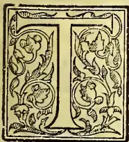

THE Coconut palm (*Cocos nucifera*), which flourishes along the Western and Southern sea-borde of Ceylon, and for a considerable distance inland, is one of the most important products of the country. There is perhaps no plant in the world for

which a greater variety of uses has been found, and there is no part of the tree but has its use or uses. The root is employed by the natives as a medicinal agent, the stem for house construction and articles of furniture. The plaited leaves have many uses. The sap of the tree is diverted from its natural function of producing flower and fruit, and made to yield the form of sugar called jaggery, which, in its turn, by fermentation and distillation, yields the intoxicating spirit called arrack. Lastly, when a tree happens to fall, the growing part or "cabbage" forms a very palatable vegetable.

The tree flourishes best near or at no considerable distance from the sea, in a free soil, where the roots have access to a plentiful supply of moisture. The saline particles in the sea-breeze are commonly regarded as favorable to the growth of the tree. The value of common

salt as an application to the soil of coconut estates has been much debated. Some cultivators strongly recommend it for inland coconut estates, and assert that on estates too far inland to profit by the sea-breeze the trees are more apt to drop unripe nuts, than is the case near the sea-coast. Quantities of common salt from half a ton to a ton and a half per acre are said to have been used with benefit; but the claim of common salt to be recognised as a coconut manure is by no means universally acknowledged.

The following is the analysis of a Ceylon coconut by W. Lascelles Scott, M.S.A., from the *British and Colonial Druggist*:—

#### Analysis of a Ceylon Coconut.

<table>
<tr>
<td>Exterior fibre or cuir ...</td>
<td>32.65</td>
</tr>
<tr>
<td>Shell ...</td>
<td>17.30</td>
</tr>
<tr>
<td>Flesh or edible portion...</td>
<td>26.40</td>
</tr>
<tr>
<td>"Milk" ...</td>
<td>23.65</td>
</tr>
<tr>
<td></td>
<td style="border-top: 1px solid black;">100.00</td>
</tr>
</table>

The edible portion gave the following results:—

#### Analysis of edible portion of Coconut.

<table>
<tr>
<td>Nitrogenous (albumenoid matter)</td>
<td>6.48</td>
</tr>
<tr>
<td>Fatty matter ...</td>
<td>67.11</td>
</tr>
<tr>
<td>Sugar and gum ...</td>
<td>5.89</td>
</tr>
<tr>
<td>Mineral matter...</td>
<td>3.65</td>
</tr>
<tr>
<td>Cellulose and color matter ...</td>
<td>9.76</td>
</tr>
<tr>
<td>Water and loss ...</td>
<td>7.11</td>
</tr>
<tr>
<td></td>
<td style="border-top: 1px solid black;">100.00</td>
</tr>
</table>

The interior fluid or "milk" gave these results:—

#### Analysis of interior fluid of Coconut.

<table>
<tr>
<td>Nitrogenous matter ...</td>
<td>.712</td>
</tr>
<tr>
<td>Gum acid trace of fatty matter</td>
<td>.305</td>
</tr>
<tr>
<td>Sugar ...</td>
<td>4.150</td>
</tr>
<tr>
<td>Mineral matter ...</td>
<td>.261</td>
</tr>
<tr>
<td>Water ...</td>
<td>94.572</td>
</tr>
<tr>
<td></td>
<td style="border-top: 1px solid black;">100.000</td>
</tr>
</table>

The following is a partial analysis of the liquid from a Ceylon drinking coconut, made by the author:—

#### Analysis of liquid from a Ceylon drinking Coconut.

<table>
<tr>
<td>Specific gravity ...</td>
<td>1.0188</td>
</tr>
<tr>
<td></td>
<td style="text-align: center;">per cent.</td>
</tr>
<tr>
<td>Fat ...</td>
<td>.230</td>
</tr>
<tr>
<td>Salts ...</td>
<td>.610</td>
</tr>
<tr>
<td>Sugar and other constituents ...</td>
<td>3.560</td>
</tr>
<tr>
<td>Water ...</td>
<td>95.600</td>
</tr>
<tr>
<td></td>
<td style="border-top: 1px solid black;">100.000</td>
</tr>
</table>

The following is a table of more elaborate analyses of the liquid from unripe and ripe coconuts, the most striking feature of which is the change of the glucose of the unripe nut into sucrose or cane sugar in the ripe nut:—

695------------------------------------------------

666

THE TROPICAL AGRICULTURIST.

[MAY 1, 1893.

<table border="1">
<thead>
<tr>
<th rowspan="2">Analyses of "Milk" of Unripe Coconuts. (By L. L. VAN SLYKE, AMERICAN CHEMICAL JOURNAL.)</th>
<th colspan="8">Troy pounds.</th>
<th rowspan="2">Milk of ripe Coconut.</th>
<th rowspan="2">Hammerbacker's Analysis of milk of ripe Coconut.</th>
</tr>
<tr>
<th>1.</th>
<th>2.</th>
<th>3.</th>
<th>4.</th>
<th>5.</th>
<th>6.</th>
<th>7.</th>
<th>8.</th>
</tr>
</thead>
<tbody>
<tr>
<td>Weight in grams ...</td>
<td>230.5</td>
<td>379.6</td>
<td>347</td>
<td>383.7</td>
<td>350</td>
<td>330</td>
<td>109.6</td>
<td>151.9</td>
<td></td>
<td></td>
</tr>
<tr>
<td>Sp. Gr. at 15.5° C. ...</td>
<td>1.0246</td>
<td>1.023</td>
<td>1.0223</td>
<td>1.023</td>
<td>1.0221</td>
<td>1.0215</td>
<td>1.044</td>
<td>1.0442</td>
<td></td>
<td></td>
</tr>
<tr>
<td>Water, per cent. ...</td>
<td>94.37</td>
<td>94.48</td>
<td>94.59</td>
<td>94.89</td>
<td>95.27</td>
<td>96.43</td>
<td>91.23</td>
<td>91.50</td>
<td></td>
<td></td>
</tr>
<tr>
<td>Ash, per cent. ...</td>
<td>.575</td>
<td>.635</td>
<td>.675</td>
<td>.611</td>
<td>.608</td>
<td>.602</td>
<td>1.06</td>
<td>1.19</td>
<td></td>
<td></td>
</tr>
<tr>
<td>Glucose, per cent. ...</td>
<td>4.58</td>
<td>3.83</td>
<td>3.45</td>
<td>4.06</td>
<td>4.36</td>
<td>3.56</td>
<td>trace.</td>
<td>—</td>
<td></td>
<td></td>
</tr>
<tr>
<td>Cane Sugar, per cent. ...</td>
<td>trace.</td>
<td>trace.</td>
<td>trace.</td>
<td>trace.</td>
<td>trace.</td>
<td>trace.</td>
<td>4.42</td>
<td>—</td>
<td></td>
<td></td>
</tr>
<tr>
<td>Proteids, per cent. ...</td>
<td>.120</td>
<td>.126</td>
<td>.114</td>
<td>.205</td>
<td>.140</td>
<td>.095</td>
<td>.291</td>
<td>.46</td>
<td></td>
<td></td>
</tr>
<tr>
<td>Fat, per cent. ...</td>
<td>.084</td>
<td>.100</td>
<td>.138</td>
<td>.131</td>
<td>.145</td>
<td>.120</td>
<td>.145</td>
<td>.07</td>
<td></td>
<td></td>
</tr>
</tbody>
</table>

Toddy.

The following is the only analysis of toddy (the sap which is drawn off from the spadix of the coconut tree) which I have seen. It is by M. Jules, Lepine. I quote it from "All about the Coconut Palm," compiled by Messrs. A. M. & J. Ferguson:—

Analysis of Toddy.

<table border="1">
<thead>
<tr>
<th>Specific gravity from 1.018 to 1.030</th>
<th>per cent.</th>
</tr>
</thead>
<tbody>
<tr>
<td>Sugar ...</td>
<td>14.60</td>
</tr>
<tr>
<td>Gum ...</td>
<td>0.56</td>
</tr>
<tr>
<td>Oil ...</td>
<td>0.04</td>
</tr>
<tr>
<td>Albumin ...</td>
<td>0.12</td>
</tr>
<tr>
<td>Chloride of sodium ...</td>
<td rowspan="4">0.26</td>
</tr>
<tr>
<td>Acetate of potash ...</td>
</tr>
<tr>
<td>Sulphate of potash ...</td>
</tr>
<tr>
<td>Phosphates of soda and lime ...</td>
</tr>
<tr>
<td>Silex ...</td>
<td>84.42</td>
</tr>
<tr>
<td>Water ...</td>
<td>100.00</td>
</tr>
</tbody>
</table>

Mineral matter taken from the soil by the Coconut Palm.

The next table, shewing the weight in pounds troy of mineral ingredients abstracted from the soil per annum by the deciduous parts of the coconut palm, is based on the same analyst's figures, the calculations having been made by a Jaffna planter, a correspondent of the *Ceylon Observer*, who points out that the results should

be divided by 3, as 26 to 30 nuts per tree are much nearer the average crop than 80, the number adopted by M. Lepine. In the original the figures were extended to five places of decimals, in place of two as I have given.

Total inorganic and fixed matter drawn up annually by the deciduous parts of the Coconut tree from an acre of land by 75 trees bearing 80 nuts per tree, calculated by the late Mr. Davidson of Jaffna from analyses by M. Lepine. ("All about the Coconut Palm.")

<table border="1">
<thead>
<tr>
<th rowspan="2"></th>
<th colspan="7">Troy pounds.</th>
<th rowspan="2">Total.</th>
</tr>
<tr>
<th>Peduncle.</th>
<th>Spathe.</th>
<th>Husk.</th>
<th>Shell.</th>
<th>Kernel.</th>
<th>Water.</th>
<th>Total.</th>
</tr>
</thead>
<tbody>
<tr>
<td>Chloride of sodium ...</td>
<td>3.82</td>
<td>1.70</td>
<td>34.17</td>
<td>1.40</td>
<td>9.07</td>
<td>3.62</td>
<td>53.78</td>
</tr>
<tr>
<td>Salts of potash ...</td>
<td>21.46</td>
<td>8.61</td>
<td>450.24</td>
<td>27.92</td>
<td>47.46</td>
<td>4.82</td>
<td>560.51</td>
</tr>
<tr>
<td>Phosphate of lime ...</td>
<td>5.54</td>
<td>4.20</td>
<td>6.03</td>
<td>.70</td>
<td>18.84</td>
<td>2.01</td>
<td>37.32</td>
</tr>
<tr>
<td>Salts of lime ...</td>
<td>1.67</td>
<td>10.59</td>
<td>112.56</td>
<td>2.10</td>
<td>1.40</td>
<td>—</td>
<td>129.30</td>
</tr>
<tr>
<td>Salts of magnesia ...</td>
<td>2.67</td>
<td>—</td>
<td>8.04</td>
<td>—</td>
<td>—</td>
<td>—</td>
<td>2.67</td>
</tr>
<tr>
<td>Silex ...</td>
<td>.22</td>
<td>4.20</td>
<td>—</td>
<td>—</td>
<td>—</td>
<td>—</td>
<td>12.46</td>
</tr>
<tr>
<td></td>
<td>35.38</td>
<td>29.30</td>
<td>611.04</td>
<td>32.12</td>
<td>76.77</td>
<td>10.45</td>
<td>795.06</td>
</tr>
</tbody>
</table>

The following are two other interesting tables drawn out by the late Mr. Davidson for the *Ceylon Observer*, and here quoted from "All about the Coconut Palm":—

Table No. 1.

Statement of General Yield of Coconuts per Tree on the Average of the Various Soils.

<table border="1">
<thead>
<tr>
<th rowspan="2">Character of Soils.</th>
<th rowspan="2">Average yield per tree annually.</th>
<th colspan="3">Value per acre at the rate of 70 trees to the acre, and at £2-10-0 per 1,000 nuts.</th>
</tr>
<tr>
<th>£</th>
<th>s.</th>
<th>d.</th>
</tr>
</thead>
<tbody>
<tr>
<td>(1) White poor sandy soil ...</td>
<td>.15</td>
<td>2</td>
<td>10</td>
<td>0</td>
</tr>
<tr>
<td>(2) Dark mould ...</td>
<td>.30</td>
<td>5</td>
<td>0</td>
<td>0</td>
</tr>
<tr>
<td>(3) Reddish ...</td>
<td>.40</td>
<td>7</td>
<td>0</td>
<td>0</td>
</tr>
<tr>
<td>(4) Strong-rich upland soil bordering the banks of a river ...</td>
<td>.50</td>
<td>8</td>
<td>15</td>
<td>0</td>
</tr>
</tbody>
</table>

In all these averages the trees are supposed to have reached from 14 to 20 years old, as the bearing of a coconut tree is very irregular until it attains its full bearing condition, except by manuring.

696------------------------------------------------

MAY, 1, 1893.]

THE TROPICAL AGRICULTURIST.

667

Table No. 2.

Statement of the Manures, Quantities, Cost and Annual Value of each, in the order of Table No. 1.

<table border="1">
<thead>
<tr>
<th></th>
<th>Quantity of manure per tree in pounds.</th>
<th>Cost per tree including transport in sterling.</th>
<th>Annual value in sterling.</th>
<th>Quantity of manure per tree in pounds.</th>
<th>Cost per tree including transport in sterling.</th>
<th>Annual value in sterling.</th>
<th>Quantity of manure per tree in pounds.</th>
<th>Cost per tree including transport in sterling.</th>
<th>Annual value in sterling.</th>
<th>Quantity of manure per tree in pounds.</th>
<th>Cost per tree including transport in sterling.</th>
<th>Annual value in sterling.</th>
<th>Quantity of manure per tree in pounds.</th>
<th>Cost per tree including transport in sterling.</th>
<th>Annual value in sterling.</th>
</tr>
</thead>
<tbody>
<tr>
<td>(1) Hulstorf Mills compost</td>
<td>112</td>
<td>0 4 0</td>
<td>10 10 0</td>
<td>75</td>
<td>0 3 0</td>
<td>13 2 6</td>
<td>60</td>
<td>0 2 1</td>
<td>80</td>
<td>56</td>
<td>0 2 0</td>
<td>17 10 0</td>
<td>50</td>
<td>0 4 4</td>
<td>10 10 0</td>
</tr>
<tr>
<td>(2) Poonac mixed with bullock manure, mud &amp;c.</td>
<td>336</td>
<td>0 1 6</td>
<td>7 0 0</td>
<td>200</td>
<td>0 1 0</td>
<td>8 15 0</td>
<td>168</td>
<td>0 0 8</td>
<td>55</td>
<td>150</td>
<td>0 0 7</td>
<td>10 10 0</td>
<td>50</td>
<td>0 0 4</td>
<td>10 10 0</td>
</tr>
<tr>
<td>(3) Trying a pair of bullocks for ten nights to a tree</td>
<td>50</td>
<td>0 0 4</td>
<td>7 0 0</td>
<td>50</td>
<td>0 0 4</td>
<td>8 15 0</td>
<td>50</td>
<td>0 0 4</td>
<td>55</td>
<td>50</td>
<td>0 0 4</td>
<td>10 10 0</td>
<td>50</td>
<td>0 0 4</td>
<td>10 10 0</td>
</tr>
<tr>
<td>(4) One cart load of husks</td>
<td>560</td>
<td>0 0 4</td>
<td>7 0 0</td>
<td>560</td>
<td>0 0 4</td>
<td>8 15 0</td>
<td>560</td>
<td>0 0 4</td>
<td>55</td>
<td>560</td>
<td>0 0 4</td>
<td>10 10 0</td>
<td>560</td>
<td>0 0 4</td>
<td>10 10 0</td>
</tr>
</tbody>
</table>

Copra.

The following, are partial analyses of Copra, the kernel of the coconut. For commercial purposes, it is usually sufficient to determine the amount of water and of oil present:—

<table border="1">
<thead>
<tr>
<th colspan="2">Determinations of Moisture and Oil in Commercial Copra.</th>
<th>1.</th>
<th>2.</th>
<th>3.</th>
<th>4.</th>
<th>5.</th>
<th>6.</th>
<th>Average.</th>
</tr>
</thead>
<tbody>
<tr>
<td>Moisture</td>
<td>...</td>
<td>7.4</td>
<td>7.35</td>
<td>6.05</td>
<td>4.25</td>
<td>5.85</td>
<td>5.22</td>
<td>6.02</td>
</tr>
<tr>
<td>Oil</td>
<td>...</td>
<td>63.47</td>
<td>63.50</td>
<td>63.62</td>
<td>63.92</td>
<td>64.38</td>
<td>65.15</td>
<td>64.01</td>
</tr>
<tr>
<td>Other constituents</td>
<td>...</td>
<td>29.13</td>
<td>29.15</td>
<td>30.33</td>
<td>31.83</td>
<td>29.77</td>
<td>29.63</td>
<td>29.97</td>
</tr>
<tr>
<td></td>
<td></td>
<td>100.00</td>
<td>100.00</td>
<td>100.00</td>
<td>100.00</td>
<td>100.00</td>
<td>100.00</td>
<td>100.00</td>
</tr>
</tbody>
</table>

In a sample of Copra highly desiccated the author found moisture 1.75, oil 70.97, other constituents 27.28 per cent.

In the following the ash, as well as the moisture and oil, were determined. In these cases the Copra was probably dried artificially:—

Partial analyses of Copra.

<table border="1">
<tbody>
<tr>
<td>Moisture...</td>
<td>3.00</td>
<td>2.0</td>
</tr>
<tr>
<td>Oil</td>
<td>64.27</td>
<td>69.1</td>
</tr>
<tr>
<td>Ash</td>
<td>1.60</td>
<td>1.70</td>
</tr>
<tr>
<td>Other constituents</td>
<td>31.13</td>
<td>27.20</td>
</tr>
<tr>
<td></td>
<td>100.00</td>
<td>100.00</td>
</tr>
</tbody>
</table>

The following analyses made by London analysts give also the amount of sugar in addition to the above constituents:—

Partial analyses of Copra.

<table border="1">
<tbody>
<tr>
<td>Moisture...</td>
<td>2.46</td>
<td>2.48</td>
</tr>
<tr>
<td>Oil</td>
<td>70.70</td>
<td>68.70</td>
</tr>
<tr>
<td>Ash</td>
<td>2.04</td>
<td>1.76</td>
</tr>
<tr>
<td>Sugar</td>
<td>3.00</td>
<td>2.50</td>
</tr>
<tr>
<td>Other constituents</td>
<td>21.80</td>
<td>24.56</td>
</tr>
<tr>
<td></td>
<td>100.00</td>
<td>100.00</td>
</tr>
</tbody>
</table>

697------------------------------------------------

668THE TROPICAL AGRICULTURIST.[MAY 1, 1893.]*Coconut Poonac.*

The extraction of oil from copra on the commercial scale is performed by first crushing and afterwards pressing the same. The residue of the copra, deprived of the greater part of its oil, is called poonac. Coconut cake or poonac is classified as chekku and mill poonac, according as the extraction of the oil has been performed in the native mill or chekku, or in mills where hydraulic pressure is used. As a rule the chekku-made poonac contains more oil than the mill poonac, which gives the former a higher value as a feeding stuff for cattle.

The author has made a great many determinations of oil in samples of mill poonac, and the following may be taken as representing the minimum maximum and average amounts of oil left in Ceylon-made poonac:—

*Determinations of Moisture and Oil in Mill Coconut Poonac.*

<table border="1">
<thead>
<tr>
<th></th>
<th>Per cent.</th>
<th>Per cent.</th>
<th>Per cent.</th>
</tr>
</thead>
<tbody>
<tr>
<td>Moisture</td>
<td>15°</td>
<td>11·2</td>
<td>11·71</td>
</tr>
<tr>
<td>Oil ...</td>
<td>8·0 (min.)</td>
<td>16·0 (max.)</td>
<td>11·59 average.</td>
</tr>
</tbody>
</table>

The following are determinations of moisture and oil in two samples of chekku poonac:—

*Determinations of Moisture and Oil in Chekku Coconut Poonac.*

<table border="1">
<thead>
<tr>
<th></th>
<th>Per cent.</th>
<th>Per cent.</th>
</tr>
</thead>
<tbody>
<tr>
<td>Moisture ...</td>
<td>13°</td>
<td>11·8</td>
</tr>
<tr>
<td>Oil ...</td>
<td>16·7</td>
<td>14·5</td>
</tr>
</tbody>
</table>

I believe, however, the chekku or native mill is capable of removing more oil from the copra than is represented by these two analyses. In a sample analysed by Mr. John Hughes, that analyst found moisture 13·04, and oil 10·93 per cent. In France, by a steaming process in addition to hydraulic pressure, considerably more oil is removed from the copra than is effected by the Ceylon mills.

Coconut poonac is largely used in Ceylon as a cattle food. In London, this substance is also sold, and is sometimes guaranteed to contain oil 15 per cent, albumenoids 19 per cent, and carbohydrates 40 per cent.

The following may be taken as fairly representing the composition of coconut poonac in Ceylon:—

*Composition of Coconut Poonac.*

<table border="1">
<thead>
<tr>
<th></th>
<th>Mill.</th>
<th>Chekku.</th>
</tr>
</thead>
<tbody>
<tr>
<td>Moisture ...</td>
<td>11·7</td>
<td>12·4</td>
</tr>
<tr>
<td>Oil ...</td>
<td>11·6</td>
<td>15·0</td>
</tr>
<tr>
<td>Albumenoids ...</td>
<td>19°</td>
<td>18·0</td>
</tr>
<tr>
<td>Carbo-hydrates ...</td>
<td>43·2</td>
<td>41·0</td>
</tr>
<tr>
<td>Woody fibre ...</td>
<td>6°</td>
<td>5·6</td>
</tr>
<tr>
<td>Ash ...</td>
<td>8·5</td>
<td>8·0</td>
</tr>
<tr>
<td></td>
<td>100·0</td>
<td>100·0</td>
</tr>
<tr>
<td>Nutrient ratio ...</td>
<td>1 : 3·75</td>
<td>1 : 4·36</td>
</tr>
<tr>
<td>Nutrient value ...</td>
<td>91·2</td>
<td>96·5</td>
</tr>
</tbody>
</table>

In calculating the nutrient ratio and nutrient value I have taken the starch equivalent of the oil at 2·5.

Coconut poonac, as represented by the London

analysis given above, would have a nutrient ratio of 1 : 4·08, and a nutrient value of 96·5.

In Biedermann's "Centralblatt für Agricultur-Chemie," as quoted by the "Journal of the Chemical Society," occurs an analysis of coconut-meal which differs chemically from coconut poonac only in having a smaller proportion of the original oil or fat left in it. This substance and also palm-nut meal have been used mixed with oats as food for horses. The writer in the publication mentioned says: "Some of the horses of the 7th Cuirassiers were fed with a mixture of oats and meal, and compared with others fed on oats only. The results in the former case were most satisfactory; the reduction in the cost of horse keep amounting to 50 frs. per annum." The following are the analyses referred to.

*Analysis of Coconut and Palmnut Meals.*  
By A. PETERMANN.

<table border="1">
<thead>
<tr>
<th></th>
<th>Coconut meal.</th>
<th>Palmnut meal.</th>
</tr>
</thead>
<tbody>
<tr>
<td>Water ...</td>
<td>13·11</td>
<td>10·59</td>
</tr>
<tr>
<td>Albumenoids ...</td>
<td>19·16</td>
<td>14·98</td>
</tr>
<tr>
<td>Fat ...</td>
<td>6·70</td>
<td>5·08</td>
</tr>
<tr>
<td>Mucilage digestible fibre &amp;c.</td>
<td>43·91</td>
<td>50·49</td>
</tr>
<tr>
<td>Fibre ...</td>
<td>7·40</td>
<td>15·05</td>
</tr>
<tr>
<td>Ash ...</td>
<td>9·72</td>
<td>3·81</td>
</tr>
<tr>
<td></td>
<td>100·00</td>
<td>100·00</td>
</tr>
<tr>
<td>Nutrient ratio ...</td>
<td>1 : 3·16</td>
<td>1 : 4·22</td>
</tr>
</tbody>
</table>

To these figures I might add the nutrient value calculated in the usual way for coconut meal 79·82, for palmnut meal 78·17.

*Coconut Butter.*

Of late years a new article has been placed upon the market called coconut butter. A published analysis represents it as having the following composition:—

*Analysis of Coconut Butter.*

<table border="1">
<tbody>
<tr>
<td>Fatty matter ...</td>
<td>99·632</td>
</tr>
<tr>
<td>Mineral matter ...</td>
<td>·011</td>
</tr>
<tr>
<td>Water ...</td>
<td>·357</td>
</tr>
<tr>
<td></td>
<td>100·000</td>
</tr>
</tbody>
</table>

This substance is said to be prepared according to Dr. Schlink's method by treating coconut oil with alcohol and animal charcoal. This treatment removes the fragrant fatty acids of the aromatic oils, leaving a white product of the consistency of butter, which melts at 25°C. and possesses a sweet agreeable taste. It is said to be an easily-digested vegetable fat, remarkably free from the tendency to turn rancid, so characteristic of the oil from which it is made.

*Coconut Waste.*

The following is a partial analysis of coconut waste, the substance removed from the coconut husk in preparing coir fibre. The analysis had for its object to ascertain the proportion of cellulose or indigestible fibre present. The analysis reveals the great capacity of this substance for containing moisture. It may contain above 80 per cent of water without exhibiting a moist appearance. Hence it is useful, especially if first dried, as an absorbent for sanitary purposes:—

698------------------------------------------------

MAY 1, 1893.]THE TROPICAL AGRICULTURIST.669*Partial analysis of Coconut Waste.*

<table border="1">
<thead>
<tr>
<th></th>
<th>Natural condition.</th>
<th>Dry substance.</th>
</tr>
</thead>
<tbody>
<tr>
<td>Cellulose or indigestible fibre</td>
<td>5.77</td>
<td>31.71</td>
</tr>
<tr>
<td>Carbo-hydrates and other constituents</td>
<td>11.41</td>
<td>62.69</td>
</tr>
<tr>
<td>Ash</td>
<td>1.02</td>
<td>5.60</td>
</tr>
<tr>
<td>Water</td>
<td>81.80</td>
<td>—</td>
</tr>
<tr>
<td></td>
<td>100.00</td>
<td>100.00</td>
</tr>
</tbody>
</table>

*Oil in Coconut Shells.*

Freshly-powdered coconut shell yielded only 43 per cent of a greenish fatty solid, when extracted with ether; but powdered shells which had been allowed to ferment yielded 87 per cent of a brown oil of specific gravity .912.

*Arrack.*

From the fermented juice of the coconut palm a very pure spirit may be and is distilled called arrack. In various parts of the East Indies a less pure spirit, also known as arrack, is distilled from rice or sugar fermented with the juice of the coconut. Some of the liquors are said to be rendered more intoxicating by the addition of poppy heads, hemp leaves, juice of stramonium &c. ("Dictionary of Applied Chemistry.")

Four samples of commercial arrack submitted to the author shewed a strength of 22.5, 23.75, 23.75 and 25 per cent under proof respectively. In one the amount of extractive matter was determined and found to be only .022 per cent.

*Desiccated and prepared Coconut.*

A proportion of the coconuts exported from Ceylon to Europe is for the use of biscuit manufacturers and confectioners. This export, however, is rapidly being superseded by that of the dried and prepared kernel of the coconut. The chemical composition of desiccated coconut does not appreciably differ from that of highly-desiccated copra, of which analyses have already been given, but the drying being conducted rapidly the flavour of the fresh nut is preserved. Other forms of desiccated and prepared coconut are also exported, differing in composition from that of dry copra.

NEWS FROM THE CENTRAL PROVINCE:  
PLANTING AND OTHERWISE.

*Notes by "Wanderer."*

March 24th, 1893.

TEA PRICES are really too worrying. Everyone thought that we were bound to have good prices till May; and the average has now tumbled down to 9d, very nearly the same figure as last year at same date. However as 1½d is the outside figure for London charges, and the 1d=7 cents, 7¼d net means 54 cents, and that is better than the Colombo selling average from which you have to take off merchants' or brokers' commission.

EXCHANGE begins now to frighten the greatest gainer at present, viz. the producer. He begins to think the high price he is giving for rice, bazaar stuffs, catt'e feeding stuffs has to be set off against what he gets for his produce. £1 equal to R16.80 is rather a jar also to the "Home for he Holiday" man.

EXPORTS OF TEA.—Chamber of Commerce returns show an export to date of 15,631,666 against 13,513,619 at same date last year. At this rate we will export 8,000,000 lb, more in 1893 than

1892. There is however comfort in the fact that tea to Australia has already doubled its export by 600,000 lb., China 18 000 lb. I presume this latter means tea sent to Hongkong for transhipment to Vancouver; and Spain is coming to the front with an extra export of 10,000 lb., Germany has taken 20,000 lb. more. Is this through the action of the Ceylon Planters' Tea Company, in establishing a large agency there? Italy and Holland have commenced the current year well by taking 3,400 and 3,100 lb. respectively to 20th March.

SUGAR AND MILK TEA PLANTS.—The accompanying extract from the *Indian Agriculturist* may induce some of our enterprising planters to go in for the sugar and tea, or the milk and tea plant. What will the English Grocer say to Ceylon Planters sending him home a tea that will do him out of his profit on sugar—or, *vice versa*. The milk and tea plant will reduce the risk of typhoid fever germs finding their way through the favourite channel of doctored milk:—

In the mountainous region of Kiating, Mr. Barber discovered two remarkable varieties of natural sugared and buttered teas. The monks of Mount O-mi, or Mount O, use a plant which produces an infusion naturally sweet, and tasting, as brewed, just like coarse Congou with a large addition of brown sugar. This is natural tea-and-sugar. The plant is grown on the mountain slopes near the monastery, and does seem to be known elsewhere. The leaf is to all appearance just like that of an ordinary tea leaf, and probably the saccharine essence may be due to the soil. The other curiosity is a natural tea-and-milk. This is a wild plant, growing in an elevated region without cultivation, and yielding an infusion which tastes just like tea and milk, without sugar, or perhaps more like tea and butter. This plant is found in an uninhabited region west of Kiating at an elevation of 6,000 feet and upward, and in leafy shrubs about 15 feet high. Not merely the leaf, but the whole plant is used to make the infusion. Even the wood when chopped up and boiled along with a few dry leaves yields a strongly-coloured tea, with much the same flavour as the Thibetans produce from their bricks and butter. Botanists may be able to explain these phenomena, and perhaps to classify the plants in some other family than the tea plant.

PATENT TEA ROLLERS.—The shareholders of the Colombo Commercial Co. will not bless the combatants in the famous Tea Roller case; for it took up a large sum that would have given them a nice dividend.

WEATHER all that is desirable for tea flushing—but it is not favourable for those who have anything to do with coffee.

Road between Dimbula Gap and Craigie Lea is in very bad condition.

CEYLON AND TRAVANCORE TEA.

To the Editor of the *Madras Mail*.

Sir,—In your issue of the 11th instant you fully support the demands of the Planters in Southern India for a perfectly free and unfettered market in Ceylon. Our demands are now before the Government of Ceylon, and will, I feel sure, meet with the fairest consideration. Briefly stated our case is as follows:—Ceylon has a free and unfettered market (which I am glad to know is a growing one) in India. Indian teas in Ceylon are subject to a duty of 4 annas per pound, a charge to which we naturally object. Southern India produce, I think some 3 million pounds of tea, the greater portion, of which need to find a good sale in Madras and Bombay for local consumption, but last year Ceylon plunged down in those markets about 700,000 lb. of her teas to compete with ours. We don't object to fair competition, but we say to Ceylon:—"You must not sweat us by your competition in India where we admit your teas free of duty, and sweat us also in Ceylon by taxing our teas 4 annas per pound."

TRAVANCORE PROPRIETOR,

699------------------------------------------------

670THE TROPICAL AGRICULTURIST.[MAY 1, 1893.]PROPOSED LINE OF TEA SHIPS.

The following correspondence has been circulated to tea garden proprietors:—

103, Clive Street, Calcutta, 15th March.

DEAR SIR,—I have received a letter from Messrs. Duncan, Brothers & Co., dated 14th instant, of which a copy is subjoined, proposing to run a first class line of steamers under an agreement to carry teas at a certain fixed rate. As most firms have already referred the question of tea freights to London, I am desired to ask you to request your London friends to communicate with the Committee of the Indian Tea District's Association, and to authorise them to make such terms on your behalf as may be considered best in the interests of tea shippers.—Yours faithfully, (Signed) J. N. STUART,

Chairman, Tea Shippers' Committee.

From Messrs. Duncan, Brothers & Co., to Mr. J. N. Stuart, Chairman, Tea Shippers' Committee, dated Calcutta, 14th March 1893:—

DEAR SIR,—Referring to your circular of 9th ultimo regarding tea freights and to our subsequent interviews, we now beg to state that acting on behalf of, and under telegraphic instructions from, our principals on home side, we shall be prepared to provide a service of steam vessels of the highest class at Lloyd's, or equal thereto, and to regulate sailings suitably for the carriage of tea from Calcutta to London in terms of the resolution passed at the meeting of Tea Shippers held on the 28th January last viz:—"An agreement to be entered into for the term of three years, freight to be calculated at 10s above the average rate for wheat, linseed, and jute, ruling during the previous month with a minimum rate of 30s; no rebate clause." This undertaking is conditional on shipments being guaranteed not to fall short of 60 million pounds for any one season, and is also subject to immediate reply.—*Madras Mail*, March 21.

TEA AND BUDDHISM IN TIBET.

At the meeting of the Royal Geographical Society held 20th Feb. Captain H. Bower read a paper in which he gave an interesting description of his journey across Tibet. Regarding the Buddhist religion he says that, as seen in Tibetan countries, it has nothing in common with the pure morality preached by Gautama Buddha. The doctrines of the founder are too abstract, he thinks, for the average Tibetan mind, and this has led to innovations which have developed until the grossest superstition, little better than African fetishism, and hardly bearing any resemblance to the original precepts, is all one meets in this stronghold of Buddhism. The nomads are described as greedy, faithless, and suspicious. Their suspicions, however, do not attach only to foreigners, as every camp seems to view every other camp as not only a possible but a very probable enemy. Though provided with Chinese passports, considerable difficulties were experienced in crossing portions of the country, the people fearing death as the penalty of receiving strangers. These difficulties were, however, invariably overcome by boldness and tact. At one camp tea was produced. "They drank it in Tibetan fashion, mixed with salt and butter; but, having found out from our servants the European fashion, they gave us some plain. After a considerable consumption of tea, bowls of mutton, boiled with rice and onions, were brought in. It was really excellent, but," adds Capt. Bower, "eating rice with chopsticks is an art that requires practice." Many questions were asked about England, and the people were much surprised to hear that it was surrounded by water, and that people went to it in ships. They had not the faintest idea what a ship was, and asked if it went through the water touching the bottom the whole way. Like true nomads, they were particularly curious also about the water and grass,

It would seem that the vendor of lotions for forcing the production of hair has a new field opened to him, for Captain Bower says: "The Kushok rather astonished me one day by expressing admiration of our beards, and asking if we had any medicine that would make his grow. . . . The Lama was very anxious to know if we had any English poisons. Poisoning is very prevalent in Tibet. If one offers a man tea, he generally refuses it unless some one first drinks some in his presence, and when offering anything to eat or drink, a Tibetan invariably ostentatiously takes some to show there is nothing to be afraid of." Captain Bower heard marvellous tales from the Tibetans of countries peopled by men who possessed only one arm and one leg, and of others where the people had pigs' heads, but no one would allow that he had seen any of these interesting people. Captain Bower estimates the population of Tibet proper, *i.e.*, the country under the rule of the Deva Zhung, at about four millions. Chinese Tibet probably holds another four millions, and of these eight million Tibetans nearly half a million are monks. The dress of the common people consists generally of a long sheepskin robe, very dirty and greasy, which serves the double purpose of clothes by day and bedding at night. The country is described as bearing a great resemblance to many parts of Kashmir, and as being at least equal to it in beauty.—*Daily News*, Feb. 21.

THE TEA DISTRICT OF NATAL.A BIG TEA VALLEY.

The following account of a visit to the one Tea Valley of Natal, is from the *Natal Mercury*:

Ten miles beyond, with Stanger midway, is Kearsney, the home of

THE PLANTER PRINCE,

James Liege Hullett, M.E.C., where hospitality is dispensed with a generous hand, from whom I had a long-standing invitation. The way to Kearsney is a gradual ascent, amid lovely country, well-wooded and well-watered, bearing tea and sugar. Through a long avenue of gum and oyster is reached the family mansion, with its broad verandahs, wide balconies, spacious apartments, noble hall and stairs, and cathedral windows—the four doors of the house of Hullett in the midst. From the tower is gained a panorama of much beauty, bounded by the Umvoti and Tugla valleys and margined by the sea, 300ft. below, 10 miles away. Underneath sweep high and low the 5,000 fertile acres of Kearsney and Kinkley Vale, with Bnlwer's 4,000 to the north, of which 600 acres are under cultivation, besides other lands of other owners in the neighbourhood of Nonoti. Fruit of all kinds is prolific, and on the tennis ground beside the little church, I was introduced to Mr. Chesterton, who has come out from England to manufacture jam. Durban was well represented on the tennis court by Messrs. Henderson, Holwell, and Haith (Kearsney's recent representative at Kimberley), and when Mr. and Mrs. Hullett and six Messrs. Hullett, jnn., were present, and Mr. and Mrs. Hindson called, I came to the conclusion I had alighted upon the home of the H's. I fear 13 H's, are unlucky, for it rained during most of the next two days; but with music and magazines and social converse a dull day without is not a dull within, at Kearsney House. Four years ago I was a confirmed water drinker, but I have been reclaimed. I have reformed. Having tasted, on the Lower Umzimkulu, tea from Barrow Green, I felt it to be my duty for the encouragement of colonial industry to become in habit and profession a teatotaler.

A CUP OF GOLDEN PEKOE

from the opposite extremity of Natal confirmed my noble resolution, in which I am strengthened by the reflection that in the interval the consumption of tea has increased almost fourfold, and this season will produce upwards of half-a-million pounds. Mr. Hullett

700------------------------------------------------

MAY 1, 1893.]THE TROPICAL AGRICULTURIST.1671

has been engaged in tea culture for some 15 years, and the gardens have grown and the output increased until Messrs. Hullett & Co., now employ 350 Indians—men and women, and boys—in tea production. About a million and a quarter bushes—2,000 to the acre, yielding in maturity 600 lbs. each of tea from the 18 pickings—have to be despoiled of their flushings from October to May; and the pickers may be seen each day in picturesque colours among the regular green rows on the hillsides filling their baskets with the delicate shoots, the biggest loads of which average 70 lb. per diem. When the bell rings, the coolies hasten home and spread out their leaf upon tables to welter, the process manufacture which ensues being under the superintendence and management of Mr. Drummond. The Kearsney factory receives the product of some 10 estates, altogether 1,200 acres, and so can realise the conditions of good blending. The withered leaf is placed under steam rollers for half an hour, and the brown mass is then allowed to ferment for an hour, turning purple in the process. The leaf now passes into dryers, long revolving cylinders in a current of hot air. The fine tea, the bud of the plucking, falls through perforations in the pan, and is called Golden Pekoe. The remainder is taken to a series of sieves, each with a narrower netting and through these the tea is sifted until the lowest shelf receives the tea of second quality, the first and smallest leaf, Flowery Pekoe; the next, the second leaf, Pekoe; third leaf, Pekoe-Souchong; fourth leaf, Souchong. Thus Kearsney produces five varieties of tea, of which Golden Pekoe is the choicest, and Souchong the coarsest, another brand, the Popular, being made by mixing. The final stage is reached in the packing, in which a dozen lads make up a ton of 1 lb. pickets in a day. The factory work is especially suited to children, and many are employed, and the premises exhibit a hot and aromatic and animated scene. Tons of tea, in cellar, chest, and garret, are on every hand—reduced to one-fourth in weight since it came from the fields. Five of Mr. Hullett's sons are engaged on the estate and in the works, and splendid machinery is in use whereby rough logs are transformed into boxes, and the *pines insignis* is being planted to supply the box wood of the future. This season will result in over 400,000 lbs. of tea; but the present premises, which have been enlarged from time to time, are becoming too small for the purpose, and Mr. Hullett intends shortly to erect a factory which shall contain three or four stories, and measure 150 ft. x 75 ft., so that he may be able when necessary to deal with upwards of a million pounds of manufactured tea per annum. The pioneer of tea-planting in Natal will thus keep pace with the development of the industry, and remain in the forefront of promoters of colonial enterprise.

### THE DUTCH MARKET.

Amsterdam, March 9.

The cinchona auctions to be held here on March 23rd will consist of 73 cases and 6,796 bales, or about 577 tons, Java bark divided as follows:—From Government plantation 12 cases and 394 bales (about 37 tons); from private plantation 61 cases and 6,402 bales (about 540 tons). This quantity contains: Of druggists' bark—Succirubra quills 9 bales 73 cases; broken quills and chips 640 bales; root 43 bales. Of manufacturing bark—Ledgeriana, broken quills and chips 4,448 bales; root 1,069 bales. Officialis—broken quills and chips 33 bales. Hybriden—broken quills and chips 423 bales; root 124 bales. Calisaya—root 7 bales.—*Chemist and Druggist*.

### FOOCHOW TEA NOTES, &c.

March 4.

According to the returns made by the Tepas of the different districts in this prefecture, as many as 600 beggars fell victims to the snow and frost during the severe weather of January and the early part of Feb.

We learn from the tea districts that the late frosts have had the effect of stripping all the tea shrubs of their leaves. In consequence of this, the coming tea crop is expected to be a good one, both in quality and quantity, and it is to be hoped for the sake of the trade that these expectations may be realised. It is said that the crop will be later than usual, but this drawback, if it is one at all, would be a matter of small importance as compared with the distinct benefit that would accrue to the trade from an improvement in quality. The latest home advices hold out the prospect, at this juncture, of a revival of the trade with improved quality.—*Echo*.

### THE CHINA TEA TRADE:

#### DECREASE BY ONE-THIRD IN 10 YEARS.

Shanghai, March 10.—(From Messrs. Welch, Lewis & Co.'s report).—No business has been reported in either Black or Green Tea during the interval. Stock of Black Tea 586 half-chests. The Customs Trade Reports lately published show that China has lost one-third of its trade in Tea during the past five years. In 1888 the exportation direct to Foreign countries was 321,731,000 lb.; in 1892 it was 221,112,000 lb., a decrease of 100,619,000 lb., or nearly equal to the total Indian crop. With the finest raw leaf in the world, this decrease is only to be attributed to excessive taxation and to faults in preparation, which between them are ruining the trade. This decrease has taken place whilst all other Tea producing countries have greatly increased their exports, and whilst the consumption of tea in Foreign countries has been steadily advancing.

#### EXPORT OF TEA FROM CHINA TO GREAT BRITAIN.

<table>
<thead>
<tr>
<th></th>
<th>1892-93.</th>
<th>1891-92</th>
</tr>
<tr>
<th></th>
<th>lb.</th>
<th>lb.</th>
</tr>
</thead>
<tbody>
<tr>
<td>Canton and Macao...</td>
<td>9,615,819</td>
<td>11,441,713</td>
</tr>
<tr>
<td>Amoy...</td>
<td>771,639</td>
<td>732,636</td>
</tr>
<tr>
<td>Foochow ...</td>
<td>14,469,999</td>
<td>17,887,484</td>
</tr>
<tr>
<td>Shanghai and Hankow</td>
<td>30,125,338</td>
<td>32,692,059</td>
</tr>
</tbody>
</table>

Total to date.. 54,982,794 62,753,892

#### EXPORT OF TEA FROM CHINA TO UNITED STATES AND CANADA.

<table>
<thead>
<tr>
<th></th>
<th>1892-93.</th>
<th>1891-92.</th>
</tr>
<tr>
<th></th>
<th>lb.</th>
<th>lb.</th>
</tr>
</thead>
<tbody>
<tr>
<td>Canton and Macao ...</td>
<td>3,225,358</td>
<td>2,224,566</td>
</tr>
<tr>
<td>Amoy...</td>
<td>17,545,672</td>
<td>16,030,042</td>
</tr>
<tr>
<td>Foochow ...</td>
<td>5,409,569</td>
<td>4,051,595</td>
</tr>
<tr>
<td>Shanghai and Hankow</td>
<td>33,162,255</td>
<td>20,558,703</td>
</tr>
</tbody>
</table>

Total to date.. 49,342,854 42,864,906

#### EXPORT OF TEA FROM JAPAN TO UNITED STATES AND CANADA.

<table>
<thead>
<tr>
<th></th>
<th>1892-93.</th>
<th>1891-92.</th>
</tr>
<tr>
<th></th>
<th>lb.</th>
<th>lb.</th>
</tr>
</thead>
<tbody>
<tr>
<td>Yokohama ...</td>
<td>28,414,987</td>
<td>27,993,948</td>
</tr>
<tr>
<td>Kobe ...</td>
<td>18,292,787</td>
<td>22,976,779</td>
</tr>
</tbody>
</table>

Total to date ... 46,707,774 50,970,727

—*Hongkong Weekly Press*.

### VARIOUS AGRICULTURAL NOTES.

PRICE'S PATENT CANDLE COMPANY (Limited) state that the profit for 1892 was about £65,000, to which must be added the balance brought from 1891, making together about £72,100. After deducting the dividend paid in September last, appropriating £12,500 for depreciation, and placing £5,000 to a reserve fund, there will remain about £31,000, out of which the directors recommend a dividend of 12 6d per share, making a distribution of £15s per £16 share for the year, leaving £7,700 to be carried forward.—*Chemical Trade Journal*, Feb. 18.

701------------------------------------------------

672THE TROPICAL AGRICULTURIST.[MAY 1, 1893.]

THE HAWAIIAN ISLANDS are now six days sail from San Francisco, but could be reached in five days by fast steamers. As a place of call for ships, and a naval station, they will be of great value to the United States, as they possess a good harbour in the Bay of Honolulu. They have this advantage over Samoa and the more southern islands of the Pacific, that their varied climate enables most forms of vegetation to flourish, and an American scientific paper points out that a botanic garden unique in the history of the world might be established there.—*Globe*.

DECREASE OF ARABLE LAND.—During the last twenty years England alone appears, from the official agricultural returns, to have diminished the area of land under the plough by very nearly two millions of acres, or over 14 per cent. The amount of arable land in Wales has dwindled during the same period by a trifle more than one fourth of that amount, or 21 per cent. Scotland, on the contrary, returns 78,000 acres more than before. This, it is thought, may be partly explained by the marked characteristic of the agricultural system of North Britain in contrast with that of England, which appears in the relatively large area retained under clover and rotation grasses. Nearly one-third of the whole cultivated surface of Scotland remains in this category, while in England the proportion of the cultivated area so occupied is very little more than a tenth of the whole.—*Public Opinion*.

THE MANGO CROP in Southern Queensland is now ripe, and in such situations as have not suffered from the floods a good harvest is being reaped. Mr. A. Williams, of the Green Hill Nursery, Eight mile Plains, is one of the fortunate growers who were above high water mark, and some samples of his produce which have reached us show that the unusually wet season has not adversely affected the flavour of the fruit. The samples comprised two varieties, the Maldo and the Kysapatie, and all were of very large size and of excellent flavour. The former especially is notable for a refreshing tartness which is not present in most other varieties. Judging by some of the fruit the peach fly has included the mango in the list of its hatching grounds this season which is a matter for regret, as this is one of the few fruits that have hitherto escaped the attention of this troublesome insect pest.—*Queenslander*.

NATAL: AGRICULTURAL AND INDUSTRIAL PROGRESS.—The year under report has been a fairly prosperous one for stock farmers, and good prices have been generally realized. Sheep farming is increasing, but the abnormally low price of wool has had a depressively effect. According to the returns the yield of sugar for the year was very good, and a large increase upon that for the preceding year. A large proportion of the sugar manufactured is consumed in the colony or sent across the inland borders. In addition to this, the export by sea for 1891-2 was 11,705 cwt, as against 21,962 cwt for 1890-1; 251,940 proof gallons of rum were distilled, as compared with 153,360 gallons in 1890-1.—Tea continues to be largely grown in the coast districts, chiefly in Victoria County and the Lower Umzimkulu Division. The area under cultivation may be put down at about 2,200 acres. The crop for the past season was about 350,000 lb. and that for the ensuing season is expected to reach 500,000 lb. The quantity of tea exported by sea during the year was 43,633 lb. Coffee cultivation is successfully carried on in the coast districts, though not to a large extent. Coffee does not figure conspicuously among the colony's exports, the local demand being greater than the supply. The planting of trees is extending, and attention is being more particularly given to the cultivation of the *acacia mollissima*, the bark of which is a valuable tanning product.—*British Assistant Colonial Secretary at Pietermaritzburg*, Oct. 8th, 1892.

AMERICAN RUBBER NOTES.—The Joseph Dixon Crucible Co. (extensive lead pencil manufacturers), give notice that they will henceforth make their own rubber tips. The demand for the best Para by the cycle factories is enormous, and constantly increasing.—*India-Rubber Journal*.

COFFEE IN THE SHEVAROYS.—Yercaud, March 17.—We are having the most extraordinary weather up here, such as the very oldest inhabitant cannot remember the likes of. On 22nd ultimo, we had a few cents of rain, followed by over half an inch on 25th and 2 to 3 inches on 27th idem. From 1st to 16th March we have had rain on 7 days, and the fall has amounted to about 2½ inches, making 5½ inches more or less (the fall varies a good deal and I can only take what I register here, though I invariably hear that some have got more and some less rain than I) in the last 3 weeks! And not merely is the amount extraordinary, but the manner of its fall is equally so. When we do get rain at this time of the year, it is generally in short heavy thunder showers, but this year we might be at the beginning of the monsoon is far as appearance goes. Crops are all practically in now, and those not sent to England are all sold. I am glad to say things are even better than I anticipated; almost every estate up here has not only had a good crop, but a crop considerably over the estimate, and prices have been equally abnormal; high as they have been of late years, this year they are higher than ever.—*Madras Times*.

PLANTING IN KLANG.—On the 9th March the Resident paid a visit to Klang, and drove three miles along the Melgum Road, and was much interested in the very flourishing native cultivation on each side. There are said to be 476 acres under Liberian coffee, 346 under coconuts and 301 under areca-nuts. The road was originally and commenced by the Datu Dagang was taken over and extended by the Government; it is now being gravelled at a cost of \$1,200 a mile. The resident then drove to the Tremelbye estate, which affords a good example of what can be made of lallang-covered ground. The estate comprises 500 acres, and there are 35 acres under pepper in bearing and 65 under Liberian coffee, all looking very well. The following day the Resident visited the native gardens along the Telok Pulai Road, where are located 81 Javanese, 35 Malays and 25 Chinese engaged in the cultivation of 67 acres of Liberian coffee, 248 acres of coconut, and 34 acres of areca-nut. The Headman of the Javanese is Haji Latip, who came over to Selangor from Samarang about 28 years ago, and has been settled at Klang for the last 10 years. The Resident had no time to visit the other European Estates in the District—Beverlac, Enterprise, and Glenmarie.—*Selangor Journal*.

BLUE-GUM OIL.—The Government Quinologist has addressed the local Government strongly recommending that all the blue-gum oil required for the Medical Store Department may be obtained from Mr. S. G. Wallace's Drug Manufactory, Nilgiris. *Eucalyptus globulus* oil manufactured by Mr. S. G. Wallace has been carefully examined on several occasions, and it has been reported to be absolutely pure, being identical with that made in the Government Gardens in its specific gravity and optical properties. Mr. Wallace has recently started a laboratory for the manufacture of several drugs. He is said to be an expert and deserves the encouragement that can be given him by Government. As may be seen from the annual reports of the Botanical Gardens for many years back, it has been the object of Government to induce private persons to take up the manufacture of blue-gum oil on a large scale, and it is gratifying to see that this is being at last accomplished. The price of blue-gum oil sold to the Medical Store Department by the Government Gardens has, it is observed, fluctuated enormously since 1887. Mr. W. Wallace's offer to deliver it at R2-8-0 per pound free of all charges in Madras may therefore be deemed reasonable.—*Madras Mail*.

702------------------------------------------------

MAY 1, 1893.]THE TROPICAL AGRICULTURIST.673TROPICAL AGRICULTURE IN JAMAICA.

The Botanical Department of Jamaica would seem to be doing a good work in advancing the agricultural interests of the Colony and developing its resources in addition to its legitimate botanical work. The department supervises six different Experimental Gardens, at which the work carried on is of a very thorough nature, to judge from the details given in the bulletin issued in January last by the Director of Public Gardens and Plantations. Nevertheless, we have no doubt Dr. Trimen was correct in his statement made before the British Association, that "no other British Colony possesses so complete a system of botanical and experimental gardens as Ceylon." The Jamaica report of the botanical work proper does not possess more than a local interest, dealing with the introduction and trial of new foliage and flowering plants, trees of economic value, and food and fodder crops; but the references to regular cultivation and the statistics connected therewith form a specially interesting and valuable record. During the past year 5,485 cwt. 15 lb. of cacao were exported, valued at £12,349 11s. This is rather less than in the previous year, but there is a tendency to a steady increase. We quote as follows:—

The question of curing properly is one of the most serious to the Island, involving in Mr. Morris's opinion (see Kew Bulletin No 23) an annual loss of £20,000 or £30,000. If settlers fermented their cocoa they would get better prices, and would soon plant more trees, and increase the amount as well as the value. Messrs. Wilson Smithett and Co. speak of Jamaica cocoa in very disparaging terms.

They say:—"In a small proportion of Jamaica cocoa imported there has undergone fermentation to a greater or less degree, but the bulk is of very ordinary quality, the only West Indian Cocoa taking rank below it being St. Domingo from Jeremie, whilst that from Samana in the same Island is superior to Jamaica. It has, however, all the characteristics of good cocoa—although wanting in size, and if properly harvested, fermented or sweated, and then dried in the sun until the bean becomes crisp to the feel, so that the shell is fairly loose, and the interior dry and of an even chocolate brown or violet brown; when broken, it should command the general attention of the trade. Great care should be taken to protect it from rain whilst curing. It must be noted that manufacturers cannot pay much attention to small parcels, and that to insure a ready sale not much less than a ton weight of even colour and quality should be shipped, the larger the lot the better." The words "small parcels" in the preceding statement point to the main difficulty that lies in the way of improvements. If brokers in London will only deal with shipments of at least a ton in weight, merchants in Kingston must mix all the small parcels brought in by the buyers, and cannot discriminate between good and bad curing, for the proportion of good to bad must be, for some time, at any rate, very small and therefore cannot have any great effect in improving the quality of the whole. If the same price is then paid to the people for their cocoa, whether cured or only washed, it is not to be wondered at if they refuse to take trouble that is not paid for. It would appear that the only way out of this difficulty, inasmuch as it is hopeless to expect a combination amongst shippers, is for the Government by some means to prevent the shipment of inferior quality. The same remark applies to oranges, logwood, &c.

Of coconuts 7,885,656 were exported, of which the value was £26,512 16s 9d. The export was greater during 1891-92 than during any year for the past 10 years in spite of the great mortality among trees at Montego Bay. 86,926 cwt. 1 qr. 20 lb. of coffee were shipped, bringing in £336,839 18s. Here too the prospect is good. Of bananas 3,503,275 bunches valued at £262,745 12s 6d were exported. This is

nearly £2,000,000 less than last year and is accounted for by short crops owing to drought and the large local fruit crop in America. Of other fruits mangoes brought £203 2s 6d, oranges £23,263 15s (less than half of last year's value), pineapples £1,286 15s 2d, limes £361 1s 6d, strawberries £3,607 2s 3d; lime juice alone was exported to the value of £4,865 4s 2d. Among other exports are ebony, fustic, ginger (£40,682), lancewood spars, lignum-vitæ, log-wood £303,364), nutmegs (£23,264), pimento (£50,984), rum (£256,000), sugar £255,500), tobacco and cigars (£9,430) and jams. Anatto (of which nearly £4,000 worth was exported) is recommended as a hedge plant, as cattle do not browse on the leaves. More care given in preparation will it is said be repaid. Arrowroot on the other hand is recommended for men of capital rather than the peasants; for unless great care and skill are expended in the preparation of the starch, and proper appliances used, the price will be scarcely remunerative. Only about £8 value was exported. The cultivation of cassava or manioc by small settlers is suggested, for preparing starch, meal, tapioca, cakes and cassareep. Cinnamon though growing freely is not barked, but cacao growers are strongly advised to plant kola in their plantations. The cultivation and preparation of sisal hemp is mentioned as one of the most important among new industries.

The principal imports consist of corn, which cannot be produced as cheaply as in the United States, rice and pulses. The attention of planters and small renters is directed to the cultivation of nutmegs and to the large profits to be made in suitable localities; and it is noted with pleasure that this cultivation is being entered upon with spirit and energy. Liquorice is another plant recommended for small settlers as growing in deep soil such as that in which the orange flourishes.

In one of the Botanical Gardens exists an Industrial School for instruction and practice in general agricultural operations. Some of the boys work in the Garden for two or three hours in the morning, and another set in the afternoon. At other times they are employed in school, or at work round the school-house under a school-master. Among other things the boys are taught how to cultivate and cure cacao.

LETTERS FROM JAMAICA.—No. 35.

(The Editor, "Tropical Agriculturist," Colombo, Ceylon.)

For Packet of Feb. 7.

DEAR SIR, After my long silence caused by my having really nothing special to write about, I am now able to send you a letter which may be of interest to some of your readers as it gives an account of

MY RECENT VISIT TO MONTSERRAT,

whither I went for a short holiday, after having had no change out of the island for about nine years.

I left Kingston on the 27th Dec. in the royal mail steamer "Para," a most comfortable and well-ordered vessel in every respect. Our first port of call was *Jacmel* in Hayti: it has a very picturesque appearance from the ship, but I am told this illusion is dispelled on landing, because of the dirty streets and bad smells. On Saturday morning at daylight we had arrived at

BARBADOS, OR "LITTLE ENGLAND"

as I believe it is often called, and its description had not been believed, for it is an island thoroughly cultivated with sugar, sweet potatoes and native "grounds," there are only a few acres of forest left in the Scotland district, the highest part of the island which touches an elevation of 1,100 feet. The land

85

703------------------------------------------------

674THE TROPICAL AGRICULTURIST.[MAY 1, 1893.]

is undulating, and one passes from one property into another without any specially marked boundary, sugar works abound and wind-mills: the latter pump up water from wells, and there appears to be an abundant supply, and I was surprised to find a splendid swimming bath at "Halton," though to all appearances no water or springs were to be seen.

I spent a very pleasant two days at "Halton," the property and home of Colonel and Mrs. Tolson, a most hospitable residence, reminding one of an old English country-house. The crop was not yet on, so I did not see sugar being made, but saw people at work in the fields. The cultivation appeared to be neat and excellent, in fact the whole island is like a sugar garden. Labour is abundant and cheap, as the island is well populated and but few Barbadians care to emigrate; good terms have been offered them to come to Jamaica, but they don't seem to see it. On Sunday, New Year's Day, I attended St. Philip's Church; there was a large congregation, white, coloured and black; so different to ours here, with usually but three Buckras in attendance. I cannot say I liked the singing in that church, for I have never heard more curious *pointing* as it is termed. I was disappointed because of a rainy afternoon from seeing Codrington College and the view from St. John's which I was told is the prettiest and most extensive over the island. On Monday afternoon I was on board the intercolonial royal mail-steamer "Eden" of about 2,000 tons burden, she was slow but sure, as she was going up to St. Thomas to be docked. I was up at 4-30 the next morning as we were then off the Pitons, those celebrated rocks on the coast of

#### ST. LUCIA,

and I had a grand view of them in bright moonlight, these two most peculiar rocks reach the height of 2,000 feet, and are situated on each side of a little bay, one is in the form of a sugar loaf peak, the other more rounded, they are truly grand and picturesque.

We entered the fine harbour of St. Lucia, destined to be the future Naval and Military Station of that part of the West Indies, at 9 a.m., and after coaling were off for Martinique, which we reached in the afternoon. In these waters famed for the deeds of Benbow, Rodney and other brave and famous British Admirals, we passed the "Diamond" Rock, another piton-shaped elevation rising perpendicularly from the sea on the western side, but habitable on the eastern. St. Lucia and in fact all the islands are very mountainous, the hills are all much in the same steep, pointed piton shapes which are evidently peculiar to these islands, both the large and smaller ones. It was unfortunate that there was no time to land at several of the islands, specially, at the French. As I was naturally curious to see the people and how they compared with our local Jamaicans, but the steamer only remains long enough to land mails and passengers. The boatmen and deck passengers who came off at Martinique and Guadeloupe, as also at St. Lucia and Dominica, spoke a most unintelligible *patois* of which I could only here and there catch a *bona fide* French word.

#### MARTINIQUE AND GUADALOUPE

are certainly very fine large islands, but Dominica is said to bear the palm for scenery; unfortunately the Government is financially in a bad way; for though there is a large quantity of fine virgin land available for coffee, cacao, and other tropical cultivation, labour is scarce and dear, so that no rapid progress can be made, and moreover the interior where these lands are situated requires opening up by good cart roads, but there is no money to construct them.

The trip coasting along under the lee of the islands is smoothish water, with just enough of the trade breeze to make it cool and pleasant is most enjoyable, and a very good view of the coast and mountains, and the cultivation alongshore, chiefly sugar, is obtained.

We arrived at

#### MONTSERRAT

about 10 a.m. on the 4th January. The friend with

whom I was going to stay is the manager of the Montserrat Company, an old Ceylon planter of 10 years' experience principally in Uva, where he was the friend and employé of the much-lamented R. B. Downall. I refer to

#### MR. H. DE COURCY HAMILTON

who must be well-known to many of your readers, not only as a good hard-working planter, but as a great sportsman who has slain his many elephants and other big game. Mr. Hamilton was for some time manager of that very fine property *Dambetenne* now I believe owned by Mr. Lipton of "Mazawatee Tea" fame. Mr. Hamilton came off to meet me, and took me to his office at the Dépôt, which is a large store owned by the Company, where are to be obtained all necessary estate supplies and other goods, the Company also are the Bankers of the island, and Mr. Hamilton has his office there and the Banking business is looked after by a Canny Scot of the name of MacGregor. Little Montserrat is still so charmingly primitive that it boasts neither telegraph, nor newspaper.

After waiting at the office for the home letters, Mr. Hamilton drove me up to his pretty residence "The Cot" situated some eleven hundred feet above the sea, where I did not find it much warmer than it is here at 2,700. The lovely views from and near the house reminded me partly of the Mediterranean, and partly of the Channel Islands. From various points of vantage, St. Kitt's and Nevis, the little island of Rodoua, where nitrate is dug and exported and on a clear day even "Saha" may be seen and from the other side Antigua and Guadeloupe are seen away in the offing; in fact I believe Montserrat must be the gem of the West India Islands as Capri and Sark respectively are of the Mediterranean and Channel Islands.

My first walk at Montserrat was to the

#### COFFEE FIELDS

Those last planted run up to 2,000 feet and will believe be equal to about 3,000 feet in Ceylon. They are certainly steep in parts, but as the soil is stiffer than ours here which so easily breaks away, I do not apprehend any damage from landslips; and as to steep land, were not some of the steepest estates, notably in Badulla and Haputale, some of the finest and most productive in Ceylon? Lower down there are fields from 2 to 3 years old at various elevations down to about 500 feet which have grown and borne marvellously fast, and when I went down to the store I was surprised to see what a very fine sample had been obtained from that elevation. It is to be sent home in parchment and cured in London and will no doubt fetch very remunerative prices. The cacao that is growing among the lower fields is very fine, and I don't remember ever to have seen larger pods; some that Mr. Hamilton sent home lately, cured Ceylon fashion, fetched 96/ and thus beat the average of Trinidad "bollo." Then I next day visited the

#### ARROWROOT FIELDS,

saw the men at work digging at so much a barrel; it is then conveyed by women to the store, where it is washed, scraped and washed again, and then passed through the machinery; the starch is run off into round tanks and after the necessary process has been gone through, it is dug out of the tanks and placed on wire shelves until quite dry, and fit to put into the oaks. On the trays arrowroot looks like small blocks of snow; it is so white and powdery. Arrowroot does not need much cultivation, so it must I believe be a paying concern so long as the market is not swamped. But why Bermuda arrowroot, which certainly is not to all appearances better than that of Montserrat and St. Vincent, should fetch much higher prices is a puzzle *no fellow* can unriddle. As to the lime cultivation which I believe is some 600 acres in extent, some of the trees have done their duty for 20 or 30 years, and some are now suffering from blight, but the Company are nothing daunted and are re-planting and supplying, as well as planting out new land.

Besides all the forementioned, the Company are breeding mules and cattle and horses. I saw some

704------------------------------------------------

MAY 1, 1893.]THE TROPICAL AGRICULTURIST.675

very fine specimens; two fine entire horses were like an immense cart horse to give bone, also two proof asses, and a familiar friend in the shape of a big Bramini bull, appropriately named "Ramen," who is doing his best to improve the breed of cattle. With so many irons in the fire, all doing well, and under such able and experienced management, assisted by two European Superintendents (in fact the Company's employees are all white men) the Company cannot not be prospering, and I consider they are very fortunate in possessing such a manager as Mr. de Conrey Hamilton, for they would find it difficult to find another of so varied experience and capabilities. Mr. Hamilton's work has been thoroughly done Ceylon fashion, and it reminded me of old times so see his well-traced roads, his lining, holing, and planting all after the old familiar sort.

On the Sunday we attended service at the local Parish Church, the Rector is a Welshman, by the name of Evans; the service pleased me much better than that at Barbados, it was hearty, and the singing was good, the sermon practical. I should think Mr. Evans was much liked and esteemed by his parishioners, for he is undoubtedly a sincere, zealous, and hardworking man, who at once wins one's respect and good opinion. As to the people they appeared to me more respectful, less haughty, and not so overdressed as ours in Jamaica; the fact is they are not so well off, and are content with lower wages, and "bread kind" appears to be cheaper than it is here, milk plentiful and sheep mutton not a luxury as it is in these parts.

The last four days of my stay in Montserrat were unfortunately marred by my getting a bad twist, and straining a muscle in my side when riding one of the Company's large American horses, which put an end to all walking and riding. Then a sad accident befell on board the R. M. S. "Esk" which was to have brought the mails and passengers from St. Thomas to Barbados, for when three hours out from the former port, some pipes connected with the boiler burst, killed two stokers, and very badly scalded two of the engineers who went to the rescue: so the "Esk" had to put back. A delay of two days was thus caused, as the little steamer "Tyne" which plies from island to island of the Leeward group had to be requisitioned to take the "Esk's" place and had to be sent up to St. Thomas for the mails, and as there was no telegraph to inform us of her movements, I had to spend not a very pleasant three nights and two days at a local hotel with the sobriquet of "the house that Jack built," as it is owned by one John Smith, an old sailor and boatsman. At last the "Tyne" arrived in the very early hours of the Saturday morning, and being new and fast, indeed quite a yacht of a boat, about 700 tons burden, made a very fast run to St. Lucia, picking up the mails on the way, and made the voyage to Barbados in 48 hours, inclusive of delay in transferring mails and taking in coal and water at St. Lucia. Meanwhile the "Orinoco" had been ordered to meet the "Tyne" at St. Lucia, we arrived first on the Sunday morning, and she soon came in sight, and we transferred the mails and passengers, and thus one day of the delay was saved, and it appears the "Orinoco" saved her time arriving at Plymouth on the contract Wednesday.

The accident to the "Esk" thus spoilt my second visit to Barbados. I was to have visited a Mr. Greenidge, of Greenwich, St. James, who is about to try coffee planting in the Scotland district of the Island, and who was desirous of obtaining my opinion on his venture.

The "Atrato" is a noble steamer, over 5,000 tons burden, with a bad name for rolling, and for "bad luck," but she gave us no cause of complaint as the weather was perfect, and we arrived at Kingston on Friday morning "all well," after a very enjoyable "jant," not exactly a "frolic" which was the word used by the daughter of my nautical landlord at Montserrat when she was recounting to me her travels to Barbados, Trinidad, and the Spanish Main, lamenting she feared such good luck was not again in store for her. W. S.

NOTES FROM THE OCEAN.

(By Old Colonist.)

R.M.S. "Oroya."

The KANAKA LABOR QUESTION continues to form a subject of warm discussion; the statements and conclusions of that fervid apostle Mr. Paton have been severely handled by a series of articles in the *Argus* written by Mr. Melvin who has made himself better acquainted with the subject than perhaps any other man, and whose perfect honesty of purpose no one who knows him will doubt. Bishop Montgomery of Tasmania agrees with this clever writer and testifies to the eagerness of the islanders to get to Queensland, and the benefit they derive therefrom. Dr. Rentonle on the other hand, bears out the contention of Mr. Paton that the traffic is, and can only be iniquitous! While the Samoan Missionary, who has an intimate knowledge of, and sympathy with, the islanders, says "the iniquity exists only in the fervid imagination of Mr. Paton." That injustice had been perpetrated by recruiters is undoubted, but that seems a thing of the past, and sugar planters must now be too keenly alive to their own interest to badly use the Kanakas. The labour question in Australia is however one of the problems these dog-in-the-manager Colonists have yet to solve and which, until the majority of the people learn to be less selfish, cannot be satisfactorily solved.

"TEA, COFFEE, COCOA, AND MATE ANALYSIS" is the title of a book handed to me on leaving England. "A practical treatise by J. Alfred Wanklyn, M.B.C.S.," from which I make the following curious quotation for the information of planters (page 31):—"Coffee is a seed which grows in a pod like the pea or bean. The plant which produces coffee is a tree, CAFFEA ARABICA.—It grows in Arabia, Ceylon, the W. Indies, Brazil and other hot countries. Before it is imported to Europe the Coffee is deprived of the pod, and also of another covering."

This beats the pamphlet I read in the last Melbourne Exhibition wherein Queensland is described as being "specially adapted for the growth of the finest variety of coffee called peaberry." Ceylon tea is now used on board the Orient Liner 4 times a day. It is remarkable how few now drink coffee. The very reverse, however, is the case on the Pacific routes. Tea and "cocktails" do not agree.

I have been studying with the greatest interest "THE HANDBOOK OF INFORMATION FOR INTENDING SETTLERS IN BRITISH NEW GUINEA" by Sir William Macgregor; an Aberdeenshire ploughman of whom we are all justly proud. I note, by the way, that one of the principal mountains has been named after our friend Dr. Alexander of the *Free Press*. I am very much disposed to visit New Guinea which is a much more get-at-able and promising subject than Uganda.

TASMANIA I mean to revisit and carefully note the progress it has made during the past five years. Will interview the new members of the Ministry, mean to spend a few weeks in N. S. Wales and hope to visit Mildura, &c. Will endeavour to effect a meeting with our correspondent "Aberdonensis" and by rubbing our heads together something may be got out of them.

IN VISITING THE ANTIPODES I have another object in view, viz. to further study the Chinese Labour Question with a view to advocating their introduction into the Upper Valleys of the Amazon.

COFFEE PLANTING NOTES FROM COORG.

COORG, March 3rd.—In my Notes of the 20th ultimo I alluded to the precautions taken against borers on some of the South Coorg Estates. Catching and destroying the insects in the image stage has been much ridiculed, is looked upon as hopelessly futile to make any impression on their numbers in this way as it would be to bale on, say, the Canvey River at any spot without cutting off the fursh of waters from above. The parallel is not strictly

705------------------------------------------------

676THE TROPICAL AGRICULTURIST.[MAY 1, 1893.]

accurate, for whereas the waters of the Canvey would be diminished only by the number of cups ladled out of it, the killing of every female fly at least would, having regard to the prolificness of creatures low down in the scale of creation, result in the destruction of many prospective borers, provided the insects were destroyed before any eggs were laid. The chances are in favour of this being done, if operations are commenced early in the season, and the insects captured in the active enjoyment of existence—as it may, I think, be reasonably presumed that laying its eggs is the last act of the female's life preliminary to its hopping the twig. As an auxiliary operation in conjunction with the other measures taken to combat borer, the plan is, I venture to think, not to be despised. Here we are trying rubbing down the stems of the trees with pieces of *gunni* sacks and lime, washing them with brushes in parts that have invariably suffered badly with borer. The effects of this experiment will be watched with the keenest interest. The pest causes such terrible destruction that no means should be left untried to mitigate it is possible. Pruning and manuring are still in hand in several places in the Sunkoppa district. Every week sees work completed on one or two places, but it will probably not be till the middle of the month before all the places are done. Fish manure, bones, burnt soil, nitrate of soda and cattle dung have been used largely this season. Each of the different manures has been applied separately to separate pieces. An idea can thus be formed of the effects of the different fertilisers. The pruning which is being done, consists simply in removing old wood, and wood that will not bear. No great efforts are made to preserve the shape and symmetry of the bushes.—*M. Mail.*

---

#### “MEING.”

*Inventions of the 21st January* contained the following paragraph:—“Among the Lios, a people inhabiting a district of Siam, the chewing of a preparation called ‘Meing’ is almost universal, the practice being especially esteemed by those whose labour brings great bodily fatigue. Recent inquiry shows that this delicacy is prepared from the Assam tea-plant of commerce. The leaves, instead of being used for an infused beverage as in other countries, are steamed, tied into bundles, and buried in the ground for about 15 days, after which the product will keep for two years or more. A similar use of tea is not wholly unknown elsewhere. Good authority states that, even in European countries, the ordinary dried leaves are sometimes eaten, a craving being gradually established, as in tobacco-chewing.”—*London Cor.*, 3rd March.

---

#### THE BURMA RUBY MINES.

*ALLAHABAD, March 17.*—A stone was discovered at the Burma Ruby Mines last week which has been valued at R17,000. This is the most valuable ruby that has come to light for some considerable time past. The story that two rubies had been found in the mines worth 14 lakhe of rupees was evidently a mere fairy tale.—*M. Mail.*

---

#### BRAZIL COFFEE NOTES.

Owing to the high prices ruling for coffee many large planters in Cuba are arranging to replant the lands formerly devoted to coffee. In another five years the West Indian product will be very largely increased.

The Sandwich Islands coffee crop for 1894-95 is estimated at one million pounds, owing to the rapid development of the new industry there. One Company now has 120 acres under cultivation and will plant 50 acres more next year.—*Rio News.*

---

#### UNDERWRITERS AND TEA.

Tea has not proved a very good risk for underwriters during the past year, and, in consequence of the casualties that have happened through bad navigation in some of the Indian rivers, the claims have been abnormal, and will probably result in the premiums being raised during this season. The ordinary net rate on tea with average from Calcutta to London by first-class steamers is about 16s per cent. This includes transit from the tea gardens to the port of shipment, thence to the warehouse in London; and the f.p.a. rates from Darjeeling and Colombo to London are respectively 10s per cent and 6s 8d per cent. Of course, the risk on Ceylon tea is not affected in the same way as Indian, because the railway from Kandy to Colombo brings most of the tea from the plantations to the ship, and the risk is reduced to a minimum.—*Financial Times.*

---

#### JAVA NEWS.

From Blitar it is reported the prospects for this year's coffee crop are very bad owing to heavy rains. Estates that produced 2,000 and 3,000 pikuls of coffee last year estimate their crops for this year at 200 and 300 pikuls. The trees appear to be unusually healthy and full of promise for 1894.

The *sereh* disease which has been prevalent on the sugar plantations of East Java for some time seems to be disappearing. The planters are now using their own cane for replanting instead of importing it.

Ponies in Java are known to have degenerated very much in times gone by. Therefore a society, composed chiefly of Preanger tea planters, is now making an attempt to prevent the decline of the Sandalwood variety by importing choice animals to breed from and by keeping a pedigree book.—*S. F. Press.*

---

KAVA.—While in Samoa, Lady Jersey tasted kava. She writes:—“After the King, the principal Tulafale (talking man), and myself had paid and received all proper compliments, the kava bowl was introduced. Kava is a drink extracted from the root of the *Macropiper methyeticum*, a kind of pepper shrub. The orthodox mode of preparation is for a young girl, or sometimes a youth, to chew the root into a pulp (in these degenerate days a grater is sometimes substituted for teeth); it is then mixed with water, and squeezed through a bunch of long bark-strings till the juice is clear and free from any piece of root. The preparation is thrown backwards and forwards from one vessel to another, and when the maker announces that all is ready the assistants clap their hands, then some of the beverage is lifted out of the *tanoa*, or large wooden bowl with legs, and carried in a coconut shell to the principal person present. He is supposed to drain it at a draught, if not, the remainder is thrown away and the shell refilled and carried to each of the guests in turn, with the strictest regard to the rules of precedence, a kind of seneschal or herald calling out the name of the next recipient. The Samoans are exceedingly fond of kava; it does not affect the head, but a very great quantity is said to produce temporary paralysis of the limbs. Some newcomers compare the taste to soapy water. I did not think it particularly disagreeable, and can imagine that one might end by liking it, though it would always be difficult to drink the whole cupful without drawing breath. A kava bowl in constant use ultimately acquires a beautiful blue glaze inside, and is then highly valued.—*Australasian.*

706------------------------------------------------

MAY 1, 1893.]THE TROPICAL AGRICULTURIST.677

### PRESERVATION FOR LOCALLY GROWN TIMBER.

A correspondent, who tells us he has read recent remarks we offered as to the very free use of teak by our Railway Department, asks whether it is known if the Ceylon Government has made any attempts to experimentalize upon native-grown woods with some of the many methods in use elsewhere for the preservation of timber. It is pointed out to us that all sleepers imported for our railways have been submitted to one or other of the processes indicated, and that but for the result to this, the wood of the fir tree would perish with a rapidity to which our own native-grown timbers would not be exposed. We are quite aware that the hard and close-grained woods of local growth do not lend themselves so readily to certain preservative operations as do the woods of which our imported sleepers mainly consist; but it seems very likely that by careful experimentalizing some means could be found to redress this disability. It appears to us extraordinary that the very hardness and density of our woods, in itself so valuable a quality, should be allowed to remain the chief obstacle to their free use in railway work in this island. It has been asserted that the preservative fluids used cannot be forced throughout the structures of hard woods; but we are somewhat inclined to think that this assertion is of comparatively distant date, and was of a time when boilers were not constructed to resist the pressures now in such common use. Prior to the last ten years or so, the highest pressure used for locomotive engine boilers was about 120 lb. to the square inch. Now, since locomotives have been compounded, we hear of cases where 240 lb. to the square inch have been safely employed. If, therefore, it has been simply a question of pressure that can be safely used to force the preservative fluids throughout the structure of timber, it would seem to be possible that by specially arranged methods, force might now be safely employed which would be adequate to the effective treatment of the hardest and most dense of the timbers to be found in Ceylon forests. Such is the view taken by the correspondent referred to, and we have only recently alluded to the effect the enormously increased price of teak is likely to have upon its future use, as also to the gradual exhaustion of the sources from which at the present time we draw our main supplies of railway sleepers. It can only be rational, therefore, to consider how it may be possible to utilize in the future the vast supplies of timber which this island affords. We have, above, suggested a course of experiment. This no doubt may prove costly; but it would be economical in the end if it afforded the means of utilizing native woods for purposes for which we now have to import foreign timber. We do not think the Ceylon Government should refuse to incur the expense of doing this, and probably the presence of an expert in such work would be necessary. But first of all let inquiry be made through the Crown Agents as to the progress making in Europe with the different preservative processes, and upon the result might be determined the course to be adopted here.

### COFFEE CONSUMPTION IN THE UNITED STATES IN 1892.

This was the largest for any year on record, reaching a total of 691,691 tons for Europe and the United States, a gain over 1891 of 31,835 tons and over 1890 of 81,477 tons. This is a remarkable showing, in view of the high cost of the article. Almost the entire increase is credited to the United States, the gain in Europe being only 2,695 tons. Europe used 422,801 tons of coffee in 1892; the United States, 268,891 tons.

The future Brazil supply is variously estimated, and is thought cannot exceed 5,500,000 bags from Rio and Santos.

The Java crop of 1893-94 will show a heavy decrease; some estimate a falling off of two-thirds. Nicaragua is expected to furnish the largest crop ever grown. The reports from the United States of Columbia indicate a reduced yield; similar accounts come from the Malabar coast and Manila.

There are no indications that the world's production is likely to overlap its requirements to an extent large enough to inaugurate an era of low prices.—*American Grocer*, Feb. 8.

### MAURITIUS.

GENERAL SUMMARY, PORT LOUIS, MARCH 11.

THE WEATHER AND THE CROP.—The quantity of rain that has fallen since last month has been insufficient in certain districts. Those to windward of the island have principally felt the want of water. The crop is entirely finished and only a few unimportant lots of syrups of inferior quality now arrive on the market. Up to the 4th inst. we have received in the warehouses in town 557,057 bags less than at the same period last year.

VANILLA.—The market is firm. We have to quote the sale of a few small lots of fine quality at R23 to 24 per kilo above 6 inches. We entirely confirm our last valuation as regards the outturn of the crop which will not exceed 8,000 kilos.

ALOE FIBRE.—The market has resumed a firmer tone. We have to quote the sale of 50 bales fine quality at R270. Good to middling R260 per ton we quote.

COFFEE.—Prices for good quality have considerably advanced owing to a reduced stock and having no importation to report since our last it is worth now from R90 to 100 per 50 kilos. mixed triage qualities are nominal at R40 to 54 per 50 kilos according to quality. Réunion and Madagascar are very scarce.—*Merchants' and Planters' Gazette*.

### BRAZIL COFFEE NOTES.

If the people who are trying to make money out of Chinese immigration could be sent into the coffee fields and obliged to work, the outlook for the next coffee crop would be better than it is at present.—An association has been organised here under the title "Sociedade Mutualidade Agricola" for the introduction of Chinese laborers. It promises to send them home at the end of five years, but we are willing to guarantee that the promise will never be kept. The society has induced the octogenarian Conceilor Sinimbu to accept it presidency, solely, of course, for the influence of his name.—According to the *Pharol*, of Juiz de Fora, the president of the meeting of planters held there to discuss Chinese labor, announced that he had received a letter from the United States minister recommending Mr. John Lawson, who had undertaken to introduce Chinese laborers for the impoverished agriculture of the country. Mr. Lawson's contract is for the introduction of 50,000 laborers at the rate of 10,000 a year, and the maximum cost will be \$20 per capita. The wages are not specified, but Mr. Lawson suggests that \$7 would probably be the rate.—*Rio News*, Jan. 31.

707------------------------------------------------

678THE TROPICAL AGRICULTURIST.[MAY 1, 1893.]NOTES ON PRODUCE AND FINANCE.

**CEYLON SHIPMENTS OF TEA.**—The statement, still made, we believe, in some school books, that tea comes from China is an old and very incomplete story now-a-days. The rapid expansion of the tea trade of India knocked the bottom out of that statement fifteen years since, and Ceylon has upset the idea altogether. The supply of tea from Ceylon is increasing to an astonishing extent. The shipment in January amounted to 5,757,000 lb., and for February will no doubt be in excess of this. One ship in January took 925,850 lb., or over 400 tons, of tea, and since then another ship has exceeded even this record—which was the biggest up to the end of January—by carrying over 1,000,000 lb. of tea from Colombo.

**TEA AND COFFEE IN FRANCE.**—A discussion is going forward in Paris about the merits of coffee and tea. Just as English people have reached perfection in the brewing of tea, the French are consummate artists in all their dealings with coffee. The English, who try to imitate them in this, and who are not very familiar with the ways of the country, almost invariably blunder. They make the discovery that chicory is used in *café au lait*, and they conclude that the success of all French coffee, however drunk, lies in a judicious admixture of this root. The *café noir*, however, which is drunk after meals, is pure coffee made very strong: at all events, it should be so. Then there is an art in the roasting, and much motive in keeping the berries from the fire until a short time before they are required. That the French should have become great coffee-drinkers is the natural consequence of their own skill in preparing the beverage. They take it for their first breakfast, they take it after their midday meal, and again at night. Black coffee, strong as it should be, has a powerful influence upon the nervous system, which is not moderated by the addition of spirit drunk with it or immediately afterwards. In Paris, where so little is needed to set people's nerves wrong, it is said that coffee is working much mischief. Who knows how far it may not have been responsible for the Panama scandals? It belongs to the category of insidious agents of foreign origin. M. Zola, who now (according to the correspondent of the *St. James's Gazette*) appears to spend most of his time answering questions put to him by journalists of all subjects on which it is possible for opinions to differ, has been prevailed upon to say something about coffee. He tells us that for twenty years he has ceased to drink it, and that, although he takes a little now, it agrees badly with his nerves. He long ago gave up wine entirely and took to tea. He confesses that he is a "great drinker" of this beverage. M. Clémenceau is another; tea is the only filip he believes in when the brain wants sharpening.

**ON TEA.**—Under the title "Thoughts on Theine" a pamphlet has been issued by a member of the tea trade in Aberdeen, in which advice is offered on the subject of growing, drying, selling and drinking tea. The chief points suggested by the author are the following: The grower, by closely supervising the coolie labour engaged in plucking, curing, in carefully marking on each individual package an honest tare, and in securing that the same make and quality are in every package of an invoiced lot. The seller, by keeping all his teas in bulk, not in packets, and by having these teas selected with due regard to the water of the district in which they are to be used. The consumer must put himself to the trouble to see that the tea he likes has had fresh water, freshly boiled, and in its first boiled stage, poured upon it. After standing, warmly covered for ten minutes the delicate infusion is ready, and, as our author observes, is "really nectar for the gods." From judiciously prepared blends a second cup of good tea may be had; but, in many cases, only fresh tea, freshly boiled water, and another ten minutes' infusion will yield that desirable consummation.

**TEA PROSPECTS AND TEA ESTIMATES.**—Discussing this subject the *Grocer* says:—"The firmness and buoyancy which characterised the market during the

closing months of 1892 and in January of this year, chiefly on the strength of the revised estimates issued last autumn having been carried too far, have been succeeded by flatness and depression, and the advance in value then established has since been partly lost. It may, however, be presumed that the total of 113,687,000 lb. in round numbers fairly represents the extent of the 1892-93 crop, so that the trade may feel pretty sure that no serious discrepancies in the estimates (real or imaginary) will from this time be announced. Both importers and the wholesale dealers will now know better what supply they will have to depend on until the period arrives for the new crops of Indian tea to come forward, and it is possible for the market to exhibit greater steadiness, as arrivals begin to fall off materially, and the quantities in public sales to shrink into smaller dimensions. Still it must not be forgotten that, whilst stocks of Ceylon and China descriptions are much lighter than in 1892, those of Indian tea, equalling 50,000,000 lb. on the 1st instant, are in excess of the weight on hand in 1892, and considerably larger than the average of 40,000,000 lb., or more, that were held in this port at the same period of the two previous years. It is also reckoned that the shipments of tea from Calcutta to all places from May 1st to December 31st, 1892, reached nearly 100,000,000 lb. and allowing 7,000,000 lb. for exportation from thence to the colonies and other ports, there remained close upon 6,700,000 lb. to be afterwards shipped to this country, which would bring the exports hither for the current season up to 107,000,000 lb., or more than sufficient, plus the bonded stock, to satisfy the wants of consumers, who in the United Kingdom, during 1892 took off 109,528,169 lb. of tea of this class, against 98,941,931 lb. in 1891, and 101,961,688 lb. in 1890."—*H. and C. Mail*, March 3.

COFFEE, COCOA AND CARDAMOMS.

(From *I. A. Rucker and Bencraft's Weekly Circular*.)

LONDON, March 2nd, 1893.

**COFFEE.**—We have received the well known yearly table of statistics issued by the following Rotterdam Brokers. Messrs. G. Duuring and Zoon, Dalen and Plemp, Kolff, and W. A. Kamp, and Leonard Jacobson and Zonen, from which we extract as follows:—

Imports—Europe and United States:—

<table border="1">
<thead>
<tr>
<th></th>
<th>1893.</th>
<th>1892.</th>
<th>1891.</th>
</tr>
<tr>
<th></th>
<th>Bags.</th>
<th>Bags.</th>
<th>Bags.</th>
</tr>
</thead>
<tbody>
<tr>
<td>Mexico &amp; C. America..</td>
<td>1,500,000</td>
<td>1,258,000</td>
<td>1,349,100</td>
</tr>
<tr>
<td>Venezuela ..</td>
<td>900,000</td>
<td>859,000</td>
<td>816,700</td>
</tr>
<tr>
<td>West Indian Islands ..</td>
<td>200,000</td>
<td>257,000</td>
<td>179,900</td>
</tr>
<tr>
<td>Haiti ..</td>
<td>500,000</td>
<td>476,000</td>
<td>454,700</td>
</tr>
<tr>
<td colspan="4"><b>Brazil Exports:—</b></td>
</tr>
<tr>
<td></td>
<td>1892-93.</td>
<td>1891-92.</td>
<td>1890-91.</td>
</tr>
<tr>
<td>Rio ..</td>
<td>3,000,000</td>
<td>3,702,000</td>
<td>2,350,000</td>
</tr>
<tr>
<td>Santos ..</td>
<td>3,500,000</td>
<td>3,588,000</td>
<td>3,041,000</td>
</tr>
<tr>
<td>Bahia ..</td>
<td>250,000</td>
<td>306,200</td>
<td>156,000</td>
</tr>
<tr>
<td colspan="4"><b>Imports—Menado into</b></td>
</tr>
<tr>
<td>Holland ..</td>
<td>11,000</td>
<td>3,500</td>
<td>5,100</td>
</tr>
<tr>
<td colspan="4"><b>Exports—Macassar</b></td>
</tr>
<tr>
<td>and Timor ..</td>
<td>80,000</td>
<td>50,000</td>
<td>32,100</td>
</tr>
<tr>
<td>Ceylon ..</td>
<td>42,000</td>
<td>50,000</td>
<td>116,700</td>
</tr>
<tr>
<td colspan="4"><b>Imports—Europe and</b></td>
</tr>
<tr>
<td>States of</td>
<td></td>
<td></td>
<td></td>
</tr>
<tr>
<td>East India</td>
<td>250,000</td>
<td>338,000</td>
<td>208,700</td>
</tr>
<tr>
<td>and Manila</td>
<td></td>
<td></td>
<td></td>
</tr>
<tr>
<td colspan="4"><b>Imports—Africa and</b></td>
</tr>
<tr>
<td>Moka ..</td>
<td>220,000</td>
<td>215,000</td>
<td>114,000</td>
</tr>
<tr>
<td colspan="4"><b>Java Government and</b></td>
</tr>
<tr>
<td>Private ..</td>
<td>950,000</td>
<td>695,600</td>
<td>398,700</td>
</tr>
<tr>
<td>Padang ..</td>
<td>83,000</td>
<td>59,800</td>
<td>74,300</td>
</tr>
</tbody>
</table>

Grand Total .. 11,486,000 11,858,100 9,297,000

Imports—Europe and United States:—

<table border="1">
<thead>
<tr>
<th></th>
<th>1890.</th>
<th>1889.</th>
<th>1888.</th>
</tr>
<tr>
<th></th>
<th>Bags.</th>
<th>Bags.</th>
<th>Bags.</th>
</tr>
</thead>
<tbody>
<tr>
<td>Mexico &amp; C. America..</td>
<td>997,200</td>
<td>1,055,200</td>
<td>900,900</td>
</tr>
<tr>
<td>Venezuela ..</td>
<td>612,300</td>
<td>701,400</td>
<td>713,900</td>
</tr>
<tr>
<td>West Indian Island ..</td>
<td>269,300</td>
<td>296,900</td>
<td>214,600</td>
</tr>
<tr>
<td>Haiti ..</td>
<td>463,200</td>
<td>449,700</td>
<td>759,100</td>
</tr>
</tbody>
</table>

708------------------------------------------------

MAY 1, 1893.]

THE TROPICAL AGRICULTURIST.

679

<table border="1">
<thead>
<tr>
<th colspan="4">Brazil Exports :-</th>
</tr>
<tr>
<th></th>
<th>1889-90.</th>
<th>1888-89.</th>
<th>1887-88.</th>
</tr>
</thead>
<tbody>
<tr>
<td>Rio ..</td>
<td>2,441,100</td>
<td>3,786,100</td>
<td>1,896,700</td>
</tr>
<tr>
<td>Santos ..</td>
<td>2,061,600</td>
<td>2,555,900</td>
<td>1,327,800</td>
</tr>
<tr>
<td>Bahia ..</td>
<td>169,500</td>
<td>164,200</td>
<td>106,400</td>
</tr>
<tr>
<td>Imports Menado into Holland ..</td>
<td>23,000</td>
<td>8,000</td>
<td>4,000</td>
</tr>
<tr>
<td>Exports—Macassar and Timor ..</td>
<td>86,300</td>
<td>112,300</td>
<td>42,600</td>
</tr>
<tr>
<td>Exports—Ceylon ..</td>
<td>100,000</td>
<td>110,000</td>
<td>111,100</td>
</tr>
<tr>
<td>Imports—Europe and States of East India and Manilla ..</td>
<td>299,500</td>
<td>261,600</td>
<td>338,000</td>
</tr>
<tr>
<td>Imports—Africa and Moka ..</td>
<td>130,400</td>
<td>118,100</td>
<td>73,800</td>
</tr>
<tr>
<td>Java Government and Private ..</td>
<td>918,100</td>
<td>873,300</td>
<td>498,800</td>
</tr>
<tr>
<td>Padang ..</td>
<td>86,700</td>
<td>105,500</td>
<td>89,000</td>
</tr>
<tr>
<td><b>Grand Total ..</b></td>
<td><b>8,658,200</b></td>
<td><b>10,598,200</b></td>
<td><b>7,077,000</b></td>
</tr>
</tbody>
</table>

Of course the figures which are found in the first column, and which total 11,486,000 bags, are estimates.

<table border="1">
<thead>
<tr>
<th colspan="4">Europe and the United States:—</th>
</tr>
<tr>
<th></th>
<th>1892. Bags.</th>
<th>1891. Bags.</th>
<th>1890. Bags.</th>
</tr>
</thead>
<tbody>
<tr>
<td>Importations ..</td>
<td>11,898,400</td>
<td>10,386,100</td>
<td>9,701,200</td>
</tr>
<tr>
<td>Deliveries ..</td>
<td>11,378,500</td>
<td>10,570,400</td>
<td>10,127,700</td>
</tr>
<tr>
<td>Stock, 31st Dec. ..</td>
<td>1,653,200</td>
<td>1,134,100</td>
<td>1,320,300</td>
</tr>
<tr>
<th></th>
<th>1889. Bags.</th>
<th>1888. Bags.</th>
<th>1887. Bags.</th>
</tr>
<tr>
<td>Importations ..</td>
<td>10,268,000</td>
<td>9,670,600</td>
<td>9,054,300</td>
</tr>
<tr>
<td>Deliveries ..</td>
<td>10,175,500</td>
<td>10,344,900</td>
<td>9,185,800</td>
</tr>
<tr>
<td>Stock, 31st Dec. ..</td>
<td>1,746,800</td>
<td>1,655,200</td>
<td>2,334,700</td>
</tr>
</tbody>
</table>

These figures confirm the statements issued by us for many months, viz., that this campaign, supply and demand promised to be about on a par. Last year, according to these figures of the Dutch brokers, we delivered 11,378,000 bags, this year estimates of supply total 11,486,000 bags. Some argue that we shall deliver less this year, but on the other hand shall we get 6,500,000 export from Rio and Santos, as per their figures, so far the Brazil receipts do not point to such an export. Markets continue excessively quiet, and the values of spot coffees have given again a little. Terminal markets rule steady but quiet. Havre appears to be firm, 106 francs having been paid for March.

CINCHONA BARK.

(From C. M. & C. Woodhouse's Monthly Report.)

<table border="1">
<thead>
<tr>
<th colspan="4">IMPORTS OF CINCHONA BARK INTO GERMANY—1ST JANUARY TO 31ST DECEMBER.</th>
</tr>
<tr>
<th></th>
<th>1892. Kilos.</th>
<th>1891. Kilos.</th>
<th>1890. Kilos.</th>
</tr>
</thead>
<tbody>
<tr>
<td>From Great Britain..</td>
<td>3,616,600</td>
<td>1,952,700</td>
<td>1,875,800</td>
</tr>
<tr>
<td>Netherlands ..</td>
<td>1,423,000</td>
<td>2,734,900</td>
<td>2,161,300</td>
</tr>
<tr>
<td>Elsewhere ..</td>
<td>878,200</td>
<td>1,316,900</td>
<td>212,800</td>
</tr>
<tr>
<td></td>
<td><b>5,918,700</b></td>
<td><b>6,004,500</b></td>
<td><b>4,849,900</b></td>
</tr>
<tr>
<th></th>
<th>English. lb.</th>
<th>English. lb.</th>
<th>English. lb.</th>
</tr>
<tr>
<td>Equivalent to ..</td>
<td>13,062,000</td>
<td>13,251,000</td>
<td>10,703,000</td>
</tr>
<tr>
<th></th>
<th>1889. Kilos.</th>
<th>1888. Kilos.</th>
<th>1887. Kilos.</th>
</tr>
<tr>
<td>From Great Britain..</td>
<td>2,765,800</td>
<td>2,289,400</td>
<td>2,514,800</td>
</tr>
<tr>
<td>Netherlands ..</td>
<td>2,239,300</td>
<td>2,012,500</td>
<td>1,485,300</td>
</tr>
<tr>
<td>Elsewhere ..</td>
<td>212,800</td>
<td>402,900</td>
<td>243,200</td>
</tr>
<tr>
<td></td>
<td><b>5,217,900</b></td>
<td><b>4,704,800</b></td>
<td><b>4,243,300</b></td>
</tr>
<tr>
<th></th>
<th>English. lb.</th>
<th>English. lb.</th>
<th>English. lb.</th>
</tr>
<tr>
<td>Equivalent to ..</td>
<td>11,515,000</td>
<td>10,383,000</td>
<td>9,364,000</td>
</tr>
</tbody>
</table>

<table border="1">
<thead>
<tr>
<th colspan="4">EXPORTS OF QUININE AND QUININE SALTS FROM GERMANY.</th>
</tr>
<tr>
<th></th>
<th>1892. Ozs.</th>
<th>1891. Ozs.</th>
<th>1890. Ozs.</th>
</tr>
</thead>
<tbody>
<tr>
<td>To Great Britain ..</td>
<td>1,279,000</td>
<td>1,176,000</td>
<td>1,127,000</td>
</tr>
<tr>
<td>United States ..</td>
<td>3,083,000</td>
<td>1,642,000</td>
<td>1,854,000</td>
</tr>
<tr>
<td>Elsewhere ..</td>
<td>3,604,000</td>
<td>3,771,000</td>
<td>2,555,000</td>
</tr>
<tr>
<td></td>
<td><b>7,966,000</b></td>
<td><b>6,589,000</b></td>
<td><b>5,536,000</b></td>
</tr>
<tr>
<th></th>
<th>1889. Ozs.</th>
<th>1888. Ozs.</th>
<th>1887. Ozs.</th>
</tr>
<tr>
<td>To Great Britain ..</td>
<td>1,236,000</td>
<td rowspan="3">} 5,417,000</td>
<td rowspan="3">} 4,011,000</td>
</tr>
<tr>
<td>United States ..</td>
<td>2,129,000</td>
</tr>
<tr>
<td>Elsewhere ..</td>
<td>2,694,000</td>
</tr>
<tr>
<td></td>
<td><b>6,059,000</b></td>
<td><b>5,417,000</b></td>
<td><b>4,011,000</b></td>
</tr>
</tbody>
</table>

<table border="1">
<thead>
<tr>
<th colspan="4">IMPORTS INTO THE UNITED STATES—1st JANUARY TO 31st DECEMBER.</th>
</tr>
<tr>
<th></th>
<th>1892. lb.</th>
<th>1891. lb.</th>
<th>1890. lb.</th>
</tr>
</thead>
<tbody>
<tr>
<td>Cinchona Bark ..</td>
<td>3,144,000 Ozs.</td>
<td>2,861,000 Ozs.</td>
<td>3,274,000 Ozs.</td>
</tr>
<tr>
<td>Quinine and Quinine Salts ..</td>
<td>3,486,000 lb.</td>
<td>2,527,000 lb.</td>
<td>3,800,000 lb.</td>
</tr>
<tr>
<td>Cinchona Bark ..</td>
<td>1,428,000 Ozs.</td>
<td>2,325,000 Ozs.</td>
<td>4,418,000 Ozs.</td>
</tr>
<tr>
<td>Quinine and Quinine Salts ..</td>
<td>2,675,000</td>
<td>2,074,000</td>
<td>2,567,000</td>
</tr>
</tbody>
</table>

In the above statements we are enabled to give statistics of Bark and Quinine in Germany, the largest manufacturing country, and in the United States, the largest consuming country of Quinine. It is somewhat remarkable that in 1892 Germany should have imported the larger portion of its Bark from Great Britain rather than from Holland; but the chief feature of interest is the very large and steady increase in the export of Quinine and other Quinine Salts, which have nearly doubled since 1887. These figures fully confirm the reports of a large increase in consumption during the last two years, owing to influenza. In comparing the exports of Quinine from Germany with the imports of Quinine into the United States it appears that in 1892 and 1889 the United States imported the chief part of its Quinine direct from Germany, whilst in 1890 and 1891 a considerable portion may have been taken from the stocks of German Quinine in this country. No statistics are available showing what are the stocks of Quinine in the United Kingdom, but they are probably much reduced. The stocks of Bark in London are returned in packages, which of course vary in weight, but for the purposes of comparison, if we estimate South American bales, &c., at 100 lb., and Ceylon, East India, &c., at 250 lb. each, the Stocks on 31st Dec. for last 6 years would compare as follows:—

<table border="1">
<thead>
<tr>
<th></th>
<th>1892. lb.</th>
<th>1891. lb.</th>
<th>1890. lb.</th>
</tr>
</thead>
<tbody>
<tr>
<td></td>
<td>6,250,000</td>
<td>8,216,000</td>
<td>8,761,000</td>
</tr>
<tr>
<td></td>
<td>1889. lb.</td>
<td>1888. lb.</td>
<td>1887. lb.</td>
</tr>
<tr>
<td></td>
<td>9,350,000</td>
<td>9,675,000</td>
<td>9,583,000</td>
</tr>
</tbody>
</table>

and the Board of Trade Returns show the Imports and Exports of Bark for the same period to have been—

<table border="1">
<thead>
<tr>
<th></th>
<th>1892. lb.</th>
<th>1891. lb.</th>
<th>1890. lb.</th>
</tr>
</thead>
<tbody>
<tr>
<td>Imports ..</td>
<td>..11,917,600</td>
<td>11,934,000</td>
<td>13,083,000</td>
</tr>
<tr>
<td>Exports ..</td>
<td>..12,356,000</td>
<td>11,879,000</td>
<td>11,848,000</td>
</tr>
</tbody>
</table>

<table border="1">
<tbody>
<tr>
<td>Left for Home Consumption ..</td>
<td>.. nil —439,000</td>
<td>55,000</td>
<td>1,235,000</td>
</tr>
<tr>
<th></th>
<th>1889. lb.</th>
<th>1888. lb.</th>
<th>1887. lb.</th>
</tr>
<tr>
<td>Imports ..</td>
<td>..14,515,000</td>
<td>16,264,000</td>
<td>16,109,000</td>
</tr>
<tr>
<td>Exports ..</td>
<td>..13,506,000</td>
<td>13,865,000</td>
<td>14,714,000</td>
</tr>
<tr>
<td>Left for Home Consumption ..</td>
<td>.. 1,009,000</td>
<td>2,399,000</td>
<td>1,395,000</td>
</tr>
</tbody>
</table>

709------------------------------------------------

680THE TROPICAL AGRICULTURIST.[MAY 1, 1893.]

From the above it is evident that for some years past we have had to draw on our stocks of Bark to supply the requirements of the trade as the quantities imported have been insufficient. In Germany also it seems probable that no Stocks of Bark or Quinine can have accumulated in the manufacturers hands at any rate for some years, in fact, in 1892 it appears from the statistics, that the quantity of Quinine, &c., exported considerably exceeded the quantity of Bark imported; this, if the Bark imported is estimated to contain on an average  $\frac{3}{4}$  per cent of Crystallised Sulphate Quinine—the amount of Quinine contents would be as follows, viz. :—

<table border="1">
<thead>
<tr>
<th></th>
<th>1892.</th>
<th>1891.</th>
<th>1890.</th>
</tr>
<tr>
<th>Imports of</th>
<th>(Ozs.)</th>
<th>Ozs.</th>
<th>Ozs.</th>
</tr>
</thead>
<tbody>
<tr>
<td>Bark equivalent to ozs.</td>
<td></td>
<td></td>
<td></td>
</tr>
<tr>
<td>Quinine</td>
<td>7,315,000</td>
<td>7,421,000</td>
<td>5,994,000</td>
</tr>
<tr>
<td>Add Imports of Quinine</td>
<td>262,100</td>
<td>258,000</td>
<td>381,000</td>
</tr>
<tr>
<td></td>
<td>7,577,000</td>
<td>7,679,000</td>
<td>6,375,000</td>
</tr>
<tr>
<td>Exports of Quinine and Quinine Salts</td>
<td>7,966,000</td>
<td>6,589,000</td>
<td>5,536,000</td>
</tr>
<tr>
<td>Left for Home Consumption and Stock</td>
<td>—389,000</td>
<td>1,090,000</td>
<td>839,000</td>
</tr>
<tr>
<td></td>
<td></td>
<td>1889.</td>
<td>1888.</td>
</tr>
<tr>
<td>Imports of</td>
<td></td>
<td>Ozs.</td>
<td>Ozs.</td>
</tr>
<tr>
<td>Bark equivalent to ozs. Quinine</td>
<td>6,448,000</td>
<td>5,815,000</td>
<td>5,815,000</td>
</tr>
<tr>
<td>Add Imports of Quinine</td>
<td>367,000</td>
<td>215,000</td>
<td>215,000</td>
</tr>
<tr>
<td></td>
<td>6,815,000</td>
<td>6,030,000</td>
<td>6,030,000</td>
</tr>
<tr>
<td>Exports of Quinine and Quinine Salts</td>
<td>6,059,000</td>
<td>5,417,000</td>
<td>5,417,000</td>
</tr>
<tr>
<td>Left for Home Consumption and Stock</td>
<td>756,000</td>
<td>613,000</td>
<td>613,000</td>
</tr>
</tbody>
</table>

On the other hand, the Stock of Bark in Amsterdam on 31st December was estimated at—

<table border="1">
<tbody>
<tr>
<td>1892</td>
<td>..</td>
<td>11,268</td>
<td>packages.</td>
</tr>
<tr>
<td>1891</td>
<td>..</td>
<td>5,279</td>
<td>"</td>
</tr>
</tbody>
</table>

Increase .. 5,989  
At 250 lb. each equivalent to 1,497,250 lb.

As regards the supplies of Bark the shipments from Ceylon, British E. I. and Java from 1st January to 31st December have been as follows :—

<table border="1">
<thead>
<tr>
<th></th>
<th>Ceylon.</th>
<th>British E. I.</th>
<th>Java.</th>
<th>Total.</th>
</tr>
<tr>
<th></th>
<th>lb.</th>
<th>lb.</th>
<th>English lb.</th>
<th>lb.</th>
</tr>
</thead>
<tbody>
<tr>
<td>1892</td>
<td>6,675,194</td>
<td>2,456,024</td>
<td>7,191,341</td>
<td>16,322,559</td>
</tr>
<tr>
<td>1891</td>
<td>5,589,551</td>
<td>3,123,934</td>
<td>8,699,530</td>
<td>17,413,015</td>
</tr>
<tr>
<td>1890</td>
<td>8,779,500</td>
<td>2,294,379</td>
<td>7,291,169</td>
<td>18,365,043</td>
</tr>
<tr>
<td>1889</td>
<td>9,325,728</td>
<td>2,406,908</td>
<td>5,323,306</td>
<td>17,055,942</td>
</tr>
<tr>
<td>1888</td>
<td>12,482,817</td>
<td>2,297,305</td>
<td>4,306,656</td>
<td>19,086,778</td>
</tr>
</tbody>
</table>

The arrivals of Cultivated Calisaya Bark from Bolivia for the past six years have averaged about 7,300 packages, and other South American importations have practically ceased, but it is reported that considerable shipments might be made of Calisaya Bark from the plantations in Bolivia if any material rise in prices took place.

4,300 packages West Coast African Bark were sold at public sale last year against 720 packages in 1891.

Prices at end of each year compare as follows :—

<table border="1">
<thead>
<tr>
<th></th>
<th>Value of unit of Quinine.</th>
<th>German Quinine on the spot.</th>
</tr>
</thead>
<tbody>
<tr>
<td>1892</td>
<td>1½d per lb.</td>
<td>9½d per oz.</td>
</tr>
<tr>
<td>1891</td>
<td>1¼d "</td>
<td>9¼d "</td>
</tr>
<tr>
<td>1890</td>
<td>1½d "</td>
<td>1/ "</td>
</tr>
<tr>
<td>1889</td>
<td>1½d to 2d "</td>
<td>1/2½ "</td>
</tr>
<tr>
<td>1888</td>
<td>1½d "</td>
<td>1/3½ "</td>
</tr>
</tbody>
</table>

Prices of Bark have declined since end of 1889 from 1½d to 2d per unit to 1d per unit, and of Quinine (German) from 2½d per oz. to 9d per oz. Of course it must be remembered that Bark is not a crop, and increased supplies could be obtained in the course of a few months by planters coppicing or uprooting their trees, and, no doubt, any material advance in prices would soon be followed by larger importations, yet since the price of 1d per unit can hardly pay for the cost of harvesting and bringing the bark to market (at any rate for qualities analysing 3 per cent and under) we see nothing in the present statistical position to justify the late decline in prices.

## TEA IN AUSTRALIA.

(From Alfred Harvey & Co.'s Monthly Tea Report.)

MELBOURNE, March 7th, 1893.

GENERAL.—A remarkably quiet month in all branches of trade has to be reported. The few public sales have shown that buyers are so far disinclined to take China leaf in quantity at present rates: and that they have taken freely both Indian and Ceylon leaf at a still further advance in price—particularly marked in the 7d to 8½d grades, and better kinds up to 10d; finer qualities showing no material change. Deliveries, although for the month fairly good, are upon the whole disappointing; the shrinkage for the eight months now reaches 3,000,000 lb., the whole of this being due to a falling-off in the Home Consumption returns, which are mainly affected through old 1d duty paid stocks being larger than generally believed, and the change that is rapidly taking place with the country dealers, who now buy largely from the blending firms, and consequently carry little or no surplus stock.

CHINA.—The "Tsinan," from Foochow, with 154,000 lb., has been the only arrival; this brings the exports up to somewhat over 14½ millions for the season. Local trade has been exceptionally quiet, the shortage in supply of common leaf making a firm market for that grade. Everything under 6½d has now passed into dealers' hands; but really good value is still obtainable at 7½d to 9d, with limited demand for finer sorts. S. O. Pekoes continue quiet, with small sales. There is an unhealthy ring about the scented trade, as also with buds, but these fancy lines suffering from the increasing demand for Indians and Ceylons. Public sales were confined to a small catalogue on the 23rd February, when 1,400 packages were sold at 6d for common, 6½d to 7d for clean common, and 8d to 9d for fair to good medium paucyous. For today's sales 700 quarter-chests first-crop buds are printed. Stocks in bond, 3,681,218 lb.

INDIA.—The "Waroonga," with 150,000 lb. for Melbourne (sailed on the 1st instant), has been the only departure for the month, bringing the exports up to 3,570,000 lb. The only public sales held locally were on the 23rd February, when 2,600 packages were sold. A small catalogue of 330 chests is printed for today; the "Argus" shipment will not be offered until the 23rd. Public sales confirmed the anticipated advance in value of leaf, which advance can safely be quoted at a full 1d upon broken and whole leaf pekoe souchongs up to 9½d, and ¾d to 1½d upon good pekoes up to 11d; fine kinds unaltered. Sales were affected at 6½d to 7½d for poor fannings; 8d to 9½d for clean to good pekoe souchongs; 9d to 10½d for fair to good pekoes; 10d to 1s 2d for good leaf to fine orange pekoes; up to 1s 6d for fine Assam and Darjeeling orange pekoes. Stocks in bond, 425,883 lb.

CEYLON.—Public sales have been confined to one catalogue, on the 7th February, when 350 packages were sold at 7½d to 8½d for brokens; 8½d for clean whole leaf; 9d to 9½d for pekoes; 1s to 1s 2d for broken pekoes. A further catalogue of 1,000 chests is printed for this day's sales. Prices paid showed an advance of ½d upon brokens, with no change from previous full rates for other grades. Private sales, although of fair volume, have been effected with difficulty, holders demanding highest rates. Stocks in bond, 342,278 lb.

COFFEE PLANTING in the Lake District of British Central Africa is thus referred to by the correspondent of a South African paper :—

The coffee planting industry is receiving a large amount of attention, and in some districts will probably prove worthy of the enterprise displayed by the planters. The present produce of the country is shipped down the rivers Shiré and Zambezi by steamers; but the fleet of vessels, which the Rand correspondent would have us infer is now running, is still in the future. Much needed improvement in river transport has been delayed by circumstances and accident, but there is a good time coming.

710------------------------------------------------

MAY 1, 1893.]THE TROPICAL AGRICULTURIST.681THE INCINERATION OF TOWN REFUSE.

Mr. B. R. Harrington of Calcutta, civil engineer and architect, has sent us a paper, in which he gives his experience on the above question, acquired during five years' constructing and burning operations in India. The subject of the disposal of the refuse of Colombo, including night soil, has come up for discussion again and again during the past few years, both in the Municipal Council and in the local press but with no satisfactory results. At present, the refuse of Colombo is either buried in the compounds attached to the various houses, or scattered over the water-grass fields which cover large tracts in the outskirts of the town. Both these methods of disposal are objectionable on several grounds, chiefly sanitary; and the late Sanitary Inspector of the Colombo Municipality and his successor have more than once recommended that incineration should be enforced,—the former gentleman inventing a small incinerator which has been adopted successfully by a few persons in Colombo. But the matter should not be left to private individuals: it is one that the Municipal Council should consider it one of its duties to carry out; and what Mr. Harrington has successfully achieved in Calcutta can be done as easily in Colombo. It is worthy of note, in this connection, that the Madras Electric Tramways Co. is to combine the incineration of refuse with the working of its line. Perhaps Mr. Matthew might do the same. Another want in Colombo is a Crematorium for the disposal of the bodies of those who prefer this method to earth burial. Some attempts have been recently made in this direction; but, for some reason or another, without result. This by the way, however. We append some extracts from Mr. Harrington's paper:—

It is essential that an incinerator furnace should burn wet and dry refuse with equal ease. A furnace that would destroy wet refuse might probably run away with dry, leaving the furnace cold for next morning's supply, and when ignited would flare away in a comparatively cold furnace, and thereby be the means of producing volumes of smoke. A large volume of smoke indicates imperfect combustion. A low temperature furnace may produce smoke, or the smoke current may be so rapid that unconsumed matter, such as dust and soot, may escape even through a fierce furnace. \* \* \*

Moisture is another matter requiring consideration when burning refuse. From experiments I find ordinary dry refuse will absorb as much as four gallons of water per cubic foot of the refuse. A Harrington furnace can easily destroy on an average 600 cubic feet refuse daily, and if the refuse is very wet so that water drains therefrom, the 600 cubic feet would probably contain 2,400 gallons of liquid, to evaporate which would be the duty of one ton of best coal or 2½ tons of best straw. Refuse generally contains no coal or cinder residue, and but little straw, the most of it is garbage and sewage garbage, with about ten per cent incombustible. The steam and moisture emitted by evaporation from such large quantities of liquid is of course conveyed in the direction of the smoke current, and this in itself tends to lower the temperature of the current, and also weight the solid particles which it contains, so that at times it would have a tendency to fall on escaping from the chimney. \* \* \*

The success and reputation of the Harrington Incinerator is greatly owing to the combined smoke annihilator. The absence of coal cinder or cinder residue makes Indian refuse difficult to treat perfectly, especially during wet weather when there is so much water to contend against. The refuse burns well enough in the Harrington furnace, but were it not for the annihilator, there would be a tendency to give off large volumes of smoke, and when the volume of smoke is large, its temperature is liable to be low, so that a crematorium of itself would

have but little effect in raising the heat of such large volumes to any appreciable extent; but with the washing process the volume is at once largely reduced by distillation of the vapour which it contains, and again by the removal of soot and other suspended solid particles. The action of the water wheel also neutralises deleterious gases, in as much that the revolutions of the wheel thoroughly mixes or mills the smoke combustion, whilst at the same time the water attacks the acids. \* \* \*

In conclusion, the work or process of destruction or the maintenance of the Incinerator should be simple and in no wise complicated. A Harrington furnace, when full to the top contains a matter of 500 cubic feet of refuse and 200 cubic feet of ashes, and the furnace works best when filled quite full of refuse, and left very much to take care of itself. The work of stoking is simply occasionally to remove ashes from below, to stoke the fire bars and remove clinker therefrom. All parts of an Incinerator, such for instance as the fire-bars and furnace doors, the reverberatory arch and other brick work of the furnace, the refuse shoot and the platform, the flues, baffling chambers and chimney have each separately and all combined a duty to perform, and any one part acting imperfectly militates against combined perfection of the whole. Simple though the construction of an Incinerator is, to ensure success it is absolutely necessary to have proper plans and to build in exact accordance with them.

Incinerators can be applied to electric lighting, pumping, ejecting night soil and drainage or to any purpose which boiler power may be applied. Particulars upon application.

THE SEA-CARRYING TRADE TO THE EAST.

It was recently stated in our London Letter as the opinion of a good authority that much of the cheapness with which goods are now carried between the United Kingdom and the East is due to the rates charged for passenger traffic,—in other words that it is the passengers who largely pay the freight for exporters from home! So long as passage rates are kept up—and these have just been somewhat increased by all our great steamer lines—so long, it is argued by those in the position to form a judgment, will the rate of freight for goods be kept down. This bears hardly of course upon the private shipowner, who finds himself compelled by competition to accept freights which must to a considerable extent be unremunerative to him, and it can cause no wonder, therefore, to hear of so much tonnage of steam-shipping being laid up in the ports of Great Britain solely because it does not pay the owners to accept freights at the low rates at present prevailing. This result has been the direct consequence we apprehend of the cutting of the Suez Canal. We are all well aware of the position the P. & O. Company, for instance, found itself in when the opening of that highway let through a perfect flood of steamships conveying cargo and passengers at a low rate. Its directors had to face a competition which carried goods outwards at 15s or even less per ton as compared with the £4 or £5 per ton it was then receiving for outward freights. Ruin seemed to stare our great Steam Company in the face. It was Sir Thomas Sutherland who grasped the situation and made arrangements to meet it. What were then, relatively to modern accessions to the fleet of the Company, only toy boats, were rapidly got rid of, and replaced by Goliaths which have now reached the dimensions of those seen constantly in our harbour. The accommodation afforded by these new ships killed off the competition in the passenger trade and deprived private owners of the

56

711------------------------------------------------

682THE TROPICAL AGRICULTURIST.[MAY 1, 1893.]

aid—their cabin freights afforded to their goods freights. Now these floating palaces must have their holds filled up. Some hundreds of passengers and the stores and water needed for these will not suffice to ensure stability to the vast bulk by which they are transported. It has become cheaper, therefore, to carry cargo in such ships almost for nothing rather than to have to fill up with the ballast required to ensure stability. Passengers may be described as "top-hamper," and their weight must be counteracted by a load well below the centre of a vessel. It was attempted to supply this to some extent by water-ballasting; but a shifting load of this character becomes dangerous when adopted beyond certain narrow limits. These monsters which, week after week, disgorged hundreds of passengers upon our shores are therefore the chief factor in keeping down freights. Their receipts being mainly for passengers they can afford to fill up with 2,000 or 3,000 tons of goods at almost nominal rates. We confess we do not see how this influence can ever be got rid of to the extent which may redress the effect that it has upon the vessels of private owners. When we hear that the ships of the P. & O. and Orient Companies are carrying cement from London to Australia for one shilling and sixpence the cask, we may well believe the assertion that the saving to the shipper is made at the cost of every individual passenger on board the ship. But we can only state the point: we can suggest no means for reducing the disabilities which it creates.

---

### COFFEE IN MYSORE.

THE VALUE OF SHADE—NO BURNING OF FOREST—A NEW CROSS SPECIES OF COFFEE.

We had as visitors two leading proprietary planters from Mysore: Mr Middleton, formerly of Ceylon, a friend of many years' standing—at an extensive cultivator of cardamoms as well as coffee, and the value of whose main staple has been considerably affected by the large production of cardamoms in Ceylon of recent years. Still coffee is making amends, for Mysore continues to crop well. One of the oldest and most successful coffee planters in Mysore is Mr. Mockett, and he declares that the main reason why their coffee has kept up against fungus, borer, bug and all the other modern enemies of poor coffee in the Eastern hemisphere, is to be found in the selection of the proper shade tree. Mr. Mockett has 25 years' experience, and yet he alleges that only within the past ten years or so have they arrived in Mysore at a proper solution of the "shade" question and they can now point to coffee as healthy and vigorous as they could wish it to be. But we must always remember the rich soil and comparatively dry climate— inimical to fungi—of Mysore with a rainfall not exceeding 70 inches concentrated chiefly into a few months. Still, why should not our coffee in the somewhat similar soil and climate of Uva live as long and do as well as in Mysore? On this point, Messrs. Middleton and Mockett (both old planters) had some further suggestive information to give. Mr. Middleton was the first to introduce (over thirty years ago) the Ceylon system of burning off the forest into Mysore, and he believes it now to be an utterly wrong, mischievous as well as wasteful system. To Mysore at least, it proved quite unsuited. Estates so opened never lasted beyond a limited term of years, no matter how liberally treated; whereas places opened with the forest chopped, piled and allowed to die down gradually, how-

ever untidy for a term, have gone on without manuring, yielding heavily. Next, however, we learn how the original Coorg "chick" coffee proved a failure: it was the discovery of the hardy "Nalkanad" coffee that made the cultivation, always under proper shade planted and cultivated in the clearing, a success in Mysore. A good deal of manuring is done, but both gentlemen have even more faith in digging and turning over the soil in their fields once a year—in tith in fact. The returns have been most handsome in heavy crops and high prices of recent years—though the past season has been an unfavourable one for blossoms, &c. A difficulty now is about labour; for with so keen a demand and high price for coffee, the Mysore natives have set to work planting it on their own account in every piece of ground they can command—often most unsuitably. Indeed the greater part of such planting will be complete failure; but meantime the people cannot be got to work for the planters as before. Perhaps, though, the most important fact related by Mr. Middleton and confirmed by Mr. Mockett has reference to a new coffee plant—a cross from natural cross-fertilization between Liberian and Nalkanad coffee. This plant (and he has a few specimens 6 to 8 years old) is a very vigorous, bushy, free yielding one. It seems to have the good qualities of both the parents with none of their drawbacks. The bushes have never been touched by disease of any kind, though they are in no way treated differently. The crop return from them is extremely heavy, equal to a few tons per acre. It is only within the past three years that Mr. Mockett noted these peculiar bushes in his Liberian-field. He has now a big clearing of seed which he believes similar to what produced these cross-species; for he has already found that there is degeneration if he takes his seed from the crossed species itself. The first generation alone apparently shows the vigour, and heavy cropping capacity referred to. The bushes in their wide-branching luxuriant appearance present a contrast to the tall and rather spindly Liberian and equally to the much smaller Nalkanad bush. We are promised photographs of the bushes as well as some seed, and further information as to the progress of the new clearing, all of which will be of interest.

---

### SCIENCE TO AID THE TEA PLANTER.

The following Resolution was moved by Mr. T. G. HAYES at the General Meeting of the Dimbula Planters' Association on the 24th March:—"That this Association deems the time has arrived for calling in the aid of the best scientific opinion to determine the means that should be met to retain the quality and quantity in the output of tea from the island." The mover said: Mr. Chairman and Gentlemen.—To save your time, I have written what little I wish to say in bringing forward the motion that stands in my name, and I will ask you to allow me to read it. I am no speaker and my object is to provoke speech from those who can talk and have something to tell first here and then I hope in the other Associations of the island. To commence with, my motion is evidently ambiguous in a way I did not intend. It has been taken to mean that our enterprise is in so risky a condition that steps must be taken to bolster it. To correct this, and to dissociate myself at once from the faction of croakers at heart, who are so ready to take alarm, I will ask leave to amend it as follows:—"That in the opinion of this Association the tea enterprise of Ceylon has reached a position of present success and future promise such as warrants us in taking the best scientific advice etc." The past eight years may fairly be described as years of scares. First, quite early in

712------------------------------------------------

MAY 1, 1893.]THE TROPICAL AGRICULTURIST.683

the day we were threatened with "overproduction." It was said that when our produce reached forty millions, the limit of consumption would be attained. Our last year's exports are seventy millions. More recently we trembled for exchange; any serious alteration for the worse of the position of that element of our prosperity seems now as far off as ever. There have been giants in the way all along, and ample room for the anxious to despair; but our fears have not hitherto been justified by the result; and now least of all, one would think it necessary to raise phantom ones. Our policy has been to avertise, to court publicity, not to work in the dark, and if under press of no panic or pest, or waning fortune, we overhaul the foundation of our prosperity, there is no fear that the motives will be understood. Business men at home, whether friends to Ceylon fortunes or otherwise, watch our career as critically as we can do ourselves. They know the risks of tropical agriculture as well as we do, and have learned them, in common with ourselves, from the fate of coffee, and also from the vicissitudes of tea in India. There are at all events largest and most prosperous concerns now existing that covers the ruin of more than one generation of shareholders. Supposing that after careful enquiry we came to the conclusion that systematic manuring is a necessity in order to maintain the vigour of our tea-bushes, this conclusion would be accepted as no admission of weakness, but rather as an act of prudent self-preservation. One article say in a Money Market Review cutting up our system of cultivation and finding us unprepared with a defence, would do more to destroy confidence and to cause diversion of capital than any amount of enquiry on this side as to how to cultivate so as to secure the permanence of our staple. Depend upon it, men at home ask first "will it pay," and next "will it last." Directors of Indian companies at their annual meetings delight in assuring them that in Ceylon it will not. Our business in Ceylon is to neglect no means for securing the vigour of our bushes—and to see us setting ourselves resolutely to that task will do more to promote confidence than anything else can. The aim of my motion is, of course, examination of our present system of cultivation. Is it in accordance with the scientific knowledge of the day? I say the time has come for this enquiry. (1) Because we have money in our pockets to promote it if money is needed—the result of good yield—fair markets and a very favourable condition of exchange. (2) Because we have found out the virtue of combination to widen our markets, and combination, where money is needed, is easy in prosperous times, and the reverse in times of difficulty. (3) Because this is no season of panic calling for urgent remedies; but we can quietly and dispassionately work at an enquiry which needs time to be effectual. Lastly, there is no time to be lost in getting enquiry on foot. It is easier to strengthen the healthy than to cure the sickly tree. We have brought science to bear upon every branch of our tea industry, on our machinery, our transport, and so on; but we have not applied to it as a community for help in the cultivation of our bush, nor in the processes of the manufacture of our leaf which are depended upon chemical changes. Our estates are better drained, our bushes better plucked and our factories more roomy than ever they were before; but have we got further and seen if we are retaining in our soil the constituents that have given our bushes their first vigour. We do not want nowadays to wait till observation shows us that something is wrong; if we wait for that it may be too late, or we may find that we are told then we must replace them at a heavy, perhaps impossible cost, what spread over a series of years, would have cost us little and saved our bushes from destruction. This latter has been an accomplished fact in India—but as to quantity and quality of teas. An expert called in to prescribe remedies for red spider told them long ago that their soils were being exhausted by long cropping without manure, and that the pest was the result of their system then. In the Indian Tea Gazette, Dr. Schrottky wrote "The greater portion of the tea

sent out of India for the last fifteen or twenty years, has it not been grown without a particle of manure?" Has not the soil of the majority of tea gardens year after year been deprived of its mineral plant food, which in the very best soils seldom exceeds 10 per cent of the whole? And can one be surprised to find the plants every year growing weaker and weaker? Do the shareholders in tea Companies—happily deluded by the receipt of large dividends know that these dividends are portion of their capital of the concern, and that they do not represent their real interest, do they know that shares—the real value of which is R100 today must next year be worth a definite amount less paid away in dividends—for do they not sell in every maund of tea a portion of their garden? Indian gardens have mostly possessed large reserves and these are being constantly drawn upon? We can't do that in Ceylon. How do you know what proportion of our success in tea, in the higher districts, we owe to artificial manures already applied in days of coffee, and never drawn out by coffee trees in the shape of crop? I do not think that the failure of artificial manure to save coffee can be quoted against its use in the case of tea. When manure was applied to coffee, leaf disease was already in possession, and its nature was such, that any accession of vigour to the coffee tree, meant accession of vigour, out of all proportion, to the fungus also, even so the best cultivated estates lasted the longest—so that the balance of evidence is in favour of the manure. Applied too, to tea, it is not subject to be baffled in its aim by adverse seasons to anything like the same extent as it was in the case of coffee. Therefore, for the sake of our cultivation, I plead for the appointment of an analyst to prove to us that our soils are liable to deterioration, if science asserts they are, and after that to tell us what to apply to prevent it, and in what quantity, according to the individual requirements of estates—so as to safeguard us from the very real risk of overstimulation. Without scientific direction, experience has already taught us how dangerous artificial manure may be. For the sake of our manufacture also urge the same examination. Brewing I suppose, offers a close analogy. It is subject to the same risk of bad material, and deals with the same chemical processes—fermentation and temperature. I am told that science has revolutionized brewing, and that what used to be determined by taste and observation is now determined by analysis, and the thermometer. Perhaps some here can tell us if this is true. At all events, if we do give that science an opportunity we shall satisfy ourselves that we are leaving no stone unturned in the struggle for continued success, and if this subject is sent on to the other Associations by your vote today, we shall have it thoroughly ventilated and a great mass of information, as I hope, added to our general stock of knowledge.

AN AMENDMENT.

Mr. W. CROSS BUCHANAN proposed an amendment:—"That this Association does not consider the services of an analytical chemist are at present required." His reason for moving the above amendment was, that he considered estates at present were well and profitably managed, and to change this comfortable state of affairs by the introduction of an unknown quantity in the shape of "a man of science" was to run the risk of having our estates scientifically mismanaged and worked at a loss.

Mr. RYAN seconded the amendment and spoke some length on the subject, saying that he had paid considerable sums for analysis *re* tea, but with no practical result.

THE RESOLUTION CARRIED.

Mr. BUCHANAN'S amendment was then put to the meeting and lost.

Mr. HAYES' resolution was then put to the meeting and carried—7 votes to 6.

The meeting closed with a vote of thanks to the Chairman. A. A. BOWIE, Hon. Secy. Dimbula P. A.

713------------------------------------------------

684

THE TROPICAL AGRICULTURIST.

[MAY 1, 1893.

CEYLON TEA SALES IN LONDON.

WEEKLY RETURN FOR FOUR YEARS WITH NO. OF PACKAGES SOLD; AVERAGE PRICE PER LB.; AND RATE OF EXCHANGE FOR 1889, 1890, 1891 AND 1892.

We have received the following return in MS. from Messrs. Shand, Haldane & Co., which we reproduce as received, although there are one or two gaps at the end. It cannot fail to be of

interest to tea planters. The biggest sale, so far as number of packages goes, was on August 22nd last year with 29,612 packages; the lowest 633 packages on May 23rd, 1891. The highest average price recorded is 1s 2d on October 23rd, 1889; the lowest 8½d in July last year. Exchange was highest (1s 8 15-16th d) on August 22nd, 1890; and lowest (1s 2 11-16th d) in August last year. With these notes we offer the figures as sent to us by Mr. Shand to our readers:—

<table border="1">
<thead>
<tr>
<th rowspan="2">Week ending</th>
<th rowspan="2">No. of p'kges sold</th>
<th colspan="2">1889</th>
<th rowspan="2">Rate of Exchange</th>
<th rowspan="2">No. of p'kges sold</th>
<th colspan="2">1890</th>
<th rowspan="2">Rate of Exchange</th>
<th rowspan="2">No. of p'kges sold</th>
<th colspan="2">1891</th>
<th rowspan="2">Rate of Exchange</th>
<th rowspan="2">No. of p'kges sold</th>
<th colspan="2">1892</th>
<th rowspan="2">Rate of Exchange</th>
</tr>
<tr>
<th>Av. prc. per lb.</th>
<th>Av. prc. per lb.</th>
<th>Av. prc. per lb.</th>
<th>Av. prc. per lb.</th>
<th>Av. prc. per lb.</th>
</tr>
</thead>
<tbody>
<tr>
<td>Jan.</td>
<td>3 4,508</td>
<td>10¾</td>
<td>1/4</td>
<td>7-16th</td>
<td>2,919</td>
<td>11¾</td>
<td>1/5</td>
<td>3-32nd</td>
<td>-</td>
<td>-</td>
<td>1/6</td>
<td>¾</td>
<td>-</td>
<td>-</td>
<td>-</td>
<td>-</td>
</tr>
<tr>
<td></td>
<td>9 9,534</td>
<td>10¾</td>
<td>1/4</td>
<td>9-16th</td>
<td>14,428</td>
<td>do</td>
<td>1/5</td>
<td>¾</td>
<td>15,853</td>
<td>11½</td>
<td>1/6</td>
<td>7-16th</td>
<td>14,746</td>
<td>10</td>
<td>1/4</td>
<td>11-16th</td>
</tr>
<tr>
<td></td>
<td>16 9,058</td>
<td>10½</td>
<td>do</td>
<td>do</td>
<td>10,927</td>
<td>11½</td>
<td>1/5</td>
<td>¾</td>
<td>11,340</td>
<td>11¾</td>
<td>1/6</td>
<td>¾</td>
<td>24,810</td>
<td>9½</td>
<td>do</td>
<td>do</td>
</tr>
<tr>
<td></td>
<td>23 10,077</td>
<td>do</td>
<td>1/4</td>
<td>1/2</td>
<td>8,141</td>
<td>11½</td>
<td>do</td>
<td>do</td>
<td>11,076</td>
<td>1/</td>
<td>1/6</td>
<td>7-16th</td>
<td>15,153</td>
<td>9½</td>
<td>1/4</td>
<td>do</td>
</tr>
<tr>
<td></td>
<td>30 9,245</td>
<td>10¾</td>
<td>1/4</td>
<td>1/4</td>
<td>12,556</td>
<td>11¾</td>
<td>1/5</td>
<td>¾</td>
<td>11,784</td>
<td>1/0</td>
<td>1/6</td>
<td>¾</td>
<td>14,974</td>
<td>9</td>
<td>1/4</td>
<td>do</td>
</tr>
<tr>
<td>Feb.</td>
<td>6 9,544</td>
<td>10</td>
<td>1/4</td>
<td>9-16th</td>
<td>8,125</td>
<td>10¾</td>
<td>1/5</td>
<td>¾</td>
<td>8,869</td>
<td>1/0½</td>
<td>1/6</td>
<td>do</td>
<td>17,847</td>
<td>9½</td>
<td>1/4</td>
<td>1-16th</td>
</tr>
<tr>
<td></td>
<td>13 6,276</td>
<td>10½</td>
<td>do</td>
<td>do</td>
<td>9,340</td>
<td>10¾</td>
<td>1/5</td>
<td>do</td>
<td>12,876</td>
<td>1/0¾</td>
<td>1/5</td>
<td>13-16th</td>
<td>19,738</td>
<td>9½</td>
<td>1/3</td>
<td>15-16th</td>
</tr>
<tr>
<td></td>
<td>20 5,362</td>
<td>10¾</td>
<td>do</td>
<td>do</td>
<td>8,692</td>
<td>10½</td>
<td>do</td>
<td>do</td>
<td>18,796</td>
<td>1/</td>
<td>1/5</td>
<td>3-16th</td>
<td>15,706</td>
<td>9</td>
<td>1/4</td>
<td>do</td>
</tr>
<tr>
<td></td>
<td>27 9,755</td>
<td>10¾</td>
<td>do</td>
<td>do</td>
<td>10,873</td>
<td>do</td>
<td>do</td>
<td>do</td>
<td>14,176</td>
<td>11½</td>
<td>1/5</td>
<td>¾</td>
<td>11,913</td>
<td>do</td>
<td>do</td>
<td>do</td>
</tr>
<tr>
<td>March</td>
<td>6 6,827</td>
<td>11</td>
<td>do</td>
<td>do</td>
<td>10,953</td>
<td>9¾</td>
<td>1/5</td>
<td>¾</td>
<td>7,592</td>
<td>11½</td>
<td>do</td>
<td>do</td>
<td>19,497</td>
<td>do</td>
<td>1/4</td>
<td>1-32nd</td>
</tr>
<tr>
<td></td>
<td>13 9,882</td>
<td>10¾</td>
<td>do</td>
<td>do</td>
<td>6,953</td>
<td>do</td>
<td>1/5</td>
<td>do</td>
<td>18,316</td>
<td>11</td>
<td>1/5</td>
<td>do</td>
<td>13,164</td>
<td>8½</td>
<td>1/3</td>
<td>31-32nd</td>
</tr>
<tr>
<td></td>
<td>20 7,025</td>
<td>10</td>
<td>do</td>
<td>do</td>
<td>10,592</td>
<td>10</td>
<td>1/4</td>
<td>15-16th</td>
<td>20,352</td>
<td>10¾</td>
<td>do</td>
<td>do</td>
<td>10,860</td>
<td>9½</td>
<td>1/3</td>
<td>27-32nd</td>
</tr>
<tr>
<td></td>
<td>27 7,346</td>
<td>10½</td>
<td>do</td>
<td>do</td>
<td>13,041</td>
<td>10¾</td>
<td>do</td>
<td>do</td>
<td>7,484</td>
<td>do</td>
<td>1/5</td>
<td>¾</td>
<td>14,759</td>
<td>9</td>
<td>1/3</td>
<td>9-16th</td>
</tr>
<tr>
<td>April.</td>
<td>4 5,870</td>
<td>do</td>
<td>1/4</td>
<td>¾</td>
<td>4,277</td>
<td>10½</td>
<td>do</td>
<td>do</td>
<td>-</td>
<td>do</td>
<td>1/5</td>
<td>¾</td>
<td>20,457</td>
<td>do</td>
<td>1/3</td>
<td>9-16th</td>
</tr>
<tr>
<td></td>
<td>10 11,913</td>
<td>9½</td>
<td>1/4</td>
<td>7-16th</td>
<td>-</td>
<td>do</td>
<td>1/5</td>
<td>do</td>
<td>19,776</td>
<td>11</td>
<td>1/5</td>
<td>5-16th</td>
<td>13,913</td>
<td>do</td>
<td>1/3</td>
<td>3-16th</td>
</tr>
<tr>
<td></td>
<td>17 5,421</td>
<td>10½</td>
<td>do</td>
<td>do</td>
<td>15,011</td>
<td>10</td>
<td>1/5</td>
<td>1/2</td>
<td>19,935</td>
<td>10¾</td>
<td>1/5</td>
<td>1/2</td>
<td>13,811</td>
<td>8½</td>
<td>1/3</td>
<td>7-32nd</td>
</tr>
<tr>
<td></td>
<td>26 2,950</td>
<td>10</td>
<td>do</td>
<td>do</td>
<td>17,734</td>
<td>do</td>
<td>do</td>
<td>do</td>
<td>14,213</td>
<td>11</td>
<td>1/4</td>
<td>15-16th</td>
<td>do</td>
<td>do</td>
<td>1/3</td>
<td>do</td>
</tr>
<tr>
<td>May</td>
<td>2 15,985</td>
<td>9¾</td>
<td>1/4</td>
<td>1/4</td>
<td>11,244</td>
<td>9¾</td>
<td>1/5</td>
<td>5/8</td>
<td>24,513</td>
<td>10¾</td>
<td>1/5</td>
<td>do</td>
<td>24,202</td>
<td>9½</td>
<td>1/3</td>
<td>5-16th</td>
</tr>
<tr>
<td></td>
<td>9 16,288</td>
<td>9½</td>
<td>1/4</td>
<td>5-16th</td>
<td>12,239</td>
<td>10</td>
<td>do</td>
<td>do</td>
<td>21,648</td>
<td>10¾</td>
<td>1/5</td>
<td>1/8</td>
<td>20,468</td>
<td>8¾</td>
<td>1/3</td>
<td>5-16th</td>
</tr>
<tr>
<td></td>
<td>16 11,789</td>
<td>do</td>
<td>1/4</td>
<td>do</td>
<td>8,816</td>
<td>10½</td>
<td>1/5</td>
<td>7/8</td>
<td>17,550</td>
<td>9½</td>
<td>1/4</td>
<td>15-16th</td>
<td>20,448</td>
<td>9½</td>
<td>1/3</td>
<td>7-16th</td>
</tr>
<tr>
<td></td>
<td>23 12,722</td>
<td>9¾</td>
<td>1/4</td>
<td>15-16th</td>
<td>18,172</td>
<td>10¾</td>
<td>1/6</td>
<td>do</td>
<td>633</td>
<td>do</td>
<td>do</td>
<td>do</td>
<td>14,531</td>
<td>1/3</td>
<td>9-16th</td>
<td>do</td>
</tr>
<tr>
<td></td>
<td>29 6,486</td>
<td>do</td>
<td>1/4</td>
<td>1/4</td>
<td>2,627</td>
<td>10</td>
<td>1/5</td>
<td>7/8</td>
<td>18,605</td>
<td>do</td>
<td>do</td>
<td>do</td>
<td>24,943</td>
<td>9¾</td>
<td>1/3</td>
<td>7-16th</td>
</tr>
<tr>
<td>June</td>
<td>6 8,568</td>
<td>9½</td>
<td>do</td>
<td>do</td>
<td>22,746</td>
<td>10¾</td>
<td>do</td>
<td>do</td>
<td>14,894</td>
<td>do</td>
<td>1/4</td>
<td>31-32nd</td>
<td>19,698</td>
<td>8¾</td>
<td>1/3</td>
<td>do</td>
</tr>
<tr>
<td></td>
<td>13 9,157</td>
<td>9</td>
<td>do</td>
<td>do</td>
<td>11,704</td>
<td>10¾</td>
<td>1/6</td>
<td>1/2</td>
<td>25,066</td>
<td>do</td>
<td>1/4</td>
<td>do</td>
<td>3,115</td>
<td>9¾</td>
<td>1/3</td>
<td>13-16th</td>
</tr>
<tr>
<td></td>
<td>20 14,281</td>
<td>8¾</td>
<td>1/4</td>
<td>5-16th</td>
<td>16,510</td>
<td>11</td>
<td>do</td>
<td>do</td>
<td>20,770</td>
<td>9½</td>
<td>1/5</td>
<td>1-16th</td>
<td>23,822</td>
<td>9</td>
<td>1/3</td>
<td>13-16th</td>
</tr>
<tr>
<td></td>
<td>27 13,722</td>
<td>do</td>
<td>do</td>
<td>do</td>
<td>15,663</td>
<td>do</td>
<td>do</td>
<td>do</td>
<td>18,815</td>
<td>do</td>
<td>1/5</td>
<td>9-16th</td>
<td>21,490</td>
<td>8½</td>
<td>1/3</td>
<td>15-32nd</td>
</tr>
<tr>
<td>July</td>
<td>4 10,021</td>
<td>9</td>
<td>do</td>
<td>do</td>
<td>8,384</td>
<td>10¾</td>
<td>1/6</td>
<td>9-16th</td>
<td>9,946</td>
<td>do</td>
<td>1/5</td>
<td>do</td>
<td>14,873</td>
<td>8¾</td>
<td>1/3</td>
<td>1/2</td>
</tr>
<tr>
<td></td>
<td>11 12,593</td>
<td>9½</td>
<td>1/4</td>
<td>¾</td>
<td>14,418</td>
<td>10¾</td>
<td>1/6</td>
<td>5/8</td>
<td>13,768</td>
<td>do</td>
<td>1/5</td>
<td>11-16th</td>
<td>15,158</td>
<td>do</td>
<td>1/3</td>
<td>do</td>
</tr>
<tr>
<td></td>
<td>18 8,854</td>
<td>10¾</td>
<td>1/4</td>
<td>5-16th</td>
<td>8,934</td>
<td>10¾</td>
<td>1/7</td>
<td>5-16th</td>
<td>18,154</td>
<td>do</td>
<td>1/5</td>
<td>do</td>
<td>11,228</td>
<td>do</td>
<td>do</td>
<td>do</td>
</tr>
<tr>
<td></td>
<td>25 10,091</td>
<td>11</td>
<td>1/4</td>
<td>¾</td>
<td>14,550</td>
<td>do</td>
<td>1/7</td>
<td>1/4</td>
<td>16,687</td>
<td>9</td>
<td>do</td>
<td>do</td>
<td>21,561</td>
<td>8</td>
<td>1/3</td>
<td>1/2</td>
</tr>
<tr>
<td>Aug.</td>
<td>1 15,349</td>
<td>11</td>
<td>1/4</td>
<td>do</td>
<td>15,428</td>
<td>10½</td>
<td>1/7</td>
<td>9-16th</td>
<td>15,227</td>
<td>8½</td>
<td>do</td>
<td>do</td>
<td>27,272</td>
<td>do</td>
<td>1/3</td>
<td>1/2</td>
</tr>
<tr>
<td></td>
<td>8 2,457</td>
<td>10¾</td>
<td>do</td>
<td>do</td>
<td>2,947</td>
<td>10</td>
<td>1/7</td>
<td>¾</td>
<td>4,123</td>
<td>9</td>
<td>do</td>
<td>do</td>
<td>1,479</td>
<td>8½</td>
<td>do</td>
<td>do</td>
</tr>
<tr>
<td></td>
<td>15 9,138</td>
<td>11¾</td>
<td>do</td>
<td>do</td>
<td>19,469</td>
<td>10¾</td>
<td>1/8</td>
<td>do</td>
<td>21,202</td>
<td>do</td>
<td>1/5</td>
<td>7-16th</td>
<td>21,212</td>
<td>do</td>
<td>1/2</td>
<td>11-16th</td>
</tr>
<tr>
<td></td>
<td>22 11,120</td>
<td>1/</td>
<td>1/4</td>
<td>¾</td>
<td>17,422</td>
<td>10½</td>
<td>1/8</td>
<td>15-16th</td>
<td>25,996</td>
<td>9</td>
<td>1/5</td>
<td>7-16th</td>
<td>29,612</td>
<td>8½</td>
<td>1/2</td>
<td>11-16th</td>
</tr>
<tr>
<td></td>
<td>29 2,156</td>
<td>11¾</td>
<td>1/4</td>
<td>1/2</td>
<td>9,823</td>
<td>10¾</td>
<td>1/8</td>
<td>7/8</td>
<td>18,509</td>
<td>do</td>
<td>1/5</td>
<td>do</td>
<td>22,863</td>
<td>do</td>
<td>1/2</td>
<td>do</td>
</tr>
<tr>
<td>Sept.</td>
<td>5 1,524</td>
<td>1/0¾</td>
<td>1/4</td>
<td>7-16th</td>
<td>19,373</td>
<td>10¾</td>
<td>1/8</td>
<td>do</td>
<td>20,276</td>
<td>9½</td>
<td>1/5</td>
<td>do</td>
<td>21,514</td>
<td>do</td>
<td>1/2</td>
<td>23-32nd</td>
</tr>
<tr>
<td></td>
<td>12 7,739</td>
<td>1/1¾</td>
<td>1/4</td>
<td>1/2</td>
<td>7,457</td>
<td>11½</td>
<td>do</td>
<td>do</td>
<td>14,898</td>
<td>do</td>
<td>1/5</td>
<td>5-16th</td>
<td>21,047</td>
<td>8½</td>
<td>do</td>
<td>do</td>
</tr>
<tr>
<td></td>
<td>19 8,504</td>
<td>1/0¾</td>
<td>do</td>
<td>do</td>
<td>9,514</td>
<td>1/</td>
<td>1/8</td>
<td>¾</td>
<td>12,632</td>
<td>9½</td>
<td>1/5</td>
<td>3-16th</td>
<td>15,967</td>
<td>8¾</td>
<td>do</td>
<td>do</td>
</tr>
<tr>
<td></td>
<td>26 8,839</td>
<td>1/1¾</td>
<td>1/4</td>
<td>17-32nd</td>
<td>13,016</td>
<td>do</td>
<td>1/8</td>
<td>do</td>
<td>14,639</td>
<td>9¾</td>
<td>1/5</td>
<td>do</td>
<td>15,029</td>
<td>9¾</td>
<td>do</td>
<td>do</td>
</tr>
<tr>
<td>Oct.</td>
<td>2 9,195</td>
<td>1/1¾</td>
<td>1/4</td>
<td>1/2</td>
<td>14,466</td>
<td>do</td>
<td>1/7</td>
<td>1/2</td>
<td>14,901</td>
<td>10</td>
<td>1/5</td>
<td>do</td>
<td>18,709</td>
<td>10</td>
<td>do</td>
<td>do</td>
</tr>
<tr>
<td></td>
<td>9 10,993</td>
<td>1/1¾</td>
<td>1/4</td>
<td>17-32nd</td>
<td>7,184</td>
<td>11¾</td>
<td>1/7</td>
<td>5-16th</td>
<td>16,673</td>
<td>do</td>
<td>do</td>
<td>do</td>
<td>12,605</td>
<td>10½</td>
<td>1/2</td>
<td>¾</td>
</tr>
<tr>
<td></td>
<td>16 8,728</td>
<td>1/1¾</td>
<td>1/4</td>
<td>21-32nd</td>
<td>9,434</td>
<td>11½</td>
<td>1/7</td>
<td>do</td>
<td>12,601</td>
<td>9¾</td>
<td>do</td>
<td>do</td>
<td>11,385</td>
<td>10½</td>
<td>1/2</td>
<td>13-16th</td>
</tr>
<tr>
<td></td>
<td>23 3,594</td>
<td>1/2</td>
<td>1/4</td>
<td>11-16th</td>
<td>9,032</td>
<td>do</td>
<td>1/6</td>
<td>7/8</td>
<td>15,541</td>
<td>do</td>
<td>1/5</td>
<td>1-16th</td>
<td>10,085</td>
<td>do</td>
<td>1/3</td>
<td>1/2</td>
</tr>
<tr>
<td></td>
<td>30 7,359</td>
<td>1/1¾</td>
<td>1/4</td>
<td>13-16th</td>
<td>7,769</td>
<td>11¾</td>
<td>1/6</td>
<td>15-16th</td>
<td>13,323</td>
<td>do</td>
<td>do</td>
<td>do</td>
<td>15,568</td>
<td>11¾</td>
<td>1/3</td>
<td>1-16th</td>
</tr>
<tr>
<td>Nov.</td>
<td>6 7,850</td>
<td>1/1¾</td>
<td>1/4</td>
<td>29-32nd</td>
<td>4,708</td>
<td>1/</td>
<td>1/6</td>
<td>¾</td>
<td>14,009</td>
<td>do</td>
<td>1/4</td>
<td>do</td>
<td>16,922</td>
<td>11¾</td>
<td>1/3</td>
<td>do</td>
</tr>
<tr>
<td></td>
<td>13 6,028</td>
<td>1/0¾</td>
<td>1/4</td>
<td>27-32nd</td>
<td>5,721</td>
<td>11¾</td>
<td>1/6</td>
<td>do</td>
<td>20,713</td>
<td>9</td>
<td>do</td>
<td>do</td>
<td>12,629</td>
<td>11¾</td>
<td>1/2</td>
<td>15-16th</td>
</tr>
<tr>
<td></td>
<td>20 6,785</td>
<td>11¾</td>
<td>1/5</td>
<td>1-16th</td>
<td>8,193</td>
<td>11½</td>
<td>1/5</td>
<td>do</td>
<td>8,474</td>
<td>do</td>
<td>1/4</td>
<td>¾</td>
<td>10,876</td>
<td>11½</td>
<td>1/2</td>
<td>31-32nd</td>
</tr>
<tr>
<td></td>
<td>27 4,574</td>
<td>11¾</td>
<td>do</td>
<td>do</td>
<td>10,029</td>
<td>11¾</td>
<td>1/6</td>
<td>do</td>
<td>12,567</td>
<td>9¾</td>
<td>do</td>
<td>do</td>
<td>12,413</td>
<td>10¾</td>
<td>1/3</td>
<td>1-32nd</td>
</tr>
<tr>
<td>Dec.</td>
<td>4 11,766</td>
<td>do</td>
<td>do</td>
<td>do</td>
<td>7,342</td>
<td>do</td>
<td>1/6</td>
<td>do</td>
<td>13,257</td>
<td>do</td>
<td>1/4</td>
<td>13-16th</td>
<td>7,890</td>
<td>do</td>
<td>1/3</td>
<td>3-32nd</td>
</tr>
<tr>
<td></td>
<td>11 6,845</td>
<td>do</td>
<td>do</td>
<td>do</td>
<td>14,147</td>
<td>11</td>
<td>1/6</td>
<td>do</td>
<td>12,373</td>
<td>do</td>
<td>1/4</td>
<td>23-32nd</td>
<td>13,042</td>
<td>11</td>
<td>1/2</td>
<td>do</td>
</tr>
<tr>
<td></td>
<td>18 8,468</td>
<td>11½</td>
<td>1/5</td>
<td>1-32nd</td>
<td>7,207</td>
<td>do</td>
<td>1/6</td>
<td>do</td>
<td>10,617</td>
<td>9¾</td>
<td>1/4</td>
<td>13-16th</td>
<td>19,455</td>
<td>10¾</td>
<td>1/2</td>
<td>¾</td>
</tr>
<tr>
<td></td>
<td>24</td>
<td>do</td>
<td>do</td>
<td>do</td>
<td>do</td>
<td>do</td>
<td>do</td>
<td>do</td>
<td>do</td>
<td>do</td>
<td>do</td>
<td>do</td>
<td>8,941</td>
<td>10½</td>
<td>1/2</td>
<td>13-16th</td>
</tr>
<tr>
<td></td>
<td>31</td>
<td>do</td>
<td>do</td>
<td>do</td>
<td>do</td>
<td>do</td>
<td>do</td>
<td>do</td>
<td>do</td>
<td>do</td>
<td>1/4</td>
<td>¾</td>
<td>do</td>
<td>do</td>
<td>do</td>
<td>do</td>
</tr>
</tbody>
</table>

London, Feb. 9th, 1893.

SHAND, HALDANE & CO.

COFFEE HUSK CONSOLIDATION MACHINERY.—Since notifying in our December number the opening that exists for plant of this description in Brazil, we have received further inquiries for the names of makers of such apparatus, a firm of engineers having branch houses in London, Liverpool, Newcastle, and Glasgow informing us that they "have had repeated applications for machinery of this class." Surely briquette machine manufacturers should be sufficiently interested in the prospects of

the trade which is foreshadowed, to endeavour to meet the requirements of the planters who desire to utilise coffee husks as fuel.—*Independent Review*.

SEVERAL PLANTERS in East Sumatra look favourably on cultivation of the so called *Getah Giting*, a kind of caoutchouc which abounds in the forest there and yields readily within a short time. This getah is said to fetch low prices at Singapore, owing to the careless way in which the Malays prepare it for market.—*Straits Times*.

714------------------------------------------------

MAY 1, 1893.]THE TROPICAL AGRICULTURIST.685

### THE CAUCASIAN "TEA" INDUSTRY, EXTRAORDINARY REVELATIONS.

A commercial swindle of the most barefaced description has lately been brought to light in Russia. The St. Petersburg correspondent of the *Standard* says that M. Gulishambaroff read an interesting paper on the "Transit of Tea on the Russian Railways," before the Russian Technological Society, in which he showed that various stations sent on a great deal more than they received, though no tea plantations existed in their neighbourhood. A striking example of this was the town of Kutais, on the Transcaucasian Railway, which in the year 1890 received only one thousand five hundred poods, a quantity not more than sufficient for its own consumption. Nevertheless, during the same year it sent out two thousand and thirty poods, a fact which led the lecturer to examine more closely this particular case.

It then appeared that an enterprising merchant of Kutais had applied to the "Caucasian Society of Rural Economy" to give him their enlightened assistance in order to procure special privileges for the manufacture of "Caucasian tea," of which he furnished them with samples. The chemical analyst of the Society discovered, however, that the so-called tea was nothing more than the leaves of the wild plant called "brussnik" (*Vaccinium acrostaphylos*), which grows in profusion in the forests round Kutais, and, in fact, over the greater part of Russia. The secret of the preparation of the leaves proved to be very simple, consisting merely in crumbling them in the hand, or treading them under the naked foot into a lump of "dirty green material," which was afterwards dried in the sun, under whose heat the leaves curled and shrivelled into a resemblance to ordinary tea. An infusion was made, but the taste was so bitter and abominable that nobody could be found to drink off a cup. Consequently, the Society refused its countenance decisively to the manufacture of Caucasian tea, a step which did not prevent the inventor from pursuing his happy idea, which soon found imitators. The extent to which this trade has grown may be guessed from the fact that from one property, near Kutais, three thousand poods were exported, at an average price of six roubles a pood. Considering that the cheapest tea on ordinary price lists is one rouble fifty copecks a pound, or fifty-six roubles a pood, the damage done to honest dealers by those who buy the "Caucasian tea" to mix with their stock can easily be imagined.

The best tea in St. Petersburg is quoted at four roubles, or eight shillings, the pound, and that generally drunk by the middle classes at about five shillings, and the consumption is enormous. It is shown by M. Gulishambaroff that the principal market for "Caucasian tea" is Odessa, from whence it is sent up to Moscow and St. Petersburg, and quite a sensation has been created by his revelation, since nothing of the kind was suspected, and in an elaborate monograph recently published by M. Lubhotin on "Tea and the Tea Trade in Russia and Other Countries" not a word was mentioned with reference to "Caucasian tea."—*Pioneer*.

### VARIOUS AGRICULTURAL NOTES.

**RUBBER CROPPING IN THE DUMBARA VALLEY.**—We regret to learn from Mr. Vollar that his Rubber cultivation in Dumbara is not likely to be permanent. The Cearas were originally planted as shade trees for the cacao, but they have not proved very suitable for this purpose and will probably have to be cut down. Meantime perhaps 5,000 lb. of rubber will be collected on Pallakelle this season: a cooly by beginning the tapping early in the morning usually gets 3 lb. of rubber in the liquid or soft state, which hardens and dries down to perhaps half that weight. There is no fortune to be made out of this, considering how long the rubber trees have to grow before yielding an appreciable quantity of milk.

**COCONUT BUTTER** is now being made at Mannheim. The method of manufacture was discovered by Dr. Schlunk, a practical chemist at Ludwigshafen, the butter is said to be very nourishing.—*Indian Agriculturist*, March 11.

**COCONUTS AND CACAO OR LIBERIAN COFFEE CULTIVATION.**—We call attention to the practical remarks of our correspondent "W. J." in reference to questions raised in our columns—more particularly as regards coffee or cacao being cultivated with coconuts.

**BOLIVIAN COCA AND CINCHONA.**—From the Peruvian port of Mollendo 123,000 soles' worth of coca-leaves were exported in 1891, the *Chemist and Druggist* tells us. These caves, with few exceptions, come from Bolivia mostly from the district of Cuzoo. The bulk of the leaves were sent to Hamburg. There is a tendency (assisted by the recent civil war in Chile) for Bolivian products more and more to come into trade by way of Mollendo, instead of as formerly via Tacna-Arica. The exports of cinchona-bark from Mollendo reached 217,200 soles' worth in 1891. Most of this also was of Bolivian origin.

**SCIENCE AND COFFEE-PLANTING.**—Our contemporary of the "Times" is plainly unjust in denying any benefit our coffee-planters ever received from "science" or "scientific men." First of all, he forgets that if the warning of one man of science—the late G. H. K. Thwaites, F.R.S.—had been attended to, Ceylon coffee planters would have saved a great amount of money put into coffee after 1870. Dr. Thwaites foretold correctly—though no one believed him at the time—that *Hemileia vastatrix* had come to stay and to wear out Arabian coffee in Ceylon. Then as regards Mr. D. Morris and Mr. Marshall Ward, each did undoubted good service to the planter, and the latter most fully and accurately worked out the life-history of the fungus pest, making it very apparent how impossible it was to fight it successfully in any large district in Ceylon. Science therefore should not be despised in the present day in regard to tea, though it is open to every planter and man of sense to consider what value should be attached to counsel of a positive as well as of a negative character. To be told what not to do, is often as important as it is to learn what ought to be done.

**CEYLON TEAS AND KEEPING UP THEIR REPUTATION.**—Tea planters will give all due consideration to the letter from Mining Lane of Mr. Wm. Somerville, our esteemed fellow-colonist, in reference to the importance of keeping up the quality of our teas. There is a good deal in what is urged, and we have no doubt that Ceylon planters,—especially as a swing of the pendulum is about due in favour of fine teas,—will be careful not to abandon their medium plucking. But we should certainly have liked Mr. Somerville (as he was writing with the brokers and tea buyers within reach) to enter into some explanation of the state of the market and the distinct discouragement offered to fine teas since the beginning of the year. Here by this mail, one firm reports,—"Demand principally directed to sorts below 8d per lb.," while another makes the following comparison:—

<table>
<thead>
<tr>
<th>Ceylon</th>
<th>Aug. '92.</th>
<th>March '93.</th>
</tr>
</thead>
<tbody>
<tr>
<td>Pekoe Souchongs</td>
<td>6d</td>
<td>8½d</td>
</tr>
<tr>
<td>Broken Pekoe</td>
<td>11d</td>
<td>10½d</td>
</tr>
</tbody>
</table>

There can be no question of the effect of such a turn of the market in encouraging the shipment of souchongs; but we expect to see fine teas very soon in demand, and our planters will no doubt be on their guard.

715------------------------------------------------

686THE TROPICAL AGRICULTURIST.[MAY 1, 1893.]

**DATE SUGAR.**—The comparatively low price of *gur* and sugar and the scarcity of fusi in Bengal are said to be having a distinct effect in gradually reducing the old native industry of the manufacture of date sugar. An enquiry has recently been made with a view to reviving the industry, but it is found that the estimates that have been made of the profit to be derived from it are very much exaggerated. Date palms only thrive in the light loamy soils of Lower Bengal, where the climate is humid, and the prospect of any extensive growth in this industry does not seem to be at all promising at present.—*Indian Agriculturist*, Feb. 25.

**STRAWBERRIES WANT WATER.**—Strawberries when in flower and setting their fruit will usually require copious supplies of water, and will generally be benefited by mulching. For this purpose short grass or lawn mowings are very useful. Runners should be removed, if not required for making fresh beds. Bush fruits will also be benefited by mulching, almost anything that will check evaporation of moisture from the surfaces will answer the purpose. Moisture encourages slugs and snails, and these will have to be treated with strong but clear lime water, not whitewash.—*Horticultural Times*.

**JUTE MANUFACTURE IN MEXICO.**—London *Industries* says:—"An important concession has recently been granted to an American syndicate for the establishment of four extensive jute factories in different parts of Mexico. The concessionaires must invest at least £400,000 in the enterprise, work on the first factory to begin within nine months, and the building to be completed within three years. The construction materials and machinery for each factory will be admitted into the country free of duty. The capital invested, the buildings and the business will be exempt from all taxation, except the stamp tax, for ten years."

**COFFEE NOTES FROM COORG, 14th Feb.**—Take the case of the owner of a coffee estate who lives at home in England. Say a year's expenditure on his place amounts to R32,000 all told and he gets say an average of 35 tons of crop off it. For purposes of easy calculation we will take exchange at R15 per £ sterling, and the price realised for the coffee at £100 per ton. It is easy to see how he fares under these circumstances. To meet the expenditure on his estate he has to remit £2,133 $\frac{1}{3}$ . He sells the coffee for £3,500, so that his income amounts to £1,366 $\frac{2}{3}$ . If exchange went back to par we find his profits would be reduced to only £300 unless he curtailed expenditure which would be a very risky proceeding in these days of least disease &c. The above will serve to illustrate how every further drop in the value of the rupee benefits the Planter and how any approach to the par value of the rupee affects him prejudicially. By far the greater number of estates in Coorg have finished picking. Indeed I believe only a few out Somwarpette way are still somewhat backward. I will let you know results in my next. Pruning and manuring are now in hand Suntikoppa way but work in the Bamboo is almost entirely completed.—*Nilgiri News*.

**RUBBER FORESTS IN BURMAH.**—The Forest Report of Upper Burmah says that it is hoped that two Assistant Conservators of Forests, will be employed on settlement duty during the next open season. At present officers can with difficulty be spared from district work for settlement duty. During the year 1,024 square miles of forests were notified as reserved in Upper Burmah, and at the end of the year 3,978 were awaiting settlement. The total area of protected forests at the year's close was 16,461. Among the forests examined during the year were the famous rubber forests of the Hukong Valley. Mr. O'Bryen, the visiting officer, found the forests wastefully worked, but it is reported that the Katchin Chiefs, who collect and sell the rubber to Chinese merchants, are beginning to realise the disadvantages of destroying the trees by over-

tapping. Rules have been made on the model of the Assam rules, but these will remain a dead letter until the Hukong Valley is brought under direct administration; a task not likely to be undertaken at present. *Ficus elastica* is reported to extend to the Indawgyi Lake northwards, and northwest into Assam; but rubber does not appear to grow east of the Irrawaddy. A considerable area of rubber forests appears so remote as to be practically unworkable. Countings made in the forest showed a general average of nine trees per 100 acres, but on the jade mines road 50 trees per 100 acres were found.—*Indian rubber Journal*.

**BURMESE RUBIES.**—A Mandalay correspondent states that the Ruby Mines Company have obtained from their new borings at Kyaatpyin two rubies, one estimated at over five lakhs, and the other considered as one of the most valuable extant.—*Indian Engineer*.

**MONSOON AND CROP.**—This is a year of short crops generally, the estates that have been well worked and not stinted, are the ones that pay the current expenses and give a profit. An estate should pay its expenses in a short-crop year anyway, or it is a case of going back, and in other years it ought to give a handsome income to its Proprietor, at present exchanges and prices of coffee, which is a great chance for all who own coffee and land. Young plants should have soil pulled up round their roots before the hot weather sets in, after the monsoon, and ferns stuck in round them bring them on rapidly even in the poorest land.—*Nilgiri News*.

**NICARAGUA RUBBER OUTLOOK.**—The wasteful methods prevalent in many regions as regards the collection of india-rubber and gutta-percha have often been commented on in these pages. Happily, in some parts an improved policy is now adopted as we had occasion to notice last month in our remarks on the Congou rubber supply. But in Nicaragua improvidence as regards this valuable natural product is still rife. The rubber is procured by felling the trees, thus taking no care of the future whatever. Consequently, the yearly output of this valuable substance from Nicaragua is steadily decreasing. The Government attempts no supervision of the forests; anyone may cut down the trees, and great destruction is caused by the saplings being cut down as well as the mature trees. Yet it cannot be that the gutta tree cannot be cultivated in Nicaragua as well as elsewhere; in the district of Managua there are large tracts of lands that could readily be thus utilised. There can be no question that if it be profitable to plant tracts of land with coffee, oranges, &c, and wait years for the crop, that the financial return from a rubber crop would well repay the enterprising planters who turned their attention to it.—*Indian rubber Journal*, Feb. 8.

**THE CAOUTCHouc INDUSTRY OF ASSAM.**—The *Calcutta Englishman* states that a change has been recommended in the present regulations affecting the sale of caoutchouc in the Government forests of Assam. Owing partly to the reckless method of working adopted by contractors and their agents, and partly to the depredations of illicit tappers, there has been a serious falling off in production. The unprotected and inaccessible situation of most of the rubber tracts enables the neighbouring hill tribes to illicitly tap the trees and import the rubber into Assam free of duty as foreign produce. It is stated that the Government forests on the frontier are overrun with foreign rubber tappers who come down systematically by night in separate gangs, each under a sardar, and tap nearly all the trees growing within a few miles of the border. The leases to contractors have, however, now expired, and a scheme for the better protection of the forests is now under consideration. On the average about R30,000 has been derived annually from this source during the past 10 years, and under an effective system of administration the revenue could doubtless be largely increased.—*Indian rubber Journal*, Feb. 8.

716------------------------------------------------

MAY 1, 1893.]THE TROPICAL AGRICULTURIST.687GAMBIR.(From the *Agricultural Bulletin of the Malay Peninsula*.)

(Concluded from page 634.)

MANUFACTURE.

The leaves and twigs are brought to the factory, as above stated, in large rattan baskets, each of which contains about four cubic feet. Ten of these baskets will produce about 120 pounds of gambir.

After roughly taking out the larger sticks, the leaves and small twigs are thrown into a large iron cauldron of boiling water.

The cauldron is sunk in the clay floor of the shed, which is so raised as to allow of a large fire being built underneath. It is about five feet across and four feet deep and is filled full of the leaves. There are from two to twelve or more cauldrons in the shed, according to the size of the plantation. While it boils two coolies are employed in stirring it round with large three-pronged stirrers made out of the hard wood of the Tampinis tree (*Sloetia sideroxylon*). These implements are about six feet or more in length, with a strong handle ending in a club-shaped portion with three prongs arranged in a circle. They are made from a single piece of wood. This stirring is considered the hardest part of the manufacturer, and the coolies employed in it are paid at a higher rate.

The leaves are boiled for some hours till they are quite broken up and yellow. They are then removed with the aid of a large wooden fork and a kind of rattan racket is also used to collect the bits which escape the fork. They are then thrown into a large trough made out of half a tree-trunk scooped out, about 12 feet in length, and cold water is poured on them. The first two washings are allowed to run back into the cauldron and then a small bamboo trough is put to the end of the large one, and the remaining liquid allowed to run off into the next cauldron. This liquid is used to boil the next lot of fresh leaves in. The broken up leaves while being washed are constantly stirred up with the large fork, and when the water runs off clear it is allowed to run into the second cauldron.

The liquid in the cauldron is still boiled for some time longer after the removal of the leaves, till it becomes of a deep brown colour, during which a perforated coconut shell attached to a rattan is suspended in it in which all the remaining bits are caught as the liquid boils. It is then baled out into little tubs about 13 inches tall and a foot or nine inches across and set to cool. Any remains of sticks, leaves &c. are carefully taken out, or, the Chinese say, it will not set. When the cauldron is used for the first time, it is necessary to boil some other leaves in it for some hours, or the gambir will turn out black owing to the formation of tannate of iron. Bamboo leaves are generally used partly on account of their abundance and partly perhaps on account of the silica which they contain scouring the rust off the new pan.

When the liquid is cool, the coolie commences the operation of setting the gambir. This is done with the aid of small cylindrical sticks of wood about an inch and a half thick and 9 inches in length, a little shorter than the diameter of the tub. These sticks are commonly made of Mahang putih (*Macaranga hypoleuca*), but really any stick of the right size will do, and I have seen even joints of bamboo used. Sticks which have been used several times will make the gambir set faster than newly cut ones. The coolie takes a stick in each hand and squats down by two tubs, and commences by giving the liquid a stir or two. Then holding the stick beneath the liquid in a sloping position away from him he passes his hand down it in a spiral direction, rubbing hard against the stick. This operation takes about a quarter of an hour. The liquid, which is at first of a deep brown chocolate colour, becomes gradually lighter and yellower, and almost suddenly becomes as viscous as treacle. It shrinks considerably, about an inch in a painful, at the same time. When the hand can no longer move easily in the gambir the operation is complete. In a very few minutes the whole

has set in to a bright yellow claylike mass. It takes some hours to become solid enough to be taken out of the tub, but eventually a knife is passed round the sides of the tub, and the whole is turned out and allowed to dry.

In the bigger plantations it is put into a large hand-press and squeezed to expel the water. It is then cut into small blocks of 2 or 3 inches cube and put out to dry on a frame of rattan. It is dried partly over a fire and partly in the sun. As it dries the outside of the blocks becomes dark brown, the interior remaining yellow, and it is still quite soft like wet clay. It takes about half a month to dry properly, and is then made up into oblong blocks, wrapped in grass mats (Bale gambir), or left in the cube shape (Cube gambir) and sent to town for export. This is the Chinese method of manufacture of bale and cube gambir in Singapore and the Straits generally. In Bangka the method adopted is different, and will be described below. The Malays adopt the Chinese plan, with some variations in the making up of the stuff, as they manufacture gambir for chewing with betel, and have hardly as yet begun to manufacture for export. In Couperus' time the method was slightly different. The cauldrons had at the top a continuation in the form of a cask of staves three feet high and luted with clay, so that it was not burnt by the fire. The advantages of this were that a smaller kettle could be used, the liquid is said to boil better in it, besides offering a smaller surface of iron to the liquid gambir, by which a better coloured product was produced (owing to a smaller formation of tannate of iron). I have seen this arrangement in some boiling sheds. Copper boiling pans would obviate this chemical change to a large extent, as copper is not acted upon by tannic acids.

The liquid was then poured through a sieve into earthen pans and set to cool. When cool enough to put the hand in the planter took a piece of linen in his hand with which he continually stirred the sap, and every now and then wrung the linen in the liquid whereby the sap became speedily thick and stiff. It was then left till quite cold, when it was bundled in a piece of Flemish linen and placed under a press to drive out the remaining water. The press consisted of a long beam, one end of which was inserted into a hole in a tree or a post and the other weighted with stones. The gambir was put in the cloth between two boards and the weight of the stones allowed to drop on it so as to squeeze out the water.

This method is not in use now, as far as I know, but the Malays sometimes get the gambir by merely crumbling the liquid as it were in their hands and not using a stick or piece of linen at all.

BANGKA METHOD.

The account of this I take from Dr. Van Romburgh's Report, 1891 (*Korte Berichten uit Lands Plantentuin*). The leaves and twigs are first gathered and exposed to steam for 15 minutes, the mass still hot is put into a basket made of plaited rattan and placed under a wooden press of most simple construction. The liquid is collected in earthenware dishes and exposed to sunheat until it is sufficiently inspissated, when it is removed on to a flat board, with very low sides, of a height equal to the thickness of the cakes. In this wooden tray the gambir is cut up into cakes by means of threads and is left till it is dry enough to be turned over and still further dried in the sun.

Here it will be noted that there is no stirring of the liquid or rubbing it with a stick required. It seems to set of itself.

The Bangka gambir, which was analyzed by Dr. Romburgh, consisted of light yellowish brown flat square pieces that floated on water and only sank after long immersion. In fact it is what is known here as *gambir papan*.

The result on analysis of this product is very different from that given by Mr. Evans from gambir exported from Singapore, but I do not quite under-

717------------------------------------------------

688THE TROPICAL AGRICULTURIST.[MAY 1, 1893.]

stand the figures which in all Dr. Romburgh's calculations work out to above 100:—

<table>
<tr>
<td>Water .. .. .</td>
<td>18.5 %</td>
</tr>
<tr>
<td>Catechin .. .. .</td>
<td>57.0 about</td>
</tr>
<tr>
<td>Catechutannic acid (absorbed by hides)</td>
<td>1.6</td>
</tr>
<tr>
<td>Matter (organic) insoluble in boiling water</td>
<td>2.5</td>
</tr>
<tr>
<td>Matter (organic) insoluble in boiling alcohol</td>
<td>8.5</td>
</tr>
<tr>
<td>Matter (organic) insoluble in boiling alcohol</td>
<td>1.8</td>
</tr>
<tr>
<td>Ash .. .. .</td>
<td>2.6</td>
</tr>
<tr>
<td>Organic matter other than the above</td>
<td>20.0 about</td>
</tr>
</table>

Total...112.5

Some of this Baangka gambir was sent by the *Factorij der Nederlandsch Handel Mijners* to some experts (merchants) in Singapore, who reported that the gambir was boiled too young and was mixed with *deduk* (rice dust), quite unsuited for export to Europe and only fit for consumption in Java. Dr. Romburgh thinks that this supposed appearance of *deduk*, of which he declares there was not a trace, was possibly due to the product being richer in catechin which separates in larger crystals, either because the product is pure or has been less agitated on settling.

#### ADULTERATION.

A good deal of complaint has risen lately about the inferiority of the gambir exported now, which has been stated to be much adulterated. I cannot find, however, that, excepting in a certain class of chewing gambir, there is any adulteration properly so called. In chewing gambir, made in Negri Sembilan and elsewhere, rice dust called *deduk* is often added, rather, I believe, to give a whitish colour than to increase the bulk.\*

It is the excess of water that is most complained of. Mr. W. N. Evans, of Bristol, writes that the ordinary block comes over with 30 to 50 per cent. of water in it. This seems an enormous excess and could certainly be reduced. It was reported to me that it was a common practice of the Chinese town *towkay*, who purchases the gambir from the manufacturer, to open the sacks and pour water upon the gambir pounding it in to increase the weight. To test this, I sent Mr. Evans some gambir which I took out of the manufacturers' shed, and which had not passed through the *towkays'* hands at all. This he analysed and I append the analysis of this and one of gambir after it had passed through Singapore.

<table>
<thead>
<tr>
<th></th>
<th>Ordinary block gambir from Singapore.</th>
<th>Sample from the field.</th>
</tr>
</thead>
<tbody>
<tr>
<td>Tannin ..</td>
<td>14.63</td>
<td>11.48</td>
</tr>
<tr>
<td>Organic matter ..</td>
<td>42.26</td>
<td>30.11</td>
</tr>
<tr>
<td>Water ..</td>
<td>31.89</td>
<td>53.39</td>
</tr>
<tr>
<td>Ash ..</td>
<td>6.34</td>
<td>4.46</td>
</tr>
<tr>
<td>Loss ..</td>
<td>4.88</td>
<td>.56</td>
</tr>
<tr>
<td></td>
<td>100.00</td>
<td>100.00</td>
</tr>
</tbody>
</table>

The organic matter contains catechin and other organic acids not precipitated by gelatine. From this it can be seen that there was absolutely more water in the manufacturer's gambir than in that of the *towkay*, and, therefore, it is probable that this adulteration does not, in the general state of things, take place. Mr. Evan then suggested that I should dry a quantity of the leaves in the shade and export them to England in order that the gambir might be extracted from them, and so the heavy loss due to the excess of water might be avoided. I was not so sanguine as to the results of this experiment as he was, for in the first place, a case of dried leaves is very bulky in proportion to the amount of gambir which could naturally be expected to be derived from them, and in the second place, from the taste of the dried leaves and from what the Chinese told me I was convinced that the drug absolutely disappears on drying, and this indeed proved the case. I found it impossible to dry the leaves in this wet climate in the shade, as they merely decomposed, and so had to use artificial heat which, however, I kept very low. The leaves on being tested by Mr. Evans did not contain a trace

\* Couperus says that in his time the people of Patabakan mixed a portion of the boiled leaves with the gambir to increase the weight. Those of Kampar (Sumatra) cut the cooked leaves as fine as flour and mixed them in, and the Siak men added sago flour

of gambir. As a matter of fact it is essential to treat the leaves as soon after plucking as possible; after twenty-four hours they become brown and worthless.

This being so, it is obvious that the gambir must be manufactured on the field, and the water should be extracted there. There should be no difficulty about this in ordinary circumstances, but as a rule, little trouble appears to be taken with this matter. Very few of the Singapore plantations possess even as simple a press as that described by Couperus, and the Gambir is, in fact, not pressed at all.

Mr Finlayson tells me that the shrinkage of bale gambir is  $7\frac{1}{2}$  per cent by steamer to London. If this shrinkage could be saved a higher price could be paid for gambir here, and certainly it ought to be possible to extract at least this amount of water before shipping it. Some gambir that I have seen which was supposed to be fit for sale in Singapore was so wet that in a day or two it was covered thickly with a dense crop of mildew. This contained nearly 50 per cent of water.

(To be concluded.)

#### BARK AND DRUG REPORT.

(From the Chemist and Druggist.)

London, March 2.

CINCHONA.—A cable from Java announces that the exports for February have been light:—3 $\frac{1}{2}$ 0,000 Amst. lb. against 420,000 Amst. lb. in February 1892.

CINNAMON.—At the quarterly periodical sales held on Monday, 1,006 packages Ceylon bark were offered. About one-half of this sold with good competition at an advance of about 1d per lb on medium and ordinary, and 2d to 3d per lb on good fine qualities. The following prices were paid:—Ordinary to superior firsts 8d to 1s 7d; ditto seconds 7 $\frac{1}{2}$ d to 1s 3d; ditto thirds 6 $\frac{1}{2}$ d to 1s 4d; ditto fourths 6 $\frac{1}{4}$ d to 10d per lb.

ANNATTO.—Seed is still declining. At today's auctions 2d per lb. was accepted for 12 bags good bright seed from Madras, while for another parcel from Colombo 2 $\frac{1}{2}$ d per lb. was the highest bid obtainable. This was rejected.

CALUMBA.—Slightly easier, 25 bags sold today at 29s per cwt. for very very good bright yellow, and 20s for rather dark mixed sorts.

ESSENTIAL OILS.—Lemongrass oil keeps steady at 2d per oz on the spot, or 1 $\frac{1}{2}$ d c.i.f. for Ceylon oil. From Cchin none is offering at present. Citronella does not move off so well. The spot price is  $\frac{1}{2}$ d per oz., and the c.i.f. quotation 10 $\frac{1}{2}$ d per lb. for tins and 10 $\frac{1}{4}$ d per lb for drum.

SILK WORM REARING.—The Calcutta Silk Committee are to be congratulated upon the success which has attended their efforts to improve the Bengal silkworms, says a Calcutta paper. Their little silk-rearing establishment in Kidderpore is a picture of neatness, and the big basketwork trays laden as they were a few days ago with golden cocoons from which the moths were expected to appear, make a sight that is calculated to astonish anyone who has been used to the solvent methods of native rearers in the mo-fossil. What is of most interest, however, is the quality and size of the cocoons, which differ almost as widely from the native product as the studbred horse from the tica garri tat. The native rearer as is well known, takes an immense amount of trouble, and often travels great distances to obtain good silkworm eggs; but the uncertainty produced by disease combined with the unmethodical habits of the Bengali, when working for himself have hitherto been fatal to any proper system of selection such as is generally pursued elsewhere. In the Kidderpore establishment, the element of disease has been to a great extent eradicated by the treatment which has proved so successful in Europe, and this has enabled the selective system to be followed which in the hands of the horse breeder has produced the thoroughbred and in those of the market gardener has turned the sloe into the plum and more than doubled the amount of sugar stored up in the beetroot.—Pioneer

718------------------------------------------------

MAY 1, 1893.]THE TROPICAL AGRICULTURIST.689TEA AND SCIENCE.

It is impossible to get ignorant orities like this Mr. Peter Keeveney of Manchester—whose vapourings, reproduced by the *Home and Colonial Mail*, will be found on page 690—to listen to any reply from Ceylon. He maintains after the most authoritative fashion that “the tea gardens in Ceylon have been forced to a point of exhaustion that is now telling against the quality, and if we give him a flat contradiction and some of the evidence at our command, he simply turns round and declares “Oh you are interested—you are a Ceylon resident and of course desire to maintain the credit of your Colony, &c.” Now it seems to us, that here is just a case in which an agricultural and analytical authority from home, furnishing a Report after some months spent in our Tea Districts, could be called on to reply as an impartial and all-sufficient referee, to such slanders. In fact Mr. Peter Keeveney and his tribe could from time to time, be confounded and shut up with a copy of the Report itself probably.

CINCHONA REPORT.(From the *Chemist and Druggist*.)

LONDON, March 9th,

CINCHONA.—The fortnightly auctions held on Tuesday were unusually heavy, no less than 3,781 bales of bark being catalogued, of which, however, 118 bales were withdrawn. The remainder was composed as follows:—

<table border="1">
<thead>
<tr>
<th></th>
<th>Pkgs.</th>
<th>Pkgs.</th>
</tr>
</thead>
<tbody>
<tr>
<td>Ceylon cinchona</td>
<td>773</td>
<td>of which 1758 were sold</td>
</tr>
<tr>
<td>East Indian cinchona</td>
<td>2,295</td>
<td>do 2,115 do</td>
</tr>
<tr>
<td>Java cinchona</td>
<td>63</td>
<td>do 68 do</td>
</tr>
<tr>
<td>South American cinchona</td>
<td>527</td>
<td>do 527 do</td>
</tr>
<tr>
<td></td>
<td>3,663</td>
<td>3,468</td>
</tr>
</tbody>
</table>

The quantity actually offered fell considerably below what had been expected, as the manufacturers had received samples of over 5,000 bales. The assortment was a fairly good one, Indian barks, especially grey and yellow varieties, being very plentiful, considering the extent of the sales, and the fact that it is known that the next Amsterdam auctions will again be very large ones. Tuesday's sale was not altogether unfavourable. All the German works competed very well, and the average unit was scarcely notably lower than that of the previous sale. It may be put at from 15-16ths d. to 1d per lb.

The following are the approximate quantities purchased by the various buyers:—

<table border="1">
<thead>
<tr>
<th></th>
<th>Lb.</th>
</tr>
</thead>
<tbody>
<tr>
<td>Agents for the Auerbach factory</td>
<td>198,972</td>
</tr>
<tr>
<td>Agents for the Brunswick factory</td>
<td>174,646</td>
</tr>
<tr>
<td>Agents for the Mannheim and Amsterdam works...</td>
<td>121,347</td>
</tr>
<tr>
<td>Agents for the Frankfurt o/M and Stuttgart works</td>
<td>71,015</td>
</tr>
<tr>
<td>Agents for the Paris works</td>
<td>46,910</td>
</tr>
<tr>
<td>Messrs. Howards &amp; Sons</td>
<td>34,620</td>
</tr>
<tr>
<td>Mr. Thos. Whiffen</td>
<td>15,520</td>
</tr>
<tr>
<td>Agents for the American and Italian works</td>
<td>2,000</td>
</tr>
<tr>
<td>Sundry druggists..</td>
<td>78,312</td>
</tr>
<tr>
<td>Total quantity of bark sold</td>
<td>743,342</td>
</tr>
<tr>
<td>Bought in or withdrawn...</td>
<td>81,710</td>
</tr>
<tr>
<td>Total quantity offered</td>
<td>825,052</td>
</tr>
</tbody>
</table>

CEYLON CINNAMON.

It will have been seen from the information which we published in last Tuesday's issue, that only a very small quantity of cinnamon was offered at the last quarterly sales held in London on the 27th ultimo. The falling off in the quantity of the spice catalogued—itself explained by the failure of the South-West and North-East rains and the consequent difficulty of harvesting the two crops—is sufficient to explain the rise in prices. Only 967 bales were brought under the hammer, as compared with 2,495 bales at the previous auction in November, and with 1,487 hales at the corresponding February sales of 1892. Naturally, competition was keen for this reduced quantity, and specially so for fine sorts, in which only three marks were represented. The

coarser sorts advanced only  $\frac{1}{2}$ d to 1d per lb.—some marks made no advance at all while fine quille fetched from  $\frac{1}{2}$ d to 2d per lb. more. The difference affords gratifying evidence to the leading Marks that there is a demand yet for fine spice; and that the apprehensions felt and expressed in London, and re-echoed here last year, that the day for fine spice had passed, were not well-founded. True, the catalogues contained an exceptionally small quantity of fine spice; but the fact of a demand remains. The lesson to be learnt seems to be that it is not over-production generally which alone has had a disturbing effect, but over-production of the finer sorts as well. As usual, A. S. G. P.—the Mark of the Goluva Pokuna spice which is maintaining its reputation under its new Superintendent, Mr. Gerald Nicholas—topped the list with 1s 7d for its firsts, and correspondingly high prices for the other qualities. J. D. S. R. and F. B. Franklands followed with small quantities; but the Wester Seaton and Kimbapitiya Marks were not represented. Not the least interesting feature in the sale was the large quantity of unworked Cinnamon which changed hands—that is, spice which had not incurred the heavy cost of unpacking, brushing and repacking in the Dock Warehouses. Nearly one-half of the quantity offered was “unworked”; and that about 300 Bales of it were cleared at from 6 $\frac{1}{2}$  to 8d. per lb. is a hopeful sign. If buyers find that there has been no adulteration, and that the Bales as landed contained what they purported to contain, there may be a chance for the demand put forward often from this side, that shipments be sold on average samples drawn from the various qualities, without any superfluous and expensive manipulation in London. If the trade once accepts this reasonable request; for it is absurd to suppose, either that the leading Marks will expose themselves to the loss inevitable from the certain detection of attempts at deception, or that the spice can improve by unpacking and exposure in the damp and unsavoury atmosphere of the London Docks—the small profits which Cinnamon yields to the grower need not be reduced by a needless addition to the big London charges.

Since the Sales, we are glad to note prices have been maintained and have even advanced. The rains we have had since the middle of February have favoured harvesting operations, and a good deal of spice which would have coarsened against the big crop, has been harvested within the last few weeks. Still, the quantity cannot be very large; and although the May Sales might show a fuller Catalogue than the February one, the falling off in the Exports of last year cannot be made good at once. Indeed the shipments up to date are less than those for the corresponding period of the last three years, so that there is every prospect of the advance in prices already recorded being maintained, at the next Sales.—Local “Examiner.”

SCIENTIFIC NOTES.

More than a quarter of a century ago a remarkable book was written by Mr. Marsh, United States Consul at Florence, entitled *Physical Geography as Influenced by Human Action*. It gave a long list of instances in which the indiscriminate cutting down of forests had affected the rainfall of countries. Climate is an exceedingly, sensitive thing, and every leaf on every tree, shrub, and plant influence it. Vegetation is a marvellous regulator of climatic conditions—particular of rainfall. Cut down the forests of a country, and the rainfall becomes irregular; so, of course, does the volume and velocity of rivers, floods, and torrents. Such altered conditions bring about extremes of dryness and wetness. Let all the vegetation be cleared away, and perhaps general aridity, and therefore sterility, are the results. It is within the province of man thus so to influence the dryness of the country for

719------------------------------------------------

690THE TROPICAL AGRICULTURIST.[MAY 1, 1893.]

better or for worse. There was something more than appears at first sight in the remark of the laird in Sir Walter Scott's novel who recommended people to be "aye sticking in a tree."

In the last number of the *Kew Bulletin*, a periodical devoted to practical and economic botany, we have a remarkable illustration of the influence of mankind upon local climates. In Africa, the country between the Nile and the Red Sea is notable for its general barrenness. It is a desert, and the effects of wandering in this region upon the minds of Englishmen—as I can personally testify—are very depressing. But the *Bulletin* shows that this physical condition of things has very probably been brought about by human agency. This is largely proved by the names of localities. Thus the Arabic names of the valleys are those denoting the names of trees, although now not a single tree is to be met with. There can be little doubt these valleys abounded with arboreal vegetation 1,200 years ago—about the period when the Arabs began to extend over these regions. The Arab and his camel have been the means of converting a wooded country into a desert, and also of bringing about the climatic changes following upon such a physical revolution. The camels ate the leaves of the trees, and the Arabs converted the trunks, branches, and roots into charcoal. Similar vegetable destruction, it is believed, brought about the semi-desert-like physical appearance of Palestine, which so strongly contrasts now a-days with the description of the country in the Old Testament as a land flowing with "milk and honey," and whose tribal wars show that it was capable of supporting thousands of horses, chariots, and horsemen.—*Australasian*.

## NOTES ON PRODUCE AND FINANCE.

**BIMETALLISM AND TEA.**—Some correspondence under this head has been published in the *Manchester Guardian*. A correspondent, signing himself "Disappointed," writes:—"I enclose reports on the tea market in London for 1st and 2nd inst. Indian and Ceylon tea show a falling off in consumption in the United Kingdom of nearly 2,000,000 lb. in February, 1893, as compared with February, 1892, and the demand has been running for weeks past on common qualities at low prices, to almost the utter neglect of the higher grades. This state of matters corresponds so entirely with the state of the Manchester market for Indian makes of shirtings, the lower qualities only having been in request for many weeks past, that I beg to call attention to the matter. Whether tea and cotton goods are being over-produced may be a matter of controversy, but surely there cannot be two opinions with respect to the demand being now confined to the lower qualities of both, i.e., of tea in England and of cotton goods in India. Both would seem to prove that it is inability to buy the better articles rather than choice that has brought about this state of things. Common China Congous, once so neglected, are now owing to their extreme cheapness, being taken readily by the trade. From this point of view the figures may prove interesting to your readers, but they are the reverse of encouraging. Anyone who attentively reads the instructions given by the Government to their representatives at the Brussels Monetary Conference will see that it was never intended that they should concur in any measure whatever. They erred egregiously in not following out their instructions to listen attentively, and make notes, and this brought the Conference to an abrupt termination, which, to say the least, was bad diplomacy on their part, for even without the assistance of England the other nations might have elaborated a scheme for their mutual benefit if England had not so stupidly displayed so hostile an attitude."

**FINE TEAS IN GREAT DEMAND.**—In answer to this, a letter appears, signed "Peter Keevney," in which the writer says:—"There cannot be two opinions

with respect to the demand being now confined to the lower qualities of both—that is, of tea in England and cotton goods in India. I know nothing of cotton goods, but fancy I understand tea, and I venture to assert that the finer teas have not been in greater demand for many years than they are today. Admitting that 2,000,000 lb. less of Indian and Ceylon have been taken by the trade last month as compared with February, 1892, that does not prove a greater consumption of common tea than usual; it simply points to a falling off in consumption from the great depression in trade generally. This season's Ceylons are unusually poor, but the Indians are exceptionally satisfactory, and hence it follows that the falling off is in the Ceylons. For reasons best known to Ceylon planters the gardens have been forced to a point of exhaustion that is now telling against the quality. The teas are flat and badly made, and in point of value are fully 12 per cent. dearer than Indians. The great bulk of common teas sold in London are for the Russian market, and never find their way into the channels of home consumption. Those people unacquainted with the movement of tea naturally conclude that the low priced congous sold in London find their way into English homes, but such is not the case. China will have to improve her quality of tea very much indeed before she regains her lost reputation. Bad as Ceylons are this season, they are infinitely superior to Chinas. Whatever effect bimetalism may have on trade and trade prices, nothing will force the people of these islands to drink low priced congous."

**THE RESPECTIVE MERITS OF INDIAN AND CEYLON TEAS.**—"Disappointed" replies to Mr. Peter Keevney as follows:—"In reply to his letter of the 6th inst. allow me to point out to Mr. Peter Keevney that he has introduced a question which I did not touch upon, viz., the respective merits of Indian and Ceylon teas. The proof of the pudding is said to be in the eating thereof. The average prices for the above-named teas realised at public sale for the past two weeks were respectively as follows:—Indian, 9¾d and 9¾d; Ceylon, 9¾d and 9¾d. During the past nine months bonded stocks of Indian tea have increased by 2,600,000 lb., and Ceylon stocks have decreased 2,700,000 lb. London deliveries of both teas during February last were unsatisfactory as compared with the same month in 1892, viz.,—Indian, 8,689,410 lb., as against 9,899,400 lb.; Ceylon, 4,104,000 lb., as against 4,760,000 lb.; total, 12,793,410 lb., as against 14,659,400 lb., or a falling off of nearly 2,000,000 lb. as previously stated by me. It is not clear whether the large sales effected of cheap China Congous have been for home consumption or for export. If they have been principally exported, then the lessened figures for strong Indian and Ceylon tea go to prove that the masses are extracting more from them in the form of liquid tea than is good for their health. All the tea broker's reports mention that the demand lately has been principally for the lower and cheaper qualities, while high-class teas have been neglected and are relatively now very cheap."

**ON THE INFUSING OF TEA.**—Writing on the subject of tea infusing and "Thoughts on Theine," a correspondent points out the absurdity of calling tea that has been infusing ten minutes "delicate" or "nectar for the gods." He is of opinion that tea should remain in the pot about a minute and a half, or at most three minutes, and he argues that if the consumer would abandon the absurd and harmful practice of stewing tea, or, as they do in some poor households, using the leaves a second time, the popularity of tea would increase enormously, and both the planter, the dealer, and the customer would benefit. He quotes the opinion of Dr. Hutchinson, in proof of his contention that tea infused for a minute and a half may be taken as often as possible without injury. It would certainly be a great boon to the consumer of tea, who likes it mild doses, if at the various hotels, tea-shops, and restaurants they would simply infuse for a very short time and not stew tea. The awful stuff sold as tea in the cup, in some public places, is enough to prejudice the public mind against tea for ever.—*H. & C. Mail*, March 10.

720------------------------------------------------

MAY 1, 1893.]THE TROPICAL AGRICULTURIST.2691COFFEE AND TEA IN QUEENSLAND.

The colonists of North Queensland are very fond of dabbling in experiments in our Ceylon staples, but without making much progress. We notice from our exchanges last to hand that Mr. R. V. Webster (formerly of Opalgala, Rattota) has been writing to the press on "Tea—how it is grown and prepared in Ceylon"; while on Coffee there is rather a long letter signed "W. J. Thompson, Cairns," in which some rather curious statements and calculations appear. We quote as follows:—

COFFEE IN QUEENSLAND.

To the Editor of the *Queenslander*.

Sir,—There are scattered along the whole coast of Queensland, specimens of both varieties of coffee (Arabian and Liberian) flourishing without attention or care, and giving an annual crop per tree that would make them the show trees on any of the Southern Indian coffee estates. Some of these trees are as much as 12 years of age. It is easy to see that for some years they have been allowed to grow at "their own sweet will," then some one has attempted to prune them into shape, but still they crop heavily. In any other country they would resent such treatment by either dying out or refusing to crop.

With all the experience of Southern Indian and Ceylon coffee planters to be had for the asking, it is astonishing to hear of men who are looked upon as competent advisers still advocating the hillside system of planting. The fault evidently lies in the form in which the question is put. If we ask, "How do you plant coffee?" we get for answer "On newly felled jungle (scrub) at an elevation of from 2000 feet to 5000 feet; pot holes are made 6 feet apart among the stumps and logs; and the plants set in them; the weeding is done once a month by a gang of coolies." Now, in this answer which is a truthful one, there are two things that we do not possess in any quantity—that is elevation and coolies, so we had better refer to the coffee trees that have already told us so much. They, we shall find, are flourishing best on flat land with good natural drainage (nearly every sugar planter has a few in his private garden), and they are giving an annual crop of from 3 lb to 5 lb of clean coffee per tree at from 3 to 5 years of age. If we ask the experienced planter what he was told by the experts and scientists he called in to report on leaf disease in the years 1878-9, or still better refer to their printed reports, we shall find that they attribute the appearance of hemilia vestatrix to (1) Want of deep cultivation; (2) the proximity of half-rotten roots and logs; (3) the excessive use of the hoe and half burying weeds in so-called renovating pits. This then is the pernicious system that those asking for information are told to adopt! Fortunately the few trees that can be distributed by the Acclimatisation Society will be too isolated to incur any great risk, but should this system be carried out on a large acreage the result cannot but be disastrous. Apart from this the old system is both expensive and slovenly compared with that advocated by me in my last article on the subject. Let us compare the estimate of cost of upkeep only with the two systems on 50 acres at the lowest cost of labour:—Old System: One man to every 3 acres equal to 16 kanakas at 15s per week equal to £12; 52 weeks at £12 per week, £624. New System: Two ploughmen at £1 per week, £104; rations, £52; 2 small ploughs £11; 2 harrows or scarifiers £9; 4 horses at £10, equal to £40; total £216. Here at once in the first year we have a saving of £408, with the highest state of cultivation, under which treatment the coffee tree will sit up and show what it really can do in a new country. If we put the whole £408 against cost of stumping the land we still have the saving in future years, which will go beyond the cost of picking the heaviest crop with outside labour.

Some two years ago the system I am now advocating thrust itself upon me, through seeing about ten

coffee trees planted in one row, and all had just borne a heavy crop, and were withstanding a drought from which orange and other fruit trees were suffering. The sum I worked out upon the spot was something like this—10 trees, bearing 5 lb. each—50 lb.; 1 acre, planted 8 ft. × 8 ft. = 646 trees; 646 multiplied by 5 = 3,230 lb., or 1 ton 8 cwt. 2 qr. 24 lb., or at 1s. per lb. = £161 10s. per acre. As I knew that figures could not always be trusted I halved it, and still felt quite satisfied with the result—namely, £80 per acre per annum. The next thing that struck me was the ease with which a large acreage could be "kept in hand" by the use of implements and horses, and thus, as far as coffee was concerned, do away with the labour question. Any one with the least knowledge of the use of field implements will at once see that by planting on ploughed land the space between the plants when planted 8 ft. × 8 ft. can be kept clean by a horse-hoe or scarifier, not a weed need be allowed to seed, and grass will be entirely eradicated in hot weather. In the case of sugar on stumped land the rows can only be kept clean with implements while the cane is young and the hoe is required to clean among the cane, but in the matter of coffee there will be a free passage for horses across and across the field. Acting upon these figures and the settlement of the labour difficulty by the adoption of this system I obtained the lease with the right of purchase, at a stated figure, of this selection, and have now some 20,000 plants of the best variety of coffee, known in Southern India as Cooy [sic?—Coorg] coffee, ready for the field. I anticipate a great success in this industry, more especially if the capital is forthcoming to enable me to double my acreage next year.

NORTH BORNEO DEVELOPMENT CORPORATION.

A report, dated Jan. 8th, has been received from Mr. W. B. Pryer, manager of the above corporation, in which he reports the operations undertaken during the six months ending Dec. 31 last. The total land planted with various products approximates 1,000 acres, which may be considered good for the time operations have been in progress. With regard to coffee, the Byte estate has received the most attention, the total area planted there being about 170 acres. The total acreage of coffee planted on the three estates is 215 acres, with 75 acres more in course of being planted. Mr. Pryer states:—I venture to hope that the area planted up this year will be considered satisfactory. The acreage under coffee vies in size with most other British-owned estates, with one exception, in the Far East; a large number of Manila hemp plants are growing well; the acreage under coconuts and sago will show a yearly advance in value out of proportion to the money spent on their upkeep; the sugar cane promises well, and various other products have been tried with result with but one or two exceptions, that would seem to be worth while following up. We have a settled population, small at present, but giving signs of considerable increase in the future, to draw a supply of cheap and reliable labour from, and who are also, without expense to us, putting a value upon the land; we have large nurseries of coffee seedlings, many thousands of Manila hemp suckers ready to plant out, and a large supply of sugar cane ready to afford tops for the future extension of this industry, and we are daily advancing in our knowledge of our land, and the purposes for which it is best adapted.—*L. and C. Express*, March 10.

PEARL FISHERIES.—The Government of India has referred the question of the Mergui pearl fisheries to the Secretary of State for India. His decision is awaited with interest in the East, as the local Government claim the right of territorial jurisdiction, which is at variance with the position of the British Government in the Behring Sea controversy.—*Colonies and India*.

721------------------------------------------------

692THE TROPICAL AGRICULTURIST.[MAY 1, 1893.]THE REGULATION OF HOME TEA IMPORTS.

When last writing on this topic we noticed a suggestion from home that it might be possible for our Planters' Association to negotiate arrangements by which its members should bind themselves to prepare a certain preparation of tea of different grades for shipment according to the requirements of the home tea trade. This suggestion was the outcome of complaints made by Mr. Peek, the Chairman of the London Wholesale Tea Dealers' Association. We have little faith in anything of the kind being practicable. We are now informed as to the further proposal discussed at a meeting of the same London Tea Association summoned to consider Mr. Peek's letter. Unfortunately we are without details of the discussion that followed the bringing forward of Mr. Peek's proposal; but the main facts of it are known, and sure at least to warrant consideration from those who are interested in the prosperity of our tea planting industry. Those who appear as yet to have chiefly interested themselves in this matter apart from the Wholesale Tea Dealers' Association are the Indian tea planters, and we are told that Mr. Wallace, of the Johore Tea Company, has taken the foremost lead in bringing Mr. Peek's suggestion to active discussion. The scheme most in favour at the meeting seems to be that a union of the chief importers should be formed with the object of binding themselves to limit their orders to certain proportions of each grade of tea; and it must be admitted, that the formation of such a union affords the prospect of at least some degree of controlling action. Certainly, more so than would any course that might be followed by a single tea-growing country. It seems likely that the importers would be able, did they all work in unison, to influence the proceedings of planters in nearly every locality where tea is grown. But at the same time, while admitting so much, it must be recognised that in many directions they will fail to present independent action, and their best calculations would be liable to be upset and the effect of their action to be materially impaired. Many planters are their own exporters, and some proprietors are even their own importers, direct their own sales, and act with full independence of the professional importers who simply buy the produce of estates as it is brought forward, and who can exercise no control whatever upon the producers. While such independent action may be possible, the question must remain how far the professional importers can direct the course followed by planters who may remain unfettered by any accepted obligations? So long as the latter choose to stand outside of any combination, so long will they follow their own judgment, and it may well be that these may deem that their private interests could be best served by proceedings directly at variance with the conclusions arrived at by an Importers' Union. Notwithstanding these difficulties it may be accepted as a fact that all, whether producers or simply dealers, are injuriously affected by the severe fluctuations in the price of tea to which Mr. Peek's letter directed attention. What that gentleman wrote as to this fluctuation and its most leading cause cannot be gainsaid. If an Importers' Union should be formed, we should hope to see it receive the co-operation of tea planters as far as possible, for it would be to their interest to do anything to aid the object it would have in view.

PLANTING IN EAST AFRICA.

AN ASSISTANT WANTED.

In directing attention to the advertisement by Mr. W. H. Cowley for an assistant in East Africa we make the following extract from a letter from Mr. Cowley:—

Yon will note I state the assistant "must be in sound health," and I am taking the precaution to state this, not because this is a bad climate, but because anyone with a weak constitution, and therefore more susceptible to any malaria knocking about, has no business to apply; and medical certificates will be called for from the eligible applicants. Of course at certain seasons when land is being cleared, and whilst the rotting vegetation lies on the ground, it is feverish more or less, but it is the same in almost every tropical country, and as the land gets opened up the chances of getting fever rapidly diminish.

The free copy of your *Overland* and the *T. A.* came to hand a few days ago and very many thanks for both. Sinclair's letters are most interesting and when reading them I was wishing myself in Peru. There is lots of work yet for Ceylon planters to do.

The Chief Engineer of the railway line has come out, and others, I fancy, will soon follow to begin work in earnest, I hope. Every steamer coming here now brings railway material of all kinds.

BRAZIL COFFEE NOTES.

The price of ground coffee has risen to 2\$ per kilo. The Lamport and Holt steamer "J. W. Taylor" left Santos for New York on the 8th inst. with a cargo of 52,110 bags of coffee, one of the largest cargoes which ever left that port.

From the *Gazeta de Noticias*:—"Your coffee has one very good feature and one very bad one." "How so?"—"Its good feature is that it contains no *carnava*; its bad feature, that it contains no coffee."

Incredible! On the 8th some police and sanitary officials "raided" an establishment in Rua Barao de S. Felix where coffee is roasted and ground for the retail trade, where they found a large quantity of coffee mixed with Indian corn. And this in Rio, the greatest coffee market of the world!—*Rio News*, Feb. 14.

A CUP OF TEA.

BY CLEMENT SCOTT.

"Tea or coffee, sir?" The question is asked countless thousands of times all over England every single day of the year. But few at home are aware how very important is the answer to it to the industrious planter of Ceylon, the cheery, open-hearted fellow who by pluck and determination has turned the once most productive coffee-ground in the world into the best tea-bearing island that is blessed with burning rays of tropical sun and almost daily tempests of tropical rain. This is what the sturdy little tea-plant loves, and so she has flourished exceedingly on the highlands of India, and has indeed "flourished like a green bay tree" both in the lowlands and the highlands of Ceylon. Tea, and tea alone, has become the salvation of this sunny land, where you can be in a moist, muggy, and truly West Indian climate at Colombo, and in a few hours as braced and invigorated on the green uplands as if you were on a summer holiday in the Swiss Engadine, basking at St. Moritz or Pontresina, or "dreaming the happy hours away" in the hill-country of our own Scotland and North Wales. Since I arrived at Ceylon I have been transported in imagination to one and all the places I have mentioned, so exactly does Upper Ceylon, smiling with vegetation, well watered and full of roaring cataracts, cultivated and recultivated in every available inch, correspond to the best and most popular holiday grounds of England and Western Europe.

722------------------------------------------------

MAY 1, 1893.]THE TROPICAL AGRICULTURIST.693

And here, before I proceed to show you how the failure of coffee in its stronghold has become the salvation of tea, I may be permitted to digress for a minute in order to point out, or rather to suggest, how the lovely island of Ceylon might be made, with a little capital and a fresh infusion of English energy, the great sanatorium of the world. In my travels so far I have not met with one single individual who has not voted enthusiastically for Ceylon as one of the most charming spots on earth. Egypt and Ceylon run a very good race for supremacy in the matter of climate. You may remember how I basked on the terrace of Shephard's Hotel, at Cairo, and saw the sunset between the old Pyramids, walking round the Citadel where Tommy Atkins protects our British interests. You may recall a journey up the Nile, and a donkey-ride across the desert to Sahara. You cannot have forgotten how I told you how the invalids chased out of Torquay and Bournemouth, driven by one doctor to the Cape and another to Australia, exposed to all the many discomforts as well as the so-called rest of a long sea journey, found themselves ultimately banished to Luxor, there to recover or to be laid to rest with the mummies in the Egyptian sand. It was of these same invalids that I thought one lovely January morning as I sat, after breakfast, under a tree glorious in blossom, in the garden of the mountain hotel at Nuwara Eliya, in an atmosphere as pure and soothing as any sick person could desire. In a very few hours you can be transported by the mountain railway from the heat of the plains, to the cool of the hills, and it would cost no considerable exhaustion to the invalid to breakfast in the bright morning at Colombo and dine in the delicious evening at Nuwara Eliya. Kandy has its many advantages, and so have countless hill stations; but the enterprising folk who are always ready to build hotels for the strong and the sick should think seriously of Nuwara Eliya as the spot for a mountain sanatorium at Ceylon. The climate there is equable, never too hot and seldom too cold. The mountain ranges are superb, the whole district grand in flower and foliage. Already this favoured paradise has its club, its racecourse, and its tree-sheltered hungalows. Here are walks and drives and mountain excursions without number, and if a fashionable doctor or so in London could be induced to write a pamphlet on "Ceylon as a Health Resort," I doubt not that there would be plenty of visitors every winter to sip tea in the very heart of its own tea bushes, with cinnamon on the one hand for their invalid puddings, and as much quinine on the other as they could conveniently consume. And then think how comparatively easy it is to reach Ceylon by innumerable popular lines of steamers. The P. & O. and the Orient lines make for Ceylon direct on their way to Australia, so that the "passenger" could embark in the fogs of the Thames, and arrive in the sunshine and gaiety of Ceylon Harbour.

And now I must get back to my tea bushes and try to explain how they supplanted the far prettier growth of the ruby-berried coffee. Some mysterious fungus, or blight, or insect, or parasite suddenly descended on Ceylon and threatened the commercial interest and the planters with ruin. Despair stared them in the face. There was no resisting the baleful disease. They tried to wash it out and smoke it out; they treated the soil chemically and tenderly, but all to no purpose. Acre after acre was devastated, and in far worse fashion than in the vineyards of France. But the bold planter held on. First he tried spices, and then he tried quinine, till at last one fine day an ingenious person suggested the obvious alternative to coffee—tea. Now, your tea plant is a most extraordinary little shrub. The more you ill-treat it the better it appears to thrive. When it begins to "flush" you pick the very life out of it. When it is determined to flourish into verdure you hack it down with a pruning-knife. When it wants to blossom you give it up in despair. All that the tea-plant needs is plenty of moisture, plenty of rain, and plenty of sun, and then it will grow before your very eyes. Tea is a most accommodating little

plant. It will grow anywhere—down in the plains or up on the hills. You send up an army of coolies into the mountain forests untraversed yet by human foot, and these expert natives cut away at the trees and shrubs, and in a few days the trees come crashing down into the valley, the hillside is a desolation, only to be studded with transplanted tea-bushes a few months after. Out of the nursery come the young plants; they are arranged in lines and rows and "quincunxes" in true Virgilian fashion, under the keen eye and direction of the planter, and then all the baby plant asks is a deluge of rain and a blaze of sun to make it sprout and flush, to the great joy of the planter and the picker. Never was a thriving infant more mercilessly mauled and picked about. Up comes the fresh young shoot, or, as the planters call it, "two leaves and a bud"; pick, pick go the black fingers, he they of men, women, and children, in goes the tender leaf into the basket; from there on it passes into the canvas bag; in a few minutes more it is whizzing down the telegraph-wire shoot thousands of feet below, into the valley miles beyond, to arrive at the factory, there to be sorted, dried by machinery, washed, curled, and made into what we call tea, and ready to be packed and sent home for the breakfast table next morning.

It was, thanks to the great kindness of the Ceylon agent to one of Mr. Lipton's gigantic tea estates far away on the hills, that I was able, when spending a few days in the island, to become more practically acquainted with the growth and manufacture of tea. In the course of a busy life I have again and again been compelled with my will and against my will to be taken over huge manufactories. I have been down coal mines and salt mines and copper mines by means of a hideous invention known as a "mau engine," which nearly cost me my life and whose ghastly refrain of "change" will ring in my ears till I die. I have seen how cloth is made and pens are shaped and razors are manufactured and linen is woven, and have submitted, as all must do, to the tyranny of your guide and counsellor. They never let you off half-way when you are dropping down with fatigue, are maddened with wheels and cogs and ropes and wires and the roar and scream of machinery that makes your brain ready to burst. No, on you must go and see every detail of the industry, from the door into which the workmen enter down to the very stacks of wood from which the packing cases are made. It is considered an insult if you pass by one room or one ear-piercing loom. I remember once that I visited some manufactory in the North with my dear old friend J. L. Toole, the most cheery of companions and amiable of men, but a perfect victim to the provincial manufacturer, who considers that to be taken over one of these houses of direful din is the greatest treat in the world to the novice. I could see that my companion was breaking down under the weight of commercial knowledge, but I was not prepared for the sudden revolt. "Now," said our guide, "you must come to the room where thousands of artisans are employed on ten thousands of cases, where they turn out so many hundreds of thousands of articles in so many seconds." Judge of my surprise when the cheerful J. L. Toole answered, "No; I am bothered if I do. I won't move a step further, and wild horses shall not drag me another yard. I don't care if I never see another pen nibbed or razor ground for the rest of my life. I may possibly go over a brewery or a wine-cellar on a hot day when there is a little tasting to be done; but I don't want to write any letters or to get shaved, and—besides, we want to go to lunch!" We struck, and I was never happier to get free from the din and into fresh air again.

But there are none of these discomforts of disagreeableness in visiting a tea estate at Ceylon. In fact, it is an Alpine excursion on a small scale, and it is necessary to map out your progress with great care, with a view to getting sleeping accommodation at the various mountain "rest-houses" and the neces-

723------------------------------------------------

5694THE TROPICAL AGRICULTURIST.[MAY 1, 1893.

sary portage for your baggage on the way. You are soon far from the haunts of men, of road and coaches, and are wandering over the hills and far away, where elephants trumpet in the jungle, and monkeys chatter in the trees, and great black snakes glide across the path into the bushes, and gorgeous birds scream over your head, and the way-side is as brilliant with rhododendron and wild sunflower and mountain lily as it is fruitful with lime and bananas. They sent down from the Dambattenne estate to meet us at the cross roads, near the supremely lovely Haskgalla botanical gardens, our convoy. It consisted of a couple of horses, with three horse attendants, and a dozen active coolies to carry our luggage on their heads, and as our exploring party consisted of three, we thought it advisable to supplement the expedition with the "rickshaw," so that we might take it in turn to ride, walk, or be wheeled over the rats and culverts and stony places by this perambulator, dragged and pushed by perspiring natives. But I am bound to own that the "jinricksha" proved a failure. It was irritating in the highest degree to get in and out of this "go-cart" every dozen yards or so in order to ford streams or mount stony places, so that as my companions were not, on the whole, favourable to walking, I elected to start ahead, with a coolie for a guide, and to trust my mountain welfare to my old Swiss friend Shanks's pony. So on and on we plodded, amidst scenery of indescribable beauty, until at sunset we arrived at one of the mountain "rest-houses" provided for the planters and their families going back and fro to their distant estates.

These "rest-houses" in Ceylon vary in size and comfortable order. In some I have eaten and slept as well as in the best-conducted Eastern hotels. In others I have gone quite supperless to bed, there to have my bones broken on sparsely covered iron frames, and my head jarred with pillows hard as stone, and such slumber as weariness might insist on, disturbed by coolies chattering all night on the verandah and rats gambolling over the dirty counterpane. But it is a long road that has no turning. If we are parched with thirst on the way, the coolies hunt for limes or passion-flower fruit and make a goodly drink out of them from the pure mountain torrents. If we are footsore and dust-stained, the exhilaration of the mountain atmosphere hears us along, with the additional charm of convivial companionship. At last the coolies quicken their pace, for they see perched on a high crest of the neighbouring hill the bungalow of the Dambattenne estate. The lawn in front of this mountain gorge slopes to the edge of a perilous ravine, down which the tea bags are sent careering into space. But how, will you ask, was wire ever connected with the factory miles away as the crow flies, high over forest lands never trodden yet by man and across inaccessible rocks and ravines? Simply by rocket-firing. In the old days the tea bags were taken down to the factory by armies of coolies down rough and rugged mountain paths, heart-breaking work at the best. Now the "shoot," as it is called, takes the leaf to the manufacturer in a few seconds. We sit out on the verandah after dinner in the cool evening, and I almost envy the peace of a planter's life. He has hard work to be sure daily and incessant toil. He has to be up and about at daybreak to command and discipline the little army on the estate, for whose duties and lives he is responsible. He has to be guide, counsellor, doctor, and friend. At one minute a master, next a magistrate, now a doctor, now a soldier, he knows that his own life and that of his companions depends on his fairness and determination. If there is fever on the estate he has to cure it; if there is insubordination he has to put it down; if there is a spirit of revolt he has to smelt it out. There are no police or any power to depend on. Yet here the planter lives, sometimes, but not often, married, with a small staff of servants and a "chum" to direct the household, the responsible manager of an estate that may mean a little fortune to the lucky owner of it. The best colonists all the world over are Scotchmen, and it is needless to say that half the success of Ceylon tea planting is due to the thrift, energy, and restless determination of

the Scotch character. You cannot go a mile in Ceylon without finding what a Buchanan, or a Morrison, or a Stuart has done for this magnificently-prosperous industry. But though the night is lovely, and the stars and moon are out, and the Dambattenne ravine exquisite in its majesty and its silence, we must turn in soon, for the morrow is crowded with hard work. This is one of the few estates that grows the best of coffees and teas. It is the envy of Upper Ceylon. At five o'clock we are among the pickers; but the deputy-manager has been ahead of us before daylight to assemble the coolies and dismiss them to their work. Prettier, even, than the gathering of the grapes on either side of the dividing river at Bordeaux; gayer than the coloured army that goes out in the morning from Rheims and its adjacent villages to collect the fruit to be pressed into sparkling champagne, is the system of tea-gathering in Ceylon. These dark-skinned coolies are cheerful in heart and facile in hand. Every man, woman, and child knows how to pick, and woe-betide the clumsy wretch who misses the flush and the young green shoot. By breakfast-time the gathered bags are weighed and sent whizzing into space, and as we cannot perform a Blondin feat on the taut tight-robe to follow them, we must put out best foot forward and descend the interminable zig-zag path down to the tea factory miles away in the valley. Now a tea factory is, as other factories are in this business-like world, eminently useful but unpicturesque. There it stands, all windows, doors, and chimneys, a mass of black and white against a background of verdure. The process is simple enough. The tea leaves, or, rather, sprouts, are laid upon wire shelves, and are thus artificially dried, curled, and cured. The three classes of tea or pekoes are easily assorted, and in a very few hours that which was young sprouting leaf is dry tea fit for the chest and the market. And you may be quite sure that it is not very long in getting there, or arriving, through countless hands, and at every conceivable price, into the British teapot. As you well know, at home, you can have "golden tips" at fancy and sensation prices or an ounce of "blend" that will not be discarded by the proverbial washerwoman, to whom a dish of tea is not so much a luxury as a necessity.

I candidly own that I was vastly sorry when the news went round that the good ship "Rohilla" was in sight, and that once more traps had to be packed up in order to make a fresh start with new companions for distant Penang and Singapore, and the long looked-for countries of China and Japan. However, as good luck would have it, there was no chance of sailing until midnight, so there was ample time for one more dinner at Mount Lavinia and a last farewell to one of the most romantic spots on earth. So we bring our glasses out to the seaside garden, and toast our new-found friends in Ceylon, not forgetting absent friends at home. Once more, and for the last time, we drive back along the dark coconut avenue, illumined by the moon, and find at midnight Colombo as cheery as ever, as busy and bright by night as it was by day. All the shops and hotels are open, for the Australian-bound "Himalaya" and the China-bound "Rohilla" are to sail at the witching hour of night. The saphires that were not to be purchased for sovereigns are now forced upon us for a few rupees. Prices go down 200 per cent just before the steamer sails, and the wary passenger lays in a cheap stock of laces and cat's-eyes. Farewells are given and re-given on every side. Scarcely a week in Ceylon, and yet courtesy and good fellowship suggest a "send off" ere the "Rohilla" steams out of harbour. The little smoking room on deck is the scene of the parting symposium, and humpers of champagne "speed the parting guest." When the cabin steward comes in with "chota bazree," or early breakfast, next morning we are well on our way to the typhoon-haunted China Sea, and to the land of the chrysanthemum. Farewell, Ceylon! It does not seem like an everlasting parting. Perhaps some day I may be in peaceful retirement in one of the mountain bungalows of those evergreen and distant hills—*Daily Telegraph*.

724------------------------------------------------

MAY 1, 1893.]THE TROPICAL AGRICULTURIST.695KITUL FIBRE IN NEW YORK.

A new substance has been imported and classified by the name of "kittool." The appraisers find:—1—"That Messrs. Lewisohn & Co. imported into New York, November 24th, 1891, certain fibre invoiced as kittool, upon which duty was assessed at 20 per cent ad valorem, under section 4, act of October 1st, 1890, as a non-enumerated manufactured article. 2—"That said merchandise is a vegetable fibre and is not crude fibre, but has been dyed and prepared fit for use in brushes and other like articles. The same is not cocoa fibre. "The importers claim that the same is entitled to free entry under paragraph 597 N. T. as a fibrous vegetable substance unmanufactured and undressed. "This claim we cannot sustain, and the protest is overruled." The dictionary will have to be enlarged to that extent.—*Boston Commercial Bulletin*.

COFFEE AND TEA STEALING PREVENTION ACT.

The following Petition of the Nilgiri Planter's Association has been presented to H. E. the Governor of Madras in Council:—

The attention of your Petitioners has been forcibly drawn of late to the disadvantageous working of Section 9, of The Coffee Stealing Prevention Act XIII of 1878 which runs as follows:—"Any coolie maistry or other labourer employed on a Coffee Estate found with green gathered Coffee in possession and failing to account satisfactorily for such possession shall be liable on conviction by a Magistrate to pay a fine not exceeding five hundred rupees. That the words "labourer employed on a Coffee Estate" absolutely restrict the application of the Act as far as this Section is concerned, to cases of theft by persons so employed. All others cases of theft of Coffee, e.g. by Carriers, Vagrants, or even by road or railway-coolies employed by Government or by a Company and living in or near Coffee, have to be taken under the Indian Penal Code, which throws the *onus probandi* on the prosecution, and thus renders a conviction impossible except in those very rare cases where the offender is actually caught in the act of stealing. Your Petitioners respectfully submit that the Act was originally intended to be capable of dealing with all cases of coffee pilfering, and that the altered and developed conditions which now obtain, such as the construction of railways and roads, and increased traffic generally, call for the alteration of this Section by the use of the word "person" instead of "labourer," and by the omission of the words "employed on a coffee estate," thus making the Section commence—"Any coolie maistry or other person found, with," &c. In a recent case where a railway coolie, camped on the edge of a field of coffee, was detected with some freshly-gathered coffee in his possession, the Court ruled that the case could not be dealt with under this Act, as the accused was not actually "employed on a coffee estate." It is hardly necessary to add that the coolie was acquitted in consequence. That, in this same Section 9, the words "green-gathered" be omitted before "coffee" leaving "coffee" to stand as it is explained in the Act. Your Petitioners submit that a strictly technical rendering of the expression "green-gathered coffee" would prevent the other and much more abundant forms of the produce, such as red cherry coffee, dry cherry, parchment coffee, &c., from inclusion under this Section. The loss from thieving continually sustained by planters, and the great difficulty that is experienced in first detecting the offenders, and then in obtaining a conviction, are, in the opinion of this Association, more than sufficient grounds for requesting the favourable consideration of Your Excellency in Council to remedy the above serious drawbacks in this Act. Your petitioners would further pray that tea, which has now come into common use among the local tribes as well as among natives generally, who have not before indulged in the beverage, may be protected by a special legislation similarly to coffee. Cases of theft of tea

have of late become alarmingly common, and as the tea of any one estate is practically the same as that from other properties in the same district, the identification on oath of stolen produce is all but impossible. Tea therefore now labours under the same disadvantage in this respect as coffee did formerly. It would seem, therefore only equitable that tea which grows along side of, and often even among coffee, should enjoy the privilege of protection which the latter to a great extent does under the Act.—*M. Mail*, March 25.

COFFEE PLANTING IN JAVA.

Sir,—In your issue of the 27th of January last appears an extract from a letter from Mr. Donald Mackay, Perak, comparing coffee planting in Perak with the same culture in Java. Mr. Mackay writes:—

"Why do Ceylon planters go to Java when they can get as good a soil, and perhaps a more suitable climate, here?"

In commenting on above you say:—"We are quite at one with Mr. Mackay as to the superior advantages of Perak as a field for British enterprise. Java labours under many disadvantages:—a Dutch Government, heavy taxation, and a gold coinage, whereas Perak is very much favored in every way. Labor is the only difficulty, and that, as Mr. Mackay shows, is gradually being overcome."

May I request you kindly to allow me space in your paper to make a few criticisms on Mr. Mackay's letter and on your own remarks thereon? I may preface my remarks by saying that my Java experience extends over a period of upwards of 18 years. With Perak I am not acquainted. I have, however, resided for several months in the State of Sclangor, which adjoins Perak, and where, so far as I know, conditions as to soil, labour, climate, &c., are very much the same as those of Perak. I venture, therefore, to assert that, neither in point of soil nor in that of climate, can the Malay Peninsula compare with Java. From Mr. Mackay's remarks, therefore, I can only conclude that that gentleman has never visited Java. As regards labor, Java is immeasurably ahead of the Malay Peninsula in every respect. Java possesses a rich and productive volcanic soil, a fine climate for coffee, while indigenous native labor of a good class is everywhere obtainable. Coolie hire is about tenpence per diem. The disadvantages which you refer to of coffee-planting in Java are three in number, viz.:(1) A Dutch Government. (2) Heavy taxation. (3) A gold coinage.

I shall proceed to deal with these in detail.

(1) A Dutch Government.—Well, I must confess that to British the slow and lethargic lines adopted by Dutch officials are not pleasant. On the other hand the Government, when it grants lands to planters, does so on very fair conditions.

(2) Heavy Taxation.—The taxes which a coffee planter has to pay are the following, viz.:

(a) Grounds are granted on a 75 years' tenure on payment of a tax called "erfpacht." This is at the rate of one guilder (1s. 8d.) per boun (1 boun equals 1½ acres) per annum. The lessee, however, is free of this tax during the first five years of tenure. (b) "Verpanding."—A tax of ¾ per cent. per annum on assessed value of the estate. This tax, however, is not levied till the sixth year of the estate's existence. (c) An income tax of 2 per cent. per annum on nett income. (d) A house and furniture tax, amounting to about 7 per cent. on house rent. (e) A horse tax of about ten shillings per annum per horse.

I come now to the third and last disadvantage alluded to by you, "A gold coinage." Now, I don't profess to be an authority on "mono," "bi," or any other kind of metallism. I do, however, profess to represent Java opinion when I say that we here are very satisfied with our gold coinage, and have not the slightest desire to exchange it for the experience of Ceylon and other places in the East, who are now struggling with all the difficulties and fluctuations of a silver standard. The reasons of our

725------------------------------------------------

696THE TROPICAL AGRICULTURIST.[MAY 1, 1893.]

satisfaction with our present standard are not far to seek. Our course of exchange with home keeps very steady and has done so for years. Our importers, when ordering their goods from Europe, do not require to trouble themselves with conjectures as to how exchange will fluctuate between the time they order their supplies and the date when they will be drawn upon for cost of same. The export merchant, too, sells his produce for forward delivery without requiring to rack his brains with regard to rates of exchange, which he is likely to get when selling his drafts against cost of his produce. I assure you, sir, you are welcome to your silver standard so long as you leave us with our gold one. One disadvantage to newly arrived British here which you have not enumerated is want of knowledge of the Dutch language. Absence of this knowledge to a British planter (specially in the interior of Java, where but little English is spoken) is certainly a great disadvantage. However, in this respect, an experienced Dutch tea planter with no knowledge of English would be equally at a disadvantage in Ceylon as an English planter of experience in Java with no knowledge of Dutch. A non-Dutch speaking English planter, if starting in Java, would require a mentor in the shape of an English-speaking Dutch coffee planter associated with him during the first few years of his Java life.

I don't intend to enter here into a long "puff" as to what coffee in Java *can do*. If any of your readers, however, are interested in knowing what Java coffee *has done*, let me advise them to procure and study the book published annually by Mr. J. H. de Busay, Amsterdam, entitled "Handbook von Cultum en Handelsonderemeningen in Nedelansch India." The book is well worth perusal.

Before I close, let me give you the experience of one of our young lands in East Java. It was started in 1887, and, at end of 1889, 350 bouws were under coffee. In 1891 the dividend declared was 13 per cent, and in 1892 82 per cent, or 95 per cent within two years. If I tell of older lands which paid dividends of over 300 per cent, I shall probably not be believed by your readers. However, to all sceptics about coffee cultivation in Java, I can only say "come and see four yourself." I think most strangers who have visited this part of the world will confirm my statement that Dutch planters are most hospitable, and will gladly give an enquiring brother planter, albeit he comes from another land, all the information and statistics at their command.

Mind you, I do not say that all the tickets in the Java coffee lottery gain Prizes. I think, however, it will be found that the prizes outnumber the blanks. The first two or three years of coffee planting on a new land are hard and anxious ones, no matter in what part of the world that land be. I feel sure, however, that, taking both advantages and disadvantages into account, Java coffee planting will hold its own against coffee cultivation in any part of the world, whether north or south of the equator.

Sourabaya, March 9th. LOCHABER.  
—Local "Times."

#### FOREST PRODUCTS OF BRITISH GUIANA.

In 1890, the exports of timber from British Guiana amounted to 332,098 cubic feet, valued at 110,000 dollars, and, in 1891, to 312,801 cubic feet, valued at 96,330 dollars. The United States Consul at Demerara says that this industry could be developed to almost any extent, if the difficulty of the rapids were overcome, so that timber could be easily brought down from the interior. At present, little or nothing can be done beyond the rapids, so that only a very small portion of the country can be profitably worked. Another product of the forest is ballata, a kind of gutta-percha, which was exported in 1890 to the amount of 226,809 pounds. Shingles, firewood, and charcoal are also exported to a small extent, principally to Barbados. The forests embrace a great many species of trees. The varieties of timber are, as a result, numerous in colour—from dark red to almost pure white—and, in specific gravity, from nearly double that of water to less than half that of the

standard liquid. The principal building woods are green heart, mora, and wallaba. The first is a most valuable wood, being classed with teak, either one of which may be exclusively used in shipbuilding, while its durable qualities are placed on a level with oak, only teak coming before it. It is heavy, very close grained, grey, with a greenish cast, and may be obtained 50 or more feet in length. Under water and in the tropics it is superior to all other woods, house frames, made of green heart which are 100 years old, having been found still unperforated by worms. The mora is not so close-grained as green heart, but it is almost equally durable. Its colour is reddish, and it may be obtained in as large dimensions as green heart. Wallaba is a dark red wood, with an unpleasant odour when new, very durable, but not obtainable in such large sized logs as those referred to above. Being easily split, it is commonly used for making shingles, palings, cask and vat staves, &c. On account of its colour and smell, it cannot be used for rum puncheons, but, after a little use, water makes no impression upon it. Other timbers are particularly suited for special purposes, such as that of the bullet tree, which was formerly considered the only timber fit to be used for the arms and shafts of windmills. The silverbally is light, and suitable for boat building, from its containing a bitter element obnoxious to worms and barnacles. As to the woods suitable for furniture, these, it is said, will no doubt be better appreciated in other parts of the world, when they are known a little better than at present. The native cedar (*cedrela*), which is quite different from the timber of trees of the pine family, is very useful for wardrobes and cabinets, where its scent tends to keep away insects. Mahogany is not native to the colony, but the wood called Guiana mahogany is that of the *carapa*, commonly known as crab wood. It is not so dark in colour or so hard in texture as mahogany, and, being more easily worked, is used for all kinds of furniture. Letterwood is one of the prettiest, but, as the peculiar dark marks are only found in the heart, only small logs can be obtained, rarely exceeding six inches in diameter. Purple heart is unique, being of a pretty violet colour, when fresh or new, which, however, turns to a dark brown after being worked up. There are many different varieties of furniture woods produced in British Guiana, and a list, enumerating 63 distinct kinds, was prepared for the Paris Exhibition of 1878. In the various woods every colour known is represented, from almost black, through browns and reds to deep and pale yellow, to almost white. They are, however, curiously free from irregular veining and knots, the marks being almost uniform and in parallel lines, but they are not wanting in beauty. For panelling, nothing can excel the nearly black wamara, contrasted with the pale green heart or the lighter and more easily worked simarupa, which is almost white. At present, the demand is so limited that many of the fancy woods are difficult to procure, the woodcutters looking only for such timber as they know will command a market. If, however, says Consul Carroll a market were opened, these could be collected as easily as green heart, mora, and wallaba are at present.—*Journal of the Society of Arts*.

The use of tea is yearly increasing at Venice. The inferior qualities of Russian teas sold by many retailers at high prices cannot compare with the finest China, India, and Ceylon teas now supplied direct to customers here, at very moderate prices, by the United Kingdom Tea Company, Limited, of London.—*British Vice-Consul at Venice, January 4th, 1893.—British Trade Journal*.

**ELEPHANT TUSKS.**—It is difficult to obtain from an elephant's tusk a perfect slab of ivory more than six inches in diameter, as the upper end of the tusk, which is the thickest, is hollow, and the material is coarser than that in the solid part of the tusk. Every part of the tusk is put to use. Even the chips and sawdust are converted into ivory black by burning.—*Echo, March 17*.

726------------------------------------------------

MAY 1, 1893.]THE TROPICAL AGRICULTURIST.697

OUR STAPLE PLANTING INDUSTRY:  
POSITION AND PROSPECT; ENEMIES;  
PRICES AND CROPS.

We are not quite ready yet to sum up the exact statistical position of our Planting Industry: further returns have to come in from several districts, and the whole has to be brought together, analyzed and arranged in tabular form. But no one can travel through the heart of our tea country at the present time or spend even a few Easter holidays "on the hills" without hearing and noting a great deal about the Enterprise with which the continued prosperity of this Colony is so closely bound up. No one also who has passed through the scathing fire of adversity which passed over Ceylon and her chief planting industry between 1877 and 1885 can ever ignore or forget the lesson which was, as it were, then burnt into the experience of planter, merchant, chetty, labourer and journalist alike. It is impossible in viewing the fresh vigorous appearance of our upland districts in the present day, not to recall the same green pristine vigour which marked the show of coffee bushes twenty or even fewer years ago. And then, there comes the inevitable questioning as to whether tea is secure in its universal cultivation throughout the same planting country against the appearance and ravages of an insidious enemy such as devastated coffee? Newcomers, in the face of the splendid appearance of our plantations, are not troubled with such thoughts; but they go a long way in the minds of the English capitalists, and these are still numerous, whose connection with the island extends back to the sixties and seventies. We do not believe therefore in shirking any doubts raised by past experience. We believe it is far better to put and answer critical or even sceptical questionings in the bluntest form as to,—

the common though the hidden thought of most old Colonists. It is, of course, absurd to suppose that any great agricultural, and especially tropical, industry can exist without enemies. The Old Book is still true in its teaching:—"In the sweat of thy face shalt thou earn thy bread." The latest issue of "The Indian Museum Notes" published by authority of the Government of India in the Agricultural Department, presents quite a formidable "Conspectus of the insects which affects crops in India." The total in number is no less than 240 and the proportion affecting tea and coffee is considerable. Personally, we have no such dread in Ceylon of insect enemies as we have of those of a fungoid character. There need be no great wonder at this after the coffee experience of *Hemileia vastatrix* and the realization of the fact that a great part of Ceylon with its moist hot climate is a perfect paradise for fungi. The late Dr. Thwaites, F.R.S., was in his element here! It is always a relief, therefore, to learn as we have on the present occasion that no sign whatever of a fungoid enemy has appeared in our tea at low, medium or high elevations. But there is surely a warning to be given here to Ceylon tea planters about not needlessly courting danger, especially in the hotter and moister districts. All agricultural and horticultural authorities agree as to the risk attending the decay of vegetable matter above ground in reference to the fostering and development of fungi. If we had the power, we would make it incumbent on every tea plantation proprietor in the island to bury his prunings, and for segregation, as much as anything else, to plant a certain proportion of timber and fuel trees on his tea-fields, more or less according to the forest reserve he had to show.

We need not say that tea in Ceylon is no more free from insect enemies than it is in India; but in the cultivation of trees we encourage the location of birds, often very efficient enemies of troublesome insect pests. A planter with large experience in a district of medium elevation told us yesterday how he has encouraged with success, the small black ants often found in swarms on estates, to eat up scale insects. In this way he has seen partial developments of green bug on tea as well as coffee (it attacks everything in fact with a white flower: cinchona, lime, orange, guava, jasmine and gardenia) stopped and cleared off by the advance of the minute black ants which eagerly feed on the enemy! That insect pests can even now prove troublesome and seriously injurious to our tea in Ceylon, is undoubted. We do not hear so much of red spider as of the other insect pest so well described by Mr. E. E. Green and which is so partial to the young buds coming on after a pruning. In this it shows a strange peculiarity,—attacking young vigorous tea, while never seen on bushes which might be said to be temporarily exhausted through a too long continuance of plucking without pruning. The contrast given to us the other day of two fields in a high district, was a striking one:—the one of tea just "coming away" after pruning, but devastated by the mite; while the other adjacent although it looked almost neglected, through the bushes having "run" too long, was without a sign of the pest. The effectual cure so far for this enemy and other insect troubles has been a good shower or at least a steady downpour of rain, no uncommon occurrence fortunately in most of our tea districts.

Heavy rain it appears has hitherto been sufficient to sweep away the most persistent of our insect enemies on tea. Will it always be so? is the question of the doubter, who may be on the same platform as the friend who observed to us the other day that he noticed Tea Companies afforded a convenient means to many of our oldest and shrewdest tea planters for arranging that all their "eggs should not be in one basket." We can only think well of the planter, or any other man, who does all in his power to guard against such an arrangement of his eggs, that is his capital! Tea under favourable circumstances, is undoubtedly a good—a splendid—investment; but to prevent the eggs being in one basket, and to ensure the stability of the Planting Industry and the continuance of even moderate prosperity for the Colony, local capitalists should endeavour to have an interest in cacao, in Liberian coffee, in cardamoms, and also in coconuts.

Nevertheless, we fear there is still more land being opened with tea in the island than in all the other products put together. We cannot point this time to any new district carved out of forest or chena or patana land, nor to any very extensive clearings; but we suspect when we come to sum up the total of the different additions,—corner clearings, or fields to round off ("is it not a little one?")—made both up and down country to existing plantations, that the area planted since our last tabulating of the figures will be very considerable—more so perhaps than most planters or merchants imagine.

And this naturally brings us to the question of tea crops and prices. We were asked the other day, how it came about that the prices and averages for the teas of a certain favorite upland division, had been falling off of late? We understood that the fall was out of proportion even to the general disfavour in which our fine teas have been held in London. We do not know if the answer is to be found in the fact that our present trip has clearly

88

727------------------------------------------------

698THE TROPICAL AGRICULTURIST.[MAY 1, 1893.]

revealed to us, namely, that the "plucking" of tea-leaf on the fields of not a few of our larger "tea concerns (to use an Anglo-Indian business term) is guided or influenced, by telegraph from London. For instance, plucking on not a few places has become a little freer if not coarser ever since it became clear that the home trade were determined to have cheap teas. It can be seen how important it is for large Companies or the owners of plantations of 500 or more acres, to have early and accurate information of this kind; for there can be no doubt that even a little change in the plucking may materially influence profits when "Pekoe Souchongs" are within 2d a lb. of "Broken Pekoes" or when, as happened the other day "broken tea" described by the London Agents as mere stuff, sold for 7½d a lb. This was equal to 42 cents in Colombo for a tea that would not have realized here more than 20 to 22 cents! Without saying that "coarse" has superseded "medium" plucking upcountry, we believe the tendency, and very naturally, has of late been to freer plucking in correspondence with the tone of the home market and that this fact, as well as the favourable flushing weather, will influence the large quantities of tea which April and May will see pass through Colombo. It is already asked upcountry as well as in Colombo, how the "official" estimate, looks in the face of the facts already realized as well as the prospect thus described. With a comparative increase of 4 millions lb. on the first quarter, we have met no one who anticipates a less proportionate increase in the second quarter. What then about the third and fourth quarters? Without looking ahead so far, it is quite evident that we must now count on a total export in excess of 80 million lb. in 1893, unless something very unusual occur; and our special desire at present is that our friends, the buyers already flocking out to China, would bear this fact in mind and be guided in their operations on behalf of the London market by it, to some extent at least. In over-production, or rather low prices, at present lies the risk before our tea-planters, far more than in any enemy or drawback incidental to local cultivation. As has been said again and again, we can offer such a fight to even the minutest enemy that may develop in the hardy, deep-rooted tea bush, as we never could to the fungus or bug on coffee, and what therefore we have occasion to be anxious about is the extent to which Australia, and especially America, is likely to relieve the London market of our Ceylon tea exports during the current and coming years. This, certainly, then, is not the time for a contemporary, to indulge in abuse of the Americans who—after a fashion, perhaps, peculiar to themselves and the style of business in their country—have been undoubtedly advertising and distributing our teas to an extent which, *malgré* the Chicago Exhibition, could not have been accomplished by any other agency that Ceylon planters could possibly compass, for many years to come.

**TROUT IN NEW ZEALAND.**—"I have caught this year," says Mr. Shury, of Ashburton (N. Z.), "213 trout, weighing 750 lb. 8 ozs.—one fish 14 lb. one 12 lb., two of 10 lb., six of 9 lb., six of 8 lb., and thirteen of 7 lb., and any quantity from 3 lb. to 6 lb." This appears to be the outcome of under twenty days' fishing. On November 21 he took nineteen fish, weighing 109 lb. 4 ozs.; and on the two days (January 2 and 3, 1893) thirty-five fish, weighing 140 lb. The fish were taken from the Rakai and Ashburton rivers.—*Colonies and India*.

## DARJEELING: ITS TEA AND

### SANITARIUM.

There is a marked improvement for the better in the weather and the temperature as the days are decidedly clearer, better and warmer, and the genial soft breath of summer is already with us. The summer birds are beginning to return from below and new faces are to be met every day and ere the end of the month the season will be in full swing. Every house has been taken up and Darjeeling promises to be fuller than ever this year.

Thanks to the intelligent energy of Mr. Cary, the General Manager of the Darjeeling-Himalayan Railway, a way has been discovered by which ample light can be obtained for working the local trains up and down hill with perfect safety on the darkest nights.

The good people of Darjeeling are always alive to the requirements of their beautiful sanitarium to increase its comforts, conveniences, popularity and attraction as a summer resort. The Municipality has done much of late years to improve things and have just spent Rs30,000, borrowed from Government, in perfecting the latrines and drains and are now tackling the water question; not that the water needs improvement, as it is the best and purest in India, but only that more has to be brought in from the supply head at Senchell to thoroughly flush the new and improved drains and to meet the needs of the new Military Cantonment to be established on the Lebong Spur.—*Indian Planters' Gazette*, March 11.

## JAMAICA DRUG AND OTHER CULTURES.

The annual report of the Director of the Jamaica Botanical Department contains a few interesting bits of information on the Drugs exported from the island. The production of annatto is falling off, and this the writer of the report considers strange, though, in the light of the prices which the product realises, the fact does not appear so very extraordinary. As cattle do not eat the annatto-leaves, the plant can very easily be grown along the fences of pastures. Arrowroot is not a Jamaican industry; only a few hundredweights of it are exported yearly. The main reason of this is that it is an unsuitable crop for the small farmer, as its manufacture requires, the use of more expensive appliances than he can afford and of greater skill than he possesses. The shipments of quassia-wood are increasing very quickly. They have multiplied tenfold within five years.

The growing and curing of ginger is a work well suited to small settlers, and the exports of the drug have increased considerably of late years. The lime-juice industry might be made more flourishing if the essential oil of the limes were extracted from the peel and the "first quality of lime-juice made from the drainings of the fruit when cut before being pressed to make the "concentrated juice." The cultivation of liquorice is strongly recommended to settlers.

The attention of planters and small settlers has been directed to the large profits to be made in the cultivation of nutmegs, hence this industry is entered upon with spirit and energy, as many as 20,978 plants having been sold by the Department during the year. All the nutmegs used as seed are most carefully selected on one of the best estates in Grenada. Subjoined are the figures relating to the export of the principal Jamaican drugs. No statistics are given for the year 1890:—

<table border="1">
<thead>
<tr>
<th></th>
<th>1892</th>
<th>1891</th>
<th>1890</th>
<th>1889</th>
<th>1888</th>
<th>1887</th>
</tr>
</thead>
<tbody>
<tr>
<td>Annatto....lb.</td>
<td>476,735</td>
<td>511,800</td>
<td>455,874</td>
<td>524,429</td>
<td>363,669</td>
<td></td>
</tr>
<tr>
<td>Do ....£</td>
<td>3,973</td>
<td>4,265</td>
<td>3,799</td>
<td>3,584</td>
<td>6,461</td>
<td></td>
</tr>
<tr>
<td>Quassia ..tons</td>
<td>1,121</td>
<td>924</td>
<td>650</td>
<td>219</td>
<td>153</td>
<td></td>
</tr>
<tr>
<td>Do ....£</td>
<td>2,241</td>
<td>1,818</td>
<td>1,300</td>
<td>437</td>
<td></td>
<td></td>
</tr>
<tr>
<td>Ginger....cwt.</td>
<td>16,273</td>
<td>10,586</td>
<td>8,952</td>
<td>10,222</td>
<td>9,927</td>
<td></td>
</tr>
<tr>
<td>Do ....£</td>
<td>40,681</td>
<td>24,493</td>
<td>18,615</td>
<td>19,453</td>
<td>17,759</td>
<td></td>
</tr>
<tr>
<td>Lime-juice gal.</td>
<td>116,765</td>
<td>52,884</td>
<td>77,745</td>
<td>85,963</td>
<td>96,153</td>
<td></td>
</tr>
<tr>
<td>Do ....£</td>
<td>4,665</td>
<td>2,215</td>
<td>3,239</td>
<td>2,865</td>
<td>3,205</td>
<td></td>
</tr>
<tr>
<td>Pimento....cw</td>
<td>63,729</td>
<td>90,362</td>
<td>46,179</td>
<td>66,559</td>
<td>65,497</td>
<td></td>
</tr>
<tr>
<td>Do ....£</td>
<td>50,981</td>
<td>81,326</td>
<td>47,842</td>
<td>44,728</td>
<td>45,848</td>
<td></td>
</tr>
</tbody>
</table>

—*Chemist and Druggist*,

728------------------------------------------------

MAY 1, 1893.]THE TROPICAL AGRICULTURIST699COFFEE CULTIVATION IN MEXICO.

E. F. Allen contributes to the *American Agriculturist* the following interesting article regarding the growing of coffee in Mexico:—

The planter who makes coffee growing a business, will select a somewhat shaded recess somewhere between the ridges of the giant mountains which stretch their huge lengths from Guatemala along the Pacific to Sinaloa, or upon the Gulf coast from Yucoatan to Tamazunchale. Or, he may turn to some of the numerous fertile valleys which lie in deep dents on the great Central tableland. The height at which he will naturally locate his field will be from 1,000 to 4,000 feet above the sea, but he may even go 1,000 feet higher and not go beyond success, as he may also seek a lower level, since in some places, coffee is produced at the very seacoast. Off the eastern coast of Yucatan, on the island of Cozumel, coffee trees of prolific yield are growing nearly at a sea level as well as in many other localities on both the Pacific and Gulf coasts. Indeed, the objection to the sea lands for this purpose is probably not on account of the effect of the climate upon the plants, but upon the planter, the *tierra caliente* being everywhere unhealthy.

As in Brazil the plants are started in a nursery. At the age of one year or eighteen months the infant shrubs are transplanted to the capetalis, or coffee field, which has been thoroughly cleaned of all undergrowth and the soil well prepared. To protect the young plants from the sun, open forests are used and much ground shade which afford shade. In open fields are largely shading must be created, which is most usefully it of the was made was made obtained by planting bananas between the coffee plants. But some more intelligent planters set out their fields with *cacao* trees for shade, and these yield quinine, and some use oak and walnut trees for the purpose. A reasonably rich soil is desirable for coffee, and manuring pays well, often increasing the yield to three pounds. In exceptional cases it has risen to twenty-five pounds for one tree, under favourable conditions.

Plants are set out about three yards apart, although often planted closer. Sometimes irrigation is necessary, but not often when the plants are once well started. Pruning a tree back to six or eight feet in height is thought to improve its yield. The coffee shrub has a curious habit of blooming three times a year, sometimes as early as December, then along in February and then in April. This makes the gathering of the crop a tedious task, as each tree must be gone over by hand, and must be done carefully, which requires an extra number of laborers, but women and children can be employed at low wages. After picking by hand, the next process is to dry the berries, which is done in the sun, beneath which they shrivel and change to a black color. They are then put into a mortar and the grains hulled or beaten out with a pestle and then separated from the husks by the crude old-fashioned method of fanning them out by hand, or winnowing, though sometimes a fan mill is used. It is then carefully picked over by hand, put into sacks, and is ready for market. So far, in its cultivation, no disease of plant or berry has been developed and no insects have attacked it. It is also clean and comparatively easy to cultivate. Only at the picking season is there much urgency required. Once gathered the crop can be prepared for market at the planter's convenience.

The greatest difficulty lies in the fact that the planter must wait at least five years from the seed sowing before he obtains a return upon his investment, and the first year's crop barely pays the cost of cultivation and curing. But, as compensation for this, a plantation once established yields a never-failing crop without renewal, anxiety, or uncertainty, for a lifetime. An intelligent American planter in the valley of Cordova claims, that with attention and care, plants ought to continue bearing vigorously for fifty years. The profit upon well-grown plantations is not less than 100 per cent. over the cost of cultivation. An attractive feature of coffee planting in Mexico is that its habitat is usually a locality both healthy and pleasing, high enough to

escape the diseases of the tropics, and ever in the midst of the most beautiful scenery. The great possibility of expansion of this industry can be estimated by comparing its present out-put with that of Brazil, not more favourably situated as to climate or people than Mexico. With the degree of peace and safety, now assured to the immigrant, this branch of agriculture offers great attractions to the farmer.

COFFEE ADULTERATION.

There never was a more iniquitous system than that which has so long ruled the sale of coffee in the United Kingdom, and the veteran ex-Ceylon Colonist, Mr. Thomas Dickson, senior, is quite right in asserting that the policy he advocates is simply "the path of common honesty." We call attention to the Correspondence with which Mr. Dickson has favoured us. He is acting not merely in the interests of what remains of Ceylon coffee—and we trust Liberian will yet add to our exports—but in those of the coffee planters of Southern India, and we trust success will crown his efforts to the fullest extent. We shall be interested in seeing how Mr. Gladstone will act in reference to this Bill of Dr. Cameron of Glasgow, one of his own staunchest supporters; because, we regret to say, that Mr. Gladstone has hitherto been the great obstacle in the way of a stringent measure passing to prevent the adulteration of coffee. We well remember a gathering of gentlemen interested in coffee from all parts of the world—Ceylon, India, Natal, Guatemala, Jamaica, &c.—held at the residence of Mr. C. Tottenham in London, in 1870 at which we were present, when Mr. Rucker, senior, related to us the fate of a very influentially signed City Memorial of which he took charge some years before, begging for the most ordinary protection for coffee. A deputation with the Memorial waited on Mr. Gladstone, then Chancellor of the Exchequer, and he (Mr. Rucker) was able to show the hon. gentleman samples of so-called "coffee and chicory" sold by grocers in London and throughout the country containing from 60 to, in some cases, 90 per cent of chicory against 40 to 10 of coffee! All the Deputation asked was that retailers should be bound to specify the proportions of each article on their packets; but Mr. Gladstone declined to support the request.

Of course the proper way would be to buy coffee in the berry and have it ground; but to the working-classes the convenience of buying it ready ground in packets can well be understood, and thus by degrees their tastes through insidious, adulterated compounds have become corrupted; so that they would not appreciate pure coffee now if they got it. The difference is seen in America, where the regulations against the sale of unspecified mixtures being very strict, wholesome pure coffee is the rule and Americans prefer buying the product in the bean. True, we have heard of imitation coffee beans as of "wooden nutmegs," but these are readily detected. We trust then that Dr. Cameron will be fully successful with his present measure: it is headed and backed as we learn from a copy forwarded to us by Mr. Dickson as follows:—

A Bill to amend the Sale of Food and Drugs Act, 1875, and the Margarine Act, 1887, (Prepared and brought in by Dr. Cameron, Mr. Channing, Dr. Farquharson, Mr. Frederick Frye, and Mr. Kearley.

SCHEDULE.  
Coffee Mixture Containing—  
Form of Label.

A.D. 1893

Coffee.—Four-fifths, or three-fourths, or one-half, or one-fourth. Chicory.—One-fifth, or one-fourth, or one-half, or three-fourths.

And so on, as the case may be, specifying in equal parts on each label the respective proportions of coffee and chicory contained in the mixture sold.

729------------------------------------------------

700THE TROPICAL AGRICULTURIST.[MAY 1, 1893.]NEWS FROM JOHORE: PLANTING &c.

The Malay Peninsula ought to be opened up by railway as soon as possible to unite Australia and India and help on the consolidation of our Colonial Empire. It is just over 2,000 miles from here to Calcutta, and it is just under 2,000 miles from Adelaide to Port Darwin; from there to Singapore six days steam or less. I suppose the Australians have made about 600 miles from South to North and from Port Darwin South about 130. Every mile would be taken up in the Johore territory as soon as made. I mean the land on both sides. Gambier planters are hungering and thirsting for new lands whereon to grow gambier and it grows nowhere better than in Johore—it is a leaf crop and the frequent rains suit its nature well. Here the Chinese are welcomed. Our good Sultan gives them every encouragement and leaves them to themselves as much as possible.—I mean by this he does not harass them by unnecessary rules, laws and regulations and they being guaranteed security for life and property thrive wonderfully in Johore cultivating gambier and pepper. Many come and go to and fro—passage \$4 to China; by steamer it is only \$5 to \$7. The coolies at the saw mills constantly visit their native place in the Amoy Province. Singapore would be nothing without the Chinese. Malacca is their paradise. They are a wonderful people, can live where the European would starve—it will become a great problem what we are to do with them or as it has been said what they will do with us! Our policy is to be friendly with them, they are great in point of numbers—led by a Gordon they would go anywhere and do anything.

SALE OF A COCONUT ESTATE.

Mattekelle Estate situated at Wellariwadia in Pitigal Korale, South Chilaw District, containing in extent 139 acres, partly planted with coconut, belonging to the estate of the late A. R. W. E'aris Perera, was put up for sale by public auction this afternoon by Mr. A. Y. Daniel at his rooms in Baillie Street. It is said that there is a dispute as to a part of the property, and consequently very few put in an appearance. There were present Messrs. Arnold Dias, Proctors Muttu Omuru, Arthur Alwis and J. Koerts, J. D. Vanderstraaten, Dadhaboy, Simon Silva, Malleappa and some natives. After the reading of the conditions the sale commenced with a bid of R1,000 by Mr. Malleappa and within a few minutes Messrs. Dadhaboy and Vanderstraaten raised the bid to R2,000. At this moment Mr. Simon Silva put in a bid at once for R5,000. The bidding was then continued between Messrs. S. Silva, Dadhaboy and Vanderstraaten until it was knocked down to Mr. Simon Silva for R7,500. It is said that Mr. Silva bought the property for Mr. N. D. Paulus Silva, the famous plum-bago merchant, and if the title is safe he has made a very good bargain, as it has cost him only R54 an acre, for which price even good waste land cannot be purchased now.

INDIAN PATENTS.

Specifications of the undermentioned inventions have been filed, under the provisions of Act V. of 1883, in the Office of the Secretary appointed under the Inventions and Designs Act, 1888. Copies have been sent to the Governments of Fort St. George and Bombay, the Chief Commissioner of Burma, and the Director, Department of Land Records and Agriculture, North-Western Provinces and Oudh. A copy of every specification is open to public inspection from 11 a.m. to 4 p.m. at the Office of the Secretary appointed under the Inventions and Designs Act, 1888, in the Imperial Secretariat Buildings, Government Place, West, Calcutta, upon payment of a fee of one rupee. A certified copy of any specification will be given to any person requiring the same on payment of the expense of copying:—

No. 347 of 1891.—Eugen Reverdy, of No. 14 am Markt, Bremen, in the Empire of Germany, Factory Manager, for a new improved machine for sorting hulled grain from unhulled grain and chaff. (Filed 7th March 1893.)

No. 73 of 1892.—Edward Lennon Cantwell, Civil Engineer and Patent Agent, 5 Old Post Office Street, Calcutta, for an improved huller for rice, coffee and grain, and for scouring and cleaning rice, wheat, and every description of grain. (Filed 1st March 1893.)

The fees prescribed in Schedule 4 of Act V. of 1888 have been paid for the continuance of exclusive privilege in respect of the undermentioned inventions for the periods shown against each:—

No. 16 of 1888.—John Charles William Stanley, of 5 Dewhurst Road, West Kensington Park, Gentleman, and Leonard Butler Wrightson of John Street, E.C., Merchant both in the Country of Middlesex, England, for improvements in tea chests, boxes or the like, applicable for containing other goods or articles. (From 1st March 1893 to 28th February 1894.)—*Indian Engineer*, March 25.

VARIOUS AGRICULTURAL NOTES.

A NEW MISSION has been started in the Shire Highlands, under the title of the Zambesi Industrial Mission. The moving spirit is a Mr. Joseph Booth, an Australian colonist, who has obtained the support of the well-known Messrs. John and Richard Cory and others. A large tract of land has been purchased, to be laid out in coffee-plantations, for it is intended that the Mission will eventually become self-supporting. Several Volunteers are already proposing to join Mr. Booth.—*C. M. S. Gleaner*.

WET BOOTS.—When the boots are taken off, fill them quite full with dry oats. This grain has a great fondness for damp, and will rapidly absorb the least vestige of it from the wet leather. As it quickly and completely takes up the moisture, it swells and fills the boot with a tightly-fitting last, keeping its form good, and drying the leather without hardening it. In the morning, shake out the oats and hang them in a bag near the fire to dry, really for the next wet night.—*Notes on Tea*.

LARGE SPIDER.—The *Nephila Madagascariensis* is a large "orb-weaving" spider of very industrious habits apparently, for the Rev. P. Cambone writes from Madagascar to the *Revue des Sciences Naturelles Appliquées* to say that in 27 days one of the species spun 4,000 metres, or over three miles of golden yellow silk. He also sends a drawing of an apparatus for winding it. But if spider silk is to become a commercial commodity, how are the spiders to be bred and kept? A vast colony of *Nephila Madagascariensis* is rather an eerie notion.—*Colonies and India*.

CHARCOAL IN SIKKIM FOR TEA DRYING.—Mr. J. C. White, Political Agent of Sikkim, recently made an inspection of the sal forests on the banks of the great Runjeet and Rumman rivers and reported to Government that the timber of late years in the sal forests on the north bank of the great Runjeet, above the oane bridge and the North bank of the Rumman, had been used to make charcoal for the tea gardens near Darjeeling. No system what ever had been followed, and the charcoal burners had been allowed to cut any trees within reach of their kiln. The consequence was that the forests had been all but ruined. This year the Durbar stopped this reckless cutting, and allowed no trees to be cut without permission. Mr. White suggests that a notice should be given now to the Darjeeling planters, stating that from next year no charcoal will be available from the forests named and the proposal has been recommended by Mr. Paul, Deputy Commissioner of Darjeeling, who adds that if timely notice be given to the planters they will have ample time to make better arrangements for obtaining charcoal or to import the latest improved machinery for making tea without the use of open fireplaces and charcoal.—*Statesman*.

730------------------------------------------------

MAY 1, 1893.]THE TROPICAL AGRICULTURIST.701

## THE QUININE-FACTORY AT NADUVATAM.

An Indian subscriber to the *Chemist and Druggist* has been visiting the Government quinine-factory at Naduvatam [or "Neddiwuttum," as he calls it—unity of spelling, is sadly required in Indian geographical designations], and sends us the following account of the establishment:—"The factory at Neddiwuttum is a building 70 feet long, constructed on the site where convicts were housed when the plantation was in process of formation. One new shed was added for the scalper, and another (heated by steam) for the drying process. Water is obtained from a well 25 feet deep, attached to which is a reservoir connected with a 6-horse power turbine, working a Carter's disintegrator, that pulverises the bark at the rate of about 25,150 lb. a month. An engine, also nominally 6-horse power, does the boiling and works a still for recovering the fusel oil from the bark-refuse. The disintegrator turns out the bark in impalpable powder, about 200 lb. of which is put at a time into a cylindrical vat 6 feet by 3, fitted with revolving winged-stirrers. A mixture of water (100 gallons), paraffin (96 gallons), fusel oil (24 gallons), and caustic soda (14 lb.) is then placed into the vat and beaten up for three hours. This is allowed to stand undisturbed overnight, and in the morning the oil is drawn off into another cask, called an agitator, in which water acidulated with sulphuric acid is worked up with it for ten minutes to dissolve the alkaloids held in suspension in the oil. The acidulated water is then drawn off by a tap at the bottom of the vat. More acidulated water is added, and the washing of the oil twice repeated to exhaust it of the alkaloids. The acidulated mixture with the alkaloids in solution is then filtered through charcoal and stored in a separator or conical tub, till a sufficiency is collected to fill the three boiling-pans of 50-gallon capacity, in which it is made to boil for fifteen minutes, when a handful of animal charcoal is thrown in with caustic soda to neutralise the liquor. After filtration into cooling-pans quinine crystallises out, leaving the other alkaloids in the solution; but the crystals are only a crude product, with an admixture of 16½ per cent of cinchoidine, requiring further treatment the next day. After drying, the crystals are powdered, dissolved in boiling water slightly acidulated, and boiled for another fifteen minutes with charcoal, then double filtered into cooling-pans, where the pure quinine is again crystallised, this time containing only 4 per cent of cinchonidine. Mr. Hooper recently worked out the acid-sulphate process as employed in Germany and Holland, by which on the second crystallisation the whole of the cinchonidine is eliminated, thus rendering the quinine absolutely pure. The pure crystals obtained are now drained and dried by being placed on blotting-paper spread on blocks of plaster of Paris which absorbs the moisture, and a final drying is given them on filtering-paper spread on calico trays placed in the hot-room, where a temperature is maintained of 15 deg. to 20 deg. above that of the atmosphere, by means of hot-water pipes. When dry the quinine is ready for packing after the crystals are broken up. That supplied to the Bombay Government is coloured with a rose anilin, which gives it a beautiful and attractive appearance."

The initial outlay on machinery, buildings, &c., in Naduvatam was between 15,000r. and 16,000r.—*Chemist and Druggist*, March 18.

**A NEW RAIN COMPELLER.**—Mr. H. W. Allen, formerly of the Nizam's Public Works Department, is, says a contemporary, the inventor of another spray rocket rain-producer capable of rising to a height of one mile or more and then descending slowly, like a parachute. "It has been admitted by learned scientists that intense cold must cause a cloud to discharge rain, but as to its continuing to rain for any prolonged period, there are still different opinions expressed on this point."—*Indian Engineer*, April 1.

## GREEN AND BLACK TEAS.

BY ROBERT O. FIELDING.

It is not my intention to enter into an account of the different processes of manufacturing black and green teas, but to find a reason for their chemical differences. By *green tea* I do not mean the highly colored article which is sold in this country, but the pure green teas of the Northern tea-growing districts of China, to the Namuna\* teas of India, very little of which, if any, are ever seen here. I may also state that the finer grades of Formosa Oologs are really green teas, and they are often spoken of in the trade as "a black tea with a green tea flavour." It is a curious fact that the tea bushes grown in the colder and higher altitudes produce the finest green teas. The word *green*, to the Chinese and tea growers of India, has no reference to color, but means "immature," "not of full growth," and is used in some what the same sense as we say "green corn."

The characteristic differences between green and black teas—the differences of color and flavor, and the effect produced on some constitutions by green tea, such as nervous irritability, sleeplessness, &c., which are distinct from those produced by black teas—are so marked that they need no comment, but they possess peculiar chemical properties which have always been attributed to the effect of high heat in the process of manufacture.

From whence do these distinguishing peculiarities arise, and to what are they to be attributed? It is found that many medical herbs, principally those of a nitrogenous nature, such as *atropbelladonna*, *hyoscyamus niger*, &c., when brought in fresh and cool by the grower or collector, dry a bright green color, but if they have been delayed in transit, or remain in a confided state for any length of time, they become heated from a species of spontaneous fermentation, and when loosened and spread open emit vapors and are sensibly warm to the hand. When such plants are dried, the whole of the green color is found to have been destroyed, and a red-brown, and sometimes a blackish brown, result is obtained. When a clear infusion of such leaves is evaporated to dryness, it is not all indissolved by water, but there is left a quantity of brown oxidized extractive matter, which is denominated *apothene*. A similar result is obtained by the evaporation of a clear infusion of black tea. The same action takes place in the infusions of other vegetable substances when exposed to the oxidizing influence of the atmosphere. They become darkened

\* To those who may not be acquainted with the term "Namuna" used in the above article I wish to offer a few words of explanation. The word "Namuna" means in Hindustani "sample," and its application to the peculiar description of teas which I owe by this name happened in the following manner: a planter sent to England some boxes of this tea ticketed "Namuna," and the London brokers being unacquainted with the meaning of the term, have always since applied the same "Namuna" to this class of tea. They are made from the unfermented leaf, as is the case with Oologs and Greens. The leaf is generally of a dark olive-green, though some incline to a greyish-black tinge. The liquor is very pale and slim looking, but its quality is stronger by far than ordinary Pekoe (Indian or Ceylon); in flavour, it is between a Flowery Pekoe and a green tea, quite distinct from Flowery Pekoe, possessing somewhat of the rasping catching of the green tea class, with the flavour a little refined. The out-turn is generally green, sometimes with brownish leaves mixed. These teas are often called "Indian Oologs" or "Indian Mandami Pekoes." They are chiefly produced in the Darjeeling and Kumaon districts. The indigenous plant of India is uncultured for the production of Namunas, nor is the hybrid suitable, but the pure Chinese plants which have been transplanted to India make fine Namunas, and with this variety of the tea bush are the estates of Darjeeling and Kumaon chiefly planted, the original having been brought there by Messrs. Bruce and Fortune in the "Fifties." These teas are invaluable for blending purposes,

731------------------------------------------------

702THE TROPICAL AGRICULTURIST.[MAY 1, 1893.]

on the surface. This gradually spreads through solution, and on evaporation an oxidized extractive matter remains which is insoluble in water. If green tea is wetted and redried with exposure to the air, it will be found to be nearly as dark in color to ordinary black tea. The conclusion then is, that the peculiar characteristics and chemical differences which distinguish black tea from green tea are to be attributed to a species of heating or fermentation, accompanied with oxidation by exposure to the air, and not to being submitted to a higher temperature in the process of manufacture, as has generally been thought. Those who have seen tea manufactured, I think, will agree that this is the rational result of the process. For the purpose of black tea the leaves are allowed to remain in bulk exposed to the air for some little time before being fired; whereas, for green tea, the freshly picked leaves are fired at once, without delay, at a high temperature, fired and rolled again and again, assisted sometimes by a fanning operation to drive off the moisture, and always with brisk agitation until the drying is completed. It is during this firing that the green powder is added that produces the green color of the so-called *green teas* sold in the European and American markets, about one pound of coloring matter being required for every hundred pounds of tea leaves. That the color of black tea is not owing to the fire is evident from the following facts: When the leaves are dried in the sun the same color is obtained, and on the other side, if roasted by fire, without the process of fermentation or withering, and then finished in the Poy-long, a kind of green tea is produced.—*American Grocer*.

#### THE TEA TABLE.

'Tis there all meet.

\* \* \* \* \*  
The downright clown, and perfectly well-bred.

*Blair's Grave.*

Though all unknown to Greek and Roman song  
The paler Hyson, and the dark Souchong;  
Though Black nor Green the warbled praises share  
Of knightly Troubadour or gay Trouvèr,  
Yet scorn not thou, as alien quite to numbers,  
That friend to prattle, and that foe to slumbers,  
Which Kien Long, imperial poet, praised  
So high, that cent per cent its price was raised;  
Which Pope himself would sometimes condescend  
To place commodious at a couplet's end:  
Which the sweet bard of Olney did not spurn,  
Who sung the music of the "hissing urn":  
Let her, who bade me write, enact the Muse,  
Inspire my genius, and my Tea infuse:  
So shall my verse the hovering Sylphs delight,  
And critic Gnomes relinquish half their spite.  
Clear, warm, and flowing as my liquid theme,  
As sweet as sugar, and as soft as cream.  
May it awhile engage the gentle fair,  
Then gambol gaily in the morning air,  
Twined in the tendrils of her nut-brown hair!

Who has not read in chronicle or fable,  
Of good King Arthur and his famous Table,  
Where Kay and Tristrem talk'd by fits and starts,  
Of love and murder, broken heads and hearts?  
Like this the modern talk at time of tea,  
Of the Round Table and its chivalry,  
Who speak with even voice and equal zest,  
Of hearts ensnared, and heads absurdly drest.  
'Tis true a softer race the board environ,  
Who corslets wear indeed, but not of iron;  
Who play—but seldom combat by the card,  
And drink—but drink not through the helmet barr'd.  
The fair alone with Chalybcian proof,  
Support their busts, their lovers keep aloof.  
The Muse is female, and may dare reveal  
What I have heard, and some, perhaps, may feel.

King Arthur kept his Court in Camelot,  
But the Round Table graces every cot.  
Palace and farm enjoy the gentle feast  
That blends the products of the West and East.  
Where'er a British ground, our footsteps roam.

We find is still, and find it too at home.  
Whether till eight the formal guests delay,  
Or meet at seven in a friendly way:  
Sooner or later, till the board is crown'd—  
The lacquer'd tray and argent spoon resound—  
The homely delft or far-sought porcelain,  
In circling ranks are marshall'd on the plain.  
The polished chest with curious art inlaid,  
Or quaintly wrought by some ingenious maid,  
Displays the lawful spoils of venturous trade.  
But not alike in every place and time,  
The social banquet that provokes my rhyme;  
Not social there, where law or logic lovers,  
At inns of court, or academic bowers:  
In silent sip the solitary tribes  
Of lank-jaw'd students, and of sallow scribes.  
Pot after pot is drain'd, yet not a word  
From lady's lip in those confines is heard;  
Nought save the knell of "midnight's dreary noon,"  
And the dull jingle of the circling spoon.

Hie we from thence, nor shall we long delay.  
About the homely meal of every day:

For the dear comforts of domestic tea  
Are sung too well to stand in need of me,  
By Cowper and the Bard of Rimini.  
Besides, I hold it for a special grace  
That such a theme is rather common-place.  
The joyous blazing of the new-stirr'd fire,  
The mother's summons to the dozing sire;  
The whispers audible, that oft intrude  
On the forced silence of the younger brood:  
The blooming daughter's ever-ready smile,  
So full of meaning and so void of guile;  
With all the little mighty things that cheer  
The closing day from quiet year to year,  
I leave to those whom more benignant fate  
Or merit destines to the wedded state.

A stranger I, a wanderer upon earth,  
A thrifless prodigal of tears and mirth,  
Must learn, without a cherish'd hope, to see  
The loving looks that look not love to me;  
Happy, if time at length shall teach me this,  
To find my proper joy in o'her's bliss:  
But ne'er be mine the selfish heart forlorn,  
The tear of envy, or the laugh of scorn.

I grow too grave, and must in haste return  
To the frail China, and resplendent Urn.

Behold the Table spread, the lady set;  
Matrons and spinsters, all are duly met:  
The younger belles dispos'd in scatter'd troops.  
In rows demure, or gaily whispering groups;  
The female elders chat the time away,  
(I often wonder what they find to say),  
Or sort the pearly fish in painted pools,  
(Their light exchequers,) while their coffee cools.  
What various tones from female organs flow,  
How briskly smooth, or languishingly slow;  
The pretty creatures laugh, and weep, and rail,  
In all gradations of the vocal scale,  
From fell Xantippe's emphasis of brass  
To the soft murmur of the melting lass;  
The smoking board sets all their tongues in motion,  
Like many billows of the voiceful ocean;  
From note to note the keen remark descends,  
In squalls begins, and in a whisper ends.  
For loud and shrill the bulky bourgeoisie  
Accosts the beauty of departed days—  
With accents tuned with unavailing skill,  
The Vestal answers to the Matron shrill;  
With temper'd melody of cautious speech  
The Hostess doubts, and yet accords with each:  
Then round and round the breezy murmurs glide,  
And every absent Miss is named a Bride.  
Yon rosy lassy, just arriv'd from school,  
Where all must look, and think, and feel by rule  
Uneasy novice of an order strict,  
That on her tongue has laid an interdicit,  
With her small hands the weighty secret spells  
And weaves her fingers into syllables.

Of things like these my infant mind took note  
Ere yet my limbs had left the strait cullotte;  
Ill could I else by human wit divine  
What Ladies do, when Gents are at their Wine.  
At length the summons of the simpering maid,

732------------------------------------------------

MAY 1, 1893.]THE TROPICAL AGRICULTURIST.703

Or bold-fac'd footman, tardily obey'd,  
 Calls Lords, and Knights, and Squires and Priests and  
 From white and red, to coffee, tea, and cards. [Bards,  
 When the rude North comes roaring up the vale,  
 To silence sinks the lily-bending gale ;  
 So sinks the converse of the soft-robed clan  
 At the hard step of heavy-tramping man.  
 Lost is the tale, adjourn'd the cutting jest,  
 The secret kept, the sly charade unguessed.  
 With many a smother'd laugh, and many a flush,  
 The buzzing watch-word passes—hush—hush—hush—  
 'Tis but the Parson—perhaps it is but I—  
 Then wherefore, Ladies, all this mystery ?  
 The Parson, sure, cannot excite your fears,  
 And I, you know, have neither eyes nor ears,—  
 Then let the tale, the jest, the laugh revive,  
 As if there were not such a quiz alive.  
 Oh ! let me hear your sweetness ; and I'm stunn'd  
 With thine, Ricardo, and the Sinking Fund.

As when victorious troops to pillage bound,  
 In scatter'd bands, obey'd the bugle's sound,  
 So one by one, the jovial swains repair  
 To the soft standard of the muster'd fair.  
 First, the prim Dangler, complaisant and sleek,  
 With frill that flutters, and with shoes that creek,  
 Tells all the news to every aged she,  
 And points each slander with a low congee ;  
 Pays for each morsel that the Lady gives  
 With parasitical superlatives ;  
 Whate'er he tastes—'tis excellent—divine—  
 Above the coffee—as below the wine.  
 Next comes a thing, I know not how to name,  
 Of doubtful sex, which neither sex will claim—  
 So rank with Bergamot and Attargul,  
 That every nose will wind him for a fool—  
 A thing so fine, so exquisitely nice,  
 It has no *gotit* for virtue,—no, nor vice.  
 Its waspish waist, elaborately thin,  
 Its heartless leer, and apathetic grin,—  
 That arching eyebrow of inane pretence,  
 That eye of unimpassion'd impudence—  
 Are these permitted at a lady's side ?  
 Forbid it, Modesty, and Maiden pride.  
 Shall he your soft embosom'd thoughts engage,  
 That joins the negatives of youth and age ?  
 Boyish in brain, in heart as well as cold  
 As a French Courtier fifty winters old,  
 Yet oft the feeling heart, the thinking brain,  
 Attempt to ape him, but attempt in vain :  
 For let kind Nature do the best she can,  
 'Tis woman still that makes or mars the Man.  
 And so it is—the creature can beguile  
 The fairest faces of the readiest smile.

The next that comes the Hyson to inhale,  
 If not a Man, at least we own a Male  
 His worst offences are against your ears,  
 For, though he laughs too loud, he seldom sneers.  
 He knows the Coachman's craft, the Hunter's hollo,  
 The Fancy phrase, that might confound Apollo.  
 Right well he loves, in *Row*, or *Lark*, or *Spree*,  
 To "sound the base string of humanity."  
 His rural friends are Nimrod's genuine seed,  
 The best among them are his Hog and Steed.  
 His town acquaintance, form'd on midnight bulks,  
 Adorn the Nabbing Oheat, or man the Hulks.  
 With iron grasp—with face and voice of Brass,  
 He shouts loud greeting to each bonny lass—  
 Then bolts his tea—and straight begins a story  
 Of Hunters' perils, or of Bruisers' glory.  
 Talks in an unknown tongue of *Max* and *Milling*,  
 And doubtless fancies he is mighty killing.  
 Now, up the stairs, disputing all the way,  
 Two keen logicians urge their wordy fray :  
 Abrupt they enter, voluble and loud,  
 But soon remember that they have not bowed ;  
 That error mended both at once relate  
 To some fair maid the subject of debate :  
 To her kind judgment both at once refer—  
 For each expects a judgment kind from her.  
 But she too meek, too witty, and too wise,  
 To judge between the vassals of her eyes,  
 To each Polkmic seeming to incline—  
 Allots to each the happy chance—to shine,  
 Through four full cups their nice distinctions run,

And all suppose them just where they begun :  
 Till a gruff senior and his copper nose,  
 Arrive to part the Dialectic Foes.

"Young men," says he, "he sure you both are wrong  
 And all your Theories are not worth a song :  
 The point is one that elder heads has puzzled :  
 Presumptuous boys like you should all be muzzled."  
 And to the Maid he turns his solemn face,  
 And gravely tells her he has judg'd tho case.

But now the ling'ring votaries of port  
 Make to the fair—their long-delay'd resort.  
 What bulky forms around the table press !  
 D. D. and D. L. I. and A. S. S.  
 The China rings, the urn is nigh o'erret,  
 By such a Bacchanalian Alphabet.  
 With glowing faces and with watery eyes,  
 They pass about their pursy gallantries.  
 What beauties they in every dame behold—  
 Inspired adorers of the plain and old :  
 If men were still so happy and so blind,  
 Could men or women call their fate unkind ?  
 They not remark the glance—the laugh suppress,—  
 In the pert virgin's newly-budd'd breast ;  
 Nor see their wives' contracted brow severe,  
 Their daughter's blusb, that moves the Dandy's sneer.  
 Nsy, scarce young Nimrod's merry roar can hear,  
 Hark, like the rumble of a coming storm,  
 Without we hear the dreadful word, Reform—  
 Last of the rout, and dogg'd with public cares,  
 The politician stumbles up the stairs :  
 Whose dusky soul not beauty can illum,  
 Nor wine dispel his patriotic gloom.  
 From guest to guest in turbid ire he goes,  
 And ranks us all among our country's foes.  
 Says 'tis a shame that we should take our tea,  
 Till wrongs are righted, and the notion free ;  
 That priests and poets are a venal race,  
 Who preach for patronage, and rhyme for place ;  
 That boys and girls are crazy to be cooing,  
 When England's hope is bankruptcy and ruin  
 That wiser 'twere the coming wrath to fly,  
 And that old women should make haste to die.  
 As froward infants cry themselves to sleep,  
 If unregarded they are left to weep,  
 So patriot zeal, if unopposed, destroys,  
 Its strength with fervour, and its breath with noise,  
 Allow'd resistless as the Son of Ammon,  
 Behold the great Reformer at Backgammon :  
 Debt, taxes, boroughs, and decline of price,  
 Forgotten sl', he only damns the dice.

But pause,—the urn that sweetly sung before,  
 Like a crack'd lute, is vocal now no more ;  
 Dry as the footsteps of the ebbing sea,  
 Effete and flaccid lie the leaves of tea.  
 And I, who always keep the golden mean,  
 Have just declined a seventh cup of green.  
 The noise, the tumult of that hour is flown ;  
 Lost in quadrille, whist, commerce, or Pope Joan,  
 With eager haste my theme is clear'd away  
 And Tea concluded, shall conclude my lay.  
 —*Blackwood's Edinburgh Magazine*, Vol. XXVII., 1830,  
 p. 503.

## DRUGS, ETC. IN LONDON.

(From the *Chemist and Druggist*.)

London, March 15.

CINCHONA.—The value of the cinchona exports from the U. S. of Colombia has receded from £13,919 in 1888 to £4,610 in 1889, £488 in 1890, and £225 in 1891.

ESSENTIAL OILS.—Lemongrass oil keeps steady at the recent advance to 1d per oz. for native brands. Sales have been made privately at that figure. Citronella is held at 3d per oz. for fair quality on the spot.

QUININE.—Lower. On Friday last 5,000 oz. Brunswick quinine on the spot, in second-hand, sold at 8½d per oz. It is pointed out by a New York house that the imports of quinine (as sulphate and in the bark) into the United States in 1892 amount to at least 4,500,000 oz. or half the estimated output of all the factories in the world. As it is said to be "a well-known fact" that stocks in the States are lighter than usual, it is argued that the consumption of quinine in America must be on the increase; also that, generally, all over the world the consumption is ahead of the production, and that

733------------------------------------------------

704THE TROPICAL AGRICULTURIST.[MAY 1, 1893.]

the deficiency is supplied by the surplus stocks of former years.

ANNATTO.—Quite neglected. Good to fine bright Ceylon seed was bought in today at 2½ to 3¼ per lb.

ARECA-NUTS.—For 20 bags of fair quality from Ceylon 25s was refused, and the parcel bought in at 30s per cwt. Another lot was bought in at the same figure.

CALUMBA.—Very little offering; only 3 bags brown and dark mixed sorts sold today at the full price of 20s per cwt.

CROTON-SEED advanced in price at today's auctions by nearly 100 per cent, 36s being paid for a parcel of 52 bags fair quality Ceylon; similar seed was previously worth 20s per cwt.

NUX VOMICA.—A parcel of 76 bags bold grey and pale mixed silky seed, from Colombo, was bought in at 10s to 10s 6d per cwt.

#### VARIOUS AGRICULTURAL NOTES.

THE INDIAN "TEA EXHIBIT" for Chicago comprises tea and photographs relating to the tea industry, besides the ten khimutgars previously mentioned.—*M. Times*.

A DODO'S BONES.—Rear Admiral W. R. Kennedy (says the *Madras Mail*) has presented the Bombay Natural History Society with the bones of a dodo which he obtained last year when his flagship visited the Island of Rodriguez. The dodo was a huge ungainly bird belonging to the order of *Columba* incapable of flight and weighing between forty and fifty pounds. It was quite abundant in the Islands of Rodriguez, Bourbon and Mauritius in the commencement of the 17th century, and a live specimen was taken to London in 1638. The Dutch introduced dogs and hogs into the islands in 1644 and these by destroying the young of the dodo probably contributed greatly towards its extermination. In 1693 thereabouts these curious birds became extinct, but their bones are occasionally found in caverns and swamps.

THE ACMÉ TEA CHEST—we learn is coming rapidly into favour in India, especially for the fine Darjeeling teas—a proof that there is no loss of flavour or depreciation in quality through their use. Nothing can be neater or more convenient in appearance and it is no wonder that grocers are so fond of these boxes at home. The Acmé is bound to be the tea box of the future, though for a time many of the Ceylon planters may go on with wooden boxes on account of cheapness of first cost. It is a question however, whether taking ocean freight, safety of the tea, regularity of tare and popularity with the retailers if not the dealers, into account, the "Acmé" is not even now as economical as the cheapest wooden box? The fact that the Managing Director, Ceylon Tea Plantations Company, thinks well of the Acmé boxes and uses them freely is a strong recommendation.

GAMBLING IN TEA SHARES.—We are very pleased to see our contemporary of the Ceylon "Times" raise a note of warning on a subject to which we specially referred on our return to the island as well as once or twice since. His note is as follows:—

Too MANY COMPANIES: A WARNING.—A business man writes to us in the following terms:—I hear that no less than four new tea estate companies are shortly to be launched, and, I think, it is a great pity if true. Too much gambling is going on in shares, and many apply for shares in a company simply in order to sell out at a premium to those who were not allowed any. Again, many on hearing of a new company sell out the shares they already possess below last quotations simply to get into one of the new concerns going. Altogether this state of affairs is not very healthy, and I hope the story about the new companies is not true. Mark my words, the present condition of things, if continued, will lead to a number of "wild cat" schemes being floated to the loss of many innocent investors, and the detriment of good concerns.

FARMING IN MADRAS.—A writer in the *Madras Mail* describes the successful farming of a colony of Roman Catholic Christians at Kelacheri in Chingleput through deep ploughing, better manuring and better cattle, and he adds:—It is confidently asserted by many that our ryots are thoroughly alive to their own interests; that all that is needed for their improvement is to show them practically that the adoption of a certain system will pay them and they will readily take to it. What answer will these apologists give me when I show them that the ryots of Perambakam, a village within two miles of Kelacheri, have not to the slightest extent been influenced by the everyday practice in Kelacheri carried on for the last one hundred years? Really there is something rotten in the State of Denmark.—*Pioneer*, March 16.

THE FLOWERING STALK OF "FOURCROYA SELLOA."—At the meeting of the Royal Botanic Society on Saturday, one of the branches of the flowering stalk of *Fourcroya selloa* was shown from the Society's conservatory. This is a Mexican plant allied to the aloes, and like them it flowers only once during its life. The plant, which has been in the conservatory for upwards of twenty years, late last autumn threw up a flower spike, which in a very short time grew to a height of 30 feet, and, passing through the glass roof, rose for some feet into the open air. It could not, of course, resist the frosts and fogs of winter. The flower-buds dropped unopened, when immediately from each node a number of young plants appeared. This mode of reproduction is found in only a few varieties of plants, and is especially valuable in relation to the cultivation of *Fourcroyas* as a source of commercial vegetable fibre.—*Nature*.

A EUCALYPTUS "TROPHY" FOR CHICAGO.—Mr. T. Ingham, of Rockhampton, Queensland, has prepared for exhibition at the World's Fair a trophy illustrative of his eucalyptus-oil manufacture. The central piece is a huge wart or exocrescence, 20 feet in circumference, which was found growing on a citron-scented eucalyptus in the neighbourhood. It has been highly polished and embellished with the national arms. Round the wart are arranged with good effect native quadrupeds and birds, and in front of the trophy is a railing made of citron-scented wood, the panels of which are relieved with photographs of the works. When erected at the Chicago Exhibition the trophy will be fitted with a fountain from which the citron-scented oil will be sprayed. Mr. Ingham has secured 100 feet in the very centre of the British section. His exhibit is the only one going to Chicago under the direct supervision of the Queensland Government.—*Chemist and Druggist*, March 18.

THE ORDINARY LIFE of unprotected timber structures is not more than twelve or fifteen years, timber exposed to moisture in the presence of air, especially if in a warm place, or to alternate wetting and drying, will decay rapidly. Sap and moisture retained in timber, by painting or closing in the sticks before they are seasoned through, will cause decay of a very insidious kind, as it works in the interior, leaving an apparently sound exterior or skin, which is the layer that had an opportunity to season. Paint on unseasoned timber is, therefore, more hurtful than serviceable. Large sticks of timber dry so slowly that, before they are seasoned throughout, decay may begin; and hence pieces of small scantling are preferable to large ones. Dampness and a lack of ventilation combined will hasten decay. The best seasoned timber will not withstand the effects of exposure to the weather for much over twenty-five years.—*Nilgiri News*.

734------------------------------------------------

MAY 1, 1893.]THE TROPICAL AGRICULTURIST.705Correspondence.

To the Editor.

THE CEYLON PLANTERS' TEA COMPANY  
AND MR. ELWOOD MAY'S WORK IN  
AMERICA.

New York City, Feb. 21.

DEAR SIR,—At the request of the President of the Company, Mr. S. Elwood May, I send four "menus," as used on "The Wagner Palace Car Company's" system, which system is owned by the Vanderbilt (considered the richest in the world, as well as the largest owners of railways) family.

Competent judges here considered this stroke of President May's as likely to accomplish far more for Ceylon than will the Chicago Exposition, although you may spend the very large sum that Mr. Grinlinton has at his disposal and which he says he will expend.

Notwithstanding every voice to the contrary, I claim and maintain that Mr. May has done, is doing, and will do more for the Tea Industry of Ceylon in America than has ever been accomplished for any product where it was wanted. In this country Ceylon Tea is not, to put it mildly, at first liked by the consumer, and it is positively not wanted by the Trade Houses. Mr. May is entitled to greater credit for finding and permanently locating in the United States a house for Ceylon tea: The shareholders and those here who know the *zeal* and *skill* with which he has grappled with and surmounted what, to others, would appear insuperable difficulties are amazed at the ingratitude of some of those directly interested in the Tea Planting Industry of Ceylon. Apparently they have worked against him and this Company. Mr. May and I feel that such is not so; but that they have been misled, and did not nor do not understand the situation. I happen to know that if the planters would at once acknowledge his great work through some trivial mark of their appreciation of it, he could enlist the proper capital. Mr. May, as you know, is a well-bred and an exceptionally mentally strong man, and he would not, nor will not open his mouth to ask for anything like an endorsement. Hence, I throw out a hint for the planters to embrace and act upon *forthwith*. It is my *first* as it will prove to be my last hint to a misguided, deluded body of intelligent (?) men.—Believe me, yours sincerely,

R. E. PINEO.

[The menus can only be described as "prodigious", and 17,000 people are every week fed on the cars working on the "Wagner" system. We extract the items which concern the Ceylon tea planters most:—

BREAKFAST.

(A long Menu and then) Lanka Coffee. Bhud Tea.  
(From The Ceylon Planters' Tea Co.)

LUNCHEON.

(Long Menu and) Lanka Coffee. Bhud Tea  
(From The Ceylon Planters' Tea Co.)

DINNER.

(Long Menu and) Lanka Coffee. Bhud Tea.  
(From The Ceylon Planters' Tea Co.)

WAGNER PALACE CAR CO. BUFFET CAR SERVICE.

(Long Menu and) Lanka Coffee, 10s. Bhud Tea  
10s. Iced Tea, 15s.  
(From The Ceylon Planters' Tea Co.)

—ED, T.A.]

89CEYLON AND CHINA TEAS:  
A WARNING TO CEYLON TEA  
PLANTERS.

London, E.C., March 3.

SIR,—I am glad to see by your *Overland* to hand this week that the rumoured resort to coarser plucking in Ceylon is without foundation. I agree with the opinion of a Ceylon friend I met the other day that if our planters generally resorted to coarse plucking the effect would be an extremely low average in June or July. It is, perhaps, tempting to see these comparatively high prices paid for the lower grades, but it is the average price that producers are interested in, and coarse plucking would reduce it more than the increased quantity would make up for.

Not only would the average price—the principal point for producers—decline considerably but the result would be most prejudicial to Ceylon interests. Ceylon has beaten China by sending a good sound tea at a price which she can't—at any rate hasn't—and she has tried at the expense of many pockets. China's efforts are now principally confined to supplying the very lowest qualities at about 4d per lb. Ceylon should leave her this dirty work, for in the end it will complete the ruin of her tea trade. Already some of the blenders are finding that it does not pay to have any poor China teas in their blends, and the number will increase. No: let Ceylon keep up the fire which has proved so fatal by continuing to send a good sound tea, of distinct Ceylon character—the results of good medium plucking—and continued success is certain. If she condescend to follow her beaten antagonist in supplying poor "fusionless" teas, her enemies alone would rejoice; but I believe our planters are too shrewd to play this poor game.—I am, sir, yours respectfully, W. SOMERVILLE.

COCONUT CULTIVATION IN CEYLON:  
ANSWERS TO PRACTICAL QUESTIONS—  
COCONUTS AND CACAO.

Pamban, March 15.

DEAR SIR,—In reply to queries of your correspondent "Coconut" in the issue of the *Observer* of the 8th instant:

1.—Yes; it is a fact that Kurunegala coconuts are smaller than those of the Negombo and Chilaw districts. Taken the whole year round I do not think that they are smaller than the Mahaoya Valley nuts, as the latter fall away greatly in size during the dry months. The reason of the Negombo and Chilaw nuts being larger is I fancy that soil is lighter and the roots of the trees can forage more easily for nourishment; and also that water is nearer the surface. Kurunegala and Mahaoya Valley soils are rather stiff, and would benefit greatly by ploughing.

2.—Good seed nuts can be got from Veyangoda where the trees are not grown on hilly land, and if a dependable person can be got to select them. Selected nuts from Goluwa Pokuna are as fine as any that can be procured in Ceylon, and may be relied upon, as being what they profess to be.

3. If your correspondent had ever seen a coconut estate ploughed or dug up with mamoties, and observed that every inch was occupied with roots, he would hardly have asked the question "Does it harm coconuts to plant coffee and cacao among them?" The coconut being the hardier plant would suffer least, but neither would be ag-

735------------------------------------------------

706THE TROPICAL AGRICULTURIST.[MAY 1, 1893.]

vigorous as if the other were absent. Coconuts do not adversely affect coffee or cacao, and the three products may be grown together, without much harm to each other, provided sufficient manure is returned to the land to replace what is removed in the shape of crop; but if it is expected that all three will grow and yield as much crop as if each were grown apart, great disappointment will follow, and all the products suffer.

W. J.

#### INDIAN AGRICULTURAL EXPERIENCE.

DEAR SIR,—You should copy into the *Tropical Agriculturist* the article in the *Madras Mail* of the 11th March, headed "Indian Agricultural Notes." The first part may not be of much interest to Ceylonese, but certainly the second part is; for besides showing how good crops of dry grain can be successfully grown on flat lands, it also illustrates how hard it is to get conservative people to adopt new ways though the benefit may be demonstrated before their eyes, for even one hundred years!—Yours truly,

OLD PLANTING RESIDENT.

[See page 715—Ed. T. 4]

#### TEA CULTIVATION AND MR. HUGHES'S IDEA OF A LEAF CROP BEING MORE EXHAUSTIVE THAN ONE OF COFFEE.

##### BERRIES.

DEAR SIR,—I was much interested in reading your article "PROPOSED TEA ANALYSES," as well as your London Correspondent's letter giving Mr. Hughes's views with regard to the manuring of tea estates, in your issue of the 8th instant; but must confess that I was not a little surprised to read:—"Now we have full evidence that a leaf crop is far more exhausting to the soil than is a seed crop," and "It is manifest from this that the plucking of the tea leaf is more exhausting to the soil than the gathering of the coffee berry." I always thought it was the other way about. Of course I cannot refute Mr. Hughes' statement as he must have a scientific reason for saying so, and I can't prove that he is wrong.

However, I fancy he arrived at this conclusion, more from his experience of the crops of hay wheat &c. grown on farms in England, than from his actual knowledge of the manner in which the tea bush is plucked, and the almost microscopic quantity of green leaf that the bush is deprived of at each plucking. I cannot quite see the analogy between the annual farm crops of England which amount to tons and tons per acre, where the entire produce of the soil—straw, seed and roots—is carried off bodily, and the perennial,—tea plant of the tropics with its minute yield of leaf,—not removed, mind you, at one fell swoop, but little by little, a handful at a time, as I shall proceed to show.

400 lb. of tea an acre is considered a good crop in the "high districts," without manuring. Roughly speaking, an acre contains 3,000 to 4,000 trees—say 3,200. Now 2 ounces made tea per tree per annum is equal to 400 lb. per acre (exactly: and 2 oz. made tea is equal to 8 oz. green leaf. If you divide 8 oz. by 36—the number of pluckings in the year—that is, three rounds a month, the result is .22—say  $\frac{1}{4}$  oz. of green leaf from each tree every ten days. There you have the whole produce of the tree for the

year, in green leaf, viz. 8 oz., which you could very comfortably put in your coat pocket; and the result in made tea, 2 oz., in your waistcoat pocket. In cwt., the above comes to 3 $\frac{1}{2}$  as against 10 cwt of coffee which was considered a good crop. I leave your readers to judge which is the most exhausting to the soil.

It might appear from what I have written that I do not believe in manuring; on the contrary I am a strong advocate in favour of it, although I cannot speak of its effects on tea from my own experience. Still, I know an estate where a field doubled its yield from one application of poonac and bones; and all to whom I have spoken on the subject strongly recommend it. I believe the crops of the well-known K. A. W. Group have been increased about 50 per cent by the judicious application of castor cake and bones. The worthy Manager of that group would confer a great boon on his fellow planters were he to give them the benefit of his experience with manure—the quantity applied, the cost and the increase in crop compared with unmanured fields. It is almost unnecessary to say that we have no choice as to the kind of manure that should be applied to tea on a large scale. It is "Hobson's Choice"—poonac and bones or nothing, and from all accounts it suits admirably. It would no doubt be very interesting to get scientific opinion as to the ingredients which the tea plant extracts from the soil, and what should be returned to restore its fertility, but would it be profitable? In my opinion, the quantity of tea and increase in yield can be improved only by fine plucking and manuring and we can do both the one and the other without the aid of agricultural chemists.

BROKEN PEKOE.

#### COCONUT CULTIVATION IN CEYLON: BY AN EXPERIENCED PLANTER.

Pamban, March 24.

DEAR SIR,—After the recent discussion on the bearing capabilities of the coconut tree, perhaps a few remarks upon its cultivation may not be out of place. The soils upon which coconuts grow vary greatly; and upon the quality of the soil depends the future of the estate. I would arrange coconut soils in the following order:—

1st. A light friable soil mixed with sand and humus, which impacts but little in the driest weather.

2nd. A dark chocolate friable soil.

3rd. A thoroughly disintegrated laterite soil mixed with small stones or gravel.

4th. White sand with a very little admixture of good soil.

5th. Hard cabook and stiff sandy clays.

The first in my experience is the best suited for the successful growth of coconuts, and responds the most readily to good treatment.

Nos. 2 and 3 follow, and are benefited even more than No. 1 by deep ploughing and digging.

No. 4 will not derive much good from these operations, as there would be very little in such a soil to be acted upon by atmospheric influences.

Nos. 5 and 6. The outlay in bringing even a foot depth of surface into a fit condition for the roots to travel freely through it would be great, and the result would hardly justify the expenditure; while the subsoil would still remain cold and wet and impervious to the roots. I would warn all against venturing to plant upon such lands, even if given as a gift! Where however estates upon lands of this kind already exist I would, before spending money on surface digging or manuring, advise that drains be dug one chain apart

736------------------------------------------------

MAY 1, 1893.]THE TROPICAL AGRICULTURIST.707

(across the slope if there is one) three feet deep and two feet wide, and opening out into a cross drain so that excess of moisture may drain away. These drains should be cleaned out before the beginning of each monsoon. The good effect of this treatment would soon be apparent, and any subsequent tillage would not be thrown away. To satisfy the doubting mind an acre or two might be tried as an experiment. Where an estate has been neglected it would be necessary, before venturing upon manuring, to clear and burn all jungle growth, weeds and fallen branches; and to dig over or plough the surface to a depth of at least one foot. Drains should be cut where the soil is at all inclined to be swampy, or where the land is very level and water does not flow off readily. Stagnant water is poison to a coconut tree, while it revels by the side of a running stream. I know of many estates and gardens that would benefit greatly by having some drains cut in them, though the owners do not seem to see it.

It is not to be expected that the first application of manure to a neglected or partially exhausted estate will raise the yield from say 15 or 20 nuts up to 35 or 40 in the second year. There will be an appreciable increase in the yield, but the bulk of the manure applied will go to build up the trees and fit them for heavy bearing after the second application. The first dressing to a neglected estate should consist largely of nitrogenous matters so as to give the trees good heads of leaves: a very necessary thing if the trees are to do their duty by the tillage they receive afterwards. To all who are inclined to manure their estates I would give this advice: do not begin unless you intend to carry on the work systematically and at regular stated intervals. To adopt the Irishman's method of procuring streaky bacon, by fattening his animals at one time and starving them at another, will never do. To permit the first application of manure to be completely exhausted before giving a second is wasteful in the extreme; the vigour of the trees decline, and a large part of the second application is consumed in again bringing the trees into good condition to enable them to bear—and I have learned by experience that this is a harder thing to do than might be supposed—while a second application before the first is exhausted, keeps the trees in continuous vigour, and enables them to yield the maximum crop possible from the food available. I have found that manuring once in two years is a good plan; that is doing one half the estate in alternate years. This is preferable to doing the whole estate each year, as there is a saving in application and the roots are not cut too often. While to apply sufficient to last three years ties up too much capital, and increases the risk of some of the manure being washed away beyond the reach of the roots. With these remarks I will now state what I consider the best manures, and the method of their application.

Foremost comes cattle droppings; then bones or fish; white castor cake; wood ashes. These contain the elements most largely removed from the soil by crops, and which if not restored soon causes "exhaustion"; namely nitrogen, phosphoric acid and potash. To obtain the greatest benefit from cattle manure the animals should be tied to the trees during the night, as by this method no ammonia is lost. If cattle are housed during inclement weather they take no harm from exposure at other times. Proceed thus: let two heads of cattle be tied to each tree for seven nights, then spread the droppings evenly in a circle of 12 feet diameter—the tree being the centre;—

over this scatter a mixture of 4 lb. finely ground bone dust and 6 lb. ground white castor cake. Dig and thoroughly mix all these to a depth of 9 or 10 inches; after levelling; sprinkle 10 lb. wood ashes, and lightly rake in. The object of applying the ashes on the surface is to prevent, as far as possible, the soluble potash from being carried down too quickly, by heavy rains, beyond the reach of the roots. As over the dug surface grass and weeds are sure to grow rank, and appropriate a share of the manure, I would recommend that it be covered over with the leafy portion of the dry coconut leaves too deep; this will prevent the growth of weeds, and somewhat retard evaporation; and if the land is at all on a slope will prevent wash, while it will not interfere with aeration or prevent access of rain. Some people like to see nothing but a green sward under the trees, and object to this semi-mulching as detracting from the appearance of the estate. Such may dispense with it, but the manured spaces will need to be manoty weeded once in three months and the grass and weeds buried. A manuring of the above description will last for two years; and where the trees are already in good heart, should yield from 60 to 80 nuts per tree according to the season, and at the end leave them in full vigour. It is very seldom however that any considerable extent of an estate can be manured in this way, as one head of cattle would only do 26 trees in a year; and to treat 100 acres of say 7,000 trees would require 270 cattle. As very few estates are so fortunately situated as to have grazing ground for such a herd it becomes necessary to rely mainly on bones, castor cake and wood ashes, supplemented with whatever manure can be purchased from the roadside cattle sheds and chekku yards, whose owners either do not know the value of it, or have no gardens of their own in which to utilize it. On the first three descriptions of soil, bones, castor cake and wood ashes do well; but on the fourth it is necessary to have some bulky substance, say vegetable, tank soil, or burnt clay, to mix with them. I would recommend the following as fair proportions for a good mixture which would last two years and yield satisfactory results.

12 lb. white castor cake.  
4 lb. finely ground bone dust.  
12 lb. wood ashes.

If cattle manure is available one imperial bushel to each tree would be a very great addition; but it is not absolutely necessary. These are to be applied in the same manure as directed above for cattle manure &c. Steamed bones are more expensive than the ground article; but where a speedy result is desired they are preferable.\* Coconut husks and leaves contain a large percentage of potash; and if those are burned in small heaps in the squares between the trees much of the potash removed from the soil will thus be restored. When purchasing ashes from villagers they should be tested by washing a few lb; pure ashes will nearly all float away with the water, and the residue will show how much sand is mixed with it. Fancying I was getting pure ashes I for one entire week paid for what on testing turned out two-thirds to three-fourths earth and sand! Where there is difficulty in procuring ashes, a trial might be made of *kainit*, an impure potash salt from Germany: Light soils would be greatly improved by growing a crop of some legume and ploughing it in just about the time it shows signs of blossoming. W. J.

\* If fish manure is used 8 lb. should be applied to each tree with the other ingredient.

737------------------------------------------------

708THE TROPICAL AGRICULTURIST.[MAY 1, 1893.

SCIENTIFIC INVESTIGATIONS TOUCH-  
ING THE CULTIVATION OF TEA.

Hatton, April 3rd.

DEAR SIR,—I have marked with pleasure the passage of the resolution of the Dimbula planters in the above connection. We have lately heard a great many complaints respecting the falling off in quality of Ceylon tea. Many will not admit this, and such may have been their experience, but as far as I have been able to observe. I have noted that I have obtained more aromatic and nicer flavoured teas from trees which have aged from 8 to 10 years than from trees aged beyond the period named. Especially so has this been the case in new land. This decay, we can only attribute to the exhaustion of some material in the soil which supplied this fine flavour. We have noted further, that there are certain tea estates in Ceylon, which produce a very finely flavoured tea, but at present are unable to determine whether this result comes about through the tea being grown in better soil or at a higher altitude or both. Portwood for instance and some other estates at higher altitudes must contain some property in the soil which imparts such fine flavour to the leaf grown on these estates, and the matter to determine is, whether or not a man of science could tell us what properties those soils contain, that others do not possess; and having found out the characteristic that they possess and that poor estates lack proprietors will at once (if possible) supply the needful nourishment and improve the quality of their teas. A field of tea was manured on Strathdon; and it is stated by the manager (Mr. Blacklaw) that the yield was greatly increased, but what is more significant, that the teas had a very peculiar flavour, which was not relished, so if manuring can bring about such a result, is it not possible that some other kind of manure (containing more of the properties of the soil of the estates which obtain good yields and good prices) could be supplied, and the same favourable results obtained. If such were possible, we should not only double the value of poorish properties, but would maintain the high opinion formed in the Lane, as to the excellence of our teas. The process of manufacture of our teas calls for investigation also, and we could not do better than undertake to solve both matters at the same time. The brewing of beer has been brought within a scientific sphere; and seeing that tea undergoes a process something similar to hops, there is no reason to think otherwise than that tea manufacture could be brought within the same sphere and results infinitely better.—Yours truly,  
W. A. T.

PERTINENT QUERIES FOR TEA  
ESTIMATORS.

Upcountry, April 1.

DEAR SIR,—Your *Overland* of March 30th gives an export of over 4 million lb. of tea more than last season at same date. The rainfall here to date is 30 inches, having fallen on 43 days, this is ahead of last year by 10 inches falling on exactly the same number of days 42. Last year we were told our outturn of tea was short, owing to the want of sun-heat and too much rain. How are we now going to account for the excess?—another chance for the P. A.—Yours truly,

AN OLD COFFEE STUMP.

BRITISH NORTH BORNEO.

Kandy, April 3rd.

DEAR SIR,—Incorrect reports having got about, I have been requested to give publicity to the following facts regarding reductions of the Staff there. The total number of Officers who have left amount to four, viz. three from Sandakan and one from the West Coast. Of these one went home on leave and may or may not return. A second resigned the service so that there are only two remaining officers to make up the so-called reductions. The tobacco crop for 1892 will be shipped shortly; it is reported as satisfactory in almost every district. Attention is now being drawn to planting it by natives. Mr. Cottah, an experienced planter, is about to start operations on the Sabah river. Much attention is drawn to Liberian Coffee and Manila Hemp and both of these valuable products promise a valuable return to the investor.

British North Borneo expects shortly to be placed in telegraphic communication with Singapore and Europe, the Eastern Extension Telegraphic Co. having undertaken to lay down a cable from Singapore to Manila touching at Labuan from where a land line can be made to Sandakan.

Labuan and North Borneo have just been visited by Admiral Sir Edmond Freemantle with H.M.S. *Impereuse* and *Archer*.

The settlement of the Dutch Boundary question has enabled the Government to open a new Station at Tawar which is attracting much attention and already applications are being made for town lots and village sites.

W. D. GIBBON, *Agent*.

THE ACCLIMATISATION OF TROUT.

SIR,—May 1, through your columns, inform those who are interested in the acclimatisation of trout how the matter stands at present, and in doing so, reply to numerous letters addressed to me on the subject.

The first experiments in trout-breeding were made in 1880 by the late Mr. H. L. Hubbard, of St. John's, Udapussellawa, who was greatly interested in the subject, and to his efforts is due the knowledge that trout could be easily reared in Ceylon waters. He was assisted by Mr. Le Mesurier and Mr. Hearn, but no record, so far as I can learn, was kept by him of the number of ova imported. About twenty fish were turned into the Nuwara Eliya stream in 1882 by Mr. Hubbard, and he continued to import ova, but I cannot learn the results of his later experiments.

In 1886 Mr. Hubbard's efforts were energetically and successfully followed up by Mr. C. J. R. Le Mesurier, then Assistant Government Agent of Nuwara Eliya, who, as Chairman of the Local Board, invited public support, and began operations on a larger scale. In 1886 and 1888 the public subscribed liberally, and an equal amount was contributed by the Local Board, making a total of considerably over R3,000.

Ova were imported in 1886, 1887, 1888, and 1890, but it is to be regretted that no record was kept of the results, nor of the localities in which trout fry were turned out. I believe that several streams were stocked by others, Mr. Wilson of Drayton, especially, besides the lake and river in Nuwara Eliya; but the trout seem to have entirely disappeared from them. Mr. Le Mesurier devoted a great deal of care and attention to attempts at artificial spawning; but without success. In 1890 and 1891 hardly any fry were turned out, and

738------------------------------------------------

MAY 1, 1893.]THE TROPICAL AGRICULTURIST.709

though no fishing had been allowed, the trout had decreased deplorably, and are now rarely to be seen, except in November and December, when they ascend the stream to spawn.

Unfortunately it is beyond all doubt that few of these, if any, ever return to the lake. It is impossible effectually to protect the stream from poachers of all kinds, and it is hopeless to expect the lake and stream ever to become stocked with trout by natural increase, as this stream, the only spawning ground, is unsuitable for the purpose. But there are numerous other streams which ought to have a better chance, and, as for Nuwara Eliya lake and stream, a very small amount is sufficient to stock it annually with sufficient trout to afford excellent fishing.

In 1892 I imported 10,000 ova merely to obtain an exact account of the cost of fry turned out into the streams. Half the ova unfortunately proved infertile, and of the remainder only about 390 reached an age when they could take care of themselves. These cost, however, under R300 and, with ordinary luck, three or four times the number would be turned out for the same amount. As I was dissatisfied with this result I imported another lot of 12,000 ova this year, which have hatched well, and I hope to be able to prove that R400 per annum is sufficient to provide for annually stocking Nuwara Eliya lake and stream with trout enough to afford excellent sport, whether they breed locally or not. Surely there are enough disciples of Izaak Walton in Ceylon to provide the necessary amount.

In future the only funds available will be those realised by the issue of licenses to fish, and, if a sufficient number is not taken out to enable the Local Board to import ova annually, fishermen will have only themselves to blame.

Nuwara Eliya.

GEORGE M. FOWLER.

### CEYLON TEA IN AMERICA.

SIR,—Your contemporary of the "Ceylon Times" makes a solemn appeal in the following words:—

We entreat planters to remember that the American Company is not the only organisation trying to sell Ceylon tea in America, and, if rumor is to be trusted, more than one other syndicate will shortly take up the work. Why, therefore, should they be placed at an unfair disadvantage with the Elwood May combination by the teas of the latter alone being puffed at Chicago?

Now, sir, I would ask where is the evidence that any other "Organization" or "Syndicate" has spent a cent on advertising Ceylon Tea in America?

I can quite believe, however, that Lipton or a syndicate may desire to enter now on a field which Elwood May and Pineo and others of the Company have prepared for them. But to throw E. May over at this time would be the shabbiest thing ever done in the name of Ceylon planters is the opinion of—Yours truly, **A TEA PLANTER.**

THE MAHOGANY TREE is found to thrive at Bangalore, and a plantation has been raised there, and handed over for maintenance to the Forest Conservancy Department.—*Indian Agriculturist*, March 11.

GREEN TEAS.—We call attention to a paper on this subject by an American gentleman, given in our *Tropical Agriculturist*. It is interesting to find this authority drawing a wide distinction between "pure green teas" and the "highly-coloured" (and we may add impure) article so much in vogue with his countrymen,

### CHEMISTRY OF TEA.

At a time when the advantage of calling in "science," in the person of an Analytical Chemist, to the aid of the Ceylon tea planter is being discussed, it is well to call attention to the following notes written some years ago by Mr. A. J. Downing, Tea-planter, of Chittagong. It is possible that some of his remarks may prove usefully suggestive here:—

There is scarcely an industry of importance that does not call in the aid of the analytical chemist. There are laboratories in most smelting, dyeing, bleaching, mining and other large works, but tea ignores the chemist entirely, and yet it is an article of manufacture which gets, perhaps more than any other price for quality. An anna per pound more or less represents a fair profit or a serious loss. Tea is at present entirely dependent on the Broker, who, although qualified to pass an opinion on the appearance of the leaf, the color of the outturn, the flavor and the strength, never ventures a remark as to what important constituent the tea is deficient in, or of what objectionable substance it has an excess. He will possibly tell you that your defect is a dull outturn. You send him the finest outturn he could wish to see, and he reports your tea "soft" and "wanting in quality." Tea is not manufactured to be looked at, but to be consumed, and although appearance goes some way, strength and body will ever command most attention, and what we want to know in a Report is not only how the teas look and how they taste, but of what they should have a little more, and of what they would be the better to have a little less.

From the moment pressure is brought to bear on the succulent leaves in the Rolling Machines through the silent process of fermentation or coloring, to the time when the fragrant smelling tea leaves the fires, a variety of chemical changes occur in the Dextrine, Glucose, Gum, the Tannin, Nitrogen, Potash, Ammonia, Chlorine and Sulphuric Acids, and Essential Oil, which are found in the extract or "Liquor." Is it too much to expect that in the course of time to the monotonous report of "greyish, fair tip, brisk little flavor," may be added the more desirable information of "fairly gummy, potash 2-13 per cent only, good trace of Essential Oil"? We could then with our knowledge of manures, supply after a while the lacking Potash, and do our best to keep up the desired proportion of Essential Oil.

Referring to "Soils and Manures" for the constituents of tea leaves and manufactured tea, I add the following particulars from my note-book:—

*Acids* redden blue litmus paper.

*Alkalies* or bases give a blue color to red paper.

*Acids* and *Alkalies* have thus a kind of antagonistic function, and neutralize one another.

*Acids* acting on *bases* form *salts* which commonly have no action on either blue or red litmus paper.

*Theine* gives tea its bitter taste—it is very nitrogenous; although a base, it does not, as other bases, neutralize an acid. It does not exist in the leaf in a free state, but as *Tannate of Theine*.

*Tannin* gives astringency and color to the tea—it is partially destroyed during fermentation.

*Tan* consists of nitric acid and resins. It can be manufactured from nitric acid and charcoal. A solution of *Gelatin* gives a white flocculent precipitate showing the tannin in tea, and ferric acid, which can be made from iron filings dissolved in warm dilute nitric acid, gives a blue-black precipitate.

Certain combinations of *Tannin* absorb oxygen from the air and turn black, and all substances containing tannic acid turn black when brought in contact with iron.

739------------------------------------------------

710THE TROPICAL AGRICULTURIST.[MAY 1, 1893.

The following experiments may be of interest:—

Added to roll:

<table border="1">
<thead>
<tr>
<th></th>
<th>Makes the outturn and</th>
<th>the liquor:</th>
</tr>
</thead>
<tbody>
<tr>
<td>Chlorate of Potash ...dulls the tips,</td>
<td>bright,</td>
<td>pungent</td>
</tr>
<tr>
<td>Carbonate of Ammonia...improves "</td>
<td>dark green,</td>
<td>soft</td>
</tr>
<tr>
<td>Tannic Acid... "</td>
<td>dirty,</td>
<td>thin</td>
</tr>
<tr>
<td>Carbonate of Soda ...dulls "</td>
<td>fair</td>
<td>dark</td>
</tr>
<tr>
<td>Hydrochloric Acid ...ordinary "</td>
<td>ordinary,</td>
<td>weak</td>
</tr>
<tr>
<td>Gum Arabic... "</td>
<td>good,</td>
<td>thick</td>
</tr>
<tr>
<td>Hydrochloric Acid and Gum ... "</td>
<td>good,</td>
<td>weak</td>
</tr>
<tr>
<td>Nitrate of Soda ... "</td>
<td>good,</td>
<td>full</td>
</tr>
<tr>
<td>Tincture of Steel ...dulls the "</td>
<td>black,</td>
<td>very bad</td>
</tr>
<tr>
<td>Nitrate of Potash ...ordinary "</td>
<td>good,</td>
<td>cloudy</td>
</tr>
</tbody>
</table>

The last experiment but one shows how necessary it is to ensure that no iron comes in contact with the moist roll, or the appearance of leaf, color of outturn and the liquor will be prejudicially affected.

## IN DEFENCE OF ELWOOD MAY AND THE AMERICAN METHOD.

Sir,—Without going into the question of the difference between Messrs. Elwood May and Grinlinton, and your remarks thereon, which latter I do not consider justified, I would like to point out the great difference there is in many respects between English and American methods of conducting business, and that which might strike us as peculiar or even "outrageous" in the latter would certainly not be considered so in America. Unless an Englishman has been to America it is simply impossible for him to properly understand the difference there is.

The Ceylon Planters' Tea Company was formed, and the money entrusted to the Ceylon Commissioner at the Chicago Exhibition was subscribed, with, I take it, one and the same object, viz., that of pushing the sale of Ceylon teas in America.

The Company, in pursuance of this object, has very largely advertised our teas, has established agencies for the sale of these teas, under certain brands, in most of the leading cities of the States, and within the last few months were getting more orders for tea than could be supplied with the limited funds at the disposal of the Company.

And I say without hesitation that if the Ceylon Court at Chicago is not going to be worked in co-operation with the Ceylon Planters' Tea Company, the former will, as regards the object for which the money to run it was given, be a ghastly failure.

Mr. Elwood May—who is not a shopkeeper, as you sneeringly term him—has, as Managing Director of the Company in America, done more in my opinion to make our teas known in America than any other man could have done, and this in spite of want of funds, little or no support from this side, and distrust, culminating, in some instances, in virulent abuse.

If, as you anticipate, the collapse of the Company takes place, those persons in Ceylon who will be largely responsible for bringing it to that end are not to be congratulated.

So far from newspaper proprietors clamouring to know if Mr. Elwood May's promises will receive fulfilment, I saw, when in New York, letters intimating that contracts for advertisements of the Ceylon Planters' Tea Company were drawing to a close, and offering to renew them on the same terms. viz., by payment in shares of the Company!

I send you a copy of the illustrated paper *The South*, which you have doubtless seen before, also photo, of

a small exhibit of Ceylon teas made by the Company at one of the large stores in New York. These will give you an idea of two different ways by which the Company is pushing our teas. C. O. M.  
Colombo, April 7th.—Local "Times."

## THE DOWNDRAFT SIROCCO.

IMPORTANT IMPROVEMENTS IN THIS YEAR'S MACHINE.

Messrs. Davidson & Co. have made a small but very important alteration in these machines whereby the quality of the tea turned out is very much improved, and the drying capacity of the machine considerably increased. The alteration consists in the insertion of an intermediate tray port and set of resting paws in the drying box, about midway between the inlet doors for the trays containing wet leaf and the top outlet for the dried tea.

The advantage of this is that the trays on reaching this stage of the drying operation can be taken out, the leaf well shaken up and turned over, and the tray re-inserted. If an increase in the outturn is desired the contents of two of the trays thus treated can be put on one, as the leaf after being shaken up will allow the air to pass through this larger quantity perfectly satisfactorily. This will make room for the insertion of an extra tray of wet leaf at the lower inlet door every time the operation is performed. The shaking up of the leaf in this way gives it a more curly appearance when fully dried, and we are convinced that the users of this new type of Sirecco will find an appreciable increase in the market value of their tea. The operation is very simple, and does not necessitate any increase in the labour employed. The machine can also be worked as hitherto if so desired. A perforated plate has also been inserted in these new machines at the top of the drying box immediately above the trays to effect an even distribution of the hot air on all sides of the drying chamber. We understand the existing machines can be altered to the new style at a very trifling cost.

## A LONDON COFFEE MART.

THE WHOLE-BERRY COFFEE COMPANY (LIMITED).

For years past it has been a chronic complaint on the part of successive Chancellors of the Exchequer that the consumption of coffee either decreases or that it maintains a character of dull uniformity. And, strange to relate, we are in the United Kingdom consuming less coffee per head of the population than we did forty years ago; in addition to which it may be said that we use less than any other civilised country in the world. We intend in this article to show the "why and the wherefore" of so unsatisfactory a state of affairs, which, after all, is not creditable to us as a nation, for whilst this delightful and refreshing beverage has consistently been diminishing in quantity—and too often in quality—the consumption of alcoholic liquors has more than correspondingly increased. Still, one cannot overlook the fact that the coffee trade forms one of the great staples of British commerce.

The honour of introducing the aromatic berry into European civilisation is claimed by both English and Italians. But so early as 1652 we find that an English merchant from Turkey brought over a Greek servant with him who knew how to roast coffee, and he forthwith opened a coffee-house, a record of which has been preserved. The merchant in question issued a handbill drawing attention to "The virtue of the coffee-drink, first publicly made and sold in England by Pasqua Rosee, in St. Michael's Alley, Cornhill, at the sign of his own head." Its introduction was not, however, received with any particular amount ofavour, for it excited antipathy from a domestic point of view, and incurred the odium of the medicos of that day and generation. An English pamphlet was printed at Oxford in 1659 on "The Nature of the Drink Kauthi or Coffee," and about that time Purchas wrote respecting coffee,

740------------------------------------------------

MAY 1, 1893.]THE TROPICAL AGRICULTURIST.711

which, he said, was "drunk as hot as they can endure it; it is as black as soot, and tastes not much unlike it; good, they say, for digestion and mirth." The fair sex were particularly disinclined to favour the new concoction, and to such lengths did prejudice go that in 1674 they drew up "The Women's Petition against Coffee." It was alleged as cause of complaint that "it made men unfruitful as the deserts whence that unhappy berry is said to be brought; that the offspring of our mighty ancestors would dwindle into a succession of apes and pigmies; and (most unpardonable offence) on a domestic message a husband would stop by the way to drink a couple of cups of coffee." On its subsequent growth in public favour—though it became more popular from the first on the Continent—and its influence on the manners, morals, and politics of the people, has shown in the history of the coffee-houses which were afterwards established in all directions, space forbids us to dwell. Of late years, however, as we have already said, there is a marked declension in the consumption of coffee in England, and perhaps the primary reason for this is to be found in the fact that coffee admits of so much adulteration, and the trade has also been hampered by loose and costly methods of distribution.

It was with a full realisation of these two drawbacks that several years ago some enterprising merchants and coffee brokers in the City determined to form the Whole-Berry Coffee Company (Limited), with an idea of replacing the old elaborate and costly system by a simple organisation, which should embrace the importer, broker, dealer, and distributor all in one, and by touching everything at first hand it was hoped to afford some exceptional facilities to customers such as could be obtained in no other way. Whether they have succeeded in that task the many large customers of the company can best judge; but in a recent interview with the able and energetic secretary of the Whole-Berry Coffee Company he stated to a representative of *Money and Trade* (who went over the premises at 3 Jewry Street E.C.) that there were as many as 3,000 names on their books at the present moment the *clientèle* including many of the largest hotel proprietors and restaurateurs in the United Kingdom, in addition a number of firms in the British colonies and abroad.

"The object of our company," continued the secretary, "has been to supply families with pure coffee roasted on the premises every day and packed in air-tight tins, and dispatched the same evening. We send out packages of two pounds and upwards, and during the last two years business has increased largely, and the export trade has been also very encouraging. We often consign a quantity of 7-lb. and 14-lb. export tins to India, Australia, New Zealand, and South Africa."

In the course of subsequent conversation we were informed that the best coffee comes from Mysore, though the Central American coffee from 'Costa Rica, &c, it appears, runs it very closely. The Abyssinian coffee from Mocha, however, has a flavour peculiar to itself, and this coffee is enjoyed by a limited few.

Showing us some samples of various berries, which certainly differed both in colour and flavour, the secretary said that in Abyssinia the natives let the berry hang until it is dead ripe, hence its yellow appearance; whereas in other places, more especially in European colonies, the berries were quite green when picked.

"Look at these," he continued, sampling a canister of bright green coffee berries from the island of Ceylon; "this coffee used to be considered the very best grown, but now the quantity produced has fallen off considerably. The flavour of Mocha coffee," he continued, "is very different to that—in fact, so marked is it that after roasting one might almost compare it to the difference in flavour between mutton and venison, for the Abyssinian coffee berry has a peculiarly 'gamey' flavour. If buyers found their Ceylon coffee to taste like that called 'Mocha' they would say it was unclean, and refuse to touch it."

"Whilst you are referring to the differences of

quality in coffee, can you say why it is we find that on the Continent—in Paris, for instance—the coffee served is often so superior to that obtained in England?"

"That is to be accounted for by the method of preparation; but I maintain that the very finest coffee in the world comes to England, and if the public only get coffee pure, freshly roasted, and grind it 'only when required,' it will be found equal to and much better than any beverage of the kind on the Continent. It is, however, essential that the greatest care is taken in roasting the berries."

This, it was explained, is performed in different ways. In Arabia, America, and some other places it is done in an open pan over the fire. In this country we usually roast the berries in a cylinder. The greatest skill having been displayed in selecting the best grown berries, it is imperative that the "roasting" should be properly performed, and the Whole-Berry Company provides for this by the particular attention which is paid to that process. When roasted, the properties of the berries—whether these berries have come from South or Central America, Jamaica, India, Ceylon, or Java—are quite transformed; and if one only touches or smells a single berry this will be observed, and one may detect the fine aromatic flavour which characterises fresh coffee. After being roasted the coffee should be used as soon as possible, or it will spoil, for the least damp affects it, and it readily absorbs moisture from the air. If, therefore, coffee is not wanted for immediate use it requires to be securely packed in air-tight tins.

Turning to the subject of adulteration, the secretary spoke warmly in condemnation of the pernicious system which so often obtains in mixing large quantities of chicory with coffee, and palming it off on the purchaser as a *bona fide* pure article. Some idea of the magnitude of this fraudulent dealing may be gathered from the fact that, whereas it is estimated that the weight of the coffee annually sold in packets and tins throughout the United Kingdom amounts to more than 42,000 tons, the actual weight of coffee upon which duty is paid for home consumption is only about 14,000 tons a year. Again, analysis of 43 samples of coffee obtained some time ago, and tested by the analyst, Dr. B. H. Paul, F.C.S., showed that "13 contained from 62 to 93 per cent of adulteration, mostly chicory; 27 contained from 30 to 59 per cent, and three about 25 per cent of adulteration; 22 of the number being labelled 'French coffee'!"

The Whole-Berry Coffee Company is strongly in favour of Parliamentary enactment in regard to the placing of labels on packages of coffee mixed with chicory, and they urge that the exact proportion of each article should be clearly stated on the label, so that the purchaser may see that adulterations are marked thus:—"This mixture is guaranteed to contain 50 per cent of coffee and 50 per cent of chicory;" or that "This mixture is warranted to consist of 75 per cent of coffee and 25 per cent of chicory," as the case may be. Also, the Company strongly approves of all the items in Dr. Cameron's Food and Drugs Act (1875) Amendment Bill. There has lately been a great agitation on the subject both in the trade and in Parliament, and a little time ago the matter was brought directly before the notice of Mr. H. Fowler, as President of the Local Government Board.

"There is no fear of the purchaser getting adulterated coffee," remarked the Secretary, "if he will only buy the berries. One cannot then be cheated, for, although there has been talk about artificial berries being made, depend upon it there is really nothing in such a suggestion. The coffee which we sell, and which we are prepared to grind for customers, varies in price from 1s 3d to 1s 10d per lb., and the parcels are made up every day and dispatched free of charge, not only to consumers in London, but throughout the United Kingdom."

With a view to securing only the best and purest article the Whole-Berry Company is specially organised so that it either imports its coffee direct or buys the produce from the importers on the London market in Mincing Lane. In the rear of this company's clerical

741------------------------------------------------

712THE TROPICAL AGRICULTURIST.[MAY 1, 1893.

offices in Jewry Street special machinery, driven by gas power, has been set up for roasting and grinding the berries, and this machinery is kept for the convenience of customers who may not have mills of their own, and who are guaranteed to be supplied with an unadulterated article. After the coffee has been properly roasted (a process taking from 20 to 30 minutes) it is placed in hins, and goes downstairs to be packed. In the basement is the packing department and as we passed through it we noticed several cases were being prepared for shipment to Adelaide, and busy hands in another part of the building were engaged in weighing and packing in air-tight tins smaller packages for ordinary consumption.

Having therefore investigated for ourselves the system upon which the Whole Berry Coffee is supplied and further submitted samples to a practical test, all we can say is that if the general public wishes to procure the best and purest coffee there is no difficulty in finding out where it is to be obtained.—*Money and Trade.*

#### VARIOUS AGRICULTURAL NOTES.

**CENTRAL ASIAN COTTON.**—The export of cotton from Central Asia during 1892, the Odessa correspondent of the *Daily Chronicle* says, reached nearly 50,000 tons. During 1891 it was a trifle over 42,000 tons, and in 1888, when the Transcaasian line was first opened to Samarkand, only 18,800 tons. This cotton is almost entirely consumed in Russia, being shipped from the eastern Caspian ports to Astrakhan, and thence up the Volga. American long staple cotton is gradually taking the place of native cotton all over the Central Asian provinces.—*Indian Engineer.*

**LONG LIVED TREES.**—How vast are the periods of life allotted to the long-lived trees may be judged from the following list of ages known to have been reached by patriarchs of the respective kinds:—

<table>
<tbody>
<tr>
<td>Elm ..</td>
<td>300 years</td>
<td>Walnut ..</td>
<td>900 years.</td>
</tr>
<tr>
<td>Ivy ..</td>
<td>335 do</td>
<td>Oriental Plane</td>
<td>1000 do</td>
</tr>
<tr>
<td>Maple ..</td>
<td>516 do</td>
<td>Lime ..</td>
<td>1100 do</td>
</tr>
<tr>
<td>Larch ..</td>
<td>576 do</td>
<td>Spruce ..</td>
<td>1200 do</td>
</tr>
<tr>
<td>Orange..</td>
<td>630 do</td>
<td>Oak ..</td>
<td>1500 do</td>
</tr>
<tr>
<td>Cypress</td>
<td>800 do</td>
<td>Cedar ..</td>
<td>2000 do</td>
</tr>
<tr>
<td>Olive ..</td>
<td>800 do</td>
<td>Yew ..</td>
<td>3200 do</td>
</tr>
</tbody>
</table>

—*Nilgiri News*, March 22.

**PROGRESS IN NEW GUINEA.**—Says the *Australasian*:—

It is stated in the last annual report on British New Guinea by the Administrator, Sir W. MacGregor, that the yield of gold has fallen off for last year. The output was 1,235oz., as against 2,426oz. in 1891. The alluvial washing is now apparently at an end. The beche-de-mer fishery has also decreased in value, the exports for 1892 being 49 tons, as against 64 tons in the preceding year. Copra will undoubtedly now become the principal export. At present this industry is in its infancy, but in a few years it will be of great importance, and Sir W. MacGregor points out that it will have the advantage over gold, pearl-shell, and beche-de-mer of giving a perennial yield which will increase with time. Last year 340 tons were exported, as against 198 in 1891. In a number of districts the natives are now settling down to more systematic work in preparing exports for the trader. In some districts they have planted out very considerable quantities of coconuts for their own use and profit. During the year a greater tendency has been manifested on the part of the few European residents in the possession to form plantations of coconut trees, &c. Every possible facility is given to them to plant. There is, however, a great want of men with some capital and a sufficient knowledge of the different branches of tropical agriculture to introduce new industries, and to show the natives the beneficial results of steady application.

**FOOCHOW FLOWERY FRA.**—Reports reach us from the country that the scented flower plants suffered severely in the late frost, and that the flower this year will be very scarce in consequence.—*H. D. Press.*

**THE FOLLOWING WRINKLE** may be of use to planters who have jungles adjoining their coffee. A piece of jungle is cut down and leaves are allowed to decay; in a few months the stumps of the trees grow vigorously again. The jungle is cut down again, and after it has decayed somewhat, coolies are allowed to help themselves to the twigs for firewood and then after the whole surface had been strewn over with lime, put to collect the leaves and top soil into heaps. These heaps after a time are mixed with lime and fish and applied to the coffee, and the effect it is said lasts for 3 years. A piece of jungle treated in this way, will yield manure periodically.—*Nilgiri News.*

**QUININE FACTORY ON THE NILGIRIS.**—An account of a visit to this factory will be found in the *Tropical Agriculturist*: it will be observed that Mr. Hooper supplies quinine to the Bombay as well as Madras Governments, and that he has greatly improved the manufacture. Has the Ceylon Government tried to get a cheap supply of quinine from the Nilgiris, we would ask? One interesting fact mentioned is that the initial cost of the Factory was only between R15,000 and R16,000. Surely it would pay Uva planters with appreciable clearings of cinchona trees (if such still exist) to form a Company, start a factory and turn their bark into quinine, saving transport, commissions freight, &c., and perhaps getting a profitable local sale!

**A NEW RUST PREVENTIVE.**—It is reported that a new compound, which is said to be an excellent preventive of rust on bright iron and steel articles, was accidentally discovered some time ago by Messrs. Edmund Mueller & Mann, Charlottenburg, Germany. The compound, which consists of a mixture of the essential oils and grease, is now being largely made use of in several of the German Government departments, and has been called "Mannocitin." The composition is a thin fluid, which may be readily applied by means of a brush. In a short time after application the oils evaporate and the grease remains behind, forming a coating which protects the metal against atmospheric influences and sea water. The absence of acid in the composition is alluded to as an important feature. It is claimed that the composition does not turn rancid, and that it can be readily removed by rubbing with cotton waste saturated with turpentine.—*Electrical Trades Journal*, March 8.

**COTTON MILLS AND THE COTTON SEED TRADE.**—Last year there were at work in India 127 cotton mills containing 24,670 looms and 3,272,988 spindles, employing a daily average of 681,330 men, and 48,500 women and children. Eighty-seven of the mills are in the Bombay Presidency, 65 being in the City of Bombay. There are 8 in Bengal and 10 in Madras, and in the North-West Provinces. These figures must be taken into account in connection with the continuous falling-off in our exports of cotton yarns and cloth; for how is it to be expected that our exports will keep up to their former normal condition, when we are sending countries that used to buy largely of our productions such quantities of machinery to enable them to make the same articles themselves. The wonder is that we have not lost much more ground. Australia opened her first cotton mill near Brisbane at the beginning of the year and Japan is manufacturing largely; but notwithstanding this, she has imported from India and England manufactured cotton goods of an average value of nearly £1,000,000 per annum during the last three years. In the face of these facts, it cannot be said that the world's consumption of cotton goods is decreasing.—*Indian Engineer*, April 8.

742------------------------------------------------

MAY 1, 1893.]THE TROPICAL AGRICULTURIST.713

### EXPERIMENTS IN TEA MANURING IN SOUTH INDIA.

A correspondent writes us ("Madras Times") :—  
 In the bad times of coffee some 100 acres of laud, which had only had coffee for 3 years were planted with tea 4 x 4 with cinchona 10 ft. apart. They were left to grow together, the tea being only cut down in its second year, giving about 60lb. an acre; in its third to fourth year only 120lb. The cinchona was then dug up, which besides emoving the shade, was like digging up or trenching the soil, and the tea jumped to 290lb. next year, the year after to 310 about; then it was manured in plots with the following: "(1) Lime refuse and cattle dung mixed," (2) "ashes," (3) "jungle soil alone," (4) "jungle soil and bones," (5) "ditto and poonac" (coconut), (6) "ditto and castor poonac," and (7) "nothing but pits dug above each tree and left to fill in with the showers." This was done in January and February. About May the whole place came on, but all about the same, no distinct difference could be seen, and the heavy rain and wind of the monsoon, for the estate is very high, about 4,500 average, kept the flush back; still the trees looked more ready to flush and in better heart than before, especially where the cowdung and lime refuse had been put. In September the flush began again, and now, just two years from the application, the results are still distinctly visible. The ashes, after the first few months, did absolutely nothing; the part pitted but not manured, and that pitted and with jungle soil only applied did well till after the rains, in May and September and October put on very large flushes, an increase of 60 to 70 in the year, but went off after January, and I could see no difference between what was only pitted and left and what had jungle soil alone applied. That part manured with the two poonacs gave an average increase yield of about 90lb. in the year in excess of what it did previous to application, and is still going on at a lesser rate, but still improved from what it was before manuring. That with lime, refuse and cattle manure went ahead earliest and put on about 120 lb. increase the first year, and about 70lb. this, whilst the jungle soil and bone, which was on the most exposed part of the place, gave an increase of 90 to 100 in the May following and has now if anything increased on that, certainly shows no signs of falling off. Even the jungle soil gives about 30lb. per tree with  $\frac{1}{2}$  a lb. of poonac and  $\frac{1}{2}$  lb. of bone to each tree. The trees are manured by having pits 1 foot long, 1 foot wide, 6 inches deep cut a foot above each tree. I have no hesitation in saying that leaving out the part manured with ashes, the value of the tea is increased £5 an acre, as the trees have spread and thickened very greatly, and that it is due to the high cultivation is evident, as there is some not manured, which compares but badly with it. The place will, I believe, this year give 400 lb. an acre, and this is a very excellent yield for the elevation. I was much astonished at the effect the bone dust had; it did not force on a huge flush of leaf; in fact, acted slowly; but it benefited the trees most of all, and bone is, of course, generally supposed to be a fruit-producing manure. The cost of artificial manure may be put at R40 an acre, with jungle soil at any distance it costs R60, and I should doubt it being wise to put it by itself. Cattle manure, of course, depends much on carriage, but putting it as you always can, by having movable cattle sheds at a distance of not over 200 yards, including cost of cattle keep, it should not be more than R25 to R30 an acre. Putting, say  $\frac{1}{4}$  cwt. to each tree, I believe every third or fourth year is quite sufficient to back the trees up to their full vigour. Failing this, renovation pits between every four trees 2 feet square by 9 inches deep could be cut for R7 an acre easily, and would repay amply. Even stirring up the ground round trees with crow-bars has a good effect. But I believe it will pay proprietors over and over again to go in for a thorough system of manuring; and on account of the difficulty of getting to soil within an easy carriage. We have no hesitation in saying cattle manure well sorted and kept in covered pits till it cuts like a

cheese is *facile princeps*. It is, I think, however an open question whether swamp soil well dried, mixed in a compost with a little cattle manure and, say, an ounce or  $\frac{1}{2}$  oz. of fine bone powder would not be as cheap and nearly as effective as manure. For this a few cattle would suffice.

### ON THE SAME.

There appears to be a great diversity of opinion as regards the manuring of tea, and many planters of experience seem to think it better left alone, the general reason being, that if once begun it must be continued, and also that though it increases the yield, it in a corresponding manner reduces the quality. Now as to the first reason, it may be laid down as an axiom, that any given plant, giving and having crops either of fruit or leaf, must consume a large amount of the chemical ingredients on which it lives. Again, the harder a tea plant is picked, the greater will be its endeavours to throw out new leaf to supply itself with air, and therefore the more food will its roots require, to balance the artificial state produced by plucking. Of course, especially in virgii forest soil, there is a sufficiency of leaf-mould, the deposits of ages, to last for many years. And provided the soil has a strata of clay or stiff soil below (at not too great a depth) which will hold damp enough during the hot months to feed the huge top root the tea plant sends down, there is no doubt manuring is not necessary. In old coffee land where the soil has been exhausted by plants, and moreover by the weeder with his hoe scraping down all the best top soil into the nullahs, tea takes twice as long to come on as a young plant, and we have never yet heard of even one authentic case of tea in old land not manured by hand, or by the silt of overflowing rivers, ever equalling its brethren in new land. Of course, there is a good deal in tea being a sub-soil feeder. But that only means that manure after the first few months filters slowly down and acts more gradually. The tea plant is by no means deficient in surface roots; digging up the ground alone will show this very quickly. But after this is over, it takes longer for the manure to get down, and it is absorbed far more gradually than is the case with coffee and cinchona, which use it up by their surface roots almost entirely.

Is it reasonable to expect a plant to grow in the same place giving crops of leaf every 8 days for 10 months in a year, for an infinity of time, without giving it extra nourishment to enable it to go on yielding the same or more? And why are places like the Gorthie flats in Dikoya, which are subjected to annual overflows of rivers, leaving behind that richest of manures, the silt, famous throughout Ceylon for their yield and prices? No doubt it is an error to manure too early. But the moment yield becomes stationary before it begins to exhaust itself is the time. Probably new tea land would bear for five or six years after arriving at a plucking age, whilst old land barely runs three; that is to say, to give satisfactory yields. To wait, however, till tea exhausts itself, and then have to bring it back to its primary vigour, is an error in a financial way of the worst kind, as with tea in a vigorous state, a small amount applied every 2 years would keep up the average. To bring it back would cost a vast amount more and would never recompense the trees for the shock their system had sustained. It is not necessary to manure to get excessive yields, because, if with the present competition a planter puts into cultivation inferior land, which naturally will only yield, say, 250lb. an acre, he must work at a loss or only a low margin of profit; the average of his neighbour's is, say, 350 lb., and if to increase that yield artificial means have to be used, he must go under, for there is plenty of land going quite capable of giving big yields; and the lines of supply and demand are now almost merged, so small profits must be put up with. But it is against all lessons high farming has taught us, to let good laud wear itself out, for want of a little expenditure.

90

743------------------------------------------------

714THE TROPICAL AGRICULTURIST.[MAY 1, 1893.

As to manuring deteriorating the quality of tea we are very sceptical. We have yet to hear of any experiment being carried out with breaks of tea from similar jats of tea, at similar elevations and made in the same factory, and put up at the same auction. It is impossible to see what case there is for non-manuring on these grounds. Has anyone ever noticed he got better prices the year before he manured than the year after? Allowing for any difference there might be in the price of tea generally, as shown by the Broker's account, do not people manure for fruit, and does not fruit take more out of trees than leaf? Are there not chemical properties required to make it? Do not people manure their grass fields in England for hay, and did ever anyone hear of the hay from manured fields being less nutritious than the hay from unmanured land? Yet hay is made up from innumerable leaves of plants and grasses. The very fact of the tree throwing out a superabundance of leaves seems to point out that it has extra vitality, and extra vitality ought not to mean diminution of strength in the leaf. Leaf from newly-pruned tea is inferior, but that is no reason that manured tea should be so. The young shoots from the pruned tea are left to grow up; if not, the plant would die, from being unable to breathe, and the first pluckings are invariably coarser than the later ones, as the tree itself is struggling to get over the shock it has sustained from the knife. As we said before, there is probably much more assertion than proof in this theory, and we quite fail to understand why tea alone, amongst agricultural products should not be benefited by high cultivation. We give on another page an account of experiments in tea manuring which may be of interest. It tells of what has been done in South Travancore, and the correspondent to whom we are indebted for the account states that leaving out the part manured with ashes, the value of the tea is increased £5 an acre, as the trees have spread and thickened very greatly. He gives details as to the result of application of various kinds of manure, and what he says strongly supports his conclusion that it will pay proprietors over and over again to go in for a thorough system of manuring. It must be borne in mind that the bulk added to an acre putting in  $\frac{1}{4}$  cwt. to a tree is very great, equalling with trees planted 4  $\times$  4 35 tons of bulk. For our part we feel sure that manuring must soon be recognised as one of the necessities of tea cultivation, and we feel equally sure that those who take time by the forelock and apply it whilst their trees are still in good heart, will be amply repaid. To starve land has always been recognised as the most shortsighted policy, and has probably ruined more English farmers than anything else; and to our mind this principle applies here with equal force.—*Madras Times*.

We have heard it said that if planters begin to discuss manuring their tea fields, capitalists will begin to think the end is at hand. The effect of a movement in favour of systematic manuring might, some planters fear, be to create distrust of the Tea enterprise. On the contrary, sensible capitalists would recognise in such a movement the best guarantee for the permanence of the industry.

The first step towards scientific cultivation is to keep the surface soil from waste and wash, by thoroughly efficient surface drainage, and the next is to maintain the fertility of the soil by suitable feeding. The two principal sources of waste and exhaustion will thus be eliminated and all practicable permanence may be secured. Inasmuch as the soils of different district, and even in parts of the same district, vary in character and composition, the manures required for each may, and almost certainly will differ, perhaps considerably. Hence, a course of experiments should be pursued, and the effect of available manures should be undertaken in all localities to test the effect of each in different situations. Scientific aid would be of great value in directing experiments, and would probably save expense and disappointment, by proceeding more directly and certainly to the attainment of the object by the light

of science. The proposal recently suggested, to obtain the services of an agricultural chemist, is deserving of serious consideration, and as all planters would be ultimately benefited by the services of an expert, the cost of them should be borne by the planting community as generally as possible.

In the meantime, much may be done by judiciously conducted experiments, based on the knowledge which most planters possess of the general nature of soils and manures. We have alluded already to waste, and it is needless to point out that the prunings should be assiduously preserved in every case. They contain the very essence of the bushes, and their preservation, therefore, is essential wherever any pretension is made to regular economic cultivation. It is an open question, and one of great importance, to determine whether the function they may fulfil in protecting the soil from the sun, or that of their decomposition by gradual decay by being buried fresh in the soil yields the best results. The difference is considerable. When exposed on the ground they speedily shrivel up and are reduced to little more than their ash. They are thus liable to be washed or blown away and wasted. If buried, on the other hand, their decomposition results in the production of ulmic and humic acids, that have a powerful and beneficial effect on subsoils. Wherever these are clayey, these acids tend to mellow them, and to break them up.

We have more than once alluded to the action of decaying vegetable matter in breaking up and fertilising obdurate subsoils, as the writer witnessed the process systematically pursued in Italy, where soils that were utterly barren in their natural state were brought into a fertile condition, by means of vegetable matter buried in holes dug to receive it. Prunings of Tea may be employed in either of the ways mentioned, and we should conceive that the latter is much the better, both in point of economy and fertilising effect. For the same reason, we should think that vegetable matter from the jungles, especially if buried green and fresh, with a slight admixture of manure to aid in their decomposition, would prove a valuable resource. A common chena shrub, *kepitiya*, (*croton lacifera*) has highly fertilising properties, being rich in potash, and is extensively used in some parts of the country by the Sinhalese.

It is a common mistake to suppose that leaf produce is necessarily less exhaustive than fruit. Whatever part of a plant constitutes the value of its produce is the part which, when harvested, takes most out of the soil. Tobacco leaf, for instance, is extremely exhausting, far more so than coffee and many other fruits. The fact that tea is a leaf does not, therefore, prevent its being an exhaustive crop. The theine contained in the tea leaf is closely allied to the caffeine which gives its chief value to the coffee bean. For this, and other reasons it is unreasonable to expect tea bushes to go on yielding leaf for an indefinite length of time without receiving artificial aid. The form in which the necessary support may be most economically given is therefore a principal part of a tea planter's duty and interest to discover, either by experiments, suggested by his own observation and experience, or by the light of science, under the guidance of an expert.

The objection frequently urged against the manuring of Tea fields, that once begun, it must be pursued, is generally based on a mistake of practice. When economic plants have become weak and in want of support, they are generally overdosed with manure, which has the effect of stimulating them to an unnatural degree, and hence they collapse unless the action be kept up. This is a main objection against allowing the bushes to run down and become exhausted before giving them artificial aid. To avoid that violent oscillation between extremes of excitement and relapse, the proper course is to give the necessary support betimes in *small measure*, such that the bushes may receive the requisite support without being stimulated into such unnatural effort, as cannot be sustained without the repeated use of stimulants. We regard this objection as containing its own refutation. The fact that a stimulating as distinguished from a feeding system of

744------------------------------------------------

MAY 1, 1893.]THE TROPICAL AGRICULTURIST.715

manuring necessitates the perpetuation of an unnatural action, is one of the strongest arguments against allowing the bushes to run down into a weak and exhausted state; and is equally against administering stimulating doses of manure to bushes in any condition whatever. Manures that operate slowly and feed without exciting the bushes to abnormal effort are those which a judicious planter will endeavour to select, and he will apply them in feeding volume, and not by trying to do several years' manuring by a single act. The action to be imitated is that of a pendulum, which receives at each beat a gentle tap, just sufficient to maintain its proper swing and *no more*. An occasional heavy blow to set it swinging for some time would destroy its proper function.—Local "Independent."

### TEA AND SCIENCE.

The *Madras Times*, referring to the discussion in the Dimbula Planters' Association, in a short article which we quote elsewhere, stigmatises the absurdity of the idea that the employing of an expert by the Ceylon Tea Planters would be regarded as an indication of decline in the planting enterprise, and urges, as the *Ceylon Observer*, and we ourselves have done, the importance of systematic scientific investigation into the processes of cultivation and manufacture of Tea by an expert. It is very doubtful whether any scientist would effect important improvements until after considerable research; and it is quite certain that he would not produce any sudden revolution in the system at present pursued. The probability is, that his first suggestions in regard to cultivation of the plant would concern the condition of the soils in which it is growing, and that its component ingredients would be reserved for after consideration. The physical condition of a soil may be of greater importance than its composition, and would be scrutinised carefully before any analysis were attempted. The processes of manufacture would be studied, in the first instance, with reference to the qualities that are sacrificed by unsuitable treatment, prior to any attempt to impart fresh qualities to the Tea.

The disclosures that the light of science might make would probably be slow, but they would be certain in the end to improve the practice of both the cultivation and manufacture of Tea, and to give the enterprise more permanence, by means of saving what may now be unwittingly sacrificed or lost, and by supplying what is either wanting or wasted under existing conditions. A good deal has been and still more may be done by means of experiment, but it is important that the end sought to be attained should be itself a real desideratum. A coffee planter, who conceived that the soaking of coffee in the cisterns, after pulping, must be injurious, constructed a machine to remove the slime mechanically, instead of fermenting and washing off the beans. The machine succeeded perfectly. The coffee beans, fresh from the pulper, were cleansed completely by the new operation, and in less than half an hour after emerging from the pulper, the beans were beautifully clean, and, so far as external moisture was concerned, also perfectly dry. In this condition, and having not been soaked and saturated with water in the cisterns, the beans were easily cured, and they presented a most satisfactory appearance. The experiment appeared, at that stage, to have been a thorough success.

A quantity of coffee so prepared was sent home to be reported upon, and great expectations were indulged. The report, however, was disappointing, for the coffee was said to be raw, wanting in flavour, and altogether deficient of the highest qualities. The simple fact was that these qualities depended on the fermentation, which had been so sedulously avoided. Such was the result of a very costly experiment. An expert chemist would probably have suggested the result; but, whether or not, experiments directed by an expert would be aimed more directly to their specific ends than others conducted without the light of science.

We have already, in our issue of the 23rd of March, strongly recommended the employing of an expert chemist to investigate the soils that are being cultivated and the processes of manufacture that are being employed, with a view to their improvement by the light of science. It might be some time before any important results would be attained, but it is certain that in the end well directed research would suggest improvements in both cultivation and manufacture, which would tend to the economical production of Tea, the improvement of its flavour, and the permanence of the enterprise.

There are many suggestive facts in the short history of Tea production in Ceylon for which an expert would be able to assign a cause. In more than one instance, within our own knowledge, qualities that had been lost were afterwards restored, showing that, in those particular cases, the processes employed, and not the soils or capabilities of the estates, were at fault. Tea is a delicate product, and is easily affected by neglect, for want of a thorough knowledge of the chemistry of the processes employed, and is peculiarly in want of scientific examination.

One defect, common to all Ceylon teas, is that they do not *keep*. This is a serious disadvantage, and one that will tell against them more hereafter than in the past. Till now the demand for Ceylon Tea has been so active that none has had to be *kept* long unconsumed; but, as the production increases, and the consumption ceases to keep pace with it, its lack of keeping quality will be more and more felt. We have noticed, in some of the latest advices, since the recent run on the lower qualities set in, a preference having been given to China teas in blending, because of their superior keeping qualities. We have several times brought this property of keeping into notice in our columns, and it is now of greater importance than ever it was.

The problem is not how to impart a new quality, which might be a very difficult or impossible matter, but how to *fix* in our Teas those they naturally possess. This is a much simpler problem, of which an expert would probably discover the remedy easily. We have ventured to express the opinion, based on experience with coffee, that the lack of fixity of the aroma of Tea is due to too great rapidity in the firing processes. It is in these that the fixing of the properties of the Tea consists. Col. Money, in his book on tea, says that the Chinese pan their teas, that is: fire them several times, and not by the short and rapid process used in our factories. He reports that frequent experiments satisfied him that there was no advantage gained by these repeated firings, and he, therefore, does not advise planters to adopt them. It does not appear, however, that he tried the effect of frequent pannings on the *keeping* qualities of the Tea, as this could only be known by a comparison of Teas made by the two methods a year or more afterwards, and we do not see that he made any such comparison. Possibly, some of our planters may have tried the experiment. Be that as it may, the keeping quality of Ceylon Tea is a great desideratum, and worthy of crucial experiment and consideration—Local "Independent."

---

### INDIAN AGRICULTURAL NOTES.

(By a Practical Agriculturist.)

#### THE IMPORTANCE OF DRY LANDS.

In my last Notes I pointed out some of the main defects in the management of wet lands in Chingleput. In these I propose to give a succinct account of the cultivation of dry lands. But before I do so I wish to point out that, with the Mirasidars of the Tamil Districts, there is an impression prevalent that the management of dry lands ought to be relegated to the poorer classes of tenant-farmers on account of the uncertainty and poverty of the yield in general. Good farming is, with most of them, identical with the cultivation of wet lands, which give a fair return

745------------------------------------------------

716THE TROPICAL AGRICULTURIST.[MAY 1, 1893.]

without much labour. This view is certainly to be regretted, because out of 25 million acres of cultivated area in the Presidency, nearly 20 millions are dry lands. The extension of our irrigation system will not go far enough to solve the agricultural problem of the day, how to give sufficient food for the ever increasing population, for the irrigable provinces have nearly all been tapped. Our faith and hope must therefore be centered in developing the resources of our dry lands, which depend for their productivity on the seasonal rains, which are often precarious and irregular in their distribution. Bearing these facts in mind, let us see how far the ryots of Chingleput have succeeded in managing their dry lands. The dry lands of Chingleput are, no doubt, poor. They belong to the arenaceous group characterised by their dryness and looseness of texture. But they readily respond to good cultivation on account of the facilities for natural drainage, ploughing, &c. In Chingleput we have very nearly 260,000 acres under dry cultivation. Among the dry cereals *varagu* occupies a prominent position. More than 43,000 acres are annually under *varagu*, a cereal which is classed as an inferior food-grain but which, withal, is a very exhaustive crop. The ryots are so fully aware of the exhaustive nature of *varagu* that they leave the land cultivated with that crop fallow sometimes even for two years. This practice gave occasion for Mr. Justice Holloway to write a very trenchant judgment in a suit brought by Government for the recovery of rent from *varagu* lands during the periods of fallow. Mr. Justice Holloway characterised the practice as highly detrimental to the cause of good husbandry, and remarked that any mercy shown to the ryots in this line would be a premium paid to bad cultivation and idleness. The practice of growing pulse crops such as horse gram either for green-manuring, for fodder, or even for seed on *varagu* lands, is not pretty well known. Dr. Voelcker mentions it and Dewan Bahadur Sreenivasa Ragava Aiyangar has made capital out of it, that the exhaustive nature of Indian farming in certain lines is compensated for by the cultivation of pulse crops annually over large areas. The Doctor's remarks are academical, but carry less weight when seen through the light of statistics, at any rate with regard to a District like Chingleput which, with its 120,000 acres of dry cereals, without taking into account the land left fallow, has only about 5,800 acres, or less than one-twentieth of the area, under pulse crops! Certainly this is not restorative farming. Cholum ought to receive greater attention than it does now. There are only about 7,000 acres under this crop, and this is cultivated chiefly by the Telugu ryots on Chingleput,—the Reddies and the Kammavars. Ragi occupies a considerable area, nearly 62,000 acres. The area under well irrigation is not large, and consequently the yield is less, as ragi, of all other dry cereals, requires water, and the rainfall is often insufficient for the dry lands of Chingleput.

#### HOW CHRISTIAN COLONISTS FARM.

In what direction, then, should we work so as to make the dry lands of Chingleput more productive and less liable to the effects of periodical droughts? Certainly by deep ploughing and good manuring. These are no doubt very trite sayings, but they are nevertheless true. I will not ask my readers to go to the Saidapet Farm to convince themselves of the results of deep-ploughing, for I know they have very little faith in Robertson and his followers. I shall ask them to go to some of the villages in Chingleput inhabited by a very sturdy class of peasantry who carry on a system of husbandry in which the principles of deep ploughing, thorough pulverisation of the soil, and good manuring, have been to a certain extent recognised. Their history is interesting. More than a hundred years ago a terrible famine swept over Guntur, in the Kistna District, and many families migrated to neighbouring Districts. A colony of Roman Catholic Christians of the Kammavar caste came all the way down to Chingleput. Collector Place was then in charge of the administration of the District, and with his characteristic enthusiasm for agricultural improve-

ments encouraged these Christian peasants to settle down as farmers. They occupied the poorer uplands in the Conjeeveram Taluk. They had brought with them the talent for dry land cultivation so much in vogue in the Ceded Districts and the Northern Circars. The heavy plough for stirring the soil deep, the *guntaka*, or grubber, for scarifying the surface soil, the *goru* for sowing, and the *Papatam* or bullock-hoe for interculturing were all duly introduced. And above all, splendid stocks of Nellore bulls were worked on the poor soil. At the village of Kelacheri, near Strceperambudur, there is an important settlement of these Christian farmers. The village is situated on a low laterite eminence indicative of extreme barrenness. On the waste lands not even a dried up blade of grass can be seen in the dry weather. The District was, when I was last at Kelacheri passing through a severe drought. And yet, I was astonished to find splendid crops of cholum, horse-gram, *cumbu* and paddy growing on those poor lands, while in the village of Coovum, under the Coovum tank, the paddy crops cultivated by the Tamulians were withering. That the success of the cultivation of the poorer lands by the Christians was due to better ploughing, better manuring, and better cattle, will be found in the following short account of the management of a farm by one of the Christian settlers.

A. has 70 cawnies, or about 93 acres, under cultivation, of which 30 cawnies are wet and 40 cawnies dry. He keeps 7 pairs of working cattle, each pair costing on an average R150, besides 20 cows and 2 buffaloes. The whole of the straw, both paddy and cholum, and the horse-gram produced in the farm are consumed by his stock. There are, in addition, 15 acres of grazing ground. The working cattle are given cake and paddy bran in addition, which cost him about R150 per annum. The dead stock consists of 7 ploughs (much bigger than the ordinary plough), 5 *guntakas* or grubbers, 7 *papadams* or bullock-hoes, 4 seed-drills, 6 carts, 6 mamoties, &c. The carts are engaged in bringing tank-mud and other manures from distant places, and carting the produce to the farmstead. The preparation of the land both for the dry and wet is somewhat similar; for these Christians generally carry on the dry system of paddy-cultivation recommended by me in my last article. With the early showers of rain, the heavy plough is worked in the land deep about four times; then the land is grubbed by means of the *goru* twice, and then the *guntaka* is worked twice. When the time for sowing comes, the *goru* is again worked, and seeds sown in regular lines by means of the *goru* which is convertible into a seed-drill. After sowing the *guntaka* is worked to consolidate the soil and level the field. During the growth of the crop the bullock-hoe is worked between the rows of plants. Thus at the very outset of life the young plants get all opportunities of striking their roots deep into the soil so as to get nourishment from the moist sub-soil. The plants are thus able to withstand drought and bear good crops.

Now, this system is certainly in advance of the usual practice in Chingleput and elsewhere. The Christian cultivators have not grown poorer by investing more money in cattle and implements. On the contrary, they are comparatively richer. The fine crops of cholum and paddy raised year after year on very poor soils have not taught a lesson to the neighbouring ryots. For more than one hundred years these Christians have been carrying on a system of high farming which has no parallel elsewhere in Chingleput. Though they differ from their neighbours in religion they are of the ryot class; share the same prejudices and superstitions, and yet with more than 100 years' contract have not been able to produce any impression in the minds of the Tamil population regarding their system of cultivation. It is confidently asserted by many that our ryots are thoroughly alive to their own interests; that all that is needed for their improvement is to show them practically that the adoption of a certain system will pay them, and they will readily take to it. What answer will these apologists given me when I show them that the ryots of Peram-

746------------------------------------------------

MAY 1, 1893.]THE TROPICAL AGRICULTURIST.717

bakam, a village within two miles of Kelacheri, have not to the slightest extent been influenced by the every day practice in Kelacheri carried on for the last one hundred years? Really there is something rotten in the State of Denmark.—*Madras Mail*.

## THE KELANI VALLEY TEA ASSOCIATION (LIMITED).

### REPORT OF THE BOARD OF DIRECTORS.

The Directors feel much satisfaction in submitting to the Shareholders the Report and accounts of the Company for the past year (1892).

The Estimate of Tea for 1892 was, including the produce from Dover, 302,000 lb; but owing to a continuance of abnormally unfavourable weather, the quantity actually secured was only 260,085 lb. shewing a deficiency of 41,915 lb. on the estimate, and, gratifying as present results are, they would have been still more favourable but for this short fall.

Although the Factory and Machinery are new, and thoroughly efficient, the Directors have decided to commence writing down their cost, and 10 per cent, amounting to £531 19s 7d, has accordingly been written off for depreciation.

Including the small balance of £28 10s 9d brought forward from last account, the Company's net profits for the year amount to £3,245 5s 5d, which it is proposed to appropriate as follows:—

£3,245 5 5

<table>
<tr>
<td>Interim dividend of 5 per cent paid in September, 1892, absorbed ...</td>
<td>£503 14 0</td>
</tr>
<tr>
<td>It is now proposed to pay a final dividend of 15 per cent (free of Income Tax) making 20 per cent for the year ...</td>
<td>1,511 2 0</td>
</tr>
<tr>
<td>To place to Reserve Fund, (bringing it up to £1,000) ...</td>
<td>345 10 0</td>
</tr>
<tr>
<td></td>
<td>2,360 6 0</td>
</tr>
</table>

Leaving a balance to carry forward of ...

£884 19 0

The Directors, in the interests of the Company and under the advice of Mr. Porter, have acquired the Estate of Wereagalla, almost adjoining Degalesa.

It consists of 230 acres under Tea, and 64 " under Forest, &c. In all 294 acres.

This property is taken over as from 1st January last, the price paid is £8,250, and the estimate of produce from Wereagalla for the current year is 115,000 lb. of Tea. The buildings on the property are substantial, and the factory and machinery amply sufficient. It is not the present intention to create fresh Capital, but, towards providing for the purchase of Wereagalla, a call of £2 per share has been made on the last issue of 397 shares, and a further call of £1 per share will be made almost immediately, bringing up the amount paid on these shares to that of the previous issues.

The Company's acreage now consists of:—

<table>
<tr>
<td>864 acres under Tea Cultivation.</td>
</tr>
<tr>
<td>370 " Forest, &amp;c.</td>
</tr>
<tr>
<td>3 " Grass.</td>
</tr>
</table>

1,237 acres in all.

### ESTATE ACCOUNT, for the Year to 31st Dec. 1892.

<table>
<thead>
<tr>
<th></th>
<th>£</th>
<th>s</th>
<th>d</th>
</tr>
</thead>
<tbody>
<tr>
<td>To Cost of Cultivation and Manufacture of Tea</td>
<td>5,030</td>
<td>2</td>
<td>0</td>
</tr>
<tr>
<td>To Balances, (gross profit) carried down</td>
<td>4,684</td>
<td>14</td>
<td>9</td>
</tr>
<tr>
<td></td>
<td>£9,714</td>
<td>16</td>
<td>9</td>
</tr>
<tr>
<td>By Net Proceeds of Tea Sold—</td>
<td>9,170</td>
<td>11</td>
<td>3</td>
</tr>
<tr>
<td>By Sundry Receipts in Ceylon—Manufacturing Tea for others, Profit on Rice, &amp;c.</td>
<td>526</td>
<td>16</td>
<td>9</td>
</tr>
<tr>
<td>By Difference in Exchange</td>
<td>17</td>
<td>8</td>
<td>9</td>
</tr>
<tr>
<td></td>
<td>£9,714</td>
<td>16</td>
<td>9</td>
</tr>
</tbody>
</table>

### PROFIT AND LOSS ACCOUNT, for the Year to 31st Dec. 1892.

<table>
<thead>
<tr>
<th></th>
<th>£</th>
<th>s</th>
<th>d</th>
</tr>
</thead>
<tbody>
<tr>
<td>To General Charges, including London Office Expenses, Directors' Fees, Audit Fee, Income Tax, Stationery, &amp;c.</td>
<td>316</td>
<td>17</td>
<td>4</td>
</tr>
<tr>
<td>To Interest on Debentures</td>
<td>515</td>
<td>7</td>
<td>1</td>
</tr>
<tr>
<td>To Interest Account</td>
<td>76</td>
<td>0</td>
<td>9</td>
</tr>
<tr>
<td>To Telegrams</td>
<td>27</td>
<td>15</td>
<td>4</td>
</tr>
<tr>
<td>To Depreciation on Machinery and Buildings at 10 per cent</td>
<td>531</td>
<td>19</td>
<td>7</td>
</tr>
<tr>
<td>To Balance, Net Profit for year carried to Balance Sheet</td>
<td>3,216</td>
<td>14</td>
<td>8</td>
</tr>
<tr>
<td></td>
<td>£4,684</td>
<td>14</td>
<td>5</td>
</tr>
</tbody>
</table>

### A NEW QUININE SALT.

Chemistry has just enriched medicine with a new product, having quinine as a base. If such authorities as MM. Grimaux, professor of chemistry at the Ecole Polytechnique, and Laborde, chief of the physiological laboratory at the Paris Faculty of Medicine, are to be credited, their experiments tend to show that it is capable of rendering real service to therapeutics. The chemical in question is chlorohydro-sulphate of quinine. The following are according to MM. Grimaux and Laborde. The advantages of this new salt:—The salt which is represented by the formula  $(C_{20}H_{24}N_2O_2)2HCl$ ,  $H_2SO_4 \cdot 3H_2O$ , is very soluble in water; it dissolves in its own weight of water at an ordinary temperature. Under these conditions it can be easily absorbed by the digestive organs, while medicinal sulphate requires more than 700 parts of water, and only, apparently, dissolves in the stomach by the aid of the acid gastric juice. This case of solubility renders it very useful for hypodermic injections. A solution prepared with 5 grams of salt and 6 cc. of water contains 50 centigrams of salt per cc. A further advantage is that it contains for the same weight the same quantity of quinine as crystallized medicinal sulphate; with 7 molecules of water it contains 74.2 per cent. of quinine, while medicinal sulphate at  $7H_2O$  contains 74.3 per cent.—*Oil, Paint and Drug Reporter*.

PRICES PAID FOR JAVA TEA IN LONDON AND AMSTERDAM.—Messrs. J. Peet & Co. of Batavia last month addressed a letter to the Secretary of the Soekaboemi Agricultural Association pointing out an apparent error in the Association's report for 1892, where the results of the Java tea sales in London and Amsterdam for 1891 are quoted as for 18 2. Messrs. Peet & Co. appended to their letter an elaborate table, compiled by Messrs. John Pryce & Co., giving the figures for Java tea sold during the years 1886-91 in London and Java respectively, and the prices paid. The average prices compare as follows:—

<table>
<thead>
<tr>
<th></th>
<th>1886</th>
<th>1887</th>
<th>1888</th>
<th>1889</th>
<th>1890</th>
<th>1891</th>
</tr>
<tr>
<th></th>
<th>c</th>
<th>c</th>
<th>c</th>
<th>c</th>
<th>c</th>
<th>c</th>
</tr>
</thead>
<tbody>
<tr>
<td>London ..</td>
<td>43.05</td>
<td>37.12</td>
<td>37.52</td>
<td>31.94</td>
<td>37.05</td>
<td>35.68</td>
</tr>
<tr>
<td>Java ..</td>
<td>44.33</td>
<td>31.75</td>
<td>29.99</td>
<td>30.96</td>
<td>33.81</td>
<td>36.01</td>
</tr>
</tbody>
</table>

the averages of the totals being respectively 37.351c and 33.555c per half-kilogram, the total amounts sold in the six years being 11,967,328 half-kilos at London, and 2,827,809 half-kilos at Amsterdam. In accordance with the expressed wish of Messrs. Peet & Co., the Secretary of the Soekaboemi Association has had their letter with the appended table and his reply printed and circulated. In his letter of reply he combats the contention that better prices are obtainable for Java tea in London than in Amsterdam; pointing out that the reverse was the case in 1891; and that, although the figures for 1892 are not yet available, there are undoubted proofs that last year also the prices fetched in Amsterdam were higher than those realized in the London market.

747------------------------------------------------

718THE TROPICAL AGRICULTURIST.[MAY 1, 1893.TROPICAL AGRICULTURE.\*

This is the title of a volume of about 300 pages by Dr. H. A. Alford Nicholls, and published by Messrs. Macmillan & Co. as a "text-book" in their series of manuals for students. The book is dedicated by the author to Dr. Joseph Hooker in addressing whom Dr. Nicholls says:—"If there is anything useful in the following pages the credit is due in a great measure to you." We are told in the preface that the idea of the book originated with the Jamaica Government having offered a premium for the best text-book of tropical agriculture specially adapted for the use of the colleges and higher schools in that colony. The author's manuscripts having been adjudged the best, the same Government undertook to publish it after having been added to and revised. "It is not a mere compilation," says Dr. Nicholls, "but the record of experience that has been gained by study, observation, and experimental cultivations."

The work under review is divided into two parts: Part I Elementary Agriculture, and Part II Agricultural Products. The first part treats of soils, their origin, distribution, constituents, classification and properties; of the plant in general, the functions of its different organs, fertilization, germination, nutrition, and the different modes of propagating plants; climate; manures; rotation of crops; drainage; irrigation; tillage operations; pruning; budding and grafting.

The author thus explains the general principle of pruning: "When a branch of a tree is cut off much of the sap or nourishment that would have been used by it goes to the branches that remain, and more especially to those in the vicinity of the part taken away. Besides by removing useless branches, or as it is called 'thinning them out,' more air and light are allowed to reach the remaining portions of the plant, and thus their assimilation of food from the atmosphere is increased. The removal of one portion of a plant, whether it be the branches, leaves, flowers, or fruit, is always followed by extra development sooner or later. If for instance all the first flowers of young cacao trees be taken away, as they should be, there will be increased fruitfulness at the next season. And if all the young fruit be taken off an orange tree, flowers will break out again and the crops will be reaped at a much later time." This means of altering the crop time to some extent in the case of fruit trees is, as the author remarks, a very important one to fruit growers who will thus be enabled to take advantage of the fact that prices are high at some seasons when the late crops can be brought into the market. In pruning to increase fruitfulness, it is remarked that one has to observe first on what portion of the tree or plant the fruit is borne. Where it is borne by the wood of the same season, it will be necessary to prune out branches that are backward in growth, and that have little or no fresh wood on them. Where the fruit is borne by the wood of the second season, the young wood must be cut back so as to allow the strength of the plant to be put forth in pushing out flowers instead of continuing to increase the new wood. Lastly, where the fruit is borne on the wood of the stem or the mature branches, the small branches and the young wood not required to increase the spread of the tree must fall to the pruning knife.

In all cases, however, it is advised, that suckers or "robber-stems" must be removed from trees

or bushes grown for their crops, as they appropriate the sap or food necessary for the production of flowers and fruit. "Pruning," we are told, "does not simply mean chopping at a tree with a cutlass so as to decrease its bulk, but it means an important operation that should not be undertaken without forethought, or without some knowledge of its principles. We are cautioned in cutting a branch not to injure the bark of the tree which will grow and in time heal up the wound. In case the bark is torn or ragged, a longer time is taken for the work of repair, and the wood of the tree itself may become decayed and there might thus be permanent injury. In order to prevent decay by the action of the air and moisture, or by insects, painting the wound with tar or some such substance is recommended, where the branch pruned off is a large one. In cutting away small shoots it is advised that a sloping cut should be made coming out just in front of the bud, forming a wound at half a right angle with the branch. The reason given for this is that as soon as the bud develops, the increased vigour of growth will quickly heal up the wound, while if any considerable portion of the stem is left beyond the bud, it will die and produce decay in the branch or cause the necessity of another pruning operation to remove it. Pruners are cautioned not to operate on trees or shrubs when they are full of sap, as they will then "bleed" so much as to injure the plants. "The circulation of the sap," says the author, in conclusion, "is not the same in regard to time in all plants or in the same plants growing in different places and in different climates. Observation and experiment are therefore necessary to determine the proper time for pruning, and a small cut into the stem of a plant will always show if bleeding is likely to take place."

The last chapter in the first part of the book treats of budding and grafting; and the various methods of grafting, such as whip and tongue grafting, wedge grafting, saddle grafting, crown grafting, and grafting by approach are all fully explained and illustrated by means of diagrams.

What we have said about the book so far sufficiently indicates what the author was led to believe, namely, that his work "will prove serviceable to peasant proprietors, owners of small estates, and intending settlers in tropical countries," and that "it has supplied a distinct want." With the more practical and perhaps the more useful part of the book, that treating of plants cultivated in the tropics, we shall deal in another issue.

JAMAICA AT THE WORLD'S FAIR.—Exhibits, consisting of the various productions of the island of Jamaica, which will make an exceptionally interesting court at Chicago, will leave during this month. Coffee, sugar, rum, and cocoa, and the woods of the colony are well represented. A guide-book will be issued shortly, and it will be well illustrated by photogravures.—*Daily Chronicle*.

THE JAVA EXHIBITION.—The exhibition of industrial and natural products of the Dutch East Indies, which is to be held at Batavia in the course of this year promises to be a decided success. The agricultural section will include extensive exhibits of cinchona, including flowering branches as well as dried bark, indigo and other dyestuffs, spices, gums and resins, essential oils and medicinal drugs, of native as well as European use. Prizes are offered for the best treatises on the cultivation of and commerce in cinchona, pepper, cubeb, vanilla, cloves, and cinnamon, and for the best project for the establishment of a cinchona-factory in Java.—*Electrical Trades Journal*, March 8.

\* A Text-book of Tropical Agriculture. By H. A. Alford Nicholls, M.D., F.L.S., &c. With illustrations. (Macmillan & Co.)

748------------------------------------------------

MAY 1, 1893.]

THE TROPICAL AGRICULTURIST.

719

COFFEE TRADE OF 1892 AND PROSPECTS FOR 1893.

The position of coffee has become of great interest, and is engaging the attention of the trade in this country and abroad to an unusual degree. As bearing upon the situation, we present some facts throwing light on the movement of 1892-93 and the outlook for 1893-94.

The following table exhibits the imports, exports and net imports or consumption of coffee in the United States for four years:—

<table border="1">
<thead>
<tr>
<th></th>
<th>Quantity, Pounds.</th>
<th>Value, Dollars.</th>
</tr>
</thead>
<tbody>
<tr>
<td>1889—Imports ..</td>
<td>491,441,003</td>
<td>84,378,649</td>
</tr>
<tr>
<td>Exports ..</td>
<td>9,866,742</td>
<td>1,687,314</td>
</tr>
<tr>
<td>Net imports ..</td>
<td>481,574,261</td>
<td>82,691,335</td>
</tr>
<tr>
<td>1890—Imports ..</td>
<td>548,008,838</td>
<td>77,938,131</td>
</tr>
<tr>
<td>Exports ..</td>
<td>13,927,467</td>
<td>2,274,411</td>
</tr>
<tr>
<td>Net imports ..</td>
<td>534,081,371</td>
<td>75,663,720</td>
</tr>
<tr>
<td>1891—Imports ..</td>
<td>580,995,965</td>
<td>110,444,817</td>
</tr>
<tr>
<td>Exports ..</td>
<td>6,620,488</td>
<td>1,119,297</td>
</tr>
<tr>
<td>Net imports ..</td>
<td>574,375,477</td>
<td>109,325,520</td>
</tr>
<tr>
<td>1892—Imports ..</td>
<td>595,903,228</td>
<td>136,557,692</td>
</tr>
<tr>
<td>Exports ..</td>
<td>11,540,115</td>
<td>1,799,011</td>
</tr>
<tr>
<td>Net imports ..</td>
<td>584,363,113</td>
<td>134,758,681</td>
</tr>
</tbody>
</table>

From the above group of figures and from stock as reported by Smith and Schipper and the coffee exchange, for the six Atlantic ports, and by R. Hocklofer and C. E. Bickford, for the Pacific coast, we have the following statement:—

<table border="1">
<thead>
<tr>
<th></th>
<th>Tons.</th>
</tr>
</thead>
<tbody>
<tr>
<td>Stocks, Dec. 31, 1888.....</td>
<td>17,013</td>
</tr>
<tr>
<td>Imports in 1889.....</td>
<td>214,988</td>
</tr>
<tr>
<td>" " 1890.....</td>
<td>238,429</td>
</tr>
<tr>
<td>" " 1891.....</td>
<td>256,418</td>
</tr>
<tr>
<td>" " 1892.....</td>
<td>260,876</td>
</tr>
</tbody>
</table>

Total supply, four years.... 987,724  
Less stocks, Dec. 31 1892..... 25,057

Consumption, four years.... 962,667  
Average per year..... 240,667

For the year 1892 the movement was as follows:—

<table border="1">
<thead>
<tr>
<th></th>
<th>Tons.</th>
</tr>
</thead>
<tbody>
<tr>
<td>Stocks Jan. 1st 1892.....</td>
<td>19,878</td>
</tr>
<tr>
<td>Imports, 1892.....</td>
<td>260,876</td>
</tr>
<tr>
<td>Total supply, 1892.....</td>
<td>280,754</td>
</tr>
<tr>
<td>Less stocks, Jan. 1st 1893.....</td>
<td>25,057</td>
</tr>
<tr>
<td>Consumption in 1892.....</td>
<td>255,697</td>
</tr>
</tbody>
</table>

The above shows a consumption in 1892 largely in excess of 1891, and 15,030 tons above the annual average of four years, and that in spite of high cost.

Messrs. James Cook & Co. report the deliveries for consumption, in Europe, as follows:—

<table border="1">
<tbody>
<tr>
<td>1889 ..</td>
<td>399,204</td>
</tr>
<tr>
<td>1890 ..</td>
<td>400,757</td>
</tr>
<tr>
<td>1891 ..</td>
<td>420,106</td>
</tr>
<tr>
<td>1892 ..</td>
<td>422,801</td>
</tr>
</tbody>
</table>

Total four years ..... 1,642,868

<table border="1">
<tbody>
<tr>
<td>Average per year ..</td>
<td>410,717</td>
</tr>
<tr>
<td>" " United States (our figures) ..</td>
<td>240,667</td>
</tr>
</tbody>
</table>

Average Europe and United States 651,384

The above, on the basis of seventeen bags to the ton, shows an average annual consumption in Europe and the United States, of 11,073,528 bags, and this is fairly correct. Last year the consumption, based on our table for 1892 and Cook & Co.'s for Europe, absorbed 11,534,466 bags; according to James Cook & Co.'s tables for Europe and the United States, 11,758,747 bags. We may fairly estimate from the above group of figures, which include the Pacific coast movement, that Europe and the United States must have not less than 11,500,000 to 11,750,000 bags

to meet 1893 requirements, and this forbids any increase in consumption over 1892. This ought to be considerable, in view of the World's Columbian Exposition and the unequalled prosperity of the country. The fear of cholera, prevalence of strikes and a drawback to trade and commerce from changing political conditions, may tend to hold consumption steady or reduce its volume. These factors make coffee a good article for speculation and bring into prominence all information as to the position and condition of crops.

In 1892 the Empire of Brazil cleared 7,014,000 bags of Rio and Santos coffee to Europe and the United States, which quantity represents nearly two-thirds of the actual consumption, or 63½ per cent of 11,500,000 bags actually consumed.

In March, 1892, W. Schoffer & Co. gave it as their opinion that Rio, Santos and Pabai would give a maximum export of 7,000,000 bags; others estimated 7,425,000 bags. An official statement from the Minister of Finance to the Bureau of American Republics makes the exports from Rio, Santos and Victoria, for the year ending June 30, 1892, 7,337,122 bags. This shows pretty fair estimates by the Rotterdam brokers. With the huge Brazil crop of 1892, the visible supply of the world Jan. 1, 1893, was only 405,000 bags larger than Jan. 1, 1892. Europe shows a trifling gain in consumption, a paltry 2,700 tons, while the United States shows an increase of about 15,000 tons or more than one-half the increase reported in the world's visible supply.

The next Brazil crop is estimated at 5,500,000 bags. The Java 1893-94 crops are reported as showing a large falling off. Reports of a decreased yield come from the Malabar coast, Manila and Colombia. There has been an extension of the industry in Mexico and Central America, but the new plantations are not far enough advanced to warrant counting upon them as likely to largely exceed last year's crop. Porto Rico and Jamaica will have a good crop.

These facts are sufficient to awaken unusual interests in the Rotterdam estimates of this spring and to cause the bears considerable anxiety. Definite information about coffee is not at command and at all times the returns are imperfect.

At present the prospects are that the world's crops are not likely to yield a supply equal to last year's consumption of 11,500,000 bags, if present estimates of the Brazil crop are anywhere near correct. If the Brazil crop turns out as some figure, 4,750,000 bags, then the supply will be largely below last year's absorption. To make it look like another year of high prices and big consumption.

Since writing the above, we have received the London *Grocer* of Feb. 11th, and take therefrom the following, bearing upon the prospects for coffee:

COFFEE AS VIEWED BY THE LONDON "GROCER."

"Much as a return to lower prices is to be desired in the interests of the home trade, it is feared that prices of coffee will continue to range high for some time to come, and buyers must be prepared for the worst if they do not wish to be placed altogether in a disadvantageous position. Although stocks in Europe are helved to be much heavier than they were in February last, a circumstance like this is of little moment when weighed against the probability—yea, almost certainty—of failing supplies through a deficiency in the world's crops, and while the disparity between the quantities produced and those consumed exists, no relief from the present strained situation of the article can reasonably be expected. What renders the maintenance of stiff rates for coffee an almost foregone conclusion, is the fact that the production generally is contracting rather than expanding and the scarcity complained of is more the result of a prolonged absence of supply than of any sudden or marked increase of demand. The latter, if too brisk or extensive, might be kept under efficient control, and so moderated as to bring it within necessary bounds; but over the aggregate supplies from different countries no influence can be exercised beyond that of repeatedly advancing quota-

749------------------------------------------------

720THE TROPICAL AGRICULTURIST.[MAY 1, 1893.

tion for the berry, and, when these fail to attract the requisite shipments hither, there is no help for it but to pay the utmost money for the best assortment that can be got. In times of dearth, great inconvenience and difficulty are experienced, and that, too, for a whole season or more, as the coffee plant requires several years before it is fairly matured and capable of bearing any amount of berries; and let it be as eagerly and urgently wanted as may be, its cultivation is one that is always tardy, and which cannot in the least be hurried."—*American Grocer*.

### COFFEE IN NORTH BORNEO.

The Commissioner of Lands in British North Borneo says that about 330 acres were planted with Liberian Coffee by Europeans during 1892 and that preparations are in progress for planting other 330 acres in 1893. This gives a total of 660 acres for the two years not including land planted by Chinese and Natives. The present appearance of the young coffee is, we understand, very encouraging.

Coffee planting is being pushed on the West Coast of British North Borneo by Mr. R. M. Little the Resident and by Mr. P. E. Wise who are distributing Liberian seeds and seedlings among the natives. The system adopted in Java ensures the planting by each man of at least fifty coffee trees, the produce of which must be sold to the Government at a fixed price.—*Straits Times*, April 5.

### SCIENCE IN PLANTING.

The question which is just now agitating the planting community of Ceylon is whether or no it would be advisable for the Planters Association to engage the services of an Agricultural Chemist, in order to see if an improvement cannot be effected in the quality of the tea and the yield per acre by applying fertilisers on a scientific plan. It has been very noticeable in Ceylon, as it also has been in Travancore, and we believe in every other tea district, that the leaf plucked for the first year or two off bushes grown on soil that had not before known tea, contained some high quality which it subsequently lost, and which no cultivation, however high, has yet been able to restore. The planter not naturally considers that science ought to be able to step in here and to say just what constituent in the soil has been exhausted and how it is possible to renew it. Unfortunately, agricultural science, in so far as tropical products are concerned, is yet in its earliest infancy.

A Ceylon planter at a recent Association Meeting held in Ceylon concluded a speech strongly in favour of employing the services of an agricultural chemist thus:—"For the sake of our cultivation, I plead for the appointment of an analyst to prove to us that our soils are liable to deterioration, if science asserts they are, and after that to tell us what to apply to prevent it, and in what quantity, according to the individual requirements of estates, so as to safeguard us from the very real risk of over-stimulation. Without scientific direction, experience has already taught us how dangerous artificial manure may be." We do not question that an analyst would be able to tell whether the soil had deteriorated or not, and after that he might be able to say what fertiliser ought to be applied—theoretically; but it would not need many experiments to prove that the effect produced by artificial manures, in theory and practice, are by no means one and the same. "Without scientific direction experience has taught us how dangerous artificial manure may be"; but experience has also taught us that with scientific direction it may be equally if not more dangerous. If a man, feeling seedy and out of sorts, were to consult a chemist and to be told that he could soon be cured, only that he must give up all solid food and take nothing but tabloids and lozenges, he would look on that chemist as a lunatic, and yet this is practically the advice that

the agricultural chemist, fresh out from home-tenders to planters. He forgets that coffee estates cannot be allowed to lie fallow every few years, or that change of crops cannot be practised on teafields, and because he has doubled the yield of some acres of turnips, he considers that similar treatment will give a similar result with tea and coffee, which is much the same as arguing that one and the same treatment will cure bay-fever and malaria. As a matter of fact, at the present time the practical knowledge of planters is much more valuable than any information agricultural science can give. But it should not be so. If a young fellow, blest with common sense, were brought out now either to Southern India or Ceylon, who thoroughly understood the theories of agricultural chemistry, and if he were allowed to experiment here and there, at the end of ten years he would probably have killed a few acres of tea or coffee and injured a few more, but his advice would then be most valuable and he would be able to furnish without hesitation that information about fertilisers which the planting industry needs so badly at the present day.—*Madras Mail*, April 6.

### VARIOUS AGRICULTURAL NOTES.

To have bright lamp-light, soak the wicks in vinegar before using them in a lamp. Wash smoke-stained chimneys in warm water and soap, and rub while wet with vinegar or dry salt. They can also be cleaned in warm water and soda, and then in warm water and ammonia.—*Progress*.

The medical qualities of nutmegs are worthy of considerable attention, on account of their value in the treatment of diarrhoea, many cases quickly yielding to the administration of half a drachm in milk. Spleenlessness may be effectually relieved by them when opium fails and chloral is not advisable. They are also a sedative in *delirium tremens*, and can be given with safety and marked benefit.—*Progress*.

TEA FREIGHTS.—The arrangement sanctioned at Tuesday's meeting of tea shippers is as follows: Agreement with the Conference liners to be for three years certain, terminating at the end of that period on six months' notice from shippers wishing to withdraw; failing such notice the agreement to continue until six months' notice is given on either side. The rate of freight to be 15s per ton as customary, above the rate for what is called, and just ruling, during the previous month, subject to a return of 5s per ton payable as heretofore to those shippers who confine their shipments during the period of the agreement exclusively to Conference liners. The minimum rate to be 35s gross. All returns to be payable up to the termination of the agreement. All that is earned up to 31st July, 1892, to be paid in full.—*Statesman*.

TEA IN RUSSIA.—In a paper read before the Society of Arts on 28th February, on "Russia as a Field for Tourists," Sir Edward Braddon, K.C.M.G., thus referred to tea in Russia:—

Russian tea, as it is drunk by prince, and peer, and peasant, is, in my opinion, a dismal substitute for the cheering cup as it is known in England; and herein was one of my few disappointments; I expected great things of that tea which is transported overland, in brick or otherwise, from Kumaon, manufactured with the aid of a samovar, and served with a slice of lemon instead of cream—I realised so little of my anticipated joy, that I abstained from tea altogether after the first day or two. Nor can I consider it a success, as tea, with the Russians themselves; it is only an excuse for the hot-water cure recommended, for dyspepsiacs, the infusion, made in a small tea-pot of a pint measure, being diluted again and again with a gallon or two of hot water, without any thought of adding fresh tea. The tea at the railway restaurants is one of the worst features of Russian railway journeys; indeed, it is the only unfavourable feature that was impressed upon us.

750------------------------------------------------

MAY 1, 1893.]THE TROPICAL AGRICULTURIST.721MUTURAJAWELA LANDS.

We learn that Mrs. J. P. Obsyekere bought a couple of days ago the (1,326) acres of Muturajawela which some time ago belonged to Mr. J. W. Home. Originally, it belonged to Baron Delmar, then to Baroness Rochefoucault, next to the Cavandishes, then to Mr. Home, next to Mr. Akbar, from him Mr. Tambyah, Shroff of the Mercantile Bank bought it and sold it to Mrs. J. P. Obsyekere. This enterprising lady—an example to Sinhalese ladies in high life and one who should receive royal recognition by-and-by—intends to cultivate it with paddy if possible. We think Government should help Mrs. Obsyekere to do this by preventing salt water flowing from the canal and by having the flood outlets in that part of the country restored. When the seat of the Sinhalese kings was in Cotta the whole tract of fields extending to Pamunugama was successfully cultivated with paddy, and it was so fertile as to deserve the name Muturajawela, which is rendered by some as the "pearl of royal fields." The conditions necessary for the successful cultivation of these fields are outlets to drain away the superfluous water that flood them after rains, and dams to keep out the flow of salt water from the canal to them. In this connection, the completion of the Flood Outlets cannot be too strongly pressed on Government. The Dutch had several canals in different parts of the country cut to prevent the floods. Their traces are still to be found and if only these canals were restored some of the fields in the Western Province that are now abandoned might be cultivated with success.

DELGOLLA ESTATE CO., LD.

Report of proceedings at the extraordinary general meeting of the Delgolla Estates Co., Ltd. held at Hatton on the 11th day of April 1893.

*Present*.—Messrs. W. D. Gibson (in the chair), Thomas Mackie, Buxton Laurie, O. C. Shepard and A. P. Waldock. Messrs. A. E. Wright and W. Forbes Laurie were represented by their Attorneys and Messrs. G. W. Suhren and W. W. Sevier by proxy.

Notice calling the meeting was read.

Minutes of the general meeting held on the 20th January 1893 were read and confirmed.

The report and balance-sheet for season ending 28th February 1893 were taken as read and passed. Commenting on these the Chairman pointed out that the sum subsequently realized for the cacao and coffee in store at 28th February was nearly R900 in excess of the sum estimated.

DECLARATION OF DIVIDEND.

Mr. SHEPARD proposed:—"That in view of the produce in store having realized more than was anticipated a dividend of 9 per cent be paid instead of 8 per cent as recommended in the report." This was seconded by Mr. WRIGHT and carried.

ELECTION OF DIRECTORS.

Mr. WALDOCK proposed the re-election of Messrs. Mackie and Buxton Laurie, the retiring Directors. Seconded by Mr. SHEPARD and carried.

ELECTION OF AUDITOR FOR THE CURRENT SEASON.

Mr. GIBBON proposed and Mr. MACKIE seconded:—"That Mr. John Guthrie be appointed Auditor." Carried.

DATE OF ANNUAL GENERAL MEETING.

Mr. LAURIE proposed:—"That the ordinary general meeting of the Company be fixed for the 21st day of April in each year," seconded by Mr. MACKIE and carried.

The CHAIRMAN, who had just returned from a visit to the Company's properties, gave a short general report. He said that he had been most favourably impressed with their present appearance and future prospects. The young coconuts on Delgolla were

coming on very well and promised in a few years to become a valuable adjunct to the profits of the Company. Last year's clearing of 29 acres planted with cacao, Liberian coffee, and coconuts was looking healthy, and a further clearing of about 60 acres had been felled and burnt off preparatory to being similarly planted. The new bungalow was approaching completion and would be finished by about July.

As regards Isabel, an estate of 160 acres, of which about 150 acres are planted with cacao and a few coconuts—the Chairman stated that the property had for many years given a good return and with liberal cultivation and the attention that would be devoted to supplies and shade trees, should do still better in the future, and prove a valuable addition to the Company. He strongly recommended the further extension of this estate by the acquisition, if possible, of land in the vicinity. Summing up he said that he had been well pleased with the property on his first visit previous to the inception of the Company, but now on his second visit he had been much struck with the improvement in general appearance, and considered that the shareholders had reason to congratulate themselves on their property, which he thought was a valuable and steadily improving investment. There being no further business before the meeting it was closed with a vote of thanks to the Chairman.

A. P. WALDOCK, Secretary.

FROM THE REPORT OF THE DIRECTORS.

The amount at credit of profit and loss account leaves a balance of R13,324.44 to be dealt with, and out of this sum the Directors now propose to pay a dividend of 8 per cent on the original capital of R144,000, leaving a balance of R804.44 to be carried forward.

The Directors are of opinion that this is a satisfactory result, considering the very dry season that has been experienced, and which materially affected the yield of the various products in which the Company is interested. It will be seen from the Profit and Loss Statement that a considerable sum was incurred under the head of interest, owing to the estate having been purchased as from a date about three months before all the capital was subscribed.

Owing to the lateness of the cacao crop, and in view of the fact that shareholders were not called upon to pay for their shares till March 1892, the Directors deemed it advisable to carry on the season till the end of February 1893, and February will in future be the terminal month of each financial year. This will also accord with the date of the acquisition of Isabel estate referred to below.

**CACAO.**—The original estimate for the season was 300 cwt., while the total secured was 335 cwt. The estate superintendent reports that the cacao has improved in appearance since the late rains, and there is a good blossom on the trees. He estimates the spring crop at about 100 cwt. Those interested in cacao cultivation have reason to be pleased with the satisfactory prices now ruling for the product.

**LIBERIAN COFFEE** was estimated at 80 cwt., while the actual yield was 75 cwt. On this also a good blossom is reported.

**COCONUTS.**—The number of nuts plucked was 83,311 as against an estimate of 80,000, of which some of the best were selected for nurseries. The area in full bearing is only about 25 acres, so that the shareholders will see that this cultivation is but in its infancy. A considerable extent is, however, planted, and the trees are coming on well. Each year will therefore increase the value of the property and the profit therefrom.

**CLEARINGS.**—Thirty acres of new land have been planted with cacao, Liberian coffee, and coconuts, and the clearing is reported to be doing well by the Company's Visiting Agent. A further sixty acres have been felled and will be similarly planted.

**CAPITAL.**—In accordance with resolution passed in general meeting, the Company's nominal capital has been increased to R220,000. The Directors

91

751------------------------------------------------

722THE TROPICAL AGRICULTURIST.[MAY 1, 1893.

decided to call up R60,000, making the total subscribed capital R204,000. This sum it will be seen appears in the balance sheet, although only the original 360 shares participate in dividend.

ISABEL ESTATE.—With the addition to the capital this promising property has been purchased at a cost of R45,000. The directors have every confidence that this will prove a valuable acquisition to the Company. The balance of called-up capital is to provide for expenditure on opening clearings, &c.

#### NOTES ON PRODUCE AND FINANCE.

**DIGESTIVE TEA BY ELECTRICITY.**—Of the wonders of the electric belt, all those familiar with advertisements are acquainted, but a new application of electricity is announced. The Universal Digestive Tea Company, Limited, of Manchester, are anxious to make known the fact that tea dried by their new electric process is "freed entirely from injurious tannin. The flavour of the tea is more delightful, and the theine—the refreshing property—remains unaltered. The tea has already been tested and approved by over *seven hundred* medical men, many of whom speak of it as the *only safe tea*." We are quoting from the circular of the company. The electric process is, of course, the secret of the company at present, and we have no desire to penetrate its mysteries. This much is made known, however, and the italics which follow later on are not ours, viz., that there is a cylinder which, doubtless, is as important a factor in an electric process as the drum to a Salvation Army band.

**MAY QUICK DIGESTION WAIT ON APPETITE.**—The following (says the circular) "speaks for itself":—At the suggestion of a doctor a sample pound of tea was divided into two half-pounds. One half-pound was put into the cylinder for twenty-five minutes and treated by the electric process; at the end of that time an ordinary strength infusion was made from each of the half-pounds, and tested to show the action on the digestion of starchy food. In the tea that had been treated by the electric process digestion was complete in *eight minutes*; but the same tea, not so treated, delayed digestion *three hours and twelve minutes*.

**THE NEW PROCESS IMPROVES THE TEA.**—Any tea can be treated by this process it appears. "The company treats all kinds of tea—Indian, China, or Ceylon tea. We think" (says the circular) "that few will run the risk of drinking tea that has not been dried by the electric process, when the new process improves the tea, makes it perfectly safe, and does not increase the price. In order that the fullest investigation may be made by those who are interested and desire to procure the best and safest tea, the Universal Digestive Tea Company, Limited, will exhibit the tea while it is undergoing the process, and also show several tests with the tea both before and after it has been in the cylinder." The experience of the Manchester Company should give a stimulus to the experiments of those ingenious inventors who are endeavouring to apply electricity to the drying of tea during manufacture.

**COFFEE IN AMERICA.**—Messrs. W. D. Burnett & Co. report:—The coffee markets at New York for more than a week past have been feverish and unsettled, there being a number of sudden declines and recoveries, in which fluctuations were generally confined to the narrow limit of ten and fifteen points. Very little in the way of new speculative business was drawn in, and since the 1st inst. the trading in contracts for future delivery was almost no larger than cash sales from warehouses to the regular trade. It is worthy of notice that, while the market for several months past has been controlled by speculative influences, the actual volume of speculative transactions has been all the time growing smaller and smaller in both Europe and America. Apparently, the temper of operators has been undergoing some change, and, whereas it was in accordance with the general craze some months ago to be bullish, there is now an inclination towards the bear side. Prices at the close were lower than at any time since early in the year,

with local traders working for a further decline, and the professional bears selling moderately. The reaction seems due to the discovery that the discounting of the deficiency in the present crop yield had been carried too far, and that, at the lowest yield estimated, the world's large visible supply, with the enormous invisible stock carried over from last year, will be more than sufficient to meet ordinary consumption until the next crop becomes available. Had it not been for this surplus stock, which is always invisible and impossible to estimate, the shortage of the present crop would have been felt more severely. —*H. and C. Mail*, March 24.

#### REMARKABLE EXPERIENCE OF A CEYLON PLANTER; HIS GUN STRUCK BY LIGHTNING.

A gentleman resident on a tea plantation between 2,000 and 3,000 feet above sea-level writes to us:—

April 11.—I do not wish my name published with the following, but if you think it has any interest to your readers by all means publish it. I'd like a scientific opinion on the subject. One afternoon lately I was in the jungle with 2 cooies superintending the cutting of a path. We got to the edge of the jungle into light chena just as a thunderstorm came on. Rain did not fall till later on. I was carrying a gun on my right shoulder, when suddenly my gun was knocked out of my hand and thrown about 4 feet in front of me, and I saw very red lightning under the rim of my hat and found myself knocked down and sitting with my legs straight out in front of me, my gun being 4 feet away from my feet. I had on a very thick pith hat and tweed clothes, and there was a smell of singeing either from the cover of the hat or from my clothes I suppose. A coolly about 3 feet from me who had a billhook in his hand remained standing; and when I spoke to him he remarked that my gun had been struck by lightning. I suppose this was really the case, and that the gun being knocked out of my hand instantaneously, the electric fluid hit the ground instead of hitting me. The above may seem rather like a yarn, but if I had collapsed from fright when the clap of thunder came I should have gone to earth in a heap gun and all. The gun has only two small dents in it from its fall, and I had no bruise of any kind or any feeling that anything unusual had happened, except of course a momentary fright and a feeling of gratitude for what seemed to me a most providential escape.

The only parallel case we can recall is that of the Ceylon Rifle soldiers who were struck down in their barracks just as they were about to mount guard, a good many years ago. The event is recorded as follows:—

1854.—22nd May. Awful thunderstorm bringing in monsoon from 3 to 9 a.m., Rifle Barrack struck by lightning in Colombo, 29 men accoutred struck down and more or less injured, rifles twisted, 40 men knocked down by shock. (On 16th May, storm at Galle, lightning made hole near Fort wall 3 feet diameter by 20 feet deep.)

#### PLANTING IN EAST AND WEST AFRICA.

(From the letter of a Ceylon Planter in East Africa.)

Civilization is fast catching us up—hand over fist, for the Chief Engineer and Surveyor of our Railway line is out, and hard at work getting ready to begin operations, so sometime between this and Christmas next I hope to see the cutting of the first "sod" of the Tanga-Koroague line. It is just possible I shall be opening close to the line soon, some 20-25 miles from this. However can't tell till I pitch my tent there. I've done a good deal, but

752------------------------------------------------

MAY 1, 1893.]THE TROPICAL AGRICULTURIST.723

fancy opening in our orthodox way 400 acres with cacao! It's possible in Ceylon, but here without a large and well-trained labour force it would be foolish to attempt it. No, I'm steadily going on planting as weather permits, besides continuing to extend, and roading the place, besides having several buildings in hand and all done by the coolies. I've been successful beyond anything I thought it would turn out to be with the planting. Exceedingly few vacancies and all plants "all alhlooming and agrowing," and looking so healthy. All coffee.

My assistant when he does come I guess will be rather surprised.

Lots of visitors come up here. To tell the truth quite becoming a nuisance. One day, botanists looking out for weeds, another, a geologist "quite nuts" on brickhats of all sorts. Then a Government doctor fully impressed with the idea that the Heathen Chinese is far more subject to disease than the generality of mankind. Then some blueblooded Prince wanting the black man's medicine—Whisky or Brandy, but "Champagne" is better; or another member of Royalty to borrow money. In fact at times quite a series of "Durhars" here, so much so that I am going to "dehar" them by putting up a Visitors' Bungalow, where they can contemplate "Ceylon transplanted into Africa" at a respectable distance.

Ah! by the way, never lend Royalty any money! I did so to a member of the "House of Africa," rather a big sum to lose, and it took a lot of diplomacy to get it back. Knowing that silver was of little value I suppose, this mighty hero of a hundred fights (fits I should say after a bout of the bottle) tried on payment in kind—Indian corn and a sheep, but as it was a question of cash, I told him I wanted to see the colour of my money, in the politest Ki-swahili of course, and about a week after I got back the 6 rupees. They're a beggarly lot some of them. This man did he choose to exert his authority without abusing it, and had he more respect for himself, his influence would be great, but I fancy he'll lose it entirely one of these days, and he has splendid land all round him, but too lazy to see it decently cultivated. Just sufficient and no more; should a famine occur he'd be up in "gum" tree, though I haven't noticed any growing here. Such is life.

By-the-bye I hear Van der Poorten is very much disgusted with the aspect of affairs in the Congo. At any rate, at the time of writing to me he was far from elated. I fancy, Greenwood must have seemed a "Paradise lost" to him, when he was penning his experiences out West: we say out West here, it's just at the other end of the equator, passing through like a "skewer." He was great on oil palms and had recommended 12,000 acres to be planted up gradually (a nice little hillet that lasting at rate of printer's devil's estimate of 400 acres per annum—30 years), and the only place where they could plant was on an island, about this extent, after exterminating the natives!! Guerra al cuchillo. Coffee and pistols for two! That's the way to do it. I can fancy Van der Poorten, leading his 20 soldiers (he was going to ask for 20) on to victory, "Death or Glory boys!" style, and then, when they had driven off "these brutes who would not work until slavery was re-established," he would commence to plant up the 12,000 acres with the 20 soldiers I suppose. A Ceylon planter can do anything! I really think that Ceylon planters must belong to an entirely superior and different race of men after this!

**EFFECTS OF TEA-TASTING.**—It is well known that the abuse of alcohol, tobacco, opium and quinine seriously affects the sight but, generally speaking tea has not been considered liable to have such influence. Cases are on record, however, where professional tea-tasters have had to seek treatment for weakness of vision, induced by the prolonged practice of tea-tasting.—*Nilgiri News*.

## ROYAL GEOGRAPHICAL SOCIETY OF AUSTRALASIA.

### COFFEE-GROWING IN THE NEW HEBRIDES: TEMPTING PROSPECTS.

#### SIR JOHN FRANKLIN AS A "MIDSHIPMAN": ONE OF "THE BRAVE DEEDS OF OLD."

We have to acknowledge with thanks from Mr. Macdonald, F.R.G.S., &c., the Secretary, the receipt of Vol. X (issued March 1893) of the Transactions of the above Society—an interesting number with a variety of papers more or less referring to the Australasian or South Pacific world. We have a progress report from the Antarctic Committee, valuable notes on volcanic mountains in New Zealand, a progress report of the Elder Exploring (Australasian) Expedition, notes of a long-forgotten Antarctic voyage in 1833, synopsis of a paper upon "The Astronomical Theory of an Ice Age," Baron Mueller on "The Columbus Jubilee," &c.,—showing the variety of the subjects treated. But we are more especially interested in an incident related in an account of the Life and Works of Sir John Franklin by the Secretary, and in Mr. Lindt's paper on the Resources and Capabilities of the New Hebrides particularly with reference to coffee-growing.

But to turn to something more immediately practical. Mr. Lindt's paper on the New Hebrides really deals with "a pioneer coffee plantation" and from the following headings it will be seen that it is comprehensive enough:—

1. 1. How to get to New Hebrides; 2. How to choose land; 3. How to purchase it; 4. How to settle on it; 5. How to start a nursery; 6. How to clear the land; 7. The planting out. Shelter trees; 8. Maiden crop; 9. Storehouses, pulping plant and their situation; 10. Pulping, fermenting, washing and drying; 11. Pounding, milling and final drying for market; 12. Topping and pruning the coffee bushes; 13. How to procure labor; 14. Rates of labor and cost of maintenance.

Of course no Ceylon planters need half the instruction afforded; but the rest we must place on record for reference in detail in our *Tropical Agriculturist*, merely stating here that the islands referred to are now within five days of Sydney by a regular monthly steamer. The best coffee land is between 500 and 1,000 feet above sea-level and is covered with luxuriant forest; but the larger trees are left as shelter and only the low jungle or scrub cleared. As to purchase of land £50 cash will buy outright from 200 to 500 acres from a Chief, according to situation. Then as to labour, there seems to be no difficulty in getting men on a three years' engagement at £6 wages per annum! (paid at the end of the term), the passages to and from their homes (in other islands) in all about £12 a head, being also paid by the planter. That is a total cost of £10 a year for able-bodied men; but then the cost of "keep" has to be added. This Mr. Lindt says is however merely nominal. Here is an extract:—

The cost of their keep is merely nominal on established plantations. Yams, taro, bananas, maize and sweet potatoes are planted. Breadfruit, tomaka, maniok, arrwroot, naiap, papua-apple, coconuts, numapi and many other native fruits grow wild in the jungle. When establishing an estate, coconuts should be planted by the thousand, as they become a source of revenue in the course of six or eight years. Besides the many uses coconuts are put to while growing, the kernels of the matured nuts are dried, either by sun or artificial heat, and thus converted into the article called copra. It takes about seven thousand nuts to make one ton of copra, which is worth in the islands about £7 at the present time. Bananas, oranges, grenadillas, and in fact all tropical fruits grow to perfection, and will no doubt find a

753------------------------------------------------

724THE TROPICAL AGRICULTURIST.[MAY 1, 1893.]

ready market in the future. Yams and other native food can be bought at the rate of ten pounds for one penny, or its equivalent in tobacco. Of wild animals there are none but pigs. The few tree snakes are all of the non-venomous kind. There is an abundance of wild pigeons and jungle fowl, and also brush turkeys (*megapodiæ*). There are no cockatoos, and only one or two kinds of parrots. The flying fox is found, but not in such numbers as in the northern parts of Australia or New Guinea.

We confess the New Hebrides would seem to us to be more favourable for the practical Ceylon coffee planter-capitalist than either East Africa or Java. The Australasian market with a good demand for coffee is near at hand, and as yet apparently only one coffee plantation worthy of the name (that of Messrs. Roche Brothers; Rathmoy estate on the island of Efate) has been established.

In concluding our notice we have to acknowledge the courtesy of the Australasian Geographical Society in nominating both our late senior and ourselves Hon. Corresponding Member; the death of the former as well as of Sir James Mc Bain is noted in this number. We must endeavour by-and-by, to give the Society a paper on the close connection (trading, business, social &c.) which ought to be established between Ceylon and Australasia: our tea, cocoa, cinnamon &c. supplying their market and their frozen meat, wines, fruit and potatoes being welcome to Colombo.

#### POTTERY IN EGYPT.

In the early part of the year we mentioned that the Government had lent its sanction and support to a project for the investigation of the question as to whether it was possible to revive in this country the manufacture of pottery as it existed in years gone by. Mr. de Morgan, an English gentleman connected with the Staffordshire potteries, has been for some weeks making experiments with clays collected from different parts of Egypt, for the above purpose. A report is now being drawn up by him embodying the results of his work and the opinion that he has formed as to the chance of the success of the scheme. Until the report is submitted to the Government we are unable to publish Mr. de Morgan's decision. Generally speaking, however, he is of opinion that a development of the pottery industry can be brought about, especially in the ruder articles of manufacture, where a high degree of skill is not required in the finish, and in the heavier goods, such as large jars and open vessels, the freight of which from Europe adds greatly to their cost in Egypt. In the case of highly finished and lighter ware the competition of the Italian supply renders the success of its manufacture in this country very problematical. What is chiefly needed is a series of further experiments with native clays baked in native kilns under proper supervision and direction, and for this purpose a further expenditure of time and money will be necessary. Mr. de Morgan leaves Cairo to return to England at the end of the week. He will take with him a collection of clays brought from different parts of the country, with which he will make further experiments in England.—*Egyptian Gazette*, March 28.

#### BADULLA PLANTING REPORT.

BADULLA, April 11.

MARCH has been an exceedingly wet month, no less than 14.35 inches of rain in 18 days having fallen in what is usually one of our driest months. This has been very favourable for TEA, but it has entirely ruined all chance of the big crops of COFFEE on low PLACES, that at one time seemed probable. A very fine COFFEE BLOSSOM burst on the

6th of March, and prospects were then excellent, but we have had no regular blossom since and the spike has mostly gone to wood, while now it is too late to expect any, with the little monsoon fully on. What an outcry these March rains would have caused a few years back!

TEA however was very glad to get them, and since they set in, has done very well indeed: some fields; especially fields pruned within the twelve months, have had some extraordinary flushes, and I have heard of as much as one hundred pounds made tea per acre being plucked in the month off a considerable acreage. The weather is now quite perfection for tea,—warm, very hot mornings with plenty of rain and showers in the afternoons. A good deal of supplying and planting has been done in the past month; and if the rains last well into May as they usually do, clearings planted last season will not be as irregular as they promised in many instances to be. The tea market is not very encouraging, but the Uva teas have sold well,—the factories in the district being all well up in the list of averages.

#### TOBACCO IN SOUTHERN INDIA.

We have had a call today from Mr. G. Jahn-Mengel of Dindigul, who has had a good many years of experience now as a tobacco-grower in Southern India and who was over here some years ago. He is surprised to learn of the failure of the European Company's experiment in Ceylon, but is to call on Mr. Ingleton to learn all about it. Mr. Mengel has been lately making an interesting experiment with seed from different parts of the world, and has found some from Pennsylvania the best, some samples of the leaf being very fine. Mr. Mengel may visit the tobacco districts of the Central Province.

#### THE RATWATTA COCOA COMPANY, LIMITED.

The above is the latest addition to local Plantation Companies. It is established primarily to purchase or otherwise acquire the Ratwatta Estate, situate at Mata'e, containing in extent three hundred and twenty (320) acres or thereabouts.

The nominal capital of the company is one hundred thousand rupees (100,000) divided into two hundred shares of rupees five hundred (R500) each, with power to increase or reduce the capital. The signatories are F. M. Mackwood, Colombo, George J. Jameson, Colombo, H. Drummond Deane, James R. Fairweather, Edmund Jeffries, Gangaruwa, Kandy, T. O. Huxley, Peradeniya, and A. Collingwood Small, Galaha, Kandy.

#### OIL OF CINNAMON.

The chemistry of this oil has not been touched for some time, the latest investigator being J. Weber, who reports in *Arch. Pharm.* that the oil from Seychelles Islands has the colour and odour of oil of cloves and a burning taste (sp. gr. 1.0552 at 18.5°), and consists of eugenol principally, with small quantities of cinnamaldehyde and of terpenes. Attempts to identify pinene and cineole among the latter were unsuccessful. Benzoic acid, also, could not be detected. The root-oil procured from Schimmel had the colour and odour of oil of cloves, (sp. gr. at 19° 1.0411), and consisted mainly of eugenol, but contained also safrole, small quantities of benzaldehyde, and a considerably larger amount of terpenes than the bark-oil first mentioned. But Schimmel suspects that this second sample was really a leaf-oil.—*Chemist and Druggist* March 25.

754------------------------------------------------

MAY 1, 1893.]THE TROPICAL AGRICULTURIST.725TASMANIA REVISITED.

By Old Colonist.

I have an intense dislike to the gentleman who says "I told you so," and I am not going to commit the contemptible offence of bantering people in their adversity. Tasmania like the rest of Australia has fallen upon bad times, and deserves our sympathy in its present effort to surmount the calamity. Owing to the labour difficulties capitalists have been frightened away with their money and confidence the consequence being a bad falling-off in the trade returns. The public revenue has fallen by 1/5th—a very serious matter in itself; and all officials from the Governor downwards—in this somewhat over-governed colony—are submitting with the best grace they can to a considerable reduction of salary. All public works, not absolutely necessary for present requirements, have been stopped, and the strictest economy is being enforced in all departments. Fortunately at this juncture, as Sir Robert Hamilton remarked the other day in Edinburgh, the colony has now at the helm of the Treasury a more than ordinarily competent and clear-headed man in the Hon. John Henry, whose faith in its recuperative powers continues unabated. Though no one more regrets the ridicule that has been brought upon the island by past mismanagement, and the absurd booming by unscrupulous adventurers at home. We had a good laugh over a recent article in *Blackwood* (for Oct.) so outrageously inaccurate as to be harmless.

HOBART has changed but little during the last six years, but what little change there is, is for the better. The streets are decidedly clean, and one or two fine buildings add much to the beauty of the city, particularly a corner building on Collins St. and the grand Coffee Palace.

The general business of the place is sick as sick can be, but one or two new ventures form a pleasing exception. Ceylon Tea is being pushed with marked success; and the

DISTILLING OF EUCALYPTUS OIL,

by Gould, is a most promising industry. The former is running the Cascades Brewery very hard, while the oil is beating "Jacob's" out of the market. Not only is it found to be a powerful disinfectant but taken inwardly or outwardly it is said to be a specific for numerous ills. Old Homeopathy with his petit pills still drives his wonted rounds, sitting erect as ever, but finds the sturdy folks of Hobart so seldom getting ill, that he has had to take to other occupations, such as the supplying of "undiluted" milk and the growing of fruit for the market. I am specially interested in his orchard, having seen it when newly planted some 7 or 8 years ago when I had many interviews with the very intelligent gardener then in charge. Needless to say he is no longer there, but 1st part of the garden is still fairly flourishing; the rest, I am sorry to say, as Billy Rudd said of Saffragam, is all "vind, weeds, and valking-sticks."

Passing out the Augusta Road I was interested in seeing the effect of seven years upon

THE ORCHARDS

familiar to me in 1886. Trees then in their prime are unquestionably now in the sere and yellow leaf, confirming my previous formed notion that 16 or 20 years will sum up the profitable life of an average apple tree here. Young trees are however taking the place of the old, and on the whole the industry is advancing. New gardens have been planted, and some really beautiful villas erected in this most delightful suburb of Hobart, with views of the Derwent valley unsurpassed by anything of the kind in this isle of beauty. Travelling onwards we enter the Kangaroo Valley, the larger portion of which is still in the same condition as when Captain Cook landed on the island, or when Lady Franklin loved to ramble amongst its fern-trees; but there is one little fairy-like spot that has a peculiar interest for me. Here the apple, pear and plum trees seem to rejoice under their enormous loads; the freshly blown flowers,

like the rosy children; run wild with joy, while around this little paradise ripples as pretty a burnie as ever "wimpled through a clachan." Here I once more visited my friend fræ Kirri-muir—a veritable native of "Thrum's" happier than ever an "Anld Lich" Minister" could have made him yonder. Here, too, I met one who was long a resident in Ceylon, whose father was one of the most energetic, but ill-requited of men, that came fortune ever tantalized in your island. Poor J. W. H., it seems but yesterday—though well-nigh 30 years—since I saw him land, at Galle, full of feasible schemes:—a Grand Hotel at Buona Vista, then Paragua, after which, Saw-mills in Colombo—all submerged. Then contracts for irrigation works, ditto for hotels, auctioneering, &c., &c., always on the very brink of rivers of wealth, but as often did the mirage vanish from his sight. It is passing strange that the same fatality seems to attend the family. As far as I can gather, the only daughter married an immensely rich squatter, who soon after died, settling however £70,000 upon her, with which she promised to endow her brother liberally, and upon the heads of this he married a sister-in-law of my "Thrum's" friend. The lady, however, took a trip to England, followed by a clever man of business who got her to make her will all in his favour, and then suddenly died. There the matter rests, the poor brother having got nothing.

Another gentleman I met in Hobart will long be remembered in Ceylon as the valued henchman of Mr. FAVIELL, who out of 27 Assistants to start with was the only one who survived to see the train enter Kandy, his own brother being the first to be swung over the "Sensation Rock," and was fatally injured thereby.

Mr. ALAN STEWART, who now looks the picture of robust health, came to Tasmania seven years ago, and has done some admirable survey work in a country where surveying and road-tracing has ever been the weakest point of the most deplorably incompetent Works Department ever a poor colony was cursed with. But a flat went lately forth that all uncovenanted surveyors must pass an examination, and quite characteristically, they would begin upon Mr. Stewart! Well might he ask—"But who is to examine me in Tasmania?" It is simply another example of pandering to the cry "TASMANIA FOR THE TASMANIANS" which I fully hope the present adversity will cure. Meanwhile Mr. and Mrs. Stewart go home by the "Oceana" will visit Ceylon en route, and if your Government do not give them a free pass over the railway, he helped so ably to construct, then I shall once more blush for shame!

COTTONSEED OIL PRICES.

The Baltimore Manufacturers' Record says: "The present position of cottonseed oil is no less interesting than the phenomenally short cotton crop. The small yield of cotton and the unusual demand for oil to supplement the scanty supply of lard have given to cottonseed products an importance never before reached. Last summer cottonseed sold at \$7 per ton and less in some localities, but now the mills are huying all they can get at upward of \$20 per ton, \$22 being about the ruling figure. Refined oil is now selling at 60c. and upward per gallon, as compared with 20c. a year or two ago."—*Bradstreet's*.

THE BIGGEST CARGO OF CEYLON PRODUCE.

From the Chamber of Commerce Circular we find that the largest cargo in a Liner taken from Colombo was that by the s.s. "Oheshire" (Bibby Line), which cleared on Feb. 3rd last, viz., 2,397 tons, 120 tons of which was steel tyres, 964,000 tea, and the balance 1,813 tons Ceylon produce.

The "Capella" (Harrison) comes second in tea, 925,000 lb.

755------------------------------------------------

726THE TROPICAL AGRICULTURIST.[MAY 1, 1893.]CINCHONA REPORT.(From the *Chemist and Druggist*.)

London, March 23.

CINCHONA.—The sales of cinchona-bark which were held here on Tuesday were again rather large, the twelve catalogues containing over 3,000 packages of Bark, divided as follows:—

<table border="1">
<thead>
<tr>
<th></th>
<th>Packages.</th>
<th>Packages.</th>
</tr>
</thead>
<tbody>
<tr>
<td>Ceylon cinchona</td>
<td>800 of which</td>
<td>656 were sold</td>
</tr>
<tr>
<td>East Indian cinchona</td>
<td>1,659 "</td>
<td>1,505 "</td>
</tr>
<tr>
<td>Java cinchona</td>
<td>85 "</td>
<td>85 "</td>
</tr>
<tr>
<td>West African cinchona</td>
<td>265 "</td>
<td>265 "</td>
</tr>
<tr>
<td>South American cinchona</td>
<td>292 "</td>
<td>254 "</td>
</tr>
<tr>
<td></td>
<td>3,101</td>
<td>2,765</td>
</tr>
</tbody>
</table>

The assortment of bark was hardly up to the average, although the poorer Ceylon kinds were but sparingly represented. There was a smaller proportion than usual of grey bark, but East Indian Ledgers (of rather low average quality) were plentiful. A feature of this sale as it has been of the two or three previous auctions, was the inclusion in it of a considerable proportion of old stock, imported in 1886 and 1889, part of which was now worked off at figures that can hardly have paid more than the warehousing expenses. At the beginning the tone was rather dull, but it speedily improved and kept moderately active throughout the greater part of the sales. The average unit was quite as high as that of the preceding sales—say 1d per lb.

The following are the approximate quantities purchased by the principal buyers:—

<table border="1">
<thead>
<tr>
<th></th>
<th>Lb.</th>
</tr>
</thead>
<tbody>
<tr>
<td>Agents for the Auerbach works</td>
<td>172,010</td>
</tr>
<tr>
<td>Agents for the Mannheim and Amsterdam works</td>
<td>146,719</td>
</tr>
<tr>
<td>Agents for the Brunswick works</td>
<td>95,472</td>
</tr>
<tr>
<td>Agents for the Paris works</td>
<td>75,215</td>
</tr>
<tr>
<td>Agents for the Frankfurt-on-Main and Stuttgart works</td>
<td>47,531</td>
</tr>
<tr>
<td>Messrs. Howard &amp; Sons</td>
<td>22,850</td>
</tr>
<tr>
<td>Agents for the American and Italian works</td>
<td>13,230</td>
</tr>
<tr>
<td>Sundry druggists</td>
<td>54,827</td>
</tr>
<tr>
<td>Total quantity of bark sold</td>
<td>628,887</td>
</tr>
<tr>
<td>Bought in or withdrawn</td>
<td>69,342</td>
</tr>
<tr>
<td>Total quantity offered</td>
<td>698,229</td>
</tr>
</tbody>
</table>

It should be remembered that the weight of bark purchased is no criterion as to the quantity of quinine acquired by the buyer.

COFFEE IN THE STRAITS.

Coffee planting in the Straits Settlements may be said to date from the arrival of the first Ceylon planter in the Colony, who, on the failure of the industry in Ceylon, came over and settled chiefly in Johore and Singapore.

The results of those early ventures induced Mr. T. H. Hill, one of the first and most enterprising of the Ceylon planters, to prospect the other Native States with a view to planting operations, the Government granting him large concessions of land in Sungei Ujong, Selangor and Perak as a Pioneer Planter, a title which he well deserves, having been the first to successfully cultivate Liberian coffee in these three States.

In 1882 Mr. Hill, then managing the Ampang Tin Mines, selected and took up some land near Kuala Lumpur which he planted up with Liberian coffee, pepper, tea and other tropical trees. Mr. Evans, who died some years after of cholera in Perak, was the first Superintendent on this the first coffee estate in Selangor, which was appropriately named "Weld's Hill," after the late Sir Frederick Weld, then Governor of the Straits Settlements. This estate is now almost entirely under Liberian coffee, there being only a few acres of pepper left, which is being gradually worked out as the proprietors evidently find coffee at \$35 a pikul pays very much better than pepper at \$10.

Messrs. Hill and Rathborne next selected and planted "Ginting Bedai" and "Batu Caves" Estates. Ginting Bedai, situated above the pass of that name on the main mountain range, at an elevation of between two and three thousand feet, was planted with coffee (Arabica), but had to be quite

abandoned before any results could be obtained, as it was found impossible in the absence of roads to maintain a labour force some 23 miles from Kuala Lumpur in the heart of the jungle. Some trees that were then planted may even now be seen struggling for life amongst the native jungle.

Batu Caves Estate is a stretch of some 2,850 acres of flat land lying round the base of the Batu Caves, from which it takes its name. At first there were only some 12 acres of coffee (Liberian) planted and a few trees of cocoa, but within the last three years the proprietors have considerably increased their planting operations. In 1883 Stephenson opened the estate of "Beverlac" at Klang. This estate—along with "Tremelbye," "Enterprise" and "Glenmarie," which are situated in the same District and all opened about the same time—was planted with pepper, but the later clearings have been planted with Liberian coffee. From 1884 to 1889 no new estates were opened, but a few Javanese and Kuantan Malays settled in different parts of the State and planted up an acre or two round their houses, the most extensive of these perhaps being the group lying between the Racecourse and Lincoln Estate. Towards the end of 1888 the late Mr. William Douglas, Manager of the Chartered Bank in Singapore, Mr. Sword of the Straits Trading Company, Mr. Currie of the Borneo Company and myself obtained a grant of 1,500 acres of land in the Setapak Valley, in three blocks of 500 acres each, named, respectively, "Hawthornden," "Roslin" and "Lincoln" after those places at home.

This was immediately followed by the opening of "Wardieburn" by Messrs. O. and R. Meikle in 1889. This estate is thoroughly Scottish, as its name would lead one to expect. Named after the proprietors' beautiful home near Edinburgh, it is kept in the highest state of cultivation for which Scottish farmers are everywhere famed, and the good old Scottish title of "Laird" has been bestowed by his brother planters on one of the proprietors.

At the end of 1889 Mr. H. Huttenbach acquired two small patches of coffee near Kuala Lumpur, one of some 10 acres, about half a mile out of town, from Mr. Bristowe, late of the Land Office, which he has called "Selangor Coffee Garden," the other, some three miles along the Selangor Railway from some Javanese which he named "Batu" Estate, both these properties he has, with his usual enterprise very much improved and extended. Towards the end of 1890 another estate was opened in the Setapak Valley by the Messrs. Glassford, who had had some experience of coffee planting in Southern India, and they named their estate "The Mount," after a property of that name in Fife-shire. A few months later Mr. M. A. Stonor opened "Klang Gates" Estate near the rocky gorge through which the waters of the Sungei Klang flow. About this time Mr. G. Murray Campbell of Messrs. Campbell & Co. at that time engaged on the Railway Extensions in this State applied for land from Government, and finally selected a block to the east of Lincoln Estate, but which was not opened until some months later. This was named "Aberscross" Estate after the place where Mr. Campbell first saw the light and where his forefathers lived before the history of Scotland began. This estate has been largely extended since the first opening. The next block taken up was by Mr. E. V. Carey, acting on behalf of some influential Ceylon gentlemen and himself, early in 1892. The land selected was in the Gombak Valley, opening out of the Setapak Valley, and amounted to 1,000 acres, to which he gave the name of "New Amherst," after his old Ceylon estate. The last estate opened in Selangor, "Kent," the property of Mr. A. B. Lake, is on the Batu Road, and originally this land formed part of Messrs. Hill and Rathborne's concession at Batu Caves.

The steady increase in the number of coffee estates argues well for the future of Selangor as a coffee-producing country.

The estates in the Kuala Lumpur District alone now represent an area of some 7,000 acres of which over 1,500 acres are planted with Liberian coffee.

—*Selangor Journal*.

F. A. TOYNBEE.

756------------------------------------------------

MAY 1, 1893.]

THE TROPICAL AGRICULTURE.

727

VARIOUS AGRICULTURAL NOTES

**PEARL FISHERIES.**—A Company has been registered by J. M. Mitchell, 110, Cannon-street, E.C., with a capital of £1,200 in £10 shares. Object, to explore and examine certain mines and pearl and shell fisheries in West Africa.—*Financial News*, March 27.

**ADVANCE AMAZONIA!**—Brazilian politics and Brazilian Finance have of late attracted considerable attention in various quarters. Some writers take a very gloomy view of the national prospects. Fortunately,—says the *India-Rubber Journal*,—the rubber provinces are a long way off the capital, with its intrigues and cabale. Amazonia possesses in itself vast resources, great powers and opportunities for development, and a more general spirit of individual and mercantile enterprise than many would suppose possible in these tropical regions. Whatever revolutionary changes, or whatever processes of disintegration Brazil may yet have to experience, the provinces of the Amazon valley have undoubtedly a great future before them. In spite of the assertions of pessimists, the sources of supply are practically inexhaustible, and on the other hand customers from Europe and America are always waiting with gold in their hands ready to purchase all the rubber that can be produced.

**THE LARGEST FARM IN ENGLAND.**—The Apethorpe farms, near Wansford, in Northamptonshire, tenanted by Mr. Andrew Montagu, contains 4350 acres, of which 2250 acres are arable, and 1800 acres pasture. Some ninety-four men and boys are employed in winter, and about double this number of people in harvest. There are ten sets of farm buildings, with steam chaffing and corn grinding machinery. An 8-h.p. traction engine, by Fowler & Co., and a threshing machine, by Clayton & Co., are regularly employed from October to June also about nine-months of the year a double set of Fowler's 16-h.p. compound engines and cultivating tackle. The live stock consists of about 300 sheep, 500 cattle, 95 horses, and 350 pigs. The labour is supplied from the adjoining villages, and the work is principally done by piecework, even to cutting with sheaf binders and reapers in harvest. The cost per acre for labour alone runs from 15s. to 16s. 6d. per acre on the 4350 acres.—*N. B. Agriculturist*.

**FARMING TO PAY.**—An animated discussion is going on concerning the true cause of the existing agricultural depression and the proper remedies for restoring that great industry to a flourishing condition. Everybody imagines himself capable of teaching the British farmer how to conduct his business profitably. He is contrasted—very much to his disadvantage—with his agricultural ancestors who worked so hard, lived so frugally and accumulated so much money. We (*Sala's Journal*) would point out that the indictment of extravagance and the habit of referring to the good old time when things were so different, is of no recent growth. Here is a cutting—very cutting—from the *Times* about seventy years ago:—

FARMERS IN 1772.

Man to the plough;  
Wife to the cow;  
Girl to the sow;  
Boy to the mow;

And your rents will be netted.

In 1822.

Man tally-ho;  
Miss piano;  
Wife silk and satin;  
Boy Greek and Latin;  
And you'll all be gazetted.

**TECHNICAL EDUCATION IN MALTA.**—Amongst the many important improvements which Dr. A. A. Caruana has introduced into the department of Education since he has been placed as its head, says the *Malta Standard*,—a new Technical School has been started under the superintendence of Mr. Cardona, where young men are taught the art of carpentering, carving, plastering, modelling and other useful works. This is a step in the right way. Some time must elapse before we will see the fruits of this school, but, as Dr. Caruana has taken the thing bodily by the hand, the time is not far off when we shall see our young men competing and holding their own in the industrial race with other nations. This will also be a great boon to our commerce, for it will open a vast field to our young men, and instead of seeing numbers of them with strength, sinews and muscles, standing idle and loitering about the streets, we shall see them engaged in useful and profitable employment; moreover, instead of spending their money abroad the people will be able to purchase the same objects at a lower price, and with less trouble at home, and thus the money will be circulated in Malta among the Maltese.

CEYLON EXPORTS AND DISTRIBUTION, 1893

<table border="1">
<thead>
<tr>
<th rowspan="2">COUNTRIES.</th>
<th rowspan="2">Plan- tation</th>
<th rowspan="2">Coffee, cwt.</th>
<th rowspan="2">Cinchona, 1893 B'noch &amp; Trunkib.</th>
<th rowspan="2">Tea, 1893 lb</th>
<th rowspan="2">Cocoa, cwt.</th>
<th rowspan="2">Cinnamon, Bales lb.</th>
<th rowspan="2">Chips lb.</th>
<th colspan="2">Coconut Oil, P'bags</th>
<th rowspan="2">P'bags</th>
</tr>
<tr>
<th>1893 cwt.</th>
<th>1892 cwt.</th>
</tr>
</thead>
<tbody>
<tr>
<td>To United Kingdom</td>
<td>15587</td>
<td>15587</td>
<td>163691</td>
<td>2773245</td>
<td>15256</td>
<td>81868</td>
<td>73508</td>
<td>21307</td>
<td>36501</td>
<td>41438</td>
</tr>
<tr>
<td>" Austria</td>
<td>3899</td>
<td>4199</td>
<td>20553</td>
<td>1195</td>
<td>80</td>
<td>...</td>
<td>5609</td>
<td>2222</td>
<td>653</td>
<td>8710</td>
</tr>
<tr>
<td>" Belgium</td>
<td>30</td>
<td>30</td>
<td>...</td>
<td>14583</td>
<td>24</td>
<td>504</td>
<td>11200</td>
<td>704</td>
<td>1511</td>
<td>855</td>
</tr>
<tr>
<td>" France</td>
<td>65</td>
<td>65</td>
<td>...</td>
<td>70053</td>
<td>...</td>
<td>17345</td>
<td>160500</td>
<td>1279</td>
<td>14172</td>
<td>14405</td>
</tr>
<tr>
<td>" Germany</td>
<td>348</td>
<td>348</td>
<td>26229</td>
<td>4030</td>
<td>...</td>
<td>...</td>
<td>42000</td>
<td>...</td>
<td>...</td>
<td>2727</td>
</tr>
<tr>
<td>" Holland</td>
<td>21</td>
<td>21</td>
<td>...</td>
<td>6135</td>
<td>...</td>
<td>...</td>
<td>41832</td>
<td>101</td>
<td>505</td>
<td>1</td>
</tr>
<tr>
<td>" Italy</td>
<td>12</td>
<td>12</td>
<td>...</td>
<td>14040</td>
<td>...</td>
<td>...</td>
<td>...</td>
<td>1921</td>
<td>...</td>
<td>...</td>
</tr>
<tr>
<td>" Russia</td>
<td>...</td>
<td>...</td>
<td>...</td>
<td>...</td>
<td>...</td>
<td>...</td>
<td>...</td>
<td>...</td>
<td>...</td>
<td>...</td>
</tr>
<tr>
<td>" Spain</td>
<td>...</td>
<td>...</td>
<td>...</td>
<td>1719</td>
<td>...</td>
<td>...</td>
<td>...</td>
<td>9313</td>
<td>20967</td>
<td>80</td>
</tr>
<tr>
<td>" Sweden</td>
<td>...</td>
<td>...</td>
<td>...</td>
<td>21557</td>
<td>322</td>
<td>55408</td>
<td>3920</td>
<td>458</td>
<td>575</td>
<td>511</td>
</tr>
<tr>
<td>" Turkey</td>
<td>325</td>
<td>325</td>
<td>...</td>
<td>191069</td>
<td>312</td>
<td>...</td>
<td>600</td>
<td>53594</td>
<td>51968</td>
<td>107427</td>
</tr>
<tr>
<td>" India</td>
<td>2340</td>
<td>410</td>
<td>...</td>
<td>34150</td>
<td>...</td>
<td>...</td>
<td>...</td>
<td>...</td>
<td>...</td>
<td>...</td>
</tr>
<tr>
<td>" Australia</td>
<td>20</td>
<td>20</td>
<td>...</td>
<td>5125</td>
<td>244</td>
<td>...</td>
<td>...</td>
<td>...</td>
<td>3660</td>
<td>...</td>
</tr>
<tr>
<td>" America</td>
<td>...</td>
<td>...</td>
<td>...</td>
<td>42253</td>
<td>66</td>
<td>...</td>
<td>...</td>
<td>20783</td>
<td>510</td>
<td>...</td>
</tr>
<tr>
<td>" China</td>
<td>29</td>
<td>29</td>
<td>...</td>
<td>5131</td>
<td>...</td>
<td>...</td>
<td>...</td>
<td>...</td>
<td>...</td>
<td>...</td>
</tr>
<tr>
<td>" Singapore</td>
<td>2</td>
<td>2</td>
<td>...</td>
<td>20527</td>
<td>...</td>
<td>...</td>
<td>...</td>
<td>...</td>
<td>...</td>
<td>...</td>
</tr>
<tr>
<td>" Mauritius</td>
<td>...</td>
<td>...</td>
<td>...</td>
<td>7400</td>
<td>...</td>
<td>...</td>
<td>...</td>
<td>...</td>
<td>...</td>
<td>...</td>
</tr>
<tr>
<td>" Malta</td>
<td>...</td>
<td>...</td>
<td>...</td>
<td>...</td>
<td>...</td>
<td>...</td>
<td>...</td>
<td>...</td>
<td>...</td>
<td>...</td>
</tr>
<tr>
<td>Total</td>
<td>22705</td>
<td>103</td>
<td>167269</td>
<td>25084164</td>
<td>16304</td>
<td>155625</td>
<td>472196</td>
<td>117712</td>
<td>...</td>
<td>175331</td>
</tr>
<tr>
<td>1893</td>
<td>1922</td>
<td>1065</td>
<td>212179</td>
<td>24084230</td>
<td>3475</td>
<td>165162</td>
<td>576249</td>
<td>149611</td>
<td>...</td>
<td>158651</td>
</tr>
<tr>
<td>Do</td>
<td>1891</td>
<td>2192</td>
<td>194058</td>
<td>4165748</td>
<td>11157</td>
<td>12252</td>
<td>722348</td>
<td>124205</td>
<td>...</td>
<td>153163</td>
</tr>
<tr>
<td>Do</td>
<td>1890</td>
<td>4481</td>
<td>295990</td>
<td>15038459</td>
<td>5357</td>
<td>147358</td>
<td>566554</td>
<td>57751</td>
<td>...</td>
<td>136738</td>
</tr>
</tbody>
</table>

757------------------------------------------------

<!-- stage4: ACCEPT_TABLE vsplitV/V_002:60+61+62+63+64 -->

728THE TROPICAL AGRICULTURIST[MAY 1, 1893.]

---

**MARKET RATES FOR OLD AND NEW PRODUCTS.**

*(From S. Figgis & Co.'s Fortnightly Price Current, London, March 23rd, 1893.)*

**EAST INDIA.**  
Bombay, Ceylon, Madras  
Coast and Zanzibar.

**QUALITY.**

**QUOTATIONS**

<table border="1">
<tbody>
<tr>
<td><b>ALOES, Socotrine</b> ... ..</td>
<td>Good and fine dry liver...</td>
<td>£4 a £5</td>
</tr>
<tr>
<td>Zanzibar &amp; Hepatic</td>
<td>Common and good ...</td>
<td>40s a £5 10s</td>
</tr>
<tr>
<td><b>BARK, CINCHONA Crown</b></td>
<td>Renewed ... ..</td>
<td>3d a 7d</td>
</tr>
<tr>
<td></td>
<td>Medium to fine Quill ...</td>
<td>4d a 6d</td>
</tr>
<tr>
<td></td>
<td>Spoke shavings ... ..</td>
<td>2d a 4d</td>
</tr>
<tr>
<td></td>
<td>Branch ... ..</td>
<td>1d a 1½d</td>
</tr>
<tr>
<td>Red...</td>
<td>Renewed ... ..</td>
<td>2d a 6d</td>
</tr>
<tr>
<td></td>
<td>Medium to good Quill...</td>
<td>4d a 6d</td>
</tr>
<tr>
<td></td>
<td>Spoke shavings ... ..</td>
<td>2d a 3d</td>
</tr>
<tr>
<td></td>
<td>Branch ... ..</td>
<td>1d a 2d</td>
</tr>
<tr>
<td></td>
<td>Twig ... ..</td>
<td>1d a 1½d</td>
</tr>
<tr>
<td><b>BEES' WAX, E.I., White</b></td>
<td>Good to fine ... ..</td>
<td>£7 a £8 10s</td>
</tr>
<tr>
<td>Yellow ... ..</td>
<td>„ „ ... ..</td>
<td>£6 a £7</td>
</tr>
<tr>
<td><b>Mauritius &amp; Madagascar...</b></td>
<td>Fair to fine ... ..</td>
<td>£5 a £5 15s</td>
</tr>
<tr>
<td><b>CARDAMOMS—</b></td>
<td></td>
<td></td>
</tr>
<tr>
<td>Allepee ... ..</td>
<td>Fair to fine clipped ...</td>
<td>1s a 2s 6d</td>
</tr>
<tr>
<td>Mangalore ... ..</td>
<td>Bold, bright, fair to fine...</td>
<td>1s 6d a 3s 3d</td>
</tr>
<tr>
<td>Malabar ... ..</td>
<td>Good to fine plump, clipped</td>
<td>2s a 2s 6d</td>
</tr>
<tr>
<td>Ceylon. Malabar sort</td>
<td>Fair to fine bold bleached</td>
<td>2s 3d a 3s 3d</td>
</tr>
<tr>
<td></td>
<td>„ „ medium „</td>
<td>1s 6d a 2s 2d</td>
</tr>
<tr>
<td></td>
<td>„ „ small</td>
<td>1s a 1s 6d</td>
</tr>
<tr>
<td></td>
<td>Small to bold brown ...</td>
<td>1s a 1s 6d</td>
</tr>
<tr>
<td>Allepee and</td>
<td>Fair to fine bold ...</td>
<td>2s 3d a 3s 10d</td>
</tr>
<tr>
<td>Mysore sort</td>
<td>„ „ medium ...</td>
<td>1s 6d a 2s 2d</td>
</tr>
<tr>
<td></td>
<td>„ „ small ...</td>
<td>1s a 1s 5d</td>
</tr>
<tr>
<td>Long wild Ceylon...</td>
<td>Common to good ...</td>
<td>6d a 2s 2d</td>
</tr>
<tr>
<td><b>CASTOR OIL, 1sts</b></td>
<td>White ... ..</td>
<td>3d a 3½d</td>
</tr>
<tr>
<td>2nds</td>
<td>Fair and good pale ...</td>
<td>2½ a 2¾d</td>
</tr>
<tr>
<td><b>CHILLIES, Zanzibar</b> ...</td>
<td>Fair to fine bright nom...</td>
<td>4½s a 50s</td>
</tr>
<tr>
<td></td>
<td>Ord'y. and middling ...</td>
<td>35s a 42s</td>
</tr>
<tr>
<td><b>CINNAMON, 1sts</b></td>
<td>Ord'y. to fine pale quill...</td>
<td>6½d a 1s 5d</td>
</tr>
<tr>
<td>2nds</td>
<td>„ „ „ „ ...</td>
<td>6d a 1s</td>
</tr>
<tr>
<td>3rds</td>
<td>„ „ „ „ ..</td>
<td>5½d a 10d</td>
</tr>
<tr>
<td>4ths</td>
<td>„ „ „ „ ..</td>
<td>5d a 9d</td>
</tr>
<tr>
<td>Chips</td>
<td>Fair to fine plant ...</td>
<td>2½d a 7d</td>
</tr>
<tr>
<td><b>CLOVES, Zanzibar</b> } and Pemba. }</td>
<td>Fair to fine bright ...</td>
<td>4½d a 4½d</td>
</tr>
<tr>
<td>STEMS</td>
<td>Common dull and mixed</td>
<td>3¾d a 4½d</td>
</tr>
<tr>
<td>„</td>
<td>Common to good ...</td>
<td>1d a 1½d</td>
</tr>
<tr>
<td><b>COCULUS INDICUS</b> ...</td>
<td>Fair sifted... ..</td>
<td>8s a 9s</td>
</tr>
<tr>
<td><b>COFFEE</b> ... ..</td>
<td>Mid. Plantation Ceylon</td>
<td>110s a 112s</td>
</tr>
<tr>
<td>... ..</td>
<td>Low Middling „ „</td>
<td>107s a 109s</td>
</tr>
<tr>
<td><b>COLOMBO ROOT...</b> ...</td>
<td>Good to fine bright sound</td>
<td>25s a 30s</td>
</tr>
<tr>
<td></td>
<td>Ordinary &amp; middling ..</td>
<td>18s a 20s</td>
</tr>
<tr>
<td><b>CROTON SEEDS, sifted...</b></td>
<td>Fair to fine fresh ...</td>
<td>15s a 20s</td>
</tr>
<tr>
<td><b>CUTCH</b> ... ..</td>
<td>Fair to fine dry ...</td>
<td>20s a 32s</td>
</tr>
<tr>
<td><b>DRAGONS BLOOD, Zan.</b></td>
<td>Ordinary to good drop ...</td>
<td>50s a 90s</td>
</tr>
<tr>
<td><b>GALLS, Bussorah &amp; Turkey</b></td>
<td>Fair to fine dark blue ...</td>
<td>55s a 60s</td>
</tr>
</tbody>
</table>

<table border="1">
<tbody>
<tr>
<td><b>GINGER, Cochin, Cut</b> ...</td>
<td>Good white and green ...</td>
<td>50s a 57s 6d</td>
</tr>
<tr>
<td>" ...</td>
<td>Good to fine bold ...</td>
<td>85s a 95s</td>
</tr>
<tr>
<td>Rough... ..</td>
<td>Small and medium ...</td>
<td>60s a 75s</td>
</tr>
<tr>
<td>" ...</td>
<td>Fair to fine bold ...</td>
<td>65s a 75s</td>
</tr>
<tr>
<td>Bengal, Rough</td>
<td>Small and medium ...</td>
<td>60s a 65s</td>
</tr>
<tr>
<td><b>GUM AMMONIACUM</b> ...</td>
<td>Fair to good ...</td>
<td>45s a 50s</td>
</tr>
<tr>
<td><b>ANIMI, washed</b> ...</td>
<td>Blocky to fine clean ...</td>
<td>25s a 50s</td>
</tr>
<tr>
<td></td>
<td>Picked fine pale in sorts, ...</td>
<td>£11 0s a £13 0s</td>
</tr>
<tr>
<td></td>
<td>Part yellow &amp; mixed do. ...</td>
<td>£9 10s a £10 10s</td>
</tr>
<tr>
<td></td>
<td>Bean &amp; Pea size ditto ...</td>
<td>£5 a £8 10s</td>
</tr>
<tr>
<td></td>
<td>Amber and red bold ...</td>
<td>£8 0s a £9 15s</td>
</tr>
<tr>
<td></td>
<td>Medium &amp; bold sorts ...</td>
<td>£6 0s a £9</td>
</tr>
<tr>
<td>scraped... ..</td>
<td>Good to fine pale frosted</td>
<td></td>
</tr>
<tr>
<td><b>ARABIC E.I. &amp; Aden</b> ..</td>
<td>sifted ...</td>
<td>50s a 70s</td>
</tr>
<tr>
<td></td>
<td>Sorts, dull red to fair ...</td>
<td>35s a 45s</td>
</tr>
<tr>
<td></td>
<td>Good to fine pale selected ...</td>
<td>40s a 50s</td>
</tr>
<tr>
<td>Ghatti ...</td>
<td>Sorts middling to good... ..</td>
<td>23s a 33s</td>
</tr>
<tr>
<td></td>
<td>Good and fine pale ...</td>
<td>55s a 70s</td>
</tr>
<tr>
<td>Amrad cha.</td>
<td>Reddish to pale brown ...</td>
<td>25s a 50s</td>
</tr>
<tr>
<td></td>
<td>Dark to fine pale ...</td>
<td>15s a 50s</td>
</tr>
<tr>
<td>Madras ...</td>
<td>Fair to fine pinky block</td>
<td></td>
</tr>
<tr>
<td><b>ASSAFETIDA</b></td>
<td>and drop ...</td>
<td>50s a 90s</td>
</tr>
<tr>
<td></td>
<td>Ordinary stony to midling ...</td>
<td>20s a 45s</td>
</tr>
<tr>
<td>KINO ...</td>
<td>Fair to fine bright ...</td>
<td>£16 a £17</td>
</tr>
<tr>
<td>MYRRH, picked</td>
<td>Fair to fine pale ...</td>
<td>£5 a £7</td>
</tr>
<tr>
<td>Aden sorts</td>
<td>Middling to good ...</td>
<td>75s a 85s</td>
</tr>
<tr>
<td><b>OLIBANUM, drop</b>...</td>
<td>Fair to fine white ...</td>
<td>35s a 60s</td>
</tr>
<tr>
<td></td>
<td>Reddish to middling ...</td>
<td>22s 6d a 32s 6d</td>
</tr>
<tr>
<td>"</td>
<td>Middling to good pale ...</td>
<td>12s a 18s</td>
</tr>
<tr>
<td>pickings... ..</td>
<td>Slightly foul to fine ...</td>
<td>12s a 16s</td>
</tr>
<tr>
<td>siftings ...</td>
<td>Red hard clean ball ...</td>
<td>1s 11d a 2s 3d</td>
</tr>
<tr>
<td><b>INDIARUBBER</b> ...</td>
<td>White softish ditto ...</td>
<td>1s 7d a 2s</td>
</tr>
<tr>
<td>East African Ports, Zanzi-</td>
<td>Unripe root ...</td>
<td>10d a 1s 6d</td>
</tr>
<tr>
<td>bar and Mozambique Coast</td>
<td>Liver ...</td>
<td>1s 4d a 1s 11d</td>
</tr>
<tr>
<td></td>
<td>Sausage, fair to fine ...</td>
<td>1s 9d a 1s 10d</td>
</tr>
<tr>
<td></td>
<td>" without sticks... ..</td>
<td>2s a 2s 3d</td>
</tr>
<tr>
<td><b>INDIARUBBER Assam,</b></td>
<td>Good to fine ...</td>
<td>1s 7d a 2s 3d</td>
</tr>
<tr>
<td></td>
<td>Common foul &amp; middling ...</td>
<td>9d a 1s 6d</td>
</tr>
<tr>
<td>Rangoon ...</td>
<td>Fair to good clean ...</td>
<td>1s 7d a 1s 11d</td>
</tr>
<tr>
<td>Madagascar, Tamatave, }</td>
<td>Good to fine pinky &amp; white</td>
<td>2s a 2s 6d</td>
</tr>
<tr>
<td>Majunga and Nossibe }</td>
<td>Fair to good black ...</td>
<td>1s 6d a 1s 11d</td>
</tr>
<tr>
<td>ISINGLASS or } Tongue, }</td>
<td>good to fine pale ...</td>
<td>1s 8d a 2s 6d</td>
</tr>
<tr>
<td>FISH MAWS } dark to fair ...</td>
<td>1s a 1s 6d</td>
</tr>
<tr>
<td>Bladder Pipe ...</td>
<td>Clean thin to fine bold... ..</td>
<td>1s 6d a 3s 8d</td>
</tr>
<tr>
<td>Purse ...</td>
<td>Dark mixed to fine p... ..</td>
<td>6d a 1s 6d</td>
</tr>
<tr>
<td>Karrachee Leaf ...</td>
<td>Common to fine pale ...</td>
<td>1s a 2s 9d</td>
</tr>
</tbody>
</table>

**EAST INDIA Continued**  
 East Coast Africa, Mala-  
 bar and Madras Coast,  
 Bengal.

**QUALITY.**

**QUOTATIONS.**

<table border="1">
<tbody>
<tr>
<td><b>INDIGO, Bengal</b> ...</td>
<td>Middling to fine violet...</td>
<td>5s 6d a 6s 6d</td>
</tr>
<tr>
<td>Kurpah ...</td>
<td>Ordinary to middling ...</td>
<td>4s 6d a 5s 6d</td>
</tr>
<tr>
<td>Madras (Dry Leaf).</td>
<td>Fair to good reddish violet</td>
<td>3s 10d a 4s 8d</td>
</tr>
<tr>
<td></td>
<td>Ordinary and middling...</td>
<td>3s a 3s 8d</td>
</tr>
<tr>
<td></td>
<td>Middling to good ...</td>
<td>3s a 3s 8d</td>
</tr>
<tr>
<td></td>
<td>Low to ordinary ...</td>
<td>1s 10d a 2s 10d</td>
</tr>
<tr>
<td><b>IVORY--Elephants' Teeth</b></td>
<td></td>
<td></td>
</tr>
<tr>
<td>60 lb. &amp; upwards ...</td>
<td>Soft sound</td>
<td>£69 a £77 10s</td>
</tr>
<tr>
<td>over 30 &amp; under 60 lb.</td>
<td>Hard "</td>
<td>£55 a £72</td>
</tr>
<tr>
<td>50 a 100 lb. ...</td>
<td>Soft "</td>
<td>£50 a £56 10s</td>
</tr>
<tr>
<td>Scrivelloes ...</td>
<td>Hard "</td>
<td>£25 a £39</td>
</tr>
<tr>
<td>" ...</td>
<td>Hard "</td>
<td>£18 a £27</td>
</tr>
<tr>
<td>Billiard Ball Pieces 2½ a 3½ in</td>
<td>Sound soft ...</td>
<td>£70 a £80</td>
</tr>
<tr>
<td>Bagatelle Points ...</td>
<td>Sli. def. to fine sound soft</td>
<td>£61 a £73 10s</td>
</tr>
<tr>
<td>Cut Points for Balls</td>
<td>Shaky to fine solid sd. sft</td>
<td>£60 10s a £69 10s</td>
</tr>
<tr>
<td>Mixed Points &amp; Tips...</td>
<td>Defective, part hard ...</td>
<td>£33 a £48 10s</td>
</tr>
<tr>
<td>Cut Hollows ...</td>
<td>Thin to thick to sound, soft ...</td>
<td>£30 a £50</td>
</tr>
<tr>
<td>Sea Horse Teeth-- ¾ a 1¼ lb.</td>
<td>Straight crked part close</td>
<td>1s 2d a 4s 5d</td>
</tr>
<tr>
<td><b>MYRABOLANES, Bombay</b></td>
<td>Bhimlies I, good &amp; fine pale</td>
<td>10s a 11s 3d</td>
</tr>
<tr>
<td></td>
<td>" II, fair pickings</td>
<td>5s 6d a 7s 3d</td>
</tr>
<tr>
<td></td>
<td>Jubblepore I, good &amp; fine pale</td>
<td>8s 9d a 9s 6d</td>
</tr>
<tr>
<td></td>
<td>" II, fair re- jections ...</td>
<td>5s 9d a 7s 3d</td>
</tr>
<tr>
<td></td>
<td>Vingorlas. good and fine</td>
<td>6s 9d a 7s 6d</td>
</tr>
<tr>
<td>Madras, Upper Godavery</td>
<td>Good to fine picked ...</td>
<td>7s 9d a 8s 3d</td>
</tr>
<tr>
<td>" " ...</td>
<td>Common to middling ...</td>
<td>5s a 7s</td>
</tr>
<tr>
<td>Coast ...</td>
<td>Fair ...</td>
<td>6s 9d a 7s</td>
</tr>
<tr>
<td>Pickings ...</td>
<td>Burnt and defective ...</td>
<td>5s a 6s 3d</td>
</tr>
<tr>
<td><b>MACE, Bombay</b> ...</td>
<td>Dark to good bold pale...</td>
<td>1s 7d a 2s 11d</td>
</tr>
<tr>
<td></td>
<td>W'd com. dark to fine bold</td>
<td>6d a 1s 6d</td>
</tr>
<tr>
<td><b>NUTMEGS, "</b> ...</td>
<td>65's a 81's ...</td>
<td>2s 2d a 3s 0d</td>
</tr>
<tr>
<td></td>
<td>90's a 125's ...</td>
<td>1s 6d a 2s 2d</td>
</tr>
<tr>
<td><b>NUX</b> { Cochin, Madras</td>
<td>Fair to fine bold fresh</td>
<td>8s a 9s 6d</td>
</tr>
<tr>
<td><b>VOMICA</b> { and Bombay</td>
<td>Small ordinary and fair</td>
<td>6s a 8s</td>
</tr>
<tr>
<td><b>OIL, CINNAMON</b> ...</td>
<td>Fair to fine heavy ...</td>
<td>9d a 2s</td>
</tr>
<tr>
<td><b>CITRONELLE</b> ...</td>
<td>Bright &amp; good flavour...</td>
<td>¾d a ¾d</td>
</tr>
<tr>
<td><b>LEMONGRASS</b> ...</td>
<td>" " " ...</td>
<td>1¼d a 1½d</td>
</tr>
<tr>
<td><b>ORCHELLA</b> { Ceylon ...</td>
<td>Mid. to fine, not woody</td>
<td>22s a 28s</td>
</tr>
<tr>
<td><b>WEED</b> { Zanzibar ...</td>
<td>Picked clean flat leaf ...</td>
<td>14s a 23s</td>
</tr>
<tr>
<td></td>
<td>" wiry ...</td>
<td>27s a 35s</td>
</tr>
</tbody>
</table>

<table border="1">
<tbody>
<tr>
<td><b>PEPPER—</b></td>
<td></td>
<td></td>
<td></td>
<td></td>
</tr>
<tr>
<td>Malabar, Black sifted ...</td>
<td>Fair to bold heavy ...</td>
<td rowspan="2">}</td>
<td rowspan="2">} 4 1/2d a 3 1/2d</td>
<td></td>
</tr>
<tr>
<td>Alleppe &amp; Tellicherry</td>
<td>„ good „ ...</td>
<td></td>
</tr>
<tr>
<td>Tellicherry, White ...</td>
<td>„ „ „ nom</td>
<td></td>
<td>10d a 1s</td>
<td></td>
</tr>
<tr>
<td><b>PLUMBAGO, Lump</b> ...</td>
<td>Fair to fine bright bold</td>
<td></td>
<td>15s a 25s</td>
<td></td>
</tr>
<tr>
<td></td>
<td>Middling to good small</td>
<td></td>
<td>11s a 14s</td>
<td></td>
</tr>
<tr>
<td>Chips ...</td>
<td>Sli'tly foul to fine bright</td>
<td></td>
<td>9s a 12s</td>
<td></td>
</tr>
<tr>
<td>Dust ...</td>
<td>Ordinary to fine bright...</td>
<td></td>
<td>2s 9d a 5s</td>
<td></td>
</tr>
<tr>
<td><b>RED WOOD</b> ...</td>
<td>Fair and fine bold ...</td>
<td></td>
<td>£3 a £3 10s</td>
<td></td>
</tr>
<tr>
<td><b>SAFFLOWER, Bengal</b></td>
<td>Good to fine pinky nominal</td>
<td></td>
<td>60s a 80s</td>
<td></td>
</tr>
<tr>
<td></td>
<td>Ordinary to fair ...</td>
<td></td>
<td>40s a 55s</td>
<td></td>
</tr>
<tr>
<td></td>
<td>Inferior and pickings ...</td>
<td></td>
<td>20s a 30s</td>
<td></td>
</tr>
<tr>
<td><b>SALTPETRE, Bengal</b> ...</td>
<td>Ordinary to good ...</td>
<td></td>
<td>16s 6d a 17s</td>
<td></td>
</tr>
<tr>
<td><b>SANDAL WOOD, Logs...</b></td>
<td>Fair to fine flavour ...</td>
<td></td>
<td>£35 a £65</td>
<td></td>
</tr>
<tr>
<td>Chips...</td>
<td>Inferior to fine ...</td>
<td></td>
<td>£9 a £30</td>
<td></td>
</tr>
<tr>
<td><b>SAPAN WOOD</b> ...</td>
<td>Lean to good bold ...</td>
<td></td>
<td>£4 a £7</td>
<td></td>
</tr>
<tr>
<td><b>SEEDLAC</b> ...</td>
<td>Ordinary to fine bright</td>
<td></td>
<td>40s a 90s</td>
<td></td>
</tr>
<tr>
<td><b>GENNA, Tinnevelly</b> ...</td>
<td>Good to fine bold green...</td>
<td></td>
<td>9d a 1s 4d</td>
<td></td>
</tr>
<tr>
<td></td>
<td>Medium to bold green...</td>
<td></td>
<td>6d a 8d</td>
<td></td>
</tr>
<tr>
<td></td>
<td>Small and medium green</td>
<td></td>
<td>3d a 5d</td>
<td></td>
</tr>
<tr>
<td></td>
<td>Common dark and small</td>
<td></td>
<td>1d a 3d</td>
<td></td>
</tr>
<tr>
<td>Bombay ...</td>
<td>Ordinary to good ...</td>
<td></td>
<td>1d a 3d</td>
<td></td>
</tr>
<tr>
<td><b>SHELLS, M.-o'-P.</b> ...</td>
<td>EGYPTIAN—bold clean...</td>
<td></td>
<td>92s 61 97s 6d</td>
<td></td>
</tr>
<tr>
<td></td>
<td>medium part stout</td>
<td></td>
<td>110s a 132s 6d</td>
<td></td>
</tr>
<tr>
<td></td>
<td>chicken</td>
<td></td>
<td>35s a 92s 6d</td>
<td></td>
</tr>
<tr>
<td>large ...</td>
<td>BOMBAY—good to fine thick</td>
<td></td>
<td>100s a 107s 6s</td>
<td></td>
</tr>
<tr>
<td>medium part stout</td>
<td>clean part good color</td>
<td></td>
<td>£5 15s a £7</td>
<td></td>
</tr>
<tr>
<td>chicken part stout</td>
<td>„ „ „</td>
<td></td>
<td>100s a 147s 6d</td>
<td></td>
</tr>
<tr>
<td>oyster &amp; broken pcs</td>
<td>„ „ „</td>
<td></td>
<td>60s a 80s</td>
<td></td>
</tr>
<tr>
<td>Mussel ...</td>
<td>bold sorts ...</td>
<td></td>
<td>50s a 57s 6d</td>
<td></td>
</tr>
<tr>
<td></td>
<td>small and medium sorts</td>
<td></td>
<td>36s a 48s</td>
<td></td>
</tr>
<tr>
<td>Lingah Ceylon ...</td>
<td>Thin and good stout sorts</td>
<td></td>
<td>a 12s</td>
<td></td>
</tr>
<tr>
<td><b>TAMARINDS</b> ...</td>
<td>Mid. to fine black not stony</td>
<td></td>
<td>8s a 9s</td>
<td></td>
</tr>
<tr>
<td></td>
<td>Stony and inferior ...</td>
<td></td>
<td>4s a 6s</td>
<td></td>
</tr>
<tr>
<td><b>TORTOISE SHELL</b> ...</td>
<td>Sorts good mo tle, heavy</td>
<td></td>
<td>20s a 22s</td>
<td></td>
</tr>
<tr>
<td>Zanzibar and Bombay</td>
<td>Pickings thin to heavy</td>
<td></td>
<td>8s a 15s</td>
<td></td>
</tr>
<tr>
<td><b>TURMERIC, Bengal</b> ...</td>
<td>Leanish to fine plump</td>
<td></td>
<td></td>
<td></td>
</tr>
<tr>
<td></td>
<td>finger ...</td>
<td></td>
<td>20s a 22s</td>
<td></td>
</tr>
<tr>
<td>Madras ...</td>
<td>Fin. fair to fine bold brgt</td>
<td></td>
<td>27s a 32s</td>
<td></td>
</tr>
<tr>
<td>„ ...</td>
<td>Mixed middling ...</td>
<td></td>
<td>23s a 26s</td>
<td></td>
</tr>
<tr>
<td>„ ...</td>
<td>Bulbs ...</td>
<td></td>
<td>10s a 16s</td>
<td></td>
</tr>
<tr>
<td>Cochin ...</td>
<td>Finger ...</td>
<td></td>
<td>20s a 22s</td>
<td></td>
</tr>
<tr>
<td><b>VANILLOES,</b></td>
<td></td>
<td></td>
<td></td>
<td></td>
</tr>
<tr>
<td>Bourbon, 1sts ...</td>
<td>Fine, cryst'ed 5 to 9 in.</td>
<td></td>
<td>13s a 22s</td>
<td></td>
</tr>
<tr>
<td>Mauritius, 2nds...</td>
<td>Foxy &amp; reddish 5 to 8 in.</td>
<td></td>
<td>10s a 16s</td>
<td></td>
</tr>
<tr>
<td>Seychelles, 3rds...</td>
<td>Lean &amp; dry to mid. un-</td>
<td></td>
<td></td>
<td></td>
</tr>
<tr>
<td></td>
<td>der 6 in. ...</td>
<td></td>
<td>6s a 10s</td>
<td></td>
</tr>
<tr>
<td>Madagascar, 4ths...</td>
<td>Low, foxy, inferior and</td>
<td></td>
<td></td>
<td></td>
</tr>
<tr>
<td></td>
<td>pickings ...</td>
<td></td>
<td>5s a 8s</td>
<td></td>
</tr>
</tbody>
</table>

758------------------------------------------------

# THE TROPICAL AGRICULTURIST MONTHLY.

Vol. XII.]

COLOMBO, JUNE 1ST, 1893.

[No. 12.

## CEYLON MANUAL OF CHEMICAL ANALYSES.

A HANDBOOK OF ANALYSES CONNECTED WITH THE INDUSTRIES AND PUBLIC HEALTH OF CEYLON FOR PLANTERS, COMMERCIAL MEN, AGRICULTURAL STUDENTS, AND MEMBERS OF LOCAL BOARDS.  
BY M. COCHRAN, M.A., F.C.S.

(Continued from page 669.)

### CHAPTER IV.—TEA.

PREPARATION OF TEA—ANALYSES OF BLACK AND GREEN TEAS—CHIEF CONSTITUENTS OF TEA—UNPREPARED TEA LEAVES—RELATION BETWEEN CHEMICAL COMPOSITION OF TEA AND ITS MARKET VALUE—ANALYSES OF TEAS BY BATTERSHALL AND DAVIS—ANALYSIS OF CEYLON TEA, MEDIUM PLUCKING AND FINE PLUCKING—ANALYSES OF INDIAN TEAS BY AMERICAN CHEMISTS—DETERMINATIONS OF THEINE IN INDIAN AND CEYLON TEAS—TANNIN IN TEAS—TEA PRUNINGS—CALCULATION OF THE AMOUNT OF FERTILIZING MATERIAL REMOVED PER ANNUM FROM ONE ACRE OF SOIL BY THE TEA CROP—MANURING OF TEA—TABLES OF USEFUL DATA FOR MANURING EXPERIMENTS—ANALYSIS OF LEAVES OF GREVILLEA ROBUSTA—COMPARISON OF THE IMPORTANT CONSTITUENTS OF PLANT FOOD IN TEA LEAVES AND GREVILLEA LEAVES.

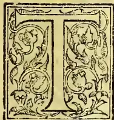

TEA is the prepared leaf of *Thea sinensis*. Its use appears to have been first known in China, where it was, according to some authorities, a general article of diet as early as 600 A.D. It was not till the 17th century that tea was introduced into Europe.

The tea plant is a hardy shrub which flourishes in latitudes between the equator and 40°.

In the preparation of the teas of commerce the treatment varies to a considerable extent. In China there are four pluckings during the year, one in spring, the next in May, the third in June, and the fourth in August. In Ceylon, tea plucking goes on continuously throughout the year, so long as the bushes continue to flush freely. The flushing usually extends over a period of about eighteen months. The bushes are then pruned down, and after an interval of from six weeks to three months according to weather, the bushes again begin to yield crop, and undergo another series of regular pluckings at intervals of about ten days.

The leaf, after having been withered, is rolled for a shorter or a longer time, and then allowed to ferment. The time allowed for fermentation varies. It may continue for three hours, or no fermentation may be allowed to take place other than what goes on while the tea is being rolled. Finally the rolled tea is dried over charcoal fires, or, as is now almost universal, in specially constructed hot air driers. The made tea is separated by sieves into sizes known as broken pekoe, pekoe, pekoe souchong and coarse leaf. The processes which are productive of chemical changes in the leaf are the withering, the rolling and fermenting, and the firing or drying.

Green tea differs from black in the treatment the leaves receive at the factory. In the case of green tea, the leaves a few hours after being plucked are roasted for a short time. They are then rolled and quickly dried. Under this treatment the leaves do not become black but of an olive green tint.

The following analyses according to Dr. James Bell, Director of the Somerset House Chemical Laboratories, may be taken as fairly representing the composition of black and green teas as imported into London. The black is represented by a Congou Tea at 2s. 10d. per pound, and the green by a Young Hyson at 3s. per pound.

759------------------------------------------------

730

THE TROPICAL AGRICULTURIST.

[JUNE 1, 1893.

*Analyses of Black and Green Teas.* (BELL.)

<table border="1">
<thead>
<tr>
<th></th>
<th>Black Tea.</th>
<th>Green Tea.</th>
</tr>
<tr>
<th></th>
<th>Congou.</th>
<th>Young Hyson.</th>
</tr>
</thead>
<tbody>
<tr>
<td>Moisture</td>
<td>8.20</td>
<td>5.96</td>
</tr>
<tr>
<td>Theine</td>
<td>3.24</td>
<td>2.33</td>
</tr>
<tr>
<td>Albumin, insoluble</td>
<td>17.20</td>
<td>16.83</td>
</tr>
<tr>
<td>Do soluble</td>
<td>.70</td>
<td>.80</td>
</tr>
<tr>
<td>Extractive by alcohol containing nitrogenous matter</td>
<td>6.79</td>
<td>7.05</td>
</tr>
<tr>
<td>Dextrin or Gum</td>
<td>—</td>
<td>.50</td>
</tr>
<tr>
<td>Pectin and Pectic Acid</td>
<td>2.60</td>
<td>3.22</td>
</tr>
<tr>
<td>Tannin</td>
<td>16.40</td>
<td>27.14</td>
</tr>
<tr>
<td>Chlorophyll and Resin</td>
<td>4.60</td>
<td>4.20</td>
</tr>
<tr>
<td>Cellulose</td>
<td>34.00</td>
<td>25.90</td>
</tr>
<tr>
<td>Ash</td>
<td>6.27</td>
<td>6.07</td>
</tr>
<tr>
<td></td>
<td>100.00</td>
<td>100.00</td>
</tr>
</tbody>
</table>

According to Professor Church good average black tea as imported may be fairly represented by the following figures:—

*Analysis of good average Black Tea.*

<table border="1">
<thead>
<tr>
<th></th>
<th>In 100 parts.</th>
</tr>
</thead>
<tbody>
<tr>
<td>Water</td>
<td>8.0</td>
</tr>
<tr>
<td>Albumenoids</td>
<td>17.5</td>
</tr>
<tr>
<td>Theine</td>
<td>3.2</td>
</tr>
<tr>
<td>Tannin</td>
<td>17.5</td>
</tr>
<tr>
<td>Chlorophyll and Resin</td>
<td>4.5</td>
</tr>
<tr>
<td>Essential Oil</td>
<td>.4</td>
</tr>
<tr>
<td>Minor extractives</td>
<td>8.6</td>
</tr>
<tr>
<td>Cellulose, &amp;c....</td>
<td>34.0</td>
</tr>
<tr>
<td>Mineral matter</td>
<td>6.3</td>
</tr>
</tbody>
</table>

The following table of analyses shows the composition of the ash of seven descriptions of tea. The table is quoted from Dr. Bell's work on "The Chemistry of Foods."

<table border="1">
<thead>
<tr>
<th rowspan="2">Percentage of Total Ash in Dry Tea.</th>
<th>Congou (Low).</th>
<th>Congou (Fine).</th>
<th>Hyson.</th>
<th>Sou-chong.</th>
<th>Moning.</th>
<th>Assam.</th>
<th>Gun-powder (Fine).</th>
</tr>
<tr>
<th>6.10</th>
<th>6.94</th>
<th>6.46</th>
<th>5.99</th>
<th>8.29</th>
<th>6.49</th>
<th>6.67</th>
</tr>
</thead>
<tbody>
<tr>
<td>Sand</td>
<td>3.08</td>
<td>8.51</td>
<td>2.17</td>
<td>1.51</td>
<td>13.37</td>
<td>3.72</td>
<td>5.66</td>
</tr>
<tr>
<td>Silica</td>
<td>6.35</td>
<td>9.27</td>
<td>5.93</td>
<td>3.77</td>
<td>9.47</td>
<td>2.51</td>
<td>6.52</td>
</tr>
<tr>
<td>Chlorine</td>
<td>1.06</td>
<td>1.07</td>
<td>1.12</td>
<td>1.01</td>
<td>.99</td>
<td>.97</td>
<td>1.11</td>
</tr>
<tr>
<td>Potassium to satisfy</td>
<td>1.16</td>
<td>1.17</td>
<td>1.23</td>
<td>1.11</td>
<td>1.09</td>
<td>1.07</td>
<td>1.22</td>
</tr>
<tr>
<td>Potash</td>
<td>34.38</td>
<td>28.87</td>
<td>35.66</td>
<td>34.29</td>
<td>26.83</td>
<td>37.71</td>
<td>30.69</td>
</tr>
<tr>
<td>Soda</td>
<td>.62</td>
<td>1.07</td>
<td>.80</td>
<td>.34</td>
<td>.50</td>
<td>.97</td>
<td>1.27</td>
</tr>
<tr>
<td>Oxide of Iron</td>
<td>.82</td>
<td>.84</td>
<td>1.12</td>
<td>1.68</td>
<td>2.23</td>
<td>.57</td>
<td>1.43</td>
</tr>
<tr>
<td>Alumina</td>
<td>5.55</td>
<td>3.42</td>
<td>2.73</td>
<td>4.19</td>
<td>4.52</td>
<td>1.54</td>
<td>2.70</td>
</tr>
<tr>
<td>Oxide of Manganese</td>
<td>1.68</td>
<td>1.37</td>
<td>1.93</td>
<td>1.59</td>
<td>1.49</td>
<td>2.11</td>
<td>1.92</td>
</tr>
<tr>
<td>Limn</td>
<td>.82</td>
<td>8.74</td>
<td>9.54</td>
<td>8.98</td>
<td>9.04</td>
<td>8.58</td>
<td>8.19</td>
</tr>
<tr>
<td>Magnesia</td>
<td>2.12</td>
<td>4.87</td>
<td>4.65</td>
<td>3.19</td>
<td>2.42</td>
<td>6.48</td>
<td>6.52</td>
</tr>
<tr>
<td>Phosphoric Anhydride</td>
<td>14.11</td>
<td>14.68</td>
<td>14.11</td>
<td>18.54</td>
<td>12.69</td>
<td>14.74</td>
<td>16.15</td>
</tr>
<tr>
<td>Sulphuric Anhydride</td>
<td>6.52</td>
<td>6.54</td>
<td>6.34</td>
<td>6.38</td>
<td>5.39</td>
<td>5.83</td>
<td>6.68</td>
</tr>
<tr>
<td>Carbonic Anhydride</td>
<td>11.73</td>
<td>9.58</td>
<td>12.67</td>
<td>13.42</td>
<td>9.97</td>
<td>13.20</td>
<td>9.94</td>
</tr>
<tr>
<td></td>
<td>100.00</td>
<td>100.00</td>
<td>100.00</td>
<td>100.00</td>
<td>100.00</td>
<td>100.00</td>
<td>100.00</td>
</tr>
</tbody>
</table>

Constituents of the Ash of Tea.

The constituents of tea already enumerated may be divided into substances soluble and substances insoluble in water. Of these, the former only are of dietetic importance to tea drinkers. The soluble substance or extractive matter contains most of the tannin, a large portion of the theine, and of the essential oil. It contains also pectin, mineral matter, and a small fraction of the albumenoids present in the leaf. On account of the insolubility of the greater part of the albumenoids, infusion of tea has a low nutritive value, but it possesses important stimulative properties on account of the essential oil and theine that are present.

*Tannin.*—The tannin of tea is commonly regarded as identical with gallo-tannic acid. Dr. Bell is of opinion, however, that while in its reactions it exhibits a close relation to this substance, yet, from its comparative instability, and the modifications it undergoes under chemical treatment, the tannin of tea differs in some important respects from gallo-tannic acid. Tannin is the most abundant of the soluble ingredients of tea, and it is to it that tea owes its astringency or strength. Analysis usually shews a higher percentage of tannin in green than in black tea.

*Essential Oil of Tea.*—This ingredient of tea appears for the most part to be developed by the process of manufacture. It is present in very small proportion, yet the characteristic taste and smell of tea is very largely due to this ingredient. When tea is distilled with water, the colorless distillate which passes over possesses the characteristic odour of tea to a marked degree, although no oil whatever is visible. By saturating the distillate with a salt such as chloride of calcium, shaking the solution with ether, and then allowing the separated ethereal solution to evaporate, a portion of the oil may be obtained as a residue. It is an oil of a yellowish colour, and passes into a resinoid state by exposure to the air.

*Theine.*—This alkaloid of tea is a highly nitrogenous substance, containing about 29 per cent of nitrogen, whereas albumen, the most abundant nitrogenous constituent of plants, contains somewhat less than 16 per cent. The tea leaf contains nitrogen in both forms, and the Japanese take advantage both of the stimulating theine and the nutritive albumen by powdering their finest teas and consuming this along with the infusion. The alkaloid theine, like the alkaloid quinine in some of the cinchonas, appears to be increased by the exclusion of light for a time from the growing plant, the total nitrogen being also thereby

760------------------------------------------------

JUNE 1, 1893.]

THE TROPICAL AGRICULTURIST.

731

increased—thus B. Kozai (Journal Chem. Soc. quoted from Bied. Centr. 1892) found, that, if the tea shrub, for three weeks before plucking be encased so as to exclude the light, the leaves are etiolated and vary in composition from those in full light as follows:—

<table border="1">
<thead>
<tr>
<th></th>
<th>Grown in dark.</th>
<th>Grown in light.</th>
</tr>
<tr>
<th></th>
<th>p.c.</th>
<th>p.c.</th>
</tr>
</thead>
<tbody>
<tr>
<td>Theine</td>
<td>4.532</td>
<td>3.784</td>
</tr>
<tr>
<td>Total nitrogen</td>
<td>7.835</td>
<td>6.945</td>
</tr>
<tr>
<td>Nitrogen in theine</td>
<td>1.311</td>
<td>1.094</td>
</tr>
<tr>
<td>Percentage of theine } nitrogen on total } nitrogen</td>
<td>16.72</td>
<td>15.75</td>
</tr>
</tbody>
</table>

In both of these analyses the percentage of total nitrogen is very high. The proportion of nitrogen in tea grown under natural conditions appears to range from about 2.6 to 7 per cent. There is usually a somewhat larger proportion of nitrogen in tea than is accounted for by the theine and albumenoids present. This nitrogen exists as an amide. In Japan tea, at different times of the year, Kellner found amido-nitrogen to vary from nil to .66 per cent.

*Unprepared Tea Leaves.*

Comparatively few analyses of unprepared tea leaves (with the exception of Japan tea leaves) have been made; but the following determinations of certain constituents in Assam, China and Ceylon tea leaves are interesting. In the case of the Assam and China plants the determinations were made in London with unprepared leaves received direct from India by Dr. Bell. In the case of the Ceylon plant the determinations were made by the author in green leaves received a day or so after they had been plucked. The Ceylon samples were all from the same estate.

*Amounts of extractive, of soluble and insoluble Ash in the unprepared leaves of the Assam, China, and Ceylon Tea plant.*

<table border="1">
<thead>
<tr>
<th rowspan="2"></th>
<th colspan="4">Percentage.</th>
</tr>
<tr>
<th>Extractive.</th>
<th>Total ash.</th>
<th>Ash soluble in water.</th>
<th>Ash insoluble in water.</th>
</tr>
</thead>
<tbody>
<tr>
<td>Assam plant :</td>
<td></td>
<td></td>
<td></td>
<td></td>
</tr>
<tr>
<td>  Pekoe leaves</td>
<td>54.0</td>
<td>5.87</td>
<td>3.49</td>
<td>2.38</td>
</tr>
<tr>
<td>  " souchong</td>
<td>52.3</td>
<td>6.19</td>
<td>3.42</td>
<td>2.77</td>
</tr>
<tr>
<td>  " coarser leaves than used in manufacture</td>
<td>50.9</td>
<td>8.50</td>
<td>2.63</td>
<td>5.87</td>
</tr>
<tr>
<td>China plant :</td>
<td></td>
<td></td>
<td></td>
<td></td>
</tr>
<tr>
<td>  Pekoe leaves</td>
<td>48.9</td>
<td>5.45</td>
<td>3.36</td>
<td>2.09</td>
</tr>
<tr>
<td>  " souchong</td>
<td>49.3</td>
<td>6.16</td>
<td>3.39</td>
<td>2.77</td>
</tr>
<tr>
<td>  " coarser leaves than used in manufacture</td>
<td>39.9</td>
<td>7.57</td>
<td>2.75</td>
<td>4.82</td>
</tr>
<tr>
<td>Ceylon plant :</td>
<td></td>
<td></td>
<td></td>
<td></td>
</tr>
<tr>
<td>  Unassorted 16th Apl.</td>
<td>49.91</td>
<td>5.25</td>
<td>3.59</td>
<td>1.66</td>
</tr>
<tr>
<td>  " 3rd May</td>
<td>47.77</td>
<td>5.45</td>
<td>3.62</td>
<td>1.83</td>
</tr>
<tr>
<td>  " 16th May</td>
<td>47.71</td>
<td>5.26</td>
<td>3.48</td>
<td>1.78</td>
</tr>
<tr>
<td>  " 2nd June</td>
<td>44.89</td>
<td>5.32</td>
<td>3.70</td>
<td>1.62</td>
</tr>
</tbody>
</table>

One hundred parts of the ash of the Ceylon tea leaves contained potash 41.96 and phosphoric acid 16.04;

I quote from the Journal of the Chemical Society the following elaborate analyses of green tea leaves. These are the more interesting as they form almost the only case in which systematic analyses have been made of an evergreen plant at intervals during a large portion of the year, including the whole time during which the leaves are harvested. The analyses are by Professor O. Kellner of Tokio. The leaves were from 50 nine-year old trees on the estate of the Minister of State, the Marquis of Nabeshima, near Tokio.

<table border="1">
<thead>
<tr>
<th rowspan="2"></th>
<th rowspan="2">Water in fresh leaves per cent.</th>
<th rowspan="2">Crude protein.</th>
<th rowspan="2">Crude fibre.</th>
<th rowspan="2">Etherial extract.</th>
<th rowspan="2">Cellulose &amp;c.</th>
<th rowspan="2">Ash.</th>
<th rowspan="2">Theine.</th>
<th rowspan="2">Tannin.</th>
<th rowspan="2">Soluble in hot water.</th>
<th>Total Nitrogen.</th>
<th>Albuminoid Nitrogen.</th>
<th>Theine Nitrogen.</th>
<th>Amido Nitrogen.</th>
</tr>
<tr>
<th></th>
<th></th>
<th></th>
<th></th>
</tr>
</thead>
<tbody>
<tr>
<td>May 15th</td>
<td>76.83</td>
<td>30.64</td>
<td>19.10</td>
<td>6.48</td>
<td>49.09</td>
<td>4.69</td>
<td>2.85</td>
<td>8.53</td>
<td>36.18</td>
<td>4.91</td>
<td>3.44</td>
<td>.81</td>
<td>.66</td>
</tr>
<tr>
<td>  30th</td>
<td>75.78</td>
<td>24.25</td>
<td>17.25</td>
<td>6.42</td>
<td>47.32</td>
<td>4.76</td>
<td>2.80</td>
<td>9.67</td>
<td>37.17</td>
<td>3.88</td>
<td>2.77</td>
<td>.79</td>
<td>.32</td>
</tr>
<tr>
<td>June 15th</td>
<td>78.61</td>
<td>22.83</td>
<td>17.38</td>
<td>6.65</td>
<td>48.26</td>
<td>4.88</td>
<td>2.77</td>
<td>10.10</td>
<td>36.12</td>
<td>3.65</td>
<td>2.73</td>
<td>.78</td>
<td>.14</td>
</tr>
<tr>
<td>  30th</td>
<td>70.85</td>
<td>21.02</td>
<td>18.69</td>
<td>6.83</td>
<td>48.50</td>
<td>4.96</td>
<td>2.59</td>
<td>10.25</td>
<td>36.06</td>
<td>3.37</td>
<td>2.43</td>
<td>.73</td>
<td>.21</td>
</tr>
<tr>
<td>July 15th</td>
<td>72.67</td>
<td>20.06</td>
<td>19.16</td>
<td>7.</td>
<td>49.49</td>
<td>4.29</td>
<td>2.51</td>
<td>9.40</td>
<td>31.72</td>
<td>3.21</td>
<td>2.31</td>
<td>.71</td>
<td>.20</td>
</tr>
<tr>
<td>  30th</td>
<td>70.54</td>
<td>19.96</td>
<td>17.56</td>
<td>8.59</td>
<td>49.43</td>
<td>4.46</td>
<td>2.30</td>
<td>10.44</td>
<td>33.77</td>
<td>3.19</td>
<td>2.25</td>
<td>.65</td>
<td>.29</td>
</tr>
<tr>
<td>Aug. 15th</td>
<td>64.21</td>
<td>19.05</td>
<td>17.72</td>
<td>10.85</td>
<td>47.80</td>
<td>4.58</td>
<td>2.22</td>
<td>10.75</td>
<td>32.70</td>
<td>3.05</td>
<td>2.28</td>
<td>.63</td>
<td>.16</td>
</tr>
<tr>
<td>  30th</td>
<td>67.75</td>
<td>18.58</td>
<td>17.93</td>
<td>12.14</td>
<td>46.35</td>
<td>4.98</td>
<td>2.05</td>
<td>11.32</td>
<td>34.00</td>
<td>2.91</td>
<td>2.19</td>
<td>.59</td>
<td>.08</td>
</tr>
<tr>
<td>Sept. 15th</td>
<td>65.26</td>
<td>18.27</td>
<td>19.13</td>
<td>13.40</td>
<td>44.35</td>
<td>4.85</td>
<td>2.06</td>
<td>10.91</td>
<td>33.05</td>
<td>2.91</td>
<td>2.39</td>
<td>.58</td>
<td>—</td>
</tr>
<tr>
<td>  30th</td>
<td>64.20</td>
<td>18.15</td>
<td>19.17</td>
<td>14.16</td>
<td>43.41</td>
<td>5.11</td>
<td>2.05</td>
<td>11.21</td>
<td>33.76</td>
<td>2.87</td>
<td>2.45</td>
<td>.52</td>
<td>—</td>
</tr>
<tr>
<td>Oct. 15th</td>
<td>64.66</td>
<td>17.91</td>
<td>18.66</td>
<td>17.23</td>
<td>41.14</td>
<td>5.06</td>
<td>1.83</td>
<td>11.21</td>
<td>36.80</td>
<td>2.88</td>
<td>2.35</td>
<td>.51</td>
<td>.02</td>
</tr>
<tr>
<td>  30th</td>
<td>64.11</td>
<td>17.98</td>
<td>18.40</td>
<td>19.50</td>
<td>39.05</td>
<td>5.07</td>
<td>1.79</td>
<td>11.27</td>
<td>38.21</td>
<td>2.83</td>
<td>2.30</td>
<td>.37</td>
<td>.16</td>
</tr>
<tr>
<td>Nov. 15th</td>
<td>59.43</td>
<td>17.70</td>
<td>18.26</td>
<td>20.38</td>
<td>38.66</td>
<td>5.00</td>
<td>1.30</td>
<td>11.34</td>
<td>37.91</td>
<td>2.74</td>
<td>2.35</td>
<td>.28</td>
<td>.11</td>
</tr>
<tr>
<td>  30th</td>
<td>60.97</td>
<td>17.74</td>
<td>18.34</td>
<td>22.19</td>
<td>37.31</td>
<td>5.04</td>
<td>1.00</td>
<td>12.16</td>
<td>36.45</td>
<td>2.67</td>
<td>2.43</td>
<td>.23</td>
<td>.01</td>
</tr>
<tr>
<td>May 15th (Old leaves)</td>
<td>60.03</td>
<td>16.56</td>
<td>17.62</td>
<td>14.18</td>
<td>46.50</td>
<td>5.14</td>
<td>.84</td>
<td>11.11</td>
<td></td>
<td></td>
<td></td>
<td></td>
<td></td>
</tr>
</tbody>
</table>

Analyses of Japan Green Tea-leaves. (Prof. O. KELLNER.)

Percentage in dry matter.

761------------------------------------------------

732

THE TROPICAL AGRICULTURIST.

[JUNE 1, 1893.

Percentage composition of the mineral matter, i.e., Ash excluding Carbonic Acid in Japan Green Tea-leaves. (KELLNER.)

<table border="1">
<thead>
<tr>
<th></th>
<th>Potash.</th>
<th>Soda.</th>
<th>Lime.</th>
<th>Magnesia.</th>
<th>Oxide of Magnesia.</th>
<th>Per-oxide of Iron.</th>
<th>Phosphoric Acid.</th>
<th>Sulphuric Acid.</th>
<th>Silica.</th>
<th>Chlorine.</th>
</tr>
</thead>
<tbody>
<tr>
<td>May 15th</td>
<td>49.06</td>
<td>1.07</td>
<td>11.95</td>
<td>8.69</td>
<td>1.64</td>
<td>3.80</td>
<td>16.67</td>
<td>3.75</td>
<td>2.34</td>
<td>1.04</td>
</tr>
<tr>
<td>30th</td>
<td>46.33</td>
<td>2.00</td>
<td>14.93</td>
<td>9.00</td>
<td>1.79</td>
<td>4.30</td>
<td>15.63</td>
<td>3.61</td>
<td>1.24</td>
<td>1.39</td>
</tr>
<tr>
<td>June 15th</td>
<td>41.37</td>
<td>1.23</td>
<td>17.70</td>
<td>11.72</td>
<td>1.98</td>
<td>6.55</td>
<td>13.76</td>
<td>3.21</td>
<td>1.60</td>
<td>1.06</td>
</tr>
<tr>
<td>30th</td>
<td>37.09</td>
<td>1.59</td>
<td>21.95</td>
<td>11.67</td>
<td>1.30</td>
<td>7.25</td>
<td>13.35</td>
<td>3.56</td>
<td>1.41</td>
<td>1.18</td>
</tr>
<tr>
<td>July 15th</td>
<td>35.76</td>
<td>1.58</td>
<td>22.04</td>
<td>12.21</td>
<td>1.58</td>
<td>8.48</td>
<td>12.41</td>
<td>3.37</td>
<td>1.62</td>
<td>1.17</td>
</tr>
<tr>
<td>30th</td>
<td>32.84</td>
<td>.80</td>
<td>29.88</td>
<td>12.91</td>
<td>1.75</td>
<td>9.75</td>
<td>12.33</td>
<td>3.83</td>
<td>1.35</td>
<td>1.22</td>
</tr>
<tr>
<td>Aug. 15th</td>
<td>31.01</td>
<td>1.08</td>
<td>23.24</td>
<td>13.71</td>
<td>1.21</td>
<td>12.14</td>
<td>12.00</td>
<td>3.43</td>
<td>1.02</td>
<td>1.14</td>
</tr>
<tr>
<td>30th</td>
<td>29.15</td>
<td>1.14</td>
<td>25.20</td>
<td>14.79</td>
<td>1.57</td>
<td>11.02</td>
<td>11.71</td>
<td>3.81</td>
<td>2.72</td>
<td>1.13</td>
</tr>
<tr>
<td>Sept. 15th</td>
<td>23.72</td>
<td>4.77</td>
<td>23.44</td>
<td>14.74</td>
<td>1.72</td>
<td>11.64</td>
<td>11.25</td>
<td>4.74</td>
<td>1.69</td>
<td>1.58</td>
</tr>
<tr>
<td>30th</td>
<td>22.28</td>
<td>2.06</td>
<td>27.71</td>
<td>15.80</td>
<td>1.63</td>
<td>12.11</td>
<td>11.52</td>
<td>4.08</td>
<td>2.17</td>
<td>1.35</td>
</tr>
<tr>
<td>Oct. 15th</td>
<td>20.97</td>
<td>2.76</td>
<td>27.90</td>
<td>15.88</td>
<td>1.37</td>
<td>11.83</td>
<td>10.71</td>
<td>4.37</td>
<td>2.61</td>
<td>1.11</td>
</tr>
<tr>
<td>30th</td>
<td>19.75</td>
<td>2.72</td>
<td>28.75</td>
<td>17.19</td>
<td>1.53</td>
<td>11.63</td>
<td>10.23</td>
<td>4.01</td>
<td>2.44</td>
<td>1.38</td>
</tr>
<tr>
<td>Nov. 15th</td>
<td>18.67</td>
<td>2.76</td>
<td>29.60</td>
<td>17.39</td>
<td>2.06</td>
<td>11.37</td>
<td>10.70</td>
<td>3.84</td>
<td>1.75</td>
<td>1.09</td>
</tr>
<tr>
<td>30th</td>
<td>17.31</td>
<td>2.02</td>
<td>30.37</td>
<td>17.99</td>
<td>2.48</td>
<td>11.02</td>
<td>10.96</td>
<td>4.02</td>
<td>2.70</td>
<td>1.19</td>
</tr>
<tr>
<td>May 15th (Old leaves.)</td>
<td>14.20</td>
<td>3.21</td>
<td>30.46</td>
<td>18.49</td>
<td>2.82</td>
<td>11.93</td>
<td>10.64</td>
<td>4.41</td>
<td>2.13</td>
<td>1.32</td>
</tr>
</tbody>
</table>

It will be observed from these tables of analyses that, in the case of young leaves, there is a remarkable decrease from May to November in the amount of theine, the proportion in May being 2.85 times as much as in November, while old leaves in May contain less than young leaves in November. The tannin in young leaves gradually increases with slight fluctuations from May to November, while the tannin in old leaves in May is only a little above the average of the young leaves. The considerable decrease in the young leaves in the amount of crude protein and cellulose &c. and the considerable increase in the ethereal extract as the year advances shew that the composition of the tea is affected to a considerable degree by season.

It will also be observed that the three most important elements of plant food, i.e., those that

are most readily exhausted from the soil, and which therefore constitute the most valuable ingredients of manures, viz., nitrogen, phosphoric acid and potash all decrease from May to November, while most of the less important or more abundant constituents soda, lime, magnesia, oxide of manganese, peroxide of iron and sulphuric acid all increase. Silica and chlorine, however, fluctuate in an indefinite manner.

In Ceylon, where the seasons are not so marked as in Japan, at least in respect of temperature, it is probable that tea leaves, plucked in different months, would exhibit greater uniformity of composition.

*Relation between Chemical Composition and Market value of Tea.*

Various attempts have been made to discover a relation between the chemical composition of tea and its market value, but with only partial success, one reason for this comparative failure being that the flavour and probably also the stimulating effect are in no inconsiderable degree due to the very small quantity of essential oil present, which, moreover, is an ingredient, the amount of which it is very difficult, if not impossible, to determine with accuracy.

The following table of analyses from Dr. Jesse P. Battershall's work on "Food Adulteration," that writer says, "exhibits the results obtained by the examination of various grades of Formosa, Congou, Young Hyson, Gunpowder and Japan teas, made under the supervision of the writer, by Dr. J. F. Davis. It will be noticed, if the same varieties of tea be compared, that, with some exceptions, their commercial value is directly proportional to the percentage of soluble ash, extract, tannin and theine compounds".

Following the table of American analyses by Battershall and Davis is a table of analyses by the author, of young tea grown in Ceylon at medium elevation, about 2,400 feet.

These analyses were undertaken partly to ascertain if the market value of Ceylon tea bore any relation to the amount of extract, tannin, theine and soluble ash present, and partly to ascertain if there were any marked difference in the chemical composition of tea on account of its having been harvested after the methods known as medium plucking and fine plucking respectively. By "medium plucking" is understood the removal from the tree-branches of two leaves and one leaf bud. By "fine plucking" is understood taking only one leaf and one leaf-bud. The six samples of tea were all from the same estate, which was land that had been previously thirty years under coffee. The tea bushes were exactly five years old. The samples were valued in the usual way by tasting by Mr. James A. Henderson of the firm of Messrs. Whittall & Co., Colombo, who had not seen the analyses before making his valuation.

762------------------------------------------------

JUNE 1, 1893.]

THE TROPICAL AGRICULTURIST.

733

Table of Analyses and of Market Values of Teas. (BATTERSHALL AND DAVIS.)

<table border="1">
<thead>
<tr>
<th rowspan="2"></th>
<th colspan="4">Firmosa Oolong</th>
<th colspan="3">Firmosa Oolong superior 1st crop.</th>
<th colspan="3">Firmosa Oolong superior 3rd crop.</th>
<th colspan="3">Firmosa Oolong superior 3rd crop.</th>
<th colspan="3">Firmosa Oolong superior 1st crop.</th>
<th rowspan="2">Price per lb. in cents of a dollar (wholesale)</th>
</tr>
<tr>
<th>per ct.</th>
<th>per ct.</th>
<th>per ct.</th>
<th>per ct.</th>
<th>per ct.</th>
<th>per ct.</th>
<th>per ct.</th>
<th>per ct.</th>
<th>per ct.</th>
<th>per ct.</th>
<th>per ct.</th>
<th>per ct.</th>
<th>per ct.</th>
<th>per ct.</th>
<th>per ct.</th>
<th>per ct.</th>
</tr>
</thead>
<tbody>
<tr>
<td>Total Ash...</td>
<td>6.50</td>
<td>5.96</td>
<td>5.80</td>
<td>6.34</td>
<td>6.22</td>
<td>6.36</td>
<td>6.58</td>
<td>6.26</td>
<td>5.86</td>
<td>5.84</td>
<td>6.20</td>
<td>5.76</td>
<td>5.50</td>
<td>5.44</td>
<td>6.06</td>
<td>6.30</td>
<td>9.74</td>
<td>6.66</td>
</tr>
<tr>
<td>Ash soluble in water</td>
<td>3.60</td>
<td>2.86</td>
<td>3.12</td>
<td>3.60</td>
<td>3.56</td>
<td>3.00</td>
<td>2.88</td>
<td>3.60</td>
<td>3.28</td>
<td>3.36</td>
<td>3.34</td>
<td>3.26</td>
<td>3.14</td>
<td>3.46</td>
<td>2.84</td>
<td>2.90</td>
<td>1.48</td>
<td>2.78</td>
</tr>
<tr>
<td>Ash insoluble in water</td>
<td>2.90</td>
<td>3.10</td>
<td>2.68</td>
<td>2.74</td>
<td>2.66</td>
<td>3.36</td>
<td>3.70</td>
<td>2.66</td>
<td>2.58</td>
<td>2.48</td>
<td>2.86</td>
<td>2.50</td>
<td>2.36</td>
<td>1.98</td>
<td>3.22</td>
<td>3.60</td>
<td>8.26</td>
<td>3.88</td>
</tr>
<tr>
<td>Ash insoluble in acids</td>
<td>0.86</td>
<td>0.94</td>
<td>0.56</td>
<td>0.66</td>
<td>0.56</td>
<td>0.66</td>
<td>1.06</td>
<td>0.64</td>
<td>0.58</td>
<td>0.50</td>
<td>0.52</td>
<td>0.54</td>
<td>0.52</td>
<td>0.46</td>
<td>0.78</td>
<td>0.96</td>
<td>3.90</td>
<td>1.46</td>
</tr>
<tr>
<td>Extract ...</td>
<td>42.00</td>
<td>37.40</td>
<td>43.20</td>
<td>40.60</td>
<td>34.60</td>
<td>29.60</td>
<td>26.20</td>
<td>40.60</td>
<td>41.00</td>
<td>39.80</td>
<td>30.40</td>
<td>39.60</td>
<td>36.00</td>
<td>39.20</td>
<td>36.40</td>
<td>33.40</td>
<td>31.80</td>
<td>32.80</td>
</tr>
<tr>
<td>Insoluble leaf</td>
<td>54.90</td>
<td>59.55</td>
<td>52.70</td>
<td>56.55</td>
<td>60.75</td>
<td>64.80</td>
<td>68.75</td>
<td>55.50</td>
<td>57.70</td>
<td>57.15</td>
<td>61.95</td>
<td>56.70</td>
<td>57.90</td>
<td>56.85</td>
<td>57.10</td>
<td>59.90</td>
<td>61.45</td>
<td>60.05</td>
</tr>
<tr>
<td>Tannin ...</td>
<td>18.66</td>
<td>16.31</td>
<td>18.00</td>
<td>16.05</td>
<td>14.87</td>
<td>13.70</td>
<td>12.26</td>
<td>18.00</td>
<td>19.96</td>
<td>18.53</td>
<td>16.99</td>
<td>20.69</td>
<td>17.87</td>
<td>21.92</td>
<td>18.27</td>
<td>17.55</td>
<td>15.66</td>
<td>17.74</td>
</tr>
<tr>
<td>Theine ...</td>
<td>3.46</td>
<td>2.20</td>
<td>2.26</td>
<td>1.39</td>
<td>3.29</td>
<td>2.28</td>
<td>2.35</td>
<td>2.26</td>
<td>2.30</td>
<td>1.16</td>
<td>1.08</td>
<td>1.78</td>
<td>1.42</td>
<td>1.54</td>
<td>1.66</td>
<td>0.74</td>
<td>0.82</td>
<td>2.43</td>
</tr>
<tr>
<td>Soluble Ash, extract</td>
<td>67.72</td>
<td>58.77</td>
<td>66.58</td>
<td>61.64</td>
<td>56.32</td>
<td>48.53</td>
<td>43.69</td>
<td>64.46</td>
<td>66.54</td>
<td>62.85</td>
<td>51.81</td>
<td>64.73</td>
<td>58.43</td>
<td>66.12</td>
<td>59.17</td>
<td>54.39</td>
<td>49.76</td>
<td>55.75</td>
</tr>
<tr>
<td>Tannin and Theine</td>
<td>...</td>
<td>...</td>
<td>...</td>
<td>...</td>
<td>...</td>
<td>...</td>
<td>...</td>
<td>...</td>
<td>...</td>
<td>...</td>
<td>...</td>
<td>...</td>
<td>...</td>
<td>...</td>
<td>...</td>
<td>...</td>
<td>...</td>
<td>...</td>
</tr>
<tr>
<td></td>
<td>70</td>
<td>28</td>
<td>55</td>
<td>24</td>
<td>65 to 70</td>
<td>24</td>
<td>14</td>
<td>28 to 30</td>
<td>25</td>
<td>17 to 18</td>
<td>14</td>
<td>35</td>
<td>23</td>
<td>30</td>
<td>22</td>
<td>19</td>
<td>9</td>
<td>6</td>
</tr>
</tbody>
</table>

Analyses of Ceylon Teas from the same Estate, illustrating the difference in Chemical Composition and Market Value of "Medium plucking" and of "Fine plucking."

<table border="1">
<thead>
<tr>
<th rowspan="2"></th>
<th colspan="2">Pekoe</th>
<th colspan="2">Pekoe</th>
<th colspan="2">Pekoe</th>
<th colspan="2">Pekoe</th>
<th colspan="2">Pekoe</th>
<th colspan="2">Broken Pekoe</th>
</tr>
<tr>
<th>per ct.</th>
<th>per ct.</th>
<th>per ct.</th>
<th>per ct.</th>
<th>per ct.</th>
<th>per ct.</th>
<th>per ct.</th>
<th>per ct.</th>
<th>per ct.</th>
<th>per ct.</th>
<th>per ct.</th>
<th>per ct.</th>
</tr>
</thead>
<tbody>
<tr>
<td>Moisture</td>
<td>4.80</td>
<td>9.45</td>
<td>3.55</td>
<td>3.55</td>
<td>3.55</td>
<td>3.55</td>
<td>3.55</td>
<td>3.55</td>
<td>3.55</td>
<td>3.55</td>
<td>3.55</td>
<td>3.55</td>
</tr>
<tr>
<td>Total Ash</td>
<td>5.04</td>
<td>5.12</td>
<td>5.13</td>
<td>5.13</td>
<td>5.13</td>
<td>5.13</td>
<td>5.13</td>
<td>5.13</td>
<td>5.13</td>
<td>5.13</td>
<td>5.13</td>
<td>5.13</td>
</tr>
<tr>
<td>Ash insoluble in acid</td>
<td>...</td>
<td>...</td>
<td>...</td>
<td>...</td>
<td>...</td>
<td>...</td>
<td>...</td>
<td>...</td>
<td>...</td>
<td>...</td>
<td>...</td>
<td>...</td>
</tr>
<tr>
<td>Ash insoluble in water</td>
<td>...</td>
<td>...</td>
<td>...</td>
<td>...</td>
<td>...</td>
<td>...</td>
<td>...</td>
<td>...</td>
<td>...</td>
<td>...</td>
<td>...</td>
<td>...</td>
</tr>
<tr>
<td>Insoluble leaf</td>
<td>...</td>
<td>...</td>
<td>...</td>
<td>...</td>
<td>...</td>
<td>...</td>
<td>...</td>
<td>...</td>
<td>...</td>
<td>...</td>
<td>...</td>
<td>...</td>
</tr>
<tr>
<td>Extract</td>
<td>...</td>
<td>...</td>
<td>...</td>
<td>...</td>
<td>...</td>
<td>...</td>
<td>...</td>
<td>...</td>
<td>...</td>
<td>...</td>
<td>...</td>
<td>...</td>
</tr>
<tr>
<td>* Tannin in aqueous extract</td>
<td>...</td>
<td>...</td>
<td>...</td>
<td>...</td>
<td>...</td>
<td>...</td>
<td>...</td>
<td>...</td>
<td>...</td>
<td>...</td>
<td>...</td>
<td>...</td>
</tr>
<tr>
<td>Theine in aqueous extract</td>
<td>...</td>
<td>...</td>
<td>...</td>
<td>...</td>
<td>...</td>
<td>...</td>
<td>...</td>
<td>...</td>
<td>...</td>
<td>...</td>
<td>...</td>
<td>...</td>
</tr>
<tr>
<td></td>
<td>53.06</td>
<td>59.45</td>
<td>57.92</td>
<td>57.92</td>
<td>59.82</td>
<td>59.82</td>
<td>58.20</td>
<td>58.20</td>
<td>60.92</td>
<td>60.92</td>
<td>60.92</td>
<td>60.92</td>
</tr>
<tr>
<td>London value 18th July 1889</td>
<td>7½d.</td>
<td>9½d.</td>
<td>10¾d.</td>
<td>10¾d.</td>
<td>11½ to 12</td>
<td>11½ to 12</td>
<td>11</td>
<td>11</td>
<td>11</td>
<td>11</td>
<td>11</td>
<td>11</td>
</tr>
</tbody>
</table>

If the values of these six samples of tea were to be estimated as directly proportional to their respective amounts of extract, soluble ash, tannin and theine added together, the three qualities of medium plucking would be in the proportions of 53.06, 57.92 and 58.2, and the three qualities of fine plucking in the proportions 59.45, 59.82 and 60.92. The average figures then would be for medium plucking 56.39 and for fine plucking 60.06. If we take the figures for extract only which really includes the tannin, theine, and soluble ash, the average would be for medium plucking 40.57 and for fine plucking 42.5. The average market value on the other hand was for medium plucking 10¾d. and for fine plucking 11½d. Analysis, thus, indicates a much smaller difference in the qualities of the teas than is indicated by the market values. It will be observed, however, that with one exception the market value of the six samples rises or falls with the amount of extract. It is therefore probable that if the same method of preparation agreeing in all details were followed in every factory, the amount of extract might be made a measure of the market value. A certain amount of extract, say e.g., 39 per cent being taken as standard, each unit and fraction of a unit above or below this amount could have its corresponding money value to be added to or subtracted from the standard as the case might be. At present the market value of tea as determined by the tea taster depends on the age of the leaf, and the flavor, astringency and bouquet developed by infusing or "drawing"

763------------------------------------------------

734THE TROPICAL AGRICULTURIST.[JUNE 1, 1893.]

a certain weight of tea for a given time with a given quantity of boiling water. The bouquet is mainly due to the presence of a volatile oil very appreciable to the senses of smell and taste, but for the estimation of which the chemical processes at present in use are unsatisfactory.

The six analyses last given were of teas grown at medium elevation 2,400 feet. I now give determinations of total extract tannin and theine on other six samples of teas grown at a high elevation about 4,200 feet on land that was for a number of years previously under coffee.

<table border="1">
<thead>
<tr>
<th rowspan="2">Partial Analysis of Ceylon high-grown Tea.</th>
<th rowspan="2">In 100 Parts.</th>
<th colspan="2">Pekoe Sonchong</th>
<th colspan="2">Pekoe Sonchong fermented 2 to 2½ hours.</th>
<th colspan="2">Pekoe fermented 2 to 2½ hours.</th>
<th colspan="2">Broken Pekoe</th>
<th colspan="2">Broken Pekoe fermented 2½ hours.</th>
<th colspan="2">Average.</th>
</tr>
<tr>
<th>Bulked.</th>
<th>Bulked.</th>
<th>Bulked.</th>
<th>Bulked.</th>
<th>Bulked.</th>
<th>Bulked.</th>
<th>Bulked.</th>
<th>Bulked.</th>
<th>Bulked.</th>
<th>Bulked.</th>
<th>Bulked.</th>
<th>Bulked.</th>
</tr>
</thead>
<tbody>
<tr>
<td>Total extract ...</td>
<td>...</td>
<td>37.2</td>
<td>37.2</td>
<td>38.7</td>
<td>40.8</td>
<td>39.5</td>
<td>38.8</td>
<td>38.7</td>
<td>38.7</td>
<td>38.7</td>
<td>38.7</td>
<td>38.7</td>
<td>38.7</td>
</tr>
<tr>
<td>Tannin in aqueous extract ...</td>
<td>...</td>
<td>10.05</td>
<td>9.98</td>
<td>10.5</td>
<td>11.23</td>
<td>10.57</td>
<td>10.11</td>
<td>10.41</td>
<td>10.41</td>
<td>10.41</td>
<td>10.41</td>
<td>10.41</td>
<td>10.41</td>
</tr>
<tr>
<td>Theine in aqueous extract ...</td>
<td>...</td>
<td>.70</td>
<td>1.06</td>
<td>1.22</td>
<td>1.32</td>
<td>2.00</td>
<td>1.57</td>
<td>1.31</td>
<td>1.31</td>
<td>1.31</td>
<td>1.31</td>
<td>1.31</td>
<td>1.31</td>
</tr>
</tbody>
</table>

The average results of the above table might be compared with the corresponding average results of the previous table taking the "medium" and "fine plucking" averages separately.

*Comparison of total Extract, Tannin, and Theine (in aqueous extract) in high-grown tea and in tea grown at medium elevation.*

<table border="1">
<thead>
<tr>
<th rowspan="3"></th>
<th colspan="3">In 100 parts.</th>
</tr>
<tr>
<th rowspan="2">High elevation.</th>
<th colspan="2">Medium Elevation.</th>
</tr>
<tr>
<th>Medium plucking.</th>
<th>Fine plucking.</th>
</tr>
</thead>
<tbody>
<tr>
<td>Total extract ...</td>
<td>38.71</td>
<td>40.5</td>
<td>42.5</td>
</tr>
<tr>
<td>Tannin in aqueous extract ...</td>
<td>10.41</td>
<td>10.56</td>
<td>12.16</td>
</tr>
<tr>
<td>*Theine in aqueous extract ...</td>
<td>1.31</td>
<td>1.78</td>
<td>1.88</td>
</tr>
</tbody>
</table>

When the first and second columns are compared, the difference in the proportion of tannin is but small; while in the total extract and theine the difference is tolerably marked. When the first and third column are compared, there are marked differences in the amounts of all three items.

\* By ether process.  
(To be continued.)

## "STALK" IN MANUFACTURED TEA.

We doubt very much if it would be generally admitted by planters that the teas sent home from Ceylon contain any appreciable amount of "stalk;" but the results obtained by Mr. Hughes according to his recent analyses, and since shown to our London correspondent, seem to indicate that, at all events in the case of the samples operated on, there was no inconsiderable admixture. Of course it may be conceded that it must be almost impossible to altogether avoid the presence of some "stalk." Probably the most careful and expert pluckers could not altogether avoid breaking off some trifling portion of stalk when taking off the leaf, and perhaps there must be a greater liability when the plucking is done at an advanced stage of maturity in the leaf. Nevertheless, while admitting this liability, we would urge a greater degree of strictness being exercised over pluckers and the punishment of coolies guilty of such careless plucking. It seems certain that when an undue amount of stalk is detected in tea samples, the price is affected. Mr. Hughes, during the course of the analyses lately made by him, appears to have been struck by the amount of stalk that he discovered to be present in the small samples operated upon; so much so, indeed, that he mentioned the fact to the dealers from whom he obtained them. These gentlemen were so incredulous of Mr. Hughes' statement as to this, that the latter went to the trouble of separating the dried stalk by hand, and then swelling it by hot infusion. The result was evidently a surprise to the vendors of the tea, and Mr. Hughes pointed out by reference to drawings of the tea plant how liable the position of the leaf upon the stem was to cause the breakage off of a part of the latter in the plucking. In less than an ounce weight of tea a large number of pieces of stalk about half an inch in length were discovered. This substance is not likely to improve either the infusing strength or the flavour of the tea, for Mr. Hughes tells us that the stalk contains none of the valued theine, though it probably—as does all bark—contains a very material proportion of tannin. We should think it to be very difficult to separate stalk from the leaf at the Factory, and therefore that the only remedy must be to insist on more careful manipulation by the coolies when plucking.

Perhaps, however, some of our upcountry friends have had their attention directed to this matter before, and could tell us what measures they have adopted to ensure the absence of any considerable admixture of stalk in the teas they have sent home? In any case the opinion of practical planters on this question of "stalk" would be very acceptable. Mr. Cochran, to whom we referred the matter in the first instance, writes very sensibly as follows:—"I am of course of opinion that the presence of stalk other than the mere petiole of the leaf which in tea is very short, the leaf being almost sessile, must deteriorate its value. It is not a new thing to find some stalk in tea as after infusion everyone is familiar with the appearance of a small piece of stalk floating on the surface of the tea occasionally. I should think where tea is plucked by hand there should be no difficulty in keeping down the amount of stalk to a minimum: but when patent clippers are used, I could easily understand an undesirable amount of stalk being taken along with the leaves." We may put the question as to whether the tea samples operated on by Mr. Hughes could possibly have been prepared from "leaf" cut by a "patent plucker"?

764------------------------------------------------

JUNE 1, 1893.]THE TROPICAL AGRICULTURIST.735MR. JOHN HUGHES' ANALYSES OF TEAS.

LONDON, April 14.

Although I know that Mr. John Hughes had sent you a full report of the several analyses recently made by him of different samples of teas, I responded this week to an invitation sent me by him to see him on the subject. Doubtless you will have given to your readers the particulars Mr. Hughes sent you; but as I found some difficulty in fully comprehending them until he gave me fuller explanations, it may not prove to be superogatory if a few remarks of my own on this topic are offered you here. What seems to be of special interest in the results obtained by these analyses is that the quantity of soluble ash and nitrogen ascertained, closely varies in accordance with the price of the teas. This would seem to indicate that it is these residuals which mark the absolute values of the teas, other constituents varying out of proportion to the prices given. The nominal value of the samples as opposed to the prices at which they were selling, were fixed by the dealers (or brokers) from whom Mr. Hughes obtained them. Another noteworthy fact is that nearly all the tannin and theine was extracted during the first five minutes of infusion, the further quantity resulting from thirty minutes of boiling being relatively very small. The question thereupon arises as to whether even five minutes infusion may not be too long for ordinary domestic purposes, and whether it would not be advisable to strictly limit this to three minutes at the outside. I did not at first understand what Mr. Hughes intended to convey by the words "soluble extract (dried)." He explained to me that, having infused the tea and strained it off from the leaf, he evaporated the whole of the liquor and so obtained what was really the body of the infusion, that which, in other words, would be really consumed by the drinker. You will see that by this test the Ceylon tea valued at 1/1 possessed but little more nourishment than did that valued at sixpence, and upon this ground Mr. Hughes thinks that for the supply of the bulk of teadrinkers your planters would find the cheaper teas as well suited as the more expensive; while it would be the better economy to themselves to devote their attention to the preparation of the second class of teas, in spite of the demand of the home brokers that now attention should be given to quality. You will also notice that the Ceylon teas valued at 1/1, selling at 11½d, yielded the soluble extract almost to the same amount as did the Indian teas valued at 1/5 to 1/6 and selling at 1/3, whilst it largely surpassed the yield from the China teas selling at 1/7. The figures could more clearly show the relative value for money of your teas over those both of India and China.

But probably the greatest interest attaches to remarks made to me by Mr. Hughes on the subject of stalk found in the teas he experimented upon; you will see that in this respect both the Indian and Ceylon teas gave a larger proportion than did those of China, and that, singularly enough, it was among the more expensive teas that the greater proportion of stalk was found. Mr. Hughes told me he had felt much surprize at the amount of stalk he found. On his mentioning this to the brokers from whom he bought the teas, those gentlemen would not believe that so large a quantity of stalk could be found. Mr. Hughes therefore invited them to attend at his laboratory, and in their presence he had the stalk carefully separated cut by hand. He then placed the quantity obtained in hot water so as to swell it, and the result was shown to

me in that state, and there could be no denying that what I saw was veritable stalk and not leaf fibre. I am hardly competent to judge on such a matter, but it appeared to me that out of some fifty or sixty grains weight of tea there had been obtained some hundred or so of pieces of stalk about half an inch in length. This is no inconsiderable proportion, and Mr. Hughes said that the stalk would not yield any theine, though it probably—as do most barks—contained a large proportion of tannin. It occurs to me to suggest whether the larger amount of the latter which China merchants charge the Indian and Ceylon teas with containing, may not be due to the larger amount of stalk which those teas undoubtedly contain as compared with those of China. As to this the suspicion must naturally arise whether the coolies of Ceylon and Indian tea estates are as expert pluckers as are those of China, and it might be worth while to insist on more caution being exercised as to cleanly Plucking of the leaf. Of course these remarks are written on the assumption that you have the tabulated results of Mr. Hughes' analyses before you, and that your readers have also had an opportunity of perusing them. I am not aware if Mr. Hughes has specifically drawn your attention to the several points mentioned by me, but from what he said to me it may be concluded that they have occurred to him since he wrote you on the subject, and they may therefore be novel to you.—London *Cor.*

SALE OF A BADULLA ESTATE.

It is rumoured that the well known old estate of Nahavilla, Badulla, so long held by Hormusjee Bomanjee Jeejeebhoy of Bombay, has been sold and that the purchasers are Messrs. Alfred Brown (Colombo Commercial Coy.) W. H. Figg and Capper. Nahavilla includes 597 acres, of which 552 have been or are in cultivation in coffee, cinchona or tea. Uva properties should certainly rise in value to correspond with the advantages of Railway communication so soon to be made available to them.

THE BRITISH WEST INDIAN PLANTATION SYNDICATE (Limited) has just been registered by Torr, Janeway & Co., 38 Bedford Row, W. C., with a capital of 12,000L., in 10L. shares. The object is to adopt an agreement, made March 18, between J. H. Hall of the one part, and the company of the other part, for the acquisition of the Hatton Hall and Mount Jewel Estates, Prince Rupert's Bay, near Portsmouth (Dominica), and to carry on business as cultivators and dealers in colonial produce. The first directors are to be nominated by the signatories to the memorandum of association, the qualification being 20 shares.—*Colonies and India*.

"REPORT ON INSECTS AND FUNGI INJURIOUS TO CROPS, 1892."—We note the publication by the Board of Agriculture of this report with great pleasure. We have so often called attention to our lamentable deficiencies as compared with the energy shown in the United States and some European countries, that it is a great pleasure to welcome a report on the insects which have been noted as specially injurious during the year to our farm and garden crops. The insects are described, their life-history given, and excellent coloured illustrations afforded. Among them our old acquaintance the red-spider finds a place. An article also illustrated, on the club in Cabbages follows. In each case the appropriate means of prevention, palliation, or cure are given.—*Gardeners' Chronicle*, April 29.

765------------------------------------------------

736THE TROPICAL AGRICULTURIST.[JUNE 1, 1893.]CEYLON TEA IN AMERICA.

Writes a business man:—

"If Lipton should start in America it will be a very good thing for Ceylon, for he cannot not be approached even by *Elwood May* for advertising. The latter gent to my mind thinks more of advertising himself."

In the advertisement *per se*, the name of E. May never occurs of course; but in other notices no doubt his personality is put well forward—and what harm, so long as he bases his claims to notoriety on Ceylon tea?

LABOUR IN BRITISH NORTH BORNEO.

(*British North Borneo Herald*, 1st April.)

During the past fortnight the Superintendent of Immigration informs us he has engaged about one hundred and seventy-six Chinese coolies who have signed contracts for work on estates in Marudu Bay, Darvel Bay, and Banguay Islands. Nearly the whole of these men, originally engaged in China, have been working on estates in this country for three, and some for four years, have made money, and have without exception re-engaged entirely of their own free will, instead of going back to China. The coolie returns, again, all show a constant and steady improvement—in many instances most marked—in the health of the coolies on the tobacco estates. Desertion is nearly unknown, and the reward for the capture of run-away coolies is hardly ever applied for. With the extension of the clearings, the greatly improved health on the estates, the abolition of the broker system as it originally obtained, and more than all, the fact that a coolie who means work can make money, all these causes have quite revolutionized the state of the labour market in North Borneo during the past two or three years

MAURITIUS.

Port-Louis, April 10th.

THE WEATHER AND THE CROP.—Since last month the plantations have been well watered and the fields in general look satisfactory. Now that we may consider the season of cyclones to be over, we can rely on a very fair crop for 1893-94.

ALEX FIRBE.—Since our last the market has resumed a firmer tone. We have to quote the sale of 150 bales of good quality at R275 per ton. The following quotations are nominal:—

1st quality... R275 to 280 per ton  
2nd " " 225 to 235

COFFEE.—Market is still bare of good quality which is worth from R90 to 100 per 50 kilos. Mixed triage qualities continue to sell at R40 to 54 per 50 kilos according to quality. No Malagascar and Reunion on the market.—*Merchants' and Planters' Gazette*, April 11th.

THE AMSTERDAM MARKET.

AMSTERDAM, April 12th.—The cinchona auctions to be held here in Amsterdam on April 27th will consist of 421 cases and 4,829 bales, about 430 tons, divided as follows:—From the Government plantations, 12 cases and 353 bales, about 31 tons; from private plantations 409 cases and 4,476 bales, about 399 tons. This quantity contains:—Of druggists' bark—Succiruba, quills, 372 cases; broken quills and chips, 386 bales and 49 cases; root, 59 bales. Of manufacturing bark—Ledgeriana, broken quills and chips, 3,573 bales; root 415 bales. Hybrids, broken quills and chips 298 bales; 48 bales. Official: broken quills and chips, 50 bales root.—*Chemist and Druggist*, April 15th.

UPCOUNTRY NOTES AND QUERIES.

At last the WHIPPING ORDINANCE has been introduced into the districts of Dumbara and Matale! And this, too, just at a time when men's minds began to be exercised about the Commission that was at one time so imminent, that the name of the Commissioner became pabulum for the newsmonger. The 19th century discoverer of the Oleronian *sic vos, non vobis* ought now to rest on his oars and be thankful.

Let not the enthusiasm of the CACAO-GROWERS subside with this concession. A great deal has yet to be done! The receiver of our stolen produce must be reached; for so long as he flourishes, and his name is Legion,—the temptations to thieving will not abate. We must have some such provision of the law as came to the rescue of the planter in the old coffee days. Surely, "there is something rotten in the state of Denmark," if the man who vends cacao seeds without a single cacao tree that he can call his own, cannot be made to account for his possession of that produce? Our Magistrates are perfectly helpless here. Why should the possessor of *unripe* produce be asked to account for such possession and not the possessor of *ripe* produce? Why deal severely with the man who steals valueless fruit, and tenderly with the man who steals valuable? Is this not an anomaly that requires to be dealt with promptly? Let our Planters' Association be up and doing, and the remedy will come.

Let all the native *kaddies* where cocoa is bought and sold be registered; and let every *kaddie*-keeper have a book showing the dates of purchase and the quantities purchased and the names of the sellers; and let there be a stringent prohibition of purchase after nightfall and before daybreak. The Tambies are the principal offenders in the matter of purchasing stolen produce,—and they must be carefully looked after.

Does the WHIPPING ORDINANCE touch the Receiver? It is worth knowing this: for otherwise, the fat oily Moorman and the sleek Chetty trader will escape.

When COCOA-STEALING has been banished from the island—and the receiver of stolen produce has become a character in past history; then we shall be ready to pass from our position as a Crown Colony, to a dependency of the Indian Empire; at all events with all the irritating present-day questions at rest, we shall be in that stat of delectable composure, as would enable us with good grace to face the question of absorption into India.

Certainly if that day should ever come, our Railway system will be considerably benefited. At present every thing that can ensure discomfort to the passengers and gain to the Government, is in the ascendant. This is not a crying but a piercing shame!

Is it true that such a lot of goods traffic is sent on by the mail train leaving Colombo at 7 p.m. that the draught-power of the locomotive is not equal to the task of pulling the heavily laden waggons up the incline? A few days ago some of the first-class passengers going upcountry were heard pouring their benediction on the driver and the guard. No wonder; when they found the train nearly an hour late. India is the remedy for this.

And other departments will be similarly benefited. What a scope for our budding lawyers and civilian judges India will afford! One comfort will be that the *law of Agency* under which the country is groaning at present will come to an end; and a more healthy Administration take its place.

But what about Indian tea then? Shall we have divided interests in respect of that, or will there be one grand Indian blend.

QUERIST.

COCONUTS.—There seems to be a real mania for the purchase of Coconut properties in Jaffna. Every one is anxious to invest his capital in Coconut estate. The two leading Tamil Brokers of Colombo who are now on a visit to Jaffna are prepared, we understand, to purchase coconut estates here even at a fancy price; but unfortunately for them there are none in the market just now.—*Ibid.*

766------------------------------------------------

JUNE 1, 1893.]THE TROPICAL AGRICULTURIST.737MR. TOM. GRAY'S REPORT ON  
UPCOUNTRY TEA,—

that is in the districts of Maskeliya, Dikoya and Dimbula—is, we are glad to learn, entirely favourable. Mr. Gray has been resident for some weeks in the first-named district and has visited the others, and he says that tea everywhere is looking very vigorous. He is well-pleased with his own properties which are the oldest in his district,—they have been in full bearing for about a dozen years perhaps and have done exceedingly well. Mr. Gray has been clearing away a bambu-and-silt obstruction in the river which was of no benefit to his and the other adjacent properties. He speaks favourably of the 1,000 acres of crown forest land to be put up for sale shortly: tea already planted up to 5,000 feet is quite as high as most of this forest and 1,000 an acre is likely to be the minimum price! Mr. Gray returns home by the Orient s.s. "Oroya" tonight, or tomorrow morning, and he promises to look after the interests of his brother planters in the Lane and to report to us when there is anything worthy of the *Observer's* criticism.

CEYLON TEA FUND.

Kandy, April 17.

DEAR SIR,—I enclose for publication copy of the minutes of proceedings of a meeting of the Standing Committee of the "Ceylon Tea Fund" held on Friday, the 14th instant.—I am, dear sir, yours faithfully,  
A. PHILIP,

Secretary to the Planters' Association of Ceylon.

Minutes of proceedings of a meeting of the Standing Committee of the Ceylon Tea Fund held at Nuwara Eliya on Friday, the 14th day of April 1893 at four o'clock (4 p.m.) in the afternoon.

Present:—Messrs. Giles F. Walker (Chairman, Planters' Association of Ceylon), Hugh B. Roberts (Dikoya), Chas. Young (Kandy), Walter Agar (Chairman, Dikoya Association), John H. Starey (Kandy), and A. Philip (Secretary, Planters' Association of Ceylon, Kandy).

The notice calling the meeting was read.

The minutes of proceedings of a meeting of the Standing Committee of the Ceylon Tea Fund held at Kandy on Thursday, the 16th February 1893, were taken as read, and were confirmed.

Resolved:—"That the names of Messrs. H. B. Roberts and A. P. Crawley-Boevey be added to the Standing Committee of the Tea Fund."

Read letter from the Yataderia Tea Company of Ceylon, Limited. Resolved:—"That the proposal made be accepted."

Read letter from Mr. Wm. Cameron intimating that Ythanside estate would contribute to the Tea Fund from 1st January 1893.

Read letter from Captain Toller intimating that Annandale estate would contribute to the Tea Fund from 1st January 1893.

CEYLON TEA KIOSK.

Submitted memorandum on the subject of accounts for supplementary construction in connection with the Tea Kiosk which up to date had not been disposed of in terms of the following Resolution passed at a meeting of the Standing Committee of the Ceylon Tea Fund held at Kandy on the 8th April 1892 that subject to the amounts already voted with interest thereon not being exceeded, the additional claims be referred to the sub-Committee appointed for the purpose of establishing a Tea Kiosk at Colombo. Resolved that consideration of the matter be disposed of next meeting of the Standing Committee of the Tea Fund.

Submitted letter to the Syndicate Boat Company, Limited regarding the fire recently reported in the

newspapers. Resolved that the attention of the Syndicate Boat Company, Limited, be drawn to the provisions of their lease with special reference to the storage of dangerous or obnoxious materials or manufacture in the neighbourhood and be warned that they will be held responsible for any consequences that may ensue thereon.

CEYLON TEA AT THE WORLD'S EXPOSITION AT CHICAGO  
IN 1893.

Read letter from the Agent of the Commissioner annexing copy of telegram intimating the safe arrival at Chicago of the Exhibition Staff: also sending notice of an official dinner given at Chicago by the President of the Brazilian Commission in which favourable notice is made of Ceylon.

Read letter from the Colonial Secretary sending a copy of a letter from Mr. J. J. Grinlinton reporting the safe arrival of the Ceylon Staff at Chicago.

CEYLON PLANTERS' TEA COMPANY OF NEW YORK.

Read letter from Messrs. Darley, Butler & Co. (1) enclosing invoice of 50 packages Tea weighing nett 2,800 lb. shipped to New York on account of the Ceylon Planters' Tea Company completing the grant of 9,000 lb. (the actual amount shipped being 9,084 lb.); (2) acknowledging receipt of cheque for £2,381-26 in payment of the abovementioned invoice. Read letter from the Ceylon Planters' Tea Company of New York giving information regarding the progress of the Company. Read letter from Mr. A. E. Wright.

CEYLON GREEN TEAS.

Read letters from Messrs. Darley, Butler & Co. advising having forwarded the various samples of Green Teas made up in  $\frac{1}{2}$  lb. packets as instructed. Submitted advertisement notice on the subject. Resolved that the advertisement amended as indicated be again inserted in the newspapers.

CEYLON TEA IN GERMANY.

Read letters from Messrs. Kroning & Schrader reporting on the efforts made by them in the introduction of Ceylon Tea into Germany. Resolved:—"That Messrs. Kroning & Schrader be thanked for their letters and informed that the Standing Committee of the Tea Fund will give as early consideration as possible to their further suggestions."

Read letter from Mr. Frederick H. Corbet making a suggestion on the subject of distributing presents of Ceylon Tea in Munich and Erlangen.

CEYLON TEA IN FRANCE.

Read letter from Colonel Byrde with extract of letter from General La Touche on the subject of pushing the sale of Ceylon Tea in the South of France. Resolved:—"That consideration of the matter be deferred to next meeting."

CEYLON TEA IN RUSSIA.

Read letter from the Ceylon Tea Company Limited (under the patronage of the Planters' Association of Ceylon advising having arranged for the shipment of 9,000 lb Ceylon Tea for Mr. M. Rogivue, Moscow in terms of the resolution passed by the Standing Committee of the Tea Fund at a meeting held on the 16th February 1893. Resolved:—"That the course adopted by the Ceylon Tea Company be confirmed."

CEYLON TEA IN CAPE COLONY.

Read letter from Messrs. Bossanquet & Co., Agents for the Ceylon Co-Operative Tea Gardens Co. on the subject of the proposed grant of tea samples for free distribution in Cape Colony, and pointing out that Ceylon Tea is well-known in South Africa.

Read letter from Mr. A. E. Wright on the subject. Resolved:—"That the resolution passed by the Standing Committee of the Tea Fund at its meeting on the 16th February be cancelled."

The Standing Committee of the Ceylon tea fund then adjourned.  
A. PHILIP,

Secretary to the Planters' Association of Ceylon.

93

767------------------------------------------------

738THE TROPICAL AGRICULTURIST.[JUNE 1, 1893.

### THE PAPAW TREE.

This tree generally finds a place amongst other cultivated products in Zanzibar, the fruit, both green and when ripe, being much esteemed as an article of diet. The tree is more easily and quickly raised from seed, attaining a thickness of one foot by the third year, and commencing to decay during the fourth or fifth year. The straight and undivided stem is herbaceous and soft, though it develops an external layer of fibrous tissue; as might be expected from the rapidity with which it grows, the trunk is hollow, though it has more or less dense, imperfect septa. "The newer parts of the stem are green, but as they age become greyish; towards the top it also bears the scars formed by the falling-off of leaves, which are arranged in a kind of umbellate canopy." It grows to about 20 feet in height. (*Consular Report*, 266 1892.)—*Pharmaceutical Journal*.

### THE INDIAN TEA SEASON.

The *Indian Agriculturalist* writes:—Now that the tea season for 1892 has closed and all assets realised, we can form a pretty good idea of the present position of the trade, which leaves little to be desired, though its future prospects must depend greatly upon the efforts of the Indian representative at Chicago, and the moderation of planters here in the way of extensions. Of course, fine plucking and decreased outturn have led to the high prices of the past season, and though the greater portion of the dividends are not derived from sound commercial sources every one seems tolerably satisfied. The recent four or five years of depression in the trade has been due undoubtedly to over production, and although efforts have been made to open new marts, the tendency on the part of the producer has been to provide tea for such marts, without troubling his head as to whether these new openings would absorb his surplus or not. The mere despatch of three or four travellers to Australia and New Zealand certainly did not justify the expectations anticipated, but though words of caution were not wanting, from time to time, a trade was rashly anticipated, with the result of ruinously low prices and accumulated stocks. Now, though we look forward to the Chicago Exhibition aiding in materially increasing the demand for Indian tea in the course of time, we are equally certain that any sudden demand for large quantities is unlikely to arise. We have to oust China from the America markets, and introduce our own article, which the past history of the trade shows, relies for success upon our creating a taste; and as this is in all case a matter of time, are our planters justified in adding to their planted area additional acreage, the produce of which may not be required for some half-dozen years to come? The new extensions may, perhaps, be the means of pressing down prices to the 6 annas average of two years ago ere the new markets have been established. The Tea Association should look into these matters, and bestir themselves, sending forth the "bagman" throughout the length and breadth of the States, as we suggested should be done in the United Kingdom ten years ago. The London representative of the Tea Association at the time, harped on the hopelessness of competing with people like Moore and Horniman; in fact, he was not, as he should have been a tradesman. So Mr. Lipton took the matter in hand, and is now in the position the Association should have occupied from the outset. If India tea were properly pushed, the future prospects of the trade are assured; but the work must be undertaken by tradesmen who know their business, and we think this must now be patent to all members of the Association.—*Madras Times*, April 7.

### A MONSTER ESTATE IN JOHORE: LIBERIAN COFFEE.

A recent visitor to the large estate known as Ayer Syu, at Cocob, in the Johore territory, states that this property or plantation belongs to Syed

Mahomed bin 'Ahmed Alsagoff, and is under the management of Syed Abdulla and a Javanese assistant, under whom are several Javanese mandors and about 170 coolies of the same nationality. The extent under cultivation is some 16 square miles, or about 10,000 acres, of which area some 5,700 acres are under mature sago palms, 350,000 having been planted out; the balance, leaving out what is under coconut, areca palms, and Liberian coffee, is planted with still very young sago palms. The roads and drains have been laid out with great care, and the drainage especially has been well done, at no small expense. The soil consists for the most part of a vegetable humus from two to four feet deep, of a very dark brown colour, much resembling coffee-grounds, overlying a fatty clay subsoil. In dry weather the top crust burns just as readily as peat. The one advantage about it is that it retains moisture more than any other class of land, hence its great adaptability to sago culture. From the 350,000 plants that were originally planted there are now more than double that number of big sago palms, varying in length of trunk from 30 to 42 ft. Some of these trunks have a girth of from 6 to 7 ft. 6 in. The trees are felled, cut into lengths, and removed by Chinese coolies to the sago factory, consisting of some very primitive attap huts. The bark is half an inch thick, and is then removed, and the pith is rasped or grated by simple graters like the coconut *parut* or rasp, but somewhat coarser. The desiccated pith is then soaked in water, and after some few hours pressed through coarse sieves, the residue or *ampas* being piled up in heaps to be eventually buried as a future manure supply. The milky residue or sago water after repeated washing in very primitive troughs is allowed to settle, and the sediment is stored in vats ready for shipment to Singapore by tongkang in bulk, where it is refined into flour and pearled. This work is all done by Chinese, who contract to divide half the result of the sago produced with the owner of the estate. Some idea of the immense extent of this estate may be formed from the monthly shipments which are made under sago, which range from 2,500 to 3,000 piculs a month, selling at 1.75dols. per picul, while there are yet some 300,000 stools not yet touched, ready for cutting down. These trees vary in the amount of sago they yield, as under:—No. 1, 8 trees to a koyan of 40 piculs; No. 2, 10 do do.; No. 3, 12 do. do. It is proposed to introduce a Decauville 18-inch tramway to facilitate the removal of the cut-up trees to the factory. The yield of Liberian coffee, according to figures courteously supplied by the manager, show the output to be about 40 piculs monthly, selling at an average of 32 dols.—*Globe*.

### THE PROSPECTS OF TEA IN AMERICA.—The editor of the *American Grocer* thus expresses himself in answer to a correspondent:—

The question of climate has much to do with the beverages of a people. It is a matter of record that the per capita consumption of tea in this country is not as large as it was years ago, nor does it increase from year to year. On the other hand the use of beer and coffee has increased largely, particularly the former. We think the point well-taken that low grade tea is largely responsible for the non-increase in the use of tea as a beverage. The American people have not been educated to appreciate the delicacy of flavor resident in certain growths and blends of tea. We doubt, if the popular taste in this country will ever take the direction of the prevailing taste in England. Our people do not like heavy-bodied, red-liquored tea, with the sweetish flavor so pronounced in many sorts of fermented teas, particularly those of Ceylon and India. There is more hope if fine China blacks are urged upon the attention of consumers, or, as suggested by Mr. Fielding, fine blended teas. Mr. Elwood May and Mr. Pineo should make a point of calling on the Editor and inviting him to judge for himself that high-grown Ceylon teas are as delicate as any "fine China blacks."

768------------------------------------------------

JUNE 1, 1893.]THE TROPICAL AGRICULTURIST.739SALT IN THE HOUSEHOLD.

A little rubbed on the cups will take off tea stains, says *Hall's Journal of Health*. Put into whitewash, it will make it stick better. As a tooth powder it will keep the teeth white and the gums hard and rosy. It is one of the best gargles for sore throat, and a preventive of diphtheria, if taken in time. Use salt and water to clean willow furniture; apply with brush, and rub dry. Salt and water held in the mouth after having a tooth pulled will stop the bleeding. Prints rinsed with it in the water will hold their colour and look brighter. Two teaspoonfuls in half a pint of tepid water is an emetic always on hand, and is an antidote for poisoning from nitrate of silver. Neuralgia of the feet and limbs can be cured by bathing night and morning with salt and water as hot as can be borne. When taken out rub the feet briskly with a coarse towel. Salt and water is one of the best remedies for sore eyes, and if applied in time will scatter the inflammation. Silk handkerchiefs and ribbons should be washed in salt and water, and ironed wet, to obtain the best results. Food would be insipid and tasteless without it. Hemorrhages of the lungs or stomach are promptly checked by small doses of salt.—*Sydney Mail*.

PARA INDIARUBBER.

Owing to the great fluctuation in the price of india-rubber, the trade is described as being very uncertain. According to the last official report, two-thirds of the State revenues of Para are derived from the export duty on india-rubber, which is said to contribute 25 per cent. of its value. Owing to the fact that Para possesses almost a monopoly of this valuable article, the report alleges that this high rate of duty may be maintained for many years to come without destroying the trade. Favours are, however, conceded to the india-rubber produced in the State, as also to that coming from the entire Amazon region if exported from Para (*Consular Report*, 1136, 1892).—*Pharmaceutical Journal*, March 25.

ZANZIBAR ARROWROOT.

A variety of arrowroot is to be found in most native gardens in Zanzibar, and named "uwanga," but do not think it is the true arrowroot (*Maranta arundinacea*), the shape of the leaves differing, though the preparation of the roots appears to be the same; "uwanga" bearing a fleshy knotty root, which is ground and washed in repeated waters, and finally sun-dried. This preparation, mixed with sugar, forms a favourite sweetmeat with the Arabs. I see no reason why arrowroot should not be more extensively cultivated on the island, and form an article of export. The cultivation is easy, and immediate returns are obtained:—"The plants are propagated by parting the roots. A light loamy soil is the most favourable for their growth. When they are a year old the roots are in a fit state for use" (*Consular Report*, 266, 1892).—*Pharmaceutical Journal*, March 25.

NOTES ON PRODUCE AND FINANCE.

THE TEA INDUSTRY IN 1891.—The Government of India has issued a statement from which it appears that the total number of tea gardens throughout British India in the year 1891 was 4,293, with an aggregate of 362,130 acres actually under tea. Besides this area, some 450,000 acres had been taken up, but had not, up to date, been planted. The total approximate yield was 123,712,825 lb., of which by far the greater part was black tea. The average yield per acre of mature plants was 399 lb. In future returns, the total number of labourers employed will be shown.

INDIAN TEA GARDEN AT THE CRYSTAL PALACE.—The following is taken from the "Crystal Palace Hand-book"—"A model of a tea garden in Assam—which was appropriately called 'the Eden of India' by the late Lord Napier of Magdala—has been arranged in a building on the North Lawns. Indian tea plants may here be seen in a healthy state of growth, and the preparation of the tea is carried on in all its stages of withering, fermenting, rolling, drying, &c... by natives of India. The model has been arranged by Mr. Patrick Macgregor, an old tea planter of Assam."

CEYLON TEA IN AMERICA.—We continue to receive copies of papers referring to Ceylon tea in America, and these show that Mr. Elywood May and those interested with him in Ceylon tea are very busily engaged in pushing the sale, and that they know how to do it.

TEA AND COCOA.—The croakers maintain that tea has had its day, although, when they read statistics on the subject, they find it difficult to prove this. They persist, however, and point to coffee by way of moral. It is quite true that the medical faculty have, as a rule, objected to the increasing consumption of tea, although if it leads, as they say, to so much indigestion, and, consequently, more frequent consultations, it is remarkable that they regard it as an evil. There is no sign that we can see of the decreasing popularity of tea, although it may be noted that cocoa and chocolate are now introduced at numerous functions where tea and coffee only were admitted. Even after dinner cocoa is frequently taken, and in America this is more common than on this side. There is no doubt that cocoa is received with favour by dietetic and medical authorities, which helps its popularity.—*H. and C. Mail*, March 31.

COFFEE AND TEA PILFERING.

A leading article, signed "P. H.," appears in the *Indian Planters' Gazette*, under the above heading. The writer supports the memorial of the Nilgiri planters upon the disadvantageous working of the Coffee Stealing Prevention Act, XIII. of 1878, and the suggestion that Tea should be protected as well as Coffee. It is undoubtedly the case that petty thefts of Tea and Coffee are numerous, and there are circumstances quite distinct from considerations of the intrinsic value of the plunder which give importance to the demand of planters that these pilferings should be put a stop to. In Assam as well as on the Nilgiris planters suffer from depredations of this sort. It is well known to all Managers, says our Calcutta contemporary, that most garden coolies drink tea as regularly as any Europeans. Ramaswami in our homes prefers Coffee, but he takes tea if he cannot get anything else; and the planters' coolies probably make a similar virtue of necessity and practically gives a preference to that which can be obtained most easily. Our contemporary remarks, rightly enough, as regards tea thefts, that "it is often less in actual dried tea that the loss is suffered, than in green leaf, which the women pluck on the garden, carry to their houses in their aprons, to be hand rolled, and dried over the *chula*." Calcutta experience coincides with that of Southern India in regard to convictions, too, for we read:—"We have known many instances of cases, instituted by Tea planters against Natives, in which there was no moral doubt of the accused's guilt, fall through, to the loss of European prestige which a court defeat always inflicts, simply on account of the absence of such a provision as the Neigherry planters are now trying to obtain." And the objections that have been raised in the North are similar to those that have been put forward in the South when the planter has urged his claim to protection. Our Calcutta contemporary has heard it said, "Imprison a poor coolie for taking a few tea leaves to his house! Why, you will want to put coolies in prison for bad plucking next?" and has reasoned in vain that a practice which makes a difference on the wrong side of many

769------------------------------------------------

740THE TROPICAL AGRICULTURIST.[JUNE 1, 1893.

mannds on a garden crop can only be stopped by making examples in "petty individual instances," and that "in those absolutely maddening cases, which so often happen about the present time of year, when plucking women stoop and pick buds off the bark of heavy pruned lower growth, knowing every bit as well as the manager knows how intensely bad it is for the bush, 'why then we would prosecute them.' So would any planter; and the provoking custom of breaking off stems of the new wood to make tooth-cleaners merits the indignation of the *I. P. G.* and punishment at the hands of the law. The complete list of pilferings and of petty damages would be very long, but the Nilgiri planters have, we trust, made out a sufficiently clear case to convince Government that their complaints are in no way exaggerated, and that there is urgent need of a revision of the law in regard to coffee-stealing, and the extension of a similar law to tea.

---

### ORANGES AND LEMONS.

17th April.

To the Editor,—

Sir,—Those with any experience in the growth of Oranges and Lemons know how disheartening it is to find trees gradually die off after bearing for a few seasons. In the absence of proof positive of how death is caused, each one assigns a theory for it. My theory always has been that decay and death are due to the roots reaching the subsoil; and I have always suggested manure to be heaped in a circle round the trees within a space enclosed by coconut husks, stones or logs of wood, so as to bring all the roots to the surface.

The Sinhalese have a practice of paving the holes in which they plant oranges. Whether the idea was suggested to them by anyone experienced in horticulture or was "evolved out of their inner consciousness" I know not; but I am inclined to think the practice is the result of experience, for unlike those who think the ordinary villager knows nothing of agricultural principles, I have always found him in many respects well acquainted with them as the result of observation and experience. Well, however he may have learnt the practice of paving the holes for orange plants, it is very interesting to find he has "Antiquarian" sanction for it. In Sir Walter Scott's "Antiquary" occurs this passage. "The planters of those days possessed of the modern secret of preventing the roots of the fruit trees from penetrating the till, and compelling them to spread in a lateral direction, by placing paving stones beneath the trees when first planted, so as to interpose between their fibres and the sub-soil,—Truly yours, B.

---

### TROUT OVA ON THE NILGIRIS.

The trout ova recently imported have not hatched out so successfully as had been hoped. This appears to have been due to their not being sent out quite soon enough, as, not arriving in Ooty until March 4th the water in the hatching boxes was already of too high a temperature, 67°, and although ice was used it was not found practicable to keep the temperature below 60°. It should be about 45°, From this cause the daily loss of ova was about 200. until March 24th when they began to hatch out. For a few days previous to that date a succession of storms caused a fall in the temperature of the water to about 55°, but occasioned some trouble by the amount of silt brought down. On the 24th and 25th March, just as the ova were beginning to hatch out, there was a sudden rise in the temperature which proved most disastrous. A large number of the fry died immediately, some when only half out of the egg. On the 2nd April only 293 fry were left and some 70 ova, and these decreased until, on the 8th instant, only 201 healthy fry remained. These so far appear to be getting on well, but the ova sacs have not yet been completely absorbed. This is not a very encouraging result from a batch of 20,000 ova.

It is intended to import Rainbow trout ova and Loch Loven trout ova in November next, and it is hoped that the valuable experience which past experiments have afforded will obviate all chance of failure. It will be willingly conceded that the perseverance of the Nilgiri Game Association and its most energetic and painstaking Hon. Secretary, Mr. Rhodes Morgan, thoroughly deserves to be rewarded by success, and all sportsmen owe them a debt of gratitude.

A brief description of the mode of packing and transporting will be of interest. The first batch sent out by Mr. Silk was packed in a case too large to be taken out of the ice house, and it had to be unscrewed and lifted in and subsequently out sideways. This caused the ova, although packed with cotton wool to run together and they became a frozen mass. On being thawed when put into the hatching boxes all the ova immediately turned opaque. With the batch sent by the "Manora," care was taken to pack in a suitable sized box, which was slung in the cool room—not the ice house—and the ova were packed in Irish water moss. For transport from Madras, Mr. Rhodes Morgan had a box made just three inches wider every way than the case in which the ova were packed, and this space was filled with ice kept constantly renewed, and the outer case well wrapped in blankets. In this way, as we stated at the time, the ova were received in Ootacamund in excellent condition.—*South of India Observer*, March 12.

---

### THE "LITTLE MONSOON."

All doubts about the "little monsoon" having burst have now been set at rest. The rainfall in Colombo for the 24 hours ended at 9.30 a.m. today was 2½ inches, and more is likely to fall ere nightfall. On Monday Galle had 2.30 inches of rain; and yesterday Chilaw had .66 inch, Ratnapura getting .30 inch. Most of the other outstations, however, report fine weather. We append reports that have reached us regarding the monsoon burst:—

GALLE, April 18.—Between 6 and 9 last night there was heavy rain with vivid lightning and loud peals of thunder. The showers this morning and in the afternoon have been from the south-west with a pleasant sea-breeze. The wet weather has tended to cool the atmosphere considerably.

LOWER MACKELIYA, April 18.—This morning every appearance of burst of little monsoon. Temperature has risen from 42½ yesterday morning to 45½ this morning. We have not had it so high since 3rd Dec. 1892. The clouds are passing slowly over from S.-W., also wind from there. The sky has a regular S.-W. appearance, and the feel of the air is very different to what we have had for a long time, viz. close and muggy. Tightning last night to S.-W.

---

### THE PANAWAL TEA COMPANY, LD.

The Company has been formed principally for the purpose of acquiring the two adjoining Tea estates, known as "Gassel" and "Ernen," situated in the Kelani Valley, Ceylon, as from 31st March, 1893, for which estates the Vendors have agreed to accept the sum of £20,000 payable £10,000 in shares and £10,000 in cash.

The properties are held under Crown titles.

Mr. William Mackenzie, Manager of the Castlereagh Tea Company, Dikoya, in his valuation of the property, writes:—"In valuing these properties I take the yield as 600 lb. per acre, cost of production as 22 cents, upkeep of machinery and buildings 2 cents; profit 16 cents. Value of tea 40 cents in Colombo or R96 profit per acre, which at six (6) years' purchase amounts to R576 for tea in bearing." The following

770------------------------------------------------

JUNE 1, 1893.]THE TROPICAL AGRICULTURIST.741

particulars as to the acreage of the respective estates are taken from his valuation:—

<table border="1">
<thead>
<tr>
<th></th>
<th>In Bearing.</th>
<th>Partial.</th>
<th>Young.</th>
<th>Avail- able Land.</th>
<th>Timber.</th>
<th>Total.</th>
</tr>
</thead>
<tbody>
<tr>
<td>Glassel..</td>
<td>230</td>
<td>8</td>
<td>75</td>
<td>100</td>
<td>78½</td>
<td>491½</td>
</tr>
<tr>
<td>Ernan ..</td>
<td>182</td>
<td>—</td>
<td>13</td>
<td>70</td>
<td>160</td>
<td>425</td>
</tr>
<tr>
<td></td>
<td>412</td>
<td>8</td>
<td>88</td>
<td>170</td>
<td>238½</td>
<td>916½</td>
</tr>
</tbody>
</table>

and he values—

<table>
<tr>
<td>"Glassel" at</td>
<td>..</td>
<td>..</td>
<td>..</td>
<td>R176,250</td>
</tr>
<tr>
<td>"Ernan" at</td>
<td>..</td>
<td>..</td>
<td>..</td>
<td>R123,700</td>
</tr>
</table>

R299,950

The following is extracted from a report by Mr. Mackenzie, dated 15th September last—"Of the strength and vigour of the Tea Bushes I can speak in the very highest terms as well as of the general order and condition of each estate in every particular. The tea (by which I mean the bushes not the manufactured article) is far above the level of the average of the Kelani Valley. The estimated yield of 600 lb. per acre seems quite safe up to an age equal to the oldest tea of which we know anything in Ceylon. Buildings—The factories and machinery are new, capacious and durable. Beyond ordinary repairs these should give little trouble for many years. On Ernan a new bungalow has just been erected. On Glassel one is in course of construction. There is sufficient accommodation for all the labour required in the 'Lines' on each estate. Water carriage to Colombo—say 40 miles—by river makes transport an easy item on these properties."

Mr. A. Mansfield Forbes, one of the vendors, in a letter to the directors, of the 14th March, 1893, states, "I estimate the crops for the nine months, from 1st April to 31st December, to be 200,000 lb. made tea, which at present market rates should produce a profit of at least 2½d per lb." No promotion money has been or will be paid.

### CEYLON TEA COMPANIES.

The following is a list of all the Tea Companies of which, at present, we have particulars for our "Directory." We shall be much obliged by receiving the needful information as to any others that may be in existence, to go into the register:—

1. 1 Castlereagh Tea Co. of Ceylon, Ltd.
2. 2 Ceylon Co-operative Tea Gardens Co., Ltd.
3. 3 Ceylon Tea Co., Ltd.
4. 4 Ceylon Tea Plantations Co., Ltd.
5. 5 Yatideria Tea Co. of Ceylon, Ltd.
6. 6 Scottish Ceylon Tea Co., Ltd.
7. 7 Tasgaswela Tea Co. of Ceylon, Ltd.
8. 8 Yatiyantota Tea Co., Ltd.
9. 9 We-Oya Tea Co., Ltd.
10. 10 Dunkeld Estate Co., Ltd.
11. 11 Kelani Valley Tea Association, Ltd.
12. 12 Agracovah Estate Co. Ltd.
13. 13 Upper Maskeliya Estates Co., Ltd.
14. 14 Glasgow Estate Co., Ltd.
15. 15 Hunasgeria Tea Co., Ltd.
16. 16 New Ceylon Plantation Co., Ltd.
17. 17 Ceylon and Oriental Investment Corporation, Ltd.
18. 18 United Planters of Ceylon Co., Ltd.
19. 19 Lauderdale Tea Estate Co., Ltd.
20. 20 Standard Tea Co., of Ceylon, Ltd.
21. 21 Mahauva Estate Co., Ltd.
22. 22 St. Helier's Tea Co., Ltd.
23. 23 Wanarajah Tea Co., Ltd.
24. 24 Mocha Tea Co., Ltd.
25. 25 Great Western Tea Co., of Ceylon, Ltd.
26. 26 Badella Estate Co., Ltd.
27. 27 New Dimbula Co., Ltd.
28. 28 Clunes Estate Co., Ltd.
29. 29 Panawal Tea Co., Ltd.
30. 30 Ceylon Planters' Tea Co., Ltd.
31. 31 Lanka Plantations Co., Ltd.
32. 32 Ceylon Lowcountry Products Co., Ltd.
33. 33 Eastern Produce and Estates Co., Ltd.

1. 34 Ceylon Estates Investment Association, Ltd.
2. 35 Ceylon Land and Produce Co., Ltd.
3. 36 Oriental Bank Estates Co., Ltd.

Tea Companies of which no particulars have been received:—

1. 1 Ceylon Estates Association, Ltd.
2. 2 Delgolla Estate Co., Ltd.
3. 3 Battagalla Estate Co., Ltd.
4. 4 Asiatic Produce Co.
5. 5 Ceylon Tea Growers' Co., Ltd.
6. 6 Consolidated Estates Co., Ltd.
7. 7 Duckwari Tea Co., Ltd.
8. 8 East Matale Co., Ltd.
9. 9 Eila Tea Co., of Ceylon, Ltd.
10. 10 Galella Tea Estates Co., Ltd.
11. 11 Gona Adika Tea Co., Ltd.
12. 12 Gongalla Tea Plantations Co., Ltd.
13. 13 Mahaouva Tea Co., Ltd.
14. 14 Narangalla Estates Co., Ltd.
15. 15 North of Scotland Co., Ltd.
16. 16 Strathellie Tea Co., Ltd.
17. 17 Taprobane Tea Co., Ltd.

The particulars required are the names of Directors and Secretary and the names and address of London or Colombo Agents as the case may be.

### VARIOUS AGRICULTURAL NOTES.

TECHNICAL SCHOOLS SANCTIONED.—The Lieutenant-Governor of Bengal has sanctioned the opening of a Technical School at Burdwan and "agrees to present the school with a lathe costing not more than R500." The school for the present will take the form of a good artisan class with a little instruction in drawing and mensuration, and will be started with the following staff:—Superintendent from the Sibpur College, at R60 rising to R75; smith and assistant, R35; carpenter at R15; durwan at R7. The cost with R3 for contingencies will thus be R120 (rising to R125) per mensem, towards the payment of which the Municipality will give R20 per month, the District Board providing the balance. The Government of India has sanctioned the establishment of a Technical School for Engineering in connection with Rangoon College for training Burmans for service in the Upper and Lower Sub-ordinate grade of the Public Works Department.—*Indian Engineer*, April 1.

COFFEE IN THE WYNAAD.—The coffee is certainly looking better than I have seen it for very many years. There is a tremendous flush of young leaf all over our estates, and no signs of disease, this will follow of course, but the trees, must benefit by so long a rest from their enemy. As far as we can judge at this early stage, the fine blossom has set well. As for the Liberians, not content with one amazing blossom, they have contrived a second, nearly as good, and the mystery will be, if it all sets, where the fruit will find room for itself! My fifteen years old trees are a mass of crop. These particular trees have never had an ounce of manure since they were planted, and are still bearing heavily on their first branches. If your correspondent who wished for particulars about the planting, etc., of Liberian will communicate with me, I will with pleasure give him all the information I can tell on the subject. I presume that we can be introduced to each other, through the kind agency of our Editor. Faith in the advantages of Liberian strengthens every year in Wynaad, and large quantities are being planted. Of course, our great difficulty still lies in the future, i.e., the curing and pulping. No doubt the efficient machinery will be available, but you cannot pulp without water, and these indiscreet berries will ripen in the hot season when our nullahs are particularly low. However, I have no doubt our ingenuity will find out a way of storing water for pulping purposes. If tea is well started, there should, with it and Liberian, be a regular revolution in our planting arrangements, and there will be very little getting away in the hot months for our coming superintendents!—*Cor., M. Times*.

771------------------------------------------------

742THE TROPICAL AGRICULTURIST.[JUNE 1, 1893.]BORNEO TOBACCO.

We are told by a friend writing to us from England that cigars received from Borneo and locally manufactured there from leaf produced in the country, are finding much appreciation with home smokers. Dealers who may be supposed to be judges of what constitutes a good "smoke" strongly recommend these to their customers and they also declare the tobacco to be second only in every desirable attribute to that obtained from Havana. Our correspondent adds his own testimony in support of this professional verdict, and states that, price especially being considered, he has never yet obtained any cigars which have afforded him greater satisfaction in every respect than do these cigars from Borneo. Our own experience of failure in Ceylon is but of too recent occurrence not to make us feel somewhat envious of the reputation. Borneo now seems likely to achieve in England. It is one which may tend towards stimulating progress in that settlement and to reversing, to some extent, the adverse opinions of late current as to its future prospects. We are told that the cigars upon which has been founded the judgment referred to, were purchased of the Civil Service Stores, which have just reported a large and increasing sale for the various brands kept by them. These are sold at the Stores at a very moderate price, 8s 9d for boxes containing 50 cigars, or little more than twopence each. They are said to be exceedingly well made, and to so closely resemble in appearance the coveted cigars from Havana that they could not be distinguished from these by any passer-by, and we learn that this is regarded by smokers as a great desideratum. The statement is also made that large quantities of tobacco leaf are sent from Sumatra and Manilla—the latter island more especially—to Havana for the purpose of covering the cigars manufactured there,—it being the fact, as we are told, that the native leaf of the last-mentioned place is so full of rib and fibre that it does not afford the smooth and slightly surface desired by smokers. A ribbed outer covering, also, is said to tend to much inequality in burning, and probably much of the high cost of Havana cigars is due to the labour necessary for extracting this rib and fibre from the tobacco used for the interior of them. It will be remembered that one shipment of Dumbara tobacco some years ago, was thought so suitable for outside coverings, that it fetched a high price in Amsterdam and sent Deli planters to explore the island for land with a result which they and the local Tobacco Company have reason to regret. But we should like to know whether the Ceylon-grown tobacco, which has in later years been so thoroughly experimented with, had lost the smoothness referred to, and was possessed of the disability of rib and fibre; and if so, whether any attempt was made to get rid of it before using it in the local manufacture of cigars, or to import a Sumatra leaf for the purpose of obtaining a finished external appearance. We believe Mr. Ingleton does use carefully selected foreign, as well as Ceylon, grown leaf for his wrappers, and there can be no question of the importance of care in the finish. For, apart from appearance, it is certain that no cigars can give satisfaction if their burning is likely to be variable, and we hear that nothing is more likely to cause this latter annoyance than coarseness or roughness in the leaf in which the internal packing is rolled. If Havana has to resort to importation to overcome this difficulty, with

regard to its own growth, there could be no reason why the same thing should not be done by the makers of Eastern cigars. In any case, it is satisfactory to know that the Tobacco and Cigar industry of Borneo appears to be in a fair way of achieving success for what is now, apparently, to be its most important cultivation. On this we heartily congratulate the planters of the island, who have up till now had to struggle against so many difficulties, as also the shareholders who have invested in the capital of the several Companies working there, without, as yet, having received the least return for their money. There is much need for encouragement in North Borneo, and this news of the popularity in London of its cigars, may cheer the despondent.

ANNUAL TEA REPORTS OF LONDON BROKERS.

In a special Supplement to last issue of the *Tropical Agriculturist*, we placed the interesting and valuable Annual Reports of Messrs. Geo. White & Co. and Wilson, Smithett & Co., Tea Brokers, for 1892. We gave both nearly in full and we trust exactly as received, save that errors pointed out by the Broker compilers, have been corrected by us, as also others discovered by local planters and ourselves, more particularly in reference to the elevation of certain plantations. We must confess, however, that a number of names included in Messrs. Wilson, Smithett & Co.'s list are unfamiliar to us, notwithstanding all the information collected for our Directory and we shall be glad to have, as early as possible, particulars of the following places to embody in our District lists:—

<table border="0">
<tbody>
<tr>
<td>1. Valamaly</td>
<td>11. Kelso</td>
</tr>
<tr>
<td>2. Elangapitiya</td>
<td>12. Amawatura</td>
</tr>
<tr>
<td>3. Dinastow</td>
<td>13. Sumtravalle</td>
</tr>
<tr>
<td>4. Devanella &amp; Deemally</td>
<td>14. Sapitiyagodde</td>
</tr>
<tr>
<td>5. Braintree</td>
<td>15. C'Galla</td>
</tr>
<tr>
<td>6. Come Away</td>
<td>16. Lokamanda</td>
</tr>
<tr>
<td>7. Amgalla</td>
<td>17. Saidewatta</td>
</tr>
<tr>
<td>8. Gona</td>
<td>18. Akuressa</td>
</tr>
<tr>
<td>9. Ambragalla</td>
<td>19. M. K. Oya</td>
</tr>
<tr>
<td>10. Matara Oya</td>
<td>20. Fairfield</td>
</tr>
</tbody>
</table>

[It is possible that some of these may be in our Directory list under different names?] Turning now to Messrs. Geo. White & Co.'s very interesting Report, we are arrested by the explanations offered as to the low prices of tea prevalent for some time back. These are: large deliveries previous to the close of the year; recent depression in trade; and as we ventured to anticipate ourselves, an expectation that the duty on tea might be lowered again by the Chancellor of the Exchequer—perhaps from 4d to 2d per lb. The reference to Ceylons, and the scarcity of fine teas, reads to us just now like a bit of satire, in view of the small encouragement offered in the Lane all this year to send home fine Ceylon teas.

It is interesting to see that the quantity of Ceylon tea re-exported from the United Kingdom last year was 3,448,000 or within 314,000 lb. of the quantity of Indian so distributed, and still more satisfactory this trade in the case of Ceylon shows an increase of 1,341,000 lb. over that for 1891. But one fact that arrests attention in the statistics afforded, is that while Indian and Ceylon teas have so largely ousted "Chinas" in the home market, yet in regard to the re-export trade from London, China has still the great advantage—the export of the latter tea being three times that of the former last year. This means, of course, that China still commands the Continental market so far as the London export trade is concerned; but surely there is room for a great change here

772------------------------------------------------

JUNE 1, 1893.]THE TROPICAL AGRICULTURIST.743

during the present year in view of the low range of Ceylon prices.

As respects Java teas, we call attention to the letter of "Planter" elsewhere: we do not think, however, that the choice of seed has no effect on the quality of the tea. We know what vigorous bushes are grown from a good jai judiciously selected with reference to soil, climate and elevation, and it stands to experience that a vigorous bush produces the leaf from which good teas can be prepared. There can be no doubt that Java teas have greatly improved in quality since the planters there discarded their China jai, introducing instead Assam seed and at the same time, *proper preparing machinery for their factories* which have so great an influence in turning out good teas. Of course the London market is open to the Java tea planters, but we hold very strongly that they ought to make much more of their Amsterdam market and that, following the example of Ceylon planters, they ought to institute a regular campaign with a view to get their teas drunk throughout Holland, Belgium and especially North-Western Germany where, at present, inferior China teas are very largely consumed. Of course, London Brokers do not care to see trade even in "Javas" go past them; but the sooner Java planters do their duty in making an extending market for their teas (to the supercession of China) on the Continent of Europe, the better for Dutch as well as British grown teas.

As usual Messrs. Geo. White & Co. give some useful hints in reference to "size of breaks," packages, warehouse charges, &c.

It is interesting to refer to their tables of monthly averages for the different Indian districts separately, as well as for India, Ceylon and Java as a whole. It will be seen that Darjiling comes in an easy first and we may indeed tabulate the results as follows according to merit:—

<table border="1">
<thead>
<tr>
<th>District.</th>
<th>Packages.</th>
<th>Average for 1892.</th>
</tr>
</thead>
<tbody>
<tr>
<td>Darjiling</td>
<td>.. 58,113</td>
<td>1s 0½d</td>
</tr>
<tr>
<td>Assam</td>
<td>.. 297,809</td>
<td>11½d</td>
</tr>
<tr>
<td>Ceylon</td>
<td>.. 503,700</td>
<td>9½d</td>
</tr>
<tr>
<td>Cachar and Sylhet...</td>
<td>161,089</td>
<td>9½d</td>
</tr>
<tr>
<td>Dooars</td>
<td>.. 69,256</td>
<td>9½d</td>
</tr>
<tr>
<td>Kangra Valley</td>
<td>.. 2,158</td>
<td>9d</td>
</tr>
<tr>
<td>Travancore and S.</td>
<td></td>
<td></td>
</tr>
<tr>
<td>  India</td>
<td>.. 19,770</td>
<td>8½d</td>
</tr>
<tr>
<td>  Java</td>
<td>.. 35,900</td>
<td>7½d</td>
</tr>
<tr>
<td>[All India]</td>
<td>.. 603,195</td>
<td>10½d</td>
</tr>
</tbody>
</table>

The Estimate of the requirements of the London market for the home trade as well as re-export, during the present year, has attracted a good deal of attention and so far as we can judge in the case of Ceylon, the figures for the supply of the same may be taken as very reliable, though we should not be sorry to see China's share drop to 40 to 45 million lb. (not at all likely, however, in view of moderate estimates and expectations from India and Ceylon):—

<table border="1">
<tbody>
<tr>
<td>Indian</td>
<td>.. 116,000,000 lb.</td>
</tr>
<tr>
<td>Ceylon</td>
<td>.. 74,500,000 "</td>
</tr>
<tr>
<td>Java</td>
<td>.. 4,500,000 "</td>
</tr>
<tr>
<td>China</td>
<td>.. 50,000,000 "</td>
</tr>
</tbody>
</table>

245,000,000 "

We now return again to the Report of Messrs. Wilson, Smithett & Co., and first in point of local interest is the analysis of Ceylon Districts with their crop yield and average in price. As usual "Bogawantalawa" heads the list; but as Mr. R. W. Wickham fairly points out to a contemporary, there is no reason why Dimbula should be treated as a whole, if Dikoya and Bogawantalawa are to be separated. He therefore separates Agrapatana (the division of Dimbula parallel

to Bogawantalawa) with the result that it becomes the premier one in respect of highest average price for its teas last year, as the following figures show, based on Messrs. Wilson, Smithett & Co.'s memoranda:—

<table border="1">
<thead>
<tr>
<th></th>
<th>Average price per lb. in 1892</th>
</tr>
</thead>
<tbody>
<tr>
<td>Agrapatana</td>
<td>alone 11½</td>
</tr>
<tr>
<td>Bogawantalawa</td>
<td>11</td>
</tr>
<tr>
<td>Dimbula</td>
<td>10</td>
</tr>
<tr>
<td>Dikoya</td>
<td>9½</td>
</tr>
<tr>
<td>Dimbula including Agrapatana</td>
<td>10½</td>
</tr>
<tr>
<td>Dikoya including Bogawantalawa</td>
<td>10½</td>
</tr>
</tbody>
</table>

The detailed summary in the Report itself may be repeated here for convenience of reference:—

Estimated relative yield and average price realised for the different Ceylon Tea Districts, compiled from the Public Auctions held in London between January 1st and December 31st, 1892:—

<table border="1">
<thead>
<tr>
<th></th>
<th>lb. about</th>
<th>Av. price £ lb. about in 1891.</th>
</tr>
</thead>
<tbody>
<tr>
<td>Bogawantalawa</td>
<td>3,000,000</td>
<td>0/11 0/11½</td>
</tr>
<tr>
<td>Nuwara Eliya, Maturata and Uda Pussellawa</td>
<td>2,500,000</td>
<td>0/10½ 0/11½</td>
</tr>
<tr>
<td>Dimbula</td>
<td>10,500,000</td>
<td>0/10½ 0/10½</td>
</tr>
<tr>
<td>Dikoya</td>
<td>4,500,000</td>
<td>0/ 9½ 0/10½</td>
</tr>
<tr>
<td>Uva</td>
<td>2,500,000</td>
<td>0/ 9½ 0/10½</td>
</tr>
<tr>
<td>Maskeliya</td>
<td>4,000,000</td>
<td>0/ 9 0/10½</td>
</tr>
<tr>
<td>Hewaheta</td>
<td>1,500,000</td>
<td>0/ 9½ 0/10</td>
</tr>
<tr>
<td>Pussellawa, Kotmale, Pndaloya, and Ramboda,</td>
<td>6,000,000</td>
<td>0/ 9 0/10</td>
</tr>
<tr>
<td>Ambagamuwa and Lower Dikoya</td>
<td>3,000,000</td>
<td>0/ 9 0/ 9½</td>
</tr>
<tr>
<td>Dolosbage and Yakdessa</td>
<td>3,500,000</td>
<td>0/ 8½ 0/ 9½</td>
</tr>
<tr>
<td>Knuokles, Kallebokka, Rangalla, &amp;c.</td>
<td>2,500,000</td>
<td>0/ 8½ 0/ 9½</td>
</tr>
<tr>
<td>Nilambe and Hantane...</td>
<td>2,000,000</td>
<td>0/ 8½ 0/ 9½</td>
</tr>
<tr>
<td>Kalutara</td>
<td>2,000,000</td>
<td>0/ 8½ 0/ 9½</td>
</tr>
<tr>
<td>Matale and Hnnasgeri...</td>
<td>3,000,000</td>
<td>0/ 8½ 0/ 9½</td>
</tr>
<tr>
<td>Kaduganawa and Alagalla</td>
<td>1,500,000</td>
<td>0/ 8½ 0/ 9½</td>
</tr>
<tr>
<td>Kelani Valley</td>
<td>5,000,000</td>
<td>0/ 8 0/ 9</td>
</tr>
<tr>
<td>Sabaragamnwa</td>
<td>1,500,000</td>
<td>0/ 8 0/ 9</td>
</tr>
<tr>
<td>Galle</td>
<td>305,000</td>
<td>0/ 7 0/ 8½</td>
</tr>
</tbody>
</table>

N. B.—Untraceable marks to the extent of about 5,000,000 lb. averaging 7½d per lb. are not included in the above estimate.

We do see why the district represented by the Nuwara Eliya Planters' Association should not be in the first rank; and we suspect that that would be the case if the portions of Maturata and Uda-pussellawa which run down comparatively, to quite a medium elevation, were omitted. The Nuwara Eliya Association must try to establish the reputation of what ought to be regarded as the district representing Darjiling in Ceylon.

We must call attention to the extraordinary discrepancy, as it seems to us, between description and facts in the early portion of the Report before us. Messrs. Wilson, Smithett & Co. refer to the "sanguine estimates" of Ceylon crop early last year as "hanging like a cloud over the market till the autumn." [Not a word as to their effect in checking the purchases of China tea at the opening of the season.] But when we come to the actual facts of the market as described by themselves, what do we find? Why that the year opened well with brisk competition at hardening rates; that subsequently heavier auctions (not estimates) checked rising prices; but the better teas commanded "firm rates" and these continued through February, March and April, only common teas falling or tending lower. In May (not in autumn) they recognised the Ceylon over-estimate and the average improved. But look at the contrast this year: the Ceylon crop has been most carefully (probably under)

773------------------------------------------------

744THE TROPICAL AGRICULTURIST.[JUNE 1, 1893.]

estimated, and yet where are the satisfactory prices which were got for good tea all through the spring of last year?—while now China buyers are generally busy expecting a good season and larger shipments.

We have spoken of premier tea districts as respects prices; and in regard to plantations, the palm for 1892 belongs to Messrs. Macfarlane's fine plantation Ormendale in Maekeliya, which gained an average of 1s 4½d for some 40,000 lb. of tea, thue taking the place of Portwood which fell from an average of 1s 4½d to 1s 1½d.

### FISHING AT DEHRA DŪN.

Mr. A. Symthies, the Honorary Secretary of the Dehra Dun Fishing Association, has written a Report on the work of the Committee of the Association during the past year, in which there is much of interest to fishermen and naturalists. The efforts were chiefly directed to building a fishing lodge in the Western Dun, and to the introduction of English trout into the streams of the valley. The experiment of introducing trout ova with a view to acclimatising English trout in the Dun streams was undertaken in the cold weather, but like the attempts made in the Nilgiris and Ceylon, has resulted in failure. Mr. Thomas Andrews of Guildford sent out 10,000 eyed ova of *Salmo Fario* in layers of moss placed in perforated zinc trays, and packed in a foreign transport case surrounded by ice; the case left Liverpool early in December last, and was two months on its way to Dehra. When opened on the 6th February, it was found that half the ova were dead, the remainder was at once placed in the hatching trays on a canal made from the Re Nadi, and about 900 fry were hatched and turned into the trough prepared for their reception; of this number only 4 survived and were put into the stream. It is much regretted that this expensive venture was not more prosperous, and very disappointing, for Mr. Symthies, who closely followed the instructions drawn up by Mr. LeMesurier of Ceylon (based on his experience in hatching trout ova in that island) and took every precaution to ensure success. The result of the experiment is very disheartening; the causes of failure may lie in the water which came from the Natranda swamp springs, and was very largely impregnated with carbon. The temperature of the water was high, while in February, when the hatching was going on, the cold in Dehra was unusually severe; either or both of these causes may have killed the young fry shortly after they were hatched.

The cost of the experiment will be of interest to those who are desirous of introducing trout into other streams in India:—

<table>
<thead>
<tr>
<th></th>
<th>R.</th>
</tr>
</thead>
<tbody>
<tr>
<td>10,000 ova, packing case, hatching boxes</td>
<td>£17 ... 280</td>
</tr>
<tr>
<td>Freight, carriage, agency charges, ice, &amp;c</td>
<td>... 470</td>
</tr>
<tr>
<td>Filters, sheds, canal, watching &amp;c</td>
<td>... 150</td>
</tr>
<tr>
<td>Totals...</td>
<td>900</td>
</tr>
</tbody>
</table>

A plan is now being formulated for introducing trout into the Kumaon lakes, where climatic conditions are more favourable, and among the weeds the young trout will find shelter until large enough to hold their own against their numerous enemies.

The Dun Association are endeavouring to get the Government of India to legislate to prevent the destruction of stock in the rivers of India, a point so strongly advocated by Sir Francis Day in his preliminary Report on the *Fishes of India*. A new set of fishing rules are likely to be shortly brought out by the Forest Department which will assist in preventing unfair fishing in Government forests, it is hoped that fish will then seek the protection of Government streams from poachers, just as deer and feathered game now seek repose, by instinct as it were, in closed Government forests. Expenditure is being incurred by the Committees in keeping the minor streams of the valley, that are the hatching grounds of trout and mahseer, in their proper channels, and preventing pools from drying up.—*Civil and Military Gazette*.

### BARK AND DRUG REPORT.

(From the *Chemist and Druggist*.)

London, March 29.

CINCHONA.—At last Thursday's bark-auctions in Amsterdam 6,869 packages Java bark total weight 565,994 kilos were offered. The manufacturing barks represented 22,472, and the druggists' barks 1,021 kilos sulphate of quinine, an average for the manufacturing barks of 4.23 per cent. The tone throughout the auctions was flat, and only 4,631 packages sold at a unit ranging from 4½s to 5½s (equal to 3d to 11-16ths d.) per lb. according to the quantity of bark. The following were the principal buyers:—

Sulphate of Quinine.  
Kilos.

<table>
<tbody>
<tr>
<td>Mr. Gust. Briegleb</td>
<td>... bought</td>
<td>4,891</td>
</tr>
<tr>
<td>The Amsterdam and Mannheim Works</td>
<td>do</td>
<td>3,703</td>
</tr>
<tr>
<td>Mr. H. A. C. Wischerhoff</td>
<td>do</td>
<td>2,416</td>
</tr>
<tr>
<td>Mr. J. Louet Feisser</td>
<td>do</td>
<td>1,911</td>
</tr>
<tr>
<td>Messrs. Matthes &amp; Bormeester</td>
<td>do</td>
<td>1,269</td>
</tr>
<tr>
<td>Messrs. Hoppert &amp; Heyse</td>
<td>do</td>
<td>526</td>
</tr>
<tr>
<td>Mr. J. de Ligt</td>
<td>do</td>
<td>483</td>
</tr>
<tr>
<td>Smaller buyers</td>
<td>do</td>
<td>406</td>
</tr>
</tbody>
</table>

The general quality of pharmaceutical barks was exceedingly poor, and the total supplies of this kind were small. What was sold of this bark brought unsatisfactory prices. The best parcel of bark in the sale was one of 45 bales crushed *Ledger stem*, containing the equivalent of 7.83 per cent of S.Q. This sold at 41s per half-kilo (equal to about 8d per lb. net.)

COCA-LEAVES.—There has just been an arrival of 27 cases coca-leaves from Ceylon.

ESSENTIAL OIL.—Lemongrass has made a further advance, business having been done at 2½d per lb; there are now further buyers at that figure.

### VARIOUS AGRICULTURAL NOTES

COFFEE prospects in Goorg are, we learn, moderate. The "blossom shower" have been partial and not altogether seasonable; on many estates the rain fell too soon when the wood was still green and required hardening. According to present estimate the coming season will be a moderate one.—*M. Mail*, April 15.

TROUT OVA.—We call attention to an interesting reference in the *Tropical Agriculturist* to recent experiences at Ootacamund in the hatching of Trout Ova. Messrs. Le Mesurier and Fowler cannot fail to be interested in what is doing on the Nilgiris and the detailed experience gained there ought to be of value to experimentalists in Ceylon.

TREE-PLANTING IN PUSSILLAWA.—One of the pioneers of tree-planting on plantations in the island is Mr. Gabriel Rose, the well-known Manager of the Le Vallon group of estates. Thirteen years ago, he went in very freely for grevilleas which suit his average elevation exceedingly well, and now Le Vallon can show as large specimens as are to be found in the island of this tree. Mr. Rose has also a large number of "toone" and of *Albizia moluccana*; while *E. robusta* does well in his top fields which run up to 5,000 feet above sea level.

LORD KELVIN, says the London Correspondent of the *Indian Engineer*, has made very careful calculations to ascertain the best method of obtaining power, whether it is better to use one or more steam-engines, and then whether to transmit the power by shafting and belting by ropes, or by electricity. The results being that with electricity he can confidently count on 70 per cent. of the indicated horse-power at the machine; but with shafting he can only get about 60 to 63 per cent. In Mr. Alexander Siemens' view, the ideal way of applying electricity as a motive power in factories is to provide each machine tool with a separate motor, and thereby avoid the use of shafting, and counter-shafting, pulleys and belts, besides dispensing with the heavy columns necessary to carry these.

774------------------------------------------------

JUNE 1, 1893.]THE TROPICAL AGRICULTURIST.745

### THE CAUSES OF THE FALL IN PRICES OF GOOD CEYLON TEAS.

From an authority well able to discuss the subject, we have information which we lay before our readers with the prominence it deserves. The price of Ceylon Tea and especially of good Teas has steadily declined since the commencement of the year owing to direct and indirect causes. The direct causes are the strikes in Lancashire and elsewhere, and the serious agricultural depression caused by the failure of last harvest and the great suffering entailed on the great tea-drinking classes by the failure of the Liberator and many kindred Building Societies—suffering, which will be further increased by the stoppage of the Commercial Bank of Australia and Australian Joint Stock Bank in both of which several millions of Scotch money are said to be deposited.

The indirect causes are the political uncertainty and the feeling that a General Election may be imminent and the unsettling of all Irish trade. This last specially affects broken and orange pekoes, a very large proportion of which go to Ireland. Added to all this there was a vague feeling in the City when the mail left, that the Pandarus who holds the public purse-string may try to get a few more voters into the already much-tangled web by a reduction of the tea duty.

The direct causes affect the market not by reduced consumption, but by the increased consumption of low-priced teas, because those who used to pay 1s 6d per pound are driven to the 1s canister. The indirect causes affect the market by a general shrinkage of credit which causes the trade of the country to be carried on in a restricted and hand-to-mouth manner.

Added to these causes many brokers who have to give reasons, will say quality has been poor; but there has been no demand for good teas and broken pekoes have been selling from 101 to 11d which in October and November would have sold for 1s 2d to 1s 3d. The statistical position should be a very strong one: total stocks are 4,700,000 lb. less than at the same date last year, the supply from India will rapidly fall off now and though there is the usual uncertainty about the quantity which may come from China, there is every prospect of a good demand for Ceylon medium teas though there is very little inducement to planters to go out of their way to make good teas. Steadily it becomes more and more apparent that the market for good teas is a limited one. Formerly if there was a strong demand for pekoe souchongs, there was a proportionately strong demand for pekoes and broken pekoes; but so much of the retail trade is now in the hands of the great Packet Companies and prices are out down so that if they pay much for their pekoe souchongs they cannot afford to pay high for their broken pekoes and consequently use less of them. In giving advice from the "City" side, brokers and others are rather apt to eliminate "weather" and to consider that planters have the regulation of quantity and quality entirely in their own hands. "In medio tutis sumus ibis" will, in the long run, be found the planters' safest course both for plucking and manufacturing. Is there any one again drawing planters' attention to the necessity for reducing the number of small breaks.

For Tuesday, 11th April, there were, when the mail left, catalogues out for about 2,000 packages of Ceylon tea in more than 800 breaks of which more than 150 were small breaks; many of one or two chests only. It takes on an average a minute to sell three breaks, that is at the rate of 180 per hour, so it will

be nearly 5 o'clock on that particular Tuesday before the sales which began at noon were over. In this connection it may be remarked that after fighting hard to have Ceylon sales held independently of Indian on Thursdays, sellers are availing themselves but little of the concession. The trade is said to prefer Tuesday, but what the buyer likes is not always good for the seller if there is a large Tuesday sale say 20,000 packages and a small Thursday sale say 1,000 packages, naturally the latter falls very flatly, but if the 21,000 were divided somewhat more evenly between the two days, the overcrowding of Tuesday would be prevented and would almost certainly tell in the buyers' favour. As the large importers of Ceylon tea are or should be all represented in the Ceylon Association in London, and considerably more than half the Ceylon tea brought to the hammer in London is sold by four firms of brokers, this should be a matter easy of adjustment.

### CONSUMPTION OF TEA IN GREAT BRITAIN.

Messrs. Gow, Wilson & Stanton append some interesting figures to their circular which we issued on Saturday. They show how the consumption of Indian tea has progressed since 1866 when the total consumed in Great Britain was little more than 4½ million lb. against nearly 98 millions China &c., and the gradual change year by year until 1885 when Ceylon first appears with about 3¼ million lb. in consumption against nearly 66 millions Indian and 113½ millions of China. It is from this year that China steadily declined, and not only did Ceylon go ahead in favour of the people, but it seems to have carried Indian with it far more freely than it had been taken off for some years previously. Thus in 1892 we had the consumption distributed as follows:—109½ millions Indian, over 63 millions of Ceylon and less than 34½ for China &c. The amount shown of tea consumed per head of population for the series of 27 years is even more interesting; in 1866 the rate was 3.42 lb.; in 1876 it rose to 4.49; in 1886 only to 4.87; but in 1892 it was 5.43 lb. Curiously enough so far back as 1885 it was 5.02 lb. a rate which was not reached again till 1890. That there is room for much further increase can be judged from the Australian Colonies where the rate is between 7 and 8 lb. per head.

### COMPARATIVE ANALYSES OF INDIAN, CEYLON AND CHINA TEA.

We append a very interesting note to say valuable series of tabular analyses, with explanatory remarks by Mr. John Hughes. In forwarding the same to us, Mr. Hughes remarks:—

"I enclose you a paper which contains the results of some weeks' investigation into the composition of Indian, Ceylon and China teas. You will notice that it opens out some new points, and I believe it will be appreciated. It is on these lines that I wished the Planters' Association to take up the chemical investigation, but apparently no money can be spared for the purpose.

We feel sure that the perusal of the paper will enable our tea planters to see how much practical service could be rendered to them by a competent Analytical Chemist after the stamp of Mr. Hughes. This gentleman points out so clearly the various inferences and lessons to be derived from his figures, that there is no need for us to add any words of our own. But the all-important information has yet to be afforded, namely, how is the planter to secure in the tea the properties most

94

775------------------------------------------------

746THE TROPICAL AGRICULTURIST.[JUNE 1, 1893.

valued by the expert as shown by the prices paid. Only by experimenting on the spot and especially in the Tea Factory can the Chemist tell us this. Meantime here is Mr. Hughes' paper:—

So much has been said and written of late in reference to the respective qualities of Indian, Ceylon and China tea, more particularly in regard to the tannin contained in each, that some Comparative Analyses will probably be of interest. Accordingly samples fairly representative of these teas were furnished the writer by Messrs. Elliot, Lack & Porter, a firm of brokers dealing in the three kinds of tea above named and therefore quite impartial in the matter. The analytical results, which have occupied some time and trouble, are arranged in the following tabulated form. The names and description of the specimens are first given, followed by the market price at which they were sold, to which has been added the normal value of each tea by way of comparison.

This was desirable, because of late there has been a poor demand for tea of high quality and a large demand for tea of a comparatively low quality; the consequence being that at public sales the latter have commanded unusually high figures and the former unusually low ones. How far these market prices have agreed with the practical results, a careful examination of the analytical details will show. In order to assist in this examination it may be useful to take the various items as they present themselves in the table and offer a few remarks by way of explanation.

1. The Percentage of Water expelled at a temperature of 212° F. varies from 5.63 in No. 3 to 8.86 in No. 5. The China teas are evidently not so highly dried as the Indian and Ceylon specimens.

2. The Proportions of Oil and Chlorophyll show considerable variations. No. 3 which fetched 11½d contained the least 1.10 per cent, while No. 2 which fetched only 7½d, contained the most 3.23. These results however must be considered as rather exceptional, for No. 1 containing 2.47 sold for 1s 3d and No. 5 containing 2.70 sold for 1s 7d. A high percentage being generally associated with a good market price.

3. The amount of Tannin is expected under two headings, first the percentage yielded to the usual 5 minutes' infusion made by pouring a definite quantity of boiling water upon a definite quantity of tea; secondly, the total amount of tannin yielded after boiling for 30 minutes.

In each case Assam yielded the most, Ceylon next and China the least, but the differences are by no means large and certainly do not justify all the fuss that has been made about the respective quantities of tannin. At least so far as these analyses indicate, the total tannin varies from 9.40 in No. 5 China to 14.76 in No. 1 Assam, the former being sold at 1s 7d and the latter at 1s 3d, both being relatively high priced and the normal value put down at 1s 5½ in each case. In No. 2 there is 11.80 while No. 3, 4 and 6 practically contain very similar quantities of tannin. Comparing these results with the figures giving the proportion of tannin yielded by 5 minutes' infusion with boiling water, we observe that of the 14.76 present in No. 1 there is 10.35 dissolved out or 70 per cent of the whole; while in No. 5 of the total 9.40 there is dissolved out as much as 7.80 or 83 per cent of the total tannin present in the China Tea. Tannin therefore being soluble inversely according to the percentage present. Assam tea contains more tannin, but yields it to an infusion more gradually, in other words if we use Indian Tea and wish to avoid an excessive quantity of tannin we should allow it to infuse for a shorter time than China Tea. Consequently for obtaining a cup of tea quickly Indian and Ceylon Tea are more efficacious than China Tea.

4.—Theine has also been arranged under two headings; namely the amount yielded by the usual 5 minutes' infusion with boiling water, and the total amount yielded by treatment with slaked lime and hot water with subsequent extraction by chloroform and evaporation. It will be noticed that the variations of the total Theine are inconsiderable, the

Assam specimens containing the most, also that of the total 3.86 in No. 1, 3.33 was yielded in the 5 minutes' infusion, or nearly 87 per cent of the total quantity.

On the other hand No. 3 which contained 3.36 only yielded 2.13 or 63 per cent of the whole, but this No. 3 specimen is evidently somewhat abnormal as will appear more clearly presently. The alkaloid Theine containing as it does a high proportion of soluble nitrogen no doubt exerts an important medicinal effect but any variation in the quantity present cannot be detected by the tea expert, for the simple reason that it possesses no distinctive taste or smell whereby its presence in large or small quantity can be detected, and consequently it can in no way affect the valuation for market purposes.

5.—The figures for woody fibre (cellulose) are very similar in all the samples with the exception of No. 3 in which instead of the usual 8.20 or 8.50 per cent there is as much as 10.40 or an increase of upwards of 20 per cent.

6.—The figures for soluble ash are very interesting because they appear more than anything else to agree with the actual market price:—

<table>
<thead>
<tr>
<th colspan="4">Thus No. 5 with 4.01 soluble ash sold at 1s 7d</th>
</tr>
</thead>
<tbody>
<tr>
<td>No. 1</td>
<td>3.75</td>
<td>1s</td>
<td>3d</td>
</tr>
<tr>
<td>No. 3</td>
<td>3.46</td>
<td>0s</td>
<td>11½d</td>
</tr>
<tr>
<td>No. 2</td>
<td>3.06</td>
<td>0s</td>
<td>7½d</td>
</tr>
<tr>
<td>No. 4</td>
<td>3.06</td>
<td>0s</td>
<td>7½d</td>
</tr>
<tr>
<td>No. 6</td>
<td>3.06</td>
<td>0s</td>
<td>6½d</td>
</tr>
</tbody>
</table>

7.—The figures for insoluble ash show also a wonderful agreement with the market price, inversely with the quantity found.

<table>
<thead>
<tr>
<th colspan="4">Thus No. 5 which contains 1.92 sold for 1s 7d</th>
</tr>
</thead>
<tbody>
<tr>
<td>No. 1</td>
<td>2.27</td>
<td>1s</td>
<td>3d</td>
</tr>
<tr>
<td>No. 3</td>
<td>2.47</td>
<td>0s</td>
<td>11½d</td>
</tr>
<tr>
<td>No. 4</td>
<td>2.64</td>
<td>0s</td>
<td>7½d</td>
</tr>
<tr>
<td>No. 6</td>
<td>2.70</td>
<td>0s</td>
<td>6½d</td>
</tr>
<tr>
<td>No. 2</td>
<td>2.94</td>
<td>0s</td>
<td>7½d</td>
</tr>
</tbody>
</table>

The samples 2, 4 and 6 contained the same quantity of soluble ash and very similar quantities of insoluble ash while the market price only varied from 6½d to 7½d.

8.—The variation in nitrogen is very slight. No. 3 containing the least 3.80 and No. 5 the most 4.08. Taken with the ash determinations, a high percentage of nitrogen may be regarded as indicative of a superior quality of tea.

9.—The weight of the dried residue left on evaporation of a portion of the water extract obtained by the five minutes infusion gives a practical illustration of the difference between Indian and Ceylon taken together and China tea. The former yield a larger quantity and more highly coloured liquor. The dried water extract only varies in the former from 24.13 in No. 3 to 25.06 in No. 1, a very slight variation. In the two China teas, however, there is only 23.20 in the best quality and only 20.40 in the inferior quality. Consequently more China tea would have to be used in order to produce the same quantity of the same coloured liquor. The question of flavour is of course another matter; at present it is only the few who desire flavour.

The public care more for quantity and colour than for quality, and hence the extended demand for Assam and Ceylon tea and for a coarser, but more leafy quality provided it yields a good deep coloured liquor. It is this demand that has so affected the market of late and these analyses so far as they go, help to explain why such a demand has arisen.

In table II. a comparison of these six samples has been made with a view of ascertaining the extent to which variation occurs in the proportions of leaf, stalk and total water extract. A definite quantity of tea was taken in each case and thoroughly exhausted by continued boiling with fresh quantities of water. After pouring off the final exhaustion, the stalks were carefully separated from the leafy portion, both were then dried separately at 212° F and weighed. The results will be interesting to planters as well as tea experts and suggests further investigation.

JOHN HUGHES.

Analytical Laboratory, 79 Mark Lane, London, E.C.

776------------------------------------------------

JUNE 1, 1893.]

THE TROPICAL AGRICULTURIST.

747

ANALYSIS OF SIX SAMPLES OF TEA.

<table border="1">
<thead>
<tr>
<th rowspan="2"></th>
<th colspan="2">1</th>
<th colspan="2">2</th>
<th colspan="2">3</th>
<th colspan="2">4</th>
<th colspan="2">5</th>
<th colspan="2">6</th>
</tr>
<tr>
<th>ASSAM OR. PEKOE.</th>
<th>ASSAM OR. SOUCHONG.</th>
<th>CEYLON PEK. Normal</th>
<th>CEYLON PEK. Normal</th>
<th>CEYLON PEK. Normal</th>
<th>CHINA MON. Normal</th>
<th>CHINA MON. Normal</th>
<th>CHINA MON. Normal</th>
<th>CHINA MON. Normal</th>
<th>CHINA MON. Normal</th>
<th>CHINA MON. Normal</th>
<th>CHINA MON. Normal</th>
</tr>
<tr>
<th></th>
<th>value is 5-6d Sold at 1s 3d</th>
<th>value 6½d Sold at 7½d</th>
<th>value is 1d Sold at 1½d</th>
<th>value is 1d Sold at 1½d</th>
<th>value 6d Sold at 7½d</th>
<th>value is 5-6d Sold at 1s 7d</th>
<th>value is 5-6d Sold at 1s 7d</th>
<th>value 6d Sold at 7½d</th>
<th>value is 5-6d Sold at 1s 7d</th>
<th>value 1½-5d Sold at 6½d</th>
<th>value 1½-5d Sold at 6½d</th>
<th>value 1½-5d Sold at 6½d</th>
</tr>
</thead>
<tbody>
<tr>
<td>1 Water (lost at 2129f.)</td>
<td>6.30</td>
<td>6.13</td>
<td>5.63</td>
<td>5.63</td>
<td>6.13</td>
<td>8.86</td>
<td>8.86</td>
<td>6.26</td>
<td>8.86</td>
<td>8.73</td>
<td>8.73</td>
<td>8.73</td>
</tr>
<tr>
<td>2 Oil and Chlorophyll</td>
<td>2.47</td>
<td>3.23</td>
<td>1.10</td>
<td>1.10</td>
<td>3.23</td>
<td>2.70</td>
<td>2.70</td>
<td>1.96</td>
<td>2.70</td>
<td>1.56</td>
<td>1.56</td>
<td>1.56</td>
</tr>
<tr>
<td>3 Tannin</td>
<td></td>
<td></td>
<td></td>
<td></td>
<td></td>
<td></td>
<td></td>
<td></td>
<td></td>
<td></td>
<td></td>
<td></td>
</tr>
<tr>
<td>Quantity extracted by 5 minutes' infusion</td>
<td>10.35</td>
<td>9.00</td>
<td>8.60</td>
<td>8.60</td>
<td>9.00</td>
<td>7.80</td>
<td>7.80</td>
<td>7.96</td>
<td>7.80</td>
<td>7.12</td>
<td>7.12</td>
<td>7.12</td>
</tr>
<tr>
<td>Quantity extracted by boiling 30 minutes</td>
<td>14.76</td>
<td>11.80</td>
<td>10.88</td>
<td>10.88</td>
<td>11.80</td>
<td>9.40</td>
<td>9.40</td>
<td>10.34</td>
<td>9.40</td>
<td>9.81</td>
<td>9.81</td>
<td>9.81</td>
</tr>
<tr>
<td>4 Theine</td>
<td></td>
<td></td>
<td></td>
<td></td>
<td></td>
<td></td>
<td></td>
<td></td>
<td></td>
<td></td>
<td></td>
<td></td>
</tr>
<tr>
<td>Quantity extracted by 5 minutes' infusion</td>
<td>3.33</td>
<td>3.07</td>
<td>2.13</td>
<td>2.13</td>
<td>3.07</td>
<td>2.93</td>
<td>2.93</td>
<td>2.93</td>
<td>2.93</td>
<td>2.60</td>
<td>2.60</td>
<td>2.60</td>
</tr>
<tr>
<td>Quantity extracted by full exhaustion</td>
<td>3.86</td>
<td>3.73</td>
<td>3.36</td>
<td>3.36</td>
<td>3.73</td>
<td>3.53</td>
<td>3.53</td>
<td>3.40</td>
<td>3.53</td>
<td>3.46</td>
<td>3.46</td>
<td>3.46</td>
</tr>
<tr>
<td>5 Woody Fibre (Cellulose)</td>
<td>8.53</td>
<td>8.20</td>
<td>10.40</td>
<td>10.40</td>
<td>8.20</td>
<td>7.93</td>
<td>7.93</td>
<td>8.13</td>
<td>7.93</td>
<td>8.10</td>
<td>8.10</td>
<td>8.10</td>
</tr>
<tr>
<td>6 Soluble Ash</td>
<td>3.73</td>
<td>3.06</td>
<td>3.46</td>
<td>3.46</td>
<td>3.06</td>
<td>4.01</td>
<td>4.01</td>
<td>3.06</td>
<td>4.01</td>
<td>3.06</td>
<td>3.06</td>
<td>3.06</td>
</tr>
<tr>
<td>7 Insoluble Ash</td>
<td>2.27</td>
<td>2.94</td>
<td>2.47</td>
<td>2.47</td>
<td>2.94</td>
<td>1.92</td>
<td>1.92</td>
<td>2.04</td>
<td>1.92</td>
<td>2.70</td>
<td>2.70</td>
<td>2.70</td>
</tr>
<tr>
<td>8 Nitrogen</td>
<td>3.83</td>
<td>3.88</td>
<td>3.80</td>
<td>3.80</td>
<td>3.88</td>
<td>4.08</td>
<td>4.08</td>
<td>3.94</td>
<td>4.08</td>
<td>3.94</td>
<td>3.94</td>
<td>3.94</td>
</tr>
<tr>
<td>9 Water extract by 5 minutes' infusion</td>
<td>25.06</td>
<td>24.40</td>
<td>24.13</td>
<td>24.13</td>
<td>24.40</td>
<td>23.20</td>
<td>23.20</td>
<td>24.66</td>
<td>23.20</td>
<td>20.40</td>
<td>20.40</td>
<td>20.40</td>
</tr>
</tbody>
</table>

TABLE II.

Showing the Proportions of Leaf, Stalk and Soluble Extract after complete exhaustion with boiling water.

<table border="1">
<thead>
<tr>
<th></th>
<th colspan="2">Indian.</th>
<th colspan="2">Ceylon.</th>
<th colspan="2">China.</th>
</tr>
<tr>
<th></th>
<th>1</th>
<th>2</th>
<th>3</th>
<th>4</th>
<th>5</th>
<th>6</th>
</tr>
</thead>
<tbody>
<tr>
<td>Water originally present ..</td>
<td>6.30</td>
<td>6.13</td>
<td>5.63</td>
<td>6.26</td>
<td>8.86</td>
<td>8.73</td>
</tr>
<tr>
<td>Dried exhausted leaf..</td>
<td>29.20</td>
<td>47.40</td>
<td>32.53</td>
<td>51.20</td>
<td>44.36</td>
<td>46.87</td>
</tr>
<tr>
<td>Dried exhausted stalk</td>
<td>23.93</td>
<td>9.17</td>
<td>23.80</td>
<td>6.36</td>
<td>13.10</td>
<td>12.67</td>
</tr>
<tr>
<td>Soluble extract (dried)..</td>
<td>40.57</td>
<td>37.30</td>
<td>38.04</td>
<td>36.18</td>
<td>33.68</td>
<td>31.73</td>
</tr>
<tr>
<td></td>
<td>100.00</td>
<td>100.00</td>
<td>100.00</td>
<td>100.00</td>
<td>100.00</td>
<td>100.00</td>
</tr>
<tr>
<td>Proportion of leaf ...</td>
<td>54.95</td>
<td>83.79</td>
<td>57.74</td>
<td>88.95</td>
<td>77.20</td>
<td>78.72</td>
</tr>
<tr>
<td>Proportion of stalk ..</td>
<td>45.05</td>
<td>16.21</td>
<td>42.26</td>
<td>11.05</td>
<td>22.80</td>
<td>21.28</td>
</tr>
<tr>
<td></td>
<td>100.00</td>
<td>100.00</td>
<td>100.00</td>
<td>100.00</td>
<td>100.00</td>
<td>100.00</td>
</tr>
</tbody>
</table>

JAFFNA: GRAIN AND PRODUCE IN THE NORTH.

OUR MARKET.—A number of native vessels arrived recently with large supplies of paddy and rice for Jaffna. The cargo has been landed and has found its way to the consignees, who are mostly Chetties. The price of paddy and rice has however not declined, but continues steady with a tendency to increase. It is feared that our Chetties who control the market are in combination and are not disposed to slip the opportunity of "making hay when the sun shines. It has always been a matter of surprise and regret to us that not a single native or Tamil of Jaffna from among the well-to-do class in our midst has started in the rice trade. Not only is it the most remunerative trade, but it is one of the few trades in which there is hardly any risk or loss. Paddy or rice will always get its price and the idle capital now in the hands of men like Messrs. Mannelpillai and Assaippillai may well be employed in the rice trade. A local or native trader will not only be a check on combination but will, what is very important to the poor, keep the market always in tone.

TOBACCO.—There is a brisk demand for this article especially the kind, which is used in the manufacture of cigars for the Colombo market. The crop already gathered is very small and the price is steadily advancing. The recent rains have not been a benefit to tobacco cultivation at large and the high price now required is one of the results.

COPPERAH.—Jaffna is no doubt a centre of coconut cultivation. Our coconut estates cover a large extent of ground and compare very favorably with the estates in other parts of the island. The Jaffna copperah, as is well-known, commands a higher price than copperah from other places, chiefly in view of its size and substantial contents. The "boom" in the price of copperah reported some time ago in our Colombo contemporaries, has produced a marked effect in Jaffna. A good business is being done and men and carts are unceasingly at work. Prices are steady, with an upward tendency. The latest quotation is Rs6 per candy, but we will not be surprised to hear that it has gone up higher still.

In another column appears a notice inviting offers for the sale of a coconut estate. It will be a good investment for one of limited means.

FIBRE.—The market for this article is dull and there is an impression abroad that the business would not revive. Work however continue, but it is a question that it is worth the trouble at all. We do not however regret the present lull, but hope it will be long enough to enable the palmyrah plants which have been badly treated, to revive and put forth a new set of stalks before the knife is again laid on them by the ruthless fibre trader.—"Jaffna Patriot," April 14.

CEYLON PLANTERS IN EAST AFRICA.

Melangi, B. C. Africa, 14th Feb. 1893.

It is quite evident you don't get all my letters; at all events they don't appear in your paper.\*

We are now in the middle of our

PLANTING SEASON.

and so far it has been a favourable one, plenty of rain which makes the weeds as well as coffee grow like muhrooms. I got a fair blossom upon 18 months' old coffee in November, which set well and is now showing up to the tune of about 7 cwt per acre on some especially fine trees. Coffee is decidedly a success here and the climate and rainfall seems to suit it admirably. It is not without enemies; although no bug or leaf disease appears, we have borer and grubs of every description, and last enemy I observe is a fly who sends his little proboscis into the young primary and presumably lays his egg therein, resulting in a small borer grub as thick as a pin, about an inch long who works his way along the pith till the stem of the tree is reached; then

\* We shall begin numbering. This is No. 1 for the present year.—Ed. T.A.

777------------------------------------------------

748THE TROPICAL AGRICULTURIST.[JUNE 1, 1893.]

he emerges from his hole and attacks another primary; of course they wither and die. Grub galore attack the roots and ring the plants just the same as Ceylon fellows do; resulting in some fields of about 50 per cent of failures. It's to be hoped as the trees become stronger they will resist and get over all those pests.

There is still much to complain of against the B. C. A. A., and the whole European population are vowing vengeance against the actions of their employees who have at last roused the natives into a general revolt.

The latest news is

#### A GREAT RISING OF NATIVES

on the upper Shiré, midnight scares and great excitement at Blantyre the immediate cause of which it appears. About a fortnight ago Capt. Johnstone released a slave caravan on the Upper Shiré at "Luondis;" as he was returning to Inpnbe's the natives attacked him, and although he had only 20 armed men he kept his ground and brought away the slave dealers prisoners. Soon after this one of the

#### AFRICAN LAKES CO. BOATS

was proceeding up the Shiré and was attacked by the natives, who killed one of the boatmen, the others jumped into the river and swam for it thus escaping. The A. L. Co. Agent at Matapé has left his station and run into Blantyre, others who could escape have also left the Upper River.

The A. L. Co. steamer took up Major Wissmann and party by last trip, she has now stuck on the rocks on her return trip at Mysapa's.

Wissmann who was camped on shore at Leopold's Bay saw one of Makaugera's dhowes making straight for his Campaing ground, so he fixed up his Hotchkiss gun and sent a lib shell into her, sinking her on the spot.

It was rumoured that Capt. Weatherly and Mr. Coe, sportsmen, were killed, but it turns out that Capt. Weatherly is safe in Fort Johnstone and Mr. Coe, who was attacked and his carriers all bolted and left him reporting his death, turned up safe and well.

This opportunity has been seized upon for a general rising of the native chiefs against the B. C. A. A. who have disturbed as I said before the whole country not, as would appear, by their endeavours to put down slavery (although in this case it was so) but other causes which the British Government does not seem disposed to listen to or believe.

Rumour has it that many of the Chiefs round here are rising.

#### THE COMMISSIONER, MR. SHARP

Vice-Consul, Capt. Johnstone, with the gun-boats' crews and 150 soldiers have gone up to try and negotiate for peace or fight. The new gun-boats for the lake are expected to reach their destination soon and he ready for service. H. B.

#### DURBAN BOTANIC SOCIETY.

REPORT on Natal Botanic Gardens for the year 1892.

In this document which has reached us, it is stated:—

During the year it was brought to my notice that two insect pests had appeared, and were doing considerable damage to certain cultivated plants. I obtained specimens of each and forwarded them to Mr. R. Trimen, F.R.S., of the South African Museum, Capetown. The first one, which had attacked the "Umondi" (*Chlorocodon Whitei*), proved to be a rather rare beetle (*Chrysomela Clarki*, Baby, a near relation of the destructive "Colorado beetle"); and Mr. Trimen states that members of this group have a habit of suddenly multiplying to an immense extent. So far as I am aware, this pest has confined its attentions to the "Umondi," and should it increase alarmingly the best way to get rid of it would probably be to get rid of the "Umondi" plant together. In case, however, it should attack other and more valuable plants, it will be well to bear in mind Mr. Trimen's suggestion, viz., spraying the plants with a mixture of "Paris green"

(Arsenite of Copper), a tablespoonful to a bucket of water, to be kept in constant agitation when applied. This appears to have been successful in the case of the Colorado beetle. Specimens of *Chrysomela Clarki*, with instructions as to spraying the plants, were sent to the Durban Museum, Museum of Natal Society, and Botanic Garden, Maritzburg. The other insect, which had attacked the mealie plant, proved to be a species not so rare, and is called *Epilochna similis*, Thunberg, and belongs to the family of "Ladybirds." Mr. Trimen states that he has often found it on mealie leaves, and that it is also destructive to the potato plant. Very probably the treatment recommended by Mr. Trimen for destruction of *Chrysomela Clarki* would be effective in this case also. Samples of Banana and Cassava flour were obtained by Mr. R. Jameson from the Government of Jamaica, and landed over to me. A specimen of each was forwarded to the Botanic Gardens, Maritzburg, and also to the stores of Messrs. Jameson & Co., the remainder being retained at my office. Both of these articles could be produced here in quantity, but there appears to be considerable doubt both as to the value of the Banana flour as an article of food, and also as to the permanence of the demand. The Cassava plant will be alluded to later on in this report. A sample of extract of Mangrove bark was also obtained from the same source by Mr. R. Jameson; but as the true "Mangrove" is not at all common in Natal the trees on our Bayside being chiefly *Avicenna officinalis* and not *Rhizophora* sp., there is little chance of our being able to supply this extract, and I find also that it has not been favourably reported on at home. The Right Hon. W. L. Jackson says of it: "I have examined the sample of Mangrove bark extract, and I regret that I am not able to report very favourably upon it. Gambier at present is much cheaper as a tanner, and I do not think buyers could be found who would pay a proportionate price for it." Two brokers say that they have been unable to induce tanners to even try it.

#### AN EX-CEYLON PLANTER IN AUSTRALIA.

AUSTRALIA AND CEYLON: A CONTRAST—SCABICITY OF WATER—MR. HENRY POETT AND THE MILDURA SCHEME.—MISS SHAW'S LETTERS ON AUSTRALIA—GENERAL ITEMS.

The Barrier, New South Wales, March 1893.

In three days will have completed my twelve months here and I have not been once outside the boundary fence of the Run during all that time. It has been a very pleasant time altogether, but the chief pleasure has been the magnificence of the climate and the keen enjoyment of robust health.

It sometimes strikes me as being wonderful to realize the difference between these present surroundings and those of the Central Province in Ceylon. On the one hand in your humid island you have constant downpours of rain; you have two monsoons vying with each other in soaking your land; you have rippling streams and raging torrents;—murmuring rivers and roaring waterfalls. The whole country is green and succulent, and the ever-present water accompanies you wherever you go. You see the rice fields glistening with this much prized element, along the side-drains of the road the happy streams plunge merrily and disappear beneath culverts. But here man has made it possible to exist where the very blacks in days of yore found it well nigh impossible. All this country was considered an impracticable desert save after heavy rains when the water-holes became filled with water, thus enabling the travellers to cross with safety. But here in this desert you find a luxurious home, a happy community of men, a thriving industry, a sharing of the luxuries of civilization. As you sit in the comfortable buggy of the Boss, and watch the sombre stunted timber swiftly whirl by—and the great spread of level plain unroll itself before the rapid wheels of the carriage.—You find it hard to realize that but for these large artificial tanks—not only the sheep—but the occupants of the buggy

778------------------------------------------------

JUNE 1 1893.]THE TROPICAL AGRICULTURIST.749

would find existence impossible. It makes one serious to think of the perils of a stranger here. Those familiar paddocks round the very homestead are deathtraps indeed to the stranger where the boundary rider steers his course almost unconsciously. I often stroll away into the silent bush and try to realize the frenzied agony of a lost man in these terrible thirsty solitudes. I picture the various stories I have heard lately. That one of the parson and his friend, the New Chums, whose horses both jibbed with them and refused to proceed further because they had been ridden too rapidly and too far without water. They were reduced to such straits that although they were on a coach track and near (comparatively) stations. Yet they were so far reduced that one man lay down half unconscious, while the parson cut the shoulder of his horse and drank the blood. By the time the coach came along a few days had reduced them almost to maniacs solely by the want of water. Then the story of old Dan who was paralyzed by a kick from a horse so that his legs were useless. Dan had been left in charge of part of a contractors team and camp while the contractor, his men, and the rest of the team had gone for supplies. He had dismounted about three miles from the camp and somehow had been viciously kicked by the horse which deprived him of the use of his legs. Then the tough old fellow started for the camp on his belly—the only means of locomotion being his arms and hands. Four days later he arrived at the camp. It was no easy stroll though but three miles. It was no light stepping March, but the toes of his boots worn through and part of the flesh from his feet, the clothes on his stomach were matted with blood and torn flesh, and clay,—while his arms from the elbow down and the palms of his hands were raw and bleeding. What a wonder of determination. The instinct of self-preservation is strong, but how many persons would have foot by foot, inch by inch steered for three miles, without food or drink—yes he had water at the place where he was kicked—but during the journey he was without food or drink. The men in search came across a curious trail was it a sheep with a broken leg, was it a lame kangaroo?—Such a trail had never before been in the bush. Let my readers try to make progress across the carpet of the dining-room entirely by means of the fore-arms and elbows, and they will realize in some manner how these four days were spent. Old Dan only made progress during the night—guiding himself by the stars. Had he attempted to do so by day the excursion would have created a thirst that would have killed him. Think of him lying under a mulga bush his body deadened not only by paralysis, but by scraping over sticks and stones and yielding sand. What patience, what endaring to the end. Then there was the balmy swagman who stripped naked and ran round the horse-paddock. This casting away of not only the swag but also the very clothes themselves is a very common symptom of this madness. He was seen afterwards at an abandoned camp. Then he turned up at a camp away on the other side of the run. Then his hat was found far away from track, or tank, camp or hut, and farther on the overseer declared that he and the man with him whiffed a ghastly odour. They looked, but not too closely. They reached, but none too narrowly, and to this day it is believed that there lies a skeleton in that far outlying corner. Thirst, whether on those boundless plains, or in the trackless ocean, it overcomes all the natural instincts of the animal. It makes a man hanker after the life-blood of his mate, it makes a ewe leave her lamb. It is getting time again for rain. We have had none since November, and there is the lambing to consider. It is to be hoped it will not be like last year. Already rain is hankering up and threatening.

By the coach which has just left I have received another letter from Mr. Henry Poett. I sent him a copy of my Mildura Report feeling sure that he would say I had over coloured it though I honestly tried not to do so—but so many have accused me of that that I

heard Poett would do so also. His testimony is more valuable in that he has seen the place as a permanent resident not as a visitor of a few hours like myself. He says "I was very pleased with your report. It is a very ably drawn up document and does not in any way overrate Mildura which is a very decided success although the settlers through following utterly bad and unprincipled advice are doing their level best to wreck the place and themselves too." I am glad I am supported by Mr. Poett; because I felt it a responsibility to write and advise people to come to a place which might not turn out the success I foretold.

Your readers should read Miss Shaw's letters to the (London) *Times* about Australia, and I would be glad if any of them would send me copies of the *Times* containing same. (You have my address) Miss Shaw's opinions would be crystallized concise opinion intelligible and to the point;—and, what is more perfectly reliable. Of course a mere visitor misses a great deal and is apt to generalize too greatly. Witness the M.P.'s and globe trotters who visit India; But Australia is an easier problem for the globe trotter or a newspaper correspondent than India.

#### ABERDONENSIS.

P.S.—A camp was robbed in the absence of the Boundary rider and the sheep overseer and a station hand started on horseback to follow up the trail. Some dastardly sandowner, some pitiful thriving scoundrel. The meanest trick to rob a lovely boundary rider of his tobacco and moleskins &c.! But nemesis was on his track. They found the footmarks go away to the South and hit a fence a few miles off, but paralleled with the coach track showing that the man knew the country. Right along for many a mile the footprints were outside this fence and then crossed the fence and travelled in the direction of the next station home stead and near the Coach Track. After a while in the wide plain they sighted their quarry "humping his drum" and raising a long line of dust. They spurred their horses and rapidly neared him. As they rode up he threw his swag on the ground and stood over it. This action alone had a guilty look. The overseer said they were in search of a thief who had robbed the Camp and they wanted to look at his swag. If they were mistaken he would pay his fare by the coach to the terminus if necessary. All that was wanted was that the swag should be examined. The man eyed the two as they sat on their horses. "What the — do you mean stopping a traveller and wanting to look in his swag?" "Well, in the 1st place we have tracked you from the hut where the robbery took place and in the 2nd place you are off the track in a suspicious manner. What more could you want to make us answer to do to examine your swag? However whether you will or no we mean to do it. Murphy, open his swag. Murphy open his swag. Murphy alighted and sent his horse off out of reach and presently he and the thief were at it hammer and tongs. Murphy soon proved his superiority and the swagman, seeing he had no chance, suddenly drew knife and rushed at the overseer. "Ah!" shouted the overseer, as he dexterously wheeled his horse, "Ah! that's just what I was waiting for," Whack! went the stock whip, a truly formidable weapon. It is quite awe inspiring to hear a bushman wielding a stockwhip near to you. Reports like rifle shots and the hissing of the long lash like a huge snake. There's "the Sydney Flash" three cracks like thunder in three turns of the arm. There's the flogging cut, and the up and down cut &c. &c. A very few moments of the full weight of the stockwhips made the thief lie down and my like a child. Then the swag was opened and didn't the overseer swear. There was everything even down to a few coppers that the beast stole. You bound you deserve to be lynched. "You blasted wretch! Down went the full force of the stockwhip, hang! bang! crack! crack! till the Overseer was weary and the setting sun warned him to desist. "Go! you brute. It is a pity we haven't more time or I would give you another dose when I have rested," and off the two started for home at a handgallop very satisfied with their days' work.

ABERDONENSIS.

779------------------------------------------------

750THE TROPICAL AGRICULTURIST.[JUNE 1, 1893.]COMPARATIVE ANALYSES OF TEA:FLAVOUR *vs.* QUANTITY.

LONDON, April 7.

In my communication on the above by last mail I find an error was made in the figures for dried soluble extract in Table II. specimen No. 3—the figures should be 38.04 instead of 28.04 as stated.

The corrected results should stand as follows:—

<table>
<thead>
<tr>
<th></th>
<th>No. 3</th>
</tr>
</thead>
<tbody>
<tr>
<td>Ceylon Pekoe sold at 11½d</td>
<td></td>
</tr>
<tr>
<td>Water originally present</td>
<td>5.63</td>
</tr>
<tr>
<td>Dried exhausted leaf</td>
<td>32.53</td>
</tr>
<tr>
<td>Dried exhausted stalk</td>
<td>23.80</td>
</tr>
<tr>
<td>Soluble extract (dried)</td>
<td>38.04</td>
</tr>
<tr>
<td></td>
<td>
100.00</td>
</tr>
<tr>
<td>Proportion of leaf</td>
<td>57.74</td>
</tr>
<tr>
<td>Proportion of stalk</td>
<td>42.26</td>
</tr>
</tbody>
</table>

These results agree very well with those for No. 1 representing Assam Orange Pekoe with 40.57 of soluble extract. It will be noticed that Indian and Ceylon tea yield a larger proportion of extract than China tea. Possibly some objection may be taken to the term *stalk* as opposed to *leaf*. Specimens of each are therefore enclosed, and if some hot water be added and *time* allowed for the necessary expansion, planters and tea experts will see how far the application of the term *stalk* is justified. The enclosed rough sketch of the tea leaf as it grows naturally on the tree is taken from *Blyth's Food Analysis* and will indicate that a considerable quantity of stalk may be plucked with the leaf unless proper care be taken.

Instead of picking the fine tips or undeveloped leaf the writer thinks it would be more profitable to allow the leaf to mature and open out into full blossom. In fact to give up fine flavour and go in for quantity and a large soluble extract.

These analyses have certainly proved that it is the *quantity* and *colour* of the soluble extract that commands the markets and not fine flavour. If these results are deemed of practical use they may suggest future work in a larger and more extended scale.

JOHN HUGHES.

I hope the correction will be carefully made in the figures for No. 3 Table II before the MS. appears in the *T. A.* [Yes—this correction is in time for *T. A.* and *Overland Observer*.—Ed. *T. A.*]

TASMANIA REVISITED.

(By Old Colonist.)

When three and thirty years ago, a man who even now I only partially know, wrote a series of "objectionable" letters to the *Observer* signed "Young Scotchman" the planters of the day were up in arms, and a meeting was held in Kandy at which I was present, when it was resolved that should the offending scribe ever become known he must be horse-whipped. And to this I agreed.

But the planters of the past generation were better than their word, for after the culprit became known he was punished with such lavish kindness that to this day he has the tenderest affection for all and sundry in Ceylon.

In the same way Tasmania has had its revenge.

I had forgotten that in writing to the *Observer* from South America, I had compared Tasmanian hospitality rather disparagingly with the spontaneous entertainment we received from the *hill* tribes of Peru. But if I had forgotten my friends in Hobart very soon reminded me of the fact. Though instead of tarring and feathering me as I doubtless deserved, they proceeded to pile coals of fire upon my head. For five nights in succession I have dined out, declining several invitations with grateful thanks.

THE GREAT TIPPE HERE IS TEA—invariably the best Ceylon, and "brewed" to such perfection as we seldom get it in Colombo, where the anti-tannin craze is carried to an absurd length. Here the majority like a little taste of the tannin and I much prefer it to the mere basty washing off the tea leaves remorselessly offered to a jaded man in Ceylon. The tea may, and doubtless is the finest in the world but as the Buchanan farmer said of "Wandering Willies" neck "it wad be a the better to be drawn a little longer."

But to return to the

TEA DRINKING IN HOBART.

It is in the good old style only to be seen at perfection in Hobart and Aberdeen. It is late in the afternoon the table is laid with Artistic taste, and here literally trembles under the weight of flowers tempting meats, fishes, cakes, fruits and sweets of the most digestive and indigestive discretion. The grand prologue is the pouring out of the tea. Not dished on the sideboard and apathetically handed round by the appoos as in Colombo, but at the end of the table surrounded by her precious hand painted Carlsbad, sits the lady of the house, or if the family be up the prettiest of the pretty daughters presides. And here let me say that Lima may well look out for her jaunras when Hobartina enter the field—the first act viz:—the pouring out of the tea is accomplished with a grace that leaves nothing to be desired and if the unvarying queries as to whether you take milk and sugar are apt to prove a trifle tedious—they break the ice, and pave the way for the brilliant chatter which follows. Mountains of cake disappear and cup after cup, passes round; the aroma so excellent and the effect so exhilarating that we no longer wonder why the Cascade Brewery shares have gone down 20 per cent. since the introduction of Ceylon tea!

Such a tea—in 3 acts, usually takes a full hour to accomplish, is equivalent to a dinner in other parts of the world, and the fact that I am fit to tell the tale on the morning after five such outings is a sufficient guarantee of their wholesomeness.

While in Hobart I visited the Training School for boys under the able supervision of Mr. Longmore himself a born and trained teacher, having had much experience in the management of similar institutions in Scotland.

THE SCHOOL AT HOBART

is one of the most creditable things ever the Government of Tasmania undertook, and is being carried on with a tact and perseverance truly admirable. Here are a number of previously neglected boys of the genus *larrikan* from 12 to 18 years of age whose only crime is that they were badly brought up by their parents, or it may be orphan outcasts. It requires only a cursory glance at the majority of the faces to see that the 'loons' are amenable to kind, firm and methodical treatment, and will yet prove useful men. A minority of course, there are—the formation of whose heads indicate that there is something hopelessly wrong, and we wonder how far such boys are responsible, and how far the doctrine of free will applies to them. Beside being taught the three Rs. These boys are trained in many useful occupations such as gardening, ploughing, carpentering &c., and unquestionably much tact and patience is required in dealing with them, the result shows that this is not a wanting on the part of their foster father Mr. Longmore who is more than a parent had ever been to them. I had the pleasure of listening to the rehearsal of sundry songs and recitations prepared to celebrate the 9th anniversary of the school. All the pieces were admirably rendered with good musical voices, and particularly was I gratified to hear them sum up with what I would call the *Federal Anthem of the great English speaking race*, for I have often seen Yankees, Irish or other malcontents leave a meeting with their noses in the air when the *English National Anthem* was sung, but never once did I come across an English speaking soul that did not lustily join in

780------------------------------------------------

JUNE 1, 1893.]THE TROPICAL AGRICULTURIST.751

'AULD LANG SYNE.'

One of the most interesting duties Mr. Longmore delights in attending to, is the keeping up correspondence with the boys who have left the institution, who now write him affectionately from all parts of Australasia. In a letter received during my visit the writer spoke of the "dear old training school" with evident gratitude and pride, "my master" he says told me this morning he heard I had been in "jail in Hobart. No sir, I said I never was in jail but for three years in the Training School under Mr. Longmore and I shall always feel proud and thankful to acknowledge it."

Tasmania has been the scene of many blunders and some very inhuman wrongs, but this institution goes far to make atonement for the past and cannot fail to bring its own reward.

At a little distance from the "Boys Training School" is another institution inaugurated and supported by Lady Hamilton during her residence in Hobart, this is for,

THE REFORMATION OF "LAPSED" GIRLS.

It is satisfactory to hear that a number of benevolent ladies are carrying on the work, and that substantial good is being effected, I cannot give particulars, but the "poor soiled doves" are comfortably quartered in a pretty cottage surrounded by a neglected garden where the lovely flowers—like the inmates of the cottage have grown up in a wild and wilful way. Yet they are none the less heaven-sent flowers, and as I cull a handful I hear some recent arrivals singing

"Ta-ra-ra boom deay"

We have got no rent to pay." The weak point in Tasmania is undoubtedly

THE NEGLECT OF CHILDREN

the consequent marked absence of respect for parents or old age. A contempt for honest industry and a hatred of poor John Chinaman. This last is still instilled into youth in a manner to shock our northern notions of civilization and fair play

This very day, (21st March) poor Ah Kap one of the most inoffensive and industrious of men—watering his plants after all Hobart had gone to bed—and hoeing them long before the larrikin is awake. Today he was working busily at noon when from a board school hard by, the boys began pelting him with stones. This becoming uncomfortably annoying, A. K. went round to the street expostulating with the youngsters when by came two big cowardly ruffians of men, who seized the meek and fragile Chinaman, and holding him firmly, invited the boys to make a target of his face. Nothing lot one boy soon smashed the nose while another bunged up both eyes, finally running away and leaving poor John lying bleeding on the ground.

Tomorrow morning a brief para headed "a Chinaman's grievance" is all that is ever likely to be heard in Hobart of this diabolical outrage.

LEAF MOULD.

A very useful little pamphlet has recently issued from the pen of M. Georges Traffaut,\* on the chemical and physical properties of leaf-mould in the cultivation of *Vriesia splendens*, *Anthurium Scherzerianum*, and *Latania borbonica*. The author, while calling attention to the increasing importance of artificial manures in horticultural practice, deplores the neglect too frequently shown by the gardener to avail himself fully of the investigations brought to light by the agricultural chemists during recent years. The experiments of the last twenty years in this department show conclusively how necessary it is that the manure employed should be suitable both to the soil used, and to the requirements of the plants we cultivate. Of all the various soils employed for horticultural and greenhouse purposes, the author considers the soil derived from decomposing leaves, humus, or leaf-mould the most effective.

\* *Extrait des Documents presents au Congres Horticole de 1892.*

There are two kinds of leaf-mould in use among the French gardeners, called *La terre de bruyere* and *Le terreau de feuilles*. It is known that these two kinds of mould are formed from decomposing plant-leaves and roots mixed with ordinary soil or sand and ferric oxide (irony matter), and that these moulds have a peculiar acid property from the humic acid which they contain.

The first description of leaf-mould, *La terre de bruyere* (peat), is formed on sandy heaths by the decay of the leaves and roots of *Erica tetralix*, *E. scoparia*, *E. vagans*, and frequently also from *E. cinerea*, which flourish there, the soil being held together in such a manner by the roots of the growing plants as to allow of its being cut into square blocks, and so dispatched for market. To prepare the material for use, it must be broken up and sifted, removing the larger undecomposed roots which hold the mass together.

The second description of soil, *La terreau de feuilles* (leaf-soil), is different from the former, being obtained from the forests, and is the result of the decomposition of the fallen leaves mixed with the earth upon which they rest; that obtained from under the Oak trees is considered the best. These soils are light in character, and peculiarly suited for the growth of most greenhouse plants. The peculiar properties of the leaf-mould is, that it facilitates drainage and aeration, causing a quick and active plant-growth, with a free development of root. The partial decomposing leaves and roots forming the mould require a free passage of air, to allow of the nitrification of the organic matter, and given this, the roots of the growing plants develop rapidly. As both the drainage and evaporation are great, frequent waterings become necessary. The mould has also a large absorbent power: one hundred parts, by weight, of the mould will take up one hundred and ninety parts, by weight, of water.

As it is known that the fertility of all soil is nearly connected with its powers of retaining plant-food, several experiments have been tried of the retentive properties of leaf-mould for different manurial substances, which have shown that it has a great absorbent power for potash and phosphoric acid, but that nitrate of soda is retained in a much less powerful manner. These facts agree with what has been found in ordinary agriculture.

The following table shows the amount of selected chemical constituents in 100 parts of the finely sifted leaf-mould obtained from the neighbourhood of Rambouillet (Seine-et-Oise).

Selected Constituents in Parts per hundred.

<table>
<tbody>
<tr>
<td>Nitrogen ...</td>
<td>...</td>
<td>...</td>
<td>...</td>
<td>...</td>
<td>0.587</td>
</tr>
<tr>
<td>Phosphoric acid</td>
<td>...</td>
<td>...</td>
<td>...</td>
<td>...</td>
<td>0.116</td>
</tr>
<tr>
<td>Lime ..</td>
<td>...</td>
<td>...</td>
<td>...</td>
<td>...</td>
<td>0.260</td>
</tr>
<tr>
<td>Silica (sand)</td>
<td>...</td>
<td>...</td>
<td>...</td>
<td>...</td>
<td>83.600</td>
</tr>
<tr>
<td>Humus (organic matter)</td>
<td>...</td>
<td>...</td>
<td>...</td>
<td>...</td>
<td>9.530</td>
</tr>
</tbody>
</table>

It is known that soils containing humus will absorb ammonia from the atmosphere, and thus increase their store of nitrogen. The organic remains of former crops or plants are also oxidised, the nitrogen being converted into nitric-acid. The fragments of silica or limestone will at the same time be more or less disintegrated by the combined action of water and air, assisted by the carbonic acid and humic acids arising from the oxidation of vegetable matter, and a portion of the insoluble plant-food be thus brought into a state suited for assimilation by the roots of growing plants.

From several carefully-conducted experiments, it has been found that the leaf-mould on being passed through a sieve, yielded 80 parts per 100 of fine soil, and that the weight of fine dry earth in one hectolitre, which is equal to about 3½ cubic feet, or 2¼ bushels, was 143 lb. The sifted-out portion was composed mainly of leaves in any early stage of decomposition, which would act on the soil to which it was added by virtue of its physical properties.

The following table shows the weight of each fertilising element in one hectolitre of leaf-mould, and its degree of assimilability.

781------------------------------------------------

752THE TROPICAL AGRICULTURIST[JUNE 1, 1893.*Elements in one Hectolitre of Sifted Leaf-mould.*

<table>
<tr>
<td>Total nitrogen .. .. .</td>
<td>0.59 lb.</td>
</tr>
<tr>
<td>Lime .. .. .</td>
<td>0.34 "</td>
</tr>
<tr>
<td>Phosphoric acid .. .. .</td>
<td>0.15 "</td>
</tr>
<tr>
<td>Potash .. .. .</td>
<td>0.46 "</td>
</tr>
<tr>
<td>Silica sand.. .. .</td>
<td>108.68 "</td>
</tr>
<tr>
<td>Humus .. .. .</td>
<td>12.39 "</td>
</tr>
</table>

*Assimilable Elements:—*

<table>
<tr>
<td>Nitric nitrogen provided in 6 months by nitrification .. .. .</td>
<td>34.45 grammes</td>
</tr>
<tr>
<td>Phosphoric acid (soluble).. .. .</td>
<td>2.60</td>
</tr>
<tr>
<td>Potash (soluble) .. .. .</td>
<td>47.45</td>
</tr>
</table>

Knowing, therefore, what are the substances directly assimilable by plants in one hectolitre of leaf-mould; it is important to enquire the best means of applying to the soil the elements that are wanting, or are not present in sufficient quantity.

*Nitrogen.*—Although the nitrification in the leaf-mould may be sufficiently active for us to be able to dispense with nitrogenous manures in most cases, yet there are certain species of plants which rapidly develop a large mass of foliage, and these cause a rapid and extensive draught on the nitrogen. For such, it will always be advisable to use nitrate of soda in solution when watering, and to supply it frequently and in small quantities. The presence of crystalline nitrate of soda in direct contact with plant-roots is sometimes hurtful, and the plants do not get the full benefit of the supply.

Nitrate of soda should be given in doses of 1 gramme per litre of water, that is about a quarter ounce for two gallons.

To calculate the quantity to be applied, we rely on the fact that nitrate of soda of commerce contains 15 per cent. of nitrogen. For cultivation removing 30 grammes of nitrogen, there must be applied 200 grammes of nitrate soda. The mould containing so much humus, absorbs and strongly retains ammonia.

It might, therefore, be thought advisable to use ammonium sulphate as a nitrogenous manure. But for this to be fixed the soil must contain a certain proportion of lime. This will take the acid from the sulphate and be changed into ammonia carbonate. For this salt to get assimilated by plants, it must be changed into nitric nitrogen by nitrification.

*Phosphatic Manures.*—Assimilable phosphoric acid is in very small quantity in leaf-mould; it is therefore necessary to add it in manure. The best form is that of pulverised bone-phosphate. Phosphate of potash is also excellent. Superphosphates yield a certain proportion of phosphoric acid soluble in water, but in leaf-mould culture they are not to be recommended, being almost always acid, and this introduction of sulphuric acid into soils poor in lime would be certainly hurtful.

We recommend precipitated bone phosphates which may contain as much as 45° per cent. of soluble phosphoric acid. Basic slag is also strongly recommended. This product, having no acidity is very good for soils poor in lime; it must be used finely ground, and mixed with the earth. The quantity of the phosphates to be applied will vary according to their percentage of phosphoric acid.

If we have need of more rapid assimilation, phosphates of soda and potash are to be recommended. The former contains one-half its weight of directly assimilable phosphoric acid. It may be dissolved in water, and use for watering the soil we wish to enrich.

Phosphate of ammonia is sometimes recommended. This gives excellent results; it furnishes both phosphoric acid and nitrogen, but it is too costly for general purposes.

To sum up, we shall apply bone phosphates or precipitated phosphates according to the duration of the cultivation.

For plants of rapid growth, phosphates of potash, soda, or ammonia.

*Potash Manures.*—Leaf-mould contains a considerable proportion of potash, which is only slowly available for vegetation. For certain cultivations, especially that of Ferns, potash manures have a very

beneficial effect. The most rational method is to use carbonate of potash, and to apply it dissolved in water on to the soil to be manured; this salt is retained by the soil, and the plants are able to absorb it as they need. The proportions to be used vary according to the requirements of the plants cultivated. Commercial carbonate of potash contains from 52 to 63 per cent. of potash.

Nitrate of potash will serve both as a nitrogenous and a potash manure. It is directly assimilable by plants; it is very soluble in water, and must be used for watering in the same proportions as nitrate of soda. It is an excellent manure, containing 45 per cent. of potash and 13 per cent. of nitrogen. It is thus valuable when we wish to associate nitrogen and potash together.

A salt likely to become of great importance to horticulture is sulpho-carbonate of potash, which acts as a manure and as an insecticide.—J. J. WILLIS, Harpenden.—*Gardeners' Chronicle*.

## TEA CULTIVATION: PRACTICAL EXPERIENCE.

(By a Tea Planter.)

TILTH—BURYING PRUNINGS—CATTLE MANURE.

"Tilt" or tillage.—My experience here quite agrees with a correspondent you quoted that on poor soil tilt without manure does no good, in fact in my case I thought it did harm as it tended to harden the wood and encourage seedling. They had the same experience on the adjoining estate. At the same time I remember digging in stable manure factory and line sweepings on a young field in the lowcountry, and the supply running short before time to knock off, the coolies went on digging away till muster time; this had quite a marked effect, but then the case was different, this was young land with lots of roots to tare up and cause to rot more readily.

Last week I saw you writing strongly on *burying prunings*. Well; I have done a great deal at that, considering my acreages. It is beneficial certainly, but considering cost and the number of coolies required for the work, especially at a busy time I question if it has any advantage (thats' strong! you'll say).

But let us reason it out. Prunings left on the ground act as thatch or shade and prevent the ground from being washed and baked. Ultimately a percentage of the prunings get carried away; but it is principally dry twigs, and one can see a layer of mould being formed from the prunings which must act as a barrier between the atmosphere and soil.

In the lowcountry prunings disappear from white-ants after a few months, but there no one can doubt the beneficial effect they have in protecting the soil from being baked by the fierce rays of the sun, and also shading young rootlets near the surface as well as collecting and retaining dew at night.

Were it not that the expense is prohibitive there is nothing except cattle manure that has so marked or so lasting effects as *thatching with mana grass* where procurable. I am not writing about what I have not tried and more than experimented with. I agree with I think all you have written in favour of, but I certainly differ about burying prunings.

THE DRAYTON (CEYLON) ESTATE CO.—A Company has been formed under the above title to take over the Drayton and Yuill field estates. The capital is to be R750,000 in 7,500 shares of R100; but the shares are all privately held, chiefly by the proprietors of the two estates mentioned. In future they will be worked together as one estate. The two contain 1,120 acres, of which 920 acres are now planted in tea. The vendors take the whole of the purchase money (R671,000) in fully paid up shares in the company, and the estates are taken over as from 1st of July next.

782------------------------------------------------

JUNE 1, 1893.]THE TROPICAL AGRICULTURIST.753

THUNDERSTORMS:—THEIR CAUSE  
AND EFFECT:

DURATION OF A LIGHTNING FLASH ‘ONE-  
MILLIONTH OF A SECOND’!

With reference to recent experiences in Colombo, the following account of the development of Thunderstorms from the latest *Encyclopædia Britannica* affords a good many points of interest. It will be observed that our experience on Galle Face the other day of a special and sudden increase in the rainfall—a perfect torrent in fact it became—following on the flash and crash—accords with the scientific explanation. Very interesting is it to learn that the duration of a lightning-flash is only about “one-millionth of a second”! If it could be made to last one tenth of a second, it “would give near objects an illumination 100,000 times more brilliant than that of moonlight”! And once more that the so-called “flash” is really “a column of intensely heated air driven outwards from the track of the discharge at a rate initially far greater than that of sound.” The rate at which sound travels, it will be remembered is roughly speaking, about a mile in five seconds. We quote as follows:—

There can be little doubt that atmospheric electricity, at least in the great developments which characterize a thunderstorm, is due in some way to water. Before a great thunderstorm the lower air is usually at an abnormally high temperature, and fully saturated with water vapour, so that it is in a thoroughly unstable condition. Immense cloud masses, often miles in vertical thickness, which produce almost midnight darkness by day in the region of the storm, and which appear, when seen from a distance, as if boiling upwards, are always a notable feature of great thunderstorms. These are usually accompanied by torrents of rain, or by violent hail-showers. And it is commonly observed that each flash of lightning is followed, after a brief interval, by a sudden but temporary increase in the rate of rainfall. At what stage of its transformations the electrification is developed by water-substance is, as yet, only guessed at,—though it seems most reasonable to conclude that it is anterior to the formation of cloud, *i.e.*, to the condensation of vapour. And, though the idea was at one time very generally held and still has many upholders, it seems unlikely to be the direct result of evaporation. For, were it due directly either to evaporation or to condensation, it is almost impossible to doubt that proof would long since have been furnished by careful experiment, even if made on a scale so limited as that afforded by our laboratories. No trace of electrical effect has been found to attend the precipitation of moisture; and the electrical effects, sometimes considerable, which have been found associated with evaporation have always been accompanied by relatively violent physical and mechanical actions which are not observed in conjunction with atmospheric electricity. It has been suggested by some authorities that the electricity of a thunderstorm is developed during the formation of hail, by others that it is due to the molecular actions which accompany the diminution of total surface when two or more drops of water coalesce into a single one. It has been ascribed to the friction of moist against dry air, and to the dust-particles which appear to be necessary for the condensation of vapour. Again, it has been suggested that it may be a mere phenomenon of contact electricity due to the impact of uncondensed vapour particles

on particles of air. It is almost unnecessary to observe that, whatever hypothesis we adopt, some explanation must be given of two important points:—(1) What becomes of the electricity equal and opposite to that in each drop, which must be produced simultaneously with it? (2) By what means is the attraction between the drops and the recipient of the opposite charge of electricity overcome so that the drops may be enabled to part with their charge? It is to be presumed that gravity satisfies the second of these questions. As to the first, it seems to necessitate the presence of something besides water, in order that the electric separation may be commenced, and thus appears to be fatal to the capillary theory indicated above. Whatever be the true source of the charge, it is easy to see, by known properties of electricity, that even an exceedingly small charge on each vapour particle would lead to a very high potential as soon as a visible drop is formed, and that as a drop increases in size its potential is proportional to its surface. That drops of rain are often individually electrified to a very high potential is proved by the frequent occurrence of “luminous rain,” when the ground is feebly lit up by the multitude of tiny sparks given out by the drops as they come near it. The flakes of falling snow, also, are often strongly electrified, so that smart sparks have been drawn from an umbrella on which the snow was falling. But the law of electric repulsion shows us at once that, as soon as the drops in a cloud are sufficiently electrified, at least the greater part of their charge must pass to the boundary of the cloud. When this occurs, the nature of the further behaviour of the charge presents no difficulty. The reason for our singularly complete ignorance of the source of atmospheric electricity seems to lie in the fact that it can only be discovered by means of experiments made on a scale very much larger than is attainable with the ordinary resources of a laboratory. The difficulties will probably be easily overcome by the first nation which will go to the expense of providing the necessary means.

Numberless other explanations of the origin of thunderstorms have been suggested; but the more reasonable of these do little more than shift the difficulty, for they begin by assuming (without any hint as to its source) an electrification of the earth as a whole, or of the lower (sometimes the upper) layers of the atmosphere. Induction, convection, &c., are then supposed to effect the rest. Another and much less reasonable class of explanations depends upon magneto-electricity. Some of these introduce the so-called “unipolar” induction supposed to be due to the rotation of the earth, which behaves like a gigantic magnet. Of this nature is the suggestion of Edlund, which was recently crowned by the Academy of Sciences of Paris. That rapid variations in the earth’s magnetic elements, such as often occur on a large scale as in a “magnetic storm,” have at least a share in the production of the aurora, is a perfectly reasonable and even plausible hypothesis, long ago brought forward by Balfour Stewart. But we have yet to seek the source of these variations.

The brightness of a flash of lightning is usually much underrated. It is true that it rarely gives even at night an illumination greater than that due to moonlight. But it must be remembered that Swan has proved that the impression of a flash on the eye depends upon the duration, being nearly proportional to it, and steadily increasing for about a tenth of a second. Now the duration of a lightning-flash (roughly speaking) is only about one-millionth of a second. This is proved by the fact that the most rapidly rotating bodies appear to be absolutely steady when illuminated by it. Hence, if it could be made to last for a tenth of a second, it would give near objects an illumination one hundred thousand times more brilliant than that of moonlight. It must be remembered that the flash is not a mere line, but a column, of intensely heated air, driven outwards from the track of the discharge at a rate initially far greater than that of sound.

95

783------------------------------------------------

754THE TROPICAL AGRICULTURIST.[JUNE 1, 1893.

"TROPICAL AGRICULTURE."\*

We are told in the preface to this little book that twelve years ago, when the author directed his attention to Tropical Agriculture, there was no practical book that he could refer to for help in all the difficulties that were constantly cropping up in his path. Knowing by practical experience therefore the obstacles that generally beset the inexperienced planter who is not content to follow the old grooves of unscientific agriculture, the author has so written the second part of his book as to afford the information he needed greatly in his own planting noviciate. This has, he says by way of apology, rendered it necessary to enter into details which to the experienced tropical agriculturist may appear superfluous. In the introduction to the second part of his work, the author inveighs against what he calls the great fault hitherto committed by so many tropical planters, namely, the confining of their attention to one product or one kind of cultivation on their land: "It," he says, "several different crops were taken off alternately as in a system of rotation, or grown in different parts, if the soil and climate prove suitable, the planter would be in a much better position than he is in now, for he would not as it were have all his eggs in one basket." This is advice—varied according to the different circumstances of the case in Ceylon and India—that is worthy the attention of every planter, and our own Director of Botanic Gardens in Ceylon, has not been backward in insisting upon its importance. The crops and cultivation treated in this second part of the book include:—Coffee, cacao, tea, sugar cane, fruits, spices, tobacco, drugs, dyes, tropical cereals and food plants.

While speaking of the necessity of shade for young Coffee the author refers to the pigeon pea (*cajanus indicus*) or "dhall" as making an excellent shade plant, and fertilising the soil by throwing down large quantities of leaves rich in nitrogen. Besides this, its roots penetrate to a considerable distance, and thus when the tree is cut down, the soil is improved by the decaying roots and by the free entry of the atmosphere into the channels formed in the ground by such decay. The importance of growing accessory leguminous crops or even the encouragement of leguminous weeds, as a means of enriching the soil has often been insisted on in the *Magazine of the School of Agriculture* (given as a Supplement to the *Tropical Agriculturist*) and in the light of recent research into the question of the fixation of free nitrogen by the *Leguminosæ*, the adoption of such means would constitute an enlightened and economic phase of husbandry. We have heard of one Ceylon planter who is making the experiment of growing the pigeon pea pretty freely on his upcountry estate. Now that the much advertised *lathyrus sylvestris* of Professor Wagner has been proved to be totally unsuited to the tropics, it will be better wisdom for cultivators in localities which have their special characters of temperature, elevation and rainfall, to choose their own nitrogen-fixing crops.—The latest deliverance on this subject is by Dr. Taylor in his science notes as follows:—

The fact that leguminous plants have their minute roots occupied by nodules which harbour hosts of nitrogen-secreting bacteria is now established. Several distinguished German chemists, however, have shown that it is the young roots possessing susceptible hairs which are most likely to be affected, although the age

of the plant, provided that the roots are normal, has nothing to do with the formation of nodules.

The subject of Cacao, as might be expected, since the writer's experience of tropical agriculture is mainly derived from the West Indies, is fully treated of under the headings (1) varieties, (2) soil, (3) climate, (4) propagation, (5) preparation of the land, (6) lining, (7) holing, (8) planting out, (9) shade, (10) weeding, (11) pruning, (12) manuring, (13) catch crops, (14) enemies of the cacao tree, (15) crops, (16) fermenting, (17) curing, (18) claying. It is difficult to make any selections from the treatise on this subject, but it will interest Ceylon cacao-growers to find Dr. Nicholl's saying, while speaking of claying cacao seed to improve their colour: "It is not recommended in English colonies to clay any cacao. If improvement is sought it should be in the direction of Ceylon cacao." Mr. Hart's Manual is, of course a fuller guide to the Cacao Plauter.

With regard to Tea, there is as might be expected nothing new that the author has to tell Ceylon planters, the vexed question of manuring not even being touched upon. Sugarcane as an important West Indian crop is treated of at length. Then follow the fruits: orange, lime, banana, plantain, coconut (on this part we should like to have a review from our correspondent "W.T.") and pineapple. With regard to the yield of coconuts we quote as follows: "In Ceylon it is said that the general average returns of coconut estates is not over 30 nuts per tree; but individual trees have been known to give over 300 nuts every year for a period of 10 years. This enormous yield, however is most exceptional; but, with a good climate, a fair average soil, and judicious cultivation, the return ought to be at least 50 nuts per tree, and at 25 feet distance, this would give a yield of 3,500 nuts per acre. By the application of suitable manure the returns may be increased to 80 nuts a tree or over 5,000 per acre, but such a yield cannot be expected from the light sand soils of the coast line."

Under Spices we have the nutmeg, clove, pimento, cinnamon, ginger, cardamoms, pepper, vanilla. Tobacco occupies a fair space by itself, while cinchona, castor seeds, coca, jalap, and sarsaparilla, represent the Drugs. The dyes include anatto, turmeric, logwood and indigo. Tropical cereals are represented by maize, rice, guinea corn (sorghum), and the "food-plants" by cassava or manioc, arrowroot, tous-les-mois (varieties of the "Indian shot," used as substitutes for arrow-root), jam, sweet-potato, and the tania (colocasia).

As a Text-book for Students Dr. Nicholl's work is admirably adapted, and it certainly supplies a want, in that there is no book available at present, on agriculture as applied to the cultivation of crops in the tropics for use in our higher schools and colleges where the subject is taught. Again although rather too sketchy in some parts, to the intending settler in tropical countries this little volume may prove a useful introduction to the several *Manuals* dealing more particularly and fully with the staples of his cultivation.

TEA PROSPECTS IN CHINA.

A letter from Hankow to a Northern paper states that a larger number of tea-buyers than usual have lately arrived at that port from Shanghai, Foochow and Canton, which may mean a prosperous season for the Tea trade this year, although the disheartening news has been received from the interior that the severe weather of last winter destroyed about one-third of the crop, so that it is to be feared the out-turn will not be so great as in preceding years.—*China Mail*.

\* A Text book of Tropical Agriculture by Dr. H. A. A. Nicholls.—With Illustrations. Macmillan & Co.

784------------------------------------------------

JUNE 1, 1893.]THE TROPICAL AGRICULTURIST.755GAMBIR.

(From the Agricultural Bulletin of the Malay Peninsula).

(Concluded from page 688).

CHEMICAL COMPOSITION.

Fluckiger and Hanbury (*Pharmacographia*, p. 337) state that gambir in composition agrees with cutch (*Acacia catechu*), and especially with the pale variety made in Northern India. Both consist mainly of catechu, and the yellowish colouring matter was determined by Hasiwetz and Lowe to be quercetin, also occurring in cutch.

The results of quantitative analyses vary to a certain extent according to the method used. In the analysis of Messrs. Evans and Dr. Romburgh the methods employed are not given, so it is difficult to compare these analyses. The latter gives also an analysis of Singapore gambir, cube No. 1 in bags, which may be compared with Mr. Evans' analysis of Singapore gambir:—

<table>
<tbody>
<tr>
<td>Water</td>
<td>..</td>
<td>..</td>
<td>..</td>
<td>..</td>
<td>16.2 per cent.</td>
</tr>
<tr>
<td>Ash</td>
<td>..</td>
<td>..</td>
<td>..</td>
<td>..</td>
<td>3.9 "</td>
</tr>
<tr>
<td>Catechin</td>
<td>..</td>
<td>..</td>
<td>..</td>
<td>..</td>
<td>42.0 "</td>
</tr>
<tr>
<td>Catechu-tannic acid</td>
<td>..</td>
<td>..</td>
<td>..</td>
<td>..</td>
<td>5.9 "</td>
</tr>
<tr>
<td>Other organic matter</td>
<td>..</td>
<td>..</td>
<td>..</td>
<td>..</td>
<td>32.0 about.</td>
</tr>
<tr>
<td>"</td>
<td>..</td>
<td>..</td>
<td>insoluble in alcohol</td>
<td>..</td>
<td>16.1</td>
</tr>
<tr>
<td>"</td>
<td>..</td>
<td>..</td>
<td>in water</td>
<td>..</td>
<td>5.5</td>
</tr>
<tr>
<td colspan="5"></td>
<td>121.6</td>
</tr>
</tbody>
</table>

The water here is much less than in Mr. Evans' two samples. Dr. Romburgh says the water in commercial gambir seems to vary from 9.5 to 16 %/o, but it is certainly too often more than this. The question of the water I have, however, dealt with.

The ash varies, says Dr. Romburgh, from 2.5 to 5.4 %/o, and he suggests it is influenced by the amount of water used in contact with the gambir. Thus in Singapore gambir made by boiling the leaves in water (as described above), he found 3.9 ash, while in Bangka gambir made by steaming he got 2.6 ash only. In Mr. Evans' analysis the ash is given as very much more than this, viz, 6.34 and 4.46.

Fluckiger (1. c.) got 2.6 ash from some cube gambir, and this he says consisted mainly of carbonates of calcium and magnesium, but there must be some error in this, as these salts are not stable under heat.

The catechin and catechu-tannic acids are, of course, the important factors in the gambir. In Dr. Romburgh's samples Singapore gambir contained less catechin and more catechu-tannic acid than that of Bangka. This difference, he says, is most likely mainly due to different modes of preparation. According to the Bangka method one would obtain less extractive matter and owing to the much shorter exposure to boiling heat, the amount of catechu-tannic acid produced by decomposition of catechin (which change appears to be produced on protracted boiling) would be less.

Catechu-tannic acid is an anhydride of catechin which can be obtained by gently heating the latter. It is soluble in water and capable of decided tanning properties, precipitating alkaloids and albumen. It must, therefore, be remembered by manufacturers that if a product rich in catechin is required, excessive heating must not be resorted to.

Dr. Romburgh mentions an instance published (but where he does not say) in which a sample consisting of round pressed cakes of 2.5 to 3 grains each, gave catechin only (40 %/o) and no catechu-tannic acid. This sample was said to have come from China. If so it was probably not gambir at all, as gambir is not made in China.

If a leaf of gambir be rubbed in the hand, as described before, a soapy looking substance is exuded, of a white colour. This put under the microscope can be seen to be composed of innumerable white crystals, very minute, acicular, much resembling those of prepared gambir, only smaller. These are crystals of catechin. They are not visible in the leaf itself, nor can they be obtained by cutting the leaf across

and expressing the little juice obtained on a glass slide. From this, I gather that the catechin in the living leaf is in a state of solution, and is crystallized only on friction.

The leaves, which are very rich in chlorophyll, become brown very rapidly when bruised. A transverse section shows that this is not due to the alteration of chlorophyll, but to the alteration, probably oxidation of the other cell contents, probably the liquid containing the catechin, which becoming brown masks the green chlorophyll.

When the leaf is brown, no catechin remains, so that I gathered that the catechin is only stable in the form of crystals, and that the liquid containing the catechin is rapidly destroyed by oxidation.

In conclusion, I may state that the chemical investigation of gambir during the various stages of the growth of the plant and preparation of the extract, has been taken up by Dr. Bott, Government Analyst of the Straits Settlements. We may, therefore, look forward before very long to a paper dealing fully with the chemistry of gambir, the knowledge of which at present must be considered incomplete and in some respects even indefinite.

At present I am able to append the results of analyses by Dr. Bott of a number of samples of gambir, and to add a few general remarks as to gambir considered chemically.

ANALYSES.

<table>
<thead>
<tr>
<th colspan="2">No. 1.—Malacca Finger Gambir (Gambir paku) No. 1 quality.</th>
<th colspan="2">No. 2.—Malacca Finger Gambir No. 2 quality.</th>
</tr>
</thead>
<tbody>
<tr>
<td>Water</td>
<td>..</td>
<td>14.50</td>
<td>..</td>
<td>13.35</td>
</tr>
<tr>
<td>Ash</td>
<td>..</td>
<td>2.92</td>
<td>..</td>
<td>3.50</td>
</tr>
<tr>
<td>Catechin</td>
<td>..</td>
<td>43.00</td>
<td>..</td>
<td>42.00</td>
</tr>
<tr>
<td>Catechu-tannic acid</td>
<td>..</td>
<td>3.00</td>
<td>..</td>
<td>5.20</td>
</tr>
<tr>
<td>Organic matter other than tanning principles</td>
<td>..</td>
<td>36.58</td>
<td>..</td>
<td>35.95</td>
</tr>
<tr>
<td colspan="2"></td>
<td>100.00</td>
<td>..</td>
<td>100.00</td>
</tr>
<tr>
<th colspan="2">No. 3.—Malacca Finger Gambir. (No. 3 quality.</th>
<th colspan="2">No. 4.—Malacca Flake Gambir (Gambir papan).</th>
</tr>
<tr>
<td>Water</td>
<td>..</td>
<td>19.99</td>
<td>..</td>
<td>14.25</td>
</tr>
<tr>
<td>Ash</td>
<td>..</td>
<td>3.65</td>
<td>..</td>
<td>2.80</td>
</tr>
<tr>
<td>Catechin</td>
<td>..</td>
<td>42.20</td>
<td>..</td>
<td>44.00</td>
</tr>
<tr>
<td>Catechu-tannic</td>
<td>..</td>
<td>7.30</td>
<td>..</td>
<td>2.80</td>
</tr>
<tr>
<td>Organic matter</td>
<td>..</td>
<td>26.86</td>
<td>..</td>
<td>36.16</td>
</tr>
<tr>
<td colspan="2"></td>
<td>100.00</td>
<td>..</td>
<td>100.00</td>
</tr>
</tbody>
</table>

Bale Gambir as received in Singapore.

<table>
<thead>
<tr>
<th colspan="2">No. 5.</th>
<th colspan="2">No. 6.</th>
</tr>
</thead>
<tbody>
<tr>
<td>Water</td>
<td>..</td>
<td>36.65</td>
<td>..</td>
<td>44.02</td>
</tr>
<tr>
<td>Ash</td>
<td>..</td>
<td>3.50</td>
<td>..</td>
<td>3.54</td>
</tr>
<tr>
<td>Catechin</td>
<td>..</td>
<td>26.10</td>
<td>..</td>
<td>20.50</td>
</tr>
<tr>
<td>Catechu-tannic</td>
<td>..</td>
<td>9.20</td>
<td>..</td>
<td>11.00</td>
</tr>
<tr>
<td>Organic</td>
<td>..</td>
<td>24.55</td>
<td>..</td>
<td>20.94</td>
</tr>
<tr>
<td colspan="2"></td>
<td>100.00</td>
<td>..</td>
<td>100.00</td>
</tr>
</tbody>
</table>

From the above it appears that No. 3 is really the richest, in tanning principles, though containing more water than the rest, except the very wet bale gambir. The low percentage of tanning principles in bale gambir should be considered, together with the large percentage of water. Referring the percentages of tanning principles to the samples free from water we get the following:—

Contains total tanning principles.

<table>
<tbody>
<tr>
<td>Dry No. 1</td>
<td>..</td>
<td>52.60</td>
</tr>
<tr>
<td>" " 2</td>
<td>..</td>
<td>54.60</td>
</tr>
<tr>
<td>" " 3</td>
<td>..</td>
<td>61.90</td>
</tr>
<tr>
<td>" " 4</td>
<td>..</td>
<td>54.46</td>
</tr>
<tr>
<td>" " 5</td>
<td>..</td>
<td>55.50</td>
</tr>
<tr>
<td>" " 6</td>
<td>..</td>
<td>53.30</td>
</tr>
</tbody>
</table>

It will be seen that, but for the large amount of water, Nos. 5 and 6 are not bad gambir for tanning purposes, although for dyeing they might not be suitable on account of their bad and uneven colour

785------------------------------------------------

756THE TROPICAL AGRICULTURIST.[JUNE 1, 1893.

Regarding the two principal constituents of gambir, viz., catechin and catechu-tannic acid, it still remains to be proved that they are identical with the homonym extract from Catechu (*Acacia Catechu*), even the formulae of both bodies are not definitely fixed. It has generally been assumed that catechu-tannic acid, essentially differs from catechin in being directly absorbable by hides, but from the experiments made both catechin and catechu-tannic acid combine with isinglass, gelatine, etc. The ordinary method of separating catechin and catechu-tannic acid is therefore, obviously inapplicable, and the same applies *mutatis mutandis* to the usual method of estimating tanning principles (in the case of gambir) by means of permanganate.

Before we can determine the value of gambir for tanning purposes, it has to be settled which of the two constituents—catechin and catechu-tannic acid—is “physiologically active,” that is, produces good leather, and which is merely pathological, and we shall then know whether in the manufacture of gambir we should aim at production of much catechin and little catechu-tannic acid or *vice versa*.

#### CULTIVATION FOR PROFIT.

Now I will give some observations on the culture of gambir for profit, and again will remark that, with improved methods, a larger output of better material would doubtless result.

The best plantation I have seen was that of a Chinaman, Kee Ann, in Malacca.

The owner cultivated other plants besides gambir, but possessed eight hundred acres of the latter and was opening up more land for the same cultivation. He made a large profit on pepper and tapioca apparently, and did not care much for the gambir, though he evidently spared no pains to grow and manufacture it well, according to the Chinese method.

I got the following details as to expenditure and profit from him.

The estate, 800 acres, produces 6 pikuls a day, which, taking a year at 350 working days, gives 2,100 pikuls a year. This selling at \$5 a pikul gives a sum of \$10,500 a year. The expense of making a pikul including cooly-labour, firing, &c., amounts to \$3.75, so that 2,100 pikuls cost \$7,875 to turn out. This works out to:—

<table>
<tr>
<td>Sale of Gambir ...</td>
<td>$10,500</td>
</tr>
<tr>
<td>Expenses of making</td>
<td>7,875</td>
</tr>
<tr>
<td></td>
<td>
$2,625 dollars a year profit.</td>
</tr>
</table>

This does not appear a very high profit, but I believe he was really under-estimating it. For while he was assuring me that this did not pay him sufficiently, he was yet opening up fresh gambir fields.

The gambir he produced was block gambir No. 1 which is priced in Singapore at \$6 a pikul. If, therefore, he could get full price, the net profits should be \$4,725 a year on an estate of 800 acres.

Kee Ann was, as I have said, using the ordinary rough machinery of the Chinese method. With improved apparatus, such as copper cauldrons instead of iron, a better form of press than an old wooden one which he used for pressing out the water of the drug, and more rapid drying apparatus, he would be able to get a greater out-turn, while manuring the plants and increasing the growth of leaf, by removing the flower heads, except where wanted for seed, would give a greater production of leaf, though adding a little to the expenses.

I then examined some Malays, who were manufacturing gambir at Pangkalan Balak in Malacca, as to their profits. The Malays have only small holdings of about 20 to 30 acres, and manufacture only chewing gambir. They adopt the Chinese method of manufacture, but turn out only the forms described above as *Gambir bulat, papan, paku* and *dukar*. No Chinese are employed on the estates.

Twenty acres of land covered with jungle costs \$80 to clear, weeding costs \$4 a year, coolies, 20 required at 25 cents a day, cost \$150 a year. The annual out-put of gambir is 120 pikuls amounting to \$720.

The carriage of this amount of gambir to Malacca cost \$36 as the plantation was a long way off and the roads not very good for part of the way.

Now to tabulate this:—

<table>
<tr>
<td>Preliminary expenses, clearing ground, etc. .. ..</td>
<td>$80</td>
</tr>
<tr>
<td>Coolies for second year .. ..</td>
<td>2,150</td>
</tr>
<tr>
<td>Coolies for third year .. ..</td>
<td>150</td>
</tr>
<tr>
<td>Weeding for two years .. ..</td>
<td>8</td>
</tr>
<tr>
<td>Carriage of gambir .. ..</td>
<td>70</td>
</tr>
<tr>
<td>Expenses .. ..</td>
<td>
$438</td>
</tr>
<tr>
<td>Produce, second year after planting half-crop .. ..</td>
<td>60 pikuls.</td>
</tr>
<tr>
<td>Produce, third year, full crop .. ..</td>
<td>120</td>
</tr>
<tr>
<td></td>
<td>
180 pikuls.</td>
</tr>
<tr>
<td>At $6 a pikul .. ..</td>
<td>= $1,080</td>
</tr>
<tr>
<td>Expenses of produce .. ..</td>
<td>438</td>
</tr>
<tr>
<td>Nett Profit .. ..</td>
<td>
$642</td>
</tr>
</table>

But the profit should be much more than this. In the first place the cooly labour is far too highly paid. In most places coolies can be got for six dollars a month or less. Again, with so small an estate, the coolies could not be employed all the year round, but only at the time when the gambir was being planted and prepared.

The gambir I estimate at \$6 a pikul, but the finer class of gambir, which indeed these Malays were turning out, was fetching as much as \$8 a pikul.

Lastly, the price of transport was exorbitant. The Malays possess no means of transport themselves and had to hire bullock-carts of the Chinese, and they, of course, put on a very high price for their use.

It is indeed always a difficulty to get any native to tell you how much profit he makes on any business. The Chinaman gives false information partly at least because he has some idea that the enquirer's object is connected with some tax on the produce which may be imposed. The Malay probably has no idea what he makes or loses on the business.

I consider it likely that under careful European management, with improved appliances, a good profit could be made out of gambir. Indeed there are a number of wealthy Chinese in the Straits who have derived a large part at least of their wealth from this source, and there is no reason why Europeans should not do the same. Planting has not as yet been thoroughly established in the Straits Settlements, and the few Europeans who have commenced planting have chiefly devoted themselves to coffee, tea, sugar and coconuts. There is, however, a Company in Johor which is cultivating gambir on a large scale under the management of Mr. M. Lorken, who has also a large coffee estate in the same district. Gambir has several advantages which these products do not possess. The demand for it is large, and its cultivation are at present very restricted. The climate, in which it thrives is a peculiar one. It requires constant rain, and yet plenty of sun; dry seasons are injurious, and, if prolonged fatal to it. Another advantage it has is that it begins to bring a return in a year and a half after planting, and, if necessary, within six months, though this is not advisable. Furthermore, it requires a comparatively simple plant, and thus the preliminary expenses would be less than those of most other products.

H. N. RIDLEY.

*Director of Gardens and Forests, S. S.*

#### LIST OF LITERATURE ON GAMBIR.

De Bry—Voyages.  
 Rumphius—Herbarium Amboinense, vol. v, 63, tab. 34.  
 Couperus, Abraham—Verhandelij van het Bataavische Genootschap, 1823, ii, p. 209.  
 Hunter—Trans. Linn. Soc., ix, 218 (1808).  
 Collingwood—Journ. Linn. Society, vol. x, 52 (1869).  
 Roxburgh—Flora Indica.  
 Fluckiger and Hanbury—Pharmacographia, p. 337  
 Trimen—Medical Botany, vol. ii, No. 139. (1876)

786------------------------------------------------

JUNE 1, 1893.]THE TROPICAL AGRICULTURIST.757

Hooker—Flora of British India, vol. iii.  
 Crawfurd—Dictionary of Indian Islands, p. 142 (1865).  
 Simon's Tropical Agriculturist.  
 Kew Bulletin, 1889, p. 247.  
 Van Romburgh—Korte Berichten uits lands Plantentuin uitgaande van der directum der Inrichting 1891.  
 Jagor—Singapore, Malacca and Java, p. 64 (1866).  
 Trimble—(Archives fur Pharmacie, January, 1889), Analyses of Gambir.  
 Tropical Agriculturist, 1885, p. 204.

### INDIAN TEA CROP IN 1893.

(From William Moran & Co.'s Market Report.)

CALCUTTA, April 19th, 1893.

Advises from the districts are generally favourable. A few hailstorms are reported, but as far as we can gather no serious damage has resulted.

A few musters have come to hand which show fair quality for early manufacture.

We have been favoured by the General Committee of the Indian Tea Association with the following estimate of the crop of the coming season:—

#### ORIGINAL ESTIMATE OF CROP OF 1893.

<table>
<thead>
<tr>
<th></th>
<th>lb.</th>
</tr>
</thead>
<tbody>
<tr>
<td>Assam .. .. .</td>
<td>50,326,320</td>
</tr>
<tr>
<td>Cachar .. .. .</td>
<td>18,216,560</td>
</tr>
<tr>
<td>Sylhet .. .. .</td>
<td>20,387,680</td>
</tr>
<tr>
<td>Darjeeling .. .. .</td>
<td>7,930,430</td>
</tr>
<tr>
<td>Terai .. .. .</td>
<td>3,427,200</td>
</tr>
<tr>
<td>Dooers .. .. .</td>
<td>16,085,055</td>
</tr>
<tr>
<td>Chittagong .. .. .</td>
<td>1,008,000</td>
</tr>
<tr>
<td>Chota-Nagpore .. .. .</td>
<td>267,000</td>
</tr>
<tr>
<td>Dchra Dun, Kuwaon and Kangra</td>
<td>4,500,000</td>
</tr>
<tr>
<td>Private and Native Gardens .. .. .</td>
<td>4,000,000</td>
</tr>
</tbody>
</table>

123,548,246

being 1,861,363 lb. over the actual output of the crop of 1892, but  $3\frac{1}{2}$  million lb. less than original estimate of that crop. Estimating shipments to the Colonies and other Ports with local consumption at 9 millions, there will remain about 116 $\frac{1}{2}$  million lb. for export to Great Britain.

### TEA FREIGHTS.

As has been already announced terms have been substantially settled between the Caleutta Tea Shippers and the Conference Liners. The arrangement sanctioned at Tuesday's meeting of tea shippers is as follows:—Agreement to be for three years certain, terminating at the end of that period on six months' notice from shippers wishing to withdraw; failing such notice the agreement to continue until six months' notice is given on either side. The rate of freight to be 15s per ton, as customary, above the rate for wheat, linseed, and jute ruling during the previous month, subject to a return of 5s per ton payable as heretofore to those shippers who confine their shipments during the period of the agreement exclusively to Conference Liners. The minimum rate to be 35s gross. All returns to be payable up to the termination of the agreement. All rebates earned up to 31st July 1892 to be paid in full.—*Pioneer*, April 15.

### PLANTING AND THE GERMAN EAST AFRICA COMPANY.

#### RETURNED FROM EAST AFRICA.

Our readers will doubtless remember the attempt made by Mr. Percy Braine, the local Agent of this Company, some time ago, to obtain Sinhalese labourers to work on the company's estates near Tanga. The project, however, had to be abandoned, as the Government, when it heard of the matter, informed Mr. Braine that his proceedings were illegal. In view of these circumstances, the following facts which we have gleaned from a young gentleman just returned from East Africa with whose health the place did not agree, may not be uninteresting or out of place.

#### THE COMPANY'S ESTATES,

said our informant, are from 50 to 60 miles from the coast. They have opened out only two estates at present—one of which (the one I was on) was planted with coffee, and a sprinkling of tea, the other being also a thriving coffee plantation. The first is about 250 acres in extent and is under the management and control of Mr. W. H. Cowley, the other being managed by a German. There is no proper road to the estates at present—no line of march—only a little path bordered by jungle and forest. It took us about a month to travel from the coast to the estate, which is named 'Derema' after the river which rises in it and later joins the River Zegi. We had suffered considerably from the scarcity of good water during the journey, but when we got to the estate we found an abundance of pure drinkable water. The labourers on the Estate were all

#### CHINESE AND JAVANESE,

about 150 in number, with an equal number on the adjoining plantation. But somehow, I don't exactly know why, attempts were being made, as we learnt, to procure labourers from Ceylon—Sinhalese labourers then, one day, we heard that the plan had been prevented by the Ceylon Government. There were originally eight of us Ceylonese there—but sickness compelled some to return. There are now only five there—2 Tamils, 1 Malay and 2 Sinhalese. It seems hard at first to believe that though the water is pure and drinkable.

#### THE HEALTH OF THE ESTATE IS BAD.

There are many swamps round about, and thick black forests through which the sun never penetrates, and from underneath rise the demons of malaria, and fell vapours, the attacks of which none can long withstand. Mr. Cowley keeps his health splendidly—though this is accounted for, by the fact that he has been, if I mistake not, in several malarial districts here in Ceylon. I believe our Sinhalese labourers, had they gone there, would have been compelled to return—almost all of them—with a year, at most. The attacks of fever are something unbearable and carry one off within eight to ten days. To add to the hardship, there is a scarcity of good and nutritive food, and what little there was, we had to cook ourselves, as our African servants were woefully ignorant in the culinary art—and didn't even understand how to fry an egg!

#### THE WORK ON THE ESTATES

is still in its infancy, and with the malaria-proof Chinese and Javanese, the Estates will thrive and flourish and be a source of wealth to the company, in time. But as I said before, the Sinhalese labourer cannot stand the fever. It is malaria *par excellence*, and even some few of the Chinese, with their tough and sinewy frames, succumbed to it. The worst part of it is that there is no proper medical attendance in cases of sickness, as there is on our Estates. Once you're in for malaria there, it is a toss up between life and death, what with the incompetent dispenser (Doctor he called himself!) to attend to our physical ills.

#### AN ENCOUNTER WITH A LION.

It is not an every-day experience, to come within twelve feet of a real, live, growling African lion, but such was what I actually experienced one day, having ventured a little too far away from the Estate,—and without my gun, too! Talk of Lord Randolph Churchill! Why, his case was child's play compared to mine! I was walking leisurely along admiring the mighty forest trees, when all of a sudden my eyes beheld, about twelve feet away from me, underneath a bush, a shaggy maned king of the forest. I trembled like an aspen leaf, but kept looking at him fixedly, and retiring slowly step by step. When I had gone a considerable distance in this manner, I plunged into some brushwood and fled for life, reaching the Estate in safety. The dreaded beast had not pursued me, or even risen from his lair—perhaps he was after a good meal! Whatever may have been the cause of my deliverance, I shall always regard it as providential.

787------------------------------------------------

758THE TROPICAL AGRICULTURIST.[JUNE 1, 1893.

I mean to go back to Africa, if possible, but certainly not to the same place. This time I have been promised, by a friend, an appointment in Central Africa—which is healthy and nice. More anon.—Local "Examiner," April 25.

#### KELANI VALLEY TEA ASSOCIATION.

The seventh ordinary general meeting of the Kelani Valley Tea Association, Limited, was held yesterday, at the offices, 16, Philpot-lane, E.C., under the presidency of Mr. George W. Paine (the chairman of the company).

The Secretary (Mr. John Anderson) having read the formal notice of meeting,

THE CHAIRMAN said:—Gentlemen, your directors regret the diminution in the quantity of the crop, it being 3,412 lb. less than last year; but this has arisen from two causes—one the more careful plucking, and the other from the very unseasonable and dry weather in the latter end of the year. Unfortunately, this unseasonable weather has continued in the beginning of this year; but our letters for March state that there is an improvement, there having been some rain, and the flush is increasing in quantity. You will notice that in this report we have given you no estimate of the quantity of tea for the coming year. The reason was that in the preceding years the crops have varied so greatly that we thought an estimate rather delusive. In 1891 the crop was 46,797 lb.; more than the estimate, while last year it was 41,915 lb. less; so that we have given no estimate for the present year, but we hope the crop will be, at all events, as much as last year. Against this deficiency for last year your directors wish to point out to you the improvement in the manufacture of our tea. This is entirely due to the excellent advice of our superintendent, Mr. Porter, and also to Mr. Mitchell, our manager, for the careful manner in which this advice has been carried out. I think we stand in the proud position of obtaining the best prices for our tea of any estate in the Kelani Valley district. On one special occasion our broken orange pekoe realised 1s 10½d per lb. You will, no doubt, notice the rather large amount carried forward to next year—sufficient, with the amount placed to the reserve fund, to have paid another good 10 per cent dividend; but this amount is liable for the manager's commission, not yet paid—about £160—and your directors, also recognising the old proverb that "one swallow does not make a summer," prefer not to divide up to the hilt, as tea-planting, like all other industrial occupations is liable to fluctuation arising from a fall in the market, short crops, &c. It will, no doubt, occur to you that the purchase of Wera-galla, mentioned in the report (which has taken a long time to accomplish, and was a source of much anxious thought on the part of your directors and officers), will materially add to our revenue without increasing our expenses to any considerable extent. The estate is within three miles of Degalessa, and will be managed by Mr. Mitchell, our manager there, with the aid of an English assistant. The time having expired last January for which the first portion of our debentures at 6 per cent. were issued, we have had the satisfaction of reissuing the whole of them at 5 per cent., and, had we more at our disposal, could have issued twice the quantity. That has been done without any commission or other expense to the company. In referring back to our first report, 1887, I notice we had then 10 acres of tea in full bearing; now we have 864 acres in bearing, 373 acres in forest and grass, and our factories and bungalows, in all, are worth, at a low estimate, £6,000, and I think it is a very moderate estimate to say your property is now worth between £38,000 and £40,000. (Applause.) I do not think there is anything further I can add, and I now move "That the report and accounts, as presented to the shareholders, be received and adopted."

Mr. Leopold F. Davies seconded the motion.

Mr. H. T. Mennell said he saw, with satisfaction, from the report that there was no intention to issue fresh capital, and that there would be a call made on the last issue of 397 shares.

The motion was unanimously agreed to.

The Chairman moved:—"That a dividend of 15 per cent., free of income-tax, be declared, making in all 20 per cent. for the year, payable forthwith."

Mr. Donald Andrew seconded the motion, which was passed.

The Chairman proposed and Mr. Dudley A. C. Scott seconded:—"That the reserve fund be increased by the transfer of a sum of £345 10s, bringing the amount up to £1,000."

The motion was carried.

The Chairman proposed the re-election of the retiring director, Mr. Andrew, who, he remarked, had served on the board since the commencement of the company, and had always given his best attention to the affairs of the undertaking.

The motion was seconded by Mr. Davies, and carried.

The Chairman proposed a vote of thanks to Mr. Porter, Mr. Mitchell, and the Ceylon and London staff for their efficient working of the company's property. The best illustration he could give the shareholders of the work the staff had done was in the report, which he thought had been satisfactory to all. (Hear, hear.)

Mr. Andrew seconded the motion.

Mr. Mennell remarked that there was no more pleasing feature in the history of the company during the past year than the vast improvement in the quality of the tea sent to market and the increase in the price, that must be largely due to the managers, and he thought some of the shareholders contributed to the result in drawing attention, at the meeting last year, to the importance of that subject. The quality had now gone up wonderfully, and the thanks of the shareholders were due to the managers for having brought that about.

The motion was then unanimously agreed to.

The auditor (Mr. James B. Laurie) having been re-appointed, on the motion of Mr. Mennell, seconded by Mr. C. J. Scott,

Mr. G. W. Dodds moved a vote of thanks to the chairman and directors. He thought that presented was one of the most satisfactory balance-sheets he had ever had in his hand. They had not simply had a lucky year, but the cost of cultivation being £5,000 and the net proceeds of the tea sold £9,170, showed bona-fide business, and they were greatly indebted to the management for their care. He noticed that the general charges, including London office expenses, directors' fees, audit fee, income tax, stationery &c., only amounted to £316 which he thought was extremely small, and he should be glad to move that the directors receive a small honorarium of £100. He thought special credit was due to them for the way in which they had effected the purchase of the Wera-galla Estate. (Hear, hear.)

The motion with the addition, was seconded by Mr. Moss and carried unanimously.

The Chairman briefly acknowledged the vote, and the proceedings terminated—*Financial News*, April 7.

#### NEWS FROM THE CENTRAL PROVINCE: PLANTING AND OTHERWISE.

(Notes by "Wanderer.")

April 24.

PLANTERS' ASSOCIATION.—The proceedings of the Committee at their last meeting in Nuwara Eliya deserve notice, especially the reply of Government to the letter forwarding the resolution to reduce the railway rates on cocoa. The Governor requires "that some reasons should be given for asking that the railway freight on cocoa be reduced to the same rate per tea as that charged on coffee, tea." Really H. E. ought to have one of his superfluous Civil Servants, now that the paddy tax is abolished, employed to read the daily papers and thus be saved from asking silly questions.

VOLUNTEERING IN CEYLON.—If the Ceylon Government really wish the "mounted fut" to be a success, let the Governor pass an Ordinance to the effect

788------------------------------------------------

JUNE 1, 1893.]THE TROPICAL AGRICULTURIST.759

that all planters under 40 years of age be exempted from serving on the jury if they are all reported to be efficient members of that Corps.

PRICES OF TEA.—Especially of the finest sort will not be better till Home Rule is either granted or knocked on the head, is the opinion of *knowing ones* in the Lane. It is also considered by some that dealers lie low at home when they can buy cheaper in Colombo, and that they play the one market against the other.

CEYLON EXPORT TO DATE.—Being reported to be less than at same date last season is most extra ordinary :  
 1893 17th April, lb. tea 21,391,794  
 1892 .. .. 21,660,717

Deficiency, this season 268,923

Who has been bottling up their tea? "The London market" Messrs. Somerville & Co. may well say "is wired firm and prices a shade better" under such circumstances as these.

COFFEE.—Blossoms are reported so far to have set most indifferently, so the export of this product will be a very sad one to chronicle this year. To date however the export is a shade better than last year.

ACAO.—The exports of this high-priced article to date are much higher than at same date in 1892, and even top the export in 1891.

<table>
<tr>
<td>Exports 17th April</td>
<td>1893</td>
<td>cwt. 13,926</td>
</tr>
<tr>
<td></td>
<td>1892</td>
<td>9,230</td>
</tr>
<tr>
<td></td>
<td>1891</td>
<td>10,295</td>
</tr>
</table>

One hears that there is a great deal of native grown cacao in the Kurunegala, Matale and Dumbara districts, and that respectable natives are now alive to its value. Thieves of course have been for some time aware of this fact.

CINCHONA.—Is going steadily down in our exports and prices follow suit. Planters therefore may congratulate themselves on having so little of it on their hands.

WEATHER.—You seem to be having a high old time of it in Colombo, and the little monsoon is coming in like a "Lion." We ought to have it up here about the 24th. In the middle part of Dumbala it is rather dry than otherwise. Nothing could have been better for the Kurunegala, Matale and Dumbara districts than the sunny weather they have had lately.

CEYLON TEA IN AMERICA.—I do think Mr. Pineo piles on the agony on Ceylon men for their indifference to his hero, Elwood May. As a private planter I have dropped £1,000, for I never expect to see a rupee-cent of it again, on the American Tea Company. Why I should be called apathetic for doing so, I should like Mr. Pineo to explain. All the same I believe Mr. Grinlinton is too cute a man to show temper needlessly even though Mr. Elwood May was not ready to meet him, hat in hand when he landed on the shores of the country of the star-spangled bauner, &c., &c. It is a case of Greek meeting Greek when Elwood May and our own Joseph have an encounter.

ELECTRIC TEA CURING.—"Electricity is being applied to the drying of tea in Ceylon, the process having proved to be more economical than the old method,"—Extract from Home Paper. Who is this dark horse? and why does he not give us the result.

CEYLON HOTELS have certainly much improved within the last few years, but they are very deficient in the matter of "early tea." In an otherwise good hotel in Colombo what is served out at that meal consists of highly tannined tea, tinned margarine butter, decaying plantains and toast so tough and unpalatable that we can hardly eat it. In this hotel cautions are freely printed on the walls against the inmates making noises to disturb other inmates. I confess to stamping my feet and using other strong methods of showing displeasure when I get this sort of stuff forced on me in the early morning.

TEA IN JAPAN.—The latest *Japan Weekly Mail* reports—Nothing heard of tea prospects, the cold weather retarding the budding and planters are praying for warm showers. Exchange has again declined, and rates are weak and uncertain.

## TEA DRINKING: A FRAGMENT.

Let others relate each heroic deed,  
 Of the mad Macedonian, or foolhardy Swede;  
 No god I'll invoke, no patron will chuse,  
 Nor ask I the aid of a splenetic muse.

—Anony.

DUBLIN. Printed in the Year MDCCXII.

1. Sparkling, with youth's gay pride, like mirthful May  
    In the Sedan enclos'd by slaves up-borne;  
    See the love-darting dame, swing 'long the way,  
    Or to present the visit, or return.
2. The sleek-comb'd valet trimly trips before,  
    Loud, thro' the gazing crowd, commanding place;  
    With well-tim'd raps he strikes the sounding door  
    Thunders in taste, and rattles with a grace.
3. Along the pavement grates the swift-stopt'd chair  
    Rack on its well-oil'd hinges flies the gate.  
    Behind the high-held hoop, upsprings the fair,  
    Rustling in rich array, and silken state.
4. The how'd ye ended, the contest of place,  
    And all the fashionable fluttering toils,  
    Down, curtseying, sink the laughter-loving race,  
    And uudisturb'd one moment silence smiles.
5. Behold the beau-complexion'd porcelain,  
    As bell turn'd telips variegated show,  
    In order set amidst the tittering train,  
    Replete with spoils which from Cathaya flow.
6. The leading fair the word harmonious gives,  
    Betty around attends with bending knee,  
    Each white-arm'd fair, the painted cup receives,  
    Pours the rich cream or stirs the sweeten'd Tea.
7. The chrystal sweets in sparkling fragments view,  
    As glittering pebbles in disorder lie;  
    Ah! what avails its spangle-candy'd hue  
    Like flate-fall'n snow, it must dissolving die.
8. Thus when black scandal taunts the fair-form'd toast  
    Heedlessly fall'n to ap, etife a prize;  
    Drown'd by despair she drops, her lustre's lost  
    Sinking in shame, and mourning melting dies.
9. With verdant Hysou fill'd, Libation rare,  
    The flow'ry figur'd-fair enamel fume;  
    The odour-spreading s'cams regale the fair,  
    And breezy fragrance fills the rich-spread room.
10. Within the circ'd smooth transparent brim,  
     How prettily the fair-ones prattling sip:  
     While rising bubbles o'er the surface skim,  
     Mantling with joy to meet each lovely lip.
11. Not so the sons of Riot, sickly Train,  
     Dos'd mid-t Circcan cups they waste the day:  
     The silent hours of night with noise prophane  
     And dawn inglorious, cool reflection's ray.
12. Ye sons of thirst; ye health-absorbing race,  
     Shun the insidious glass, rich reason's bane,  
     Ere purpl'd poisons score the pimp'd face,  
     And boil the blood in each pulse-waiting vein.
13. Bloat the bloom'd cheek, the sparking eyeballs clear  
     Make pale the healthy, and auerve the strong,  
     Swell the small waist, the memory impair,  
     And steal each secret from the stammering tongue.
14. Free from disease the active, temperate feast,  
     Each dainty meal by exercise they prove  
     What courts may envy thy unsated taste,  
     The joys of health, of liberty, and love.
15. While taper fingers tend the spiral blaze  
     The shiuing lamp on the firm tripod flames,  
     The sacred fire thus on the altar plays,  
     Thus stood around the spotless vestal dames.
16. Thus they prepared the sacrificing feast,  
     While fragrant clouds inv ly'd the massy shrine,  
     Thus fell the victim by the blood-flush'd priest,  
     To bribe success, or satiate wrath divine.
17. Improv'd these rites our British-fair retain,  
     Lodge there in finest forms such fierce designs,  
     The ancients only offer'd up the slain,  
     But living victims glut the modern shrines.
18. O'er the rich incense-breathing fumes, preside,  
     Hovering on harpy wings, the traffo show,  
     Envy, self-piu'd, suspi iou yellow-eyed,  
     And venom-breathing sea dal, merit's foe.
19. Ill-nature, like an antiquated maid,  
     Gluts her foul spleen with howl'ss beauty's fate,  
     Thus Cesar at the foot of Pompey laid,  
     Became a prey to each pale coward's hate.

789------------------------------------------------

760THE TROPICAL AGRICULTURIST.[JUNE 1, 1893.

20 The veteran fair in chastity grown grey,  
Are cruel, crabbd, bitter, base and wrong:  
A'as! the finest wines as well as they,  
Will turn to vinegar if kept too long.

21 Chance can, like death, the fairest forms confound,  
Thus sobbd th' unhappy, poor unthinking maid,  
As from her hand a saucer slip'd to ground,  
In many-colour'd shining fragments laid.

22 Tho' sweetly shows the snow-complexioned toast,  
In pearly pride, and flowry bloom full blown,  
In one sad moment thus her beauty's lost,  
If careless crack'd, or craftily o'erthrown.

23 Be warn'd ye fair, around ye dangers wait,  
Let caution guide your steps where e'er you go,  
Like China ladies' charms submit to fate,  
As pure, as bright, but yet as brittle too.

24 Do not, ye lovely, love's fond laws despise,  
Mark on each cheek the scars of time,  
Examples fear—obey him and be wise,  
Accept the hint—be happy in your prime.

25 See the bright planet of the new-born day,  
Dart on the virgin rose-bud's leaves,  
Unfolding fragrant to his powerful ray,  
His genial heat white-spreading, she receives.  
(Cetera desunt.—The rest is wanting )

FINIS.

### INDIAN PATENTS.

Calcutta, the 23rd March 1893.

Applications in respect of the undermentioned inventions have been filed, during the week ending the 18th March 1893, under the provisions of Act V. of 1888, in the Office of the Secretary appointed under the Inventions and Designs Act, 1888:—

No. 81 of 1893.—Thomas Cattell Jones, M.R.C.S., Eng., L.R.C.P. and L.M., Edin., and George Winter, Tea Planter, both of Shumshernugger Tea Estate, Shumshernugger, Sylhet in Assam, British India, for a new or improved mixture for preserving tea bushes, trees and the like from the attacks of insects, to be called "Red Spider and Bight Destroyer."

No. 86 of 1893.—T. Drewet, Jr., and Palonji D. Chowna, both Engineers and, Contractors of 17, Elphinstone Circle, Bombay, for improvements in fibre beling machinery.

Specifications of the undermentioned inventions have been filed, under the provisions of Act V of 1888, in the Office of the Secretary appointed under the Inventions and Designs Act, 1888. Copies have been sent to the Governments of Fort St. George and Bombay, the Chief Commissioner of Burma, and the Director, Department of Land Records and Agriculture, North-Western Provinces and Oudh. A copy of every specification is open to public inspection from 11 a.m. to 4 p.m. at the Office of the Secretary appointed under the Inventions and Designs Act, 1888, in the Imperial Secretariat Buildings, Government Place, West. Calcutta, upon payment of a fee of one rupee. A certified copy of any specification will be given to any person requiring the same on payment of the expense of copying:—

No. 89 of 1892.—David Rowell, Engineer, of 5 Victoria Street, in the City of Westminster, for improvements in apparatus for withering or drying tea. (Filed 9th March 1893.)

No. 152 of 1892.—Henry Thompson of Gainsborough in the County of Lincoln, Engineer, but now residing at Ipswich in the County of Suffolk, for improvements in the method of and apparatus for drying tea leaf and the like. (Filed 10th March 1893.)

No. 208 of 1892.—Beaumont Richard Harrington, Civil Engineer, of No. 1, Wood Street, Calcutta, for an improved refuse and excrement incinerator. (Filed 25th February 1893.)

The 29th March 1893.

No. 88 of 1893.—Luis Jose Pinto, Licentiate of Medicine and Surgery, residing in Cavel, Bombay, for a machine for hatching and rearing rice and other cereals.

No. 100 of 1892.—Samuel Cleland Davidson, of Sirocco Works, Belfast, Ireland, Merchant, for improvements in apparatus for drying tea or other substances. (Filed 7th January 1893.)

No. 300 of 1892.—Samuel Cleland Davidson, of Sirocco Works, Belfast, Ireland, Merchant, for improvements in air-heating stoves. (Filed 25th March 1893.)

No. 13 of 1893.—William Bull, Civil Engineer, at present residing in Calcutta, for an improvement in the burning of bricks and tiles. (Filed 13th March 1893.)

CALCUTTA, the 13th April 1893.

Applications in respect of the undermentioned inventions have been filed during the week ending the 5th April 1893, under the provisions of Act V. of 1888, in the Office of the Secretary appointed under the Inventions and Designs Act, 1888:—

No. 101 of 1893.—Albert Angalo Lackey, of 116, Ripon Street, Calcutta, for extracting fibre from the agave or aloe, pineapple, and other fibrous plants.

Specifications of the undermentioned inventions have been filed, under the provisions of Act V. of 1888, in the Office of the Secretary appointed under the Inventions and Designs Act, 1888.

No. 105 of 1892.—Syed Amir Ali, Coffee Planter, at present an inhabitant of Hassan in the Province of Mysore, in the Madras Presidency, for certain improvements and alterations in his invention called the "Hussani Coffee Peeler." (Filed 30th March 1893.)

No. 250 of 1892.—Humphry Aram Hole, Tea Planter, of Atgram, Sylhet, for an improved tea-drying machine which can also be used for withering fresh tea leaf. (Filed 4th April 1893.)—*Indian Engineer*, April 22.

### TEA AT FOOCHOW : NOTES.

Heavy rains are reported to have fallen upcountry at the end of last week and the commencement of this, to the great satisfaction of the farmers, as they were much needed by the land. It is impossible to say what the natives have to go on, but it is predicted by them that the river will be swollen to an extraordinary extent at the commencement of the 3rd moon (middle of April) and that big floods may be expected.

A coming war with Russia is freely talked about as the latest news at the tea-house in the city and in the streets. Without any known, real foundation for this, we can only account for its having arisen from a paragraph which appeared lately in the *Shenpao*, stating that a number of trained officers, and fifty men from the Viceroy's troops, with 40 field guns, and 2,000 rifles, are to be despatched shortly to the frontier province.—*China Mail*, April 13.

THE FUTURE OF TEA.—There was a great gathering of Ceylon men at a residence at Guilford a night or two ago at which were present Messrs. Sparkes, Mr. Forbes, of Inver, and Mr. Robertson, a former planter in your Island, now of the Mining Laue fraternity. Ceylon topics were, of course, freely discussed, and amongst other subjects that of tea and its future was to the fore. The opinion which is gaining ground on all sides, and which certainly was held by the Guilford gathering, is that the days of high priced teas are numbered amongst the things of the past. At the same time I incline to the belief that there will always be a certain demand for really fine grade teas: look for instance, at what I am writing you about the figure at which the Imperial Institute contractor is prepared to take Ceylon Tea for use in the Refreshment department of this new Exhibition, which promises to be patronised by the "Upper Ten" on South Kensington, especially if, as reported, the Prince of Wales gives the tone to the *al fresco* gatherings in the open, brightened as they will be by good music and illuminations—a sort of West End Tivoli!—*London Cor.*, local "Times."

790------------------------------------------------

JUNE 1, 1893.]THE TROPICAL AGRICULTURIST.761

### THE TECHNICAL INSTITUTE.

In an interview with the representative of a contemporary Mr. Human, the Instructor of the Technical Institute which will be temporarily carried on in the Old St. Sebastian Mills is reported to have said with regard to the curriculum:—

"In the wood-work shop we shall teach the principles of working in wood, with no regard to any particular branch of trade. The training we shall give will be such as will fit a pupil for beginning any kind of woodwork, and it will also fit him for handicraft in other directions. We shall teach him how to handle and use tools, how to make joints, how to use the plane, and the use of tools generally, and in illustrating these, more or less useful ends are looked to. We shall have lathes for wood-working also. In the metals workshop there will be training in the uses of the lathe and planing and drilling machines, and the students will have to do a certain amount of smith's work. The training is of a very thorough nature, and before a student makes a thing he has to draw it, after which he makes it according to the drawing, and this he will be taught to do in the drawing school; while the lectures will further increase his knowledge of fundamental principles and their applications, and when the pupil has acquired this knowledge, higher work can be undertaken under the auspices of the school, and he will be able to draw more complicated objects—which he need not make, although there will be a chance for him to make them. Suppose a complete machine is undertaken, I mean, he will work on parts of this machine; also he will undergo a training in the laboratory for mechanics and physics, and get a grounding in the general laws which govern the motions of bodies, the stability and equilibrium of structures, and the strength of materials, and similarly in Physics, by means of handling the apparatus which exhibits them. In the physical laboratory the first thing a student will be required to do will be to make a thermometer.

With regard to the cost of the school he said:—

"I cannot say even approximately yet what the cost of the school is likely to be. In the larger schools in England the deficiency that has to be made up is about £2 a head every year. These are very large schools, however; in smaller schools the deficiency is greater. Here, with the low fees that prevail, the deficiency would of course be larger. Suppose, say, the cost of the school were about £600 and we had 50 students, I do not suppose we would get much more than £1 a year from each out of the students, which would leave a deficiency of £550, or £11 a head. I hope, however, we will be able to get more than a pound a head in the way of fees. We shall not make articles for sale. The objection to that is that, instead of pupils learning, it makes the school more of a factory, and the school must not take the place of a factory in any sense.

### IMITATIONS OF PRECIOUS STONES.

A recent writer in a Washington technical journal describes the methods employed for producing imitations of precious stones. He says that in manufacturing glass for this purpose the processes employed have to be conducted with the utmost nicety. For making even the best mirrors the necessary silica is obtained from ordinary white quartz, while common window panes are produced from sea sand to a large extent; but in this case rock crystal is substituted, composing about 50 per cent of the ingredients of the paste. To it must be added 22 per cent of carbonates of soda, and due proportions of calcined borax, saltpetre, and red lead. All of these things are reduced to the finest powder, mixed, fused together by heat in a crucible and cooled slowly. The density, transparency, and beauty of the plate depend upon the care taken in these processes. Thus, made it is ready to be cut into diamonds and prepared for market. It may be, however, that the manufacturer desires to produce counterfeit gems of all

sorts. If he wants rubies he fuses with the paste a small quantity of peroxide of manganese and a trace of Cassius purple, which will give the proper colour. For emeralds he employs in like manner oxide of iron, and for sapphires oxide of cobalt. Topaz is easily formed in the crucible by mixing with 1,000 parts of paste, 40 parts of glass of antimony, and 1 part of Cassius purple. For manufacturing other kinds of gems there are methods equally simple. Of course these imitation precious stones have not the chemical construction, hardness, specific gravity, or optical properties of real ones. Accordingly their spurious character is readily perceived by an expert. Inasmuch as the elements of which various gems are composed are well-known, synthetic chemistry has attempted to reproduce them by putting the ingredients together and effecting crystallisation in the laboratory. In this way large masses of what might be termed true rubies and sapphires are turned out artificially, such gem-like material having some usefulness for industrial purposes, although lacking the brilliancy of nature's products.

### THE COMING JAVA CINCHONA CROP.

From a return just to hand which has been compiled by the Java Planters' Association, a Commission of which has collected statistics from all the plantations on the island, (with a very few unimportant exceptions), it appears that the exports for the year 1893 are likely to amount to 3,783,839 kilos of bark (against 3,232,922 kilos. in 1892), representing 169,761 kilos. sulphate of quinine, as compared with 138,315 kilos. last year. The average percentage of the bark this season (quin. sulph.) is estimated at 4.48; last year it was 4.27. If these figures prove approximately correct (as the statistics for the last four seasons have done), the present year's exports will exceed by about 10 per cent, those of 1891, when they were the highest on record, and will surpass those of 1892 by 17 per cent. in weight and by 23 per cent. in quinine value. "This increased production (the Commission report) is in some degree due to the total or partial uprooting of a few plantations, and in some degree to the fact that younger plantations of a higher standard are gradually being brought into exploitation." "Java, they add, "still remains on the wrong edge of over-production, and caution should be exercised in harvesting and in laying down new plantations." Out of ninety-seven plantations now in existence on the island, five are not yet harvesting anything, six will produce a crop for the first time this season, three have been wholly or partially uprooted, and six are temporarily suspending their bark shipments.—*Chemist and Druggist*, April 8.

### PROSPECTS OF THE TEA SEASON AT FOOCOW.

The departure of many of the teamen this week for what are known as the high districts, with treasure, opium and lead for the purchase of the new season's leaf, leads to the consideration of what the prospects are for season 1893-94. The information given us at this time last year by certain teamen of our acquaintance regarding the prospects last season proved to be so correct that we are quite willing to give credence to what we have learned from the same source within the last few days. The general impression is that foreign buyers have done well in the past season. Much importance is attached to the traditional belief that a tea crop following a heavy fall of snow must be a good one; and on the strength of these premises more men and more money are going up country than last year. This means more competition and consequently higher prices; for, contrary to the general experience that a good crop will be a large one, this year, is, according to accounts from the country, to prove a singular exception. The reason given for this is that the ends of the branches of the plants were so frost-bitten that they had to be cut back to such an extent that the points

791------------------------------------------------

762THE TROPICAL AGRICULTURIST[JUNE 1, 1893.

of flushing were lessened considerably; and so the weight of production will necessarily be greatly reduced. On this account, the growers estimate that they will be able to pick no more than they did last season under the most favourable conditions of weather. Our informants, interviewed separately, who by the way are all natives of this province, are unanimous in their belief that the foregoing sketch of how matters stand at the present moment is substantially correct. The crop is expected to be better in quality than last season, but the yield will be smaller—of the first crop, at any rate. There is no doubt in our informants' minds about the prospective greater competition up-country as compared with last year; not only by the local and Chiu-chew men, but the Cantonese. This is thought so seriously of by one or two of our friends that they intend to stand aside until the first crop is picked; they fear that prices may be run up too high, and that they will lose their money; they will watch the course of events with a view to getting in on more favourable terms with the second crop.

It will be a great thing for the trade if the new crop shows a marked improvement in quality; but foreign buyers cannot afford to pay any higher prices than they did last season—indeed, to act on lines of safety, they should lay down their teas lower. Although the first crop last season was laid down at 20 to 25 per cent. cheaper than the previous season, the small profit which was obtained on the average (for many of the teas lost), was really only realised through the outside circumstance of the bulk of the Hankow crop being in "weather" condition. If the Hankow crop is a good one next season, and in good condition, Fowchow Congou can scarcely be expected to sell as well as they did last season. The Canton men are full of there being no stock of China Congou left in London on the 1st June. Certainly it will be small. It may be estimated at 5 to 6 millions lb. against 12 millions at the same date in 1892, but this will be ample considering the further falling-off there has been in deliveries. From the 1st June 1891 to 31st May 1892 these were 51,192,000 lb. or 4,266,000 lb. per month, while those for the current twelve months ending 31st May may be estimated, at the outside, at 43,648,500 lb. or 3,637,875 lb. per month. So that 5 to 6 millions lb. stock is in our view, ample. Those of the Canton men who think that this stock will justify them in being bolder than they were last year will assuredly lose their money. Letters of caution, not to be led away by the results of last year, are already beginning to arrive from London; while all the foreign buyers will, of their own accord, only act on lines of safety, so that those teamen who are reckoning on higher prices being paid in this market than last year, and buy in the country accordingly, will find themselves greatly mistaken. Of course statistically the trade generally is in a very sound position. And there is also a talk of China tea returning into public favour at home; but the alarming continuance of the falling-off in the deliveries of Congous must, or should, be taken as a better guide to shippers than talk; then they improve, then there will be grounds for hope of better times. Shipper's have fortunately made money in the past season but it has been made as it were by accident, that is to say, in the early part of the season through the bad condition of the Hankow crop, and during the last few months through a partial failure of the Indian and Ceylon crops which prevented the estimates of supply being reached. By way of emphasising our point, we would ask how would Fowchow ventures have fared in the past season, even at their first low cost had the Hankow crop been in good condition and the estimates of supply from India and Ceylon been realised? We repeat, that if the teamen expect a higher range of prices to rule in this market for first crop teas than were current last year they are labouring, in our opinion, under a very great mistake. Although we have made no mention of the Australian colonies being large buyers in this market, the teamen may rest assured that they will pay no higher prices than the buyers for the London market.—*Echo*

## NOTES ABOUT COFFEE.

We quote the following from our Upper Chatham Street contemporary:—

### LIBERIAN COFFEE IN THE STRAITS.

The M. M. Steamer "Salazie" sailed today (Monday) from Marseilles with several Ceylon friends. Amongst others who left by her was Mr. V. R. Wickwar (brother of Mr. J. Wickwar of Nuwara Eliya), who has been spending a month of his leave in Ceylon. He left here about 11 years ago for the Straits, since when he has been planting, and is now Manager of one of the finest Liberian coffee estates in the Peninsula. Mr. Wickwar speaks in terms of the highest confidence of the future of Liberian coffee in the Straits. Linsim estate, of which he has charge, is one of the show places of Snajei Ujong, where it is situated. It bears about 8 out. an acre regularly, and the difficulty concerning labor, which used to trouble estates in that part of the world, is not now anything like so prominent. Tamils are coming over in fair number, and although R20 per head has to be paid for freight, labor is fairly abundant, if somewhat dearer, than in Ceylon. Mr. Wickwar has a railway station within 4 miles of his estate; so that he is in quite civilized and get-at-able quarters. The climate, he says, is good as soon as the jungle is cleared, and he is of opinion that a very prosperous future is before the planting industry in the Straits' so far as Liberian coffee is concerned. Mr. Wickwar, goes home on nine months' leave, and we hope he will have an enjoyable holiday.

COFFEE IN NYASSALAND.—Mr. J. W. Moir, formerly manager of the Lakes Company, has purchased one of their properties, and is adding a 40-acre clearing to the 200 already planted. One of the sons of the late James Imlah of Hapntale has given up his work as marine engineer, and is hard at work planting in Nyassaland. The weather six weeks ago is described as similar to that of Uva or Lower Udayapusselawa. A nicer climate could not be wished for. There is a good deal of fever at times, but it is of a mild type. It would seem to be of no use young men going there without money; but a few hundreds might be very well invested with every prospect of a good return.—Local "Times."

## CEYLON TEA IN LONDON.

About the selling of our teas by a Ceylon Tea Company which until very recently, had confined its entire attention to Ceylon teas pure and simple; and that the change had been decided upon in self-defence. To confirm these words of your correspondent, let me quote from the *Grocer's Review* the prices offered by the United Kingdom Tea Company, Limited, which, with every other tea-trading company, is scrambling for all sorts of business, and appeals to the grocer for orders at the same time that it is advertising in the daily papers for the grocers' customers. The advertisement above referred to runs as follows:—

"UNALTERED  
By the market either in  
QUALITY OR PRICE.

There is no occasion for grocers to do with a fraction less profit on the teas they retail; on the contrary, they can make more money provided they place their orders in the right direction:

<table>
<thead>
<tr>
<th>O</th>
<th>at</th>
<th>9d</th>
<th>Duty paid.</th>
</tr>
</thead>
<tbody>
<tr>
<td>OO</td>
<td>"</td>
<td>10</td>
<td>do</td>
</tr>
<tr>
<td>A</td>
<td>"</td>
<td>11</td>
<td>do</td>
</tr>
<tr>
<td>B</td>
<td>"</td>
<td>11½</td>
<td>do</td>
</tr>
<tr>
<td>C</td>
<td>"</td>
<td>1s 1d</td>
<td>do</td>
</tr>
<tr>
<td>D</td>
<td>"</td>
<td>1s 2½d</td>
<td>do</td>
</tr>
<tr>
<td>E</td>
<td>"</td>
<td>1s 4d</td>
<td>do</td>
</tr>
<tr>
<td>F</td>
<td>"</td>
<td>1s 5½d</td>
<td>do</td>
</tr>
</tbody>
</table>

Tea bags, attractive window hills, and window tickets gratis."

There is also a line about "Orders of £3 and upwards carriage paid." As it is not quite certain whether this refers to the above blends or packed Ceylon teas in same advertisement, I do not remark further on the item of carriage.

792------------------------------------------------

JUNE 1, 1893.]THE TROPICAL AGRICULTURIST.763

This advertisement of the United Kingdom Tea Company is on a par with that of all the other great firms. The tea trade is "out" like every other trade, and the middleman, as can be seen from the prices of the U. K. T. Co., is not having that good time that he is popularly supposed to enjoy. To sell teas at 9d and 10d, duly paid, is simply to conduct business at a loss which has to be re-couped out of the higher grades, and the cut-throat competition, which is a feature of this-end-of-the-century trading, must make the older firms, like Peek, Winch & Co., Hanson, and others, long for the good old days never to come back again. The Ceylon specialist is rather given to make little of Indian teas. The firm which attempts to send out travellers to sell Ceylon alone will find out by hard experience that the traveller wants to sell what the trader asks for. He will not long encounter being shown the door by being unable to offer any other sort of tea than Ceylon without objection. Whilst the packet trade was in full swing he had the whip hand of other travellers, because he was offering what every other traveller was offering, with the advantage of his Ceylon being plainly the genuine article. But the packet trade is down and blends are up, and the traveller worth his salt must have blends or go to the firm who will do them.

What has become of Ceylon green tea. "In self-defence," tea wholesalers in London have to go back to "good old China" for this article, which has a very strong hold abroad in many parts. Over and over again opportunities of foreign trade have been missed by me, because I could not supply what was wanted, viz., green tea. Only this week I have executed an order for green tea for Rio de Janeiro, and would gladly have sent Ceylon, as it would have saved a special label. Price would not have stopped Ceylon being used, as a fine tea was required for which I paid 1s 5d. I should imagine that it ought to pay to produce green tea to compete with the China article. It is useless to say let them drink black. I lately attempted this for Morocco, and to this day I have not sent a pound of tea to that market, though I had excellent chances of an established trade, although I live in hopes of doing so. Ceylon first by all manner of means is my motto; but if they won't have Ceylon don't throw them up, but peg away with what they will take, and eventually get the thin end of the Ceylon wedge in and then drive it home.—A London Cor., local "Times."

### ARTIFICIAL INDIARUBBER.

One of the most important events in the history of chemistry during the past year was the discovery by an English professor that a substance corresponding in every respect to indiarubber may be produced from oil of turpentine. Dr. W. A. Tilden began a series of experiments last spring with a liquid hydrocarbon substance, known to chemists as isoprene, a product of the destructive distillation of indiarubber. In 1884 Dr. Tilden discovered that an identical substance was among the more volatile compounds obtained by the action of moderate heat upon oil of turpentine and other vegetable oils, such as rape seed oil, linseed oil and castor oil. Isoprene is a very volatile liquid, boiling at a temperature of about 36 degrees Fahrenheit. Chemical analysis shows it to be composed of carbon and hydrogen in the proportions from five to eight. In the course of his experiment, Dr. Tilden found that when isoprene is brought into contact with strong acids, such as aqueous hydrochloric acid, for example, it is converted into a tough elastic solid, which is, to all appearance, true indiarubber.

Specimens of isoprene were made from several vegetable oils in the course of Dr. Tilden's work on those compounds. He preserved several of them and stowed the bottles containing them away upon an unused shelf in his laboratory. After some months had elapsed he was surprised at finding the contents of the bottles containing the substance derived from the turpentine entirely changed in appearance. In place of a limpid, colorless liquid the bottles contained a dense syrup, in which were floating several large masses of a solid of a yellowish color. Upon examination this turned

out to be indiarubber. This is the first instance on record of the spontaneous change of isoprene into indiarubber. According to the doctor's hypothesis this spontaneous change can only be accounted for by supposing that a small quantity of acetic or formic acid had been produced by the oxidizing action of the air, and that the presence of this compound had been the means of transforming the rest. Upon inserting the ordinary chemical test paper the liquid was found to be slightly acid. It yielded a small portion of unchanged isoprene. The artificial indiarubber found floating in the liquid upon analysis showed all the constituents of natural rubber. Like the latter it consisted of two substances, one of which was more soluble in benzine or in carbon bisulphide than the other. A solution of the artificial rubber in benzine left on evaporation a residue which agreed in all characteristics with the residuum of the best Para rubber similarly dissolved and evaporated. The artificial rubber was found to unite with natural rubber in the same way as two pieces of ordinary pure rubber, forming a tough, elastic compound.

Although the discovery is very interesting from a chemical point of view, it has not as yet any commercial importance. It is from such beginnings as these, however, that cheap chemical substitutes for many natural products have been developed. Few persons outside of those directly connected with rubber industries realize the vast quantities imported yearly into this country. Last year there were brought into United States ports, as shown by the reports of the customs officers, no less than 34,348,000 pounds of indiarubber. The industry has been steadily progressive since the invention of machinery for manufacturing it into the various articles of every-day use. The wonderful growth of the indiarubber interests in this country will be seen from the statistics compiled in the tenth census.

In 1870 there were imported 5,132,000 pounds at an average rate of \$1 per pound; in 1880 the imports were 17,835,000 pounds, at an average price of 85 cents per pound; in 1890, 31,949,000 pounds were imported, at an average price of 75 cents per pound. The present price of Indiarubber varies from 75 cents per pound for the Para rubber to 45 cents per pound for the cheapest grade. It will be seen that notwithstanding the increase in importations the price of the raw material remains at a comparatively high figure. Many experiments have been made to find a substance possessing the same properties as indiarubber, but which could be produced at a cheaper rate.

Many of the compositions which have been invented have been well adapted for use for certain purposes and have been used to adulterate the pure rubber, but no substance has been produced which could even approach indiarubber in several of its important characteristics. There has never been a substance yet recommended as a substitute for rubber which possessed the extraordinary elasticity which makes it indispensable in the manufacture of so many articles of common use. Great hopes were at one time placed in a product prepared from linseed oil. It was found that a material could be produced from it which would to a certain extent equal indiarubber compositions in elasticity and toughness. It was argued that linseed oil varnish, when correctly prepared, should be clear, and dry in a few hours into a transparent glossy mass of great tenacity. By changing the mode of preparing linseed oil varnish in so far as to boil the oil until it became a very thick fluid and spun threads, when it was taken from the boiler, a mass was obtained which in drying assumed a character resembling that of a thick, congealed solution of glue.

Rosin was added to the mass while hot, in a quantity depending upon the product designed to be made, and requiring a greater or less degree of elasticity.

Many other recipes have been advocated at different times to make a product resembling caoutchouc out of linseed oil in combination with other substances, but all have failed to give satisfaction, save as adulterants to pure rubber.

Among the best compounds in use in rubber factories at present is one made by boiling linseed oil to the consistency of thick glue. Unbleached shellac and

793------------------------------------------------

764THE TROPICAL AGRICULTURIST.[JUNE 1, 1893.

a small quantity of lampblack is then stirred in. The mass is boiled and stirred until thoroughly mixed. It is then placed in flat vessels exposed to the air to congeal. While still warm the blocks formed in the flat vessels are passed between rollers to mix it as closely as possible. This compound was asserted by its inventor to be a perfect substitute for caoutchouc. It was also stated that it could be vulcanized. This was found to be an error, however. The compound upon the addition of from 15 to 25 per cent of pure rubber may be vulcanized and used as a substitute for vulcanized rubber. Compounds of coal tar, asphalt, &c., with caoutchouc have been frequently tested, but they can only be used for very inferior goods. The need for a substitute for guttapercha is even more acute than for artificial indiarubber. A compound used in its stead for many purposes is known as French guttapercha. This possesses nearly all the properties of guttapercha. It may be frequently used for the same purposes and has the advantage of not cracking when exposed to the air. Its inventors claim that it was a perfect substitute for indiarubber and guttapercha, fully as elastic and tough and not susceptible to injury from great pressure of high temperature. The composition of this ambitious substitute is as follows: one part by weight, of equal parts of wood, tar, oil and coal tar oil, or of the latter alone, is heated for several hours at a temperature of from 252 to 270 deg. Fah., with two parts, by weight, of hemp oil, until the mass can be drawn into threads. Then one-half part, by weight, of linseed oil, thickened by boiling, is added. To each 100 parts of the compound one-twentieth to one-tenth part of zokerine and the same quantity of spermaceti are added. The entire mixture is then again heated to 252 deg. Fah., and one-fifteenth to one-twelfth part of sulphur is added. The substance thus obtained upon cooling is worked up in a similar manner to natural indiarubber. It has not been successfully used, however, without the addition of a quantity of pure rubber to give it the requisite elasticity. A substitute for guttapercha is obtained by boiling the bark of the birch tree, especially the outer part, in water over an open fire. This produces a black fluid mass which quickly becomes solid and compact upon exposure to air.

Each guttapercha and indiarubber factory has a formula of its own for making up substances as nearly identical with the natural products as possible, which are used to adulterate the rubber and guttapercha used in the factory. No one has as yet, however, succeeded in discovering a perfect substitute for either rubber or guttapercha.

Isoprene, from which Dr. Tilden produced Indiarubber, is comparatively a new product, as derived from oil of turpentine. It yet remains to be seen whether rubber can be synthetically produced certainly and cheaply. The result of further experiments will be awaited with interest, as the production of artificial rubber at moderate cost would be an event of enormous importance.—*Oil, Paint and Drug Reporter.*

COFFEE-PLANTING is being pushed on the West Coast of British North Borneo by Mr. R.M. Little, the Resident, and by Mr. P.F. Wise, who are distributing Liberian seeds and seedlings among the natives. The system adopted in Java ensures the planting by each man of at least fifty coffee trees, the produce of which must be sold to the Government at a fixed price.—*Indian Agriculturist*, April 22.

PENANG.—A small plantation of economics at the end of the garden includes Camphor, Nam-Nam, a native fruit; Cola Nut, like Cocoa, from Kew; Chinese Leeches, Jack and Bread Fruits. This has been made too recently for any results, but in time the experience gained in this garden will doubtless prove useful to the planters in the island. Opposite this, near a *Poinciana regia* and young *Grevillea robusta* are different kinds of rubber plants, and some Liberian Coffee; a curious rubber is *Landolphia Kirki*, a climber from Africa.—A TRAVELLER'S NOTES.—*Gardeners' Chronicle.*

## CEYLON TEA PLANTATION COMPANY, LTD.

THE PREMIER CEYLON COY.—TOTAL DIVIDEND FOR 1892 EQUAL TO 15 PER CENT.

We are very pleased to learn from Mr. Talbot, the Ceylon Manager of the above Company, that he has received a telegram advising that the directors have declared a final dividend of 8 per cent making the total for the past year equal to 15 per cent. As a considerable portion of the development of the young estates has been charged to upkeep during 1892, and the sum of £6,275 written off for depreciation, as well as £5,000 added to the Reserve Fund, (making the latter up to £25,000),—the results of last year's working may be looked upon as very satisfactory. We heartily congratulate the Directors, Mr. Talbot and the local Staff generally, on the good results to their labours.

## A NEW TEA BREAKER.

A patent has just been taken out in the names of Mr. Wm. Cameron, Planter, Ythanside, and Mr. Jas. Brown of Messrs. Brown & Co., Hatton, for a new tea breaker called the "Equalizer." A model of it and samples of tea broken by it have been on exhibition at the premises of Messrs. Brown & Co. and they have so commended themselves to men of experience in tea manufacture that quite a number of orders has already been placed with the firm. The "Equalizer" differs from other breakers in this respect that it breaks the tea longitudinally instead of across. It is of very simple construction consisting chiefly of two plates with fingers or batons which come together and crush the tea between them, the pressure being regulated by an adjustable weight. The novelty of course consists of the action of the two plates and the incisions on the face of them. The machine can be worked either by hand or by power and can be supplied with or without sifters. It is somewhat like Sutor's roll breaker and sifter made by the same firm, and, as we have already stated, has caught the fancy of many. The principal credit for the invention is due we believe to Mr. Cameron who has devoted his attention for a number of years to the improvement of tea machinery, and we cordially congratulate him upon this latest development of his inventive genius. The manufacturers are also to be complimented upon the manner in which they have carried out the idea of the inventor.

## TEA CULTIVATION AND PROSPECTS IN CEYLON.

(By a Planter of experience.)

MR. JOHN HUGHES' CONCLUSIONS: QUALITY v. QUANTITY. HOW "ASSAM" BEAT "CEYLON" IN 1892.

ECONOMY OF LABOUR AND THE NEW PATENT TEA PLUCKERS.

I don't know what to say about Hughes' conclusion. But I do know, that unless in very small quantities fine teas do not pay. While only a few estates make them, their stand-out price may be worth getting. But some of the large pocket distributors make their 'finest tea in the world' out of very cheap material. And until they raise their retail price, they must do so, as one way or another profit and expenses, they make 41 per lb.

794------------------------------------------------

JUNE 1, 1893.]THE TROPICAL AGRICULTURIST.765

Yes, Assam beat us in price in 1892; but I also know, some of those interested, regret they went for quality instead of quantity.

Some one ridiculed my figures a few months ago when I said 2-7ths of our labour might be saved by using patent clippers, instead of Coropy's deft and agile fingers.

Since then I have been looking closely into the matter, and have seen many times, the fields on which the machines have been used, in the Dikoya district, as well as tried them myself. Throwing out *weeding* which is almost roughly done by contracts, I find that of 22,000 coolies working in 6 months 14,000 were plucking.

Taking 15 lb. as the average by hand plucking and 30 lb. by machine (much under what is really the case) I would have saved half my plucking force, or 7,000 coolies—or rather more than 2-7ths—Q. E. D.

The "clippers" in use are about as clumsy, flimsy and expensive as patents generally are at first. But the principle once established, a cheap, handy, well-made tool will follow. Already women work them as well as men, and a large wide-mouthed basket hanging at its side, has displaced its awkward and troublesome cradle which was attached to the coolies' back.

### TROUT ACCLIMATISATION IN THE EAST.

We are indebted to the courtesy of the Honorary Secretary of the Nilgiri Game Association for some interesting information relating to the latest attempt to introduce trout into the rivers and lakes of the Blue Mountains. It will be remembered that last December the Association had the bad luck to lose a batch of ova imported in the "Golconda" owing to their being frozen to death in the ice house. Undeterred by this misfortune, as by many previous pieces of ill luck—evidently in the lexicon of N. G. A. there is no such word as *fail*, and if continued effort in the face of frequent disappointments merit success, then the Association certainly deserves it—a telegram was despatched to Mr. Silk, the Superintendent of the Marquis of Exeter's Fish Hatcheries at Burleigh Park, Stamford, to despatch immediately 20,000 more ova on the 24th December. Unfortunately Mr. Silk delayed despatching the ova till the 27th January, when a case was shipped by the "Manora." To meet her, the Honorary Secretary went to Madras, cleared the case of ova on 2nd March, and arrived with it at Ootacamund on 4th. When the case was unpacked the ova were found to be in splendid order, the percentage of dead ova being very small. Unfortunately the temperature of the water in the hatching boxes had risen to 67 degrees and ice had to be put in to reduce it, but it was not found practicable to keep the temperature below 60 degrees even with ice. The daily loss of ova from this cause amounted to about 200 till the 24th March when they began to hatch out. Previous to hatching out the temperature of the water fell for several days to 55 degrees on an average, owing to thunderstorms which brought down a considerable amount of silt. A sudden rise of temperature on the 24th and 25th March was most prejudicial, and the loss of ova great. A large number of the fry hatched out died immediately, some when only half out of the eggs. On the 2nd April only 293 fry were left and some 70 ova. The number of fry and ova gradually decreased till on the 8th April only 201 healthy fry had survived. These so far appear to be getting on well, though the ova sacs have not yet been completely absorbed.

A few particulars regarding the packing of the ova, their transport, and subsequent treatment may be of interest to others engaged in similar enterprises, such as our Ceylon friends and the Dehra Dun Fishing Association, which has been somewhat unsuccessful of late in its expensive experiments dealing with the "Golconda first—the ova sent out in that

vessel were packed in a case so large that it could not be got out of the ice house without first unscrewing it and lifting it out sideways. The ova were packed in cloth with cotton wool above them. When the case was taken into the ice house and out of it sideways, the ova all collected in a mass on the lower side of the trays, where they were subsequently frozen. When these ova were removed from the trays it was found necessary to thaw the frozen cotton and ova by pouring cold water over them, and when the ova were put into the hatching boxes, the temperature of the water of which was then 46 degrees, they all immediately turned opaque, due to their being thawed.

To avoid any such misfortune with the shipment by the "Manora" Mr. Silk was given clear instructions to pack the ova in a box which could be conveniently removed out of the cool house upright, and instead of the ice tray being screwed on to the ova box it was arranged to fix it on with hooks. The ova were to be packed in Irish water moss and the case slung in the cool room. The result was that these directions having been carefully attended to, and the butcher of the ship having daily filled the ice tray with fresh ice the ova, as already mentioned, arrived in excellent condition. The exact dimensions of the ova box being previously known, the Honorary Secretary was provided with a deal box exactly three inches wider every way. The ova case was placed in the deal box, crushed ice filled in all round it, and the whole covered up with blankets, it was slung up and removed to the deck and then ashore. The box was then kept in a hotel, the temperature being taken every half hour, and kept at 38 degrees. At 5 p.m., the case was removed to the Railway station, and slung to the roof of a third class compartment, two attendants being employed the whole night in renewing the ice, of which a supply of 400 lb. was taken. From Mettapolinn the case was carried by relays of coolies to Coonoor where it arrived at 7 p.m. The next morning the case was carried into Ootacamund, and the ova placed in the hatching boxes.

Next year it is proposed to import Rainbow trout ova, and Loch Leven trout ova in November so as to obviate all chances of failure.—*Asian*.

### NOTES ON PRODUCE AND FINANCE.

INDIAN TEA AT CHICAGO.—Mr. Blechynden and those who have charge of Indian tea interests at Chicago are not to be outdone by their Ceylon rivals. From an American paper just received we find that there are the usual sensational headlines to a notice of the Indian tea exhibits at the "World's Fair." Then follows an account of the tea industry. It will not be the fault of Indian and Ceylon tea planters and their representatives in the United States if the reproach once urged against Americans that they drank the worst tea in the world is not wiped out altogether. The following are some of the headlines referred to:—"From Old Bombay," "Indian Merchants Prepare an Exhibit of Tea," "Looking for New Markets," "They wish to Establish Trade with America," "A Structure of Oriental Architecture to be Erected at Jackson Park," "Queen Victoria's Asiatic domain, the Empire of India, will be represented at the fair with a comprehensive exhibit, which will be housed in a special building of distinctively Eastern architecture."

COFFEE FOR MEMBERS OF PARLIAMENT.—On Thursday afternoon the Port Office authorities at the House of Commons were alarmed, the *Daily News* says, by the arrival of an unprecedented large consignment of parcels. They looked like tins of dynamite, and were found to exceed 700 in number. Each of the 670 members of the House had a packet addressed to him by name and style, an additional half-hundred being directed to officials and others connected with the House. On investigation it appeared that this access of business was due to the enterprise of a firm in the City who, as they wrote, "in view of the great debate of tomorrow, beg your kind acceptance of a half-pound tin of our freshly-roasted pure coffee."—*H. and C. Mail*, April 4.

795------------------------------------------------

766THE TROPICAL AGRICULTURIST.[JUNE 1, 1893.]VARIOUS AGRICULTURAL NOTES.

**ELECTRIC LIGHT IN TEA FACTORIES.**—The other day I write a correspondent—I was shown over Mr. T. N. Christie's factory, which was brilliantly illuminated by electric light (five acres in each room) the whole of which was put up by Mr. Christie himself, and is a great success. Mr. Christie is about to introduce it into his bungalow, which has already got electric bells in every room.—Local "Independent."

**THE AGRICULTURAL SOCIETY OF MADRAS.**—From the Annual Report which has reached us we quote as follows:—

The season of 1892, was unfortunately a continuance, more or less, of the drought of the preceding two years, only 42 inches being registered at the Madras observatory. The season however commenced favourably and gave us 22 inches, and enabled us to finish the planting out of many Palms which were not before represented by living specimens in the garden grounds; many other kinds of trees, shrubs, and more lowly perennials were planted, where space existed, or where it was found desirable to throw more colour into the landscape, some very choice and showy varieties of Hibiscus lending themselves admirably to the purpose.

**PREPARING BONES FOR MANURE.**—The fineness to which bone are ground is an important consideration as to their value. The finer the meal so much the more readily will it putrefy and dissolve in the soil and so much sooner will the crops be fed. There is some difficulty in grinding fresh, raw bones. To obviate this difficulty, they are generally steamed or carried through some process whereby the fat is extracted. Steamed or desiccated bones if not very strongly steamed, are better for fertilizers than raw bones. This is contrary to the general belief but raw bones contain the fat, which is not only useless to the plant, but adds weight and clogs the meal, and hinders decomposition of the bone in the soil. Of course the steaming process must not be carried on to such an extent as to extract the nitrogenous portions of the bone.—*Indian Agriculturist*.

**ERYTHROXYLON COCA IN FIJI.**—Mr. Keppel having handed to the Agricultural Society for distribution some packets of seeds of the above plant, we give some particulars of it with which he has furnished us. [Extracts from the *T. A.* &c. then follow and finally the editor says:—] After this it is to be hoped that everyone receiving seed will do his very best to make them successful plants, for it is a good commercial crop, as will be seen when so little preparation is necessary, while the yield is over £50 (\$300) per acre. It is entirely an experiment in bringing it here, for while the temperature will suit the soil and climate are altogether different to that it meets with in its home; ours may improve it or the reverse may happen; intelligent and painstaking experiment is the only way to decide.—*Samoa Times*.

**TEA FROM NATAL.**—We duly chronicled the fact at the time when last season South African tea was offered at Mincing Lane, that some 12,000 lb. from Natal had found purchasers at what we supposed was a remunerative price. Whatever the nett receipts by the producers, it has given encouragement sufficient to warrant a more heroic effort for the season now coming on, for we learn, on the highest authority, that over half a million—590,000—pounds of tea will be offered in London for public competition. We do not hear that any improvement has been effected in curing the leaf, the necessity for which was pointed out at the time, and as this is stated to have affected the price paid at the sale, one would have thought the experience paid for would have had a different result. They are easy-going folks in the colony—whose jubilee will be celebrated next year—but things might be made even more easy than they are if just a trifle more enterprise were shown in these early days of tea making.—*Gardeners' Chronicle*.

**LIGHTNING KILLING TEA.**—Such is the report from a Kelani Valley correspondent we gave yesterday (April 26th): 60 bushes of tea killed out by lightning on the top of a hill; a large rock close by, being also split up. We do not remember hearing of tea or coffee being killed by lightning in Ceylon before this?

**QUININE IN AMERICA.**—Judging from a recent report of the quinine market, it seems (says the *Gardeners' Chronicle* of April 22nd) that the consumption of this all-important medicine, though still realising low prices, is on the increase. Brunswick manufactured quinine was fetching last month only a trifle over 8d per oz. It was stated by a New York house that the imports of quinine (as sulphate and in the bark) into the United States in 1892 amounted at least to 4,500,000 oz., or half the estimated output of all the factories in the world. As it is said to be a well-known fact that stocks in the States are lighter than usual, it is argued that the consumption of quinine in America must be on the increase; also that generally all over the world the consumption is ahead of the production, and that the deficiency is supplied by the surplus stocks of former years. If this is true, it is good news for Cinchona planters.

**TEA DUTIES IN CHINA.**—The annual discussion on this subject has commenced in the China papers, the *N. C. Herald* of 10th March leading off with two letters under the heading of "The Ruinous Imposts on Tea." The writer of the first letter refers to the great falling-off in the exports of black tea from China to the United Kingdom, equal to 116½ millions in the past twelve years; and adds that "at this rate it will take only four years more to entirely extinguish the China trade in Black Tea to England." The enormous decrease and the consequent loss and distress in China he attributes to the crushing taxation of the article, amounting to from 30 to 80 per cent on the cost; and he complains bitterly of the action (or rather inaction) of the authorities in the matter. He then goes on to show that in the case of other markets, such as Australia, North America, and Russia, the state of affairs is very little better. He concludes by saying:—

As the period at which we are entitled to Treaty Revision does not recur until 1898 I fear that nothing can be done as regards the export duty, but surely the item in taxation can be dealt with, and it is to be hoped that the able British Minister now at Peking will grapple with this pressing question, so long neglected. The other writer supports the contention of the first, and states that a petition on the subject, to the Viceroy Li, is being drawn up. He concludes his letter as follows:—

London advises for a year or more past have pointed to a desire on the part of many consumers to revert to the use of China tea, and there are evidence that if cheapness and quality could be combined an impetus would be given to the rehabilitation of China congou, but at present, in spite of the unsatisfactory result to growers, middlemen and exporters alike, there is no doubt that, quality considered, China congou is about the dearest kind of tea in use in England. With the exception of the negative quality of possessing less tannin than British-grown tea, there are no points of fragrance, strength, or palatableness in it of which an energetic grocer could brag to attract customers. The London dealers require a sounder, better, more cleanly article than the China congou of today presents before they can take hold of it and laud its excellence. More attention would undoubtedly be given to these points if the taxation were not so ruinously exhaustive, and as the Chinese are universally acknowledged to have by far the finest raw material to work on in the leaf of their tea plant, we still hope to again see it take the front rank in the Tea Trade for its manufactured article.

796------------------------------------------------

JUNE 1, 1893.]THE TROPICAL AGRICULTURIST.767

**SCARCITY OF CATTLE.**—There is evidently a scarcity of cattle and especially of milch cows at present in Ceylon from the demand and inquiry we hear on every side. And yet this being a time of scarce and dear food in Southern India, cattle ought to be readily purchased at moderate rates there and the present should be a good time to make a suitable selection and importation. A sale of draught cattle took place today (April 29th).

**INLAND TRANSPORT OF TEA.**—Carts, it seems continue to beat the railway in some directions: tea from Bogawantalawa for instance, we are told, cost 1½ cents (by cart and rail) to Colombo. From the Balangoda estates over the range, it can be delivered in Colombo at 1½ cent. But then the difference in time,—especially in wet weather,—is surely worth something even in such a comparison as this.—We learn that while planters in the Kalutara district near the river send their produce by boat to the capital utilising the canal, those farther back, prefer to cart to Kalutara and thence despatch by rail.

**THE BALANGODA TEA DISTRICT** has evidently by no means attained its full limits: we have information of quite a number of extensions, new clearings &c, in the district and fear there is going to be a considerable addition to the tea area there, so favorable are the prospects. If only there was encouragement in the tea market, and consequent justification for the Government to sell land,—a splendid new district could be carved out of the 30,000 to 40,000 acres of Crown forest available between Maskeliya and Balangoda, and the Maskeliya road could be prolonged on an easy gradient, to open up such a district. But we must all wait until the Australian and American markets are fully won for Ceylon teas, before encouraging so big a planting order.

**SALE OF APPLES AND PEARS.**—Messrs. Venn & Co. of York Street held a brisk sale of the apples and pears the firm received on from Australia by the P. & O. s.s. "Oceana." There was a large attendance of bidders, the Moormen predominating and as usual endeavoured to keep down prices. Mr. Foster was too cunning for them and disposed of the fruits in a very quick manner, so that the majority of the cases of apples especially went to the gentlemen present. During the progress of the sale telephone messages poured into the office from several gentlemen in the Fort who asked that cases of the fruit might be reserved, but this was useless as the consignment received for sale went under the hammer. Good prices were realised and the manner in which the sale passed off has acted as an inducement to Auctioneers to get up a large consignment. Shortly after the sale it was a pleasing sight to see the apples hawked about for sale by Moormen—and at fabulous prices!

**POTATOES AND ELECTRICITY.**—The Scientific writer to the London *Globe* has the following which ought to interest Mr. Nock:—

In order to test the conclusions of M. Spechnow, director of the Botanical Gardens at Kew, a French horticulturist, M. E. Lagrange, has cultivated potatoes in a field divided into three parts, all of the same soil and exposure. One section was cultivated after the manner of Spechnow, the potatoes being planted between plates of zinc and copper connected above the soil by wires so as to form earth batteries with a current through the ground where the potatoes were growing. The second section was cultivated in the ordinary way without electricity. The third section was provided with small lightning rods thrust into the soil between the potatoes until their ends were on a level with the tubers. The yield of the third section was much better than that of the other two sections, and was obtained 15 days sooner. The ratio of the crops in the different sections were as 78, 80, and 103. The first section, although poor in roots gave an exceptionally vigorous foliage.

**THE INCOME FROM LAND.**—Lord Carrington stated in a recent speech that his spending income from his land rents now was only half of what it was when he inherited his 21,000 or 22,000 acres property twenty-five years ago.

**RED SPIDER AND BLIGHT.**—It will be seen that among the list of recent Indian Patent detailed elsewhere, there is one for a remedy for the above well-known enemy of tea. We must hear, however, how far it may be successful from practical men in the Indian tea districts.

Prof. STEWART's receipt for killing lice on cattle is as follows: Mix one part of liquid carbohic acid with ten parts of rain water. The carbohic acid being heavier, thorough mixing should be had. Then slice up thin some castile soap, and mix this diluted carbohic acid well with the soap. This will make a plastic substance which can be rubbed in the hair, and Professor Stewart says it is quite effective.—*Southern Planter*.

**CEYLON TEA.**—With reference to growls about our teas falling away in quality on properties as years go by, a planter who sees much of the country writes:—"I know places that have gone off, and others that have improved in quality during the last year. I fancy *plucking* and the *weather* have a lot to do with the quality, but no doubt tea is a subject we have all a great deal to learn about yet, if we ever do master it, which I much doubt."

**COFFEE IN THE PHILIPPINES.**—The *Comercio* bewails the heavy decline in coffee-growing in the Philippine islands, where formerly it was a leading export article. In the provinces of Batangas and Cavite, the crops of the berry, so abundant in years gone by, have shrunk to miserably low figures, owing to canker having seized upon the roots of the plants. Ruin has fallen upon many families who earned their living by this line of cultivation. The canker arises from a worm and has defied every effort to trace out its cause. The natural history and habits of the worm are now well known, but not one investigator has found out any remedy for the canker.—*Straits Times*.

**CINCHONA BARK.**—Messrs. C. M. and C. Woodhouse published statistics in a recent circular of the Bark exports from Ceylon, India and Java, and in making a comparison they double the weight of Java, because Java bark is, on an average, twice as rich that of Ceylon or India. With this allowance, the total for the past four years compares as follows:—

<table>
<tbody>
<tr>
<td>1889</td>
<td>...</td>
<td>...</td>
<td>22,379,248 lb.</td>
</tr>
<tr>
<td>1890</td>
<td>...</td>
<td>...</td>
<td>25,656,217 do.</td>
</tr>
<tr>
<td>1891</td>
<td>...</td>
<td>...</td>
<td>26,112,544 do.</td>
</tr>
<tr>
<td>1892</td>
<td>...</td>
<td>...</td>
<td>23,685,447 do.</td>
</tr>
</tbody>
</table>

The falling-off of the last year was in India and Java bark, the latter showing a decrease from 1891 of 1,500,000 lb. and India of about 670,000 lb., while Ceylon shows an increase of 1,300,000. The totals for 1892 were as follows:—

<table>
<tbody>
<tr>
<td>Ceylon</td>
<td>...</td>
<td>...</td>
<td>6,346,741 lb.</td>
</tr>
<tr>
<td>India</td>
<td>...</td>
<td>...</td>
<td>2,456,024 do.</td>
</tr>
<tr>
<td>Java</td>
<td>...</td>
<td>...</td>
<td>7,191,341 do.</td>
</tr>
</tbody>
</table>

As regards 1893, Messrs. Woodhouse incline to our estimate of about 5,000,000 lb for the export of this year. India is not expected to ship more than 2½ million lb. while it is unlikely also that Java will exceed the export of last year, unless there should come especial encouragement through a rise in prices. Meantime the demand for quinine goes on increasing, the export from Germany alone, which was about 250,000 lb. in 1887 having risen to very nearly 500,000 lb. in 1892, 190,000 lb. of this going direct to the United States, against only 56,000 lb. in 1887. There is a good prospect therefore before the cinchona bark market.

797------------------------------------------------

768THE TROPICAL AGRICULTURIST.[JUNE 1, 1893.]

A KINCARDINESHIRE HOUSEWIFE purchased a hen from a farmer in the Gartly district of Aberdeenshire, and after killing it (says *Poultry*) she found the following extraordinary collection inside:—One sleeve link, one three-quarter-inch button, a top of a small cartridge, a flattened lead bullet, two pins, a brass nail, and a pipe of a watch-key. The whole collection weighed nearly 2 oz. Despite the fact that the hen had swallowed such a quantity of odds and ends, it was in quite a healthy condition at the time of its death.—*Echo*.

INDIAN MUSEUM NOTES.—Volume III. No. I.—has come to hand and is full of useful reading as the contents show:—

Miscellaneous Notes by E. C. Cotes, Notes on Scolytidae by W. F. H. Blandford, F.R.S., F.Z.S., Notes on Coconut Palm Coccidae by W. M. Maskell, F.R.M.S., The Silk Cotton Pod Moth by F. More, F.Z.S., A New Gall-making Aphid by G. B. Buckton, F.R.S., A New Wood Borer by O. E. Jauson, F.R.S.

The following extracts will indicate the great value of these notes:—

SCALE INSECTS ON TEA.—In Dec. 1891 information was received through Messrs. Mitchell, Reid & Co., of the presence in small numbers of the Coccid *Chionaspis thea* Maskell (= *Aspidiotus thea* green M.S.) on tea (*Camellia Thea*) in the Kangra Valley. The curious little fluted scales of the male insect of this species were represented in considerable numbers upon the leaves that were sent to the Museum for examination. No particular harm seems to have been done as yet by this insect, but it is one to be watched carefully as it has now established itself upon tea both in the Himalayas and in Ceylon, and may at any time prove destructive. It is satisfactory to learn that the kerosine and soap emulsion which have been recommended for use against this insect have been used successfully in the Kangra Valley.

ACRIDIDÆ ATTACKING TEA.—In February 1892 information was received through Messrs. Jardine, Skinner & Co., of considerable injury to young tea (*Camellia theifera*) bushes in the Western Doars by Acridiæ. Of the insects forwarded to the Agents, some were identical with specimens in the Museum collection determined by Dr. De Saussure as his *Catantops indicus* while others seemed to be a variety of the same species characterized by the absence of stripped markings on the posterior femora. Two specimens of the species *Acridium flavicornis* Fabr. were afterwards forwarded as associated with the insect first reported. In the end of February the manager wrote that he had been to a great extent successful in destroying the insects, and that he had not heard of their appearing on any of the neighbouring gardens. The method adopted was hand-collecting by children and coolies, were paid two annas per hundred insects. Up to the date of his letter, the manager estimated that he had destroyed 31,770 insects in this way, with the result that they were getting so much scarcer that, at the time he wrote, the coolies were only bringing in about 25 per cent of the daily number they had been able to obtain when hand-collecting was first started.

SULPHUR vs. RED SPIDER.—A very complete and interesting series of reports by Mr. G. F. Playfair, on the results of experiments conducted in Cachar upon the subject of the sulphur treatment for red spider, have been furnished by Messrs. Barry & Co. Five tons of refined flowers of sulphur were sent up to the garden for application as a remedy against red spider (*Tetranychus bioculatus* W. M.), which is one of the tea planters' most inveterate enemies. The sulphur was applied over an area of 138 acres, and the results appear to be so successful that the treatment seems likely to prove of the very greatest value. Gas lime and lime has long been recommended against root-feeding insects, and in a recent Bulletin of the New Jersey Agricultural College Experiment Station, Mr. J. B. Smith advocates kainit and muriate of potash for a similar purpose.

THE PRICE of Coffee has risen from thirty or thirty-five cents a catty about two months ago to fifty cents at present. At this rate things ought to be looking rosy with coffee planters.—*Pinang Gazette*.

CEYLON TEA does not compare favourably with that of India in respect of the average prices for last year as quoted by us on April 21st. The time is not so far back, when we were accustomed to speak of the superiority of our teas to those of Assam; but it will have been observed that while our average for 1892 was only 93d, that for Assam (113d) was not only far above ours, but equal to the average for the very best district—Arapatana—in all Ceylon. We must never again therefore think that Ceylon can as a whole rival Assam in the home tea market.

COFFEE IN BRAZIL.—The following circular says the *Rio News* of March 14th, has been recently published:—

"The committee of coffee factors of Rio de Janeiro appointed to estimate the coffee crops available for exportation from this market, ratifies the estimate it handed to the press on the 22nd of last November. Up to the end of January the season was unfavourable, and the long drought in the coffee districts injured the crop and at the same time caused its rapid ripening. This circumstance will lead to receipts at this market in advance of the usual time and will increase the figures for the present crop year, which had been reduced to 2,700,000 bags. In some districts in the month of Feb. there was abundant flowering and if the coffee resulting therefrom should mature, it may compensate for the loss in the early flowering. Under these circumstances the committee deems advisable to maintain for the present its estimate of 2,700,000 bags as the maximum quantity available for exportation. The want of laborers and the lack of discipline among the few who seek employment and the rise in wages are difficulties with which the planters still have to contend. The transportation service should be improved so that planters may promptly market their crops and receive supplies.—Joaquim Mello Franco.—Miranda Jordão & Co.—Herman Joppert.—Cesar Duque-Estrada & Co.—Araujo Maia & Co."

MANUFACTURE OF SULPHATE OF CINCHONIDINE.—Discussing the relative advantages of sulphate of cinchonidine and cinchona febrifuge, the Government of India, in a letter addressed to the Bengal Government, suggested that before attempts to manufacture the former drug on the Government plantations were finally abandoned, the impossibility of preparing cinchonidine at a reasonable price should be fully demonstrated. Brigade-Surgeon-Lieutenant-Colonel G. King now reports that a process, which has been under trial for some time, and which seems more hopeful than any other, is to treat the precipitate from the mother liquors with sulphuric acid and Rochelle salt, by which means the quinine and cinchonidine are converted into tartrates, and the cinchonidine and amorphous alkaloids are left behind. The tartrates thus obtained are treated with a weak solution of caustic soda, and the quinine is then separated by adding oxalic acid, the residue (combined with sulphuric acid) forming sulphate of cinchonidine. He is not without hope that some modification of this process may yet be found which may be profitably worked; but hitherto it has not proved a success. He is, however, of opinion that, instead of trying to make cinchonidine sulphate at Mungpoo, it would be more economical, and quite practicable, to crystallise as sulphates the whole of the crystallisable alkaloids which are contained in the precipitates, which are obtained during the present process of making both quinine and cinchona febrifuge. An alternative, and still cheaper plan, would be to convert the quinine and cinchonidine into tartrates without attempting to separate them from each other, and to issue the product as a mixed tartrate of quinine and cinchonidine. One objection to this drug is, however, that it would be less soluble than either sulphate or quinine or cinchonidine.—*Pioneer*, April 4.

798------------------------------------------------

JUNE 1, 1893.]THE TROPICAL AGRICULTURIST.769THE ORIGINS OF INDIAN TRADE.

Sir George Birdwood, K.C.I.E., has written a lengthy and very interesting introduction to "The first letter book of the East India Company, 1,600 to 1619," which is published by Mr. Bernard Quaritch. It deals very exhaustively with the subject, as may be judged from the following extract:—

The highest value of the book, he says, is the wifulful record it has preserved of the character and conditions of the great secular trade between Europe and Asia at the very instant when England first entered on her now fulfilled possession of it; and its highest interest in reference to the consequences of the dexterous measures then taken by the East India Company to obtain a footing in it, involving as these did the whole future of the United Kingdom. The current of this trade, at first, and for four millennia, through Mesopotamia and Egypt, and then round the Cape of Good Hope, and, after nearly four centuries, once again through Egypt, has, from its forgotten beginnings, determined the destinies of the historical nations, of the Old World; and now we find it dominated by the United Kingdom, not only along both its competing courses, but at all its perennial head springs, in the tropical fertility of India, Farther India, the Indian Archipelago, and the East Indies generally, from Abyssinia or "Middle India," to China, or "Superior India." The history of the Old World has, in brief, been the history of its commerce in the dye-stuffs, cloth, and spice, and gold of India; and it was the fame of the East Indies for their fresh spices, deep-toned dyes, bright cloths, and precious stones, and wrought gold and silver, and sumptuary arms, that led Columbus on to the unexpected discovery of the New world of the American.

BLAMELESS ETHIOPians.

The elaborately broken coast line stretching obliquely from the British Isles gradually southward through a distance, as the crow flies, of from 8,000 to 9,000 miles, until it ends in the Indian Archipelago, naturally invited the population along its entire length to mutual commerce, not simply by the facilities it affords for intercommunication, but also by the infinite variety in the productions of the temperate and tropical zones they have to offer each other. Once settled by the human race, it was inevitable that a great commerce, having its inexhaustible sources in "the world's green end" of Homer's "blameless Ethiopians," should grow up everywhere along this remarkable coast line. The renown of the riches of the trade with India and the Indian Archipelago was propagated from the earliest date all over Asia and Europe in the Legends of the Earthly Paradise, the Sea of Riches, the Land of Gold, &c. and the geographical, mercantile, technical, and other myths of universal fable and folk lore are the vague broken traditions of the immemorial trade, in his prehistoric origins, pursued by countless generations along all these shores of old romance. For centuries this commerce was carried on, not directly between one country and another, but through innumerable intermediate agencies, so that distant countries knew each other only by their productions and the strange "travellers' tales," that grew in wonder as they passed from mouth to mouth between the East and West. The very name of India remained unknown among the nations of the Mediterranean Sea for centuries after its costly perfumes had been in daily use in the service of the Tabernacle at Shiloh, and afterward of the

Temple at Jerusalem, and for millennia after their earliest use for embalming the dead in Egypt.

A RETROSPECT.

This southern coast line of the continent we arbitrarily divide into Europe and Asia is interrupted between the Mediterranean Sea and the Indian Ocean by the Isthmus of Suez; and as the peninsula of Arabia extends from this point about 1,500 miles southward, the Isthmus of Suez really presents the length and breadth of Arabia as an obstruction to the direct transit of the trade between the Mediterranean Sea and the Indian Ocean; and as it is twice as long from Suez to Aden as from the Mediterranean Sea to the head of the Persian Gulf, the commercial advantages of the Red Sea route, even after the discovery of sailing to India by the monsoons, have always been nearly equalled by the comparative shortness of the route by the Persian Gulf and Euphrates Valley. Thus from "the deep backward and abyss of time" these two lines have competed on almost equal terms for the commerce of India, and the competition between them is the true key to the history of the successive states and empires that rose and fell along their course; rose as they gained the trade of India, and fell when they lost it. So important are the positions in connection with the Red Sea and Persian Gulf, that not only was there always a rivalry between the nations on the Persian Gulf and those on the Red Sea, but it was a vital question among the latter whether the trade should go by the Gulf of Akba, or the Gulf of Suez. The rivalry successively of Assyria and Babylonia with Phœnicia on the one hand, and Egypt on the other, and again between Jerusalem and Tyre, and Jerusalem and Petra, that finds such startling expression in the prophetic denunciations and lamentations of Isaiah, Jeremiah, and Ezekiel, had largely for its origin the competition for the monopoly, or at least a share of the profits of the commerce between the Indian Ocean and the Mediterranean Sea.

EARLY TRADING.

The overwhelming advantage of the Semitic races, and particularly of the Arabians and Phœnicians (for the Hebrews were unfortunately placed between the Idumæans and Phœnicians) was that from the dawn of history they were already in occupation of all the lands separating the Mediterranean Sea, from the Indian Ocean. This gave them their start in the civilisation of the world. The Phœnicians in the Mediterranean Sea, and the Arabians in the Indian Ocean, at once engrossed in their own hands the whole of the trade between the countries of the Mediterranean Sea and the countries of the Indian Ocean; the Arabians keeping possession of their share of it without interruption until Vasco Da Gama (A.D. 1497) opened up the trade to India by the Cape of Good Hope. Ultimately the Phœnicians and their colonies were forced to succumb to the rivalry of Assyria and Greece and Rome. Yet Tyre was not finally destroyed until taken by the Crusaders, who behind their religious professions, were chiefly influenced in their operations by the sordid interests of the commercial Italian States of the twelfth century.

A FATEFUL DISCOVERY.

During the 300 years subsequent to Da Gama's enterprise the Red Sea and Persian Gulf routes gradually fell into disuse, but are now regaining their former importance; and to safeguard them against all danger as the future channels of the rapidly increasing commerce of Europe and America with Asia and Australasia has become one

97

799------------------------------------------------

770.THE TROPICAL AGRICULTURIST.[JUNE 1, 1893.]

of the highest political obligations of the British Empire. Commerce always sets steadily toward the shortest routes, and under the pressure of the competition of the modern world, Egypt and Mesopotamia will become the chief commercial highways between the East and West. Commercial supremacy, the only sure foundation of political supremacy, is absolutely dependent on the opportunity of roads and markets, or on strategical points and communications, as military men call them. Indeed, war is only another form of commercial antagonism, seeking by violence the same advantages commerce often more surely secures by its slower, deadlier sap. It was of comparatively little consequence that the three successive Egyptian empires, and the Assyrian and Babylonian monarchies were overthrown, or that ancient Tyre was twice razed to the ground, for while the commence of India still went by the Red Sea and the Persian Gulf the people prospered; but when the Portuguese outflanked these routes by doubling the Cape of Good Hope, then Egypt became indeed "a base kingdom," and "great Babylon" "a refuge for the wild heasts of the desert," and Nineveh "a desolation," and Tyre "a place to spread nets upon." If

"Peace hath her victories  
No less renowned than war,"

her defeats also are not less terrible and crushing and are far more enduring in their disastrous results. The discovery of Da Gama made the whole of Anterior Asia a desert, and impoverished all the countries of the Mediterranean Sea, for more than 300 years. Their revival, already notable in the instances of Italy, Greece, and Egypt, may be formally dated from the reopening of the overland route between India and Europe by Lieutenant Wag orn in 1845, and was placed beyond all future hazards by the successful opening of the Suez Canal on Nov. 17, 1869, and the insurance of its freedom and neutrality by the British settlement of Egypt in 1882-83.—*Overland Mail.*

## BARK AND DRUG REPORT.

(From the *Chemist and Druggist*.)

London, April 13.

ANNATTO.—Slow of sale. Of 51 packages Madras seed offered today 30 sold at the rate of 2½d per lb for good bright, and ¼d per lb for fair quality.

CARDAMOMS.—At the sales disposed of today only 88 packages were reached, of which 32 sold at a fresh advance in price, contrary to the general expectation. The quantity of the fruit offered was of very high average, and competition was good. The following prices were paid:—Ceylon-Mysore, fine medium to bold pale 3s 5d; very good ditto 3s 1d to 3s 3d; medium ditto from 2s 6d to 2s 10d; small to medium pile, full 2s to 2s 3d; very small pale 1s 8d to 1s 9d; mixed sizes, partly yellow is 6d to 1s 1d; ordinary seed brought 1s 4d. Tellicherry fair sound palish 1s 10d; common to medium brown, from 1s 7d down to 1s 2d per lb.

CINCHONA.—Of South American Guayaquil bark 21 bales were advertised, but the bulk of this was withdrawn or bought in. Six packages fair broken brown quill sold at 7½d per lb. A rather mixed collection, described as Carthagena, &c., bark, imported in the years 1879 and 1880 was offered today; it consisted of 66 packages, out of which 43 sold subject to approval at 2½d to 2¾d for Carthagena character 2½d to 2¾d for Colombian character; and 1d for Cuprea character. A newly imported parcel of 31 packages (aggregating 3,171 lb.) Red bark from Guayaquil was also offered; the quality upon the whole was anything but good. A few bales of rather pale coloured split bark brought 5s 9d to 6s 2d; thinner quill, rather dusty mixed 2s 6d; and common chips and brownish quill from 9½d upwards.

COCA-LEAVES.—For 6 bales fine bright, but very broken green Truxillo, a bid of 1s 9d per lb was rejected today. Of three other bales bright Truxillo leaves 2 sold at 1s 6d per lb.

QUININE.—In the early part of the week no further business was reported, holders generally being reluctant to sell below 9½d per oz. On Wednesday, however, a strong demand again set it, several American buyers again appearing upon the scene, and some 40,000 oz German bulk, in secondhand were disposed of at rising prices from 9½d to 12½d per oz. on the spot, and at 9½d per oz. for May delivery.

## TRAVANCORE TEA.

The market this week opened after the Easter holidays with a large supply of common and medium kinds. There was very free bidding for all common classes, which in most instances went at an advance of ¼d per lb., pekoes generally attracting most attention. Broken pekoes were difficult to dispose of at previous quotations.

TRAVANCORE.—The general quality of the 1,170 packages offered in sale this week was fairly good, although rather too light in flavour to suit the present requirements of the market. Prices were firm, and in the case of teas for price showed an advance upon late sales. Broken pekoes, although unchanged, are difficult of sale, owing to the cheap rates current for this grade in Ceylon and Indian.

<table border="1">
<thead>
<tr>
<th></th>
<th>Bro. Pek.</th>
<th>Pekoe.</th>
<th>Pek. Son.</th>
<th>Sonchong.</th>
<th>Dust.</th>
<th>Quantity.</th>
<th>Av. about.</th>
</tr>
</thead>
<tbody>
<tr>
<td>Brigton</td>
<td>10½d</td>
<td>7½d</td>
<td>..</td>
<td>..</td>
<td>..</td>
<td>26 pkgs.</td>
<td>8½d</td>
</tr>
<tr>
<td>Braemore</td>
<td>9½d</td>
<td>8½d</td>
<td>..</td>
<td>..</td>
<td>..</td>
<td>5d</td>
<td>95 ½-ch.</td>
</tr>
<tr>
<td>Glenmore</td>
<td>9½d</td>
<td>8d</td>
<td>..</td>
<td>7½d</td>
<td>5½d</td>
<td>74</td>
<td>8½d</td>
</tr>
<tr>
<td>Poonmdui</td>
<td>9½d</td>
<td>8½d</td>
<td>7½d</td>
<td>..</td>
<td>7d</td>
<td>5½d</td>
<td>242</td>
</tr>
<tr>
<td>Mount</td>
<td>9½d</td>
<td>..</td>
<td>7½d</td>
<td>..</td>
<td>7½d</td>
<td>..</td>
<td>66 pkgs.</td>
</tr>
<tr>
<td>Parvithi</td>
<td>8½d</td>
<td>8d</td>
<td>7½d</td>
<td>..</td>
<td>..</td>
<td>72 ½-ch.</td>
<td>8d</td>
</tr>
<tr>
<td>Vembenard</td>
<td>8½d</td>
<td>8d</td>
<td>7½d</td>
<td>..</td>
<td>..</td>
<td>65 chests</td>
<td>7½d</td>
</tr>
<tr>
<td>Seenikali</td>
<td>9½d</td>
<td>7½d</td>
<td>..</td>
<td>..</td>
<td>6½d</td>
<td>4½d</td>
<td>45 ½-ch.</td>
</tr>
<tr>
<td>Glenbrittle</td>
<td>9½d</td>
<td>7½d</td>
<td>..</td>
<td>7½d</td>
<td>5½d</td>
<td>70</td>
<td>7½d</td>
</tr>
<tr>
<td>Perrintorra</td>
<td>..</td>
<td>8½d</td>
<td>7½d</td>
<td>..</td>
<td>..</td>
<td>33 chests</td>
<td>7½d</td>
</tr>
</tbody>
</table>

(or pek.)

Home and Kinmylies unassorted 8½d. Granby unassorted 8½d. Sonchong 7½d. Penshurst unassorted 8d. C M R unassorted 7½d. Rockwood unassorted 7½d. Bonaccord unassorted 7½. O K Congou 7d. Dust 5½d per lb. Total—1,107 packages, averaging 8d per lb.

## THE GRASSE FLOWER-CROPS.

April 12.

The violet crop in Southern France is now at an end, and has given a mediocre result, the output being not quite sufficient to satisfy the requirements of the local manufacturers. The prices have advanced considerably in consequence, up to 4f. per kilo being now freely paid for the flowers by perfumers. This price is a very remunerative one, and may possibly cause an extension of the plantations. Jouquils are now being gathered; but the prices of these flowers are low, and they are gradually going out of use for perfumery purposes. The prospects of the nearly crop which will shortly commence, remain excellent, and if nothing unforeseen occurs the production will be above the average. The roses do not look so well, but it is hardly yet time to say for certain how this crop is going to turn out. Taking things all round the Grasse manufacturers are fairly well satisfied. After a long period of bad trade, especially in the export department, orders are now again coming in more freely.—*Chemist and Druggist*.

GUATEMALA produces one of the most sought after descriptions of coffee in large quantities which realize high prices, so that the estate owners earn from it a larger profit than any of their colleagues do from grain, beetroot or cotton, in Europe or the United States.—*London Chamber of Journal*.

800------------------------------------------------

JUNE 1, 1893.]THE TROPICAL AGRICULTURIST.771THE AGRICULTURAL PARADOX.

The modern land question is the most perplexing that was ever raised, though land questions have reared the world ever since the days of ancient Rome and probably before the great city came into existence. In all parts of the world the cry is going up that the farmer cannot live by the working of the land—that absolutely he is bound to starve with plenty before his eyes. He is the modern Tantalus, who sees over-flowing streams which fly from his parched lips when he attempts to reach them, so that in the midst of all that he needs he perishes for lack of what he requires. The paradox is a strange one, and yet the trouble grows more intense day by day, and seems to be spreading in all parts of the world. In the United States the farmers are said to be little better than bondmen of the money-leaders, for they are mortgaged so that they work for others rather than themselves. In France there is an ever-renewed demand for increased protection, because the farmer declares that he cannot live, and must have help from the state. In Great Britain, we are told on the most excellent authority, unless the price of wheat can be raised considerably and permanently farming cannot be made to pay. Prices there, alike of stock and of grain, are so low that the farmers are ruined by the very abundance that exists. In Germany there is a new Agrarian rising, which threatens to become a power of obstruction in the state, for the farmers declare that they cannot live, and will impede all legislation unless they are helped by heavy protective duties. In Australia, as we know, the farmers want various things for their special benefit in the different colonies, ranging from a bonus in Victoria to the fixing of a minimum price in Tasmania. In Italy, Scandinavia, and other places, the agriculturists, formerly the most stable and conservative of all the classes are full of projects for the re-distribution of land, combined with schemes for the Governments to pay off the mortgages, and give the farmers a bonus for stopping on their farms. In the United States there are organisations having for their objects some of the wildest proposals ever made, and we are told, on good authority, that the Asiatic and Russian populations "go on cultivating, though half of them get nothing out of their labour except bare bread, and often bad bread, and in Asia scarcely any clothes." The ownership of land, it is broadly stated, once the very acme of security, is now the least secure of all forms of property, as revolution is stalking on, even in the United States, demanding the settlement of a whole host of agrarian questions, any one of which may be said to involve a change in the actual state of society. When protection is found to fail—as it has been found everywhere—the next demand is for the fixing of rents by law or their abolition; and that failing, too, as it has failed, the farmer demands some new *régime*, which is, somehow, to make something out of nothing. We read that "a new class of questions will come up for settlement, at least as difficult as those raised by the artisans, and they may not be settled anywhere without revolution."—*Australasian*.

ADULTERATION OF COFFEE.

Mr. Thomas Dickson sends us the following correspondence as of interest to coffee planters and others:—

THOMAS DICKSON, ESQ.,

Dear Sir,—With reference to the meeting held at the Chamber of Commerce yesterday, we beg to enclose you a copy of a letter we recently sent out to members of Parliament, and others, with the enclosed draft Bill.—We are, dear sir, yours faithfully,  
for JOSEPH TRAVERS & SONS, LTD.,

J. W. ROGERS, Chairman.

119, Cannon Street, London, E.C., 5th April 1893.

DEAR SIR,—The adulteration laws have been long in a very unsatisfactory condition, for they do not materially interfere with the practices they are directed against, while as a rule, the real offenders escape

the punishment which should fall upon them, but which, too often, falls on innocent individuals.

A Bill has been brought into the House of Commons by Dr. Cameron, and others, with a view to amend the Sale of Food and Drugs Act of 1875. This Bill contains several very valuable proposals, as to the extension of liability for adulteration to wholesale dealers and manufacturers; new conditions as to warranties; margarine; chicory and coffee; and the proportions of water in butter.

All these provisions are excellent, so far as they go, but any warranty which may be arranged for, should certainly bind importers, brokers and others, as well as wholesale dealers. The question of a warranty with goods sold in bulk is a very intricate one, for it is difficult, without facilitating adulteration, to safe-guard the interests of innocent retailers. With a proper system of access by the public analysts to wholesale warehouses, etc., it is questionable whether a warranty for goods sold in bulk would be desirable in the public interest. At any rate, any such warranty should have a time limit; which limit, however, should not apply in the case of goods originally sold in small packets, where the warranty might fairly be permanent. Further, the giver of a warranty should surely have notice to be present at any action where his warranty is to be pleaded as a defence to a charge of adulteration. With alterations on these points, and one or two minor detail objections, Dr. Cameron's Bill would be a valuable one, but it only goes a short way in the direction which should be taken.

Indeed, Dr. Cameron's Bill, while it affords some proper relief to the retailer, in no way attempts to put down adulteration, which is, after all, the main object the law should have in view in such matters. It is questionable whether it is worth while taking up the matter at all unless the following, among other points, are really grappled with,—

(1) The opening of wholesale warehouses, sale-rooms, etc. to the access of officers who carry out the Adulteration Acts, with full power to obtain samples, to institute prosecutions, and to seize adulterated goods.

(2) The creation of a Government analytical department, with large discretionary powers, to supervise and assist the public analysts, and to give them a better and more defined position than they now enjoy.

(3) A comprehensive treatment of all admixed goods (for instance, mustard and cocoa) not confining the amendment in the law to coffee, as proposed in Dr. Cameron's Bill.

(4) Amendments to the existing law more closely dealing with detail forms of current adulteration.

We have enclosed in something like Bill shape, our idea of the general direction that any new adulteration law should take in order to effectually cope with an evil that is not only injurious to the public interests, but is, at the present moment, threatening to destroy the business of honourable traders in several important branches of business. The present Adulteration Acts, for instance, give practically no protection in one branch of our own trade, that of wholesale spice grinding, where adulteration and chicorey are more rampant than at any time in our experience.—We are, dear sir, yours faithfully,

(Sgd.) for JOSEPH TRAVERS & SONS, LTD.

April 11.

J. W. ROGERS, Esq., Chairman, Joseph Travers & Sons, Ltd., 119, Cannon Street, E.C.

DEAR SIR,—I am obliged by your letter with copy of proposed draft of bill re Sale of Food and Drugs Act.

I thoroughly endorse your proposals and regret my arguments based upon the lines you have adopted were not accepted by the majority of the Chamber of Commerce to (10 6) yesterday, owing, no doubt, to the constitution of the majority of the members present.

I have supported Dr. Cameron with petitions from myself as representing the Planters' Association of Ceylon, The Ceylon Association in London, and the various Ceylon Companies I represent.—I am, dear sir, yours faithfully,  
THOMAS DICKSON,

801------------------------------------------------

772THE TROPICAL AGRICULTURIST[JUNE 1, 1893.TASMANIA REVISITED.

(By Old Colonist.)

But a truce to tea-drinking and Hobart gossip. Let us forth to the fields to note what progress Tasmania has made in

AGRICULTURE

during the past seven years; for well I wot the always-about-to-retire Ceylon planter wants to know what prospect there really is, of making a comfortable home for the evening of life in "the best climate in the world."

Around Hobart the progress is so characteristically slow, that there may be said to be no change. The best land at the base of Mount Wellington is still in the primitive hush, "belonging" it is said to a big Brewing Syndicate and to other dogs in the manger who are always ready to snarl at the approach of any intending settler. The few orchards there are in the creeks, have not however, fallen off in productiveness, while acreage has been somewhat extended.

About 5 miles out from Hobart or half way to Glenorchy there is a very successful

APPLE ORCHARD

now in full bearing which I saw planted seven years ago. At Glenorchy itself there are considerable additions, though the father of the district—good Mr. Shoobridge is no more. He was really a good orchardist and so admirable an example of the strict teetotaler, that the grief of his life was the fact that his own brother should cultivate such a wicked weed as *hops*. It seems strange to think that while the erratic Ebenezer is still flourishing, the altogether pure, the careful and industrious husbandman has himself been garnered.

At Bridgewater there are a few more houses, but there is still an absence of anything worthy the name of cultivation, and beyond this for many miles matters remain in *statu quo*.

Near Jerusalem I see a field of late oats being harvested, the outturn of which my travelling companion—a farmer—helps me to estimate at 10 bushels to the acre; this I believe is a fair average for the district.

Beyond this the country gets bleaker and more neglected. On the left is the

"LAKE OF TIBERIAS"

a filthy swamp of some 1,500 acres, belonging to a Mr. Harrison and we wonder if it ever occurs to Mr. Harrison what a valuable property he is here neglecting. To drain it would evidently be a simple matter, and to turn the accumulated deposits of ages to good account could not fail to be very profitable.

There is little worthy of remark as we pass on towards Launceston. On the right the beautiful erection called Mona Vale—built to entertain the Duke of Edinburgh in—and since a white elephant, still stands in striking contrast to its surroundings. On the other side is

HORTON COLLEGE

an educational establishment which looks like "a lodge in a vast wilderness." Then come the decaying villages of Ross and Campbell town, after which the more promising valley of the Esk, a pretty river almost equal to its namesake.

THE VALLEY OF EVANDALE

is to the agriculturist one of the most interesting in Tasmania, closely cultivated in neat little fields extending for many miles eastward. The hardy farmer has here made a cosy home, and plods along in a quiet industrious—albeit in a very primitive way. We pass an eight oxen plough at work, similar to what our grandfathers held 100 years ago and doing about half the work a pair of horses have to do in Aberdeenshire today. The crops raised here are not equal in bulk, to what we grow in Scotland and the markets are decidedly more uncertain. Yet, here there are greater possibilities. The climate is in-

finately more agreeable and although the soil is not rich it could readily be made so by labour and water. IRRIGATION in short is what Tasmania most needs. Without irrigation it is still found impossible to grow sufficient food for the scanty population that vegetate upon the island. *With water*, judiciously applied, the island might well support its millions.

But successful irrigation means abundant labour at a moderate cost; this is not to be had in—and under present conditions would not be admitted into—Tasmania. Therefore, and to be brief, *profitable farming in this island is an utter impossibility for those who have to employ and pay for labour*. I have not come across a single instance to the contrary, though I regret to say scores of disheartening failures may be enumerated. The matter being of some public importance it may be well to give one example which will be well understood in Ceylon.

Ten years ago during the memorable depression

TWO CEYLON PLANTERS

left their blighted coffee behind and took passage for Tasmania, in the full determination of forming a home for themselves and families in this favoured island, for had they not read as many others have done of its perfect climate and prodigiously productive land? And yet, they had no foolish notions of fortune-making, believing that much hard and unremunerative work lay before them.

Probably no fitter or more likely colonists ever entered the bush. The one cautious, plodding and easily contented; the other physically capable and energetic beyond the average of men.

They took up land in the favorite district of Scotsdale, literally put their heads and shoulders together and lost no time in starting work. Perhaps they were a little taken aback when they first looked at the monarchs they had to cut down before a home could be made, and after a few days of toil would sometimes exclaim "appa"! as they tried in vain to see each other across the prostrate trunks; but they were not daunted, and soon began to plant their little plots of potatoes and sow patches of wheat. True, the value of the whole produce,—supposing it had been all profit,—did not seem much to old planters—barely equal to kanganiess pay. Yet they plodded on contented and healthy, albeit thinking occasionally of the society they left behind them and often regretting they could not entertain the old Ceylon man who came out of his way to call at their door.

The time came, however, when it dawned upon our friends H. and U. that life was too short in which to make the home they hoped to do, and meanwhile their families were growing up and needed change of scene and society.

For 9½ years the two had worked together as men have rarely been known to work in Tasmania, and the net result was that financially they were worse off than when they felled the first tree. H. at length gave in; U. determining to carry on the struggle yet a while.

"Then don't let me stand in the way" was the parting salute of H. as he left the result of nine and a half years' hard work behind him, and wended his way to Hobart where I was glad to find him the other day usefully employed in an office.

This is by no means an exceptional experience, and it is well it should be made known in these days when an Agent General is again "hooing" the colony as a Paradise for old Anglo-Indians.

Cleverly embellished as Sir E. Braddon's pictures of Tasmanian life are, nothing can possibly be more inaccurate than his deductions—except perhaps his figures, a fair sample of which may be seen in a recent number of "Blackwood" in which he pictures the Silver City Zeehan with a population in 1893 of some 50,000—the unadorned and indisputable fact being that Zeehan today is a struggling little township of between 700 and 800 souls!

It is but right to say that no one is more ashamed of the Agent General's misstatements than the Tasmanian ministers themselves.

(New South Wales in my next).

802------------------------------------------------

JUNE 1, 1893.]THE TROPICAL AGRICULTURIST.773

## PLANTING IN THE CENTRAL PROVINCE OF CEYLON.

(Notes by "Wanderer.")

May 6th.

**PRICES OF CEYLON TEA.**—They say any stick does to beat a dog, so all advices from London and Tea Circulars bap on the same string and try to apologise for the apathy of the Tea Buyers at the expense of the Producer. Formerly it was the agitation on the Home Rule question that prevented the Belfast Tea Dealer from going in for our Broken Pekoe, now we have the dread that the Chancellor of the Exchequer was to take off the Tea Duty, or reduce it. This last question has been settled, and still 9d or 9½d continue to be our average. That the Tea is going more slowly into consumption than last year is manifest for the increase of duty paid tea in England to end of April was only 2 per cent. on Ceylon and Indian tea and a reduction of 4 per cent. on China. Java Tea seems to be coming to the front. I suppose the Bushes from Assam tea seed imported there, are now coming into bearing.

TEA FREIGHT has certainly been low and your yesterday's issue shows that the usual reaction is setting in and that Freights will now go higher.

EXCHANGE and its upward flight have surprised us, and must worry the Banker and tea buyers in Colombo.

COFFEE.—The blossoms have been a perfect fiasco and now green bug is showing up. Planters who have tea over two years old are now rooting what coffee they had left interspersed, as they find that the bug finds its way from the coffee to the tea.

WEATHER was settled fine but today it is cloudy and rain is not far away.

PLANTERS ought to be much obliged to you for laying before them in such a handy form the annual tables of Messrs George White & Co., and Wilson, Smithett & Co. What strikes the Planting reader unfavourably is the tumble down in the price of tea in the last three years. 10d¾ in 1890, 10½d in 1891, and only 9½d in 1892. However, the comforting thought comes to mind that we never expected the tea to nett more than 50 cents f. o. b., and thanks to exchange I fancy we have realised that figure. Messrs. Wilson Smithett & Co. give the following reasons for poor prices. 1st Stock-taking, but one would suppose that this occurs every year. 2nd. General election and political anxiety. 3rd Quality was sometimes of a most undesirable quality. Portwood tea is pilloried for its terrible fall 1s 4½d to 1s 1½d; but this is the result of three poor shipments, for the teas, with these exceptions, were during the year as fine as ever. This knocks on the head the croaker who often tells you "Ceylon tea is steadily becoming weaker." Bogawantalawa catches it. "The inferiority of the teas from this district was very noticeable towards the close of the year." I hope the lively proprietor of Holmwood did not chuckle over this sentence! He was quite right to show the public that the Agra Patana tea is quite as good as Bogawantalawa. Who is responsible for this cutting in two of the Dikoya district? Wilson, Smithett & Co. paraphrase the old saying "with all thy faults I love thee still" by patting Ceylon on the back and concluding "Ceylon continues not merely to hold its own, but to beat its rivals in these days of keen competition." Let us hope Ceylon planters will send them large and numerous invoices of tea as a reward for that last "pick 'em up."

In looking over the averages one is surprised that Kalutara beats Kelany Valley. How is this. Is there not a lot of ironstone in the Kalutara district as compared with the latter? Why should the fine old districts of Kelebokka, Knuckles and Rangalla allow Dolosbage and Yakkessa to "take the cake."

Let us now see what Messrs. George White & Co. say.—Unfavourable climatic influences, (good sounding sentence that) and moderate plucking prevented our getting worse prices than at one time were apprehended. These worthy brokers go on the tack

of making us thankful for small mercies. Oh George White! George White! what is this I see you write about Ceylon. "After the turn of the year, however business slackened" (no objection to that remark) "owing partly to many of the teas lacking strength and fulness"—the same old whine, and from thee Tu Brute!! Did the recording Angel of George White's publishing department drop a tear when he wrote that 1,000,000 lb. of tea found a good market in the Hoogly? This excellent firm tell us that 75,000,000 lb. of Ceylon tea are wanted in London. If therefore we ship 5,000,000 lb. tea to Australia, Ceylon will thus accommodate him if we export 80,000,000 lb. this season. Let us devoutly hope that the banking trouble will not affect for long the trade direct with the Colonies.

Mr. Hughes has done the Planting community good service by his careful attention being given to our Tea Agriculture. His latest talk with your London Correspondent *re* tea leaf stalk being so much to the front in Ceylon teas, is interesting. Is not the whole leaf plucking responsible for this state of matters? The coolies have a much easier task in plucking on the whole leaf system, but no doubt we get more stalk thereby. Mr. Hughes has found out in theory what some of us found out in practice that fine plucking punished our bushes more than medium plucking. It is time we went in for finding out what manure will keep up our trees. Cattle manure is out of the question, except to a very limited extent, and it is ridiculous to expect that our tea, mostly grown on old coffee soils, can go on yielding 300 to 400 lb of tea yearly without any return to the soil of what is taken out of it.

OUR EXPORTS OF TEA TO DATE.—Two millions ahead of same date last year means 6,000,000 lb. of an increase to our last year's exports. That can be taken off easily.

---

## THE COCONUT OIL SITUATION IN AMERICA.

In spite of the fact that the large break in the price of tallow has caused a stoppage of the demand for all competing materials, including coconut oil, the position of the last named commodity is a peculiarly strong one. The predictions, made in the article in our issue of January 23rd, have been closely fulfilled, and many of the conditions which then prevailed, are still to be numbered among the influences controlling the market for Ceylon coconut oil today. We referred then to the scarcity of supplies in the primary market and to the fact that no considerable quantity of the oil would be available for shipment until the end of March. This is proved by the very small shipments made of late, the vessels that have recently sailed bringing only from 50 to 200 tons each. The largest shipment so far reported is some hundred tons on the Glen Morag, which cannot get here much before the middle of July. There is very little available stock here at present, and as no additions, and then only very small ones, are expected for the next ninety days, and improvement in the demand is very likely to cause a material advance in prices, and this is the more probable because of the very strong cable advices received of late from the primary source of supply. According to these reports there is very little stock, and that little is being constantly drawn upon to satisfy a demand from India, where the use of this oil appears to be rapidly extending. The effect of these conditions is shown by the advancing prices in Colombo, the last quotation from there being fully equal to the inside quotation for spot stock. But for the slump in tallow, there is no doubt that the spot market for Ceylon coconut oil would have promptly responded to the advance on the other side. As it is, buyers, who are still pretty well supplied by deliveries made earlier in the year, are holding off, awaiting further developments in the tallow market and any improvement in prices, is consequently out of the question at present. However, the outlook is highly encouraging to sellers of the oil. The present indifference of buyers cannot long continue, and when they are forced into the market by actual necessity the present strong

803------------------------------------------------

774THE TROPICAL AGRICULTURIST.[JUNE 1, 1893.]

features of the situation are bound to make themselves felt. As I already stated, there is very little stock on the way, and most of that is far off. The first vessel to arrive is the "Saerimmer" with about three hundred tons, but as she did not sail until February 10th she cannot get here much before May. Following come two or three vessels, with from fifty to one hundred tons each, and following them is the "Glen Morag," which will bring the first voice of consequence, and she is not expected to arrive much before the middle of July. The "Harriet S. Jackson" is to bring the cargo of the wrecked "Noach IV.," but it is uncertain when she will get here.—*Drug Reporter New York, April*

## AUSTRALIAN AGRICULTURAL INDUSTRIES.

(FROM THE LONDON "TIMES" SPECIAL CORRESPONDENT.)

The use of the refrigerating chamber, which is giving us the benefit of the Australian meat supply, has alone made the dairy export trade of Australia possible. It it were not for the long winter of some of the most closely inhabited portions of our northern hemisphere, such a trade ought hardly to be needed, but the Australian summer begins just as ours is coming to an end, and their sweet grass-fed butter begins to overstock the local market at the very moment of the year in which our butter supply runs short. The export season begins in Australia in September, and ends in February—that is, consignments arrive in London from October until March. Australian Dairy farmers count upon this natural fact as the basis of a stable trade, and this reversal of the seasons is evidently the great fact to be considered in our entire food trade with the Antipodes. It gives South Africa the advantage which her colonies have been a little backward to profit by in the fresh fruit market, and there can be little doubt that there are still many mutual benefits to be developed between England and Australia. The carrying trade in refrigerating ships, and under the rapid conditions of modern locomotion, is still relatively in its infancy. The producers of the southern hemisphere and the consumers of the northern have everything to gain from further development and application of its uses, and in becoming acquainted with the immensely productive powers of the Australian Continent. It is difficult to avoid the conclusion that the constantly increasing importance of the export trade must some day lead colonial public opinion to appreciate the advantage of throwing Australian markets more freely open to the world. Compared with the magnificent results which are to be obtained from her soil, the manufactures of Australia take the place of a child's game. Yet, to protect them, life is made difficult and expensive for the cultivator of the land, and production is proportionately diminished. In the mallee country I found, as among the sugar planters of Queensland, that the current of opinion was strongly in favour of free trade. As the country partly grows, this opinion is likely enough to spread, and to become more representatively efficient. It is more than possible, therefore, that even in protectionist Victoria the last word has not been said upon this subject.

Before quitting the subject of the wealth now being produced in Victoria by bringing the mallee country under cultivation and irrigating already cultivated districts, I would like to point out that, while crops grown under irrigation are so heavy as to double and treble the value of the land, and to make it capable of supporting a proportionately larger population, cultivation, especially where the old system of dry farming is abandoned for the intense culture of Mildura and the Goulburn Valley, demands more constant and elaborate care. A mallee farm of a thousand acres will employ three men. Fifty acres of wines or fruit will employ four men and give them rather more than they can do. The average of labour required for this kind of cultivation is usually fixed at about one man to ten or twelve acres. If, therefore, improved methods are rendering the land capable of supporting an almost

indefinitely increased population, they are at the same time creating a demand for population. The area of thirteen of the largest shares in Victoria taken together and representing an important agricultural district, comprises something over 16,000,000 acres, and in 1890 it was estimated that they had between them a population of 72,000 people. Even if a fourth of these were adult labourers, which they probably were not, there would still be little more than one man to every 1,000 acres. This being so, it is evident that the natural resources of Victoria are still far ahead of her capability to make use of them. I have scarcely touched upon her wine industry, because, when I come to speak of the wine industry of South Australia, the two can be more advantageously treated together. There are, however, many thousands of acres in Victoria devoted to this lucrative form of small farming, and there might be many thousands more if the necessary labour and capital could be found. Neither is it possible to speak here of the mineral wealth, which is amply demonstrated in its principal centres by the flourishing condition of the towns of Bendigo and Ballarat. Both of these towns grow daily larger, and furnish always more important markets to the surrounding country. The gold mines of Bendigo are the deepest, not only in Australia, but in the world, and in one which I descended for 2,900 feet gold indications of a satisfactory nature were declaring themselves at that depth.

A colony which possesses all this wealth in its back country, combined with the energy and enterprise that is already, as I have shown, engaged in the work of even partial development, cannot possibly be regarded as suffering from any inextricable financial embarrassment. What I have had to say has, I hope, made it clear, not only that the country districts are perfectly sound, but that they offer an outlet for English as well as for Victorian enterprise. In travelling through them the conclusion which must, I believe, be forced upon any impartial observer is that Victoria suffers from exactly the same want as Queensland and New South Wales, and that from Cape York to Port Phillip the supreme need of Australia is not money, but population.

## HINTS FOR PRUNING FRUIT TREES.

(From a Planter.)

"Young trees should be regularly weeded (*monthly*) and all *gormandizer* like suckers taken off every three months at least. Peaches need light pruning every year and once in four or five years a heavy one. Pears, light pruning regularly seems to be enough. Plums, light every one or two years and then a heavy pruning but of this you must judge by the look of the tree. Oranges when young trimmed up; *very lightly* pruned; only taking out young branches, which run across and would be likely to get matted, and as they get older, only take out *dead* or *dying* wood; heavy pruning won't suit them. Calcutta guavas give finer fruit if trimmed up when young and lightly pruned afterwards. Apples never gave me enough wood to prune: all I did was cut off any dying branch or tipped those that were hide-bound and scarified the bark. This I have done to other trees as well, but when doing so find a liberal dose of manure gives extra good results. Figs need pruning; you cannot hurt them much by cutting; extra pruning gives smaller crop that year, but larger fruits, and the next year a heavy crop. For all these I find farmyard manure, cattle manure, the best; a little bone dust will not do any harm, but stimulating manure I think shortens the life of the tree.

A TOPAZ-BEARING tract of country has, we hear, been found in this Presidency, and that gem gives promise of being in sufficient quantity to render the exploitation of the tract a commercial success *Madras Mail*.

804------------------------------------------------

JUNE 1, 1893.]THE TROPICAL AGRICULTURIST.775VARIOUS AGRICULTURAL NOTES.

**THE TRANSVAAL AND FRUIT IMPORTS.**—The reports from the upper districts of Natal are to the effect that large crops of Apples, Pears, Plums, &c., have been gathered, which would have been sent to the Transvaal, but for the prohibitive duty of 15s. per 100 lb. load on fruit. This also affects the fruit grown at the Cape; and thus producers in both colonies are severely hit by this heavy and surely injudicious duty.—*Gardeners' Chronicle*.

**TECHNICAL EDUCATION.**—On the 19th ult. evening, Mr. Rr. Cock, County Council lecturer on cottage gardening, gave an interesting lecture in the school-room at Sandon (Staffs.). Mr. Cock spoke first on bees and bee-keeping, illustrating his remarks with magic-lantern views. He strongly recommended cottagers to try bee-keeping as a profitable business. He afterwards dealt with winter work in the garden, discussing insect-pests among other things, and recommending fruit-growing, which, with care, could be made to pay well.—*Ibid*.

**FRUIT CULTIVATION IN ENGLAND, AND IMPORTED FRUIT.**—The following interesting statement as to the cultivation of fruit in England was made by Mr. H. R. Williams (the acting Master) at the dinner of the Fruiters' Company lately:—"The following was the area under small fruit cultivation in England and Wales in each of the following years:—1888, 36,700 acres; 1890, 46,200 acres; 1891, 58,700 acres. Compared with 1888, there is an increase in 1891 of no fewer than 22,000 acres. Of this increase, 1760 acres were added to the small fruit area in Kent, the area for that county for the year 1890 being 10,061 acres, and for 1891, 19,821 acres. From these figures it will be seen that Kent maintains its pre-eminence in fruit-growing. Orchards also show a gradual and not inconsiderable increase in area. In 1881 the returns show 185,000 acres, while in 1891 the total was 210,000 acres, an increase in ten years of 25,000 acres. Market gardens also show a considerable advance in area. In 1881 there were under cultivation 46,604 acres, while in 1891 there were 81,368 acres, an increase in ten years of 34,764 acres. In 1882 the raw fruit imported, exclusive of Oranges and Lemons, amounted to 5,000,861 bushels, while the quantity in 1892 was 7,387,670 bushels. The Oranges and Lemons imported in 1890 represented a quantity of 5,746,135 bushels of the value of £1,756,552, while in 1892 the imports came to 6,763,276 bushels, of the value of £2,052,561. *City Press*.—*Ibid*.

**MOISTURE AND VEGETATION.**—M. E. Gain has been conducting some comparative experiments, with a view of ascertaining the effect of a moist soil and of a moist atmosphere on the development of plants. M. Gain finds the action of moist soil very variable according to different circumstances, especially the physical conditions of the soil. The period of flowering is retarded either by dryness of soil, or by moist atmosphere, and it is hastened either by dry air or by moist soil. Under ordinary circumstances, in practice the conditions are combined or mixed. The two factors which retard flowering are a dry soil and a moist atmosphere. These conditions only occur in a foggy or clouded country where the soil is very porous. A combination (1) of moist air and moist soil is very common in wet seasons on a retentive soil; an analogous combination (2) of dry soil and dry air is common in some hot countries. In the first case, the delay caused by the moist air deprives the plant of the advantages derivable from the moist soil, and the period of flowering is very much retarded. In the second case, the advantage consequent on the dry air brings about an earlier flowering. The two favourable conditions may be realised in southern countries by irrigation, the results of which are as every one knows very remarkable. To sum up, it may be said that dry air is very favourable to the production of flowers; moist soil is favourable; dry soil is unfavourable, moist air very unfavourable to flowering. The full details may be read in a recent number of the *Comptes Rendus*, p. 890.—*Gardeners' Chronicle*.

**TREE PLANTING IN IRELAND.**—The Irish Land Commission, encouraged by the success of their operations in this direction last year on the west coast of Ireland, have been introduced to extend the woods in the exposed district, and are importing large quantities of forest trees from the principal nurseries of the country.—*Gardeners' Chronicle*.

**CION, OR SCION?**—"The difference between "cion" and "scion" is not generally known. Cion, refers to the cutting of a tree, and scion to the animal kingdom, no matter what *Webster's Dictionary* may say about it. This difference was recognised by all of the early English scholars, Bacon included." Andrew S. Fuller, in *Gardening*. [It is true that Bacon's *Sylva Sylvarum* has "cions" (ed. 10, 1676). Evelyn's *Sylva* (1678), has grafts (French, greffes), Insitions (Latin), and cions; Parkinson, who wrote more genuine English than Evelyn (1629) has "grafts," and does not use the word cion or scion at all. Miller (*Dictionary*) writes cion. Littre's *Dictionary* gives "scion" in the sense of shoot or graft, but not "cion," which latter, accordingly, is the truer English.—Ed.]—*Ibid*.

**LECTURE ON HORTICULTURE AT BECKENHAM, S.E.**—Professor Cheshire, in the course of a lecture at Beckenham on Tuesday, November 22, alluded to the subject of the deficiencies of the soil in regard to certain items of plant food. Mr. Cheshire said he was trying to find ideal manures, which would be more perfect in their character than anything they had hitherto used. The three principal ingredients of which the soil was likely to be deficient were nitrogen, potash, and phosphorus, and for the purpose of testing which of those were required, he advised them to take four flower pots, and representing these elements as one, two, and three, to put some mould into the pots, and mix the manures one and three, one and two, two and three, and so on, and then plant half a-dozen Barley seeds or some other, and see in which pot they grew best, and by this process they would be able to tell what the soils wanted most.—*Ibid*.

**TASMANIAN FRUIT EXPORTS.**—Growers of fruit in this colony are at present apprehensive about the success of the oncoming Apple crop, owing to unfavourable weather, and the probable value of the fruit when placed on the London market—if it should be ample enough to justify a large shipment. New orchards it is supposed will make up for failures through unfavourable meteorological conditions, and greater care in picking, choice, and packing will this season be looked to, last year's experience on these lines having been costly—not everything will do for the English market, it is found. Should the Australian crops prove short, of which there is some prospect, then a local demand will be experienced, and shipments for England be restricted—but a short time will settle these matters. It would appear that much more attention is being paid to the cultivation of sorts best suited to the English market, and altogether, recent bad fortune would appear to have been looked at in the proper light.—*Ibid*.

**FROZEN FLOWERS FROM NEW ZEALAND.**—On Friday, February 24, there was an exhibition at the Ipswich Fine Arts Club of flowers grown within 12 miles of Wellington. These flowers were procured by Mr. E. Herbert Fison, of Ipswich, a director of the Bank of New Zealand, preserved in ice, and were placed by him at the disposal of the Ipswich Scientific Society. The flowers were almost all those of European garden plants. It would have been much more interesting to have sent New Zealand flowers. New Zealand has flowers which are fit rivals to any in the world produces, and yet we see that, as in other colonies, Christmas and other European fancies are preferred at flower-shows. That is a matter of taste; but when our colonial friends send flowers to this country, they would do well to remember that native flowers would be more novel and more appreciated. Alas! the beauty of the flowers fades as the ice melts—fit subject for the moralist. A Dendrobium we saw lately at Messrs. Saunders', presented but a sorry spectacle, even though the ice was only partially melted.—*Ibid*.

805------------------------------------------------

776THE TROPICAL AGRICULTURIST.[JUNE 1, 1893.]

COCONUTS in North Borneo, we are told, can only be had at twenty cents each for household purposes! In Colombo the people are grumbling because they cost five and six cents.

NORTH BORNEO, so far from being deserted, seems to have a long roll of officers still on its active list. There are 31, we are told, each drawing over 100 dollars a month salary: while the number of subordinate officers drawing less than this standard is very large. It would almost seem as if the Settlement known to some as "New Ceylon," had copied some of the faults of old Ceylon in getting over-officered in proportion to the work to be done.

THE "BURNING TREE" OF INDIA.—At a late meeting of the Royal Botanic Society of London, among the orchids and other plants in flower shown was a specimen of *Laportea*—the "burning tree" of India; both leaves and stems of this plant are covered with stinging hairs after the manner of our own nettle, but of a far more virulent nature. It is stated that when touched the sensation felt is as of being burnt with red hot iron, the pain extending over other parts of the body, and lasting for a fortnight. Little or no mark is to be seen on the skin, but, for some time after, should cold water touch the part, the pain returns with all its original intensity.—*Pioneer*.

STAPLE EXPORTS FROM JAVA.—Are recorded in the following figures. It will be found that of cocoa the export last year was about 6,500 cwt.; of coffee a total of about 875,000 cwt. We quote:—

<table>
<tbody>
<tr>
<td>Cocoa</td>
<td>exported in 1892...</td>
<td>330,000 kilos.</td>
</tr>
<tr>
<td>Indigo</td>
<td>" 1891...</td>
<td>720,000 "</td>
</tr>
<tr>
<td>"</td>
<td>" 1892...</td>
<td>691,000 "</td>
</tr>
<tr>
<td>Pepper</td>
<td>" 1891...</td>
<td>3,000,000 "</td>
</tr>
<tr>
<td>"</td>
<td>" 1892...</td>
<td>6,000,000 "</td>
</tr>
<tr>
<td>Sugar</td>
<td>" 1891...</td>
<td>463,500,000 "</td>
</tr>
<tr>
<td>"</td>
<td>" 1892...</td>
<td>425,000,000 "</td>
</tr>
</tbody>
</table>

The sugar is exported as follows:—One-third to England, one-fourth to America, one-eighth to Australia, and one-sixth to China. Coffee shows an export of 28,500,000 kilos. in 1891 against 23,000,000 kilos. in 1892 from private undertakings. The Government crop amounted to 350,000 piculs in 1892 against 325,000 piculs in 1891. The total production of Java cinchona bark in 1892 was 3,232,922 kilos. bark of 4 27/100 per cent quinine, and 1,383,148 kilos. cinchona. The crop of 1893 will be 3,783,839 kilos. bark of 4 48/100 per cent quinine and 1,697,605 kilos. cinchona. The estimate of the private coffee crop in Java for 1893 is about 159,408 piculs against 402,495 piculs in 1892.

CUTCH is an important article in the trade of Burmah, the exports averaging from twenty to twenty-five lakhs annually in value: but of late John Chinaman has been doing his best to discredit the trade in the markets of Europe by wholesale adulteration. Cutch is mainly used (outside Burmah, where the native takes it medicinally or eats it in *pan*) for tanning purposes, and the Chinaman found that it could be adulterated, greatly to the profit of his pocket, by extracts from the barks of lein tonkayan and panya, which contain a considerable amount of tannin, but nevertheless render the cutch exported spurious and utterly worthless. The adulteration is easily recognised by local merchants thoroughly accustomed to the article, but it has been successfully passed on to consumers in other countries by unscrupulous vendors. The Forest Department and the Chamber of Commerce in Rangoon are both highly interested that the purity and good fame of Burmah cutch shall be beyond question, and the Chief Commissioner has now, on their earnest recommendation, proposed to levy a heavy tax on the manufacture of extracts used for adulteration.—*Indian Agriculturist*, April 22.

THE FIBRE TRADE IN JAFFNA, we understand is on the decline. The cause is attributed to the difficulty of procuring palm-rose stalks in large quantities.—*Hindu Organ*.

THE CURING OF TOBACCO is going on in all parts of the country. The crop is believed to be below the average. On account of the high price demanded by the cultivators, an attempt is being made by the traders to combine together and to purchase the article at fixed rate. It is very much doubted that the traders would succeed in their attempt.—*Ibid*.

INDIAN CATTLE.—Notwithstanding that there are complaints regarding the difficulty of maintaining cattle in many places in the Presidency owing to scarcity of fodder, neither milch cows nor draught cattle appear to find their way to Ceylon in any numbers, though there should be a ready market for them in Colombo, where there is demand and inquiry for them on every side.—*Maaras Times*, May 8.

CURING OF FISH.—In Jaffna fish curing is carried on extensively. It is a pity that there is no separate locality or enclosure for drying salted fish. The people of Karayoor utilize the space between the sea and the beach road for this purpose. A very bad smell emanates from the fish during the process of drying up. And as this is injurious to public health the authorities should take notice of the matter and set apart a proper locality for the curing of fish.—*Cor.*, Jaffna "Catholic Guardian."

NATIVE TEA COMPANIES are paying well in Cacher. What a commentary upon the old fashioned belief that everything must be personally overlooked by a European, and the large staffs of European assistants, who were often supposed to have "no time" for anything but toil, sometimes even on Sunday, and who are now largely done away with altogether. Not that the native Companies would not pay even better under the advice of skilled European gentleman, who understood that to labour like tramway horse does not bring about *pro rata* profit. In Assam, certainly in the late seventies, native tea gardens or companies did not pay at all, and many Englishmen made handsome profits by buying up and amalgamating blocks put out by natives (usually with sto'en seed).—*Indian Planters' Gazette*, April 29.

JAFFNA TOBACCO.—The local traders have already begun to make purchases. The demand seems to be greater than the supply; and this is owing to the very large number of cigar traders that have sprung up of late years. There are two varieties of tobacco grown in the peninsula, one is used for chewing and the other for smoking. The chewing variety is grown in the Waligamo district and finds a market in Galle and South India. There are also certain inferior kinds of smoking tobacco grown in Waligamo. A large quantity of these inferior kinds is now bought and removed to Pachchillapalli to be cured with the better varieties grown there and the whole is passed off on the unwary trader as genuine stuff. It is only when the tobacco is manufactured into cigars for the Colombo market that the inexperience and unsuspecting trader detects the fraud of which he has been made the victim.—*Cor.*, Jaffna "Catholic Guardian."

TEA PLUCKERS: ARE THEY TO WORK A REVOLUTION.—This is the question we ventured to put to the experienced planter who recently addressed us on the subject, and here is his reply which will be read with interest by all concerned with our tea planting industry:—

"With regard to your questions about tea pluckers, I do not pretend to say they have yet been proved a success. The machine, I am glad to know, is being strengthened and improved. But that is a secondary consideration, as if the principle of machine plucking is once established, the tools will come,—perhaps many of them. Some of the men who first tried them are still much in favor of the principle;—while again I know two instances, where it was condemned after a short trial. By the end of this year, we shall know more of the result upon the trees."

806------------------------------------------------

JUNE 1, 1893.]THE TROPICAL AGRICULTURIST.777THE COCONUT INDUSTRY OF CEYLON.

A contemporary headed some information the other day about coconuts in a way which described this branch of planting, as "the largest commercial enterprizes" of the island. But this is a mistake. Coconut cultivation can be rightly described as the largest or most extensive agricultural or planting enterprize, seeing that at least 500,000—perhaps 550 000—acres are covered, if not cultivated with this palm. But a very large if not the greater proportion of the produce, is consumed locally in the food and the personal and household requirements of the people, so that the proportion which enters into our commerce, manufactures or export trade though very considerable in all its various branches of coconut oil; copra, punack; coir fibre, yarn, rope; coconuts and desiccated coconuts—do not in the aggregate make up nearly so important a total as does our own product tea. We shewed this in reviewing the Customs Accounts for 1892 a few weeks ago; but the information may be repeated here as of more than passing interest:—

We sent away in value in 1892:—

<table>
<tbody>
<tr>
<td>Coconut oil 564,450 cwt., or 7,025,512 gallons</td>
<td></td>
</tr>
<tr>
<td>valued at R1 per gallon (chiefly sent to India, U. Kingdom, U. S. A., &amp; Con. Europe)</td>
<td>R7,025,512</td>
</tr>
<tr>
<td>Coconuts, sent to U. K. (India, Suez and Port Said, &amp;c) 384 bags and No. 367,043</td>
<td>423,591</td>
</tr>
<tr>
<td>Coconuts, Desiccated</td>
<td>369,778</td>
</tr>
<tr>
<td>Coconut shells (to India)</td>
<td>29,743</td>
</tr>
<tr>
<td>Copperah 169,073 cwt. (to France, U. K. India America &amp;c.)</td>
<td>1,625,085</td>
</tr>
<tr>
<td>Poonack to (U. K., C. n. Europe and India)</td>
<td>857,761</td>
</tr>
<tr>
<td>Arrack, coconut spirits (to India) 88,874 gal.</td>
<td>100,236</td>
</tr>
<tr>
<td>Coconut rafters and laths</td>
<td>195</td>
</tr>
<tr>
<td>Coconut Husks</td>
<td>45</td>
</tr>
<tr>
<td>Coir (U.K., Australia, India, &amp; Con. Europe) 45,404 cwt.</td>
<td>340,530</td>
</tr>
<tr>
<td>Coir rope (Straits, U. K., India Australia and other countries) 8,907 cwt.</td>
<td>111,338</td>
</tr>
<tr>
<td>Coir yarn (U. K., India, U. States, France, Australia, &amp;c.) 105,673 cwt.</td>
<td>634,067</td>
</tr>
<tr>
<td>Coir manufactures</td>
<td>6,909</td>
</tr>
<tr>
<td>Cadjan</td>
<td>60</td>
</tr>
<tr>
<td>Total</td>
<td>R11,524,755</td>
</tr>
</tbody>
</table>

The value here, it is true is taken from the Customs Accounts which are probably far below the market prices. But allowing for this, there can be no comparison with tea, the value of which exported in the same year was not less in the same return, than R32,525,993. Here then, we must find our largest commercial enterprise. But the export trade in coconuts, in all its branches, undoubtedly comes second and gives employment to a very large number of people. This may be partially judged from an interesting statement supplied to a contemporary by a Colombo manufacturer of desiccated coconut, showing the wonderful increase in the export trade last year over 1891 and giving the equivalent of oil, copra, 'desiccated,' &c. in nuts:—

STATEMENTS SHOWING NUMBER OF COCONUTS SHIPPED OR SHIPPED IN MANUFACTURED FORM FOR TWO YEARS.

<table>
<thead>
<tr>
<th></th>
<th>1891.</th>
<th>Nuts.</th>
</tr>
</thead>
<tbody>
<tr>
<td>Oil shipped</td>
<td>409,521 cwt equal to</td>
<td>163,805,400</td>
</tr>
<tr>
<td>Copperah shipped</td>
<td>45,660 cwt do</td>
<td>11,415,000</td>
</tr>
<tr>
<td>Coconuts shipped</td>
<td>do</td>
<td>6,599,403</td>
</tr>
<tr>
<td>Desiccated coconut shpd.</td>
<td>1,416,330 lb do</td>
<td>4,248,990</td>
</tr>
<tr>
<td>Total nuts</td>
<td></td>
<td>185,171,793</td>
</tr>
<tr>
<td></td>
<td>1892.</td>
<td>Nuts.</td>
</tr>
<tr>
<td>Oil shipped</td>
<td>550,977 cwt equal to</td>
<td>220,390,800</td>
</tr>
<tr>
<td>Copperah shipped</td>
<td>134,590 cwt do</td>
<td>33,647,500</td>
</tr>
<tr>
<td>Coconuts shipped</td>
<td>do</td>
<td>9,719,386</td>
</tr>
<tr>
<td>Desiccated coconuts shpd.</td>
<td>3,849,724 lb do</td>
<td>11,549,172</td>
</tr>
<tr>
<td>Total nuts</td>
<td></td>
<td>275,306,858</td>
</tr>
</tbody>
</table>

The shipments are taken from the Chamber of Commerce figures, and the calculations made as follows:—Oil 6½ cadies of copperah to one ton; 1,250 coconuts to a candy equal to 400 to a cwt. of oil. Copperah 1,250 nuts to a candy equal to 250 nuts to a cwt of copperah. Desiccated Coconuts 30 lb to a 100 nuts, say 3 nuts to 1 lb.

The aggregate it will be observed is over 275 millions of nuts. This calculation has come under the notice of the gentleman who is generally regarded as perhaps the very first planting authority on coconuts in the island, and he has been good enough to favour us with the following statement of his view of the coconut industry as it stands at present. Our correspondent first takes up the question as to whether the manufacture of desiccated coconut, started within the past few years, has had much to do with raising the price of coconuts. He does not think so, save in the districts where the mills are located. He then goes on to make very interesting calculations as to the total area under coconuts and the total production in the island; but it is time we quoted what he says:—

The recent and present high price of coconuts has nothing to do with the desiccating business, but is due to the great demand for oil consequent upon the deficient supply of tallow, and to the anticipated short crop of coconuts expected during this year. The desiccating industry cannot have affected the price of nuts generally throughout the island: but that it has raised the price from one to three rupees per thousand within a radius of say 25 miles from Colombo I am strongly inclined to believe. The farther those mills go afield for the nuts they require the higher will be the cost of transport, and hence within the distance I have named there is keen competition between them and the copra driers; and prices have in consequence ruled higher than they would have done had there not been this competition. But then this only affects the small number of nuts required for desiccating purposes and for export, altogether about 20,000,000. Mr. Figg's figures are interesting as showing the number of nuts utilised for manufacturing into oil, &c. If we take the population of Ceylon at three millions, and allow five persons to a family we get 600,000 families. It is safe to say that each family will use at least one nut per day, this for one year will give 219 millions. To this can be safely added 25 millions for drinking purposes. We then got

<table>
<tbody>
<tr>
<td>Used in manufactures</td>
<td>275,000,000</td>
</tr>
<tr>
<td>Used in households</td>
<td>219,000,000</td>
</tr>
<tr>
<td>Used for drinking</td>
<td>25,000,000</td>
</tr>
</tbody>
</table>

Total 519,000,000

or to be within the mark say 500,000,000 nuts are yielded annually by the bearing coconut trees in Ceylon. Allowing 20 nuts per tree we get 25 million trees; but to them have to be added the trees not yet in bearing, and those set apart for toddy drawing. What their number is it would be rather difficult to ascertain, but I should think that for the former 7 million trees and for the latter 4 millions would be within the mark. This would give a grand total of 36 million trees which at 70 trees to the acre would give say 514,000 acres. These figures I believe to be rather under than over the correct number, and am inclined to think that 40 million trees are about the number now growing in Ceylon.

It is extremely satisfactory to us to have such a reckoning as the above independently worked out, and for this reason, Up to 1860, the highest estimate ventured on was 250,000 acres under coconuts in Ceylon. Feeling sure this was below the mark, we offered a much higher estimate and about 1887 put the total at 500,000 acres, raising the same in our latest "Handbook" to 550,000 acres. Then as regards the annual production in nuts, we wrote in August 1891:—"We believe that the number of coconuts produced in a good

95

807------------------------------------------------

778THE TROPICAL AGRICULTURIST.[JUNE 1, 1893.

average season in Ceylon is not much above five hundred millions (this was in contrast with Blue Book returns which gave 954 millions for 1890!) the greater portion being used for the food of the people." Where we slightly differ from our esteemed correspondent is in the number of trees: he gives 36 millions; we estimated 45 millions as an approximative number, because of the very large total in crowded native gardens which scarcely bear at all and so reduce the average for the island, much below, we fear, the 20 nuts per tree. Indeed, it will be seen that comparing the total area and average crop of nuts, it works out to less than 1,000 nuts per acre which at 70 trees to the acre would only give an average of 14 nuts per tree all over; but knowing how natives crowd in trees, we should be inclined to count 75 trees per acre. These, we believe are the best approximations that can be made for the present:—

THE COCONUT PALM INDUSTRY OF CEYLON.

Total area cultivated = 550,000 acres.

Total number of palms

old, full bearing, young &c. = 42,000,000 trees.

Total yield of nuts in a

good average year = 550,000,000 No.

Used for Manufacturing

and Export purposes = 275,000,000 No.

„ for local food and

drinking purposes = 275,000,000 No.

TEA AND COFFEE CROPS:—AND THE SOIL.

Mr. John Hughes sends us the further long instalment of his valuable and interesting investigations into the constituents of tea with reference to the requirements of the soil, which we print today. It will be observed that he also institutes comparisons between analyses of tea, coffee and sugar; and though the last-mentioned is in an entirely different category, yet the comparative results obtained in respect of our old and new staples are so startling as to call for, in our opinion, the special attention of our planting community. Mr. Hughes himself in forwarding the paper, modestly writes:—

"I enclose you my concluding paper on the comparative analyses of Indian, Ceylon and China tea, and hope your readers will be interested in the results which I think open up new views in regard to the production and relative market value of the different qualities of tea.

"Some Ceylon men to whom I have shown the tabulated results, appeared to be much interested and think that they suggest future research as being of real practical use especially to the planter, for the London broker has simply to sell what has been manufactured and shipped home.

It will be observed that Mr. Hughes insists, as the result of his analyses, on the fact that, taking the same quantity of made tea as of marketable coffee, the former (*tea*) removes from the soil nearly three times as much nitrogen and nearly twice as much mineral matter as does coffee! This is very extraordinary in view of what some of our older tea gardens have continued to do for a long series of years without the aid of manure. We have quoted Loole Condera before as one of the oldest of tea estates, and one which we suppose has had very little, if any, manuring for the twenty-five years of its existence and yet we have not heard that its crop bearing has fallen off in quantity or quality. There are some other illustrations

which might be adduced. True Mr. Hughes supplies part of the explanation by telling us how the requisite supply of nitrogen may be got from the air and from rain; but this does not apply to the equally, or more, important mineral matter.

On the other hand, there is no question of the great benefit that tea fields in different districts—in Matale as the Damto Nagalle experiments show, in Mariawatte, in the K. A. W. group and elsewhere—have derived from judicious and even liberal manuring. Surely then, the time has come for the Planters' Association to cause some systematic inquiry to be made into what has already been done in this direction, and to what more may be done in view of Mr. Hughes' investigations. We give Mr. Hughes' paper as follows:—

COMPARATIVE ANALYSES OF INDIAN, CEYLON AND CHINA TEA.

In order to make these Analyses more complete, as well as for the purpose of showing to what extent tea may be regarded as an exhausting crop if continuously plucked, the composition of the mineral matters including the figures for soluble and insoluble ash are fully extended in table 3.

In preparing this table, it may be useful to mention that instead of giving the percentage composition of the ash which is rather likely to confuse the general reader, it has been thought more satisfactory to state the results obtained from the analysis of a 100 parts of the tea itself.

By this arrangement anyone can see at a glance how much is organic matter (or matter destructible by heat) and how much is mineral matter (or matter which remains after incineration).

The proportion of nitrogen is also stated so that the nitrogenous character of the organic matter may be noted. Of the various constituents which comprise the ash or mineral portion, potash is by far the most important, and occurs it will be noticed in pretty equal quantity in all six specimens, in round numbers more than  $\frac{1}{3}$  of the total ash consists of potash; indeed if the carbonic acid of the ash be deducted, the potash amounts to quite  $\frac{1}{2}$  of the total mineral matters.

This fact naturally suggests the immense importance of a good supply of potash in an available form suitable for rapid assimilation, and it may therefore be fairly predicted that the permanence of a tea estate will largely depend upon the natural richness of the soil in available potash.

Indeed, these analyses have suggested to the writer the possible explanation of patana soils being incapable of producing forest, namely their poverty in potash and phosphoric acid.

In these results it will be noticed that phosphoric acid occurs in the largest proportion in samples 1, 3 and 5 which respectively were sold for 1s 3d, 11 $\frac{1}{2}$ d and 1s 7d; and no doubt the relatively large quantity of soluble ash which it will be remembered was referred to in the earlier part of this paper is made up by the presence of increased proportions of potash and phosphoric acid.

At the same time it is practically important to observe that lime is less abundant in 1, 3 and 5, and more abundant in 2, 4 and 6, the samples which were sold for 7 $\frac{1}{2}$ d, 7 $\frac{1}{4}$ d and 6 $\frac{1}{2}$ d respectively.

Sulphuric acid occurs in very uniform quantity in all six samples and as regards the figures for sand, it will be interesting to notice that the two Ceylon teas are decidedly freer from this gritty constituent than the Indian and China specimens.

Manganese was present in appreciable quantity in all the samples, being largest in the Indian and Ceylon and least noticeable in the China lots.

In order that planters may compare the composition of Ceylon tea with that of Ceylon coffee, table IV. has been added which gives in a manner allowing of easy comparison, the composition of some parchment coffee sent to the writer from Badulla during his residence in Colombo in 1878 and the original analysis of which appears on page 110 of his official Report.

808------------------------------------------------

JUNE 1, 1893.]

THE TROPICAL AGRICULTURIST.

7/9

With the aid of Table V. this comparison is easily made and it will be at once seen that 500 lb. of made tea removes nearly three times as much nitrogen and nearly twice as much mineral matter as 500 lb. of coffee.

Of the mineral matters it may be pointed out that tea removes 11 lb. of potash as compared to 6 $\frac{1}{2}$  lb. in the case of coffee; also 4 of Phosphoric acid against 1 $\frac{1}{2}$ , and 3 of lime as against 1 in Coffee.

If to these facts we add the exhaustion caused to the Tea bush and the damage through exposure of the surface soil to the effects of rain and sun which severe pruning every two or three years must produce, it will probably be admitted by practical planters that tea is decidedly more exhausting than Coffee; further that both in the cultivation and in the manufacture, more care, skill and constant attention is required on the part of the Superintendent and his assistants than were necessary in the days of Coffee.

Admitting however that Tea is more exhausting than Coffee and that under negligent management it may become increasingly so, still it cannot be considered to be exhausting in the same manner or to anything like the same extent as for instance a crop like Sugar which except in land specially rich cannot be profitably grown continuously without the assistance of substantial dressing of manure.

In table VI the composition of an average crop of Sugar is given for the sake of comparison.

It will be only necessary to compare the results in this table with those in table V to see that Tea and Coffee are both of them only very slightly exhausting as compared with a tropical crop like Sugar.

In his official Report, as well as in many private Reports since 1878, the writer has repeatedly pointed out that Coffee could not be considered an exhausting crop in itself, and that it was only the conditions under which it was cultivated that rendered manuring necessary or even desirable.

It was the exposure to wind and wash or the occurrence of slab rock in too close proximity to the surface to admit of the trees getting an extensive hold on the subsoil, that led planters to believe in the efficacy of manuring on certain estates.

If, therefore, it was necessary in the old days of Coffee to apply manure on certain estates, and this is only an assumption for the sake of illustration, it certainly would appear necessary on such estates, when replanted in Tea, either to continue manuring or else not to expect that tea plucking could go on continuously with any large margin for profit.

The conditions of situation, soil and season which were unfavourable to Coffee on certain estates apply with equal force to Tea with however the additional exhaustion to soil and shrub due to severe pruning.

The Ceylon Tea industry has been favoured with a rapid and most remarkable success and the hill districts of the Island are undoubtedly specially suitable to the production of frequent flushes of leaf; but the industry is still in its infancy and it is just as well to look ahead and as far as possible endeavour to improve the cultivation and to avoid undue exhaustion.

Also in selecting new estates to get soils as rich in potash and phosphoric acid as can be conveniently obtained for the preceding analytical results appear to show in a very definite manner that the market value of tea is largely associated with its richness in soluble ash constituents such as potash and phosphoric acid.

Nitrogen, according to recent researches, is undoubtedly largely obtained both from the air and from rain by natural absorption either through the leaf or the root; but as regards the mineral portion of made Tea that must come from the soil, and if the soil cannot supply a sufficient quantity then we must either supply artificially the mineral constituents that are requisite, or else be prepared to take a lower price for what the estate will produce naturally and without the aid of manure.

JOHN HUGHES,

Analytical Laboratory, 79 Mark Lane, London, E.C.,  
April 21st 1893.

TABLE III.

Showing the Important Constituents of Plant Food removed by Tea :-

<table border="1">
<thead>
<tr>
<th rowspan="2"></th>
<th colspan="2">Indian.</th>
<th colspan="2">Ceylon.</th>
<th colspan="2">China.</th>
</tr>
<tr>
<th>Assam Or. Pekoe 1</th>
<th>Assam P. Souchong 2</th>
<th>Ceylon Pek 3</th>
<th>Ceylon Pek Souchong 4</th>
<th>Fine China Moning 5</th>
<th>China Mon. 6</th>
</tr>
</thead>
<tbody>
<tr>
<td>Normal value is 5d to 1s 6d</td>
<td>6<math>\frac{1}{2}</math>d</td>
<td>7<math>\frac{1}{2}</math>d</td>
<td>1s 1d</td>
<td>7<math>\frac{1}{2}</math>d</td>
<td>1s 5d to 1s 7d</td>
<td>4<math>\frac{1}{2}</math>d to 5d</td>
</tr>
<tr>
<td>Sold at.....</td>
<td>1s 3</td>
<td>1s 3</td>
<td>1s 1<math>\frac{1}{2}</math>d</td>
<td>1s 1<math>\frac{1}{2}</math>d</td>
<td>1s 7d</td>
<td>8<math>\frac{1}{2}</math>d</td>
</tr>
<tr>
<td>Water (lost at 212<math>^{\circ}</math> F).....</td>
<td>6.30</td>
<td>6.13</td>
<td>5.63</td>
<td>6.26</td>
<td>8.86</td>
<td>8.73</td>
</tr>
<tr>
<td>*Organic Matters.....</td>
<td>87.70</td>
<td>87.87</td>
<td>88.44</td>
<td>88.04</td>
<td>85.21</td>
<td>85.51</td>
</tr>
<tr>
<td>**Mineral Matters (Ash).....</td>
<td>6.00</td>
<td>6.00</td>
<td>5.93</td>
<td>5.70</td>
<td>5.93</td>
<td>5.76</td>
</tr>
<tr>
<td></td>
<td>100.00</td>
<td>100.00</td>
<td>100.00</td>
<td>100.00</td>
<td>100.00</td>
<td>100.00</td>
</tr>
<tr>
<td>*Containing Nitro.....</td>
<td>3.83</td>
<td>3.88</td>
<td>3.80</td>
<td>3.94</td>
<td>4.08</td>
<td>3.94</td>
</tr>
<tr>
<td>**Consisting of :-</td>
<td></td>
<td></td>
<td></td>
<td></td>
<td></td>
<td></td>
</tr>
<tr>
<td>  Potash.....</td>
<td>2.38</td>
<td>2.26</td>
<td>2.26</td>
<td>2.16</td>
<td>2.25</td>
<td>2.25</td>
</tr>
<tr>
<td>  Soda.....</td>
<td>.22</td>
<td>.03</td>
<td>.22</td>
<td>.39</td>
<td>.02</td>
<td>.30</td>
</tr>
<tr>
<td>  Phos. acid.....</td>
<td>.83</td>
<td>.70</td>
<td>.85</td>
<td>.67</td>
<td>.83</td>
<td>.67</td>
</tr>
<tr>
<td>  Lime.....</td>
<td>.39</td>
<td>.64</td>
<td>.53</td>
<td>.65</td>
<td>.30</td>
<td>.46</td>
</tr>
<tr>
<td>  Sulph. acid....</td>
<td>.30</td>
<td>.32</td>
<td>.36</td>
<td>.29</td>
<td>.31</td>
<td>.37</td>
</tr>
<tr>
<td>  Sand.....</td>
<td>.43</td>
<td>.50</td>
<td>.10</td>
<td>.23</td>
<td>.53</td>
<td>.56</td>
</tr>
<tr>
<td>  Carbonic acid, Magnesia, Manganese &amp; Chlorin</td>
<td>1.45</td>
<td>1.55</td>
<td>1.61</td>
<td>1.31</td>
<td>1.69</td>
<td>1.15</td>
</tr>
<tr>
<td></td>
<td>6.00</td>
<td>6.00</td>
<td>5.93</td>
<td>5.70</td>
<td>5.93</td>
<td>5.76</td>
</tr>
</tbody>
</table>

TABLE IV.

Showing the Important Constituents of Plant Food removed by Ceylon Parchment Coffee:

<table border="1">
<tbody>
<tr>
<td>Water (lost at 212<math>^{\circ}</math> F).....</td>
<td>13.31</td>
</tr>
<tr>
<td>*Organic matters.....</td>
<td>83.39</td>
</tr>
<tr>
<td>**Mineral matters (Ash).....</td>
<td>3.30</td>
</tr>
<tr>
<td></td>
<td>100.00</td>
</tr>
<tr>
<td>*Containing Nitrogen.....</td>
<td>1.47</td>
</tr>
<tr>
<td>**Consisting of :-</td>
<td></td>
</tr>
<tr>
<td>  " Potash .....</td>
<td>1.35</td>
</tr>
<tr>
<td>  " Soda .....</td>
<td>.06</td>
</tr>
<tr>
<td>  " Phosphoric Acid.....</td>
<td>.26</td>
</tr>
<tr>
<td>  " Lime .....</td>
<td>.19</td>
</tr>
<tr>
<td>  " Sulphuric Acid.....</td>
<td>.08</td>
</tr>
<tr>
<td>  " Sand .....</td>
<td>.09</td>
</tr>
<tr>
<td>  " Carbonic Acid, Magnesia, Chlorine, &amp;c.....</td>
<td>1.27</td>
</tr>
<tr>
<td></td>
<td>3.30</td>
</tr>
</tbody>
</table>

TABLE V.

Showing the Constituents Removed respectively by 500 lb. Made Tea as compared with 500 lb. Parchment Coffee:

<table border="1">
<thead>
<tr>
<th></th>
<th>Ceylon tea, pekoe and pekoe souchong.</th>
<th>Ceylon coffee parchment.</th>
</tr>
</thead>
<tbody>
<tr>
<td>Organic matters.....</td>
<td>441 lb.</td>
<td>417 lb.</td>
</tr>
<tr>
<td>Including Nitrogen .....</td>
<td>19<math>\frac{1}{2}</math> "</td>
<td>7<math>\frac{1}{2}</math> "</td>
</tr>
<tr>
<td>*Mineral matters.....</td>
<td>29 "</td>
<td>16<math>\frac{1}{2}</math> "</td>
</tr>
<tr>
<td>*Consisting of :-</td>
<td></td>
<td></td>
</tr>
<tr>
<td>  " Potash .....</td>
<td>11 "</td>
<td>6<math>\frac{1}{2}</math> "</td>
</tr>
<tr>
<td>  " Soda .....</td>
<td>1<math>\frac{1}{2}</math> "</td>
<td><math>\frac{1}{2}</math> "</td>
</tr>
<tr>
<td>  " Phosphoric Acid..</td>
<td>4 "</td>
<td>1<math>\frac{1}{2}</math> "</td>
</tr>
<tr>
<td>  " Lime .....</td>
<td>3 "</td>
<td>1 "</td>
</tr>
<tr>
<td>  " Sulphuric Acid....</td>
<td>1<math>\frac{1}{2}</math> "</td>
<td><math>\frac{1}{2}</math> "</td>
</tr>
<tr>
<td>  " Silica or Sand.....</td>
<td>2<math>\frac{1}{2}</math> "</td>
<td><math>\frac{1}{2}</math> "</td>
</tr>
<tr>
<td>  " Carbonic Acid, Magnesia, Manganese, Chlorine, &amp;c.....</td>
<td>7 "</td>
<td>5<math>\frac{1}{2}</math> "</td>
</tr>
<tr>
<td></td>
<td>29 lb.</td>
<td>16<math>\frac{1}{2}</math> lb.</td>
</tr>
</tbody>
</table>

809------------------------------------------------

780THE TROPICAL AGRICULTURIST[JUNE 1, 1893.TABLE VI.

Showing the Constituents removed by an average Crop of 30 tons per acre of well-ripened Sugar-cane:—

<table border="0">
<thead>
<tr>
<th></th>
<th>lb.</th>
</tr>
</thead>
<tbody>
<tr>
<td>Organic vegetable matters (other than sugar) .....</td>
<td>7,414</td>
</tr>
<tr>
<td>Including Nitrogen .....</td>
<td>70</td>
</tr>
<tr>
<td>*Mineral matters .....</td>
<td>322</td>
</tr>
<tr>
<td>*Consisting of:—</td>
<td></td>
</tr>
<tr>
<td>    Silica (chiefly soluble in alkali) ..</td>
<td>128</td>
</tr>
<tr>
<td>    Potash .....</td>
<td>58</td>
</tr>
<tr>
<td>    Lime .....</td>
<td>32</td>
</tr>
<tr>
<td>    Sulphuric Acid .....</td>
<td>26</td>
</tr>
<tr>
<td>    Magnesia .....</td>
<td>21</td>
</tr>
<tr>
<td>    Phosphoric Acid .....</td>
<td>19</td>
</tr>
<tr>
<td>    Soda .....</td>
<td>7</td>
</tr>
<tr>
<td>    Oxides of Iron and Alumina</td>
<td></td>
</tr>
<tr>
<td>    Chlorine and traces of Manganese .....</td>
<td>21</td>
</tr>
<tr>
<td></td>
<td>322</td>
</tr>
</tbody>
</table>

### CEYLON TEA PLANTATIONS COMPANY, LIMITED.

Report of the Directors to be submitted at the Sixth Annual Ordinary General Meeting of Shareholders to be held at Winchester House, Old Broad Street, E. C., on Friday, 28th April, 1893, at 2-30 p.m.

The Directors have the pleasure to submit the General Balance Sheet and Profit and Loss Account for the year ending 31st December, 1892, duly audited.

£ s. d. £ s. d.

The net amount at credit of Profit and Loss Account, including Balance brought forward at 31st December, 1891, and after providing for General Expenses, Directors' Fees, Income Tax, &c., is .. 38,350 10 1

An *interim* Dividend of 7 per cent on the Ordinary Shares was paid 26th of October, 1892 amounting to.. 10,299 16 0

It is proposed to pay a final Dividend of 8 per cent on the Ordinary Shares (making 15 per cent in all, free of Income Tax) which will absorb .. 11,771 4 0

A Dividend on the 7 per cent Preference Shares was paid on 30th of June, 1892, amounting to.. 2,506 2

A Dividend on the 7 per cent Preference Shares was paid on 31st of December, 1892, amounting to.. 2,506 2 8

It is proposed to add to Reserve Fund .. 10,781 12 0

And to carry forward to next year a balance of .. 494 12 8

38,359 10 1

The Directors have pleasure in again recommending the distribution of a dividend of fifteen per cent for the past year, on the Ordinary Shares of the Company.

Owing to unseasonable weather the yield of tea per acre fell short of that of the previous year, the output being at the rate of 376 lb. as against 414 lb. per acre for 1891. This deficiency in crop was, however, compensated for by the fall in exchange, and the low freights which rule during the year.

It is proposed to write off for depreciation the sum of £6,275 7s 3d which stands at credit of "Reserve from Premiums," and to add the sum of £10,781 12s 0d to the "Reserve from Surplus Profits," bringing this Fund up to £25,000, the whole of which amount will now be available for the equalization of Dividends.

The gross price realised for the Company's teas sold in London was 9-38d per lb., as against 9-27d. for 1891.

The following statements show the Tea Crop for

the past year, and the Acreage of Company's properties at date:—

<table border="0">
<thead>
<tr>
<th>Estate</th>
<th>Tea. lb.</th>
<th>Leaf. lb.</th>
<th>Tea Manufactured for others. lb.</th>
<th>Total lb.</th>
</tr>
</thead>
<tbody>
<tr>
<td></td>
<td>2,481,938</td>
<td>796,766</td>
<td>1,387,995</td>
<td>4,666,699</td>
</tr>
<tr>
<td colspan="5" style="text-align:center;">ACREAGES.</td>
</tr>
<tr>
<td colspan="5" style="text-align:center;">Company's Held on</td>
</tr>
<tr>
<td>Description.</td>
<td>Estate. acres.</td>
<td>Lease. acres.</td>
<td>Total acres.</td>
<td></td>
</tr>
<tr>
<td>Acreage of tea in bearing, 1892 ..</td>
<td>6,503</td>
<td>90</td>
<td>6,593</td>
<td></td>
</tr>
<tr>
<td>    " not in bearing..</td>
<td>1,595</td>
<td>—</td>
<td>1,595</td>
<td></td>
</tr>
<tr>
<td>Acreage for seed ..</td>
<td>25</td>
<td>—</td>
<td>25</td>
<td></td>
</tr>
<tr>
<td>    " to be planted with tea in 1893 ..</td>
<td>38</td>
<td>—</td>
<td>38</td>
<td></td>
</tr>
<tr>
<td>Jungle and timber reserves ..</td>
<td>1,926</td>
<td>—</td>
<td>1,926</td>
<td></td>
</tr>
<tr>
<td>Patena and waste land ..</td>
<td>289</td>
<td>20</td>
<td>309</td>
<td></td>
</tr>
<tr>
<td>Totals ..</td>
<td>10,376</td>
<td>110</td>
<td>10,486</td>
<td></td>
</tr>
</tbody>
</table>

The Ceylon Manager reports that all the estates are in good order, and, with a favourable season, he estimates a considerable increase on last year's crop.

The Directors have pleasure in again acknowledging the excellent services rendered by the Staff both in Ceylon and London.

Under Clause No. 69 of the Articles of Association, Mr. H. K. Rutherford, the Chairman of the Company, retires on this occasion from the Board, and, being eligible, offers himself for re-election.

W. JOHNSTON, Secretary.

London, 19th April 1893.

### CEYLON COCOA PLANTING.

(To the Editor, "The Field")

Ceylon, March 9th.

SIR,—It may interest some of your readers to know that there is a "boom" in cocoa in this island. A great deal of money is being made by the few who are "in the know," and will be made for many years. Only a little land is available for cocoa planting, and that is being quietly bought up.

The cultivation of cocoa is very simple, the first two years being the only period of anxiety. To put 100 acres of land into bearing costs about £1,200 sterling. Good land is worth about £3 an acre, and is getting scarce. Of course, cocoa will grow on most land under an elevation of 2,000-f., but to bear well the land must be suitable.

It bears in some places as early as the third year, but the fifth is as early as you can reckon on a crop of any importance. After seven years it gives about 2 cwt. to 3 cwt an acre, rising to 5 cwt. The present price is about £6 a cwt for the best. It is undoubtedly a very paying form of planting, and I wonder more people do not go in for it.

"Creepers," as they are called, are constantly coming out to learn tea, but one never hears of anyone coming out to learn cocoa. The former will probably suffer from over-production; the latter cannot, as the land available for it is so small that the supply must always be a small one from Ceylon.

In all respects it is well worth the attention of the small capitalist seeking investment and employment. —Field, April 8.

INVESTMENT.

[See pages 781 and 784 for corrections of above information.—Ed. T.A.]

### THE EASTERN PRODUCE AND ESTATES COMPANY, LIMITED.

Report to be presented at the sixth ordinary general meeting, to be held at Winchester House, Old Broad Street, at 12 o'clock noon on the 27th April 1893:—

The directors herewith submit report and balance sheet for the year ending 31st December 1892. The profit for the year (including £690 15s 4d, the balance from last account, after payment of debentures for £7,000), amounts to £21,993 6s 8d. After providing

810------------------------------------------------

JUNE 1, 1893.]THE TROPICAL AGRICULTURIST.781

for interest on debentures, there remains a sum of £11,090 6s 2d, which it is proposed to appropriate as follows, viz:—

<table>
<tr>
<td>Dividend on Preferred Shares</td>
<td>..</td>
<td>£37 13 0</td>
</tr>
<tr>
<td>Payment of Debentures</td>
<td>..</td>
<td>3,000 0 0</td>
</tr>
<tr>
<td>Dividend at the rate of 2½ per cent per annum, free from Income Tax, for the year 1892, on the Ordinary Share Capital</td>
<td>..</td>
<td>6,730 10 9</td>
</tr>
<tr>
<td>Balance to be applied in further redemption of Debentures</td>
<td>..</td>
<td>1,322 2 5</td>
</tr>
</table>

£11,090 6 2

The debenture debt, as per annexed accounts, has been reduced since the date of issue by £20,010. As shown in the accompanying schedule, the extent of the Company's property now under tea amounts to 9,532 acres, of which about 8,000 acres are over four years old. The yield of tea in 1892 was 2,020,780 lb. being short of the estimate, in consequence of the unfavourable weather that prevailed generally in Ceylon during part of the year. The average gross price obtained was approximately 9½d. per lb. The crop for 1893 is estimated at 2,338,000 lb. During the past year the directors have sold Woodside estate, and have bought 429 acres of land, which can be worked in advantageously with some of the Company's other properties.

In accordance with the Company's Articles of Association, two of the directors, Mr. O. J. Lindsay Nicholson and Mr. Ralph A. Cameron retire by rotation, and being eligible, offer themselves for re-election. The retiring Auditors, Messrs. Welton, Jones & Co. offer themselves for re-election—C. J. LINDSAY NICHOLSON, Chairman, 41, Eastcheap, E. C. 17th April, 1892.

SCHEDULE OF THE COMPANY'S ESTATES AT 31ST DECEMBER, 1893.

<table>
<tr>
<td>Arapolakande</td>
<td>Hope</td>
<td>Meddecoombara</td>
</tr>
<tr>
<td>Asgeria &amp; Bulatwatthe</td>
<td>Ingurugalla &amp; Berrewella</td>
<td>Norwood</td>
</tr>
<tr>
<td>Colona</td>
<td>Kirrimittia</td>
<td>Rothschild</td>
</tr>
<tr>
<td>Condegalla</td>
<td>Koladenis</td>
<td>Sogamma</td>
</tr>
<tr>
<td>Dandukelawa</td>
<td>Kolapatna &amp; Gungalla</td>
<td>Vellai Oya</td>
</tr>
<tr>
<td>Doombagastalawa</td>
<td>Kumaradola</td>
<td>Wevckellie</td>
</tr>
<tr>
<td>Dromoland</td>
<td>Labookellie</td>
<td></td>
</tr>
<tr>
<td>Under Tea (with some remaining Coffee over about 400 acres)</td>
<td>acres.</td>
<td></td>
</tr>
<tr>
<td>„ Coffee</td>
<td>...</td>
<td>9,532</td>
</tr>
<tr>
<td>„ Cocoa</td>
<td>...</td>
<td>76</td>
</tr>
<tr>
<td>„ Cardamoms, and sundries</td>
<td>...</td>
<td>370</td>
</tr>
<tr>
<td>„ Forest Grass and uncultivated Land</td>
<td>...</td>
<td>394</td>
</tr>
<tr>
<td></td>
<td></td>
<td>6,384</td>
</tr>
<tr>
<td></td>
<td>Total...</td>
<td>16,756</td>
</tr>
</table>

BADULLA PLANTING REPORT.

BADULLA, May 8th.

During April, WEATHER has been most seasonable. Hot mornings with heavy showers in the afternoons. 13.54 in. rain fell on nineteen days. Everything growing and it has been a capital season for supplying and planting. It is now very hot and in the town it is most trying in the middle of the day.

COFFEE is making wood and looking better again with a good blossoming season; most high coffee will blossom fairly for spring. There will be no large crops however in coming year; and autumn crops are short. Spring crop is now ripening up, but the sample is small and as a rule is turning out short of estimate.

TEA is looking wonderfully well and is flushing splendidly; some fields are giving very heavy yields and all estates are doing well; every one has as much as he can do to keep up with his flush; fortunately coolies are plentiful. Factories are of course busy and prices continue good.

CINCHONA has almost entirely disappeared from the district, a few of the higher estates only having any quantity left.

EARTH WORKS on new road are progressing apace but the completion is being delayed by the want of

blasters and masons. It is to be hoped that all will be completed before the north-east rains to permit of the metal being laid and consolidated during the wet months.

A RESTHOUSE is very much wanted at Coombawatta on the Badulla-Haputala road. The traffic will be heavy as soon as the railway is opened, and the eighteen miles between Badulla and Bandarawella is too far for one stage. Passengers between Passara and Bandarawella will require some resthouse accommodation about the end of the new road at Naminacody Gap, and the Provincial Road Committee should at once take steps to provide these resthouses.

A VERY SUCCESSFUL MEETING of the Passara Planters' Association was held last Saturday, there was a large attendance of planters from all parts of the district. Particulars of the meeting will no doubt be sent to you in due course—there are now 54 votes registered and the new Association must be one of the largest in the country next to Dimbula and Dikoya, if not the largest.

INDAN PATENTS.

Calcutta, April 20th.

The fee prescribed in Schedule 4 of Act V of 1888 have been paid for the continuance of exclusive privilege in respect to the under-mentioned inventions for the periods shown against each:—

No. 7 of 1889.—Edmund Burke of Dublin, Ireland, Tea Merchant, for an improved apparatus for mixing or bulking tea or other similar substances. (From 11th April 1893 to 10th April 1894.)

No. 37 of 1889.—Samuel Cleland Davidson of Sirocco Works, Belfast, Ireland, Merchant, for improvements in rotary fans. (From 25th April 1894 to 26th April 1894.)

No. 50 of 1889.—Charles Dixon Aria of 175, Piccadilly, London, England, Lamp Manufacturer, for improvements in oil-lamps. (From 16th May 1893 to 15th May 1894.)—*Indian Engineer*.

TEA PROPERTIES AND GOOD SECURITY.

We call attention to the interesting information afforded under this head in another column. Hapugahalanda is undoubtedly one of the brilliantly successful tea gardens of Ceylon—and the list of such, we are glad to think is not a limited one; while that of places which might be catalogued as more than moderately successful, would be a pretty long one.

Our esteemed correspondent "Another Planter" should now give us his opinion of the analysis of profits offered the other day by "Planter," as also of the comparison between high and low estates. It is well to have both sides of the shield presented; and of course of the great value of many Ceylon tea properties there can be no doubt; but if we have 250,000—or to be safe, say 240,000 acres of tea in bearing this year and if we are to ship 80,000,000 lb. on an average of 333 lb. an acre what about the properties which must necessarily be yielding less than 250 lb. an acre with the average price at 9½d? Are they to be considered good security or as tending to the stability of the enterprise?

COCOA-PLANTING IN CEYLON.—We call attention to a letter taken from *The Field* in which "Investment" (apparently a Ceylon Planter) speaks of cocoa bearing in some places as early as the third year. We should like to know where? We never heard of cocoa bearing in Ceylon under five years.

811------------------------------------------------

782THE TROPICAL AGRICULTURIST.[JUNE 1, 1893.]

## Correspondence.

### To the Editor.

#### THE LARGEST CARGO OF CEYLON PRODUCE : 2,200 TONS (850,000 LB. TEA) WELL DONE !

Colombo, 15th April.

DEAR SIR,—The Brocklebank Line s.s. "Mahatta," which left for London at 2 p.m. today, took away from Colombo 2,200 tons cargo consisting entirely of Ceylon produce, including 850 tons tea, say 850,000 lb. This is we think the largest cargo of Ceylon produce ever taken away by any one liner.—Yours faithfully.

per pro. DELMEGE, REID & CO.,

F. M. SIMPSON, Agents.

#### THOMPSON'S PATENT TEA PLUCKERS.

DEAR SIR,—With reference to the notes in your last night's paper by a planter of experience regarding Thompson's Patent Tea Pluckers, it is satisfactory to know that their capabilities are being steadily and carefully developed, and that Mr. Thompson's claims which were at first laughed at are being largely realized. Before long they will no doubt be fully realized, but it takes several months' careful and patient working before the full benefits of the pluckers are comprehended.

With regard to the clippers being clumsy, I do not see how such a machine can be made more slightly, but this is a matter which is of very little importance. As to the charge of fineness, this has been rectified to a considerable extent and the pluckers now sold are much stronger than those which were first received and further improvements are now being made by the manufacturers from instructions given by Mr. Thompson, the patentee and inventor, so that before long I think there will be very little to complain about on the score of stability.

As to their being expensive, the machines necessarily carry a royalty, and in view of the great benefits the invention gives to all tea planters who use the pluckers, and the very large saving they effect I cannot suppose that the royalty will be grudged to the inventor. [Then follows a sentence which is too much of an advertisement altogether.—*Id. T.A.*] Yours faithfully,  
E. B. CREASY,  
Sole Agents in Ceylon for Thompson's Patent Tea Pluckers.

#### TROUT IN NUWARA ELIYA.

Nuwara Eliya, April 18.

DEAR SIR,—I was glad to see by Mr. Fowler's letter and the advertisement in the papers that something is now likely to be done to stock the waters about here with trout, and I trust all sportsmen will take a R30 season ticket from the Local Board; for undoubtedly large sums will be required to properly stock the lakes and streams about Nuwara Eliya; for, to put in 2,000 or 3,000 fish, is simply pottering, and will afford real sport to no one unless a few native poachers.

We have now known for several years that trout thrive well in these high waters, and take the fly greedily, though from some unknown cause they won't breed; so if we only put a proper stock in, and keep it up by annual importations from England, good sport could regularly be afforded for a number of rods.

With so many keen fishermen in the island, it seems to me astonishing that the matter has not been taken properly in hand long ago, and if Mr. Fowler cannot get the Local Board to take over his fish, and make arrangements for getting out very much larger quantities next season, then he should start a regular Fishing Club, and I will be surprised if he does not receive ample support throughout the island, to enable him to thoroughly stock the surrounding waters with river and Loch Leven trout.

If this were done I need scarcely say how it would add to the already numerous attractions of Nuwara Eliya.—Yours truly, CHAS. YOUNG.

#### "JAVA" TEAS AND WHAT THEY ARE LIKE: CORRECT INFORMATION.

April 23rd.

DEAR SIR,—I wonder where your correspondent "Planter" got the impression that Java teas were allied to high-fired Japans or low Chinas. Such is not by any means the case. Some years ago Javas were very fishy in flavor and got a very bad name in consequence, but they have improved vastly since then, and Messrs. Geo. White are quite right in saying they nearly approach Indians in character—especially in leaf which is made after Indian and Ceylon style and not like China leaf. Some Javas have an Indian character in liquor and some a China character. About five years ago a Java tea was sold in London with such a fine China kintuck flavor that several brokers could not say from the liquor only whether it was Java or China. As China, it was valued at 2s, as Java at 1s 3d, simply because buyers were prejudiced against the name of Java. Early Javas were rather thin, but since more Indian jat was planted they are thicker—due to jat of course. If many buyers were not afraid of purchasing Javas in quantity, the price would be higher, but probably even then lower than Ceylon, as we have unusually good flavor here.

As for Ceylons being compared to Indian Assams, which they often are—Assamy-Ceylons they are called, *i.e.* Ceylons with an Assam character. Putupaula used always to be called Assamy, and very similar it was, and heaps of other gardens had a similar character. I don't see that Messrs. Geo. White have made an error in any single statement of theirs. They certainly are not puffing up Javas in particular—they echo what the general opinion of the trade is.—Yours truly, M. C.

#### PASSENGERS, PLANTERS AND SHIPOWNERS.

Ceylon, April 27th.

SIR,—Having read in your journal about tea-freights by s.s. "Marathon," as well as seeing in other Ceylon papers letters relative to the combination of Indian steamshipowners who have formed themselves into a 'ring,' or Conference, and have fixed in an arbitrary manner a minimum rate of passage-money to England, and minimum rate for planters' produce; in excess, as I submit, of the intrinsic value of the services rendered, and vastly above that prevailing in all other quarters of the globe when we consider the type of ships employed in the trade, their speed, age, and the mileage distance covered,—I think a letter showing what co operation can bring about, this current year will be of interest.

Over three years ago, when tea from Calcutta to London was about 100 per cent more than it is now carried for, I was asked to form one of the Committee in a purely defensive counter-combination of passengers, planters and shippers to checkmate the conference 'ring,' by inducing independent shipowners to run 1st class modern steamers regularly to Bombay and Calcutta, at a speed equal to that of the mail line contract (12 knots only), and to carry tea

812------------------------------------------------

JUNE 1, 1893.]THE TROPICAL AGRICULTURIST.783

and passengers at rates very considerably below those which the autocrats of "the city" thought they were able to fix immutably.

That this could be done without a subsidy is clear from what the Chairman of the 'P. & O.' has put down in his handbook page 58, "without the mail contract the capital of the Company would have much greater earning power."

The B. I. S. N. Company, which has no share in the homeward mail subsidy, has paid 12 per cent to shares are at 100 per cent premium: much of this revenue has been derived from freight on planter's produce.

To Australia, China, etc., several independent lines compete with the 'P. & O.' London to Brisbane and back is 26,000 miles; London to Bombay and back is 12,550 miles; the fares by 'P. & O.' are nearly the same, but the Australian is carried 13,500 miles further for almost nothing more!

Comment is needless; the old stalking horse of a 'slack pas-euger season' cannot be urged in comparing Bombay with Brisbane passengers; nor have we touched on the speed and class of boats on the Australian and Indian run, respectively; some of the latter are entering their 22nd year, and the Indian mail subsidy is very heavy. It will be some time before the new contract falls in, which builders should look to.

The Committee which planters and passengers in India formed were at first ignorant of the wide ramifications of the shipping combination, and met with much opposition; however, it plodded on determined then, as it is now, to succeed in the end, and finding that the matter was one which could not be concluded by correspondence from India, 3 of our working members went to Europe taking with them lists of some 3,500 supporters, which with ladies, children and servants represented some 5,000 adult 1st class fares, who were all pledged to support an independent line which would come to our aid in breaking down an unfair monopoly.

I may fairly state the principle of the movement had the sympathy of H. E. the Commander-in-Chief in India, and the support of H. E. the Commander-in-Chief of Bombay who did not approve of officers traveling 2nd class by sea, where they are brought frequently into the close contact of board ship life with warrant and N. C. O.'s, privates etc., not to mention valets and ladies-maids. *Noblesse oblige*, and the position of an officer should carry certain responsibilities as to upholding it.

The lists which were taken home included 10 Generals commanding in India or heads of departments, Commissioners, Judges of the High Court, members of the Secretariats, Editors, Bankers, Private Secretaries, Colonels commanding corps, with some 500 field officers and leading members of the Indian Civil Service, as well as every individual officer in many corps; but the chief strength of the movement lay in the fact that numerous tea, indigo and coffee Planters, Merchants, Contractors, Exporters and Importers who has registered their names and pledged their support and influence.

What passengers, or any one class of planters could not accomplish singly, becomes an easy task when all defensively co-operate for their mutual good: our strength lies in union, and is a modern application of the old story; the faggot and the bundle of sticks, and shipowners at home clearly saw this.

The idea was that the Shipping Line which should take up the business would extend its Board of Directors to admit selected representatives from each of the various industries named above; and further that it should create a new class of shares, (value £5 each, (to be within reach of the smallest income,) so that those who would invest in them, and who shipped or travelled by the line, would receive back part of their payments, as dividends; instead of some 10 per cent going into English shareholders' pockets, who do nothing to support the Companies which form the present "Conference," and many do not even know to what ports the steamers trade. It was partly owing to the advocacy of our friends, and coming to the support of the official community in India, that an

old established co-operative store opened branches out here; the business has prospered wonderfully, having done some £120,000 sterling its second year in India, and caused a reduction in prices all round, as well as a fall of 100 per cent in the shares of certain old-established shops, which do not recognise the co-operative system. The same would happen in shipping shares: what this purely official co-operative society has effected could be far more easily and profitably done by a mutual combination among passengers, shippers and planters, and with much more profit to the two latter classes. A case in point is the steady growth of the China Mutual Shippers Co.

Of course all old established interests would be respected, as far as was compatible with taking care of number 1; but with exchange where it is, and keen competition on the increase, each of us should strive to see where our own best interests lie, and to work out our own emancipation, independent of all monopolies; and even of Associations where these evince too much partiality for the latter. As the Tailor said: "We don't come out here for our health's sake;" we spend during our service in the East some £400 per family and servants in steamer fares on an average, and our wives and children at any rate, deserve better than the mixed company in the second saloon of a steamer; but now, with this combined rise in fares and drop in exchange, many cannot afford more, and separations must be for longer periods until we have a line running in our own interests, and controlled by our leading shippers.

The result of the negotiations at Home was that a provisional arrangement was entered into with certain independent shipowners, when what we anticipated would happen occurred [of course our opponents will say it was a pure coincidence]. Just as the Company was about to commence operations, two lines withdrew from the "Conference": passenger fares fell 25, and tea freights dropped about 100 per cent!

We pointed out, in the *Pioneer, Indian Planters' Gazette*, etc., that this was only a temporary movement. However, it was very profitable to shippers and travellers while it lasted: still, it had the effect of delaying our project for an Indian Cooperation Steamship Company, which had to remain in abeyance until February of this year, when the 'Conference' again formed themselves into a happy family, to "take tea" with the planter and passenger, in the old sweet way; only more so, rates being raised. Our friends at home again took up the matter, and suggestions were made to the Indian Tea Associations, as well as to independent planters, merchants and shippers. In many cases these were well received, especially when it became known that the proposed mutual or cooperative line would have power to advance money to shippers at moderate rates, so as to give them a free hand in making shipments.

But lo! another peculiar coincidence occurred, the conference again climbed down, and has made a *minimum* offer of 35s per ton for tea—Which is in excess of our friends' proposals. It is probable that this proposal will be rushed through, but there are also numerous strong indications that many will adopt an independent attitude, and will bear in mind that for the last number of years they have been unduly mulcted by the action of the union.

To accept these terms, for a period of three years only (after which rates might be put up to 50s) should be detrimental to planters' best interests, which would seem to lie in shipping by the cheapest and selling in the dearest market. Shippers have been patient long enough if it pays the "conference" to carry tea now and for the next three years, at 30s, planters might claim a very large rebate on the 50s freights they have been regularly paying, for years back; moreover, they are entitled to representation on the Boards of Direction, and to be allowed to participate, as shareholders, in the profits their shipments enable steamer lines to declare: their share is the shell of the Ceylon oyster. It is as well never to forget that the present concessions seem only wrung from the

813------------------------------------------------

784THE TROPICAL AGRICULTURIST.[JUNE 1, 1893.]

conference by fear of open, healthy, competition from shipowners of standing not in the list. A co-operative line, such as we suggest, could afford to take its supporters at least £160 cheaper to England, than the mail line. The vessels would not be extravagantly decorated and upholstered, and management expenses would be reduced to a minimum. One of the Indian S. S. Companies charged £148,500 for its office expenses per annum! When this, and the sums put by to reserve, renewals, insurance and depreciation are deducted no wonder the dividends do not appear large; yet the fleet grows. Similarly tea, indigo and coffee could all be carried cheap by co-operation. To turn to local conditions; probably the Ceylon exports for the current year would amount to forty million rupees, or 400 lakhs; why should not the shipper, or producer, be able to share in the dividends which this amount, or its part will pay to the steamer Companies and shareholders? I can only express my belief, which is not one hastily formed at any rate, and is based on the deliberate opinion of many leading merchants and shipowners at home, and by numerous financial papers, that the Indian planter and passenger is like the Indian elephant, ignorant of his own vast strength and importance.

In December 1889 vide the *Indian Planters' Gazette* we first proposed the outlines of this scheme, and were told we could not bring down the shipping "ring" in its rates. Had our plan been at once acted on, passengers, exporters and importers would have been saved several million rupees up to now. If Ceylon Planters and Passengers consider their interests lie in the direction we have indicated they should do a little organisation, (independently of any fine old crusted interests if necessary) and if they write to.—The Hon. Secretary Indian Passage Co-operation, Sanawar, Kasauli, Punjab,—he will see that their communications and suggestions are forwarded to the shipowners referred to. Letters should state the support, in freight, which the writer could give, and to what ports it should be shipped, so as to enable the Company to determine whether sufficient cargo, passages etc., was offered from Ceylon plus Calcutta and Burmah, to enable them to take the business up.

It is only in the Crown dependencies like Ceylon and India, where there is a large travelling military and official element always on the move, that such a shipping co-operation is fully practicable, on account of our facilities for defensive counter-combination, afforded by clubs, assembly rooms, Associations and Regimental messes.

I am certain that the matter is one fraught with much pecuniary benefit to the passenger, but with more to the shipper, and it is within measurable distance of success; witness tea freights today and those 18 months back which we three years ago predicted, and were scoffed at. Every effort was made to come to an amicable arrangement with the "Conference" on the entire question, but in vain. It has failed, however, to shut out unimportant 'Tramp' steamers; much more will it be unsuccessful against a powerful organisation such as is indicated above, which those interested in Ceylon are invited to join individually and to elect three members to represent the island, in a great Federation of Shippers and Passengers.

#### BUNDLE OF STICKS.

### MR. HUGHES' ADVICE OF NO USE TO CEYLON PLANTERS?

Upcountry, April 27.

DEAR SIR,—Mr. Hughes' advice to let the tea leaves develop more would have been of use to us some time ago. Now I fear it is too late. We have a strong and powerful foe in front of us, in North India, and a weak but numerous one behind us, in China &c. We are not strong enough to advance on the former and it will be death

to retreat to the latter. To follow Mr. Hughes' advice would be to increase our output by at least 25 per cent, and we have already too much.

We are now living on Exchange—neither a healthy nor safe means of profit—and if science can give us no better advice than the above, then indeed we are in a bad way.—Yours truly,

AN OLD COFFEE STUMP.

### CEYLON COCOA PLANTING.

SIR.—The letter you published today taken from *The Field* signed "Investment," is as misleading and *couleur de rose* a puff about cocoa as ever startled the cocoa planters of Ceylon. The cocoa tree that bears in three years is the swallow that does not make the summer.

The cultivation of cocoa is by no means simple and the planting out is not limited to two years; since supplying goes on for years after the first planting of the clearing, owing to the many enemies that overtake the plant when young. The mere possession of capital will not suffice, except for the purpose of dropping it in Ceylon and blaming the country afterwards.

Long experience in Ceylon, a mature judgment, patience and a long purse are needed to be a successful cocoa planter. X.

### THE GERMAN EAST AFRICA CO.

April 28th, 1893.

DEAR SIR,—I enclose copy of a letter I have addressed to the Editor "*Ceylon Examiner*" with reference to the article you quoted in your issue of 26th instant.

As regards the emigration of Sinhalese, the statement made in the "*Examiner*" that the project had to be abandoned is incorrect: the matter has been referred to the Secretary of State. If Lord Ripon should decline to sanction emigration, all the correspondence that has passed on the subject will be sent to you for publication, with other details explaining the action of the local Government. I see no reason for supposing that this will be necessary.—Yours faithfully, B.

(Copy of a letter referred to.)

Galagedara, 28th April 1893.

The Editor "*Ceylon Examiner*"

DEAR SIR,—The account you published in your issue of 25th inst. contains so many mis-statements, that I cannot leave it unnoticed:

(1.) It does not take a month to travel 40 or 50 miles to the estate: the usual allowance for men carrying loads is *four days*.

(2.) The estate is not unhealthy. The elevation is about 3,000 feet, with a climate resembling Dikoya. Your informant contracted fever probably on the coast by drinking bad water, when soda-water was easily procurable.

(3.) As regards good supplies, all necessaries can be obtained on the estate. Your informant was supplied with rice, whisky, brandy, sugar, fowls, milk, curry-powder, mutton and other stores he might surely have taught his African servants to make hoppers.

Fourthly, the wild statements made as to the malaria carry their own reputation. There is always fever, more or less, in every tropical country when land is being newly opened. You state that "the attacks of fever carry one off within eight or ten days," and "when you're once in for malaria, it is a toss-up between life and death," but though your informant had fever on several occasions, he still lives and with light-headed recklessness libels the medical man to whose care and skill, if he was at any time seriously ill, he probably owes his recovery.—Yours faithfully,

PERCY N. BRAINE,

814------------------------------------------------

JUNE 1, 1893.]THE TROPICAL AGRICULTURIST.785THE TEA PLANTING ENTERPRISE IN  
1892: NO. 1.

March 6th.

DEAR SIR,—Your leader of the 4th inst., in regard to the position of the tea industry is calculated to fill one with grave anxiety supported as it is by figures of the yield of tea and prices realized for the last eight years. The area under tea today is about 250,000 acres and if we take 220,000 acres as being in full bearing in 1892, the yield of 71,133,657 lb. is equal to 323 or say 325 lb. per acre all over.

Let us assume that exchange has been constant at 1s 4d for the last three years for the sake of calculation, and that it costs 6½d sterling to land tea in London or say 5½d nett in Ceylon (= 31½ cents) the results work out as follows:—

<table border="0">
<tr>
<td>In 1890 the Ceylon crop averaged..</td>
<td>11d</td>
</tr>
<tr>
<td>Less cost of production ..</td>
<td>6½d</td>
</tr>
<tr>
<td>Balance being profit ..</td>
<td>4½d</td>
</tr>
</table>

4½d at 1s 4d exchange = 27 cents = 325 lb. and acre = an average profit per acre of R87.75 for the whole island.

<table border="0">
<tr>
<td>But for 1892 the crop averaged ..</td>
<td>9½</td>
</tr>
<tr>
<td>Less cost of production ..</td>
<td>6½</td>
</tr>
<tr>
<td>Balance being profit ..</td>
<td>3d.</td>
</tr>
</table>

and as 3d. at 1s 4d. = exchange 18 cents × 325 lb. per acre = R58.50 per acre profit. In other words for every £100 profit netted on the enterprise in 1890 there has only been £66 netted in 1892,—a rather startling result! Assuming that exchange went up to par where should we be? Of the 6½d cost of production at least 5d. is spent in silver payments i.e., gets the benefit of the low exchange—so to the 6½d, we would require to add 2½d for rise in exchange; which would mean that with exchange at par the whole Ceylon crop for 1892 would have cost 9d. to produce and as it only realized 9½d, where would the interest on the capital invested come from?

To come to another point and eliminate possibilities; taking only what actually occurred in 1892, Estates.

<table border="0">
<thead>
<tr>
<th></th>
<th>Total crop.</th>
<th>Average price.</th>
<th>Profit per acre say</th>
</tr>
<tr>
<th></th>
<th>gave lb.</th>
<th>at</th>
<th>R</th>
</tr>
</thead>
<tbody>
<tr>
<td>36</td>
<td>3,062,000</td>
<td>7½d</td>
<td>24.37</td>
</tr>
<tr>
<td>39</td>
<td>3,070,500</td>
<td>7½</td>
<td>19.50</td>
</tr>
<tr>
<td>26</td>
<td>2,069,000</td>
<td>7½</td>
<td>14.62</td>
</tr>
<tr>
<td>22</td>
<td>1,083,500</td>
<td>7</td>
<td>9.75</td>
</tr>
<tr>
<td>21</td>
<td>799,500</td>
<td>5½ to 6½</td>
<td>0</td>
</tr>
</tbody>
</table>

144 lb. 10,084,500  
Note.—The crop is calculated at 325 lb. per acre being the Ceylon average yield.

The figures are taken from Wilson, Smithett's Sale Lists for 1892.

No doubt the low prices in some of the above instances were partly counterbalanced by a larger yield, but this would not affect the total profit for the island as R58.50 per acre.

The above 144 estates produced about 1.7th of the total crop of the island and made a nett profit of about R16.75 per acre on an average; and if during 1893 tea drops another ¾d per lb., on an average they will actually make their tea at a loss!

Does not this indicate a coming crisis in the history of the industry?

The capital invested in the 250,000 acres of tea is probably not less than £8,000,000 sterling or £32 per acre and even now it cannot on an average be paying much over 10 per cent (if it is doing so) on this amount. 10 per cent on £32 would = R48 per acre, and the nett profit in 1892 was R58.50 against which has to go wear and tear of machinery and of bushes and buildings.

Two other points that definitely settle the fact that a number of gardens have reached the stage

where they have ceased to yield profit, are (1) several gardens have been abandoned within the last few months; (2) a number of gardens have given very heavy yields and profits as for instance one garden in Dimbula gave £18 sterling per acre last year of profit, and two gardens in Kalutara and Kelani Valley gave about R180 an acre and as these gardens far more than made their share of profit, so others less fortunate must have been working with a fractional profit or even at a loss as the total amount of profit was only R58.50 per acre all over the island.—Yours truly PLANTER.

NO. II.UPCOUNTRY vs. LOW-COUNTRY PLANTATIONS.

DEAR SIR,—I have trespassed far more on your space than I intended and it is with the hope that you, and other abler pens than mine, will criticize my figures and place their views before your readers as the importance of the subject warrants its full discussion.

There is only one point I want to touch on and I've done, and that is, why are hill gardens valued at so much more than lowcountry gardens by the majority of people? Led by Mr. Rutherford several years ago, a school of men arose who condemned the lowcountry and at that time judging by Mr. Rutherford's ability, there must have been facts and figures to support their views; but I venture to opine that not only do the low country gardens on an average today give a profit per acre much greater than the hill gardens do, but as their capital account is much lower on the invested capital, their profits per cent are far more than on hill gardens.

To begin with, crop is far heavier, say 500 lb. per acre all round, compared with 350 or less per acre upcountry. Then the cost of production is much less, averaging say 22 cents compared with 32 upcountry.

Take a lowcountry garden giving 500 lb per acre; costing to produce 22 cents plus 8 cents for shipping and sale charges = 30 cents in London and selling for 8d exchange at 1s 4d = 50 cents showing profit 20 cents per lb on 500 lb = R100 per acre. Now take a hill garden giving 350 lb per acre and cost of production 32 cents plus 8 cents shipping and sale charges = 40 cts in London selling for 9½d, exchange 1s 4d = 58 cents = profit per lb 18 cents on 350 lb per acre = R63 per acre. The above I believe to be rather in favour of the hill garden than otherwise. Take last week's sale list and you find Yataderiya and Castlereagh side by side, both one agency: work out the crops and which is better? Or take Clyde (Kalutara) broken pekoe 61, pakoe 41 pekoe souchong 38, against broken pekoe 59, pekoe 51 pekoe souchong 42 for Court Lodge, Nuwara Eliya. I mention this last place as it is one of the crack upcountry estates in the best district of Ceylon.

Will any sane man on the face of those actual figures deny that lowcountry tea is paying far better than upcountry tea on an average?—And the last figures I adduce in support of my statement are again from Wilson Smithett's list:—

Kalutara (which sold a large quantity of its best teas in Colombo in the last six months of 1892 which were bought for Australia and Russia largely) averaged in London in 1892 8½d per lb., actually as much or more than Dolosbage and Yakkessa, Nilambe and Hantane, Matale and Hunasgeriya, Kadugannawa, and Alagalla, Sabaragamuwa, Knuckles, Kelebokka and Rangala, which are all hill districts and produced 14 million or 1.5th of the Ceylon crop. Nobody will deny they were "out of it" in the matter of comparative profits per acre.

99

815------------------------------------------------

786THE TROPICAL AGRICULTURIST.[JUNE 1, 1893.]

Then Dikoya, Uva, Maskeliya, Hewaheta, Kotmale, Pussellawa, Ambagamua which jointly produced  $21\frac{1}{2}$  million lb. of tea at an average of  $9\frac{1}{2}$  or 1d more than Kalutara got, or = 7 cents say, against a far heavier average yield and lower expenditure.

Then take the three districts whose teas topped the market—Bogawantalawa, Udapussellawa and Dimbula—which produced collectively 16 million lb. of tea at 10 $\frac{1}{2}$ d per lb., and here we have only a difference of 2 $\frac{1}{2}$ d or under 15 cents remember, in the very choice districts, which I maintain is more than made up for by cheaper production, and larger crops in the low country.

I find in conclusion that the Hill gardens sold in London last year 51 $\frac{1}{2}$  millions of pounds tea, at an average of 9 $\frac{1}{2}$ d per lb., while the low country gardens averaged over 8d per lb. leaving an average of 10 cents in favour of upcountry teas in value, against which has to go about 10 cents extra cost of production, and a far smaller crop per acre.—Yours truly,

PLANTER.

### COFFEE-PLANTING IN CENTRAL AND SOUTH AMERICA.

Kansas City, April 7.

DEAR SIR,—Under separate cover I send you prospectus of Coffee Company and also prospectus of another Company in Bogota. Knowing the deep interest you have always taken in everything pertaining to coffee and coffee planting, I feel sure these papers will be interesting to you. To old Ceylon planters the figures, estimates and statements made in the Bogota paper will be rather startling; to me they certainly are, and I gained my experience in coffee-planting on the Ouvah and Spring Valley Company estates, and I rather think the pioneer and founder of those estates would also be rather astonished with the Bogota prospectus if one were handed to him.

I am interested in the Guatamela Company and purpose going there shortly. Evidently the methods used by South American and Central American planters are very different to our Ceylon methods. Of course I believe in Ceylon methods, and would like to see our style adopted on this property. I would write more fully were I sure that this letter would reach you. Possibly you remember some portions of my career in Ceylon. Geo. Morice, Wood, Bayley, Irvine were my intimate friends and I was manager for Glenny & Co. in Badulla in the last years of my stay in Ceylon.

The last I heard from Ceylon was from my old friend Jas. H. Sproule formerly of Badulla now in Kandy, and he sent me copies of the *Observer*. I trust the island is once more financially prosperous.

—Yours very respectfully, W. CARTWRIGHT.

[We are very glad to hear from Mr. Cartwright whose name as an Uva resident, we remember well; we hope his own undertakings will be successful. The prospectuses have not come to hand, but perhaps Mr. Cartwright will be good enough to send us duplicates, as we should like to notice the same for our *Tropical Agriculturist*.—Ed. T.A.]

### COCONUT CULTIVATION IN THE WEST INDIES:\*

REVIEWED BY A CEYLON COCONUT PLANTER.

Pamban, May 8.

DEAR SIR,—In one of your appreciative reviews of "Nicholl's Tropical Agriculture" you say you would like my views on the chapter on the coconut palm. I am not much of a hand at reviewing, but all the same send you a few notes. The chapter on coconuts is well written and evidently by one conversant with the subject. The different

uses of the tree and its products are well described; and the directions with reference to soil, climate, cultivation, &c., are good. The writer's views with regard to the best soils coincide with mine; and no doubt whenever coconuts are grown the same kind of soil in each locality will yield pretty much the same result, rainfall being equal. Whatever the practice may be in the West Indies when planting inland, putting salt into the hole, before planting is not resorted to in the East with the idea of supplying the absence of a saline atmosphere. For though no doubt coconuts grow best in a maritime climate, yet they flourish well inland, and do not seem to feel the absence of the salt air. Better grown and more prolific trees than those I saw in the town of Badulla years ago I could not have desired, and they grow quite 50 miles from the sea. Salt is often put into the holes before planting in land badly infested with white ants, as it gives the plants a chance of fixing their roots in the soil before the termites can do harm. I have begun to think that too much stress has been placed upon the necessity of salt for coconut palms. If the trees are grown upon good land in a good condition of tith, they thrive well without salt; but if the land is not in good mechanical condition the application of salt then, by its action on the soil and its affinity for moisture, improves it, and sets free and makes assimilable ingredients, which without the action of the salt would have lain dormant; poor soils, however much salt is applied to them will not benefit much by the applications. The circumstance that trees nearest the shore bend their heads towards the sea is not proof that it is because they love the sea breezes. The fact is that the coconut palm loves the light, and will always make towards it; and to effect this will, when it has grown sufficiently tall and pliable grow at almost any angle. Trees bordering any open space will behave in the same way as those bordering the sea.

It is recommended by Dr. Nicholls, in laying down a nursery that 50 per cent more nuts than the number of plants required should be laid down in the nursery; this seems much too great a margin, for if good ripe and well selected nuts are sown, there will seldom be more than 10 to 15 per cent failures. It is evident that greater liberality in the allotment of space to each plant is sometimes shown in the West Indies than in the East, where it is too often the other way; 33 feet between each plant sounds extravagant; but 25 feet the distance recommended by the writer, is a very good average distance. The warning not to allow cattle into a young estate is a very necessary one, as their bite is poisonous to coconut plants; and if badly bitten the only remedy is to pull them up and put in others; cattle should not be allowed in till the plants are from 5 to 6 years old. In almost every country where coconuts are grown catch crops seem to be considered a fair and legitimate thing to grow till the trees require all the space for themselves; and no doubt the profits from these often materially help the man with limited capital, who would otherwise not be able to hold out till the trees came into bearing; but the writer's injunction should in all cases be carried out in after years if the estate is to yield profitably. He says "catch-crops, such as maize, cassava, potatoes, and such like may be taken off the land when alluvial loams are planted with coconuts, but it must be remembered that these crops tend to impoverish the soil, and an effort should be made to return in manure what has been taken away by the catch crops." If this is so necessary where rich soils are concerned, how much

\* The chapter on Coconuts in "Nicholl's Tropical Agriculture," (Macmillan, Publishers.)

816------------------------------------------------

JUNE 1, 1893.]THE TROPICAL AGRICULTURIST.787

more so must it not be in the case of poor soils? The writer asserts that the coconut palm has fewer enemies to contend with in the West Indies, than it has in the East, but in the next paragraph, he mentions a scale insect or *coccus* by which the trees there are attacked. "Little scales are seen closely applied to the leaves; after a time the leaves attacked turn brown and die, and eventually the plant may be killed. Such blights are prone to attack weakly trees planted in unsuitable elevations and badly cultivated; but sometimes they invade healthy trees properly cultivated, in the best soils and climates." It is consolatory to believe that we have no such disease in Ceylon, or if there is something like it that it is of such a mild character as to be practically harmless. When the so-called coconut leaf disease was discussed two to three years ago, the almost unanimous opinion was that though a few trees here and there in good soil and under good cultivation showed some signs of the disease, yet wherever it occurred in an aggravated form the soil was poor, unsuitable for coconuts, and indifferently cultivated. Where it occurs in well cultivated land it may be owing to the absence of some one necessary ingredient in the soil, and when that is supplied the disease may disappear. I hold that as a rule where parasitic pests attack animals or plants, and are injurious to them, there is something wrong with the conditions under which they are nourished or grown. We all know that where a water famine occurs in a district, and grass fails, cattle become thin, with staring coats, and are covered with vermin; but so soon as rain falls and grass grows they become plump, recover their smooth and sleek coats and the vermin disappear. In one case the vitiated and impoverished blood favoured the multiplication of vermin, while in the other the pure and wholesome blood repelled them. So it seems to be with plant life; and so long as we will grow plants under unfavourable conditions to thrive, we need not be surprised that there will be a certain proportion of parasitic life causing more or less harm to them; yet we can by improving the condition of the soil, and by liberal cultivation, so contract them that they shall be of little or no harm. In Ceylon the red beetle is the only real pest to be dreaded, and wherever a tree is attacked by them it should be destroyed at once by burning the leaves and that portion of the trunk that is infected. It is rarely that a tree is attacked by this beetle after it is about 10 years old, and this I think is accounted for by the fact that by that time it is out of the way of harm by having its branches torn off, before they are quite matured and the stem underneath exposed in a tender condition or wounded. It is when these conditions occur that the beetle has its chance and avails of it to lay its egg in the wounds or fissures. To syringe trees for blight could only be done on a very small scale and when the trees are young; just fancy any one undertaking to spray even a few thousand palms say 50 feet high, not to speak of those taller! Rots no doubt commit great havoc where they are in any number, but to circle each tree with a 12 inch wide band of tin or galvanized iron would be costly. Surely arsenic and phosphorus would soon rid an estate of them. They seldom do much mischief in Ceylon. To allow the nuts to ripen fully and fall from the tree is no doubt economical, and for such nuts oil manufacturers would give something appreciable over the ordinary rate per 1,000; but the practice has its drawbacks and no well-regulated estate would tolerate it.

W, J,

## "STALK" IN MANUFACTURED TEA, THE PRACTICAL PLANTING VIEW.

May 9.

DEAR SIR,—Of course there has always been stalk in tea. What else connects the bud and two leaves, when plucked together in the ordinary way? "Good tips" are always acceptable in theory as well as in the factory; but are we to believe that your correspondent would have us throw away or leave on the bush all stalk and pick separately each leaf? In this case he would require three times the amount of labour, or thrice the time, or perhaps a new race of coolies with three hands apiece.

Probably you are correct in supposing that the stalk objected to by Mr. Hughes, is the result of the use of plucking scissors. "MULU PER."

## NATIVE OILS.

Fort, May 10th.

SIR,—With reference to other oils for lamps, used by the natives outside the Municipality, are Kekuna Etta, Mee Etta, and Domba Etta, largely I should say in the Matara district, and many places in Galle district too.

MATARA.

[We are quite aware of native oils being used in certain rural districts; but the supply of these we believe to be far too limited to extend to the towns and we question if any appreciable quantity of any oil save kerosine, or coconut is used for lighting purposes in Colombo.—Ed. T.A.]

## "PLANTER'S" LETTERS ON OUR "TEA ENTERPRISE."

DEAR SIR,—The letters of your correspondent "Planter" are suggestive, if not altogether called for. Leaving many points in his letters to others, I would remark on a few.

He says, "assuming that exchange went up to par where should we be? Assuming that the heavens fell and smothered the larks, where should we be? He says for every £100 netted in 1890—there has only been £66 netted in 1892. But do the dividend declared by Companies bear him out in these figures? Take the Ceylon Tea Plantations for instance—or many others which could be named. The fall in exchange, larger proportions of area in full bearing, and cheaper working, so far compensate for low prices. Were exchange to go up, as Bimetallists pray, is "Planter" prepared to disprove their contention, that prices would go up also?

That many places yield only very small profits, and that some cannot be worked without loss, I concede. These should never have been planted; and as "Planter" says, "several have been abandoned within the last few months;—" this canker in our industry is working its own remedy.

As to the respective merits of low and high estates, you Mr. Editor will admit, that I am quite competent to speak from long and varied experience, and ownership of both kind of properties.

I think it must be admitted that the average of lowcountry profits is greater than that of upcountry estates, but chiefly because the lowcountry was not for many years in coffee. New land or land only a short time under coffee upcountry is doing better (making larger profits) on the average, than lowcountry land. If the profits were known of the twenty estates which gave largest returns during the last three years, perhaps fifteen of them would be found to be estates which had coffee for some years. Where in the lowcountry have such yields been got as from the new land in New Peacock, or from some of the patanas in Bogawantawawa? Or where the profits of Lippakelle, Gorthie, or Chapelton? Yet I could name owners in the lowcountry, whose capital has been returned 2½ times in the last four years!

But really a discussion on such points is of no real value. Those who have the best estates are to be congratulated; those whose lot has not been so

817------------------------------------------------

788

THE TROPICAL AGRICULTURIST.

[JUNE 1, 1893.

happy, must do the best they can, and we need not bring it home to them, that they are not of the "favored."

But I would ask "Planter" to revise his Estimates for working an Upcountry Estate. He says the local cost of producing 350 lb. per acre is 32 cts. I certainly think it need not be—provided the factory is completely equipped.

I send you an Estimate which I know can be worked to:—

*Estimate for working 400 acres giving 350 lb. per acre.*

<table border="0">
<tr>
<td>Supervision and allowances</td>
<td>..</td>
<td>R6,360</td>
</tr>
<tr>
<td>Tools</td>
<td>..</td>
<td>200</td>
</tr>
<tr>
<td>Roads and drains</td>
<td>..</td>
<td>600</td>
</tr>
<tr>
<td>Pruning say 170 acres yearly, all to be pruned in 18 months</td>
<td>..</td>
<td>1,500</td>
</tr>
<tr>
<td>Weeding</td>
<td>..</td>
<td>4,800</td>
</tr>
<tr>
<td>Bungalow lines and Tea-house upkeep</td>
<td>..</td>
<td>1,000</td>
</tr>
<tr>
<td>Boundaries, watchmen, &amp;c.</td>
<td>..</td>
<td>400</td>
</tr>
<tr>
<td>Manure, clearing lines, &amp;c.</td>
<td>..</td>
<td>600</td>
</tr>
<tr>
<td>Crop charges 140,000 lb. at 15 cts., Plucking 9 cts., all other charges to shipboard 6 cts.</td>
<td>..</td>
<td>21,000</td>
</tr>
<tr>
<td>Contingencies, repairs to machinery</td>
<td>..</td>
<td>1,500</td>
</tr>
</table>

R37,960

140,000 lb. say at 27 cts. leaving a profit greater by R7,000, than "Planter's" figures show. That the plucking can be done for 9 cts. I can prove by several instances. The remaining 6 cts. of crop charges are ample, when Agents do not enforce, or extort their own charges. If Agency and Brokerage cost 3/ per cent instead of the 1 or 1/2 they need cost, then it is not the fault, but the misfortune of the planter. A V. A. or a proprietor can easily see how a cent can be saved per lb. from above Estimate. X. Y. Z.

STALKS IN TEA.

DEAR SIR,—I do not think the stalks in tea "discovered" by Mr. Hughes have any connection with "Patent Tea Pluckers"; but simply are what have always existed and always will. This illustrates the objection I have always had to scientific interference with tea planting. Here we have our adviser and friend, who might also become our paid adviser, crying "stinking-fish," that is inviting attention to points our enemies the Mincing Lane Buyers and Dealers generally would, if they could, be glad to take advantage of. Sometime ago I examined some small leaf tea a traveller to Japan had brought with him. After infusion on a plate a large proportion was small stalk. But of course tea-experts know all about this new "discovery"; only brokers, *et hoc genus omne*, will keep dark whenever anything can be said to depreciate the produce they live by snapping up. PRODUCER.

[But surely, "Producer" would like to have all the information which science can afford him; and especially when, as in Mr. Hughes' report, the teas were tabulated according to the prices realized, showing the properties, &c, which were apparently valued by experts. If there is too much "stalk," is it not possible by careful plucking to do something to reduce it?—Ed. T.A.]

"ECONOMY ALL ALONG THE LINE?"

Upcountry, May 13.

DEAR SIR,—If you have not seen the extracts on other side, they may be of interest at the present time, the notes, of course, apply to a temperate climate, but how much more exhausting must a tropical climate be.—Yours truly,

AN OLD COFFEE STUMP.

P.S.—"Economy" all along the line is the latest from "the City":—

"In every case the produce of a field and the duration of its fertility bear a fixed relation to the sum of

the mineral substances in the soil. The abundance of the crop is proportional to the rapidity of the action of the mineral matters in a given time, the total produce of a field over a given time is not increased, but only the quantity obtained in a given time."

"The deduction is that agriculture, as at present pursued, tends to a present quickening and increase of produce at the cost of the future exhaustion of soils."

Thus Liebig says:—"The prevailing system of agriculture for half-a-century has been one of spoliation, and that if persisted in, the inevitable result will be, at no distant date, the ruin of the fields of agriculture."

Again:—"The apparently remunerative employment of these means on many fields may last for a long time, ere the agriculturist becomes aware of the injury he is doing himself by neglecting to return the mineral substances removed by his crops; but the longer he continues by them to obtain larger crops, he is approaching nearer and nearer the limits at which they must cease."

A DISASTROUS COFFEE SPECULATION.

The record of another disastrous speculation has been added to the history of coffee. This had a strong basis of support in the prospective short crop of coffee in 1893-94. The statistical position and outlook warranted a belief in high prices for coffee. Working upon this, one Kaltenbach, an operator, resident in Europe, became the head of a clique which carried an enormous quantity of coffee. Kaltenbach was reputed as having made in his venture over \$1,000,000. As usual with bull speculators, he accumulated a heavy holding and advanced the price of coffee by his own operations. The visible supply kept increasing and Kaltenbach was unable to market his coffee at ruling high prices. The market steadily receded, and as Kaltenbach's paper profits faded, he was pressed for margins on a rapidly declining market. Down, down, down, went prices for the past few days, and down went Kaltenbach, carrying with him the large and well-known firm of Thomas M. Barr & Co., his American brokers. The closing prices of No. 7 coffee, Exchange standard, on the evening before the Good Friday holidays, compare with the closing prices Tuesday night, April 18, as follows:—

<table border="0">
<tr>
<td></td>
<td>March 30.</td>
<td>April 18.</td>
</tr>
<tr>
<td>May</td>
<td>16.35 at 16.40</td>
<td>13.05 at 13.10</td>
</tr>
<tr>
<td>June</td>
<td>16.25 at 16.30</td>
<td>13.05 at 13.10</td>
</tr>
<tr>
<td>July</td>
<td>16.20 at 16.25</td>
<td>13.05 at 13.10</td>
</tr>
<tr>
<td>August</td>
<td>16.15 at 16.20</td>
<td>13.05 at 13.10</td>
</tr>
<tr>
<td>September</td>
<td>16.15 at 16.20</td>
<td>13.05 at 13.10</td>
</tr>
</table>

During Tuesday, May rold at 12.75c; June at 12.70c; July at 12.65c; August at 12.70c; September, the most extensively traded in, at 12.60c. After these figures the market closed steady at the recovery shown above.

The above comparative figures show a decline of 3.10 at 3.30c, or over \$4 per bag. If, as reported, the clique carried 750,000 bags, it is evident that in closing the deal, the loss wiped out all the reputed profits of the members and their original capital.

All of this does not destroy the fact that the statistical position of coffee is strong and that now, liquidation having been forced, prices are more likely to advance than decline.—American Grocer.

TROPICAL FRUITS AND FLOWERS.—The Editor of the "Horticultural Times" in his issue of April 22nd, pays a high compliment to our correspondent "Old Colonist." He writes:—

"In a very interesting series of articles from the pen of Arthur Sinclair, now appearing in the *Tropical Agriculturist*, we call the following which cannot fail to be of interest to the horticultural world. The subject treats on travels in Peru and the Upper Valley of the Amazon, and a perusal of the writer's description of the luxuriant vegetation is sufficient to make any enthusiastic representative of 'the art that doth mend nature' yearn for a trip to the home of the graceful palm."

Then follows a reproduction of the paper referred to.

818------------------------------------------------

JUNE 1, 1893.]THE TROPICAL AGRICULTURIST.789PLANT PESTS AND INSECTICIDES.

One of the most costly and unprofitable of all the operations in a garden up to less than a score of years ago, and one still too frequent, was the never-ending round of washing, scrubbing, and cleaning insect-infested plants." The costliness mainly arose from the high price of the "insecticides," or the inefficiency of those commonly employed, and the great amount of labour expended in applying them; and the unprofitableness, chiefly because of the severe treatment the plants received under the frequent scrubbing and rubbing to which they were subjected, and the general want of care and thoroughness in carrying out the cleaning process. More money was often spent in futile attempts to free plants from insect pests than would have bought clean, healthy stock of the same size in the open market. Unless the rarity or value of a plant will justify the cost of carefully cleaning it, when plants from any cause get into such a disreputable state of filth and insects, they should be promptly placed in the nearest furnace, and burned along with their dirt and vermin.

At the present time, when the depression in trade and rural affairs makes it a necessity in most gardens to keep down expenditure to the lowest limits consistent with efficiency, the strictest economy has to be practised in all departments. In few garden operations can more economy be generally carried out than in the timely prevention or arrest of insect and fungoid attacks. From want of forethought in applying simple and effective remedies, these pests are too often allowed to get a firm hold upon plants, and even permitted to overrun a house and sometimes a whole range of houses, before a serious thought is given to them, or a finger lifted to repel their attack. By promptly applying a remedy, the outbreak might nevertheless have been stamped out in its infancy in a few minutes. Effective means and prompt action comprise the whole secret of success and economy in dealing with insect as well as fungoid pests.

It is now well-known to many gardeners, and should be known by all horticulturists, that petroleum is one of the best and cheapest of all insecticides; but its liability to abuse by the ignorant or careless makes the general use of it rather risky in unskilled hands, in which it is always dangerous, and sometimes deadly in its effect upon plants. To avoid this, the strength of the petroleum must be carefully reduced to the point at which it will kill the insects without injuring the plant on which they live. It is a curious but most important fact in Nature, that petroleum may be so graduated in strength that it will kill every insect it reaches which infests or preys upon plant life, without injury to the plant, or part of a plant, on which the insect lives. Thus, a very weak admixture of the oil applied to aphids—say green-fly on a Rose shoot, or any other tender young growth which aphides affect, will kill the fly, and not injure the growth. About  $\frac{1}{2}$  gill of paraffin oil thoroughly blended with 1 gallon of soft water will destroy all aphides; but even half that quantity of paraffin in a gallon of liquid will do the same, if it is perfectly amalgamated with the water and properly applied in the form of spray. As a rule, red-spider and thrips do not appear on younger growth, although, if not prevented, they quickly overrun it. Older growth, such as fresh full-grown foliage of Vines, Peaches, and the like, are apt to be infested with them, and may be treated with  $\frac{1}{2}$  gill of paraffin in the gallon of liquid without fear of injury to the growth, but with deadly consequence to the spider and thrips. For eradicating mealy-bug, scale, and similar pests, which chiefly infest the tough, leathery foliage, and firm woody parts of a host of stove and greenhouse plants, 1 gill of paraffin in the gallon of liquid may be safely employed, and if regularly and judiciously applied it will effectually keep them clear of every insect pest.

Among the various methods, most of which are failures, in vogue for reducing the strength of paraffin to make it safe for use as an insecticide, one of the

safest and handiest is the method, now pretty well known among horticulturists, of boiling black soap and water, in the proportion of one of soap to eight of water, till the soap is wholly dissolved; and then, while the liquid is as near the boiling point as possible, pouring it into bottles, and at the same time adding the paraffin. The nearer the liquid is to the boiling point at the moment the paraffin is poured into it, the better will the whole amalgamate. A fixed quantity of the oil is put into each bottle, so that the exact strength is known. Corked, and set aside in a safe place, it is ready when required to be reduced to a proper strength for use. In preparing for application, it is simply poured into a pail, watering-can, or garden-engine, as may be required, and with soft water it is reduced to the desired strength. If, say, a bottle contains two gills of paraffin, it is enough for making four gallons of water sufficiently strong for spraying plants to clear them of aphids; or two gallons for clearing off red-spider and thrips; and one gallon for eradicating mealy bug and scale insects. With a little practice, this simple and effective method of reducing the strength of paraffin may be safely performed by any intelligent person, although entirely ignorant of chemistry. In these days, however, of evening classes and technical education, every young gardener ought to acquire a sufficient knowledge of chemistry to enable him to clearly understand the nature of the process by which paraffin amalgamates with water, when combined with black soap at a high temperature.

All liquid insecticides of a caustic nature are best applied in the form of spray, either through a garden engine, syringe, sprayer, or other similar appliance. One of the most effective of all the appliances for this purpose is the Stott spraying-nozzle, which can be screwed on to any form of sprayer, syringe, or garden engine, and which distributes the liquid evenly, safely, and economically, wherever it is required. In particular, paraffin, of whatever strength, as an insecticide, should always be applied in a spray, and never, if it possibly can be avoided, in any other way, because all dipping or washing of plants with it, is extremely liable to injure them. A slight film of paraffin may be floating on the surface of the most perfectly blended liquid, or some crude sediment may fall to the bottom, and in either case dipping or washing with it is dangerous, especially so to downy or hairy-leaved plants. Numerous mishaps of this kind have occurred which it is safe to say would never have happened if the insecticide had been applied in fine spray, even by the ordinary method of using the forefinger as a "sprayer" on the jet-nozzle of a common syringe. Still, a careless person with a jet-nozzle may easily play mischief, but with a "Stott" nozzle for spraying the liquid paraffin mixture, the risk of a mistake is rendered as near as possible an impossibility. Many plants, when in a dormant state, absorb this oil like a sponge! While, when growing, and full of sap, it cannot penetrate to the living parts, because the sap or moisture repels it. Hence Vines, and all such open, porous-wooded plants, are easily injured by paraffin, even of a weak strength, when dormant, while a much stronger solution may be safely applied to them when they are growing and full of sap. By bearing these simple facts in mind, any intelligent person may keep plants of all kinds free from insect pests at a minimum cost.—*Gardeners' Chronicle*.

CONSUMPTION OF COCONUTS.

A writer in the "Times" while taking over the interesting information on this subject afforded in Wednesday's *Observer*, thinks the estimate of 219 million nuts consumed in households in Ceylon every year as far too high and continuous:—

We cannot believe that every single inhabitant of this Island uses 73 coconuts per annum! Why, large numbers of the inhabitants hardly use any at all. In the North-Central Province and in parts of Uva the inhabitants hardly know what coconuts are, and to believe that the one million inhabitants of the

819------------------------------------------------

790THE TROPICAL AGRICULTURIST.[JUNE 1, 1893.]

Island who are always pictured to us as in a state of semi-starvation use as many per head (including children)—as 73 nuts per annum is more than we can bring ourselves to do. Large numbers of the inhabitants hardly use rice as a diet at all, and we should be inclined to think 70 millions a liberal estimate of the quantity locally consumed in households. We cannot understand how our contemporary passed such an excessive estimate, except that he loves excessive estimates.

Now this criticism reads very plausibly, especially when one is inclined to agree that the consumption of coconuts in the Uva and North-Central Provinces and in other large districts of the interior must be very limited. A few coconut palms do grow about Badulla town and the cultivation we are glad to know is increasing between Kalawewa and Anuradhapura; but still it is the day of small things there, and the coconuts consumed in the interior of Ceylon have to be transported from the Western districts or seaboard. We do not know if there is much trade as yet in coconuts between Batticaloa and Uva, or between the Jaffna coconut-growing regions and the North-Central and Central Provinces. There are a good many coconuts grown and consumed in the Matale district however. But of course the large supply for our hill-country is carried by the railway—a goodly portion besides going by cart, especially up the Ratnapura-Haputale road. Now last year, the railway carried about 5,106 tons of coconuts and we suppose all but a very small proportion were "husked." The tonnage then would mean about 8 millions of separate nuts. This result and the indication we have given of the trade otherwise with the interior may be supposed to tell against our argument; but we have merely referred to the matter so far, to clear the way. For we do not mind giving up Uva and the interior altogether to the "Times" critic and yet showing that our correspondent's calculation may not be so far out. It must be remembered that it is in the heart of our coconut growing regions that our population is densest in Ceylon. From Puttalam all round to Matara with a great portion of the interior of the Western Province is a coconut growing region, and it may surprise our critic to learn that in the large majority of native households from Puttalam, or at any rate Chilaw, right along the sea-coast road down to Matara—a distance of about 150 miles—which has been described as one long village—the daily consumption of coconuts is nearer two or three nuts than one per household. So far as our information goes, we are inclined to think that we should be safe in taking two as an average. In the long road referred to, it may be safely said the traveller is never out of sight of a hut or a coconut palm. If then we take the natives of the Western, North-Western and Southern Provinces with the Batticaloa and Jaffna districts, leaving out the rest of the island, we have two-thirds of the population of the island or on the very fair reckoning adopted by our correspondent, 400,000 households and if we credit these not with the consumption of two nuts as above, but on an average of  $1\frac{1}{2}$  nut, we fully justify the estimate of a consumption of 219 millions nuts a year. It looks, of course, very startling to say that on an average each man, woman and child in Ceylon consumes 73 coconuts per annum; but when we put it the other way and mention that there are probably not fewer than 400,000 households in the coconut-growing districts of the island and that it is the habit in such households to use never less than one coconut per diem, in a large number of them probably two nuts, and in a certain number not fewer than three nuts per diem, the case, we submit

looks different. At any rate our estimate of an average of  $1\frac{1}{2}$  nut per household per diem when confined to 400,000 households must work out a safe total for the island, if we bear in mind the consumption in the Central, Sabaragamuva, Uva and North-Central provinces, and the Trincomalee and Wanni districts of which no account is taken.

## PLANTING EXPERIMENTS AND EXPERIENCE IN NORTH BORNEO.

HIGH PRICE OF COCONUTS—EXPERIMENTS WITH RICE, GAMBIR, PEPPER, COFFEE—TIMBER—SAGO.

We are indebted to a friend who sends us a letter of Mr. Henry Walker, so well known as Planter and Surveyor in Ceylon, from which we are permitted to quote the passages respecting his rice, gambier and pepper growing experiments in Borneo; as well as an account of what is being done in coffee—all of much interest to Ceylon planters. We quote as follows:—

Sandakan, 11th April 1893.

I see the Ceylon people have lately been very much taken up with the price paid for coconuts and coconut-plantations. Rupees forty-seven per 1,000 nuts seems high when I remember the time when twenty-rupees was a good price. What would you say to twenty (rupee) cents per nut which is the price we often have to pay for household purposes. In the town here the Government owns eleven coconut-trees which are leased out annually by auction. In 1892 they realized nineteen dollars, and for 1893 have realized twenty-four and half dollars cash down. They always have a number of fruits on them and doubtless bear heavily, but even then two dollars a year rent (four and half rupees) per tree paid in advance is a high price compared with your Ceylon figures. Owing to the want of population in Borneo wild pigs are usually very numerous and coconut planting is always difficult. About two years ago we had pleuro-pneumonia which carried off a lot of cattle and then the pigs suddenly disappeared; the natives say they died in the jungle, but *why* is a mystery as the deer and wild cattle are just as numerous as before. Any way there are no pigs now and so a few people are planting coconuts. We have to import all our nuts so that the food plantation should be able to obtain a good price.

I can tell you something about Gambir which is rather new ground for Ceylon men. When I returned in September 1891 the Government had opened a small garden near Sandakan which was handed over to me. About 200 gambir plants and 100 pepper plants had just been put in, and by 8th December I raised the numbers to 3,253 and 587. I had to import my pepper cuttings from Singapore and the West Coast: they usually arrived dead; I did not grow 5 per cent. out of them. The Gambir was more difficult; it is a finer and more delicate seed than cinchona. I think the watering kills it and that only the finest spray should be thrown on the seed and the water should not be chilling. The sheds used for cinchona will do, but the Chinese do not make the roof so high. One bed I saw last night, which seems a success, had the seed bulbs thrown on the bed with the seed, after being crushed in the hand. Your planters will have to worry out the seed beds for themselves. The Chinese say the seed dies twenty-four hours after it is ripe, but that is nonsense; it is however very susceptible and delicate. In Singapore, gambir is said to be ready to cut when it is eighteen months old. My first plants were so well grown at twelve months that I was able to cut them in October 1892. The matured leaves yield the drug which runs freely out of the green leaf when it is rubbed between the finger and thumb. The leaves are taken off the branches (which are thrown away) and boiled in water in a pan; and when the liquid has been concentrated and the leaves taken out, it is allowed to cool in a tub. While cooling it is rubbed with a stick, not very unlike the way that hot sugar is teased for it crystallises which is said

820------------------------------------------------

JUNE 1, 1893.]

THE TROPICAL AGRICULTURIST.

791

to be necessary to produce Gambir in the form accepted by commerce. I was obliged to use an iron pan and the Chinese say that in time the iron becomes encrusted and ceases to blacken the drug, but my samples suffered. Each boiling certainly became better in color, but the first samples that went home were damaged in appearance. The first sample was taken without my knowledge by an overzealous friend who sent it to London and this is the report:—Date of letter 27th January 1893: "Your sample was analysed by Messrs. G. H. Ogston and Moore and we are happy to inform you that in spite of its being very mouldy and dirty the result of the test is eminently satisfactory. In its present moist condition it shows 19.86 per cent of Tannin, but when properly dried and prepared as we should expect it to be delivered when shipped in the ordinary way the test shows as much as 27.85 per cent of Tannin. To show the importance and value of this result we have obtained from the above gentlemen a further analysis of a fair sample of No. 1, Rhio Cubes, such is at present selling on this market at 30s to 31s per cwt., and the following is the result, viz:—

<table border="1">
<tr>
<td>1st Test</td>
<td>Borneo sample.</td>
<td>No. 1 Rhio sample.</td>
</tr>
<tr>
<td>Wet</td>
<td>Tannin 19.86 per cent</td>
<td>20.00 per cent.</td>
</tr>
<tr>
<td></td>
<td>Moisture 28.70 "</td>
<td>13.72 "</td>
</tr>
<tr>
<td>2nd Test</td>
<td></td>
<td></td>
</tr>
<tr>
<td>Dry</td>
<td>Tannin 27.83 "</td>
<td>23.23 "</td>
</tr>
</table>

Which proves conclusively that on the ground of strength the Borneo sample is all that can be desired." Since that sample went home I have dispatched a sample parcel of 5 cwt. 2 q. 21 lb. of black gambir for transmission to London through agents in Singapore who write:—Date 25th March 1893. "The quality we are pleased to say is pronounced by locals to be good and not inferior in any way to Singapore gambir and we have been offered for this small parcel \$7 per picul, while the market price was only \$6.60; however the higher price is explained by the unusual dryness of the parcel which, of course, enhances its value." In another letter they say "if compared with Singapore gambir it is a little too dark coloured and too dry, but you will no doubt be able to improve the next production in these respects." Now that is not a bad beginning when planting a new product. I could easily improve the working in the boiling house and turn out Cube Gambir of a light colour, which would be worth 30s. as compared with 19s. per cwt. of Black Gambir. Sandakan seems to be the natural home of the Gambir plant which grows wild all round this country, but the wild variety does not appear to yield the drug.

The Pepper I planted is doing well and has been turned down and will be allowed to fruit. Both pepper and gambir have been handed over to a Chinaman who is enlarging the garden—a comparatively easy task now that he has stock to draw from.

I told you Coffee does well; in 1892, 330 acres were planted and I believe as much more will be this year. Manila Hemp has been planted by one Company who report well of it and our great staple Tobacco seems to be asserting itself as accounts of last year's crop, which on some of the estates was large, point to a high quality and we hear that prices are going up. This is very much required if the cultivation is to be continued as it is an expensive one.

Trade is looking up and the China steamer which left on the 8th April took away more Timber and rattans than she ever took, previously! On the West Coast exports of Sago, &c., have been steadily rising and will show up in our published returns of last year and this. The title of New Ceylon was bestowed upon us some years ago, but I expect it will be "Bigger Ceylon" before long. Coffee can be planted over an enormous area and so near the sea that the expense of transport will be slight and I expect to see North Borneo King of Coffee as you are King of Tea. We can grow tea too; a Chinaman at Kudat has planted a few acres but unless the Chinese come down upon us in large numbers and grow it, I do not see how we can obtain suitable labor, but

the immigration of Indian coolies to Singapore is increasing each year and before long they will reach North Borneo and when they do they will find work on the Coffee estates.

INDIA TEA NOTES AND NEWS.

Our Seleng Correspondent writes on 16th April 1893, as follows:—Had some hot weather at last. Leaf coming away strong.

Our Lallamook Correspondent writes on 16th April 1893:—Two violent storms occurred—one early on the 9th and the other at 9.30 o'clock at night of the same day. Red spider is spreading fast. Last year thermometer was up to 92 deg. during the day, but this year it has only got up to 86 deg. The highest at night has been 68 deg. as against 74 deg. for the corresponding week of last year. The Baboo in charge of a small garden has reported to his Manager that the place was so badly cut up by hail on the 9th that no leaf could be plucked for a month.

Our Dam Dim Correspondent writes on the 16th instant:—We have had a lot of nice showers lately, as the weather continues favourable leaf prospects look fair.—Indian Planters' Gazette.

CEYLON EXPORTS AND DISTRIBUTION, 1893.

<table border="1">
<thead>
<tr>
<th rowspan="2">COUNTRIES.</th>
<th rowspan="2">Plan- tation</th>
<th rowspan="2">Coffee, cwt.</th>
<th rowspan="2">Cinnamon. 1893 Puch &amp; Irrawadi.</th>
<th rowspan="2">Tea. 1893 lb.</th>
<th rowspan="2">Occas. C'moms. lb.</th>
<th rowspan="2">Cinnamon. Bales lb.</th>
<th rowspan="2">Chips lb.</th>
<th colspan="2">Coconut. 1893 cwt.</th>
<th rowspan="2">On. P'bago 1893 cwt.</th>
</tr>
<tr>
<th>Total.</th>
<th>1893 Puch &amp; Irrawadi.</th>
</tr>
</thead>
<tbody>
<tr>
<td>To United Kingdom</td>
<td>18939</td>
<td>18939</td>
<td>1918053</td>
<td>28902</td>
<td>16560</td>
<td>24055</td>
<td>81012</td>
<td>25472</td>
<td>47970</td>
<td>45881</td>
</tr>
<tr>
<td>" Austria</td>
<td>4247</td>
<td>300</td>
<td>4547</td>
<td>2890</td>
<td>80</td>
<td>2000</td>
<td>5600</td>
<td>2722</td>
<td>10573</td>
<td>8710</td>
</tr>
<tr>
<td>" Belgium</td>
<td>65</td>
<td>90</td>
<td>20553</td>
<td>2603</td>
<td>24</td>
<td>10500</td>
<td>11200</td>
<td>701</td>
<td>2024</td>
<td>855</td>
</tr>
<tr>
<td>" France</td>
<td>65</td>
<td>65</td>
<td>14532</td>
<td>14532</td>
<td>504</td>
<td>10500</td>
<td>74648</td>
<td>1239</td>
<td>17492</td>
<td>12772</td>
</tr>
<tr>
<td>" Germany</td>
<td>348</td>
<td>348</td>
<td>66572</td>
<td>66572</td>
<td>17845</td>
<td>16050</td>
<td>42000</td>
<td>101</td>
<td>505</td>
<td>3049</td>
</tr>
<tr>
<td>" Holland</td>
<td>21</td>
<td>21</td>
<td>25229</td>
<td>4040</td>
<td>6155</td>
<td>21300</td>
<td>41832</td>
<td>1921</td>
<td>...</td>
<td>...</td>
</tr>
<tr>
<td>" Italy</td>
<td>12</td>
<td>12</td>
<td>...</td>
<td>15410</td>
<td>...</td>
<td>5000</td>
<td>5400</td>
<td>...</td>
<td>...</td>
<td>...</td>
</tr>
<tr>
<td>" Russia</td>
<td>...</td>
<td>...</td>
<td>...</td>
<td>19030</td>
<td>...</td>
<td>...</td>
<td>...</td>
<td>...</td>
<td>...</td>
<td>...</td>
</tr>
<tr>
<td>" Spain</td>
<td>...</td>
<td>...</td>
<td>...</td>
<td>...</td>
<td>...</td>
<td>...</td>
<td>...</td>
<td>...</td>
<td>...</td>
<td>...</td>
</tr>
<tr>
<td>" Sweden</td>
<td>...</td>
<td>...</td>
<td>...</td>
<td>1459</td>
<td>...</td>
<td>...</td>
<td>...</td>
<td>...</td>
<td>...</td>
<td>...</td>
</tr>
<tr>
<td>" Turkey</td>
<td>227</td>
<td>325</td>
<td>268490</td>
<td>268490</td>
<td>322</td>
<td>25200</td>
<td>...</td>
<td>24558</td>
<td>36275</td>
<td>704</td>
</tr>
<tr>
<td>" India</td>
<td>2819</td>
<td>430</td>
<td>2286906</td>
<td>47973</td>
<td>347</td>
<td>1000</td>
<td>4200</td>
<td>438</td>
<td>674</td>
<td>511</td>
</tr>
<tr>
<td>" Australia</td>
<td>20</td>
<td>93</td>
<td>...</td>
<td>...</td>
<td>...</td>
<td>...</td>
<td>600</td>
<td>53594</td>
<td>62549</td>
<td>107427</td>
</tr>
<tr>
<td>" Africa</td>
<td>...</td>
<td>...</td>
<td>...</td>
<td>9353</td>
<td>...</td>
<td>...</td>
<td>...</td>
<td>...</td>
<td>...</td>
<td>...</td>
</tr>
<tr>
<td>" China</td>
<td>79</td>
<td>79</td>
<td>48515</td>
<td>48515</td>
<td>244</td>
<td>10000</td>
<td>...</td>
<td>313</td>
<td>4015</td>
<td>...</td>
</tr>
<tr>
<td>" Singapore</td>
<td>2</td>
<td>2</td>
<td>9529</td>
<td>9529</td>
<td>66</td>
<td>...</td>
<td>...</td>
<td>20783</td>
<td>...</td>
<td>...</td>
</tr>
<tr>
<td>" Mauritius</td>
<td>...</td>
<td>...</td>
<td>24459</td>
<td>24459</td>
<td>...</td>
<td>...</td>
<td>...</td>
<td>...</td>
<td>...</td>
<td>...</td>
</tr>
<tr>
<td>" Malta</td>
<td>...</td>
<td>...</td>
<td>10000</td>
<td>10000</td>
<td>...</td>
<td>...</td>
<td>...</td>
<td>...</td>
<td>...</td>
<td>...</td>
</tr>
<tr>
<td>Total Exports from 1st Jan. 1893 to 29th May 1893</td>
<td>26809</td>
<td>1148</td>
<td>1963335</td>
<td>32348308</td>
<td>17642</td>
<td>531496</td>
<td>261092</td>
<td>131935</td>
<td>...</td>
<td>183390</td>
</tr>
<tr>
<td>Do</td>
<td>21275</td>
<td>1115</td>
<td>2612024</td>
<td>31970937</td>
<td>9980</td>
<td>67380</td>
<td>230064</td>
<td>125557</td>
<td>...</td>
<td>155641</td>
</tr>
<tr>
<td>Do</td>
<td>24432</td>
<td>3208</td>
<td>2327108</td>
<td>29500545</td>
<td>11458</td>
<td>778848</td>
<td>145781</td>
<td>166277</td>
<td>...</td>
<td>168256</td>
</tr>
<tr>
<td>Do</td>
<td>35396</td>
<td>1750</td>
<td>3758932</td>
<td>1771138</td>
<td>8912</td>
<td>763593</td>
<td>191180</td>
<td>75810</td>
<td>...</td>
<td>155561</td>
</tr>
</tbody>
</table>

821------------------------------------------------

<!-- stage4: UNRESOLVED  -->

[Page not transcribed: OCR unreliable (stage 4 review list)]

822------------------------------------------------

*Added as a Monthly Supplement to the "TROPICAL AGRICULTURIST."*

# THE MAGAZINE OF THE SCHOOL OF AGRICULTURE, COLOMBO.

Vol. IV.]

AUGUST, 1892.

[No. 2.

## BANDAKAI FIBRE.

T will be remembered that in a recent issue reference was made to specimens of bandakai fibre prepared by the agricultural instructor at Madampe, Sabaragamuwa Province, and also of rope made from it. Some interest in the subject was aroused at the time and the question of the economic value of the fibre was discussed. The Kew Bulletin referring to Bandakai or okra fibre describes it as "long and silky, with a breaking strain, according to Roxburgh of 79 lb. dry and 95 lb. wet; evidently well adapted for making ropes, twine, and sacking, while the residual portions could be utilised for paper-making." The preparation and use of this fibre is said to have been revived recently in the Southern United States, where the plant is largely grown during the summer months, and also in Cuba. In the report of Consul Ramsden on the trade, commerce, and agriculture of the Province of St. Iago de Cuba for the year 1890, the following information is supplied respecting the fibre of okra known in Cuba as quimbombo (other names for the plant being okro, gobbo, and gombo): "The fruit of the quimbombo (*Hibiscus esculentus*) is well known in the English West Indies under the name of okra, and is used as a vegetable, but although Pichardo, in his Diccionario de Voces Cubanas, mentions the plant as being applicable to rope making, I am unaware that it has been used as fibre, and, therefore, refer to it here. Last year Messrs. Bosch and Company, of this city, made an experiment with some, and sent 400 pounds of the dried fibre to London, where they say it was much liked, and found to be worth £40 per ton. Three crops are obtained in the year, and its preparation by maceration gave very little trouble. The stem produces fibre of fine quality, and about 4 ft. in length,

and apparently strong. Further trials will probably be made here. I send a sample of it with this report."

The sample of fibre above mentioned has been forwarded to Kew by the Foreign Office, and is now in the Museum of Economic Botany.

With regard to the commercial value of this Cuban fibre, Messrs. Ide and Christie, of 72, Mark Lane, E. C., to whom it was referred, report as follows:—" *Hibiscus esculentus*. The sample shows the fibre to be only moderately stronger than jute, imperfectly cleaned, and very yellow in colour. We value it at £18 to £20 per ton today in London. It is possible that the colour could be greatly improved by more careful preparation, and that in that case its value might be increased by £4 or £5 per ton. We cannot imagine it possible that fibre of this type could have been found worth £40 per ton last year in London as stated to the Consul and mentioned in his Report."

Watt, in his Dictionary of Economic Products of India says referring to the Bandakai plant: The bark yields a strong useful fibre of a white colour, which is long and silky, generally strong and pliant, and composed of very fine individual fibres. It is employed economically in some parts of India.... It is undoubtedly valuable and seems to possess qualities specially fitting it for the purpose of paper-making. It contains 74 per cent of cellulose, and in Messrs. Cross, Bevan and King's experiments it was found to lose 9.8 and 14.2 per cent of its weight, when boiled in 1 per cent solution of caustic soda for 5 minutes and 1 hour respectively. The average acre yield of fibre by Death and Ellwood's process was only 84½ lb., while by retting, even from this poor crop, it amounted to 6 maunds and 17 seers. Liotard in his *Paper-making materials of India* notices the fibre, mentioning that it is very fine and well suited for paper-making, and in another passage says that paper has been made with it, though only on a small scale, in the Lucknow central jail. In France the manufacture of paper from this fibre is the subject of a patent; it receives only mechanical treatment and affords a paper called *banda*, equal to that obtained from pure rags. This valuable fibre, concludes Dr. Watt, does not appear to have attracted the attention it merits.

823------------------------------------------------

10Magazine of the School of Agriculture.

There is no direct export of the fibre from India, nor is it sold at all, except either as an adulterant of jute, or under the name of hemp. In Dacca and Mymensingh it is said to be exported under the latter appellation to the extent of a few thousand ewts. yearly.

#### OCCASIONAL NOTES.

We have been requested to experiment and cultivate some seeds sent to us as Jowari and Bajri, by a gentleman residing in Colombo. The former we find is the arisi-cholum of South India, which is grown to a small extent by the natives of Madampe and other places, and used in the same way as Indian-corn in Ceylon. Jowari is one of the varieties of *Sorghum Vulgare*, and is known here as walu or karal eringu. Bajri is identical with cumbu (*Pennisetum typhoidium*) and is also found in native gardens. Some years ago both these millets were raised successfully in the School grounds, and if the seeds supplied us are good, we have no doubt they will come up well again.

Two other packets of seed labelled *Sorghum vulgare* and *S. saccharatum* have also reached us from Messrs. Sutton & Sons of Reading. We are, however, led to believe that both are varieties of *Sorghum vulgare* (cholum), one, the black variety, (labelled as *S. saccharatum*) being known as karapu-cholum; the other, the reddish variety, (labelled as *S. vulgare*) being known as songu-cholum. *Sorghum saccharatum* or the sugar sorghum is known among the natives here as edal-eringu. All these varieties are we learn found to a small extent cultivated in the Island, and have been experimentally grown before from seed imported by Mr. A. W. Jayawardene of this School.

We are in receipt of an interesting publication (dated June 1892) containing memoranda of the origin, plan, and results of the field and other experiments conducted on the farm and in the laboratory of Sir John Bennet Lawes at Rothamsted, Herts. It forms a valuable work of reference.

A course of lectures for students will be delivered by several well-known gentlemen at the School of Agriculture in the fall of the year. Mr. J. H. Marsh, M.A., late Principal of the Royal College is offering a prize for the best collection of notes on the lectures.

The contents of the last Journal of the Royal Agricultural Society of England (June 30th) are: *Vermin of the Farm, The Evolution of Agricultural Implements, Desirable Agricultural Experiments, Contagious Foot Rot in Sheep, Variation of the Four-Course System, The Trials of Ploughs at Warwick, Wild Birds in Relation to Agriculture, Official Reports, and Notes, Communications, and Reviews.*

The Agricultural Instructor has lately been the subject of some criticism. In the administrative report of one official he is put down a failure in his role of reformer of the native system of

paddy-cultivation, and is advised to turn his attention to fruit-culture. A writer in the *Ceylon Patriot* considers that the character and duties of the Agricultural Instructor himself require a good deal of reforming. "I look upon agricultural instruction as a peculiarly knotty social problem," he says, "and it would be worth while our putting our heads together to rectify the present defective system."

Mr. Lye, the Colonial Veterinary Surgeon, has begun his course of lectures to the students of the School of Agriculture. Mr. Lye can also be privately consulted any morning in the week at his offices at the School.

The students of the School are busy cultivating special plots allotted to them. Trials are being made with certain English and Indian seeds, with the object of ascertaining the possibility of increasing our supply of cattle fodder.

Musk plants—which produce the musk seed referred to in an extract among our General Items—grow without much trouble and produce large crops of seed. We believe the seeds were exported to some extent by one of our local planters, but it is now of little value owing it is said to the fragrant principle having been produced artificially and more cheaply by the aid of chemistry.

#### TREE PLANTING.

In the suggestions for teachers and others interested in the planting of trees, issued by the Brisbane Department of Agriculture, Prof. Shelton says that the first objection to the method of pot-hole planting is that the holes are too small. Make them say 8 or 10 feet in diameter, and see that the soil replaced has been properly enriched, and the hole itself thoroughly drained, and an excellent start in tree planting has been made. The great cost of the large hole in labour is the chief and a very serious objection to it. A hole of smaller size fills more or less with water, and retains it for the most part until removed by evaporation. This to the roots of the growing trees means great extremes of cold and heat, and ultimately rapid exhaustion and decay. The small hole again does not afford room for the outward growth and spread of the roots of the tree; the growing tree from the first finds itself imprisoned within the walls of undisturbed earth which surround it on every side. Better far to dig deeply or thoroughly trench the whole area to be planted.

The operation of trenching is variously conducted. Essentially it consists in thoroughly breaking up soil and subsoil to the depth of 18 to 24 inches, and mixing with the broken earth substances likely to act as fertilisers, or substances which serve simply to ameliorate the subsoil. Ordinarily work is begun at one side of the area to be treated, by digging a trench a full spade or fork deep the entire length of the side, throwing the earth on that side of the furrow which is to remain undisturbed. Let the bottom of the trench thus formed then be thoroughly spaded or forked over a full spade deep, mixing with the soil thus broken up the refuse

824------------------------------------------------

Magazine of the School of Agriculture.

11

substances to be added. The surface furrow taken from the second trench will then find a resting place on the broken subsoil of the first trench, and thus the work will go on till the entire area is broken up or trenched. The surface earth taken from the first trench, which so far has not been disposed of, should in the end be carried over to the last trench, which otherwise will be unoccupied. In this manner the ground is thoroughly broken up without transporting soil and subsoil. The labour of this operation is great, but not tedious provided the work be done heartily, and ample time be taken over it. Once done there will be satisfaction that the results are substantial, lasting, and of the best character. If such a system be adopted it will be seen that the need for breaking up the soil about the trees will be absent for an indefinite period.

FROM HAPUTALE TO HAKGALA.

The Uva paddy-fields present a pleasing sight, and the goiya is sanguine of a pretty good harvest, although complaints are made here and there of damages by floods. It is very difficult to convince the Uva villager of the advantage of planting out paddy. When you refer to this method being practised by his Kandyan brethren, and try to expostulate with him, the usual reply is "no doubt it suits the Kandyan districts, but our soil is so poor that we have to sow very thick; and any thin sowing or planting will simply ruin us." He argues that a rich soil responds to transplanting by growing stout healthy plants which 'tiller' or send forth several shoots from underground, and yield heavily; but that his soil is too poor to grow any shoots from the transplanted seedlings. This belief in the infertility of the soil is, however, unfounded in many cases; and I am glad I have succeeded in persuading Mr. J. B. Medekinda, a young and intelligent farmer of Uva, to try planting out paddy, although on a small scale. I should be glad if such leading and influential landowners as the Dambewinne Ratamahatmaya would try 'planting out' seedlings at least in a few lieddas of their vast tracts of paddy-fields.

Passing the red soil spangled with small plates of tale, and proceeding towards Welimada, I found tobacco plants growing luxuriantly in the dark soil of the hollows and ravines where tall mana bushes and brackens once held sway, undisturbed by the goiya's mamoty. This deep, rich soil, where the manurial matter from the highlands has accumulated for years is fit for growing almost anything.

In the dark moist lands near Wilson's Bungalow, onions and garlic are grown by the native villagers and Moormen, and are gently irrigated by streams. Dwarf beans, horsegram, kurakkan and native vegetables of various kinds are grown higher up on the dry soil.

Extensive fields of potatoes and small cabbage plantations thriving at Pálugama (Wilson's)

and Pádinawela speak well of the enterprising spirit of the villagers of Uva, and of their capability of taking kindly to the cultivation of new products.

The Hakgala Gardens, about six miles from Nuwara Eliya, have spread throughout the neighbourhood, some very useful and easily-grown plants of great economic value, such as the chou chou gourd and the tree tomato which were introduced by the able Superintendent, Mr. W. Nock. These plants have now become very common in the villages of Uva. There are, however, to be found growing in the Hakgala Gardens, other useful plants which have not yet become half so popular as they deserve. I might give as instances the *Ar-racacha Esculenta* (South American parsnip) and the *Ullucus Tuberosus* (the "oca-quina" of Peru), which would grow well in the upcountry villages, and yield excellent food for the people.

E. T. HOOLE.

INDIAN NOTES.

It is unfortunate that grafting in fruit culture is not carried on in Ceylon at all, for by grafting the productive power and the produce of many fruit trees could be improved to a great extent. There are several methods of grafting which requires not only a good deal of practice, but also an exact knowledge of the time and season suitable for the operation, so that their adoption with success is no easy matter.

The grafting of mangoes is done very successfully. I was at first surprised at the manner in which it was done, but the people here were more surprised than I was when I told them that we never grafted mangoes in Ceylon. Their first inquiry was whether we had mangoes at all in the Island. I am inclined to think that we could export mangoes to Bombay with good profit, considering the high prices the fruit fetch here.

The first thing that is done in grafting mangoes as carried on here is to collect any kind of mango plants without any regard to their character or qualities. These plants should be about three to four feet in height, and are planted in pots filled with fine earth mixed with a large quantity of black loam or leaf mould. The pots employed are spherical, about a foot in depth and a foot in diameter at the middle, while the mouth is about 6 inches in diameter. In shape they resemble the pots which are used by toddy drawers in Ceylon.

The plants are allowed to remain in the pots from one to three months, or till they thoroughly establish themselves and begin to grow. They should be perfectly healthy with the full complement of leaves.

Now the plants, as they stand in the pots, are taken to a mango tree which is known to produce a good variety of mangoes, as well as to be a prolific bearer, and they are grafted on to branches (twigs) which are of the same size as the plants, about the size of the small finger of the hand. Just about the middle of the

825------------------------------------------------

12Magazine of the School of Agriculture.

plant the stem is sliced and a portion removed about three to four inches in length. The same is done to the selected twig, and the two stems are brought together at their cut surfaces and well tied with a piece of twine. Before doing this, pieces of plantain bark or more properly sheath about four inches in length and half an inch or less in breadth are placed on the two sides to prevent the pressure of the twine affecting the bark of the grafted parts.

Nothing else is applied so far as I have seen, but I was told it was advisable to rub a little black potter's clay over the grafted parts. I should have mentioned that the pots containing the plants are suspended by a string to a strong branch of the tree, and are allowed to remain till the two branches grow together. The grafting is generally done just before the rains, so that the plant might get a plentiful supply of moisture, and in order that the sap might not dry off and retard growth.

When the graft and its host are properly welded together, the plant is separated from the tree and the pot is then removed and the plant put into the ground in a prepared hole.

The plant not only produces a tree having the desired properties, but bears fruit very early, and it is not uncommon to see mangoes on plants hardly six feet in height. But the cultivators here prefer to allow the plants to grow to a much larger size before getting a crop, and for this purpose they nip off the flowers during the first few seasons.

The paragraph which appears under the General Items column in the June issue *re* the establishment of a Veterinary Institution in Bengal has evidently been written by an interested party to the *Indian Agriculturist*, for it says that "the Bombay Veterinary College fell into the error of turning a hospital for animals into an infirmary for horses, almost to the exclusion of oxen which are the beasts of burden and of agricultural work in the East." Without contradicting the last part of the statement, regarding the importance of cattle in the East, the Bengal writer might be referred to the following from the last monthly report of the Bombay Hospital:—"On the first of June last there were 103 bullocks, 17 horses and 5 dogs at the Hospital for animals; during the month of June 109 bullocks, 30 horses and 21 dogs were admitted, and during the same month 82 bullocks, 18 horses and 17 dogs were discharged from the hospital. 3 cases among bullocks, 4 among horses and 6 among dogs proved fatal during the last month." The above figures speak for themselves.

Bombay.

W. A. D. S.

---

## ZOOLOGICAL NOTES FOR AGRICULTURAL STUDENTS.

SUB-KINGDOM II. *Celenterata* (Gr. Koilos, hollow; enteron, intestine).

*General Characters.*—Animals, whose alimentary canal communicates freely with the general cavity of the body, or somatic cavity; substance of body made up of two fundamental layers or membranes,—an outer layer called ectoderm,

and an inner layer or endoderm; no central organ of circulation or distinct blood system, and in most cases no nervous system; peculiar stinging organs or thread-cells on skin, reproductive organs in all, but multiplication often by non-sexual methods.

Class I.—Hydrozoa (so called after the Hydra or freshwater polyp which belongs to this class.) In these the walls of the digestive sac are not separated from those of the general body cavity, the two coinciding; reproductive organs external. This class also includes the familiar sea-firs (*Sertularia*), sea-blubbers (*Aurelia*), jelly-fishes (*Medusæ*), and Hydrocorallinæ. The last sub-class contains two groups of marine animals which produce a regular skeleton of carbonate of lime often of large size, and which have generally been referred to the corals (*Actinozoa*). One of these groups comprises the well-known *Millipora* which are found contributing largely to the formation of coral-reefs in the West Indies and Pacific; the other the Stylasteridae. The Hydrocorallinæ with the exception of some cretaceous forms allied to *Millipora*, are not known to be represented in deposits older than the Tertiary.

Class.—II.—Actinozoa: stomach distinct but opening below into the body cavity which is divided into a number of compartments by vertical partitions or "mesenteries"; reproductive organs internal. Under this class fall the sea-anemones (*Actinia*), star-corals (*Zoantharia*), red-corals (*Alcyonaria*).

The simple corals are generally of small size, and are found in most seas, for the most part inhabiting deep waters. The compound corals, on the other hand, may attain to enormous proportions, since they are formed by the combined exertions of a vast number of zoophytes working together, and forming a common skeleton. In the seas in which they flourish (Pacific and Indian Oceans and the Caribbean sea), the reef-building polypes are accumulating vast masses of calcareous matter which will ultimately form islands and continents. Even at the present day coral reefs are often converted into dry land and become the home of animal and vegetable life. It is true that the rate of growth of a coral reef is very slow, and the individual workers at the reef very small, but the aggregate results produced are on a scale of the most striking magnitude.

Coral reefs flank many parts of the coast of Ceylon, and the barrier reef on the S. W. coast is familiar to those who have travelled south from the metropolis by the coast railway service. The material, namely calcium carbonate, of which coralline structures are composed, are appropriated by the polypes from the sea-water. These reef-builders require a temperature somewhat above 68° to flourish, and they do not thrive below 100 ft. under sea-level. The great barrier reef of East Australia varies in breadth from 10 to 90 miles, and extends for a distance of 1,250 miles. A barrier reef is one that rises in front of a shore between which and the reef is a body of water; a fringing reef is one that extends from land seawards; an atoll is a coral island with a lagoon in its centre. The Lacadives and Maldives consist of a large number of

826------------------------------------------------

Magazine of the School of Agriculture.

13

these coral islands or atolls. Darwin's theory of the origin of coral islands was that an atoll began by being a fringing reef; that it next became a barrier reef, and lastly a coral island. As the sea bottom gradually subsided, the coral reefs kept gradually rising as the result of the reef-builders' work. The fringing reef would thus tend to become a barrier reef, and after the submergence of the entire island, a lagoon would take its place, encircled by a coral ring. The further researches of Mr. Murray of the "Challenger" Expedition and certain facts relative to coral structures which he claimed to have discovered resulted in a counterfeeling against Darwin's theory; but within the last year or two the theory of Darwin has again come into favour owing to the "facts" of Mr. Murray having been proved to be very doubtful.

Coral-stone occurs in the north of the Island and is used for building purposes. Coral is burnt for lime in parts by the island—the lime being used for lime-washing houses, as well as for agricultural purposes. In the latter case quicklime or slaked lime is used for improving the condition especially of peaty land and heavy clay soils. For the many advantages attending the uses of lime in agriculture, the student is referred to text-books on agriculture.

Coral lime may also be used with advantage in the forming of composts, as the lime hastens the decomposition of organic matter (such as sea weed), and also, owing to its organic origin, supplies small quantities of nitrogen and phosphoric acid, derived from the remains of the coral polypes.

Small quantities of red coral, apparently identical with the Mediterranean and Cape Verde species have been found on reefs a short distance from the S. E. coast of Ceylon, but in such small quantities as to be of trifling value.

#### FIXATION OF FREE NITROGEN.

Prof. Frankland, the well-known chemist, delivered the last of the Cantor lectures before the Society of Arts on "Recent Bacteriological and Chemical Researches." In dealing with the subject of nitrification in the soil, Prof. Frankland also referred to the fixation of free nitrogen by means of leguminous crops, and clearly defines the latest results of investigation into this subject. That the fertility of the soil was able to be improved by leguminous crops was known as long ago as 2,000 years, but by what means this was effected was not clear.

For nearly a century past agricultural chemists and vegetable physiologists have been debating as to whether the free nitrogen of our atmosphere can be assimilated by plants. This question was answered in the negative by Boussingault about fifty years since. The problem was again attacked by Lawes, Gilbert, and Pugh about thirty years ago, and their answer was in the negative also. In the course, however, of their continuous experiments on crops Lawes and Gilbert have frequently pointed out that whilst that nitrogen in most crops can be accounted for by the combined nitrogen supplied to the land in the form of manures and in rain water, yet in particular leguminous crops, such as pea, beans,

vetches, and the like, there is an excess of nitrogen found in the crop which cannot be referred to these obvious sources.

The question remained in this unsatisfactory state until again revived by M. Bertelot in 1876, whilst, subsequently the most conclusive experiments were made by two German investigators—Hellriegel and Wilfarth, who not only showed that this excess of nitrogen in the leguminous crops is obtained from the atmosphere, but, what is more interesting to us, that the assimilation is effected by means of certain micro-organisms flourishing in and around the roots of these plants, and where these same plants are grown in sterile soil the fixation of free atmospheric nitrogen does not take place.

The manner in which these micro-organisms assist these leguminous plants in the accumulation of nitrogen is exceedingly remarkable. When these organisms are present in the soil they occasion the formation of peculiar swellings or tuberousities on the roots of the leguminous plants, these tuberousities never being formed in sterile soil. On microscopic examination these tubercles are found to contain amongst their cells a ramifying growth which subsequently gives rise to a number of small cells having much the appearance of bacteria, although the precise group of organisms to which they belong is one of those numerous points on which morphologists cannot agree. As long as the point is still *sub judice* it is perhaps most convenient to call them bacteroids. These can be cultivated on artificial media like ordinary bacteria.

The careful investigation of these tubercle-producing organisms has shown that each species of leguminous plant has its particular bacteroid, which is more potent in the formation of these tubercles on the given species than the tubercle bacteroids of other leguminous species. In this connection some very striking and highly instructive experiments have been made by Professor Nobbe, of Maraud, who has found that if pure cultivation of the bacteroids from a pea tubercle are inoculated into the roots of a pea plant, a more abundant growth and fixation of nitrogen by this pea-plant takes place than if it is inoculated with pure cultivation of the bacteroid from the tubercle of a lupus or a robina, whilst conversely the robina is more beneficially affected by the application of pure culture from robina tubercles than by those from either pea-tubercles or lupus-tubercles.

The exact manner in which the atmospheric nitrogen is rendered available for these leguminous plants possessing root tubercles is not perfectly understood, but the general impression is that the micro-organisms present in the tubercles take up the nitrogen and elaborate it into a form which can be assimilated by the plants. Whatever the secret of the process may be, it is perfectly certain that the presence and vital action of the micro-organisms, which give rise to the formation of the root tubercles, is the indispensable factor.

The great importance of this discovery in vegetable physiology it is unnecessary to dwell upon; we have to recognise in the micro-organisms the invaluable agents whereby the atmospheric nitrogen, which is in itself worthless both to animals and ordinary plants, is actually rendered available directly for the nutrition of plants

827------------------------------------------------

14Magazine of the School of Agriculture.

and therefore indirectly for the sustenance of animal life on our planet.

The R. A. Society's Journal just to hand contains news of still more interesting discoveries. Dr. Fream therein describes the experiments carried on by Schlesing and Laurent, which it is needless here to repeat the description of; suffice it to say that they have established the following conclusions:—

1. That the leguminosæ (papilionacere), as represented by peas, are able to draw largely upon the free nitrogen of the air for purposes of growth.

2. Some of the inferior green plants (e.g., mosses, algae) possess the same property.

3. In the conditions under which the experiments were conducted, bare soils—that is soils devoid of any apparent vegetation—failed to fix nitrogen in any measurable quantity. Oats, mustard, cress, spurrey, likewise failed to fix the free nitrogen under conditions identical with those in which peas fixed it abundantly. Dr. Fream concludes that the growth and decay of mosses and other cryptograms must enrich our soils with the nitrogen they acquire, and considers that the stores of nitrogen which our cultivated lands contain are probably due to the accumulated remains of mosses and other rootless plants.

Whether mosses and algae possess the power of direct assimilation of free nitrogen, or whether they effect a symbiosis similar to that which exists between papilionaceous plants and the nodule forming microbes, is a problem which still awaits investigation, and this will doubtless be forthcoming in due course. Meanwhile, the results of the experiments briefly noted here are of the greatest interest, and serve to add another link to the chain of facts which are so greatly modifying our views concerning the nutrition of plants.

#### A SUBSTITUTE FOR CATTLE MANURE.

DEAR SIR,—Cattle manure in sufficient quantities for agricultural purposes, especially for coconut cultivation, is very difficult to obtain. It has struck me that we should therefore strive to manufacture a compost resembling cattle manure as nearly as possible. Though the "bulk" of cattle manure is a drawback and stands in the way of its easy transport, yet I think I am right in stating that its chief manorial value is its bulk. A large quantity of vegetable matter decaying in the soil favourably affects the mechanical condition of both stiff and light soils, gives out gases to disintegrate them and absorbs as humus the ammonia of the atmosphere. If the very large quantity of water it contains could be driven off, it will be an advantage: but that is out of the question.

I think we have the basis for a compost to take the place of cattle manure in fibre dust. As it leaves the mills it is as full of water as a sponge. I think a press can be devised to expel it at a moderate cost. I know there are many who believe that fibre dust has no manorial value. I am not of those. But even if it has no manorial value, it is useful as an absorbent for the purpose I indicate. Husks are composed of over 75 per cent of Potash, and it

is hard to believe that in the fibre alone is to be found this valuable constituent.

The principal constituents of cattle manure are Nitrogen, Potash, Phosphoric Acid and Lime. Will not the addition of these to fibre dust, with the moisture expelled from it, give us a manure as valuable as cattle manure and less bulky because containing less water? If it will, the next question that arises is, what manures we must use in the compost to supply the leading constituents of cattle manure. For Nitrogen gas liquor suggests itself, for Phosphoric Acid and Lime Bones, and for Potash ashes, the chief objection to Gas Liquor is the large quantity of water it contains, and this is a serious objection where transport is considered. We want something more concentrated, and guano has suggested itself to me. Owing to its highly stimulating qualities it is a manure that is very little used: but with a large quantity of fibre dust to counteract that, I think the most cautious will not hesitate to use it. Guano is considered the richest and most concentrated of manures, and will therefore be the best manure for a compost to be composed largely of undecayed vegetable matter. A good guano, bought on a guaranteed analysis, will be able to supply all the Phosphoric Acid, Nitrogen and Lime the compost will want to assimilate it in composition to cattle manure, with the exception of Potash, which ashes will be able to supply. I suppose the compost will be far more concentrated than cattle manure, and will have a higher proportion of its leading constituents.

I shall thank you, Sir, for your editorial opinion on the suggestion I have made, for if it accords with mine, and the Fibre Mills can see their way to press the water out of fibre dust when occasion demands, a valuable manure will be within the reach of advanced agriculturists living in and around Colombo. B.

28th July, 1892.

[Received too late for notice in this issue.—Ed.]

#### GENERAL ITEMS.

Says the *Timber Trades Journal*:—Where trees naturally send their fibrous roots to a good depth below the surface, it is highly probable that the practice of digging about the trees is beneficial, but it is certainly opposed to common sense to suppose that the annual destruction or mutilation of the effective feeding roots of a tree should promote its health and luxuriance. On the contrary it is calculated to effect serious injury.

The advantages claimed for the practice of allowing the surface of land planted with trees, to be covered over with grass, are that the soil is permeated by them and through the operation of earthworms, and is thus kept aerated and sweet, the fibrous roots of the trees getting every opportunity of ramifying the earth. The grass also keeps the roots of the trees shaded and cool.

Musk-seeds now form a regular article of commerce, and are quoted among other products in the ordinary trade-lists; they are sometimes known as "graines d'Ambrette," and are the produce of *Hibiscus Abelmoschus*, a plant growing to a height of from two to four feet, be

828------------------------------------------------

Magazine of the School of Agriculture.

15

longing to the mallow family, and widely distributed, both naturally and by cultivation, in nearly all tropical countries. The plant is generally known as the musk-mallow, in consequence of the seeds possessing the well-known strong musky odour which makes them valuable, or rather applicable, for perfumery purposes. These seeds are small, kidney-shaped or reniform, marked with parallel ridges, and when dry of a brown clour. In the West Indies the plant is known as the musk-ochra, and so long ago as the middle of the last century the seeds were not only known and valued for their perfume, but were also supposed to have medicinal properties, and had a high reputation as a cure for the bites of venomous reptiles. Tunan in his "Hortus Jamaicaensis," says: "The seeds, when grown to full maturity, have a strong and perfect smell of musk, a few grains being sufficient to perfume a whole Loom. Barham says these seeds are a good cure for bad breadth, and are cordial and expellers of wind. Browne observes that they may be used with great propriety in powders and pomatum, nor does he doubt that they may be used in emulsions and many medicinal cases." The seeds yield about 62 per cent. of an odorous principle and resin. They were used many years ago in English perfumery as a substitute for animal musk, but they were never much in favour with perfumers, they fell into disuse. Piesse, in his "Art of Perfumery," published in 1879, says: "Musk-seed, when ground, certainly reminds our smelling sense of the odour of musk; but it is poor stuff at best however; for making cheap sachet-powder, it may be used for variety's sake. When hair-pow-

der was in fashion perfumers used to scent the starch of which the powder was made by mixing the ground Ambrette with the fecula. After lying together for a few hours the starch was then sifted away and packed for sale." In Northern India these seeds are used medicinally by the natives; they are considered stimulant, stomachic, and ant-spasmodic, and are used in hysteria and other nervous affections, atonic dyspepsia, &c.

The Poona Government Farm has now a dairy herd of fifty-five head. The dairy is being worked at a profit with improved European appliances, and has furnished a model for similar establishments in other parts of India. It is said to meet the whole of the commissariat demands at Poona for milk products, and has given a decided impetus to the adoption of scientific dairy methods.

The cause of "black rot" of sweet potatoes is a minute fungus (*Ceratocystis fibrata*) which lives in the starchy tissue of the root or grows through the soft stems of the shoot. When the dark areas characteristic of the disease are examined minutely they are found to consist of dead or dying tissue filled with the innumerable threads or vegetating portions of the parasite, and there, on account of their greenish colour, give an olive-green shade to freshly cut diseased portions. The characteristics of the disease are the presence upon the potatoes or the young sprouts of dark olive brown, or green patches, generally penetrating the tissue. These dark areas increase in size until they cover the whole potato, or cause death of the sprout by girdling.

829------------------------------------------------

<!-- stage4: FAINT old-images-only -->

[Faint page: no legible print of its own could be verified; text withheld (stage 4 review list)]

This image is a scan of a blank page. The paper has a light beige or cream-colored tint. There are several small, dark specks scattered across the surface, which appear to be dust or scanning artifacts. No text, lines, or other markings are present on the page.

830------------------------------------------------

Added as a Monthly Supplement to the "TROPICAL AGRICULTURIST."

# THE MAGAZINE OF THE SCHOOL OF AGRICULTURE, COLOMBO.

Vol. IV.]

SEPTEMBER, 1892.

[No. 3.

## TECHNICAL EDUCATION.

[An Address delivered at the School of Agriculture on the 3rd of August 1892, by GEORGE WALL, Esq., F.L.S., in inaugurating "The Marsh Lectures": The Hon. Sir SAMUEL GRENIER, Attorney-General, in the Chair.]

IN these days, every one needs a certain amount of education to enable him to pursue his ordinary avocations, and to maintain intercourse with his fellow-men. The measure of education each requires depends upon the position he occupies in the social scale. For a working man, the mere rudiments would be sufficient, if he were content with so little. That, however, is seldom the case, as men of that class generally see two ways of advancement before them; one by means of wealth, which is often hard to obtain, and the other by means of education, for which there are great facilities—and they choose the latter. For a man in the higher ranks of society a liberal education is indispensable. He must have a fair knowledge of classics, mathematics, and now-a-days, of the rudiments of science also, if only to enable him to read the literature of the day and to converse on equal terms with the people of his acquaintance.

The technical student needs the same equipment as others of his social status; but he makes a special study of science, not for mere literary purposes, or to talk about it, but for the purpose of applying its principles to practical use in the arts and manufactures.

The function of technical training may be defined as the application of the principles of science in general to practical use in arts and industry. That is the sense in which the term is to be understood in the present lecture.

I can imagine students present asking how it happens that technical institutions are of such recent origin, seeing that arts and manufactures have flourished for ages past. The question

is natural and reasonable, and may with advantage be answered at this stage, before proceeding further. Briefly then, science, properly so called, is itself modern. What passed for science in former times would not now be deemed worthy of the name. Chemistry, for example, was, in those times, the pursuit of mere figments of the imagination, such as the elixir of life, a thing that had no real existence, and the philosopher's stone, a substance which, if discovered would, it was supposed, transmute baser materials into gold. No one knows whence came the ideas of these chimeras, but nevertheless they were pursued with an arduous and perseverance worthy of a better object. In the course of these vain researches some facts were learned, but they were desultory, unconnected, and of little value. Astronomy had the advantage over chemistry in having something to look at, something real to observe and to speculate upon. The motions of the heavenly bodies were even then, in fact, made subservient to some use in navigation, but where observation ceased and speculation came into question, the ancient ideas were fanciful and wild. The stars were supposed to be fixed in a solid crystalline sphere, because they always maintained the same positions with regard to each other. We now know how very far that is from their actual condition, and the ancient theories of the universe were so unreal that it is impossible to conceive of any rational origin for them. It will be plain now to any questioner that such science as just described would have been of no use to arts and manufactures, and he will see why technical institutions would have had no place in those circumstances.

Perhaps another student might ask how the arts and manufactures of those former times got on without science.

The answer is that they proceeded very slowly, very uncertainly and blunderingly. Processes were handed down from generation to generation, and were pursued with a slavish persistence, everyone following in the footsteps of his grandfather. Trades and manufactures were conducted with all practicable secrecy. Some were confined to families and guarded most jealously. Others were carried on by guilds and societies, the members of which were bound under penalties to keep the secrets of the craft inviolate. Under that system there was no variety of style or method in the products. The articles produced were all of one

831------------------------------------------------

18Magazine of the School of Agriculture.

type and character, and there was little scope for the exercise of invention, which is an offspring of science. There was, nevertheless, one redeeming feature of that contracted system. There being so little scope for variety or novelty, the only means of attaining distinction in the crafts was by excellence of workmanship. It followed therefore that when a better system came into use there were highly skilled workmen to give it effect. Having answered the second inquirer, and shown how slowly arts and manufactures progressed under the ancient régime, let us contrast the modern practices with those just sketched.

Science is now pursued by reversing the former principle. Instead of starting with an imaginary idea, and trying to find a solid basis for it, the modern scientist begins upon a solid foundation of demonstrable truth. On this he builds upwards, and is careful to admit no stone into his structure until it has been fully proved and tested. Every step of his progress therefore is assured, and the principles he establishes may be safely relied upon and applied to practical use. The science of modern times is therefore available for the arts and manufactures, or, in other words, it affords scope for useful application, which is the function of technical teaching.

There is scarcely any remnant in the present day of the secrecy that characterised the trades and manufactures of times past. At Whitworth's famous works, there is a member of the staff whose special duty it is to escort the numerous and distinguished parties who visit the works, and to explain to them the refined processes there carried on. When last in London, in 1887, I noticed several shops where, instead of an array of attractive wares in the great plate glass fronts, there were rows of workmen at their work showing how boots and shoes are made, or how sewing and embroidery was done by machines worked by women.

The difference between ancient and modern practice will best be understood, however, by some illustrations. For instance, the manufacture of sugar has been known and carried on for ages. The process is very simple, consisting merely in evaporating the surplus water out of the juices of sugarcanes and other saccharine plants. It was boiled until the surplus water was evaporated, and only the sugar was left. In this process, however, considerable loss occurred from the formation of part of the juice into molasses of little value. Experience had shown that this result was caused by excess of heat, and therefore extreme care and skill had to be used not to subject the liquor to more heat than was necessary. Still, despite all precautions, loss was unavoidable. The science of evaporation suggested the boiling of the juice in a vacuum, which would require a much lower temperature. The inventor of this method constructed a pan from which the air could be extracted, and succeeded so well, that the vacuum pan, as it was called, was brought into general requisition, and the patentee is said to have realised £300,000 sterling by his invention; that is, for applying the scientific principle of evaporation to sugar boiling.

The smelting of iron is another process of such antiquity that no one knows how or when it

was discovered. For this purpose, no fuel would supply sufficient heat by ordinary combustion; but every housewife knows that fire may be quickened by blowing, though not every one knows the reason why. Iron has for ages been smelted in furnaces in which the temperature is raised by hard blowing. A foreman in the works of the famous ironmasters, Bairds of Glasgow, perceived that as the object of the blast employed was to increase the heat, and knowing that hot air would be equally effective for that purpose as cold air, and that the cold blast must tend to defeat its object, he tried a hot blast, and the result was most successful in economising fuel and saving time. The hot blast was speedily adopted, not only by Messrs. Baird, but also by other neighbouring ironmasters. As this invention was made by their foreman, Messrs. Baird declined to pay royalty to the patentee, and their neighbours followed their example. Mr. Neilson, however, sued the outsiders first, and obtained £80,000 compensation from them. He then proceeded against his employers, and they were cast in damages of £100,000, a million of rupees! A cheque was handed in Court by Mr. Baird to a friend of mine, who was Mr. Neilson's counsel in the case, for £106,000 on Masterman's Bank. The £6,000 was for costs in the case. £180,000 is a large reward for knowing how to blow the fire!

The history of the manufacture of steel affords another good illustration of the application of scientific principles to an ancient process. Steel was known long ages ago, but, until quite recently, it could only be produced in small quantities, and at considerable cost. Its use was confined therefore to the manufacture of small articles, such as knives, instruments for surgical and other scientific purposes, and such like objects. Probably the largest articles for which it was employed were cutlasses and swords. The actual nature and constituents of steel were not understood until they were ascertained by recent scientific research. When these were known, Mr. Bessemer conceived a new method of making steel upon a large scale, and after many experiments, he at length succeeded, at first somewhat imperfectly, but the new process, when further developed by himself and Siemens, the manufacture of steel, was effected in large quantities. Steel, in consequence, came into use for rails for railways, caissons, and even for building steam vessels. It is said that Mr. Bessemer has received over a million sterling, or ten millions of rupees by royalties for his invention. Such are the results of applying scientific principles to the improvement of old processes.

An accurate knowledge of the nature and properties of steam has also led to great results. For example, when I came out to Ceylon in 1846, I made the voyage from Southampton to Galle by P. & O. steamers in 36 days, during 33 of which we were under steam, and we were 3 days in crossing through Egypt, as there was no Suez Canal then. On that voyage, which was made in the largest and finest steamers then in existence, they consumed over 60 tons of coal a day. In 1887, when I made the same voyage, also in a first-class steamer,—we made the distance in 25 days, including

832------------------------------------------------

Magazine of the School of Agriculture.

19

the passage through the Suez Canal, and the steamer consumed little over 20 tons a day. The voyage was made in much less time and with little more than a third of the quantity of coal that would have been required under the old system. This great economy was effected entirely by means of a better knowledge of the nature and properties of steam and of improved methods of treating it.

When I was a boy, indiarubber was used only for erasing pencil marks, but when the chemists took it in hand, they soon discovered new properties that it possessed, new forms and combinations of which it was capable, and the result of their scientific treatment has been to make it one of the most valuable materials, and of most general use in the whole range of arts and manufactures.

One other illustration must suffice. About 1853 there was a great controversy about rifles for the army, and there was much difference of opinion on the subject. There did not appear to be any established principle, either of the best form or proper construction of the weapon. A Commission was therefore appointed to receive the evidence of the best gunmakers, but that did not settle the question. Lord Hardinge therefore urged Mr. Whitworth to investigate the subject, with the aid of his celebrated appliances for accurate measurements and mechanical construction. The result was that an exhaustive series of experiments was conducted with great care to ascertain the necessary data, and to test the various methods then in use. When the requisite data were settled practically, and Mr. Whitworth's methods of construction were employed, a correct system was established. Twenty rifles on the new principle were supplied for the first Wimbledon meeting, and were there submitted to the crucial test of a great public exhibition. Lord Elcho, a principal promoter of the meeting, desiring to give it all the éclat possible, solicited Her Majesty to inaugurate the proceedings by firing the first shot, upon which the Queen asked Lord Elcho: Shall I be sure to hit the bull's eye? His Lordship had not been prepared for that electric shock, and had to retire to consult Mr. Whitworth before venturing to reply. His answer was prompt: "Tell Her Majesty she shall hit the bull's eye." Cautioned as to the serious consequence of failure, he repeated his assurance, and only asked if Her Majesty might be relied upon to fire within five minutes of being asked to do so. Lord Elcho, on his part, answered for that. The Queen was satisfied, and the gun was laid by Mr. Whitworth at 400 yards, Her Majesty promptly fired the shot when asked, and up went the signal of a bull's eye on the instant! Her Majesty gave a trill of joyous laughter and requested that the target might be brought for her to see. The one plate was speedily unscrewed and was borne to the tent by 6 or 8 men. And there was the shot mark, within half an inch of the centre of the bull's eye!

Such are a few of the triumphs science has achieved in improving old processes in correcting errors that had been persisted in for ages, and in showing the glorious possibilities that yet remain to be explored.

Hitherto, the illustrations adduced in proof of what science could do for the arts and manufactures were all in reference to improvements of old processes, but it would be an unpardonable omission on my part not to mention the far greater triumphs science has achieved in the introduction of entirely new inventions and means of material progress. During the short space of my life, there have been brought into use Railways, Telegraphs, Photography, Chloroform, the Atomic Theory, the Spectroscope, Phonography, the Electric Light, and many other things which I cannot now remember.

It will not be disputed, in view of these facts, that technical teaching is entitled to the rank of a special science, comprising the art of applying the principles of the sciences to practical use in the arts and manufactures.

It will be observed, however, that technical science is not equally applicable to all countries, and therefore needs special adaptation to each. A distinction, for instance, is to be drawn between old countries and new; that is between countries in which there is a dense population, and where all the available land is in cultivation, and those newer countries that are sparsely populated, and where there are large tracts of land unoccupied and available for cultivation. In such countries as these, the people would avail themselves of natural resources, and would take all they could from the soil. The United States of America, though not a very young country, has still vast tracts of available land and comparatively few inhabitants. They therefore produce and export raw materials, such as food grains, cotton, tobacco, and such like products. They do not yet engage largely in manufactures. They have not yet reached that stage. Four-fifths of their exports to Great Britain therefore consist of those natural products, and only one-fifth of manufactured goods. Great Britain, on the other hand, exports scarcely any raw material, except coal and iron, because they are wanted at home to feed her factories. But it was not always so with England. There was a time when the population of the Island was sparse, and a great deal of the land was unoccupied. It was then celebrated for the fine wool of its sheep, which was for a long period exported to Flanders, where it was made up into costly fabrics. A time came, however, when one of the Sovereigns, I think it was Edward the Third, sent over to Flanders and imported a number of skilled workmen, weavers, dyers and fullers. From that time England became a manufacturing country, and is so more than ever in the present day. By and bye, our American cousins will follow our example, and will get tired of exporting the raw materials and food, which they will be able to utilise themselves.

It follows that technical institutions will have different functions in different countries, and that brings me to consider the position and requirements of Ceylon; which is old in population and in the utilisation of its lands, but quite in its infancy as regards manufactures. Here the rage is for higher education, and there are crowds of candidates for employment in the professions, in the Government departments, and for clerkships. Other spheres of occupation are urgently wanted, and that soon, for the case is pressing.

833------------------------------------------------

20Magazine of the School of Agriculture.

Technical education is wanted to pave the way for the utilisation of numerous products which are now running to waste, not because they have no value, but because they would not pay the heavy cost of transport to countries where they could be utilised. There are excellent tanning materials in the shape of barks, woods and roots, of which as yet but little local use has been made. Dyeing materials of many kinds also exist, some of which were till lately exported, and even yet orchella and sappan continue to be shipped. Paper-making materials abound on all hands, and there are numerous fibres that need only the necessary technical knowledge to turn them to practical and profitable account. The Bull's eye of science needs to be turned upon the natural resources of the Island, and many of the commodities that now figure among our imports could be supplied locally, affording profitable employment for the rising generation and a great economy to the consumers.

For this purpose it is that a local technical institution has been proposed, and for some time past discussed publicly and in the press. Indeed, it may be said to have been agreed upon by the Government, and the present lecture is intended as inaugurating the new establishment. In approaching this part of my subject, however, I feel some difficulty, as I should not wish to hold out any prospects on this occasion which would hereafter be found to run counter to the intentions of the Government. Although it is known that technical teaching in some form will be commenced shortly, nothing definite has yet transpired as to the course of instruction that shall be given. What is desired, however, is that the rising generation of educated youths should be so furnished with technical knowledge as to enable them to utilize the materials at their disposal, and to find profitable occupation in turning them to useful account. On one point, at least, there is perfect agreement on all sides, and that is a recognition of drawing as the basis from which the whole must commence. Drawing may be said to be the language of science, and especially of mechanics. Let any one endeavour to describe a machine verbally, and he will at once recognise the impossibility of giving any intelligible account of it. Drawing is indispensable. But mechanical drawing is a special art. Perspective is the soul of pictorial art, but is entirely inapplicable to mechanical drawings, seeing that every part of them must be subject to measurement. The practice of mechanicians is to design their machines on paper, on some convenient scale, by means of drawings of front and side elevations and ground plans. The design is thus studied, and all the parts and dimensions approximately settled. When this has been done, the same drawings must be repeated on full size, and if their dimensions exceed the size of the usual blackboards, resort must be had to the floor. Many a time have I had to lie at full length to carry out work of this description on the floor.

It will also be necessary that the student who has acquired a competent knowledge of drawing should acquire the use of drawings in the workshop. He will also need to learn the principles of the tools that are used in mechanical work, and of their construction. For this purpose workshops are absolutely necessary, what-

ever course of instruction the Government may determine upon. It has been suggested that students might learn the use and construction of tools by being taken to factories where they may be seen at work; but that is not sufficient. It would be as unreasonable to expect to learn human physiology and anatomy by merely seeing a man at work. Tools must be taken to pieces and dissected, and the principles of their construction cannot be otherwise fully disclosed or practically understood. For this purpose a gallery of illustration has always seemed to me to be a primary necessity, where steam engines and working machines, such as lathes and other tools could be shown in operation, and also be taken to pieces and thoroughly examined. There the best models of mechanical contrivance should be exhibited to show students what has been achieved by mechanical means. The steam engine would be there dissected and all the parts and principles might be explained. The gallery would be furnished with necessary appliances for illustrating lectures to be delivered by the head of the Technical School, and possibly also by local experts.

---

## INDIAN JOTTINGS.

---

The cultivation of Indian Corn in Ceylon in a more extended scale has been frequently advocated, but no great increase in its cultivation has resulted. When one sees the area of corn-fields in some parts of India and the quantities exported, the neglect in our Island to take advantage of this easily-grown product is appreciated.

I have watched with interest a plot of Indian corn about four acres in extent grown here. The first seed was thrown in about the 15th of May and cropping commences early in August: that means a period of only two and a half months.

The method of planting differs a little from our Ceylon style as well as that which is said to obtain in the greatest corn-growing districts of the world, the United States of America.

In the first place it should be mentioned that the land where the cultivation was carried on is very low, about three feet below the surface of the surrounding ground, and its level condition and situation reminds one of a Ceylon low-country paddy-field, minus the ridges.

March and April and a greater part of May are dry months here, and the soil had been loosened and levelled in the early part of May. Before planting, the soil is divided into beds by means of shallow drains made parallel to each other, having still smaller ones crossing them.

In these beds the seeds are planted in regular lines, a person with a mamoty digging holes, each about a foot apart, another throwing in a handful of manure (powdered castor cake), and the last man placing four to six seeds in each of these holes, not in the same place but a few inches apart.

When the plants grow up the actual space between them is something less than a foot between each line, and a few inches between

834------------------------------------------------

Magazine of the School of Agriculture.

21

each plant in the line. A line generally contains from two to three plants abreast close together.

By the latter part of May or a few days after planting slight showers are experienced and the young plants begin to come up with great vigour. These showers are succeeded by heavy rains by the middle of June, as heavy or heavier than we experience in Ceylon, and continue till after the crop is gathered. Sometimes when the rain is heavy the whole field is seen under water for hours together or for a whole day, and at no time from this stage is the soil free from a large quantity of moisture. In gathering the crop the cultivators do not wait until the cobs are drying, but pluck them in a slightly greenish state and dry them before taking off the seed.

But what should be of great importance to those in Ceylon is the value of the stalks and the leaves of the plant as fodder. Just after the pods are taken, the plants are reaped down and bundled and removed for the purposes of feeding cattle. The cultivator, if he himself does not use it, gets a fair price for the leaves. Besides these great advantages from the extended cultivation of this plant in Ceylon, two other points of practical value strike one. First, the possibility of growing Indian corn in many of our Ceylon paddy-fields either alternately with paddy or, much better, during the season the fields are generally without a crop, which extends from five to eight months. It may be said, and it is partly true, that both paddy and Indian corn being crops of the same family, would soon exhaust the soil, but this exhaustion would be remedied by manuring, and it is by no means the most enlightened system to leave a land uncultivated, when there is a possibility of growing a crop, for fear of exhausting the soil. When the crop cultivated is not a permanent one, the object of the land-owner should be to get as much out of the land as it is possible without keeping it idle and return to it in the form of manure the ingredients removed from the soil. How pleasant to the eye would be the sight of thousands of acres of waving corn-fields in places where meadow-like spaces are seen now for a greater part of the year. If the goiyas could be made to go in for Indian corn cultivation as a subsidiary product in their fields, they would perhaps be less liable to the blame which is often cast upon them of being lazy and idle during a great part of the year. The fodder which this plant would yield will go not only to improve our cattle and make them less liable to disease, but to increase their numbers materially.

The goiyas would not take to anything from the mere preaching of it. I am fully aware of that, and if pressure is made to be brought upon them, they will do it in such a way as to make it a failure, but if they are to be made to take it up they will require practical proof, and if a few persons undertake experiments in growing Indian corn in rotation with paddy and find the system a success, I have no doubt the goiyas will take to it in earnest.

Bombay.

W. A. D. S.

ZOOLOGICAL NOTES FOR AGRICULTURAL STUDENTS.

SUB-KINGDOM III. *Echinodermata* (Gr. Echinus, a hedgehog, derma, skin.) so called from the prickly nature of the skin in most members.

*General Characters.*—Simple marine organisms; the body of the adult more or less radiate, that of the young bilateral; an alimentary canal, which never communicates with the body cavity. A water-vascular system—a peculiar system of canals distributed through the body and usually communicating with the exterior, often employed in locomotion. Nervous systems radiate, composed of an œsophageal ring and radiating branches. Sexes generally distinct, rarely united.

In this sub-kingdom are included the well-known sea-urchins (*echinoidæa*), star-fish (*asteroidæa*), brittle-stars and sand-stars (*ophiuroïdeæ*), feather-stars (*crinoïdeæ*), and the *Holothuroïdeæ*, commonly known as "sea-cucumbers," "trepangs," or "bêches-de-mer." These last-mentioned are found in all parts of the Western coast of the Northern Province of Ceylon, in from 2 feet to 7 or 8 fathoms of water, and the trade in the slugs is chiefly in the hands of the Chinese, who after fishing and "curing" the bêches-de-mer, ship them to China, where they are greatly esteemed as an article of diet.

SUB-KINGDOM. IV. *Annulosa* (Lat. annulus, a ring.)

*General Characters.*—Body more or less elongated, bilaterally symmetrical, commonly divided into similar segments which may be definite or indefinite; limbs when present in pairs; a nervous system is present, and consists of one or two ganglia in the fore part of the body, or of a ventrally placed double gangliated chain. (Ganglion, Gr. a knot; a mass of nervous matter containing nerve cells, and giving origin to nerve fibres.)

Division I. *Scoleïcida*. This division includes the tape-worms (*Tœniada*), in which the body of the adult is elongated and composed of flattened joints, the anterior extremity (head) covered with hooklets, or suckers, or both combined. There is no mouth or alimentary canal, and the young pass through a metamorphosis. The mature animal is hermaphrodite. In their mature condition the Tœniada are always found inhabiting the alimentary canal of some warm-blooded vertebrate animal; and they are distinguished by their great length, being composed of a number of flattened joints or articulations. The true animal is found in the so-called "head," while the joints are simply hermaphrodite generative segments which the head throws off by a process of gemmation or budding. The head is a minute rounded body which is furnished with the hooklets and suckers before mentioned, whereby the animal maintains its hold on the mucous membrane of the intestines of its host. No digestive organs and mouth are present, and nutrition of the animal is effected by imbibition. The head, however, contains no reproductive organs, and these are developed in the joints or segments. Each segment when mature contains both male and female organs, and is therefore

835------------------------------------------------

22Magazine of the School of Agriculture.

sexually perfect. To such a single segment the term "proglottis" is applied from its resemblance in shape to the tip of the tongue. Proglottides are only produced within the alimentary canal of some warm-blooded vertebrate, but the development of the ova contained in the proglottides cannot be carried on in this situation. For the production of an embryo it is necessary that the ovum should be swallowed by some animal other than the one inhabited by the mature tapeworm. To this end the ripe proglottides are expelled from the bowels after all the ova have been fertilised. After their discharge from the body the proglottides which for some time retain their vitality and power of movement, decompose, and the ova are liberated, when they are found to be covered by a protecting capsule. For development the ovum must be swallowed by some warm-blooded vertebrate and thus gain access to its alimentary canal. When this takes place, and after the capsule is ruptured, the embryo (now called prosculex) is liberated, and consists of a minute vesicle with 3 pairs of siliceous spines for boring through the tissues of the host till it reaches some suitable resting place. Here it proceeds to surround itself with a cyst and develops a vesicle containing fluid from its posterior extremity, when it is called a "scolex." When thus encysted the scolex consists simply of a head with a circlet of hooklets and four suckers, united by a contracted neck to a vesicular body. It contains no organs of any kind and cannot develop any further unless it be swallowed for a second time by a warm-blooded vertebrate. It may however produce fresh scolices by budding. Provided the scolex again reaches the alimentary canal of a warm-blooded vertebrate, it attaches itself to the mucous membrane of the intestinal tube by means of its hooklets or suckers, and having dropped its vesicle becomes the head of the tapeworm and proceeds to put forth segments. To the entire organism with its head and mature and immature joints (proglottides) the term "strobila" is applied.

In the development, therefore, of the tapeworm we have to remember the following stages:—

1. 1. The *Ovum* set free from the generative joints or proglotis.
2. 2. The *prosculex* or minute embryo which is liberated from the ovum when the latter has been swallowed by a warm-blooded vertebrate.
3. 3. The *scolex* into which the prosculex develops, when it has encysted itself within the tissues of its host.
4. 4. The *strobila* or a duel tapeworm into which the scolex develops when received into the alimentary canal of a warm-blooded vertebrate, and consisting of head and mature and immature proglottides.

#### SUBSTITUTE FOR CATTLE MANURE.

The last issue of the Magazine contained an interesting communication in which the possibility of forming a compost that might be substituted for cattle manure was discussed. For the supply of nitrogen, gas liquor suggested itself to our correspondent who however states

that the chief objection against the use of this substance is the large amount of water it contains. A more valuable substance, however, that might be used with the same object in view is blood; but then neither of these two substances are available to any extent, and can be conveniently brought on to the land except where cultivation is carried on in the suburbs of the metropolis, or near a centre of population. Again, bones were mentioned for supplying the compost with phosphoric acid and lime, and here again a cheaper substitute that has come into much favour of late might be used instead, viz., Basic cinder or Thomas phosphate powder. The basis of the substitution, it is stated, should be coir fibre which our correspondent suggests ought first to be deprived of the large amount of water with which it is saturated as it leaves the coir mills. There is no doubt that fibre dust is an excellent medium for holding and distributing substances containing the more valuable ingredients of plant food. May not the water be even more conveniently and economically driven away by dessication? Coconut fibre besides supplying, though tardily, a fair percentage of ash constituents is capable of yielding from 2 to 5 of nitrogen. But with a view to having a more concentrated substance for supplying the nitrogen, lime, phosphoric acid of the compost, our correspondent suggests that guano should be used. The higher qualities of this valuable manure still obtainable yield from 8 to 10 or 12 per cent of ammonia, and the poorer grades about 4 per cent and even less, with however from 30 to 50 per cent of phosphates; potash may be present in from 1 to 3 per cent. During heavy rains, such as we experience in Ceylon, especially on light soils, there is some danger of a part of the soluble constituents of guano being washed out; on fairly retentive soils, however, this danger would be reduced to a minimum. It would be most interesting if our correspondent would with a view to replacing cattle manure with a compost consisting of coir-dust, guano (of course of a fixed analysis, for there are guanos and guanos) calculate out the cost of manuring an acre of coconuts with the compost as compared with that of manuring with cattle manure. Given the percentage analysis, the ordinary units in determining the value of manures can be used for estimating the value of just so much guano as would be required to supply the same quantity of the ingredients supplied by cattle manure.

In connection with the discussion of the subject of a substitute for cattle manure, mention was made in the "Ceylon Independent" of a compost suggested by Mr. Perindorge many years ago in Ceylon. We have been kindly supplied with the following facts relative to this mixture:—"It consisted of jungle stuff indiscriminately, and the process of composting consisted in building up a stack thus:—(1) A thick layer of green jungle stuff—leaves, twigs, grass, &c. (2) A sprinkling over this of liquid salts—Muriate of ammonia, sulphate of ammonia, chloride of sodium, sulphate sodium &c. in certain proportions. (3) No. 1 repeated. (4) No. 2 repeated, and so on to a convenient height, and then covering over the stack with a layer of earth. After thorough decomposition the compost was very like cattle

836------------------------------------------------

Magazine of the School of Agriculture.

23

manure. "It was tried extensively," says our informant, "but it did not pay." And it is there fore we suggest to our correspondents to calculate beforehand as exactly as possible the cost of the compost he suggests as a substitute for cattle manure, so that the "will it pay" question might be at least well threshed out if not definitely settled.

GENERAL ITEMS.

The following are the guaranteed Analysis of Lawes' Guanos:—

<table border="0">
<thead>
<tr>
<th colspan="3"><i>Lawes' Guano No. 1.</i></th>
</tr>
</thead>
<tbody>
<tr>
<td>Moisture .. .. .</td>
<td></td>
<td>10.26</td>
</tr>
<tr>
<td>*Water of combination, ammonia salts and organic matter .. ..</td>
<td></td>
<td>36.43</td>
</tr>
<tr>
<td>Monobasic phosphate of lime .. ..</td>
<td></td>
<td>13.66</td>
</tr>
<tr>
<td>Equal to tribasic phosphate of lime rendered soluble by acid .. ..</td>
<td>(21.39)</td>
<td></td>
</tr>
<tr>
<td>Insoluble phosphate .. ..</td>
<td>6.32</td>
<td></td>
</tr>
<tr>
<td>Sulphate of lime .. ..</td>
<td>27.14</td>
<td></td>
</tr>
<tr>
<td>**Alkaline salts and magnesia .. ..</td>
<td>4.05</td>
<td></td>
</tr>
<tr>
<td>Silica .. .. .</td>
<td>2.14</td>
<td></td>
</tr>
<tr>
<td></td>
<td></td>
<td>100.00</td>
</tr>
<tr>
<td>*Containing nitrogen .. ..</td>
<td></td>
<td>7.11</td>
</tr>
<tr>
<td>Equal to ammonia .. ..</td>
<td></td>
<td>8.71</td>
</tr>
<tr>
<td>**Contains sulphate of potash .. ..</td>
<td></td>
<td>1.96</td>
</tr>
<tr>
<th colspan="3"><i>Lawes' Guano No. 2.</i></th>
</tr>
<tr>
<td>Moisture .. .. .</td>
<td></td>
<td>9.43</td>
</tr>
<tr>
<td>*Organic matter and water of combination .. ..</td>
<td></td>
<td>30.56</td>
</tr>
<tr>
<td>Monobasic phosphate of lime .. ..</td>
<td></td>
<td>14.09</td>
</tr>
<tr>
<td>Equal to tribasic phosphate of lime rendered soluble by acid .. ..</td>
<td>(22.06)</td>
<td></td>
</tr>
<tr>
<td>Insoluble phosphate .. ..</td>
<td>8.80</td>
<td></td>
</tr>
<tr>
<td>Sulphate of lime .. ..</td>
<td>29.54</td>
<td></td>
</tr>
<tr>
<td>**Alkaline salts and magnesia .. ..</td>
<td>3.95</td>
<td></td>
</tr>
<tr>
<td>Silica .. .. .</td>
<td>3.63</td>
<td></td>
</tr>
<tr>
<td></td>
<td></td>
<td>100.00</td>
</tr>
<tr>
<td>*Containing nitrogen .. ..</td>
<td></td>
<td>5.42</td>
</tr>
<tr>
<td>Equal to ammonia .. ..</td>
<td></td>
<td>6.58</td>
</tr>
<tr>
<td>**Containing sulphate of potash .. ..</td>
<td></td>
<td>1.81</td>
</tr>
</tbody>
</table>

Mr. John Hughes reporting on these guanos says:—The ammonia has been rendered non-volatile by the addition of sulphuric acid, and there is consequently no danger of any of this important constituent being lost by exposure or otherwise. The phosphates have been rendered soluble to a great extent, and are therefore much more valuable than in raw guanos. The greatest care is paid in its preparation to ensure its being sent in good condition, and it may always be depended to be in a fine powdery state, thereby rendering it readily available as plant food, which is not the case with much of the guanos now offered. The analysis being guaranteed, the buyer can always rely upon obtaining the percentage of ammonia and phosphates stated, which he is unable to do when he buys without guarantee.

Giant caragua maize, seeds of which were sent to us by Sutton and Sons of Reading, is coming up well on the School of Agriculture grounds, and one or two Agricultural Instructors, to whom we sent a few seeds, report well of the growth. Sorghum Saccharatum also promises to be a success, but Sanfoin and Lucerne though holding on, do not appear as vigorous growths. Mr. Gunasekere reports from Balangoda that kidney vetch, in addition to giant maize and sorghum, is doing well with him.

The plots allotted to the students at the School of Agriculture now show successful cultivation of radish, trunips, endive, tomatoes, yams, vegetable marrow, cucumbers (English and native), betel, manioc, sorghum, maize, snakegourd, onions, &c. Mr. J. A. G. Rodrigo, who is now acting as Practical Instructor is doing good work. Our thanks are due to Messrs. Miller & Co. of Kandy for a parcel of English vegetable seeds.

Lawes' chemical manure for cereals and grasses was tried on Mauritius and guinea grass as a top dressing in the proportion of 1 to 10 of fine earth. The results have been most striking, the grass showing rapid and vigorous growth within a week of the application.

837------------------------------------------------

<!-- stage4: FAINT old-images-only -->

[Faint page: no legible print of its own could be verified; text withheld (stage 4 review list)]

838------------------------------------------------

Added as a Monthly Supplement to the "TROPICAL AGRICULTURIST."

# THE MAGAZINE OF THE SCHOOL OF AGRICULTURE, COLOMBO.

Vol. IV.]

OCTOBER, 1892.

[No. 4.

## TECHNICAL EDUCATION—ITS AIMS AND METHODS.

[Being the second "Marsh Lecture" delivered by DR. W. G. VAN DORT, at the School of Agriculture, Sept. 3rd, 1892.]

A large, ornate initial letter 'T' is set within a decorative floral frame. The frame features symmetrical leaf and vine patterns that curve around the top, bottom, and sides of the letter.

HE celebrated American humourist, Mark Twain, once offered, it is stated, to deliver a course of lectures on Chemistry, before the

Royal Institution, urging as his chief recommendation his total ignorance of the subject, which he thought would give him free scope for quite a new and original treatment of this familiar branch of science. As far as ignorance of my subject is concerned, it may occur perhaps to some of you, before I have gone far into it, that I am not altogether unqualified, according to Mark Twain's criterion, to assume the rôle I have to fulfil today. Not having however the slightest pretensions to the quaint humour, the playful fancy, or the lively style of that witty lecturer, I fear there is little of novelty or originality I can offer you by way of compensation for any disappointment you may feel from my imperfect treatment of the subject chosen for my lecture this evening. My only excuse for touching on a theme so foreign to my proper province, so much discussed, so little understood, is that I have long taken a deep interest in it, and that in pursuance of certain inquiries bearing on the subject, I took the opportunity of a recent visit to Europe to inspect some of the Technical Schools in England, Scotland and France, and thus, to a great extent, dispel much of the mistiness which surrounds this question when one relies for information mainly on books. I regret however I could not see my way towards including in this lecture a description of any of the Schools I visited, within the limits of the hour assigned to me, considering the nature

and extent of the subject with which I have to deal.

In the Inaugural Address delivered last month by Mr. Wall, with all that eloquence and graphic power and charming felicity of illustration which characterise the utterances of such an accomplished public speaker, we were treated to a general view of the range and influence, the advantages and usefulness of Technical Education in its relation to Industrial, Scientific and Commercial Progress, from one who is known to be thoroughly conversant both with the theory and practice of his subject. My aim to day is a humbler and more limited one. Bearing on the same subject, but dealing with it more in detail, my object is to set forth, as well as I may, the *Aims* and *Methods* of Technical Education,—what it proposes to do, and how the ends it has in view are realized in the various teaching institutions which have been provided in the chief educational centres in Europe in response to the popular demand for such education. I shall endeavour to set before you in the first place the *objects* to be considered in any well-considered scheme of technical education. Next, I shall try to show you, both from the various treatises, reports, syllabuses, &c. I have consulted, and the results of personal inspection and inquiry in some of the schools I visited, how these objects are met in Europe and America. Lastly, I shall attempt (not unmindful of the warning as to the folly of those who "rush in where angels fear to tread") to shadow forth my views, however speculative visionary, and unpractical, of the system of Technical Education, which in my opinion is best suited to the requirements of the youths of this country, having due regard to their racial characteristics, our educational resources, and our industrial requirements.

First, then, we have to consider the *nature* and *aims* of Technical Education. You will remember what I said at the outset about my ignorance of the subject, and how I considered it, in one sense; outside my special sphere, as a member of one of the so-called liberal professions. Now I took a great deal of pains to dispel this ignorance, and nothing surprised me more, when I first became acquainted with the special literature bearing on this subject, than to find that I had been a technical student

839------------------------------------------------

26Magazine of the School of Agriculture.

all my life, and for a good many years during the latter half of it, a *technical workman* and *technical teacher* as well. Like Monsieur Jourdain in Molière's play, who was amazed to find that he had been speaking prose all his life without knowing it, I too, I discovered, was an unconscious possessor of an art which I had believed to be foreign to my vocation. You will suppose that I am referring to those pharmaceutical mysteries with which every student of medicine is supposed to be acquainted. Nothing of the kind. I am referring to my *ordinary infant school education*, when I was taught the mysteries of the three R's—Reading, Riting and Reckoning, to my *public school life* when I was trained up for a liberal profession, and to my *collegiate education* which was of a special character, and preparatory to a special profession. You will ask—what has all this to do with Technical Education?

Well, you have heard the definition of that term given in this place by Mr. Wall last month. You have heard him speak of it as "*the application of scientific principles to the arts.*" Now Reading, Writing and Arithmetic are *arts*. Are they not? And the enlightened methods of teaching these arts are *based on scientific principles* (or ought to be) on the principles of the Science of Education. And therefore *all elementary education* is, in a certain sense, *technical*. But, it may be objected, these are not the arts which were meant by Mr. Wall, only the *mechanical arts*—the arts connected with the *use of tools and machines*. But what is a tool but a labor-saving or time-saving device, and what is a *machine* but a complicated tool? How can you conceive of a mere ingenious tool than the *hand*, or a more perfect machine than the *human frame*, automatic in one sense, and to a great extent automatic, but needing no engineer to guide and control its movements, save the throbbing brain and self-regulative will? What again are letters and eyphers and "pot-hooks and hangers," but *tools* whereby the *labor of acquiring knowledge is diminished, and the operations of trade and commerce facilitated*? What are books but *instruments of thought*, and *ingenious means of saving time and mental labor*? What are Arithmetic and Mathematical tables but *machines* for facilitating calculation, and thus *saving time and labor*, like the ingenious but complicated machines in iron and steel, invented by Mr. Babbage and others, some of which are now actually employed in Government offices in England. What is the *pen* but a *tool*, and indeed the mightiest known, so far as its influence on civilization is concerned?

Still, it may be objected that the arts of Reading, Writing and Cyphering are not *Industrial Arts*, in the sense that Bootmaking or Carpentry may be said to be—the arts by which one earns a livelihood—but only subsidiary to the acquisition of knowledge. Is this so? Why, how many boys who leave school with no knowledge of the use of any other tools than these have to depend on them solely for their means of living, as clerks and accountants and salesmen &c. Are these offices not to be considered *industrial*, or the work not to be designated *mechanical*, because the only tool used is the *pen*, the only machine brought into

operation the *brain*? But I go a step further, and claim for all education that fits one for commercial or mercantile pursuits, not only a *sort of relationship* to technical education, but a *distinct affiliation* in a legitimate sense, inasmuch as Commercial Education is universally recognised as a branch of Technical Education, and is provided for in every technical school.

But even if the studies which count for a Commercial training may be considered technical, the higher studies of a Public School curriculum, it may be said, are not technical.

In so far as such education is not *directed with a view to prepare a boy for any special profession*, I admit it should be called *general* rather than *technical*, but whenever and where-soever the training is *preparatory and special*, and *adapted to the practical needs of after life*, even a liberal or classical education may be called *technical*. That I am not forcing the meaning of the term beyond its strict legitimate signification you can satisfy yourselves by referring to any good Dictionary. Here for instance is the definition in Annandale's Concise Dictionary:—

*Technical*—"Pertaining to the Mechanical Arts" (that is one sense of the word no doubt, and we are all agreed about that, but secondly) "appertaining in a special sense to any Art or Science, Profession, Handicraft, Business or the like"—and therefore to the *liberal* arts as well—the "Trivium" and the "Quadrivium" of the old schools, whence the retention of the term "*Arts*" in our Universities for the liberal or "humanizing" studies which are preparatory to the study of the liberal professions, divinity, medicine, law, &c.

Rev. Henry Solly defines Technical Education as that "specific training and teaching required to fit a person for any *trade, profession, or other calling* in life, over and above that general education which every person ought to possess according to age, sex, and other circumstances. "Hence it is needed as much," he says, "by lawyer or doctor, housemaid, ploughman, &c., as by carpenter, bricklayer, bookbinder or tailor. —*Nineteenth Century*, Aug. 1884.

Mr. Payne, the well-known educationalist, says with reference to early education in Europe during the historic period, the object of which was to train in the physical accomplishments chiefly, that it was "*technical or professional*, its purpose being to equip man for service as agents or instruments"—using the word "technical" in the sense of *special* directed to a particular end.

In this sense Sir Philip Magnus—one of the greatest authorities on the subject—would recognise even University teaching as *technical*. "In the history of education," he says, "a relationship has always been recognised between education and the practical needs of life, even the Universities having been founded as specialized or professional schools to minister to the needs of society"—instancing the University of Bologna founded for the study of Law, and that of Salerno for Medicine, and referring to the inclusion of Engineering as a new Faculty in the University of Cambridge, of Agriculture in that of Edinburgh, as subjects which are purely *Technical Industrial Education*.

840------------------------------------------------

Magazine of the School of Agriculture.

27

Lord Salisbury, speaking at a meeting held at the Mansion House four years ago for establishing Polytechnic Institutes in London, identified Technical Education with Secondary Education, meaning the education which follows school education, including therefore the training for the liberal professions.

"In one sense," says Sir Lyon Playfair, lately raised to the Peerage,—by what title I do not know,—and who has been connected with the advancement of technical education for the last 50 years, "Technical Education should begin at the Kindergarten and end at the College, for its great object is to teach men to observe, to appreciate, and to think."

I could easily adduce other authorities, if necessary, in support of the view I have advanced, that *in a certain sense* the use of the term Technical as applying to all education that is preparatory to a special end, as distinguished from education which is of a general character only, whether it be disciplinary or developmental, is perfectly correct, legitimate, and well recognised. Now in this high and broad sense of the word "technical," *you and I* and nearly every one in this room, whose education has been of a preparatory or special character, including even the ladies who have been kind enough to honour me with their presence here today, and whose professional or special education may have been directed to such branches of practical work, as *needle-work and cookery and dressmaking and domestic economy*—all recognised branches of *technics*—or embracing it may be *Nursing and Hygiene* and the *education* of the young, are *technical students*; in this sense, I say, our elementary and public schools so far as they train for the liberal professions, the clerical service, for mercantile or agricultural pursuits, or other distinct callings, are *technical schools* in the proper sense of the word, and technical education, so far from being something new and foreign, which is about to be introduced for the first time, is a form of education with which we are already familiar, and the Government may easily cry off in answer to the popular agitation for technical education by pointing out that the boon demanded has been granted already. Now pray do not suppose that I want to hinder reform in our educational machinery by putting forward some fanciful crotchet to tempt your imagination astray. You know, or have heard, how in fox-hunting countries little boys out of mischief, or "in the interests of the fox," can spoil a hunt by dragging a herring across the scent. Now I have no such sinister motive to actuate me. My purpose is far otherwise, as you will see when we come to consider the question of technical education in reference to our local requirements.

For the present, however, I shall intermit the use of the term technical education in its broad and comprehensive sense, and employ it only in its strict, narrow, conventional signification, in the sense it was employed by Mr. Wall, in the sense in which it is generally understood by educationalists at least, for a more vague, elastic Protean term that than of technical education I do not know. Derived from the Greek root *tekne*—*art*, the strict

meaning of the word *technical* is "relating to art based on scientific principles systematically studied and developed." That is its strict meaning, but its actual signification or rather the various senses in which it is understood by different classes of people are far different. It is applied for instance with equal indifference to Industrial Schools, to Reformatories, to Trade Schools, to Manual Training Schools, to Schools of Design, to Mechanics' Institutes, to Evening Classes for workmen, to Engineering Colleges and Polytechnic Institutes of the Regent Street type, to Polytechnic High Schools of university character, and in no two of these various educational institutions which I have just enumerated are the objects of study or the methods of instruction exactly the same. Applied to education it means one thing to the *factory hand*, another to the *handicraftsman*, a third to the *trade designer*, a fourth to the *manufacturer*, a fifth to the *merchant*, &c. It means, for instance, the training in the *mechanical arts*, to the artisan or his children, who desire to find a substitute for the old apprenticeship now rendered almost obsolete. It means *Commercial Education* to the student desiring to prepare himself for clerical or mercantile pursuits. It means *Scientific Knowledge* applied to the arts, to the manufacturer who needs trained *heads* more than skilled *hands*. It means *instruction in the processes and operations of Art Industries* to the workman, who under the present system of "division of labor" is limited to a minute portion of work, and gains no intelligent knowledge of the machinery he serves, or the article he assists in turning out. Hence the great variety in the character of the different technical institutions in different countries, and even in the same country, to meet the varying requirements of different classes of people.

And yet fifty years ago there was no such thing as Technical Education known in Europe. When Jean Jacques Rousseau in 1762 "struck the keynote of technical education" in his *Emile*, in that memorable phrase "*contez, pesez, mesurez, comparez*," and taught people that education consisted in the study of *nature* and *things* not in that of *books* and *words*, in *observation* and *experience* not in *book knowledge* and *theoretic speculation*, he was, as Sir Philip Magnus shews, fully half a century in advance of his age. People could not understand him, nor the system of education he advocated, because "it was out of relation with the occupations with which the majority of the people were then engaged." How much in advance, and how much in harmony with the wants and leading ideas of the present day may be seen from the fact that Rousseau makes *Emile*, his moral pupil, *learn a useful trade*. While being trained for a liberal profession, he is taught to be a good carpenter, so as to be able in case of necessity to live by it, and in the meantime to overcome and defy the prevailing prejudice against handiwork.

It was not Rousseau alone who was misunderstood, and whose teaching was ignored because it was out of relation to the wants of the time. Even Pestalozzi, with his objective teachings and Fröbel, the founder of the Kindergarten

841------------------------------------------------

28Magazine of the School of Agriculture.

system—the *pioneers of technical education*—were unable to influence the prevailing views as to education to any considerable extent during their lifetime, however much they may have revolutionized the entire course of education in Europe since then. It was not *infantile education*—not “learning combined with play”—“teaching without tears”—which many people conceive to be the essence of the Kindergarten system, but a complete undermining and uprooting of the fossilised mediæval system of teaching for one more in harmony with a true philosophical recognition of the true object of education, which, as Herbert Spencer has well defined it, is to *prepare one for complete living*, having reference to *the activities, the needs, the life-interests of the individual*. Fröbelsim is not child’s play but a system of education intended to *make men*, as Frobels has it “whole complete men—men who can observe, learn by experience, and act up to their convictions.” It is a harmonious, all-sided, all-round education, which aims alike at intellectual growth, increase of will-power, and skill in the use of the hands and tools. It is the manual training movement, part and parcel of this all-sided education, which forms the *germ* of all the technical education of the present day. Next to Fröbel, the man to whom we owe the present “new departure” in education, is one whose name is hardly known beyond the country of his birth,—Uno Cygnæus, Rector of a Normal school in Finland, who was born in the early part of the century, and who died just 10 years ago; the first to found a Manual Training School, which has been so eminently successful as to furnish a model for an immense number of similar schools in Europe and America. The principle upon which his system was based was that education of the young must aim not at one-sided intellectual training, but at the harmonious strengthening and exercise of man’s in-born powers, with constant consideration of *practical aims in life*. It is the system of Fröbel carried on to a higher stage of a child’s education. It is much to be regretted that we have not a single infant school on the Kindergarten system in this country if only to serve as a model for primary instruction in other schools.

Herbert Spencer, whose definition of education I have already given you, arrived by a different process of reasoning from Fröbel at the same result as to the true object of education. He places the usefulness of a study, *i.e.*, its *practical science in life* in the foreground, in the choice of subjects for instruction, and finds also that the very subjects which are best worth knowing are also the *best aids to mental discipline*. Herbert Spencer goes even further than this, for in a private conversation with Mr. Oscar Browning, the latter relates how he (Mr. Spencer) had maintained that schools were an *everesence* and an *impertinence*, the only real education being that gained by life and experience.

But the causes which brought about the necessity for a special kind of training, a new system of education, were not the theories of philosophical doctrinaires like Rousseau, nor the far-seeing wisdom and practical views of

educational reformers like Comenius and Locke, like Pestalozzi and Fröbel, nor even the pressure of enlightened and educated public opinion. The true causes were the changed conditions of trade and commerce, due to the *invention of the steam engine* and the introduction of *labor-saving machinery* whereby not production only but distribution of articles of industry and locomotion and inter-communication between distant nations were stimulated and facilitated to an enormous degree. Time out of mind splendid houses were built, and beautiful clothes woven and dyed, and ships built, and roads made, and all manner of articles of comfort and luxury produced, but with the introduction of steam thousands of articles are manufactured now by machinery for one that a workman could turn out by hand in the same space of time. The old relations between master and pupil in the workshop have also changed into those of capitalist and labourer. The former has no time to teach the latter, and owing to the great principle of division of labor in all large manufacturing establishments the workman himself having only a minute piece of work to attend to, which he has constantly to repeat, learns nothing of the processes of the trade or the structure of the machinery in which he is engaged, nor can any other workman find time to teach him. Then again the demand for intelligent workmen trained in science with a knowledge of drawing, or possessing manual skill or artistic invention—for foremen and managers and masters to superintend and direct the work in large factories, is greater than the supply. New needs, new duties arise daily which the ordinary training in the elementary and even higher schools fails to meet. That training was found to be far too general, too aimless, too ill-adapted for the new demands of industrial life in the changed and ever-changing conditions of society, and a system of education more special, more practical, though not less disciplinary than purely intellectual culture had to be devised. Children had to be trained for the work in which they were likely to be engaged, workmen to be taught the processes of manufacture or the details of the craft in which they were employed, artisans to be perfected in the designer’s art, pupils training for commercial life to have their studies liberalized, and students seeking a higher education in practical science to be helped and encouraged to advance higher. Accordingly various kinds of teaching institutions were established to provide for these various classes, and in a very short space of time *Manual training school* for boys, schools of design for artisans, evening classes for workmen, and colleges and institutes for foremen, teachers, engineers &c. sprang up rapidly in the chief educational centres in Europe and America.

On the Continent, in France and Germany and Italy these schools and teaching institutions are arranged on a perfect system of gradation beginning with the elementary schools, and rising through a series of evening continuation classes and Intermediate schools (Trade or Commercial) to the highest stage—the Polytechnic, equivalent to a University in its functions. In Great Britain there is an absence of this systematic arrangement and subordination of schools, the

842------------------------------------------------

Magazine of the School of Agriculture.

29

teaching institutions not being under State control, so that though there is no lack of technical schools of every variety, there are far fewer facilities for a complete technical course except in centres like London, Manchester &c. The fact that technical education requires as an indispensable basis a preparatory training in the primary schools—long recognised and acted on in continental countries,—has only recently received recognition in England. In nearly every country in Europe, Drawing and Rudimentary science are taught as *obligatory* subjects in addition to Reading, Writing and Arithmetic. In most Continental schools Handicraft Instruction and Modelling are included in the curriculum for boys, and Needlework and Cookery and Domestic Economy for girls. While in England the only technical subjects taught till last year were certain branches of science called specific subjects, viz. Algebra, Euclid, Mensuration, Elementary Mechanics, Chemistry, Physics, Agriculture (principles) and Domestic Economy for children of both sexes and Needlework and Domestic Economy for girls. Drawing was an *optional* subject, and was taught to only about 25 per cent of the children. Science teaching, being also *optional* was almost completely ignored. One principal reason for the neglect of science in the elementary schools was said to be the want of competent teachers. In Birmingham and Liverpool, however, this difficulty was successfully met by appointing a teacher highly competent to go round visiting all the schools in turn within a certain area and carrying his apparatus with him, at a cost of about £10 per each school. There can be no question as to the economy of this arrangement, but I am very much inclined to doubt the value of science lessons given once a fortnight or so by means of apparatus which the children themselves are not allowed to handle and use. There is no greater mistake than to suppose that any science can be taught by imparting certain lessons by means of apparatus and diagrams by a teacher. That method of teaching is now exploded in all good schools, though I hear it still obtains in some schools here. Every child must perform the experiments by which he has to learn for himself, and from his very failures and blunders train his hands and eyes, train himself to observe rightly to handle skilfully, to reason truly. Where the "Laboratory method" of teaching is impracticable it would be far better to devote the time so wasted to some other study. But this peripatetic system of teaching should not be lost sight of in regard to other special subjects, at least in a country like ours where competent teachers are scarce. Take Drawing for instance and Manual training in the use of tools—the introduction of which as well as of Elementary Science into the curriculum of elementary schools forms the most noteworthy feature of the Revised Code of 1890. Whenever the Local Code introduces these branches of instruction into our primary schools, (and almost the first step in introducing technical education would be a reform in this direction in the teaching of the elementary and higher schools,) the difficulty of securing a sufficiency of teachers to furnish such instruction should not be made to stand in the way of such reform, in the principal towns at least, as the same teacher could

go round to half-a-dozen schools daily. When workshop teaching was tried as an experiment in the Manchester Board schools, a single joiner was found sufficient to teach several schools. Of the higher elementary schools in which technical teaching is further specialized, and of which there are admirable examples in France and Germany, there are but two of any note in Great Britain, the Central School at Sheffield and the Allan Glen institution in Glasgow. These two schools afford such a fair idea of the type of an ideal school giving "the best preliminary training for those who are about to enter industrial life at an early age" or to carry on their technical education by attendance at evening classes, or in a technical school of higher grade, that I regret very much the limits of my time will prevent me from entering into a detailed description of either of them, especially of the latter which I visited and inspected recently with great interest. The principal distinctive features of this school are the combination of technical instruction with ordinary elementary teaching from the very earliest age, and the progressive and extensive training in science and art and workshop exercises, due attention being paid at the same time to all the requirements of a sound general education which may be especially noticed in the lower classes of the secondary department; while in the two advanced of the technical classes special attention is devoted to the relation of science and art to manufactures and commerce. It was with reference to boys who had gone through this curriculum in Allan Glen's school that Mr. Mundella said in 1884 "these pupils were becoming not only the non-commissioned officers but the future captains of industry of the country. It was for such purposes that technical education was required."

As I mentioned before there are but few Schools of this type in Great Britain, but now that the Revised Education Code of 1890 has come into operation, and grants provided for encouraging technical instruction and manual training especially, a great change will shortly be effected in Elementary Schools which rightly directed will produce, it is confidently believed, most important economic changes in the country. It is worth while noting here that in the Charity Commissioners' Report for 1890 prominence is given to a scheme put forward by Mr. Assistant Commissioner Bond with respect to the advancement of the technical education of the poorer inhabitants of London in day schools, wherein he suggests three ways of accomplishing that purpose:

1. 1. By teaching drawing and perhaps modelling and the use of tools as a part of the regular course of instruction in Elementary Schools.
2. 2. By establishing higher Elementary or Continuation schools, in which in addition to these subjects in a more advanced stage, Elementary Science could be taught.
3. 3. By establishing institutes in which evening classes should be held for instruction in *Art, Science and Technology*.

How far these views will suit our local requirements is a question which may have to be considered, but I have little doubt that it is

843------------------------------------------------

30Magazine of the School of Agriculture.

on lines of this kind that the foundation of any new scheme of technical education for the people of this country will be laid.

(To be Continued.)

### SUBSTITUTE FOR CATTLE MANURE.

DEAR SIR,—It has afforded me much gratification to read your favourable opinion on the compost I suggested to take the place of cattle manure. Please allow me to offer a few remarks on your article on the above subject.

As you observe, the supply of blood is too limited to permit of its use in any extensive scale, and gas liquor has too much water in it to render its use economical. But what about sulphate of ammonia, the crystallised product of gas liquor? Is it manufactured at our gas works, and what becomes of the gas liquor? Sulphate of ammonia is described as the most highly nitrogenous manure the farmer can use, and is said to contain 20 per cent. of ammonia. Has the comparatively new manure, powdered slag, been imported into Ceylon as a substitute for the old phosphatic fertilisers?

You suggest the dessication of fibre dust as more economical than depriving it of moisture by pressing. How do you propose doing this? If drying in the sun, large barbecue space will be necessary and the period of settled dry weather chosen for the purpose, otherwise our passing shower will undo the work of days. I did not intend that the fibre dust should be perfectly dry, indeed I think a certain amount of moisture an advantage, only that the super-abundant water should be expelled from it. A stout door frame with a screw or lever through the lintel, having a stout plank or sheet of iron fixed at its lower end, something like a copying press, will give us a cheap and economically worked press. A box of stout boards or sheet iron, perforated and with collapsible sides, placed under the board or sheet of iron attached to the lower end of the screw or lever, can be used as the receptacle for the coir dust. Slight pressure will drive out the water from it through the perforations, when after the sides of the box are made to collapse, the coir dust can be taken away. This is but a crude idea and something better will occur to an engineering mind.

Will not the slow decay of the coir dust be an advantage if worked into the generally stiff soil of our hill region? It will extend the period of the soil being aerated by preventing the particles of the soil coming together.

It will no doubt be interesting to have a comparison of the cost of manuring with cattle dung and a compost composed of coir dust and guano. Cattle manure is an article of varying quality and price. For a comparison to be complete it will I submit be necessary to calculate the cost of applying stall-prepared cattle manure and of the coir dust-guano compost and to compare results both immediate and subsequent. The comparison of the cost of application alone will not do. You will pardon me, sir, if I respectfully submit that it will be very much more advantageous and authoritative if the experiment be conducted at the School of Agriculture and under your skilled direction. I would also suggest that it be tried on some other product rather than coconut, for with this

product the material results of manuring will show them themselves in the second or third year. By that time all interest that may be awakened in the compost I suggest will be allayed. You might arrange for the comparison of cost and results to be made on a small scale on Cacao and Tea outside your grounds.

I am afraid your informant of the composition of Perindorge's compost relied too much on his memory. I shall compress the instructions for its manufacture from the Prize Essay on manuring of Mr. E. S. Grigson, presently of Colombo, and you will see what an elaborate and costly mode of preparation it involves:—

First place a layer 18 inches thick of fresh weeds, grasses, leaves and succulent branches and any kind of green vegetable matter, on that a layer of cattle manure not less than 6 inches thick. Pour over the heap a "Pickel" composed of two (pounds?) of bone dust, one of ashes and a quart of lime previously prepared and thrown into a "Ferment" composed of molasses and water in certain proportions and well mixed with a large quantity of water and lime. Repeat the process till the required quantity of manure wanted be made. After a week make funnel-shaped holes one foot apart through the heap and to within 18 inches of the bottom, and pour into them "Pickel No. 2" composed of sal ammoniac, common salt, some "Ferment" and water mixed with some saltpetre or fresh cattle manure (of course all these are in fixed proportions). The next day make similar holes between those previously made and to within 3 feet of the bottom and pour in "Pickel No. 2." The next day make holes (where is not stated) to within 5 ft. of the bottom and pour in some more "Pickel." Cover with manure or soil, and in 10 days the compost will be fit for use. There! Can the one expensively and elaborately made compost with its "Pickles," and "Ferments" be compared with the other whose composition and manufacture is simplicity itself? No wonder your informant said it did not pay; but Mr. Grigson bears different testimony. He says he manured 30 acres of coffee with this compost at the rate of half a basket of it and 1 lb. of castor cake to a tree. The coffee was 25 years old and growing on very poor soil and much shaken by repeated attacks of leaf disease. The result was 9 cwt. per acre! I will not comment on this, except to say the cost of the application would have been very interesting. B.

### "SALT" AS AN ARTICLE OF MANURE FOR FERTILISATION.

It seems to me that the value of "Salt" for agricultural purposes is much underrated, and those who have opportunities of employing it for manure in fields and gardens care not to undergo the trouble (certainly not expense) of putting it into the ground or applying it in a proper and sensible manner.

Of course "opinions vary" and cultivators who are clever in "generalities" and neglectful in "particulars" pay little heed to the improvement or manuring of their fields and gardens: so time flies on, and a deaf ear is turned to the teachings of Science.

I will now tell you what I have observed in my goings to and fro. Let those who read

844------------------------------------------------

Magazine of the School of Agriculture.

31

judge for themselves whether my writing is of any use.

Not long ago walking round the edge of a paddy-field, I came to a channel cut from the river into it about 20 yards or so long, to allow of a boat being dragged to the head of it for safety. The field was then in the tender ear, and I noticed that wherever the wash of salt lake water entered the field, the stalks were higher and more vigorous, and the heads heavier and fuller.

Before this, too, I remarked that in fields which had been partially submerged, or damped with the salt water, the results were equally striking! This I noticed and took heed of.

On a large coconut estate, where the proprietor, a friend of mine, was putting in "supplies" to fill up vacancies in the holes on hard ground on one part of the estate, he put in handfuls of salt to keep away the white ants. I here noticed that not only did the salt effectually keep the white ants away, but that every plant to which salt had been applied was abnormally and remarkably vigorous, shewing the strong curl and dark green tint of a superior plant.

On many of our lake shores, those coconut palms whose roots are laved by the salt water, shew splendidly green, are remarkably vigorous, are thicker in stem, and bear heavier by far than those high out of reach of the water! and very seldom are they subject to attacks of the blighting and devastating white worm and fly, though they never "smell smoke" from one year's end to another.

And therefore I assert, that salt in certain quantities is highly beneficial in agriculture.

R. ATHERTON.

### GRAFTING MANGO PLANTS IN JAFFNA.

With reference to the interesting Indian Notes contributed by "W. A. D. S." to the last (August) number of your very useful Magazine, I must state that grafting mango plants is very common in my native place, Jaffna. I believe it was introduced by Mr. Dyke a late (the first?) Government Agent, who was well known as an expert horticulturist. The present energetic Government Agent, Mr. Twynam, now continues this practice of grafting; and many mango plants grafted with scions of the "Colombán," "Chempáddán," "Mánipayán," "Bombayán" variety are sold annually to the Jaffna gardeners at a nominal rate. It is well known that generally the half-educated natives esteem anything higher when they pay a price for it than when it is given them gratis, whatever the intrinsic value of the article may be; hence the policy of selling the grafted plant for a nominal price which is only too gladly paid by the Jaffnese for the valuable *Ottumankandu*. The fact that it was bought at the Kachcheri is always mentioned as a guarantee of the good quality of a mango tree; and it must be acknowledged that the excellent varieties of mangoes common all over the Jaffna Peninsula can mostly be traced to the grafting done at the Jaffna Kachcheri.

\* Is it not curious that for some mysterious reason the very kind that is called *Japana Amba* or "Jaffna mango" in Colombo is termed *Colomban* or "Colombo mango" in Jaffna?—E. T. H.

The method adopted in Jaffna for grafting is by 'approach'; and is carried on pretty much the same way as described by "W. A. D. S."; but with the difference that instead of pots for growing the 'stock,' it is found more convenient to use the strong big Jaffna baskets which are manufactured out of the palmyra leaf or 'ola' stalks and strips of the fibrous bast (*nár*) of the 'ola' stalks. There is also this difference, that instead of the primitive Bombay method of wrapping or covering the outside of the stock and graft about the point of union, with strips of plantain sheath, before they are tied together, we employ a kind of waterproof yellow wax-cloth, specimens of which may be commonly found in post offices where they use it for enclosing tappal bags, &c.

'Inarching' or 'Grafting by Approach' is generally the surest kind of grafting, though indeed it is a little more troublesome than other methods. Some of the principal points to be attended to in inarching are mentioned by Loudon as follows:—

"1. To have the stock and the scion of the same thickness."

"2. To make the cuts exactly correspond, so that they might fit closely together without leaving the slightest vacuity between them."

"3. To unite the stock and scion as closely as possible, and particularly to take care that the liber of the one is exactly joined to the liber of the other."

"4. To preserve the wounds from any access of air, moisture or other extraneous matter by applying grafting-clay or grafting-wax about the point of union."

The practice of nipping off the flower buds for the first few seasons is also adopted by the Jaffna cultivators. This is done with the object of preventing a too rapid or undue demand upon the stock before the plant is fully developed, and the union between graft and stock perfectly established.

E. T. HOOLE.

Bandaragama, 16th Aug. 1892.

### GRAFTING MANGOES.

(To the Editor, "The Magazine of the Colombo School of Agriculture.")

SIR,—The contribution of "W. A. D. S." from Bombay, on the subject of mangoes reminds me of another contribution on the same subject from the same place which appeared in the pages of the *Morning Star* some months ago. Both the correspondents speak highly of Bombay mangoes and the high price they fetch in the local market. It is said that grafting is being practised there on a large scale, and that the fruits are so many and fine that one soon forgets the existence of mangoes in Ceylon.

The process of grafting explained by "W. S." as carried on there is also practised in many parts of Jaffna. This is, no doubt, due to the great attention paid to fruit culture in the Jaffna Kachcheri premises by Government Agents from the time of Mr. Dyke to the present time. Though this useful method of improving the quality of mangoes originated in Jaffna, it slowly spread far and wide into the villages.

The appreciation of the process of grafting became stronger, when the Government Agent sent

845------------------------------------------------

32Magazine of the School of Agriculture.

men experienced in grafting to villages to find out trees known to bear fruits of superior quality, and to graft branches of such trees to plants grown for the purpose. At the time the plants are removed, the owner of the tree is generally allowed to have one or two of such grafted ones, which he plants in his garden and finds it a novel and a rare gift. This is how the quality of mangoes has been improved, and no doubt the name Jaffna mangoes so common in Colombo for good mangoes of which I made mention in one of my previous communications, owes its existence to the efforts of the Government Agents of the Province.

One peculiarity in the fruits of the grafted mangoes is that the fruits contain a certain kind of black insect within their seed, without any trace of them outside. How this big insect made its way, into the fruit, without materially injuring the same is a matter perplexing to the ordinary mind, though it is a never-failing proof of good mangoes.

It would seem impracticable to propagate grafted mango trees by means of seeds thus ravaged by the insect. It is therefore imperative on those who wish to have good mangoes in their fruit gardens to practise grafting on a large scale, as grafting serves (1) to maintain the excellence of mangoes, (2) to produce varieties of fruits that did not exist before; and by art help to perfect nature.—Yours truly,  
R. C. MUTTIAH.

---

#### GENERAL ITEMS.

The Government Agent, Sabaragamuwa Province, who employs three Agricultural Instructors and wishes for another, says in his Administration Report:—"The work done by each agricultural instructor is of benefit in and out of school. He teaches new methods of cultivation and introduces new products and vegetables to the notice of villagers, of which they would otherwise be ignorant, while he interests and instructs the elder boys in each school, to which he is attached in the theory as well as the practice of cultivation. It is too soon yet to see any results, but I think the system should be carefully cherished and encouraged. If a travelling inspector were attached to the Department for supervision of this branch, I think it would be advantageous." We have before urged the importance of inspection of the work of the Agricultural Instructors, and without such supervision the system of working through Agricultural Instructors must remain very faulty.

The same official urges "the establishment of an Agricultural Board, having for its object the extension and improvement of cultivation throughout the Island by (1) the education and payment of qualified agricultural instructors; (2) the purchase and loan of improved agricultural implements; (3) advances to cultivators in bad seasons; (4) improvement in the breeding of cattle, especially buffaloes; (5) extension of garden cultivation; (6) distribution of seeds and introduction of new products; (7) holding of local shows and bestowal of prizes. On this subject too we have often written before, and some of the daily papers have expressed them-

selves in favour of an Agricultural Board without which the control of agricultural affairs in the colony must remain very unsatisfactory. On such a Board should also sit, in addition to those whose names have been frequently mentioned in this connection, such philanthropic and liberal officials as Messrs. Wace, Ivers and H. P. Baumgartner.

The "Marsh lectures" have not been in need of helpers for the first series, which having begun under happy auspices is progressing very satisfactorily. The general public have not however been awakened into any very great interest in the instructive subjects of the course, nor, would it seem that the managers of most of the educational institutions in Colombo encourage the scholars to supplement their unproductive (of *practical* good) and surfeiting diet of Cambridge local mathematics and classics with healthy and useful knowledge.

Among the foreign manufactures that are carried on in Japan are cotton and woolen goods, silk, and glass. There are no less than 38 cotton mills. The glass articles manufactured are chiefly bottles for beer and wine and table glass of cheap quality: a small quantity is exported to China and Hongkong, but the greater part of the production is for home use.

Dacca cheese is familiar to all who have resided in North India. These cheeses as seen in Calcutta resemble a fat pancake, and are generally 5 or 6 inches in diameter. They are soft in consistency, and though rather milky to the taste, and of a smoky flavour, are much appreciated in North India. Dacca cheeses are imported to Burmah and even the Straits Settlements. From Juanshahi alone the annual produce is estimated at 501 maunds. If there be a sale for such cheeses in Ceylon, there should be no difficulty about making them.

Messrs. Ide and Christy, reporting on a small sample of fibre from Sansiviera Zeylanica (Sin. Niyanda) sent from Somali land, say:—"This is an excellent fibre of fair length and with plenty of "life." In character it strongly resembles the best sisal hemp with which we should have classed it, but from your (the Kew authorities) statement that it is derived from a Sansiviera. With the exception of its colour, its preparation is perfect, and even as it is, we value it today at £50 per ton. We are of opinion that if care were taken to improve the colour a considerably higher price would be readily obtainable, perhaps as much as £50 per ton, if a pure white fibre could be obtained without loss of strength and lustre.

Machinery has now been perfected in America for making bagging from cotton stalks. Expert cotton men say that the bagging is in every way equal to jute bagging, though a shade darker, and less inflammable. The machinery comprises heavy corrugated rollers, with vats of running water, carding machines, and bagging looms. It is estimated that by making bagging of cotton stalks two million dollars annually will go into the pockets of farmers for what is not cleared from the fields at our expenses.

846------------------------------------------------

Added as a Monthly Supplement to the "TROPICAL AGRICULTURIST."

# THE MAGAZINE OF THE SCHOOL OF AGRICULTURE, COLOMBO.

Vol. IV.]

NOVEMBER, 1892.

[No. 5.]

## TECHNICAL EDUCATION—ITS AIMS AND METHODS.

(Continued from page 30.)

A decorative initial letter 'I' in a black serif font, surrounded by intricate floral and leaf patterns.

IN most Continental countries there exist, in addition to the Elementary Schools, *Evening Continuation Classes*, to carry forward the education of the children of the working classes leaving school at or under 14, as well as to supplement workshop training. Nothing of the kind exist in Great Britain. On the other hand the evening classes for *workmen* in Science, Art and Technology, as organized by the Science and Art Department and the City and Guilds of London Institutes, are far superior to anything of the kind abroad, according to the Report of the Commissioners of Technical Instruction. These classes, first formed in connection with the various Mechanic's Institutes in every large manufacturing town, were placed under the Science and Art Department in 1856, soon after the First Industrial Exhibition, when the sum voted by Parliament for all expenses was £64,675. In 1890-91 the allowance was no less than £474,896, the amount expended on Schools of Science and Art alone being £186,864, chiefly devoted to grants to teachers on the results of the examinations of their pupils, to prizes, scholarships, building of laboratories, and maintenance of normal schools. Examinations are held in 25 subjects. The number of Science students in 1889 was 131,313, of Art students 88,969. The subjects are those bearing directly upon the industries of the country. The course of instruction for the 1st year comprises Mathematics, French and Drawing, Mechanics, Physics, and Physiography; 2nd year: Inorganic Chemistry, Physics,

Magnetism and Electricity or Physiography, Practical Geometry and Mathematics; 3rd year: Specialization of studies either Physics, Chemistry and Metallurgy; or Mechanics, Machine Construction and Drawing; or Mechanics, Building Construction and Drawing; or Physiography, Geology, Mineralogy and Mining. The examination consists of three stages: Elementary, Advanced and Honours, payment being made at the rate of £2 per pupil for a 1st class pass, and £1 for a 2nd class, in Elementary and Advanced subjects, with £4 for 1st class, and £2 for 2nd class in honours.

Another and perhaps even more important class of Technical Schools in connection with the Science and Art Department is that devoted to *Art Training*, and generally known as "*Schools of Design*." These schools teach Drawing, Modelling, Decorative Art and Design. The centre of Art Instruction is in South Kensington, and while every form of the Fine Arts is encouraged, the teaching is directed chiefly to train trade designers for the textile fabrics, for metal work, porcelain painting, wood engraving, &c. The grants made by the Science and Art Department are similar to those for Science teaching and vary from 10s. to £3 per pupil, while facilities of all kinds are offered to teachers in training, including free instruction in the National Art Schools and weekly stipends of £1 to £2 during the period of their study.

While the teaching of Science and Art is under the control of the Science and Art Department, that of Technology, or the branch of knowledge which deals with the various Industrial Arts, and explains the different processes and operations in the various trades, manufactures and workshops, has been taken in hand since 1879 by the City and Guilds of London Institute. The subjects taught in the Evening Classes are *connected with the trades*, but the *trades* themselves are *not taught*. Here for example are some of the subjects of instruction: the manufacture of Cotton, Paper, Silk, Steel, Pottery, Porcelain, Gas, Glass, Cloth, Alkali, Carriage-Building, Agriculture, Silk and Wool Dyeing, Calico-Bleaching, Telegraphy, Blow-pipe Analysis, &c. Each student is free to select the classes which will help him to make progress in his particular trade or business. The fees for the separate evening classes at the Technical College, Finsbury, vary from 15s. to 16s. for the session of about 8 months, apprentices under 20 being admitted at half fees. These evening classes at this Institution, which I visited in

847------------------------------------------------

34Magazine of the School of Agriculture.

the company of Sir Samuel Grenier, are attended by about 1,000 students from 14 to 40 years of age, the great majority of them being employed during the day in workshop or factory, while about 800 are apprentices. On account of the special character of the teaching offered in these Technological classes, necessitating the appointment of teachers well grounded in Science as well as practically acquainted with the details of the particular trade operations taught in each class, there was much difficulty experienced, I understood, in successfully conducting all the various classes, especially in some of the provincial schools. It is not every Science teacher, however well acquainted with the principles and practice of his Science who can be found to undergo a prolonged apprenticeship to any trade to teach the details of that trade to intelligent and skilled workmen who have already served their apprenticeship. On the other hand it is not every skilled workman who has also gone through the necessary Science training who has the gift of teaching, and yet it is such a triple qualification in Science and Art and special education in teaching that is needed for the conduct of a technological class. All the teachers of the Trade classes at Finsbury are men who have *worked* at their industry as *foremen*.

In addition to the Evening classes for workmen, there are *day classes* in connection with the Finsbury Technical College for pupils who are able to devote from one to three years to systematic technical instruction, either to fit them to fill important posts in industrial works, or to enter upon the advanced scientific and technical course of the Central Institution, London, or similar institutions elsewhere.

Of *superior* Technical Institutes combining the faculties of a University with those of a technical school corresponding to the Federal Polytechnic of Zurich, or the Polytechnic Schools of Germany, Austria and Italy, there are but few in the United Kingdom. Owen's College, Manchester, is said to be an institution of this character, and so also University College and King's College, London, but I confess I fail to detect the resemblance. The German Polytechnic is "co-ordinate with the University"—it is a University in itself. Here for instance is a diagram which will give you not only a fair idea of the scope and functions of a German Polytechnic, but also a general view of the subordination of the various schools in a German State. (It is taken from one of Sir Philip Magnus's works on Technical Education to which I am largely indebted for many of the facts I have put before you to day.)

In Munich, where early education is compulsory and gratuitous, as it is all over Germany, the population in 1885 and 1886 was 262,000, the average attendance of children 28,000, or 1 in 9 of the entire population. The Elementary School age is between 6 and 13, the cost of education is borne by the State and amounts to £640,000 a year. Children leaving the primary school at 13 pursue their studies in an Evening Continuation School from 3 to 5 years, where they learn in addition to elementary subjects Industrial Drawing, Bookkeeping, Elementary Science. Those intended for higher education leave school at 10 to pass into the Real Schule, where the

course of instruction comprises German, at least one other modern language, Science (Natural History, Physics, Chemistry), Mathematics, Geography, History, Drawing. They leave at the age of 14 or 16. They may now either enter the Technical College (Industrie-Schule), where the education of each student costs the State about £30 a year. Here the education is practical, and intended to fit them to enter directly upon commercial or industrial work. The school course lasts 2 years. There are four divisions according as the student is intended for engineering, chemical, building, or commercial work. The rooms are replete with models, and besides an art studio, a laboratory, a museum &c. which are indispensable features of such institutions, arrangements exist for workshop instruction on an advanced scale.

Children who intend to receive a higher secondary education leave at 9 and enter a first grade classical school, either the Humanistic Gymnasium with Greek or the Real Gymnasium without Greek. The study of Greek is commenced at 12.

From these schools the pupils pass on to the University or the Polytechnic High School. The latter, to which I shall confine my attention, is a University in every sense of the term, and consists of six special schools, the General School for the training of teachers, the civil engineering, the architectural, the mechanical engineering, the chemical and the agricultural. There are no less than 196 different courses of lecturers mentioned in the programme, and these are assigned to 36 professors and 34 teachers, besides assistants.

I regret that the limits of my time will not permit me to refer to the distinctive features of the methods of technical instruction pursued in France and in the United States, several of which are unique in many respects—*e.g.*, the *Model School* of Monge, in France, which though not a pure Technical School embraces technical instruction, but is peculiar in discarding *books*, *prizes*, *punishments*, and *home work*; the *Trade schools*, like that of the Rue Tourne Fort, in Paris, where in addition to the usual primary instruction, children of 6 to 10 have 3 hours' lessons in manual work, and boys of 10 and 11 are taught drawing, modelling, carving, joiner-work, smith's and fitter's work, whilst in their 12th year the instruction is specialised, each pupil taking to some special trade; the *Technical School for girls* started by Mme. Elisa Lemmonier in 1852, and afterwards taken under the protection of a Ladies' Society (*La Société pour l'enseignement professionnel des femmes*) with the object of giving a free general education and teaching some lucrative trade: dressmaking, wood engraving, porcelain painting &c., and last but not least the *Manual Training Schools* of the United States, the successful development of which has elicited the admiration of the best technical authorities in Europe.

I have thus endeavoured to give you (very briefly and very imperfectly I fear), a bird's-eye view of the chief methods for providing technical education in some of the chief industrial centres in Europe.

And now I come to the practical and local application of this problem of Technical Education

848------------------------------------------------

Magazine of the School of Agriculture.

35

which we have hitherto considered in its general and foreign aspect. What is the form of Technical Education which will but suit our local requirements having due regard to the character of the people, our available teaching resources, and our industrial needs? Notwithstanding the careful attention I have given this subject for a long time, I confess I approach it with considerable hesitation and diffidence. I am aware that my views, whatever they may be, will fail to give satisfaction to some one or other section of the public who are interested in the solution of this question. I can anticipate the charges which local critics will fulminate against my opinions, however carefully matured, as those of an "amateur theorist," a "visionary doctrinaire," a "dilettante educationalist" emerging from his study with a confused solution of ideas picked up from musty books to blow soap bubbles with for his own gratification, &c., &c. That ancient hackneyed quotation *ne sutor ultra crepidam* will once again be furbished up on my account, and I shall be advised to stick to my proper sphere and not meddle with matters beyond my ken. Before a problem of such magnitude, in the solution of which even our local authorities thoroughly acquainted with our educational needs, and practical men like Messrs. Mitchell, Wall, &c. quite conversant with the subject in all its aspects, are slow to take the initiative, prudence and discretion at least should counsel either a judicious silence or at most a noncommittal policy. But it has been my misfortune all my life long not to listen to the dictates of prudence or discretion where a sense of duty, (however mistaken), has urged me to independent action. I have never forgotten a piece of advice I came across in my student life given by Sir Astley Cooper to a medical student: "Look for yourself. Never mind what other people may say. No opinion or theories can interfere with information acquired from actual observation," and I have always tried to act up to it.

That the problem of Technical Education in reference to our local needs is a complicated and difficult one admits of no question. Even in Europe where this system of education has been on its trial for fully half a century, where all possible conditions for successful experimentation exist—unlimited national resources, and liberal State support, and munificent private benefactions, and teaching agencies and instruments innumerable, and the right class of teachers to teach pupils who appreciate the dignity of labor, and are not ashamed to handle the spade or the plough whatever their social position—there is hardly a single system of technical instruction which has received unqualified approval from all authorities, while there are numerous educational questions of the highest importance in which they are constantly found to disagree. How much more difficult must this problem be in an infant colony where technical teaching is to be introduced as an experiment for the first time, not in response to an urgent demand from the people, but in the interests of a policy, wise and far seeing it may be, (I do not say it is not,) which endeavours to forecast the future needs of the community rather than to meet its immediate pressing requirements,

where the people themselves of feeble physique, conservative in their habits and ways of thinking, despising physical labour, swayed by caste prejudices, and influenced by false ideas of gentility which the tendency of the present system of education only tends to foster, where the resources available for experiment with any new system of education as regards funds, teachers, appliances &c. are necessarily limited, and where few of the conditions exist which urgently demand a technical training, or which could provide suitable employment for those willing to undergo such training! Everywhere else educational progress has followed in the wake of social and industrial changes, but reacting in its turn and leading to further social improvements ultimately, but here in Ceylon we are for ever borrowing western ideas and western instructions, admirable enough perhaps among a highly-civilized people trained to political freedom and habits of independence and self-reliance, and foisting them on to a country and a people existing under totally different conditions without even a thought or a question as to their fitness or unfitness to the people on whom the experiment is to be tried. True educational progress is growth and development from a living stock—not that artificial caricature which results from the transplantation and forcible introduction of a branch from an exotic plant. Any educational reform, it has been well remarked, which does not fit into and grow out of an existing system is not a practicable or even a desirable reform. I admit however that in a country like ours, where all the thinking for the people is done not by the people themselves but by the constituted authorities, it is not the present requirements only but the future needs of the country which the Government have to provide for. I would go further and even contend for the Socialistic view that it is the duty of the State to provide for a man's needs while he himself provides for his wants, the distinction being between wants as necessities which a man recognises for himself, as food and clothing, and needs necessities not recognised by the individual, but which in the interests of the community are necessary to his life, such as education, &c. And certainly as regards any special kind of education, if it be urgently needed, if there be a great and earnest cry for it, the people themselves in a colony like ours cannot in the present state of things be expected to provide that education for themselves, it would even be the duty of the Government to foresee and provide for such education against a demand for it which is likely to arise in the near future. But it would be of no use to devote time and money to provide schools and classes for pupils who when trained may find their education of no earthly use to them, no market for their special wares, no employment to provide them with means of livelihood. Nor would it be of any use to embark in any expensive school of education which is unsuited to the character or the habits of the people, which they have no willingness to receive, or which they may even obstinately reject.

So that the first question to be considered in studying such a problem as this is what is

849------------------------------------------------

36Magazine of the School of Agriculture.

the need for Technical Education just at this stage? How is it shown? And then only having proved that it is necessary or even desirable should the next question be considered, how, when, to whom and by whom should Technical Education be given?

We have already seen that in England and America the necessity for technical instruction arose from four causes chiefly: (1) the introduction of machinery to supplant hand labour; (2) the abolition of the old system of apprenticeship; (3) the demand for trained heads and skilled hands in factories and workshops to keep pace with the constantly changing conditions of production and distribution, and to protect national interests against foreign competition; (4) the recognition of the necessity for scientific instruction of a practical character for the highest classes of workmen. But here in Ceylon which is fully quarter of a century at least behind the rest of the world, where is the pressure from altered conditions of labor, where are the factories which need the trained intelligence and superior skill of scientific workmen *trained in a technical school*, where the apprentices, the artisans, the workmen, the foremen who are likely to join a technical class? Only the other day we read in a local paper how a Ceylonese lad who had gone through a thorough practical training as a fitter, and with good testimonials applied in succession to each of the four factories here (the only four which exist at present) which were likely to need the services of a fitter, only to be informed in each instance that his services were not required. I can quite understand it. Each of these factories trains up just as many hands as it needs for subordinate work and indents for foremen and managers from Europe. Can any Technical School or workshop give the same training as that which the prentice lads now receive in the Government Factory or Railway Yard? Will the Government on the private firms who conduct the two principal manufacturing establishments here cease to engage men not for the highest posts only, but even for the subordinate offices in these factories once a Technical School is established here? Will the scientific departments of the Government—the Surveyor-General's Department, the Telegraph Department, the Public Works—employ the locally-trained pupils in preference to the men who are now got out from England? It is to be *hoped* so, for it is not at all likely there will be many vacancies for them in private engineering firms.

But perhaps it may be said that that is not the class of pupils for whom the Technical School is to be started—not Engineers and Foremen and Constructive Machinists whom the School will turn out, but a humbler class for the lower grades of industrial work. Be it so; but if so let that fact be fully understood, and it will give rise to no heart-burning and disappointment hereafter. But there arises the question why, if that be the only object of a Technical School, should the Government interfere with the existing arrangements in the Government Factory and the Railway Yard. No workshop training in a Technical School could give the pupils the same opportunities for acquiring the knowledge and skill and dexterity to be derived from the special training which obtains

in these establishments at present under the stimulus and pressure of work which has to be completed in limited periods of time.

Again, it has been suggested that the Technical School may do good and useful work in improving and developing the trades, like the Industrial Schools in Kandy and Hapntale and at Wellawatte.

Perhaps so. On this point I would rather not venture an opinion. It should be remembered, however, that the only Schools of the kind which exist in Europe, known as Trade Schools, or Apprenticeship Schools, arose from the failure of the old apprenticeship system, while here it continues in full force to this day, nurtured by the caste systems which prevail, and the tendency to recognize craftsmanship as an hereditary talent. Besides, the same deep-rooted caste prejudices which exist among the Sinhalese and Tamils, and the foolish ideas which prevail among certain classes of the Burgher community about "genteel" and "low" employments, doomed as they are to disappear under more enlightened views from the extension of education among the masses, have yet to be taken into account in any experiment made in this direction. It should be remembered also that in England trade is never taught in any Technical School, because it has been found by experience that the instruction given in a school workshop under the best circumstances can never compete with the training given in an actual trade workshop. Three elements, it has been well said, enter into the formation of Manual Skill—Speed, Order and Accuracy. Now, in no school workshop, where the stimulus of pressure, for production to keep pace with the demand, is wanting, can excellence of workmanship combined with rapidity of execution be expected, nor those habits of order and accuracy in the practice of trade where economy of time and division of labor are essential conditions. Again, as far as practical knowledge and skill go, and even beauty of workmanship, I believe our carpenters and masons, our jewellers and cabinet-makers, our basket-weavers and lace-manufacturers can hold their own with any foreign workmen. Their chief defects arise from the imperfection of the tools and materials which they use, from too slavish an adherence to the traditions of their art, from ignorance of the scientific principles which underlie the operations of their craft, from inability to adapt themselves readily to the constantly changing demands of fashion, and generally a want of inventive genius and artistic taste. In all these respects a Technical School may be able to introduce great improvements, provided the right sort of teachers could be procured and the right class of pupils.

Again, the establishment of an Art School has been proposed as a possible solution of the difficulty. There is no doubt that in a short time more when Drawing is made an obligatory subject here, as it should be, and as it is according to the Revised Code in England, Drawing masters will be required to a very great extent, far beyond what local talent could supply at the present time. And the Technical School will be fulfilling a very useful function if it could only facilitate in this way the training of Art teachers for the Elementary Schools. Mr. Leland, the great American educational reformer, whose success in the management of Infant Manual Training Schools has been almost phenomenal, has

850------------------------------------------------

Magazine of the School of Agriculture.

37

given it as his opinion derived from special experience that "every child not an idiot can learn to draw when properly taught." \* And the importance of universal instruction in drawing which Mr. Wall so well characterised as the language of Science, and it may be added of Art as well, is a matter which admits of no argument. There is scarcely a trade in which a knowledge of drawing is not useful. And apart from the pleasure to be derived from the cultivation of an æsthetic taste and the habits of accurate observation and careful study of Nature learnt by the art student, Art knowledge has a distinct commercial value both to the individual and to the community to which he belongs. The cheapest material is rendered valuable, and even the precious metals, made more valuable in the hands of a genuine artist. To encourage Art and art productions by disseminating art teaching all over the country would therefore be a wise policy on the part of the Government, and fortunately in this respect at least no difficulty can arise from the want of superior teachers. It is only to be hoped that Art teaching under western influences may not wholly obliterate and sweep away the characteristic artistic taste of the nation as evidenced especially in Jaffna Jewellery work, in brass chasing and embossing, in the inlaying in ivory, in wood carving &c., which have a character and beauty all their own, and which remain to us as the only living evidence we possess, and that is worth preserving of the genius of an ancient and extinct civilisation. Mere Science teaching again, however important a place it should occupy in a general scheme of education, would be of no value in a Technical School whose essential character is that its instruction is of a practical character,—the application of scientific principles to the arts. But such application must be preceded by instruction in the principles of Science whether included in the curriculum of a Technical School, or provided for in a previous course. And it is in this direction I think that a Technical School will prove of most value, and I am glad to find that Mr. Wall entertains much the same opinion. The natural resources of our country are almost boundless, and except in the case of one or two of our mineral productions, and a few, very few of our vegetable products, may be said to be almost unexplored. Glance down the list of our exports, and with the exception of Plumbago and Precious stones, which represent our Mineral products and Cinnamon, Coconuts (and the articles derived from the latter, Oil, Yarn, Copperah, Arrack), Madder and Sapanwood, Pepper and Arecanuts, Cardamoms from our indigenous plants, there is hardly anything else which finds a place there, save the cultivated plants introduced from other countries:—Tea and Coffee and Cinchona and Tobacco and Sugar. Now, whatever the extent of our mineral resources may be, and only a competent mineralogist can tell us whether they are limited to our two chief articles of export, the vegetable products which have been hitherto discovered and utilised are trivial compared with the inexhaustible wealth which Nature has bountifully provided for our use. The plants which

are useful as sources of food and clothing and building material and furniture, which furnish medicine, and oils, and gums, and resins, and fibres, and dyes, and perfumes, are innumerable, and only await careful scientific research and proper technical manipulation to yield an immense harvest. It is in the study of the economic uses of plants, in the application of chemical science to our natural products to determine their uses and commercial value, and the elaboration and invention of means by which their most valuable ingredients can be extracted, (all processes comprised under the term technology), that I think the *widest and most important field lies for technical education, study and investigation*. In our Agricultural School, so successfully and admirably managed by its present Principal, there should be no difficulty found to create a Technological Department with Museum, Laboratory, Teaching Appliances and proper staff of Teachers to aid in developed the natural resources of the country. Agriculture properly speaking is a *Technological Science*, so that it would be quite in keeping with its present place in a scientific system of Education to add Technological Instruction to the other and manifold branches of Science which are being taught there.

The *reorganisation of the Normal School* which was suppressed some years ago, I believe, and only lately revived would tend still further to aid in the extension of Technical teaching in the various Schools of this land generally, as a training in a Technical School could be made an indispensable qualification for the masters of Vernacular Schools. Indeed the entire success of any scheme of Technical education which is to embrace the teaching element in the country generally must depend very much on the organization of the Normal School. It goes without saying that the teachers themselves will have first to be taught, and a *teaching staff* imported mainly from Europe to inaugurate technical training in the Normal School will have to be almost the first question to be considered in any complete scheme that may be formulated. But both the Agricultural School and the Normal School would have to depend for their regular supply of pupils on the *Public or Higher Elementary Schools*, and it is *there* that technical instruction should really *begin*. When the Revised Education Code comes into operation here, *Drawing* in all but infant schools will become *obligatory*, while *Manual Instruction* will, it is to be hoped, find its place in the curriculum of every public school, and perhaps also in the highest stage of every village school. How far it would be possible to teach *Elementary Science* by means of *object lessons* as is done in French and German Schools in the Elementary vernacular schools here I do not know, but I am glad to learn that the plan which was first adopted in India, I believe of introducing a primary instruction in Science—in Agricultural Science especially, on account of the immense preponderance of boys of the agricultural class in schools, by means of specially prepared text books which take the place of the ordinary reading books in the various classes—has been followed in our Vernacular Schools here with very good results.

\* An Infant School in Paris teaches drawing to all the children—aged from 4 to 6 years only.

(To be continued.)

851------------------------------------------------

38Magazine of the School of Agriculture.

## ZOOLOGICAL NOTES FOR AGRICULTURAL STUDENTS.

Having traced the life history of the tapeworms (*Tæniada*) we may name some of the common species of tapeworm and consider their importance to the agricultural student. Before doing so it may be mentioned that the term "hydatid" is applied to the scolex or cystic form of the tapeworm. *Tænia Echinococcus* is a tape worm occurring in the dog, its hydatid (*Echinococcus veterinorum*) being found in all animals and in man; *Tænia canurus* also occurs in the dog, and its hydatid (*Cænurus cerebralis*) is found in the sheep and ox, and occasionally in man; the *Tænia marginata* occurs in the cystic or hydatid form as *Cysticercus tenuicollis* in the sheep, ox, and occasionally in other animals also; *Tænia serrata* of the dog gives rise to the hydatid *cysticercus pisiformis* in the rabbit; the *Tænia solium* of man causes the hydatid *cysticercus cellulosa* found in the pig; and the *Tænia mediocanellata* of man is produced by the hydatid *Cysticercus bovis* in the ox. These are only some individuals of the tapeworm family. Though the tapeworm *Tænia echinococcus* is itself the smallest and most insignificant of the species, its hydatid, *E. veterinorum* is the most universally distributed of all hydatids, and from a sanitary point of view at least, it is the most important. The hydatid is found mainly in the liver and in the lungs of cattle, more frequently in adults and in the aged than in young animals. Horses, sheep and pigs and other small animals suffer in a much smaller degree than do cattle. The hydatids may be in the form of simple cysts containing apparently a clean serum, they may assume the form of multiple cysts formed in the interior of a primary cyst, or there may be several cysts developed from the exterior of a primary one. In the earlier stages of their formation they contain a limpid fluid which if set at rest in a glass vessel sometimes deposits a fine sediment resembling grains of fine sand, each one of which will be found on microscopic examination to represent an embryonic tapeworm. In the advanced stages of their growth these cysts undergo degeneration and become of a yellow colour and opaque, a large portion of their contents becoming absorbed. In this state they may be mistaken for tuberculosis. The existence of these hydatids in any organ warrants its condemnation as an article of food, as though no direct harm can accrue from its consumption by man, the idea of eating such organs is repulsive, and a vast amount of indirect harm may be produced by allowing such organs to be used for feeding dogs, as the tapeworm is thereby perpetuated in the intestines of these animals and the segments of the worm passing out with the feces may contaminate food. The presence of these hydatids in large numbers in the structures of important organs may by pressure or by setting up chronic inflammation so far interfere with or even annihilate the functions of the organs as to bring about marked changes in the flesh; thus if the liver is largely invaded jaundice, emaciation and dropsy may be present; if the lungs' oxidation is interfered with and the flesh becomes dark; if the kidneys uræmia, dropsy &c. may result.

The *Cænurus cerebralis* or many-headed hydatid is found mainly in the brain and the spinal canal of the ox and sheep (mostly in young animals.) It is occasionally found in the muscles of animals and has been discovered in those of man. Its progenitor is the *Tænia canurus* of the dog. In the early stages it does not produce any important effects, but if allowed to increase in size and to cause absorption of the brain structure, the host rapidly emaciates, becomes anæmic, exhibits symptoms of brain derangement, and in the end dies from inanition or exhaustion. Though no deleterious effects are directly produced on the flesh, indirect harm may result in advanced cases from the unnutritious quality of the flesh. As in the case of the *Echinococcus* much may be done to diminish the prevalence of this tapeworm by adopting the plan of destroying the bladder worm when it is removed from the host instead of throwing it, as is often done, to the dogs, or allowing it to lie about for these animals to pick up and devour, thus perpetuating the tapeworm in their own intestines.

---

## CATTLE: AND THE NEED OF A PROPER SYSTEM FOR VETERINARY WORK.

Says the *Indian Agriculturist*:—In order to calm the anxiety of the public respecting the consumption of milk from diseased cows, the French authorities have passed a law requiring Paris dairymen henceforth, when stocking their sheds, to produce a certificate from the official veterinary surgeon in whose district the animal has been purchased, that the milch cow is free from organic disease. They must also advise the similar officials in the city of the arrival of the purchase. As a further protection all dairy cattle are to be inspected monthly by the Government veterinary surgeon, who is also empowered to report on the sanitary condition of the cow stables and surroundings. These measures are not untimely in presence of the heavy human mortality from tuberculous affections, of the increasing use of milk as a diet, and of the communication of tuberculosis from the milk from diseased cows—a fact now placed beyond controversy. More careful inspection of Indian dairies, especially in large cities, is very necessary.

Here is an excellent precedent for our own authorities to follow, now that we have a Colonial Veterinary Surgeon who is not over burdened with work, and no doubt is anxious to have some regular duties to perform, and at the same time have an opportunity of showing some good results of his labour. At present we believe it is the duty of the Sanitary Officer to inspect diseased cattle and visit cattle sheds within Municipal limits. Now apart from the fact that the time of that officer is sufficiently occupied with looking after the sanitation of the town and the health of the public, he will no doubt be the first to admit that the subject of cattle and their diseases is foreign to his province, and one to which he has had no opportunity of giving any special attention. The late Attapattu Mudaliyar was well known to be most zealous for the suppression of cattle disease and the proper

852------------------------------------------------

Magazine of the School of Agriculture.

39

treatment and housing of cattles. No one was more ardent than he in ferretting out diseased stock and tracing sources of infection where such existed, and stating the results of his enquiries in full reports. Now if his successor—if there be one—has as much experience as the late Mr. Dassauyake Mudaliyar, and if he be instructed to furnish all reports concerning cattle direct to the Veterinary Surgeon and not through half a dozen officials (owing to which procedure the cattle, like the poor old King of Spain, are left in a dying condition, because the doctor cannot be summoned before the usual formalities are gone through), we might see some good results follow. Even in the case of an outbreak of cattle disease in the provinces we believe that the Veterinary Surgeon is summoned after much delay caused by official formality, and often after the outbreak has spent its force and worked its havoc. But to return to the subject of the inspection of cattle (especially dairy stock) in Colombo; we would strongly urge that this part of the Sanitary Officer's duties should be delegated to the Veterinary Surgeon with whom Municipal inspectors and policemen, both of whom have special facilities for detecting concealed cases of disease, should be directed to communicate. Moreover, if the Veterinary Surgeon could also find time to periodically inspect the cattle and carcasses at the slaughterhouses, the result would be a direct advantage to the public, and the slaughterhouse-keepers will before long be adepts in the art of inspecting cattle intended for the slaughter, and meat for food. These are matters that should have had attention before the arrival of the Veterinary Surgeon, but it is not too late to make the innovation even now.

Much has been said about the advertisement that appeared in the local papers announcing that the Veterinary Surgeon was prepared to treat sick cattle at the School of Agriculture. While there is no denying that the wording of the notice was not sufficiently explicit and not such as would have been adopted by one who knew the people of the country, it was of course perfectly evident that only cattle suffering from ailments other than contagious and infectious diseases were called for. So far, however, from cattle affected with the latter description of disease being (as we feared might be the case, through misunderstanding) brought to the school, no cattle owners with sick animals have yet come in answer to the invitation.

---

#### GENERAL ITEMS.

---

In a contribution to our columns some months ago, "W. A. D. S." brought to our notice the fact that while buffalo milk was held in high esteem in Bombay, it was looked down upon in Ceylon. Why this prejudice against buffalo milk should be so strong in Ceylon it is difficult to say; the antipathy is founded on no good grounds, and is probably hereditary, for buffalo milk by no means merits the gastronomic ostracism that has been meted out to it by Colombo householders. True, it contains a larger percentage of fat than cows milk does, and hence is less digestive than the latter, but being as it is of high

nutritive quality, there is no reason why it should be objected to as an ingredient of an adult's diet. As may be expected buffalo milk is well adapted for butter-making purposes, and an English dairy expert travelling in India, lately gave it as his opinion that there is no superior animal to the buffalo as a butter-producer not excepting the best dairy breeds in England. Not very many years ago buffalo butter was extensively used in Ceylon, but even the *butter* of the buffalo is now coming to be tabooed. It may have a flavour peculiar to itself, but considering that it costs under R1 a pound, it certainly deserves to be used more generally. How few people care to think what fat they are eating—certainly not the fat of milk—in the highly anatto-coloured preparations that they buy in tins?

Our last number contained a further contribution from our correspondent "B." on the subject of a substitute for cattle-manure. As for the gas liquor from our gas works, it is, we believe, allowed to run to waste for want of local enterprise among landowners in the suburbs of Colombo. The manufacture of the valuable sulphate of ammonia would seem to be impracticable from the fact that Sulphuric acid cannot be had at a price low enough to warrant its use in the process, and that sulphates are rare minerals in the Island. We do not believe that any Thomas-slag, sold in England for £2 or £2 5s. a ton has yet reached Ceylon. The suggestion we threw out that coconut fibre dust might be dessicated to drive off excess of moisture was made with the idea that a short heating in a roughly-constructed stove might be found a cheaper means than the employment of machinery for exerting pressure. It does not appear likely that slight pressure by means of the apparatus described "B." will drive out any appreciable amount of moisture, but the experiment is worth trying. The action of coir dust will certainly be advantageous on both sandy and stiff soils, as giving body to the former and improving the texture of the latter. We thank our correspondent for the compliment he pays us when suggesting that we, ourselves, should undertake the experiment to test the comparative merits of cattle-manure and coir dust-guano compost. If we had the facilities and the encouragement for so doing, we would before now have tried many experiments in addition to the one suggested. Our sphere of usefulness has been limited for us, at least so far as agricultural work is concerned. We shall, however, remember the hint thrown out and make an effort to carry it out whenever opportunity offers.

---

We are in receipt of a copy of the 2nd edition of Professor Walley's "Practical Guide to Meat-Inspection." The volume is handsomely got up and contains 42 illustrations which greatly enhance the value of the book. We hope to refer to the work at greater length in a future issue.

---

The Agricultural information leaflet published in Sinhalese, and issued from the School of Agriculture is now edited by Mr. J. Rodrigo, 2nd Assistant at the School. The publication is highly appreciated, as is evidenced by the fact

853------------------------------------------------

40Magazine of the School of Agriculture.

that over 5,000 copies are issued every month, and that the number of subscribers is increasing.

*Abrus Precatorius*, which attracted so much attention some time ago as "the weather plant" or vegetable barometer, has now been found to supply in its seeds the poison used by the natives of India for poisoning cattle for their hides. The *Indian Agriculturist* describes the preparation of this poison as follows:—The seed is first pounded and kneaded into paste, and is made to adhere to some tiny little pegs made of bamboo. With these little pins, so poisoned, they pierce the cow's hide in two or three places, and let her go. The cow dies in less than an hour. The Assistant Surgeon of Jamni, an intelligent officer who had some cases of cows so poisoned brought to him, states that the symptoms displayed by cows poisoned with these pins (sootarie) are just like those of snake-bite. The *kooch* poison, when taken internally, has however been found to be uninjurious, and another extraordinary fact said to be discovered is that a cow treated inwardly with certain preparations of the *kooch* poison becomes proof against being poisoned by subsequent pin punctures. How long the effect of a dose of this *kooch* decoction is likely to last has not yet been discovered. Should the experiment now being conducted by the Assistant Surgeon be found efficacious in cases of cattle-poisoning, it is argued that it may prove efficacious in the analogous case of snake-poisoning as well. The plant is known among the Sinhalese as *Olinda wel*, and the seed are familiar as "Kondamane," which owing to their pretty red and black colour are used as ornaments.

We have received from the Secretary for Agriculture, Brisbane, another bag of Australian salt-bush seed (*Atriplex nummularia*) (which did not succeed with us at the first trial), for further experiment.

It has been found by experience in India that the planting of the Rain-tree (*Pithecolobium Saman*) is a most effectual means of improving

the character of land rendered sterile owing to saline efflorescences.

*Lathyrus Sylvestris* has been proved to be a complete failure in the North-Western Provinces, India. The description of its weakly growth and final dying-out as given in the report of the Director of the Botanical Gardens there, reminds us of our own experience of this much-lauded plant. An advertisement sheet has just reached us from F. E. Clotton of High Holborn, London, in which he describes *L. Sylvestris* as growing any where (even on sandhills and desert places), lasting 50 years, standing the severest drought, and yielding a clear profit of £20 an acre. His price for a pound of seed is £2 2s. We can only say that either the seed sent to the East is not genuine, or the plant is not suited to this part of the tropical zone.

The students of the School of Agriculture paid two or three visits to the Dematagoda Slaughterhouse in company with Mr. Lye, who through the kindness of the Sanitary Officer has had special conveniences allowed him for carrying on his demonstrations to the students.

The Veterinary Surgeon was lately away in the Kurunegala and Anuradhapura Districts, where an outbreak of cattle disease required his presence.

The subjects of the Marsh lectures that have been delivered up to date are: Food and Food-Stuffs (Dr. Fernando), Electricity for Lighting Purposes (Dr. Pinto), Public Health and Personal Hygiene (Dr. Vanderstraaten), Bleaching and Bleaching Agents (Mr. C. Drieberg), and Printing (Mr. G. J. A. Skeen). H. E. the Governor and Lady Havelock were present at the lectures on Electricity and Printing.

Some "Jowari" seed sent to us by Major General la Touche has come up well and the plants are now in ear. We owe our best thanks to Messrs. Miller & Co. for another parcel of vegetable seeds.

854------------------------------------------------

*Added as a Monthly Supplement to the "TROPICAL AGRICULTURIST."*

## THE MAGAZINE

OF

# THE SCHOOL OF AGRICULTURE, COLOMBO.

Vol. IV.]

JANUARY, 1893.

[Nos. 6. & 7.

### TECHNICAL EDUCATION—ITS AIMS AND METHODS.

(Concluded from page 37.)

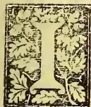

HAVE already shewn you how it is possible to combine Elementary with technical teaching, as in the Glen Allen School, even for boys of 6 or 7. I do not see why it should not be done here. But I have no desire to encroach on the province of the Director of Public Instruction, and very many innovations which I should like to see introduced into our school system of education, *i.e.*, the bifurcation of classes as in Germany and Italy into a classical and scientific side, the establishment of Kindergarten schools all over the island, the institution of at least one Manual Training School in which the American system of combining instruction in Science and Literature with training in Drawing, Modelling, Wood-carving and Workshop Practice could receive a fair trial—these and other such matters I refrain from entering on here for much the same reason—not to speak of the lateness of the hour.

I cannot conclude this part of my subject without reference to two papers which I hold in my hand: one, a rather elaborate scheme for Technical Education drawn up by Mr. Marsh, the organiser of the present series of lectures, so far back as 1876; the other a provisional scheme for a Technical School by Mr. Wall, thoroughly practical, and built almost on the same lines as those followed in the American Manual Training schools, but wanting the combination of Scientific and Literary courses of instruction with Art Training and Workshop Practice which forms such an essential

feature of the latter. Mr. Marsh's paper, originally published by the local Education Department, has been reprinted in a recent number of the *Literary Register*, and as a thoughtful well-matured proposal for the introduction and encouragement of Technical Education in all the schools throughout the Island, showing besides a clear appreciation of the industrial needs of the country, and a wise provision of the growing importance of Technical Institution 16 years ago, when there was barely any public interest aroused on the subject even in England, I have no doubt it will receive due consideration from the Government in any scheme that may be organised for Technical Teaching in our public schools. I regret that the lateness of the hour as well as the limits of my lecture preclude me from reviewing either of these papers here; but as they are both accessible to the public, I would commend them to your attention as well deserving of careful perusal.

And now to come to a conclusion of the whole matter. The problem of Technical Education for the people of this country cannot, in my opinion, be solved by any slavish imitation of Western institutions, however successfully conducted elsewhere. The method of education adopted must suit the *genius loci*—the character and aptitudes of the people as well as the resources and needs of the country. Any complete scheme of Technical Education will have to begin by modifying the instruction given to the children in our Elementary and Higher schools. Our schools are in one sense already technical in that the majority of the children are prepared (if the present one-sided grammar school training can be said to be preparatory in any sense) for the so-called liberal professions. Let them become avowedly and distinctly technical, in the widest sense of the word, *i.e.*, preparatory for special callings in after school life.

Let us recognize the fact that the classical system of our public schools, however suited as a preparatory training for the Universities and for the learned professions, is a stupid and senseless method as regards the majority of our boys who will have to fight the battle of life, not in the ranks of the learned professions but in the overcrowded fields of productive toil and industry. Let us recognize the fact that this system has been denounced by the oldest

855------------------------------------------------

42Magazine of the School of Agriculture.

educationalists of the day—Huxley and Spencer and Playfair and a host of other authorities—as “bookish,” “unpractical,” “one-sided,” “aimless,” and altogether unsuited to the industrial needs of the present day. Could there be a more sweeping condemnation of the classical system of teaching that obtains in the public schools in England—of which our best schools are but a poor copy—than that pronounced by Canon Farrar? In a lecture delivered before the Royal Institution, Canon Farrar, once Headmaster of Harrow, and for 13 years a classical teacher, thus expresses his deliberate opinion, arrived at in the teeth of the strongest possible bias and prejudice in the opposite direction—arrived at with the fullest possible knowledge of every single argument which may be urged on the other side. “I must avow,” he says, “my distinct conviction that our present system of exclusively classical education as a whole, and carried on as we do carry it on, is a deplorable failure. I say it, knowing that the words are strong words, but not without having considered them well. I say it because that system has been weighed in the balance and found wanting. It is no epigram but a simple fact to say that classical education neglects all the powers of some minds and some of the powers of all minds.”

Far be it from me to disparage the education to which, perhaps more than any other circumstance, I owe my present position and even the honor of appearing before you today as a Marsh Lecturer. I am not so ungrateful to my Alma Mater as to desire to lower by a single atom the standard of classical teaching in the only Government High School we possess—the Royal College. But while retaining the present curriculum for the highest forms which comprise perhaps most of the boys who are preparing for the Universities or for a liberal profession, I see no reason why every boy should be passed through the same mill whatever his future destination. The old plea which was accepted hitherto as sufficient to justify the retention of an exclusively classical, or a combined classical and literary training—namely, its value as the only known means of intellectual discipline—does not hold any longer. Science, Art and even Manual Training, has been found to answer equally well in a vast number of schools both in Europe and America, as a means of intellectual training, aye, and even superior to the classical system in many respects, since they embrace a harmonious all round education—fitted to cultivate all the powers of body and mind equally, while the latter stimulates and exercises but a few of the mental faculties only—memory and imagination and reason.

But a very small proportion of the boys of our schools can hope to enter the learned professions or proceed to complete their Collegiate education at a University, and already the cry is heard on every side that the professions are over-crowded. The same complaint is made with regard to the Clerical Service, in Mercantile Offices, in Banking Establishments. The supply is even greater than the demand, salaries are cut down almost to starvation point, and in the keen competition for the smallest vacant office the worst passions are aroused, while the man who is most to be pitied is the one whose lot is envied most by his unlucky competitors,

the respectable clerk or book-keeper who has to keep up a decent appearance and provide for his family on the salary of—a butler! I who have had more opportunities perhaps than any one else in this room to know what hardships and misery are being silently undergone by hundreds of families in our midst, with the bread-winner thrown out of employment in the struggle for existence, or striving desperately to keep body and soul together on a miserable pittance, thanks to the cast-iron system of education which sends him out into the world with no better preparation for the work of life than a knowledge of the three R's—the only working tools he possesses, or at most a smattering of “little Latin and less Greek,” I cannot find words strong enough to express my burning sense of indignation at the cruel wrong and injustice done to our children by the perpetuation of our unpractical, aimless, antiquated and altogether defective system of teaching.

When will our teachers and educational reformers recognize that the object of true education is not mental discipline only, but a preparation for the whole work of life, needing the cultivation of all the faculties and powers of body and mind—that the end to be attained is not culture merely but *practical power*—not dead knowledge crammed from books but living knowledge derived from life and experience?

All education is development it is true; but the mistake generally made is to limit it to mental development, and to ignore what should properly precede and follow, mental training—physical development. The unfolding of the organs of the senses and the powers of the body, and manual culture or skill in handling and dexterity in the use of tools when these powers and organs are sufficiently developed to act as fit instruments for the mind, leading to creative power and constructive activity; thirdly, æsthetic training or the development of the sense of the beautiful and a perception of the laws of Rhythm and Harmony comprised in Drawing and Painting and Music; fourthly, scientific training, to satisfy the craving to know to search into the causes of things, to inquire into the meaning of things, into the Nature and uses of the phenomena of the Universe, and from the world of Nature around us to the world of Nature within,—to the study of humanity and through various stages to the study of self-consciousness and the consciousness of the Divine.

It may be long before our present school system will be reorganized in accordance with the teachings of Science; but would it be too much to expect such a modification in our existing school curricula as to establish at least a relationship between school work and the occupations of after school life. Would it not be possible to introduce elementary technical instruction into every elementary school including Drawing, Physical Drill, Gardening and Singing Object lessons in elementary science and elementary woodwork, such as the Sloyd or Swedish system, so successfully introduced into English schools, and as I know even into very many girls' schools? The same or similar studies but in more advanced stages could be carried successively and continuously through each class and division of each school to the highest forms of the highest schools. While a Manual Training school in which chil-

856------------------------------------------------

*Magazine of the School of Agriculture.*43

children leaving the Elementary or Public school at 13 or 14, could continue for 3 years to receive general instruction in Literature, Mathematics, or Science, and special instruction in commercial subjects in a Commercial Department, and Art Training (Drawing, Carving, Modelling) in an Art Class, with workshop practice for all would form an intermediate stage leading up to the Technical School or School of Technology whenever it be founded. With Science and Art and Technology entering into the teaching of all the schools, with the education of the hand and the eye supplementing the education of the mind, with special schools for furthering Scientific Instruction, Art Training, and Technological teaching I can conceive of no better provision for Technical Education for the people, no scheme which will specialise instruction and bring it within easier reach of the masses, no better means of interesting children in their school work and enabling them to lead such full and rich and harmonious lives that "Mind and soul according well may make one music fuller, richer, more harmonious than before."

---

#### OCCASIONAL NOTES.

---

It is our painful duty to record the unexpected death of Sir Samuel Grenier, and to offer our deepest sympathy with those who are bemoaning his loss. Apart from the interest he showed in Technical Education in general, Sir Samuel evinced his concern in agricultural education in particular by offering a prize to be competed for by the students of the School of Agriculture. The deceased Knight was more than once present at our public prize-givings, and also supported our Magazine. Among the last, if not the last of public functions in which Sir Samuel Grenier took part, was the occasion of the inauguration of the "Marsh Lectures" at the School of Agriculture, when he occupied the chair.

By the time this number reaches our subscribers, the New Year will be upon us. To all we wish a year of happiness, to agriculturists in particular a season of plenty and prosperity.

The virus of glanders is said to consist of a bacillus, and if dry may maintain its vitality for six weeks, but in damp surroundings it perishes more quickly. Infected horses coughing and sneezing scatter the bacillus over the mangers and amongst the food of healthy animals, and thus it becomes ingested. Buckets, sponges or even harness used for the sick convey the virus. The bacillus, it is pointed out, thrives best in close warm stables, and finds less resistance in overtaxed horses, or those pulled down by influenza or other reducing disease. In Great Britain glanders, whether in its acute stage of development, or in its chronic type in which the horse may be still fairly fit for work, or in the form of farcy more or less pronounced, must now not only be reported on pain of penalties, but any animal found to be diseased by the Inspector when called in must at once be slaughtered. Infected animals and those that have been in contact with them will in future be immediately slaughtered, and half their values,

not exceeding £20, allowed. Suspects will be isolated, and if slaughtered and found free of disease full compensation will be paid for them. The requisite funds for carrying out the order will be obtained from Imperial sources. This order firmly and uniformly applied through the country is expected to exterminate glanders in a little more than a year. It has been estimated on good authority that glanders and farcy annually kill in London alone about 2,000 horses.

I would only have you remember, says Dr. Sims Woodhead, in an address before the Royal Physical Society, that an enormous amount of work has been done to prove that bacteria belong to the animal kingdom; it may, however, be generally accepted that they are to be transferred to the domain of the botanist. We must remember, however, that they are of a low form of protoplasm, and that although in certain cases they may be considered as having special functions, the general powers of protoplasm are most strongly developed in them, and that their specific powers are more readily affected than where development is of a higher order.

In a paper on "The Utilisation of Waste Produce of Forests and Woodlands" in the last journal of the Highland and Agricultural Society, the writer asks the question:—"Do we utilise to the fullest extent the by-produce of the forest and woodland, and so diminish waste and at the same time add to the general revenue of the Forest Department?" By waste products or by-products is meant anything other than wood, or of wood not in a condition in which it is generally used, and includes bark, charcoal, firewood, faggots for house use and for kilns, tar, woodspirit, turpentine, rosin, acetic acid, sawdust, wood-ashes, leaf-soil, &c. That much can be done both in the economy of production and utilisation of waste produce is well known to those in charge of woods and forests; and where the by-products cannot well be utilised in any of the abovementioned ways, better, perhaps, reduce them to ashes, for by so doing insect and fungus life are lessened, and a valuable manure, whether for grass or certain farm and garden crops, obtained in the ashes which are particularly rich in potash."

The annual home supply of bark in Great Britain is estimated at nearly 300,000 tons, but in addition to this some 30,000 tons are imported from the Continent. Tanning bark, though not at present a valuable product, will, it is stated, yield a good margin of profits even at the present low price of £5 10s. per ton for English bark (oak and to some extent larch) through careful and judicious management.

---

#### WEEDS.

---

A weed has been described as a plant out of place, and it is therefore true that what may be a weed in one situation may be a desirable plant in another. The question has lately been mooted as to whether certain plants that are wont to spring up continually in cacao, coffee and tea plantations are weeds or useful plants, useful in the sense that they check wash of soil, conserve and add to

857------------------------------------------------

44Magazine of the School of Agriculture.

the soil and its fertility, help the soil to retain rain water, and lastly when pulled up and applied to the land, in decaying, enrich it. The rapid growth of weeds, says Warrington, will greatly diminish the loss of nitrogen by drainage, and be of use in other ways as a green crop. When the weeds are ploughed in, the valuable matter stored up by them again becomes available as plant food. Here, however, Warrington refers to the growing of weeds on land not in crop, or rather on land between the intervals of cultivation. That it is desirable that some vegetation should grow on land in the absence of a regular crop, even though the clearing of such when it has taken a firm hold on the soil entails some trouble, no one will deny; but the question with us as regards such perennial growths as coconuts, coffee, tea, &c., is, whether it should be the object of the cultivator to keep his land always as clean as possible, or whether it would be to his advantage to allow a natural crop of weeds to spring up and flourish, and then, at some trouble and expense, clear his land and apply the weeds as manure. In this connection we may quote the words of Mr. Joseph Holloway who, writing to the *Ceylon Observer* on October 19th, says:—"I have the pleasure of stating that I have tested my system of using weeds for the saving of wash and also as a manure in the cultivation of coffee, cinchona, cacao and tea to my entire satisfaction, and am now carrying on the same system on this estate (Marakona estate) with marked success in the cultivation of cacao. The record of this experience of Mr. Holloway is most welcome and useful. Looking at the natural conditions under which weeds grow in a tropical country such as ours, it would seem that they were intended to serve some more useful purpose than is generally associated with them. In this country the natural agents would seem to favour the propagation and growth of weed to an inordinate degree,—wind, weather, and temperature assisting to the fullest extent in this work which is in a far less degree favoured by the same agents in temperate climes. No one can appreciate this difference more than he who has seen the operation of weeding in the course of cultivation in a temperate country and its lasting effect there; and has subsequently witnessed the weeding process and the unsatisfactory sequence of the labourious operation on land in our tropical zone. There is another consideration worthy of the student of Agriculture, and that is that the decomposition of weeds when buried is a much quicker process with us than in temperate countries. Again, from the fact that we cultivate perennials in a large measure, we have better opportunities for making use of this process of green manuring while the crop is standing than they who almost solely cultivate annuals and biennials, and nearly always plants (seldom or never shrubs and trees).

These considerations, we think, would warrant our cultivators of strong perennial shrubs and trees, in inquiring more closely into the functions which our various weeds are intended to fulfil in agricultural economy, and thus endeavour to avail themselves of any advantage which the fostering of weeds would appear to secure for them.

We know of one of two agriculturists, besides Mr. Holloway, who believe in this system of leaving their estates in weeds till the season arrives, which in their opinion is the right time

for their extirpation and interment; but Mr. Holloway would seem to us not merely to have been satisfied with noting the effect of this treatment of weeds in general, but to have studied the process more closely and to have observed that some weeds which appear to act more beneficially on land than others, deserve proportionately to be treated with more respect and to receive greater encouragement.

We have no doubt but that Mr. Holloway well recognises the fact, in spite of his prejudice in favour of weeds, that some of them such as "*Æluk*" and "*Atora*" (our tropical couch grasses) which, owing to their strong and rapid growth by means of penetrating and destructive but nearly indestructible ramifying underground stems, are formidable rivals in the struggle for existence in the battle of plant-life and effectually succeed in arresting the free and healthy growth of the more useful plants.

One of the "weeds," which Mr. Holloway's experience has proved to him to be beneficial, is the *Desmodium*, known and valued as a medicinal agent among the Sinhalese as *undupiyali* and among the Tamils as *sivan-coddie*. This, Mr. Holloway says, is in my opinion the best of manurial weeds, as it requires no cutting whatever and makes a thick covering on the top of the soil, and has a thick network of roots under the surface. . . . . It is the best (of three named) in manuring qualities.

Now Mr. Holloway, though as a practical man he will be quite content with the results of his experience, will have some satisfaction in knowing that the species *Desmodium* belongs to the order of leguminous plants, which the latest researches in agricultural science have proved to exert a most desirable fertilizing influence upon the soil, and that in encouraging its growth and in availing himself of its benefits as a fertilizing agent, he is proving himself a wise and economical husbandman.

---

#### SIDA FIBRE.

---

Of the family *Sida* belonging to the order *Malvaceæ*, we have six members indigenous to Ceylon viz., *S. Humilis* (Sin. Bevila), *S. Mysorensis* (Sin. Sirivedibevila), *S. Spinosa*, *S. Carpinifolia*, *S. Rhombifolia* (Sin. Kotikan-bevila) with a variety *S. Rhomboidea*, and *S. Cordifolia* (Sin. Binbevila). The first, second, fifth, and sixth are well-known in native medical practice, the roots and leaves being used as curative agents; but all these can be made to yield a fine white fibre which experts have pronounced to be a fitting substitute for silk. Half-a-century ago Dr. Roxburgh is said to have described the various species of *Sida*, and speaking particularly *S. Rhombifolia* and *S. Rhomboidea*, said that the bark yields an abundance of white delicate flaxy fibre. A report on specimens of fibre from these species was pronounced to "much resemble our best dressed jute. It is very attractive in its appearance; its silvery bright and clear colour, its great cleanliness, and its excellent condition are well exhibited,—much better indeed than the great bulk of jute which is exported to Europe. . . . I think from the length of the staple, its similarity to silk, and its great strength, that it would fetch a high price in England." Unfortunately no proper trials have been since made with

858------------------------------------------------

Magazine of the School of Agriculture.

45

the fibres though it has again and again been described as of excellent quality. Samples were sent from India to Dundee and Leeds for trial in jute machinery, but the result of such trial has not yet been made known.

The fibre-yielding plants of Ceylon are numerous, but no final opinions have been arrived at as to the value of the fibre of such plants from a commercial point of view; for their preparation in insignificant quantities in isolated places by rude methods, and as is generally the case only for the manufacture of rope, gives us little opportunity of judging of its merits for better purposes. In this connection the remarks of Prof. Goodale in his address on the "cultivated plants of the future," an abstract of which appears in the last Royal Agricultural Society's Journal, are very appropriate:—"Countless sorts of plants have been suggested as sources of good bast-fibres for spinning and for cordage, and many of these make capital substitutes for those already in the factories. But the questions of cheapness of production, and of subsequent preparation for use, have thus far militated against success. There may be much difference between the profits promised by a laboratory experiment, and those resulting from the same process conducted on a commercial scale. The existence of such differences has been the rock on which many enterprises seeking to introduce new fibres have been wrecked. In dismissing this portion of our subject, it may be said that a process for separating fine fibres from undesirable structural elements and from resin-like substances which accompany them is a great desideratum. If this were supplied, many new species would assume great prominence at once."

#### CEYLON PRODUCTS AT THE IMPERIAL INSTITUTE.

We are in receipt of a neatly got up booklet, being a Catalogue of Exhibits in the Imperial Institute from Ceylon. The catalogue was compiled by Dr. Trimen, whose services in connection with shows and exhibitions are known to be invaluable, and who must have been sorely missed while the collection for Chicago was being made. In the preface to the catalogue Dr. Trimen says:—"The following list contains such products of Ceylon as were sent in for the Imperial Institute by the Government Agents and their Assistants in the various provinces and districts of the colony, the Planters' Association, the Royal Botanic Gardens, and a few private persons.... During the process of arrangement many gaps and desiderata have become apparent; these it is hoped to supply in course of time." The booklet consists of 48 pages containing a list of 1,404 lots of specimens. Of those interesting from an agricultural point of view are first the items included under Class I, viz., raw food products consisting of 313 specimens of cereal grains (mainly varieties of paddy of course), 14 specimens of pulses, 16 of other edible fruits and seeds, 4 of edible roots, 31 of spices and condiments, and 10 of miscellaneous food products.

The Class II. comprises 5 specimens of exported drugs, 17 specimens of drugs from Jaffna, and 260 of medicinal plants from the Central Province.

In Class III., raw products not used for food or medicine, are included 11 species of oil seeds, 11

of gums and gum-resins, 14 of resins and lac, 3 of caoutchouc, 16 specimens of dyes, 20 of tanning materials, 57 of fibres and ropes, 98 of timbers and cabinet woods, and 6 of miscellaneous vegetable products.

The mineral products under the same class include specimens of laterite, granitic gneiss, magnesian limestone, limestone, sandstone, quartz, coral, coral-stone and lime, iron-stone, mica, plumbago and precious stones, besides kaolin and even "3 small pieces of gold"!

The coconut, areca and palmyra palms with their products take up each a section.

Among the prepared foods and estate products generally come tea, coffee, cocoa, pepper, cardamoms, cinnamon, cinchona, arrack, sugar and jaggery and flours and starches.

Under manufactured products other than foods are found the oils (20 specimens of fixed and 11 of essential oils), tobacco, &c.

The main object of the Imperial Institute being to further the commercial interests of the various Colonies and Dependencies of the United Kingdom, and to give those in the trade in England an opportunity of judging as far as possible of the merits of the various products by means of the specimens stored in the Institute, it would manifestly be an advantage to maintain the Colonial Courts in an efficient condition and to make the display of products in London as perfect as possible.

The "gaps and desiderata" mentioned by Dr. Trimen will no doubt be supplied before long.

#### SOME USEFUL SEEDS.

*Tokmari* is a plant found growing in the N.-W. Provinces of India, and is botanically named *Lolemantia Royleana*, its old name being *Dracocephalum Royleanum*. The seeds of this plant when soaked in water swell up into a jelly, in which form they are used by the Mohamedans for mixing with their sherbets, to form a cooling drink in hot weather. A writer in the *Indian Agriculturist* mentions that the mucilaginous portion of the seeds is used internally as a sedative on the mucous membranes of the respiratory passages, intestines and bladders, and that it also acts as a diuretic. Native physicians of India prescribe it in cases of bronchitis and dysentery, as well as in many other forms of disease. In the form of a demulcent poultice, the use of the seeds is said to be rapidly extending in the treatment of hospital patients in North India, as well as in private practice there. For this purpose it is asserted that the seeds have no equal, and arrangements have been made for sending samples of the seeds to Europe for experimental trial. In Calcutta they are sold at Rs 5 or Rs 6 per maund.

Sweet Basil (*Ocimum Basilicum*) belongs to the same order as *Tokmari*, i.e., *Labiatae*. This plant which was known to Pliny and other ancient writers, and which enters extensively into the superstition and romance of Southern Europe, is now naturalized in Ceylon. The seeds of sweet Basil are very like those of *Tokmari*, and also swells when wetted and become coated with semi-transparent mucilage. *O. Basilicum* is closely allied to *O. Sanctum*, the Sinhalese Madurutala, a well-known medicinal plant. There are many members

859------------------------------------------------

46Magazine of the School of Agriculture.

of this family indigenous to Ceylon, e.g., *O. Canum* (Sin. Hintala), *O. Suave*, *O. Adscendens*, *O. Gratisimum* (Sin. Otala), nearly all of which are used in Sinhalese medicine. *Plantago Isphagula* belongs to a family of which there is one indigenous (*P. Asiatica*) and one naturalised member (*P. Lanceolata*). Seeds of *P. Isphagula* were given to us by Major-General La Touche who spoke highly of their curative properties in cases of dysentery in the treatment of which he had never known them to fail. Many doctors in India and one or two in Ceylon had tried the remedy at the request of the General and found it very effectual.

*Salvia Plebia*, another Labiate, belongs to the sage family and possesses medicinal properties in its seeds similar to those of the seeds already mentioned, and *Tokmari*, *Sweet Basil*, *Isphagula* and *Salvia Plebia* are generally combined in Mohamadan prescription.

In this connection it may be mentioned that the roots and leaves of *Plectranthus Zeylanicus* (Sin. Eeriveriya) a Labiate, is one of the well known Sinhalese remedies for dysentery,—another being *Ptycotis Agowan* (Sin. Asamodagan). The latest number of *Imports* has under the head of new remedies the following reference to the last-named plant:—

“Agowan contains much thymol, to which it probably owes its medical properties. Dr. Waring regards this, of all umbelliferous seeds, as the most efficient carminative, and bespeaks for it a trial in cholera, in which, it is alleged, even in empirical practice it has done wonders. It has also been strongly recommended as a remedy for dipsonomia or alcoholism, and is worthy of further trial for this purpose. Applied externally, as a constituent of poultices, it relieves pain. The above refers to the well-known *Omum Seeds*. We prepare *Omum water* from these.”

Among the natives *Pimpinella Heyneana* (Sin. Wal-asamodagam), is used in place of the above. Allied to these two are *Pimpinella anicum* (aniseed), *Anethum graveolens* (dill), *Cuminum cyminum* (cumin) and *Carum carai* (caraway) all possessing carminative and aromatic properties.

#### ZOOLOGICAL NOTES FOR AGRICULTURAL STUDENTS.

The *Cysticercus tenuicollis*, slender or long-necked hydatid, is found in the abdominal or pelvic cavity of the sheep, the pig, the ox and the fowl. Its progenitor is the *Tania marginata* of the dog. It is found suspended, sometimes in large numbers, in an adventitious (nutient) membrane to the outside of the abdominal organs, most largely to the omentum (or caul, a membrane covering the lower intestines) and mesentery, presenting the appearance of bladders varying in size from a bean to a hen's egg and containing a transparent fluid. These hydatids are of less importance than are others that are found in the bodies of animals, and being situated on the outside of organs, they do not interfere with them functionally or mechanically, but all such bladders, says Professor Wally, should be carefully removed and effectually destroyed. If preserved they will, of course, be the means of propagating the tapeworm in the dog.

The *Cysticercus pisiformis* is found mainly in

the abdominal cavity of the rabbit and the hare, and in an immature state, in the liver of these animals. Its progenitor is the *Tania serrata* of the dog. It sometimes exists in such large numbers as to cause emaciation and death of its host. The abdominal contents of hares and rabbits should therefore be carefully removed and all discovered cysts destroyed. The tapeworm is however limited to the carnivora.

The *Cysticercus cellulosa* is found inhabiting the inter-muscular connective tissue of the pig, producing the condition known as measles. It exists in enormous numbers in the body of its host. Its progenitor is the *Tania solium* or solitary tapeworm of man. In addition to its being found in the muscles, it is sometimes located in very large numbers in the liver and in the spleen, giving that organ on section, a peculiar mottled and pitted appearance, and rendering it of a more solid consistency than normal. A careful examination of the peculiar greyish spot reveals their cystic character, and when the cysts are removed by the aid of a pin or a needle, a space is left behind. While the hydatid is found mainly in the pig, it sometimes finds a host in other animals, and is known to co-exist with the tapeworm in man. If the mouth of an affected pig be examined a row of translucent bead-like tumours may be detected on the lower edges of the tongue or between it and the lower jaw. When the flesh of the pig is cut up, the section presents a pale flabby appearance, and imparts a shiny feel to the fingers, it is soft and apparently dropsical. The bladder can be readily distinguished on close inspection of the muscles. If the hydatids have been in existence for a considerable period, their coats will have undergone calcareous degeneration and in this case a grating sensation is imparted to the knife on cutting.

The chalky condition just referred to is, says Professor Wally, frequently met with in hams both of home and foreign production. While the devouring of measly pork in a raw or semi-cooked condition by man would inevitably produce the tapeworm, such a result could be prevented by proper cooking, as a temperature of from 140° to 150° is sufficient to kill all forms of hydatids. That tapeworm infection of man from measly pork is of tolerably frequent occurrence is proved by the fact that the *Tania solium* is so often found infecting the human intestines; and this fact is sufficient to warrant the condemnation of all measly flesh.

The *Cysticercus Bovis* (beef measles) has its habitat in the muscles of the ox (mostly in the calf) in the same situation as that occupied by the *C. cellulosa* in the pig. It is, however, found to the greatest extent in the muscles of the haunch, and the muscular parities of the heart. As in the pig, so in the calf the hydatids are numerous developed in the mouth. Its progenitor is *T. mediocancellata* of man and it is—owing to the dirty habits of some of the natives—met with much more frequently in India than elsewhere. The remarks already made in reference to *C. cellulosa* of the pig apply in a sanitary sense to beef measles also.

The history of *Cysticercus Ovis* (mutton measles) has not yet been satisfactorily traced, that is to say the tapeworm from which it originates has not been identified.

860------------------------------------------------

Magazine of the School of Agriculture.47MORINDA.

In Handbook No. 6 of the Imperial Institute series, says the *Indian Agriculturist*, the article on Morinda in the Dictionary of Economic Products by Dr. Watt has been produced with the addition of an Appendix. *Al* (Morinda) root has been occasionally sent to Europe but no regular trade in the dye stuff appears to exist. Cloth dyed with *Al* is not attacked by white-ants, and on this account is used in India to wrap round the account books of baukers and shopkeepers, and it might with advantage be more generally used for book-binding and other purposes for which protection from insects is a desideratum.

Morinda is a genus of erect or climbing shrubs or trees which comprise about forty species, all tropical. Of these seven are natives of India, and three of Ceylon, viz., *Morinda Citrifolia* var. *Brachteata*, and *M. Tinctoria* (both known as *Ahu* among the Sinhalese) and *M. Umbellata* (Sin. Kiri-wel or Maha-kiri-wel).

Of *M. brachteata*, Thwaites says:—Not uncommon in the hotter parts of the island, in and near the gardens of the Sinhalese, who employ the root as a dye. The leaves are used medicinally by the natives. The stems of kiri-wel (*M. umbellata*) are used by Sinhalese villagers instead of rope for tying fences.

Dr. Watt, however, remarks that the variety *Brachteata* will probably be restored as a species by future writers, as the reduction of that plant to *Citrifolia* appears quite untenable.

*M. Citrifolia* is described by Watt as a small tree or bush, and as the most important economic species of Morinda, yielding by far the greater portion of *Al* dye of Indian commerce. The dye is yielded by this as well as other species of Morinda. *M. Citrifolia* proper supplies in its wood, root or root-bark the bulk of the material which is the chief source of the dye of commerce in India. The colours given by *Al* vary from a reddish yellow through a pink and various shades of red up to a dark brownish red. The dye contained in the root bark seems to be the best red, whereas that contained in the woody part of the root is more yellow than red, and consequently where the wood preponderates over the bark the resulting dye is reddish-yellow. In some parts the bark stripped from the stem of the plants, as also the twigs, are used for dyeing, but the dye yielded is inferior; while the juice of the leaves seem to be occasionally used as a dye for cotton, to which it imparts a reddish brown colour. The selling price depends on the fineness of the root, the thin roots being by far the most valuable. According to McCaun the price varies from R1 to R18 per maund.

GENERAL ITEMS.

The wood of the Pandauk (*Pterocarups Indicus*) which vies with the best Spanish mahogany in richness of colour and hardness, has for some time been exported to England where well-seasoned wood fetches as much as £10 per ton.

Brushes and mats made of coir fibre are being manufactured by special machinery invented by Mr. John Earnshaw of Greenwich at the works of Messrs. Price and Wadleigh, East Greenwich.

In his Presidential address at Haward University Prof. Goodale discussed the question of the likelihood of new cereals, fruits, and vegetables, fishes, dyes, and perfumes, and remedial agents supplementing or taking the place of those now employed. An abstract of this interesting address appears in the last volume of the Royal Agricultural Societies' Journal.

Attention has been drawn to serious disorders in stock traceable to the presence of castor oil seed in the so-called oil cakes, due to either carelessness or deliberate admixture. It has been suggested that in the case of cotton cake the presence of castor seeds may be due to the fact that the castor plant grows as a weed among cotton, and the difficulty of distinguishing between the two kinds of seeds. Stock-owners are advised to be careful not to allow castor poonac to lie near their cattlefood.

The price of ground-nut oil in Pondicherry as reported last month is R86 and 8 annas per candy of 529 lb. The estimated total value of the ground-nut oil trade for the current year is R1,118,828. The price of gingelly oil is given as R78 per candy.

There are, says the *Indian Agriculturist*, at the present day over 480,000 acres more or less under coconut cultivation in various parts of the world, and the ever-increasing demand for the products of this tree makes its cultivation a profitable undertaking.

No bird, beast or creeping thing, says an American paper, will touch a castor oil plant; it seems to be a rank poison to all the animal world.

The Veterinary referee of the *North British Agriculturist*, writing on distemper in dogs, says:—

The disease, as stated, must run its course. Good nursing is almost more important than doctoring, and treatment can only be directed to mitigate untoward symptoms. The patient should be restricted to simple digestible food,—mainly milk. Undigested food, which may prove a source of irritation, is best got rid of in the earliest stage by an emetic or gentle laxative. The animal, promptly removed from its companions, should have quiet, comfortable, airy quarters, which must be kept scrupulously clean, and disinfected daily. Several times a day the discharges from eyes and nostrils should be removed with tepid water and a sponge or piece of lint, the parts carefully dried, and sprinkled with a little dusting powder, which may consist of one part of boric acid or sanitas powder, with twenty of kaolin. Before the cornea becomes opaque or ulcerated, or other serious symptoms occur, professional advice should, if possible, be obtained. Difficulty of breathing or cough are combatted by steaming the head, hot compresses to the throat, and repeated doses of ammonia acetate solution and other stimulant expectorants. Gastro-intestinal catarrh is relieved by sodium hyposulphite, or by mineral acids and bitters. Diarrhoea is prevented from wasting the precious strength by a few drops of chlorodyne or of spirit of chloroform and laudanum. The irritable, eczematous skin is dusted with borax and starch, or moistened with glycerine and water, containing a few grains of boric acid. Anodynes

861------------------------------------------------

48Magazine of the School of Agriculture.

and antispasmodics are used to relieve the several nervous symptoms. From the outset, suitable food must be judiciously given to maintain failing strength. If the animal will not of its own accord take milk or other nourishment, he must be fed with spoon or bottle, receiving tea with milk, or beef tea, with which, after the third or fourth day, white of egg may be mixed. To maintain the action of the heart, a little wine or spirit may be required either with the food or

between meals. By early isolation of infected subjects and disinfection of premises, the spread of the complaint may be checked.

It is not improbable, says the *Indian Agriculturist*, that the service of the Swiss dairy expert, now in the employ of the North-Western Province Government, may later on be utilized by the military authorities for the establishment of dairy farms at selected military cantonments.

A decorative horizontal separator featuring two ornate, symmetrical floral and scrollwork designs. The design is centered on the page and consists of two identical, mirrored floral motifs. Each motif is composed of intricate scrollwork, leaves, and flowers, creating a symmetrical pattern that spans the width of the page.

862------------------------------------------------

*Added as a Monthly Supplement to the "TROPICAL AGRICULTURIST."*

# THE MAGAZINE

OF

# THE SCHOOL OF AGRICULTURE,

## COLOMBO.

Vol. IV.]

FEBRUARY, 1893.

[No. 8.

### MR. WALL'S LECTURE ON INVENTIONS.

*(Being the last of the series of Marsh Lectures delivered at the Museum on the 28th Nov. 1892.)*

**W**HEN I delivered the first lecture of this series, I had the honour of the patronage of the late Sir Samuel Grenier, who presided on the occasion, and I could not allow this occasion to pass, without paying a tribute of respect to his memory. By his untimely death the Colony lost a valuable and eminent public servant, and a most estimable man; but the cause of Technical Education lost its most powerful, and one of its most intelligent supporters. To him and the Honourable Mr. Mitchell is due the credit of whatever has been done towards establishing a Technical Institute on the foundation so well and practically laid by the late Director of Public Instruction, Mr. H. W. Green, and strengthened by his successor Mr. Cull. The present Government has given substantial support to the cause by its vote of R5,000, for the salary of a Technical Teacher; and while acknowledging our obligations, it would be unpardonable to omit honourable mention of Mr. Marsh, the originator of this course of lectures, for the service he thereby rendered to the cause of technical education and for the prize he connected with them.

In my introductory lecture, to which I have just referred, it was stated that the object of Technical Tuition is the application of the principles of science to useful purposes in the arts and manufactures; in other words, to promote inventions. For it stands to reason that men do not ransack the archives of science, and exercise their ingenuity merely for the purpose of perpetuating old methods and processes, but in order to improve

upon, or to supersede them by new ones; and that can only be done by means of inventions. Those who wish to pursue old methods for a living, will in future, as in the past, betake themselves to mills, factories and workshops, where they are pursued in the way of business; and if technical instruction be sought, it will only be the better to qualify them for those employments. Nevertheless, there are certain persons in the community, who, either from sheer opposition or from ignorance, persist in declaring that the proposed Technical Institute will be no more than a great big Industrial School. Argument would be wasted upon them.

It has been said that he who makes two blades of grass grow where only one grew before, is a public benefactor, and that is true, but he must also be an inventor. That extra blade of grass will not come by invocation, it must be extorted from the soil by the application of some adequate force, suggested by science, that is, by means of invention. In like manner, he who makes two bricks, two pairs of shoes, or two of any other commodity in place of one, or if he make the same things more economically or supersede them by something better, he is also a benefactor, who can only accomplish any of those useful purposes by the application of scientific principles, that is by invention. Seeing then that the ultimate object of all technical teaching is invention, it seems to me that invention would be an appropriate subject for this closing lecture of the series.

In order that we may all know precisely what we are talking about, it will be advisable, at the outset, to define what is meant by the term invention. In literature and in common parlance, it is usual to distinguish between discoveries and inventions, but in practice they are so mixed together, that it would be inconvenient for our present purpose to treat them separately. Moreover, the law

863------------------------------------------------

50Magazine of the School of Agriculture.

sanctions their being treated together, as it does not distinguish between them. And while speaking of the law, it may help to furnish a definition. For a patent is of the nature of a compact between an inventor and the Crown. The State desires to possess the inventor's secret, in order to prevent its being lost, as several important inventions have been, and also that the invention may not be worked only for the benefit of the inventor, but that the State may enjoy the advantage of its use, generally. On the other hand, the inventor is glad to be saved the risk and inconvenience of keeping his secret, and to have the advantage of the arm of the law for the protection of his rights.

It follows from this view of the matter, by implication at least, that an invention must fulfil four conditions. It must be new. It must fulfil a useful purpose. It must be successful, and the secret of it must be so fully disclosed in the specification, that any expert in the business to which it refers, should be able to carry it out, without any other help than that of the description given in the patent. These conditions are all essential. Indeed, it stands to reason that the secret of an idea that is not new, or which fails to fulfil its purpose would not be worth buying or preserving. These conditions thus restrict the meaning of the term within narrow limits, and show that many ideas that are patented do not prove to be inventions. The patent office therefore becomes a sort of lottery, in which there are many blanks and only a comparatively few prizes. This fact gives the key to the curriculum of Technical education. For, seeing that invention is its ultimate object, it follows that the teaching should be such as to secure success and avoid failure. Technical students are, in short, to be instructed in the secret of success and armed as well as warned against the causes of failure.

It would be difficult for me to prescribe a curriculum suitable to answer that purpose on the present occasion, and it would put your patience to too severe a test. I purpose therefore to illustrate the sort of instruction that is required, by means of examples of familiar cases of success and failure. In doing this, however, it will not be possible within the compass of a lecture, to give more than the merest sketch of each invention adduced, so much only in fact as will serve to indicate the secret of success, or the cause of failure.

The first example I shall adduce is one of the greatest and most illustrious achievements of the human intellect, the invention by Sir Isaac Newton of the law of gravitation. You know it is said to have been suggested to his mind by the fall of an apple. And no doubt it was so, but the wonder is, that the fall of an object in a straight line to the earth, should have suggested the law that regulates the motions of the planets, in elliptical orbits, round the sun, and that of the satellites round their principles. We may perhaps take a step to help towards that grand conception by considering that when the apple was liberated, and fell perpendicularly to the earth, it had no motion of its own, and obeyed the single force of attraction to the earth. If, however, at the time of its liberation from the tree, it had possessed a motion of its own, at right angles to the straight line of its fall, and supposing that force was just equal to the force of attraction, then, instead of reaching the ground in a direct line it

would have obeyed both forces and would have reached the ground in a curve at a distance equal to the length of the fall. Similarly, if the rectilinear force it had when liberated was twice as great, the distance at which it would have reached the earth would have been correspondingly great. It is thus conceivable that the object might have possessed a force so great that it would not reach the earth at all, but would either go circling round it, in a more or less elongated ellipse, or escape from it in a parabolic curve into space. Such in fact must have been the mighty conception of the inventor of the law of gravitation. To test his theory, he resorted to various expedients, which confirmed its truth, and at length, being so far satisfied, he applied the theory to the motion of the moon, with which he was well acquainted, as it had been long known by observation. For the purpose of this test, however, it was necessary to ascertain the magnitude of the earth, and this he obtained from the French savants, who had computed it from a measurement they had made of an arc of a meridian. With this datum, Sir Isaac proceeded to ascertain if the moon, in her orbit round the earth, obeyed his new law. Alas! The test failed. The invention was laid aside, and for 16 years remained in abeyance. At the end of that time, the French philosophers, being distrustful of the accuracy of their first measurement, induced the Government to institute another and much more careful one. This gave the earth a magnitude considerably different from the first; and when Sir Isaac repeated his trial of the moon's motions with the new datum they were found conformable to his law, and he therefore disclosed to a wondering world the grandest invention science had ever suggested to the human mind.

This example shows the importance of employing reliable data. For Sir Isaac's first failure he was not himself responsible. Nevertheless, his experience affords a useful lesson on the employment of data in inventions. But this example is cited mainly for the wonderful power of logic; that is, of reasoning that it exhibits, and the still more remarkable resources of calculation that were brought into requisition. These, and the marvellous industry, perseverance and patience he devoted to his task, constituted the secret of Sir Isaac's success. Such are the lessons taught to technical students by that illustrious example.

The next example to which I will ask your attention is one which has probably affected the progress of mankind even more than the one just mentioned. The *steam engine* prior to Watt's time was comparatively of little use; but in his hands it was converted into a most powerful agent in the progress of the race. It is true that it has since been improved, in many ways, and has been the subject, probably of a hundred patents. Nevertheless, all those features of Watt's invention on which its efficiency depends are, at this day, exactly the same as he left them. The crank, that beautiful contrivance for regulating the movements of the piston in the cylinder, and preventing it from alternately butting against the ends serves its purpose so admirably that it must persist for all time. The parallel motion, which adapts the linear motion of the piston rod to work in harmony with the curved motion of the end of the oscillating beam, solved a great problem; and though the piston rod is not guided

864------------------------------------------------

Magazine of the School of Agriculture.

51

in an absolutely straight line, its motion approximates to one so closely that it has never needed to be improved. Indeed, it is worthy of note, that a mathematically exact solution of the problem of drawing a straight line by mechanical means was not obtained till so lately as 1865, and then it required seven links, whereas Watt's has only four. Again, the eccentric and slide valve are used to-day as Watt used them, and the condensing process with its appliances is also in use in the form he gave them. In short, the Steam Engine, as Watt invented it, went at once into universal use, and will ever remain as one of the grandest and most successful efforts of human genius under the inspiration of science. The steam engine is especially an example of resource and technical knowledge, that is of the application to useful purpose of scientific principles; and therefore affords one of the most instructive illustrations of invention the technical learner who is desirous to learn the secret of success can study.

Before passing on to further illustrations, it will be useful to point out a common characteristic of the two inventions that have been briefly sketched. Few are the inventions which are brought forth at their birth, as were these two, in a state of maturity. By far the greater number pass through many successive stages, and owe their maturity to many authors. Of the few that were matured at the outset, or, as the surgeons would say, by the first intention nearly all are simple, as the vacuum pan for sugar boiling, or the hot blast for smelting. Instances like those of Newton and Watt, which involve vast research, and require boundless technical resource, are rare indeed and should be distinguished as the greatest triumphs of technics.

The next illustration is rather of an introductory nature, and, in fact, not so much to an invention as to the thoroughness of the preliminary measures that were taken for one in prospect. The gentleman who was induced to investigate the subject of small arms, with a view to ascertain the true principle of constructing them, commenced his work by indenting on the patent office for specifications of all the patent that had been taken out in connexion with gunnery for 150 years! He was determined to know all that his predecessors had done or tried to do. This vast pile was consigned to his assistant, to be analysed and condensed into a formal précis. This work, which occupied a quire or two of double elephant drawing paper, to make room for the numerous columns representing separate parts of a gun, was a formidable undertaking. In due time, the work disclosed many points of interest in the history of gunmaking, and it will be worth our while to consider two of these points, for their bearing on our subject.

James Puckle, it appears, obtained a patent in 1718 for an excellent design for a revolver. The principle was intended to apply to small arms as well as to pistols. Now, seeing that in 1854, when that précis was made, the modern revolver was of quite recent date, the question arises as to the cause of more than a century's delay in the production of the invention. The answer is simple. Mr. Puckle was before his time. His invention could not be carried out with accuracy with the appliances then in use.

He lacked the technical knowledge of existing means of construction. Here is a lesson to technical students, showing that a vital element of the success of an inventor is an intimate and practical knowledge of the constructive capabilities of the tools and appliances practically and thoroughly. For want of this knowledge Puckle failed.

The other point suggested by the précis is very curious. It refers to at least three or probably more patents that were obtained, at considerable intervals of time, for the same idea, which had evidently captivated in turn several minds independently one of another. The idea was to let air into the breach simultaneously with the ignition of the charge. Presumably, the idea was to strengthen the combustion. It does not appear to have occurred to the inventors that in letting air *in* they would let the explosion *out*. Even, however, if any one of them had contrived to introduce air, without opening the breach, the failure would have been equal. I cite this remarkable example to warn students against applying or attempting to apply scientific principles, without a thorough knowledge of them and therefore without perceiving their applicability or otherwise to a given purpose. The men who patented this strange invention must have been very much in earnest, for the cost of the great seal alone was £120, in those days, beside other fees. They were right in their idea that oxygen stimulates combustion, but they were utterly wanting in the technical knowledge of the conditions to which they proposed to apply that idea. Hence their utter failure.

Turning now to the particular invention for which that précis was wanted, the construction of small arms, the subject was then engaging much attention. The Minie rifle had caused much sensation. Notwithstanding the high standard that had been attained in the construction of guns, however, there were no means of ensuring their all shooting alike. In those of the best makers there were unaccountable irregularities. A number of the best gunmakers were examined by a committee of inquiry, but without arriving at any satisfactory result. Lord Hardinge therefore induced Mr. Whitworth to undertake an investigation, by means of his known appliances for accuracy of work. The précis, just mentioned, was his first preliminary, and while it was in progress he visited the Enfield gun factory, to learn all that it could teach. The Enfield gun was an excellent weapon, and it was made in great perfection, and with the utmost secrecy, at that Government factory. Mr. Whitworth was, of course, to be informed on every point he might inquire into. He and his assistant first visited the forge, where the barrels were made in the rough. Holding one of these rough pipes in his hand, Mr. Whitworth remarked aside to his assistant, that its imperfections could never be entirely eradicated, but would cling to it, in some degree, to the end, and he said: "To end right, one should begin right." A. "Then you would begin with a solid bar." W. "Yes." A. "And how would you insure truth in boring?" W. "What should hinder?" A. "Any irregularity in the texture of the metal." W. "True, but, I would employ homogeneous metal and anneal it perfectly." The walk through the factory suggested

865------------------------------------------------

52Magazine of the School of Agriculture.

nothing to men so familiar with all mechanical work as these visitors, and therefore nothing arrested their attention, till they came to the *viewer*, a highly skilled workman, whose business it was to *view* the barrels in order to test their straightness. This he did by looking through them at a pane of glass in a window opposite. The upper part of the pane was blackened down to a line of perfect straightness. By directing the barrel on this line it was reflected on the sides of the brightly polished bore of the barrel, the upper half of which was thrown into shade and divided from the lower and fully illumined half by the reflection of the line on the pane. Now, in looking through the barrel, its whole length was foreshortened into a space of about half an inch on each side, and therefore any crookedness, however slight, was magnified and made perceptible to the experienced eye of the viewer, who corrected such errors as he discovered by delivering one or more blows of a wooden mallet on the barrel, as it lay on a wooden anvil. Corrections so made for Mr. Whitworth's special information seemed to be very effective, but he remarked that those blows dislocated the molecular structure of the metal, and were, beside, but partially effective.

It would be beside my present purpose to describe all the exhaustive experiments that were carried on in the shed at Rusholme, 500 yards in length, with all appliances and apparatus, and it would take up too much time. Suffice it to say, that when twenty of the new Whitworth rifles were produced at the Wimbledon meeting, and when Her Majesty, on being asked to inaugurate the occasion by firing the first shot, electrified Lord Elcho by asking if she should be certain to hit the bull's eye. Mr. Whitworth's reply was well-known. "Tell her Majesty she shall hit the bull's eye!" He accordingly laid the gun and Her Majesty fired the shot and hit the bull's eye within half an inch of the centre. Here is one of the greatest triumphs of purely technical skill on record. Let the technical student mark the preliminary care observed in the *précis*—the exhaustive trials—the sound reasoning—the intimate knowledge of the behaviour and characteristics of the metals—and the perfect command of constructive resource which this inventor possessed, and he will then understand the secret of that remarkable success. Failure was barred out at every turn of the exhaustive research. There is a mine of lessons for the technical student in that pregnant example of mechanical skill and research.

The next illustration I take is one of those rare instances, to which allusion has already been made of an invention produced in maturity at its birth. It is beautiful in its simplicity and success. A certain dock gate, of ponderous dimensions, that had to be opened once a day, required the power of 300 horses engine to open it; but, as the work only required the service of the engine for a few minutes daily, Mr. (now Lord) Armstrong devised a better plan. He erected a tower with a cistern at the top, of a height to give the requisite head of water. He then employed a small engine to pump water into the cistern. It had all day for its work, and when the gate had to be opened the whole accumulated contents of the reservoir were brought to bear on the work.

Thus a 10 or 20 horse engine was made to do the work of one of 300. Similarly, when a number of cranes were all actuated by one engine it was often brought up to a stand, when two or more cranes were simultaneously, but the inconvenience was simply remedied by a hydraulic. Even if all the cranes happened to be at work simultaneously, there were no stoppage, but only a heavier drain, for the time, on the supply of water in the cistern.

Now this same inventor, so successful in the work just mentioned, and who has since been so distinguished by others of equal value, failed in his next invention. The first Armstrong gun had a multigrooved bore and a lead coated projectile. The lead was intended to be forced into the grooves by the explosion, and to give the projectile the necessary axial rotation, to insure the accuracy of its flight. For this purpose it proved to be too weak; and the angle of the rifling had to be reduced below the most effective one. Even then, the lead and the iron had no cohesion, and being of very different specific gravities, they often parted company in flight. If I am not mistaken, a battery of these guns was taken into the field and misbehaved. That form of gun was therefore abandoned, and it is now cited to show the importance to an inventor of a perfect knowledge of the character, strength, and behaviour of the materials he uses. A lesson is also contained in this example of a lack of technical knowledge, even in an eminent technist, and of the need there is for special examination of the materials that an inventor purposes employing for a new purpose.

Whilst on the subject of material I may adduce in illustration a most important invention, which turns entirely upon the special application of a new material. Many attempts had been made, unsuccessfully, to construct a cable for submarine telegraphy, until guttapercha was tried, and that material solved the problem successfully and permanently. The first account of guttapercha was in a French periodical, *La Technologiste*, about 1838. It was there described as somewhat resembling caoutchouc, but wanting in the elasticity that gave that substance its chief value. It was said to be suitable for moulding into picture frames and such like purposes! How little could the writer of that paragraph have imagined the incalculable importance it would come to possess and the revolution that would be wrought by its agency. Here is a lesson to the Technical student, of the importance of an intimate acquaintance with materials of every kind, and their properties. The success or failure of the greatest invention may, as we have seen, be determined by the use of a material suitable to a particular purpose.

It has already been stated that the great majority of inventions are of a progressive character: beginning with a comparatively crude idea, and improved upon by successive steps, and in many cases reaching maturity by contributions from many inventors. From the great mass of illustrations that might be adduced of inventions of this kind, I select a few only. First on the list are *printing* and *photography*, which will be treated together, because of the contrast they afford of the slow development of the former, owing to secrecy observed by its inventors, compared with the rapid progress of the latter, under the modern

866------------------------------------------------

Magazine of the School of Agriculture.53

regime of publicity. There may probably have been as many as a hundred patents in the maturing of photography, and a great number of different contributors. They followed each other at first slowly but in recent years the development of the invention has been indicated by rapid progress. The last achievement of the art that has come under my notice was a set of illustrations in the *Revue des Sciences* of photographed cannon shot in flight. They are the greatest triumphs of instantaneous photography yet accomplished. The *electric light* is another instance of progressive development, and it seems to be yet far from the maturity which may be hoped for it. The *aniline dyes* afford another and important illustration. Commencing when benzole, an essential ingredient was obtained from tar, its use as a dying material was taken up successively by chemists, and then by practical dyers, until the aniline dyes came into universal use. The last illustration of this kind to which I will invite your attention, is the very familiar *sewing machine*. Many attempts were made before success was attained. Embroidery was done mechanically long before proper sewing was done by machine. The problem was solved by Elias Howe in 1846. His machine was mechanically imperfect, but it contained the one essential feature, without which no true sewing machine is practicable, that is: a *needle with the eye in the point*. Fortunately, the inventor included this item in the claim under his patent, and though the mechanical arrangements of his machine were little esteemed and were speedily superseded, the sum he received and heartily merited was, over 2 million dollars. The problem once solved, a great many improvements were made, and accessories were added, until the invention reached its present perfection, and its application extended to all kinds of sewing, including every kind of fancy stitch.

This last example would serve equally to illustrate those inventions which have for their object to substitute mechanical contrivances for the use of the human hand. These constitute the great majority of all mechanical inventions. There are scarcely any manual operations of importance, for which machinery has not been adopted. Time would fail us to adduce adequate examples of this class. We may mention two however, which afford lessons to the technical student, not suggested by those already given. One is that of an invention to supersede corks for closing bottles by substituting a screwed stopper to be used with a washer of indiarubber or cork. The inventor, a wealthy old retired merchant, expatiated on the convenience his invention would afford, especially for champagne and effervescing drinks from which a glass could be taken and the bottle resealed. After having secured his patent, he took his invention to a bottle manufacture, who showed him that his plan was impracticable by the usual method of making bottles, and would require a special apparatus. For this the patentee had to seek the help of a mechanical engineer, who supplied what was necessary. Otherwise, the invention would have died at its birth. The other example is one in which two inventors simultaneously invented the means whereby the driver of a Hansom Cab could open or shut the doors of his Cab without moving from his seat. The two inventors worked independently, and

neither knew of the other's proceeding. Eventually, the one who was senior, by a few days only filed his specification, and the other followed immediately after. Their inventions were substantially different, but had one feature in common., This feature the former, who was an amateur, claimed as part of his invention, not knowing that it was in common use. The other, who was an expert, avoided that mistake, in consequence of which the later patent was good and the former was invalid, by its having claimed as a novelty a well-known expedient, the universal joint. These two examples show the importance to inventors of a thorough acquaintance with the processes and designs they propose to improve upon, and also to be conversant with all the mechanical expedients in ordinary use, lest they should claim as a novelty one that is well known.

The foregoing examples and illustrations are adduced to give a general idea of the commonest causes of failure, and the general conditions necessary to success, and they are to be considered only in their bearing on these points. It was deemed necessary for this purpose to select such inventions as are either well known, or were easily understood, and would therefore convey clearer ideas than others less popular, that might have afforded more striking evidence. They show, in general terms, that there are three principal qualifications for successful invention, namely:—

First, a knowledge of *constructive powers, tools and appliances* for giving effect to the inventor's ideas. Puckle and the inventor of the bottle stopper failed for want of this qualification, and Whitworth succeeded mainly by virtue of his intimate knowledge of what could be accomplished by the means he could command.

Secondly. A knowledge of *metals and materials*, their capabilities, and special qualities, and adaptability to the purposes required. The submarine cable is a notable instance of success, and the lead-coated projectile of failure attributable to this cause.

Thirdly. An inventor must be thoroughly acquainted with all the available devices and expedients by which required *mechanical movements* may be produced. This knowledge is indispensable, and is called into requisition in almost every mechanical contrivance for superseding hand labour. Almost all the complex movements of the human hand may be simulated by suitable mechanical expedients, as may be seen well illustrated in the common sewing machine, and still more perfectly in some other machines well-known in the mother country which have not yet been introduced here.

In order that technical students in Ceylon should acquire these three essential qualifications for successful invention, it will be absolutely necessary that they should have access to a museum or gallery of illustration, furnished with working models of machines, tools, materials, and appliances, that will exhibit this essential information practically, not merely by seeing them, but by close investigation and dissection. It is as essential to the technical student that he should dissect machines, tools, and contrivances, as that the botanist should investigate the various parts of a plant, or that the medical student should study the anatomy of the human frame by operating on the human corpse. It is not enough that

867------------------------------------------------

54Magazine of the School of Agriculture.

he should see the performance of a machine, he must know how it is effected, and the means that are employed. The necessity for workshops, as accessories of a technical institution, needs no insistence, as they afford the *only* means of acquiring a practical knowledge of the uses of tools, and of some at least of the properties of materials. The workshop is as necessary to a practical knowledge of mechanics, as a laboratory is to the chemist. A technical institute must be, above all things, *practical*. The student who possesses only book knowledge would have no chance as an inventor in prosecuting his experiments and researches.

It is not necessary for me to emphasise the importance of a student's thorough knowledge of *drawing*, because that at least is fully acknowledged, and has already been introduced into most schools. It is in fact the *language of invention*. Nor is it necessary to point out the necessity of a thorough grounding in that kind of close reasoning that Euclid teaches, for, as drawing is the language of invention, *logic is its grammar*.

---

#### OCCASIONAL NOTES.

"An Essay on Farmyard Manure" is the title of a pamphlet sent to us by the author, Mr. E. T. Hoole, Agricultural Instructor. The subject is fully and intelligently dealt with, and is evidently treated of with the object of impressing upon the cultivators of Ceylon the importance of conserving and utilising to the fullest extent the droppings of all animals kept on the land. It is the complaint of the scientific agriculturist everywhere that there is great negligence on the part of the ordinary farmer in the treatment of farmyard manure, and to the wasteful system now in vogue among the natives of Ceylon must in a great measure be attributed the unsatisfactory results of their cultivation. We trust Mr. Hoole's pamphlet will have a wide circulation, and be the means of working the reform at which it aims.

---

We were glad to note that the Assistant Government Agent of Matara had taken steps to exterminate the insect pests that devastate the paddy crops in this district, and that his efforts have proved successful. We have not been informed what form of spraying apparatus Mr. Le Mesurier has been using, and whether it was imported or is of local manufacture. If the latter, it would redound to his credit to have contrived a machine which is reported to work so successfully. The School of Agriculture is in possession of a patent spraying apparatus known as the "Eclair" knapsack machine. It consists of a copper reservoir or vessel holding 26 pints made to fit on to the operator's back, being fastened there with straps like a knapsack. A rod traverses the lower part of the reservoir inside, being worked by a lever with the operator's hand. This does not move a piston as in ordinary pumps, but acts upon an india-rubber diaphragm, by whose sucking action

the liquid is forced through the delivery tube with great force. The liquid can be delivered in the finest spray in any direction. The machine, which has worked well on trial at the School, ought to do well for infested paddy-lands.

The School of Agriculture re-opened after the Christmas holidays on Monday the 16th January. Fifteen new students have been admitted. There have been some changes in the teaching staff: Mr. Jayawardene, late Headmaster has resigned, and Mr. W. A. De Silva at present in Bombay prosecuting his veterinary studies has been appointed to succeed him. Mr. D. A. Perera of the Ratnapura Government School has been appointed 2nd assistant and acts for Mr. Silva, while Mr. Hoole, Agricultural Instructor comes to the School as permanent 3rd assistant. Mr. P. S. Rodrigo, who has been connected with the School for over 3 years, during which time he won the highest respect of the students and the confidence of his superiors, takes up the duties of Headmaster of the Kadugannawa primary English School.

---

There was no public prize distribution at the School last year. The following is a list of the prizemen:—Among the Seniors: Nallatamby and Abeysekera in Agriculture, Savarimuttu in Veterinary Science, Gunawardene in English and Mathematics, Abeysekera in Science, Romiel in Practical Chemistry. Among the Juniors: Cooray in English and Mathematics, Fernando for Agriculture and Science.

---

#### FARMYARD MANURES.

A pamphlet of 15 pages on this subject, written by Mr. E. T. Hoole, late of Happy Valley and at present Agricultural Instructor at Bandaramagama, has reached us. Mr. Hoole explains at the outset that farmyard manure is a general manure, because it supplies all the elements of plant food in convenient proportions. One of its many advantages he notes is that in the natural course it decomposes but slowly in the soil and gradually yields up its stores of plant food. This advantage is of special importance with us where heat and moisture favour the decomposition of organic substances, while our copious showers have a tendency to wash out of the soil the soluble ingredients of plant food. Again, we have no cheap substitutes for this manure as is the case in western countries where many refuse nitrogen-yielding substances are manipulated into products of manurial value, such as shoddy, hair, skin, horns, leather, blood, &c. Now it is beyond the means of the ordinary cultivator to import or locally purchase the so-called artificial "guanos," and while bones are used by them to some extent to supply phosphoric acid, and ashes or leaves are utilised for the other valuable ash constituents which they contain, without farmyard manure there is no convenient means of appreciably adding nitrogen-yielding material to the soil. For these and many other reasons which Mr. Hoole has not failed to notice, it is most important that our cultivators should exercise the greatest care in pre-

868------------------------------------------------

Magazine of the School of Agriculture.

55

serving and utilizing to their fullest extent all the droppings of the animals kept on the land. The manner in which cattle manure is allowed to lie exposed to the severity of the weather when, at a small cost, a covering can be provided which will be the means of preventing any loss of the valuable ingredients the manure supplies, cannot be too strongly condemned. Mr. Hoole gives special hints of an instructive nature as to storage, preservation, and application of farmyard manure. The pamphlet under review has the special merit of being a simple treatise, free from scientific details, and it is intended to have selections from the essay rendered into the Vernacular for the Sinhalese Agricultural Information Leaflet which is so widely circulated. We quote the following passages specially referring to our native cultivators:—"In conclusion let me point out the great ignorance and negligence that exists among most of our countrymen about farmyard manure. They are blind as regards its valuable qualities. True, some of them manure their fields and gardens with it; but this is more the exception than the rule, especially in the South and West of our Island. It is astonishing to see the reckless manner in which valuable manure is wasted by the majority of our goiyas. They care nothing for the large quantity of droppings that may be had on the roads and compounds and from the public cattle stalls. This indeed is bad enough, but it is shocking to find that they do not make cattle sheds for housing their own animals at night and collecting the manure. They are sometimes tied in the open; but very often they are left to wander about on the roads, jungles, meadows, &c. Many villagers seem to have a prejudice against the use of farmyard manures.....One reason why the Jaffna paddy-fields are more productive, notwithstanding the natural drawbacks in the soil and climate, is the extensive use of farmyard manure. The cultivators of the North avail themselves of every scrap of manure procurable and turn it to good account. But even there several improvements are necessary, especially in the making of manure and the preservation of the manure heaps.

"The village farmers all over our Island must be taught better about farmyard manure. They do not know its real virtues. They either neglect them through laziness, or lose them through ignorance. Some are still unaware of the fertilizing character of the liquid portions of farmyard manure. I have even seen people scrupulously thinning aside bits of straw soaked with urine, lest they should deteriorate the manure. They leave their manure heaps to the mercy of the elements; and many a time you may have seen cartloads after cartloads of dry, rain-washed, worthless stuff emptied into the fields as farmyard manure and applied to them with feelings of perfect satisfaction.

"All this is very deplorable and calls for the aid of enlightened scientific knowledge. It is therefore our duty to show our lazy and ignorant countrymen both by precept and practice—by example and instruction—the real nature and value of farmyard manure, and the proper method of preserving and utilizing it to the best advantage."

## THE STUDY OF FORESTRY.

Professor McAlpine, of Edinburgh, in delivering the opening address of the Forestry class in the Glasgow Technical College, stated at the outset that there were three situations in which plants were grown—(1) in the field, (2) in the garden, and (3) in the forest. The man who produced plants in the field was the agriculturist; in the garden, the gardener; and in the forest, the forester. With plant production in the field and in the garden they had there nothing to do; their business in that class would be with the plants in the forest, and in the forest alone. In dealing with forest production, the skill possessed by the forester determined, to a very large extent, the profit realised. There were, however, two kinds of skill—the practical skill gained from long experience, and which had, he was bound to say, reached a high degree of perfection in Great Britain, and the skill to be derived from a genuine scientific knowledge of the principles underlying the growth and production of trees in the forest. Practical experience was, no doubt, valuable, but it only carried them up to a certain point; they were still without a thorough knowledge of, and the reasons for, the different changes that took place in the course of the growth of forest trees. It was quite evident that the best forester, and the one that could attain to the highest maximum profit in the production of timber, was the man who combined practical with scientific skill in his practice. In these days of keen competition, it was necessary in forestry, as everything else, that they should produce the best quality at the lowest possible cost, and this could not be done unless their knowledge was good and sound, and their methods of the most economical and satisfactory description. Scientific skill in forestry had often been regarded as of no practical merit, but without it the maximum profit could not be realised from the trees. In that class he proposed to tell them something of what science and scientific knowledge had to do with the subject of forestry, and he proposed to deal with it under two leading heads—(1) forest botany, and (2) the forest itself. The great object of the forester was to produce timber, and to him the plant was a lignin-making machine. This lignin, the characteristic constituent of wood, was easily identified by the red colour produced by the action of phloroglucin and hydrochloric acid. Wood, taken as a whole, was a combustible mixture, composed chiefly of the three elements—carbon, hydrogen, and oxygen. In introducing such a subject as the scientific study of forestry, it was important to know what timber was made from. It was very often stated, and very widely supposed, that the organic matter, or humus, in the soil was the substance used by the plant for timber production. Such a doctrine was quite untenable, since the amount of humus was not diminished by the production and growth of trees, but was, as they must all know, rather increased. The method of water culture also proved beyond a doubt that the constituents actually employed by the tree plant for the production of its woody substance were water from the soil and carbon dioxide from the air. He had himself seen in Germany, where, as they knew, great attention was devoted to the production of the best class of forest timber, a pair of alder trees

869------------------------------------------------

56Magazine of the School of Agriculture.

which had been grown from seed by the method of water culture. These trees when he saw them had attained a considerable height and girth, yet they had only received distilled water and certain mineral substances, the carbon dioxide they wanted being taken by themselves from the air. That was a very remarkable thing, and, seeing that these substances cost so little, they would naturally be inclined to think that there must be a large profit in timber-producing, and no doubt there was, if a suitable supply of plant food could be got readily, and the plant skilfully and carefully managed. Dealing next with the function of the wood in the tree, the lecturer said there were two main purposes to be accomplished, viz., the upward circulation of water, and the carrying of mineral matter. The duty of carrying the water and the mineral matter up the tree devolved on what might be called circulating pipes or wood vessels, and circulating cells or tracheids. Wood, in addition, played the part of a skeleton, and this duty devolved upon the woody fibres or tracheids, the most solid constituents of timber. Associated with the circulating and skeleton apparatus were the servant cells to feed the wood cells, and to aid in pumping up the water into the circulating apparatus. Different kinds of wood had (as the lecturer showed by means of large diagrams on the wall) these structural elements differently arranged. The ash, elm, oak, and chestnut were stated as being amongst the woods which had the larger sized pipes for circulation purposes; the beech, hornbeam, alder, and sycamore had medium sized pipes; while in the case of coniferous trees like firs, pipes were entirely absent, the work of circulation devolving upon the cells or tracheids. Alluding next to the formation of wood, the lecturer explained how the cambium, the part between the wood itself and the separable bark, added rings of wood year by year. On the activity displayed by this cambium depended the quality of wood produced per annum. Its proper feeding was accordingly of great importance, and the forester should see to it that an adequate supply of food material was not prevented from reaching it by the presence of too many branches. When too many branches were growing on a tree they carried off the food that ought to go to the cambium, the result being that it became very slow in its action, and wood was added to the main and important part of the tree at a much slower rate than it would otherwise be. As regards quality of wood, it was pointed out that this was to be secured, as a rule, by diminishing the amount of thin-walled wood in certain trees and by increasing the proportion of thick-walled wood. Thin-walled wood was mostly of spring growth, and the thick-walled of autumn growth; therefore it ought to be the business of the forester, if he wanted the best quality of wood, to encourage growth in the autumn rather than in the spring. The lecture was effectively illustrated by means of several large wall diagrams, also models and specimens, showing the construction of some of the most important timbers.

#### GENERAL ITEMS.

The *Indian Agriculturist*, speaking of the newly-appointed Agricultural Chemist for India, says:—Dr. Leather is, we believe, a young man with a reputation still to make as an agricultural chemist... Dr. Leather was, we believe, only an assistant in his (Dr. Voelcker's) laboratory prior to the short period during which he has practised as an analyst in Lancashire. In the selection of so inexperienced an officer the Secretary of State has shown great want of discrimination, for if any such officer was required at all, one was wanted who could speak with the weight of an acquired reputation.

In his reply to an enquiry from the Earl of Wemyss as to his views on the subject of Technical Education, Mr. A. J. Balfour, M.P., says:—In the case of industries which are constantly being modified by the advance of science and the progress of invention, where success between competing centres depends upon the discovery of new improvements and their rapid adoption, I think that technical education may be most valuable. So also in a country of small farmers, whose methods are antiquated, and who have little opportunity of making themselves acquainted with the recent developments of Agriculture, I think much may be done by judicious instructions.... In this as in other departments of practical life, each case must be considered on its merits, not simply in the light of vague generalisations, but with a close scrutiny of the practical mode in which any proposed reform would work.

In a paragraph headed "How to Plant Bananas," in the *Sugar Journal and Tropical Cultivator*, we read:—Most people are under the impression that large plants are preferable for planting. This is an error, it is using large plants that causes the first bunches to be much smaller than the others that grow from the same plant. In a clump of bananas may be noticed young suckers that throw out leaves when not more than 9 in. or 1 ft. high, others that grow 2 ft. or 3 ft. before there is any sign of leaves. The latter are always good plants, the former should not be used as plants, neither should they be allowed to grow and can easily be removed by hand. It is a common sight to see stems 6 ft. and 7 ft. high with a few leaves cut off stuck in the ground which for weeks afterwards with their withered leaves present a most wretched appearance, and if they survive the results are not at all satisfactory. If this same plant instead of being planted whole was cut down to about 2 ft. 6 in., and instead of being planted straight up was planted at an angle of 45 degrees, instead of the first crop being a poor solitary bunch (the result of the check caused by removal and transplanting) there would be at least three good stems with the fine bunches of fruit. A sucker if planted straight continues to grow from the stem, but if planted at an angle of 45 degrees, the old stem dies and the new plants grow from the eyes.

870------------------------------------------------

Added as a Monthly Supplement to the "TROPICAL AGRICULTURIST."

# THE MAGAZINE

OF

# THE SCHOOL OF AGRICULTURE,

## COLOMBO.

Vol. IV.]

MARCH, 1893.

[No: 9.

### FIBRES AND DYE-STUFFS.

A decorative initial letter 'F' in a square frame with floral patterns.

**F**IBRE and dye-producing (not to mention tan-yielding) plants are among the chief natural resources of our Island, but they await the critical eye of a technologist who will be able after examining them, to give us the professional advice that he only can give, as to their economic value, and as to the best methods of utilizing the fibre and dye they contain. It was only in our last number, while writing of sida fibre, that we quoted the words of Prof. Goodale to the effect that there are countless sorts of plants which have been suggested as sources of good bast fibres for spinning and for cordage, many of which make capital substitutes for those already in the factories, but the question of cheapness of production and of subsequent preparation for use has thus far militated against success; that a process for separating fine fibres from undesirable structural elements and from resin-like substances which accompany them is a great desideratum, and if this were supplied many new species would assume great prominence at once. We now note that a factory has been established in High Street, London, for the treatment of various fibrous plants. Samples of these plants of every species, can, it is said, here be submitted for carefully-supervised trial, and if the present machines or processes prove unsuitable in some little detail or other, the defect will be discovered and remedied. In like manner advice will be given as to the best machines and methods for treating fibrous plants, and opportunity will be afforded of studying the various processes of production, and of acquiring a knowledge of the most scientific

methods of preparing fibres. In fact the present enterprise promises to develop into an important public technical school; for it is proposed to establish branches in textile, manufacturing, and cognate centres. From a still wider point of view the fibre factory may, as the *Indian Agriculturist* observes, be looked upon as an exhibition and a permanent institution for perfecting machinery and processes relating to the treatment of fibre-bearing plants of every description. The various processes to be carried on at the model fibre factory as set forth, comprise the rapid retting and ungumming of fibrous plants; automatic breaking, scutching, combing and hauling; spinning into simple and mixed yarns; cottonising and wollenising fibres to imitate fine cotton or wool suitable for the manufacture of various mixed and cheap fabrics as well as for fine and costly goods; bleaching and dyeing the same, and the rapid drying of fibres by means of cold air. The factory is described as consisting of a spacious warehouse and store-room for machines and samples, with offices annexed, and a large machinery and operating-room with a laboratory, and engine and boiler house. The chief feature in the operating room is new machinery for dealing more particularly with leaf plants, such as phormium, aloe, agave, palms and the like.

Here is the supplying of a desideratum, the existence of which has been so long deplored, and the result of which must be the opening of a new vista of enterprise for many in the cultivation of fibrous plants and the preparation of fibres for the market.

In the matter of dye stuffs, that is vegetable dye stuffs, too, there would seem to be good prospects, for says our Indian contemporary, there are premonitory indications that the days of aniline dyes—the products of coal-tar—are numbered; for though cheaper, and having the advantage of being capable of concentration into smaller bulk than those furnished by the vegetable kingdom, they are found to be impregnated with deleterious compounds that prove highly injurious to the material to which they are applied. This objection is trivial in the case of cheap cotton prints which wear but a short time, dyed or undyed, but when these chemical concoctions are used on silks and velvets they rot the cloth, which soon loses its hue. Assuming this to be

871------------------------------------------------

58Magazine of the School of Agriculture.

established, agriculturists are advised to closely watch the market for dye stuffs, as in these days of constant commercial revolutions the revival of the trade in lac-dye, safflower, orchilla, chaya, and other once popular dye-producing substances may possibly be looked for. There is of course the probability of aniline dyes being produced of such a quality as will ensure freedom from any prejudicial ingredient, but it remains to be seen whether this result is possible and how the means of obtaining it will affect the price of the dyes. At any rate, there would seem to be a fair prospect of the fibre and dye-producing industries being widened, and proving more remunerative.

We are now on the eve of possessing a technical school, and it is to be hoped that technical enquiry will be directed to the proper channels and will aim at desirable ends. The Right Hon. A. J. Balfour, writing lately on the subject of technical education, said:—I venture to lay down no general rule about the advantages or disadvantages of technical education. I believe it to be of vital importance in some places and some industries; I believe it to be nearly useless in any form in which it is likely to be applied in other places and other industries. Each case must be considered on its own merits, not simply in the light of vague generalizations, but with a close scrutiny of the practical mode in which any proposed reform would work. It is to be hoped that our technical instructor will possess the qualification of a technical chemist and botanist in addition to his intimate knowledge of machines, and will arrange his curriculum with a view to developing already existing industries and evoking new ones. Then one of the main objects of technical teaching in Ceylon will have been attained.

#### OCCASIONAL NOTES.

The *Indian Agriculturist* has begun what promises to be a most interesting series of articles on "The Agricultural Problem in India," in its issue of the 21st January. In the first article the "then" and the "now" of Agriculture in India are strikingly contrasted, and the apathy of the Government in the present situation deplored and censured. From the similarity of circumstances in India and Ceylon, the series of articles would be well worth perusal by the promoters of agricultural reform in our own Island. The first article at the outset draws attention to the fact that an almost complete change has taken place in the circumstances of the country during the last half-century. Before then husbandry was conducted on the self-sufficing system for villages or groups of villages: the possession of ample waste was the primary condition of prosperity, the villagers then being able to provide themselves with unexhausted land, —fresh fields and pastures new,—whenever they felt it necessary. Cultivation was kept up only on the best land. Each separate village, or group, was able to raise food enough for itself, and the domestic industries of the village provided for all the other wants of the community. The ryot's world was his village, and inherited experience sufficed to enable him to deal with circumstances as they arose. Now all this has changed.

Means of communication within and from without has to a great extent been established; trade is active, and this activity is felt everywhere in the country; in most cases more produce is being raised than is required merely for the support of the community; husbandry is becoming more and more a business. But the ryot has not changed his system with the times. Open field husbandry is still very general; careless and extensive tillage is still depended on to provide food; and poor land, from which a precarious produce can be obtained, is brought under the plough. With these changed conditions the population is increasing. Such facts as these are pressed upon the attention of those entrusted with the responsibility regarding the economic condition of the country. They must consider that the population of the country is increasing; that the population is dependant on the results of a precarious husbandry; that the people are tied and trammelled by inherited custom, and now find themselves in a rapidly altering environment to which they are practically unable to accommodate themselves and their practice; that the common system of husbandry, though suitable enough to self-sufficing village communities at a time when ample waste land of good quality was available, is now practised on land that has been severely cropped for long periods, and that has in most cases been reduced to its normal limit of production. These are grave dangers especially in a country where droughts are of frequent occurrence. "Have any among those who are entrusted with the duty of promoting agricultural reform and improvement," it is asked, "shown the slightest sign of having grasped the essential points of the question?"

We have to thank Mr. Hoole for samples of his work in the way of preserving botanical specimens according to the simple method described by him in our present issue. Botanical students would do well to try the method; as for its results we can vouch for their being very satisfactory, not merely in the case of simple and compound leaves but of delicate inflorescences as well. We also thank Mr. Alfred Drieberg for a specimen of a coconut, divided internally to the shell into two chambers. It is not generally known that the ovary of the coconut flower is formed of 3 carpels, and that the fruit should therefore if no suppression occurred be three-chambered instead of one-chambered as in the ordinary coconut which usually matures but one seed. The two-chambered coconut presented to us is an instance of reversion to the original type. We have heard of, but have never seen a typical three-chambered nut.

Herr Bolle, President of the Royal and Imperial Agricultural Society of Austro-Hungary, who has been deputed to India to study the agriculture of the country, spent a few days in Ceylon on his way to Calcutta, visiting some of the upcountry tea plantations.

The name of Mr. G. Rajapakse was inadvertently omitted from the list of prize winners given in our last issue. Mr. Rajapakse had a creditable career as a first year student, winning the Government prize for Agriculture.

872------------------------------------------------

Magazine of the School of Agriculture.

59

We regret to have to record the death of Mr. V. Kumaravelu—the first Agricultural student we have lost by death—who succumbed to an attack of typhoid fever last month. Mr. Kumaravelu was a very promising young man of excellent character, and was prosecuting his Veterinary studies when he was seized with his fatal illness.

INDIAN JOTTINGS.

There are many varieties of pulses grown here, and, moreover, Bombay being the port of Western India, large quantities are brought over from the adjoining districts. The grain market is well worth visiting, and one with which nothing we have in Ceylon can compare. The large stores in the centre of the native business quarters which are devoted only to storing and selling the different kinds of grain, extend over several streets, and may be roughly estimated at over half a mile in length.

Among the heaps of pulses, dholl forms a very important part. There are two varieties of this seed, one the orange-coloured grain and the other a pale whitish one. The plants of both the varieties are almost alike in appearance, and in the methods of cultivation and cropping there is no difference whatever. It proved rather a difficult problem when dholl cultivation was started in Ceylon to find out a method to prepare the seed for the market, or in other words to turn it into *parippu*. From inquiries made here I find that it is no difficult matter, and large quantities are daily prepared for export by the help of hand stone mills. Two flat circular slabs of stone are made to slide on each other by a handle attached to the side of the top one, and kept in position by fixing the upper stone by means of a hole made in its centre, into a rod fixed to the centre of the lower one. The principle of this is in fact nothing more than the common *kurrakkan gala*, which is used in the villages to grind the fine-grain *Eleusine*, but the stones used in preparing dholl are much larger in size, and the hole in the centre of the top slab is also larger.

The dholl seed is first cleaned of dirt, &c., by winnowing and then dried in the sun. When it is thoroughly dry, it is poured between the stones above referred to. Finally the split seeds undergoes a second winnowing before being packed.

In order to facilitate the process of grinding the seed is often first soaked in water for twenty-four hours and then completely dried.

There is rather a novel (novel to us) way of preparing certain varieties of beans as a food. The seeds are closely planted in beds and watered till they come up; in about three to four days the cotyledenous leaves are seen above the ground, when they are pulled up and made into bundles and sold in the vegetable markets. For some time I was puzzled what these bundles which were exposed for sale in the markets could be, and I had no way of satisfying my curiosity, as the only information the sellers could give me was that they were "vegetable." However, I chanced a few days

ago to see the beans sprouting in a vegetable garden. When prepared this vegetable is of a very bitter taste, but the natives here seem to relish it very much.

Speaking of pulses I chanced to read that glowing advertisement of the *Lathyrus Sylvestris* (the plant that is alleged to grow everywhere) in one of the Bombay journals, and a few days ago Prof. Wagner's Agent in London wrote to the same journal offering the seed to Indian cultivators at reduced prices, further announcing his intention of opening a breeding farm in India and growing *Lathyrus* on a large scale. Perhaps the seed which was received at the Colombo School of Agriculture some time back was not the genuine *Lathyrus* of Wagner; in that case it would be worth while to write to Prof. Wagner's Agent in London, for some seeds for further trial, as from his letters the Professor appears to be ready to give every facility for demonstrating the value of the plant.

I have more than once written you on the cultivation of subsiding products in paddy-fields, and the more one sees of the system of cultivation round about Bombay, the more he is convinced of the necessity of adopting such a system in Ceylon. It is indeed a great waste to leave so many thousands of acres of land unused for more than half the year, and then only obtain a scanty crop of paddy after much toil and trouble and anxiety too. It has been stated by villagers, that the reason why some of them do not attempt to grow anything else but rice in their fields is that certain regulations connected with the now-abolished paddy-tax stood in the way of the conversion of a paddy-field into a dry-crop land. This might or might not have been a very valid excuse, though in all probability it was often a fact that if a villager tried to plant a coconut or two in an unused strip of land which once formed a field, and which either in course of time or by the work of a few hours had been raised above the level of the surrounding fields, he became a marked man. Now the tax is no more, and the cultivator has no such plea. But putting aside this or that idle excuse, the goyiya must now have more time at his disposal to devote to his land and more money for improving it. And this is just the time to try and get him to better his prospects. Indian Corn was mentioned as one of the products which could be profitably grown in a large acreage of fields. I have now observed a paddy-field here under lucerne: the crop which takes only a few weeks, has come up nicely, though I observed the same land under paddy to produce only a wretched crop.

In Ceylon, fields which are dry during more than half the year could be utilized for growing Indian Corn and such other crops, and when the time at the disposal of the cultivator is not sufficient for a subsidiary grain crop requiring so much labour, it could very well be put under lucerne or a quick-growing fodder. In this connection it is worth while trying to grow systematically some of the numerous Ceylon herbs which are eaten by people in times of scarcity, or which when gathered often form a part of the villagers' daily food.

873------------------------------------------------

60Magazine of the School of Agriculture.

Among these particular mention might be made of *Ipomea repens* (S. kankun) as a crop which would thrive even in wet lands. Other Ipomea, or the many varieties of amaranthus, particularly *A. speciosus* could be grown on dry lands. Besides, these and other crops would undoubtedly improve by culture.

Much has no doubt been written on the backward state of Indian agriculture, but I believe Ceylon is very very far below India as regards its native agriculture, with the exception of coconut. Of course it does not require any argument to prove that the "planting products" are far above anything in other countries. The Indian cultivator very often grows fodder crops and prepares hay out of the natural grasses, but these means are never heard of in the Island.

About twenty-five miles away from Bombay I have seen large tracts of paddy-fields, and one thing which struck me was that in many places they make use of the numerous ridges to grow fruit trees. Mangoes and Papaws were thriving well on these ridges.

#### HOW TO PRESERVE BOTANICAL SPECIMENS.

The specimen is carefully spread out and placed between two thick sheets of blotting paper and pressed by a clean, smooth, heated dhoby's iron. The pressure by the iron should be always downwards and not sideways. For instance, if a rather big leaf has to be pressed by a small iron, the iron should be lifted straight up from the part already pressed and laid on the unpressed part with a downward pressure. If the iron be even slightly dragged across from one part of the leaf to the other, the leaf might be squeezed or distorted by the sideward pressure thus exerted.

The pressing is done so as to remove the moisture from the leaf and to make it dry and smooth for keeping. If a specimen is very thick and fleshy, it will be better to press out the moisture gently and gradually rather than attempt to do it too quickly. If the blotting paper becomes saturated after some of the leaves have been pressed, fresh blotters should be used for pressing any more that remain to be done, as the paper which has become thoroughly wet will be useless for the purpose.

When the pressing is over, the leaf should be carefully removed from between the sheets of blotting paper and mounted on card or thick paper after gently applying some liquid gum to the back of the leaf. If the mounting cannot be done immediately after pressing the specimen, it may be temporarily placed between the leaves of a book and mounted afterwards when convenient. The mounted specimens must be kept, as far as possible, without being bent or squeezed.

I send along with this (for the Agricultural School Museum) a few specimens collected at Happy Valley and pressed in the above manner full eighteen months ago. Two large collections prepared by me in this way, at the same time as these have been taken by some ladies to England, and are keeping well I hear. There are, no doubt, other

good methods of preserving botanical specimens, such as by the application of salicylic acid for instance; but the one I have described here has the advantage of simplicity.

E. T. HOOLE.

Bandaragama, 19th Dec. 1892.

#### ZOOLOGICAL NOTES FOR AGRICULTURAL STUDENTS.

In the division *Scolecida* are also included (besides the tapeworms), the "flukes" or suctional worms (*Trematoda*). With few exceptions the sexes are united in *Trematodes*, and the young may be developed directly into the adults, or may pass through a complicated metamorphosis, which varies in different cases, and does not admit of description here. In many cases the larvæ are tailed, and one of the early stages of their existence is often spent in the interior of freshwater molluscs, from which they are finally transferred to their definite hosts. The "flukes" inhabit, in their adult condition, the most varied situations. Most are internal parasites, living in the intestines or hepatic ducts of mammals, birds or batrachians, the vitreous humour or lens of the eye, the blood vessels, &c. A few are external parasites, living in the skin and gills of fishes, crustaceans and other animals.

Practically there is only one trematode worm of any importance in a sanitary sense, viz., the *Distoma* or *Fasciola Hepaticum*, or liver fluke. This worm inhabits the bile ducts of the liver of the sheep and the ox, and occasionally the bile ducts of the horse, and gives rise in sheep to the disease known as "liver-rot" which is found to exist to a much greater extent in damp and swampy districts (except salt-marshes) than in any other. In wet seasons too the disease is more prevalent than at other times.

Rot is directly of no consequence to man, but indirectly the disease is of vast importance, not only on account of the great loss which it causes to sheep owners, but also from the immense diminution of the food supply which results from its ravages. The fluke produces extensive organic disease upon the liver of the sheep, annihilating the function of the organ and leading to emaciation and exhaustion of the host whose tissues become dropsical and innutritious. In all cases where important tissue changes such as wasting, discoloration or dropsy occur, the condemnation of the flesh is warranted; at any rate the liver and the contents of the intestines should be destroyed, not only on account of the structural alterations which may exist in the former, but in order that the ova of the worm may be destroyed. Prof. Leuckart in Germany and Mr. A. P. Thomas in England, traced, almost simultaneously, the life history of this parasite through all its stages, and published accounts of their investigations in 1882. They find that it lives for a time, and changes its form in the body of a minute shell snail (*Limnæus truncatulus*) which thrives in an excess of moisture.

The great means of checking the outbreak and spread of the disease are draining, keeping animals off flooded land, scattering about lumps of rock-salt, and not allowing the stock to go off condition,

874------------------------------------------------

Magazine of the School of Agriculture.

61

The last order of scolecid worms of importance is the Nematoda or Nematodea. The individuals of this order are cylindrical vermiform scolecids, sometimes parasitic, sometimes free; integument not ciliated; a well-developed alimentary canal; sexes distinct or rarely united. The Nematoda comprise the so-called thread-worms and round worms, most of which inhabit the alimentary canal, the pulmonary tubes, or the areolar tissue in man and many other vertebrates. Among the more important members of the parasitic section of the Nematoda may be mentioned the ascaris lumbricoides, the oxyuris vermicularis, the trichocephalus dispar, the sclerostoma duodenale, the dracunculus medinensis and the trichina spiralis. The first-mentioned is the common round worm inhabiting the intestines of man and sometimes of other mammals, especially the pig, often attaining a length of several inches. The second, commonly known as the "small thread worm" is a gregarious worm. It is the smallest of the intestinal worms of man, and is most commonly found in children. The third and fourth also are parasitic on man. The fifth known as the guinea worm inhabits during one stage of its existence the cellular tissue of the human body, generally attacking the legs and often attaining a length of several feet. Trichina spiralis is by far the most important of this species of worms, though in large numbers any of the Nematoda may so far interfere with digestion and nutrition as to bring about emaciation and dropsy in the host, and thus render the flesh unfit for food. Since the vast majority of these worms inhabit the alimentary canal, in such cases where the intestines are used for the manufacture of sausages &c., care should be taken to subject the gut to processes which will ensure the destruction of the parasites, their ova or embryos, as specimens have at times been found adhering to the mucous membrane of the gut that has been used for sausages. The trichina spiralis (which has its habitat in the flesh of swine alone) is, notwithstanding its minute size, the entozoan that is most to be dreaded by sanitarians. We shall consider its life-history in our next issue.

### A ROTATION OF CROPS.

It cannot be denied that the adoption of a rotation of crops where practicable is the most economical and intelligent system of husbandry. The reasons for so doing are well known, viz., because it is more economical of manure, as different crops require different ingredients in different quantities; because for the same reason it is more economical of food in the soil, different crops drawing upon such food in different proportions and not exhausting particular ingredients; because it allows of a better distribution of labour of men and animals; because it allows of the better cleansing of the land; because it allows deep-rooted and "air-feeding" crops to enrich the top soil for the benefit of the shallow-rooted varieties to follow; because some crops are a good preparation for others, as leguminous crops for cereals; because it checks the ravages of insects and fungi by shifting the locality of the crop which they affect; because a better supply of cattle fodder can be secured.

Granted even that crops are continuously grown upon the same soil by means of manure, still the system is a bad one, not only because it is a wasteful one, but because there is a tendency of certain ingredients to accumulate in the soil, and the balance of the various ingredients of plant food to be interfered with. The reasons as regards the economy of manure and plant food are obvious, while the fact that the tendency of crops grown in rotation is to mutually benefit each other should greatly weigh with our cultivators. Again, the check that such a system gives to insect and fungoid attacks is of the utmost importance to tropical agriculturists who have suffered so much from these misfortunes.

Our esteemed correspondent, W. A. D. S., writing from Bombay, deserves all credit for his effort to convince our Ceylon cultivators, who say that a rotation of crops cannot be practised under the conditions of paddy cultivation, that the thing can be done, and that he (W. A. D. S.) has seen it done in North-Western India. He has thrown out the hint that Indian Corn and lucerne should form part of the rotation with paddy. As far as our experience as founded on our own experiments at the School of Agriculture goes, we believe that both Indian Corn and lucerne can be successfully raised on paddy soils after a little special preparation of the land.

### GENERAL ITEMS.

The substance known as *Ginseng* is so highly valued in China that it is sold at from 20 to 250 times its weight in silver, and sometimes for more than that price. It is not generally known that the drug is valued as a tonic and stimulant. *Ginseng* is the root of *Panax quinquefolia*. The collection and preparation of the root for the market were at one time extensively carried in Canada, and *Ginseng* gathering is again becoming an industry. The plant grows in China, Manchuria and Corea, but the natives are loth to part with any seed. The wonder is, says the *Medical Press and Circular*, that with a much used commodity at such a price, steps are not taken to cultivate it in sufficient quantity so as to adjust the balance between supply and demand. With silver in the one scale and the highly esteemed root in the other, it seems reasonable to conclude that the cultivation of *Panax quinquefolia* would be remunerative whatever the cost and trouble. *Panax fruticosum* is found in Ceylon, so that it is most probable that *P. quinquefolia* may thrive with us. We had an opportunity of inspecting a specimen of *Ginseng* for the first time a few days ago. From the section shown us the so-called root would seem to be a rhizome about an inch, more or less, in diameter, of a yellowish colour just beneath the epidermis, but the white central pithy portions of which the section mainly consisted was white in colour.

Improved ploughs are said to give better results than the native ploughs to such an extent, that the superiority of the former is now an axiom at the Cawnpore Experimental Farm; and the effect of deep ploughs, where effective supervision is possible, has confirmed this experience. At the same time the adoption of the improved plough makes

875------------------------------------------------

62Magazine of the School of Agriculture.

but slow progress. Cultivators in the neighbourhood of the farm occasionally hire them, and landlords buy them from time to time; but a stern and passive resistance is offered to their general introduction, by native ploughmen, who do not appreciate the value of economising labour. This account of the progress of the improved plough in India is similar to the experience of those who have endeavoured to bring improved ploughs before the attention of native cultivators in Ceylon. If agricultural improvements and reforms were taken up in a more whole-hearted manner, and the effective supervision above referred to was provided, better ploughing and a large variety of crops—such as they grow in India, either independently or in rotation—would help to greatly ameliorate the generally wretched lot of the Ceylon ryot.

The horse and cattle breeding and veterinary institution in the Bombay Presidency has organised the establishment of veterinary dispensaries in twelve districts, under subsidy by the Government, and the relations of the Superintendent, Horse Breeding Operations, to the Department of Land Records and Agriculture, have been defused. These veterinary dispensaries are to be in charge of graduates of the Bombay Veterinary College, employed as servants of the District Local Boards on salaries of R50 to R100. Their duties have been prescribed, and, in addition to ordinary hospital work, comprise (a) the superintendence of Government stallions, (b) castration, (c) attendance at shows, and (d) repression of epidemic disease in the district. Provision has only been made for the employment, wherever possible, of a travelling graduate, towards whose pay further contribution has been made by Government. This arrangement is of great importance, as it is impossible for officers in charge of dispensaries to attend to epidemics in the districts, or to visit the villages without detriment to hospital work. Through these officers much improvement in the treatment of stock should result; they will encourage owners to send difficult cases to the hospital, and they are to report the existence of epidemic disease for the information of the Imperial Bacteriologist.

The contents of *The Journal of the Royal Agricultural Society* of December 31st are as follows:—Cottage Sanitation; Field Experiments on the Fixation of Free Nitrogen; Wild Birds—Useful and Injurious; Utilization of Straw as Food for Stock; Few Poisoning; Feeding Experiments on Cattle and Sheep; History of the English Landed Interest: besides the official reports, and a number of interesting notes, communications and reviews.

One of the most recent inventions patented in America is that of a cotton reaper. The number of hands employed under the present

system of picking is said to be almost as great as that required on a tea plantation. The machine not only does the work of over a hundred people, according to size, but frees the bolls from the dead capsule in a more thorough manner than the smartest picker has heretofore been able to do. The invention is adapted, under present circumstances, only to flat or gently undulating lands; but no doubt the necessary alterations could be made to fit it for work on hillsides.

The Madras Government has shown its solicitude for the welfare of the agriculturist by issuing an order for the protection of 57 insectivorous birds therein named. The Ceylon Government rule for the protection of wild birds in our Island still remains a dead law.

Mr. B. R. Harrington, who has been successful in burning the refuse of Calcutta with his incinerator, is now prepared to supply similar apparatus to any towns or communities needing them. As he states in a memo, he has issued on the subject, his incinerator is the only furnace which has effectually destroyed the refuse of the city by fire. It is a perfect and reliable destructor, simple in construction and easy of management, and is especially adapted to towns where fuel is expensive. Incinerators of the same type, of from one to eight furnaces in a group, can be constructed to destroy twenty to thirty loads of refuse daily per furnace, together with night-soil from a population of 2,000. These incinerator furnaces are inexpensive in construction, the cost of each being R6,000.

Prof. Wallace, of the Edinburgh Agricultural Chair, writing to us, complains of the bad times for agriculture in Great Britain and how most farmers there are ruined. The Professor leaves for Chicago in March, returning to Edinburgh in May. A new and much enlarged and improved edition of his *Farm Livestock* has just been brought out by Crosby Lockwood & Son.

“The Scottish Farmer” is the name of a new Agricultural weekly started this year. The paper is issued from Glasgow, and counts many eminent authors on its staff of contributors. The annual subscription, postage inclusive, is only ten shillings.

Prof. Dewar has succeeded by pressure, freezing and a surrounding vacuum, to liquify not only oxygen but also atmospheric air and to retain them for hours in the liquid form, so that they can now be easily experimented on, and their most important properties demonstrated.

876------------------------------------------------

<!-- stage4: FAINT old-images-only -->

[Faint page: no legible print of its own could be verified; text withheld (stage 4 review list)]

This image is a scan of a blank page. The paper has a light beige or cream-colored tint. There are several small, dark specks scattered across the surface, which appear to be dust or scanning artifacts. No text, lines, or other markings are present on the page.

877------------------------------------------------

<!-- stage4: FAINT old-images-only -->

[Faint page: no legible print of its own could be verified; text withheld (stage 4 review list)]

This image is a scan of a blank page. The paper has a light beige or cream-colored tint. There are a few very small, dark specks scattered across the surface, which appear to be scanning artifacts or dust particles. No text, lines, or other markings are present on the page.

878------------------------------------------------

Added as a Monthly Supplement to the "TROPICAL AGRICULTURIST."

# THE MAGAZINE

OF

# THE SCHOOL OF AGRICULTURE,

## COLOMBO.

Vol. IV.]

APRIL, 1893.

[No. 10.

### DAIRYING IN CEYLON.

A decorative initial letter 'I' in a black and white woodcut style. The letter is surrounded by a circular frame of leaves and flowers, with the top and bottom of the frame open.

**I**t is now pretty generally known that a Government dairy is about to be started in connection with the School of Agriculture, and the question has been asked in more than one quarter:—Is it right of the Government to monopolise the supplying of milk to all Government institutions and exclude private enterprise in this connection? The fact is there is no other alternative for the Government to choose, if its institutions are to have a supply of guaranteed pure milk. There are two objections against milk supplied by the ordinary native cow-keeper: one is the very insanitary surroundings and the unclean habits that are always associated with native cattle-sheds; and the other, the custom, which indeed almost amounts to a superstitious observance, of diluting the milk with water, and the temptation (too often given way to) there exists for otherwise adulterating the milk. All that the Sanitary Officer and his staff of inspectors can do in the way of warning and prosecuting has been of no avail in checking these evils. Under these circumstances it is but natural that the Government should bethink itself of making such provision as would prevent its supplies of milk coming forth from suspicious sources. Again, the native milkman, even if he supplies pure milk, cannot supply milk of such good quality as can be produced by the most approved system of dieting cattle, which he refuses to adopt because it is no advantage for him to do so. Another very cogent reason that may be brought forward for the establishment of a Government dairy is that no convenient and satisfactory method of proving the purity of individual samples of milk has as yet been discovered, and that the way

still lies open for milk suppliers who earn their livelihood by the sale of milk, to carry on their machinations (which are multifarious and clever) undetected by the eye of Science. We have still omitted to take note of the fact that the inmates of the Government institutions concerned, viz., the sick and the afflicted in mind and body, in the hospitals, asylums, and lazaretto, require food of guaranteed purity and uniform good quality, and that medical treatment of these patients assumes that such is the character of the food. It would be an idle excuse on the part of Government to allow our poor sick to be supplied with other than the best and most reliable food, and to say "it cannot be helped."

Indeed, it can be helped! The Government in starting a dairy farm under control of its own officers is shutting the door to chiccanery, putting an end to adulteration and dilution of milk, and securing for its institutions a supply of guaranteed pure milk of good quality. The establishment of such a dairy is no innovation as a policy of Government, for throughout India and in other parts these Government dairy farms are looked upon as the only remedy against the supplying of bad milk to hospitals, asylums and military barracks. Those who cavil at the initial outlay in starting a Government dairy may rest satisfied that the establishment is moreover expected to yield a fair return. This should be the case with good management, which is of the utmost importance. The great thing to be dreaded in bringing together a large herd of cattle into one centre is devastation by "murrain" or other epizootic disease, but with veterinary advice at hand as regards means of prevention and cure, there should be no very great fear on that score.

---

### OCCASIONAL NOTES.

Mr. P. S. Rodrigo, for over three years an Assistant Master at the School of Agriculture, severed his connection with the institution last month, to take up the duties of Headmaster of the Kadugannawa Boys' School. The School has lost in Mr. Rodrigo a teacher of the highest character, and one who commanded universal respect. He will be much missed by both masters and students.

879------------------------------------------------

64Magazine of the School of Agriculture.

Mr. Charles Basnayake of Urugala School has sent us a small parcel of onions raised in his School garden. They are of exceptionally good size and quality for Ceylon-grown bulbs.

The Government dairy buildings are now complete. They occupy a site on the new grant of land to the right of the present School buildings, and consist of a cattle shed providing accommodation for 70 cows, and a block of four rooms to be used as store room, milk room, office and manager's room.

A Veterinary School is about to be opened in Cawnpore, the object of which is to supply the districts of the North-West with practical men to aid in the suppression of cattle disease, perform simple operations upon cattle and horse stock, and help the agriculturist generally with his farm animals. It would be an excellent thing if the Government of Ceylon utilized some of the young men who have been trained by the Colonial Veterinary Surgeon at the School of Agriculture. These students might be deputed to perform the double duties of agricultural instructors and veterinary helps. Mr. Lye's work would undoubtedly be more effectual if he had a few men under him to aid him in carrying out his schemes.

The Easter holidays will include the whole of April, the School opening again on the 2nd of May.

Unexpected but very welcome showers fell pretty often in March, and vegetation generally has been greatly invigorated thereby. There are, however, complaints from some quarters that the rain was rather too heavy and caused some damage.

Mr. J. A. Kodippily, lately a student of the School of Agriculture, has been given a post in the Forest Department, and is at present stationed at Hambantota. Mr. Kodippily ought to prove a very useful officer.

#### ZOOLOGICAL NOTES FOR AGRICULTURAL STUDENTS.

The *Trichina Spiralis* is a minute round worm of hair-like dimensions and is found lodged in the muscles in lemon-shaped cysts, lying coiled upon itself in a spiral manner. When fully developed its extreme length does not exceed one-eighth of an inch, and for its detection a very strong lens or a low power of the microscope is necessary. It is calculated by Dr. Sutton that one inch of swine's flesh may contain 100,000 parasites. The cyst wall is partly membranous and partly calcareous; the presence of the calcareous matter protecting the parasite against the effects of salt and to a limited extent against smoke, heat and cold. If a portion of trichinised flesh is ingested by man, the trichinæ, by the combined action of gastric juice and pepsin become liberated, and in the course of a few days they originate a new brood, the members of which pass through the walls of the intestines and find their way to the voluntary muscles, where they are found in the largest

numbers, penetrating as far as the tips of the fingers. The condition produced by the parasites is known technically as Trichinosis or Trichiniasis. Each female trichina gives birth to a brood varying in number from several hundred to a thousand or more, and it is calculated that the parasite may retain its vitality in the encysted state for fifteen or twenty years. Looking at the vast importance of the question it is most necessary that we should always be on the alert for such flesh. Trichinosis is a painful and not uncommonly fatal affection somewhat resembling rheumatic fever. If the patient—man or pig—has sufficient vitality to bear up under the severe symptoms which last during the migration of the parasites, and till they become encysted in the muscles, he is safe, since they cannot become sexually mature or develop further until again transferred to the alimentary canal of some other animal.

The following directions were given by Mr. George Morehouse in the *Veterinarian* of July, 1879, for examination for trichina:—Cut thin longitudinal sections from the extremities of muscles, and place the sections in a watch glass, covering them with acetic acid. In a few minutes the tissues will be apparent enough to enable one to see the letters through the specimen when the watch glass is placed on a printed page. Drain off the acid, add water and examine, or wash and transfer to a glass slip (pretty large with large covers for a number of sections at once) either in water or glycerine and cover. In examining with the microscope, a power of 25 diameters, obtained with a good 2 inch objective and 2 inch ocular, is amply sufficient.

In addition to the above-mentioned forms, it may be noted that minute parasitic worms are not uncommonly found, sometimes in large numbers in the blood of various animals, including the dog, man himself and various birds. Their origin, development, and the mode in which they are introduced into the blood have not yet been clearly understood. The most remarkable species is the *Filaria sanguinis-nominis*, which in its immature state inhabits the blood of man in intertropical regions, its presence being associated with chyluria, hæmaturia, and other morbid affections.

It has been mentioned that some of the nematodes are free and not parasitic in their habits. These free nematodes constitute the family anguillulidæ, among the more familiar of which are the vinegar eel (*Anguillula aceti*) and *Tylenchus tritici*, the latter producing a sort of excrement or gall upon the ear of wheat, causing the disease commonly known as "Purples," "Ear-cockle," and "Peppercorn." Many varieties of *Tylenchus*, and especially *P. devastatrix*, attack the stems and roots of plants and trees which they tend to stunt and distort and often kill outright. These eel worms as described by Miss Ormerod, are minute, transparent white threadworms, scarcely more than  $\frac{1}{5}$  of an inch when full grown, their greatest breadth being  $\frac{1}{10}$  of their length. The subject of *Tylenchus* worms, which seem to give much trouble in Australia, was fully treated of in an exhaustive and able report issued by the Agricultural Department of New South Wales not long ago.

880------------------------------------------------

Magazine of the School of Agriculture.

65

ROADSIDE ABORICULTURE.

The planting of trees on roadsides, where the width of the reservation admits of such procedure is greatly to be commended for various reasons. Among other advantages it provides shade for pedestrians, besides shading the centre of the road itself, and thus making it a cool drive, while it also keeps off the direct glare of the sun and the reflected glare from the road. Further, trees ornament roads by their foliage and blossoms. Who that has driven along Skinner's Road on a hot day has not felt thankful for the grateful shade provided by the avenue of *Inga dulcis*, or along Flower Road and the neighbourhood where *Cassias*, *Pithecolobium*, *Lawsonia*, *Erythrina*, *Pterocarpus* and *Poinciana* were in bloom, and not felt gladdened by the colour and fragrance of the blossoms that clothed the trees? The late Mr. William Ferguson's botanical instincts and his love for the beautiful in nature it was that helped to give Colombo the beauty that visitors to our shores attribute to it; but there has been no one to carry on the work of roadside aboriculture that he initiated, with the same enthusiasm.

We now read in the *Indian Agriculturist* that the Magistrate of Monghyr (Mr. C. F. Worsley) has issued a report on a system of planting trees which has been adopted successfully by him, and that the Government has directed the circulation of the report among all district officers and Local Boards. We believe that nurseries are kept up in the Victoria Park for supplying trees for roadside planting, but on the whole the system of tree planting as at present adopted in Ceylon would be the better for some reform, and it is for that reason that we take over Mr. Worsley's report as given in the *Indian Agriculturist* :—

When I first commenced the system of planting trees along the sides of roads in Mozufferpore district in the year 1877, I adopted the plan which, I believe, is usually followed by inexperienced amateur planters, of working through contractors, and allowing them to plant very young trees or to raise them from seed in the spots where the trees were intended to grow up. Each of these young trees or seedlings required to be protected by a gabion or bamboo fence, and it was soon discovered that the expenses of repairing or renewing the fences and of supplying water to the young trees in the hot season were more than the District Road Fund could conveniently bear. I accordingly tried the experiment of raising young trees in nurseries from seed sown either in pots or in the open ground, and of planting them out along the sides of roads when five or six feet high. It having been found in practice that the young trees so raised in pots succeeded best, this system was generally adopted in Mozufferpore from the year 1880.

In my report No. 99, dated 6th February 1880, for the Road Cess year 1878-79 (published in pages 1471-1479 of Part II. of the *Calcutta Gazette*, dated 29th September 1880,) I described at some length the operations of the Mozufferpore Road Committee in connection with the planting, and the subjoined extracts will explain the advantages of their system :—

"On all other roads the trees are fenced with strong bamboo gabions, six feet in height and

two feet six inches in diameter, made on one uniform plan, and built round the tree when planted in the following manner :—

"Five whole, not split, bamboo posts eight feet in length and not less than one and-a-half inch diameter, are sunk in the ground to a depth of two feet at equal distances from each other, and a radius of fifteen inches from the stem of the tree. Four pieces of split bamboos are then placed between the posts, and split bamboos are woven in basket fashion to a height of six feet, the last six inches being passed through loops in the bamboo posts to prevent travellers removing and untwisting the basket-work, which was a common and very mischievous practice, and one that caused continual labour and considerable expense in repairs. I may add that the system now adopted has been absolutely successful in preventing such mischief and injury; as, although easy to twist the split bamboos through the loops when green, it is most difficult to remove them when they have become dried and set.

"Nursery Gardens.—Two nursery gardens have been established during the last Road Cess year 1878-79—one at the dak bungalow in Mozufferpore, the other in the District Engineer's grounds. The formation of nursery gardens was rendered necessary for several reasons, amongst them the following :—

"(1) The difficulty experienced in obtaining young fruit trees of even inferior description.

"(2) The policy of planting none but good varieties and descriptions of fruit trees, so as to ensure eventually from the sale of the fruit a handsome return for the outlay and expenditure incurred in planting and maintaining them.

"(3) To prevent injury in transplanting trees with tap roots such as *artocarpus integrifolia*, *bassia latifolia*, and *dalbergia sissu* by raising them in pots, it having been found by practical experience most difficult to transplant such trees satisfactorily. Experience has impressed the necessity of using pots for all future nursery operations as being eventually a safer and more economical way of raising and transplanting young trees than in and from the open ground. After much care, time, and expense have been laid out and incurred on the young trees in the nurseries, it is very disappointing to find them dying a few days after being transplanted, in consequence of injury to tap roots, and here I would observe that it is very inadvisable to plant out any trees less than two years old. The cost of tending, watering, and maintaining them is much less in the nurseries than when they are scattered over many miles of roads, and as the existence of a bamboo fence such as is used in this district is three to four years, by the time it is worn out its need is no longer required, the trees being five to six years old, and strong enough to do without such protection. We have now in the nurseries 14,112 well-grown young trees, which will suffice for about 80 miles of road, which is about the annual average length of avenue planted in this district."

I may mention that the pots in which young trees are raised should be buried in shallow trenches, each trench being long and broad enough to hold 400 or 500 pots placed as close together as they will stand in parallel rows. The rims

881------------------------------------------------

66Magazine of the School of Agriculture.

of the pots should be slightly below the level of the surrounding ground, so that they may all be easily and cheaply flushed with water every two or three days during the hot season from an adjacent well. Between the trenches there should be narrow raised pathways by which the gardeners may obtain access to the trees. It will be necessary as the trees advance in height to turn the pots occasionally; otherwise the roots are apt to strike through the pots and to penetrate the ground. It is best to prepare the trench of the required length and breadth in the first place, next to arrange the pots in rows therein, and then to fill up the spaces between the rows with earth. Where flower-pots are as cheap as they are in Mozufferpore, viz., from Rs 3 to Rs 4 per 100, no hesitation should be felt about breaking each pot at the time of transplanting a young tree.

As regards the distance apart at which trees should be planted on roadside avenues, much depends on the kind of tree and on the locality. As a general rule, I would plant Pipul, Bar, and Raintrees 50 feet, and all the others in the list from 30 to 40 feet.

If trees are not planted out by the sides of the roads until they are 5 to 6 feet high, and if they are planted out at the commencement of the rainy season, they will not require, in a climate like that of North Behar, to be watered in the following hot season. By that time their roots will have reached such a depth as to be able to dispense with artificial supplies of water, and nothing beyond general supervision and attention to the state of the gabions will be required. This duty can easily be performed by members of Road Committees, and the officers of the engineering departments. In drier parts of the country, it may be necessary to give water during the succeeding cold and hot season. And it may be advisable in very dry localities to adopt the plan of sinking a pot (kulsi) near the root of each plant, and keeping it filled with water at all times of drought during the first year or two after transplantation.

The holes in which the trees are to be planted by the roadside ought to be carefully prepared some months beforehand, and some old manure, where available, should be mixed with the earth. These holes should be at least  $2\frac{1}{2}$  feet wide and 2 feet deep, but if money be available larger holes, say 4 feet in diameter and 3 feet deep, are preferable. The height of the gabion\* is of great importance. The two evils to be guarded against are (1) "the poisonous tooth," as Virgil calls it, "of the accursed goat" which is certainly more injurious to the young tree than winter cold and summer heat, and (2) the mischievous habit which travellers have of breaking off the young shoots of the mango and some other kinds of trees and using them as tooth brushes. In places where whiteants abound, it is a good plan to smear with tar the ends of the posts before fixing them in the ground, and a daub or two across other parts of the posts will deter villagers from extracting and appropriating them for their own use.

\* If a bamboo gabion is too expensive or inconvenient a mound of earth topped with aloe leaves, or a ring of bricks placed alternately so as to admit light and air where bricks are cheap, may be substituted.

I would strongly recommend that avenues be planted with due regard to symmetry and convenience, and that large and small fruit-bearing and timber trees be not planted indiscriminately together. If it is intended eventually to sell the fruit of fruit-bearing trees year by year, it will be most convenient to plant a few miles of each road with each of the most valuable kinds of fruit trees, e.g., five miles with *mangifera indica*, five miles with *artocarpus integrifolia*, five miles with *bassia latifolia*, &c. This is the principle which I adopted in Mozufferpore town where I planted about 12 miles of avenues with 12 different kinds of trees, fruit-bearing and timber, allowing one mile or so for each kind of tree.

The trees, which should specially be planted where the soil is suitable for their growth, are the following:—

*Fruit trees.*

<table border="1">
<thead>
<tr>
<th>Botanical name.</th>
<th>Native name.</th>
</tr>
</thead>
<tbody>
<tr>
<td><i>Mangifera Indica</i></td>
<td><i>Am.</i></td>
</tr>
<tr>
<td><i>Eugenia Jambolana.</i></td>
<td><i>Jamun.</i></td>
</tr>
<tr>
<td><i>Aegle Marmelos.</i></td>
<td><i>Bel.</i></td>
</tr>
<tr>
<td><i>Bassia Latifolia.</i></td>
<td><i>Mohwa.</i></td>
</tr>
<tr>
<td><i>Artocarpus Integrifolia.</i></td>
<td><i>Jak (or Kantal.)</i></td>
</tr>
</tbody>
</table>

*Timber trees.*

<table border="1">
<thead>
<tr>
<th>Botanical name.</th>
<th>Native name.</th>
</tr>
</thead>
<tbody>
<tr>
<td><i>Swietenia</i> { <i>Mahogani.</i></td>
<td><i>Mahogany.</i></td>
</tr>
<tr>
<td>                  { <i>Macrophylla.</i></td>
<td><i>Large-leaved mahogany.</i></td>
</tr>
<tr>
<td><i>Gmelina Arborea.</i></td>
<td><i>Kumbar or Ghambar.</i></td>
</tr>
<tr>
<td><i>Dalbergia Sissoo.</i></td>
<td><i>Sissu.</i></td>
</tr>
<tr>
<td><i>Cedrela Toona.</i></td>
<td><i>Toon.</i></td>
</tr>
<tr>
<td><i>Casuarina Equisetifolia.</i></td>
<td><i>Jhao.</i></td>
</tr>
<tr>
<td><i>Pongamia Glabra.</i></td>
<td><i>Karanj.</i></td>
</tr>
<tr>
<td><i>Albizzia Lebbek.</i></td>
<td><i>Sirish.</i></td>
</tr>
<tr>
<td><i>Pithecolobium Saman.</i></td>
<td><i>Rain-tree.</i></td>
</tr>
<tr>
<td><i>Lagerstroemia Regina.</i></td>
<td><i>Jarul.</i></td>
</tr>
<tr>
<td><i>Pterospermum Acerifolium</i></td>
<td><i>Kunuk Champa.</i></td>
</tr>
<tr>
<td><i>Ficus</i> { <i>Religiosa.</i></td>
<td><i>Pipul.</i></td>
</tr>
<tr>
<td>          { <i>Beugaleusia.</i></td>
<td><i>Bur.</i></td>
</tr>
</tbody>
</table>

NOTE.—In the case of the two species of *Ficus* in the above list (*Pipul* and *Bur*) it is best not to plant seedlings, but branches of adult trees. The branches selected should be straight, from four to eight feet long and from three to five inches in diameter.

When I left Mozufferpore district in December 1882, the total length of avenues on the district roads was about 210 miles, most of which were in very fair condition; while along some 12 miles of roads in Mozufferpore town there were about 2,800 trees all of valuable kinds, which had been planted and maintained under my own immediate supervision at less than an average cost of Rs 1-8 per tree and most of which no longer required any special protection.

## BLEACHING OF VEGETABLE OILS.

The colouring matters in vegetable oils consist of a mixture in varying proportions of the colouring matters known to exist in the leaves of plants, but which, in the case of oils are derived from the fruit or seeds from which the oils are expressed. There can be no doubt that these substances are closely allied in chemical constitution; they all possess an intensely powerful colouring property, that is, the colour of

882------------------------------------------------

Magazine of the School of Agriculture.

67

some of them may not be dark, yet a very minute weight is capable of importing a tint to a very large quantity of material.

The names of these substances are xanthophyll (yellow), yellow chlorophyll (yellow), blue chlorophyll (blue), erythrophyll (red). According to the different proportions of these colouring matters the oil varies in colour; for instance a mixture of erythrophyll and yellow and blue chlorophyll gives a brown tint, while a mixture of yellow and blue chlorophyll imparts a greenish hue to the oil. These substances seem to be combined with the oils, or to be substances of a fatty nature. They are neither dissolved nor acted upon by water, nor by acids diluted with water, when naturally present in the oils. They are, however, freely soluble in alcohol, and an alcoholic solution is not only susceptible of being destroyed by the joint action of the air and water, but by very dilute aqueous solutions of mineral acids, and by acetic acid. In aqueous and alcoholic solutions, light speedily modifies the blue, and eventually destroys all these colours. A solution in turpentine of the isolated colouring matters is also easily destroyed. But, on the other hand, a solution of the colours in melted paraffin wax is completely stable.

Vegetable oils are decolourised either partially or completely by the application of one of the following agents or chemical processes: 1. By the action of light, or by the joint action of light and air. Prof. Hartley, treating of the subject of the bleaching of oils before the Society of Arts, says that it is in the highest degree probable that as oxygen is absorbed by the oil and acid substances produced thereby, these acids effect the destruction of the colouring matters. It is remarkable that no reference is made to the action of ozone and the actinic rays of the sun which are acknowledged to be active agents in sun and air bleaching. 2. By treating the oil with moderately strong sulphuric acid. As acid and oil are of different specific gravities, it is essential that they be very rapidly and thoroughly mixed by violent agitation. The impurities such as mucilage and albuminous matter are thus deprived of water and more or less charred, and along with them the colouring matters are destroyed by the acid. It is essential for the success of the process that the oil and the acid be not long in contact without undergoing dilution, otherwise the oil itself may become charred. It is possible to obtain oil by this process in a fairly colourless condition, after it has been thoroughly washed with water and allowed to settle. 3. Oils may be rendered of a pale yellow and even almost colourless by a process of partial saponification with caustic alkali of a suitable strength. The colouring matters are saponified and the resulting soap is of a dark yellow or brown colour from the colouring matter having combined with the alkali. 4. By the action of chlorine produced in contact with the oil when, for instance, an aqueous solution of bleaching powder is acidified with a cheap mineral acid, such as dilute sulphuric. In this case rapid mixing and violent agitation are essential to the success of the process, otherwise chlorinised products are retained in the oil, which not only confer upon it a distinct flavour

and odour, but also cause the oil to solidify with a very moderate lowering of the temperature. It is very questionable whether the "dyeing oils" can be subjected to such treatment. A variety of methods may be merely mentioned, such as treatment with sulphurous acid, ferrous sulphate (green vitriol), and potassium dichromate and sulphuric acid.

Lastly, there is the method of Binks, specially adapted for decolouring dying oils, such as linseed oil, viz., by means of oxides of manganese. The colouring matter of the oil forms a compound with the manganese which, while it remains in solution, is very speedily oxidised in contact with air, especially when a current of air or oxygen is blown through. The oxidation destroys the colouring matter.

#### GENERAL ITEMS.

Referring to betel-leaf a Medical Correspondent to the *Indian Agriculturist* writes:—The juice is hot, pungent and stimulant, increases gastric juice, and helps digestion. It is in its way antiseptic, for it not only removes the factor of the mouth, but increases saliva. It is useful in catarrhal affections especially in children. When smeared with mustard oil and applied to the chest it relieves cough and dispels phlegm more by warmth and exclusion of air than by any rubefacient effect it produces. Thus applied it also relieves congestion of the liver, arrests the secretion of milk, and resolves glandular swellings. Abscesses are induced to burst when betel-leaf is applied with ghee on one side, and headache is relieved by the application of it to the temples. The writer has successfully used betel juice and lime externally in cases of troublesome cough resulting from sore throat and phthisis. The relief is said to be instantaneous.

According to the *Madras Times*, the Government of India has indicated its disapproval of the policy of the Madras Government, by which the Agricultural and Veterinary department should be under the control of the Director of Public Instruction, and has hinted that these departments should each attend to its own proper work.

The Cotton tree, the native *kapok*, which is very common in Burmah, is now said to be receiving much attention as an article of cultivation, and to be ousting coffee from that province. The lack of suitable machinery to clean the fibre has hitherto stood in the way of its development as an industry, but that obstacle is said to have been recently removed. The cotton trees of Burmah are of three species, two of which are known among the natives as the male and female trees, and are very common, and grow to a height of from 80 to 100 feet. Though grand-looking trees the wood is soft and worthless, and the cotton fibre attached to the seeds has hitherto been used only for stuffing pillows and cushions. If, however, the machinery, which is a Dutch invention, about to be introduced, will enable it to be spun into yarn, Burmah will develop a very important industry.

The following note is taken from a recent communication from the Colonial Secretary,

883------------------------------------------------

68Magazine of the School of Agriculture.

Ceylon, to the Madras Government:—The Kittul tree is generally most prized for its sugar and toddy-yielding qualities in Ceylon. The collection of the fibre is, as a rule, delayed until the tree has flowered and begun to yield sugar and toddy. In places where the fibre is collected from young trees three or four years old, the fibre sometimes commands a higher price in the market, but the tree is ruined. The process of removing the fibre is as follows:—The fibre collector takes a sharp knife and climbs up the tree till he reaches the base of the “crown” and there selects a leaf that affords a sufficient hold or footing from which to commence operations. The fibre in itself forms a strong connecting tissue by which the base of the leaf stalk of the palm is held to the tree, and in order to support the leaf is closely folded upon the body of the plant long before the leaf itself is fully formed. The operator introduces the point of his knife under the fibre midway between the two edges of leaf stalk and severs the tissue, pulling the leaf as he does so outwardly and downwards till it detaches itself from the tree. After removing as many leaves as will yield mature fibre, the operator descends and proceeds to cut the fibre off the leaf stalk, and the whole is then picked over by hand and combed till it is free of any woody or other foreign matter, and finally put up into bundles, each about 2 feet long and 4 inches wide, tapering at both ends into a point. The quantity of fibre depends greatly on the age of the tree. In a young tree that has not flowered, the largest quantity appears to be present, and is said to be as much as 4 lb. when clean; but again, in very young trees, not more than 6 feet in height, a greater quantity can be obtained by taking all the fibre round each stalk-base till the heart or “cabbage” is reached, but the *quality* is inferior and the plant is killed. In this way the collectors of Kittul fibre (Kenddi) killed a large number of palms yearly, to the great loss of the “Wahampuriyo” (toddy and jaggery-makers) who depend on the Kittul to afford them a means of living. The price paid by traders in Kittul is said to be from R9 to R12 per cwt.

A Bacteriological Laboratory is about to be established in India, near Simla, where cattle disease, especially rinderpest, will be the main subject of research.

The following is a comparative estimate of the proportions of the most valuable ingredients in 1 ton of cow, pig, and fowl manure, in their natural state and free from litter:—

<table border="1">
<thead>
<tr>
<th>Constituents.</th>
<th>Cow manure.</th>
<th>Pig manure.</th>
<th>Fowl manure.</th>
</tr>
</thead>
<tbody>
<tr>
<td>Potash ..</td>
<td>7</td>
<td>2</td>
<td>24</td>
</tr>
<tr>
<td>Phosphoric acid</td>
<td>5</td>
<td>18</td>
<td>41</td>
</tr>
<tr>
<td>Lime ..</td>
<td>6</td>
<td>33</td>
<td>47</td>
</tr>
<tr>
<td>Nitrogen ..</td>
<td>9</td>
<td>18</td>
<td>87</td>
</tr>
</tbody>
</table>

Here is the latest method of preserving potatoes in France: Plunge the tubers, before storing them away for ten hours, in a two per cent solution of sulphuric acid in water. The acid penetrates the eyes to the depth of about one-fortieth of an inch, which serves to destroy their sprouting power; it does not have any

appreciable effect on the skin of the potato. After remaining ten hours in the liquid, the tubers must be thoroughly dried before storing. The same liquid may be used any number of times with equally good results. A barrel or tank of any kind will do for the treatment. The acid is so diluted that it does not affect the wood. Chemical analysis shows that potatoes treated by this process are as nutritious and healthful after eighteen months as when freshly dug; they are, however, worthless for planting.

For deficiency and acidity in the taste of limes, oranges and pumeloes, a liberal incorporation of demolition mortar with the soil has been recommended. The experiment was tried at Lucknow with gratifying results. Ashes obtained from a brick kiln have also been tried, it is said, successfully.

The fibre of *Sansiviera Roxburghii* about 4 feet long is valued at from £16 to £20 per ton in London.

In a bulletin issued by the Louisiana Bureau of Agriculture, and dealing with the analyses of commercial fertilizers and other substances useful to Agriculture, the following note on blood appears:—A waste product of the slaughter-houses is found in the market in two forms, viz., dried blood and red blood. The difference in colour is due chiefly to the difference in the temperature employed in drying, the black blood having been subjected to a much higher temperature than the red. While dried blood contains small proportions of both phosphoric acid and potash, it is valued chiefly for the nitrogen it contains, the proportion of this element varying from 8 to 15 per cent. The red blood is the more finely divided of the two varieties, and has been found to be more prompt in its action. An analysis of a sample forwarded contained 1.24 of phosphoric acid, and 9.94 of nitrogen.

Says the *Indian Agriculturist*:—After prolonged research and experiments in Pasteur's laboratory, M. Chamberland is reported to have come to the conclusion that no living germ of disease can resist the antiseptic power of essence of cinnamon for more than a few hours. It destroys microbes as effectively, if not as rapidly, as corrosive sublimate. Even the scent of it is fatal, and M. Chamberland holds that a decoction of cinnamon ought to be taken freely by persons living in places affected by typhoid or cholera. There is nothing new in all this. In oldest known medical prescriptions for infectious diseases cinnamon was a prominent ingredient, and it was in great request during the plague of London. There is no reason for doubting that the physicians of those early days were as familiar with its medical properties as with its odour.

It is not generally known in India, says a Bombay paper, that the castor oil plant is avoided by mosquitoes. In Egypt it is planted about houses to drive them away. A still better plan for towns is to have the young plants in pots and bring them indoors for a day or two at a

884------------------------------------------------

Magazine of the School of Agriculture.69

time. They must not be kept too long in the shade, as the castor is a sun-loving plant. Its action on the mosquito is not very well understood: one writer says they are killed by a poison they find on the underside of the leaf. But if a dozen leaves are placed about a room that swarms with mosquitoes, the wretched insects will disappear without leaving any dead victims lying about.

Tea planters will be interested in the following applications for patents:—1. Samuel Sykes, Engineer of Calcutta, for improvements in the treatment of green tea leaf preparatory to the process of rolling. 2. By Augustine Cooke, tea planter of Chota Nagpore, for improvements in the apparatus for preparing green tea leaf for the process of rolling. 3. By William Carey Leechman, Merchant, for an improved preparation of tea and the process of making the same.

We have all heard and wondered over the man-eating tree and the cow tree, the thread and needle tree and the tree that provided candles ready for use, and other vegetable prodigies, but the latest discovery said to have been made by a Mr. Barber in the mountainous region of Kiating would seem to throw all these in the shade, to wit (1) the tea and sugar tree, (2) the tea of milk tree. The first is described as tasting, when brewed, "like coarse congou with a large addition of brown sugar," the second, "just like tea and milk, without sugar, or perhaps more like tea and butter." The occupations of the tea planter and broker, the dairyman, and the grocer as well as the sugar grower would now appear to be in jeopardy, and with the prospect of the cultivation of the tea and sugar plant and the milk and tea plant as a mixed crop, the very thought of the revolution that is imminent in trade circles is appalling!

A decorative horizontal flourish or scrollwork design, symmetrical and ornate, centered on the page. It features intricate, swirling patterns and floral-like motifs, typical of 19th-century book design.

885------------------------------------------------

<!-- stage4: FAINT old-images-only -->

[Faint page: no legible print of its own could be verified; text withheld (stage 4 review list)]

This image shows a blank page with a light beige or cream-colored background. There are some very faint, blurry markings that appear to be bleed-through from the other side of the paper. A thin, dark vertical line is visible along the right edge, likely a scanning artifact or the edge of the paper. No text or other content is present.

886------------------------------------------------

Added as a Monthly Supplement to the "TROPICAL AGRICULTURIST."

# THE MAGAZINE

OF

# THE SCHOOL OF AGRICULTURE,

## COLOMBO.

Vol. IV.]

MAY, 1893.

[No. 11:

### HINTS TO POULTRY KEEPERS.

**P**OULTRY should not be cooped up at night in ill-ventilated rooms. Nothing can be better it is said than to let fowls roost in the open air—the plan adopted by many poor native families more from necessity than choice, because, forsooth, they have not the means of building hovels, such as they build for themselves, for their poultry. The only objection against this plan being adopted with us, is the danger from wild-cats and such predatory beasts; but the fact is that those who have been bold enough to let their poultry find open air roosts for themselves, have discovered that in this natural method there is in the end really more safety both from wild animals and poultry thieves. The birds are, moreover, less subject to cold and seldom or never contract roup, when allowed to remain in the open air than when kept in a close shut-up roost all night. If necessary, the protection afforded by the roof of an open shed in the open might be provided, but under any circumstances if health and vigour are to be maintained refrain from shutting up your birds in a Black Hole of a poultry-house. See then first that fowls have plenty of fresh air at night, and that their houses are kept scrupulously clean. They ought to be thoroughly cleaned out once a week, indeed oftener if the time could be afforded, and a little paraffin diluted in water and sprinkled over the perches and floor will prove a capital preventative against vermin.

Then with regard to water, never use zinc drinking vessels so commonly advertised for watering poultry; they are said to cause half the diseases to which poultry fall victims. Even stone fountains must be deprecated. The old-fashioned open saucers are the best watering vessels. These can be kept thoroughly sweet and clean, and though they do not hold sufficient water to last for a day or two, one can at all events see when the vessels are dirty. It has been pertinently remarked that if a man is too

lazy to fill the water vessels when they require replenishing he has no business to keep poultry. See then that the water vessels are kept thoroughly clean: a good plan is to empty them at night when the fowls have gone to roost and replenish them in the morning. It is very advisable to float a lump of camphor in the drinking dishes, as it is a great preventative against cold and scouring. Green food should always be accessible to fowls, and the refuse greens from the kitchen, such as cabbage leaves and the like, should always be thrown to them. A supply of nice sharp grit is most necessary to ensure proper digestion. Pieces of limestone, crushed oyster shells or broken-up china is also most essential in every poultry yard for supplying the material which goes to form the shells of the eggs. A warm feed in the morning is an excellent thing for poultry, and grain should be given at night. To feed too often is very inadvisable. Many people who start poultry-keeping think that the more they feed their birds the better it is for the birds themselves and also for the egg basket. Thousands of birds die annually by diseases brought on entirely by over-feeding. Moreover, fowls that are too fat will not lay. Be careful then in feeding your birds, only just to give them as much as they will eat with a relish. Directly they cease to run with eagerness for the food you throw down, stop, and you will find your birds in better health, no food wasted, and the egg basket better filled.

During the hot months an occasional tonic is very useful in keeping fowls in active, healthy condition. A simple and cheap one is sulphate of iron or green-vitriol. To one gallon of water add 60 drops of sulphuric acid, and then half a pound of sulphate of iron. When this is thoroughly dissolved bottle off, if possible in a spirit jar, and cork tightly. About one ounce of the tonic should be added daily to each gallon of the drinking water. The drinking water for fowls should be kept where the ducks cannot get at it, and may be placed on a box 18 in. to 2 ft. off the ground. It is of great assistance in fattening ducks to give them their grain in water. It is the natural way for water-fowl to take their food. Every poultry-keeper should grow sunflowers. A few of the seed fed occasionally to the laying hens will have a most beneficial effect on their egg production. All table scraps and kitchen waste should be

887------------------------------------------------

72Magazine of the School of Agriculture.

collected and kept for a sloppy morning meal. Advantage may be taken of this meal to give any medicine that may be required. Thus, during the moulting, a small quantity of powdered sulphur may be given with advantage two or three times a week, and some of the sulphate of iron tonic about once a week. Except in the warm weather the morning meal should be warmed up by means of warm water. A small proportion of curry is greatly relished by poultry and seems to do them good.

One of the results of excessive wet will probably be an increase of elephantiasis or "scaly legs." This is caused by a parasitic insect, and should be promptly attended to. When the legs become rough and seem to thicken, the bird should be caught, its legs thoroughly washed with soap and warm water, and then a mixture of sulphur and lard (sulphur ointment) well rubbed in. If taken in time one rubbing is usually sufficient. Although the bird affected does not appear to droop, it may be taken for granted that a fowl suffering from elephantiasis is not fit for the table, and this is a point which should be carefully attended to when buying poultry.

In order to preserve eggs, the following results of a prize competition at the last Birmingham Exhibition are worthy of note: The first prize was given to eggs which had been stored in a solution of 4 lb. of lime in 2 gallons of water in an earthenware jar. The solution should be stirred occasionally for 2 days, and the eggs put to within 3 inches of the surface. The next most satisfactory method was simply placing the fresh eggs in common salt, and keeping them in a dry place. Other samples were rubbed over with melted suet, beeswax, and oil or lard, and although they were good, none were so successful as the two methods first described.

#### ADHATODA VASICA.

This plant, also known as *Justicia Adhatoda*, is called among the Sinhalese *Atatoda*, *Agaladara*, and *Pawetta*, and is used medicinally by them. It is the subject of No. 10 of the Imperial Institute series of Handbooks issued in connection with the Indian collection. The object of the Handbook is to draw attention in Europe to a product which is used in India for the treatment of pulmonary affections &c., and for killing low forms of life injurious to rice crops. It has been suggested that a decoction might be found useful in destroying animal pests of such crops as sugarcane, tea and coffee. An aqueous solution of an alcoholic extract of the leaves was tried upon flies, fleas, mosquitoes, centipedes, &c., and, in every case, the application was followed with the usual results of poisoning.

A yellow dye obtained from the leaves by boiling, is used for dyeing coarse cloth in parts of India. As a medicinal agent the plant would appear to be of great value, to judge from the many high opinions given by both Indian and European medical men as to its efficacy in case of cough, bronchitis, asthma, rheumatism, malarial fever, and many other affections.

The plant is said to be avoided by stock, only the goat being occasionally seen to browse on it. The wood of the thicker stems is used for preparing charcoal for making gunpowder. The

leaves are held to possess high qualities as a manure, and are scattered over fields just before the rains; it is then ploughed in and left to decay. The smaller and pliant branches are worked round and round in a sort of plait to support the interior surface of mud-walls. The leaves and twigs when applied to rice-fields as described not only act as a green manure, but have also the property of destroying aquatic plants, keeping the fields free from the green scum caused by floating lemnæ and submerged charæ. The habit of using substances for green manuring which have powerful active principles seems to obtain in many parts of India, where *calatropis gigantea* (madder, the Sinhalese *wara*), *melia azadirachta* (nim, the Sinhalese *margosa* or *kohomba*), and *cedrela toona* (toon). The *calatropis* (*wara*) as is known contains a corrosive milky juice which is used by the natives in Ceylon as a blistering fluid, while *azadirachta* (*margosa*) leaves are hung about sick rooms to keep off flies and other insects.

We quote as follows from the Handbook:—"The antiseptic property of the plant in killing minute organisms, while being harmless to higher forms of life, thus established by native opinion, has been abundantly shown in a recent paper by Mr. Hooper in the *Pharmaceutical Journal and Transactions* (April 7th, 1888). Mr. Hooper writes of the chemistry of the leaves: 'A well-defined alkaloid appears to be the most important constituent; it constitutes the bitter principle, and, to all intents and purposes, is the active principle. It occurs in white transparent crystals belonging to the square prismatic system, without any odour, but with a decidedly bitter taste. It is soluble in water with an alkaline reaction and in ether, but more so in alcohol.' It would be beside the present purpose to give here the whole of Mr. Hooper's analysis of the substance. The above passage shows that simple maceration in water suffices to extract the active principle, and Mr. Hooper's practical experiments with it may therefore be preferentially cited here. 'A sample of pond water,' he writes, 'containing *Spirogyra* and numerous animalcules was mixed with a few drops of a strong infusion of *Adhatoda* leaves. The chlorophyll gradually disappeared from the weeds, and the cells became broken up. The oxygen was given off with less frequency and at length ceased; some insect pupæ rose to the surface of the water and there died. Numerous *Paramecia* remained active for some time, but eventually succumbed to the action of the poison. In 24 hours the beaker containing the water that had been thus treated showed only a brown mass lying at the bottom; while some water in a beaker by its side, without this treatment, contained the green aquatic weeds evolving oxygen, and the animalcules alive.'

'An aqueous solution of the alcoholic extract of the leaves was tried upon flies, fleas, mosquitoes, centipedes, and other insects, and in every case the application met with poisonous results. The solution appeared to kill them without previous intoxication. On the higher animals the leaves do not seem to have such an effect. A quantity of the alcoholic extract representing 15 grains of the leaf was given to a small dog, and the administration was not attended with any inconvenient symptoms. These experiments show that the reputed use of the

888------------------------------------------------

Magazine of the School of Agriculture.

73

leaves in destroying injurious weeds in submerged fields is founded upon very scientific principles. The poisonous properties of the *Adhatoda* on the lower orders of the animal life will, perhaps, find for it a use in destroying insect pests, and make it an important addition to the *Materia Agricolarum* in India."

Dr. Watt gives it as his opinion that the utility of Adhatoda has been placed beyond a doubt, and its extended use should, therefore, not only be strongly urged on the attention of rice cultivators of India wherever aquatic weeds prove troublesome, but also to tea, coffee and indigo plauters. It is probable, he says, that in Adhatoda we have an antiseptic at the door of every native peasant, which, if not useful in the treatment of sores on his own person, could at all events be extensively used in the cure of the troublesome maggot-infested wounds of his cattle.

#### OCCASIONAL NOTES.

When coffee failed and valuable estates in out-of-the-way places had to be abandoned, the buildings on them of wood, stone, brick and mortar constructed at enormous expense had to be abandoned also. How many proprietors regretted the latitude they had given their superintendents and visiting agents to raise such palatial bungalows and stupendous stores, all to be lost in a few years! Had these buildings been of iron, which would not have cost half as much as the other materials absorbed, the iron might have been removed to civilized centres and sold. This ought to serve as a warning to proprietors of tea estates of the present day, whose young managers put them to the expense of building bungalows with bay-windows, and stores with blocks of granite which cost 40 cents per cubic foot.

Fresh pepper usually take a week to dry sufficiently in the sun when a bushel weighs 42 lb. If scalded in boiling water it takes about three days to dry and weighs 34 lb. The latter process has to be resorted to in wet weather, though the loss in weight is seriously felt. It struck me therefore to try drying it over a fire, and this is how I did it this last season. Place a wire sieve over a tea chuloo, or a barrel with both ends open, with a slow charcoal fire inside, and put the pepper with the catkins on, till the sieve is full; then keep on turning it with the hands by raising the pepper in handfuls and letting it fall into the sieve again for half an hour, when the berries will get separated from the catkins which should at one be removed, and the berries allowed to dry for half an hour more, and then taken off from the fire and spread on the floor to cool. After this another half hour's drying will make it fit for the market—weight of a bushel is 40 lb. by this process. To make pepper black dry in the sun for a few hours, and wrap it in a woolen cloth or blanket to sweat—the same as is done with vanilla.

Even supposing that the grape vine was not known in Ceylon before the Portuguese brought it from their country in the sixteenth century and planted it in Jaffna, it is a mistake to

suppose that the excellent wine with which the early travellers to the East were treated to in the "Courts of the Emperors" of Ceylon was anything other than the sap (toddy) from the coconut, palmirah and kitul palms. Even in the absence of any literature on the subject, there is ample reason to suppose that the Sinhalese knew the art of making spirituous liquors from the juice of the kaju fruit, and may be that they also knew how to make good wine from the fruits of the *bilimbi*, *kamaranga*, *ratta-billin* and *embul-palla*. All these, except the lastmentioned, belong to the *averrhoea* family, and all to the order *geraniaceae*. It is well-known that much of the champagne of the present day is made from gooseberries. The native fruits I have mentioned above being as good, if not better, may also produce the best of "fizz." The experiment is certainly worth trying.

The large variety of papaw recently introduced into the island by some Parsee gentlemen from Bombay is being widely scattered in the Central Province. One planted at the Matale Hospital premises by the Superintendent of Crystal Hill estate, lately produced a fruit weighing 6 lb. If any of your readers are aware of this weight being exceeded, he would oblige the writer by communicating the same to your Magazine.

#### ALL PRODUCTS.

#### TRAINING AND AFTER-TREATMENT OF THE GRAPE VINE.

1. *Training.*—When the young plants have made a fair start at growing, every encouragement should be given them to push on the growth. Watering and weeding should be carefully attended to, and the growing shoots or "canes" supported and protected against injury by winds and other external causes. Liquid manure may be applied now and then with advantage. Besides the shoot which is intended to form the future stem, a number of small ones are sent out from the bottom and ought to be nipped off with the socket. If there is a tendency to throw out too many branches close to each other, it should be checked by thinning out the weaker ones with a sharp knife, while they are yet very young. But at this stage of the growing plant care should be taken not to lay the knife at all heavily on it, as the leaves are very essential to its healthy growth and development.

When the vine has grown for about six months, it should be trained in a suitable and systematic manner. Mr. J. Allen thus describes two ways in which it is trained in Germany:—"I was very much interested in the different modes in which they grow vines in the wine country which fringes the Rhine for so long a distance. I found two modes of culture pursued. In the first, the vines were trained up a 6-ft. pole and stopped at that height. Six or seven stems were trained up the pole from the same root encouraging sidegrowths for the fruiting wood. In the other method one leading stem was grown up and bent down and tied to the foot-stalk so as to form a loop round which the growth was made and the fruit borne." Besides

889------------------------------------------------

74Magazine of the School of Agriculture.

these two described by Mr. Allen, there are several other methods for training the vine. For instance, some make it trail along the ground like cucumber creepers, while others, by a series of nippings and prunings, make it grow like a dwarf bush without any stake or support of any kind. There are also other ways, such as the coiling system, the spur system and the long or succession method. But the one with which we in Ceylon are most familiar is to grow it on trellises or 'pandals.' Of course when the vine is trained in this way there is the extra expense for putting up the 'pandal'; but this method seems so peculiarly suited to this country, so highly favourable to the healthy growth of grapes, and so well adapted to keep out injury from external causes as far as practicable, that the expense for the pandal can be well incurred. But at the same time it would be advisable to try other methods as well on a small scale, so that we might have some definite basis for comparing the relative merits of the various systems of training.

2. *Pruning and Wintering.*—The vine may be first pruned for bearing when it is about 15 or 18 months old. All the dry branches and useless runners must be cut off as close as possible to the joint without hurting it, and all the leaves must be stript. The old shoots which bear this year will not bear again. The leading shoots should be shortened back to firm wood, and the lateral branches to one or two buds. If you find too many branches at the end of a main shoot, cut them off with a part of the parent limb. Use a very sharp knife and always cut in a sloping direction an inch or so beyond the terminal bud.

The mere pruning of the leaves and twigs in this manner has been found in several instances to make the vine bear fruit in some parts of the island. But it is generally considered better to lay open the roots for a few days simultaneously with the pruning. The following is the method adopted by the best grape-growers in Jaffna:—Dig round the root carefully, make it bare and cut off also a few of the fine root-lets. Keep it open for ten days or so. If you find the blossoms coming out with the leaves, the vine may be watered after covering the roots with about 4 or 5 baskets of well-rotted cattle manure mixed with the earth. If, however, the blossoms have not appeared by that time, the root must be left still open for about a week longer, then covered, manured and watered.

3. *Manuring and Watering.*—I have mentioned only cowdung, because it is the kind most commonly applied; but a good sprinkling of broken bones along with it is to be highly recommended. The vine is a gross feeder and a great drinker, and should, therefore, be liberally watered and manured. Sewage and slaughter-house refuse and the carcasses of animals are also applied; but care should be taken that rank manures be not applied to excess or too near the roots. In fact, the proper way would be to prepare them beforehand in the form of a compost by mixing them with earths, leaves, weeds and clearings of roads, ditches, ponds, &c., and frequently turning them over till they are duly ameliorated by time and are rendered fit for use. Liquid manure may be applied now

and then while the fruit is swelling. The watering must be copious the first day after manuring and returning the soil; afterwards it is done moderately every second day, until you see that the vine has blossomed well, then every day until the fruit begins to get a little larger than peppercorns, then twice a day. The more water it gets afterwards, the grapes will be all the sweeter and sooner ripe. But if too much water is given before the blossoms come out well, the plant will run too much to leaf at the expense of the fruit. Watering should be stopped when the grapes begin to ripen.

4. *Discussion about Exposing the Roots.*—The roots of the vine are laid bare in order to give it an artificial wintering by checking the continual flow of sap, and thus prepare it for a fresh fruit-bearing start. Some gardeners object to it as it is rather a rough and risky method of treating the vine, and perhaps interferes with its longevity. But in Jaffna, Calpentyn, and many other parts of Ceylon, it is considered indispensable to profitable grape culture. Of course in the temperate regions of Europe, Australia and America, there is no need for an artificial hibernation, as it is amply provided for in the natural way by the climate. But in Ceylon with its perennial spring, the upward flow of sap goes on with an unceasing activity in most parts of the country: hence the necessity for exposing the roots. Nevertheless, there are some districts where this process might be dispensed with, and pruning only will suffice to make it bear well. For example, in Kandy and some other parts of the hill country, it is found that as soon as the vine has given a crop, the leaves turn yellow and remain so until again pruned, when new life seems put into it, and in two or three weeks from pruning it is again decked in green and blossom. Where, however, it becomes necessary to lay the roots bare, the risk consequent upon the process can be minimized by digging and exposing only one-half of the roots for one season and the other half the next, as is done by some Jaffna gardeners.

5. *The Season for Pruning and Wintering.*—This must be determined chiefly by the climate of the place. If any rain happens to fall while the roots lie exposed, the vine will throw out any amount of wood and leaves but little or no blossom. It is therefore very important that we should make sure of at least three weeks of dry weather for the wintering. It is at the same time desirable to do it five months before the next dry season, so as to secure dry weather for the ripening of the fruit too.

The vine in Jaffna has two seasons. The first season begins early in March, and the second in August, and it is pruned and wintered at these two parts of the year. Most of the Jaffna gardeners, however, prune only once in April or May and are satisfied with one crop. This is the case at Calpentyn too. In Kandy it is pruned in the latter part of April and October.

Father Assauw, in a letter he has been kind enough to write me from Walakota, says:—"I prune my vines in February and October. But that is not a general rule, as I have found it does not answer in all places. The vines I had when at Negombo were pruned only once a year, as is also done, I believe, in Chilaw and Jaffna.

890------------------------------------------------

Magazine of the School of Agriculture.75

I prune twice here, because I observed that in February and October the leaves begin to wither and the vine is ready to put forth young shoots, and this, I believe, indicates the time for pruning."

If any other particular is required under this head, it might be added that about three weeks before other fruit trees are usually in full blossom will, as a rule, be the proper time for pruning; and this is considered to be a safe guide in all districts.

E. T. HOOLE.

#### INDIAN JOTTINGS.

I have lately seen a farinaceous seed sold in the bazaars here called "Shengoda." The seeds are round and a little larger in size than an ordinary gallnut, and are invested with a hard covering of a dirty black colour; when the covering is removed the whole mass inside is a hard lump of starch which, when boiled, tastes well and much like a yam. Its scientific name, so far as I have succeeded in discovering it, is *Trapa bispinosa*. If this is so, it must be pretty common in Ceylon. For Dr. Trimen's list gives *Trapa bispinosa* as the Sinhalese 'Ikilya.' It grows commonly in marshy places, and the roots are used medicinally in Ceylon, though I am not aware that the seed is made use of at all. But as it appears to be considered tolerably good food-product here, it would be advisable to encourage its collection for use in Ceylon.

I had recently occasion to notice a method of husking paddy which is very speedy and at the same time done with very little waste. The methods now in vogue in the villages of Ceylon are rather tedious, viz., that of pounding in a mortar or on a mud floor. Not only do such methods necessitate a loss of time, but there is much waste in the form of broken grains, while the quantity of dirt and stones which get in, is such that the grain requires careful winnowing before use. The method I have referred to consists in grinding the grain by means of an ordinary stone hand grinder, which I had occasion to describe in my last, in connection with the preparation of dhall seed. The paddy is thrown in the middle through the hole of the upper slab with one hand, while the other is used in giving the slab a rotatory motion. The first thought which struck me was that a large quantity of grain would be crushed in the process, but I could not find a single crushed grain in one or two handfuls which I examined. The husks separates quickly, and the quantity which one woman cleans in a given time may be roughly said to be about five or six times that obtained by crushing in a mortar.

It is very desirable that some attempt to bring about simple improvements to save labour on the part of the goiyas in preparing their staple food should be made in Ceylon.

If improvements are gradually introduced which do not entail much expense, the cultivators would no doubt adapt them gladly.

Husking the grain by means of a grindstone is only an example of a possible improvement. Another improvement which is greatly needed is the simplification of the thrashing process. The number of weary nights and days passed by the goiya and the patience exhibited by him in getting a few stacks of corn thrashed (which could probably yield not more than a score of

bushels of paddy) is worthy of notice. Perhaps the technical knowledge which would be brought before the youths of Ceylon by the new technical scheme would help in devising some inexpensive hand machine to do the work at less cost of time and labour. Let us hope the goiyas' claim would not altogether be overlooked.

The hand-thrashing machine which you once referred to as being in use in Italy, and an account of which you gave in the pages of the Magazine, should have had a trial in Ceylon. Japan is a large rice-growing country, but curiously enough possesses very few cattle; and the cultivators are said to be as conservative as those in Ceylon. But the Japanese seem to have a very simple instrument that does thrashing work with comparatively little labour and waste of time. The appliance is described as an iron-spiked comb of about a yard in length, with teeth set close together so as to just admit the passage of a rice stalk. These combs are fixed on a raised stand, and the workmen separate the grain from the straw by drawing handfuls of the reaped corn through the teeth by a dextrous stroke of the hand.

Unseasonable rain and consequent floods are often a source of danger to growing paddy crops, and in some districts of the island large areas of paddy land are not cultivated if the season is at all likely to be rainy for fear of the crop being lost. I have been informed that there is a variety of rice grown in Bengal in the Ganges valley well adapted for cultivation in such lands. These plants are said to grow up from eight to twelve feet in height, and hence the floods which come a few weeks after sowing, or when the crop is ripe do not affect the plants, as they are usually above the water level. Sir William Hunter also mentions this variety of rice in his recent work on the Indian Empire, and there cannot be any doubt about its existence. It would be advisable to procure some seed paddy for experiment in Ceylon, if possible, through the Agricultural Department of Bengal.

#### TRAPA.

The *Trapa* mentioned by our correspondent "W. A. D. S." belongs to the small aquatic order Haloragææ. *T. bispinosa* and *T. bicornis*, known as "water-chesnuts" are important food plants in Thibet, N.-W. India and China. Hooker mentions that *T. natans*, which he also calls the water-chesnut or caltrop inhabits stagnant water in Central and Southern Europe, and that its seeds afford a farinaceous food as do those of the two above-mentioned species. *T. bicornis* is known among the natives of China as ling or ki-chi. Trimen gives the Sinhalese name of *Trapa bispinosa* as Ikilya, and Thwaites mentions that it is found in tanks in the hotter parts of the island. The small order Haloragææ is sometimes included in Onagraceæ, to which the well-known *Fuchsia* of our gardens belongs. *T. bicornis* is also known as the "singhara nuts," and is now being cultivated experimentally in N. S. Wales. The *Indian Agriculturist* referring to "singhara" says:—"The plant furnishing this important article of food appears to have been extirpated from the tanks of Southern India, but it has been preserved in the Mahratta country and the Nizam's Dominions, though we have not heard of it occurring in the Nerbudda Valley to any

891------------------------------------------------

76Magazine of the School of Agriculture.

appreciable extent. In Upper India, in the well-watered provinces of the Punjab and the Gangetic plain, 'singhara' is a well-known cry in the vegetable markets. There are more than one species which produce the spinous fruit. The large seeds of the *Trapa bicornis*, a native of China, so called because of its two recurved and obtuse horns, and of the *Trapa bispinosa* and *Trapa natans*, species indigenous to India, are sweet and eatable. Dr. Royle writes that the 'singhara' forms a considerable portion of the food of the inhabitants of Kashmir, and we learn from Mr. Forester that they yielded the Government £12,000 a year of revenue. Moorcroft mentions nearly the same sum as Maharaja Runjeet Singh's share, from 96,000 to 128,000 ass-loads of this nut being yielded by the Wulur Lake alone. In the Punjab the variety known as singhara purbeya, or eastern or down country water caltrop, such as that found in the pools about Jullunder cantonment, is deemed of superior quality. The nut abounds in fecula, and in China the kernel is popularly used as an article of food, being roasted or boiled like the potato.

"Even as an ornamental plant the two-horned *Trapa* is not without its merits. The long stalks of the plants reach up to the surface of the water, upon which their green leaves gracefully float, whilst their pure white flowers expand beautifully among them in the sheen of an Indian afternoon in the monsoon. The nut itself grows under water after the flower decays: it is of triangular shape and covered with a tough brown integument adhering strongly to the kernel, which is white and esculent and of a fine cartilaginous texture. It ripens in the latter end of the rainy weather, and, in the N.-W. P. at least, is eatable till November. In these Provinces the cultivation of the two-spined water caltrop is extensively carried on by the Dhimar castes who are everywhere fishermen and *palki*-bearers, keeping boats for planting, weeding, and tending his water crop. The holdings of each cultivator are marked out in the tank by bamboos, and they pay so much an acre for the portion they tend. The rent paid for an ordinary tank is about R100 a year, but R200 or R300 are ordinarily paid for a large tank. The plants, however, are said to cause such an increase of mud that a tank is quickly spoiled by them, and the cultivation is not allowed where the tank is required for a water reservoir."

This last statement would seem to prove that the *Trapas* are not so suitable for growth as checks to evaporation. The *Agricultural Gazette* of N. S. Wales referring to checking of water evaporation by means of aquatic plants distinguishes *T. bicornis*, *T. bispinosa*, and *T. natans* as ling nut, singhara nut, and water-chesnut respectively, and notes that their fruits are of considerable size, abound in farinaceous matter, and are of considerable economic value, and goes on to observe that "they are admirably adapted for growing in Australian waters which are not impregnated with any mineral constituent deleterious to plant growth. . . ." The absorption by their roots, which are as fine as hair, from  $\frac{1}{4}$  to 3 inches long, and the transpiration of their leaves, which are spread over the surface of the water very quickly, are exceedingly small in connection with the beneficial check these plants have on the evaporation of water.

## GRAFTING MANGOES AND ORANGES.

"W. A. D. S." writes from Bombay:—"Since last I wrote to you about the grafting of mangoes, I have observed more of the processes. Besides grafting young plants on to trees, what is known as "side-grafting" is practised. Two or three incisions are made in the trunk of a tree, and small twigs, about  $\frac{1}{2}$  an inch in thickness, from a good variety, are grafted on to the trunk by cutting their ends wedge-shaped. These wedges are fitted to the incisions made in the stem, and are set with a little bees-wax, any space left between the wedge and the tree being padded with cotton. The whole is then rubbed over with clay and cowdung, and after covering with a piece of plantain stalk is tightly bound round with a single string of coir-yarn wound over the whole surface. The process is considered easy and generally produces the desired result."

It will be remembered that the first process of grafting described by "W. A. D. S." was that known as "inarching," or grafting by approach, which two other correspondents referred to as being practised in the Northern Province.

In his Primer of Agriculture, Mr. H. W. Green describes the methods of cleft-grafting, saddle-grafting, side-grafting and splice-grafting.

Dr. Nicholls, in his book on "Tropical Agriculture," thus refers to the method known as "crown-grafting" which he says is very useful in orange culture, especially when it is desired to graft sweet oranges on to a large and old sour orange stock. The trunk of the tree is cut right through with a saw, and then smoothed off with a knife. Two or three scions are then inserted between the bark and the wood. It will be found much easier to insert the scions if a piece of hard wood cut the exact size and shape of their ends be used to force a passage between the bark and the wood of the stock. Grafting by approach or inarching is also extensively employed in the West Indies for the multiplication of the plants of the better kinds of mangoes.

The following are the advantages of budding and grafting:—Many delicate plants, and more especially fruit trees are rendered much harder by their branches being made to grow on strong stocks, and when they become harder they naturally give a larger return in fruit. Besides, some plants which are very difficult to propagate by cuttings are easily multiplied by budding and grafting, and seedling fruit trees, which take a very long time to bear can be made to fruit much earlier by these processes. In the case, too, of oranges and other fruit trees, the seeds do not always produce plants that bear fruit of the same character as that of the parents—in fact they do not "breed true." That is to say, if the seed of a very fine orange be planted, the fruit obtained from the seedling, when it has grown to a tree, may after all be of a worthless character; so that after the trouble of nursing the tree from the seed, and after weary waiting for years for the produce, nothing but disappointment may be the result. But by adopting the system of budding or grafting, the fruit could be harvested, in a much shorter time, with the certainty that all the characteristics of the original plant would be preserved.

892------------------------------------------------

Magazine of the School of Agriculture.

77

GENERAL ITEMS.

Mr. Falconer King, City Analyst, Edinburgh, lecturing on the work of bacteria in the soil, said that bacteria were of advantage to the farmer in the manipulation of his soil, as well as in the manipulation of his dairy produce. In all fertile soils, bacteria was present doing useful work. They had also a good deal to do with the nourishing of plant life. In the atmosphere there existed practically an inexhaustive supply of nitrogen (the most costly manurial substance that farmers had to buy), but it was not in a form in which plants by themselves could make substantial use of it. Bacteria, however, came to the assistance of the plants, and enabled them to assimilate atmospheric nitrogen, and to use it in building up their structures. In the soil also bacteria changed such substances as urine, which was of no use to the plant itself, into a most valuable ammonia salt. Another change, the importance of which to the farmer it was impossible to over-estimate, was the reduction of the nitrogenous compounds in the soil to the condition of soluble nitrates. In the case of other forms of plant food, the germs also performed most useful work. Such substances as phosphates and potassium salts were broken up by them, and in all probability handed over to the plant in a form fitted for assimilation. One of these bacteria fed on sulphur and another on iron compounds, and it was possible that the plant supply of sulphur and iron necessary for its existence was obtained from these bacteria. Seeing that these organisms were extremely minute, and that they did a vast amount of work, it followed that in all soil they must be very plentiful. It had been calculated that every fertile soil would contain in as much as would lie on a sixpence no less than two millions of them. To do their work properly these bacteria must be under certain conditions. Some of them, for example, required fresh supplies of nitrogen. They all required nourishing materials containing certain chemical elements. They all required water, and they all required a certain temperature, many of them being killed by frost. In conclusion, Mr. King pointed to the great advantage it would be if farmers knew and were able to control the working of these different kinds of bacteria. They talked of different treatment of soils, of different kinds of soils, and of manures suitable for different crops. What if this difference of treatment of soil, and difference of manuring was but an assisting or helping of the proper organisms to do the work required of them in feeding their crops? He could not help thinking that in a great measure it was, and he hoped the day was not far distant when a greatly extended knowledge of bacteria would enable them to farm in a much more scientific, and, he hoped, a more profitable manner than they did at present.

The New South Wales *Agricultural Gazette* refers to *Crinum asiaticum* (*S. telaboo*) as follows:—“Another plant, *Crinum toxicarium*, Roxb., is cultivated in Indian gardens, and has been admitted into the Pharmacopœia of India as an emetic. It has handsome white flowers and fine foliage, growing wild in some parts of India and Ceylon.” *C. asiaticum* is not commonly found in a wild

condition, though it is often used as a hedge plant. The juice of the leaves is used by the Sinhalese in ear-ache, while the bulb is externally used for boils and internally as an emetic.

What is known as “Blady grass” in Australia is the Sinhalese “iluk” (*Imperata arundinea*), one of the greatest enemies of the cultivator in some parts of the island. It is looked upon as a good stand-by in droughty weather in Australia, and if old stems and leaves are burnt off, it produces a fine growth of succulent herbage which cattle are said to relish.

Tomato leaves have proved to be of value in an unexpected direction. It has been found that water in which a quantity of fresh tomato leaves have been steeped, when sprinkled over peach, roses and orange trees had the effect of totally routing the numerous insects of all kinds which infested the trees, and in two days' time not one of these pests was to be found.

In the last quarterly issue of the Royal Agricultural Journal, to which we referred in our last number, Mr. James Mason contributes an article on “Field Experiments on the Fixation of Free Nitrogen.” Mr. Mason does not bring out any new points as throwing fresh light on this subject, but gives the results of careful experiments, among which are that in three crops—beans, clover, clover,—he collected a quantity of nitrogen equal to 376 lb. per acre, or more than 1 ton of nitrate of soda per acre, over a period of three years, equal to about 750 lb. of nitrate of soda per acre per annum. He concludes that these crops are capable of accumulating nitrogen in the soil itself, and by their roots afterwards able to support so voracious a nitrogen consuming crop as potatoes.

In the same Journal Mr. Archibald discourses on “Wild Birds: Useful and Injurious,” a subject he began to treat of in the previous quarterly issue. He is eloquent in his defence of the owl, and speaks glowingly of the services this bird renders to agriculture. He recalls the fact that those of an older generation knew the value of the owl, and left entrances in their barns for its special convenience. He characterises this bird of darkness as zealous for the extermination of mice and other plagues, and remarks that while the habits of the owl will bear the strictest investigation, this much-maligned bird bears the highest character for honesty and industry. Mr. Archibald finds himself unable to make out a good case for the black-bird, which, though a sweet warbler and of excellent attainments, is of very doubtful morality.

The utilisation of straw as food for cattle is the subject of another contribution by Mr. Joseph Darby. The writer quotes Dr. Voelcker to the effect, that it is undoubtedly a fact that some practical feeders are in possession of the secret of converting considerable quantities of straw into beef, and Mr. John Coleman who has stated that by the proper admixture of chopped straw with other foods, from  $\frac{1}{3}$  to  $\frac{1}{4}$  more cattle can be kept on a given area of land.

893------------------------------------------------

78Magazine of the School of Agriculture.

Jalap (*Eveonymum purga*) gets its name from Xalapa or Jalapa in Mexico, the principal market for the drug. Dill (*Anethum graveolens*) is derived from an old Norse word dilla, to dull, in allusion to the carminative properties of the seeds.

Can the addition of water to milk be detected? The chemists have been saying positively that it can; but Professor Primrose McConnell, who is described as one of the most practical exponents of dairy science in Great Britain today, laughs the pretensions of the chemists to scorn. He argues that a dozen samples of unadulterated

milk, drawn from as many cows, may all differ from each other in regard to the proportion of water that they contain naturally, and that therefore it is impossible for the chemist, who is ignorant of their origin, to pronounce a certain opinion as to whether they contain added water. "I deliberately say, therefore," he concludes, "that the chemist who goes into the witness-box and swears that a farmer has put 5 or 10 per cent of water into his milk, or extracted 2 or 3 per cent of the cream therefrom, is going beyond what he knows, and is committing a great error—let me be charitable, and say unintentionally."

A decorative horizontal flourish or scrollwork design, symmetrical and ornate, centered on the page. It features intricate, swirling patterns and floral motifs, typical of 19th-century book design.

894------------------------------------------------

Added as a Monthly Supplement to the "TROPICAL AGRICULTURIST."

# THE MAGAZINE

OF

## THE SCHOOL OF AGRICULTURE,

### COLOMBO.

Vol. IV.]

JUNE, 1893.

[No. 12.

#### AGRICULTURAL LOANS.

THE indebtedness of the Indian ryot and his dependence on the *sowcar* or the money-lender has now been shown to exist nearly all throughout India; in fact, the small landholders are at the present day in a more or less ruined state, and before long it is feared many of them will completely break down.

Legislative Acts were passed in 1883 and 1884—Agricultural Loans Acts—to enable the Government to advance money to the ryots for agricultural improvements. Perhaps, if these regulations came into operation a score of years before, they would have been of material help to the cultivator, but now the ryot is hardly able to reap the full benefit of their provisions.

Under the Agricultural Loans Acts, landowners are allowed to receive loans from Government for the purpose of directly improving their lands; and they may borrow for the purpose of buying cattle, or implements for drainage and clearing of lands, for the purchase of seed paddy, construction of irrigation works, &c., the amounts thus received having to be returned in yearly instalments. At one time it was feared the ryot would not take advantage of the offers of Government through ignorance or fear, or that he might in many instances attempt to obtain money under false pretences, for other than agricultural purposes. Some people went so far as to say that the ryot would sooner get their money from the *sowcar*, in spite of the ruinous rates of interest than from Government, as the *sowcar* would allow them to have their own way for a long time before putting on pressure, whereas Government demands will have to be met then and there.

From the Report for the last year on the working of the Loans Act, it is amply demonstrated that the ryot is not blind to the advantages offered by Government loans, that he has taken full advantage of the liberality of the Government, and that there is a greater demand for loans than the administration was prepared to advance; further, the dues have been regularly returned within the

prescribed dates, and not a single instance has been met with where the ryot even attempted to evade the authorities and use the advances obtained for other purposes, though it is almost proverbial that the Indian peasant whenever he is able to get the money is fond of spending it lavishly on jewellery and gold. The amount of money advanced under this Act during the last year in India has been forty-eight lacs of rupees.

The goiyas of Ceylon in many instances are indebted to usurious money-lenders, but their indebtedness is not a fraction of what it is in India, nor is it so widespread. The goiyas are involved to such an extent, however, as to make it impossible for them to be rid of their debts of themselves. There may no doubt be rare instances where this is not so, but these cannot be taken into consideration in a general view of the subject. It would be interesting if a proper estimate could be made of the extent of indebtedness of the goiyas in different districts. Such an estimate, correct for all practical purposes, could no doubt be made by referring to the lists of Notarial deeds executed in the districts within a given period.

No one could deny that the goiyas are a poor lot. They are, moreover, indebted in another way and in a way which is more serious than the ordinary form of indebtedness. They sell their labour before the season of cultivation for the very purpose of carrying it on. They borrow seed-paddy, cattle, and sometimes a score of measures of grain to last during the working season; and for all these the interest they have to pay is enormous. A rich neighbour who at times may talk very sympathizingly of the goiyas to his equals or those in office, will probably not lend a measure of seed-paddy unless he is promised the delivery of two measures at the end of four months. This means an interest of hundred per cent for four months, or calculating compound interest 800 per cent for one year. When these and other dues are paid, the labourer hardly finds anything left him for his trouble. This state of things goes on from season to season, and year by year the "cutest" man cannot for a moment see his way to extricating himself from such a mess. This is one of the main reasons why paddy cultivation is not paying, and why a goiya cannot adopt any improvement in his method of cultivation or go in for any new departure, even if it promises to be of immense benefit to him. The disastrous results of the now defunct grain commutation tax may solely be attributed to the same source as the above.

895------------------------------------------------

80Magazine of the School of Agriculture.

The grain tax is no more, but the cause still exists which retarded and which would prevent any improvement being effected in the methods of cultivation, or any amelioration of the condition of these unfortunate people who work, but the fruits of whose labours are reaped by others.

The conditions in Ceylon are more favourable for introducing an agricultural loan system, and would result in greater benefit than it has already done in India, for our goyiya borrows practically for agricultural purposes, with the result that he has often to give up almost the whole crop. Any system of agricultural loans, if introduced, would obtain seed-paddy or seed-grain for the cultivator, it would enable him to have his own plough and cattle, or hire animals for work at a reasonable price; it would enable him to purchase manure for his land, without paying double its worth, and above all, when the day comes for reckoning, it will bring him his proper reward for his work, and will, best of all, engender energy instead of the apathy and laziness of which he is so often accused. Moreover, it would be the only means of bringing about improvements in his methods of culture and the undertaking of new enterprises.

The advancing of money for this purpose will not in the least prove to be a burden to the revenue, and a charge of three to four per cent interest would amply cover the expenses of distribution and recovery, as officers for that purpose are more than available now, after the abolition of the grain tax.

There might no doubt be initial difficulties. The persons who are more or less benefited as things stand today would work heart and soul to prevent the successful issue of such a scheme. Unscrupulous men entrusted with the work might abuse their powers, and even a few of the goiyas themselves might try to obtain money under false pretences. These are minor difficulties which could be overcome by proper administration, and should not overshadow the actual merits of such a system.

W. A. D. S.

#### OCCASIONAL NOTES.

A laval, "Baby" cream separator, kindly lent by the Eastern Produce and Estates Co., the Agents for the Dairy Supply Co., of London, has been worked with success at the School of Agriculture. By means of a separator it is possible to remove the butter fat from milk in a very short time, and the necessity of "setting" for cream is thereby done away with. The new milk is allowed to run into a bowl which is made to rotate on its own axis several thousand times per minute. The heavier particles of the watery part of the milk fly to the outer circumference of the bowl, the lighter particles of butter fat being forced to travel in an inner zone. By a simple arrangement, the separated or skim-milk is forced out at one tube, and the cream passes out at another.

The following are given as the advantages of this system; the skim-milk and the cream are obtained

perfectly sweet, and the separation is much more rapid than that which takes place naturally. While by shallow setting about 80 % of the butter fat is secured, by means of the separator from 92 to 98 % is removed.

Separators are made of all sizes, from small machines dealing with 12 to 15 gallons per hour, and worked by hand, to large machines, separating 350 gallons per hour, and worked by steam or horse power. In all the machines, however, the principle is the same. The separation is found to be most effective at high temperatures, and these range from 80° F. to 98° F. in different machines.

The Refrigerator is a simple apparatus for cooling milk by causing it to trickle in close proximity to a current of cold water. The milk can thus be safely transported to a distance without turning sour or otherwise deteriorating.

As has been noted before, the Government dairy building are now quite complete, and all minor arrangements are being made for the reception of the cattle, which will have arrived before our present issue is circulated.

Mr. R. Atherton, the well-known agricultural correspondent, sends us the following note on the "Tumbancai":—On every plot of newly-cleared or deserted land, on every newly-cleared coconut estate and chena in the Eastern Province, there grows on a small vine, a pod full of seed called the "Tumbum" or "Tumbancai," which is a great favorite with all classes of people and fetches a ready sale in every market it is taken to. The root of the vine is a large tuber differing in shape in nearly every vine, and resembles a root of short thick cassava. The fruit or pod resembles exactly that of the plant commonly known as "Indian Shot," with flowers both yellow and scarlet, and the seed within the prickly husk is held in much the same manner. The whole pod curried or fried is indeed a great delicacy and makes a pickle equal in flavour to that made from "Nastartium" seed, and some people think it superior. There is one peculiarity about the root or tuber. Under the impression that it would bear transplanting to village or town gardens, and improve in condition if put into better or richer soil and well watered, many people have had it dug up and planted afresh, but strange to say, it always deteriorates and either dies away, rots or bears much smaller pods! This I have observed with jungle flowers as well as jungle fruit. For instance, you may transplant a "gloriosa superba" from the jungle into your own garden, and notwithstanding all the care and attention you bestow upon it, it will inevitably dwindle away. Its own peculiar "habitat" is the best situation for every tree and shrub that grows on the face of the wide earth. The marvellous clumps of giant bamboo which develop themselves into vegetable marvels of height and girth on the Islands of the Eastern seas, invariably suffer from a change of residence. It may after being transplanted and acclimatized grow, and grow well, but it never comes up to its ancestor of the vegetable world. It would seem that a wise and

896------------------------------------------------

Magazine of the School of Agriculture.

81

beneficent Creator has apportioned to each climate those things most necessary for its well-being, and that the puny efforts of man, however based on scientific skill, can never come up to His work. But that thought should never deter the benefactor of the human species,—agricultural or horticultural—from attaining what perfection is possible, from bringing to one climate the flowers and fruits of another.

The same writer delivers himself thus on the subject of Sugarcane Cultivation:—It has been put forward at various times, that the cultivation of the Sugarcane is unprofitable. The reason adduced for it is, that cane grown in Ceylon is wanting in the "saccharine constituent," which distinguishes it in other lands, and that the greater portion of the product is mere fibre and watery matter: to which assertion I have many things to say *per contra*. The two kinds of cane known and seen and grown in Ceylon are the white or pale yellow, sometime green streaked, and the dark purple, and I allow that it is very noticeable that some of the white species are often devoid of saccharine matter, and are, so to say, watery or contain more water than sugar in their cells. And the wild Sugarcane seen growing in profusion in all our mountain valleys by the side of streams and watercourses, and often in the lowcountry, have scarcely any sugar in it at all, say not two parts of sugar in one hundred of fluid matter, and therefore useless for sugar boiling, however excellent for fuel, when dry. I am certain of one thing, that if Sugarcane has been cultivated for sugar boiling in Ceylon, it has been inefficiently and carelessly done; and those who attempted it have either done it on too large or careless a system, or have not had the patience to persist in it in preference to other or more seemingly certain industries! We all know—have seen and have tasted Sugarcane of both the above species in our own Island. I have for one, and have seen splendid specimens grown in all our Eastern Province estates, gardens and chenas, and every bundle brought for sale is devoured with avidity, being almost "sickly sweet," thick with sugary matter, and capable not only of excellent but marvellous results if skillfully handled. We see in every direction the juices of the Ceylon palms made or boiled into splendid jaggeries or sugary substances, and I'll stake my reputation that the toddy is not half so sweet as sugarcane juice, which is fifty times as sweet and viscid. With the millions of acres available for Sugarcane cultivation in Ceylon, in the shape of marshes and morasses, rice banks, and alluvial soil in every direction, why is not the experiment fairly tried, if not by private individuals by Government? who would foster a grand industry and add to the wealth of the country! Why indeed!

The Superintendent of the School of Agriculture spent part of the Easter vacation in travelling across the Deccan, enquiring into the progress of dairying.

Mr. H. D. Juanis, an old boy, is at present employed at the Asylum, superintending the garden cultivation.

Mr. W. A. de Silva, at present in Bombay headed the list at the second professional examination of the Veterinary College, besides winning a valuable special prize.

### THE KADAMBA TREE.

This tree (the subject of an article in a late number of the *Indian Agriculturist*), is indigenous to Ceylon, and is known among botanists as *Anthrocephalus Cadama*, (the Kadamba of the Tamils). It has an erect stem with many branches; the flowers, which have a peculiar sweet smell, forming a small globe. The fruit is about the size of an orange: this is eaten by the poor natives in India, while the leaves are given to cattle as fodder. The bark is considered to be of great value as a febrifuge and tonic; its taste is bitter and astringent. The fresh juice of the bark is applied to the fontanelles of children when that soft portion of the head sinks; at the same time a small quantity mixed with cumin and sugar is given internally. The juice of the bark mixed with an equal quantity of lime juice, opium and alnm has been applied with great benefit round the orbit of the eye to subdue inflammation. The tender leaves, when applied in the form of a paste, resolve glandular swellings, and the large leaves prove an efficacious remedy for eczema. A decoction of the leaves is used as a gargle in cases of apthæ and stomatitis. The fruit is considered to be cooling, a destroyer of phlegm and impurities of the blood. The wood of the Kadamba tree is of great economic importance, is soft, yellow-coloured and even-grained, weighing about 40 lb. per cubic foot. It is used for building purposes in Assam, and may be used as material for beams and rafters, being also good for joiner's work. In Calcutta it is one-third as cheap as mango wood. Kadamba trees grow wild throughout India, and are principally used for fuel. The closely-allied *Manjal-Kadamba*, the *kolon* of the Sinhalese (*Adina Cordifolia*) and *Nir-Kadamba* or *Chelembe*, the *Helamba* of the Sinhalese, (*Stephegyne parvifolia*) are sometimes used by carpenters in Ceylon. The wood of the former is extremely fine and like that of the box tree, being light and durable, though it does not stand damp well; it is used in Bombay for planking for the floors of houses. The former, which is of a light chesnut colour, fine and close-grained, has also been used for flooring-planks, packing boxes, and similar purposes.

### ZOOLOGICAL NOTES FOR AGRICULTURAL STUDENTS.

#### SUB-KINGDOM IV. *Annulosa*.

Division 2. *Anarthropoda*. This division includes the Spoon worms (*Gephyrea*), the ringed worms (*Annelida*), and the arrow-worms (*Chätognatha*). The members are characterised by an elongated worm-like body composed of similar or nearly similar segments. Passing over the spoon worms, which at present are of no importance, we find that the *Annelida* include the leeches (*hirudinea*) characterised by the possession

897------------------------------------------------

82Magazine of the School of Agriculture.

of an adhesive and locomotive sucker at one or both extremities. The leeches are mostly aquatic, chiefly inhabiting freshwater. The body is ringed, as many as a hundred annulations being present in the common leech. The two species used in medicine are the *Sanguisuga medicinalis*, chiefly imported from Germany, Bohemia, and Russia, and the *S. officinalis*, the Hungarian leech. The second order of *Annelida* is *Oligochaeta* which includes the earth-worms (*lumbricidae*). Of the animals which dwell in the soil, none approach the earth-worm (*lumbricus*) in the magnitude of their effects. Earth-worms feed upon the organic matter of the soil; and in order to get sufficient food, they have to pass large quantities of earth through their bodies. This earth is ejected in the form of castings, which may often be seen as little mounds on the surface near the entrance to the burrow. Through these burrows air and water penetrate more freely into the soil, and the work of decomposition progresses more rapidly.

It has been calculated that an acre of ordinary agricultural land contains about 50,000 earth-worms. The effect of their combined labours in reducing the soil to a finer condition is great, whilst they also enrich the surface soil in nitrogen. In old grass land the production of a close compact green sward is largely due to the fine earth which is brought up by earth-worms, to be afterwards crumbled down and levelled by the action of wind and rain. The action of earthworms has been fully studied by Darwin. He shows that their burrows penetrate 5 or 6 feet or even more, and that the worms are continually bringing up finely-levigated soil to the surface which is removed to lower levels by rain, so that a kind of constant circulation of soil is going on—the loss at the surface being made good by material brought up from below. Humus acid is generated in the bodies of the worms, and thus is enabled to act upon the rocks and rock fragments at some distance from the surface, while the small particles of stones are triturated in the powerful gizzards which the worms possess. "In many parts of England," says Darwin, "a weight of more than 10 tons of dry earth passes through their bodies, and is brought to the surface on each acre of land; so that the whole superficial bed of vegetable mould passes through their bodies in the course of every few years."

### PALMYRA.

Bulletin No. 25, issued by the Agricultural Department of Madras, deals with the "Palmyra Palm and its uses." The age at which the palm begins to yield sap or fruit is variously stated at from 15 to 30 years. From 6 to 20 fruits will grow on a single spadix, and a palm will bear from 4 to 12 spadices, thus producing from 40 to 200 fruits in one season.

The average contract on which palmyras are let in Tinnevelly is 2 annas per tree; of this sum, which represents the gross profits, the climber gets half. The average number of trees tended by each climber is 40, the average height of the

trees is at least 40 feet, and each tree has to be ascended and descended twice a day, morning and evening, during eight months (the hottest) of the year. The palm sometimes reaches 90 feet, but 40 or 50 feet is the average height. Its girth is about  $5\frac{1}{2}$  flat at the bottom, and  $2\frac{1}{2}$  feet at the top.

The British Government at present take an average rate of 5 pies per tree. Palmyras are divided into four classes: (1) female palmyras not allowed to bear fruit, but tapped for juice; (2) male trees tapped for juice; (3) fruit-bearing females; (4) leaf-yielding trees. Each palm has from 25 to 40 fresh green leaves at a time, of which 12 or 15 are cut. In times of drought, the green leaf is used extensively as fodder for cattle. The refuse of the leaves and stalks forms fuel and manure. The ripe fruit is also given to cattle. In a recent report the Head Assistant Collector, Madura, says regarding the fibre exported from Pambán to Ceylon:—

"The fibre appears to be used in Ceylon for making brushes for rough use and for rough hats, mats and baskets. Pambán, however, is the only place in this division in which the trade is carried on at all. Its existence there seems to be largely due to the efforts of an agent of a firm in Colombo, who has been actually engaged in encouraging the natives of the island to prepare and sell to him the fibre. He tells me, however, that it is with great difficulty he can induce the people to undertake an industry that is new to them and was not practised by their forefathers, and, in many instances, instruction in the method of preparing the fibre and even advances of money to be repaid in fibre were not productive of much extension of the trade. Were it not for this difficulty, the quantity available in this division would be very large, as palmyra trees grow in great numbers in every part of it. This might, however, be surmounted if instruction, as to the method of preparation of the fibre and information as to the high price it fetches, were sufficiently disseminated. The present price in Pambán island is R10 a cwt. The method of preparation simply consists in detaching from the trunk of the palmyra tree the lower part of the stalk of the leaf which remains clinging to the tree after the leaf has been cut off or had died, beating this with a wooden hammer, and pulling out the fibre which is so detached. The best trees for the purpose are young ones from 12 to 15 feet high, as in these there are usually more of these leaf stalks attached to the trunk. They fall off as the tree gets older. The stalks require to be of a certain and particular state of decay, in which the fibre in them, when hammered out, will be of a black colour. The white fibre, which is obtained from immature stalks, is less pliable and more brittle, and fetches an inferior price in the market.

"As explained above, the quantity which would be available in this division depends less upon the number of palmyra trees here than upon the extent to which the people could be induced to undertake the industry. Palmyras abound everywhere along the coast, and, were sufficient hands available, the supply would be very considerable, but, at present, and for these reasons, I can give no more definite information than that 158 cwts. have been exported from Pambán

898------------------------------------------------

Magazine of the School of Agriculture.

83

alone since April in this year, and that the industry there is still a new one capable of improvement."

The author of the Bulletin (W. A. Symonds) particularly refers to the extraordinary depth to which the roots penetrate. Their length, he says, is commonly supposed to exactly equal the height of the stem. "Not till they reach the water under the earth do they stop in their downward search for moisture, and it is thus that the palmyra is enabled to withstand the drought of the driest months in a tropical clime. Hence it follows that although a palmyra will grow in a stiff clayey soil, and even in stony tracts of country, a deep loose soil is of all soils the best adapted for the growth of this tree."

#### A VISIT TO THE POONA DAIRY FARM.

The Poona dairy is situated at Kirkee, about 3 miles from Poona town. It is as all dairy farms in the Bombay Presidency are, under the supervision of Mr. J. W. Mollison, M.R.A.C. and s., who is also lecturer on agriculture at the Poona College of Science. To the dairy is attached a farm on which the superintendent raises fodder crops for the dairy stock. *Panicum maximum* or Guinea grass (our rata-tana)—which is not one of the crops commonly cultivated in the district—is being successfully raised by means of irrigation. The grass is planted out on ridges, and the irrigation water is led along the furrows. By this method of cultivation the land is able to be kept clean without difficulty. I observed that the bushes were not permitted to grow to anything like the proportions they attain to with us,—the grass being mowed when comparatively tender. Guinea grass is sold at the rate of 150 to 200 lbs. for the rupee, and 40 lbs. is the ordinary allowance for a milch cow per day. Another crop raised on the farm is *Medicago sativa*, the English lucerne or South American "alfalfa." This too is cultivated in a similar manner, and is sold at the rate of from 120 to 150 lbs. for the rupee, and it is not thought advisable to allow a milch cow more than 10 lbs. per day. [My experience of lucerne cultivation in Ceylon is very similar to that of Mr. Nock, whose report I saw on my return from Poona. I first tried to raise the crop from seed received from Sutton, but the growth which stood out a whole year was unsatisfactory. Next I obtained seed from the Bombay Presidency, and the result of my experimental cultivation of a small plot was eminently satisfactory. I have seen lucerne grown around Bombay and at Poona, and I think that the growth at the School of Agriculture is equal to that in the Bombay Presidency, while if anything our plants have a greater inclination to stool. The soil here is the notoriously barren cinnamon sand, and a special bed had to be prepared with a due admixture of mould and lime, but I am looking forward to raising lucerne with less trouble on parts of the old Model Farm grounds. Unfortunately, lucerne is liable to the attack of a fly (which, however, so far has done hardly any damage), while it has been found in Poona that excessive wet causes the roots to become diseased.]

Teosinte (*Reana luxurians*) is also grown in Poona. Its cultivation was fairly successful, but the young shoots were found to spring slowly from the root stumps and appear less vigorous each time a "cut" was made.

*Dolichos Biflorus* (kollu, horsegram or Madras gram) has been grown on the farm as a fodder crop. It is known there as kulthi. This Mr. Mollison values at rather a lower rate than the other fodders, because liberally rationed dairy cattle reject the coarser stems, and thus some waste is caused.

*Sorghum Vulgare* (Jowari) is much cultivated in India for cattle fodder; one variety (Sundhia Jowari) being grown in the cold seasons, and another (Kadwal Jowari) raised in the hot weather. The cultivation of the latter is comparatively expensive as a water rate of R9 per acre besides cost of watering has to be included. I am of opinion that Jowari could also be introduced as a fodder crop here, as experimental plots raised from seed kindly presented by Major-General La Touche, late of Ceylon, showed a healthy and vigorous growth. At Kirkee I saw the real *Lathyrus Sylvestris* which Mr. Mollison pronounced a failure in his district. The plants were totally different from those we raised from seed imported from Italy. Some R20 were paid by the Poona farm for their seed, while we got ours at R5 per lb. I may mention that I was convinced before I left for Poona that we had been supplied with the wrong seed, and Dr. Trimen, to whom I submitted some of our plants, declared the growth to be that of a Pisum.

In the hot weather all cultivation has to be carried on by irrigation. Where the water supply is drawn from the canals a rate has to be paid, otherwise well irrigation has to be resorted to. The water is drawn up from the wells in leather bags by bullocks walking forward down an incline and back again up it. The arrangement of ropes attached to the water bag is such that the man in attendance on the bullocks is able by manipulation of the strings to empty the bag when it reaches the surface,

(To be continued.)

#### SOME WILD PLANTS OF OUR CINNAMON GARDENS.

1. *Wrightea Zeylanica*.—(Sin. *Idda*; Tamil, *Vedpalai*.) This is a small milky shrub belonging to the natural order Apocynaceæ and is very common in the Cinnamon Gardens. It looks somewhat like the tea plant at a distance. The leaves are oblong, acuminate, smooth and bright green on each side. The white flowers which have a kind of silky tuft are largely collected for offering at the Hindu and Buddhist temples. The pods contain a silky wool which is useful for stuffing cushions. The bark is astringent and bitter, and also deemed a febrifuge. An infusion of the bark is given by the *vederalas* in cases of chronic dysentery.

2. *Eracum Zeylanicum*.—(Sin. *Ginuhiriya*.) This is a species of gentian. It rises to a foot or two in height, and looks very beautiful with its bright, blue-purple flowers. The stem is square and erect, and the upper leaves enclose the flowers

899------------------------------------------------

84Magazine of the School of Agriculture.

in pairs. The whole plant, and especially the root is very bitter and is devoid of astringency. It is a powerful tonic and febrifuge. In short, it may be remarked that this herb has probably the same virtues as the yellow European gentian (*gentiana lutea*), and it may be that we seek at a distance what lies at the very threshold of our doors.

3. *Cuscuta reflexa* (Sin. *Agamula-netiwela*.) This is a parasitic leafless creeper which preys on the Cinnamon bush and belongs to the same family as the "dodder." The Sinhalese name means "a creeper that has no beginning or end." The Tamils call it *Muda-kottan*, and consider it a specific for cuts, fractures and dislocations. Wonderful stories which try one's credulity are told of the power of this plant to make flesh adhere and cure wounds, and the remarkable success of some native doctors in surgical treatment is attributed to the secret use of this plant. One thing, however, can be said with certainty about its virtues, the mucilaginous juice has a very soothing effect when it is applied in the form of a poultice.

4. *Acalypha Indica*.—This is a common annual herb with greenish flowers belonging to the natural order Euphorbiaceæ. It is called *Kup-pemenia* by the Sinhalese and Tamils. It is reported to have a peculiar effect on the cat which has sometimes been noticed to play about with great fondness round the plant. A decoction of the leaves has laxative properties and the root is a cathartic.

5. *Hemidesmus Indicus*.—This plant is known as *iramusu* in Sinhalese and *nannari* in Tamil. It belongs to the order Asclepiadæ, and is a perennial with a thin woody creeping stem and small lanceolate, smooth and shining leaves streaked with white along the midrib. Its root is long and slender, with few ramifications, covered with rust-coloured fragrant bark which keeps its odour even after drying. The root is popularly employed all over the Island as a substitute for sarsaparilla (smilax) and is very highly spoken of. Its diuretic property is very remarkable. It also acts as a diaphoretic and tonic and increases the appetite while it purifies the blood. The taste and smell of the infusion of the root are balmy and sweet. It has been used with the most decided benefit in numerous cases of the description in which sarsaparilla is generally given, and indeed it is said that the activity of this medicine is much more decided than that of sarsaparilla itself.

E. T. HOOLE.

#### INDIAN JOTTINGS.

I was on the lookout for some time to see whether the papaw which was some time back introduced to the Island and mentioned in your last by "All Products" is grown in Bombay. So far as I have seen it does not seem to be cultivated here, and papaw trees do not thrive so well in these parts as they do in Ceylon. It is rather surprising to see that papaine, the new product from the papaw, has not given any stimulus to the growth of the tree in Ceylon. From the prices which were offered for the article, papaw cultivation would have seemed to be a paying investment. No doubt the prepara-

tion of the juice required a little knowledge and practice, but then some technical knowledge and practice are required in the preparation of all planting products—tea, cocoa, cardamoms, cinuation, &c. However, the only reason I could see for its not becoming popular, is that the attention of the agriculturist in Ceylon is centred in the products which are "booming" just now, and there is no time for cultivators to look about.

The betel leaf, *Chavica betel* is now recognized as one of the most important antiseptics and you had a full notice of it in the last number of the Magazine. It is remarkable that the betel or *Pan* leaf as they call it here, is of a very inferior quality in Bombay. The pale crushed thin leaves exposed in the markets would be despised even by the poorest in Ceylon. However, its consumption is great here as it is in Ceylon. Perhaps if the leaves could be properly packed and shipped, the Ceylon betel cultivator would find a profitable market out here. If arrangements are made with the Peninsular and Oriental Steam Navigation Company, a cargo would take only three days from Colombo.

Bombay is famous for its mangoes; there are now and again very superior fruits offered for sale, but the general run of the fruit on sale here at rather exorbitant prices never reaches in quality our Colombo "Jaffna" mangoes. Some one should try to ship mangoes to Bombay from Colombo, even at the risk of "carrying coals to Newcastle." If coal is dear at Newcastle, there is no reason why it shouldn't pay to send it there from some other places!

By-the-bye, anyone visiting Bombay would have observed that the tea which is retailed here is mostly rubbish. Sometimes one cannot actually make out whether a sample of cheap tea is tea or some other powdered dry leaf. Such stuff sells largely here, and the retail dealers no doubt are making immense profit, their lowest price being about fifty cents a pound, and that too for what I am inclined to call dry "leaf mould." A pound of tea sold from seventy-five cents to a rupee in Colombo cannot be had here for less than, I believe, two rupees. This is all the work of the retail dealers, and the poor workman and those who cannot afford to pay high prices for good ordinary teas must be satisfied with the rubbish they get. While writing of tea, I do not know whether you remarked how a paragraph in a number of your Magazine of last year has gone round the papers of the world, of course with modifications to suit the different readers. The paragraph I refer to was one contributed by "All Products" about croton plants being grown on tea estates, and the purgative effects produced by drinking certain teas. I read the same paragraph in more than one of the Indian papers, months after its appearance, and last though not least, under a separate heading in the *Scientific American* of New York.

More than once I was told by ignorant natives that the tea plant was to be found growing in the vicinity of this city, and some innocently inquired how the leaf was so nicely prepared in Ceylon. The description of the plant which they gave me was very unlike that of the true bush. At last I

900------------------------------------------------

Magazine of the School of Agriculture.

85

had an opportunity of inspecting the so-called tea, and found it to be no other than the common lemon grass *Andropogon martinii*. This is called by many of the ignorant people here the tea plant, and its leaves are infused and drunk with milk and sugar. Sometimes it is said that these leaves are cut into small bits and dried and mixed with half the quantity of real tea. I expe-

rienced the taste of this lemon grass tea, and my curiosity was satisfied once and for ever.

In this connection I annex a list of plants which are used in different countries as substitutes for tea, which I had occasion to jot down, from "Johnston's Chemistry of Common Life," edited by Professor Church:—

<table border="1">
<thead>
<tr>
<th>Name.</th>
<th>Natural Order.</th>
<th>Common Name.</th>
<th>Where used.</th>
</tr>
</thead>
<tbody>
<tr>
<td>1. Catha Edulis ..</td>
<td>Celastraceae ..</td>
<td>Arabian tea ..</td>
<td>Arabia.</td>
</tr>
<tr>
<td>2. C. Spinosa ..</td>
<td>" ..</td>
<td>Kat ..</td>
<td>Abyssinia.</td>
</tr>
<tr>
<td>3. Sageretea Thozans ..</td>
<td>Rhamnaceae ..</td>
<td>(?) ..</td>
<td>China.</td>
</tr>
<tr>
<td>4. Ceanothus Americanus ..</td>
<td>" ..</td>
<td>New Jersey tea ..</td>
<td>N. America.</td>
</tr>
<tr>
<td>5. Psoralea glandulosa ..</td>
<td>Leguminosae ..</td>
<td>(?) ..</td>
<td>Chile.</td>
</tr>
<tr>
<td>6. Cyclopia Vogeli ..</td>
<td>" ..</td>
<td>Bortea ..</td>
<td>Cape.</td>
</tr>
<tr>
<td>7. Prunus Spinosa ..</td>
<td>Drupaceae ..</td>
<td>Sloe ..</td>
<td>Northern Europe</td>
</tr>
<tr>
<td>8. Fragaria Collina ..</td>
<td>Rosaceae ..</td>
<td>Strawberry ..</td>
<td>"</td>
</tr>
<tr>
<td>9. Glaphylia Nitida (Flower)</td>
<td>Myrtaceae ..</td>
<td>Long life tea ..</td>
<td>Bencoolan.</td>
</tr>
<tr>
<td>10. Laptospermum Scoparium</td>
<td>" ..</td>
<td>" ..</td>
<td>Tasmania.</td>
</tr>
<tr>
<td>11. Melalica Genistifolia ..</td>
<td>" ..</td>
<td>" ..</td>
<td>"</td>
</tr>
<tr>
<td>12. M. Scorparia ..</td>
<td>" ..</td>
<td>" ..</td>
<td>"</td>
</tr>
<tr>
<td>13. Myrtus Ugni ..</td>
<td>" ..</td>
<td>(?) ..</td>
<td>Chile.</td>
</tr>
<tr>
<td>14. Helichrysum Seraphilifolium</td>
<td>Compositae ..</td>
<td>Colony tea ..</td>
<td>Cape.</td>
</tr>
<tr>
<td>15. Gaultheria Procumbens ..</td>
<td>Ericaceae ..</td>
<td>Mountain tea ..</td>
<td>N. America.</td>
</tr>
<tr>
<td>16. Ledum Palustre ..</td>
<td>" ..</td>
<td>Labrador tea ..</td>
<td>"</td>
</tr>
<tr>
<td>17. L. Latifolium ..</td>
<td>" ..</td>
<td>James' tea ..</td>
<td>"</td>
</tr>
<tr>
<td>18. Ocymum Album ..</td>
<td>Labiatae ..</td>
<td>Toolsie tea ..</td>
<td>India.</td>
</tr>
<tr>
<td>19. Monarda Didyma ..</td>
<td>" ..</td>
<td>Oswego ..</td>
<td>N. America,</td>
</tr>
<tr>
<td>20. M. Purpura ..</td>
<td>" ..</td>
<td>" ..</td>
<td>"</td>
</tr>
<tr>
<td>21. Micromeria Theasinensis ..</td>
<td>" ..</td>
<td>" ..</td>
<td>France.</td>
</tr>
<tr>
<td>22. Salvia Officialis ..</td>
<td>" ..</td>
<td>Sage ..</td>
<td>N. Europe.</td>
</tr>
<tr>
<td>23. Hydrangea Thunbergia ..</td>
<td>Lythraceae ..</td>
<td>Amatsja ..</td>
<td>Japan.</td>
</tr>
<tr>
<td>24. Acena Sanguisorba ..</td>
<td>" ..</td>
<td>Burr tea ..</td>
<td>New Holland.</td>
</tr>
<tr>
<td>25. Styrax Alstonia ..</td>
<td>Styraceae ..</td>
<td>Santafe tea ..</td>
<td>N. Grenada.</td>
</tr>
<tr>
<td>26. Capraria Biflora ..</td>
<td>Scrophulariaceae ..</td>
<td>— ..</td>
<td>Cent. America</td>
</tr>
<tr>
<td>27. Correa Alba ..</td>
<td>Rutaceae ..</td>
<td>Cape Barra tea ..</td>
<td>New Holland.</td>
</tr>
<tr>
<td>28. Lantana Pseudothea ..</td>
<td>Verbenaceae ..</td>
<td>Capitao de Máto ..</td>
<td>Brazil.</td>
</tr>
<tr>
<td>29. Stachytarpha Jeneicensis ..</td>
<td>" ..</td>
<td>Brazilian tea ..</td>
<td>Austria.</td>
</tr>
<tr>
<td>30. Chenopodium Ambrosioides ..</td>
<td>Mexican tea ..</td>
<td>Mexican tea ..</td>
<td>Columbia.</td>
</tr>
<tr>
<td>31. Viburnum Cassinoides ..</td>
<td>Caprifoliaceae ..</td>
<td>Applachian tea ..</td>
<td>N. America.</td>
</tr>
<tr>
<td>32. Prinos Glaber ..</td>
<td>Aquifoliaceæ ..</td>
<td>" ..</td>
<td>"</td>
</tr>
<tr>
<td>33. Angraecum Fragans ..</td>
<td>Orchidæ ..</td>
<td>Bourbon ..</td>
<td>Mauritius.</td>
</tr>
<tr>
<td>34. Coffea Arabica ..</td>
<td>Rubiaceæ ..</td>
<td>Coffee tea ..</td>
<td>Sumatra.</td>
</tr>
</tbody>
</table>

To this list may be added some of those plants of which the leaves are used in India and Ceylon:—

<table border="1">
<thead>
<tr>
<th></th>
<th></th>
<th></th>
<th>Sinhalese.</th>
</tr>
</thead>
<tbody>
<tr>
<td>35. Hemedemus Indicus ..</td>
<td>Asclepiadaceae ..</td>
<td>Iramusu.</td>
<td></td>
</tr>
<tr>
<td>36. Cassia Auriculata ..</td>
<td>Leguminosae ..</td>
<td>Ranawara.</td>
<td></td>
</tr>
<tr>
<td>37. Bidens Pilosa ..</td>
<td>Compositae ..</td>
<td>Wal te.</td>
<td></td>
</tr>
<tr>
<td>38. Andropogon Martini ..</td>
<td>Graminae ..</td>
<td>Pengiri.</td>
<td></td>
</tr>
</tbody>
</table>

"Rose" tea and "gardenia" tea are not unknown in Ceylon, and many substances are used in different countries to give a fragrance to tea, among others being *Olea fragrans* (sweet-scented olive), *Chloranthus inconspicuous*, *Aglaia odorata*, *Majorium sambac*, *Vitex spicata*, *Camellia odorifera*, *Illicum anisetum*, *Magnolia gracilis* (sapu) and *Murrya exotica* (S. etterya).

12th May, 1893.

W. A. D. S.

GENERAL ITEMS.

Rice is being raised at Louisiana at a cost of 4s. 2d. per barrel or sack and is selling for 10s. to 12s. 6d. No other class of farmers, it is said, are making such profits. Wheat, oats and corn rarely pay 4s. 2d. per acre over cost of labour. Rice often pays £5, £6 and £10 per acre over cost of production.

Milk (or skim milk) is one of the best articles that can be used in connection with poultry either young or old, whether used to wet their

food or for drink or both. Animal food and green food are as important for chickens, fairly grown, as for fowls.

Charcoal is a very valuable assistant in raising chickens, although seldom mentioned in poultry publications. It assists digestion, and hence corrects or prevents a multitude of evils. It need not be completely pulverised, but should be well broken up and placed in shallow pans or on bits of board, either near the coops, or in various places about the premises where it will

901------------------------------------------------

86*Magazine of the School of Agriculture.*

be readily discovered by the chickens. This simple suggestion should not be forgotten.

The following table shows the normal number of respirations and beats of the pulse per minute in adult healthy animals:—

<table>
<thead>
<tr>
<th></th>
<th>Respiration.</th>
<th>Pulsations per minute.</th>
</tr>
</thead>
<tbody>
<tr>
<td>Horse ..</td>
<td>9 or 10 ..</td>
<td>36 to 40</td>
</tr>
<tr>
<td>Ox ..</td>
<td>15 to 18 ..</td>
<td>45 to 50</td>
</tr>
<tr>
<td>Sheep, Goat</td>
<td>12 to 15 ..</td>
<td>70 to 80</td>
</tr>
<tr>
<td>Dog ..</td>
<td>16 to 18 ..</td>
<td>90 to 100</td>
</tr>
</tbody>
</table>

These numbers vary of course with age. A young horse, for example, makes 14 or 15 respiratory movements per minute, whereas in an old horse the number may fall to 9 or 10. In a young ox the number is from 18 to 21, in an old ox it varies from 12 to 15.

Wrapping lemons in tissue-paper and storing away in a cool place has been found to be the best method of preserving the fruit.

Prof. Wallace's work on the live-stock of Great Britain has passed into a third edition. The latest has extended to 350 pages, containing 75

photographic plates, over 20 electrotypes, and four maps.

We have received the following publications, through the kindness of the Secretary for Agriculture, New South Wales:—Practical Results of the Treatment of Plant Diseases, Plant Diseases and how to Prevent them, Insect and Fungus Pests with a few well-known and tested remedies; Directions for Collecting, Forwarding and Packing Specimens of Insects, Plants, Fungi and Soil; and Canning and Preserving Fruits.

In a lately published work on the Natural History of the animals of the farm by Dr. Georges Pennetier, Director of the Museum of Natural History in Rouen, the author touches upon a subject which, at various times has aroused considerable discussion. Dr. Pennetier revives M. Thurey's theory according to which the sex of the offspring is determined by the exact period at which the service takes place; although, however, he quotes the testimony of a breeder of cattle who certifies that in the course of twenty-nine experiments there was not one failure in securing the desired end, it is evident that the author still regards the problem as unsolved.

902------------------------------------------------

# TEA, COFFEE, CINCHONA, COCOA, AND CARDAMOM SALES.

NO. 19.]

COLOMBO, JULY 30, 1892.

{ PRICE :—12½ cents each ; 3 copies  
30 cents ; 6 copies ½ rupee.

## COLOMBO SALES OF TEA.

Messrs. FORBES & WALKER put up for sale at the Chamber of Commerce Sale-room on the 20th July the undermentioned lots of Tea (179,382 lb.), which sold as under :—

<table border="1">
<thead>
<tr>
<th>Lot Mark No.</th>
<th>Box No.</th>
<th>Pkgs.</th>
<th>Description.</th>
<th>Weight lb.</th>
<th>c.</th>
</tr>
</thead>
<tbody>
<tr><td>1</td><td>P T N</td><td>314</td><td>3 hf-ch pek dust</td><td>217</td><td>30</td></tr>
<tr><td>2</td><td>Do</td><td>316</td><td>4 do dust</td><td>279</td><td>20</td></tr>
<tr><td>3</td><td>Bon Accord</td><td>318</td><td>1 do congou</td><td>45</td><td>11</td></tr>
<tr><td>4</td><td>Do</td><td>320</td><td>3 do dust</td><td>270</td><td>15</td></tr>
<tr><td>5</td><td>G</td><td>322</td><td>1 ch pekoe</td><td>112</td><td>18</td></tr>
<tr><td>6</td><td>G</td><td>324</td><td>1 do</td><td></td><td></td></tr>
<tr><td></td><td></td><td>1 hf-ch</td><td>bro tea</td><td>150</td><td>18</td></tr>
<tr><td>7</td><td>G</td><td>326</td><td>1 ch fans</td><td>150</td><td>14</td></tr>
<tr><td>8</td><td>G</td><td>328</td><td>2 do dust</td><td>300</td><td>15</td></tr>
<tr><td>9</td><td>G</td><td>330</td><td>1 do red leaf</td><td>100</td><td>9</td></tr>
<tr><td>10</td><td>Fred's Ruhe</td><td>332</td><td>9 hf-ch bro pek</td><td>450</td><td>52</td></tr>
<tr><td>11</td><td>Do</td><td>334</td><td>9 ch</td><td></td><td></td></tr>
<tr><td></td><td></td><td>1 hf-ch</td><td>pekoe</td><td>950</td><td>28</td></tr>
<tr><td>12</td><td>Do</td><td>336</td><td>8 do pek sou</td><td>790</td><td>20</td></tr>
<tr><td>13</td><td>W A</td><td>338</td><td>15 ch unas</td><td>1500</td><td>22</td></tr>
<tr><td>14</td><td>Do</td><td>340</td><td>1 do dust</td><td>114</td><td>16</td></tr>
<tr><td>15</td><td>Do</td><td>342</td><td>1 do red leaf</td><td>100</td><td>14</td></tr>
<tr><td>16</td><td>A Z</td><td>344</td><td>1 do bro mix</td><td>106</td><td>15</td></tr>
<tr><td>17</td><td>S S J, in estate mark</td><td>346</td><td>6 hf-ch or pek</td><td>360</td><td>37</td></tr>
<tr><td>18</td><td>Do</td><td>348</td><td>2 do bro pek</td><td>120</td><td>25</td></tr>
<tr><td>19</td><td>Do</td><td>350</td><td>4 do pekoe</td><td>200</td><td>21</td></tr>
<tr><td>20</td><td>Do</td><td>352</td><td>13 do pek sou</td><td>650</td><td>21</td></tr>
<tr><td>21</td><td>Do</td><td>354</td><td>7 do pek fan</td><td>525</td><td>13</td></tr>
<tr><td>22</td><td>Do</td><td>356</td><td>2 ch pk dust</td><td>200</td><td>15</td></tr>
<tr><td>23</td><td>Do</td><td>358</td><td>5 do</td><td></td><td></td></tr>
<tr><td></td><td></td><td>1 bf-ch</td><td>pekoe</td><td>550</td><td>18</td></tr>
<tr><td>24</td><td>Do</td><td>360</td><td>4 ch</td><td></td><td></td></tr>
<tr><td></td><td></td><td>1 hf-ch</td><td>pek sou</td><td>450</td><td>16</td></tr>
<tr><td>25</td><td>Telissagalla</td><td>362</td><td>1 ch dust</td><td>140</td><td>17</td></tr>
<tr><td>26</td><td>Do</td><td>364</td><td>1 do red leaf</td><td>100</td><td>7 bid</td></tr>
<tr><td>27</td><td>Weddegodde</td><td>366</td><td>1 hf-ch bro pek</td><td>50</td><td>48</td></tr>
<tr><td>28</td><td>Do</td><td>368</td><td>4 do pekoe</td><td>200</td><td>23</td></tr>
<tr><td>29</td><td>Do</td><td>370</td><td>8 do pek sou</td><td>490</td><td>18</td></tr>
<tr><td>30</td><td>Harangalla</td><td>372</td><td>15 ch pek sou</td><td>1350</td><td>27</td></tr>
<tr><td>31</td><td>Mousakellie</td><td>374</td><td>31 do bro pek</td><td>2635</td><td>61</td></tr>
<tr><td>32</td><td>Do</td><td>376</td><td>29 do pekoe</td><td>2900</td><td>42 bid</td></tr>
<tr><td>33</td><td>M</td><td>378</td><td>6 do congou</td><td>450</td><td>18</td></tr>
<tr><td>34</td><td>M</td><td>380</td><td>3 do dust</td><td>540</td><td>20</td></tr>
<tr><td>35</td><td>Beaumont</td><td>382</td><td>21 do bro pek</td><td>2310</td><td>48</td></tr>
<tr><td>36</td><td>Do</td><td>384</td><td>25 do pekoe</td><td>2500</td><td>36</td></tr>
<tr><td>37</td><td>Pedro</td><td>386</td><td>7 do bro pek</td><td>630</td><td>100</td></tr>
<tr><td>38</td><td>Do</td><td>388</td><td>10 do pekoe</td><td>750</td><td>81</td></tr>
<tr><td>39</td><td>Do</td><td>390</td><td>10 do pek sou</td><td>650</td><td>55</td></tr>
<tr><td>40</td><td>Do</td><td>392</td><td>1 do dust</td><td>120</td><td>33</td></tr>
<tr><td>41</td><td>Ronjura</td><td>394</td><td>12 ch bro pek</td><td>1440</td><td>41 bid</td></tr>
<tr><td>42</td><td>Do</td><td>396</td><td>25 do pekoe</td><td>2500</td><td>29 bid</td></tr>
<tr><td>43</td><td>Do</td><td>398</td><td>12 do pek sou</td><td>1200</td><td>26</td></tr>
<tr><td>44</td><td>Do</td><td>400</td><td>2 do bro tea</td><td>240</td><td>18</td></tr>
<tr><td>45</td><td>Do</td><td>402</td><td>1 do dust</td><td>100</td><td>15</td></tr>
<tr><td>46</td><td>Do</td><td>404</td><td>1 hf-ch bro tea</td><td>50</td><td>15</td></tr>
<tr><td>47</td><td>Ardoch</td><td>406</td><td>16 do bro or pek</td><td>930</td><td>65</td></tr>
<tr><td>48</td><td>Do</td><td>408</td><td>16 do bro pek</td><td>800</td><td>65</td></tr>
<tr><td>49</td><td>Do</td><td>410</td><td>25 do pekoe</td><td>2250</td><td>47</td></tr>
<tr><td>50</td><td>Do</td><td>412</td><td>18 do pek sou</td><td>1710</td><td>31</td></tr>
<tr><td>51</td><td>Do</td><td>414</td><td>1 do dust</td><td>80</td><td>21</td></tr>
<tr><td>52</td><td>W F</td><td>416</td><td>22 do fans</td><td>1980</td><td>15</td></tr>
<tr><td>53</td><td>Huteville</td><td>418</td><td>1 ch congou</td><td>69</td><td>14</td></tr>
<tr><td>54</td><td>Do</td><td>420</td><td>2 do fans</td><td>202</td><td>18</td></tr>
<tr><td>55</td><td>Gallantenne</td><td>422</td><td>2 do bro mix</td><td>174</td><td>11</td></tr>
<tr><td>56</td><td>Do</td><td>424</td><td>1 do sou</td><td>92</td><td>15</td></tr>
<tr><td>57</td><td>Do</td><td>426</td><td>3 do dust</td><td>480</td><td>15</td></tr>
<tr><td>58</td><td>Iddagodda</td><td>428</td><td>4 do bro pek sou</td><td>320</td><td>18</td></tr>
<tr><td>59</td><td>Kevin</td><td>430</td><td>2 do dust</td><td>320</td><td>15</td></tr>
<tr><td>60</td><td>Do</td><td>432</td><td>2 do fans</td><td>248</td><td>18</td></tr>
<tr><td>61</td><td>Do</td><td>434</td><td>1 do red leaf</td><td>85</td><td>9</td></tr>
<tr><td>62</td><td>Do</td><td>436</td><td>1 do bro mix</td><td>100</td><td>15</td></tr>
<tr><td>63</td><td>Do</td><td>438</td><td>2 do congou</td><td>190</td><td>15</td></tr>
<tr><td>64</td><td>Pautiya</td><td>440</td><td>2 do dust</td><td>280</td><td>17</td></tr>
<tr><td>65</td><td>St. George</td><td>442</td><td>1 hf-ch fans</td><td>65</td><td>22</td></tr>
<tr><td>66</td><td>Do</td><td>444</td><td>5 do dust</td><td>360</td><td>18</td></tr>
</tbody>
</table>

<table border="1">
<thead>
<tr>
<th>Lot Mark No.</th>
<th>Box No.</th>
<th>Pkgs.</th>
<th>Description.</th>
<th>Weight lb.</th>
<th>c.</th>
</tr>
</thead>
<tbody>
<tr><td>67</td><td>Aropolakande</td><td>446</td><td>5 ch pekoe</td><td>450</td><td>28</td></tr>
<tr><td>68</td><td>Do</td><td>448</td><td>14 do pek sou</td><td>1260</td><td>25</td></tr>
<tr><td>69</td><td>Do</td><td>450</td><td>3 do dust</td><td>420</td><td>17</td></tr>
<tr><td>70</td><td>Carlabeck</td><td>452</td><td>2 do dust</td><td>320</td><td>24</td></tr>
<tr><td>71</td><td>Do</td><td>454</td><td>2 do congou</td><td>200</td><td>20</td></tr>
<tr><td>72</td><td>Clyde</td><td>456</td><td>16 do bro pek</td><td>1600</td><td>57</td></tr>
<tr><td>73</td><td>Do</td><td>458</td><td>34 do pekoe</td><td>3050</td><td>36</td></tr>
<tr><td>74</td><td>Do</td><td>460</td><td>12 do pek sou</td><td>1080</td><td>26</td></tr>
<tr><td>75</td><td>Do</td><td>462</td><td>2 do dust</td><td>680</td><td>16</td></tr>
<tr><td>76</td><td>M G</td><td>464</td><td>15 hf-ch pekoe</td><td>660</td><td>35</td></tr>
<tr><td>77</td><td>Do</td><td>466</td><td>12 do pek sou</td><td>480</td><td>21 bid</td></tr>
<tr><td>78</td><td>J H S, in estate mark</td><td>468</td><td>4 ch or pek</td><td>420</td><td>42</td></tr>
<tr><td>79</td><td>Do</td><td>470</td><td>5 do pekoe</td><td>490</td><td>26 bid</td></tr>
<tr><td>80</td><td>Do</td><td>472</td><td>1 do pek sou</td><td>98</td><td>20 bid</td></tr>
<tr><td>81</td><td>Castlereagh</td><td>474</td><td>5 hf-ch bro or pek</td><td>350</td><td>62</td></tr>
<tr><td>82</td><td>Do</td><td>476</td><td>10 ch pekoe</td><td>000</td><td>43</td></tr>
<tr><td>83</td><td>S E, in estate mark</td><td>478</td><td>2 ch bro tea</td><td>200</td><td>14</td></tr>
<tr><td>84</td><td>Do</td><td>480</td><td>5 hf-ch dust</td><td>400</td><td>15</td></tr>
<tr><td>85</td><td>Easdale</td><td>482</td><td>5 do bro pek</td><td>500</td><td>49</td></tr>
<tr><td>86</td><td>Do</td><td>484</td><td>4 do pekoe</td><td>360</td><td>32</td></tr>
<tr><td>87</td><td>Do</td><td>486</td><td>2 do pek sou</td><td>180</td><td>23</td></tr>
<tr><td>88</td><td>Do</td><td>488</td><td>2 do dust</td><td>260</td><td>17</td></tr>
<tr><td>89</td><td>H T C O</td><td>490</td><td>1 do or pek</td><td>100</td><td>25</td></tr>
<tr><td>90</td><td>T C O</td><td>492</td><td>7 ch dust</td><td>980</td><td>18</td></tr>
<tr><td>91</td><td>H &amp; H</td><td>494</td><td>2 do bro mix</td><td>190</td><td>18</td></tr>
<tr><td>92</td><td>B S, in estate mark</td><td>496</td><td>15 hf-ch sou</td><td>750</td><td>21</td></tr>
<tr><td>93</td><td>Do</td><td>498</td><td>4 do dust</td><td>240</td><td>15</td></tr>
<tr><td>94</td><td>L B K</td><td>500</td><td>3 ch red leaf</td><td>300</td><td>11</td></tr>
<tr><td>95</td><td>Ederapolla</td><td>502</td><td>27 hf-ch bro pek</td><td>1358</td><td>53</td></tr>
<tr><td>96</td><td>Do</td><td>504</td><td>14 ch pekoe</td><td>1120</td><td>38 bid</td></tr>
<tr><td>97</td><td>Do</td><td>506</td><td>16 do pek sou</td><td>1280</td><td>26</td></tr>
<tr><td>98</td><td>W A T</td><td>508</td><td>29 do or pek</td><td>3045</td><td>51</td></tr>
<tr><td>99</td><td>Do</td><td>510</td><td>28 do pekoe</td><td>2744</td><td>31</td></tr>
<tr><td>100</td><td>Midlothian</td><td>512</td><td>21 hf-ch bro pek</td><td>1260</td><td>62</td></tr>
<tr><td>101</td><td>Do</td><td>514</td><td>25 ch pekoe</td><td>2250</td><td>43</td></tr>
<tr><td>102</td><td>Do</td><td>516</td><td>2 do congou</td><td>200</td><td>21</td></tr>
<tr><td>103</td><td>Do</td><td>518</td><td>2 do dust</td><td>160</td><td>17</td></tr>
<tr><td>104</td><td>Do</td><td>520</td><td>3 do bro mix</td><td>180</td><td>15</td></tr>
<tr><td>105</td><td>W, in estate mark</td><td>522</td><td>8 do fans</td><td>1120</td><td>21</td></tr>
<tr><td>106</td><td>Do</td><td>524</td><td>3 do bro tea</td><td>315</td><td>17</td></tr>
<tr><td>107</td><td>Queensland</td><td>526</td><td>46 ch flowery pek</td><td>4600</td><td>57 b d</td></tr>
<tr><td>108</td><td>Do</td><td>528</td><td>1 hi-ch bro pek</td><td>51</td><td>50</td></tr>
<tr><td>109</td><td>Do</td><td>530</td><td>31 ch pekoe</td><td>3100</td><td>35 bid</td></tr>
<tr><td>110</td><td>Do</td><td>532</td><td>2 do pek fans</td><td>260</td><td>24</td></tr>
<tr><td>111</td><td>St. Helier's</td><td>534</td><td>24 hi-ch bro pek</td><td>1200</td><td>62</td></tr>
<tr><td>112</td><td>Do</td><td>536</td><td>18 ch pekoe</td><td>1820</td><td>36</td></tr>
<tr><td>113</td><td>Do</td><td>538</td><td>15 do pek sou</td><td>1500</td><td>29</td></tr>
<tr><td>114</td><td>Do</td><td>540</td><td>2 do</td><td></td><td></td></tr>
<tr><td></td><td></td><td>1 hf-ch</td><td>bro tea</td><td>240</td><td>14</td></tr>
<tr><td>115</td><td>Do</td><td>542</td><td>1 do dust</td><td>60</td><td>17</td></tr>
<tr><td>116</td><td>Craighead</td><td>544</td><td>14 ch or pek</td><td>1400</td><td>65</td></tr>
<tr><td>117</td><td>Do</td><td>546</td><td>20 do pekoe</td><td>2000</td><td>42</td></tr>
<tr><td>118</td><td>Do</td><td>548</td><td>8 do pek sou</td><td>800</td><td>29</td></tr>
<tr><td>122</td><td>P D M, in estate mark</td><td>556</td><td>4 ch sou</td><td>380</td><td>24</td></tr>
<tr><td>123</td><td>Do</td><td>558</td><td>3 hf-ch dust</td><td>225</td><td>14</td></tr>
<tr><td>124</td><td>Do</td><td>560</td><td>1 do red leaf</td><td>47</td><td>17</td></tr>
<tr><td></td><td>Pansaltenne</td><td>562</td><td>4 ch congou</td><td>400</td><td>20</td></tr>
<tr><td>126</td><td>Do</td><td>564</td><td>3 hf-ch dust</td><td>225</td><td>16</td></tr>
<tr><td>127</td><td>Comeaway</td><td>566</td><td>2 ch sou</td><td>190</td><td>25</td></tr>
<tr><td>128</td><td>Do</td><td>568</td><td>3 hf-ch dust</td><td>210</td><td>24</td></tr>
<tr><td>129</td><td>C R D</td><td>570</td><td>7 do dust</td><td>385</td><td>21</td></tr>
<tr><td>130</td><td>Do</td><td>572</td><td>3 ch red leaf</td><td>270</td><td>14</td></tr>
<tr><td>131</td><td>Atherfield</td><td>574</td><td>7 do sou</td><td>700</td><td>21</td></tr>
<tr><td>132</td><td>Do</td><td>576</td><td>7 do dust</td><td>980</td><td>13</td></tr>
<tr><td>133</td><td>Rambodde</td><td>578</td><td>7 hf-ch sou</td><td>350</td><td>23</td></tr>
<tr><td>134</td><td>Do</td><td>580</td><td>1 do fan</td><td>65</td><td>27</td></tr>
<tr><td>135</td><td>Do</td><td>582</td><td>3 do fans</td><td>225</td><td>21</td></tr>
<tr><td></td><td></td><td>2 do</td><td>dust</td><td>150</td><td>38</td></tr>
<tr><td>136</td><td>Stansfield</td><td>584</td><td>7 ch bro pek</td><td>686</td><td>53 bid</td></tr>
<tr><td>137</td><td>Do</td><td>586</td><td>5 do pekoe</td><td>490</td><td>38 bid</td></tr>
<tr><td>138</td><td>Do</td><td>588</td><td>3 do pek sou</td><td>294</td><td>31 bid</td></tr>
<tr><td>139</td><td>Do</td><td>590</td><td>1 do bro mix</td><td>100</td><td>12</td></tr>
<tr><td>140</td><td>Ellekande</td><td>592</td><td>10 hf-ch pek sou</td><td>450</td><td>22</td></tr>
</tbody>
</table>

903------------------------------------------------

2CEYLON PRODUCE SALES LIST.

<table border="1">
<thead>
<tr>
<th>Lot No.</th>
<th>Mark</th>
<th>Box No.</th>
<th>Pkgs.</th>
<th>Description.</th>
<th>Weight lb.</th>
<th>c.</th>
<th>Lot No.</th>
<th>Mark</th>
<th>Box No.</th>
<th>Pkgs.</th>
<th>Description.</th>
<th>Weight lb.</th>
<th>c.</th>
</tr>
</thead>
<tbody>
<tr>
<td>141</td>
<td>Ellekande</td>
<td>594</td>
<td>6</td>
<td>hf-ch sou</td>
<td>240</td>
<td>20</td>
<td>224</td>
<td>C B</td>
<td>764</td>
<td>1</td>
<td>hf-ch pekoe</td>
<td>55</td>
<td>25</td>
</tr>
<tr>
<td>142</td>
<td>Do</td>
<td>596</td>
<td>16</td>
<td>do red leaf</td>
<td>720</td>
<td>17</td>
<td>225</td>
<td>Do</td>
<td>766</td>
<td>5</td>
<td>do dust</td>
<td>400</td>
<td>18</td>
</tr>
<tr>
<td>143</td>
<td>Glengarriffe</td>
<td>598</td>
<td>2</td>
<td>ch 1 hf-ch bro pek sou</td>
<td>220</td>
<td>12</td>
<td>226</td>
<td>Palmerton</td>
<td>768</td>
<td>5</td>
<td>ch bro pek</td>
<td>275</td>
<td>79</td>
</tr>
<tr>
<td>144</td>
<td>B T N</td>
<td>600</td>
<td>2</td>
<td>do sou</td>
<td>120</td>
<td>19</td>
<td>227</td>
<td>Do</td>
<td>770</td>
<td>12</td>
<td>do pekoe</td>
<td>1300</td>
<td>57</td>
</tr>
<tr>
<td>145</td>
<td>Do</td>
<td>602</td>
<td>3</td>
<td>do dust</td>
<td>270</td>
<td>14</td>
<td>228</td>
<td>Do</td>
<td>774</td>
<td>9</td>
<td>do pek sou</td>
<td>900</td>
<td>31</td>
</tr>
<tr>
<td>146</td>
<td>T C O</td>
<td>604</td>
<td>15</td>
<td>ch dust</td>
<td>2325</td>
<td>20</td>
<td>229</td>
<td>Hakurugalla</td>
<td>774</td>
<td>11</td>
<td>do bro pek</td>
<td>1100</td>
<td>45</td>
</tr>
<tr>
<td>147</td>
<td>Do</td>
<td>606</td>
<td>1</td>
<td>do bro tea</td>
<td>105</td>
<td>7</td>
<td>230</td>
<td>Do</td>
<td>776</td>
<td>19</td>
<td>do pekoe</td>
<td>1710</td>
<td>31</td>
</tr>
<tr>
<td>150</td>
<td>Weoya</td>
<td>612</td>
<td>32</td>
<td>hf-ch bro pek</td>
<td>2080</td>
<td>51</td>
<td>231</td>
<td>Do</td>
<td>778</td>
<td>6</td>
<td>do pek sou</td>
<td>540</td>
<td>24</td>
</tr>
<tr>
<td>151</td>
<td>Do</td>
<td>614</td>
<td>41</td>
<td>do pekoe</td>
<td>2255</td>
<td>40</td>
<td>232</td>
<td>Do</td>
<td>780</td>
<td>3</td>
<td>do dust</td>
<td>225</td>
<td>17</td>
</tr>
<tr>
<td>152</td>
<td>Do</td>
<td>616</td>
<td>44</td>
<td>do pek sou</td>
<td>2200</td>
<td>29</td>
<td>233</td>
<td>P D M, in estate mark</td>
<td>796</td>
<td>3</td>
<td>do pek sou</td>
<td>240</td>
<td>23</td>
</tr>
<tr>
<td>153</td>
<td>Do</td>
<td>618</td>
<td>14</td>
<td>do pek dust</td>
<td>980</td>
<td>18</td>
<td>234</td>
<td>Anning-kanda</td>
<td>798</td>
<td>11</td>
<td>do bro pek</td>
<td>1210</td>
<td>47</td>
</tr>
<tr>
<td>154</td>
<td>Do</td>
<td>620</td>
<td>35</td>
<td>do bro mix</td>
<td>1925</td>
<td>25</td>
<td>235</td>
<td>Do</td>
<td>800</td>
<td>16</td>
<td>do pekoe</td>
<td>1520</td>
<td>34</td>
</tr>
<tr>
<td>155</td>
<td>Yarrow</td>
<td>622</td>
<td>12</td>
<td>ch bro pek</td>
<td>1200</td>
<td>49</td>
<td>236</td>
<td>Do</td>
<td>802</td>
<td>23</td>
<td>do pek sou</td>
<td>2070</td>
<td>27</td>
</tr>
<tr>
<td>156</td>
<td>Do</td>
<td>624</td>
<td>20</td>
<td>hf-ch bro pek</td>
<td>1280</td>
<td>50 bid</td>
<td>237</td>
<td>Penrhos</td>
<td>804</td>
<td>7</td>
<td>hf-ch congou</td>
<td>357</td>
<td>24</td>
</tr>
<tr>
<td>157</td>
<td>Do</td>
<td>626</td>
<td>20</td>
<td>ch pekoe</td>
<td>1800</td>
<td>33</td>
<td>238</td>
<td>Do</td>
<td>806</td>
<td>5</td>
<td>do congou</td>
<td>245</td>
<td>18</td>
</tr>
<tr>
<td>158</td>
<td>Do</td>
<td>628</td>
<td>34</td>
<td>hf-ch pekoe</td>
<td>2040</td>
<td>33 bid</td>
<td>239</td>
<td>Do</td>
<td>808</td>
<td>16</td>
<td>do bro pek fans</td>
<td>1035</td>
<td>27</td>
</tr>
<tr>
<td>159</td>
<td>Do</td>
<td>635</td>
<td>5</td>
<td>do pek sou</td>
<td>280</td>
<td>23 bid</td>
<td>240</td>
<td>Do</td>
<td>810</td>
<td>2</td>
<td>do pek dust</td>
<td>140</td>
<td>13</td>
</tr>
<tr>
<td>160</td>
<td>Do</td>
<td>632</td>
<td>15</td>
<td>do dust</td>
<td>1050</td>
<td>17 bid</td>
<td>241</td>
<td>W F</td>
<td>812</td>
<td>1</td>
<td>ch bro pek</td>
<td>90</td>
<td>32</td>
</tr>
<tr>
<td>163</td>
<td>Donside</td>
<td>638</td>
<td>2</td>
<td>do sou</td>
<td>180</td>
<td>17</td>
<td>242</td>
<td>Donside</td>
<td>814</td>
<td>1</td>
<td>do sou</td>
<td>68</td>
<td>17</td>
</tr>
<tr>
<td>164</td>
<td>Do</td>
<td>640</td>
<td>1</td>
<td>do dust</td>
<td>150</td>
<td>10</td>
<td>243</td>
<td>Do</td>
<td>816</td>
<td>1</td>
<td>do dust</td>
<td>130</td>
<td>16</td>
</tr>
<tr>
<td>165</td>
<td>N</td>
<td>642</td>
<td>19</td>
<td>do sou</td>
<td>1900</td>
<td>27</td>
<td>334</td>
<td>(Sar Mark)</td>
<td>818</td>
<td>8</td>
<td>do sou</td>
<td>760</td>
<td>23</td>
</tr>
<tr>
<td>166</td>
<td>N</td>
<td>644</td>
<td>1</td>
<td>do dust</td>
<td>150</td>
<td>17</td>
<td>345</td>
<td>Do</td>
<td>820</td>
<td>6</td>
<td>do dust</td>
<td>660</td>
<td>17</td>
</tr>
<tr>
<td>167</td>
<td>G T W</td>
<td>646</td>
<td>9</td>
<td>hf-ch bro mix</td>
<td>450</td>
<td>7 bid</td>
<td>346</td>
<td>Do</td>
<td>822</td>
<td>4</td>
<td>do bro mix</td>
<td>420</td>
<td>14</td>
</tr>
<tr>
<td>168</td>
<td>Do</td>
<td>648</td>
<td>2</td>
<td>do bro fans</td>
<td>138</td>
<td>13</td>
<td colspan="7">Messrs. FORBES &amp; WALKER put up for sale at the Chamber of Commerce Sale-room on the 27th July the under mentioned lots of Tea (193,394 lb.), which sold as under:—</td>
</tr>
<tr>
<td>169</td>
<td>Do</td>
<td>650</td>
<td>1</td>
<td>do congou</td>
<td>50</td>
<td>16</td>
<td>Lot Mark</td>
<td>Box No.</td>
<td>Pkgs.</td>
<td>Description.</td>
<td>Weight lb.</td>
<td>c.</td>
</tr>
<tr>
<td>170</td>
<td>Do</td>
<td>652</td>
<td>2</td>
<td>do dust</td>
<td>165</td>
<td>13</td>
<td>3</td>
<td>N, in estate mark</td>
<td>828</td>
<td>8</td>
<td>do dust</td>
<td>640</td>
<td>16</td>
</tr>
<tr>
<td>171</td>
<td>Chicago</td>
<td>654</td>
<td>1</td>
<td>ch 1 hf-ch sou</td>
<td>130</td>
<td>17</td>
<td>4</td>
<td>S, in estate mark</td>
<td>830</td>
<td>3</td>
<td>ch pek sou</td>
<td>315</td>
<td>28</td>
</tr>
<tr>
<td>172</td>
<td>Do</td>
<td>656</td>
<td>1</td>
<td>ch dust</td>
<td>220</td>
<td>18</td>
<td>5</td>
<td>N, in estate mark</td>
<td>832</td>
<td>2</td>
<td>do pek sou</td>
<td>186</td>
<td>23</td>
</tr>
<tr>
<td>173</td>
<td>Do</td>
<td>658</td>
<td>1</td>
<td>do fans</td>
<td>65</td>
<td>17</td>
<td>6</td>
<td>P D G M, in estate mark</td>
<td>834</td>
<td>22</td>
<td>do bro pek</td>
<td>2200</td>
<td>35</td>
</tr>
<tr>
<td>179</td>
<td>G, in estate mark</td>
<td>670</td>
<td>7</td>
<td>hf-ch bro pek</td>
<td>363</td>
<td>40</td>
<td>7</td>
<td>Do</td>
<td>836</td>
<td>14</td>
<td>do pekoe</td>
<td>1120</td>
<td>25</td>
</tr>
<tr>
<td>180</td>
<td>C G, in estate mark</td>
<td>672</td>
<td>11</td>
<td>ch fans</td>
<td>1110</td>
<td>20</td>
<td>8</td>
<td>Do</td>
<td>838</td>
<td>8</td>
<td>do pek sou</td>
<td>720</td>
<td>19</td>
</tr>
<tr>
<td>181</td>
<td>Do</td>
<td>674</td>
<td>8</td>
<td>do dust</td>
<td>720</td>
<td>15</td>
<td>9</td>
<td>Do</td>
<td>840</td>
<td>14</td>
<td>do bro pek sou</td>
<td>1400</td>
<td>18</td>
</tr>
<tr>
<td>182</td>
<td>Do</td>
<td>676</td>
<td>2</td>
<td>do bro mix</td>
<td>180</td>
<td>18</td>
<td>10</td>
<td>Ellekanda</td>
<td>842</td>
<td>5</td>
<td>hf-ch bro pek</td>
<td>275</td>
<td>56</td>
</tr>
<tr>
<td>183</td>
<td>Lankapura, W</td>
<td>678</td>
<td>12</td>
<td>do bro pek</td>
<td>1200</td>
<td>67</td>
<td>11</td>
<td>Do</td>
<td>844</td>
<td>2</td>
<td>do pekoe</td>
<td>100</td>
<td>32</td>
</tr>
<tr>
<td>184</td>
<td>Do</td>
<td>680</td>
<td>37</td>
<td>do pekoe</td>
<td>3515</td>
<td>44</td>
<td>12</td>
<td>Do</td>
<td>846</td>
<td>5</td>
<td>do pek sou</td>
<td>225</td>
<td>26</td>
</tr>
<tr>
<td>285</td>
<td>Do</td>
<td>682</td>
<td>22</td>
<td>do pek sou</td>
<td>1950</td>
<td>31</td>
<td>13</td>
<td>Do</td>
<td>848</td>
<td>18</td>
<td>do unas</td>
<td>900</td>
<td>42</td>
</tr>
<tr>
<td>186</td>
<td>Do</td>
<td>684</td>
<td>4</td>
<td>hf-ch pek fan</td>
<td>240</td>
<td>22</td>
<td>14</td>
<td>Do</td>
<td>850</td>
<td>6</td>
<td>do red leaf</td>
<td>270</td>
<td>14</td>
</tr>
<tr>
<td>187</td>
<td>Batte-watte</td>
<td>686</td>
<td>6</td>
<td>do congou</td>
<td>300</td>
<td>22</td>
<td>15</td>
<td>Do</td>
<td>852</td>
<td>6</td>
<td>do congou No. 1</td>
<td>240</td>
<td>19</td>
</tr>
<tr>
<td>188</td>
<td>Do</td>
<td>688</td>
<td>4</td>
<td>do dust</td>
<td>320</td>
<td>17</td>
<td>16</td>
<td>Do</td>
<td>854</td>
<td>12</td>
<td>do No. 2</td>
<td>480</td>
<td>19</td>
</tr>
<tr>
<td>189</td>
<td>Bandarapolla</td>
<td>690</td>
<td>12</td>
<td>ch bro pek</td>
<td>1200</td>
<td>57</td>
<td>17</td>
<td>Silver Valley</td>
<td>856</td>
<td>9</td>
<td>do unas</td>
<td>414</td>
<td>20</td>
</tr>
<tr>
<td>190</td>
<td>Do</td>
<td>692</td>
<td>19</td>
<td>do pekoe</td>
<td>1900</td>
<td>35</td>
<td>18</td>
<td>Do</td>
<td>858</td>
<td>1</td>
<td>do congou</td>
<td>45</td>
<td>14</td>
</tr>
<tr>
<td>191</td>
<td>Do</td>
<td>694</td>
<td>10</td>
<td>do pek sou</td>
<td>1000</td>
<td>28</td>
<td>19</td>
<td>Do</td>
<td>860</td>
<td>1</td>
<td>do red leaf</td>
<td>52</td>
<td>8</td>
</tr>
<tr>
<td>192</td>
<td>Do</td>
<td>696</td>
<td>2</td>
<td>do dust</td>
<td>280</td>
<td>16</td>
<td>20</td>
<td>W A</td>
<td>862</td>
<td>5</td>
<td>ch bro pek</td>
<td>550</td>
<td>39 bid</td>
</tr>
<tr>
<td>193</td>
<td>B P A</td>
<td>698</td>
<td>22</td>
<td>do bro pek</td>
<td>2120</td>
<td>38</td>
<td>21</td>
<td>B</td>
<td>864</td>
<td>6</td>
<td>do bro pek</td>
<td>600</td>
<td>39 bid</td>
</tr>
<tr>
<td>194</td>
<td>Do</td>
<td>700</td>
<td>27</td>
<td>do pekoe</td>
<td>2436</td>
<td>26</td>
<td>22</td>
<td>P, in estate mark</td>
<td>866</td>
<td>2</td>
<td>do dust</td>
<td>320</td>
<td>15</td>
</tr>
<tr>
<td>195</td>
<td>E</td>
<td>702</td>
<td>1</td>
<td>do red leaf</td>
<td>90</td>
<td>8</td>
<td>23</td>
<td>Do</td>
<td>868</td>
<td>1</td>
<td>do congou</td>
<td>75</td>
<td>12</td>
</tr>
<tr>
<td>196</td>
<td>E</td>
<td>704</td>
<td>1</td>
<td>do bro tea</td>
<td>75</td>
<td>15</td>
<td>24</td>
<td>Dammeria</td>
<td>870</td>
<td>3</td>
<td>hf-ch sou</td>
<td>180</td>
<td>20</td>
</tr>
<tr>
<td>197</td>
<td>Penrhos</td>
<td>706</td>
<td>20</td>
<td>hf-ch or pek</td>
<td>793</td>
<td>60</td>
<td>25</td>
<td>Do</td>
<td>872</td>
<td>1</td>
<td>do fans</td>
<td>60</td>
<td>33</td>
</tr>
<tr>
<td>198</td>
<td>Do</td>
<td>708</td>
<td>27</td>
<td>do pekoe</td>
<td>1350</td>
<td>42</td>
<td>26</td>
<td>Do</td>
<td>874</td>
<td>4</td>
<td>do dust</td>
<td>360</td>
<td>16</td>
</tr>
<tr>
<td>199</td>
<td>Do</td>
<td>710</td>
<td>47</td>
<td>do pek sou</td>
<td>2350</td>
<td>32</td>
<td>27</td>
<td>Medda-tenne</td>
<td>876</td>
<td>10</td>
<td>ch bro pek</td>
<td>1100</td>
<td>47 bid</td>
</tr>
<tr>
<td>200</td>
<td>P</td>
<td>712</td>
<td>6</td>
<td>hf-ch pekoe</td>
<td>303</td>
<td>20</td>
<td>28</td>
<td>Do</td>
<td>878</td>
<td>21</td>
<td>do pekoe</td>
<td>1890</td>
<td>34</td>
</tr>
<tr>
<td>201</td>
<td>P</td>
<td>714</td>
<td>3</td>
<td>do pekoe No. 2</td>
<td>317</td>
<td>22</td>
<td>29</td>
<td>Do</td>
<td>880</td>
<td>1</td>
<td>do dust</td>
<td>130</td>
<td>15</td>
</tr>
<tr>
<td>202</td>
<td>P</td>
<td>716</td>
<td>3</td>
<td>do fans</td>
<td>182</td>
<td>10</td>
<td>30</td>
<td>Ardoch</td>
<td>882</td>
<td>23</td>
<td>hf-ch bro pek</td>
<td>1265</td>
<td>73 bid</td>
</tr>
<tr>
<td>203</td>
<td>P</td>
<td>718</td>
<td>3</td>
<td>do pk dust</td>
<td>212</td>
<td>10</td>
<td>31</td>
<td>Do</td>
<td>884</td>
<td>17</td>
<td>do pekoe</td>
<td>1530</td>
<td>54 bid</td>
</tr>
<tr>
<td>204</td>
<td>L, in estate mark</td>
<td>720</td>
<td>1</td>
<td>do pek sou</td>
<td>37</td>
<td>20</td>
<td>32</td>
<td>Do</td>
<td>886</td>
<td>13</td>
<td>do pek sou</td>
<td>1235</td>
<td>33 bid</td>
</tr>
<tr>
<td>205</td>
<td>Do</td>
<td>722</td>
<td>1</td>
<td>do dust</td>
<td>50</td>
<td>13</td>
<td>33</td>
<td>Pate Rajah</td>
<td>888</td>
<td>17</td>
<td>do bro pek</td>
<td>665</td>
<td>45</td>
</tr>
<tr>
<td>206</td>
<td>L L, in estate mark</td>
<td>724</td>
<td>1</td>
<td>ch bro pek</td>
<td>94</td>
<td>46</td>
<td>34</td>
<td>Do</td>
<td>890</td>
<td>4</td>
<td>do pekoe</td>
<td>360</td>
<td>33</td>
</tr>
<tr>
<td>207</td>
<td>Do</td>
<td>726</td>
<td>1</td>
<td>hf-ch pek sou</td>
<td>18</td>
<td>22</td>
<td>35</td>
<td>Do</td>
<td>892</td>
<td>2</td>
<td>do sou</td>
<td>180</td>
<td>22</td>
</tr>
<tr>
<td>208</td>
<td>Do</td>
<td>728</td>
<td>1</td>
<td>do bro pek dust</td>
<td>50</td>
<td>24</td>
<td>36</td>
<td>L, in estate mark</td>
<td>896</td>
<td>3</td>
<td>ch bro mix</td>
<td>300</td>
<td>9</td>
</tr>
<tr>
<td>209</td>
<td>Do</td>
<td>730</td>
<td>1</td>
<td>ch pek dust</td>
<td>96</td>
<td>16</td>
<td>38</td>
<td>Lehenty</td>
<td>898</td>
<td>2</td>
<td>do bro pek</td>
<td>226</td>
<td>43 bid</td>
</tr>
<tr>
<td>210</td>
<td>Do</td>
<td>732</td>
<td>1</td>
<td>do sou dust</td>
<td>80</td>
<td>17</td>
<td>39</td>
<td>Do</td>
<td>900</td>
<td>2</td>
<td>do pek sou</td>
<td>200</td>
<td>25</td>
</tr>
<tr>
<td>211</td>
<td>S E</td>
<td>734</td>
<td>1</td>
<td>hf-ch bro pek</td>
<td>55</td>
<td>out</td>
<td>40</td>
<td>Do</td>
<td>902</td>
<td>2</td>
<td>do bro mix</td>
<td>1071</td>
<td>17</td>
</tr>
<tr>
<td>212</td>
<td>Do</td>
<td>736</td>
<td>1</td>
<td>do pekoe</td>
<td>60</td>
<td>20</td>
<td>41</td>
<td>Walahan-auwa</td>
<td>4</td>
<td>5</td>
<td>do bro pek</td>
<td>500</td>
<td>48</td>
</tr>
<tr>
<td>213</td>
<td>Do</td>
<td>738</td>
<td>4</td>
<td>ch pek sou</td>
<td>160</td>
<td>15</td>
<td>42</td>
<td>Do</td>
<td>6</td>
<td>7</td>
<td>do pekoe</td>
<td>665</td>
<td>32</td>
</tr>
<tr>
<td>214</td>
<td>S G</td>
<td>740</td>
<td>9</td>
<td>do pek sou</td>
<td>810</td>
<td>13</td>
<td>43</td>
<td>Do</td>
<td>8</td>
<td>9</td>
<td>do pek sou</td>
<td>900</td>
<td>25</td>
</tr>
<tr>
<td>215</td>
<td>Wewesse</td>
<td>742</td>
<td>34</td>
<td>hf-ch bro pek</td>
<td>1700</td>
<td>60</td>
<td>44</td>
<td>S P A</td>
<td>10</td>
<td>9</td>
<td>do unas</td>
<td>945</td>
<td>24</td>
</tr>
<tr>
<td>216</td>
<td>Do</td>
<td>744</td>
<td>28</td>
<td>do pekoe</td>
<td>1400</td>
<td>41</td>
<td>45</td>
<td>Do</td>
<td>12</td>
<td>3</td>
<td>do red leaf</td>
<td>300</td>
<td>13</td>
</tr>
<tr>
<td>217</td>
<td>Do</td>
<td>746</td>
<td>19</td>
<td>do pek sou</td>
<td>950</td>
<td>29</td>
<td>46</td>
<td>S P V</td>
<td>14</td>
<td>1</td>
<td>do bro pek</td>
<td>120</td>
<td>35</td>
</tr>
<tr>
<td>218</td>
<td>Do</td>
<td>748</td>
<td>4</td>
<td>do sou</td>
<td>200</td>
<td>22</td>
<td>47</td>
<td>Do</td>
<td>16</td>
<td>2</td>
<td>do pekoe</td>
<td>190</td>
<td>26</td>
</tr>
<tr>
<td>219</td>
<td>P P P, in estate mark</td>
<td>750</td>
<td>1</td>
<td>ch 1 hf-ch bro pek</td>
<td>169</td>
<td>41</td>
<td>48</td>
<td>Do</td>
<td>18</td>
<td>4</td>
<td>do pek sou</td>
<td>420</td>
<td>24</td>
</tr>
<tr>
<td>220</td>
<td>Do</td>
<td>752</td>
<td>2</td>
<td>ch 1 hf-ch pekoe</td>
<td>229</td>
<td>25</td>
<td colspan="7"></td>
</tr>
<tr>
<td>221</td>
<td>Do</td>
<td>754</td>
<td>1</td>
<td>ch red leaf</td>
<td>105</td>
<td>12</td>
<td colspan="7"></td>
</tr>
<tr>
<td>222</td>
<td>G T W</td>
<td>756</td>
<td>3</td>
<td>hf-ch bro mix</td>
<td>150</td>
<td>14</td>
<td colspan="7"></td>
</tr>
<tr>
<td>223</td>
<td>C B</td>
<td>762</td>
<td>1</td>
<td>do bro pek</td>
<td>65</td>
<td>48</td>
<td colspan="7"></td>
</tr>
</tbody>
</table>

904------------------------------------------------

CEYLON PRODUCE SALES LIST.

3

<table border="1">
<thead>
<tr>
<th>Not L o.</th>
<th>Mark</th>
<th>Box No.</th>
<th>Pkgs.</th>
<th>Description</th>
<th>Weight lb.</th>
<th>c.</th>
</tr>
</thead>
<tbody>
<tr>
<td>49</td>
<td>Polatagama</td>
<td>20</td>
<td>49 hf-ch</td>
<td>bro pk</td>
<td>2940</td>
<td>55</td>
</tr>
<tr>
<td>50</td>
<td>Do</td>
<td>22</td>
<td>81 do</td>
<td>pekoe</td>
<td>4050</td>
<td>35</td>
</tr>
<tr>
<td>51</td>
<td>Do</td>
<td>24</td>
<td>60 do</td>
<td>pek sou</td>
<td>3000</td>
<td>28</td>
</tr>
<tr>
<td>52</td>
<td>A</td>
<td>26</td>
<td>7 hf-ch</td>
<td>hro tea</td>
<td>350</td>
<td>11</td>
</tr>
<tr>
<td>53</td>
<td>A</td>
<td>28</td>
<td>2 do</td>
<td>pekoe</td>
<td>100</td>
<td>27 bid</td>
</tr>
<tr>
<td>54</td>
<td>Ismale</td>
<td>30</td>
<td>1 do</td>
<td>bro mix</td>
<td>52</td>
<td>14</td>
</tr>
<tr>
<td>55</td>
<td>Do</td>
<td>32</td>
<td>3 ch</td>
<td>dust</td>
<td>363</td>
<td>14</td>
</tr>
<tr>
<td>56</td>
<td>Ganapalla</td>
<td>34</td>
<td>5 do</td>
<td>bro or pek</td>
<td>560</td>
<td>36 bid</td>
</tr>
<tr>
<td>57</td>
<td>Do</td>
<td>36</td>
<td>19 do</td>
<td>bro pek</td>
<td>900</td>
<td>52</td>
</tr>
<tr>
<td>58</td>
<td>Do</td>
<td>38</td>
<td>33 do</td>
<td>pekoe</td>
<td>2970</td>
<td>34</td>
</tr>
<tr>
<td>59</td>
<td>Do</td>
<td>40</td>
<td>12 do</td>
<td>pek sou</td>
<td>1080</td>
<td>26</td>
</tr>
<tr>
<td>60</td>
<td>Do</td>
<td>42</td>
<td>12 do</td>
<td>do No. 2</td>
<td>1080</td>
<td>24</td>
</tr>
<tr>
<td>61</td>
<td>Do</td>
<td>44</td>
<td>3 do</td>
<td>fan</td>
<td>270</td>
<td>22</td>
</tr>
<tr>
<td>62</td>
<td>Do</td>
<td>46</td>
<td>4 do</td>
<td>dust</td>
<td>560</td>
<td>13</td>
</tr>
<tr>
<td>63</td>
<td>C H</td>
<td>48</td>
<td>24 hf-ch</td>
<td>dust</td>
<td>1920</td>
<td>18</td>
</tr>
<tr>
<td>64</td>
<td>Do</td>
<td>50</td>
<td>4 do</td>
<td>red leaf</td>
<td>360</td>
<td>8</td>
</tr>
<tr>
<td>65</td>
<td>Riverside</td>
<td>52</td>
<td>5 ch</td>
<td>sou</td>
<td>500</td>
<td>17</td>
</tr>
<tr>
<td>66</td>
<td>Do</td>
<td>54</td>
<td>10 do</td>
<td>dust</td>
<td>1100</td>
<td>18</td>
</tr>
<tr>
<td>67</td>
<td>Do</td>
<td>56</td>
<td>2 do</td>
<td>red leaf</td>
<td>190</td>
<td>11 bid</td>
</tr>
<tr>
<td>68</td>
<td>Yataderia</td>
<td>58</td>
<td>17 do</td>
<td>bro pek</td>
<td>1870</td>
<td>38 bid</td>
</tr>
<tr>
<td>69</td>
<td>Do</td>
<td>60</td>
<td>14 do</td>
<td>bro or pek</td>
<td>1540</td>
<td>52</td>
</tr>
<tr>
<td>70</td>
<td>Do</td>
<td>62</td>
<td>12 do</td>
<td>or pek</td>
<td>1260</td>
<td>33</td>
</tr>
<tr>
<td>71</td>
<td>Do</td>
<td>64</td>
<td>13 do</td>
<td>pekoe</td>
<td>3255</td>
<td>29</td>
</tr>
<tr>
<td>72</td>
<td>Do</td>
<td>66</td>
<td>12 do</td>
<td>pek sou</td>
<td>1140</td>
<td>27</td>
</tr>
<tr>
<td>76</td>
<td>Coteganga</td>
<td>74</td>
<td>9 do</td>
<td>sou</td>
<td>720</td>
<td>17</td>
</tr>
<tr>
<td>77</td>
<td>Do</td>
<td>76</td>
<td>9 do</td>
<td>bro tea</td>
<td>765</td>
<td>10</td>
</tr>
<tr>
<td>78</td>
<td>Do</td>
<td>78</td>
<td>6 do</td>
<td>dust</td>
<td>900</td>
<td>13</td>
</tr>
<tr>
<td>79</td>
<td>Udabage</td>
<td>80</td>
<td>13 hf-ch</td>
<td>pek fans</td>
<td>845</td>
<td>24</td>
</tr>
<tr>
<td>80</td>
<td>Midland</td>
<td>82</td>
<td>10 do</td>
<td>pek dust</td>
<td>750</td>
<td>23</td>
</tr>
<tr>
<td>81</td>
<td>Do</td>
<td>84</td>
<td>10 do</td>
<td>sou</td>
<td>500</td>
<td>25</td>
</tr>
<tr>
<td>82</td>
<td>Largdale</td>
<td>86</td>
<td>37 do</td>
<td>bro pek</td>
<td>3700</td>
<td>54</td>
</tr>
<tr>
<td>83</td>
<td>Do</td>
<td>88</td>
<td>22 do</td>
<td>pekoe</td>
<td>1980</td>
<td>36</td>
</tr>
<tr>
<td>84</td>
<td>Do</td>
<td>90</td>
<td>13 do</td>
<td>pek sou</td>
<td>1170</td>
<td>29</td>
</tr>
<tr>
<td>85</td>
<td>Do</td>
<td>92</td>
<td>3 do</td>
<td>dust</td>
<td>390</td>
<td>18</td>
</tr>
<tr>
<td>86</td>
<td>Fetteresso</td>
<td>94</td>
<td>5 hf-ch</td>
<td>dust</td>
<td>350</td>
<td>19</td>
</tr>
<tr>
<td>87</td>
<td>Do</td>
<td>96</td>
<td>3 ch</td>
<td>congou</td>
<td>270</td>
<td>18</td>
</tr>
<tr>
<td>88</td>
<td>C, in estate</td>
<td>98</td>
<td>18 do</td>
<td>bro pek</td>
<td>1800</td>
<td>46</td>
</tr>
<tr>
<td>89</td>
<td>Do</td>
<td>100</td>
<td>24 do</td>
<td>pekoe</td>
<td>2160</td>
<td>32</td>
</tr>
<tr>
<td>90</td>
<td>Do</td>
<td>102</td>
<td>19 do</td>
<td>pek sou</td>
<td>1710</td>
<td>23</td>
</tr>
<tr>
<td>91</td>
<td>Do</td>
<td>104</td>
<td>3 do</td>
<td>dust</td>
<td>300</td>
<td>13</td>
</tr>
<tr>
<td>92</td>
<td>Do</td>
<td>106</td>
<td>6 do</td>
<td>fans</td>
<td>600</td>
<td>22</td>
</tr>
<tr>
<td>93</td>
<td>A K, in estate</td>
<td>108</td>
<td>7 do</td>
<td>bro or pek</td>
<td>770</td>
<td>46 bid</td>
</tr>
<tr>
<td>94</td>
<td>Do</td>
<td>110</td>
<td>13 do</td>
<td>pekoe</td>
<td>1170</td>
<td>29 bid</td>
</tr>
<tr>
<td>95</td>
<td>Do</td>
<td>112</td>
<td>3 do</td>
<td>pek sou</td>
<td>270</td>
<td>20 bid</td>
</tr>
<tr>
<td>96</td>
<td>Do</td>
<td>114</td>
<td>1 do</td>
<td>bro tea</td>
<td>120</td>
<td>16</td>
</tr>
<tr>
<td>97</td>
<td>Doonevale</td>
<td>116</td>
<td>9 do</td>
<td>bro pek</td>
<td>900</td>
<td>37 bid</td>
</tr>
<tr>
<td>98</td>
<td>Do</td>
<td>118</td>
<td>5 do</td>
<td>pekoe</td>
<td>450</td>
<td>24 bid</td>
</tr>
<tr>
<td>99</td>
<td>Kirimettia</td>
<td>120</td>
<td>3 do</td>
<td>bro tea</td>
<td>312</td>
<td>25</td>
</tr>
<tr>
<td>100</td>
<td>Do</td>
<td>122</td>
<td>5 do</td>
<td>bro mix</td>
<td>520</td>
<td>20</td>
</tr>
<tr>
<td>101</td>
<td>Do</td>
<td>124</td>
<td>2 do</td>
<td>dust</td>
<td>283</td>
<td>18</td>
</tr>
<tr>
<td>102</td>
<td>Beauséjour</td>
<td>126</td>
<td>12 do</td>
<td>bro pek</td>
<td>1200</td>
<td>43</td>
</tr>
<tr>
<td>103</td>
<td>Do</td>
<td>128</td>
<td>29 do</td>
<td>pekoe</td>
<td>2610</td>
<td>28</td>
</tr>
<tr>
<td>104</td>
<td>Asgaria</td>
<td>130</td>
<td>5 do</td>
<td>bro tea</td>
<td>500</td>
<td>9</td>
</tr>
<tr>
<td>105</td>
<td>Do</td>
<td>132</td>
<td>1 do</td>
<td>dust</td>
<td>135</td>
<td>15</td>
</tr>
<tr>
<td>106</td>
<td>Alnoor</td>
<td>134</td>
<td>35 hf-ch</td>
<td>bro pek</td>
<td>1750</td>
<td>47</td>
</tr>
<tr>
<td>107</td>
<td>Do</td>
<td>136</td>
<td>30 do</td>
<td>pekoe</td>
<td>1500</td>
<td>29</td>
</tr>
<tr>
<td>108</td>
<td>Do</td>
<td>138</td>
<td>28 do</td>
<td>pek sou</td>
<td>1400</td>
<td>28</td>
</tr>
<tr>
<td>109</td>
<td>Doombagas-talawa</td>
<td>140</td>
<td>32 ch</td>
<td>bro pek</td>
<td>3200</td>
<td>49 bid</td>
</tr>
<tr>
<td>110</td>
<td>Do</td>
<td>142</td>
<td>55 do</td>
<td>pekoe</td>
<td>5225</td>
<td>30 bid</td>
</tr>
<tr>
<td>111</td>
<td>Do</td>
<td>144</td>
<td>3 do</td>
<td>bro tea</td>
<td>378</td>
<td>19 bid</td>
</tr>
<tr>
<td>112</td>
<td>N W D</td>
<td>146</td>
<td>2 do</td>
<td>pekoe</td>
<td>200</td>
<td>29</td>
</tr>
<tr>
<td>113</td>
<td>G</td>
<td>148</td>
<td>10 do</td>
<td>pek sou</td>
<td>1000</td>
<td>27</td>
</tr>
<tr>
<td>114</td>
<td>G</td>
<td>150</td>
<td>2 do</td>
<td>dust</td>
<td>316</td>
<td>13</td>
</tr>
<tr>
<td>115</td>
<td>A F</td>
<td>152</td>
<td>1 do</td>
<td>bro mix</td>
<td>120</td>
<td>13</td>
</tr>
<tr>
<td>116</td>
<td>Middleton</td>
<td>154</td>
<td>22 hf-ch</td>
<td>bro pek</td>
<td>1320</td>
<td>58</td>
</tr>
<tr>
<td>117</td>
<td>Do</td>
<td>156</td>
<td>7 ch</td>
<td>pekoe</td>
<td>700</td>
<td>41</td>
</tr>
<tr>
<td>118</td>
<td>L P G</td>
<td>158</td>
<td>9 do</td>
<td>sou</td>
<td>900</td>
<td>23</td>
</tr>
<tr>
<td>119</td>
<td>O O</td>
<td>160</td>
<td>15 do</td>
<td>bro pek</td>
<td>1500</td>
<td>52</td>
</tr>
<tr>
<td>120</td>
<td>Do</td>
<td>162</td>
<td>3 do</td>
<td>pekoe</td>
<td>270</td>
<td>36</td>
</tr>
<tr>
<td>121</td>
<td>Do</td>
<td>164</td>
<td>9 do</td>
<td>pek sou</td>
<td>810</td>
<td>33</td>
</tr>
<tr>
<td>122</td>
<td>Do</td>
<td>166</td>
<td>1 do</td>
<td>dust</td>
<td>150</td>
<td>19</td>
</tr>
<tr>
<td>123</td>
<td>St. Leonard's</td>
<td>168</td>
<td>2 do</td>
<td>sou</td>
<td>200</td>
<td>20</td>
</tr>
<tr>
<td>125</td>
<td>Do</td>
<td>172</td>
<td>1 do</td>
<td>dust</td>
<td>130</td>
<td>14</td>
</tr>
<tr>
<td>126</td>
<td>Opagalla</td>
<td>174</td>
<td>5 do</td>
<td>red leaf</td>
<td>497</td>
<td>10</td>
</tr>
<tr>
<td>127</td>
<td>D A</td>
<td>176</td>
<td>6 do</td>
<td>bro pek</td>
<td>643</td>
<td>43</td>
</tr>
<tr>
<td>128</td>
<td>Do</td>
<td>178</td>
<td>4 do</td>
<td>pekoe</td>
<td>400</td>
<td>23</td>
</tr>
<tr>
<td>129</td>
<td>Hunugala</td>
<td>180</td>
<td>5 do</td>
<td>bro pek</td>
<td>520</td>
<td>46</td>
</tr>
<tr>
<td>130</td>
<td>Do</td>
<td>182</td>
<td>6 do</td>
<td>pekoe</td>
<td>600</td>
<td>30</td>
</tr>
<tr>
<td>131</td>
<td>Do</td>
<td>184</td>
<td>10 do</td>
<td>pek sou</td>
<td>1000</td>
<td>23</td>
</tr>
<tr>
<td>132</td>
<td>Do</td>
<td>186</td>
<td>1 do</td>
<td>mixed</td>
<td>140</td>
<td>16</td>
</tr>
<tr>
<td>133</td>
<td>Nugagalla</td>
<td>188</td>
<td>15 hf-ch</td>
<td>bro pek</td>
<td>750</td>
<td>65</td>
</tr>
<tr>
<td>134</td>
<td>Do</td>
<td>190</td>
<td>41 do</td>
<td>pekoe</td>
<td>2050</td>
<td>44</td>
</tr>
<tr>
<td>135</td>
<td>Do</td>
<td>192</td>
<td>4 do</td>
<td>pek sou</td>
<td>200</td>
<td>28</td>
</tr>
<tr>
<td>136</td>
<td>Do</td>
<td>194</td>
<td>3 do</td>
<td>dust</td>
<td>240</td>
<td>21</td>
</tr>
<tr>
<td>59</td>
<td>C, in estate</td>
<td>240</td>
<td>29 hf-ch</td>
<td>bro pek</td>
<td>1682</td>
<td>45</td>
</tr>
<tr>
<td>60</td>
<td>Do</td>
<td>242</td>
<td>16 ch</td>
<td>pekoe</td>
<td>1440</td>
<td>29</td>
</tr>
<tr>
<td>161</td>
<td>Do</td>
<td>244</td>
<td>16 do</td>
<td>pek sou</td>
<td>1504</td>
<td>26</td>
</tr>
</tbody>
</table>

<table border="1">
<thead>
<tr>
<th>Lot No.</th>
<th>Mark</th>
<th>Box No.</th>
<th>Pkgs.</th>
<th>Description</th>
<th>Weight lb.</th>
<th>c.</th>
</tr>
</thead>
<tbody>
<tr>
<td>162</td>
<td>Panal-kande</td>
<td>246</td>
<td>3 hf-ch</td>
<td>pekoe</td>
<td>132</td>
<td>27</td>
</tr>
<tr>
<td>163</td>
<td>Do</td>
<td>248</td>
<td>5 do</td>
<td>pek sou</td>
<td>260</td>
<td>23</td>
</tr>
<tr>
<td>164</td>
<td>Do</td>
<td>250</td>
<td>2 do</td>
<td>bro tea</td>
<td>150</td>
<td>10</td>
</tr>
<tr>
<td>165</td>
<td>Meriskettia</td>
<td>252</td>
<td>2 do</td>
<td>pek dust</td>
<td>158</td>
<td>19</td>
</tr>
<tr>
<td>166</td>
<td>Do</td>
<td>254</td>
<td>1 do</td>
<td>red leaf</td>
<td>45</td>
<td>9</td>
</tr>
<tr>
<td>167</td>
<td>Do</td>
<td>256</td>
<td>4 do</td>
<td>pek fans</td>
<td>280</td>
<td>22</td>
</tr>
<tr>
<td>168</td>
<td>B, in estate</td>
<td>258</td>
<td>40 do</td>
<td>bro pek</td>
<td>241</td>
<td>44</td>
</tr>
<tr>
<td>169</td>
<td>mark</td>
<td>260</td>
<td>14 do</td>
<td>pekoe</td>
<td>670</td>
<td>32</td>
</tr>
<tr>
<td>170</td>
<td>Do</td>
<td>262</td>
<td>13 do</td>
<td>pek sou</td>
<td>729</td>
<td>27</td>
</tr>
<tr>
<td>171</td>
<td>Do</td>
<td>264</td>
<td>27 do</td>
<td>dust</td>
<td>2427</td>
<td>18</td>
</tr>
<tr>
<td>172</td>
<td>B Y</td>
<td>266</td>
<td>49 do</td>
<td>bro pek</td>
<td>2956</td>
<td>35</td>
</tr>
<tr>
<td>173</td>
<td>Do</td>
<td>268</td>
<td>22 do</td>
<td>pekoe</td>
<td>1087</td>
<td>27</td>
</tr>
<tr>
<td>174</td>
<td>B B</td>
<td>270</td>
<td>13 ch</td>
<td>pek sou</td>
<td>975</td>
<td>13 bid</td>
</tr>
<tr>
<td>175</td>
<td>Do</td>
<td>272</td>
<td>2 do</td>
<td>pek fans</td>
<td>200</td>
<td>13 bid</td>
</tr>
<tr>
<td>176</td>
<td>Doomo</td>
<td>274</td>
<td>12 do</td>
<td>bro pek</td>
<td>1380</td>
<td>56</td>
</tr>
<tr>
<td>177</td>
<td>Do</td>
<td>276</td>
<td>12 do</td>
<td>pekoe</td>
<td>1200</td>
<td>42</td>
</tr>
<tr>
<td>178</td>
<td>Do</td>
<td>278</td>
<td>14 do</td>
<td>pek sou</td>
<td>1400</td>
<td>33</td>
</tr>
<tr>
<td>179</td>
<td>Do</td>
<td>280</td>
<td>3 do</td>
<td>dust</td>
<td>240</td>
<td>17</td>
</tr>
<tr>
<td>180</td>
<td>Torwood</td>
<td>282</td>
<td>15 do</td>
<td>sou</td>
<td>1500</td>
<td>20</td>
</tr>
<tr>
<td>181</td>
<td>B G, in estate</td>
<td>284</td>
<td>12 ch</td>
<td>bro pek</td>
<td>1344</td>
<td>38</td>
</tr>
<tr>
<td>182</td>
<td>mark</td>
<td>286</td>
<td>19 do</td>
<td>pekoe</td>
<td>1900</td>
<td>24 bid</td>
</tr>
<tr>
<td>183</td>
<td>Do</td>
<td>288</td>
<td>27 do</td>
<td>pek sou</td>
<td>2700</td>
<td>18 bid</td>
</tr>
<tr>
<td>184</td>
<td>Do</td>
<td>290</td>
<td>3 do</td>
<td>dust</td>
<td>450</td>
<td>13</td>
</tr>
<tr>
<td>185</td>
<td>Do</td>
<td>292</td>
<td>7 do</td>
<td>fans</td>
<td>910</td>
<td>17</td>
</tr>
<tr>
<td>186</td>
<td>Do</td>
<td>294</td>
<td>6 do</td>
<td>congou</td>
<td>570</td>
<td>18</td>
</tr>
<tr>
<td>187</td>
<td>Do</td>
<td>296</td>
<td>6 do</td>
<td>unas</td>
<td>600</td>
<td>28</td>
</tr>
<tr>
<td>188</td>
<td>Beverley</td>
<td>298</td>
<td>22 hf-ch</td>
<td>pek sou</td>
<td>1540</td>
<td>21</td>
</tr>
<tr>
<td>189</td>
<td>Daphne</td>
<td>300</td>
<td>2 do</td>
<td>bro tea</td>
<td>200</td>
<td>11</td>
</tr>
<tr>
<td>190</td>
<td>Do</td>
<td>302</td>
<td>1 ch</td>
<td>dust</td>
<td>130</td>
<td>9</td>
</tr>
<tr>
<td>191</td>
<td>D C</td>
<td>304</td>
<td>7 do</td>
<td>sou</td>
<td>700</td>
<td>16</td>
</tr>
<tr>
<td>192</td>
<td>Do</td>
<td>306</td>
<td>8 do</td>
<td>dust</td>
<td>972</td>
<td>14 bid</td>
</tr>
<tr>
<td>193</td>
<td>Do</td>
<td>308</td>
<td>2 ch</td>
<td>red leaf</td>
<td>200</td>
<td>11</td>
</tr>
<tr>
<td>194</td>
<td>Palawatte</td>
<td>310</td>
<td>8 do</td>
<td>bro pek</td>
<td>835</td>
<td>42</td>
</tr>
<tr>
<td>195</td>
<td>Do</td>
<td>312</td>
<td>5 do</td>
<td>pekoe</td>
<td>525</td>
<td>28</td>
</tr>
<tr>
<td>196</td>
<td>Do</td>
<td>314</td>
<td>4 do</td>
<td>pek sou</td>
<td>705</td>
<td>24</td>
</tr>
<tr>
<td>197</td>
<td>Do</td>
<td>316</td>
<td>4 do</td>
<td>sou</td>
<td>370</td>
<td>18</td>
</tr>
<tr>
<td>198</td>
<td>B, in estate</td>
<td>318</td>
<td>95 hf-ch</td>
<td>bro pek</td>
<td>5890</td>
<td>48</td>
</tr>
<tr>
<td>199</td>
<td>mark</td>
<td>320</td>
<td>36 do</td>
<td>pekoe</td>
<td>1828</td>
<td>36</td>
</tr>
<tr>
<td>200</td>
<td>Do</td>
<td>322</td>
<td>43 do</td>
<td>pek sou</td>
<td>2412</td>
<td>28</td>
</tr>
<tr>
<td>201</td>
<td>Havilland</td>
<td>324</td>
<td>80 do</td>
<td>bro pek</td>
<td>4400</td>
<td>51</td>
</tr>
<tr>
<td>202</td>
<td>Do</td>
<td>326</td>
<td>82 do</td>
<td>pekoe</td>
<td>4150</td>
<td>36</td>
</tr>
<tr>
<td>203</td>
<td>Do</td>
<td>328</td>
<td>87 do</td>
<td>pek sou</td>
<td>3915</td>
<td>27</td>
</tr>
<tr>
<td>204</td>
<td>Do</td>
<td>330</td>
<td>1 do</td>
<td>bro mix</td>
<td>50</td>
<td>13</td>
</tr>
<tr>
<td>205</td>
<td>Do</td>
<td>332</td>
<td>2 do</td>
<td>dust</td>
<td>160</td>
<td>14</td>
</tr>
<tr>
<td>206</td>
<td>Beaumont</td>
<td>334</td>
<td>19 ch</td>
<td>bro pek</td>
<td>1995</td>
<td>56</td>
</tr>
<tr>
<td>207</td>
<td>Do</td>
<td>336</td>
<td>15 do</td>
<td>pekoe</td>
<td>1455</td>
<td>32 bid</td>
</tr>
</tbody>
</table>

Messrs. SOMERVILLE & Co. put up for sale at the Chamber of Commerce Sale-room on the 27th July the undermentioned lots of Tea (40,382 lb.), which sold as under:—

<table border="1">
<thead>
<tr>
<th>Lot No.</th>
<th>Mark</th>
<th>Box No.</th>
<th>Pkgs.</th>
<th>Description</th>
<th>Weight lb.</th>
<th>c.</th>
</tr>
</thead>
<tbody>
<tr>
<td>1</td>
<td>C A, in estate</td>
<td>25</td>
<td>17 hf-ch</td>
<td>pek sou</td>
<td>1105</td>
<td>27</td>
</tr>
<tr>
<td>2</td>
<td>Do</td>
<td>26</td>
<td>7 do</td>
<td>bro mix</td>
<td>455</td>
<td>19</td>
</tr>
<tr>
<td>3</td>
<td>Do</td>
<td>27</td>
<td>4 do</td>
<td>red leaf</td>
<td>256</td>
<td>17</td>
</tr>
<tr>
<td>4</td>
<td>Do</td>
<td>28</td>
<td>13 do</td>
<td>dust</td>
<td>584</td>
<td>18</td>
</tr>
<tr>
<td>5</td>
<td>Digana-kelle</td>
<td>29</td>
<td>13 do</td>
<td>bro pek</td>
<td>715</td>
<td>47</td>
</tr>
<tr>
<td>6</td>
<td>Do</td>
<td>30</td>
<td>8 do</td>
<td>pekoe</td>
<td>400</td>
<td>37</td>
</tr>
<tr>
<td>7</td>
<td>Do</td>
<td>31</td>
<td>34 do</td>
<td>pek sou</td>
<td>1700</td>
<td>25</td>
</tr>
<tr>
<td>8</td>
<td>Do</td>
<td>32</td>
<td>3 do</td>
<td>dust</td>
<td>240</td>
<td>17</td>
</tr>
<tr>
<td>9</td>
<td>Do</td>
<td>33</td>
<td>8 do</td>
<td>fans</td>
<td>440</td>
<td>24</td>
</tr>
<tr>
<td>10</td>
<td>Do</td>
<td>34</td>
<td>2 do</td>
<td>bro mix</td>
<td>110</td>
<td>17</td>
</tr>
<tr>
<td>11</td>
<td>T, in estate</td>
<td>35</td>
<td>12 ch</td>
<td>unas</td>
<td>1200</td>
<td>23</td>
</tr>
<tr>
<td>12</td>
<td>Do</td>
<td>36</td>
<td>2 do</td>
<td>fans</td>
<td>200</td>
<td>21</td>
</tr>
<tr>
<td>13</td>
<td>Do</td>
<td>37</td>
<td>4 do</td>
<td>dust</td>
<td>560</td>
<td>17</td>
</tr>
<tr>
<td>14</td>
<td>Coodagama</td>
<td>38</td>
<td>12 do</td>
<td>bro pek</td>
<td>1200</td>
<td>48 bid</td>
</tr>
<tr>
<td>15</td>
<td>Do</td>
<td>39</td>
<td>5 do</td>
<td>pekoe</td>
<td>450</td>
<td>30 bid</td>
</tr>
<tr>
<td>16</td>
<td>Do</td>
<td>40</td>
<td>7 do</td>
<td>pek sou</td>
<td>595</td>
<td>25 bid</td>
</tr>
<tr>
<td>17</td>
<td>Do</td>
<td>41</td>
<td>1 bf-ch</td>
<td>dust</td>
<td>55</td>
<td>10</td>
</tr>
<tr>
<td>18</td>
<td>M K, in estate</td>
<td>42</td>
<td>7 ch</td>
<td>bro pek</td>
<td>700</td>
<td>38</td>
</tr>
<tr>
<td>19</td>
<td>Do</td>
<td>43</td>
<td>8 do</td>
<td>pekoe</td>
<td>800</td>
<td>23 bid</td>
</tr>
<tr>
<td>20</td>
<td>Do</td>
<td>44</td>
<td>12 do</td>
<td>congou</td>
<td>1151</td>
<td>16</td>
</tr>
<tr>
<td>21</td>
<td>Do</td>
<td>45</td>
<td>3 do</td>
<td>fans</td>
<td>330</td>
<td>17</td>
</tr>
<tr>
<td>22</td>
<td>Do</td>
<td>46</td>
<td>8 do</td>
<td>red leaf</td>
<td>880</td>
<td>7</td>
</tr>
</tbody>
</table>

905------------------------------------------------

4CEYLON PRODUCE SALES LIST.

<table border="1">
<thead>
<tr>
<th>Lot No.</th>
<th>Mark</th>
<th>Box No.</th>
<th>Pkgs.</th>
<th>Description</th>
<th>Weight lb.</th>
<th>c.</th>
<th>Lot No.</th>
<th>Mark</th>
<th>Box No.</th>
<th>Pkgs.</th>
<th>Description</th>
<th>Weight lb.</th>
<th>c.</th>
</tr>
</thead>
<tbody>
<tr>
<td>23</td>
<td>Forest Hill</td>
<td>47</td>
<td>18 ch</td>
<td>bro pek</td>
<td>1980</td>
<td>59</td>
<td>12</td>
<td>M</td>
<td>17</td>
<td>14 hf-ch</td>
<td>pekoe</td>
<td>625</td>
<td>23</td>
</tr>
<tr>
<td>24</td>
<td>Do</td>
<td>48</td>
<td>17 do</td>
<td>pekoe</td>
<td>1700</td>
<td>37</td>
<td>13</td>
<td>M</td>
<td>19</td>
<td>3 do</td>
<td>bro pek sou</td>
<td>129</td>
<td>16</td>
</tr>
<tr>
<td>25</td>
<td>Do</td>
<td>49</td>
<td>2 do</td>
<td>dust</td>
<td>260</td>
<td>19</td>
<td>14</td>
<td>D</td>
<td>20</td>
<td>2 ch</td>
<td>dust</td>
<td>300</td>
<td>20</td>
</tr>
<tr>
<td>26</td>
<td>Do</td>
<td>50</td>
<td>1 do</td>
<td>congou</td>
<td>100</td>
<td>17</td>
<td>15</td>
<td>D</td>
<td>21</td>
<td>3 do</td>
<td>congou</td>
<td>300</td>
<td>25</td>
</tr>
<tr>
<td>27</td>
<td>G</td>
<td>51</td>
<td>11 do</td>
<td>bro mix</td>
<td>1430</td>
<td>5 bid</td>
<td>16</td>
<td>P A</td>
<td>22</td>
<td>2 do</td>
<td>sou</td>
<td>190</td>
<td>16</td>
</tr>
<tr>
<td>28</td>
<td>Depedene</td>
<td>52</td>
<td>11 hf-ch</td>
<td>bro pek</td>
<td>550</td>
<td>43</td>
<td>17</td>
<td>Norton</td>
<td>23</td>
<td>12 hf-ch</td>
<td>dust</td>
<td>720</td>
<td>23</td>
</tr>
<tr>
<td>29</td>
<td>Do</td>
<td>53</td>
<td>15 do</td>
<td>pekoe</td>
<td>750</td>
<td>29 bid</td>
<td>18</td>
<td>Do</td>
<td>24</td>
<td>6 do</td>
<td>congou</td>
<td>300</td>
<td>18</td>
</tr>
<tr>
<td>30</td>
<td>Do</td>
<td>54</td>
<td>20 do</td>
<td>sou</td>
<td>1000</td>
<td>26</td>
<td>19</td>
<td>Nahalma</td>
<td>25</td>
<td>58 do</td>
<td>bro pek</td>
<td>3190</td>
<td>51 bid</td>
</tr>
<tr>
<td>31</td>
<td>H D</td>
<td>55</td>
<td>15 do</td>
<td>bro sou</td>
<td>750</td>
<td>18 bid</td>
<td>20</td>
<td>Do</td>
<td>27</td>
<td>54 ch</td>
<td>pekoe</td>
<td>5400</td>
<td>33 bid</td>
</tr>
<tr>
<td>32</td>
<td>R U</td>
<td>56</td>
<td>6 do</td>
<td>bro pek</td>
<td>330</td>
<td>41</td>
<td>21</td>
<td>Do</td>
<td>29</td>
<td>7 do</td>
<td>pek sou</td>
<td>700</td>
<td>24</td>
</tr>
<tr>
<td>33</td>
<td>Do</td>
<td>57</td>
<td>16 do</td>
<td>pekoe</td>
<td>720</td>
<td>24</td>
<td>22</td>
<td>A G C</td>
<td>31</td>
<td>3 do</td>
<td>sou</td>
<td>270</td>
<td>17</td>
</tr>
<tr>
<td>34</td>
<td>Do</td>
<td>58</td>
<td>4 ch</td>
<td>pek sou</td>
<td>345</td>
<td>22 bid</td>
<td>23</td>
<td>Do</td>
<td>32</td>
<td>10 do</td>
<td>pek fans</td>
<td>700</td>
<td>22</td>
</tr>
<tr>
<td>35</td>
<td>R V K</td>
<td>60</td>
<td>1 hf-ch</td>
<td>bro pek</td>
<td>350</td>
<td>36</td>
<td>24</td>
<td>Do</td>
<td>33</td>
<td>10 do</td>
<td>dust</td>
<td>700</td>
<td>17</td>
</tr>
<tr>
<td>36</td>
<td>Do</td>
<td>61</td>
<td>3 do</td>
<td>pekoe</td>
<td>150</td>
<td>23</td>
<td>25</td>
<td>X X X</td>
<td>34</td>
<td>19 do</td>
<td>congou</td>
<td>1615</td>
<td>16</td>
</tr>
<tr>
<td>37</td>
<td>Do</td>
<td>62</td>
<td>10 do</td>
<td>pek sou</td>
<td>500</td>
<td>16</td>
<td>26</td>
<td>M L C</td>
<td>35</td>
<td>76 hf-ch</td>
<td>pek sou</td>
<td>3800</td>
<td>25</td>
</tr>
<tr>
<td>38</td>
<td>V G T</td>
<td>63</td>
<td>42 do</td>
<td>pek sou</td>
<td>2100</td>
<td>20 bid</td>
<td>27</td>
<td>Do</td>
<td>37</td>
<td>2 do</td>
<td>sou</td>
<td>90</td>
<td>12</td>
</tr>
<tr>
<td>39</td>
<td>D B G</td>
<td>64</td>
<td>4 ch</td>
<td>pek sou</td>
<td>400</td>
<td>24</td>
<td>28</td>
<td>Do</td>
<td>38</td>
<td>7 do</td>
<td>dust</td>
<td>490</td>
<td>22</td>
</tr>
<tr>
<td>40</td>
<td>Do</td>
<td>65</td>
<td>2 do</td>
<td>sou</td>
<td>210</td>
<td>22</td>
<td>29</td>
<td>K</td>
<td>39</td>
<td>9 do</td>
<td>pekoe</td>
<td>405</td>
<td>23</td>
</tr>
<tr>
<td>41</td>
<td>Do</td>
<td>66</td>
<td>3 do</td>
<td>fans</td>
<td>315</td>
<td>24</td>
<td>30</td>
<td>K</td>
<td>41</td>
<td>19 do</td>
<td>bro tea</td>
<td>855</td>
<td>11</td>
</tr>
<tr>
<td>42</td>
<td>Do</td>
<td>67</td>
<td>3 do</td>
<td>bro mix</td>
<td>330</td>
<td>20</td>
<td>31</td>
<td>K</td>
<td>42</td>
<td>21 do</td>
<td>dust</td>
<td>1470</td>
<td>13</td>
</tr>
<tr>
<td>43</td>
<td>Do</td>
<td>68</td>
<td>1 do</td>
<td>mixed</td>
<td>100</td>
<td>16</td>
<td>32</td>
<td>K</td>
<td>44</td>
<td>8 do</td>
<td>pek dust</td>
<td>600</td>
<td>14</td>
</tr>
<tr>
<td>44</td>
<td>Do</td>
<td>69</td>
<td>1 do</td>
<td>unas</td>
<td>80</td>
<td>34</td>
<td>33</td>
<td>K</td>
<td>46</td>
<td>4 do</td>
<td>congou</td>
<td>200</td>
<td>15</td>
</tr>
<tr>
<td>45</td>
<td>Do</td>
<td>70</td>
<td>6 hf-ch</td>
<td>dust</td>
<td>480</td>
<td>16</td>
<td>34</td>
<td>N A</td>
<td>47</td>
<td>13 do</td>
<td>bro pek</td>
<td>780</td>
<td>32 bid</td>
</tr>
<tr>
<td>46</td>
<td>Horagalla</td>
<td>71</td>
<td>10 do</td>
<td>bro or pek</td>
<td>597</td>
<td>63 bid</td>
<td>35</td>
<td>Do</td>
<td>49</td>
<td>11 do</td>
<td>pekoe</td>
<td>475</td>
<td>22 bid</td>
</tr>
<tr>
<td>47</td>
<td>Knutsford</td>
<td>72</td>
<td>3 do</td>
<td>bro or pek</td>
<td>186</td>
<td>57</td>
<td>36</td>
<td>Do</td>
<td>51</td>
<td>6 do</td>
<td>pek sou</td>
<td>245</td>
<td>20</td>
</tr>
<tr>
<td>48</td>
<td>Do</td>
<td>73</td>
<td>4 do</td>
<td>bro pek</td>
<td>196</td>
<td>45</td>
<td>37</td>
<td>Etoluwa</td>
<td>52</td>
<td>12 do</td>
<td>pek sou</td>
<td>600</td>
<td>24</td>
</tr>
<tr>
<td>49</td>
<td>Do</td>
<td>74</td>
<td>21 do</td>
<td>pekoe</td>
<td>646</td>
<td>29</td>
<td>38</td>
<td>Do</td>
<td>54</td>
<td>5 ch</td>
<td>bro mix</td>
<td>500</td>
<td>19</td>
</tr>
<tr>
<td>50</td>
<td>Do</td>
<td>75</td>
<td>3 do</td>
<td>unas</td>
<td>183</td>
<td>26</td>
<td>39</td>
<td>Do</td>
<td>55</td>
<td>3 do</td>
<td>pekoe</td>
<td>300</td>
<td>30</td>
</tr>
<tr>
<td>51</td>
<td>Do</td>
<td>76</td>
<td>1 do</td>
<td>pek sou</td>
<td>52</td>
<td>17</td>
<td>49</td>
<td>B</td>
<td>69</td>
<td>1 do</td>
<td>pek sou</td>
<td>48</td>
<td>12</td>
</tr>
<tr>
<td>52</td>
<td>Do</td>
<td>77</td>
<td>1 do</td>
<td>fans</td>
<td>71</td>
<td>14</td>
<td>50</td>
<td>Nahalma</td>
<td>70</td>
<td>62 do</td>
<td>bro pek</td>
<td>5534</td>
<td>52 bid</td>
</tr>
<tr>
<td>57</td>
<td>B G</td>
<td>82</td>
<td>4 do</td>
<td>red leaf</td>
<td>420</td>
<td>12</td>
<td>51</td>
<td>Do</td>
<td>72</td>
<td>54 ch</td>
<td>pekoe</td>
<td>5400</td>
<td>37</td>
</tr>
<tr>
<td>58</td>
<td>Sear-borough</td>
<td>83</td>
<td>3 hf-ch</td>
<td>dust</td>
<td>120</td>
<td>25</td>
<td>52</td>
<td>Do</td>
<td>74</td>
<td>7 do</td>
<td>pek sou</td>
<td>700</td>
<td>25</td>
</tr>
<tr>
<td>59</td>
<td>Do</td>
<td>84</td>
<td>3 do</td>
<td>bro tea</td>
<td>177</td>
<td>18</td>
<td>53</td>
<td>Do</td>
<td>76</td>
<td>4 do</td>
<td>congou</td>
<td>400</td>
<td>18</td>
</tr>
<tr>
<td>60</td>
<td>I N G, in estate mark</td>
<td>85</td>
<td>1 ch</td>
<td>bro mix</td>
<td>100</td>
<td>16</td>
<td>54</td>
<td>Do</td>
<td>77</td>
<td>1 do</td>
<td>dust</td>
<td>75</td>
<td>17</td>
</tr>
<tr>
<td>61</td>
<td>Do</td>
<td>86</td>
<td>2 do</td>
<td>dust</td>
<td>220</td>
<td>16 bid</td>
<td colspan="7"></td>
</tr>
<tr>
<td>62</td>
<td>Ingeriya</td>
<td>87</td>
<td>3 hf-ch</td>
<td>bro pek</td>
<td>165</td>
<td>47</td>
<td colspan="7"></td>
</tr>
<tr>
<td>63</td>
<td>Do</td>
<td>88</td>
<td>6 do</td>
<td>pekoe</td>
<td>300</td>
<td>28</td>
<td colspan="7"></td>
</tr>
<tr>
<td>64</td>
<td>Do</td>
<td>89</td>
<td>8 do</td>
<td>pek sou</td>
<td>384</td>
<td>24</td>
<td colspan="7"></td>
</tr>
<tr>
<td>65</td>
<td>Do</td>
<td>90</td>
<td>4 do</td>
<td>unas</td>
<td>200</td>
<td>20</td>
<td colspan="7"></td>
</tr>
<tr>
<td>66</td>
<td>Do</td>
<td>91</td>
<td>4 do</td>
<td>congou</td>
<td>192</td>
<td>17</td>
<td colspan="7"></td>
</tr>
<tr>
<td>67</td>
<td>Do</td>
<td>92</td>
<td>2 do</td>
<td>bro tea</td>
<td>120</td>
<td>17</td>
<td colspan="7"></td>
</tr>
<tr>
<td>68</td>
<td>Do</td>
<td>93</td>
<td>3 do</td>
<td>mixed</td>
<td>165</td>
<td>17</td>
<td colspan="7"></td>
</tr>
<tr>
<td>69</td>
<td>P G</td>
<td>94</td>
<td>13 do</td>
<td>pek sou</td>
<td>1120</td>
<td>29</td>
<td colspan="7"></td>
</tr>
<tr>
<td>70</td>
<td>B, in estate mark</td>
<td>95</td>
<td>3 hf-ch</td>
<td>unas</td>
<td>117</td>
<td>18</td>
<td colspan="7"></td>
</tr>
<tr>
<td>71</td>
<td>Do</td>
<td>96</td>
<td>1 do</td>
<td>dust</td>
<td>44</td>
<td>14</td>
<td colspan="7"></td>
</tr>
<tr>
<td>72</td>
<td>K</td>
<td>97</td>
<td>2 do</td>
<td>unas</td>
<td>84</td>
<td>15</td>
<td colspan="7"></td>
</tr>
<tr>
<td>73</td>
<td>G A</td>
<td>98</td>
<td>2 ch</td>
<td>fans</td>
<td>300</td>
<td>28</td>
<td colspan="7"></td>
</tr>
<tr>
<td>74</td>
<td>Do</td>
<td>99</td>
<td>1 ch</td>
<td>red leaf</td>
<td>145</td>
<td>15</td>
<td colspan="7"></td>
</tr>
<tr>
<td>75</td>
<td>Do</td>
<td>100</td>
<td>3 do</td>
<td>dust</td>
<td>240</td>
<td>21</td>
<td colspan="7"></td>
</tr>
<tr>
<td>76</td>
<td>Do</td>
<td>1</td>
<td>1 ch</td>
<td>congou</td>
<td>127</td>
<td>17</td>
<td colspan="7"></td>
</tr>
<tr>
<td>77</td>
<td>Diyagama</td>
<td>2</td>
<td>4 ch</td>
<td>bro pek</td>
<td>344</td>
<td>40 bid</td>
<td colspan="7"></td>
</tr>
<tr>
<td>78</td>
<td>Do</td>
<td>3</td>
<td>5 do</td>
<td>pekoe</td>
<td>421</td>
<td>25 bid</td>
<td colspan="7"></td>
</tr>
<tr>
<td>79</td>
<td>Do</td>
<td>4</td>
<td>4 do</td>
<td>pek sou</td>
<td>377</td>
<td>23</td>
<td colspan="7"></td>
</tr>
<tr>
<td>80</td>
<td>Do</td>
<td>5</td>
<td>1 do</td>
<td>mix</td>
<td>100</td>
<td>14 bid</td>
<td colspan="7"></td>
</tr>
<tr>
<td>81</td>
<td>Do</td>
<td>6</td>
<td>1 do</td>
<td>dust</td>
<td>70</td>
<td>15 bid</td>
<td colspan="7"></td>
</tr>
<tr>
<td>82</td>
<td>A</td>
<td>7</td>
<td>3 hf-ch</td>
<td>pekoe</td>
<td>122</td>
<td>22</td>
<td colspan="7"></td>
</tr>
<tr>
<td>83</td>
<td>A</td>
<td>8</td>
<td>1 ch</td>
<td>unas</td>
<td>178</td>
<td>23</td>
<td colspan="7"></td>
</tr>
<tr>
<td>84</td>
<td>A</td>
<td>9</td>
<td>2 do</td>
<td>pek dust</td>
<td>140</td>
<td>12</td>
<td colspan="7"></td>
</tr>
<tr>
<td>85</td>
<td>A</td>
<td>10</td>
<td>1 ch</td>
<td>red leaf</td>
<td>103</td>
<td>8</td>
<td colspan="7"></td>
</tr>
<tr>
<td colspan="14">Messrs. A. H. THOMPSON &amp; Co. put up for sale at the Chamber of Commerce Sale-room on the 27th July the undermentioned lots of Tea (47,590 lb.), which sold as under:—</td>
</tr>
<tr>
<th>Lot No.</th>
<th>Mark</th>
<th>Box No.</th>
<th>Pkgs.</th>
<th>Description</th>
<th>Weight lb.</th>
<th>c.</th>
<th colspan="7"></th>
</tr>
<tr>
<td>1</td>
<td>Citrus</td>
<td>1</td>
<td>9 hf-ch</td>
<td>bro pek</td>
<td>540</td>
<td>41 b'd</td>
<td colspan="7"></td>
</tr>
<tr>
<td>2</td>
<td>Do</td>
<td>3</td>
<td>25 do</td>
<td>pekoe</td>
<td>1375</td>
<td>27 bid</td>
<td colspan="7"></td>
</tr>
<tr>
<td>3</td>
<td>Do</td>
<td>5</td>
<td>11 do</td>
<td>pek sou</td>
<td>550</td>
<td>23</td>
<td colspan="7"></td>
</tr>
<tr>
<td>4</td>
<td>Do</td>
<td>7</td>
<td>5 do</td>
<td>bro mix</td>
<td>268</td>
<td>22</td>
<td colspan="7"></td>
</tr>
<tr>
<td>5</td>
<td>Do</td>
<td>8</td>
<td>4 do</td>
<td>congou</td>
<td>200</td>
<td>16</td>
<td colspan="7"></td>
</tr>
<tr>
<td>6</td>
<td>Do</td>
<td>9</td>
<td>6 do</td>
<td>fans</td>
<td>420</td>
<td>20</td>
<td colspan="7"></td>
</tr>
<tr>
<td>7</td>
<td>Do</td>
<td>10</td>
<td>1 do</td>
<td>red leaf</td>
<td>50</td>
<td>9</td>
<td colspan="7"></td>
</tr>
<tr>
<td>8</td>
<td>Warwick</td>
<td>11</td>
<td>26 do</td>
<td>bro pek</td>
<td>1300</td>
<td>58 bid</td>
<td colspan="7"></td>
</tr>
<tr>
<td>9</td>
<td>Do</td>
<td>13</td>
<td>41 do</td>
<td>pekoe</td>
<td>1845</td>
<td>37 bid</td>
<td colspan="7"></td>
</tr>
<tr>
<td>10</td>
<td>Do</td>
<td>15</td>
<td>2 do</td>
<td>dust</td>
<td>140</td>
<td>16</td>
<td colspan="7"></td>
</tr>
<tr>
<td>11</td>
<td>Do</td>
<td>16</td>
<td>1 do</td>
<td>congou</td>
<td>45</td>
<td>14</td>
<td colspan="7"></td>
</tr>
</tbody>
</table>

CEYLON COFFEE SALES IN LONDON.

(From Our Commercial Correspondent.)

MINCING LANE, July 8th, 1892.

Marks and prices of CEYLON COFFEE sold in Mincing Lane up to 8th July:—

Ex "Ameer"—Morar, 5c 1b 113s 6d.

Ex "City of Cambridge"—Killarney, 1c 1b 97s 6d.

Ex "Legislator"—Braemore, 1b 108s.

Ex "Golconda"—TKS, 1b 104s.

CEYLON COCOA SALES IN LONDON.

(From Our Commercial Correspondent.)

MINCING LANE, July 8th, 1892.

Ex "Oanfa"—Palli, 13b 69s; 3b 90s; 2b 83s.

Ex "Oopack"—Palli, 40b 55s; 2b 54s 6d.

Ex "Orotava"—Beredewelle, 5b 195s; 1b 55s.

Ex "Keemun"—R, 5b 57s 6d.

Ex "Gaekwar"—Glenalpin, 12b 96s; 2b 90s; 1b 80s.

CEYLON CARDAMOM SALES IN LONDON.

(From Our Commercial Correspondent.)

MINCING LANE, July 8th, 1892.

Ex "Gaekwar"—(3034), 2c 1s 7d; 3c 1s 6d.

Ex "Ameer"—Ellagalla, 1c 1s 3d; 1b 1s 5d.

Ex "Peshawur"—(CMS), 4c 1s 5d.

Ex "Assaye"—Tyrills, 2c 1s 10d.

Ex "Orestes"—Mysore, 1c 1s 3d; 4c 2s 3d; 1c 1s 3d.

Ex "Rosetta"—3c 1s 3d; 1c 1s 4d; 1c 1s 5d; 1c 1s 1d;

5c 1s 4d.

"CEYLON OBSERVER" PRESS, COLOMBO.

906------------------------------------------------

# TEA, COFFEE, CINCHONA, COCOA, AND CARDAMOM SALES.

NO. 16.]

COLOMBO, JUNE 27, 1892.

} PBICE :—12½ cents each; 3 copies  
30 cents; 6 copies ¾ rupee

## COLOMBO SALES OF TEA.

MESSRS. FORBES & WALKER put up for sale at the Chamber of Commerce Sale-room on the 15th June the undermentioned lots of Tea (173,611 lb.), which sold as under —

<table border="1">
<thead>
<tr>
<th>Lot No.</th>
<th>Mark</th>
<th>Box No.</th>
<th>Pkgs.</th>
<th>Description</th>
<th>Weight lb.</th>
<th>c.</th>
<th>Lot No.</th>
<th>Mark</th>
<th>Box No.</th>
<th>Pkgs.</th>
<th>Description</th>
<th>Weight lb.</th>
<th>c.</th>
</tr>
</thead>
<tbody>
<tr>
<td>1</td>
<td>N</td>
<td>416</td>
<td>13</td>
<td>ch dust</td>
<td>1950</td>
<td>25</td>
<td>70</td>
<td>L</td>
<td>554</td>
<td>26</td>
<td>do sou</td>
<td>2060</td>
<td>22</td>
</tr>
<tr>
<td>2</td>
<td>N</td>
<td>418</td>
<td>9</td>
<td>do ur as</td>
<td>310</td>
<td>30</td>
<td>71</td>
<td>Wewesse</td>
<td>556</td>
<td>52</td>
<td>hf-ch bro pek</td>
<td>2800</td>
<td>61</td>
</tr>
<tr>
<td>3</td>
<td>Midlothian</td>
<td>420</td>
<td>35</td>
<td>hf-ch bro pek</td>
<td>2100</td>
<td>53</td>
<td>72</td>
<td>Do</td>
<td>558</td>
<td>35</td>
<td>do pekoe</td>
<td>1750</td>
<td>45</td>
</tr>
<tr>
<td>4</td>
<td>Do</td>
<td>422</td>
<td>37</td>
<td>ch pekoe</td>
<td>3330</td>
<td>44</td>
<td>73</td>
<td>Do</td>
<td>560</td>
<td>37</td>
<td>do pek sou</td>
<td>1850</td>
<td>35</td>
</tr>
<tr>
<td>5</td>
<td>Kirindi</td>
<td>424</td>
<td>12</td>
<td>do bro pek</td>
<td>178</td>
<td>61</td>
<td>74</td>
<td>Claremont</td>
<td>562</td>
<td>10</td>
<td>do</td>
<td></td>
<td></td>
</tr>
<tr>
<td>6</td>
<td>Do</td>
<td>426</td>
<td>17</td>
<td>do pekoe</td>
<td>1530</td>
<td>37</td>
<td>75</td>
<td>Do</td>
<td>564</td>
<td>8</td>
<td>ch hf-ch bro pek</td>
<td>1112</td>
<td>53</td>
</tr>
<tr>
<td>7</td>
<td>Do</td>
<td>428</td>
<td>11</td>
<td>do pek sou</td>
<td>1045</td>
<td>31</td>
<td>76</td>
<td>Do</td>
<td>566</td>
<td>1</td>
<td>hf-ch pekoe</td>
<td>715</td>
<td>32</td>
</tr>
<tr>
<td>8</td>
<td>Do</td>
<td>430</td>
<td>3</td>
<td>hf-ch dust</td>
<td>210</td>
<td>23</td>
<td>77</td>
<td>G N</td>
<td>568</td>
<td>13</td>
<td>ch bro mix</td>
<td>1235</td>
<td>21</td>
</tr>
<tr>
<td>9</td>
<td>Do</td>
<td>432</td>
<td>2</td>
<td>do congou</td>
<td>110</td>
<td>19</td>
<td>78</td>
<td>Dunkeld,</td>
<td></td>
<td></td>
<td></td>
<td></td>
<td></td>
</tr>
<tr>
<td>10</td>
<td>Do</td>
<td>434</td>
<td>1</td>
<td>do fans</td>
<td>50</td>
<td>24</td>
<td>79</td>
<td>B &amp; H</td>
<td>572</td>
<td>23</td>
<td>do bro pek</td>
<td>2530</td>
<td>67</td>
</tr>
<tr>
<td>11</td>
<td>Do</td>
<td>436</td>
<td>1</td>
<td>ch red leaf</td>
<td>80</td>
<td>10</td>
<td>80</td>
<td>Do</td>
<td>574</td>
<td>37</td>
<td>hf-ch or pek</td>
<td>1850</td>
<td>55</td>
</tr>
<tr>
<td>12</td>
<td>Kanan-</td>
<td></td>
<td></td>
<td></td>
<td></td>
<td></td>
<td>81</td>
<td>Do</td>
<td>576</td>
<td>18</td>
<td>ch pekoe</td>
<td>1716</td>
<td>37</td>
</tr>
<tr>
<td></td>
<td>gama</td>
<td>438</td>
<td>12</td>
<td>do bro or pek</td>
<td>1320</td>
<td>46</td>
<td>82</td>
<td>D K D</td>
<td>578</td>
<td>9</td>
<td>do pek sou</td>
<td>765</td>
<td>36</td>
</tr>
<tr>
<td>13</td>
<td>Do</td>
<td>440</td>
<td>13</td>
<td>do bro pek</td>
<td>1365</td>
<td>44</td>
<td>83</td>
<td>Do</td>
<td>580</td>
<td>18</td>
<td>hf-ch dust</td>
<td>1530</td>
<td>21</td>
</tr>
<tr>
<td>14</td>
<td>Do</td>
<td>442</td>
<td>23</td>
<td>do pekoe</td>
<td>2300</td>
<td>34</td>
<td>84</td>
<td>L V</td>
<td>582</td>
<td>5</td>
<td>ch bro tea</td>
<td>475</td>
<td>14</td>
</tr>
<tr>
<td>15</td>
<td>M P</td>
<td>444</td>
<td>1</td>
<td>do bro peksou</td>
<td>103</td>
<td>10</td>
<td>91</td>
<td>Castlereagh</td>
<td>596</td>
<td>20</td>
<td>do bro or pek</td>
<td>1400</td>
<td>70 bid</td>
</tr>
<tr>
<td>16</td>
<td>St. Cathe-</td>
<td></td>
<td></td>
<td></td>
<td></td>
<td></td>
<td>92</td>
<td>Do</td>
<td>598</td>
<td>43</td>
<td>do pekoe</td>
<td>4300</td>
<td>48 bid</td>
</tr>
<tr>
<td></td>
<td>rine</td>
<td>446</td>
<td>7</td>
<td>do bro pek</td>
<td>630</td>
<td>42</td>
<td>93</td>
<td>Yataderia</td>
<td>600</td>
<td>26</td>
<td>do bro pek</td>
<td>2860</td>
<td>45 bid</td>
</tr>
<tr>
<td>17</td>
<td>Do</td>
<td>448</td>
<td>5</td>
<td>do pekoe</td>
<td>425</td>
<td>32</td>
<td>94</td>
<td>Do</td>
<td>602</td>
<td>15</td>
<td>do bro or pek</td>
<td>1650</td>
<td>51 bid</td>
</tr>
<tr>
<td>18</td>
<td>Do</td>
<td>450</td>
<td>8</td>
<td>do pek sou</td>
<td>720</td>
<td>28</td>
<td>95</td>
<td>Do</td>
<td>604</td>
<td>36</td>
<td>do pekoe</td>
<td>3780</td>
<td>34</td>
</tr>
<tr>
<td>19</td>
<td>Do</td>
<td>452</td>
<td>1</td>
<td>do pek fan</td>
<td>100</td>
<td>17</td>
<td>96</td>
<td>Do</td>
<td>606</td>
<td>14</td>
<td>do pk sou</td>
<td>1330</td>
<td>32</td>
</tr>
<tr>
<td>20</td>
<td>Do</td>
<td>454</td>
<td>1</td>
<td>do bro tea</td>
<td>95</td>
<td>10</td>
<td>97</td>
<td>M</td>
<td>608</td>
<td>10</td>
<td>do bro tea</td>
<td>1000</td>
<td>13</td>
</tr>
<tr>
<td>21</td>
<td>Deniyaya</td>
<td>456</td>
<td>8</td>
<td>do bro pek</td>
<td>830</td>
<td>46</td>
<td>98</td>
<td>Becherton</td>
<td>610</td>
<td>14</td>
<td>do bro pek</td>
<td>1400</td>
<td>55</td>
</tr>
<tr>
<td>22</td>
<td>Do</td>
<td>458</td>
<td>14</td>
<td>do pekoe</td>
<td>1400</td>
<td>34</td>
<td>99</td>
<td>Do</td>
<td>612</td>
<td>26</td>
<td>do pekoe</td>
<td>2600</td>
<td>33 bid</td>
</tr>
<tr>
<td>23</td>
<td>Do</td>
<td>460</td>
<td>8</td>
<td>do pek sou</td>
<td>800</td>
<td>28</td>
<td>100</td>
<td>C, in estate</td>
<td>614</td>
<td>6</td>
<td>do bro tea</td>
<td>6000</td>
<td>20</td>
</tr>
<tr>
<td>24</td>
<td>Do</td>
<td>462</td>
<td>3</td>
<td>do sou</td>
<td>265</td>
<td>18</td>
<td>101</td>
<td>Kirimettia</td>
<td>616</td>
<td>8</td>
<td>do bro tea</td>
<td>832</td>
<td>25</td>
</tr>
<tr>
<td>25</td>
<td>Do</td>
<td>464</td>
<td>3</td>
<td>do fans</td>
<td>360</td>
<td>18</td>
<td>102</td>
<td>Do</td>
<td>618</td>
<td>10</td>
<td>do bro mix</td>
<td>1040</td>
<td>26</td>
</tr>
<tr>
<td>26</td>
<td>W T</td>
<td>466</td>
<td>23</td>
<td>do pekoe</td>
<td>1150</td>
<td>21 bid</td>
<td>103</td>
<td>L, in estate</td>
<td></td>
<td></td>
<td></td>
<td></td>
<td></td>
</tr>
<tr>
<td>27</td>
<td>Mousa-</td>
<td></td>
<td></td>
<td></td>
<td></td>
<td></td>
<td>104</td>
<td>mark</td>
<td>620</td>
<td>7</td>
<td>do bro tea</td>
<td>700</td>
<td>18</td>
</tr>
<tr>
<td></td>
<td>kelle</td>
<td>468</td>
<td>37</td>
<td>do bro pek</td>
<td>3145</td>
<td>63</td>
<td>105</td>
<td>MC</td>
<td>622</td>
<td>7</td>
<td>do congou</td>
<td>700</td>
<td>19</td>
</tr>
<tr>
<td>28</td>
<td>Do</td>
<td>470</td>
<td>34</td>
<td>do pekoe</td>
<td>3400</td>
<td>44</td>
<td>106</td>
<td>Do</td>
<td>624</td>
<td>4</td>
<td>do dust</td>
<td>540</td>
<td>19</td>
</tr>
<tr>
<td>29</td>
<td>P</td>
<td>472</td>
<td>2</td>
<td>do dust</td>
<td>295</td>
<td>14</td>
<td>106</td>
<td>N W D</td>
<td>626</td>
<td>2</td>
<td>do bro pek</td>
<td>185</td>
<td>46</td>
</tr>
<tr>
<td>30</td>
<td>Mahattenne</td>
<td>474</td>
<td>18</td>
<td>hf-ch or pek</td>
<td>1080</td>
<td>53</td>
<td>107</td>
<td>Do</td>
<td>628</td>
<td>3</td>
<td>do pekoe</td>
<td>267</td>
<td>41</td>
</tr>
<tr>
<td>31</td>
<td>Do</td>
<td>476</td>
<td>7</td>
<td>do bro pek</td>
<td>420</td>
<td>47</td>
<td>108</td>
<td>S S S</td>
<td>630</td>
<td>15</td>
<td>ch dust</td>
<td>2250</td>
<td>21</td>
</tr>
<tr>
<td>32</td>
<td>Do</td>
<td>478</td>
<td>25</td>
<td>do pekoe</td>
<td>1500</td>
<td>35 bid</td>
<td>109</td>
<td>Do</td>
<td>632</td>
<td>2</td>
<td>do congou</td>
<td>250</td>
<td>21</td>
</tr>
<tr>
<td>33</td>
<td>Do</td>
<td>480</td>
<td>10</td>
<td>do pek sou</td>
<td>600</td>
<td>29</td>
<td>110</td>
<td>K A</td>
<td>634</td>
<td>20</td>
<td>hf-ch pekoe</td>
<td>1000</td>
<td>26</td>
</tr>
<tr>
<td>34</td>
<td>M P</td>
<td>482</td>
<td>5</td>
<td>ch fans</td>
<td>750</td>
<td>12</td>
<td>111</td>
<td>Killin</td>
<td>636</td>
<td>21</td>
<td>do bro pek</td>
<td>1050</td>
<td>45</td>
</tr>
<tr>
<td>35</td>
<td>Court</td>
<td></td>
<td></td>
<td></td>
<td></td>
<td></td>
<td>112</td>
<td>Do</td>
<td>638</td>
<td>23</td>
<td>do pekoe</td>
<td>1150</td>
<td>32</td>
</tr>
<tr>
<td></td>
<td>Lodge</td>
<td>484</td>
<td>36</td>
<td>hf-ch bro pek</td>
<td>2160</td>
<td>1</td>
<td>113</td>
<td>Do</td>
<td>640</td>
<td>20</td>
<td>do pek sou</td>
<td>1000</td>
<td>29</td>
</tr>
<tr>
<td>36</td>
<td>Do</td>
<td>486</td>
<td>28</td>
<td>do pekoe</td>
<td>1484</td>
<td>57</td>
<td>114</td>
<td>Do</td>
<td>642</td>
<td>2</td>
<td>do dust</td>
<td>120</td>
<td>15</td>
</tr>
<tr>
<td>37</td>
<td>Do</td>
<td>488</td>
<td>30</td>
<td>do pek sou</td>
<td>1560</td>
<td>39</td>
<td>115</td>
<td>Waitalawa</td>
<td>644</td>
<td>27</td>
<td>do bro pek</td>
<td>1350</td>
<td>47</td>
</tr>
<tr>
<td>38</td>
<td>Do</td>
<td>490</td>
<td>2</td>
<td>do sou</td>
<td>104</td>
<td>28</td>
<td>116</td>
<td>Do</td>
<td>646</td>
<td>20</td>
<td>do pekoe</td>
<td>1000</td>
<td>32</td>
</tr>
<tr>
<td>39</td>
<td>Nahareena</td>
<td>492</td>
<td>55</td>
<td>do bro pek</td>
<td>2750</td>
<td>53</td>
<td>117</td>
<td>Do</td>
<td>648</td>
<td>1</td>
<td>do pek sou</td>
<td>45</td>
<td>25</td>
</tr>
<tr>
<td>40</td>
<td>Do</td>
<td>494</td>
<td>25</td>
<td>do pekoe</td>
<td>1250</td>
<td>39</td>
<td>118</td>
<td>Do</td>
<td>650</td>
<td>1</td>
<td>do dust</td>
<td>65</td>
<td>14</td>
</tr>
<tr>
<td>41</td>
<td>Do</td>
<td>496</td>
<td>44</td>
<td>do pek sou</td>
<td>2200</td>
<td>34</td>
<td>119</td>
<td>S, in estate</td>
<td></td>
<td></td>
<td></td>
<td></td>
<td></td>
</tr>
<tr>
<td>42</td>
<td>Do</td>
<td>498</td>
<td>3</td>
<td>do dust</td>
<td>252</td>
<td>18</td>
<td></td>
<td>mark</td>
<td>652</td>
<td>15</td>
<td>ch pek sou</td>
<td>1500</td>
<td>25 bid</td>
</tr>
<tr>
<td>43</td>
<td>S K</td>
<td>500</td>
<td>6</td>
<td>do dust</td>
<td>480</td>
<td>25</td>
<td>120</td>
<td>Do</td>
<td>654</td>
<td>12</td>
<td>do bro tea</td>
<td>1440</td>
<td>14</td>
</tr>
<tr>
<td>44</td>
<td>Do</td>
<td>502</td>
<td>11</td>
<td>do congou</td>
<td>605</td>
<td>25</td>
<td>121</td>
<td>Aneombra</td>
<td>656</td>
<td>2</td>
<td>do dust</td>
<td>300</td>
<td>14</td>
</tr>
<tr>
<td>45</td>
<td>Do</td>
<td>504</td>
<td>9</td>
<td>do fans</td>
<td>630</td>
<td>34</td>
<td>122</td>
<td>B &amp; D</td>
<td>658</td>
<td>2</td>
<td>do dust</td>
<td>294</td>
<td>22</td>
</tr>
<tr>
<td>46</td>
<td>G</td>
<td>506</td>
<td>3</td>
<td>ch pek sou</td>
<td>300</td>
<td>17</td>
<td>123</td>
<td>Do</td>
<td>660</td>
<td>2</td>
<td>do dust</td>
<td>302</td>
<td>22</td>
</tr>
<tr>
<td>47</td>
<td>G</td>
<td>508</td>
<td>3</td>
<td>do congou</td>
<td>300</td>
<td>15</td>
<td>124</td>
<td>Atherfield</td>
<td>662</td>
<td>11</td>
<td>do sou</td>
<td>1100</td>
<td>26</td>
</tr>
<tr>
<td>48</td>
<td>N, in estate</td>
<td></td>
<td></td>
<td></td>
<td></td>
<td></td>
<td>125</td>
<td>Do</td>
<td>664</td>
<td>4</td>
<td>do bro mix</td>
<td>400</td>
<td>13</td>
</tr>
<tr>
<td></td>
<td>mark</td>
<td>510</td>
<td>11</td>
<td>hf-ch dust</td>
<td>825</td>
<td>24</td>
<td>126</td>
<td>Do</td>
<td>666</td>
<td>4</td>
<td>do dust</td>
<td>560</td>
<td>14</td>
</tr>
<tr>
<td>49</td>
<td>Craighead</td>
<td>512</td>
<td>39</td>
<td>ch bro pek</td>
<td>3900</td>
<td>62</td>
<td>127</td>
<td>Deaculla</td>
<td>668</td>
<td>22</td>
<td>hf-ch pekoe</td>
<td>1320</td>
<td>39 bid</td>
</tr>
<tr>
<td>50</td>
<td>Do</td>
<td>514</td>
<td>51</td>
<td>do pekoe</td>
<td>5100</td>
<td>39</td>
<td>128</td>
<td>Harangalla</td>
<td>670</td>
<td>3</td>
<td>ch bro pek</td>
<td>270</td>
<td>52</td>
</tr>
<tr>
<td>51</td>
<td>Do</td>
<td>516</td>
<td>24</td>
<td>do pek sou</td>
<td>2400</td>
<td>33</td>
<td>129</td>
<td>Do</td>
<td>672</td>
<td>23</td>
<td>do bro pek</td>
<td>2070</td>
<td>50</td>
</tr>
<tr>
<td>52</td>
<td>M V</td>
<td>518</td>
<td>2</td>
<td>do fans</td>
<td>300</td>
<td>16</td>
<td>130</td>
<td>Do</td>
<td>674</td>
<td>22</td>
<td>do pekoe</td>
<td>1870</td>
<td>34</td>
</tr>
<tr>
<td>53</td>
<td>Do</td>
<td>520</td>
<td>2</td>
<td>do congou</td>
<td>190</td>
<td>16</td>
<td>131</td>
<td>Do</td>
<td>676</td>
<td>15</td>
<td>do pek sou</td>
<td>1350</td>
<td>29</td>
</tr>
<tr>
<td>54</td>
<td>Do</td>
<td>522</td>
<td>2</td>
<td>do bro mix</td>
<td>191</td>
<td>11</td>
<td>132</td>
<td>O-C</td>
<td>678</td>
<td>3</td>
<td>hf-ch bro pek</td>
<td>152</td>
<td>28</td>
</tr>
<tr>
<td>55</td>
<td>Tellisagalla</td>
<td>524</td>
<td>1</td>
<td>do dust</td>
<td>140</td>
<td>20</td>
<td>133</td>
<td>Do</td>
<td>680</td>
<td>7</td>
<td>do pekoe</td>
<td>306</td>
<td>23</td>
</tr>
<tr>
<td>56</td>
<td>Wedde-</td>
<td></td>
<td></td>
<td></td>
<td></td>
<td></td>
<td>134</td>
<td>Do</td>
<td>682</td>
<td>4</td>
<td>do pek sou</td>
<td>176</td>
<td>19</td>
</tr>
<tr>
<td></td>
<td>godde</td>
<td>526</td>
<td>2</td>
<td>hf-ch bro pek</td>
<td>100</td>
<td>50</td>
<td>135</td>
<td>Do</td>
<td>684</td>
<td>1</td>
<td>ch unas</td>
<td>90</td>
<td>16</td>
</tr>
<tr>
<td>57</td>
<td>Do</td>
<td>528</td>
<td>3</td>
<td>do pekoe</td>
<td>150</td>
<td>29</td>
<td>136</td>
<td>Do</td>
<td>686</td>
<td>1</td>
<td>ch red leaf</td>
<td>64</td>
<td>8</td>
</tr>
<tr>
<td>58</td>
<td>Debatgama</td>
<td>530</td>
<td>1</td>
<td>ch congou</td>
<td>90</td>
<td>14</td>
<td>137</td>
<td>D M A</td>
<td>688</td>
<td>4</td>
<td>do</td>
<td></td>
<td></td>
</tr>
<tr>
<td>59</td>
<td>Do</td>
<td>532</td>
<td>1</td>
<td>do faus</td>
<td>110</td>
<td>14</td>
<td></td>
<td>1 hf-ch</td>
<td></td>
<td></td>
<td>bro pek</td>
<td>430</td>
<td>40</td>
</tr>
<tr>
<td>60</td>
<td>Do</td>
<td>534</td>
<td>1</td>
<td>do dust</td>
<td>120</td>
<td>14</td>
<td>138</td>
<td>O U G</td>
<td>690</td>
<td>6</td>
<td>do dust</td>
<td>420</td>
<td>14</td>
</tr>
<tr>
<td>61</td>
<td>Kelburne</td>
<td>536</td>
<td>2</td>
<td>do bro pek</td>
<td>200</td>
<td>48</td>
<td>139</td>
<td>H</td>
<td>692</td>
<td>10</td>
<td>do bro pek</td>
<td>530</td>
<td>26 bid</td>
</tr>
<tr>
<td>62</td>
<td>St. Heliers</td>
<td>538</td>
<td>52</td>
<td>hf-ch bro or pek</td>
<td>2340</td>
<td>53</td>
<td>140</td>
<td>D</td>
<td>694</td>
<td>11</td>
<td>ch pekoe</td>
<td>1100</td>
<td>21 bid</td>
</tr>
<tr>
<td>63</td>
<td>Do</td>
<td>540</td>
<td>23</td>
<td>ch pekoe</td>
<td>2300</td>
<td>39</td>
<td>141</td>
<td>Ugieside</td>
<td>696</td>
<td>2</td>
<td>do dust</td>
<td>260</td>
<td>18</td>
</tr>
<tr>
<td>64</td>
<td>Do</td>
<td>542</td>
<td>34</td>
<td>do pek sou</td>
<td>3400</td>
<td>32</td>
<td>142</td>
<td>Do</td>
<td>698</td>
<td>1</td>
<td>do congou</td>
<td>100</td>
<td>18</td>
</tr>
<tr>
<td>65</td>
<td>C, in estate</td>
<td></td>
<td></td>
<td></td>
<td></td>
<td></td>
<td>143</td>
<td>Do</td>
<td>700</td>
<td>1</td>
<td>do bro tea</td>
<td>90</td>
<td>23</td>
</tr>
<tr>
<td></td>
<td>mark</td>
<td>544</td>
<td>24</td>
<td>do bro pek</td>
<td>2400</td>
<td>45</td>
<td>144</td>
<td>H &amp; H</td>
<td>702</td>
<td>5</td>
<td>do bro mix</td>
<td>475</td>
<td>18</td>
</tr>
<tr>
<td>66</td>
<td>Do</td>
<td>546</td>
<td>24</td>
<td>do pekoe</td>
<td>2160</td>
<td>34</td>
<td>145</td>
<td>gama</td>
<td>704</td>
<td>40</td>
<td>hf-ch bro pek</td>
<td>2400</td>
<td>40</td>
</tr>
<tr>
<td>67</td>
<td>Do</td>
<td>548</td>
<td>14</td>
<td>do pek sou</td>
<td>1260</td>
<td>28</td>
<td>146</td>
<td>Do</td>
<td>706</td>
<td>39</td>
<td>do pekoe</td>
<td>4150</td>
<td>27 bid</td>
</tr>
<tr>
<td>68</td>
<td>Do</td>
<td>550</td>
<td>1</td>
<td>do dust</td>
<td>100</td>
<td>15</td>
<td>147</td>
<td>Do</td>
<td>708</td>
<td>61</td>
<td>do pek sou</td>
<td>3050</td>
<td>25</td>
</tr>
<tr>
<td>69</td>
<td>Do</td>
<td>552</td>
<td>4</td>
<td>do pek fan</td>
<td>400</td>
<td>21</td>
<td>148</td>
<td>Caledonia</td>
<td>710</td>
<td>12</td>
<td>ch bro pek</td>
<td>1200</td>
<td>44</td>
</tr>
<tr>
<td></td>
<td></td>
<td></td>
<td></td>
<td></td>
<td></td>
<td></td>
<td>149</td>
<td>Do</td>
<td>712</td>
<td>12</td>
<td>do pekoe</td>
<td>1140</td>
<td>32</td>
</tr>
<tr>
<td></td>
<td></td>
<td></td>
<td></td>
<td></td>
<td></td>
<td></td>
<td>150</td>
<td>Do</td>
<td>714</td>
<td>1</td>
<td>hf-ch bro tea</td>
<td>55</td>
<td>12</td>
</tr>
</tbody>
</table>

907------------------------------------------------

2CEYLON PRODUCE SALES LIST.

<table border="1">
<thead>
<tr>
<th>Lot No.</th>
<th>Mark</th>
<th>Box No.</th>
<th>Pkgs.</th>
<th>Description</th>
<th>Weight lb.</th>
<th>c.</th>
</tr>
</thead>
<tbody>
<tr>
<td>151</td>
<td>Ellan-gowan</td>
<td>716</td>
<td>13 ch</td>
<td>bro pek</td>
<td>1200</td>
<td>43</td>
</tr>
<tr>
<td>152</td>
<td>Do</td>
<td>716</td>
<td>12 do</td>
<td>pekoe</td>
<td>1140</td>
<td>32</td>
</tr>
<tr>
<td>153</td>
<td>Do</td>
<td>720</td>
<td>1 do</td>
<td>sou</td>
<td>55</td>
<td>17</td>
</tr>
<tr>
<td>154</td>
<td>Do</td>
<td>722</td>
<td>1 hf-ch</td>
<td>bro tea</td>
<td>55</td>
<td>12</td>
</tr>
<tr>
<td>155</td>
<td>K</td>
<td>724</td>
<td>7 ch</td>
<td></td>
<td></td>
<td></td>
</tr>
<tr>
<td></td>
<td></td>
<td></td>
<td>2 hf-ch</td>
<td>pekoe No. 1</td>
<td>710</td>
<td>30</td>
</tr>
<tr>
<td>156</td>
<td>K</td>
<td>726</td>
<td>7 ch</td>
<td>pekoe ,, 2</td>
<td>600</td>
<td>26</td>
</tr>
<tr>
<td>157</td>
<td>K</td>
<td>728</td>
<td>1 do</td>
<td></td>
<td></td>
<td></td>
</tr>
<tr>
<td></td>
<td></td>
<td></td>
<td>3 hf-ch</td>
<td>pek fans</td>
<td>362</td>
<td>21</td>
</tr>
<tr>
<td>158</td>
<td>Bandara-polla</td>
<td>730</td>
<td>20 ch</td>
<td>bro pek</td>
<td>2000</td>
<td>51</td>
</tr>
<tr>
<td>159</td>
<td>Do</td>
<td>732</td>
<td>32 do</td>
<td>pekoe</td>
<td>3200</td>
<td>36</td>
</tr>
<tr>
<td>160</td>
<td>Do</td>
<td>734</td>
<td>17 do</td>
<td>pek sou</td>
<td>1700</td>
<td>30</td>
</tr>
<tr>
<td>161</td>
<td>Do</td>
<td>736</td>
<td>2 do</td>
<td>dust</td>
<td>280</td>
<td>19</td>
</tr>
<tr>
<td>162</td>
<td>D, in estate mark</td>
<td>738</td>
<td>1 do</td>
<td>dust</td>
<td>112</td>
<td>13</td>
</tr>
<tr>
<td>163</td>
<td>N, in estate mark</td>
<td>740</td>
<td>1 hf-ch</td>
<td>pek dust</td>
<td>104</td>
<td>15</td>
</tr>
<tr>
<td>164</td>
<td>K, in estate mark</td>
<td>742</td>
<td>2 ch</td>
<td>pek dust</td>
<td>200</td>
<td>15</td>
</tr>
<tr>
<td>165</td>
<td>L, in estate mark</td>
<td>744</td>
<td>1 hf-ch</td>
<td>pek dust</td>
<td>88</td>
<td>14</td>
</tr>
<tr>
<td>166</td>
<td>M, in estate mark</td>
<td>746</td>
<td>1 ch</td>
<td>pek dust</td>
<td>96</td>
<td>14</td>
</tr>
<tr>
<td>167</td>
<td>E, in estate mark</td>
<td>748</td>
<td>4 do</td>
<td>dust</td>
<td>458</td>
<td>14</td>
</tr>
<tr>
<td>168</td>
<td>S, in estate mark</td>
<td>750</td>
<td>1 do</td>
<td>fans</td>
<td>142</td>
<td>15</td>
</tr>
<tr>
<td>169</td>
<td>R, in estate mark</td>
<td>752</td>
<td>1 do</td>
<td>pek dust</td>
<td>130</td>
<td>14</td>
</tr>
<tr>
<td>170</td>
<td>P in estate mark</td>
<td>754</td>
<td>2 do</td>
<td>pek dust</td>
<td>200</td>
<td>14</td>
</tr>
<tr>
<td>171</td>
<td>T, in estate mark</td>
<td>756</td>
<td>2 hf-ch</td>
<td>pek dust</td>
<td>174</td>
<td>14</td>
</tr>
<tr>
<td>172</td>
<td>H, in estate mark</td>
<td>758</td>
<td>6 ch</td>
<td>pek dust</td>
<td>683</td>
<td>16</td>
</tr>
<tr>
<td>173</td>
<td>Agar's Land</td>
<td>760</td>
<td>8 hf-ch</td>
<td>pek sou</td>
<td>360</td>
<td>31</td>
</tr>
<tr>
<td>174</td>
<td>Do</td>
<td>762</td>
<td>8 do</td>
<td>sou</td>
<td>360</td>
<td>26</td>
</tr>
<tr>
<td>175</td>
<td>Chicago</td>
<td>764</td>
<td>1 ch</td>
<td>pek sou</td>
<td>100</td>
<td>20</td>
</tr>
<tr>
<td>176</td>
<td>Do</td>
<td>766</td>
<td>1 do</td>
<td>dust</td>
<td>145</td>
<td>15</td>
</tr>
<tr>
<td>177</td>
<td>T D W</td>
<td>768</td>
<td>13 ch</td>
<td>bro mix</td>
<td>1300</td>
<td>13</td>
</tr>
<tr>
<td>178</td>
<td>W A T</td>
<td>770</td>
<td>12 do</td>
<td>or pek</td>
<td>1260</td>
<td>46 bid</td>
</tr>
<tr>
<td>779</td>
<td>Do</td>
<td>772</td>
<td>18 do</td>
<td>pekoe</td>
<td>1710</td>
<td>out</td>
</tr>
<tr>
<td>180</td>
<td>Do</td>
<td>774</td>
<td>2 do</td>
<td>pek sou</td>
<td>190</td>
<td>29</td>
</tr>
<tr>
<td>181</td>
<td>Do</td>
<td>776</td>
<td>1 do</td>
<td>bro tea</td>
<td>110</td>
<td>10</td>
</tr>
<tr>
<td>182</td>
<td>Melrose</td>
<td>778</td>
<td>11 do</td>
<td>pekoe</td>
<td>1210</td>
<td>30 bid</td>
</tr>
<tr>
<td>183</td>
<td>Horagas-kelle</td>
<td>780</td>
<td>3 hf-ch</td>
<td>bro pek</td>
<td>174</td>
<td>35</td>
</tr>
<tr>
<td>184</td>
<td>Do</td>
<td>782</td>
<td>4 do</td>
<td>pekoe</td>
<td>232</td>
<td>25</td>
</tr>
<tr>
<td>185</td>
<td>Do</td>
<td>784</td>
<td>11 do</td>
<td>pek sou</td>
<td>636</td>
<td>24</td>
</tr>
<tr>
<td>186</td>
<td>Do</td>
<td>786</td>
<td>1 do</td>
<td>congou</td>
<td>50</td>
<td>16</td>
</tr>
<tr>
<td>187</td>
<td>Do</td>
<td>788</td>
<td>2 do</td>
<td>bro mix</td>
<td>162</td>
<td>12</td>
</tr>
<tr>
<td>188</td>
<td>F, in estate mark</td>
<td>790</td>
<td>16 ch</td>
<td>pek fan</td>
<td>2000</td>
<td>23</td>
</tr>
<tr>
<td>189</td>
<td>W W</td>
<td>792</td>
<td>1 do</td>
<td>pekoe</td>
<td>60</td>
<td>36</td>
</tr>
<tr>
<td>190</td>
<td>Do</td>
<td>794</td>
<td>1 do</td>
<td>pek sou</td>
<td>85</td>
<td>27</td>
</tr>
<tr>
<td>191</td>
<td>Lankapura, W</td>
<td>796</td>
<td>16 do</td>
<td>bro pek</td>
<td>1600</td>
<td>58 bid</td>
</tr>
<tr>
<td>192</td>
<td>F F</td>
<td>798</td>
<td>5 do</td>
<td>dust</td>
<td>750</td>
<td>23</td>
</tr>
<tr>
<td>193</td>
<td>Do</td>
<td>800</td>
<td>3 do</td>
<td>bro mix</td>
<td>300</td>
<td>12</td>
</tr>
<tr>
<td>194</td>
<td>Pate Rajah</td>
<td>802</td>
<td>6 do</td>
<td>bro pek</td>
<td>570</td>
<td>40</td>
</tr>
<tr>
<td>195</td>
<td>Do</td>
<td>804</td>
<td>6 do</td>
<td>pekoe</td>
<td>540</td>
<td>29</td>
</tr>
</tbody>
</table>

Messrs. A. H. THOMSON & Co. put up for sale at the Chamber of Commerce Sale-room on the 22nd June the undermentioned lots of Tea (19,505 lb.), which sold as under:—

<table border="1">
<thead>
<tr>
<th>Lot No.</th>
<th>Mark</th>
<th>Box No.</th>
<th>Pkgs.</th>
<th>Description.</th>
<th>Weight lb.</th>
<th>c.</th>
</tr>
</thead>
<tbody>
<tr>
<td>1</td>
<td>V E</td>
<td>1</td>
<td>4 ch</td>
<td>bro pek</td>
<td>400</td>
<td>39</td>
</tr>
<tr>
<td>2</td>
<td>Do</td>
<td>2</td>
<td>5 do</td>
<td>pekoe</td>
<td>450</td>
<td>27</td>
</tr>
<tr>
<td>3</td>
<td>Do</td>
<td>4</td>
<td>2 do</td>
<td>pek sou</td>
<td>180</td>
<td>20</td>
</tr>
<tr>
<td>4</td>
<td>Do</td>
<td>5</td>
<td>1 do</td>
<td>dust</td>
<td>70</td>
<td>15</td>
</tr>
<tr>
<td>5</td>
<td>Comillah</td>
<td>6</td>
<td>5 hf-ch</td>
<td>bro pek</td>
<td>275</td>
<td>38</td>
</tr>
<tr>
<td>6</td>
<td>Do</td>
<td>7</td>
<td>5 do</td>
<td>pekoe</td>
<td>250</td>
<td>28</td>
</tr>
<tr>
<td>7</td>
<td>Do</td>
<td>8</td>
<td>9 do</td>
<td>pek sou</td>
<td>450</td>
<td>23</td>
</tr>
<tr>
<td>8</td>
<td>Do</td>
<td>9</td>
<td>2 do</td>
<td>dust</td>
<td>160</td>
<td>15</td>
</tr>
<tr>
<td>9</td>
<td>A K A C, in estate mark</td>
<td>10</td>
<td>40 do</td>
<td>or pek</td>
<td>2000</td>
<td>43</td>
</tr>
<tr>
<td>10</td>
<td>Do</td>
<td>12</td>
<td>29 do</td>
<td>bro pek</td>
<td>1450</td>
<td>48 bid</td>
</tr>
<tr>
<td>11</td>
<td>Do</td>
<td>14</td>
<td>47 do</td>
<td>pekoe</td>
<td>2350</td>
<td>30 bid</td>
</tr>
<tr>
<td>12</td>
<td>Do</td>
<td>16</td>
<td>16 do</td>
<td>sou</td>
<td>800</td>
<td>24</td>
</tr>
<tr>
<td>13</td>
<td>Do</td>
<td>18</td>
<td>3 do</td>
<td>dust</td>
<td>240</td>
<td>23</td>
</tr>
<tr>
<td>14</td>
<td>Nahalma</td>
<td>19</td>
<td>3 ch</td>
<td>congou</td>
<td>300</td>
<td>20</td>
</tr>
<tr>
<td>15</td>
<td>Do</td>
<td>20</td>
<td>1 do</td>
<td>dust</td>
<td>75</td>
<td>15</td>
</tr>
</tbody>
</table>

<table border="1">
<thead>
<tr>
<th>Lot No.</th>
<th>Mark</th>
<th>Box No.</th>
<th>Pkgs.</th>
<th>Description.</th>
<th>Weight lb.</th>
<th>c.</th>
</tr>
</thead>
<tbody>
<tr>
<td>16</td>
<td>SG R</td>
<td>21</td>
<td>8 do</td>
<td>pek sou</td>
<td>640</td>
<td>22</td>
</tr>
<tr>
<td>17</td>
<td>Do</td>
<td>23</td>
<td>1 do</td>
<td></td>
<td></td>
<td></td>
</tr>
<tr>
<td></td>
<td></td>
<td></td>
<td>1 hf-ch</td>
<td>sou</td>
<td>115</td>
<td>15</td>
</tr>
<tr>
<td>18</td>
<td>Do</td>
<td>24</td>
<td>1 ch</td>
<td>dust</td>
<td>70</td>
<td>14</td>
</tr>
<tr>
<td>19</td>
<td>New Corn-wall</td>
<td>25</td>
<td>8 hf-ch</td>
<td>bro pek</td>
<td>400</td>
<td>51 bid</td>
</tr>
<tr>
<td>20</td>
<td>Do</td>
<td>26</td>
<td>11 do</td>
<td>pekoe</td>
<td>495</td>
<td>32 bid</td>
</tr>
<tr>
<td>21</td>
<td>Do</td>
<td>28</td>
<td>1 do</td>
<td>congou</td>
<td>45</td>
<td>21</td>
</tr>
<tr>
<td>22</td>
<td>Do</td>
<td>29</td>
<td>1 do</td>
<td>dust</td>
<td>60</td>
<td>15</td>
</tr>
<tr>
<td>23</td>
<td>K</td>
<td>30</td>
<td>15 ch</td>
<td>bro pek</td>
<td>1500</td>
<td>48 bid</td>
</tr>
<tr>
<td>24</td>
<td>K</td>
<td>32</td>
<td>24 do</td>
<td>pekoe</td>
<td>1800</td>
<td>31</td>
</tr>
<tr>
<td>25</td>
<td>K</td>
<td>34</td>
<td>36 do</td>
<td>pek sou</td>
<td>3060</td>
<td>26</td>
</tr>
<tr>
<td>26</td>
<td>K</td>
<td>36</td>
<td>2 do</td>
<td>sou</td>
<td>180</td>
<td>16</td>
</tr>
<tr>
<td>27</td>
<td>K</td>
<td>37</td>
<td>1 do</td>
<td>dust</td>
<td>150</td>
<td>17</td>
</tr>
</tbody>
</table>

Messrs. FORBES & WALKER put up for sale at the Chamber of Commerce Sale-room on the 22nd June the under mentioned lots of Tea (231,367 lb.), which sold as under:—

<table border="1">
<thead>
<tr>
<th>Lot No.</th>
<th>Mark</th>
<th>Box No.</th>
<th>Pkgs.</th>
<th>Description</th>
<th>Weight lb.</th>
<th>c.</th>
</tr>
</thead>
<tbody>
<tr>
<td>1</td>
<td>S E, in estate mark</td>
<td>806</td>
<td>3 ch</td>
<td>bro tea</td>
<td>300</td>
<td>18</td>
</tr>
<tr>
<td>2</td>
<td>Do</td>
<td>808</td>
<td>13 hf-ch</td>
<td>dust</td>
<td>1040</td>
<td>15</td>
</tr>
<tr>
<td>3</td>
<td>Halpaterne</td>
<td>810</td>
<td>5 ch</td>
<td>bro pek</td>
<td>577</td>
<td>38</td>
</tr>
<tr>
<td>4</td>
<td>Do</td>
<td>812</td>
<td>4 do</td>
<td>pekoe</td>
<td>415</td>
<td>28</td>
</tr>
<tr>
<td>5</td>
<td>Do</td>
<td>814</td>
<td>8 do</td>
<td>pek sou</td>
<td>803</td>
<td>24</td>
</tr>
<tr>
<td>6</td>
<td>Do</td>
<td>816</td>
<td>5 do</td>
<td>sou</td>
<td>433</td>
<td>16</td>
</tr>
<tr>
<td>7</td>
<td>Do</td>
<td>818</td>
<td>3 do</td>
<td>fans</td>
<td>433</td>
<td>10</td>
</tr>
<tr>
<td>8</td>
<td>Freds Ruhe</td>
<td>820</td>
<td>11 hf-ch</td>
<td>bro pek</td>
<td>550</td>
<td>42</td>
</tr>
<tr>
<td>9</td>
<td>Do</td>
<td>822</td>
<td>18 do</td>
<td>pekoe</td>
<td>900</td>
<td>32</td>
</tr>
<tr>
<td>10</td>
<td>Do</td>
<td>824</td>
<td>15 do</td>
<td>pek sou</td>
<td>750</td>
<td>24</td>
</tr>
<tr>
<td>11</td>
<td>W A</td>
<td>826</td>
<td>24 do</td>
<td>unas</td>
<td>1200</td>
<td>26</td>
</tr>
<tr>
<td>12</td>
<td>Do</td>
<td>828</td>
<td>2 do</td>
<td>dust</td>
<td>128</td>
<td>14</td>
</tr>
<tr>
<td>13</td>
<td>Do</td>
<td>830</td>
<td>3 do</td>
<td>red leaf</td>
<td>150</td>
<td>18</td>
</tr>
<tr>
<td>14</td>
<td>S V</td>
<td>832</td>
<td>13 do</td>
<td>pekoe</td>
<td>598</td>
<td>28</td>
</tr>
<tr>
<td>15</td>
<td>Medde-tenne</td>
<td>834</td>
<td>12 ch</td>
<td>bro pek</td>
<td>1320</td>
<td>39 bid</td>
</tr>
<tr>
<td>16</td>
<td>Do</td>
<td>836</td>
<td>18 do</td>
<td>pekoe No. 1</td>
<td>1620</td>
<td>32 bid</td>
</tr>
<tr>
<td>17</td>
<td>Do</td>
<td>838</td>
<td>1 hf-ch</td>
<td>dust</td>
<td>75</td>
<td>15</td>
</tr>
<tr>
<td>18</td>
<td>Harring-ton</td>
<td>840</td>
<td>35 ch</td>
<td>or pek</td>
<td>3500</td>
<td>61</td>
</tr>
<tr>
<td>19</td>
<td>Do</td>
<td>842</td>
<td>24 do</td>
<td>pekoe</td>
<td>2270</td>
<td>44</td>
</tr>
<tr>
<td>20</td>
<td>Do</td>
<td>844</td>
<td>12 do</td>
<td>pek sou</td>
<td>1200</td>
<td>33</td>
</tr>
<tr>
<td>21</td>
<td>Ardoch</td>
<td>846</td>
<td>14 do</td>
<td>bro or pek</td>
<td>770</td>
<td>69</td>
</tr>
<tr>
<td>22</td>
<td>Do</td>
<td>848</td>
<td>6 hf-ch</td>
<td>bro pek</td>
<td>330</td>
<td>67</td>
</tr>
<tr>
<td>23</td>
<td>Do</td>
<td>850</td>
<td>17 ch</td>
<td>pekoe</td>
<td>1530</td>
<td>49</td>
</tr>
<tr>
<td>24</td>
<td>Do</td>
<td>852</td>
<td>7 do</td>
<td>pek sou</td>
<td>665</td>
<td>35</td>
</tr>
<tr>
<td>25</td>
<td>Do</td>
<td>854</td>
<td>3 do</td>
<td>fans</td>
<td>210</td>
<td>29</td>
</tr>
<tr>
<td>26</td>
<td>Do</td>
<td>856</td>
<td>2 do</td>
<td>dust</td>
<td>160</td>
<td>19</td>
</tr>
<tr>
<td>27</td>
<td>P D A</td>
<td>858</td>
<td>10 hf-ch</td>
<td>bro pek</td>
<td>530</td>
<td>32</td>
</tr>
<tr>
<td>28</td>
<td>Dunbar</td>
<td>860</td>
<td>26 ch</td>
<td>bro pek</td>
<td>2600</td>
<td>69</td>
</tr>
<tr>
<td>29</td>
<td>Do</td>
<td>862</td>
<td>54 do</td>
<td>pekoe</td>
<td>4860</td>
<td>44 bid</td>
</tr>
<tr>
<td>30</td>
<td>Do</td>
<td>864</td>
<td>7 do</td>
<td>pek sou</td>
<td>630</td>
<td>32</td>
</tr>
<tr>
<td>31</td>
<td>Do</td>
<td>866</td>
<td>5 do</td>
<td>dust</td>
<td>750</td>
<td>20</td>
</tr>
<tr>
<td>32</td>
<td>Langdale</td>
<td>868</td>
<td>26 do</td>
<td>bro pek</td>
<td>2600</td>
<td>56</td>
</tr>
<tr>
<td>33</td>
<td>Do</td>
<td>870</td>
<td>18 do</td>
<td>pekoe</td>
<td>1620</td>
<td>36</td>
</tr>
<tr>
<td>34</td>
<td>Do</td>
<td>872</td>
<td>15 do</td>
<td>pek sou</td>
<td>1350</td>
<td>32</td>
</tr>
<tr>
<td>35</td>
<td>Do</td>
<td>874</td>
<td>1 do</td>
<td>dust</td>
<td>130</td>
<td>16</td>
</tr>
<tr>
<td>36</td>
<td>Chesterford</td>
<td>876</td>
<td>20 do</td>
<td>bro pek</td>
<td>2000</td>
<td>68</td>
</tr>
<tr>
<td>37</td>
<td>Do</td>
<td>878</td>
<td>16 do</td>
<td>pekoe</td>
<td>1520</td>
<td>32</td>
</tr>
<tr>
<td>38</td>
<td>Do</td>
<td>880</td>
<td>16 do</td>
<td>pek sou</td>
<td>1600</td>
<td>24</td>
</tr>
<tr>
<td>39</td>
<td>Shrubs Hill</td>
<td>882</td>
<td>59 do</td>
<td>bro pek</td>
<td>6195</td>
<td>56 bid</td>
</tr>
<tr>
<td>40</td>
<td>Do</td>
<td>884</td>
<td>46 do</td>
<td>pekoe</td>
<td>4600</td>
<td>33 bid</td>
</tr>
<tr>
<td>41</td>
<td>Do</td>
<td>886</td>
<td>24 do</td>
<td>pek sou</td>
<td>2400</td>
<td>29</td>
</tr>
<tr>
<td>42</td>
<td>Do</td>
<td>888</td>
<td>1 do</td>
<td>fans</td>
<td>112</td>
<td>15</td>
</tr>
<tr>
<td>43</td>
<td>B G, in estate mark</td>
<td>890</td>
<td>1 do</td>
<td>bro pek</td>
<td>100</td>
<td>27</td>
</tr>
<tr>
<td>44</td>
<td>Do</td>
<td>892</td>
<td>4 do</td>
<td>pekoe</td>
<td>375</td>
<td>24</td>
</tr>
<tr>
<td>45</td>
<td>Do</td>
<td>894</td>
<td>8 do</td>
<td>pek dust</td>
<td>1206</td>
<td>19</td>
</tr>
<tr>
<td>46</td>
<td>U P Co. L, in estate mark</td>
<td>896</td>
<td>1 do</td>
<td>bro pek</td>
<td>101</td>
<td>32</td>
</tr>
<tr>
<td>47</td>
<td>D A</td>
<td>898</td>
<td>11 do</td>
<td>pekoe</td>
<td>1100</td>
<td>27</td>
</tr>
<tr>
<td>48</td>
<td>Caledonia</td>
<td>900</td>
<td>14 do</td>
<td>bro pek</td>
<td>1400</td>
<td>50</td>
</tr>
<tr>
<td>49</td>
<td>Do</td>
<td>2</td>
<td>14 do</td>
<td>pekoe</td>
<td>1330</td>
<td>32</td>
</tr>
<tr>
<td>50</td>
<td>Farnham</td>
<td>4</td>
<td>17 box</td>
<td>bro or pek No. 1</td>
<td>340</td>
<td>75</td>
</tr>
<tr>
<td>51</td>
<td>Do</td>
<td>6</td>
<td>32 hf-ch</td>
<td>bro or pek</td>
<td>1600</td>
<td>63</td>
</tr>
<tr>
<td>52</td>
<td>Do</td>
<td>8</td>
<td>66 do</td>
<td>pekoe</td>
<td>2640</td>
<td>43</td>
</tr>
<tr>
<td>53</td>
<td>Do</td>
<td>10</td>
<td>42 do</td>
<td>pek sou</td>
<td>1890</td>
<td>34</td>
</tr>
<tr>
<td>54</td>
<td>Do</td>
<td>12</td>
<td>17 do</td>
<td>sou</td>
<td>680</td>
<td>26</td>
</tr>
<tr>
<td>55</td>
<td>Do</td>
<td>14</td>
<td>8 do</td>
<td>fans</td>
<td>360</td>
<td>29</td>
</tr>
<tr>
<td>56</td>
<td>Do</td>
<td>16</td>
<td>1 do</td>
<td>dust</td>
<td>75</td>
<td>1</td>
</tr>
<tr>
<td>57</td>
<td>Palamootta</td>
<td>18</td>
<td>4 do</td>
<td>dust</td>
<td>348</td>
<td>15</td>
</tr>
<tr>
<td>58</td>
<td>Do</td>
<td>20</td>
<td>2 ch</td>
<td>red leaf</td>
<td>200</td>
<td>11</td>
</tr>
<tr>
<td>59</td>
<td>Theberton</td>
<td>22</td>
<td>17 hf-ch</td>
<td>bro pek</td>
<td>850</td>
<td>42</td>
</tr>
<tr>
<td>60</td>
<td>Do</td>
<td>24</td>
<td>14 do</td>
<td>pekoe</td>
<td>700</td>
<td>31</td>
</tr>
</tbody>
</table>

908------------------------------------------------

CEYLON PRODUCE SALES LIST.

3

<table border="1">
<thead>
<tr>
<th>Lot No</th>
<th>Mark</th>
<th>Box No.</th>
<th>Pkgs.</th>
<th>Description</th>
<th>Weight lb.</th>
<th>c.</th>
<th>Lot No.</th>
<th>Mark</th>
<th>Box No.</th>
<th>Pkgs.</th>
<th>Description</th>
<th>Weight lb.</th>
<th>c.</th>
</tr>
</thead>
<tbody>
<tr>
<td>61</td>
<td>C R D</td>
<td>26</td>
<td>9 do</td>
<td>dust</td>
<td>540</td>
<td>27</td>
<td>145</td>
<td>Burnside</td>
<td>194</td>
<td>29 do</td>
<td>pekoe</td>
<td>1450</td>
<td>out</td>
</tr>
<tr>
<td>62</td>
<td>Do</td>
<td>28</td>
<td>2 ch</td>
<td>red leaf</td>
<td>200</td>
<td>13</td>
<td>146</td>
<td>Traquair</td>
<td>196</td>
<td>7 do</td>
<td>bro pek</td>
<td>352</td>
<td>35</td>
</tr>
<tr>
<td>63</td>
<td>Angrowella.</td>
<td>30</td>
<td>2 hf-ch</td>
<td>dust</td>
<td>160</td>
<td>23</td>
<td>147</td>
<td>Do</td>
<td>198</td>
<td>11 do</td>
<td>pekoe</td>
<td>558</td>
<td>26</td>
</tr>
<tr>
<td>64</td>
<td>Ederapolla</td>
<td>32</td>
<td>36 do</td>
<td>bro pek</td>
<td>1800</td>
<td>49</td>
<td>148</td>
<td>Do</td>
<td>200</td>
<td>10 do</td>
<td>pek sou</td>
<td>508</td>
<td>21</td>
</tr>
<tr>
<td>65</td>
<td>Do</td>
<td>34</td>
<td>52 do</td>
<td>bro pek</td>
<td>2600</td>
<td>43</td>
<td>149</td>
<td>Do</td>
<td>202</td>
<td>1 do</td>
<td>congou</td>
<td>48</td>
<td>15</td>
</tr>
<tr>
<td>66</td>
<td>Do</td>
<td>36</td>
<td>27 ch</td>
<td>pekoe</td>
<td>2160</td>
<td>29 bid</td>
<td>150</td>
<td>Rickarton</td>
<td>204</td>
<td>4 ch</td>
<td>sou</td>
<td>360</td>
<td>19</td>
</tr>
<tr>
<td>67</td>
<td>Do</td>
<td>38</td>
<td>22 do</td>
<td>pek sou</td>
<td>1760</td>
<td>27</td>
<td>159</td>
<td>G O</td>
<td>222</td>
<td>5 do</td>
<td>bro pek</td>
<td>550</td>
<td>46</td>
</tr>
<tr>
<td>68</td>
<td>Do</td>
<td>40</td>
<td>2 do</td>
<td>fans</td>
<td>180</td>
<td>22</td>
<td>160</td>
<td>Do</td>
<td>124</td>
<td>11 do</td>
<td></td>
<td></td>
<td></td>
</tr>
<tr>
<td>69</td>
<td>Do</td>
<td>42</td>
<td>3 hf-oh</td>
<td>dust</td>
<td>210</td>
<td>16</td>
<td></td>
<td></td>
<td></td>
<td>1 hf-oh</td>
<td>pekoe</td>
<td>1098</td>
<td>27</td>
</tr>
<tr>
<td>70</td>
<td>N M, in estate mark</td>
<td></td>
<td></td>
<td></td>
<td></td>
<td></td>
<td>161</td>
<td>N T, in estate mark</td>
<td></td>
<td></td>
<td></td>
<td></td>
<td></td>
</tr>
<tr>
<td>71</td>
<td>Do</td>
<td>44</td>
<td>1 ch</td>
<td>red leaf</td>
<td>100</td>
<td>16</td>
<td>162</td>
<td>Do</td>
<td>228</td>
<td>7 ch</td>
<td>pek sou</td>
<td>525</td>
<td>19</td>
</tr>
<tr>
<td>72</td>
<td>Weoya</td>
<td>46</td>
<td>1 do</td>
<td>st</td>
<td>100</td>
<td>11</td>
<td>163</td>
<td>Do</td>
<td>228</td>
<td>4 do</td>
<td>bro tea</td>
<td>300</td>
<td>8</td>
</tr>
<tr>
<td>73</td>
<td>Do</td>
<td>48</td>
<td>36 hf-ch</td>
<td>bro pek</td>
<td>2160</td>
<td>47</td>
<td>164</td>
<td>Do</td>
<td>230</td>
<td>1 do</td>
<td>fans</td>
<td>104</td>
<td>13</td>
</tr>
<tr>
<td>74</td>
<td>Do</td>
<td>50</td>
<td>60 do</td>
<td>pekoe</td>
<td>3000</td>
<td>34 bid</td>
<td>165</td>
<td>Forest Hill</td>
<td>232</td>
<td>13 do</td>
<td>bro pek</td>
<td>1093</td>
<td>52</td>
</tr>
<tr>
<td>75</td>
<td>Do</td>
<td>52</td>
<td>37 do</td>
<td>pek sou</td>
<td>1800</td>
<td>28</td>
<td>166</td>
<td>Do</td>
<td>234</td>
<td>7 do</td>
<td>pekoe</td>
<td>606</td>
<td>30 bid</td>
</tr>
<tr>
<td>76</td>
<td>Do</td>
<td>54</td>
<td>4 do</td>
<td>pek dust</td>
<td>260</td>
<td>15</td>
<td>167</td>
<td>Do</td>
<td>236</td>
<td>5 do</td>
<td>pek sou</td>
<td>402</td>
<td>27</td>
</tr>
<tr>
<td>77</td>
<td>Do</td>
<td>56</td>
<td>4 do</td>
<td>congou</td>
<td>200</td>
<td>16</td>
<td>168</td>
<td>Do</td>
<td>238</td>
<td>2 do</td>
<td>fans</td>
<td>118</td>
<td>22</td>
</tr>
<tr>
<td>78</td>
<td>Pansalattenne</td>
<td>58</td>
<td>5 ch</td>
<td>congou</td>
<td>500</td>
<td>23</td>
<td>169</td>
<td>Do</td>
<td>240</td>
<td>1 do</td>
<td>dust</td>
<td>94</td>
<td>18</td>
</tr>
<tr>
<td>79</td>
<td>Do</td>
<td>60</td>
<td>3 hf-ch</td>
<td>dust</td>
<td>225</td>
<td>16</td>
<td>169</td>
<td>Do</td>
<td>242</td>
<td>1 hf-ch</td>
<td>bro mix</td>
<td>35</td>
<td>18</td>
</tr>
<tr>
<td>80</td>
<td>S, in estate mark</td>
<td>62</td>
<td>1 ch</td>
<td>pekoe</td>
<td>95</td>
<td>27</td>
<td>174</td>
<td>W A T</td>
<td>252</td>
<td>9 do</td>
<td>or pek</td>
<td>945</td>
<td>39 bid</td>
</tr>
<tr>
<td>81</td>
<td>Do</td>
<td>64</td>
<td>1 do</td>
<td>pek sou</td>
<td>92</td>
<td>22</td>
<td>175</td>
<td>Do</td>
<td>254</td>
<td>14 do</td>
<td>pekoe</td>
<td>1330</td>
<td>33</td>
</tr>
<tr>
<td>82</td>
<td>B, in estate mark</td>
<td>66</td>
<td>5 do</td>
<td>fans</td>
<td>570</td>
<td>10</td>
<td>176</td>
<td>Do</td>
<td>256</td>
<td>2 do</td>
<td>pek sou</td>
<td>190</td>
<td>25</td>
</tr>
<tr>
<td>83</td>
<td>Middleton</td>
<td>68</td>
<td>28 hf-ch</td>
<td>bro pek</td>
<td>1680</td>
<td>55 bid</td>
<td>177</td>
<td>Ellakande</td>
<td>258</td>
<td>25 hf-ch</td>
<td>sou</td>
<td>1000</td>
<td>22</td>
</tr>
<tr>
<td>84</td>
<td>Do</td>
<td>70</td>
<td>16 ch</td>
<td>pekoe</td>
<td>1600</td>
<td>45</td>
<td>178</td>
<td>Do</td>
<td>260</td>
<td>3 do</td>
<td>bro mix</td>
<td>150</td>
<td>20</td>
</tr>
<tr>
<td>85</td>
<td>Yatadera</td>
<td>72</td>
<td>26 do</td>
<td>bro pek</td>
<td>2880</td>
<td>44</td>
<td>179</td>
<td>Do</td>
<td>262</td>
<td>2 do</td>
<td>dust</td>
<td>160</td>
<td>15</td>
</tr>
<tr>
<td>86</td>
<td>Patigama</td>
<td>74</td>
<td>11 do</td>
<td>bro pek</td>
<td>1210</td>
<td>69</td>
<td>180</td>
<td>Lankapura, W</td>
<td></td>
<td></td>
<td></td>
<td></td>
<td></td>
</tr>
<tr>
<td>87</td>
<td>Do</td>
<td>76</td>
<td>30 do</td>
<td>pekoe</td>
<td>3000</td>
<td>41</td>
<td>181</td>
<td>Do</td>
<td>264</td>
<td>21 ch</td>
<td>bro pek</td>
<td>2100</td>
<td>61</td>
</tr>
<tr>
<td>88</td>
<td>Do</td>
<td>78</td>
<td>3 do</td>
<td>pek sou</td>
<td>300</td>
<td>25</td>
<td>182</td>
<td>Do</td>
<td>266</td>
<td>55 do</td>
<td>pekoe</td>
<td>5225</td>
<td>38 bid</td>
</tr>
<tr>
<td>89</td>
<td>Do</td>
<td>80</td>
<td>1 do</td>
<td>dust</td>
<td>150</td>
<td>15</td>
<td>183</td>
<td>Do</td>
<td>268</td>
<td>58 do</td>
<td>pek sou</td>
<td>5220</td>
<td>30</td>
</tr>
<tr>
<td>90</td>
<td>A K, in estate mark</td>
<td>82</td>
<td>4 do</td>
<td>bro or pek</td>
<td>440</td>
<td>41</td>
<td>184</td>
<td>G</td>
<td>270</td>
<td>6 hf-ch</td>
<td>pek fans</td>
<td>420</td>
<td>26</td>
</tr>
<tr>
<td>91</td>
<td>Do</td>
<td>84</td>
<td>9 do</td>
<td>pekoe</td>
<td>810</td>
<td>30 bid</td>
<td>185</td>
<td>G</td>
<td>272</td>
<td>9 ch</td>
<td>pek sou</td>
<td>900</td>
<td>26</td>
</tr>
<tr>
<td>92</td>
<td>Do</td>
<td>86</td>
<td>2 do</td>
<td>pek sou</td>
<td>180</td>
<td></td>
<td>186</td>
<td>Farm</td>
<td>274</td>
<td>3 do</td>
<td>dust</td>
<td>405</td>
<td>16</td>
</tr>
<tr>
<td>93</td>
<td>Mahattenne</td>
<td>88</td>
<td>25 bf-ch</td>
<td>pekoe</td>
<td>1500</td>
<td>30 bid</td>
<td>187</td>
<td>Do</td>
<td>276</td>
<td>15 do</td>
<td>bro pek</td>
<td>1500</td>
<td>50</td>
</tr>
<tr>
<td>94</td>
<td>Becherton</td>
<td>90</td>
<td>26 ch</td>
<td>pekoe</td>
<td>2600</td>
<td>29 bid</td>
<td>188</td>
<td>Do</td>
<td>278</td>
<td>33 do</td>
<td>pekoe</td>
<td>2640</td>
<td>34</td>
</tr>
<tr>
<td>95</td>
<td>Park</td>
<td>92</td>
<td>27 do</td>
<td>bro pek</td>
<td>3105</td>
<td>55 bid</td>
<td>189</td>
<td>Do</td>
<td>280</td>
<td>35 do</td>
<td>pek sou</td>
<td>2800</td>
<td>28</td>
</tr>
<tr>
<td>96</td>
<td>Do</td>
<td>94</td>
<td>19 do</td>
<td>pekoe</td>
<td>1965</td>
<td>40 bid</td>
<td>189</td>
<td>Do</td>
<td>282</td>
<td>2 do</td>
<td>bro pek sou</td>
<td>180</td>
<td>16</td>
</tr>
<tr>
<td>97</td>
<td>Do</td>
<td>96</td>
<td>11 do</td>
<td>do</td>
<td>1210</td>
<td>39 bid</td>
<td>190</td>
<td>Do</td>
<td>284</td>
<td>2 do</td>
<td>dust</td>
<td>380</td>
<td>18</td>
</tr>
<tr>
<td>98</td>
<td>Do</td>
<td>98</td>
<td>12 do</td>
<td>pek sou</td>
<td>1260</td>
<td>29 bid</td>
<td>191</td>
<td>Lillawatte</td>
<td>286</td>
<td>15 do</td>
<td>sou</td>
<td>1200</td>
<td>24</td>
</tr>
<tr>
<td>99</td>
<td>Do</td>
<td>100</td>
<td>3 hf-ch</td>
<td>dust</td>
<td>240</td>
<td>18</td>
<td>192</td>
<td>G T W</td>
<td>288</td>
<td>18 bf-ch</td>
<td>dust</td>
<td>1498</td>
<td>14</td>
</tr>
<tr>
<td>100</td>
<td>A P K</td>
<td>102</td>
<td>4 ch</td>
<td>dust</td>
<td>560</td>
<td>16</td>
<td>193</td>
<td>Do</td>
<td>290</td>
<td>12 do</td>
<td>congou</td>
<td>600</td>
<td>16</td>
</tr>
<tr>
<td>101</td>
<td>Beausijour</td>
<td>110</td>
<td>12 ch</td>
<td>bro pek</td>
<td>1200</td>
<td>40 bid</td>
<td></td>
<td></td>
<td></td>
<td>4</td>
<td></td>
<td></td>
<td></td>
</tr>
<tr>
<td>104</td>
<td>Do</td>
<td>112</td>
<td>20 do</td>
<td>pekoe</td>
<td>1800</td>
<td>25 bid</td>
<td>194</td>
<td>N</td>
<td>292</td>
<td>8 ch</td>
<td>8 bf-ch</td>
<td>sou</td>
<td>1200</td>
<td>28</td>
</tr>
<tr>
<td>105</td>
<td>Carlaback</td>
<td>114</td>
<td>2 do</td>
<td>dust</td>
<td>340</td>
<td>21</td>
<td>195</td>
<td>G V</td>
<td>294</td>
<td>13 ch</td>
<td>bro mix</td>
<td>1235</td>
<td>17</td>
</tr>
<tr>
<td>106</td>
<td>Do</td>
<td>116</td>
<td>2 do</td>
<td>congou</td>
<td>220</td>
<td>24</td>
<td>196</td>
<td>Ancombra</td>
<td>296</td>
<td>25 do</td>
<td>pekoe</td>
<td>2623</td>
<td>31</td>
</tr>
<tr>
<td>107</td>
<td>Condegalla</td>
<td>118</td>
<td>1 do</td>
<td>bro pek fans</td>
<td>140</td>
<td>23</td>
<td>197</td>
<td>B F B</td>
<td>298</td>
<td>2 hf-ch</td>
<td>unas</td>
<td>113</td>
<td>19</td>
</tr>
<tr>
<td>108</td>
<td>Inguru-galla</td>
<td>120</td>
<td>4 do</td>
<td>pek sou</td>
<td>360</td>
<td>22</td>
<td>198</td>
<td>Do</td>
<td>300</td>
<td>2 do</td>
<td>dust</td>
<td>134</td>
<td>15</td>
</tr>
<tr>
<td>108a</td>
<td>Do</td>
<td>121</td>
<td>1 do</td>
<td>pek sou</td>
<td>180</td>
<td>10</td>
<td>200</td>
<td>Caskieben</td>
<td>304</td>
<td>33 do</td>
<td>flowery pek</td>
<td>3800</td>
<td>56 bid.</td>
</tr>
<tr>
<td>109</td>
<td>Labukellie</td>
<td>122</td>
<td>5 do</td>
<td>bro pek fans</td>
<td>700</td>
<td>28</td>
<td>201</td>
<td>Do</td>
<td>306</td>
<td>31 do</td>
<td>pekoe</td>
<td>2945</td>
<td>38 bid</td>
</tr>
<tr>
<td>110</td>
<td>H, in estate mark</td>
<td>124</td>
<td>6 hf-ch</td>
<td>dust</td>
<td>540</td>
<td>15</td>
<td>202</td>
<td>Do</td>
<td>308</td>
<td>1 do</td>
<td>unas</td>
<td>100</td>
<td>33</td>
</tr>
<tr>
<td>111</td>
<td>Do</td>
<td>126</td>
<td>4 do</td>
<td>bro mix</td>
<td>320</td>
<td>8</td>
<td>203</td>
<td>Do</td>
<td>310</td>
<td>1 do</td>
<td>pek fans</td>
<td>130</td>
<td>25</td>
</tr>
<tr>
<td>112</td>
<td>J H S, in estate mark</td>
<td>128</td>
<td>7 ch</td>
<td>or pek</td>
<td>735</td>
<td>38</td>
<td>204</td>
<td>Bloomfield</td>
<td>312</td>
<td>32 do</td>
<td>flowery pek</td>
<td>3200</td>
<td>out</td>
</tr>
<tr>
<td>113</td>
<td>Do</td>
<td>130</td>
<td>8 do</td>
<td>pekoe</td>
<td>760</td>
<td>29</td>
<td>205</td>
<td>Do</td>
<td>314</td>
<td>24 do</td>
<td>pekoe</td>
<td>2400</td>
<td>out</td>
</tr>
<tr>
<td>114</td>
<td>Do</td>
<td>132</td>
<td>1 do</td>
<td>pek sou</td>
<td>95</td>
<td>24</td>
<td>206</td>
<td>Do</td>
<td>316</td>
<td>2 do</td>
<td>pek fans</td>
<td>260</td>
<td>25</td>
</tr>
<tr>
<td>115</td>
<td>R, in estate mark</td>
<td>134</td>
<td>4 do</td>
<td>sou</td>
<td>372</td>
<td>19</td>
<td>207</td>
<td>B</td>
<td>318</td>
<td>17 do</td>
<td>bro pek</td>
<td>1700</td>
<td>36</td>
</tr>
<tr>
<td>116</td>
<td>Do</td>
<td>136</td>
<td>11 do</td>
<td>dust</td>
<td>1595</td>
<td>18</td>
<td>208</td>
<td>W A</td>
<td>320</td>
<td>16 do</td>
<td>bro pek</td>
<td>1760</td>
<td>36</td>
</tr>
<tr>
<td>117</td>
<td>V O</td>
<td>138</td>
<td>3 do</td>
<td>bro tea</td>
<td>330</td>
<td>23</td>
<td>209</td>
<td>Penrhos</td>
<td>322</td>
<td>41 bf-ch</td>
<td>or pek</td>
<td>1770</td>
<td>47 bid</td>
</tr>
<tr>
<td>118</td>
<td>Warwiok</td>
<td>140</td>
<td>43 hf-ch</td>
<td>bro pek</td>
<td>2150</td>
<td>55 bid</td>
<td>110</td>
<td>Do</td>
<td>324</td>
<td>41 do</td>
<td>pek sou</td>
<td>2041</td>
<td>32</td>
</tr>
<tr>
<td>119</td>
<td>Do</td>
<td>142</td>
<td>62 do</td>
<td>pekoe</td>
<td>2790</td>
<td>34 bid</td>
<td>211</td>
<td>L G W</td>
<td>326</td>
<td>1 do</td>
<td>sou</td>
<td>55</td>
<td>18</td>
</tr>
<tr>
<td>120</td>
<td>Do</td>
<td>144</td>
<td>4 do</td>
<td>dust</td>
<td>240</td>
<td>22</td>
<td></td>
<td></td>
<td></td>
<td></td>
<td></td>
<td></td>
<td></td>
</tr>
<tr>
<td>121</td>
<td>Do</td>
<td>146</td>
<td>2 do</td>
<td>congou</td>
<td>90</td>
<td>24</td>
<td></td>
<td></td>
<td></td>
<td></td>
<td></td>
<td></td>
<td></td>
</tr>
<tr>
<td>122</td>
<td>Yatadera</td>
<td>148</td>
<td>13 ch</td>
<td>bro or pek</td>
<td>1430</td>
<td>57</td>
<td></td>
<td></td>
<td></td>
<td></td>
<td></td>
<td></td>
<td></td>
</tr>
<tr>
<td>123</td>
<td>Do</td>
<td>150</td>
<td>12 do</td>
<td>bro pek</td>
<td>1320</td>
<td>43</td>
<td></td>
<td></td>
<td></td>
<td></td>
<td></td>
<td></td>
<td></td>
</tr>
<tr>
<td>124</td>
<td>Do</td>
<td>152</td>
<td>13 do</td>
<td>or pek</td>
<td>1365</td>
<td>38</td>
<td></td>
<td></td>
<td></td>
<td></td>
<td></td>
<td></td>
<td></td>
</tr>
<tr>
<td>125</td>
<td>Do</td>
<td>154</td>
<td>32 do</td>
<td>pekoe</td>
<td>3360</td>
<td>29</td>
<td></td>
<td></td>
<td></td>
<td></td>
<td></td>
<td></td>
<td></td>
</tr>
<tr>
<td>126</td>
<td>Do</td>
<td>156</td>
<td>2 do</td>
<td>bro tea</td>
<td>220</td>
<td>15</td>
<td></td>
<td></td>
<td></td>
<td></td>
<td></td>
<td></td>
<td></td>
</tr>
<tr>
<td>127</td>
<td>K-C</td>
<td>158</td>
<td>4 do</td>
<td>bro pek sou</td>
<td>560</td>
<td>19</td>
<td></td>
<td></td>
<td></td>
<td></td>
<td></td>
<td></td>
<td></td>
</tr>
<tr>
<td>128</td>
<td>Do</td>
<td>160</td>
<td>1 do</td>
<td>pek dust</td>
<td>170</td>
<td>16</td>
<td></td>
<td></td>
<td></td>
<td></td>
<td></td>
<td></td>
<td></td>
</tr>
<tr>
<td>129</td>
<td>D A</td>
<td>162</td>
<td>6 hf-ch</td>
<td>sou</td>
<td>300</td>
<td>21</td>
<td></td>
<td></td>
<td></td>
<td></td>
<td></td>
<td></td>
<td></td>
</tr>
<tr>
<td>130</td>
<td>Do</td>
<td>164</td>
<td>7 do</td>
<td>dust</td>
<td>490</td>
<td>15</td>
<td></td>
<td></td>
<td></td>
<td></td>
<td></td>
<td></td>
<td></td>
</tr>
<tr>
<td>131</td>
<td>Talagas-wela</td>
<td>166</td>
<td>11 ch</td>
<td>pek sou</td>
<td>990</td>
<td>27</td>
<td></td>
<td></td>
<td></td>
<td></td>
<td></td>
<td></td>
<td></td>
</tr>
<tr>
<td>132</td>
<td>Do</td>
<td>168</td>
<td>1 do</td>
<td>fans</td>
<td>130</td>
<td>15</td>
<td></td>
<td></td>
<td></td>
<td></td>
<td></td>
<td></td>
<td></td>
</tr>
<tr>
<td>133</td>
<td>Do</td>
<td>170</td>
<td>1 do</td>
<td>dust</td>
<td>150</td>
<td>14</td>
<td></td>
<td></td>
<td></td>
<td></td>
<td></td>
<td></td>
<td></td>
</tr>
<tr>
<td>134</td>
<td>Do</td>
<td>172</td>
<td>3 do</td>
<td>sou</td>
<td>290</td>
<td>18</td>
<td></td>
<td></td>
<td></td>
<td></td>
<td></td>
<td></td>
<td></td>
</tr>
<tr>
<td>135</td>
<td>Esperanza</td>
<td>174</td>
<td>17 hf-ch</td>
<td>bro or pek</td>
<td>932</td>
<td>60</td>
<td></td>
<td></td>
<td></td>
<td></td>
<td></td>
<td></td>
<td></td>
</tr>
<tr>
<td>136</td>
<td>Do</td>
<td>176</td>
<td>135 do</td>
<td>pekoe</td>
<td>5953</td>
<td>34 bid</td>
<td></td>
<td></td>
<td></td>
<td></td>
<td></td>
<td></td>
<td></td>
</tr>
<tr>
<td>137</td>
<td>Pedro</td>
<td>178</td>
<td>15 ch</td>
<td>bro pek</td>
<td>1350</td>
<td>93</td>
<td></td>
<td></td>
<td></td>
<td></td>
<td></td>
<td></td>
<td></td>
</tr>
<tr>
<td>138</td>
<td>Do</td>
<td>180</td>
<td>17 do</td>
<td>pekoe</td>
<td>1380</td>
<td>70</td>
<td></td>
<td></td>
<td></td>
<td></td>
<td></td>
<td></td>
<td></td>
</tr>
<tr>
<td>139</td>
<td>Do</td>
<td>182</td>
<td>25 do</td>
<td>pek sou</td>
<td>1820</td>
<td>50</td>
<td></td>
<td></td>
<td></td>
<td></td>
<td></td>
<td></td>
<td></td>
</tr>
<tr>
<td>140</td>
<td>Do</td>
<td>184</td>
<td>2 do</td>
<td>dust</td>
<td>240</td>
<td>37</td>
<td></td>
<td></td>
<td></td>
<td></td>
<td></td>
<td></td>
<td></td>
</tr>
<tr>
<td>141</td>
<td>Ismale</td>
<td>186</td>
<td>2 hf-oh</td>
<td>bro mix</td>
<td>104</td>
<td>20</td>
<td></td>
<td></td>
<td></td>
<td></td>
<td></td>
<td></td>
<td></td>
</tr>
<tr>
<td>142</td>
<td>Do</td>
<td>188</td>
<td>3 ch</td>
<td>dust</td>
<td>345</td>
<td>15</td>
<td></td>
<td></td>
<td></td>
<td></td>
<td></td>
<td></td>
<td></td>
</tr>
<tr>
<td>143</td>
<td>P T O</td>
<td>190</td>
<td>3 do</td>
<td>bro tea</td>
<td>300</td>
<td>11</td>
<td></td>
<td></td>
<td></td>
<td></td>
<td></td>
<td></td>
<td></td>
</tr>
<tr>
<td>44</td>
<td>Burnside</td>
<td>192</td>
<td>22 hf-ch</td>
<td>bro pek</td>
<td>1100</td>
<td>43 bid</td>
<td></td>
<td></td>
<td></td>
<td></td>
<td></td>
<td></td>
<td></td>
</tr>
</tbody>
</table>

Mr. E. JOHN put up for sale at the Chamber of Commerce Sale-room on the 22nd June the under-mentioned lots of Tea (84,882 lb.), which sold as under:—

<table border="1">
<thead>
<tr>
<th>Lot No.</th>
<th>Mark</th>
<th>Box No.</th>
<th>Pkgs</th>
<th>Description</th>
<th>Weight lb.</th>
<th>c.</th>
</tr>
</thead>
<tbody>
<tr>
<td>1</td>
<td>Coslanda</td>
<td>326</td>
<td>8 ch</td>
<td>or pek</td>
<td>800</td>
<td>39</td>
</tr>
<tr>
<td>2</td>
<td>Do</td>
<td>328</td>
<td>12 do</td>
<td>pek sou</td>
<td>1200</td>
<td>20 bid</td>
</tr>
<tr>
<td>3</td>
<td>Do</td>
<td>330</td>
<td>1 hf-ch</td>
<td>dust</td>
<td>74</td>
<td>17</td>
</tr>
<tr>
<td>4</td>
<td>Madool-tenne</td>
<td>331</td>
<td>12 ch</td>
<td>bro pek</td>
<td>1260</td>
<td>47</td>
</tr>
<tr>
<td>5</td>
<td>Do</td>
<td>333</td>
<td>12 do</td>
<td>pek sou</td>
<td>1200</td>
<td>25</td>
</tr>
<tr>
<td>6</td>
<td>Mocha</td>
<td>335</td>
<td>30 do</td>
<td>bro pek</td>
<td>3300</td>
<td>78</td>
</tr>
<tr>
<td>7</td>
<td>Do</td>
<td>337</td>
<td>27 do</td>
<td>pekoe</td>
<td>2700</td>
<td>55</td>
</tr>
<tr>
<td>8</td>
<td>Galcande-watte</td>
<td>339</td>
<td>38 do</td>
<td>bro pek</td>
<td>3800</td>
<td>64</td>
</tr>
<tr>
<td>9</td>
<td>Do</td>
<td>341</td>
<td>57 do</td>
<td>pekoe</td>
<td>5130</td>
<td>37 bid</td>
</tr>
<tr>
<td>10</td>
<td>Do</td>
<td>343</td>
<td>24 do</td>
<td>pek sou</td>
<td>2160</td>
<td>27</td>
</tr>
<tr>
<td>11</td>
<td>Nahakettia</td>
<td>345</td>
<td>10 do</td>
<td>bro pek</td>
<td>1000</td>
<td>43</td>
</tr>
<tr>
<td>12</td>
<td>Do</td>
<td>347</td>
<td>21 do</td>
<td>pekoe</td>
<td>2100</td>
<td>26 bid</td>
</tr>
<tr>
<td>13</td>
<td>Do</td>
<td>349</td>
<td>8 do</td>
<td>sou</td>
<td>720</td>
<td>24</td>
</tr>
<tr>
<td>14</td>
<td>K N</td>
<td>10</td>
<td>12 do</td>
<td>bro mlx</td>
<td>1440</td>
<td>10</td>
</tr>
<tr>
<td>15</td>
<td>Overton</td>
<td>12</td>
<td>10 do</td>
<td>bro pek</td>
<td>1000</td>
<td>62</td>
</tr>
<tr>
<td>16</td>
<td>Do</td>
<td>14</td>
<td>10 do</td>
<td>pek sou</td>
<td>1000</td>
<td>31</td>
</tr>
<tr>
<td>17</td>
<td>Do</td>
<td>16</td>
<td>1 hf-ch</td>
<td>dust</td>
<td>70</td>
<td>18</td>
</tr>
<tr>
<td>18</td>
<td>K W</td>
<td>17</td>
<td>7 ch</td>
<td>pekoe</td>
<td>610</td>
<td>26</td>
</tr>
<tr>
<td>19</td>
<td>Do</td>
<td>19</td>
<td>2 hf-ch</td>
<td>do</td>
<td>100</td>
<td>26</td>
</tr>
<tr>
<td>20</td>
<td>W-T</td>
<td>20</td>
<td>66 ch</td>
<td>bro pek</td>
<td>6660</td>
<td>47 bid</td>
</tr>
<tr>
<td>21</td>
<td>Do</td>
<td>22</td>
<td>15 ch</td>
<td>pekoe</td>
<td>1350</td>
<td>41</td>
</tr>
<tr>
<td>22</td>
<td>Do</td>
<td>24</td>
<td>26 do</td>
<td>pek sou</td>
<td>2340</td>
<td>32</td>
</tr>
<tr>
<td>23</td>
<td>Do</td>
<td>26</td>
<td>10 do</td>
<td>sou</td>
<td>900</td>
<td>29</td>
</tr>
</tbody>
</table>

909------------------------------------------------

4

CEYLON PRODUCE SALES LIST.

<table border="1">
<thead>
<tr>
<th>Lot No.</th>
<th>Mark</th>
<th>Box No.</th>
<th>Pkgs.</th>
<th>Description.</th>
<th>Weight lb.</th>
<th>c.</th>
</tr>
</thead>
<tbody>
<tr>
<td>24</td>
<td>W-T</td>
<td>28</td>
<td>2 do</td>
<td>dust</td>
<td>300</td>
<td>22</td>
</tr>
<tr>
<td>25</td>
<td>Kande-newera</td>
<td>29</td>
<td>29 do</td>
<td>bro pek</td>
<td>2900</td>
<td>64</td>
</tr>
<tr>
<td>26</td>
<td>Do</td>
<td>31</td>
<td>50 do</td>
<td>pekoe</td>
<td>5000</td>
<td>35 bid</td>
</tr>
<tr>
<td>27</td>
<td>Do</td>
<td>33</td>
<td>30 do</td>
<td>pek sou</td>
<td>3000</td>
<td>27</td>
</tr>
<tr>
<td>28</td>
<td>N</td>
<td>35</td>
<td>6 do</td>
<td>bro mix</td>
<td>600</td>
<td>23</td>
</tr>
<tr>
<td>29</td>
<td>Lawrence</td>
<td>37</td>
<td>10 do</td>
<td>sou</td>
<td>1200</td>
<td>19</td>
</tr>
<tr>
<td>30</td>
<td>Sumtra Valle</td>
<td>39</td>
<td>13 do</td>
<td>bro pek</td>
<td>1430</td>
<td>58 bid</td>
</tr>
<tr>
<td>31</td>
<td>Mousagalla</td>
<td>41</td>
<td>6 do</td>
<td>pekoe</td>
<td>600</td>
<td>36 bid</td>
</tr>
<tr>
<td>32</td>
<td>Aldenia</td>
<td>43</td>
<td>13 do</td>
<td>pekoe</td>
<td>1365</td>
<td>37 bid</td>
</tr>
<tr>
<td>33</td>
<td>Eila</td>
<td>45</td>
<td>3 do</td>
<td>bro or pek</td>
<td>336</td>
<td>30 bid</td>
</tr>
<tr>
<td>34</td>
<td>Do</td>
<td>46</td>
<td>19 do</td>
<td>bro pek</td>
<td>1900</td>
<td>36 bid</td>
</tr>
<tr>
<td>35</td>
<td>Do</td>
<td>48</td>
<td>23 do</td>
<td>pekoe</td>
<td>2070</td>
<td>24 bid</td>
</tr>
<tr>
<td>36</td>
<td>Do</td>
<td>50</td>
<td>19 do</td>
<td>pek sou</td>
<td>1710</td>
<td>23</td>
</tr>
<tr>
<td>37</td>
<td>Do</td>
<td>52</td>
<td>2 do</td>
<td>dust</td>
<td>280</td>
<td>15</td>
</tr>
<tr>
<td>38</td>
<td>J</td>
<td>53</td>
<td>6 do</td>
<td>bro pek</td>
<td>600</td>
<td>19 bid</td>
</tr>
<tr>
<td>39</td>
<td>J</td>
<td>55</td>
<td>29 do</td>
<td>bro tea</td>
<td>2320</td>
<td>8</td>
</tr>
<tr>
<td>40</td>
<td>Talagalla</td>
<td>57</td>
<td>33 do</td>
<td>bro pek</td>
<td>3465</td>
<td>47</td>
</tr>
<tr>
<td>41</td>
<td>Do</td>
<td>59</td>
<td>13 do</td>
<td>or pek</td>
<td>1170</td>
<td>36</td>
</tr>
<tr>
<td>42</td>
<td>Do</td>
<td>61</td>
<td>20 do</td>
<td>bro pek</td>
<td>2100</td>
<td>46</td>
</tr>
<tr>
<td>43</td>
<td>P T E</td>
<td>63</td>
<td>4 hf-ch</td>
<td>dust</td>
<td>282</td>
<td>15</td>
</tr>
<tr>
<td>44</td>
<td>A M H</td>
<td>64</td>
<td>15 ch</td>
<td></td>
<td></td>
<td></td>
</tr>
<tr>
<td></td>
<td></td>
<td>1</td>
<td>hf-ch</td>
<td>pekoe</td>
<td>1620</td>
<td>29 bid</td>
</tr>
<tr>
<td>45</td>
<td>Hattangalla</td>
<td>66</td>
<td>18 ch</td>
<td>bro pek</td>
<td>1710</td>
<td>51</td>
</tr>
<tr>
<td>46</td>
<td>Do</td>
<td>68</td>
<td>14 do</td>
<td>pekoe</td>
<td>1260</td>
<td>36</td>
</tr>
<tr>
<td>47</td>
<td>Do</td>
<td>70</td>
<td>10 do</td>
<td>pek sou</td>
<td>900</td>
<td>28</td>
</tr>
<tr>
<td>48</td>
<td>Agra Ouvah</td>
<td>72</td>
<td>30 hf-ch</td>
<td>bro pek</td>
<td>1500</td>
<td>67</td>
</tr>
<tr>
<td>49</td>
<td>Do</td>
<td>74</td>
<td>31 do</td>
<td>pekoe</td>
<td>1395</td>
<td>50</td>
</tr>
<tr>
<td>50</td>
<td>Do</td>
<td>76</td>
<td>27 do</td>
<td>pek sou</td>
<td>1215</td>
<td>36</td>
</tr>
<tr>
<td>51</td>
<td>W H</td>
<td>78</td>
<td>20 ch</td>
<td>bro mix</td>
<td>1800</td>
<td>10</td>
</tr>
</tbody>
</table>

Messrs. SOMERVILLE & Co. put up for sale at the Chamber of Commerce Sale-room on the 22nd June the undermentioned lots of Tea (86,679 lb.), which sold as under :—

<table border="1">
<thead>
<tr>
<th>Lot No.</th>
<th>Mark</th>
<th>Box No.</th>
<th>Pkgs.</th>
<th>Description.</th>
<th>Weight lb.</th>
<th>c.</th>
</tr>
</thead>
<tbody>
<tr>
<td>1</td>
<td>G W</td>
<td>1</td>
<td>2 ch</td>
<td>bro mix</td>
<td>180</td>
<td>17</td>
</tr>
<tr>
<td>2</td>
<td>Do</td>
<td>2</td>
<td>1 do</td>
<td>dust</td>
<td>120</td>
<td>16</td>
</tr>
<tr>
<td>3</td>
<td>H P T</td>
<td>3</td>
<td>5 do</td>
<td>fans</td>
<td>709</td>
<td>14 bid</td>
</tr>
<tr>
<td>4</td>
<td>S</td>
<td>4</td>
<td>9 hf-ch</td>
<td>bro tea</td>
<td>450</td>
<td>18</td>
</tr>
<tr>
<td>5</td>
<td>S</td>
<td>5</td>
<td>8 do</td>
<td>dust</td>
<td>640</td>
<td>23</td>
</tr>
<tr>
<td>6</td>
<td>L</td>
<td>6</td>
<td>7 do</td>
<td>bro tea</td>
<td>357</td>
<td>18</td>
</tr>
<tr>
<td>7</td>
<td>L</td>
<td>7</td>
<td>8 do</td>
<td>dust</td>
<td>640</td>
<td>22</td>
</tr>
<tr>
<td>8</td>
<td>W. Tenne</td>
<td>8</td>
<td>9 hf-ch</td>
<td>bro pek</td>
<td>450</td>
<td>40 bid</td>
</tr>
<tr>
<td>9</td>
<td>Do</td>
<td>9</td>
<td>11 do</td>
<td>pekoe</td>
<td>550</td>
<td>28 bid</td>
</tr>
<tr>
<td>10</td>
<td>Do</td>
<td>10</td>
<td>18 do</td>
<td>pek sou</td>
<td>882</td>
<td>24 bid</td>
</tr>
<tr>
<td>11</td>
<td>Do</td>
<td>11</td>
<td>1 ch</td>
<td>bro mix</td>
<td>63</td>
<td>14</td>
</tr>
<tr>
<td>12</td>
<td>Kuruwitti</td>
<td>12</td>
<td>5 hf-ch</td>
<td>bro pek</td>
<td>280</td>
<td>48</td>
</tr>
<tr>
<td>13</td>
<td>Do</td>
<td>13</td>
<td>5 do</td>
<td>pekoe</td>
<td>240</td>
<td>32</td>
</tr>
<tr>
<td>14</td>
<td>Do</td>
<td>14</td>
<td>11 do</td>
<td>pek sou</td>
<td>506</td>
<td>26 bid</td>
</tr>
<tr>
<td>15</td>
<td>Do</td>
<td>15</td>
<td>17 do</td>
<td>sou</td>
<td>782</td>
<td>22</td>
</tr>
<tr>
<td>16</td>
<td>Do</td>
<td>16</td>
<td>7 do</td>
<td>oro mlx</td>
<td>350</td>
<td>13</td>
</tr>
<tr>
<td>17</td>
<td>Do</td>
<td>17</td>
<td>3 do</td>
<td>dust</td>
<td>210</td>
<td>14</td>
</tr>
<tr>
<td>18</td>
<td>Morning-side</td>
<td>18</td>
<td>37 do</td>
<td>bro pek</td>
<td>2035</td>
<td>45 bid</td>
</tr>
<tr>
<td>19</td>
<td>Do</td>
<td>19</td>
<td>15 do</td>
<td>pekoe</td>
<td>825</td>
<td>28</td>
</tr>
<tr>
<td>20</td>
<td>M</td>
<td>20</td>
<td>6 ch</td>
<td>bro tea</td>
<td>564</td>
<td>8</td>
</tr>
<tr>
<td>21</td>
<td>Stockholm</td>
<td>21</td>
<td>22 hf-ch</td>
<td>bro pek</td>
<td>1210</td>
<td>62 bid</td>
</tr>
<tr>
<td>22</td>
<td>Do</td>
<td>22</td>
<td>32 do</td>
<td>pekoe</td>
<td>1600</td>
<td>50</td>
</tr>
<tr>
<td>23</td>
<td>Do</td>
<td>23</td>
<td>21 do</td>
<td>pek sou</td>
<td>1890</td>
<td>33</td>
</tr>
<tr>
<td>24</td>
<td>Barra</td>
<td>24</td>
<td>15 oh</td>
<td>bro pek</td>
<td>1350</td>
<td>39 bid</td>
</tr>
<tr>
<td>25</td>
<td>Do</td>
<td>25</td>
<td>12 do</td>
<td>pekoe</td>
<td>1080</td>
<td>28</td>
</tr>
<tr>
<td>26</td>
<td>Do</td>
<td>26</td>
<td>23 do</td>
<td>pek sou</td>
<td>2070</td>
<td>21 bid</td>
</tr>
<tr>
<td>27</td>
<td>Hatduwa</td>
<td>27</td>
<td>5 do</td>
<td>bro pek</td>
<td>550</td>
<td>40 bid</td>
</tr>
<tr>
<td>28</td>
<td>Do</td>
<td>28</td>
<td>4 do</td>
<td>pekoe</td>
<td>440</td>
<td>28 bid</td>
</tr>
<tr>
<td>29</td>
<td>Do</td>
<td>29</td>
<td>6 do</td>
<td>pek sou</td>
<td>660</td>
<td>22</td>
</tr>
<tr>
<td>30</td>
<td>Do</td>
<td>30</td>
<td>2 do</td>
<td>red leaf</td>
<td>200</td>
<td rowspan="2">} withd'n.</td>
</tr>
<tr>
<td>31</td>
<td>Do</td>
<td>31</td>
<td>1 do</td>
<td>dust</td>
<td>130</td>
</tr>
<tr>
<td>32</td>
<td>Do</td>
<td>32</td>
<td>10 do</td>
<td>bro tea</td>
<td>1000</td>
<td>18 bid</td>
</tr>
<tr>
<td>33</td>
<td>Depedene</td>
<td>33</td>
<td>14 hf-ch</td>
<td>bro pek</td>
<td>700</td>
<td>39 bid</td>
</tr>
<tr>
<td>34</td>
<td>Do</td>
<td>34</td>
<td>17 do</td>
<td>pekoe</td>
<td>850</td>
<td>20 bid</td>
</tr>
<tr>
<td>35</td>
<td>Do</td>
<td>35</td>
<td>27 do</td>
<td>pek sou</td>
<td>1350</td>
<td>18 bid</td>
</tr>
<tr>
<td>36</td>
<td>H D</td>
<td>36</td>
<td>42 do</td>
<td>bro sou</td>
<td>2100</td>
<td>17 bid</td>
</tr>
<tr>
<td>37</td>
<td>Do</td>
<td>37</td>
<td>20 do</td>
<td>bro mix</td>
<td>1000</td>
<td>13</td>
</tr>
<tr>
<td>38</td>
<td>S M</td>
<td>38</td>
<td>3 ch</td>
<td>fans</td>
<td>420</td>
<td>21</td>
</tr>
<tr>
<td>39</td>
<td>M L</td>
<td>39</td>
<td>3 hf-ch</td>
<td>bro tea</td>
<td>150</td>
<td>9</td>
</tr>
<tr>
<td>40</td>
<td>P G, in estate mark</td>
<td>40</td>
<td>36 ch</td>
<td>pekoe</td>
<td>3240</td>
<td>28 bid</td>
</tr>
<tr>
<td>41</td>
<td>Do</td>
<td>41</td>
<td>24 do</td>
<td>pek sou</td>
<td>2040</td>
<td>25</td>
</tr>
<tr>
<td>42</td>
<td>Coneygar</td>
<td>42</td>
<td>11 hf-ch</td>
<td>bro or pek</td>
<td>640</td>
<td>60</td>
</tr>
<tr>
<td>43</td>
<td>Do</td>
<td>43</td>
<td>3 do</td>
<td>bro pek</td>
<td>160</td>
<td>62</td>
</tr>
<tr>
<td>44</td>
<td>Do</td>
<td>44</td>
<td>12 do</td>
<td>pekoe</td>
<td>1080</td>
<td>48</td>
</tr>
<tr>
<td>45</td>
<td>Do</td>
<td>45</td>
<td>4 do</td>
<td>pek sou</td>
<td>380</td>
<td>35</td>
</tr>
<tr>
<td>46</td>
<td>Do</td>
<td>46</td>
<td>1 do</td>
<td>fans</td>
<td>70</td>
<td>25</td>
</tr>
<tr>
<td>47</td>
<td>Do</td>
<td>47</td>
<td>1 do</td>
<td>dust</td>
<td>80</td>
<td>21</td>
</tr>
<tr>
<td>48</td>
<td>P G, in estate mark</td>
<td>48</td>
<td>37 oh</td>
<td>bro or pek</td>
<td>3700</td>
<td>45 bid</td>
</tr>
<tr>
<td>49</td>
<td>Do</td>
<td>49</td>
<td>23 do</td>
<td>pekoe</td>
<td>2070</td>
<td>30 bid</td>
</tr>
<tr>
<td>50</td>
<td>S B R</td>
<td>50</td>
<td>21 do</td>
<td>bro pek</td>
<td>1890</td>
<td>38 bid</td>
</tr>
</tbody>
</table>

<table border="1">
<thead>
<tr>
<th>Lot No.</th>
<th>Mark</th>
<th>Box No.</th>
<th>Pkgs.</th>
<th>Description.</th>
<th>Weight lb.</th>
<th>c.</th>
</tr>
</thead>
<tbody>
<tr>
<td>51</td>
<td>S B R</td>
<td>51</td>
<td>12 do</td>
<td>pekoe</td>
<td>1080</td>
<td>27 bid</td>
</tr>
<tr>
<td>52</td>
<td>Do</td>
<td>52</td>
<td>19 do</td>
<td>pek sou</td>
<td>1710</td>
<td>21 bid</td>
</tr>
<tr>
<td>53</td>
<td>Do</td>
<td>53</td>
<td>4 do</td>
<td>bro mix</td>
<td>360</td>
<td>9</td>
</tr>
<tr>
<td>54</td>
<td>Do</td>
<td>54</td>
<td>5 do</td>
<td>fans</td>
<td>400</td>
<td>14</td>
</tr>
<tr>
<td>55</td>
<td>Do</td>
<td>55</td>
<td>5 do</td>
<td>dust</td>
<td>700</td>
<td>18</td>
</tr>
<tr>
<td>56</td>
<td>B</td>
<td>56</td>
<td>7 do</td>
<td>bro tea</td>
<td>700</td>
<td>8 bid</td>
</tr>
<tr>
<td>57</td>
<td>Wavaena</td>
<td>57</td>
<td>6 hf-ch</td>
<td>bro pek</td>
<td>300</td>
<td>46 bid</td>
</tr>
<tr>
<td>58</td>
<td>Do</td>
<td>58</td>
<td>15 do</td>
<td>pekoe</td>
<td>525</td>
<td>28 bid</td>
</tr>
<tr>
<td>59</td>
<td>Do</td>
<td>59</td>
<td>10 oh</td>
<td>pek sou</td>
<td>800</td>
<td>23 bid</td>
</tr>
<tr>
<td>60</td>
<td>Do</td>
<td>60</td>
<td>1 hf-ch</td>
<td>dust</td>
<td>46</td>
<td>15</td>
</tr>
<tr>
<td>61</td>
<td>Woodtherpe</td>
<td>61</td>
<td>15 do</td>
<td>bro pek</td>
<td>750</td>
<td>47 bid</td>
</tr>
<tr>
<td>62</td>
<td>Do</td>
<td>62</td>
<td>31 do</td>
<td>pekoe</td>
<td>1055</td>
<td>28 bid</td>
</tr>
<tr>
<td>63</td>
<td>Do</td>
<td>63</td>
<td>17 do</td>
<td>pek sou</td>
<td>1440</td>
<td>24 bid</td>
</tr>
<tr>
<td>64</td>
<td>Do</td>
<td>64</td>
<td>1 do</td>
<td>sou</td>
<td>58</td>
<td>18 bid</td>
</tr>
<tr>
<td>65</td>
<td>Do</td>
<td>65</td>
<td>3 do</td>
<td>dust</td>
<td>195</td>
<td>14 bid</td>
</tr>
<tr>
<td>66</td>
<td>Naseby</td>
<td>66</td>
<td>15 do</td>
<td>bro pek</td>
<td>750</td>
<td>85</td>
</tr>
<tr>
<td>67</td>
<td>Do</td>
<td>67</td>
<td>10 ch</td>
<td>pekoe</td>
<td>1120</td>
<td>52 bid</td>
</tr>
<tr>
<td>68</td>
<td>De</td>
<td>68</td>
<td>3 do</td>
<td>bro tea</td>
<td>225</td>
<td>26</td>
</tr>
<tr>
<td>69</td>
<td>Hopewell</td>
<td>69</td>
<td>2 hf-ch</td>
<td>sou</td>
<td>86</td>
<td>18</td>
</tr>
<tr>
<td>70</td>
<td>Do</td>
<td>70</td>
<td>2 do</td>
<td>dust</td>
<td>150</td>
<td>14</td>
</tr>
<tr>
<td>71</td>
<td>Do</td>
<td>71</td>
<td>1 do</td>
<td>red leaf</td>
<td>40</td>
<td>8</td>
</tr>
<tr>
<td>72</td>
<td>T, in estate mark</td>
<td>72</td>
<td>27 do</td>
<td>bro pek</td>
<td>1566</td>
<td>40 bid</td>
</tr>
<tr>
<td>73</td>
<td>P G, in estate mark</td>
<td>73</td>
<td>20 ch</td>
<td>bro or pek</td>
<td>2000</td>
<td>42 bid</td>
</tr>
<tr>
<td>74</td>
<td>Do</td>
<td>74</td>
<td>12 do</td>
<td>pek sou</td>
<td>1010</td>
<td>25</td>
</tr>
<tr>
<td>75</td>
<td>Do</td>
<td>75</td>
<td>8 do</td>
<td>sou</td>
<td>680</td>
<td>20</td>
</tr>
<tr>
<td>80</td>
<td>B, in estate mark</td>
<td>80</td>
<td>3 hf-ch</td>
<td>bro pek</td>
<td>150</td>
<td>43</td>
</tr>
<tr>
<td>81</td>
<td>Do</td>
<td>81</td>
<td>5 do</td>
<td>pekoe</td>
<td>250</td>
<td>26 bid</td>
</tr>
<tr>
<td>82</td>
<td>Do</td>
<td>82</td>
<td>3 do</td>
<td>pk sou</td>
<td>150</td>
<td>21 bid</td>
</tr>
<tr>
<td>83</td>
<td>W G</td>
<td>83</td>
<td>7 ch</td>
<td>sou</td>
<td>665</td>
<td>15</td>
</tr>
<tr>
<td>84</td>
<td>H J S</td>
<td>84</td>
<td>2 hf-ch</td>
<td>bro pek</td>
<td>100</td>
<td>52</td>
</tr>
<tr>
<td>85</td>
<td>Do</td>
<td>85</td>
<td>1 ch</td>
<td>pekoe</td>
<td>100</td>
<td>33</td>
</tr>
<tr>
<td>86</td>
<td>Do</td>
<td>86</td>
<td>14 hf-ch</td>
<td>pek sou</td>
<td>700</td>
<td>29</td>
</tr>
<tr>
<td>87</td>
<td>Do</td>
<td>87</td>
<td>2 do</td>
<td>dust</td>
<td>100</td>
<td>18</td>
</tr>
<tr>
<td>88</td>
<td>Hatdowa</td>
<td>88</td>
<td>3 ch</td>
<td>bro pek</td>
<td>360</td>
<td>43 bid</td>
</tr>
<tr>
<td>89</td>
<td>Do</td>
<td>89</td>
<td>2 do</td>
<td>pekoe</td>
<td>240</td>
<td>25 bid</td>
</tr>
<tr>
<td>90</td>
<td>Do</td>
<td>90</td>
<td>10 do</td>
<td>pek sou</td>
<td>1100</td>
<td>23 bid</td>
</tr>
<tr>
<td>91</td>
<td>Do</td>
<td>91</td>
<td>6 do</td>
<td>bro tea</td>
<td>600</td>
<td>18</td>
</tr>
<tr>
<td>92</td>
<td>Do</td>
<td>92</td>
<td>2 do</td>
<td>bro sou</td>
<td>200</td>
<td>16</td>
</tr>
<tr>
<td>93</td>
<td>Do</td>
<td>93</td>
<td>2 do</td>
<td>red leaf</td>
<td>200</td>
<td>13</td>
</tr>
<tr>
<td>98</td>
<td>B B B</td>
<td>98</td>
<td>7 do</td>
<td>pek sou</td>
<td>350</td>
<td>18 bid</td>
</tr>
<tr>
<td>99</td>
<td>Do</td>
<td>99</td>
<td>4 do</td>
<td>pek dust</td>
<td>300</td>
<td>15</td>
</tr>
<tr>
<td>100</td>
<td>Do</td>
<td>100</td>
<td>2 do</td>
<td>dust</td>
<td>150</td>
<td>10 bid</td>
</tr>
<tr>
<td>101</td>
<td>Do</td>
<td>101</td>
<td>1 do</td>
<td>bro mix</td>
<td>60</td>
<td>8 bid</td>
</tr>
<tr>
<td>102</td>
<td>Ingiriya</td>
<td>103</td>
<td>5 do</td>
<td>bro pek</td>
<td>275</td>
<td>46 bid</td>
</tr>
<tr>
<td>103</td>
<td>Do</td>
<td>105</td>
<td>9 do</td>
<td>pekoe</td>
<td>450</td>
<td>32</td>
</tr>
<tr>
<td>104</td>
<td>Do</td>
<td>107</td>
<td>13 do</td>
<td>pek sou</td>
<td>624</td>
<td>28</td>
</tr>
<tr>
<td>105</td>
<td>Do</td>
<td>109</td>
<td>5 do</td>
<td>unas</td>
<td>240</td>
<td>28</td>
</tr>
<tr>
<td>106</td>
<td>Do</td>
<td>111</td>
<td>1 do</td>
<td>pek dust</td>
<td>65</td>
<td>34</td>
</tr>
<tr>
<td>107</td>
<td>Do</td>
<td>113</td>
<td>1 do</td>
<td>bro tea</td>
<td>53</td>
<td>19</td>
</tr>
<tr>
<td>108</td>
<td>I N G, in estate mark</td>
<td>115</td>
<td>16 ch</td>
<td>pek sou</td>
<td>1440</td>
<td>29 bid</td>
</tr>
<tr>
<td>109</td>
<td>Do</td>
<td>117</td>
<td>2 do</td>
<td>dust</td>
<td>200</td>
<td>16 bid</td>
</tr>
<tr>
<td>110</td>
<td>Do</td>
<td>119</td>
<td>1 do</td>
<td>red leaf</td>
<td>100</td>
<td>10 bid</td>
</tr>
<tr>
<td>111</td>
<td>Goonam-bil</td>
<td>121</td>
<td>23 hf-oh</td>
<td>bro pek</td>
<td>1680</td>
<td>56</td>
</tr>
<tr>
<td>112</td>
<td>Do</td>
<td>123</td>
<td>37 do</td>
<td>pekoe</td>
<td>2035</td>
<td>40</td>
</tr>
<tr>
<td>113</td>
<td>Do</td>
<td>125</td>
<td>4 do</td>
<td>fans</td>
<td>260</td>
<td>27</td>
</tr>
<tr>
<td>114</td>
<td>Do</td>
<td>127</td>
<td>1 ch</td>
<td>dust</td>
<td>100</td>
<td>15</td>
</tr>
<tr>
<td>115</td>
<td>Galata</td>
<td>129</td>
<td>1 do</td>
<td>bre tea</td>
<td>84</td>
<td>19</td>
</tr>
<tr>
<td>116</td>
<td>Do</td>
<td>131</td>
<td>3 hf-ch</td>
<td>dust</td>
<td>252</td>
<td>17</td>
</tr>
<tr>
<td>117</td>
<td>Do</td>
<td>133</td>
<td>1 oh</td>
<td>red leaf</td>
<td>82</td>
<td>10</td>
</tr>
<tr>
<td>118</td>
<td>Kooroolec-galla</td>
<td>135</td>
<td>7 do</td>
<td>bro pek</td>
<td>735</td>
<td>41 bid</td>
</tr>
<tr>
<td>119</td>
<td>Do</td>
<td>137</td>
<td>16 do</td>
<td>pekoc</td>
<td>1600</td>
<td>27 bid</td>
</tr>
<tr>
<td>120</td>
<td>Do</td>
<td>139</td>
<td>4 do</td>
<td>pek sou</td>
<td>360</td>
<td>22 bid</td>
</tr>
<tr>
<td>121</td>
<td>Do</td>
<td>141</td>
<td>5 do</td>
<td>sou</td>
<td>450</td>
<td>16</td>
</tr>
</tbody>
</table>

CEYLON COFFEE SALES IN LONDON.

(From Our Commercial Correspondent.)

MINCING LANE, June 3rd, 1892.

Marks and prices of CEYLON COFFEE sold in Mincing Lane up to 3rd June:—  
 Ex "Avoca"—(A), 1b 91s; 1o 88s; 5c 85s 6d 3o 88s  
 1c 89s; 1c 65s; 1c 1t 70s; 1b 85s; 1b 70s.

CEYLON COCOA SALES IN LONDON.

(From Our Commercial Correspondent.)

MINCING LANE, June 3rd, 1892.

Ex "Dictator"—London, 10b 50s 6d; 3b 46s 6d.  
 Wariagalla, 1b 53s.  
 Ex "Chingwo"—(KA), 7b 80s 6d; 2b 73s 6d; 4b 53s 6d.

"CEYLON OBSERVER" PRESS, COLOMBO.

910------------------------------------------------

# TEA, COFFEE, CINCHONA, COCOA, AND CARDAMOM SALES.

NO. 17.]

COLOMBO, JULY 16, 1892.

{ PRICE:—12½ cents each; 3 copies  
30 cents; 6 copies ¾ rupee.

## COLOMBO SALES OF TEA.

Messrs. BENHAM & BREMNER put up for sale at the Chamber of Commerce Sale-room on the 22nd June the undermentioned lots of Tea (3,520 lb.), which sold as under:—

<table border="1">
<thead>
<tr>
<th>Lot No.</th>
<th>Mark No.</th>
<th>Box No.</th>
<th>Pkgs.</th>
<th>Description</th>
<th>Weight lb.</th>
<th>c.</th>
</tr>
</thead>
<tbody>
<tr>
<td>1</td>
<td>Battalgalla</td>
<td>16</td>
<td>10 ch</td>
<td>fans</td>
<td>1250</td>
<td>15</td>
</tr>
<tr>
<td>2</td>
<td>Do</td>
<td>18</td>
<td>3 do</td>
<td>bro mix</td>
<td>270</td>
<td>17</td>
</tr>
<tr>
<td>3</td>
<td>Coodagalla</td>
<td>20</td>
<td>5 hf-ch</td>
<td>fans</td>
<td>250</td>
<td>14</td>
</tr>
<tr>
<td>4</td>
<td>Do</td>
<td>22</td>
<td>6 do</td>
<td>dust</td>
<td>360</td>
<td>15</td>
</tr>
<tr>
<td>5</td>
<td>Do</td>
<td>24</td>
<td>4 do</td>
<td>bro tea</td>
<td>200</td>
<td>12</td>
</tr>
<tr>
<td>6</td>
<td>Elston</td>
<td>26</td>
<td>2 ch</td>
<td>bro mix</td>
<td>200</td>
<td>19</td>
</tr>
<tr>
<td>7</td>
<td>Do</td>
<td>28</td>
<td>4 do</td>
<td>congou</td>
<td>400</td>
<td>12</td>
</tr>
<tr>
<td>8</td>
<td>Do</td>
<td>30</td>
<td>2 do</td>
<td>bro mix</td>
<td>200</td>
<td>19</td>
</tr>
<tr>
<td>9</td>
<td>Do</td>
<td>31</td>
<td>1 do</td>
<td>dust</td>
<td>130</td>
<td>15</td>
</tr>
<tr>
<td>10</td>
<td>Do</td>
<td>32</td>
<td>1 do</td>
<td>congou</td>
<td>100</td>
<td>17</td>
</tr>
<tr>
<td>12</td>
<td></td>
<td>34</td>
<td>20 hf-ch</td>
<td>unas</td>
<td>1200</td>
<td>30 bid</td>
</tr>
</tbody>
</table>

Messrs. A. H. THOMSON & Co. put up for sale at the Chamber of Commerce Sale-room on the 29th June the undermentioned lots of Tea (19,928 lb.), which sold as under:—

<table border="1">
<thead>
<tr>
<th>Lot No.</th>
<th>Mark No.</th>
<th>Box No.</th>
<th>Pkgs.</th>
<th>Description</th>
<th>Weight lb.</th>
<th>c.</th>
</tr>
</thead>
<tbody>
<tr>
<td>1</td>
<td>A S C</td>
<td>1</td>
<td>5 hf-ch</td>
<td>fans</td>
<td>225</td>
<td>26</td>
</tr>
<tr>
<td>2</td>
<td>Do</td>
<td>2</td>
<td>5 do</td>
<td>red leaf</td>
<td>225</td>
<td>10</td>
</tr>
<tr>
<td>3</td>
<td>Do</td>
<td>3</td>
<td>2 do</td>
<td>pek dust</td>
<td>105</td>
<td>15</td>
</tr>
<tr>
<td>4</td>
<td>D E C</td>
<td>4</td>
<td>8 do</td>
<td>fans</td>
<td>400</td>
<td>22</td>
</tr>
<tr>
<td>5</td>
<td>Do</td>
<td>5</td>
<td>9 do</td>
<td>red leaf</td>
<td>450</td>
<td>11</td>
</tr>
<tr>
<td>6</td>
<td>Do</td>
<td>6</td>
<td>2 do</td>
<td>pek dust</td>
<td>120</td>
<td>17</td>
</tr>
<tr>
<td>7</td>
<td>C A W</td>
<td>7</td>
<td>5 do</td>
<td>bro pek</td>
<td>250</td>
<td>48</td>
</tr>
<tr>
<td>8</td>
<td>Do</td>
<td>8</td>
<td>8 do</td>
<td>pekoe</td>
<td>400</td>
<td>31</td>
</tr>
<tr>
<td>9</td>
<td>Do</td>
<td>9</td>
<td>8 do</td>
<td>pek sou</td>
<td>400</td>
<td>24</td>
</tr>
<tr>
<td>10</td>
<td>Do</td>
<td>10</td>
<td>1 do</td>
<td>congou</td>
<td>60</td>
<td>18</td>
</tr>
<tr>
<td>11</td>
<td>Do</td>
<td>11</td>
<td>2 do</td>
<td>fans</td>
<td>115</td>
<td>21</td>
</tr>
<tr>
<td>12</td>
<td>Do</td>
<td>12</td>
<td>1 do</td>
<td>dust</td>
<td>75</td>
<td>15</td>
</tr>
<tr>
<td>13</td>
<td>B U S</td>
<td>13</td>
<td>1 ch</td>
<td>congou</td>
<td>100</td>
<td>16</td>
</tr>
<tr>
<td>14</td>
<td>Brae</td>
<td>14</td>
<td>10 hf-ch</td>
<td>congou</td>
<td>450</td>
<td>21</td>
</tr>
<tr>
<td>16</td>
<td>K'gama</td>
<td>17</td>
<td>15 ch</td>
<td>bro pek</td>
<td>1500</td>
<td>47 bid</td>
</tr>
<tr>
<td>18</td>
<td>Willesden</td>
<td>20</td>
<td>20 do</td>
<td></td>
<td></td>
<td></td>
</tr>
<tr>
<td></td>
<td></td>
<td>1</td>
<td>hf-ch</td>
<td>pekoe</td>
<td>2225</td>
<td>26</td>
</tr>
<tr>
<td>19</td>
<td>A B</td>
<td>22</td>
<td>9 ch</td>
<td></td>
<td></td>
<td></td>
</tr>
<tr>
<td></td>
<td></td>
<td>1</td>
<td>hf-ch</td>
<td>unas</td>
<td>950</td>
<td>29 bid</td>
</tr>
<tr>
<td>23</td>
<td>M L C</td>
<td>27</td>
<td>104 do</td>
<td>pek sou</td>
<td>5200</td>
<td>25</td>
</tr>
<tr>
<td>24</td>
<td>Do</td>
<td>29</td>
<td>7 do</td>
<td>sou</td>
<td>350</td>
<td>16</td>
</tr>
<tr>
<td>25</td>
<td>Do</td>
<td>30</td>
<td>8 do</td>
<td>red leaf</td>
<td>400</td>
<td>11</td>
</tr>
<tr>
<td>26</td>
<td>Do</td>
<td>31</td>
<td>12 do</td>
<td>dust</td>
<td>840</td>
<td>15</td>
</tr>
<tr>
<td>27</td>
<td>A G C</td>
<td>33</td>
<td>2 ch</td>
<td>sou</td>
<td>180</td>
<td>12</td>
</tr>
<tr>
<td>28</td>
<td>Do</td>
<td>34</td>
<td>8 do</td>
<td>dust</td>
<td>560</td>
<td>21</td>
</tr>
<tr>
<td>29</td>
<td>Do</td>
<td>36</td>
<td>10 do</td>
<td>pek fans</td>
<td>700</td>
<td>26</td>
</tr>
<tr>
<td>30</td>
<td>Nshalma</td>
<td>38</td>
<td>3 do</td>
<td>congou</td>
<td>300</td>
<td>22</td>
</tr>
<tr>
<td>31</td>
<td>Do</td>
<td>39</td>
<td>1 do</td>
<td>dust</td>
<td>75</td>
<td>14</td>
</tr>
<tr>
<td>32</td>
<td>Enguru-kande</td>
<td>40</td>
<td>10 hf-ch</td>
<td>bro pek</td>
<td>523</td>
<td>31</td>
</tr>
<tr>
<td>33</td>
<td>Do</td>
<td>42</td>
<td>15 do</td>
<td>pekoe</td>
<td>672</td>
<td>20 bid</td>
</tr>
<tr>
<td>34</td>
<td>Sumana</td>
<td>44</td>
<td>2 do</td>
<td>bro pek</td>
<td>120</td>
<td>47</td>
</tr>
<tr>
<td>35</td>
<td>Do</td>
<td>45</td>
<td>6 do</td>
<td>or pek</td>
<td>300</td>
<td>32</td>
</tr>
<tr>
<td>36</td>
<td>Do</td>
<td>46</td>
<td>4 do</td>
<td>pekoe</td>
<td>200</td>
<td>27</td>
</tr>
<tr>
<td>37</td>
<td>Saldewatte</td>
<td>47</td>
<td>21 ch</td>
<td>bro pek</td>
<td>2472</td>
<td>51</td>
</tr>
<tr>
<td>38</td>
<td>Do</td>
<td>49</td>
<td>22 do</td>
<td>pekoe</td>
<td>2190</td>
<td>32</td>
</tr>
</tbody>
</table>

Mr. E. JOHN put up for sale at the Chamber of Commerce Sale-room on the 29th June the undermentioned lots of Tea (41,845 lb.), which sold as under:—

<table border="1">
<thead>
<tr>
<th>Lot No.</th>
<th>Mark No.</th>
<th>Box No.</th>
<th>Pkgs.</th>
<th>Description</th>
<th>Weight lb.</th>
<th>c.</th>
</tr>
</thead>
<tbody>
<tr>
<td>1</td>
<td>T E N</td>
<td>80</td>
<td>2 ch</td>
<td>bro mix</td>
<td>200</td>
<td>23</td>
</tr>
<tr>
<td>2</td>
<td>Cruden</td>
<td>81</td>
<td>7 do</td>
<td>sou</td>
<td>700</td>
<td>21 bid</td>
</tr>
<tr>
<td>3</td>
<td>D E</td>
<td>83</td>
<td>31 hf-ch</td>
<td>bro mix</td>
<td>1850</td>
<td>27</td>
</tr>
<tr>
<td>4</td>
<td>Mahagalla</td>
<td>85</td>
<td>58 do</td>
<td>or pek</td>
<td>3480</td>
<td>60</td>
</tr>
<tr>
<td>5</td>
<td>Do</td>
<td>87</td>
<td>44 ch</td>
<td>pekoe</td>
<td>4400</td>
<td>48</td>
</tr>
<tr>
<td>6</td>
<td>Do</td>
<td>89</td>
<td>17 do</td>
<td>pek sou</td>
<td>1700</td>
<td>29</td>
</tr>
<tr>
<td>7</td>
<td>Do</td>
<td>101</td>
<td>1 hf-ch</td>
<td>dust</td>
<td>90</td>
<td>16</td>
</tr>
<tr>
<td>8</td>
<td>Albion</td>
<td>102</td>
<td>21 ch</td>
<td>bro pek</td>
<td>2205</td>
<td>65</td>
</tr>
<tr>
<td>9</td>
<td>Do</td>
<td>104</td>
<td>16 do</td>
<td>pekoe</td>
<td>1520</td>
<td>48</td>
</tr>
<tr>
<td>10</td>
<td>Cruden</td>
<td>106</td>
<td>12 do</td>
<td>flowery pek</td>
<td>1200</td>
<td>51</td>
</tr>
<tr>
<td>11</td>
<td>Do</td>
<td>108</td>
<td>9 do</td>
<td>pekoe</td>
<td>900</td>
<td>36</td>
</tr>
</tbody>
</table>

<table border="1">
<thead>
<tr>
<th>Lot No.</th>
<th>Mark</th>
<th>Box No.</th>
<th>Pkgs.</th>
<th>Description</th>
<th>Weight lb.</th>
<th>c.</th>
</tr>
</thead>
<tbody>
<tr>
<td>12</td>
<td>G T</td>
<td>110</td>
<td>10 ch</td>
<td>sou</td>
<td>1120</td>
<td>24</td>
</tr>
<tr>
<td>13</td>
<td>Do</td>
<td>112</td>
<td>6 hf-ch</td>
<td>dust</td>
<td>600</td>
<td>20</td>
</tr>
<tr>
<td>14</td>
<td>Kande-newers</td>
<td>113</td>
<td>17 ch</td>
<td>bro pek</td>
<td>1700</td>
<td>58</td>
</tr>
<tr>
<td>15</td>
<td>Do</td>
<td>115</td>
<td>30 do</td>
<td>pekoe</td>
<td>3000</td>
<td>37</td>
</tr>
<tr>
<td>16</td>
<td>Do</td>
<td>117</td>
<td>12 do</td>
<td>pek sou</td>
<td>1200</td>
<td>28</td>
</tr>
<tr>
<td>17</td>
<td>N</td>
<td>119</td>
<td>5 do</td>
<td>bro mix</td>
<td>600</td>
<td>26</td>
</tr>
<tr>
<td>18</td>
<td>Talagalla</td>
<td>121</td>
<td>20 do</td>
<td>bro pek</td>
<td>2100</td>
<td>49</td>
</tr>
<tr>
<td>19</td>
<td>Do</td>
<td>123</td>
<td>15 do</td>
<td>pekoe</td>
<td>1425</td>
<td>32</td>
</tr>
<tr>
<td>20</td>
<td>Do</td>
<td>125</td>
<td>2 do</td>
<td>dust</td>
<td>250</td>
<td>16</td>
</tr>
<tr>
<td>26</td>
<td>Agra Ouvah</td>
<td>134</td>
<td>22 hf-ch</td>
<td>bro pek</td>
<td>1100</td>
<td>72</td>
</tr>
<tr>
<td>27</td>
<td>Do</td>
<td>136</td>
<td>23 do</td>
<td>pekoe</td>
<td>1035</td>
<td>55</td>
</tr>
<tr>
<td>28</td>
<td>Do</td>
<td>138</td>
<td>20 do</td>
<td>pek sou</td>
<td>900</td>
<td>41</td>
</tr>
<tr>
<td>29</td>
<td>Do</td>
<td>140</td>
<td>8 do</td>
<td>pek sou No. 2</td>
<td>360</td>
<td>31</td>
</tr>
<tr>
<td>30</td>
<td>A O</td>
<td>142</td>
<td>2 do</td>
<td>pek fans</td>
<td>140</td>
<td>29</td>
</tr>
<tr>
<td>31</td>
<td>Do</td>
<td>143</td>
<td>2 do</td>
<td>pek dust</td>
<td>140</td>
<td>17</td>
</tr>
<tr>
<td>32</td>
<td>C N</td>
<td>144</td>
<td>2 ch</td>
<td>dust</td>
<td>280</td>
<td>18</td>
</tr>
<tr>
<td>33</td>
<td>Do</td>
<td>146</td>
<td>2 do</td>
<td>bro tea</td>
<td>190</td>
<td>12</td>
</tr>
<tr>
<td>34</td>
<td>H</td>
<td>148</td>
<td>2 do</td>
<td>bro pek</td>
<td>210</td>
<td>23 bid</td>
</tr>
<tr>
<td>35</td>
<td>H</td>
<td>147</td>
<td>4 do</td>
<td>pekoe</td>
<td>325</td>
<td>20</td>
</tr>
<tr>
<td>36</td>
<td>H</td>
<td>148</td>
<td>3 hf ch</td>
<td>pek sou</td>
<td>150</td>
<td>18</td>
</tr>
<tr>
<td>37</td>
<td>H</td>
<td>149</td>
<td>11 do</td>
<td>pek dust</td>
<td>885</td>
<td>15</td>
</tr>
<tr>
<td>38</td>
<td>D M D</td>
<td>150</td>
<td>23 do</td>
<td>bro pek</td>
<td>1288</td>
<td>43</td>
</tr>
<tr>
<td>39</td>
<td>Do</td>
<td>152</td>
<td>35 do</td>
<td>pekoe</td>
<td>1750</td>
<td>28</td>
</tr>
<tr>
<td>40</td>
<td>Do</td>
<td>154</td>
<td>2 do</td>
<td>dust</td>
<td>126</td>
<td>22</td>
</tr>
</tbody>
</table>

Messrs. SOMERVILLE & Co. put up for sale at the Chamber of Commerce Sale-room on the 29th June the undermentioned lots of Tea (39,888 lb.), which sold as under:—

<table border="1">
<thead>
<tr>
<th>Lot No.</th>
<th>Mark</th>
<th>Box No.</th>
<th>Pkgs.</th>
<th>Description</th>
<th>Weight lb.</th>
<th>c.</th>
</tr>
</thead>
<tbody>
<tr>
<td>5</td>
<td>Gona Adika</td>
<td>5</td>
<td>8 do</td>
<td>dust</td>
<td>560</td>
<td>22</td>
</tr>
<tr>
<td>6</td>
<td>Lo</td>
<td>6</td>
<td>4 do</td>
<td>congou</td>
<td>220</td>
<td>22</td>
</tr>
<tr>
<td>7</td>
<td>Do</td>
<td>7</td>
<td>4 do</td>
<td>fans</td>
<td>200</td>
<td>24</td>
</tr>
<tr>
<td>8</td>
<td>Do</td>
<td>6</td>
<td>3 do</td>
<td>red leaf</td>
<td>270</td>
<td>10</td>
</tr>
<tr>
<td>9</td>
<td>Allakolla</td>
<td>9</td>
<td>11 hf-ch</td>
<td>bro pek</td>
<td>715</td>
<td>48</td>
</tr>
<tr>
<td>10</td>
<td>Do</td>
<td>10</td>
<td>24 ch</td>
<td>pekoe</td>
<td>2520</td>
<td>38</td>
</tr>
<tr>
<td>11</td>
<td>Do</td>
<td>11</td>
<td>18 do</td>
<td>pek sou</td>
<td>1500</td>
<td>27 bid</td>
</tr>
<tr>
<td>12</td>
<td>Do</td>
<td>12</td>
<td>1 do</td>
<td>dust</td>
<td>100</td>
<td>19</td>
</tr>
<tr>
<td>13</td>
<td>Naseby</td>
<td>13</td>
<td>10 do</td>
<td>pekoe</td>
<td>1120</td>
<td>51 bid</td>
</tr>
<tr>
<td>14</td>
<td>K D G N A</td>
<td>14</td>
<td>1 box</td>
<td>bro or pek</td>
<td>22</td>
<td>60 bid</td>
</tr>
<tr>
<td>15</td>
<td>Do</td>
<td>15</td>
<td>5 hf-ch</td>
<td>bro pek</td>
<td>296</td>
<td>50</td>
</tr>
<tr>
<td></td>
<td></td>
<td>1</td>
<td>box</td>
<td>bro pek</td>
<td></td>
<td></td>
</tr>
<tr>
<td>16</td>
<td>Do</td>
<td>16</td>
<td>8 hf-ch</td>
<td>pekoe</td>
<td>384</td>
<td>33</td>
</tr>
<tr>
<td>17</td>
<td>Do</td>
<td>17</td>
<td>5 do</td>
<td>pek sou</td>
<td>225</td>
<td>25</td>
</tr>
<tr>
<td>18</td>
<td>Do</td>
<td>18</td>
<td>2 do</td>
<td>congou</td>
<td>88</td>
<td>19</td>
</tr>
<tr>
<td>19</td>
<td>Do</td>
<td>19</td>
<td>2 do</td>
<td>bro tea</td>
<td>116</td>
<td>19</td>
</tr>
<tr>
<td>20</td>
<td>Coodagama</td>
<td>20</td>
<td>18 ch</td>
<td>bro pek</td>
<td>1800</td>
<td>47</td>
</tr>
<tr>
<td>21</td>
<td>Do</td>
<td>21</td>
<td>9 do</td>
<td>pekoe</td>
<td>310</td>
<td>31 bid</td>
</tr>
<tr>
<td>22</td>
<td>Do</td>
<td>22</td>
<td>8 do</td>
<td>pek sou</td>
<td>680</td>
<td>22 bid</td>
</tr>
<tr>
<td>23</td>
<td>P G, in estate mark</td>
<td>23</td>
<td>37 do</td>
<td>bro or pek</td>
<td>5700</td>
<td>50</td>
</tr>
<tr>
<td>24</td>
<td>Do</td>
<td>24</td>
<td>20 do</td>
<td>bro or pek</td>
<td>2000</td>
<td>50</td>
</tr>
<tr>
<td>25</td>
<td>Do</td>
<td>25</td>
<td>23 do</td>
<td>pekoe</td>
<td>2070</td>
<td>30</td>
</tr>
<tr>
<td>26</td>
<td>S W J</td>
<td>26</td>
<td>1 hf-ch</td>
<td>bro pek</td>
<td>58</td>
<td>51</td>
</tr>
<tr>
<td>27</td>
<td>Do</td>
<td>27</td>
<td>3 do</td>
<td>pekoe</td>
<td>143</td>
<td>33</td>
</tr>
<tr>
<td>28</td>
<td>Do</td>
<td>28</td>
<td>7 do</td>
<td>pek sou</td>
<td>320</td>
<td>25</td>
</tr>
<tr>
<td>29</td>
<td>Do</td>
<td>29</td>
<td>2 do</td>
<td>sou</td>
<td>100</td>
<td>22</td>
</tr>
<tr>
<td>30</td>
<td>Do</td>
<td>30</td>
<td>1 do</td>
<td>fans</td>
<td>50</td>
<td>29</td>
</tr>
<tr>
<td>31</td>
<td>Depedene</td>
<td>31</td>
<td>14 do</td>
<td>bro pek</td>
<td>700</td>
<td>38 bid</td>
</tr>
<tr>
<td>32</td>
<td>Do</td>
<td>32</td>
<td>17 do</td>
<td>pekoe</td>
<td>850</td>
<td>27 bid</td>
</tr>
<tr>
<td>33</td>
<td>H</td>
<td>33</td>
<td>10 ch</td>
<td>bro tea</td>
<td>1000</td>
<td>19</td>
</tr>
<tr>
<td>34</td>
<td>R A</td>
<td>34</td>
<td>1 do</td>
<td>pek sou</td>
<td>105</td>
<td>out</td>
</tr>
<tr>
<td>35</td>
<td>Do</td>
<td>35</td>
<td>1 do</td>
<td>dust</td>
<td>110</td>
<td>out</td>
</tr>
<tr>
<td>36</td>
<td>Yahalatenne</td>
<td>36</td>
<td>14 hf-ch</td>
<td>bro pek</td>
<td>700</td>
<td>48 bid</td>
</tr>
<tr>
<td>37</td>
<td>Do</td>
<td>37</td>
<td>22 do</td>
<td>pekoe</td>
<td>880</td>
<td>34</td>
</tr>
<tr>
<td>38</td>
<td>Do</td>
<td>38</td>
<td>28 do</td>
<td>pek sou</td>
<td>1120</td>
<td>26 bid</td>
</tr>
<tr>
<td>39</td>
<td>Do</td>
<td>39</td>
<td>1 do</td>
<td>dust</td>
<td>78</td>
<td>15</td>
</tr>
<tr>
<td>40</td>
<td>Y B</td>
<td>40</td>
<td>1 ch</td>
<td>sou</td>
<td>130</td>
<td>20</td>
</tr>
<tr>
<td>41</td>
<td>B</td>
<td>41</td>
<td>7 hf-ch</td>
<td>pek sou</td>
<td>350</td>
<td>22</td>
</tr>
<tr>
<td>42</td>
<td>B</td>
<td>42</td>
<td>1 do</td>
<td>bro mix</td>
<td>60</td>
<td>10</td>
</tr>
<tr>
<td>43</td>
<td>A</td>
<td>43</td>
<td>5 do</td>
<td>dust</td>
<td>420</td>
<td>17</td>
</tr>
<tr>
<td>44</td>
<td>A</td>
<td>44</td>
<td>4 do</td>
<td>bro tea</td>
<td>216</td>
<td>17</td>
</tr>
<tr>
<td>45</td>
<td>A R</td>
<td>45</td>
<td>9 ch</td>
<td>congou</td>
<td>900</td>
<td>13</td>
</tr>
<tr>
<td>46</td>
<td>Do</td>
<td>46</td>
<td>1 do</td>
<td>do</td>
<td>85</td>
<td>13</td>
</tr>
<tr>
<td>47</td>
<td>Do</td>
<td>47</td>
<td>2 do</td>
<td>fans</td>
<td>180</td>
<td>16 bid</td>
</tr>
<tr>
<td>48</td>
<td>Do</td>
<td>48</td>
<td>1 do</td>
<td>red leaf</td>
<td>90</td>
<td>10</td>
</tr>
<tr>
<td>49</td>
<td>Do</td>
<td>49</td>
<td>1 do</td>
<td>do</td>
<td>100</td>
<td>10</td>
</tr>
<tr>
<td>50</td>
<td>Do</td>
<td>50</td>
<td>1 do</td>
<td>do</td>
<td>110</td>
<td>10</td>
</tr>
<tr>
<td>51</td>
<td>T N C</td>
<td>51</td>
<td>3 do</td>
<td>red leaf</td>
<td>210</td>
<td>10</td>
</tr>
</tbody>
</table>

911------------------------------------------------

2CEYLON PRODUCE SALES LIST.

<table border="1">
<thead>
<tr>
<th>Lot No.</th>
<th>Mark</th>
<th>Box No.</th>
<th>Pkgs.</th>
<th>Description</th>
<th>Weight lb.</th>
<th>c.</th>
</tr>
</thead>
<tbody>
<tr>
<td>52</td>
<td>Yahalakelle</td>
<td>52</td>
<td>14 ch</td>
<td>bro pek</td>
<td>1400</td>
<td>42 bid</td>
</tr>
<tr>
<td>53</td>
<td>Do</td>
<td>53</td>
<td>11 do</td>
<td>pekoe</td>
<td>1100</td>
<td>32 bid</td>
</tr>
<tr>
<td>54</td>
<td>Do</td>
<td>54</td>
<td>19 do</td>
<td>pek sou</td>
<td>1710</td>
<td>21</td>
</tr>
<tr>
<td>55</td>
<td>Do</td>
<td>55</td>
<td>1 do</td>
<td>unas</td>
<td>100</td>
<td>20</td>
</tr>
<tr>
<td>56</td>
<td>Do</td>
<td>56</td>
<td>1 do</td>
<td>red leaf</td>
<td>100</td>
<td>10</td>
</tr>
<tr>
<td>57</td>
<td>Do</td>
<td>57</td>
<td>1 do</td>
<td>dust</td>
<td>150</td>
<td>15</td>
</tr>
<tr>
<td>58</td>
<td>M C P J, in estate mark</td>
<td>58</td>
<td>1 ch</td>
<td>pekoe</td>
<td>105</td>
<td>25</td>
</tr>
<tr>
<td>59</td>
<td>Do</td>
<td>59</td>
<td>2 do</td>
<td>pea sou</td>
<td>211</td>
<td>18</td>
</tr>
<tr>
<td>60</td>
<td>Do</td>
<td>60</td>
<td>1 do</td>
<td>bro t.a</td>
<td>110</td>
<td>12</td>
</tr>
<tr>
<td>61</td>
<td>Stockholm</td>
<td>61</td>
<td>22 hf-ch</td>
<td>bro pek</td>
<td>1210</td>
<td>61 bid</td>
</tr>
<tr>
<td>62</td>
<td>Wavena</td>
<td>62</td>
<td>6 do</td>
<td>bro pek</td>
<td>300</td>
<td>50</td>
</tr>
<tr>
<td>63</td>
<td>Do</td>
<td>63</td>
<td>15 do</td>
<td>pekoe</td>
<td>225</td>
<td>29 bid</td>
</tr>
<tr>
<td>64</td>
<td>Do</td>
<td>64</td>
<td>10 ch</td>
<td>pek sou</td>
<td>800</td>
<td>23 bid</td>
</tr>
<tr>
<td>65</td>
<td>Woodthroe</td>
<td>65</td>
<td>15 hf-ch</td>
<td>bro pek</td>
<td>750</td>
<td>49</td>
</tr>
<tr>
<td>66</td>
<td>Do</td>
<td>66</td>
<td>31 do</td>
<td>pekoe</td>
<td>1085</td>
<td>28 bid</td>
</tr>
<tr>
<td>67</td>
<td>H P T</td>
<td>67</td>
<td>5 ch</td>
<td>iasu</td>
<td>709</td>
<td>13 bid</td>
</tr>
<tr>
<td>68</td>
<td>B, in estate mark</td>
<td>68</td>
<td>5 hf-ch</td>
<td>pekoe</td>
<td>250</td>
<td>26 bid</td>
</tr>
<tr>
<td>69</td>
<td>Do</td>
<td>69</td>
<td>3 do</td>
<td>pek sou</td>
<td>150</td>
<td>21 bid</td>
</tr>
</tbody>
</table>

Messrs. FORBES & WALKER put up for sale at the Chamber of Commerce Sale-room on the 29th June the undermentioned lots of Tea (142,345 lb.), which sold as under:—

<table border="1">
<thead>
<tr>
<th>Lot No.</th>
<th>Mark</th>
<th>Box No.</th>
<th>Pkgs.</th>
<th>Description</th>
<th>Weight lb.</th>
<th>c.</th>
</tr>
</thead>
<tbody>
<tr>
<td>1</td>
<td>G</td>
<td>328</td>
<td>2 ch</td>
<td>unas</td>
<td>200</td>
<td>19</td>
</tr>
<tr>
<td>2</td>
<td>G</td>
<td>330</td>
<td>2 do</td>
<td>red leaf</td>
<td>200</td>
<td>10</td>
</tr>
<tr>
<td>3</td>
<td>Kottigalla</td>
<td>332</td>
<td>7 do</td>
<td>bro pek</td>
<td>850</td>
<td>35</td>
</tr>
<tr>
<td>4</td>
<td>Do</td>
<td>334</td>
<td>18 do</td>
<td>pekoe</td>
<td>1800</td>
<td>25</td>
</tr>
<tr>
<td>5</td>
<td>Do</td>
<td>336</td>
<td>11 do</td>
<td>pek sou</td>
<td>1080</td>
<td>21</td>
</tr>
<tr>
<td>6</td>
<td>P U Co. Ltd., estate mark Campden Hill</td>
<td>338</td>
<td>7 do</td>
<td>pek fons</td>
<td>805</td>
<td>21</td>
</tr>
<tr>
<td>7</td>
<td>M O</td>
<td>340</td>
<td>13 hf-ch</td>
<td>pek sou</td>
<td>650</td>
<td>32</td>
</tr>
<tr>
<td>8</td>
<td>Do</td>
<td>342</td>
<td>18 do</td>
<td>dust</td>
<td>1440</td>
<td>24</td>
</tr>
<tr>
<td>9</td>
<td>Kanangama</td>
<td>344</td>
<td>20 ch</td>
<td>bro or pek</td>
<td>2360</td>
<td>44</td>
</tr>
<tr>
<td>10</td>
<td>Do</td>
<td>346</td>
<td>19 do</td>
<td>bro pek</td>
<td>1995</td>
<td>39</td>
</tr>
<tr>
<td>11</td>
<td>Do</td>
<td>348</td>
<td>38 do</td>
<td>pekoe</td>
<td>3820</td>
<td>28</td>
</tr>
<tr>
<td>12</td>
<td>A L, in estate mark</td>
<td>350</td>
<td>19 do</td>
<td>pekoe</td>
<td>1719</td>
<td>28</td>
</tr>
<tr>
<td>13</td>
<td>Bismark</td>
<td>352</td>
<td>19 do</td>
<td>bro pek</td>
<td>2090</td>
<td>47</td>
</tr>
<tr>
<td>14</td>
<td>Do</td>
<td>354</td>
<td>25 do</td>
<td>pekoe</td>
<td>2500</td>
<td>29</td>
</tr>
<tr>
<td>15</td>
<td>Do</td>
<td>356</td>
<td>19 do</td>
<td>pek sou</td>
<td>1900</td>
<td>24</td>
</tr>
<tr>
<td>16</td>
<td>Do</td>
<td>358</td>
<td>1 do</td>
<td>dust</td>
<td>130</td>
<td>22</td>
</tr>
<tr>
<td>17</td>
<td>St. Heier's</td>
<td>360</td>
<td>16 hf-ch</td>
<td>bro or pek</td>
<td>720</td>
<td>47 bid</td>
</tr>
<tr>
<td>18</td>
<td>Do</td>
<td>362</td>
<td>9 ch</td>
<td>pekoe</td>
<td>900</td>
<td>32</td>
</tr>
<tr>
<td>19</td>
<td>Do</td>
<td>364</td>
<td>6 do</td>
<td>pek sou</td>
<td>600</td>
<td>26</td>
</tr>
<tr>
<td>20</td>
<td>Hakurugalla</td>
<td>366</td>
<td>12 do</td>
<td>bro pek</td>
<td>1200</td>
<td>59</td>
</tr>
<tr>
<td>21</td>
<td>Do</td>
<td>368</td>
<td>24 do</td>
<td>pekoe</td>
<td>2160</td>
<td>30</td>
</tr>
<tr>
<td>22</td>
<td>Do</td>
<td>370</td>
<td>3 do</td>
<td>pek sou</td>
<td>270</td>
<td>20</td>
</tr>
<tr>
<td>23</td>
<td>Do</td>
<td>372</td>
<td>2 hf-ch</td>
<td>dust</td>
<td>150</td>
<td>16</td>
</tr>
<tr>
<td>24</td>
<td>Nugagalla</td>
<td>374</td>
<td>25 do</td>
<td>bro pek</td>
<td>1250</td>
<td>60</td>
</tr>
<tr>
<td>25</td>
<td>Do</td>
<td>376</td>
<td>72 do</td>
<td>pekoe</td>
<td>3600</td>
<td>38</td>
</tr>
<tr>
<td>26</td>
<td>Do</td>
<td>378</td>
<td>9 do</td>
<td>pek sou</td>
<td>450</td>
<td>25</td>
</tr>
<tr>
<td>27</td>
<td>Do</td>
<td>380</td>
<td>4 do</td>
<td>dust</td>
<td>320</td>
<td>21</td>
</tr>
<tr>
<td>28</td>
<td>Glengarriffe</td>
<td>382</td>
<td>3 ch</td>
<td>bro pek sou</td>
<td>225</td>
<td>14</td>
</tr>
<tr>
<td>29</td>
<td>Walahan-duwa</td>
<td>384</td>
<td>7 do</td>
<td>bro pek</td>
<td>700</td>
<td>56</td>
</tr>
<tr>
<td>30</td>
<td>Do</td>
<td>386</td>
<td>10 do</td>
<td>pekoe</td>
<td>950</td>
<td>32</td>
</tr>
<tr>
<td>31</td>
<td>Do</td>
<td>388</td>
<td>11 do</td>
<td>pek sou</td>
<td>1100</td>
<td>25</td>
</tr>
<tr>
<td>32</td>
<td>S P A</td>
<td>390</td>
<td>9 do</td>
<td>unas</td>
<td>960</td>
<td>23</td>
</tr>
<tr>
<td>33</td>
<td>Do</td>
<td>392</td>
<td>3 do</td>
<td>red leaf</td>
<td>300</td>
<td>20</td>
</tr>
<tr>
<td>34</td>
<td>S P V</td>
<td>394</td>
<td>2 do</td>
<td>bro pek</td>
<td>230</td>
<td>35</td>
</tr>
<tr>
<td>35</td>
<td>Do</td>
<td>396</td>
<td>2 do</td>
<td>pekoe</td>
<td>190</td>
<td>25</td>
</tr>
<tr>
<td>36</td>
<td>Do</td>
<td>398</td>
<td>2 do</td>
<td>pek sou</td>
<td>200</td>
<td>20</td>
</tr>
<tr>
<td>37</td>
<td>Elfindale</td>
<td>400</td>
<td>21 hf-ch</td>
<td>fons</td>
<td>1050</td>
<td>15</td>
</tr>
<tr>
<td>38</td>
<td>Do</td>
<td>402</td>
<td>11 do</td>
<td>pek sou</td>
<td>440</td>
<td>22</td>
</tr>
<tr>
<td>39</td>
<td>W W</td>
<td>404</td>
<td>1 ch</td>
<td>dust</td>
<td>150</td>
<td>20</td>
</tr>
<tr>
<td>40</td>
<td>P</td>
<td>406</td>
<td>4 do</td>
<td>dust</td>
<td>600</td>
<td>14</td>
</tr>
<tr>
<td>41</td>
<td>Maha Uva</td>
<td>408</td>
<td>5 hf-ch</td>
<td>dust</td>
<td>400</td>
<td>23</td>
</tr>
<tr>
<td>42</td>
<td>Do</td>
<td>410</td>
<td>2 do</td>
<td>sou</td>
<td>125</td>
<td>21</td>
</tr>
<tr>
<td>43</td>
<td>Ugieside</td>
<td>412</td>
<td>3 ch</td>
<td>bro tea</td>
<td>360</td>
<td>25</td>
</tr>
<tr>
<td>44</td>
<td>Do</td>
<td>414</td>
<td>2 do</td>
<td>dust</td>
<td>240</td>
<td>20</td>
</tr>
<tr>
<td>45</td>
<td>Do</td>
<td>416</td>
<td>1 do</td>
<td>congou</td>
<td>82</td>
<td>20</td>
</tr>
<tr>
<td>46</td>
<td>K, in estate mark</td>
<td>418</td>
<td>6 do</td>
<td>dust</td>
<td>660</td>
<td>13</td>
</tr>
<tr>
<td>47</td>
<td>B B</td>
<td>420</td>
<td>5 do</td>
<td>dust</td>
<td>750</td>
<td>23</td>
</tr>
<tr>
<td>48</td>
<td>Iddagodda</td>
<td>422</td>
<td>6 do</td>
<td>bro pek sou</td>
<td>480</td>
<td>21</td>
</tr>
<tr>
<td>49</td>
<td>Do</td>
<td>424</td>
<td>1 do</td>
<td>dust</td>
<td>140</td>
<td>22</td>
</tr>
<tr>
<td>50</td>
<td>Dunkeld</td>
<td>426</td>
<td>36 hf-ch</td>
<td>flowery pek</td>
<td>1950</td>
<td>65</td>
</tr>
<tr>
<td>51</td>
<td>Do</td>
<td>428</td>
<td>24 ch</td>
<td>pekoe</td>
<td>2250</td>
<td>38</td>
</tr>
<tr>
<td>52</td>
<td>Do</td>
<td>430</td>
<td>4 hf-ch</td>
<td>pek fan</td>
<td>240</td>
<td>23</td>
</tr>
<tr>
<td>53</td>
<td>Radella</td>
<td>432</td>
<td>16 ch</td>
<td>bro pek</td>
<td>1600</td>
<td>62</td>
</tr>
</tbody>
</table>

<table border="1">
<thead>
<tr>
<th>Lot No.</th>
<th>Mark</th>
<th>Box No.</th>
<th>Pkgs.</th>
<th>Description</th>
<th>Weight lb.</th>
<th>c.</th>
</tr>
</thead>
<tbody>
<tr>
<td>54</td>
<td>Radella</td>
<td>434</td>
<td>15 ch</td>
<td>pekoe</td>
<td>1350</td>
<td>42</td>
</tr>
<tr>
<td>55</td>
<td>Do</td>
<td>436</td>
<td>10 do</td>
<td>pek sou</td>
<td>900</td>
<td>31</td>
</tr>
<tr>
<td>56</td>
<td>Meddenne</td>
<td>438</td>
<td>12 do</td>
<td>bro pek</td>
<td>1320</td>
<td>40</td>
</tr>
<tr>
<td>57</td>
<td>Do</td>
<td>440</td>
<td>18 do</td>
<td>pekoe No. 1</td>
<td>1620</td>
<td>32</td>
</tr>
<tr>
<td>58</td>
<td>L</td>
<td>442</td>
<td>10 do</td>
<td>bro tea</td>
<td>1000</td>
<td>out</td>
</tr>
<tr>
<td>59</td>
<td>Craighead</td>
<td>444</td>
<td>19 do</td>
<td>or pek</td>
<td>1900</td>
<td>61</td>
</tr>
<tr>
<td>60</td>
<td>Do</td>
<td>446</td>
<td>30 do</td>
<td>pekoe</td>
<td>3 00</td>
<td>41</td>
</tr>
<tr>
<td>61</td>
<td>Do</td>
<td>448</td>
<td>11 do</td>
<td>pek sou</td>
<td>1100</td>
<td>26</td>
</tr>
<tr>
<td>62</td>
<td>Queensland</td>
<td>450</td>
<td>31 ch</td>
<td>flowery pek</td>
<td>3100</td>
<td>60 bid</td>
</tr>
<tr>
<td>63</td>
<td>Do</td>
<td>452</td>
<td>19 do</td>
<td>pekoe</td>
<td>1900</td>
<td>45 bid</td>
</tr>
<tr>
<td>64</td>
<td>Do</td>
<td>454</td>
<td>2 do</td>
<td>pek fons</td>
<td>250</td>
<td>21</td>
</tr>
<tr>
<td>65</td>
<td>G A</td>
<td>456</td>
<td>12 do</td>
<td>pek sou</td>
<td>1260</td>
<td>27</td>
</tr>
<tr>
<td>66</td>
<td>Court Lodge</td>
<td>458</td>
<td>22 hf-ch</td>
<td>bro pek</td>
<td>1320</td>
<td>63 bid</td>
</tr>
<tr>
<td>67</td>
<td>Do</td>
<td>460</td>
<td>27 do</td>
<td>pekoe</td>
<td>1404</td>
<td>53 bid</td>
</tr>
<tr>
<td>68</td>
<td>Do</td>
<td>462</td>
<td>16 do</td>
<td>pek sou</td>
<td>960</td>
<td>40 bid</td>
</tr>
<tr>
<td>69</td>
<td>Do</td>
<td>464</td>
<td>1 ch</td>
<td>sou</td>
<td>84</td>
<td>19</td>
</tr>
<tr>
<td>70</td>
<td>Opalgalla</td>
<td>466</td>
<td>3 do</td>
<td>red leaf</td>
<td>315</td>
<td>10</td>
</tr>
<tr>
<td>71</td>
<td>N W D</td>
<td>468</td>
<td>1 do</td>
<td>bro pek</td>
<td>81</td>
<td>55</td>
</tr>
<tr>
<td>72</td>
<td>Do</td>
<td>470</td>
<td>2 do</td>
<td>pekoe</td>
<td>158</td>
<td>35</td>
</tr>
<tr>
<td>73</td>
<td>Do</td>
<td>472</td>
<td>1 do</td>
<td>dust</td>
<td>123</td>
<td>20</td>
</tr>
<tr>
<td>74</td>
<td>Kirrimettia</td>
<td>474</td>
<td>3 do</td>
<td>bro tea</td>
<td>312</td>
<td>23</td>
</tr>
<tr>
<td>75</td>
<td>Do</td>
<td>476</td>
<td>2 do</td>
<td>bro mix</td>
<td>203</td>
<td>18</td>
</tr>
<tr>
<td>76</td>
<td>Beausijour</td>
<td>478</td>
<td>12 do</td>
<td>bro pek</td>
<td>1200</td>
<td>34 bid</td>
</tr>
<tr>
<td>77</td>
<td>Do</td>
<td>480</td>
<td>20 do</td>
<td>pekoe</td>
<td>1800</td>
<td>24 bid</td>
</tr>
<tr>
<td>78</td>
<td>P A</td>
<td>482</td>
<td>5 hf-ch</td>
<td>bro pek</td>
<td>275</td>
<td>34 bid</td>
</tr>
<tr>
<td>79</td>
<td>Do</td>
<td>484</td>
<td>13 ch</td>
<td>pekoe</td>
<td>1300</td>
<td>21 bid</td>
</tr>
<tr>
<td>80</td>
<td>G C P</td>
<td>486</td>
<td>29 hf-ch</td>
<td>bro mix</td>
<td>1450</td>
<td>12</td>
</tr>
<tr>
<td>81</td>
<td>Bismark</td>
<td>488</td>
<td>7 ch</td>
<td>bro pek</td>
<td>770</td>
<td>47</td>
</tr>
<tr>
<td>82</td>
<td>Do</td>
<td>490</td>
<td>5 do</td>
<td>pekoe</td>
<td>500</td>
<td>32</td>
</tr>
<tr>
<td>83</td>
<td>Do</td>
<td>492</td>
<td>7 do</td>
<td>pek sou</td>
<td>700</td>
<td>25</td>
</tr>
<tr>
<td>84</td>
<td>Palmerstou</td>
<td>494</td>
<td>6 hf-ch</td>
<td>bro pek</td>
<td>330</td>
<td>75</td>
</tr>
<tr>
<td>85</td>
<td>Do</td>
<td>496</td>
<td>12 ch</td>
<td>pekoe</td>
<td>1200</td>
<td>54</td>
</tr>
<tr>
<td>86</td>
<td>Do</td>
<td>498</td>
<td>8 do</td>
<td>pek sou</td>
<td>800</td>
<td>32</td>
</tr>
<tr>
<td>87</td>
<td>Baudara-polla</td>
<td>500</td>
<td>12 do</td>
<td>bro pek</td>
<td>1200</td>
<td>50</td>
</tr>
<tr>
<td>88</td>
<td>Do</td>
<td>502</td>
<td>20 do</td>
<td>pekoe</td>
<td>2000</td>
<td>35</td>
</tr>
<tr>
<td>89</td>
<td>Do</td>
<td>504</td>
<td>11 do</td>
<td>pek sou</td>
<td>1100</td>
<td>26</td>
</tr>
<tr>
<td>90</td>
<td>Polatagama</td>
<td>506</td>
<td>44 hf-ch</td>
<td>bro pek</td>
<td>2640</td>
<td>46</td>
</tr>
<tr>
<td>91</td>
<td>Do</td>
<td>508</td>
<td>81 do</td>
<td>pekoe</td>
<td>4550</td>
<td>32</td>
</tr>
<tr>
<td>92</td>
<td>Do</td>
<td>510</td>
<td>76 do</td>
<td>pek sou</td>
<td>3800</td>
<td>26</td>
</tr>
<tr>
<td>96</td>
<td>Hardenhuish</td>
<td>518</td>
<td>6 ch</td>
<td>dust</td>
<td>552</td>
<td>15</td>
</tr>
<tr>
<td>97</td>
<td>K D</td>
<td>520</td>
<td>1 do</td>
<td>fons</td>
<td>100</td>
<td>13</td>
</tr>
<tr>
<td>98</td>
<td>O O</td>
<td>522</td>
<td>7 hf-ch</td>
<td>bro pek</td>
<td>420</td>
<td>52</td>
</tr>
<tr>
<td>99</td>
<td>Do</td>
<td>524</td>
<td>2 do</td>
<td>pekoe</td>
<td>110</td>
<td>36</td>
</tr>
<tr>
<td>100</td>
<td>Do</td>
<td>526</td>
<td>1 do</td>
<td>pek sou</td>
<td>55</td>
<td>26</td>
</tr>
<tr>
<td>101</td>
<td>Do</td>
<td>528</td>
<td>25 do</td>
<td>sou</td>
<td>1375</td>
<td>24</td>
</tr>
<tr>
<td>102</td>
<td>Do</td>
<td>530</td>
<td>5 box</td>
<td>unas</td>
<td>100</td>
<td>30</td>
</tr>
<tr>
<td>103</td>
<td>N, in estate mark</td>
<td>532</td>
<td>20 hf-ch</td>
<td>pek dust</td>
<td>1560</td>
<td>17</td>
</tr>
<tr>
<td>104</td>
<td>L, in estate mark</td>
<td>534</td>
<td>2 do</td>
<td>pekoe</td>
<td>72</td>
<td>30</td>
</tr>
<tr>
<td>105</td>
<td>Do</td>
<td>536</td>
<td>3 do</td>
<td>pek sou</td>
<td>142</td>
<td>22</td>
</tr>
<tr>
<td>106</td>
<td>C B</td>
<td>538</td>
<td>13 ch</td>
<td>pek sou</td>
<td>1040</td>
<td>22</td>
</tr>
<tr>
<td>107</td>
<td>Alnoor</td>
<td>540</td>
<td>21 hf-ch</td>
<td>bro pek</td>
<td>1050</td>
<td>46</td>
</tr>
<tr>
<td>108</td>
<td>Do</td>
<td>542</td>
<td>18 do</td>
<td>pekoe</td>
<td>900</td>
<td>31</td>
</tr>
<tr>
<td>109</td>
<td>Do</td>
<td>544</td>
<td>43 do</td>
<td>pek sou</td>
<td>2150</td>
<td>24</td>
</tr>
<tr>
<td>110</td>
<td>Ederapolla</td>
<td>546</td>
<td>67 do</td>
<td>bro pek</td>
<td>33 0</td>
<td>49</td>
</tr>
<tr>
<td>111</td>
<td>Do</td>
<td>548</td>
<td>31 ch</td>
<td>pekoe</td>
<td>2480</td>
<td>34</td>
</tr>
<tr>
<td>112</td>
<td>Do</td>
<td>550</td>
<td>21 do</td>
<td>do</td>
<td>2160</td>
<td>33</td>
</tr>
<tr>
<td>113</td>
<td>Do</td>
<td>552</td>
<td>28 do</td>
<td>pek sou</td>
<td>2240</td>
<td>24</td>
</tr>
<tr>
<td>114</td>
<td>Do</td>
<td>554</td>
<td>8 do</td>
<td>sou</td>
<td>640</td>
<td>20</td>
</tr>
<tr>
<td>115</td>
<td>W K W</td>
<td>556</td>
<td>20 ch</td>
<td>bro tea</td>
<td>1800</td>
<td>11</td>
</tr>
<tr>
<td>116</td>
<td>Theberton</td>
<td>558</td>
<td>58 hf-ch</td>
<td>bro pek</td>
<td>2900</td>
<td>46</td>
</tr>
<tr>
<td>117</td>
<td>Do</td>
<td>560</td>
<td>27 do</td>
<td>pekoe</td>
<td>1350</td>
<td>33</td>
</tr>
<tr>
<td>118</td>
<td>Do</td>
<td>562</td>
<td>29 do</td>
<td>pek sou</td>
<td>1450</td>
<td>25</td>
</tr>
<tr>
<td>119</td>
<td>Do</td>
<td>564</td>
<td>5 do</td>
<td>pk dust</td>
<td>250</td>
<td>15</td>
</tr>
<tr>
<td>120</td>
<td>G</td>
<td>566</td>
<td>6 ch</td>
<td>bro mix</td>
<td>600</td>
<td>12</td>
</tr>
<tr>
<td>121</td>
<td>H</td>
<td>568</td>
<td>13 hf-ch</td>
<td>dust</td>
<td>523</td>
<td>out</td>
</tr>
<tr>
<td>122</td>
<td>H</td>
<td>570</td>
<td>2 do</td>
<td>fons</td>
<td>101</td>
<td>cut</td>
</tr>
<tr>
<td>123</td>
<td>H</td>
<td>572</td>
<td>1 do</td>
<td>red leaf</td>
<td>43</td>
<td>10 bid</td>
</tr>
<tr>
<td>124</td>
<td>H &amp; H</td>
<td>574</td>
<td>5 ch</td>
<td>bro tea</td>
<td>475</td>
<td>23</td>
</tr>
<tr>
<td>125</td>
<td>Warwick</td>
<td>576</td>
<td>43 hf-ch</td>
<td>bro pek</td>
<td>2150</td>
<td>50 bid</td>
</tr>
<tr>
<td>126</td>
<td>Do</td>
<td>578</td>
<td>62 do</td>
<td>pekoe</td>
<td>2750</td>
<td>30 bid</td>
</tr>
</tbody>
</table>

Messrs. BENHAM & BREMNER put up for sale at the Chamber of Commerce Sale-room on the 6th July the undermentioned lots of Tea (8,160 lb.), which sold as under:—

<table border="1">
<thead>
<tr>
<th>Lot No.</th>
<th>Mark</th>
<th>Box No.</th>
<th>Pkgs.</th>
<th>Description</th>
<th>Weight lb.</th>
<th>c.</th>
</tr>
</thead>
<tbody>
<tr>
<td>1</td>
<td>Hornsey</td>
<td>12</td>
<td>7 ch</td>
<td>bro mix</td>
<td>660</td>
<td>17</td>
</tr>
<tr>
<td>2</td>
<td>Do</td>
<td>14</td>
<td>8 do</td>
<td>sou</td>
<td>760</td>
<td>16</td>
</tr>
<tr>
<td>3</td>
<td>Do</td>
<td>16</td>
<td>16 do</td>
<td>fons</td>
<td>2000</td>
<td>16</td>
</tr>
<tr>
<td>4</td>
<td>Do</td>
<td>18</td>
<td>5 do</td>
<td>dust</td>
<td>750</td>
<td>14</td>
</tr>
<tr>
<td>5</td>
<td>M P</td>
<td>20</td>
<td>2 do</td>
<td>bro mix</td>
<td>160</td>
<td>10</td>
</tr>
<tr>
<td>6</td>
<td>Auamalai</td>
<td>22</td>
<td>16 do</td>
<td>or pek</td>
<td>1600</td>
<td>32 bid</td>
</tr>
<tr>
<td>7</td>
<td>Do</td>
<td>24</td>
<td>18 do</td>
<td>pekoe No. 1</td>
<td>1500</td>
<td>22 bid</td>
</tr>
<tr>
<td>8</td>
<td>Do</td>
<td>26</td>
<td>5 hf-ch</td>
<td>dust</td>
<td>425</td>
<td>16</td>
</tr>
</tbody>
</table>

912------------------------------------------------

CEYLON PRODUCE SALES LIST.

3

Messrs. A. H. THOMPSON & Co. put up for sale at the Chamber of Commerce Sale-room on the 6th July the undermentioned lots of Tea (12,970 lb.), which sold as under:—

<table border="1">
<thead>
<tr>
<th>Lot Mark No.</th>
<th>Box No.</th>
<th>Pkgs.</th>
<th>Description.</th>
<th>Weight lb.</th>
<th>c.</th>
</tr>
</thead>
<tbody>
<tr>
<td>1 Balagoda</td>
<td>1</td>
<td>2 hf-ch</td>
<td>pekoe</td>
<td>100</td>
<td>20</td>
</tr>
<tr>
<td>2 Do</td>
<td>2</td>
<td>1 do</td>
<td>fans</td>
<td>41</td>
<td>13</td>
</tr>
<tr>
<td>3 Do</td>
<td>3</td>
<td>1 do</td>
<td>congou</td>
<td>45</td>
<td>15</td>
</tr>
<tr>
<td>4 Weyawella</td>
<td>4</td>
<td>7 do</td>
<td>bro pek</td>
<td>480</td>
<td>42 bid</td>
</tr>
<tr>
<td>5 Do</td>
<td>6</td>
<td>8 do</td>
<td>pekoe</td>
<td>471</td>
<td>33</td>
</tr>
<tr>
<td>6 V</td>
<td>8</td>
<td>2 ch</td>
<td>dust</td>
<td>250</td>
<td>15</td>
</tr>
<tr>
<td>7 V</td>
<td>9</td>
<td>1 do</td>
<td>congou</td>
<td>85</td>
<td>14</td>
</tr>
<tr>
<td>11 R Y</td>
<td>14</td>
<td>1 do</td>
<td>unas</td>
<td>72</td>
<td>15</td>
</tr>
<tr>
<td>12 K</td>
<td>15</td>
<td>4 do</td>
<td>bro pek</td>
<td>380</td>
<td>44</td>
</tr>
<tr>
<td>13 K</td>
<td>16</td>
<td>6 do</td>
<td>pekoe</td>
<td>510</td>
<td>28</td>
</tr>
<tr>
<td>14 K</td>
<td>18</td>
<td>8 do</td>
<td>pek sou</td>
<td>640</td>
<td>21</td>
</tr>
<tr>
<td>15 K</td>
<td>20</td>
<td>1 do</td>
<td>bro pek sou</td>
<td>96</td>
<td>13</td>
</tr>
<tr>
<td>16 K</td>
<td>21</td>
<td>1 do</td>
<td>dust</td>
<td>155</td>
<td>14</td>
</tr>
<tr>
<td>17 M</td>
<td>22</td>
<td>1 box</td>
<td>pekoe</td>
<td>25</td>
<td>22</td>
</tr>
<tr>
<td>18 R M</td>
<td>23</td>
<td>1 ch</td>
<td>dust</td>
<td>175</td>
<td>15</td>
</tr>
<tr>
<td>22 Saidewatte</td>
<td>27</td>
<td>68 do</td>
<td>bro pek</td>
<td>4072</td>
<td>34 bid</td>
</tr>
<tr>
<td>23 Do</td>
<td>29</td>
<td>80 do</td>
<td>pekoe</td>
<td>3978</td>
<td>28 bid</td>
</tr>
</tbody>
</table>

Messrs. SOMERVILLE & Co. put up for sale at the Chamber of Commerce Sale-room on the 6th July the undermentioned lots of Tea (34,049 lb.), which sold as under:—

<table border="1">
<thead>
<tr>
<th>Lot Mark No.</th>
<th>Box No.</th>
<th>Pgs.</th>
<th>Description</th>
<th>Weight lb.</th>
<th>c.</th>
</tr>
</thead>
<tbody>
<tr>
<td>1 Diyagama</td>
<td>70</td>
<td>4 ch</td>
<td>bro pek</td>
<td>344</td>
<td>36</td>
</tr>
<tr>
<td>2 Do</td>
<td>71</td>
<td>5 do</td>
<td>pekoe</td>
<td>421</td>
<td>28</td>
</tr>
<tr>
<td>3 Do</td>
<td>72</td>
<td>4 do</td>
<td>pek sou</td>
<td>377</td>
<td>22</td>
</tr>
<tr>
<td>4 Do</td>
<td>73</td>
<td>1 do</td>
<td>mixed</td>
<td>100</td>
<td>18</td>
</tr>
<tr>
<td>5 Do</td>
<td>74</td>
<td>1 do</td>
<td>dust</td>
<td>70</td>
<td>15</td>
</tr>
<tr>
<td>9 F F</td>
<td>78</td>
<td>6 do</td>
<td>bro tea</td>
<td>709</td>
<td>11 bid</td>
</tr>
<tr>
<td>Do</td>
<td>79</td>
<td>7 do</td>
<td>bro mix</td>
<td>700</td>
<td>8</td>
</tr>
<tr>
<td>W G</td>
<td>83</td>
<td>5 ch</td>
<td>bro pek</td>
<td>577</td>
<td>40</td>
</tr>
<tr>
<td>15 Mount Pleasant</td>
<td>84</td>
<td>2 hf-ch</td>
<td>or pek</td>
<td>100</td>
<td>45</td>
</tr>
<tr>
<td>Do</td>
<td>85</td>
<td>6 do</td>
<td>bro pek</td>
<td>294</td>
<td>28</td>
</tr>
<tr>
<td>17 Do</td>
<td>86</td>
<td>5 do</td>
<td>pekoe</td>
<td>222</td>
<td>22</td>
</tr>
<tr>
<td>18 Do</td>
<td>87</td>
<td>8 do</td>
<td>sou</td>
<td>336</td>
<td>13</td>
</tr>
<tr>
<td>19 Do</td>
<td>88</td>
<td>3 do</td>
<td>congou</td>
<td>121</td>
<td>15</td>
</tr>
<tr>
<td>20 Do</td>
<td>89</td>
<td>1 do</td>
<td>fans</td>
<td>48</td>
<td>14</td>
</tr>
<tr>
<td>21 Arslena</td>
<td>90</td>
<td>56 do</td>
<td>bro pek</td>
<td>2800</td>
<td>52</td>
</tr>
<tr>
<td>22 Do</td>
<td>91</td>
<td>33 do</td>
<td>pekoe</td>
<td>1650</td>
<td>36</td>
</tr>
<tr>
<td>23 Do</td>
<td>92</td>
<td>18 do</td>
<td>pek sou</td>
<td>900</td>
<td>28</td>
</tr>
<tr>
<td>24 Do</td>
<td>93</td>
<td>2 do</td>
<td>dust</td>
<td>100</td>
<td>15</td>
</tr>
<tr>
<td>25 S M</td>
<td>94</td>
<td>4 ch</td>
<td>bro pek</td>
<td>400</td>
<td>37</td>
</tr>
<tr>
<td>26 Do</td>
<td>95</td>
<td>1 hf-ch</td>
<td>pek sou</td>
<td>80</td>
<td>10</td>
</tr>
<tr>
<td>31 W, in estate mark</td>
<td>100</td>
<td>14 do</td>
<td>bro cr pek</td>
<td>700</td>
<td>29</td>
</tr>
<tr>
<td>Do</td>
<td>1</td>
<td>17 do</td>
<td>pekoe</td>
<td>850</td>
<td>27</td>
</tr>
<tr>
<td>33 A</td>
<td>2</td>
<td>2 ch</td>
<td>fans</td>
<td>180</td>
<td>16 b'd</td>
</tr>
<tr>
<td>34 D A</td>
<td>3</td>
<td>8 do</td>
<td>pek sou</td>
<td>680</td>
<td>22 bid</td>
</tr>
<tr>
<td>35 Roseneath</td>
<td>4</td>
<td>1 do</td>
<td>dust</td>
<td>122</td>
<td>18</td>
</tr>
<tr>
<td>36 Inrogalla</td>
<td>5</td>
<td>1 do</td>
<td>red leaf</td>
<td>100</td>
<td>11</td>
</tr>
<tr>
<td>37 R X</td>
<td>6</td>
<td>2 do</td>
<td>bro mix</td>
<td>155</td>
<td>25</td>
</tr>
<tr>
<td>38 Do</td>
<td>7</td>
<td>2 do</td>
<td>dust</td>
<td>180</td>
<td>18</td>
</tr>
<tr>
<td>39 S, in estate mark</td>
<td>8</td>
<td>1 hf-ch</td>
<td>unas</td>
<td>44</td>
<td>22</td>
</tr>
<tr>
<td>40 Liskilleen</td>
<td>9</td>
<td>16 ch</td>
<td>bro pek</td>
<td>1600</td>
<td>48</td>
</tr>
<tr>
<td>41 Do</td>
<td>10</td>
<td>18 do</td>
<td>pekoe</td>
<td>1620</td>
<td>32</td>
</tr>
<tr>
<td>42 Do</td>
<td>11</td>
<td>20 do</td>
<td>pek sou</td>
<td>1600</td>
<td>25</td>
</tr>
<tr>
<td>43 Do</td>
<td>12</td>
<td>2 do</td>
<td>dust</td>
<td>280</td>
<td>19</td>
</tr>
<tr>
<td>44 Vincit</td>
<td>13</td>
<td>14 do</td>
<td>tro pek</td>
<td>1470</td>
<td>40</td>
</tr>
<tr>
<td>45 Do</td>
<td>14</td>
<td>4 do</td>
<td>pekoe</td>
<td>400</td>
<td>23 bid</td>
</tr>
<tr>
<td>46 Do</td>
<td>15</td>
<td>12 do</td>
<td>pek sou</td>
<td>1200</td>
<td>22</td>
</tr>
<tr>
<td>47 Madakelle</td>
<td>16</td>
<td>12 do</td>
<td>tro pek</td>
<td>1200</td>
<td>47 bid</td>
</tr>
<tr>
<td>48 Do</td>
<td>17</td>
<td>12 do</td>
<td>pek sou</td>
<td>1080</td>
<td>25</td>
</tr>
<tr>
<td>49 Searbrough</td>
<td>18</td>
<td>6 hf-ch</td>
<td>pek dust</td>
<td>360</td>
<td>19</td>
</tr>
<tr>
<td>50 S B R</td>
<td>19</td>
<td>5 ch</td>
<td>bro pek</td>
<td>450</td>
<td>26</td>
</tr>
<tr>
<td>51 Purusella</td>
<td>20</td>
<td>1 hf-ch</td>
<td>pekoe</td>
<td>80</td>
<td>30</td>
</tr>
<tr>
<td>52 B</td>
<td>21</td>
<td>4 ch</td>
<td>pek dust</td>
<td>600</td>
<td>14 bid</td>
</tr>
<tr>
<td>53 T, in estate mark</td>
<td>22</td>
<td>13 do</td>
<td>bro pek</td>
<td>1300</td>
<td>72</td>
</tr>
<tr>
<td>54 Do</td>
<td>23</td>
<td>12 do</td>
<td>pekoe</td>
<td>1152</td>
<td>27 bid</td>
</tr>
<tr>
<td>55 Do</td>
<td>24</td>
<td>16 do</td>
<td>pek sou</td>
<td>1472</td>
<td>22 bid</td>
</tr>
<tr>
<td>56 Do</td>
<td>25</td>
<td>6 do</td>
<td>unas</td>
<td>600</td>
<td>20</td>
</tr>
<tr>
<td>57 Kuruwitti</td>
<td>26</td>
<td>4 hf-ch</td>
<td>bro pek</td>
<td>216</td>
<td>47</td>
</tr>
<tr>
<td>58 Do</td>
<td>27</td>
<td>5 do</td>
<td>pekoe</td>
<td>240</td>
<td>31</td>
</tr>
<tr>
<td>59 Do</td>
<td>28</td>
<td>10 do</td>
<td>pek sou</td>
<td>460</td>
<td>22</td>
</tr>
<tr>
<td>60 Do</td>
<td>29</td>
<td>8 do</td>
<td>unas</td>
<td>352</td>
<td>18</td>
</tr>
<tr>
<td>61 Do</td>
<td>30</td>
<td>1 do</td>
<td>bro mix</td>
<td>41</td>
<td>15</td>
</tr>
<tr>
<td>62 K, in estate mark</td>
<td>31</td>
<td>5 do</td>
<td>unas</td>
<td>260</td>
<td>20</td>
</tr>
</tbody>
</table>

Mr. E. JOHN put up for sale at the Chamber of Commerce Sale-room on the 6th July the undermentioned lots of Tea (61,334 lb.), which sold as under:—

<table border="1">
<thead>
<tr>
<th>Lot Mark No.</th>
<th>Box No.</th>
<th>Pkgs.</th>
<th>Description.</th>
<th>Weight lb.</th>
<th>c.</th>
</tr>
</thead>
<tbody>
<tr>
<td>2 Moneragalla</td>
<td>157</td>
<td>2 ch</td>
<td>red leaf</td>
<td>220</td>
<td>11</td>
</tr>
<tr>
<td>3 Do</td>
<td>158</td>
<td>1 hf-ch</td>
<td>dust</td>
<td>75</td>
<td>12</td>
</tr>
<tr>
<td>4 B, in estate mark</td>
<td>159</td>
<td>3 do</td>
<td>congou</td>
<td>165</td>
<td>21</td>
</tr>
<tr>
<td>5 Do</td>
<td>160</td>
<td>3 do</td>
<td>unas</td>
<td>165</td>
<td>22</td>
</tr>
<tr>
<td>6 Do</td>
<td>161</td>
<td>2 do</td>
<td>dust</td>
<td>160</td>
<td>14</td>
</tr>
<tr>
<td>7 Kataboola</td>
<td>162</td>
<td>7 ch</td>
<td>sou</td>
<td>860</td>
<td>12</td>
</tr>
<tr>
<td>8 Do</td>
<td>164</td>
<td>2 do</td>
<td>dust</td>
<td>280</td>
<td>15</td>
</tr>
<tr>
<td>9 Acrawatte</td>
<td>165</td>
<td>5 do</td>
<td>pekoe</td>
<td>475</td>
<td>46</td>
</tr>
<tr>
<td>10 Do</td>
<td>167</td>
<td>14 do</td>
<td>pek sou</td>
<td>1400</td>
<td>27</td>
</tr>
<tr>
<td>11 Ivies</td>
<td>169</td>
<td>25 do</td>
<td>tro pek</td>
<td>2500</td>
<td>35 bid</td>
</tr>
<tr>
<td>12 Do</td>
<td>171</td>
<td>56 do</td>
<td>pekoe</td>
<td>5220</td>
<td>21 bid</td>
</tr>
<tr>
<td>13 Do</td>
<td>173</td>
<td>74 do</td>
<td>pek sou</td>
<td>9200</td>
<td>19</td>
</tr>
<tr>
<td>14 Do</td>
<td>175</td>
<td>4 hf-ch</td>
<td>bro tea</td>
<td>200</td>
<td>12</td>
</tr>
<tr>
<td>15 Do</td>
<td>176</td>
<td>6 do</td>
<td>dust</td>
<td>480</td>
<td>12</td>
</tr>
<tr>
<td>16 Bittacy</td>
<td>177</td>
<td>31 do</td>
<td>bro pek</td>
<td>1705</td>
<td>58</td>
</tr>
<tr>
<td>17 Do</td>
<td>179</td>
<td>16 do</td>
<td>pekoe</td>
<td>880</td>
<td>37</td>
</tr>
<tr>
<td>18 Do</td>
<td>181</td>
<td>39 do</td>
<td>pekoe</td>
<td>2145</td>
<td>36</td>
</tr>
<tr>
<td>9 Great Valley</td>
<td>183</td>
<td>19 ch</td>
<td>bro pek</td>
<td>1900</td>
<td>80</td>
</tr>
<tr>
<td>20 Do</td>
<td>185</td>
<td>32 do</td>
<td>pekoe</td>
<td>3200</td>
<td>45</td>
</tr>
<tr>
<td>21 Do</td>
<td>187</td>
<td>6 do</td>
<td>pek sou</td>
<td>570</td>
<td>30</td>
</tr>
<tr>
<td>22 Do</td>
<td>189</td>
<td>2 hf-ch</td>
<td>dust</td>
<td>150</td>
<td>24</td>
</tr>
<tr>
<td>23 Do</td>
<td>190</td>
<td>1 ch</td>
<td>congou</td>
<td>95</td>
<td>21</td>
</tr>
<tr>
<td>24 Coslanda</td>
<td>191</td>
<td>22 do</td>
<td>bro pek</td>
<td>2200</td>
<td>41</td>
</tr>
<tr>
<td>25 Do</td>
<td>193</td>
<td>31 do</td>
<td>pekoe</td>
<td>3100</td>
<td>26</td>
</tr>
<tr>
<td>26 Do</td>
<td>195</td>
<td>19 do</td>
<td>pek sou</td>
<td>1900</td>
<td>22</td>
</tr>
<tr>
<td>27 Do</td>
<td>197</td>
<td>2 do</td>
<td>pek dust</td>
<td>220</td>
<td>14</td>
</tr>
<tr>
<td>28 Do</td>
<td>198</td>
<td>2 do</td>
<td>congou</td>
<td>180</td>
<td>15</td>
</tr>
<tr>
<td>29 Do</td>
<td>199</td>
<td>1 do</td>
<td>bro mix</td>
<td>95</td>
<td>14</td>
</tr>
<tr>
<td>30 Orange Field, P N R</td>
<td>200</td>
<td>3 do</td>
<td>bro pek</td>
<td>300</td>
<td>47</td>
</tr>
<tr>
<td>31 Do</td>
<td>201</td>
<td>12 do</td>
<td>pekoe</td>
<td>960</td>
<td>25</td>
</tr>
<tr>
<td>32 Do</td>
<td>203</td>
<td>12 do</td>
<td>pek sou</td>
<td>840</td>
<td>20</td>
</tr>
<tr>
<td>33 Do</td>
<td>205</td>
<td>6 do</td>
<td>bro mix</td>
<td>570</td>
<td>14</td>
</tr>
<tr>
<td>34 Do</td>
<td>207</td>
<td>1 do</td>
<td>dust</td>
<td>120</td>
<td>15</td>
</tr>
<tr>
<td>35 Talagalla</td>
<td>216</td>
<td>27 do</td>
<td>bro pek</td>
<td>2875</td>
<td>46</td>
</tr>
<tr>
<td>40 Do</td>
<td>218</td>
<td>12 do</td>
<td>or pek</td>
<td>1050</td>
<td>40</td>
</tr>
<tr>
<td>41 Ottery and Stamford Hill</td>
<td>220</td>
<td>1 hf-ch</td>
<td>pek sou</td>
<td>50</td>
<td>23</td>
</tr>
<tr>
<td>42 Do</td>
<td>221</td>
<td>3 ch</td>
<td>sou</td>
<td>270</td>
<td>22</td>
</tr>
<tr>
<td>43 Do</td>
<td>222</td>
<td>1 do</td>
<td>dust</td>
<td>150</td>
<td>26</td>
</tr>
<tr>
<td>44 W—T</td>
<td>223</td>
<td>26 do</td>
<td>bro pek</td>
<td>2600</td>
<td>50</td>
</tr>
<tr>
<td>45 Walton</td>
<td>225</td>
<td>22 hf-ch</td>
<td>bro pek</td>
<td>1078</td>
<td>49 bid</td>
</tr>
<tr>
<td>46 Do</td>
<td>227</td>
<td>26 do</td>
<td>pekoe</td>
<td>1508</td>
<td>33</td>
</tr>
<tr>
<td>47 Do</td>
<td>229</td>
<td>1 do</td>
<td>sou</td>
<td>58</td>
<td>20</td>
</tr>
<tr>
<td>48 Do</td>
<td>230</td>
<td>1 do</td>
<td>dust</td>
<td>69</td>
<td>17</td>
</tr>
<tr>
<td>49 Troup</td>
<td>231</td>
<td>40 do</td>
<td>bro pek</td>
<td>2600</td>
<td>62</td>
</tr>
<tr>
<td>50 Do</td>
<td>233</td>
<td>37 ch</td>
<td>pekoe</td>
<td>3700</td>
<td>41</td>
</tr>
<tr>
<td>51 Do</td>
<td>235</td>
<td>1 do</td>
<td>congou</td>
<td>100</td>
<td>17</td>
</tr>
<tr>
<td>52 G R</td>
<td>236</td>
<td>2 do</td>
<td>bro pek</td>
<td>210</td>
<td>20 bid</td>
</tr>
<tr>
<td>53 Do</td>
<td>237</td>
<td>9 do</td>
<td>bro tea</td>
<td>646</td>
<td>10</td>
</tr>
</tbody>
</table>

Messrs. FORBES & WALKER put up for sale at the Chamber of Commerce Sale-room on the 6th July the undermentioned lots of Tea (140,848 lb.), which sold as under:—

<table border="1">
<thead>
<tr>
<th>Lot Mark No.</th>
<th>Box No.</th>
<th>Pkgs.</th>
<th>Description.</th>
<th>Weight lb.</th>
<th>c.</th>
</tr>
</thead>
<tbody>
<tr>
<td>1 Lesmoir</td>
<td>580</td>
<td>2 ch</td>
<td>dust</td>
<td>300</td>
<td>17</td>
</tr>
<tr>
<td>2 Do</td>
<td>582</td>
<td>3 do</td>
<td>red leaf</td>
<td>240</td>
<td>11</td>
</tr>
<tr>
<td>3 R</td>
<td>584</td>
<td>13 do</td>
<td>dust</td>
<td>1820</td>
<td>15</td>
</tr>
<tr>
<td>4 A M B</td>
<td>586</td>
<td>14 hf-ch</td>
<td>bro tea</td>
<td>644</td>
<td>12</td>
</tr>
<tr>
<td>5 Do</td>
<td>588</td>
<td>7 do</td>
<td>unas</td>
<td>335</td>
<td>28</td>
</tr>
<tr>
<td>6 B A L, in estate mark</td>
<td>590</td>
<td>10 ch</td>
<td>pekoe</td>
<td>900</td>
<td>23 bid</td>
</tr>
<tr>
<td>7 L</td>
<td>592</td>
<td>10 hf-ch</td>
<td>bro pek</td>
<td>600</td>
<td>44</td>
</tr>
<tr>
<td>8 L</td>
<td>594</td>
<td>14 do</td>
<td>pekoe</td>
<td>700</td>
<td>29</td>
</tr>
<tr>
<td>9 L</td>
<td>596</td>
<td>4 do</td>
<td>pek sou</td>
<td>200</td>
<td>24</td>
</tr>
<tr>
<td>10 Havilland</td>
<td>598</td>
<td>79 do</td>
<td>bro pek</td>
<td>4345</td>
<td>55</td>
</tr>
<tr>
<td>11 Do</td>
<td>600</td>
<td>67 do</td>
<td>pekoe</td>
<td>3550</td>
<td>34</td>
</tr>
<tr>
<td>12 Do</td>
<td>602</td>
<td>49 do</td>
<td>pek sou</td>
<td>2205</td>
<td>26</td>
</tr>
<tr>
<td>13 Do</td>
<td>604</td>
<td>2 do</td>
<td>dust</td>
<td>140</td>
<td>15</td>
</tr>
<tr>
<td>14 A D, in estate mark</td>
<td>606</td>
<td>9 ch</td>
<td>pekoe</td>
<td>810</td>
<td>22 bid</td>
</tr>
<tr>
<td>15 Langdale</td>
<td>608</td>
<td>28 do</td>
<td>bro pek</td>
<td>2800</td>
<td>52</td>
</tr>
<tr>
<td>16 Do</td>
<td>610</td>
<td>17 do</td>
<td>pekoe</td>
<td>1530</td>
<td>34</td>
</tr>
<tr>
<td>17 Do</td>
<td>612</td>
<td>11 do</td>
<td>pek sou</td>
<td>890</td>
<td>27</td>
</tr>
<tr>
<td>18 Do</td>
<td>614</td>
<td>2 do</td>
<td>pek dust</td>
<td>156</td>
<td>13</td>
</tr>
<tr>
<td>19 Wewesse</td>
<td>616</td>
<td>57 hf-ch</td>
<td>bro pek</td>
<td>1850</td>
<td>57</td>
</tr>
<tr>
<td>20 Do</td>
<td>618</td>
<td>30 do</td>
<td>pekoe</td>
<td>1500</td>
<td>44</td>
</tr>
<tr>
<td>21 Do</td>
<td>620</td>
<td>43 do</td>
<td>pek sou</td>
<td>2150</td>
<td>30</td>
</tr>
</tbody>
</table>

913------------------------------------------------

4CEYLON PRODUCE SALES LIST.

<table border="1">
<thead>
<tr>
<th>Lot No.</th>
<th>Mark</th>
<th>Box No.</th>
<th>Pkgs.</th>
<th>Description</th>
<th>Weight lb.</th>
<th>c.</th>
</tr>
</thead>
<tbody>
<tr>
<td>22</td>
<td>Talgaswela</td>
<td>622</td>
<td>4 ch</td>
<td>pek sou</td>
<td>360</td>
<td>25</td>
</tr>
<tr>
<td>23</td>
<td>Do</td>
<td>624</td>
<td>2 do</td>
<td>sou</td>
<td>150</td>
<td>22</td>
</tr>
<tr>
<td>23</td>
<td>Castlereagh</td>
<td>634</td>
<td>30 hf-ch</td>
<td>bro or pek</td>
<td>2100</td>
<td>71</td>
</tr>
<tr>
<td>29</td>
<td>Do</td>
<td>636</td>
<td>41 ch</td>
<td>pekoe</td>
<td>4100</td>
<td>41</td>
</tr>
<tr>
<td>30</td>
<td>A L</td>
<td>638</td>
<td>4 do</td>
<td>bro pek</td>
<td>380</td>
<td>48</td>
</tr>
<tr>
<td>31</td>
<td>Do</td>
<td>640</td>
<td>7 do</td>
<td>pekoe</td>
<td>637</td>
<td>34</td>
</tr>
<tr>
<td>32</td>
<td>Do</td>
<td>642</td>
<td>2 do</td>
<td>congou</td>
<td>230</td>
<td>18</td>
</tr>
<tr>
<td>33</td>
<td>Do</td>
<td>644</td>
<td>1 do</td>
<td>red leaf</td>
<td>98</td>
<td>11</td>
</tr>
<tr>
<td>34</td>
<td>Bechert n</td>
<td>646</td>
<td>10 do</td>
<td>bro pek</td>
<td>1000</td>
<td>56</td>
</tr>
<tr>
<td>35</td>
<td>Do</td>
<td>648</td>
<td>46 do</td>
<td>pekoe</td>
<td>4600</td>
<td>23 bid</td>
</tr>
<tr>
<td>36</td>
<td>B, in estate mark</td>
<td>650</td>
<td>8 do</td>
<td>congou</td>
<td>780</td>
<td>17</td>
</tr>
<tr>
<td>7</td>
<td>Do</td>
<td>652</td>
<td>2 do</td>
<td>dust</td>
<td>820</td>
<td>12</td>
</tr>
<tr>
<td>8</td>
<td>Doonevale</td>
<td>654</td>
<td>22 ch</td>
<td>bro pek</td>
<td>2200</td>
<td>37 bid</td>
</tr>
<tr>
<td>49</td>
<td>Do</td>
<td>656</td>
<td>45 do</td>
<td>dust</td>
<td>4050</td>
<td>25</td>
</tr>
<tr>
<td>40</td>
<td>Montefleur</td>
<td>658</td>
<td>4 do</td>
<td>or pek</td>
<td>420</td>
<td>49</td>
</tr>
<tr>
<td>41</td>
<td>Do</td>
<td>660</td>
<td>8 do</td>
<td>pekoe</td>
<td>775</td>
<td>32</td>
</tr>
<tr>
<td>32</td>
<td>Do</td>
<td>662</td>
<td>1 do</td>
<td>pek sou</td>
<td>98</td>
<td>22</td>
</tr>
<tr>
<td>73</td>
<td>Do</td>
<td>664</td>
<td>1 do</td>
<td>bro tea</td>
<td>110</td>
<td>8</td>
</tr>
<tr>
<td>74</td>
<td>Torwood</td>
<td>666</td>
<td>9 hf-ch</td>
<td>taas</td>
<td>540</td>
<td>17</td>
</tr>
<tr>
<td>45</td>
<td>Do</td>
<td>668</td>
<td>4 do</td>
<td>dust</td>
<td>320</td>
<td>14</td>
</tr>
<tr>
<td>46</td>
<td>Yataderia</td>
<td>670</td>
<td>16 ch</td>
<td>bro pek</td>
<td>1760</td>
<td>35 bid</td>
</tr>
<tr>
<td>47</td>
<td>Do</td>
<td>672</td>
<td>13 do</td>
<td>bro or pek</td>
<td>1430</td>
<td>50 bid</td>
</tr>
<tr>
<td>48</td>
<td>Do</td>
<td>674</td>
<td>33 do</td>
<td>pekoe</td>
<td>3465</td>
<td>29</td>
</tr>
<tr>
<td>49</td>
<td>Do</td>
<td>676</td>
<td>15 do</td>
<td>pek sou</td>
<td>1425</td>
<td>26</td>
</tr>
<tr>
<td>50</td>
<td>Deaculla</td>
<td>678</td>
<td>21 hf-ch</td>
<td>bro or pek</td>
<td>1260</td>
<td>50</td>
</tr>
<tr>
<td>51</td>
<td>Do</td>
<td>680</td>
<td>49 do</td>
<td>or pek</td>
<td>2940</td>
<td>41</td>
</tr>
<tr>
<td>52</td>
<td>Do</td>
<td>682</td>
<td>28 do</td>
<td>pek sou</td>
<td>1680</td>
<td>27</td>
</tr>
<tr>
<td>53</td>
<td>Do</td>
<td>684</td>
<td>3 do</td>
<td>congou</td>
<td>150</td>
<td>20</td>
</tr>
<tr>
<td>54</td>
<td>Do</td>
<td>686</td>
<td>2 do</td>
<td>dust</td>
<td>140</td>
<td>15</td>
</tr>
<tr>
<td>55</td>
<td>Anning-kande</td>
<td>688</td>
<td>24 ch</td>
<td>bro pek</td>
<td>2640</td>
<td>37</td>
</tr>
<tr>
<td>56</td>
<td>Do</td>
<td>690</td>
<td>17 do</td>
<td>pekoe</td>
<td>1700</td>
<td>27</td>
</tr>
<tr>
<td>57</td>
<td>Do</td>
<td>692</td>
<td>21 do</td>
<td>pek sou</td>
<td>1890</td>
<td>23</td>
</tr>
<tr>
<td>58</td>
<td>Do</td>
<td>694</td>
<td>4 do</td>
<td>congou</td>
<td>400</td>
<td>17</td>
</tr>
<tr>
<td>59</td>
<td>Do</td>
<td>696</td>
<td>1 do</td>
<td>red leas</td>
<td>100</td>
<td>12</td>
</tr>
<tr>
<td>60</td>
<td>Do</td>
<td>698</td>
<td>3 hf-ch</td>
<td>dust</td>
<td>210</td>
<td>16</td>
</tr>
<tr>
<td>61</td>
<td>K W D, in estate mark</td>
<td>700</td>
<td>4 do</td>
<td>dust</td>
<td>300</td>
<td>12</td>
</tr>
<tr>
<td>62</td>
<td>Do</td>
<td>702</td>
<td>1 ch</td>
<td>bro tea</td>
<td>110</td>
<td>23</td>
</tr>
<tr>
<td>63</td>
<td>Do</td>
<td>704</td>
<td>1 do</td>
<td>red leaf</td>
<td>76</td>
<td>10</td>
</tr>
<tr>
<td>64</td>
<td>Aacoomora</td>
<td>706</td>
<td>2 ch</td>
<td>dust</td>
<td>312</td>
<td>20</td>
</tr>
<tr>
<td>65</td>
<td>Do</td>
<td>708</td>
<td>2 do</td>
<td>red leaf</td>
<td>190</td>
<td>10</td>
</tr>
<tr>
<td>66</td>
<td>M G</td>
<td>710</td>
<td>8 hf-ch</td>
<td>bro pek</td>
<td>504</td>
<td>44</td>
</tr>
<tr>
<td>67</td>
<td>Do</td>
<td>712</td>
<td>15 do</td>
<td>pekoe</td>
<td>660</td>
<td>27 bid</td>
</tr>
<tr>
<td>68</td>
<td>Do</td>
<td>714</td>
<td>12 do</td>
<td>pek sou</td>
<td>480</td>
<td>22 bid</td>
</tr>
<tr>
<td>69</td>
<td>Do</td>
<td>716</td>
<td>1 do</td>
<td>dust</td>
<td>52</td>
<td>15</td>
</tr>
<tr>
<td>70</td>
<td>S K</td>
<td>718</td>
<td>7 do</td>
<td>congou</td>
<td>350</td>
<td>27</td>
</tr>
<tr>
<td>71</td>
<td>Do</td>
<td>720</td>
<td>6 do</td>
<td>pek fan</td>
<td>420</td>
<td>33</td>
</tr>
<tr>
<td>72</td>
<td>Do</td>
<td>722</td>
<td>7 do</td>
<td>dust</td>
<td>560</td>
<td>28</td>
</tr>
<tr>
<td>73</td>
<td>S &amp; H</td>
<td>724</td>
<td>15 ch</td>
<td>pekoe</td>
<td>1200</td>
<td>23</td>
</tr>
<tr>
<td>74</td>
<td>Lesmore</td>
<td>726</td>
<td>2 do</td>
<td>bro pek sou</td>
<td>180</td>
<td>16</td>
</tr>
<tr>
<td>75</td>
<td>Do</td>
<td>728</td>
<td>2 do</td>
<td>dust</td>
<td>300</td>
<td>11</td>
</tr>
<tr>
<td>76</td>
<td>Do</td>
<td>730</td>
<td>1 hf-ch</td>
<td>red leaf</td>
<td>76</td>
<td>11</td>
</tr>
<tr>
<td>77</td>
<td>M U</td>
<td>732</td>
<td>10 ch</td>
<td>pekoe</td>
<td>1000</td>
<td>19</td>
</tr>
<tr>
<td>78</td>
<td>X O</td>
<td>734</td>
<td>13 hf-ch</td>
<td>dust</td>
<td>928</td>
<td>11</td>
</tr>
<tr>
<td>79</td>
<td>Do</td>
<td>736</td>
<td>2 do</td>
<td>fans</td>
<td>101</td>
<td>9</td>
</tr>
<tr>
<td>80</td>
<td>Do</td>
<td>738</td>
<td>1 do</td>
<td>red leaf</td>
<td>43</td>
<td>10</td>
</tr>
<tr>
<td>81</td>
<td>P P P</td>
<td>740</td>
<td>1 do</td>
<td>bro pek</td>
<td>40</td>
<td>33</td>
</tr>
<tr>
<td>82</td>
<td>Do</td>
<td>742</td>
<td>6 do</td>
<td>pekoe</td>
<td>303</td>
<td>21</td>
</tr>
<tr>
<td>83</td>
<td>A K, in estate mark</td>
<td>744</td>
<td>14 ch</td>
<td>bro or pek</td>
<td>1540</td>
<td>39</td>
</tr>
<tr>
<td>84</td>
<td>Do</td>
<td>746</td>
<td>22 do</td>
<td>pekoe</td>
<td>1980</td>
<td>25</td>
</tr>
<tr>
<td>85</td>
<td>Do</td>
<td>748</td>
<td>5 do</td>
<td>pekoe</td>
<td>450</td>
<td>20</td>
</tr>
<tr>
<td>86</td>
<td>T C</td>
<td>750</td>
<td>5 hf-ch</td>
<td>bro pek</td>
<td>275</td>
<td>34</td>
</tr>
<tr>
<td>87</td>
<td>Do</td>
<td>752</td>
<td>3 ch</td>
<td>pekoe</td>
<td>300</td>
<td>23</td>
</tr>
<tr>
<td>88</td>
<td>Agar's Land</td>
<td>754</td>
<td>5 hf-ch</td>
<td>dust</td>
<td>400</td>
<td>24</td>
</tr>
<tr>
<td>89</td>
<td>Monrovia</td>
<td>756</td>
<td>11 do</td>
<td>bro pek</td>
<td>550</td>
<td>40</td>
</tr>
<tr>
<td>90</td>
<td>Do</td>
<td>758</td>
<td>10 do</td>
<td>pekoe</td>
<td>1000</td>
<td>26</td>
</tr>
<tr>
<td>91</td>
<td>Do</td>
<td>760</td>
<td>5 do</td>
<td>pek sou</td>
<td>500</td>
<td>22</td>
</tr>
<tr>
<td>92</td>
<td>Do</td>
<td>762</td>
<td>1 do</td>
<td>unas</td>
<td>100</td>
<td>20</td>
</tr>
<tr>
<td>93</td>
<td>Do</td>
<td>764</td>
<td>1 do</td>
<td>bro mix</td>
<td>100</td>
<td>16</td>
</tr>
<tr>
<td>94</td>
<td>Do</td>
<td>766</td>
<td>1 do</td>
<td>fans</td>
<td>100</td>
<td>13</td>
</tr>
<tr>
<td>95</td>
<td>Do</td>
<td>768</td>
<td>1 do</td>
<td>pk dust</td>
<td>140</td>
<td>14</td>
</tr>
<tr>
<td>96</td>
<td>E K</td>
<td>770</td>
<td>3 do</td>
<td>bro pek</td>
<td>150</td>
<td>25</td>
</tr>
<tr>
<td>97</td>
<td>Do</td>
<td>772</td>
<td>1 ch</td>
<td>pekoe</td>
<td>150</td>
<td>20</td>
</tr>
<tr>
<td>98</td>
<td>Do</td>
<td>774</td>
<td>1 hf-ch</td>
<td>pek sou</td>
<td>150</td>
<td>15</td>
</tr>
<tr>
<td>99</td>
<td>Do</td>
<td>776</td>
<td>1 do</td>
<td>bro mix</td>
<td>50</td>
<td>15</td>
</tr>
<tr>
<td>100</td>
<td>W S A</td>
<td>778</td>
<td>8 ch</td>
<td>congou</td>
<td>848</td>
<td>15</td>
</tr>
<tr>
<td>101</td>
<td>Do</td>
<td>780</td>
<td>4 do</td>
<td>sou</td>
<td>400</td>
<td>12</td>
</tr>
<tr>
<td>102</td>
<td>Do</td>
<td>782</td>
<td>14 do</td>
<td>dust</td>
<td>1045</td>
<td>12</td>
</tr>
<tr>
<td>103</td>
<td>Ellekande</td>
<td>784</td>
<td>6 hf-ch</td>
<td>bro mix</td>
<td>300</td>
<td>15</td>
</tr>
<tr>
<td>104</td>
<td>Do</td>
<td>786</td>
<td>24 do</td>
<td>red leaf</td>
<td>1080</td>
<td>17</td>
</tr>
<tr>
<td>105</td>
<td>H</td>
<td>788</td>
<td>9 ch</td>
<td>dust</td>
<td>1101</td>
<td>24</td>
</tr>
<tr>
<td>106</td>
<td>R</td>
<td>790</td>
<td>3 do</td>
<td>dust</td>
<td>310</td>
<td>21</td>
</tr>
</tbody>
</table>

<table border="1">
<thead>
<tr>
<th>Lot No.</th>
<th>Mark</th>
<th>Box No.</th>
<th>Pkgs.</th>
<th>Description</th>
<th>Weight lb.</th>
<th>c.</th>
</tr>
</thead>
<tbody>
<tr>
<td>107</td>
<td>K</td>
<td>792</td>
<td>6 do</td>
<td>fans</td>
<td>354</td>
<td>8</td>
</tr>
<tr>
<td>108</td>
<td>M K</td>
<td>794</td>
<td>8 do</td>
<td>red leaf</td>
<td>700</td>
<td>9</td>
</tr>
<tr>
<td>109</td>
<td>C, in estate mark</td>
<td>796</td>
<td>5 do</td>
<td>bro tea</td>
<td>500</td>
<td>16</td>
</tr>
<tr>
<td>110</td>
<td>R T</td>
<td>798</td>
<td>3 do</td>
<td>congou</td>
<td>300</td>
<td>16</td>
</tr>
<tr>
<td>111</td>
<td>Do</td>
<td>800</td>
<td>3 do</td>
<td>dust</td>
<td>420</td>
<td>15</td>
</tr>
<tr>
<td>112</td>
<td>S A</td>
<td>802</td>
<td>10 do</td>
<td>bro sou</td>
<td>1000</td>
<td>8</td>
</tr>
</tbody>
</table>

Messrs. A. H. THOMPSON & Co. put up for sale at the Chamber of Commerce Sale-room on the 13th July the undermentioned lots of Tea (21,729 lb.), which sold as under:—

<table border="1">
<thead>
<tr>
<th>Lot No.</th>
<th>Mark</th>
<th>Box No.</th>
<th>Pkgs.</th>
<th>Description</th>
<th>Weight lb.</th>
<th>c.</th>
</tr>
</thead>
<tbody>
<tr>
<td>8</td>
<td>P A</td>
<td>10</td>
<td>6 do</td>
<td>dust</td>
<td>540</td>
<td>12 bid</td>
</tr>
<tr>
<td>9</td>
<td>Do</td>
<td>11</td>
<td>14 do</td>
<td>congou</td>
<td>1120</td>
<td>22</td>
</tr>
<tr>
<td>10</td>
<td>P</td>
<td>13</td>
<td>8 do</td>
<td>dust</td>
<td>1200</td>
<td>20</td>
</tr>
<tr>
<td>11</td>
<td>P</td>
<td>15</td>
<td>2 do</td>
<td>do</td>
<td>200</td>
<td>20</td>
</tr>
<tr>
<td>12</td>
<td>P</td>
<td>16</td>
<td>2 do</td>
<td>red leaf</td>
<td>208</td>
<td>7</td>
</tr>
<tr>
<td>15</td>
<td>A G C</td>
<td>19</td>
<td>2 do</td>
<td>sou</td>
<td>150</td>
<td>13</td>
</tr>
<tr>
<td>16</td>
<td>Do</td>
<td>20</td>
<td>5 do</td>
<td>pek fans</td>
<td>350</td>
<td>23</td>
</tr>
<tr>
<td>17</td>
<td>Do</td>
<td>21</td>
<td>3 do</td>
<td>dust</td>
<td>210</td>
<td>13</td>
</tr>
<tr>
<td>18</td>
<td>Keenagaha Ella</td>
<td>22</td>
<td>1 ch</td>
<td>sou</td>
<td>105</td>
<td>18</td>
</tr>
<tr>
<td>19</td>
<td>Do</td>
<td>23</td>
<td>1 do</td>
<td>dust</td>
<td>138</td>
<td>12</td>
</tr>
<tr>
<td>20</td>
<td>A K AC, in estate mark</td>
<td>24</td>
<td>37 hf-ch</td>
<td>or pek</td>
<td>1850</td>
<td>47</td>
</tr>
<tr>
<td>21</td>
<td>Do</td>
<td>26</td>
<td>19 do</td>
<td>bro pek</td>
<td>950</td>
<td>55</td>
</tr>
<tr>
<td>22</td>
<td>Do</td>
<td>28</td>
<td>28 do</td>
<td>pekoe</td>
<td>1400</td>
<td>29 bid</td>
</tr>
<tr>
<td>23</td>
<td>Do</td>
<td>30</td>
<td>11 do</td>
<td>sou</td>
<td>550</td>
<td>22</td>
</tr>
<tr>
<td>24</td>
<td>Do</td>
<td>32</td>
<td>2 do</td>
<td>dust</td>
<td>160</td>
<td>18</td>
</tr>
<tr>
<td>30</td>
<td>Wewattenne</td>
<td>40</td>
<td>6 hf-ch</td>
<td>bro pek</td>
<td>300</td>
<td>32 bid</td>
</tr>
<tr>
<td>39</td>
<td>Do</td>
<td>41</td>
<td>4 do</td>
<td>pekoe</td>
<td>192</td>
<td>out</td>
</tr>
<tr>
<td>32</td>
<td>H S &amp; Co., in estate mark</td>
<td>42</td>
<td>6 ch</td>
<td>bro tea</td>
<td>500</td>
<td>9</td>
</tr>
<tr>
<td>37</td>
<td>S</td>
<td>48</td>
<td>3 hf-ch</td>
<td>bro pek</td>
<td>133</td>
<td>35 bid</td>
</tr>
<tr>
<td>33</td>
<td>S</td>
<td>49</td>
<td>3 do</td>
<td>pekoe</td>
<td>150</td>
<td>20 bid</td>
</tr>
<tr>
<td>39</td>
<td>S</td>
<td>50</td>
<td>1 do</td>
<td>pek sou</td>
<td>64</td>
<td>14 bid</td>
</tr>
</tbody>
</table>

CEYLON COFFEE SALES IN LONDON.

(From Our Commercial Correspondent.)

MINCING LANE, June 17th, 1892.

Marks and prices of CEYLON COFFEE sold in Mincing Lane up to 17th June:—

Ex "Bohemia"—Batgo Ide, 1c 1t 107s; 1t 97s; 1b 109s  
 Ex "Chusan"—Moragalla, 5c 96s 6d; 12b 92s 6d.  
 Ex "Orient"—Udappola, 3b 95s; 10b 91s.  
 Ex "Rewa"—Deagalla, 1t 1c 85s; 1b 92s; 2b 69s 6d.

CEYLON COCOA SALES IN LONDON.

(From Our Commercial Correspondent.)

MINCING LANE, June 17th, 1892.

Ex "Mahratte"—Grange, 1b 49s.

MINCING LANE, June 24th, 1892.

Ex "Gaekwar"—Warriapolla, 9b 70s; 9b 53s.

CEYLON CARDAMOM SALES IN LONDON.

(From Our Commercial Correspondent.)

MINCING LANE, June 24th, 1892.

Ex "Navigator"—Galaha, 2c 3s 4d; 2c 2s 8d; 2c 2s; 3c 1s 8d; 2c 1s 7d.  
 Ex "Lancashire"—Kitoolmoola, 1c 3s 2d; 4c 2s 9d; 2c 2s 1d; 3c 1s 8d; 3c 1s 3d.  
 Ex "Sutlej"—Dromoland, 2c 1s 9d; 5c 1s 6d; 1c 1s 3d; 1c 1s; 3c 1s 9d; 2c 1s 6d; 2c 1s 6d; 1c 1s 5d; 4c 2s 7d; 5c 2s 3d; 2c 1s 4d; 2c 2s 4d; 2c 1s 7d.  
 Ex "Glenogle"—Nugagalla, 2c 2s 1d.  
 Ex "Manora"—Tonaombe, 2c 2s 10d.  
 Ex "Gaekwar"—2c 1s 7d; 2c 1s 8d; 4c 1s 7d; 2c 1s.

CEYLON OBSERVER " PRESS, COLOMBO.

914------------------------------------------------

# TEA, COFFEE, CINCHONA, COCOA, AND CARDAMOM SALES.

NO. 18.]

COLOMBO, JULY 25, 1892.

} PRICE :—12½ cents each ; 3 copies.  
30 cents ; 6 copies ¼ rupee.

## COLOMBO SALES OF TEA.

Messrs. SOMERVILLE & Co. put up for sale at the Chamber of Commerce Sale-room on the 13th July the undermentioned lots of Tea (56,359 lb.), which sold as under :—

<table border="1">
<thead>
<tr>
<th>Lot No.</th>
<th>Mark</th>
<th>Box No.</th>
<th>Pkgs.</th>
<th>Description.</th>
<th>Weight lb.</th>
<th>c.</th>
</tr>
</thead>
<tbody>
<tr><td>1</td><td>M A H</td><td>32</td><td>2 ch</td><td>congou</td><td>180</td><td>15</td></tr>
<tr><td>2</td><td>Do</td><td>33</td><td>4 do</td><td>dust</td><td>600</td><td>11 bid</td></tr>
<tr><td>3</td><td>Charlie Hill</td><td>34</td><td>1 hf-ch</td><td>bro or pek</td><td>50</td><td>42</td></tr>
<tr><td>4</td><td>Do</td><td>35</td><td>4 do</td><td>bro pek</td><td>200</td><td>45</td></tr>
<tr><td>5</td><td>Do</td><td>36</td><td>6 do</td><td>pekoe</td><td>300</td><td>31</td></tr>
<tr><td>6</td><td>Do</td><td>37</td><td>8 do</td><td>pek sou</td><td>400</td><td>21</td></tr>
<tr><td>7</td><td>Do</td><td>38</td><td>5 do</td><td>congou</td><td>250</td><td>18</td></tr>
<tr><td>8</td><td>Do</td><td>39</td><td>1 do</td><td>pek fan</td><td>50</td><td>24</td></tr>
<tr><td>9</td><td>Hatdowa</td><td>40</td><td>3 ch</td><td>bro pek</td><td>330</td><td>45</td></tr>
<tr><td>10</td><td>Do</td><td>41</td><td>4 do</td><td>pekoe</td><td>400</td><td>32</td></tr>
<tr><td>11</td><td>Do</td><td>42</td><td>6 do</td><td>pek sou</td><td>660</td><td>23</td></tr>
<tr><td>12</td><td>Do</td><td>43</td><td>3 do</td><td>bro sou</td><td>330</td><td>18</td></tr>
<tr><td>13</td><td>Do</td><td>44</td><td>1 do</td><td>red leaf</td><td>100</td><td>11</td></tr>
<tr><td>14</td><td>Do</td><td>45</td><td>9 do</td><td>bro tea</td><td>900</td><td>21</td></tr>
<tr><td>15</td><td>Depedene</td><td>46</td><td>12 hf-ch</td><td>bro pek</td><td>600</td><td>41</td></tr>
<tr><td>16</td><td>Do</td><td>47</td><td>12 do</td><td>pekoe</td><td>600</td><td>23 bid</td></tr>
<tr><td>17</td><td>Do</td><td>48</td><td>20 do</td><td>pek sou</td><td>1000</td><td>23</td></tr>
<tr><td>18</td><td>H D</td><td>49</td><td>60 do</td><td>bro sou</td><td>3000</td><td>20</td></tr>
<tr><td>19</td><td>Do</td><td>50</td><td>12 do</td><td>bro mix</td><td>600</td><td>12</td></tr>
<tr><td>20</td><td>Do</td><td>51</td><td>4 do</td><td>dust</td><td>320</td><td>13</td></tr>
<tr><td>21</td><td>Tavalam-tenne</td><td>52</td><td>18 ch</td><td>bro pek</td><td>1800</td><td>57</td></tr>
<tr><td>22</td><td>Do</td><td>53</td><td>22 do</td><td>pekoe</td><td>2200</td><td>38</td></tr>
<tr><td>23</td><td>Do</td><td>54</td><td>1 do</td><td>dust</td><td>150</td><td>18</td></tr>
<tr><td>24</td><td>Do</td><td>55</td><td>1 hf-ch</td><td>congou</td><td>50</td><td>17</td></tr>
<tr><td>25</td><td>Roseneath</td><td>56</td><td>21 do</td><td>bro pek</td><td>1365</td><td>48</td></tr>
<tr><td>26</td><td>Do</td><td>57</td><td>16 ch</td><td>pekoe</td><td>1680</td><td>32</td></tr>
<tr><td>27</td><td>Do</td><td>58</td><td>12 do</td><td>pek sou</td><td>1260</td><td>25</td></tr>
<tr><td>28</td><td>Do</td><td>59</td><td>1 do</td><td>red leaf</td><td>122</td><td>10</td></tr>
<tr><td>29</td><td>S, in estate mark</td><td>60</td><td>9 do</td><td>bro tea</td><td>1140</td><td>12 bid</td></tr>
<tr><td>30</td><td>Do</td><td>61</td><td>13 do</td><td>dust</td><td>975</td><td>12 bid</td></tr>
<tr><td>31</td><td>Do</td><td>62</td><td>2 do</td><td>unas</td><td>120</td><td>17</td></tr>
<tr><td>32</td><td>Castle</td><td>63</td><td>1 do</td><td>bro pek</td><td>60</td><td>37 bid</td></tr>
<tr><td>33</td><td>Do</td><td>64</td><td>2 do</td><td>pekoe</td><td>100</td><td>22 bid</td></tr>
<tr><td>34</td><td>Do</td><td>65</td><td>2 do</td><td>pek sou</td><td>89</td><td>21</td></tr>
<tr><td>35</td><td>Do</td><td>66</td><td>1 do</td><td>faus</td><td>50</td><td>16</td></tr>
<tr><td>36</td><td>D Y K</td><td>67</td><td>20 do</td><td>bro pek</td><td>1000</td><td>51</td></tr>
<tr><td>37</td><td>Do</td><td>68</td><td>16 ch</td><td>pekoe</td><td>1360</td><td>35</td></tr>
<tr><td>38</td><td>Do</td><td>69</td><td>18 do</td><td>pek sou</td><td>1440</td><td>25</td></tr>
<tr><td>39</td><td>Do</td><td>70</td><td>2 do</td><td>sou</td><td>162</td><td>18</td></tr>
<tr><td>40</td><td>Do</td><td>71</td><td>3 hf-ch</td><td>dust</td><td>225</td><td>16</td></tr>
<tr><td>41</td><td>A E</td><td>72</td><td>13 do</td><td>dust</td><td>975</td><td>14</td></tr>
<tr><td>42</td><td>Do</td><td>73</td><td>2 do</td><td>unas</td><td>200</td><td>22 bid</td></tr>
<tr><td>43</td><td>Do</td><td>74</td><td>4 do</td><td>bro tea</td><td>370</td><td>12 bid</td></tr>
<tr><td>44</td><td>Hiralouvah</td><td>75</td><td>1 do</td><td>bro mix</td><td>114</td><td>23 b.d</td></tr>
<tr><td>45</td><td>Do</td><td>76</td><td>4 hf-ch</td><td>bro pek dust</td><td>280</td><td>25</td></tr>
<tr><td>46</td><td>Do</td><td>77</td><td>3 do</td><td>dust</td><td>210</td><td>15</td></tr>
<tr><td>50</td><td>Labugama</td><td>81</td><td>17 do</td><td>bro pek</td><td>850</td><td>48 bid</td></tr>
<tr><td>51</td><td>Do</td><td>82</td><td>6 ch</td><td>1 hf-ch</td><td>555</td><td>27 bid</td></tr>
<tr><td>52</td><td>Do</td><td>83</td><td>10 ch</td><td>pek sou</td><td>850</td><td>24</td></tr>
<tr><td>53</td><td>Do</td><td>84</td><td>1 hf-ch</td><td>bro pek dust</td><td>75</td><td>15</td></tr>
<tr><td>54</td><td>Do</td><td>85</td><td>1 do</td><td>pek dust</td><td>75</td><td>18</td></tr>
<tr><td>55</td><td>R W T</td><td>86</td><td>19 ch</td><td>or pek</td><td>1710</td><td>40 bid</td></tr>
<tr><td>56</td><td>Do</td><td>87</td><td>32 do</td><td>pekoe</td><td>2507</td><td>25</td></tr>
<tr><td>58</td><td>Do</td><td>88</td><td>1 do</td><td>pek sou</td><td>90</td><td>16</td></tr>
<tr><td>58</td><td>Do</td><td>89</td><td>1 do</td><td>sou</td><td>90</td><td>10</td></tr>
<tr><td>59</td><td>W G</td><td>90</td><td>4 do</td><td>bro pek</td><td>480</td><td>38 bid</td></tr>
<tr><td>60</td><td>Do</td><td>91</td><td>5 hf ch</td><td>pekoe</td><td>222</td><td>22 bid</td></tr>
<tr><td>61</td><td>Do</td><td>92</td><td>8 do</td><td>pek sou</td><td>336</td><td>19</td></tr>
<tr><td>62</td><td>F</td><td>93</td><td>1 ch</td><td>bro pek sou</td><td>96</td><td>14</td></tr>
<tr><td>63</td><td>F</td><td>94</td><td>1 hf-ch</td><td>faus</td><td>41</td><td>15</td></tr>
<tr><td>64</td><td>C B</td><td>95</td><td>2 ch</td><td>or pek fans</td><td>340</td><td>16 bid</td></tr>
<tr><td>65</td><td>Lo</td><td>96</td><td>3 do</td><td>sou</td><td>270</td><td>17</td></tr>
<tr><td>66</td><td>G L</td><td>97</td><td>3 hf-ch</td><td>dust</td><td>270</td><td>18</td></tr>
<tr><td>67</td><td>Do</td><td>98</td><td>5 do</td><td>congou</td><td>400</td><td>19</td></tr>
<tr><td>68</td><td>M K, in estate mark</td><td>99</td><td>25 ch</td><td>1 hf-ch</td><td>2567</td><td>48 bid</td></tr>
<tr><td>9</td><td>Do</td><td>100</td><td>31 ch</td><td>pekoe</td><td>2810</td><td>38</td></tr>
<tr><td>70</td><td>Do</td><td>1</td><td>10 do</td><td>1 hf-ch</td><td>945</td><td>25</td></tr>
</tbody>
</table>

<table border="1">
<thead>
<tr>
<th>Lot No.</th>
<th>Mark</th>
<th>Box No.</th>
<th>Pkgs.</th>
<th>Description</th>
<th>Weight lb.</th>
<th>c.</th>
</tr>
</thead>
<tbody>
<tr><td>71</td><td>Do</td><td>2</td><td>1 ch</td><td>bro tea</td><td>100</td><td>15 bid</td></tr>
<tr><td>72</td><td>Do</td><td>3</td><td>4 hf-ch</td><td>dust</td><td>200</td><td>13</td></tr>
<tr><td>73</td><td>Hagalla</td><td>4</td><td>24 do</td><td>bro pek</td><td>1200</td><td>60</td></tr>
<tr><td>74</td><td>Do</td><td>5</td><td>11 ch</td><td>pekoe</td><td>1078</td><td>41</td></tr>
<tr><td>75</td><td>Do</td><td>6</td><td>6 do</td><td>pek sou</td><td>588</td><td>28</td></tr>
<tr><td>76</td><td>Do</td><td>7</td><td>1 hf-ch</td><td>bro mix</td><td>70</td><td>16</td></tr>
<tr><td>77</td><td>Do</td><td>8</td><td>1 do</td><td>dust</td><td>84</td><td>16</td></tr>
<tr><td>78</td><td>Do</td><td>9</td><td>2 oh</td><td>bro tea</td><td>208</td><td>17 bid</td></tr>
<tr><td>79</td><td>Goonambil</td><td>10</td><td>12 hf-ch</td><td>bro pek</td><td>691</td><td>55</td></tr>
<tr><td>80</td><td>Do</td><td>11</td><td>15 do</td><td>pekoe</td><td>825</td><td>38</td></tr>
<tr><td>81</td><td>Do</td><td>12</td><td>11 do</td><td>pek sou</td><td>590</td><td>27 bid</td></tr>
<tr><td>82</td><td>Do</td><td>13</td><td>2 do</td><td>fans</td><td>130</td><td>23</td></tr>
<tr><td>83</td><td>Do</td><td>14</td><td>1 do</td><td>dust</td><td>66</td><td>15</td></tr>
<tr><td>84</td><td>Do</td><td>15</td><td>1 do</td><td>bro mix</td><td>44</td><td>14</td></tr>
<tr><td>88</td><td>I P</td><td>19</td><td>17 do</td><td>bro pek sou</td><td>1350</td><td>19</td></tr>
<tr><td>89</td><td>G V</td><td>20</td><td>10 hf-ch</td><td>bro or pek</td><td>597</td><td>55 bid</td></tr>
<tr><td>90</td><td>B F</td><td>21</td><td>4 ch</td><td>dust</td><td>512</td><td>20</td></tr>
<tr><td>91</td><td>Do</td><td>22</td><td>4 do</td><td>bro mix</td><td>400</td><td>16</td></tr>
<tr><td>92</td><td>A</td><td>23</td><td>9 do</td><td>bro pek</td><td>882</td><td>40 bid</td></tr>
<tr><td>93</td><td>A</td><td>24</td><td>2 bf-ch</td><td>pekoe</td><td>80</td><td>25 bid</td></tr>
</tbody>
</table>

Mr. E. JOHN put up for Sale at the Chamber of Commerce Sale-room on the 13th July the undermentioned lots of Tea (65,195 lb.), which sold as under :—

<table border="1">
<thead>
<tr>
<th>Lot No.</th>
<th>Mark</th>
<th>Box No.</th>
<th>Pkgs</th>
<th>Description.</th>
<th>Weight lb.</th>
<th>c.</th>
</tr>
</thead>
<tbody>
<tr><td>3</td><td>N K</td><td>243</td><td>13 do</td><td>bro pek</td><td>1300</td><td>47</td></tr>
<tr><td>4</td><td>Do</td><td>245</td><td>18 do</td><td>pekoe</td><td>1080</td><td>27 bid</td></tr>
<tr><td>5</td><td>Do</td><td>247</td><td>12 do</td><td>pek sou</td><td>1010</td><td>24</td></tr>
<tr><td>6</td><td>W T</td><td>249</td><td>29 do</td><td>bro pek</td><td>2900</td><td>52</td></tr>
<tr><td>7</td><td>Do</td><td>251</td><td>14 do</td><td>pekoe</td><td>1250</td><td>41</td></tr>
<tr><td>8</td><td>Do</td><td>253</td><td>20 do</td><td>pek sou</td><td>1800</td><td>31</td></tr>
<tr><td>9</td><td>Do</td><td>255</td><td>5 do</td><td>sou</td><td>450</td><td>19</td></tr>
<tr><td>10</td><td>Do</td><td>257</td><td>2 do</td><td>dust</td><td>300</td><td>16</td></tr>
<tr><td>11</td><td>Nahakettia</td><td>258</td><td>10 do</td><td>bro pek</td><td>1000</td><td>51</td></tr>
<tr><td>12</td><td>Do</td><td>260</td><td>17 do</td><td>pekoe</td><td>1700</td><td>30</td></tr>
<tr><td>13</td><td>Do</td><td>262</td><td>15 do</td><td>pek sou</td><td>1350</td><td>23</td></tr>
<tr><td>14</td><td>W E</td><td>264</td><td>12 do</td><td>pekoe</td><td>1200</td><td>23 bid</td></tr>
<tr><td>15</td><td>Faithlie</td><td>266</td><td>21 hf-ch</td><td>bro or pek</td><td>1155</td><td>63</td></tr>
<tr><td>16</td><td>Do</td><td>268</td><td>1 do</td><td>bro pek</td><td>55</td><td>43</td></tr>
<tr><td>17</td><td>Do</td><td>269</td><td>21 ch</td><td>or pek</td><td>2100</td><td>41 bid</td></tr>
<tr><td>18</td><td>Do</td><td>271</td><td>7 do</td><td>pekoe</td><td>700</td><td>33</td></tr>
<tr><td>19</td><td>Do</td><td>273</td><td>3 do</td><td>sou</td><td>360</td><td>20</td></tr>
<tr><td>20</td><td>Do</td><td>274</td><td>8 hf-ch</td><td>dust</td><td>591</td><td>16</td></tr>
<tr><td>21</td><td>Kandewera</td><td>275</td><td>12 ch</td><td>bro pek</td><td>1200</td><td>56</td></tr>
<tr><td>22</td><td>Do</td><td>277</td><td>18 do</td><td>pekoe</td><td>1800</td><td>37</td></tr>
<tr><td>23</td><td>Do</td><td>279</td><td>9 do</td><td>pek sou</td><td>900</td><td>28</td></tr>
<tr><td>24</td><td>N</td><td>281</td><td>5 do</td><td>bro mix</td><td>500</td><td>29</td></tr>
<tr><td>25</td><td>P G K</td><td>283</td><td>22 do</td><td>sou</td><td>1760</td><td>19</td></tr>
<tr><td>26</td><td>D</td><td>285</td><td>3 do</td><td>sou</td><td>270</td><td>20</td></tr>
<tr><td>27</td><td>D</td><td>286</td><td>7 hf-ch</td><td>pek dust</td><td>560</td><td>out</td></tr>
<tr><td>28</td><td>D</td><td>287</td><td>2 ch</td><td>bro mix</td><td>270</td><td>10</td></tr>
<tr><td>29</td><td>D</td><td>288</td><td>2 do</td><td>pek faus</td><td>127</td><td>out</td></tr>
<tr><td>31</td><td>Overton</td><td>301</td><td>14 do</td><td>bro pek</td><td>1400</td><td>60</td></tr>
<tr><td>33</td><td>De</td><td>303</td><td>13 do</td><td>pk sou</td><td>1300</td><td>32</td></tr>
<tr><td>33</td><td>Do</td><td>305</td><td>1 do</td><td>sou</td><td>88</td><td>20</td></tr>
<tr><td>34</td><td>Do</td><td>306</td><td>3 hf-ch</td><td>dust</td><td>210</td><td>24</td></tr>
<tr><td>35</td><td>Allington</td><td>307</td><td>25 ch</td><td>bro pek</td><td>1250</td><td>50 bid</td></tr>
<tr><td>36</td><td>Do</td><td>309</td><td>23 do</td><td>pekoe</td><td>2070</td><td>30 bid</td></tr>
<tr><td>37</td><td>Do</td><td>311</td><td>31 do</td><td>pek sou</td><td>2640</td><td>23</td></tr>
<tr><td>38</td><td>Do</td><td>313</td><td>1 do</td><td>bro tea</td><td>110</td><td>20</td></tr>
<tr><td>39</td><td>Do</td><td>314</td><td>1 do</td><td>dust</td><td>150</td><td>20</td></tr>
<tr><td>40</td><td>Do</td><td>315</td><td>1 do</td><td>congou</td><td>360</td><td>15</td></tr>
<tr><td>41</td><td>Dickapittia</td><td>316</td><td>23 do</td><td>bro pek</td><td>2300</td><td>52</td></tr>
<tr><td>42</td><td>Do</td><td>318</td><td>15 do</td><td>pekoe</td><td>1500</td><td>39</td></tr>
<tr><td>43</td><td>Do</td><td>320</td><td>37 do</td><td>pek sou</td><td>3700</td><td>28</td></tr>
<tr><td>44</td><td>Do</td><td>322</td><td>3 do</td><td>sou</td><td>270</td><td>21</td></tr>
<tr><td>45</td><td>W H</td><td>323</td><td>21 do</td><td>bromix</td><td>1892</td><td>14</td></tr>
<tr><td>46</td><td>W H G</td><td>325</td><td>14 do</td><td>bro pek</td><td>1428</td><td>55 bid</td></tr>
<tr><td>47</td><td>Do</td><td>327</td><td>9 do</td><td>pekoe</td><td>900</td><td>37</td></tr>
<tr><td>48</td><td>De</td><td>329</td><td>17 do</td><td>pek sou</td><td>1725</td><td>32</td></tr>
<tr><td>49</td><td>Do</td><td>331</td><td>1 do</td><td>1 hf-ch</td><td>148</td><td>20</td></tr>
<tr><td>50</td><td>Meedumpittiya</td><td>332</td><td>5 do</td><td>bro or pek</td><td>300</td><td>42 bid</td></tr>
<tr><td>51</td><td>Do</td><td>334</td><td>7 do</td><td>bro pek</td><td>420</td><td>38 bid</td></tr>
<tr><td>52</td><td>Do</td><td>336</td><td>9 do</td><td>pekoe</td><td>540</td><td>28</td></tr>
<tr><td>53</td><td>Do</td><td>338</td><td>12 do</td><td>pek sou</td><td>720</td><td>24 bid</td></tr>
</tbody>
</table>

915------------------------------------------------

2

CEYLON PRODUCE SALES LIST.

<table border="1">
<thead>
<tr>
<th>Lot No.</th>
<th>Mark</th>
<th>Box No.</th>
<th>Pkgs.</th>
<th>Description</th>
<th>Weight lb.</th>
<th>c.</th>
</tr>
</thead>
<tbody>
<tr>
<td>54</td>
<td>Agra Ouvah</td>
<td>340</td>
<td>23 do</td>
<td>bro pek</td>
<td>1150</td>
<td>65 bid</td>
</tr>
<tr>
<td>55</td>
<td>Do</td>
<td>342</td>
<td>26 do</td>
<td>pekoe</td>
<td>1170</td>
<td>44 bid</td>
</tr>
<tr>
<td>56</td>
<td>Do</td>
<td>344</td>
<td>19 do</td>
<td>pek sou</td>
<td>855</td>
<td>34 bid</td>
</tr>
<tr>
<td>57</td>
<td>A O</td>
<td>346</td>
<td>1 do</td>
<td>pek fans</td>
<td>66</td>
<td>24</td>
</tr>
<tr>
<td>58</td>
<td>Do</td>
<td>347</td>
<td>1 do</td>
<td>pek dust</td>
<td>81</td>
<td>13</td>
</tr>
<tr>
<td>59</td>
<td>W G</td>
<td>349</td>
<td>1 ch</td>
<td>pek sou</td>
<td>100</td>
<td>25</td>
</tr>
<tr>
<td>60</td>
<td>Ayr</td>
<td>350</td>
<td>23 hf-ch</td>
<td>bro pek</td>
<td>1150</td>
<td>61 bid</td>
</tr>
<tr>
<td>61</td>
<td>Do</td>
<td>11</td>
<td>40 do</td>
<td>pekoe</td>
<td>1680</td>
<td>30 bid</td>
</tr>
<tr>
<td>62</td>
<td>Do</td>
<td>13</td>
<td>38 do</td>
<td>pek sou</td>
<td>1834</td>
<td>24</td>
</tr>
<tr>
<td>63</td>
<td>Do</td>
<td>15</td>
<td>2 do</td>
<td>bro pek fans</td>
<td>100</td>
<td>24</td>
</tr>
<tr>
<td>64</td>
<td>Do</td>
<td>16</td>
<td>3 do</td>
<td>congou</td>
<td>129</td>
<td>19</td>
</tr>
<tr>
<td>65</td>
<td>Do</td>
<td>17</td>
<td>6 do</td>
<td>fans</td>
<td>300</td>
<td>18</td>
</tr>
<tr>
<td>66</td>
<td>Do</td>
<td>18</td>
<td>1 do</td>
<td>pk dust</td>
<td>71</td>
<td>15</td>
</tr>
<tr>
<td>67</td>
<td>N K</td>
<td>19</td>
<td>1 ch</td>
<td>pekoe</td>
<td>100</td>
<td>24</td>
</tr>
</tbody>
</table>

MESSRS. FORBES & WALKER put up for sale at the Chamber of Commerce Sale-room on the 13th July the undermentioned lots of Tea (184,613 lb.), which sold as under —

<table border="1">
<thead>
<tr>
<th>Lot No.</th>
<th>Mark</th>
<th>Box No.</th>
<th>Pkgs.</th>
<th>Description</th>
<th>Weight lb.</th>
<th>c.</th>
</tr>
</thead>
<tbody>
<tr>
<td>1</td>
<td>S C K O, Ceylon in estate mark</td>
<td>804</td>
<td>3 ch</td>
<td>dust</td>
<td>375</td>
<td>25</td>
</tr>
<tr>
<td>2</td>
<td>Do</td>
<td>806</td>
<td>2 do</td>
<td>congou</td>
<td>150</td>
<td>19</td>
</tr>
<tr>
<td>3</td>
<td>Deniyaya</td>
<td>808</td>
<td>7 do</td>
<td>bro pek</td>
<td>770</td>
<td>48</td>
</tr>
<tr>
<td>4</td>
<td>Do</td>
<td>810</td>
<td>14 do</td>
<td>pekoe</td>
<td>1400</td>
<td>32</td>
</tr>
<tr>
<td>5</td>
<td>Do</td>
<td>812</td>
<td>4 do</td>
<td>pek sou</td>
<td>400</td>
<td>24</td>
</tr>
<tr>
<td>6</td>
<td>Do</td>
<td>814</td>
<td>8 do</td>
<td>sou</td>
<td>750</td>
<td>21</td>
</tr>
<tr>
<td>7</td>
<td>Do</td>
<td>816</td>
<td>2 do</td>
<td>pek fan</td>
<td>220</td>
<td>16</td>
</tr>
<tr>
<td>8</td>
<td>D M R</td>
<td>818</td>
<td>5 do</td>
<td>sou</td>
<td>495</td>
<td>15</td>
</tr>
<tr>
<td>9</td>
<td>Do</td>
<td>820</td>
<td>1 do</td>
<td>red leaf</td>
<td>90</td>
<td>10</td>
</tr>
<tr>
<td>10</td>
<td>Kekiris-kanda</td>
<td>822</td>
<td>6 hf-ch</td>
<td>bro pek</td>
<td>275</td>
<td>44</td>
</tr>
<tr>
<td>11</td>
<td>Do</td>
<td>824</td>
<td>19 do</td>
<td>pekoe</td>
<td>938</td>
<td>25</td>
</tr>
<tr>
<td>12</td>
<td>Do</td>
<td>826</td>
<td>2 do</td>
<td>congou</td>
<td>88</td>
<td>16</td>
</tr>
<tr>
<td>13</td>
<td>Do</td>
<td>828</td>
<td>3 do</td>
<td>dust</td>
<td>137</td>
<td>15</td>
</tr>
<tr>
<td>14</td>
<td>Do</td>
<td>830</td>
<td>1 do</td>
<td>red leaf</td>
<td>37</td>
<td>17</td>
</tr>
<tr>
<td>15</td>
<td>P M</td>
<td>832</td>
<td>11 ch</td>
<td>bro mix</td>
<td>1380</td>
<td>12</td>
</tr>
<tr>
<td>16</td>
<td>B B B B, in estate mark</td>
<td>834</td>
<td>2 ch</td>
<td>unas</td>
<td>200</td>
<td>28</td>
</tr>
<tr>
<td>17</td>
<td>Hunugalla</td>
<td>836</td>
<td>5 do</td>
<td>bro pek</td>
<td>526</td>
<td>42</td>
</tr>
<tr>
<td>18</td>
<td>Do</td>
<td>838</td>
<td>9 do</td>
<td>pekoe</td>
<td>900</td>
<td>27</td>
</tr>
<tr>
<td>19</td>
<td>Do</td>
<td>840</td>
<td>12 do</td>
<td>bro sou</td>
<td>1200</td>
<td>23</td>
</tr>
<tr>
<td>20</td>
<td>Do</td>
<td>842</td>
<td>1 do</td>
<td>bro mix</td>
<td>100</td>
<td>15</td>
</tr>
<tr>
<td>26</td>
<td>Shrubs Hill</td>
<td>854</td>
<td>39 ch</td>
<td>bro pek</td>
<td>4095</td>
<td>58</td>
</tr>
<tr>
<td>27</td>
<td>Do</td>
<td>856</td>
<td>25 do</td>
<td>pekoe</td>
<td>2500</td>
<td>36</td>
</tr>
<tr>
<td>28</td>
<td>Do</td>
<td>858</td>
<td>16 do</td>
<td>pek sou</td>
<td>1800</td>
<td>26</td>
</tr>
<tr>
<td>29</td>
<td>Do</td>
<td>860</td>
<td>7 do</td>
<td>dust</td>
<td>1050</td>
<td>24</td>
</tr>
<tr>
<td>30</td>
<td>Malvern</td>
<td>862</td>
<td>12 do</td>
<td>bro pek</td>
<td>1140</td>
<td>53</td>
</tr>
<tr>
<td>31</td>
<td>Do</td>
<td>864</td>
<td>20 do</td>
<td>pekoe</td>
<td>1700</td>
<td>39</td>
</tr>
<tr>
<td>32</td>
<td>Do</td>
<td>866</td>
<td>24 do</td>
<td>pek sou</td>
<td>1920</td>
<td>19</td>
</tr>
<tr>
<td>33</td>
<td>Do</td>
<td>868</td>
<td>2 do</td>
<td>sou</td>
<td>184</td>
<td>20</td>
</tr>
<tr>
<td>34</td>
<td>Do</td>
<td>870</td>
<td>2 do</td>
<td>dust</td>
<td>260</td>
<td>19</td>
</tr>
<tr>
<td>35</td>
<td>Buroside</td>
<td>872</td>
<td>37 hf-ch</td>
<td>bro pek</td>
<td>1850</td>
<td>47</td>
</tr>
<tr>
<td>36</td>
<td>Do</td>
<td>874</td>
<td>50 do</td>
<td>pekoe</td>
<td>2500</td>
<td>34</td>
</tr>
<tr>
<td>37</td>
<td>Gikiyana-kada</td>
<td>876</td>
<td>2 ch</td>
<td>dust</td>
<td>250</td>
<td>21</td>
</tr>
<tr>
<td>38</td>
<td>Do</td>
<td>878</td>
<td>2 do</td>
<td>bro pek fans</td>
<td>180</td>
<td>23</td>
</tr>
<tr>
<td>39</td>
<td>M K</td>
<td>880</td>
<td>4 do</td>
<td>congou</td>
<td>320</td>
<td>18</td>
</tr>
<tr>
<td>40</td>
<td>Do</td>
<td>882</td>
<td>4 hf-ch</td>
<td>red leaf</td>
<td>250</td>
<td>11</td>
</tr>
<tr>
<td>41</td>
<td>Kanangama</td>
<td>884</td>
<td>13 ch</td>
<td>bro or pek</td>
<td>1430</td>
<td>44</td>
</tr>
<tr>
<td>42</td>
<td>Do</td>
<td>886</td>
<td>15 do</td>
<td>bro pek</td>
<td>1575</td>
<td>48</td>
</tr>
<tr>
<td>43</td>
<td>Do</td>
<td>888</td>
<td>31 do</td>
<td>pekoe</td>
<td>3100</td>
<td>29</td>
</tr>
<tr>
<td>44</td>
<td>Do</td>
<td>890</td>
<td>17 do</td>
<td>pek sou</td>
<td>1615</td>
<td>25</td>
</tr>
<tr>
<td>45</td>
<td>W, in estate mark</td>
<td>892</td>
<td>6 do</td>
<td>dust</td>
<td>900</td>
<td>13</td>
</tr>
<tr>
<td>46</td>
<td>Do</td>
<td>894</td>
<td>3 do</td>
<td>faos</td>
<td>300</td>
<td>12</td>
</tr>
<tr>
<td>47</td>
<td>Gallawatte</td>
<td>896</td>
<td>26 hf-ch</td>
<td>bro pek</td>
<td>1240</td>
<td>40</td>
</tr>
<tr>
<td>48</td>
<td>Do</td>
<td>898</td>
<td>15 do</td>
<td>pekoe</td>
<td>690</td>
<td>24 bid</td>
</tr>
<tr>
<td>49</td>
<td>Do</td>
<td>900</td>
<td>3 do</td>
<td>pek sou</td>
<td>150</td>
<td>18</td>
</tr>
<tr>
<td>50</td>
<td>Faroham</td>
<td>2</td>
<td>22 do</td>
<td>bro or pek</td>
<td>1100</td>
<td>60</td>
</tr>
<tr>
<td>51</td>
<td>Do</td>
<td>4</td>
<td>54 do</td>
<td>pekoe</td>
<td>2160</td>
<td>43</td>
</tr>
<tr>
<td>52</td>
<td>Do</td>
<td>6</td>
<td>51 do</td>
<td>pek sou</td>
<td>2040</td>
<td>30</td>
</tr>
<tr>
<td>53</td>
<td>Do</td>
<td>8</td>
<td>5 do</td>
<td>fans</td>
<td>300</td>
<td>26</td>
</tr>
<tr>
<td>54</td>
<td>St. Leonard's</td>
<td>10</td>
<td>2 ch</td>
<td>congou</td>
<td>180</td>
<td>14</td>
</tr>
<tr>
<td>57</td>
<td>Melrose</td>
<td>16</td>
<td>9 oh</td>
<td>bro pek</td>
<td>990</td>
<td>61</td>
</tr>
<tr>
<td>58</td>
<td>Do</td>
<td>18</td>
<td>13 do</td>
<td>pekoe</td>
<td>1430</td>
<td>40</td>
</tr>
<tr>
<td>69</td>
<td>Do</td>
<td>20</td>
<td>13 do</td>
<td>pek sou</td>
<td>1430</td>
<td>31</td>
</tr>
<tr>
<td>60</td>
<td>B &amp; D</td>
<td>22</td>
<td>3 do</td>
<td>dust</td>
<td>525</td>
<td>21</td>
</tr>
<tr>
<td>61</td>
<td>Chesterford</td>
<td>24</td>
<td>23 do</td>
<td>bro pek</td>
<td>2300</td>
<td>57 bid</td>
</tr>
<tr>
<td>62</td>
<td>Do</td>
<td>26</td>
<td>20 do</td>
<td>pekoe</td>
<td>1900</td>
<td>34</td>
</tr>
<tr>
<td>63</td>
<td>Do</td>
<td>28</td>
<td>20 do</td>
<td>pek sou</td>
<td>2000</td>
<td>24</td>
</tr>
<tr>
<td>64</td>
<td>Do</td>
<td>30</td>
<td>6 do</td>
<td>congou</td>
<td>570</td>
<td>17</td>
</tr>
<tr>
<td>65</td>
<td>Do</td>
<td>32</td>
<td>3 do</td>
<td>dust</td>
<td>450</td>
<td>5 bid</td>
</tr>
</tbody>
</table>

<table border="1">
<thead>
<tr>
<th>Lot No.</th>
<th>Mark</th>
<th>Box No.</th>
<th>Pkgs.</th>
<th>Description</th>
<th>Weight lb.</th>
<th>c.</th>
</tr>
</thead>
<tbody>
<tr>
<td>66</td>
<td>Mukeloya</td>
<td>34</td>
<td>18 hf-ch</td>
<td>bro pek</td>
<td>1170</td>
<td>61</td>
</tr>
<tr>
<td>67</td>
<td>Do</td>
<td>36</td>
<td>11 do</td>
<td>pekoe</td>
<td>660</td>
<td>41</td>
</tr>
<tr>
<td>68</td>
<td>Do</td>
<td>38</td>
<td>25 do</td>
<td>pek sou</td>
<td>1500</td>
<td>31</td>
</tr>
<tr>
<td>69</td>
<td>Do</td>
<td>40</td>
<td>1 do</td>
<td>dust</td>
<td>80</td>
<td>19</td>
</tr>
<tr>
<td>70</td>
<td>Palamcottta</td>
<td>42</td>
<td>32 do</td>
<td>bro pek</td>
<td>1600</td>
<td>40</td>
</tr>
<tr>
<td>71</td>
<td>Do</td>
<td>44</td>
<td>35 do</td>
<td>pekoe</td>
<td>1750</td>
<td>30</td>
</tr>
<tr>
<td>72</td>
<td>Do</td>
<td>46</td>
<td>24 do</td>
<td>pek sou</td>
<td>1200</td>
<td>24</td>
</tr>
<tr>
<td>73</td>
<td>Do</td>
<td>48</td>
<td>10 do</td>
<td>sou</td>
<td>500</td>
<td>20</td>
</tr>
<tr>
<td>74</td>
<td>Do</td>
<td>50</td>
<td>3 do</td>
<td>dust</td>
<td>261</td>
<td>14</td>
</tr>
<tr>
<td>75</td>
<td>Do</td>
<td>52</td>
<td>2 do</td>
<td>red leaf</td>
<td>180</td>
<td>18</td>
</tr>
<tr>
<td>76</td>
<td>D C</td>
<td>54</td>
<td>6 ch</td>
<td>bro pek</td>
<td>672</td>
<td>30</td>
</tr>
<tr>
<td>77</td>
<td>Do</td>
<td>56</td>
<td>13 do</td>
<td>pekoe</td>
<td>1285</td>
<td>21</td>
</tr>
<tr>
<td>81</td>
<td>A K, in estate mark</td>
<td>64</td>
<td>12 do</td>
<td>bro or pek</td>
<td>1320</td>
<td>53</td>
</tr>
<tr>
<td>82</td>
<td>Do</td>
<td>66</td>
<td>25 do</td>
<td>bro or pek</td>
<td>2250</td>
<td>27</td>
</tr>
<tr>
<td>83</td>
<td>Do</td>
<td>68</td>
<td>4 do</td>
<td>pekoe</td>
<td>360</td>
<td>21</td>
</tr>
<tr>
<td>84</td>
<td>Theydon Bois</td>
<td>70</td>
<td>6 do</td>
<td>bro pek</td>
<td>600</td>
<td>48</td>
</tr>
<tr>
<td>85</td>
<td>Do</td>
<td>72</td>
<td>12 do</td>
<td>pekoe</td>
<td>1080</td>
<td>29</td>
</tr>
<tr>
<td>86</td>
<td>Do</td>
<td>74</td>
<td>8 do</td>
<td>pek sou</td>
<td>680</td>
<td>19</td>
</tr>
<tr>
<td>87</td>
<td>T B</td>
<td>76</td>
<td>11 do</td>
<td>dust</td>
<td>1540</td>
<td>19</td>
</tr>
<tr>
<td>88</td>
<td>Kuda Oya</td>
<td>78</td>
<td>7 do</td>
<td>dust</td>
<td>1180</td>
<td>19</td>
</tr>
<tr>
<td>93</td>
<td>Yahalakelle</td>
<td>88</td>
<td>1 do</td>
<td>unas</td>
<td>100</td>
<td>16</td>
</tr>
<tr>
<td>94</td>
<td>Do</td>
<td>90</td>
<td>1 do</td>
<td>dust</td>
<td>150</td>
<td>12</td>
</tr>
<tr>
<td>95</td>
<td>Talagas-wela</td>
<td>92</td>
<td>10 do</td>
<td>pek sou</td>
<td>900</td>
<td>24</td>
</tr>
<tr>
<td>96</td>
<td>Do</td>
<td>94</td>
<td>9 do</td>
<td>sou</td>
<td>810</td>
<td>20</td>
</tr>
<tr>
<td>97</td>
<td>Do</td>
<td>96</td>
<td>1 do</td>
<td>fans</td>
<td>130</td>
<td>14</td>
</tr>
<tr>
<td>98</td>
<td>Do</td>
<td>98</td>
<td>1 do</td>
<td>dust</td>
<td>150</td>
<td>12</td>
</tr>
<tr>
<td>99</td>
<td>Yataderia</td>
<td>100</td>
<td>13 do</td>
<td>bro or pek</td>
<td>1430</td>
<td>50</td>
</tr>
<tr>
<td>100</td>
<td>Do</td>
<td>102</td>
<td>16 do</td>
<td>bro pek</td>
<td>1760</td>
<td>38</td>
</tr>
<tr>
<td>101</td>
<td>Do</td>
<td>104</td>
<td>14 do</td>
<td>cr pek</td>
<td>1470</td>
<td>32</td>
</tr>
<tr>
<td>102</td>
<td>Do</td>
<td>106</td>
<td>30 do</td>
<td>pekoe</td>
<td>3150</td>
<td>28</td>
</tr>
<tr>
<td>103</td>
<td>Do</td>
<td>108</td>
<td>12 do</td>
<td>pek sou</td>
<td>1140</td>
<td>24</td>
</tr>
<tr>
<td>104</td>
<td>V O</td>
<td>110</td>
<td>5 do</td>
<td>bro tea</td>
<td>550</td>
<td>30 bid</td>
</tr>
<tr>
<td>105</td>
<td>S S S</td>
<td>112</td>
<td>8 do</td>
<td>dust</td>
<td>1280</td>
<td>12 bid</td>
</tr>
<tr>
<td>106</td>
<td>Loguru-gala</td>
<td>114</td>
<td>6 do</td>
<td>pek sou</td>
<td>540</td>
<td>19</td>
</tr>
<tr>
<td>107</td>
<td>Koladenia</td>
<td>116</td>
<td>6 do</td>
<td>bro tea</td>
<td>755</td>
<td>16</td>
</tr>
<tr>
<td>108</td>
<td>G L W</td>
<td>118</td>
<td>4 hf-ch</td>
<td>pek sou</td>
<td>190</td>
<td>15</td>
</tr>
<tr>
<td>109</td>
<td>Do</td>
<td>120</td>
<td>2 do</td>
<td>dust</td>
<td>100</td>
<td>13</td>
</tr>
<tr>
<td>110</td>
<td>Do</td>
<td>122</td>
<td>4 do</td>
<td>red leaf</td>
<td>200</td>
<td>10</td>
</tr>
<tr>
<td>111</td>
<td>Do</td>
<td>124</td>
<td>1 do</td>
<td>bro mix</td>
<td>40</td>
<td>14</td>
</tr>
<tr>
<td>112</td>
<td>N, in estate mark</td>
<td>126</td>
<td>10 do</td>
<td>dust</td>
<td>700</td>
<td>20</td>
</tr>
<tr>
<td>119</td>
<td>L, to estate mark</td>
<td>140</td>
<td>5 ch</td>
<td>3 hf-ch</td>
<td>635</td>
<td>20</td>
</tr>
<tr>
<td>120</td>
<td>Beau-sijour</td>
<td>142</td>
<td>20 ch</td>
<td>pekoe</td>
<td>1800</td>
<td>23</td>
</tr>
<tr>
<td>121</td>
<td>Yataderia</td>
<td>144</td>
<td>16 do</td>
<td>bro pek</td>
<td>1760</td>
<td>40</td>
</tr>
<tr>
<td>122</td>
<td>Do</td>
<td>146</td>
<td>13 do</td>
<td>bro or pek</td>
<td>1430</td>
<td>52</td>
</tr>
<tr>
<td>123</td>
<td>Middleton</td>
<td>148</td>
<td>2 hf-ch</td>
<td>or pek</td>
<td>100</td>
<td>67</td>
</tr>
<tr>
<td>124</td>
<td>Do</td>
<td>150</td>
<td>31 do</td>
<td>bro pek</td>
<td>1850</td>
<td>58</td>
</tr>
<tr>
<td>125</td>
<td>Do</td>
<td>152</td>
<td>28 do</td>
<td>do</td>
<td>1680</td>
<td>52</td>
</tr>
<tr>
<td>126</td>
<td>Do</td>
<td>154</td>
<td>20 ch</td>
<td>pekoe</td>
<td>1900</td>
<td>44</td>
</tr>
<tr>
<td>127</td>
<td>Do</td>
<td>156</td>
<td>19 do</td>
<td>pek sou</td>
<td>1710</td>
<td>33</td>
</tr>
<tr>
<td>128</td>
<td>Do</td>
<td>158</td>
<td>1 do</td>
<td>congou</td>
<td>95</td>
<td>21</td>
</tr>
<tr>
<td>129</td>
<td>Do</td>
<td>160</td>
<td>3 do</td>
<td>bro tea</td>
<td>405</td>
<td>21</td>
</tr>
<tr>
<td>130</td>
<td>E, in estate mark</td>
<td>162</td>
<td>2 do</td>
<td>faos</td>
<td>170</td>
<td>9</td>
</tr>
<tr>
<td>131</td>
<td>Dunkeld</td>
<td>164</td>
<td>18 do</td>
<td>bro pek</td>
<td>1890</td>
<td>59</td>
</tr>
<tr>
<td>132</td>
<td>Do</td>
<td>166</td>
<td>17 hf-ch</td>
<td>or pek</td>
<td>530</td>
<td>49</td>
</tr>
<tr>
<td>133</td>
<td>Do</td>
<td>168</td>
<td>18 ch</td>
<td>pekoe</td>
<td>1620</td>
<td>31</td>
</tr>
<tr>
<td>134</td>
<td>D K D</td>
<td>170</td>
<td>9 do</td>
<td>unas</td>
<td>900</td>
<td>27</td>
</tr>
<tr>
<td>135</td>
<td>Do</td>
<td>172</td>
<td>3 hf-ch</td>
<td>dust</td>
<td>235</td>
<td>20</td>
</tr>
<tr>
<td>136</td>
<td>Horagas-kelle</td>
<td>174</td>
<td>7 do</td>
<td>bro pek</td>
<td>403</td>
<td>42</td>
</tr>
<tr>
<td>137</td>
<td>Do</td>
<td>176</td>
<td>7 do</td>
<td>pekoe</td>
<td>384</td>
<td>27</td>
</tr>
<tr>
<td>138</td>
<td>Do</td>
<td>178</td>
<td>11 do</td>
<td>pek sou</td>
<td>626</td>
<td>21</td>
</tr>
<tr>
<td>139</td>
<td>Do</td>
<td>180</td>
<td>1 do</td>
<td>bro mix</td>
<td>85</td>
<td>12</td>
</tr>
<tr>
<td>140</td>
<td>Killin</td>
<td>182</td>
<td>21 do</td>
<td>bro pek</td>
<td>1050</td>
<td>46</td>
</tr>
<tr>
<td>141</td>
<td>Do</td>
<td>184</td>
<td>20 do</td>
<td>pekoe</td>
<td>1000</td>
<td>29</td>
</tr>
<tr>
<td>142</td>
<td>Do</td>
<td>186</td>
<td>15 do</td>
<td>pek sou</td>
<td>750</td>
<td>22</td>
</tr>
<tr>
<td>143</td>
<td>Do</td>
<td>188</td>
<td>2 do</td>
<td>dust</td>
<td>120</td>
<td>15</td>
</tr>
<tr>
<td>144</td>
<td>Do</td>
<td>190</td>
<td>4 do</td>
<td>red leaf</td>
<td>240</td>
<td>10</td>
</tr>
<tr>
<td>145</td>
<td>G, in estate mark</td>
<td>192</td>
<td>6 hf-ch</td>
<td>bro pek</td>
<td>233</td>
<td>44</td>
</tr>
<tr>
<td>146</td>
<td>Do</td>
<td>194</td>
<td>12 do</td>
<td>pekoe</td>
<td>600</td>
<td>24</td>
</tr>
<tr>
<td>147</td>
<td>Do</td>
<td>196</td>
<td>6 do</td>
<td>pek sou</td>
<td>390</td>
<td>17</td>
</tr>
<tr>
<td>148</td>
<td>K, in estate mark</td>
<td>198</td>
<td>4 do</td>
<td>bro pek</td>
<td>200</td>
<td>44</td>
</tr>
<tr>
<td>149</td>
<td>Do</td>
<td>200</td>
<td>11 do</td>
<td>pekoe</td>
<td>550</td>
<td>24</td>
</tr>
<tr>
<td>150</td>
<td>Do</td>
<td>202</td>
<td>8 do</td>
<td>pek sou</td>
<td>392</td>
<td>19</td>
</tr>
<tr>
<td>151</td>
<td>Do</td>
<td>204</td>
<td>4 do</td>
<td>bro tea</td>
<td>230</td>
<td>13</td>
</tr>
<tr>
<td>152</td>
<td>Do</td>
<td>206</td>
<td>8 do</td>
<td>red leaf</td>
<td>120</td>
<td>10</td>
</tr>
<tr>
<td>153</td>
<td>California</td>
<td>208</td>
<td>3 ch</td>
<td>pek sou</td>
<td>198</td>
<td>20</td>
</tr>
<tr>
<td>159</td>
<td>W W</td>
<td>220</td>
<td>1 ch</td>
<td>bro pek</td>
<td>110</td>
<td>35</td>
</tr>
<tr>
<td>160</td>
<td>N, in estate mark</td>
<td>222</td>
<td>6 hf-ch</td>
<td>dust</td>
<td>456</td>
<td>14</td>
</tr>
<tr>
<td>161</td>
<td>Q, in estate mark</td>
<td>224</td>
<td>6 do</td>
<td>dust</td>
<td>456</td>
<td>13</td>
</tr>
</tbody>
</table>

916------------------------------------------------

CEYLON PRODUCE SALES LIST.

3

<table border="1">
<thead>
<tr>
<th>Lot No.</th>
<th>Mark</th>
<th>Box No.</th>
<th>Pkgs.</th>
<th>Description.</th>
<th>Weight lb.</th>
<th>c.</th>
</tr>
</thead>
<tbody>
<tr>
<td>162</td>
<td>R, in estate mark</td>
<td>226</td>
<td>7 do</td>
<td>dust</td>
<td>451</td>
<td>13</td>
</tr>
<tr>
<td>163</td>
<td>Nahaveena</td>
<td>228</td>
<td>48 do</td>
<td>bro pek</td>
<td>2400</td>
<td>56</td>
</tr>
<tr>
<td>164</td>
<td>Do</td>
<td>230</td>
<td>27 do</td>
<td>pekoe</td>
<td>1350</td>
<td>39</td>
</tr>
<tr>
<td>165</td>
<td>Do</td>
<td>232</td>
<td>49 do</td>
<td>pek sou</td>
<td>2450</td>
<td>32</td>
</tr>
<tr>
<td>166</td>
<td>Do</td>
<td>234</td>
<td>1 do</td>
<td>congou</td>
<td>50</td>
<td>18</td>
</tr>
<tr>
<td>167</td>
<td>Do</td>
<td>236</td>
<td>2 do</td>
<td>dust</td>
<td>150</td>
<td>21</td>
</tr>
<tr>
<td>168</td>
<td>Patiagama</td>
<td>238</td>
<td>11 ch</td>
<td>bro pek</td>
<td>1210</td>
<td>77</td>
</tr>
<tr>
<td>169</td>
<td>Do</td>
<td>240</td>
<td>22 do</td>
<td>pekoe</td>
<td>2200</td>
<td>48</td>
</tr>
<tr>
<td>170</td>
<td>Do</td>
<td>242</td>
<td>4 do</td>
<td>pek sou</td>
<td>400</td>
<td>25</td>
</tr>
<tr>
<td>171</td>
<td>Do</td>
<td>244</td>
<td>1 do</td>
<td>dust</td>
<td>150</td>
<td>18</td>
</tr>
<tr>
<td>172</td>
<td>Talgaswela</td>
<td>246</td>
<td>58 do</td>
<td>bro pek</td>
<td>5800</td>
<td>37</td>
</tr>
<tr>
<td>173</td>
<td>Polatagama</td>
<td>248</td>
<td>52 hf-ch</td>
<td>bro pek</td>
<td>3120</td>
<td>53</td>
</tr>
<tr>
<td>174</td>
<td>Do</td>
<td>250</td>
<td>128 do</td>
<td>pekoe</td>
<td>6400</td>
<td>36</td>
</tr>
<tr>
<td>175</td>
<td>Do</td>
<td>252</td>
<td>101 do</td>
<td>pek sou</td>
<td>5050</td>
<td>29</td>
</tr>
<tr>
<td>176</td>
<td>Abamalla</td>
<td>254</td>
<td>14 do</td>
<td>bro mix</td>
<td>700</td>
<td>19</td>
</tr>
<tr>
<td>177</td>
<td>Do</td>
<td>255</td>
<td>15 do</td>
<td>dust</td>
<td>1200</td>
<td>18</td>
</tr>
<tr>
<td>178</td>
<td>Ugieside</td>
<td>258</td>
<td>1 do</td>
<td>congou</td>
<td>68</td>
<td>16</td>
</tr>
<tr>
<td>179</td>
<td>Do</td>
<td>260</td>
<td>3 do</td>
<td>bro tea</td>
<td>234</td>
<td>23</td>
</tr>
<tr>
<td>180</td>
<td>Do</td>
<td>262</td>
<td>2 ch</td>
<td>bro mix</td>
<td>220</td>
<td>14</td>
</tr>
<tr>
<td>181</td>
<td>Do</td>
<td>264</td>
<td>3 do</td>
<td>dust</td>
<td>320</td>
<td>13</td>
</tr>
<tr>
<td>182</td>
<td>St. Catharine</td>
<td>266</td>
<td>9 ch</td>
<td>bro pek</td>
<td>810</td>
<td>47</td>
</tr>
<tr>
<td>183</td>
<td>Do</td>
<td>268</td>
<td>6 do</td>
<td>pekoe</td>
<td>510</td>
<td>30</td>
</tr>
<tr>
<td>184</td>
<td>Do</td>
<td>270</td>
<td>8 do</td>
<td>pek sou</td>
<td>120</td>
<td>23</td>
</tr>
<tr>
<td>185</td>
<td>Do</td>
<td>272</td>
<td>1 do</td>
<td>pek fans</td>
<td>100</td>
<td>16</td>
</tr>
<tr>
<td>187</td>
<td>L L</td>
<td>276</td>
<td>11 ch</td>
<td>pek sou</td>
<td>825</td>
<td>15</td>
</tr>
<tr>
<td>188</td>
<td>R, in estate mark</td>
<td>278</td>
<td>9 do</td>
<td>dust</td>
<td>1260</td>
<td>11</td>
</tr>
<tr>
<td>189</td>
<td>Do</td>
<td>280</td>
<td>2 do</td>
<td>sou</td>
<td>230</td>
<td>15</td>
</tr>
<tr>
<td>190</td>
<td>Bismark</td>
<td>282</td>
<td>7 do</td>
<td>1 hf-ch</td>
<td>820</td>
<td>46</td>
</tr>
<tr>
<td>191</td>
<td>Do</td>
<td>284</td>
<td>8 ch</td>
<td>pekoe</td>
<td>830</td>
<td>34</td>
</tr>
<tr>
<td>192</td>
<td>Do</td>
<td>286</td>
<td>7 do</td>
<td>pek sou</td>
<td>700</td>
<td>25</td>
</tr>
<tr>
<td>193</td>
<td>Do</td>
<td>288</td>
<td>2 do</td>
<td>dust</td>
<td>244</td>
<td>15</td>
</tr>
<tr>
<td>194</td>
<td>Harring-ton</td>
<td>290</td>
<td>3 hf-ch</td>
<td>bro or pek</td>
<td>150</td>
<td>31</td>
</tr>
<tr>
<td>195</td>
<td>Do</td>
<td>292</td>
<td>23 ch</td>
<td>or pek</td>
<td>2300</td>
<td>65</td>
</tr>
<tr>
<td>196</td>
<td>Do</td>
<td>294</td>
<td>22 do</td>
<td>pekoe</td>
<td>1980</td>
<td>53</td>
</tr>
<tr>
<td>197</td>
<td>Do</td>
<td>296</td>
<td>8 do</td>
<td>pek sou</td>
<td>800</td>
<td>35</td>
</tr>
<tr>
<td>198</td>
<td>K</td>
<td>298</td>
<td>1 do</td>
<td>pek sou</td>
<td>100</td>
<td>17</td>
</tr>
<tr>
<td>199</td>
<td>K</td>
<td>300</td>
<td>1 do</td>
<td>do</td>
<td>77</td>
<td>17</td>
</tr>
<tr>
<td>200</td>
<td>K</td>
<td>302</td>
<td>1 do</td>
<td>dust</td>
<td>170</td>
<td>11</td>
</tr>
<tr>
<td>201</td>
<td>K</td>
<td>304</td>
<td>1 hf-ch</td>
<td>dust</td>
<td>84</td>
<td>11</td>
</tr>
<tr>
<td>202</td>
<td>W J F</td>
<td>306</td>
<td>2 do</td>
<td>dust</td>
<td>150</td>
<td>8</td>
</tr>
<tr>
<td>203</td>
<td>Ellakande</td>
<td>308</td>
<td>5 do</td>
<td>bro pek</td>
<td>275</td>
<td>49</td>
</tr>
<tr>
<td>204</td>
<td>Do</td>
<td>310</td>
<td>15 do</td>
<td>pekoe</td>
<td>750</td>
<td>29</td>
</tr>
<tr>
<td>205</td>
<td>Do</td>
<td>312</td>
<td>10 do</td>
<td>pek sou</td>
<td>500</td>
<td>25</td>
</tr>
</tbody>
</table>

Messrs. A. H. THOMPSON & Co. put up for sale at the Chamber of Commerce Sale-room on the 20th July the undermentioned lots of Tea (34,893 lb.), which sold as under:—

<table border="1">
<thead>
<tr>
<th>Lot No.</th>
<th>Mark</th>
<th>Box No.</th>
<th>Pkgs.</th>
<th>Description.</th>
<th>Weight lb.</th>
<th>c.</th>
</tr>
</thead>
<tbody>
<tr>
<td>4</td>
<td>K'Della</td>
<td>4</td>
<td>10 ch</td>
<td>bro pek</td>
<td>1000</td>
<td>44</td>
</tr>
<tr>
<td>5</td>
<td>Do</td>
<td>6</td>
<td>12 do</td>
<td>pekoe</td>
<td>1080</td>
<td>30</td>
</tr>
<tr>
<td>6</td>
<td>Do</td>
<td>8</td>
<td>5 do</td>
<td>pek sou</td>
<td>400</td>
<td>23</td>
</tr>
<tr>
<td>7</td>
<td>Do</td>
<td>9</td>
<td>1 do</td>
<td>dust</td>
<td>70</td>
<td>17</td>
</tr>
<tr>
<td>8</td>
<td>Bogabagoda-watte</td>
<td>10</td>
<td>11 hf-ch</td>
<td>unas</td>
<td>770</td>
<td>21</td>
</tr>
<tr>
<td>9</td>
<td>Do</td>
<td>12</td>
<td>2 do</td>
<td>congou</td>
<td>120</td>
<td>15</td>
</tr>
<tr>
<td>10</td>
<td>Do</td>
<td>13</td>
<td>3 do</td>
<td>dust</td>
<td>120</td>
<td>15</td>
</tr>
<tr>
<td>13</td>
<td>Harrow</td>
<td>16</td>
<td>43 hf-ch</td>
<td>bro pek</td>
<td>2580</td>
<td>62</td>
</tr>
<tr>
<td>14</td>
<td>Do</td>
<td>18</td>
<td>32 ch</td>
<td>pekoe</td>
<td>5200</td>
<td>36</td>
</tr>
<tr>
<td>15</td>
<td>Do</td>
<td>20</td>
<td>5 ch</td>
<td>bro tea</td>
<td>400</td>
<td>15</td>
</tr>
<tr>
<td>16</td>
<td>H H</td>
<td>21</td>
<td>3 ch</td>
<td>congou</td>
<td>300</td>
<td>19</td>
</tr>
<tr>
<td>17</td>
<td>Do</td>
<td>22</td>
<td>1 do</td>
<td>red leaf</td>
<td>100</td>
<td>7</td>
</tr>
<tr>
<td>18</td>
<td>Comillah</td>
<td>23</td>
<td>3 do</td>
<td>bro pek</td>
<td>495</td>
<td>30 bid</td>
</tr>
<tr>
<td>19</td>
<td>Do</td>
<td>25</td>
<td>2 ch</td>
<td>pekoe</td>
<td>290</td>
<td>24</td>
</tr>
<tr>
<td>20</td>
<td>Do</td>
<td>26</td>
<td>3 ch</td>
<td>pek sou</td>
<td>40</td>
<td>20</td>
</tr>
<tr>
<td>21</td>
<td>Do</td>
<td>27</td>
<td>1 ch</td>
<td>dust</td>
<td>80</td>
<td>14</td>
</tr>
<tr>
<td>22</td>
<td>Kirimettia</td>
<td>28</td>
<td>8 do</td>
<td>bro pek</td>
<td>788</td>
<td>40</td>
</tr>
<tr>
<td>23</td>
<td>Do</td>
<td>30</td>
<td>14 do</td>
<td>2 hf-ch</td>
<td>1324</td>
<td>21</td>
</tr>
<tr>
<td>24</td>
<td>Do</td>
<td>32</td>
<td>2 do</td>
<td>pek sou</td>
<td>92</td>
<td>15</td>
</tr>
<tr>
<td>25</td>
<td>Do</td>
<td>33</td>
<td>3 do</td>
<td>sou</td>
<td>141</td>
<td>13</td>
</tr>
<tr>
<td>26</td>
<td>Do</td>
<td>34</td>
<td>1 do</td>
<td>bro mix</td>
<td>67</td>
<td>14</td>
</tr>
<tr>
<td>34</td>
<td>Moalgedde</td>
<td>45</td>
<td>4 do</td>
<td>bro pek</td>
<td>180</td>
<td>37</td>
</tr>
<tr>
<td>35</td>
<td>Do</td>
<td>46</td>
<td>1 do</td>
<td>bro pek No. 2</td>
<td>45</td>
<td>37</td>
</tr>
<tr>
<td>36</td>
<td>Do</td>
<td>47</td>
<td>12 do</td>
<td>pekoe</td>
<td>535</td>
<td>22 bid</td>
</tr>
<tr>
<td>37</td>
<td>Do</td>
<td>49</td>
<td>2 do</td>
<td>pekoe No. 2</td>
<td>80</td>
<td>22 bid</td>
</tr>
<tr>
<td>3</td>
<td>Do</td>
<td>50</td>
<td>3 do</td>
<td>bro pek sou</td>
<td>129</td>
<td>9 bid</td>
</tr>
</tbody>
</table>

<table border="1">
<thead>
<tr>
<th>Lot No.</th>
<th>Mark</th>
<th>Box No.</th>
<th>Pkgs.</th>
<th>Description.</th>
<th>Weight lb.</th>
<th>c.</th>
</tr>
</thead>
<tbody>
<tr>
<td>39</td>
<td>W</td>
<td>51</td>
<td>6 do</td>
<td>pekoe</td>
<td>300</td>
<td>20</td>
</tr>
<tr>
<td>40</td>
<td>W</td>
<td>52</td>
<td>4 do</td>
<td>pek sou</td>
<td>192</td>
<td>17</td>
</tr>
<tr>
<td>45</td>
<td>A A</td>
<td>59</td>
<td>19 ch</td>
<td>pek sou</td>
<td>1900</td>
<td>19 bid</td>
</tr>
<tr>
<td>46</td>
<td>Agrakande</td>
<td>61</td>
<td>12 do</td>
<td>pek dust</td>
<td>1800</td>
<td>15</td>
</tr>
<tr>
<td>47</td>
<td>Do</td>
<td>63</td>
<td>6 do</td>
<td>dust</td>
<td>900</td>
<td>16</td>
</tr>
<tr>
<td>48</td>
<td>P A</td>
<td>65</td>
<td>2 do</td>
<td>sou</td>
<td>190</td>
<td>12 bid</td>
</tr>
<tr>
<td>49</td>
<td>Do</td>
<td>66</td>
<td>1 do</td>
<td>dust</td>
<td>93</td>
<td>14</td>
</tr>
<tr>
<td>50</td>
<td>Do</td>
<td>67</td>
<td>8 do</td>
<td>congou</td>
<td>640</td>
<td>20</td>
</tr>
<tr>
<td>51</td>
<td>New Corn-wall</td>
<td>68</td>
<td>8 hf-ch</td>
<td>bro pek</td>
<td>400</td>
<td>51 bid</td>
</tr>
<tr>
<td>52</td>
<td>Do</td>
<td>70</td>
<td>14 do</td>
<td>pekoe</td>
<td>630</td>
<td>34</td>
</tr>
<tr>
<td>53</td>
<td>Do</td>
<td>72</td>
<td>1 do</td>
<td>dust</td>
<td>70</td>
<td>15</td>
</tr>
<tr>
<td>54</td>
<td>Relugas</td>
<td>73</td>
<td>1 ch</td>
<td>dust</td>
<td>170</td>
<td>13</td>
</tr>
<tr>
<td>55</td>
<td>Do</td>
<td>74</td>
<td>3 do</td>
<td>red leaf</td>
<td>245</td>
<td>7</td>
</tr>
<tr>
<td>56</td>
<td>Ettapolla</td>
<td>75</td>
<td>10 hf-ch</td>
<td>bro pek</td>
<td>550</td>
<td>43</td>
</tr>
<tr>
<td>57</td>
<td>Do</td>
<td>77</td>
<td>21 do</td>
<td>pekoe</td>
<td>1155</td>
<td>25</td>
</tr>
<tr>
<td>58</td>
<td>Nahalma</td>
<td>79</td>
<td>3 ch</td>
<td>congou</td>
<td>300</td>
<td>15</td>
</tr>
<tr>
<td>59</td>
<td>Do</td>
<td>80</td>
<td>3 do</td>
<td>dust</td>
<td>225</td>
<td>15</td>
</tr>
<tr>
<td>60</td>
<td>Olapana</td>
<td>81</td>
<td>5 hf-ch</td>
<td>dust</td>
<td>280</td>
<td>15</td>
</tr>
<tr>
<td>61</td>
<td>Do</td>
<td>82</td>
<td>2 do</td>
<td>congou</td>
<td>110</td>
<td>15</td>
</tr>
<tr>
<td>62</td>
<td>Do</td>
<td>83</td>
<td>2 do</td>
<td>fans</td>
<td>100</td>
<td>15</td>
</tr>
<tr>
<td>63</td>
<td>Do</td>
<td>84</td>
<td>1 ch</td>
<td>red leaf</td>
<td>95</td>
<td>5</td>
</tr>
<tr>
<td>64</td>
<td>L</td>
<td>85</td>
<td>6 do</td>
<td>bro tea</td>
<td>500</td>
<td>8</td>
</tr>
<tr>
<td>65</td>
<td>A B</td>
<td>86</td>
<td>11 do</td>
<td>1 hf-ch</td>
<td>1150</td>
<td>36</td>
</tr>
<tr>
<td>66</td>
<td>Brae</td>
<td>88</td>
<td>4 do</td>
<td>congou</td>
<td>180</td>
<td>21</td>
</tr>
<tr>
<td>67</td>
<td>Hattan-wella</td>
<td>89</td>
<td>3 do</td>
<td>congou</td>
<td>135</td>
<td>21</td>
</tr>
</tbody>
</table>

Mr. R. JOHN put up for sale at the Chamber of Commerce Sale-room on the 20th July the undermentioned lots of Tea (96,444 lb.), which sold as under:—

<table border="1">
<thead>
<tr>
<th>Lot No.</th>
<th>Mark</th>
<th>Box No.</th>
<th>Pkgs.</th>
<th>Description.</th>
<th>Weight lb.</th>
<th>c.</th>
</tr>
</thead>
<tbody>
<tr>
<td>1</td>
<td>Ottery and Stamford</td>
<td></td>
<td></td>
<td></td>
<td></td>
<td></td>
</tr>
<tr>
<td>1a</td>
<td>Hi 1</td>
<td>19</td>
<td>1 ch</td>
<td>pek sou</td>
<td>90</td>
<td>24</td>
</tr>
<tr>
<td>2</td>
<td>Do</td>
<td>20</td>
<td>3 do</td>
<td>sou</td>
<td>270</td>
<td>24</td>
</tr>
<tr>
<td>3</td>
<td>G K W</td>
<td>21</td>
<td>2 do</td>
<td>dust</td>
<td>300</td>
<td>19</td>
</tr>
<tr>
<td>4</td>
<td>R A W, in estate mark</td>
<td>22</td>
<td>5 do</td>
<td>dust</td>
<td>409</td>
<td>19</td>
</tr>
<tr>
<td>5</td>
<td>Do</td>
<td>23</td>
<td>9 do</td>
<td>bro or pek</td>
<td>900</td>
<td>46</td>
</tr>
<tr>
<td>6</td>
<td>Do</td>
<td>25</td>
<td>29 do</td>
<td>pekoe</td>
<td>2610</td>
<td>21 bid</td>
</tr>
<tr>
<td>7</td>
<td>Do</td>
<td>27</td>
<td>19 do</td>
<td>pek sou</td>
<td>1615</td>
<td>28</td>
</tr>
<tr>
<td>8</td>
<td>Do</td>
<td>29</td>
<td>6 do</td>
<td>sou</td>
<td>510</td>
<td>19</td>
</tr>
<tr>
<td>9</td>
<td>Do</td>
<td>31</td>
<td>7 do</td>
<td>dust</td>
<td>980</td>
<td>16</td>
</tr>
<tr>
<td>10</td>
<td>Callander</td>
<td>32</td>
<td>8 bag</td>
<td>red leaf</td>
<td>481</td>
<td>5 bid</td>
</tr>
<tr>
<td>11</td>
<td>Do</td>
<td>33</td>
<td>31 hf-ch</td>
<td>bro pek</td>
<td>1635</td>
<td>50 bid</td>
</tr>
<tr>
<td>12</td>
<td>Do</td>
<td>35</td>
<td>18 do</td>
<td>pekoe</td>
<td>1008</td>
<td>out</td>
</tr>
<tr>
<td>13</td>
<td>Do</td>
<td>37</td>
<td>11 do</td>
<td>pek sou</td>
<td>615</td>
<td>out</td>
</tr>
<tr>
<td>14</td>
<td>Galkande-watte</td>
<td>39</td>
<td>2 do</td>
<td>dust</td>
<td>120</td>
<td>out</td>
</tr>
<tr>
<td>15</td>
<td>Do</td>
<td>40</td>
<td>28 ch</td>
<td>bro pek</td>
<td>2800</td>
<td>58</td>
</tr>
<tr>
<td>16</td>
<td>Do</td>
<td>42</td>
<td>20 do</td>
<td>pekoe</td>
<td>1900</td>
<td>42</td>
</tr>
<tr>
<td>17</td>
<td>Moch</td>
<td>44</td>
<td>19 do</td>
<td>pek sou</td>
<td>1710</td>
<td>29</td>
</tr>
<tr>
<td>18</td>
<td>Do</td>
<td>46</td>
<td>25 do</td>
<td>bro pek</td>
<td>2750</td>
<td>77</td>
</tr>
<tr>
<td>19</td>
<td>Do</td>
<td>48</td>
<td>30 do</td>
<td>pekoe</td>
<td>3000</td>
<td>56</td>
</tr>
<tr>
<td>20</td>
<td>Do</td>
<td>50</td>
<td>20 do</td>
<td>pek sou</td>
<td>1900</td>
<td>38</td>
</tr>
<tr>
<td>21</td>
<td>Do</td>
<td>52</td>
<td>5 do</td>
<td>sou</td>
<td>475</td>
<td>25</td>
</tr>
<tr>
<td>22</td>
<td>C A W</td>
<td>54</td>
<td>5 do</td>
<td>dust</td>
<td>650</td>
<td>23</td>
</tr>
<tr>
<td></td>
<td>Do</td>
<td>55</td>
<td>8 hf-ch</td>
<td>pekoe No. 1</td>
<td>400</td>
<td>26</td>
</tr>
<tr>
<td></td>
<td>Do</td>
<td>57</td>
<td>5 ch</td>
<td>5 ch</td>
<td></td>
<td></td>
</tr>
<tr>
<td>24</td>
<td>D E C</td>
<td>59</td>
<td>3 hf-ch</td>
<td>pek sou</td>
<td>635</td>
<td>22</td>
</tr>
<tr>
<td>25</td>
<td>A S C</td>
<td>60</td>
<td>8 do</td>
<td>or pek fans</td>
<td>400</td>
<td>20</td>
</tr>
<tr>
<td>26</td>
<td>Glasgow</td>
<td>61</td>
<td>32 do</td>
<td>red leaf</td>
<td>225</td>
<td>13</td>
</tr>
<tr>
<td>27</td>
<td>Do</td>
<td>63</td>
<td>2 do</td>
<td>bro pek</td>
<td>2880</td>
<td>70</td>
</tr>
<tr>
<td>28</td>
<td>Do</td>
<td>65</td>
<td>32 do</td>
<td>pekoe</td>
<td>3200</td>
<td>50</td>
</tr>
<tr>
<td>29</td>
<td>Do</td>
<td>66</td>
<td>12 do</td>
<td>pek sou</td>
<td>1200</td>
<td>30</td>
</tr>
<tr>
<td>30</td>
<td>Do</td>
<td>67</td>
<td>12 do</td>
<td>dust</td>
<td>1200</td>
<td>23</td>
</tr>
<tr>
<td>31</td>
<td>W W</td>
<td>69</td>
<td>5 ch</td>
<td>bro pek</td>
<td>560</td>
<td>26 bid</td>
</tr>
<tr>
<td>32</td>
<td>Talagalla</td>
<td>71</td>
<td>12 do</td>
<td>pekoe</td>
<td>1200</td>
<td>18 bid</td>
</tr>
<tr>
<td>33</td>
<td>Do</td>
<td>73</td>
<td>32 ch</td>
<td>bro pek</td>
<td>3380</td>
<td>40</td>
</tr>
<tr>
<td>34</td>
<td>Do</td>
<td>75</td>
<td>12 do</td>
<td>pekoe</td>
<td>1140</td>
<td>50</td>
</tr>
<tr>
<td>35</td>
<td>Do</td>
<td>77</td>
<td>7 do</td>
<td>pek sou</td>
<td>812</td>
<td>20</td>
</tr>
<tr>
<td>36</td>
<td>Do</td>
<td>79</td>
<td>2 do</td>
<td>dust</td>
<td>320</td>
<td>14</td>
</tr>
<tr>
<td>37</td>
<td>Tientein</td>
<td>80</td>
<td>24 hf-ch</td>
<td>bro pek</td>
<td>1200</td>
<td>75</td>
</tr>
<tr>
<td>38</td>
<td>Do</td>
<td>82</td>
<td>18 ch</td>
<td>pekoe</td>
<td>1800</td>
<td>44 bid</td>
</tr>
<tr>
<td>39</td>
<td>Do</td>
<td>84</td>
<td>10 do</td>
<td>pek sou</td>
<td>1000</td>
<td>29</td>
</tr>
<tr>
<td>40</td>
<td>S P</td>
<td>86</td>
<td>2 hf-ch</td>
<td>dust</td>
<td>140</td>
<td>22</td>
</tr>
<tr>
<td>41</td>
<td>Do</td>
<td>87</td>
<td>2 do</td>
<td>bro pek</td>
<td>120</td>
<td>22</td>
</tr>
<tr>
<td>42</td>
<td>Do</td>
<td>88</td>
<td>1 do</td>
<td>pekoe</td>
<td>60</td>
<td>21</td>
</tr>
<tr>
<td>43</td>
<td>Do</td>
<td>89</td>
<td>1 do</td>
<td>dust</td>
<td>75</td>
<td>14</td>
</tr>
<tr>
<td>44</td>
<td>Do</td>
<td>90</td>
<td>2 do</td>
<td>red leaf</td>
<td>80</td>
<td>3</td>
</tr>
<tr>
<td>53</td>
<td>Mahagalla</td>
<td>115</td>
<td>53 hf-ch</td>
<td>or pek</td>
<td>2850</td>
<td>61</td>
</tr>
<tr>
<td>54</td>
<td>Do</td>
<td>117</td>
<td>30 ch</td>
<td>pekoe</td>
<td>3000</td>
<td>48</td>
</tr>
<tr>
<td>55</td>
<td>Do</td>
<td>119</td>
<td>12 do</td>
<td>pek sou</td>
<td>1200</td>
<td>29</td>
</tr>
<tr>
<td>56</td>
<td>Do</td>
<td>121</td>
<td>1 do</td>
<td>bro mix</td>
<td>100</td>
<td>15</td>
</tr>
<tr>
<td>56</td>
<td>Do</td>
<td>122</td>
<td>1 hf ch</td>
<td>dust</td>
<td>90</td>
<td>17</td>
</tr>
</tbody>
</table>

917------------------------------------------------

4CEYLON PRODUCE SALES LIST.

<table border="1">
<thead>
<tr>
<th>Lot No.</th>
<th>Mark</th>
<th>Box No.</th>
<th>Pkgs.</th>
<th>Description.</th>
<th>Weight lb.</th>
<th>c.</th>
</tr>
</thead>
<tbody>
<tr><td>57</td><td>M R</td><td>123</td><td>5</td><td>do pek dust</td><td>374</td><td>25</td></tr>
<tr><td>58</td><td>Do</td><td>124</td><td>6</td><td>do dust</td><td>446</td><td>21</td></tr>
<tr><td>60</td><td>Lawrence</td><td>127</td><td>15</td><td>do sou</td><td>1725</td><td>14</td></tr>
<tr><td>61</td><td>Y S</td><td>129</td><td>3</td><td>do red leaf</td><td>240</td><td>14</td></tr>
<tr><td>62</td><td>W P</td><td>130</td><td>1</td><td>bf-ch sou</td><td>50</td><td>18</td></tr>
<tr><td>63</td><td>Do</td><td>131</td><td>1</td><td>box dust</td><td>25</td><td>14</td></tr>
<tr><td>64</td><td>Do</td><td>132</td><td>2</td><td>do uns</td><td>160</td><td>16</td></tr>
<tr><td>65</td><td>P T E</td><td>133</td><td>3</td><td>hf-ch pek dust</td><td>209</td><td>26</td></tr>
<tr><td>66</td><td>Do</td><td>134</td><td>1</td><td>ch dust</td><td>91</td><td>21</td></tr>
<tr><td>67</td><td>Wewel-madde</td><td>135</td><td>6</td><td>bf-ch dust</td><td>552</td><td>10</td></tr>
<tr><td>68</td><td>S G</td><td>136</td><td>1</td><td>box sou</td><td>25</td><td>14</td></tr>
<tr><td>69</td><td>Do</td><td>137</td><td>1</td><td>ch unas</td><td>72</td><td>22</td></tr>
<tr><td>70</td><td>T K</td><td>138</td><td>8</td><td>do red leaf</td><td>720</td><td>10</td></tr>
<tr><td>71</td><td>Albion</td><td>140</td><td>17</td><td>do bro pek Nos. 1977-1993</td><td>1785</td><td>59</td></tr>
<tr><td>72</td><td>Do</td><td>142</td><td>18</td><td>do bro pek Nos. 1991-2011</td><td>1890</td><td>66</td></tr>
<tr><td>73</td><td>Do</td><td>144</td><td>26</td><td>do pekoe</td><td>2470</td><td>44</td></tr>
<tr><td>74</td><td>Do</td><td>146</td><td>22</td><td>do pek sou</td><td>2090</td><td>35</td></tr>
<tr><td>75</td><td>Do</td><td>148</td><td>6</td><td>do bro tea</td><td>610</td><td>26</td></tr>
<tr><td>76</td><td>Do</td><td>150</td><td>6</td><td>hf-ch dust</td><td>510</td><td>25</td></tr>
<tr><td>77</td><td>Orwell</td><td>151</td><td>3</td><td>ch red leaf</td><td>290</td><td>12</td></tr>
<tr><td>78</td><td>E X, in estate mark</td><td>152</td><td>6</td><td>do pekoe</td><td>540</td><td>25 bid</td></tr>
<tr><td>79</td><td>S V</td><td>154</td><td>6</td><td>do bro mix</td><td>600</td><td>9</td></tr>
<tr><td>80</td><td>X X</td><td>156</td><td>5</td><td>do bro tea</td><td>485</td><td>8</td></tr>
<tr><td>81</td><td>S C</td><td>157</td><td>6</td><td>do sou</td><td>666</td><td>21</td></tr>
<tr><td>82</td><td>Do</td><td>159</td><td>6</td><td>do dust</td><td>992</td><td>16</td></tr>
<tr><td>83</td><td>Tarf</td><td>162</td><td>12</td><td>do pek sou</td><td>1140</td><td>55</td></tr>
<tr><td>84</td><td>Do</td><td>164</td><td>2</td><td>do dust</td><td>284</td><td>22</td></tr>
<tr><td>85</td><td>Tamara-velly</td><td>165</td><td>3</td><td>do dust</td><td>375</td><td>20</td></tr>
<tr><td>86</td><td>A M H</td><td>166</td><td>15</td><td>do 1 hf-ch pekoe</td><td>1620</td><td>28 bid</td></tr>
<tr><td>87</td><td>Do</td><td>168</td><td>5</td><td>ch pekoe</td><td>510</td><td>23</td></tr>
</tbody>
</table>

Messrs. SOMERVILLE & Co. put up for sale at the Chamber of Commerce Sale-room on the 20th July the undermentioned lots of Tea (95,775 lb.), which sold as under:—

<table border="1">
<thead>
<tr>
<th>Lot No.</th>
<th>Mark</th>
<th>Box No.</th>
<th>Pkgs.</th>
<th>Description.</th>
<th>Weight lb.</th>
<th>c.</th>
</tr>
</thead>
<tbody>
<tr><td>1</td><td>G N O</td><td>25</td><td>2</td><td>ch fans</td><td>210</td><td>17</td></tr>
<tr><td>2</td><td>Do</td><td>26</td><td>3</td><td>do dust</td><td>385</td><td>8</td></tr>
<tr><td>3</td><td>Do</td><td>27</td><td>1</td><td>do bro mix</td><td>60</td><td></td></tr>
<tr><td>4</td><td>S, in estate mark</td><td>28</td><td>26</td><td>hf-ch pek fans</td><td>1560</td><td>21</td></tr>
<tr><td>5</td><td>Do</td><td>29</td><td>9</td><td>ch bro tea</td><td>1140</td><td>12</td></tr>
<tr><td>6</td><td>Do</td><td>30</td><td>13</td><td>do dust</td><td>975</td><td>15</td></tr>
<tr><td>7</td><td>M A H</td><td>31</td><td>4</td><td>ch dust</td><td>600</td><td>10 bid</td></tr>
<tr><td>8</td><td>G W</td><td>32</td><td>2</td><td>ch bro mix</td><td>180</td><td>16</td></tr>
<tr><td>9</td><td>Do</td><td>33</td><td>2</td><td>do dust</td><td>240</td><td>15</td></tr>
<tr><td>10</td><td>Coneygar</td><td>34</td><td>6</td><td>hf-ch bro or pek</td><td>360</td><td>61</td></tr>
<tr><td>11</td><td>Do</td><td>35</td><td>7</td><td>do bro pek</td><td>350</td><td>57 bid</td></tr>
<tr><td>12</td><td>Do</td><td>36</td><td>11</td><td>ch pekoe</td><td>990</td><td>48</td></tr>
<tr><td>13</td><td>Do</td><td>37</td><td>7</td><td>do pek sou</td><td>665</td><td>33</td></tr>
<tr><td>14</td><td>Stockholm</td><td>38</td><td>19</td><td>hf-ch bro pek</td><td>1045</td><td>60</td></tr>
<tr><td>15</td><td>Do</td><td>39</td><td>34</td><td>do pekoe</td><td>1700</td><td>49</td></tr>
<tr><td>16</td><td>Do</td><td>40</td><td>23</td><td>ch pek sou</td><td>2070</td><td>30</td></tr>
<tr><td>17</td><td>Do</td><td>41</td><td>5</td><td>ch fans</td><td>700</td><td>21</td></tr>
<tr><td>18</td><td>W</td><td>42</td><td>2</td><td>do sou</td><td>200</td><td>21</td></tr>
<tr><td>19</td><td>W</td><td>43</td><td>3</td><td>do real leaf</td><td>300</td><td>8</td></tr>
<tr><td>20</td><td>W</td><td>44</td><td>1</td><td>do dust</td><td>105</td><td>12</td></tr>
<tr><td>21</td><td>Mousagalla</td><td>45</td><td>16</td><td>do bro pek</td><td>1680</td><td>49</td></tr>
<tr><td>22</td><td>Do</td><td>46</td><td>5</td><td>do pekoe</td><td>500</td><td>37</td></tr>
<tr><td>23</td><td>Do</td><td>47</td><td>13</td><td>do pek sou</td><td>1300</td><td>28</td></tr>
<tr><td>24</td><td>Arslena</td><td>48</td><td>43</td><td>hf-ch bro pek</td><td>2150</td><td>56</td></tr>
<tr><td>25</td><td>Do</td><td>49</td><td>35</td><td>do pekoe</td><td>1750</td><td>37</td></tr>
<tr><td>26</td><td>Do</td><td>50</td><td>13</td><td>do pek sou</td><td>650</td><td>25</td></tr>
<tr><td>27</td><td>Do</td><td>51</td><td>1</td><td>do dust</td><td>50</td><td>18</td></tr>
<tr><td>28</td><td>Lyndhurst</td><td>52</td><td>24</td><td>ch bro pek</td><td>2400</td><td>49</td></tr>
<tr><td>29</td><td>Do</td><td>53</td><td>14</td><td>do pekoe</td><td>1190</td><td>28</td></tr>
<tr><td>30</td><td>Do</td><td>54</td><td>28</td><td>do pek sou</td><td>2280</td><td>25</td></tr>
<tr><td>31</td><td>Do</td><td>55</td><td>3</td><td>do sou</td><td>270</td><td>17</td></tr>
<tr><td>32</td><td>Do</td><td>56</td><td>1</td><td>do dust</td><td>139</td><td>14</td></tr>
<tr><td>33</td><td>Do</td><td>57</td><td>2</td><td>do uns</td><td>180</td><td>16</td></tr>
<tr><td>34</td><td>Yarrow</td><td>58</td><td>12</td><td>do bro pek</td><td>1200</td><td>49</td></tr>
<tr><td>35</td><td>Do</td><td>59</td><td>20</td><td>hf-ch bro pek</td><td>1280</td><td>54</td></tr>
<tr><td>36</td><td>Do</td><td>60</td><td>34</td><td>do pekoe</td><td>2040</td><td>35</td></tr>
<tr><td>37</td><td>Do</td><td>62</td><td>20</td><td>ch pepoe</td><td>1800</td><td>25 bid</td></tr>
<tr><td>38</td><td>Do</td><td>63</td><td>5</td><td>hf-ch pek rou</td><td>280</td><td>23</td></tr>
<tr><td>39</td><td>Do</td><td>64</td><td>3</td><td>ch dust</td><td>450</td><td>15</td></tr>
<tr><td>40</td><td>P G, in estate mark</td><td>65</td><td>14</td><td>do bro or pek</td><td>1400</td><td>51</td></tr>
<tr><td>41</td><td>Do</td><td>66</td><td>43</td><td>do pekoe</td><td>3879</td><td>31 bid</td></tr>
</tbody>
</table>

<table border="1">
<thead>
<tr>
<th>Lot No.</th>
<th>Mark</th>
<th>Box No.</th>
<th>Pkgs.</th>
<th>Description.</th>
<th>Weight lb.</th>
<th>c.</th>
</tr>
</thead>
<tbody>
<tr><td>42</td><td>Do</td><td>67</td><td>29</td><td>do pek sou</td><td>2465</td><td>26</td></tr>
<tr><td>43</td><td>Do</td><td>68</td><td>10</td><td>do sou</td><td>850</td><td>21</td></tr>
<tr><td>44</td><td>Do</td><td>69</td><td>15</td><td>do dust</td><td>2100</td><td>16</td></tr>
<tr><td>45</td><td>Do</td><td>70</td><td>11</td><td>do bro mix</td><td>1430</td><td>5 bid</td></tr>
<tr><td>46</td><td>H S, in estate mark</td><td>71</td><td>17</td><td>do bro or pek</td><td>1700</td><td>50</td></tr>
<tr><td>47</td><td>Do</td><td>72</td><td>50</td><td>do pekoe</td><td>4500</td><td>32</td></tr>
<tr><td>48</td><td>Do</td><td>73</td><td>33</td><td>do pek sou</td><td>2805</td><td>26</td></tr>
<tr><td>49</td><td>Do</td><td>74</td><td>10</td><td>do sou</td><td>850</td><td>21</td></tr>
<tr><td>50</td><td>Do</td><td>75</td><td>8</td><td>do dust</td><td>1120</td><td>17</td></tr>
<tr><td>51</td><td>Do</td><td>76</td><td>6</td><td>do bro mix</td><td>795</td><td>8</td></tr>
<tr><td>52</td><td>Woodthorpe</td><td>77</td><td>3</td><td>hf-ch bro pek</td><td>150</td><td>46</td></tr>
<tr><td>53</td><td>Do</td><td>78</td><td>35</td><td>do pekoe</td><td>1253</td><td>32</td></tr>
<tr><td>54</td><td>Do</td><td>79</td><td>5</td><td>do pek sou</td><td>208</td><td>24</td></tr>
<tr><td>55</td><td>Wavena</td><td>80</td><td>15</td><td>do pekoe</td><td>525</td><td>30</td></tr>
<tr><td>56</td><td>Do</td><td>81</td><td>0</td><td>ch pek sou</td><td>800</td><td>24</td></tr>
<tr><td>57</td><td>Allakolla</td><td>82</td><td>19</td><td>hf-ch bro pek</td><td>1235</td><td>50 bid</td></tr>
<tr><td>58</td><td>Do</td><td>83</td><td>16</td><td>ch pekoe</td><td>1680</td><td>37</td></tr>
<tr><td>59</td><td>Do</td><td>84</td><td>14</td><td>do pek sou</td><td>1400</td><td>29</td></tr>
<tr><td>60</td><td>Do</td><td>85</td><td>1</td><td>do dust</td><td>95</td><td>16</td></tr>
<tr><td>61</td><td>R E X</td><td>86</td><td>5</td><td>ch pekos</td><td>450</td><td>26 bid</td></tr>
<tr><td>62</td><td>W V T</td><td>87</td><td>4</td><td>hf-ch bro tea</td><td>220</td><td>14</td></tr>
<tr><td>63</td><td>B G</td><td>88</td><td>13</td><td>ch sou</td><td>1170</td><td>21</td></tr>
<tr><td>65</td><td>Pine Hill</td><td>90</td><td>3</td><td>bf-ch dust</td><td>210</td><td>16</td></tr>
<tr><td>66</td><td>E M L</td><td>91</td><td>1</td><td>ch red leaf</td><td>100</td><td>9 bid</td></tr>
<tr><td>67</td><td>N T</td><td>92</td><td>2</td><td>do red leaf</td><td>200</td><td>13</td></tr>
<tr><td>70</td><td>G L</td><td>95</td><td>6</td><td>ch congou</td><td>450</td><td>20</td></tr>
<tr><td>71</td><td>Do</td><td>96</td><td>3</td><td>do dust</td><td>300</td><td>15</td></tr>
<tr><td>72</td><td>Kurulugalla</td><td>97</td><td>35</td><td>hf-ch bro pek</td><td>2160</td><td>46</td></tr>
<tr><td>73</td><td>Do</td><td>98</td><td>43</td><td>do pekoe</td><td>2350</td><td>29</td></tr>
<tr><td>74</td><td>Do</td><td>99</td><td>52</td><td>do pek sou</td><td>2360</td><td>26</td></tr>
<tr><td>75</td><td>S C A</td><td>100</td><td>3</td><td>ch bro pek</td><td>363</td><td>24</td></tr>
<tr><td>76</td><td>H G</td><td>1</td><td>9</td><td>do bro pek</td><td>882</td><td>35 bid</td></tr>
<tr><td>77</td><td>Do</td><td>2</td><td>2</td><td>hf-ch pekoe</td><td>80</td><td>25 bid</td></tr>
<tr><td>78</td><td>W G</td><td>3</td><td>13</td><td>do pek dust</td><td>507</td><td>14</td></tr>
<tr><td>79</td><td>Do</td><td>4</td><td>2</td><td>do congou</td><td>92</td><td>14</td></tr>
<tr><td>80</td><td>Forest Hill</td><td>5</td><td>11</td><td>ch bro pek</td><td>1210</td><td>55</td></tr>
<tr><td>81</td><td>Do</td><td>6</td><td>11</td><td>do pekoe</td><td>1100</td><td>40</td></tr>
<tr><td>82</td><td>Do</td><td>7</td><td>8</td><td>do pek sou</td><td>800</td><td>29</td></tr>
<tr><td>83</td><td>Do</td><td>8</td><td>1</td><td>do dust</td><td>130</td><td>17</td></tr>
<tr><td>84</td><td>C</td><td>9</td><td>2</td><td>do dust</td><td>320</td><td>15</td></tr>
<tr><td>85</td><td>C T M</td><td>10</td><td>5</td><td>hf-ch dust</td><td>350</td><td>19</td></tr>
<tr><td>86</td><td>Do</td><td>11</td><td>2</td><td>ch bro mix</td><td>190</td><td>24</td></tr>
<tr><td>87</td><td>D G</td><td>12</td><td>3</td><td>do bro mix</td><td>270</td><td>19</td></tr>
<tr><td>88</td><td>Do</td><td>13</td><td>7</td><td>do fans</td><td>790</td><td>22</td></tr>
<tr><td>89</td><td>Do</td><td>14</td><td>4</td><td>do dust</td><td>425</td><td>15</td></tr>
<tr><td>90</td><td>R X</td><td>15</td><td>2</td><td>do bro mix</td><td>240</td><td>22</td></tr>
<tr><td>91</td><td>Do</td><td>16</td><td>1</td><td>do dust</td><td>140</td><td>18</td></tr>
<tr><td>92</td><td>Do</td><td>17</td><td>4</td><td>qr-ch bro pek</td><td>33</td><td>54</td></tr>
<tr><td>93</td><td>Do</td><td>18</td><td>1</td><td>do pekoe</td><td>30</td><td>42</td></tr>
<tr><td>94</td><td>Do</td><td>19</td><td>1</td><td>do 2 ch pek sou</td><td>218</td><td>18</td></tr>
<tr><td>95</td><td>G B</td><td>20</td><td>22</td><td>do dust</td><td>3520</td><td>16</td></tr>
<tr><td>96</td><td>Do</td><td>21</td><td>7</td><td>do bro tea</td><td>770</td><td>20 bid</td></tr>
<tr><td>97</td><td>Y B</td><td>22</td><td>1</td><td>do dust</td><td>120</td><td>17</td></tr>
<tr><td>98</td><td>Do</td><td>23</td><td>1</td><td>do red leaf</td><td>112</td><td>5</td></tr>
<tr><td>99</td><td>D B G</td><td>24</td><td>3</td><td>do fans</td><td>330</td><td>24</td></tr>
<tr><td>100</td><td>Do</td><td>101</td><td>2</td><td>do bro mix</td><td>200</td><td>17</td></tr>
<tr><td>101</td><td>Do</td><td>103</td><td>3</td><td>do scu</td><td>300</td><td>23</td></tr>
<tr><td>192</td><td>Yahala-tenne</td><td>105</td><td>13</td><td>hf-ch bro pek</td><td>650</td><td>54</td></tr>
<tr><td>103</td><td>Do</td><td>107</td><td>21</td><td>do pekoe</td><td>882</td><td>34</td></tr>
<tr><td>104</td><td>Do</td><td>109</td><td>25</td><td>do pek sou</td><td>1000</td><td>28</td></tr>
<tr><td>105</td><td>Do</td><td>111</td><td>2</td><td>do sou</td><td>80</td><td>19</td></tr>
<tr><td>106</td><td>Do</td><td>113</td><td>2</td><td>do dust</td><td>144</td><td>13</td></tr>
<tr><td>107</td><td>A R</td><td>115</td><td>2</td><td>ch bro mix</td><td>200</td><td>10 bid</td></tr>
<tr><td>108</td><td>M D</td><td>117</td><td>5</td><td>do dust</td><td>600</td><td>13 bid</td></tr>
<tr><td>109</td><td>Do</td><td>119</td><td>2</td><td>do bro tea</td><td>190</td><td>10 bid</td></tr>
</tbody>
</table>

## CEYLON COFFEE SALES IN LONDON.

(From Our Commercial Correspondent.)

MINCING LANE, July 1st, 1892.

Marks and prices of CEYLON COFFEE sold in Mincing Lane up to 1st July:—

Ex "Legislator"—Kallebokka, 2b 99s; 2b 93s; 1b 99s; 1b 57s. Tunugalla, 6b 89s 6d; 1b 4s.

## CEYLON COCOA SALES IN LONDON.

(From Our Commercial Correspondent.)

MINCING LANE, July 1st, 1892.

Mahaberi, 23b 106s; 1b 80s; 6b 61s.

"CEYLON OBSERVER" PRESS, COLOMBO.

918------------------------------------------------

# TEA, COFFEE, CINCHONA, COCOA, AND CARDAMOM SALES.

NO. 19.]

COLOMBO, AUGUST 15, 1892.

{ PRICE :—12½ cents each ; 3 copies  
30 cents ; 6 copies ¾ rupee.

## COLOMBO SALES OF TEA.

Mr. E. JOHN put up for sale at the Chamber of Commerce Sale-room on the 27th July the undermentioned lots of Tea (83,665 lb.), which sold as under :—

<table border="1">
<thead>
<tr>
<th>Lot Mark No.</th>
<th>Box No.</th>
<th>Pkgs.</th>
<th>Description.</th>
<th>Weight lb.</th>
<th>c.</th>
</tr>
</thead>
<tbody>
<tr><td>1 D</td><td>170</td><td>1 ch</td><td>bro pek</td><td>110</td><td>16</td></tr>
<tr><td>1a Do</td><td>218</td><td>5 hf-ch</td><td>bro pek</td><td>250</td><td>29</td></tr>
<tr><td>2 Do</td><td>171</td><td>9 do</td><td>pekoe</td><td>405</td><td>20</td></tr>
<tr><td>3 Do</td><td>173</td><td>12 ch</td><td>pek sou</td><td>1200</td><td>17</td></tr>
<tr><td>4 Do</td><td>175</td><td>6 do</td><td>bro mix</td><td>563</td><td>8</td></tr>
<tr><td>5 Do</td><td>177</td><td>1 hf-ch</td><td>dust</td><td>80</td><td>14</td></tr>
<tr><td>6 Maha Eliya</td><td>178</td><td>3 ch</td><td>bro mix</td><td>210</td><td>14</td></tr>
<tr><td>7 I</td><td>179</td><td>7 do</td><td>sou</td><td>665</td><td>29</td></tr>
<tr><td>8 I</td><td>181</td><td>12 do</td><td>fans</td><td>1680</td><td>33</td></tr>
<tr><td>9 I</td><td>183</td><td>8 do</td><td>dust</td><td>1128</td><td>20</td></tr>
<tr><td>10 I</td><td>185</td><td>2 do</td><td>red leaf</td><td>185</td><td>9</td></tr>
<tr><td>11 A T, in estate mark</td><td>186</td><td>59 ch</td><td>bro pek</td><td>5936</td><td>46</td></tr>
<tr><td>12 Do</td><td>188</td><td>65 do</td><td>pekoe</td><td>5950</td><td>28</td></tr>
<tr><td>13 Do</td><td>190</td><td>39 do</td><td>pek sou</td><td>3510</td><td>21</td></tr>
<tr><td>14 Do</td><td>192</td><td>3 do</td><td>pekoe</td><td>270</td><td>25</td></tr>
<tr><td>15 Do</td><td>193</td><td>8 do</td><td>pek sou</td><td>720</td><td>21</td></tr>
<tr><td>16 Do</td><td>195</td><td>6 do</td><td>congou</td><td>540</td><td>13</td></tr>
<tr><td>17 Do</td><td>197</td><td>15 do</td><td>fans</td><td>1350</td><td>18</td></tr>
<tr><td>18 Do</td><td>199</td><td>4 do</td><td>dust</td><td>560</td><td>14</td></tr>
<tr><td>19 Saumarez</td><td>201</td><td>98 box</td><td>bro or pek</td><td>1764</td><td>45</td></tr>
<tr><td>20 Do</td><td>203</td><td>15 ch</td><td>or pek</td><td>1425</td><td>41</td></tr>
<tr><td>21 Do</td><td>205</td><td>42 do</td><td>pekoe</td><td>3780</td><td>27 bid</td></tr>
<tr><td>22 Do</td><td>207</td><td>12 do</td><td>ras</td><td>1363</td><td>20 bid</td></tr>
<tr><td>23 Do</td><td>209</td><td>8 do</td><td>dust</td><td>1200</td><td>15</td></tr>
<tr><td>24 Nabakettia</td><td>211</td><td>11 do</td><td>bro pek</td><td>1100</td><td>55</td></tr>
<tr><td>25 Do</td><td>213</td><td>17 do</td><td>pekoe</td><td>1700</td><td>32</td></tr>
<tr><td>26 Do</td><td>215</td><td>21 do</td><td>do</td><td>2100</td><td>27 bid</td></tr>
<tr><td>27 Do</td><td>217</td><td>13 do</td><td>pek sou</td><td>1170</td><td>28</td></tr>
<tr><td>28 Great Valley</td><td>219</td><td>22 do</td><td>bro pek</td><td>2200</td><td>81 bid</td></tr>
<tr><td>29 Do</td><td>221</td><td>32 do</td><td>pekoe</td><td>3200</td><td>45 bid</td></tr>
<tr><td>30 Do</td><td>223</td><td>6 do</td><td>pek sou</td><td>570</td><td>30</td></tr>
<tr><td>31 Do</td><td>225</td><td>1 do</td><td>congou</td><td>95</td><td>21</td></tr>
<tr><td>32 Do</td><td>226</td><td>2 hf-ch</td><td>dust</td><td>150</td><td>15</td></tr>
<tr><td>33 Kahakelle</td><td>227</td><td>22 ch</td><td>pekoe</td><td>1920</td><td>29 bid</td></tr>
<tr><td>34 Do</td><td>229</td><td>15 do</td><td>pek sou</td><td>1350</td><td>24 bid</td></tr>
<tr><td>35 Timba-waste</td><td>231</td><td>12 do</td><td>pekoe</td><td>1200</td><td>24 bid</td></tr>
<tr><td>36 Do</td><td>233</td><td>38 hf-ch</td><td>pek sou</td><td>1638</td><td>24 bid</td></tr>
<tr><td>37 Gonakelle Factory</td><td>235</td><td>14 ch</td><td>bro pek</td><td>1610</td><td>51</td></tr>
<tr><td>38 Do</td><td>237</td><td>14 do</td><td>pekoe</td><td>1470</td><td>38</td></tr>
<tr><td>39 Do</td><td>239</td><td>15 do</td><td>pek sou</td><td>1650</td><td>28</td></tr>
<tr><td>40 Do</td><td>241</td><td>1 do</td><td>pek fans</td><td>150</td><td>15</td></tr>
<tr><td>41 Talagalla</td><td>242</td><td>13 do</td><td>bro pek</td><td>1365</td><td>50</td></tr>
<tr><td>42 Do</td><td>244</td><td>12 do</td><td>or pek</td><td>1060</td><td>45</td></tr>
<tr><td>43 Gouravilla</td><td>246</td><td>35 do</td><td>pek sou</td><td>3428</td><td>28</td></tr>
<tr><td>44 Do</td><td>248</td><td>3 do</td><td>unas</td><td>276</td><td>25</td></tr>
<tr><td>45 Do</td><td>249</td><td>1 do</td><td>sou</td><td>72</td><td>10</td></tr>
<tr><td>46 Do</td><td>250</td><td>3 hf-ch</td><td>dust</td><td>192</td><td>17</td></tr>
<tr><td>47 Troup</td><td>251</td><td>32 do</td><td>bro pek</td><td>1920</td><td>70</td></tr>
<tr><td>48 Do</td><td>253</td><td>26 ch</td><td>pekoe</td><td>2600</td><td>41</td></tr>
<tr><td>49 Do</td><td>255</td><td>1 do</td><td>dust</td><td>130</td><td>15</td></tr>
<tr><td>51 M</td><td>258</td><td>18 hf-ch</td><td>bro tea</td><td>900</td><td>12 bid</td></tr>
<tr><td>52 Ormidale</td><td>260</td><td>2 do</td><td>pek dust</td><td>170</td><td>23</td></tr>
<tr><td>53 D M M D</td><td>261</td><td>20 do</td><td>bro pek</td><td>1120</td><td>44 bid</td></tr>
<tr><td>54 Do</td><td>263</td><td>31 do</td><td>pekoe</td><td>1550</td><td>26 bid</td></tr>
<tr><td>55 Do</td><td>265</td><td>2 do</td><td>dust</td><td>132</td><td>15</td></tr>
<tr><td>56 G W</td><td>266</td><td>5 ch</td><td>bro pek</td><td>540</td><td>21</td></tr>
<tr><td>57 Do</td><td>268</td><td>12 do</td><td>pekoe</td><td>1200</td><td>16</td></tr>
<tr><td>58 G B</td><td>270</td><td>9 do</td><td>bro mix</td><td>800</td><td>10</td></tr>
<tr><td>59 Blackburn</td><td>272</td><td>4 do</td><td>sou</td><td>400</td><td>18</td></tr>
<tr><td>60 Do</td><td>273</td><td>3 hf-ch</td><td>dust</td><td>225</td><td>14</td></tr>
<tr><td>61 Agra Ouvah</td><td>274</td><td>18 do</td><td>bro or pek</td><td>900</td><td>86 bid</td></tr>
<tr><td>62 Do</td><td>276</td><td>18 do</td><td>or pek</td><td>900</td><td>66 bid</td></tr>
<tr><td>63 Do</td><td>278</td><td>23 do</td><td>pekoe</td><td>1035</td><td>52 bid</td></tr>
<tr><td>64 Do</td><td>280</td><td>25 do</td><td>do</td><td>1125</td><td>50 bid</td></tr>
<tr><td>65 Do</td><td>282</td><td>22 do</td><td>do</td><td>990</td><td>46 bid</td></tr>
<tr><td>66 Do</td><td>284</td><td>20 do</td><td>pek sou</td><td>900</td><td>38 bid</td></tr>
<tr><td>67 A O</td><td>286</td><td>2 do</td><td>pek fans</td><td>140</td><td>30</td></tr>
<tr><td>68 Do</td><td>287</td><td>1 do</td><td>pek dust</td><td>69</td><td>19</td></tr>
<tr><td>69 P</td><td>290</td><td>3 do</td><td>fans</td><td>182</td><td>9</td></tr>
<tr><td>70 P</td><td>301</td><td>3 do</td><td>pek dust</td><td>212</td><td>10</td></tr>
</tbody>
</table>

Messrs. A. H. THOMPSON & Co. put up for sale at the Chamber of Commerce Sale-room on the 3rd Aug. the undermentioned lots of Tea (103,74 lb.), which sold as under :—

<table border="1">
<thead>
<tr>
<th>Lot Mark No.</th>
<th>Box No.</th>
<th>Pkgs.</th>
<th>Description.</th>
<th>Weight lb.</th>
<th>c.</th>
</tr>
</thead>
<tbody>
<tr><td>1</td><td>Riseland</td><td>1 5 ch</td><td>bro pek</td><td>500</td><td>35 bid</td></tr>
<tr><td>2</td><td>Do</td><td>3 5 du</td><td>pekoe</td><td>450</td><td>26</td></tr>
<tr><td>3</td><td>Do</td><td>5 10 do</td><td>pek sou</td><td>900</td><td>20</td></tr>
<tr><td>4</td><td>Do</td><td>7 5 do</td><td>bro pek sou</td><td>450</td><td>15</td></tr>
<tr><td>5 F H M in estate mark</td><td>9 3 ch</td><td>bro pek</td><td>300</td><td>39</td></tr>
<tr><td>6 Do</td><td>10 3 ch</td><td>pekoe</td><td>270</td><td>24 bid</td></tr>
<tr><td>7 Do</td><td>11 4 do</td><td>pek sou</td><td>380</td><td>19</td></tr>
<tr><td>8 Do</td><td>12 2 hf-ch</td><td>fans</td><td>160</td><td>8</td></tr>
<tr><td>9 Do</td><td>13 2 do</td><td>pek dust</td><td>240</td><td>13</td></tr>
<tr><td>10 Nahalma</td><td>14 62 hf-ch</td><td>bro pek</td><td>3534</td><td>55</td></tr>
<tr><td>11 Do</td><td>16 58 do</td><td>bro pek</td><td>3190</td><td>53 bid</td></tr>
<tr><td>12 Do</td><td>18 3 ch</td><td>congou</td><td>300</td><td>20</td></tr>
<tr><td>13 Do</td><td>19 2 do</td><td>dust</td><td>150</td><td>17</td></tr>
<tr><td>14 M</td><td>20 3 do</td><td>pekoe</td><td>343</td><td>17</td></tr>
<tr><td>15 Do</td><td>21 3 do</td><td>fanings</td><td>347</td><td>9</td></tr>
<tr><td>16 Do</td><td>22 2 do</td><td>sou</td><td>161</td><td>9</td></tr>
</tbody>
</table>

Messrs. SOMERVILLE & Co. put up for sale at the Chamber of Commerce Sale-room on the 3rd August the undermentioned lots of Tea (30,120 lb.), which sold as under :—

<table border="1">
<thead>
<tr>
<th>Lot Mark No.</th>
<th>Box No.</th>
<th>Pkgs.</th>
<th>Description.</th>
<th>Weight lb.</th>
<th>c.</th>
</tr>
</thead>
<tbody>
<tr><td>5 C</td><td>15 5 do</td><td>pekoe</td><td>450</td><td>30</td></tr>
<tr><td>6 H G</td><td>16 11 do</td><td>bro mix</td><td>1430</td><td>8</td></tr>
<tr><td>7 R V</td><td>17 1 hf-ch</td><td>pek sou</td><td>345</td><td>22</td></tr>
<tr><td>8 P G in estate mark</td><td>18 25 ch</td><td>bro or pek</td><td>2500</td><td>61</td></tr>
<tr><td>9 Do</td><td>19 25 do</td><td>pekoe</td><td>2125</td><td>38 bid</td></tr>
<tr><td>10 Do</td><td>20 7 do</td><td>pek sou</td><td>595</td><td>29</td></tr>
<tr><td>11 H H H</td><td>21 2 do</td><td>pek sou</td><td>193</td><td>14</td></tr>
<tr><td>12 Do</td><td>22 1 hf-ch</td><td>dust</td><td>80</td><td>15</td></tr>
<tr><td>19 Abbotsford</td><td>29 7 ch</td><td>bro mix</td><td>630</td><td>17 bid</td></tr>
<tr><td>20 Do</td><td>30 11 do</td><td>dust</td><td>1210</td><td>17</td></tr>
<tr><td>21 S A</td><td>31 3 hf-ch</td><td>pekoe</td><td>122</td><td>22</td></tr>
<tr><td>22 Do</td><td>32 2 do</td><td>pek dust</td><td>140</td><td>14</td></tr>
<tr><td>23 Do</td><td>33 1 ch</td><td>red leaf</td><td>103</td><td>9</td></tr>
<tr><td>24 S</td><td>34 1 do</td><td>bro pek</td><td>100</td><td>42</td></tr>
<tr><td>25 Do</td><td>35 3 do</td><td>pekoe</td><td>300</td><td>25</td></tr>
<tr><td>26 Do</td><td>36 7 hf-ch</td><td>pek sou</td><td>350</td><td>22</td></tr>
<tr><td>27 Do</td><td>37 1 do</td><td>bro tea</td><td>50</td><td>12</td></tr>
<tr><td>28 Do</td><td>38 1 do</td><td>dust</td><td>75</td><td>13</td></tr>
<tr><td>29 J P in estate mark</td><td>39 1 ch</td><td>bro pek</td><td>73</td><td>25</td></tr>
<tr><td>30 Do</td><td>40 3 do</td><td>pekoe</td><td>220</td><td>22</td></tr>
<tr><td>31 Do</td><td>41 7 do</td><td>pek sou</td><td>572</td><td>16</td></tr>
<tr><td>32 Do</td><td>42 14 hf-ch</td><td>pek dust</td><td>953</td><td>12</td></tr>
<tr><td>33 Do</td><td>43 13 ch</td><td>bro ix</td><td>1115</td><td>10</td></tr>
<tr><td>34 Do</td><td>44 3 do</td><td>red leaf</td><td>245</td><td>7</td></tr>
<tr><td>35 Do</td><td>45 1 hf-ch</td><td>sou</td><td>53</td><td>9</td></tr>
<tr><td>36 B G A</td><td>46 9 ch</td><td>pek sou</td><td>900</td><td>27 bid</td></tr>
<tr><td>37 Do</td><td>47 31 do</td><td>pekoe</td><td>3100</td><td>42 bid</td></tr>
<tr><td>38 Do</td><td>48 34 hf-ch</td><td>bro or pek</td><td>1700</td><td>72 bid</td></tr>
<tr><td>39 Morningside</td><td>49 26 do</td><td>bro pek</td><td>1430</td><td>49</td></tr>
<tr><td>40 Do</td><td>50 21 do</td><td>pekoe</td><td>1155</td><td>31</td></tr>
<tr><td>41 Do</td><td>51 1 do</td><td>sou</td><td>55</td><td>14</td></tr>
<tr><td>42 Do</td><td>52 2 do</td><td>bro tea</td><td>110</td><td>14</td></tr>
<tr><td>43 Do</td><td>53 1 do</td><td>dust</td><td>50</td><td>15</td></tr>
<tr><td>44 M</td><td>54 3 hf-ch</td><td>sou</td><td>120</td><td>16</td></tr>
<tr><td>45 Do</td><td>55 1 do</td><td>red leaf</td><td>50</td><td>9</td></tr>
<tr><td>46 Diyagama</td><td>56 8 oh</td><td>bro pek</td><td>744</td><td>40</td></tr>
<tr><td>47 Do</td><td>57 9 do</td><td>pek</td><td>866</td><td>25</td></tr>
<tr><td>48 Do</td><td>58 2 ch</td><td>pek sou</td><td>277</td><td>18</td></tr>
<tr><td>49 Do</td><td>59 2 hf-ch</td><td>mixed</td><td>187</td><td>14</td></tr>
<tr><td>50 Do</td><td>60 2 do</td><td>dust</td><td>133</td><td>12</td></tr>
</tbody>
</table>

919------------------------------------------------

2CEYLON PRODUCE SALES LIST.

Messrs. FORBES & WALKER put up for sale at the Chamber of Commerce Sale-room on the 3rd August the undermentioned lots of Tea (160,335 lb.), which sold as under:—

<table border="1">
<thead>
<tr>
<th>Lot Mark No.</th>
<th>Box No.</th>
<th>Pkgs.</th>
<th>Description.</th>
<th>Weight lb.</th>
<th>c.</th>
</tr>
</thead>
<tbody>
<tr>
<td>1</td>
<td>M A in estate mark</td>
<td>338</td>
<td>15 chests bro tea</td>
<td>1500</td>
<td>25</td>
</tr>
<tr>
<td>2</td>
<td>Do</td>
<td>540</td>
<td>18 hf-ch dust</td>
<td>1440</td>
<td>15</td>
</tr>
<tr>
<td>3</td>
<td>Kottigalla</td>
<td>342</td>
<td>10 ch bro pek</td>
<td>1245</td>
<td>43</td>
</tr>
<tr>
<td>4</td>
<td>Do</td>
<td>344</td>
<td>19 do pekoe</td>
<td>1900</td>
<td>24</td>
</tr>
<tr>
<td>5</td>
<td>Do</td>
<td>346</td>
<td>10 do pek sou</td>
<td>1000</td>
<td>17</td>
</tr>
<tr>
<td>6</td>
<td>Moorovia</td>
<td>348</td>
<td>10 hf-ch bro pek</td>
<td>500</td>
<td>41</td>
</tr>
<tr>
<td>7</td>
<td>Do</td>
<td>350</td>
<td>9 ch pekne</td>
<td>900</td>
<td>27</td>
</tr>
<tr>
<td>8</td>
<td>Do</td>
<td>352</td>
<td>4 do pek sou</td>
<td>400</td>
<td>23</td>
</tr>
<tr>
<td>9</td>
<td>Do</td>
<td>354</td>
<td>3 do unas</td>
<td>300</td>
<td>22</td>
</tr>
<tr>
<td>10</td>
<td>Do</td>
<td>356</td>
<td>1 do bro mix</td>
<td>100</td>
<td>12</td>
</tr>
<tr>
<td>11</td>
<td>Do</td>
<td>358</td>
<td>2 do fanning</td>
<td>200</td>
<td>15</td>
</tr>
<tr>
<td>12</td>
<td>Do</td>
<td>360</td>
<td>2 do pek dust</td>
<td>270</td>
<td>13</td>
</tr>
<tr>
<td>13</td>
<td>E K</td>
<td>362</td>
<td>2 hf-ch bro pek</td>
<td>100</td>
<td>37</td>
</tr>
<tr>
<td>14</td>
<td>Dn</td>
<td>364</td>
<td>2 ch pekoe</td>
<td>200</td>
<td>24</td>
</tr>
<tr>
<td>15</td>
<td>Dn</td>
<td>366</td>
<td>1 do pek sou</td>
<td>100</td>
<td>16</td>
</tr>
<tr>
<td>16</td>
<td>Do</td>
<td>368</td>
<td>1 hf-ch pek dust</td>
<td>80</td>
<td>11</td>
</tr>
<tr>
<td>17</td>
<td>Jambugaha-watte</td>
<td>370</td>
<td>2 hf-ch pekoe</td>
<td>100</td>
<td>38</td>
</tr>
<tr>
<td>18</td>
<td>Do</td>
<td>372</td>
<td>2 ch pek sou</td>
<td>200</td>
<td>18</td>
</tr>
<tr>
<td>19</td>
<td>Do</td>
<td>374</td>
<td>3 hf-ch do</td>
<td>150</td>
<td>18</td>
</tr>
<tr>
<td>20</td>
<td>Kcsgha-hena</td>
<td>376</td>
<td>2 ch bro pek</td>
<td>267</td>
<td>28</td>
</tr>
<tr>
<td>21</td>
<td>Do</td>
<td>378</td>
<td>4 do pek</td>
<td>200</td>
<td>23</td>
</tr>
<tr>
<td>22</td>
<td>Do</td>
<td>380</td>
<td>3 ch bro pek sou</td>
<td>450</td>
<td>16</td>
</tr>
<tr>
<td>23</td>
<td>Do</td>
<td>382</td>
<td>3 hf-ch sou</td>
<td>250</td>
<td>12</td>
</tr>
<tr>
<td>24</td>
<td>P L H</td>
<td>384</td>
<td>5 ch bro pek</td>
<td>500</td>
<td>43</td>
</tr>
<tr>
<td>25</td>
<td>Do</td>
<td>386</td>
<td>5 do pekoe</td>
<td>475</td>
<td>31</td>
</tr>
<tr>
<td>26</td>
<td>Do</td>
<td>388</td>
<td>4 do pek sou</td>
<td>360</td>
<td>23</td>
</tr>
<tr>
<td>27</td>
<td>Do</td>
<td>390</td>
<td>1 do bro mix</td>
<td>100</td>
<td>9</td>
</tr>
<tr>
<td>28</td>
<td>Radella</td>
<td>392</td>
<td>16 do bro pek</td>
<td>1600</td>
<td>62</td>
</tr>
<tr>
<td>29</td>
<td>Do</td>
<td>394</td>
<td>15 do pekoe</td>
<td>1350</td>
<td>38</td>
</tr>
<tr>
<td>30</td>
<td>Do</td>
<td>396</td>
<td>10 do pek snu</td>
<td>900</td>
<td>29</td>
</tr>
<tr>
<td>31</td>
<td>Dn</td>
<td>398</td>
<td>3 do dust</td>
<td>390</td>
<td>18</td>
</tr>
<tr>
<td>32</td>
<td>Kanaugama</td>
<td>400</td>
<td>17 do bro or pek</td>
<td>1785</td>
<td>54</td>
</tr>
<tr>
<td>33</td>
<td>Do</td>
<td>402</td>
<td>16 do bro pek</td>
<td>1680</td>
<td>44</td>
</tr>
<tr>
<td>34</td>
<td>Dn</td>
<td>404</td>
<td>59 do pekne</td>
<td>5900</td>
<td>29</td>
</tr>
<tr>
<td>35</td>
<td>Dunbar</td>
<td>406</td>
<td>29 do nr pek</td>
<td>2900</td>
<td>65</td>
</tr>
<tr>
<td>36</td>
<td>Do</td>
<td>408</td>
<td>44 do pekne</td>
<td>3960</td>
<td>40</td>
</tr>
<tr>
<td>37</td>
<td>Caledonia</td>
<td>410</td>
<td>12 do bro pek</td>
<td>1200</td>
<td>49</td>
</tr>
<tr>
<td>38</td>
<td>Do</td>
<td>412</td>
<td>10 do pekoe</td>
<td>1005</td>
<td>30</td>
</tr>
<tr>
<td>39</td>
<td>Do</td>
<td>414</td>
<td>1 dn sou</td>
<td>55</td>
<td>16</td>
</tr>
<tr>
<td>40</td>
<td>Do</td>
<td>416</td>
<td>1 do bro tea</td>
<td>55</td>
<td>13</td>
</tr>
<tr>
<td>41</td>
<td>Ellengowan</td>
<td>418</td>
<td>13 ch bru pek</td>
<td>1355</td>
<td>48</td>
</tr>
<tr>
<td>42</td>
<td>Do</td>
<td>420</td>
<td>13 ch pekoe</td>
<td>1235</td>
<td>29</td>
</tr>
<tr>
<td>43</td>
<td>Do</td>
<td>422</td>
<td>1 hf-ch dust</td>
<td>75</td>
<td>14</td>
</tr>
<tr>
<td>44</td>
<td>B</td>
<td>424</td>
<td>45 ch bru pek</td>
<td>4500</td>
<td>62</td>
</tr>
<tr>
<td>45</td>
<td>Do</td>
<td>426</td>
<td>12 do pekoe</td>
<td>1080</td>
<td>39</td>
</tr>
<tr>
<td>46</td>
<td>Do</td>
<td>428</td>
<td>20 do pek sou</td>
<td>1800</td>
<td>29</td>
</tr>
<tr>
<td>47</td>
<td>Do</td>
<td>430</td>
<td>4 do sou</td>
<td>360</td>
<td>24</td>
</tr>
<tr>
<td>48</td>
<td>Do</td>
<td>432</td>
<td>2 do dust</td>
<td>300</td>
<td>21</td>
</tr>
<tr>
<td>49</td>
<td>Farnham</td>
<td>434</td>
<td>20 hf-ch bro pek</td>
<td>1000</td>
<td>58</td>
</tr>
<tr>
<td>50</td>
<td>Do</td>
<td>436</td>
<td>48 do pekoe</td>
<td>1920</td>
<td>42</td>
</tr>
<tr>
<td>51</td>
<td>Do</td>
<td>438</td>
<td>40 do pek sou</td>
<td>1600</td>
<td>30</td>
</tr>
<tr>
<td>52</td>
<td>Do</td>
<td>440</td>
<td>12 do sou</td>
<td>480</td>
<td>23</td>
</tr>
<tr>
<td>53</td>
<td>Do</td>
<td>442</td>
<td>5 do fans</td>
<td>300</td>
<td>24</td>
</tr>
<tr>
<td>54</td>
<td>Do</td>
<td>444</td>
<td>8 do dust</td>
<td>225</td>
<td>16</td>
</tr>
<tr>
<td>55</td>
<td>Yataderia</td>
<td>446</td>
<td>18 ch bro pek</td>
<td>1980</td>
<td>38</td>
</tr>
<tr>
<td>56</td>
<td>Do</td>
<td>448</td>
<td>12 dn bro nr pek</td>
<td>1320</td>
<td>52</td>
</tr>
<tr>
<td>57</td>
<td>Do</td>
<td>450</td>
<td>32 do pekoe</td>
<td>3360</td>
<td>29</td>
</tr>
<tr>
<td>58</td>
<td>C</td>
<td>452</td>
<td>7 do bro pek</td>
<td>812</td>
<td>46</td>
</tr>
<tr>
<td>59</td>
<td>Do</td>
<td>454</td>
<td>6 dn pekoe</td>
<td>603</td>
<td>33</td>
</tr>
<tr>
<td>60</td>
<td>Do</td>
<td>456</td>
<td>5 do pek sou</td>
<td>511</td>
<td>29</td>
</tr>
<tr>
<td>61</td>
<td>Chesterford</td>
<td>458</td>
<td>24 do bro pek</td>
<td>2400</td>
<td>55 bid</td>
</tr>
<tr>
<td>62</td>
<td>Do</td>
<td>460</td>
<td>22 do pekoe</td>
<td>2090</td>
<td>30 bid</td>
</tr>
<tr>
<td>63</td>
<td>Do</td>
<td>462</td>
<td>19 do pek sou</td>
<td>1900</td>
<td>24 bid</td>
</tr>
<tr>
<td>64</td>
<td>B G in estate mark</td>
<td>464</td>
<td>20 hf-ch pekoe</td>
<td>1000</td>
<td>24</td>
</tr>
<tr>
<td>65</td>
<td>Do</td>
<td>466</td>
<td>12 do pek sou</td>
<td>883</td>
<td>18</td>
</tr>
<tr>
<td>66</td>
<td>Do</td>
<td>468</td>
<td>9 ch dust</td>
<td>1300</td>
<td>13</td>
</tr>
<tr>
<td>67</td>
<td>Katooloya</td>
<td>470</td>
<td>7 do snu</td>
<td>630</td>
<td>26</td>
</tr>
<tr>
<td>68</td>
<td>Do</td>
<td>472</td>
<td>5 do bro tea</td>
<td>450</td>
<td>15</td>
</tr>
<tr>
<td>69</td>
<td>Do</td>
<td>474</td>
<td>6 do dust</td>
<td>900</td>
<td>16</td>
</tr>
<tr>
<td>70</td>
<td>Glengariffe</td>
<td>476</td>
<td>1 do bro tea</td>
<td>100</td>
<td>24</td>
</tr>
<tr>
<td>71</td>
<td>Do</td>
<td>478</td>
<td>7 do bro or pek</td>
<td>770</td>
<td>45</td>
</tr>
<tr>
<td>72</td>
<td>Do</td>
<td>480</td>
<td>13 do pekoe</td>
<td>1170</td>
<td>26</td>
</tr>
<tr>
<td>73</td>
<td>Do</td>
<td>482</td>
<td>1 do pek sou</td>
<td>90</td>
<td>20</td>
</tr>
<tr>
<td>74</td>
<td>Do</td>
<td>484</td>
<td>1 do bro tea</td>
<td>120</td>
<td>19</td>
</tr>
<tr>
<td>75</td>
<td>G T W</td>
<td>486</td>
<td>9 hf-ch bro mix</td>
<td>450</td>
<td>6 bid</td>
</tr>
<tr>
<td>76</td>
<td>Valley Field</td>
<td>488</td>
<td>2 ch bro pek mix</td>
<td>215</td>
<td>44</td>
</tr>
<tr>
<td>77</td>
<td>Do</td>
<td>490</td>
<td>3 ch pek sou</td>
<td>240</td>
<td>19</td>
</tr>
<tr>
<td>78</td>
<td>Do</td>
<td>492</td>
<td>1 hf-ch sou</td>
<td>50</td>
<td>14</td>
</tr>
</tbody>
</table>

<table border="1">
<thead>
<tr>
<th>Lot Mark No.</th>
<th>Box No.</th>
<th>Pkgs.</th>
<th>Description.</th>
<th>Weight lb.</th>
<th>c.</th>
</tr>
</thead>
<tbody>
<tr>
<td>79</td>
<td>Bismark</td>
<td>494</td>
<td>5 ch bro pek</td>
<td>500</td>
<td>46</td>
</tr>
<tr>
<td>80</td>
<td>Do</td>
<td>496</td>
<td>6 do pekoe</td>
<td>600</td>
<td>37</td>
</tr>
<tr>
<td>81</td>
<td>Do</td>
<td>498</td>
<td>5 do pek sou</td>
<td>500</td>
<td>25</td>
</tr>
<tr>
<td>82</td>
<td>H D</td>
<td>500</td>
<td>18 do bro pek</td>
<td>1872</td>
<td>35 bid</td>
</tr>
<tr>
<td>83</td>
<td>Do</td>
<td>502</td>
<td>19 do pekoe</td>
<td>1900</td>
<td>24 bid</td>
</tr>
<tr>
<td>84</td>
<td>Do</td>
<td>504</td>
<td>3 do fans</td>
<td>339</td>
<td>14 bid</td>
</tr>
<tr>
<td>85</td>
<td>Do</td>
<td>506</td>
<td>18 hf-ch bro mix</td>
<td>864</td>
<td>7 bid</td>
</tr>
<tr>
<td>86</td>
<td>Yakalakelle</td>
<td>508</td>
<td>2 ch unas</td>
<td>200</td>
<td>18</td>
</tr>
<tr>
<td>87</td>
<td>Do</td>
<td>510</td>
<td>1 do red leaf</td>
<td>100</td>
<td>10</td>
</tr>
<tr>
<td>88</td>
<td>Wewesse</td>
<td>512</td>
<td>34 hf-ch bro pek</td>
<td>1700</td>
<td>61</td>
</tr>
<tr>
<td>89</td>
<td>Do</td>
<td>514</td>
<td>25 do pekoe</td>
<td>1250</td>
<td>41</td>
</tr>
<tr>
<td>90</td>
<td>Do</td>
<td>516</td>
<td>22 do pek sou</td>
<td>1100</td>
<td>31</td>
</tr>
<tr>
<td>91</td>
<td>Talgaswala</td>
<td>518</td>
<td>35 ch bro pek</td>
<td>3500</td>
<td>38</td>
</tr>
<tr>
<td>92</td>
<td>Do</td>
<td>520</td>
<td>40 do bro pek</td>
<td>4000</td>
<td>36 bid</td>
</tr>
<tr>
<td>93</td>
<td>Dn</td>
<td>522</td>
<td>7 do pek sou</td>
<td>630</td>
<td>25</td>
</tr>
<tr>
<td>94</td>
<td>Bandarapolla</td>
<td>524</td>
<td>10 do bro pek</td>
<td>1100</td>
<td>51</td>
</tr>
<tr>
<td>95</td>
<td>Do</td>
<td>525</td>
<td>17 dn pekoe</td>
<td>1700</td>
<td>29 bid</td>
</tr>
<tr>
<td>96</td>
<td>Dn</td>
<td>528</td>
<td>12 do pek sou</td>
<td>1200</td>
<td>25</td>
</tr>
<tr>
<td>97</td>
<td>M V</td>
<td>530</td>
<td>1 do dust</td>
<td>170</td>
<td>15</td>
</tr>
<tr>
<td>98</td>
<td>Do</td>
<td>532</td>
<td>1 do congou</td>
<td>180</td>
<td>12</td>
</tr>
<tr>
<td>99</td>
<td>Do</td>
<td>534</td>
<td>1 ch fans</td>
<td>150</td>
<td>20</td>
</tr>
<tr>
<td>100</td>
<td>Becherton</td>
<td>536</td>
<td>11 do bro pek</td>
<td>1010</td>
<td>56</td>
</tr>
<tr>
<td>101</td>
<td>Dn</td>
<td>538</td>
<td>10 do pekoe</td>
<td>805</td>
<td>32 bid</td>
</tr>
<tr>
<td>102</td>
<td>Do</td>
<td>540</td>
<td>12 do pek sou</td>
<td>890</td>
<td>24 bid</td>
</tr>
<tr>
<td>103</td>
<td>Do</td>
<td>542</td>
<td>2 do br pek sou</td>
<td>150</td>
<td>19</td>
</tr>
<tr>
<td>104</td>
<td>S S S</td>
<td>544</td>
<td>7 do dust</td>
<td>1050</td>
<td>14</td>
</tr>
<tr>
<td>105</td>
<td>Arapola-kande</td>
<td>546</td>
<td>62 do pekoe</td>
<td>5580</td>
<td>31 bid</td>
</tr>
<tr>
<td>106</td>
<td>Do</td>
<td>548</td>
<td>35 do pek sou</td>
<td>3150</td>
<td>25</td>
</tr>
<tr>
<td>107</td>
<td>A P K</td>
<td>550</td>
<td>4 do dust</td>
<td>560</td>
<td>20</td>
</tr>
<tr>
<td>108</td>
<td>Ingurugalla</td>
<td>552</td>
<td>3 do pek sou</td>
<td>270</td>
<td>18</td>
</tr>
<tr>
<td>109</td>
<td>Do</td>
<td>554</td>
<td>2 do bro tea</td>
<td>240</td>
<td>16</td>
</tr>
<tr>
<td>110</td>
<td>B &amp; D</td>
<td>556</td>
<td>5 dn red leaf</td>
<td>648</td>
<td>10</td>
</tr>
<tr>
<td>111</td>
<td>B D W G</td>
<td>558</td>
<td>70 hf-ch pekoe</td>
<td>3500</td>
<td>50 bid</td>
</tr>
<tr>
<td>112</td>
<td>B D W P</td>
<td>560</td>
<td>50 do bro pek</td>
<td>2500</td>
<td>38</td>
</tr>
<tr>
<td>113</td>
<td>Do</td>
<td>562</td>
<td>50 do pekoe</td>
<td>2500</td>
<td>29</td>
</tr>
<tr>
<td>114</td>
<td>Doonevale</td>
<td>564</td>
<td>9 ch bro pek</td>
<td>900</td>
<td>39</td>
</tr>
<tr>
<td>115</td>
<td>Debatgama</td>
<td>566</td>
<td>15 do bro pek</td>
<td>1500</td>
<td>47</td>
</tr>
<tr>
<td>116</td>
<td>Dn</td>
<td>568</td>
<td>9 do pekoe</td>
<td>810</td>
<td>29</td>
</tr>
<tr>
<td>117</td>
<td>Do</td>
<td>570</td>
<td>7 do pek sou</td>
<td>630</td>
<td>23</td>
</tr>
<tr>
<td>118</td>
<td>Do</td>
<td>572</td>
<td>1 do fans</td>
<td>110</td>
<td>19</td>
</tr>
<tr>
<td>118</td>
<td>Do</td>
<td>574</td>
<td>1 do red leaf</td>
<td>100</td>
<td>12</td>
</tr>
<tr>
<td>120</td>
<td>S K</td>
<td>576</td>
<td>4 hf-ch congou</td>
<td>200</td>
<td>27</td>
</tr>
<tr>
<td>121</td>
<td>Do</td>
<td>578</td>
<td>6 do pek fan</td>
<td>420</td>
<td>36</td>
</tr>
<tr>
<td>122</td>
<td>Do</td>
<td>580</td>
<td>3 do dust</td>
<td>240</td>
<td>31</td>
</tr>
<tr>
<td>123</td>
<td>Bandarapolla</td>
<td>582</td>
<td>12 ch brn pek</td>
<td>1200</td>
<td>54</td>
</tr>
<tr>
<td>124</td>
<td>Do</td>
<td>584</td>
<td>29 do pekoe</td>
<td>2900</td>
<td>30</td>
</tr>
<tr>
<td>125</td>
<td>Do</td>
<td>586</td>
<td>12 do pek sou</td>
<td>1200</td>
<td>23</td>
</tr>
<tr>
<td>126</td>
<td>W W</td>
<td>588</td>
<td>2 dn dust</td>
<td>168</td>
<td>15</td>
</tr>
<tr>
<td>127</td>
<td>Do</td>
<td>590</td>
<td>1 do pekoe</td>
<td>89</td>
<td>31</td>
</tr>
<tr>
<td>128</td>
<td>Dn</td>
<td>592</td>
<td>1 do pek No.2</td>
<td>87</td>
<td>27</td>
</tr>
<tr>
<td>129</td>
<td>P in estate mark</td>
<td>594</td>
<td>4 do dust</td>
<td>480</td>
<td>11</td>
</tr>
<tr>
<td>130</td>
<td>R in estate mark</td>
<td>596</td>
<td>7 do dust</td>
<td>620</td>
<td>12</td>
</tr>
<tr>
<td>131</td>
<td>M in estate mark</td>
<td>598</td>
<td>1 hf-ch dust</td>
<td>46</td>
<td>15</td>
</tr>
<tr>
<td>132</td>
<td>G in estate mark</td>
<td>600</td>
<td>8 ch bro pek</td>
<td>800</td>
<td>35</td>
</tr>
<tr>
<td>133</td>
<td>G W S</td>
<td>602</td>
<td>4 do red leaf</td>
<td>345</td>
<td>11</td>
</tr>
<tr>
<td>135</td>
<td>B C</td>
<td>606</td>
<td>6 hf-ch bro pek</td>
<td>330</td>
<td>53</td>
</tr>
<tr>
<td>136</td>
<td>Do</td>
<td>608</td>
<td>6 do pekoe</td>
<td>330</td>
<td>38</td>
</tr>
<tr>
<td>137</td>
<td>Do</td>
<td>610</td>
<td>6 do pek sou</td>
<td>330</td>
<td>31</td>
</tr>
<tr>
<td>138</td>
<td>Castlereagh</td>
<td>612</td>
<td>24 hf-ch bro or pek</td>
<td>1550</td>
<td>69</td>
</tr>
<tr>
<td>139</td>
<td>Do</td>
<td>614</td>
<td>27 ch pekoe</td>
<td>2700</td>
<td>45</td>
</tr>
<tr>
<td>140</td>
<td>Agars Land</td>
<td>616</td>
<td>46 hf-ch bro pek</td>
<td>2300</td>
<td>45</td>
</tr>
<tr>
<td>141</td>
<td>Dn</td>
<td>618</td>
<td>31 do pekoe</td>
<td>1550</td>
<td>64</td>
</tr>
<tr>
<td>142</td>
<td>Do</td>
<td>620</td>
<td>31 do pek sou</td>
<td>1395</td>
<td>36</td>
</tr>
<tr>
<td>143</td>
<td>Do</td>
<td>622</td>
<td>13 do sou</td>
<td>585</td>
<td>26</td>
</tr>
<tr>
<td>144</td>
<td>Do</td>
<td>624</td>
<td>3 do dust</td>
<td>240</td>
<td>24</td>
</tr>
<tr>
<td>145</td>
<td>Do</td>
<td>626</td>
<td>3 do red leaf</td>
<td>135</td>
<td>15</td>
</tr>
<tr>
<td>146</td>
<td>T S</td>
<td>628</td>
<td>13 ch pek sou</td>
<td>975</td>
<td>13</td>
</tr>
<tr>
<td>147</td>
<td>Dn</td>
<td>630</td>
<td>2 do pek fans</td>
<td>200</td>
<td>10</td>
</tr>
<tr>
<td>148</td>
<td>Ugicside</td>
<td>632</td>
<td>2 do bro tea</td>
<td>200</td>
<td>22</td>
</tr>
<tr>
<td>149</td>
<td>Do</td>
<td>634</td>
<td>2 do dust</td>
<td>230</td>
<td>15</td>
</tr>
<tr>
<td>150</td>
<td>Kintyre</td>
<td>636</td>
<td>1 ch nncol. gr. t Twankey</td>
<td>100</td>
<td>29</td>
</tr>
<tr>
<td>151</td>
<td>Do</td>
<td>638</td>
<td>10 hf-ch young hyson</td>
<td>500</td>
<td>45</td>
</tr>
<tr>
<td>152</td>
<td>Do</td>
<td>640</td>
<td>14 boxes young hyson No 1</td>
<td>1440</td>
<td>56</td>
</tr>
<tr>
<td>153</td>
<td>Do</td>
<td>642</td>
<td>1 bnx dust</td>
<td>40</td>
<td>11</td>
</tr>
<tr>
<td>158</td>
<td>Ederapolla</td>
<td>652</td>
<td>54 do bro pek B</td>
<td>2700</td>
<td>49 bid</td>
</tr>
<tr>
<td>159</td>
<td>Do</td>
<td>654</td>
<td>29 ch pekoe B &amp; H</td>
<td>2320</td>
<td>35 bid</td>
</tr>
<tr>
<td>160</td>
<td>Do</td>
<td>656</td>
<td>24 do pek sou</td>
<td>1920</td>
<td>26</td>
</tr>
<tr>
<td>161</td>
<td>Do</td>
<td>658</td>
<td>10 do sou</td>
<td>800</td>
<td>22</td>
</tr>
<tr>
<td>162</td>
<td>Do</td>
<td>660</td>
<td>5 du fans</td>
<td>500</td>
<td>22</td>
</tr>
<tr>
<td>163</td>
<td>Do</td>
<td>662</td>
<td>5 do congou</td>
<td>350</td>
<td>18</td>
</tr>
<tr>
<td>164</td>
<td>Do</td>
<td>664</td>
<td>5 hf-ch dust</td>
<td>350</td>
<td>16</td>
</tr>
<tr>
<td>165</td>
<td>Do</td>
<td>666</td>
<td>14 ch pekoe</td>
<td>1120</td>
<td>32</td>
</tr>
<tr>
<td>166</td>
<td>B D W</td>
<td>668</td>
<td>2 do red leaf H</td>
<td>200</td>
<td>10</td>
</tr>
<tr>
<td>167</td>
<td>Do</td>
<td>670</td>
<td>3 hf-ch dust H</td>
<td>261</td>
<td>16</td>
</tr>
</tbody>
</table>

920------------------------------------------------

CEYLON PRODUCE SALES LIST.3

Mr. E. JOHN put up for sale at the Chamber of Commerce Sale-room on the 3rd August the undermentioned lots of Tea (26,097 lb.), which sold as under:—

<table border="1">
<thead>
<tr>
<th>Lot Mark No.</th>
<th>Box No.</th>
<th>Pkgs.</th>
<th>Description.</th>
<th>Weight lb.</th>
<th>c.</th>
</tr>
</thead>
<tbody>
<tr><td>1 D F D</td><td>302</td><td>1 chest</td><td>bro mix</td><td>90</td><td>21</td></tr>
<tr><td>2 Do</td><td>303</td><td>1 h-ch</td><td>dusst</td><td>80</td><td>16</td></tr>
<tr><td>3 Do</td><td>304</td><td>1 h-ch</td><td>red leaf</td><td>50</td><td>11</td></tr>
<tr><td>4 D E</td><td>305</td><td>8 chest</td><td>bro mix</td><td>640</td><td>22</td></tr>
<tr><td>5 Bslagalla</td><td>307</td><td>18 h-ch</td><td>bro pek</td><td>990</td><td>48</td></tr>
<tr><td>6 Do</td><td>309</td><td>16 chest</td><td>pekoe</td><td>1360</td><td>30 bid</td></tr>
<tr><td>7 Do</td><td>311</td><td>15 chest</td><td>pekoe sou</td><td>1350</td><td>24 bid</td></tr>
<tr><td>8 Do</td><td>313</td><td>1 h-ch</td><td>bro tea</td><td>50</td><td>8</td></tr>
<tr><td>9 Do</td><td>314</td><td>2 h-ch</td><td>dust</td><td>185</td><td>15</td></tr>
<tr><td>10 Naggery</td><td>315</td><td>15 chest</td><td>bro pek</td><td>1629</td><td>44 bid</td></tr>
<tr><td>11 Do</td><td>317</td><td>15 chest</td><td>pekoe</td><td>1650</td><td>29</td></tr>
<tr><td>12 Do</td><td>319</td><td>2 chest</td><td>bro mix</td><td>260</td><td>17 bid</td></tr>
<tr><td>13 B Oya</td><td>320</td><td>36 chest</td><td>bro orng pek</td><td>4086</td><td>46</td></tr>
<tr><td>14 Do</td><td>322</td><td>42 chest</td><td>orange pek</td><td>3780</td><td>27 bid</td></tr>
<tr><td>15 Do</td><td>324</td><td>31 h-ch</td><td>pekoe</td><td>1550</td><td>29</td></tr>
<tr><td>16 Do</td><td>326</td><td>12 chest</td><td>fanning</td><td>1368</td><td>21 bid</td></tr>
<tr><td>17 Do</td><td>328</td><td>18 h-ch</td><td>bro tea</td><td>900</td><td>15</td></tr>
<tr><td>18 M W W</td><td>330</td><td>1 pkg</td><td>bro pek</td><td>38</td><td>37</td></tr>
<tr><td>19 O</td><td>331</td><td>10 chest</td><td>bro tea</td><td>1200</td><td>27</td></tr>
<tr><td>20 Do</td><td>333</td><td>3 chest</td><td>dust</td><td>390</td><td>17</td></tr>
<tr><td>21 Do</td><td>334</td><td>1 chest</td><td>dust</td><td>150</td><td>17</td></tr>
<tr><td>22 Gonakelle Factory</td><td>335</td><td>12 chest</td><td>bro pek</td><td>1380</td><td>61</td></tr>
<tr><td>23 Do</td><td>337</td><td>12 chest</td><td>pekoe</td><td>1200</td><td>56</td></tr>
<tr><td>24 Do</td><td>339</td><td>15 chest</td><td>pek souch</td><td>1725</td><td>33</td></tr>
</tbody>
</table>

Messrs. BENHAM & BREMNER put up for sale at the Chamber of Commerce sale-room on the 3rd August the undermentioned lots of Tea (4,985 lb.) which sold as under:—

<table border="1">
<thead>
<tr>
<th>Lot Mark No.</th>
<th>Box No.</th>
<th>Pkgs.</th>
<th>Description.</th>
<th>Weight lb.</th>
<th>c.</th>
</tr>
</thead>
<tbody>
<tr><td>1 Baattalgalla</td><td>15</td><td>5 ch</td><td>sou</td><td>475</td><td>23</td></tr>
<tr><td>2 Do</td><td>17</td><td>10 do</td><td>fans</td><td>1250</td><td>16</td></tr>
<tr><td>3 W O</td><td>19</td><td>8 hf-ch</td><td>dust</td><td>720</td><td>16</td></tr>
<tr><td>4 Anamallai</td><td>21</td><td>8 ch</td><td>or pek</td><td>800</td><td>36</td></tr>
<tr><td>5 Do</td><td>23</td><td>14 do</td><td>pek No.1</td><td>1400</td><td>out</td></tr>
<tr><td>6 Do</td><td>25</td><td>4 hf-ch</td><td>dust</td><td>340</td><td>15</td></tr>
</tbody>
</table>

Messrs. FORBES & WALKER put up for sale at the Chamber of Commerce Sale-room on the 10th Aug. the undermentioned lots of Tea (121,248 lb.), which sold as under —

<table border="1">
<thead>
<tr>
<th>Lot Mark No.</th>
<th>Box No.</th>
<th>Pkgs.</th>
<th>Description.</th>
<th>Weight lb.</th>
<th>c.</th>
</tr>
</thead>
<tbody>
<tr><td>1 P U Co. Ltd., in estate mark, Campden Hill</td><td>672</td><td>7 ch</td><td>pek fans</td><td>865</td><td>25</td></tr>
<tr><td>2 H. &amp; H.</td><td>674</td><td>2 do</td><td>bro tea</td><td>144</td><td>16</td></tr>
<tr><td>3 Aigburth</td><td>686</td><td>24 do</td><td>bro pek</td><td>2040</td><td>56</td></tr>
<tr><td>9 Do</td><td>688</td><td>45 do</td><td>pekoe</td><td>3600</td><td>38</td></tr>
<tr><td>10 Do</td><td>690</td><td>21 do</td><td>pek sou</td><td>1680</td><td>28</td></tr>
<tr><td>11 F F</td><td>692</td><td>8 do</td><td>pek fans</td><td>960</td><td>25</td></tr>
<tr><td>12 E H</td><td>694</td><td>5 hf-ch</td><td>pek sou</td><td>225</td><td>29</td></tr>
<tr><td>13 Do</td><td>696</td><td>3 do</td><td>red leaf</td><td>123</td><td>17</td></tr>
<tr><td>14 N M, in estate mark</td><td>698</td><td>1 ch</td><td>dust</td><td>150</td><td>15</td></tr>
<tr><td>15 Manangoda</td><td>700</td><td>7 hf-ch</td><td>bro pek</td><td>350</td><td>48</td></tr>
<tr><td>16 Do</td><td>702</td><td>8 do</td><td>pekoe</td><td>400</td><td>31</td></tr>
<tr><td>17 Do</td><td>704</td><td>4 do</td><td>pek sou</td><td>200</td><td>25</td></tr>
<tr><td>18 Do</td><td>706</td><td>1 do</td><td>bro mix</td><td>50</td><td>20</td></tr>
<tr><td>19 W H</td><td>708</td><td>12 do</td><td>sou</td><td>540</td><td>24</td></tr>
<tr><td>20 Waitalawa</td><td>710</td><td>13 do</td><td>bro pek</td><td>650</td><td>59</td></tr>
<tr><td>21 Do</td><td>712</td><td>19 do</td><td>pekoe</td><td>950</td><td>41</td></tr>
<tr><td>22 Polatagama</td><td>714</td><td>41 do</td><td>bro pek</td><td>2820</td><td>55</td></tr>
<tr><td>23 Do</td><td>716</td><td>78 do</td><td>pekoe</td><td>3900</td><td>41</td></tr>
<tr><td>24 Do</td><td>718</td><td>53 do</td><td>pek sou</td><td>2650</td><td>28</td></tr>
<tr><td>25 G, in estate mark</td><td>720</td><td>5 ch</td><td>bro pek</td><td>545</td><td>41</td></tr>
<tr><td>26 Gallantenn</td><td>722</td><td>6 do</td><td>pek sou</td><td>570</td><td>24</td></tr>
<tr><td>27 Do</td><td>724</td><td>2 do</td><td>bro mix</td><td>180</td><td>16</td></tr>
<tr><td>28 Do</td><td>726</td><td>2 do</td><td>dust</td><td>300</td><td>14</td></tr>
<tr><td>29 Iddagodda</td><td>728</td><td>4 do</td><td>bro pek sou</td><td>300</td><td>21</td></tr>
<tr><td>30 Do</td><td>730</td><td>2 do</td><td>dust</td><td>260</td><td>24</td></tr>
<tr><td>31 Pantiya</td><td>732</td><td>3 do</td><td>bro pek sou</td><td>225</td><td>19</td></tr>
<tr><td>32 Udabage</td><td>734</td><td>5 hf-ch</td><td>bro mix</td><td>356</td><td>11</td></tr>
<tr><td>33 Do</td><td>736</td><td>5 do</td><td>pek fans</td><td>300</td><td>21</td></tr>
</tbody>
</table>

<table border="1">
<thead>
<tr>
<th>Lot Mark No.</th>
<th>Box No.</th>
<th>Pkgs.</th>
<th>Description.</th>
<th>Weight lb.</th>
<th>c.</th>
</tr>
</thead>
<tbody>
<tr><td>34 S P</td><td>738</td><td>3 ch</td><td>fans</td><td>339</td><td>17</td></tr>
<tr><td>35 Do</td><td>740</td><td>18 hf-ch</td><td>bro mix</td><td>864</td><td>10 bid</td></tr>
<tr><td>36 B G, in estate mark</td><td>742</td><td>19 ch</td><td>pekoe</td><td>1900</td><td>24</td></tr>
<tr><td>37 Do</td><td>744</td><td>27 do</td><td>pek sou</td><td>2700</td><td>21</td></tr>
<tr><td>38 Yataderia</td><td>746</td><td>12 do</td><td>bro or pek</td><td>1320</td><td>53</td></tr>
<tr><td>39 Do</td><td>748</td><td>16 do</td><td>bro pek</td><td>1760</td><td>42</td></tr>
<tr><td>40 Do</td><td>750</td><td>15 do</td><td>or pek</td><td>1575</td><td>38</td></tr>
<tr><td>41 Do</td><td>752</td><td>36 do</td><td>pekoe</td><td>3780</td><td>30</td></tr>
<tr><td>42 Do</td><td>754</td><td>12 do</td><td>pek sou</td><td>1140</td><td>26</td></tr>
<tr><td>43 Do</td><td>756</td><td>2 do</td><td>bro tea</td><td>210</td><td>16</td></tr>
<tr><td>44 Doombagas-talawa</td><td>758</td><td>3 ch</td><td>bro tea</td><td>378</td><td>18</td></tr>
<tr><td>45 Hyndford</td><td>760</td><td>3 ch</td><td>bro pek</td><td>294</td><td>52 bid</td></tr>
<tr><td>46 Do</td><td>762</td><td>3 do</td><td>pekoe</td><td>270</td><td>34</td></tr>
<tr><td>47 Do</td><td>764</td><td>2 do</td><td></td><td></td><td></td></tr>
<tr><td>48 Do</td><td>766</td><td>1 hf-ch</td><td>pek sou</td><td>234</td><td>25</td></tr>
<tr><td>49 Do</td><td>768</td><td>1 do</td><td>dust</td><td>70</td><td>22</td></tr>
<tr><td>50 Do</td><td>768</td><td>3 do</td><td>congou</td><td>165</td><td>15</td></tr>
<tr><td>51 Do</td><td>770</td><td>2 do</td><td>fans</td><td>100</td><td>15</td></tr>
<tr><td>52 C in estate mark</td><td>772</td><td>3 ch</td><td>red leaf</td><td>255</td><td>10</td></tr>
<tr><td>53 L, in estate mark</td><td>774</td><td>3 ch</td><td>bro tea</td><td>300</td><td>11 bid</td></tr>
<tr><td>54 M G</td><td>776</td><td>4 do</td><td>bro tea</td><td>400</td><td>out</td></tr>
<tr><td>55 Do</td><td>778</td><td>5 hf-ch</td><td>unas No. 1</td><td>240</td><td>with'd'n.</td></tr>
<tr><td>56 Sogama</td><td>780</td><td>21 do</td><td>unas No. 2</td><td>945</td><td></td></tr>
<tr><td>57 Alnoor</td><td>782</td><td>6 ch</td><td>bro pek</td><td>840</td><td>30 id</td></tr>
<tr><td>58 Do</td><td>784</td><td>16 ch</td><td>bro pek</td><td>1600</td><td>46</td></tr>
<tr><td>59 Do</td><td>786</td><td>10 do</td><td>pekoe</td><td>900</td><td>32</td></tr>
<tr><td>60 Do</td><td>788</td><td>22 do</td><td>pek sou</td><td>1980</td><td>27</td></tr>
<tr><td>61 Do</td><td>790</td><td>6 bf-ch</td><td>dust</td><td>460</td><td>20</td></tr>
<tr><td>62 Weoya</td><td>792</td><td>9 do</td><td>congou</td><td>405</td><td>16</td></tr>
<tr><td>63 Do</td><td>794</td><td>32 do</td><td>bro pek</td><td>2080</td><td>51</td></tr>
<tr><td>64 Do</td><td>796</td><td>40 do</td><td>pekoe</td><td>2200</td><td>44</td></tr>
<tr><td>65 Do</td><td>798</td><td>50 do</td><td>pek sou</td><td>2750</td><td>31</td></tr>
<tr><td>66 Do</td><td>800</td><td>2 do</td><td>bro pek fans</td><td>150</td><td>31</td></tr>
<tr><td>66 S-V, in estate mark</td><td>802</td><td>5 do</td><td>dust</td><td>350</td><td>25</td></tr>
<tr><td>67 Manakelle</td><td>804</td><td>16 do</td><td>bro pek</td><td>1360</td><td>78</td></tr>
<tr><td>68 Do</td><td>806</td><td>14 do</td><td>pekoe</td><td>1400</td><td>44</td></tr>
<tr><td>69 Do</td><td>808</td><td>1 do</td><td>congou</td><td>80</td><td>17</td></tr>
<tr><td>70 Do</td><td>810</td><td>1 do</td><td>dust</td><td>170</td><td>27</td></tr>
<tr><td>71 Dunkeld</td><td>812</td><td>24 do</td><td>bro pek</td><td>2400</td><td>62</td></tr>
<tr><td>72 Do</td><td>814</td><td>41 hf-ch</td><td>or pek</td><td>1845</td><td>53</td></tr>
<tr><td>73 Do</td><td>816</td><td>26 ch</td><td>pekoe</td><td>2340</td><td>32</td></tr>
<tr><td>74 D K D</td><td>818</td><td>4 hf-ch</td><td>dust</td><td>340</td><td>18</td></tr>
<tr><td>75 B G, in estate mark</td><td>820</td><td>8 ch</td><td>unas</td><td>600</td><td>15</td></tr>
<tr><td>76 St. Helier's</td><td>822</td><td>34 hf-ch</td><td>bro or pek</td><td>1530</td><td>76</td></tr>
<tr><td>77 Do</td><td>824</td><td>15 ch</td><td>pekoe</td><td>1500</td><td>38</td></tr>
<tr><td>78 Do</td><td>826</td><td>9 do</td><td>pek sou</td><td>900</td><td>30</td></tr>
<tr><td>79 A K, in estate mark</td><td>828</td><td>4 do</td><td>bro or pek</td><td>440</td><td>49</td></tr>
<tr><td>80 Do</td><td>830</td><td>8 do</td><td>pekoe</td><td>720</td><td>29</td></tr>
<tr><td>81 Do</td><td>832</td><td>1 do</td><td>pek sou</td><td>90</td><td>22</td></tr>
<tr><td>82 Do</td><td>834</td><td>1 do</td><td>bro tea</td><td>120</td><td>20</td></tr>
<tr><td>83 Craighead</td><td>836</td><td>25 do</td><td>or pek</td><td>2500</td><td>71</td></tr>
<tr><td>84 Do</td><td>838</td><td>31 do</td><td>pekoe</td><td>3100</td><td>42</td></tr>
<tr><td>85 Do</td><td>840</td><td>12 do</td><td>pek sou</td><td>1200</td><td>29</td></tr>
<tr><td>86 M V</td><td>842</td><td>1 do</td><td>bro mix</td><td>90</td><td>12</td></tr>
<tr><td>87 Do</td><td>844</td><td>1 do</td><td>dust</td><td>150</td><td>14</td></tr>
<tr><td>88 Do</td><td>846</td><td>3 do</td><td>fans</td><td>515</td><td>18</td></tr>
<tr><td>89 Do</td><td>848</td><td>1 do</td><td>congou</td><td>85</td><td>16</td></tr>
<tr><td>90 B</td><td>850</td><td>15 hf-ch</td><td>dust</td><td>1125</td><td>12</td></tr>
<tr><td>91 St. Catharine</td><td>852</td><td>5 ch</td><td>bro pek</td><td>450</td><td>45</td></tr>
<tr><td>92 Do</td><td>854</td><td>5 do</td><td>pekoe</td><td>425</td><td>33</td></tr>
<tr><td>93 Do</td><td>856</td><td>5 do</td><td>pek sou</td><td>450</td><td>25</td></tr>
<tr><td>94 Do</td><td>858</td><td>1 do</td><td>pek fan</td><td>100</td><td>18</td></tr>
<tr><td>95 Middletown</td><td>860</td><td>27 hf-ch</td><td>bro pek</td><td>1620</td><td>64</td></tr>
<tr><td>96 Do</td><td>862</td><td>10 ch</td><td>pekoe</td><td>950</td><td>42 bid</td></tr>
<tr><td>97 Do</td><td>864</td><td>11 do</td><td>pek sou</td><td>999</td><td>31</td></tr>
<tr><td>98 C P,</td><td>866</td><td>2 do</td><td>bro pek</td><td>172</td><td>out</td></tr>
<tr><td>99 Do</td><td>868</td><td>2 do</td><td></td><td></td><td></td></tr>
<tr><td>100 Pedro</td><td>870</td><td>1 hf-ch</td><td>pekoe</td><td>253</td><td>15 bid</td></tr>
<tr><td>101 Do</td><td>872</td><td>6 ch</td><td>bro pek</td><td>540</td><td>96</td></tr>
<tr><td>102 Do</td><td>874</td><td>10 do</td><td>pekoe</td><td>760</td><td>81</td></tr>
<tr><td>103 Do</td><td>876</td><td>8 do</td><td>pek sou</td><td>520</td><td>58</td></tr>
<tr><td>105 B &amp; D</td><td>880</td><td>3 ch</td><td>dust</td><td>492</td><td>16</td></tr>
<tr><td>106 Sutton</td><td>882</td><td>12 do</td><td>bro pek</td><td>1320</td><td>78</td></tr>
<tr><td>107 Do</td><td>884</td><td>10 do</td><td>pekoe</td><td>1000</td><td>5</td></tr>
<tr><td>108 Do</td><td>886</td><td>5 do</td><td>pek sou</td><td>475</td><td>35</td></tr>
<tr><td>109 A P &amp; P</td><td>888</td><td>9 do</td><td>pekoe</td><td>877</td><td>27</td></tr>
<tr><td>110 Do</td><td>890</td><td>12 hf-ch</td><td>dust</td><td>840</td><td>9</td></tr>
<tr><td>111 Do</td><td>892</td><td>1 ch</td><td>bro mix</td><td>67</td><td>with'd'n.</td></tr>
<tr><td>116 Cattaratenne</td><td>2</td><td>2 hf-ch</td><td>bro pek</td><td>112</td><td>37</td></tr>
<tr><td>117 Bismark</td><td>4</td><td>8 do</td><td>bro pek</td><td>800</td><td>52</td></tr>
<tr><td>118 Do</td><td>6</td><td>9 ch</td><td>pekoe</td><td>900</td><td>34</td></tr>
<tr><td>119 Do</td><td>8</td><td>5 do</td><td>pek sou</td><td>500</td><td>27</td></tr>
</tbody>
</table>

921------------------------------------------------

4

CEYLON PRODUCE SALES LIST.

<table border="1">
<thead>
<tr>
<th>Lot No.</th>
<th>Mark</th>
<th>Box No.</th>
<th>Pkgs.</th>
<th>Description.</th>
<th>Weight lb.</th>
<th>c.</th>
</tr>
</thead>
<tbody>
<tr><td>120</td><td>Palmerston</td><td>10</td><td>4</td><td>hf-ch bro pek</td><td>225</td><td>93</td></tr>
<tr><td>121</td><td>Do</td><td>12</td><td>9</td><td>ch pekoe</td><td>900</td><td>55</td></tr>
<tr><td>122</td><td>Do</td><td>14</td><td>6</td><td>do pek sou</td><td>590</td><td>34</td></tr>
<tr><td>123</td><td>Y</td><td>16</td><td>1</td><td>do pek sou</td><td>80</td><td>23</td></tr>
<tr><td>124</td><td>A A</td><td>18</td><td>11</td><td>do pek sou</td><td>825</td><td>out</td></tr>
<tr><td>125</td><td>Do</td><td>20</td><td>3</td><td>do fans</td><td>300</td><td>out</td></tr>
<tr><td>126</td><td>Do</td><td>22</td><td>2</td><td>do dust</td><td>150</td><td>6</td></tr>
<tr><td>127</td><td>G</td><td>24</td><td>25</td><td>hf-ch bro or pek</td><td>1600</td><td>36 bid</td></tr>
<tr><td>128</td><td>G</td><td>26</td><td>38</td><td>ch pekoe</td><td>4036</td><td>27 bid</td></tr>
<tr><td>129</td><td>G</td><td>28</td><td>20</td><td>hf-ch pek sou</td><td>1135</td><td>21 bid</td></tr>
<tr><td>130</td><td>Killarney</td><td>30</td><td>17</td><td>do bro or pek</td><td>1020</td><td>81</td></tr>
<tr><td>131</td><td>Do</td><td>32</td><td>20</td><td>ch pekoe</td><td>2000</td><td>55 bid</td></tr>
<tr><td>132</td><td>Do</td><td>34</td><td>1</td><td>hf-ch congou</td><td>55</td><td>22</td></tr>
<tr><td>133</td><td>Do</td><td>36</td><td>1</td><td>do pek dust</td><td>88</td><td>21</td></tr>
<tr><td>134</td><td>W A T</td><td>38</td><td>18</td><td>ch or pek</td><td>1825</td><td>46 bid</td></tr>
<tr><td>135</td><td>Do</td><td>40</td><td>27</td><td>do pekoe</td><td>2589</td><td>27</td></tr>
<tr><td>136</td><td>Do</td><td>42</td><td>5</td><td>do pek sou</td><td>478</td><td>25</td></tr>
<tr><td>137</td><td>Do</td><td>44</td><td>1</td><td>do bro tea</td><td>110</td><td>9 bid</td></tr>
</tbody>
</table>

Messrs. SOMERVILLE & Co put up for sale at the Chamber of Commerce Sale-room on the 10th Aug. he undermentioned lots of Tea (49,450 lb.), which sold as under:—

<table border="1">
<thead>
<tr>
<th>Lot No.</th>
<th>Mark</th>
<th>Box No.</th>
<th>Pkgs.</th>
<th>Description.</th>
<th>Weight lb.</th>
<th>c.</th>
</tr>
</thead>
<tbody>
<tr><td>1</td><td>R</td><td>61</td><td>5</td><td>ch bro pek</td><td>517</td><td>30</td></tr>
<tr><td>2</td><td>T, in estate mark</td><td>62</td><td>10</td><td>do unas</td><td>1000</td><td>25</td></tr>
<tr><td>3</td><td>Hatdowa</td><td>63</td><td>5</td><td>do bro pek</td><td>500</td><td>47</td></tr>
<tr><td>4</td><td>Do</td><td>64</td><td>3</td><td>do pekoe</td><td>300</td><td>34</td></tr>
<tr><td>5</td><td>Do</td><td>65</td><td>7</td><td>do pek sou</td><td>700</td><td>24</td></tr>
<tr><td>6</td><td>Do</td><td>66</td><td>10</td><td>do bro tea</td><td>1000</td><td>17 bid</td></tr>
<tr><td>7</td><td>Depedene</td><td>67</td><td>5</td><td>hf-ch bro pek</td><td>250</td><td>52</td></tr>
<tr><td>8</td><td>Do</td><td>68</td><td>6</td><td>do pekoe</td><td>300</td><td>37</td></tr>
<tr><td>9</td><td>Do</td><td>69</td><td>10</td><td>do pek sou</td><td>500</td><td>27</td></tr>
<tr><td>10</td><td>H D</td><td>70</td><td>26</td><td>do bro sou</td><td>1300</td><td>21</td></tr>
<tr><td>11</td><td>Do</td><td>71</td><td>3</td><td>do bro mix</td><td>150</td><td>9</td></tr>
<tr><td>12</td><td>Do</td><td>72</td><td>2</td><td>do dust</td><td>160</td><td>15</td></tr>
<tr><td>13</td><td>P G, in estate mark</td><td>73</td><td>25</td><td>ch pekoe</td><td>2125</td><td>39</td></tr>
<tr><td>14</td><td>Roseneath</td><td>74</td><td>25</td><td>hf-ch bro pek</td><td>1825</td><td>50</td></tr>
<tr><td>15</td><td>Do</td><td>75</td><td>13</td><td>ch pekoe</td><td>1300</td><td>32</td></tr>
<tr><td>16</td><td>Do</td><td>76</td><td>14</td><td>do pek sou</td><td>1400</td><td>25</td></tr>
<tr><td>17</td><td>Z Z Z</td><td>77</td><td>7</td><td>hf-ch dust</td><td>510</td><td>17</td></tr>
<tr><td>18</td><td>H J S</td><td>78</td><td>3</td><td>do bro pek</td><td>150</td><td>51 bid</td></tr>
<tr><td>19</td><td>Do</td><td>79</td><td>4</td><td>do pekoe</td><td>200</td><td>31 bid</td></tr>
<tr><td>20</td><td>Do</td><td>80</td><td>13</td><td>do pek sou</td><td>650</td><td>25</td></tr>
<tr><td>21</td><td>Do</td><td>81</td><td>4</td><td>do sou</td><td>200</td><td>21</td></tr>
<tr><td>22</td><td>Do</td><td>82</td><td>2</td><td>do pek dust</td><td>110</td><td>17</td></tr>
<tr><td>23</td><td>Do</td><td>83</td><td>1</td><td>ch red leaf</td><td>90</td><td>10</td></tr>
<tr><td>24</td><td>L</td><td>84</td><td>4</td><td>do dust</td><td>645</td><td>17</td></tr>
<tr><td>25</td><td>L</td><td>85</td><td>6</td><td>do congou</td><td>582</td><td>9</td></tr>
<tr><td>26</td><td>Kuruwitti</td><td>86</td><td>8</td><td>hf-ch bro pek</td><td>432</td><td>49</td></tr>
<tr><td>27</td><td>Do</td><td>87</td><td>7</td><td>do pekoe</td><td>350</td><td>32</td></tr>
<tr><td>28</td><td>Do</td><td>88</td><td>14</td><td>do pek sou</td><td>672</td><td>24</td></tr>
<tr><td>29</td><td>Do</td><td>89</td><td>13</td><td>do unas</td><td>598</td><td>24</td></tr>
<tr><td>30</td><td>Do</td><td>90</td><td>6</td><td>do bro mix</td><td>312</td><td>12</td></tr>
<tr><td>31</td><td>Naseby</td><td>91</td><td>7</td><td>do bro pek</td><td>350</td><td>81</td></tr>
<tr><td>32</td><td>Do</td><td>92</td><td>5</td><td>ch dust</td><td>760</td><td>51</td></tr>
<tr><td>33</td><td>Do</td><td>93</td><td>4</td><td>hf-ch pekoe</td><td>75</td><td>27</td></tr>
<tr><td>34</td><td>R T, in estate mark</td><td>94</td><td>4</td><td>do dust</td><td>280</td><td>17</td></tr>
<tr><td>35</td><td>Arslena</td><td>95</td><td>74</td><td>do bro pek</td><td>3700</td><td>57</td></tr>
<tr><td>36</td><td>Do</td><td>96</td><td>62</td><td>do pekoe</td><td>3100</td><td>38</td></tr>
<tr><td>37</td><td>Do</td><td>97</td><td>27</td><td>do pek sou</td><td>1350</td><td>30</td></tr>
<tr><td>38</td><td>Do</td><td>98</td><td>2</td><td>do dust</td><td>100</td><td>17</td></tr>
<tr><td>39</td><td>Do</td><td>99</td><td>2</td><td>do dust</td><td>100</td><td>12</td></tr>
<tr><td>40</td><td>K, in estate mark</td><td>100</td><td>2</td><td>do unas</td><td>1000</td><td>16 bid</td></tr>
<tr><td>41</td><td>Do</td><td>1</td><td>2</td><td>do dust</td><td>16</td><td>14</td></tr>
<tr><td>42</td><td>C O, in estate mark</td><td>2</td><td>15</td><td>ch bro mix</td><td>1265</td><td>9</td></tr>
<tr><td>43</td><td>Do</td><td>3</td><td>4</td><td>do red leaf</td><td>348</td><td>9</td></tr>
<tr><td>44</td><td>Kande-kettia</td><td>4</td><td>13</td><td>do bro pek</td><td>1300</td><td>50 bid</td></tr>
<tr><td>45</td><td>Do</td><td>5</td><td>13</td><td>do pekoe</td><td>1157</td><td>42</td></tr>
<tr><td>46</td><td>Do</td><td>6</td><td>1</td><td>do dust</td><td>134</td><td>30</td></tr>
<tr><td>47</td><td>G W</td><td>7</td><td>1</td><td>ch bro mix</td><td>90</td><td>12 bid</td></tr>
<tr><td>48</td><td>Do</td><td>8</td><td>2</td><td>do dust</td><td>310</td><td>15</td></tr>
<tr><td>49</td><td>G L</td><td>9</td><td>4</td><td>hf-ch dust</td><td>360</td><td>16</td></tr>
<tr><td>50</td><td>B</td><td>10</td><td>4</td><td>do sou</td><td>189</td><td>15 bid</td></tr>
<tr><td>51</td><td>R</td><td>11</td><td>1</td><td>do bro tea</td><td>52</td><td>9</td></tr>
<tr><td>52</td><td>R</td><td>12</td><td>1</td><td>ch dust</td><td>122</td><td>14</td></tr>
<tr><td>53</td><td>W G</td><td>13</td><td>10</td><td>hf-ch bro pek</td><td>500</td><td>41</td></tr>
<tr><td>54</td><td>Do</td><td>14</td><td>10</td><td>do pek sou</td><td>1000</td><td>18</td></tr>
<tr><td>55</td><td>Do</td><td>15</td><td>2</td><td>do fans</td><td>200</td><td>16 bid</td></tr>
</tbody>
</table>

<table border="1">
<thead>
<tr>
<th>Lot No.</th>
<th>Mark</th>
<th>Box No.</th>
<th>Pkgs.</th>
<th>Description.</th>
<th>Weight lb.</th>
<th>c.</th>
</tr>
</thead>
<tbody>
<tr><td>56</td><td>Lyndhurst</td><td>16</td><td>21</td><td>ch bro pek</td><td>2100</td><td>46</td></tr>
<tr><td>57</td><td>Do</td><td>17</td><td>12</td><td>do pekoe</td><td>1020</td><td>29</td></tr>
<tr><td>58</td><td>Do</td><td>18</td><td>32</td><td>do pek sou</td><td>2720</td><td>24</td></tr>
<tr><td>59</td><td>Do</td><td>19</td><td>3</td><td>do sou</td><td>240</td><td>15</td></tr>
<tr><td>60</td><td>Do</td><td>20</td><td>1</td><td>do dust</td><td>135</td><td>12 bid</td></tr>
<tr><td>61</td><td>Yahala-kelle</td><td>21</td><td>10</td><td>ch bro pek</td><td>1000</td><td>43</td></tr>
<tr><td>62</td><td>Do</td><td>22</td><td>8</td><td>do pekoe</td><td>800</td><td>31</td></tr>
<tr><td>63</td><td>Do</td><td>23</td><td>15</td><td>do pek sou</td><td>1350</td><td>24</td></tr>
<tr><td>64</td><td>Do</td><td>24</td><td>4</td><td>do unas</td><td>400</td><td>17</td></tr>
<tr><td>65</td><td>Do</td><td>25</td><td>2</td><td>do red leaf</td><td>200</td><td>10</td></tr>
<tr><td>66</td><td>Do</td><td>26</td><td>2</td><td>do dust</td><td>300</td><td>15</td></tr>
<tr><td>67</td><td>Hiralouyah</td><td>27</td><td>2</td><td>do dust</td><td>304</td><td>16</td></tr>
<tr><td>68</td><td>Do</td><td>28</td><td>2</td><td>ch bro mix</td><td>240</td><td>30</td></tr>
<tr><td>69</td><td>Do</td><td>29</td><td>1</td><td>hf-ch bro pek dust</td><td>70</td><td>26</td></tr>
<tr><td>70</td><td>Do</td><td>30</td><td>5</td><td>ch dust</td><td>350</td><td>19</td></tr>
<tr><td>71</td><td>Hatdowa</td><td>31</td><td>9</td><td>do pek sou</td><td>900</td><td>21 bid</td></tr>
<tr><td>72</td><td>Do</td><td>32</td><td>2</td><td>do red leaf</td><td>200</td><td>10</td></tr>
<tr><td>73</td><td>H D</td><td>33</td><td>5</td><td>do bro tea</td><td>500</td><td>15</td></tr>
</tbody>
</table>

Messrs. A. H. THOMPSON & Co put up for sale at the Chamber of Commerce Sale-room on the 10th Aug. the undermentioned lots of Tea (15,172 lb.), which sold as under:—

<table border="1">
<thead>
<tr>
<th>Lot No.</th>
<th>Mark</th>
<th>Box No.</th>
<th>Pkgs.</th>
<th>Description.</th>
<th>Weight lb.</th>
<th>c.</th>
</tr>
</thead>
<tbody>
<tr><td>1</td><td>Etoluwa</td><td>1</td><td>3</td><td>hf-ch bro pek</td><td>165</td><td>12</td></tr>
<tr><td>2</td><td>Do</td><td>2</td><td>3</td><td>do pekoe</td><td>100</td><td>8</td></tr>
<tr><td>3</td><td>Do</td><td>3</td><td>3</td><td>do pek sou</td><td>116</td><td>10</td></tr>
<tr><td>4</td><td>A K A C, in estate mark</td><td>4</td><td>34</td><td>do bro pek</td><td>1700</td><td>55</td></tr>
<tr><td>5</td><td>Do</td><td>6</td><td>31</td><td>do pekoe</td><td>1550</td><td>40</td></tr>
<tr><td>6</td><td>Do</td><td>8</td><td>5</td><td>do sou</td><td>250</td><td>27</td></tr>
<tr><td>7</td><td>Do</td><td>9</td><td>3</td><td>do dust</td><td>240</td><td>19</td></tr>
<tr><td>8</td><td>A G C</td><td>10</td><td>8</td><td>ch sou No. 2</td><td>720</td><td>13</td></tr>
<tr><td>9</td><td>Do</td><td>12</td><td>3</td><td>do congou</td><td>270</td><td>14</td></tr>
<tr><td>10</td><td>Do</td><td>13</td><td>19</td><td>hf-ch dust</td><td>1330</td><td>15</td></tr>
<tr><td>11</td><td>Do</td><td>15</td><td>2</td><td>do pek faus</td><td>146</td><td>20</td></tr>
<tr><td>12</td><td>D</td><td>16</td><td>6</td><td>ch fans</td><td>600</td><td>25</td></tr>
<tr><td>13</td><td>D</td><td>17</td><td>5</td><td>do dust</td><td>750</td><td>17</td></tr>
<tr><td>14</td><td>D</td><td>18</td><td>5</td><td>do congou</td><td>500</td><td>18</td></tr>
<tr><td>15</td><td>B M, in estate mark</td><td>19</td><td>2</td><td>do bro mix</td><td>170</td><td>9</td></tr>
<tr><td>16</td><td>L</td><td>20</td><td>2</td><td>do sou</td><td>161</td><td>with'd'n</td></tr>
<tr><td>17</td><td>N A</td><td>21</td><td>5</td><td>ch bro pek</td><td>605</td><td>38</td></tr>
<tr><td>18</td><td>Do</td><td>23</td><td>12</td><td>ch dust</td><td>1115</td><td>29</td></tr>
<tr><td>19</td><td>A G C</td><td>25</td><td>3</td><td>do pek dust</td><td>210</td><td>13 bid</td></tr>
<tr><td>20</td><td>S M W</td><td>26</td><td>2</td><td>do bro pek</td><td>120</td><td>37</td></tr>
<tr><td>21</td><td>Do</td><td>27</td><td>6</td><td>do or pek</td><td>330</td><td>26</td></tr>
<tr><td>22</td><td>Do</td><td>28</td><td>3</td><td>do pekoe</td><td>150</td><td>22</td></tr>
<tr><td>23</td><td>Do</td><td>29</td><td>1</td><td>do pek sou</td><td>45</td><td>16</td></tr>
<tr><td>24</td><td>Do</td><td>30</td><td>1</td><td>do pek dust</td><td>75</td><td>14</td></tr>
</tbody>
</table>

CEYLON COFFEE SALES IN LONDON.

(From Our Commercial Correspondent.)

MINCING LANE, JULY 15th 1892.

Marks and prices of CEYLON COFFEE sold in

Mincing Lane up to 15th July:—

Ex "City of Venice"—Maha Uva, 1c 119s; 1c 1b 114s 6d; 1c 1b 109s 6d; 1b 102s; 1b 119s; 1b 88s; 1b 106s.

Ex "Polyphemus"—Morar, 1c 119s.

Ex "Oanfa"—Venture, 1c 125s.

CEYLON COCOA SALES IN LONDON.

(From Our Commercial Correspondent.)

MINCING LANE, JULY, 15th 1892.

Ex "Goloonda"—Amba, 2b 63s; 1b 90s.

Ex "Legislator"—Arduthie, 32b 95s 6d; 2b 60s.

Ex "Ameer"—Arduthie, 32b 96s; 1b 84s.

Ex "Port Victor"—PBM, 4b 30s.

Ex "Oanfa"—Yattawatte, 3b 63s 6d; 1b 90s 1b 63s.

Ex "Goloonda"—Yattawatte, 4b 60s; 1b 90s.

Ex "Legislator"—(MA), 1b 60s; 1b 56s 6d.

Ex "City of Venice"—Anniowatte, 22b 98s 6d.

"CEYLON OBSERVER" PRESS, COLOMBO.

922------------------------------------------------

# TEA, COFFEE, CINCHONA, COCOA, AND CARDAMOM SALES.

NO. 20.]

COLOMBO, AUGUST 29, 1892.

{ PRICE:—12½ cents each; 3 copies  
30 cents; 6 copies ½ rupee.

## COLOMBO SALES OF TEA.

Mr. E. JOHN put up for Sale at the Chamber of Commerce Sale-room on the 10th Aug. the undermentioned lots of Tea (60,673 lb.), which sold as under:—

<table border="1">
<thead>
<tr>
<th>Lot No. Mark.</th>
<th>Box No.</th>
<th>Pkgs.</th>
<th>Description.</th>
<th>Weight lb.</th>
<th>c.</th>
</tr>
</thead>
<tbody>
<tr>
<td>1</td>
<td>Ottery and Stamford Hill</td>
<td>341 2</td>
<td>ch sou</td>
<td>18</td>
<td>24</td>
</tr>
<tr>
<td>2</td>
<td>Do</td>
<td>342 1</td>
<td>do dust</td>
<td>150</td>
<td>18</td>
</tr>
<tr>
<td>3</td>
<td>Madool-tenne</td>
<td>343 12</td>
<td>do bro pek</td>
<td>1230</td>
<td>48</td>
</tr>
<tr>
<td>4</td>
<td>Do</td>
<td>345 12</td>
<td>do pekoe</td>
<td>1200</td>
<td>33 bid</td>
</tr>
<tr>
<td>5</td>
<td>Do</td>
<td>347 12</td>
<td>do pek sou</td>
<td>1200</td>
<td>27</td>
</tr>
<tr>
<td>6</td>
<td>Ivies</td>
<td>340 9</td>
<td>do bro pek</td>
<td>900</td>
<td>46</td>
</tr>
<tr>
<td>7</td>
<td>Do</td>
<td>10 21</td>
<td>do pekoe</td>
<td>1890</td>
<td>27</td>
</tr>
<tr>
<td>8</td>
<td>Do</td>
<td>12 17</td>
<td>do pek sou</td>
<td>1360</td>
<td>25</td>
</tr>
<tr>
<td>9</td>
<td>Do</td>
<td>14 1</td>
<td>hf-ch dust</td>
<td>80</td>
<td>17</td>
</tr>
<tr>
<td>10</td>
<td>W—T</td>
<td>15 29</td>
<td>ch bro pek</td>
<td>2900</td>
<td>withd'n</td>
</tr>
<tr>
<td>11</td>
<td>Talagall.</td>
<td>17 22</td>
<td>ch bro pek</td>
<td>2310</td>
<td>51</td>
</tr>
<tr>
<td>12</td>
<td>Do</td>
<td>19 12</td>
<td>do pekoe</td>
<td>1140</td>
<td>33</td>
</tr>
<tr>
<td>13</td>
<td>Do</td>
<td>21 1</td>
<td>do dust</td>
<td>160</td>
<td>17</td>
</tr>
<tr>
<td>14</td>
<td>Overton</td>
<td>22 13</td>
<td>do bro pek</td>
<td>1300</td>
<td>66</td>
</tr>
<tr>
<td>15</td>
<td>Do</td>
<td>24 13</td>
<td>do pekoe</td>
<td>1300</td>
<td>42</td>
</tr>
<tr>
<td>16</td>
<td>Do</td>
<td>26 2</td>
<td>do pek sou</td>
<td>200</td>
<td>31</td>
</tr>
<tr>
<td>17</td>
<td>Do</td>
<td>27 2</td>
<td>hf-ch dust</td>
<td>140</td>
<td>21</td>
</tr>
<tr>
<td>18</td>
<td>Glasgow</td>
<td>28 28</td>
<td>ch bro pek</td>
<td>2520</td>
<td>79</td>
</tr>
<tr>
<td>19</td>
<td>Do</td>
<td>30 26</td>
<td>do pekoe</td>
<td>2600</td>
<td>56</td>
</tr>
<tr>
<td>22</td>
<td>Agra Ouva</td>
<td>36 20</td>
<td>hf-ch bro pek</td>
<td>1000</td>
<td>66 bid</td>
</tr>
<tr>
<td>23</td>
<td>Do</td>
<td>38 23</td>
<td>do pekoe</td>
<td>1035</td>
<td>52 bid</td>
</tr>
<tr>
<td>24</td>
<td>Do</td>
<td>40 21</td>
<td>do pekoe</td>
<td>945</td>
<td>41 bid</td>
</tr>
<tr>
<td>25</td>
<td>A O</td>
<td>42 5</td>
<td>ch sou No. 2, 1 lb. lead pkts.</td>
<td>375</td>
<td>31</td>
</tr>
<tr>
<td>26</td>
<td>Do</td>
<td>43 2</td>
<td>do sou No. 2 ,,</td>
<td>154</td>
<td>31</td>
</tr>
<tr>
<td>27</td>
<td>A T. in estate mark</td>
<td>44 23</td>
<td>do bro pek</td>
<td>2300</td>
<td>45</td>
</tr>
<tr>
<td>28</td>
<td>Do</td>
<td>46 25</td>
<td>do pekoe</td>
<td>2250</td>
<td>32</td>
</tr>
<tr>
<td>29</td>
<td>Do</td>
<td>48 19</td>
<td>do pek sou</td>
<td>1710</td>
<td>25</td>
</tr>
<tr>
<td>34</td>
<td>W K, in estate mark</td>
<td>57 18</td>
<td>ch bro pek</td>
<td>1872</td>
<td>38</td>
</tr>
<tr>
<td>35</td>
<td>Do</td>
<td>59 19</td>
<td>do pekoe</td>
<td>1900</td>
<td>21 bid</td>
</tr>
<tr>
<td>36</td>
<td>Do</td>
<td>61 7</td>
<td>do pek sou</td>
<td>630</td>
<td>19 bid</td>
</tr>
<tr>
<td>37</td>
<td>Do</td>
<td>63 5</td>
<td>do bro tea</td>
<td>450</td>
<td>10</td>
</tr>
<tr>
<td>38</td>
<td>P T E</td>
<td>64 1</td>
<td>hf-ch pek dust</td>
<td>89</td>
<td>17</td>
</tr>
<tr>
<td>39</td>
<td>M R</td>
<td>65 1</td>
<td>do pek dust</td>
<td>90</td>
<td>17</td>
</tr>
<tr>
<td>40</td>
<td>N W</td>
<td>66 8</td>
<td>ch bro or pek</td>
<td>960</td>
<td>17</td>
</tr>
<tr>
<td>41</td>
<td>Do</td>
<td>68 2</td>
<td>do pekoe</td>
<td>180</td>
<td>27</td>
</tr>
<tr>
<td>42</td>
<td>Do</td>
<td>69 3</td>
<td>do pek sou</td>
<td>270</td>
<td>25</td>
</tr>
<tr>
<td>43</td>
<td>Do</td>
<td>70 3</td>
<td>do congou</td>
<td>285</td>
<td>15</td>
</tr>
<tr>
<td>44</td>
<td>Do</td>
<td>71 7</td>
<td>do dust</td>
<td>840</td>
<td>18</td>
</tr>
<tr>
<td>45</td>
<td>Do</td>
<td>72 2</td>
<td>do red leaf</td>
<td>20</td>
<td>10</td>
</tr>
<tr>
<td>46</td>
<td>B, in estate mark</td>
<td>73 8</td>
<td>hf-ch unas</td>
<td>440</td>
<td>25</td>
</tr>
<tr>
<td>47</td>
<td>Do</td>
<td>74 3</td>
<td>do congou</td>
<td>165</td>
<td>15</td>
</tr>
<tr>
<td>48</td>
<td>Do</td>
<td>75 1</td>
<td>do dust</td>
<td>80</td>
<td>17</td>
</tr>
<tr>
<td>49</td>
<td>Door hindu</td>
<td>76 5</td>
<td>ch bro pek</td>
<td>575</td>
<td>51</td>
</tr>
<tr>
<td>50</td>
<td>Do</td>
<td>78 4</td>
<td>do pekoe</td>
<td>386</td>
<td>36</td>
</tr>
<tr>
<td>51</td>
<td>Do</td>
<td>80 3</td>
<td>do pek sou</td>
<td>354</td>
<td>28</td>
</tr>
<tr>
<td>52</td>
<td>Do</td>
<td>82 1</td>
<td>do dust</td>
<td>55</td>
<td>17</td>
</tr>
<tr>
<td>53</td>
<td>Bittacy</td>
<td>83 31</td>
<td>do bro pek</td>
<td>1705</td>
<td>56</td>
</tr>
<tr>
<td>54</td>
<td>Do</td>
<td>85 18</td>
<td>do pekoe</td>
<td>900</td>
<td>37</td>
</tr>
<tr>
<td>55</td>
<td>E</td>
<td>87 1</td>
<td>ch hf-ch pekoe</td>
<td>151</td>
<td>42</td>
</tr>
<tr>
<td>56</td>
<td>K B T, in estate mark</td>
<td>88 55</td>
<td>do bro tea</td>
<td>2475</td>
<td>12</td>
</tr>
</tbody>
</table>

Messrs. A. H. THOMPSON & Co. put up for sale at the Chamber of Commerce Sale-room on the 17th Aug. the undermentioned lots of Tea (39,141 lb.), which sold as under:—

<table border="1">
<thead>
<tr>
<th>Lot No. Mark.</th>
<th>Box No.</th>
<th>Pkgs.</th>
<th>Description.</th>
<th>Weight lb.</th>
<th>c.</th>
</tr>
</thead>
<tbody>
<tr>
<td>1</td>
<td>A S C</td>
<td>1 4</td>
<td>½-ch fans</td>
<td>200</td>
<td>24</td>
</tr>
<tr>
<td>2</td>
<td></td>
<td>2 2</td>
<td>do pek dust</td>
<td>100</td>
<td>15</td>
</tr>
<tr>
<td>3</td>
<td></td>
<td>3 3</td>
<td>do red leaf</td>
<td>135</td>
<td>10</td>
</tr>
<tr>
<td>4</td>
<td></td>
<td>4 1</td>
<td>do congou</td>
<td>50</td>
<td>11</td>
</tr>
<tr>
<td>5</td>
<td>D E C</td>
<td>5 6</td>
<td>do fans</td>
<td>300</td>
<td>28</td>
</tr>
<tr>
<td></td>
<td></td>
<td>6 1</td>
<td>do pek dust</td>
<td>50</td>
<td>15</td>
</tr>
<tr>
<td></td>
<td></td>
<td>7 5</td>
<td>do red leaf</td>
<td>250</td>
<td>13</td>
</tr>
</tbody>
</table>

<table border="1">
<thead>
<tr>
<th>Lot No. Mark.</th>
<th>Box No.</th>
<th>Pkgs.</th>
<th>Description.</th>
<th>Weight lb.</th>
<th>c.</th>
</tr>
</thead>
<tbody>
<tr>
<td>8</td>
<td>W O</td>
<td>18</td>
<td>½-ch bro pek</td>
<td>1080</td>
<td>35</td>
</tr>
<tr>
<td>9</td>
<td></td>
<td>17</td>
<td>do pekoe</td>
<td>935</td>
<td>31</td>
</tr>
<tr>
<td>10</td>
<td></td>
<td>7</td>
<td>do pek sou</td>
<td>385</td>
<td>25</td>
</tr>
<tr>
<td>11</td>
<td>W G, in estate mark</td>
<td>13 5</td>
<td>do bro pek</td>
<td>275</td>
<td>37</td>
</tr>
<tr>
<td>13</td>
<td></td>
<td>4</td>
<td>do pek sou</td>
<td>212</td>
<td>25</td>
</tr>
<tr>
<td>17</td>
<td>A, in estate mark</td>
<td>20 7</td>
<td>do bro pek</td>
<td>350</td>
<td>37</td>
</tr>
<tr>
<td>18</td>
<td></td>
<td>22 20</td>
<td>do pekoe</td>
<td>1000</td>
<td>24</td>
</tr>
<tr>
<td>19</td>
<td></td>
<td>24 2</td>
<td>do pek sou</td>
<td>90</td>
<td>18</td>
</tr>
<tr>
<td>20</td>
<td></td>
<td>25 2</td>
<td>ch fans</td>
<td>145</td>
<td>20</td>
</tr>
<tr>
<td>21</td>
<td></td>
<td>26 2</td>
<td>½-ch red leaf</td>
<td>100</td>
<td>10</td>
</tr>
<tr>
<td>22</td>
<td>C G</td>
<td>27 2</td>
<td>ch bro pek</td>
<td>224</td>
<td>35</td>
</tr>
<tr>
<td>23</td>
<td></td>
<td>28 3</td>
<td>do pekoe</td>
<td>315</td>
<td>26</td>
</tr>
<tr>
<td>24</td>
<td></td>
<td>29 3</td>
<td>do pek sou</td>
<td>315</td>
<td>17</td>
</tr>
<tr>
<td>25</td>
<td></td>
<td>30 1</td>
<td>do dust</td>
<td>80</td>
<td>15</td>
</tr>
<tr>
<td>26</td>
<td>Harrow</td>
<td>31 11</td>
<td>½-ch bro or pek</td>
<td>660</td>
<td>51 bid</td>
</tr>
<tr>
<td>27</td>
<td></td>
<td>33 7</td>
<td>ch pekoe</td>
<td>700</td>
<td>36</td>
</tr>
<tr>
<td>28</td>
<td>H H</td>
<td>35 2</td>
<td>do son</td>
<td>200</td>
<td>27</td>
</tr>
<tr>
<td>29</td>
<td></td>
<td>36 1</td>
<td>do congou</td>
<td>100</td>
<td>15</td>
</tr>
<tr>
<td>30</td>
<td>P G A</td>
<td>37 3</td>
<td>½-ch dust</td>
<td>270</td>
<td>13</td>
</tr>
<tr>
<td>31</td>
<td></td>
<td>38 4</td>
<td>do congou</td>
<td>360</td>
<td>15</td>
</tr>
<tr>
<td>32</td>
<td>V</td>
<td>39 2</td>
<td>ch dust</td>
<td>240</td>
<td>14</td>
</tr>
<tr>
<td>33</td>
<td></td>
<td>40 1</td>
<td>do congou</td>
<td>75</td>
<td>11</td>
</tr>
<tr>
<td>34</td>
<td>A B</td>
<td>41 5</td>
<td>do unas</td>
<td>500</td>
<td>36</td>
</tr>
<tr>
<td>35</td>
<td>Relugas</td>
<td>43 6</td>
<td>do pek sou</td>
<td>540</td>
<td>25</td>
</tr>
<tr>
<td>36</td>
<td>Poengalla</td>
<td>45 9</td>
<td>do bro or pek</td>
<td>900</td>
<td>32 bid</td>
</tr>
<tr>
<td>37</td>
<td>T</td>
<td>47 2</td>
<td>do red leaf</td>
<td>200</td>
<td>10</td>
</tr>
<tr>
<td>38</td>
<td></td>
<td>48 3</td>
<td>do bro mix</td>
<td>153</td>
<td>14</td>
</tr>
<tr>
<td>39</td>
<td>New Corn-wall</td>
<td>49 4</td>
<td>½-ch bro pek</td>
<td>240</td>
<td>53 bid</td>
</tr>
<tr>
<td>40</td>
<td></td>
<td>50 6</td>
<td>do pekoe</td>
<td>330</td>
<td>33 bid</td>
</tr>
<tr>
<td>41</td>
<td>Warwick</td>
<td>51 16</td>
<td>do bro pek</td>
<td>1080</td>
<td>56 bid</td>
</tr>
<tr>
<td>42</td>
<td></td>
<td>53 25</td>
<td>do pekoe</td>
<td>1430</td>
<td>35 bid</td>
</tr>
<tr>
<td>43</td>
<td>Ahamud</td>
<td>55 7</td>
<td>do bro pek</td>
<td>350</td>
<td>43</td>
</tr>
<tr>
<td>44</td>
<td></td>
<td>57 11</td>
<td>do pekoe</td>
<td>550</td>
<td>30</td>
</tr>
<tr>
<td>45</td>
<td></td>
<td>59 7</td>
<td>do pek sou</td>
<td>340</td>
<td>24</td>
</tr>
<tr>
<td>46</td>
<td></td>
<td>60 1</td>
<td>do congou</td>
<td>50</td>
<td>14</td>
</tr>
<tr>
<td>47</td>
<td></td>
<td>61 2</td>
<td>do dust</td>
<td>130</td>
<td>15</td>
</tr>
<tr>
<td>48</td>
<td></td>
<td>62 1</td>
<td>do red leaf</td>
<td>45</td>
<td>8</td>
</tr>
<tr>
<td>49</td>
<td>W O</td>
<td>63 11</td>
<td>do bro pek</td>
<td>660</td>
<td>40</td>
</tr>
<tr>
<td>50</td>
<td></td>
<td>65 33</td>
<td>do pekoe</td>
<td>1815</td>
<td>31</td>
</tr>
<tr>
<td>51</td>
<td></td>
<td>67 22</td>
<td>do pek sou</td>
<td>1210</td>
<td>24</td>
</tr>
<tr>
<td>52</td>
<td>Gampola-waite</td>
<td>69 14</td>
<td>do bro pek</td>
<td>700</td>
<td>43</td>
</tr>
<tr>
<td>53</td>
<td></td>
<td>71 24</td>
<td>do pekoe</td>
<td>1200</td>
<td>31</td>
</tr>
<tr>
<td>54</td>
<td></td>
<td>73 12</td>
<td>do pek sou</td>
<td>600</td>
<td>23</td>
</tr>
<tr>
<td>55</td>
<td>Pusstenne</td>
<td>75 4</td>
<td>do bro pek</td>
<td>230</td>
<td>49</td>
</tr>
<tr>
<td>56</td>
<td></td>
<td>76 10</td>
<td>do pekoe</td>
<td>500</td>
<td>32</td>
</tr>
<tr>
<td>57</td>
<td></td>
<td>78 12</td>
<td>do pek sou</td>
<td>540</td>
<td>25</td>
</tr>
<tr>
<td>58</td>
<td></td>
<td>80 4</td>
<td>do bro tea</td>
<td>220</td>
<td>22</td>
</tr>
<tr>
<td>59</td>
<td>K W</td>
<td>81 8</td>
<td>ch bro tea</td>
<td>795</td>
<td>9</td>
</tr>
<tr>
<td>60</td>
<td></td>
<td>82 6</td>
<td>do bro mix</td>
<td>600</td>
<td>9</td>
</tr>
<tr>
<td>61</td>
<td>A F C</td>
<td>83 3</td>
<td>½-ch sou</td>
<td>165</td>
<td>17</td>
</tr>
<tr>
<td>62</td>
<td></td>
<td>84 4</td>
<td>do pek fans</td>
<td>320</td>
<td>15</td>
</tr>
<tr>
<td>63</td>
<td>N A</td>
<td>87 9</td>
<td>do bro pek</td>
<td>973</td>
<td>36</td>
</tr>
<tr>
<td>66</td>
<td></td>
<td>89 7</td>
<td>do pekoe</td>
<td>700</td>
<td>29</td>
</tr>
</tbody>
</table>

Mr. E. JOHN put up for sale at the Chamber of Commerce Sale-room on the 17th Aug. the undermentioned lots of Tea (71,431 lb.), which sold as under:—

<table border="1">
<thead>
<tr>
<th>Lot No. Mark.</th>
<th>Box No.</th>
<th>Pkgs.</th>
<th>Description.</th>
<th>Weight lb.</th>
<th>c.</th>
</tr>
</thead>
<tbody>
<tr>
<td>1</td>
<td>J</td>
<td>101 1</td>
<td>ch bro pek</td>
<td>60</td>
<td>33</td>
</tr>
<tr>
<td>2</td>
<td></td>
<td>102 1</td>
<td>½-ch pekoe</td>
<td>23</td>
<td>25</td>
</tr>
<tr>
<td>3</td>
<td></td>
<td>103 1</td>
<td>ch pek sou</td>
<td>122</td>
<td>21</td>
</tr>
<tr>
<td>4</td>
<td></td>
<td>104 3</td>
<td>ch bro tea</td>
<td>250</td>
<td>withd'n</td>
</tr>
<tr>
<td>5</td>
<td>M, in estate mark</td>
<td>105 3</td>
<td>do bro pek</td>
<td>300</td>
<td>33</td>
</tr>
<tr>
<td>6</td>
<td></td>
<td>106 3</td>
<td>do pekoe</td>
<td>270</td>
<td>out</td>
</tr>
<tr>
<td>7</td>
<td></td>
<td>107 3</td>
<td>do pek sou</td>
<td>270</td>
<td>16</td>
</tr>
<tr>
<td>8</td>
<td>Orange Field M R N R...</td>
<td>108 2</td>
<td>do bro pek</td>
<td>200</td>
<td>48 bid.</td>
</tr>
<tr>
<td>9</td>
<td></td>
<td>109 9</td>
<td>do pekoe</td>
<td>720</td>
<td>28 bid</td>
</tr>
<tr>
<td>10</td>
<td></td>
<td>111 10</td>
<td>do pek sou</td>
<td>750</td>
<td>22</td>
</tr>
<tr>
<td>11</td>
<td></td>
<td>113 9</td>
<td>do bro mix</td>
<td>855</td>
<td>15</td>
</tr>
<tr>
<td>12</td>
<td></td>
<td>115 1</td>
<td>do pek dust</td>
<td>105</td>
<td>17</td>
</tr>
<tr>
<td>13</td>
<td></td>
<td>116 1</td>
<td>do dust</td>
<td>110</td>
<td>17</td>
</tr>
<tr>
<td>14</td>
<td>Dickapittia ..</td>
<td>117 20</td>
<td>do bro pek</td>
<td>2040</td>
<td>58</td>
</tr>
<tr>
<td>15</td>
<td></td>
<td>119 12</td>
<td>do pekoe</td>
<td>1200</td>
<td>40</td>
</tr>
<tr>
<td>16</td>
<td></td>
<td>121 35</td>
<td>do pek sou</td>
<td>3493</td>
<td>31</td>
</tr>
<tr>
<td>17</td>
<td></td>
<td>123 2</td>
<td>do sou</td>
<td>155</td>
<td>20</td>
</tr>
</tbody>
</table>

923------------------------------------------------

2

CEYLON PRODUCE SALES LIST.

<table border="1">
<thead>
<tr>
<th>Lot No.</th>
<th>Mark.</th>
<th>Box No.</th>
<th>Pkgs.</th>
<th>Description.</th>
<th>Weight lb.</th>
<th>c.</th>
</tr>
</thead>
<tbody>
<tr>
<td>18</td>
<td>Glentilt</td>
<td>124</td>
<td>72 ½-ch</td>
<td>bro pek</td>
<td>4320</td>
<td>65</td>
</tr>
<tr>
<td>19</td>
<td></td>
<td>126</td>
<td>18 ch</td>
<td>pekoe No. 2</td>
<td>1800</td>
<td>43</td>
</tr>
<tr>
<td>20</td>
<td>A T, in estate mark</td>
<td>128</td>
<td>24 do</td>
<td>bro pek</td>
<td>2400</td>
<td>48</td>
</tr>
<tr>
<td>21</td>
<td></td>
<td>130</td>
<td>34 do</td>
<td>pekoe</td>
<td>3060</td>
<td>30 bid</td>
</tr>
<tr>
<td>22</td>
<td></td>
<td>132</td>
<td>14 do</td>
<td>pek sou</td>
<td>1260</td>
<td>26</td>
</tr>
<tr>
<td>23</td>
<td>Sumtra, Valle</td>
<td>134</td>
<td>14 ½-ch</td>
<td>dust</td>
<td>1120</td>
<td>18</td>
</tr>
<tr>
<td>24</td>
<td></td>
<td>136</td>
<td>13 do</td>
<td>bro mix</td>
<td>1300</td>
<td>15</td>
</tr>
<tr>
<td>25</td>
<td>O, in estate mark</td>
<td>138</td>
<td>4 do</td>
<td>bro tea</td>
<td>480</td>
<td>23</td>
</tr>
<tr>
<td>26</td>
<td></td>
<td>139</td>
<td>2 ½-ch</td>
<td>dust</td>
<td>170</td>
<td>16</td>
</tr>
<tr>
<td>27</td>
<td>Galkanda-watte</td>
<td>140</td>
<td>12 ch</td>
<td>bro pek</td>
<td>1200</td>
<td>63</td>
</tr>
<tr>
<td>28</td>
<td></td>
<td>142</td>
<td>17 do</td>
<td>pekoe</td>
<td>1530</td>
<td>44 bid</td>
</tr>
<tr>
<td>29</td>
<td></td>
<td>144</td>
<td>9 do</td>
<td>pek sou</td>
<td>810</td>
<td>32</td>
</tr>
<tr>
<td>30</td>
<td>G H W</td>
<td>146</td>
<td>1 do</td>
<td>dust</td>
<td>80</td>
<td>22</td>
</tr>
<tr>
<td>31</td>
<td>Mahagalla</td>
<td>147</td>
<td>28 ½-ch</td>
<td>or pek</td>
<td>1540</td>
<td>74</td>
</tr>
<tr>
<td>32</td>
<td></td>
<td>149</td>
<td>18 ch</td>
<td>pekoe</td>
<td>1800</td>
<td>50</td>
</tr>
<tr>
<td>33</td>
<td></td>
<td>151</td>
<td>7 do</td>
<td>pek sou</td>
<td>700</td>
<td>33</td>
</tr>
<tr>
<td>34</td>
<td></td>
<td>153</td>
<td>1 ½-ch</td>
<td>dust</td>
<td>90</td>
<td>17</td>
</tr>
<tr>
<td>35</td>
<td>Walton</td>
<td>154</td>
<td>20 do</td>
<td>pekoe</td>
<td>1280</td>
<td>37</td>
</tr>
<tr>
<td>36</td>
<td></td>
<td>156</td>
<td>1 do</td>
<td>dust</td>
<td>90</td>
<td>21</td>
</tr>
<tr>
<td>37</td>
<td>Dickoya</td>
<td>157</td>
<td>125 box</td>
<td>bro or pek</td>
<td>2500</td>
<td>74</td>
</tr>
<tr>
<td>38</td>
<td></td>
<td>159</td>
<td>21 ch</td>
<td>bro pek</td>
<td>2520</td>
<td>46</td>
</tr>
<tr>
<td>39</td>
<td></td>
<td>161</td>
<td>46 ½ ch</td>
<td>pekoe</td>
<td>2070</td>
<td>42</td>
</tr>
<tr>
<td>40</td>
<td>T, in estate mark</td>
<td>163</td>
<td>38 do</td>
<td>bro pek</td>
<td>1900</td>
<td>41 bid</td>
</tr>
<tr>
<td>41</td>
<td></td>
<td>165</td>
<td>23 ch</td>
<td>pekoe</td>
<td>2376</td>
<td>30</td>
</tr>
<tr>
<td>42</td>
<td></td>
<td>167</td>
<td>30 do</td>
<td>pek sou</td>
<td>3025</td>
<td>23</td>
</tr>
<tr>
<td>43</td>
<td>W-T</td>
<td>169</td>
<td>40 do</td>
<td>bro pek</td>
<td>4000</td>
<td>58</td>
</tr>
<tr>
<td>44</td>
<td></td>
<td>171</td>
<td>9 do</td>
<td>pekoe</td>
<td>810</td>
<td>40</td>
</tr>
<tr>
<td>45</td>
<td></td>
<td>173</td>
<td>10 do</td>
<td>pek sou</td>
<td>900</td>
<td>31</td>
</tr>
<tr>
<td>46</td>
<td></td>
<td>175</td>
<td>1 do</td>
<td>sou</td>
<td>90</td>
<td>16</td>
</tr>
<tr>
<td>47</td>
<td>Coelanda</td>
<td>176</td>
<td>15 do</td>
<td>bro pek</td>
<td>1350</td>
<td>47</td>
</tr>
<tr>
<td>48</td>
<td></td>
<td>178</td>
<td>23 do</td>
<td>pekoe</td>
<td>1840</td>
<td>33</td>
</tr>
<tr>
<td>49</td>
<td></td>
<td>180</td>
<td>17 do</td>
<td>pek sou</td>
<td>1360</td>
<td>27</td>
</tr>
<tr>
<td>50</td>
<td></td>
<td>182</td>
<td>3 do</td>
<td>congou</td>
<td>224</td>
<td>15</td>
</tr>
<tr>
<td>51</td>
<td></td>
<td>183</td>
<td>2 do</td>
<td>bro mix</td>
<td>180</td>
<td>15</td>
</tr>
<tr>
<td>52</td>
<td></td>
<td>184</td>
<td>2 do</td>
<td>pek dust</td>
<td>225</td>
<td>15</td>
</tr>
<tr>
<td>53</td>
<td>Talagalla</td>
<td>185</td>
<td>16 do</td>
<td>bro pek</td>
<td>1680</td>
<td>48</td>
</tr>
<tr>
<td>54</td>
<td></td>
<td>187</td>
<td>14 do</td>
<td>bro or pek</td>
<td>1260</td>
<td>36 bid</td>
</tr>
<tr>
<td>55</td>
<td>Agra Ouvah...</td>
<td>189</td>
<td>21 ½-ch</td>
<td>bro or pek</td>
<td>1650</td>
<td>90</td>
</tr>
<tr>
<td>56</td>
<td>Ayr</td>
<td>191</td>
<td>18 do</td>
<td>bro pek</td>
<td>1000</td>
<td>51 bid</td>
</tr>
<tr>
<td>57</td>
<td></td>
<td>193</td>
<td>30 do</td>
<td>pekoe</td>
<td>1260</td>
<td>33</td>
</tr>
<tr>
<td>58</td>
<td></td>
<td>195</td>
<td>32 do</td>
<td>pek sou</td>
<td>1376</td>
<td>31</td>
</tr>
<tr>
<td>59</td>
<td></td>
<td>197</td>
<td>5 do</td>
<td>fans</td>
<td>250</td>
<td>18</td>
</tr>
<tr>
<td>60</td>
<td></td>
<td>198</td>
<td>2 do</td>
<td>congou</td>
<td>56</td>
<td>15</td>
</tr>
<tr>
<td>61</td>
<td></td>
<td>199</td>
<td>1 do</td>
<td>pk dust</td>
<td>71</td>
<td>16</td>
</tr>
<tr>
<td>62</td>
<td></td>
<td>200</td>
<td>1 do</td>
<td>bro pek fans</td>
<td>55</td>
<td>33</td>
</tr>
<tr>
<td>63</td>
<td></td>
<td>201</td>
<td>1 do</td>
<td>red leaf</td>
<td>43</td>
<td>10</td>
</tr>
</tbody>
</table>

Messrs. SOMERVILLE & Co. put up for sale at the Chamber of Commerce Sale-room on the 17th Aug. the undermentioned lots of Tea (38,629 lb.), which sold as under :-

<table border="1">
<thead>
<tr>
<th>Lot No.</th>
<th>Mark.</th>
<th>Box No.</th>
<th>Pkgs.</th>
<th>Description.</th>
<th>Weight lb.</th>
<th>c.</th>
</tr>
</thead>
<tbody>
<tr>
<td>1</td>
<td>S</td>
<td>34</td>
<td>4 ½-ch</td>
<td>bro tea</td>
<td>216</td>
<td>14</td>
</tr>
<tr>
<td>2</td>
<td></td>
<td>35</td>
<td>6 do</td>
<td>dust</td>
<td>480</td>
<td>18</td>
</tr>
<tr>
<td>3</td>
<td>L</td>
<td>36</td>
<td>4 do</td>
<td>bro tea</td>
<td>208</td>
<td>14</td>
</tr>
<tr>
<td>4</td>
<td></td>
<td>37</td>
<td>5 do</td>
<td>dust</td>
<td>425</td>
<td>18</td>
</tr>
<tr>
<td>5</td>
<td>A</td>
<td>38</td>
<td>2 do</td>
<td>bro tea</td>
<td>156</td>
<td>14</td>
</tr>
<tr>
<td>6</td>
<td></td>
<td>39</td>
<td>2 do</td>
<td>dust</td>
<td>160</td>
<td>18</td>
</tr>
<tr>
<td>7</td>
<td>Coneygar</td>
<td>40</td>
<td>7 do</td>
<td>bro pek</td>
<td>385</td>
<td>68 bid</td>
</tr>
<tr>
<td>8</td>
<td></td>
<td>41</td>
<td>5 ch</td>
<td>pekee</td>
<td>450</td>
<td>51 bid</td>
</tr>
<tr>
<td>9</td>
<td></td>
<td>42</td>
<td>4 do</td>
<td>pek sou</td>
<td>380</td>
<td>40</td>
</tr>
<tr>
<td>10</td>
<td></td>
<td>43</td>
<td>2 ½-ch</td>
<td>dust</td>
<td>160</td>
<td>20</td>
</tr>
<tr>
<td>11</td>
<td>Pittawella</td>
<td>44</td>
<td>41 do</td>
<td>bro pek</td>
<td>2255</td>
<td>50 bid</td>
</tr>
<tr>
<td>12</td>
<td></td>
<td>45</td>
<td>27 do</td>
<td>pekoe</td>
<td>1350</td>
<td>35 bid</td>
</tr>
<tr>
<td>13</td>
<td></td>
<td>46</td>
<td>31 do</td>
<td>pek sou</td>
<td>1612</td>
<td>31</td>
</tr>
<tr>
<td>14</td>
<td>P</td>
<td>47</td>
<td>4 do</td>
<td>sou</td>
<td>224</td>
<td>20</td>
</tr>
<tr>
<td>15</td>
<td></td>
<td>48</td>
<td>4 do</td>
<td>dust</td>
<td>328</td>
<td>17</td>
</tr>
<tr>
<td>16</td>
<td></td>
<td>49</td>
<td>do</td>
<td>bro mix</td>
<td>106</td>
<td>15</td>
</tr>
<tr>
<td>17</td>
<td>D Y K</td>
<td>50</td>
<td>6 do</td>
<td>bro pek</td>
<td>303</td>
<td>51</td>
</tr>
<tr>
<td>18</td>
<td></td>
<td>51</td>
<td>3 ch</td>
<td>pekoe</td>
<td>240</td>
<td>32</td>
</tr>
<tr>
<td>19</td>
<td></td>
<td>52</td>
<td>2 do</td>
<td>pek sou</td>
<td>150</td>
<td>27</td>
</tr>
<tr>
<td>20</td>
<td></td>
<td>53</td>
<td>1 ½-ch</td>
<td>dust</td>
<td>73</td>
<td>22</td>
</tr>
<tr>
<td>21</td>
<td>H S, in estate mark</td>
<td>54</td>
<td>18 ch</td>
<td>bro or pek</td>
<td>1800</td>
<td>56</td>
</tr>
<tr>
<td>22</td>
<td></td>
<td>55</td>
<td>21 do</td>
<td>pekoe</td>
<td>1785</td>
<td>37</td>
</tr>
<tr>
<td>23</td>
<td></td>
<td>56</td>
<td>13 do</td>
<td>pek sou</td>
<td>1105</td>
<td>30</td>
</tr>
<tr>
<td>24</td>
<td>K P W</td>
<td>57</td>
<td>16 ½-ch</td>
<td>bro pek</td>
<td>880</td>
<td>59</td>
</tr>
<tr>
<td>25</td>
<td></td>
<td>58</td>
<td>25 ch</td>
<td>pekoe</td>
<td>2250</td>
<td>37 bid</td>
</tr>
<tr>
<td>26</td>
<td></td>
<td>59</td>
<td>6 do</td>
<td>pek sou</td>
<td>540</td>
<td>28</td>
</tr>
<tr>
<td>27</td>
<td></td>
<td>60</td>
<td>1 ½-ch</td>
<td>bro mix</td>
<td>45</td>
<td>14</td>
</tr>
<tr>
<td>28</td>
<td></td>
<td>61</td>
<td>1 do</td>
<td>dust</td>
<td>70</td>
<td>16</td>
</tr>
<tr>
<td>29</td>
<td></td>
<td>62</td>
<td>2 ch</td>
<td>bro pek</td>
<td>154</td>
<td>49</td>
</tr>
<tr>
<td>30</td>
<td></td>
<td>63</td>
<td>2 do</td>
<td>pekoe</td>
<td>174</td>
<td>34</td>
</tr>
<tr>
<td>31</td>
<td></td>
<td>64</td>
<td>2 do</td>
<td>pek sou</td>
<td>170</td>
<td>21</td>
</tr>
<tr>
<td>32</td>
<td></td>
<td>65</td>
<td>1 ½-ch</td>
<td>dust</td>
<td>44</td>
<td>15</td>
</tr>
</tbody>
</table>

<table border="1">
<thead>
<tr>
<th>Lot No.</th>
<th>Mark.</th>
<th>Box No.</th>
<th>Pkgs.</th>
<th>Description.</th>
<th>Weight lb.</th>
<th>c.</th>
</tr>
</thead>
<tbody>
<tr>
<td>33</td>
<td>Mousagalla</td>
<td>66</td>
<td>11 do</td>
<td>bro pek No. 1</td>
<td>660</td>
<td>54 bid</td>
</tr>
<tr>
<td>34</td>
<td></td>
<td>67</td>
<td>8 ch</td>
<td>do "</td>
<td>2 880</td>
<td>40 bid</td>
</tr>
<tr>
<td>35</td>
<td></td>
<td>68</td>
<td>4 do</td>
<td>pekoe</td>
<td>400</td>
<td>35 bid</td>
</tr>
<tr>
<td>36</td>
<td></td>
<td>69</td>
<td>6 do</td>
<td>pek sou</td>
<td>630</td>
<td>28 bid</td>
</tr>
<tr>
<td>37</td>
<td>W</td>
<td>70</td>
<td>1 do</td>
<td>rou</td>
<td>140</td>
<td>20</td>
</tr>
<tr>
<td>38</td>
<td></td>
<td>71</td>
<td>1 ½-ch</td>
<td>dust</td>
<td>64</td>
<td>14</td>
</tr>
<tr>
<td>39</td>
<td></td>
<td>72</td>
<td>1 oh</td>
<td>red leaf</td>
<td>160</td>
<td>10</td>
</tr>
<tr>
<td>40</td>
<td>I N G, in estate mark</td>
<td>73</td>
<td>5 oh</td>
<td>pekoe</td>
<td>475</td>
<td>33 bid</td>
</tr>
<tr>
<td>41</td>
<td></td>
<td>74</td>
<td>4 do</td>
<td>pek sou</td>
<td>360</td>
<td>27</td>
</tr>
<tr>
<td>42</td>
<td></td>
<td>75</td>
<td>1 do</td>
<td>dust</td>
<td>100</td>
<td>18</td>
</tr>
<tr>
<td>43</td>
<td>Vincit</td>
<td>76</td>
<td>7 do</td>
<td>bro pek</td>
<td>700</td>
<td>46</td>
</tr>
<tr>
<td>44</td>
<td></td>
<td>77</td>
<td>11 do</td>
<td>pek sou</td>
<td>1100</td>
<td>27</td>
</tr>
<tr>
<td>45</td>
<td></td>
<td>78</td>
<td>1 do</td>
<td>pekoe</td>
<td>100</td>
<td>26</td>
</tr>
<tr>
<td>46</td>
<td>Gouambil</td>
<td>79</td>
<td>24 ½-ch</td>
<td>pekoe</td>
<td>1320</td>
<td>36 bid</td>
</tr>
<tr>
<td>47</td>
<td></td>
<td>80</td>
<td>13 do</td>
<td>pek sou</td>
<td>715</td>
<td>29</td>
</tr>
<tr>
<td>48</td>
<td>K</td>
<td>81</td>
<td>1 ch</td>
<td>bro pek</td>
<td>105</td>
<td>37</td>
</tr>
<tr>
<td>49</td>
<td></td>
<td>82</td>
<td>1 do</td>
<td>bro tea</td>
<td>100</td>
<td>17</td>
</tr>
<tr>
<td>50</td>
<td>I P</td>
<td>83</td>
<td>14 do</td>
<td>bro pek sou</td>
<td>1400</td>
<td>20</td>
</tr>
<tr>
<td>51</td>
<td>C T M</td>
<td>84</td>
<td>2 do</td>
<td>bro mix</td>
<td>180</td>
<td>17 bid</td>
</tr>
<tr>
<td>52</td>
<td>E C</td>
<td>85</td>
<td>2 ½-ch</td>
<td>dust</td>
<td>151</td>
<td>16</td>
</tr>
<tr>
<td>53</td>
<td>K D G N A</td>
<td>86</td>
<td>4 do</td>
<td>bro pek</td>
<td>212</td>
<td>56</td>
</tr>
<tr>
<td>54</td>
<td></td>
<td>87</td>
<td>5 do</td>
<td>pekoe</td>
<td>240</td>
<td>37</td>
</tr>
<tr>
<td>55</td>
<td></td>
<td>88</td>
<td>3 do</td>
<td>pek sou</td>
<td>138</td>
<td>28</td>
</tr>
<tr>
<td>56</td>
<td></td>
<td>89</td>
<td>1 do</td>
<td>unas</td>
<td>51</td>
<td>26 blp</td>
</tr>
<tr>
<td>57</td>
<td></td>
<td>90</td>
<td>2 do</td>
<td>bro tea</td>
<td>114</td>
<td>23</td>
</tr>
<tr>
<td>58</td>
<td></td>
<td>91</td>
<td>1 do</td>
<td>dust</td>
<td>76</td>
<td>13</td>
</tr>
<tr>
<td>59</td>
<td>Allakolla</td>
<td>92</td>
<td>17 do</td>
<td>bro pek</td>
<td>1105</td>
<td>56</td>
</tr>
<tr>
<td>60</td>
<td></td>
<td>93</td>
<td>17 ch</td>
<td>pekoe</td>
<td>1785</td>
<td>37</td>
</tr>
<tr>
<td>61</td>
<td></td>
<td>94</td>
<td>14 do</td>
<td>pek sou</td>
<td>1400</td>
<td>30</td>
</tr>
<tr>
<td>62</td>
<td></td>
<td>95</td>
<td>2 ½-ch</td>
<td>dust</td>
<td>140</td>
<td>16</td>
</tr>
<tr>
<td>63</td>
<td>E R</td>
<td>96</td>
<td>4 do</td>
<td>pekoe</td>
<td>200</td>
<td>27</td>
</tr>
<tr>
<td>64</td>
<td></td>
<td>97</td>
<td>9 do</td>
<td>pek sou</td>
<td>450</td>
<td>23</td>
</tr>
<tr>
<td>65</td>
<td></td>
<td>98</td>
<td>3 do</td>
<td>bro mix</td>
<td>150</td>
<td>14</td>
</tr>
<tr>
<td>66</td>
<td></td>
<td>99</td>
<td>3 do</td>
<td>pek dust</td>
<td>210</td>
<td>16</td>
</tr>
<tr>
<td>67</td>
<td>A</td>
<td>100</td>
<td>2 do</td>
<td>pekoe</td>
<td>105</td>
<td>23</td>
</tr>
<tr>
<td>68</td>
<td></td>
<td>1</td>
<td>2 ch</td>
<td>fans</td>
<td>157</td>
<td>18</td>
</tr>
<tr>
<td>69</td>
<td></td>
<td>2</td>
<td>6 do</td>
<td>sou</td>
<td>684</td>
<td>15</td>
</tr>
<tr>
<td>70</td>
<td>S S, in estate mark</td>
<td>3</td>
<td>5 do</td>
<td>bro mix</td>
<td>260</td>
<td>12</td>
</tr>
<tr>
<td>71</td>
<td></td>
<td>4</td>
<td>16 do</td>
<td>pek dust</td>
<td>1110</td>
<td>14</td>
</tr>
<tr>
<td>72</td>
<td>W G</td>
<td>5</td>
<td>10 do</td>
<td>bro pek</td>
<td>500</td>
<td>41 bid</td>
</tr>
<tr>
<td>73</td>
<td>M R</td>
<td>6</td>
<td>5 ch</td>
<td>bro pek</td>
<td>517</td>
<td>35</td>
</tr>
<tr>
<td>74</td>
<td>B</td>
<td>7</td>
<td>4 ½-ch</td>
<td>sou</td>
<td>180</td>
<td>20</td>
</tr>
<tr>
<td>75</td>
<td>F</td>
<td>8</td>
<td>1 do</td>
<td>bro pek</td>
<td>50</td>
<td>35 bid</td>
</tr>
<tr>
<td>76</td>
<td></td>
<td>9</td>
<td>2 do</td>
<td>pekoe</td>
<td>100</td>
<td>27</td>
</tr>
<tr>
<td>77</td>
<td>S</td>
<td>10</td>
<td>5 do</td>
<td>pek sou</td>
<td>250</td>
<td>21 bid</td>
</tr>
</tbody>
</table>

Messrs. FORBES & WALKER put up for sale at the Chamber of Commerce Sale-room on the 17th Aug. the undermentioned lots of Tea (149,496 lb.), which sold as under :-

<table border="1">
<thead>
<tr>
<th>Lot No.</th>
<th>Mark.</th>
<th>Box No.</th>
<th>Pkgs.</th>
<th>Description.</th>
<th>Weight lb.</th>
<th>c.</th>
</tr>
</thead>
<tbody>
<tr>
<td>1</td>
<td>D C</td>
<td>46</td>
<td>1 ch</td>
<td>pek sou</td>
<td>100</td>
<td>20</td>
</tr>
<tr>
<td>2</td>
<td></td>
<td>48</td>
<td>2 do</td>
<td>sou</td>
<td>200</td>
<td>15</td>
</tr>
<tr>
<td>3</td>
<td></td>
<td>50</td>
<td>2 do</td>
<td>dust</td>
<td>220</td>
<td>15</td>
</tr>
<tr>
<td>4</td>
<td>Beverley</td>
<td>52</td>
<td>7 ½-ch</td>
<td>sou</td>
<td>350</td>
<td>14</td>
</tr>
<tr>
<td>5</td>
<td>Deniyaya</td>
<td>54</td>
<td>6 ch</td>
<td>bro pek</td>
<td>680</td>
<td>45</td>
</tr>
<tr>
<td>6</td>
<td></td>
<td>56</td>
<td>9 do</td>
<td>pekoe</td>
<td>900</td>
<td>31</td>
</tr>
<tr>
<td>7</td>
<td></td>
<td>58</td>
<td>6 do</td>
<td>pek sou</td>
<td>540</td>
<td>26</td>
</tr>
<tr>
<td>8</td>
<td></td>
<td>60</td>
<td>2 do</td>
<td>sou</td>
<td>180</td>
<td>16</td>
</tr>
<tr>
<td>9</td>
<td></td>
<td>62</td>
<td>1 do</td>
<td>fans</td>
<td>115</td>
<td>20</td>
</tr>
<tr>
<td>10</td>
<td>A</td>
<td>64</td>
<td>3 ½-ch</td>
<td>bro pek</td>
<td>150</td>
<td>39</td>
</tr>
<tr>
<td>11</td>
<td></td>
<td>66</td>
<td>2 do</td>
<td>pekoe</td>
<td>100</td>
<td>26</td>
</tr>
<tr>
<td>12</td>
<td>Meddetenne...</td>
<td>68</td>
<td>5 ch</td>
<td>bro pek</td>
<td>550</td>
<td>50</td>
</tr>
<tr>
<td>13</td>
<td></td>
<td>70</td>
<td>7 do</td>
<td>pekee</td>
<td>630</td>
<td>33</td>
</tr>
<tr>
<td>14</td>
<td></td>
<td>72</td>
<td>1 ½-ch</td>
<td>dust</td>
<td>75</td>
<td>15</td>
</tr>
<tr>
<td>15</td>
<td>Kahagaba</td>
<td>74</td>
<td>23 ch</td>
<td>or pek</td>
<td>2300</td>
<td>61</td>
</tr>
<tr>
<td>16</td>
<td></td>
<td>76</td>
<td>25 do</td>
<td>pekoe</td>
<td>2250</td>
<td>42</td>
</tr>
<tr>
<td>17</td>
<td></td>
<td>78</td>
<td>4 do</td>
<td>pek sou</td>
<td>360</td>
<td>25</td>
</tr>
<tr>
<td>18</td>
<td></td>
<td>80</td>
<td>2 ½-ch</td>
<td>dust</td>
<td>140</td>
<td>16</td>
</tr>
<tr>
<td>19</td>
<td>Glenorchy</td>
<td>82</td>
<td>17 do</td>
<td>bro pek</td>
<td>935</td>
<td>79</td>
</tr>
<tr>
<td>20</td>
<td></td>
<td>84</td>
<td>20 do</td>
<td>pekoe</td>
<td>1100</td>
<td>52</td>
</tr>
<tr>
<td>21</td>
<td></td>
<td>86</td>
<td>4 do</td>
<td>pek sou</td>
<td>200</td>
<td>36</td>
</tr>
<tr>
<td>22</td>
<td>M O</td>
<td>88</td>
<td>11 do</td>
<td>pek sou</td>
<td>550</td>
<td>28</td>
</tr>
<tr>
<td>23</td>
<td></td>
<td>90</td>
<td>7 do</td>
<td>dust</td>
<td>560</td>
<td>15 bid</td>
</tr>
<tr>
<td>24</td>
<td>Columbia</td>
<td>92</td>
<td>26 do</td>
<td>bro pek</td>
<td>1560</td>
<td>61</td>
</tr>
<tr>
<td>25</td>
<td></td>
<td>94</td>
<td>13 do</td>
<td>pekoe</td>
<td>650</td>
<td>51</td>
</tr>
<tr>
<td>26</td>
<td></td>
<td>96</td>
<td>3 do</td>
<td>pek sou</td>
<td>150</td>
<td>26</td>
</tr>
<tr>
<td>27</td>
<td></td>
<td>98</td>
<td>2 do</td>
<td>pek dust</td>
<td>140</td>
<td>13</td>
</tr>
<tr>
<td>28</td>
<td>Pansalattenne</td>
<td>100</td>
<td>29 oh</td>
<td>bro pek</td>
<td>3045</td>
<td>50 bid</td>
</tr>
<tr>
<td>29</td>
<td></td>
<td>102</td>
<td>28 do</td>
<td>pekoe</td>
<td>2800</td>
<td>33 bid</td>
</tr>
<tr>
<td>30</td>
<td></td>
<td>104</td>
<td>27 do</td>
<td>pek sou</td>
<td>2575</td>
<td>27</td>
</tr>
<tr>
<td>31</td>
<td></td>
<td>106</td>
<td>8 do</td>
<td>congou</td>
<td>800</td>
<td>19 bid</td>
</tr>
<tr>
<td>32</td>
<td></td>
<td>108</td>
<td>4 ½-ch</td>
<td>dust</td>
<td>300</td>
<td>15</td>
</tr>
</tbody>
</table>

924------------------------------------------------

CEYLON PRODUCE SALES LIST.

3

<table border="1">
<thead>
<tr>
<th>Lot No.</th>
<th>Mark.</th>
<th>Box No.</th>
<th>Pkgs.</th>
<th>Description.</th>
<th>Weight lb.</th>
<th>c.</th>
</tr>
</thead>
<tbody>
<tr>
<td>33</td>
<td>St. Leonard's</td>
<td>110</td>
<td>24 do</td>
<td>bro pek</td>
<td>1320</td>
<td>50 bid</td>
</tr>
<tr>
<td>34</td>
<td></td>
<td>112</td>
<td>18 do</td>
<td>pekoe</td>
<td>900</td>
<td>33</td>
</tr>
<tr>
<td>35</td>
<td></td>
<td>114</td>
<td>3 do</td>
<td>sou</td>
<td>150</td>
<td>20</td>
</tr>
<tr>
<td>36</td>
<td></td>
<td>116</td>
<td>1 do</td>
<td>dust</td>
<td>70</td>
<td>17</td>
</tr>
<tr>
<td>37</td>
<td>Park ..</td>
<td>118</td>
<td>13 ch</td>
<td>bro pek</td>
<td>1495</td>
<td>58</td>
</tr>
<tr>
<td>38</td>
<td></td>
<td>120</td>
<td>6 do</td>
<td>pekoe</td>
<td>600</td>
<td>43</td>
</tr>
<tr>
<td>39</td>
<td></td>
<td>122</td>
<td>18 do</td>
<td>pek sou</td>
<td>1800</td>
<td>32</td>
</tr>
<tr>
<td>40</td>
<td>Anningkande</td>
<td>124</td>
<td>5 do</td>
<td>bro pek</td>
<td>550</td>
<td>49 bid</td>
</tr>
<tr>
<td>41</td>
<td></td>
<td>126</td>
<td>6 do</td>
<td>pekoe</td>
<td>570</td>
<td>36</td>
</tr>
<tr>
<td>42</td>
<td></td>
<td>128</td>
<td>12 do</td>
<td>pek sou</td>
<td>1080</td>
<td>27</td>
</tr>
<tr>
<td>43</td>
<td></td>
<td>130</td>
<td>6 do</td>
<td>congou</td>
<td>600</td>
<td>17</td>
</tr>
<tr>
<td>44</td>
<td></td>
<td>132</td>
<td>1 do</td>
<td>red leaf</td>
<td>100</td>
<td>9</td>
</tr>
<tr>
<td>45</td>
<td></td>
<td>134</td>
<td>3 ½-ch</td>
<td>dust</td>
<td>210</td>
<td>13</td>
</tr>
<tr>
<td>46</td>
<td>Atherfield ..</td>
<td>136</td>
<td>2 ch</td>
<td>dust</td>
<td>280</td>
<td>13</td>
</tr>
<tr>
<td>47</td>
<td></td>
<td>138</td>
<td>1 do</td>
<td>sou</td>
<td>100</td>
<td>17</td>
</tr>
<tr>
<td>48</td>
<td>K ..</td>
<td>140</td>
<td>8 ½-ch</td>
<td>fans</td>
<td>480</td>
<td>29</td>
</tr>
<tr>
<td>49</td>
<td></td>
<td>142</td>
<td>13 do</td>
<td>bro tea</td>
<td>715</td>
<td>24</td>
</tr>
<tr>
<td>50</td>
<td>Hunugalla ..</td>
<td>144</td>
<td>4 ch</td>
<td>bro pek</td>
<td>420</td>
<td>47</td>
</tr>
<tr>
<td>51</td>
<td></td>
<td>146</td>
<td>8 do</td>
<td>pekoe</td>
<td>8</td>
<td>28</td>
</tr>
<tr>
<td>52</td>
<td></td>
<td>148</td>
<td>9 do</td>
<td></td>
<td></td>
<td></td>
</tr>
<tr>
<td></td>
<td></td>
<td></td>
<td>1 ½-ch</td>
<td>pek sou</td>
<td>975</td>
<td>26</td>
</tr>
<tr>
<td>53</td>
<td></td>
<td>150</td>
<td>1 ch</td>
<td>dust</td>
<td>132</td>
<td>13</td>
</tr>
<tr>
<td>54</td>
<td>P N, in estate mark ..</td>
<td>152</td>
<td>3 do</td>
<td>dust</td>
<td>327</td>
<td>10 bid</td>
</tr>
<tr>
<td>55</td>
<td>P K, in estate mark ..</td>
<td>154</td>
<td>6 do</td>
<td>dust</td>
<td>619</td>
<td>12</td>
</tr>
<tr>
<td>56</td>
<td>P G, in estate mark ..</td>
<td>156</td>
<td>3 do</td>
<td>dust</td>
<td>390</td>
<td>12</td>
</tr>
<tr>
<td>57</td>
<td>A O B ..</td>
<td>158</td>
<td>5 do</td>
<td>dust</td>
<td>700</td>
<td>13</td>
</tr>
<tr>
<td>58</td>
<td></td>
<td>160</td>
<td>2 do</td>
<td>sou</td>
<td>174</td>
<td>19</td>
</tr>
<tr>
<td>59</td>
<td>Condagalla ..</td>
<td>162</td>
<td>4 do</td>
<td>bro pek fans</td>
<td>560</td>
<td>25</td>
</tr>
<tr>
<td>60</td>
<td>Ingurugalla ..</td>
<td>164</td>
<td>4 do</td>
<td>pek sou</td>
<td>360</td>
<td>22</td>
</tr>
<tr>
<td>61</td>
<td></td>
<td>166</td>
<td>2 do</td>
<td>bro tea</td>
<td>240</td>
<td>18</td>
</tr>
<tr>
<td>62</td>
<td>J H S, in estate mark.</td>
<td>168</td>
<td>4 do</td>
<td>or pek</td>
<td>400</td>
<td>52</td>
</tr>
<tr>
<td>63</td>
<td></td>
<td>170</td>
<td>7 do</td>
<td>pekoe</td>
<td>675</td>
<td>34</td>
</tr>
<tr>
<td>64</td>
<td></td>
<td>172</td>
<td>1 do</td>
<td>pek sou</td>
<td>95</td>
<td>25</td>
</tr>
<tr>
<td>65</td>
<td>Koladeniya ..</td>
<td>174</td>
<td>5 do</td>
<td>bro tea</td>
<td>630</td>
<td>18</td>
</tr>
<tr>
<td>66</td>
<td>Kirimettia ..</td>
<td>176</td>
<td>2 do</td>
<td>bro tea</td>
<td>208</td>
<td>18 bid</td>
</tr>
<tr>
<td>67</td>
<td></td>
<td>178</td>
<td>3 do</td>
<td>bro mix</td>
<td>312</td>
<td>19</td>
</tr>
<tr>
<td>68</td>
<td>Labnokellie ..</td>
<td>180</td>
<td>2 do</td>
<td>bro pek fan</td>
<td>230</td>
<td>35</td>
</tr>
<tr>
<td>69</td>
<td>S S S ..</td>
<td>182</td>
<td>4 do</td>
<td>dust</td>
<td>640</td>
<td>17</td>
</tr>
<tr>
<td>70</td>
<td></td>
<td>184</td>
<td>3 do</td>
<td>congou</td>
<td>300</td>
<td>18</td>
</tr>
<tr>
<td>71</td>
<td>V O ..</td>
<td>186</td>
<td>3 do</td>
<td>dust</td>
<td>354</td>
<td>27</td>
</tr>
<tr>
<td>72</td>
<td>Kanaugama ..</td>
<td>188</td>
<td>12 do</td>
<td>bro or pek</td>
<td>1260</td>
<td>53</td>
</tr>
<tr>
<td>73</td>
<td></td>
<td>190</td>
<td>18 do</td>
<td>bro pek</td>
<td>1890</td>
<td>41</td>
</tr>
<tr>
<td>74</td>
<td></td>
<td>192</td>
<td>25 do</td>
<td>pekoe</td>
<td>2500</td>
<td>30</td>
</tr>
<tr>
<td>75</td>
<td>Ardoch ..</td>
<td>194</td>
<td>12 ½-ch</td>
<td>bro pek</td>
<td>720</td>
<td>32</td>
</tr>
<tr>
<td>76</td>
<td></td>
<td>196</td>
<td>18 ch</td>
<td>pekoe</td>
<td>1620</td>
<td>60</td>
</tr>
<tr>
<td>77</td>
<td></td>
<td>198</td>
<td>15 do</td>
<td>pek sou</td>
<td>1425</td>
<td>39</td>
</tr>
<tr>
<td>78</td>
<td></td>
<td>200</td>
<td>4 ½-ch</td>
<td>dust</td>
<td>320</td>
<td>24</td>
</tr>
<tr>
<td>81</td>
<td>Ismale ..</td>
<td>206</td>
<td>4 do</td>
<td>pek fans</td>
<td>392</td>
<td>19</td>
</tr>
<tr>
<td>82</td>
<td></td>
<td>208</td>
<td>1 ½-ch</td>
<td>bro mix</td>
<td>51</td>
<td>16</td>
</tr>
<tr>
<td>83</td>
<td></td>
<td>210</td>
<td>4 do</td>
<td>dust</td>
<td>280</td>
<td>15</td>
</tr>
<tr>
<td>84</td>
<td>Faroah ..</td>
<td>212</td>
<td>22 do</td>
<td>bro or pek</td>
<td>1100</td>
<td>61 bid</td>
</tr>
<tr>
<td>85</td>
<td></td>
<td>214</td>
<td>51 do</td>
<td>pekoe</td>
<td>2040</td>
<td>46</td>
</tr>
<tr>
<td>86</td>
<td></td>
<td>216</td>
<td>34 do</td>
<td>pek sou</td>
<td>1360</td>
<td>31</td>
</tr>
<tr>
<td>87</td>
<td></td>
<td>218</td>
<td>2 do</td>
<td>fans</td>
<td>120</td>
<td>17</td>
</tr>
<tr>
<td>88</td>
<td>Burnside ..</td>
<td>220</td>
<td>16 box</td>
<td>bro pek</td>
<td>320</td>
<td>45</td>
</tr>
<tr>
<td>89</td>
<td></td>
<td>222</td>
<td>14 do</td>
<td>or pek</td>
<td>252</td>
<td>47</td>
</tr>
<tr>
<td>90</td>
<td></td>
<td>224</td>
<td>14 ½-ch</td>
<td>pekoe</td>
<td>700</td>
<td>32</td>
</tr>
<tr>
<td>91</td>
<td>Killin ..</td>
<td>225</td>
<td>13 do</td>
<td>bro pek</td>
<td>650</td>
<td>47</td>
</tr>
<tr>
<td>92</td>
<td></td>
<td>228</td>
<td>12 do</td>
<td>pekoe</td>
<td>600</td>
<td>32</td>
</tr>
<tr>
<td>93</td>
<td></td>
<td>230</td>
<td>11 do</td>
<td>pek sou</td>
<td>550</td>
<td>26</td>
</tr>
<tr>
<td>94</td>
<td>Fred's Ruhe ..</td>
<td>232</td>
<td>5 do</td>
<td>bro pek</td>
<td>250</td>
<td>52</td>
</tr>
<tr>
<td>95</td>
<td></td>
<td>234</td>
<td>8 ch</td>
<td>pekoe</td>
<td>760</td>
<td>32</td>
</tr>
<tr>
<td>96</td>
<td></td>
<td>236</td>
<td>7 do</td>
<td></td>
<td></td>
<td></td>
</tr>
<tr>
<td></td>
<td></td>
<td></td>
<td>1 ½-ch</td>
<td>pek sou</td>
<td>715</td>
<td>23</td>
</tr>
<tr>
<td>97</td>
<td>W A ..</td>
<td>238</td>
<td>4 ch</td>
<td>unas</td>
<td>420</td>
<td>22</td>
</tr>
<tr>
<td>98</td>
<td></td>
<td>240</td>
<td>4 do</td>
<td></td>
<td></td>
<td></td>
</tr>
<tr>
<td></td>
<td></td>
<td></td>
<td>1 ½-ch</td>
<td>bro tea</td>
<td>455</td>
<td>22</td>
</tr>
<tr>
<td>99</td>
<td></td>
<td>242</td>
<td>1 ch</td>
<td>dust</td>
<td>113</td>
<td>17</td>
</tr>
<tr>
<td>100</td>
<td></td>
<td>244</td>
<td>1 do</td>
<td></td>
<td></td>
<td></td>
</tr>
<tr>
<td></td>
<td></td>
<td></td>
<td>1 ½-ch</td>
<td>red leaf</td>
<td>150</td>
<td>12</td>
</tr>
<tr>
<td>101</td>
<td>Queensland ..</td>
<td>246</td>
<td>27 ch</td>
<td>flowery pek</td>
<td>2700</td>
<td>61</td>
</tr>
<tr>
<td>102</td>
<td></td>
<td>248</td>
<td>23 do</td>
<td>pekoe</td>
<td>2300</td>
<td>41</td>
</tr>
<tr>
<td>103</td>
<td></td>
<td>250</td>
<td>1 do</td>
<td>pek fans</td>
<td>145</td>
<td>17</td>
</tr>
<tr>
<td>104</td>
<td>L, in estate mark ..</td>
<td>252</td>
<td>2 ½-ch</td>
<td>pekoe</td>
<td>76</td>
<td>28</td>
</tr>
<tr>
<td>105</td>
<td></td>
<td>254</td>
<td>2 do</td>
<td>pek sou</td>
<td>72</td>
<td>22</td>
</tr>
<tr>
<td>106</td>
<td>E D K E ..</td>
<td>256</td>
<td>3 box</td>
<td>red leaf</td>
<td>150</td>
<td>11</td>
</tr>
<tr>
<td>115</td>
<td>Harnugalla ..</td>
<td>274</td>
<td>36 do</td>
<td>bro pek</td>
<td>3960</td>
<td>52</td>
</tr>
<tr>
<td>116</td>
<td></td>
<td>276</td>
<td>33 do</td>
<td>pekoe</td>
<td>3300</td>
<td>33</td>
</tr>
<tr>
<td>117</td>
<td></td>
<td>278</td>
<td>7 do</td>
<td>pek sou</td>
<td>700</td>
<td>27</td>
</tr>
<tr>
<td>118</td>
<td>Farm ..</td>
<td>280</td>
<td>41 do</td>
<td>bro pek</td>
<td>4100</td>
<td>60</td>
</tr>
<tr>
<td>118</td>
<td></td>
<td>282</td>
<td>35 do</td>
<td>pekoe</td>
<td>2800</td>
<td>36</td>
</tr>
<tr>
<td>120</td>
<td></td>
<td>284</td>
<td>29 do</td>
<td>pek sou</td>
<td>2175</td>
<td>29</td>
</tr>
<tr>
<td>121</td>
<td></td>
<td>286</td>
<td>2 do</td>
<td>sou</td>
<td>180</td>
<td>15</td>
</tr>
<tr>
<td>121a</td>
<td></td>
<td>297</td>
<td>1 do</td>
<td>dust</td>
<td>150</td>
<td>16</td>
</tr>
<tr>
<td>122</td>
<td>P D W ..</td>
<td>288</td>
<td>6 ½-ch</td>
<td>sou</td>
<td>30</td>
<td>22</td>
</tr>
<tr>
<td>123</td>
<td></td>
<td>290</td>
<td>2 do</td>
<td>dust</td>
<td>174</td>
<td>18</td>
</tr>
<tr>
<td>12</td>
<td></td>
<td>292</td>
<td>2 ch</td>
<td>red leaf</td>
<td>180</td>
<td>11</td>
</tr>
</tbody>
</table>

<table border="1">
<thead>
<tr>
<th>Lot No.</th>
<th>Mark.</th>
<th>Box No.</th>
<th>Pkgs.</th>
<th>Description.</th>
<th>Weight lb.</th>
<th>c.</th>
</tr>
</thead>
<tbody>
<tr>
<td>125</td>
<td>Melrose ..</td>
<td>294</td>
<td>15 do</td>
<td>bro pek</td>
<td>1500</td>
<td>59</td>
</tr>
<tr>
<td>126</td>
<td></td>
<td>296</td>
<td>12 do</td>
<td>pekoe</td>
<td>1200</td>
<td>43</td>
</tr>
<tr>
<td>127</td>
<td></td>
<td>298</td>
<td>8 do</td>
<td>pek sou</td>
<td>800</td>
<td>31</td>
</tr>
<tr>
<td>128</td>
<td></td>
<td>300</td>
<td>2 do</td>
<td>dust</td>
<td>260</td>
<td>14</td>
</tr>
<tr>
<td>129</td>
<td></td>
<td>302</td>
<td>1 do</td>
<td>congou</td>
<td>120</td>
<td>11</td>
</tr>
<tr>
<td>130</td>
<td>G K, in estate mark ..</td>
<td>304</td>
<td>12 do</td>
<td></td>
<td></td>
<td></td>
</tr>
<tr>
<td></td>
<td></td>
<td></td>
<td>1 ½-ch</td>
<td>bro pek</td>
<td>1258</td>
<td>out</td>
</tr>
<tr>
<td>131</td>
<td></td>
<td>306</td>
<td>11 ch</td>
<td></td>
<td></td>
<td></td>
</tr>
<tr>
<td></td>
<td></td>
<td></td>
<td>1 ½-ch</td>
<td>pekoe</td>
<td>1121</td>
<td>out</td>
</tr>
<tr>
<td>132</td>
<td>Ascot ..</td>
<td>308</td>
<td>9 ch</td>
<td>bro pek</td>
<td>810</td>
<td>53</td>
</tr>
<tr>
<td>133</td>
<td></td>
<td>310</td>
<td>16 do</td>
<td>pekoe</td>
<td>1360</td>
<td>34 bid</td>
</tr>
<tr>
<td>134</td>
<td></td>
<td>312</td>
<td>4 do</td>
<td>congou</td>
<td>380</td>
<td>18 bid</td>
</tr>
<tr>
<td>135</td>
<td></td>
<td>314</td>
<td>1 do</td>
<td>dust</td>
<td>100</td>
<td>14</td>
</tr>
<tr>
<td>138</td>
<td>Hakurugalla</td>
<td>320</td>
<td>12 do</td>
<td>bro pek</td>
<td>1200</td>
<td>52</td>
</tr>
<tr>
<td>139</td>
<td></td>
<td>322</td>
<td>19 do</td>
<td>pekoe</td>
<td>1710</td>
<td>31 bid</td>
</tr>
<tr>
<td>140</td>
<td></td>
<td>324</td>
<td>6 do</td>
<td>pek sou</td>
<td>542</td>
<td>26</td>
</tr>
<tr>
<td>141</td>
<td></td>
<td>326</td>
<td>2 do</td>
<td>dust</td>
<td>159</td>
<td>15</td>
</tr>
<tr>
<td>142</td>
<td>Horagaskelle</td>
<td>328</td>
<td>5 ½-ch</td>
<td>bro pek</td>
<td>300</td>
<td>47</td>
</tr>
<tr>
<td>143</td>
<td></td>
<td>330</td>
<td>7 do</td>
<td>pekoe</td>
<td>7</td>
<td>28</td>
</tr>
<tr>
<td>144</td>
<td></td>
<td>332</td>
<td>12 do</td>
<td>pek sou</td>
<td>700</td>
<td>24</td>
</tr>
<tr>
<td>145</td>
<td></td>
<td>334</td>
<td>1 do</td>
<td>congou</td>
<td>42</td>
<td>15</td>
</tr>
<tr>
<td>146</td>
<td></td>
<td>336</td>
<td>1 do</td>
<td>bro mix</td>
<td>71</td>
<td>14</td>
</tr>
<tr>
<td>147</td>
<td>A K, in estate mark ..</td>
<td>338</td>
<td>8 ch</td>
<td>bro or pek</td>
<td>880</td>
<td>47</td>
</tr>
<tr>
<td>148</td>
<td></td>
<td>340</td>
<td>14 do</td>
<td>pekoe</td>
<td>1250</td>
<td>30</td>
</tr>
<tr>
<td>149</td>
<td></td>
<td>342</td>
<td>1 do</td>
<td>br, tea</td>
<td>120</td>
<td>20</td>
</tr>
<tr>
<td>150</td>
<td>Molvern ..</td>
<td>344</td>
<td>3 do</td>
<td>bro pek</td>
<td>270</td>
<td>51 bid</td>
</tr>
<tr>
<td>151</td>
<td></td>
<td>346</td>
<td>11 do</td>
<td></td>
<td></td>
<td></td>
</tr>
<tr>
<td></td>
<td></td>
<td></td>
<td>1 box</td>
<td>pek sou</td>
<td>910</td>
<td>29 bid</td>
</tr>
<tr>
<td>156</td>
<td>Thornfield ..</td>
<td>356</td>
<td>6 do</td>
<td>bro pek</td>
<td>3600</td>
<td>73</td>
</tr>
<tr>
<td>157</td>
<td></td>
<td>358</td>
<td>31 ch</td>
<td>pekoe</td>
<td>3100</td>
<td>44</td>
</tr>
<tr>
<td>158</td>
<td></td>
<td>360</td>
<td>3 do</td>
<td>pek dust</td>
<td>240</td>
<td>21</td>
</tr>
<tr>
<td>159</td>
<td>Giliyanakande</td>
<td>362</td>
<td>2 do</td>
<td>dust</td>
<td>240</td>
<td>19</td>
</tr>
<tr>
<td>160</td>
<td>G, in estate mark ..</td>
<td>364</td>
<td>2 do</td>
<td>dust</td>
<td>220</td>
<td>15</td>
</tr>
<tr>
<td>161</td>
<td></td>
<td>366</td>
<td>6 do</td>
<td>bro mix</td>
<td>700</td>
<td>9</td>
</tr>
<tr>
<td>162</td>
<td>S C ..</td>
<td>368</td>
<td>6 ½-ch</td>
<td>bro pek</td>
<td>330</td>
<td>out</td>
</tr>
<tr>
<td>163</td>
<td></td>
<td>370</td>
<td>7 ch</td>
<td>pekoe</td>
<td>680</td>
<td>14 bid</td>
</tr>
<tr>
<td>164</td>
<td></td>
<td>372</td>
<td>6 ½-ch</td>
<td>fans</td>
<td>423</td>
<td>26 bid</td>
</tr>
<tr>
<td>165</td>
<td>Lankapura M</td>
<td>374</td>
<td>10 do</td>
<td>bro pek</td>
<td>550</td>
<td>26 bid</td>
</tr>
<tr>
<td>166</td>
<td></td>
<td>376</td>
<td>43 ch</td>
<td>pekoe</td>
<td>4730</td>
<td>23</td>
</tr>
<tr>
<td>167</td>
<td></td>
<td>378</td>
<td>13 do</td>
<td>pek sou</td>
<td>1300</td>
<td>28 bid</td>
</tr>
<tr>
<td>168</td>
<td>Ganapalla ..</td>
<td>380</td>
<td>5 ch</td>
<td>bro or pek</td>
<td>560</td>
<td>35</td>
</tr>
<tr>
<td>169</td>
<td></td>
<td>382</td>
<td>24 do</td>
<td>bro pek</td>
<td>2400</td>
<td>56</td>
</tr>
<tr>
<td>170</td>
<td></td>
<td>384</td>
<td>28 do</td>
<td>pekoe</td>
<td>2520</td>
<td>35</td>
</tr>
<tr>
<td>171</td>
<td>B D M ..</td>
<td>386</td>
<td>3 ½-ch</td>
<td>unas</td>
<td>184</td>
<td>21</td>
</tr>
<tr>
<td>172</td>
<td>L ..</td>
<td>388</td>
<td>10 do</td>
<td>bro pek</td>
<td>600</td>
<td>45</td>
</tr>
<tr>
<td>173</td>
<td></td>
<td>390</td>
<td>14 do</td>
<td>pekoe</td>
<td>700</td>
<td>32</td>
</tr>
<tr>
<td>174</td>
<td></td>
<td>392</td>
<td>4 do</td>
<td>pek sou</td>
<td>200</td>
<td>24</td>
</tr>
<tr>
<td>175</td>
<td>Traquair ..</td>
<td>394</td>
<td>23 do</td>
<td>pek sou</td>
<td>1155</td>
<td>21</td>
</tr>
<tr>
<td>176</td>
<td></td>
<td>396</td>
<td>1 do</td>
<td>congou</td>
<td>46</td>
<td>15</td>
</tr>
<tr>
<td>177</td>
<td>Pate Rajah..</td>
<td>398</td>
<td>3 ch</td>
<td>bro pek</td>
<td>270</td>
<td>39</td>
</tr>
<tr>
<td>178</td>
<td></td>
<td>400</td>
<td>3 do</td>
<td>pekoe</td>
<td>240</td>
<td>29</td>
</tr>
<tr>
<td>179</td>
<td></td>
<td>402</td>
<td>2 box</td>
<td>sou</td>
<td>45</td>
<td>17</td>
</tr>
<tr>
<td>180</td>
<td>Langdale ..</td>
<td>404</td>
<td>28 oh</td>
<td>bro pek</td>
<td>2800</td>
<td>59</td>
</tr>
<tr>
<td>181</td>
<td></td>
<td>406</td>
<td>14 do</td>
<td>pekoe</td>
<td>1260</td>
<td>35</td>
</tr>
<tr>
<td>182</td>
<td></td>
<td>408</td>
<td>8 do</td>
<td>pek sou</td>
<td>720</td>
<td>30</td>
</tr>
<tr>
<td>183</td>
<td></td>
<td>410</td>
<td>2 do</td>
<td>dust</td>
<td>260</td>
<td>19</td>
</tr>
</tbody>
</table>

Messrs. BENHAM & BREMNER put up for sale at the Chamber of Commerce Sale-room on the 17th Aug. the undermentioned lots of Tea (5,776 lb.), which sold as under:—

<table border="1">
<thead>
<tr>
<th>Lot No.</th>
<th>Mark.</th>
<th>Box No.</th>
<th>Pkgs.</th>
<th>Description.</th>
<th>Weight lb.</th>
<th>c.</th>
</tr>
</thead>
<tbody>
<tr>
<td>1</td>
<td>Avoca ..</td>
<td>38</td>
<td>1 ch</td>
<td>pekoe</td>
<td>91</td>
<td>23</td>
</tr>
<tr>
<td>2</td>
<td></td>
<td>40</td>
<td>2 do</td>
<td>unas</td>
<td>180</td>
<td>22</td>
</tr>
<tr>
<td>3</td>
<td></td>
<td>42</td>
<td>2 ½-ch</td>
<td>red leaf</td>
<td>100</td>
<td>10</td>
</tr>
<tr>
<td>4</td>
<td>Oolapana ..</td>
<td>44</td>
<td>2 do</td>
<td>dust</td>
<td>140</td>
<td>17</td>
</tr>
<tr>
<td>5</td>
<td></td>
<td>45</td>
<td>1 do</td>
<td>congou</td>
<td>55</td>
<td>15</td>
</tr>
<tr>
<td>6</td>
<td></td>
<td>46</td>
<td>1 do</td>
<td>fans</td>
<td>50</td>
<td>15</td>
</tr>
<tr>
<td>7</td>
<td></td>
<td>47</td>
<td>1 ch</td>
<td>red leaf</td>
<td>90</td>
<td>10</td>
</tr>
<tr>
<td>8</td>
<td>Elston ..</td>
<td>49</td>
<td>3 do</td>
<td>bro mix</td>
<td>300</td>
<td>19</td>
</tr>
<tr>
<td>9</td>
<td></td>
<td>51</td>
<td>3 do</td>
<td>dust</td>
<td>390</td>
<td>25</td>
</tr>
<tr>
<td>10</td>
<td>M Y—T ..</td>
<td>53</td>
<td>1 ½-ch</td>
<td>pek sou</td>
<td>50</td>
<td>21</td>
</tr>
<tr>
<td>11</td>
<td></td>
<td>55</td>
<td>1 do</td>
<td>dust</td>
<td>70</td>
<td>16</td>
</tr>
<tr>
<td>12</td>
<td></td>
<td>57</td>
<td>3 do</td>
<td>red leaf</td>
<td>135</td>
<td>9</td>
</tr>
<tr>
<td>16</td>
<td>Elston ..</td>
<td>2</td>
<td>do</td>
<td>bro mix</td>
<td>200</td>
<td>18</td>
</tr>
<tr>
<td>17</td>
<td></td>
<td>1</td>
<td>do</td>
<td>dust</td>
<td>130</td>
<td>20</td>
</tr>
</tbody>
</table>

Messrs. A. H. THOMPSON & Co. put up for sale at the Chamber of Commerce Sale-room on the 24th Aug. the undermentioned lots of Tea (11,160 lb.), which sold as under:—

<table border="1">
<thead>
<tr>
<th>Lot No.</th>
<th>Mark.</th>
<th>Box No.</th>
<th>Pkgs.</th>
<th>Description.</th>
<th>Weight lb.</th>
<th>c.</th>
</tr>
</thead>
<tbody>
<tr>
<td>1</td>
<td>Citrus ..</td>
<td>1</td>
<td>5 ½-ch</td>
<td>bro pek</td>
<td>289</td>
<td>48</td>
</tr>
<tr>
<td>2</td>
<td></td>
<td>2</td>
<td>13 do</td>
<td>pekoe</td>
<td>697</td>
<td>32</td>
</tr>
</tbody>
</table>

925------------------------------------------------

4

CEYLON PRODUCE SALES LIST.

<table border="1">
<thead>
<tr>
<th>Lot No. Mark.</th>
<th>Box No.</th>
<th>Pkgs.</th>
<th>Descrip-tion.</th>
<th>Weight lb.</th>
<th>c.</th>
</tr>
</thead>
<tbody>
<tr>
<td>3</td>
<td>4</td>
<td>5 do</td>
<td>pek sou</td>
<td>233</td>
<td>26</td>
</tr>
<tr>
<td>4</td>
<td>5</td>
<td>3 do</td>
<td>fans</td>
<td>170</td>
<td>12</td>
</tr>
<tr>
<td>5 Nahalma ...</td>
<td>6</td>
<td>4 ch</td>
<td>congou</td>
<td>400</td>
<td>23</td>
</tr>
<tr>
<td>6</td>
<td>7</td>
<td>2 do</td>
<td>dust</td>
<td>150</td>
<td>16</td>
</tr>
<tr>
<td>7 Dikmuka-lana ...</td>
<td>8</td>
<td>1 1/2-ch</td>
<td>dust</td>
<td>50</td>
<td>14</td>
</tr>
<tr>
<td>8 A K A C, in estate mark ...</td>
<td>9</td>
<td>13 do</td>
<td>bro pek</td>
<td>650</td>
<td>63</td>
</tr>
<tr>
<td>9</td>
<td>11</td>
<td>1 do</td>
<td>pekoe</td>
<td>550</td>
<td>44</td>
</tr>
<tr>
<td>10</td>
<td>13</td>
<td>1 do</td>
<td>pek dust</td>
<td>80</td>
<td>17</td>
</tr>
<tr>
<td>11 B U S ...</td>
<td>14</td>
<td>2 ch</td>
<td>congou</td>
<td>150</td>
<td>23</td>
</tr>
<tr>
<td>13 Harrow ...</td>
<td>16</td>
<td>1 1/2-ch</td>
<td>bro or pek</td>
<td>680</td>
<td>withd'n.</td>
</tr>
<tr>
<td>14 Patulpana ...</td>
<td>18</td>
<td>7 do</td>
<td>bro pek</td>
<td>385</td>
<td>40</td>
</tr>
<tr>
<td>15</td>
<td>20</td>
<td>6 do</td>
<td>pek sou</td>
<td>325</td>
<td>26</td>
</tr>
<tr>
<td>16</td>
<td>22</td>
<td>3 do</td>
<td>sou</td>
<td>147</td>
<td>16</td>
</tr>
<tr>
<td>17</td>
<td>23</td>
<td>1 do</td>
<td>congou</td>
<td>45</td>
<td>16</td>
</tr>
<tr>
<td>18 Elston ...</td>
<td>24</td>
<td>25 do</td>
<td>pek sou</td>
<td>1250</td>
<td>36</td>
</tr>
<tr>
<td>19</td>
<td>26</td>
<td>2 ch</td>
<td>congou</td>
<td>200</td>
<td>12</td>
</tr>
<tr>
<td>25 N C ...</td>
<td>32</td>
<td>4 do</td>
<td>bro pek</td>
<td>240</td>
<td>58</td>
</tr>
<tr>
<td>26</td>
<td>33</td>
<td>6 do</td>
<td>pekoe</td>
<td>330</td>
<td>37</td>
</tr>
<tr>
<td>27 Begahagoda-watte ...</td>
<td>34</td>
<td>2 do</td>
<td>bro pek</td>
<td>150</td>
<td>50</td>
</tr>
<tr>
<td>28</td>
<td>35</td>
<td>3 do</td>
<td>pekoe</td>
<td>210</td>
<td>31</td>
</tr>
<tr>
<td>29</td>
<td>36</td>
<td>5 do</td>
<td>pek sou</td>
<td>300</td>
<td>26</td>
</tr>
<tr>
<td>30</td>
<td>37</td>
<td>2 do</td>
<td>fans</td>
<td>140</td>
<td>15</td>
</tr>
<tr>
<td>31</td>
<td>38</td>
<td>4 do</td>
<td>congou</td>
<td>233</td>
<td>17</td>
</tr>
<tr>
<td>32</td>
<td>39</td>
<td>1 do</td>
<td>dust</td>
<td>51</td>
<td>24</td>
</tr>
<tr>
<td>33 Mahanilu ...</td>
<td>40</td>
<td>3 ch</td>
<td>dust</td>
<td>523</td>
<td>15</td>
</tr>
<tr>
<td>34</td>
<td>41</td>
<td>1 ch</td>
<td>red leaf</td>
<td>102</td>
<td>11</td>
</tr>
</tbody>
</table>

Mr. E. JOHN put up for sale at the Chamber of Commerce Sale-room on the 24th Aug. the undermentioned lots of Tea (48,013 lb.), which sold as under:—

<table border="1">
<thead>
<tr>
<th>Lot No. Mark.</th>
<th>Box No.</th>
<th>Pkgs.</th>
<th>Descrip-tion.</th>
<th>Weight lb.</th>
<th>c.</th>
</tr>
</thead>
<tbody>
<tr>
<td>1 Moneragalla..</td>
<td>202</td>
<td>1 1/2-ch</td>
<td>red leaf</td>
<td>60</td>
<td>13</td>
</tr>
<tr>
<td>2</td>
<td>203</td>
<td>1 do</td>
<td>dust</td>
<td>50</td>
<td>14</td>
</tr>
<tr>
<td>3 Obery and Stamford Hill</td>
<td>204</td>
<td>3 ch</td>
<td>sou</td>
<td>270</td>
<td>21</td>
</tr>
<tr>
<td>4</td>
<td>205</td>
<td>2 do</td>
<td>oust</td>
<td>300</td>
<td>21</td>
</tr>
<tr>
<td>5 Callsander ...</td>
<td>206</td>
<td>11 1/2-ch</td>
<td>bro or pek</td>
<td>616</td>
<td>77</td>
</tr>
<tr>
<td>6</td>
<td>208</td>
<td>12 do</td>
<td>or pek</td>
<td>672</td>
<td>50 bid</td>
</tr>
<tr>
<td>7</td>
<td>210</td>
<td>22 do</td>
<td>pekoe</td>
<td>1232</td>
<td>48</td>
</tr>
<tr>
<td>8</td>
<td>212</td>
<td>16 do</td>
<td>pek sou</td>
<td>895</td>
<td>34</td>
</tr>
<tr>
<td>9 C L ...</td>
<td>214</td>
<td>2 do</td>
<td>unas</td>
<td>112</td>
<td>44</td>
</tr>
<tr>
<td>10 Mocha ...</td>
<td>215</td>
<td>29 ch</td>
<td>bro pek</td>
<td>3190</td>
<td>68</td>
</tr>
<tr>
<td>11</td>
<td>217</td>
<td>28 do</td>
<td>pekoe</td>
<td>2800</td>
<td>63</td>
</tr>
<tr>
<td>12</td>
<td>219</td>
<td>12 do</td>
<td>pek sou</td>
<td>1080</td>
<td>41</td>
</tr>
<tr>
<td>13 J ...</td>
<td>221</td>
<td>1 1/2-ch</td>
<td>sou</td>
<td>40</td>
<td>35</td>
</tr>
<tr>
<td>14</td>
<td>222</td>
<td>1 do</td>
<td>red leaf</td>
<td>40</td>
<td>10</td>
</tr>
<tr>
<td>15 Madooltenne..</td>
<td>223</td>
<td>12 ch</td>
<td>bro pek</td>
<td>1200</td>
<td>52</td>
</tr>
<tr>
<td>16</td>
<td>225</td>
<td>12 do</td>
<td>pek sou</td>
<td>1200</td>
<td>29</td>
</tr>
<tr>
<td>17 A T, in estate mark ...</td>
<td>227</td>
<td>16 do</td>
<td>bro pek</td>
<td>1600</td>
<td>52</td>
</tr>
<tr>
<td>18</td>
<td>231</td>
<td>52 do</td>
<td>pekoe</td>
<td>4680</td>
<td>34</td>
</tr>
<tr>
<td>19 Anchor, in estate mark ...</td>
<td>233</td>
<td>23 ch</td>
<td>bro pek</td>
<td>2530</td>
<td>68</td>
</tr>
<tr>
<td>20</td>
<td>235</td>
<td>34 do</td>
<td>pekoe No. 1</td>
<td>3060</td>
<td>47</td>
</tr>
<tr>
<td>21</td>
<td>237</td>
<td>23 1/2-ch</td>
<td>pek fans</td>
<td>1495</td>
<td>25</td>
</tr>
<tr>
<td>22 Gonakelle ...</td>
<td>239</td>
<td>2 ch</td>
<td>dust</td>
<td>300</td>
<td>17</td>
</tr>
<tr>
<td>23</td>
<td>240</td>
<td>8 do</td>
<td>bro mix</td>
<td>1200</td>
<td>15</td>
</tr>
<tr>
<td>24 Bowhill ...</td>
<td>242</td>
<td>3 do</td>
<td>bro pek</td>
<td>360</td>
<td>46</td>
</tr>
<tr>
<td>25</td>
<td>244</td>
<td>3 do</td>
<td>pek sou</td>
<td>300</td>
<td>26</td>
</tr>
<tr>
<td>26</td>
<td>246</td>
<td>5 do</td>
<td>sou</td>
<td>500</td>
<td>19</td>
</tr>
<tr>
<td>27 Lawrence ...</td>
<td>248</td>
<td>4 do</td>
<td>sou</td>
<td>420</td>
<td>14</td>
</tr>
<tr>
<td>28 Hattangalla...</td>
<td>250</td>
<td>20 do</td>
<td>bro pek</td>
<td>2600</td>
<td>54</td>
</tr>
<tr>
<td>29</td>
<td>252</td>
<td>35 do</td>
<td>pekoe</td>
<td>3150</td>
<td>37</td>
</tr>
<tr>
<td>30</td>
<td>254</td>
<td>18 do</td>
<td>pek sou</td>
<td>1620</td>
<td>32</td>
</tr>
<tr>
<td>31</td>
<td>256</td>
<td>3 do</td>
<td>dust</td>
<td>420</td>
<td>17</td>
</tr>
<tr>
<td>32 D E ...</td>
<td>257</td>
<td>2 ch</td>
<td>bro mix</td>
<td>200</td>
<td>13</td>
</tr>
<tr>
<td>33 Tarf ...</td>
<td>258</td>
<td>12 do</td>
<td>pek sou</td>
<td>960</td>
<td>38</td>
</tr>
<tr>
<td>34</td>
<td>260</td>
<td>1 do</td>
<td>dust</td>
<td>110</td>
<td>19</td>
</tr>
<tr>
<td>35 Cruden Factory ...</td>
<td>263</td>
<td>32 do</td>
<td>flowery or pek</td>
<td>3200</td>
<td>68</td>
</tr>
<tr>
<td>36</td>
<td>265</td>
<td>12 do</td>
<td>flowery pek</td>
<td>3200</td>
<td>50</td>
</tr>
<tr>
<td>37</td>
<td>267</td>
<td>4 do</td>
<td>flowery pek sou</td>
<td>400</td>
<td>37</td>
</tr>
<tr>
<td>38</td>
<td>269</td>
<td>1 do</td>
<td>sou</td>
<td>100</td>
<td>14</td>
</tr>
<tr>
<td>39 C, Upper Ma-keliya ...</td>
<td>270</td>
<td>9 ch</td>
<td>flowery or pek</td>
<td>800</td>
<td>68 bid</td>
</tr>
<tr>
<td>40</td>
<td>272</td>
<td>12 do</td>
<td>flowery pek</td>
<td>1200</td>
<td>50</td>
</tr>
<tr>
<td>41</td>
<td>274</td>
<td>3 do</td>
<td>flowery pek sou</td>
<td>300</td>
<td>38</td>
</tr>
<tr>
<td>42</td>
<td>276</td>
<td>1 1/2-ch</td>
<td>sou</td>
<td>50</td>
<td>18</td>
</tr>
</tbody>
</table>

Messrs. SOMERVILLE & Co, put up for sale at the Chamber of Commerce Sale-room on the 24th Aug. the undermentioned lots of Tea (31,984 lb.), which sold as under:—

<table border="1">
<thead>
<tr>
<th>Lot No. Mark.</th>
<th>Box No.</th>
<th>Pkgs.</th>
<th>Descrip-tion.</th>
<th>Weight lb.</th>
<th>c.</th>
</tr>
</thead>
<tbody>
<tr>
<td>1 Charlie Hill...</td>
<td>11</td>
<td>4 1/2-h</td>
<td>bro pek</td>
<td>200</td>
<td>50</td>
</tr>
<tr>
<td>2</td>
<td>12</td>
<td>6 do</td>
<td>pekoe</td>
<td>300</td>
<td>34</td>
</tr>
<tr>
<td>3</td>
<td>13</td>
<td>6 do</td>
<td>pek sou</td>
<td>500</td>
<td>20</td>
</tr>
<tr>
<td>4</td>
<td>14</td>
<td>2 do</td>
<td>congou</td>
<td>100</td>
<td>14</td>
</tr>
<tr>
<td>5</td>
<td>15</td>
<td>1 do</td>
<td>fans</td>
<td>60</td>
<td>17</td>
</tr>
<tr>
<td>6</td>
<td>16</td>
<td>1 do</td>
<td>dust</td>
<td>47</td>
<td>17</td>
</tr>
<tr>
<td>7 Fermoyle ...</td>
<td>17</td>
<td>9 do</td>
<td>bro pek</td>
<td>495</td>
<td>52 bid</td>
</tr>
<tr>
<td>8</td>
<td>18</td>
<td>13 do</td>
<td>pekoe</td>
<td>650</td>
<td>36</td>
</tr>
<tr>
<td>9</td>
<td>19</td>
<td>8 do</td>
<td>pek sou</td>
<td>440</td>
<td>31</td>
</tr>
<tr>
<td>10</td>
<td>20</td>
<td>3 do</td>
<td>sou</td>
<td>150</td>
<td>25</td>
</tr>
<tr>
<td>11</td>
<td>21</td>
<td>1 do</td>
<td>dust</td>
<td>80</td>
<td>17</td>
</tr>
<tr>
<td>12 Dryburgh ...</td>
<td>22</td>
<td>16 ch</td>
<td>bro pek</td>
<td>1760</td>
<td>59</td>
</tr>
<tr>
<td>13</td>
<td>23</td>
<td>21 do</td>
<td>pekoe</td>
<td>2100</td>
<td>37</td>
</tr>
<tr>
<td>14</td>
<td>24</td>
<td>15 do</td>
<td>pek sou</td>
<td>1500</td>
<td>29</td>
</tr>
<tr>
<td>15</td>
<td>25</td>
<td>2 do</td>
<td>dust</td>
<td>260</td>
<td>17</td>
</tr>
<tr>
<td>16</td>
<td>26</td>
<td>1 do</td>
<td>congou</td>
<td>100</td>
<td>16</td>
</tr>
<tr>
<td>17 Narangoda ...</td>
<td>27</td>
<td>11 do</td>
<td>bro pek</td>
<td>1210</td>
<td>45</td>
</tr>
<tr>
<td>18</td>
<td>28</td>
<td>7 do</td>
<td>pekoe</td>
<td>770</td>
<td>31</td>
</tr>
<tr>
<td>19</td>
<td>29</td>
<td>30 do</td>
<td>pek sou</td>
<td>3000</td>
<td>29</td>
</tr>
<tr>
<td>20</td>
<td>30</td>
<td>3 1/2-ch</td>
<td>dust</td>
<td>210</td>
<td>16</td>
</tr>
<tr>
<td>21 St. Andrews ...</td>
<td>31</td>
<td>5 do</td>
<td>pek sou</td>
<td>300</td>
<td>25</td>
</tr>
<tr>
<td>22</td>
<td>32</td>
<td>3 do</td>
<td>dust</td>
<td>282</td>
<td>17 bid</td>
</tr>
<tr>
<td>23 A R ...</td>
<td>33</td>
<td>1 ch</td>
<td>bro mix</td>
<td>100</td>
<td>10</td>
</tr>
<tr>
<td>24 Knutsford ...</td>
<td>34</td>
<td>3 1/2-ch</td>
<td>bro or pek</td>
<td>182</td>
<td>57</td>
</tr>
<tr>
<td>25</td>
<td>35</td>
<td>4 do</td>
<td>bro pek</td>
<td>215</td>
<td>47</td>
</tr>
<tr>
<td>26</td>
<td>36</td>
<td>15 do</td>
<td>pekoe</td>
<td>832</td>
<td>31</td>
</tr>
<tr>
<td>27</td>
<td>37</td>
<td>6 do</td>
<td>unas</td>
<td>350</td>
<td>32</td>
</tr>
<tr>
<td>28</td>
<td>38</td>
<td>1 do</td>
<td>fans</td>
<td>74</td>
<td>18</td>
</tr>
<tr>
<td>29 Coodagama ...</td>
<td>39</td>
<td>15 ch</td>
<td>bro pek</td>
<td>500</td>
<td>50</td>
</tr>
<tr>
<td>30</td>
<td>40</td>
<td>9 do</td>
<td>pekoe</td>
<td>810</td>
<td>33</td>
</tr>
<tr>
<td>31</td>
<td>41</td>
<td>2 do</td>
<td>unas</td>
<td>152</td>
<td>25</td>
</tr>
<tr>
<td>32</td>
<td>42</td>
<td>4 do</td>
<td>bro tea</td>
<td>200</td>
<td>13</td>
</tr>
<tr>
<td>33 Depedene ..</td>
<td>43</td>
<td>4 1/2-ch</td>
<td>bro pek</td>
<td>200</td>
<td>56</td>
</tr>
<tr>
<td>34</td>
<td>44</td>
<td>9 do</td>
<td>pekoe</td>
<td>450</td>
<td>38</td>
</tr>
<tr>
<td>35</td>
<td>45</td>
<td>4 do</td>
<td>pek sou</td>
<td>200</td>
<td>32</td>
</tr>
<tr>
<td>36 H D ...</td>
<td>46</td>
<td>14 do</td>
<td>bro sou</td>
<td>700</td>
<td>26</td>
</tr>
<tr>
<td>37</td>
<td>47</td>
<td>8 do</td>
<td>bro mix</td>
<td>460</td>
<td>11</td>
</tr>
<tr>
<td>38</td>
<td>48</td>
<td>1 do</td>
<td>dust</td>
<td>80</td>
<td>16</td>
</tr>
<tr>
<td>39 A A ...</td>
<td>49</td>
<td>6 ch</td>
<td>sou</td>
<td>684</td>
<td>14</td>
</tr>
<tr>
<td>40</td>
<td>50</td>
<td>5 do</td>
<td>bro mix</td>
<td>260</td>
<td>12</td>
</tr>
<tr>
<td>41</td>
<td>51</td>
<td>16 do</td>
<td>pek dust</td>
<td>1110</td>
<td>12</td>
</tr>
<tr>
<td>42 S B R ...</td>
<td>52</td>
<td>4 ch</td>
<td>bro pek</td>
<td>400</td>
<td>44</td>
</tr>
<tr>
<td>43</td>
<td>53</td>
<td>2 do</td>
<td>pekoe</td>
<td>180</td>
<td>31</td>
</tr>
<tr>
<td>44</td>
<td>54</td>
<td>5 do</td>
<td>pek sou</td>
<td>450</td>
<td>27</td>
</tr>
<tr>
<td>45</td>
<td>55</td>
<td>1 do</td>
<td>dust</td>
<td>150</td>
<td>17</td>
</tr>
<tr>
<td>46 W A ...</td>
<td>56</td>
<td>9 1/2-ch</td>
<td>sou</td>
<td>405</td>
<td>18 bid</td>
</tr>
<tr>
<td>47</td>
<td>57</td>
<td>3 do</td>
<td>pek dust</td>
<td>210</td>
<td>15</td>
</tr>
<tr>
<td>48 F E ...</td>
<td>58</td>
<td>8 ch</td>
<td>sou</td>
<td>720</td>
<td>17</td>
</tr>
<tr>
<td>49</td>
<td>59</td>
<td>1 do</td>
<td>dust</td>
<td>135</td>
<td>15</td>
</tr>
<tr>
<td>50 C S ...</td>
<td>60</td>
<td>6 do</td>
<td>bro pek</td>
<td>480</td>
<td>20</td>
</tr>
<tr>
<td>51 Coneygar ...</td>
<td>61</td>
<td>7 1/2-ch</td>
<td>bro pek</td>
<td>385</td>
<td>75</td>
</tr>
<tr>
<td>52</td>
<td>62</td>
<td>5 ch</td>
<td>pekoe</td>
<td>450</td>
<td>64</td>
</tr>
<tr>
<td>53 L L ...</td>
<td>63</td>
<td>2 1/2-ch</td>
<td>pekoe</td>
<td>102</td>
<td>28</td>
</tr>
<tr>
<td>55 H S ...</td>
<td>65</td>
<td>16 do</td>
<td>pekoe</td>
<td>800</td>
<td>28</td>
</tr>
<tr>
<td>56</td>
<td>66</td>
<td>3 ch</td>
<td>red leaf</td>
<td>322</td>
<td>11</td>
</tr>
<tr>
<td>57</td>
<td>67</td>
<td>1 1/2-ch</td>
<td>dust</td>
<td>402</td>
<td>11 bid</td>
</tr>
</tbody>
</table>

CEYLON COFFEE SALES IN LONDON.

(From Our Commercial Correspondent.)

MINCING LANE, JULY 29th 1892.

Marks and prices of CEYLON COFFEE sold in Mincing Lane up to 29th July:—

Ex "Mira"—PB, 16s 8s; 1b 8s.  
 Ex "Manora"—Thoulagalla, 1c 11s; 7c 10s 6d; 1c 10s 6d; 1t 11s; 1c 9s 6d. Ragalla, 1b 10s; 3c 1b 10s 6d; 2c 1t 10s 6d; 1b 11s; 3b 9s. Leabawelle, 2c 1t 11s; 5c 1b 11s; 3c 10s 6d; 1t 12s; 3b 10s 6d; 4b 9s 6d. Kahagalla, 1c 11s; 2c 1b 11s 6d; 1t 10s; 1t 12s; 1c 9s 6d; 1b 10s; 1b 10s.

CEYLON CARDAMOM SALES IN LONDON.

(From Our Commercial Correspondent.)

MINCING LANE, AUG. 5th, 1892.

CARDAMOMS. ML, 5c 1s 5d; 2c 1s 4 1/2d.

"CEYLON OBSERVER" PRESS, COLOMBO.

926------------------------------------------------

# TEA, COFFEE, CINCHONA, COCOA, AND CARDAMOM SALES.

NO. 21.]

COLOMBO, SEPTEMBER 14, 1892.

{ PRICE:—12½ cents each; 3 copies  
30 cents; 6 copies ½ rupee.

## COLOMBO SALES OF TEA.

Messrs. Forbes & Walker put up for sale at the Chamber of Commerce Sale-room on the 24th Aug. the undermentioned lots of Tea (157,257 lb.), which sold as under —

<table border="1">
<thead>
<tr>
<th>Lot No.</th>
<th>Mark</th>
<th>Box No.</th>
<th>Pkgs.</th>
<th>Description.</th>
<th>Weight lb.</th>
<th>c.</th>
</tr>
</thead>
<tbody>
<tr>
<td>1</td>
<td>S E, in estate mark</td>
<td>412</td>
<td>1</td>
<td>ch bro tea</td>
<td>100</td>
<td>13</td>
</tr>
<tr>
<td>2</td>
<td>...</td>
<td>414</td>
<td>5</td>
<td>do dust</td>
<td>400</td>
<td>16</td>
</tr>
<tr>
<td>3</td>
<td>L P G</td>
<td>416</td>
<td>6</td>
<td>do dust</td>
<td>600</td>
<td>17</td>
</tr>
<tr>
<td>4</td>
<td>Mahauva</td>
<td>418</td>
<td>3 ½</td>
<td>ch do dust</td>
<td>240</td>
<td>17</td>
</tr>
<tr>
<td>5</td>
<td>...</td>
<td>420</td>
<td>2</td>
<td>do sou</td>
<td>95</td>
<td>21</td>
</tr>
<tr>
<td>6</td>
<td>Ellekande</td>
<td>422</td>
<td>13</td>
<td>do pek sou</td>
<td>650</td>
<td>34</td>
</tr>
<tr>
<td>7</td>
<td>...</td>
<td>424</td>
<td>49</td>
<td>do unas</td>
<td>2450</td>
<td>50</td>
</tr>
<tr>
<td>8</td>
<td>...</td>
<td>426</td>
<td>17</td>
<td>do congou</td>
<td>680</td>
<td>25</td>
</tr>
<tr>
<td>9</td>
<td>...</td>
<td>428</td>
<td>12</td>
<td>do red leaf</td>
<td>480</td>
<td>15</td>
</tr>
<tr>
<td>10</td>
<td>Rondura</td>
<td>430</td>
<td>12</td>
<td>ch bro pek</td>
<td>1440</td>
<td>56</td>
</tr>
<tr>
<td>11</td>
<td>...</td>
<td>432</td>
<td>19</td>
<td>do pekoe</td>
<td>1900</td>
<td>37</td>
</tr>
<tr>
<td>12</td>
<td>...</td>
<td>434</td>
<td>12</td>
<td>do pek sou</td>
<td>1200</td>
<td>32</td>
</tr>
<tr>
<td>13</td>
<td>...</td>
<td>436</td>
<td>1</td>
<td>do pek fan</td>
<td>90</td>
<td>23</td>
</tr>
<tr>
<td>14</td>
<td>...</td>
<td>438</td>
<td>1</td>
<td>do dust</td>
<td>150</td>
<td>18</td>
</tr>
<tr>
<td>15</td>
<td>Harrington</td>
<td>440</td>
<td>11</td>
<td>do or pek</td>
<td>1100</td>
<td>77</td>
</tr>
<tr>
<td>16</td>
<td>...</td>
<td>442</td>
<td>10</td>
<td>do pekoe</td>
<td>900</td>
<td>51</td>
</tr>
<tr>
<td>17</td>
<td>...</td>
<td>444</td>
<td>5</td>
<td>do pekoe</td>
<td>500</td>
<td>33</td>
</tr>
<tr>
<td>18</td>
<td>Court Lodge</td>
<td>446</td>
<td>21 ½</td>
<td>ch bro pek</td>
<td>1260</td>
<td>77</td>
</tr>
<tr>
<td>19</td>
<td>...</td>
<td>448</td>
<td>28</td>
<td>do pekoe</td>
<td>1456</td>
<td>60</td>
</tr>
<tr>
<td>20</td>
<td>...</td>
<td>450</td>
<td>15</td>
<td>do pek sou</td>
<td>750</td>
<td>44</td>
</tr>
<tr>
<td>21</td>
<td>...</td>
<td>452</td>
<td>1</td>
<td>ch sou</td>
<td>84</td>
<td>26</td>
</tr>
<tr>
<td>22</td>
<td>C G</td>
<td>454</td>
<td>12</td>
<td>ch bro pek</td>
<td>1224</td>
<td>30 bid</td>
</tr>
<tr>
<td>23</td>
<td>Galkadua</td>
<td>456</td>
<td>21 ½</td>
<td>ch bro pek</td>
<td>1050</td>
<td>41</td>
</tr>
<tr>
<td>24</td>
<td>...</td>
<td>458</td>
<td>26</td>
<td>do pekoe</td>
<td>1300</td>
<td>36</td>
</tr>
<tr>
<td>25</td>
<td>...</td>
<td>460</td>
<td>21</td>
<td>do pek sou</td>
<td>1050</td>
<td>30</td>
</tr>
<tr>
<td>26</td>
<td>Chesterford</td>
<td>462</td>
<td>22</td>
<td>ch bro pek</td>
<td>2200</td>
<td>70</td>
</tr>
<tr>
<td>27</td>
<td>...</td>
<td>464</td>
<td>16</td>
<td>do pekoe</td>
<td>1520</td>
<td>37</td>
</tr>
<tr>
<td>28</td>
<td>...</td>
<td>466</td>
<td>12</td>
<td>do pek sou</td>
<td>1200</td>
<td>31</td>
</tr>
<tr>
<td>29</td>
<td>E H T</td>
<td>468</td>
<td>18 ½</td>
<td>ch pekoe</td>
<td>1179</td>
<td>30 bid</td>
</tr>
<tr>
<td>30</td>
<td>L K</td>
<td>470</td>
<td>11</td>
<td>ch pekoe</td>
<td>1067</td>
<td>30</td>
</tr>
<tr>
<td>31</td>
<td>B T N</td>
<td>472</td>
<td>1 ½</td>
<td>ch sou</td>
<td>56</td>
<td>21</td>
</tr>
<tr>
<td>32</td>
<td>...</td>
<td>474</td>
<td>1</td>
<td>do dust</td>
<td>90</td>
<td>15</td>
</tr>
<tr>
<td>33</td>
<td>A K</td>
<td>476</td>
<td>3</td>
<td>ch bro pek</td>
<td>300</td>
<td>37</td>
</tr>
<tr>
<td>34</td>
<td>...</td>
<td>478</td>
<td>7</td>
<td>do fans</td>
<td>910</td>
<td>22</td>
</tr>
<tr>
<td>35</td>
<td>Silver Valley</td>
<td>480</td>
<td>8 ½</td>
<td>ch unas</td>
<td>368</td>
<td>26</td>
</tr>
<tr>
<td>36</td>
<td>...</td>
<td>482</td>
<td>1</td>
<td>do red leaf</td>
<td>50</td>
<td>14</td>
</tr>
<tr>
<td>37</td>
<td>...</td>
<td>484</td>
<td>1</td>
<td>do dust</td>
<td>62</td>
<td>15</td>
</tr>
<tr>
<td>38</td>
<td>Wewesse</td>
<td>486</td>
<td>42</td>
<td>do bro pek</td>
<td>2100</td>
<td>69</td>
</tr>
<tr>
<td>39</td>
<td>...</td>
<td>488</td>
<td>39</td>
<td>do pekoe</td>
<td>1950</td>
<td>41</td>
</tr>
<tr>
<td>40</td>
<td>...</td>
<td>490</td>
<td>35</td>
<td>do pek sou</td>
<td>1750</td>
<td>36</td>
</tr>
<tr>
<td>41</td>
<td>...</td>
<td>492</td>
<td>3</td>
<td>do sou</td>
<td>150</td>
<td>22</td>
</tr>
<tr>
<td>42</td>
<td>Talgaswcla...</td>
<td>494</td>
<td>12</td>
<td>ch bro pek</td>
<td>1200</td>
<td>52</td>
</tr>
<tr>
<td>43</td>
<td>...</td>
<td>496</td>
<td>5</td>
<td>do pekoe</td>
<td>485</td>
<td>36</td>
</tr>
<tr>
<td>44</td>
<td>...</td>
<td>498</td>
<td>5</td>
<td>do pek sou</td>
<td>450</td>
<td>31</td>
</tr>
<tr>
<td>45</td>
<td>...</td>
<td>500</td>
<td>10</td>
<td>do sou</td>
<td>600</td>
<td>28</td>
</tr>
<tr>
<td>46</td>
<td>Pate Rajah..</td>
<td>502</td>
<td>4</td>
<td>do bro pek</td>
<td>400</td>
<td>45</td>
</tr>
<tr>
<td>47</td>
<td>...</td>
<td>504</td>
<td>5</td>
<td>do pekoe</td>
<td>500</td>
<td>33</td>
</tr>
<tr>
<td>48</td>
<td>W H</td>
<td>506</td>
<td>6 ½</td>
<td>ch congou</td>
<td>300</td>
<td>26</td>
</tr>
<tr>
<td>49</td>
<td>A, in estate mark</td>
<td>508</td>
<td>60</td>
<td>ch pek sou</td>
<td>0000</td>
<td>32</td>
</tr>
<tr>
<td>50</td>
<td>R T</td>
<td>510</td>
<td>3 ½</td>
<td>ch fans</td>
<td>189</td>
<td>26</td>
</tr>
<tr>
<td>51</td>
<td>...</td>
<td>512</td>
<td>3</td>
<td>do dust</td>
<td>240</td>
<td>18</td>
</tr>
<tr>
<td>52</td>
<td>...</td>
<td>514</td>
<td>1</td>
<td>do red leaf</td>
<td>118</td>
<td>11</td>
</tr>
<tr>
<td>53</td>
<td>Ederapolla</td>
<td>516</td>
<td>43 ½</td>
<td>ch bro pek</td>
<td>2150</td>
<td>52</td>
</tr>
<tr>
<td>54</td>
<td>...</td>
<td>518</td>
<td>18</td>
<td>ch pekoe</td>
<td>1620</td>
<td>36</td>
</tr>
<tr>
<td>55</td>
<td>...</td>
<td>520</td>
<td>22</td>
<td>do pek sou</td>
<td>1760</td>
<td>33</td>
</tr>
<tr>
<td>56</td>
<td>...</td>
<td>522</td>
<td>3</td>
<td>do congou</td>
<td>310</td>
<td>23</td>
</tr>
<tr>
<td>57</td>
<td>...</td>
<td>524</td>
<td>2</td>
<td>do fans</td>
<td>200</td>
<td>25</td>
</tr>
<tr>
<td>58</td>
<td>...</td>
<td>526</td>
<td>4 ½</td>
<td>ch dust</td>
<td>330</td>
<td>15</td>
</tr>
<tr>
<td>59</td>
<td>Olloowatte</td>
<td>528</td>
<td>3</td>
<td>ch bro pek</td>
<td>317</td>
<td>57</td>
</tr>
<tr>
<td>60</td>
<td>...</td>
<td>530</td>
<td>5</td>
<td>do pekoe</td>
<td>573</td>
<td>39</td>
</tr>
<tr>
<td>61</td>
<td>...</td>
<td>532</td>
<td>4</td>
<td>do pek sou</td>
<td>553</td>
<td>31</td>
</tr>
<tr>
<td>62</td>
<td>...</td>
<td>534</td>
<td>1 ½</td>
<td>ch bro mix</td>
<td>20</td>
<td>15</td>
</tr>
<tr>
<td>63</td>
<td>Malvern</td>
<td>536</td>
<td>3</td>
<td>ch bro pek</td>
<td>270</td>
<td>52</td>
</tr>
<tr>
<td>64</td>
<td>...</td>
<td>538</td>
<td>8 ½</td>
<td>ch bro pek</td>
<td>440</td>
<td>53</td>
</tr>
<tr>
<td>66</td>
<td>...</td>
<td>540</td>
<td>14</td>
<td>do pek sou</td>
<td>700</td>
<td>41</td>
</tr>
<tr>
<td>67</td>
<td>...</td>
<td>542</td>
<td>3</td>
<td>do sou</td>
<td>150</td>
<td>25</td>
</tr>
<tr>
<td>68</td>
<td>Warakamura, A</td>
<td>544</td>
<td>1</td>
<td>do bro tea</td>
<td>55</td>
<td>16</td>
</tr>
<tr>
<td>69</td>
<td>...</td>
<td>546</td>
<td>4</td>
<td>do bro pek</td>
<td>400</td>
<td>45</td>
</tr>
<tr>
<td>70</td>
<td>...</td>
<td>548</td>
<td>9</td>
<td>do pekoe</td>
<td>870</td>
<td>28</td>
</tr>
<tr>
<td>71</td>
<td>Patiagama</td>
<td>550</td>
<td>20</td>
<td>do pek sou</td>
<td>1800</td>
<td>27</td>
</tr>
<tr>
<td>72</td>
<td>...</td>
<td>552</td>
<td>12</td>
<td>ch bro pek</td>
<td>1320</td>
<td>77</td>
</tr>
<tr>
<td>73</td>
<td>...</td>
<td>554</td>
<td>21</td>
<td>do pekoe</td>
<td>2100</td>
<td>47</td>
</tr>
<tr>
<td>74</td>
<td>...</td>
<td>556</td>
<td>2</td>
<td>do pek sou</td>
<td>200</td>
<td>28</td>
</tr>
<tr>
<td>74</td>
<td>...</td>
<td>558</td>
<td>1</td>
<td>do dust</td>
<td>160</td>
<td>17</td>
</tr>
</tbody>
</table>

<table border="1">
<thead>
<tr>
<th>Lot No.</th>
<th>Mark.</th>
<th>Box No.</th>
<th>Pkgs.</th>
<th>Description.</th>
<th>Weight lb.</th>
<th>c.</th>
</tr>
</thead>
<tbody>
<tr>
<td>75</td>
<td>Theydon Bois</td>
<td>560</td>
<td>14</td>
<td>½-ch bro pek</td>
<td>1400</td>
<td>64</td>
</tr>
<tr>
<td>76</td>
<td>...</td>
<td>562</td>
<td>16</td>
<td>do pekoe</td>
<td>1360</td>
<td>42</td>
</tr>
<tr>
<td>77</td>
<td>...</td>
<td>564</td>
<td>6</td>
<td>do pek sou</td>
<td>510</td>
<td>36</td>
</tr>
<tr>
<td>78</td>
<td>Bismark</td>
<td>566</td>
<td>4</td>
<td>do bro pek</td>
<td>400</td>
<td>61</td>
</tr>
<tr>
<td>79</td>
<td>...</td>
<td>568</td>
<td>5</td>
<td>do pekoe</td>
<td>500</td>
<td>40</td>
</tr>
<tr>
<td>80</td>
<td>...</td>
<td>570</td>
<td>2</td>
<td>do pek sou</td>
<td>200</td>
<td>32</td>
</tr>
<tr>
<td>81</td>
<td>...</td>
<td>572</td>
<td>1</td>
<td>do dust</td>
<td>140</td>
<td>20</td>
</tr>
<tr>
<td>82</td>
<td>Polatagama...</td>
<td>574</td>
<td>50 ½</td>
<td>ch bro pek</td>
<td>3000</td>
<td>58</td>
</tr>
<tr>
<td>83</td>
<td>...</td>
<td>576</td>
<td>78</td>
<td>do pekoe</td>
<td>3800</td>
<td>44</td>
</tr>
<tr>
<td>84</td>
<td>...</td>
<td>578</td>
<td>39</td>
<td>do pek sou</td>
<td>1950</td>
<td>34</td>
</tr>
<tr>
<td>85</td>
<td>Abamalla</td>
<td>580</td>
<td>6</td>
<td>do bro mix</td>
<td>300</td>
<td>29</td>
</tr>
<tr>
<td>86</td>
<td>...</td>
<td>582</td>
<td>9</td>
<td>do dust</td>
<td>630</td>
<td>25</td>
</tr>
<tr>
<td>87</td>
<td>Monaco</td>
<td>584</td>
<td>6</td>
<td>ch dust</td>
<td>1110</td>
<td>18</td>
</tr>
<tr>
<td>88</td>
<td>M G</td>
<td>586</td>
<td>6 ½</td>
<td>ch bro pek</td>
<td>342</td>
<td>45</td>
</tr>
<tr>
<td>89</td>
<td>...</td>
<td>588</td>
<td>13</td>
<td>do pekoe</td>
<td>715</td>
<td>33</td>
</tr>
<tr>
<td>90</td>
<td>Ingurugalla...</td>
<td>590</td>
<td>2</td>
<td>ch pek sou</td>
<td>180</td>
<td>24</td>
</tr>
<tr>
<td>91</td>
<td>...</td>
<td>592</td>
<td>2</td>
<td>do bro tea</td>
<td>240</td>
<td>21</td>
</tr>
<tr>
<td>92</td>
<td>V O</td>
<td>594</td>
<td>2</td>
<td>ch bro tea</td>
<td>220</td>
<td>17 bid</td>
</tr>
<tr>
<td>93</td>
<td>Clyde</td>
<td>596</td>
<td>16</td>
<td>do bro pek</td>
<td>1600</td>
<td>56</td>
</tr>
<tr>
<td>94</td>
<td>...</td>
<td>598</td>
<td>25</td>
<td>do pekoe</td>
<td>2250</td>
<td>36</td>
</tr>
<tr>
<td>95</td>
<td>...</td>
<td>600</td>
<td>12</td>
<td>do pek sou</td>
<td>1080</td>
<td>31</td>
</tr>
<tr>
<td>96</td>
<td>...</td>
<td>602</td>
<td>2</td>
<td>do dust</td>
<td>280</td>
<td>0</td>
</tr>
<tr>
<td>97</td>
<td>Yataderia</td>
<td>604</td>
<td>14</td>
<td>do bro pek</td>
<td>1540</td>
<td>3</td>
</tr>
<tr>
<td>93</td>
<td>...</td>
<td>606</td>
<td>30</td>
<td>do pekoe</td>
<td>3150</td>
<td>34</td>
</tr>
<tr>
<td>99</td>
<td>...</td>
<td>608</td>
<td>12</td>
<td>do pek sou</td>
<td>1140</td>
<td>1</td>
</tr>
<tr>
<td>101</td>
<td>C</td>
<td>612</td>
<td>14</td>
<td>ch ½-ch</td>
<td>1546</td>
<td>31</td>
</tr>
<tr>
<td>102</td>
<td>...</td>
<td>614</td>
<td>1</td>
<td>do pekoe</td>
<td>54</td>
<td>20</td>
</tr>
<tr>
<td>103</td>
<td>...</td>
<td>616</td>
<td>9</td>
<td>do pek fans</td>
<td>675</td>
<td>14</td>
</tr>
<tr>
<td>104</td>
<td>Walabanduwa</td>
<td>618</td>
<td>4</td>
<td>ch bro pek</td>
<td>400</td>
<td>58</td>
</tr>
<tr>
<td>105</td>
<td>...</td>
<td>620</td>
<td>8</td>
<td>do pekoe</td>
<td>760</td>
<td>35</td>
</tr>
<tr>
<td>106</td>
<td>...</td>
<td>622</td>
<td>11</td>
<td>do pek sou</td>
<td>1110</td>
<td>31</td>
</tr>
<tr>
<td>107</td>
<td>S P A</td>
<td>624</td>
<td>2</td>
<td>do bro pek</td>
<td>200</td>
<td>54</td>
</tr>
<tr>
<td>108</td>
<td>...</td>
<td>626</td>
<td>7</td>
<td>do unas</td>
<td>735</td>
<td>34</td>
</tr>
<tr>
<td>109</td>
<td>...</td>
<td>628</td>
<td>4</td>
<td>do red leaf</td>
<td>400</td>
<td>14</td>
</tr>
<tr>
<td>110</td>
<td>S P V</td>
<td>630</td>
<td>2</td>
<td>do bro pek</td>
<td>240</td>
<td>50</td>
</tr>
<tr>
<td>111</td>
<td>...</td>
<td>632</td>
<td>2</td>
<td>do pekoe</td>
<td>210</td>
<td>20</td>
</tr>
<tr>
<td>112</td>
<td>...</td>
<td>634</td>
<td>3</td>
<td>do pek sou</td>
<td>315</td>
<td>25</td>
</tr>
<tr>
<td>113</td>
<td>L</td>
<td>636</td>
<td>6</td>
<td>do sou</td>
<td>457</td>
<td>13</td>
</tr>
<tr>
<td>114</td>
<td>...</td>
<td>638</td>
<td>7 ½</td>
<td>ch dust</td>
<td>511</td>
<td>15</td>
</tr>
<tr>
<td>115</td>
<td>Yataderia</td>
<td>640</td>
<td>14</td>
<td>ch bro or pek</td>
<td>1540</td>
<td>55</td>
</tr>
<tr>
<td>116</td>
<td>...</td>
<td>642</td>
<td>12</td>
<td>do or pek</td>
<td>1260</td>
<td>42</td>
</tr>
<tr>
<td>117</td>
<td>...</td>
<td>644</td>
<td>32</td>
<td>do pekoe</td>
<td>3360</td>
<td>25</td>
</tr>
<tr>
<td>118</td>
<td>Lillawatte...</td>
<td>646</td>
<td>2</td>
<td>do bro tea</td>
<td>220</td>
<td>23</td>
</tr>
<tr>
<td>119</td>
<td>...</td>
<td>648</td>
<td>2</td>
<td>do sou</td>
<td>180</td>
<td>15</td>
</tr>
<tr>
<td>120</td>
<td>...</td>
<td>650</td>
<td>3</td>
<td>do congou</td>
<td>270</td>
<td>15</td>
</tr>
<tr>
<td>121</td>
<td>Arch</td>
<td>652</td>
<td>27 ½</td>
<td>ch bro pek</td>
<td>1350</td>
<td>38</td>
</tr>
<tr>
<td>122</td>
<td>...</td>
<td>654</td>
<td>13</td>
<td>ch pekoe</td>
<td>1234</td>
<td>32</td>
</tr>
<tr>
<td>123</td>
<td>...</td>
<td>656</td>
<td>25</td>
<td>do pek sou</td>
<td>2375</td>
<td>28</td>
</tr>
<tr>
<td>124</td>
<td>...</td>
<td>658</td>
<td>2 ½</td>
<td>ch dust</td>
<td>160</td>
<td>25</td>
</tr>
<tr>
<td>125</td>
<td>F R</td>
<td>660</td>
<td>17</td>
<td>do sou</td>
<td>765</td>
<td>23</td>
</tr>
<tr>
<td>126</td>
<td>C</td>
<td>662</td>
<td>7</td>
<td>ch bro tea</td>
<td>655</td>
<td>13</td>
</tr>
<tr>
<td>127</td>
<td>Adamspeak...</td>
<td>664</td>
<td>3</td>
<td>do bro pek</td>
<td>306</td>
<td>40</td>
</tr>
<tr>
<td>128</td>
<td>Olseumont...</td>
<td>666</td>
<td>1</td>
<td>do pek sou</td>
<td>81</td>
<td>30</td>
</tr>
<tr>
<td>129</td>
<td>G A</td>
<td>668</td>
<td>6 ½</td>
<td>ch bro pek</td>
<td>330</td>
<td></td>
</tr>
<tr>
<td>130</td>
<td>...</td>
<td>670</td>
<td>7</td>
<td>ch pekoe</td>
<td>660</td>
<td></td>
</tr>
<tr>
<td>131</td>
<td>...</td>
<td>672</td>
<td>16 ½</td>
<td>ch pek sou</td>
<td>790</td>
<td></td>
</tr>
<tr>
<td>132</td>
<td>...</td>
<td>674</td>
<td>3</td>
<td>ch sou</td>
<td>247</td>
<td>withd'n</td>
</tr>
<tr>
<td>133</td>
<td>...</td>
<td>676</td>
<td>4</td>
<td>do 1 ½-ch</td>
<td>682</td>
<td></td>
</tr>
<tr>
<td>134</td>
<td>E D K</td>
<td>678</td>
<td>10</td>
<td>do pekoe</td>
<td>530</td>
<td></td>
</tr>
<tr>
<td>136</td>
<td>Penrhos</td>
<td>680</td>
<td>16</td>
<td>do or pek</td>
<td>634</td>
<td>57 bid</td>
</tr>
<tr>
<td>136</td>
<td>...</td>
<td>682</td>
<td>17</td>
<td>do bro pek</td>
<td>933</td>
<td>72 bid</td>
</tr>
<tr>
<td>137</td>
<td>...</td>
<td>684</td>
<td>19</td>
<td>do pekoe</td>
<td>944</td>
<td>40 bid</td>
</tr>
<tr>
<td>133</td>
<td>...</td>
<td>686</td>
<td>52</td>
<td>do pek sou</td>
<td>2600</td>
<td>34 bid</td>
</tr>
<tr>
<td>139</td>
<td>Lankapura, W</td>
<td>688</td>
<td>12</td>
<td>ch bro pek</td>
<td>1200</td>
<td>82</td>
</tr>
<tr>
<td>140</td>
<td>...</td>
<td>690</td>
<td>26</td>
<td>do pekoe</td>
<td>2470</td>
<td>50</td>
</tr>
<tr>
<td>141</td>
<td>...</td>
<td>692</td>
<td>25</td>
<td>do pek sou</td>
<td>2250</td>
<td>34</td>
</tr>
<tr>
<td>142</td>
<td>...</td>
<td>694</td>
<td>3 ½</td>
<td>ch pek dust</td>
<td>225</td>
<td>18</td>
</tr>
<tr>
<td>143</td>
<td>...</td>
<td>696</td>
<td>2</td>
<td>do red leaf</td>
<td>90</td>
<td>15</td>
</tr>
<tr>
<td>144</td>
<td>...</td>
<td>698</td>
<td>2</td>
<td>do fans</td>
<td>150</td>
<td>20</td>
</tr>
<tr>
<td>145</td>
<td>Doonevale</td>
<td>700</td>
<td>12</td>
<td>ch bro pek</td>
<td>1200</td>
<td>47</td>
</tr>
<tr>
<td>146</td>
<td>...</td>
<td>702</td>
<td>23</td>
<td>do pekoe</td>
<td>2070</td>
<td>31</td>
</tr>
<tr>
<td>147</td>
<td>Radella</td>
<td>704</td>
<td>15</td>
<td>do bro pek</td>
<td>1500</td>
<td>62</td>
</tr>
<tr>
<td>148</td>
<td>...</td>
<td>706</td>
<td>13</td>
<td>do pekoe</td>
<td>1170</td>
<td>41</td>
</tr>
<tr>
<td>149</td>
<td>...</td>
<td>708</td>
<td>12</td>
<td>do pek sou</td>
<td>1080</td>
<td>25</td>
</tr>
<tr>
<td>150</td>
<td>Lankapura, M</td>
<td>710</td>
<td>10 ½</td>
<td>ch bro pek</td>
<td>550</td>
<td>51</td>
</tr>
<tr>
<td>151</td>
<td>...</td>
<td>712</td>
<td>43</td>
<td>do pekoe</td>
<td>4730</td>
<td>33</td>
</tr>
<tr>
<td>152</td>
<td>Farm</td>
<td>714</td>
<td>20</td>
<td>ch bro pek</td>
<td>2000</td>
<td>61</td>
</tr>
<tr>
<td>153</td>
<td>P, in estate mark</td>
<td>716</td>
<td>4</td>
<td>do pek fans</td>
<td>580</td>
<td>17</td>
</tr>
<tr>
<td>154</td>
<td>Havilland</td>
<td>718</td>
<td>87 ½</td>
<td>ch bro pek</td>
<td>4785</td>
<td>59 bid</td>
</tr>
<tr>
<td>155</td>
<td>...</td>
<td>720</td>
<td>85</td>
<td>do pekoe</td>
<td>4250</td>
<td>40</td>
</tr>
<tr>
<td>156</td>
<td>...</td>
<td>722</td>
<td>81</td>
<td>do pek sou</td>
<td>3783</td>
<td>33</td>
</tr>
<tr>
<td>157</td>
<td>...</td>
<td>724</td>
<td>2</td>
<td>do dust</td>
<td>140</td>
<td>15</td>
</tr>
<tr>
<td>158</td>
<td>Penrhos</td>
<td>726</td>
<td>16</td>
<td>do bro pek fan</td>
<td>1035</td>
<td>33</td>
</tr>
</tbody>
</table>

927------------------------------------------------

2CEYLON PRODUCE SALES LIST.

Messrs. A. H. THOMPSON & Co. put up for sale at the Chamber of Commerce Sale-room on the 31st Aug. the undermentioned lots of Tea (21,150 lb.), which sold at under:—

<table border="1">
<thead>
<tr>
<th>Lot No. Mark.</th>
<th>Box No.</th>
<th>Pkgs.</th>
<th>Description.</th>
<th>Weight lb.</th>
<th>c.</th>
</tr>
</thead>
<tbody>
<tr>
<td>1 D</td>
<td>11</td>
<td>ch</td>
<td>bro tea</td>
<td>1100</td>
<td>11</td>
</tr>
<tr>
<td>2 Brae</td>
<td>2</td>
<td>6 1/2-ch</td>
<td>dust</td>
<td>300</td>
<td>17</td>
</tr>
<tr>
<td>3</td>
<td>3</td>
<td>6 co</td>
<td>congou</td>
<td>270</td>
<td>19</td>
</tr>
<tr>
<td>4</td>
<td>4</td>
<td>2 do</td>
<td>red leaf</td>
<td>90</td>
<td>10</td>
</tr>
<tr>
<td>5 Hattanwella</td>
<td>5</td>
<td>8 do</td>
<td>dust</td>
<td>400</td>
<td>16</td>
</tr>
<tr>
<td>6</td>
<td>6</td>
<td>4 do</td>
<td>congou</td>
<td>180</td>
<td>22</td>
</tr>
<tr>
<td>7 Comillah</td>
<td>7</td>
<td>6 ch</td>
<td>bro pek</td>
<td>660</td>
<td>39</td>
</tr>
<tr>
<td>8</td>
<td>9</td>
<td>5 do</td>
<td>pekoe</td>
<td>450</td>
<td>31</td>
</tr>
<tr>
<td>9</td>
<td>11</td>
<td>5 do</td>
<td>pek sou</td>
<td>500</td>
<td>24</td>
</tr>
<tr>
<td>14 D</td>
<td>17</td>
<td>3 do</td>
<td>dust</td>
<td>450</td>
<td>17</td>
</tr>
<tr>
<td>15</td>
<td>18</td>
<td>1 do</td>
<td>bro tea</td>
<td>100</td>
<td>10</td>
</tr>
<tr>
<td>16 M H T</td>
<td>19</td>
<td>6 1/2 ch</td>
<td>bro pek</td>
<td>330</td>
<td>34</td>
</tr>
<tr>
<td>17</td>
<td>20</td>
<td>7 ch</td>
<td>pekoe</td>
<td>680</td>
<td>28</td>
</tr>
<tr>
<td>18</td>
<td>22</td>
<td>16 1/2-ch</td>
<td>pek sou</td>
<td>790</td>
<td>24</td>
</tr>
<tr>
<td>19</td>
<td>24</td>
<td>3 ch</td>
<td>sou</td>
<td>247</td>
<td>16</td>
</tr>
<tr>
<td>20</td>
<td>25</td>
<td>4 do</td>
<td>dust</td>
<td>682</td>
<td>15</td>
</tr>
<tr>
<td>21 L R</td>
<td>26</td>
<td>10 1/2-ch</td>
<td>pekoe</td>
<td>530</td>
<td>21</td>
</tr>
<tr>
<td>22 D P O</td>
<td>28</td>
<td>7 do</td>
<td>sou</td>
<td>315</td>
<td>16</td>
</tr>
<tr>
<td>23</td>
<td>29</td>
<td>13 do</td>
<td>dust</td>
<td>845</td>
<td>17</td>
</tr>
<tr>
<td>24 B G, in estate mark</td>
<td>30</td>
<td>2 ch</td>
<td>bro pek</td>
<td>224</td>
<td>33</td>
</tr>
<tr>
<td>25 G</td>
<td>31</td>
<td>1 1/2-ch</td>
<td>unas</td>
<td>50</td>
<td>20</td>
</tr>
<tr>
<td>28 M L C</td>
<td>32</td>
<td>11 1/2-ch</td>
<td>sou</td>
<td>550</td>
<td>28</td>
</tr>
<tr>
<td>27</td>
<td>33</td>
<td>17 do</td>
<td>bro pek fan</td>
<td>1020</td>
<td>36</td>
</tr>
<tr>
<td>28</td>
<td>34</td>
<td>9 do</td>
<td>dust</td>
<td>630</td>
<td>23</td>
</tr>
<tr>
<td>29</td>
<td>35</td>
<td>6 do</td>
<td>red leaf</td>
<td>300</td>
<td>10</td>
</tr>
<tr>
<td>30 N A</td>
<td>36</td>
<td>36 ch</td>
<td>bro pek</td>
<td>3994</td>
<td>35 bid</td>
</tr>
<tr>
<td>31</td>
<td>38</td>
<td>42 ch</td>
<td>pekoe</td>
<td>3803</td>
<td>28</td>
</tr>
</tbody>
</table>

Mr. E. JOHN put up for sale at the Chamber of Commerce Sale-room on the 31st Aug. the undermentioned lots of Tea (52,469 lb.), which sold at under:—

<table border="1">
<thead>
<tr>
<th>Lot No. Mark.</th>
<th>Box No.</th>
<th>Pkgs.</th>
<th>Description.</th>
<th>Weight lb.</th>
<th>c.</th>
</tr>
</thead>
<tbody>
<tr>
<td>1 K, B T, in estate mark</td>
<td>277</td>
<td>3 1/2-ch</td>
<td>bro tea</td>
<td>150</td>
<td>12</td>
</tr>
<tr>
<td>2 M</td>
<td>278</td>
<td>3 ch</td>
<td>bro pek</td>
<td>500</td>
<td>38</td>
</tr>
<tr>
<td>3</td>
<td>279</td>
<td>3 do</td>
<td>pekoe</td>
<td>270</td>
<td>25</td>
</tr>
<tr>
<td>4</td>
<td>280</td>
<td>2 do</td>
<td>pek sou</td>
<td>180</td>
<td>16</td>
</tr>
<tr>
<td>5</td>
<td>281</td>
<td>4 do</td>
<td>dust</td>
<td>560</td>
<td>15</td>
</tr>
<tr>
<td>6 A T, in estate mark</td>
<td>282</td>
<td>12 do</td>
<td>bro pek</td>
<td>1200</td>
<td>54</td>
</tr>
<tr>
<td>7</td>
<td>284</td>
<td>12 do</td>
<td>pekoe</td>
<td>1080</td>
<td>36</td>
</tr>
<tr>
<td>8</td>
<td>286</td>
<td>12 do</td>
<td>pek sou</td>
<td>1030</td>
<td>26</td>
</tr>
<tr>
<td>9</td>
<td>288</td>
<td>2 do</td>
<td>congou</td>
<td>180</td>
<td>14</td>
</tr>
<tr>
<td>10 Great Valley</td>
<td>289</td>
<td>27 do</td>
<td>bro pek</td>
<td>2700</td>
<td>78</td>
</tr>
<tr>
<td>11</td>
<td>301</td>
<td>39 do</td>
<td>pekoe</td>
<td>3900</td>
<td>49</td>
</tr>
<tr>
<td>12</td>
<td>303</td>
<td>2 1/2-ch</td>
<td>dust</td>
<td>170</td>
<td>19</td>
</tr>
<tr>
<td>13</td>
<td>304</td>
<td>1 do</td>
<td>sou</td>
<td>55</td>
<td>20</td>
</tr>
<tr>
<td>14 Mayfair</td>
<td>305</td>
<td>8 ch</td>
<td>bro pek sou</td>
<td>680</td>
<td>30</td>
</tr>
<tr>
<td>15 W, in estate mark</td>
<td>307</td>
<td>15 do</td>
<td>pekoe</td>
<td>1500</td>
<td>37</td>
</tr>
<tr>
<td>16</td>
<td>309</td>
<td>19 do</td>
<td>pek sou</td>
<td>1805</td>
<td>30</td>
</tr>
<tr>
<td>17</td>
<td>311</td>
<td>2 do</td>
<td>fans</td>
<td>200</td>
<td>13 bid</td>
</tr>
<tr>
<td>18</td>
<td>312</td>
<td>2 do</td>
<td>dust</td>
<td>300</td>
<td>17</td>
</tr>
<tr>
<td>23 Madooltenne</td>
<td>320</td>
<td>13 do</td>
<td>bro pek</td>
<td>1300</td>
<td>54</td>
</tr>
<tr>
<td>24</td>
<td>322</td>
<td>12 do</td>
<td>pek sou</td>
<td>1200</td>
<td>30</td>
</tr>
<tr>
<td>29 Logan</td>
<td>331</td>
<td>8 do</td>
<td>dust</td>
<td>560</td>
<td>19</td>
</tr>
<tr>
<td>30 Talagalla</td>
<td>332</td>
<td>29 ch</td>
<td>bro pek</td>
<td>3045</td>
<td>52</td>
</tr>
<tr>
<td>31</td>
<td>334</td>
<td>12 do</td>
<td>pekoe</td>
<td>1140</td>
<td>36</td>
</tr>
<tr>
<td>32</td>
<td>336</td>
<td>1 do</td>
<td>dust</td>
<td>160</td>
<td>15</td>
</tr>
<tr>
<td>33 Dickapittia</td>
<td>337</td>
<td>16 do</td>
<td>bro pek</td>
<td>1600</td>
<td>64</td>
</tr>
<tr>
<td>34</td>
<td>339</td>
<td>11 do</td>
<td>pekoe</td>
<td>1100</td>
<td>45</td>
</tr>
<tr>
<td>35</td>
<td>341</td>
<td>25 do</td>
<td>pek sou</td>
<td>2500</td>
<td>33</td>
</tr>
<tr>
<td>36 D M D</td>
<td>343</td>
<td>19 1/2-ch</td>
<td>bro pek</td>
<td>1026</td>
<td>46</td>
</tr>
<tr>
<td>37</td>
<td>345</td>
<td>18 do</td>
<td>pekoe</td>
<td>864</td>
<td>31</td>
</tr>
<tr>
<td>38</td>
<td>347</td>
<td>1 do</td>
<td>dust</td>
<td>100</td>
<td>18</td>
</tr>
<tr>
<td>39 T, in estate mark</td>
<td>348</td>
<td>38 do</td>
<td>bro pek</td>
<td>1900</td>
<td>48</td>
</tr>
<tr>
<td>40 C Walte</td>
<td>350</td>
<td>32 1/2-ch</td>
<td>bro pek</td>
<td>1968</td>
<td>50 bid</td>
</tr>
<tr>
<td>41</td>
<td>11</td>
<td>29 do</td>
<td>pekoe</td>
<td>1444</td>
<td>32</td>
</tr>
<tr>
<td>42</td>
<td>13</td>
<td>33 do</td>
<td>pek sou</td>
<td>1377</td>
<td>27</td>
</tr>
<tr>
<td>42</td>
<td>15</td>
<td>21 do</td>
<td>bro pek</td>
<td>1050</td>
<td>75</td>
</tr>
<tr>
<td>44</td>
<td>17</td>
<td>26 do</td>
<td>pekoe</td>
<td>1170</td>
<td>55</td>
</tr>
<tr>
<td>45</td>
<td>19</td>
<td>22 do</td>
<td>pekoe</td>
<td>990</td>
<td>44</td>
</tr>
<tr>
<td>46</td>
<td>21</td>
<td>2 ch</td>
<td>pek sou No. 2 (1 lb. lead pkts.)</td>
<td>160</td>
<td>31</td>
</tr>
</tbody>
</table>

Messrs. SOMERVILLE & Co. put up for sale at the Chamber of Commerce Sale-room on the 31st Aug. the undermentioned lots of Tea (40,553 lb.), which sold as under:—

<table border="1">
<thead>
<tr>
<th>Lot No. Mark.</th>
<th>Box No.</th>
<th>Pkgs.</th>
<th>Description.</th>
<th>Weight lb.</th>
<th>c.</th>
</tr>
</thead>
<tbody>
<tr>
<td>1 T, in estate mark</td>
<td>69</td>
<td>17 ch</td>
<td>unas</td>
<td>1700</td>
<td>30</td>
</tr>
<tr>
<td>2</td>
<td>70</td>
<td>14 do</td>
<td>pek sou</td>
<td>1344</td>
<td>27</td>
</tr>
<tr>
<td>3 D Y K</td>
<td>71</td>
<td>11 1/2-ch</td>
<td>bro pek</td>
<td>666</td>
<td>54</td>
</tr>
<tr>
<td>4</td>
<td>72</td>
<td>16 do</td>
<td>pekoe</td>
<td>992</td>
<td>38</td>
</tr>
<tr>
<td>5</td>
<td>73</td>
<td>7 do</td>
<td>pek sou</td>
<td>420</td>
<td>29</td>
</tr>
<tr>
<td>6</td>
<td>74</td>
<td>1 do</td>
<td>sou</td>
<td>60</td>
<td>20</td>
</tr>
<tr>
<td>7 W A H T</td>
<td>75</td>
<td>5 ch</td>
<td>dust</td>
<td>700</td>
<td>13 bid</td>
</tr>
<tr>
<td>8</td>
<td>76</td>
<td>5 do</td>
<td>congou</td>
<td>500</td>
<td>16 bid</td>
</tr>
<tr>
<td>9</td>
<td>77</td>
<td>2 do</td>
<td>bro tea</td>
<td>210</td>
<td>10 bid</td>
</tr>
<tr>
<td>10 Morningside</td>
<td>78</td>
<td>9 1/2-ch</td>
<td>bro pek</td>
<td>495</td>
<td>50</td>
</tr>
<tr>
<td>11</td>
<td>79</td>
<td>8 do</td>
<td>pekoe</td>
<td>440</td>
<td>32</td>
</tr>
<tr>
<td>12 H</td>
<td>80</td>
<td>9 ch</td>
<td>or pek</td>
<td>900</td>
<td>52</td>
</tr>
<tr>
<td>13 H C</td>
<td>81</td>
<td>1 do</td>
<td>congou</td>
<td>100</td>
<td>17</td>
</tr>
<tr>
<td>14</td>
<td>82</td>
<td>2 do</td>
<td>1 1/2-ch</td>
<td>319</td>
<td>17</td>
</tr>
<tr>
<td>15 N</td>
<td>83</td>
<td>4 ch</td>
<td>pek sou</td>
<td>330</td>
<td>23</td>
</tr>
<tr>
<td>16 Koorooloo-galla</td>
<td>84</td>
<td>7 1/2-ch</td>
<td>pek sou No. 1</td>
<td>335</td>
<td>27</td>
</tr>
<tr>
<td>17</td>
<td>85</td>
<td>13 do</td>
<td>do "</td>
<td>2 650</td>
<td>26</td>
</tr>
<tr>
<td>18 B G</td>
<td>86</td>
<td>5 ch</td>
<td>pek sou</td>
<td>475</td>
<td>25 bid</td>
</tr>
<tr>
<td>19 Koorooloo-galla</td>
<td>87</td>
<td>38 do</td>
<td>bro pek</td>
<td>3800</td>
<td>44</td>
</tr>
<tr>
<td>20</td>
<td>88</td>
<td>9 1/2-ch</td>
<td>bro pek</td>
<td>495</td>
<td>47</td>
</tr>
<tr>
<td>21</td>
<td>89</td>
<td>14 do</td>
<td>pekoe</td>
<td>1260</td>
<td>30</td>
</tr>
<tr>
<td>22</td>
<td>90</td>
<td>4 do</td>
<td>pek sou</td>
<td>380</td>
<td>27</td>
</tr>
<tr>
<td>23 D A</td>
<td>91</td>
<td>7 do</td>
<td>congou</td>
<td>55</td>
<td>15</td>
</tr>
<tr>
<td>24</td>
<td>92</td>
<td>4 do</td>
<td>pek sou No. 1</td>
<td>630</td>
<td>27</td>
</tr>
<tr>
<td>25 B A</td>
<td>93</td>
<td>4 do</td>
<td>do "</td>
<td>2 400</td>
<td>28</td>
</tr>
<tr>
<td>26 Morahilla</td>
<td>94</td>
<td>7 do</td>
<td>pek sou</td>
<td>360</td>
<td>24</td>
</tr>
<tr>
<td>27</td>
<td>95</td>
<td>7 do</td>
<td>bro pek</td>
<td>770</td>
<td>53</td>
</tr>
<tr>
<td>28</td>
<td>95</td>
<td>7 do</td>
<td>pekoe</td>
<td>700</td>
<td>39</td>
</tr>
<tr>
<td>29</td>
<td>96</td>
<td>13 do</td>
<td>pek sou</td>
<td>1300</td>
<td>30</td>
</tr>
<tr>
<td>30</td>
<td>97</td>
<td>1 do</td>
<td>bro mix</td>
<td>120</td>
<td>15</td>
</tr>
<tr>
<td>31</td>
<td>98</td>
<td>1 do</td>
<td>dust</td>
<td>140</td>
<td>16</td>
</tr>
<tr>
<td>31 Yahalatenne</td>
<td>99</td>
<td>13 1/2-ch</td>
<td>bro pek</td>
<td>780</td>
<td>52</td>
</tr>
<tr>
<td>32</td>
<td>100</td>
<td>15 do</td>
<td>pekoe</td>
<td>825</td>
<td>39</td>
</tr>
<tr>
<td>33</td>
<td>1</td>
<td>17 do</td>
<td>pek sou</td>
<td>850</td>
<td>28</td>
</tr>
<tr>
<td>34</td>
<td>2</td>
<td>1 do</td>
<td>bro mix</td>
<td>50</td>
<td>17</td>
</tr>
<tr>
<td>35</td>
<td>3</td>
<td>2 do</td>
<td>fans</td>
<td>150</td>
<td>16</td>
</tr>
<tr>
<td>36 T</td>
<td>4</td>
<td>22 do</td>
<td>bro pek</td>
<td>1408</td>
<td>54</td>
</tr>
<tr>
<td>37</td>
<td>5</td>
<td>29 do</td>
<td>pekoe</td>
<td>1740</td>
<td>36</td>
</tr>
<tr>
<td>38</td>
<td>6</td>
<td>2 do</td>
<td>pek sou</td>
<td>112</td>
<td>23</td>
</tr>
<tr>
<td>39 T</td>
<td>7</td>
<td>4 do</td>
<td>bro pek</td>
<td>400</td>
<td>52 bid</td>
</tr>
<tr>
<td>40</td>
<td>8</td>
<td>6 do</td>
<td>pekoe</td>
<td>540</td>
<td>45</td>
</tr>
<tr>
<td>41 Roseneath</td>
<td>9</td>
<td>29 do</td>
<td>bro pek</td>
<td>1885</td>
<td>50</td>
</tr>
<tr>
<td>42</td>
<td>10</td>
<td>14 do</td>
<td>pekoe</td>
<td>1400</td>
<td>32</td>
</tr>
<tr>
<td>53</td>
<td>11</td>
<td>15 do</td>
<td>pek sou</td>
<td>1575</td>
<td>28</td>
</tr>
<tr>
<td>44 H</td>
<td>12</td>
<td>1 ch</td>
<td>pekoe</td>
<td>95</td>
<td>28</td>
</tr>
<tr>
<td>45</td>
<td>13</td>
<td>3 do</td>
<td>pek sou</td>
<td>261</td>
<td>20 bid</td>
</tr>
<tr>
<td>46</td>
<td>14</td>
<td>4 1/2-ch</td>
<td>pek fans</td>
<td>255</td>
<td>16</td>
</tr>
<tr>
<td>47 R U</td>
<td>15</td>
<td>6 do</td>
<td>bro pek</td>
<td>315</td>
<td>51</td>
</tr>
<tr>
<td>48</td>
<td>16</td>
<td>8 ch</td>
<td>pekoe</td>
<td>635</td>
<td>32</td>
</tr>
<tr>
<td>49</td>
<td>17</td>
<td>4 do</td>
<td>pek sou</td>
<td>330</td>
<td>25</td>
</tr>
<tr>
<td>50 R H</td>
<td>18</td>
<td>6 do</td>
<td>red leaf</td>
<td>570</td>
<td>10</td>
</tr>
<tr>
<td>51</td>
<td>19</td>
<td>4 do</td>
<td>dust</td>
<td>443</td>
<td>14</td>
</tr>
<tr>
<td>52 Narangoda</td>
<td>20</td>
<td>5 1/2-ch</td>
<td>bro or pek</td>
<td>250</td>
<td>48</td>
</tr>
<tr>
<td>53</td>
<td>21</td>
<td>6 do</td>
<td>pekoe</td>
<td>540</td>
<td>37</td>
</tr>
<tr>
<td>54</td>
<td>22</td>
<td>13 do</td>
<td>pek sou</td>
<td>1300</td>
<td>27 bid</td>
</tr>
<tr>
<td>55 N E</td>
<td>23</td>
<td>9 ch</td>
<td>1 1/2-ch</td>
<td>1848</td>
<td>14</td>
</tr>
<tr>
<td>56 M M</td>
<td>24</td>
<td>4 ch</td>
<td>bro pek</td>
<td>419</td>
<td>out</td>
</tr>
<tr>
<td>57 D</td>
<td>25</td>
<td>6 1/2-ch</td>
<td>dust</td>
<td>402</td>
<td>11 bid</td>
</tr>
<tr>
<td>58 C</td>
<td>26</td>
<td>1 do</td>
<td>unas</td>
<td>45</td>
<td>28</td>
</tr>
</tbody>
</table>

Messrs. FORBES & WALKER put up for sale at the Chamber of Commerce Sale-room on the 31st August the undermentioned lots of Tea (123,311 lb.), which sold as under:—

<table border="1">
<thead>
<tr>
<th>Lot No. Mark.</th>
<th>Box No.</th>
<th>Pkgs.</th>
<th>Description.</th>
<th>Weight lb.</th>
<th>c.</th>
</tr>
</thead>
<tbody>
<tr>
<td>1 B, in estate mark</td>
<td>728</td>
<td>12 1/2-ch</td>
<td>bro tea</td>
<td>720</td>
<td>19</td>
</tr>
<tr>
<td>2 R</td>
<td>730</td>
<td>10 ch</td>
<td>sou</td>
<td>800</td>
<td>23</td>
</tr>
<tr>
<td>3</td>
<td>732</td>
<td>18 do</td>
<td>dust</td>
<td>2520</td>
<td>16</td>
</tr>
<tr>
<td>4 Digdolla</td>
<td>734</td>
<td>11 do</td>
<td>dust</td>
<td>1650</td>
<td>16</td>
</tr>
<tr>
<td>5</td>
<td>736</td>
<td>7 do</td>
<td>fans</td>
<td>770</td>
<td>18</td>
</tr>
<tr>
<td>6</td>
<td>738</td>
<td>4 do</td>
<td>bro tea</td>
<td>420</td>
<td>15</td>
</tr>
<tr>
<td>7 New Tunis-galla</td>
<td>740</td>
<td>15 do</td>
<td>bro pek</td>
<td>1500</td>
<td>65</td>
</tr>
<tr>
<td>8</td>
<td>742</td>
<td>10 do</td>
<td>pekoe</td>
<td>900</td>
<td>41</td>
</tr>
<tr>
<td>9</td>
<td>744</td>
<td>7 do</td>
<td>pek sou</td>
<td>630</td>
<td>30</td>
</tr>
<tr>
<td>10 Caledonia</td>
<td>746</td>
<td>12 do</td>
<td>bro pek</td>
<td>1200</td>
<td>53</td>
</tr>
<tr>
<td>11</td>
<td>748</td>
<td>10 do</td>
<td>pekoe</td>
<td>950</td>
<td>36</td>
</tr>
<tr>
<td>12</td>
<td>750</td>
<td>1 1/2-ch</td>
<td>bro tea</td>
<td>55</td>
<td>13</td>
</tr>
</tbody>
</table>

928------------------------------------------------

CEYLON PRODUCE SALES LIST.

3

<table border="1">
<thead>
<tr>
<th rowspan="2">Lot No.</th>
<th rowspan="2">Mark</th>
<th rowspan="2">Box No.</th>
<th rowspan="2">Pkgs.</th>
<th rowspan="2">Description.</th>
<th colspan="2">Weight</th>
</tr>
<tr>
<th>lb.</th>
<th>c.</th>
</tr>
</thead>
<tbody>
<tr><td>13</td><td>Ugieside</td><td>752</td><td>2</td><td>ch dust</td><td>230</td><td>15</td></tr>
<tr><td>14</td><td></td><td>754</td><td>2</td><td>do bro tea</td><td>180</td><td>23</td></tr>
<tr><td>15</td><td>Macaldenig...</td><td>756</td><td>23</td><td>1/2-ch bro pek</td><td>1460</td><td>78</td></tr>
<tr><td>16</td><td></td><td>758</td><td>16</td><td>do pek e</td><td>800</td><td>64</td></tr>
<tr><td>17</td><td></td><td>760</td><td>14</td><td>do pek sou</td><td>1400</td><td>52</td></tr>
<tr><td>18</td><td></td><td>762</td><td>1</td><td>do fans</td><td>50</td><td>35</td></tr>
<tr><td>19</td><td></td><td>764</td><td>2</td><td>do dust</td><td>143</td><td>28</td></tr>
<tr><td>20</td><td>B D W A</td><td>766</td><td>21</td><td>ch bro pek</td><td>2539</td><td>56</td></tr>
<tr><td>21</td><td></td><td>768</td><td>2</td><td>do cr pek</td><td>240</td><td>53</td></tr>
<tr><td>22</td><td></td><td>770</td><td>25</td><td>do pekoe</td><td>2450</td><td>39 bid</td></tr>
<tr><td>23</td><td></td><td>772</td><td>9</td><td>do sou</td><td>720</td><td>27</td></tr>
<tr><td>24</td><td></td><td>774</td><td>2</td><td>do cust</td><td>300</td><td>18</td></tr>
<tr><td>25</td><td></td><td>776</td><td>3</td><td>do red leaf</td><td>275</td><td>12</td></tr>
<tr><td>26</td><td>B F B</td><td>778</td><td>3</td><td>1/2-ch unas</td><td>156</td><td>25</td></tr>
<tr><td>27</td><td>Atherfield</td><td>780</td><td>3</td><td>ch sou</td><td>300</td><td>24</td></tr>
<tr><td>28</td><td></td><td>782</td><td>3</td><td>do dust</td><td>420</td><td>14</td></tr>
<tr><td>29</td><td>Monrovia</td><td>784</td><td>13</td><td>1/2-ch bro pek</td><td>650</td><td>47</td></tr>
<tr><td>30</td><td></td><td>786</td><td>12</td><td>ch pekoe</td><td>1200</td><td>35</td></tr>
<tr><td>31</td><td></td><td>788</td><td>8</td><td>do pek sou</td><td>800</td><td>28</td></tr>
<tr><td>32</td><td></td><td>790</td><td>3</td><td>do bro mix</td><td>300</td><td>20</td></tr>
<tr><td>33</td><td></td><td>792</td><td>1</td><td>do pek dust</td><td>140</td><td>14</td></tr>
<tr><td>34</td><td>D A</td><td>794</td><td>10</td><td>do</td><td></td><td></td></tr>
<tr><td>35</td><td></td><td>796</td><td>9</td><td>ch fro pek</td><td>1070</td><td>35</td></tr>
<tr><td>36</td><td></td><td>798</td><td>6</td><td>1/2-ch pekoe</td><td>890</td><td>25</td></tr>
<tr><td>37</td><td>Beauséjour</td><td>800</td><td>20</td><td>ch red leaf</td><td>270</td><td>11</td></tr>
<tr><td>38</td><td></td><td>802</td><td>3</td><td>do bro pek</td><td>2000</td><td>50</td></tr>
<tr><td>39</td><td>N</td><td>804</td><td>7</td><td>do pekoe</td><td>3060</td><td>31</td></tr>
<tr><td>40</td><td></td><td>806</td><td>1</td><td>do sou</td><td>700</td><td>27</td></tr>
<tr><td>41</td><td></td><td>808</td><td>1</td><td>do dust</td><td>150</td><td>11</td></tr>
<tr><td>42</td><td>Nicholaoya...</td><td>810</td><td>30</td><td>ch bro mix.</td><td>50</td><td>11</td></tr>
<tr><td>43</td><td></td><td>812</td><td>22</td><td>do bro pek</td><td>3000</td><td>61 bid</td></tr>
<tr><td>44</td><td>Ardoch</td><td>814</td><td>13</td><td>do pekoe</td><td>2200</td><td>40</td></tr>
<tr><td>45</td><td>Ganapalla</td><td>816</td><td>15</td><td>do pek sou</td><td>1235</td><td>42</td></tr>
<tr><td>46</td><td></td><td>818</td><td>18</td><td>do bro pek</td><td>1500</td><td>63</td></tr>
<tr><td>47</td><td></td><td>820</td><td>16</td><td>do pekoe</td><td>1620</td><td>42</td></tr>
<tr><td>48</td><td></td><td>822</td><td>2</td><td>do pek sou</td><td>1440</td><td>32</td></tr>
<tr><td>49</td><td>Rangal'a</td><td>824</td><td>4</td><td>1/2-ch dust</td><td>300</td><td>19</td></tr>
<tr><td>50</td><td></td><td>826</td><td>2</td><td>ch eon zou</td><td>200</td><td>20</td></tr>
<tr><td>51</td><td>P R</td><td>828</td><td>2</td><td>do bro te</td><td>200</td><td>12</td></tr>
<tr><td>52</td><td>Esperanza</td><td>830</td><td>5</td><td>ch bro pek</td><td>254</td><td>41</td></tr>
<tr><td>53</td><td></td><td>832</td><td>30</td><td>do fro or pek</td><td>500</td><td>72</td></tr>
<tr><td>54</td><td>Weoya</td><td>834</td><td>29</td><td>1/2-ch pekoe</td><td>2700</td><td>44</td></tr>
<tr><td>55</td><td></td><td>836</td><td>37</td><td>do bro pek</td><td>1835</td><td>55</td></tr>
<tr><td>56</td><td></td><td>838</td><td>37</td><td>do pekoe</td><td>2035</td><td>41</td></tr>
<tr><td>57</td><td></td><td>840</td><td>18</td><td>do pek sou</td><td>2035</td><td>32</td></tr>
<tr><td>58</td><td>A B F</td><td>842</td><td>18</td><td>do bro mix</td><td>1090</td><td>29</td></tr>
<tr><td>59</td><td></td><td>844</td><td>12</td><td>ch bro pek</td><td>900</td><td>52</td></tr>
<tr><td>60</td><td></td><td>846</td><td>14</td><td>do pekoe</td><td>900</td><td>23</td></tr>
<tr><td>61</td><td>Yarrow</td><td>848</td><td>22</td><td>1/2-ch pek sou</td><td>1050</td><td>23</td></tr>
<tr><td>62</td><td></td><td>850</td><td>4</td><td>ch bro pek</td><td>1403</td><td>55</td></tr>
<tr><td>63</td><td></td><td>852</td><td>29</td><td>do pekoe</td><td>400</td><td>53</td></tr>
<tr><td>64</td><td></td><td>854</td><td>6</td><td>do pekoe</td><td>1740</td><td>36</td></tr>
<tr><td>65</td><td></td><td>856</td><td>2</td><td>do sou</td><td>540</td><td>35</td></tr>
<tr><td>66</td><td>F W</td><td>858</td><td>100</td><td>1/2-ch pekoe</td><td>112</td><td>26</td></tr>
<tr><td>67</td><td>Castlereagh...</td><td>860</td><td>25</td><td>do pekoe</td><td>5500</td><td>39 bid</td></tr>
<tr><td>68</td><td></td><td>862</td><td>23</td><td>ch bro pek</td><td>1400</td><td>73</td></tr>
<tr><td>69</td><td>Lygrove</td><td>864</td><td>9</td><td>do pekoe</td><td>2600</td><td>43 bid</td></tr>
<tr><td>70</td><td></td><td>866</td><td>10</td><td>do bro pek</td><td>900</td><td>59</td></tr>
<tr><td>71</td><td></td><td>868</td><td>3</td><td>do pek sou</td><td>1000</td><td>39</td></tr>
<tr><td>72</td><td>Pantiya</td><td>870</td><td>5</td><td>do pek sou</td><td>270</td><td>28</td></tr>
<tr><td>73</td><td></td><td>872</td><td>2</td><td>do bro pek sou</td><td>350</td><td>22</td></tr>
<tr><td>74</td><td>Molgarua</td><td>874</td><td>14</td><td>do dust</td><td>260</td><td>24</td></tr>
<tr><td>75</td><td></td><td>876</td><td>22</td><td>do bro pek</td><td>1400</td><td>56</td></tr>
<tr><td>76</td><td>H E, in estate mark</td><td>878</td><td>9</td><td>do pekoe</td><td>1980</td><td>38</td></tr>
<tr><td>77</td><td></td><td>880</td><td>1</td><td>1/2-ch fro pek</td><td>866</td><td>62</td></tr>
<tr><td>78</td><td></td><td>882</td><td>5</td><td>do pekoe</td><td>732</td><td>43</td></tr>
<tr><td>79</td><td></td><td>884</td><td>1</td><td>ch pek sou</td><td>510</td><td>31</td></tr>
<tr><td>80</td><td></td><td>886</td><td>1</td><td>do dust</td><td>125</td><td>16</td></tr>
<tr><td>81</td><td></td><td>888</td><td>1</td><td>ch fans</td><td>158</td><td>26</td></tr>
<tr><td>82</td><td>Lunugalla</td><td>890</td><td>3</td><td>1/2-ch bro mix</td><td>70</td><td>16</td></tr>
<tr><td>83</td><td>Chalmers</td><td>892</td><td>17</td><td>ch red leaf</td><td>180</td><td>12 bid</td></tr>
<tr><td>84</td><td></td><td>894</td><td>27</td><td>do bro pek</td><td>1380</td><td>18</td></tr>
<tr><td>85</td><td></td><td>896</td><td>24</td><td>do or pek</td><td>1890</td><td>38 bid</td></tr>
<tr><td>86</td><td></td><td>898</td><td>2</td><td>1/2-ch pekoe</td><td>1680</td><td>65</td></tr>
<tr><td>87</td><td></td><td>898</td><td>2</td><td>1/2-ch pek sou</td><td>120</td><td>47</td></tr>
<tr><td>88</td><td></td><td>900</td><td>2</td><td>ch dust</td><td>210</td><td>31</td></tr>
<tr><td>89</td><td>Ederapolla</td><td>902</td><td>4</td><td>do bro mix</td><td>80</td><td>60</td></tr>
<tr><td>90</td><td></td><td>904</td><td>20</td><td>1/2-ch bro pek</td><td>2000</td><td>52</td></tr>
<tr><td>91</td><td></td><td>906</td><td>6</td><td>do pekoe</td><td>1800</td><td>38</td></tr>
<tr><td>92</td><td></td><td>908</td><td>23</td><td>do pek sou</td><td>1810</td><td>30</td></tr>
<tr><td>93</td><td></td><td>910</td><td>2</td><td>do congou</td><td>160</td><td>22</td></tr>
<tr><td>94</td><td></td><td>912</td><td>3</td><td>1/2-ch congou</td><td>210</td><td>17</td></tr>
<tr><td>95</td><td>Tbeberton</td><td>914</td><td>4</td><td>do dust</td><td>200</td><td>56</td></tr>
<tr><td>96</td><td>G A, in estate mark</td><td>916</td><td>24</td><td>do pek dust</td><td></td><td></td></tr>
<tr><td>97</td><td></td><td>918</td><td>50</td><td>do pekoe</td><td>4500</td><td>39</td></tr>
</tbody>
</table>

<table border="1">
<thead>
<tr>
<th rowspan="2">Lot No.</th>
<th rowspan="2">Mark</th>
<th rowspan="2">Box No.</th>
<th rowspan="2">Pkgs.</th>
<th rowspan="2">Description.</th>
<th colspan="2">Weight</th>
</tr>
<tr>
<th>lb.</th>
<th>c.</th>
</tr>
</thead>
<tbody>
<tr><td>100</td><td>Deaculla</td><td>26</td><td>16</td><td>1/2-ch bro cr pek</td><td>960</td><td>30</td></tr>
<tr><td>101</td><td></td><td>28</td><td>45</td><td>do cr pek</td><td>2700</td><td>15</td></tr>
<tr><td>102</td><td></td><td>30</td><td>20</td><td>do pek sou</td><td>1200</td><td>18</td></tr>
<tr><td>103</td><td>A F, in estate mark</td><td>32</td><td>60</td><td>do pekoe</td><td>3000</td><td>38 1/2 bid</td></tr>
<tr><td>104</td><td>G</td><td>34</td><td>18</td><td>ch pek sou</td><td>1800</td><td>31</td></tr>
<tr><td>105</td><td></td><td>36</td><td>2</td><td>do dust</td><td>260</td><td>26</td></tr>
<tr><td>106</td><td>A, in estate mark</td><td>38</td><td>13</td><td>do pek sou</td><td>1300</td><td>29</td></tr>
<tr><td>107</td><td>Aigburth</td><td>40</td><td>46</td><td>do bro pek</td><td>4140</td><td>59</td></tr>
<tr><td>108</td><td></td><td>42</td><td>27</td><td>do pekoe</td><td>2295</td><td>41</td></tr>
<tr><td>109</td><td></td><td>44</td><td>35</td><td>do pek sou</td><td>2975</td><td>31</td></tr>
<tr><td>110</td><td></td><td>46</td><td>13</td><td>do pek fans</td><td>1560</td><td>28</td></tr>
<tr><td>111</td><td></td><td>48</td><td>5</td><td>do sou</td><td>450</td><td>27</td></tr>
<tr><td>112</td><td>F F</td><td>50</td><td>6</td><td>do bro mix</td><td>540</td><td>13</td></tr>
<tr><td colspan="7">Messrs. FORBES &amp; WALKER put up for sale at the Chamber of Commerce Sale-room on the 7th Sept the undermentioned lots of Tea (94,866 lb.), which sold as under:—</td></tr>
<tr>
<th>Lot No.</th>
<th>Mark</th>
<th>Box No.</th>
<th>Pkgs.</th>
<th>Description.</th>
<th>Weight lb.</th>
<th>c.</th>
</tr>
<tr><td>1</td><td>Daphne</td><td>52</td><td>7</td><td>ch bro pek</td><td>700</td><td>52</td></tr>
<tr><td>2</td><td></td><td>54</td><td>11</td><td>do pekoe</td><td>1045</td><td>36</td></tr>
<tr><td>3</td><td></td><td>56</td><td>2</td><td>do bro mix</td><td>200</td><td>20</td></tr>
<tr><td>4</td><td>Heenagama...</td><td>58</td><td>2</td><td>do bro pek</td><td>170</td><td>45</td></tr>
<tr><td>5</td><td></td><td>60</td><td>4</td><td>do pekoe</td><td>400</td><td>30</td></tr>
<tr><td>6</td><td></td><td>62</td><td>2</td><td>do pek sou</td><td>150</td><td>27</td></tr>
<tr><td>10</td><td>Deniya</td><td>70</td><td>4</td><td>do bro pek</td><td>440</td><td>54</td></tr>
<tr><td>11</td><td></td><td>72</td><td>8</td><td>do pekoe</td><td>800</td><td>40</td></tr>
<tr><td>12</td><td></td><td>74</td><td>6</td><td>do pek sou</td><td>540</td><td>30</td></tr>
<tr><td>13</td><td></td><td>76</td><td>2</td><td>do sou</td><td>180</td><td>23</td></tr>
<tr><td>14</td><td></td><td>78</td><td>1</td><td>do pek fans</td><td>120</td><td>22</td></tr>
<tr><td>15</td><td></td><td>80</td><td>1</td><td>do red leaf</td><td>90</td><td>14</td></tr>
<tr><td>16</td><td>Wewesse</td><td>82</td><td>40</td><td>1/2-ch bro pek</td><td>2000</td><td>72</td></tr>
<tr><td>17</td><td></td><td>84</td><td>37</td><td>do pekoe</td><td>1850</td><td>45</td></tr>
<tr><td>18</td><td></td><td>86</td><td>35</td><td>do pek sou</td><td>1750</td><td>34</td></tr>
<tr><td>19</td><td>Hunugalla</td><td>88</td><td>7</td><td>do bro pek</td><td>735</td><td>48</td></tr>
<tr><td>20</td><td></td><td>90</td><td>8</td><td>do pekoe</td><td>800</td><td>34</td></tr>
<tr><td>21</td><td></td><td>92</td><td>8</td><td>do pek sou</td><td>800</td><td>31</td></tr>
<tr><td>22</td><td></td><td>94</td><td>1</td><td>do bro mix</td><td>100</td><td>22</td></tr>
<tr><td>23</td><td>Tal'gaasweia...</td><td>96</td><td>12</td><td>do bro pek</td><td>1200</td><td>60</td></tr>
<tr><td>24</td><td></td><td>98</td><td>13</td><td>do pekoe</td><td>1235</td><td>40</td></tr>
<tr><td>25</td><td></td><td>100</td><td>7</td><td>do pek sou</td><td>630</td><td>31</td></tr>
<tr><td>26</td><td></td><td>102</td><td>2</td><td>do sou</td><td>150</td><td>23</td></tr>
<tr><td>27</td><td>A D</td><td>104</td><td>13</td><td>1/2-ch bro tea</td><td>659</td><td>15</td></tr>
<tr><td>32</td><td>G C</td><td>114</td><td>3</td><td>ch bro pek</td><td>300</td><td>54</td></tr>
<tr><td>33</td><td></td><td>116</td><td>4</td><td>do pekoe</td><td>400</td><td>35</td></tr>
<tr><td>34</td><td>C R</td><td>118</td><td>9</td><td>do pek sou</td><td>900</td><td>20</td></tr>
<tr><td>35</td><td></td><td>120</td><td>3</td><td>1/2-ch pek fans</td><td>192</td><td>14</td></tr>
<tr><td>36</td><td>K, in estate mark</td><td>122</td><td>20</td><td>do pekoe</td><td>1200</td><td>40</td></tr>
<tr><td>37</td><td>G, in estate mark</td><td>124</td><td>10</td><td>ch bro pek</td><td>1150</td><td>55 bid</td></tr>
<tr><td>38</td><td>Ederapolla</td><td>126</td><td>18</td><td>do pekoe</td><td>1620</td><td>38</td></tr>
<tr><td>39</td><td>Polatagama...</td><td>128</td><td>20</td><td>1/2-ch pek sou</td><td>1000</td><td>30</td></tr>
<tr><td>40</td><td>K A, in estate mark</td><td>130</td><td>20</td><td>do pekoe</td><td>1000</td><td>26</td></tr>
<tr><td>41</td><td>K B</td><td>132</td><td>2</td><td>ch sou</td><td>190</td><td>25</td></tr>
<tr><td>42</td><td></td><td>134</td><td>2</td><td>do bro tea</td><td>200</td><td>29</td></tr>
<tr><td>43</td><td></td><td>136</td><td>3</td><td>do red leaf</td><td>285</td><td>22</td></tr>
<tr><td>44</td><td></td><td>138</td><td>1</td><td>do dust</td><td>130</td><td>19</td></tr>
<tr><td>45</td><td>Kelvin</td><td>140</td><td>1</td><td>do fans</td><td>112</td><td>28</td></tr>
<tr><td>46</td><td></td><td>142</td><td>1</td><td>do congou</td><td>90</td><td>24</td></tr>
<tr><td>47</td><td></td><td>144</td><td>1</td><td>do dust</td><td>160</td><td>27</td></tr>
<tr><td>48</td><td>R A W</td><td>146</td><td>9</td><td>do bro or pek</td><td>900</td><td>64</td></tr>
<tr><td>49</td><td></td><td>148</td><td>3</td><td>do pekoe</td><td>1170</td><td>42</td></tr>
<tr><td>50</td><td></td><td>150</td><td>5</td><td>do pek sou</td><td>425</td><td>30</td></tr>
<tr><td>51</td><td></td><td>152</td><td>1</td><td>do sou</td><td>85</td><td>23</td></tr>
<tr><td>52</td><td></td><td>154</td><td>1</td><td>do dust</td><td>140</td><td>21</td></tr>
<tr><td>53</td><td>F H, in estate mark</td><td>156</td><td>44</td><td>1/2-ch or pek</td><td>2200</td><td>42 bid</td></tr>
<tr><td>54</td><td>Ceyldn</td><td>158</td><td>41</td><td>do pekoe</td><td>2050</td><td>39</td></tr>
<tr><td>55</td><td>A B</td><td>160</td><td>26</td><td>do pekoe</td><td>1405</td><td>35</td></tr>
<tr><td>56</td><td>Polatagama...</td><td>162</td><td>54</td><td>do bro pek</td><td>3240</td><td>63</td></tr>
<tr><td>57</td><td></td><td>164</td><td>85</td><td>do pekoe</td><td>4250</td><td>42</td></tr>
<tr><td>58</td><td></td><td>166</td><td>46</td><td>do pek sou</td><td>2300</td><td>34</td></tr>
<tr><td>59</td><td>E, in estate mark</td><td>168</td><td>5</td><td>do dust</td><td>520</td><td>15</td></tr>
<tr><td>60</td><td>GE, in estate mark</td><td>170</td><td>6</td><td>cb dust</td><td>617</td><td>14</td></tr>
<tr><td>61</td><td>F, in estate mark</td><td>172</td><td>4</td><td>do dust</td><td>468</td><td>14</td></tr>
<tr><td>62</td><td>C H</td><td>174</td><td>13</td><td>1/2-ch dust</td><td>1040</td><td>16</td></tr>
<tr><td>63</td><td>Mousskelle</td><td>176</td><td>12</td><td>ch bro pek</td><td>1120</td><td>73</td></tr>
<tr><td>64</td><td></td><td>178</td><td>11</td><td>do pekoe</td><td>1100</td><td>34</td></tr>
<tr><td>65</td><td></td><td>180</td><td>1</td><td>do congou</td><td>75</td><td>24</td></tr>
<tr><td>66</td><td></td><td>182</td><td>1</td><td>do dust</td><td>85</td><td>27</td></tr>
</tbody>
</table>

929------------------------------------------------

4

CEYLON PRODUCE SALES LIST.

<table border="1">
<thead>
<tr>
<th>Lot No.</th>
<th>Mark</th>
<th>Box No.</th>
<th>Pkgs.</th>
<th>Description.</th>
<th>Weight lb.</th>
<th>c.</th>
</tr>
</thead>
<tbody>
<tr>
<td>67</td>
<td>P</td>
<td>184</td>
<td>8</td>
<td>½-ch pekoe</td>
<td>800</td>
<td>28</td>
</tr>
<tr>
<td>68</td>
<td>J C D S</td>
<td>186</td>
<td>18</td>
<td>do bro pek</td>
<td>990</td>
<td>69</td>
</tr>
<tr>
<td>69</td>
<td></td>
<td>188</td>
<td>25</td>
<td>do pekoe</td>
<td>1250</td>
<td>48</td>
</tr>
<tr>
<td>70</td>
<td></td>
<td>190</td>
<td>10</td>
<td>do pek sou</td>
<td>500</td>
<td>33</td>
</tr>
<tr>
<td>71</td>
<td></td>
<td>192</td>
<td>7</td>
<td>do bro mix</td>
<td>420</td>
<td>25</td>
</tr>
<tr>
<td>72</td>
<td>Galelle</td>
<td>194</td>
<td>1</td>
<td>do unas</td>
<td>56</td>
<td>18</td>
</tr>
<tr>
<td>73</td>
<td>Donside</td>
<td>195</td>
<td>1</td>
<td>ch sou</td>
<td>92</td>
<td>20</td>
</tr>
<tr>
<td>74</td>
<td>B</td>
<td>193</td>
<td>6</td>
<td>½-ch red leaf</td>
<td>270</td>
<td>14</td>
</tr>
<tr>
<td>75</td>
<td>M</td>
<td>200</td>
<td>1</td>
<td>ch pekoe</td>
<td>93</td>
<td>25</td>
</tr>
<tr>
<td>76</td>
<td>Nahaveena</td>
<td>202</td>
<td>50</td>
<td>½-ch bro pek</td>
<td>2500</td>
<td>65</td>
</tr>
<tr>
<td>77</td>
<td></td>
<td>204</td>
<td>21</td>
<td>do pekoe</td>
<td>1050</td>
<td>44</td>
</tr>
<tr>
<td>78</td>
<td></td>
<td>206</td>
<td>46</td>
<td>do pek sou</td>
<td>2300</td>
<td>33</td>
</tr>
<tr>
<td>79</td>
<td></td>
<td>208</td>
<td>2</td>
<td>do dust</td>
<td>160</td>
<td>22</td>
</tr>
<tr>
<td>80</td>
<td>Ellekande</td>
<td>210</td>
<td>27</td>
<td>do unas</td>
<td>1350</td>
<td>56</td>
</tr>
<tr>
<td>81</td>
<td></td>
<td>212</td>
<td>3</td>
<td>do congou</td>
<td>120</td>
<td>25</td>
</tr>
<tr>
<td>82</td>
<td>Asgeria</td>
<td>214</td>
<td>5</td>
<td>ch bro pek</td>
<td>550</td>
<td>59</td>
</tr>
<tr>
<td>83</td>
<td></td>
<td>216</td>
<td>5</td>
<td>do pekoe</td>
<td>500</td>
<td>38</td>
</tr>
<tr>
<td>84</td>
<td></td>
<td>218</td>
<td>2</td>
<td>do dust</td>
<td>264</td>
<td>20</td>
</tr>
<tr>
<td>85</td>
<td>A P K</td>
<td>220</td>
<td>3</td>
<td>do dust</td>
<td>420</td>
<td>18</td>
</tr>
<tr>
<td>86</td>
<td>Iogurugalla...</td>
<td>222</td>
<td>2</td>
<td>do bro tea</td>
<td>240</td>
<td>16</td>
</tr>
<tr>
<td>87</td>
<td>Koladenia</td>
<td>224</td>
<td>2</td>
<td>do bro tea</td>
<td>252</td>
<td>20</td>
</tr>
<tr>
<td>88</td>
<td>Kirimettia</td>
<td>226</td>
<td>2</td>
<td>do bro tea</td>
<td>208</td>
<td>28</td>
</tr>
<tr>
<td>89</td>
<td></td>
<td>228</td>
<td>3</td>
<td>do bro mix</td>
<td>312</td>
<td>31</td>
</tr>
<tr>
<td>90</td>
<td>Alton</td>
<td>230</td>
<td>4</td>
<td>½-ch bro tea</td>
<td>200</td>
<td>19</td>
</tr>
<tr>
<td>91</td>
<td></td>
<td>232</td>
<td>1</td>
<td>do pekoe</td>
<td>50</td>
<td>32</td>
</tr>
<tr>
<td>92</td>
<td>Malvern</td>
<td>234</td>
<td>2</td>
<td>ch bro pek</td>
<td>170</td>
<td>46</td>
</tr>
<tr>
<td>93</td>
<td></td>
<td>236</td>
<td>2</td>
<td>do pek sou</td>
<td>170</td>
<td>29</td>
</tr>
<tr>
<td>94</td>
<td>S K</td>
<td>238</td>
<td>5</td>
<td>½-ch unas</td>
<td>250</td>
<td>43</td>
</tr>
<tr>
<td>95</td>
<td></td>
<td>240</td>
<td>5</td>
<td>do pek fans</td>
<td>350</td>
<td>46</td>
</tr>
<tr>
<td>96</td>
<td></td>
<td>242</td>
<td>2</td>
<td>do congou</td>
<td>100</td>
<td>29</td>
</tr>
<tr>
<td>97</td>
<td></td>
<td>244</td>
<td>3</td>
<td>do dust</td>
<td>240</td>
<td>27</td>
</tr>
<tr>
<td>98</td>
<td>Farnham</td>
<td>246</td>
<td>24</td>
<td>do bro or pek</td>
<td>1200</td>
<td>67</td>
</tr>
<tr>
<td>99</td>
<td></td>
<td>248</td>
<td>58</td>
<td>do pekoe</td>
<td>2320</td>
<td>46</td>
</tr>
<tr>
<td>100</td>
<td></td>
<td>250</td>
<td>40</td>
<td>do pek sou</td>
<td>1600</td>
<td>33</td>
</tr>
<tr>
<td>101</td>
<td></td>
<td>252</td>
<td>3</td>
<td>do fans</td>
<td>180</td>
<td>26</td>
</tr>
<tr>
<td>102</td>
<td>Volleyfield</td>
<td>254</td>
<td>2</td>
<td>ch bro pek</td>
<td>240</td>
<td>46</td>
</tr>
<tr>
<td>103</td>
<td></td>
<td>256</td>
<td>3</td>
<td>ch pek sou</td>
<td>295</td>
<td>27</td>
</tr>
<tr>
<td>134</td>
<td></td>
<td>258</td>
<td>1</td>
<td>ch unas</td>
<td>125</td>
<td>25</td>
</tr>
<tr>
<td>105</td>
<td>W, in estate mark</td>
<td>260</td>
<td>3</td>
<td>ch bro pek</td>
<td>255</td>
<td>63</td>
</tr>
<tr>
<td>106</td>
<td></td>
<td>262</td>
<td>1</td>
<td>do or pek</td>
<td>90</td>
<td>57</td>
</tr>
<tr>
<td>107</td>
<td></td>
<td>264</td>
<td>3</td>
<td>do pekoe</td>
<td>245</td>
<td>40</td>
</tr>
<tr>
<td>108</td>
<td></td>
<td>265</td>
<td>2</td>
<td>do pek sou</td>
<td>130</td>
<td>29</td>
</tr>
<tr>
<td>109</td>
<td>B, in estate mark</td>
<td>263</td>
<td>20</td>
<td>do dust</td>
<td>2440</td>
<td>14</td>
</tr>
<tr>
<td>114</td>
<td>A K, in estate mark</td>
<td>278</td>
<td>7</td>
<td>do bro or pek</td>
<td>720</td>
<td>58</td>
</tr>
<tr>
<td>115</td>
<td></td>
<td>280</td>
<td>12</td>
<td>do pekoe</td>
<td>1060</td>
<td>36</td>
</tr>
<tr>
<td>116</td>
<td></td>
<td>282</td>
<td>3</td>
<td>do pek sou</td>
<td>270</td>
<td>29</td>
</tr>
<tr>
<td>117</td>
<td></td>
<td>284</td>
<td>2</td>
<td>do bro tea</td>
<td>230</td>
<td>31</td>
</tr>
<tr>
<td>118</td>
<td>Penrhos</td>
<td>286</td>
<td>12</td>
<td>½-ch bro pek</td>
<td>720</td>
<td>75</td>
</tr>
<tr>
<td>119</td>
<td></td>
<td>288</td>
<td>10</td>
<td>do or pek</td>
<td>450</td>
<td>63</td>
</tr>
<tr>
<td>120</td>
<td></td>
<td>290</td>
<td>23</td>
<td>do pekoe</td>
<td>1150</td>
<td>42</td>
</tr>
<tr>
<td>121</td>
<td></td>
<td>292</td>
<td>3</td>
<td>do sou</td>
<td>150</td>
<td>26</td>
</tr>
<tr>
<td>122</td>
<td></td>
<td>294</td>
<td>11</td>
<td>do pek fans</td>
<td>730</td>
<td>29</td>
</tr>
<tr>
<td>123</td>
<td>Annamallie...</td>
<td>296</td>
<td>2</td>
<td>do dust</td>
<td>170</td>
<td>16</td>
</tr>
<tr>
<td>124</td>
<td>Palmerston</td>
<td>298</td>
<td>3</td>
<td>do bro pek</td>
<td>180</td>
<td>83</td>
</tr>
<tr>
<td>125</td>
<td></td>
<td>300</td>
<td>9</td>
<td>ch pekoe</td>
<td>900</td>
<td>56</td>
</tr>
<tr>
<td>126</td>
<td></td>
<td>302</td>
<td>6</td>
<td>do pek sou</td>
<td>570</td>
<td>77</td>
</tr>
<tr>
<td>127</td>
<td></td>
<td>304</td>
<td>3</td>
<td>½-ch dust</td>
<td>255</td>
<td>22</td>
</tr>
<tr>
<td>128</td>
<td>Dunbar</td>
<td>306</td>
<td>21</td>
<td>ch or pek</td>
<td>2100</td>
<td>72</td>
</tr>
<tr>
<td>129</td>
<td></td>
<td>308</td>
<td>35</td>
<td>do pekoe</td>
<td>3150</td>
<td>72</td>
</tr>
<tr>
<td>130</td>
<td>P D M</td>
<td>310</td>
<td>2</td>
<td>do pek sou</td>
<td>200</td>
<td>34</td>
</tr>
<tr>
<td>131</td>
<td></td>
<td>312</td>
<td>1</td>
<td>do sou</td>
<td>95</td>
<td>26</td>
</tr>
<tr>
<td>132</td>
<td></td>
<td>314</td>
<td>1</td>
<td>do congou</td>
<td>45</td>
<td>15</td>
</tr>
<tr>
<td>133</td>
<td></td>
<td>316</td>
<td>1</td>
<td>½-ch dust</td>
<td>75</td>
<td>23</td>
</tr>
<tr>
<td>134</td>
<td>Anningkande</td>
<td>318</td>
<td>7</td>
<td>ch bro pek</td>
<td>770</td>
<td>67</td>
</tr>
<tr>
<td>135</td>
<td></td>
<td>320</td>
<td>6</td>
<td>do pekoe</td>
<td>570</td>
<td>39</td>
</tr>
<tr>
<td>136</td>
<td></td>
<td>322</td>
<td>11</td>
<td>do pek sou</td>
<td>990</td>
<td>32</td>
</tr>
<tr>
<td>137</td>
<td></td>
<td>324</td>
<td>3</td>
<td>do congou</td>
<td>300</td>
<td>24</td>
</tr>
<tr>
<td>138</td>
<td></td>
<td>326</td>
<td>1</td>
<td>do red leaf</td>
<td>160</td>
<td>15</td>
</tr>
</tbody>
</table>

CEYLON COFFEE SALES IN LONDON.

(From Our Commercial Correspondent.)

MINCING LANE, AUGUST 5th 1892.

Marks and Prices of CEYLON COFFEE sold in Mincing Lane up to 5th August:—

Ex "City of Cambridge"—Alnwick, 1c 114s 6d; 5c 108s; 2c 1b 104s 6d; 1t 114s; 1c 94s; 1b 110s; 2b 88s 6d; 1b 89s; 1b 71s.

Ex "Port Albert"—Pingaraws, 3c 1b 112s 6d; 6c 106s 6d; 1s 1b 101s 6d; 1b 1t 115s 6d; 1c 1b 89s 6d; 2b 101s 6d.

MINCING LANE, AUGUST 12th, 1892.

Marks and prices CEYLON COFFEE sold in Mincing Lane up to 12th Aug:—

Ex "Chancellor"—Leangawelle, 1t 114s; 3c 1t 109s; 1c 1b 105s 6d; 1b 117s. Ragalla, 1t 113s; 6c 110s 6d; 10c 105s 6d; 2c 106s; 1c 122s; 2b 103s 6d; 5b 94s 6d.

MINCING LANE, AUGUST 19th, 1892.

Marks and prices of CEYLON COFFEE sold in Mincing Lane up to 19th Aug:—

Ex "Chancellor"—Ragalla, 1b 91s.

Ex "Jelunga"—Roehampton, 2c 115s; 5c 108s 6d; 4c 1b 109s 6d; 1c 106s; 1c 120s; 1c 95s 6d; 2b 109s.

Ex "Ajax"—Kotiyagalla, 1t 111s; 1c 109s; 1b 105s; 1b 118s; 1b 91s 6d; 3b 82s 6d; 1b 85s.

Ex "Jelunga"—Ouvah, 2c 107s; 8c 104s; 1c 95s; 1c 116s; 1t 105s; 2c 81s 6d; 2b 102s.

Ex "Nubia"—Mausagalla, 2c 111s; 1c 108s; 1c 105s; 1b 118s; 1b 90s; 1b 108s.

Ex "Coromandel"—Uvakellie, 1c 111s; 1c 110s 6d; 2c 107s 6d; 1c 104s; 1b 117s.

Ex "Ajax"—Mahaufa, 1c 113s 1c 1t 111s 6d; 2c 1t 108s 6d; 1c 105s; 1t 119s; 1b 90s; 1b 109s. Oraig, 2c 112s 6d; 2c 1t 111s 6d; 1c 105s 6d; 1b 128s; 1t 94s; 1t 95s; 1t 92s; 1b 97s.

Ex "Nubia"—Lunugalla, 1c 1b 112s 6d; 1c 108s 6d; 1t 104s; 1b 117s; 1b 88s 6d; 1b 103s.

Ex "Clan MacDonald"—Niabedda, 2c 113s 6d; 5c 108s 6d; 1c 104s; 1t 121s.

CEYLON COCOA SALES IN LONDON.

(From Our Commercial Correspondent.)

MINCING LANE, JULY 29th, 1892.

Ex "Cheshire"—Yattawatte, 79b 95s; 5b 60s; 2b 60s; 1b 76s.

Ex "Legislator"—Yattawatte, 4b 88s; 2b 57s 6d.

Ex "Dictator"—Wariagalla, 14b 62s; 20b 100s 6d; 21b 100s 6d; 22b 56s 6d.

Ex "Manora"—Snduganga, 73b 99s 6d; 5b 75s; 7b 65s 6d; 9b 51s 6d. Warriapolla, 23b 103s 6d; 40b 103s; 20b 102s; 9b 103s; 3b 76s 6d; 17b 71s; 10b 51s 6d.

MINCING LANE, AUGUST, 12th 1892.

Ex "Traveller"—London, 29b 59s; 1b 51s.

MINCING LANE, AUGUST 19th, 1892.

Ex "Jelunga"—Palli, 10s 70s; 2b 91s Amba, 4b 70s; 1b 91s.

Ex "Port Albert"—Palli, 4b 72s; 10b 68s; 1b 51s 4b 91s.

Ex "Ajax"—Arduthie, 21b 105s; 6b 90s; 3b 65s.

CEYLON CARDAMOM SALES IN LONDON.

(From Our Commercial Correspondent.)

MINCING LANE, AUG. 19th, 1882.

Ex "Gulf of Martaban"—Tonacombe, 5c 3s 2d; 1c 1s 11d; 1c 1s 2d.

Ex "Coromandel"—Elfindale, 4c 1s 3d; 2c 1s 5d; 2c 2s 4d; 4c 2s, 1c 1s 7d; 2c 1s 5d; 3c 1s 4d; 1c 1s 5d.

Ex "Port Victor"—Gonawella, 2c 2s 4d; 1c 1s 6d.

"CEYLON OBSERVER" PRESS, COLOMBO.

930------------------------------------------------

# TEA, COFFEE, CINCHONA, COCOA, AND CARDAMOM SALES.

NO. 22.]

COLOMBO, SEPTEMBER 24, 1892.

} PRICE:—12½ cents each; 3 copies  
30 cents; 6 copies ½ rupee.

## COLOMBO SALES OF TEA.

Messrs. A. H. THOMPSON & Co. put up for sale at the Chamber of Commerce Sale-room on the 7th Sept. the undermentioned lots of Tea (11,875 lb.), which sold as under:—

<table border="1">
<thead>
<tr>
<th>Lot No. Mark.</th>
<th>Box No. Pkgs.</th>
<th>Description.</th>
<th>Weight lb.</th>
<th>c.</th>
</tr>
</thead>
<tbody>
<tr><td>1</td><td>A G C</td><td>1 4 ch scu</td><td>320</td><td>24</td></tr>
<tr><td>2</td><td>2</td><td>2 do congou</td><td>180</td><td>15</td></tr>
<tr><td>3</td><td>3</td><td>5 do dust</td><td>350</td><td>15</td></tr>
<tr><td>4</td><td>4</td><td>7 do pek dust</td><td>490</td><td>18</td></tr>
<tr><td>5</td><td>Elston</td><td>5 30 ½-ch pek sou</td><td>1500</td><td>29</td></tr>
<tr><td>6</td><td>O H O</td><td>7 5 ch bro pek sou</td><td>525</td><td>12</td></tr>
<tr><td>7</td><td>Harrow</td><td>9 8 ½-ch pek sou</td><td>480</td><td>63</td></tr>
<tr><td>8</td><td>9</td><td>8 ch pekoe</td><td>800</td><td>36</td></tr>
<tr><td>9</td><td>S C R</td><td>13 3 do sou</td><td>235</td><td>24</td></tr>
<tr><td>10</td><td>Nahalma</td><td>14 3 ½-ch congou</td><td>300</td><td>24</td></tr>
<tr><td>11</td><td>15</td><td>3 do dust</td><td>225</td><td>17</td></tr>
<tr><td>12</td><td>Managalla</td><td>16 1 do pek sou</td><td>50</td><td>27</td></tr>
<tr><td>13</td><td>A G C</td><td>17 3 ch sou No. 2</td><td>270</td><td>17</td></tr>
<tr><td>14</td><td>18</td><td>5 do pek dust</td><td>350</td><td>15</td></tr>
<tr><td>15</td><td>19</td><td>1 do congou</td><td>90</td><td>15</td></tr>
<tr><td>16</td><td>S</td><td>20 1 ch bro pek</td><td>99</td><td>66</td></tr>
<tr><td>17</td><td>Hattenwella</td><td>21 2 ½-ch congou</td><td>90</td><td>23</td></tr>
<tr><td>18</td><td>22</td><td>1 do dust</td><td>47</td><td>16</td></tr>
<tr><td>19</td><td>Wewattenne</td><td>23 7 do bro pek</td><td>350</td><td>36</td></tr>
<tr><td>20</td><td>25</td><td>3 do pekoe</td><td>144</td><td>25</td></tr>
<tr><td>21</td><td>G</td><td>26 12 do bro pek</td><td>600</td><td>58</td></tr>
<tr><td>22</td><td>28</td><td>5 do do in pkts 20</td><td>1400</td><td>36</td></tr>
<tr><td>23</td><td>3</td><td>3 do do in pkts 120</td><td>1400</td><td>36</td></tr>
<tr><td>28</td><td>N</td><td>37 5 do pekoe</td><td>500</td><td>32</td></tr>
<tr><td>29</td><td>39</td><td>2 do dust</td><td>300</td><td>21</td></tr>
</tbody>
</table>

Messrs. SOMERVILLE & Co. put up for sale at the Chamber of Commerce Sale-room on the 7th Sept. the undermentioned lots of Tea (21,200 lb.), which sold as under:—

<table border="1">
<thead>
<tr>
<th>Lot No. Mark.</th>
<th>Box No. Pkgs.</th>
<th>Description.</th>
<th>Weight lb.</th>
<th>c.</th>
</tr>
</thead>
<tbody>
<tr><td>1</td><td>S</td><td>27 1 ½-ch bro pek</td><td>29</td><td>42 bid</td></tr>
<tr><td>2</td><td>28</td><td>1 do pekoe</td><td>50</td><td>29</td></tr>
<tr><td>3</td><td>29</td><td>6 do unas</td><td>300</td><td>28</td></tr>
<tr><td>4</td><td>30</td><td>1 do bro tea</td><td>46</td><td>17</td></tr>
<tr><td>5</td><td>MA H</td><td>31 1 ch bro tea</td><td>100</td><td>15 bid</td></tr>
<tr><td>6</td><td>32</td><td>3 do congou</td><td>300</td><td>18</td></tr>
<tr><td>7</td><td>33</td><td>1 do pek dust</td><td>130</td><td>17</td></tr>
<tr><td>8</td><td>Kandakettia</td><td>34 24 ½-ch pekoe</td><td>1320</td><td>39</td></tr>
<tr><td>9</td><td>35</td><td>12 ch pek sou</td><td>1080</td><td>49</td></tr>
<tr><td>10</td><td>W</td><td>36 5 do dust</td><td>700</td><td>24</td></tr>
<tr><td>11</td><td>37</td><td>5 do congou</td><td>500</td><td>23</td></tr>
<tr><td>12</td><td>38</td><td>2 do bro tea</td><td>210</td><td>13</td></tr>
<tr><td>13</td><td>Narangoda</td><td>39 13 do pek sou</td><td>1300</td><td>31</td></tr>
<tr><td>14</td><td>Ha'dowa</td><td>40 3 do bro pek</td><td>330</td><td>56</td></tr>
<tr><td>15</td><td>41</td><td>5 do pekoe</td><td>500</td><td>42</td></tr>
<tr><td>16</td><td>42</td><td>6 do pek sou</td><td>600</td><td>49</td></tr>
<tr><td>17</td><td>43</td><td>1 do red leaf</td><td>100</td><td>14</td></tr>
<tr><td>18</td><td>44</td><td>2 do unas</td><td>200</td><td>14</td></tr>
<tr><td>19</td><td>45</td><td>1 do dust</td><td>155</td><td>16</td></tr>
<tr><td>20</td><td>46</td><td>7 do bro tea</td><td>700</td><td>25</td></tr>
<tr><td>21</td><td>Deyagam</td><td>47 4 do bro pek</td><td>50</td><td>45</td></tr>
<tr><td>22</td><td>48</td><td>4 ch pekoe</td><td>467</td><td>tid</td></tr>
<tr><td>23</td><td>49</td><td>2 ½-ch pek sou</td><td>344</td><td>27</td></tr>
<tr><td>24</td><td>50</td><td>1 ch mixed</td><td>100</td><td>18</td></tr>
<tr><td>25</td><td>51</td><td>1 do dust</td><td>72</td><td>17</td></tr>
<tr><td>26</td><td>D</td><td>52 19 ½-ch bro pek</td><td>1626</td><td>49</td></tr>
<tr><td>27</td><td>EP</td><td>53 4 ch bro pek</td><td>420</td><td>45 bid</td></tr>
<tr><td>28</td><td>54</td><td>10 do pek sou</td><td>800</td><td>28</td></tr>
<tr><td>29</td><td>Malgolla</td><td>55 57 ½-ch bro pek</td><td>2850</td><td>67 bid</td></tr>
<tr><td>30</td><td>56</td><td>65 do pekoe</td><td>3250</td><td>42</td></tr>
<tr><td>31</td><td>R V K</td><td>57 6 do bro pek</td><td>300</td><td>45</td></tr>
<tr><td>32</td><td>58</td><td>3 do pekoe</td><td>150</td><td>28</td></tr>
<tr><td>33</td><td>59</td><td>9 do pek sou</td><td>450</td><td>23</td></tr>
<tr><td>34</td><td>S</td><td>60 1 do dust</td><td>74</td><td>13</td></tr>
<tr><td>35</td><td>H</td><td>61 3 ch pek sou</td><td>261</td><td>21</td></tr>
<tr><td>36</td><td>R, in estate mark D</td><td>62 7 ½-ch dust</td><td>595</td><td>22</td></tr>
<tr><td>37</td><td>63</td><td>2 do congou</td><td>120</td><td>24</td></tr>
<tr><td>38</td><td>64</td><td>3 do bro mix</td><td>195</td><td>14</td></tr>
<tr><td>39</td><td>S</td><td>65 4 ch bro pek</td><td>420</td><td>27 bid</td></tr>
<tr><td>40</td><td>66</td><td>2 do pek sou</td><td>186</td><td>91</td></tr>
</tbody>
</table>

Mr. E. JOHN put up for sale at the Chamber of Commerce Sale-room on the 7th Sept. the undermentioned lots of Tea (60,446 lb.), which sold as under:—

<table border="1">
<thead>
<tr>
<th>Lot No. Mark.</th>
<th>Box No. Pkgs.</th>
<th>Description.</th>
<th>Weight lb.</th>
<th>c.</th>
</tr>
</thead>
<tbody>
<tr><td>1</td><td>M</td><td>22 3 ch bro mix</td><td>300</td><td>20</td></tr>
<tr><td>2</td><td>23</td><td>2 do dust</td><td>220</td><td>17</td></tr>
<tr><td>3</td><td>P G K</td><td>24 3 do dust</td><td>360</td><td>18</td></tr>
<tr><td>4</td><td>Bollagalla</td><td>25 18 ½-ch bro pek</td><td>990</td><td>55</td></tr>
<tr><td>5</td><td>27</td><td>15 ch pekoe</td><td>1275</td><td>42</td></tr>
<tr><td>6</td><td>29</td><td>13 do pek sou</td><td>1170</td><td>30</td></tr>
<tr><td>7</td><td>L</td><td>31 11 do pek fans</td><td>1375</td><td>38</td></tr>
<tr><td>8</td><td>33</td><td>9 do sou</td><td>900</td><td>28</td></tr>
<tr><td>9</td><td>35</td><td>3 do dust</td><td>480</td><td>27</td></tr>
<tr><td>10</td><td>Nahakettia</td><td>36 49 ½-ch bro pek</td><td>2400</td><td>61</td></tr>
<tr><td>11</td><td>38</td><td>9 ch pekoe</td><td>3100</td><td>40</td></tr>
<tr><td>12</td><td>40</td><td>13 ch pek sou</td><td>1300</td><td>29</td></tr>
<tr><td>13</td><td>42</td><td>4 do dust</td><td>600</td><td>16</td></tr>
<tr><td>14</td><td>Tientsiu</td><td>43 19 ½-ch bro pek</td><td>950</td><td>77</td></tr>
<tr><td>15</td><td>45</td><td>14 ch pekoe</td><td>1400</td><td>51</td></tr>
<tr><td>16</td><td>47</td><td>6 do pek sou</td><td>600</td><td>33</td></tr>
<tr><td>17</td><td>49</td><td>2 ½-ch dust</td><td>140</td><td>23</td></tr>
<tr><td>18</td><td>Glentilt</td><td>50 41 ½-ch bro pek</td><td>2460</td><td>79</td></tr>
<tr><td>19</td><td>52</td><td>13 ch pekoe</td><td>1300</td><td>53</td></tr>
<tr><td>20</td><td>54</td><td>14 do pekoe No. 2</td><td>1400</td><td>40</td></tr>
<tr><td>21</td><td>Tamaravel'ey</td><td>56 49 do bro pek</td><td>4900</td><td>63</td></tr>
<tr><td>22</td><td>58</td><td>24 do pekoe</td><td>2400</td><td>39</td></tr>
<tr><td>23</td><td>60</td><td>3 do pek sou</td><td>300</td><td>28</td></tr>
<tr><td>24</td><td>61</td><td>2 do dust</td><td>300</td><td>22</td></tr>
<tr><td>25</td><td>A G, in estate mark</td><td>62 30 ½-ch l r. pek</td><td>1846</td><td>52</td></tr>
<tr><td>26</td><td>Talagalla</td><td>64 16 ch bro pek</td><td>1600</td><td>58</td></tr>
<tr><td>27</td><td>66</td><td>13 do or pek</td><td>1170</td><td>41</td></tr>
<tr><td>28</td><td>68</td><td>5 do pek sou</td><td>580</td><td>27</td></tr>
<tr><td>29</td><td>Dickoya</td><td>70 6 box bro or pek</td><td>1920</td><td>89</td></tr>
<tr><td>30</td><td>72</td><td>15 ch bro pek</td><td>1800</td><td>50</td></tr>
<tr><td>31</td><td>74</td><td>42 ½-ch pekoe</td><td>1890</td><td>47</td></tr>
<tr><td>32</td><td>Maddegedera</td><td>76 15 ch bro pek</td><td>1650</td><td>53</td></tr>
<tr><td>33</td><td>78</td><td>23 do pekoe</td><td>2185</td><td>42</td></tr>
<tr><td>34</td><td>80</td><td>20 do pek sou</td><td>1800</td><td>29</td></tr>
<tr><td>35</td><td>Blackburn</td><td>82 17 do bro pek</td><td>1870</td><td>55 bid</td></tr>
<tr><td>36</td><td>84</td><td>18 do pekoe</td><td>1890</td><td>37 bid</td></tr>
<tr><td>37</td><td>86</td><td>2 do pek sou</td><td>200</td><td>27</td></tr>
<tr><td>38</td><td>87</td><td>1 ½-ch bro tea</td><td>55</td><td>19</td></tr>
<tr><td>39</td><td>Ottery and Stamford Hill</td><td>88 19 do bro pek</td><td>1045</td><td>70</td></tr>
<tr><td>40</td><td>90</td><td>25 do pekoe</td><td>1250</td><td>50</td></tr>
<tr><td>41</td><td>102</td><td>8 ch pek sou</td><td>720</td><td>30</td></tr>
<tr><td>42</td><td>104</td><td>1 do sou</td><td>90</td><td>21</td></tr>
<tr><td>43</td><td>105</td><td>1 do dust</td><td>150</td><td>26</td></tr>
<tr><td>44</td><td>D, in estate mark</td><td>106 36 ½-ch bro pek</td><td>2048</td><td>44</td></tr>
<tr><td>45</td><td>108</td><td>37 do pekoe</td><td>2032</td><td>33</td></tr>
<tr><td>46</td><td>110</td><td>17 ch pek sou</td><td>1675</td><td>27</td></tr>
</tbody>
</table>

Messrs. BENHAM & BREMNER put up for sale at the Chamber of Commerce Sale-room on the 14th Sept. the undermentioned lots of tea (5,752 lb.), which sold as under:—

<table border="1">
<thead>
<tr>
<th>Lot No. Mark.</th>
<th>Box No. Pkgs.</th>
<th>Description.</th>
<th>Weight lb.</th>
<th>c.</th>
</tr>
</thead>
<tbody>
<tr><td>1</td><td>V</td><td>39 9 ½-ch bro or pek</td><td>450</td><td>71 bid</td></tr>
<tr><td>2</td><td>41</td><td>19 ch or pek</td><td>1710</td><td>61 bid</td></tr>
<tr><td>3</td><td>43</td><td>9 do pek sou</td><td>720</td><td>37 bid</td></tr>
<tr><td>4</td><td>Arundel</td><td>45 19 ½-ch bro or pek</td><td>1015</td><td>56</td></tr>
<tr><td>5</td><td>47</td><td>12 do pekoe</td><td>600</td><td>44</td></tr>
<tr><td>6</td><td>Elston</td><td>49 4 ch bro mix</td><td>400</td><td>13</td></tr>
<tr><td>7</td><td>51</td><td>15 ½-ch pek sou</td><td>750</td><td>29</td></tr>
<tr><td>8</td><td>Mahanflu</td><td>53 1 ch red leaf</td><td>77</td><td>15</td></tr>
</tbody>
</table>

Messrs. A. H. THOMPSON & Co. put up for sale at the Chamber of Commerce Sale-room on the 14th Sept. the undermentioned lots of tea (13,205 lb.), which sold as under:—

<table border="1">
<thead>
<tr>
<th>Lot No. Mark.</th>
<th>Box No. Pkgs.</th>
<th>Description.</th>
<th>Weight lb.</th>
<th>c.</th>
</tr>
</thead>
<tbody>
<tr><td>6</td><td>Ettapolla</td><td>8 11 do bro pek</td><td>665</td><td>55</td></tr>
<tr><td>7</td><td>10</td><td>19 do pek sou</td><td>1045</td><td>33</td></tr>
<tr><td>8</td><td>S</td><td>12 9 ch unas</td><td>700</td><td>23</td></tr>
<tr><td>9</td><td>G</td><td>11 5 ½-ch bro pek (in packets)</td><td>200</td><td>48</td></tr>
</tbody>
</table>

931------------------------------------------------

2

CEYLON PRODUCE SALES LIST.

<table border="1">
<thead>
<tr>
<th>Lot No.</th>
<th>Mark.</th>
<th>Box No.</th>
<th>Pkgs.</th>
<th>Description.</th>
<th>Weight lb.</th>
<th>c.</th>
</tr>
</thead>
<tbody>
<tr>
<td>10</td>
<td></td>
<td>15</td>
<td>3 do</td>
<td>pekoe (in packets)</td>
<td>120</td>
<td>33</td>
</tr>
<tr>
<td>11</td>
<td>A G C</td>
<td>16</td>
<td>4 ch</td>
<td>sou</td>
<td>120</td>
<td rowspan="5">withn.</td>
</tr>
<tr>
<td>12</td>
<td></td>
<td>17</td>
<td>3 do</td>
<td>sou No. 2</td>
<td>270</td>
</tr>
<tr>
<td>13</td>
<td></td>
<td>18</td>
<td>6 do</td>
<td>dust</td>
<td>420</td>
</tr>
<tr>
<td>14</td>
<td></td>
<td>19</td>
<td>1 do</td>
<td>congou</td>
<td>90</td>
</tr>
<tr>
<td>15</td>
<td>S M N</td>
<td>20</td>
<td>2 1/2-ch</td>
<td>bro pek</td>
<td>120</td>
<td>57</td>
</tr>
<tr>
<td>16</td>
<td></td>
<td>21</td>
<td>4 do</td>
<td>or pek</td>
<td>220</td>
<td>36</td>
</tr>
<tr>
<td>17</td>
<td></td>
<td>22</td>
<td>2 do</td>
<td>pekoe</td>
<td>100</td>
<td>32</td>
</tr>
<tr>
<td>18</td>
<td></td>
<td>23</td>
<td>1 do</td>
<td>pek sou</td>
<td>45</td>
<td>26</td>
</tr>
<tr>
<td>19</td>
<td>Patulpana</td>
<td>24</td>
<td>3 do</td>
<td>bropek</td>
<td>150</td>
<td>45</td>
</tr>
<tr>
<td>20</td>
<td></td>
<td>25</td>
<td>2 do</td>
<td>pek sou</td>
<td>100</td>
<td>26</td>
</tr>
<tr>
<td>21</td>
<td></td>
<td>26</td>
<td>1 do</td>
<td>sou</td>
<td>50</td>
<td>23</td>
</tr>
<tr>
<td>22</td>
<td>V, in estate mark</td>
<td>27</td>
<td>22 ch</td>
<td>bro pek</td>
<td>2090</td>
<td>53</td>
</tr>
<tr>
<td>23</td>
<td></td>
<td>29</td>
<td>25 do</td>
<td>pekoe</td>
<td>2375</td>
<td>33 bid</td>
</tr>
<tr>
<td>24</td>
<td></td>
<td>31</td>
<td>11 do</td>
<td>pek sou</td>
<td>935</td>
<td>29 bid</td>
</tr>
<tr>
<td>25</td>
<td></td>
<td>33</td>
<td>1 do</td>
<td>sou</td>
<td>65</td>
<td>21</td>
</tr>
<tr>
<td>26</td>
<td></td>
<td>34</td>
<td>1 do</td>
<td>dust</td>
<td>135</td>
<td>17</td>
</tr>
<tr>
<td>27</td>
<td>E K Y</td>
<td>35</td>
<td>22 1/2-ch</td>
<td>flowery orpk</td>
<td>1350</td>
<td>65</td>
</tr>
<tr>
<td>28</td>
<td></td>
<td>37</td>
<td>11 ch</td>
<td>bro pek</td>
<td>1117</td>
<td>44</td>
</tr>
<tr>
<td>29</td>
<td></td>
<td>39</td>
<td>8</td>
<td>pekoe</td>
<td>815</td>
<td>36</td>
</tr>
<tr>
<td>30</td>
<td>New Cornwall</td>
<td>40</td>
<td>3 1/2-ch</td>
<td>bro pek</td>
<td>180</td>
<td>67</td>
</tr>
<tr>
<td>31</td>
<td></td>
<td>41</td>
<td>4 do</td>
<td>pekoe</td>
<td>290</td>
<td>49</td>
</tr>
<tr>
<td>32</td>
<td></td>
<td>42</td>
<td>1 do</td>
<td>congou</td>
<td>70</td>
<td>25</td>
</tr>
<tr>
<td>33</td>
<td></td>
<td>43</td>
<td>1 do</td>
<td>dust</td>
<td>80</td>
<td>20</td>
</tr>
</tbody>
</table>

Mr. E. JOHN put up for Sale at the Chamber of Commerce Sale-room on the 14th Sept. the undermentioned lots of tea (32,755 lb.), which sold as under:—

<table border="1">
<thead>
<tr>
<th>Lot No.</th>
<th>Mark.</th>
<th>Box No.</th>
<th>Pkgs.</th>
<th>Description.</th>
<th>Weight lb.</th>
<th>c.</th>
</tr>
</thead>
<tbody>
<tr>
<td>1</td>
<td>O</td>
<td>112</td>
<td>5 ch</td>
<td>bro tea</td>
<td>700</td>
<td>26</td>
</tr>
<tr>
<td>2</td>
<td>K K</td>
<td>114</td>
<td>5 do</td>
<td>sou</td>
<td>500</td>
<td>17</td>
</tr>
<tr>
<td>3</td>
<td>Ottery and Stamford Hill</td>
<td>116</td>
<td>2 do</td>
<td>sou</td>
<td>180</td>
<td>23</td>
</tr>
<tr>
<td>4</td>
<td></td>
<td>117</td>
<td>5 do</td>
<td>pek sou</td>
<td>450</td>
<td>30</td>
</tr>
<tr>
<td>5</td>
<td></td>
<td>119</td>
<td>18 1/2-ch</td>
<td>pekoe</td>
<td>900</td>
<td>45</td>
</tr>
<tr>
<td>6</td>
<td></td>
<td>121</td>
<td>10 do</td>
<td>bro pek</td>
<td>550</td>
<td>68</td>
</tr>
<tr>
<td>7</td>
<td>Agra Ourah...</td>
<td>123</td>
<td>22 do</td>
<td>bro or pek</td>
<td>1100</td>
<td>R1'07</td>
</tr>
<tr>
<td>8</td>
<td>A O</td>
<td>125</td>
<td>1 do</td>
<td>fans</td>
<td>60</td>
<td>25</td>
</tr>
<tr>
<td>9</td>
<td></td>
<td>126</td>
<td>2 ch</td>
<td>fans</td>
<td>270</td>
<td>25</td>
</tr>
<tr>
<td>10</td>
<td></td>
<td>127</td>
<td>2 1/2-ch</td>
<td>dust</td>
<td>150</td>
<td>25</td>
</tr>
<tr>
<td>11</td>
<td>W—T</td>
<td>128</td>
<td>35 ch</td>
<td>bro pek</td>
<td>3500</td>
<td>61</td>
</tr>
<tr>
<td>12</td>
<td></td>
<td>130</td>
<td>7 do</td>
<td>pekoe</td>
<td>630</td>
<td>46</td>
</tr>
<tr>
<td>13</td>
<td>Madooltenne...</td>
<td>132</td>
<td>14 do</td>
<td>bro pek</td>
<td>1470</td>
<td>62</td>
</tr>
<tr>
<td>14</td>
<td></td>
<td>134</td>
<td>12 do</td>
<td>pekoe</td>
<td>1200</td>
<td>49</td>
</tr>
<tr>
<td>15</td>
<td></td>
<td>136</td>
<td>5 do</td>
<td>sou</td>
<td>500</td>
<td>28</td>
</tr>
<tr>
<td>16</td>
<td></td>
<td>138</td>
<td>3 1/2-ch</td>
<td>dust</td>
<td>210</td>
<td>22</td>
</tr>
<tr>
<td>17</td>
<td>A T, in estate mark</td>
<td>139</td>
<td>18 ch</td>
<td>bro pek</td>
<td>1800</td>
<td>58</td>
</tr>
<tr>
<td>18</td>
<td></td>
<td>141</td>
<td>16 do</td>
<td>pekoe</td>
<td>1440</td>
<td>44</td>
</tr>
<tr>
<td>19</td>
<td>Glasgow</td>
<td>143</td>
<td>42 do</td>
<td>bropek</td>
<td>2160</td>
<td>75 bid</td>
</tr>
<tr>
<td>20</td>
<td></td>
<td>145</td>
<td>22 do</td>
<td>pekoe</td>
<td>2200</td>
<td>50 bid</td>
</tr>
<tr>
<td>21</td>
<td>W—T</td>
<td>147</td>
<td>11 do</td>
<td>pek sou</td>
<td>990</td>
<td>35</td>
</tr>
<tr>
<td>22</td>
<td></td>
<td>149</td>
<td>2 do</td>
<td>dust</td>
<td>300</td>
<td>25</td>
</tr>
<tr>
<td>23</td>
<td>W J</td>
<td>150</td>
<td>59 1/2-ch</td>
<td>bro pek</td>
<td>3575</td>
<td>50</td>
</tr>
<tr>
<td>24</td>
<td></td>
<td>152</td>
<td>30 do</td>
<td>pekoe</td>
<td>1670</td>
<td>40</td>
</tr>
<tr>
<td>25</td>
<td></td>
<td>154</td>
<td>40 ch</td>
<td>pek sou</td>
<td>3175</td>
<td>23</td>
</tr>
<tr>
<td>26</td>
<td>A G, in estate mark</td>
<td>156</td>
<td>17 do</td>
<td>pek sou</td>
<td>4175</td>
<td>22</td>
</tr>
</tbody>
</table>

Messrs. SOMERVILLE & Co. put up for sale at the Chamber of Commerce Sale-room on the 14th Sept. the undermentioned lots of tea (40,510 lb.), which sold as under:—

<table border="1">
<thead>
<tr>
<th>Lot No.</th>
<th>Mark.</th>
<th>Box No.</th>
<th>Pkgs.</th>
<th>Description.</th>
<th>Weight lb.</th>
<th>c.</th>
</tr>
</thead>
<tbody>
<tr>
<td>1</td>
<td>I O U</td>
<td>67</td>
<td>4 cu</td>
<td>dust</td>
<td>340</td>
<td>16</td>
</tr>
<tr>
<td>2</td>
<td></td>
<td>68</td>
<td>7 do</td>
<td>red leaf</td>
<td>595</td>
<td>14</td>
</tr>
<tr>
<td>7</td>
<td>W</td>
<td>73</td>
<td>1 do</td>
<td>sou</td>
<td>62</td>
<td>23</td>
</tr>
<tr>
<td>8</td>
<td></td>
<td>74</td>
<td>1 do</td>
<td>red leaf</td>
<td>90</td>
<td>15</td>
</tr>
<tr>
<td>9</td>
<td></td>
<td>75</td>
<td>1 1/2-ch</td>
<td>dust</td>
<td>66</td>
<td>16</td>
</tr>
<tr>
<td>10</td>
<td>Mousagalla</td>
<td>76</td>
<td>14 ch</td>
<td>bro pek</td>
<td>1530</td>
<td>56</td>
</tr>
<tr>
<td>11</td>
<td></td>
<td>77</td>
<td>3 do</td>
<td>pekoe</td>
<td>300</td>
<td>43</td>
</tr>
<tr>
<td>12</td>
<td></td>
<td>78</td>
<td>6 do</td>
<td>pek sou</td>
<td>630</td>
<td>33</td>
</tr>
<tr>
<td>13</td>
<td>Allakolla</td>
<td>79</td>
<td>16 1/2-ch</td>
<td>bro pek</td>
<td>1040</td>
<td>62</td>
</tr>
<tr>
<td>14</td>
<td></td>
<td>80</td>
<td>27 ch</td>
<td>pekoe</td>
<td>2810</td>
<td>44</td>
</tr>
<tr>
<td>15</td>
<td></td>
<td>81</td>
<td>19 do</td>
<td>pek sou</td>
<td>1900</td>
<td>31</td>
</tr>
<tr>
<td>16</td>
<td></td>
<td>82</td>
<td>1 do</td>
<td>dust</td>
<td>120</td>
<td>16</td>
</tr>
<tr>
<td>17</td>
<td>Roseneath</td>
<td>83</td>
<td>1 do</td>
<td>red leaf</td>
<td>110</td>
<td>12</td>
</tr>
<tr>
<td>18</td>
<td>A H</td>
<td>84</td>
<td>1 do</td>
<td>bro tea</td>
<td>100</td>
<td>19</td>
</tr>
<tr>
<td>19</td>
<td>Crurie</td>
<td>85</td>
<td>19 do</td>
<td>bro pek</td>
<td>2185</td>
<td>62</td>
</tr>
<tr>
<td>20</td>
<td></td>
<td>86</td>
<td>20 do</td>
<td>pekoe</td>
<td>2000</td>
<td>48</td>
</tr>
<tr>
<td>21</td>
<td></td>
<td>87</td>
<td>22 do</td>
<td>pek sou</td>
<td>2090</td>
<td>34</td>
</tr>
<tr>
<td>22</td>
<td></td>
<td>88</td>
<td>12 do</td>
<td>sou</td>
<td>1200</td>
<td>28</td>
</tr>
<tr>
<td>23</td>
<td></td>
<td>89</td>
<td>2 do</td>
<td>dust</td>
<td>240</td>
<td>17</td>
</tr>
</tbody>
</table>

<table border="1">
<thead>
<tr>
<th>Lot No.</th>
<th>Mark.</th>
<th>Box No.</th>
<th>Pkgs.</th>
<th>Description.</th>
<th>Weight lb.</th>
<th>c.</th>
</tr>
</thead>
<tbody>
<tr>
<td>24</td>
<td>D B G</td>
<td>90</td>
<td>3 ch</td>
<td>fans</td>
<td>330</td>
<td>26</td>
</tr>
<tr>
<td>25</td>
<td></td>
<td>91</td>
<td>3 do</td>
<td>bro mix</td>
<td>330</td>
<td>24</td>
</tr>
<tr>
<td>26</td>
<td></td>
<td>92</td>
<td>1 do</td>
<td>sou</td>
<td>105</td>
<td>25</td>
</tr>
<tr>
<td>27</td>
<td>Hagalla</td>
<td>93</td>
<td>33 1/2-ch</td>
<td>bro pek</td>
<td>1580</td>
<td>63</td>
</tr>
<tr>
<td>28</td>
<td></td>
<td>94</td>
<td>14 ch</td>
<td>pekoe</td>
<td>1372</td>
<td>42</td>
</tr>
<tr>
<td>29</td>
<td></td>
<td>95</td>
<td>6 do</td>
<td>pek sou</td>
<td>588</td>
<td>31</td>
</tr>
<tr>
<td>30</td>
<td>Kandakettia..</td>
<td>96</td>
<td>13 do</td>
<td>bro pek</td>
<td>1350</td>
<td>60</td>
</tr>
<tr>
<td>31</td>
<td></td>
<td>97</td>
<td>14 ch</td>
<td>pekoe</td>
<td>1260</td>
<td>45</td>
</tr>
<tr>
<td>32</td>
<td></td>
<td>98</td>
<td>5 do</td>
<td>pek sou</td>
<td>460</td>
<td>31</td>
</tr>
<tr>
<td>33</td>
<td></td>
<td>99</td>
<td>1 do</td>
<td>dust</td>
<td>195</td>
<td>17</td>
</tr>
<tr>
<td>34</td>
<td>R</td>
<td>100</td>
<td>1 ch</td>
<td>bro mix</td>
<td>120</td>
<td>21</td>
</tr>
<tr>
<td>35</td>
<td>Denmark Hill</td>
<td>1</td>
<td>1 do</td>
<td>sou</td>
<td>77</td>
<td>27</td>
</tr>
<tr>
<td>36</td>
<td></td>
<td>2</td>
<td>1 do</td>
<td>pek fans</td>
<td>95</td>
<td>23</td>
</tr>
<tr>
<td>37</td>
<td>South Wana-rajah</td>
<td>3</td>
<td>23 1/2-ch</td>
<td>bro pek</td>
<td>1150</td>
<td>73 bid</td>
</tr>
<tr>
<td>38</td>
<td></td>
<td>4</td>
<td>17 ch</td>
<td>pekoe</td>
<td>1700</td>
<td>54</td>
</tr>
<tr>
<td>39</td>
<td></td>
<td>5</td>
<td>13 do</td>
<td>pek sou</td>
<td>1300</td>
<td>37</td>
</tr>
<tr>
<td>40</td>
<td>Woodthorpe...</td>
<td>6</td>
<td>9 1/2-ch</td>
<td>bro pek</td>
<td>450</td>
<td>56</td>
</tr>
<tr>
<td>41</td>
<td></td>
<td>7</td>
<td>6 do</td>
<td>pekoe</td>
<td>275</td>
<td>35</td>
</tr>
<tr>
<td>42</td>
<td></td>
<td>8</td>
<td>5 do</td>
<td>pek sou</td>
<td>190</td>
<td>31</td>
</tr>
<tr>
<td>3</td>
<td></td>
<td>9</td>
<td>1 do</td>
<td>sou</td>
<td>37</td>
<td>24</td>
</tr>
<tr>
<td>43</td>
<td>S, in estate mark</td>
<td>10</td>
<td>3 ch</td>
<td>bro tea</td>
<td>360</td>
<td>16</td>
</tr>
<tr>
<td>45</td>
<td></td>
<td>11</td>
<td>11 1/2-ch</td>
<td>dust</td>
<td>850</td>
<td>18</td>
</tr>
<tr>
<td>46</td>
<td>S S</td>
<td>21</td>
<td>13 do</td>
<td>pek fans</td>
<td>944</td>
<td>16 bid</td>
</tr>
<tr>
<td>47</td>
<td>Knutsford</td>
<td>13</td>
<td>4 do</td>
<td>bro or pek</td>
<td>248</td>
<td>60</td>
</tr>
<tr>
<td>48</td>
<td></td>
<td>14</td>
<td>3 do</td>
<td>bro pek</td>
<td>157</td>
<td>46</td>
</tr>
<tr>
<td>49</td>
<td></td>
<td>15</td>
<td>16 do</td>
<td>pekoe</td>
<td>558</td>
<td>36</td>
</tr>
<tr>
<td>50</td>
<td></td>
<td>16</td>
<td>4 do</td>
<td>pek sou</td>
<td>181</td>
<td>21</td>
</tr>
<tr>
<td>51</td>
<td></td>
<td>17</td>
<td>1 do</td>
<td>pekoe</td>
<td>50</td>
<td>73</td>
</tr>
<tr>
<td>52</td>
<td></td>
<td>18</td>
<td>2 do</td>
<td>fans</td>
<td>129</td>
<td>23</td>
</tr>
<tr>
<td>53</td>
<td>Aadneven</td>
<td>19</td>
<td>6 ch</td>
<td>bro pek</td>
<td>600</td>
<td>64</td>
</tr>
<tr>
<td>54</td>
<td></td>
<td>20</td>
<td>7 do</td>
<td>pekoe</td>
<td>630</td>
<td>49</td>
</tr>
<tr>
<td>55</td>
<td></td>
<td>21</td>
<td>5 do</td>
<td>pek sou</td>
<td>450</td>
<td>33</td>
</tr>
<tr>
<td>56</td>
<td>K M O K</td>
<td>22</td>
<td>2 1/2-ch</td>
<td>dust</td>
<td>160</td>
<td>25</td>
</tr>
<tr>
<td>57</td>
<td></td>
<td>23</td>
<td>1 do</td>
<td>red leaf</td>
<td>70</td>
<td>13</td>
</tr>
<tr>
<td>58</td>
<td>K</td>
<td>24</td>
<td>4 do</td>
<td>pek dust</td>
<td>480</td>
<td>14 bid</td>
</tr>
<tr>
<td>59</td>
<td>G</td>
<td>25</td>
<td>11 1/2-ch</td>
<td>pek sou</td>
<td>747</td>
<td>out</td>
</tr>
<tr>
<td>60</td>
<td>Ingerlya</td>
<td>26</td>
<td>3 do</td>
<td>bro pek</td>
<td>165</td>
<td>57</td>
</tr>
<tr>
<td>61</td>
<td></td>
<td>27</td>
<td>5 do</td>
<td>pekoe</td>
<td>250</td>
<td>38</td>
</tr>
<tr>
<td>62</td>
<td></td>
<td>28</td>
<td>9 do</td>
<td>pek sou</td>
<td>432</td>
<td>30</td>
</tr>
<tr>
<td>63</td>
<td></td>
<td>29</td>
<td>2 do</td>
<td>bro tea</td>
<td>118</td>
<td>22</td>
</tr>
<tr>
<td>64</td>
<td></td>
<td>30</td>
<td>2 do</td>
<td>bro mix</td>
<td>110</td>
<td>21</td>
</tr>
<tr>
<td>65</td>
<td>C</td>
<td>31</td>
<td>5 ch</td>
<td>pek dust</td>
<td>600</td>
<td>14 bid</td>
</tr>
<tr>
<td>66</td>
<td>Wavenna</td>
<td>32</td>
<td>3 1/2-ch</td>
<td>bro pek</td>
<td>150</td>
<td>60</td>
</tr>
<tr>
<td>67</td>
<td></td>
<td>33</td>
<td>2 do</td>
<td>pekoe</td>
<td>90</td>
<td>36</td>
</tr>
<tr>
<td>68</td>
<td></td>
<td>34</td>
<td>1 do</td>
<td>pek sou</td>
<td>44</td>
<td>28</td>
</tr>
<tr>
<td>69</td>
<td>Tottagama</td>
<td>35</td>
<td>3 do</td>
<td>unas</td>
<td>150</td>
<td>29</td>
</tr>
<tr>
<td>70</td>
<td>Lyndhurst</td>
<td>36</td>
<td>16 ch</td>
<td>bro pek</td>
<td>1600</td>
<td>52</td>
</tr>
<tr>
<td>71</td>
<td></td>
<td>37</td>
<td>23 do</td>
<td>pek sou</td>
<td>1955</td>
<td>30</td>
</tr>
<tr>
<td>72</td>
<td></td>
<td>38</td>
<td>1 do</td>
<td>congou</td>
<td>100</td>
<td>18</td>
</tr>
<tr>
<td>73</td>
<td></td>
<td>35</td>
<td>1 do</td>
<td>dust</td>
<td>140</td>
<td>15</td>
</tr>
<tr>
<td>74</td>
<td>N</td>
<td>40</td>
<td>3 do</td>
<td>dust</td>
<td>360</td>
<td>15 bid</td>
</tr>
<tr>
<td>75</td>
<td>D C</td>
<td>41</td>
<td>3 do</td>
<td>pek fans</td>
<td>500</td>
<td>22</td>
</tr>
<tr>
<td>76</td>
<td>Yahalatenu</td>
<td>42</td>
<td>9 ch</td>
<td>bro pek</td>
<td>900</td>
<td>57</td>
</tr>
<tr>
<td>77</td>
<td></td>
<td>43</td>
<td>7 do</td>
<td>pekoe</td>
<td>700</td>
<td>38</td>
</tr>
<tr>
<td>78</td>
<td></td>
<td>44</td>
<td>5 do</td>
<td>pek sou</td>
<td>450</td>
<td>30</td>
</tr>
<tr>
<td>79</td>
<td></td>
<td>45</td>
<td>1 1/2-ch</td>
<td>fans</td>
<td>55</td>
<td>19</td>
</tr>
<tr>
<td>80</td>
<td></td>
<td>46</td>
<td>1 do</td>
<td>bro mix</td>
<td>55</td>
<td>19</td>
</tr>
<tr>
<td>81</td>
<td>C</td>
<td>47</td>
<td>1 do</td>
<td>bro pek</td>
<td>50</td>
<td>40</td>
</tr>
<tr>
<td>82</td>
<td></td>
<td>48</td>
<td>1 do</td>
<td>pekoe</td>
<td>45</td>
<td>30</td>
</tr>
<tr>
<td>83</td>
<td></td>
<td>49</td>
<td>3 do</td>
<td>sou</td>
<td>165</td>
<td>22</td>
</tr>
<tr>
<td>84</td>
<td>S</td>
<td>50</td>
<td>3 do</td>
<td>or pek</td>
<td>180</td>
<td>51</td>
</tr>
<tr>
<td>85</td>
<td></td>
<td>51</td>
<td>4 do</td>
<td>bro pek</td>
<td>290</td>
<td>56</td>
</tr>
<tr>
<td>86</td>
<td></td>
<td>52</td>
<td>5 do</td>
<td>pekoe</td>
<td>250</td>
<td>33</td>
</tr>
<tr>
<td>88</td>
<td></td>
<td>53</td>
<td>2 do</td>
<td>pek sou</td>
<td>100</td>
<td>28</td>
</tr>
</tbody>
</table>

Messrs. FORBES & WALKER put up for sale at the Chamber of Commerce Sale-room on the 14th Sept. the undermentioned lots of tea (163,123 lb.) which sold as under:—

<table border="1">
<thead>
<tr>
<th>Lot No.</th>
<th>Mark.</th>
<th>Box No.</th>
<th>Pkgs.</th>
<th>Description.</th>
<th>Weight lb.</th>
<th>c.</th>
</tr>
</thead>
<tbody>
<tr>
<td>1</td>
<td>C H</td>
<td>328</td>
<td>4 ch</td>
<td>red leaf</td>
<td>360</td>
<td>15</td>
</tr>
<tr>
<td>6</td>
<td>Fred's Ruhe..</td>
<td>338</td>
<td>5 1/2-ch</td>
<td>bro pek</td>
<td>248</td>
<td>55</td>
</tr>
<tr>
<td>7</td>
<td></td>
<td>340</td>
<td>7 ch</td>
<td>pekoe</td>
<td>685</td>
<td>35</td>
</tr>
<tr>
<td>8</td>
<td></td>
<td>342</td>
<td>4 do</td>
<td>pek sou</td>
<td>400</td>
<td>28</td>
</tr>
<tr>
<td>9</td>
<td>W A</td>
<td>344</td>
<td>2 1/2-ch</td>
<td>bro pek</td>
<td>100</td>
<td>54</td>
</tr>
<tr>
<td>10</td>
<td></td>
<td>346</td>
<td>2 ch</td>
<td>pekoe</td>
<td>200</td>
<td>35</td>
</tr>
<tr>
<td>11</td>
<td></td>
<td>348</td>
<td>2 do</td>
<td>pek sou</td>
<td>200</td>
<td>27</td>
</tr>
<tr>
<td>12</td>
<td></td>
<td>350</td>
<td>2 do</td>
<td>bro tea</td>
<td>270</td>
<td>38</td>
</tr>
<tr>
<td>13</td>
<td></td>
<td>352</td>
<td>1 do</td>
<td>dust</td>
<td>52</td>
<td>20</td>
</tr>
<tr>
<td>14</td>
<td></td>
<td>354</td>
<td>1 ch</td>
<td>red leaf</td>
<td>104</td>
<td>22</td>
</tr>
<tr>
<td>15</td>
<td>Kahagaha</td>
<td>356</td>
<td>18 do</td>
<td>or pek</td>
<td>1855</td>
<td>65</td>
</tr>
</tbody>
</table>

932------------------------------------------------

CEYLON PRODUCE SALES LIST.

3

<table border="1">
<thead>
<tr>
<th>Lot No.</th>
<th>Mark.</th>
<th>Box No.</th>
<th>Pkgs.</th>
<th>Description.</th>
<th>Weight lb.</th>
<th>c.</th>
</tr>
</thead>
<tbody>
<tr><td>16</td><td></td><td>358</td><td>18 ch</td><td>pekoe</td><td>1620</td><td>46</td></tr>
<tr><td>17</td><td></td><td>360</td><td>6 do</td><td>pek sou</td><td>540</td><td>33</td></tr>
<tr><td>18</td><td></td><td>362</td><td>1 1/2-ch</td><td>bro mix</td><td>60</td><td>20</td></tr>
<tr><td>19</td><td></td><td>364</td><td>1 do</td><td>dust</td><td>80</td><td>17</td></tr>
<tr><td>20</td><td>Kurundu-watte</td><td>366</td><td>6 ch</td><td>p koe</td><td>523</td><td>42</td></tr>
<tr><td>21</td><td></td><td>368</td><td>9 do</td><td>pek sou</td><td>752</td><td>22</td></tr>
<tr><td>22</td><td></td><td>370</td><td>5 do</td><td>sou</td><td>413</td><td>23</td></tr>
<tr><td>23</td><td>Pedro</td><td>372</td><td>7 do</td><td>bro pek</td><td>630</td><td>R1-12</td></tr>
<tr><td>24</td><td></td><td>374</td><td>11 do</td><td>pekoe</td><td>825</td><td>88</td></tr>
<tr><td>25</td><td></td><td>376</td><td>6 do</td><td>pek sou</td><td>393</td><td>62</td></tr>
<tr><td>26</td><td></td><td>378</td><td>2 do</td><td>dust</td><td>240</td><td>30</td></tr>
<tr><td>27</td><td>Galakadua</td><td>380</td><td>20 1/2-ch</td><td>bro pek</td><td>1000</td><td>61</td></tr>
<tr><td>28</td><td></td><td>382</td><td>26 do</td><td>pekoe</td><td>1300</td><td>48</td></tr>
<tr><td>29</td><td></td><td>384</td><td>24 do</td><td>pek sou</td><td>1200</td><td>23</td></tr>
<tr><td>30</td><td></td><td>385</td><td>2 do</td><td>sou</td><td>100</td><td>25</td></tr>
<tr><td>31</td><td>Kanangama</td><td>388</td><td>17 ch</td><td>bro or pek</td><td>1785</td><td>64</td></tr>
<tr><td>32</td><td></td><td>390</td><td>15 do</td><td>bro pek</td><td>1575</td><td>51</td></tr>
<tr><td>33</td><td></td><td>392</td><td>25 do</td><td>pekoe</td><td>1500</td><td>35</td></tr>
<tr><td>34</td><td>Harangalla</td><td>394</td><td>23 do</td><td>bro pek</td><td>2700</td><td>61</td></tr>
<tr><td>35</td><td></td><td>396</td><td>24 do</td><td>pekoe</td><td>2070</td><td>46</td></tr>
<tr><td>36</td><td></td><td>398</td><td>8 do</td><td>pek sou</td><td>720</td><td>32</td></tr>
<tr><td>37</td><td>Mukeloya</td><td>400</td><td>37 1/2-ch</td><td>bro pek</td><td>2220</td><td>61</td></tr>
<tr><td>38</td><td></td><td>402</td><td>11 do</td><td>pekoe</td><td>660</td><td>48</td></tr>
<tr><td>39</td><td></td><td>404</td><td>5 do</td><td>bro mix</td><td>300</td><td>26</td></tr>
<tr><td>40</td><td></td><td>406</td><td>2 do</td><td>dust</td><td>160</td><td>22</td></tr>
<tr><td>41</td><td>Queensland</td><td>408</td><td>21 ch</td><td>flwery pek</td><td>2100</td><td>69</td></tr>
<tr><td>42</td><td></td><td>410</td><td>15 do</td><td>pekoe</td><td>1500</td><td>43</td></tr>
<tr><td>43</td><td></td><td>412</td><td>1 do</td><td>pek fan</td><td>145</td><td>22</td></tr>
<tr><td>44</td><td>St. Helier's</td><td>414</td><td>30 1/2-ch</td><td>bro or pek</td><td>1350</td><td>69</td></tr>
<tr><td>45</td><td></td><td>416</td><td>16 do</td><td>pekoe</td><td>1600</td><td>43</td></tr>
<tr><td>46</td><td></td><td>418</td><td>14 do</td><td>pek sou</td><td>1400</td><td>32</td></tr>
<tr><td>47</td><td>C, in estate mark</td><td>420</td><td>12 ch</td><td>bro pek</td><td>1200</td><td>55</td></tr>
<tr><td>48</td><td></td><td>422</td><td>17 do</td><td>pekoe</td><td>1530</td><td>47</td></tr>
<tr><td>49</td><td></td><td>424</td><td>9 do</td><td>pek sou</td><td>810</td><td>29</td></tr>
<tr><td>50</td><td></td><td>426</td><td>2 do</td><td>dust</td><td>20</td><td>17</td></tr>
<tr><td>51</td><td></td><td>428</td><td>3 do</td><td>pek fans</td><td>300</td><td>18</td></tr>
<tr><td>52</td><td>Craighead</td><td>430</td><td>20 do</td><td>or pek</td><td>2000</td><td>71</td></tr>
<tr><td>53</td><td></td><td>432</td><td>29 do</td><td>pekoe</td><td>2900</td><td>49</td></tr>
<tr><td>54</td><td></td><td>434</td><td>10 do</td><td>pek sou</td><td>1000</td><td>33</td></tr>
<tr><td>55</td><td>M V</td><td>436</td><td>1 do</td><td>fans</td><td>140</td><td>24</td></tr>
<tr><td>56</td><td>Lunugalla</td><td>438</td><td>3 1/2-ch</td><td>red leaf</td><td>180</td><td>16</td></tr>
<tr><td>57</td><td>F, in estate mark</td><td>440</td><td>1 do</td><td>bro pek</td><td>42</td><td>48</td></tr>
<tr><td>58</td><td></td><td>442</td><td>1 do</td><td>pekoe</td><td>48</td><td>32</td></tr>
<tr><td>59</td><td></td><td>444</td><td>1 do</td><td>pek sou</td><td>45</td><td>28</td></tr>
<tr><td>60</td><td></td><td>446</td><td>1 do</td><td>bro pk sou</td><td>52</td><td>20</td></tr>
<tr><td>61</td><td></td><td>448</td><td>1 do</td><td>dust</td><td>58</td><td>20</td></tr>
<tr><td>62</td><td>K G, in estate mark</td><td>450</td><td>3 ch</td><td>dust</td><td>347</td><td>14</td></tr>
<tr><td>63</td><td>Chesterford</td><td>452</td><td>18 do</td><td>bro pek</td><td>1800</td><td>69</td></tr>
<tr><td>64</td><td></td><td>454</td><td>18 do</td><td>pekoe</td><td>1710</td><td>49</td></tr>
<tr><td>65</td><td></td><td>456</td><td>12 do</td><td>pek sou</td><td>1200</td><td>32</td></tr>
<tr><td>66</td><td>A K, in estate mark</td><td>458</td><td>6 do</td><td>pekoe</td><td>600</td><td>20</td></tr>
<tr><td>67</td><td>Iddagudda</td><td>460</td><td>7 do</td><td>bro pek sou</td><td>490</td><td>24</td></tr>
<tr><td>68</td><td>Udabage</td><td>462</td><td>10 1/2-ch</td><td>pek fans</td><td>550</td><td>21</td></tr>
<tr><td>69</td><td></td><td>464</td><td>3 do</td><td>bro mix</td><td>180</td><td>14</td></tr>
<tr><td>70</td><td>Killin</td><td>466</td><td>7 do</td><td>bro pek</td><td>350</td><td>57</td></tr>
<tr><td>71</td><td></td><td>468</td><td>8 do</td><td>pekoe</td><td>400</td><td>40</td></tr>
<tr><td>72</td><td></td><td>470</td><td>6 do</td><td>pek sou</td><td>300</td><td>30</td></tr>
<tr><td>73</td><td></td><td>472</td><td>2 do</td><td>dust</td><td>100</td><td>17</td></tr>
<tr><td>74</td><td>Sutton</td><td>474</td><td>10 ch</td><td>bro pek</td><td>1100</td><td>84</td></tr>
<tr><td>75</td><td></td><td>476</td><td>9 do</td><td>pekoe</td><td>900</td><td>65</td></tr>
<tr><td>76</td><td></td><td>478</td><td>5 do</td><td>pek sou</td><td>475</td><td>49</td></tr>
<tr><td>77</td><td></td><td>480</td><td>1 1/2-ch</td><td>dust</td><td>70</td><td>24</td></tr>
<tr><td>78</td><td>Dunkeld</td><td>482</td><td>13 ch</td><td>bro pek</td><td>1430</td><td>68</td></tr>
<tr><td>79</td><td></td><td>484</td><td>20 1/2-ch</td><td>or pek</td><td>1000</td><td>61</td></tr>
<tr><td>80</td><td></td><td>486</td><td>11 ch</td><td>pekoe</td><td>990</td><td>46</td></tr>
<tr><td>81</td><td>D K D</td><td>488</td><td>9 1/2-ch</td><td>pek fans</td><td>720</td><td>17</td></tr>
<tr><td>82</td><td>Panasalatenue</td><td>490</td><td>23 ch</td><td>bro pek</td><td>2415</td><td>60</td></tr>
<tr><td>83</td><td></td><td>492</td><td>21 do</td><td>pekoe</td><td>2100</td><td>45</td></tr>
<tr><td>84</td><td></td><td>494</td><td>19 do</td><td>pek sou</td><td>1805</td><td>35</td></tr>
<tr><td>85</td><td></td><td>496</td><td>4 do</td><td>oongou</td><td>400</td><td>25</td></tr>
<tr><td>86</td><td></td><td>498</td><td>3 1/2-ch</td><td>dust</td><td>225</td><td>19</td></tr>
<tr><td>87</td><td>B &amp; D</td><td>500</td><td>3 ch</td><td>dust</td><td>416</td><td>22</td></tr>
<tr><td>88</td><td></td><td>502</td><td>3 do</td><td>red leaf</td><td>327</td><td>13</td></tr>
<tr><td>89</td><td>Agar's Laud...</td><td>504</td><td>50 1/2-ch</td><td>bro pek</td><td>2500</td><td>66</td></tr>
<tr><td>90</td><td></td><td>506</td><td>26 do</td><td>pekoe</td><td>1300</td><td>51</td></tr>
<tr><td>91</td><td></td><td>508</td><td>16 do</td><td>pek sou</td><td>720</td><td>37</td></tr>
<tr><td>92</td><td></td><td>510</td><td>1 do</td><td>dust</td><td>60</td><td>25</td></tr>
<tr><td>93</td><td>Augusta</td><td>512</td><td>21 ch</td><td>bro pek</td><td>2310</td><td>65</td></tr>
<tr><td>94</td><td></td><td>514</td><td>15 do</td><td>pekoe</td><td>1375</td><td>47</td></tr>
<tr><td>95</td><td></td><td>516</td><td>9 do</td><td>pek sou</td><td>720</td><td>33</td></tr>
<tr><td>96</td><td></td><td>518</td><td>1 do</td><td>sou</td><td>74</td><td>24</td></tr>
<tr><td>97</td><td></td><td>520</td><td>1 do</td><td>dust</td><td>150</td><td>21</td></tr>
<tr><td>98</td><td>H, in estate mark</td><td>522</td><td>3 do</td><td>bro pek</td><td>324</td><td>40</td></tr>
<tr><td>99</td><td></td><td>524</td><td>14 do</td><td>pekoe</td><td>1400</td><td>30</td></tr>
<tr><td>100</td><td></td><td>526</td><td>12 do</td><td>bro mix</td><td>1172</td><td>17</td></tr>
<tr><td>101</td><td></td><td>528</td><td>6 1/2-ch</td><td>dust</td><td>428</td><td>13</td></tr>
</tbody>
</table>

<table border="1">
<thead>
<tr>
<th>Lot No.</th>
<th>Mark.</th>
<th>Box No.</th>
<th>Pkgs.</th>
<th>Description.</th>
<th>Weight lb.</th>
<th>c.</th>
</tr>
</thead>
<tbody>
<tr><td>102</td><td>B, in estate mark</td><td>530</td><td>5 ch</td><td>bro pek</td><td>500</td><td>57</td></tr>
<tr><td>103</td><td></td><td>532</td><td>1 do</td><td>pekoe</td><td>90</td><td>38</td></tr>
<tr><td>104</td><td></td><td>534</td><td>1 do</td><td>pek sou</td><td>75</td><td>29</td></tr>
<tr><td>105</td><td>Agar's Land</td><td>536</td><td>2 1/2-ch</td><td>bro pek</td><td>100</td><td>61</td></tr>
<tr><td>106</td><td></td><td>538</td><td>7 do</td><td>pekoe</td><td>350</td><td>46</td></tr>
<tr><td>107</td><td></td><td>540</td><td>7 do</td><td>pek sou</td><td>315</td><td>34</td></tr>
<tr><td>108</td><td></td><td>542</td><td>1 do</td><td>unas</td><td>55</td><td>29</td></tr>
<tr><td>109</td><td>Glanrhos</td><td>544</td><td>1 do</td><td>red leaf</td><td>50</td><td>21</td></tr>
<tr><td>110</td><td></td><td>546</td><td>2 ch</td><td>pek dust</td><td>229</td><td>24</td></tr>
<tr><td>111</td><td></td><td>548</td><td>1 do</td><td>dust</td><td>130</td><td>24</td></tr>
<tr><td>112</td><td>Ukuwella</td><td>550</td><td>18 do</td><td>bro pek</td><td>1890</td><td>59</td></tr>
<tr><td>113</td><td></td><td>552</td><td>17 do</td><td>pekoe</td><td>1700</td><td>47</td></tr>
<tr><td>114</td><td></td><td>554</td><td>17 do</td><td>pek sou</td><td>1615</td><td>35</td></tr>
<tr><td>115</td><td></td><td>556</td><td>3 do</td><td>cougou</td><td>300</td><td>26</td></tr>
<tr><td>116</td><td></td><td>558</td><td>2 1/2-ch</td><td>dust</td><td>150</td><td>22</td></tr>
<tr><td>117</td><td>J H S, in estate mark</td><td>560</td><td>3 ch</td><td>or pek</td><td>300</td><td>58</td></tr>
<tr><td>118</td><td></td><td>562</td><td>4 do</td><td>pekoe</td><td>380</td><td>43</td></tr>
<tr><td>119</td><td></td><td>564</td><td>1 do</td><td>pek sou</td><td>95</td><td>30</td></tr>
<tr><td>120</td><td>Becherton</td><td>566</td><td>8 do</td><td>bro pek</td><td>720</td><td>65</td></tr>
<tr><td>121</td><td></td><td>568</td><td>9 do</td><td>pekoe</td><td>675</td><td>44</td></tr>
<tr><td>122</td><td></td><td>570</td><td>10 do</td><td>pek sou</td><td>700</td><td>31</td></tr>
<tr><td>123</td><td></td><td>572</td><td>4 do</td><td>bro pek sou</td><td>280</td><td>24</td></tr>
<tr><td>124</td><td>A O B</td><td>574</td><td>3 do</td><td>dust</td><td>420</td><td>22</td></tr>
<tr><td>125</td><td></td><td>576</td><td>2 do</td><td>sou</td><td>186</td><td>25</td></tr>
<tr><td>126</td><td>Yataderia</td><td>578</td><td>15 ch</td><td>bro or pek</td><td>1650</td><td>56</td></tr>
<tr><td>127</td><td></td><td>580</td><td>13 do</td><td>bro pek</td><td>1430</td><td>49</td></tr>
<tr><td>128</td><td></td><td>582</td><td>12 do</td><td>or pek</td><td>1260</td><td>43</td></tr>
<tr><td>129</td><td></td><td>584</td><td>22 do</td><td>pekoe</td><td>2310</td><td>55</td></tr>
<tr><td>130</td><td></td><td>586</td><td>12 do</td><td>pek sou</td><td>1140</td><td>31</td></tr>
<tr><td>131</td><td>Rondura</td><td>588</td><td>13 ch</td><td>bro pek</td><td>1560</td><td>5</td></tr>
<tr><td>132</td><td></td><td>590</td><td>23 do</td><td>pekoe</td><td>2300</td><td>4</td></tr>
<tr><td>133</td><td></td><td>592</td><td>11 do</td><td>pek sou</td><td>1100</td><td>33</td></tr>
<tr><td>134</td><td></td><td>594</td><td>2 1/2-ch</td><td>dust</td><td>160</td><td>20</td></tr>
<tr><td>135</td><td>Yataderia</td><td>602</td><td>15 ch</td><td>bro pek</td><td>1650</td><td>48</td></tr>
<tr><td>139</td><td></td><td>604</td><td>24 do</td><td>pekoe</td><td>2520</td><td>24</td></tr>
<tr><td>140</td><td>W W</td><td>606</td><td>4 1/2-ch</td><td>bro pek</td><td>248</td><td></td></tr>
<tr><td>141</td><td></td><td>608</td><td>2 do</td><td>pekoe</td><td>17</td><td>35</td></tr>
<tr><td>142</td><td>N</td><td>610</td><td>3 do</td><td>bro pek</td><td>300</td><td>5</td></tr>
<tr><td>143</td><td></td><td>612</td><td>3 do</td><td>pekoe</td><td>30</td><td>4</td></tr>
<tr><td>144</td><td></td><td>614</td><td>3 do</td><td>sou</td><td>300</td><td></td></tr>
<tr><td>145</td><td>Donsile</td><td>616</td><td>1 1/2-ch</td><td>sou</td><td>3</td><td>24</td></tr>
<tr><td>146</td><td></td><td>618</td><td>2 ch</td><td>dust</td><td>300</td><td>17</td></tr>
<tr><td>147</td><td>W W</td><td>620</td><td>1 do</td><td>pekoe</td><td>100</td><td>37</td></tr>
<tr><td>148</td><td></td><td>622</td><td>1 do</td><td>pek sou</td><td>90</td><td>30</td></tr>
<tr><td>149</td><td>K A</td><td>624</td><td>1 1/2-ch</td><td>unas</td><td>53</td><td>25</td></tr>
<tr><td>150</td><td>Shrub's Hill</td><td>626</td><td>35 ch</td><td>bro pek</td><td>3390</td><td>68</td></tr>
<tr><td>151</td><td></td><td>628</td><td>22 do</td><td>pekoe</td><td>2200</td><td>43</td></tr>
<tr><td>152</td><td></td><td>630</td><td>16 do</td><td>pek sou</td><td>1600</td><td>34</td></tr>
<tr><td>153</td><td>Monrovia</td><td>632</td><td>13 1/2-ch</td><td>bro pek</td><td>650</td><td>53</td></tr>
<tr><td>154</td><td></td><td>634</td><td>11 ch</td><td>pekoe</td><td>1100</td><td>35</td></tr>
<tr><td>155</td><td></td><td>636</td><td>7 du</td><td>pek sou</td><td>700</td><td>30</td></tr>
<tr><td>156</td><td></td><td>638</td><td>3 do</td><td>tro mix</td><td>300</td><td>23</td></tr>
<tr><td>157</td><td></td><td>640</td><td>1 do</td><td>fans</td><td>160</td><td>19</td></tr>
<tr><td>158</td><td></td><td>642</td><td>3 do</td><td>pek dust</td><td>420</td><td>19</td></tr>
<tr><td>159</td><td>E K</td><td>644</td><td>3 1/2-ch</td><td>bro pek</td><td>150</td><td>49</td></tr>
<tr><td>160</td><td></td><td>646</td><td>3 ch</td><td>pekoe</td><td>300</td><td>30</td></tr>
<tr><td>161</td><td></td><td>648</td><td>1 do</td><td>pek sou</td><td>150</td><td>25</td></tr>
<tr><td>162</td><td>J K</td><td>650</td><td>3 du</td><td>pek fans</td><td>192</td><td>24</td></tr>
<tr><td>163</td><td>C, in estate mark</td><td>652</td><td>8 ch</td><td>bro pek</td><td>800</td><td>50</td></tr>
<tr><td>164</td><td></td><td>654</td><td>6 do</td><td>pekoe</td><td>540</td><td>3</td></tr>
<tr><td>165</td><td></td><td>656</td><td>4 do</td><td>pek sou</td><td>3</td><td>31</td></tr>
<tr><td>166</td><td></td><td>658</td><td>3 do</td><td>pek fans</td><td>300</td><td>20</td></tr>
<tr><td>173</td><td>St. Leonard's</td><td>672</td><td>12 do</td><td>bro pek</td><td>660</td><td>51</td></tr>
<tr><td>174</td><td></td><td>674</td><td>10 do</td><td>pekoe</td><td>500</td><td>39</td></tr>
<tr><td>175</td><td></td><td>676</td><td>2 du</td><td>pek sou</td><td>100</td><td>28</td></tr>
<tr><td>176</td><td></td><td>678</td><td>1 do</td><td>dust</td><td>80</td><td>17</td></tr>
<tr><td>177</td><td>Si vervalley</td><td>680</td><td>12 do</td><td>unas</td><td>552</td><td>27</td></tr>
<tr><td>178</td><td></td><td>682</td><td>1 do</td><td>dust</td><td>50</td><td>17</td></tr>
<tr><td>179</td><td></td><td>684</td><td>1 do</td><td>red leaf</td><td>50</td><td>15</td></tr>
<tr><td>180</td><td></td><td>686</td><td>2 do</td><td>cougou</td><td>88</td><td>23</td></tr>
<tr><td>181</td><td>Killarney</td><td>688</td><td>15 do</td><td>bro or pek</td><td>900</td><td>91</td></tr>
<tr><td>182</td><td></td><td>690</td><td>18 ch</td><td>pekoe</td><td>1800</td><td>54</td></tr>
<tr><td>183</td><td></td><td>692</td><td>1 1/2-ch</td><td>dust</td><td>85</td><td>23</td></tr>
<tr><td>184</td><td></td><td>694</td><td>1 do</td><td>red leaf</td><td>57</td><td>13</td></tr>
<tr><td>185</td><td>D A</td><td>696</td><td>5 do</td><td>sou</td><td>400</td><td>18</td></tr>
<tr><td>186</td><td></td><td>698</td><td>10 do</td><td>dust</td><td>700</td><td>17</td></tr>
<tr><td>789</td><td>Uda Radella</td><td>704</td><td>1 do</td><td>dust</td><td>90</td><td>21</td></tr>
<tr><td>910</td><td>Nugagal a</td><td>706</td><td>16 1/2-ch</td><td>bro pek</td><td>800</td><td>71</td></tr>
<tr><td>191</td><td></td><td>708</td><td>43 do</td><td>pekoe</td><td>2150</td><td>59</td></tr>
<tr><td>192</td><td></td><td>710</td><td>6 do</td><td>pek sou</td><td>300</td><td>33</td></tr>
<tr><td>193</td><td></td><td>712</td><td>2 do</td><td>dust</td><td>160</td><td>25</td></tr>
<tr><td>194</td><td>Ellekande</td><td>714</td><td>6 do</td><td>unas</td><td>300</td><td>54</td></tr>
<tr><td>195</td><td></td><td>716</td><td>9 do</td><td>red leaf</td><td>350</td><td>16</td></tr>
<tr><td>196</td><td></td><td>718</td><td>20 do</td><td>cougou</td><td>800</td><td>27</td></tr>
<tr><td>197</td><td>E K</td><td>720</td><td>30 ch</td><td>pek sou</td><td>3000</td><td>16 bid</td></tr>
<tr><td>198</td><td>C T</td><td>722</td><td>1 1/2-ch</td><td>cougou</td><td>67</td><td>17</td></tr>
</tbody>
</table>

933------------------------------------------------

4

CEYLON PRODUCE SALES LIST.

<table border="1">
<thead>
<tr>
<th>Lot No. Mark.</th>
<th>Box No.</th>
<th>Pkgs.</th>
<th>Descripti-</th>
<th>Weight</th>
<th></th>
</tr>
<tr>
<th></th>
<th></th>
<th></th>
<th>tion.</th>
<th>lb.</th>
<th>c.</th>
</tr>
</thead>
<tbody>
<tr>
<td>199</td>
<td>724</td>
<td>4 ch</td>
<td></td>
<td></td>
<td></td>
</tr>
<tr>
<td></td>
<td></td>
<td>1 ½-ch</td>
<td>bro tea</td>
<td>372</td>
<td>13</td>
</tr>
<tr>
<td>200</td>
<td>726</td>
<td>5 do</td>
<td>pek faws</td>
<td>375</td>
<td>20</td>
</tr>
<tr>
<td>201</td>
<td>728</td>
<td>4 ch</td>
<td>dust</td>
<td>550</td>
<td>15</td>
</tr>
<tr>
<td>202 Brunswick ...</td>
<td>730</td>
<td>13 ½-ch</td>
<td>hyson No. 1</td>
<td>780</td>
<td>61 bid</td>
</tr>
<tr>
<td>203</td>
<td>732</td>
<td>2 ch</td>
<td>hyson ,, 2</td>
<td>262</td>
<td>60</td>
</tr>
<tr>
<td>204</td>
<td>734</td>
<td>8 ch</td>
<td>hyson ,, 3</td>
<td>800</td>
<td>41</td>
</tr>
<tr>
<td>205</td>
<td>736</td>
<td>1 do</td>
<td>bro hyson</td>
<td>125</td>
<td>17</td>
</tr>
<tr>
<td>206 Thornfield ..</td>
<td>738</td>
<td>35 ½-ch</td>
<td>bro pek</td>
<td>2100</td>
<td>67 bid</td>
</tr>
<tr>
<td>207</td>
<td>740</td>
<td>18 ch</td>
<td>pekoe</td>
<td>1500</td>
<td>49</td>
</tr>
<tr>
<td>208</td>
<td>742</td>
<td>5 do</td>
<td>pek sou</td>
<td>500</td>
<td>32</td>
</tr>
<tr>
<td>209</td>
<td>744</td>
<td>2 ½-ch</td>
<td>pek dust</td>
<td>160</td>
<td>25</td>
</tr>
<tr>
<td>210 Alnoor ...</td>
<td>746</td>
<td>50 do</td>
<td>bro pek</td>
<td>2500</td>
<td>53</td>
</tr>
<tr>
<td>222</td>
<td>748</td>
<td>20 do</td>
<td>pekoe</td>
<td>1450</td>
<td>40</td>
</tr>
<tr>
<td>212</td>
<td>750</td>
<td>22 do</td>
<td>pek s u</td>
<td>1100</td>
<td>33</td>
</tr>
<tr>
<td>213 Warwick ...</td>
<td>752</td>
<td>14 do</td>
<td>bro pek</td>
<td>840</td>
<td>77</td>
</tr>
<tr>
<td>214</td>
<td>754</td>
<td>21 do</td>
<td>pekoe</td>
<td>1155</td>
<td>50</td>
</tr>
<tr>
<td>215</td>
<td>756</td>
<td>1 do</td>
<td>congu</td>
<td>50</td>
<td>25</td>
</tr>
<tr>
<td>216</td>
<td>758</td>
<td>2 do</td>
<td>dust</td>
<td>160</td>
<td>20</td>
</tr>
<tr>
<td>217</td>
<td>760</td>
<td>1 do</td>
<td>bro tea</td>
<td>55</td>
<td>15</td>
</tr>
<tr>
<td>218 Deaculla ...</td>
<td>762</td>
<td>15 do</td>
<td>bro pek</td>
<td>750</td>
<td>71</td>
</tr>
<tr>
<td>219</td>
<td>764</td>
<td>26 do</td>
<td>pekoe</td>
<td>1335</td>
<td>53</td>
</tr>
<tr>
<td>220</td>
<td>766</td>
<td>2 do</td>
<td>son</td>
<td>100</td>
<td>25</td>
</tr>
<tr>
<td>221</td>
<td>768</td>
<td>1 do</td>
<td>dust</td>
<td>70</td>
<td>17</td>
</tr>
<tr>
<td>222 Bismark ...</td>
<td>770</td>
<td>3 ch</td>
<td>bro pek</td>
<td>350</td>
<td>55</td>
</tr>
<tr>
<td>223</td>
<td>772</td>
<td>4 ch</td>
<td>pekoe</td>
<td>450</td>
<td>47</td>
</tr>
<tr>
<td>224</td>
<td>774</td>
<td>2 ½-ch</td>
<td>pek sou</td>
<td>200</td>
<td>32</td>
</tr>
</tbody>
</table>

Messrs. A. H. THOMPSON & Co. put up for sale at the Chamber of Commerce Sale-room on the 21st Sept. the undermentioned lots of tea (13,633 lb.), which sold at under :—

<table border="1">
<thead>
<tr>
<th>Lot No. Mark.</th>
<th>Box No.</th>
<th>Pkgs.</th>
<th>Descripti-</th>
<th>Weight</th>
<th></th>
</tr>
<tr>
<th></th>
<th></th>
<th></th>
<th>tion.</th>
<th>lb.</th>
<th>c.</th>
</tr>
</thead>
<tbody>
<tr>
<td>1 C, in estate mark</td>
<td>1</td>
<td>6 ½-ch</td>
<td>congu</td>
<td>288</td>
<td>17</td>
</tr>
<tr>
<td>2</td>
<td>2</td>
<td>1 do</td>
<td>red leaf</td>
<td>50</td>
<td>12</td>
</tr>
<tr>
<td>3 Citrus</td>
<td>3</td>
<td>4 ½-ch</td>
<td>fannings</td>
<td>255</td>
<td>14</td>
</tr>
<tr>
<td>4</td>
<td>4</td>
<td>17 do</td>
<td>pek</td>
<td>935</td>
<td>33</td>
</tr>
<tr>
<td>5</td>
<td>6</td>
<td>7 do</td>
<td>bro pek</td>
<td>420</td>
<td>33</td>
</tr>
<tr>
<td>6 A G C</td>
<td>8</td>
<td>4 ch</td>
<td>son</td>
<td>360</td>
<td>21</td>
</tr>
<tr>
<td>7</td>
<td>9</td>
<td>3 do</td>
<td>son No. 2</td>
<td>270</td>
<td>18</td>
</tr>
<tr>
<td>8</td>
<td>10</td>
<td>6 do</td>
<td>dust</td>
<td>420</td>
<td>17</td>
</tr>
<tr>
<td>9</td>
<td>11</td>
<td>1 do</td>
<td>congu</td>
<td>90</td>
<td>10</td>
</tr>
<tr>
<td>10 M L C</td>
<td>12</td>
<td>12 ½-ch</td>
<td>son</td>
<td>660</td>
<td>30</td>
</tr>
<tr>
<td>11</td>
<td>14</td>
<td>12 do</td>
<td>bro pek son</td>
<td>720</td>
<td>40</td>
</tr>
<tr>
<td>12</td>
<td>16</td>
<td>5 do</td>
<td>dust</td>
<td>350</td>
<td>19</td>
</tr>
<tr>
<td>13</td>
<td>17</td>
<td>11 do</td>
<td>red leaf</td>
<td>530</td>
<td>17</td>
</tr>
<tr>
<td>14 AKA C, in estate mark</td>
<td>18</td>
<td>33 ½-ch</td>
<td>bro pek</td>
<td>1650</td>
<td>67</td>
</tr>
<tr>
<td>15</td>
<td>20</td>
<td>35 do</td>
<td>pek</td>
<td>1750</td>
<td>46</td>
</tr>
<tr>
<td>16</td>
<td>22</td>
<td>2 do</td>
<td>dust</td>
<td>160</td>
<td>20</td>
</tr>
<tr>
<td>17 B U S</td>
<td>23</td>
<td>1 ch</td>
<td>congu</td>
<td>100</td>
<td>20</td>
</tr>
<tr>
<td>18 Myraganga</td>
<td>24</td>
<td>32 do</td>
<td>bro pek</td>
<td>3200</td>
<td>65</td>
</tr>
<tr>
<td>19</td>
<td>26</td>
<td>18 do</td>
<td>pek</td>
<td>1620</td>
<td>51</td>
</tr>
<tr>
<td>20</td>
<td>28</td>
<td>10 do</td>
<td>pek son</td>
<td>850</td>
<td>40</td>
</tr>
<tr>
<td>21 Kotagalla</td>
<td>30</td>
<td>30 ½-ch</td>
<td>bro pek</td>
<td>1700</td>
<td>81</td>
</tr>
<tr>
<td>22</td>
<td>32</td>
<td>28 ch</td>
<td>pek</td>
<td>2320</td>
<td>54</td>
</tr>
<tr>
<td>23</td>
<td>34</td>
<td>9 do</td>
<td>pek son</td>
<td>765</td>
<td>35</td>
</tr>
<tr>
<td>24</td>
<td>36</td>
<td>6 ½-ch</td>
<td>dust</td>
<td>600</td>
<td>19</td>
</tr>
<tr>
<td>25 W G in estate mark, Ceylon</td>
<td>37</td>
<td>7 ½-ch</td>
<td>bro pek</td>
<td>405</td>
<td>45</td>
</tr>
<tr>
<td>26</td>
<td>39</td>
<td>6 do</td>
<td>pek son</td>
<td>312</td>
<td>31</td>
</tr>
<tr>
<td>27</td>
<td>40</td>
<td>1 do</td>
<td>dust</td>
<td>61</td>
<td>17</td>
</tr>
<tr>
<td>28 Lus tenne</td>
<td>41</td>
<td>6 do</td>
<td>bro pek</td>
<td>360</td>
<td>76</td>
</tr>
<tr>
<td>29</td>
<td>43</td>
<td>9 do</td>
<td>pek</td>
<td>450</td>
<td>43</td>
</tr>
<tr>
<td>30</td>
<td>45</td>
<td>11 do</td>
<td>pek son</td>
<td>195</td>
<td>34</td>
</tr>
<tr>
<td>31</td>
<td>47</td>
<td>3 do</td>
<td>dust</td>
<td>180</td>
<td>17</td>
</tr>
<tr>
<td>32</td>
<td>48</td>
<td>1 do</td>
<td>bro tea</td>
<td>55</td>
<td>25</td>
</tr>
<tr>
<td>33 G in estate mark</td>
<td>5</td>
<td>4-ch</td>
<td>bro pek</td>
<td>275</td>
<td>46</td>
</tr>
<tr>
<td>34</td>
<td>49</td>
<td>1 box</td>
<td>pek</td>
<td>270</td>
<td>33</td>
</tr>
<tr>
<td>35</td>
<td>51</td>
<td>3 do</td>
<td>pek son</td>
<td>163</td>
<td>28</td>
</tr>
<tr>
<td>Comillah</td>
<td>52</td>
<td>3 ch</td>
<td>bro pek</td>
<td>330</td>
<td>56</td>
</tr>
<tr>
<td>37</td>
<td>54</td>
<td>4 do</td>
<td>pek</td>
<td>360</td>
<td>33</td>
</tr>
<tr>
<td>38</td>
<td>56</td>
<td>3 do</td>
<td>pek son</td>
<td>50</td>
<td>30</td>
</tr>
</tbody>
</table>

CEYLON COFFEE SALES IN LONDON.

(From Our Commercial Correspondent.)

MINCING LANE, AUGUST 26th 1892.

Marks and prices of CEYLON COFFEE sold in Mincing Lane up to 26th Aug. :—  
 Ex "Clan MacDonald"—St. Leonards, 3c 1b 110s 6d; 2, 107s. 6d; 2c 103s 6d; 1t 120s; 1c 1t 97s; 1b 106s; 1b

94 Verelapatna, 2c 1b 113s 6d; 4c 1t 110s 6d; 1c 106s; 1t 119s; 1c 1b 96s; 2b 107s.  
 Ex "Goorkha"—Ragalla, 1b 103s 6d; 4c 108s 6d; 13s 105s; 1c 1b 119s 6d. Mahadowa, 2c 112s 6d; 4c 1t 111s; 1c 1b 105s 6d; 1b 121s. Amanadowa, 1c 112s 6d; 3s 110s; 1c 104s; 1t 121s. Thou'ula 1c 112s; 13c 109s; 4c 104s 6d; 1c 1b 121s 6d; 1c 94s; 3s 107s 6d; 1b 86s. Sh'en, 1b 114s; 1c 112s; 1c 1b 103s 6d; 1b 104s; 1b 122s; 1t 94s; 1b 91s; 1t 83s; 1b 107s.

MINCING LANE, SEPT. 2nd, 1892.

Marks and Prices of CEYLON COFFEE sold in Mincing Lane up to 2nd Sept. :—

Ex "Shropshire"—Dunsinane, 1c 112s; 1t 103s; 1b 114s; 1b 92s; 1b 80s. Tillicoultry, 2c 112s; 3c 1b 103s 6d; 1t 105s 2c 120s; 2t 95s 6d; 1 bag 95s. Keenakelle, 1t 113s; 2c 1b 111s; 4c 107s 6d; 1c 121s; 1t 105s; 1b 96s; 1 bag 106s 6d.  
 Ex "Goorkha"—Mahapahagalla, 2c 111s; 6c 1b 103s; 2c 104s; 1c 122s; 4 bags 91s.  
 Ex "Scotia"—(OBEU), 1b 110s; 4c 105s; 4c 101s 6d; 1t 108s; 1c 93s. Delmar O, 1 bag ovt 105s.  
 Ex "Dictator"—Delmar (OBEU), 1b 111s; 4c 108s 6d; 3t 1t 104s 6d; 1b 111s; 1t 93s; 1 bag ovt. 105s. O'dington, 2t 105s; 1b 109s; 1b 94s.  
 Ex "Shropshire"—St. Leonards, 5o 104s; 1c 118s; 2c 98s 6d; 2 bags 107s 6d; 1 95s. Diyagama, 1c 113s; 3c 1t 108s; 1b 103s; 1c 121s.  
 Ex "Ningchow"—Rochampton, 1c 112s; 6s 108s 6d; 2c 1t 103s; 1c 125s. Thotulagalla, 1b 111s; 6c 106s 6d; 2s 1b 103s 6d; 1c 123s; 1c 97s; 2 bags 105s; 1 97s; 2 88s.

CEYLON COCOA SALES IN LONDON.

(From Our Commercial Correspondent.)

MINCING LANE, AUGUST 26th, 1892.

Ex "Ajax"—Mahaberia, 5b 94s 6d; 1b 71s; 4b 87s; 11b 62s 6d; 1b 54s.  
 Ex "Bombay"—Mahaberia, 14b 102s 6d 2b 75s 6d; 10b 65s 6d.  
 Ex "Ajax"—North Matale, 1b 68s. Delgolla, 14b 95s; 10b 56s  
 Ex "Goorkha"—Dynevor, 12b 100s; 5b 80s; 2b 66s 6d; 1b 64s; 16b 97s 6d; 1b 69s; 5b 49s 6d.  
 Ex "Assaya"—Udapolia, 8b 55s  
 Ex "Legislator"—Mahavilla, 11b 90s 6d; 4b 35s.

MINCING LANE, SEPT. 2nd, 1892.

Ex "Ajax"—Rajawalle, 19 bags 95s. SD, 2 bags 77s; 6 90s.  
 Ex "Shropshire"—Rose, 78 bags 102s; 10 70s; 1 55s; 4 55s 6d.  
 Ex "Ningchow"—Yattewatte, 29. bags 103s; 3 61s; 2 53s; 14 55s 6d.  
 Ex "Scotia"—Bulatwatta SD, 8 bags 56s 1 30s.  
 Ex "Fort Chalmers"—Glenury SD, 14 bags 88s; 2 bags 30s.  
 Ex "Coromandel"—Hylton, 45 bags 103s 6d; 1 60s; 3 49s 6d. SD, 5 bags 82s; 1 51s.  
 Ex "Goorkha"—Victoria A, 76 bags 102s 6d; 1 76s; 6 60s 6d; 7 92s 6d; 1 54s 6d.  
 Ex "Chancellor"—Maouava F, 3 bags 96s; 20 102s 6d; 8 96s; 2 57s; 8 47s 6d.

CEYLON CARDAMOM SALES IN LONDON.

(From Our Commercial Correspondent.)

MINCING LANE, SEPT. 2nd, 1892.

Ex "Olyde"—(OC), 5 cases 1s 1d; 2 cases 1s.

"CEYLON OBSERVER" PRESS, COLOMBO.

934------------------------------------------------

# TEA, COFFEE, CINCHONA, COCOA, AND CARDAMOM SALES.

NO. 23.]

COLOMBO, OCTOBER 3, 1892.

{ PRICE:—12½ cents each; 3 copies  
30 cents; 6 copies ¾ rupee.

## COLOMBO SALES OF TEA.

Messrs. BENHAM & BREMNER put up for sale at the Chamber of Commerce Sale-room on the 21st Sept. the undermentioned lots of tea (6,132 lb.), which sold as under:—

<table border="1">
<thead>
<tr>
<th>Lot No. Mark</th>
<th>Box No.</th>
<th>Pkgs.</th>
<th>Description.</th>
<th>Weight lb.</th>
<th>c.</th>
</tr>
</thead>
<tbody>
<tr>
<td>1 Hornsey</td>
<td>18</td>
<td>4 ch</td>
<td>pek sou</td>
<td>360</td>
<td>28</td>
</tr>
<tr>
<td>2</td>
<td>20</td>
<td>2 do</td>
<td>dust</td>
<td>230</td>
<td>24</td>
</tr>
<tr>
<td>3 Oolapane</td>
<td>22</td>
<td>2 ½-ch</td>
<td>dust</td>
<td>140</td>
<td>22</td>
</tr>
<tr>
<td>4</td>
<td>23</td>
<td>1 do</td>
<td>congou</td>
<td>50</td>
<td>23</td>
</tr>
<tr>
<td>5</td>
<td>24</td>
<td>1 do</td>
<td>fans</td>
<td>55</td>
<td>23</td>
</tr>
<tr>
<td>6</td>
<td>25</td>
<td>1 ch</td>
<td>red leaf</td>
<td>85</td>
<td>12</td>
</tr>
<tr>
<td>7 Elston</td>
<td>26</td>
<td>3 do</td>
<td>dust</td>
<td>390</td>
<td>23</td>
</tr>
<tr>
<td>8</td>
<td>28</td>
<td>45 ½-ch</td>
<td>pek sou</td>
<td>2250</td>
<td>34</td>
</tr>
<tr>
<td>11 Valambrosa</td>
<td>34</td>
<td>7 ch</td>
<td>dust</td>
<td>750</td>
<td>16</td>
</tr>
<tr>
<td>12</td>
<td>36</td>
<td>7 ch</td>
<td>sou</td>
<td>600</td>
<td>29</td>
</tr>
</tbody>
</table>

Mr. E. JOHN put up for sale at the Chamber of Commerce Sale-room on the 21st Sept. the undermentioned lots of tea (74,981 lb.), which sold as under:—

<table border="1">
<thead>
<tr>
<th>Lot No. Mark</th>
<th>Box No.</th>
<th>Pkgs.</th>
<th>Description.</th>
<th>Weight lb.</th>
<th>c.</th>
</tr>
</thead>
<tbody>
<tr>
<td>1 Little Valley</td>
<td>158</td>
<td>1 ch</td>
<td>pek sou</td>
<td>100</td>
<td>31</td>
</tr>
<tr>
<td>2</td>
<td>159</td>
<td>1 do</td>
<td>dust</td>
<td>150</td>
<td>18</td>
</tr>
<tr>
<td>3</td>
<td>160</td>
<td>1 do</td>
<td>red leaf</td>
<td>70</td>
<td>15</td>
</tr>
<tr>
<td>4 Lawrence</td>
<td>161</td>
<td>8 do</td>
<td>sou</td>
<td>880</td>
<td>20</td>
</tr>
<tr>
<td>5 T K</td>
<td>163</td>
<td>10 ½-ch</td>
<td>unassorted</td>
<td>500</td>
<td>33</td>
</tr>
<tr>
<td>6 Agra Ouvah</td>
<td>165</td>
<td>20 do</td>
<td>bro pek</td>
<td>1000</td>
<td>79</td>
</tr>
<tr>
<td>7</td>
<td>167</td>
<td>23 do</td>
<td>pekoe</td>
<td>1035</td>
<td>59</td>
</tr>
<tr>
<td>8</td>
<td>169</td>
<td>21 do</td>
<td>pek sou</td>
<td>945</td>
<td>45</td>
</tr>
<tr>
<td>9 T E N</td>
<td>171</td>
<td>3 ch</td>
<td>bro mix</td>
<td>300</td>
<td>23</td>
</tr>
<tr>
<td>15 Galkandewatte</td>
<td>180</td>
<td>14 ch</td>
<td>bro pek</td>
<td>1400</td>
<td>71</td>
</tr>
<tr>
<td>16</td>
<td>182</td>
<td>15 do</td>
<td>bro pek</td>
<td>1350</td>
<td>53</td>
</tr>
<tr>
<td>17</td>
<td>184</td>
<td>10 do</td>
<td>bro pek</td>
<td>900</td>
<td>35</td>
</tr>
<tr>
<td>18 Hattangalla</td>
<td>185</td>
<td>12 do</td>
<td>bro pek</td>
<td>1200</td>
<td>66</td>
</tr>
<tr>
<td>29</td>
<td>183</td>
<td>3 do</td>
<td>or do</td>
<td>270</td>
<td>57</td>
</tr>
<tr>
<td>20</td>
<td>190</td>
<td>25 do</td>
<td>pekoe</td>
<td>2340</td>
<td>47</td>
</tr>
<tr>
<td>21</td>
<td>192</td>
<td>19 do</td>
<td>pek sou</td>
<td>1710</td>
<td>35</td>
</tr>
<tr>
<td>22</td>
<td>194</td>
<td>3 do</td>
<td>dust</td>
<td>420</td>
<td>19</td>
</tr>
<tr>
<td>23 Talagalla</td>
<td>195</td>
<td>19 do</td>
<td>bro pek</td>
<td>1955</td>
<td>67</td>
</tr>
<tr>
<td>24</td>
<td>197</td>
<td>13 do</td>
<td>or pek</td>
<td>1170</td>
<td>50</td>
</tr>
<tr>
<td>25</td>
<td>199</td>
<td>12 do</td>
<td>pek or ck</td>
<td>1140</td>
<td>40</td>
</tr>
<tr>
<td>29 D F D</td>
<td>207</td>
<td>1 do</td>
<td>congou</td>
<td>100</td>
<td>21</td>
</tr>
<tr>
<td>30 P</td>
<td>208</td>
<td>3 ½-ch</td>
<td>fannings</td>
<td>182</td>
<td>16</td>
</tr>
<tr>
<td>31 N W</td>
<td>209</td>
<td>6 ch</td>
<td>bro or pek</td>
<td>720</td>
<td>54</td>
</tr>
<tr>
<td>32 A G in estate mark</td>
<td>211</td>
<td>30 do</td>
<td>bro pek</td>
<td>3150</td>
<td>51</td>
</tr>
<tr>
<td>33</td>
<td>213</td>
<td>37 do</td>
<td>pekoe</td>
<td>3700</td>
<td>38</td>
</tr>
<tr>
<td>34</td>
<td>215</td>
<td>23 do</td>
<td>pek sou</td>
<td>2415</td>
<td>23</td>
</tr>
<tr>
<td>35 Cruden factory</td>
<td>217</td>
<td>27 do</td>
<td>flow'y or pk</td>
<td>2700</td>
<td>79</td>
</tr>
<tr>
<td>36</td>
<td>219</td>
<td>30 do</td>
<td>do pekoe</td>
<td>3000</td>
<td>54</td>
</tr>
<tr>
<td>37</td>
<td>221</td>
<td>3 do</td>
<td>do pek sou</td>
<td>300</td>
<td>41</td>
</tr>
<tr>
<td>38</td>
<td>223</td>
<td>2 do</td>
<td>sou</td>
<td>200</td>
<td>24</td>
</tr>
<tr>
<td>39 Yapame</td>
<td>224</td>
<td>22 do</td>
<td>bro pek</td>
<td>2200</td>
<td>75</td>
</tr>
<tr>
<td>40</td>
<td>226</td>
<td>20 do</td>
<td>pek</td>
<td>2000</td>
<td>65</td>
</tr>
<tr>
<td>41</td>
<td>228</td>
<td>15 do</td>
<td>pek sou</td>
<td>1500</td>
<td>38</td>
</tr>
<tr>
<td>42</td>
<td>230</td>
<td>2 do</td>
<td>dust</td>
<td>160</td>
<td>24</td>
</tr>
<tr>
<td>43 K L in estate mark</td>
<td>231</td>
<td>31 do</td>
<td>bro pek</td>
<td>3256</td>
<td>51</td>
</tr>
<tr>
<td>44</td>
<td>233</td>
<td>37 do</td>
<td>pekoe</td>
<td>3703</td>
<td>38</td>
</tr>
<tr>
<td>45</td>
<td>235</td>
<td>22 do</td>
<td>pek sou</td>
<td>2280</td>
<td>23</td>
</tr>
<tr>
<td>46 K D O, B T in estate mark</td>
<td>237</td>
<td>2 ½-ch</td>
<td>bro tea</td>
<td>100</td>
<td>24</td>
</tr>
<tr>
<td>47 Meedumpittiya</td>
<td>238</td>
<td>23 do</td>
<td>bro or pek</td>
<td>1380</td>
<td>56</td>
</tr>
<tr>
<td>48</td>
<td>240</td>
<td>21 do</td>
<td>pek</td>
<td>1320</td>
<td>49</td>
</tr>
<tr>
<td>49 Vogan</td>
<td>242</td>
<td>35 ch</td>
<td>bro pek</td>
<td>3325</td>
<td>68</td>
</tr>
<tr>
<td>50</td>
<td>244</td>
<td>30 do</td>
<td>pekoe</td>
<td>2400</td>
<td>50</td>
</tr>
<tr>
<td>51</td>
<td>246</td>
<td>10 do</td>
<td>pek sou</td>
<td>800</td>
<td>57</td>
</tr>
<tr>
<td>52 Tarf</td>
<td>248</td>
<td>6 do</td>
<td>pek sou</td>
<td>600</td>
<td>47</td>
</tr>
<tr>
<td>53</td>
<td>250</td>
<td>1 do</td>
<td>dust</td>
<td>120</td>
<td>25</td>
</tr>
</tbody>
</table>

Messrs. SOMERVILLE & Co put up for sale at the Chamber of Commerce Sale-room on the 21st Sept. the undermentioned lots of tea (53,489 lb.), which sold as under:—

<table border="1">
<thead>
<tr>
<th>Lot No. Mark</th>
<th>Box No.</th>
<th>Pkgs.</th>
<th>Description.</th>
<th>Weight lb.</th>
<th>c.</th>
</tr>
</thead>
<tbody>
<tr>
<td>1 Kuruwitti</td>
<td>54</td>
<td>7 ½-ch</td>
<td>bro pek</td>
<td>378</td>
<td>60</td>
</tr>
<tr>
<td>2</td>
<td>55</td>
<td>4 do</td>
<td>pekoe</td>
<td>200</td>
<td>36</td>
</tr>
<tr>
<td>3</td>
<td>56</td>
<td>18 do</td>
<td>pek sou</td>
<td>828</td>
<td>36</td>
</tr>
</tbody>
</table>

<table border="1">
<thead>
<tr>
<th>Lot No. Mark</th>
<th>Box No.</th>
<th>Pkgs.</th>
<th>Description.</th>
<th>Weight lb.</th>
<th>c.</th>
</tr>
</thead>
<tbody>
<tr>
<td>4</td>
<td>57</td>
<td>14 ½-ch</td>
<td>unas</td>
<td>672</td>
<td>31</td>
</tr>
<tr>
<td>5</td>
<td>58</td>
<td>11 do</td>
<td>mixed</td>
<td>616</td>
<td>23</td>
</tr>
<tr>
<td>6 K, in estate mark</td>
<td>59</td>
<td>26 do</td>
<td>unas</td>
<td>1352</td>
<td>28</td>
</tr>
<tr>
<td>7</td>
<td>60</td>
<td>2 do</td>
<td>dust</td>
<td>172</td>
<td>17</td>
</tr>
<tr>
<td>8 T, in estate mark</td>
<td>61</td>
<td>16 ch</td>
<td>unas</td>
<td>1600</td>
<td>35</td>
</tr>
<tr>
<td>9 P G, in estate mark</td>
<td>62</td>
<td>30 do</td>
<td>bro or pek</td>
<td>3000</td>
<td>67</td>
</tr>
<tr>
<td>10</td>
<td>63</td>
<td>30 do</td>
<td>pekoe</td>
<td>2700</td>
<td>49</td>
</tr>
<tr>
<td>11 Aralena</td>
<td>64</td>
<td>6 do</td>
<td>pek sou</td>
<td>510</td>
<td>33</td>
</tr>
<tr>
<td>12</td>
<td>65</td>
<td>57 ½-ch</td>
<td>bro pek</td>
<td>2850</td>
<td>67</td>
</tr>
<tr>
<td>13</td>
<td>66</td>
<td>51 do</td>
<td>pekoe</td>
<td>2550</td>
<td>51</td>
</tr>
<tr>
<td>14</td>
<td>67</td>
<td>23 do</td>
<td>pek sou</td>
<td>1150</td>
<td>38</td>
</tr>
<tr>
<td>15</td>
<td>68</td>
<td>2 do</td>
<td>dust No. 1</td>
<td>100</td>
<td>21</td>
</tr>
<tr>
<td>16</td>
<td>69</td>
<td>2 do</td>
<td>dust No. 2</td>
<td>100</td>
<td>18</td>
</tr>
<tr>
<td>17 K P W</td>
<td>70</td>
<td>17 do</td>
<td>bro pek</td>
<td>935</td>
<td>70</td>
</tr>
<tr>
<td>18</td>
<td>71</td>
<td>24 ch</td>
<td>pekoe</td>
<td>2160</td>
<td>52</td>
</tr>
<tr>
<td>19</td>
<td>72</td>
<td>8 do</td>
<td>pek sou</td>
<td>720</td>
<td>34</td>
</tr>
<tr>
<td>20</td>
<td>73</td>
<td>1 ½-ch</td>
<td>pek fans</td>
<td>70</td>
<td>19</td>
</tr>
<tr>
<td>21</td>
<td>74</td>
<td>1 do</td>
<td>bro mix</td>
<td>45</td>
<td>15</td>
</tr>
<tr>
<td>22 W T</td>
<td>75</td>
<td>10 ch</td>
<td>bro pek</td>
<td>1000</td>
<td>51</td>
</tr>
<tr>
<td>23</td>
<td>76</td>
<td>8 do</td>
<td>pekoe</td>
<td>720</td>
<td>35</td>
</tr>
<tr>
<td>24</td>
<td>77</td>
<td>14 do</td>
<td>pek sou</td>
<td>1260</td>
<td>29 bid</td>
</tr>
<tr>
<td>25</td>
<td>78</td>
<td>3 do</td>
<td>congou</td>
<td>270</td>
<td>16</td>
</tr>
<tr>
<td>26</td>
<td>79</td>
<td>1 do</td>
<td>dust</td>
<td>140</td>
<td>82</td>
</tr>
<tr>
<td>27 Coneygar</td>
<td>80</td>
<td>13 ½-ch</td>
<td>bro pek</td>
<td>780</td>
<td>62 bid</td>
</tr>
<tr>
<td>28</td>
<td>81</td>
<td>10 ch</td>
<td>pekoe</td>
<td>900</td>
<td>42</td>
</tr>
<tr>
<td>29</td>
<td>82</td>
<td>5 do</td>
<td>pek sou</td>
<td>475</td>
<td>18</td>
</tr>
<tr>
<td>30 D G</td>
<td>83</td>
<td>4 do</td>
<td>dust</td>
<td>440</td>
<td>29</td>
</tr>
<tr>
<td>31</td>
<td>84</td>
<td>4 do</td>
<td>ians</td>
<td>410</td>
<td>16</td>
</tr>
<tr>
<td>32</td>
<td>85</td>
<td>3 do</td>
<td>bro mix</td>
<td>270</td>
<td>21</td>
</tr>
<tr>
<td>33 E &amp; R</td>
<td>86</td>
<td>4 ½-ch</td>
<td>dust</td>
<td>300</td>
<td>18 bid</td>
</tr>
<tr>
<td>34 G L</td>
<td>87</td>
<td>3 ch</td>
<td>dust</td>
<td>850</td>
<td>27</td>
</tr>
<tr>
<td>35</td>
<td>88</td>
<td>10 do</td>
<td>congou</td>
<td>1200</td>
<td>70</td>
</tr>
<tr>
<td>36 Goonambill</td>
<td>89</td>
<td>20 ½-ch</td>
<td>bro pek</td>
<td>1375</td>
<td>50</td>
</tr>
<tr>
<td>37</td>
<td>90</td>
<td>25 do</td>
<td>pekoe</td>
<td>1375</td>
<td>50</td>
</tr>
<tr>
<td>38</td>
<td>91</td>
<td>13 do</td>
<td>pek sou</td>
<td>715</td>
<td>36</td>
</tr>
<tr>
<td>39 Forest Hill</td>
<td>92</td>
<td>12 ch</td>
<td>bro pek</td>
<td>1344</td>
<td>66</td>
</tr>
<tr>
<td>40</td>
<td>93</td>
<td>15 do</td>
<td>pekoe</td>
<td>1890</td>
<td>49</td>
</tr>
<tr>
<td>41</td>
<td>94</td>
<td>2 do</td>
<td>congou</td>
<td>200</td>
<td>27</td>
</tr>
<tr>
<td>42 G W</td>
<td>95</td>
<td>1 do</td>
<td>bro mix</td>
<td>90</td>
<td>20</td>
</tr>
<tr>
<td>43</td>
<td>96</td>
<td>1 do</td>
<td>dust</td>
<td>120</td>
<td>18</td>
</tr>
<tr>
<td>44</td>
<td>97</td>
<td>5 do</td>
<td>pek dust</td>
<td>600</td>
<td>15</td>
</tr>
<tr>
<td>45 O</td>
<td>98</td>
<td>1 29 do</td>
<td>bro pek</td>
<td>1835</td>
<td>55</td>
</tr>
<tr>
<td>46 Roseneath</td>
<td>99</td>
<td>12 ch</td>
<td>pekoe</td>
<td>1200</td>
<td>37</td>
</tr>
<tr>
<td>47</td>
<td>100</td>
<td>3 16 ch</td>
<td>pek sou</td>
<td>1680</td>
<td>31</td>
</tr>
<tr>
<td>48 Depedene</td>
<td>101</td>
<td>5 do</td>
<td>bro pek</td>
<td>300</td>
<td>66</td>
</tr>
<tr>
<td>49</td>
<td>102</td>
<td>6 do</td>
<td>pekoe</td>
<td>500</td>
<td>41</td>
</tr>
<tr>
<td>50</td>
<td>103</td>
<td>7 9 do</td>
<td>pek sou</td>
<td>450</td>
<td>36</td>
</tr>
<tr>
<td>51</td>
<td>104</td>
<td>8 14 do</td>
<td>bro sou</td>
<td>700</td>
<td>29</td>
</tr>
<tr>
<td>52</td>
<td>105</td>
<td>9 1 do</td>
<td>dust</td>
<td>80</td>
<td>18</td>
</tr>
<tr>
<td>53 V R</td>
<td>106</td>
<td>18 ch</td>
<td>bro mix</td>
<td>1800</td>
<td>17</td>
</tr>
</tbody>
</table>

Messrs. FORBES & WALKER put up for sale at the Chamber of Commerce Sale-room on the 21st Sept. the undermentioned lots of Tea (161,708 lb.), which sold as under —

<table border="1">
<thead>
<tr>
<th>Lot No. Mark</th>
<th>Box No.</th>
<th>Pkgs.</th>
<th>Description.</th>
<th>Weight lb.</th>
<th>c.</th>
</tr>
</thead>
<tbody>
<tr>
<td>1 M A, in estate mark</td>
<td>776</td>
<td>2 ch</td>
<td>bro tea</td>
<td>200</td>
<td>24</td>
</tr>
<tr>
<td>2</td>
<td>778</td>
<td>16 ½-ch</td>
<td>dust</td>
<td>1280</td>
<td>23</td>
</tr>
<tr>
<td>3 Ismale</td>
<td>780</td>
<td>1 do</td>
<td>bro mix</td>
<td>52</td>
<td>23</td>
</tr>
<tr>
<td>4</td>
<td>782</td>
<td>2 ch</td>
<td>dust</td>
<td>264</td>
<td>20</td>
</tr>
<tr>
<td>5 G, in estate mark</td>
<td>784</td>
<td>7 ½-ch</td>
<td>bro, pek</td>
<td>350</td>
<td>56</td>
</tr>
<tr>
<td>6</td>
<td>786</td>
<td>18 do</td>
<td>pekoe</td>
<td>900</td>
<td>40</td>
</tr>
<tr>
<td>7</td>
<td>788</td>
<td>17 do</td>
<td>pek sou</td>
<td>850</td>
<td>25</td>
</tr>
<tr>
<td>8</td>
<td>790</td>
<td>5 do</td>
<td>bro tea</td>
<td>300</td>
<td>18</td>
</tr>
<tr>
<td>9</td>
<td>792</td>
<td>4 do</td>
<td>red leaf</td>
<td>200</td>
<td>16</td>
</tr>
<tr>
<td>10</td>
<td>794</td>
<td>1 do</td>
<td>dust</td>
<td>72</td>
<td>15</td>
</tr>
<tr>
<td>11 Palawatte</td>
<td>796</td>
<td>4 do</td>
<td>bro pek</td>
<td>445</td>
<td>56</td>
</tr>
<tr>
<td>12</td>
<td>798</td>
<td>5 do</td>
<td>pekoe</td>
<td>565</td>
<td>48</td>
</tr>
<tr>
<td>13</td>
<td>800</td>
<td>7 do</td>
<td>pek sou</td>
<td>714</td>
<td>35</td>
</tr>
<tr>
<td>14</td>
<td>802</td>
<td>2 do</td>
<td>sou</td>
<td>200</td>
<td>24</td>
</tr>
<tr>
<td>15 Langdale</td>
<td>804</td>
<td>20 do</td>
<td>bro pek</td>
<td>2000</td>
<td>69</td>
</tr>
<tr>
<td>16</td>
<td>806</td>
<td>12 do</td>
<td>pekoe</td>
<td>1080</td>
<td>50</td>
</tr>
<tr>
<td>17</td>
<td>808</td>
<td>7 do</td>
<td>pek sou</td>
<td>630</td>
<td>40</td>
</tr>
<tr>
<td>18</td>
<td>810</td>
<td>2 do</td>
<td>dust</td>
<td>250</td>
<td>22</td>
</tr>
<tr>
<td>19 Midlothian</td>
<td>812</td>
<td>19 do</td>
<td>bro pek</td>
<td>1140</td>
<td>77</td>
</tr>
<tr>
<td>20</td>
<td>814</td>
<td>21 ch</td>
<td>pekoe</td>
<td>1890</td>
<td>55</td>
</tr>
</tbody>
</table>

935------------------------------------------------

2CEYLON PRODUCE SALES LIST.

<table border="1">
<thead>
<tr>
<th>Lot No. Mark.</th>
<th>Box No.</th>
<th>Pkgs.</th>
<th>Description.</th>
<th>Weight lb.</th>
<th>c.</th>
</tr>
</thead>
<tbody>
<tr><td>21</td><td>Court Lodge..</td><td>816</td><td>27 1/2-ch</td><td>bro pek</td><td>1620</td><td>85</td></tr>
<tr><td>22</td><td></td><td>818</td><td>14 do</td><td>pekoe</td><td>728</td><td>86</td></tr>
<tr><td>23</td><td></td><td>820</td><td>19 do</td><td>pek sou</td><td>969</td><td>51</td></tr>
<tr><td>24</td><td></td><td>822</td><td>2 ch</td><td>sou</td><td>164</td><td>36</td></tr>
<tr><td>25</td><td>Ardoch ...</td><td>824</td><td>23 1/2-ch</td><td>bro pek</td><td>1380</td><td>83</td></tr>
<tr><td>26</td><td></td><td>826</td><td>7 ch</td><td>pekoe</td><td>630</td><td>62</td></tr>
<tr><td>27</td><td></td><td>828</td><td>2 1/2-ch</td><td>dust</td><td>130</td><td>25</td></tr>
<tr><td>28</td><td>St. Catherine</td><td>830</td><td>8 ch</td><td>bro pek</td><td>720</td><td>61</td></tr>
<tr><td>29</td><td></td><td>832</td><td>5 do</td><td>pekoe</td><td>425</td><td>50</td></tr>
<tr><td>30</td><td></td><td>834</td><td>6 do</td><td>pek sou</td><td>540</td><td>34</td></tr>
<tr><td>31</td><td></td><td>836</td><td>1 do</td><td>pek fan</td><td>100</td><td>25</td></tr>
<tr><td>32</td><td>Atherfield ...</td><td>838</td><td>2 do</td><td>dust</td><td>280</td><td>19</td></tr>
<tr><td>33</td><td></td><td>840</td><td>5 do</td><td>sou</td><td>500</td><td>24</td></tr>
<tr><td>34</td><td></td><td>842</td><td>5 do</td><td>bro mix</td><td>500</td><td>24</td></tr>
<tr><td>35</td><td>Middleton ...</td><td>844</td><td>2 do</td><td>congou</td><td>140</td><td>27</td></tr>
<tr><td>36</td><td>B D W G ...</td><td>846</td><td>9 1/2-ch</td><td>pek sou</td><td>450</td><td>37</td></tr>
<tr><td>37</td><td></td><td>848</td><td>3 do</td><td>dust</td><td>260</td><td>28</td></tr>
<tr><td>38</td><td>Ganapalla ...</td><td>850</td><td>14 ch</td><td>bro pek</td><td>1400</td><td>68</td></tr>
<tr><td>39</td><td></td><td>852</td><td>16 do</td><td>pekoe</td><td>1440</td><td>45</td></tr>
<tr><td>40</td><td>Ederapolla ...</td><td>854</td><td>40 1/2-ch</td><td>bro pek</td><td>2000</td><td>60</td></tr>
<tr><td>41</td><td></td><td>856</td><td>22 ch</td><td>pekoe</td><td>1780</td><td>51</td></tr>
<tr><td>42</td><td></td><td>858</td><td>25 do</td><td>pek sou</td><td>2000</td><td>35</td></tr>
<tr><td>43</td><td></td><td>860</td><td>3 1/2-ch</td><td>pek dust</td><td>210</td><td>21</td></tr>
<tr><td>44</td><td></td><td>862</td><td>1 ch</td><td>pek fans</td><td>100</td><td>30</td></tr>
<tr><td>45</td><td></td><td>864</td><td>1 do</td><td>congou</td><td>70</td><td>26</td></tr>
<tr><td>46</td><td>Meriskutiya...</td><td>866</td><td>5 do</td><td>bro pek</td><td>500</td><td>72</td></tr>
<tr><td>47</td><td></td><td>868</td><td>13 do</td><td>pekoe</td><td>1235</td><td>52</td></tr>
<tr><td>48</td><td></td><td>870</td><td>7 do</td><td>pek sou</td><td>630</td><td>37</td></tr>
<tr><td>49</td><td>Malvern ...</td><td>872</td><td>11 1/2-ch</td><td>bro pek</td><td>550</td><td>65</td></tr>
<tr><td>50</td><td></td><td>874</td><td>20 do</td><td>pek sou</td><td>1000</td><td>50</td></tr>
<tr><td>51</td><td></td><td>876</td><td>2 do</td><td>sou</td><td>100</td><td>30</td></tr>
<tr><td>52</td><td>Hayes ...</td><td>878</td><td>91 do</td><td>bro pek</td><td>4550</td><td>70</td></tr>
<tr><td>53</td><td></td><td>880</td><td>60 do</td><td>pekoe</td><td>3000</td><td>53</td></tr>
<tr><td>54</td><td></td><td>882</td><td>42 do</td><td>pek sou</td><td>2100</td><td>35</td></tr>
<tr><td>55</td><td>Aberdeen ...</td><td>884</td><td>37 do</td><td>bro pek</td><td>1850</td><td>63</td></tr>
<tr><td>56</td><td></td><td>886</td><td>35 do</td><td>pekoe</td><td>1750</td><td>49</td></tr>
<tr><td>57</td><td></td><td>888</td><td>22 do</td><td>pek sou</td><td>1100</td><td>34</td></tr>
<tr><td>58</td><td></td><td>890</td><td>6 do</td><td>pek fans</td><td>300</td><td>36</td></tr>
<tr><td>59</td><td>Palmerston...</td><td>892</td><td>7 do</td><td>bro pek</td><td>455</td><td>90</td></tr>
<tr><td>60</td><td></td><td>894</td><td>9 ch</td><td>pekoe</td><td>900</td><td>60</td></tr>
<tr><td>61</td><td></td><td>896</td><td>6 do</td><td>pek sou</td><td>570</td><td>48</td></tr>
<tr><td>62</td><td>Alton ...</td><td>898</td><td>3 1/2-ch</td><td>bro tea</td><td>150</td><td>25</td></tr>
<tr><td>63</td><td>Clyde ...</td><td>900</td><td>14 oh</td><td>bro pek</td><td>1400</td><td>67</td></tr>
<tr><td>64</td><td></td><td>2</td><td>15 do</td><td>pekoe</td><td>1350</td><td>50</td></tr>
<tr><td>65</td><td></td><td>4</td><td>15 do</td><td>pek sou</td><td>1350</td><td>34</td></tr>
<tr><td>66</td><td></td><td>6</td><td>2 do</td><td>dust</td><td>280</td><td>20</td></tr>
<tr><td>67</td><td>S S S ..</td><td>8</td><td>6 do</td><td>dust</td><td>900</td><td>20</td></tr>
<tr><td>68</td><td></td><td>10</td><td>1 do</td><td>congou</td><td>120</td><td>20</td></tr>
<tr><td>69</td><td>Ferndale ...</td><td>12</td><td>11 do</td><td>bro pek</td><td>1100</td><td>64</td></tr>
<tr><td>70</td><td></td><td>14</td><td>19 do</td><td>pekoe</td><td>1900</td><td>50</td></tr>
<tr><td>71</td><td>P ...</td><td>16</td><td>1 do</td><td>dust</td><td>150</td><td>16</td></tr>
<tr><td>72</td><td>Thornfield ...</td><td>18</td><td>35 1/2-ch</td><td>bro pek</td><td>2100</td><td>72 bid</td></tr>
<tr><td>73</td><td>A ...</td><td>20</td><td>3 ch</td><td>bro mix</td><td>240</td><td>16</td></tr>
<tr><td>74</td><td></td><td>22</td><td>2 do</td><td>unas</td><td>180</td><td>18</td></tr>
<tr><td>75</td><td>Avoca ...</td><td>24</td><td>7 do</td><td>bro pek</td><td>700</td><td>67</td></tr>
<tr><td>76</td><td></td><td>26</td><td>7 do</td><td>pekoe</td><td>630</td><td>51</td></tr>
<tr><td>77</td><td></td><td>28</td><td>4 do</td><td>pek sou</td><td>360</td><td>39</td></tr>
<tr><td>78</td><td>Sembawatte...</td><td>30</td><td>24 do</td><td>bro pek</td><td>2400</td><td>63</td></tr>
<tr><td>79</td><td></td><td>32</td><td>27 do</td><td>pekoe</td><td>2585</td><td>50</td></tr>
<tr><td>80</td><td></td><td>34</td><td>14 do</td><td>pek sou</td><td>1260</td><td>34</td></tr>
<tr><td>81</td><td>Harrington ...</td><td>36</td><td>11 do</td><td>or pek</td><td>1100</td><td>83</td></tr>
<tr><td>82</td><td></td><td>38</td><td>10 do</td><td>pekoe</td><td>900</td><td>55</td></tr>
<tr><td>83</td><td></td><td>40</td><td>3 do</td><td>pek sou</td><td>300</td><td>44</td></tr>
<tr><td>84</td><td>Weoya ...</td><td>42</td><td>13 1/2-ch</td><td>bro pek</td><td>1950</td><td>61</td></tr>
<tr><td>85</td><td></td><td>44</td><td>46 do</td><td>pekoe</td><td>2530</td><td>50</td></tr>
<tr><td>86</td><td></td><td>46</td><td>33 do</td><td>pek sou</td><td>1815</td><td>40</td></tr>
<tr><td>87</td><td></td><td>48</td><td>6 do</td><td>pek dust</td><td>420</td><td>22</td></tr>
<tr><td>88</td><td>Yataderia ..</td><td>50</td><td>16 ch</td><td>bro or pek</td><td>1760</td><td>60</td></tr>
<tr><td>89</td><td></td><td>52</td><td>17 do</td><td>bro pek</td><td>1870</td><td>48</td></tr>
<tr><td>90</td><td></td><td>54</td><td>13 do</td><td>or pek</td><td>1365</td><td>44</td></tr>
<tr><td>91</td><td></td><td>56</td><td>47 do</td><td>pekoe</td><td>4935</td><td>38</td></tr>
<tr><td>92</td><td></td><td>58</td><td>17 do</td><td>pek sou</td><td>1615</td><td>30</td></tr>
<tr><td>93</td><td>Horagas-kelle ...</td><td>60</td><td>5 1/2-ch</td><td>bro pek</td><td>293</td><td>56</td></tr>
<tr><td>94</td><td></td><td>62</td><td>7 do</td><td>pekoe</td><td>350</td><td>43</td></tr>
<tr><td>95</td><td></td><td>64</td><td>11 do</td><td>pek sou</td><td>624</td><td>28</td></tr>
<tr><td>96</td><td>J K ...</td><td>66</td><td>7 ch</td><td>bro pek</td><td>735</td><td>53</td></tr>
<tr><td>97</td><td></td><td>68</td><td>9 do</td><td>pekoe</td><td>900</td><td>34</td></tr>
<tr><td>98</td><td></td><td>70</td><td>3 do</td><td>pek sou</td><td>598</td><td>23</td></tr>
<tr><td>99</td><td></td><td>72</td><td>1 do</td><td>sou</td><td>43</td><td>18</td></tr>
<tr><td>100</td><td></td><td>74</td><td>6 ch</td><td>bro mix</td><td>965</td><td>15</td></tr>
<tr><td>101</td><td>Patiagama ...</td><td>76</td><td>12 ch</td><td>bro pek</td><td>1320</td><td>83</td></tr>
<tr><td>102</td><td></td><td>78</td><td>21 do</td><td>pekoe</td><td>2100</td><td>51</td></tr>
<tr><td>103</td><td></td><td>80</td><td>1 do</td><td>pek sou</td><td>100</td><td>33</td></tr>
<tr><td>104</td><td></td><td>82</td><td>1 do</td><td>dust</td><td>110</td><td>22</td></tr>
<tr><td>105</td><td>Forest Hill ...</td><td>84</td><td>10 do</td><td>bro pek</td><td>840</td><td>67</td></tr>
<tr><td>106</td><td></td><td>86</td><td>7 do</td><td>pekoe</td><td>606</td><td>59</td></tr>
<tr><td>107</td><td></td><td>88</td><td>5 do</td><td>pek sou</td><td>440</td><td>36</td></tr>
<tr><td>108</td><td></td><td>90</td><td>1 do</td><td>bro mix</td><td>66</td><td>25</td></tr>
</tbody>
</table>

<table border="1">
<thead>
<tr>
<th>Lot No. Mark.</th>
<th>Box No.</th>
<th>Pkgs.</th>
<th>Description.</th>
<th>Weight lb.</th>
<th>c.</th>
</tr>
</thead>
<tbody>
<tr><td>109</td><td></td><td>92</td><td>1 1/2-ch</td><td>dust</td><td>111</td><td>16</td></tr>
<tr><td>110</td><td></td><td>94</td><td>2 do</td><td>fans</td><td>147</td><td>24</td></tr>
<tr><td>111</td><td>Polatagama...</td><td>96</td><td>87 1/2-ch</td><td>bro pek</td><td>5220</td><td>65</td></tr>
<tr><td>112</td><td></td><td>98</td><td>108 do</td><td>pekoe</td><td>5300</td><td>49</td></tr>
<tr><td>113</td><td></td><td>100</td><td>63 do</td><td>pek sou</td><td>3150</td><td>31</td></tr>
<tr><td>114</td><td>Penrhos ...</td><td>102</td><td>31 do</td><td>pek sou</td><td>1705</td><td>36</td></tr>
<tr><td>115</td><td>K ...</td><td>104</td><td>3 ch</td><td>fans</td><td>273</td><td>19</td></tr>
<tr><td>116</td><td>Uda Ralella</td><td>106</td><td>59 1/2-ch</td><td>bro or pek</td><td>3540</td><td>84</td></tr>
<tr><td>117</td><td></td><td>108</td><td>21 ch</td><td>pekoe</td><td>1890</td><td>60</td></tr>
<tr><td>118</td><td></td><td>110</td><td>12 do</td><td>pek sou</td><td>1080</td><td>45</td></tr>
<tr><td>119</td><td>H &amp; H ...</td><td>112</td><td>5 do</td><td>bro tea</td><td>425</td><td>25</td></tr>
<tr><td>120</td><td>J N, in estate mark ...</td><td>114</td><td>26 1/2-ch</td><td>pekoe</td><td>1395</td><td>25 bid</td></tr>
<tr><td>121</td><td>Frotoft ...</td><td>116</td><td>8 do</td><td>sou</td><td>400</td><td>39</td></tr>
<tr><td>122</td><td></td><td>118</td><td>8 do</td><td>dust</td><td>640</td><td>24</td></tr>
<tr><td>123</td><td></td><td>120</td><td>3 do</td><td>bro pek dust</td><td>225</td><td>33</td></tr>
<tr><td>124</td><td>A A ...</td><td>122</td><td>23 do</td><td>pek sou</td><td>920</td><td>15 bid</td></tr>
<tr><td>125</td><td></td><td>124</td><td>8 do</td><td>fans</td><td>400</td><td>14</td></tr>
<tr><td>126</td><td>L, in estate mark ...</td><td>126</td><td>10 ch</td><td>bro pek</td><td>1150</td><td>63</td></tr>
<tr><td>127</td><td>B D W P ...</td><td>128</td><td>4 1/2-ch</td><td>sou</td><td>200</td><td>28</td></tr>
<tr><td>128</td><td></td><td>130</td><td>3 do</td><td>dust</td><td>261</td><td>16</td></tr>
<tr><td>129</td><td></td><td>132</td><td>2 ch</td><td>red leaf</td><td>180</td><td>15</td></tr>
<tr><td>130</td><td>Dammeria ...</td><td>134</td><td>105 1/2-ch</td><td>bro or pek</td><td>8300</td><td>64</td></tr>
<tr><td>130a</td><td></td><td>134</td><td>100 do</td><td>bro or pek</td><td>6000</td><td>64</td></tr>
<tr><td>131</td><td></td><td>136</td><td>61 ch</td><td>pekoe</td><td>6100</td><td>45</td></tr>
<tr><td>131a</td><td></td><td>136</td><td>50 do</td><td>pekoe</td><td>5000</td><td>46</td></tr>
<tr><td>132</td><td></td><td>138</td><td>2 do</td><td>sou</td><td>200</td><td>27</td></tr>
<tr><td>133</td><td>Dameria, A...</td><td>140</td><td>18 1/2-ch</td><td>bro or pek</td><td>1083</td><td>66</td></tr>
<tr><td>134</td><td></td><td>142</td><td>14 ch</td><td>pekoe</td><td>1100</td><td>47</td></tr>
<tr><td>135</td><td>Farm ...</td><td>144</td><td>23 do</td><td>bro pek</td><td>2300</td><td>68</td></tr>
<tr><td>136</td><td></td><td>146</td><td>16 do</td><td>pekoe</td><td>1360</td><td>50</td></tr>
<tr><td>137</td><td></td><td>148</td><td>12 do</td><td>pek sou</td><td>900</td><td>39</td></tr>
<tr><td>138</td><td></td><td>150</td><td>1 do</td><td>sou</td><td>53</td><td>25</td></tr>
<tr><td>139</td><td></td><td>152</td><td>1 do</td><td>dust</td><td>150</td><td>20</td></tr>
</tbody>
</table>

Messrs. BENHAM & BREMNER put up for sale at the Chamber of Commerce Sale-room on the 28th Sept. the undermentioned lots of tea ( 5,835 lb.), which sold as under :—

<table border="1">
<thead>
<tr>
<th>Lot No. Mark.</th>
<th>Box No.</th>
<th>Pkgs.</th>
<th>Description.</th>
<th>Weight lb.</th>
<th>c.</th>
</tr>
</thead>
<tbody>
<tr><td>1</td><td>Elston ...</td><td>27</td><td>35 1/2-ch</td><td>pek sou</td><td>1750</td><td>39</td></tr>
<tr><td>2</td><td></td><td>29</td><td>3 do</td><td>bro mix</td><td>300</td><td>24 bid</td></tr>
<tr><td>3</td><td></td><td>31</td><td>3 do</td><td>congou</td><td>300</td><td>23</td></tr>
<tr><td>9</td><td>Annamally ...</td><td>43</td><td>2 1/2-ch</td><td>dust</td><td>170</td><td>20</td></tr>
<tr><td>10</td><td></td><td>45</td><td>7 ch</td><td>red leaf</td><td>560</td><td>20</td></tr>
<tr><td>11</td><td></td><td>47</td><td>1 do</td><td>dust</td><td>150</td><td>16 bid</td></tr>
</tbody>
</table>

Mr. E. JOHN put up for sale at the Chamber of Commerce Sale-room on the 28th Sept. the undermentioned lots of Tea (65,751 lb.), which sold as under :—

<table border="1">
<thead>
<tr>
<th>Lot No. Mark.</th>
<th>Box No.</th>
<th>Pkgs.</th>
<th>Description.</th>
<th>Weight lb.</th>
<th>c.</th>
</tr>
</thead>
<tbody>
<tr><td>1</td><td>K K ...</td><td>251</td><td>1 oh</td><td>sou</td><td>100</td><td>24</td></tr>
<tr><td>2</td><td>Ottery and Stamford Hill ...</td><td>252</td><td>1 do</td><td>dust</td><td>150</td><td>27</td></tr>
<tr><td>3</td><td></td><td>253</td><td>1 do</td><td>sou</td><td>100</td><td>33</td></tr>
<tr><td>4</td><td></td><td>254</td><td>40 1/2-ch</td><td>pekoe</td><td>2000</td><td>59</td></tr>
<tr><td>5</td><td></td><td>256</td><td>21 do</td><td>bro pek</td><td>1155</td><td>84</td></tr>
<tr><td>6</td><td>Great Valley</td><td>258</td><td>22 do</td><td>bro pek</td><td>2200</td><td>80</td></tr>
<tr><td>7</td><td></td><td>260</td><td>38 do</td><td>pekoe</td><td>3800</td><td>55</td></tr>
<tr><td>8</td><td></td><td>262</td><td>15 do</td><td>pek sou</td><td>1425</td><td>41</td></tr>
<tr><td>9</td><td></td><td>264</td><td>2 1/2-ch</td><td>dust</td><td>160</td><td>21</td></tr>
<tr><td>10</td><td>A T in estate mark ...</td><td>265</td><td>12 ch</td><td>bro pek</td><td>1200</td><td>67</td></tr>
<tr><td>11</td><td></td><td>267</td><td>29 do</td><td>pekoe</td><td>2610</td><td>48</td></tr>
<tr><td>12</td><td></td><td>269</td><td>15 do</td><td>pek sou</td><td>1350</td><td>35</td></tr>
<tr><td>3</td><td>Achor, in estate mark ..</td><td>271</td><td>14 do</td><td>bro pek</td><td>1540</td><td>83</td></tr>
<tr><td>14</td><td></td><td>273</td><td>20 do</td><td>pekoe</td><td>1900</td><td>63</td></tr>
<tr><td>15</td><td></td><td>275</td><td>14 do</td><td>pek sou</td><td>1330</td><td>42</td></tr>
<tr><td>16</td><td>T E N ...</td><td>277</td><td>3 do</td><td>bro mix</td><td>300</td><td>29</td></tr>
<tr><td>17</td><td>Tamaravelly</td><td>278</td><td>58 do</td><td>bro pek</td><td>5800</td><td>70</td></tr>
<tr><td>18</td><td></td><td>280</td><td>26 do</td><td>pekoe</td><td>2600</td><td>43 bid</td></tr>
<tr><td>19</td><td></td><td>282</td><td>4 do</td><td>pek sou</td><td>400</td><td>34</td></tr>
<tr><td>20</td><td></td><td>284</td><td>3 do</td><td>dust</td><td>375</td><td>27</td></tr>
<tr><td>21</td><td>Airy Hill ...</td><td>285</td><td>5 1/2-ch</td><td>unas</td><td>250</td><td>34</td></tr>
<tr><td>22</td><td>L, in estate mark ...</td><td>286</td><td>10 do</td><td>bro pek sou</td><td>460</td><td>22</td></tr>
<tr><td>23</td><td>Nabakettia ...</td><td>287</td><td>46 do</td><td>bro pek</td><td>2300</td><td>72</td></tr>
<tr><td>24</td><td></td><td>289</td><td>33 ch</td><td>pekoe</td><td>3300</td><td>54</td></tr>
<tr><td>25</td><td></td><td>301</td><td>12 do</td><td>pek sou</td><td>1200</td><td>36</td></tr>
</tbody>
</table>

936------------------------------------------------

CEYLON PRODUCE SALES LIST.

3

<table border="1">
<thead>
<tr>
<th rowspan="2">Lot No.</th>
<th rowspan="2">Mark</th>
<th rowspan="2">Box No.</th>
<th rowspan="2">Pkgs.</th>
<th rowspan="2">Description.</th>
<th colspan="2">Weight</th>
</tr>
<tr>
<th>lb.</th>
<th>c.</th>
</tr>
</thead>
<tbody>
<tr><td>26</td><td></td><td>303</td><td>6 1/2-ch</td><td>dust</td><td>840</td><td>29</td></tr>
<tr><td>27</td><td></td><td>305</td><td>4 do</td><td>bro pek fans</td><td>480</td><td>37</td></tr>
<tr><td>28</td><td>Columbia</td><td>306</td><td>2 1/2-ch</td><td>pek dust</td><td>140</td><td>20</td></tr>
<tr><td>29</td><td>D, in estate mark</td><td>308</td><td>18 ch</td><td>pek dust</td><td>2106</td><td>25</td></tr>
<tr><td>30</td><td>Mocha</td><td>309</td><td>26 do</td><td>bro pek</td><td>2860</td><td>93</td></tr>
<tr><td>31</td><td></td><td>311</td><td>25 do</td><td>pekoe</td><td>2500</td><td>67</td></tr>
<tr><td>32</td><td></td><td>313</td><td>10 do</td><td>pek sou</td><td>900</td><td>50</td></tr>
<tr><td>33</td><td>R J, in estate mark</td><td>315</td><td>16 do</td><td>bro pek</td><td>1668</td><td>58</td></tr>
<tr><td>34</td><td></td><td>317</td><td>12 do</td><td>do No. 2</td><td>1743</td><td>28 bid</td></tr>
<tr><td>35</td><td>M, in estate mark</td><td>319</td><td>24 1/2-ch</td><td>bro pek</td><td>1320</td><td>52</td></tr>
<tr><td>36</td><td></td><td>321</td><td>43 do</td><td>pek sou</td><td>4343</td><td>28 bid</td></tr>
<tr><td>37</td><td>Ayr</td><td>323</td><td>14 do</td><td>bro pek</td><td>700</td><td>67</td></tr>
<tr><td>38</td><td></td><td>325</td><td>1 do</td><td>do No. 1</td><td>63</td><td>44</td></tr>
<tr><td>39</td><td></td><td>326</td><td>21 do</td><td>pekoe</td><td>882</td><td>45</td></tr>
<tr><td>40</td><td></td><td>328</td><td>23 do</td><td>pek sou</td><td>1019</td><td>38</td></tr>
<tr><td>41</td><td></td><td>330</td><td>6 do</td><td>fans</td><td>300</td><td>24</td></tr>
<tr><td>42</td><td></td><td>331</td><td>1 do</td><td>congou</td><td>43</td><td>23</td></tr>
<tr><td>43</td><td></td><td>332</td><td>1 do</td><td>red leaf</td><td>43</td><td>19</td></tr>
<tr><td>44</td><td></td><td>333</td><td>1 do</td><td>pek dust</td><td>71</td><td>21</td></tr>
<tr><td>45</td><td>Troup</td><td>334</td><td>2 ch</td><td>bro tea</td><td>260</td><td>22</td></tr>
<tr><td>46</td><td>Overton</td><td>335</td><td>10 do</td><td>bro pek</td><td>1000</td><td>85</td></tr>
<tr><td>47</td><td></td><td>337</td><td>14 do</td><td>pekoe</td><td>1400</td><td>55</td></tr>
<tr><td>48</td><td></td><td>339</td><td>2 1/2-ch</td><td>dust</td><td>140</td><td>26</td></tr>
<tr><td>49</td><td></td><td>340</td><td>1 do</td><td>sou</td><td>70</td><td>23</td></tr>
<tr><td>50</td><td>D M D</td><td>341</td><td>12 ch</td><td>bro pek</td><td>998</td><td>57</td></tr>
<tr><td>51</td><td></td><td>343</td><td>15 do</td><td>pekoe</td><td>1275</td><td>45</td></tr>
<tr><td>52</td><td></td><td>345</td><td>1 do</td><td>dust</td><td>84</td><td>19</td></tr>
<tr><td>53</td><td>Logan</td><td>346</td><td>5 do</td><td>unas</td><td>500</td><td>38</td></tr>
</tbody>
</table>

Messrs. SOMERVILLE & Co. put up for sale at the Chamber of Commerce Sale-room on the 28th Sept. the undermentioned lots of Tea (50,095 lb.), which sold as under:—

<table border="1">
<thead>
<tr>
<th rowspan="2">Lot No.</th>
<th rowspan="2">Mark</th>
<th rowspan="2">Box No.</th>
<th rowspan="2">Pkgs.</th>
<th rowspan="2">Description.</th>
<th colspan="2">Weight</th>
</tr>
<tr>
<th>lb.</th>
<th>c.</th>
</tr>
</thead>
<tbody>
<tr><td>1</td><td>Kelani</td><td>15</td><td>57 1/2-ch</td><td>bro pek</td><td>3135</td><td>65</td></tr>
<tr><td>2</td><td></td><td>16</td><td>113 do</td><td>pekoe</td><td>5085</td><td>46</td></tr>
<tr><td>3</td><td></td><td>17</td><td>58 do</td><td>pek sou</td><td>2610</td><td>35</td></tr>
<tr><td>4</td><td>S S</td><td>18</td><td>5 do</td><td>fans</td><td>370</td><td>16</td></tr>
<tr><td>5</td><td>W, in estate mark R</td><td>19</td><td>23 do</td><td>bro or pek</td><td>1150</td><td>84</td></tr>
<tr><td>6</td><td></td><td>20</td><td>25 ch</td><td>bro pek</td><td>2346</td><td>59</td></tr>
<tr><td>7</td><td>R, in estate mark</td><td>21</td><td>23 do</td><td>bro pek sou</td><td>2017</td><td>22</td></tr>
<tr><td>8</td><td>W T</td><td>22</td><td>14 do</td><td>pek sou</td><td>1260</td><td>32</td></tr>
<tr><td>9</td><td>Morningside</td><td>23</td><td>11 1/2-ch</td><td>bro pek</td><td>605</td><td>60</td></tr>
<tr><td>10</td><td></td><td>24</td><td>10 do</td><td>bro pek</td><td>550</td><td>41</td></tr>
<tr><td>11</td><td></td><td>25</td><td>1 do</td><td>sou</td><td>55</td><td>29</td></tr>
<tr><td>12</td><td></td><td>26</td><td>1 do</td><td>bro tea</td><td>55</td><td>24</td></tr>
<tr><td>13</td><td>K</td><td>27</td><td>4 ch</td><td>pek dust</td><td>480</td><td>16</td></tr>
<tr><td>14</td><td>Kelani</td><td>28</td><td>17 1/2-ch</td><td>dust</td><td>1190</td><td>21</td></tr>
<tr><td>15</td><td>Concygar</td><td>29</td><td>5 ch</td><td>pek sou</td><td>475</td><td>50</td></tr>
<tr><td>16</td><td>Chatel</td><td>30</td><td>2 do</td><td>pekoe</td><td>240</td><td>18</td></tr>
<tr><td>17</td><td></td><td>31</td><td>1 do</td><td>congou</td><td>85</td><td>17</td></tr>
<tr><td>18</td><td>Diganakelle</td><td>32</td><td>5 1/2-ch</td><td>bro pek</td><td>250</td><td>62</td></tr>
<tr><td>19</td><td></td><td>33</td><td>4 do</td><td>pekoe</td><td>200</td><td>52</td></tr>
<tr><td>20</td><td>N, in estate mark</td><td>34</td><td>9 do</td><td>pek sou</td><td>450</td><td>42</td></tr>
<tr><td>25</td><td>Koorooloogalla</td><td>38</td><td>6 1/2-ch</td><td>pek sou</td><td>300</td><td>25</td></tr>
<tr><td>26</td><td></td><td>39</td><td>16 ch</td><td>bro pek</td><td>1600</td><td>56</td></tr>
<tr><td>27</td><td></td><td>40</td><td>4 do</td><td>pekoe</td><td>360</td><td>39</td></tr>
<tr><td>28</td><td>O T M</td><td>41</td><td>2 do</td><td>pek sou</td><td>180</td><td>33</td></tr>
<tr><td>29</td><td></td><td>42</td><td>3 do</td><td>fans</td><td>330</td><td>30</td></tr>
<tr><td>30</td><td></td><td>43</td><td>2 do</td><td>bro mix</td><td>180</td><td>22</td></tr>
<tr><td>31</td><td>Ovoca</td><td>44</td><td>6 1/2-ch</td><td>dust</td><td>420</td><td>19</td></tr>
<tr><td>32</td><td>Hagalla</td><td>45</td><td>25 do</td><td>pek fans</td><td>1375</td><td>41</td></tr>
<tr><td>33</td><td></td><td>46</td><td>22 do</td><td>bro pek</td><td>1100</td><td>72</td></tr>
<tr><td>34</td><td></td><td>47</td><td>5 ch</td><td>pekoe</td><td>490</td><td>52</td></tr>
<tr><td>35</td><td></td><td>48</td><td>11 1/2-ch</td><td>do</td><td>495</td><td>43</td></tr>
<tr><td>36</td><td></td><td>49</td><td>3 ch</td><td>pek sou</td><td>294</td><td>39</td></tr>
<tr><td>37</td><td>G</td><td>50</td><td>1 1/2-ch</td><td>dust</td><td>75</td><td>21</td></tr>
<tr><td>38</td><td>N, N, in estate mark</td><td>51</td><td>6 do</td><td>pek sou</td><td>450</td><td>16 bid</td></tr>
<tr><td>39</td><td>Malgolla</td><td>52</td><td>7 do</td><td>pek sou</td><td>350</td><td>21 bid</td></tr>
<tr><td>40</td><td></td><td>53</td><td>59 do</td><td>or pek</td><td>2950</td><td>74</td></tr>
<tr><td>41</td><td>A</td><td>54</td><td>62 do</td><td>pekoe</td><td>3100</td><td>48</td></tr>
<tr><td>42</td><td>W G</td><td>55</td><td>2 do</td><td>dust</td><td>100</td><td>26</td></tr>
<tr><td>43</td><td></td><td>57</td><td>5 ch</td><td>bro pek</td><td>550</td><td>49</td></tr>
<tr><td>44</td><td></td><td>58</td><td>4 do</td><td>pekoe</td><td>354</td><td>38</td></tr>
<tr><td>45</td><td>Mousakande</td><td>59</td><td>1 do</td><td>pek dust</td><td>88</td><td>18</td></tr>
<tr><td>46</td><td>K</td><td>60</td><td>6 do</td><td>pek sou</td><td>600</td><td>42</td></tr>
<tr><td>47</td><td>G</td><td>61</td><td>5 1/2-ch</td><td>pekoe</td><td>250</td><td>50 bid</td></tr>
<tr><td></td><td></td><td>62</td><td>8 ch</td><td>bro mix</td><td>1200</td><td>22</td></tr>
</tbody>
</table>

<table border="1">
<thead>
<tr>
<th rowspan="2">Lot No.</th>
<th rowspan="2">Mark</th>
<th rowspan="2">Box No.</th>
<th rowspan="2">Pkgs.</th>
<th rowspan="2">Description.</th>
<th colspan="2">Weight</th>
</tr>
<tr>
<th>lb.</th>
<th>c.</th>
</tr>
</thead>
<tbody>
<tr><td>48</td><td>S</td><td>63</td><td>3 1/2-ch</td><td>sou</td><td>300</td><td>31</td></tr>
<tr><td>49</td><td></td><td>64</td><td>8 1/2-ch</td><td>pek fans</td><td>574</td><td>17</td></tr>
<tr><td>50</td><td></td><td>65</td><td>1 ch</td><td>pekoe</td><td>153</td><td>27 bid</td></tr>
<tr><td>51</td><td>D</td><td>66</td><td>17 do</td><td>bro mix</td><td>828</td><td>18</td></tr>
<tr><td>52</td><td>P A</td><td>67</td><td>1 ch</td><td>pekoe</td><td>139</td><td>out</td></tr>
<tr><td>53</td><td></td><td>68</td><td>2 1/2-ch</td><td>sou</td><td>63</td><td>23</td></tr>
<tr><td>54</td><td>I N G</td><td>69</td><td>6 do</td><td>sou</td><td>288</td><td>34</td></tr>
<tr><td>55</td><td></td><td>70</td><td>1 ch</td><td>pek dust</td><td>150</td><td>22</td></tr>
<tr><td>56</td><td></td><td>71</td><td>1 do</td><td>dust</td><td>100</td><td>24</td></tr>
<tr><td>57</td><td>Vincit</td><td>72</td><td>9 do</td><td>bro pek</td><td>900</td><td>61</td></tr>
<tr><td>58</td><td></td><td>73</td><td>6 do</td><td>pekoe</td><td>600</td><td>44</td></tr>
<tr><td>59</td><td></td><td>74</td><td>8 do</td><td>pek sou</td><td>800</td><td>35</td></tr>
<tr><td>60</td><td></td><td>75</td><td>1 do</td><td>congou</td><td>100</td><td>21</td></tr>
<tr><td>61</td><td>C G</td><td>76</td><td>6 do</td><td>bro pek</td><td>600</td><td>52</td></tr>
<tr><td>62</td><td></td><td>77</td><td>6 do</td><td>pekoe</td><td>540</td><td>38</td></tr>
<tr><td>63</td><td></td><td>78</td><td>1 do</td><td>pek sou</td><td>75</td><td>31</td></tr>
<tr><td>64</td><td></td><td>79</td><td>4 1/2-ch</td><td>pek fans</td><td>255</td><td>28</td></tr>
<tr><td>65</td><td></td><td>80</td><td>1 do</td><td>dust</td><td>72</td><td>18</td></tr>
<tr><td>66</td><td></td><td>81</td><td>1 do</td><td>bro mix</td><td>100</td><td>19</td></tr>
<tr><td>67</td><td>V</td><td>82</td><td>1 ch</td><td>bro pek</td><td>100</td><td>53</td></tr>
<tr><td>68</td><td></td><td>83</td><td>2 do</td><td>pekoe</td><td>200</td><td>43</td></tr>
<tr><td>69</td><td></td><td>84</td><td>2 do</td><td>pek sou</td><td>200</td><td>33</td></tr>
<tr><td>70</td><td>D P G</td><td>85</td><td>4 do</td><td>bro pek</td><td>400</td><td>44 bid</td></tr>
<tr><td>71</td><td></td><td>86</td><td>1 do</td><td>pekoe</td><td>52</td><td>37</td></tr>
<tr><td>72</td><td></td><td>87</td><td>3 1/2-ch</td><td>dust</td><td>90</td><td>24</td></tr>
<tr><td>73</td><td>W G</td><td>88</td><td>5 do</td><td>pek sou</td><td>297</td><td>16 bid</td></tr>
</tbody>
</table>

Messrs. FORBES & WALKER put up for sale at the Chamber of Commerce Sale-room on the 28th Sept. the undermentioned lots of tea (126,561 lb.) which sold as under:—

<table border="1">
<thead>
<tr>
<th rowspan="2">Lot No.</th>
<th rowspan="2">Mark</th>
<th rowspan="2">Box No.</th>
<th rowspan="2">Pkgs.</th>
<th rowspan="2">Description.</th>
<th colspan="2">Weight</th>
</tr>
<tr>
<th>lb.</th>
<th>c.</th>
</tr>
</thead>
<tbody>
<tr><td>1</td><td>G</td><td>154</td><td>9 ch</td><td>pek sou</td><td>900</td><td>35</td></tr>
<tr><td>2</td><td></td><td>156</td><td>2 do</td><td>dust</td><td>300</td><td>17</td></tr>
<tr><td>3</td><td>M R M, in estate mark</td><td>158</td><td>19 1/2-ch</td><td>dust</td><td>1514</td><td>23</td></tr>
<tr><td>4</td><td>S S J, in estate mark</td><td>160</td><td>5 do</td><td>or pek</td><td>300</td><td>51</td></tr>
<tr><td>5</td><td></td><td>162</td><td>5 ch</td><td>pekoe</td><td>500</td><td>34</td></tr>
<tr><td>6</td><td></td><td>164</td><td>4 do</td><td>pek sou</td><td>400</td><td>29</td></tr>
<tr><td>7</td><td></td><td>166</td><td>1 do</td><td>sou</td><td>100</td><td>22</td></tr>
<tr><td>8</td><td></td><td>166</td><td>6 1/2-ch</td><td>pek fans</td><td>450</td><td>28</td></tr>
<tr><td>9</td><td>Ellengowan</td><td>170</td><td>12 ch</td><td>bro pek</td><td>1200</td><td>63</td></tr>
<tr><td>10</td><td></td><td>172</td><td>9 do</td><td>pekoe</td><td>855</td><td>45</td></tr>
<tr><td>11</td><td></td><td>174</td><td>1 1/2-ch</td><td>sou</td><td>55</td><td>26</td></tr>
<tr><td>12</td><td></td><td>176</td><td>1 do</td><td>bro tea</td><td>55</td><td>19</td></tr>
<tr><td>13</td><td>Meddetenne</td><td>178</td><td>6 ch</td><td>bro pek</td><td>660</td><td>64</td></tr>
<tr><td>14</td><td></td><td>180</td><td>8 do</td><td>pekoe</td><td>600</td><td>46</td></tr>
<tr><td>15</td><td></td><td>182</td><td>1 do</td><td>dust</td><td>70</td><td>21</td></tr>
<tr><td>16</td><td>P L E</td><td>184</td><td>2 do</td><td>bro pek</td><td>220</td><td>0</td></tr>
<tr><td>17</td><td></td><td>186</td><td>2 do</td><td>pekoe</td><td>190</td><td>43</td></tr>
<tr><td>18</td><td></td><td>188</td><td>6 do</td><td>pek sou</td><td>540</td><td>32</td></tr>
<tr><td>19</td><td></td><td>190</td><td>1 do</td><td>congou</td><td>100</td><td>24</td></tr>
<tr><td>20</td><td>Hakurugalla</td><td>192</td><td>12 ch</td><td>bro pek</td><td>1200</td><td>68</td></tr>
<tr><td>21</td><td></td><td>194</td><td>17 do</td><td>pekoe</td><td>1530</td><td>49</td></tr>
<tr><td>22</td><td></td><td>196</td><td>4 do</td><td>pek sou</td><td>360</td><td>35</td></tr>
<tr><td>23</td><td></td><td>198</td><td>2 1/2-ch</td><td>dust</td><td>150</td><td>18</td></tr>
<tr><td>24</td><td>Kosgahanena</td><td>200</td><td>2 ch</td><td>pekoe</td><td>200</td><td>40</td></tr>
<tr><td>25</td><td></td><td>202</td><td>3 do</td><td>pek sou</td><td>300</td><td>32</td></tr>
<tr><td>26</td><td></td><td>204</td><td>3 do</td><td>sou</td><td>300</td><td>26</td></tr>
<tr><td>27</td><td></td><td>206</td><td>2 do</td><td>bro tea</td><td>224</td><td>33</td></tr>
<tr><td>28</td><td></td><td>208</td><td>1 1/2-ch</td><td>congou</td><td>50</td><td>17</td></tr>
<tr><td>29</td><td></td><td>210</td><td>1 do</td><td>dust</td><td>50</td><td>18</td></tr>
<tr><td>30</td><td>T E</td><td>212</td><td>2 ch</td><td>unas</td><td>200</td><td>28</td></tr>
<tr><td>31</td><td>Pati Rajah</td><td>214</td><td>7 do</td><td>bro pek</td><td>700</td><td>60</td></tr>
<tr><td>32</td><td></td><td>216</td><td>6 do</td><td>pekoe</td><td>600</td><td>44</td></tr>
<tr><td>33</td><td></td><td>218</td><td>1 1/2-ch</td><td>congou</td><td>60</td><td>26</td></tr>
<tr><td>34</td><td>G</td><td>220</td><td>14 ch</td><td>bro pek</td><td>1400</td><td>60</td></tr>
<tr><td>35</td><td></td><td>222</td><td>2 do</td><td>pekoe</td><td>180</td><td>45</td></tr>
<tr><td>36</td><td></td><td>224</td><td>3 1/2-ch</td><td>pek sou</td><td>270</td><td>36</td></tr>
<tr><td>37</td><td>Udabage</td><td>226</td><td>14 do</td><td>dust</td><td>980</td><td>19</td></tr>
<tr><td>38</td><td></td><td>228</td><td>5 do</td><td>fans</td><td>300</td><td>26</td></tr>
<tr><td>39</td><td>Debatagama</td><td>230</td><td>2 ch</td><td>fans</td><td>220</td><td>33</td></tr>
<tr><td>40</td><td></td><td>232</td><td>1 do</td><td>congou</td><td>90</td><td>27</td></tr>
<tr><td>41</td><td></td><td>234</td><td>1 do</td><td>dust</td><td>120</td><td>17</td></tr>
<tr><td>44</td><td>K U</td><td>240</td><td>11 ch</td><td>sou</td><td>1100</td><td>21</td></tr>
<tr><td>45</td><td>B T N</td><td>242</td><td>2 1/2-ch</td><td>sou</td><td>112</td><td>35</td></tr>
<tr><td>46</td><td></td><td>244</td><td>3 do</td><td>dust</td><td>245</td><td>23</td></tr>
<tr><td>47</td><td></td><td>246</td><td>2 do</td><td>unas</td><td>78</td><td>40</td></tr>
<tr><td>48</td><td>L, in estate mark</td><td>248</td><td>1 do</td><td>pekoe</td><td>39</td><td>44</td></tr>
<tr><td>49</td><td></td><td>250</td><td>3 do</td><td>pek sou</td><td>106</td><td>30</td></tr>
<tr><td>50</td><td>Walahan-duwa</td><td>252</td><td>4 ch</td><td>bro pek</td><td>400</td><td>64</td></tr>
</tbody>
</table>

937------------------------------------------------

4

CEYLON PRODUCE SALES LIST.

<table border="1">
<thead>
<tr>
<th>Lot No.</th>
<th>Mark</th>
<th>Box No.</th>
<th>Pkgs.</th>
<th>Description.</th>
<th>Weight lb.</th>
<th>c.</th>
</tr>
</thead>
<tbody>
<tr><td>51</td><td></td><td>254</td><td>6 ½-ch</td><td>pekoe</td><td>570</td><td>45</td></tr>
<tr><td>52</td><td></td><td>256</td><td>10 do</td><td>pek sou</td><td>1000</td><td>37</td></tr>
<tr><td>53</td><td>S P A</td><td>258</td><td>2 do</td><td>bro pek</td><td>220</td><td>57</td></tr>
<tr><td>54</td><td></td><td>260</td><td>10 do</td><td>unas</td><td>1000</td><td>44</td></tr>
<tr><td>55</td><td></td><td>262</td><td>2 do</td><td>red leaf</td><td>220</td><td>24</td></tr>
<tr><td>56</td><td></td><td>264</td><td>2 do</td><td>dust</td><td>190</td><td>26</td></tr>
<tr><td>57</td><td>S P V</td><td>266</td><td>3 do</td><td>bro pek</td><td>210</td><td>57</td></tr>
<tr><td>58</td><td></td><td>268</td><td>3 ½-ch</td><td>pekoe</td><td>180</td><td>43</td></tr>
<tr><td>59</td><td></td><td>270</td><td>7 do</td><td>pek sou</td><td>420</td><td>36</td></tr>
<tr><td>60</td><td>L, in estate mark</td><td>272</td><td>1 do</td><td>dust</td><td>49</td><td>18</td></tr>
<tr><td>61</td><td>Becherton</td><td>274</td><td>9 ch</td><td>bro pek</td><td>810</td><td>68</td></tr>
<tr><td>62</td><td></td><td>276</td><td>10 do</td><td>pekoe</td><td>750</td><td>49</td></tr>
<tr><td>63</td><td></td><td>278</td><td>14 do</td><td>pek sou</td><td>980</td><td>36</td></tr>
<tr><td>64</td><td></td><td>280</td><td>6 do</td><td>bro pek sou</td><td>420</td><td>30</td></tr>
<tr><td>65</td><td>Havilland</td><td>282</td><td>60 ½-ch</td><td>bro pek</td><td>3300</td><td>72</td></tr>
<tr><td>66</td><td></td><td>284</td><td>58 do</td><td>pekoe</td><td>2900</td><td>51</td></tr>
<tr><td>67</td><td></td><td>286</td><td>49 do</td><td>pek sou</td><td>2205</td><td>38</td></tr>
<tr><td>68</td><td></td><td>288</td><td>2 do</td><td>dust</td><td>140</td><td>20</td></tr>
<tr><td>69</td><td>Kirrimettia</td><td>290</td><td>3 ch</td><td>bro mix</td><td>312</td><td>54</td></tr>
<tr><td>70</td><td></td><td>292</td><td>2 do</td><td>bro tea</td><td>208</td><td>33</td></tr>
<tr><td>71</td><td>Rotbschild</td><td>294</td><td>3 do</td><td>pek sou</td><td>330</td><td>41</td></tr>
<tr><td>72</td><td>Sogama</td><td>296</td><td>4 do</td><td>pek sou</td><td>440</td><td>41</td></tr>
<tr><td>73</td><td>N</td><td>298</td><td>20 do</td><td>bro tea</td><td>2400</td><td>31</td></tr>
<tr><td>74</td><td>C R D</td><td>300</td><td>6 ½-ch</td><td>dust</td><td>360</td><td>30</td></tr>
<tr><td>75</td><td></td><td>302</td><td>2 ch</td><td>red leaf</td><td>220</td><td>25</td></tr>
<tr><td>76</td><td>Rambodde</td><td>304</td><td>10 ½-ch</td><td>sou</td><td>550</td><td>39</td></tr>
<tr><td>77</td><td></td><td>306</td><td>2 do</td><td>dust</td><td>150</td><td>32</td></tr>
<tr><td>78</td><td></td><td>308</td><td>1 do</td><td>pek dust</td><td>75</td><td>55</td></tr>
<tr><td>79</td><td>W A T</td><td>310</td><td>13 ch</td><td>or pek</td><td>1300</td><td>68</td></tr>
<tr><td>80</td><td></td><td>312</td><td>27 do</td><td>pekoe</td><td>2565</td><td>46</td></tr>
<tr><td>81</td><td></td><td>314</td><td>8 do</td><td>pek sou</td><td>775</td><td>35</td></tr>
<tr><td>82</td><td></td><td>316</td><td>2 do</td><td>bro tea</td><td>220</td><td>19</td></tr>
<tr><td>83</td><td>C</td><td>318</td><td>8 ch</td><td>bro pek</td><td>850</td><td>54</td></tr>
<tr><td>84</td><td></td><td>320</td><td>4 do</td><td>pekoe</td><td>449</td><td>39</td></tr>
<tr><td>85</td><td></td><td>322</td><td>4 do</td><td>pek sou</td><td>416</td><td>31</td></tr>
<tr><td>86</td><td>S, in estate mark</td><td>324</td><td>7 ½-ch</td><td>dust</td><td>560</td><td>23</td></tr>
<tr><td>87</td><td></td><td>326</td><td>4 do</td><td>sou</td><td>400</td><td>34</td></tr>
<tr><td>88</td><td>N, in estate mark</td><td>328</td><td>8 do</td><td>dust</td><td>560</td><td>25</td></tr>
<tr><td>89</td><td>Langdale</td><td>330</td><td>27 ch</td><td>bro pek</td><td>2700</td><td>71</td></tr>
<tr><td>90</td><td></td><td>332</td><td>17 do</td><td>pekoe</td><td>1539</td><td>55</td></tr>
<tr><td>91</td><td></td><td>334</td><td>11 do</td><td>pek sou</td><td>990</td><td>38</td></tr>
<tr><td>92</td><td></td><td>336</td><td>2 do</td><td>dust</td><td>250</td><td>24</td></tr>
<tr><td>93</td><td>Ugieside</td><td>338</td><td>2 do</td><td>bro tea</td><td>190</td><td>29</td></tr>
<tr><td>94</td><td></td><td>340</td><td>2 do</td><td>dust</td><td>250</td><td>17</td></tr>
<tr><td>95</td><td>Silvervalley</td><td>342</td><td>3 ½-ch</td><td>unas</td><td>138</td><td>36</td></tr>
<tr><td>96</td><td></td><td>344</td><td>1 do</td><td>cougou</td><td>44</td><td>21</td></tr>
<tr><td>97</td><td></td><td>346</td><td>1 do</td><td>dust</td><td>46</td><td>25</td></tr>
<tr><td>98</td><td>Manangode</td><td>348</td><td>5 ch</td><td>bro pek</td><td>602</td><td>50</td></tr>
<tr><td>99</td><td></td><td>350</td><td>1 ½-ch</td><td>pekoe</td><td>450</td><td>40</td></tr>
<tr><td>100</td><td></td><td>352</td><td>2 ch</td><td>pek sou</td><td>200</td><td>31</td></tr>
<tr><td>101</td><td></td><td>354</td><td>1 do</td><td>sou</td><td>100</td><td>29</td></tr>
<tr><td>102</td><td></td><td>356</td><td>1 ½-ch</td><td>dust</td><td>64</td><td>17</td></tr>
<tr><td>103</td><td>Dunbar</td><td>358</td><td>13 ch</td><td>bro pek</td><td>1300</td><td>78</td></tr>
<tr><td>104</td><td></td><td>360</td><td>22 do</td><td>pekoe</td><td>1980</td><td>53</td></tr>
<tr><td>105</td><td></td><td>362</td><td>4 do</td><td>pek sou</td><td>360</td><td>38</td></tr>
<tr><td>106</td><td></td><td>364</td><td>3 do</td><td>dust</td><td>420</td><td>23</td></tr>
<tr><td>107</td><td>Kanangama</td><td>366</td><td>12 do</td><td>bro or pek</td><td>1260</td><td>66</td></tr>
<tr><td>108</td><td></td><td>368</td><td>19 do</td><td>pekoe</td><td>1900</td><td>40 bid</td></tr>
<tr><td>109</td><td></td><td>370</td><td>8 do</td><td>pek sou</td><td>760</td><td>37</td></tr>
<tr><td>110</td><td></td><td>372</td><td>1 do</td><td>dust</td><td>150</td><td>18</td></tr>
<tr><td>111</td><td></td><td>374</td><td>1 do</td><td>fans</td><td>100</td><td>20</td></tr>
<tr><td>112</td><td>Panelkande</td><td>376</td><td>2 ½-ch</td><td>bro pek</td><td>106</td><td>50</td></tr>
<tr><td>113</td><td></td><td>378</td><td>2 do</td><td>pekoe</td><td>88</td><td>40</td></tr>
<tr><td>114</td><td></td><td>380</td><td>4 do</td><td>pek sou</td><td>160</td><td>31</td></tr>
<tr><td>115</td><td></td><td>382</td><td>1 do</td><td>sou</td><td>50</td><td>24</td></tr>
<tr><td>116</td><td>L D</td><td>384</td><td>8 ch</td><td>bro pek</td><td>850</td><td>45</td></tr>
<tr><td>117</td><td>Ganspalla</td><td>386</td><td>15 do</td><td>bro pek</td><td>1500</td><td>72</td></tr>
<tr><td>118</td><td></td><td>388</td><td>28 do</td><td>pekoe</td><td>2520</td><td>49</td></tr>
<tr><td>119</td><td></td><td>390</td><td>20 do</td><td>pek sou</td><td>800</td><td>36</td></tr>
<tr><td>120</td><td>Knuckles Group</td><td>392</td><td>17 do</td><td>bro pek</td><td>1700</td><td>72</td></tr>
<tr><td>121</td><td></td><td>394</td><td>9 do</td><td>pekoe</td><td>810</td><td>53</td></tr>
<tr><td>122</td><td></td><td>396</td><td>4 do</td><td>pek sou</td><td>360</td><td>40</td></tr>
<tr><td>123</td><td></td><td>398</td><td>3 ½-ch</td><td>dust</td><td>225</td><td>21</td></tr>
<tr><td>124</td><td></td><td>400</td><td>20 ch</td><td>bro pek</td><td>2000</td><td>72</td></tr>
<tr><td>125</td><td></td><td>402</td><td>12 do</td><td>pekoe</td><td>1080</td><td>51</td></tr>
<tr><td>126</td><td></td><td>404</td><td>12 do</td><td>pek sou</td><td>1080</td><td>38</td></tr>
<tr><td>127</td><td>Hayes</td><td>406</td><td>81 ½-ch</td><td>bro pek</td><td>4050</td><td>73</td></tr>
<tr><td>128</td><td></td><td>408</td><td>42 do</td><td>pekoe</td><td>2100</td><td>53 bid</td></tr>
<tr><td>129</td><td></td><td>410</td><td>26 do</td><td>pek sou</td><td>1300</td><td>40 bid</td></tr>
<tr><td>130</td><td>Farnham</td><td>412</td><td>36 do</td><td>pekoe</td><td>1440</td><td>49</td></tr>
<tr><td>131</td><td></td><td>414</td><td>30 do</td><td>pek sou</td><td>1200</td><td>39</td></tr>
<tr><td>132</td><td></td><td>416</td><td>7 do</td><td>sou</td><td>280</td><td>33</td></tr>
<tr><td>133</td><td>Mahatenne</td><td>418</td><td>8 ch</td><td>pek sou</td><td>800</td><td>35</td></tr>
<tr><td>134</td><td></td><td>420</td><td>5 do</td><td>sou</td><td>500</td><td>15</td></tr>
<tr><td>135</td><td>P</td><td>422</td><td>3 ½-ch</td><td>bro pek</td><td>150</td><td>49</td></tr>
<tr><td>136</td><td></td><td>424</td><td>5 do</td><td>pekoe</td><td>240</td><td>35</td></tr>
</tbody>
</table>

<table border="1">
<thead>
<tr>
<th>Lot No.</th>
<th>Mark</th>
<th>Box No.</th>
<th>Pkgs.</th>
<th>Description.</th>
<th>Weight lb.</th>
<th>c.</th>
</tr>
</thead>
<tbody>
<tr><td>137</td><td></td><td>426</td><td>2 ½-ch</td><td>pek sou</td><td>87</td><td>25</td></tr>
<tr><td>138</td><td></td><td>428</td><td>1 do</td><td>pek fans</td><td>59</td><td>30</td></tr>
<tr><td>139</td><td>M</td><td>430</td><td>5 ch</td><td>unas</td><td>413</td><td>25</td></tr>
<tr><td>140</td><td>D</td><td>432</td><td>7 ½-ch</td><td>bro mix</td><td>350</td><td>17</td></tr>
<tr><td>141</td><td>N</td><td>434</td><td>1 ch</td><td>pek fans</td><td>100</td><td>21</td></tr>
<tr><td>142</td><td>Hunugalla</td><td>436</td><td>6 do</td><td>bro pek</td><td>630</td><td>58</td></tr>
<tr><td>143</td><td></td><td>438</td><td>9 do</td><td>pekoe</td><td>900</td><td>40</td></tr>
<tr><td>144</td><td></td><td>440</td><td>11 do</td><td>pek sou</td><td>1100</td><td>34</td></tr>
<tr><td>445</td><td></td><td>442</td><td>1 ½-ch</td><td>dust</td><td>78</td><td>19</td></tr>
<tr><td>146</td><td></td><td>444</td><td>1 ch</td><td>bro mix</td><td>100</td><td>19</td></tr>
<tr><td>147</td><td>Talgaswala</td><td>446</td><td>17 do</td><td>bro pek</td><td>1530</td><td>66</td></tr>
<tr><td>148</td><td></td><td>448</td><td>12 do</td><td>pekoe</td><td>1030</td><td>51</td></tr>
<tr><td>149</td><td></td><td>450</td><td>11 do</td><td>pek sou</td><td>935</td><td>42</td></tr>
<tr><td>150</td><td></td><td>452</td><td>9 do</td><td>sou</td><td>810</td><td>35</td></tr>
<tr><td>155</td><td>A, in estate mark</td><td>462</td><td>4 do</td><td>pekoe</td><td>390</td><td>41</td></tr>
<tr><td>156</td><td></td><td>464</td><td>2 do</td><td>pek dust</td><td>304</td><td>20</td></tr>
<tr><td>157</td><td>S V</td><td>466</td><td>12 ½-ch</td><td>pekoe</td><td>552</td><td>34</td></tr>
<tr><td>158</td><td>Castleresgh</td><td>468</td><td>19 do</td><td>bro or pek</td><td>1064</td><td>80</td></tr>
<tr><td>159</td><td></td><td>470</td><td>20 ch</td><td>pekoe</td><td>2000</td><td>55</td></tr>
<tr><td>160</td><td></td><td>472</td><td>4 do</td><td>bro mix</td><td>440</td><td>29</td></tr>
<tr><td>161</td><td>Bismark</td><td>474</td><td>4 do</td><td>bro pek</td><td>400</td><td>64</td></tr>
<tr><td>162</td><td></td><td>476</td><td>6 do</td><td>pekoe</td><td>600</td><td>47</td></tr>
<tr><td>163</td><td></td><td>478</td><td>2 do</td><td>pek sou</td><td>200</td><td>38</td></tr>
<tr><td>164</td><td>Kirklees</td><td>480</td><td>35 ½-ch</td><td>bro pek</td><td>2100</td><td>75</td></tr>
<tr><td>165</td><td></td><td>482</td><td>42 do</td><td>pekoe</td><td>2310</td><td>59</td></tr>
<tr><td>166</td><td></td><td>484</td><td>23 ch</td><td>pek sou</td><td>2300</td><td>42</td></tr>
<tr><td>167</td><td></td><td>486</td><td>3 ½-ch</td><td>dust</td><td>270</td><td>23</td></tr>
<tr><td>168</td><td>St. Martins</td><td>488</td><td>8 do</td><td>bro or pek</td><td>400</td><td>62</td></tr>
<tr><td>169</td><td></td><td>490</td><td>20 do</td><td>pekoe</td><td>1000</td><td>55</td></tr>
<tr><td>170</td><td></td><td>492</td><td>1 do</td><td>dust</td><td>70</td><td>20</td></tr>
<tr><td>171</td><td>G T W</td><td>494</td><td>1 do</td><td>bro mix</td><td>50</td><td>14</td></tr>
<tr><td>172</td><td></td><td>496</td><td>2 do</td><td>dust</td><td>175</td><td>17</td></tr>
<tr><td>173</td><td>C H, in estate mark</td><td>498</td><td>11 do</td><td>sou</td><td>550</td><td>33</td></tr>
<tr><td>174</td><td>G T W</td><td>500</td><td>1 do</td><td>bro mix</td><td>60</td><td>27</td></tr>
<tr><td>175</td><td>Thornfield</td><td>502</td><td>84 box</td><td>bro pek</td><td>1680</td><td>83 bid</td></tr>
<tr><td>176</td><td></td><td>504</td><td>16 ch</td><td>pekoe</td><td>1600</td><td>57</td></tr>
<tr><td>177</td><td></td><td>506</td><td>4 do</td><td>pek sou</td><td>400</td><td>38</td></tr>
<tr><td>178</td><td></td><td>508</td><td>2 ½-ch</td><td>dust</td><td>160</td><td>28</td></tr>
</tbody>
</table>

CEYLON COFFEE SALES IN LONDON.

(From Our Commercial Correspondent.)

MINCING LANE, SEPT. 9th 1892.

Marks and prices of CEYLON COFFEE sold in Mincing Lane up to 9th Sept.:-

- Ex "Rewa"—Ragalla, 1b 106s; 1c 1b 106s; 8c 104s; 1c 115s; 1 bag 103s; 5 94s.
- Ex "Bohemia"—St. Leonards, 5c 102s 6d; 1c 114s; 2c 98s 6d; 1 bag 106s 6d.
- Ex "Ningchow"—Ross, 3c 98s 6d; 1 84s 6d; 1t 84s 6d; 1b 88s; 1b 84s 6d; 3 68s; 1 bag 65s.
- Ex "Dictator"—Ouyah GA, 2c 1t 108s 6d; 7c 102s 6d; 1t 95s; 1c 112s; 1c 1t 82s 6d; 3 bags 104s; 1 86s; 1c 1b 108s 6d; 5c 104s 6d; 1 97s; 1 85s; 1t 112s; 2 bags 106s.
- Ex "Jelunga"—Ouyah JB, 1t 98s; 1 bag 83s.
- Ex "Formosa"—Gavatenne, 2b 102s; 1t 95s; 1b 92s; 1 100s; 1 87s; 1 bag 76s.
- Ex "Rewa"—Sherwood, 1b 110s; 3c 1t 109s 6d; 3c 104s 6d; 1t 120s; 2 bags 107s; 3 96s 6d.

CEYLON COCOA SALES IN LONDON.

(From Our Commercial Correspondent.)

MINCING LANE, SEPT. 9th, 1892.

- Ex "Goorkha"—Kondesalle (OBEC), 8 bags 60s. SD, 3 bags 92s; 3 88s.
- Ex "Legislator"—Nellacolla, 9 bags 100s; 1 bag 53s; 1 bag 54s.
- Ex "Moyuno"—Nellacolla, 1 bag 54s.
- Ex "Orizata"—Maroolussa, 1 bag 60s.

"CEYLON OBSERVER" PRESS, COLOMBO.

938------------------------------------------------

# TEA, COFFEE, CINCHONA, COCOA, AND CARDAMOM SALES.

NO. 24.]

COLOMBO OCTOBER 18, 1892.

} PRICE:—12½ cents each; 3 copies  
30 cents; 6 copies ½ rupee.

## COLOMBO SALES OF TEA.

Messrs. A. H. THOMPSON & Co. put up for sale at the Chamber of Commerce Sale-room on the 28th Sept. the undermentioned lots of tea (34,522 lb.), which sold at under:—

<table border="1">
<thead>
<tr>
<th>Lot No. Mark.</th>
<th>Box No.</th>
<th>Pkgs.</th>
<th>Description.</th>
<th>Weight lb.</th>
<th>c.</th>
</tr>
</thead>
<tbody>
<tr>
<td>1</td>
<td>Bogahagoda-watte</td>
<td>1</td>
<td>1 ½-ch congou</td>
<td>60</td>
<td>24</td>
</tr>
<tr>
<td>2</td>
<td></td>
<td>2</td>
<td>3 do sou</td>
<td>225</td>
<td>23</td>
</tr>
<tr>
<td>3</td>
<td></td>
<td>3</td>
<td>5 do pek sou</td>
<td>300</td>
<td>31</td>
</tr>
<tr>
<td>4</td>
<td></td>
<td>4</td>
<td>3 do pekoe</td>
<td>195</td>
<td>38</td>
</tr>
<tr>
<td>5</td>
<td></td>
<td>5</td>
<td>3 do bro pek</td>
<td>210</td>
<td>59</td>
</tr>
<tr>
<td>6</td>
<td>V E</td>
<td>6</td>
<td>2 ch bro pek</td>
<td>200</td>
<td>63</td>
</tr>
<tr>
<td>7</td>
<td></td>
<td>7</td>
<td>3 do pekoe</td>
<td>270</td>
<td>44</td>
</tr>
<tr>
<td>8</td>
<td></td>
<td>8</td>
<td>2 do pek sou</td>
<td>180</td>
<td>33</td>
</tr>
<tr>
<td>9</td>
<td>K'Della</td>
<td>9</td>
<td>5 do bro pek</td>
<td>500</td>
<td>59</td>
</tr>
<tr>
<td>10</td>
<td></td>
<td>11</td>
<td>7 do pekoe</td>
<td>630</td>
<td>45</td>
</tr>
<tr>
<td>11</td>
<td></td>
<td>13</td>
<td>5 do pek sou</td>
<td>400</td>
<td>35</td>
</tr>
<tr>
<td>12</td>
<td>Dehlowita</td>
<td>15</td>
<td>3 do bro tea</td>
<td>360</td>
<td>30</td>
</tr>
<tr>
<td>13</td>
<td></td>
<td>16</td>
<td>3 do dust</td>
<td>480</td>
<td>19</td>
</tr>
<tr>
<td>14</td>
<td>Pambegama</td>
<td>17</td>
<td>4 do dust</td>
<td>360</td>
<td>17</td>
</tr>
<tr>
<td>15</td>
<td></td>
<td>18</td>
<td>7 do congou</td>
<td>630</td>
<td>27</td>
</tr>
<tr>
<td>16</td>
<td>A B</td>
<td>19</td>
<td>3 do unas</td>
<td>285</td>
<td>60</td>
</tr>
<tr>
<td>19</td>
<td>A G C</td>
<td>22</td>
<td>4 do sou No. 2</td>
<td>360</td>
<td>19</td>
</tr>
<tr>
<td>20</td>
<td></td>
<td>23</td>
<td>3 do sou</td>
<td>270</td>
<td>28</td>
</tr>
<tr>
<td>21</td>
<td></td>
<td>24</td>
<td>5 do dust</td>
<td>350</td>
<td>16</td>
</tr>
<tr>
<td>22</td>
<td>D M P, in estate mark</td>
<td>25</td>
<td>7 ½-ch bro pek</td>
<td>350</td>
<td>45</td>
</tr>
<tr>
<td>23</td>
<td></td>
<td>27</td>
<td>3 do pekoe</td>
<td>150</td>
<td>32</td>
</tr>
<tr>
<td>31</td>
<td>S C R</td>
<td>35</td>
<td>1 ch bro mix</td>
<td>150</td>
<td>18</td>
</tr>
<tr>
<td>32</td>
<td></td>
<td>36</td>
<td>2 ch dust</td>
<td>300</td>
<td>22</td>
</tr>
<tr>
<td>33</td>
<td>Engurukanda</td>
<td>41</td>
<td>22 do bro pek</td>
<td>2631</td>
<td>53 bid</td>
</tr>
<tr>
<td>34</td>
<td></td>
<td>43</td>
<td>25 do pekoe</td>
<td>2375</td>
<td>37</td>
</tr>
<tr>
<td>35</td>
<td>N, in estate mark</td>
<td>45</td>
<td>7 ½-ch pekoe</td>
<td>350</td>
<td>31</td>
</tr>
<tr>
<td>36</td>
<td>Pambulla</td>
<td>46</td>
<td>48 ch pekoe</td>
<td>5000</td>
<td>41 bi</td>
</tr>
<tr>
<td>37</td>
<td>K, in estate mark</td>
<td>48</td>
<td>7 ½-ch pekoe</td>
<td>350</td>
<td>29</td>
</tr>
<tr>
<td>41</td>
<td>G, in estate mark</td>
<td>55</td>
<td>7 ½-ch pekoe</td>
<td>350</td>
<td>28</td>
</tr>
<tr>
<td>42</td>
<td>Wayawella</td>
<td>56</td>
<td>2 do bro pek</td>
<td>117</td>
<td>55</td>
</tr>
<tr>
<td>43</td>
<td></td>
<td>57</td>
<td>4 do pekoe</td>
<td>184</td>
<td>43 bid</td>
</tr>
<tr>
<td>44</td>
<td>V</td>
<td>58</td>
<td>5 ch 1 hf-ch pekoe</td>
<td>600</td>
<td>35 bid</td>
</tr>
<tr>
<td>45</td>
<td>M, in estate mark</td>
<td>60</td>
<td>7 do pekoe</td>
<td>350</td>
<td>28</td>
</tr>
<tr>
<td>46</td>
<td>Polgaha-kande</td>
<td>61</td>
<td>25 ch bro pek</td>
<td>2375</td>
<td>68</td>
</tr>
<tr>
<td>47</td>
<td></td>
<td>63</td>
<td>30 do pekoe</td>
<td>2400</td>
<td>48</td>
</tr>
<tr>
<td>48</td>
<td></td>
<td>65</td>
<td>13 do pek sou</td>
<td>1040</td>
<td>37</td>
</tr>
</tbody>
</table>

Messrs. BENHAM & BREMNER put up for sale at the Chamber of Commerce Sale-room on the 5th Oct. the undermentioned lots of tea (4,737 lb.), which sold as under:—

<table border="1">
<thead>
<tr>
<th>Lot No. Mark.</th>
<th>Box No.</th>
<th>Pkgs.</th>
<th>Description.</th>
<th>Weight lb.</th>
<th>c.</th>
</tr>
</thead>
<tbody>
<tr>
<td>1</td>
<td>Woodcote</td>
<td>19</td>
<td>17 ½-ch bro pek</td>
<td>1020</td>
<td>68 bid</td>
</tr>
<tr>
<td>2</td>
<td></td>
<td>21</td>
<td>4 do pekoe</td>
<td>220</td>
<td>54</td>
</tr>
<tr>
<td>3</td>
<td></td>
<td>23</td>
<td>19 do pek sou</td>
<td>1040</td>
<td>37</td>
</tr>
<tr>
<td>4</td>
<td></td>
<td>25</td>
<td>3 do fans</td>
<td>225</td>
<td>32</td>
</tr>
<tr>
<td>5</td>
<td></td>
<td>27</td>
<td>1 ch dust</td>
<td>100</td>
<td>21</td>
</tr>
<tr>
<td>6</td>
<td>Elston</td>
<td>28</td>
<td>15 ½-ch pek sou</td>
<td>750</td>
<td>40</td>
</tr>
<tr>
<td>7</td>
<td>B G</td>
<td>30</td>
<td>5 ch sou</td>
<td>450</td>
<td>35</td>
</tr>
<tr>
<td>8</td>
<td></td>
<td>32</td>
<td>2 do red leaf</td>
<td>232</td>
<td>17</td>
</tr>
<tr>
<td>9</td>
<td></td>
<td>34</td>
<td>5 do dust</td>
<td>700</td>
<td>26</td>
</tr>
</tbody>
</table>

Messrs. A. H. THOMPSON & Co. put up for sale at the Chamber of Commerce Sale-room on the 5th Oct. the undermentioned lots of tea (42,254 lb.), which sold as under:—

<table border="1">
<thead>
<tr>
<th>Lot No. Mark.</th>
<th>Box No.</th>
<th>Pkgs.</th>
<th>Description.</th>
<th>Weight lb.</th>
<th>c.</th>
</tr>
</thead>
<tbody>
<tr>
<td>1</td>
<td>A S C</td>
<td>1</td>
<td>3 ½-ch fans</td>
<td>150</td>
<td>33</td>
</tr>
<tr>
<td>2</td>
<td></td>
<td>2</td>
<td>2 do pek dust</td>
<td>100</td>
<td>18</td>
</tr>
<tr>
<td>3</td>
<td></td>
<td>3</td>
<td>7 do red leaf</td>
<td>345</td>
<td>19</td>
</tr>
<tr>
<td>4</td>
<td></td>
<td>4</td>
<td>2 do congou</td>
<td>100</td>
<td>26</td>
</tr>
</tbody>
</table>

<table border="1">
<thead>
<tr>
<th>Lot No. Mark.</th>
<th>Box No.</th>
<th>Pkgs.</th>
<th>Description.</th>
<th>Weight lb.</th>
<th>c.</th>
</tr>
</thead>
<tbody>
<tr>
<td>5</td>
<td>DEC</td>
<td>5</td>
<td>3 ½-ch fans</td>
<td>150</td>
<td>34</td>
</tr>
<tr>
<td></td>
<td></td>
<td>6</td>
<td>2 do pek dust</td>
<td>100</td>
<td>18</td>
</tr>
<tr>
<td></td>
<td></td>
<td>7</td>
<td>12 do red leaf</td>
<td>600</td>
<td>23</td>
</tr>
<tr>
<td>8</td>
<td>D</td>
<td>8</td>
<td>3 ch dust</td>
<td>450</td>
<td>21</td>
</tr>
<tr>
<td>9</td>
<td></td>
<td>9</td>
<td>1 do bro mix</td>
<td>100</td>
<td>17</td>
</tr>
<tr>
<td>10</td>
<td>Myra Ganga</td>
<td>10</td>
<td>26 do bro pek</td>
<td>2600</td>
<td>72</td>
</tr>
<tr>
<td>11</td>
<td></td>
<td>12</td>
<td>24 do pekoe</td>
<td>2160</td>
<td>55</td>
</tr>
<tr>
<td>12</td>
<td></td>
<td>14</td>
<td>10 do pek sou</td>
<td>850</td>
<td>29</td>
</tr>
<tr>
<td>13</td>
<td>Densworth Sapitiya-godde</td>
<td>16</td>
<td>25 do dust</td>
<td>2000</td>
<td>19</td>
</tr>
<tr>
<td>15</td>
<td></td>
<td>16</td>
<td>39 do bro pek</td>
<td>3900</td>
<td>67 bid</td>
</tr>
<tr>
<td></td>
<td></td>
<td>20</td>
<td>34 do pekoe</td>
<td>3400</td>
<td>52</td>
</tr>
<tr>
<td>16</td>
<td></td>
<td>22</td>
<td>16 do pek sou</td>
<td>1440</td>
<td>39</td>
</tr>
<tr>
<td>17</td>
<td></td>
<td>24</td>
<td>20 do bro pek</td>
<td>2000</td>
<td>69 bid</td>
</tr>
<tr>
<td>18</td>
<td></td>
<td>26</td>
<td>20 do pekoe</td>
<td>2000</td>
<td>53</td>
</tr>
<tr>
<td>19</td>
<td>Engurukande</td>
<td>28</td>
<td>22 do bro pek</td>
<td>2631</td>
<td>53 bid</td>
</tr>
<tr>
<td>20</td>
<td>Ahamud</td>
<td>30</td>
<td>7 ½-ch bro pek</td>
<td>350</td>
<td>51</td>
</tr>
<tr>
<td>21</td>
<td></td>
<td>32</td>
<td>4 do pekoe</td>
<td>200</td>
<td>36</td>
</tr>
<tr>
<td>22</td>
<td></td>
<td>33</td>
<td>4 do pek sou</td>
<td>200</td>
<td>31</td>
</tr>
<tr>
<td>23</td>
<td></td>
<td>34</td>
<td>1 do congou</td>
<td>50</td>
<td>22</td>
</tr>
<tr>
<td>24</td>
<td></td>
<td>35</td>
<td>1 do fans</td>
<td>50</td>
<td>17</td>
</tr>
<tr>
<td>25</td>
<td></td>
<td>38</td>
<td>1 do dust</td>
<td>65</td>
<td>18</td>
</tr>
<tr>
<td>26</td>
<td>P G K, B &amp; H</td>
<td>37</td>
<td>20 ch sou</td>
<td>1600</td>
<td>31</td>
</tr>
<tr>
<td>27</td>
<td></td>
<td>39</td>
<td>11 do bro tea</td>
<td>880</td>
<td>32</td>
</tr>
<tr>
<td>28</td>
<td></td>
<td>40</td>
<td>10 do dust</td>
<td>1200</td>
<td>16</td>
</tr>
<tr>
<td>29</td>
<td>R N</td>
<td>41</td>
<td>11 ½-ch bro pek</td>
<td>550</td>
<td>50</td>
</tr>
<tr>
<td>30</td>
<td></td>
<td>43</td>
<td>9 do pekoe</td>
<td>336</td>
<td>36 bid</td>
</tr>
<tr>
<td>31</td>
<td>Y D, in estate mark</td>
<td>45</td>
<td>54 do bro pek</td>
<td>3280</td>
<td>36 bid</td>
</tr>
<tr>
<td>32</td>
<td>B</td>
<td>47</td>
<td>3 do dust</td>
<td>240</td>
<td>21</td>
</tr>
<tr>
<td>33</td>
<td>K—I</td>
<td>48</td>
<td>17 ch bro pek</td>
<td>2080</td>
<td>52 bid</td>
</tr>
<tr>
<td>34</td>
<td></td>
<td>50</td>
<td>28 do pekoe</td>
<td>2925</td>
<td>41</td>
</tr>
<tr>
<td>35</td>
<td>W D</td>
<td>52</td>
<td>12 do bro pek</td>
<td>1116</td>
<td>54 bid</td>
</tr>
<tr>
<td>36</td>
<td></td>
<td>54</td>
<td>11 do 1 ½-ch pekoe</td>
<td>1152</td>
<td>45 bid</td>
</tr>
</tbody>
</table>

Mr. E. JOHN put up for sale at the Chamber of Commerce Sale-room on the 5th Oct. the undermentioned lots of tea (75,287 lb.), which sold as under:—

<table border="1">
<thead>
<tr>
<th>Lot No. Mark.</th>
<th>Box No.</th>
<th>Pkgs.</th>
<th>Description.</th>
<th>Weight lb.</th>
<th>c.</th>
</tr>
</thead>
<tbody>
<tr>
<td>1</td>
<td>D D</td>
<td>348</td>
<td>8 ch bro pek</td>
<td>960</td>
<td>36</td>
</tr>
<tr>
<td>2</td>
<td></td>
<td>350</td>
<td>5 do bro mix</td>
<td>460</td>
<td>20</td>
</tr>
<tr>
<td>3</td>
<td>Y S</td>
<td>11</td>
<td>6 do red leaf</td>
<td>540</td>
<td>24</td>
</tr>
<tr>
<td>4</td>
<td>B K</td>
<td>13</td>
<td>4 do bro tea</td>
<td>485</td>
<td>21</td>
</tr>
<tr>
<td>5</td>
<td></td>
<td>15</td>
<td>26 ½-ch dust</td>
<td>2421</td>
<td>18</td>
</tr>
<tr>
<td>6</td>
<td>L</td>
<td>17</td>
<td>18 ch pek fans</td>
<td>1980</td>
<td>40</td>
</tr>
<tr>
<td>7</td>
<td></td>
<td>19</td>
<td>13 do sou</td>
<td>1430</td>
<td>40</td>
</tr>
<tr>
<td>8</td>
<td></td>
<td>21</td>
<td>15 do dust</td>
<td>2250</td>
<td>29</td>
</tr>
<tr>
<td>9</td>
<td>Madool-tenne</td>
<td>23</td>
<td>12 do bro pek</td>
<td>1250</td>
<td>68</td>
</tr>
<tr>
<td>10</td>
<td></td>
<td>25</td>
<td>14 do pek sou</td>
<td>1400</td>
<td>36</td>
</tr>
<tr>
<td>11</td>
<td>Glentilt</td>
<td>27</td>
<td>45 ½-ch bro pek</td>
<td>2700</td>
<td>83</td>
</tr>
<tr>
<td>12</td>
<td></td>
<td>29</td>
<td>20 ch pekoe No. 2</td>
<td>2000</td>
<td>56</td>
</tr>
<tr>
<td>13</td>
<td>Tamaravelly</td>
<td>31</td>
<td>33 do bro pek</td>
<td>3300</td>
<td>70</td>
</tr>
<tr>
<td>14</td>
<td></td>
<td>33</td>
<td>17 do pekoe</td>
<td>1700</td>
<td>50</td>
</tr>
<tr>
<td>15</td>
<td></td>
<td>35</td>
<td>2 do pek sou</td>
<td>200</td>
<td>33</td>
</tr>
<tr>
<td>16</td>
<td></td>
<td>37</td>
<td>1 do dust</td>
<td>150</td>
<td>25</td>
</tr>
<tr>
<td>17</td>
<td>W—T</td>
<td>38</td>
<td>16 do bro pek</td>
<td>1600</td>
<td>68</td>
</tr>
<tr>
<td>18</td>
<td>Bittacy</td>
<td>40</td>
<td>26 ½-ch bro pek</td>
<td>1430</td>
<td>76</td>
</tr>
<tr>
<td>19</td>
<td></td>
<td>42</td>
<td>14 do pekoe</td>
<td>770</td>
<td>53</td>
</tr>
<tr>
<td>20</td>
<td></td>
<td>44</td>
<td>16 do pek sou</td>
<td>880</td>
<td>31</td>
</tr>
<tr>
<td>21</td>
<td>Dickapittla</td>
<td>46</td>
<td>2 do dust</td>
<td>160</td>
<td>20</td>
</tr>
<tr>
<td>22</td>
<td></td>
<td>47</td>
<td>16 ch bro pek</td>
<td>1600</td>
<td>75</td>
</tr>
<tr>
<td>23</td>
<td></td>
<td>49</td>
<td>17 do pekoe</td>
<td>1700</td>
<td>55</td>
</tr>
<tr>
<td>24</td>
<td></td>
<td>51</td>
<td>13 do pek sou</td>
<td>1300</td>
<td>46</td>
</tr>
<tr>
<td>25</td>
<td></td>
<td>53</td>
<td>1 do sou</td>
<td>100</td>
<td>31</td>
</tr>
<tr>
<td>26</td>
<td>Handroo</td>
<td>54</td>
<td>2 do fans</td>
<td>175</td>
<td>30</td>
</tr>
<tr>
<td>27</td>
<td></td>
<td>55</td>
<td>38 ½-ch bro pek</td>
<td>1900</td>
<td>43</td>
</tr>
<tr>
<td>28</td>
<td></td>
<td>57</td>
<td>22 do pek sou</td>
<td>1100</td>
<td>98 bid</td>
</tr>
<tr>
<td>29</td>
<td></td>
<td>59</td>
<td>1 do bro tea</td>
<td>50</td>
<td>22</td>
</tr>
<tr>
<td>30</td>
<td></td>
<td>60</td>
<td>3 do dust</td>
<td>150</td>
<td>16</td>
</tr>
<tr>
<td>31</td>
<td>Talagalla</td>
<td>61</td>
<td>19 ch bro pek</td>
<td>1985</td>
<td>59</td>
</tr>
<tr>
<td>32</td>
<td></td>
<td>63</td>
<td>5 do pekoe</td>
<td>475</td>
<td>41</td>
</tr>
<tr>
<td>33</td>
<td></td>
<td>65</td>
<td>2 do pek sou</td>
<td>232</td>
<td>32</td>
</tr>
<tr>
<td>34</td>
<td></td>
<td>66</td>
<td>2 do dust</td>
<td>280</td>
<td>17</td>
</tr>
<tr>
<td>35</td>
<td>Ampittia-kande</td>
<td>67</td>
<td>13 ½-ch congou</td>
<td>650</td>
<td>39</td>
</tr>
<tr>
<td>36</td>
<td></td>
<td>69</td>
<td>7 do dust</td>
<td>490</td>
<td>18</td>
</tr>
<tr>
<td>37</td>
<td>Cabragalla</td>
<td>71</td>
<td>4 do bro or pek</td>
<td>240</td>
<td>65</td>
</tr>
<tr>
<td>38</td>
<td></td>
<td>73</td>
<td>15 do or pek</td>
<td>900</td>
<td>59</td>
</tr>
<tr>
<td>39</td>
<td></td>
<td>75</td>
<td>5 do pek sou</td>
<td>300</td>
<td>39</td>
</tr>
<tr>
<td>40</td>
<td></td>
<td>77</td>
<td>1 do congou</td>
<td>50</td>
<td>29</td>
</tr>
</tbody>
</table>

939------------------------------------------------

2CEYLON PRODUCE SALES LIST.

<table border="1">
<thead>
<tr>
<th>Lot No.</th>
<th>Mark.</th>
<th>Box No.</th>
<th>Pkgs.</th>
<th>Descript.</th>
<th>Weight lb.</th>
<th>c.</th>
</tr>
</thead>
<tbody>
<tr>
<td>41</td>
<td>Ottery and Stamford Hill</td>
<td>78</td>
<td>17 1/2-ch</td>
<td>bro pek</td>
<td>935</td>
<td>75</td>
</tr>
<tr>
<td>42</td>
<td></td>
<td>80</td>
<td>35 do</td>
<td>pekoe</td>
<td>1750</td>
<td>57</td>
</tr>
<tr>
<td>43</td>
<td></td>
<td>82</td>
<td>2 ch</td>
<td>sou</td>
<td>200</td>
<td>23</td>
</tr>
<tr>
<td>44</td>
<td></td>
<td>83</td>
<td>1 do</td>
<td>dust</td>
<td>160</td>
<td>20</td>
</tr>
<tr>
<td>50</td>
<td>Blackburn</td>
<td>103</td>
<td>12 ch</td>
<td>bro pek</td>
<td>1320</td>
<td>60</td>
</tr>
<tr>
<td>51</td>
<td></td>
<td>105</td>
<td>18 do</td>
<td>pekoe</td>
<td>1890</td>
<td>45</td>
</tr>
<tr>
<td>52</td>
<td></td>
<td>107</td>
<td>2 do</td>
<td>pek sou</td>
<td>220</td>
<td>30</td>
</tr>
<tr>
<td>53</td>
<td>B B</td>
<td>108</td>
<td>2 do</td>
<td>dust</td>
<td>300</td>
<td>18</td>
</tr>
<tr>
<td>54</td>
<td>N</td>
<td>109</td>
<td>2 do</td>
<td>bro mix</td>
<td>200</td>
<td>25</td>
</tr>
<tr>
<td>55</td>
<td>Bollagalla</td>
<td>110</td>
<td>18 1/2-ch</td>
<td>bro pek</td>
<td>990</td>
<td>65</td>
</tr>
<tr>
<td>56</td>
<td></td>
<td>112</td>
<td>17 ch</td>
<td>pekoe</td>
<td>1415</td>
<td>51</td>
</tr>
<tr>
<td>57</td>
<td></td>
<td>114</td>
<td>14 do</td>
<td>pek sou</td>
<td>1260</td>
<td>33</td>
</tr>
<tr>
<td>58</td>
<td></td>
<td>116</td>
<td>2 1/2-ch</td>
<td>dust</td>
<td>170</td>
<td>19</td>
</tr>
<tr>
<td>59</td>
<td>T</td>
<td>117</td>
<td>1 ch</td>
<td>pekoe</td>
<td>99</td>
<td>30</td>
</tr>
<tr>
<td>60</td>
<td></td>
<td>118</td>
<td>1 do</td>
<td>unas</td>
<td>103</td>
<td>25</td>
</tr>
<tr>
<td>61</td>
<td></td>
<td>119</td>
<td>1 1/2-ch</td>
<td>bro mix No. 1</td>
<td>64</td>
<td>21</td>
</tr>
<tr>
<td>62</td>
<td></td>
<td>120</td>
<td>6 do</td>
<td>bro mix</td>
<td>219</td>
<td>16</td>
</tr>
<tr>
<td>63</td>
<td></td>
<td>121</td>
<td>1 ch</td>
<td>pek dust</td>
<td>941</td>
<td>17</td>
</tr>
<tr>
<td>64</td>
<td>A M</td>
<td>122</td>
<td>45 ch</td>
<td>bro pek</td>
<td>5670</td>
<td>47</td>
</tr>
<tr>
<td>65</td>
<td>B</td>
<td>124</td>
<td>28 do</td>
<td>pek sou</td>
<td>273</td>
<td>28</td>
</tr>
<tr>
<td>66</td>
<td>T</td>
<td>126</td>
<td>2 do</td>
<td>bro pek</td>
<td>204</td>
<td>29</td>
</tr>
<tr>
<td>67</td>
<td></td>
<td>127</td>
<td>3 do</td>
<td>pekoe</td>
<td>248</td>
<td>24</td>
</tr>
<tr>
<td>68</td>
<td></td>
<td>128</td>
<td>2 de</td>
<td>sou</td>
<td>161</td>
<td>15</td>
</tr>
<tr>
<td>69</td>
<td></td>
<td>129</td>
<td>2 do</td>
<td>bro tea</td>
<td>148</td>
<td>14</td>
</tr>
<tr>
<td>70</td>
<td></td>
<td>130</td>
<td>2 do</td>
<td>dust</td>
<td>330</td>
<td>11</td>
</tr>
<tr>
<td>71</td>
<td>A, in estate mark</td>
<td>131</td>
<td>4 do</td>
<td>pekoe No. 1</td>
<td>360</td>
<td>37</td>
</tr>
<tr>
<td>72</td>
<td></td>
<td>133</td>
<td>1 1/2-ch</td>
<td>pekoe</td>
<td>50</td>
<td>32</td>
</tr>
<tr>
<td>73</td>
<td>A, in estate mark</td>
<td>134</td>
<td>5 do</td>
<td>bro pek</td>
<td>275</td>
<td>55</td>
</tr>
<tr>
<td>74</td>
<td></td>
<td>135</td>
<td>4 ch</td>
<td>pekoe</td>
<td>335</td>
<td>40</td>
</tr>
<tr>
<td>75</td>
<td></td>
<td>136</td>
<td>4 do</td>
<td>pek sou</td>
<td>330</td>
<td>30</td>
</tr>
<tr>
<td>76</td>
<td></td>
<td>137</td>
<td>1 1/2-ch</td>
<td>red leaf</td>
<td>50</td>
<td>13</td>
</tr>
<tr>
<td>77</td>
<td>Toommodera</td>
<td>138</td>
<td>1 do</td>
<td>bro pek</td>
<td>30</td>
<td>72</td>
</tr>
<tr>
<td>78</td>
<td></td>
<td>139</td>
<td>1 do</td>
<td>pekoe</td>
<td>44</td>
<td>44</td>
</tr>
<tr>
<td>79</td>
<td></td>
<td>140</td>
<td>1 do</td>
<td>pek sou</td>
<td>58</td>
<td>35</td>
</tr>
<tr>
<td>80</td>
<td>W H G</td>
<td>141</td>
<td>11 ch</td>
<td>bro pek</td>
<td>1310</td>
<td>75</td>
</tr>
<tr>
<td>81</td>
<td></td>
<td>143</td>
<td>7 do</td>
<td>pekoe</td>
<td>735</td>
<td>54</td>
</tr>
<tr>
<td>82</td>
<td></td>
<td>145</td>
<td>8 do</td>
<td>pek sou</td>
<td>800</td>
<td>43</td>
</tr>
</tbody>
</table>

Messrs. SOMERVILLE & Co. put up for sale at the Chamber of Commerce Sale-room on the 5th Oct. the undermentioned lots of tea (48,025 lb.), which sold as under:—

<table border="1">
<thead>
<tr>
<th>Lot No.</th>
<th>Mark.</th>
<th>Box No.</th>
<th>Pkgs.</th>
<th>Descript.</th>
<th>Weight lb.</th>
<th>c.</th>
</tr>
</thead>
<tbody>
<tr>
<td>4</td>
<td>D Y K</td>
<td>92</td>
<td>18 1/2-ch</td>
<td>bro pek</td>
<td>1080</td>
<td>61</td>
</tr>
<tr>
<td>5</td>
<td></td>
<td>93</td>
<td>27 do</td>
<td>pekoe</td>
<td>1620</td>
<td>39</td>
</tr>
<tr>
<td>6</td>
<td></td>
<td>94</td>
<td>5 do</td>
<td>pek sou</td>
<td>300</td>
<td>34 bid</td>
</tr>
<tr>
<td>7</td>
<td>C A, in estate mark</td>
<td>95</td>
<td>61 do</td>
<td>pek sou</td>
<td>3416</td>
<td>35 bid</td>
</tr>
<tr>
<td>8</td>
<td>Naseby</td>
<td>96</td>
<td>9 do</td>
<td>bro pek</td>
<td>450</td>
<td>72</td>
</tr>
<tr>
<td>9</td>
<td></td>
<td>97</td>
<td>15 do</td>
<td>pekoe</td>
<td>750</td>
<td>72</td>
</tr>
<tr>
<td>10</td>
<td>Hiralouvah</td>
<td>98</td>
<td>1 do</td>
<td>bro pek</td>
<td>61</td>
<td>53</td>
</tr>
<tr>
<td>11</td>
<td></td>
<td>99</td>
<td>2 ch</td>
<td>bro mix</td>
<td>228</td>
<td>22</td>
</tr>
<tr>
<td>12</td>
<td></td>
<td>100</td>
<td>1 do</td>
<td>fans</td>
<td>123</td>
<td>27</td>
</tr>
<tr>
<td>13</td>
<td></td>
<td>1</td>
<td>2 1/2-ch</td>
<td>bro pek dust</td>
<td>140</td>
<td>27</td>
</tr>
<tr>
<td>14</td>
<td></td>
<td>2</td>
<td>1 ch</td>
<td>dust</td>
<td>260</td>
<td>20</td>
</tr>
<tr>
<td>15</td>
<td>P G, in estate mark</td>
<td>3</td>
<td>27 ch</td>
<td>bro or pek</td>
<td>2700</td>
<td>69</td>
</tr>
<tr>
<td>16</td>
<td></td>
<td>4</td>
<td>28 do</td>
<td>pekoe</td>
<td>2520</td>
<td>53</td>
</tr>
<tr>
<td>17</td>
<td></td>
<td>5</td>
<td>10 do</td>
<td>pek sou</td>
<td>900</td>
<td>39</td>
</tr>
<tr>
<td>18</td>
<td>S C A</td>
<td>6</td>
<td>1 do</td>
<td>pekoe</td>
<td>139</td>
<td>17</td>
</tr>
<tr>
<td>19</td>
<td></td>
<td>7</td>
<td>1 do</td>
<td>pek dust</td>
<td>74</td>
<td>19</td>
</tr>
<tr>
<td>20</td>
<td></td>
<td>8</td>
<td>1 ch</td>
<td>bro tea</td>
<td>66</td>
<td>16</td>
</tr>
<tr>
<td>21</td>
<td></td>
<td>9</td>
<td>1 box</td>
<td>red leaf</td>
<td>30</td>
<td>14</td>
</tr>
<tr>
<td>22</td>
<td>I P</td>
<td>10</td>
<td>11 ch</td>
<td>bro pek sou</td>
<td>1100</td>
<td>28</td>
</tr>
<tr>
<td>23</td>
<td>M H T</td>
<td>11</td>
<td>8 do</td>
<td>pek dust</td>
<td>1050</td>
<td>19</td>
</tr>
<tr>
<td>24</td>
<td>P A N, in estate mark</td>
<td>12</td>
<td>1 ch</td>
<td>bro pek</td>
<td>105</td>
<td>50</td>
</tr>
<tr>
<td>25</td>
<td></td>
<td>13</td>
<td>1 1/2-ch</td>
<td>pek sou</td>
<td>52</td>
<td>32</td>
</tr>
<tr>
<td>26</td>
<td></td>
<td>14</td>
<td>1 do</td>
<td>pek dust</td>
<td>65</td>
<td>18</td>
</tr>
<tr>
<td>27</td>
<td>Y Z</td>
<td>15</td>
<td>15 ch</td>
<td>sou</td>
<td>1425</td>
<td>22</td>
</tr>
<tr>
<td>28</td>
<td>Knutsford</td>
<td>16</td>
<td>3 1/2-ch</td>
<td>bro or pek</td>
<td>139</td>
<td>63</td>
</tr>
<tr>
<td>29</td>
<td></td>
<td>17</td>
<td>4 do</td>
<td>bro pek</td>
<td>206</td>
<td>47</td>
</tr>
<tr>
<td>30</td>
<td></td>
<td>18</td>
<td>14 do</td>
<td>pekoe</td>
<td>720</td>
<td>33</td>
</tr>
<tr>
<td>31</td>
<td></td>
<td>19</td>
<td>1 do</td>
<td>pek sou</td>
<td>51</td>
<td>26</td>
</tr>
<tr>
<td>32</td>
<td></td>
<td>20</td>
<td>2 do</td>
<td>fans</td>
<td>131</td>
<td>26</td>
</tr>
<tr>
<td>33</td>
<td>P N R</td>
<td>21</td>
<td>22 do</td>
<td>pekoe</td>
<td>1100</td>
<td>35</td>
</tr>
<tr>
<td>34</td>
<td>K</td>
<td>22</td>
<td>3 ch</td>
<td>pek fans</td>
<td>300</td>
<td>22</td>
</tr>
<tr>
<td>35</td>
<td></td>
<td>23</td>
<td>8 1/2-ch</td>
<td>bro tea</td>
<td>440</td>
<td>17</td>
</tr>
<tr>
<td>36</td>
<td>D</td>
<td>24</td>
<td>8 do</td>
<td>dust</td>
<td>590</td>
<td>17</td>
</tr>
<tr>
<td>39</td>
<td>E G E</td>
<td>27</td>
<td>8 do</td>
<td>sou</td>
<td>960</td>
<td>21</td>
</tr>
</tbody>
</table>

<table border="1">
<thead>
<tr>
<th>Lot No.</th>
<th>Mark.</th>
<th>Box No.</th>
<th>Pkgs.</th>
<th>Descript.</th>
<th>Weight lb.</th>
<th>c.</th>
</tr>
</thead>
<tbody>
<tr>
<td>40</td>
<td>B G, in estate mark</td>
<td>28</td>
<td>8 1/2-ch</td>
<td>pek dust</td>
<td>1000</td>
<td>14 bid</td>
</tr>
<tr>
<td>41</td>
<td>Morahila</td>
<td>29</td>
<td>12 do</td>
<td>bro pek</td>
<td>1320</td>
<td>69</td>
</tr>
<tr>
<td>42</td>
<td></td>
<td>30</td>
<td>11 do</td>
<td>pekoe</td>
<td>1100</td>
<td>53</td>
</tr>
<tr>
<td>43</td>
<td></td>
<td>31</td>
<td>18 do</td>
<td>pek sou</td>
<td>1800</td>
<td>41</td>
</tr>
<tr>
<td>44</td>
<td></td>
<td>32</td>
<td>1 do</td>
<td>bro mix</td>
<td>120</td>
<td>24</td>
</tr>
<tr>
<td>46</td>
<td>G</td>
<td>34</td>
<td>6 1/2-ch</td>
<td>pek sou</td>
<td>450</td>
<td>out</td>
</tr>
<tr>
<td>47</td>
<td>Depedene</td>
<td>35</td>
<td>3 do</td>
<td>bro pek</td>
<td>150</td>
<td>76</td>
</tr>
<tr>
<td>48</td>
<td></td>
<td>36</td>
<td>5 do</td>
<td>pekoe</td>
<td>250</td>
<td>54</td>
</tr>
<tr>
<td>49</td>
<td></td>
<td>37</td>
<td>3 do</td>
<td>pek sou</td>
<td>150</td>
<td>40</td>
</tr>
<tr>
<td>50</td>
<td></td>
<td>38</td>
<td>16 do</td>
<td>bro sou</td>
<td>800</td>
<td>33</td>
</tr>
<tr>
<td>51</td>
<td></td>
<td>39</td>
<td>1 do</td>
<td>bro mix</td>
<td>50</td>
<td>15</td>
</tr>
<tr>
<td>52</td>
<td></td>
<td>40</td>
<td>1 ch</td>
<td>dust</td>
<td>80</td>
<td>20</td>
</tr>
<tr>
<td>53</td>
<td>Haldowa</td>
<td>41</td>
<td>2 do</td>
<td>bro pek</td>
<td>230</td>
<td>57 bid</td>
</tr>
<tr>
<td>54</td>
<td></td>
<td>42</td>
<td>2 do</td>
<td>pekoe</td>
<td>180</td>
<td>49</td>
</tr>
<tr>
<td>55</td>
<td></td>
<td>43</td>
<td>4 do</td>
<td>pek sou</td>
<td>400</td>
<td>34</td>
</tr>
<tr>
<td>56</td>
<td></td>
<td>44</td>
<td>6 do</td>
<td>unas</td>
<td>680</td>
<td>31</td>
</tr>
<tr>
<td>57</td>
<td></td>
<td>45</td>
<td>7 do</td>
<td>bro tea</td>
<td>700</td>
<td>31</td>
</tr>
<tr>
<td>58</td>
<td>N N</td>
<td>46</td>
<td>7 1/2-ch</td>
<td>pek sou</td>
<td>350</td>
<td>21 bid</td>
</tr>
<tr>
<td>59</td>
<td>D C</td>
<td>47</td>
<td>1 ch</td>
<td>bro pek</td>
<td>75</td>
<td>54</td>
</tr>
<tr>
<td>60</td>
<td>W G</td>
<td>48</td>
<td>5 1/2-ch</td>
<td>pek sou</td>
<td>297</td>
<td>18</td>
</tr>
<tr>
<td>61</td>
<td>S</td>
<td>49</td>
<td>1 do</td>
<td>or pek</td>
<td>60</td>
<td>59</td>
</tr>
<tr>
<td>62</td>
<td></td>
<td>50</td>
<td>2 do</td>
<td>bro pek</td>
<td>100</td>
<td>55</td>
</tr>
<tr>
<td>63</td>
<td></td>
<td>51</td>
<td>5 do</td>
<td>pekoe</td>
<td>250</td>
<td>43</td>
</tr>
<tr>
<td>64</td>
<td>B B</td>
<td>52</td>
<td>22 do</td>
<td>pek sou</td>
<td>880</td>
<td>18</td>
</tr>
<tr>
<td>65</td>
<td>R V K</td>
<td>53</td>
<td>4 do</td>
<td>bro pek</td>
<td>200</td>
<td>53</td>
</tr>
<tr>
<td>66</td>
<td></td>
<td>54</td>
<td>2 do</td>
<td>pekoe</td>
<td>100</td>
<td>37</td>
</tr>
<tr>
<td>67</td>
<td></td>
<td>55</td>
<td>4 do</td>
<td>pek sou</td>
<td>200</td>
<td>30</td>
</tr>
<tr>
<td>68</td>
<td>S</td>
<td>56</td>
<td>27 ch</td>
<td>pekoe</td>
<td>2585</td>
<td>53</td>
</tr>
<tr>
<td>72</td>
<td>S</td>
<td>60</td>
<td>4 1/2-ch</td>
<td>or pek</td>
<td>240</td>
<td>62</td>
</tr>
<tr>
<td>73</td>
<td></td>
<td>61</td>
<td>8 do</td>
<td>bro pek</td>
<td>400</td>
<td>56</td>
</tr>
<tr>
<td>74</td>
<td></td>
<td>62</td>
<td>10 do</td>
<td>pekoe</td>
<td>500</td>
<td>43</td>
</tr>
<tr>
<td>75</td>
<td></td>
<td>63</td>
<td>1 ch</td>
<td>pek sou</td>
<td>111</td>
<td>32</td>
</tr>
<tr>
<td>76</td>
<td></td>
<td>64</td>
<td>1 1/2-ch</td>
<td>bro tea</td>
<td>137</td>
<td>27</td>
</tr>
<tr>
<td>77</td>
<td></td>
<td>65</td>
<td>1 ch</td>
<td>unas</td>
<td>80</td>
<td>35</td>
</tr>
<tr>
<td>78</td>
<td></td>
<td>66</td>
<td>1 1/2-ch</td>
<td>dust</td>
<td>52</td>
<td>18</td>
</tr>
<tr>
<td>79</td>
<td>K G</td>
<td>67</td>
<td>12 ch</td>
<td>pek sou</td>
<td>1084</td>
<td>37 bid</td>
</tr>
<tr>
<td>80</td>
<td>Diyagama</td>
<td>68</td>
<td>3 do</td>
<td>bro pek</td>
<td>300</td>
<td>51</td>
</tr>
<tr>
<td>81</td>
<td></td>
<td>69</td>
<td>3 do</td>
<td>pekoe</td>
<td>350</td>
<td>38</td>
</tr>
<tr>
<td>82</td>
<td></td>
<td>70</td>
<td>2 ch</td>
<td>pek sou</td>
<td>235</td>
<td>33</td>
</tr>
<tr>
<td>83</td>
<td></td>
<td>71</td>
<td>1 ch</td>
<td>mixed</td>
<td>91</td>
<td>26</td>
</tr>
<tr>
<td>84</td>
<td></td>
<td>72</td>
<td>1 do</td>
<td>dust</td>
<td>69</td>
<td>18</td>
</tr>
<tr>
<td>85</td>
<td>Kooroolo-gala</td>
<td>73</td>
<td>8 do</td>
<td>bro pek</td>
<td>800</td>
<td>59</td>
</tr>
<tr>
<td>86</td>
<td></td>
<td>74</td>
<td>5 do</td>
<td>pekoe</td>
<td>450</td>
<td>51</td>
</tr>
<tr>
<td>87</td>
<td></td>
<td>75</td>
<td>4 do</td>
<td>pek sou</td>
<td>360</td>
<td>39</td>
</tr>
</tbody>
</table>

Messrs. FORBES & WALKER put up for sale at the Chamber of Commerce Sale-room on the 5th Oct. the undermentioned lots of tea (156,926 lb.), which sold as under:—

<table border="1">
<thead>
<tr>
<th>Lot No.</th>
<th>Mark.</th>
<th>Box No.</th>
<th>Pkgs.</th>
<th>Description.</th>
<th>Weight lb.</th>
<th>c.</th>
</tr>
</thead>
<tbody>
<tr>
<td>1</td>
<td>Daphne</td>
<td>510</td>
<td>3 ch</td>
<td>bro pek</td>
<td>300</td>
<td>54</td>
</tr>
<tr>
<td>2</td>
<td></td>
<td>512</td>
<td>6 do</td>
<td>pekoe</td>
<td>570</td>
<td>40</td>
</tr>
<tr>
<td>3</td>
<td></td>
<td>514</td>
<td>6 do</td>
<td>pek sou</td>
<td>570</td>
<td>33</td>
</tr>
<tr>
<td>4</td>
<td>D G</td>
<td>516</td>
<td>8 do</td>
<td>bro tea</td>
<td>800</td>
<td>31</td>
</tr>
<tr>
<td>5</td>
<td></td>
<td>518</td>
<td>4 do</td>
<td>congou</td>
<td>400</td>
<td>21</td>
</tr>
<tr>
<td>6</td>
<td></td>
<td>520</td>
<td>1 1/2-ch</td>
<td>dust</td>
<td>65</td>
<td>17</td>
</tr>
<tr>
<td>7</td>
<td>Hanagama</td>
<td>522</td>
<td>5 ch</td>
<td>bro pek</td>
<td>560</td>
<td>53</td>
</tr>
<tr>
<td>8</td>
<td></td>
<td>524</td>
<td>13 do</td>
<td>pekoe</td>
<td>1300</td>
<td>40</td>
</tr>
<tr>
<td>9</td>
<td></td>
<td>526</td>
<td>7 do</td>
<td>pek sou</td>
<td>700</td>
<td>32</td>
</tr>
<tr>
<td>10</td>
<td></td>
<td>528</td>
<td>3 do</td>
<td>fans</td>
<td>363</td>
<td>15</td>
</tr>
<tr>
<td>11</td>
<td>P C H Galle, estate mark</td>
<td>530</td>
<td>6 1/2-ch</td>
<td>bro pek</td>
<td>300</td>
<td>51</td>
</tr>
<tr>
<td>12</td>
<td></td>
<td>532</td>
<td>11 do</td>
<td>pekoe</td>
<td>550</td>
<td>35</td>
</tr>
<tr>
<td>13</td>
<td></td>
<td>534</td>
<td>1 do</td>
<td>congou</td>
<td>50</td>
<td>21</td>
</tr>
<tr>
<td>14</td>
<td></td>
<td>536</td>
<td>1 do</td>
<td>sou</td>
<td>50</td>
<td>27</td>
</tr>
<tr>
<td>15</td>
<td></td>
<td>538</td>
<td>69 box</td>
<td>unas</td>
<td>1380</td>
<td>38</td>
</tr>
<tr>
<td>16</td>
<td>Beverley</td>
<td>540</td>
<td>3 1/2-ch</td>
<td>sou</td>
<td>150</td>
<td>28</td>
</tr>
<tr>
<td>17</td>
<td></td>
<td>542</td>
<td>4 do</td>
<td>dust</td>
<td>280</td>
<td>21</td>
</tr>
<tr>
<td>18</td>
<td>D C</td>
<td>544</td>
<td>2 do</td>
<td>sou</td>
<td>100</td>
<td>29</td>
</tr>
<tr>
<td>19</td>
<td></td>
<td>546</td>
<td>2 do</td>
<td>dust</td>
<td>100</td>
<td>19</td>
</tr>
<tr>
<td>20</td>
<td>G</td>
<td>548</td>
<td>1 ch</td>
<td>bro pek fans</td>
<td>112</td>
<td>34</td>
</tr>
<tr>
<td>21</td>
<td></td>
<td>550</td>
<td>1 do</td>
<td>bro tea</td>
<td>112</td>
<td>36</td>
</tr>
<tr>
<td>22</td>
<td></td>
<td>552</td>
<td>1 do</td>
<td>dust</td>
<td>150</td>
<td>19</td>
</tr>
<tr>
<td>23</td>
<td>Penrhos</td>
<td>554</td>
<td>16 1/2-ch</td>
<td>or pek</td>
<td>709</td>
<td>70</td>
</tr>
<tr>
<td>24</td>
<td></td>
<td>556</td>
<td>14 do</td>
<td>bro pek</td>
<td>837</td>
<td>84</td>
</tr>
<tr>
<td>25</td>
<td></td>
<td>558</td>
<td>18 do</td>
<td>pekoe</td>
<td>874</td>
<td>53</td>
</tr>
<tr>
<td>26</td>
<td>F D, in estate mark</td>
<td>560</td>
<td>16 ch</td>
<td>pekoe</td>
<td>1520</td>
<td>45</td>
</tr>
<tr>
<td>27</td>
<td>P F</td>
<td>562</td>
<td>20 do</td>
<td>pekoe</td>
<td>2075</td>
<td>47 bid</td>
</tr>
<tr>
<td>28</td>
<td>A B</td>
<td>563</td>
<td>10 1/2-ch</td>
<td>dust</td>
<td>700</td>
<td>35 bid</td>
</tr>
<tr>
<td>29</td>
<td>Manikwatte</td>
<td>564</td>
<td>17 ch</td>
<td>or pek</td>
<td>1810</td>
<td>79</td>
</tr>
</tbody>
</table>

940------------------------------------------------

CEYLON PRODUCE SALES LIST.

3

<table border="1">
<thead>
<tr>
<th>Lot No. Mark.</th>
<th>Box No.</th>
<th>Pkgs.</th>
<th>Descrip- tion.</th>
<th>Weight lb.</th>
<th>c.</th>
</tr>
</thead>
<tbody>
<tr><td>30</td><td>566</td><td>19</td><td>1/2-ch pekoe</td><td>1900</td><td>51</td></tr>
<tr><td>31</td><td>568</td><td>12</td><td>do pek sou</td><td>1200</td><td>38</td></tr>
<tr><td>32</td><td>570</td><td>3</td><td>do congou</td><td>300</td><td>29</td></tr>
<tr><td>33 Pedro</td><td>572</td><td>8</td><td>do bro pek</td><td>720</td><td>21</td></tr>
<tr><td>34</td><td>574</td><td>11</td><td>do pekoe</td><td>825</td><td>92</td></tr>
<tr><td>35</td><td>576</td><td>7</td><td>1/2-ch pek sou</td><td>455</td><td>72</td></tr>
<tr><td>36 B</td><td>578</td><td>46</td><td>ch bro pek</td><td>4600</td><td>68</td></tr>
<tr><td>37</td><td>580</td><td>15</td><td>do pekoe</td><td>1350</td><td>53</td></tr>
<tr><td>38</td><td>582</td><td>15</td><td>do pek sou</td><td>1300</td><td>45</td></tr>
<tr><td>39</td><td>584</td><td>4</td><td>do sou</td><td>360</td><td>38</td></tr>
<tr><td>40 Iddagodda</td><td>586</td><td>11</td><td>do bro pek</td><td>990</td><td>68</td></tr>
<tr><td>41</td><td>588</td><td>5</td><td>do pekoe</td><td>375</td><td>46</td></tr>
<tr><td>42</td><td>590</td><td>9</td><td>do pek sou</td><td>330</td><td>36</td></tr>
<tr><td>43</td><td>592</td><td>11</td><td>do bro pek sou</td><td>770</td><td>31</td></tr>
<tr><td>44</td><td>594</td><td>2</td><td>do dust</td><td>250</td><td>22</td></tr>
<tr><td>45 K B</td><td>596</td><td>1</td><td>do sou</td><td>95</td><td>30</td></tr>
<tr><td>46</td><td>598</td><td>3</td><td>do bro tea</td><td>330</td><td>30</td></tr>
<tr><td>47 Pantiya</td><td>600</td><td>9</td><td>do bro pek sou</td><td>630</td><td>30</td></tr>
<tr><td>48 Udabage</td><td>602</td><td>58</td><td>1/2-ch bro pek</td><td>3770</td><td>66</td></tr>
<tr><td>49</td><td>604</td><td>47</td><td>do pekoe</td><td>2820</td><td>45</td></tr>
<tr><td>50</td><td>606</td><td>16</td><td>do pek sou</td><td>960</td><td>32</td></tr>
<tr><td>51 New Tunis- galla</td><td>608</td><td>11</td><td>ch bro pek</td><td>1155</td><td>70</td></tr>
<tr><td>52</td><td>610</td><td>7</td><td>do pekoe</td><td>630</td><td>52</td></tr>
<tr><td>53</td><td>612</td><td>7</td><td>do pek sou</td><td>630</td><td>37</td></tr>
<tr><td>54</td><td>614</td><td>2</td><td>1/2-ch dust</td><td>150</td><td>19</td></tr>
<tr><td>55 A3cot</td><td>616</td><td>14</td><td>ch bro pek</td><td>1260</td><td>65</td></tr>
<tr><td>56</td><td>618</td><td>16</td><td>do pekoe</td><td>1360</td><td>52</td></tr>
<tr><td>57</td><td>620</td><td>2</td><td>do congou</td><td>170</td><td>30</td></tr>
<tr><td>58</td><td>622</td><td>1</td><td>do dust</td><td>100</td><td>21</td></tr>
<tr><td>59 T C O</td><td>624</td><td>6</td><td>do or pek</td><td>660</td><td>52</td></tr>
<tr><td>60</td><td>626</td><td>3</td><td>do pekoe</td><td>300</td><td>45</td></tr>
<tr><td>61</td><td>628</td><td>8</td><td>do pek sou</td><td>880</td><td>35</td></tr>
<tr><td>62</td><td>630</td><td>4</td><td>do pek sou</td><td>400</td><td>33</td></tr>
<tr><td>63</td><td>632</td><td>9</td><td>do bro tea</td><td>1080</td><td>18</td></tr>
<tr><td>64</td><td>634</td><td>3</td><td>do dust</td><td>420</td><td>18</td></tr>
<tr><td>65 W T</td><td>636</td><td>12</td><td>do bro pek</td><td>1200</td><td>52</td></tr>
<tr><td>66</td><td>638</td><td>9</td><td>do pekoe</td><td>810</td><td>38</td></tr>
<tr><td>67</td><td>640</td><td>13</td><td>do pek sou</td><td>1170</td><td>31</td></tr>
<tr><td>68</td><td>642</td><td>1</td><td>do congou</td><td>90</td><td>18</td></tr>
<tr><td>69 Ederapolla</td><td>644</td><td>43</td><td>1/2-ch bro pek</td><td>2150</td><td>67</td></tr>
<tr><td>70</td><td>646</td><td>24</td><td>ch pekoe</td><td>1920</td><td>49</td></tr>
<tr><td>71</td><td>648</td><td>24</td><td>do pek sou</td><td>1920</td><td>35</td></tr>
<tr><td>72</td><td>650</td><td>1</td><td>do congou</td><td>70</td><td>25</td></tr>
<tr><td>73</td><td>652</td><td>2</td><td>1/2-ch dust</td><td>140</td><td>21</td></tr>
<tr><td>74 Opagalla</td><td>654</td><td>6</td><td>ch dust</td><td>630</td><td>19</td></tr>
<tr><td>75</td><td>656</td><td>2</td><td>do red leaf</td><td>210</td><td>23</td></tr>
<tr><td>76 S A, in estate mark</td><td>658</td><td>18</td><td>1/2-ch pekoe</td><td>900</td><td>43 bid</td></tr>
<tr><td>77 Deaculla, P</td><td>660</td><td>13</td><td>do bro pek</td><td>650</td><td>70</td></tr>
<tr><td>78</td><td>662</td><td>22</td><td>do pekoe</td><td>1100</td><td>51</td></tr>
<tr><td>79</td><td>664</td><td>1</td><td>do sou</td><td>50</td><td>29</td></tr>
<tr><td>80 Polatagama</td><td>666</td><td>50</td><td>do bro pek</td><td>3000</td><td>70</td></tr>
<tr><td>81</td><td>668</td><td>71</td><td>do pekoe</td><td>3550</td><td>50</td></tr>
<tr><td>82</td><td>670</td><td>46</td><td>do pek sou</td><td>2300</td><td>36</td></tr>
<tr><td>83 Abamalla</td><td>672</td><td>3</td><td>do bro mix</td><td>150</td><td>21</td></tr>
<tr><td>84</td><td>674</td><td>8</td><td>do dust</td><td>560</td><td>23</td></tr>
<tr><td>85 L</td><td>676</td><td>9</td><td>ch pek sou</td><td>765</td><td>25</td></tr>
<tr><td>86 P R</td><td>678</td><td>17</td><td>1/2-ch pek fan</td><td>1190</td><td>20 bid</td></tr>
<tr><td>87 Amblakande</td><td>680</td><td>6</td><td>ch or pek</td><td>600</td><td>61</td></tr>
<tr><td>88</td><td>682</td><td>10</td><td>do pekoe</td><td>900</td><td>45</td></tr>
<tr><td>89</td><td>684</td><td>3</td><td>do pek sou</td><td>270</td><td>33</td></tr>
<tr><td>90</td><td>686</td><td>3</td><td>do bro tea</td><td>330</td><td>40</td></tr>
<tr><td>91 B, in estate mark</td><td>688</td><td>2</td><td>do dust</td><td>282</td><td>18</td></tr>
<tr><td>82</td><td>690</td><td>2</td><td>do sou</td><td>170</td><td>32</td></tr>
<tr><td>93 Lyegrove</td><td>692</td><td>7</td><td>do bro pek</td><td>700</td><td>63</td></tr>
<tr><td>94</td><td>694</td><td>8</td><td>do pekoe</td><td>800</td><td>51</td></tr>
<tr><td>95</td><td>696</td><td>4</td><td>do pek sou</td><td>360</td><td>34</td></tr>
<tr><td>96</td><td>698</td><td>1</td><td>do dust</td><td>150</td><td>25</td></tr>
<tr><td>97 Middleton</td><td>700</td><td>24</td><td>1/2-ch bro pek</td><td>1440</td><td>77</td></tr>
<tr><td>98</td><td>702</td><td>10</td><td>ch pekoe</td><td>1000</td><td>60</td></tr>
<tr><td>99 Esperanza</td><td>704</td><td>11</td><td>do pekoe</td><td>990</td><td>42</td></tr>
<tr><td>900 Deaculla</td><td>706</td><td>6</td><td>1/2-ch bro or pek</td><td>360</td><td>63</td></tr>
<tr><td>101</td><td>708</td><td>20</td><td>do or pek</td><td>1200</td><td>64</td></tr>
<tr><td>102</td><td>710</td><td>7</td><td>do pek sou</td><td>420</td><td>39</td></tr>
<tr><td>103</td><td>712</td><td>5</td><td>do dust</td><td>350</td><td>19</td></tr>
<tr><td>104</td><td>714</td><td>10</td><td>do congou</td><td>500</td><td>33</td></tr>
<tr><td>105 Yataderia</td><td>716</td><td>13</td><td>do bro or pek</td><td>1430</td><td>57</td></tr>
<tr><td>106</td><td>718</td><td>34</td><td>ch pekoe</td><td>3750</td><td>40</td></tr>
<tr><td>107</td><td>720</td><td>17</td><td>do pek sou</td><td>1615</td><td>32</td></tr>
<tr><td>1108 Alnoor</td><td>722</td><td>27</td><td>1/2-ch bro pek</td><td>1350</td><td>57</td></tr>
<tr><td>109</td><td>724</td><td>23</td><td>do pekoe</td><td>1150</td><td>46</td></tr>
<tr><td>110</td><td>726</td><td>32</td><td>do pek sou</td><td>1600</td><td>33</td></tr>
<tr><td>111</td><td>728</td><td>5</td><td>do dust</td><td>375</td><td>22</td></tr>
<tr><td>112</td><td>730</td><td>3</td><td>do congou</td><td>135</td><td>25</td></tr>
<tr><td>113 Lunugalla</td><td>732</td><td>1</td><td>do red leaf</td><td>60</td><td>25</td></tr>
<tr><td>114 Raygama</td><td>734</td><td>3</td><td>do pek sou</td><td>180</td><td>33</td></tr>
<tr><td>15</td><td>736</td><td>1</td><td>do bro mix</td><td>60</td><td>25</td></tr>
<tr><td>116</td><td>738</td><td>2</td><td>do dust</td><td>150</td><td>19</td></tr>
<tr><td>117 Ingurugalla</td><td>740</td><td>3</td><td>ch pek sou</td><td>270</td><td>33</td></tr>
</tbody>
</table>

<table border="1">
<thead>
<tr>
<th>Lot No. Mark.</th>
<th>Box No.</th>
<th>Pkgs.</th>
<th>Descrip- tion.</th>
<th>Weight lb.</th>
<th>c.</th>
</tr>
</thead>
<tbody>
<tr><td>118</td><td>742</td><td>2</td><td>1/2-ch bro tea</td><td>240</td><td>25</td></tr>
<tr><td>119 B F B</td><td>744</td><td>2</td><td>1/2-ch unas</td><td>98</td><td>30</td></tr>
<tr><td>120</td><td>746</td><td>1</td><td>do dust</td><td>78</td><td>19</td></tr>
<tr><td>121 B D W A</td><td>748</td><td>2</td><td>ch bro mix</td><td>180</td><td>25</td></tr>
<tr><td>122</td><td>750</td><td>2</td><td>do dust</td><td>300</td><td>24</td></tr>
<tr><td>123 Aberfoyle</td><td>752</td><td>19</td><td>1/2-ch bro pek</td><td>950</td><td>62</td></tr>
<tr><td>124</td><td>754</td><td>15</td><td>ch pekoe</td><td>1200</td><td>49</td></tr>
<tr><td>125</td><td>756</td><td>14</td><td>do pek sou</td><td>1050</td><td>29</td></tr>
<tr><td>126</td><td>758</td><td>15</td><td>1/2-ch fans</td><td>900</td><td>35</td></tr>
<tr><td>130 Augusta</td><td>766</td><td>27</td><td>do bro pek</td><td>2835</td><td>73</td></tr>
<tr><td>131</td><td>768</td><td>14</td><td>do pekoe</td><td>1190</td><td>53</td></tr>
<tr><td>132</td><td>770</td><td>9</td><td>do pek sou</td><td>720</td><td>38</td></tr>
<tr><td>133</td><td>772</td><td>1</td><td>do sou</td><td>90</td><td>29</td></tr>
<tr><td>134</td><td>774</td><td>1</td><td>do dust</td><td>150</td><td>20</td></tr>
<tr><td>135</td><td>776</td><td>1</td><td>do red leaf</td><td>85</td><td>15</td></tr>
<tr><td>136 Gordon</td><td>778</td><td>15</td><td>1/2-ch pekoe</td><td>750</td><td>49</td></tr>
<tr><td>137</td><td>780</td><td>7</td><td>do pek sou</td><td>315</td><td>34</td></tr>
<tr><td>138 U K</td><td>782</td><td>1</td><td>ch bro pek</td><td>106</td><td>47</td></tr>
<tr><td>139 S S</td><td>784</td><td>15</td><td>do unas</td><td>1500</td><td>23</td></tr>
<tr><td>140 Monrovia</td><td>786</td><td>11</td><td>1/2-ch bro pek</td><td>550</td><td>60</td></tr>
<tr><td>141</td><td>788</td><td>12</td><td>ch pekoe</td><td>1200</td><td>43</td></tr>
<tr><td>142</td><td>790</td><td>7</td><td>do pek sou</td><td>700</td><td>31</td></tr>
<tr><td>143</td><td>792</td><td>2</td><td>do bro mix</td><td>200</td><td>23</td></tr>
<tr><td>144</td><td>794</td><td>1</td><td>do fans</td><td>100</td><td>29</td></tr>
<tr><td>145</td><td>796</td><td>2</td><td>do pek dust</td><td>280</td><td>17</td></tr>
<tr><td>146 H</td><td>798</td><td>11</td><td>do bro pek</td><td>1100</td><td>18</td></tr>
<tr><td>147 Chesterford</td><td>800</td><td>14</td><td>do bro pek</td><td>1400</td><td>75</td></tr>
<tr><td>148</td><td>802</td><td>12</td><td>do pekoe</td><td>1200</td><td>49</td></tr>
<tr><td>149</td><td>804</td><td>12</td><td>do pek sou</td><td>1200</td><td>34</td></tr>
<tr><td>150 C, in estate mark</td><td>806</td><td>16</td><td>do bro tea</td><td>1520</td><td>22</td></tr>
<tr><td>151 H G A</td><td>808</td><td>9</td><td>do bro pek</td><td>990</td><td>52</td></tr>
<tr><td>152 H</td><td>810</td><td>5</td><td>do dust</td><td>150</td><td>21</td></tr>
<tr><td>153</td><td>812</td><td>8</td><td>ch pekoe</td><td>500</td><td>72</td></tr>
<tr><td>154 Agar's Land</td><td>814</td><td>40</td><td>1/2-ch bro pek</td><td>2000</td><td>71</td></tr>
<tr><td>155</td><td>816</td><td>19</td><td>do pekoe</td><td>950</td><td>59</td></tr>
<tr><td>156</td><td>818</td><td>20</td><td>do pek sou</td><td>900</td><td>40</td></tr>
<tr><td>157</td><td>820</td><td>2</td><td>do dust</td><td>160</td><td>27</td></tr>
<tr><td>158 H, in estate mark</td><td>822</td><td>5</td><td>do bro or pek</td><td>243</td><td>58</td></tr>
<tr><td>159 N</td><td>824</td><td>23</td><td>do pekoe</td><td>1150</td><td>36</td></tr>
<tr><td>160 Ellekande</td><td>826</td><td>5</td><td>ch pek sou</td><td>450</td><td>42</td></tr>
<tr><td>161</td><td>828</td><td>13</td><td>do unas</td><td>1300</td><td>62</td></tr>
<tr><td>162</td><td>830</td><td>5</td><td>do congou</td><td>400</td><td>32</td></tr>
<tr><td>163 P K E</td><td>832</td><td>2</td><td>1/2-ch bro pek</td><td>105</td><td>51</td></tr>
<tr><td>164</td><td>834</td><td>4</td><td>do pekoe</td><td>160</td><td>32</td></tr>
<tr><td>165 S K</td><td>836</td><td>2</td><td>do dust</td><td>160</td><td>41</td></tr>
<tr><td>166</td><td>838</td><td>3</td><td>do congou</td><td>150</td><td>46</td></tr>
<tr><td>167</td><td>840</td><td>4</td><td>do pek fans</td><td>280</td><td>62</td></tr>
<tr><td>168</td><td>842</td><td>3</td><td>do unas</td><td>210</td><td>46</td></tr>
<tr><td>169 Palmerston</td><td>844</td><td>7</td><td>do bro pek</td><td>455</td><td>84</td></tr>
<tr><td>170</td><td>846</td><td>9</td><td>ch pekoe</td><td>900</td><td>57</td></tr>
<tr><td>171</td><td>848</td><td>6</td><td>do pek sou</td><td>570</td><td>45</td></tr>
<tr><td>172 Radella</td><td>850</td><td>20</td><td>do bro pek</td><td>2000</td><td>75</td></tr>
<tr><td>173</td><td>852</td><td>21</td><td>do pekoe</td><td>1890</td><td>56</td></tr>
<tr><td>174</td><td>854</td><td>15</td><td>do pek sou</td><td>1350</td><td>42</td></tr>
<tr><td>175</td><td>856</td><td>2</td><td>do dust</td><td>260</td><td>25</td></tr>
<tr><td>176 Easdale</td><td>858</td><td>15</td><td>do bro pek</td><td>1560</td><td>75</td></tr>
<tr><td>177</td><td>860</td><td>12</td><td>do pekoe</td><td>1080</td><td>54</td></tr>
<tr><td>178</td><td>862</td><td>8</td><td>do pek sou</td><td>720</td><td>41</td></tr>
<tr><td>179 D C</td><td>864</td><td>1</td><td>1/2-ch bro or pek</td><td>57</td><td>64</td></tr>
<tr><td>180</td><td>866</td><td>4</td><td>do or pek</td><td>192</td><td>52</td></tr>
<tr><td>181</td><td>868</td><td>2</td><td>do pek sou</td><td>104</td><td>34</td></tr>
<tr><td>182</td><td>870</td><td>2</td><td>do congou</td><td>90</td><td>27</td></tr>
<tr><td>183</td><td>872</td><td>1</td><td>do unas</td><td>35</td><td>44</td></tr>
<tr><td>184</td><td>874</td><td>1</td><td>do dust</td><td>63</td><td>18</td></tr>
<tr><td>185 Lankapura, W</td><td>876</td><td>13</td><td>ch bro or pek</td><td>1300</td><td>83 bid</td></tr>
<tr><td>186</td><td>878</td><td>43</td><td>do or pek</td><td>4300</td><td>57 bid</td></tr>
<tr><td>187</td><td>880</td><td>22</td><td>do pekoe</td><td>1960</td><td>48</td></tr>
<tr><td>188</td><td>882</td><td>4</td><td>1/2-ch pek fans</td><td>280</td><td>27</td></tr>
<tr><td>189 K</td><td>884</td><td>6</td><td>do dust</td><td>572</td><td>17</td></tr>
</tbody>
</table>

Messrs. SOMERVILLE & Co put up for sale at the Chamber of Commerce Sale-room on the 12th Oct. the undermentioned lots of tea (64,463 lb.), which sold as under:—

<table border="1">
<thead>
<tr>
<th>Lot No. Mark</th>
<th>Box No.</th>
<th>Pkgs.</th>
<th>Description.</th>
<th>Weight lb.</th>
<th>c.</th>
</tr>
</thead>
<tbody>
<tr><td>1 G A</td><td>76</td><td>3</td><td>ch bro pek</td><td>354</td><td>69</td></tr>
<tr><td>2</td><td>77</td><td>2</td><td>do pekoe</td><td>200</td><td>46</td></tr>
<tr><td>3</td><td>78</td><td>2</td><td>do pek sou</td><td>180</td><td>35</td></tr>
<tr><td>4</td><td>79</td><td>1</td><td>1/2-ch dust</td><td>33</td><td>21</td></tr>
<tr><td>5 T N C</td><td>80</td><td>2</td><td>do red leaf</td><td>120</td><td>14</td></tr>
<tr><td>6</td><td>81</td><td>1</td><td>do dust</td><td>90</td><td>20</td></tr>
<tr><td>7 Tavalam-tenne</td><td>82</td><td>9</td><td>ch bro pek</td><td>900</td><td>69 bid</td></tr>
</tbody>
</table>

941------------------------------------------------

4

CEYLON PRODUCE SALES LIST.

<table border="1">
<thead>
<tr>
<th>Lot No. Mark</th>
<th>Box No.</th>
<th>Pkgs.</th>
<th>Description.</th>
<th>Weight lb.</th>
<th>c.</th>
</tr>
</thead>
<tbody>
<tr><td>8</td><td>83</td><td>11</td><td>½-ch pekoe</td><td>1100</td><td>52</td></tr>
<tr><td>9</td><td>84</td><td>4</td><td>do bro pek</td><td>400</td><td>44 bid</td></tr>
<tr><td>10</td><td>85</td><td>1</td><td>½-ch bro pek</td><td>56</td><td>74</td></tr>
<tr><td>11</td><td>86</td><td>2</td><td>do pekoe</td><td>85</td><td>49</td></tr>
<tr><td>12</td><td>87</td><td>3</td><td>do pek sou</td><td>150</td><td>37</td></tr>
<tr><td>13</td><td>88</td><td>2</td><td>do sou</td><td>100</td><td>33</td></tr>
<tr><td>14</td><td>89</td><td>1</td><td>do fans</td><td>40</td><td>46</td></tr>
<tr><td>15</td><td>90</td><td>6</td><td>do unas</td><td>280</td><td>34</td></tr>
<tr><td>16</td><td>91</td><td>51</td><td>do pek dust</td><td>2550</td><td>78</td></tr>
<tr><td>17</td><td>92</td><td>56</td><td>do bro pek</td><td>2800</td><td>63</td></tr>
<tr><td>18</td><td>93</td><td>22</td><td>do pek sou</td><td>1100</td><td>47</td></tr>
<tr><td>19</td><td>94</td><td>1</td><td>do dust</td><td>50</td><td>18</td></tr>
<tr><td>20</td><td>95</td><td>2</td><td>ch fans</td><td>260</td><td>24</td></tr>
<tr><td>21</td><td>96</td><td>2</td><td>do dust</td><td>260</td><td>20</td></tr>
<tr><td>22</td><td>97</td><td>16</td><td>do bro pek</td><td>1760</td><td>38</td></tr>
<tr><td>23</td><td>98</td><td>5</td><td>do pekoe</td><td>500</td><td>48</td></tr>
<tr><td>24</td><td>99</td><td>6</td><td>do pek sou</td><td>630</td><td>39</td></tr>
<tr><td>25</td><td>100</td><td>1</td><td>do sou</td><td>75</td><td>29</td></tr>
<tr><td>26</td><td>1</td><td>1</td><td>½-ch red leaf</td><td>46</td><td>16</td></tr>
<tr><td>27</td><td>2</td><td>1</td><td>ch dust</td><td>94</td><td>17</td></tr>
<tr><td>28</td><td>3</td><td>2</td><td>½-ch bro tea</td><td>100</td><td>20</td></tr>
<tr><td>29</td><td>4</td><td>2</td><td>do dust</td><td>160</td><td>34</td></tr>
<tr><td>30</td><td>5</td><td>3</td><td>do bro tea</td><td>138</td><td>21</td></tr>
<tr><td>31</td><td>6</td><td>4</td><td>do dust</td><td>320</td><td>24</td></tr>
<tr><td>32</td><td>7</td><td>4</td><td>do bro tea</td><td>200</td><td>24</td></tr>
<tr><td>33</td><td>8</td><td>4</td><td>do dust</td><td>320</td><td>24</td></tr>
<tr><td>34</td><td>9</td><td>12</td><td>ch bro pek</td><td>1200</td><td>59</td></tr>
<tr><td>35</td><td>10</td><td>6</td><td>do pekoe</td><td>540</td><td>43</td></tr>
<tr><td>36</td><td>11</td><td>12</td><td>do pek sou</td><td>1020</td><td>34</td></tr>
<tr><td>37</td><td>12</td><td>2</td><td>do fan</td><td>250</td><td>24</td></tr>
<tr><td>38</td><td>13</td><td>2</td><td>½-ch bro pek</td><td>100</td><td>68</td></tr>
<tr><td>29</td><td>14</td><td>3</td><td>do pekoe</td><td>150</td><td>46</td></tr>
<tr><td>40</td><td>15</td><td>9</td><td>do pek sou</td><td>450</td><td>35</td></tr>
<tr><td>41</td><td>16</td><td>2</td><td>do sou</td><td>100</td><td>30</td></tr>
<tr><td>49</td><td>24</td><td>4</td><td>½-ch bro pek</td><td>220</td><td>58</td></tr>
<tr><td>50</td><td>25</td><td>5</td><td>do pekoe</td><td>420</td><td>39</td></tr>
<tr><td>51</td><td>26</td><td>1</td><td>ch pek sou</td><td>185</td><td>39</td></tr>
<tr><td>52</td><td>27</td><td>2</td><td>ch sou</td><td>180</td><td>31</td></tr>
<tr><td>53</td><td>28</td><td>1</td><td>½-ch dust</td><td>75</td><td>17</td></tr>
<tr><td>54</td><td>29</td><td>3</td><td>ch dust</td><td>360</td><td>15</td></tr>
<tr><td>55</td><td>30</td><td>5</td><td>½-ch bro tea</td><td>300</td><td>23</td></tr>
<tr><td>56</td><td>31</td><td>3</td><td>ch sou</td><td>270</td><td>26</td></tr>
<tr><td>57</td><td>32</td><td>4</td><td>do pek dust</td><td>520</td><td>14 bid</td></tr>
<tr><td>58</td><td>33</td><td>4</td><td>do bro sou</td><td>390</td><td>20</td></tr>
<tr><td>59</td><td>34</td><td>8</td><td>½-ch pek fans</td><td>574</td><td>28 bid</td></tr>
<tr><td>60</td><td>35</td><td>2</td><td>ch bro pek</td><td>200</td><td>18</td></tr>
<tr><td>61</td><td>36</td><td>7</td><td>do bro tea</td><td>700</td><td>22</td></tr>
<tr><td>62</td><td>37</td><td>1</td><td>do bro mix</td><td>100</td><td>28 bid</td></tr>
<tr><td>63</td><td>38</td><td>3</td><td>½-ch dust</td><td>210</td><td>24</td></tr>
<tr><td>64</td><td>39</td><td>6</td><td>ch sou</td><td>510</td><td>25</td></tr>
<tr><td>65</td><td>40</td><td>3</td><td>do bro mix</td><td>270</td><td>21 bid</td></tr>
<tr><td>66</td><td>41</td><td>4</td><td>do pek dust</td><td>480</td><td>14 bid</td></tr>
<tr><td>67</td><td>42</td><td>12</td><td>do pek sou</td><td>1200</td><td>39</td></tr>
<tr><td>68</td><td>43</td><td>1</td><td>do dust</td><td>130</td><td>21</td></tr>
<tr><td>69</td><td>44</td><td>1</td><td>do bro mix</td><td>90</td><td>20</td></tr>
<tr><td>70</td><td>45</td><td>2</td><td>do dust</td><td>220</td><td>18</td></tr>
<tr><td>71</td><td>46</td><td>23</td><td>½-ch bro pek</td><td>1472</td><td>63</td></tr>
<tr><td>71</td><td>47</td><td>34</td><td>do pekoe</td><td>2040</td><td>50</td></tr>
<tr><td>73</td><td>48</td><td>2</td><td>do pek sou</td><td>112</td><td>30</td></tr>
<tr><td>77</td><td>52</td><td>20</td><td>½-ch bro pek</td><td>1203</td><td>69</td></tr>
<tr><td>78</td><td>53</td><td>26</td><td>do pekoe</td><td>1393</td><td>52</td></tr>
<tr><td>79</td><td>54</td><td>15</td><td>do pek sou</td><td>827</td><td>37</td></tr>
<tr><td>81</td><td>55</td><td>2</td><td>do bro mix</td><td>88</td><td>24</td></tr>
<tr><td>82</td><td>56</td><td>5</td><td>do fans</td><td>302</td><td>30</td></tr>
<tr><td>83</td><td>57</td><td>3</td><td>do dust</td><td>213</td><td>18</td></tr>
<tr><td>83</td><td>58</td><td>12</td><td>ch bro pek</td><td>1200</td><td>61</td></tr>
<tr><td>84</td><td>59</td><td>9</td><td>do pekoe</td><td>900</td><td>60</td></tr>
<tr><td>85</td><td>60</td><td>7</td><td>do pek sou</td><td>630</td><td>36</td></tr>
<tr><td>86</td><td>61</td><td>1</td><td>½-ch bro mix</td><td>50</td><td>23</td></tr>
<tr><td>87</td><td>62</td><td>1</td><td>do fans</td><td>50</td><td>24</td></tr>
<tr><td>88</td><td>63</td><td>4</td><td>ch pek sou</td><td>360</td><td>36</td></tr>
<tr><td>89</td><td>64</td><td>6</td><td>do bro mix</td><td>630</td><td>28</td></tr>
<tr><td>90</td><td>65</td><td>2</td><td>do fans</td><td>220</td><td>30</td></tr>
<tr><td>91</td><td>66</td><td>3</td><td>do dust</td><td>435</td><td>20 bid</td></tr>
<tr><td>95</td><td>70</td><td>2</td><td>do pekoe</td><td>250</td><td>out</td></tr>
<tr><td>96</td><td>71</td><td>1</td><td>ch bro tea</td><td>100</td><td>out</td></tr>
<tr><td>97</td><td>72</td><td>7</td><td>½-ch bro pek</td><td>350</td><td>67</td></tr>
<tr><td>98</td><td>73</td><td>5</td><td>do pekoe</td><td>225</td><td>47</td></tr>
<tr><td>99</td><td>74</td><td>1</td><td>do pek sou</td><td>85</td><td>37</td></tr>
<tr><td>100</td><td>75</td><td>34</td><td>do bro pek</td><td>1870</td><td>69 bid</td></tr>
<tr><td>101</td><td>101</td><td>6</td><td>do pekoe No. 1</td><td>270</td><td>52</td></tr>
<tr><td>102</td><td>103</td><td>73</td><td>do pekoe</td><td>3265</td><td>52</td></tr>
<tr><td>103</td><td>105</td><td>52</td><td>do pek sou</td><td>2340</td><td>37</td></tr>
<tr><td>107</td><td>113</td><td>16</td><td>½-ch unas</td><td>640</td><td>34</td></tr>
<tr><td>108</td><td>115</td><td>2</td><td>do bro pek</td><td>89</td><td>56</td></tr>
</tbody>
</table>

<table border="1">
<thead>
<tr>
<th>Lot No. Mark.</th>
<th>Box No.</th>
<th>Pkgs.</th>
<th>Description.</th>
<th>Weight lb.</th>
<th>c.</th>
</tr>
</thead>
<tbody>
<tr><td>109</td><td>117</td><td>3</td><td>½-ch pekoe</td><td>165</td><td>44</td></tr>
<tr><td>110</td><td>119</td><td>2</td><td>do pek sou</td><td>100</td><td>34</td></tr>
<tr><td>111</td><td>121</td><td>1</td><td>do fans</td><td>30</td><td>23</td></tr>
<tr><td>112</td><td>123</td><td>8</td><td>do dust</td><td>590</td><td>17 bid</td></tr>
<tr><td>113</td><td>125</td><td>2</td><td>do bro pek</td><td>100</td><td>62</td></tr>
<tr><td>141</td><td>147</td><td>1</td><td>do pekoe</td><td>60</td><td>43</td></tr>
<tr><td>115</td><td>129</td><td>14</td><td>ch bro pek</td><td>1190</td><td>47</td></tr>
<tr><td>116</td><td>131</td><td>12</td><td>do pek sou</td><td>1020</td><td>36</td></tr>
<tr><td>117</td><td>133</td><td>1</td><td>do congou</td><td>100</td><td>22</td></tr>
<tr><td>118</td><td>155</td><td>2</td><td>do bro tea</td><td>190</td><td>15</td></tr>
</tbody>
</table>

CEYLON COFFEE SALES IN LONDON.

(From Our Commercial Correspondent.)

MINCING LANE, SEPT. 16th 1892.

Marks and prices of CEYLON COFFEE sold in Mincing Lane up to 16th Sept.:-

Ex "Diotator"—Craig O, 2c 1t 113s 6d; 9c 1b 111s 6d; 4c 105s 6d; 1 124s; 2 99s.

Ex "Mahratte"—Aluwick, 1b 111s; 3c 1b 109s; 5c 105s 6d; 1t 118s; 1c 98s; 2 bags 107s 6d; 2b 1t 93s, 6 bags 90s 6d.

Ex "Wanderer"—Concordia, 1c 106s 6d; 3c 1t 104s 6d; 1c 117s; 1b 97s; 1c 88s; 2 bags 105s.

Ex "Bohemia"—Nisbedde, 8c 110s 6d; 3c 1b 106s; 4c 99s; 2 bags 108s; 1 95s.

Ex "Wanderer"—Nisbedde, 2c 110s; 2c 1b 108s; 5c 106s 6d; 1 128s; 1c 2t 98s; 1 bag 104s; 1 92s.

Ex "Shropshire"—Gowerskellie, 1c 114s; 4c 1b 108s 6d; 1c 106s; 1b 126s; 1 92s; 2 89s; 1 106s; 1 bag 107s.

Ex "Dictator"—Gomalia, 1t 108s; 1 107s; 1b 103s 6d; 1 120s; 1 94s; 1c 84s; 1 bag 85s.

Ex "Oroya"—Udapolla, 3b 94s; 1 91s; 3 81s; 2 93s; 1 50s; 1 97s; 1 90s; 1 55s. Moragolla, 2 bags 97s; 5 94s 6d; 2 58s 6d; 1 93s.

Ex "Wanderer"—Mahapabagalla, 2c 1b 105s; 1c 104s; 1t 126s; 1 95s; 1b 93s; 1 bag 96s.

Ex "Rewa"—Maousava, 11 bags 87s.

Ex "Karamania"—Ury, 1c 108s; 10 104s 6d; 4 101s; 1 118s; 1 92s.

Ex "Shanghai"—Broughton, 1c 1b 112s; 1c 1t 107s; 4c 106s; 1c 1b 129s; 2c 95s 6d; 2b 91s; 1 102s; 2 bags 104s 6d.

CEYLON COCOA SALES IN LONDON.

(From Our Commercial Correspondent.)

MINCING LANE, SEPT. 16th, 1892.

Ex "Titan"—Warriapolla, 52 bags 102s 6d; 47 102s 6d. SD, 2 bags 68s; 10 85s; 7 74s; 6 78s; 1 56s; 20 61s 7 52s 6d; 1 53s; 2 46s 6d. Suduganga, 8 bags 50s; 72s; 2 57s.

Ex "Rewa"—Kandewatte, 3 bags 70s; 1 47s.

Ex "Orizaba"—Beredewelle, 2 bags 66s.

Ex "Gleneagles"—(KA)B, 5b 65s.

CEYLON CARDAMOM SALES IN LONDON.

(From Our Commercial Correspondent.)

MINCING LANE, SEPT. 16th, 1892.

Ex "Oroya"—Warriagalla, 2 cases 1s 10d; 3 1s 7d; 1 1s 2d; 2 1s 1d. Udapolla, 2 cases 1s 3d, Ellangowan, 1 case 1s 1d; 1 1s 4d.

Ex "Clan Stuart"—Nugagalla, 12 cases 1s 1d; 22 1s; 2 111d. Gallantenne, 1 case 3s 6d; 6 2s 8d; 1 1s 8d; 7 1s 10d.

Ex "Sootia"—Mihirella, 11 cases 1s 5d.

Ex "Orestes"—Tyrells, 9 cases 1s 3d.

Ex "Ningchow"—Yatiawatte, 2 cases 10d; 1 1s 4d.

Ex "Mirzapore"—PL. 5 cases 1s 3d.

"CEYLON OBSERVER" PRESS, COLOMBO.

942------------------------------------------------

# TEA, COFFEE, CINCHONA, COCOA, AND CARDAMOM SALES.

NO. 25.]

COLOMBO, OCTOBER 24, 1892.

} PRICE:—12½ cents each; 3 copies  
30 cents; 6 copies ½ rupee.

## COLOMBO SALES OF TEA.

Messrs. BENHAM & BREMNER put up for sale at the Chamber of Commerce Sale-room on the 12th Oct. the undermentioned lots of tea (6,295 lb.), which sold as under:—

<table border="1">
<thead>
<tr>
<th>Lot No. Mark</th>
<th>Box No.</th>
<th>Pkgs.</th>
<th>Description.</th>
<th>Weight lb.</th>
<th>c.</th>
</tr>
</thead>
<tbody>
<tr>
<td>1 Elston</td>
<td>40</td>
<td>26</td>
<td>½-ch pek sou</td>
<td>1300</td>
<td>33</td>
</tr>
<tr>
<td>2</td>
<td>42</td>
<td>3</td>
<td>ch bro mix</td>
<td>300</td>
<td>26</td>
</tr>
<tr>
<td>3</td>
<td>44</td>
<td>2</td>
<td>do congou</td>
<td>200</td>
<td>26</td>
</tr>
<tr>
<td>7 Woodcott</td>
<td>52</td>
<td>21</td>
<td>½-ch bro pek</td>
<td>1260</td>
<td>63 bid</td>
</tr>
<tr>
<td>8</td>
<td>54</td>
<td>10</td>
<td>ch pekoe</td>
<td>550</td>
<td>49 bid</td>
</tr>
<tr>
<td>9</td>
<td>56</td>
<td>11</td>
<td>do pek sou</td>
<td>605</td>
<td>40</td>
</tr>
<tr>
<td>10 A C</td>
<td>58</td>
<td>1</td>
<td>do bro mix</td>
<td>80</td>
<td>15</td>
</tr>
</tbody>
</table>

Messrs. A. H. THOMPSON & Co. put up for sale at the Chamber of Commerce Sale-room on the 12th Oct. the undermentioned lots of Tea (41,142 lb.), which sold as under:—

<table border="1">
<thead>
<tr>
<th>Lot No. Mark</th>
<th>Box No.</th>
<th>Pkgs.</th>
<th>Description.</th>
<th>Weight lb.</th>
<th>c.</th>
</tr>
</thead>
<tbody>
<tr>
<td>1 C, in estate mark</td>
<td>1</td>
<td>3</td>
<td>½-ch congou</td>
<td>130</td>
<td>23</td>
</tr>
<tr>
<td>2</td>
<td>2</td>
<td>1</td>
<td>do red leaf</td>
<td>36</td>
<td>14</td>
</tr>
<tr>
<td>3 Citrus</td>
<td>3</td>
<td>2</td>
<td>do fans</td>
<td>90</td>
<td>22</td>
</tr>
<tr>
<td>4</td>
<td>4</td>
<td>9</td>
<td>do pekoe</td>
<td>485</td>
<td>41</td>
</tr>
<tr>
<td>5</td>
<td>6</td>
<td>4</td>
<td>do bro pek</td>
<td>228</td>
<td>56</td>
</tr>
<tr>
<td>8 C, Ceylon</td>
<td>9</td>
<td>2</td>
<td>do pekoe</td>
<td>248</td>
<td>15</td>
</tr>
<tr>
<td>9</td>
<td>10</td>
<td>6</td>
<td>½-ch bro mix</td>
<td>291</td>
<td>17</td>
</tr>
<tr>
<td>10</td>
<td>11</td>
<td>1</td>
<td>ch</td>
<td></td>
<td>17</td>
</tr>
<tr>
<td>11</td>
<td>11</td>
<td>½-ch</td>
<td>pek dust</td>
<td>941</td>
<td></td>
</tr>
<tr>
<td>12</td>
<td>12</td>
<td>2</td>
<td>ch bro tea</td>
<td>148</td>
<td>11</td>
</tr>
<tr>
<td>13 L</td>
<td>13</td>
<td>15</td>
<td>do unas</td>
<td>1500</td>
<td>34</td>
</tr>
<tr>
<td>14</td>
<td>15</td>
<td>2</td>
<td>do sou</td>
<td>160</td>
<td>29</td>
</tr>
<tr>
<td>15 F</td>
<td>16</td>
<td>1</td>
<td>do sou</td>
<td>106</td>
<td>25</td>
</tr>
<tr>
<td>16 Brae</td>
<td>17</td>
<td>2</td>
<td>½-ch dust</td>
<td>100</td>
<td>23</td>
</tr>
<tr>
<td>17</td>
<td>18</td>
<td>7</td>
<td>do congou</td>
<td>315</td>
<td>29</td>
</tr>
<tr>
<td>18 Hattanwella</td>
<td>19</td>
<td>3</td>
<td>do congou</td>
<td>105</td>
<td>29</td>
</tr>
<tr>
<td>19 L, in estate mark</td>
<td>20</td>
<td>2</td>
<td>do dust</td>
<td>100</td>
<td>20</td>
</tr>
<tr>
<td>20 A</td>
<td>21</td>
<td>11</td>
<td>ch bro pek sou</td>
<td>1100</td>
<td>40</td>
</tr>
<tr>
<td>21 G</td>
<td>23</td>
<td>4</td>
<td>do pekoe</td>
<td>360</td>
<td>37</td>
</tr>
<tr>
<td>22</td>
<td>24</td>
<td>12</td>
<td>½-ch bro pek</td>
<td>600</td>
<td>55</td>
</tr>
<tr>
<td>23 N A</td>
<td>26</td>
<td>28</td>
<td>do pekoe</td>
<td>1400</td>
<td>39</td>
</tr>
<tr>
<td>24</td>
<td>28</td>
<td>20</td>
<td>do bro pek</td>
<td>1181</td>
<td>50 bid</td>
</tr>
<tr>
<td>25</td>
<td>30</td>
<td>12</td>
<td>do pekoe</td>
<td>477</td>
<td>43 bid</td>
</tr>
<tr>
<td>26 Comillah</td>
<td>32</td>
<td>2</td>
<td>do pek sou</td>
<td>97</td>
<td>32 bid</td>
</tr>
<tr>
<td>27</td>
<td>33</td>
<td>2</td>
<td>ch bro pek</td>
<td>220</td>
<td>63</td>
</tr>
<tr>
<td>28</td>
<td>34</td>
<td>2</td>
<td>do pekoe</td>
<td>180</td>
<td>38 bid</td>
</tr>
<tr>
<td>29</td>
<td>35</td>
<td>2</td>
<td>do pek sou</td>
<td>200</td>
<td>31</td>
</tr>
<tr>
<td>30 Mayfield</td>
<td>36</td>
<td>1</td>
<td>do dust</td>
<td>80</td>
<td>31</td>
</tr>
<tr>
<td>31 M F</td>
<td>37</td>
<td>11</td>
<td>½-ch pek sou</td>
<td>660</td>
<td>37</td>
</tr>
<tr>
<td>32</td>
<td>39</td>
<td>19</td>
<td>do pekoe</td>
<td>1330</td>
<td>42</td>
</tr>
<tr>
<td>33</td>
<td>41</td>
<td>15</td>
<td>do pek sou</td>
<td>1200</td>
<td>33</td>
</tr>
<tr>
<td>34 A W</td>
<td>42</td>
<td>6</td>
<td>do dust</td>
<td>720</td>
<td>23</td>
</tr>
<tr>
<td>35</td>
<td>43</td>
<td>6</td>
<td>ch unas</td>
<td>430</td>
<td>32</td>
</tr>
<tr>
<td>40 Ekkie Oya</td>
<td>45</td>
<td>1</td>
<td>½-ch pek sou</td>
<td>60</td>
<td>25</td>
</tr>
<tr>
<td>41</td>
<td>50</td>
<td>23</td>
<td>do bro pek</td>
<td>2300</td>
<td>66 bid</td>
</tr>
<tr>
<td>42</td>
<td>52</td>
<td>45</td>
<td>do pekoe</td>
<td>3600</td>
<td>45 bid</td>
</tr>
<tr>
<td>43</td>
<td>54</td>
<td>17</td>
<td>do pek sou</td>
<td>1360</td>
<td>34</td>
</tr>
<tr>
<td>44 Bogahogoda-watte</td>
<td>56</td>
<td>12</td>
<td>½-ch dust</td>
<td>650</td>
<td>20</td>
</tr>
<tr>
<td>45</td>
<td>57</td>
<td>2</td>
<td>do bro pek</td>
<td>120</td>
<td>60</td>
</tr>
<tr>
<td>46</td>
<td>58</td>
<td>1</td>
<td>do pekoe</td>
<td>65</td>
<td>36</td>
</tr>
<tr>
<td>47</td>
<td>59</td>
<td>2</td>
<td>do pek sou</td>
<td>130</td>
<td>32</td>
</tr>
<tr>
<td>48 E K Y</td>
<td>60</td>
<td>7</td>
<td>do sou</td>
<td>560</td>
<td>29</td>
</tr>
<tr>
<td>49 G D A O, in estate mark</td>
<td>61</td>
<td>12</td>
<td>ch flowery or pek</td>
<td>1252</td>
<td>66 bid</td>
</tr>
<tr>
<td>50</td>
<td>63</td>
<td>19</td>
<td>do bro or pek</td>
<td>2280</td>
<td>66 bid</td>
</tr>
<tr>
<td>51 M Y</td>
<td>65</td>
<td>15</td>
<td>do</td>
<td></td>
<td></td>
</tr>
<tr>
<td>52</td>
<td>67</td>
<td>1</td>
<td>½-ch pekoe</td>
<td>1615</td>
<td>47 bid</td>
</tr>
<tr>
<td></td>
<td>69</td>
<td>54</td>
<td>ch bro pek</td>
<td>6496</td>
<td>47 bid</td>
</tr>
<tr>
<td></td>
<td>69</td>
<td>35</td>
<td>do pekoe</td>
<td>3500</td>
<td>40 bid</td>
</tr>
</tbody>
</table>

Mr. E. JOHN put up for sale at the Chamber of Commerce Sale-room on the 12th Oct. the undermentioned lots of tea (96,031 lb.), which sold as under:—

<table border="1">
<thead>
<tr>
<th>Lot No. Mark</th>
<th>Box No.</th>
<th>Pkgs.</th>
<th>Description.</th>
<th>Weight lb.</th>
<th>c.</th>
</tr>
</thead>
<tbody>
<tr>
<td>1 Somerset</td>
<td>147</td>
<td>5</td>
<td>ch pek sou</td>
<td>500</td>
<td>40</td>
</tr>
<tr>
<td>2 W T G</td>
<td>149</td>
<td>5</td>
<td>do sou</td>
<td>500</td>
<td>35</td>
</tr>
<tr>
<td>3 Denegama</td>
<td>151</td>
<td>11</td>
<td>do sou</td>
<td>1100</td>
<td>34</td>
</tr>
<tr>
<td>4</td>
<td>153</td>
<td>4</td>
<td>½-ch dust</td>
<td>320</td>
<td>24</td>
</tr>
<tr>
<td>5</td>
<td>154</td>
<td>4</td>
<td>do red leaf</td>
<td>400</td>
<td>23</td>
</tr>
<tr>
<td>6 Hattangalla</td>
<td>155</td>
<td>12</td>
<td>ch bro pek</td>
<td>1200</td>
<td>67</td>
</tr>
<tr>
<td>7</td>
<td>157</td>
<td>20</td>
<td>do pekoe</td>
<td>1800</td>
<td>50</td>
</tr>
<tr>
<td>8</td>
<td>159</td>
<td>10</td>
<td>do pek sou</td>
<td>900</td>
<td>37</td>
</tr>
<tr>
<td>9</td>
<td>161</td>
<td>2</td>
<td>do dust</td>
<td>280</td>
<td>22</td>
</tr>
<tr>
<td>10 Maddeged-dera</td>
<td>162</td>
<td>19</td>
<td>do bro pek</td>
<td>2090</td>
<td>67</td>
</tr>
<tr>
<td>11</td>
<td>164</td>
<td>19</td>
<td>do pekoe</td>
<td>1805</td>
<td>50</td>
</tr>
<tr>
<td>12</td>
<td>166</td>
<td>18</td>
<td>do pek sou</td>
<td>1620</td>
<td>36</td>
</tr>
<tr>
<td>13 Bogawana</td>
<td>168</td>
<td>37</td>
<td>½-ch bro or pek</td>
<td>2035</td>
<td>94</td>
</tr>
<tr>
<td>14</td>
<td>170</td>
<td>26</td>
<td>ch pekoe</td>
<td>2470</td>
<td>67</td>
</tr>
<tr>
<td>15</td>
<td>172</td>
<td>34</td>
<td>do pek sou</td>
<td>3230</td>
<td>50</td>
</tr>
<tr>
<td>16</td>
<td>174</td>
<td>3</td>
<td>½-ch bro mix</td>
<td>240</td>
<td>25</td>
</tr>
<tr>
<td>17</td>
<td>175</td>
<td>2</td>
<td>do dust</td>
<td>180</td>
<td>27</td>
</tr>
<tr>
<td>18 B B, in estate mark</td>
<td>176</td>
<td>28</td>
<td>ch pek sou</td>
<td>2873</td>
<td>25 bid</td>
</tr>
<tr>
<td>19 Madooltenne</td>
<td>178</td>
<td>12</td>
<td>do bro pek</td>
<td>1200</td>
<td>70</td>
</tr>
<tr>
<td>20</td>
<td>180</td>
<td>12</td>
<td>do pekoe</td>
<td>1200</td>
<td>51</td>
</tr>
<tr>
<td>21 Whyddon</td>
<td>182</td>
<td>12</td>
<td>do bro pek</td>
<td>1344</td>
<td>62 bid</td>
</tr>
<tr>
<td>22</td>
<td>184</td>
<td>15</td>
<td>do pekoe</td>
<td>1500</td>
<td>44 bid</td>
</tr>
<tr>
<td>23</td>
<td>186</td>
<td>2</td>
<td>do dust</td>
<td>300</td>
<td>27</td>
</tr>
<tr>
<td>24 Tientsin</td>
<td>187</td>
<td>25</td>
<td>½-ch bro pek</td>
<td>1250</td>
<td>83 bid</td>
</tr>
<tr>
<td>25</td>
<td>189</td>
<td>23</td>
<td>ch pekoe</td>
<td>2300</td>
<td>55 bid</td>
</tr>
<tr>
<td>26</td>
<td>191</td>
<td>2</td>
<td>½-ch dust</td>
<td>140</td>
<td>27</td>
</tr>
<tr>
<td>27</td>
<td>192</td>
<td>1</td>
<td>do sou</td>
<td>58</td>
<td>33</td>
</tr>
<tr>
<td>28 Agra Ouvah</td>
<td>193</td>
<td>26</td>
<td>do bro or pek</td>
<td>1300</td>
<td>R1-11</td>
</tr>
<tr>
<td>29</td>
<td>195</td>
<td>27</td>
<td>do bro pek</td>
<td>1360</td>
<td>80</td>
</tr>
<tr>
<td>30</td>
<td>197</td>
<td>31</td>
<td>do pekoe</td>
<td>1395</td>
<td>67</td>
</tr>
<tr>
<td>31</td>
<td>199</td>
<td>23</td>
<td>do pekoe M</td>
<td>990</td>
<td>55</td>
</tr>
<tr>
<td>32</td>
<td>201</td>
<td>4</td>
<td>do pk sou No. 2</td>
<td>180</td>
<td>37</td>
</tr>
<tr>
<td>33 A O</td>
<td>202</td>
<td>2</td>
<td>do fans</td>
<td>136</td>
<td>36</td>
</tr>
<tr>
<td>34</td>
<td>203</td>
<td>2</td>
<td>do dust</td>
<td>128</td>
<td>27</td>
</tr>
<tr>
<td>35 Dickoya</td>
<td>204</td>
<td>102</td>
<td>box bro or pek</td>
<td>2040</td>
<td>93</td>
</tr>
<tr>
<td>36</td>
<td>206</td>
<td>20</td>
<td>ch bro pek</td>
<td>2400</td>
<td>54</td>
</tr>
<tr>
<td>37</td>
<td>208</td>
<td>42</td>
<td>½-ch pekoe</td>
<td>1890</td>
<td>55</td>
</tr>
<tr>
<td>38 D D</td>
<td>210</td>
<td>1</td>
<td>ch bro pek</td>
<td>110</td>
<td>39</td>
</tr>
<tr>
<td>39</td>
<td>211</td>
<td>1</td>
<td>do dust</td>
<td>150</td>
<td>18</td>
</tr>
<tr>
<td>40 Yapame</td>
<td>212</td>
<td>18</td>
<td>do bro pek</td>
<td>1800</td>
<td>83</td>
</tr>
<tr>
<td>41</td>
<td>214</td>
<td>15</td>
<td>do pekoe</td>
<td>1500</td>
<td>60</td>
</tr>
<tr>
<td>42</td>
<td>215</td>
<td>12</td>
<td>do pek sou</td>
<td>1200</td>
<td>45</td>
</tr>
<tr>
<td>43</td>
<td>217</td>
<td>2</td>
<td>½-ch dust</td>
<td>160</td>
<td>23</td>
</tr>
<tr>
<td>44 Westhall</td>
<td>218</td>
<td>14</td>
<td>ch bro mix</td>
<td>1260</td>
<td>23</td>
</tr>
<tr>
<td>45 N</td>
<td>220</td>
<td>8</td>
<td>do bro mix</td>
<td>800</td>
<td>44</td>
</tr>
<tr>
<td>46 D Y</td>
<td>221</td>
<td>10</td>
<td>do bro pek</td>
<td>1100</td>
<td>61</td>
</tr>
<tr>
<td>47</td>
<td>223</td>
<td>11</td>
<td>do pekoe</td>
<td>1100</td>
<td>49</td>
</tr>
<tr>
<td>48</td>
<td>225</td>
<td>3</td>
<td>do pek sou</td>
<td>285</td>
<td>36</td>
</tr>
<tr>
<td>49 W-T</td>
<td>226</td>
<td>24</td>
<td>do bro pek</td>
<td>2400</td>
<td>64 bid</td>
</tr>
<tr>
<td>50</td>
<td>228</td>
<td>9</td>
<td>do pekoe</td>
<td>810</td>
<td>48</td>
</tr>
<tr>
<td>51 L</td>
<td>230</td>
<td>15</td>
<td>do pek sou</td>
<td>1350</td>
<td>44</td>
</tr>
<tr>
<td>52</td>
<td>232</td>
<td>3</td>
<td>do sou</td>
<td>270</td>
<td>35</td>
</tr>
<tr>
<td>53</td>
<td>233</td>
<td>7</td>
<td>do sou</td>
<td>700</td>
<td>43</td>
</tr>
<tr>
<td>54</td>
<td>235</td>
<td>7</td>
<td>do fans</td>
<td>980</td>
<td>43</td>
</tr>
<tr>
<td>55</td>
<td>237</td>
<td>2</td>
<td>do dust</td>
<td>360</td>
<td>23</td>
</tr>
<tr>
<td>56</td>
<td>238</td>
<td>1</td>
<td>do red leaf</td>
<td>70</td>
<td>15</td>
</tr>
<tr>
<td>57 Talagalla</td>
<td>239</td>
<td>17</td>
<td>do bro pek</td>
<td>1700</td>
<td>66</td>
</tr>
<tr>
<td>58</td>
<td>241</td>
<td>13</td>
<td>do or pek</td>
<td>1170</td>
<td>53</td>
</tr>
<tr>
<td>62 Glasgow</td>
<td>249</td>
<td>21</td>
<td>do bro pek</td>
<td>1890</td>
<td>77 bid</td>
</tr>
<tr>
<td>63</td>
<td>251</td>
<td>19</td>
<td>do pekoe</td>
<td>1900</td>
<td>56 bid</td>
</tr>
<tr>
<td>64</td>
<td>253</td>
<td>5</td>
<td>do dust</td>
<td>500</td>
<td>26</td>
</tr>
<tr>
<td>65 Heatherly</td>
<td>255</td>
<td>1</td>
<td>do bro mix</td>
<td>120</td>
<td>30</td>
</tr>
<tr>
<td>66</td>
<td>256</td>
<td>4</td>
<td>do dust</td>
<td>640</td>
<td>21</td>
</tr>
<tr>
<td>67 Singaroya</td>
<td>257</td>
<td>12</td>
<td>do bro pek</td>
<td>1385</td>
<td>50 bid</td>
</tr>
<tr>
<td>68 T C</td>
<td>259</td>
<td>31</td>
<td>do bro pek</td>
<td>3855</td>
<td>49 bid</td>
</tr>
<tr>
<td>69 P G</td>
<td>261</td>
<td>32</td>
<td>do pek sou</td>
<td>3232</td>
<td>26 bid</td>
</tr>
<tr>
<td>70 T, in estate mark</td>
<td>263</td>
<td>32</td>
<td>do pek sou</td>
<td>3246</td>
<td>26 bid</td>
</tr>
<tr>
<td>71 A T, in estate mark</td>
<td>265</td>
<td>15</td>
<td>do bro pek</td>
<td>1500</td>
<td>66</td>
</tr>
<tr>
<td>72</td>
<td>267</td>
<td>27</td>
<td>do pekoe</td>
<td>2520</td>
<td>45</td>
</tr>
<tr>
<td>73 Ardlaw and Wishford</td>
<td>269</td>
<td>18</td>
<td>½-ch bro or pek</td>
<td>1170</td>
<td>92 bid</td>
</tr>
<tr>
<td>74</td>
<td>271</td>
<td>15</td>
<td>do or pek</td>
<td>780</td>
<td>77</td>
</tr>
<tr>
<td>75</td>
<td>273</td>
<td>12</td>
<td>ch pekoe</td>
<td>1344</td>
<td>59 bid</td>
</tr>
<tr>
<td>76 A</td>
<td>275</td>
<td>10</td>
<td>do pek sou</td>
<td>1000</td>
<td>46</td>
</tr>
<tr>
<td>77</td>
<td>277</td>
<td>7</td>
<td>do bro tea</td>
<td>700</td>
<td>45</td>
</tr>
</tbody>
</table>

943------------------------------------------------

2CEYLON PRODUCE SALES LIST.

Messrs. FORBES & WALKER put up for sale at the Chamber of Commerce Sale-room on the 12th Oct. the undermentioned lots of Tea (261,715 lb.), which sold as under:—

<table border="1">
<thead>
<tr>
<th>Lot No. Mark.</th>
<th>Box No.</th>
<th>Pkgs.</th>
<th>Description.</th>
<th>Weight lb.</th>
<th>c.</th>
<th>Lot No. Mark.</th>
<th>Box No.</th>
<th>Pkgs.</th>
<th>Description.</th>
<th>Weight lb.</th>
<th>c.</th>
</tr>
</thead>
<tbody>
<tr>
<td>1 L B K ..</td>
<td>886</td>
<td>1 ch</td>
<td>sou</td>
<td>100</td>
<td>27</td>
<td>82 W Bodde ..</td>
<td>146</td>
<td>1 ¼-ch</td>
<td>bro pek</td>
<td>605</td>
<td>61</td>
</tr>
<tr>
<td>2 ..</td>
<td>888</td>
<td>4 do</td>
<td>red leaf</td>
<td>400</td>
<td>18</td>
<td>38 ..</td>
<td>148</td>
<td>2 do</td>
<td>sou</td>
<td>112</td>
<td>35</td>
</tr>
<tr>
<td>3 P ..</td>
<td>890</td>
<td>2 ½-ch</td>
<td>sou</td>
<td>63</td>
<td>25</td>
<td>84 ..</td>
<td>150</td>
<td>3 do</td>
<td>fans</td>
<td>330</td>
<td>32</td>
</tr>
<tr>
<td>4 K ..</td>
<td>892</td>
<td>1 ch</td>
<td>red leaf</td>
<td>85</td>
<td>16</td>
<td>85 Westlands ..</td>
<td>152</td>
<td>14 ch</td>
<td>bro pek</td>
<td>1392</td>
<td>64</td>
</tr>
<tr>
<td>5 Oakleigh ..</td>
<td>894</td>
<td>6 do</td>
<td>bro pek</td>
<td>600</td>
<td>60</td>
<td>86 ..</td>
<td>154</td>
<td>13 do</td>
<td>pekoe</td>
<td>1230</td>
<td>47</td>
</tr>
<tr>
<td>6 ..</td>
<td>896</td>
<td>4 ½-ch</td>
<td>pekoe</td>
<td>354</td>
<td>41</td>
<td>87 ..</td>
<td>156</td>
<td>3 do</td>
<td>pek sou</td>
<td>312</td>
<td>35 bid</td>
</tr>
<tr>
<td>7 ..</td>
<td>897</td>
<td>10 do</td>
<td>pekoe</td>
<td>450</td>
<td>44</td>
<td>88 ..</td>
<td>158</td>
<td>14 do</td>
<td>dust</td>
<td>980</td>
<td>22</td>
</tr>
<tr>
<td>8 G Galla ..</td>
<td>898</td>
<td>15 ch</td>
<td>pek sou</td>
<td>1350</td>
<td>37</td>
<td>89 M Tenne ..</td>
<td>160</td>
<td>1 do</td>
<td>congou</td>
<td>60</td>
<td>29</td>
</tr>
<tr>
<td>9 D M R ..</td>
<td>900</td>
<td>5 do</td>
<td>bro pek</td>
<td>500</td>
<td>57</td>
<td>90 ..</td>
<td>162</td>
<td>5 do</td>
<td>pek dust</td>
<td>350</td>
<td>20</td>
</tr>
<tr>
<td>10 Deniyaya ..</td>
<td>2</td>
<td>5 do</td>
<td>bro pek</td>
<td>550</td>
<td>63</td>
<td>91 Farnham ..</td>
<td>164</td>
<td>17 box</td>
<td>bro or pek</td>
<td></td>
<td></td>
</tr>
<tr>
<td>11 ..</td>
<td>4</td>
<td>7 do</td>
<td>pekoe</td>
<td>700</td>
<td>50</td>
<td></td>
<td></td>
<td></td>
<td>No. 1</td>
<td>306</td>
<td>95</td>
</tr>
<tr>
<td>12 ..</td>
<td>6</td>
<td>13 do</td>
<td>pek sou</td>
<td>1170</td>
<td>36</td>
<td>92 ..</td>
<td>166</td>
<td>23 ¼-ch</td>
<td>bro or pek</td>
<td>1150</td>
<td>76</td>
</tr>
<tr>
<td>13 Blairgowrie..</td>
<td>8</td>
<td>5 do</td>
<td>bro pek</td>
<td>500</td>
<td>75</td>
<td>93 ..</td>
<td>168</td>
<td>19 do</td>
<td>pekoe</td>
<td>760</td>
<td>56</td>
</tr>
<tr>
<td>14 ..</td>
<td>10</td>
<td>7 do</td>
<td>pekoe</td>
<td>665</td>
<td>48</td>
<td>94 ..</td>
<td>170</td>
<td>1 box</td>
<td>gold tips</td>
<td>4 R28 u0</td>
<td></td>
</tr>
<tr>
<td>15 ..</td>
<td>12</td>
<td>3 do</td>
<td>pek sou</td>
<td>240</td>
<td>37</td>
<td>95 Comeaway ..</td>
<td>172</td>
<td>40 ¼-ch</td>
<td>bro pek</td>
<td>2206</td>
<td>89 bid</td>
</tr>
<tr>
<td>16 ..</td>
<td>14</td>
<td>5 do</td>
<td>bro pek sou</td>
<td>425</td>
<td>32</td>
<td>96 ..</td>
<td>174</td>
<td>28 ch</td>
<td>pekoe</td>
<td>2520</td>
<td>61 bid</td>
</tr>
<tr>
<td>17 ..</td>
<td>16</td>
<td>1 do</td>
<td>dust</td>
<td>160</td>
<td>20</td>
<td>97 ..</td>
<td>176</td>
<td>12 do</td>
<td>do No. 2</td>
<td>1080</td>
<td>46</td>
</tr>
<tr>
<td>18 Essex ..</td>
<td>18</td>
<td>1 do</td>
<td>bro pek</td>
<td>128</td>
<td>57</td>
<td>98 Kelaneiya ..</td>
<td>178</td>
<td>25 do</td>
<td>bro pek</td>
<td>2125</td>
<td>80</td>
</tr>
<tr>
<td>19 ..</td>
<td>20</td>
<td>1 do</td>
<td>pekoe</td>
<td>102</td>
<td>43</td>
<td>99 ..</td>
<td>180</td>
<td>24 do</td>
<td>pekoe</td>
<td>2400</td>
<td>53</td>
</tr>
<tr>
<td>20 ..</td>
<td>22</td>
<td>1 do</td>
<td>pek sou</td>
<td>93</td>
<td>37</td>
<td>100 ..</td>
<td>182</td>
<td>1 do</td>
<td>dust</td>
<td>115</td>
<td>29</td>
</tr>
<tr>
<td>21 ..</td>
<td>24</td>
<td>8 do</td>
<td>bro mix</td>
<td>840</td>
<td>34</td>
<td>101 ..</td>
<td>184</td>
<td>1 do</td>
<td>congou</td>
<td>100</td>
<td>27</td>
</tr>
<tr>
<td>22 ..</td>
<td>26</td>
<td>2 do</td>
<td>dust</td>
<td>250</td>
<td>21</td>
<td>102 Malvern ..</td>
<td>186</td>
<td>21 ¼-ch</td>
<td>pekoe</td>
<td>1050</td>
<td>46</td>
</tr>
<tr>
<td>23 Glenmary, Travancore, in estate mark ..</td>
<td>28</td>
<td>17 ch</td>
<td>or pek</td>
<td>1869</td>
<td>63</td>
<td>103 ..</td>
<td>188</td>
<td>1 do</td>
<td>sou</td>
<td>50</td>
<td>34</td>
</tr>
<tr>
<td>24 ..</td>
<td>30</td>
<td>8 do</td>
<td>pekoe</td>
<td>780</td>
<td>44</td>
<td>104 Deaculla ..</td>
<td>190</td>
<td>7 do</td>
<td>bro or pek</td>
<td>420</td>
<td>69</td>
</tr>
<tr>
<td>25 ..</td>
<td>32</td>
<td>2 do</td>
<td>sou</td>
<td>195</td>
<td>30</td>
<td>105 ..</td>
<td>192</td>
<td>18 do</td>
<td>or pek</td>
<td>1080</td>
<td>60</td>
</tr>
<tr>
<td>26 ..</td>
<td>34</td>
<td>1 do</td>
<td>dust</td>
<td>140</td>
<td>22</td>
<td>106 ..</td>
<td>194</td>
<td>7 do</td>
<td>pek sou</td>
<td>420</td>
<td>41</td>
</tr>
<tr>
<td>27 G C, in estate mark ..</td>
<td>36</td>
<td>2 do</td>
<td>bro tea</td>
<td>230</td>
<td>22</td>
<td>107 ..</td>
<td>196</td>
<td>2 do</td>
<td>congou</td>
<td>100</td>
<td>27</td>
</tr>
<tr>
<td>28 Mahatenue ..</td>
<td>38</td>
<td>21 do</td>
<td>pekoe</td>
<td>2100</td>
<td>47 bid</td>
<td>108 ..</td>
<td>198</td>
<td>1 do</td>
<td>dust</td>
<td>70</td>
<td>17</td>
</tr>
<tr>
<td>29 Dickwari ..</td>
<td>40</td>
<td>3 do</td>
<td>dust</td>
<td>435</td>
<td>22</td>
<td>109 Galkadua ..</td>
<td>200</td>
<td>20 do</td>
<td>bro pek</td>
<td>1000</td>
<td>76</td>
</tr>
<tr>
<td>30 ..</td>
<td>42</td>
<td>4 do</td>
<td>fans</td>
<td>520</td>
<td>27</td>
<td>110 ..</td>
<td>202</td>
<td>26 do</td>
<td>pekoe</td>
<td>1300</td>
<td>55</td>
</tr>
<tr>
<td>31 B ..</td>
<td>44</td>
<td>5 ¼-ch</td>
<td>pek sou</td>
<td>300</td>
<td>35</td>
<td>111 ..</td>
<td>204</td>
<td>25 do</td>
<td>pek sou</td>
<td>1250</td>
<td>40</td>
</tr>
<tr>
<td>32 M ..</td>
<td>46</td>
<td>2 ch</td>
<td>pek sou</td>
<td>200</td>
<td>35</td>
<td>112 ..</td>
<td>206</td>
<td>2 do</td>
<td>sou</td>
<td>100</td>
<td>31</td>
</tr>
<tr>
<td>33 S ..</td>
<td>48</td>
<td>3 do</td>
<td>sou</td>
<td>300</td>
<td>30</td>
<td>118 W A T ..</td>
<td>218</td>
<td>7 ch</td>
<td>or pek</td>
<td>700</td>
<td>63</td>
</tr>
<tr>
<td>34 St. Helier's ..</td>
<td>50</td>
<td>24 ¼-ch</td>
<td>bro or pek</td>
<td>1080</td>
<td>80</td>
<td>119 ..</td>
<td>220</td>
<td>9 do</td>
<td>pekoe</td>
<td>855</td>
<td>45</td>
</tr>
<tr>
<td>35 ..</td>
<td>52</td>
<td>11 ch</td>
<td>pekoe</td>
<td>1100</td>
<td>54</td>
<td>120 ..</td>
<td>222</td>
<td>2 do</td>
<td>pek sou</td>
<td>190</td>
<td>36</td>
</tr>
<tr>
<td>36 ..</td>
<td>54</td>
<td>10 do</td>
<td>pek sou</td>
<td>1000</td>
<td>41</td>
<td>121 Luccombe ..</td>
<td>224</td>
<td>61 ¼-ch</td>
<td>bro pek</td>
<td>2440</td>
<td>64</td>
</tr>
<tr>
<td>37 ..</td>
<td>56</td>
<td>1 ½-ch</td>
<td>dust</td>
<td>64</td>
<td>20</td>
<td>122 ..</td>
<td>226</td>
<td>137 do</td>
<td>pekoe</td>
<td>5480</td>
<td>47</td>
</tr>
<tr>
<td>38 Craighead ..</td>
<td>58</td>
<td>10 ch</td>
<td>or pek</td>
<td>1000</td>
<td>76</td>
<td>123 ..</td>
<td>228</td>
<td>75 do</td>
<td>pek sou</td>
<td>3120</td>
<td>33</td>
</tr>
<tr>
<td>39 ..</td>
<td>60</td>
<td>16 do</td>
<td>pekoe</td>
<td>1600</td>
<td>40</td>
<td>124 ..</td>
<td>230</td>
<td>4 do</td>
<td>pek fans</td>
<td>320</td>
<td>20</td>
</tr>
<tr>
<td>40 ..</td>
<td>62</td>
<td>9 do</td>
<td>pek sou</td>
<td>900</td>
<td>36</td>
<td>125 Melrose ..</td>
<td>232</td>
<td>13 ch</td>
<td>bro pek</td>
<td>1430</td>
<td>73</td>
</tr>
<tr>
<td>41 M V ..</td>
<td>64</td>
<td>1 do</td>
<td>congou</td>
<td>150</td>
<td>22</td>
<td>126 ..</td>
<td>234</td>
<td>12 do</td>
<td>pekoe</td>
<td>1200</td>
<td>50</td>
</tr>
<tr>
<td>42 ..</td>
<td>66</td>
<td>1 ¼-ch</td>
<td>dust</td>
<td>85</td>
<td>17</td>
<td>127 ..</td>
<td>236</td>
<td>9 do</td>
<td>pek sou</td>
<td>900</td>
<td>40</td>
</tr>
<tr>
<td>43 ..</td>
<td>68</td>
<td>3 ch</td>
<td>fans</td>
<td>290</td>
<td>30</td>
<td>128 Pansalatenne</td>
<td>238</td>
<td>22 do</td>
<td>bro pek</td>
<td>2310</td>
<td>66</td>
</tr>
<tr>
<td>44 ..</td>
<td>70</td>
<td>2 ½-ch</td>
<td>red leaf</td>
<td>118</td>
<td>21</td>
<td>129 ..</td>
<td>240</td>
<td>21 do</td>
<td>pekoe</td>
<td>2100</td>
<td>51</td>
</tr>
<tr>
<td>45 Craighead ..</td>
<td>72</td>
<td>16 do</td>
<td>bro pek</td>
<td>800</td>
<td>80</td>
<td>130 ..</td>
<td>242</td>
<td>22 do</td>
<td>pek sou</td>
<td>2090</td>
<td>42</td>
</tr>
<tr>
<td>46 ..</td>
<td>74</td>
<td>9 ch</td>
<td>pekoe</td>
<td>900</td>
<td>51</td>
<td>131 ..</td>
<td>244</td>
<td>9 do</td>
<td>congou</td>
<td>900</td>
<td>32</td>
</tr>
<tr>
<td>47 ..</td>
<td>76</td>
<td>3 do</td>
<td>pek sou</td>
<td>300</td>
<td>38</td>
<td>132 ..</td>
<td>246</td>
<td>2 ¼-ch</td>
<td>dust</td>
<td>150</td>
<td>19</td>
</tr>
<tr>
<td>48 G B ..</td>
<td>78</td>
<td>2 ½-ch</td>
<td>or pek</td>
<td>100</td>
<td>70</td>
<td>133 Amblakande</td>
<td>248</td>
<td>5 ch</td>
<td>or pek</td>
<td>500</td>
<td>67</td>
</tr>
<tr>
<td>49 ..</td>
<td>80</td>
<td>4 do</td>
<td>bro pek</td>
<td>200</td>
<td>54 bid</td>
<td>134 ..</td>
<td>250</td>
<td>12 do</td>
<td>pekoe</td>
<td>1080</td>
<td>46</td>
</tr>
<tr>
<td>50 ..</td>
<td>82</td>
<td>6 do</td>
<td>pekoe</td>
<td>300</td>
<td>50 bid</td>
<td>135 ..</td>
<td>252</td>
<td>1 do</td>
<td>pek sou</td>
<td>90</td>
<td>35</td>
</tr>
<tr>
<td>51 ..</td>
<td>84</td>
<td>4 do</td>
<td>pek sou</td>
<td>200</td>
<td>33</td>
<td>136 ..</td>
<td>254</td>
<td>2 do</td>
<td>bro tea</td>
<td>220</td>
<td>40</td>
</tr>
<tr>
<td>52 A ..</td>
<td>86</td>
<td>3 ch</td>
<td>sou</td>
<td>270</td>
<td>31 bid</td>
<td>137 Moalpedde..</td>
<td>256</td>
<td>1 ¼-ch</td>
<td>bro pek</td>
<td>55</td>
<td>82</td>
</tr>
<tr>
<td>53 ..</td>
<td>88</td>
<td>4 do</td>
<td>eou</td>
<td>360</td>
<td>24</td>
<td>138 ..</td>
<td>258</td>
<td>3 do</td>
<td>pekoe</td>
<td>135</td>
<td>54</td>
</tr>
<tr>
<td>54 M Tenne ..</td>
<td>90</td>
<td>4 do</td>
<td>dust</td>
<td>488</td>
<td>19</td>
<td>139 ..</td>
<td>260</td>
<td>4 do</td>
<td>pek sou</td>
<td>180</td>
<td>36</td>
</tr>
<tr>
<td>55 Meddetenne..</td>
<td>92</td>
<td>5 do</td>
<td>bro pek</td>
<td>550</td>
<td>63</td>
<td>140 ..</td>
<td>262</td>
<td>3 do</td>
<td>do No. 2</td>
<td>135</td>
<td>34</td>
</tr>
<tr>
<td>56 ..</td>
<td>94</td>
<td>10 do</td>
<td>pekoe</td>
<td>1000</td>
<td>47</td>
<td>141 Farm ..</td>
<td>264</td>
<td>1 ch</td>
<td>red leaf</td>
<td>94</td>
<td>15</td>
</tr>
<tr>
<td>57 ..</td>
<td>96</td>
<td>2 do</td>
<td>pek sou</td>
<td>260</td>
<td>33</td>
<td>142 Wewessa ..</td>
<td>266</td>
<td>11 ½-ch</td>
<td>bro pek</td>
<td>5750</td>
<td>76</td>
</tr>
<tr>
<td>58 Court Lodge ..</td>
<td>98</td>
<td>20 ¼-ch</td>
<td>bro pek</td>
<td>1230</td>
<td>97</td>
<td>143 ..</td>
<td>268</td>
<td>75 do</td>
<td>pekoe</td>
<td>3750</td>
<td>54</td>
</tr>
<tr>
<td>59 ..</td>
<td>100</td>
<td>20 do</td>
<td>pekoe</td>
<td>1000</td>
<td>79</td>
<td>144 ..</td>
<td>270</td>
<td>65 do</td>
<td>pek sou</td>
<td>3250</td>
<td>42</td>
</tr>
<tr>
<td>60 ..</td>
<td>102</td>
<td>20 do</td>
<td>pek sou</td>
<td>1600</td>
<td>66</td>
<td>145 ..</td>
<td>272</td>
<td>5 do</td>
<td>sou</td>
<td>250</td>
<td>35</td>
</tr>
<tr>
<td>61 Harangalla ..</td>
<td>104</td>
<td>28 ch</td>
<td>bro pek</td>
<td>2800</td>
<td>67</td>
<td>146 Warakamura</td>
<td>274</td>
<td>2 ch</td>
<td>congou</td>
<td>180</td>
<td>27</td>
</tr>
<tr>
<td>62 ..</td>
<td>106</td>
<td>30 do</td>
<td>pekoe</td>
<td>2550</td>
<td>50</td>
<td>147 ..</td>
<td>276</td>
<td>5 ¼-ch</td>
<td>dust</td>
<td>350</td>
<td>18</td>
</tr>
<tr>
<td>63 ..</td>
<td>108</td>
<td>10 do</td>
<td>pek sou</td>
<td>900</td>
<td>35</td>
<td>148 A P K ..</td>
<td>278</td>
<td>4 ch</td>
<td>dust</td>
<td>560</td>
<td>23</td>
</tr>
<tr>
<td>64 Mousakellie..</td>
<td>110</td>
<td>16 do</td>
<td>bro pek</td>
<td>1360</td>
<td>55</td>
<td>149 A O B ..</td>
<td>280</td>
<td>4 do</td>
<td>dust</td>
<td>540</td>
<td>24</td>
</tr>
<tr>
<td>65 ..</td>
<td>112</td>
<td>15 do</td>
<td>pekoe</td>
<td>1500</td>
<td>50</td>
<td>150 ..</td>
<td>282</td>
<td>2 do</td>
<td>sou</td>
<td>184</td>
<td>29</td>
</tr>
<tr>
<td>66 ..</td>
<td>114</td>
<td>1 do</td>
<td>dust</td>
<td>100</td>
<td>26 bid</td>
<td>151 Beaumont ..</td>
<td>284</td>
<td>20 do</td>
<td>pek sou</td>
<td>2400</td>
<td>38</td>
</tr>
<tr>
<td>67 ..</td>
<td>116</td>
<td>1 do</td>
<td>congou</td>
<td>80</td>
<td>30</td>
<td>152 Beausijour ..</td>
<td>286</td>
<td>13 do</td>
<td>bro pek</td>
<td>1300</td>
<td>55</td>
</tr>
<tr>
<td>68 Dunkeld ..</td>
<td>118</td>
<td>13 ch</td>
<td>bro pek</td>
<td>1430</td>
<td>80</td>
<td>153 ..</td>
<td>288</td>
<td>27 do</td>
<td>pekoe</td>
<td>2430</td>
<td>40</td>
</tr>
<tr>
<td>69 ..</td>
<td>120</td>
<td>29 ¼-ch</td>
<td>or pek</td>
<td>1450</td>
<td>68</td>
<td>154 C, in estate mark ..</td>
<td>290</td>
<td>3 do</td>
<td>bro tea</td>
<td>300</td>
<td>21</td>
</tr>
<tr>
<td>70 ..</td>
<td>122</td>
<td>12 ch</td>
<td>pekoe</td>
<td>1080</td>
<td>50</td>
<td>155 Doomba ..</td>
<td>292</td>
<td>2 do</td>
<td>bro tea</td>
<td>252</td>
<td>21</td>
</tr>
<tr>
<td>71 D K D ..</td>
<td>124</td>
<td>2 ¼-ch</td>
<td>pek fans</td>
<td>180</td>
<td>18</td>
<td>156 Harrington</td>
<td>294</td>
<td>11 do</td>
<td>or pek</td>
<td>1100</td>
<td>83</td>
</tr>
<tr>
<td>72 Torwood ..</td>
<td>126</td>
<td>41 ch</td>
<td>bro pek</td>
<td>2055</td>
<td>76</td>
<td>157 ..</td>
<td>296</td>
<td>9 do</td>
<td>pekoe</td>
<td>810</td>
<td>64</td>
</tr>
<tr>
<td>73 ..</td>
<td>128</td>
<td>24 do</td>
<td>pekoe</td>
<td>2180</td>
<td>53</td>
<td>158 ..</td>
<td>298</td>
<td>2 do</td>
<td>pek sou</td>
<td>200</td>
<td>50</td>
</tr>
<tr>
<td>74 ..</td>
<td>130</td>
<td>14 do</td>
<td>pek sou</td>
<td>1260</td>
<td>41</td>
<td>159 J H S ..</td>
<td>300</td>
<td>7 do</td>
<td>or pek</td>
<td>700</td>
<td>70</td>
</tr>
<tr>
<td>75 R T ..</td>
<td>132</td>
<td>1 do</td>
<td>red leaf</td>
<td>105</td>
<td>17</td>
<td>160 ..</td>
<td>302</td>
<td>8 do</td>
<td>pekoe</td>
<td>760</td>
<td>48</td>
</tr>
<tr>
<td>76 ..</td>
<td>134</td>
<td>1 do</td>
<td>fans</td>
<td>118</td>
<td>30</td>
<td>161 ..</td>
<td>304</td>
<td>1 do</td>
<td>pek sou</td>
<td>95</td>
<td>36</td>
</tr>
<tr>
<td>77 ..</td>
<td>136</td>
<td>1 do</td>
<td>dust</td>
<td>140</td>
<td>19</td>
<td>163 Labukellie</td>
<td>306</td>
<td>2 do</td>
<td>bro pek fans</td>
<td>280</td>
<td>36</td>
</tr>
<tr>
<td>78 Killin ..</td>
<td>138</td>
<td>9 ¼-ch</td>
<td>bro pek</td>
<td>450</td>
<td>64</td>
<td>164 L, in estate mark ..</td>
<td>308</td>
<td>4 ch</td>
<td>bro tea</td>
<td>400</td>
<td>24</td>
</tr>
<tr>
<td>79 ..</td>
<td>140</td>
<td>6 do</td>
<td>pekoe</td>
<td>300</td>
<td>52</td>
<td>165 Warwick ..</td>
<td>310</td>
<td>21 ¼-ch</td>
<td>bro pek</td>
<td>1050</td>
<td>93</td>
</tr>
<tr>
<td>80 ..</td>
<td>142</td>
<td>7 do</td>
<td>pek sou</td>
<td>350</td>
<td>35</td>
<td>166 ..</td>
<td>312</td>
<td>41 do</td>
<td>pekoe</td>
<td>1845</td>
<td>76</td>
</tr>
<tr>
<td>81 ..</td>
<td>144</td>
<td>2 do</td>
<td>bro tea</td>
<td>100</td>
<td>26</td>
<td>166 ..</td>
<td>314</td>
<td>3 do</td>
<td>dust</td>
<td>180</td>
<td>31</td>
</tr>
<tr>
<td>82 ..</td>
<td></td>
<td></td>
<td></td>
<td></td>
<td></td>
<td>167 Yataderia ..</td>
<td>316</td>
<td>12 ch</td>
<td>bro or pek</td>
<td>1320</td>
<td>57</td>
</tr>
<tr>
<td>83 ..</td>
<td></td>
<td></td>
<td></td>
<td></td>
<td></td>
<td>168 ..</td>
<td>318</td>
<td>14 do</td>
<td>bro pek</td>
<td>1540</td>
<td>50</td>
</tr>
<tr>
<td>84 ..</td>
<td></td>
<td></td>
<td></td>
<td></td>
<td></td>
<td>169 ..</td>
<td>320</td>
<td>15 do</td>
<td>or pek</td>
<td>1575</td>
<td>43</td>
</tr>
<tr>
<td>85 ..</td>
<td></td>
<td></td>
<td></td>
<td></td>
<td></td>
<td>170 ..</td>
<td>322</td>
<td>34 do</td>
<td>pekoe</td>
<td>3570</td>
<td>40</td>
</tr>
<tr>
<td>86 ..</td>
<td></td>
<td></td>
<td></td>
<td></td>
<td></td>
<td>171 ..</td>
<td>324</td>
<td>19 do</td>
<td>pek sou</td>
<td>1805</td>
<td>32</td>
</tr>
<tr>
<td>87 ..</td>
<td></td>
<td></td>
<td></td>
<td></td>
<td></td>
<td>172 ..</td>
<td>326</td>
<td>1 do</td>
<td>bro tea</td>
<td>105</td>
<td>26</td>
</tr>
<tr>
<td>88 ..</td>
<td></td>
<td></td>
<td></td>
<td></td>
<td></td>
<td>173 K C, in estate mark ..</td>
<td>328</td>
<td>3 do</td>
<td>bro pek fans</td>
<td>450</td>
<td>26</td>
</tr>
</tbody>
</table>

944------------------------------------------------

CEYLON PRODUCE SALES LIST.

3

<table border="1">
<thead>
<tr>
<th>Lot No.</th>
<th>Mark.</th>
<th>Box No.</th>
<th>Pkgs.</th>
<th>Description.</th>
<th>Weight lb.</th>
<th>c.</th>
</tr>
</thead>
<tbody>
<tr><td>174</td><td>G</td><td>330</td><td>5 1/2-ch</td><td>pek sou</td><td>500</td><td>33</td></tr>
<tr><td>175</td><td></td><td>332</td><td>1 do</td><td>dust</td><td>170</td><td>17</td></tr>
<tr><td>176</td><td>E H T</td><td>334</td><td>32 do</td><td>pekoe</td><td>1920</td><td>48</td></tr>
<tr><td>177</td><td>Nicholoya</td><td>336</td><td>13 do</td><td>bro pek</td><td>1300</td><td>65</td></tr>
<tr><td>178</td><td></td><td>338</td><td>16 do</td><td>pekoe</td><td>1600</td><td>46</td></tr>
<tr><td>179</td><td>N</td><td>340</td><td>3 do</td><td>sou</td><td>300</td><td>34</td></tr>
<tr><td>180</td><td>Donside</td><td>342</td><td>1 do</td><td>sou</td><td>90</td><td>25</td></tr>
<tr><td>181</td><td></td><td>344</td><td>1 do</td><td>red leaf</td><td>78</td><td>17</td></tr>
<tr><td>182</td><td></td><td>346</td><td>1 do</td><td>dust</td><td>150</td><td>22</td></tr>
<tr><td>183</td><td>Yoxford</td><td>348</td><td>1 do</td><td>congou</td><td>100</td><td>32</td></tr>
<tr><td>184</td><td></td><td>350</td><td>3 1/2-ch</td><td>dust</td><td>240</td><td>20</td></tr>
<tr><td>185</td><td>Glanrhos</td><td>352</td><td>22 do</td><td>bro pek</td><td>880</td><td>69</td></tr>
<tr><td>186</td><td></td><td>354</td><td>35 do</td><td>or pek</td><td>1400</td><td>60</td></tr>
<tr><td>187</td><td></td><td>353</td><td>16 ch</td><td>pek sou</td><td>1280</td><td>43</td></tr>
<tr><td>188</td><td></td><td>358</td><td>1 do</td><td>fans</td><td>100</td><td>37</td></tr>
<tr><td>189</td><td></td><td>360</td><td>1 do</td><td>congou</td><td>80</td><td>29</td></tr>
<tr><td>190</td><td></td><td>362</td><td>1 do</td><td>dust</td><td>125</td><td>21</td></tr>
<tr><td>191</td><td>G</td><td>364</td><td>1 1/2-ch</td><td>pek sou</td><td>35</td><td>35</td></tr>
<tr><td>192</td><td></td><td>366</td><td>1 do</td><td>dust</td><td>50</td><td>26</td></tr>
<tr><td>193</td><td></td><td>368</td><td>1 ch</td><td>congou</td><td>78</td><td>31</td></tr>
<tr><td>194</td><td>D M E</td><td>370</td><td>2 do</td><td>bro pek</td><td>202</td><td>51</td></tr>
<tr><td>195</td><td></td><td>372</td><td>11 do</td><td>pekoe</td><td>1100</td><td>36</td></tr>
<tr><td>196</td><td></td><td>374</td><td>1 do</td><td>fsns</td><td>100</td><td>20 bid</td></tr>
<tr><td>197</td><td></td><td>376</td><td>16 1/2-ch</td><td>pek dnst</td><td>1200</td><td>18 bid</td></tr>
<tr><td>198</td><td>D</td><td>378</td><td>4 ch</td><td>pek dust</td><td>532</td><td>14 bid</td></tr>
<tr><td>199</td><td>K M</td><td>380</td><td>16 do</td><td>pek son</td><td>1500</td><td>21 bid</td></tr>
<tr><td>200</td><td>Shrub's Hill</td><td>382</td><td>42 do</td><td>bro pek</td><td>4410</td><td>74</td></tr>
<tr><td>201</td><td></td><td>384</td><td>30 do</td><td>pekoe</td><td>3000</td><td>57</td></tr>
<tr><td>202</td><td></td><td>386</td><td>22 do</td><td>bro sou</td><td>2200</td><td>38</td></tr>
<tr><td>208</td><td>Hakurugalla</td><td>388</td><td>8 ch</td><td>bro pek</td><td>800</td><td>57</td></tr>
<tr><td>209</td><td></td><td>410</td><td>15 do</td><td>pekoe</td><td>1350</td><td>49</td></tr>
<tr><td>210</td><td></td><td>402</td><td>4 do</td><td>pek son</td><td>380</td><td>36</td></tr>
<tr><td>211</td><td></td><td>404</td><td>2 do</td><td>dust</td><td>150</td><td>18</td></tr>
<tr><td>212</td><td>Kakiriskande</td><td>406</td><td>5 1/2-ch</td><td>bro pek</td><td>200</td><td>60</td></tr>
<tr><td>213</td><td></td><td>408</td><td>6 do</td><td>pekoe</td><td>300</td><td>46</td></tr>
<tr><td>214</td><td></td><td>410</td><td>11 do</td><td>pek sou</td><td>544</td><td>33</td></tr>
<tr><td>215</td><td></td><td>412</td><td>2 do</td><td>congou</td><td>85</td><td>24</td></tr>
<tr><td>216</td><td></td><td>414</td><td>2 do</td><td>bro pek dust</td><td>94</td><td>34</td></tr>
<tr><td>217</td><td></td><td>416</td><td>1 do</td><td>dust</td><td>25</td><td>18</td></tr>
<tr><td>218</td><td>Rondura</td><td>418</td><td>14 ch</td><td>bro pek</td><td>1680</td><td>70</td></tr>
<tr><td>219</td><td></td><td>420</td><td>15 do</td><td>pekoe</td><td>1500</td><td>50</td></tr>
<tr><td>220</td><td></td><td>422</td><td>11 do</td><td>pek sou</td><td>1100</td><td>39</td></tr>
<tr><td>221</td><td></td><td>424</td><td>1 do</td><td>bro tea</td><td>160</td><td>26</td></tr>
<tr><td>222</td><td></td><td>426</td><td>1 ch</td><td>dust</td><td>90</td><td>17</td></tr>
<tr><td>223</td><td>G M, in estate mark</td><td>428</td><td>16 do</td><td>bro pek</td><td>800</td><td>61</td></tr>
<tr><td>224</td><td>H L</td><td>430</td><td>18 do</td><td>pekoe</td><td>900</td><td>47 bid</td></tr>
<tr><td>227</td><td>Liskilleen</td><td>436</td><td>15 do</td><td>bro pek</td><td>1500</td><td>72</td></tr>
<tr><td>228</td><td></td><td>438</td><td>20 do</td><td>pekoe</td><td>1800</td><td>51</td></tr>
<tr><td>229</td><td></td><td>440</td><td>10 do</td><td>pek sou</td><td>900</td><td>39</td></tr>
<tr><td>230</td><td></td><td>442</td><td>1 do</td><td>dust</td><td>140</td><td>17</td></tr>
<tr><td>231</td><td>Yarrow</td><td>444</td><td>23 1/2-ch</td><td>bro pek</td><td>1472</td><td>64</td></tr>
<tr><td>232</td><td></td><td>446</td><td>34 do</td><td>pekoe</td><td>2042</td><td>70</td></tr>
<tr><td>233</td><td></td><td>448</td><td>2 do</td><td>bro pek sou</td><td>112</td><td>30</td></tr>
<tr><td>234</td><td>Moolgama</td><td>450</td><td>12 ch</td><td>bro pek</td><td>1200</td><td>70</td></tr>
<tr><td>235</td><td></td><td>452</td><td>18 do</td><td>pekoe</td><td>1620</td><td>49</td></tr>
<tr><td>236</td><td></td><td>454</td><td>2 do</td><td>dust</td><td>300</td><td>22</td></tr>
<tr><td>237</td><td>Burnside</td><td>456</td><td>16 1/2-ch</td><td>bro pek</td><td>800</td><td>68</td></tr>
<tr><td>238</td><td></td><td>458</td><td>26 do</td><td>pekoe</td><td>1300</td><td>45</td></tr>
<tr><td>239</td><td></td><td>460</td><td>4 do</td><td>son</td><td>200</td><td>35</td></tr>
<tr><td>240</td><td></td><td>462</td><td>2 do</td><td>dust</td><td>120</td><td>22</td></tr>
<tr><td>243</td><td>Kanngama</td><td>468</td><td>40 boxes</td><td>or pek</td><td>128</td><td>64</td></tr>
<tr><td>244</td><td></td><td>470</td><td>13 ch</td><td>bro or pek</td><td>1355</td><td>61</td></tr>
<tr><td>245</td><td></td><td>472</td><td>15 ch</td><td>pek</td><td>1500</td><td>46</td></tr>
<tr><td>246</td><td>Chalmers</td><td>474</td><td>21 ch</td><td>or pek</td><td>1470</td><td>66</td></tr>
<tr><td>247</td><td></td><td>476</td><td>14 oh</td><td>bro or pek</td><td>1120</td><td>74</td></tr>
<tr><td>248</td><td></td><td>478</td><td>20 ch</td><td>pek</td><td>1400</td><td>48</td></tr>
<tr><td>249</td><td></td><td>480</td><td>1 ch</td><td>pek sonch</td><td>60</td><td>36</td></tr>
<tr><td>250</td><td></td><td>482</td><td>1 ch</td><td>dust</td><td>120</td><td>21</td></tr>
<tr><td>251</td><td></td><td>484</td><td>1 ch</td><td>bro mixed</td><td>80</td><td>27</td></tr>
<tr><td>252</td><td>Elderapolla</td><td>486</td><td>37 1/2 ch</td><td>bro pek</td><td>1850</td><td>64</td></tr>
<tr><td>253</td><td></td><td>488</td><td>21 ch</td><td>pek</td><td>1680</td><td>47</td></tr>
<tr><td>254</td><td></td><td>490</td><td>26 ch</td><td>pek sonch</td><td>2080</td><td>37</td></tr>
<tr><td>255</td><td></td><td>492</td><td>2 ch</td><td>congou</td><td>160</td><td>29</td></tr>
<tr><td>256</td><td></td><td>494</td><td>1 1/2 ch</td><td>pek dnst</td><td>80</td><td>20</td></tr>
<tr><td>267</td><td></td><td>496</td><td>1 ch</td><td>pek fannings</td><td>100</td><td>27</td></tr>
<tr><td>258</td><td>Tellisagalle</td><td>498</td><td>1 ch</td><td>dust</td><td>120</td><td>17</td></tr>
<tr><td>260</td><td></td><td>502</td><td>1 ch</td><td>red leaf</td><td>87</td><td>16</td></tr>
<tr><td>266</td><td>Battawatte</td><td>514</td><td>22 ch</td><td>bro pek</td><td>2700</td><td>80</td></tr>
<tr><td>267</td><td></td><td>516</td><td>27 ch</td><td>pek</td><td>2700</td><td>57</td></tr>
<tr><td>268</td><td></td><td>518</td><td>4 1/2 ch</td><td>congou</td><td>200</td><td>33</td></tr>
<tr><td>269</td><td></td><td>520</td><td>4 do</td><td>dust</td><td>320</td><td>23</td></tr>
<tr><td>270</td><td>B &amp; D</td><td>422</td><td>3 ch</td><td>dust</td><td>480</td><td>21</td></tr>
<tr><td>271</td><td>Bismark</td><td>524</td><td>4 ch</td><td>bro pek</td><td>400</td><td>66</td></tr>
<tr><td>272</td><td></td><td>526</td><td>5 ch</td><td>pek</td><td>500</td><td>52</td></tr>
<tr><td>273</td><td></td><td>528</td><td>2 ch</td><td>pek souch</td><td>200</td><td>37</td></tr>
<tr><td>274</td><td></td><td>530</td><td>1 ch</td><td>dust</td><td>120</td><td>22</td></tr>
<tr><td>275</td><td>Anningkande</td><td>532</td><td>4 ch</td><td>bro pek</td><td>440</td><td>63</td></tr>
<tr><td>276</td><td></td><td>534</td><td>5 ch</td><td>pek</td><td>475</td><td>50</td></tr>
<tr><td>277</td><td></td><td>536</td><td>5 ch</td><td>pek sonch</td><td>450</td><td>40</td></tr>
<tr><td>278</td><td></td><td>538</td><td>2 oh</td><td>congou</td><td>200</td><td>31</td></tr>
</tbody>
</table>

<table border="1">
<thead>
<tr>
<th>Lot No.</th>
<th>Mark.</th>
<th>Box No.</th>
<th>Pkgs.</th>
<th>Description.</th>
<th>Weight lb.</th>
<th>c.</th>
</tr>
</thead>
<tbody>
<tr><td>279</td><td></td><td>540</td><td>1 1/2 ch</td><td>dust</td><td>75</td><td>21</td></tr>
<tr><td>280</td><td>Uknwella</td><td>542</td><td>16 ch</td><td>bro pek</td><td>1680</td><td>64</td></tr>
<tr><td>281</td><td></td><td>544</td><td>16 ch</td><td>pek</td><td>1600</td><td>51</td></tr>
<tr><td>282</td><td></td><td>546</td><td>17 ch</td><td>pek souch</td><td>1615</td><td></td></tr>
<tr><td>283</td><td></td><td>548</td><td>7 ch</td><td>congou</td><td>700</td><td></td></tr>
<tr><td>284</td><td></td><td>550</td><td>3 1/2 ch</td><td>dust</td><td>225</td><td></td></tr>
<tr><td>285</td><td>Sutton</td><td>552</td><td>16 ch</td><td>bro pek</td><td>1760</td><td>89</td></tr>
<tr><td>286</td><td></td><td>554</td><td>12 do</td><td>pekoe</td><td>1200</td><td>77</td></tr>
<tr><td>287</td><td></td><td>556</td><td>5 do</td><td>pek sou</td><td>475</td><td>53</td></tr>
<tr><td>288</td><td>Queensland</td><td>558</td><td>23 do</td><td>flowery pek</td><td>2300</td><td>80</td></tr>
<tr><td>289</td><td></td><td>560</td><td>16 do</td><td>pekoe</td><td>1600</td><td>53</td></tr>
<tr><td>290</td><td></td><td>562</td><td>3 do</td><td>unas</td><td>200</td><td>42</td></tr>
<tr><td>291</td><td></td><td>564</td><td>1 do</td><td>pek fans</td><td>130</td><td>22</td></tr>
</tbody>
</table>

Messrs. FORBES & WALKER put up for sale at the Chamber of Commerce Sale-room on the 19th Oct. the undermentioned lots of tea (150,544 lb.), which sold as under :—

<table border="1">
<thead>
<tr>
<th>Lot No.</th>
<th>Mark.</th>
<th>Box No.</th>
<th>Pkgs.</th>
<th>Description.</th>
<th>Weight lb.</th>
<th>c.</th>
</tr>
</thead>
<tbody>
<tr><td>1</td><td>L P G</td><td>570</td><td>5 ch</td><td>sou</td><td>500</td><td>33</td></tr>
<tr><td>2</td><td></td><td>572</td><td>7 do</td><td>dust</td><td>700</td><td>20</td></tr>
<tr><td>3</td><td>S V, in estate mark</td><td>574</td><td>3 1/2-ch</td><td>dust</td><td>210</td><td>20</td></tr>
<tr><td>4</td><td></td><td>576</td><td>1 ch</td><td>bro mix</td><td>100</td><td>30</td></tr>
<tr><td>5</td><td>W, in estate mark</td><td>578</td><td>10 ch</td><td>fans</td><td>1400</td><td>27</td></tr>
<tr><td>6</td><td>G</td><td>580</td><td>4 do</td><td>bro pek</td><td>400</td><td>49</td></tr>
<tr><td>7</td><td></td><td>582</td><td>4 do</td><td>pek sou</td><td>350</td><td>31</td></tr>
<tr><td>8</td><td>Kahagalla</td><td>584</td><td>24 ch</td><td>or pek</td><td>2410</td><td>72</td></tr>
<tr><td></td><td></td><td>586</td><td>25 do</td><td>pekoe</td><td>2340</td><td>53</td></tr>
<tr><td>10</td><td></td><td>588</td><td>8 do</td><td>bro sou</td><td>720</td><td>37</td></tr>
<tr><td>11</td><td></td><td>590</td><td>1 1/2-ch</td><td>bro mix</td><td>50</td><td>26</td></tr>
<tr><td>12</td><td></td><td>592</td><td>2 do</td><td>dust</td><td>160</td><td>24</td></tr>
<tr><td>13</td><td>A—B</td><td>594</td><td>13 do</td><td>bro pek</td><td>650</td><td>52</td></tr>
<tr><td>14</td><td></td><td>596</td><td>19 do</td><td>pekoe</td><td>950</td><td>36</td></tr>
<tr><td>15</td><td></td><td>598</td><td>2 do</td><td>sou</td><td>90</td><td>27</td></tr>
<tr><td>16</td><td></td><td>600</td><td>3 do</td><td>fans</td><td>210</td><td>39</td></tr>
<tr><td>17</td><td></td><td>602</td><td>3 do</td><td>red leaf</td><td>150</td><td>21</td></tr>
<tr><td>18</td><td>Mukeloya</td><td>604</td><td>26 do</td><td>bro pek</td><td>1560</td><td>74</td></tr>
<tr><td>19</td><td></td><td>606</td><td>11 do</td><td>pekoe</td><td>575</td><td>53</td></tr>
<tr><td>20</td><td></td><td>608</td><td>2 do</td><td>bro mix</td><td>120</td><td>37</td></tr>
<tr><td>21</td><td></td><td>610</td><td>2 do</td><td>dust</td><td>180</td><td>23</td></tr>
<tr><td>22</td><td>Caledonia</td><td>612</td><td>11 ch</td><td>bro pek</td><td>1100</td><td>61</td></tr>
<tr><td>23</td><td></td><td>614</td><td>9 do</td><td>pekoe</td><td>855</td><td>43</td></tr>
<tr><td>24</td><td></td><td>616</td><td>1 1/2-ch</td><td>bro tea</td><td>55</td><td>22</td></tr>
<tr><td>25</td><td>Ellekande</td><td>618</td><td>3 ch</td><td>pek sou</td><td>270</td><td>39</td></tr>
<tr><td>26</td><td></td><td>620</td><td>10 do</td><td>unas</td><td>1000</td><td>64</td></tr>
<tr><td>27</td><td></td><td>622</td><td>10 do</td><td>red leaf</td><td>800</td><td>25</td></tr>
<tr><td>28</td><td></td><td>624</td><td>1 1/2-ch</td><td>pek dust</td><td>63</td><td>32</td></tr>
<tr><td>29</td><td></td><td>626</td><td>2 ch</td><td>congou</td><td>160</td><td>31</td></tr>
<tr><td>30</td><td>Weddegodde</td><td>628</td><td>2 1/2-ch</td><td>bro pek</td><td>100</td><td>62</td></tr>
<tr><td>31</td><td></td><td>630</td><td>5 do</td><td>pekoe</td><td>250</td><td>44</td></tr>
<tr><td>32</td><td></td><td>632</td><td>5 do</td><td>pek sou</td><td>250</td><td>37</td></tr>
<tr><td>33</td><td></td><td>634</td><td>2 do</td><td>bro mix</td><td>100</td><td>39</td></tr>
<tr><td>34</td><td>Bearwell</td><td>636</td><td>65 ch</td><td>bro pek</td><td>6500</td><td>76</td></tr>
<tr><td>35</td><td></td><td>638</td><td>81 do</td><td>pekoe</td><td>7290</td><td>52</td></tr>
<tr><td>36</td><td></td><td>640</td><td>20 do</td><td>pek sou</td><td>1800</td><td>33</td></tr>
<tr><td>37</td><td></td><td>642</td><td>9 1/2-ch</td><td>pek sou</td><td>450</td><td>35</td></tr>
<tr><td>38</td><td></td><td>644</td><td>5 do</td><td>dust</td><td>450</td><td>22</td></tr>
<tr><td>39</td><td>Killarney</td><td>646</td><td>13 do</td><td>bro or pek</td><td>780</td><td>85 bid</td></tr>
<tr><td>40</td><td></td><td>648</td><td>15 ch</td><td>pekoe</td><td>1500</td><td>58</td></tr>
<tr><td>41</td><td>Ganapalla</td><td>650</td><td>25 do</td><td>bro pek</td><td>2500</td><td>75</td></tr>
<tr><td>42</td><td></td><td>652</td><td>29 do</td><td>pekoe</td><td>2610</td><td>53 bid</td></tr>
<tr><td>43</td><td>Aigburth</td><td>654</td><td>30 do</td><td>bro pek</td><td>2700</td><td>72</td></tr>
<tr><td>44</td><td></td><td>656</td><td>32 do</td><td>pekoe</td><td>2720</td><td>53</td></tr>
<tr><td>45</td><td></td><td>658</td><td>33 do</td><td>pek sou</td><td>2805</td><td>38</td></tr>
<tr><td>46</td><td></td><td>660</td><td>7 do</td><td>pek fans</td><td>840</td><td>40</td></tr>
<tr><td>47</td><td></td><td>662</td><td>5 do</td><td>sou</td><td>450</td><td>34</td></tr>
<tr><td>48</td><td>Castlereagh</td><td>664</td><td>18 1/2-ch</td><td>bro pek</td><td>990</td><td>77 bid</td></tr>
<tr><td>49</td><td></td><td>666</td><td>22 ch</td><td>pekoe</td><td>1950</td><td>49</td></tr>
<tr><td>50</td><td>W A</td><td>668</td><td>12 do</td><td>pekoe</td><td>1200</td><td>50</td></tr>
<tr><td>51</td><td></td><td>670</td><td>1 do</td><td>red leaf</td><td>107</td><td>20</td></tr>
<tr><td>52</td><td>Patiagama</td><td>672</td><td>12 do</td><td>bro pek</td><td>1320</td><td>80</td></tr>
<tr><td>53</td><td></td><td>674</td><td>19 do</td><td>pekoe</td><td>1500</td><td>55</td></tr>
<tr><td>54</td><td></td><td>676</td><td>2 do</td><td>pek sou</td><td>200</td><td>38</td></tr>
<tr><td>55</td><td></td><td>678</td><td>1 do</td><td>dust</td><td>110</td><td>21</td></tr>
<tr><td>56</td><td>Kelvin</td><td>680</td><td>1 ch</td><td>red leaf</td><td>90</td><td>18</td></tr>
<tr><td>57</td><td></td><td>682</td><td>1 do</td><td>fans</td><td>120</td><td>29</td></tr>
<tr><td>58</td><td></td><td>684</td><td>1 do</td><td>congou</td><td>90</td><td>30</td></tr>
<tr><td>59</td><td></td><td>686</td><td>1 do</td><td>dust</td><td>160</td><td>22</td></tr>
<tr><td>60</td><td>H &amp; H</td><td>688</td><td>2 do</td><td>bro mix</td><td>180</td><td>29</td></tr>
<tr><td>61</td><td>Harrow</td><td>690</td><td>12 1/2-ch</td><td>bro pek</td><td>600</td><td>69</td></tr>
<tr><td>62</td><td></td><td>692</td><td>14 ch</td><td>pekoe</td><td>1400</td><td>48</td></tr>
<tr><td>63</td><td>H H</td><td>694</td><td>6 1/2-ch</td><td>bro tea</td><td>450</td><td>23</td></tr>
<tr><td>64</td><td>A</td><td>696</td><td>1 ch</td><td>sou</td><td>105</td><td>31</td></tr>
<tr><td>65</td><td></td><td>698</td><td>2 do</td><td>bro tea</td><td>230</td><td>20</td></tr>
<tr><td>66</td><td></td><td>700</td><td>1 do</td><td>congou</td><td>100</td><td>29</td></tr>
</tbody>
</table>

945------------------------------------------------

4

CEYLON PRODUCE SALES LIST.

<table border="1">
<thead>
<tr>
<th>Lot No.</th>
<th>Mark</th>
<th>Box No.</th>
<th>Pkgs.</th>
<th>Description.</th>
<th>Weight lb.</th>
<th>c.</th>
</tr>
</thead>
<tbody>
<tr>
<td>67</td>
<td>CR D</td>
<td>702</td>
<td>7</td>
<td>1/2-ch dust</td>
<td>455</td>
<td>21</td>
</tr>
<tr>
<td>68</td>
<td></td>
<td>704</td>
<td>2</td>
<td>ch red leaf</td>
<td>200</td>
<td>24</td>
</tr>
<tr>
<td>69</td>
<td>Atherfield</td>
<td>706</td>
<td>3</td>
<td>do dust</td>
<td>420</td>
<td>18</td>
</tr>
<tr>
<td>70</td>
<td></td>
<td>708</td>
<td>4</td>
<td>do sou</td>
<td>400</td>
<td>32</td>
</tr>
<tr>
<td>71</td>
<td>S</td>
<td>710</td>
<td>11</td>
<td>1/2-ch bro pek</td>
<td>605</td>
<td>61</td>
</tr>
<tr>
<td>72</td>
<td></td>
<td>712</td>
<td>2</td>
<td>do pek sou</td>
<td>112</td>
<td>37</td>
</tr>
<tr>
<td>73</td>
<td></td>
<td>714</td>
<td>3</td>
<td>do pek sou</td>
<td>312</td>
<td>withd'n</td>
</tr>
<tr>
<td>74</td>
<td></td>
<td>716</td>
<td>15</td>
<td>ch pek sou</td>
<td>1350</td>
<td>38</td>
</tr>
<tr>
<td>75</td>
<td></td>
<td>718</td>
<td>3</td>
<td>do pek sou</td>
<td>300</td>
<td>32</td>
</tr>
<tr>
<td>76</td>
<td>Ouvahkellie</td>
<td>720</td>
<td>16</td>
<td>do bro pek</td>
<td>1760</td>
<td>95 bid</td>
</tr>
<tr>
<td>77</td>
<td></td>
<td>722</td>
<td>13</td>
<td>do pekoe</td>
<td>1225</td>
<td>20</td>
</tr>
<tr>
<td>78</td>
<td>Telissagalla</td>
<td>724</td>
<td>1</td>
<td>do sou</td>
<td>125</td>
<td>66</td>
</tr>
<tr>
<td>79</td>
<td>C G</td>
<td>726</td>
<td>13</td>
<td>do fans</td>
<td>1300</td>
<td>35</td>
</tr>
<tr>
<td>80</td>
<td></td>
<td>728</td>
<td>6</td>
<td>do bro mix</td>
<td>600</td>
<td>35</td>
</tr>
<tr>
<td>81</td>
<td></td>
<td>730</td>
<td>6</td>
<td>do dust</td>
<td>600</td>
<td>23</td>
</tr>
<tr>
<td>82</td>
<td>T B, in estate mark</td>
<td>732</td>
<td>25</td>
<td>do sou</td>
<td>2125</td>
<td>30</td>
</tr>
<tr>
<td>83</td>
<td>Uda radella</td>
<td>734</td>
<td>66</td>
<td>do bro or pek</td>
<td>3960</td>
<td>94</td>
</tr>
<tr>
<td>84</td>
<td></td>
<td>736</td>
<td>23</td>
<td>ch pekoe</td>
<td>2070</td>
<td>79</td>
</tr>
<tr>
<td>85</td>
<td></td>
<td>738</td>
<td>16</td>
<td>do pek sou</td>
<td>1440</td>
<td>51</td>
</tr>
<tr>
<td>86</td>
<td></td>
<td>740</td>
<td>2</td>
<td>1/2-ch dust</td>
<td>180</td>
<td>28</td>
</tr>
<tr>
<td>87</td>
<td>Deltotte</td>
<td>742</td>
<td>15</td>
<td>do bro pek</td>
<td>1500</td>
<td>75</td>
</tr>
<tr>
<td>88</td>
<td></td>
<td>744</td>
<td>9</td>
<td>do pekoe</td>
<td>810</td>
<td>50</td>
</tr>
<tr>
<td>89</td>
<td></td>
<td>746</td>
<td>12</td>
<td>do pek sou</td>
<td>1080</td>
<td>43</td>
</tr>
<tr>
<td>90</td>
<td>Polatagama</td>
<td>748</td>
<td>43</td>
<td>1/2-ch bro pek</td>
<td>2580</td>
<td>71</td>
</tr>
<tr>
<td>91</td>
<td></td>
<td>750</td>
<td>51</td>
<td>do pekoe</td>
<td>2550</td>
<td>54</td>
</tr>
<tr>
<td>92</td>
<td></td>
<td>752</td>
<td>34</td>
<td>do pek sou</td>
<td>1700</td>
<td>39</td>
</tr>
<tr>
<td>93</td>
<td>A</td>
<td>754</td>
<td>1</td>
<td>do pekoe</td>
<td>50</td>
<td>42</td>
</tr>
<tr>
<td>94</td>
<td></td>
<td>756</td>
<td>2</td>
<td>do bro tea</td>
<td>100</td>
<td>18</td>
</tr>
<tr>
<td>95</td>
<td>Becherton</td>
<td>758</td>
<td>6</td>
<td>ch bro pek</td>
<td>560</td>
<td>72</td>
</tr>
<tr>
<td>96</td>
<td></td>
<td>760</td>
<td>6</td>
<td>do pekoe</td>
<td>465</td>
<td>49</td>
</tr>
<tr>
<td>97</td>
<td></td>
<td>762</td>
<td>8</td>
<td>do pek sou</td>
<td>560</td>
<td>38</td>
</tr>
<tr>
<td>98</td>
<td></td>
<td>764</td>
<td>2</td>
<td>do bro pek sou</td>
<td>140</td>
<td>30</td>
</tr>
<tr>
<td>99</td>
<td>Ingurugalla</td>
<td>766</td>
<td>2</td>
<td>do pek sou</td>
<td>180</td>
<td>34</td>
</tr>
<tr>
<td>100</td>
<td></td>
<td>768</td>
<td>2</td>
<td>do bro tea</td>
<td>240</td>
<td>25</td>
</tr>
<tr>
<td>104</td>
<td>VO</td>
<td>776</td>
<td>2</td>
<td>do bro tea</td>
<td>220</td>
<td>25</td>
</tr>
<tr>
<td>105</td>
<td>Yatadera</td>
<td>778</td>
<td>12</td>
<td>do bro or pek</td>
<td>1320</td>
<td>61</td>
</tr>
<tr>
<td>106</td>
<td></td>
<td>780</td>
<td>12</td>
<td>do bro pek</td>
<td>1320</td>
<td>50</td>
</tr>
<tr>
<td>107</td>
<td></td>
<td>782</td>
<td>12</td>
<td>do or pek</td>
<td>1260</td>
<td>44</td>
</tr>
<tr>
<td>108</td>
<td></td>
<td>784</td>
<td>31</td>
<td>do pekoe</td>
<td>3255</td>
<td>38 bid</td>
</tr>
<tr>
<td>109</td>
<td></td>
<td>786</td>
<td>12</td>
<td>do pek sou</td>
<td>1140</td>
<td>35</td>
</tr>
<tr>
<td>110</td>
<td>Lunugalla</td>
<td>788</td>
<td>20</td>
<td>do bro pek</td>
<td>2000</td>
<td>75</td>
</tr>
<tr>
<td>111</td>
<td></td>
<td>790</td>
<td>11</td>
<td>do pekoe</td>
<td>990</td>
<td>51</td>
</tr>
<tr>
<td>112</td>
<td></td>
<td>792</td>
<td>6</td>
<td>do pek sou</td>
<td>540</td>
<td>40</td>
</tr>
<tr>
<td>113</td>
<td></td>
<td>794</td>
<td>1</td>
<td>do dust</td>
<td>130</td>
<td>21</td>
</tr>
<tr>
<td>114</td>
<td>Shrub's Hill</td>
<td>796</td>
<td>16</td>
<td>1/2-ch dust</td>
<td>1120</td>
<td>29</td>
</tr>
<tr>
<td>115</td>
<td>Ismalle</td>
<td>798</td>
<td>2</td>
<td>do bro mix</td>
<td>100</td>
<td>30</td>
</tr>
<tr>
<td>116</td>
<td></td>
<td>800</td>
<td>2</td>
<td>do dust</td>
<td>156</td>
<td>21</td>
</tr>
<tr>
<td>117</td>
<td>Chesterford</td>
<td>802</td>
<td>13</td>
<td>ch bro pek</td>
<td>1365</td>
<td>76</td>
</tr>
<tr>
<td>118</td>
<td></td>
<td>804</td>
<td>12</td>
<td>do pekoe</td>
<td>1200</td>
<td>50</td>
</tr>
<tr>
<td>119</td>
<td></td>
<td>806</td>
<td>10</td>
<td>do pek sou</td>
<td>1000</td>
<td>39</td>
</tr>
<tr>
<td>120</td>
<td>G K</td>
<td>808</td>
<td>20</td>
<td>do bro pek</td>
<td>2040</td>
<td>47</td>
</tr>
<tr>
<td>121</td>
<td></td>
<td>810</td>
<td>15</td>
<td>do pekoe</td>
<td>1500</td>
<td>35</td>
</tr>
<tr>
<td>122</td>
<td></td>
<td>812</td>
<td>9</td>
<td>1/2-ch pek sou</td>
<td>477</td>
<td>33</td>
</tr>
<tr>
<td>123</td>
<td></td>
<td>814</td>
<td>6</td>
<td>do pek fans</td>
<td>443</td>
<td>26</td>
</tr>
<tr>
<td>124</td>
<td></td>
<td>816</td>
<td>14</td>
<td>ch bro tea</td>
<td>1300</td>
<td>21</td>
</tr>
<tr>
<td>125</td>
<td>H G B</td>
<td>820</td>
<td>2</td>
<td>do or pek</td>
<td>100</td>
<td>66</td>
</tr>
<tr>
<td>126</td>
<td></td>
<td>822</td>
<td>4</td>
<td>do bro pek</td>
<td>200</td>
<td>53</td>
</tr>
<tr>
<td>127</td>
<td></td>
<td>824</td>
<td>4</td>
<td>do pek sou</td>
<td>200</td>
<td>35</td>
</tr>
<tr>
<td>128</td>
<td>E X</td>
<td>826</td>
<td>43</td>
<td>do bro pek sou</td>
<td>1935</td>
<td>27</td>
</tr>
<tr>
<td>129</td>
<td>Thornfield</td>
<td>828</td>
<td>24</td>
<td>do oro pek</td>
<td>1440</td>
<td>78 bid</td>
</tr>
<tr>
<td>130</td>
<td></td>
<td>830</td>
<td>12</td>
<td>ch pekoe</td>
<td>1200</td>
<td>55</td>
</tr>
<tr>
<td>131</td>
<td></td>
<td>832</td>
<td>3</td>
<td>do pek sou</td>
<td>300</td>
<td>43</td>
</tr>
<tr>
<td>132</td>
<td></td>
<td>834</td>
<td>1</td>
<td>1/2-ch dust</td>
<td>80</td>
<td>26</td>
</tr>
<tr>
<td>133</td>
<td>P</td>
<td>836</td>
<td>4</td>
<td>ch pek dust</td>
<td>1732</td>
<td>19 bid</td>
</tr>
<tr>
<td>134</td>
<td>L</td>
<td>838</td>
<td>15</td>
<td>ch bro mix</td>
<td>1500</td>
<td>23</td>
</tr>
<tr>
<td>135</td>
<td></td>
<td>840</td>
<td>1</td>
<td>do fans</td>
<td>100</td>
<td>20</td>
</tr>
<tr>
<td>136</td>
<td>B</td>
<td>842</td>
<td>12</td>
<td>do bro pek</td>
<td>1200</td>
<td>69 bid</td>
</tr>
<tr>
<td>137</td>
<td></td>
<td>844</td>
<td>17</td>
<td>do pekoe</td>
<td>1530</td>
<td>50</td>
</tr>
<tr>
<td>138</td>
<td></td>
<td>846</td>
<td>5</td>
<td>do pek sou</td>
<td>450</td>
<td>38</td>
</tr>
<tr>
<td>139</td>
<td></td>
<td>848</td>
<td>2</td>
<td>do congou</td>
<td>180</td>
<td>23</td>
</tr>
<tr>
<td>140</td>
<td></td>
<td>850</td>
<td>2</td>
<td>do red leaf</td>
<td>190</td>
<td>23</td>
</tr>
<tr>
<td>141</td>
<td>P D M, in estate mark</td>
<td>852</td>
<td>2</td>
<td>do pek sou</td>
<td>200</td>
<td>39</td>
</tr>
<tr>
<td>142</td>
<td>B D W A</td>
<td>854</td>
<td>15</td>
<td>do bro pek</td>
<td>1770</td>
<td>65</td>
</tr>
<tr>
<td>143</td>
<td></td>
<td>856</td>
<td>3</td>
<td>do pek dust</td>
<td>450</td>
<td>24</td>
</tr>
<tr>
<td>144</td>
<td></td>
<td>858</td>
<td>3</td>
<td>do bro mix</td>
<td>300</td>
<td>29</td>
</tr>
<tr>
<td>145</td>
<td>B D W G</td>
<td>860</td>
<td>13</td>
<td>1/2-ch bro pek</td>
<td>650</td>
<td>68</td>
</tr>
<tr>
<td>146</td>
<td></td>
<td>862</td>
<td>29</td>
<td>do pekoe</td>
<td>1450</td>
<td>49</td>
</tr>
<tr>
<td>147</td>
<td></td>
<td>864</td>
<td>2</td>
<td>do dust</td>
<td>162</td>
<td>24</td>
</tr>
<tr>
<td>151</td>
<td>P U Co. Ltd. in estate mark</td>
<td></td>
<td></td>
<td></td>
<td></td>
<td></td>
</tr>
<tr>
<td></td>
<td>Campden Hill</td>
<td>872</td>
<td>5</td>
<td>ch pek fans</td>
<td>55</td>
<td>34</td>
</tr>
<tr>
<td>152</td>
<td>P</td>
<td>874</td>
<td>4</td>
<td>1/2-ch pekoe</td>
<td>220</td>
<td>46</td>
</tr>
<tr>
<td>153</td>
<td></td>
<td>876</td>
<td>1</td>
<td>do pek sou</td>
<td>50</td>
<td>35</td>
</tr>
<tr>
<td>154</td>
<td></td>
<td>878</td>
<td>3</td>
<td>ch pek dust</td>
<td>435</td>
<td>21</td>
</tr>
<tr>
<td>155</td>
<td>Craighead</td>
<td>880</td>
<td>2</td>
<td>do pekoe</td>
<td>200</td>
<td>47</td>
</tr>
</tbody>
</table>

<table border="1">
<thead>
<tr>
<th>Lot No.</th>
<th>Mark</th>
<th>Box No.</th>
<th>Pkgs.</th>
<th>Description.</th>
<th>Weight lb.</th>
<th>c.</th>
</tr>
</thead>
<tbody>
<tr>
<td>156</td>
<td>M O</td>
<td>882</td>
<td>12</td>
<td>1/2-ch bro pek</td>
<td>1260</td>
<td>66</td>
</tr>
<tr>
<td>157</td>
<td></td>
<td>884</td>
<td>17</td>
<td>do pekoe</td>
<td>1615</td>
<td>45</td>
</tr>
<tr>
<td>158</td>
<td>Penrbos</td>
<td>886</td>
<td>5</td>
<td>do bro or pek</td>
<td>298</td>
<td>47</td>
</tr>
<tr>
<td>159</td>
<td></td>
<td>888</td>
<td>37</td>
<td>do pek sou</td>
<td>2030</td>
<td>40</td>
</tr>
<tr>
<td>160</td>
<td></td>
<td>890</td>
<td>4</td>
<td>do sou</td>
<td>319</td>
<td>33</td>
</tr>
<tr>
<td>161</td>
<td></td>
<td>892</td>
<td>6</td>
<td>do bro pek fan</td>
<td>419</td>
<td>27</td>
</tr>
<tr>
<td>162</td>
<td></td>
<td>894</td>
<td>2</td>
<td>do pek dust</td>
<td>159</td>
<td>24</td>
</tr>
</tbody>
</table>

CEYLON COFFEE SALES IN LONDON.

(From Our Commercial Correspondent.)

MINCING LANE, SEPT. 30th 1892.

Marks and prices of CEYLON COFFEE sold in Mincing Lane up to 30th Sept.:-

Ex "Orient"—Cocagalla (MCCO.), 1t 112s; 1c 1b 109s; 1c 106s; 1b 127s. Leangawelle. 1t 112s 6d; 4c 110s 6d; 2c 1t 106s; 1t 127s. Bagalla, 1t 1b 106s; 3c 105s 6d; 1b 109s.

Ex "Wanderer"—Craig O, 1t 106s 6d; 4c 109s; 7c 1b 105s; 1c 117s; 1c 94s 6d; 1 bag 91s. (JMK), 3c 2b 1t 80s; 1c 1 bag 50s.

Ex "Pakling"—Mausagalla, 1c 1b 110s 6d; 1c 1t 108s 6d; 2c 105s; 1b 108s; 1 91s; 1 bag 105s. Maha Uva, 1t 111s; 1t 108s; 2c 1t 107s; 2c 104s 6d; 2b 115s; 1 93s.

Ex "Orient"—(DO), 1t 1b 110s; 1c 1t 106s 6d; 1t 99s; 1b 119s; 1c 86s; 1t 82s; 1b 88s; 1 bag 68s.

Ex "Ohusan"—Park, 1b 107s; 3c 1b 104s 6d; 1b 112s; 1 87s.

Ex "Orient"—Walton, 2c 1t 113s; 2c 1b 108s 6d; 2c 1t 104s 6d; 1c 125s.

Ex "Lancashire"—Gowerakelle, 1c 113s; 8 109s 6d; 4 106s 6d; 1 129s; 1 95s; 1t 99s; 1b 85s; 1 100s; 2 bags 127s. Niabedda, 2c 113s 6d; 2c 1t 109s 6d; 5c 106s 6d; 1 129s, 2t 1c 98s; 1 bag 104s; 1 96s. Gonakelle, 1c 114s; 2c 1t 110s; 1c 1b 106s 6d; 1 124s; 1t 98s; 1b 92s 6d; 1 bag 98s 6d.

Ex "Pakling"—Verelapatna, 2c 110s 6d; 5c 1t 108s; 1c 1t 102s 6d; 1t 123s; 4c 94s 6d; 2 bags 104s 6d. Brookside, 3 casks 108s; 3 casks 1b 105s; 1c 1t 118s 6d; 1c 1b 98s 6d; 2 bags 104s 6d. ST&LO, 1b 93s; 1t 90s; 1b 96s 6d; 3 bags 89s.

Ex "Lancashire"—St. Leonards, 2c 107s; 3c 1b 105s; 1b 114s; 1c 1t 97s; 1b 1t 92s 6d; 1b 101s; 1 bag 106s; 1 90s.

Ex "Pakling"—Kahagalla, 1t 111s; 2c 1b 110s; 2c 105s 6d; 1c 129s. Amanadowa (MCCO.), 1c 111s; 4 108s 6d; 1c 1t 104s; 1b 125s. Haputale, 2c 115s; 5 111s 6d; 1c 1t 111s; 6c 106s; 1c 1t 130s.

Ex "Orient"—(G), 12c 1t 105s. Hillside, 6c 2b 105s; 1t 116s. Mahadowa (MCCO.), 1b 114s; 1c 1t 109s; 1c 104s; 1b 127s.

CEYLON COCOA SALES IN LONDON.

(From Our Commercial Correspondent.)

MINCING LANE, SEPT. 30th, 1892.

179 bags put up and withdrawn.

CEYLON CARDAMOM SALES IN LONDON.

(From Our Commercial Correspondent)

MINCING LANE, SEPT. 30th, 1882.

Ex "Orient"—Wewelmadde, 2 cases 2s; 1 1s 2d. 1 1s 5d; 2 bags 1s 5d.

Ex "Pakling"—J(OFT)M, 2 cases 1s 9d; 8 1s 10d. PBM, 1 1s 3d.

Ex "Shanghai"—Nella Oolla, 1 case 2s 2d; 4 1s 8d; 1 1s 1d; 1 1s 5d; 1 1s. Nagalla, 2 cases 1s 10d; 1 1s 5d; 1 1s 4d; 1 1s 1d.

"CEYLON OBSERVER" PRESS, COLOMBO.

946------------------------------------------------

# TEA, COFFEE, CINCHONA, COCOA, AND CARDAMOM SALES.

NO. 26.]

COLOMBO, NOVEMBER 7, 1892.

{ PRICE:—12½ cents each; 3 copies  
30 cents; 6 copies ¾ rupee.

## COLOMBO SALES OF TEA.

Messrs. BENHAM & BREMNER put up for sale at the Chamber of Commerce Sale-room on the 19th Oct. the undermentioned lots of tea (16,655 lb.), which sold as under:—

<table border="1">
<thead>
<tr>
<th>Lot No. Mark.</th>
<th>Box No.</th>
<th>Pkgs.</th>
<th>Description.</th>
<th>Weight lb.</th>
<th>c.</th>
</tr>
</thead>
<tbody>
<tr>
<td>1 Arundel ..</td>
<td>13</td>
<td>25 ½-ch</td>
<td>bro pek</td>
<td>1375</td>
<td>70</td>
</tr>
<tr>
<td>2</td>
<td>15</td>
<td>22 do</td>
<td>pekoe</td>
<td>1100</td>
<td>50</td>
</tr>
<tr>
<td>3 Cyprus ..</td>
<td>17</td>
<td>7 ch</td>
<td>sou</td>
<td>630</td>
<td>34</td>
</tr>
<tr>
<td>4</td>
<td>19</td>
<td>6 do</td>
<td>congou</td>
<td>540</td>
<td>27</td>
</tr>
<tr>
<td>5 W O ..</td>
<td>21</td>
<td>4 do</td>
<td>pek fans</td>
<td>480</td>
<td>24</td>
</tr>
<tr>
<td>11 M Y T, in estate mark ..</td>
<td>30</td>
<td>1 ch</td>
<td>pek dust</td>
<td>150</td>
<td>22</td>
</tr>
<tr>
<td>12</td>
<td>31</td>
<td>2 do</td>
<td>red leaf</td>
<td>150</td>
<td>18</td>
</tr>
<tr>
<td>13 Elston ..</td>
<td>33</td>
<td>27 ½-ch</td>
<td>pek sou</td>
<td>1350</td>
<td>42</td>
</tr>
<tr>
<td>14</td>
<td>35</td>
<td>2 ch</td>
<td>bro mix</td>
<td>200</td>
<td>30</td>
</tr>
<tr>
<td>15</td>
<td>37</td>
<td>2 do</td>
<td>dust</td>
<td>260</td>
<td>24</td>
</tr>
<tr>
<td>16 Glencorse ..</td>
<td>39</td>
<td>12 do</td>
<td>bro pek</td>
<td>1200</td>
<td>70</td>
</tr>
<tr>
<td>17</td>
<td>41</td>
<td>12 do</td>
<td>pekoe</td>
<td>1080</td>
<td>55</td>
</tr>
<tr>
<td>18</td>
<td>43</td>
<td>30 do</td>
<td>pek sou</td>
<td>2550</td>
<td>40</td>
</tr>
<tr>
<td>19</td>
<td>45</td>
<td>5 do</td>
<td>sou</td>
<td>500</td>
<td>34</td>
</tr>
<tr>
<td>21 Vallambrosa ..</td>
<td>49</td>
<td>19 ch</td>
<td>or pek</td>
<td>1710</td>
<td>74</td>
</tr>
<tr>
<td>22</td>
<td>51</td>
<td>9 do</td>
<td>pek sou</td>
<td>720</td>
<td>43</td>
</tr>
<tr>
<td>23 P</td>
<td>53</td>
<td>1 do</td>
<td>dust</td>
<td>150</td>
<td>18</td>
</tr>
</tbody>
</table>

Messrs. SOMERVILLE & Co. put up for sale at the Chamber of Commerce Sale-room on the 19th Oct. the undermentioned lots of tea (56,460 lb.), which sold as under:—

<table border="1">
<thead>
<tr>
<th>Lot No. Mark</th>
<th>Box No.</th>
<th>Pkgs.</th>
<th>Description.</th>
<th>Weight lb.</th>
<th>c.</th>
</tr>
</thead>
<tbody>
<tr>
<td>1 W. Tenny ..</td>
<td>36</td>
<td>4 ½-ch</td>
<td>bro pek</td>
<td>200</td>
<td>60</td>
</tr>
<tr>
<td>2</td>
<td>37</td>
<td>6 do</td>
<td>pekoe</td>
<td>300</td>
<td>47</td>
</tr>
<tr>
<td>3</td>
<td>38</td>
<td>15 do</td>
<td>pek sou</td>
<td>750</td>
<td>38</td>
</tr>
<tr>
<td>4 H, in estate mark ..</td>
<td>39</td>
<td>6 ch</td>
<td>sou</td>
<td>510</td>
<td>35</td>
</tr>
<tr>
<td>5</td>
<td>40</td>
<td>3 do</td>
<td>dust</td>
<td>420</td>
<td>22</td>
</tr>
<tr>
<td>6 P, in estate mark ..</td>
<td>41</td>
<td>16 do</td>
<td>sou</td>
<td>1360</td>
<td>33</td>
</tr>
<tr>
<td>7</td>
<td>42</td>
<td>8 do</td>
<td>dust</td>
<td>1120</td>
<td>90</td>
</tr>
<tr>
<td>8 Coneygar ..</td>
<td>43</td>
<td>7 do</td>
<td>bro pek</td>
<td>770</td>
<td>81</td>
</tr>
<tr>
<td>9</td>
<td>44</td>
<td>7 do</td>
<td>pekoe</td>
<td>630</td>
<td>62</td>
</tr>
<tr>
<td>10</td>
<td>45</td>
<td>3 do</td>
<td>pek sou</td>
<td>285</td>
<td>52</td>
</tr>
<tr>
<td>11</td>
<td>46</td>
<td>2 do</td>
<td>dust</td>
<td>160</td>
<td>25</td>
</tr>
<tr>
<td>12 Allakolla ..</td>
<td>47</td>
<td>22 ½-ch</td>
<td>bro pek</td>
<td>1430</td>
<td>74</td>
</tr>
<tr>
<td>13</td>
<td>48</td>
<td>23 ch</td>
<td>pekoe</td>
<td>2415</td>
<td>53</td>
</tr>
<tr>
<td>14</td>
<td>49</td>
<td>14 do</td>
<td>pek sou</td>
<td>1400</td>
<td>40</td>
</tr>
<tr>
<td>15</td>
<td>50</td>
<td>2 ½-ch</td>
<td>dust</td>
<td>150</td>
<td>23</td>
</tr>
<tr>
<td>16 Rosencath ..</td>
<td>51</td>
<td>32 do</td>
<td>bro pek</td>
<td>2080</td>
<td>66</td>
</tr>
<tr>
<td>17</td>
<td>52</td>
<td>12 ch</td>
<td>pekoe</td>
<td>1260</td>
<td>48</td>
</tr>
<tr>
<td>8</td>
<td>53</td>
<td>14 do</td>
<td>pek sou</td>
<td>1470</td>
<td>39</td>
</tr>
<tr>
<td>19 R S O ..</td>
<td>54</td>
<td>5 do</td>
<td>red leaf</td>
<td>400</td>
<td>17</td>
</tr>
<tr>
<td>20 South Wana</td>
<td>55</td>
<td>21 ½-ch</td>
<td>bro pek</td>
<td>1260</td>
<td>89</td>
</tr>
<tr>
<td>21 Rsjah ..</td>
<td>56</td>
<td>17 ch</td>
<td>pekoe</td>
<td>1700</td>
<td>90</td>
</tr>
<tr>
<td>22</td>
<td>57</td>
<td>12 do</td>
<td>pek sou</td>
<td>1200</td>
<td>47 out</td>
</tr>
<tr>
<td>23 B G ..</td>
<td>58</td>
<td>1 do</td>
<td>bro mix</td>
<td>114</td>
<td>61</td>
</tr>
<tr>
<td>27 Morningside ..</td>
<td>62</td>
<td>10 do</td>
<td>pekoe</td>
<td>550</td>
<td>45</td>
</tr>
<tr>
<td>28 W T ..</td>
<td>63</td>
<td>6 ch</td>
<td>bro pek</td>
<td>600</td>
<td>54</td>
</tr>
<tr>
<td>29</td>
<td>64</td>
<td>8 do</td>
<td>pekoe</td>
<td>720</td>
<td>39</td>
</tr>
<tr>
<td>30</td>
<td>65</td>
<td>11 do</td>
<td>pek sou</td>
<td>930</td>
<td>33</td>
</tr>
<tr>
<td>31 I N G, in estate mark ..</td>
<td>68</td>
<td>3 do</td>
<td>pekoe</td>
<td>285</td>
<td>53</td>
</tr>
<tr>
<td>32</td>
<td>67</td>
<td>5 do</td>
<td>pek sou</td>
<td>450</td>
<td>42</td>
</tr>
<tr>
<td>33</td>
<td>68</td>
<td>1 do</td>
<td>dust</td>
<td>100</td>
<td>23</td>
</tr>
<tr>
<td>34</td>
<td>69</td>
<td>1 do</td>
<td>red leaf</td>
<td>100</td>
<td>17</td>
</tr>
<tr>
<td>35 Denmark Hill ..</td>
<td>70</td>
<td>1 do</td>
<td>pek fans</td>
<td>90</td>
<td>32</td>
</tr>
<tr>
<td>36 G L ..</td>
<td>71</td>
<td>7 do</td>
<td>congou</td>
<td>595</td>
<td>29</td>
</tr>
<tr>
<td>37</td>
<td>72</td>
<td>5 do</td>
<td>dust</td>
<td>450</td>
<td>29</td>
</tr>
<tr>
<td>38 E H J ..</td>
<td>73</td>
<td>18 ½-ch</td>
<td>bro or pek</td>
<td>1080</td>
<td>63</td>
</tr>
<tr>
<td>29</td>
<td>74</td>
<td>12 ch</td>
<td>or pek</td>
<td>1060</td>
<td>50</td>
</tr>
<tr>
<td>40</td>
<td>75</td>
<td>9 do</td>
<td>pekoe</td>
<td>810</td>
<td>38</td>
</tr>
<tr>
<td>41 Kandekettia ..</td>
<td>76</td>
<td>8 ch</td>
<td>bro pek</td>
<td>1040</td>
<td>70</td>
</tr>
<tr>
<td>42</td>
<td>77</td>
<td>15 do</td>
<td>pekoe</td>
<td>1500</td>
<td>50</td>
</tr>
<tr>
<td>43</td>
<td>78</td>
<td>4 do</td>
<td>pek sou</td>
<td>480</td>
<td>39</td>
</tr>
<tr>
<td>44 H S ..</td>
<td>79</td>
<td>5 do</td>
<td>sou</td>
<td>450</td>
<td>29</td>
</tr>
<tr>
<td>45</td>
<td>80</td>
<td>3 do</td>
<td>bro mix</td>
<td>270</td>
<td>22</td>
</tr>
<tr>
<td>46 G B ..</td>
<td>81</td>
<td>1 do</td>
<td>bro tea</td>
<td>120</td>
<td>30</td>
</tr>
<tr>
<td>47 E ..</td>
<td>82</td>
<td>2 do</td>
<td>bro pek</td>
<td>203</td>
<td></td>
</tr>
</tbody>
</table>

<table border="1">
<thead>
<tr>
<th>Lot No. Mark.</th>
<th>Box No.</th>
<th>Pkgs.</th>
<th>Description.</th>
<th>Weight lb.</th>
<th>c.</th>
</tr>
</thead>
<tbody>
<tr>
<td>48 Depedene ..</td>
<td>83</td>
<td>3 ½-ch</td>
<td>bro pek</td>
<td>150</td>
<td>74</td>
</tr>
<tr>
<td>49</td>
<td>84</td>
<td>5 do</td>
<td>pekoe</td>
<td>230</td>
<td>52</td>
</tr>
<tr>
<td>50</td>
<td>85</td>
<td>2 do</td>
<td>pek sou</td>
<td>100</td>
<td>44</td>
</tr>
<tr>
<td>51</td>
<td>86</td>
<td>8 do</td>
<td>bro sou</td>
<td>400</td>
<td>32</td>
</tr>
<tr>
<td>52</td>
<td>87</td>
<td>1 do</td>
<td>bro mix</td>
<td>50</td>
<td>15</td>
</tr>
<tr>
<td>53</td>
<td>88</td>
<td>1 do</td>
<td>dust</td>
<td>80</td>
<td>21</td>
</tr>
<tr>
<td>54 Kuruwitta ..</td>
<td>89</td>
<td>8 do</td>
<td>bro pek</td>
<td>432</td>
<td>61</td>
</tr>
<tr>
<td>55</td>
<td>90</td>
<td>4 do</td>
<td>pekoe</td>
<td>200</td>
<td>47</td>
</tr>
<tr>
<td>56</td>
<td>91</td>
<td>15 do</td>
<td>pek sou</td>
<td>720</td>
<td>41</td>
</tr>
<tr>
<td>57</td>
<td>92</td>
<td>15 do</td>
<td>unas</td>
<td>720</td>
<td>35</td>
</tr>
<tr>
<td>60 F T, in estate mark ..</td>
<td>95</td>
<td>26 ch</td>
<td>pekoe</td>
<td>2800</td>
<td>45</td>
</tr>
<tr>
<td>62 S, in estate mark ..</td>
<td>97</td>
<td>10 do</td>
<td>bro tea</td>
<td>1100</td>
<td>37</td>
</tr>
<tr>
<td>63</td>
<td>98</td>
<td>7 do</td>
<td>dust</td>
<td>680</td>
<td>17</td>
</tr>
<tr>
<td>66 G ..</td>
<td>1</td>
<td>4 do</td>
<td>pek sou</td>
<td>180</td>
<td>34</td>
</tr>
<tr>
<td>67</td>
<td>2</td>
<td>7 do</td>
<td>bro mix</td>
<td>457</td>
<td>17 bid</td>
</tr>
<tr>
<td>68 Aadneven ..</td>
<td>3</td>
<td>10 ch</td>
<td>bro pek</td>
<td>1000</td>
<td>70</td>
</tr>
<tr>
<td>69</td>
<td>4</td>
<td>9 do</td>
<td>pekoe</td>
<td>810</td>
<td>53</td>
</tr>
<tr>
<td>70</td>
<td>5</td>
<td>3 do</td>
<td>pek sou</td>
<td>270</td>
<td>38</td>
</tr>
<tr>
<td>71 D G ..</td>
<td>6</td>
<td>4 do</td>
<td>bro pek</td>
<td>400</td>
<td>40 out</td>
</tr>
<tr>
<td>72 H S, in estate mark ..</td>
<td>7</td>
<td>30 do</td>
<td>bro or pek</td>
<td>3000</td>
<td>70</td>
</tr>
<tr>
<td>73</td>
<td>8</td>
<td>20 do</td>
<td>pekoe</td>
<td>1800</td>
<td>50</td>
</tr>
<tr>
<td>74</td>
<td>9</td>
<td>8 do</td>
<td>pek sou</td>
<td>720</td>
<td>38</td>
</tr>
<tr>
<td>75 E T ..</td>
<td>10</td>
<td>5 ½-ch</td>
<td>dust</td>
<td>350</td>
<td>out</td>
</tr>
<tr>
<td>76 A G A ..</td>
<td>11</td>
<td>1 ch</td>
<td>pek sou</td>
<td>95</td>
<td>33</td>
</tr>
<tr>
<td>77</td>
<td>12</td>
<td>6 do</td>
<td></td>
<td></td>
<td></td>
</tr>
<tr>
<td></td>
<td>1</td>
<td>½-ch</td>
<td>pek fans</td>
<td>80</td>
<td>24</td>
</tr>
<tr>
<td>78</td>
<td>2</td>
<td>ch</td>
<td>dust</td>
<td>220</td>
<td>14</td>
</tr>
</tbody>
</table>

Mr. E. JOHN put up for Sale at the Chamber of Commerce Sale-room on the 19th Oct. the undermentioned lots of tea (63,027 lb.), which sold as under:—

<table border="1">
<thead>
<tr>
<th>Lot No. Mark</th>
<th>Box No.</th>
<th>Pkgs.</th>
<th>Description.</th>
<th>Weight lb.</th>
<th>c.</th>
</tr>
</thead>
<tbody>
<tr>
<td>1 Albion ..</td>
<td>279</td>
<td>1 ch</td>
<td>bro mix</td>
<td>95</td>
<td>34</td>
</tr>
<tr>
<td>2</td>
<td>280</td>
<td>2 ½-ch</td>
<td>dust</td>
<td>170</td>
<td>23</td>
</tr>
<tr>
<td>3 Saumarez ..</td>
<td>281</td>
<td>10 ch</td>
<td>fans</td>
<td>1120</td>
<td>29</td>
</tr>
<tr>
<td>4</td>
<td>283</td>
<td>5 do</td>
<td>dust</td>
<td>700</td>
<td>22</td>
</tr>
<tr>
<td>5 Bogahawatte ..</td>
<td>284</td>
<td>12 do</td>
<td>dust</td>
<td>1800</td>
<td>20</td>
</tr>
<tr>
<td>6 Garbawn ..</td>
<td>286</td>
<td>2 do</td>
<td>pekoe</td>
<td>220</td>
<td>28</td>
</tr>
<tr>
<td>7 Oodewelle ..</td>
<td>287</td>
<td>7 do</td>
<td>bro mix</td>
<td>700</td>
<td>34</td>
</tr>
<tr>
<td>8</td>
<td>289</td>
<td>3 do</td>
<td>dust</td>
<td>435</td>
<td>20</td>
</tr>
<tr>
<td>9 Cabragalla ..</td>
<td>290</td>
<td>4 ½-ch</td>
<td>bro or pek</td>
<td>240</td>
<td>67</td>
</tr>
<tr>
<td>10</td>
<td>301</td>
<td>10 do</td>
<td>or pek</td>
<td>600</td>
<td>58</td>
</tr>
<tr>
<td>11</td>
<td>303</td>
<td>4 do</td>
<td>pek sou</td>
<td>240</td>
<td>39</td>
</tr>
<tr>
<td>12</td>
<td>304</td>
<td>1 do</td>
<td>congou</td>
<td>50</td>
<td>28</td>
</tr>
<tr>
<td>13</td>
<td>305</td>
<td>1 do</td>
<td>dust</td>
<td>70</td>
<td>19</td>
</tr>
<tr>
<td>14 AllinSton ..</td>
<td>306</td>
<td>18 do</td>
<td>bro pek</td>
<td>900</td>
<td>65</td>
</tr>
<tr>
<td>15</td>
<td>308</td>
<td>12 ch</td>
<td>or pek</td>
<td>1080</td>
<td>46</td>
</tr>
<tr>
<td>16</td>
<td>310</td>
<td>30 do</td>
<td>pek sou</td>
<td>2550</td>
<td>34</td>
</tr>
<tr>
<td>17</td>
<td>312</td>
<td>5 do</td>
<td>sou</td>
<td>450</td>
<td>26</td>
</tr>
<tr>
<td>18</td>
<td>313</td>
<td>3 do</td>
<td>dust</td>
<td>450</td>
<td>24</td>
</tr>
<tr>
<td>19</td>
<td>314</td>
<td>3 do</td>
<td>congou</td>
<td>270</td>
<td>27</td>
</tr>
<tr>
<td>20 B K ..</td>
<td>315</td>
<td>21 ½-ch</td>
<td>dust</td>
<td>1751</td>
<td>23</td>
</tr>
<tr>
<td>21 Great Galley..</td>
<td>317</td>
<td>16 ch</td>
<td>bro pek</td>
<td>1600</td>
<td>80</td>
</tr>
<tr>
<td></td>
<td>319</td>
<td>26 do</td>
<td>pekoe</td>
<td>2600</td>
<td>52</td>
</tr>
<tr>
<td>23</td>
<td>321</td>
<td>6 do</td>
<td>pek sou</td>
<td>570</td>
<td>39</td>
</tr>
<tr>
<td>24</td>
<td>323</td>
<td>1 ½-ch</td>
<td>dust</td>
<td>80</td>
<td>24</td>
</tr>
<tr>
<td>25 Ottery and Stamford Hill ..</td>
<td>324</td>
<td>30 do</td>
<td>bro pek</td>
<td>1650</td>
<td>76</td>
</tr>
<tr>
<td>26</td>
<td>326</td>
<td>60 do</td>
<td>pekoe</td>
<td>3000</td>
<td>50</td>
</tr>
<tr>
<td>27 Eltofts ..</td>
<td>328</td>
<td>47 ½ ch</td>
<td>bro pek</td>
<td>2820</td>
<td>90</td>
</tr>
<tr>
<td>28</td>
<td>330</td>
<td>20 ch</td>
<td>pekoe</td>
<td>1900</td>
<td>68</td>
</tr>
<tr>
<td>29</td>
<td>332</td>
<td>16 do</td>
<td>pek sou</td>
<td>1600</td>
<td>50</td>
</tr>
<tr>
<td>30 Tamaravelly ..</td>
<td>334</td>
<td>38 do</td>
<td>bro pek</td>
<td>3800</td>
<td>70</td>
</tr>
<tr>
<td>31</td>
<td>336</td>
<td>17 do</td>
<td>pekoe</td>
<td>1700</td>
<td>51</td>
</tr>
<tr>
<td>32</td>
<td>338</td>
<td>2 do</td>
<td>pek sou</td>
<td>200</td>
<td>36</td>
</tr>
<tr>
<td>33</td>
<td>339</td>
<td>2 do</td>
<td>dust</td>
<td>250</td>
<td>24</td>
</tr>
<tr>
<td>34 Verelapatna..</td>
<td>340</td>
<td>21 do</td>
<td>bro pek</td>
<td>2415</td>
<td>68</td>
</tr>
<tr>
<td>35</td>
<td>342</td>
<td>17 do</td>
<td>pekoe</td>
<td>1870</td>
<td>56</td>
</tr>
<tr>
<td>36 M R ..</td>
<td>344</td>
<td>2 ½-ch</td>
<td>pek dust</td>
<td>176</td>
<td>24</td>
</tr>
<tr>
<td>37 P T E ..</td>
<td>345</td>
<td>1 ch</td>
<td>pek dust</td>
<td>137</td>
<td>25</td>
</tr>
<tr>
<td>38 Lawrence ..</td>
<td>346</td>
<td>7 do</td>
<td>sou</td>
<td>700</td>
<td>20</td>
</tr>
<tr>
<td>39 Ivies ..</td>
<td>348</td>
<td>14 ½-ch</td>
<td>bro pek</td>
<td>840</td>
<td>68</td>
</tr>
<tr>
<td>40</td>
<td>350</td>
<td>23 ch</td>
<td>pekoe</td>
<td>2070</td>
<td>52</td>
</tr>
<tr>
<td>41</td>
<td>11</td>
<td>15 do</td>
<td>pek sou</td>
<td>1275</td>
<td>38</td>
</tr>
<tr>
<td>42</td>
<td>13</td>
<td>4 ½-ch</td>
<td>dust</td>
<td>280</td>
<td>21</td>
</tr>
<tr>
<td>43 Wewesse ..</td>
<td>22</td>
<td>19 ½-ch</td>
<td>pekoe</td>
<td>950</td>
<td>59</td>
</tr>
<tr>
<td>49 Lawrence ..</td>
<td>24</td>
<td>8 ch</td>
<td>sou</td>
<td>855</td>
<td>25</td>
</tr>
</tbody>
</table>

947------------------------------------------------

2CEYLON PRODUCE SALES LIST.

<table border="1">
<thead>
<tr>
<th>Lot No. Mark.</th>
<th>Box No.</th>
<th>Pkgs.</th>
<th>Description.</th>
<th>Weight lb.</th>
<th>c.</th>
</tr>
</thead>
<tbody>
<tr>
<td>50 P-in circle, in estate mark ..</td>
<td>28 23 ch</td>
<td>bro pek</td>
<td>2681</td>
<td>45</td>
</tr>
<tr>
<td>51</td>
<td>23 14 do</td>
<td>pekoe</td>
<td>1349</td>
<td>37</td>
</tr>
<tr>
<td>52 G-in diamond in estate mark ..</td>
<td>30 41 do</td>
<td>bro tea</td>
<td>4098</td>
<td>18</td>
</tr>
<tr>
<td>53 K D O, B T--- in diamond, in estate mark ..</td>
<td>32 2 1/2-ch</td>
<td>bro tea</td>
<td>100</td>
<td>17</td>
</tr>
</tbody>
</table>

Messrs. A. H. THOMPSON & Co. put up for sale at the Chamber of Commerce Sale-room on the 19th Oct. the undermentioned lots of tea (17,846 lb.), which sold as under:—

<table border="1">
<thead>
<tr>
<th>Lot No. Mark.</th>
<th>Box No.</th>
<th>Pkgs.</th>
<th>Description.</th>
<th>Weight lb.</th>
<th>c.</th>
</tr>
</thead>
<tbody>
<tr>
<td>9 A G C ..</td>
<td>9 4 do</td>
<td>sou No. 1</td>
<td>360</td>
<td>73</td>
</tr>
<tr>
<td>10</td>
<td>10 4 do</td>
<td>sou No. 2</td>
<td>360</td>
<td>22</td>
</tr>
<tr>
<td>11</td>
<td>11 1 do</td>
<td>congou</td>
<td>90</td>
<td>16</td>
</tr>
<tr>
<td>12</td>
<td>12 7 do</td>
<td>dust</td>
<td>490</td>
<td>17</td>
</tr>
<tr>
<td>13 Ekkieoya ..</td>
<td>13 23 do</td>
<td>bro pek</td>
<td>2300</td>
<td>67</td>
</tr>
<tr>
<td>14 Relugas ..</td>
<td>15 2 do</td>
<td>dust</td>
<td>300</td>
<td>23 bid</td>
</tr>
<tr>
<td>15 V in estate mark ..</td>
<td>16 1 do</td>
<td>sou</td>
<td>85</td>
<td>26</td>
</tr>
<tr>
<td>16</td>
<td>17 1 do</td>
<td>dust</td>
<td>140</td>
<td>18</td>
</tr>
<tr>
<td>17 Norton ..</td>
<td>18 23 1/2-ch</td>
<td>bro pek</td>
<td>1265</td>
<td>76</td>
</tr>
<tr>
<td>78</td>
<td>20 41 do</td>
<td>pekoe</td>
<td>2640</td>
<td>51</td>
</tr>
<tr>
<td>19</td>
<td>22 12 do</td>
<td>pek sou</td>
<td>660</td>
<td>49</td>
</tr>
<tr>
<td>20</td>
<td>24 2 do</td>
<td>congou</td>
<td>110</td>
<td>26</td>
</tr>
<tr>
<td>21</td>
<td>25 6 do</td>
<td>dust</td>
<td>360</td>
<td>24</td>
</tr>
<tr>
<td>22 B ..</td>
<td>26 2 do</td>
<td>pek sou</td>
<td>98</td>
<td>33</td>
</tr>
<tr>
<td>23 Ravenscraig..</td>
<td>27 13 ch</td>
<td>bro pek</td>
<td>1300</td>
<td>64</td>
</tr>
<tr>
<td>24</td>
<td>29 12 do</td>
<td>pekoe</td>
<td>1080</td>
<td>46</td>
</tr>
<tr>
<td>25</td>
<td>31 3 do</td>
<td>pek sou</td>
<td>270</td>
<td>32</td>
</tr>
<tr>
<td>26</td>
<td>32 1 do</td>
<td>bro mix</td>
<td>102</td>
<td>21</td>
</tr>
<tr>
<td>30 D M P, in estate mark ..</td>
<td>36 4 1/2-ch</td>
<td>bro pek</td>
<td>200</td>
<td>36</td>
</tr>
<tr>
<td>31</td>
<td>37 2 do</td>
<td>pekoe</td>
<td>100</td>
<td>50</td>
</tr>
<tr>
<td>32 K-I ..</td>
<td>38 8 do</td>
<td>bro pek</td>
<td>451</td>
<td>38</td>
</tr>
<tr>
<td>33</td>
<td>40 7 do</td>
<td>pekoe</td>
<td>350</td>
<td>51</td>
</tr>
<tr>
<td>34 M C ..</td>
<td>41 11 do</td>
<td>bro pek</td>
<td>635</td>
<td>48</td>
</tr>
<tr>
<td>35</td>
<td>43 8 do</td>
<td>pekoe</td>
<td>413</td>
<td>56</td>
</tr>
<tr>
<td>37 T, in estate mark ..</td>
<td>47 15 do</td>
<td>pekoe</td>
<td>752</td>
<td>40</td>
</tr>
</tbody>
</table>

Messrs. A. H. THOMPSON & Co. put up for sale at the Chamber of Commerce Sale-room on the 26th Oct. the undermentioned lots of tea (30,942 lb.), which sold as under:—

<table border="1">
<thead>
<tr>
<th>Lot No. Mark.</th>
<th>Box No.</th>
<th>Pkgs.</th>
<th>Description.</th>
<th>Weight lb.</th>
<th>c.</th>
</tr>
</thead>
<tbody>
<tr>
<td>1 A S C ..</td>
<td>1 2 1/2-ch</td>
<td>fans</td>
<td>100</td>
<td>33</td>
</tr>
<tr>
<td>2</td>
<td>2 1 do</td>
<td>pek dust</td>
<td>50</td>
<td>19</td>
</tr>
<tr>
<td>3</td>
<td>3 4 do</td>
<td>red leaf</td>
<td>200</td>
<td>26</td>
</tr>
<tr>
<td>4 D E C ..</td>
<td>4 2 do</td>
<td>fans</td>
<td>100</td>
<td>36</td>
</tr>
<tr>
<td>5</td>
<td>5 1 do</td>
<td>pek dust</td>
<td>50</td>
<td>18</td>
</tr>
<tr>
<td>6</td>
<td>6 7 do</td>
<td>red leaf</td>
<td>350</td>
<td>23</td>
</tr>
<tr>
<td>15 Gingran Oya</td>
<td>19 38 ch</td>
<td>pekoe</td>
<td>3135</td>
<td>57</td>
</tr>
<tr>
<td>16</td>
<td>21 10 do</td>
<td>pek sou</td>
<td>300</td>
<td>45</td>
</tr>
<tr>
<td>17 Arie (Travancore Tea) ..</td>
<td>23 19 1/2-ch</td>
<td>pekoe</td>
<td>950</td>
<td>38</td>
</tr>
<tr>
<td>19 H D, in estate mark ..</td>
<td>26 10 1/2-ch</td>
<td>pek sou</td>
<td>500</td>
<td>38</td>
</tr>
<tr>
<td>20</td>
<td>28 4 do</td>
<td>sou</td>
<td>200</td>
<td>27</td>
</tr>
<tr>
<td>21</td>
<td>29 17 do</td>
<td>dust</td>
<td>1462</td>
<td>23</td>
</tr>
<tr>
<td>26 W G, in estate mark ..</td>
<td>37 8 1/2-ch</td>
<td>bro pek</td>
<td>424</td>
<td>58</td>
</tr>
<tr>
<td>27</td>
<td>39 7 do</td>
<td>pek sou</td>
<td>329</td>
<td>40</td>
</tr>
<tr>
<td>28</td>
<td>40 1 do</td>
<td>sou</td>
<td>52</td>
<td>34</td>
</tr>
<tr>
<td>29 M F ..</td>
<td>41 16 ch</td>
<td>pekoe</td>
<td>1120</td>
<td>41 bid</td>
</tr>
<tr>
<td>30 Fusstenne ..</td>
<td>43 7 1/2-ch</td>
<td>bro pek</td>
<td>341</td>
<td>64</td>
</tr>
<tr>
<td>31</td>
<td>45 8 do</td>
<td>pek No. 1</td>
<td>400</td>
<td>49</td>
</tr>
<tr>
<td>32</td>
<td>47 11 do</td>
<td>pek No. 2</td>
<td>495</td>
<td>43</td>
</tr>
<tr>
<td>33 E K Y ..</td>
<td>49 9 ch</td>
<td>fly. or pek</td>
<td>980</td>
<td>60 bid</td>
</tr>
<tr>
<td>34 M O ..</td>
<td>51 6 1/2-ch</td>
<td>bro or pek</td>
<td>383</td>
<td>67 bid</td>
</tr>
<tr>
<td>35</td>
<td>52 4 do</td>
<td>pekoe</td>
<td>215</td>
<td>48 bid</td>
</tr>
<tr>
<td>36 "Agra Oya"...</td>
<td>53 5 ch</td>
<td>bro pek</td>
<td>441</td>
<td>48</td>
</tr>
<tr>
<td>37 M' Galla ..</td>
<td>55 6 1/2-ch</td>
<td>bro pek</td>
<td>253</td>
<td>57</td>
</tr>
<tr>
<td>38</td>
<td>57 8 ch</td>
<td>pek sou</td>
<td>742</td>
<td>34</td>
</tr>
<tr>
<td>39 Polgahakanda</td>
<td>58 26 do</td>
<td>bro pek</td>
<td>2600</td>
<td>75</td>
</tr>
<tr>
<td>40</td>
<td>60 28 do</td>
<td>pekoe</td>
<td>2080</td>
<td>53</td>
</tr>
<tr>
<td>41</td>
<td>62 12 do</td>
<td>pek sou</td>
<td>960</td>
<td>40</td>
</tr>
</tbody>
</table>

Mr. E. JOHN put up for sale at the Chamber of Commerce Sale-room on the 26th Oct. the undermentioned lots of tea (47,186 lb.), which sold as under:—

<table border="1">
<thead>
<tr>
<th>Lot No. Mark.</th>
<th>Box No.</th>
<th>Pkgs.</th>
<th>Description.</th>
<th>Weight lb.</th>
<th>c.</th>
</tr>
</thead>
<tbody>
<tr>
<td>1 Tarf ..</td>
<td>38 7 ch</td>
<td>pek sou</td>
<td>700</td>
<td>48</td>
</tr>
<tr>
<td>2</td>
<td>40 1 do</td>
<td>dust</td>
<td>107</td>
<td>21</td>
</tr>
<tr>
<td>3 Nahakettia ..</td>
<td>41 1 do</td>
<td>dust</td>
<td>150</td>
<td>21</td>
</tr>
<tr>
<td>4</td>
<td>42 3 do</td>
<td>son</td>
<td>270</td>
<td>33</td>
</tr>
<tr>
<td>5</td>
<td>43 4 do</td>
<td>pek sou</td>
<td>400</td>
<td>39</td>
</tr>
<tr>
<td>6</td>
<td>44 21 do</td>
<td>pekoe</td>
<td>1840</td>
<td>55</td>
</tr>
<tr>
<td>7</td>
<td>45 30 1/2-ch</td>
<td>bro pek</td>
<td>1500</td>
<td>74</td>
</tr>
<tr>
<td>8 Agra Ouzh...</td>
<td>48 24 do</td>
<td>bro pek</td>
<td>1200</td>
<td>84</td>
</tr>
<tr>
<td>9</td>
<td>50 27 do</td>
<td>pekoe</td>
<td>1170</td>
<td>60 bid</td>
</tr>
<tr>
<td>10</td>
<td>52 19 do</td>
<td>pekoe m.</td>
<td>900</td>
<td>48 bid</td>
</tr>
<tr>
<td>11 Ottery ..</td>
<td>54 25 do</td>
<td>pek bro</td>
<td>1375</td>
<td>71 bid</td>
</tr>
<tr>
<td>12</td>
<td>56 43 do</td>
<td>pekoe</td>
<td>2150</td>
<td>54 bid</td>
</tr>
<tr>
<td>13</td>
<td>58 1 ch</td>
<td>dust</td>
<td>150</td>
<td>23</td>
</tr>
<tr>
<td>14 Callander ..</td>
<td>60 18 1/2-ch</td>
<td>bro or pek</td>
<td>1008</td>
<td>81</td>
</tr>
<tr>
<td>15</td>
<td>62 21 do</td>
<td>or pek</td>
<td>1176</td>
<td>64</td>
</tr>
<tr>
<td>16</td>
<td>64 26 do</td>
<td>pekoe</td>
<td>1455</td>
<td>56</td>
</tr>
<tr>
<td>17</td>
<td>66 20 do</td>
<td>psk sou</td>
<td>1120</td>
<td>47</td>
</tr>
<tr>
<td>18 A T, in estate mark ..</td>
<td>68 12 ch</td>
<td>bro pek</td>
<td>1200</td>
<td>75</td>
</tr>
<tr>
<td>19</td>
<td>70 12 do</td>
<td>pekoe</td>
<td>1080</td>
<td>53</td>
</tr>
<tr>
<td>20</td>
<td>72 12 do</td>
<td>pek sou</td>
<td>1080</td>
<td>37</td>
</tr>
<tr>
<td>21 W A ..</td>
<td>74 22 do</td>
<td>bro pek</td>
<td>2681</td>
<td>51</td>
</tr>
<tr>
<td>22 Peacock Hill ..</td>
<td>76 3 1/2-ch</td>
<td>pek fans</td>
<td>210</td>
<td>21</td>
</tr>
<tr>
<td>23</td>
<td>77 2 do</td>
<td>bro mix</td>
<td>90</td>
<td>23</td>
</tr>
<tr>
<td>24 Glentilt ..</td>
<td>78 48 do</td>
<td>bro pek</td>
<td>2880</td>
<td>83</td>
</tr>
<tr>
<td>25</td>
<td>80 12 ch</td>
<td>pekoe</td>
<td>1200</td>
<td>60 bid</td>
</tr>
<tr>
<td>26</td>
<td>82 18 do</td>
<td>pek No. 2</td>
<td>1500</td>
<td>52</td>
</tr>
<tr>
<td>27 Galkandewatte</td>
<td>84 22 do</td>
<td>bro pek</td>
<td>2200</td>
<td>71 bid</td>
</tr>
<tr>
<td>28</td>
<td>86 21 do</td>
<td>pekoe</td>
<td>1890</td>
<td>54 bid</td>
</tr>
<tr>
<td>29</td>
<td>88 12 do</td>
<td>pek sou</td>
<td>1080</td>
<td>44</td>
</tr>
<tr>
<td>30 G K W ..</td>
<td>90 2 1/2-ch</td>
<td>dust</td>
<td>160</td>
<td>28</td>
</tr>
<tr>
<td>31 Bowhill ..</td>
<td>101 21 ch</td>
<td>bro pek</td>
<td>2520</td>
<td>64</td>
</tr>
<tr>
<td>32</td>
<td>103 16 do</td>
<td>pek sou</td>
<td>1600</td>
<td>44</td>
</tr>
<tr>
<td>33</td>
<td>105 4 do</td>
<td>sou</td>
<td>400</td>
<td>35</td>
</tr>
<tr>
<td>34 N B ..</td>
<td>107 6 do</td>
<td>bro mix</td>
<td>838</td>
<td>41</td>
</tr>
<tr>
<td>35</td>
<td>110 5 do</td>
<td>bro pek dust</td>
<td>860</td>
<td>25</td>
</tr>
<tr>
<td>36 Overton ..</td>
<td>112 9 do</td>
<td>bro pek</td>
<td>500</td>
<td>84 bid</td>
</tr>
<tr>
<td>37</td>
<td>114 16 do</td>
<td>pekoe</td>
<td>1600</td>
<td>55 bid</td>
</tr>
<tr>
<td>38</td>
<td>116 2 1/2-ch</td>
<td>dust</td>
<td>140</td>
<td>20</td>
</tr>
<tr>
<td>39 Fernlands ..</td>
<td>117 1 ch</td>
<td>red leaf</td>
<td>85</td>
<td>21</td>
</tr>
<tr>
<td>39</td>
<td>118 1 do</td>
<td>congou</td>
<td>80</td>
<td>35</td>
</tr>
<tr>
<td>40</td>
<td>119 2 1/2-ch</td>
<td>pek dust</td>
<td>150</td>
<td>22</td>
</tr>
<tr>
<td>41 Acrawatte ..</td>
<td>120 12 ch</td>
<td>bro pek</td>
<td>1320</td>
<td>82</td>
</tr>
<tr>
<td>42</td>
<td>122 12 do</td>
<td>pekoe</td>
<td>1140</td>
<td>62</td>
</tr>
<tr>
<td>43</td>
<td>124 12 do</td>
<td>pek sou</td>
<td>1200</td>
<td>46</td>
</tr>
<tr>
<td>45</td>
<td>126 1 do</td>
<td>pek dust</td>
<td>140</td>
<td>33</td>
</tr>
</tbody>
</table>

Messrs. SOMERVILLE & Co. put up for sale at the Chamber of Commerce Sale-room on the 26th Oct. the undermentioned lots of tea (55,882 1/2 lb.), which sold as under:—

<table border="1">
<thead>
<tr>
<th>Lot No. Mark.</th>
<th>Box No.</th>
<th>Pkgs.</th>
<th>Description.</th>
<th>Weight lb.</th>
<th>c.</th>
</tr>
</thead>
<tbody>
<tr>
<td>1 H ..</td>
<td>14 2 1/2-ch</td>
<td>pekoe</td>
<td>92</td>
<td>44</td>
</tr>
<tr>
<td>2</td>
<td>15 2 do</td>
<td>sou</td>
<td>100</td>
<td>30</td>
</tr>
<tr>
<td>3 H H ..</td>
<td>16 2 ch</td>
<td>unas</td>
<td>200</td>
<td>38</td>
</tr>
<tr>
<td>4</td>
<td>17 1 1/2-ch</td>
<td>pek sou</td>
<td>40</td>
<td>35</td>
</tr>
<tr>
<td>5</td>
<td>18 1 ch</td>
<td>pekoe</td>
<td>97</td>
<td>35</td>
</tr>
<tr>
<td>6 A A ..</td>
<td>19 11 1/2-ch</td>
<td>bro pek</td>
<td>550</td>
<td>55</td>
</tr>
<tr>
<td>7</td>
<td>20 9 do</td>
<td>pekoe</td>
<td>388</td>
<td>37</td>
</tr>
<tr>
<td>8</td>
<td>21 3 do</td>
<td>pek sou</td>
<td>155</td>
<td>27 bid</td>
</tr>
<tr>
<td>10 C A, in estate mark ..</td>
<td>23 46 1/2-ch</td>
<td>pek sou</td>
<td>2576</td>
<td>42</td>
</tr>
<tr>
<td>11</td>
<td>24 15 do</td>
<td>bro mix</td>
<td>975</td>
<td>35</td>
</tr>
<tr>
<td>12</td>
<td>25 4 do</td>
<td>red leaf</td>
<td>224</td>
<td>32</td>
</tr>
<tr>
<td>13</td>
<td>26 8 do</td>
<td>pek dust</td>
<td>624</td>
<td>21 bid</td>
</tr>
<tr>
<td>14</td>
<td>27 4 do</td>
<td>dust</td>
<td>376</td>
<td>17 bid</td>
</tr>
<tr>
<td>15 K P W ..</td>
<td>28 18 do</td>
<td>bro pek</td>
<td>990</td>
<td>71</td>
</tr>
<tr>
<td>16</td>
<td>29 25 ch</td>
<td>pekoe</td>
<td>2250</td>
<td>56</td>
</tr>
<tr>
<td>17</td>
<td>30 11 do</td>
<td>pek sou</td>
<td>990</td>
<td>39</td>
</tr>
<tr>
<td>18</td>
<td>31 2 1/2-ch</td>
<td>pek fans</td>
<td>140</td>
<td>22</td>
</tr>
<tr>
<td>19</td>
<td>32 1 do</td>
<td>bro mix</td>
<td>45</td>
<td>20</td>
</tr>
<tr>
<td>20 M, in estate mark ..</td>
<td>33 4 do</td>
<td>unas</td>
<td>182</td>
<td>37</td>
</tr>
<tr>
<td>21 Y ..</td>
<td>34 1 ch</td>
<td>pekoe</td>
<td>100</td>
<td>38</td>
</tr>
<tr>
<td>25 Coneygar ..</td>
<td>38 7 do</td>
<td>bro pek</td>
<td>770</td>
<td>83 bid</td>
</tr>
<tr>
<td>26</td>
<td>39 7 do</td>
<td>pekoe</td>
<td>630</td>
<td>63 bid</td>
</tr>
<tr>
<td>27 H H H ..</td>
<td>44 1 do</td>
<td>pek sou</td>
<td>100</td>
<td>32</td>
</tr>
<tr>
<td>28</td>
<td>45 1 1/2-ch</td>
<td>dust</td>
<td>64</td>
<td>19 bid</td>
</tr>
<tr>
<td>29 Fermoyle ..</td>
<td>46 14 do</td>
<td>bro pek</td>
<td>815</td>
<td>80</td>
</tr>
<tr>
<td>30</td>
<td>47 16 do</td>
<td>pekoe</td>
<td>870</td>
<td>57</td>
</tr>
<tr>
<td>31</td>
<td>48 11 do</td>
<td>pek No. 2</td>
<td>555</td>
<td>55</td>
</tr>
<tr>
<td>32</td>
<td>49 11 do</td>
<td>pek sou</td>
<td>605</td>
<td>48</td>
</tr>
<tr>
<td>33</td>
<td>50 6 do</td>
<td>sou</td>
<td>300</td>
<td>43</td>
</tr>
<tr>
<td>34</td>
<td>51 2 do</td>
<td>dust</td>
<td>160</td>
<td>21 bid</td>
</tr>
</tbody>
</table>

948------------------------------------------------

CEYLON PRODUCE SALES LIST.3

<table border="1">
<thead>
<tr>
<th>Lot No. Mark.</th>
<th>Box No.</th>
<th>Pkgs.</th>
<th>Descrip-tion.</th>
<th>Weight lb.</th>
<th>c.</th>
</tr>
</thead>
<tbody>
<tr>
<td>35 Koorooloogalla</td>
<td>52</td>
<td>13 ch</td>
<td>bro pek</td>
<td>1300</td>
<td>63</td>
</tr>
<tr>
<td>36</td>
<td>53</td>
<td>7 do</td>
<td>pekoe</td>
<td>665</td>
<td>54</td>
</tr>
<tr>
<td>37</td>
<td>54</td>
<td>7 do</td>
<td>pek sou</td>
<td>555</td>
<td>41</td>
</tr>
<tr>
<td>38 B</td>
<td>55</td>
<td>3 do</td>
<td>bro pek</td>
<td>340</td>
<td>54</td>
</tr>
<tr>
<td>39</td>
<td>56</td>
<td>3 do</td>
<td>pek sou</td>
<td>320</td>
<td>42</td>
</tr>
<tr>
<td>40 Raxawa, Pan-wila</td>
<td>57</td>
<td>1 do</td>
<td>bro mix</td>
<td>120</td>
<td>25</td>
</tr>
<tr>
<td>41</td>
<td>58</td>
<td>1 do</td>
<td>dust</td>
<td>140</td>
<td>19</td>
</tr>
<tr>
<td>42 S, in estate mark</td>
<td>59</td>
<td>1 1/2-ch</td>
<td>unas</td>
<td>49 1/2</td>
<td>38</td>
</tr>
<tr>
<td>43 Glassel</td>
<td>40</td>
<td>17 1/2-ch</td>
<td>or pek</td>
<td>850</td>
<td>55</td>
</tr>
<tr>
<td>44</td>
<td>41</td>
<td>48 do</td>
<td>bro pek</td>
<td>2340</td>
<td>68</td>
</tr>
<tr>
<td>45</td>
<td>42</td>
<td>35 ch</td>
<td>pekoe</td>
<td>3150</td>
<td>54</td>
</tr>
<tr>
<td>46</td>
<td>43</td>
<td>23 do</td>
<td>pek sou</td>
<td>2070</td>
<td>41</td>
</tr>
<tr>
<td>47 Gallawatte</td>
<td>60</td>
<td>21 1/2-ch</td>
<td>bro pek</td>
<td>1050</td>
<td>54</td>
</tr>
<tr>
<td>48</td>
<td>61</td>
<td>19 do</td>
<td>pekoe</td>
<td>950</td>
<td>42</td>
</tr>
<tr>
<td>49</td>
<td>62</td>
<td>2 do</td>
<td>pek sou</td>
<td>100</td>
<td>37</td>
</tr>
<tr>
<td>50</td>
<td>63</td>
<td>2 do</td>
<td>dust</td>
<td>100</td>
<td>18 bid</td>
</tr>
<tr>
<td>51</td>
<td>64</td>
<td>2 do</td>
<td>red leaf</td>
<td>100</td>
<td>20</td>
</tr>
<tr>
<td>52</td>
<td>65</td>
<td>1 do</td>
<td>bro mix</td>
<td>50</td>
<td>25</td>
</tr>
<tr>
<td>53 G P K, in estate mark</td>
<td>66</td>
<td>12 ch</td>
<td>sou</td>
<td>1183</td>
<td>31</td>
</tr>
<tr>
<td>54</td>
<td>67</td>
<td>1 1/2-ch</td>
<td>dust</td>
<td>310</td>
<td>17 bid</td>
</tr>
<tr>
<td>55 D C</td>
<td>68</td>
<td>4 ch</td>
<td>bro pek</td>
<td>420</td>
<td>60</td>
</tr>
<tr>
<td>56</td>
<td>69</td>
<td>5 do</td>
<td>sou</td>
<td>500</td>
<td>25 bid</td>
</tr>
<tr>
<td>57</td>
<td>70</td>
<td>1 do</td>
<td>fans</td>
<td>205</td>
<td>25</td>
</tr>
<tr>
<td>58</td>
<td>71</td>
<td>12 do</td>
<td>red leaf (B)</td>
<td>564</td>
<td>21</td>
</tr>
<tr>
<td>59</td>
<td>72</td>
<td>5 ch</td>
<td>dust (B)</td>
<td>800</td>
<td>18 bid</td>
</tr>
<tr>
<td>60 Abbottsford</td>
<td>73</td>
<td>26 do</td>
<td>bro pek</td>
<td>2730</td>
<td>73</td>
</tr>
<tr>
<td>61</td>
<td>74</td>
<td>20 do</td>
<td>pekoe</td>
<td>2000</td>
<td>58</td>
</tr>
<tr>
<td>62</td>
<td>75</td>
<td>9 do</td>
<td>pek sou</td>
<td>900</td>
<td>44</td>
</tr>
<tr>
<td>63 M U</td>
<td>76</td>
<td>2 do</td>
<td>pek sou</td>
<td>200</td>
<td>27</td>
</tr>
<tr>
<td>64</td>
<td>77</td>
<td>11 do</td>
<td>bro mix</td>
<td>1100</td>
<td>20</td>
</tr>
<tr>
<td>65</td>
<td>78</td>
<td>2 do</td>
<td>fans</td>
<td>300</td>
<td>22</td>
</tr>
<tr>
<td>66 Knutsford</td>
<td>79</td>
<td>3 1/2-ch</td>
<td>bro or pek</td>
<td>189</td>
<td>67</td>
</tr>
<tr>
<td>67</td>
<td>80</td>
<td>4 do</td>
<td>bro pek</td>
<td>211</td>
<td>57</td>
</tr>
<tr>
<td>68</td>
<td>81</td>
<td>14 do</td>
<td>pekoe</td>
<td>769</td>
<td>45</td>
</tr>
<tr>
<td>69</td>
<td>82</td>
<td>1 do</td>
<td>pek sou</td>
<td>46</td>
<td>30</td>
</tr>
<tr>
<td>70</td>
<td>83</td>
<td>1 do</td>
<td>unas</td>
<td>46</td>
<td>26</td>
</tr>
<tr>
<td>71</td>
<td>84</td>
<td>1 do</td>
<td>fans</td>
<td>72</td>
<td>25</td>
</tr>
<tr>
<td>72</td>
<td>85</td>
<td>1 do</td>
<td>red leaf</td>
<td>41</td>
<td>24</td>
</tr>
<tr>
<td>73 A F G</td>
<td>86</td>
<td>17 ch</td>
<td>pekoe</td>
<td>1615</td>
<td>44</td>
</tr>
<tr>
<td>74 F A</td>
<td>87</td>
<td>1 do</td>
<td>fans</td>
<td>105</td>
<td>24</td>
</tr>
<tr>
<td>75 S C A</td>
<td>88</td>
<td>9 1/2-ch</td>
<td>pek dust</td>
<td>801</td>
<td>19 bid</td>
</tr>
<tr>
<td>76 K W</td>
<td>89</td>
<td>13 ch</td>
<td>pekoe</td>
<td>1300</td>
<td>38</td>
</tr>
<tr>
<td>77</td>
<td>90</td>
<td>18 do</td>
<td>1 1/2-ch</td>
<td>pek sou</td>
<td>1856</td>
<td>32</td>
</tr>
<tr>
<td>78</td>
<td>91</td>
<td>18 ch</td>
<td>32 1/2-ch</td>
<td>bro mix</td>
<td>3400</td>
<td>20</td>
</tr>
</tbody>
</table>

Messrs. FORBES & WALKER put up for sale at the Chamber of Commerce Sale-room on the 26th Oct. the undermentioned lots of tea (138,592 lb.), which sold as under:—

<table border="1">
<thead>
<tr>
<th>Lot No. Mark.</th>
<th>Box No.</th>
<th>Pkgs.</th>
<th>Descrip-tion.</th>
<th>Weight lb.</th>
<th>c.</th>
</tr>
</thead>
<tbody>
<tr>
<td>1 G</td>
<td>6</td>
<td>4 ch</td>
<td>red leaf</td>
<td>360</td>
<td>24</td>
</tr>
<tr>
<td>2 Avoca</td>
<td>8</td>
<td>10 do</td>
<td>bro pek</td>
<td>1000</td>
<td>77 bid</td>
</tr>
<tr>
<td>3</td>
<td>10</td>
<td>9 do</td>
<td>pekoe</td>
<td>810</td>
<td>57</td>
</tr>
<tr>
<td>4</td>
<td>12</td>
<td>6 do</td>
<td>pek sou</td>
<td>540</td>
<td>40</td>
</tr>
<tr>
<td>5 Galkadua</td>
<td>14</td>
<td>8 do</td>
<td>bro pek</td>
<td>800</td>
<td>70</td>
</tr>
<tr>
<td>6</td>
<td>16</td>
<td>11 do</td>
<td>pekoe</td>
<td>1100</td>
<td>51</td>
</tr>
<tr>
<td>7</td>
<td>18</td>
<td>13 do</td>
<td>pek sou</td>
<td>1300</td>
<td>39</td>
</tr>
<tr>
<td>8 Palmerston...</td>
<td>20</td>
<td>9 1/2-ch</td>
<td>bro pek</td>
<td>585</td>
<td>87</td>
</tr>
<tr>
<td>9</td>
<td>22</td>
<td>10 ch</td>
<td>pekoe</td>
<td>1000</td>
<td>56 bid</td>
</tr>
<tr>
<td>10</td>
<td>24</td>
<td>5 do</td>
<td>pek sou</td>
<td>475</td>
<td>44</td>
</tr>
<tr>
<td>11</td>
<td>26</td>
<td>4 1/2 ch</td>
<td>dust</td>
<td>340</td>
<td>25</td>
</tr>
<tr>
<td>12 Court Lodge</td>
<td>28</td>
<td>19 do</td>
<td>bro pek</td>
<td>1064</td>
<td>89 bid</td>
</tr>
<tr>
<td>13</td>
<td>30</td>
<td>11 do</td>
<td>pekoc</td>
<td>539</td>
<td>71</td>
</tr>
<tr>
<td>14</td>
<td>32</td>
<td>10 do</td>
<td>pek sou</td>
<td>460</td>
<td>68</td>
</tr>
<tr>
<td>15 E E</td>
<td>34</td>
<td>2 do</td>
<td>bro tea</td>
<td>80</td>
<td>24</td>
</tr>
<tr>
<td>16 Sembawatte</td>
<td>36</td>
<td>20 ch</td>
<td>bro pek</td>
<td>2000</td>
<td>77</td>
</tr>
<tr>
<td>17</td>
<td>38</td>
<td>22 do</td>
<td>pekoe</td>
<td>2050</td>
<td>51</td>
</tr>
<tr>
<td>18</td>
<td>40</td>
<td>12 do</td>
<td>pek sou</td>
<td>1080</td>
<td>41</td>
</tr>
<tr>
<td>19 Waitalawa...</td>
<td>42</td>
<td>11 1/2-ch</td>
<td>bro pek</td>
<td>550</td>
<td>79</td>
</tr>
<tr>
<td>20</td>
<td>44</td>
<td>16 do</td>
<td>pekoe</td>
<td>800</td>
<td>55</td>
</tr>
<tr>
<td>21</td>
<td>46</td>
<td>1 do</td>
<td>dust</td>
<td>65</td>
<td>22</td>
</tr>
<tr>
<td>22 C C C</td>
<td>48</td>
<td>6 ch</td>
<td>pekoe</td>
<td>540</td>
<td>46</td>
</tr>
<tr>
<td>23 Havilland</td>
<td>50</td>
<td>73 1/2-ch</td>
<td>bro pek</td>
<td>4015</td>
<td>76</td>
</tr>
<tr>
<td>24</td>
<td>52</td>
<td>69 do</td>
<td>pekoe</td>
<td>3450</td>
<td>53</td>
</tr>
<tr>
<td>25</td>
<td>54</td>
<td>65 do</td>
<td>pek sou</td>
<td>2925</td>
<td>41</td>
</tr>
<tr>
<td>26</td>
<td>56</td>
<td>1 do</td>
<td>bro mix</td>
<td>50</td>
<td>23</td>
</tr>
<tr>
<td>27</td>
<td>58</td>
<td>2 do</td>
<td>dust</td>
<td>160</td>
<td>16</td>
</tr>
<tr>
<td>28 W A T</td>
<td>60</td>
<td>4 ch</td>
<td>or pek</td>
<td>400</td>
<td>73</td>
</tr>
<tr>
<td>29</td>
<td>62</td>
<td>9 do</td>
<td>pekoe</td>
<td>855</td>
<td>49</td>
</tr>
<tr>
<td></td>
<td>64</td>
<td>2 do</td>
<td>pek sou</td>
<td>190</td>
<td>39</td>
</tr>
<tr>
<td>31 Anningkande</td>
<td>66</td>
<td>7 1/2-ch</td>
<td>bro pek</td>
<td>770</td>
<td>71</td>
</tr>
<tr>
<td>32</td>
<td>68</td>
<td>7 do</td>
<td>pekoe</td>
<td>665</td>
<td>52</td>
</tr>
<tr>
<td>33</td>
<td>70</td>
<td>9 do</td>
<td>pek sou</td>
<td>810</td>
<td>42</td>
</tr>
<tr>
<td>34</td>
<td>72</td>
<td>2 do</td>
<td>congou</td>
<td>200</td>
<td>32</td>
</tr>
<tr>
<td>35 B &amp; D</td>
<td>74</td>
<td>4 do</td>
<td>red leaf</td>
<td>429</td>
<td>22</td>
</tr>
<tr>
<td>36 Weoya</td>
<td>76</td>
<td>36 1/2-ch</td>
<td>bro pek</td>
<td>2340</td>
<td>72</td>
</tr>
<tr>
<td>37</td>
<td>78</td>
<td>46 do</td>
<td>pekoe</td>
<td>2530</td>
<td>57</td>
</tr>
<tr>
<td>38</td>
<td>80</td>
<td>27 do</td>
<td>pek sou</td>
<td>1485</td>
<td>42</td>
</tr>
<tr>
<td>39</td>
<td>82</td>
<td>19 do</td>
<td>pek sou</td>
<td>1045</td>
<td>43</td>
</tr>
<tr>
<td>40</td>
<td>84</td>
<td>45 do</td>
<td>sou</td>
<td>2475</td>
<td>39</td>
</tr>
<tr>
<td>41</td>
<td>86</td>
<td>2 do</td>
<td>bro pek fs</td>
<td>120</td>
<td>39</td>
</tr>
<tr>
<td>42</td>
<td>88</td>
<td>2 1/2-ch</td>
<td>dust</td>
<td>160</td>
<td>25</td>
</tr>
<tr>
<td>43 W L M</td>
<td>90</td>
<td>10 do</td>
<td>congou</td>
<td>500</td>
<td>40</td>
</tr>
<tr>
<td>44 West Hapu-tale</td>
<td>92</td>
<td>2 ch</td>
<td>fans</td>
<td>200</td>
<td>30</td>
</tr>
<tr>
<td>45 M C C Co., in estate mark</td>
<td>94</td>
<td>1 do</td>
<td>sou</td>
<td>100</td>
<td>34</td>
</tr>
<tr>
<td>46</td>
<td>96</td>
<td>1 do</td>
<td>dust</td>
<td>100</td>
<td>19</td>
</tr>
<tr>
<td>47 C, in estate mark</td>
<td>98</td>
<td>15 do</td>
<td>bro pek</td>
<td>1500</td>
<td>14</td>
</tr>
<tr>
<td>48</td>
<td>100</td>
<td>14 do</td>
<td>pek</td>
<td>1260</td>
<td>66</td>
</tr>
<tr>
<td>49</td>
<td>102</td>
<td>11 do</td>
<td>pek sou</td>
<td>990</td>
<td>39</td>
</tr>
<tr>
<td>50</td>
<td>104</td>
<td>1 do</td>
<td>dust</td>
<td>100</td>
<td>20</td>
</tr>
<tr>
<td>51</td>
<td>106</td>
<td>1 do</td>
<td>pek fans</td>
<td>100</td>
<td>31</td>
</tr>
<tr>
<td>52 U P Co., Lt., Goorookoya, in estate mark</td>
<td>108</td>
<td>11 1/2-ch</td>
<td>sou</td>
<td>550</td>
<td>39</td>
</tr>
<tr>
<td>53 Lankapura M</td>
<td>110</td>
<td>29 1/2-ch</td>
<td>bro pek</td>
<td>1599</td>
<td>76</td>
</tr>
<tr>
<td>54</td>
<td>112</td>
<td>85 ch</td>
<td>pekoe</td>
<td>9350</td>
<td>54</td>
</tr>
<tr>
<td>55</td>
<td>114</td>
<td>39 do</td>
<td>bro sou</td>
<td>3900</td>
<td>40</td>
</tr>
<tr>
<td>56</td>
<td>116</td>
<td>5 do</td>
<td>bro pek fan</td>
<td>600</td>
<td>64</td>
</tr>
<tr>
<td>57</td>
<td>118</td>
<td>6 1/2-ch</td>
<td>fannings</td>
<td>450</td>
<td>31</td>
</tr>
<tr>
<td>58</td>
<td>120</td>
<td>2 do</td>
<td>dust</td>
<td>160</td>
<td>22</td>
</tr>
<tr>
<td>59 Aberdeen, in estate mark</td>
<td>122</td>
<td>7 do</td>
<td>dust</td>
<td>350</td>
<td>53</td>
</tr>
<tr>
<td>60 A D</td>
<td>124</td>
<td>4 do</td>
<td>bro tea</td>
<td>180</td>
<td>25</td>
</tr>
<tr>
<td>61 O G A, in estate mark</td>
<td>126</td>
<td>24 ch</td>
<td>bro pek</td>
<td>2400</td>
<td>67</td>
</tr>
<tr>
<td>62</td>
<td>128</td>
<td>34 do</td>
<td>pekoe</td>
<td>3050</td>
<td>48</td>
</tr>
<tr>
<td>63</td>
<td>130</td>
<td>2 do</td>
<td>dust</td>
<td>300</td>
<td>23</td>
</tr>
<tr>
<td>64 Calsay</td>
<td>132</td>
<td>27 do</td>
<td>bro pek</td>
<td>2700</td>
<td>78</td>
</tr>
<tr>
<td>65</td>
<td>134</td>
<td>27 do</td>
<td>or pek</td>
<td>2430</td>
<td>58 bid</td>
</tr>
<tr>
<td>66</td>
<td>136</td>
<td>14 do</td>
<td>pekoe</td>
<td>1260</td>
<td>44</td>
</tr>
<tr>
<td>67 B M</td>
<td>138</td>
<td>43 1/2-ch</td>
<td>pek sou</td>
<td>2150</td>
<td>39</td>
</tr>
<tr>
<td>68 Alnoor</td>
<td>140</td>
<td>40 do</td>
<td>bro pek</td>
<td>2000</td>
<td>65</td>
</tr>
<tr>
<td>69</td>
<td>142</td>
<td>28 do</td>
<td>pekoe</td>
<td>1400</td>
<td>56</td>
</tr>
<tr>
<td>70</td>
<td>144</td>
<td>24 do</td>
<td>pek sou</td>
<td>1100</td>
<td>41</td>
</tr>
<tr>
<td>71 M A F</td>
<td>146</td>
<td>4 ch</td>
<td>bro pek</td>
<td>332</td>
<td>74</td>
</tr>
<tr>
<td>72</td>
<td>148</td>
<td>11 do</td>
<td>pekoe</td>
<td>1001</td>
<td>52</td>
</tr>
<tr>
<td>73</td>
<td>150</td>
<td>4 do</td>
<td>congou</td>
<td>400</td>
<td>37</td>
</tr>
<tr>
<td>74</td>
<td>152</td>
<td>1 do</td>
<td>red leaf</td>
<td>70</td>
<td>21</td>
</tr>
<tr>
<td>75 Kirrimettia</td>
<td>154</td>
<td>3 do</td>
<td>bro mix</td>
<td>312</td>
<td>38</td>
</tr>
<tr>
<td>76</td>
<td>156</td>
<td>2 do</td>
<td>dust</td>
<td>298</td>
<td>22</td>
</tr>
<tr>
<td>77 Castlereagh</td>
<td>158</td>
<td>18 1/2-ch</td>
<td>bro or pek</td>
<td>1008</td>
<td>62</td>
</tr>
<tr>
<td>78</td>
<td>160</td>
<td>22 ch</td>
<td>pekoe</td>
<td>1980</td>
<td>55 bid</td>
</tr>
<tr>
<td>79 Debatgama...</td>
<td>162</td>
<td>1 do</td>
<td>fannings</td>
<td>110</td>
<td>36</td>
</tr>
<tr>
<td>80</td>
<td>164</td>
<td>1 do</td>
<td>congou</td>
<td>90</td>
<td>31</td>
</tr>
<tr>
<td>81</td>
<td>166</td>
<td>1 do</td>
<td>dust</td>
<td>120</td>
<td>26</td>
</tr>
<tr>
<td>85 Deanstone</td>
<td>174</td>
<td>43 do</td>
<td>or pek</td>
<td>1935</td>
<td>63</td>
</tr>
<tr>
<td>86</td>
<td>176</td>
<td>57 do</td>
<td>pekoe</td>
<td>2280</td>
<td>48</td>
</tr>
<tr>
<td>87</td>
<td>178</td>
<td>8 do</td>
<td>pek sou</td>
<td>360</td>
<td>33</td>
</tr>
<tr>
<td>88</td>
<td>180</td>
<td>7 do</td>
<td>dust</td>
<td>490</td>
<td>21</td>
</tr>
<tr>
<td>89 Middleton</td>
<td>182</td>
<td>62 1/2-ch</td>
<td>bro pek</td>
<td>1560</td>
<td>82 bid</td>
</tr>
<tr>
<td>90</td>
<td>184</td>
<td>12 ch</td>
<td>pekoe</td>
<td>1200</td>
<td>60 bid</td>
</tr>
<tr>
<td>91</td>
<td>186</td>
<td>15 do</td>
<td>pek sou</td>
<td>1425</td>
<td>53</td>
</tr>
<tr>
<td>92 Bismark</td>
<td>188</td>
<td>8 do</td>
<td>1 1/2-ch</td>
<td>bro pek</td>
<td>850</td>
<td>66</td>
</tr>
<tr>
<td>93</td>
<td>190</td>
<td>10 ch</td>
<td>pekoe</td>
<td>1000</td>
<td>57</td>
</tr>
<tr>
<td>94</td>
<td>192</td>
<td>5 do</td>
<td>pek sou</td>
<td>500</td>
<td>43</td>
</tr>
<tr>
<td>95 Bearwell</td>
<td>194</td>
<td>13 do</td>
<td>bro pek</td>
<td>1300</td>
<td>76</td>
</tr>
<tr>
<td>96</td>
<td>196</td>
<td>17 do</td>
<td>pekoe</td>
<td>1500</td>
<td>56</td>
</tr>
<tr>
<td>97</td>
<td>198</td>
<td>13 1/2-ch</td>
<td>pek sou</td>
<td>650</td>
<td>42</td>
</tr>
<tr>
<td>98 Radella</td>
<td>200</td>
<td>21 ch</td>
<td>bro pek</td>
<td>2100</td>
<td>79</td>
</tr>
<tr>
<td>99</td>
<td>202</td>
<td>20 do</td>
<td>pekoe</td>
<td>1800</td>
<td>56</td>
</tr>
<tr>
<td>100</td>
<td>204</td>
<td>13 do</td>
<td>pek sou</td>
<td>1170</td>
<td>43</td>
</tr>
<tr>
<td>101 Ferndale</td>
<td>206</td>
<td>11 do</td>
<td>bro pek</td>
<td>1100</td>
<td>65</td>
</tr>
<tr>
<td>102</td>
<td>208</td>
<td>26 do</td>
<td>pekoc</td>
<td>2600</td>
<td>54</td>
</tr>
<tr>
<td>103</td>
<td>210</td>
<td>2 do</td>
<td>pek sou</td>
<td>200</td>
<td>37</td>
</tr>
<tr>
<td>104</td>
<td>212</td>
<td>3 do</td>
<td>bro dust</td>
<td>300</td>
<td>26</td>
</tr>
<tr>
<td>105 Wewesse</td>
<td>214</td>
<td>33 1/2-ch</td>
<td>bro pek</td>
<td>1650</td>
<td>80 bid</td>
</tr>
<tr>
<td>106</td>
<td>216</td>
<td>24 do</td>
<td>pekoe</td>
<td>1200</td>
<td>58</td>
</tr>
<tr>
<td>107</td>
<td>218</td>
<td>31 do</td>
<td>pek sou</td>
<td>1550</td>
<td>46</td>
</tr>
<tr>
<td>108 Hunugalla</td>
<td>220</td>
<td>2 ch</td>
<td>bro pek</td>
<td>945</td>
<td>62</td>
</tr>
<tr>
<td>109</td>
<td>222</td>
<td>11 do</td>
<td>pekoe</td>
<td>1100</td>
<td>47</td>
</tr>
<tr>
<td>110</td>
<td>224</td>
<td>13 do</td>
<td>pek sou</td>
<td>1330</td>
<td>38</td>
</tr>
<tr>
<td>111 B T N</td>
<td>226</td>
<td>1 1/2-ch</td>
<td>sou</td>
<td>57</td>
<td>37</td>
</tr>
<tr>
<td>112</td>
<td>228</td>
<td>1 do</td>
<td>dust</td>
<td>90</td>
<td>20</td>
</tr>
<tr>
<td>113 Duckwari</td>
<td>230</td>
<td>1 ch</td>
<td>oust</td>
<td>150</td>
<td>22</td>
</tr>
<tr>
<td>114</td>
<td>232</td>
<td>2 do</td>
<td>fans</td>
<td>270</td>
<td>31</td>
</tr>
</tbody>
</table>

949------------------------------------------------

4

CEYLON PRODUCE SALES LIST.

<table border="1">
<thead>
<tr>
<th>Lot No.</th>
<th>Mark.</th>
<th>Box No.</th>
<th>Pkgs.</th>
<th>Description.</th>
<th>Weight lb.</th>
<th>c.</th>
</tr>
</thead>
<tbody>
<tr>
<td>115</td>
<td>G C, in estate mark ...</td>
<td>234</td>
<td>3 ½-ch</td>
<td>bro mix</td>
<td>321</td>
<td>64</td>
</tr>
<tr>
<td>116</td>
<td></td>
<td>236</td>
<td>3 do</td>
<td>bro pek</td>
<td>300</td>
<td>44</td>
</tr>
<tr>
<td>117</td>
<td>Belgravia ...</td>
<td>233</td>
<td>12 do</td>
<td>bro pek</td>
<td>1230</td>
<td>76</td>
</tr>
<tr>
<td>118</td>
<td></td>
<td>240</td>
<td>8 do</td>
<td>pekoe</td>
<td>785</td>
<td>67</td>
</tr>
<tr>
<td>119</td>
<td></td>
<td>242</td>
<td>7 do</td>
<td>pek sou</td>
<td>655</td>
<td>48</td>
</tr>
<tr>
<td>120</td>
<td></td>
<td>244</td>
<td>1 do</td>
<td>congou</td>
<td>85</td>
<td>34</td>
</tr>
<tr>
<td>121</td>
<td>G T4 W ...</td>
<td>216</td>
<td>1 ½-ch</td>
<td>bro mix</td>
<td>50</td>
<td>40</td>
</tr>
<tr>
<td>122</td>
<td></td>
<td>248</td>
<td>2 do</td>
<td>dust</td>
<td>180</td>
<td>22</td>
</tr>
<tr>
<td>123</td>
<td>B D W, P ...</td>
<td>250</td>
<td>1 ch</td>
<td>red leaf</td>
<td>100</td>
<td>21</td>
</tr>
<tr>
<td>124</td>
<td></td>
<td>252</td>
<td>2 ½-ch</td>
<td>dust</td>
<td>174</td>
<td>21</td>
</tr>
<tr>
<td>125</td>
<td>W L G ...</td>
<td>254</td>
<td>4 ch</td>
<td>sou</td>
<td>360</td>
<td>35</td>
</tr>
<tr>
<td>126</td>
<td></td>
<td>256</td>
<td>1 do</td>
<td>congou</td>
<td>100</td>
<td>35</td>
</tr>
<tr>
<td>127</td>
<td>A B ...</td>
<td>258</td>
<td>46 do</td>
<td>pekoe</td>
<td>4140</td>
<td>45</td>
</tr>
</tbody>
</table>

Mr. E. JOHN put up for sale at the Chamber of Commerce Sale-room on the 2nd Nov. the under-mentioned lots of Tea (56,564 lb.), which sold as under :—

<table border="1">
<thead>
<tr>
<th>Lot No.</th>
<th>Mark.</th>
<th>Box No.</th>
<th>Pkgs.</th>
<th>Description.</th>
<th>Weight lb.</th>
<th>c.</th>
</tr>
</thead>
<tbody>
<tr>
<td>1</td>
<td>Orange Field, M P N R ..</td>
<td>127</td>
<td>3 ch</td>
<td>bro pek</td>
<td>300</td>
<td>64</td>
</tr>
<tr>
<td>2</td>
<td></td>
<td>128</td>
<td>10 do</td>
<td>pekoe</td>
<td>800</td>
<td>46 bid</td>
</tr>
<tr>
<td>3</td>
<td></td>
<td>130</td>
<td>6 do</td>
<td>pek sou</td>
<td>540</td>
<td>36</td>
</tr>
<tr>
<td>4</td>
<td></td>
<td>132</td>
<td>1 do</td>
<td>sou</td>
<td>100</td>
<td>27</td>
</tr>
<tr>
<td>5</td>
<td></td>
<td>133</td>
<td>1 do</td>
<td>bro pek fan</td>
<td>105</td>
<td>30</td>
</tr>
<tr>
<td>6</td>
<td></td>
<td>134</td>
<td>1 do</td>
<td>unas</td>
<td>70</td>
<td>34</td>
</tr>
<tr>
<td>7</td>
<td></td>
<td>135</td>
<td>2 do</td>
<td>bro tea</td>
<td>180</td>
<td>out</td>
</tr>
<tr>
<td>8</td>
<td>T E N ..</td>
<td>136</td>
<td>1 do</td>
<td>dust</td>
<td>135</td>
<td>23</td>
</tr>
<tr>
<td>9</td>
<td>Tamaravelly</td>
<td>137</td>
<td>48 do</td>
<td>bro pek</td>
<td>4800</td>
<td>63</td>
</tr>
<tr>
<td>10</td>
<td></td>
<td>139</td>
<td>19 do</td>
<td>pekoe</td>
<td>1900</td>
<td>48</td>
</tr>
<tr>
<td>11</td>
<td></td>
<td>141</td>
<td>2 do</td>
<td>pek sou</td>
<td>200</td>
<td>37</td>
</tr>
<tr>
<td>12</td>
<td>C-L ...</td>
<td>142</td>
<td>9 ½-ch</td>
<td>pekoe</td>
<td>388</td>
<td>40</td>
</tr>
<tr>
<td>13</td>
<td></td>
<td>144</td>
<td>43 do</td>
<td>pek sou</td>
<td>2150</td>
<td>39 bid</td>
</tr>
<tr>
<td>14</td>
<td>C T, in estate mark ...</td>
<td>145</td>
<td>45 do</td>
<td>pek sou</td>
<td>2475</td>
<td>41</td>
</tr>
<tr>
<td>15</td>
<td>Anchor, in estate mark ...</td>
<td>148</td>
<td>17 ch</td>
<td>bro pek</td>
<td>1870</td>
<td>75 bid</td>
</tr>
<tr>
<td>16</td>
<td></td>
<td>150</td>
<td>17 do</td>
<td>pekoe</td>
<td>1615</td>
<td>58</td>
</tr>
<tr>
<td>17</td>
<td>Odewelle ..</td>
<td>152</td>
<td>7 do</td>
<td>bro mix</td>
<td>700</td>
<td>40</td>
</tr>
<tr>
<td>18</td>
<td></td>
<td>154</td>
<td>6 do</td>
<td>dust</td>
<td>870</td>
<td>withd'n.</td>
</tr>
<tr>
<td>19</td>
<td>Talagalla ..</td>
<td>156</td>
<td>28 do</td>
<td>bro pek</td>
<td>2800</td>
<td>63 bid</td>
</tr>
<tr>
<td>20</td>
<td></td>
<td>158</td>
<td>2 do</td>
<td>pek sou</td>
<td>232</td>
<td>36</td>
</tr>
<tr>
<td>21</td>
<td></td>
<td>159</td>
<td>1 do</td>
<td>congou</td>
<td>10</td>
<td>28</td>
</tr>
<tr>
<td>22</td>
<td></td>
<td>160</td>
<td>2 do</td>
<td>dust</td>
<td>320</td>
<td>21</td>
</tr>
<tr>
<td>23</td>
<td>Mocha ...</td>
<td>161</td>
<td>25 do</td>
<td>bro pek</td>
<td>2750</td>
<td>82 bid</td>
</tr>
<tr>
<td>24</td>
<td></td>
<td>163</td>
<td>25 do</td>
<td>pekoe</td>
<td>2500</td>
<td>63 bid</td>
</tr>
<tr>
<td>25</td>
<td></td>
<td>165</td>
<td>12 do</td>
<td>pek sou</td>
<td>1140</td>
<td>52 bid</td>
</tr>
<tr>
<td>26</td>
<td>Ottery and Stamford Hill ..</td>
<td>167</td>
<td>18 ½-ch</td>
<td>bro pek</td>
<td>990</td>
<td>72</td>
</tr>
<tr>
<td>27</td>
<td></td>
<td>169</td>
<td>31 do</td>
<td>pekoe</td>
<td>1550</td>
<td>50 bid</td>
</tr>
<tr>
<td>28</td>
<td>G B ...</td>
<td>171</td>
<td>17 ch</td>
<td>pek sou</td>
<td>1530</td>
<td>47</td>
</tr>
<tr>
<td>29</td>
<td>Yapame ...</td>
<td>173</td>
<td>15 do</td>
<td>bro pek</td>
<td>1500</td>
<td>78</td>
</tr>
<tr>
<td>30</td>
<td></td>
<td>175</td>
<td>15 do</td>
<td>pekoe</td>
<td>1500</td>
<td>59 bid</td>
</tr>
<tr>
<td>31</td>
<td></td>
<td>177</td>
<td>12 do</td>
<td>pek sou</td>
<td>1200</td>
<td>48</td>
</tr>
<tr>
<td>32</td>
<td></td>
<td>179</td>
<td>2 do</td>
<td>dust</td>
<td>160</td>
<td>24</td>
</tr>
<tr>
<td>33</td>
<td>Shawlands ..</td>
<td>180</td>
<td>18 do</td>
<td>bro pek</td>
<td>2070</td>
<td>75</td>
</tr>
<tr>
<td>34</td>
<td></td>
<td>182</td>
<td>15 do</td>
<td>pekoe</td>
<td>1850</td>
<td>56 bid</td>
</tr>
<tr>
<td>35</td>
<td></td>
<td>184</td>
<td>16 do</td>
<td>pek sou</td>
<td>1600</td>
<td>46</td>
</tr>
<tr>
<td>36</td>
<td></td>
<td>186</td>
<td>5 do</td>
<td>dust</td>
<td>400</td>
<td>23</td>
</tr>
<tr>
<td>37</td>
<td></td>
<td>187</td>
<td>1 do</td>
<td>red leaf</td>
<td>100</td>
<td>22</td>
</tr>
</tbody>
</table>

CEYLON COFFEE SALES IN LONDON.

(From Our Commercial Correspondent.)

MINCING LANE, OCT. 7th 1892.

Marks and prices of CEYLON COFFEE sold in Mincing Lane up to 7th Oct. :—

- Ex "Oopack"—Rappahannook, 1b 103s 6d; 1c 105s; 1 103s; 1b 110s; 1 89s.
- Ex "Orion"—Verelapatna, 1t 107s; 3c 106s; 1c 1t 104s 6d; 1t 113s; 1c 1b 94s; 1 bag 104s. Liddesdale, 2c 108s 6d; 2c 1b 105s 6d; 1t 129s; 1c 98s 6d; 1 bag 104s 6d; 1 95s.
- Ex "Orestes"—Ouvah JB, 1t 110s; 7c 108s; 1c 1b 103s 6d; 1c 119s; 1 96s; 3 bags 107s.
- Ex "Orion"—Wiharagalla, 1c 115s; 2 113s; 3 110s 6d; 1t 104s; 1c 1b 96s 6d; 1b 80s; 1c 82s; 1b 75s; 2 bags 95s. Niabedda, 2c 1b 110s 7c 106s; 1c 131s; 1c 1t 99s; 1t 91s; 1b 91s; 1 97s; 2 bags 106s.

- Ex "Orestes"—Delmar (OBEC), 2c 1t 108s 6d; 5 108s; 6 105s 6d; 1c 1b 118s 6d; 1c 1t 99s 6d; bag 105s.
- Ex "Glengyle"—North Matale, 1b 100s; 2 bags 95s. DS, 1b 98s; 1 80s. North Matale, 24 bags 98s; 5 84s; 1 54s. SD, 3 bags 77s 6d; 2 83s.
- Ex "Lancashire"—Ouvah AG, 1c 1b 79s 6d.
- Ex "Nubia"—(DWP), 1c 78s.

Marks and Prices of CEYLON COFFEE sold in Mincing Lane up to 14th Oct. :—

- Ex "City of Oxford"—Park, 3 casks 104s; 1b 112s 1 96s.
- Dx "Glenfruin"—St. Leonards, 1c 1b 105s 6d; 4c 1b 103s 6d; 1c 109s; 1c 1t 96s 6d; 2b 1c 70s 6d; 1 bag 102s; 1 96s. Morar, 1c 1t 111s 6d; 1b 106s; 1 125s; 1 95s 6d; 1 70s.
- Ex "Legislator"—Sarnis, 3c 114s 0d; 2c 1t 109s; 1 104s; 1 125s; 1c 100s 1b 106s; 2 84s 6d.
- Ex "Orizaba"—Gampaha, 1b 116s; 4c 1b 113s; 6c 110s 6d; 4 105s; 1c 1t 125s; 2c 100s; 1 bag 93s.
- Ex "Oroya"—Balmoral, 1c 1b 114s; 2c 1b 111s; 1c 104s 6d; 1 124s; 1 95s.
- Ex "Orient"—Battawatte, 1b 110s; 2c 1b 111s; 1 bag 116s; 2c 104s; 1 102s; 1 114s; 1t 95s.
- Ex "Glenfruin"—Kirklees, 1b 108s; 1t 104s 6d; 1b 109s; 1 bag 94s. Gampaha, 1b 110s; 1c 107s; 1 104s; 10 119s; 1 93s; 1 95s; 1 bag 99s. Roehampton, 1c 1t 18s 6d; 1c 1t 104s; 1b 114s; 1 93s; 1 105s; 1c 1b 91s; 1c 95s. Beauvais, 2b 82s. (G)2, 10c 1b 105s; 2 bags 104s 6d; 23 bags 93s.
- Ex "Ormuz"—Elamane, 2c 114s; 3 109s 6d; 1c 1t 102s; 1t 117s; 1 96s; 1 bag 101s.
- Ex "Khedive"—Dukefield, 1b 106s; 3c 1t 105s; 1b 109s; 1 96s; 1 bag 104s.
- Ex "Glengyle"—Ouvah, 2c 1t 114s; 5c 109s; 3c 1b 109s 6d; 1c 102s; 1 121s; 1 97s; 3 bags 97s.
- Ex "Glenfruin"—Pittarat Maille, 1t 108s 6d; 4c 107s 6d; 2c 1b 103s 6d; 1c 106s; 1 96s; 2 bags 105s.

CEYLON COCOA SALES IN LONDON.

(From Our Commercial Correspondent.)

MINCING LANE, OCT. 7th, 1892.

- Ex "Pakling"—Kumaradola, 16 bags 100s; 9 88s 6d 2 91s; 3 47s. SD, 2 bags 86s; 2 66s; 1 42s. PBM SD, 23 bags 51s.

CEYLON CARDAMOM SALES

IN LONDON.

(From Our Commercial Correspondent)

MINCING LANE, OCT. 14th, 1892.

- Ex "Orestes"—Dryburgh, 2 1s 8d; 2 1s 2d; 2 1s 1d; 1 1s 3d; 1 10½d. Peree, 7 1s 8d; 2 1s 2d. (KA), 12 1s 7d; 1 2s 5d; 3 1s 7d; 3 1s 8d; 5 1s 2d; 3 1s. Castle-reagh, 1 1s 9d. Maynetrees, 2 1s 5d; 1 1s 4d.
- Ex "Glengyle"—Gavattenne, 9 1s 3d; 4 1s 1d; 1 1s 3s.
- Ex "Oroya"—Galaha, 4 1s 4d; 1 3s 4d; 1 2s 4d; 2 1s 1d. Cattanganga, 1c 3s 3d; 1 2s 5d; 1 1s 7d; 1 1s 3d.
- Ex "Oopack"—Loonoogalla, 3 1s 2d; 4 1s 3d.
- Ex "Wanderer"—Old Madegama, 1 1s 6d; 1 6s 4d; 1 1s 3d; 1 1s 5d. Kuru, 3 1s 6d.
- Ex "Kaisow"—Maynetrees, 2 2s 1d; 4 2s; 2 2s 2d; 2 1s 2d; 2 1s 3d; 4 1s 7d; 4 1s 8d.
- Ex "Assaye"—Tyrells, 7 1s 9d. Maynetrees, 8 1s 3d.
- Ex "Olan Stuart"—Medagalla, 4 1s 2d.

"CEYLON OBSERVER" PRESS, COLOMBO.

950------------------------------------------------

# TEA, COFFEE, CINCHONA, COCOA, AND CARDAMOM SALES.

NO. 27.]

COLOMBO, NOVEMBER 15, 1892.

} PRICE:—12½ cents each; 3 copies  
30 cents; 6 copies ½ rupee.

## COLOMBO SALES OF TEA.

Messrs. BENHAM & BREMNER put up for sale at the Chamber of Commerce Sale-room on the 2nd Nov. the undermentioned lots of tea (4,120 lb.), which sold as under:—

<table border="1">
<thead>
<tr>
<th>Lot No. Mark</th>
<th>Box No.</th>
<th>Pkgs.</th>
<th>Description.</th>
<th>Weight lb.</th>
<th>c.</th>
</tr>
</thead>
<tbody>
<tr>
<td>1</td>
<td>Pannapitya...</td>
<td>20</td>
<td>15 ½-ch or pek</td>
<td>800</td>
<td>48 bid</td>
</tr>
<tr>
<td>2</td>
<td></td>
<td>22</td>
<td>2 do congou</td>
<td>100</td>
<td>33</td>
</tr>
<tr>
<td>3</td>
<td></td>
<td>24</td>
<td>1 do dust</td>
<td>50</td>
<td>out</td>
</tr>
<tr>
<td>4</td>
<td>Oolopane ...</td>
<td>25</td>
<td>3 do dust</td>
<td>210</td>
<td>23</td>
</tr>
<tr>
<td>5</td>
<td></td>
<td>27</td>
<td>1 do red leaf</td>
<td>90</td>
<td>18</td>
</tr>
<tr>
<td>6</td>
<td>Elston ...</td>
<td>28</td>
<td>44 do pek sou</td>
<td>2200</td>
<td>43</td>
</tr>
<tr>
<td>7</td>
<td></td>
<td>30</td>
<td>2 do bro mix</td>
<td>200</td>
<td>23</td>
</tr>
<tr>
<td>8</td>
<td>Anamalai ..</td>
<td>32</td>
<td>1 ch pekoe No. 1</td>
<td>100</td>
<td>35 bid</td>
</tr>
<tr>
<td>9</td>
<td></td>
<td>34</td>
<td>2 do or pek</td>
<td>200</td>
<td>53</td>
</tr>
<tr>
<td>10</td>
<td></td>
<td>36</td>
<td>2 ½-ch dust</td>
<td>170</td>
<td>23</td>
</tr>
<tr>
<td>11</td>
<td>E ...</td>
<td>38</td>
<td>1 do</td>
<td></td>
<td></td>
</tr>
<tr>
<td></td>
<td></td>
<td>1 ch</td>
<td>bro pek</td>
<td>159</td>
<td>59</td>
</tr>
<tr>
<td>12</td>
<td></td>
<td>40</td>
<td>1 do dust</td>
<td>153</td>
<td>24</td>
</tr>
<tr>
<td>13</td>
<td></td>
<td>41</td>
<td>1 ½-ch pek fans</td>
<td>42</td>
<td>26</td>
</tr>
</tbody>
</table>

Messrs. A. H. THOMPSON & Co. put up for sale at the Chamber of Commerce Sale-room on the 2nd Nov. the undermentioned lots of Tea (67,373 lb.), which sold as under:—

<table border="1">
<thead>
<tr>
<th>Lot No. Mark.</th>
<th>Box No.</th>
<th>Pkgs.</th>
<th>Description.</th>
<th>Weight lb.</th>
<th>c.</th>
</tr>
</thead>
<tbody>
<tr>
<td>1</td>
<td>Nahalma ...</td>
<td>1</td>
<td>8 oo congou</td>
<td>800</td>
<td>35</td>
</tr>
<tr>
<td>2</td>
<td></td>
<td>2</td>
<td>8 do dust</td>
<td>60</td>
<td>33</td>
</tr>
<tr>
<td>3</td>
<td>D ...</td>
<td>3</td>
<td>3 ch dust</td>
<td>450</td>
<td>23</td>
</tr>
<tr>
<td>4</td>
<td>F H M, in estate mark ...</td>
<td>4</td>
<td>2 do fans</td>
<td>100</td>
<td>28</td>
</tr>
<tr>
<td>5</td>
<td></td>
<td>5</td>
<td>2 do pek sou</td>
<td>270</td>
<td>32</td>
</tr>
<tr>
<td>6</td>
<td></td>
<td>6</td>
<td>7 do pekoe</td>
<td>630</td>
<td>45</td>
</tr>
<tr>
<td>7</td>
<td></td>
<td>8</td>
<td>6 do bro pak</td>
<td>600</td>
<td>58</td>
</tr>
<tr>
<td>8</td>
<td>Keenagaha Ella</td>
<td>10</td>
<td>14 ch bro pek</td>
<td>1650</td>
<td>73</td>
</tr>
<tr>
<td>9</td>
<td></td>
<td>12</td>
<td>16 do pekoe</td>
<td>1600</td>
<td>56</td>
</tr>
<tr>
<td>10</td>
<td></td>
<td>14</td>
<td>19 do pek sou</td>
<td>1900</td>
<td>50</td>
</tr>
<tr>
<td>11</td>
<td></td>
<td>16</td>
<td>1 do sou</td>
<td>100</td>
<td>32</td>
</tr>
<tr>
<td>12</td>
<td></td>
<td>17</td>
<td>1 do or pek fans</td>
<td>130</td>
<td>33</td>
</tr>
<tr>
<td>18</td>
<td>Hardenhuish</td>
<td>26</td>
<td>6 ch dust</td>
<td>720</td>
<td>20</td>
</tr>
<tr>
<td>19</td>
<td></td>
<td>25</td>
<td>10 do pekoe</td>
<td>670</td>
<td>43</td>
</tr>
<tr>
<td>20</td>
<td>Nahalma ..</td>
<td>29</td>
<td>108 box pekoe</td>
<td>2160</td>
<td>50</td>
</tr>
<tr>
<td>21</td>
<td>M F ...</td>
<td>31</td>
<td>16 ch pekoe</td>
<td>1120</td>
<td>withd'n</td>
</tr>
<tr>
<td>22</td>
<td>E K Y ...</td>
<td>33</td>
<td>9 do flowery or pek</td>
<td>983</td>
<td>62 bid</td>
</tr>
<tr>
<td>23</td>
<td>Pambagama..</td>
<td>35</td>
<td>6 do congou</td>
<td>540</td>
<td>31</td>
</tr>
<tr>
<td>24</td>
<td></td>
<td>36</td>
<td>4 do dust</td>
<td>360</td>
<td>20</td>
</tr>
<tr>
<td>25</td>
<td>M, in estate mark ...</td>
<td>38</td>
<td>5 do 4 ½-ch bro tea</td>
<td>865</td>
<td>21</td>
</tr>
<tr>
<td>26</td>
<td>D, in estate mark ...</td>
<td>39</td>
<td>10 ch bro pek</td>
<td>1038</td>
<td>54</td>
</tr>
<tr>
<td>27</td>
<td>H ...</td>
<td>41</td>
<td>2 do pekoe</td>
<td>195</td>
<td>40</td>
</tr>
<tr>
<td>28</td>
<td>Sumana ..</td>
<td>42</td>
<td>2 ½-ch bro pek</td>
<td>120</td>
<td>61</td>
</tr>
<tr>
<td>29</td>
<td></td>
<td>43</td>
<td>4 do or pek</td>
<td>200</td>
<td>50</td>
</tr>
<tr>
<td>30</td>
<td></td>
<td>44</td>
<td>3 do pekoe</td>
<td>135</td>
<td>36</td>
</tr>
<tr>
<td>31</td>
<td></td>
<td>45</td>
<td>1 do pek sou</td>
<td>40</td>
<td>37</td>
</tr>
<tr>
<td>32</td>
<td>Sapitiyagoda, Invoice No. 6 ..</td>
<td>46</td>
<td>20 box bro or pek</td>
<td>400</td>
<td>54</td>
</tr>
<tr>
<td>33</td>
<td></td>
<td>43</td>
<td>23 ch bro pek</td>
<td>2300</td>
<td>72 bid</td>
</tr>
<tr>
<td>34</td>
<td></td>
<td>50</td>
<td>22 do pekoe</td>
<td>2200</td>
<td>56</td>
</tr>
<tr>
<td>35</td>
<td>Sapitiyagoda, Invoice No. 7 ...</td>
<td>52</td>
<td>36 do bro pek</td>
<td>3600</td>
<td>71 bid</td>
</tr>
<tr>
<td>36</td>
<td></td>
<td>54</td>
<td>31 do pekoe</td>
<td>3100</td>
<td>55</td>
</tr>
<tr>
<td>37</td>
<td></td>
<td>56</td>
<td>15 do pek sou</td>
<td>1300</td>
<td>withd'n.</td>
</tr>
<tr>
<td>38</td>
<td>Myraganga ..</td>
<td>58</td>
<td>48 do bro pek</td>
<td>4000</td>
<td>72 bid</td>
</tr>
<tr>
<td>39</td>
<td></td>
<td>60</td>
<td>30 do pekoe</td>
<td>2700</td>
<td>59</td>
</tr>
<tr>
<td>40</td>
<td></td>
<td>62</td>
<td>16 do pek sou</td>
<td>1360</td>
<td>43</td>
</tr>
<tr>
<td>41</td>
<td>Y D, in estate mark ...</td>
<td>64</td>
<td>9 do bro pek</td>
<td>1034</td>
<td>45</td>
</tr>
<tr>
<td>42</td>
<td></td>
<td>66</td>
<td>12 do pekoe</td>
<td>1283</td>
<td>37</td>
</tr>
<tr>
<td>43</td>
<td>Willesjen ...</td>
<td>68</td>
<td>9 do bro pek</td>
<td>757</td>
<td>52</td>
</tr>
<tr>
<td>44</td>
<td></td>
<td>70</td>
<td>5 do pekoe</td>
<td>364</td>
<td>35 bid</td>
</tr>
<tr>
<td>45</td>
<td>M G H K ...</td>
<td>71</td>
<td>18 ½-ch bro or pek</td>
<td>990</td>
<td>80</td>
</tr>
<tr>
<td>46</td>
<td></td>
<td>73</td>
<td>43 ch bro pek</td>
<td>5552</td>
<td>52 bid</td>
</tr>
<tr>
<td>47</td>
<td></td>
<td>75</td>
<td>41 do pekoe</td>
<td>3765</td>
<td>44 bid</td>
</tr>
<tr>
<td>55</td>
<td>Bogahagoda-waitte ...</td>
<td>87</td>
<td>10 ½-ch bro pek</td>
<td>700</td>
<td>57</td>
</tr>
<tr>
<td>56</td>
<td></td>
<td>89</td>
<td>9 do pek sou</td>
<td>540</td>
<td>30</td>
</tr>
</tbody>
</table>

<table border="1">
<thead>
<tr>
<th>Lot No. Mark</th>
<th>Box No.</th>
<th>Pkgs.</th>
<th>Description.</th>
<th>Weight lb.</th>
<th>c.</th>
</tr>
</thead>
<tbody>
<tr>
<td>57</td>
<td>Agrakande ...</td>
<td>91</td>
<td>4 ch sou</td>
<td>400</td>
<td>25</td>
</tr>
<tr>
<td>58</td>
<td></td>
<td>92</td>
<td>3 do pek dust</td>
<td>450</td>
<td>22</td>
</tr>
<tr>
<td>59</td>
<td></td>
<td>93</td>
<td>2 do dust</td>
<td>300</td>
<td>19</td>
</tr>
</tbody>
</table>

Messrs. SOMERVILLE & Co. put up for sale at the Chamber of Commerce Sale-room on the 2nd Nov. the undermentioned lots of Tea (35,565 lb.), which sold as under:—

<table border="1">
<thead>
<tr>
<th>Lot No. Mark.</th>
<th>Box No.</th>
<th>Pkgs.</th>
<th>Description.</th>
<th>Weight lb.</th>
<th>c.</th>
</tr>
</thead>
<tbody>
<tr>
<td>1</td>
<td>M A H ..</td>
<td>96</td>
<td>4 ea congou</td>
<td>400</td>
<td>30 bid</td>
</tr>
<tr>
<td>2</td>
<td></td>
<td>97</td>
<td>1 do fans</td>
<td>90</td>
<td>28</td>
</tr>
<tr>
<td>2</td>
<td>Iugeriya ..</td>
<td>98</td>
<td>5 ½-ch bro pek</td>
<td>275</td>
<td>65</td>
</tr>
<tr>
<td>4</td>
<td></td>
<td>99</td>
<td>10 do pekoe</td>
<td>500</td>
<td>49</td>
</tr>
<tr>
<td>5</td>
<td></td>
<td>100</td>
<td>13 do pek sou</td>
<td>624</td>
<td>40</td>
</tr>
<tr>
<td>6</td>
<td></td>
<td>1</td>
<td>2 do bro tea</td>
<td>124</td>
<td>35</td>
</tr>
<tr>
<td>7</td>
<td></td>
<td>2</td>
<td>4 do bro mix</td>
<td>220</td>
<td>32</td>
</tr>
<tr>
<td>8</td>
<td></td>
<td>3</td>
<td>1 do pek dust</td>
<td>72</td>
<td>23</td>
</tr>
<tr>
<td>9</td>
<td>D Y K ..</td>
<td>4</td>
<td>14 do bro pek</td>
<td>840</td>
<td>64 bid</td>
</tr>
<tr>
<td>10</td>
<td></td>
<td>5</td>
<td>14 do pekoe</td>
<td>840</td>
<td>45 bid</td>
</tr>
<tr>
<td>11</td>
<td></td>
<td>6</td>
<td>2 do pek sou</td>
<td>120</td>
<td>39</td>
</tr>
<tr>
<td>12</td>
<td></td>
<td>7</td>
<td>1 ch dust</td>
<td>100</td>
<td>22</td>
</tr>
<tr>
<td>13</td>
<td>J C D S ...</td>
<td>8</td>
<td>19 ½-ch bro pek</td>
<td>950</td>
<td>69</td>
</tr>
<tr>
<td>14</td>
<td></td>
<td>9</td>
<td>12 ch pekoe</td>
<td>1200</td>
<td>53</td>
</tr>
<tr>
<td>15</td>
<td></td>
<td>10</td>
<td>12 do pek sou</td>
<td>1200</td>
<td>48</td>
</tr>
<tr>
<td>16</td>
<td>A L, in estate mark ...</td>
<td>11</td>
<td>18 ½-ch bro pek</td>
<td>900</td>
<td>69</td>
</tr>
<tr>
<td>17</td>
<td></td>
<td>12</td>
<td>9 ch pekoe</td>
<td>810</td>
<td>40</td>
</tr>
<tr>
<td>18</td>
<td>G ..</td>
<td>13</td>
<td>3 hf-ch pek sou</td>
<td>156</td>
<td>30 bid</td>
</tr>
<tr>
<td>19</td>
<td>Morningside..</td>
<td>14</td>
<td>1 ½-ch bro tea</td>
<td>55</td>
<td>20 bid</td>
</tr>
<tr>
<td>20</td>
<td>Roseneath ...</td>
<td>15</td>
<td>27 do bro pek</td>
<td>1755</td>
<td>67</td>
</tr>
<tr>
<td>21</td>
<td>Pittawella ...</td>
<td>16</td>
<td>18 do bro pek</td>
<td>846</td>
<td>69</td>
</tr>
<tr>
<td>22</td>
<td></td>
<td>17</td>
<td>18 do pekoe</td>
<td>1008</td>
<td>56 bid</td>
</tr>
<tr>
<td>23</td>
<td></td>
<td>18</td>
<td>18 do pek sou</td>
<td>954</td>
<td>46</td>
</tr>
<tr>
<td>24</td>
<td>P ...</td>
<td>21</td>
<td>11 ch bro pek</td>
<td>1177</td>
<td>50</td>
</tr>
<tr>
<td>25</td>
<td></td>
<td>22</td>
<td>21 ½-ch pekoe</td>
<td>1050</td>
<td>49</td>
</tr>
<tr>
<td>26</td>
<td></td>
<td>23</td>
<td>8 do sou</td>
<td>394</td>
<td>24</td>
</tr>
<tr>
<td>27</td>
<td></td>
<td>24</td>
<td>2 ch pek dust</td>
<td>294</td>
<td>24</td>
</tr>
<tr>
<td>28</td>
<td></td>
<td>25</td>
<td>2 do dust</td>
<td>300</td>
<td>25</td>
</tr>
<tr>
<td>29</td>
<td>Knutsford ..</td>
<td>26</td>
<td>3 ½-ch bro or pek</td>
<td>145</td>
<td>72</td>
</tr>
<tr>
<td>30</td>
<td></td>
<td>27</td>
<td>2 do bro pek</td>
<td>93</td>
<td>49</td>
</tr>
<tr>
<td>31</td>
<td></td>
<td>28</td>
<td>5 do pekoe</td>
<td>252</td>
<td>42</td>
</tr>
<tr>
<td>32</td>
<td></td>
<td>29</td>
<td>1 do pek sou</td>
<td>33</td>
<td>26</td>
</tr>
<tr>
<td>33</td>
<td></td>
<td>30</td>
<td>2 do unas</td>
<td>104</td>
<td>35</td>
</tr>
<tr>
<td>34</td>
<td></td>
<td>31</td>
<td>1 do faus</td>
<td>50</td>
<td>27</td>
</tr>
<tr>
<td>35</td>
<td>H ...</td>
<td>32</td>
<td>3 ch bro pek</td>
<td>258</td>
<td>51 bid</td>
</tr>
<tr>
<td>36</td>
<td></td>
<td>33</td>
<td>13 do pek sou</td>
<td>1170</td>
<td>34 bid</td>
</tr>
<tr>
<td>37</td>
<td>Dspedene ...</td>
<td>34</td>
<td>3 ½-ch bro pek</td>
<td>150</td>
<td>74</td>
</tr>
<tr>
<td>38</td>
<td></td>
<td>35</td>
<td>8 do pekoe</td>
<td>400</td>
<td>57</td>
</tr>
<tr>
<td>39</td>
<td></td>
<td>36</td>
<td>12 do pek sou</td>
<td>600</td>
<td>41</td>
</tr>
<tr>
<td>40</td>
<td>Hatdowa ..</td>
<td>37</td>
<td>3 ch or pek</td>
<td>330</td>
<td>64</td>
</tr>
<tr>
<td>41</td>
<td></td>
<td>38</td>
<td>2 do pekoe</td>
<td>200</td>
<td>47</td>
</tr>
<tr>
<td>42</td>
<td></td>
<td>39</td>
<td>5 do pek sou</td>
<td>475</td>
<td>38 bid</td>
</tr>
<tr>
<td>43</td>
<td></td>
<td>40</td>
<td>1 do red leaf</td>
<td>100</td>
<td>20</td>
</tr>
<tr>
<td>44</td>
<td></td>
<td>41</td>
<td>5 do unas</td>
<td>550</td>
<td>31</td>
</tr>
<tr>
<td>45</td>
<td></td>
<td>42</td>
<td>4 do bro tea</td>
<td>400</td>
<td>30 bid</td>
</tr>
<tr>
<td>46</td>
<td>D ...</td>
<td>43</td>
<td>11 do bro sou</td>
<td>990</td>
<td>28 bid</td>
</tr>
<tr>
<td>47</td>
<td>S S ...</td>
<td>44</td>
<td>14 ½-ch sou</td>
<td>710</td>
<td>28 bid</td>
</tr>
<tr>
<td>48</td>
<td></td>
<td>45</td>
<td>2 ch 1 ½-ch</td>
<td></td>
<td></td>
</tr>
<tr>
<td></td>
<td></td>
<td>1 ch</td>
<td>red leaf</td>
<td>220</td>
<td>18 bid</td>
</tr>
<tr>
<td>39</td>
<td>Hagalla ...</td>
<td>46</td>
<td>23 do bro pek</td>
<td>1150</td>
<td>72</td>
</tr>
<tr>
<td>50</td>
<td></td>
<td>47</td>
<td>8 ch pekoe</td>
<td>781</td>
<td>59</td>
</tr>
<tr>
<td>51</td>
<td></td>
<td>48</td>
<td>3 do pek sou</td>
<td>294</td>
<td>40</td>
</tr>
<tr>
<td>52</td>
<td></td>
<td>49</td>
<td>1 ½-ch dust</td>
<td>75</td>
<td>21</td>
</tr>
<tr>
<td>53</td>
<td>E L C ...</td>
<td>50</td>
<td>4 do bro pek</td>
<td>200</td>
<td>61 bid</td>
</tr>
<tr>
<td>54</td>
<td></td>
<td>51</td>
<td>20 do pekoe</td>
<td>1000</td>
<td>52</td>
</tr>
<tr>
<td>55</td>
<td></td>
<td>52</td>
<td>11 do do No. 2</td>
<td>550</td>
<td>46</td>
</tr>
<tr>
<td>56</td>
<td></td>
<td>53</td>
<td>10 do pek sou</td>
<td>500</td>
<td>41</td>
</tr>
<tr>
<td>57</td>
<td></td>
<td>54</td>
<td>1 do dust</td>
<td>80</td>
<td>23</td>
</tr>
<tr>
<td>58</td>
<td></td>
<td>55</td>
<td>1 do congou</td>
<td>60</td>
<td>30</td>
</tr>
<tr>
<td>59</td>
<td>R E L, in estate mark ..</td>
<td>56</td>
<td>1 ch bro pek</td>
<td>82</td>
<td>49 bid</td>
</tr>
<tr>
<td>60</td>
<td></td>
<td>57</td>
<td>1 do pek sou</td>
<td>108</td>
<td>withd'n</td>
</tr>
<tr>
<td>61</td>
<td>A ...</td>
<td>58</td>
<td>1 ½-ch congou</td>
<td>61</td>
<td>24 bid</td>
</tr>
<tr>
<td>64</td>
<td>Wavenna ...</td>
<td>61</td>
<td>1 do unas</td>
<td>77</td>
<td>40 bid</td>
</tr>
<tr>
<td>65</td>
<td>P G, in estate mark ...</td>
<td>62</td>
<td>30 do bro pek</td>
<td>3000</td>
<td>73</td>
</tr>
<tr>
<td>66</td>
<td></td>
<td>63</td>
<td>14 do pekoe</td>
<td>1260</td>
<td>51</td>
</tr>
<tr>
<td>67</td>
<td>C G P ..</td>
<td>64</td>
<td>2 do bro pek</td>
<td>150</td>
<td>45</td>
</tr>
<tr>
<td>68</td>
<td></td>
<td>65</td>
<td>2 do pekoe</td>
<td>200</td>
<td>35</td>
</tr>
<tr>
<td>69</td>
<td></td>
<td>66</td>
<td>6 do fans</td>
<td>540</td>
<td>20 bid</td>
</tr>
<tr>
<td>70</td>
<td></td>
<td>67</td>
<td>2 do dust</td>
<td>205</td>
<td>13 bid</td>
</tr>
<tr>
<td></td>
<td></td>
<td>68</td>
<td>2 do red leaf</td>
<td>140</td>
<td>11 bid</td>
</tr>
</tbody>
</table>

951------------------------------------------------

2CEYLON PRODUCE SALES LIST.

Messrs. FORBES & WALKER put up for sale at the Chamber of Commerce Sale-room on the 2nd Nov. the undermentioned lots of Tea (152,342 lb.), which sold as under:—

<table border="1">
<thead>
<tr>
<th>Lot No.</th>
<th>Mark.</th>
<th>Box No.</th>
<th>Pkgs.</th>
<th>Description.</th>
<th>Weight lb.</th>
<th>c.</th>
<th>Lot No.</th>
<th>Mark.</th>
<th>Box No.</th>
<th>Pkgs.</th>
<th>Description.</th>
<th>Weight lb.</th>
<th>c.</th>
</tr>
</thead>
<tbody>
<tr>
<td>1</td>
<td>Elfindale</td>
<td>284</td>
<td>17 ½-ch</td>
<td>bro mix</td>
<td>850</td>
<td>31</td>
<td>81</td>
<td>B M</td>
<td>444</td>
<td>27 ½-ch</td>
<td>pek sou</td>
<td>2700</td>
<td>41</td>
</tr>
<tr>
<td>2</td>
<td></td>
<td>285</td>
<td>17 do</td>
<td>dust</td>
<td>850</td>
<td>23</td>
<td>82</td>
<td>Dammeria</td>
<td>446</td>
<td>61 ½-ch</td>
<td>bro or pek</td>
<td>3660</td>
<td>75</td>
</tr>
<tr>
<td>3</td>
<td>G</td>
<td>283</td>
<td>6 ch</td>
<td>bro pek</td>
<td>600</td>
<td>54</td>
<td>83</td>
<td></td>
<td>448</td>
<td>7 do</td>
<td>bro pek</td>
<td>420</td>
<td>60</td>
</tr>
<tr>
<td>4</td>
<td></td>
<td>290</td>
<td>5 do</td>
<td>pek sou</td>
<td>450</td>
<td>22</td>
<td>84</td>
<td></td>
<td>450</td>
<td>46 ch</td>
<td>pekoe</td>
<td>4600</td>
<td>55 bid</td>
</tr>
<tr>
<td>5</td>
<td></td>
<td>292</td>
<td>2 do</td>
<td>dust</td>
<td>450</td>
<td>37</td>
<td>85</td>
<td>H</td>
<td>452</td>
<td>5 do</td>
<td>pek sou</td>
<td>500</td>
<td>40 bid</td>
</tr>
<tr>
<td>6</td>
<td>Dunber</td>
<td>294</td>
<td>28 do</td>
<td>bro pek</td>
<td>2900</td>
<td>76 bid</td>
<td>86</td>
<td></td>
<td>454</td>
<td>9 do</td>
<td>son</td>
<td>747</td>
<td>16 bid</td>
</tr>
<tr>
<td>7</td>
<td></td>
<td>296</td>
<td>34 do</td>
<td>pekoe</td>
<td>3060</td>
<td>56</td>
<td>87</td>
<td>S</td>
<td>456</td>
<td>12 do</td>
<td>dust</td>
<td>1800</td>
<td>23</td>
</tr>
<tr>
<td>8</td>
<td>Beddagama</td>
<td>298</td>
<td>9 do</td>
<td>bro pek</td>
<td>945</td>
<td>70 bid</td>
<td>88</td>
<td>F P</td>
<td>458</td>
<td>28 do</td>
<td>pek sou</td>
<td>2800</td>
<td>30 bid</td>
</tr>
<tr>
<td>9</td>
<td></td>
<td>300</td>
<td>7 do</td>
<td>pekoe</td>
<td>630</td>
<td>50 bid</td>
<td>89</td>
<td>Castlereagh</td>
<td>460</td>
<td>17 ½-ch</td>
<td>bro or pek</td>
<td>952</td>
<td>73 bid</td>
</tr>
<tr>
<td>10</td>
<td></td>
<td>302</td>
<td>5 do</td>
<td>pek sou</td>
<td>450</td>
<td>82</td>
<td>90</td>
<td></td>
<td>462</td>
<td>20 ch</td>
<td>pekoe</td>
<td>1800</td>
<td>50 bid</td>
</tr>
<tr>
<td>11</td>
<td>Columbia</td>
<td>304</td>
<td>25 ½-ch</td>
<td>bro pek</td>
<td>1500</td>
<td>41</td>
<td>91</td>
<td>Comeway</td>
<td>464</td>
<td>40 ½-ch</td>
<td>bro pek</td>
<td>2200</td>
<td>81</td>
</tr>
<tr>
<td>12</td>
<td></td>
<td>306</td>
<td>15 do</td>
<td>pekoe</td>
<td>750</td>
<td>65</td>
<td>92</td>
<td></td>
<td>466</td>
<td>17 ch</td>
<td>pekoe</td>
<td>1530</td>
<td>60</td>
</tr>
<tr>
<td>13</td>
<td></td>
<td>308</td>
<td>1 do</td>
<td>pek sou</td>
<td>50</td>
<td>43</td>
<td>93</td>
<td></td>
<td>468</td>
<td>10 do</td>
<td>pekoe No. 2</td>
<td>900</td>
<td>46</td>
</tr>
<tr>
<td>14</td>
<td></td>
<td>310</td>
<td>2 do</td>
<td>pek dust</td>
<td>140</td>
<td>24</td>
<td>94</td>
<td></td>
<td>470</td>
<td>8 ½-ch</td>
<td>dust</td>
<td>560</td>
<td>39</td>
</tr>
<tr>
<td>15</td>
<td>Traquair</td>
<td>312</td>
<td>7 do</td>
<td>bro pek</td>
<td>356</td>
<td>54</td>
<td>95</td>
<td>Farnham</td>
<td>472</td>
<td>19 do</td>
<td>pekoe</td>
<td>855</td>
<td>58</td>
</tr>
<tr>
<td>16</td>
<td></td>
<td>314</td>
<td>10 do</td>
<td>pekoe</td>
<td>503</td>
<td>40</td>
<td>96</td>
<td></td>
<td>474</td>
<td>24 do</td>
<td>pek sou</td>
<td>1080</td>
<td>45</td>
</tr>
<tr>
<td>17</td>
<td></td>
<td>316</td>
<td>6 do</td>
<td>pek sou</td>
<td>298</td>
<td>29</td>
<td>97</td>
<td></td>
<td>476</td>
<td>11 do</td>
<td>sou</td>
<td>440</td>
<td>39</td>
</tr>
<tr>
<td>18</td>
<td>Yellangowry</td>
<td>318</td>
<td>26 ½-ch</td>
<td>bro pek</td>
<td>1456</td>
<td>45</td>
<td>98</td>
<td></td>
<td>478</td>
<td>2 do</td>
<td>fans</td>
<td>120</td>
<td>31</td>
</tr>
<tr>
<td>19</td>
<td></td>
<td>320</td>
<td>33 do</td>
<td>pekoe</td>
<td>1050</td>
<td>46</td>
<td>99</td>
<td>Opalgalla</td>
<td>480</td>
<td>4 ch</td>
<td>pek sou</td>
<td>400</td>
<td>33</td>
</tr>
<tr>
<td>20</td>
<td></td>
<td>322</td>
<td>20 do</td>
<td>pek sou</td>
<td>900</td>
<td>72</td>
<td>100</td>
<td>Siunagolla</td>
<td>482</td>
<td>27 do</td>
<td>pek sou</td>
<td>2650</td>
<td>44</td>
</tr>
<tr>
<td>21</td>
<td>Walahandua</td>
<td>324</td>
<td>8 ½-ch</td>
<td>bro pek</td>
<td>440</td>
<td>52</td>
<td>101</td>
<td>Asgeria</td>
<td>484</td>
<td>4 do</td>
<td>bro tea</td>
<td>400</td>
<td>25</td>
</tr>
<tr>
<td>22</td>
<td></td>
<td>326</td>
<td>15 do</td>
<td>pekoe</td>
<td>825</td>
<td>40</td>
<td>102</td>
<td></td>
<td>486</td>
<td>1 do</td>
<td>dust</td>
<td>140</td>
<td>23</td>
</tr>
<tr>
<td>23</td>
<td></td>
<td>328</td>
<td>16 do</td>
<td>pek sou</td>
<td>960</td>
<td>66</td>
<td>103</td>
<td>Carlaback</td>
<td>488</td>
<td>5 do</td>
<td>dust</td>
<td>750</td>
<td>38</td>
</tr>
<tr>
<td>24</td>
<td>S P A</td>
<td>330</td>
<td>4 do</td>
<td>bro pek</td>
<td>260</td>
<td>52</td>
<td>104</td>
<td></td>
<td>490</td>
<td>2 do</td>
<td>congou</td>
<td>160</td>
<td>38</td>
</tr>
<tr>
<td>25</td>
<td></td>
<td>332</td>
<td>9 do</td>
<td>unas</td>
<td>540</td>
<td>62</td>
<td>105</td>
<td>Dambagas-talawe</td>
<td>492</td>
<td>3 do</td>
<td>dust</td>
<td>435</td>
<td>38</td>
</tr>
<tr>
<td>26</td>
<td></td>
<td>334</td>
<td>4 do</td>
<td>red leaf</td>
<td>220</td>
<td>25</td>
<td>106</td>
<td></td>
<td>494</td>
<td>1 do</td>
<td>congou</td>
<td>90</td>
<td>36</td>
</tr>
<tr>
<td>27</td>
<td></td>
<td>336</td>
<td>2 ch</td>
<td>dust</td>
<td>180</td>
<td>26</td>
<td>107</td>
<td>S E, in estate mark</td>
<td>496</td>
<td>2 do</td>
<td>bro tea</td>
<td>200</td>
<td>28</td>
</tr>
<tr>
<td>28</td>
<td>Galdola</td>
<td>338</td>
<td>2 ½-ch</td>
<td>or pek</td>
<td>100</td>
<td>67</td>
<td>108</td>
<td></td>
<td>498</td>
<td>7 ½-ch</td>
<td>dust</td>
<td>560</td>
<td>26</td>
</tr>
<tr>
<td>29</td>
<td></td>
<td>340</td>
<td>1 do</td>
<td>bro pek</td>
<td>68</td>
<td>67</td>
<td>109</td>
<td>M A, in estate mark</td>
<td>500</td>
<td>1 ch</td>
<td>bro tea</td>
<td>100</td>
<td>28</td>
</tr>
<tr>
<td>30</td>
<td></td>
<td>342</td>
<td>3 do</td>
<td>pekoe</td>
<td>165</td>
<td>50</td>
<td>110</td>
<td></td>
<td>502</td>
<td>7 do</td>
<td>dust</td>
<td>560</td>
<td>26</td>
</tr>
<tr>
<td>31</td>
<td></td>
<td>344</td>
<td>7 do</td>
<td>pek sou</td>
<td>420</td>
<td>41</td>
<td>111</td>
<td>Penrhos</td>
<td>504</td>
<td>16 ½-ch</td>
<td>or pek</td>
<td>720</td>
<td>66 bid</td>
</tr>
<tr>
<td>32</td>
<td></td>
<td>346</td>
<td>4 box</td>
<td>red leaf</td>
<td>48</td>
<td>29</td>
<td>112</td>
<td></td>
<td>506</td>
<td>13 do</td>
<td>bro pek</td>
<td>780</td>
<td>55 bid</td>
</tr>
<tr>
<td>33</td>
<td>F F, in estate mark</td>
<td>348</td>
<td>1 ½-ch</td>
<td>bro pek</td>
<td>54</td>
<td>58</td>
<td>113</td>
<td></td>
<td>508</td>
<td>26 do</td>
<td>pekoe</td>
<td>1560</td>
<td>50 bid</td>
</tr>
<tr>
<td>34</td>
<td></td>
<td>350</td>
<td>2 do</td>
<td>pekoe</td>
<td>92</td>
<td>40</td>
<td>113</td>
<td>Maskeliya</td>
<td>510</td>
<td>10 ch</td>
<td>pek sou</td>
<td>1000</td>
<td>40</td>
</tr>
<tr>
<td>35</td>
<td></td>
<td>352</td>
<td>1 do</td>
<td>pek son</td>
<td>40</td>
<td>27</td>
<td>115</td>
<td></td>
<td>512</td>
<td>18 ½-ch</td>
<td>dust</td>
<td>1350</td>
<td>20 bid</td>
</tr>
<tr>
<td>36</td>
<td></td>
<td>354</td>
<td>1 do</td>
<td>dust</td>
<td>30</td>
<td>20</td>
<td>116</td>
<td>Harangalla</td>
<td>514</td>
<td>23 ch</td>
<td>bro pek</td>
<td>2300</td>
<td>69 bid</td>
</tr>
<tr>
<td>37</td>
<td>G, in estate mark</td>
<td>356</td>
<td>3 ch</td>
<td>fans</td>
<td>351</td>
<td>20</td>
<td>117</td>
<td></td>
<td>516</td>
<td>21 do</td>
<td>pekoe</td>
<td>1755</td>
<td>53 bid</td>
</tr>
<tr>
<td>38</td>
<td>K, in estate mark</td>
<td>358</td>
<td>5 do</td>
<td>dust</td>
<td>691</td>
<td>17</td>
<td>118</td>
<td>N</td>
<td>518</td>
<td>7 do</td>
<td>sou</td>
<td>700</td>
<td>37</td>
</tr>
<tr>
<td>39</td>
<td>St. Catherine</td>
<td>360</td>
<td>6 do</td>
<td>bro pek</td>
<td>540</td>
<td>60</td>
<td>119</td>
<td>Latiwattle</td>
<td>520</td>
<td>7 do</td>
<td>sou</td>
<td>680</td>
<td>30</td>
</tr>
<tr>
<td>40</td>
<td></td>
<td>362</td>
<td>6 do</td>
<td>pekoe</td>
<td>510</td>
<td>50</td>
<td>120</td>
<td>Chesterford</td>
<td>522</td>
<td>15 ½-ch</td>
<td>bro pek</td>
<td>743</td>
<td>74 bid</td>
</tr>
<tr>
<td>41</td>
<td></td>
<td>364</td>
<td>6 do</td>
<td>pek sou</td>
<td>540</td>
<td>42</td>
<td>121</td>
<td>Talgaswela</td>
<td>524</td>
<td>20 ch</td>
<td>bro pek</td>
<td>1800</td>
<td>70 bid</td>
</tr>
<tr>
<td>42</td>
<td></td>
<td>366</td>
<td>2 do</td>
<td>pek fans</td>
<td>200</td>
<td>26</td>
<td>122</td>
<td></td>
<td>526</td>
<td>12 do</td>
<td>pekoe</td>
<td>1020</td>
<td>54 bid</td>
</tr>
<tr>
<td>43</td>
<td>B</td>
<td>368</td>
<td>3 ½-ch</td>
<td>bro tea</td>
<td>180</td>
<td>39</td>
<td>123</td>
<td></td>
<td>528</td>
<td>11 do</td>
<td>pek sou</td>
<td>935</td>
<td>49</td>
</tr>
<tr>
<td>44</td>
<td>Bramley</td>
<td>370</td>
<td>11 do</td>
<td>red leaf</td>
<td>616</td>
<td>31</td>
<td>124</td>
<td></td>
<td>530</td>
<td>1 do</td>
<td>dust</td>
<td>145</td>
<td>23</td>
</tr>
<tr>
<td>45</td>
<td>Pedro</td>
<td>372</td>
<td>9 ch</td>
<td>bro pek</td>
<td>810</td>
<td>R1'27</td>
<td>125</td>
<td></td>
<td>532</td>
<td>7 do</td>
<td>sou</td>
<td>595</td>
<td>38</td>
</tr>
<tr>
<td>46</td>
<td></td>
<td>374</td>
<td>13 do</td>
<td>pekoe</td>
<td>975</td>
<td>95</td>
<td>126</td>
<td>F H, in estate mark</td>
<td>534</td>
<td>3 do</td>
<td>fans</td>
<td>300</td>
<td>29</td>
</tr>
<tr>
<td>47</td>
<td></td>
<td>376</td>
<td>6 ½-ch</td>
<td>pek sou</td>
<td>390</td>
<td>75</td>
<td>127</td>
<td></td>
<td>536</td>
<td>44 ½-ch</td>
<td>bro pek</td>
<td>2200</td>
<td>60 bid</td>
</tr>
<tr>
<td>48</td>
<td>Dunkeld</td>
<td>378</td>
<td>17 ch</td>
<td>bro pek</td>
<td>1870</td>
<td>80</td>
<td>128</td>
<td>Aberdeen</td>
<td>538</td>
<td>38 do</td>
<td>bro pek</td>
<td>1900</td>
<td>70</td>
</tr>
<tr>
<td>49</td>
<td></td>
<td>380</td>
<td>35 ½-ch</td>
<td>or pek</td>
<td>1750</td>
<td>66</td>
<td>129</td>
<td></td>
<td>540</td>
<td>35 do</td>
<td>pekoe</td>
<td>1750</td>
<td>54</td>
</tr>
<tr>
<td>50</td>
<td></td>
<td>382</td>
<td>13 ch</td>
<td>pekoe</td>
<td>1170</td>
<td>56</td>
<td>130</td>
<td></td>
<td>542</td>
<td>17 do</td>
<td>pek sou</td>
<td>800</td>
<td>45</td>
</tr>
<tr>
<td>51</td>
<td></td>
<td>384</td>
<td>2 ½-ch</td>
<td>pek fans</td>
<td>180</td>
<td>23</td>
<td>131</td>
<td></td>
<td>544</td>
<td>10 do</td>
<td>pek fans</td>
<td>500</td>
<td>42</td>
</tr>
<tr>
<td>52</td>
<td>Langdale</td>
<td>386</td>
<td>38 ch</td>
<td>bro pek</td>
<td>3800</td>
<td>72</td>
<td>132</td>
<td>Macaldenia</td>
<td>546</td>
<td>20 do</td>
<td>bro pek</td>
<td>1000</td>
<td>50</td>
</tr>
<tr>
<td>53</td>
<td></td>
<td>388</td>
<td>22 do</td>
<td>pekoe</td>
<td>1980</td>
<td>55</td>
<td>133</td>
<td></td>
<td>548</td>
<td>20 do</td>
<td>pekoe</td>
<td>1000</td>
<td>62</td>
</tr>
<tr>
<td>54</td>
<td></td>
<td>390</td>
<td>15 do</td>
<td>pek sou</td>
<td>1350</td>
<td>43</td>
<td>134</td>
<td></td>
<td>550</td>
<td>6 ch</td>
<td>pek sou</td>
<td>600</td>
<td>49</td>
</tr>
<tr>
<td>55</td>
<td></td>
<td>392</td>
<td>3 do</td>
<td>dust</td>
<td>390</td>
<td>26</td>
<td>135</td>
<td></td>
<td>552</td>
<td>1 ½-ch</td>
<td>dust</td>
<td>50</td>
<td>33</td>
</tr>
<tr>
<td>56</td>
<td>Bo-pat</td>
<td>394</td>
<td>20 do</td>
<td>bro pek</td>
<td>2000</td>
<td>75</td>
<td>136</td>
<td>F E G, in estate mark</td>
<td>554</td>
<td>5 do</td>
<td>bro pek</td>
<td>250</td>
<td>74</td>
</tr>
<tr>
<td>57</td>
<td></td>
<td>396</td>
<td>12 do</td>
<td>pekoe</td>
<td>1200</td>
<td>53</td>
<td>137</td>
<td></td>
<td>556</td>
<td>15 do</td>
<td>pekoe</td>
<td>730</td>
<td>59</td>
</tr>
<tr>
<td>58</td>
<td></td>
<td>398</td>
<td>9 do</td>
<td>pek sou</td>
<td>900</td>
<td>46</td>
<td>138</td>
<td></td>
<td>558</td>
<td>2 ch</td>
<td>pek sou</td>
<td>200</td>
<td>46</td>
</tr>
<tr>
<td>59</td>
<td></td>
<td>400</td>
<td>4 ½-ch</td>
<td>dust</td>
<td>360</td>
<td>26</td>
<td>139</td>
<td></td>
<td>560</td>
<td>1 do</td>
<td>bro tea</td>
<td>110</td>
<td>52</td>
</tr>
<tr>
<td>60</td>
<td>Pati Rajah</td>
<td>402</td>
<td>5 ch</td>
<td>bro pek</td>
<td>500</td>
<td>61</td>
<td>140</td>
<td></td>
<td>562</td>
<td>1 ½-ch</td>
<td>dust</td>
<td>50</td>
<td>32</td>
</tr>
<tr>
<td>61</td>
<td></td>
<td>404</td>
<td>5 do</td>
<td>pekoe</td>
<td>500</td>
<td>47</td>
<td>141</td>
<td>F W, in estate mark</td>
<td>564</td>
<td>41 do</td>
<td>or pek</td>
<td>2650</td>
<td>55 bid</td>
</tr>
<tr>
<td>62</td>
<td>Monrovia</td>
<td>406</td>
<td>10 ½-ch</td>
<td>bro pek</td>
<td>500</td>
<td>62</td>
<td>142</td>
<td>Ugieside</td>
<td>566</td>
<td>3 ch</td>
<td>bro tea</td>
<td>300</td>
<td>37</td>
</tr>
<tr>
<td>63</td>
<td></td>
<td>408</td>
<td>13 ch</td>
<td>pekoe</td>
<td>1300</td>
<td>40</td>
<td>143</td>
<td></td>
<td>568</td>
<td>4 do</td>
<td>dust</td>
<td>480</td>
<td>22</td>
</tr>
<tr>
<td>64</td>
<td></td>
<td>410</td>
<td>7 do</td>
<td>pek sou</td>
<td>700</td>
<td>35</td>
<td>144</td>
<td></td>
<td>570</td>
<td>2 do</td>
<td>bro mix</td>
<td>190</td>
<td>22</td>
</tr>
<tr>
<td>65</td>
<td></td>
<td>412</td>
<td>1 do</td>
<td>bro mix</td>
<td>100</td>
<td>22</td>
<td>145</td>
<td>M K</td>
<td>572</td>
<td>11 do</td>
<td>unas</td>
<td>1091</td>
<td>out</td>
</tr>
<tr>
<td>66</td>
<td></td>
<td>414</td>
<td>1 do</td>
<td>pek dust</td>
<td>130</td>
<td>23</td>
<td>146</td>
<td>P R</td>
<td>574</td>
<td>11 ½-ch</td>
<td>dust</td>
<td>919</td>
<td>20 bid</td>
</tr>
<tr>
<td>67</td>
<td>E K</td>
<td>416</td>
<td>2 ½-ch</td>
<td>bro pek</td>
<td>100</td>
<td>53</td>
<td>147</td>
<td>C P</td>
<td>576</td>
<td>2 ch</td>
<td>red leaf</td>
<td>140</td>
<td>20</td>
</tr>
<tr>
<td>68</td>
<td></td>
<td>418</td>
<td>2 ch</td>
<td>pekoe</td>
<td>200</td>
<td>39</td>
<td>148</td>
<td>S V</td>
<td>578</td>
<td>3 do</td>
<td>bro mix</td>
<td>312</td>
<td>38 bid</td>
</tr>
<tr>
<td>69</td>
<td></td>
<td>420</td>
<td>1 do</td>
<td>pek sou</td>
<td>100</td>
<td>31</td>
<td>149</td>
<td>W E F</td>
<td>580</td>
<td>8 do</td>
<td>bro mix</td>
<td>760</td>
<td>20 bid</td>
</tr>
<tr>
<td>70</td>
<td>Kalbudai</td>
<td>422</td>
<td>33 do</td>
<td>pek sou</td>
<td>3260</td>
<td>27 bid</td>
<td>151</td>
<td>Palmerston</td>
<td>582</td>
<td>10 ½-ch</td>
<td>bro pek</td>
<td>600</td>
<td>77</td>
</tr>
<tr>
<td>71</td>
<td>N M, in estate mark</td>
<td>424</td>
<td>1 do</td>
<td>bro mix</td>
<td>112</td>
<td>23</td>
<td>151</td>
<td></td>
<td>584</td>
<td>13 ch</td>
<td>pekoe</td>
<td>1300</td>
<td>58</td>
</tr>
<tr>
<td>72</td>
<td></td>
<td>426</td>
<td>1 do</td>
<td>dust</td>
<td>140</td>
<td>29</td>
<td>112</td>
<td></td>
<td>586</td>
<td>9 do</td>
<td>pek sou</td>
<td>555</td>
<td>43</td>
</tr>
<tr>
<td>73</td>
<td>Loolecondera</td>
<td>428</td>
<td>4 do</td>
<td>pek fans</td>
<td>568</td>
<td>45</td>
<td>153</td>
<td>Bismark</td>
<td>588</td>
<td>5 do</td>
<td>bro pek</td>
<td>500</td>
<td>68</td>
</tr>
<tr>
<td>74</td>
<td></td>
<td>430</td>
<td>2 do</td>
<td>bro mix</td>
<td>216</td>
<td>44</td>
<td>154</td>
<td></td>
<td>590</td>
<td>4 do</td>
<td>pekoe</td>
<td>400</td>
<td>49 bid</td>
</tr>
<tr>
<td>75</td>
<td></td>
<td>432</td>
<td>1 do</td>
<td>dust</td>
<td>176</td>
<td>23</td>
<td>155</td>
<td></td>
<td>592</td>
<td>2 do</td>
<td>pek sou</td>
<td>200</td>
<td>40</td>
</tr>
<tr>
<td>76</td>
<td>Yataderia</td>
<td>434</td>
<td>12 do</td>
<td>bro or pek</td>
<td>1320</td>
<td>62 bid</td>
<td>156</td>
<td>Bopat</td>
<td>594</td>
<td>2 do</td>
<td>pekoe</td>
<td>200</td>
<td>40</td>
</tr>
<tr>
<td>77</td>
<td></td>
<td>436</td>
<td>12 do</td>
<td>bro pek</td>
<td>1320</td>
<td>50 bid</td>
<td>157</td>
<td>Pondappe</td>
<td>596</td>
<td>8 do</td>
<td>or pek</td>
<td>800</td>
<td>69</td>
</tr>
<tr>
<td>78</td>
<td></td>
<td>438</td>
<td>66 do</td>
<td>pekoe</td>
<td>6930</td>
<td>50 bid</td>
<td>158</td>
<td></td>
<td>598</td>
<td>15 do</td>
<td>pekoe</td>
<td>1350</td>
<td>51</td>
</tr>
<tr>
<td>79</td>
<td></td>
<td>440</td>
<td>13 do</td>
<td>pek sou</td>
<td>1235</td>
<td>47</td>
<td>159</td>
<td></td>
<td>600</td>
<td>1 do</td>
<td>pek sou</td>
<td>90</td>
<td>34</td>
</tr>
<tr>
<td>80</td>
<td></td>
<td>442</td>
<td>3 do</td>
<td>bro tea</td>
<td>315</td>
<td>27</td>
<td>160</td>
<td></td>
<td>602</td>
<td>3 do</td>
<td>brot ea</td>
<td>330</td>
<td>47</td>
</tr>
<tr>
<td></td>
<td></td>
<td></td>
<td></td>
<td></td>
<td></td>
<td></td>
<td>161</td>
<td>Polatagama</td>
<td>604</td>
<td>51 ½-ch</td>
<td>bro pek</td>
<td>3060</td>
<td>71</td>
</tr>
</tbody>
</table>

952------------------------------------------------

CEYLON PRODUCE SALES LIST.

3

<table border="1">
<thead>
<tr>
<th>Lot No. Mark.</th>
<th>Box No. Pkgs.</th>
<th>Description.</th>
<th>Weight lb.</th>
<th>c.</th>
</tr>
</thead>
<tbody>
<tr>
<td>162</td>
<td>605 51 1/2-ch</td>
<td>pekoe</td>
<td>2550</td>
<td>54</td>
</tr>
<tr>
<td>163</td>
<td>608 33 do</td>
<td>pek sou</td>
<td>1650</td>
<td>41</td>
</tr>
<tr>
<td>164</td>
<td>610 3 do</td>
<td>bro mix</td>
<td>150</td>
<td>35</td>
</tr>
<tr>
<td>165</td>
<td>612 5 do</td>
<td>dust</td>
<td>350</td>
<td>20</td>
</tr>
</tbody>
</table>

Messrs. A. H. THOMPSON & Co. put up for sale at the Chamber of Commerce Sale-room on the 9th Nov. the undermentioned lots of tea (47,131 lb.), which sold as under:—

<table border="1">
<thead>
<tr>
<th>Lot No. Mark.</th>
<th>Box No. Pkgs.</th>
<th>Description.</th>
<th>Weight lb.</th>
<th>c.</th>
</tr>
</thead>
<tbody>
<tr>
<td>1 C-T</td>
<td>1 1 ch</td>
<td>dust</td>
<td>149</td>
<td>21</td>
</tr>
<tr>
<td>2</td>
<td>2 8 1/2-ch</td>
<td>pek dust</td>
<td>702</td>
<td>17</td>
</tr>
<tr>
<td>3 A &amp; F L</td>
<td>3 3 do</td>
<td>pek fans</td>
<td>240</td>
<td>24</td>
</tr>
<tr>
<td>4</td>
<td>4 1 do</td>
<td>sou</td>
<td>50</td>
<td>37</td>
</tr>
<tr>
<td>5 Detenagalla...</td>
<td>5 18 1/2-ch</td>
<td>pek sou</td>
<td>900</td>
<td>43</td>
</tr>
<tr>
<td>6</td>
<td>7 33 do</td>
<td>pekoe</td>
<td>1650</td>
<td>57 bid</td>
</tr>
<tr>
<td>7</td>
<td>9 18 do</td>
<td>bro pek</td>
<td>936</td>
<td>75 bid</td>
</tr>
<tr>
<td>8 G, Ceylon</td>
<td>11 8 do</td>
<td>bro pek</td>
<td>400</td>
<td>52</td>
</tr>
<tr>
<td>9</td>
<td>13 12 do</td>
<td>pekoe</td>
<td>600</td>
<td>45</td>
</tr>
<tr>
<td>10 F, in estate mark</td>
<td>15 3 ch</td>
<td>sou</td>
<td>240</td>
<td>39</td>
</tr>
<tr>
<td>11 L, in estate mark</td>
<td>16 4 do</td>
<td>unas</td>
<td>400</td>
<td>42</td>
</tr>
<tr>
<td>12</td>
<td>17 1 do</td>
<td>sou</td>
<td>60</td>
<td>52</td>
</tr>
<tr>
<td>13 Ekkie Oya</td>
<td>18 22 do</td>
<td>bro pek</td>
<td>2200</td>
<td>67 bid</td>
</tr>
<tr>
<td>14</td>
<td>20 40 do</td>
<td>pekoe</td>
<td>3200</td>
<td>46 bid</td>
</tr>
<tr>
<td>15</td>
<td>22 18 1/2-ch</td>
<td>pek sou</td>
<td>900</td>
<td>43</td>
</tr>
<tr>
<td>16</td>
<td>24 3 ch</td>
<td>dust</td>
<td>375</td>
<td>23</td>
</tr>
<tr>
<td>17 Comillah</td>
<td>25 2 do</td>
<td>bro pek</td>
<td>220</td>
<td>52 bid</td>
</tr>
<tr>
<td>18</td>
<td>26 3 do</td>
<td>pekoe</td>
<td>270</td>
<td>40 bid</td>
</tr>
<tr>
<td>19</td>
<td>27 2 do</td>
<td>pek sou</td>
<td>200</td>
<td>34 bid</td>
</tr>
<tr>
<td>20 A G C</td>
<td>28 2 do</td>
<td>sou</td>
<td>180</td>
<td>30</td>
</tr>
<tr>
<td>21</td>
<td>29 4 do</td>
<td>sou No. 2</td>
<td>360</td>
<td>16 bid</td>
</tr>
<tr>
<td>22</td>
<td>30 6 do</td>
<td>fans</td>
<td>420</td>
<td>35</td>
</tr>
<tr>
<td>23</td>
<td>31 5 do</td>
<td>dust</td>
<td>350</td>
<td>23</td>
</tr>
<tr>
<td>25</td>
<td>33 2 do</td>
<td>sou No. 2</td>
<td>185</td>
<td>17 bid</td>
</tr>
<tr>
<td>26</td>
<td>34 1 do</td>
<td>dust</td>
<td>70</td>
<td>23</td>
</tr>
<tr>
<td>27 E K Y</td>
<td>35 9 do</td>
<td>flowery or pek</td>
<td>980</td>
<td>55 bid</td>
</tr>
<tr>
<td>28 M G H K</td>
<td>37 42 do</td>
<td>pekoe</td>
<td>3765</td>
<td>48 bid</td>
</tr>
<tr>
<td>29 D</td>
<td>39 15 do</td>
<td>bro pek</td>
<td>1338</td>
<td>48 bid</td>
</tr>
<tr>
<td>30</td>
<td>41 10 do</td>
<td>pekoe</td>
<td>826</td>
<td>38 bid</td>
</tr>
<tr>
<td>31 Sapitiyagoda, No. 7</td>
<td>43 8 do</td>
<td>pek No. 2</td>
<td>720</td>
<td>43</td>
</tr>
<tr>
<td>32</td>
<td>45 7 do</td>
<td>pek sou</td>
<td>630</td>
<td>35</td>
</tr>
<tr>
<td>33 P, in estate mark</td>
<td>47 7 1/2-ch</td>
<td>pekoe</td>
<td>420</td>
<td>44 bid</td>
</tr>
<tr>
<td>34 Ravenscraig</td>
<td>48 12 ch</td>
<td>bro pek</td>
<td>1680</td>
<td>68</td>
</tr>
<tr>
<td>35</td>
<td>50 22 do</td>
<td>pekoe</td>
<td>1760</td>
<td>44</td>
</tr>
<tr>
<td>36</td>
<td>52 7 do</td>
<td>pek sou</td>
<td>560</td>
<td>38</td>
</tr>
<tr>
<td>37 Densworth</td>
<td>54 23 do</td>
<td>bro pek</td>
<td>2530</td>
<td>62</td>
</tr>
<tr>
<td>38</td>
<td>56 20 do</td>
<td>pekoe</td>
<td>2000</td>
<td>50</td>
</tr>
<tr>
<td>39</td>
<td>58 23 do</td>
<td>pek sou</td>
<td>2070</td>
<td>42</td>
</tr>
<tr>
<td>40 Sapitiyagoda, No. 5</td>
<td>60 48 do</td>
<td>bro pek</td>
<td>2300</td>
<td>73</td>
</tr>
<tr>
<td>41 Myraganga</td>
<td>62 48 do</td>
<td>bro pek</td>
<td>4800</td>
<td>73 bid</td>
</tr>
<tr>
<td>42 Sapitiyagoda, No. 7</td>
<td>64 36 do</td>
<td>bro pek</td>
<td>3600</td>
<td>71</td>
</tr>
<tr>
<td>43 H S, in estate mark</td>
<td>66 1 do</td>
<td>bro pek</td>
<td>110</td>
<td>52</td>
</tr>
<tr>
<td>44 M, Ceylon in estate mark</td>
<td>67 1 1/2-ch</td>
<td>pekoe</td>
<td>42</td>
<td>39 bid</td>
</tr>
<tr>
<td>45</td>
<td>68 5 do</td>
<td>pek fans</td>
<td>361</td>
<td>26 bid</td>
</tr>
<tr>
<td>46 Ettipolla</td>
<td>69 11 do</td>
<td>bro pek</td>
<td>605</td>
<td>60</td>
</tr>
<tr>
<td>47</td>
<td>71 23 do</td>
<td>pekoe</td>
<td>1265</td>
<td>44</td>
</tr>
<tr>
<td>48</td>
<td>6 1/2-ch</td>
<td>bro pek</td>
<td>300</td>
<td>45</td>
</tr>
<tr>
<td>49</td>
<td>3 do</td>
<td>pekoe</td>
<td>150</td>
<td>30</td>
</tr>
</tbody>
</table>

Messrs. FORBES & WALKER put up for sale at the Chamber of Commerce Sale-room on the 9th Nov. the undermentioned lots of tea (230,552 lb.), which sold as under:—

<table border="1">
<thead>
<tr>
<th>Lot No. Mark.</th>
<th>Box No. Pkgs.</th>
<th>Description.</th>
<th>Weight lb.</th>
<th>c.</th>
</tr>
</thead>
<tbody>
<tr>
<td>1 Palawatte</td>
<td>626 7 ch</td>
<td>bro pek</td>
<td>777</td>
<td>60</td>
</tr>
<tr>
<td>2</td>
<td>628 6 do</td>
<td>pkoe</td>
<td>684</td>
<td>48</td>
</tr>
<tr>
<td>3</td>
<td>630 6 do</td>
<td>pek sou</td>
<td>610</td>
<td>38</td>
</tr>
<tr>
<td>4</td>
<td>632 1 do</td>
<td>sou</td>
<td>105</td>
<td>34</td>
</tr>
<tr>
<td>5 D C</td>
<td>634 21 1/2-ch</td>
<td>bi pek</td>
<td>1050</td>
<td>65</td>
</tr>
<tr>
<td>6</td>
<td>636 28 do</td>
<td>pekoe</td>
<td>1400</td>
<td>57</td>
</tr>
<tr>
<td>7</td>
<td>638 13 do</td>
<td>pek sou</td>
<td>650</td>
<td>45</td>
</tr>
<tr>
<td>8</td>
<td>640 9 do</td>
<td>sou</td>
<td>450</td>
<td>41</td>
</tr>
<tr>
<td>9</td>
<td>642 3 do</td>
<td>dust</td>
<td>170</td>
<td>23</td>
</tr>
<tr>
<td>10 Mousakelle</td>
<td>644 26 ch</td>
<td>bro pek</td>
<td>2210</td>
<td>74</td>
</tr>
<tr>
<td>11</td>
<td>646 25 do</td>
<td>pekoe</td>
<td>2500</td>
<td>53</td>
</tr>
<tr>
<td>12</td>
<td>648 1 do</td>
<td>congou</td>
<td>112</td>
<td>35</td>
</tr>
</tbody>
</table>

<table border="1">
<thead>
<tr>
<th>Lot No. Mark.</th>
<th>Box No. Pkgs.</th>
<th>Description.</th>
<th>Weight lb.</th>
<th>c.</th>
</tr>
</thead>
<tbody>
<tr>
<td>13</td>
<td>650 1 ch</td>
<td>dust</td>
<td>184</td>
<td>27</td>
</tr>
<tr>
<td>14 M</td>
<td>652 1 do</td>
<td>red leaf</td>
<td>105</td>
<td>27 bid</td>
</tr>
<tr>
<td>15 Gordon</td>
<td>654 18 1/2-ch</td>
<td>bro pek</td>
<td>810</td>
<td>50</td>
</tr>
<tr>
<td>16</td>
<td>656 18 do</td>
<td>pekoe</td>
<td>810</td>
<td>58</td>
</tr>
<tr>
<td>17</td>
<td>658 7 do</td>
<td>pek sou</td>
<td>294</td>
<td>36</td>
</tr>
<tr>
<td>18</td>
<td>660 1 do</td>
<td>dust</td>
<td>70</td>
<td>26</td>
</tr>
<tr>
<td>19 K, in estate mark</td>
<td>662 5 ch</td>
<td>dust</td>
<td>691</td>
<td>18</td>
</tr>
<tr>
<td>20 Kurunduwatte</td>
<td>664 5 do</td>
<td>pekoc</td>
<td>500</td>
<td>48</td>
</tr>
<tr>
<td>21</td>
<td>666 9 do</td>
<td>pek sou</td>
<td>825</td>
<td>35</td>
</tr>
<tr>
<td>22</td>
<td>668 7 do</td>
<td>sou</td>
<td>590</td>
<td>28</td>
</tr>
<tr>
<td>23 Glenmary, Travancore</td>
<td>670 9 do</td>
<td>or pek</td>
<td>945</td>
<td>70</td>
</tr>
<tr>
<td>24</td>
<td>672 15 do</td>
<td>pekoe</td>
<td>1425</td>
<td>45</td>
</tr>
<tr>
<td>25</td>
<td>774 3 do</td>
<td>sou</td>
<td>285</td>
<td>35</td>
</tr>
<tr>
<td>26 Mcrose</td>
<td>676 15 do</td>
<td>bro pek</td>
<td>1650</td>
<td>74</td>
</tr>
<tr>
<td>27</td>
<td>678 12 do</td>
<td>pekoe</td>
<td>1200</td>
<td>57</td>
</tr>
<tr>
<td>28</td>
<td>680 8 do</td>
<td>pek sou</td>
<td>800</td>
<td>45</td>
</tr>
<tr>
<td>29</td>
<td>682 2 do</td>
<td>dust</td>
<td>270</td>
<td>30</td>
</tr>
<tr>
<td>30</td>
<td>684 1 do</td>
<td>congou</td>
<td>110</td>
<td>36</td>
</tr>
<tr>
<td>31 Ederapolla...</td>
<td>686 22 1/2-ch</td>
<td>bro pek</td>
<td>1600</td>
<td>69</td>
</tr>
<tr>
<td>32</td>
<td>688 15 ch</td>
<td>pekoc</td>
<td>1200</td>
<td>51</td>
</tr>
<tr>
<td>33</td>
<td>690 18 do</td>
<td>pek sou</td>
<td>1440</td>
<td>42</td>
</tr>
<tr>
<td>34</td>
<td>692 2 1/2-ch</td>
<td>dust</td>
<td>150</td>
<td>23</td>
</tr>
<tr>
<td>35</td>
<td>694 1 do</td>
<td>pek fans</td>
<td>100</td>
<td>37</td>
</tr>
<tr>
<td>36 Park</td>
<td>696 12 ch</td>
<td>bro pek</td>
<td>1380</td>
<td>70</td>
</tr>
<tr>
<td>37</td>
<td>698 10 do</td>
<td>pekoe</td>
<td>1100</td>
<td>54</td>
</tr>
<tr>
<td>38</td>
<td>700 15 do</td>
<td>pek sou</td>
<td>1560</td>
<td>46</td>
</tr>
<tr>
<td>39</td>
<td>702 6 1/2-ch</td>
<td>dust</td>
<td>480</td>
<td>30</td>
</tr>
<tr>
<td>40 Lyegrove</td>
<td>704 4 ch</td>
<td>bro pek</td>
<td>400</td>
<td>67</td>
</tr>
<tr>
<td>41</td>
<td>706 5 do</td>
<td>pekoe</td>
<td>500</td>
<td>52</td>
</tr>
<tr>
<td>42</td>
<td>708 3 do</td>
<td>pek sou</td>
<td>270</td>
<td>42</td>
</tr>
<tr>
<td>43 St. Leonard's</td>
<td>710 12 1/2-ch</td>
<td>bro pek</td>
<td>660</td>
<td>63</td>
</tr>
<tr>
<td>44</td>
<td>712 12 ch</td>
<td>pekoe</td>
<td>600</td>
<td>46</td>
</tr>
<tr>
<td>45 Deaculla</td>
<td>714 12 1/2-ch</td>
<td>bro pek</td>
<td>600</td>
<td>73</td>
</tr>
<tr>
<td>46</td>
<td>716 22 do</td>
<td>pekoc</td>
<td>1100</td>
<td>53</td>
</tr>
<tr>
<td>47</td>
<td>718 1 do</td>
<td>sou</td>
<td>50</td>
<td>36</td>
</tr>
<tr>
<td>48</td>
<td>720 1 do</td>
<td>dust</td>
<td>70</td>
<td>30</td>
</tr>
<tr>
<td>49 W E F</td>
<td>722 8 ch</td>
<td>bro mix</td>
<td>760</td>
<td>23</td>
</tr>
<tr>
<td>50 St. Helier's...</td>
<td>724 36 1/2-ch</td>
<td>bro or pek</td>
<td>1730</td>
<td>71</td>
</tr>
<tr>
<td>51</td>
<td>726 13 ch</td>
<td>pekoe</td>
<td>1300</td>
<td>65</td>
</tr>
<tr>
<td>52</td>
<td>728 14 do</td>
<td>pek sou</td>
<td>1400</td>
<td>42</td>
</tr>
<tr>
<td>53 S</td>
<td>730 2 do</td>
<td>bro tea</td>
<td>200</td>
<td>20</td>
</tr>
<tr>
<td>54 A K</td>
<td>732 9 do</td>
<td>bro or pek</td>
<td>900</td>
<td>67</td>
</tr>
<tr>
<td>55</td>
<td>734 17 do</td>
<td>pekoc</td>
<td>1530</td>
<td>48</td>
</tr>
<tr>
<td>56</td>
<td>736 3 do</td>
<td>pek sou</td>
<td>270</td>
<td>37</td>
</tr>
<tr>
<td>57</td>
<td>738 3 do</td>
<td>bro tea</td>
<td>330</td>
<td>37</td>
</tr>
<tr>
<td>58 Daugkande</td>
<td>740 6 1/2-ch</td>
<td>bro mix</td>
<td>330</td>
<td>38</td>
</tr>
<tr>
<td>59</td>
<td>742 3 do</td>
<td>dust</td>
<td>210</td>
<td>22</td>
</tr>
<tr>
<td>60 Shrub's Hill</td>
<td>744 57 ch</td>
<td>bro pek</td>
<td>5985</td>
<td>76</td>
</tr>
<tr>
<td>61</td>
<td>746 35 do</td>
<td>pekoe</td>
<td>3600</td>
<td>57</td>
</tr>
<tr>
<td>62</td>
<td>748 17 do</td>
<td>pek sou</td>
<td>1700</td>
<td>45</td>
</tr>
<tr>
<td>63 Galkadua</td>
<td>750 9 do</td>
<td>bro pek</td>
<td>900</td>
<td>71</td>
</tr>
<tr>
<td>64</td>
<td>752 11 do</td>
<td>pekoe</td>
<td>1100</td>
<td>52</td>
</tr>
<tr>
<td>65</td>
<td>754 11 do</td>
<td>pek sou</td>
<td>1100</td>
<td>44</td>
</tr>
<tr>
<td>66 Kelaneiya</td>
<td>763 37 do</td>
<td>bro pek</td>
<td>3145</td>
<td>75</td>
</tr>
<tr>
<td>69</td>
<td>762 34 do</td>
<td>pekoe</td>
<td>3400</td>
<td>55</td>
</tr>
<tr>
<td>70</td>
<td>764 2 do</td>
<td>dust</td>
<td>230</td>
<td>23</td>
</tr>
<tr>
<td>71</td>
<td>766 1 do</td>
<td>congou</td>
<td>100</td>
<td>37</td>
</tr>
<tr>
<td>72 Valley</td>
<td>768 7 boxes</td>
<td>bro or pek</td>
<td>70</td>
<td>60</td>
</tr>
<tr>
<td>76 Augusta</td>
<td>776 31 do</td>
<td>bro pek</td>
<td>3255</td>
<td>74</td>
</tr>
<tr>
<td>77</td>
<td>778 18 do</td>
<td>pekoe</td>
<td>1620</td>
<td>55</td>
</tr>
<tr>
<td>78</td>
<td>780 8 do</td>
<td>pek sou</td>
<td>640</td>
<td>45</td>
</tr>
<tr>
<td>79</td>
<td>782 1 do</td>
<td>sou</td>
<td>88</td>
<td>31</td>
</tr>
<tr>
<td>80</td>
<td>784 1 do</td>
<td>dust</td>
<td>150</td>
<td>23</td>
</tr>
<tr>
<td>81 Geragama</td>
<td>786 14 1/2-ch</td>
<td>bro pek</td>
<td>700</td>
<td>73</td>
</tr>
<tr>
<td>82</td>
<td>788 10 do</td>
<td>pekoe</td>
<td>450</td>
<td>50</td>
</tr>
<tr>
<td>83</td>
<td>790 4 do</td>
<td>pek sou</td>
<td>160</td>
<td>43</td>
</tr>
<tr>
<td>83a</td>
<td>791 1 do</td>
<td>dust</td>
<td>51</td>
<td>22</td>
</tr>
<tr>
<td>84 Malvern</td>
<td>792 14 do</td>
<td>bro pek</td>
<td>770</td>
<td>73</td>
</tr>
<tr>
<td>85</td>
<td>794 35 do</td>
<td>pek sou</td>
<td>1747</td>
<td>49</td>
</tr>
<tr>
<td>86</td>
<td>796 2 do</td>
<td>sou</td>
<td>100</td>
<td>37</td>
</tr>
<tr>
<td>87 Middleton</td>
<td>798 23 do</td>
<td>bro pek</td>
<td>1380</td>
<td>76</td>
</tr>
<tr>
<td>88</td>
<td>800 11 ch</td>
<td>pekoe (h.)</td>
<td>1100</td>
<td>51</td>
</tr>
<tr>
<td>89 Thornfield</td>
<td>802 25 1/2-ch</td>
<td>bro pek</td>
<td>1500</td>
<td>76 bid</td>
</tr>
<tr>
<td>90</td>
<td>804 16 ch</td>
<td>pekoe</td>
<td>1600</td>
<td>59</td>
</tr>
<tr>
<td>91</td>
<td>806 2 do</td>
<td>pek sou</td>
<td>200</td>
<td>44</td>
</tr>
<tr>
<td>92</td>
<td>808 2 1/2-ch</td>
<td>pek dust</td>
<td>160</td>
<td>30</td>
</tr>
<tr>
<td>93 Elstree</td>
<td>810 26 do</td>
<td>bro pek</td>
<td>1300</td>
<td>76</td>
</tr>
<tr>
<td>94</td>
<td>812 49 do</td>
<td>pkoe</td>
<td>2450</td>
<td>54 bid</td>
</tr>
<tr>
<td>95</td>
<td>814 36 do</td>
<td>pek sou</td>
<td>1800</td>
<td>38 bid</td>
</tr>
<tr>
<td>96</td>
<td>816 2 do</td>
<td>pek fans</td>
<td>160</td>
<td>23 bid</td>
</tr>
<tr>
<td>97 Udabage</td>
<td>818 69 do</td>
<td>bro pek</td>
<td>4485</td>
<td>68</td>
</tr>
<tr>
<td>98</td>
<td>820 44 do</td>
<td>pekoe</td>
<td>2640</td>
<td>48</td>
</tr>
<tr>
<td>99</td>
<td>822 21 do</td>
<td>pek sou</td>
<td>1260</td>
<td>42</td>
</tr>
<tr>
<td>100</td>
<td>824 2 do</td>
<td>pek fans</td>
<td>120</td>
<td>26</td>
</tr>
<tr>
<td>101</td>
<td>826 3 do</td>
<td>bro mix</td>
<td>180</td>
<td>15</td>
</tr>
<tr>
<td>102 Dea Ella</td>
<td>828 10 ch</td>
<td>bro pek</td>
<td>1050</td>
<td>69 bid</td>
</tr>
<tr>
<td>103</td>
<td>830 19 ch</td>
<td>pekoe</td>
<td>1805</td>
<td>57 bid</td>
</tr>
<tr>
<td>104</td>
<td>832 12 do</td>
<td>pek sou</td>
<td>1080</td>
<td>40 bid</td>
</tr>
<tr>
<td>105</td>
<td>834 2 do</td>
<td>pek fans</td>
<td>200</td>
<td>50</td>
</tr>
<tr>
<td>106 Uda Radella</td>
<td>836 65 1/2-ch</td>
<td>bro or pek</td>
<td>3900</td>
<td>90</td>
</tr>
</tbody>
</table>

953------------------------------------------------

4

CEYLON PRODUCE SALES LIST.

<table border="1">
<thead>
<tr>
<th>Lot No. Mark.</th>
<th>Box No.</th>
<th>Pkgs.</th>
<th>Description.</th>
<th>Weight lb.</th>
<th>c.</th>
</tr>
</thead>
<tbody>
<tr><td>107</td><td>838</td><td>18 ch</td><td>pekoe</td><td>1620</td><td>68</td></tr>
<tr><td>108</td><td>840</td><td>14 do</td><td>pek sou</td><td>1260</td><td>66</td></tr>
<tr><td>109</td><td>842</td><td>2 ½-ch</td><td>dust</td><td>180</td><td>38</td></tr>
<tr><td>110 Radelle</td><td>844</td><td>21 ch</td><td>bro pek</td><td>2100</td><td>76</td></tr>
<tr><td>111</td><td>846</td><td>17 do</td><td>pekoe</td><td>1530</td><td>56</td></tr>
<tr><td>112</td><td>848</td><td>12 do</td><td>pek sou</td><td>1080</td><td>41</td></tr>
<tr><td>113</td><td>850</td><td>2 do</td><td>dust</td><td>260</td><td>25</td></tr>
<tr><td>114 Chesterford</td><td>852</td><td>16 do</td><td>bro pek</td><td>1680</td><td>75</td></tr>
<tr><td>115</td><td>854</td><td>12 do</td><td>pekoe</td><td>1200</td><td>52</td></tr>
<tr><td>116</td><td>856</td><td>10 do</td><td>nek sou</td><td>1000</td><td>44</td></tr>
<tr><td>117</td><td>858</td><td>5 do</td><td>bro pek</td><td>500</td><td>70</td></tr>
<tr><td>118</td><td>860</td><td>5 do</td><td>pekoe</td><td>400</td><td>47</td></tr>
<tr><td>119</td><td>862</td><td>7 do</td><td>pek sou</td><td>490</td><td>47</td></tr>
<tr><td>120</td><td>864</td><td>3 do</td><td>bro pek sou</td><td>225</td><td>33</td></tr>
<tr><td>121</td><td>866</td><td>15 do</td><td>bro pek</td><td>1500</td><td>70</td></tr>
<tr><td>122</td><td>868</td><td>15 do</td><td>pekoe</td><td>1350</td><td>50</td></tr>
<tr><td>123</td><td>870</td><td>12 do</td><td>pek sou</td><td>1080</td><td>42</td></tr>
<tr><td>124</td><td>872</td><td>2 do</td><td>dust</td><td>280</td><td>23</td></tr>
<tr><td>125</td><td>874</td><td>2 ½-ch</td><td>bro tea</td><td>165</td><td>25</td></tr>
<tr><td>126</td><td>876</td><td>4 ch</td><td>pek sou</td><td>390</td><td>36</td></tr>
<tr><td>127</td><td>878</td><td>3 do</td><td>bro tea</td><td>360</td><td>37</td></tr>
<tr><td>128</td><td>880</td><td>3 do</td><td>bro mix</td><td>312</td><td>41</td></tr>
<tr><td>129</td><td>882</td><td>3 do</td><td>bro tea</td><td>371</td><td>24</td></tr>
<tr><td>130</td><td>884</td><td>1 do</td><td>bro pek</td><td>94</td><td>61</td></tr>
<tr><td>131</td><td>886</td><td>2 do</td><td>pekoe</td><td>126</td><td>44</td></tr>
<tr><td>132</td><td>888</td><td>2 do</td><td>dust</td><td>247</td><td>23</td></tr>
<tr><td>133</td><td>890</td><td>1 ½-ch</td><td>red leaf</td><td>43</td><td>24</td></tr>
<tr><td>134</td><td>892</td><td>10 ch</td><td>dust</td><td>1500</td><td>29</td></tr>
<tr><td>135</td><td>894</td><td>1 do</td><td>congou</td><td>110</td><td>35</td></tr>
<tr><td>136</td><td>896</td><td>30 ½-ch</td><td>bro pek</td><td>1500</td><td>74</td></tr>
<tr><td>137</td><td>898</td><td>16 ch</td><td>pekoe</td><td>1360</td><td>53</td></tr>
<tr><td>138</td><td>900</td><td>10 do</td><td>pek sou</td><td>850</td><td>47</td></tr>
<tr><td>139</td><td>902</td><td>12 ½-ch</td><td>fans</td><td>720</td><td>34</td></tr>
<tr><td>140</td><td>904</td><td>9 do</td><td>dust</td><td>720</td><td>24</td></tr>
<tr><td>141</td><td>906</td><td>26 do</td><td>bro pek</td><td>1300</td><td>86</td></tr>
<tr><td>142</td><td>908</td><td>49 do</td><td>pekoe</td><td>2450</td><td>60</td></tr>
<tr><td>143</td><td>910</td><td>36 do</td><td>pek sou</td><td>1800</td><td>46</td></tr>
<tr><td>144</td><td>912</td><td>2 do</td><td>pek fan</td><td>160</td><td>27</td></tr>
<tr><td>145</td><td>914</td><td>5 ch</td><td>red leaf</td><td>400</td><td>22</td></tr>
<tr><td>146</td><td>916</td><td>2 do</td><td>pek sou</td><td>180</td><td>42</td></tr>
<tr><td>147</td><td>918</td><td>9 do</td><td>unas</td><td>900</td><td>61</td></tr>
<tr><td>148</td><td>920</td><td>3 do</td><td>dust</td><td>360</td><td>22</td></tr>
<tr><td>149</td><td>922</td><td>3 do</td><td>congou</td><td>240</td><td>34</td></tr>
<tr><td>150</td><td>924</td><td>16 do</td><td>bro pek</td><td>1600</td><td>70</td></tr>
<tr><td>151</td><td>926</td><td>16 do</td><td>pekoe</td><td>1360</td><td>54</td></tr>
<tr><td>152</td><td>928</td><td>13 do</td><td>pek sou</td><td>1170</td><td>46</td></tr>
<tr><td>153</td><td>930</td><td>24 ½-ch</td><td>bro pek</td><td>1314</td><td>82</td></tr>
<tr><td>154</td><td>932</td><td>17 do</td><td>pekoe</td><td>850</td><td>73</td></tr>
<tr><td>155</td><td>934</td><td>13 do</td><td>pek sou</td><td>559</td><td>58</td></tr>
<tr><td>156</td><td>936</td><td>9 do</td><td>pek fan</td><td>765</td><td>40</td></tr>
<tr><td>157</td><td>938</td><td>2 ch</td><td>bro tea</td><td>245</td><td>30</td></tr>
<tr><td>158</td><td>940</td><td>1 do</td><td>dust</td><td>125</td><td>23</td></tr>
<tr><td>159</td><td>942</td><td>15 do</td><td>bro or pek</td><td>1500</td><td>79</td></tr>
<tr><td>160</td><td>944</td><td>47 do</td><td>or pek</td><td>4700</td><td>57 bid</td></tr>
<tr><td>161</td><td>946</td><td>15 do</td><td>pekoe</td><td>1350</td><td>49 bid</td></tr>
<tr><td>162</td><td>948</td><td>2 ½-ch</td><td>pek dust</td><td>180</td><td>25</td></tr>
<tr><td>163</td><td>950</td><td>5 do</td><td>unas</td><td>225</td><td>44</td></tr>
<tr><td>164</td><td>952</td><td>1 do</td><td>bro tea</td><td>50</td><td>37 bid</td></tr>
<tr><td>165</td><td>954</td><td>3 ch</td><td>bro pek</td><td>300</td><td>55</td></tr>
<tr><td>166</td><td>956</td><td>3 do</td><td>pek sou</td><td>300</td><td>34</td></tr>
<tr><td>167</td><td>958</td><td>1 do</td><td>bro mix</td><td>85</td><td>25</td></tr>
<tr><td>167a</td><td>960</td><td>1 do</td><td>bro mix</td><td>45</td><td>25</td></tr>
<tr><td>170</td><td>963</td><td>5 ch</td><td>bro pek</td><td>284</td><td>70</td></tr>
<tr><td>171</td><td>968</td><td>11 do</td><td>pekoe</td><td>1100</td><td>51</td></tr>
<tr><td>172</td><td>970</td><td>1 do</td><td>dust</td><td>150</td><td>22</td></tr>
<tr><td>173</td><td>972</td><td>23 do</td><td>bro pek</td><td>2300</td><td>76 bid</td></tr>
<tr><td>174</td><td>974</td><td>27 do</td><td>pekoe</td><td>2340</td><td>55 bid</td></tr>
<tr><td>175</td><td>976</td><td>10 do</td><td>pek sou</td><td>900</td><td>46</td></tr>
<tr><td>176</td><td>978</td><td>3 ½-ch</td><td>dust</td><td>270</td><td>22</td></tr>
<tr><td>177</td><td>980</td><td>50 do</td><td>or pek</td><td>900</td><td>69</td></tr>
<tr><td>178</td><td>982</td><td>20 ch</td><td>br or pek</td><td>2100</td><td>69</td></tr>
<tr><td>179</td><td>984</td><td>20 do</td><td>pekoe</td><td>2000</td><td>47</td></tr>
<tr><td>180</td><td>986</td><td>17 do</td><td>pekoe</td><td>1615</td><td>45</td></tr>
<tr><td>181</td><td>988</td><td>5 do</td><td>bro pek</td><td>500</td><td>72</td></tr>
<tr><td>182</td><td>990</td><td>5 do</td><td>pekoe</td><td>500</td><td>54</td></tr>
<tr><td>183</td><td>992</td><td>2 do</td><td>pek sou</td><td>200</td><td>45</td></tr>
<tr><td>184</td><td>994</td><td>1 ½ ch</td><td>unas</td><td>50</td><td>41</td></tr>
<tr><td>185</td><td>996</td><td>2 ch</td><td>red leaf</td><td>190</td><td>18</td></tr>
<tr><td>186</td><td>998</td><td>1 do</td><td>dust</td><td>120</td><td>28</td></tr>
<tr><td>187</td><td>1000</td><td>40 ½-ch</td><td>or pek</td><td>2000</td><td>76 bid</td></tr>
<tr><td>188</td><td>1002</td><td>23 ch</td><td>pekoe</td><td>2300</td><td>55 bid</td></tr>
<tr><td>189</td><td>1004</td><td>9 do</td><td>pek sou</td><td>950</td><td>43</td></tr>
<tr><td>190</td><td>1006</td><td>2 do</td><td>fans</td><td>180</td><td>30</td></tr>
<tr><td>191</td><td>1008</td><td>1 do</td><td>dust</td><td>80</td><td>25</td></tr>
<tr><td>192</td><td>1010</td><td>1 ch</td><td>congou</td><td>109</td><td>32</td></tr>
<tr><td>193</td><td>1012</td><td>8 do</td><td>or pek</td><td>800</td><td>70</td></tr>
<tr><td>194</td><td>1014</td><td>13 ch</td><td>pekoe</td><td>1235</td><td>72</td></tr>
<tr><td>195</td><td>1016</td><td>2 do</td><td>pek sou</td><td>190</td><td>42</td></tr>
<tr><td>196</td><td>1018</td><td>1 do</td><td>bro tea</td><td>110</td><td>18</td></tr>
<tr><td>157</td><td>1020</td><td>9 ½-ch</td><td>dust</td><td>60</td><td>25</td></tr>
<tr><td>200</td><td>1026</td><td>6 do</td><td>sou</td><td>529</td><td>28</td></tr>
</tbody>
</table>

<table border="1">
<thead>
<tr>
<th>Lot No. Mark.</th>
<th>Box No.</th>
<th>Pkgs.</th>
<th>Description.</th>
<th>Weight lb.</th>
<th>c.</th>
</tr>
</thead>
<tbody>
<tr><td>201</td><td>128</td><td>7 do</td><td>do</td><td>595</td><td>41</td></tr>
<tr><td>202</td><td>130</td><td>3 ½-ch</td><td>dust</td><td>270</td><td>35</td></tr>
<tr><td>203</td><td>132</td><td>2 ch</td><td>bro mixed</td><td>220</td><td>58</td></tr>
<tr><td>204</td><td>134</td><td>9 do</td><td>bro pek</td><td>940</td><td>58</td></tr>
<tr><td>205</td><td>136</td><td>11 do</td><td>pek</td><td>1100</td><td>40</td></tr>
<tr><td>206</td><td>138</td><td>9 do</td><td>pek sou</td><td>900</td><td>31</td></tr>
<tr><td>207</td><td>140</td><td>1 do</td><td>bro mixed</td><td>100</td><td>58</td></tr>
<tr><td>208</td><td>142</td><td>16 do</td><td>pek sou</td><td>1360</td><td>47</td></tr>
<tr><td>209</td><td>144</td><td>9 do</td><td>sou</td><td>765</td><td>39</td></tr>
<tr><td>210</td><td>146</td><td>3 do</td><td>congou</td><td>240</td><td>23</td></tr>
<tr><td>211</td><td>148</td><td>2 do</td><td>fannings</td><td>200</td><td>21</td></tr>
<tr><td>212</td><td>150</td><td>3 do</td><td>red leaf</td><td>285</td><td>27</td></tr>
<tr><td>213</td><td>152</td><td>3 ½-ch</td><td>dust</td><td>180</td><td>21</td></tr>
<tr><td>214</td><td>154</td><td>2 do</td><td>unassorted</td><td>72</td><td>35</td></tr>
<tr><td>215</td><td>156</td><td>15 do</td><td>bro pek</td><td>750</td><td>59</td></tr>
<tr><td>216</td><td>158</td><td>18 do</td><td>pek</td><td>810</td><td>40</td></tr>
<tr><td>217</td><td>160</td><td>30 do</td><td>pek sou</td><td>1200</td><td>35</td></tr>
<tr><td>218</td><td>162</td><td>3 do</td><td>congou</td><td>120</td><td>25</td></tr>
<tr><td>219</td><td>164</td><td>1 do</td><td>pek fan</td><td>50</td><td>29</td></tr>
<tr><td>220</td><td>166</td><td>2 do</td><td>bro mixed</td><td>100</td><td>15</td></tr>
<tr><td>221</td><td>168</td><td>2 do</td><td>dust</td><td>150</td><td>22</td></tr>
<tr><td>222</td><td>170</td><td>10 ch</td><td>bro mixed</td><td>1000</td><td>ont</td></tr>
<tr><td>223</td><td>172</td><td>10 ½-ch</td><td>dust</td><td>837</td><td>23</td></tr>
<tr><td>224</td><td>174</td><td>2 ch</td><td>red leaf</td><td>143</td><td>21</td></tr>
<tr><td>27</td><td colspan="2">P DM in estate mark</td><td>sou</td><td>180</td><td>40</td></tr>
<tr><td>28</td><td>180</td><td>2 do</td><td>bro pek</td><td>90</td><td>52</td></tr>
<tr><td>229</td><td>182</td><td>1 do</td><td>dust</td><td>150</td><td>23</td></tr>
<tr><td>230</td><td>184</td><td>2 ½-ch</td><td>red leaf</td><td>51</td><td>17</td></tr>
<tr><td>231</td><td>186</td><td>1 do</td><td>dust</td><td>588</td><td>22</td></tr>
<tr><td>232</td><td>188</td><td>4 ch</td><td>bro pek</td><td>1500</td><td>71</td></tr>
<tr><td>233</td><td>190</td><td>15 do</td><td>or pek</td><td>1360</td><td>50</td></tr>
<tr><td>234</td><td>192</td><td>17 do</td><td>pek sou</td><td>880</td><td>43</td></tr>
<tr><td>235</td><td>194</td><td>11 do</td><td>dust</td><td>125</td><td>33</td></tr>
<tr><td>236</td><td>196</td><td>1 ch 1 ½-ch</td><td>congou</td><td>58</td><td>30</td></tr>
<tr><td>237</td><td>200</td><td>35 ½-ch</td><td>pek sou</td><td>1750</td><td>41</td></tr>
<tr><td>238</td><td>202</td><td>5 do</td><td>pek fan</td><td>275</td><td>41</td></tr>
<tr><td>239</td><td>204</td><td>2 do</td><td>congou</td><td>110</td><td>29</td></tr>
<tr><td>240</td><td>206</td><td>5 do</td><td>dust</td><td>325</td><td>32</td></tr>
<tr><td>241</td><td>208</td><td>2 ch</td><td>congou</td><td>200</td><td>35</td></tr>
<tr><td>242</td><td>210</td><td>2 ½-ch</td><td>dust</td><td>160</td><td>22</td></tr>
<tr><td>243</td><td>212</td><td>1 ch</td><td>sou</td><td>81</td><td>26</td></tr>
<tr><td>244</td><td>214</td><td>1 do</td><td>dus</td><td>150</td><td>23</td></tr>
<tr><td>245</td><td>216</td><td>17 ½-ch</td><td>bro or pek</td><td>952</td><td>75</td></tr>
<tr><td>246</td><td>218</td><td>7 ch</td><td>bro pek</td><td>805</td><td>70</td></tr>
<tr><td>247</td><td>220</td><td>2 do</td><td>pek</td><td>220</td><td>55</td></tr>
<tr><td>248</td><td>222</td><td>5 do</td><td>pek sou</td><td>500</td><td>45</td></tr>
<tr><td>249</td><td>224</td><td>1 do</td><td>dust</td><td>80</td><td>27</td></tr>
<tr><td>250</td><td>226</td><td>57 ½-ch</td><td>bro pek</td><td>2850</td><td>75</td></tr>
<tr><td>251</td><td>228</td><td>26 do</td><td>pek</td><td>1300</td><td>60</td></tr>
<tr><td>252</td><td>230</td><td>18 do</td><td>pek sou</td><td>810</td><td>48</td></tr>
<tr><td>253</td><td>232</td><td>19 do</td><td>bro or pek</td><td>950</td><td>66</td></tr>
<tr><td>254</td><td>234</td><td>23 do</td><td>pek</td><td>1000</td><td>46</td></tr>
<tr><td>255</td><td>236</td><td>25 ch</td><td>pek sou</td><td>60</td><td>34</td></tr>
<tr><td>256</td><td>238</td><td>1 do</td><td>dust</td><td>75</td><td>22</td></tr>
<tr><td>257</td><td>240</td><td>18 do</td><td>bro or pek</td><td>1980</td><td>57</td></tr>
<tr><td>261</td><td>242</td><td>21 do</td><td>bro pek</td><td>2310</td><td>55</td></tr>
<tr><td>262</td><td>244</td><td>35 do</td><td>pek</td><td>3675</td><td>47</td></tr>
<tr><td>263</td><td>246</td><td>15 do</td><td>pek sou</td><td>1425</td><td>38</td></tr>
</tbody>
</table>

CEYLON COFFEE SALES IN LONDON.

(From Our Commercial Correspondent.)  
 MINCING LANE, OCT. 21st 1892.

Marks and prices of CEYLON COFFEE sold in  
 Mincing Lane up to 21st Oct. :—  
 Ex "Glenfruin"—Meeriabedde, 1b 107s; 1t 102s;  
 1b 107s.

CEYLON COCOA SALES IN LONDON.

(From Our Commercial Correspondent.)  
 MINCING LANE, OCT. 21st, 1892.

Ex "Oopack"—Elmshurst, 1 bag 54s; 1 56. SD, 4  
 bags 84s 6d; 8 73s. Hunasgeria SD, 3 bags 84s 6d.  
 Ex "Clan Stuart"—(GHK), 16 bags 55s; 1 75s.  
 Ex "Glenfruin"—Kuwaradola, 16 bags 103s 6d; 10  
 91s; 1 90s; 1 51s.  
 Ex "Pakling"—Bulatwatte, 1 bag 91s.  
 Ex "Dictator"—Kondesalle (OBEC), 3 bags 56s 6d.  
 Ex "Legislator"—Nellaolla, 7 bags 70s; 4 60s.  
 Ex "Moyune"—Nellaolla, 8 bags 70s; 10 58s 6d.

"CEYLON OBSERVER" PRESS, COLOMBO.

954------------------------------------------------

# TEA, COFFEE, CINCHONA, COCOA, AND CARDAMOM SALES.

NO. 28.]

COLOMBO, NOVEMBER 21, 1892.

{ PRICE:—12½ cents each; 3 copies  
30 cents; 6 copies ¾ rupee.

## COLOMBO SALES OF TEA.

Mr. E. JHON put up for sale at the Chamber of Commerce Sale-room on the 9th Nov. the undermentioned lots of tea (97,305 lb.), which sold as under:—

<table border="1">
<thead>
<tr>
<th>Lot</th>
<th>No. Mark.</th>
<th>Box No.</th>
<th>Pkgs.</th>
<th>Description.</th>
<th>Weight lb.</th>
<th>c.</th>
</tr>
</thead>
<tbody>
<tr>
<td>1</td>
<td>M</td>
<td>203</td>
<td>1 ch</td>
<td>bromix</td>
<td>120</td>
<td>35</td>
</tr>
<tr>
<td>2</td>
<td></td>
<td>204</td>
<td>1 do</td>
<td>dust</td>
<td>130</td>
<td>25</td>
</tr>
<tr>
<td>3</td>
<td>O</td>
<td>205</td>
<td>6 ch</td>
<td>bro tea</td>
<td>600</td>
<td>46</td>
</tr>
<tr>
<td>4</td>
<td>Ardlaw and Whisford</td>
<td>207</td>
<td>25 ½-ch</td>
<td>bro or pek</td>
<td>1550</td>
<td>85</td>
</tr>
<tr>
<td>5</td>
<td></td>
<td>209</td>
<td>20 do</td>
<td>or pek</td>
<td>1120</td>
<td>71</td>
</tr>
<tr>
<td>6</td>
<td></td>
<td>211</td>
<td>15 ch</td>
<td>pekoe</td>
<td>1200</td>
<td>60</td>
</tr>
<tr>
<td>7</td>
<td></td>
<td>213</td>
<td>8 do</td>
<td>pek sou</td>
<td>624</td>
<td>48</td>
</tr>
<tr>
<td>8</td>
<td>Eltofts</td>
<td>215</td>
<td>51 ½-ch</td>
<td>bro pek</td>
<td>3060</td>
<td>84 bid</td>
</tr>
<tr>
<td>9</td>
<td></td>
<td>217</td>
<td>22 ch</td>
<td>pekoe</td>
<td>2090</td>
<td>62 bid</td>
</tr>
<tr>
<td>10</td>
<td></td>
<td>219</td>
<td>19 do</td>
<td>pek sou</td>
<td>1900</td>
<td>52 bid</td>
</tr>
<tr>
<td>11</td>
<td></td>
<td>221</td>
<td>3 do</td>
<td>bro mix</td>
<td>360</td>
<td>39</td>
</tr>
<tr>
<td>12</td>
<td></td>
<td>223</td>
<td>3 ½-ch</td>
<td>dust</td>
<td>264</td>
<td>23</td>
</tr>
<tr>
<td>13</td>
<td>Maddegedera</td>
<td>223</td>
<td>15 ch</td>
<td>bro pek</td>
<td>1650</td>
<td>70</td>
</tr>
<tr>
<td>14</td>
<td></td>
<td>225</td>
<td>13 do</td>
<td>pekoe</td>
<td>1235</td>
<td>53</td>
</tr>
<tr>
<td>15</td>
<td></td>
<td>227</td>
<td>12 do</td>
<td>pek sou</td>
<td>1080</td>
<td>47</td>
</tr>
<tr>
<td>16</td>
<td>A T, in estate mark</td>
<td>229</td>
<td>14 ch</td>
<td>bro pek</td>
<td>1400</td>
<td>66</td>
</tr>
<tr>
<td>17</td>
<td></td>
<td>231</td>
<td>34 do</td>
<td>pekoe</td>
<td>3060</td>
<td>49</td>
</tr>
<tr>
<td>18</td>
<td></td>
<td>233</td>
<td>23 do</td>
<td>rek sou</td>
<td>2070</td>
<td>39</td>
</tr>
<tr>
<td>19</td>
<td></td>
<td>235</td>
<td>4 do</td>
<td>dust</td>
<td>600</td>
<td>23</td>
</tr>
<tr>
<td>20</td>
<td>Agra Ouvah...</td>
<td>236</td>
<td>32 ½-ch</td>
<td>bro or pek</td>
<td>1600</td>
<td>95</td>
</tr>
<tr>
<td>21</td>
<td></td>
<td>238</td>
<td>26 do</td>
<td>bro pek</td>
<td>1300</td>
<td>81</td>
</tr>
<tr>
<td>22</td>
<td></td>
<td>240</td>
<td>30 do</td>
<td>pekoe</td>
<td>1350</td>
<td>64</td>
</tr>
<tr>
<td>23</td>
<td></td>
<td>242</td>
<td>25 do</td>
<td>pekoe m.</td>
<td>1125</td>
<td>55</td>
</tr>
<tr>
<td>24</td>
<td></td>
<td>244</td>
<td>7 do</td>
<td>pek sou</td>
<td>315</td>
<td>44</td>
</tr>
<tr>
<td>25</td>
<td>A O</td>
<td>246</td>
<td>3 do</td>
<td>pek fans</td>
<td>210</td>
<td>38</td>
</tr>
<tr>
<td>26</td>
<td></td>
<td>247</td>
<td>2 do</td>
<td>pek dust</td>
<td>140</td>
<td>27</td>
</tr>
<tr>
<td>27</td>
<td>N N</td>
<td>248</td>
<td>22 do</td>
<td>pek sou</td>
<td>880</td>
<td>29</td>
</tr>
<tr>
<td>28</td>
<td></td>
<td>250</td>
<td>4 do</td>
<td>pek fans</td>
<td>240</td>
<td>18</td>
</tr>
<tr>
<td>29</td>
<td>Dickapittiya</td>
<td>251</td>
<td>7 ch</td>
<td>bro pek</td>
<td>700</td>
<td>71</td>
</tr>
<tr>
<td>30</td>
<td></td>
<td>253</td>
<td>8 do</td>
<td>pekoe</td>
<td>800</td>
<td>55</td>
</tr>
<tr>
<td>31</td>
<td></td>
<td>255</td>
<td>10 do</td>
<td>pek sou</td>
<td>1000</td>
<td>43</td>
</tr>
<tr>
<td>32</td>
<td>Whyddon</td>
<td>257</td>
<td>13 do</td>
<td>bro pek</td>
<td>1456</td>
<td>69 bid</td>
</tr>
<tr>
<td>33</td>
<td></td>
<td>259</td>
<td>15 do</td>
<td>pekoe</td>
<td>1500</td>
<td>53</td>
</tr>
<tr>
<td>34</td>
<td>Madooltenne</td>
<td>261</td>
<td>24 do</td>
<td>bro pek</td>
<td>2400</td>
<td>70</td>
</tr>
<tr>
<td>35</td>
<td></td>
<td>263</td>
<td>13 do</td>
<td>pekoe</td>
<td>1300</td>
<td>51 bid</td>
</tr>
<tr>
<td>36</td>
<td>L</td>
<td>265</td>
<td>11 do</td>
<td>fans</td>
<td>135</td>
<td>46</td>
</tr>
<tr>
<td>37</td>
<td></td>
<td>267</td>
<td>7 do</td>
<td>sou</td>
<td>665</td>
<td>43</td>
</tr>
<tr>
<td>38</td>
<td></td>
<td>269</td>
<td>4 do</td>
<td>dust</td>
<td>680</td>
<td>23</td>
</tr>
<tr>
<td>39</td>
<td>C—L</td>
<td>271</td>
<td>43 ½-ch</td>
<td>pek sou</td>
<td>2150</td>
<td>41</td>
</tr>
<tr>
<td>40</td>
<td>Tientsin</td>
<td>273</td>
<td>19 do</td>
<td>pek bro</td>
<td>950</td>
<td>80</td>
</tr>
<tr>
<td>41</td>
<td></td>
<td>275</td>
<td>19 ch</td>
<td>pekoe</td>
<td>1900</td>
<td>56</td>
</tr>
<tr>
<td>42</td>
<td></td>
<td>277</td>
<td>1 ½-ch</td>
<td>dust</td>
<td>70</td>
<td>33</td>
</tr>
<tr>
<td>43</td>
<td>Great Valley</td>
<td>278</td>
<td>35 ch</td>
<td>bro pek</td>
<td>3500</td>
<td>79 bid</td>
</tr>
<tr>
<td>44</td>
<td></td>
<td>280</td>
<td>66 do</td>
<td>pekoe</td>
<td>6000</td>
<td>54</td>
</tr>
<tr>
<td>45</td>
<td></td>
<td>282</td>
<td>13 do</td>
<td>pek sou</td>
<td>1235</td>
<td>45</td>
</tr>
<tr>
<td>46</td>
<td></td>
<td>284</td>
<td>5 ½-ch</td>
<td>dust</td>
<td>400</td>
<td>27</td>
</tr>
<tr>
<td>47</td>
<td>Glentilt</td>
<td>285</td>
<td>45 do</td>
<td>bro pek</td>
<td>2700</td>
<td>78 bid</td>
</tr>
<tr>
<td>48</td>
<td></td>
<td>287</td>
<td>16 ch</td>
<td>pek No. 2</td>
<td>1600</td>
<td>55</td>
</tr>
<tr>
<td>49</td>
<td>W, in estate mark</td>
<td>289</td>
<td>8 do</td>
<td>pek sou</td>
<td>760</td>
<td>39</td>
</tr>
<tr>
<td>50</td>
<td></td>
<td>301</td>
<td>1 do</td>
<td>fans</td>
<td>100</td>
<td>31</td>
</tr>
<tr>
<td>51</td>
<td></td>
<td>302</td>
<td>2 do</td>
<td>dust</td>
<td>300</td>
<td>22</td>
</tr>
<tr>
<td>52</td>
<td>Ottery and Stamford Hill</td>
<td>303</td>
<td>18 ½-ch</td>
<td>bro pek</td>
<td>990</td>
<td>78</td>
</tr>
<tr>
<td>53</td>
<td></td>
<td>305</td>
<td>18 ch</td>
<td>pekoe</td>
<td>1620</td>
<td>50</td>
</tr>
<tr>
<td>54</td>
<td></td>
<td>307</td>
<td>1 do</td>
<td>dust</td>
<td>150</td>
<td>26</td>
</tr>
<tr>
<td>55</td>
<td>Kahagalla</td>
<td>308</td>
<td>26 do</td>
<td>bro pek</td>
<td>2860</td>
<td>57 bid</td>
</tr>
<tr>
<td>56</td>
<td></td>
<td>310</td>
<td>33 do</td>
<td>pekoe</td>
<td>3300</td>
<td>57</td>
</tr>
<tr>
<td>57</td>
<td></td>
<td>312</td>
<td>1 do</td>
<td>dust</td>
<td>100</td>
<td>44</td>
</tr>
<tr>
<td>58</td>
<td>D M D</td>
<td>313</td>
<td>12 do</td>
<td>bro pek</td>
<td>948</td>
<td>37</td>
</tr>
<tr>
<td>59</td>
<td></td>
<td>315</td>
<td>14 do</td>
<td>pekoe</td>
<td>1120</td>
<td>67</td>
</tr>
<tr>
<td>60</td>
<td></td>
<td>317</td>
<td>1 ½-ch</td>
<td>dust</td>
<td>72</td>
<td>26</td>
</tr>
<tr>
<td>61</td>
<td>N</td>
<td>318</td>
<td>14 ch</td>
<td>bro mix</td>
<td>140</td>
<td>42</td>
</tr>
<tr>
<td>62</td>
<td>Overton</td>
<td>321</td>
<td>9 do</td>
<td>bro psk</td>
<td>900</td>
<td>81 bid</td>
</tr>
<tr>
<td>63</td>
<td></td>
<td>323</td>
<td>16 do</td>
<td>pekoe</td>
<td>1600</td>
<td>55 bid</td>
</tr>
<tr>
<td>64</td>
<td>Anchor, in estate mark</td>
<td>325</td>
<td>17 do</td>
<td>bro pek</td>
<td>1870</td>
<td>73 bid</td>
</tr>
<tr>
<td>65</td>
<td>Glasgow</td>
<td>327</td>
<td>28 do</td>
<td>bro pek</td>
<td>2340</td>
<td>81</td>
</tr>
<tr>
<td>66</td>
<td></td>
<td>329</td>
<td>26 do</td>
<td>pekoe</td>
<td>2600</td>
<td>61</td>
</tr>
<tr>
<td>67</td>
<td>Dikoya</td>
<td>331</td>
<td></td>
<td>bro or pek</td>
<td>2200</td>
<td>64</td>
</tr>
<tr>
<td>70</td>
<td>Blackburn</td>
<td>337</td>
<td>11 ch</td>
<td>bro pek</td>
<td>1210</td>
<td>64</td>
</tr>
<tr>
<td>71</td>
<td></td>
<td>339</td>
<td>14 do</td>
<td>pekoe</td>
<td>1470</td>
<td>48</td>
</tr>
<tr>
<td>72</td>
<td>Somerset</td>
<td>341</td>
<td>3 do</td>
<td>pek sou</td>
<td>300</td>
<td>45</td>
</tr>
</tbody>
</table>

Messrs. SOMERVILLE & Co. put up for sale at the Chamber of Commerce Sale-room on the 9th Nov. the undermentioned lots of tea (54,643 lb.), which sold as under:—

<table border="1">
<thead>
<tr>
<th>Lot No.</th>
<th>Mark.</th>
<th>Box No.</th>
<th>Pkgs.</th>
<th>Description.</th>
<th>Weight lb.</th>
<th>c.</th>
</tr>
</thead>
<tbody>
<tr>
<td>1</td>
<td>Yabalalle</td>
<td>69</td>
<td>8 ch</td>
<td>red leaf</td>
<td>640</td>
<td>23</td>
</tr>
<tr>
<td>2</td>
<td></td>
<td>70</td>
<td>2 do</td>
<td>dust</td>
<td>300</td>
<td>15</td>
</tr>
<tr>
<td>3</td>
<td>W A H T</td>
<td>71</td>
<td>2 do</td>
<td>bro tea</td>
<td>224</td>
<td>14</td>
</tr>
<tr>
<td>4</td>
<td>Wevenna</td>
<td>72</td>
<td>1 do</td>
<td>unas</td>
<td>77</td>
<td>47</td>
</tr>
<tr>
<td>5</td>
<td>W</td>
<td>73</td>
<td>1 ½-ch</td>
<td>sou</td>
<td>52</td>
<td>29</td>
</tr>
<tr>
<td>6</td>
<td></td>
<td>74</td>
<td>1 ch</td>
<td>dust</td>
<td>92</td>
<td>19</td>
</tr>
<tr>
<td>7</td>
<td></td>
<td>75</td>
<td>1 ½-ch</td>
<td>red leaf</td>
<td>46</td>
<td>16</td>
</tr>
<tr>
<td>8</td>
<td>Mousagalla</td>
<td>76</td>
<td>17 ch</td>
<td>bro pek</td>
<td>1870</td>
<td>60</td>
</tr>
<tr>
<td>9</td>
<td></td>
<td>77</td>
<td>5 do</td>
<td>pekoe</td>
<td>525</td>
<td>48</td>
</tr>
<tr>
<td>10</td>
<td></td>
<td>78</td>
<td>6 do</td>
<td>pek sou</td>
<td>600</td>
<td>42</td>
</tr>
<tr>
<td>11</td>
<td>Allakolla</td>
<td>79</td>
<td>24 ½-ch</td>
<td>bro pek</td>
<td>1560</td>
<td>70</td>
</tr>
<tr>
<td>12</td>
<td></td>
<td>80</td>
<td>21 ch</td>
<td>pekoe</td>
<td>2205</td>
<td>50</td>
</tr>
<tr>
<td>13</td>
<td></td>
<td>81</td>
<td>13 do</td>
<td>pek sou</td>
<td>1300</td>
<td>41</td>
</tr>
<tr>
<td>14</td>
<td></td>
<td>82</td>
<td>2 ½-ch</td>
<td>dust</td>
<td>150</td>
<td>20</td>
</tr>
<tr>
<td>15</td>
<td>Arslena</td>
<td>83</td>
<td>52 do</td>
<td>bro pek</td>
<td>2600</td>
<td>72</td>
</tr>
<tr>
<td>16</td>
<td></td>
<td>84</td>
<td>61 do</td>
<td>pekoe</td>
<td>3050</td>
<td>54 bid</td>
</tr>
<tr>
<td>17</td>
<td></td>
<td>85</td>
<td>26 do</td>
<td>pek sou</td>
<td>1300</td>
<td>46</td>
</tr>
<tr>
<td>18</td>
<td></td>
<td>86</td>
<td>1 do</td>
<td>dust</td>
<td>50</td>
<td>19</td>
</tr>
<tr>
<td>19</td>
<td>South Wana Rajah</td>
<td>87</td>
<td>26 do</td>
<td>bro pek</td>
<td>1560</td>
<td>83 bid</td>
</tr>
<tr>
<td>20</td>
<td></td>
<td>83</td>
<td>21 ch</td>
<td>or pek</td>
<td>2100</td>
<td>69</td>
</tr>
<tr>
<td>21</td>
<td></td>
<td>89</td>
<td>16 do</td>
<td>pekoe</td>
<td>1600</td>
<td>51</td>
</tr>
<tr>
<td>22</td>
<td>Naseby</td>
<td>90</td>
<td>9 ½-ch</td>
<td>bro pek</td>
<td>450</td>
<td>93</td>
</tr>
<tr>
<td>23</td>
<td></td>
<td>91</td>
<td>13 do</td>
<td>pekoe</td>
<td>650</td>
<td>69</td>
</tr>
<tr>
<td>24</td>
<td>R V, K</td>
<td>92</td>
<td>5 do</td>
<td>bro pek</td>
<td>250</td>
<td>54</td>
</tr>
<tr>
<td>25</td>
<td></td>
<td>93</td>
<td>2 do</td>
<td>pekoe</td>
<td>100</td>
<td>34</td>
</tr>
<tr>
<td>26</td>
<td></td>
<td>94</td>
<td>6 do</td>
<td>pek sou</td>
<td>300</td>
<td>30 bid</td>
</tr>
<tr>
<td>27</td>
<td>K, in estate mark</td>
<td>95</td>
<td>9 do</td>
<td>bro or pek</td>
<td>445</td>
<td>75</td>
</tr>
<tr>
<td>28</td>
<td></td>
<td>96</td>
<td>3 ch</td>
<td>pekoe</td>
<td>300</td>
<td>54</td>
</tr>
<tr>
<td>29</td>
<td></td>
<td>97</td>
<td>4 do</td>
<td>pek sou</td>
<td>440</td>
<td>43</td>
</tr>
<tr>
<td>30</td>
<td>Paragalla</td>
<td>98</td>
<td>38 do</td>
<td>bro pek</td>
<td>360</td>
<td>65</td>
</tr>
<tr>
<td>31</td>
<td></td>
<td>99</td>
<td>23 do</td>
<td>pekoe</td>
<td>2070</td>
<td>54</td>
</tr>
<tr>
<td>32</td>
<td></td>
<td>100</td>
<td>17 do</td>
<td>pek sou</td>
<td>1530</td>
<td>43</td>
</tr>
<tr>
<td>33</td>
<td></td>
<td>1</td>
<td>5 do</td>
<td>dust</td>
<td>700</td>
<td>24</td>
</tr>
<tr>
<td>34</td>
<td>G W</td>
<td>2</td>
<td>2 do</td>
<td>bro mix</td>
<td>165</td>
<td>20</td>
</tr>
<tr>
<td>35</td>
<td></td>
<td>3</td>
<td>2 do</td>
<td>dust</td>
<td>210</td>
<td>24</td>
</tr>
<tr>
<td>36</td>
<td>B</td>
<td>4</td>
<td>9 ½-ch</td>
<td>pek sou</td>
<td>540</td>
<td>38</td>
</tr>
<tr>
<td>37</td>
<td>H H</td>
<td>5</td>
<td>3 do</td>
<td>pek sou</td>
<td>155</td>
<td>34</td>
</tr>
<tr>
<td>38</td>
<td>R D P</td>
<td>6</td>
<td>11 ch</td>
<td>bro pek</td>
<td>1177</td>
<td>52</td>
</tr>
<tr>
<td>39</td>
<td></td>
<td>7</td>
<td>21 ½-ch</td>
<td>pekoe</td>
<td>1050</td>
<td>46</td>
</tr>
<tr>
<td>40</td>
<td></td>
<td>8</td>
<td>8 do</td>
<td>sou</td>
<td>394</td>
<td>27</td>
</tr>
<tr>
<td>41</td>
<td></td>
<td>9</td>
<td>2 ch</td>
<td>pek dust</td>
<td>294</td>
<td>23</td>
</tr>
<tr>
<td>42</td>
<td>C G R</td>
<td>10</td>
<td>2 do</td>
<td>bro pek</td>
<td>150</td>
<td>40</td>
</tr>
<tr>
<td>43</td>
<td></td>
<td>11</td>
<td>2 do</td>
<td>pekoe</td>
<td>200</td>
<td>30</td>
</tr>
<tr>
<td>44</td>
<td></td>
<td>12</td>
<td>6 do</td>
<td>fans</td>
<td>540</td>
<td>20 bid</td>
</tr>
<tr>
<td>45</td>
<td></td>
<td>13</td>
<td>2 do</td>
<td>dust</td>
<td>205</td>
<td>19</td>
</tr>
<tr>
<td>46</td>
<td></td>
<td>14</td>
<td>2 do</td>
<td>red leaf</td>
<td>140</td>
<td>15 bid</td>
</tr>
<tr>
<td>47</td>
<td>Morningside</td>
<td>15</td>
<td>1 ½-ch</td>
<td>bro tea</td>
<td>55</td>
<td>22</td>
</tr>
<tr>
<td>48</td>
<td>M K</td>
<td>16</td>
<td>12 ch</td>
<td>bro pek</td>
<td>1560</td>
<td>78</td>
</tr>
<tr>
<td>49</td>
<td></td>
<td>17</td>
<td>18 do</td>
<td>pekoe</td>
<td>1980</td>
<td>54</td>
</tr>
<tr>
<td>50</td>
<td></td>
<td>18</td>
<td>5 do</td>
<td>pek sou</td>
<td>600</td>
<td>42</td>
</tr>
<tr>
<td>51</td>
<td></td>
<td>19</td>
<td>1 ½-ch</td>
<td>bro mix</td>
<td>50</td>
<td>30</td>
</tr>
<tr>
<td>52</td>
<td></td>
<td>20</td>
<td>1 do</td>
<td>dust</td>
<td>75</td>
<td>22</td>
</tr>
<tr>
<td>53</td>
<td>Vincit</td>
<td>21</td>
<td>9 ch</td>
<td>bro pek</td>
<td>900</td>
<td>60 bid</td>
</tr>
<tr>
<td>54</td>
<td></td>
<td>22</td>
<td>4 do</td>
<td>pekoe</td>
<td>400</td>
<td>47</td>
</tr>
<tr>
<td>55</td>
<td></td>
<td>23</td>
<td>10 do</td>
<td>pek sou</td>
<td>1000</td>
<td>43</td>
</tr>
<tr>
<td>56</td>
<td></td>
<td>24</td>
<td>1 do</td>
<td>pek dust</td>
<td>100</td>
<td>22</td>
</tr>
<tr>
<td>57</td>
<td></td>
<td>25</td>
<td>1 do</td>
<td>bro tea</td>
<td>90</td>
<td>12</td>
</tr>
<tr>
<td>58</td>
<td>L L L</td>
<td>26</td>
<td>2 do</td>
<td>pek sou</td>
<td>199</td>
<td>25</td>
</tr>
<tr>
<td>59</td>
<td></td>
<td>27</td>
<td>10 do</td>
<td>bro mix</td>
<td>1035</td>
<td>15</td>
</tr>
<tr>
<td>60</td>
<td></td>
<td>28</td>
<td>8 do</td>
<td>dust</td>
<td>559</td>
<td>15</td>
</tr>
<tr>
<td>61</td>
<td>B B</td>
<td>29</td>
<td>1 do</td>
<td>congou</td>
<td>57</td>
<td>28</td>
</tr>
<tr>
<td>62</td>
<td></td>
<td>30</td>
<td>2 ch</td>
<td>red leaf</td>
<td>147</td>
<td>20</td>
</tr>
<tr>
<td>63</td>
<td></td>
<td>31</td>
<td>4 do</td>
<td>bro tea</td>
<td>397</td>
<td>20</td>
</tr>
<tr>
<td>64</td>
<td>S</td>
<td>32</td>
<td>2 do</td>
<td>red leaf</td>
<td>211</td>
<td>18</td>
</tr>
<tr>
<td>65</td>
<td>D A</td>
<td>33</td>
<td>2 do</td>
<td>pekoe</td>
<td>258</td>
<td>37</td>
</tr>
<tr>
<td>66</td>
<td>R K</td>
<td>34</td>
<td>5 ch</td>
<td>sou</td>
<td>525</td>
<td>30</td>
</tr>
<tr>
<td>67</td>
<td>Yahalatenne</td>
<td>35</td>
<td>10 do</td>
<td>bro pek</td>
<td>1000</td>
<td>68</td>
</tr>
<tr>
<td>68</td>
<td></td>
<td>36</td>
<td>7 do</td>
<td>pekoe</td>
<td>754</td>
<td>53</td>
</tr>
<tr>
<td>69</td>
<td></td>
<td>37</td>
<td>1 ½-ch</td>
<td>pek sou</td>
<td>450</td>
<td>43</td>
</tr>
<tr>
<td>70</td>
<td></td>
<td>38</td>
<td>1 ½-ch</td>
<td>fans</td>
<td>68</td>
<td>22</td>
</tr>
<tr>
<td>71</td>
<td>Diyagsma</td>
<td>39</td>
<td>4 ch</td>
<td>bro pek</td>
<td>400</td>
<td>42 bid</td>
</tr>
<tr>
<td>72</td>
<td></td>
<td>40</td>
<td>4 ½-ch</td>
<td>pekoe</td>
<td>453</td>
<td>40</td>
</tr>
<tr>
<td>73</td>
<td></td>
<td>41</td>
<td>3 ch</td>
<td>pek sou</td>
<td>259</td>
<td>34</td>
</tr>
<tr>
<td>74</td>
<td></td>
<td>42</td>
<td>1 do</td>
<td>mix</td>
<td>80</td>
<td>24</td>
</tr>
<tr>
<td>75</td>
<td></td>
<td>43</td>
<td>1 ½-ch</td>
<td>dust</td>
<td>63</td>
<td>21</td>
</tr>
<tr>
<td>76</td>
<td>C</td>
<td>44</td>
<td>5 ch</td>
<td>pek fans</td>
<td>750</td>
<td>40</td>
</tr>
</tbody>
</table>

955------------------------------------------------

2

CEYLON PRODUCE SALES LIST.

<table border="1">
<thead>
<tr>
<th>Lot No. Mark.</th>
<th>Box No.</th>
<th>Pkgs.</th>
<th>Description.</th>
<th>Weight lb.</th>
<th>c.</th>
</tr>
</thead>
<tbody>
<tr>
<td>77 D</td>
<td>45</td>
<td>3 ch</td>
<td>pek faos</td>
<td>435</td>
<td>40</td>
</tr>
<tr>
<td>78 Lyndhurst</td>
<td>46</td>
<td>14 do</td>
<td>bro pek</td>
<td>1400</td>
<td>67</td>
</tr>
<tr>
<td>79</td>
<td>47</td>
<td>1 do</td>
<td>congou</td>
<td>100</td>
<td>31</td>
</tr>
<tr>
<td>80</td>
<td>48</td>
<td>1 do</td>
<td>unas</td>
<td>100</td>
<td>1</td>
</tr>
</tbody>
</table>

Mr. E. JOHN put up for Sale at the Chamber of Commerce Sale-room on the 16th Nov. the undermentioned lots of tea (45,467 lb.), which sold as under:—

<table border="1">
<thead>
<tr>
<th>Lot No. Mark</th>
<th>Box No.</th>
<th>Pkgs.</th>
<th>Description.</th>
<th>Weight lb.</th>
<th>c.</th>
</tr>
</thead>
<tbody>
<tr>
<td>1 Nagur, P H J</td>
<td>342</td>
<td>1 ½-ch</td>
<td>bro pek</td>
<td>50</td>
<td>63</td>
</tr>
<tr>
<td>2</td>
<td>343</td>
<td>1 do</td>
<td>pekoe</td>
<td>50</td>
<td>43</td>
</tr>
<tr>
<td>3</td>
<td>344</td>
<td>2 do</td>
<td>pek sou</td>
<td>100</td>
<td>31</td>
</tr>
<tr>
<td>4</td>
<td>345</td>
<td>1 do</td>
<td>unas</td>
<td>50</td>
<td>30</td>
</tr>
<tr>
<td>5 T</td>
<td>346</td>
<td>6 do</td>
<td>dust</td>
<td>540</td>
<td>20</td>
</tr>
<tr>
<td>6</td>
<td>348</td>
<td>10 do</td>
<td>sou</td>
<td>560</td>
<td>36</td>
</tr>
<tr>
<td>7</td>
<td>350</td>
<td>3 do</td>
<td>red leaf</td>
<td>150</td>
<td>19</td>
</tr>
<tr>
<td>8 W-T</td>
<td>351</td>
<td>4 ch</td>
<td>bro pek</td>
<td>4400</td>
<td>68</td>
</tr>
<tr>
<td>9</td>
<td>12</td>
<td>9 do</td>
<td>pekoe</td>
<td>810</td>
<td>52 bid</td>
</tr>
<tr>
<td>10</td>
<td>14</td>
<td>11 do</td>
<td>pek sou</td>
<td>990</td>
<td>43</td>
</tr>
<tr>
<td>11</td>
<td>16</td>
<td>2 do</td>
<td>sou</td>
<td>180</td>
<td>34</td>
</tr>
<tr>
<td>12</td>
<td>17</td>
<td>1 do</td>
<td>dust</td>
<td>150</td>
<td>33</td>
</tr>
<tr>
<td>13 Logan</td>
<td>18</td>
<td>8 ½-ch</td>
<td>bro tea</td>
<td>400</td>
<td>22</td>
</tr>
<tr>
<td>14</td>
<td>20</td>
<td>4 ch</td>
<td>unas</td>
<td>400</td>
<td>38</td>
</tr>
<tr>
<td>15 Troup</td>
<td>22</td>
<td>2 do</td>
<td>bro tea</td>
<td>280</td>
<td>25</td>
</tr>
<tr>
<td>16 A T, in estate mark</td>
<td>24</td>
<td>19 do</td>
<td>bro pek</td>
<td>1900</td>
<td>57</td>
</tr>
<tr>
<td>17</td>
<td>26</td>
<td>29 do</td>
<td>pekoe</td>
<td>2610</td>
<td>40</td>
</tr>
<tr>
<td>18</td>
<td>28</td>
<td>10 do</td>
<td>bro sou</td>
<td>900</td>
<td>32</td>
</tr>
<tr>
<td>19</td>
<td>30</td>
<td>1 do</td>
<td>faus</td>
<td>109</td>
<td>28</td>
</tr>
<tr>
<td>20</td>
<td>31</td>
<td>2 do</td>
<td>dust</td>
<td>269</td>
<td>22</td>
</tr>
<tr>
<td>21 Galkande-watte</td>
<td>32</td>
<td>5 ch</td>
<td>bro pek</td>
<td>900</td>
<td>72</td>
</tr>
<tr>
<td>22</td>
<td>34</td>
<td>8 do</td>
<td>pekoe</td>
<td>720</td>
<td>57</td>
</tr>
<tr>
<td>23</td>
<td>36</td>
<td>4 do</td>
<td>pek sou</td>
<td>350</td>
<td>43</td>
</tr>
<tr>
<td>24 G K W</td>
<td>37</td>
<td>1 ½-ch</td>
<td>dust</td>
<td>80</td>
<td>29</td>
</tr>
<tr>
<td>25 Kirkoswald</td>
<td>38</td>
<td>31 do</td>
<td>pek sou A</td>
<td>2839</td>
<td>47 bid</td>
</tr>
<tr>
<td>26</td>
<td>40</td>
<td>10 do</td>
<td>pek sou B</td>
<td>918</td>
<td>47 bid</td>
</tr>
<tr>
<td>27 B K</td>
<td>42</td>
<td>5 ch</td>
<td>bro tea</td>
<td>572</td>
<td>20</td>
</tr>
<tr>
<td>28</td>
<td>44</td>
<td>2 ½-ch</td>
<td>dust</td>
<td>1859</td>
<td>22</td>
</tr>
<tr>
<td>29</td>
<td>46</td>
<td>2 do</td>
<td>unas</td>
<td>106</td>
<td>61</td>
</tr>
<tr>
<td>30 Le Vallon</td>
<td>47</td>
<td>19 do</td>
<td>pek faos</td>
<td>2090</td>
<td>31 bid</td>
</tr>
<tr>
<td>31 Whyddon</td>
<td>49</td>
<td>3 do</td>
<td>pekoe</td>
<td>3000</td>
<td>51 bid</td>
</tr>
<tr>
<td>32</td>
<td>51</td>
<td>3 do</td>
<td>dust</td>
<td>450</td>
<td>26</td>
</tr>
<tr>
<td>33 Mahanilu Factory</td>
<td>52</td>
<td>2 ch</td>
<td>dust</td>
<td>240</td>
<td>26</td>
</tr>
<tr>
<td>34</td>
<td>53</td>
<td>1 do</td>
<td>red leaf</td>
<td>70</td>
<td>15</td>
</tr>
<tr>
<td>35 Little Valley</td>
<td>54</td>
<td>17 do</td>
<td>bro pek</td>
<td>1870</td>
<td>68</td>
</tr>
<tr>
<td>36</td>
<td>56</td>
<td>4 do</td>
<td>pekoe</td>
<td>4400</td>
<td>50</td>
</tr>
<tr>
<td>37</td>
<td>58</td>
<td>1 do</td>
<td>pek sou</td>
<td>100</td>
<td>39</td>
</tr>
<tr>
<td>38</td>
<td>59</td>
<td>1 do</td>
<td>dust</td>
<td>150</td>
<td>21</td>
</tr>
<tr>
<td>39 B, io estate mark</td>
<td>60</td>
<td>1 ½-ch</td>
<td>dust</td>
<td>80</td>
<td>25</td>
</tr>
<tr>
<td>40 Bittacy</td>
<td>61</td>
<td>29 do</td>
<td>bro pek</td>
<td>1595</td>
<td>71</td>
</tr>
<tr>
<td>41</td>
<td>63</td>
<td>16 do</td>
<td>pekoe</td>
<td>880</td>
<td>54</td>
</tr>
<tr>
<td>42</td>
<td>65</td>
<td>12 do</td>
<td>pek sou</td>
<td>680</td>
<td>42</td>
</tr>
<tr>
<td>43</td>
<td>67</td>
<td>2 do</td>
<td>congou</td>
<td>110</td>
<td>30</td>
</tr>
<tr>
<td>44 Dartry</td>
<td>68</td>
<td>28 ½-ch</td>
<td>bro pek</td>
<td>1680</td>
<td>65</td>
</tr>
<tr>
<td>45</td>
<td>70</td>
<td>13 ch</td>
<td>pekoe</td>
<td>1365</td>
<td>51</td>
</tr>
<tr>
<td>46</td>
<td>72</td>
<td>9 do</td>
<td>pek sou</td>
<td>900</td>
<td>41</td>
</tr>
<tr>
<td>47 Madooltenne</td>
<td>74</td>
<td>18 do</td>
<td>bro pek</td>
<td>1890</td>
<td>64</td>
</tr>
<tr>
<td>48</td>
<td>76</td>
<td>13 do</td>
<td>pekoe</td>
<td>1300</td>
<td>50 bid</td>
</tr>
<tr>
<td>49</td>
<td>78</td>
<td>13 do</td>
<td>pek sou</td>
<td>1300</td>
<td>39</td>
</tr>
<tr>
<td>50</td>
<td>80</td>
<td>2 do</td>
<td>dust</td>
<td>210</td>
<td>23</td>
</tr>
<tr>
<td>51 Ottery and Stamford Hill</td>
<td>81</td>
<td>20 ½-ch</td>
<td>bro pek</td>
<td>1100</td>
<td>73 bid</td>
</tr>
<tr>
<td>52</td>
<td>83</td>
<td>18 ch</td>
<td>pekoe</td>
<td>1620</td>
<td>54</td>
</tr>
<tr>
<td>53</td>
<td>85</td>
<td>1 do</td>
<td>dust</td>
<td>150</td>
<td>32</td>
</tr>
<tr>
<td>54 Cruden Factory</td>
<td>86</td>
<td>48 do</td>
<td>floy or pek</td>
<td>4900</td>
<td>67 bid</td>
</tr>
<tr>
<td>55</td>
<td>88</td>
<td>52 do</td>
<td>pekoe</td>
<td>5200</td>
<td>48 bid</td>
</tr>
<tr>
<td>56</td>
<td>90</td>
<td>3 do</td>
<td>pek sou</td>
<td>300</td>
<td>44</td>
</tr>
<tr>
<td>57</td>
<td>101</td>
<td>3 do</td>
<td>sou</td>
<td>300</td>
<td>38</td>
</tr>
<tr>
<td>58 Talagalla</td>
<td>102</td>
<td>31 ch</td>
<td>bro pek</td>
<td>3100</td>
<td>69 bid</td>
</tr>
<tr>
<td>59</td>
<td>104</td>
<td>24 do</td>
<td>er pek</td>
<td>2160</td>
<td>52 bid</td>
</tr>
<tr>
<td>60</td>
<td>106</td>
<td>18 do</td>
<td>pekoe</td>
<td>1630</td>
<td>44</td>
</tr>
<tr>
<td>61</td>
<td>108</td>
<td>2 do</td>
<td>dust</td>
<td>312</td>
<td>21</td>
</tr>
<tr>
<td>62 Ayr</td>
<td>109</td>
<td>2 ½-ch</td>
<td>bro pek No. 1</td>
<td>130</td>
<td>46</td>
</tr>
<tr>
<td>63</td>
<td>110</td>
<td>1 do</td>
<td>bro or pek</td>
<td>50</td>
<td>82</td>
</tr>
<tr>
<td>64</td>
<td>111</td>
<td>11 do</td>
<td>bro pek</td>
<td>550</td>
<td>71</td>
</tr>
<tr>
<td>65</td>
<td>112</td>
<td>19 do</td>
<td>pekoe</td>
<td>793</td>
<td>47 bid</td>
</tr>
<tr>
<td>66</td>
<td>114</td>
<td>20 do</td>
<td>pek sou</td>
<td>860</td>
<td>33</td>
</tr>
<tr>
<td>67</td>
<td>116</td>
<td>3 do</td>
<td>congou</td>
<td>132</td>
<td>30</td>
</tr>
<tr>
<td>68</td>
<td>117</td>
<td>2 do</td>
<td>fans</td>
<td>100</td>
<td>30</td>
</tr>
<tr>
<td>69</td>
<td>118</td>
<td>1 do</td>
<td>pek dust</td>
<td>71</td>
<td>24</td>
</tr>
<tr>
<td>70 D S C</td>
<td>119</td>
<td>4 ch</td>
<td>unas</td>
<td>464</td>
<td>54</td>
</tr>
</tbody>
</table>

<table border="1">
<thead>
<tr>
<th>Lot No. Mark.</th>
<th>Box No.</th>
<th>Pkgs.</th>
<th>Description.</th>
<th>Weight lb.</th>
<th>c.</th>
</tr>
</thead>
<tbody>
<tr>
<td>73 Blackburn</td>
<td>125</td>
<td>8 ch</td>
<td>bro pek</td>
<td>880</td>
<td>64</td>
</tr>
<tr>
<td>74</td>
<td>127</td>
<td>9 do</td>
<td>pekoe</td>
<td>945</td>
<td>43 bid</td>
</tr>
<tr>
<td>75</td>
<td>129</td>
<td>5 do</td>
<td>do</td>
<td>610</td>
<td>33 bid</td>
</tr>
<tr>
<td>76</td>
<td>131</td>
<td>3 ch</td>
<td>pek sou</td>
<td>300</td>
<td>34</td>
</tr>
<tr>
<td>77</td>
<td>132</td>
<td>2 ½-ch</td>
<td>dust</td>
<td>180</td>
<td>14</td>
</tr>
</tbody>
</table>

Messrs. SOMERVILLE & Co. put up for sale at the Chamber of Commerce Sale-room on the 16th Nov. the undermentioned lots of tea (52,582 lb.), which sold as under:—

<table border="1">
<thead>
<tr>
<th>Lot No. Mark.</th>
<th>Box No.</th>
<th>Pkgs.</th>
<th>Description.</th>
<th>Weight lb.</th>
<th>c.</th>
</tr>
</thead>
<tbody>
<tr>
<td>1 Depedene</td>
<td>52</td>
<td>4 ½-ch</td>
<td>bro pek</td>
<td>200</td>
<td>65</td>
</tr>
<tr>
<td>2</td>
<td>53</td>
<td>7 do</td>
<td>pekoe</td>
<td>350</td>
<td>45 bid</td>
</tr>
<tr>
<td>3</td>
<td>54</td>
<td>15 do</td>
<td>pek sou</td>
<td>600</td>
<td>32</td>
</tr>
<tr>
<td>4</td>
<td>55</td>
<td>1 do</td>
<td>dust</td>
<td>80</td>
<td>20</td>
</tr>
<tr>
<td>5 Woodthroe...</td>
<td>56</td>
<td>8 do</td>
<td>bro pek</td>
<td>400</td>
<td>63</td>
</tr>
<tr>
<td>6</td>
<td>57</td>
<td>7 do</td>
<td>pekoe</td>
<td>250</td>
<td>46</td>
</tr>
<tr>
<td>7</td>
<td>58</td>
<td>1 do</td>
<td>pek sou</td>
<td>55</td>
<td>35</td>
</tr>
<tr>
<td>8 Roseneath</td>
<td>59</td>
<td>24 do</td>
<td>bro pek</td>
<td>1560</td>
<td>63</td>
</tr>
<tr>
<td>9</td>
<td>60</td>
<td>14 ch</td>
<td>pekoe</td>
<td>1470</td>
<td>47</td>
</tr>
<tr>
<td>10</td>
<td>61</td>
<td>16 do</td>
<td>bro sou</td>
<td>1680</td>
<td>37 bid</td>
</tr>
<tr>
<td>11 Domblagolla</td>
<td>62</td>
<td>2 do</td>
<td>bro mix</td>
<td>220</td>
<td>23 bid</td>
</tr>
<tr>
<td>12</td>
<td>63</td>
<td>2 do</td>
<td>dust</td>
<td>290</td>
<td>20 bid</td>
</tr>
<tr>
<td>13 Ersmere</td>
<td>64</td>
<td>4 ½-ch</td>
<td>dust</td>
<td>240</td>
<td>24</td>
</tr>
<tr>
<td>14 Gouambill</td>
<td>65</td>
<td>22 do</td>
<td>bro pek</td>
<td>1360</td>
<td>67</td>
</tr>
<tr>
<td>15</td>
<td>66</td>
<td>23 do</td>
<td>pekoe</td>
<td>1243</td>
<td>51</td>
</tr>
<tr>
<td>16</td>
<td>67</td>
<td>13 do</td>
<td>pek sou</td>
<td>991</td>
<td>41 bid</td>
</tr>
<tr>
<td>17 I N G, in estate mark</td>
<td>68</td>
<td>5 ch</td>
<td>pek sou</td>
<td>450</td>
<td>39 bid</td>
</tr>
<tr>
<td>18</td>
<td>69</td>
<td>1 do</td>
<td>dust</td>
<td>100</td>
<td>24</td>
</tr>
<tr>
<td>19 R U</td>
<td>70</td>
<td>6 ½-ch</td>
<td>bro pek</td>
<td>310</td>
<td>54</td>
</tr>
<tr>
<td>20</td>
<td>71</td>
<td>5 ch</td>
<td>pekoe</td>
<td>475</td>
<td>42</td>
</tr>
<tr>
<td>21</td>
<td>72</td>
<td>2 ½-ch</td>
<td>pek sou</td>
<td>150</td>
<td>37</td>
</tr>
<tr>
<td>22</td>
<td>73</td>
<td>2 do</td>
<td>sou</td>
<td>80</td>
<td>30</td>
</tr>
<tr>
<td>23 Forest Hill</td>
<td>74</td>
<td>29 ch</td>
<td>bro pek</td>
<td>2240</td>
<td>65 bid</td>
</tr>
<tr>
<td>24</td>
<td>75</td>
<td>19 do</td>
<td>pekoe</td>
<td>1995</td>
<td>71</td>
</tr>
<tr>
<td>25</td>
<td>76</td>
<td>9 do</td>
<td>pek sou</td>
<td>900</td>
<td>41</td>
</tr>
<tr>
<td>26</td>
<td>77</td>
<td>1 do</td>
<td>congou</td>
<td>130</td>
<td>30</td>
</tr>
<tr>
<td>27</td>
<td>77</td>
<td>2 do</td>
<td>dust</td>
<td>260</td>
<td>23</td>
</tr>
<tr>
<td>33 P, io estate mark</td>
<td>83</td>
<td>7 ch</td>
<td>bro pek</td>
<td>777</td>
<td>62 bid</td>
</tr>
<tr>
<td>34</td>
<td>84</td>
<td>2 do</td>
<td>pekoe</td>
<td>200</td>
<td>46</td>
</tr>
<tr>
<td>35 Kelani</td>
<td>85</td>
<td>7 ½-ch</td>
<td>bro or pek</td>
<td>385</td>
<td>83</td>
</tr>
<tr>
<td>36</td>
<td>86</td>
<td>36 do</td>
<td>bro pek</td>
<td>1980</td>
<td>71</td>
</tr>
<tr>
<td>37</td>
<td>87</td>
<td>48 do</td>
<td>pekoe</td>
<td>2160</td>
<td>53</td>
</tr>
<tr>
<td>38</td>
<td>88</td>
<td>39 do</td>
<td>pek sou</td>
<td>1755</td>
<td>43</td>
</tr>
<tr>
<td>39</td>
<td>89</td>
<td>5 do</td>
<td>dust</td>
<td>350</td>
<td>24</td>
</tr>
<tr>
<td>40 Hopewell</td>
<td>90</td>
<td>8 do</td>
<td>er pek</td>
<td>400</td>
<td rowspan="2">} with'd'n</td>
</tr>
<tr>
<td>41</td>
<td>91</td>
<td>11 do</td>
<td>pekoe</td>
<td>550</td>
</tr>
<tr>
<td>42</td>
<td>92</td>
<td>4 do</td>
<td>sou</td>
<td>160</td>
<td></td>
</tr>
<tr>
<td>43 G A</td>
<td>93</td>
<td>2 ch</td>
<td>red leaf</td>
<td>230</td>
<td>24</td>
</tr>
<tr>
<td>44</td>
<td>94</td>
<td>6 ch</td>
<td>dust</td>
<td>480</td>
<td>23</td>
</tr>
<tr>
<td>45 Malgolla</td>
<td>96</td>
<td>6 ½-ch</td>
<td>er pek</td>
<td>3300</td>
<td>71</td>
</tr>
<tr>
<td>46</td>
<td>97</td>
<td>77 do</td>
<td>pekoe</td>
<td>3850</td>
<td>51</td>
</tr>
<tr>
<td>47 G</td>
<td>98</td>
<td>3 do</td>
<td>pek sou</td>
<td>156</td>
<td>36 bid</td>
</tr>
<tr>
<td>48 T, in estate mark</td>
<td>99</td>
<td>16 ch</td>
<td>unas</td>
<td>1600</td>
<td>42</td>
</tr>
<tr>
<td>50</td>
<td>100</td>
<td>5 do</td>
<td>sou</td>
<td>530</td>
<td>37</td>
</tr>
<tr>
<td>51</td>
<td>1</td>
<td>4 ½-ch</td>
<td>fans</td>
<td>220</td>
<td>31</td>
</tr>
<tr>
<td>52 Yarrow</td>
<td>2</td>
<td>10 do</td>
<td>pek dust</td>
<td>700</td>
<td>23</td>
</tr>
<tr>
<td>53 R V K</td>
<td>3</td>
<td>7 do</td>
<td>dust</td>
<td>646</td>
<td>21</td>
</tr>
<tr>
<td>54 Aadneven</td>
<td>4</td>
<td>6 do</td>
<td>pek sou</td>
<td>300</td>
<td>30 bid</td>
</tr>
<tr>
<td>55</td>
<td>5</td>
<td>16 ch</td>
<td>bro pek</td>
<td>1600</td>
<td>74</td>
</tr>
<tr>
<td>56</td>
<td>6</td>
<td>14 do</td>
<td>pekoe</td>
<td>1260</td>
<td>56</td>
</tr>
<tr>
<td>57 K M O K</td>
<td>7</td>
<td>7 do</td>
<td>pek sou</td>
<td>630</td>
<td>43</td>
</tr>
<tr>
<td>58 Kooroolo-galla</td>
<td>8</td>
<td>2 ½-ch</td>
<td>dust</td>
<td>160</td>
<td>29</td>
</tr>
<tr>
<td>59</td>
<td>9</td>
<td>6 ch</td>
<td>bro pck</td>
<td>600</td>
<td>62 bid</td>
</tr>
<tr>
<td>60</td>
<td>10</td>
<td>6 do</td>
<td>pekoe</td>
<td>590</td>
<td>57 bid</td>
</tr>
<tr>
<td>61 Narangoda</td>
<td>11</td>
<td>4 ch</td>
<td>pek sou</td>
<td>340</td>
<td>37 bid</td>
</tr>
<tr>
<td>62</td>
<td>12</td>
<td>3 do</td>
<td>bro or pek</td>
<td>330</td>
<td>51</td>
</tr>
<tr>
<td>63</td>
<td>13</td>
<td>11 do</td>
<td>pekoe</td>
<td>990</td>
<td>45</td>
</tr>
<tr>
<td>64</td>
<td>14</td>
<td>23 do</td>
<td>pek sou</td>
<td>2300</td>
<td>37</td>
</tr>
<tr>
<td>65</td>
<td>15</td>
<td>1 do</td>
<td>faos</td>
<td>90</td>
<td>28</td>
</tr>
<tr>
<td>66</td>
<td>16</td>
<td>1 do</td>
<td>sou</td>
<td>100</td>
<td>26</td>
</tr>
<tr>
<td>67 Mouskande..</td>
<td>17</td>
<td>3 ½-ch</td>
<td>dust</td>
<td>210</td>
<td>20</td>
</tr>
<tr>
<td>68</td>
<td>18</td>
<td>13 ch</td>
<td>bro pek</td>
<td>1458</td>
<td>68</td>
</tr>
<tr>
<td>69</td>
<td>19</td>
<td>13 do</td>
<td>pekoe</td>
<td>1365</td>
<td>51</td>
</tr>
<tr>
<td>70 D D</td>
<td>20</td>
<td>2 do</td>
<td>dust</td>
<td>260</td>
<td>23</td>
</tr>
<tr>
<td>71 S</td>
<td>21</td>
<td>1 do</td>
<td>congou</td>
<td>100</td>
<td>25 bid</td>
</tr>
<tr>
<td>72</td>
<td>22</td>
<td>1 do</td>
<td>bro pek</td>
<td>110</td>
<td>40</td>
</tr>
<tr>
<td>73</td>
<td>23</td>
<td>4 ½-ch</td>
<td>unas</td>
<td>180</td>
<td>44 bid</td>
</tr>
<tr>
<td>74</td>
<td>24</td>
<td>1 ch</td>
<td>congou</td>
<td>100</td>
<td>30</td>
</tr>
<tr>
<td>75 O O</td>
<td>25</td>
<td>1 do</td>
<td>dust</td>
<td>100</td>
<td rowspan="2">} with'd'n</td>
</tr>
<tr>
<td></td>
<td>26</td>
<td>5 box</td>
<td>pekoe</td>
<td>100</td>
</tr>
</tbody>
</table>

956------------------------------------------------

CEYLON PRODUCE SALES LIST.

3

<table border="1">
<thead>
<tr>
<th>Lot No.</th>
<th>Mark.</th>
<th>Box No.</th>
<th>Pkgs.</th>
<th>Description.</th>
<th>Weight lb.</th>
<th>c.</th>
</tr>
</thead>
<tbody>
<tr>
<td>76</td>
<td>C</td>
<td>27</td>
<td>1 1/2-ch</td>
<td>bro tea</td>
<td>74</td>
<td>23 bid</td>
</tr>
<tr>
<td>77</td>
<td>G</td>
<td>28</td>
<td>1 ch</td>
<td>pekoe</td>
<td>93</td>
<td>53 bid</td>
</tr>
<tr>
<td>78</td>
<td>P</td>
<td>29</td>
<td>5 do</td>
<td>pekoe</td>
<td>375</td>
<td>95</td>
</tr>
<tr>
<td>79</td>
<td></td>
<td>30</td>
<td>7 do</td>
<td>pek sou</td>
<td>455</td>
<td>75</td>
</tr>
<tr>
<td>81</td>
<td>Glassel</td>
<td>32</td>
<td>42 do</td>
<td>bro pek</td>
<td>2100</td>
<td rowspan="5">withd'n.</td>
</tr>
<tr>
<td>82</td>
<td></td>
<td>33</td>
<td>12 do</td>
<td>pece</td>
<td>600</td>
</tr>
<tr>
<td>83</td>
<td></td>
<td>34</td>
<td>42 do</td>
<td>do</td>
<td>2100</td>
</tr>
<tr>
<td>84</td>
<td></td>
<td>35</td>
<td>26 ch</td>
<td>pek sou</td>
<td>2340</td>
</tr>
<tr>
<td>85</td>
<td>GL</td>
<td>36</td>
<td>3 do</td>
<td>congou</td>
<td>255</td>
</tr>
</tbody>
</table>

Messrs. FORBES & WALKER put up for sale at the Chamber of Commerce Sale-room on the 16th Nov. the undermentioned lots of tea (231,241 lb.), which sold as under. —

<table border="1">
<thead>
<tr>
<th>Lot No.</th>
<th>Mark.</th>
<th>Box No.</th>
<th>Pkgs.</th>
<th>Description.</th>
<th>Weight lb.</th>
<th>c.</th>
</tr>
</thead>
<tbody>
<tr>
<td>1</td>
<td>DMR</td>
<td>254</td>
<td>2 ch</td>
<td>pek sou</td>
<td>180</td>
<td>37</td>
</tr>
<tr>
<td>2</td>
<td></td>
<td>255</td>
<td>1 do</td>
<td>sou</td>
<td>90</td>
<td>34</td>
</tr>
<tr>
<td>3</td>
<td></td>
<td>258</td>
<td>2 do</td>
<td>red leaf</td>
<td>180</td>
<td>20</td>
</tr>
<tr>
<td>4</td>
<td>KG</td>
<td>260</td>
<td>2 1/2-ch</td>
<td>bro pek</td>
<td>116</td>
<td>66</td>
</tr>
<tr>
<td>5</td>
<td></td>
<td>262</td>
<td>3 do</td>
<td>pekoe</td>
<td>168</td>
<td>51</td>
</tr>
<tr>
<td>6</td>
<td>Killarney</td>
<td>264</td>
<td>22 do</td>
<td>bro or pek</td>
<td>1320</td>
<td>78 bid</td>
</tr>
<tr>
<td>7</td>
<td></td>
<td>266</td>
<td>20 ch</td>
<td>pekoe</td>
<td>2000</td>
<td>56 bid</td>
</tr>
<tr>
<td>8</td>
<td>H</td>
<td>268</td>
<td>9 do</td>
<td>sou</td>
<td>747</td>
<td>12 bid</td>
</tr>
<tr>
<td>9</td>
<td>DM</td>
<td>270</td>
<td>5 do</td>
<td>pek sou</td>
<td>500</td>
<td>41</td>
</tr>
<tr>
<td>10</td>
<td>LPG</td>
<td>272</td>
<td>5 do</td>
<td>dust</td>
<td>500</td>
<td>23</td>
</tr>
<tr>
<td>11</td>
<td>S S J, in estate mark</td>
<td>274</td>
<td>2 1/2-ch</td>
<td>or pek</td>
<td>120</td>
<td>45</td>
</tr>
<tr>
<td>12</td>
<td></td>
<td>275</td>
<td>4 ch</td>
<td>pekoe</td>
<td>400</td>
<td>41</td>
</tr>
<tr>
<td>13</td>
<td></td>
<td>278</td>
<td>9 do</td>
<td>pek sou</td>
<td>900</td>
<td>30</td>
</tr>
<tr>
<td>14</td>
<td></td>
<td>280</td>
<td>2 do</td>
<td>sou</td>
<td>200</td>
<td>27</td>
</tr>
<tr>
<td>15</td>
<td></td>
<td>282</td>
<td>4 1/2-ch</td>
<td>pek fans</td>
<td>300</td>
<td>29</td>
</tr>
<tr>
<td>16</td>
<td></td>
<td>284</td>
<td>2 ch</td>
<td>pek dust</td>
<td>200</td>
<td>16</td>
</tr>
<tr>
<td>17</td>
<td>Kirimettia</td>
<td>286</td>
<td>4 do</td>
<td>bro pek</td>
<td>400</td>
<td>55</td>
</tr>
<tr>
<td>18</td>
<td></td>
<td>288</td>
<td>6 do</td>
<td>pekoe</td>
<td>600</td>
<td>39</td>
</tr>
<tr>
<td>19</td>
<td></td>
<td>290</td>
<td>1 do</td>
<td>fans</td>
<td>130</td>
<td>38</td>
</tr>
<tr>
<td>20</td>
<td></td>
<td>292</td>
<td>1 1/2-ch</td>
<td>fans</td>
<td>45</td>
<td>37</td>
</tr>
<tr>
<td>21</td>
<td></td>
<td>294</td>
<td>1 ch</td>
<td>red leaf</td>
<td>75</td>
<td>28</td>
</tr>
<tr>
<td>22</td>
<td>Kahagaha</td>
<td>296</td>
<td>31 do</td>
<td>or pek</td>
<td>3100</td>
<td>66</td>
</tr>
<tr>
<td>23</td>
<td></td>
<td>298</td>
<td>30 do</td>
<td>pekoe</td>
<td>2700</td>
<td>49</td>
</tr>
<tr>
<td>24</td>
<td></td>
<td>300</td>
<td>8 do</td>
<td></td>
<td></td>
<td></td>
</tr>
<tr>
<td>25</td>
<td></td>
<td>302</td>
<td>1 1/2-ch</td>
<td>pek sou</td>
<td>770</td>
<td>42</td>
</tr>
<tr>
<td>26</td>
<td></td>
<td>304</td>
<td>1 do</td>
<td>bro mix</td>
<td>50</td>
<td>43</td>
</tr>
<tr>
<td>27</td>
<td>Midlothian</td>
<td>306</td>
<td>2 do</td>
<td>dust</td>
<td>160</td>
<td>24</td>
</tr>
<tr>
<td>28</td>
<td></td>
<td>308</td>
<td>21 do</td>
<td>bro pek</td>
<td>1260</td>
<td>69</td>
</tr>
<tr>
<td>29</td>
<td></td>
<td>310</td>
<td>22 ch</td>
<td>pekoe</td>
<td>1980</td>
<td>47</td>
</tr>
<tr>
<td>32</td>
<td>Glenorchy</td>
<td>316</td>
<td>12 1/2-ch</td>
<td>pek sou</td>
<td>660</td>
<td>46</td>
</tr>
<tr>
<td>33</td>
<td></td>
<td>318</td>
<td>6 do</td>
<td>dust</td>
<td>450</td>
<td>24</td>
</tr>
<tr>
<td>34</td>
<td>Sutton</td>
<td>320</td>
<td>15 ch</td>
<td>bro pek</td>
<td>1650</td>
<td>76</td>
</tr>
<tr>
<td>35</td>
<td></td>
<td>322</td>
<td>12 do</td>
<td>pekoe</td>
<td>1200</td>
<td>62</td>
</tr>
<tr>
<td>36</td>
<td></td>
<td>324</td>
<td>4 do</td>
<td>pek sou</td>
<td>380</td>
<td>45 bid</td>
</tr>
<tr>
<td>37</td>
<td>S, in estate mark</td>
<td>326</td>
<td>7 1/2-ch</td>
<td>dust</td>
<td>560</td>
<td>23</td>
</tr>
<tr>
<td>38</td>
<td></td>
<td>328</td>
<td>3 ch</td>
<td>sou</td>
<td>300</td>
<td>38</td>
</tr>
<tr>
<td>39</td>
<td>Darrawella</td>
<td>330</td>
<td>9 do</td>
<td>bro pek</td>
<td>1035</td>
<td>71</td>
</tr>
<tr>
<td>40</td>
<td></td>
<td>332</td>
<td>35 do</td>
<td>pekoe</td>
<td>3500</td>
<td>50</td>
</tr>
<tr>
<td>41</td>
<td></td>
<td>334</td>
<td>6 do</td>
<td>pek sou</td>
<td>630</td>
<td>39</td>
</tr>
<tr>
<td>42</td>
<td></td>
<td>336</td>
<td>3 do</td>
<td>bro mix</td>
<td>300</td>
<td>50</td>
</tr>
<tr>
<td>43</td>
<td></td>
<td>338</td>
<td>5 do</td>
<td>dust</td>
<td>625</td>
<td>22</td>
</tr>
<tr>
<td>44</td>
<td>SR</td>
<td>340</td>
<td>9 do</td>
<td>bro pek</td>
<td>900</td>
<td>51</td>
</tr>
<tr>
<td>45</td>
<td></td>
<td>342</td>
<td>10 do</td>
<td>pekoe</td>
<td>900</td>
<td>38</td>
</tr>
<tr>
<td>46</td>
<td></td>
<td>344</td>
<td>15 do</td>
<td>pek sou</td>
<td>1350</td>
<td>35</td>
</tr>
<tr>
<td>47</td>
<td>Pansalattenne</td>
<td>346</td>
<td>24 do</td>
<td>bro pek</td>
<td>2520</td>
<td>63</td>
</tr>
<tr>
<td>48</td>
<td></td>
<td>348</td>
<td>26 do</td>
<td>pekoe</td>
<td>2600</td>
<td>50</td>
</tr>
<tr>
<td>49</td>
<td></td>
<td>350</td>
<td>25 do</td>
<td>pek sou</td>
<td>2375</td>
<td>41</td>
</tr>
<tr>
<td>50</td>
<td></td>
<td>352</td>
<td>10 do</td>
<td>congou</td>
<td>1000</td>
<td>57</td>
</tr>
<tr>
<td>51</td>
<td></td>
<td>354</td>
<td>5 1/2-ch</td>
<td>dust</td>
<td>375</td>
<td>52</td>
</tr>
<tr>
<td>52</td>
<td>North Cove</td>
<td>356</td>
<td>12 ch</td>
<td>dust</td>
<td>960</td>
<td>32</td>
</tr>
<tr>
<td>53</td>
<td></td>
<td>358</td>
<td>9 do</td>
<td>congou</td>
<td>810</td>
<td>41</td>
</tr>
<tr>
<td>54</td>
<td>Ukuwella</td>
<td>360</td>
<td>27 do</td>
<td>bro pek</td>
<td>2835</td>
<td>68</td>
</tr>
<tr>
<td>55</td>
<td></td>
<td>362</td>
<td>25 do</td>
<td>pekoe</td>
<td>2500</td>
<td>51</td>
</tr>
<tr>
<td>56</td>
<td></td>
<td>364</td>
<td>25 do</td>
<td>pek sou</td>
<td>2375</td>
<td>42</td>
</tr>
<tr>
<td>57</td>
<td></td>
<td>366</td>
<td>10 do</td>
<td>congou</td>
<td>1000</td>
<td>37</td>
</tr>
<tr>
<td>58</td>
<td></td>
<td>368</td>
<td>4 1/2-ch</td>
<td>dust</td>
<td>300</td>
<td>21</td>
</tr>
<tr>
<td>59</td>
<td>Comeway</td>
<td>370</td>
<td>31 do</td>
<td>bro pek</td>
<td>1550</td>
<td>50</td>
</tr>
<tr>
<td>60</td>
<td></td>
<td>372</td>
<td>11 ch</td>
<td>pekoe</td>
<td>990</td>
<td>60</td>
</tr>
<tr>
<td>61</td>
<td>WAT</td>
<td>374</td>
<td>15 do</td>
<td>or pek</td>
<td>1500</td>
<td>64</td>
</tr>
<tr>
<td>62</td>
<td></td>
<td>376</td>
<td>24 do</td>
<td>pekoe</td>
<td>2225</td>
<td>50</td>
</tr>
<tr>
<td>63</td>
<td></td>
<td>378</td>
<td>1 do</td>
<td>pek sou</td>
<td>370</td>
<td>59</td>
</tr>
<tr>
<td>64</td>
<td></td>
<td>380</td>
<td>1 do</td>
<td>bro tea</td>
<td>110</td>
<td>12</td>
</tr>
<tr>
<td>65</td>
<td>Harrow</td>
<td>382</td>
<td>15 1/2-ch</td>
<td>bro pek</td>
<td>750</td>
<td>71 bid</td>
</tr>
<tr>
<td>66</td>
<td></td>
<td>384</td>
<td>14 ch</td>
<td>pekoe</td>
<td>1400</td>
<td>53 bid</td>
</tr>
<tr>
<td>67</td>
<td>HH</td>
<td>386</td>
<td>2 d</td>
<td>bro tea</td>
<td>144</td>
<td>25</td>
</tr>
<tr>
<td>68</td>
<td>B</td>
<td>388</td>
<td>2 1/2-ch</td>
<td>bro tea</td>
<td>140</td>
<td>14</td>
</tr>
<tr>
<td>69</td>
<td>CRD</td>
<td>390</td>
<td>5 do</td>
<td>dust</td>
<td>325</td>
<td>24</td>
</tr>
<tr>
<td>70</td>
<td></td>
<td>392</td>
<td>2 ch</td>
<td>red leaf</td>
<td>170</td>
<td>19</td>
</tr>
<tr>
<td>71</td>
<td>Nugagalla</td>
<td>394</td>
<td>14 1/2-ch</td>
<td>bro pek</td>
<td>700</td>
<td>74</td>
</tr>
<tr>
<td>72</td>
<td></td>
<td>396</td>
<td>35 do</td>
<td>pekoe</td>
<td>1750</td>
<td>52 bid</td>
</tr>
<tr>
<td>73</td>
<td></td>
<td>398</td>
<td>4 do</td>
<td>pek sou</td>
<td>200</td>
<td>39</td>
</tr>
<tr>
<td>74</td>
<td></td>
<td>400</td>
<td>2 do</td>
<td>dust</td>
<td>160</td>
<td>30</td>
</tr>
</tbody>
</table>

<table border="1">
<thead>
<tr>
<th>Lot No.</th>
<th>Mark.</th>
<th>Box No.</th>
<th>Pkgs.</th>
<th>Description.</th>
<th>Weight lb.</th>
<th>c.</th>
</tr>
</thead>
<tbody>
<tr>
<td>79</td>
<td>OA</td>
<td>410</td>
<td>35 ch</td>
<td>pekoe</td>
<td>3150</td>
<td>52</td>
</tr>
<tr>
<td>80</td>
<td>O</td>
<td>412</td>
<td>9 do</td>
<td>bro pek</td>
<td>1007</td>
<td>45</td>
</tr>
<tr>
<td>81</td>
<td></td>
<td>414</td>
<td>7 do</td>
<td>pekoe</td>
<td>726</td>
<td>32 bid</td>
</tr>
<tr>
<td>82</td>
<td></td>
<td>416</td>
<td>6 do</td>
<td>pek sou</td>
<td>617</td>
<td>28 bid</td>
</tr>
<tr>
<td>83</td>
<td>GM</td>
<td>418</td>
<td>12 1/2-ch</td>
<td>bro or pek fans</td>
<td>780</td>
<td>38</td>
</tr>
<tr>
<td>84</td>
<td></td>
<td>420</td>
<td>10 do</td>
<td>pek sou</td>
<td>500</td>
<td>37</td>
</tr>
<tr>
<td>85</td>
<td>Rondura</td>
<td>422</td>
<td>22 ch</td>
<td>bro pek</td>
<td>2200</td>
<td>66 bid</td>
</tr>
<tr>
<td>86</td>
<td></td>
<td>424</td>
<td>11 ch</td>
<td>pekoe</td>
<td>1100</td>
<td>48</td>
</tr>
<tr>
<td>87</td>
<td></td>
<td>426</td>
<td>8 do</td>
<td>pek sou</td>
<td>800</td>
<td>37</td>
</tr>
<tr>
<td>88</td>
<td></td>
<td>428</td>
<td>2 do</td>
<td></td>
<td></td>
<td></td>
</tr>
<tr>
<td>89</td>
<td></td>
<td>430</td>
<td>2 1/2-ch</td>
<td>bro tea</td>
<td>300</td>
<td>22 bid</td>
</tr>
<tr>
<td>90</td>
<td>Langdale</td>
<td>432</td>
<td>3 do</td>
<td>dust</td>
<td>240</td>
<td>38</td>
</tr>
<tr>
<td>91</td>
<td></td>
<td>434</td>
<td>16 do</td>
<td>bro pek</td>
<td>3000</td>
<td>71</td>
</tr>
<tr>
<td>92</td>
<td></td>
<td>436</td>
<td>10 do</td>
<td>pekoe</td>
<td>1440</td>
<td>31</td>
</tr>
<tr>
<td>93</td>
<td></td>
<td>438</td>
<td>2 do</td>
<td>pek sou</td>
<td>900</td>
<td>44</td>
</tr>
<tr>
<td>94</td>
<td>JTC</td>
<td>440</td>
<td>2 do</td>
<td>dust</td>
<td>260</td>
<td>26</td>
</tr>
<tr>
<td>95</td>
<td>B</td>
<td>442</td>
<td>1 1/2-ch</td>
<td>bro mix</td>
<td>500</td>
<td>15 bid</td>
</tr>
<tr>
<td>96</td>
<td></td>
<td>444</td>
<td>30 ch</td>
<td>bro pek</td>
<td>3000</td>
<td>64</td>
</tr>
<tr>
<td>97</td>
<td></td>
<td>446</td>
<td>7 do</td>
<td>pekoe</td>
<td>630</td>
<td>50</td>
</tr>
<tr>
<td>98</td>
<td></td>
<td>448</td>
<td>11 do</td>
<td>pek sou</td>
<td>990</td>
<td>40</td>
</tr>
<tr>
<td>99</td>
<td>Queensland</td>
<td>450</td>
<td>4 do</td>
<td>sou</td>
<td>360</td>
<td>33</td>
</tr>
<tr>
<td>100</td>
<td></td>
<td>452</td>
<td>28 do</td>
<td>fl w pek</td>
<td>2800</td>
<td>72</td>
</tr>
<tr>
<td>101</td>
<td></td>
<td>454</td>
<td>18 do</td>
<td>pekoe</td>
<td>1800</td>
<td>54</td>
</tr>
<tr>
<td>102</td>
<td></td>
<td>456</td>
<td>4 do</td>
<td>unas</td>
<td>400</td>
<td>50</td>
</tr>
<tr>
<td>103</td>
<td>Pitagama</td>
<td>458</td>
<td>1 do</td>
<td>pek fans</td>
<td>156</td>
<td>25</td>
</tr>
<tr>
<td>104</td>
<td></td>
<td>460</td>
<td>14 do</td>
<td>bro pek</td>
<td>1540</td>
<td>78</td>
</tr>
<tr>
<td>105</td>
<td></td>
<td>462</td>
<td>27 do</td>
<td>pekoe</td>
<td>2700</td>
<td>54</td>
</tr>
<tr>
<td>106</td>
<td></td>
<td>464</td>
<td>2 do</td>
<td>pek sou</td>
<td>200</td>
<td>43</td>
</tr>
<tr>
<td>107</td>
<td>Polatagama</td>
<td>466</td>
<td>1 do</td>
<td>dust</td>
<td>150</td>
<td>25</td>
</tr>
<tr>
<td>108</td>
<td></td>
<td>468</td>
<td>51 1/2 ch</td>
<td>bro pek</td>
<td>3050</td>
<td>71</td>
</tr>
<tr>
<td>109</td>
<td></td>
<td>470</td>
<td>34 do</td>
<td>pekoe</td>
<td>2600</td>
<td>53</td>
</tr>
<tr>
<td>110</td>
<td>Estate mark</td>
<td>472</td>
<td>3 do</td>
<td>pek sou</td>
<td>1700</td>
<td>43</td>
</tr>
<tr>
<td>111</td>
<td></td>
<td>474</td>
<td>3 do</td>
<td>bro pek</td>
<td>180</td>
<td>58</td>
</tr>
<tr>
<td>112</td>
<td></td>
<td>476</td>
<td>4 do</td>
<td>pekoe</td>
<td>200</td>
<td>46</td>
</tr>
<tr>
<td>113</td>
<td>Palmerston</td>
<td>478</td>
<td>3 do</td>
<td>pek sou</td>
<td>150</td>
<td>37</td>
</tr>
<tr>
<td>114</td>
<td></td>
<td>480</td>
<td>8 do</td>
<td>bro pek</td>
<td>480</td>
<td>78</td>
</tr>
<tr>
<td>115</td>
<td></td>
<td>482</td>
<td>11 ch</td>
<td>pekoe</td>
<td>1100</td>
<td>57</td>
</tr>
<tr>
<td>116</td>
<td>Harrington</td>
<td>484</td>
<td>8 do</td>
<td>pek sou</td>
<td>760</td>
<td>47</td>
</tr>
<tr>
<td>117</td>
<td></td>
<td>486</td>
<td>14 do</td>
<td>or pek</td>
<td>1400</td>
<td>78</td>
</tr>
<tr>
<td>118</td>
<td></td>
<td>488</td>
<td>12 do</td>
<td>pekoe</td>
<td>1080</td>
<td>59</td>
</tr>
<tr>
<td>119</td>
<td>Warwick</td>
<td>490</td>
<td>2 do</td>
<td>pek sou</td>
<td>200</td>
<td>43</td>
</tr>
<tr>
<td>120</td>
<td></td>
<td>492</td>
<td>28 1/2-ch</td>
<td>bro pek</td>
<td>1430</td>
<td>80 bid</td>
</tr>
<tr>
<td>121</td>
<td></td>
<td>494</td>
<td>2 do</td>
<td>pekoe</td>
<td>1540</td>
<td>60 bid</td>
</tr>
<tr>
<td>122</td>
<td>APK</td>
<td>496</td>
<td>2 do</td>
<td>dust</td>
<td>140</td>
<td>26 bid</td>
</tr>
<tr>
<td>123</td>
<td></td>
<td>498</td>
<td>3 ch</td>
<td>sou</td>
<td>285</td>
<td>56</td>
</tr>
<tr>
<td>124</td>
<td>NWD</td>
<td>500</td>
<td>6 do</td>
<td>dust</td>
<td>840</td>
<td>23</td>
</tr>
<tr>
<td>125</td>
<td></td>
<td>502</td>
<td>2 do</td>
<td>bro pek</td>
<td>176</td>
<td>69</td>
</tr>
<tr>
<td>126</td>
<td>Alnoor</td>
<td>504</td>
<td>3 do</td>
<td>pekoe</td>
<td>255</td>
<td>50</td>
</tr>
<tr>
<td>127</td>
<td></td>
<td>506</td>
<td>24 do</td>
<td>or pek</td>
<td>1200</td>
<td>66</td>
</tr>
<tr>
<td>128</td>
<td></td>
<td>510</td>
<td>18 do</td>
<td>pekoe</td>
<td>900</td>
<td>51</td>
</tr>
<tr>
<td>129</td>
<td></td>
<td>512</td>
<td>18 do</td>
<td>pek sou</td>
<td>950</td>
<td>38</td>
</tr>
<tr>
<td>130</td>
<td>Castlereagh</td>
<td>514</td>
<td>18 do</td>
<td>bro pek</td>
<td>1008</td>
<td>71</td>
</tr>
<tr>
<td>131</td>
<td></td>
<td>516</td>
<td>17 ch</td>
<td>pekoe</td>
<td>1559</td>
<td>50</td>
</tr>
<tr>
<td>132</td>
<td>MK</td>
<td>518</td>
<td>6 do</td>
<td>congou</td>
<td>570</td>
<td>35</td>
</tr>
<tr>
<td>133</td>
<td></td>
<td>520</td>
<td>3 do</td>
<td>red leaf</td>
<td>195</td>
<td>20</td>
</tr>
<tr>
<td>134</td>
<td>Debatagama</td>
<td>522</td>
<td>2 ch</td>
<td>fans</td>
<td>220</td>
<td>32</td>
</tr>
<tr>
<td>135</td>
<td></td>
<td>524</td>
<td>1 do</td>
<td>congou</td>
<td>90</td>
<td>32</td>
</tr>
<tr>
<td>136</td>
<td></td>
<td>526</td>
<td>3 ch</td>
<td>dust</td>
<td>360</td>
<td>23</td>
</tr>
<tr>
<td>137</td>
<td>Iddagodda</td>
<td>528</td>
<td>5 do</td>
<td>bro pek sou</td>
<td>375</td>
<td>35</td>
</tr>
<tr>
<td>138</td>
<td>Killin</td>
<td>530</td>
<td>15 1/2-ch</td>
<td>bro pek</td>
<td>750</td>
<td>64</td>
</tr>
<tr>
<td>140</td>
<td></td>
<td>532</td>
<td>7 do</td>
<td>pekoe</td>
<td>350</td>
<td>52</td>
</tr>
<tr>
<td>141</td>
<td></td>
<td>534</td>
<td>7 do</td>
<td>pek sou</td>
<td>300</td>
<td>43</td>
</tr>
<tr>
<td>142</td>
<td></td>
<td>536</td>
<td>1 do</td>
<td>dust</td>
<td>50</td>
<td>25</td>
</tr>
<tr>
<td>143</td>
<td>Brunswick</td>
<td>538</td>
<td>3 ch</td>
<td>unas</td>
<td>300</td>
<td>48</td>
</tr>
<tr>
<td>144</td>
<td></td>
<td>540</td>
<td>2 do</td>
<td>pek fans</td>
<td>260</td>
<td>40</td>
</tr>
<tr>
<td>145</td>
<td>Bloomfield</td>
<td>542</td>
<td>1 do</td>
<td>unas</td>
<td>100</td>
<td>45</td>
</tr>
<tr>
<td>146</td>
<td></td>
<td>544</td>
<td>1 do</td>
<td>pek fans</td>
<td>130</td>
<td>40</td>
</tr>
<tr>
<td>147</td>
<td>Caskieben</td>
<td>546</td>
<td>3 do</td>
<td>unas</td>
<td>300</td>
<td>51</td>
</tr>
<tr>
<td>148</td>
<td></td>
<td>548</td>
<td>1 do</td>
<td>pek fans</td>
<td>150</td>
<td>40</td>
</tr>
<tr>
<td>149</td>
<td>Ismalle</td>
<td>550</td>
<td>4 do</td>
<td>do</td>
<td>332</td>
<td>38</td>
</tr>
<tr>
<td>150</td>
<td></td>
<td>552</td>
<td>2 1/2-ch</td>
<td>bro mix</td>
<td>112</td>
<td>29</td>
</tr>
<tr>
<td>151</td>
<td></td>
<td>554</td>
<td>2 do</td>
<td>dust</td>
<td>164</td>
<td>23</td>
</tr>
<tr>
<td>152</td>
<td>Hakurugalla</td>
<td>556</td>
<td>9 ch</td>
<td>bro pek</td>
<td>900</td>
<td>68</td>
</tr>
<tr>
<td>153</td>
<td></td>
<td>558</td>
<td>14 do</td>
<td>pekoe</td>
<td>1200</td>
<td>52</td>
</tr>
<tr>
<td>154</td>
<td></td>
<td>560</td>
<td>3 do</td>
<td>pek sou</td>
<td>270</td>
<td>38</td>
</tr>
<tr>
<td>155</td>
<td></td>
<td>562</td>
<td>2 1/2-ch</td>
<td>dust</td>
<td>150</td>
<td>20</td>
</tr>
<tr>
<td>163</td>
<td>Monrovia</td>
<td>578</td>
<td>8 1/2-ch</td>
<td>bro pek</td>
<td>400</td>
<td>53</td>
</tr>
<tr>
<td>164</td>
<td></td>
<td>580</td>
<td>9 ch</td>
<td>pekoe</td>
<td>900</td>
<td>38</td>
</tr>
<tr>
<td>165</td>
<td></td>
<td>582</td>
<td>2 do</td>
<td>pek sou</td>
<td>200</td>
<td>29</td>
</tr>
<tr>
<td>166</td>
<td></td>
<td>584</td>
<td>1 do</td>
<td>unas</td>
<td>100</td>
<td>28</td>
</tr>
<tr>
<td>167</td>
<td></td>
<td>586</td>
<td>1 do</td>
<td>bro mix</td>
<td>100</td>
<td>22</td>
</tr>
<tr>
<td>168</td>
<td></td>
<td>588</td>
<td>1 do</td>
<td>fans</td>
<td>90</td>
<td>22</td>
</tr>
<tr>
<td>169</td>
<td></td>
<td>590</td>
<td>1 do</td>
<td>pek dust</td>
<td>140</td>
<td>17</td>
</tr>
<tr>
<td>170</td>
<td>Kosgahahena</td>
<td>592</td>
<td>1 do</td>
<td></td>
<td></td>
<td></td>
</tr>
<tr>
<td>171</td>
<td></td>
<td>594</td>
<td>1 1/2-ch</td>
<td>bro pek</td>
<td>203</td>
<td>53</td>
</tr>
<tr>
<td>172</td>
<td></td>
<td>596</td>
<td>2 ch</td>
<td>pekoe</td>
<td>232</td>
<td>41</td>
</tr>
<tr>
<td>173</td>
<td></td>
<td>598</td>
<td>2 ch</td>
<td>pek sou</td>
<td>234</td>
<td>32</td>
</tr>
<tr>
<td></td>
<td></td>
<td></td>
<td>1 1/2-ch</td>
<td>sou</td>
<td>280</td>
<td>25</td>
</tr>
</tbody>
</table>

957------------------------------------------------

4

CEYLON PRODUCE SALES LIST.

<table border="1">
<thead>
<tr>
<th>Lot No.</th>
<th>Mark</th>
<th>Box No.</th>
<th>Pkgs.</th>
<th>Description.</th>
<th>Weight lb.</th>
<th>c.</th>
</tr>
</thead>
<tbody>
<tr><td>174</td><td></td><td>600</td><td>2 ch</td><td></td><td></td><td></td></tr>
<tr><td>175</td><td></td><td>602</td><td>1 1/2-ch</td><td>bro tea</td><td>277</td><td>18</td></tr>
<tr><td>176</td><td></td><td>601</td><td>1 do</td><td>congou</td><td>50</td><td>20</td></tr>
<tr><td>177</td><td>Ascot</td><td>603</td><td>1 do</td><td>dust</td><td>60</td><td>21</td></tr>
<tr><td>178</td><td></td><td>606</td><td>22 ch</td><td>bro pek</td><td>2420</td><td>66</td></tr>
<tr><td>179</td><td></td><td>603</td><td>18 do</td><td>pekoe</td><td>1800</td><td>48</td></tr>
<tr><td>180</td><td></td><td>610</td><td>2 do</td><td>congou</td><td>200</td><td>34</td></tr>
<tr><td>181</td><td>Liskelcen</td><td>612</td><td>2 do</td><td>dust</td><td>185</td><td>23</td></tr>
<tr><td>182</td><td></td><td>614</td><td>20 do</td><td>bro pek</td><td>2000</td><td>75</td></tr>
<tr><td>183</td><td></td><td>616</td><td>20 do</td><td>pekoe</td><td>1700</td><td>54</td></tr>
<tr><td>184</td><td></td><td>618</td><td>12 do</td><td>pek scu</td><td>1080</td><td>43</td></tr>
<tr><td>185</td><td></td><td>620</td><td>2 do</td><td>sou</td><td>190</td><td>31</td></tr>
<tr><td>186</td><td>Ederapolla</td><td>622</td><td>2 do</td><td>dust</td><td>280</td><td>23</td></tr>
<tr><td>187</td><td></td><td>624</td><td>51 1/2-ch</td><td>bro pek</td><td>2550</td><td>63</td></tr>
<tr><td>188</td><td></td><td>626</td><td>19 ch</td><td>pekoe</td><td>1520</td><td>48</td></tr>
<tr><td>189</td><td>E D P K</td><td>628</td><td>14 do</td><td>pek sou</td><td>1120</td><td>41</td></tr>
<tr><td>190</td><td>Talgaswela</td><td>630</td><td>2 1/2-ch</td><td>bro mix</td><td>100</td><td>25</td></tr>
<tr><td>191</td><td></td><td>632</td><td>22 ch</td><td>bro pek</td><td>1980</td><td>71</td></tr>
<tr><td>192</td><td></td><td>634</td><td>1 do</td><td>or pek</td><td>100</td><td>67</td></tr>
<tr><td>193</td><td></td><td>636</td><td>23 do</td><td>pekoe</td><td>1955</td><td>54 bid</td></tr>
<tr><td>194</td><td></td><td>638</td><td>7 do</td><td>pek sou</td><td>500</td><td>44</td></tr>
<tr><td>195</td><td>Manickwatte</td><td>640</td><td>5 do</td><td>sou</td><td>400</td><td>38</td></tr>
<tr><td>196</td><td></td><td>642</td><td>18 do</td><td>bro pek</td><td>1980</td><td>73</td></tr>
<tr><td>197</td><td></td><td>644</td><td>19 do</td><td>pekoe</td><td>1900</td><td>54</td></tr>
<tr><td>198</td><td></td><td>646</td><td>19 do</td><td>pek sou</td><td>1000</td><td>42</td></tr>
<tr><td>199</td><td></td><td>648</td><td>3 do</td><td>congou</td><td>270</td><td>32</td></tr>
<tr><td>200</td><td>Burnside</td><td>650</td><td>3 co</td><td>unas</td><td>300</td><td>51</td></tr>
<tr><td>201</td><td></td><td>652</td><td>15 1/2-ch</td><td>bro pek</td><td>750</td><td>62 bid</td></tr>
<tr><td>202</td><td></td><td>654</td><td>20 do</td><td>pekoe</td><td>1000</td><td>45 bid</td></tr>
<tr><td>203</td><td></td><td>656</td><td>3 do</td><td>pek sou</td><td>150</td><td>39</td></tr>
<tr><td>204</td><td>N C, in estate mark</td><td>658</td><td>1 do</td><td>dust</td><td>60</td><td>24</td></tr>
<tr><td>205</td><td></td><td>660</td><td>4 ch</td><td>bro pek</td><td>400</td><td>55</td></tr>
<tr><td>206</td><td></td><td>662</td><td>9 do</td><td>pekoe</td><td>500</td><td>43 bid</td></tr>
<tr><td>207</td><td></td><td>664</td><td>2 do</td><td>pek sou</td><td>200</td><td>38</td></tr>
<tr><td>208</td><td></td><td>666</td><td>8 do</td><td>sou</td><td>720</td><td>29</td></tr>
<tr><td>209</td><td></td><td>668</td><td>1 do</td><td>bro mix</td><td>105</td><td>23</td></tr>
<tr><td>210</td><td>Thornfield</td><td>670</td><td>10 do</td><td>dust</td><td>1400</td><td>23</td></tr>
<tr><td>211</td><td></td><td>672</td><td>17 1/2 ch</td><td>bro pek</td><td>1000</td><td>79 bid</td></tr>
<tr><td>212</td><td></td><td>674</td><td>25 do</td><td>do</td><td>1500</td><td>75 bid</td></tr>
<tr><td>213</td><td></td><td>676</td><td>13 ch</td><td>pekoe</td><td>1300</td><td>56 bid</td></tr>
<tr><td>214</td><td></td><td>678</td><td>3 do</td><td>pek sou</td><td>300</td><td>43</td></tr>
<tr><td>215</td><td>E H T</td><td>680</td><td>2 1/2-ch</td><td>pek dust</td><td>160</td><td>27</td></tr>
<tr><td>216</td><td></td><td>682</td><td>9 do</td><td>bro pek</td><td>540</td><td>55</td></tr>
<tr><td>217</td><td>Beu Sijour</td><td>684</td><td>14 do</td><td>pekoe</td><td>840</td><td>45</td></tr>
<tr><td>218</td><td></td><td>686</td><td>13 ch</td><td>dust</td><td>1910</td><td>21</td></tr>
<tr><td>219</td><td></td><td>688</td><td>13 do</td><td>fan</td><td>1430</td><td>43</td></tr>
<tr><td>220</td><td>Doonevale</td><td>690</td><td>4 do</td><td>bro tea</td><td>440</td><td>26</td></tr>
<tr><td>221</td><td></td><td>692</td><td>13 do</td><td>dust</td><td>1935</td><td>20</td></tr>
<tr><td>222</td><td></td><td>694</td><td>13 do</td><td>fans</td><td>1410</td><td>42</td></tr>
<tr><td>223</td><td>Easdale</td><td>696</td><td>4 do</td><td>bro tea</td><td>510</td><td>26</td></tr>
<tr><td>224</td><td></td><td>698</td><td>12 do</td><td>bro pek</td><td>1200</td><td>77</td></tr>
<tr><td>225</td><td></td><td>700</td><td>13 do</td><td>pekoe</td><td>1170</td><td>55</td></tr>
<tr><td>226</td><td></td><td>702</td><td>8 do</td><td>pek sou</td><td>720</td><td>43</td></tr>
<tr><td>227</td><td>Weoya</td><td>704</td><td>1 do</td><td>dust</td><td>130</td><td>26</td></tr>
<tr><td>228</td><td></td><td>706</td><td>46 1/2-ch</td><td>bro pek</td><td>2760</td><td>67</td></tr>
<tr><td>229</td><td></td><td>708</td><td>61 do</td><td>pekoe</td><td>3050</td><td>52</td></tr>
<tr><td>230</td><td></td><td>710</td><td>43 do</td><td>pek sou</td><td>2365</td><td>42</td></tr>
<tr><td>231</td><td></td><td>712</td><td>4 do</td><td>sou</td><td>240</td><td>35</td></tr>
<tr><td>232</td><td>A D</td><td>714</td><td>8 do</td><td>pek dust</td><td>550</td><td>22 bid</td></tr>
<tr><td>233</td><td></td><td>716</td><td>6 do</td><td>bro sou</td><td>300</td><td>25</td></tr>
<tr><td>234</td><td></td><td>718</td><td>1 do</td><td>bro tea</td><td>50</td><td>23</td></tr>
<tr><td>235</td><td>Calsay</td><td>720</td><td>1 do</td><td>do</td><td>70</td><td>20</td></tr>
<tr><td>236</td><td></td><td>722</td><td>34 ch</td><td>bro pek</td><td>3400</td><td>66 bid</td></tr>
<tr><td>237</td><td></td><td>724</td><td>22 do</td><td>pekoe</td><td>1950</td><td>48 bid</td></tr>
<tr><td>238</td><td>Gleneagles</td><td>726</td><td>12 do</td><td>do No. 2</td><td>1180</td><td>40 bid</td></tr>
<tr><td>239</td><td></td><td>728</td><td>18 do</td><td>bro pek</td><td>1580</td><td>78</td></tr>
<tr><td>240</td><td>K</td><td>730</td><td>26 do</td><td>pekoe</td><td>2470</td><td>60</td></tr>
<tr><td>241</td><td></td><td>732</td><td>1 do</td><td>pek sou</td><td>100</td><td>35</td></tr>
<tr><td>242</td><td>West Hapu-tale</td><td>734</td><td>1 do</td><td>dust</td><td>180</td><td>19</td></tr>
<tr><td>243</td><td></td><td>742</td><td>39 do</td><td>or pek</td><td>1950</td><td>66</td></tr>
<tr><td>244</td><td></td><td>744</td><td>25 do</td><td>bro pek</td><td>1375</td><td>75</td></tr>
<tr><td>245</td><td></td><td>746</td><td>25 do</td><td>pekoe</td><td>1250</td><td>56</td></tr>
<tr><td>246</td><td></td><td>748</td><td>6 do</td><td>pek sou</td><td>300</td><td>46</td></tr>
<tr><td>247</td><td>Chicago</td><td>750</td><td>20 do</td><td>bro pek</td><td>1000</td><td>65</td></tr>
<tr><td>248</td><td></td><td>752</td><td>40 do</td><td>pekoe</td><td>2000</td><td>47</td></tr>
<tr><td>249</td><td></td><td>754</td><td>12 do</td><td>pek sou</td><td>500</td><td>40</td></tr>
<tr><td>250</td><td></td><td>756</td><td>1 do</td><td>sou</td><td>50</td><td>30</td></tr>
<tr><td>251</td><td></td><td>758</td><td>2 do</td><td>dust</td><td>100</td><td>22</td></tr>
<tr><td>252</td><td></td><td>760</td><td>1 do</td><td>fans</td><td>50</td><td>25</td></tr>
</tbody>
</table>

<table border="1">
<thead>
<tr>
<th>Lot No.</th>
<th>Mark</th>
<th>Box No.</th>
<th>Pkgs.</th>
<th>Description.</th>
<th>Weight lb.</th>
<th>c.</th>
</tr>
</thead>
<tbody>
<tr><td>3</td><td></td><td>3</td><td>6 1/2-ch</td><td>sou</td><td>500</td><td>37</td></tr>
<tr><td>4</td><td></td><td>4</td><td>5 do</td><td>dust</td><td>350</td><td>22</td></tr>
<tr><td>5</td><td></td><td>5</td><td>16 do</td><td>red leaf</td><td>800</td><td>29</td></tr>
<tr><td>6</td><td>Vogan</td><td>6</td><td>22 ch</td><td>bro pak</td><td>220061</td><td></td></tr>
<tr><td>7</td><td></td><td>8</td><td>17 do</td><td>pekoe</td><td>1360</td><td>49 bid</td></tr>
<tr><td>8</td><td></td><td>10</td><td>12 do</td><td>pek sou</td><td>960</td><td>39 bid</td></tr>
<tr><td>9</td><td>Yalta</td><td>12</td><td>7 do</td><td>pekoe</td><td>436</td><td>70</td></tr>
<tr><td>10</td><td></td><td>14</td><td>5 1/2-ch</td><td>pek sou</td><td>552</td><td>65</td></tr>
<tr><td>11</td><td></td><td>16</td><td>3 ch</td><td>dust</td><td>293</td><td>47</td></tr>
<tr><td>12</td><td>A K A, C in estate mark</td><td>17</td><td>41 1/2-ch</td><td>bro pek</td><td>2050</td><td>69</td></tr>
<tr><td>13</td><td></td><td>19</td><td>42 do</td><td>pekoe</td><td>2100</td><td>53</td></tr>
<tr><td>14</td><td></td><td>21</td><td>7 do</td><td>pek sou</td><td>350</td><td>42 bid</td></tr>
<tr><td>15</td><td>C, in estate mark</td><td>22</td><td>11 do</td><td>unas</td><td>550</td><td>40 bid</td></tr>
<tr><td>16</td><td></td><td>24</td><td>5 do</td><td>dust</td><td>400</td><td>25</td></tr>
<tr><td>17</td><td>I W</td><td>25</td><td>6 ch</td><td>fans</td><td>600</td><td>27</td></tr>
<tr><td>18</td><td></td><td>26</td><td>1 do</td><td>unas</td><td>100</td><td>29</td></tr>
<tr><td>19</td><td></td><td>27</td><td>5 1/2-ch</td><td>sou</td><td>250</td><td>28</td></tr>
<tr><td>20</td><td></td><td>28</td><td>5 do</td><td>dust</td><td>400</td><td>20</td></tr>
<tr><td>21</td><td></td><td>29</td><td>11 ch</td><td></td><td></td><td></td></tr>
<tr><td>22</td><td>A G C</td><td>30</td><td>2 ch</td><td>bro mix</td><td>1700</td><td>16</td></tr>
<tr><td>23</td><td></td><td>31</td><td>1 do</td><td>bro pek</td><td>140</td><td>35</td></tr>
<tr><td>24</td><td></td><td>32</td><td>2 do</td><td>sou</td><td>99</td><td>25</td></tr>
<tr><td>25</td><td></td><td>33</td><td>2 do</td><td>dust</td><td>140</td><td>19</td></tr>
<tr><td>26</td><td>Ekkie Oya</td><td>34</td><td>1 do</td><td>bro pek</td><td>70</td><td>35</td></tr>
<tr><td>27</td><td>Engurukande</td><td>34</td><td>40 do</td><td>pekoe</td><td>3200</td><td>31</td></tr>
<tr><td>28</td><td>R S T</td><td>36</td><td>35 1/2-ch</td><td>pekoe</td><td>1750</td><td>48 bid</td></tr>
<tr><td>29</td><td></td><td>38</td><td>15 ch</td><td>bro pek</td><td>1338</td><td>53</td></tr>
<tr><td>30</td><td></td><td>40</td><td>10 do</td><td>pekoe</td><td>826</td><td>41</td></tr>
<tr><td>31</td><td>P</td><td>42</td><td>1 1/2-ch</td><td>pek sou</td><td>42</td><td>31</td></tr>
<tr><td>32</td><td></td><td>43</td><td>1 ch</td><td>bro pek</td><td>110</td><td>53</td></tr>
<tr><td>33</td><td></td><td>44</td><td>1 1/2-ch</td><td>pekoe</td><td>42</td><td>40</td></tr>
<tr><td>34</td><td>D, in estate mark</td><td>45</td><td>5 do</td><td>pek fans</td><td>364</td><td>25</td></tr>
<tr><td>35</td><td></td><td>46</td><td>3 ch</td><td>bro pek</td><td>332</td><td>40</td></tr>
<tr><td>36</td><td></td><td>47</td><td>3 do</td><td>unas</td><td>271</td><td>30 bid</td></tr>
<tr><td>37</td><td></td><td>48</td><td>3 do</td><td></td><td></td><td></td></tr>
<tr><td>43</td><td>G</td><td>55</td><td>8 ch</td><td>bro tea</td><td>351</td><td>20</td></tr>
<tr><td>44</td><td></td><td>57</td><td>12 do</td><td>bro pek</td><td>400</td><td>58</td></tr>
<tr><td>45</td><td>P</td><td>59</td><td>1 do</td><td>pekoe</td><td>600</td><td>42</td></tr>
<tr><td>46</td><td>V, in estate mark</td><td>60</td><td>1 do</td><td>pek scu</td><td>50</td><td>28</td></tr>
<tr><td>47</td><td></td><td>62</td><td>21 ch</td><td>bro pek</td><td>1995</td><td>55 bid</td></tr>
<tr><td>48</td><td></td><td>63</td><td>23 do</td><td>pekoe</td><td>2185</td><td>47 bid</td></tr>
<tr><td>49</td><td></td><td>64</td><td>13 do</td><td>pek sou</td><td>1105</td><td>38</td></tr>
<tr><td>50</td><td></td><td>66</td><td>1 do</td><td>sou</td><td>85</td><td>25</td></tr>
<tr><td>51</td><td>P G K</td><td>67</td><td>1 do</td><td>dust</td><td>140</td><td>22</td></tr>
<tr><td>52</td><td>A G</td><td>68</td><td>17 ch</td><td>sou</td><td>1360</td><td>31</td></tr>
<tr><td>53</td><td>F K G</td><td>70</td><td>18 1/2-ch</td><td>pekoe</td><td>500</td><td>46 bid</td></tr>
<tr><td>54</td><td></td><td>72</td><td>28 do</td><td>bro pek</td><td>1540</td><td>54 bid</td></tr>
<tr><td>55</td><td></td><td>74</td><td>40 do</td><td>pekoe</td><td>2000</td><td>45</td></tr>
<tr><td>56</td><td>D G O A, in estate mark</td><td>76</td><td>20 do</td><td>pek sou</td><td>1000</td><td>42</td></tr>
<tr><td>57</td><td></td><td>78</td><td>4 do</td><td>bro pek</td><td>500</td><td>50 bid</td></tr>
<tr><td>58</td><td>Willesden</td><td>79</td><td>1 do</td><td>pekoe</td><td>90</td><td>47</td></tr>
<tr><td>59</td><td></td><td>80</td><td>14 ch</td><td>bro pek</td><td>1590</td><td>54 bid</td></tr>
<tr><td>60</td><td></td><td>82</td><td>7 ch</td><td>pekoe</td><td>615</td><td>44</td></tr>
<tr><td>61</td><td></td><td>84</td><td>2 do</td><td>pek sou</td><td>200</td><td>35</td></tr>
<tr><td>62</td><td></td><td>85</td><td>1 do</td><td>dust</td><td>150</td><td>22 bid.</td></tr>
</tbody>
</table>

CEYLON COFFEE SALES IN LONDON.

(From Our Commercial Correspondent.)

MINCING LANE, Oct. 28th, 1892.

Marks and prices of CEYLON COFFEE sold in Mincing Lane up to 28th Oct.:—

Ex "Kintuck"—Delmar OBE0. 1b 106s; 1c 104s; 1c 1t 103s 6d; 1b 107s; 1 86s. (G)PB, 5c 119s 6d bid. Idulgashena, 1c 1b 114s 6d; 1t 109s; 1c 106s; 1b 125s; 1t 99s 6d. Haldummulla, 1c 1b 114s 6d; 1b 105s; 1 126s 1 99s. Roebeiry, 1c 1t 110s 6d; 1b 104s; 1 118s; 1 95s; 1 92s; 1 85s. Needwood, 1c 113s; 1b 106s; 1 126s; 1 97s; 1 92s; 1 87s.

Ex "Glenfruin"—(S) SD, 4b 85s 6d. Ex "Kintuck"—Coslands, 1b 113s 6d; 1t 107s; 1 97s; 1b 110s; 1 84s; 1 87s. Ampittiskande, 1t 112s; 3c 1t 111s 6d; 1c 105s 6d; 1b 119s; 1t 92s; 1 bag 108s; 1 94s. Thotulagalla, 1c 1b 109s 6d; 1c 1t 105s 6d; 1b 112s; 1 96s; 1 bag 105s; 2 93s.

Messrs. A. H. THOMPSON & Co. put up for sale at the Chamber of Commerce Sale-room on the 16th Nov. the undermentioned lots of Tea (43,552 lb.), which sold as under:—

<table border="1">
<thead>
<tr>
<th>Lot No.</th>
<th>Mark</th>
<th>Box No.</th>
<th>Pkgs.</th>
<th>Description.</th>
<th>Weight lb.</th>
<th>c.</th>
</tr>
</thead>
<tbody>
<tr><td>1</td><td>Dikmukalana</td><td>1</td><td>2 1/2-ch</td><td>dust</td><td>10021</td><td></td></tr>
<tr><td>2</td><td>M L C</td><td>2</td><td>9 do</td><td>bro pek fans</td><td>540</td><td>39</td></tr>
</tbody>
</table>

"CEYLON OBSERVER" PRESS, COLOMBO.

958------------------------------------------------

# TEA, COFFEE, CINCHONA, COCOA, AND CARDAMOM SALES.

NO. 29.]

COLOMBO, DECEMBER 5, 1892.

} PRICE:—12½ cents each; 3 copies  
30 cents; 6 copies ½ rupee.

## COLOMBO SALES OF TEA.

Messrs. BENHAM & BREMNER put up for sale at the Chamber of Commerce Sale-room on the 16th Nov. the undermentioned lots of tea (5,965 lb.), which sold as under:—

<table border="1">
<thead>
<tr>
<th>Lot No. Mark.</th>
<th>Box No.</th>
<th>Pkgs.</th>
<th>Description.</th>
<th>Weight lb.</th>
<th>c.</th>
</tr>
</thead>
<tbody>
<tr>
<td>1 Hornsey ..</td>
<td>13</td>
<td>7 ch</td>
<td>sou</td>
<td>595</td>
<td>38</td>
</tr>
<tr>
<td>2</td>
<td>15</td>
<td>3 do</td>
<td>fans</td>
<td>450</td>
<td>27</td>
</tr>
<tr>
<td>3 Battagalla ..</td>
<td>17</td>
<td>5 do</td>
<td>sou</td>
<td>425</td>
<td>39</td>
</tr>
<tr>
<td>4</td>
<td>19</td>
<td>3 do</td>
<td>fans</td>
<td>450</td>
<td>27</td>
</tr>
<tr>
<td>5 Arundel ..</td>
<td>21</td>
<td>29 ½-ch</td>
<td>bro or pek</td>
<td>1595</td>
<td>60 bid</td>
</tr>
<tr>
<td>6</td>
<td>23</td>
<td>20 do</td>
<td>pekoe</td>
<td>1000</td>
<td>49 bid</td>
</tr>
<tr>
<td>7</td>
<td>25</td>
<td>4 do</td>
<td>dust</td>
<td>360</td>
<td>44</td>
</tr>
<tr>
<td>8 Elston ..</td>
<td>27</td>
<td>23 do</td>
<td>pek sou</td>
<td>115</td>
<td>44</td>
</tr>
<tr>
<td></td>
<td></td>
<td>12 ch</td>
<td>bro pek</td>
<td>1260</td>
<td>19</td>
</tr>
<tr>
<td></td>
<td></td>
<td>1 ½-ch</td>
<td>bro or pek</td>
<td>66</td>
<td>42</td>
</tr>
<tr>
<td></td>
<td></td>
<td>1 ch</td>
<td>unas</td>
<td>92</td>
<td>33</td>
</tr>
<tr>
<td></td>
<td></td>
<td>1 ¼-ch</td>
<td>dust</td>
<td>92</td>
<td>23</td>
</tr>
</tbody>
</table>

Messrs. BENHAM & BREMNER put up for sale at the Chamber of Commerce Sale-room on the 23rd Nov. the undermentioned lots of tea (14400 lb.), which sold under:—

<table border="1">
<thead>
<tr>
<th>Lot No. Mark.</th>
<th>Box No.</th>
<th>Pkgs.</th>
<th>Description.</th>
<th>Weight lb.</th>
<th>c.</th>
</tr>
</thead>
<tbody>
<tr>
<td>7 Pannapitya...</td>
<td>27</td>
<td>14 ½-ch</td>
<td>bro pek</td>
<td>700</td>
<td>31 bid</td>
</tr>
<tr>
<td>8</td>
<td>29</td>
<td>2 do</td>
<td>bro mix</td>
<td>70</td>
<td>15</td>
</tr>
<tr>
<td>9 Elston ..</td>
<td>31</td>
<td>50 do</td>
<td>pek sou</td>
<td>2500</td>
<td>39</td>
</tr>
<tr>
<td>10</td>
<td>33</td>
<td>6 ch</td>
<td>bro mix</td>
<td>600</td>
<td>30</td>
</tr>
<tr>
<td>11 Anamalia ..</td>
<td>35</td>
<td>3 do</td>
<td>or pek</td>
<td>300</td>
<td>46 bid</td>
</tr>
<tr>
<td>12</td>
<td>37</td>
<td>2 do</td>
<td>pekoe No. 1</td>
<td>200</td>
<td>35 bid</td>
</tr>
<tr>
<td>13</td>
<td>39</td>
<td>2 ½-ch</td>
<td>dust</td>
<td>170</td>
<td></td>
</tr>
<tr>
<td>14 Tavalam-tenne ..</td>
<td>41</td>
<td>10 ch</td>
<td>bro pek</td>
<td>1000</td>
<td>65 bid</td>
</tr>
<tr>
<td>15</td>
<td>43</td>
<td>10 do</td>
<td>pekoe</td>
<td>1000</td>
<td>42 bid</td>
</tr>
<tr>
<td>16</td>
<td>45</td>
<td>1 do</td>
<td>dust</td>
<td>150</td>
<td>30</td>
</tr>
<tr>
<td>17 S ..</td>
<td>47</td>
<td>10 ½-ch</td>
<td>bro pek</td>
<td>500</td>
<td>56</td>
</tr>
<tr>
<td>18</td>
<td>49</td>
<td>2 ch</td>
<td>bro pek</td>
<td>180</td>
<td>51</td>
</tr>
<tr>
<td>19</td>
<td>51</td>
<td>1 do</td>
<td>bro pek dust</td>
<td>150</td>
<td>25</td>
</tr>
<tr>
<td>2</td>
<td>52</td>
<td>1 ½-ch</td>
<td>pek dust</td>
<td>66</td>
<td>22</td>
</tr>
<tr>
<td>21</td>
<td>53</td>
<td>1 do</td>
<td>mix tea</td>
<td>65</td>
<td>17</td>
</tr>
</tbody>
</table>

Messrs. A. H. THOMPSON & Co. put up for sale at the Chamber of Commerce Sale-room on the 23rd Nov. the undermentioned lots of tea (50,590 lb.), which sold as under:—

<table border="1">
<thead>
<tr>
<th>Lot No. Mark.</th>
<th>Box No.</th>
<th>Pkgs.</th>
<th>Description.</th>
<th>Weight lb.</th>
<th>c.</th>
</tr>
</thead>
<tbody>
<tr>
<td>1 A S C ..</td>
<td>1</td>
<td>2 ½-ch</td>
<td>fans</td>
<td>100</td>
<td>2</td>
</tr>
<tr>
<td>2</td>
<td>2</td>
<td>1 do</td>
<td>pek dust</td>
<td>60</td>
<td>17</td>
</tr>
<tr>
<td>3</td>
<td>3</td>
<td>12 do</td>
<td>red leaf</td>
<td>600</td>
<td>29</td>
</tr>
<tr>
<td>4 D E C ..</td>
<td>4</td>
<td>4 do</td>
<td>fans</td>
<td>200</td>
<td>29</td>
</tr>
<tr>
<td>5</td>
<td>5</td>
<td>10 do</td>
<td>red leaf</td>
<td>500</td>
<td>29</td>
</tr>
<tr>
<td>6 Ahamud ..</td>
<td>6</td>
<td>6 do</td>
<td>bro pak</td>
<td>300</td>
<td>53</td>
</tr>
<tr>
<td>7</td>
<td>8</td>
<td>6 do</td>
<td>pekoe</td>
<td>300</td>
<td>38</td>
</tr>
<tr>
<td>8</td>
<td>10</td>
<td>4 do</td>
<td>pek sou</td>
<td>180</td>
<td>31</td>
</tr>
<tr>
<td>9</td>
<td>11</td>
<td>1 do</td>
<td>congou</td>
<td>45</td>
<td>21</td>
</tr>
<tr>
<td>10 Dehiowita ..</td>
<td>12</td>
<td>1 ch</td>
<td>congou</td>
<td>90</td>
<td>25</td>
</tr>
<tr>
<td>11</td>
<td>13</td>
<td>1 do</td>
<td>bro tea</td>
<td>120</td>
<td>26</td>
</tr>
<tr>
<td>12</td>
<td>14</td>
<td>1 do</td>
<td>dust</td>
<td>160</td>
<td>22</td>
</tr>
<tr>
<td>13 D ..</td>
<td>15</td>
<td>3 do</td>
<td>unas</td>
<td>271</td>
<td>30</td>
</tr>
<tr>
<td>14</td>
<td>16</td>
<td>3 do</td>
<td>1 ½-ch</td>
<td>bro tea</td>
<td>351</td>
<td>24</td>
</tr>
<tr>
<td>15 AKAC, in estate mark ..</td>
<td>17</td>
<td>7 do</td>
<td>pek sou</td>
<td>350</td>
<td>39 bid</td>
</tr>
<tr>
<td>16 Norton ..</td>
<td>18</td>
<td>24 do</td>
<td>bro pek</td>
<td>1320</td>
<td>65 bid</td>
</tr>
<tr>
<td>17</td>
<td>20</td>
<td>38 do</td>
<td>pekoe</td>
<td>2090</td>
<td>51 bid</td>
</tr>
<tr>
<td>18</td>
<td>22</td>
<td>5 do</td>
<td>dust</td>
<td>300</td>
<td>24</td>
</tr>
<tr>
<td>19</td>
<td>23</td>
<td>9 do</td>
<td>unas</td>
<td>495</td>
<td>42 bid</td>
</tr>
<tr>
<td>20 Ambatenne ..</td>
<td>24</td>
<td>59 do</td>
<td>bro pek</td>
<td>5605</td>
<td>57 bid</td>
</tr>
<tr>
<td>21</td>
<td>26</td>
<td>21 do</td>
<td>pekoe</td>
<td>1580</td>
<td>46 bid</td>
</tr>
<tr>
<td>22</td>
<td>23</td>
<td>17 do</td>
<td>pek sou</td>
<td>1445</td>
<td>39 bid</td>
</tr>
<tr>
<td>23 M F ..</td>
<td>30</td>
<td>22 ½-ch</td>
<td>pekoe</td>
<td>1540</td>
<td>44 bid</td>
</tr>
<tr>
<td>24</td>
<td>32</td>
<td>16 do</td>
<td>pek sou</td>
<td>960</td>
<td>38</td>
</tr>
<tr>
<td>25 Comillah ..</td>
<td>34</td>
<td>3 ch</td>
<td>bro pek</td>
<td>330</td>
<td>48</td>
</tr>
<tr>
<td>26</td>
<td>35</td>
<td>2 do</td>
<td>pekoe</td>
<td>180</td>
<td>39</td>
</tr>
<tr>
<td>27</td>
<td>36</td>
<td>2 do</td>
<td>pek sou</td>
<td>200</td>
<td>32 bid</td>
</tr>
<tr>
<td>35 KVM, in estate mark ..</td>
<td>49</td>
<td>5 do</td>
<td>bro pek</td>
<td>488</td>
<td>47 bid</td>
</tr>
<tr>
<td>38</td>
<td>51</td>
<td>1 ½-ch</td>
<td>pekoe</td>
<td>60</td>
<td>36 bid</td>
</tr>
<tr>
<td>37</td>
<td>52</td>
<td>2 ch</td>
<td>red leaf</td>
<td>191</td>
<td>15</td>
</tr>
<tr>
<td>38</td>
<td>53</td>
<td>1 do</td>
<td>dust</td>
<td>140</td>
<td>22</td>
</tr>
</tbody>
</table>

<table border="1">
<thead>
<tr>
<th>Lot No. Mark.</th>
<th>Box No.</th>
<th>Pkgs.</th>
<th>Description.</th>
<th>Weight lb.</th>
<th>c.</th>
</tr>
</thead>
<tbody>
<tr>
<td>39 W G, in estate mark ..</td>
<td>54</td>
<td>3 ½-ch</td>
<td>bro pek</td>
<td>210</td>
<td>46</td>
</tr>
<tr>
<td>40</td>
<td>55</td>
<td>1 do</td>
<td>pekoe</td>
<td>60</td>
<td>36</td>
</tr>
<tr>
<td>41</td>
<td>56</td>
<td>3 do</td>
<td>pek sou</td>
<td>150</td>
<td>35</td>
</tr>
<tr>
<td>42</td>
<td>57</td>
<td>1 do</td>
<td>sou</td>
<td>48</td>
<td>29</td>
</tr>
<tr>
<td>43 Dean ..</td>
<td>58</td>
<td>12 do</td>
<td>pekoe</td>
<td>270</td>
<td>47 bid</td>
</tr>
<tr>
<td>44 Patulpane ..</td>
<td>60</td>
<td>9 do</td>
<td>bro pek</td>
<td>485</td>
<td>53</td>
</tr>
<tr>
<td>45</td>
<td>62</td>
<td>8 do</td>
<td>pekoe</td>
<td>650</td>
<td>40</td>
</tr>
<tr>
<td>46</td>
<td>64</td>
<td>11 do</td>
<td>pek sou</td>
<td>600</td>
<td>36</td>
</tr>
<tr>
<td>47</td>
<td>66</td>
<td>1 do</td>
<td>sou</td>
<td>50</td>
<td>23</td>
</tr>
<tr>
<td>48 D F B ..</td>
<td>67</td>
<td>12 do</td>
<td>bro pek</td>
<td>1250</td>
<td>48</td>
</tr>
<tr>
<td>49</td>
<td>69</td>
<td>9 do</td>
<td>pekoe</td>
<td>896</td>
<td>37 bid</td>
</tr>
<tr>
<td>50 E K—E ..</td>
<td>71</td>
<td>1 ch</td>
<td>bro sou</td>
<td>400</td>
<td>18</td>
</tr>
<tr>
<td>51 B F C ..</td>
<td>72</td>
<td>3 ½-ch</td>
<td>bro pek</td>
<td>150</td>
<td>43</td>
</tr>
<tr>
<td>52</td>
<td>73</td>
<td>4 do</td>
<td>or pek</td>
<td>180</td>
<td>30</td>
</tr>
<tr>
<td>53</td>
<td>74</td>
<td>1 do</td>
<td>pekoe</td>
<td>45</td>
<td>29</td>
</tr>
<tr>
<td>54</td>
<td>75</td>
<td>3 do</td>
<td>pek sou</td>
<td>120</td>
<td>27</td>
</tr>
<tr>
<td>55 Myraganga ..</td>
<td>76</td>
<td>52 ch</td>
<td>bro pek</td>
<td>5720</td>
<td>57</td>
</tr>
<tr>
<td>56</td>
<td>78</td>
<td>29 do</td>
<td>pekoe</td>
<td>2900</td>
<td>44 bid</td>
</tr>
<tr>
<td>57 G ..</td>
<td>80</td>
<td>9 ½-ch</td>
<td>bro pek</td>
<td>440</td>
<td>47 bid</td>
</tr>
<tr>
<td>58</td>
<td>81</td>
<td>15 do</td>
<td>pekoe</td>
<td>670</td>
<td>40 bid</td>
</tr>
<tr>
<td>59 Pusstenne ..</td>
<td>82</td>
<td>10 do</td>
<td>bro pek</td>
<td>500</td>
<td>51</td>
</tr>
<tr>
<td>60</td>
<td>84</td>
<td>12 do</td>
<td>pekoe</td>
<td>600</td>
<td>40</td>
</tr>
<tr>
<td>61</td>
<td>86</td>
<td>14 do</td>
<td>pek sou</td>
<td>660</td>
<td>36</td>
</tr>
<tr>
<td>62</td>
<td>88</td>
<td>2 do</td>
<td>bro tea</td>
<td>100</td>
<td>25</td>
</tr>
<tr>
<td>63</td>
<td>89</td>
<td>2 do</td>
<td>dust</td>
<td>110</td>
<td>20</td>
</tr>
</tbody>
</table>

Mr. E. JOHN put up for sale at the Chamber of Commerce Sale-room on the 23rd Nov. the undermentioned lots of Tea (56,684 lb.), which sold as under:—

<table border="1">
<thead>
<tr>
<th>Lot No. Mark.</th>
<th>Box No.</th>
<th>Pkgs.</th>
<th>Description.</th>
<th>Weight lb.</th>
<th>c.</th>
</tr>
</thead>
<tbody>
<tr>
<td>1 T E N ..</td>
<td>133</td>
<td>1 ch</td>
<td>dust</td>
<td>150</td>
<td>23</td>
</tr>
<tr>
<td>2</td>
<td>134</td>
<td>1 do</td>
<td>bro mix</td>
<td>115</td>
<td>20</td>
</tr>
<tr>
<td>3 Tarf ..</td>
<td>135</td>
<td>10 do</td>
<td>pek sou</td>
<td>1000</td>
<td>44 bid</td>
</tr>
<tr>
<td>4</td>
<td>137</td>
<td>1 do</td>
<td>dust</td>
<td>120</td>
<td>24</td>
</tr>
<tr>
<td>5 Lawrence Faetory ..</td>
<td>138</td>
<td>4 ch</td>
<td>sou</td>
<td>400</td>
<td>21</td>
</tr>
<tr>
<td>6 Kotuwa-gedera ..</td>
<td>139</td>
<td>12 do</td>
<td>bro pek</td>
<td>1200</td>
<td>67</td>
</tr>
<tr>
<td>7</td>
<td>141</td>
<td>14 do</td>
<td>pekoe</td>
<td>1400</td>
<td>45</td>
</tr>
<tr>
<td>8</td>
<td>143</td>
<td>10 do</td>
<td>pek sou</td>
<td>950</td>
<td>38</td>
</tr>
<tr>
<td>9 Tamaravelly</td>
<td>145</td>
<td>41 do</td>
<td>bro pek</td>
<td>4160</td>
<td>63</td>
</tr>
<tr>
<td>10</td>
<td>147</td>
<td>16 do</td>
<td>pekoe</td>
<td>1600</td>
<td>43</td>
</tr>
<tr>
<td>11</td>
<td>149</td>
<td>2 do</td>
<td>bro sou</td>
<td>20</td>
<td>33</td>
</tr>
<tr>
<td>17 Agra Onvah</td>
<td>157</td>
<td>20 ½-ch</td>
<td>bro or pek</td>
<td>1000</td>
<td>87</td>
</tr>
<tr>
<td>18</td>
<td>159</td>
<td>32 do</td>
<td>bro pek</td>
<td>1600</td>
<td>70</td>
</tr>
<tr>
<td>19</td>
<td>161</td>
<td>40 do</td>
<td>pekoe</td>
<td>1800</td>
<td>78</td>
</tr>
<tr>
<td>20</td>
<td>163</td>
<td>26 do</td>
<td>pekoe M</td>
<td>1170</td>
<td>46</td>
</tr>
<tr>
<td>21 Ardlawand Wishford ..</td>
<td>165</td>
<td>20 do</td>
<td>bro or pek</td>
<td>1240</td>
<td>73</td>
</tr>
<tr>
<td>22</td>
<td>167</td>
<td>22 do</td>
<td>or pek</td>
<td>1188</td>
<td>59</td>
</tr>
<tr>
<td>23</td>
<td>169</td>
<td>12 ch</td>
<td>pekoe</td>
<td>1080</td>
<td>51</td>
</tr>
<tr>
<td>24 O ..</td>
<td>171</td>
<td>2 do</td>
<td>bro tea</td>
<td>190</td>
<td>34</td>
</tr>
<tr>
<td>25</td>
<td>172</td>
<td>6 do</td>
<td>sou</td>
<td>575</td>
<td>33</td>
</tr>
<tr>
<td>26</td>
<td>174</td>
<td>4 do</td>
<td>pek sou</td>
<td>363</td>
<td>39</td>
</tr>
<tr>
<td>27 Galkande-watte ..</td>
<td>175</td>
<td>17 do</td>
<td>bro pek</td>
<td>1700</td>
<td>76 bid</td>
</tr>
<tr>
<td>28</td>
<td>177</td>
<td>26 do</td>
<td>pekoe</td>
<td>2340</td>
<td>60</td>
</tr>
<tr>
<td>29</td>
<td>179</td>
<td>4 do</td>
<td>pek sou</td>
<td>350</td>
<td>45</td>
</tr>
<tr>
<td>30</td>
<td>181</td>
<td>6 do</td>
<td>sou</td>
<td>540</td>
<td>39</td>
</tr>
<tr>
<td>31 Mayfair ..</td>
<td>183</td>
<td>2 do</td>
<td>dust</td>
<td>320</td>
<td>25</td>
</tr>
<tr>
<td>34</td>
<td>184</td>
<td>2 do</td>
<td>bro pek sou</td>
<td>200</td>
<td>31</td>
</tr>
<tr>
<td>35</td>
<td>185</td>
<td>10 ½-ch</td>
<td>red leaf</td>
<td>500</td>
<td>25</td>
</tr>
<tr>
<td>36 Oodewelle ..</td>
<td>187</td>
<td>7 ch</td>
<td>bro mix</td>
<td>700</td>
<td>37</td>
</tr>
<tr>
<td>37 Glentilt ..</td>
<td>189</td>
<td>12 do</td>
<td>sou</td>
<td>1095</td>
<td>41</td>
</tr>
<tr>
<td>38</td>
<td>191</td>
<td>16 ½-ch</td>
<td>dust</td>
<td>1189</td>
<td>26</td>
</tr>
<tr>
<td>39 Bollagalla ..</td>
<td>193</td>
<td>18 do</td>
<td>bro pek</td>
<td>990</td>
<td>62</td>
</tr>
<tr>
<td>40</td>
<td>195</td>
<td>17 ch</td>
<td>pekoe</td>
<td>1530</td>
<td>47</td>
</tr>
<tr>
<td>41</td>
<td>197</td>
<td>14 do</td>
<td>pek sou</td>
<td>1330</td>
<td>38</td>
</tr>
<tr>
<td>42</td>
<td>199</td>
<td>1 do</td>
<td>dust</td>
<td>90</td>
<td>19</td>
</tr>
<tr>
<td>43 D E ..</td>
<td>200</td>
<td>5 do</td>
<td>bro mix</td>
<td>475</td>
<td>34</td>
</tr>
<tr>
<td>44 N W ..</td>
<td>201</td>
<td>5 do</td>
<td>bro or pek</td>
<td>600</td>
<td>27</td>
</tr>
<tr>
<td>45</td>
<td>203</td>
<td>2 do</td>
<td>bro pek</td>
<td>182</td>
<td>55</td>
</tr>
<tr>
<td>46</td>
<td>204</td>
<td>3 do</td>
<td>congou</td>
<td>270</td>
<td>32</td>
</tr>
<tr>
<td>47</td>
<td>205</td>
<td>6 do</td>
<td>dust</td>
<td>720</td>
<td>29</td>
</tr>
<tr>
<td>53</td>
<td>207</td>
<td>2 do</td>
<td>red leaf</td>
<td>165</td>
<td>20</td>
</tr>
<tr>
<td>Heatherley Ottery and Stamford Hill ..</td>
<td>208</td>
<td>5 do</td>
<td>pek sou</td>
<td>450</td>
<td>37</td>
</tr>
<tr>
<td>54</td>
<td>222</td>
<td>25 ½-ch</td>
<td>bro pek</td>
<td>1375</td>
<td></td>
</tr>
<tr>
<td>55 Overton ..</td>
<td>224</td>
<td>10 do</td>
<td>pekoe</td>
<td>1850</td>
<td>51</td>
</tr>
<tr>
<td></td>
<td></td>
<td></td>
<td>bro pek</td>
<td>1000</td>
<td>75</td>
</tr>
</tbody>
</table>

959------------------------------------------------

2

CEYLON PRODUCE SALES LIST.

<table border="1">
<thead>
<tr>
<th rowspan="2">Lot No.</th>
<th rowspan="2">Mark</th>
<th rowspan="2">Box No.</th>
<th rowspan="2">Pkgs.</th>
<th rowspan="2">Description.</th>
<th colspan="2">Weight</th>
</tr>
<tr>
<th>lb.</th>
<th>c.</th>
</tr>
</thead>
<tbody>
<tr>
<td>56</td>
<td></td>
<td>226</td>
<td>36 ¼-ch</td>
<td>pekce</td>
<td>3600</td>
<td>48 bid</td>
</tr>
<tr>
<td>57</td>
<td></td>
<td>228</td>
<td>2 ½-ch</td>
<td>dust</td>
<td>140</td>
<td>33</td>
</tr>
<tr>
<td>58</td>
<td>S, in estate mark</td>
<td>229</td>
<td>5 do</td>
<td>bro pek</td>
<td>310</td>
<td>50</td>
</tr>
<tr>
<td>59</td>
<td>Talagalla</td>
<td>230</td>
<td>25 ch</td>
<td>bro pek</td>
<td>2500</td>
<td>61</td>
</tr>
<tr>
<td>60</td>
<td></td>
<td>232</td>
<td>2 do</td>
<td>pek sou</td>
<td>232</td>
<td>32</td>
</tr>
<tr>
<td>61</td>
<td></td>
<td>233</td>
<td>1 do</td>
<td>dust</td>
<td>160</td>
<td>21</td>
</tr>
<tr>
<td>62</td>
<td>K D O, T in estate mark</td>
<td>234</td>
<td>2 ¼-ch</td>
<td>bro tea</td>
<td>100</td>
<td>19</td>
</tr>
<tr>
<td>63</td>
<td>Meedum-pitiya</td>
<td>235</td>
<td>15 do</td>
<td>bro pek</td>
<td>900</td>
<td>67</td>
</tr>
<tr>
<td>64</td>
<td></td>
<td>237</td>
<td>16 do</td>
<td>pekce</td>
<td>960</td>
<td>45</td>
</tr>
</tbody>
</table>

Messrs. SOMERVILLE & Co. put up for sale at the Chamber of Commerce Sale-room on the 23rd Nov. the undermentioned lots of Tea (39,433 lb.), which sold as under:—

<table border="1">
<thead>
<tr>
<th rowspan="2">Lot No.</th>
<th rowspan="2">Mark</th>
<th rowspan="2">Box No.</th>
<th rowspan="2">Pkgs.</th>
<th rowspan="2">Description.</th>
<th colspan="2">Weight</th>
</tr>
<tr>
<th>lb.</th>
<th>c.</th>
</tr>
</thead>
<tbody>
<tr>
<td>1</td>
<td>Morningside..</td>
<td>37</td>
<td>11 ½-ch</td>
<td>bro pek</td>
<td>605</td>
<td>61</td>
</tr>
<tr>
<td>2</td>
<td></td>
<td>38</td>
<td>10 do</td>
<td>pekoe</td>
<td>550</td>
<td>41</td>
</tr>
<tr>
<td>3</td>
<td></td>
<td>39</td>
<td>1 do</td>
<td>sou</td>
<td>55</td>
<td>28</td>
</tr>
<tr>
<td>4</td>
<td></td>
<td>40</td>
<td>1 do</td>
<td>bro tea</td>
<td>55</td>
<td>20</td>
</tr>
<tr>
<td>5</td>
<td></td>
<td>41</td>
<td>1 do</td>
<td>dust</td>
<td>80</td>
<td>21</td>
</tr>
<tr>
<td>6</td>
<td>Paragalla</td>
<td>42</td>
<td>23 ch</td>
<td>bro or pek</td>
<td>2300</td>
<td>63</td>
</tr>
<tr>
<td>7</td>
<td></td>
<td>43</td>
<td>16 do</td>
<td>pekoe</td>
<td>1440</td>
<td>45</td>
</tr>
<tr>
<td>8</td>
<td></td>
<td>44</td>
<td>16 do</td>
<td>pek sou</td>
<td>1440</td>
<td>38</td>
</tr>
<tr>
<td>9</td>
<td></td>
<td>45</td>
<td>10 do</td>
<td>sou</td>
<td>850</td>
<td>31</td>
</tr>
<tr>
<td>10</td>
<td></td>
<td>46</td>
<td>5 do</td>
<td>dust</td>
<td>700</td>
<td>25</td>
</tr>
<tr>
<td>11</td>
<td>H, in estate mark</td>
<td>47</td>
<td>3 ch</td>
<td>dust</td>
<td>420</td>
<td>25</td>
</tr>
<tr>
<td>12</td>
<td>Coneygar</td>
<td>48</td>
<td>6 do</td>
<td>bro pek</td>
<td>660</td>
<td>70</td>
</tr>
<tr>
<td>13</td>
<td></td>
<td>49</td>
<td>4 do</td>
<td>pekoe</td>
<td>330</td>
<td>50 bid</td>
</tr>
<tr>
<td>14</td>
<td></td>
<td>50</td>
<td>2 do</td>
<td>pek sou</td>
<td>190</td>
<td>39 bid</td>
</tr>
<tr>
<td>15</td>
<td></td>
<td>51</td>
<td>1 do</td>
<td>dust</td>
<td>85</td>
<td>23</td>
</tr>
<tr>
<td>16</td>
<td>M</td>
<td>52</td>
<td>3 do</td>
<td>bro mix</td>
<td>270</td>
<td>29</td>
</tr>
<tr>
<td>17</td>
<td>W G</td>
<td>53</td>
<td>10 do</td>
<td>pek dust</td>
<td>1000</td>
<td>21 bid</td>
</tr>
<tr>
<td>18</td>
<td>N, in estate mark</td>
<td>54</td>
<td>11 do</td>
<td>pekoe</td>
<td>990</td>
<td>45 bid</td>
</tr>
<tr>
<td>19</td>
<td>H, in estate mark</td>
<td>55</td>
<td>6 ¼-ch</td>
<td>or pek</td>
<td>300</td>
<td>64 bid</td>
</tr>
<tr>
<td>20</td>
<td></td>
<td>56</td>
<td>2 ch</td>
<td>pekoe</td>
<td>200</td>
<td>40 bid</td>
</tr>
<tr>
<td>21</td>
<td></td>
<td>57</td>
<td>3 ½-ch</td>
<td>pek sou</td>
<td>136</td>
<td>37</td>
</tr>
<tr>
<td>22</td>
<td>Gallawatte</td>
<td>58</td>
<td>11 do</td>
<td>bro pek</td>
<td>550</td>
<td>55</td>
</tr>
<tr>
<td>23</td>
<td></td>
<td>59</td>
<td>16 do</td>
<td>pekoe</td>
<td>800</td>
<td>40</td>
</tr>
<tr>
<td>24</td>
<td></td>
<td>60</td>
<td>2 do</td>
<td>bro mix</td>
<td>100</td>
<td>18</td>
</tr>
<tr>
<td>25</td>
<td>Popewell</td>
<td>61</td>
<td>8 do</td>
<td>or pek</td>
<td>400</td>
<td>60</td>
</tr>
<tr>
<td>26</td>
<td></td>
<td>62</td>
<td>11 do</td>
<td>pekoe</td>
<td>550</td>
<td>43 bid</td>
</tr>
<tr>
<td>27</td>
<td></td>
<td>63</td>
<td>4 do</td>
<td>sou</td>
<td>160</td>
<td>35</td>
</tr>
<tr>
<td>28</td>
<td>Hopewell</td>
<td>64</td>
<td>8 do</td>
<td>or pek</td>
<td>400</td>
<td>67</td>
</tr>
<tr>
<td>29</td>
<td></td>
<td>65</td>
<td>6 do</td>
<td>pekoe</td>
<td>240</td>
<td>50</td>
</tr>
<tr>
<td>30</td>
<td></td>
<td>66</td>
<td>8 do</td>
<td>sou</td>
<td>230</td>
<td>39</td>
</tr>
<tr>
<td>31</td>
<td></td>
<td>67</td>
<td>1 do</td>
<td>dust</td>
<td>70</td>
<td>21</td>
</tr>
<tr>
<td>32</td>
<td>N G</td>
<td>68</td>
<td>2 ch</td>
<td>bro pek</td>
<td>295</td>
<td>45 bid</td>
</tr>
<tr>
<td>33</td>
<td></td>
<td>69</td>
<td>3 do</td>
<td>pek sou</td>
<td>150</td>
<td>34</td>
</tr>
<tr>
<td>34</td>
<td></td>
<td>70</td>
<td>1 do</td>
<td>dust</td>
<td>60</td>
<td>18</td>
</tr>
<tr>
<td>35</td>
<td>Hagalla</td>
<td>71</td>
<td>22 do</td>
<td>br. pek</td>
<td>1100</td>
<td>67</td>
</tr>
<tr>
<td>36</td>
<td></td>
<td>72</td>
<td>7 ch</td>
<td>pekoe</td>
<td>696</td>
<td>46 bid</td>
</tr>
<tr>
<td>37</td>
<td></td>
<td>73</td>
<td>5 do</td>
<td>pek sou</td>
<td>490</td>
<td>40</td>
</tr>
<tr>
<td>38</td>
<td></td>
<td>74</td>
<td>1 ½-ch</td>
<td>dust</td>
<td>75</td>
<td>21</td>
</tr>
<tr>
<td>39</td>
<td>Dedugala</td>
<td>75</td>
<td>3 ch</td>
<td>fans</td>
<td>330</td>
<td>31</td>
</tr>
<tr>
<td>40</td>
<td></td>
<td>76</td>
<td>4 ½-ch</td>
<td>bro pek sou</td>
<td>200</td>
<td>29</td>
</tr>
<tr>
<td>41</td>
<td></td>
<td>77</td>
<td>3 ch</td>
<td>bro mix</td>
<td>270</td>
<td>21</td>
</tr>
<tr>
<td>42</td>
<td></td>
<td>78</td>
<td>4 do</td>
<td>dust</td>
<td>440</td>
<td>20</td>
</tr>
<tr>
<td>43</td>
<td>G L</td>
<td>79</td>
<td>3 do</td>
<td>congou</td>
<td>255</td>
<td>30</td>
</tr>
<tr>
<td>44</td>
<td>B.mbra</td>
<td>80</td>
<td>2 ch</td>
<td>pek sou</td>
<td>200</td>
<td>out</td>
</tr>
<tr>
<td>45</td>
<td></td>
<td>81</td>
<td>1 do</td>
<td>bro pek</td>
<td>100</td>
<td>45</td>
</tr>
<tr>
<td>46</td>
<td>S, in estate mark</td>
<td>82</td>
<td>1 ½-ch</td>
<td>unas</td>
<td>38</td>
<td>31</td>
</tr>
<tr>
<td>47</td>
<td>Glassel</td>
<td>83</td>
<td>42 do</td>
<td>bro pek</td>
<td>2100</td>
<td>69</td>
</tr>
<tr>
<td>48</td>
<td></td>
<td>84</td>
<td>12 do</td>
<td>or pek</td>
<td>600</td>
<td>60</td>
</tr>
<tr>
<td>49</td>
<td></td>
<td>85</td>
<td>42 do</td>
<td>pekoe</td>
<td>2100</td>
<td>50 bid</td>
</tr>
<tr>
<td>50</td>
<td></td>
<td>86</td>
<td>26 ch</td>
<td>pek sou</td>
<td>2340</td>
<td>40 bid</td>
</tr>
<tr>
<td>51</td>
<td>R T, in estate mark</td>
<td>87</td>
<td>2 do</td>
<td>bro mix</td>
<td>200</td>
<td>29</td>
</tr>
<tr>
<td>52</td>
<td></td>
<td>88</td>
<td>1 do</td>
<td>fans</td>
<td>100</td>
<td>18 bid</td>
</tr>
<tr>
<td>53</td>
<td></td>
<td>89</td>
<td>3 ½-ch</td>
<td>dust</td>
<td>210</td>
<td>20 bid</td>
</tr>
<tr>
<td>54</td>
<td>D</td>
<td>90</td>
<td>3 ch</td>
<td>bro pek sou</td>
<td>300</td>
<td>18 bid</td>
</tr>
<tr>
<td>55</td>
<td>G</td>
<td>91</td>
<td>3 ½-ch</td>
<td>red leaf</td>
<td>150</td>
<td>18 bid</td>
</tr>
<tr>
<td>56</td>
<td>L</td>
<td>92</td>
<td>12 ch</td>
<td>bro pek sou</td>
<td>1260</td>
<td>18 bid</td>
</tr>
<tr>
<td>57</td>
<td>C</td>
<td>93</td>
<td>5 ½-ch</td>
<td>pek fans</td>
<td>400</td>
<td>25</td>
</tr>
<tr>
<td>58</td>
<td>X X</td>
<td>94</td>
<td>1 ch</td>
<td>unas</td>
<td>93</td>
<td>32</td>
</tr>
<tr>
<td>59</td>
<td>A G</td>
<td>95</td>
<td>6 ¼-ch</td>
<td>pek fans</td>
<td>420</td>
<td>out</td>
</tr>
<tr>
<td>60</td>
<td>Knutsford</td>
<td>96</td>
<td>5 do</td>
<td>or pek</td>
<td>313</td>
<td>57 bid</td>
</tr>
<tr>
<td>61</td>
<td></td>
<td>97</td>
<td>5 do</td>
<td>bro pek</td>
<td>265</td>
<td>45 bid</td>
</tr>
<tr>
<td>62</td>
<td></td>
<td>98</td>
<td>13 do</td>
<td>pekoe</td>
<td>975</td>
<td>38 bid</td>
</tr>
</tbody>
</table>

<table border="1">
<thead>
<tr>
<th rowspan="2">Lot No.</th>
<th rowspan="2">Mark</th>
<th rowspan="2">Box No.</th>
<th rowspan="2">Pkgs.</th>
<th rowspan="2">Description.</th>
<th colspan="2">Weight</th>
</tr>
<tr>
<th>lb.</th>
<th>c.</th>
</tr>
</thead>
<tbody>
<tr>
<td>63</td>
<td>Pine Hill</td>
<td>99</td>
<td>4 ch</td>
<td>bro pek</td>
<td>392</td>
<td>out</td>
</tr>
<tr>
<td>64</td>
<td>R V K</td>
<td>100</td>
<td>2 ¼-ch</td>
<td>bro pek</td>
<td>110</td>
<td>out</td>
</tr>
<tr>
<td>65</td>
<td></td>
<td>1</td>
<td>2 do</td>
<td>pekoe</td>
<td>100</td>
<td>32</td>
</tr>
<tr>
<td>66</td>
<td></td>
<td>2</td>
<td>4 do</td>
<td>pek sou</td>
<td>200</td>
<td>29</td>
</tr>
<tr>
<td>67</td>
<td>Vinci</td>
<td>3</td>
<td>4 ch</td>
<td>bro pek</td>
<td>400</td>
<td>out</td>
</tr>
<tr>
<td>68</td>
<td></td>
<td>4</td>
<td>2 do</td>
<td>pekoe</td>
<td>200</td>
<td>out</td>
</tr>
<tr>
<td>69</td>
<td></td>
<td>5 6</td>
<td>co</td>
<td>pek sou</td>
<td>600</td>
<td>32 bid</td>
</tr>
</tbody>
</table>

Messrs. FORBES & WALKER put up for sale at the Chamber of Commerce Sale-room on the 23rd Nov. the undermentioned lots of tea (164,697 lb.), which sold as under:—

<table border="1">
<thead>
<tr>
<th rowspan="2">Lot No.</th>
<th rowspan="2">Mark</th>
<th rowspan="2">Box No.</th>
<th rowspan="2">Pkgs.</th>
<th rowspan="2">Description.</th>
<th colspan="2">Weight</th>
</tr>
<tr>
<th>lb.</th>
<th>c.</th>
</tr>
</thead>
<tbody>
<tr>
<td>1</td>
<td>H &amp; H</td>
<td>762</td>
<td>2 ch</td>
<td>bro mix</td>
<td>200</td>
<td>30</td>
</tr>
<tr>
<td>2</td>
<td>Fred's Ruhe</td>
<td>764</td>
<td>24 do</td>
<td>pekoe</td>
<td>2400</td>
<td>43</td>
</tr>
<tr>
<td>3</td>
<td></td>
<td>766</td>
<td>7 do</td>
<td>pek sou</td>
<td>690</td>
<td>38</td>
</tr>
<tr>
<td>4</td>
<td>W A</td>
<td>768</td>
<td>1 do</td>
<td>dust</td>
<td>114</td>
<td>29</td>
</tr>
<tr>
<td>5</td>
<td></td>
<td>770</td>
<td>2 do</td>
<td>red leaf</td>
<td>193</td>
<td>27</td>
</tr>
<tr>
<td>6</td>
<td>Daphne</td>
<td>772</td>
<td>3 do</td>
<td>bro pek</td>
<td>300</td>
<td>53</td>
</tr>
<tr>
<td>7</td>
<td></td>
<td>774</td>
<td>5 ½-ch</td>
<td>bro pek</td>
<td>250</td>
<td>52</td>
</tr>
<tr>
<td>8</td>
<td></td>
<td>776</td>
<td>7 ch</td>
<td>pekoe</td>
<td>665</td>
<td>41</td>
</tr>
<tr>
<td>9</td>
<td></td>
<td>778</td>
<td>17 ½-ch</td>
<td>pekoe</td>
<td>850</td>
<td>41</td>
</tr>
<tr>
<td>10</td>
<td></td>
<td>780</td>
<td>8 ch</td>
<td>pek sou</td>
<td>760</td>
<td>37</td>
</tr>
<tr>
<td>11</td>
<td></td>
<td>782</td>
<td>4 ½-ch</td>
<td>pek sou</td>
<td>200</td>
<td>37</td>
</tr>
<tr>
<td>12</td>
<td></td>
<td>784</td>
<td>1 ch</td>
<td>bro tea</td>
<td>400</td>
<td>23</td>
</tr>
<tr>
<td>13</td>
<td></td>
<td>786</td>
<td>10 ½-ch</td>
<td>bro tea</td>
<td>500</td>
<td>29</td>
</tr>
<tr>
<td>14</td>
<td></td>
<td>788</td>
<td>1 ch</td>
<td>cong.u</td>
<td>100</td>
<td>27</td>
</tr>
<tr>
<td>15</td>
<td></td>
<td>790</td>
<td>1 ½-ch</td>
<td>dust</td>
<td>60</td>
<td>18</td>
</tr>
<tr>
<td>16</td>
<td>Hanagama</td>
<td>792</td>
<td>11 ch</td>
<td>bro pek</td>
<td>1320</td>
<td>54</td>
</tr>
<tr>
<td>17</td>
<td></td>
<td>794</td>
<td>13 do</td>
<td>pekoe</td>
<td>1890</td>
<td>59</td>
</tr>
<tr>
<td>18</td>
<td></td>
<td>796</td>
<td>9 do</td>
<td>pek sou</td>
<td>895</td>
<td>32</td>
</tr>
<tr>
<td>19</td>
<td></td>
<td>798</td>
<td>2 do</td>
<td>dust</td>
<td>260</td>
<td>18</td>
</tr>
<tr>
<td>20</td>
<td>Deniyaya</td>
<td>800</td>
<td>10 do</td>
<td>bro pek</td>
<td>1090</td>
<td>60</td>
</tr>
<tr>
<td>21</td>
<td></td>
<td>802</td>
<td>13 do</td>
<td>pekoe</td>
<td>1300</td>
<td>43</td>
</tr>
<tr>
<td>22</td>
<td></td>
<td>804</td>
<td>10 do</td>
<td>pek sou</td>
<td>900</td>
<td>40</td>
</tr>
<tr>
<td>23</td>
<td></td>
<td>806</td>
<td>2 do</td>
<td>pek fans</td>
<td>240</td>
<td>30</td>
</tr>
<tr>
<td>24</td>
<td>Ellengowan</td>
<td>808</td>
<td>11 do</td>
<td>bro pek</td>
<td>1100</td>
<td>58</td>
</tr>
<tr>
<td>25</td>
<td></td>
<td>810</td>
<td>9 do</td>
<td>pekoe</td>
<td>855</td>
<td>44</td>
</tr>
<tr>
<td>26</td>
<td></td>
<td>812</td>
<td>2 ½-ch</td>
<td>bro tea</td>
<td>110</td>
<td>13</td>
</tr>
<tr>
<td>27</td>
<td>Ycllangowry</td>
<td>814</td>
<td>31 do</td>
<td>bro pek</td>
<td>1705</td>
<td>60</td>
</tr>
<tr>
<td>28</td>
<td></td>
<td>816</td>
<td>40 do</td>
<td>pekoe</td>
<td>2000</td>
<td>43</td>
</tr>
<tr>
<td>29</td>
<td></td>
<td>818</td>
<td>12 do</td>
<td>pek sou</td>
<td>540</td>
<td>39</td>
</tr>
<tr>
<td>30</td>
<td>Pondappe</td>
<td>820</td>
<td>6 ch</td>
<td>or pek</td>
<td>860</td>
<td>63</td>
</tr>
<tr>
<td>31</td>
<td></td>
<td>822</td>
<td>13 do</td>
<td>pekoe</td>
<td>1170</td>
<td>45</td>
</tr>
<tr>
<td>32</td>
<td></td>
<td>824</td>
<td>2 do</td>
<td>pek sou</td>
<td>180</td>
<td>34</td>
</tr>
<tr>
<td>33</td>
<td></td>
<td>826</td>
<td>2 do</td>
<td>bro tea</td>
<td>220</td>
<td>43</td>
</tr>
<tr>
<td>34</td>
<td>Mukeloya</td>
<td>828</td>
<td>20 ½-ch</td>
<td>bro pek</td>
<td>1200</td>
<td>70 bid</td>
</tr>
<tr>
<td>35</td>
<td></td>
<td>830</td>
<td>12 do</td>
<td>pekoe</td>
<td>600</td>
<td>58</td>
</tr>
<tr>
<td>36</td>
<td></td>
<td>832</td>
<td>2 do</td>
<td>pek scu</td>
<td>80</td>
<td>39 bid</td>
</tr>
<tr>
<td>37</td>
<td></td>
<td>834</td>
<td>1 do</td>
<td>pek dust</td>
<td>75</td>
<td>23</td>
</tr>
<tr>
<td>41</td>
<td>K H, in estate mark</td>
<td>842</td>
<td>4 ½-ch</td>
<td>bro pek</td>
<td>200</td>
<td>56</td>
</tr>
<tr>
<td>42</td>
<td></td>
<td>844</td>
<td>9 ch</td>
<td>pekoe</td>
<td>860</td>
<td>40</td>
</tr>
<tr>
<td>43</td>
<td></td>
<td>846</td>
<td>2 ch</td>
<td>congou</td>
<td>160</td>
<td>27</td>
</tr>
<tr>
<td>44</td>
<td>Lankappra, W</td>
<td>848</td>
<td>15 ch</td>
<td>pekoe</td>
<td>1350</td>
<td>44</td>
</tr>
<tr>
<td>45</td>
<td>Aberfoyle</td>
<td>850</td>
<td>16 ½-ch</td>
<td>bro pek</td>
<td>800</td>
<td>63</td>
</tr>
<tr>
<td>46</td>
<td></td>
<td>852</td>
<td>9 ch</td>
<td>pekoe</td>
<td>765</td>
<td>42</td>
</tr>
<tr>
<td>47</td>
<td></td>
<td>854</td>
<td>9 do</td>
<td>pek sou</td>
<td>675</td>
<td>38</td>
</tr>
<tr>
<td>48</td>
<td></td>
<td>856</td>
<td>6 do</td>
<td>bro mix</td>
<td>450</td>
<td>25</td>
</tr>
<tr>
<td>49</td>
<td></td>
<td>858</td>
<td>5 ½-ch</td>
<td>pek fans</td>
<td>300</td>
<td>26</td>
</tr>
<tr>
<td>50</td>
<td>Galkadna</td>
<td>860</td>
<td>9 ch</td>
<td>bro pek</td>
<td>900</td>
<td>61</td>
</tr>
<tr>
<td>51</td>
<td></td>
<td>862</td>
<td>12 do</td>
<td>pekoe</td>
<td>1140</td>
<td>44</td>
</tr>
<tr>
<td>52</td>
<td></td>
<td>864</td>
<td>13 do</td>
<td>pek sou</td>
<td>1200</td>
<td>38</td>
</tr>
<tr>
<td>53</td>
<td></td>
<td>866</td>
<td>4 ½-ch</td>
<td>s.u</td>
<td>50</td>
<td>24</td>
</tr>
<tr>
<td>54</td>
<td>Dunkeld</td>
<td>868</td>
<td>15 ch</td>
<td>bro pek</td>
<td>1650</td>
<td>76</td>
</tr>
<tr>
<td>55</td>
<td></td>
<td>870</td>
<td>28 ½-ch</td>
<td>or pek</td>
<td>1400</td>
<td>62</td>
</tr>
<tr>
<td>56</td>
<td></td>
<td>872</td>
<td>13 ch</td>
<td>pekoe</td>
<td>1170</td>
<td>51</td>
</tr>
<tr>
<td>57</td>
<td>D K A</td>
<td>874</td>
<td>3 ch</td>
<td>pek sou</td>
<td>255</td>
<td>39</td>
</tr>
<tr>
<td>58</td>
<td></td>
<td>876</td>
<td>3 ½-ch</td>
<td>pek fans</td>
<td>210</td>
<td>23</td>
</tr>
<tr>
<td>59</td>
<td>C</td>
<td>878</td>
<td>9 ch</td>
<td>bro pek</td>
<td>1007</td>
<td>47</td>
</tr>
<tr>
<td>60</td>
<td>Rambodde</td>
<td>880</td>
<td>11 ½-ch</td>
<td>sou</td>
<td>550</td>
<td>39</td>
</tr>
<tr>
<td>61</td>
<td></td>
<td>882</td>
<td>2 do</td>
<td>dust</td>
<td>150</td>
<td>26</td>
</tr>
<tr>
<td>62</td>
<td></td>
<td>884</td>
<td>1 do</td>
<td>bro pek dust</td>
<td>75</td>
<td>59</td>
</tr>
<tr>
<td>63</td>
<td>K H L</td>
<td>886</td>
<td>1 ch</td>
<td>bro mix</td>
<td>70</td>
<td>17</td>
</tr>
<tr>
<td>64</td>
<td></td>
<td>888</td>
<td>9 do</td>
<td>dust</td>
<td>1260</td>
<td>43</td>
</tr>
<tr>
<td>65</td>
<td></td>
<td>890</td>
<td>2 do</td>
<td>unas</td>
<td>20</td>
<td>35</td>
</tr>
<tr>
<td>66</td>
<td>Duckwari</td>
<td>892</td>
<td>1 do</td>
<td>dust</td>
<td>145</td>
<td>25</td>
</tr>
<tr>
<td>67</td>
<td></td>
<td>894</td>
<td>4 do</td>
<td>fans</td>
<td>520</td>
<td>29</td>
</tr>
<tr>
<td>68</td>
<td>Udabage</td>
<td>896</td>
<td>60 ½-ch</td>
<td>bro pek</td>
<td>3900</td>
<td>54</td>
</tr>
<tr>
<td>69</td>
<td></td>
<td>898</td>
<td>41 do</td>
<td>pekoe</td>
<td>2460</td>
<td>45 bid</td>
</tr>
<tr>
<td>70</td>
<td></td>
<td>900</td>
<td>14 do</td>
<td>pek sou</td>
<td>840</td>
<td>37</td>
</tr>
<tr>
<td>71</td>
<td></td>
<td>2</td>
<td>6 do</td>
<td>pek fans</td>
<td>360</td>
<td>30</td>
</tr>
<tr>
<td>72</td>
<td></td>
<td>4</td>
<td>7 do</td>
<td>dust</td>
<td>490</td>
<td>24</td>
</tr>
<tr>
<td>73</td>
<td>Pantiya</td>
<td>6</td>
<td>4 ch</td>
<td>bro pek sou</td>
<td>300</td>
<td>33</td>
</tr>
<tr>
<td>74</td>
<td></td>
<td>8</td>
<td>2 do</td>
<td>dust</td>
<td>260</td>
<td>24</td>
</tr>
<tr>
<td>75</td>
<td>Gonamotawa</td>
<td>10</td>
<td>21 do</td>
<td>bro pek</td>
<td>2163</td>
<td>75 bid</td>
</tr>
<tr>
<td>76</td>
<td></td>
<td>12</td>
<td>32 do</td>
<td>pekoe</td>
<td>3200</td>
<td>58</td>
</tr>
<tr>
<td>77</td>
<td></td>
<td>14</td>
<td>13 do</td>
<td>pek sou</td>
<td>1209</td>
<td>43 bid</td>
</tr>
</tbody>
</table>

960------------------------------------------------

CEYLON PRODUCE SALES LIST.

3

<table border="1">
<thead>
<tr>
<th>Lot No.</th>
<th>Mark</th>
<th>Box No.</th>
<th>Pkgs.</th>
<th>Description.</th>
<th>Weight lb.</th>
<th>c.</th>
</tr>
</thead>
<tbody>
<tr><td>78</td><td></td><td>16</td><td>2 1/2-ch</td><td>sou</td><td>180</td><td>36</td></tr>
<tr><td>79</td><td></td><td>18</td><td>1 1/2-ch</td><td>fans</td><td>66</td><td>46</td></tr>
<tr><td>80</td><td></td><td>20</td><td>1 do</td><td>dust</td><td>90</td><td>18</td></tr>
<tr><td>81</td><td>Berragalla...</td><td>22</td><td>13 ch</td><td>bro pek</td><td>1950</td><td>76 bid</td></tr>
<tr><td>82</td><td></td><td>24</td><td>10 do</td><td>pekoe</td><td>1050</td><td>56 bid</td></tr>
<tr><td>83</td><td></td><td>26</td><td>19 do</td><td>pek sou</td><td>1900</td><td>45 bid</td></tr>
<tr><td>84</td><td>Middleton...</td><td>28</td><td>20 1/2-ch</td><td>bro pek</td><td>1200</td><td>70</td></tr>
<tr><td>85</td><td></td><td>30</td><td>11 ch</td><td>pekoe</td><td>1100</td><td>52</td></tr>
<tr><td>86</td><td></td><td>32</td><td>11 do</td><td>pek sou</td><td>990</td><td>42 bid</td></tr>
<tr><td>87</td><td></td><td>34</td><td>2 do</td><td>congou</td><td>150</td><td>37</td></tr>
<tr><td>88</td><td>Atherfield...</td><td>36</td><td>1 do</td><td>sou</td><td>100</td><td>29</td></tr>
<tr><td>89</td><td></td><td>38</td><td>2 do</td><td>dust</td><td>280</td><td>18</td></tr>
<tr><td>90</td><td></td><td>40</td><td>2 do</td><td>bro mix</td><td>200</td><td>17</td></tr>
<tr><td>91</td><td>Comeway...</td><td>42</td><td>9 1/2-ch</td><td>bro pek</td><td>450</td><td>71 bid</td></tr>
<tr><td>92</td><td></td><td>44</td><td>8 ch</td><td>pekoe</td><td>720</td><td>51 bid</td></tr>
<tr><td>93</td><td></td><td>46</td><td>14 do</td><td>pe No. 2</td><td>1250</td><td>43 bid</td></tr>
<tr><td>94</td><td>M K Oya...</td><td>48</td><td>11 do</td><td>bro pek</td><td>1100</td><td>53</td></tr>
<tr><td>95</td><td></td><td>50</td><td>12 do</td><td>pekoe</td><td>1080</td><td>43</td></tr>
<tr><td>96</td><td></td><td>52</td><td>15 do</td><td>pek sou</td><td>1200</td><td>35</td></tr>
<tr><td>97</td><td></td><td>54</td><td>1 1/2-ch</td><td>bro mix</td><td>50</td><td>19</td></tr>
<tr><td>98</td><td></td><td>56</td><td>1 do</td><td>dust</td><td>70</td><td>20</td></tr>
<tr><td>99</td><td>G...</td><td>58</td><td>6 ch</td><td>pek sou</td><td>600</td><td>36</td></tr>
<tr><td>100</td><td></td><td>60</td><td>2 do</td><td>dust</td><td>250</td><td>26</td></tr>
<tr><td>101</td><td>S K...</td><td>62</td><td>7 1/2-ch</td><td>pek fans</td><td>490</td><td>52</td></tr>
<tr><td>102</td><td></td><td>64</td><td>4 do</td><td>unas</td><td>280</td><td>44</td></tr>
<tr><td>103</td><td></td><td>66</td><td>3 do</td><td>congou</td><td>150</td><td>44</td></tr>
<tr><td>104</td><td></td><td>68</td><td>3 do</td><td>dust</td><td>240</td><td>36</td></tr>
<tr><td>105</td><td>Vallyfield...</td><td>70</td><td>1 ch</td><td>bro pek</td><td>150</td><td>36</td></tr>
<tr><td>106</td><td></td><td>72</td><td>1 1/2-ch</td><td>pek sou</td><td>150</td><td>25</td></tr>
<tr><td>107</td><td></td><td>74</td><td>1 ch</td><td>bro mix</td><td>90</td><td>13</td></tr>
<tr><td>108</td><td></td><td>76</td><td>1 1/2-ch</td><td>dust</td><td>60</td><td>22</td></tr>
<tr><td>109</td><td></td><td>78</td><td>1 do</td><td>red leaf</td><td>50</td><td>17</td></tr>
<tr><td>110</td><td>O A...</td><td>80</td><td>27 ch</td><td>bro pek</td><td>2700</td><td>65</td></tr>
<tr><td>111</td><td></td><td>82</td><td>35 do</td><td>pekoe</td><td>3150</td><td>47 bid</td></tr>
<tr><td>112</td><td>Alton...</td><td>84</td><td>1 1/2-ch</td><td>bro tea</td><td>50</td><td>20</td></tr>
<tr><td>113</td><td></td><td>86</td><td>8 do</td><td>dust</td><td>640</td><td>26</td></tr>
<tr><td>114</td><td>Sembawatte...</td><td>88</td><td>41 ch</td><td>bro pek</td><td>4100</td><td>70</td></tr>
<tr><td>115</td><td></td><td>90</td><td>35 do</td><td>pekoe</td><td>3325</td><td>47</td></tr>
<tr><td>116</td><td></td><td>92</td><td>21 do</td><td>pek sou</td><td>1890</td><td>39</td></tr>
<tr><td>117</td><td>Warwick...</td><td>94</td><td>2 1/2-ch</td><td>dust</td><td>140</td><td>26</td></tr>
<tr><td>118</td><td>Yoxford...</td><td>96</td><td>10 ch</td><td>pek sou</td><td>1000</td><td>43</td></tr>
<tr><td>119</td><td></td><td>98</td><td>2 1/2-ch</td><td>dust</td><td>160</td><td>25</td></tr>
<tr><td>120</td><td></td><td>100</td><td>1 do</td><td>congou</td><td>56</td><td>32</td></tr>
<tr><td>121</td><td>M A, in estate mark...</td><td>102</td><td>13 ch</td><td>bro pek</td><td>1300</td><td>58 bid</td></tr>
<tr><td>122</td><td></td><td>104</td><td>12 do</td><td>pekoe</td><td>1140</td><td>43 bid</td></tr>
<tr><td>123</td><td></td><td>106</td><td>10 do</td><td>pek sou</td><td>900</td><td>39</td></tr>
<tr><td>124</td><td></td><td>108</td><td>1 do</td><td>bro tea</td><td>100</td><td>28</td></tr>
<tr><td>125</td><td></td><td>110</td><td>8 1/2-ch</td><td>dust</td><td>640</td><td>27</td></tr>
<tr><td>126</td><td>Bismark...</td><td>112</td><td>9 do</td><td>bro pek</td><td>510</td><td>59</td></tr>
<tr><td>127</td><td></td><td>114</td><td>6 ch</td><td>pekoe</td><td>600</td><td>47</td></tr>
<tr><td>128</td><td></td><td>116</td><td>3 do</td><td>pek sou</td><td>300</td><td>40</td></tr>
<tr><td>129</td><td></td><td>118</td><td>3 do</td><td>unas</td><td>300</td><td>40</td></tr>
<tr><td>130</td><td>Kananghma...</td><td>120</td><td>14 do</td><td>bro or pek</td><td>1470</td><td>66</td></tr>
<tr><td>131</td><td></td><td>122</td><td>27 do</td><td>pekoe</td><td>2700</td><td>43 bid</td></tr>
<tr><td>132</td><td>Nilloomally...</td><td>124</td><td>8 do</td><td>pek sou</td><td>830</td><td>38</td></tr>
<tr><td>133</td><td>A K, in estate mark...</td><td>126</td><td>3 ch</td><td>bro or pek</td><td>300</td><td>60</td></tr>
<tr><td>134</td><td></td><td>128</td><td>6 do</td><td>pekoe</td><td>540</td><td>44</td></tr>
<tr><td>135</td><td></td><td>130</td><td>1 do</td><td>pek sou</td><td>90</td><td>35</td></tr>
<tr><td>136</td><td></td><td>132</td><td>1 do</td><td>bro tea</td><td>110</td><td>44</td></tr>
<tr><td>137</td><td>Penrhos...</td><td>134</td><td>13 1/2-ch</td><td>bro pek</td><td>585</td><td>63</td></tr>
<tr><td>138</td><td></td><td>136</td><td>15 do</td><td>bro pek</td><td>825</td><td>74</td></tr>
<tr><td>139</td><td></td><td>138</td><td>21 do</td><td>pekoe</td><td>1050</td><td>48</td></tr>
<tr><td>140</td><td>Gordon...</td><td>140</td><td>19 do</td><td>bro pek</td><td>950</td><td>43</td></tr>
<tr><td>141</td><td></td><td>142</td><td>8 do</td><td>pek sou</td><td>360</td><td>30</td></tr>
<tr><td>142</td><td></td><td>144</td><td>1 do</td><td>dust</td><td>60</td><td>22</td></tr>
<tr><td>143</td><td></td><td>146</td><td>1 do</td><td>red leaf</td><td>45</td><td>73</td></tr>
<tr><td>144</td><td>Avoca...</td><td>148</td><td>12 ch</td><td>bro pek</td><td>1200</td><td>56</td></tr>
<tr><td>145</td><td></td><td>150</td><td>13 do</td><td>pekoe</td><td>1170</td><td>31</td></tr>
<tr><td>146</td><td></td><td>152</td><td>6 do</td><td>pek sou</td><td>510</td><td>27</td></tr>
<tr><td>147</td><td>Chesterford...</td><td>154</td><td>13 ch</td><td>bro pek</td><td>1365</td><td>69</td></tr>
<tr><td>155</td><td></td><td>170</td><td>12 do</td><td>pekoe</td><td>1200</td><td>43 bid</td></tr>
<tr><td>156</td><td></td><td>172</td><td>12 do</td><td>pek sou</td><td>1200</td><td>40</td></tr>
<tr><td>157</td><td>Ederapolla...</td><td>174</td><td>50 1/2-ch</td><td>bro pek</td><td>2500</td><td>61</td></tr>
<tr><td>158</td><td></td><td>176</td><td>25 ch</td><td>pekoe</td><td>2000</td><td>45</td></tr>
<tr><td>159</td><td></td><td>178</td><td>28 do</td><td>pek sou</td><td>2240</td><td>40</td></tr>
<tr><td>160</td><td></td><td>180</td><td>3 do</td><td>pek fan</td><td>300</td><td>36</td></tr>
<tr><td>161</td><td></td><td>182</td><td>2 do</td><td>congou</td><td>150</td><td>27</td></tr>
<tr><td>162</td><td></td><td>184</td><td>5 1/2-ch</td><td>pek dust</td><td>375</td><td>25</td></tr>
<tr><td>163</td><td>Ellekande...</td><td>186</td><td>8 ch</td><td>red leaf</td><td>640</td><td>30</td></tr>
<tr><td>164</td><td></td><td>188</td><td>2 do</td><td>congou</td><td>160</td><td>34</td></tr>
<tr><td>165</td><td></td><td>190</td><td>1 do</td><td>pek dust</td><td>200</td><td>75</td></tr>
<tr><td>166</td><td></td><td>192</td><td>2 ch</td><td>pek sou</td><td>180</td><td>37</td></tr>
<tr><td>167</td><td></td><td>194</td><td>9 do</td><td>unas</td><td>900</td><td>55</td></tr>
<tr><td>168</td><td></td><td>196</td><td>1 do</td><td>fans</td><td>205</td><td>34</td></tr>
</tbody>
</table>

<table border="1">
<thead>
<tr>
<th>Lot No.</th>
<th>Mark</th>
<th>Box No.</th>
<th>Pkgs.</th>
<th>Description.</th>
<th>Weight lb.</th>
<th>c.</th>
</tr>
</thead>
<tbody>
<tr><td>169</td><td>Mirisketia...</td><td>198</td><td>6 ch</td><td>bro or pek</td><td>600</td><td>66 bid</td></tr>
<tr><td>170</td><td></td><td>200</td><td>18 do</td><td>or pek</td><td>1800</td><td>13</td></tr>
<tr><td>171</td><td></td><td>202</td><td>4 do</td><td>pekoe</td><td>360</td><td>with dm.</td></tr>
<tr><td>172</td><td>Yataderia...</td><td>204</td><td>13 do</td><td>or pek</td><td>1365</td><td>40 bid</td></tr>
<tr><td>173</td><td></td><td>206</td><td>20 do</td><td>pekoe</td><td>2100</td><td>40</td></tr>
<tr><td>174</td><td></td><td>208</td><td>17 do</td><td>pek sou</td><td>1615</td><td>37</td></tr>
<tr><td>176</td><td>Nugagalla...</td><td>210</td><td>35 1/2-ch</td><td>pekoe</td><td>1750</td><td>51 bid</td></tr>
<tr><td>175</td><td>Chalmers...</td><td>212</td><td>23 ch</td><td>or pek</td><td>1750</td><td>50 bid</td></tr>
<tr><td>177</td><td></td><td>214</td><td>21 do</td><td>bro or pek</td><td>1680</td><td>65</td></tr>
<tr><td>178</td><td></td><td>216</td><td>27 do</td><td>pekoe</td><td>1890</td><td>43 bid</td></tr>
<tr><td>179</td><td></td><td>218</td><td>4 do</td><td>pek sou</td><td>240</td><td>38</td></tr>
<tr><td>180</td><td>Belgravia...</td><td>220</td><td>9 do</td><td>bro pek</td><td>900</td><td>76</td></tr>
<tr><td>181</td><td></td><td>222</td><td>10 do</td><td>pekoe</td><td>950</td><td>51</td></tr>
<tr><td>185</td><td></td><td>224</td><td>5 do</td><td>pek sou</td><td>450</td><td>42</td></tr>
<tr><td>183</td><td></td><td>226</td><td>1 1/2-ch</td><td>congou</td><td>60</td><td>35</td></tr>
<tr><td>184</td><td>Wewesse...</td><td>228</td><td>1 box</td><td>golden tips</td><td>2</td><td>R31 bid</td></tr>
<tr><td>185</td><td>Warwick...</td><td>230</td><td>5 1/2-ch</td><td>bro pek</td><td>325</td><td>77 bid</td></tr>
<tr><td>186</td><td></td><td>232</td><td>6 do</td><td>pekoe</td><td>330</td><td>53 bid</td></tr>
<tr><td>187</td><td>S R...</td><td>234</td><td>7 ch</td><td>bro pek</td><td>710</td><td>45</td></tr>
<tr><td>188</td><td></td><td>236</td><td>9 do</td><td>pekoe</td><td>880</td><td>33 bid</td></tr>
<tr><td>189</td><td></td><td>238</td><td>11 do</td><td>pek son</td><td>990</td><td>34</td></tr>
<tr><td>190</td><td>Laxapanna-galla...</td><td>240</td><td>2 1/2-ch</td><td>pek sou</td><td>100</td><td>32</td></tr>
<tr><td>191</td><td></td><td>242</td><td>3 ch</td><td>sou</td><td>150</td><td>34</td></tr>
<tr><td>192</td><td></td><td>244</td><td>3 do</td><td>pek dust</td><td>180</td><td>22</td></tr>
<tr><td>193</td><td>Silver Valley...</td><td>246</td><td>1 1/2-ch</td><td>bro tea</td><td>50</td><td>31</td></tr>
<tr><td>194</td><td>Aigburth...</td><td>248</td><td>16 ch</td><td>bro pek</td><td>1440</td><td>74</td></tr>
<tr><td>195</td><td></td><td>250</td><td>15 do</td><td>pekoe</td><td>1275</td><td>47</td></tr>
<tr><td>196</td><td></td><td>252</td><td>9 do</td><td>pek sou</td><td>810</td><td>40</td></tr>
<tr><td>197</td><td></td><td>254</td><td>5 do</td><td>pek fans</td><td>600</td><td>33</td></tr>
<tr><td>198</td><td>S R...</td><td>256</td><td>1 do</td><td>bro mix</td><td>95</td><td>18</td></tr>
<tr><td>199</td><td></td><td>258</td><td>1 do</td><td>congou</td><td>90</td><td>25</td></tr>
<tr><td>200</td><td>Aberdeen...</td><td>260</td><td>35 1/2-ch</td><td>bro pek</td><td>1750</td><td>63</td></tr>
<tr><td>201</td><td></td><td>262</td><td>40 do</td><td>pekoe</td><td>2000</td><td>52</td></tr>
<tr><td>202</td><td></td><td>264</td><td>17 do</td><td>pek sou</td><td>850</td><td>41</td></tr>
<tr><td>203</td><td></td><td>266</td><td>8 do</td><td>pek fans</td><td>400</td><td>41</td></tr>
<tr><td>204</td><td>O G A, in estate mark, (Oonoagaloya Estate)...</td><td>268</td><td>17 ch</td><td>bro pek</td><td>1700</td><td>24</td></tr>
</tbody>
</table>

Mr. E. J. HON put up for sale at the Chamber of Commerce Sale-room on the 30th Nov. the undermentioned lots of tea (71,729 lb.), which sold as under:—

<table border="1">
<thead>
<tr>
<th>Lot No.</th>
<th>Mark</th>
<th>Box No.</th>
<th>Pkgs.</th>
<th>Description.</th>
<th>Weight lb.</th>
<th>c.</th>
</tr>
</thead>
<tbody>
<tr><td>6</td><td>Great Valley</td><td>246</td><td>30 ch</td><td>bro pek</td><td>2000</td><td>66 bid</td></tr>
<tr><td>7</td><td></td><td>248</td><td>35 do</td><td>pekoe</td><td>3800</td><td>46 bid</td></tr>
<tr><td>8</td><td></td><td>250</td><td>7 do</td><td>pek sou</td><td>665</td><td>39</td></tr>
<tr><td>9</td><td></td><td>252</td><td>2 1/2-ch</td><td>dust</td><td>160</td><td>22</td></tr>
<tr><td>10</td><td>Madooltenne</td><td>254</td><td>15 ch</td><td>bro pek</td><td>1575</td><td>58</td></tr>
<tr><td>11</td><td></td><td>256</td><td>14 do</td><td>pekoe</td><td>1400</td><td>45</td></tr>
<tr><td>12</td><td>L Anchor, in estate mark...</td><td>258</td><td>13 do</td><td>bro pek</td><td>1430</td><td>7</td></tr>
<tr><td>14</td><td></td><td>260</td><td>26 do</td><td>pekoe</td><td>2470</td><td>50</td></tr>
<tr><td>15</td><td></td><td>262</td><td>15 do</td><td>pek sou</td><td>1425</td><td>41</td></tr>
<tr><td>16</td><td>Mocha...</td><td>264</td><td>27 do</td><td>bro pek</td><td>2970</td><td>77 bid</td></tr>
<tr><td>17</td><td></td><td>266</td><td>18 do</td><td>pekoe</td><td>1800</td><td>60</td></tr>
<tr><td>18</td><td></td><td>268</td><td>12 do</td><td>pek sou</td><td>1080</td><td>45</td></tr>
<tr><td>19</td><td></td><td>270</td><td>5 do</td><td>ou</td><td>500</td><td>38</td></tr>
<tr><td>20</td><td></td><td>272</td><td>5 do</td><td>dust</td><td>650</td><td>23</td></tr>
<tr><td>21</td><td>A T, in estate mark...</td><td>274</td><td>16 do</td><td>bro pek</td><td>1600</td><td>64</td></tr>
<tr><td>22</td><td></td><td>276</td><td>16 do</td><td>pekoe</td><td>1563</td><td>45 bid</td></tr>
<tr><td>23</td><td>Moneragalla...</td><td>278</td><td>2 ch</td><td>red leaf</td><td>210</td><td>17</td></tr>
<tr><td>24</td><td>Fernlands...</td><td>279</td><td>1 do</td><td>red leaf</td><td>100</td><td>18</td></tr>
<tr><td>25</td><td></td><td>280</td><td>1 1/2-ch</td><td>pek dust</td><td>75</td><td>20</td></tr>
<tr><td>26</td><td>Tamaravilly</td><td>281</td><td>49 ch</td><td>bro pek</td><td>4900</td><td>62</td></tr>
<tr><td>27</td><td></td><td>283</td><td>21 do</td><td>pekoe</td><td>2100</td><td>45</td></tr>
<tr><td>28</td><td></td><td>285</td><td>2 do</td><td>pek sou</td><td>200</td><td>37</td></tr>
<tr><td>29</td><td>Verelapatna...</td><td>286</td><td>34 1/2-ch</td><td>bro pek</td><td>1972</td><td>61</td></tr>
<tr><td>30</td><td></td><td>288</td><td>33 do</td><td>pekoe</td><td>1848</td><td>52</td></tr>
<tr><td>31</td><td></td><td>290</td><td>30 do</td><td>pek sou</td><td>1620</td><td>42</td></tr>
<tr><td>32</td><td></td><td>302</td><td>8 do</td><td>dust</td><td>640</td><td>27</td></tr>
<tr><td>33</td><td>Handroo...</td><td>303</td><td>12 do</td><td>pekoe</td><td>600</td><td>51</td></tr>
<tr><td>34</td><td></td><td>305</td><td>15 do</td><td>pek sou</td><td>750</td><td>39</td></tr>
<tr><td>35</td><td></td><td>307</td><td>3 do</td><td>dust</td><td>180</td><td>25</td></tr>
<tr><td>36</td><td>H...</td><td>308</td><td>12 do</td><td>pekoe</td><td>600</td><td>40</td></tr>
<tr><td>37</td><td></td><td>310</td><td>5 do</td><td>pek sou</td><td>250</td><td>36</td></tr>
<tr><td>38</td><td></td><td>312</td><td>1 do</td><td>dust</td><td>60</td><td>20</td></tr>
<tr><td>39</td><td>Glentilly...</td><td>313</td><td>46 ch</td><td>bro pek</td><td>2760</td><td>69</td></tr>
<tr><td>40</td><td></td><td>315</td><td>15 ch</td><td>pekoe</td><td>1500</td><td>51 bid</td></tr>
<tr><td>41</td><td></td><td>317</td><td>19 do</td><td>do No. 2</td><td>1900</td><td>45 bid</td></tr>
<tr><td>42</td><td>Bogawana, in estate mark...</td><td>319</td><td>32 1/2-ch</td><td>bro or pek</td><td>1780</td><td>74</td></tr>
</tbody>
</table>

961------------------------------------------------

4

CEYLON PRODUCE SALES LIST.

<table border="1">
<thead>
<tr>
<th>Lot No.</th>
<th>Mark.</th>
<th>Box No.</th>
<th>Pkgs.</th>
<th>Descrip- tion.</th>
<th>Weight lb.</th>
<th>c.</th>
</tr>
</thead>
<tbody>
<tr>
<td>43</td>
<td></td>
<td>321</td>
<td>23 ch</td>
<td>pekoe</td>
<td>2185</td>
<td>55</td>
</tr>
<tr>
<td>44</td>
<td></td>
<td>323</td>
<td>28 do</td>
<td>pek sou</td>
<td>2680</td>
<td>44</td>
</tr>
<tr>
<td>45</td>
<td></td>
<td>325</td>
<td>4 do</td>
<td>bro mix</td>
<td>320</td>
<td>25</td>
</tr>
<tr>
<td>46</td>
<td></td>
<td>326</td>
<td>1 do</td>
<td>dust</td>
<td>90</td>
<td>28</td>
</tr>
<tr>
<td>47</td>
<td>Waltan</td>
<td>327</td>
<td>18 ½-ch</td>
<td>bro pek</td>
<td>1152</td>
<td>59</td>
</tr>
<tr>
<td>48</td>
<td></td>
<td>329</td>
<td>31 do</td>
<td>pekoe</td>
<td>1612</td>
<td>47</td>
</tr>
<tr>
<td>49</td>
<td></td>
<td>331</td>
<td>1 box</td>
<td>dust</td>
<td>29</td>
<td>22</td>
</tr>
<tr>
<td>51</td>
<td>Ottery and Stamford Hill</td>
<td>334</td>
<td>22 ch</td>
<td>pekee</td>
<td>1980</td>
<td>66</td>
</tr>
<tr>
<td>52</td>
<td></td>
<td>336</td>
<td>1 do</td>
<td>dust</td>
<td>150</td>
<td>22</td>
</tr>
<tr>
<td>53</td>
<td>Kirkoswald...</td>
<td>337</td>
<td>41 do</td>
<td>pek sou</td>
<td>3700</td>
<td>42 bid</td>
</tr>
<tr>
<td>54</td>
<td></td>
<td>339</td>
<td>17 do</td>
<td>do</td>
<td>1533</td>
<td>42 bid</td>
</tr>
</tbody>
</table>

Messrs. SOMERVILLE & Co. put up for sale at the Chamber of Commerce Sale-room on the 30th Nov. the undermentioned lots of tea (43'135 lb.), which sold as under:—

<table border="1">
<thead>
<tr>
<th>Lot No.</th>
<th>Mark.</th>
<th>Box No.</th>
<th>Pkgs.</th>
<th>Description.</th>
<th>Weight lb.</th>
<th>c.</th>
</tr>
</thead>
<tbody>
<tr>
<td>1</td>
<td>Depedene</td>
<td>10</td>
<td>4 ½-ch</td>
<td>bro pek</td>
<td>200</td>
<td>67</td>
</tr>
<tr>
<td>2</td>
<td></td>
<td>11</td>
<td>11 do</td>
<td>pekoe</td>
<td>550</td>
<td>47</td>
</tr>
<tr>
<td>2</td>
<td></td>
<td>12</td>
<td>20 do</td>
<td>pek sou</td>
<td>1000</td>
<td>38</td>
</tr>
<tr>
<td>4</td>
<td></td>
<td>13</td>
<td>1 do</td>
<td>bro mix</td>
<td>50</td>
<td>20</td>
</tr>
<tr>
<td>5</td>
<td>K D G N A...</td>
<td>14</td>
<td>14 do</td>
<td>bro pek</td>
<td>756</td>
<td>60</td>
</tr>
<tr>
<td>6</td>
<td></td>
<td>15</td>
<td>13 do</td>
<td>pekoe</td>
<td>676</td>
<td>49</td>
</tr>
<tr>
<td>7</td>
<td></td>
<td>16</td>
<td>8 do</td>
<td>pek sou</td>
<td>408</td>
<td>38</td>
</tr>
<tr>
<td>8</td>
<td></td>
<td>17</td>
<td>2 do</td>
<td>bro tea</td>
<td>280</td>
<td>36</td>
</tr>
<tr>
<td>9</td>
<td></td>
<td>18</td>
<td>6 do</td>
<td>unas</td>
<td>307</td>
<td>40 bid</td>
</tr>
<tr>
<td>10</td>
<td>SW G</td>
<td>19</td>
<td>1 do</td>
<td>bro pek</td>
<td>55</td>
<td>61</td>
</tr>
<tr>
<td>11</td>
<td></td>
<td>20</td>
<td>2 do</td>
<td>pekoe</td>
<td>80</td>
<td>40</td>
</tr>
<tr>
<td>12</td>
<td></td>
<td>21</td>
<td>4 do</td>
<td>pek sou</td>
<td>183</td>
<td>36</td>
</tr>
<tr>
<td>13</td>
<td></td>
<td>22</td>
<td>6 do</td>
<td>sou</td>
<td>284</td>
<td>30</td>
</tr>
<tr>
<td>14</td>
<td></td>
<td>23</td>
<td>1 do</td>
<td>fans</td>
<td>60</td>
<td>32</td>
</tr>
<tr>
<td>15</td>
<td>Coneygar</td>
<td>24</td>
<td>5 do</td>
<td>bro pek</td>
<td>280</td>
<td>65 bid</td>
</tr>
<tr>
<td>16</td>
<td></td>
<td>25</td>
<td>6 ch</td>
<td>pekoe</td>
<td>570</td>
<td>50 bid</td>
</tr>
<tr>
<td>17</td>
<td></td>
<td>26</td>
<td>3 do</td>
<td>pek sou</td>
<td>290</td>
<td>21</td>
</tr>
<tr>
<td>18</td>
<td></td>
<td>27</td>
<td>1 box</td>
<td>dust</td>
<td>25</td>
<td>51</td>
</tr>
<tr>
<td>19</td>
<td>Knutsford</td>
<td>28</td>
<td>5 ½-ch</td>
<td>bro pek</td>
<td>265</td>
<td>37 oid</td>
</tr>
<tr>
<td>20</td>
<td></td>
<td>29</td>
<td>18 do</td>
<td>pekoe</td>
<td>975</td>
<td>45</td>
</tr>
<tr>
<td>21</td>
<td>R V K</td>
<td>30</td>
<td>2 do</td>
<td>bro pek</td>
<td>100</td>
<td>45</td>
</tr>
<tr>
<td>22</td>
<td>Rosenearth</td>
<td>31</td>
<td>1 ch</td>
<td>red leaf</td>
<td>100</td>
<td>17</td>
</tr>
<tr>
<td>23</td>
<td>Yahaiatenn</td>
<td>32</td>
<td>1 do</td>
<td>dust</td>
<td>150</td>
<td>19</td>
</tr>
<tr>
<td>24</td>
<td>Kuruwitty</td>
<td>33</td>
<td>47 ½-ch</td>
<td>unas</td>
<td>2350</td>
<td>35</td>
</tr>
<tr>
<td>25</td>
<td></td>
<td>34</td>
<td>15 do</td>
<td>bro mix</td>
<td>780</td>
<td>31</td>
</tr>
<tr>
<td>26</td>
<td></td>
<td>35</td>
<td>9 do</td>
<td>pek sou</td>
<td>414</td>
<td>37</td>
</tr>
<tr>
<td>27</td>
<td></td>
<td>36</td>
<td>2 do</td>
<td>dust</td>
<td>185</td>
<td>18</td>
</tr>
<tr>
<td>28</td>
<td></td>
<td>37</td>
<td>1 do</td>
<td>pekee</td>
<td>52</td>
<td>45</td>
</tr>
<tr>
<td>35</td>
<td>Ingeriya</td>
<td>44</td>
<td>7 do</td>
<td>bro pek</td>
<td>335</td>
<td>59</td>
</tr>
<tr>
<td>36</td>
<td></td>
<td>45</td>
<td>8 do</td>
<td>pekoe</td>
<td>360</td>
<td>42</td>
</tr>
<tr>
<td>37</td>
<td></td>
<td>46</td>
<td>13 do</td>
<td>pek sou</td>
<td>546</td>
<td>37</td>
</tr>
<tr>
<td>38</td>
<td></td>
<td>47</td>
<td>1 do</td>
<td>pek dust</td>
<td>62</td>
<td>21</td>
</tr>
<tr>
<td>39</td>
<td></td>
<td>48</td>
<td>1 do</td>
<td>bro tea</td>
<td>50</td>
<td>30</td>
</tr>
<tr>
<td>40</td>
<td></td>
<td>49</td>
<td>2 do</td>
<td>bro mix</td>
<td>92</td>
<td>26</td>
</tr>
<tr>
<td>41</td>
<td>W—R, in estate mark</td>
<td>50</td>
<td>6 ch</td>
<td>fans</td>
<td>540</td>
<td>20 bid</td>
</tr>
<tr>
<td>42</td>
<td></td>
<td>51</td>
<td>2 ½-ch</td>
<td>bro tea</td>
<td>140</td>
<td>15 bid</td>
</tr>
<tr>
<td>43</td>
<td>Rosenearth</td>
<td>52</td>
<td>30 do</td>
<td>bro pek</td>
<td>1950</td>
<td>55 bid</td>
</tr>
<tr>
<td>44</td>
<td>W G</td>
<td>53</td>
<td>6 ch</td>
<td>dust</td>
<td>480</td>
<td>18</td>
</tr>
<tr>
<td>45</td>
<td>Malgolla</td>
<td>54</td>
<td>28 do</td>
<td>or pek</td>
<td>2800</td>
<td>65 bid</td>
</tr>
<tr>
<td>46</td>
<td></td>
<td>55</td>
<td>32 do</td>
<td>pekoe</td>
<td>3200</td>
<td>45 bid</td>
</tr>
<tr>
<td>47</td>
<td>G</td>
<td>56</td>
<td>4 ch</td>
<td>dust</td>
<td>520</td>
<td>23</td>
</tr>
<tr>
<td>48</td>
<td>Kooroolo-galla</td>
<td>57</td>
<td>11 do</td>
<td>bro pek</td>
<td>1100</td>
<td>59 bid</td>
</tr>
<tr>
<td>49</td>
<td></td>
<td>58</td>
<td>9 do</td>
<td>pekoe</td>
<td>810</td>
<td>47</td>
</tr>
<tr>
<td>50</td>
<td></td>
<td>59</td>
<td>10 do</td>
<td>pek sou</td>
<td>00</td>
<td>40</td>
</tr>
<tr>
<td>51</td>
<td>Morabilla</td>
<td>60</td>
<td>35 ½-ch</td>
<td>bro pek</td>
<td>1925</td>
<td>57 bid</td>
</tr>
<tr>
<td>52</td>
<td></td>
<td>61</td>
<td>30 do</td>
<td>pekoe</td>
<td>1500</td>
<td>48</td>
</tr>
<tr>
<td>53</td>
<td></td>
<td>62</td>
<td>33 do</td>
<td>pek sou</td>
<td>1850</td>
<td>39 bid</td>
</tr>
<tr>
<td>54</td>
<td></td>
<td>63</td>
<td>1 do</td>
<td>dust</td>
<td>75</td>
<td>20</td>
</tr>
<tr>
<td>55</td>
<td></td>
<td>64</td>
<td>1 do</td>
<td>bro mix</td>
<td>60</td>
<td>19 bid</td>
</tr>
<tr>
<td>56</td>
<td>Bombra</td>
<td>65</td>
<td>2 ch</td>
<td>pek sou</td>
<td>200</td>
<td>35 bid</td>
</tr>
<tr>
<td>57</td>
<td>Ovoca</td>
<td>69</td>
<td>14 do</td>
<td>bro pek</td>
<td>1610</td>
<td>69 bid</td>
</tr>
<tr>
<td>58</td>
<td></td>
<td>70</td>
<td>12 do</td>
<td>or pek</td>
<td>1200</td>
<td>67</td>
</tr>
<tr>
<td>59</td>
<td></td>
<td>71</td>
<td>12 do</td>
<td>pkoe</td>
<td>1200</td>
<td>45</td>
</tr>
<tr>
<td>60</td>
<td></td>
<td>72</td>
<td>15 ½-ch</td>
<td>pek fans</td>
<td>825</td>
<td>25</td>
</tr>
<tr>
<td>62</td>
<td>Vincit</td>
<td>74</td>
<td>7 ch</td>
<td>bro pek</td>
<td>700</td>
<td>54</td>
</tr>
<tr>
<td>63</td>
<td></td>
<td>75</td>
<td>3 do</td>
<td>1 ½-ch</td>
<td>pekoe</td>
<td>350</td>
<td>59</td>
</tr>
<tr>
<td>64</td>
<td></td>
<td>76</td>
<td>12 ch</td>
<td>pek sou</td>
<td>1200</td>
<td>37</td>
</tr>
<tr>
<td>65</td>
<td>S</td>
<td>77</td>
<td>9 ½-ch</td>
<td>pekoe</td>
<td>450</td>
<td>50</td>
</tr>
<tr>
<td>66</td>
<td></td>
<td>78</td>
<td>7 do</td>
<td>pek sou</td>
<td>350</td>
<td>39</td>
</tr>
<tr>
<td>67</td>
<td></td>
<td>79</td>
<td>2 do</td>
<td>dust</td>
<td>125</td>
<td>20</td>
</tr>
</tbody>
</table>

CEYLON COFFEE SALES IN LONDON.

(From Our Commercial Correspondent.)

MINCING LANE, Nov. 4th, 1892.

Marks and prices of CEYLON COFFEE sold in Mincing Lane up to 4th Nov.:—

- Ex "Glenfrain"—Uvakkellie, 1c 114s; 1c 1t 110s; 4c 1b 108s 6d; 2c 1t 104s 6d; 1t 116s; 1b 95s; 1 bag 108s.
- Ex "Kintuck"—Kelburne"—1c 1t 1b 115s 6d; 2c 1t 108s 6d; 1t 104s; 1b 113s; 1b 116s; 1c 98s; 2 bags 72s 6d; 1 87s.
- Ex "Oratava"—Craig, 1b 105s; 1c 104s 6d; 1t 1b 75s; 2c 1b 1t 50s; 1 bag 104s; 2 bags 75s.
- Ex "Kintuck"—Delrey, 1c 115s; 1c 1b 112s; 1t 126s; 1c 93s. Pingarawe, 1c 114s; 4c 107s; 1c 1b 105s; 2b 116s; 1c 100s; 5 bags 86s 6d; 2 90s 6d; 1 106s.
- Ex "Oratava"—Gracelyn, 1t 108s; 2c 1t 105s; 1t 115s; 1t 97s 6d; 1 bag 86s. Hillside, 1b 110s; 2c 106s 6d 1b 112s; 1 101s.

MINCING LANE, Nov. 11th, 1892

Marks and prices of CEYLON COFFEE sold in Mincing Lane up to 11th Nov.:—

- Ex "Kintuck"—Ouvah GA, 1c 1b 113s; 4c 110s 6d; 1t 104s 6d; 1 117s; 1b 97s; 2 bags 108s 6d; 1 88s; 2c 110s 6d; 1c 1t 107s; 1b 104s; 1 112s; 1 96s; 2 bags 108s 6d; 1 108s.
- Ex "Aden"—Ouvah JB, 2c 104s; 2 103s 6d; 1t 101s; 1b 108s 6d; 1 93s; 1 bag 105s.
- Ex "Oruba"—Sirigalla, 16 bags 93s 6d; 2 86s; 3 56s 6d; 1 65s.

CEYLON COCOA SALES IN LONDON.

(From Our Commercial Correspondent.)

MINCING LANE, Nov. 4th, 1892.

Ex "Manora"—AC, 13 bags 60s.

MINCING LANE, Nov. 11th, 1892.

30 bags up and withdrawn.

CEYLON CARDAMOM SALES IN LONDON.

(From Our Commercial Correspondent)

MINCING LANE, Oct. 28th, 1892.

- Ex "Kintuck"—Nugagalla. 4 cases 1s 1d; 2 1s 5d; 1s 4d.
- Ex "Clan Stuart"—Kitoolagalla, 2 cases 1s 9d; 2 1s 4d.
- Ex "Port Victoria"—Kitooloya, 2 cases 1s 8d 2 1s 3d,
- Ex "Port Albert"—Midlands, 1 case 1s 6d; 1 1s 3d,

MINCING LANE, Nov. 11th, 1892.

- Ex "Ameer"—Gallantenne, 1 case 3s 8d; 3 2s 9d; 1 1s 8d; 3 1s 11d; 1 1s 6d; 5 1s 4d.
- Ex "Kintuck"—Lebanon, 1 case 2s 9d; 1 2s; 1 1s 8d; 3 1s 6d. St. John Delrey, 4 cases 1s 10d; 2 1s.
- Ex "Legislator"—Tonacombe, 3 cases 3s 1d.
- Ex "Kintuck"—Nugagalla, 3 cases 1s 6d.
- Ex "Lancashire"—Maynetrees, 5 cases 1s 2d. Tyrells, 3 cases 1s 5d; 1 1s 4d.
- Ex "Glenavon"—Kuru, 2 cases 1s 8d; 2 1s 9d; 1 1s 3d; 1 1s 4d; 1 1s 6d; 1 1s 1d.
- Ex "Ameer"—Gonawalle, 1 case 1s 9d, 2 1s.

"CEYLON OBSERVER" PRESS, COLOMBO.

962------------------------------------------------

# TEA, COFFEE, CINCHONA, COCOA, AND CARDAMOM SALES.

NO. 30.]

COLOMBO, DECEMBER 10, 1892.

} PRICE:—12½ cents each; 3 copies  
30 cents; 6 copies ¾ rupee.

## COLOMBO SALES OF TEA.

Messrs. BENHAM & BREMNER put up for sale at the Chamber of Commerce Sale-room on the 30th Nov. the undermentioned lots of tea (8,140 lb.), which sold as under:—

<table border="1">
<thead>
<tr>
<th>Lot No.</th>
<th>Mark.</th>
<th>Box No.</th>
<th>Pkgs.</th>
<th>Description.</th>
<th>Weight lb.</th>
<th>c.</th>
</tr>
</thead>
<tbody>
<tr>
<td>1</td>
<td>Tavalam-tenne</td>
<td>12</td>
<td>10 ch</td>
<td>bro pek</td>
<td>1000</td>
<td>64</td>
</tr>
<tr>
<td>2</td>
<td></td>
<td>14</td>
<td>10 do</td>
<td>pekoe</td>
<td>1000</td>
<td>44</td>
</tr>
<tr>
<td>3</td>
<td>Elston</td>
<td>16</td>
<td>23 ½-ch</td>
<td>pek sou</td>
<td>1150</td>
<td>34</td>
</tr>
<tr>
<td>4</td>
<td></td>
<td>18</td>
<td>3 ch</td>
<td>dust</td>
<td>390</td>
<td>27</td>
</tr>
<tr>
<td>5</td>
<td></td>
<td>20</td>
<td>3 do</td>
<td>congou</td>
<td>300</td>
<td>20</td>
</tr>
</tbody>
</table>

Messrs. A. H. THOMPSON & Co. put up for sale at the Chamber of Commerce Sale-room on the 30th Nov. the undermentioned lots of Tea (46,890 lb.), which sold as under:—

<table border="1">
<thead>
<tr>
<th>Lot No.</th>
<th>Mark.</th>
<th>Box No.</th>
<th>Pkgs.</th>
<th>Description.</th>
<th>Weight lb.</th>
<th>c.</th>
</tr>
</thead>
<tbody>
<tr>
<td>3</td>
<td>Sapityagoda, Inv. No. 8..</td>
<td>3</td>
<td>20 do</td>
<td>bro pek</td>
<td>2000</td>
<td>63 bid</td>
</tr>
<tr>
<td>4</td>
<td></td>
<td>5</td>
<td>18 do</td>
<td>pekoe</td>
<td>1500</td>
<td>48 bid</td>
</tr>
<tr>
<td>8</td>
<td>Ruanwella</td>
<td>13</td>
<td>16 ½-ch</td>
<td>bro pek</td>
<td>880</td>
<td>51 bid</td>
</tr>
<tr>
<td>9</td>
<td></td>
<td>15</td>
<td>17 do</td>
<td>pekoe</td>
<td>850</td>
<td>45</td>
</tr>
<tr>
<td>10</td>
<td></td>
<td>17</td>
<td>16 do</td>
<td>pek sou</td>
<td>720</td>
<td>38</td>
</tr>
<tr>
<td>11</td>
<td>Ambatenne..</td>
<td>19</td>
<td>59 ch</td>
<td>bro pek</td>
<td>5665</td>
<td>58</td>
</tr>
<tr>
<td>12</td>
<td></td>
<td>21</td>
<td>21 do</td>
<td>pekoe</td>
<td>1680</td>
<td>44 bid</td>
</tr>
<tr>
<td>13</td>
<td></td>
<td>23</td>
<td>17 do</td>
<td>pek sou</td>
<td>1445</td>
<td>39</td>
</tr>
<tr>
<td>14</td>
<td>Pambagama</td>
<td>25</td>
<td>6 ½-ch</td>
<td>dust</td>
<td>420</td>
<td>17</td>
</tr>
<tr>
<td>15</td>
<td></td>
<td>26</td>
<td>3 ch</td>
<td>congou</td>
<td>270</td>
<td>32</td>
</tr>
<tr>
<td>16</td>
<td>L, in estate mark</td>
<td>27</td>
<td>5 do</td>
<td>unas</td>
<td>500</td>
<td>25</td>
</tr>
<tr>
<td>17</td>
<td></td>
<td>29</td>
<td>1 do</td>
<td>sou</td>
<td>80</td>
<td>19</td>
</tr>
<tr>
<td>18</td>
<td>Brae</td>
<td>30</td>
<td>2 ½-ch</td>
<td>dust</td>
<td>100</td>
<td>25</td>
</tr>
<tr>
<td>19</td>
<td></td>
<td>31</td>
<td>3 do</td>
<td>congou</td>
<td>135</td>
<td>29</td>
</tr>
<tr>
<td>20</td>
<td>Hattanwella</td>
<td>32</td>
<td>7 do</td>
<td>congou</td>
<td>315</td>
<td>32</td>
</tr>
<tr>
<td>21</td>
<td></td>
<td>33</td>
<td>5 do</td>
<td>dust</td>
<td>250</td>
<td>22</td>
</tr>
<tr>
<td>22</td>
<td>A G C</td>
<td>34</td>
<td>4 ch</td>
<td>sou</td>
<td>360</td>
<td>21</td>
</tr>
<tr>
<td>23</td>
<td></td>
<td>35</td>
<td>2 do</td>
<td>sou No. 2</td>
<td>180</td>
<td>15</td>
</tr>
<tr>
<td>24</td>
<td></td>
<td>36</td>
<td>6 do</td>
<td>dust</td>
<td>420</td>
<td>20</td>
</tr>
<tr>
<td>25</td>
<td>G</td>
<td>37</td>
<td>9 ½-ch</td>
<td>bro pek</td>
<td>440</td>
<td>46 bid</td>
</tr>
<tr>
<td>26</td>
<td></td>
<td>38</td>
<td>15 do</td>
<td>pekoe</td>
<td>670</td>
<td>38 bid</td>
</tr>
<tr>
<td>28</td>
<td>K'Della</td>
<td>41</td>
<td>9 ch</td>
<td>bro pek</td>
<td>900</td>
<td>57 bid</td>
</tr>
<tr>
<td>29</td>
<td></td>
<td>43</td>
<td>9 do</td>
<td>pekoe</td>
<td>855</td>
<td>45 bid</td>
</tr>
<tr>
<td>30</td>
<td></td>
<td>45</td>
<td>5 do</td>
<td>pek sou</td>
<td>400</td>
<td>37 bid</td>
</tr>
<tr>
<td>31</td>
<td></td>
<td>46</td>
<td>1 do</td>
<td>pek dust</td>
<td>70</td>
<td>22</td>
</tr>
<tr>
<td>32</td>
<td>Polgaha-kaude</td>
<td>47</td>
<td>28 do</td>
<td>bro pek</td>
<td>2800</td>
<td>59</td>
</tr>
<tr>
<td>33</td>
<td></td>
<td>49</td>
<td>29 do</td>
<td>pekoe</td>
<td>2320</td>
<td>44</td>
</tr>
<tr>
<td>34</td>
<td></td>
<td>51</td>
<td>13 do</td>
<td>pek s u</td>
<td>1040</td>
<td>40</td>
</tr>
<tr>
<td>35</td>
<td>G, Ceylon</td>
<td>53</td>
<td>7 ½-ch</td>
<td>bro pek</td>
<td>350</td>
<td>51 bid</td>
</tr>
<tr>
<td>36</td>
<td></td>
<td>54</td>
<td>13 do</td>
<td>pekoe</td>
<td>650</td>
<td>59</td>
</tr>
<tr>
<td>37</td>
<td>D G A O, in estate mark</td>
<td>56</td>
<td>35 do</td>
<td>bro pek</td>
<td>1920</td>
<td>52 bid</td>
</tr>
<tr>
<td>38</td>
<td></td>
<td>58</td>
<td>27 do</td>
<td>pekoe</td>
<td>1367</td>
<td>42 bid</td>
</tr>
<tr>
<td>39</td>
<td>Y D, in estate mark</td>
<td>62</td>
<td>13 ch</td>
<td>pek sou</td>
<td>1352</td>
<td>35</td>
</tr>
<tr>
<td>40</td>
<td>Myraganga..</td>
<td>62</td>
<td>12 do</td>
<td>unas</td>
<td>1 75</td>
<td>41 bid</td>
</tr>
<tr>
<td>41</td>
<td>Deansworth</td>
<td>64</td>
<td>12 do</td>
<td>bro pek</td>
<td>1200</td>
<td rowspan="2">} with'd'n.</td>
</tr>
<tr>
<td>42</td>
<td></td>
<td>66</td>
<td>14 do</td>
<td>bro pek</td>
<td>1400</td>
</tr>
<tr>
<td>43</td>
<td></td>
<td>68</td>
<td>11 ½-ch</td>
<td>bro pek fans</td>
<td>550</td>
<td>36</td>
</tr>
<tr>
<td>44</td>
<td>M, in estate maok</td>
<td>68</td>
<td>9 do</td>
<td></td>
<td></td>
<td></td>
</tr>
<tr>
<td>45</td>
<td></td>
<td>71</td>
<td>1 ½-ch</td>
<td>pek sou</td>
<td>873</td>
<td>32</td>
</tr>
<tr>
<td>46</td>
<td></td>
<td>72</td>
<td>1 ch</td>
<td>red leaf</td>
<td>83</td>
<td>16</td>
</tr>
<tr>
<td>47</td>
<td>P</td>
<td>73</td>
<td>1 ½-ch</td>
<td>dust</td>
<td>482</td>
<td>20</td>
</tr>
<tr>
<td></td>
<td></td>
<td></td>
<td>2 ½-ch</td>
<td>bro pek</td>
<td>112</td>
<td>35</td>
</tr>
</tbody>
</table>

Messrs. FORBES & WALKER put up for sale at the Chamber of Commerce Sale-room on the 30th Nov. the undermentioned lots of Tea (145,512 lb.), which sold as under:—

<table border="1">
<thead>
<tr>
<th>Lot No.</th>
<th>Mark.</th>
<th>Box No.</th>
<th>Pkgs.</th>
<th>Description.</th>
<th>Weight lb.</th>
<th>c.</th>
</tr>
</thead>
<tbody>
<tr>
<td>1</td>
<td>N</td>
<td>274</td>
<td>20 ch</td>
<td>bro tea</td>
<td>2400</td>
<td>35</td>
</tr>
<tr>
<td>2</td>
<td>T C K</td>
<td>276</td>
<td>7 ½-ch</td>
<td>pek sou</td>
<td>350</td>
<td>38</td>
</tr>
</tbody>
</table>

<table border="1">
<thead>
<tr>
<th>Lot No.</th>
<th>Mark</th>
<th>Box No.</th>
<th>Pkgs.</th>
<th>Description.</th>
<th>Weight lb.</th>
<th>c.</th>
</tr>
</thead>
<tbody>
<tr>
<td>3</td>
<td></td>
<td>278</td>
<td>2 ½-ch</td>
<td>dust</td>
<td>156</td>
<td>21</td>
</tr>
<tr>
<td>4</td>
<td></td>
<td>286</td>
<td>1 do</td>
<td>congou</td>
<td>55</td>
<td>38</td>
</tr>
<tr>
<td>5</td>
<td>D M R</td>
<td>282</td>
<td>1 ch</td>
<td>pekoe</td>
<td>75</td>
<td>40</td>
</tr>
<tr>
<td>6</td>
<td></td>
<td>284</td>
<td>3 do</td>
<td>pek sou</td>
<td>270</td>
<td>35</td>
</tr>
<tr>
<td>7</td>
<td></td>
<td>286</td>
<td>3 do</td>
<td>sou</td>
<td>270</td>
<td>23</td>
</tr>
<tr>
<td>8</td>
<td></td>
<td>288</td>
<td>1 do</td>
<td>red leaf</td>
<td></td>
<td>18</td>
</tr>
<tr>
<td>9</td>
<td>Pondappe</td>
<td>290</td>
<td>4 do</td>
<td>or pek</td>
<td>400</td>
<td>59</td>
</tr>
<tr>
<td>10</td>
<td></td>
<td>292</td>
<td>9 do</td>
<td>pekoe</td>
<td>810</td>
<td>44</td>
</tr>
<tr>
<td>11</td>
<td></td>
<td>294</td>
<td>1 do</td>
<td>pek sou</td>
<td>90</td>
<td>33</td>
</tr>
<tr>
<td>12</td>
<td></td>
<td>295</td>
<td>1 do</td>
<td>bro tea</td>
<td>110</td>
<td>41</td>
</tr>
<tr>
<td>16</td>
<td>Manangoda, K K O</td>
<td>304</td>
<td>5 do</td>
<td>bro pek</td>
<td>500</td>
<td>51</td>
</tr>
<tr>
<td>17</td>
<td></td>
<td>306</td>
<td>8 do</td>
<td></td>
<td></td>
<td></td>
</tr>
<tr>
<td>18</td>
<td></td>
<td>308</td>
<td>1 ½-ch</td>
<td>pekoc</td>
<td>858</td>
<td>36</td>
</tr>
<tr>
<td>19</td>
<td></td>
<td>310</td>
<td>3 ch</td>
<td>pek sou</td>
<td>300</td>
<td>27</td>
</tr>
<tr>
<td>20</td>
<td></td>
<td>312</td>
<td>2 do</td>
<td>fans</td>
<td>188</td>
<td>20</td>
</tr>
<tr>
<td>21</td>
<td></td>
<td>312</td>
<td>1 do</td>
<td>dust</td>
<td>105</td>
<td>19</td>
</tr>
<tr>
<td>22</td>
<td>Havilland</td>
<td>314</td>
<td>1 ½-ch</td>
<td>red leaf</td>
<td>50</td>
<td>21</td>
</tr>
<tr>
<td>23</td>
<td></td>
<td>316</td>
<td>82 do</td>
<td>bro pek</td>
<td>4510</td>
<td>62</td>
</tr>
<tr>
<td>24</td>
<td></td>
<td>318</td>
<td>73 do</td>
<td>pekoe</td>
<td>3650</td>
<td>43 bid</td>
</tr>
<tr>
<td>25</td>
<td></td>
<td>320</td>
<td>64 do</td>
<td>pek sou</td>
<td>2850</td>
<td>39</td>
</tr>
<tr>
<td>26</td>
<td>Oolooa-watte</td>
<td>322</td>
<td>2 do</td>
<td>dust</td>
<td>160</td>
<td>18</td>
</tr>
<tr>
<td>27</td>
<td></td>
<td>324</td>
<td>7 ch</td>
<td>bro pek</td>
<td>875</td>
<td>82</td>
</tr>
<tr>
<td>28</td>
<td></td>
<td>326</td>
<td>15 do</td>
<td>pekoe</td>
<td>1725</td>
<td>49</td>
</tr>
<tr>
<td>29</td>
<td>Kelaneiya</td>
<td>328</td>
<td>10 do</td>
<td>pek sou</td>
<td>1100</td>
<td>39</td>
</tr>
<tr>
<td>30</td>
<td></td>
<td>330</td>
<td>25 do</td>
<td>bro pek</td>
<td>2125</td>
<td>67</td>
</tr>
<tr>
<td>31</td>
<td>St. Leonards</td>
<td>332</td>
<td>21 do</td>
<td>pekoe</td>
<td>2100</td>
<td>47</td>
</tr>
<tr>
<td>32</td>
<td></td>
<td>334</td>
<td>18 ½-ch</td>
<td>bro pek</td>
<td>990</td>
<td>51</td>
</tr>
<tr>
<td>33</td>
<td></td>
<td>336</td>
<td>18 do</td>
<td>pekoe</td>
<td>900</td>
<td>38</td>
</tr>
<tr>
<td>34</td>
<td></td>
<td>338</td>
<td>1 do</td>
<td>dust</td>
<td>80</td>
<td>18</td>
</tr>
<tr>
<td>35</td>
<td>Bismark</td>
<td>340</td>
<td>9 ch</td>
<td>bro pek</td>
<td>900</td>
<td>57</td>
</tr>
<tr>
<td>36</td>
<td></td>
<td>342</td>
<td>12 do</td>
<td>pekoe</td>
<td>1200</td>
<td>47</td>
</tr>
<tr>
<td>37</td>
<td></td>
<td>344</td>
<td>4 do</td>
<td>pek sou</td>
<td>400</td>
<td>24</td>
</tr>
<tr>
<td>38</td>
<td>Moalpedde</td>
<td>346</td>
<td>1 do</td>
<td>dust</td>
<td>120</td>
<td>52</td>
</tr>
<tr>
<td>39</td>
<td></td>
<td>348</td>
<td>2 do</td>
<td>unas</td>
<td>200</td>
<td>72</td>
</tr>
<tr>
<td>40</td>
<td></td>
<td>350</td>
<td>3 ½-ch</td>
<td>do</td>
<td>150</td>
<td>52</td>
</tr>
<tr>
<td>41</td>
<td></td>
<td>352</td>
<td>1 do</td>
<td>do</td>
<td>50</td>
<td>45</td>
</tr>
<tr>
<td>42</td>
<td></td>
<td>354</td>
<td>2 do</td>
<td>pek sou</td>
<td>90</td>
<td>36</td>
</tr>
<tr>
<td>43</td>
<td></td>
<td>356</td>
<td>3 ch</td>
<td>congou</td>
<td>240</td>
<td>28</td>
</tr>
<tr>
<td>44</td>
<td></td>
<td>358</td>
<td>1 do</td>
<td>do</td>
<td>40</td>
<td>28</td>
</tr>
<tr>
<td>45</td>
<td>Ugieside</td>
<td>360</td>
<td>1 do</td>
<td>red leaf</td>
<td>50</td>
<td>20</td>
</tr>
<tr>
<td>46</td>
<td></td>
<td>362</td>
<td>2 ch</td>
<td>dust</td>
<td>210</td>
<td>21</td>
</tr>
<tr>
<td>47</td>
<td>St. Helier's</td>
<td>364</td>
<td>2 do</td>
<td>bro tea</td>
<td>200</td>
<td>35</td>
</tr>
<tr>
<td>48</td>
<td></td>
<td>366</td>
<td>33 ½-ch</td>
<td>bro or pek</td>
<td>1815</td>
<td>69</td>
</tr>
<tr>
<td>49</td>
<td></td>
<td>368</td>
<td>15 ch</td>
<td>pekoe</td>
<td>1500</td>
<td>49</td>
</tr>
<tr>
<td>50</td>
<td>A K, in estate mark</td>
<td>370</td>
<td>14 do</td>
<td>pek sou</td>
<td>1400</td>
<td>39</td>
</tr>
<tr>
<td>51</td>
<td></td>
<td>372</td>
<td>4 do</td>
<td>bro or pek</td>
<td>400</td>
<td>59</td>
</tr>
<tr>
<td>52</td>
<td></td>
<td>374</td>
<td>10 do</td>
<td>pekoe</td>
<td>900</td>
<td>46</td>
</tr>
<tr>
<td>53</td>
<td></td>
<td>376</td>
<td>2 do</td>
<td>pek sou</td>
<td>180</td>
<td>36</td>
</tr>
<tr>
<td>54</td>
<td>Walahan-dua</td>
<td>378</td>
<td>1 do</td>
<td>bro tea</td>
<td>110</td>
<td>41</td>
</tr>
<tr>
<td>55</td>
<td></td>
<td>380</td>
<td>9 ½-ch</td>
<td>bro pek</td>
<td>495</td>
<td>64</td>
</tr>
<tr>
<td>56</td>
<td></td>
<td>382</td>
<td>14 do</td>
<td>pekoe</td>
<td>770</td>
<td>44</td>
</tr>
<tr>
<td>57</td>
<td></td>
<td>384</td>
<td>21 do</td>
<td>pek sou</td>
<td>1155</td>
<td>38</td>
</tr>
<tr>
<td>58</td>
<td>S P A</td>
<td>386</td>
<td>1 box</td>
<td>golden pek</td>
<td>10</td>
<td>R. 37</td>
</tr>
<tr>
<td>59</td>
<td></td>
<td>388</td>
<td>5 ½-ch</td>
<td>bro pek</td>
<td>325</td>
<td>65</td>
</tr>
<tr>
<td>60</td>
<td></td>
<td>390</td>
<td>1 do</td>
<td>bro tea</td>
<td>60</td>
<td>25</td>
</tr>
<tr>
<td>61</td>
<td></td>
<td>392</td>
<td>15 do</td>
<td>unas</td>
<td>880</td>
<td>39</td>
</tr>
<tr>
<td>62</td>
<td></td>
<td>394</td>
<td>5 do</td>
<td>red leaf</td>
<td>275</td>
<td>29</td>
</tr>
<tr>
<td>63</td>
<td>S P V</td>
<td>396</td>
<td>3 do</td>
<td>bro pek</td>
<td>210</td>
<td>59</td>
</tr>
<tr>
<td>64</td>
<td></td>
<td>398</td>
<td>4 do</td>
<td>pekoe</td>
<td>240</td>
<td>39</td>
</tr>
<tr>
<td>65</td>
<td></td>
<td>400</td>
<td>1 box</td>
<td>red leaf</td>
<td>10</td>
<td>24</td>
</tr>
<tr>
<td>66</td>
<td></td>
<td>402</td>
<td>2 do</td>
<td>dust</td>
<td>20</td>
<td>25</td>
</tr>
<tr>
<td>67</td>
<td>Alnoor</td>
<td>404</td>
<td>20 ½-ch</td>
<td>bro pek</td>
<td>1500</td>
<td>60 bid</td>
</tr>
<tr>
<td>68</td>
<td></td>
<td>406</td>
<td>22 do</td>
<td>pekoe</td>
<td>1110</td>
<td>44 bid</td>
</tr>
<tr>
<td>69</td>
<td></td>
<td>408</td>
<td>19 do</td>
<td>pek sou</td>
<td>950</td>
<td>37 bid</td>
</tr>
<tr>
<td>70</td>
<td></td>
<td>410</td>
<td>4 do</td>
<td>dust</td>
<td>300</td>
<td>22 bid</td>
</tr>
<tr>
<td>71</td>
<td>Becherton</td>
<td>412</td>
<td>3 do</td>
<td>congou</td>
<td>135</td>
<td>28 bid</td>
</tr>
<tr>
<td>72</td>
<td></td>
<td>414</td>
<td>6 ch</td>
<td>bro pek</td>
<td>600</td>
<td>43</td>
</tr>
<tr>
<td>73</td>
<td></td>
<td>416</td>
<td>9 do</td>
<td>pekoe</td>
<td>720</td>
<td>45</td>
</tr>
<tr>
<td>74</td>
<td></td>
<td>418</td>
<td>8 do</td>
<td>pek sou</td>
<td>600</td>
<td>39</td>
</tr>
<tr>
<td>75</td>
<td>N W D</td>
<td>420</td>
<td>2 do</td>
<td>bro pek sou</td>
<td>150</td>
<td>30</td>
</tr>
<tr>
<td>76</td>
<td></td>
<td>422</td>
<td>3 do</td>
<td>bro pek</td>
<td>297</td>
<td>60</td>
</tr>
<tr>
<td>77</td>
<td></td>
<td>424</td>
<td>5 do</td>
<td>pekoe</td>
<td>425</td>
<td>44</td>
</tr>
<tr>
<td>78</td>
<td>Ingurugalla</td>
<td>426</td>
<td>1 do</td>
<td>dust</td>
<td>137</td>
<td>24</td>
</tr>
<tr>
<td>79</td>
<td></td>
<td>428</td>
<td>4 do</td>
<td>pek s u</td>
<td>360</td>
<td>37</td>
</tr>
<tr>
<td>80</td>
<td></td>
<td>430</td>
<td>3 do</td>
<td>bro tea</td>
<td>380</td>
<td>23</td>
</tr>
<tr>
<td>81</td>
<td>Doomba</td>
<td>432</td>
<td>1 do</td>
<td>bro tea</td>
<td>126</td>
<td>20</td>
</tr>
<tr>
<td>82</td>
<td>Hunugalla</td>
<td>434</td>
<td>8 do</td>
<td>bro pek</td>
<td>840</td>
<td>50 bid</td>
</tr>
<tr>
<td>83</td>
<td></td>
<td>436</td>
<td>10 do</td>
<td>pekoe</td>
<td>1000</td>
<td>40</td>
</tr>
<tr>
<td>84</td>
<td></td>
<td>438</td>
<td>10 do</td>
<td>pek sou</td>
<td>1200</td>
<td>25</td>
</tr>
<tr>
<td>85</td>
<td></td>
<td>440</td>
<td>1 do</td>
<td>dust</td>
<td>103</td>
<td>18</td>
</tr>
<tr>
<td></td>
<td></td>
<td>442</td>
<td>1 do</td>
<td>bro mix</td>
<td>75</td>
<td>16</td>
</tr>
</tbody>
</table>

963------------------------------------------------

2CEYLON PRODUCE SALES LIST.

<table border="1">
<thead>
<tr>
<th>Lot No.</th>
<th>Mark.</th>
<th>Box No.</th>
<th>Pkgs.</th>
<th>Description.</th>
<th>Weight lb.</th>
<th>c.</th>
</tr>
</thead>
<tbody>
<tr>
<td>56</td>
<td>K H, in estate mark</td>
<td>444</td>
<td>2 ½-ch</td>
<td>congou</td>
<td>160</td>
<td>19</td>
</tr>
<tr>
<td>87</td>
<td>Lillawatte</td>
<td>445</td>
<td>6 ch</td>
<td>congou</td>
<td>600</td>
<td>24</td>
</tr>
<tr>
<td>88</td>
<td>St. Martins</td>
<td>448</td>
<td>14 ½-ch</td>
<td>bro or pek</td>
<td>700</td>
<td>60</td>
</tr>
<tr>
<td>89</td>
<td></td>
<td>450</td>
<td>32 do</td>
<td>pekoe</td>
<td>1000</td>
<td>48</td>
</tr>
<tr>
<td>90</td>
<td></td>
<td>452</td>
<td>3 do</td>
<td>dust</td>
<td>210</td>
<td>21</td>
</tr>
<tr>
<td>91</td>
<td></td>
<td>454</td>
<td>1 do</td>
<td>pek sou</td>
<td>45</td>
<td>32</td>
</tr>
<tr>
<td>92</td>
<td>Hayes</td>
<td>456</td>
<td>81 do</td>
<td>bro pek</td>
<td>4050</td>
<td>70 bid</td>
</tr>
<tr>
<td>93</td>
<td></td>
<td>458</td>
<td>72 do</td>
<td>do</td>
<td>3800</td>
<td>51 bid</td>
</tr>
<tr>
<td>94</td>
<td></td>
<td>460</td>
<td>42 do</td>
<td>pekoe</td>
<td>2100</td>
<td>70 bid</td>
</tr>
<tr>
<td>95</td>
<td></td>
<td>462</td>
<td>50 do</td>
<td>do</td>
<td>2500</td>
<td>51 bid</td>
</tr>
<tr>
<td>96</td>
<td></td>
<td>464</td>
<td>25 do</td>
<td>pek sou</td>
<td>1250</td>
<td>40</td>
</tr>
<tr>
<td>97</td>
<td></td>
<td>466</td>
<td>32 do</td>
<td>do</td>
<td>1600</td>
<td>40</td>
</tr>
<tr>
<td>98</td>
<td>OR D</td>
<td>468</td>
<td>5 do</td>
<td>dust</td>
<td>325</td>
<td>26</td>
</tr>
<tr>
<td>99</td>
<td></td>
<td>470</td>
<td>1 oh</td>
<td>red leaf</td>
<td>100</td>
<td>20</td>
</tr>
<tr>
<td>100</td>
<td>W A T</td>
<td>472</td>
<td>10 do</td>
<td>or pek</td>
<td>1000</td>
<td>63</td>
</tr>
<tr>
<td>101</td>
<td></td>
<td>474</td>
<td>19 ½-ch</td>
<td>pekoe</td>
<td>1865</td>
<td>43</td>
</tr>
<tr>
<td>102</td>
<td></td>
<td>476</td>
<td>3 ch</td>
<td>pek sou</td>
<td>285</td>
<td>37</td>
</tr>
<tr>
<td>103</td>
<td>R M</td>
<td>478</td>
<td>13 do</td>
<td>bro pek</td>
<td>1300</td>
<td>58</td>
</tr>
<tr>
<td>104</td>
<td></td>
<td>480</td>
<td>12 do</td>
<td>pekoe</td>
<td>1140</td>
<td>43</td>
</tr>
<tr>
<td>105</td>
<td>Radella</td>
<td>482</td>
<td>15 do</td>
<td>bro pek</td>
<td>1510</td>
<td>66</td>
</tr>
<tr>
<td>106</td>
<td></td>
<td>484</td>
<td>17 do</td>
<td>pekoe</td>
<td>1530</td>
<td>51</td>
</tr>
<tr>
<td>107</td>
<td></td>
<td>486</td>
<td>12 do</td>
<td>pek sou</td>
<td>1080</td>
<td>41</td>
</tr>
<tr>
<td>108</td>
<td>Ascot</td>
<td>488</td>
<td>13 do</td>
<td>bro pek</td>
<td>1430</td>
<td>63 bid</td>
</tr>
<tr>
<td>109</td>
<td></td>
<td>490</td>
<td>15 do</td>
<td>pekoe</td>
<td>1500</td>
<td>45 bid</td>
</tr>
<tr>
<td>110</td>
<td></td>
<td>492</td>
<td>1 do</td>
<td>dust</td>
<td>140</td>
<td>21</td>
</tr>
<tr>
<td>111</td>
<td></td>
<td>494</td>
<td>1 do</td>
<td>congou</td>
<td>100</td>
<td>32</td>
</tr>
<tr>
<td>112</td>
<td>Thornfield</td>
<td>496</td>
<td>24 ½-ch</td>
<td>bro pek</td>
<td>1440</td>
<td>74</td>
</tr>
<tr>
<td>113</td>
<td></td>
<td>498</td>
<td>15 ch</td>
<td>pekoe</td>
<td>1500</td>
<td>51</td>
</tr>
<tr>
<td>114</td>
<td></td>
<td>500</td>
<td>2 ½-ch</td>
<td>pek dust</td>
<td>160</td>
<td>29</td>
</tr>
<tr>
<td>115</td>
<td>M E</td>
<td>502</td>
<td>30 do</td>
<td>bro pek</td>
<td>1650</td>
<td>54 bid</td>
</tr>
<tr>
<td>116</td>
<td></td>
<td>504</td>
<td>30 do</td>
<td>pekoe</td>
<td>1500</td>
<td>43 bid</td>
</tr>
<tr>
<td>117</td>
<td>Polatagama</td>
<td>506</td>
<td>42 do</td>
<td>bro pek</td>
<td>2520</td>
<td>63</td>
</tr>
<tr>
<td>118</td>
<td></td>
<td>508</td>
<td>44 do</td>
<td>pekoe</td>
<td>2200</td>
<td>49</td>
</tr>
<tr>
<td>119</td>
<td></td>
<td>510</td>
<td>33 do</td>
<td>pek sou</td>
<td>1650</td>
<td>39</td>
</tr>
<tr>
<td>120</td>
<td>Alamalla</td>
<td>512</td>
<td>4 do</td>
<td>dust</td>
<td>300</td>
<td>26</td>
</tr>
<tr>
<td>121</td>
<td></td>
<td>514</td>
<td>3 do</td>
<td>bro mix</td>
<td>168</td>
<td>32</td>
</tr>
<tr>
<td>122</td>
<td>Palmerston</td>
<td>516</td>
<td>9 do</td>
<td>bro pek</td>
<td>540</td>
<td>70</td>
</tr>
<tr>
<td>123</td>
<td></td>
<td>518</td>
<td>14 ch</td>
<td>pekoe</td>
<td>1410</td>
<td>49 bid</td>
</tr>
<tr>
<td>124</td>
<td></td>
<td>520</td>
<td>9 do</td>
<td>pek sou</td>
<td>655</td>
<td>40</td>
</tr>
<tr>
<td>125</td>
<td></td>
<td>522</td>
<td>1 ½-ch</td>
<td>bro mix</td>
<td>58</td>
<td>24</td>
</tr>
<tr>
<td>126</td>
<td>G P M, io estate mark</td>
<td>524</td>
<td>16 do</td>
<td>bro pek</td>
<td>960</td>
<td>80</td>
</tr>
<tr>
<td>127</td>
<td></td>
<td>526</td>
<td>16 do</td>
<td>pekoe</td>
<td>800</td>
<td>55</td>
</tr>
<tr>
<td>128</td>
<td></td>
<td>528</td>
<td>14 do</td>
<td>pek sou</td>
<td>700</td>
<td>45</td>
</tr>
<tr>
<td>129</td>
<td></td>
<td>530</td>
<td>1 do</td>
<td>dust</td>
<td>76</td>
<td>25</td>
</tr>
<tr>
<td>130</td>
<td>R T</td>
<td>532</td>
<td>1 do</td>
<td>congou</td>
<td>42</td>
<td>33</td>
</tr>
<tr>
<td>131</td>
<td></td>
<td>534</td>
<td>1 ch</td>
<td>fans</td>
<td>140</td>
<td>31</td>
</tr>
<tr>
<td>132</td>
<td></td>
<td>536</td>
<td>2 do</td>
<td>dust</td>
<td>260</td>
<td>21</td>
</tr>
<tr>
<td>133</td>
<td>St. Catherine</td>
<td>538</td>
<td>6 do</td>
<td>bro pek</td>
<td>540</td>
<td>58</td>
</tr>
<tr>
<td>134</td>
<td></td>
<td>540</td>
<td>7 do</td>
<td>pekoe</td>
<td>595</td>
<td>42</td>
</tr>
<tr>
<td>135</td>
<td></td>
<td>542</td>
<td>7 do</td>
<td>pek sou</td>
<td>630</td>
<td>39</td>
</tr>
<tr>
<td>136</td>
<td></td>
<td>544</td>
<td>2 do</td>
<td>pek fans</td>
<td>180</td>
<td>27</td>
</tr>
<tr>
<td>137</td>
<td>Langdale</td>
<td>546</td>
<td>35 do</td>
<td>bro pek</td>
<td>3500</td>
<td>61</td>
</tr>
<tr>
<td>138</td>
<td></td>
<td>548</td>
<td>16 do</td>
<td>pekoe</td>
<td>1440</td>
<td>46</td>
</tr>
<tr>
<td>139</td>
<td></td>
<td>550</td>
<td>11 do</td>
<td>pek sou</td>
<td>990</td>
<td>38</td>
</tr>
<tr>
<td>140</td>
<td></td>
<td>552</td>
<td>3 do</td>
<td>dust</td>
<td>390</td>
<td>27</td>
</tr>
<tr>
<td>141</td>
<td>Farnham</td>
<td>554</td>
<td>20 ½-oh</td>
<td>bro or pek</td>
<td>1000</td>
<td>66</td>
</tr>
<tr>
<td>142</td>
<td></td>
<td>556</td>
<td>52 do</td>
<td>pekoe</td>
<td>2080</td>
<td>51</td>
</tr>
<tr>
<td>143</td>
<td></td>
<td>558</td>
<td>16 do</td>
<td>pek sou</td>
<td>610</td>
<td>41</td>
</tr>
<tr>
<td>144</td>
<td></td>
<td>560</td>
<td>6 do</td>
<td>pek sou</td>
<td>240</td>
<td>36</td>
</tr>
<tr>
<td>145</td>
<td></td>
<td>562</td>
<td>3 do</td>
<td>fans</td>
<td>180</td>
<td>37</td>
</tr>
<tr>
<td>146</td>
<td></td>
<td>564</td>
<td>1 do</td>
<td>dust</td>
<td>75</td>
<td>22</td>
</tr>
<tr>
<td>147</td>
<td>B D W P</td>
<td>566</td>
<td>8 do</td>
<td>dust</td>
<td>261</td>
<td>22</td>
</tr>
<tr>
<td>148</td>
<td></td>
<td>568</td>
<td>2 ch</td>
<td>red leaf</td>
<td>200</td>
<td>17</td>
</tr>
<tr>
<td>149</td>
<td>B D W G</td>
<td>570</td>
<td>2 ½-ch</td>
<td>dust</td>
<td>148</td>
<td>29</td>
</tr>
<tr>
<td>150</td>
<td>B D W A</td>
<td>572</td>
<td>2 ch</td>
<td>pek dust</td>
<td>300</td>
<td>28</td>
</tr>
<tr>
<td>151</td>
<td>Diatalawa</td>
<td>574</td>
<td>3 ½-oh</td>
<td>bro or pek</td>
<td>160</td>
<td>57</td>
</tr>
<tr>
<td>112</td>
<td></td>
<td>576</td>
<td>17 do</td>
<td>bro pek</td>
<td>851</td>
<td>51 bid</td>
</tr>
<tr>
<td>153</td>
<td></td>
<td>578</td>
<td>19 ch</td>
<td>pekoe</td>
<td>1893</td>
<td>40</td>
</tr>
<tr>
<td>154</td>
<td></td>
<td>580</td>
<td>6 do</td>
<td>pek sou</td>
<td>584</td>
<td>29</td>
</tr>
<tr>
<td>155</td>
<td></td>
<td>582</td>
<td>10 do</td>
<td>bro mix</td>
<td>1028</td>
<td>19</td>
</tr>
<tr>
<td>156</td>
<td></td>
<td>584</td>
<td>4 ½-ch</td>
<td>pek dust</td>
<td>283</td>
<td>20 bid</td>
</tr>
<tr>
<td>157</td>
<td></td>
<td>586</td>
<td>4 ch</td>
<td>dust</td>
<td>521</td>
<td>16 bid</td>
</tr>
<tr>
<td>158</td>
<td>Penrhos</td>
<td>588</td>
<td>34 ½-ch</td>
<td>pek sou</td>
<td>1700</td>
<td>40</td>
</tr>
<tr>
<td>159</td>
<td></td>
<td>590</td>
<td>7 do</td>
<td>sou</td>
<td>350</td>
<td>36</td>
</tr>
<tr>
<td>162</td>
<td>Horagaskelle</td>
<td>596</td>
<td>5 ½-ch</td>
<td>bro pek</td>
<td>300</td>
<td>55</td>
</tr>
<tr>
<td>163</td>
<td></td>
<td>598</td>
<td>7 do</td>
<td>pekoe</td>
<td>344</td>
<td>39</td>
</tr>
<tr>
<td>164</td>
<td></td>
<td>600</td>
<td>11 do</td>
<td>pek sou</td>
<td>624</td>
<td>36</td>
</tr>
<tr>
<td>165</td>
<td></td>
<td>602</td>
<td>1 do</td>
<td>congou</td>
<td>44</td>
<td>25</td>
</tr>
<tr>
<td>166</td>
<td></td>
<td>604</td>
<td>1 do</td>
<td>bro mix</td>
<td>74</td>
<td>22</td>
</tr>
<tr>
<td>167</td>
<td>Ganapalla</td>
<td>606</td>
<td>6 do</td>
<td>dust</td>
<td>540</td>
<td>22</td>
</tr>
<tr>
<td>168</td>
<td></td>
<td>608</td>
<td>42 do</td>
<td>pek sou</td>
<td>1890</td>
<td>39 bid</td>
</tr>
<tr>
<td>169</td>
<td></td>
<td>610</td>
<td>71 do</td>
<td>pekoe</td>
<td>3195</td>
<td>46 bid</td>
</tr>
<tr>
<td>170</td>
<td></td>
<td>612</td>
<td>49 do</td>
<td>bro pek</td>
<td>2530</td>
<td>61 bid</td>
</tr>
<tr>
<td>171</td>
<td>S V P</td>
<td>614</td>
<td>5 do</td>
<td>pek sou</td>
<td>300</td>
<td>36</td>
</tr>
<tr>
<td>127</td>
<td>Mous Ella</td>
<td>616</td>
<td>7 do</td>
<td>pek sou</td>
<td>315</td>
<td>46</td>
</tr>
<tr>
<td>172</td>
<td></td>
<td>618</td>
<td>24 do</td>
<td>pekoe</td>
<td>1080</td>
<td>52</td>
</tr>
<tr>
<td></td>
<td></td>
<td>620</td>
<td>23 do</td>
<td>or pek</td>
<td>1150</td>
<td>64</td>
</tr>
</tbody>
</table>

<table border="1">
<thead>
<tr>
<th>Lot No.</th>
<th>Mark.</th>
<th>Box No.</th>
<th>Pkgs.</th>
<th>Description.</th>
<th>Weight lb.</th>
<th>c.</th>
</tr>
</thead>
<tbody>
<tr>
<td>175</td>
<td></td>
<td>622</td>
<td>14 ½-ch</td>
<td>bro pek</td>
<td>840</td>
<td>74</td>
</tr>
<tr>
<td>176</td>
<td>B, io estate mark</td>
<td>624</td>
<td>4 ch</td>
<td>pek sou</td>
<td>320</td>
<td>37</td>
</tr>
<tr>
<td>177</td>
<td>Castlereagh</td>
<td>626</td>
<td>26 ½-ch</td>
<td>bro pek</td>
<td>1456</td>
<td>67 bid</td>
</tr>
<tr>
<td>178</td>
<td></td>
<td>628</td>
<td>29 ch</td>
<td>pekoe</td>
<td>2510</td>
<td>46 bid</td>
</tr>
<tr>
<td>179</td>
<td>R</td>
<td>630</td>
<td>15 do</td>
<td>sou</td>
<td>1200</td>
<td>32</td>
</tr>
<tr>
<td>180</td>
<td></td>
<td>632</td>
<td>11 do</td>
<td>dust</td>
<td>1540</td>
<td>19</td>
</tr>
</tbody>
</table>

Messrs. BENHAM & BREMNER put up for sale at the Chamber of Commerce Sale-room on the 7th Dec. the undermentioned lots of tea (5,282 lb.), which sold as under:—

<table border="1">
<thead>
<tr>
<th>Lot No.</th>
<th>Mark.</th>
<th>Box No.</th>
<th>Pkgs.</th>
<th>Description.</th>
<th>Weight lb.</th>
<th>c.</th>
</tr>
</thead>
<tbody>
<tr>
<td>1</td>
<td>Oolapane</td>
<td>30</td>
<td>3 ½-ch</td>
<td>dust</td>
<td>210</td>
<td>22</td>
</tr>
<tr>
<td>2</td>
<td></td>
<td>32</td>
<td>2 do</td>
<td>congou</td>
<td>110</td>
<td>26</td>
</tr>
<tr>
<td>3</td>
<td>W O</td>
<td>34</td>
<td>5 ch</td>
<td>dust</td>
<td>775</td>
<td>22</td>
</tr>
<tr>
<td>4</td>
<td></td>
<td>36</td>
<td>1 do</td>
<td>sou</td>
<td>115</td>
<td>29</td>
</tr>
<tr>
<td>9</td>
<td>Elston</td>
<td>46</td>
<td>33 ½-ch</td>
<td>pek sou</td>
<td>1650</td>
<td>38</td>
</tr>
<tr>
<td>10</td>
<td></td>
<td>48</td>
<td>4 ch</td>
<td>bro mix</td>
<td>400</td>
<td>31</td>
</tr>
</tbody>
</table>

Messrs. A. H. THOMPSON & Co. put up for sale at the Chamber of Commerce Sale-room on the 7th Dec. the undermentioned lots of tea (43,399 lb.), which sold as under:—

<table border="1">
<thead>
<tr>
<th>Lot No.</th>
<th>Mark.</th>
<th>Box No.</th>
<th>Pkgs.</th>
<th>Description.</th>
<th>Weight lb.</th>
<th>c.</th>
</tr>
</thead>
<tbody>
<tr>
<td>1</td>
<td>D</td>
<td>1</td>
<td>3 ch</td>
<td>dust</td>
<td>450</td>
<td>21</td>
</tr>
<tr>
<td>2</td>
<td></td>
<td>2</td>
<td>1 do</td>
<td>red leaf</td>
<td>100</td>
<td>16</td>
</tr>
<tr>
<td>3</td>
<td>L. in estate mark</td>
<td>3</td>
<td>1 do</td>
<td>sou</td>
<td>80</td>
<td>27</td>
</tr>
<tr>
<td>4</td>
<td></td>
<td>4</td>
<td>5 do</td>
<td>unas</td>
<td>500</td>
<td>39</td>
</tr>
<tr>
<td>5</td>
<td>Isfield Tea Coy., Ltd...</td>
<td>5</td>
<td>4 do</td>
<td>bro mix</td>
<td>400</td>
<td>15</td>
</tr>
<tr>
<td>6</td>
<td></td>
<td>6</td>
<td>5 do</td>
<td>bro tea</td>
<td>580</td>
<td>19</td>
</tr>
<tr>
<td>7</td>
<td>Arie</td>
<td>7</td>
<td>1 ½-ch</td>
<td>dust</td>
<td>71</td>
<td>19</td>
</tr>
<tr>
<td>8</td>
<td></td>
<td>8</td>
<td>2 do</td>
<td>sou</td>
<td>100</td>
<td>20</td>
</tr>
<tr>
<td>9</td>
<td></td>
<td>9</td>
<td>17 do</td>
<td>pekoe</td>
<td>850</td>
<td>34</td>
</tr>
<tr>
<td>10</td>
<td>Bogahagodawatte</td>
<td>11</td>
<td>10 do</td>
<td>bro pek</td>
<td>700</td>
<td>45 bid</td>
</tr>
<tr>
<td>11</td>
<td></td>
<td>13</td>
<td>10 do</td>
<td>pek sou</td>
<td>600</td>
<td>34</td>
</tr>
<tr>
<td>12</td>
<td>Sapityagoda, Inv. No. 9...</td>
<td>15</td>
<td>31 ch</td>
<td>bro pek</td>
<td>3100</td>
<td>63 bid</td>
</tr>
<tr>
<td>13</td>
<td></td>
<td>17</td>
<td>29 do</td>
<td>pekoe</td>
<td>2900</td>
<td>48</td>
</tr>
<tr>
<td>14</td>
<td></td>
<td>19</td>
<td>12 do</td>
<td>pekoe A</td>
<td>1200</td>
<td>40 bid</td>
</tr>
<tr>
<td>15</td>
<td>K</td>
<td>21</td>
<td>10 do</td>
<td>bro pak</td>
<td>900</td>
<td>54 bid</td>
</tr>
<tr>
<td>16</td>
<td></td>
<td>23</td>
<td>9 do</td>
<td>pekoe</td>
<td>855</td>
<td>37 bid</td>
</tr>
<tr>
<td>17</td>
<td></td>
<td>25</td>
<td>4 do</td>
<td>pek sou</td>
<td>400</td>
<td>38</td>
</tr>
<tr>
<td>18</td>
<td>M G A</td>
<td>27</td>
<td>12 do</td>
<td>unas</td>
<td>1175</td>
<td>34 bid</td>
</tr>
<tr>
<td>19</td>
<td>Norton</td>
<td>29</td>
<td>20 ½-ch</td>
<td>bro pek</td>
<td>1100</td>
<td>61 bid</td>
</tr>
<tr>
<td>20</td>
<td></td>
<td>31</td>
<td>43 do</td>
<td>pekoe</td>
<td>2365</td>
<td>45 bid</td>
</tr>
<tr>
<td>21</td>
<td></td>
<td>33</td>
<td>14 do</td>
<td>unas</td>
<td>770</td>
<td>45</td>
</tr>
<tr>
<td>22</td>
<td></td>
<td>35</td>
<td>6 do</td>
<td>dust</td>
<td>360</td>
<td>22</td>
</tr>
<tr>
<td>23</td>
<td>Densworth</td>
<td>36</td>
<td>2 ch</td>
<td>dust</td>
<td>160</td>
<td>18</td>
</tr>
<tr>
<td>24</td>
<td></td>
<td>38</td>
<td>1 do</td>
<td>fans</td>
<td>110</td>
<td>24</td>
</tr>
<tr>
<td>25</td>
<td>Woodend</td>
<td>39</td>
<td>18 do</td>
<td>bro pek</td>
<td>1710</td>
<td>58 bid</td>
</tr>
<tr>
<td>26</td>
<td></td>
<td>41</td>
<td>32 do</td>
<td>pekoe</td>
<td>3040</td>
<td>44 bid</td>
</tr>
<tr>
<td>27</td>
<td></td>
<td>43</td>
<td>12 do</td>
<td>pek sou</td>
<td>1020</td>
<td>37 bid</td>
</tr>
<tr>
<td>28</td>
<td></td>
<td>45</td>
<td>1 do</td>
<td>sou</td>
<td>90</td>
<td>29</td>
</tr>
<tr>
<td>29</td>
<td></td>
<td>46</td>
<td>1 do</td>
<td>dust</td>
<td>140</td>
<td>19</td>
</tr>
<tr>
<td>30</td>
<td>Nahalma</td>
<td>47</td>
<td>7 do</td>
<td>congou</td>
<td>665</td>
<td>38</td>
</tr>
<tr>
<td>31</td>
<td></td>
<td>48</td>
<td>6 do</td>
<td>dust</td>
<td>450</td>
<td>20</td>
</tr>
<tr>
<td>32</td>
<td>Myraganga</td>
<td>49</td>
<td>39 do</td>
<td>bro pek</td>
<td>3900</td>
<td>57 bid</td>
</tr>
<tr>
<td>33</td>
<td></td>
<td>51</td>
<td>27 do</td>
<td>pekoe</td>
<td>2430</td>
<td>43 bid</td>
</tr>
<tr>
<td>34</td>
<td></td>
<td>53</td>
<td>15 do</td>
<td>pek sou</td>
<td>1275</td>
<td>35</td>
</tr>
<tr>
<td>35</td>
<td></td>
<td>55</td>
<td>13 do</td>
<td>dust</td>
<td>1950</td>
<td>24 bid</td>
</tr>
<tr>
<td>36</td>
<td>M L C</td>
<td>56</td>
<td>16 ½-ch</td>
<td>bro pek fans</td>
<td>960</td>
<td>34</td>
</tr>
<tr>
<td>37</td>
<td></td>
<td>57</td>
<td>2 do</td>
<td>sou</td>
<td>100</td>
<td>32</td>
</tr>
<tr>
<td>38</td>
<td></td>
<td>58</td>
<td>4 do</td>
<td>dust</td>
<td>230</td>
<td>32</td>
</tr>
<tr>
<td>39</td>
<td></td>
<td>59</td>
<td>8 do</td>
<td>red leaf</td>
<td>400</td>
<td>23</td>
</tr>
<tr>
<td>40</td>
<td>KK</td>
<td>60</td>
<td>3 ch</td>
<td>bro pek</td>
<td>295</td>
<td>36</td>
</tr>
<tr>
<td>41</td>
<td></td>
<td>61</td>
<td>2 do</td>
<td>do No. 2</td>
<td>214</td>
<td>57</td>
</tr>
<tr>
<td>42</td>
<td></td>
<td>62</td>
<td>3 do</td>
<td>unas</td>
<td>295</td>
<td>36</td>
</tr>
<tr>
<td>43</td>
<td></td>
<td>63</td>
<td>2 do</td>
<td>red leaf</td>
<td>253</td>
<td>22</td>
</tr>
<tr>
<td>44</td>
<td></td>
<td>64</td>
<td>1 ch</td>
<td>dust</td>
<td>112</td>
<td>18</td>
</tr>
<tr>
<td>45</td>
<td>A G O</td>
<td>65</td>
<td>3 do</td>
<td>sou</td>
<td>270</td>
<td>30</td>
</tr>
<tr>
<td>46</td>
<td></td>
<td>69</td>
<td>2 ½-ch</td>
<td>dust</td>
<td>140</td>
<td>17</td>
</tr>
<tr>
<td>47</td>
<td>D M P, in estate mark</td>
<td>67</td>
<td>10 do</td>
<td>bro pek</td>
<td>500</td>
<td>46</td>
</tr>
<tr>
<td>48</td>
<td></td>
<td>69</td>
<td>2 do</td>
<td>pekoe</td>
<td>100</td>
<td>27</td>
</tr>
<tr>
<td>49</td>
<td>D, in estate mark</td>
<td>70</td>
<td>25 oh</td>
<td>bro pek</td>
<td>3000</td>
<td>47 bid</td>
</tr>
</tbody>
</table>

964------------------------------------------------

CEYLON PRODUCE SALES LIST.

3

Messrs. SOMERVILLE & Co. put up for sale at the Chamber of Commerce Sale-room on the 7th Dec. the undermentioned lots of tea (51,808 lb.), which sold as under:—

<table border="1">
<thead>
<tr>
<th>Lot No.</th>
<th>Mark</th>
<th>Box No.</th>
<th>Pkgs.</th>
<th>Description.</th>
<th>Weight lb.</th>
<th>c.</th>
</tr>
</thead>
<tbody>
<tr>
<td>1</td>
<td>H, in estate mark</td>
<td>83</td>
<td>1 ½-ch</td>
<td>bro pek</td>
<td>80</td>
<td>13</td>
</tr>
<tr>
<td>2</td>
<td>P, in estate mark</td>
<td>81</td>
<td>1 ch</td>
<td>bro mix</td>
<td>160</td>
<td>14</td>
</tr>
<tr>
<td>3</td>
<td>Wandela</td>
<td>82</td>
<td>6 ½-ch</td>
<td>bro pek</td>
<td>325</td>
<td>57</td>
</tr>
<tr>
<td>4</td>
<td></td>
<td>83</td>
<td>5 do</td>
<td>pekoe</td>
<td>450</td>
<td>33</td>
</tr>
<tr>
<td>5</td>
<td></td>
<td>84</td>
<td>1 ch</td>
<td>pek sou</td>
<td>140</td>
<td>34</td>
</tr>
<tr>
<td>6</td>
<td></td>
<td>85</td>
<td>1 ½-ch</td>
<td>sou</td>
<td>75</td>
<td>29</td>
</tr>
<tr>
<td>7</td>
<td>Dahanaike</td>
<td>86</td>
<td>7 do</td>
<td>sou</td>
<td>350</td>
<td>34</td>
</tr>
<tr>
<td>8</td>
<td></td>
<td>87</td>
<td>2 do</td>
<td>cougou</td>
<td>100</td>
<td>27</td>
</tr>
<tr>
<td>9</td>
<td></td>
<td>88</td>
<td>1 do</td>
<td>red leaf</td>
<td>40</td>
<td>21</td>
</tr>
<tr>
<td>10</td>
<td></td>
<td>89</td>
<td>1 do</td>
<td>dust</td>
<td>60</td>
<td>27</td>
</tr>
<tr>
<td>11</td>
<td>S, in estate mark</td>
<td>90</td>
<td>10 ch</td>
<td>bro tea</td>
<td>1000</td>
<td>29</td>
</tr>
<tr>
<td>12</td>
<td></td>
<td>91</td>
<td>10 ½-ch</td>
<td>dust</td>
<td>800</td>
<td>25 bid</td>
</tr>
<tr>
<td>13</td>
<td>Gallawatte</td>
<td>92</td>
<td>21 do</td>
<td>bro pek</td>
<td>1050</td>
<td>50 bid</td>
</tr>
<tr>
<td>14</td>
<td></td>
<td>93</td>
<td>11 do</td>
<td>pekoe</td>
<td>550</td>
<td>43</td>
</tr>
<tr>
<td>15</td>
<td></td>
<td>94</td>
<td>1 do</td>
<td>pek sou</td>
<td>50</td>
<td>28</td>
</tr>
<tr>
<td>16</td>
<td></td>
<td>95</td>
<td>1 do</td>
<td>dust</td>
<td>50</td>
<td>19</td>
</tr>
<tr>
<td>17</td>
<td>Rayigama</td>
<td>96</td>
<td>4 ½-ch</td>
<td>pek sou</td>
<td>200</td>
<td>38</td>
</tr>
<tr>
<td>18</td>
<td></td>
<td>97</td>
<td>2 do</td>
<td>bro mix</td>
<td>100</td>
<td>32</td>
</tr>
<tr>
<td>19</td>
<td></td>
<td>98</td>
<td>3 do</td>
<td>pek dust</td>
<td>210</td>
<td>21</td>
</tr>
<tr>
<td>20</td>
<td>Abbotsford</td>
<td>99</td>
<td>15 ch</td>
<td>bro mix</td>
<td>1350</td>
<td>34</td>
</tr>
<tr>
<td>21</td>
<td></td>
<td>100</td>
<td>7 do</td>
<td>pek dust</td>
<td>770</td>
<td>36</td>
</tr>
<tr>
<td>22</td>
<td></td>
<td>1</td>
<td>4 do</td>
<td>dust</td>
<td>440</td>
<td>26</td>
</tr>
<tr>
<td>23</td>
<td>A R</td>
<td>2</td>
<td>2 do</td>
<td>bro mix</td>
<td>180</td>
<td>23</td>
</tr>
<tr>
<td>24</td>
<td>Y Z</td>
<td>3</td>
<td>5 do</td>
<td>cougou</td>
<td>550</td>
<td>32</td>
</tr>
<tr>
<td>25</td>
<td>Arslena</td>
<td>4</td>
<td>50 ½-ch</td>
<td>bro pek</td>
<td>2500</td>
<td>65</td>
</tr>
<tr>
<td>26</td>
<td></td>
<td>5</td>
<td>61 do</td>
<td>pekoe</td>
<td>3050</td>
<td>52</td>
</tr>
<tr>
<td>27</td>
<td></td>
<td>6</td>
<td>26 do</td>
<td>pek sou</td>
<td>1900</td>
<td>42</td>
</tr>
<tr>
<td>28</td>
<td>H J S</td>
<td>7</td>
<td>4 do</td>
<td>bro pek</td>
<td>200</td>
<td>61</td>
</tr>
<tr>
<td>29</td>
<td></td>
<td>8</td>
<td>4 do</td>
<td>pekoe</td>
<td>200</td>
<td>39</td>
</tr>
<tr>
<td>30</td>
<td></td>
<td>9</td>
<td>12 do</td>
<td>pek sou</td>
<td>600</td>
<td>38</td>
</tr>
<tr>
<td>31</td>
<td></td>
<td>10</td>
<td>4 do</td>
<td>dust</td>
<td>200</td>
<td>19</td>
</tr>
<tr>
<td>32</td>
<td>Yahalakelle</td>
<td>11</td>
<td>8 ch</td>
<td>red leaf</td>
<td>640</td>
<td>25</td>
</tr>
<tr>
<td>33</td>
<td></td>
<td>12</td>
<td>1 do</td>
<td>dust</td>
<td>150</td>
<td>17</td>
</tr>
<tr>
<td>34</td>
<td>Allakolla</td>
<td>13</td>
<td>44 ½-ch</td>
<td>or pek</td>
<td>2860</td>
<td>65</td>
</tr>
<tr>
<td>35</td>
<td></td>
<td>14</td>
<td>38 ch</td>
<td>pekoe</td>
<td>3990</td>
<td>48</td>
</tr>
<tr>
<td>36</td>
<td></td>
<td>15</td>
<td>18 do</td>
<td>pek sou</td>
<td>1800</td>
<td>38 bid</td>
</tr>
<tr>
<td>37</td>
<td></td>
<td>16</td>
<td>3 ½-ch</td>
<td>dust</td>
<td>300</td>
<td>21</td>
</tr>
<tr>
<td>38</td>
<td>Raxawa</td>
<td>17</td>
<td>2 ch</td>
<td>dust</td>
<td>280</td>
<td>20</td>
</tr>
<tr>
<td>39</td>
<td></td>
<td>18</td>
<td>1 do</td>
<td>bro mix</td>
<td>120</td>
<td>30</td>
</tr>
<tr>
<td>40</td>
<td>Damblagolla</td>
<td>19</td>
<td>2 do</td>
<td>bro mix</td>
<td>210</td>
<td>30</td>
</tr>
<tr>
<td>41</td>
<td></td>
<td>20</td>
<td>1 do</td>
<td>fans</td>
<td>110</td>
<td>37</td>
</tr>
<tr>
<td>42</td>
<td></td>
<td>21</td>
<td>1 do</td>
<td>dust</td>
<td>150</td>
<td>20</td>
</tr>
<tr>
<td>43</td>
<td>Roseneath</td>
<td>22</td>
<td>30 ½-ch</td>
<td>bro pek</td>
<td>1950</td>
<td>60</td>
</tr>
<tr>
<td>44</td>
<td>S, in estate mark</td>
<td>23</td>
<td>7 ch</td>
<td>dust</td>
<td>840</td>
<td>23 bid</td>
</tr>
<tr>
<td>45</td>
<td>W</td>
<td>24</td>
<td>1 ½-ch</td>
<td>sou</td>
<td>67</td>
<td>17</td>
</tr>
<tr>
<td>46</td>
<td></td>
<td>25</td>
<td>1 ch</td>
<td>dust</td>
<td>117</td>
<td>15</td>
</tr>
<tr>
<td>47</td>
<td></td>
<td>26</td>
<td>1 do</td>
<td>red leaf</td>
<td>92</td>
<td>52</td>
</tr>
<tr>
<td>48</td>
<td>Mousagalla</td>
<td>27</td>
<td>21 do</td>
<td>bro pek</td>
<td>2415</td>
<td>52 bid</td>
</tr>
<tr>
<td>49</td>
<td></td>
<td>23</td>
<td>6 ch</td>
<td>pekoe</td>
<td>600</td>
<td>40</td>
</tr>
<tr>
<td>50</td>
<td></td>
<td>29</td>
<td>6 do</td>
<td>pek sou</td>
<td>630</td>
<td>38</td>
</tr>
<tr>
<td>51</td>
<td>Neuchatel</td>
<td>30</td>
<td>12 do</td>
<td>or pek</td>
<td>1320</td>
<td>64 bid</td>
</tr>
<tr>
<td>52</td>
<td>Ceylon</td>
<td>31</td>
<td>12 do</td>
<td>or pek</td>
<td>1200</td>
<td>54</td>
</tr>
<tr>
<td>53</td>
<td></td>
<td>32</td>
<td>12 do</td>
<td>pek sou</td>
<td>1140</td>
<td>39</td>
</tr>
<tr>
<td>54</td>
<td></td>
<td>33</td>
<td>1 do</td>
<td>dust</td>
<td>120</td>
<td>20</td>
</tr>
<tr>
<td>55</td>
<td>Diyagama</td>
<td>34</td>
<td>5 do</td>
<td>bro pek</td>
<td>500</td>
<td>45</td>
</tr>
<tr>
<td>56</td>
<td></td>
<td>35</td>
<td>6 do</td>
<td>pekoe</td>
<td>565</td>
<td>38</td>
</tr>
<tr>
<td>57</td>
<td></td>
<td>36</td>
<td>3 do</td>
<td>pek sou</td>
<td>295</td>
<td>35</td>
</tr>
<tr>
<td>58</td>
<td></td>
<td>37</td>
<td>1 do</td>
<td>mixed</td>
<td>100</td>
<td>37</td>
</tr>
<tr>
<td>59</td>
<td></td>
<td>38</td>
<td>1 ½-ch</td>
<td>dust</td>
<td>80</td>
<td>20</td>
</tr>
<tr>
<td>63</td>
<td>S, in estate mark</td>
<td>42</td>
<td>12 ch</td>
<td>bro tea</td>
<td>1200</td>
<td>31</td>
</tr>
<tr>
<td>64</td>
<td>Hopewell</td>
<td>43</td>
<td>11 ½-ch</td>
<td>bro pek</td>
<td>550</td>
<td>44</td>
</tr>
<tr>
<td>67</td>
<td>R V K</td>
<td>46</td>
<td>2 ½-ch</td>
<td>bro pek</td>
<td>100</td>
<td>45</td>
</tr>
<tr>
<td>68</td>
<td></td>
<td>47</td>
<td>1 do</td>
<td>pekoe</td>
<td>50</td>
<td>34</td>
</tr>
<tr>
<td>96</td>
<td></td>
<td>48</td>
<td>4 do</td>
<td>pek sou</td>
<td>200</td>
<td>28</td>
</tr>
<tr>
<td>70</td>
<td>Gallawatte</td>
<td>49</td>
<td>16 do</td>
<td>bro pek</td>
<td>800</td>
<td>48 bid</td>
</tr>
<tr>
<td>71</td>
<td></td>
<td>50</td>
<td>10 do</td>
<td>pekoe</td>
<td>500</td>
<td>37</td>
</tr>
<tr>
<td>72</td>
<td>Hiralouyah</td>
<td>51</td>
<td>2 do</td>
<td>bro or pek</td>
<td>145</td>
<td>34</td>
</tr>
<tr>
<td>73</td>
<td></td>
<td>52</td>
<td>1 ch</td>
<td>fans</td>
<td>157</td>
<td>40</td>
</tr>
<tr>
<td>74</td>
<td></td>
<td>53</td>
<td>1 ch</td>
<td>bro mix</td>
<td>129</td>
<td>31</td>
</tr>
<tr>
<td>75</td>
<td></td>
<td>54</td>
<td>3 ch</td>
<td>dust</td>
<td>210</td>
<td>20</td>
</tr>
<tr>
<td>76</td>
<td>Malgolla</td>
<td>55</td>
<td>25 ch</td>
<td>or pek</td>
<td>2800</td>
<td>65</td>
</tr>
<tr>
<td>77</td>
<td></td>
<td>56</td>
<td>32 do</td>
<td>pekoe</td>
<td>3200</td>
<td>46</td>
</tr>
</tbody>
</table>

Messrs. FORBES & WALKER put up for sale at the Chamber of Commerce Sale-room on the 7th Dec. the undermentioned lots of tea (162,281 lb.), which sold as under:—

<table border="1">
<thead>
<tr>
<th>Lot No.</th>
<th>Mark</th>
<th>Box No.</th>
<th>Pkgs.</th>
<th>Description.</th>
<th>Weight lb.</th>
<th>c.</th>
</tr>
</thead>
<tbody>
<tr>
<td>1</td>
<td>Palawatte</td>
<td>634</td>
<td>5 ch</td>
<td>bro pek</td>
<td>517</td>
<td>58</td>
</tr>
<tr>
<td>2</td>
<td></td>
<td>636</td>
<td>5 do</td>
<td>pekoe</td>
<td>571</td>
<td>41</td>
</tr>
<tr>
<td>3</td>
<td></td>
<td>638</td>
<td>7 do</td>
<td>pek sou</td>
<td>694</td>
<td>36</td>
</tr>
<tr>
<td>4</td>
<td></td>
<td>640</td>
<td>2 do</td>
<td>sou</td>
<td>207</td>
<td>34</td>
</tr>
<tr>
<td>5</td>
<td></td>
<td>642</td>
<td>1 do</td>
<td>dust</td>
<td>120</td>
<td>21</td>
</tr>
<tr>
<td>6</td>
<td>E P W</td>
<td>644</td>
<td>2 do</td>
<td>sou</td>
<td>180</td>
<td>39</td>
</tr>
<tr>
<td>7</td>
<td></td>
<td>645</td>
<td>1 do</td>
<td>unas</td>
<td>100</td>
<td>40</td>
</tr>
<tr>
<td>8</td>
<td></td>
<td>648</td>
<td>3 ½-ch</td>
<td>sou</td>
<td>150</td>
<td>35</td>
</tr>
<tr>
<td>9</td>
<td>T C O</td>
<td>650</td>
<td>6 ch</td>
<td>dust</td>
<td>750</td>
<td>31</td>
</tr>
<tr>
<td>10</td>
<td></td>
<td>652</td>
<td>4 do</td>
<td>sou</td>
<td>400</td>
<td>36</td>
</tr>
<tr>
<td>11</td>
<td>Galkadua</td>
<td>654</td>
<td>12 do</td>
<td>bro pek</td>
<td>1200</td>
<td>66</td>
</tr>
<tr>
<td>12</td>
<td></td>
<td>656</td>
<td>12 do</td>
<td>pekoe</td>
<td>1140</td>
<td>44</td>
</tr>
<tr>
<td>13</td>
<td></td>
<td>658</td>
<td>10 do</td>
<td>pek sou</td>
<td>1000</td>
<td>38</td>
</tr>
<tr>
<td>14</td>
<td>E, in estate mark</td>
<td>660</td>
<td>12 ch</td>
<td>bro pek</td>
<td>1080</td>
<td>65</td>
</tr>
<tr>
<td>15</td>
<td></td>
<td>662</td>
<td>7 do</td>
<td>pekoe</td>
<td>630</td>
<td>46</td>
</tr>
<tr>
<td>16</td>
<td></td>
<td>664</td>
<td>4 do</td>
<td>pek sou</td>
<td>360</td>
<td>39</td>
</tr>
<tr>
<td>17</td>
<td>G</td>
<td>666</td>
<td>7 ch</td>
<td>bro pek</td>
<td>700</td>
<td>48</td>
</tr>
<tr>
<td>18</td>
<td></td>
<td>668</td>
<td>6 do</td>
<td>pek sou</td>
<td>540</td>
<td>36</td>
</tr>
<tr>
<td>19</td>
<td></td>
<td>670</td>
<td>2 do</td>
<td>red leaf</td>
<td>180</td>
<td>23</td>
</tr>
<tr>
<td>20</td>
<td>Essex</td>
<td>672</td>
<td>7 do</td>
<td>bro mix</td>
<td>735</td>
<td>35</td>
</tr>
<tr>
<td>21</td>
<td></td>
<td>674</td>
<td>2 do</td>
<td>dust</td>
<td>290</td>
<td>21</td>
</tr>
<tr>
<td>22</td>
<td>Bismark</td>
<td>676</td>
<td>7 do</td>
<td>bro pek</td>
<td>700</td>
<td>52</td>
</tr>
<tr>
<td>23</td>
<td></td>
<td>678</td>
<td>9 do</td>
<td>pekoe</td>
<td>900</td>
<td>42</td>
</tr>
<tr>
<td>24</td>
<td></td>
<td>680</td>
<td>3 do</td>
<td>pek sou</td>
<td>300</td>
<td>36</td>
</tr>
<tr>
<td>25</td>
<td></td>
<td>682</td>
<td>6 do</td>
<td>unas</td>
<td>600</td>
<td>32</td>
</tr>
<tr>
<td>26</td>
<td>Debatagama</td>
<td>684</td>
<td>1 do</td>
<td>fans</td>
<td>110</td>
<td>34</td>
</tr>
<tr>
<td>27</td>
<td></td>
<td>686</td>
<td>1 do</td>
<td>cougou</td>
<td>90</td>
<td>30</td>
</tr>
<tr>
<td>28</td>
<td></td>
<td>688</td>
<td>1 do</td>
<td>dust</td>
<td>120</td>
<td>25</td>
</tr>
<tr>
<td>29</td>
<td></td>
<td>690</td>
<td>1 do</td>
<td>bro tea</td>
<td>110</td>
<td>33</td>
</tr>
<tr>
<td>30</td>
<td>Chesterford</td>
<td>692</td>
<td>12 do</td>
<td>bro pek</td>
<td>1260</td>
<td>68</td>
</tr>
<tr>
<td>31</td>
<td></td>
<td>694</td>
<td>13 do</td>
<td>pekoe</td>
<td>1300</td>
<td>43 bid</td>
</tr>
<tr>
<td>32</td>
<td></td>
<td>696</td>
<td>12 do</td>
<td>pek sou</td>
<td>1200</td>
<td>39</td>
</tr>
<tr>
<td>33</td>
<td>Anningkande</td>
<td>698</td>
<td>8 ch</td>
<td>bro pek</td>
<td>880</td>
<td>59</td>
</tr>
<tr>
<td>34</td>
<td></td>
<td>700</td>
<td>7 do</td>
<td>pekoe</td>
<td>700</td>
<td>41</td>
</tr>
<tr>
<td>35</td>
<td></td>
<td>702</td>
<td>12 do</td>
<td>pek sou</td>
<td>1080</td>
<td>39</td>
</tr>
<tr>
<td>36</td>
<td></td>
<td>704</td>
<td>2 do</td>
<td>cougou</td>
<td>200</td>
<td>34</td>
</tr>
<tr>
<td>37</td>
<td></td>
<td>706</td>
<td>1 do</td>
<td>red leaf</td>
<td>80</td>
<td>22</td>
</tr>
<tr>
<td>38</td>
<td></td>
<td>708</td>
<td>1 ½-ch</td>
<td>dust</td>
<td>75</td>
<td>19</td>
</tr>
<tr>
<td>39</td>
<td>Lyegrove</td>
<td>710</td>
<td>5 ch</td>
<td>bro pek</td>
<td>500</td>
<td>60</td>
</tr>
<tr>
<td>40</td>
<td></td>
<td>712</td>
<td>5 do</td>
<td>pekoe</td>
<td>500</td>
<td>45</td>
</tr>
<tr>
<td>41</td>
<td></td>
<td>714</td>
<td>2 do</td>
<td>pek sou</td>
<td>180</td>
<td>38</td>
</tr>
<tr>
<td>42</td>
<td>Middleton</td>
<td>716</td>
<td>24 ½-ch</td>
<td>bro pek</td>
<td>1440</td>
<td>67</td>
</tr>
<tr>
<td>43</td>
<td></td>
<td>718</td>
<td>16 ch</td>
<td>pekoe</td>
<td>1600</td>
<td>50</td>
</tr>
<tr>
<td>44</td>
<td>Lankapura, W</td>
<td>720</td>
<td>2 ½-ch</td>
<td>unas</td>
<td>112</td>
<td>43</td>
</tr>
<tr>
<td>45</td>
<td></td>
<td>722</td>
<td>12 ch</td>
<td>pekoe</td>
<td>1080</td>
<td>41</td>
</tr>
<tr>
<td>46</td>
<td></td>
<td>724</td>
<td>35 do</td>
<td>or pek</td>
<td>3500</td>
<td>55</td>
</tr>
<tr>
<td>47</td>
<td></td>
<td>726</td>
<td>14 do</td>
<td>bro or pek</td>
<td>1400</td>
<td>70 bid</td>
</tr>
<tr>
<td>48</td>
<td>Lankapura, M</td>
<td>728</td>
<td>6 do</td>
<td>pekoe</td>
<td>660</td>
<td></td>
</tr>
<tr>
<td>49</td>
<td></td>
<td>730</td>
<td>5 do</td>
<td>pek sou</td>
<td>500</td>
<td></td>
</tr>
<tr>
<td>50</td>
<td></td>
<td>732</td>
<td>15 do</td>
<td>pekoe</td>
<td>1650</td>
<td></td>
</tr>
<tr>
<td>51</td>
<td></td>
<td>734</td>
<td>1 ½-ch</td>
<td>dust</td>
<td>80</td>
<td>with'n.</td>
</tr>
<tr>
<td>52</td>
<td></td>
<td>736</td>
<td>5 do</td>
<td>fans</td>
<td>375</td>
<td></td>
</tr>
<tr>
<td>53</td>
<td></td>
<td>738</td>
<td>7 ch</td>
<td>pek sou</td>
<td>700</td>
<td></td>
</tr>
<tr>
<td>54</td>
<td></td>
<td>740</td>
<td>13 do</td>
<td>pekoe</td>
<td>1430</td>
<td></td>
</tr>
<tr>
<td>55</td>
<td></td>
<td>742</td>
<td>6 ½-ch</td>
<td>bro pek</td>
<td>330</td>
<td></td>
</tr>
<tr>
<td>56</td>
<td>M K</td>
<td>744</td>
<td>1 ch</td>
<td>unas</td>
<td>94</td>
<td>30</td>
</tr>
<tr>
<td>58</td>
<td>C, in estate mark</td>
<td>748</td>
<td>10 do</td>
<td>bro pek</td>
<td>1000</td>
<td>21</td>
</tr>
<tr>
<td>59</td>
<td></td>
<td>750</td>
<td>11 do</td>
<td>pekoe</td>
<td>990</td>
<td>56</td>
</tr>
<tr>
<td>60</td>
<td></td>
<td>752</td>
<td>8 do</td>
<td>pek sou</td>
<td>720</td>
<td>42</td>
</tr>
<tr>
<td>61</td>
<td></td>
<td>754</td>
<td>1 do</td>
<td>pek fans</td>
<td>100</td>
<td>38</td>
</tr>
<tr>
<td>62</td>
<td>A K, in estate mark</td>
<td>756</td>
<td>3 do</td>
<td>bro or pek</td>
<td>300</td>
<td>25</td>
</tr>
<tr>
<td>63</td>
<td></td>
<td>758</td>
<td>6 do</td>
<td>pekoe</td>
<td>540</td>
<td>57</td>
</tr>
<tr>
<td>64</td>
<td></td>
<td>760</td>
<td>1 do</td>
<td>pek sou</td>
<td>90</td>
<td>40</td>
</tr>
<tr>
<td>65</td>
<td></td>
<td>762</td>
<td>1 do</td>
<td>bro tea</td>
<td>110</td>
<td>35</td>
</tr>
<tr>
<td>66</td>
<td>Pattiagama</td>
<td>764</td>
<td>10 do</td>
<td>bro pek</td>
<td>1100</td>
<td>67</td>
</tr>
<tr>
<td>67</td>
<td></td>
<td>766</td>
<td>19 do</td>
<td>pekoe</td>
<td>1900</td>
<td>47</td>
</tr>
<tr>
<td>68</td>
<td></td>
<td>768</td>
<td>1 do</td>
<td>pek sou</td>
<td>100</td>
<td>38</td>
</tr>
<tr>
<td>69</td>
<td></td>
<td>770</td>
<td>1 do</td>
<td>dust</td>
<td>150</td>
<td>19</td>
</tr>
<tr>
<td>70</td>
<td>Nahaveena</td>
<td>772</td>
<td>40 ½-ch</td>
<td>bro pek</td>
<td>2000</td>
<td>67</td>
</tr>
<tr>
<td>71</td>
<td></td>
<td>774</td>
<td>49 do</td>
<td>pekoe</td>
<td>2450</td>
<td>51</td>
</tr>
<tr>
<td>72</td>
<td></td>
<td>776</td>
<td>36 do</td>
<td>pek sou</td>
<td>1800</td>
<td>43</td>
</tr>
<tr>
<td>73</td>
<td></td>
<td>778</td>
<td>1 do</td>
<td>cougou</td>
<td>50</td>
<td>36</td>
</tr>
<tr>
<td>74</td>
<td></td>
<td>780</td>
<td>2 do</td>
<td>dust</td>
<td>168</td>
<td>23</td>
</tr>
<tr>
<td>75</td>
<td>Dunbar</td>
<td>782</td>
<td>38 ch</td>
<td>bro pek</td>
<td>3500</td>
<td>69</td>
</tr>
<tr>
<td>76</td>
<td></td>
<td>784</td>
<td>55 do</td>
<td>pekoe</td>
<td>4950</td>
<td>48</td>
</tr>
</tbody>
</table>

965------------------------------------------------

4

CEYLON PRODUCE SALES LIST.

<table border="1">
<thead>
<tr>
<th>Lot No.</th>
<th>Mark</th>
<th>Box No.</th>
<th>Pkgs.</th>
<th>Description.</th>
<th>Weight lb.</th>
<th>c.</th>
</tr>
</thead>
<tbody>
<tr><td>77</td><td></td><td>786</td><td>5</td><td>ch pek sou</td><td>450</td><td>41</td></tr>
<tr><td>78</td><td></td><td>788</td><td>4</td><td>do dust</td><td>560</td><td>24</td></tr>
<tr><td>79</td><td>Talgaswela</td><td>790</td><td>18</td><td>do bro pek</td><td>1710</td><td>69</td></tr>
<tr><td>80</td><td></td><td>792</td><td>8</td><td>do pekoe</td><td>630</td><td>53</td></tr>
<tr><td>81</td><td></td><td>794</td><td>8</td><td>do pek sou</td><td>640</td><td>43</td></tr>
<tr><td>82</td><td></td><td>796</td><td>3</td><td>do sou</td><td>240</td><td>40</td></tr>
<tr><td>83</td><td></td><td>798</td><td>2</td><td>do fans</td><td>220</td><td>34</td></tr>
<tr><td>84</td><td></td><td>800</td><td>1</td><td>do dust</td><td>140</td><td>22</td></tr>
<tr><td>85</td><td>Clyde</td><td>802</td><td>17</td><td>do bro pek</td><td>1100</td><td>65</td></tr>
<tr><td>86</td><td></td><td>804</td><td>20</td><td>do pekoe</td><td>1700</td><td>48</td></tr>
<tr><td>87</td><td></td><td>806</td><td>20</td><td>do pek sou</td><td>1700</td><td>41</td></tr>
<tr><td>88</td><td></td><td>808</td><td>2</td><td>do sou</td><td>890</td><td>36</td></tr>
<tr><td>89</td><td></td><td>810</td><td>2</td><td>do dust</td><td>180</td><td>28</td></tr>
<tr><td>90</td><td>Kirrimettia</td><td>812</td><td>9</td><td>do bro mix</td><td>236</td><td>38</td></tr>
<tr><td>91</td><td></td><td>814</td><td>3</td><td>do dust</td><td>927</td><td>23</td></tr>
<tr><td>92</td><td>Koladenia</td><td>816</td><td>3</td><td>do bro tea</td><td>78</td><td>34</td></tr>
<tr><td>93</td><td>Luugalla</td><td>818</td><td>1</td><td>½-ch red leaf</td><td>60</td><td>29</td></tr>
<tr><td>94</td><td>M G</td><td>820</td><td>13</td><td>do bro pek</td><td>754</td><td>60</td></tr>
<tr><td>95</td><td></td><td>822</td><td>18</td><td>do pekoe</td><td>864</td><td>45</td></tr>
<tr><td>96</td><td></td><td>824</td><td>1</td><td>box dust</td><td>23</td><td>28</td></tr>
<tr><td>97</td><td>Monaco</td><td>826</td><td>4</td><td>ch dnst</td><td>658</td><td>19</td></tr>
<tr><td>98</td><td>S S S</td><td>828</td><td>4</td><td>do pekoe</td><td>328</td><td>41</td></tr>
<tr><td>99</td><td></td><td>830</td><td>7</td><td>do dust</td><td>1055</td><td>27</td></tr>
<tr><td>100</td><td>Yataderia</td><td>832</td><td>15</td><td>do bro or pek</td><td>1650</td><td>78</td></tr>
<tr><td>101</td><td></td><td>834</td><td>21</td><td>do bro pek</td><td>2310</td><td>47</td></tr>
<tr><td>102</td><td></td><td>836</td><td>52</td><td>do pekoe</td><td>5460</td><td>38</td></tr>
<tr><td>103</td><td></td><td>838</td><td>2</td><td>do bro tea</td><td>220</td><td>24</td></tr>
<tr><td>104</td><td>O K</td><td>840</td><td>3</td><td>do pek sou</td><td>300</td><td>25</td></tr>
<tr><td>105</td><td></td><td>842</td><td>2</td><td>do dust</td><td>300</td><td>15</td></tr>
<tr><td>106</td><td>Pedro</td><td>844</td><td>12</td><td>do bro pek</td><td>1080</td><td>RI 20</td></tr>
<tr><td>107</td><td></td><td>846</td><td>21</td><td>do pekoe</td><td>1575</td><td>91</td></tr>
<tr><td>108</td><td></td><td>848</td><td>15</td><td>do pek sou</td><td>975</td><td>73</td></tr>
<tr><td>109</td><td></td><td>850</td><td>2</td><td>do dust</td><td>240</td><td>76</td></tr>
<tr><td>110</td><td>Yataderia</td><td>852</td><td>18</td><td>ch bro or pek</td><td>1980</td><td>59</td></tr>
<tr><td>111</td><td></td><td>854</td><td>25</td><td>do bro pek</td><td>2750</td><td>48</td></tr>
<tr><td>112</td><td></td><td>856</td><td>65</td><td>do pekoe</td><td>6825</td><td>38</td></tr>
<tr><td>113</td><td></td><td>858</td><td>27</td><td>do pek sou</td><td>2565</td><td>35</td></tr>
<tr><td>114</td><td>D</td><td>860</td><td>3</td><td>do bro pek</td><td>297</td><td>60</td></tr>
<tr><td>115</td><td></td><td>862</td><td>5</td><td>do pekoe</td><td>425</td><td>43</td></tr>
<tr><td>116</td><td>E</td><td>864</td><td>5</td><td>½-ch dust</td><td>235</td><td>out</td></tr>
<tr><td>117</td><td>C</td><td>866</td><td>6</td><td>do dust</td><td>420</td><td>19 bid</td></tr>
<tr><td>118</td><td>Monrovia</td><td>868</td><td>10</td><td>do bro pek</td><td>500</td><td>51</td></tr>
<tr><td>119</td><td></td><td>870</td><td>12</td><td>ch pekoe</td><td>1200</td><td>38</td></tr>
<tr><td>120</td><td></td><td>872</td><td>4</td><td>do pek sou</td><td>400</td><td>23</td></tr>
<tr><td>121</td><td></td><td>874</td><td>2</td><td>do unas</td><td>200</td><td>36</td></tr>
<tr><td>122</td><td></td><td>876</td><td>2</td><td>do bro mix</td><td>200</td><td>23</td></tr>
<tr><td>123</td><td></td><td>878</td><td>2</td><td>do pek dust</td><td>280</td><td>19</td></tr>
<tr><td>124</td><td>E K</td><td>880</td><td>2</td><td>½-ch bro pek</td><td>100</td><td>51</td></tr>
<tr><td>125</td><td></td><td>882</td><td>2</td><td>ch pekoe</td><td>200</td><td>36</td></tr>
<tr><td>126</td><td></td><td>884</td><td>1</td><td>do pek sou</td><td>100</td><td>34</td></tr>
<tr><td>127</td><td>G E C, in estate mark</td><td>886</td><td>26</td><td>½-ch bro pek</td><td>1300</td><td>63</td></tr>
<tr><td>128</td><td></td><td>888</td><td>16</td><td>do pekoe</td><td>720</td><td>50</td></tr>
<tr><td>129</td><td></td><td>890</td><td>8</td><td>do pek sou</td><td>240</td><td>39</td></tr>
<tr><td>130</td><td></td><td>892</td><td>1</td><td>do dust</td><td>68</td><td>20</td></tr>
<tr><td>131</td><td>Augusta</td><td>894</td><td>11</td><td>ch bro pek</td><td>1100</td><td>64</td></tr>
<tr><td>132</td><td></td><td>896</td><td>7</td><td>do pekoe</td><td>595</td><td>49</td></tr>
<tr><td>133</td><td></td><td>898</td><td>3</td><td>do pek sou</td><td>225</td><td>39</td></tr>
<tr><td>134</td><td></td><td>900</td><td>1</td><td>½-ch dnst</td><td>75</td><td>22</td></tr>
<tr><td>135</td><td>Gordon</td><td>902</td><td>8</td><td>do bro pek</td><td>40</td><td>51</td></tr>
<tr><td>136</td><td></td><td>904</td><td>4</td><td>do pekoe</td><td>180</td><td>39</td></tr>
<tr><td>137</td><td></td><td>906</td><td>5</td><td>do pek sou</td><td>225</td><td>33</td></tr>
<tr><td>138</td><td></td><td>908</td><td>1</td><td>do dust</td><td>60</td><td>19</td></tr>
<tr><td>139</td><td>Citrus</td><td>910</td><td>8</td><td>do bro pek</td><td>400</td><td>63</td></tr>
<tr><td>140</td><td></td><td>912</td><td>20</td><td>do pekoe</td><td>1000</td><td>40</td></tr>
<tr><td>141</td><td></td><td>914</td><td>3</td><td>ch pek sou</td><td>350</td><td>31</td></tr>
<tr><td>142</td><td>C, in estate mark</td><td>916</td><td>1</td><td>ch fans</td><td>100</td><td>25</td></tr>
<tr><td>143</td><td></td><td>918</td><td>1</td><td>do dust</td><td>144</td><td>19 bid</td></tr>
<tr><td>144</td><td></td><td>920</td><td>1</td><td>½-ch red leaf</td><td>56</td><td>20</td></tr>
<tr><td>145</td><td>Balegoddia</td><td>922</td><td>2</td><td>do unas</td><td>116</td><td>26</td></tr>
<tr><td>146</td><td>Jambugahawatte</td><td>924</td><td>5</td><td>do pek sou</td><td>250</td><td>33</td></tr>
<tr><td>147</td><td>Ellekande</td><td>926</td><td>1</td><td>ch pek dust</td><td>145</td><td>26</td></tr>
<tr><td>148</td><td></td><td>928</td><td>3</td><td>do congou</td><td>240</td><td>25</td></tr>
<tr><td>149</td><td></td><td>930</td><td>12</td><td>do unas</td><td>1200</td><td>43</td></tr>
<tr><td>150</td><td></td><td>932</td><td>2</td><td>do dust</td><td>280</td><td>19</td></tr>
<tr><td>151</td><td></td><td>934</td><td>3</td><td>do red leaf</td><td>240</td><td>31</td></tr>
<tr><td>152</td><td>Comeaway</td><td>936</td><td>40</td><td>½-ch bro pek</td><td>2000</td><td>66 bid</td></tr>
<tr><td>153</td><td></td><td>938</td><td>12</td><td>ch pekoe</td><td>1080</td><td>40</td></tr>
<tr><td>154</td><td></td><td>940</td><td>11</td><td>do do No 2</td><td>990</td><td>43</td></tr>
<tr><td>155</td><td></td><td>942</td><td>4</td><td>do nos</td><td>380</td><td>35</td></tr>
<tr><td>156</td><td></td><td>944</td><td>2</td><td>½-ch dust</td><td>150</td><td>25</td></tr>
</tbody>
</table>

<table border="1">
<thead>
<tr>
<th>Lot No.</th>
<th>Mark</th>
<th>Box No.</th>
<th>Pkgs.</th>
<th>Description.</th>
<th>Weight lb.</th>
<th>c.</th>
</tr>
</thead>
<tbody>
<tr><td>157</td><td>Meddetenne</td><td>46</td><td>8</td><td>ch bro pek</td><td>880</td><td>53</td></tr>
<tr><td>158</td><td></td><td>48</td><td>12</td><td>do pekoe</td><td>1200</td><td>47</td></tr>
<tr><td>159</td><td></td><td>50</td><td>1</td><td>do pek dust</td><td>130</td><td>21</td></tr>
<tr><td>160</td><td>Silver Valley</td><td>52</td><td>3</td><td>½-ch bro pek</td><td>136</td><td>58</td></tr>
<tr><td>161</td><td></td><td>54</td><td>10</td><td>do pekoe</td><td>460</td><td>42</td></tr>
<tr><td>162</td><td></td><td>56</td><td>1</td><td>do bro pek dust</td><td>50</td><td>41</td></tr>
<tr><td>163</td><td></td><td>58</td><td>1</td><td>do unas</td><td>46</td><td>39</td></tr>
<tr><td>164</td><td></td><td>60</td><td>1</td><td>do congou</td><td>42</td><td>32</td></tr>
<tr><td>165</td><td>L P G</td><td>62</td><td>4</td><td>ch red leaf</td><td>340</td><td>27</td></tr>
<tr><td>166</td><td></td><td>64</td><td>4</td><td>do sou</td><td>360</td><td>35</td></tr>
<tr><td>167</td><td>Battewatte</td><td>66</td><td>47</td><td>½-ch bro pek</td><td>2585</td><td>69 bid</td></tr>
<tr><td>168</td><td></td><td>68</td><td>22</td><td>do pekoe</td><td>2900</td><td>48 bid</td></tr>
<tr><td>169</td><td></td><td>70</td><td>8</td><td>ch 2 ½-ch congou</td><td>200</td><td>35</td></tr>
<tr><td>170</td><td></td><td>72</td><td>4</td><td>do dust</td><td>320</td><td>20</td></tr>
<tr><td>171</td><td>Uda Radella</td><td>74</td><td>3</td><td>do dust</td><td>270</td><td>25</td></tr>
<tr><td>172</td><td></td><td>76</td><td>24</td><td>ch pek sou</td><td>2160</td><td>49</td></tr>
<tr><td>173</td><td></td><td>78</td><td>27</td><td>do pekoe</td><td>2430</td><td>59 bid</td></tr>
<tr><td>174</td><td></td><td>80</td><td>83</td><td>½-ch bro or pek</td><td>4980</td><td>78</td></tr>
<tr><td>175</td><td>Malvern</td><td>82</td><td>22</td><td>do bro pek</td><td>1210</td><td>52</td></tr>
<tr><td>176</td><td></td><td>84</td><td>37</td><td>do pek sou</td><td>2035</td><td>40</td></tr>
<tr><td>177</td><td></td><td>86</td><td>2</td><td>do sou</td><td>110</td><td>37</td></tr>
<tr><td>182</td><td>Kanangama</td><td>96</td><td>12</td><td>cb bro or pek</td><td>1260</td><td>67</td></tr>
<tr><td>183</td><td></td><td>98</td><td>14</td><td>do or pek</td><td>1400</td><td>53</td></tr>
<tr><td>184</td><td>Court Lodge</td><td>100</td><td>23</td><td>½-ch bro pek</td><td>1311</td><td>75</td></tr>
<tr><td>185</td><td></td><td>102</td><td>21</td><td>do pekoe</td><td>1001</td><td>61</td></tr>
<tr><td>186</td><td></td><td>104</td><td>14</td><td>do pek son</td><td>644</td><td>49</td></tr>
<tr><td>187</td><td>Lankapura M</td><td>106</td><td>6</td><td>½-ch bro pek</td><td>330</td><td>62</td></tr>
<tr><td>188</td><td></td><td>108</td><td>34</td><td>ch pekoe</td><td>3740</td><td>40 bid</td></tr>
<tr><td>189</td><td></td><td>110</td><td>12</td><td>do pek sou</td><td>1200</td><td>39</td></tr>
<tr><td>190</td><td></td><td>112</td><td>5</td><td>½-ch fans</td><td>375</td><td>27</td></tr>
<tr><td>191</td><td></td><td>114</td><td>1</td><td>do dust</td><td>80</td><td>19</td></tr>
<tr><td>192</td><td>P</td><td>116</td><td>9</td><td>ch pek dust</td><td>1248</td><td>17</td></tr>
<tr><td>193</td><td>H F</td><td>118</td><td>25</td><td>do bro pek</td><td>2972</td><td>51</td></tr>
</tbody>
</table>

CEYLON COFFEE SALES IN LONDON.

(From Our Commercial Correspondent.)

MINCING LANE, Nov. 18th, 1892.

Marks and prices of CEYLON COFFEE sold in Mincing Lane up to 18th Nov.:—

Ex "Aden"—Ouvah GA, 1c 114s; 6c 110s; 3c 1b 104s 6d; 1c 103s; 1b 119s; 1t 113s; 1t 98s 6d; 2 bags 105s 6d; 1 104s; 1c 112s; 1c 1b 105s 6d; 1o 1b 163s 6d; 1b 113s; 1 96s 6d; 1 bag 103s 6d.  
 Ex "Keemun"—Ouvah, 1b 104s; 4 98s; 3 90s; 2 101s 6d; 1 84s; 5 SD 90s 6d; 4 84s; 1 SD 87s, Ambawella, 1 bag 101s; 5 100s; 2 SD 98s 6d; 4 99s; 1 103s; 1 SD 94s; 2 86s. Victoria, 3 bags 81s; 1 73s; 1 77s; 2 78s.  
 Ex "Kintuck"—Uva Estate, 1c 104s; 1o 1t 101s; 1b 100s; 1 104s; 1 90s.  
 Ex "Aden"—Alma, 3 bags 98s; 6 96s; 2 91s 6d; 3 97s; 3 86s 6d. Bagawantalawa, 1b 110s; 1c 1t 106s 6d; 1b 110s; 1 bag 98s; 1 88s. Braemore, 1b 114s; 1b 2c 109s 6d; 1b 106s; 1 118s; 1 bag 91s.

CEYLON COCOA SALES IN LONDON.

(From Our Commercial Correspondent.)

MINCING LANE, Nov. 18th, 1892.

Ex "Aden"—Victoria, 7 bags 100s; 1 50s; 4 58s; 1 38s.

Ex "Orient"—Lesmoir, 6 bags 65s 6d.  
 Ex "Opack"—Elmshurst, 3 bags 50s  
 Ex "Glenavon"—Kumaradola, 7 bags 105s 6d; 4 81s 6d; 1 67s; 1 79s; 7 53s; 1 SD 76. (RE), 21 bags 63s; 4 SD 15s 6d.

"CEYLON OBSERVER" PRESS, COLOMBO.

966------------------------------------------------

# TEA, COFFEE, CINCHONA, COCOA, AND CARDAMOM SALES.

**NO. 31.]**

COLOMBO, DECEMBER 31, 1892.

{ PRICE:—12½ cents each; 3 copies  
30 cents; 6 copies ½ rupee.

## COLOMBO SALES OF TEA.

Mr. E. JOHN put up for sale at the Chamber of Commerce Sale-room on the 7th Dec., the undermentioned lots of Tea (55,204 lb.), which sold as under:—

<table border="1">
<thead>
<tr>
<th>Lot No. Mark.</th>
<th>Box No.</th>
<th>Pkgs.</th>
<th>Description.</th>
<th>Weight lb.</th>
<th>c.</th>
</tr>
</thead>
<tbody>
<tr><td>1</td><td>Nakettia ..</td><td>347</td><td>1 ch dust</td><td>150</td><td>19</td></tr>
<tr><td>2</td><td></td><td>318</td><td>4 do s u</td><td>360</td><td>37</td></tr>
<tr><td>3</td><td></td><td>349</td><td>4 do pek sou</td><td>400</td><td>39</td></tr>
<tr><td>4</td><td></td><td>350</td><td>38 ½-ch pekoe</td><td>1620</td><td>46 bid</td></tr>
<tr><td>5</td><td></td><td>11</td><td>27 do oro pek</td><td>1350</td><td>62 bid</td></tr>
<tr><td>6</td><td>W P ..</td><td>13</td><td>20 ch unas</td><td>2016</td><td>43</td></tr>
<tr><td>7</td><td></td><td>15</td><td>3 do sou</td><td>300</td><td>36</td></tr>
<tr><td>8</td><td></td><td>16</td><td>0 ½-ch bro mix</td><td>150</td><td>34</td></tr>
<tr><td>9</td><td>S G ..</td><td>17</td><td>15 ch unas</td><td>1504</td><td>42</td></tr>
<tr><td>10</td><td></td><td>19</td><td>3 do sou</td><td>300</td><td>36</td></tr>
<tr><td>11</td><td></td><td>20</td><td>1 ½-ch bro mix</td><td>60</td><td>31</td></tr>
<tr><td>12</td><td>Suduganga ..</td><td>21</td><td>1 ch dust</td><td>102</td><td>22</td></tr>
<tr><td>13</td><td></td><td>22</td><td>3 do sou</td><td>300</td><td>37</td></tr>
<tr><td>14</td><td>Maddagedera</td><td>23</td><td>21 do bro pek</td><td>2310</td><td>65</td></tr>
<tr><td>15</td><td></td><td>25</td><td>17 do pekoe</td><td>1615</td><td>45</td></tr>
<tr><td>16</td><td></td><td>27</td><td>16 do pek sou</td><td>1440</td><td>40 bid</td></tr>
<tr><td>17</td><td>Agra Ouvah...</td><td>29</td><td>21 ½-ch bro or pek</td><td>1050</td><td>81</td></tr>
<tr><td>18</td><td></td><td>31</td><td>33 do bro pek</td><td>1750</td><td>75</td></tr>
<tr><td>19</td><td></td><td>33</td><td>39 do pekoe</td><td>1755</td><td>55</td></tr>
<tr><td>20</td><td></td><td>35</td><td>35 do pekoe M</td><td>1375</td><td>49</td></tr>
<tr><td>21</td><td></td><td>37</td><td>12 do pek sou No. 2</td><td>640</td><td>33</td></tr>
<tr><td>22</td><td></td><td>39</td><td>3 do pek fans</td><td>210</td><td>35</td></tr>
<tr><td>23</td><td></td><td>40</td><td>3 do pek dust</td><td>210</td><td>31</td></tr>
<tr><td>24</td><td>A A ..</td><td>41</td><td>15 do pek sou</td><td>600</td><td>33</td></tr>
<tr><td>25</td><td></td><td>43</td><td>1 do pek fans</td><td>70</td><td>18</td></tr>
<tr><td>26</td><td>Whyddon ..</td><td>44</td><td>15 do bro pek</td><td>1880</td><td>57 bid</td></tr>
<tr><td>27</td><td></td><td>46</td><td>16 do pekoe</td><td>1600</td><td>48 bid</td></tr>
<tr><td>28</td><td>Ottery and Stamford Hill</td><td>48</td><td>27 ½-ch bro pek</td><td>1485</td><td>63</td></tr>
<tr><td>29</td><td></td><td>50</td><td>23 ch pekoe</td><td>2070</td><td>45 bid</td></tr>
<tr><td>30</td><td></td><td>52</td><td>1 do dust</td><td>150</td><td>21</td></tr>
<tr><td>31</td><td>Eila ..</td><td>53</td><td>24 do bro pek</td><td>2400</td><td>65</td></tr>
<tr><td>32</td><td></td><td>55</td><td>20 do pekoe</td><td>1800</td><td>45 bid</td></tr>
<tr><td>33</td><td>Madooltenne</td><td>57</td><td>12 do bro pek</td><td>1260</td><td>53 bid</td></tr>
<tr><td>34</td><td></td><td>59</td><td>14 do pek sou</td><td>1400</td><td>39</td></tr>
<tr><td>35</td><td>Yapame ..</td><td>60</td><td>1 ½-ch or pek</td><td>52</td><td>31</td></tr>
<tr><td>35a</td><td></td><td>61</td><td>1 ch bro pek</td><td>1680</td><td>67</td></tr>
<tr><td>36</td><td></td><td>63</td><td>12 ch pekoe</td><td>1320</td><td>51</td></tr>
<tr><td>37</td><td></td><td>65</td><td>9 do pek sou</td><td>990</td><td>40</td></tr>
<tr><td>38</td><td></td><td>67</td><td>2 do dust</td><td>160</td><td>21</td></tr>
<tr><td>39</td><td>T U C ..</td><td>68</td><td>2 do bro pek</td><td>202</td><td>55</td></tr>
<tr><td>40</td><td></td><td>69</td><td>3 do unas</td><td>255</td><td>36</td></tr>
<tr><td>41</td><td>Alliady ..</td><td>70</td><td>5 ½-ch bro pek</td><td>300</td><td>60</td></tr>
<tr><td>42</td><td></td><td>72</td><td>11 do pekoe</td><td>500</td><td>41</td></tr>
<tr><td>43</td><td></td><td>74</td><td>4 do pek sou</td><td>200</td><td>39</td></tr>
<tr><td>44</td><td>Glasgow ..</td><td>76</td><td>31 ch bro pek</td><td>2480</td><td>72 bid</td></tr>
<tr><td>45</td><td></td><td>78</td><td>27 do pekoe</td><td>2700</td><td>54 bid</td></tr>
<tr><td>46</td><td>W, in estate mark ..</td><td>80</td><td>23 do pekoe</td><td>2310</td><td>40 bid</td></tr>
<tr><td>47</td><td></td><td>82</td><td>7 do pek sou</td><td>685</td><td>36 bid</td></tr>
<tr><td>48</td><td></td><td>84</td><td>2 do fans</td><td>200</td><td>32</td></tr>
<tr><td>49</td><td></td><td>85</td><td>1 do dust</td><td>150</td><td>18</td></tr>
</tbody>
</table>

Messrs. BENHAM & BREMNER put up for sale at the Chamber of Commerce Sale-room on the 14th Dec. the undermentioned lots of tea (2,919 lb.), which sold as under:—

<table border="1">
<thead>
<tr>
<th>Lot No. Mark.</th>
<th>Box No.</th>
<th>Pkgs.</th>
<th>Description.</th>
<th>Weight lb.</th>
<th>c.</th>
</tr>
</thead>
<tbody>
<tr><td>1</td><td>F &amp; R ..</td><td>17</td><td>19 ½-ch pek sou</td><td>950</td><td>34</td></tr>
<tr><td>2</td><td></td><td>19</td><td>3 do dust</td><td>189</td><td>18</td></tr>
<tr><td>3</td><td>Pemberton ..</td><td>21</td><td>2 do bro pek</td><td>90</td><td>57</td></tr>
<tr><td>4</td><td></td><td>23</td><td>1 ch pekoe</td><td>90</td><td>34</td></tr>
<tr><td>5</td><td></td><td>24</td><td>1 do pek sou</td><td>90</td><td>30</td></tr>
<tr><td>6</td><td>Hornsey ..</td><td>25</td><td>4 do</td><td>360</td><td>36</td></tr>
<tr><td>7</td><td></td><td>27</td><td>3 do dust</td><td>450</td><td>32</td></tr>
<tr><td>8</td><td>Elston ..</td><td>29</td><td>3 do bro mix</td><td>310</td><td>31</td></tr>
<tr><td>9</td><td></td><td>31</td><td>do congou</td><td>400</td><td>31</td></tr>
</tbody>
</table>

Messrs. A. H. THOMPSON & Co. put up for sale at the Chamber of Commerce Sale-room on the 14th Dec., the undermentioned lots of tea (35,830 lb.), which sold as under:—

<table border="1">
<thead>
<tr>
<th>Lot No. Mark.</th>
<th>Box No.</th>
<th>Pkgs.</th>
<th>Description.</th>
<th>Weight lb.</th>
<th>c.</th>
</tr>
</thead>
<tbody>
<tr><td>1</td><td>Pambagama...</td><td>1</td><td>4 ch dust</td><td>300</td><td>17</td></tr>
<tr><td>2</td><td></td><td>2</td><td>2 do congou</td><td>180</td><td>25</td></tr>
<tr><td>3</td><td>F, in estate mark ..</td><td>2</td><td>2 do sou</td><td></td><td>29 bid</td></tr>
<tr><td>4</td><td>L, in estate mark ..</td><td>4</td><td>2 do unas</td><td>200</td><td>35 bid</td></tr>
<tr><td>7</td><td>Comillah ..</td><td>7</td><td>3 do pek sou</td><td>330</td><td>33</td></tr>
<tr><td>8</td><td></td><td>8</td><td>3 do pekoe</td><td>270</td><td>40</td></tr>
<tr><td>9</td><td></td><td>9</td><td>3 do bro pek</td><td>310</td><td>47</td></tr>
<tr><td>10</td><td>A K A C, in estate mark ..</td><td>10</td><td>53 ½-ch bro pek</td><td>2650</td><td>60 bid</td></tr>
<tr><td>11</td><td></td><td>12</td><td>44 do pekoe</td><td>2200</td><td>46 bid</td></tr>
<tr><td>12</td><td></td><td>14</td><td>18 do pek sou</td><td>900</td><td>38</td></tr>
<tr><td>13</td><td></td><td>16</td><td>3 do dust</td><td>245</td><td>23 bid</td></tr>
<tr><td>14</td><td>Hardenhuish</td><td>71</td><td>17 ch bro pek</td><td>1360</td><td>59 bid</td></tr>
<tr><td>15</td><td></td><td>19</td><td>20 do pekoe</td><td>1600</td><td>47</td></tr>
<tr><td>16</td><td></td><td>21</td><td>16 do pek sou</td><td>1200</td><td>38 bid</td></tr>
<tr><td>17</td><td></td><td>23</td><td>13 do pek fans</td><td>1385</td><td>38</td></tr>
<tr><td>18</td><td></td><td>25</td><td>5 do dust</td><td>450</td><td>18</td></tr>
<tr><td>19</td><td>Woodend ..</td><td>26</td><td>18 do bro pak</td><td>1710</td><td>56 bid</td></tr>
<tr><td>20</td><td></td><td>28</td><td>32 do pekoe</td><td>3040</td><td>44 bid</td></tr>
<tr><td>21</td><td>M G A ..</td><td>30</td><td>12 do unas</td><td>1175</td><td>34 bid</td></tr>
<tr><td>22</td><td>Della ..</td><td>33</td><td>9 do bro pek</td><td>900</td><td>55</td></tr>
<tr><td>23</td><td></td><td>34</td><td>9 do pekoe</td><td>855</td><td>41 bid</td></tr>
<tr><td>24</td><td>G K Y D ..</td><td>36</td><td>5 do pek sou</td><td>450</td><td>34</td></tr>
<tr><td>25</td><td></td><td>38</td><td>4 do pekoe</td><td>340</td><td>38 bid</td></tr>
<tr><td>26</td><td></td><td>40</td><td>4 do bro pek</td><td>360</td><td>53</td></tr>
<tr><td>27</td><td>Yalta ..</td><td>42</td><td>9 ½-ch pekoe</td><td>378</td><td>58 bid</td></tr>
<tr><td>28</td><td></td><td>44</td><td>7 ch pek sou</td><td>560</td><td>53</td></tr>
<tr><td>29</td><td></td><td>46</td><td>5 ½-ch dust</td><td>400</td><td>43 bid</td></tr>
<tr><td>30</td><td>M, in estate mark ..</td><td>47</td><td>4 ch</td><td></td><td></td></tr>
<tr><td>31</td><td></td><td>1</td><td>½-ch pek fans</td><td>645</td><td>20</td></tr>
<tr><td>32</td><td>H ..</td><td>49</td><td>1 ch sou</td><td>90</td><td>27</td></tr>
<tr><td>33</td><td></td><td>50</td><td>7 do red leaf</td><td>625</td><td>19</td></tr>
<tr><td>34</td><td>D ..</td><td>51</td><td>2 ½-ch fans</td><td>120</td><td>14</td></tr>
<tr><td>35</td><td></td><td>52</td><td>1 ch red leaf</td><td>63</td><td>15</td></tr>
<tr><td>36</td><td>D, in estate mark ..</td><td>53</td><td>10 do bro pek</td><td>1032</td><td>46 bid</td></tr>
<tr><td>37</td><td></td><td>55</td><td>1 do</td><td></td><td></td></tr>
<tr><td>38</td><td></td><td>1</td><td>½-ch pekoe</td><td>167</td><td>out</td></tr>
<tr><td>39</td><td></td><td>2</td><td>½-ch bro tea</td><td>120</td><td>18</td></tr>
<tr><td>39</td><td>G, Ceylon ..</td><td>57</td><td>7 do bro pek</td><td>350</td><td>55</td></tr>
<tr><td>40</td><td></td><td>59</td><td>13 do pekoe</td><td>650</td><td>37</td></tr>
<tr><td>41</td><td>R, in estate mark ..</td><td>61</td><td>30 box pekoe</td><td>570</td><td>50</td></tr>
<tr><td>42</td><td>Wagola ..</td><td>63</td><td>9 ½-ch bro pek</td><td>558</td><td>46</td></tr>
<tr><td>43</td><td></td><td>65</td><td>4 do pekoe</td><td>232</td><td>38</td></tr>
<tr><td>44</td><td>M F ..</td><td>66</td><td>22 do pekoe</td><td>1510</td><td>35 bid</td></tr>
<tr><td>45</td><td></td><td>68</td><td>14 do pek sou</td><td>840</td><td>34</td></tr>
<tr><td>46</td><td></td><td>70</td><td>6 do dust</td><td>720</td><td>20</td></tr>
<tr><td>47</td><td>Relugas ..</td><td>71</td><td>2 oh dust</td><td>310</td><td>82</td></tr>
<tr><td>48</td><td>M ..</td><td>72</td><td>1 do bro pek</td><td>120</td><td>31</td></tr>
<tr><td>49</td><td>E ..</td><td>73</td><td>3 ½-ch unas</td><td>174</td><td>19</td></tr>
<tr><td>50</td><td>Dikmukalana</td><td>74</td><td>1 do dust</td><td>10</td><td>19</td></tr>
<tr><td>51</td><td>Ekkie Oya ..</td><td>75</td><td>8 ch pek sou</td><td>640</td><td>35 bid</td></tr>
<tr><td>52</td><td></td><td>76</td><td>2 do dust</td><td>250</td><td>21</td></tr>
<tr><td>53</td><td>Ravenscraig..</td><td>77</td><td>11 ch bro pek</td><td>1100</td><td>55 bi</td></tr>
<tr><td>54</td><td></td><td>78</td><td>37 do pekoe</td><td>3330</td><td>45 bid</td></tr>
<tr><td>55</td><td></td><td>79</td><td>8 do pek sou</td><td>720</td><td>36</td></tr>
</tbody>
</table>

Mr. E. JOHN put up for sale at the Chamber of Commerce Sale-room on the 14th Dec. the undermentioned lots of tea (78,781 lb.), which sold as under:—

<table border="1">
<thead>
<tr>
<th>Lot No. Mark.</th>
<th>Box No.</th>
<th>Pkgs.</th>
<th>Description.</th>
<th>Weight lb.</th>
<th>c.</th>
</tr>
</thead>
<tbody>
<tr><td>4</td><td>CL ..</td><td>106</td><td>2 ½-ch unas</td><td>112</td><td>38 bid</td></tr>
<tr><td>5</td><td>Callander ..</td><td>107</td><td>19 do bro or pek</td><td>1064</td><td>67 bid</td></tr>
<tr><td>6</td><td></td><td>109</td><td>19 do or pek</td><td>1064</td><td>49</td></tr>
<tr><td>7</td><td></td><td>111</td><td>28 do pekoe</td><td>1568</td><td>44</td></tr>
<tr><td>8</td><td></td><td>113</td><td>18 do pek sou</td><td>1008</td><td>40 bid</td></tr>
<tr><td>9</td><td>Dartry ..</td><td>115</td><td>18 ch bro pek</td><td>2070</td><td>10 bid</td></tr>
<tr><td>10</td><td></td><td>117</td><td>19 do pekoe</td><td>2090</td><td>47</td></tr>
<tr><td>11</td><td></td><td>119</td><td>9 do pek sou</td><td>910</td><td>40 bid</td></tr>
<tr><td>12</td><td>N ..</td><td>121</td><td>13 do bro mix</td><td>1300</td><td>33</td></tr>
<tr><td>13</td><td>Little Valley</td><td>123</td><td>16 do bro pek</td><td>1710</td><td>57</td></tr>
<tr><td>14</td><td></td><td>125</td><td>23 do pekoe</td><td>2300</td><td>46</td></tr>
</tbody>
</table>

967------------------------------------------------

2CEYLON PRODUCE SALES LIST.

<table border="1">
<thead>
<tr>
<th>Lot No.</th>
<th>Mark</th>
<th>Box No.</th>
<th>Pkgs.</th>
<th>Description.</th>
<th>Weight lb.</th>
<th>c.</th>
</tr>
</thead>
<tbody>
<tr>
<td>15</td>
<td>Bollagalla</td>
<td>127</td>
<td>18</td>
<td>½-ch bro pek</td>
<td>950</td>
<td>59</td>
</tr>
<tr>
<td>16</td>
<td></td>
<td>129</td>
<td>12</td>
<td>ch pekoe</td>
<td>1050</td>
<td>46</td>
</tr>
<tr>
<td>17</td>
<td></td>
<td>131</td>
<td>12</td>
<td>do pek sou</td>
<td>1140</td>
<td>38</td>
</tr>
<tr>
<td>18</td>
<td></td>
<td>133</td>
<td>1</td>
<td>do dust</td>
<td>95</td>
<td>20</td>
</tr>
<tr>
<td>19</td>
<td>Y S</td>
<td>134</td>
<td>3</td>
<td>do red lea</td>
<td>270</td>
<td>16</td>
</tr>
<tr>
<td>20</td>
<td>Blackburn</td>
<td>135</td>
<td>9</td>
<td>do do</td>
<td></td>
<td></td>
</tr>
<tr>
<td></td>
<td></td>
<td></td>
<td>1 ¼-ch</td>
<td>bro pek</td>
<td>1050</td>
<td>55</td>
</tr>
<tr>
<td>21</td>
<td></td>
<td>137</td>
<td>12</td>
<td>ch pekoe</td>
<td>1250</td>
<td>42</td>
</tr>
<tr>
<td>22</td>
<td></td>
<td>139</td>
<td>2</td>
<td>do pek sou</td>
<td>210</td>
<td>35</td>
</tr>
<tr>
<td>23</td>
<td></td>
<td>140</td>
<td>4</td>
<td>do unas</td>
<td></td>
<td></td>
</tr>
<tr>
<td></td>
<td></td>
<td></td>
<td>1 ½-ch</td>
<td>unas</td>
<td>500</td>
<td>36</td>
</tr>
<tr>
<td>24</td>
<td>B B</td>
<td>142</td>
<td>1</td>
<td>ch bro tea</td>
<td>100</td>
<td>17</td>
</tr>
<tr>
<td>25</td>
<td></td>
<td>143</td>
<td>1</td>
<td>do dust</td>
<td>115</td>
<td>20</td>
</tr>
<tr>
<td>26</td>
<td>D M D</td>
<td>144</td>
<td>14</td>
<td>do bro pek</td>
<td>1316</td>
<td>53</td>
</tr>
<tr>
<td>27</td>
<td></td>
<td>146</td>
<td>18</td>
<td>do pekoe</td>
<td>1368</td>
<td>40</td>
</tr>
<tr>
<td>28</td>
<td></td>
<td>148</td>
<td>1</td>
<td>do dust</td>
<td>140</td>
<td>21</td>
</tr>
<tr>
<td>29</td>
<td>Tientsin</td>
<td>149</td>
<td>23</td>
<td>½-ch bro pek</td>
<td>1150</td>
<td>70 bid</td>
</tr>
<tr>
<td>30</td>
<td></td>
<td>151</td>
<td>20</td>
<td>ch pekoe</td>
<td>2000</td>
<td>40 bid</td>
</tr>
<tr>
<td>31</td>
<td></td>
<td>153</td>
<td>2 ½-ch</td>
<td>dust</td>
<td>140</td>
<td>25</td>
</tr>
<tr>
<td>32</td>
<td>Narthupana</td>
<td>154</td>
<td>1</td>
<td>ch dust</td>
<td>120</td>
<td>19</td>
</tr>
<tr>
<td>33</td>
<td>S J</td>
<td>155</td>
<td>3</td>
<td>½-ch dust</td>
<td>240</td>
<td>23</td>
</tr>
<tr>
<td>34</td>
<td>Mocha</td>
<td>156</td>
<td>23</td>
<td>ch bro pek</td>
<td>2530</td>
<td>70 bid</td>
</tr>
<tr>
<td>35</td>
<td></td>
<td>158</td>
<td>21</td>
<td>do pekoe</td>
<td>2100</td>
<td>61</td>
</tr>
<tr>
<td>36</td>
<td></td>
<td>160</td>
<td>12</td>
<td>do pek sou</td>
<td>1080</td>
<td>46</td>
</tr>
<tr>
<td>37</td>
<td>Glentilt</td>
<td>162</td>
<td>47</td>
<td>do bro pek</td>
<td>2820</td>
<td>63 bid</td>
</tr>
<tr>
<td>38</td>
<td></td>
<td>164</td>
<td>17</td>
<td>do pekoe No. 2</td>
<td>1700</td>
<td>44 bid</td>
</tr>
<tr>
<td>39</td>
<td>Galkandewatte</td>
<td>166</td>
<td>29</td>
<td>do bro pek</td>
<td>2900</td>
<td>73 bid</td>
</tr>
<tr>
<td>40</td>
<td></td>
<td>168</td>
<td>37</td>
<td>do pekoe</td>
<td>3330</td>
<td>63</td>
</tr>
<tr>
<td>41</td>
<td></td>
<td>170</td>
<td>9</td>
<td>do pek sou</td>
<td>810</td>
<td>45</td>
</tr>
<tr>
<td>42</td>
<td></td>
<td>172</td>
<td>2</td>
<td>do pek dust</td>
<td>200</td>
<td>24</td>
</tr>
<tr>
<td>43</td>
<td>Great Valley</td>
<td>173</td>
<td>32</td>
<td>do bro pek</td>
<td>3200</td>
<td>65</td>
</tr>
<tr>
<td>44</td>
<td></td>
<td>175</td>
<td>55</td>
<td>do pekoe</td>
<td>5500</td>
<td>44 bid</td>
</tr>
<tr>
<td>45</td>
<td></td>
<td>177</td>
<td>9</td>
<td>do pek sou</td>
<td>855</td>
<td>39</td>
</tr>
<tr>
<td>46</td>
<td></td>
<td>179</td>
<td>4 ½-ch</td>
<td>dust</td>
<td>320</td>
<td>23</td>
</tr>
<tr>
<td>47</td>
<td>W-T</td>
<td>180</td>
<td>53</td>
<td>ch bro pek</td>
<td>5300</td>
<td>65 bid</td>
</tr>
<tr>
<td>48</td>
<td></td>
<td>182</td>
<td>21</td>
<td>do pekoe</td>
<td>1890</td>
<td>43 bid</td>
</tr>
<tr>
<td>49</td>
<td></td>
<td>184</td>
<td>17</td>
<td>do pek son</td>
<td>1530</td>
<td>39 bid</td>
</tr>
<tr>
<td>50</td>
<td></td>
<td>186</td>
<td>3</td>
<td>do sou</td>
<td>270</td>
<td>35</td>
</tr>
<tr>
<td>51</td>
<td>Ottery and Stamford Hill</td>
<td>187</td>
<td>29</td>
<td>½-ch bro pek</td>
<td>1595</td>
<td>66</td>
</tr>
<tr>
<td>52</td>
<td></td>
<td>189</td>
<td>45</td>
<td>ch pekoe</td>
<td>4050</td>
<td>46</td>
</tr>
<tr>
<td>53</td>
<td>Talegalla</td>
<td>191</td>
<td>44</td>
<td>do bro pek</td>
<td>4400</td>
<td>58 bid</td>
</tr>
<tr>
<td>54</td>
<td></td>
<td>193</td>
<td>17</td>
<td>do or pek</td>
<td>1530</td>
<td>45 bid</td>
</tr>
<tr>
<td>55</td>
<td></td>
<td>195</td>
<td>13</td>
<td>do pekoe</td>
<td>1235</td>
<td>41</td>
</tr>
<tr>
<td>56</td>
<td></td>
<td>197</td>
<td>2</td>
<td>do dust</td>
<td>320</td>
<td>22</td>
</tr>
<tr>
<td>57</td>
<td>Wewelmadde</td>
<td>193</td>
<td>2</td>
<td>ch dust</td>
<td>190</td>
<td>18</td>
</tr>
<tr>
<td>58</td>
<td></td>
<td>199</td>
<td>1</td>
<td>do pek dust</td>
<td>70</td>
<td>21</td>
</tr>
<tr>
<td>59</td>
<td>P T E</td>
<td>200</td>
<td>1</td>
<td>do dust</td>
<td>83</td>
<td>24</td>
</tr>
<tr>
<td>60</td>
<td>M R</td>
<td>201</td>
<td>2</td>
<td>½-ch dust</td>
<td>173</td>
<td>22</td>
</tr>
</tbody>
</table>

Messrs. SOMERVILLE & Co put up for sale at the Chamber of Commerce Sale-room on the 14th Dec., the undermentioned lots of tea (64,350 lb.), which sold as under:—

<table border="1">
<thead>
<tr>
<th>Lot No.</th>
<th>Mark</th>
<th>Box No.</th>
<th>Pkgs.</th>
<th>Description.</th>
<th>Weight lb.</th>
<th>c.</th>
</tr>
</thead>
<tbody>
<tr>
<td>1</td>
<td>F L D</td>
<td>57</td>
<td>18</td>
<td>½-ch sou</td>
<td>1080</td>
<td>32 bid</td>
</tr>
<tr>
<td>2</td>
<td>Woodthroe</td>
<td>58</td>
<td>9</td>
<td>do bro pek</td>
<td>450</td>
<td>58</td>
</tr>
<tr>
<td>3</td>
<td></td>
<td>59</td>
<td>5</td>
<td>do pekoe</td>
<td>225</td>
<td>42</td>
</tr>
<tr>
<td>4</td>
<td></td>
<td>60</td>
<td>2</td>
<td>do pek sou</td>
<td>50</td>
<td>26</td>
</tr>
<tr>
<td>5</td>
<td></td>
<td>61</td>
<td>1</td>
<td>do dust</td>
<td>52</td>
<td>34</td>
</tr>
<tr>
<td>6</td>
<td>W A H</td>
<td>62</td>
<td>1</td>
<td>ch congou</td>
<td>100</td>
<td>26</td>
</tr>
<tr>
<td>7</td>
<td></td>
<td>63</td>
<td>1</td>
<td>do bro tea</td>
<td>100</td>
<td>14</td>
</tr>
<tr>
<td>8</td>
<td></td>
<td>64</td>
<td>2</td>
<td>do dust</td>
<td>280</td>
<td>17</td>
</tr>
<tr>
<td>9</td>
<td>Kuruwitty</td>
<td>65</td>
<td>10</td>
<td>½-ch bro pek</td>
<td>540</td>
<td>57</td>
</tr>
<tr>
<td>10</td>
<td></td>
<td>66</td>
<td>8</td>
<td>do pekoe</td>
<td>400</td>
<td>42</td>
</tr>
<tr>
<td>11</td>
<td></td>
<td>67</td>
<td>12</td>
<td>do pek sou</td>
<td>576</td>
<td>35 bid</td>
</tr>
<tr>
<td>12</td>
<td></td>
<td>68</td>
<td>13</td>
<td>do unas</td>
<td>650</td>
<td>31</td>
</tr>
<tr>
<td>13</td>
<td></td>
<td>69</td>
<td>6</td>
<td>do do</td>
<td>288</td>
<td>29</td>
</tr>
<tr>
<td>14</td>
<td></td>
<td>70</td>
<td>23</td>
<td>do bro mix</td>
<td>1193</td>
<td>29</td>
</tr>
<tr>
<td>15</td>
<td></td>
<td>71</td>
<td>3</td>
<td>do dust</td>
<td>240</td>
<td>18</td>
</tr>
<tr>
<td>16</td>
<td>F T</td>
<td>72</td>
<td>4</td>
<td>ch bro pek</td>
<td>420</td>
<td>50 bid</td>
</tr>
<tr>
<td>17</td>
<td></td>
<td>73</td>
<td>5</td>
<td>do pekoe</td>
<td>455</td>
<td>43</td>
</tr>
<tr>
<td>18</td>
<td>Castle</td>
<td>74</td>
<td>1</td>
<td>½-ch bro pek</td>
<td>30</td>
<td>46</td>
</tr>
<tr>
<td>19</td>
<td></td>
<td>75</td>
<td>2</td>
<td>do pekoe</td>
<td>91</td>
<td>37</td>
</tr>
<tr>
<td>20</td>
<td>D R K</td>
<td>76</td>
<td>18</td>
<td>do bro pek</td>
<td>900</td>
<td>62</td>
</tr>
<tr>
<td>21</td>
<td></td>
<td>77</td>
<td>12</td>
<td>ch pekoe</td>
<td>1200</td>
<td>44</td>
</tr>
<tr>
<td>22</td>
<td></td>
<td>78</td>
<td>3</td>
<td>do pek sou</td>
<td>300</td>
<td>37</td>
</tr>
<tr>
<td>23</td>
<td>Gallawatte</td>
<td>79</td>
<td>17</td>
<td>½-ch bro pek</td>
<td>550</td>
<td>47 bid</td>
</tr>
<tr>
<td>24</td>
<td></td>
<td>80</td>
<td>4</td>
<td>do do</td>
<td>200</td>
<td>37 bid</td>
</tr>
<tr>
<td>25</td>
<td></td>
<td>81</td>
<td>6</td>
<td>do pekoe</td>
<td>300</td>
<td>28</td>
</tr>
<tr>
<td>26</td>
<td></td>
<td>82</td>
<td>1</td>
<td>do pek sou</td>
<td>50</td>
<td>19</td>
</tr>
<tr>
<td>27</td>
<td></td>
<td>83</td>
<td>1</td>
<td>do bro tea</td>
<td>50</td>
<td>15</td>
</tr>
<tr>
<td>28</td>
<td></td>
<td>84</td>
<td>2</td>
<td>do red leaf</td>
<td>100</td>
<td></td>
</tr>
<tr>
<td>29</td>
<td>H S, in estate mark</td>
<td>85</td>
<td>25</td>
<td>ch bro or pek</td>
<td>2500</td>
<td>51</td>
</tr>
<tr>
<td>30</td>
<td></td>
<td>86</td>
<td>20</td>
<td>do pekoe</td>
<td>1800</td>
<td>39 bid</td>
</tr>
</tbody>
</table>

<table border="1">
<thead>
<tr>
<th>Lot No.</th>
<th>Mark</th>
<th>Box No.</th>
<th>Pkgs.</th>
<th>Description.</th>
<th>Weight lb.</th>
<th>c.</th>
</tr>
</thead>
<tbody>
<tr>
<td>31</td>
<td>L, in estate mark</td>
<td>87</td>
<td>4 ½-ch</td>
<td>bro pek dust</td>
<td>245</td>
<td>24</td>
</tr>
<tr>
<td>32</td>
<td></td>
<td>88</td>
<td>3</td>
<td>do pek dust</td>
<td>155</td>
<td>17</td>
</tr>
<tr>
<td>23</td>
<td></td>
<td>89</td>
<td>1</td>
<td>ch red leaf</td>
<td>100</td>
<td>14 bid</td>
</tr>
<tr>
<td>34</td>
<td></td>
<td>90</td>
<td>2</td>
<td>do congou</td>
<td>170</td>
<td>26</td>
</tr>
<tr>
<td>35</td>
<td>T D A</td>
<td>91</td>
<td>2</td>
<td>do sou</td>
<td>220</td>
<td>25</td>
</tr>
<tr>
<td>36</td>
<td>Roseneath</td>
<td>92</td>
<td>29 ½-ch</td>
<td>bro pek</td>
<td>2730</td>
<td>50 b d</td>
</tr>
<tr>
<td>37</td>
<td></td>
<td>93</td>
<td>16</td>
<td>ch pekoe</td>
<td>1680</td>
<td>38 bid</td>
</tr>
<tr>
<td>33</td>
<td></td>
<td>94</td>
<td>17</td>
<td>do pek sou</td>
<td>1785</td>
<td>20</td>
</tr>
<tr>
<td>44</td>
<td>M D</td>
<td>100</td>
<td>1</td>
<td>ch bro mix</td>
<td>95</td>
<td>14</td>
</tr>
<tr>
<td>45</td>
<td>J C D S</td>
<td>1</td>
<td>24 ½-ch</td>
<td>bro pek</td>
<td>1200</td>
<td>50 bid</td>
</tr>
<tr>
<td>46</td>
<td></td>
<td>2</td>
<td>12</td>
<td>ch pekoe</td>
<td>1200</td>
<td>37 bid</td>
</tr>
<tr>
<td>47</td>
<td></td>
<td>3</td>
<td>10</td>
<td>do pek sou</td>
<td>900</td>
<td>33</td>
</tr>
<tr>
<td>50</td>
<td>Kandekettia</td>
<td>6</td>
<td>18</td>
<td>ch bro pek</td>
<td>2340</td>
<td>50 bid</td>
</tr>
<tr>
<td>51</td>
<td></td>
<td>7</td>
<td>27</td>
<td>do pekoe</td>
<td>2970</td>
<td>62</td>
</tr>
<tr>
<td>59</td>
<td>Ingroogalla</td>
<td>15</td>
<td>7</td>
<td>do pekoe</td>
<td>665</td>
<td>44</td>
</tr>
<tr>
<td>60</td>
<td></td>
<td>16</td>
<td>6</td>
<td>do pek sou</td>
<td>540</td>
<td>36 bid</td>
</tr>
<tr>
<td>61</td>
<td></td>
<td>17</td>
<td>2</td>
<td>do dust</td>
<td>200</td>
<td>22</td>
</tr>
<tr>
<td>62</td>
<td>Glassel</td>
<td>18</td>
<td>26 ½-ch</td>
<td>bro pek</td>
<td>1300</td>
<td>74</td>
</tr>
<tr>
<td>63</td>
<td></td>
<td>19</td>
<td>22</td>
<td>ch pekoe</td>
<td>1980</td>
<td>45 bid</td>
</tr>
<tr>
<td>65</td>
<td></td>
<td>21</td>
<td>14</td>
<td>ch pek sou</td>
<td>1260</td>
<td>38 bid</td>
</tr>
<tr>
<td>66</td>
<td></td>
<td>22</td>
<td>6</td>
<td>do dust</td>
<td>540</td>
<td>20</td>
</tr>
<tr>
<td>67</td>
<td>Hagalla</td>
<td>23</td>
<td>20 ½-ch</td>
<td>bro pek</td>
<td>1000</td>
<td>54</td>
</tr>
<tr>
<td>68</td>
<td></td>
<td>24</td>
<td>14</td>
<td>ch pekoe</td>
<td>1382</td>
<td>43 bid</td>
</tr>
<tr>
<td>69</td>
<td></td>
<td>25</td>
<td>4</td>
<td>do pek sou</td>
<td>392</td>
<td>38</td>
</tr>
<tr>
<td>70</td>
<td></td>
<td>26</td>
<td>5</td>
<td>do bro mix</td>
<td>500</td>
<td>29</td>
</tr>
<tr>
<td>71</td>
<td></td>
<td>27</td>
<td>1 ½-ch</td>
<td>dust</td>
<td>75</td>
<td>18</td>
</tr>
<tr>
<td>72</td>
<td>Yahalatenne</td>
<td>28</td>
<td>11</td>
<td>ch bro pek</td>
<td>1100</td>
<td>63</td>
</tr>
<tr>
<td>73</td>
<td></td>
<td>29</td>
<td>7</td>
<td>do pekoe</td>
<td>750</td>
<td>45</td>
</tr>
<tr>
<td>74</td>
<td></td>
<td>30</td>
<td>3</td>
<td>ch pek sou</td>
<td>285</td>
<td>37</td>
</tr>
<tr>
<td>75</td>
<td></td>
<td>31</td>
<td>1 ½-ch</td>
<td>fans</td>
<td>60</td>
<td>18</td>
</tr>
<tr>
<td>76</td>
<td></td>
<td>32</td>
<td>1</td>
<td>do red leaf</td>
<td>50</td>
<td>28 bid</td>
</tr>
<tr>
<td>77</td>
<td>Laxapana</td>
<td>33</td>
<td>15</td>
<td>ch mixed</td>
<td>1245</td>
<td>23</td>
</tr>
<tr>
<td>78</td>
<td>Dipdene</td>
<td>34</td>
<td>5 ½-ch</td>
<td>bro pek</td>
<td>250</td>
<td>59</td>
</tr>
<tr>
<td>79</td>
<td></td>
<td>35</td>
<td>13</td>
<td>do pekoe</td>
<td>650</td>
<td>41</td>
</tr>
<tr>
<td>80</td>
<td></td>
<td>36</td>
<td>28</td>
<td>do pek sou</td>
<td>1400</td>
<td>37</td>
</tr>
<tr>
<td>81</td>
<td></td>
<td>37</td>
<td>2</td>
<td>do bro mix</td>
<td>100</td>
<td>18</td>
</tr>
<tr>
<td>82</td>
<td></td>
<td>38</td>
<td>1</td>
<td>do dust</td>
<td>80</td>
<td>18</td>
</tr>
<tr>
<td>83</td>
<td>Hatdewa</td>
<td>39</td>
<td>6</td>
<td>ch bro pek</td>
<td>600</td>
<td>56</td>
</tr>
<tr>
<td>84</td>
<td></td>
<td>40</td>
<td>3</td>
<td>do pekoe</td>
<td>300</td>
<td>44</td>
</tr>
<tr>
<td>85</td>
<td></td>
<td>41</td>
<td>7</td>
<td>do pek sou</td>
<td>700</td>
<td>35</td>
</tr>
<tr>
<td>86</td>
<td></td>
<td>42</td>
<td>14</td>
<td>do unas</td>
<td>1450</td>
<td>30</td>
</tr>
<tr>
<td>87</td>
<td>Aadueven</td>
<td>43</td>
<td>21</td>
<td>do bro pek</td>
<td>2100</td>
<td>66 bid</td>
</tr>
<tr>
<td>88</td>
<td></td>
<td>44</td>
<td>22</td>
<td>do pekoe</td>
<td>1950</td>
<td>48 bid</td>
</tr>
<tr>
<td>89</td>
<td></td>
<td>45</td>
<td>12</td>
<td>do pek sou</td>
<td>1080</td>
<td>39 bid</td>
</tr>
<tr>
<td>90</td>
<td>K M O K</td>
<td>46</td>
<td>1 ½-ch</td>
<td>dust</td>
<td>80</td>
<td>30</td>
</tr>
</tbody>
</table>

Messrs. FORBES & WALKER put up for sale at the Chamber of Commerce Sale-room on the 14th Dec., the undermentioned lots of Tea (221,044 lb.), which sold as under:—

<table border="1">
<thead>
<tr>
<th>Lot No.</th>
<th>Mark</th>
<th>Box No.</th>
<th>Pkgs.</th>
<th>Description.</th>
<th>Weight lb.</th>
<th>c.</th>
</tr>
</thead>
<tbody>
<tr>
<td>1</td>
<td>G M R A</td>
<td>124</td>
<td>2</td>
<td>ch dust</td>
<td>280</td>
<td>22</td>
</tr>
<tr>
<td>2</td>
<td></td>
<td>126</td>
<td>1</td>
<td>do bro tea</td>
<td>140</td>
<td>23</td>
</tr>
<tr>
<td>3</td>
<td>S S J, in estate mark</td>
<td>128</td>
<td>1</td>
<td>do pek dust</td>
<td>100</td>
<td>20</td>
</tr>
<tr>
<td>4</td>
<td></td>
<td>130</td>
<td>4 ½-ch</td>
<td>pek fans</td>
<td>300</td>
<td>14</td>
</tr>
<tr>
<td>5</td>
<td></td>
<td>132</td>
<td>1</td>
<td>ch sou</td>
<td>160</td>
<td>20</td>
</tr>
<tr>
<td>6</td>
<td></td>
<td>134</td>
<td>11</td>
<td>do pek sou</td>
<td>1100</td>
<td>28</td>
</tr>
<tr>
<td>7</td>
<td></td>
<td>136</td>
<td>5</td>
<td>do pekoe</td>
<td>500</td>
<td>33</td>
</tr>
<tr>
<td>8</td>
<td></td>
<td>138</td>
<td>9</td>
<td>½-ch or pek</td>
<td>540</td>
<td>44</td>
</tr>
<tr>
<td>9</td>
<td>C H, in estate mark</td>
<td>140</td>
<td>16</td>
<td>do sou</td>
<td>800</td>
<td>35 bid</td>
</tr>
<tr>
<td>10</td>
<td>Elindale</td>
<td>142</td>
<td>48</td>
<td>do fans</td>
<td>2400</td>
<td>25</td>
</tr>
<tr>
<td>11</td>
<td></td>
<td>144</td>
<td>9</td>
<td>do dust</td>
<td>540</td>
<td>24</td>
</tr>
<tr>
<td>15</td>
<td>Mousakelle</td>
<td>152</td>
<td>40</td>
<td>ch bro pek</td>
<td>3400</td>
<td>60 bid</td>
</tr>
<tr>
<td>16</td>
<td></td>
<td>154</td>
<td>39</td>
<td>do pekoe</td>
<td>3900</td>
<td>47 bid</td>
</tr>
<tr>
<td>17</td>
<td></td>
<td>156</td>
<td>2</td>
<td>do congou</td>
<td>220</td>
<td>31</td>
</tr>
<tr>
<td>18</td>
<td></td>
<td>158</td>
<td>2</td>
<td>do dust</td>
<td>289</td>
<td>33</td>
</tr>
<tr>
<td>19</td>
<td>M</td>
<td>160</td>
<td>1</td>
<td>do red leaf</td>
<td>84</td>
<td>15</td>
</tr>
<tr>
<td>20</td>
<td>Sutton</td>
<td>162</td>
<td>16</td>
<td>ch bro pek</td>
<td>2080</td>
<td>78</td>
</tr>
<tr>
<td>21</td>
<td></td>
<td>164</td>
<td>19</td>
<td>do pekoe</td>
<td>1440</td>
<td>64</td>
</tr>
<tr>
<td>22</td>
<td></td>
<td>166</td>
<td>3</td>
<td>do pek sou</td>
<td>255</td>
<td>46</td>
</tr>
<tr>
<td>23</td>
<td></td>
<td>168</td>
<td>2 ½-ch</td>
<td>dust</td>
<td>145</td>
<td>26</td>
</tr>
<tr>
<td>24</td>
<td>Pondappe</td>
<td>170</td>
<td>6</td>
<td>ch or pek</td>
<td>600</td>
<td>57</td>
</tr>
<tr>
<td>25</td>
<td></td>
<td>172</td>
<td>10</td>
<td>do pekoe</td>
<td>900</td>
<td>41</td>
</tr>
<tr>
<td>26</td>
<td></td>
<td>174</td>
<td>1</td>
<td>do pek sou</td>
<td>80</td>
<td>37</td>
</tr>
<tr>
<td>27</td>
<td></td>
<td>176</td>
<td>2</td>
<td>do bro tea</td>
<td>220</td>
<td>38</td>
</tr>
<tr>
<td>28</td>
<td>Palmerston</td>
<td>178</td>
<td>9 ½-ch</td>
<td>bro pek</td>
<td>540</td>
<td>71 bid</td>
</tr>
<tr>
<td>29</td>
<td></td>
<td>180</td>
<td>16</td>
<td>ch pekoe</td>
<td>1600</td>
<td>50</td>
</tr>
<tr>
<td>30</td>
<td></td>
<td>182</td>
<td>10</td>
<td>do pek sou</td>
<td>950</td>
<td>45</td>
</tr>
<tr>
<td>31</td>
<td></td>
<td>184</td>
<td>7 ½-ch</td>
<td>dust</td>
<td>560</td>
<td>21</td>
</tr>
<tr>
<td>32</td>
<td>Iddagodda</td>
<td>186</td>
<td>2</td>
<td>ch bro pek sou</td>
<td>170</td>
<td>33</td>
</tr>
<tr>
<td>33</td>
<td></td>
<td>188</td>
<td>2</td>
<td>do dust</td>
<td>260</td>
<td>22 bid</td>
</tr>
</tbody>
</table>

968------------------------------------------------

CEYLON PRODUCE SALES LIST.

3

<table border="1">
<thead>
<tr>
<th>Lot No. Mark.</th>
<th>Box No. Pkgs.</th>
<th>Description.</th>
<th>Weight lb.</th>
<th>c.</th>
</tr>
</thead>
<tbody>
<tr><td>34</td><td>Kellin ... 190</td><td>12 ½-ch bro pek</td><td>600</td><td>59</td></tr>
<tr><td>35</td><td>192</td><td>20 do pekoe</td><td>1000</td><td>49</td></tr>
<tr><td>36</td><td>194</td><td>10 do pek sou</td><td>500</td><td>39</td></tr>
<tr><td>37</td><td>196</td><td>1 do dust</td><td>50</td><td>18</td></tr>
<tr><td>38</td><td>G H R ... 198</td><td>4 do red leaf</td><td>200</td><td>18</td></tr>
<tr><td>39</td><td>Midlothian!.. 200</td><td>9 do bro pek</td><td>540</td><td>69</td></tr>
<tr><td>40</td><td>202</td><td>9 ch pekoe</td><td>810</td><td>48</td></tr>
<tr><td>41</td><td>204</td><td>1 do congou</td><td>100</td><td>53</td></tr>
<tr><td>42</td><td>Dunkeld ... 206</td><td>17 do bro pek</td><td>1870</td><td>71</td></tr>
<tr><td>43</td><td>208</td><td>34 ½-ch or pek</td><td>1700</td><td>60</td></tr>
<tr><td>44</td><td>210</td><td>15 do pekoe</td><td>1350</td><td>47</td></tr>
<tr><td>45</td><td>St. Leonards 212</td><td>18 ½-ch bro pek</td><td>990</td><td>54</td></tr>
<tr><td>46</td><td>214</td><td>15 do pekoe</td><td>900</td><td>40</td></tr>
<tr><td>47</td><td>W A T .. 216</td><td>15 ch or pek</td><td>1500</td><td>60</td></tr>
<tr><td>48</td><td>218</td><td>29 do pekoe</td><td>2755</td><td>43</td></tr>
<tr><td>49</td><td>220</td><td>6 do pek sou</td><td>570</td><td>38</td></tr>
<tr><td>50</td><td>Kelaneiya ... 222</td><td>28 do bro pek</td><td>2880</td><td>64</td></tr>
<tr><td>51</td><td>224</td><td>29 do pekoe</td><td>2900</td><td>46</td></tr>
<tr><td>52</td><td>226</td><td>2 do congou</td><td>200</td><td>31</td></tr>
<tr><td>53</td><td>228</td><td>2 do dust</td><td>230</td><td>22</td></tr>
<tr><td>54</td><td>Harrow ... 230</td><td>18 ½-ch bro pek</td><td>900</td><td>61</td></tr>
<tr><td>55</td><td>232</td><td>19 ch pekoe</td><td>1900</td><td>46</td></tr>
<tr><td>56</td><td>234</td><td>2 ½-ch pek fans</td><td>146</td><td>24</td></tr>
<tr><td>57</td><td>P D M, io estate mark ... 236</td><td>2 ch unas</td><td>175</td><td>40</td></tr>
<tr><td>58</td><td>Agar's Land... 238</td><td>46 ½-ch bro pek</td><td>2 00</td><td>64 bid</td></tr>
<tr><td>59</td><td>240</td><td>30 do pekoe</td><td>500</td><td>52</td></tr>
<tr><td>60</td><td>242</td><td>19 do pek sou</td><td>855</td><td>41 bid</td></tr>
<tr><td>61</td><td>244</td><td>4 do dust</td><td>320</td><td>21</td></tr>
<tr><td>62</td><td>Glanrhos ... 246</td><td>16 ch bro pek</td><td>1690</td><td>67</td></tr>
<tr><td>63</td><td>248</td><td>13 ch or pek</td><td>1181</td><td>48</td></tr>
<tr><td>64</td><td>250</td><td>17 ch pek sou</td><td>1360</td><td>42</td></tr>
<tr><td>65</td><td>252</td><td>1 ½-ch congou</td><td>62</td><td>32</td></tr>
<tr><td>66</td><td>254</td><td>3 do dust</td><td>195</td><td>22</td></tr>
<tr><td>67</td><td>256</td><td>3 do unas</td><td>120</td><td>33</td></tr>
<tr><td>68</td><td>Polatagama 258</td><td>53 do bro pek</td><td>3180</td><td>63</td></tr>
<tr><td>69</td><td>260</td><td>54 do pekoe</td><td>2700</td><td>46</td></tr>
<tr><td>70</td><td>262</td><td>30 do pek sou</td><td>1500</td><td>38</td></tr>
<tr><td>71</td><td>Atawalla ... 264</td><td>3 do dust</td><td>225</td><td>21</td></tr>
<tr><td>72</td><td>266</td><td>3 do bro mix</td><td>163</td><td>31</td></tr>
<tr><td>73</td><td>O O .. 268</td><td>6 ch dust</td><td>750</td><td>23</td></tr>
<tr><td>74</td><td>Ukuwella ... 270</td><td>32 do bro pek</td><td>3360</td><td>55 bid</td></tr>
<tr><td>75</td><td>272</td><td>30 do pekoe</td><td>3000</td><td>46</td></tr>
<tr><td>76</td><td>274</td><td>34 do pek sou</td><td>3200</td><td>49</td></tr>
<tr><td>77</td><td>276</td><td>16 do congou</td><td>1600</td><td>54</td></tr>
<tr><td>78</td><td>278</td><td>3 ½-ch dust</td><td>225</td><td>18</td></tr>
<tr><td>79</td><td>Pansalateone 286</td><td>27 ch bro pek</td><td>2835</td><td>56</td></tr>
<tr><td>80</td><td>2 2 23</td><td>do pekoe</td><td>2300</td><td>45 bid</td></tr>
<tr><td>81</td><td>284</td><td>23 do pek sou</td><td>2185</td><td>40</td></tr>
<tr><td>82</td><td>286</td><td>14 do congou</td><td>1400</td><td>34</td></tr>
<tr><td>83</td><td>288</td><td>5 ½-ch dust</td><td>375</td><td>21</td></tr>
<tr><td>84</td><td>Alnoor ... 290</td><td>30 do bro pek</td><td>1500</td><td>60</td></tr>
<tr><td>85</td><td>292</td><td>20 do pekoe</td><td>1000</td><td>45 bid</td></tr>
<tr><td>86</td><td>294</td><td>18 do pek sou</td><td>9 0</td><td>40</td></tr>
<tr><td>87</td><td>A P K .. 296</td><td>4 ch dust</td><td>560</td><td>23 bid</td></tr>
<tr><td>88</td><td>A O B .. 298</td><td>10 ½-ch dust</td><td>390</td><td>21</td></tr>
<tr><td>89</td><td>Harrington ... 300</td><td>19 ch or pek</td><td>1900</td><td>72</td></tr>
<tr><td>90</td><td>302</td><td>17 do pekoe</td><td>1530</td><td>54</td></tr>
<tr><td>91</td><td>304</td><td>4 do pek sou</td><td>400</td><td>46</td></tr>
<tr><td>92</td><td>J H S, in estate mark ... 306</td><td>10 do or pek</td><td>1000</td><td>65</td></tr>
<tr><td>93</td><td>308</td><td>18 do pekoe</td><td>1710</td><td>45 bid</td></tr>
<tr><td>94</td><td>310</td><td>3 do pek sou</td><td>285</td><td>40</td></tr>
<tr><td>95</td><td>N W D ... 312</td><td>1 do bro pek</td><td>115</td><td>12</td></tr>
<tr><td>96</td><td>314</td><td>8 do pekoe</td><td>638</td><td>41</td></tr>
<tr><td>97</td><td>Castlereagh 316</td><td>20 ½-ch bro pek</td><td>1120</td><td>66</td></tr>
<tr><td>98</td><td>318</td><td>23 ch pekoe</td><td>2070</td><td>45</td></tr>
<tr><td>99</td><td>Marieland ... 320</td><td>5 do bro pek</td><td>525</td><td>68</td></tr>
<tr><td>100</td><td>322</td><td>5 do pekoe</td><td>450</td><td>47</td></tr>
<tr><td>101</td><td>324</td><td>5 do pek sou</td><td>450</td><td>43</td></tr>
<tr><td>102</td><td>St. Helier's 326</td><td>27 ½-ch bro or pek</td><td>1455</td><td>69</td></tr>
<tr><td>103</td><td>328</td><td>16 do pekoe</td><td>1600</td><td>47</td></tr>
<tr><td>104</td><td>330</td><td>12 do pek sou</td><td>1200</td><td>40</td></tr>
<tr><td>105</td><td>S .. 332</td><td>2 ch bro mix</td><td>200</td><td>18</td></tr>
<tr><td>106</td><td>R ... 334</td><td>5 ½-ch dust</td><td>400</td><td>22</td></tr>
<tr><td>107</td><td>A K, in estate mark ... 336</td><td>4 ch or pek</td><td>400</td><td>58</td></tr>
<tr><td>108</td><td>338</td><td>6 do pekoe</td><td>540</td><td>43</td></tr>
<tr><td>109</td><td>340</td><td>1 do pek sou</td><td>90</td><td>39</td></tr>
<tr><td>110</td><td>342</td><td>1 do bro tea</td><td>110</td><td>22</td></tr>
<tr><td>111</td><td>M V ... 344</td><td>1 ch 1 ½-ch congou</td><td>140</td><td>25</td></tr>
<tr><td>112</td><td>346</td><td>1 do dust</td><td>80</td><td>18</td></tr>
<tr><td>113</td><td>348</td><td>1 do bro mix</td><td>60</td><td>17</td></tr>
<tr><td>114</td><td>350</td><td>3 do fans</td><td>225</td><td>24</td></tr>
<tr><td>115</td><td>Langdale ... 352</td><td>34 ch bro pek</td><td>3200</td><td>65</td></tr>
</tbody>
</table>

<table border="1">
<thead>
<tr>
<th>Lot No. Mark.</th>
<th>Box No. Pkgs.</th>
<th>Description.</th>
<th>Weight lb.</th>
<th>c.</th>
</tr>
</thead>
<tbody>
<tr><td>116</td><td>354</td><td>25 ch pekoe</td><td>2250</td><td>47</td></tr>
<tr><td>117</td><td>356</td><td>13 do pek sou</td><td>1170</td><td>42</td></tr>
<tr><td>118</td><td>358</td><td>2 do dust</td><td>260</td><td>24</td></tr>
<tr><td>119</td><td>B &amp; D ... 360</td><td>5 do dust</td><td>708</td><td>23</td></tr>
<tr><td>120</td><td>Calsaya .. 362</td><td>7 ½-ch pek fans</td><td>595</td><td>27</td></tr>
<tr><td>121</td><td>364</td><td>8 ch pek sou</td><td>720</td><td>45 bid</td></tr>
<tr><td>122</td><td>366</td><td>33 do pekoe</td><td>2970</td><td>55 bid</td></tr>
<tr><td>123</td><td>368</td><td>35 do bro pek</td><td>3500</td><td>65 bid</td></tr>
<tr><td>124</td><td>Aberdeen, in estate mark ... 370</td><td>7 ½-ch pek fans</td><td>350</td><td>33</td></tr>
<tr><td>125</td><td>372</td><td>19 do pek sou</td><td>950</td><td>43 bid</td></tr>
<tr><td>126</td><td>374</td><td>34 do pekoe</td><td>1700</td><td>54</td></tr>
<tr><td>127</td><td>376</td><td>40 do bro pek</td><td>2000</td><td>64</td></tr>
<tr><td>128</td><td>Mousa Ella... 378</td><td>7 ch pek sou</td><td>560</td><td>48</td></tr>
<tr><td>129</td><td>380</td><td>21 do pekoe</td><td>1890</td><td>52 bid</td></tr>
<tr><td>130</td><td>382</td><td>20 do or pek</td><td>2100</td><td>61 bid</td></tr>
<tr><td>131</td><td>384</td><td>15 do bro pek</td><td>1725</td><td>71 bid</td></tr>
<tr><td>132</td><td>Killarney ... 386</td><td>1 do pek sou</td><td>85</td><td>25</td></tr>
<tr><td>133</td><td>388</td><td>27 do pekoe</td><td>2700</td><td>48 bid</td></tr>
<tr><td>134</td><td>390</td><td>20 ½-ch bro pek</td><td>1200</td><td>70 bid</td></tr>
<tr><td>135</td><td>Weoya ... 392</td><td>39 ½-ch bro pek</td><td>2340</td><td>61 bid</td></tr>
<tr><td>136</td><td>394</td><td>51 do pekoe</td><td>2895</td><td>47</td></tr>
<tr><td>137</td><td>396</td><td>46 do pek sou</td><td>2520</td><td>43</td></tr>
<tr><td>138</td><td>Shrubs Hill 398</td><td>69 ½-ch bro pek</td><td>7245</td><td>62 bid</td></tr>
<tr><td>139</td><td>400</td><td>54 do pekoe</td><td>5400</td><td>43 bid</td></tr>
<tr><td>140</td><td>402</td><td>28 do pek sou</td><td>2800</td><td>41</td></tr>
<tr><td>141</td><td>404</td><td>8 do dust</td><td>1180</td><td>26</td></tr>
<tr><td>146</td><td>Wolleyfield 414</td><td>2 ch bro pek</td><td>200</td><td>43</td></tr>
<tr><td>147</td><td>416</td><td>2 do 1 ½-ch pek sou</td><td>225</td><td>28</td></tr>
<tr><td>148</td><td>418</td><td>1 ch 1 ½-h bro mix</td><td>150</td><td>15</td></tr>
<tr><td>149</td><td>Queensland 420</td><td>31 ch flow pek</td><td>3100</td><td>60 bid</td></tr>
<tr><td>150</td><td>422</td><td>22 do pekoe</td><td>2200</td><td>43 bid</td></tr>
<tr><td>151</td><td>424</td><td>1 do fans</td><td>150</td><td>20</td></tr>
<tr><td>152</td><td>426</td><td>2 do unas</td><td>200</td><td>35</td></tr>
<tr><td>153</td><td>Liskilleen .. 428</td><td>20 do bro pek</td><td>2000</td><td>65</td></tr>
<tr><td>154</td><td>430</td><td>20 do pekoe</td><td>1700</td><td>48</td></tr>
<tr><td>155</td><td>432</td><td>12 do pek sou</td><td>1140</td><td>43</td></tr>
<tr><td>156</td><td>434</td><td>2 do dust</td><td>280</td><td>21</td></tr>
<tr><td>157</td><td>Beasij r ... 436</td><td>20 do bro pek</td><td>2000</td><td>57 bid</td></tr>
<tr><td>158</td><td>438</td><td>43 do pekoe</td><td>3870</td><td>38 bid</td></tr>
<tr><td>164</td><td>A D .. 450</td><td>5 ½-ch dust</td><td>350</td><td>18</td></tr>
<tr><td>165</td><td>452</td><td>28 do bro tea</td><td>1255</td><td>30</td></tr>
<tr><td>166</td><td>Ascot ... 454</td><td>12 ch bro pek</td><td>1320</td><td>62 bid</td></tr>
<tr><td>167</td><td>456</td><td>12 do pekoe</td><td>1200</td><td>46 bid</td></tr>
<tr><td>168</td><td>458</td><td>1 do congou</td><td>85</td><td>35</td></tr>
<tr><td>169</td><td>460</td><td>1 do dust</td><td>140</td><td>24</td></tr>
<tr><td>170</td><td>Ellekande ... 462</td><td>3 do pek sou</td><td>270</td><td>39</td></tr>
<tr><td>171</td><td>464</td><td>18 do unas</td><td>1890</td><td>47</td></tr>
<tr><td>172</td><td>466</td><td>1 do pek dust</td><td>150</td><td>27</td></tr>
<tr><td>176</td><td>Ramb dde ... 474</td><td>11 do scu</td><td>550</td><td>40</td></tr>
<tr><td>177</td><td>476</td><td>3 do dust</td><td>195</td><td>20</td></tr>
<tr><td>178</td><td>478</td><td>1 do bro pek dust</td><td>75</td><td>42</td></tr>
<tr><td>179</td><td>480</td><td>1 do fans</td><td>65</td><td>25</td></tr>
<tr><td>180</td><td>A ... 482</td><td>2 do dust</td><td>160</td><td>21</td></tr>
<tr><td>181</td><td>D A .. 484</td><td>2 ch pek fans</td><td>200</td><td>30</td></tr>
<tr><td>182</td><td>486</td><td>3 do scu</td><td>270</td><td>32</td></tr>
<tr><td>183</td><td>488</td><td>2 do pek dust</td><td>250</td><td>18</td></tr>
<tr><td>184</td><td>New Tunis-galla ... 490</td><td>9 do bro pek</td><td>945</td><td>64</td></tr>
<tr><td>185</td><td>492</td><td>7 do pekoe</td><td>630</td><td>48</td></tr>
<tr><td>186</td><td>494</td><td>8 do pek sou</td><td>720</td><td>39</td></tr>
<tr><td>187</td><td>496</td><td>2 do dust</td><td>150</td><td>19</td></tr>
<tr><td>188</td><td>C, in estate mark ... 498</td><td>1 do congou</td><td>100</td><td>32</td></tr>
<tr><td>189</td><td>500</td><td>6 do dust</td><td>600</td><td>25</td></tr>
<tr><td>190</td><td>Sinnagolla ... 502</td><td>31 do pek sou</td><td>3100</td><td>out</td></tr>
<tr><td>191</td><td>Waitalawa.. 504</td><td>13 ½-ch bro pek</td><td>650</td><td>67</td></tr>
<tr><td>192</td><td>506</td><td>21 do pek sou</td><td>1050</td><td>41 bid</td></tr>
<tr><td>193</td><td>508</td><td>1 do scu</td><td>45</td><td>31</td></tr>
<tr><td>194</td><td>Bulatdola ... 510</td><td>4 ch bro pek No. 1</td><td>414</td><td>52 bid</td></tr>
<tr><td>195</td><td>512</td><td>11 pkg do ,, 2</td><td>1050</td><td>45 bid</td></tr>
<tr><td>196</td><td>514</td><td>7 ch pekoe</td><td>700</td><td>cut</td></tr>
<tr><td>197</td><td>516</td><td>7 ½-ch pek sou</td><td>314</td><td>35 bid</td></tr>
<tr><td>198</td><td>518</td><td>2 do pek fans</td><td>122</td><td>21</td></tr>
</tbody>
</table>

Mr. E. JOHN put up for sale at the Chamber of Commerce Sale-room on the 20th Dec. the undermentioned lots of tea (72,306 lb.), which sold as under —

<table border="1">
<thead>
<tr>
<th>Lot No. Mark.</th>
<th>Box No. Pkgs.</th>
<th>Description.</th>
<th>Weight lb.</th>
<th>c.</th>
</tr>
</thead>
<tbody>
<tr><td>1</td><td>Nagur, P H J ... 202</td><td>1 ch bro pek</td><td>100</td><td>62</td></tr>
<tr><td>2</td><td>203</td><td>1 do pekoe</td><td>90</td><td>38</td></tr>
<tr><td>3</td><td>204</td><td>1 do pek sou</td><td>90</td><td>37</td></tr>
<tr><td>5</td><td>T E N ... 207</td><td>3 do dust</td><td>350</td><td>22</td></tr>
</tbody>
</table>

969------------------------------------------------

4CEYLON PRODUCE SALES LIST.

<table border="1">
<thead>
<tr>
<th>Lot No.</th>
<th>Mark</th>
<th>Box No.</th>
<th>Pkgs.</th>
<th>Description.</th>
<th>Weight lb.</th>
<th>c.</th>
<th>Lot No.</th>
<th>Mark</th>
<th>Box No.</th>
<th>Pkgs.</th>
<th>Description.</th>
<th>Weight lb.</th>
<th>c.</th>
</tr>
</thead>
<tbody>
<tr>
<td>6</td>
<td>Tamravelly...</td>
<td>208</td>
<td>47 ch</td>
<td>bro pek</td>
<td>4700</td>
<td>54 tid</td>
<td>26</td>
<td>H, in estate mark</td>
<td>72</td>
<td>2 ch</td>
<td>pekoe</td>
<td>200</td>
<td>37 bid</td>
</tr>
<tr>
<td>7</td>
<td></td>
<td>210</td>
<td>17 do</td>
<td>pekoe</td>
<td>1700</td>
<td>43 bid</td>
<td>27</td>
<td></td>
<td>73</td>
<td>1 1/2-ch</td>
<td>dust</td>
<td>76</td>
<td>15 b'd</td>
</tr>
<tr>
<td>8</td>
<td></td>
<td>212</td>
<td>2 do</td>
<td>pek sou</td>
<td>170</td>
<td>37</td>
<td>31</td>
<td>Lyndhurst ..</td>
<td>77</td>
<td>12 do</td>
<td>bro pek</td>
<td>1200</td>
<td>53 bid</td>
</tr>
<tr>
<td>15</td>
<td>Anchor, in estate mark</td>
<td>223</td>
<td>21 ch</td>
<td>bro pek</td>
<td>2310</td>
<td>63 bid</td>
<td>32</td>
<td></td>
<td>78</td>
<td>12 do</td>
<td>pekoe</td>
<td>1020</td>
<td>41 bid</td>
</tr>
<tr>
<td>16</td>
<td></td>
<td>225</td>
<td>41 do</td>
<td>pekoe</td>
<td>3895</td>
<td>47 bid</td>
<td>33</td>
<td></td>
<td>79</td>
<td>22 do</td>
<td>pek sou</td>
<td>1870</td>
<td>38</td>
</tr>
<tr>
<td>17</td>
<td></td>
<td>227</td>
<td>15 do</td>
<td>pek sou</td>
<td>1425</td>
<td>41 bid</td>
<td>34</td>
<td></td>
<td>80</td>
<td>4 do</td>
<td>unas</td>
<td>400</td>
<td>32</td>
</tr>
<tr>
<td>18</td>
<td></td>
<td>229</td>
<td>18 1/2-ch</td>
<td>pek fan</td>
<td>1170</td>
<td>33</td>
<td>35</td>
<td></td>
<td>81</td>
<td>1 do</td>
<td>dust</td>
<td>140</td>
<td>18</td>
</tr>
<tr>
<td>19</td>
<td></td>
<td>231</td>
<td>18 do</td>
<td>dust</td>
<td>1440</td>
<td>20</td>
<td>36</td>
<td>Knutsford ..</td>
<td>82</td>
<td>4 1/2-ch</td>
<td>bro or pek</td>
<td>243</td>
<td>60</td>
</tr>
<tr>
<td>22</td>
<td>Somerset ..</td>
<td>237</td>
<td>3 do</td>
<td>do</td>
<td>315</td>
<td>42</td>
<td>37</td>
<td></td>
<td>83</td>
<td>6 do</td>
<td>bro pek</td>
<td>332</td>
<td>41 bid</td>
</tr>
<tr>
<td>23</td>
<td>Tarif ..</td>
<td>238</td>
<td>12 do</td>
<td>pek sou</td>
<td>1200</td>
<td>44 bid</td>
<td>38</td>
<td></td>
<td>84</td>
<td>17 do</td>
<td>pekoe</td>
<td>954</td>
<td>40</td>
</tr>
<tr>
<td>24</td>
<td></td>
<td>240</td>
<td>1 do</td>
<td>dust</td>
<td>140</td>
<td>18</td>
<td>39</td>
<td></td>
<td>85</td>
<td>3 do</td>
<td>pek sou</td>
<td>142</td>
<td>32</td>
</tr>
<tr>
<td>25</td>
<td>S W W ..</td>
<td>241</td>
<td>1 1/2-ch</td>
<td>pekoe</td>
<td>60</td>
<td>49</td>
<td>40</td>
<td></td>
<td>86</td>
<td>3 do</td>
<td>fans</td>
<td>218</td>
<td>26</td>
</tr>
<tr>
<td>26</td>
<td>D N D, in estate mark</td>
<td>242</td>
<td>11 ch</td>
<td>bro pek</td>
<td>1100</td>
<td>36 bid</td>
<td>41</td>
<td>Arselena ..</td>
<td>87</td>
<td>26 1/2 do</td>
<td>bro pek</td>
<td>1300</td>
<td>65</td>
</tr>
<tr>
<td>27</td>
<td></td>
<td>244</td>
<td>7 do</td>
<td>do</td>
<td>770</td>
<td>39</td>
<td>42</td>
<td></td>
<td>88</td>
<td>35 do</td>
<td>pekoe</td>
<td>1750</td>
<td>49</td>
</tr>
<tr>
<td>28</td>
<td></td>
<td>246</td>
<td>3 do</td>
<td>dust</td>
<td>450</td>
<td>26</td>
<td>43</td>
<td></td>
<td>89</td>
<td>14 do</td>
<td>pek sou</td>
<td>700</td>
<td>43</td>
</tr>
<tr>
<td>29</td>
<td>Troup ..</td>
<td>248</td>
<td>3 do</td>
<td>bro tea</td>
<td>420</td>
<td>22</td>
<td>44</td>
<td></td>
<td>90</td>
<td>2 do</td>
<td>dust</td>
<td>100</td>
<td>16</td>
</tr>
<tr>
<td>30</td>
<td>Overton ..</td>
<td>249</td>
<td>10 do</td>
<td>bro pek</td>
<td>1000</td>
<td>69</td>
<td>45</td>
<td>Kandekettia...</td>
<td>91</td>
<td>18 ch</td>
<td>bro pek</td>
<td>2340</td>
<td>61</td>
</tr>
<tr>
<td>31</td>
<td></td>
<td>251</td>
<td>20 do</td>
<td>pekoe</td>
<td>2000</td>
<td>49</td>
<td>46</td>
<td></td>
<td>92</td>
<td>27 do</td>
<td>pekoe</td>
<td>2970</td>
<td>41 bid</td>
</tr>
<tr>
<td>32</td>
<td></td>
<td>253</td>
<td>2 1/2-ch</td>
<td>dust</td>
<td>140</td>
<td>20</td>
<td>47</td>
<td></td>
<td>93</td>
<td>7 do</td>
<td>pek sou</td>
<td>910</td>
<td>33</td>
</tr>
<tr>
<td>33</td>
<td>Cruden Factory ..</td>
<td>254</td>
<td>44 ch</td>
<td>flowery or pek</td>
<td>4400</td>
<td>63 bid</td>
<td>48</td>
<td></td>
<td>94</td>
<td>1 1/2-ch</td>
<td>bro mix</td>
<td>50</td>
<td>23</td>
</tr>
<tr>
<td>34</td>
<td></td>
<td>256</td>
<td>43 do</td>
<td>flowery pek</td>
<td>4300</td>
<td>46 bid</td>
<td>49</td>
<td></td>
<td>95</td>
<td>1 do</td>
<td>dust</td>
<td>85</td>
<td>17</td>
</tr>
<tr>
<td>35</td>
<td></td>
<td>258</td>
<td>3 do</td>
<td>do pek</td>
<td>300</td>
<td>45</td>
<td>50</td>
<td>E H J ..</td>
<td>96</td>
<td>1 do</td>
<td>red leaf</td>
<td>55</td>
<td>15</td>
</tr>
<tr>
<td>36</td>
<td></td>
<td>259</td>
<td>5 do</td>
<td>sou</td>
<td>500</td>
<td>38</td>
<td>51</td>
<td>Koorecloo-galla ..</td>
<td>97</td>
<td>17 ch</td>
<td>or pek</td>
<td>1530</td>
<td>48</td>
</tr>
<tr>
<td>37</td>
<td>D E ..</td>
<td>261</td>
<td>6 do</td>
<td>bro mix</td>
<td>570</td>
<td>38</td>
<td>52</td>
<td></td>
<td>93</td>
<td>11 do</td>
<td>bro pek</td>
<td>1100</td>
<td>57</td>
</tr>
<tr>
<td>38</td>
<td>Ottery and Stamford Hill ..</td>
<td>261</td>
<td>39 1/2-ch</td>
<td>bro pek</td>
<td>2145</td>
<td>66</td>
<td>53</td>
<td></td>
<td>99</td>
<td>7 do</td>
<td>pekoe</td>
<td>830</td>
<td>43</td>
</tr>
<tr>
<td>39</td>
<td></td>
<td>263</td>
<td>36 ch</td>
<td>pekoe</td>
<td>3240</td>
<td>47</td>
<td>54</td>
<td></td>
<td>100</td>
<td>7 do</td>
<td>p-k sou</td>
<td>630</td>
<td>37</td>
</tr>
<tr>
<td>40</td>
<td></td>
<td>265</td>
<td>2 do</td>
<td>dust</td>
<td>300</td>
<td>21</td>
<td>55</td>
<td></td>
<td>1</td>
<td>6 do</td>
<td>sou</td>
<td>540</td>
<td>33</td>
</tr>
<tr>
<td>41</td>
<td>Ayr ..</td>
<td>266</td>
<td>20 1/2-ch</td>
<td>bro pek</td>
<td>1000</td>
<td>62</td>
<td>56</td>
<td>M A H ..</td>
<td>2</td>
<td>3 do</td>
<td>congou</td>
<td>270</td>
<td>31</td>
</tr>
<tr>
<td>42</td>
<td></td>
<td>268</td>
<td>2 do</td>
<td>do No. 1</td>
<td>130</td>
<td>28</td>
<td>57</td>
<td></td>
<td>3</td>
<td>2 do</td>
<td>fans</td>
<td>150</td>
<td>37</td>
</tr>
<tr>
<td>43</td>
<td></td>
<td>269</td>
<td>31 do</td>
<td>pekoe</td>
<td>1302</td>
<td>42</td>
<td>58</td>
<td>H J S ..</td>
<td>4</td>
<td>1/2-ch</td>
<td>bro pek</td>
<td>200</td>
<td>59</td>
</tr>
<tr>
<td>44</td>
<td></td>
<td>271</td>
<td>37 do</td>
<td>pek sou</td>
<td>1591</td>
<td>38</td>
<td>59</td>
<td></td>
<td>5</td>
<td>4 do</td>
<td>pekoe</td>
<td>200</td>
<td>41</td>
</tr>
<tr>
<td>45</td>
<td></td>
<td>273</td>
<td>6 do</td>
<td>fans</td>
<td>300</td>
<td>26</td>
<td>60</td>
<td>S, in estate mark</td>
<td>6</td>
<td>2 do</td>
<td>pek sou</td>
<td>100</td>
<td>37</td>
</tr>
<tr>
<td>46</td>
<td></td>
<td>274</td>
<td>3 do</td>
<td>congou</td>
<td>132</td>
<td>28</td>
<td>61</td>
<td></td>
<td>7</td>
<td>1 do</td>
<td>unas</td>
<td>42</td>
<td>7</td>
</tr>
<tr>
<td>47</td>
<td></td>
<td>275</td>
<td>1 do</td>
<td>pe dust</td>
<td>71</td>
<td>17</td>
<td>62</td>
<td>Naseby ..</td>
<td>8</td>
<td>18 do</td>
<td>bro pek</td>
<td>900</td>
<td>57</td>
</tr>
<tr>
<td>48</td>
<td>Glasgow ..</td>
<td>276</td>
<td>29 ch</td>
<td>bro pek</td>
<td>2320</td>
<td>71</td>
<td>63</td>
<td></td>
<td>9</td>
<td>26 do</td>
<td>pekoe</td>
<td>1300</td>
<td>59</td>
</tr>
<tr>
<td>49</td>
<td></td>
<td>275</td>
<td>25 do</td>
<td>pekoe</td>
<td>2500</td>
<td>57</td>
<td>64</td>
<td>Allakolla ..</td>
<td>10</td>
<td>29 do</td>
<td>bro pek</td>
<td>1835</td>
<td>57</td>
</tr>
<tr>
<td>50</td>
<td>Ardlaw and Wishford ..</td>
<td>280</td>
<td>21 1/2-ch</td>
<td>or pek</td>
<td>1092</td>
<td>58</td>
<td>65</td>
<td></td>
<td>11</td>
<td>22 ch</td>
<td>pekoe</td>
<td>2310</td>
<td>45</td>
</tr>
<tr>
<td>51</td>
<td></td>
<td>282</td>
<td>22 ch</td>
<td>bro pek</td>
<td>930</td>
<td>67</td>
<td>66</td>
<td></td>
<td>12</td>
<td>10 do</td>
<td>pek sou</td>
<td>1000</td>
<td>39</td>
</tr>
<tr>
<td>52</td>
<td></td>
<td>284</td>
<td>33 do</td>
<td>pekoe</td>
<td>2640</td>
<td>45 bid</td>
<td>67</td>
<td>Hopewell ..</td>
<td>13</td>
<td>2 1/2-ch</td>
<td>dust</td>
<td>150</td>
<td>19</td>
</tr>
<tr>
<td>53</td>
<td>O ..</td>
<td>286</td>
<td>7 1/2-ch</td>
<td>bro tea</td>
<td>735</td>
<td>38</td>
<td>68</td>
<td></td>
<td>14</td>
<td>8 do</td>
<td>or pek</td>
<td>400</td>
<td>56</td>
</tr>
<tr>
<td>54</td>
<td></td>
<td>288</td>
<td>7 do</td>
<td>sou</td>
<td>665</td>
<td>28</td>
<td>69</td>
<td></td>
<td>15</td>
<td>10 do</td>
<td>pekoe</td>
<td>500</td>
<td>41</td>
</tr>
<tr>
<td>55</td>
<td></td>
<td>290</td>
<td>3 do</td>
<td>pek sou</td>
<td>276</td>
<td>59</td>
<td>70</td>
<td>Depedene ..</td>
<td>16</td>
<td>5 do</td>
<td>sou</td>
<td>200</td>
<td>42</td>
</tr>
<tr>
<td>56</td>
<td></td>
<td>301</td>
<td>2 do</td>
<td>dust</td>
<td>290</td>
<td>23</td>
<td>71</td>
<td></td>
<td>17</td>
<td>1 do</td>
<td>red leaf</td>
<td>50</td>
<td>35</td>
</tr>
<tr>
<td>57</td>
<td>K, B T in estate mark</td>
<td>302</td>
<td>2 1/2-ch</td>
<td>bro tea</td>
<td>100</td>
<td>20</td>
<td>72</td>
<td></td>
<td>18</td>
<td>13 do</td>
<td>pekoe</td>
<td>650</td>
<td>17</td>
</tr>
<tr>
<td>58</td>
<td></td>
<td>303</td>
<td>3 do</td>
<td>pek sou</td>
<td>150</td>
<td>36</td>
<td>73</td>
<td>Aadneven ..</td>
<td>19</td>
<td>12 ch</td>
<td>pek sou</td>
<td>1080</td>
<td>44</td>
</tr>
<tr>
<td></td>
<td></td>
<td></td>
<td></td>
<td></td>
<td></td>
<td></td>
<td>74</td>
<td>Roseneath ..</td>
<td>20</td>
<td>29 1/2-ch</td>
<td>bro pek</td>
<td>2030</td>
<td>51 tid</td>
</tr>
<tr>
<td></td>
<td></td>
<td></td>
<td></td>
<td></td>
<td></td>
<td></td>
<td>75</td>
<td></td>
<td>21</td>
<td>16 ch</td>
<td>pekoe</td>
<td>1880</td>
<td>40 bid</td>
</tr>
<tr>
<td></td>
<td></td>
<td></td>
<td></td>
<td></td>
<td></td>
<td></td>
<td>76</td>
<td>H S, in estate mark</td>
<td>22</td>
<td>20 do</td>
<td>pekoe</td>
<td>1800</td>
<td>39 bid</td>
</tr>
</tbody>
</table>

CEYLON COFFEE SALES IN LONDON.

(From Our Commercial Correspondent.)

MINCING LANE, Nov. 25th, 1892.

Marks and prices of CEYLON COFFEE sold in Mincing Lane up to 25th Nov.:-

Ex "Ameer"—Freshwater, 1b 114s 6d; 1c 1b 110s; 1b 105s; 1 127s; 1 130s; 1 96s  
 Ex "Pindari"—Tillicoultry, 1c 1b 108s; 1c 108s; 1b 116s; 1 97s.

Ex "Kintuck"—Delmar (OBEC), 1b 71s.

CEYLON COCOA SALES IN LONDON.

(From Our Commercial Correspondent.)

MINCING LANE, Nov. 25th, 1892.

Ex "Ormuz"—PBM, 16 bags 65s.

CEYLON CARDAMOM SALES IN LONDON.

(From Our Commercial Correspondent.)

MINCING LANE, Nov. 25th, 1892.

Ex "Keemun"—Angrowells, 5 cases 1s 4d; 1 1s.  
 Ex "Glenavon"—Deanstone, 3 cases 1s 7d; 1 1s 2d.  
 Delpotonoya, 2 cases 1s 10d; 5 1s 11f; 2 1s 4d; 1 1s 3d; 1 1s 6d; 1 1s 8d; 1 1s 7d.

Messrs. SOMERVILLE & Co. put up for sale at the Chamber of Commerce Sale-room on the 20th Dec. the undermentioned lots of tea (52,876 lb.), which sold as under:—

<table border="1">
<thead>
<tr>
<th>Lot No.</th>
<th>Mark</th>
<th>Box No.</th>
<th>Pkgs.</th>
<th>Description.</th>
<th>Weight lb.</th>
<th>c.</th>
</tr>
</thead>
<tbody>
<tr>
<td>1</td>
<td>Dahanaike ..</td>
<td>47</td>
<td>5 1/2-ch</td>
<td>sou</td>
<td>250</td>
<td>30</td>
</tr>
<tr>
<td>2</td>
<td></td>
<td>48</td>
<td>2 do</td>
<td>congou</td>
<td>8</td>
<td>25</td>
</tr>
<tr>
<td>3</td>
<td></td>
<td>49</td>
<td>8 do</td>
<td>dust</td>
<td>600</td>
<td>18</td>
</tr>
<tr>
<td>4</td>
<td>S, in estate mark</td>
<td>50</td>
<td>8 do</td>
<td>dust</td>
<td>640</td>
<td>21 tid</td>
</tr>
<tr>
<td>5</td>
<td>M ..</td>
<td>51</td>
<td>3 ch</td>
<td>bro mix</td>
<td>255</td>
<td>35</td>
</tr>
<tr>
<td>6</td>
<td>Mount Pleasant ..</td>
<td>52</td>
<td>5 1/2-ch</td>
<td>bro pek</td>
<td>250</td>
<td>42</td>
</tr>
<tr>
<td>7</td>
<td></td>
<td>53</td>
<td>11 do</td>
<td>unas</td>
<td>517</td>
<td>55</td>
</tr>
<tr>
<td>8</td>
<td></td>
<td>54</td>
<td>1 do</td>
<td>congou</td>
<td>41</td>
<td>24</td>
</tr>
<tr>
<td>9</td>
<td>Parragalla ..</td>
<td>55</td>
<td>43 ch</td>
<td>bro or pek</td>
<td>4300</td>
<td>52 bid</td>
</tr>
<tr>
<td>10</td>
<td></td>
<td>56</td>
<td>20 do</td>
<td>pekoe</td>
<td>1800</td>
<td>40</td>
</tr>
<tr>
<td>11</td>
<td>Castle ..</td>
<td>57</td>
<td>1 1/2-ch</td>
<td>bro pek</td>
<td>60</td>
<td>62</td>
</tr>
<tr>
<td>12</td>
<td></td>
<td>58</td>
<td>2 do</td>
<td>pekoe</td>
<td>108</td>
<td>36</td>
</tr>
<tr>
<td>13</td>
<td></td>
<td>59</td>
<td>1 do</td>
<td>pek sou</td>
<td>51</td>
<td>24</td>
</tr>
<tr>
<td>14</td>
<td></td>
<td>60</td>
<td>1 do</td>
<td>congou</td>
<td>40</td>
<td>26</td>
</tr>
<tr>
<td>15</td>
<td>Kelani ..</td>
<td>61</td>
<td>39 do</td>
<td>bro pek</td>
<td>2145</td>
<td>67</td>
</tr>
<tr>
<td>16</td>
<td></td>
<td>62</td>
<td>57 do</td>
<td>pekoe</td>
<td>2565</td>
<td>47 bid</td>
</tr>
<tr>
<td>17</td>
<td></td>
<td>63</td>
<td>33 do</td>
<td>pek sou</td>
<td>1485</td>
<td>40 bid</td>
</tr>
<tr>
<td>18</td>
<td></td>
<td>64</td>
<td>3 do</td>
<td>dust</td>
<td>210</td>
<td>21</td>
</tr>
<tr>
<td>19</td>
<td>G W ..</td>
<td>65</td>
<td>3 ch</td>
<td>dust</td>
<td>318</td>
<td>19</td>
</tr>
<tr>
<td>20</td>
<td></td>
<td>66</td>
<td>2 do</td>
<td>bro mix</td>
<td>176</td>
<td>27</td>
</tr>
<tr>
<td>21</td>
<td>Morningside...</td>
<td>67</td>
<td>13 1/2-ch</td>
<td>bro pek</td>
<td>715</td>
<td>51 tid</td>
</tr>
<tr>
<td>22</td>
<td></td>
<td>68</td>
<td>15 do</td>
<td>pekoe</td>
<td>825</td>
<td>41</td>
</tr>
<tr>
<td>23</td>
<td></td>
<td>69</td>
<td>1 do</td>
<td>bro tea</td>
<td>55</td>
<td>17 bid</td>
</tr>
<tr>
<td>24</td>
<td>G, in estate mark</td>
<td>70</td>
<td>34 ch</td>
<td>pekoe</td>
<td>3230</td>
<td>38 bid</td>
</tr>
<tr>
<td>25</td>
<td></td>
<td>71</td>
<td>6 do</td>
<td>pek sou</td>
<td>630</td>
<td>35 bid</td>
</tr>
</tbody>
</table>

"CEYLON OBSERVER" PRESS, COLOMBO.

970------------------------------------------------

# TEA, COFFEE, CINCHONA, COCOA, AND CARDAMOM SALES.

NO. 32.]

COLOMBO, JANUARY 11, 1893.

PRICE:—12½ cents each; 3 copies 30 cents; 6 copies ½ rupee.

## COLOMBO SALES OF TEA.

Messrs. BENHAM & BREMNER put up for sale at the Chamber of Commerce Sale-room on the 20th Dec. the undermentioned lots of tea (3,820 lb.), which sold as under:—

<table border="1">
<thead>
<tr>
<th>Lot No. Mark.</th>
<th>Box No.</th>
<th>Pkgs.</th>
<th>Descr. tion</th>
<th>Weight lb.</th>
<th>c.</th>
</tr>
</thead>
<tbody>
<tr>
<td>1 Battagalla ...</td>
<td>32</td>
<td>8 ch</td>
<td>sou</td>
<td>720</td>
<td>39</td>
</tr>
<tr>
<td>2</td>
<td>34</td>
<td>2 do</td>
<td>fans</td>
<td>300</td>
<td>30</td>
</tr>
<tr>
<td>3 Pannapitiya</td>
<td>36</td>
<td>6 ½-ch</td>
<td>bro pek</td>
<td>300</td>
<td>57</td>
</tr>
<tr>
<td>4</td>
<td>38</td>
<td>12 do</td>
<td>pekoe</td>
<td>600</td>
<td>35 bid</td>
</tr>
<tr>
<td>5</td>
<td>39</td>
<td>1 ½-ch</td>
<td>dust</td>
<td>50</td>
<td>18</td>
</tr>
<tr>
<td>6 Elston ..</td>
<td>40</td>
<td>37 do</td>
<td>pek sou</td>
<td>1850</td>
<td>40</td>
</tr>
</tbody>
</table>

Messrs. A. H. THOMPSON & Co. put up for sale at the Chamber of Commerce Sale-room on the 20th Dec. the undermentioned lots of Tea (19,618 lb.), which sold as under:—

<table border="1">
<thead>
<tr>
<th>Lot No. Mark.</th>
<th>Box No.</th>
<th>Pkgs.</th>
<th>Descr. tion</th>
<th>Weight lb.</th>
<th>c.</th>
</tr>
</thead>
<tbody>
<tr>
<td>1 A S C ...</td>
<td>1</td>
<td>4 ½-ch</td>
<td>fans</td>
<td>200</td>
<td>24</td>
</tr>
<tr>
<td>2</td>
<td>2</td>
<td>2 do</td>
<td>dust</td>
<td>100</td>
<td>17</td>
</tr>
<tr>
<td>3</td>
<td>3</td>
<td>8 do</td>
<td>red leaf</td>
<td>400</td>
<td>24</td>
</tr>
<tr>
<td>4 D E C ...</td>
<td>4</td>
<td>4 do</td>
<td>fans</td>
<td>200</td>
<td>24</td>
</tr>
<tr>
<td>5</td>
<td>5</td>
<td>1 do</td>
<td>dust</td>
<td>50</td>
<td>16</td>
</tr>
<tr>
<td>6</td>
<td>6</td>
<td>17 do</td>
<td>red leaf</td>
<td>850</td>
<td>24</td>
</tr>
<tr>
<td>7 Pusstenne ...</td>
<td>7</td>
<td>8 do</td>
<td>bro pek</td>
<td>400</td>
<td>47 bid</td>
</tr>
<tr>
<td>8</td>
<td>9</td>
<td>12 do</td>
<td>pekoe</td>
<td>600</td>
<td>42</td>
</tr>
<tr>
<td>9 P K ...</td>
<td>11</td>
<td>3 do</td>
<td>sou</td>
<td>174</td>
<td>31</td>
</tr>
<tr>
<td>13 H ..</td>
<td>15</td>
<td>3 do</td>
<td>pek sou</td>
<td>310</td>
<td>27</td>
</tr>
<tr>
<td>15</td>
<td>17</td>
<td>2 do</td>
<td>pek fan</td>
<td>210</td>
<td>out</td>
</tr>
<tr>
<td>20 Ravenscraig...</td>
<td>25</td>
<td>11 ch</td>
<td>bro pek</td>
<td>1100</td>
<td>59 bid</td>
</tr>
<tr>
<td>21</td>
<td>27</td>
<td>37 do</td>
<td>pekoe</td>
<td>3300</td>
<td>44 bib</td>
</tr>
<tr>
<td>22 D ...</td>
<td>29</td>
<td>15 do</td>
<td>bro pek</td>
<td>1338</td>
<td>42 bid</td>
</tr>
<tr>
<td>23</td>
<td>31</td>
<td>10 do</td>
<td>pekoe</td>
<td>826</td>
<td>35</td>
</tr>
<tr>
<td>24 M Y ...</td>
<td>33</td>
<td>22 ½-ch</td>
<td>unas</td>
<td>1540</td>
<td>36</td>
</tr>
<tr>
<td>25 Bogahagoda-watte ..</td>
<td>35</td>
<td>6 do</td>
<td>pek sou</td>
<td>380</td>
<td>33</td>
</tr>
<tr>
<td>26</td>
<td>36</td>
<td>6 do</td>
<td>cougou</td>
<td>330</td>
<td>26</td>
</tr>
</tbody>
</table>

Messrs. FORBES & WALKER put up for sale at the Chamber of Commerce Sale-room on the 7th Dec. the undermentioned lots of tea (171,511 lb.), which sold as under:—

<table border="1">
<thead>
<tr>
<th>Lot No. Mark.</th>
<th>Box No.</th>
<th>Pkgs.</th>
<th>Descr. tion</th>
<th>Weight lb.</th>
<th>c.</th>
</tr>
</thead>
<tbody>
<tr>
<td>1 H &amp; H ...</td>
<td>520</td>
<td>1 ch</td>
<td>bro mix</td>
<td>100</td>
<td>34</td>
</tr>
<tr>
<td>2 L P G ...</td>
<td>522</td>
<td>4 do</td>
<td>sou</td>
<td>400</td>
<td>34</td>
</tr>
<tr>
<td>3</td>
<td>524</td>
<td>6 do</td>
<td>dust</td>
<td>600</td>
<td>21</td>
</tr>
<tr>
<td>4 W W ..</td>
<td>526</td>
<td>5 ½-ch</td>
<td>pekoe</td>
<td>255</td>
<td>38</td>
</tr>
<tr>
<td>5 S K ...</td>
<td>528</td>
<td>4 do</td>
<td>dust</td>
<td>320</td>
<td>40</td>
</tr>
<tr>
<td>6</td>
<td>530</td>
<td>3 do</td>
<td>cougou</td>
<td>150</td>
<td>43</td>
</tr>
<tr>
<td>7</td>
<td>532</td>
<td>8 do</td>
<td>pek fans</td>
<td>580</td>
<td>60</td>
</tr>
<tr>
<td>8</td>
<td>534</td>
<td>4 do</td>
<td>unas</td>
<td>280</td>
<td>46</td>
</tr>
<tr>
<td>9 Kahagaha ...</td>
<td>536</td>
<td>34 ch</td>
<td>or pek</td>
<td>3450</td>
<td>59 bid</td>
</tr>
<tr>
<td>10</td>
<td>538</td>
<td>1 ch</td>
<td>pekoe</td>
<td>2790</td>
<td>45 bid</td>
</tr>
<tr>
<td>11</td>
<td>540</td>
<td>7 do</td>
<td>pek sou</td>
<td>665</td>
<td>40</td>
</tr>
<tr>
<td>12</td>
<td>542</td>
<td>1 ½-ch</td>
<td>bro mix</td>
<td>50</td>
<td>26</td>
</tr>
<tr>
<td>13</td>
<td>544</td>
<td>2 do</td>
<td>dust</td>
<td>140</td>
<td>21</td>
</tr>
<tr>
<td>14 S, in estate mark ...</td>
<td>546</td>
<td>7 do</td>
<td>dust</td>
<td>560</td>
<td>25</td>
</tr>
<tr>
<td>15</td>
<td>548</td>
<td>3 ch</td>
<td>unas</td>
<td>282</td>
<td>42</td>
</tr>
<tr>
<td>16 N ...</td>
<td>550</td>
<td>24 do</td>
<td>unas</td>
<td>2160</td>
<td>38</td>
</tr>
<tr>
<td>17</td>
<td>552</td>
<td>14 do</td>
<td>bro mix</td>
<td>1650</td>
<td>38</td>
</tr>
<tr>
<td>18</td>
<td>554</td>
<td>4 ½-ch</td>
<td>unas</td>
<td>200</td>
<td>42</td>
</tr>
<tr>
<td>19 Clarendon ...</td>
<td>556</td>
<td>5 do</td>
<td>bro pek</td>
<td>325</td>
<td>52</td>
</tr>
<tr>
<td>20</td>
<td>558</td>
<td>5 ch</td>
<td>pekoe</td>
<td>450</td>
<td>46</td>
</tr>
<tr>
<td>21</td>
<td>560</td>
<td>5 do</td>
<td>or pek</td>
<td>550</td>
<td>40</td>
</tr>
<tr>
<td>22</td>
<td>562</td>
<td>2 ch</td>
<td>sou</td>
<td>160</td>
<td>38</td>
</tr>
<tr>
<td>23</td>
<td>564</td>
<td>4 ½-ch</td>
<td>pek dust</td>
<td>320</td>
<td>25</td>
</tr>
<tr>
<td>39 Caledonia ..</td>
<td>596</td>
<td>11 ch</td>
<td>bro pek</td>
<td>1100</td>
<td>44</td>
</tr>
<tr>
<td>40</td>
<td>598</td>
<td>9 do</td>
<td>pekoe</td>
<td>855</td>
<td>42</td>
</tr>
<tr>
<td>41</td>
<td>600</td>
<td>2 ½-ch</td>
<td>bro tea</td>
<td>110</td>
<td>20</td>
</tr>
<tr>
<td>42 Hakurugalla</td>
<td>602</td>
<td>8 do</td>
<td>bro pek</td>
<td>800</td>
<td>56</td>
</tr>
<tr>
<td>43</td>
<td>604</td>
<td>13 do</td>
<td>pekoe</td>
<td>1170</td>
<td>43</td>
</tr>
<tr>
<td>44</td>
<td>606</td>
<td>2 do</td>
<td>pek sou</td>
<td>180</td>
<td>38</td>
</tr>
<tr>
<td>45</td>
<td>608</td>
<td>2 ½-ch</td>
<td>dust</td>
<td>150</td>
<td>21</td>
</tr>
<tr>
<td>46 Yataderia ..</td>
<td>610</td>
<td>16 do</td>
<td>bro or pek</td>
<td>1760</td>
<td>55</td>
</tr>
<tr>
<td>47</td>
<td>612</td>
<td>15 do</td>
<td>bro pek</td>
<td>1650</td>
<td>44</td>
</tr>
</tbody>
</table>

<table border="1">
<thead>
<tr>
<th>Lot No. Mark.</th>
<th>Box No.</th>
<th>Pkgs.</th>
<th>Descr. tion</th>
<th>Weight lb.</th>
<th>c.</th>
</tr>
</thead>
<tbody>
<tr>
<td>48</td>
<td>614</td>
<td>13 ½-ch</td>
<td>or pek</td>
<td>1365</td>
<td>30 bid</td>
</tr>
<tr>
<td>49</td>
<td>616</td>
<td>49 do</td>
<td>pekoe</td>
<td>5145</td>
<td>36 bid</td>
</tr>
<tr>
<td>50</td>
<td>618</td>
<td>12 do</td>
<td>pek sou</td>
<td>1140</td>
<td>35 bid</td>
</tr>
<tr>
<td>51 Warwick ...</td>
<td>620</td>
<td>30 ½-ch</td>
<td>bro pek</td>
<td>1500</td>
<td>74 bid</td>
</tr>
<tr>
<td>52</td>
<td>622</td>
<td>45 do</td>
<td>pekoe</td>
<td>2085</td>
<td>57 bid</td>
</tr>
<tr>
<td>53</td>
<td>624</td>
<td>1 do</td>
<td>dust</td>
<td>70</td>
<td>24 bid</td>
</tr>
<tr>
<td>54 Fred's Ruhe..</td>
<td>626</td>
<td>11 do</td>
<td>bro pek</td>
<td>550</td>
<td>64</td>
</tr>
<tr>
<td>55</td>
<td>628</td>
<td>15 ch</td>
<td>pekoe</td>
<td>1500</td>
<td>42</td>
</tr>
<tr>
<td>56</td>
<td>630</td>
<td>7 do</td>
<td>pek sou</td>
<td>700</td>
<td>37</td>
</tr>
<tr>
<td>57</td>
<td>632</td>
<td>2 do</td>
<td>pek fans</td>
<td>220</td>
<td>33</td>
</tr>
<tr>
<td>58 W A ...</td>
<td>634</td>
<td>2 do</td>
<td>bro mix</td>
<td>210</td>
<td>34</td>
</tr>
<tr>
<td>59</td>
<td>636</td>
<td>1 ½-ch</td>
<td>dust</td>
<td>85</td>
<td>22</td>
</tr>
<tr>
<td>60</td>
<td>638</td>
<td>1 do</td>
<td>red leaf</td>
<td>60</td>
<td>22</td>
</tr>
<tr>
<td>61 Weddegodde</td>
<td>640</td>
<td>8 do</td>
<td>bro pek</td>
<td>400</td>
<td>43</td>
</tr>
<tr>
<td>62</td>
<td>642</td>
<td>7 do</td>
<td>pek sou</td>
<td>370</td>
<td>33</td>
</tr>
<tr>
<td>63 Patirsjah ...</td>
<td>644</td>
<td>1 ch</td>
<td>bro pek</td>
<td>100</td>
<td>61</td>
</tr>
<tr>
<td>64</td>
<td>646</td>
<td>20 ½-ch</td>
<td>pekoe</td>
<td>1000</td>
<td>44</td>
</tr>
<tr>
<td>65</td>
<td>648</td>
<td>1 do</td>
<td>cougou</td>
<td>56</td>
<td>30</td>
</tr>
<tr>
<td>66 G T W ...</td>
<td>650</td>
<td>2 do</td>
<td>dust</td>
<td>180</td>
<td>23</td>
</tr>
<tr>
<td>67</td>
<td>652</td>
<td>1 do</td>
<td>bro mix</td>
<td>55</td>
<td>36</td>
</tr>
<tr>
<td>68 Donside ...</td>
<td>654</td>
<td>1 ch</td>
<td>sou</td>
<td>91</td>
<td>34</td>
</tr>
<tr>
<td>69</td>
<td>656</td>
<td>1 do</td>
<td>dust</td>
<td>150</td>
<td>34</td>
</tr>
<tr>
<td>70 Pallagodde ...</td>
<td>658</td>
<td>8 ½-ch</td>
<td>or pek</td>
<td>400</td>
<td>48</td>
</tr>
<tr>
<td>71 P ...</td>
<td>660</td>
<td>2 ch</td>
<td>pek dust</td>
<td>300</td>
<td>21</td>
</tr>
<tr>
<td>72 Aberfoyle ..</td>
<td>662</td>
<td>15 ½-ch</td>
<td>bro pek</td>
<td>900</td>
<td>53</td>
</tr>
<tr>
<td>73</td>
<td>664</td>
<td>9 ch</td>
<td>pekoe</td>
<td>900</td>
<td>44</td>
</tr>
<tr>
<td>74</td>
<td>666</td>
<td>3 do</td>
<td>pek sou</td>
<td>300</td>
<td>39</td>
</tr>
<tr>
<td>75 Asgeria ...</td>
<td>668</td>
<td>2 do</td>
<td>dust</td>
<td>284</td>
<td>23</td>
</tr>
<tr>
<td>76 Sembawatte</td>
<td>670</td>
<td>32 do</td>
<td>bro pek</td>
<td>3200</td>
<td>58</td>
</tr>
<tr>
<td>77</td>
<td>672</td>
<td>29 do</td>
<td>pekoe</td>
<td>2755</td>
<td>47</td>
</tr>
<tr>
<td>78</td>
<td>674</td>
<td>16 do</td>
<td>pek sou</td>
<td>1440</td>
<td>40</td>
</tr>
<tr>
<td>79 Yataderia ...</td>
<td>676</td>
<td>12 do</td>
<td>bro or pek</td>
<td>1320</td>
<td>55</td>
</tr>
<tr>
<td>80</td>
<td>678</td>
<td>19 do</td>
<td>bro pek</td>
<td>2090</td>
<td>43 bid</td>
</tr>
<tr>
<td>81</td>
<td>680</td>
<td>39 do</td>
<td>pekoe</td>
<td>4095</td>
<td>38 bid</td>
</tr>
<tr>
<td>82</td>
<td>682</td>
<td>12 do</td>
<td>pek sou</td>
<td>1140</td>
<td>35 bid</td>
</tr>
<tr>
<td>83 Deaculla ...</td>
<td>684</td>
<td>14 ½-ch</td>
<td>bro pek</td>
<td>700</td>
<td>52</td>
</tr>
<tr>
<td>84</td>
<td>686</td>
<td>20 do</td>
<td>pekoe</td>
<td>1000</td>
<td>46</td>
</tr>
<tr>
<td>85</td>
<td>688</td>
<td>1 do</td>
<td>sou</td>
<td>50</td>
<td>36</td>
</tr>
<tr>
<td>86 Ederapolla ...</td>
<td>690</td>
<td>59 do</td>
<td>bro pek</td>
<td>2950</td>
<td>55 bid</td>
</tr>
<tr>
<td>87</td>
<td>692</td>
<td>26 ch</td>
<td>pekoe</td>
<td>2080</td>
<td>43</td>
</tr>
<tr>
<td>88</td>
<td>694</td>
<td>38 do</td>
<td>pek sou</td>
<td>3040</td>
<td>48</td>
</tr>
<tr>
<td>89</td>
<td>696</td>
<td>2 do</td>
<td>fans</td>
<td>180</td>
<td>27</td>
</tr>
<tr>
<td>90</td>
<td>698</td>
<td>2 ½-ch</td>
<td>dust</td>
<td>150</td>
<td>19</td>
</tr>
<tr>
<td>91</td>
<td>700</td>
<td>1 do</td>
<td>cougou</td>
<td>40</td>
<td>32</td>
</tr>
<tr>
<td>92</td>
<td>702</td>
<td>2 ch</td>
<td>bro mix</td>
<td>160</td>
<td>14</td>
</tr>
<tr>
<td>93 St. Catherine</td>
<td>704</td>
<td>6 ch</td>
<td>bro pek</td>
<td>450</td>
<td>59</td>
</tr>
<tr>
<td>94</td>
<td>706</td>
<td>5 do</td>
<td>pekoe</td>
<td>425</td>
<td>42</td>
</tr>
<tr>
<td>95</td>
<td>708</td>
<td>5 do</td>
<td>pek sou</td>
<td>450</td>
<td>39</td>
</tr>
<tr>
<td>96 Talgaswela ...</td>
<td>710</td>
<td>14 do</td>
<td>bro pek</td>
<td>1260</td>
<td>66</td>
</tr>
<tr>
<td>97</td>
<td>712</td>
<td>16 do</td>
<td>pekoe</td>
<td>1440</td>
<td>49</td>
</tr>
<tr>
<td>98</td>
<td>714</td>
<td>11 do</td>
<td>pek sou</td>
<td>880</td>
<td>43</td>
</tr>
<tr>
<td>99</td>
<td>716</td>
<td>1 do</td>
<td>or pek</td>
<td>210</td>
<td>39</td>
</tr>
<tr>
<td>100 Hunugalla...</td>
<td>718</td>
<td>3 do</td>
<td>bro pek</td>
<td>840</td>
<td>46</td>
</tr>
<tr>
<td>101</td>
<td>720</td>
<td>10 do</td>
<td>pekoe</td>
<td>1000</td>
<td>37</td>
</tr>
<tr>
<td>102</td>
<td>722</td>
<td>12 do</td>
<td>pek sou</td>
<td>1200</td>
<td>32</td>
</tr>
<tr>
<td>103 Esperanza ...</td>
<td>724</td>
<td>10 ½-ch</td>
<td>bro or pek</td>
<td>500</td>
<td>64</td>
</tr>
<tr>
<td>104</td>
<td>726</td>
<td>25 do</td>
<td>pekoe</td>
<td>1250</td>
<td>42 bid</td>
</tr>
<tr>
<td>105</td>
<td>728</td>
<td>1 do</td>
<td>cougou</td>
<td>50</td>
<td>33</td>
</tr>
<tr>
<td>106 Wewesse ...</td>
<td>730</td>
<td>1 box</td>
<td>golden tips</td>
<td>6 15</td>
<td>00 bid</td>
</tr>
<tr>
<td>107 Dunbar ...</td>
<td>732</td>
<td>17 ch</td>
<td>bro pek</td>
<td>1700</td>
<td>69</td>
</tr>
<tr>
<td>108</td>
<td>734</td>
<td>29 do</td>
<td>pekoe</td>
<td>2810</td>
<td>47</td>
</tr>
<tr>
<td>109 Horagaskelle</td>
<td>736</td>
<td>4 ½-ch</td>
<td>bro pek</td>
<td>240</td>
<td>61</td>
</tr>
<tr>
<td>110</td>
<td>738</td>
<td>5 do</td>
<td>pekoe</td>
<td>254</td>
<td>42</td>
</tr>
<tr>
<td>111</td>
<td>740</td>
<td>8 do</td>
<td>pek sou</td>
<td>448</td>
<td>38</td>
</tr>
<tr>
<td>112</td>
<td>742</td>
<td>1 do</td>
<td>cougou</td>
<td>48</td>
<td>31</td>
</tr>
<tr>
<td>113</td>
<td>744</td>
<td>1 do</td>
<td>bro mix</td>
<td>76</td>
<td>16</td>
</tr>
<tr>
<td>114 Radella ..</td>
<td>746</td>
<td>29 ch</td>
<td>bro pek</td>
<td>2900</td>
<td>67</td>
</tr>
<tr>
<td>115</td>
<td>748</td>
<td>27 do</td>
<td>pekoe</td>
<td>2430</td>
<td>52</td>
</tr>
<tr>
<td>116</td>
<td>750</td>
<td>15 do</td>
<td>pek sou</td>
<td>1350</td>
<td>44</td>
</tr>
<tr>
<td>117</td>
<td>752</td>
<td>1 do</td>
<td>dust</td>
<td>130</td>
<td>23</td>
</tr>
<tr>
<td>118 Bandara-polla</td>
<td>754</td>
<td>5 do</td>
<td>dust</td>
<td>700</td>
<td>23</td>
</tr>
<tr>
<td>119 Chesterford ...</td>
<td>756</td>
<td>14 do</td>
<td>bro pek</td>
<td>1470</td>
<td>63</td>
</tr>
<tr>
<td>120</td>
<td>758</td>
<td>15 do</td>
<td>pekoe</td>
<td>1500</td>
<td>44</td>
</tr>
<tr>
<td>121</td>
<td>760</td>
<td>12 do</td>
<td>pek sou</td>
<td>1200</td>
<td>38</td>
</tr>
<tr>
<td>122 J H S, in estate mark</td>
<td>762</td>
<td>18 ch</td>
<td>pekoe</td>
<td>1710</td>
<td>42 bid</td>
</tr>
<tr>
<td>123 Farnbam ...</td>
<td>764</td>
<td>23 ½-ch</td>
<td>bro or pek</td>
<td>1150</td>
<td>67</td>
</tr>
<tr>
<td>124</td>
<td>766</td>
<td>59 do</td>
<td>pekoe</td>
<td>2360</td>
<td>48</td>
</tr>
<tr>
<td>125</td>
<td>768</td>
<td>26 do</td>
<td>pk sou No 1</td>
<td>1040</td>
<td>42</td>
</tr>
<tr>
<td>126</td>
<td>770</td>
<td>11 do</td>
<td>pek sou</td>
<td>440</td>
<td>41</td>
</tr>
<tr>
<td>127</td>
<td>772</td>
<td>4 do</td>
<td>sou</td>
<td>160</td>
<td>39</td>
</tr>
<tr>
<td>128</td>
<td>774</td>
<td>9 do</td>
<td>fans</td>
<td>540</td>
<td>36</td>
</tr>
<tr>
<td>129</td>
<td>776</td>
<td>5 do</td>
<td>dust</td>
<td>375</td>
<td>19</td>
</tr>
<tr>
<td>130</td>
<td>778</td>
<td>5 do</td>
<td>bro tea</td>
<td>225</td>
<td>16</td>
</tr>
</tbody>
</table>

971------------------------------------------------

2CEYLON PRODUCE SALES LIST.

<table border="1">
<thead>
<tr>
<th>Lot No.</th>
<th>Mark.</th>
<th>Box No.</th>
<th>Pkgs.</th>
<th>Description.</th>
<th>Weight lb.</th>
<th>c.</th>
</tr>
</thead>
<tbody>
<tr><td>131</td><td>Malvern ...</td><td>780</td><td>16 do</td><td>bro pek</td><td>880</td><td>55</td></tr>
<tr><td>132</td><td></td><td>782</td><td>29 do</td><td>pek sou</td><td>1595</td><td>42</td></tr>
<tr><td>133</td><td></td><td>784</td><td>2 do</td><td>sou</td><td>110</td><td>33</td></tr>
<tr><td>134</td><td>Gleneagles...</td><td>786</td><td>19 ch</td><td>pkoe</td><td>1805</td><td>52</td></tr>
<tr><td>135</td><td></td><td>788</td><td>29 do</td><td>bro pek</td><td>3045</td><td>70</td></tr>
<tr><td>136</td><td>Kirklees ...</td><td>790</td><td>20 1/2-ch</td><td>bro sou</td><td>1000</td><td>43</td></tr>
<tr><td>137</td><td></td><td>792</td><td>40 do</td><td>pkoe</td><td>2000</td><td>52 bid</td></tr>
<tr><td>138</td><td></td><td>794</td><td>40 do</td><td>bro pek</td><td>2050</td><td>70</td></tr>
<tr><td>139</td><td>Luccombe ...</td><td>796</td><td>4 do</td><td>pek fans</td><td>320</td><td>25</td></tr>
<tr><td>140</td><td></td><td>798</td><td>32 do</td><td>pek sou</td><td>1800</td><td>42 bid</td></tr>
<tr><td>141</td><td></td><td>800</td><td>65 do</td><td>pkoe</td><td>3250</td><td>54</td></tr>
<tr><td>142</td><td></td><td>802</td><td>25 do</td><td>bro pek</td><td>1250</td><td>70</td></tr>
<tr><td>146</td><td>Warakamura ...</td><td>810</td><td>4 do</td><td>dust</td><td>320</td><td>23</td></tr>
<tr><td>147</td><td>Middleton ...</td><td>812</td><td>35 d</td><td>bro pek</td><td>2100</td><td>66</td></tr>
<tr><td>148</td><td></td><td>814</td><td>40 do</td><td>pekoe</td><td>2000</td><td>53</td></tr>
<tr><td>149</td><td></td><td>816</td><td>19 ch</td><td>pek sou</td><td>1805</td><td>43</td></tr>
<tr><td>150</td><td></td><td>818</td><td>2 do</td><td>congou</td><td>160</td><td>34</td></tr>
<tr><td>151</td><td>B T N ..</td><td>820</td><td>1 1/2-ch</td><td>sou</td><td>56</td><td>33</td></tr>
<tr><td>152</td><td></td><td>822</td><td>1 do</td><td>dust</td><td>90</td><td>22</td></tr>
<tr><td>153</td><td>C P H Galle, in estate mark ...</td><td>824</td><td>56 box</td><td>unas</td><td>1120</td><td>33</td></tr>
<tr><td>154</td><td></td><td>826</td><td>8 do</td><td>or pek</td><td>200</td><td>57</td></tr>
<tr><td>155</td><td></td><td>828</td><td>1 1/2-ch</td><td>dust No. 1</td><td>54</td><td>16</td></tr>
<tr><td>156</td><td></td><td>830</td><td>1 do</td><td>dust No. 2</td><td>50</td><td>16</td></tr>
<tr><td>157</td><td>G C ...</td><td>832</td><td>6 ch</td><td>bro tea</td><td>600</td><td>25</td></tr>
<tr><td>158</td><td>Duckwari ...</td><td>834</td><td>1 do</td><td>dust</td><td>155</td><td>20 bip</td></tr>
<tr><td>159</td><td></td><td>836</td><td>2 do</td><td>fans</td><td>280</td><td>25</td></tr>
<tr><td>172</td><td>Silver Valley</td><td>882</td><td>6 do</td><td>pkoe</td><td>270</td><td>42</td></tr>
<tr><td>173</td><td></td><td>884</td><td>1 do</td><td>unas</td><td>45</td><td>34</td></tr>
<tr><td>174</td><td></td><td>886</td><td>1 do</td><td>bro tea</td><td>50</td><td>53</td></tr>
<tr><td>275</td><td>Ferndale ...</td><td>868</td><td>16 ch</td><td>bro pek</td><td>1600</td><td>55 bid</td></tr>
<tr><td>176</td><td></td><td>870</td><td>11 do</td><td>pek No. 1</td><td>1100</td><td>45 bid</td></tr>
<tr><td>177</td><td></td><td>872</td><td>35 do</td><td>do „ 2</td><td>3500</td><td>40 bid</td></tr>
<tr><td>178</td><td></td><td>874</td><td>2 do</td><td>pek sou</td><td>200</td><td>30</td></tr>
<tr><td>179</td><td></td><td>876</td><td>3 do</td><td>pek dust</td><td>300</td><td>30</td></tr>
<tr><td>180</td><td>Aigburth ...</td><td>878</td><td>12 do</td><td>bro pek</td><td>1140</td><td>64</td></tr>
<tr><td>181</td><td></td><td>880</td><td>12 do</td><td>pecke</td><td>1140</td><td>47</td></tr>
<tr><td>182</td><td></td><td>882</td><td>10 do</td><td>pek sou</td><td>950</td><td>43</td></tr>
<tr><td>183</td><td></td><td>884</td><td>6 do</td><td>sou</td><td>540</td><td>39</td></tr>
<tr><td>184</td><td></td><td>886</td><td>3 do</td><td>pek fans</td><td>360</td><td>27</td></tr>
<tr><td>185</td><td>Castlereagh</td><td>888</td><td>17 1/2 ch</td><td>bro or pek</td><td>1020</td><td>67</td></tr>
<tr><td>186</td><td></td><td>890</td><td>22 ch</td><td>pecke</td><td>1980</td><td>45</td></tr>
</tbody>
</table>

Messrs. A. H. THOMPSON & Co. put up for sale at the Chamber of Commerce Sale-room on the 6th Jan., the undermentioned lots of tea (55,992 lb.), which sold as under:—

<table border="1">
<thead>
<tr>
<th>Lot No.</th>
<th>Mark.</th>
<th>Box No.</th>
<th>Pkgs.</th>
<th>Description.</th>
<th>Weight lb.</th>
<th>c.</th>
</tr>
</thead>
<tbody>
<tr><td>1</td><td>Dehiowita ...</td><td>1</td><td>1 ch</td><td>congou</td><td>90</td><td>32</td></tr>
<tr><td>2</td><td></td><td>2</td><td>3 do</td><td>bro tea</td><td>330</td><td>34</td></tr>
<tr><td>3</td><td></td><td>3</td><td>1 do</td><td>dust</td><td>160</td><td>22</td></tr>
<tr><td>4</td><td>Pusstenne ..</td><td>4</td><td>9 1/2-ch</td><td>bro pek</td><td>450</td><td>47</td></tr>
<tr><td>5</td><td></td><td>6</td><td>10 do</td><td>bro pek</td><td>500</td><td>57</td></tr>
<tr><td>6</td><td></td><td>8</td><td>6 do</td><td>pkoe</td><td>300</td><td>46</td></tr>
<tr><td>7</td><td></td><td>10</td><td>15 do</td><td>pek sou</td><td>675</td><td>39</td></tr>
<tr><td>8</td><td>Ahamud ...</td><td>12</td><td>3 1/2-ch</td><td>bro pek</td><td>150</td><td>58</td></tr>
<tr><td>9</td><td></td><td>13</td><td>3 do</td><td>pkoe</td><td>150</td><td>40</td></tr>
<tr><td>10</td><td></td><td>14</td><td>3 do</td><td>pek sou</td><td>150</td><td>35</td></tr>
<tr><td>11</td><td></td><td>15</td><td>1 do</td><td>congou</td><td>45</td><td>29</td></tr>
<tr><td>12</td><td></td><td>16</td><td>1 do</td><td>fans</td><td>50</td><td>15</td></tr>
<tr><td>13</td><td></td><td>17</td><td>1 do</td><td>dust</td><td>55</td><td>20</td></tr>
<tr><td>14</td><td>Polgahakande ...</td><td>18</td><td>40 ch</td><td>bro pek</td><td>4000</td><td>58</td></tr>
<tr><td>15</td><td></td><td>20</td><td>53 do</td><td>pkoe</td><td>4240</td><td>48</td></tr>
<tr><td>16</td><td></td><td>22</td><td>27 do</td><td>pek sou</td><td>2160</td><td>39</td></tr>
<tr><td>17</td><td>Wagola ...</td><td>24</td><td>9 1/2-ch</td><td>bro pek</td><td>584</td><td>42</td></tr>
<tr><td>18</td><td></td><td>26</td><td>5 do</td><td>pek sou</td><td>300</td><td>38</td></tr>
<tr><td>19</td><td></td><td>27</td><td>1 do</td><td>sou</td><td>56</td><td>33</td></tr>
<tr><td>20</td><td></td><td>28</td><td>1 do</td><td>dust</td><td>60</td><td>30</td></tr>
<tr><td>23</td><td>I W ..</td><td>32</td><td>6 do</td><td>bro pek fans</td><td>300</td><td>31 bid</td></tr>
<tr><td>24</td><td></td><td>33</td><td>4 do</td><td>dust</td><td>320</td><td>20 bid</td></tr>
<tr><td>25</td><td>Myraganga ...</td><td>34</td><td>57 ch</td><td>bro pek</td><td>5700</td><td>57 bid</td></tr>
<tr><td>26</td><td></td><td>36</td><td>39 do</td><td>pkoe</td><td>3500</td><td>51</td></tr>
<tr><td>27</td><td></td><td>38</td><td>21 do</td><td>pek sou</td><td>1785</td><td>39</td></tr>
<tr><td>28</td><td>Sapitiyagoda Invoice No. 10 ...</td><td>40</td><td>27 box</td><td>bro or pek</td><td>540</td><td>62 bid</td></tr>
<tr><td>29</td><td></td><td>42</td><td>27 ch</td><td>bro pek</td><td>2700</td><td>59 bid</td></tr>
<tr><td>30</td><td></td><td>44</td><td>35 do</td><td>pkoe</td><td>3530</td><td>45</td></tr>
<tr><td>31</td><td>Sapitiyagoda Invoice No. 11 ..</td><td>46</td><td>21 do</td><td>bro pek</td><td>2100</td><td>58 bid</td></tr>
<tr><td>32</td><td></td><td>48</td><td>17 do</td><td>pkoe</td><td>1700</td><td>47</td></tr>
<tr><td>33</td><td></td><td>50</td><td>8 do</td><td>do</td><td>800</td><td>41</td></tr>
<tr><td>34</td><td>D ...</td><td>51</td><td>1 do</td><td>red leaf</td><td>90</td><td>15</td></tr>
</tbody>
</table>

<table border="1">
<thead>
<tr>
<th>Lot No.</th>
<th>Mark.</th>
<th>Box No.</th>
<th>Pkgs.</th>
<th>Description.</th>
<th>Weight lb.</th>
<th>c.</th>
</tr>
</thead>
<tbody>
<tr><td>35</td><td>Ossington ...</td><td>52</td><td>6 ch</td><td>bro pek</td><td>660</td><td>50 bid</td></tr>
<tr><td>36</td><td></td><td>53</td><td>12 do</td><td>pkoe</td><td>1200</td><td>45</td></tr>
<tr><td>37</td><td></td><td>54</td><td>6 do</td><td>pek sou</td><td>600</td><td>38 bid</td></tr>
<tr><td>38</td><td></td><td>55</td><td>2 do</td><td>bro mix</td><td>270</td><td>35</td></tr>
<tr><td>39</td><td>Managalla ...</td><td>56</td><td>1 1/2-ch</td><td>congou</td><td>45</td><td>25</td></tr>
<tr><td>40</td><td></td><td>57</td><td>1 do</td><td>dust</td><td>100</td><td>19</td></tr>
<tr><td>41</td><td>A G C ..</td><td>58</td><td>4 ch</td><td>sou</td><td>265</td><td>33</td></tr>
<tr><td>42</td><td></td><td>59</td><td>4 do</td><td>sou No. 2</td><td>400</td><td>32</td></tr>
<tr><td>43</td><td></td><td>60</td><td>8 do</td><td>dust</td><td>580</td><td>17</td></tr>
<tr><td>44</td><td></td><td>61</td><td>3 do</td><td>congou</td><td>270</td><td>31</td></tr>
<tr><td>45</td><td>Sapitiyagoda No. 12 ..</td><td>62</td><td>20 do</td><td>bro pek</td><td>2000</td><td>61 bid</td></tr>
<tr><td>46</td><td></td><td>64</td><td>10 do</td><td>pkoe</td><td>1000</td><td>40</td></tr>
<tr><td>47</td><td>Ettapola ...</td><td>66</td><td>10 1/2-ch</td><td>bro pek</td><td>550</td><td>55</td></tr>
<tr><td>48</td><td></td><td>67</td><td>23 do</td><td>pek sou</td><td>1285</td><td>42</td></tr>
<tr><td>49</td><td>Woodend ..</td><td>68</td><td>2 ch</td><td>sou</td><td>180</td><td>31</td></tr>
<tr><td>50</td><td></td><td>69</td><td>2 do</td><td>dust</td><td>276</td><td>20</td></tr>
<tr><td>51</td><td>Engurukande</td><td>70</td><td>24 do</td><td>bro pek</td><td>2381</td><td>47</td></tr>
<tr><td>52</td><td></td><td>72</td><td>30 do</td><td>pkoe</td><td>2500</td><td>35 bid</td></tr>
<tr><td>53</td><td></td><td>74</td><td>8 do</td><td>pek sou</td><td>820</td><td>34</td></tr>
<tr><td>54</td><td>Comillah ..</td><td>76</td><td>4 ch</td><td>bro pek</td><td>440</td><td>47</td></tr>
<tr><td>55</td><td></td><td>77</td><td>4 do</td><td>pkoe</td><td>360</td><td>41</td></tr>
<tr><td>56</td><td></td><td>78</td><td>4 do</td><td>pek sou</td><td>400</td><td>34</td></tr>
<tr><td>57</td><td>G, Ceylon ...</td><td>79</td><td>8 1/2-ch</td><td>bro pek</td><td>400</td><td>55</td></tr>
<tr><td>58</td><td></td><td>80</td><td>12 do</td><td>pkoe</td><td>600</td><td>40</td></tr>
<tr><td>59</td><td>Macolu Oya...</td><td>81</td><td>8 ch</td><td></td><td></td><td></td></tr>
<tr><td>60</td><td></td><td>82</td><td>2 ch</td><td>pek sou</td><td>1175</td><td>24</td></tr>
<tr><td>61</td><td></td><td>83</td><td>4 do</td><td>pek fans 1</td><td>117</td><td>21</td></tr>
<tr><td>62</td><td></td><td>84</td><td>2 ch</td><td>do 2</td><td>300</td><td>23</td></tr>
<tr><td></td><td></td><td></td><td>2 1/2-ch</td><td>bro mix</td><td>250</td><td>14</td></tr>
</tbody>
</table>

Mr. E. JHON put up for sale at the Chamber of Commerce Sale-room on the 6th Jan., the undermentioned lots of tea (115,602 lb.), which sold as under:—

<table border="1">
<thead>
<tr>
<th>Lot No.</th>
<th>Mark.</th>
<th>Box No.</th>
<th>Pkgs.</th>
<th>Description.</th>
<th>Weight lb.</th>
<th>c.</th>
</tr>
</thead>
<tbody>
<tr><td>1</td><td>Saumarez ..</td><td>101</td><td>4 ch</td><td>fans</td><td>420</td><td>23</td></tr>
<tr><td>2</td><td></td><td>103</td><td>5 do</td><td>dust</td><td>700</td><td>19</td></tr>
<tr><td>3</td><td>N ...</td><td>104</td><td>4 do</td><td>bro mix</td><td>400</td><td>33</td></tr>
<tr><td>4</td><td>Lawrence ...</td><td>106</td><td>5 do</td><td></td><td></td><td></td></tr>
<tr><td>5</td><td></td><td></td><td>1 1/2-ch</td><td>bro mix</td><td>770</td><td>29</td></tr>
<tr><td>6</td><td>Bittaoy ...</td><td>108</td><td>29 do</td><td>bro pek</td><td>1595</td><td>53</td></tr>
<tr><td>7</td><td></td><td>110</td><td>20 do</td><td>pkoe</td><td>1000</td><td>44</td></tr>
<tr><td>8</td><td></td><td>112</td><td>17 do</td><td>pek sou</td><td>850</td><td>38</td></tr>
<tr><td>9</td><td>Heregama ...</td><td>114</td><td>4 do</td><td>congou</td><td>200</td><td>33</td></tr>
<tr><td>10</td><td></td><td>115</td><td>2 ch</td><td>bro mix</td><td>200</td><td>34</td></tr>
<tr><td>11</td><td>estate mark ...</td><td>116</td><td>2 do</td><td>dust</td><td>280</td><td>21</td></tr>
<tr><td>12</td><td>Maddagedera</td><td>117</td><td>2 1/2-ch</td><td>dust</td><td>140</td><td>23</td></tr>
<tr><td>13</td><td></td><td>118</td><td>17 ch</td><td>bro pek</td><td>1870</td><td>63</td></tr>
<tr><td>14</td><td></td><td>120</td><td>14 do</td><td>pkoe</td><td>1330</td><td>45</td></tr>
<tr><td>15</td><td></td><td>122</td><td>12 do</td><td>pek sou</td><td>1080</td><td>39</td></tr>
<tr><td>16</td><td>T ...</td><td>124</td><td>14 do</td><td>bro tea</td><td>1400</td><td>33</td></tr>
<tr><td>17</td><td>Tarf ...</td><td>126</td><td>3 do</td><td>bro pek</td><td>345</td><td>59</td></tr>
<tr><td>18</td><td>D E ..</td><td>128</td><td>7 do</td><td>pkoe</td><td>700</td><td>50</td></tr>
<tr><td>19</td><td></td><td>130</td><td>7 1/2-ch</td><td>bro pek</td><td>392</td><td>51</td></tr>
<tr><td>20</td><td>Dowhill ...</td><td>132</td><td>8 do</td><td>pkoe</td><td>432</td><td>48</td></tr>
<tr><td>21</td><td></td><td>134</td><td>2 ch</td><td>sou</td><td>200</td><td>27</td></tr>
<tr><td>22</td><td>Dickapittiya</td><td>135</td><td>1 do</td><td>dust</td><td>160</td><td>22</td></tr>
<tr><td>23</td><td></td><td>136</td><td>23 ch</td><td>bro pek</td><td>3080</td><td>59</td></tr>
<tr><td>24</td><td></td><td>138</td><td>26 do</td><td>pkoe</td><td>2500</td><td>47</td></tr>
<tr><td>25</td><td></td><td>140</td><td>29 do</td><td>pek sou</td><td>2900</td><td>40</td></tr>
<tr><td>26</td><td></td><td>142</td><td>2 do</td><td>sou</td><td>180</td><td>36</td></tr>
<tr><td>27</td><td>Eilo ..</td><td>143</td><td>4 do</td><td>fans</td><td>517</td><td>34</td></tr>
<tr><td>28</td><td></td><td>144</td><td>18 do</td><td>bro pek</td><td>1800</td><td>62</td></tr>
<tr><td>29</td><td></td><td>146</td><td>31 do</td><td>pkoe</td><td>2790</td><td>44</td></tr>
<tr><td>30</td><td>Madooltenne</td><td>148</td><td>20 do</td><td>pek sou</td><td>1800</td><td>40</td></tr>
<tr><td>31</td><td></td><td>150</td><td>13 do</td><td>bro pek</td><td>1365</td><td>57</td></tr>
<tr><td>32</td><td></td><td>152</td><td>13 do</td><td>pkoe</td><td>1300</td><td>42</td></tr>
<tr><td>33</td><td></td><td>154</td><td>16 do</td><td>pek sou</td><td>1600</td><td>37</td></tr>
<tr><td>34</td><td></td><td>156</td><td>1 do</td><td>dust</td><td>120</td><td>23</td></tr>
<tr><td>35</td><td></td><td>157</td><td>1 do</td><td>congou</td><td>100</td><td>33</td></tr>
<tr><td>36</td><td>Whyddon ..</td><td>158</td><td>1 1/2-ch</td><td>red leaf</td><td>50</td><td>47</td></tr>
<tr><td>37</td><td></td><td>159</td><td>12 ch</td><td>bro pek</td><td>1344</td><td>59</td></tr>
<tr><td>38</td><td>Mocha ..</td><td>161</td><td>12 d</td><td>pkoe</td><td>1200</td><td>55</td></tr>
<tr><td>39</td><td></td><td>163</td><td>25 do</td><td>bro pek</td><td>2750</td><td>73 bid</td></tr>
<tr><td>40</td><td></td><td>165</td><td>27 do</td><td>pkoe</td><td>2700</td><td>55</td></tr>
<tr><td>41</td><td>Agra Ouvah...</td><td>167</td><td>13 do</td><td>pek sou</td><td>1300</td><td>55</td></tr>
<tr><td>42</td><td></td><td>169</td><td>25 1/2-ch</td><td>bro or pek</td><td>1250</td><td>51 bid</td></tr>
<tr><td>43</td><td></td><td>171</td><td>44 do</td><td>bro pek</td><td>2200</td><td>67 bid</td></tr>
<tr><td>44</td><td></td><td>173</td><td>44 do</td><td>pkoe</td><td>1980</td><td>55</td></tr>
<tr><td>45</td><td></td><td>175</td><td>22 do</td><td>do M</td><td>990</td><td>49</td></tr>
<tr><td>46</td><td>A O ...</td><td>264</td><td>14 do</td><td>pek sou M</td><td>630</td><td>38</td></tr>
<tr><td>47</td><td></td><td>177</td><td>3 do</td><td>pek fans</td><td>210</td><td>46</td></tr>
<tr><td>48</td><td>Faithlie ...</td><td>178</td><td>3 do</td><td>pek dust</td><td>21</td><td>30</td></tr>
<tr><td></td><td></td><td>179</td><td>7 do</td><td>dust</td><td>504</td><td>28</td></tr>
<tr><td></td><td></td><td>181</td><td>1 ch</td><td>sou</td><td>100</td><td>32</td></tr>
</tbody>
</table>

972------------------------------------------------

CEYLON PRODUCE SALES LIST.

3

<table border="1">
<thead>
<tr>
<th>Lot No. Mark.</th>
<th>Box No.</th>
<th>Pkgs.</th>
<th>Description.</th>
<th>Weight lb.</th>
<th>c.</th>
</tr>
</thead>
<tbody>
<tr>
<td>49 Nahakettia ..</td>
<td>182</td>
<td>4 ch</td>
<td>pek sou</td>
<td>400</td>
<td>33</td>
</tr>
<tr>
<td>50</td>
<td>183</td>
<td>4 do</td>
<td>sou</td>
<td>350</td>
<td>33</td>
</tr>
<tr>
<td>51</td>
<td>184</td>
<td>1 do</td>
<td>dust</td>
<td>150</td>
<td>24</td>
</tr>
<tr>
<td>52 Ottery and Stamford Hill ...</td>
<td>185</td>
<td>40 1/2-ch</td>
<td>bro pek</td>
<td>2200</td>
<td>67</td>
</tr>
<tr>
<td>53</td>
<td>187</td>
<td>37 do</td>
<td>pekoe</td>
<td>3330</td>
<td>44 bid</td>
</tr>
<tr>
<td>54</td>
<td>189</td>
<td>1 do</td>
<td>dust</td>
<td>150</td>
<td>24</td>
</tr>
<tr>
<td>55 Ardlaw and Wishford ...</td>
<td>190</td>
<td>18 1/2-ch</td>
<td>bro or pek</td>
<td>1116</td>
<td>72 bid</td>
</tr>
<tr>
<td>56</td>
<td>192</td>
<td>12 do</td>
<td>or pek</td>
<td>624</td>
<td>64</td>
</tr>
<tr>
<td>57</td>
<td>194</td>
<td>12 oh</td>
<td>pekoe No. 1</td>
<td>1020</td>
<td>52</td>
</tr>
<tr>
<td>58</td>
<td>196</td>
<td>17 do</td>
<td>pekoe</td>
<td>1360</td>
<td>50</td>
</tr>
<tr>
<td>59 O ...</td>
<td>198</td>
<td>5 do</td>
<td>cou</td>
<td>475</td>
<td>33</td>
</tr>
<tr>
<td>60</td>
<td>200</td>
<td>3 do</td>
<td>bro tea</td>
<td>285</td>
<td>45</td>
</tr>
<tr>
<td>61 N</td>
<td>201</td>
<td>7 do</td>
<td>pekoe</td>
<td>700</td>
<td>39</td>
</tr>
<tr>
<td>62 Orange Field, M P N R ...</td>
<td>203</td>
<td>5 do</td>
<td>bro pek</td>
<td>450</td>
<td>60</td>
</tr>
<tr>
<td>83</td>
<td>205</td>
<td>7 do</td>
<td>pekoe</td>
<td>560</td>
<td>39</td>
</tr>
<tr>
<td>84</td>
<td>207</td>
<td>5 do</td>
<td>pek sou</td>
<td>450</td>
<td>35</td>
</tr>
<tr>
<td>85</td>
<td>209</td>
<td>1 do</td>
<td>sou</td>
<td>90</td>
<td>31</td>
</tr>
<tr>
<td>86</td>
<td>210</td>
<td>2 do</td>
<td>bro tea</td>
<td>180</td>
<td>25</td>
</tr>
<tr>
<td>87</td>
<td>211</td>
<td>1 do</td>
<td>unas</td>
<td>85</td>
<td>32</td>
</tr>
<tr>
<td>68 W. in estate mark ...</td>
<td>212</td>
<td>11 ch</td>
<td>pekoe</td>
<td>1100</td>
<td>33 b d</td>
</tr>
<tr>
<td>69 Great Valley</td>
<td>214</td>
<td>27 do</td>
<td>bro pek</td>
<td>2700</td>
<td>62 bid</td>
</tr>
<tr>
<td>70</td>
<td>216</td>
<td>43 do</td>
<td>pekoe</td>
<td>4300</td>
<td>51</td>
</tr>
<tr>
<td>71</td>
<td>218</td>
<td>12 do</td>
<td>pek sou</td>
<td>1140</td>
<td>45</td>
</tr>
<tr>
<td>72</td>
<td>220</td>
<td>4 1/2-ch</td>
<td>dust</td>
<td>320</td>
<td>23</td>
</tr>
<tr>
<td>73 Kotuwagedera</td>
<td>221</td>
<td>23 ch</td>
<td>bro pek</td>
<td>2300</td>
<td>58</td>
</tr>
<tr>
<td>74</td>
<td>223</td>
<td>24 do</td>
<td>pekoe</td>
<td>2400</td>
<td>43</td>
</tr>
<tr>
<td>75</td>
<td>225</td>
<td>21 do</td>
<td>pek sou</td>
<td>1995</td>
<td>38</td>
</tr>
<tr>
<td>76</td>
<td>227</td>
<td>5 1/2-ch</td>
<td>dust</td>
<td>400</td>
<td>22</td>
</tr>
<tr>
<td>77 Tarf ...</td>
<td>228</td>
<td>4 ch</td>
<td>bro pek</td>
<td>460</td>
<td>56</td>
</tr>
<tr>
<td>78</td>
<td>230</td>
<td>11 do</td>
<td>pekoe</td>
<td>1100</td>
<td>49</td>
</tr>
<tr>
<td>79</td>
<td>232</td>
<td>2 do</td>
<td>pek sou</td>
<td>190</td>
<td>41</td>
</tr>
<tr>
<td>80 W-T ..</td>
<td>233</td>
<td>53 do</td>
<td>bro pek</td>
<td>5300</td>
<td>58 bid</td>
</tr>
<tr>
<td>81</td>
<td>235</td>
<td>21 do</td>
<td>pekoe</td>
<td>1890</td>
<td>44 bid</td>
</tr>
<tr>
<td>82</td>
<td>237</td>
<td>17 do</td>
<td>pek sou</td>
<td>1530</td>
<td>41</td>
</tr>
<tr>
<td>83 Talagalla ...</td>
<td>239</td>
<td>88 do</td>
<td>bro pek</td>
<td>8500</td>
<td>62</td>
</tr>
<tr>
<td>84</td>
<td>241</td>
<td>35 do</td>
<td>or pek</td>
<td>3240</td>
<td>48</td>
</tr>
<tr>
<td>85</td>
<td>243</td>
<td>10 do</td>
<td>pekoe</td>
<td>950</td>
<td>44</td>
</tr>
<tr>
<td>86</td>
<td>245</td>
<td>4 do</td>
<td>pek sou</td>
<td>464</td>
<td>36</td>
</tr>
<tr>
<td>87</td>
<td>247</td>
<td>3 do</td>
<td>dust</td>
<td>435</td>
<td>19</td>
</tr>
<tr>
<td>88 Nagur, P H J</td>
<td>248</td>
<td>1 do</td>
<td>bro pek</td>
<td>85</td>
<td>56</td>
</tr>
<tr>
<td>89</td>
<td>249</td>
<td>1 do</td>
<td>pekoe</td>
<td>95</td>
<td>39</td>
</tr>
<tr>
<td>90</td>
<td>250</td>
<td>1 do</td>
<td>pek sou</td>
<td>75</td>
<td>33</td>
</tr>
<tr>
<td>91 Verlapatna ...</td>
<td>251</td>
<td>15 ch</td>
<td>bro pek</td>
<td>1725</td>
<td>60</td>
</tr>
<tr>
<td>92</td>
<td>253</td>
<td>11 do</td>
<td>pekoe</td>
<td>1232</td>
<td>52</td>
</tr>
<tr>
<td>93</td>
<td>255</td>
<td>6 do</td>
<td>pek sou</td>
<td>630</td>
<td>38</td>
</tr>
<tr>
<td>94</td>
<td>257</td>
<td>1 1/2-ch</td>
<td>bro mix</td>
<td>50</td>
<td>33</td>
</tr>
<tr>
<td>95</td>
<td>258</td>
<td>4 do</td>
<td>dust</td>
<td>300</td>
<td>23</td>
</tr>
<tr>
<td>96 Shawlands ...</td>
<td>259</td>
<td>1 do</td>
<td>bro pek</td>
<td>47</td>
<td>65</td>
</tr>
<tr>
<td>97</td>
<td>260</td>
<td>1 ch</td>
<td>pekoe</td>
<td>105</td>
<td>47</td>
</tr>
<tr>
<td>98</td>
<td>261</td>
<td>1 1/2-ch</td>
<td>pek sou</td>
<td>24</td>
<td>35</td>
</tr>
<tr>
<td>99</td>
<td>262</td>
<td>1 do</td>
<td>dust</td>
<td>51</td>
<td>23</td>
</tr>
<tr>
<td>100</td>
<td>263</td>
<td>1 do</td>
<td>congou</td>
<td>30</td>
<td>30</td>
</tr>
<tr>
<td>101 Yapame ...</td>
<td>268</td>
<td>16 ch</td>
<td>bro pek</td>
<td>1780</td>
<td>68</td>
</tr>
<tr>
<td>102</td>
<td>268</td>
<td>13 do</td>
<td>pekoe</td>
<td>1430</td>
<td>53</td>
</tr>
<tr>
<td>10</td>
<td>270</td>
<td>10 do</td>
<td>pek rou</td>
<td>1100</td>
<td>46</td>
</tr>
<tr>
<td>104</td>
<td>272</td>
<td>4 do</td>
<td>dust.</td>
<td>320</td>
<td>23</td>
</tr>
</tbody>
</table>

Messrs. FORBES & WALKER put up for sale at the Chamber of Commerce Sale-room on the 6th Jan., the undermentioned lots of Tea (305,327 lb.), which sold as under:—

<table border="1">
<thead>
<tr>
<th>Lot No. Mark.</th>
<th>Box No.</th>
<th>Pkgs.</th>
<th>Description.</th>
<th>Weight lb.</th>
<th>c.</th>
</tr>
</thead>
<tbody>
<tr>
<td>1 W L M ...</td>
<td>892</td>
<td>2 1/2-ch</td>
<td>dust</td>
<td>160</td>
<td>27</td>
</tr>
<tr>
<td>2 Bonacord</td>
<td>894</td>
<td>5 ch</td>
<td>dust</td>
<td>450</td>
<td>32</td>
</tr>
<tr>
<td>3 M A F ...</td>
<td>896</td>
<td>7 de</td>
<td>bro pek</td>
<td>686</td>
<td>66</td>
</tr>
<tr>
<td>4</td>
<td>898</td>
<td>19 do</td>
<td>pekoe</td>
<td>1729</td>
<td>46</td>
</tr>
<tr>
<td>5</td>
<td>900</td>
<td>4 do</td>
<td>congou</td>
<td>400</td>
<td>37</td>
</tr>
<tr>
<td>6 Ellekande ...</td>
<td>2</td>
<td>12 do</td>
<td>red leaf</td>
<td>950</td>
<td>32</td>
</tr>
<tr>
<td>7</td>
<td>4</td>
<td>2 do</td>
<td>bro dust</td>
<td>280</td>
<td>20</td>
</tr>
<tr>
<td>8</td>
<td>8</td>
<td>10 do</td>
<td>pek sou</td>
<td>900</td>
<td>44</td>
</tr>
<tr>
<td>9</td>
<td>8</td>
<td>16 do</td>
<td>unas</td>
<td>1600</td>
<td>53</td>
</tr>
<tr>
<td>10</td>
<td>10</td>
<td>1 do</td>
<td>dust</td>
<td>120</td>
<td>20</td>
</tr>
<tr>
<td>11</td>
<td>12</td>
<td>10 do</td>
<td>congou</td>
<td>800</td>
<td>38</td>
</tr>
<tr>
<td>12 J K V ...</td>
<td>14</td>
<td>33 do</td>
<td>bro mix</td>
<td>3300</td>
<td>35</td>
</tr>
<tr>
<td>13</td>
<td>16</td>
<td>2 do</td>
<td>dust</td>
<td>240</td>
<td>21</td>
</tr>
<tr>
<td>15</td>
<td>18</td>
<td>4 do</td>
<td>pek fans</td>
<td>400</td>
<td>28</td>
</tr>
<tr>
<td>20 Avoca ...</td>
<td>30</td>
<td>12 ch</td>
<td>bro pek</td>
<td>1200</td>
<td>60</td>
</tr>
<tr>
<td>21</td>
<td>32</td>
<td>11 do</td>
<td>pekoe</td>
<td>990</td>
<td>53</td>
</tr>
<tr>
<td>22</td>
<td>34</td>
<td>8 do</td>
<td>pek sou</td>
<td>720</td>
<td>43</td>
</tr>
<tr>
<td>23 C ...</td>
<td>36</td>
<td>13 do</td>
<td>bro pek</td>
<td>1418</td>
<td>52</td>
</tr>
<tr>
<td>4</td>
<td>38</td>
<td>9 do</td>
<td>pekoe</td>
<td>901</td>
<td>41</td>
</tr>
<tr>
<td>25</td>
<td>40</td>
<td>7 do</td>
<td>pek sou</td>
<td>701</td>
<td>36</td>
</tr>
<tr>
<td>26</td>
<td>42</td>
<td>1 do</td>
<td>dust</td>
<td>119</td>
<td>22</td>
</tr>
</tbody>
</table>

<table border="1">
<thead>
<tr>
<th>Lot No. Mark.</th>
<th>Box No.</th>
<th>Pkgs.</th>
<th>Description.</th>
<th>Weight lb.</th>
<th>c.</th>
</tr>
</thead>
<tbody>
<tr>
<td>27 Galkadua ...</td>
<td>44</td>
<td>14 ch</td>
<td>bro pek</td>
<td>1400</td>
<td>65</td>
</tr>
<tr>
<td>28</td>
<td>46</td>
<td>14 do</td>
<td>pekoe</td>
<td>1330</td>
<td>45</td>
</tr>
<tr>
<td>29</td>
<td>48</td>
<td>11 do</td>
<td>pek sou</td>
<td>1100</td>
<td>42</td>
</tr>
<tr>
<td>30</td>
<td>50</td>
<td>1 1/2-ch</td>
<td>sou</td>
<td>50</td>
<td>30</td>
</tr>
<tr>
<td>31 G ...</td>
<td>52</td>
<td>1 ch</td>
<td>bro pek</td>
<td>100</td>
<td>55</td>
</tr>
<tr>
<td>32</td>
<td>54</td>
<td>1 do</td>
<td>pekoe</td>
<td>100</td>
<td>40</td>
</tr>
<tr>
<td>33</td>
<td>56</td>
<td>1 do</td>
<td>pek sou</td>
<td>100</td>
<td>25</td>
</tr>
<tr>
<td>34 O ...</td>
<td>58</td>
<td>1 do</td>
<td>bro mix</td>
<td>1200</td>
<td>29</td>
</tr>
<tr>
<td>35 G M R A ...</td>
<td>60</td>
<td>8 do</td>
<td>bro pek</td>
<td>800</td>
<td>52</td>
</tr>
<tr>
<td>36</td>
<td>62</td>
<td>8 do</td>
<td>pek sou</td>
<td>720</td>
<td>37</td>
</tr>
<tr>
<td>37 Bismark</td>
<td>64</td>
<td>11 ch</td>
<td>bro pek</td>
<td>1160</td>
<td>55 bid</td>
</tr>
<tr>
<td>38</td>
<td>66</td>
<td>14 ch</td>
<td>pekoe</td>
<td>1400</td>
<td>45 bid</td>
</tr>
<tr>
<td>39</td>
<td>68</td>
<td>5 do</td>
<td>pek sou</td>
<td>500</td>
<td>39</td>
</tr>
<tr>
<td>40</td>
<td>70</td>
<td>1 do</td>
<td>dust</td>
<td>120</td>
<td>22</td>
</tr>
<tr>
<td>41</td>
<td>72</td>
<td>12 do</td>
<td>unas</td>
<td>1200</td>
<td>43</td>
</tr>
<tr>
<td>42 B ...</td>
<td>74</td>
<td>30 do</td>
<td>bro pek</td>
<td>3000</td>
<td>59</td>
</tr>
<tr>
<td>43</td>
<td>76</td>
<td>5 do</td>
<td>pekoe</td>
<td>450</td>
<td>42</td>
</tr>
<tr>
<td>44</td>
<td>78</td>
<td>7 do</td>
<td>pek sou</td>
<td>630</td>
<td>47</td>
</tr>
<tr>
<td>45</td>
<td>80</td>
<td>4 do</td>
<td>dust</td>
<td>600</td>
<td>33</td>
</tr>
<tr>
<td>48 Palmerston ...</td>
<td>82</td>
<td>11 1/2-ch</td>
<td>bro pek</td>
<td>660</td>
<td>70</td>
</tr>
<tr>
<td>47</td>
<td>84</td>
<td>16 oh</td>
<td>pekoe</td>
<td>1600</td>
<td>53</td>
</tr>
<tr>
<td>48</td>
<td>86</td>
<td>10 do</td>
<td>pek sou</td>
<td>950</td>
<td>44</td>
</tr>
<tr>
<td>49 Ascot ...</td>
<td>88</td>
<td>16 do</td>
<td>bro pek</td>
<td>1780</td>
<td>84</td>
</tr>
<tr>
<td>50</td>
<td>90</td>
<td>19 do</td>
<td>pekoe</td>
<td>1900</td>
<td>48</td>
</tr>
<tr>
<td>51</td>
<td>92</td>
<td>1 do</td>
<td>dust</td>
<td>140</td>
<td>20</td>
</tr>
<tr>
<td>52 Ismale ...</td>
<td>94</td>
<td>3 do</td>
<td>pek fans</td>
<td>298</td>
<td>33</td>
</tr>
<tr>
<td>53</td>
<td>96</td>
<td>2 1/2-ch</td>
<td>bro mix</td>
<td>100</td>
<td>35</td>
</tr>
<tr>
<td>54</td>
<td>98</td>
<td>3 do</td>
<td>dust</td>
<td>225</td>
<td>23</td>
</tr>
<tr>
<td>55 Kirrimettia, L M</td>
<td>100</td>
<td>7 oh</td>
<td>bro pek</td>
<td>750</td>
<td>62</td>
</tr>
<tr>
<td>56</td>
<td>102</td>
<td>1 1/2-ch</td>
<td>ch</td>
<td>13</td>
<td></td>
</tr>
<tr>
<td>57</td>
<td>104</td>
<td>1 ch</td>
<td>pekoe</td>
<td>1425</td>
<td>39</td>
</tr>
<tr>
<td>58</td>
<td>106</td>
<td>2 1/2-ch</td>
<td>red leaf</td>
<td>75</td>
<td>34</td>
</tr>
<tr>
<td>59 Polatagama...</td>
<td>108</td>
<td>34 1/2-ch</td>
<td>bro pek</td>
<td>2040</td>
<td>65</td>
</tr>
<tr>
<td>60</td>
<td>110</td>
<td>37 do</td>
<td>pekoe</td>
<td>1850</td>
<td>48</td>
</tr>
<tr>
<td>61</td>
<td>112</td>
<td>32 do</td>
<td>pek sou</td>
<td>1600</td>
<td>42</td>
</tr>
<tr>
<td>62 Abamalla ...</td>
<td>114</td>
<td>2 do</td>
<td>bro mix</td>
<td>112</td>
<td>36</td>
</tr>
<tr>
<td>63</td>
<td>116</td>
<td>2 do</td>
<td>dust</td>
<td>150</td>
<td>22</td>
</tr>
<tr>
<td>64 L, in estate mark ...</td>
<td>118</td>
<td>2 do</td>
<td>pekoe</td>
<td>79</td>
<td>51</td>
</tr>
<tr>
<td>85</td>
<td>120</td>
<td>3 do</td>
<td>pek sou</td>
<td>133</td>
<td>38</td>
</tr>
<tr>
<td>66</td>
<td>122</td>
<td>1 do</td>
<td>dust</td>
<td>47</td>
<td>24</td>
</tr>
<tr>
<td>67 Havilland ...</td>
<td>124</td>
<td>91 do</td>
<td>bro pek</td>
<td>5005</td>
<td>61</td>
</tr>
<tr>
<td>68</td>
<td>126</td>
<td>93 do</td>
<td>pekoe</td>
<td>4650</td>
<td>46 bid</td>
</tr>
<tr>
<td>69</td>
<td>128</td>
<td>82 do</td>
<td>pek sou</td>
<td>2790</td>
<td>40</td>
</tr>
<tr>
<td>70</td>
<td>130</td>
<td>1 do</td>
<td>bro mix</td>
<td>50</td>
<td>31</td>
</tr>
<tr>
<td>71</td>
<td>132</td>
<td>2 do</td>
<td>dust</td>
<td>160</td>
<td>20</td>
</tr>
<tr>
<td>72 Bellwood ...</td>
<td>134</td>
<td>1 oh</td>
<td>bro mix</td>
<td>95</td>
<td>30</td>
</tr>
<tr>
<td>73 Monaco ...</td>
<td>136</td>
<td>2 do</td>
<td>dust</td>
<td>360</td>
<td>20</td>
</tr>
<tr>
<td>74 M A, in estate mark ...</td>
<td>138</td>
<td>9 do</td>
<td>bro pek</td>
<td>900</td>
<td>53</td>
</tr>
<tr>
<td>76</td>
<td>140</td>
<td>10 do</td>
<td>pekoe</td>
<td>950</td>
<td>42</td>
</tr>
<tr>
<td>77</td>
<td>142</td>
<td>9 do</td>
<td>pek sou</td>
<td>540</td>
<td>37</td>
</tr>
<tr>
<td>78</td>
<td>144</td>
<td>4 do</td>
<td>bro tea</td>
<td>400</td>
<td>35</td>
</tr>
<tr>
<td>79 Becherton ...</td>
<td>146</td>
<td>8 1/2-ch</td>
<td>dust</td>
<td>640</td>
<td>26</td>
</tr>
<tr>
<td>80</td>
<td>148</td>
<td>8 ch</td>
<td>bro pek</td>
<td>800</td>
<td>58 bid</td>
</tr>
<tr>
<td>81</td>
<td>150</td>
<td>9 do</td>
<td>pekoe</td>
<td>720</td>
<td>50</td>
</tr>
<tr>
<td>82</td>
<td>152</td>
<td>5 do</td>
<td>pek sou</td>
<td>375</td>
<td>41</td>
</tr>
<tr>
<td>83</td>
<td>154</td>
<td>2 do</td>
<td>bro pek sou</td>
<td>150</td>
<td>35</td>
</tr>
<tr>
<td>84 Norwood ...</td>
<td>156</td>
<td>5 do</td>
<td>pekoe</td>
<td>460</td>
<td>45</td>
</tr>
<tr>
<td>85</td>
<td>158</td>
<td>1 do</td>
<td>dust</td>
<td>157</td>
<td>25</td>
</tr>
<tr>
<td>86 Alnoor ...</td>
<td>160</td>
<td>31 1/2-ch</td>
<td>bro pek</td>
<td>1550</td>
<td>60</td>
</tr>
<tr>
<td>87</td>
<td>162</td>
<td>29 de</td>
<td>pekoe</td>
<td>1450</td>
<td>40</td>
</tr>
<tr>
<td>88</td>
<td>164</td>
<td>20 do</td>
<td>pek sou</td>
<td>1000</td>
<td>22</td>
</tr>
<tr>
<td>89 A P K</td>
<td>166</td>
<td>3 ch</td>
<td>dust</td>
<td>420</td>
<td>40</td>
</tr>
<tr>
<td>89 Clyde</td>
<td>168</td>
<td>12 do</td>
<td>pek sou</td>
<td>1140</td>
<td>23</td>
</tr>
<tr>
<td>90</td>
<td>170</td>
<td>2 do</td>
<td>dust</td>
<td>280</td>
<td>56</td>
</tr>
<tr>
<td>91 Yataderia ...</td>
<td>172</td>
<td>19 do</td>
<td>bro or pek</td>
<td>2090</td>
<td>46</td>
</tr>
<tr>
<td>92</td>
<td>174</td>
<td>30 do</td>
<td>bro pek</td>
<td>3300</td>
<td>41</td>
</tr>
<tr>
<td>93</td>
<td>176</td>
<td>21 do</td>
<td>or pek</td>
<td>1260</td>
<td>37 bid</td>
</tr>
<tr>
<td>94</td>
<td>178</td>
<td>74 do</td>
<td>pekoe</td>
<td>7770</td>
<td>34</td>
</tr>
<tr>
<td>95</td>
<td>180</td>
<td>13 do</td>
<td>pek sou</td>
<td>1235</td>
<td>64</td>
</tr>
<tr>
<td>96 Darrawella</td>
<td>182</td>
<td>17 1/2-ch</td>
<td>bro pek</td>
<td>1020</td>
<td>64</td>
</tr>
<tr>
<td>97</td>
<td>184</td>
<td>65 do</td>
<td>pekoe</td>
<td>3575</td>
<td>43</td>
</tr>
<tr>
<td>98</td>
<td>186</td>
<td>4 ch</td>
<td>sou</td>
<td>400</td>
<td>37</td>
</tr>
<tr>
<td>99</td>
<td>188</td>
<td>9 1/2-ch</td>
<td>sou</td>
<td>495</td>
<td>35</td>
</tr>
<tr>
<td>100</td>
<td>190</td>
<td>3 do</td>
<td>bro mix</td>
<td>150</td>
<td>30</td>
</tr>
<tr>
<td>101</td>
<td>192</td>
<td>10 1/2-ch</td>
<td>dust</td>
<td>800</td>
<td>20</td>
</tr>
<tr>
<td>102 Kudaoya ...</td>
<td>194</td>
<td>14 ch</td>
<td>dust</td>
<td>1960</td>
<td>27</td>
</tr>
<tr>
<td>103 Oolooowatte</td>
<td>196</td>
<td>3 do</td>
<td>bro pek</td>
<td>348</td>
<td>61</td>
</tr>
<tr>
<td>104</td>
<td>198</td>
<td>4 do</td>
<td>pekoe</td>
<td>450</td>
<td>42</td>
</tr>
<tr>
<td>105</td>
<td>200</td>
<td>3 do</td>
<td>pek sou</td>
<td>336</td>
<td>39</td>
</tr>
<tr>
<td>106</td>
<td>202</td>
<td>1 do</td>
<td>bro mix</td>
<td>57</td>
<td>29</td>
</tr>
<tr>
<td>107 St. Leonards</td>
<td>204</td>
<td>22 1/2-ch</td>
<td>bro pek</td>
<td>1210</td>
<td>64</td>
</tr>
<tr>
<td>108</td>
<td>206</td>
<td>19 do</td>
<td>pek</td>
<td>950</td>
<td>45</td>
</tr>
<tr>
<td>109</td>
<td>208</td>
<td>1 do</td>
<td>dust</td>
<td>80</td>
<td>21</td>
</tr>
<tr>
<td>110 Kelaneya ...</td>
<td>210</td>
<td>41 ch</td>
<td>bro pek</td>
<td>3485</td>
<td>64</td>
</tr>
<tr>
<td>111</td>
<td>212</td>
<td>34 ch</td>
<td>pek</td>
<td>3400</td>
<td>47 bid</td>
</tr>
<tr>
<td>112 Ederapolla</td>
<td>214</td>
<td>59 1/2-ch</td>
<td>bro pek</td>
<td>2950</td>
<td>59</td>
</tr>
<tr>
<td>113</td>
<td>216</td>
<td>39 do</td>
<td>do</td>
<td>1950</td>
<td>56</td>
</tr>
</tbody>
</table>

973------------------------------------------------

4

CEYLON PRODUCE SALES LIST.

<table border="1">
<thead>
<tr>
<th>Lot No.</th>
<th>Mark.</th>
<th>Box No.</th>
<th>Pkgs.</th>
<th>Description.</th>
<th>Weight lb.</th>
<th>c.</th>
</tr>
</thead>
<tbody>
<tr><td>114</td><td></td><td>218</td><td>22 ch</td><td>pek</td><td>1760</td><td>44</td></tr>
<tr><td>115</td><td></td><td>220</td><td>28 ch</td><td>pek souch</td><td>2240</td><td>40</td></tr>
<tr><td>116</td><td></td><td>222</td><td>1 ½-ch</td><td>pek dust</td><td>75</td><td>21</td></tr>
<tr><td>117</td><td></td><td>224</td><td>1 ½-ch</td><td>fannings</td><td>60</td><td>34</td></tr>
<tr><td>118</td><td>Pausalatenne</td><td>225</td><td>12 ch</td><td>bro pek</td><td>1260</td><td>65</td></tr>
<tr><td>119</td><td></td><td>228</td><td>10 ch</td><td>pek</td><td>1000</td><td>53</td></tr>
<tr><td>120</td><td></td><td>230</td><td>10 ch</td><td>pek souch</td><td>950</td><td>44 bid</td></tr>
<tr><td>121</td><td></td><td>232</td><td>4 ch</td><td>congou</td><td>400</td><td>35</td></tr>
<tr><td>122</td><td></td><td>234</td><td>2 ½-ch</td><td>dust</td><td>150</td><td>21</td></tr>
<tr><td>123</td><td>UkuWell</td><td>236</td><td>18 ch</td><td>bro pek</td><td>1590</td><td>61</td></tr>
<tr><td>124</td><td></td><td>238</td><td>18 ch</td><td>pek</td><td>1800</td><td>52</td></tr>
<tr><td>125</td><td></td><td>240</td><td>23 ch</td><td>pek souch</td><td>2185</td><td>42</td></tr>
<tr><td>126</td><td></td><td>242</td><td>7 ch</td><td>congou</td><td>700</td><td>35</td></tr>
<tr><td>127</td><td></td><td>244</td><td>3 ½-ch</td><td>dust</td><td>225</td><td>21</td></tr>
<tr><td>128</td><td>K. W. D</td><td>246</td><td>4 ½-ch</td><td>dust</td><td>300</td><td>33</td></tr>
<tr><td>129</td><td></td><td>248</td><td>2 ch</td><td>red leaf</td><td>140</td><td>28</td></tr>
<tr><td>130</td><td></td><td>250</td><td>1 ch</td><td>bro tea</td><td>110</td><td>38</td></tr>
<tr><td>131</td><td>C. R. D.</td><td>252</td><td>4 ½-ch</td><td>dust</td><td>340</td><td>23</td></tr>
<tr><td>132</td><td></td><td>254</td><td>2 ch</td><td>red leaf</td><td>200</td><td>33</td></tr>
<tr><td>134</td><td>Walahanduwa</td><td>258</td><td>12 ½-ch</td><td>bro pek</td><td>720</td><td>68</td></tr>
<tr><td>135</td><td></td><td>260</td><td>21 ½-ch</td><td>pek</td><td>1280</td><td>49</td></tr>
<tr><td>136</td><td></td><td>262</td><td>13 ch</td><td>pek souch</td><td>1365</td><td>40</td></tr>
<tr><td>137</td><td>S P A</td><td>264</td><td>4 ½-ch</td><td>bro pek</td><td>280</td><td>57</td></tr>
<tr><td>138</td><td></td><td>266</td><td>4 do</td><td>red leaf</td><td>240</td><td>34</td></tr>
<tr><td>139</td><td></td><td>268</td><td>12 do</td><td>unassorted</td><td>720</td><td>40</td></tr>
<tr><td>140</td><td></td><td>270</td><td>1 do</td><td>dust</td><td>95</td><td>23</td></tr>
<tr><td>141</td><td>S P V</td><td>272</td><td>2 ½-ch</td><td>bro pek</td><td>128</td><td>66</td></tr>
<tr><td>142</td><td></td><td>274</td><td>2 ch</td><td>pek</td><td>200</td><td>40</td></tr>
<tr><td>143</td><td></td><td>276</td><td>2 ch</td><td>pek souch</td><td>210</td><td>39</td></tr>
<tr><td>144</td><td></td><td>278</td><td>1 box</td><td>red leaf</td><td>12</td><td>21</td></tr>
<tr><td>145</td><td></td><td>280</td><td>1 box</td><td>dust</td><td>16</td><td>20</td></tr>
<tr><td>146</td><td>Udabage</td><td>282</td><td>64 ½-ch</td><td>bro pek</td><td>4180</td><td>64</td></tr>
<tr><td>147</td><td></td><td>284</td><td>51 do</td><td>pek</td><td>3060</td><td>47</td></tr>
<tr><td>148</td><td></td><td>286</td><td>do</td><td>pek souch</td><td>840</td><td>39</td></tr>
<tr><td>149</td><td></td><td>288</td><td>4 do</td><td>pek fans</td><td>240</td><td>35</td></tr>
<tr><td>150</td><td></td><td>290</td><td>1 do</td><td>bro m x</td><td>60</td><td>18</td></tr>
<tr><td>151</td><td>Pingarawa</td><td>292</td><td>2 do</td><td>dust</td><td>180</td><td>21</td></tr>
<tr><td>152</td><td>Pautiya</td><td>294</td><td>2 ch</td><td>dust</td><td>260</td><td>22</td></tr>
<tr><td>153</td><td>Kelvin</td><td>296</td><td>1 do</td><td>red leaf</td><td>90</td><td>29</td></tr>
<tr><td>154</td><td></td><td>298</td><td>4 ½-ch</td><td>fans</td><td>240</td><td>31</td></tr>
<tr><td>155</td><td></td><td>300</td><td>1 ch</td><td>congou</td><td>90</td><td>36</td></tr>
<tr><td>156</td><td></td><td>302</td><td>2 ½-ch</td><td>dust</td><td>132</td><td>23</td></tr>
<tr><td>157</td><td>K B</td><td>304</td><td>1 ch</td><td>sou</td><td>95</td><td>35</td></tr>
<tr><td>158</td><td></td><td>306</td><td>1 do</td><td>bro tea</td><td>110</td><td>31</td></tr>
<tr><td>159</td><td></td><td>308</td><td>4 do</td><td>dust</td><td>520</td><td>20</td></tr>
<tr><td>160</td><td>Aberdeen, in estate mark</td><td>310</td><td>8 ½-ch</td><td>pek fans</td><td>400</td><td>37</td></tr>
<tr><td>161</td><td></td><td>312</td><td>24 do</td><td>pek sou</td><td>1200</td><td>45</td></tr>
<tr><td>162</td><td></td><td>314</td><td>40 do</td><td>pekoe</td><td>2000</td><td>52</td></tr>
<tr><td>163</td><td></td><td>316</td><td>28 do</td><td>bro pek</td><td>1400</td><td>64</td></tr>
<tr><td>164</td><td>Bagdad</td><td>318</td><td>6 do</td><td>dust</td><td>420</td><td>20</td></tr>
<tr><td>165</td><td></td><td>320</td><td>22 ch</td><td>pek sou</td><td>1980</td><td>46</td></tr>
<tr><td>166</td><td></td><td>322</td><td>14 ½-ch</td><td>pekoe</td><td>700</td><td>47</td></tr>
<tr><td>167</td><td></td><td>324</td><td>9 do</td><td>bro pek</td><td>450</td><td>64</td></tr>
<tr><td>168</td><td>O G A, in estate mark</td><td>326</td><td>1 ch</td><td>dust</td><td>150</td><td>21</td></tr>
<tr><td>169</td><td></td><td>328</td><td>28 do</td><td>pekoe</td><td>2520</td><td>50</td></tr>
<tr><td>170</td><td></td><td>330</td><td>15 do</td><td>bro pek</td><td>1500</td><td>63</td></tr>
<tr><td>171</td><td>Lankapura, W</td><td>332</td><td>½-ch</td><td>pek dust</td><td>225</td><td>21</td></tr>
<tr><td>172</td><td></td><td>334</td><td>12 ch</td><td>pekoe</td><td>1080</td><td>44 bid</td></tr>
<tr><td>173</td><td></td><td>336</td><td>55 do</td><td>or pek</td><td>5500</td><td>53 bid</td></tr>
<tr><td>174</td><td></td><td>338</td><td>17 do</td><td>bro or pek</td><td>1700</td><td>68 bid</td></tr>
<tr><td>175</td><td>Uda Radella</td><td>340</td><td>2 do</td><td>dust</td><td>180</td><td>29</td></tr>
<tr><td>176</td><td></td><td>342</td><td>27 do</td><td>pek sou</td><td>2430</td><td>52</td></tr>
<tr><td>177</td><td></td><td>344</td><td>31 do</td><td>pekoe</td><td>2790</td><td>80</td></tr>
<tr><td>178</td><td></td><td>346</td><td>96 ½-ch</td><td>bro or pek</td><td>5760</td><td>76</td></tr>
<tr><td>179</td><td>Mousaella</td><td>348</td><td>5 ch</td><td>pek sou</td><td>425</td><td>45</td></tr>
<tr><td>180</td><td></td><td>350</td><td>20 do</td><td>pekoe</td><td>1700</td><td>53 bid</td></tr>
<tr><td>181</td><td></td><td>352</td><td>16 do</td><td>or pek</td><td>1800</td><td>66</td></tr>
<tr><td>182</td><td></td><td>354</td><td>12 do</td><td>bro pek</td><td>1380</td><td>70 bid</td></tr>
<tr><td>183</td><td>Lankapura, M</td><td>356</td><td>2 ½-ch</td><td>dust</td><td>160</td><td>23</td></tr>
<tr><td>184</td><td></td><td>358</td><td>4 do</td><td>fans</td><td>300</td><td>25</td></tr>
<tr><td>185</td><td></td><td>360</td><td>1 ch</td><td>bro pek fans</td><td>120</td><td>59</td></tr>
<tr><td>186</td><td></td><td>362</td><td>21 do</td><td>pek sou</td><td>2100</td><td>40 bid</td></tr>
<tr><td>187</td><td></td><td>364</td><td>10 do</td><td>pekoe</td><td>1000</td><td>51</td></tr>
<tr><td>188</td><td></td><td>366</td><td>26 do</td><td>do</td><td>2880</td><td>50</td></tr>
<tr><td>189</td><td></td><td>368</td><td>54 ½-ch</td><td>bro pek</td><td>2970</td><td>63 bid</td></tr>
<tr><td>190</td><td>Ganapalla</td><td>370</td><td>5 do</td><td>dust</td><td>450</td><td>20</td></tr>
<tr><td>191</td><td></td><td>372</td><td>34 do</td><td>pek scu</td><td>1700</td><td>43</td></tr>
<tr><td>192</td><td></td><td>374</td><td>73 do</td><td>pekoe</td><td>3650</td><td>46</td></tr>
<tr><td>193</td><td></td><td>376</td><td>32 do</td><td>bro pek</td><td>1920</td><td>63</td></tr>
<tr><td>194</td><td>L L, in estate mark</td><td>378</td><td>1 do</td><td>pekoe</td><td>4045</td><td></td></tr>
<tr><td>195</td><td></td><td>380</td><td>1 do</td><td>pek sou</td><td>3337</td><td></td></tr>
<tr><td>196</td><td>St. Helier's</td><td>382</td><td>30 do</td><td>bro or pek</td><td>165063</td><td></td></tr>
<tr><td>197</td><td></td><td>384</td><td>22 ch</td><td>pekoe</td><td>220048</td><td></td></tr>
<tr><td>198</td><td></td><td>386</td><td>14 do</td><td>pek scu</td><td>140041</td><td></td></tr>
</tbody>
</table>

<table border="1">
<thead>
<tr>
<th>Lot No.</th>
<th>Mark.</th>
<th>Box No.</th>
<th>Pkgs.</th>
<th>Description.</th>
<th>Weight lb.</th>
<th>c.</th>
</tr>
</thead>
<tbody>
<tr><td>199</td><td>B</td><td>368</td><td>3 ch</td><td>sou</td><td>25537</td><td></td></tr>
<tr><td>200</td><td></td><td>390</td><td>1 do</td><td>dust</td><td>140</td><td>20</td></tr>
<tr><td>201</td><td>West Haputale</td><td>392</td><td>6 ½-ch</td><td>conong</td><td>300</td><td>38</td></tr>
<tr><td>203</td><td>Melrose</td><td>394</td><td>28 ch</td><td>bro pek</td><td>3080</td><td>53</td></tr>
<tr><td>204</td><td></td><td>396</td><td>23 do</td><td>pekoe</td><td>2300</td><td>47</td></tr>
<tr><td>205</td><td></td><td>398</td><td>15 do</td><td>pek sou</td><td>1500</td><td>41</td></tr>
<tr><td>206</td><td>Galkalus</td><td>400</td><td>1 do</td><td>pek dust</td><td>130</td><td>22</td></tr>
<tr><td>207</td><td></td><td>402</td><td>13 do</td><td>bro pek</td><td>1300</td><td>62</td></tr>
<tr><td>208</td><td></td><td>404</td><td>12 do</td><td>pekoe</td><td>1140</td><td>45</td></tr>
<tr><td>209</td><td></td><td>406</td><td>10 do</td><td>pek sou</td><td>1000</td><td>42</td></tr>
<tr><td>210</td><td>Anningkande</td><td>408</td><td>1 ½-ch</td><td>sou</td><td>50</td><td>35</td></tr>
<tr><td>211</td><td></td><td>410</td><td>10 ch</td><td>bro pek</td><td>1100</td><td>56</td></tr>
<tr><td>212</td><td></td><td>412</td><td>8 do</td><td>pekoe</td><td>800</td><td>48</td></tr>
<tr><td>213</td><td>Rondura</td><td>414</td><td>12 do</td><td>pek sou</td><td>1080</td><td>40</td></tr>
<tr><td>214</td><td></td><td>416</td><td>25 do</td><td>bro pek</td><td>2500</td><td>62</td></tr>
<tr><td>215</td><td></td><td>418</td><td>29 do</td><td>pekoe</td><td>2900</td><td>46</td></tr>
<tr><td>216</td><td></td><td>420</td><td>12 do</td><td>pek sou</td><td>1200</td><td>39</td></tr>
<tr><td>217</td><td></td><td>422</td><td>8 do</td><td>bro tea</td><td>792</td><td>35</td></tr>
<tr><td>218</td><td>B D W A</td><td>424</td><td>2 ½-ch</td><td>dust</td><td>160</td><td>22</td></tr>
<tr><td>219</td><td></td><td>426</td><td>9 ch</td><td>dust</td><td>1280</td><td>29</td></tr>
<tr><td>220</td><td></td><td>436</td><td>3 do</td><td>fans</td><td>240</td><td>39</td></tr>
<tr><td>221</td><td></td><td>438</td><td>3 ½-ch</td><td>dust</td><td>261</td><td>22</td></tr>
<tr><td>222</td><td></td><td>440</td><td>3 ch</td><td>red leaf</td><td>170</td><td>31</td></tr>
<tr><td>223</td><td></td><td>442</td><td>9 do</td><td>dust</td><td>1260</td><td>28</td></tr>
<tr><td>224</td><td>T C O</td><td>444</td><td>8 do</td><td>bro tea</td><td>880</td><td>36</td></tr>
<tr><td>225</td><td></td><td>446</td><td>28 ½-ch</td><td>bro pek</td><td>1680</td><td>66</td></tr>
<tr><td>226</td><td></td><td>448</td><td>35 do</td><td>pekoe</td><td>1750</td><td>53</td></tr>
<tr><td>227</td><td></td><td>450</td><td>16 do</td><td>bro pek</td><td>1440</td><td>17</td></tr>
<tr><td>228</td><td>Middleten</td><td>452</td><td>22 do</td><td>pekoe</td><td>1650</td><td>90</td></tr>
<tr><td>229</td><td></td><td>454</td><td>17 do</td><td>pek sou</td><td>1105</td><td>68</td></tr>
<tr><td>230</td><td>Pedro</td><td>456</td><td>8 do</td><td>bro pek</td><td>840</td><td>48</td></tr>
<tr><td>231</td><td></td><td>458</td><td>11 do</td><td>pekoe</td><td>1100</td><td>36</td></tr>
<tr><td>232</td><td></td><td>460</td><td>10 do</td><td>pek sou</td><td>1000</td><td>34</td></tr>
<tr><td>233</td><td>Hunugalla</td><td>462</td><td>1 do</td><td>bro mix</td><td>100</td><td>30</td></tr>
<tr><td>234</td><td></td><td>464</td><td>16 do</td><td>bro pek</td><td>1600</td><td>57</td></tr>
<tr><td>235</td><td></td><td>466</td><td>11 do</td><td>pekoe No 1</td><td>1100</td><td>45</td></tr>
<tr><td>236</td><td>Ferdale</td><td>468</td><td>35 do</td><td>do</td><td>23500</td><td>41</td></tr>
<tr><td>237</td><td></td><td>468</td><td>8 do</td><td>bro tea</td><td>800</td><td>25</td></tr>
<tr><td>238</td><td>J K V</td><td>500</td><td>20 do</td><td>bro pek</td><td>2000</td><td>55</td></tr>
<tr><td>239</td><td></td><td>502</td><td>18 do</td><td>pekoe</td><td>1360</td><td>51</td></tr>
<tr><td>240</td><td>Clyde</td><td>504</td><td>5 ½-ch</td><td>bro pek</td><td>300</td><td>84</td></tr>
<tr><td>241</td><td></td><td>506</td><td>10 do</td><td>pekoe</td><td>550</td><td>52</td></tr>
<tr><td>242</td><td></td><td>508</td><td>1 do</td><td>sou</td><td>50</td><td>43</td></tr>
<tr><td>243</td><td></td><td>510</td><td>1 box</td><td>dust</td><td>31</td><td>25</td></tr>
<tr><td>244</td><td>Castlereagh</td><td>512</td><td>17 ½-ch</td><td>bro pek</td><td>1020</td><td>62 bid</td></tr>
<tr><td>245</td><td></td><td>514</td><td>19 do</td><td>pekoe</td><td>1710</td><td>46</td></tr>
<tr><td>246</td><td>G M R A</td><td>516</td><td>1 do</td><td>bro pek fan</td><td>140</td><td>22</td></tr>
<tr><td>247</td><td></td><td>518</td><td>2 do</td><td>red leaf</td><td>150</td><td>33</td></tr>
<tr><td>248</td><td>Baddegama</td><td>520</td><td>8 ch</td><td>bro pek</td><td>840</td><td>60</td></tr>
<tr><td>249</td><td></td><td>522</td><td>6 do</td><td>pekoe</td><td>540</td><td>45</td></tr>
<tr><td>250</td><td></td><td>524</td><td>7 do</td><td>pek sou</td><td>630</td><td>40</td></tr>
<tr><td>251</td><td>Bismark</td><td>526</td><td>18 do</td><td>bro pek</td><td>1800</td><td>53 bid</td></tr>
<tr><td>252</td><td></td><td>528</td><td>25 do</td><td>pekoe</td><td>2500</td><td>45</td></tr>
<tr><td>253</td><td></td><td>530</td><td>7 do</td><td>pek sou</td><td>700</td><td>38</td></tr>
<tr><td>254</td><td></td><td>532</td><td>10 do</td><td>unas</td><td>1000</td><td>41</td></tr>
<tr><td>255</td><td></td><td>534</td><td>1 do</td><td>sou</td><td>100</td><td>35</td></tr>
<tr><td>256</td><td>Penrhos</td><td>536</td><td>7 ½-ch</td><td>bro or pek</td><td>417</td><td>40 bid</td></tr>
<tr><td>257</td><td></td><td>538</td><td>24 do</td><td>pekoe</td><td>1195</td><td>47 bid</td></tr>
<tr><td>258</td><td></td><td>540</td><td>36 do</td><td>pek sou</td><td>1795</td><td>40</td></tr>
<tr><td>259</td><td></td><td>542</td><td>3 do</td><td>sou</td><td>150</td><td>35</td></tr>
<tr><td>260</td><td></td><td>544</td><td>8 do</td><td>bro pek fans</td><td>558</td><td>30 bid</td></tr>
<tr><td>261</td><td></td><td>546</td><td>3 do</td><td>congou</td><td>135</td><td>34</td></tr>
<tr><td>262</td><td>Molpedde</td><td>548</td><td>6 do</td><td>unas</td><td>300</td><td>56</td></tr>
<tr><td>263</td><td></td><td>550</td><td>6 do</td><td>unas No. 2</td><td>300</td><td>51</td></tr>
<tr><td>264</td><td></td><td>552</td><td>5 do</td><td>pek sou</td><td>225</td><td>43</td></tr>
<tr><td>265</td><td></td><td>554</td><td>10 do</td><td>congou</td><td>400</td><td>38</td></tr>
<tr><td>266</td><td></td><td>556</td><td>2 do</td><td>red leaf</td><td>90</td><td>35</td></tr>
<tr><td>267</td><td></td><td>558</td><td>1 do</td><td>dust</td><td>65</td><td>25</td></tr>
<tr><td>268</td><td>Chicago</td><td>560</td><td>10 do</td><td>bro pek</td><td>500</td><td>57</td></tr>
<tr><td>269</td><td></td><td>562</td><td>24 do</td><td>pek</td><td>1080</td><td>43</td></tr>
<tr><td>270</td><td></td><td>564</td><td>8 do</td><td>pek scu</td><td>360</td><td>37</td></tr>
<tr><td>271</td><td></td><td>566</td><td>2 do</td><td>bro mix</td><td>90</td><td>31</td></tr>
<tr><td>272</td><td></td><td>568</td><td>1 do</td><td>dust</td><td>73</td><td>20</td></tr>
<tr><td>273</td><td></td><td>570</td><td>1 do</td><td>fan</td><td>70</td><td>28</td></tr>
<tr><td>274</td><td>Kirimettia</td><td>572</td><td>5 ch</td><td>bro pek</td><td>475</td><td>60</td></tr>
<tr><td>275</td><td></td><td>574</td><td>8 do</td><td>pek</td><td>785</td><td>40</td></tr>
<tr><td>276</td><td></td><td>576</td><td>1 do</td><td>red leaf</td><td>75</td><td>30</td></tr>
<tr><td>277</td><td>Diatalawa</td><td>578</td><td>5 do</td><td>bro pek</td><td>555</td><td>58</td></tr>
<tr><td>278</td><td></td><td>580</td><td>8 do</td><td>pek</td><td>750</td><td>43</td></tr>
<tr><td>279</td><td></td><td>582</td><td>3 do</td><td>pek sou</td><td>805</td><td>27</td></tr>
<tr><td>280</td><td>Agars Land</td><td>584</td><td>4 ½-ch</td><td>bro pek</td><td>2300</td><td>59 bid</td></tr>
<tr><td>281</td><td>Bulatdoia</td><td>586</td><td>4 ch</td><td>bro pek 1</td><td>414</td><td>55</td></tr>
<tr><td>282</td><td></td><td>588</td><td>11 do</td><td>bro pek 2</td><td>1050</td><td>51</td></tr>
<tr><td>283</td><td></td><td>590</td><td>7 do</td><td>pek</td><td>700</td><td>40</td></tr>
<tr><td>284</td><td></td><td>592</td><td>2 ½-ch</td><td>pek fan</td><td>122</td><td>25</td></tr>
<tr><td>285</td><td></td><td>594</td><td>4 ch</td><td>dust</td><td>521</td><td>15</td></tr>
<tr><td>286</td><td>Penrhos</td><td>596</td><td>15 ½-ch</td><td>bro pek</td><td>795</td><td>61 bid</td></tr>
</tbody>
</table>

"CEYLON OBSERVER" PRESS, COLOMBO.

974------------------------------------------------

# TEA, COFFEE, CINCHONA, COCOA, AND CARDAMOM SALES.

NO. 33.]

COLOMBO, JANUARY 20, 1893.

} PRICE:—12½ cents each; 3 copies  
30 cents; 6 copies ½ rupee.

## COLOMBO SALES OF TEA.

Messrs. SOMERVILLE & Co. put up for sale at the Chamber of Commerce Sale-room on the 6th Jan., the undermentioned lots of tea (51,740 lb.), which sold as under:—

<table border="1">
<thead>
<tr>
<th>Lot No. Mark.</th>
<th>Box No.</th>
<th>Pkgs.</th>
<th>Description.</th>
<th>Weight lb.</th>
<th>c.</th>
</tr>
</thead>
<tbody>
<tr>
<td>1 S, in estate mark</td>
<td>23</td>
<td>16 ch</td>
<td>bro tea</td>
<td>1660</td>
<td>32</td>
</tr>
<tr>
<td></td>
<td>24</td>
<td>8 ½-ch</td>
<td>dust</td>
<td>617</td>
<td>27</td>
</tr>
<tr>
<td>3 Parragalla</td>
<td>25</td>
<td>55 ch</td>
<td>bro or pek</td>
<td>5500</td>
<td>58</td>
</tr>
<tr>
<td>4 S R T</td>
<td>26</td>
<td>2 do</td>
<td>bro pek</td>
<td>260</td>
<td>49</td>
</tr>
<tr>
<td>5</td>
<td>27</td>
<td>4 do</td>
<td>pekoe</td>
<td>360</td>
<td>39</td>
</tr>
<tr>
<td>6</td>
<td>28</td>
<td>5 do</td>
<td>pek sou</td>
<td>450</td>
<td>37</td>
</tr>
<tr>
<td>7 P, in estate mark</td>
<td>29</td>
<td>8 ¼-ch</td>
<td>bro mix</td>
<td>400</td>
<td>31</td>
</tr>
<tr>
<td>8</td>
<td>30</td>
<td>3 do</td>
<td>fans</td>
<td>190</td>
<td>20</td>
</tr>
<tr>
<td>9</td>
<td>31</td>
<td>6 do</td>
<td>congou</td>
<td>300</td>
<td>31</td>
</tr>
<tr>
<td>10 Yahalakelle..</td>
<td>32</td>
<td>3 do</td>
<td>red leaf</td>
<td>240</td>
<td>26</td>
</tr>
<tr>
<td>11</td>
<td>33</td>
<td>1 do</td>
<td>dust</td>
<td>150</td>
<td>20</td>
</tr>
<tr>
<td>12 G A Ceylon ..</td>
<td>34</td>
<td>3 do</td>
<td></td>
<td></td>
<td></td>
</tr>
<tr>
<td></td>
<td>35</td>
<td>1 ½-ch</td>
<td>bro pek</td>
<td>408</td>
<td>58</td>
</tr>
<tr>
<td></td>
<td>36</td>
<td>2 ch</td>
<td>pekoe</td>
<td>244</td>
<td>49</td>
</tr>
<tr>
<td>13</td>
<td>37</td>
<td>1 ½-ch</td>
<td>pek sou</td>
<td>210</td>
<td>39</td>
</tr>
<tr>
<td>14</td>
<td>38</td>
<td>1 box</td>
<td>dust</td>
<td>74</td>
<td>23</td>
</tr>
<tr>
<td>15 D R K</td>
<td>39</td>
<td>1 ½-ch</td>
<td>bro pek</td>
<td>50</td>
<td>58</td>
</tr>
<tr>
<td>16 Benveula</td>
<td>40</td>
<td>2 ch</td>
<td>bro pek</td>
<td>1150</td>
<td>57 bid</td>
</tr>
<tr>
<td>17</td>
<td>41</td>
<td>1 do</td>
<td>pek sou</td>
<td>200</td>
<td>36</td>
</tr>
<tr>
<td>18</td>
<td>42</td>
<td>1 ½-ch</td>
<td>dust No. 1</td>
<td>180</td>
<td>26</td>
</tr>
<tr>
<td>19</td>
<td>43</td>
<td>2 ch</td>
<td>dust No. 2</td>
<td>240</td>
<td>20</td>
</tr>
<tr>
<td>20 Kuruwitty ..</td>
<td>44</td>
<td>5 ½-ch</td>
<td>bro pek</td>
<td>270</td>
<td>58</td>
</tr>
<tr>
<td>21</td>
<td>45</td>
<td>3 do</td>
<td>pekoe</td>
<td>144</td>
<td>46</td>
</tr>
<tr>
<td>22</td>
<td>46</td>
<td>11 do</td>
<td>pek sou</td>
<td>528</td>
<td>38</td>
</tr>
<tr>
<td>23</td>
<td>47</td>
<td>13 do</td>
<td>unas</td>
<td>624</td>
<td>38</td>
</tr>
<tr>
<td>24</td>
<td>48</td>
<td>9 do</td>
<td>bro mix</td>
<td>486</td>
<td>34</td>
</tr>
<tr>
<td>25</td>
<td>49</td>
<td>1 do</td>
<td>dust</td>
<td>86</td>
<td>20</td>
</tr>
<tr>
<td>26 C A, in estate mark</td>
<td>50</td>
<td>41 do</td>
<td>sou</td>
<td>2298</td>
<td>40 bid</td>
</tr>
<tr>
<td>27</td>
<td>51</td>
<td>14 do</td>
<td>unas</td>
<td>770</td>
<td>45</td>
</tr>
<tr>
<td>28 Paragalla</td>
<td>52</td>
<td>7 do</td>
<td>bro or pek</td>
<td>4300</td>
<td>55</td>
</tr>
<tr>
<td>29 Rangwela</td>
<td>53</td>
<td>9 do</td>
<td>bro pek</td>
<td>900</td>
<td>48 bid</td>
</tr>
<tr>
<td>30</td>
<td>54</td>
<td>13 do</td>
<td>pekoe</td>
<td>700</td>
<td>42</td>
</tr>
<tr>
<td>31</td>
<td>55</td>
<td>3 do</td>
<td>pek sou</td>
<td>1170</td>
<td>36</td>
</tr>
<tr>
<td>32 Wandala</td>
<td>56</td>
<td>3 do</td>
<td>bro pek</td>
<td>310</td>
<td>57</td>
</tr>
<tr>
<td>33</td>
<td>57</td>
<td>5 do</td>
<td>pekoe</td>
<td>460</td>
<td>45</td>
</tr>
<tr>
<td>34</td>
<td>58</td>
<td>1 ½-ch</td>
<td>pek sou</td>
<td>130</td>
<td>35</td>
</tr>
<tr>
<td>35</td>
<td>59</td>
<td>1 ch</td>
<td>sou</td>
<td>75</td>
<td>30</td>
</tr>
<tr>
<td>36</td>
<td>60</td>
<td>1 ½-ch</td>
<td>dust</td>
<td>60</td>
<td>20</td>
</tr>
<tr>
<td>37 K D G N A</td>
<td>61</td>
<td>7 ch</td>
<td>bro pek</td>
<td>658</td>
<td>61</td>
</tr>
<tr>
<td>38</td>
<td>62</td>
<td>5 do</td>
<td>pekoe</td>
<td>425</td>
<td>48</td>
</tr>
<tr>
<td>39</td>
<td>63</td>
<td>8 do</td>
<td>pek sou</td>
<td>616</td>
<td>41</td>
</tr>
<tr>
<td>40</td>
<td>64</td>
<td>2 do</td>
<td>sou</td>
<td>160</td>
<td>37</td>
</tr>
<tr>
<td>41</td>
<td>65</td>
<td>1 do</td>
<td>bro tea</td>
<td>100</td>
<td>36</td>
</tr>
<tr>
<td>42</td>
<td>66</td>
<td>2 do</td>
<td>unas</td>
<td>172</td>
<td>44</td>
</tr>
<tr>
<td>43</td>
<td>67</td>
<td>1 do</td>
<td>dust</td>
<td>100</td>
<td>19</td>
</tr>
<tr>
<td>44 Diyagama</td>
<td>68</td>
<td>4 do</td>
<td></td>
<td></td>
<td></td>
</tr>
<tr>
<td>45</td>
<td>69</td>
<td>1 ½-ch</td>
<td>bro pek</td>
<td>450</td>
<td>48</td>
</tr>
<tr>
<td>46</td>
<td>70</td>
<td>5 ch</td>
<td>pekoe</td>
<td>500</td>
<td>42</td>
</tr>
<tr>
<td>47</td>
<td>71</td>
<td>2 do</td>
<td>pek sou</td>
<td>2</td>
<td>34</td>
</tr>
<tr>
<td>48</td>
<td>72</td>
<td>1 ch</td>
<td>mixed</td>
<td>92</td>
<td>22</td>
</tr>
<tr>
<td>49</td>
<td>73</td>
<td>1 ½-ch</td>
<td>dust</td>
<td>77</td>
<td>20</td>
</tr>
<tr>
<td>50 Depedene</td>
<td>74</td>
<td>6 do</td>
<td>bro pek</td>
<td>300</td>
<td>63</td>
</tr>
<tr>
<td>51</td>
<td>75</td>
<td>14 do</td>
<td>pekoe</td>
<td>700</td>
<td>48</td>
</tr>
<tr>
<td>52</td>
<td>76</td>
<td>25 do</td>
<td>pek sou</td>
<td>1250</td>
<td>44</td>
</tr>
<tr>
<td>53</td>
<td>77</td>
<td>2 do</td>
<td>bro mix</td>
<td>100</td>
<td>21</td>
</tr>
<tr>
<td>54</td>
<td>78</td>
<td>2 do</td>
<td>dust</td>
<td>160</td>
<td>20</td>
</tr>
<tr>
<td>55 O A</td>
<td>79</td>
<td>2 do</td>
<td>pekoe</td>
<td>116</td>
<td>35</td>
</tr>
<tr>
<td>56</td>
<td>80</td>
<td>1 ch</td>
<td>pek sou</td>
<td>76</td>
<td>33</td>
</tr>
<tr>
<td>57</td>
<td>81</td>
<td>1 do</td>
<td>dust</td>
<td>23</td>
<td>21</td>
</tr>
<tr>
<td>58 C G P</td>
<td>82</td>
<td>4 ch</td>
<td>bro pek</td>
<td>460</td>
<td>out</td>
</tr>
<tr>
<td>59</td>
<td>83</td>
<td>2 do</td>
<td></td>
<td></td>
<td></td>
</tr>
<tr>
<td>60</td>
<td>84</td>
<td>1 ½-ch</td>
<td>pekoe</td>
<td>250</td>
<td>26</td>
</tr>
<tr>
<td>61</td>
<td>85</td>
<td>1 ch</td>
<td>pek sou</td>
<td>145</td>
<td>26</td>
</tr>
<tr>
<td>62</td>
<td>86</td>
<td>1 ch</td>
<td>congou</td>
<td>100</td>
<td>21</td>
</tr>
<tr>
<td>63</td>
<td>87</td>
<td>4 do</td>
<td>red leaf</td>
<td>315</td>
<td>20 bid</td>
</tr>
<tr>
<td>64</td>
<td>88</td>
<td>6 do</td>
<td>fans</td>
<td>575</td>
<td>20 bid</td>
</tr>
<tr>
<td>65</td>
<td>89</td>
<td>3 do</td>
<td>dust</td>
<td>370</td>
<td>17</td>
</tr>
</tbody>
</table>

<table border="1">
<thead>
<tr>
<th>Lot No. Mark.</th>
<th>Box No.</th>
<th>Pkgs.</th>
<th>Description.</th>
<th>Weight lb.</th>
<th>c.</th>
</tr>
</thead>
<tbody>
<tr>
<td>70 T, in estate mark</td>
<td>9</td>
<td>23 oh</td>
<td>unas</td>
<td>2300</td>
<td>40</td>
</tr>
<tr>
<td>71</td>
<td>93</td>
<td>8 do</td>
<td>pek sou</td>
<td>760</td>
<td>37</td>
</tr>
<tr>
<td>72</td>
<td>94</td>
<td>4 do</td>
<td>fans</td>
<td>480</td>
<td>33</td>
</tr>
<tr>
<td>73</td>
<td>95</td>
<td>5 do</td>
<td>bro mix</td>
<td>550</td>
<td>34</td>
</tr>
<tr>
<td>74</td>
<td>96</td>
<td>4 do</td>
<td>dust</td>
<td>560</td>
<td>22</td>
</tr>
<tr>
<td>75 Ingeriya</td>
<td>97</td>
<td>6 ¼-ch</td>
<td>bro pek</td>
<td>330</td>
<td>62</td>
</tr>
<tr>
<td>76</td>
<td>98</td>
<td>8 do</td>
<td>pekoe</td>
<td>400</td>
<td>46</td>
</tr>
<tr>
<td>77</td>
<td>99</td>
<td>14 do</td>
<td>pek sou</td>
<td>672</td>
<td>39</td>
</tr>
<tr>
<td>78</td>
<td>100</td>
<td>2 do</td>
<td>bro tea</td>
<td>128</td>
<td>33</td>
</tr>
<tr>
<td>79</td>
<td>1</td>
<td>2 do</td>
<td>bro mix</td>
<td>110</td>
<td>33</td>
</tr>
<tr>
<td>80 A M</td>
<td>2</td>
<td>3 ch</td>
<td>bro mix</td>
<td>255</td>
<td>37</td>
</tr>
<tr>
<td>81 A</td>
<td>3</td>
<td>2 ½-ch</td>
<td>dust</td>
<td>100</td>
<td>17</td>
</tr>
<tr>
<td>85 Morahilla</td>
<td>7</td>
<td>20 do</td>
<td>bro pek</td>
<td>1100</td>
<td>55 bid</td>
</tr>
<tr>
<td>86</td>
<td>8</td>
<td>32 do</td>
<td>pekoe</td>
<td>1600</td>
<td>53</td>
</tr>
<tr>
<td>87</td>
<td>9</td>
<td>40 do</td>
<td>pek sou</td>
<td>2009</td>
<td>39 bid</td>
</tr>
<tr>
<td>88</td>
<td>10</td>
<td>2 do</td>
<td>bro mix</td>
<td>130</td>
<td>32</td>
</tr>
<tr>
<td>89</td>
<td>11</td>
<td>2 do</td>
<td>dust</td>
<td>150</td>
<td>21</td>
</tr>
</tbody>
</table>

Messrs. A. H. THOMPSON & Co. put up for sale at the Chamber of Commerce Sale-room on the 11th Jan. the undermentioned lots of tea (31,101 lb.), which sold as under:—

<table border="1">
<thead>
<tr>
<th>Lot No. Mark.</th>
<th>Box No.</th>
<th>Pkgs.</th>
<th>Description.</th>
<th>Weight lb.</th>
<th>c.</th>
</tr>
</thead>
<tbody>
<tr>
<td>1 Bogahagoda wattle</td>
<td>1</td>
<td>8 ch</td>
<td>oro pek</td>
<td>480</td>
<td>51</td>
</tr>
<tr>
<td>2</td>
<td>3</td>
<td>7 do</td>
<td>pekoe</td>
<td>350</td>
<td>39</td>
</tr>
<tr>
<td>3 K'della</td>
<td>4</td>
<td>2 do</td>
<td>bro pek</td>
<td>200</td>
<td>50</td>
</tr>
<tr>
<td>4</td>
<td>5</td>
<td>3 do</td>
<td>pekoe</td>
<td>240</td>
<td>45</td>
</tr>
<tr>
<td>5</td>
<td>6</td>
<td>2 do</td>
<td>pek sou</td>
<td>160</td>
<td>35</td>
</tr>
<tr>
<td>6 Bogahagoda-wattle</td>
<td>7</td>
<td>6 ¼-ch</td>
<td>bro pek</td>
<td>360</td>
<td>55</td>
</tr>
<tr>
<td>7</td>
<td>9</td>
<td>14 do</td>
<td>pekoe</td>
<td>770</td>
<td>40</td>
</tr>
<tr>
<td>11 Myraganga... Sapitiyagoda Invoice No. 10</td>
<td>14</td>
<td>57 do</td>
<td>bro pek</td>
<td>5700</td>
<td>57 bid</td>
</tr>
<tr>
<td>13</td>
<td>16</td>
<td>27 box</td>
<td>bro or pek</td>
<td>540</td>
<td>58 bid</td>
</tr>
<tr>
<td>14 Sapitiyagoda Invoice No. 11</td>
<td>18</td>
<td>27 ch</td>
<td>bro pek</td>
<td>2700</td>
<td>56 bid</td>
</tr>
<tr>
<td>15 Ossington</td>
<td>20</td>
<td>21 do</td>
<td>bro pek</td>
<td>2100</td>
<td>54 bid</td>
</tr>
<tr>
<td>16</td>
<td>22</td>
<td>6 do</td>
<td>bro pek</td>
<td>680</td>
<td>48 bid</td>
</tr>
<tr>
<td>17 Sapitiyagoda Invoice No. 12</td>
<td>24</td>
<td>6 do</td>
<td>pek sou</td>
<td>600</td>
<td>35 bid</td>
</tr>
<tr>
<td>18</td>
<td>26</td>
<td>20 do</td>
<td>bro pek</td>
<td>2000</td>
<td>54 bid</td>
</tr>
<tr>
<td>19 Mayfield</td>
<td>28</td>
<td>10 do</td>
<td>pekoe</td>
<td>1060</td>
<td>43</td>
</tr>
<tr>
<td>20</td>
<td>30</td>
<td>25 do</td>
<td>pekoe</td>
<td>1750</td>
<td>41 bid</td>
</tr>
<tr>
<td>21</td>
<td>32</td>
<td>17 do</td>
<td>pek sou</td>
<td>1190</td>
<td>41</td>
</tr>
<tr>
<td>22 Ravenscraig..</td>
<td>34</td>
<td>2 do</td>
<td>dust</td>
<td>240</td>
<td>20 bid</td>
</tr>
<tr>
<td>23</td>
<td>35</td>
<td>10 do</td>
<td>bro pek</td>
<td>1000</td>
<td>58</td>
</tr>
<tr>
<td>24</td>
<td>37</td>
<td>41 do</td>
<td>pekoe</td>
<td>3890</td>
<td>40 bid</td>
</tr>
<tr>
<td>25</td>
<td>40</td>
<td>7 do</td>
<td>pek sou</td>
<td>630</td>
<td>37</td>
</tr>
<tr>
<td>26</td>
<td>41</td>
<td>1 do</td>
<td>sou</td>
<td>86</td>
<td>25</td>
</tr>
<tr>
<td>27</td>
<td>42</td>
<td>2 ½-ch</td>
<td>dust</td>
<td>140</td>
<td>20</td>
</tr>
<tr>
<td>28 P A N</td>
<td>43</td>
<td>1 ch</td>
<td>red leaf</td>
<td>100</td>
<td>16</td>
</tr>
<tr>
<td>29 K V M in, estate mark</td>
<td>45</td>
<td>4 do</td>
<td>pekoe</td>
<td>405</td>
<td>35 bid</td>
</tr>
<tr>
<td>30</td>
<td>46</td>
<td>8 do</td>
<td>bro pek</td>
<td>824</td>
<td>47</td>
</tr>
<tr>
<td>31</td>
<td>48</td>
<td>2 do</td>
<td>unas</td>
<td>157</td>
<td>36</td>
</tr>
<tr>
<td>32</td>
<td>49</td>
<td>2 do</td>
<td>pek fans</td>
<td>227</td>
<td>25</td>
</tr>
<tr>
<td>33</td>
<td>50</td>
<td>5 co</td>
<td></td>
<td></td>
<td></td>
</tr>
<tr>
<td>34</td>
<td>51</td>
<td>1 ¼-ch</td>
<td>red leaf</td>
<td>549</td>
<td>20</td>
</tr>
<tr>
<td>35 P S T</td>
<td>7</td>
<td>ch</td>
<td>dust</td>
<td>538</td>
<td>16 bid</td>
</tr>
<tr>
<td>36</td>
<td>2 ½-ch</td>
<td></td>
<td></td>
<td></td>
<td></td>
</tr>
<tr>
<td>37</td>
<td>1 ch</td>
<td>bro pek</td>
<td>110</td>
<td>45 bid</td>
</tr>
<tr>
<td>38</td>
<td>8 ½-ch</td>
<td>pekoe</td>
<td>520</td>
<td>32 bid</td>
</tr>
<tr>
<td>39</td>
<td>2 ch</td>
<td></td>
<td></td>
<td></td>
<td></td>
</tr>
<tr>
<td></td>
<td>1 ¼-ch</td>
<td>pek sou</td>
<td>256</td>
<td>31 bid</td>
</tr>
<tr>
<td></td>
<td>2 ch</td>
<td>bro pek fans</td>
<td>232</td>
<td>out</td>
</tr>
<tr>
<td></td>
<td>2 do</td>
<td>dust</td>
<td>312</td>
<td>out</td>
</tr>
</tbody>
</table>

Mr. E. JOHN put up for sale at the Chamber of Commerce Sale-room on the 11th Jan. the undermentioned lots of tea (84,318 lb.), which sold as under:—

<table border="1">
<thead>
<tr>
<th>Lot No. Mark.</th>
<th>Box No.</th>
<th>Pkgs.</th>
<th>Description.</th>
<th>Weight lb.</th>
<th>c.</th>
</tr>
</thead>
<tbody>
<tr>
<td>1 Orange Field, M P N R...</td>
<td>273</td>
<td>4 ch</td>
<td>unas</td>
<td>22073</td>
<td></td>
</tr>
<tr>
<td>2</td>
<td>274</td>
<td>1 do</td>
<td>pek sou</td>
<td>8537</td>
<td></td>
</tr>
</tbody>
</table>

975------------------------------------------------

2CEYLON PRODUCE SALES LIST.

<table border="1">
<thead>
<tr>
<th>Lot No. Mark</th>
<th>Box No.</th>
<th>Pkgs.</th>
<th>Description.</th>
<th>Weight lb.</th>
<th>c.</th>
<th>Lot No. Mark</th>
<th>Box No.</th>
<th>Pkgs.</th>
<th>Description.</th>
<th>Weight lb.</th>
<th>c.</th>
</tr>
</thead>
<tbody>
<tr>
<td>3 Glasgow</td>
<td>275</td>
<td>9 ch</td>
<td>dust</td>
<td>90024</td>
<td></td>
<td>35 Naseby</td>
<td>50</td>
<td>7 1/2-ch</td>
<td>bro pek</td>
<td>350</td>
<td>75</td>
</tr>
<tr>
<td>4 Ottery and Stamford Hill</td>
<td>277</td>
<td>36 1/2-ch</td>
<td>bro pek</td>
<td>1930</td>
<td>61</td>
<td>36</td>
<td>51</td>
<td>12 do</td>
<td>peko</td>
<td>600</td>
<td>57</td>
</tr>
<tr>
<td>5</td>
<td>281</td>
<td>34 ch</td>
<td>peko</td>
<td>3060</td>
<td>47</td>
<td>40 R V K</td>
<td>55</td>
<td>5 do</td>
<td>bro pek</td>
<td>230</td>
<td>bid</td>
</tr>
<tr>
<td>6</td>
<td>281</td>
<td>1 do</td>
<td>dust</td>
<td>150</td>
<td>21</td>
<td>41</td>
<td>56</td>
<td>3 do</td>
<td>peko</td>
<td>150</td>
<td>41</td>
</tr>
<tr>
<td>7 Agra Ouvah...</td>
<td>282</td>
<td>20 1/2-ch</td>
<td>bro or pek</td>
<td>1001</td>
<td>83</td>
<td>42</td>
<td>57</td>
<td>8 do</td>
<td>pek sou</td>
<td>400</td>
<td>35</td>
</tr>
<tr>
<td>8</td>
<td>284</td>
<td>38 do</td>
<td>bro pek</td>
<td>1900</td>
<td>65</td>
<td>43 Koorooloogalla</td>
<td>58</td>
<td>17 ch</td>
<td>bro pek</td>
<td>1700</td>
<td>60</td>
</tr>
<tr>
<td>9</td>
<td>286</td>
<td>33 do</td>
<td>peko</td>
<td>1485</td>
<td>55</td>
<td>44</td>
<td>59</td>
<td>22 do</td>
<td>peko</td>
<td>1900</td>
<td>49</td>
</tr>
<tr>
<td>10</td>
<td>288</td>
<td>28 do</td>
<td>do M</td>
<td>1260</td>
<td>45</td>
<td>45</td>
<td>60</td>
<td>12 do</td>
<td>De sou</td>
<td>1080</td>
<td>40</td>
</tr>
<tr>
<td>13 Bogawana, in estate mark</td>
<td>213</td>
<td>26 do</td>
<td>bro or pek</td>
<td>1430</td>
<td>70</td>
<td>46</td>
<td>61</td>
<td>4 do</td>
<td>sou</td>
<td>360</td>
<td>37</td>
</tr>
<tr>
<td>19</td>
<td>315</td>
<td>21 do</td>
<td>peko</td>
<td>1995</td>
<td>55</td>
<td>47</td>
<td>62</td>
<td>3 do</td>
<td>red leaf</td>
<td>230</td>
<td>26</td>
</tr>
<tr>
<td>20</td>
<td>317</td>
<td>28 do</td>
<td>pek sou</td>
<td>2660</td>
<td>45</td>
<td>48</td>
<td>63</td>
<td>1 do</td>
<td>dust</td>
<td>120</td>
<td>21</td>
</tr>
<tr>
<td>21</td>
<td>319</td>
<td>2 do</td>
<td>bro mix</td>
<td>160</td>
<td>25</td>
<td>49</td>
<td>64</td>
<td>1 do</td>
<td>conou</td>
<td>80</td>
<td>33</td>
</tr>
<tr>
<td>22</td>
<td>320</td>
<td>1 do</td>
<td>dust</td>
<td>90</td>
<td>27</td>
<td>54 I P</td>
<td>69</td>
<td>14 ch</td>
<td>pek sou</td>
<td>1050</td>
<td>38</td>
</tr>
<tr>
<td>23 Bollagalla</td>
<td>321</td>
<td>23 1/2-ch</td>
<td>bro pek</td>
<td>1265</td>
<td>60</td>
<td>56 T, in estate mark</td>
<td>71</td>
<td>5 ch</td>
<td>bro pek</td>
<td>560</td>
<td>62</td>
</tr>
<tr>
<td>24</td>
<td>323</td>
<td>14 ch</td>
<td>peko</td>
<td>1260</td>
<td>50</td>
<td>57</td>
<td>72</td>
<td>4 do</td>
<td>peko</td>
<td>380</td>
<td>48</td>
</tr>
<tr>
<td>25</td>
<td>325</td>
<td>12 do</td>
<td>pek sou</td>
<td>1140</td>
<td>43</td>
<td>58</td>
<td>73</td>
<td>12 do</td>
<td>pek sou</td>
<td>1080</td>
<td>40</td>
</tr>
<tr>
<td>26</td>
<td>327</td>
<td>1 do</td>
<td>bro mix</td>
<td>95</td>
<td>31</td>
<td>59 Woodthorpe</td>
<td>74</td>
<td>11 1/2-ch</td>
<td>bro pek</td>
<td>550</td>
<td>bid</td>
</tr>
<tr>
<td>27</td>
<td>328</td>
<td>1 do</td>
<td>dust</td>
<td>90</td>
<td>21</td>
<td>60</td>
<td>75</td>
<td>5 do</td>
<td>peko</td>
<td>225</td>
<td>48</td>
</tr>
<tr>
<td>28 Talagalla</td>
<td>329</td>
<td>27 do</td>
<td>bro pek</td>
<td>2700</td>
<td>00</td>
<td>61</td>
<td>76</td>
<td>3 do</td>
<td>pek sou</td>
<td>120</td>
<td>38</td>
</tr>
<tr>
<td>29</td>
<td>331</td>
<td>11 do</td>
<td>or pek</td>
<td>1045</td>
<td>51</td>
<td>62</td>
<td>77</td>
<td>1 do</td>
<td>dust</td>
<td>56</td>
<td>21</td>
</tr>
<tr>
<td>30</td>
<td>333</td>
<td>6 do</td>
<td>peko</td>
<td>570</td>
<td>45</td>
<td>63 C G</td>
<td>78</td>
<td>7 do</td>
<td>bro pek</td>
<td>380</td>
<td>43</td>
</tr>
<tr>
<td>31</td>
<td>335</td>
<td>1 do</td>
<td>pek sou</td>
<td>120</td>
<td>40</td>
<td>64</td>
<td>79</td>
<td>14 do</td>
<td>peko</td>
<td>730</td>
<td>40</td>
</tr>
<tr>
<td>32</td>
<td>336</td>
<td>1 do</td>
<td>dust</td>
<td>165</td>
<td>20</td>
<td>65</td>
<td>80</td>
<td>12 do</td>
<td>pek sou</td>
<td>600</td>
<td>36</td>
</tr>
<tr>
<td>33 Faithlie</td>
<td>337</td>
<td>7 1/2-ch</td>
<td>dust</td>
<td>04</td>
<td>23</td>
<td>66</td>
<td>81</td>
<td>2 do</td>
<td>dust</td>
<td>126</td>
<td>18</td>
</tr>
<tr>
<td>38 Whyddon</td>
<td>346</td>
<td>19 do</td>
<td>br pek</td>
<td>2181</td>
<td>60</td>
<td>67 H H H</td>
<td>82</td>
<td>1 do</td>
<td>peko</td>
<td>50</td>
<td>37</td>
</tr>
<tr>
<td>39</td>
<td>348</td>
<td>20 ch</td>
<td>peko</td>
<td>2000</td>
<td>49</td>
<td>68</td>
<td>83</td>
<td>1 ch</td>
<td>pek sou</td>
<td>90</td>
<td>35</td>
</tr>
<tr>
<td>40</td>
<td>350</td>
<td>1 do</td>
<td>1 1/2-ch</td>
<td>200</td>
<td>25</td>
<td>69</td>
<td>84</td>
<td>1 1/2-ch</td>
<td>dust</td>
<td>64</td>
<td>18</td>
</tr>
<tr>
<td>41</td>
<td>10</td>
<td>7 ch</td>
<td>dust</td>
<td>1050</td>
<td>22</td>
<td>70 G</td>
<td>85</td>
<td>6 ch</td>
<td>fans</td>
<td>575</td>
<td>20 bid</td>
</tr>
<tr>
<td>42</td>
<td>12</td>
<td>1 do</td>
<td>red leaf</td>
<td>100</td>
<td>22</td>
<td>71</td>
<td>86</td>
<td>4 do</td>
<td>bro tea</td>
<td>315</td>
<td>24</td>
</tr>
<tr>
<td>43 Eila</td>
<td>13</td>
<td>23 do</td>
<td>peko</td>
<td>2070</td>
<td>46</td>
<td>72 Hatdowa</td>
<td>87</td>
<td>4 do</td>
<td>bro pek</td>
<td>440</td>
<td>55</td>
</tr>
<tr>
<td>44</td>
<td>15</td>
<td>24 do</td>
<td>pek sou</td>
<td>2160</td>
<td>41</td>
<td>73</td>
<td>88</td>
<td>4 do</td>
<td>peko</td>
<td>400</td>
<td>47</td>
</tr>
<tr>
<td>45 Mayfair</td>
<td>17</td>
<td>4 do</td>
<td>pek sou</td>
<td>409</td>
<td>36</td>
<td>74</td>
<td>89</td>
<td>6 do</td>
<td>pek sou</td>
<td>650</td>
<td>40</td>
</tr>
<tr>
<td>46 Tientsin</td>
<td>18</td>
<td>32 1/2-ch</td>
<td>bro pek</td>
<td>1600</td>
<td>75</td>
<td>75</td>
<td>90</td>
<td>7 do</td>
<td>uuas</td>
<td>840</td>
<td>39</td>
</tr>
<tr>
<td>47</td>
<td>20</td>
<td>30 do</td>
<td>peko</td>
<td>3000</td>
<td>49</td>
<td>76 Malgolla</td>
<td>91</td>
<td>101 1/2-ch</td>
<td>or pek</td>
<td>5050</td>
<td>60</td>
</tr>
<tr>
<td>48</td>
<td>22</td>
<td>3 1/2-ch</td>
<td>dust</td>
<td>210</td>
<td>22</td>
<td>76</td>
<td>92</td>
<td>101 do</td>
<td>peko</td>
<td>5050</td>
<td>47</td>
</tr>
<tr>
<td>49 P</td>
<td>23</td>
<td>25 ch</td>
<td>bro pek sou</td>
<td>2750</td>
<td>37</td>
<td colspan="6">Messrs. FORBES &amp; WALKER put up for sale at the Chamber of Commerce Sale-room on the 11th Jan., the undermentioned lots of tea (333,191 lb.), which sold as under :—</td>
</tr>
<tr>
<td>50</td>
<td>25</td>
<td>20 do</td>
<td>dust</td>
<td>3000</td>
<td>24</td>
<td>Lot No. Mark.</td>
<td>Box No.</td>
<td>Pkgs.</td>
<td>Description.</td>
<td>Weight lb.</td>
<td>c.</td>
</tr>
<tr>
<td>51 Glentilt</td>
<td>27</td>
<td>55 1/2-ch</td>
<td>bro pek</td>
<td>3300</td>
<td>67 bid</td>
<td>1 O</td>
<td>598</td>
<td>1 ch</td>
<td>bro mix</td>
<td>100</td>
<td>out</td>
</tr>
<tr>
<td>52</td>
<td>29</td>
<td>50 do</td>
<td>do</td>
<td>3000</td>
<td>67 bid</td>
<td>2 M U</td>
<td>600</td>
<td>3 1/2-ch</td>
<td>pek sou</td>
<td>135</td>
<td>38</td>
</tr>
<tr>
<td>53</td>
<td>29</td>
<td>25 do</td>
<td>peko</td>
<td>2600</td>
<td>54</td>
<td>3</td>
<td>602</td>
<td>1 do</td>
<td>dust</td>
<td>80</td>
<td>21</td>
</tr>
<tr>
<td>54</td>
<td>31</td>
<td>38 do</td>
<td>do No. 2</td>
<td>3600</td>
<td>45 bid</td>
<td>4 D C</td>
<td>604</td>
<td>15 do</td>
<td>bro pek</td>
<td>750</td>
<td>49</td>
</tr>
<tr>
<td>55</td>
<td>33</td>
<td>12 do</td>
<td>sou</td>
<td>1183</td>
<td>42</td>
<td>5</td>
<td>606</td>
<td>19 do</td>
<td>peko</td>
<td>950</td>
<td>47</td>
</tr>
<tr>
<td>56</td>
<td>35</td>
<td>11 do</td>
<td>dust</td>
<td>867</td>
<td>28</td>
<td>6</td>
<td>608</td>
<td>8 do</td>
<td>pek sou</td>
<td>400</td>
<td>40</td>
</tr>
<tr>
<td>57 N</td>
<td>37</td>
<td>5 do</td>
<td>bro mix</td>
<td>500</td>
<td>39</td>
<td>7</td>
<td>610</td>
<td>8 do</td>
<td>sou</td>
<td>400</td>
<td>37</td>
</tr>
<tr>
<td>58 Blackburn</td>
<td>39</td>
<td>16 ch</td>
<td>bro pek</td>
<td>1750</td>
<td>59</td>
<td>8</td>
<td>612</td>
<td>2 do</td>
<td>dust</td>
<td>140</td>
<td>22</td>
</tr>
<tr>
<td>59</td>
<td>41</td>
<td>22 do</td>
<td>peko</td>
<td>2310</td>
<td>46</td>
<td>9 Kankan</td>
<td>614</td>
<td>13 ch</td>
<td>bro pek</td>
<td>1560</td>
<td>52</td>
</tr>
<tr>
<td>60 B B</td>
<td>43</td>
<td>7 1/2-ch</td>
<td>unas</td>
<td>40</td>
<td>39</td>
<td>10</td>
<td>616</td>
<td>29 do</td>
<td>peko</td>
<td>3045</td>
<td>39</td>
</tr>
<tr>
<td>61</td>
<td>44</td>
<td>2 do</td>
<td>dust</td>
<td>180</td>
<td>20</td>
<td>11</td>
<td>618</td>
<td>14 do</td>
<td>pek sou</td>
<td>1400</td>
<td>36</td>
</tr>
<tr>
<td>62 S H S</td>
<td>45</td>
<td>23 do</td>
<td>dust</td>
<td>1725</td>
<td>23</td>
<td>12</td>
<td>620</td>
<td>2 do</td>
<td>fans</td>
<td>323</td>
<td>17</td>
</tr>
<tr>
<td colspan="12">Messrs. SOMERVILLE &amp; Co. put up for sale at the Chamber of Commerce Sale-room on the 11th Jan., the undermentioned lots of tea (63,162 lb.), which sold as under :—</td>
</tr>
<tr>
<td>Lot No. Mark.</td>
<td>Box No.</td>
<td>Pkgs.</td>
<td>Description.</td>
<td>Weight lb.</td>
<td>c.</td>
<td>13 Daphne</td>
<td>622</td>
<td>6 do</td>
<td>bro pek</td>
<td>600</td>
<td>54</td>
</tr>
<tr>
<td>9 Arslena</td>
<td>24</td>
<td>42 do</td>
<td>bro pek</td>
<td>2100</td>
<td>62 bid</td>
<td>14</td>
<td>624</td>
<td>7 do</td>
<td>peko</td>
<td>635</td>
<td>42</td>
</tr>
<tr>
<td>10</td>
<td>25</td>
<td>58 do</td>
<td>peko</td>
<td>2900</td>
<td>53</td>
<td>15</td>
<td>626</td>
<td>10 do</td>
<td>pek sou</td>
<td>950</td>
<td>37</td>
</tr>
<tr>
<td>11</td>
<td>26</td>
<td>24 do</td>
<td>pek sou</td>
<td>1200</td>
<td>42</td>
<td>16</td>
<td>628</td>
<td>5 do</td>
<td>bro tea</td>
<td>500</td>
<td>29</td>
</tr>
<tr>
<td>12</td>
<td>27</td>
<td>1 do</td>
<td>dust</td>
<td>50</td>
<td>18</td>
<td>17</td>
<td>630</td>
<td>1 1/2-ch</td>
<td>dust</td>
<td>80</td>
<td>18</td>
</tr>
<tr>
<td>13 Hagalla</td>
<td>28</td>
<td>44 do</td>
<td>bro pek</td>
<td>2200</td>
<td>61</td>
<td>18 Palawatte</td>
<td>632</td>
<td>5 ch</td>
<td>bro pek</td>
<td>518</td>
<td>54</td>
</tr>
<tr>
<td>14</td>
<td>29</td>
<td>13 ch</td>
<td>peko</td>
<td>1194</td>
<td>47</td>
<td>19</td>
<td>634</td>
<td>4 do</td>
<td>peko</td>
<td>425</td>
<td>48</td>
</tr>
<tr>
<td>15</td>
<td>30</td>
<td>7 do</td>
<td>pek sou</td>
<td>686</td>
<td>39</td>
<td>20</td>
<td>636</td>
<td>9 do</td>
<td>pe sou</td>
<td>933</td>
<td>40</td>
</tr>
<tr>
<td>16</td>
<td>31</td>
<td>1 1/2-ch</td>
<td>dust</td>
<td>75</td>
<td>20</td>
<td>21</td>
<td>638</td>
<td>2 do</td>
<td>sou</td>
<td>170</td>
<td>33</td>
</tr>
<tr>
<td>17 W</td>
<td>32</td>
<td>1 do</td>
<td>sou</td>
<td>63</td>
<td>36</td>
<td>29 Meddetenne...</td>
<td>654</td>
<td>10 do</td>
<td>bro pek</td>
<td>1100</td>
<td>61</td>
</tr>
<tr>
<td>18</td>
<td>3</td>
<td>1 ch</td>
<td>red leaf</td>
<td>147</td>
<td>16</td>
<td>30</td>
<td>656</td>
<td>21 do</td>
<td>peko</td>
<td>2100</td>
<td>50</td>
</tr>
<tr>
<td>19</td>
<td>34</td>
<td>1 ch</td>
<td>dust</td>
<td>124</td>
<td>19</td>
<td>31</td>
<td>658</td>
<td>1 do</td>
<td>dust</td>
<td>130</td>
<td>21</td>
</tr>
<tr>
<td>20 Mousagalla...</td>
<td>35</td>
<td>22 do</td>
<td>bro pek</td>
<td>2420</td>
<td>48</td>
<td>32 Mousakelle...</td>
<td>660</td>
<td>56 do</td>
<td>bro pek</td>
<td>4760</td>
<td>62</td>
</tr>
<tr>
<td>21</td>
<td>36</td>
<td>6 do</td>
<td>peko</td>
<td>600</td>
<td>42</td>
<td>33</td>
<td>662</td>
<td>31 do</td>
<td>peko</td>
<td>5100</td>
<td>48</td>
</tr>
<tr>
<td>22</td>
<td>37</td>
<td>7 do</td>
<td>pek sou</td>
<td>735</td>
<td>39</td>
<td>34</td>
<td>664</td>
<td>3 do</td>
<td>conou</td>
<td>330</td>
<td>38</td>
</tr>
<tr>
<td>23 Roseneath</td>
<td>38</td>
<td>49 1/2-ch</td>
<td>bro pek</td>
<td>3185</td>
<td>54</td>
<td>35</td>
<td>666</td>
<td>2 do</td>
<td>dust</td>
<td>268</td>
<td>27</td>
</tr>
<tr>
<td>24</td>
<td>39</td>
<td>20 do</td>
<td>peko</td>
<td>2100</td>
<td>44</td>
<td>36 G P M, in estate mark</td>
<td>668</td>
<td>17 1/2-ch</td>
<td>bro pek</td>
<td>1020</td>
<td>74</td>
</tr>
<tr>
<td>25</td>
<td>40</td>
<td>24 do</td>
<td>pek sou</td>
<td>2400</td>
<td>37</td>
<td>37</td>
<td>670</td>
<td>14 do</td>
<td>peko</td>
<td>784</td>
<td>51</td>
</tr>
<tr>
<td>26</td>
<td>41</td>
<td>2 do</td>
<td>red leaf</td>
<td>216</td>
<td>25</td>
<td>38</td>
<td>672</td>
<td>11 do</td>
<td>pe sou</td>
<td>660</td>
<td>43 bid</td>
</tr>
<tr>
<td>27</td>
<td>42</td>
<td>1 do</td>
<td>dust</td>
<td>190</td>
<td>18</td>
<td>39</td>
<td>674</td>
<td>1 do</td>
<td>sou</td>
<td>54</td>
<td>35</td>
</tr>
<tr>
<td>28 Ivies</td>
<td>43</td>
<td>17 1/2-ch</td>
<td>bro pek</td>
<td>935</td>
<td>65</td>
<td>40</td>
<td>676</td>
<td>1 do</td>
<td>dust</td>
<td>76</td>
<td>22</td>
</tr>
<tr>
<td>29</td>
<td>44</td>
<td>29 ch</td>
<td>peko</td>
<td>2610</td>
<td>49</td>
<td>41 N</td>
<td>678</td>
<td>10 ch</td>
<td>sou</td>
<td>1000</td>
<td>39</td>
</tr>
<tr>
<td>30</td>
<td>45</td>
<td>14 do</td>
<td>pek sou</td>
<td>1120</td>
<td>42</td>
<td>42</td>
<td>680</td>
<td>3 do</td>
<td>dust</td>
<td>300</td>
<td>19</td>
</tr>
<tr>
<td>31</td>
<td>46</td>
<td>2 1/2-ch</td>
<td>bro tea</td>
<td>130</td>
<td>29</td>
<td>43 G T W</td>
<td>682</td>
<td>2 1/2-ch</td>
<td>dust</td>
<td>180</td>
<td>18</td>
</tr>
<tr>
<td>32</td>
<td>47</td>
<td>2 ch</td>
<td>dust</td>
<td>270</td>
<td>20</td>
<td>44</td>
<td>684</td>
<td>1 do</td>
<td>bro mix</td>
<td>60</td>
<td>29</td>
</tr>
<tr>
<td>33 Kelani</td>
<td>48</td>
<td>11 1/2-ch</td>
<td>dust</td>
<td>770</td>
<td>23 bid</td>
<td>45 Gcrdon</td>
<td>686</td>
<td>12 do</td>
<td>bro pek</td>
<td>600</td>
<td>51</td>
</tr>
<tr>
<td>34</td>
<td>49</td>
<td>1 do</td>
<td>red leaf</td>
<td>45</td>
<td>19 bid</td>
<td>46</td>
<td>688</td>
<td>35 do</td>
<td>peko</td>
<td>1575</td>
<td>40</td>
</tr>
<tr>
<td></td>
<td></td>
<td></td>
<td></td>
<td></td>
<td></td>
<td>47</td>
<td>690</td>
<td>6 do</td>
<td>pek sou</td>
<td>270</td>
<td>33</td>
</tr>
<tr>
<td></td>
<td></td>
<td></td>
<td></td>
<td></td>
<td></td>
<td>48</td>
<td>692</td>
<td>5 do</td>
<td>dust</td>
<td>32</td>
<td>23</td>
</tr>
<tr>
<td></td>
<td></td>
<td></td>
<td></td>
<td></td>
<td></td>
<td>49 Palmerston</td>
<td>694</td>
<td>12 do</td>
<td>bro pek</td>
<td>720</td>
<td>68</td>
</tr>
<tr>
<td></td>
<td></td>
<td></td>
<td></td>
<td></td>
<td></td>
<td>50</td>
<td>696</td>
<td>20 ch</td>
<td>peko</td>
<td>2000</td>
<td>51</td>
</tr>
<tr>
<td></td>
<td></td>
<td></td>
<td></td>
<td></td>
<td></td>
<td>51</td>
<td>698</td>
<td>15 do</td>
<td>pek sou</td>
<td>1425</td>
<td>44</td>
</tr>
</tbody>
</table>

976------------------------------------------------

CEYLON PRODUCE SALES LIST.

3

<table border="1">
<thead>
<tr>
<th>Lot No.</th>
<th>Mark.</th>
<th>Box No.</th>
<th>Pkgs.</th>
<th>Description.</th>
<th>Weight lb.</th>
<th>c.</th>
<th>Lot No.</th>
<th>Mark.</th>
<th>Box No.</th>
<th>Pkgs.</th>
<th>Description.</th>
<th>Weight lb.</th>
<th>c.</th>
</tr>
</thead>
<tbody>
<tr>
<td>52</td>
<td>J T C</td>
<td>700</td>
<td>1 ch</td>
<td>bro mix</td>
<td>81</td>
<td>27</td>
<td>147</td>
<td></td>
<td>890</td>
<td>18 ch</td>
<td>pek sou</td>
<td>1800</td>
<td>40</td>
</tr>
<tr>
<td>56</td>
<td>Radella</td>
<td>708</td>
<td>24 do</td>
<td>bro pek</td>
<td>2400</td>
<td>65</td>
<td>148</td>
<td></td>
<td>892</td>
<td>1 do</td>
<td>bro tea</td>
<td>124</td>
<td>20</td>
</tr>
<tr>
<td>57</td>
<td></td>
<td>710</td>
<td>20 do</td>
<td>pekoe</td>
<td>1800</td>
<td>52</td>
<td>149</td>
<td>Pansalattenne</td>
<td>894</td>
<td>3 do</td>
<td>bro pek</td>
<td>315</td>
<td>55</td>
</tr>
<tr>
<td>58</td>
<td></td>
<td>712</td>
<td>12 do</td>
<td>pek sou</td>
<td>1080</td>
<td>46</td>
<td>150</td>
<td></td>
<td>896</td>
<td>5 do</td>
<td>pekoe</td>
<td>500</td>
<td>45</td>
</tr>
<tr>
<td>59</td>
<td></td>
<td>714</td>
<td>4 do</td>
<td>dust</td>
<td>520</td>
<td>22</td>
<td>151</td>
<td></td>
<td>898</td>
<td>14 do</td>
<td>bro pek</td>
<td>1470</td>
<td>61</td>
</tr>
<tr>
<td>65</td>
<td>Langdale</td>
<td>726</td>
<td>32 do</td>
<td>bro pek</td>
<td>3200</td>
<td>67</td>
<td>152</td>
<td></td>
<td>900</td>
<td>13 do</td>
<td>pekoe</td>
<td>1300</td>
<td>51</td>
</tr>
<tr>
<td>66</td>
<td></td>
<td>728</td>
<td>31 do</td>
<td>pekoe</td>
<td>2790</td>
<td>59</td>
<td>153</td>
<td></td>
<td>2</td>
<td>17 do</td>
<td>pek sou</td>
<td>1615</td>
<td>43</td>
</tr>
<tr>
<td>67</td>
<td></td>
<td>730</td>
<td>18 do</td>
<td>pek sou</td>
<td>1620</td>
<td>45</td>
<td>154</td>
<td></td>
<td>4</td>
<td>6 do</td>
<td>congou</td>
<td>500</td>
<td>37</td>
</tr>
<tr>
<td>68</td>
<td></td>
<td>732</td>
<td>2 do</td>
<td>dust</td>
<td>260</td>
<td>22</td>
<td>155</td>
<td></td>
<td>6</td>
<td>2 1/2-ch</td>
<td>dust</td>
<td>150</td>
<td>20</td>
</tr>
<tr>
<td>69</td>
<td>Yataderia</td>
<td>734</td>
<td>41 do</td>
<td>bro pek</td>
<td>4840</td>
<td>47</td>
<td>157</td>
<td>Shrubs Hill</td>
<td>10</td>
<td>94 ch</td>
<td>bro pek</td>
<td>9870</td>
<td>65</td>
</tr>
<tr>
<td>70</td>
<td></td>
<td>736</td>
<td>18 do</td>
<td>bro or pek</td>
<td>1980</td>
<td>55</td>
<td>156</td>
<td></td>
<td>12</td>
<td>67 do</td>
<td>pekoe</td>
<td>6700</td>
<td>49</td>
</tr>
<tr>
<td>71</td>
<td></td>
<td>738</td>
<td>67 do</td>
<td>pekoe</td>
<td>7035</td>
<td>38</td>
<td>157</td>
<td></td>
<td>14</td>
<td>39 do</td>
<td>pek sou</td>
<td>3900</td>
<td>41</td>
</tr>
<tr>
<td>72</td>
<td>Darrawella</td>
<td>740</td>
<td>1 do</td>
<td>sou</td>
<td>100</td>
<td>36</td>
<td>160</td>
<td></td>
<td>16</td>
<td>7 do</td>
<td>bro tea</td>
<td>315</td>
<td>35</td>
</tr>
<tr>
<td>73</td>
<td></td>
<td>742</td>
<td>2 do</td>
<td>dust</td>
<td>250</td>
<td>20 bid</td>
<td>161</td>
<td></td>
<td>18</td>
<td>7 do</td>
<td>dust</td>
<td>980</td>
<td>21</td>
</tr>
<tr>
<td>74</td>
<td>Glarrhos</td>
<td>744</td>
<td>14 ch</td>
<td>bro pek</td>
<td>1400</td>
<td>60</td>
<td>162</td>
<td>Sutton</td>
<td>20</td>
<td>27 ch</td>
<td>bro pek</td>
<td>2970</td>
<td>73</td>
</tr>
<tr>
<td>75</td>
<td></td>
<td>746</td>
<td>22 do</td>
<td>or pek</td>
<td>1870</td>
<td>51</td>
<td>163</td>
<td></td>
<td>22</td>
<td>25 do</td>
<td>pekoe</td>
<td>2250</td>
<td>58</td>
</tr>
<tr>
<td>76</td>
<td></td>
<td>748</td>
<td>20 do</td>
<td>pek sou</td>
<td>1600</td>
<td>43</td>
<td>164</td>
<td></td>
<td>24</td>
<td>7 do</td>
<td>pek sou</td>
<td>595</td>
<td>45</td>
</tr>
<tr>
<td>77</td>
<td></td>
<td>750</td>
<td>1 do</td>
<td>pek dust</td>
<td>140</td>
<td>22</td>
<td>165</td>
<td>Augusta</td>
<td>26</td>
<td>32 do</td>
<td>bro pek</td>
<td>3400</td>
<td>61</td>
</tr>
<tr>
<td>78</td>
<td></td>
<td>752</td>
<td>1 1/2-ch</td>
<td>dust</td>
<td>60</td>
<td>23</td>
<td>166</td>
<td></td>
<td>28</td>
<td>16 do</td>
<td>pekoe</td>
<td>1340</td>
<td>43</td>
</tr>
<tr>
<td>79</td>
<td></td>
<td>754</td>
<td>1 ch</td>
<td>unas</td>
<td>102</td>
<td>45</td>
<td>167</td>
<td></td>
<td>30</td>
<td>10 do</td>
<td>pek sou</td>
<td>750</td>
<td>40</td>
</tr>
<tr>
<td>80</td>
<td>G</td>
<td>756</td>
<td>1 1/2-ch</td>
<td>bro pek</td>
<td>45</td>
<td>52</td>
<td>168</td>
<td></td>
<td>32</td>
<td>1 do</td>
<td>dust</td>
<td>145</td>
<td>22</td>
</tr>
<tr>
<td>81</td>
<td></td>
<td>758</td>
<td>1 ch</td>
<td>pek sou</td>
<td>85</td>
<td>37</td>
<td>169</td>
<td>Dunkeld</td>
<td>34</td>
<td>40 do</td>
<td>bro pek</td>
<td>4400</td>
<td>68</td>
</tr>
<tr>
<td>82</td>
<td></td>
<td>760</td>
<td>1 1/2-ch</td>
<td>congou</td>
<td>39</td>
<td>34</td>
<td>170</td>
<td></td>
<td>33</td>
<td>69 1/2-ch</td>
<td>or pek</td>
<td>3450</td>
<td>63</td>
</tr>
<tr>
<td>83</td>
<td>N, in estate mark</td>
<td>762</td>
<td>8 do</td>
<td>dust</td>
<td>560</td>
<td>24</td>
<td>171</td>
<td></td>
<td>38</td>
<td>43 ch</td>
<td>pekoe</td>
<td>3870</td>
<td>48</td>
</tr>
<tr>
<td>84</td>
<td>Craigielea</td>
<td>764</td>
<td>9 do</td>
<td>bro pek</td>
<td>540</td>
<td>59</td>
<td>172</td>
<td>B K D</td>
<td>40</td>
<td>4 do</td>
<td>pek sou</td>
<td>320</td>
<td>41</td>
</tr>
<tr>
<td>85</td>
<td></td>
<td>766</td>
<td>17 do</td>
<td>pekoe</td>
<td>850</td>
<td>48</td>
<td>173</td>
<td>W, in estate mark</td>
<td>42</td>
<td>12 do</td>
<td>pek fans</td>
<td>1080</td>
<td>21</td>
</tr>
<tr>
<td>86</td>
<td></td>
<td>768</td>
<td>9 do</td>
<td>pek sou</td>
<td>540</td>
<td>42</td>
<td>175</td>
<td></td>
<td>44</td>
<td>15 ch</td>
<td>fans</td>
<td>2141</td>
<td>24</td>
</tr>
<tr>
<td>87</td>
<td>C L, in estate mark</td>
<td>770</td>
<td>9 ch</td>
<td>bro pek</td>
<td>990</td>
<td>54</td>
<td>176</td>
<td>Harangalla</td>
<td>46</td>
<td>2 ch</td>
<td>unas</td>
<td>183</td>
<td>46</td>
</tr>
<tr>
<td>88</td>
<td></td>
<td>772</td>
<td>17 do</td>
<td>pekoe</td>
<td>1530</td>
<td>44</td>
<td>177</td>
<td></td>
<td>50</td>
<td>54 do</td>
<td>bro pek</td>
<td>5958</td>
<td>60</td>
</tr>
<tr>
<td>89</td>
<td></td>
<td>774</td>
<td>9 do</td>
<td>pek sou</td>
<td>900</td>
<td>39</td>
<td>178</td>
<td></td>
<td>52</td>
<td>15 do</td>
<td>pekoe</td>
<td>3622</td>
<td>47</td>
</tr>
<tr>
<td>90</td>
<td>Herrington</td>
<td>776</td>
<td>22 do</td>
<td>or pek</td>
<td>2200</td>
<td>75</td>
<td>186</td>
<td>Mahacudaga'la</td>
<td>68</td>
<td>23 do</td>
<td>bro or pek</td>
<td>1810</td>
<td>with'n</td>
</tr>
<tr>
<td>91</td>
<td></td>
<td>778</td>
<td>19 do</td>
<td>pekoe</td>
<td>1710</td>
<td>56</td>
<td>187</td>
<td></td>
<td>70</td>
<td>19 do</td>
<td>bro pek</td>
<td>1900</td>
<td>32 0</td>
</tr>
<tr>
<td>92</td>
<td></td>
<td>780</td>
<td>4 do</td>
<td>pek sou</td>
<td>400</td>
<td>43</td>
<td>188</td>
<td></td>
<td>72</td>
<td>33 do</td>
<td>pekoe</td>
<td>32 0</td>
<td></td>
</tr>
<tr>
<td>95</td>
<td>E H</td>
<td>786</td>
<td>6 do</td>
<td>red leaf</td>
<td>270</td>
<td>37</td>
<td>189</td>
<td></td>
<td>74</td>
<td>13 do</td>
<td>pek sou</td>
<td>1170</td>
<td>40 bid</td>
</tr>
<tr>
<td>96</td>
<td>Monaco</td>
<td>788</td>
<td>2 ch</td>
<td></td>
<td></td>
<td></td>
<td>190</td>
<td></td>
<td>76</td>
<td>3 do</td>
<td>dust</td>
<td>375</td>
<td>26</td>
</tr>
<tr>
<td>97</td>
<td>Yoxford</td>
<td>790</td>
<td>1 1/2-ch</td>
<td>dust</td>
<td>420</td>
<td>22</td>
<td>191</td>
<td></td>
<td>78</td>
<td>2 do</td>
<td>sou</td>
<td>200</td>
<td>38</td>
</tr>
<tr>
<td>98</td>
<td></td>
<td>792</td>
<td>2 ch</td>
<td>bro mix</td>
<td>170</td>
<td>35</td>
<td>192</td>
<td>U K</td>
<td>80</td>
<td>2 1/2-ch</td>
<td>bro pek</td>
<td>100</td>
<td>54</td>
</tr>
<tr>
<td>99</td>
<td>M C</td>
<td>794</td>
<td>3 1/2-ch</td>
<td>dust</td>
<td>240</td>
<td>20</td>
<td>193</td>
<td></td>
<td>82</td>
<td>3 do</td>
<td>pek sou</td>
<td>150</td>
<td>39</td>
</tr>
<tr>
<td>100</td>
<td></td>
<td>796</td>
<td>4 ch</td>
<td>bro pek</td>
<td>400</td>
<td>56</td>
<td>194</td>
<td></td>
<td>84</td>
<td>1 do</td>
<td>bro tea</td>
<td>50</td>
<td>17</td>
</tr>
<tr>
<td>101</td>
<td></td>
<td>798</td>
<td>4 do</td>
<td>pekoe</td>
<td>364</td>
<td>45</td>
<td>211</td>
<td>Killin</td>
<td>120</td>
<td>28 do</td>
<td>bro pek</td>
<td>1400</td>
<td>59</td>
</tr>
<tr>
<td>102</td>
<td></td>
<td>800</td>
<td>1 do</td>
<td>unas</td>
<td>83</td>
<td>40</td>
<td>212</td>
<td></td>
<td>122</td>
<td>19 do</td>
<td>pekoe</td>
<td>900</td>
<td>50</td>
</tr>
<tr>
<td>103</td>
<td></td>
<td>802</td>
<td>8 do</td>
<td>bro tea</td>
<td>1080</td>
<td>21</td>
<td>213</td>
<td></td>
<td>124</td>
<td>19 do</td>
<td>bro pek</td>
<td>950</td>
<td>40</td>
</tr>
<tr>
<td>104</td>
<td></td>
<td>804</td>
<td>4 do</td>
<td>dust</td>
<td>535</td>
<td>36</td>
<td>214</td>
<td></td>
<td>126</td>
<td>5 do</td>
<td>red leaf</td>
<td>250</td>
<td>24</td>
</tr>
<tr>
<td>105</td>
<td></td>
<td>806</td>
<td>3 do</td>
<td>congou</td>
<td>318</td>
<td>36</td>
<td>215</td>
<td></td>
<td>128</td>
<td>2 do</td>
<td>dust</td>
<td>140</td>
<td>18</td>
</tr>
<tr>
<td>106</td>
<td>Hayes</td>
<td>808</td>
<td>36 1/2-ch</td>
<td>pek sou</td>
<td>1800</td>
<td>42 bid</td>
<td>216</td>
<td>L, in estate mark</td>
<td>130</td>
<td>1 ch</td>
<td>bro pek</td>
<td>120</td>
<td>45</td>
</tr>
<tr>
<td>107</td>
<td></td>
<td>810</td>
<td>40 do</td>
<td>pekoe</td>
<td>2000</td>
<td>50 bid</td>
<td>217</td>
<td>Chrystler's Farm</td>
<td>132</td>
<td>5 do</td>
<td>sou</td>
<td>475</td>
<td>39</td>
</tr>
<tr>
<td>108</td>
<td></td>
<td>812</td>
<td>93 do</td>
<td>bro pek</td>
<td>4650</td>
<td>58 bi</td>
<td>218</td>
<td></td>
<td>134</td>
<td>1 do</td>
<td>bro mix</td>
<td>115</td>
<td>27</td>
</tr>
<tr>
<td>109</td>
<td>Calsay</td>
<td>814</td>
<td>45 do</td>
<td>pek sou</td>
<td>2475</td>
<td>45 bid</td>
<td>219</td>
<td></td>
<td>136</td>
<td>5 1/2-ch</td>
<td>dust</td>
<td>350</td>
<td>22</td>
</tr>
<tr>
<td>110</td>
<td></td>
<td>816</td>
<td>37 do</td>
<td>pekoe</td>
<td>2055</td>
<td>54 bid</td>
<td>220</td>
<td></td>
<td>138</td>
<td>4 do</td>
<td>fans</td>
<td>320</td>
<td>19</td>
</tr>
<tr>
<td>111</td>
<td></td>
<td>818</td>
<td>42 do</td>
<td>bro pek</td>
<td>2730</td>
<td>67 bid</td>
<td>221</td>
<td>Malvern</td>
<td>140</td>
<td>15 do</td>
<td>bro pek</td>
<td>825</td>
<td>51 bid</td>
</tr>
<tr>
<td>112</td>
<td>Aberdeen</td>
<td>820</td>
<td>11 do</td>
<td>pek sou</td>
<td>550</td>
<td>44 bid</td>
<td>222</td>
<td></td>
<td>142</td>
<td>29 do</td>
<td>pekoe</td>
<td>1595</td>
<td>41 bid</td>
</tr>
<tr>
<td>113</td>
<td></td>
<td>822</td>
<td>12 do</td>
<td>pekoe</td>
<td>900</td>
<td>52</td>
<td>222a</td>
<td></td>
<td>143</td>
<td>29 do</td>
<td>pek sou</td>
<td>1595</td>
<td>36 bid</td>
</tr>
<tr>
<td>114</td>
<td></td>
<td>824</td>
<td>18 do</td>
<td>bro pek</td>
<td>900</td>
<td>60 bid</td>
<td>223</td>
<td></td>
<td>144</td>
<td>2 do</td>
<td>sou</td>
<td>110</td>
<td>34</td>
</tr>
<tr>
<td>115</td>
<td>Luccombe</td>
<td>826</td>
<td>6 do</td>
<td>pek fans</td>
<td>480</td>
<td>25</td>
<td>228</td>
<td>Leygrove</td>
<td>151</td>
<td>18 ch</td>
<td>bro pek</td>
<td>1800</td>
<td>57 bid</td>
</tr>
<tr>
<td>116</td>
<td></td>
<td>828</td>
<td>48 do</td>
<td>pek sou</td>
<td>2400</td>
<td>42</td>
<td>229</td>
<td></td>
<td>156</td>
<td>11 do</td>
<td>pekoe</td>
<td>1100</td>
<td>43</td>
</tr>
<tr>
<td>117</td>
<td></td>
<td>830</td>
<td>100 do</td>
<td>pekoe</td>
<td>5000</td>
<td>52 bid</td>
<td>230</td>
<td></td>
<td>158</td>
<td>5 do</td>
<td>pek sou</td>
<td>500</td>
<td>39</td>
</tr>
<tr>
<td>118</td>
<td></td>
<td>832</td>
<td>38 do</td>
<td>bro pek</td>
<td>1900</td>
<td>68 bid</td>
<td>231</td>
<td></td>
<td>162</td>
<td>1 do</td>
<td>dust</td>
<td>100</td>
<td>21</td>
</tr>
<tr>
<td>119</td>
<td>Uja Radella</td>
<td>834</td>
<td>2 ch</td>
<td>dust</td>
<td>200</td>
<td>23</td>
<td>232</td>
<td>Deaculla</td>
<td>164</td>
<td>7 1/2-ch</td>
<td>bro or pek</td>
<td>420</td>
<td>62</td>
</tr>
<tr>
<td>120</td>
<td></td>
<td>836</td>
<td>22 do</td>
<td>pek sou</td>
<td>1980</td>
<td>45 bid</td>
<td>233</td>
<td></td>
<td>166</td>
<td>16 do</td>
<td>or pek</td>
<td>960</td>
<td>53</td>
</tr>
<tr>
<td>121</td>
<td></td>
<td>838</td>
<td>27 do</td>
<td>pekoe</td>
<td>2430</td>
<td>55 bid</td>
<td>234</td>
<td></td>
<td>163</td>
<td>6 do</td>
<td>pek sou</td>
<td>360</td>
<td>41</td>
</tr>
<tr>
<td>122</td>
<td></td>
<td>840</td>
<td>64 1/2-ch</td>
<td>bro or pek</td>
<td>3840</td>
<td>70 bid</td>
<td>235</td>
<td></td>
<td>170</td>
<td>1 do</td>
<td>dust</td>
<td>70</td>
<td>21</td>
</tr>
<tr>
<td>123</td>
<td>Dammeria</td>
<td>842</td>
<td>2 ch</td>
<td>sou</td>
<td>200</td>
<td>37</td>
<td>236</td>
<td></td>
<td>172</td>
<td>1 do</td>
<td>congou</td>
<td>50</td>
<td>34</td>
</tr>
<tr>
<td>124</td>
<td></td>
<td>844</td>
<td>6 do</td>
<td>dust</td>
<td>480</td>
<td>21</td>
<td>237</td>
<td>Malvern</td>
<td>174</td>
<td>10 do</td>
<td>bro or pek</td>
<td>600</td>
<td>62</td>
</tr>
<tr>
<td>125</td>
<td></td>
<td>846</td>
<td>24 do</td>
<td>pekoe</td>
<td>2400</td>
<td>51 bid</td>
<td>238</td>
<td></td>
<td>176</td>
<td>25 do</td>
<td>or pek</td>
<td>1500</td>
<td>52</td>
</tr>
<tr>
<td>126</td>
<td></td>
<td>848</td>
<td>34 1/2-ch</td>
<td>bro or pek</td>
<td>2040</td>
<td>65 bid</td>
<td>239</td>
<td></td>
<td>178</td>
<td>10 do</td>
<td>pek sou</td>
<td>600</td>
<td>42</td>
</tr>
<tr>
<td>127</td>
<td>A D</td>
<td>850</td>
<td>44 do</td>
<td>bro tea</td>
<td>1995</td>
<td>26</td>
<td>240</td>
<td></td>
<td>180</td>
<td>2 do</td>
<td>dust</td>
<td>140</td>
<td>21</td>
</tr>
<tr>
<td>128</td>
<td></td>
<td>852</td>
<td>9 do</td>
<td>do</td>
<td>630</td>
<td>19</td>
<td>241</td>
<td></td>
<td>182</td>
<td>2 do</td>
<td>congou</td>
<td>100</td>
<td>35</td>
</tr>
<tr>
<td>129</td>
<td>Farnham</td>
<td>854</td>
<td>19 do</td>
<td>bro or pek</td>
<td></td>
<td></td>
<td>242</td>
<td>Bismark</td>
<td>186</td>
<td>29 ch</td>
<td></td>
<td></td>
<td></td>
</tr>
<tr>
<td>130</td>
<td></td>
<td>856</td>
<td>18 do</td>
<td>No. 1</td>
<td>330</td>
<td>77</td>
<td>244</td>
<td>Yataderia</td>
<td>188</td>
<td>20 ch</td>
<td>bro pek</td>
<td>2960</td>
<td>54</td>
</tr>
<tr>
<td>131</td>
<td></td>
<td>858</td>
<td>49 do</td>
<td>bro or pek</td>
<td>900</td>
<td>67</td>
<td>245</td>
<td></td>
<td>190</td>
<td>73 do</td>
<td>bro pek</td>
<td>2200</td>
<td>46</td>
</tr>
<tr>
<td>132</td>
<td></td>
<td>860</td>
<td>20 do</td>
<td>pekoe</td>
<td>1960</td>
<td>53</td>
<td>246</td>
<td></td>
<td>192</td>
<td>13 do</td>
<td>pekoe</td>
<td>7665</td>
<td>28</td>
</tr>
<tr>
<td>133</td>
<td></td>
<td>862</td>
<td>8 do</td>
<td>pek sou No 1</td>
<td>800</td>
<td>43</td>
<td>247</td>
<td></td>
<td>192</td>
<td>13 do</td>
<td>pek sou</td>
<td>1235</td>
<td>34</td>
</tr>
<tr>
<td>134</td>
<td></td>
<td>864</td>
<td>4 do</td>
<td>bro pek</td>
<td>320</td>
<td>40</td>
<td>248</td>
<td>B. H.</td>
<td>194</td>
<td>1 do</td>
<td>bro tea</td>
<td>105</td>
<td>28</td>
</tr>
<tr>
<td>135</td>
<td></td>
<td>866</td>
<td>3 do</td>
<td>sou</td>
<td>160</td>
<td>38</td>
<td>249</td>
<td></td>
<td>196</td>
<td>3 ch</td>
<td>bro pek</td>
<td>330</td>
<td>60</td>
</tr>
<tr>
<td>136</td>
<td></td>
<td>868</td>
<td>1 do</td>
<td>fans</td>
<td>180</td>
<td>30</td>
<td>250</td>
<td></td>
<td>198</td>
<td>2 do</td>
<td>pek</td>
<td>210</td>
<td>43</td>
</tr>
<tr>
<td>137</td>
<td></td>
<td>870</td>
<td>1 do</td>
<td>bro tea</td>
<td>45</td>
<td>22</td>
<td>251</td>
<td>Donside</td>
<td>200</td>
<td>2 do</td>
<td>pek souch</td>
<td>200</td>
<td>40</td>
</tr>
<tr>
<td>138</td>
<td></td>
<td>872</td>
<td>1 do</td>
<td>bro or pek</td>
<td></td>
<td></td>
<td>252</td>
<td></td>
<td>202</td>
<td>1 ch</td>
<td>souch</td>
<td>92</td>
<td>37</td>
</tr>
<tr>
<td>139</td>
<td></td>
<td>874</td>
<td>1 do</td>
<td>No. 2</td>
<td>51</td>
<td>42</td>
<td>253</td>
<td></td>
<td>204</td>
<td>2 ch</td>
<td>dust</td>
<td>300</td>
<td>20</td>
</tr>
<tr>
<td>140</td>
<td>L L</td>
<td>876</td>
<td>1 ch</td>
<td>unas</td>
<td>34</td>
<td>39</td>
<td>254</td>
<td>G. E. C.</td>
<td>206</td>
<td>1 do</td>
<td>red leaf</td>
<td>75</td>
<td>20</td>
</tr>
<tr>
<td>141</td>
<td></td>
<td>878</td>
<td>1 1/2-ch</td>
<td>bro pek</td>
<td>136</td>
<td>33</td>
<td>255</td>
<td></td>
<td>208</td>
<td>16 do</td>
<td>bro pek</td>
<td>1600</td>
<td>60</td>
</tr>
<tr>
<td>142</td>
<td>C R D</td>
<td>880</td>
<td>6 do</td>
<td>dust</td>
<td>390</td>
<td>22</td>
<td>256</td>
<td></td>
<td>210</td>
<td>9 do</td>
<td>pek</td>
<td>765</td>
<td>51</td>
</tr>
<tr>
<td>143</td>
<td></td>
<td>882</td>
<td>2 ch</td>
<td>red leaf</td>
<td>160</td>
<td>35</td>
<td>257</td>
<td></td>
<td>212</td>
<td>4 do</td>
<td>pek souch</td>
<td>300</td>
<td>42</td>
</tr>
<tr>
<td>144</td>
<td>Atherfield</td>
<td>884</td>
<td>7 ch</td>
<td>sou</td>
<td>700</td>
<td>39</td>
<td>258</td>
<td></td>
<td>214</td>
<td>1 1/2-ch</td>
<td>souch</td>
<td>48</td>
<td>37</td>
</tr>
<tr>
<td>145</td>
<td></td>
<td>886</td>
<td>2 do</td>
<td>dust</td>
<td>200</td>
<td>19</td>
<td>259</td>
<td>Buanwella</td>
<td>222</td>
<td>1 1/2-ch</td>
<td>dust</td>
<td>75</td>
<td>21</td>
</tr>
<tr>
<td>146</td>
<td>W A T</td>
<td>888</td>
<td>37 do</td>
<td>or pek</td>
<td>3885</td>
<td>60</td>
<td>260</td>
<td>F.</td>
<td>230</td>
<td>1 do</td>
<td>bro tea</td>
<td>43</td>
<td>18</td>
</tr>
<tr>
<td></td>
<td></td>
<td>888</td>
<td>35 do</td>
<td>pekoe</td>
<td>5500</td>
<td>47</td>
<td></td>
<td></td>
<td>232</td>
<td>1 do</td>
<td>bro pek</td>
<td>75</td>
<td>46</td>
</tr>
<tr>
<td></td>
<td></td>
<td></td>
<td></td>
<td></td>
<td></td>
<td></td>
<td></td>
<td></td>
<td></td>
<td></td>
<td>pek</td>
<td>53</td>
<td>38</td>
</tr>
</tbody>
</table>

977------------------------------------------------

4

CEYLON PRODUCE SALES LIST.

<table border="1">
<thead>
<tr>
<th>Lot No. Mark.</th>
<th>Box No.</th>
<th>Pkgs.</th>
<th>Descrip- tion.</th>
<th>Weight lb.</th>
<th>c.</th>
</tr>
</thead>
<tbody>
<tr>
<td>267</td>
<td>131</td>
<td>1</td>
<td>do pek souch</td>
<td>32</td>
<td>33</td>
</tr>
<tr>
<td>268</td>
<td>238</td>
<td>1</td>
<td>do dust</td>
<td>46</td>
<td>17</td>
</tr>
<tr>
<td>266 F. D.</td>
<td>238</td>
<td>10</td>
<td>ch bro or pek</td>
<td>1090</td>
<td>41 bid</td>
</tr>
<tr>
<td>270</td>
<td>240</td>
<td>10</td>
<td>ch 1 ½-ch pek</td>
<td>1060</td>
<td>34 bid</td>
</tr>
<tr>
<td>271 Pulatagama</td>
<td>242</td>
<td>41</td>
<td>½-ch bro pek</td>
<td>2460</td>
<td>59</td>
</tr>
<tr>
<td>272</td>
<td>244</td>
<td>42</td>
<td>do pek</td>
<td>2100</td>
<td>48</td>
</tr>
<tr>
<td>273</td>
<td>246</td>
<td>34</td>
<td>do pek souch</td>
<td>1700</td>
<td>40</td>
</tr>
<tr>
<td>274 Abamalla</td>
<td>243</td>
<td>2</td>
<td>do bro mixed</td>
<td>106</td>
<td>38</td>
</tr>
<tr>
<td>275</td>
<td>250</td>
<td>3</td>
<td>do dust</td>
<td>171</td>
<td>22</td>
</tr>
</tbody>
</table>

Messrs. BENHAM & BREMNER put up for sale at the Chamber of Commerce Sale-room on the 11th Jan., the undermentioned lots of tea (4,280 lb.), which sold as under:—

<table border="1">
<thead>
<tr>
<th>Lot No. Mark.</th>
<th>Box No.</th>
<th>Pkgs.</th>
<th>Description.</th>
<th>Weight lb.</th>
<th>c.</th>
</tr>
</thead>
<tbody>
<tr>
<td>1 Battalgalla</td>
<td>16</td>
<td>8</td>
<td>ch son</td>
<td>720</td>
<td>38</td>
</tr>
<tr>
<td>2</td>
<td>18</td>
<td>6</td>
<td>do dust</td>
<td>900</td>
<td>29</td>
</tr>
<tr>
<td>5 Mahamilu</td>
<td>24</td>
<td>4</td>
<td>do bro pek sou</td>
<td>400</td>
<td>37</td>
</tr>
<tr>
<td>6</td>
<td>26</td>
<td>2</td>
<td>do pek dust</td>
<td>260</td>
<td>28</td>
</tr>
<tr>
<td></td>
<td>1</td>
<td>do</td>
<td>red leaf</td>
<td>70</td>
<td>17</td>
</tr>
</tbody>
</table>

Mr. E. JOHN put up for sale at the Chamber of Commerce Sale-room on the 18th Jan. the undermentioned lots of tea (125,516 lb.), which sold as under:—

<table border="1">
<thead>
<tr>
<th>Lot No. Mark.</th>
<th>Box No.</th>
<th>Pkgs.</th>
<th>Description.</th>
<th>Weight lb.</th>
<th>c.</th>
</tr>
</thead>
<tbody>
<tr>
<td>1 W</td>
<td>47</td>
<td>16</td>
<td>ch pekoe</td>
<td>1440</td>
<td>48</td>
</tr>
<tr>
<td>2</td>
<td>49</td>
<td>27</td>
<td>do bro tea</td>
<td>2535</td>
<td>44</td>
</tr>
<tr>
<td>3</td>
<td>51</td>
<td>9</td>
<td>do pek sou</td>
<td>823</td>
<td>39</td>
</tr>
<tr>
<td>4</td>
<td>53</td>
<td>3</td>
<td>½-ch dust</td>
<td>240</td>
<td>21</td>
</tr>
<tr>
<td>5 Ardlaw and Wishford</td>
<td>54</td>
<td>9</td>
<td>do bro or pek</td>
<td>558</td>
<td>73</td>
</tr>
<tr>
<td>6</td>
<td>56</td>
<td>11</td>
<td>do or pek</td>
<td>572</td>
<td>57</td>
</tr>
<tr>
<td>7</td>
<td>58</td>
<td>12</td>
<td>ch pekoe</td>
<td>1080</td>
<td>45</td>
</tr>
<tr>
<td>8 W—T</td>
<td>60</td>
<td>56</td>
<td>do bro pek</td>
<td>5600</td>
<td>58</td>
</tr>
<tr>
<td>9</td>
<td>62</td>
<td>9</td>
<td>do pekoe</td>
<td>810</td>
<td>47</td>
</tr>
<tr>
<td>10</td>
<td>64</td>
<td>17</td>
<td>do pek sou</td>
<td>1530</td>
<td>43</td>
</tr>
<tr>
<td>11</td>
<td>65</td>
<td>5</td>
<td>do son</td>
<td>450</td>
<td>40</td>
</tr>
<tr>
<td>12</td>
<td>67</td>
<td>2</td>
<td>do dust</td>
<td>300</td>
<td>26</td>
</tr>
<tr>
<td>13 Glasgow</td>
<td>68</td>
<td>47</td>
<td>do bro pek</td>
<td>3760</td>
<td>72</td>
</tr>
<tr>
<td>14</td>
<td>70</td>
<td>39</td>
<td>do pekoe</td>
<td>3900</td>
<td>53</td>
</tr>
<tr>
<td>15</td>
<td>72</td>
<td>13</td>
<td>do pek sou</td>
<td>1300</td>
<td>46</td>
</tr>
<tr>
<td>16</td>
<td>74</td>
<td>1</td>
<td>do dust</td>
<td>100</td>
<td>27</td>
</tr>
<tr>
<td>17 Ottery and Stamford Hill</td>
<td>75</td>
<td>40</td>
<td>½-ch bro pek</td>
<td>2200</td>
<td>62</td>
</tr>
<tr>
<td>18</td>
<td>77</td>
<td>40</td>
<td>ch pekoe</td>
<td>3600</td>
<td>47</td>
</tr>
<tr>
<td>19</td>
<td>79</td>
<td>1</td>
<td>do dust</td>
<td>150</td>
<td>21</td>
</tr>
<tr>
<td>20 Agra Ouvah...</td>
<td>80</td>
<td>21</td>
<td>½-ch bro or pek</td>
<td>1050</td>
<td>50</td>
</tr>
<tr>
<td>21</td>
<td>82</td>
<td>41</td>
<td>do bro pek</td>
<td>2250</td>
<td>66</td>
</tr>
<tr>
<td>22</td>
<td>84</td>
<td>33</td>
<td>do pekoe</td>
<td>1815</td>
<td>55</td>
</tr>
<tr>
<td>23</td>
<td>86</td>
<td>26</td>
<td>do pekoe M</td>
<td>1420</td>
<td>46</td>
</tr>
<tr>
<td>24</td>
<td>88</td>
<td>9</td>
<td>do pek sou No. 2</td>
<td>405</td>
<td>41</td>
</tr>
<tr>
<td>25 A O</td>
<td>89</td>
<td>3</td>
<td>do pe fans</td>
<td>207</td>
<td>30</td>
</tr>
<tr>
<td>26</td>
<td>90</td>
<td>3</td>
<td>do pe dust</td>
<td>213</td>
<td>22</td>
</tr>
<tr>
<td>27</td>
<td>101</td>
<td>4</td>
<td>do bro tea</td>
<td>160</td>
<td>31</td>
</tr>
<tr>
<td>28 A B</td>
<td>102</td>
<td>3</td>
<td>do pek sou</td>
<td>141</td>
<td>30</td>
</tr>
<tr>
<td>92</td>
<td>103</td>
<td>1</td>
<td>do fans</td>
<td>53</td>
<td>20</td>
</tr>
<tr>
<td>03 Great Valley</td>
<td>104</td>
<td>21</td>
<td>ch bro pek</td>
<td>2100</td>
<td>58 bid</td>
</tr>
<tr>
<td>31</td>
<td>106</td>
<td>35</td>
<td>do pekoe</td>
<td>3509</td>
<td>45 b d</td>
</tr>
<tr>
<td>32</td>
<td>108</td>
<td>12</td>
<td>do pek sou</td>
<td>1140</td>
<td>42 bid</td>
</tr>
<tr>
<td>33</td>
<td>110</td>
<td>5</td>
<td>½-ch dust</td>
<td>400</td>
<td>20</td>
</tr>
<tr>
<td>34 Galkanda-watte</td>
<td>111</td>
<td>45</td>
<td>ch bro pek</td>
<td>4500</td>
<td>66 bid</td>
</tr>
<tr>
<td>35</td>
<td>113</td>
<td>64</td>
<td>do pekoe</td>
<td>5910</td>
<td>55</td>
</tr>
<tr>
<td>36</td>
<td>115</td>
<td>15</td>
<td>do pek sou</td>
<td>1350</td>
<td>45</td>
</tr>
<tr>
<td>37</td>
<td>117</td>
<td>2</td>
<td>do dust</td>
<td>154</td>
<td>26</td>
</tr>
<tr>
<td>38</td>
<td>118</td>
<td>1</td>
<td>do unas</td>
<td>87</td>
<td>45</td>
</tr>
<tr>
<td>44 M R</td>
<td>128</td>
<td>1</td>
<td>½-ch dust</td>
<td>87</td>
<td>20</td>
</tr>
<tr>
<td>45 Wairalawa...</td>
<td>129</td>
<td>1</td>
<td>do sou</td>
<td>45</td>
<td>31</td>
</tr>
<tr>
<td>46 Loonagalla...</td>
<td>130</td>
<td>3</td>
<td>ch bro mix</td>
<td>300</td>
<td>36</td>
</tr>
<tr>
<td>47 Maddoltonne</td>
<td>131</td>
<td>27</td>
<td>do bro pek</td>
<td>2835</td>
<td>57</td>
</tr>
<tr>
<td>48</td>
<td>133</td>
<td>11</td>
<td>do pekoe</td>
<td>1100</td>
<td>44</td>
</tr>
<tr>
<td>49</td>
<td>135</td>
<td>12</td>
<td>do pek sou</td>
<td>1200</td>
<td>40</td>
</tr>
<tr>
<td>50</td>
<td>137</td>
<td>2</td>
<td>do dust</td>
<td>240</td>
<td>26</td>
</tr>
<tr>
<td>51</td>
<td>138</td>
<td>1</td>
<td>do red leaf</td>
<td>90</td>
<td>18</td>
</tr>
<tr>
<td>52 Deeside</td>
<td>139</td>
<td>3</td>
<td>ch bro mix</td>
<td>270</td>
<td>40</td>
</tr>
<tr>
<td>53</td>
<td>140</td>
<td>6</td>
<td>½-ch dust</td>
<td>480</td>
<td>21</td>
</tr>
<tr>
<td>54 Mocha</td>
<td>141</td>
<td>27</td>
<td>ch bro pek</td>
<td>2970</td>
<td>70 bid</td>
</tr>
</tbody>
</table>

<table border="1">
<thead>
<tr>
<th>Lot No. Mark</th>
<th>Box No.</th>
<th>Pkgs.</th>
<th>Descrip- tion.</th>
<th>Weight lb.</th>
<th>c</th>
</tr>
</thead>
<tbody>
<tr>
<td>55</td>
<td>143</td>
<td>29</td>
<td>ch pekoe</td>
<td>2900</td>
<td>60</td>
</tr>
<tr>
<td>56</td>
<td>145</td>
<td>18</td>
<td>do pe sou</td>
<td>1710</td>
<td>46</td>
</tr>
<tr>
<td>57</td>
<td>147</td>
<td>6</td>
<td>do dust</td>
<td>780</td>
<td>23</td>
</tr>
<tr>
<td>58 D E</td>
<td>149</td>
<td>5</td>
<td>½-ch bro pek</td>
<td>280</td>
<td>60</td>
</tr>
<tr>
<td>59</td>
<td>150</td>
<td>7</td>
<td>do pekoe</td>
<td>378</td>
<td>48</td>
</tr>
<tr>
<td>60</td>
<td>151</td>
<td>6</td>
<td>ch bro mix</td>
<td>575</td>
<td>42</td>
</tr>
<tr>
<td>61 Little Valley</td>
<td>153</td>
<td>23</td>
<td>do bro pek</td>
<td>2530</td>
<td>61</td>
</tr>
<tr>
<td>62</td>
<td>155</td>
<td>25</td>
<td>do pekoe</td>
<td>2500</td>
<td>46</td>
</tr>
<tr>
<td>63</td>
<td>157</td>
<td>1</td>
<td>do dust</td>
<td>150</td>
<td>20</td>
</tr>
<tr>
<td>64 Verlapatna</td>
<td>158</td>
<td>25</td>
<td>½-ch bro or pek</td>
<td>1500</td>
<td>68</td>
</tr>
<tr>
<td>65</td>
<td>160</td>
<td>25</td>
<td>do bro pek</td>
<td>1500</td>
<td>56 bid</td>
</tr>
<tr>
<td>66</td>
<td>162</td>
<td>13</td>
<td>do pekoe</td>
<td>754</td>
<td>43</td>
</tr>
<tr>
<td>67</td>
<td>164</td>
<td>9</td>
<td>do pe sou</td>
<td>504</td>
<td>39</td>
</tr>
<tr>
<td>68</td>
<td>166</td>
<td>5</td>
<td>do dust</td>
<td>375</td>
<td>21</td>
</tr>
<tr>
<td>69 Wewelmadde</td>
<td>167</td>
<td>3</td>
<td>do dust</td>
<td>261</td>
<td>18</td>
</tr>
<tr>
<td>70</td>
<td>168</td>
<td>1</td>
<td>do red leaf</td>
<td>47</td>
<td>21</td>
</tr>
<tr>
<td>71 D N D, in estate mark</td>
<td>169</td>
<td>14</td>
<td>ch bro pek</td>
<td>1540</td>
<td>37</td>
</tr>
<tr>
<td>72 Ottery and Stamford Hill</td>
<td>171</td>
<td>38</td>
<td>½-ch bro pek</td>
<td>2090</td>
<td>63</td>
</tr>
<tr>
<td>73</td>
<td>173</td>
<td>41</td>
<td>ch pekoe</td>
<td>3690</td>
<td>45 bid</td>
</tr>
<tr>
<td>74 P T E</td>
<td>175</td>
<td>3</td>
<td>½-ch dust</td>
<td>257</td>
<td>20 bid</td>
</tr>
<tr>
<td>75 M R</td>
<td>176</td>
<td>6</td>
<td>do dust</td>
<td>511</td>
<td>23</td>
</tr>
<tr>
<td>76 Tarf</td>
<td>178</td>
<td>11</td>
<td>ch pe sou</td>
<td>1100</td>
<td>43</td>
</tr>
<tr>
<td>77</td>
<td>180</td>
<td>3</td>
<td>do dust</td>
<td>420</td>
<td>21</td>
</tr>
<tr>
<td>78 Overton</td>
<td>181</td>
<td>12</td>
<td>do bro pek</td>
<td>1200</td>
<td>65</td>
</tr>
<tr>
<td>79</td>
<td>183</td>
<td>23</td>
<td>do pekoe</td>
<td>2300</td>
<td>49</td>
</tr>
<tr>
<td>80</td>
<td>185</td>
<td>1</td>
<td>do dust</td>
<td>70</td>
<td>24</td>
</tr>
<tr>
<td>81 Bowhill</td>
<td>186</td>
<td>14</td>
<td>do bro pek</td>
<td>1568</td>
<td>52 bid</td>
</tr>
<tr>
<td>82</td>
<td>188</td>
<td>20</td>
<td>do pe sou</td>
<td>2000</td>
<td>40</td>
</tr>
<tr>
<td>83</td>
<td>190</td>
<td>4</td>
<td>co sou</td>
<td>400</td>
<td>35</td>
</tr>
<tr>
<td>89 Maddagedera</td>
<td>200</td>
<td>23</td>
<td>do bro pek</td>
<td>2530</td>
<td>61</td>
</tr>
<tr>
<td>90</td>
<td>202</td>
<td>16</td>
<td>do pekoe</td>
<td>1520</td>
<td>45</td>
</tr>
<tr>
<td>91</td>
<td>204</td>
<td>13</td>
<td>do pe sou</td>
<td>1170</td>
<td>41</td>
</tr>
<tr>
<td>92 Henegama..</td>
<td>206</td>
<td>1</td>
<td>ch bro mix</td>
<td>110</td>
<td>33</td>
</tr>
<tr>
<td>93</td>
<td>207</td>
<td>1</td>
<td>do dust</td>
<td>150</td>
<td>18</td>
</tr>
<tr>
<td>94 T E N</td>
<td>209</td>
<td>2</td>
<td>do bro mix</td>
<td>220</td>
<td>out</td>
</tr>
<tr>
<td>95</td>
<td>210</td>
<td>3</td>
<td>do dust</td>
<td>400</td>
<td>19 bid</td>
</tr>
</tbody>
</table>

CEYLON COFFEE SALES IN LONDON.

(From Our Commercial Correspondent.)

MINCING LANE, Dec. 16th, 1892.

Marks and prices of CEYLON COFFEE sold in Mincing Lane up to 16th Dec. :—

- Ex "Orotava"—(JMK), 1c 63s.
- Ex "Clan Buchanan"—Walton, 1c 104s.
- Ex "Oroya"—Balmoral EF, 2c 1b 111s.
- Ex "Legislator"—Sarnia, 2c 1t 110s.
- Ex "Moyune"—Diyagama, 1c 112s; 2c 1t 103s 6d; 1t 117s; 1b 106s; 1b 99s 63; 1 bag 112s.
- Ex "Shropshire"—Wiharagalla, 2c 1t 115s 63; 3c 109s; 1b 104s 6½; 1t 125s; 2 bags 110s.

MINCING LANE, Dec. 23rd, 1892.

Marks and prices of CEYLON COFFEE sold in Mincing Lane up to 23rd Dec. :—

- Ex "Oroya"—Gowerakellie, 2c 109s 6d.
- Ex "Wanderer"—Milnathort, 9c 96s 6d; 1c 1b 87s; 1c 100s; 1t 77s; 1 bag 87s. Brookside, 1t 105s 6d; 1c 1b 105s; 1t 109s; 1 101s.
- Ex "Moyune"—Ross, 2 bags 56s.
- Ex "Glenavon"—Kumaradola, 7 bags 89s 6d; 7 45s.

CEYLON COCOA SALES IN LONDON.

(From Our Commercial Correspondent.)

MINCING LANE, Dec. 16th, 1892.

- Ex "Pindari"—SS&C, 14 bags 68s.

"CEYLON OBSERVER" PRESS, COLOMBO.

978------------------------------------------------

# TEA, COFFEE, CINCHONA, COCOA, AND CARDAMOM SALES.

NO. 3.]

COLOMBO, JANUARY 23, 1893.

{ PRICE:—12½ cents each; 3 copies  
30 cents; 6 copies ½ rupee.

## COLOMBO SALES OF TEA.

Messrs. BENHAM & BREMNER put up for sale at the Chamber of Commerce Sale-room on the 6th Jan., the undermentioned lots of tea (13,617 lb.), which sold as under:—

<table border="1">
<thead>
<tr>
<th>Lot No. Mark.</th>
<th>Box No.</th>
<th>Pkgs.</th>
<th>Description.</th>
<th>Weight lb.</th>
<th>c.</th>
</tr>
</thead>
<tbody>
<tr>
<td>1</td>
<td>13</td>
<td>6 ch</td>
<td>or pek</td>
<td>510</td>
<td>63</td>
</tr>
<tr>
<td>2</td>
<td>15</td>
<td>11 do</td>
<td>bro pek</td>
<td>1210</td>
<td>58</td>
</tr>
<tr>
<td>3</td>
<td>17</td>
<td>15 do</td>
<td>pekoe</td>
<td>1425</td>
<td>52</td>
</tr>
<tr>
<td>4</td>
<td>19</td>
<td>3 do</td>
<td>pek sou</td>
<td>800</td>
<td>43</td>
</tr>
<tr>
<td>5</td>
<td>20</td>
<td>1 do</td>
<td>sou</td>
<td>140</td>
<td>33</td>
</tr>
<tr>
<td>6</td>
<td>21</td>
<td>1 do</td>
<td>dust</td>
<td>150</td>
<td>23</td>
</tr>
<tr>
<td>7</td>
<td></td>
<td></td>
<td></td>
<td></td>
<td></td>
</tr>
<tr>
<td>8</td>
<td>22</td>
<td>1 do</td>
<td>fans</td>
<td>100</td>
<td>out</td>
</tr>
<tr>
<td>9</td>
<td>23</td>
<td>5 do</td>
<td>bro mix</td>
<td>500</td>
<td>29</td>
</tr>
<tr>
<td>10</td>
<td>25</td>
<td>48 ½-ch</td>
<td>pek sou</td>
<td>2400</td>
<td>39</td>
</tr>
<tr>
<td>11</td>
<td>27</td>
<td>10 ch</td>
<td>or pek</td>
<td>1000</td>
<td>56</td>
</tr>
<tr>
<td>12</td>
<td>29</td>
<td>7 do</td>
<td>pekoe No. 1</td>
<td>700</td>
<td>41</td>
</tr>
<tr>
<td>13</td>
<td>31</td>
<td>4 ½-ch</td>
<td>dust</td>
<td>280</td>
<td>22</td>
</tr>
<tr>
<td></td>
<td></td>
<td></td>
<td></td>
<td></td>
<td></td>
</tr>
<tr>
<td>14</td>
<td>32</td>
<td>1 ch</td>
<td>unas</td>
<td>102</td>
<td>34</td>
</tr>
<tr>
<td>15</td>
<td>33</td>
<td>2 do</td>
<td>pek dust</td>
<td>210</td>
<td>23</td>
</tr>
<tr>
<td>16</td>
<td>35</td>
<td>1 do</td>
<td>red leaf</td>
<td>100</td>
<td>18</td>
</tr>
<tr>
<td>17</td>
<td>40</td>
<td>21 ½-ch</td>
<td>pek sou</td>
<td>1050</td>
<td>33</td>
</tr>
<tr>
<td>18</td>
<td>42</td>
<td>5 ch</td>
<td>bro mix</td>
<td>500</td>
<td>28</td>
</tr>
<tr>
<td>19</td>
<td>44</td>
<td>4 do</td>
<td>congou</td>
<td>470</td>
<td>34</td>
</tr>
<tr>
<td>20</td>
<td>46</td>
<td>3 do</td>
<td>dust</td>
<td>390</td>
<td>24</td>
</tr>
<tr>
<td>21</td>
<td>48</td>
<td>1 do</td>
<td>red leaf</td>
<td>100</td>
<td>24</td>
</tr>
<tr>
<td>22</td>
<td></td>
<td></td>
<td></td>
<td></td>
<td></td>
</tr>
</tbody>
</table>

Messrs. BENHAM & BREMNER put up for sale at the Chamber of Commerce Sale-room on the 18th Jan. the undermentioned lots of tea (16,890 lb.), which sold as under:—

<table border="1">
<thead>
<tr>
<th>Lot No. Mark.</th>
<th>Box No.</th>
<th>Pkgs.</th>
<th>Description.</th>
<th>Weight lb.</th>
<th>c.</th>
</tr>
</thead>
<tbody>
<tr>
<td>1</td>
<td>12</td>
<td>5 ch</td>
<td>dust</td>
<td>650</td>
<td>21</td>
</tr>
<tr>
<td>2</td>
<td>14</td>
<td>6 do</td>
<td>congou</td>
<td>515</td>
<td>17</td>
</tr>
<tr>
<td>3</td>
<td></td>
<td></td>
<td></td>
<td></td>
<td></td>
</tr>
<tr>
<td>4</td>
<td>16</td>
<td>10 do</td>
<td>bro pek</td>
<td>1000</td>
<td>60</td>
</tr>
<tr>
<td>5</td>
<td>18</td>
<td>14 do</td>
<td>pekoe</td>
<td>1400</td>
<td>43 bid</td>
</tr>
<tr>
<td>6</td>
<td>20</td>
<td>1 do</td>
<td>congou</td>
<td>100</td>
<td>32</td>
</tr>
<tr>
<td>7</td>
<td>21</td>
<td>4 ½-ch</td>
<td>dust</td>
<td>280</td>
<td>20</td>
</tr>
<tr>
<td>8</td>
<td>23</td>
<td>1 do</td>
<td>congou</td>
<td>55</td>
<td>30</td>
</tr>
<tr>
<td>9</td>
<td>24</td>
<td>2 do</td>
<td>fans</td>
<td>100</td>
<td>29</td>
</tr>
<tr>
<td>10</td>
<td>25</td>
<td>1 ch</td>
<td>red leaf</td>
<td>82</td>
<td>25</td>
</tr>
<tr>
<td>11</td>
<td>32</td>
<td>13 pkg</td>
<td>dust</td>
<td>1261</td>
<td>19</td>
</tr>
<tr>
<td>12</td>
<td>34</td>
<td>1 ch</td>
<td>congu</td>
<td>125</td>
<td>32</td>
</tr>
<tr>
<td>13</td>
<td>36</td>
<td>1 do</td>
<td></td>
<td></td>
<td></td>
</tr>
<tr>
<td>14</td>
<td>38</td>
<td>1 ½-ch</td>
<td>red leaf</td>
<td>180</td>
<td>17</td>
</tr>
<tr>
<td>15</td>
<td>1 ½-ch</td>
<td></td>
<td>bro tca</td>
<td>187</td>
<td>34</td>
</tr>
<tr>
<td>16</td>
<td></td>
<td></td>
<td></td>
<td></td>
<td></td>
</tr>
<tr>
<td>17</td>
<td></td>
<td></td>
<td></td>
<td></td>
<td></td>
</tr>
<tr>
<td>18</td>
<td>40</td>
<td>1 ch</td>
<td>unas</td>
<td>167</td>
<td>30</td>
</tr>
<tr>
<td>19</td>
<td>43</td>
<td>1 do</td>
<td>pek dust</td>
<td>69</td>
<td>22</td>
</tr>
<tr>
<td>20</td>
<td>43</td>
<td>1 do</td>
<td>red leaf</td>
<td>29</td>
<td>17</td>
</tr>
<tr>
<td>21</td>
<td>44</td>
<td>10 ch</td>
<td>bro pek</td>
<td>1000</td>
<td>64 bid</td>
</tr>
<tr>
<td>22</td>
<td>46</td>
<td>21 do</td>
<td>pekoe</td>
<td>1890</td>
<td>47 bid</td>
</tr>
<tr>
<td>23</td>
<td>48</td>
<td>1 ½-ch</td>
<td>pekoe</td>
<td>50</td>
<td>44 bid</td>
</tr>
<tr>
<td>24</td>
<td>49</td>
<td>3 ch</td>
<td>pek sou</td>
<td>720</td>
<td>33 bid</td>
</tr>
<tr>
<td>25</td>
<td>51</td>
<td>25 ½-ch</td>
<td>pek sou</td>
<td>1750</td>
<td>41</td>
</tr>
<tr>
<td>26</td>
<td>53</td>
<td>4 ch</td>
<td>bro mix</td>
<td>400</td>
<td>30</td>
</tr>
<tr>
<td>27</td>
<td>55</td>
<td>2 do</td>
<td>dust</td>
<td>260</td>
<td>18</td>
</tr>
<tr>
<td>28</td>
<td>57</td>
<td>2 do</td>
<td>congou</td>
<td>200</td>
<td>26</td>
</tr>
<tr>
<td>29</td>
<td>59</td>
<td>22 ½-ch</td>
<td>bro pek</td>
<td>1100</td>
<td>63</td>
</tr>
<tr>
<td>30</td>
<td>61</td>
<td>10 do</td>
<td>pekoe</td>
<td>800</td>
<td>44</td>
</tr>
<tr>
<td>31</td>
<td>63</td>
<td>10 do</td>
<td>do No. 2</td>
<td>900</td>
<td>38</td>
</tr>
<tr>
<td>32</td>
<td>65</td>
<td>4 do</td>
<td>sou</td>
<td>360</td>
<td>34</td>
</tr>
<tr>
<td>33</td>
<td>67</td>
<td>4 ½-ch</td>
<td>dust</td>
<td>300</td>
<td>25</td>
</tr>
</tbody>
</table>

Messrs. A. H. THOMPSON & Co. put up for sale at the Chamber of Commerce Sale-room on the 18th Jan. the undermentioned lots of Tea (67,004 lb.), which sold as under:—

<table border="1">
<thead>
<tr>
<th>Lot No. Mark.</th>
<th>Box No.</th>
<th>Pkgs.</th>
<th>Description.</th>
<th>Weight lb.</th>
<th>c.</th>
</tr>
</thead>
<tbody>
<tr>
<td>1</td>
<td>1</td>
<td>1 ch</td>
<td>congou</td>
<td>90</td>
<td>53</td>
</tr>
<tr>
<td>2</td>
<td>2</td>
<td>5 do</td>
<td>bro tea</td>
<td>600</td>
<td>21</td>
</tr>
<tr>
<td>3</td>
<td>3</td>
<td>3 do</td>
<td>dust</td>
<td>320</td>
<td>20</td>
</tr>
</tbody>
</table>

<table border="1">
<thead>
<tr>
<th>Lot No. Mark.</th>
<th>Box No.</th>
<th>Pkgs.</th>
<th>Description.</th>
<th>Weight lb.</th>
<th>c.</th>
</tr>
</thead>
<tbody>
<tr>
<td>4</td>
<td>8</td>
<td>ch</td>
<td>bro pek</td>
<td>400</td>
<td>52</td>
</tr>
<tr>
<td>5</td>
<td>12</td>
<td>do</td>
<td>pekoe</td>
<td>600</td>
<td>41</td>
</tr>
<tr>
<td>6</td>
<td></td>
<td></td>
<td></td>
<td></td>
<td></td>
</tr>
<tr>
<td>7</td>
<td>8</td>
<td>7 do</td>
<td>dust</td>
<td>532</td>
<td>20</td>
</tr>
<tr>
<td>8</td>
<td>9</td>
<td>64 do</td>
<td>bro pek</td>
<td>6400</td>
<td>58</td>
</tr>
<tr>
<td>9</td>
<td>11</td>
<td>78 do</td>
<td>pekoe</td>
<td>6240</td>
<td>43</td>
</tr>
<tr>
<td>10</td>
<td>13</td>
<td>32 do</td>
<td>pek sou</td>
<td>2560</td>
<td>41</td>
</tr>
<tr>
<td>11</td>
<td>15</td>
<td>18 do</td>
<td>sou</td>
<td>1440</td>
<td>39</td>
</tr>
<tr>
<td>12</td>
<td>17</td>
<td>4 do</td>
<td>pekoe</td>
<td>405</td>
<td>39</td>
</tr>
<tr>
<td>13</td>
<td></td>
<td></td>
<td></td>
<td></td>
<td></td>
</tr>
<tr>
<td>14</td>
<td>18</td>
<td>4 do</td>
<td>sou</td>
<td>320</td>
<td>35</td>
</tr>
<tr>
<td>15</td>
<td>19</td>
<td>3 do</td>
<td>dust</td>
<td>375</td>
<td>18</td>
</tr>
<tr>
<td>16</td>
<td>20</td>
<td>40 do</td>
<td>bro pek</td>
<td>4000</td>
<td>56 bid</td>
</tr>
<tr>
<td>17</td>
<td>22</td>
<td>25 do</td>
<td>pek No. 1</td>
<td>2250</td>
<td>44 bid</td>
</tr>
<tr>
<td>18</td>
<td>24</td>
<td>7 do</td>
<td>pekoe</td>
<td>595</td>
<td>40</td>
</tr>
<tr>
<td>19</td>
<td>26</td>
<td>7 do</td>
<td>pek sou</td>
<td>595</td>
<td>38</td>
</tr>
<tr>
<td>20</td>
<td></td>
<td></td>
<td></td>
<td></td>
<td></td>
</tr>
<tr>
<td>21</td>
<td>28</td>
<td>55 ½-ch</td>
<td>bro pek</td>
<td>2750</td>
<td>61 bid</td>
</tr>
<tr>
<td>22</td>
<td>30</td>
<td>58 do</td>
<td>pekoe</td>
<td>2900</td>
<td>40 bid</td>
</tr>
<tr>
<td>23</td>
<td>32</td>
<td>17 do</td>
<td>pek sou</td>
<td>850</td>
<td>38 bid</td>
</tr>
<tr>
<td>24</td>
<td>34</td>
<td>4 do</td>
<td>dust</td>
<td>320</td>
<td>21</td>
</tr>
<tr>
<td>25</td>
<td>35</td>
<td>12 ch</td>
<td>pekoe</td>
<td>1080</td>
<td>40 bid</td>
</tr>
<tr>
<td>26</td>
<td>37</td>
<td>5 do</td>
<td>bro pek</td>
<td>495</td>
<td>50 bid</td>
</tr>
<tr>
<td>27</td>
<td>39</td>
<td>4 do</td>
<td>pekoe</td>
<td>386</td>
<td>40 bid</td>
</tr>
<tr>
<td>28</td>
<td>40</td>
<td>8 do</td>
<td>fans</td>
<td>760</td>
<td>32</td>
</tr>
<tr>
<td>29</td>
<td>41</td>
<td>5 do</td>
<td>sou</td>
<td>500</td>
<td>33 bid</td>
</tr>
<tr>
<td>30</td>
<td>42</td>
<td>3 do</td>
<td>sou No. 2</td>
<td>300</td>
<td>18 bid</td>
</tr>
<tr>
<td>31</td>
<td>43</td>
<td>10 ½-ch</td>
<td>dust</td>
<td>700</td>
<td>15 bid</td>
</tr>
<tr>
<td>32</td>
<td>44</td>
<td>5 ch</td>
<td>dust</td>
<td>450</td>
<td>17</td>
</tr>
<tr>
<td>33</td>
<td>45</td>
<td>15 ½-ch</td>
<td>congou</td>
<td>825</td>
<td>35</td>
</tr>
<tr>
<td>34</td>
<td>48</td>
<td>2 do</td>
<td>dust</td>
<td>240</td>
<td>20</td>
</tr>
<tr>
<td>35</td>
<td></td>
<td></td>
<td></td>
<td></td>
<td></td>
</tr>
<tr>
<td>36</td>
<td>49</td>
<td>1 ½-ch</td>
<td>pek sou</td>
<td>54</td>
<td>28</td>
</tr>
<tr>
<td>37</td>
<td>50</td>
<td>2 ch</td>
<td>sou</td>
<td>240</td>
<td>28</td>
</tr>
<tr>
<td>38</td>
<td>51</td>
<td>3 do</td>
<td>dust</td>
<td>200</td>
<td>17</td>
</tr>
<tr>
<td>39</td>
<td>56</td>
<td>47 ½-ch</td>
<td>or pek</td>
<td>2350</td>
<td>60</td>
</tr>
<tr>
<td>40</td>
<td>58</td>
<td>52 do</td>
<td>pekoe</td>
<td>2600</td>
<td>45</td>
</tr>
<tr>
<td>41</td>
<td>60</td>
<td>37 do</td>
<td>bro pek fan</td>
<td>2220</td>
<td>36</td>
</tr>
<tr>
<td>42</td>
<td>62</td>
<td>5 do</td>
<td>sou</td>
<td>250</td>
<td>30</td>
</tr>
<tr>
<td>43</td>
<td>63</td>
<td>10 do</td>
<td>red leaf</td>
<td>500</td>
<td>16 bid</td>
</tr>
<tr>
<td>44</td>
<td>64</td>
<td>8 do</td>
<td>dust</td>
<td>560</td>
<td>19</td>
</tr>
<tr>
<td>45</td>
<td></td>
<td></td>
<td></td>
<td></td>
<td></td>
</tr>
<tr>
<td>46</td>
<td>65</td>
<td>2 do</td>
<td>bro pek</td>
<td>110</td>
<td>35 bid</td>
</tr>
<tr>
<td>47</td>
<td>66</td>
<td>1 ch</td>
<td></td>
<td></td>
<td></td>
</tr>
<tr>
<td>48</td>
<td>3 ½-ch</td>
<td></td>
<td>pekoe</td>
<td>285</td>
<td>29</td>
</tr>
<tr>
<td>49</td>
<td>1 ch</td>
<td></td>
<td></td>
<td></td>
<td></td>
</tr>
<tr>
<td>50</td>
<td>2 ½-ch</td>
<td></td>
<td>pek sou</td>
<td>201</td>
<td>23</td>
</tr>
<tr>
<td>51</td>
<td>2 ch</td>
<td></td>
<td>bro pek</td>
<td>110</td>
<td>35 bid</td>
</tr>
<tr>
<td>52</td>
<td>2 do</td>
<td></td>
<td>dust</td>
<td>201</td>
<td>28</td>
</tr>
<tr>
<td>53</td>
<td></td>
<td></td>
<td></td>
<td></td>
<td></td>
</tr>
<tr>
<td>54</td>
<td>70</td>
<td>40 do</td>
<td>bro pek</td>
<td>4000</td>
<td>45 bid</td>
</tr>
<tr>
<td>55</td>
<td></td>
<td></td>
<td></td>
<td></td>
<td></td>
</tr>
<tr>
<td>56</td>
<td>72</td>
<td>7 do</td>
<td></td>
<td></td>
<td></td>
</tr>
<tr>
<td>57</td>
<td>4 ½-ch</td>
<td></td>
<td>bro pek</td>
<td>837</td>
<td>43 bid</td>
</tr>
<tr>
<td>58</td>
<td>6 ch</td>
<td></td>
<td></td>
<td></td>
<td></td>
</tr>
<tr>
<td>59</td>
<td>1 ½-ch</td>
<td></td>
<td>congou</td>
<td>636</td>
<td>30</td>
</tr>
<tr>
<td>60</td>
<td>2 do</td>
<td></td>
<td>fans</td>
<td>100</td>
<td>10</td>
</tr>
<tr>
<td>61</td>
<td>76</td>
<td>14 do</td>
<td>bro pek</td>
<td>700</td>
<td>50</td>
</tr>
<tr>
<td>62</td>
<td>78</td>
<td>11 do</td>
<td>pekoe</td>
<td>550</td>
<td>39</td>
</tr>
<tr>
<td>63</td>
<td>80</td>
<td>15 do</td>
<td>pek sou</td>
<td>750</td>
<td>38</td>
</tr>
<tr>
<td>64</td>
<td>82</td>
<td>23 ch</td>
<td>pekoe</td>
<td>2070</td>
<td>39</td>
</tr>
<tr>
<td>65</td>
<td>84</td>
<td>43 do</td>
<td>sou</td>
<td>3440</td>
<td>39</td>
</tr>
<tr>
<td>66</td>
<td>86</td>
<td>8 do</td>
<td>pek sou</td>
<td>610</td>
<td>41</td>
</tr>
<tr>
<td>67</td>
<td>88</td>
<td>4 do</td>
<td>dust</td>
<td>482</td>
<td>15</td>
</tr>
<tr>
<td>68</td>
<td>89</td>
<td>2 do</td>
<td>bro mix</td>
<td>160</td>
<td>30</td>
</tr>
<tr>
<td>69</td>
<td>90</td>
<td>3 do</td>
<td>pekoe</td>
<td>300</td>
<td>35</td>
</tr>
<tr>
<td>70</td>
<td>91</td>
<td>51 ch</td>
<td>bro pek</td>
<td>5490</td>
<td>40 bid</td>
</tr>
<tr>
<td>71</td>
<td>93</td>
<td>2 ½-ch</td>
<td>bro pek fans</td>
<td>136</td>
<td>23 bid</td>
</tr>
<tr>
<td>72</td>
<td>94</td>
<td>3 do</td>
<td>fans</td>
<td>300</td>
<td>out</td>
</tr>
<tr>
<td>73</td>
<td>95</td>
<td>1 do</td>
<td>dust</td>
<td>90</td>
<td></td>
</tr>
</tbody>
</table>

Messrs. SOMERVILLE & Co. put up for sale at the Chamber of Commerce Sale-room on the 18th Jan. the undermentioned lots of tea (102,503 lb.), which sold as under:—

<table border="1">
<thead>
<tr>
<th>Lot No. Mark.</th>
<th>Box No.</th>
<th>Pkgs.</th>
<th>Description.</th>
<th>Weight lb.</th>
<th>c.</th>
</tr>
</thead>
<tbody>
<tr>
<td>1</td>
<td>1</td>
<td>4 ch</td>
<td></td>
<td></td>
<td></td>
</tr>
<tr>
<td>2</td>
<td>2</td>
<td>2 ½-ch</td>
<td>unas</td>
<td>494</td>
<td>21</td>
</tr>
<tr>
<td>3</td>
<td>3</td>
<td>do</td>
<td>bro or pek</td>
<td>197</td>
<td>33</td>
</tr>
<tr>
<td>4</td>
<td>3</td>
<td>1 ch</td>
<td>fans</td>
<td>103</td>
<td>31</td>
</tr>
</tbody>
</table>

979------------------------------------------------

2

CEYLON PRODUCE SALES LIST.

<table border="1">
<thead>
<tr>
<th>Lot No.</th>
<th>Mark</th>
<th>Box No.</th>
<th>Pkgs.</th>
<th>Description.</th>
<th>Weight lb.</th>
<th>c.</th>
</tr>
</thead>
<tbody>
<tr>
<td>4</td>
<td></td>
<td>4</td>
<td>2 ch</td>
<td></td>
<td></td>
<td></td>
</tr>
<tr>
<td>5</td>
<td></td>
<td>5</td>
<td>4 1/2-ch</td>
<td>bro mix</td>
<td>400</td>
<td>26</td>
</tr>
<tr>
<td>6</td>
<td>E O</td>
<td>6</td>
<td>4 do</td>
<td>dust</td>
<td>272</td>
<td>20</td>
</tr>
<tr>
<td>7</td>
<td>R T, in estate mark</td>
<td>6</td>
<td>2 do</td>
<td>red leaf</td>
<td>101</td>
<td>17</td>
</tr>
<tr>
<td>8</td>
<td></td>
<td>7</td>
<td>3 ch</td>
<td>bro mix</td>
<td>300</td>
<td>32</td>
</tr>
<tr>
<td>9</td>
<td>M</td>
<td>8</td>
<td>7 1/2-ch</td>
<td>dust</td>
<td>490</td>
<td>21</td>
</tr>
<tr>
<td>10</td>
<td>W A H</td>
<td>9</td>
<td>4 ch</td>
<td>bro mix</td>
<td>380</td>
<td>33</td>
</tr>
<tr>
<td>11</td>
<td></td>
<td>10</td>
<td>1 1/2-ch</td>
<td>pekoe</td>
<td>50</td>
<td>35</td>
</tr>
<tr>
<td>12</td>
<td></td>
<td>11</td>
<td>1 ch</td>
<td>congou</td>
<td>100</td>
<td>30</td>
</tr>
<tr>
<td>13</td>
<td></td>
<td>12</td>
<td>4 do</td>
<td></td>
<td></td>
<td></td>
</tr>
<tr>
<td>14</td>
<td>A</td>
<td>13</td>
<td>1 1/2-ch</td>
<td>bro tea</td>
<td>483</td>
<td>16 bid</td>
</tr>
<tr>
<td>15</td>
<td></td>
<td>13</td>
<td>1 do</td>
<td>dust</td>
<td>75</td>
<td>20</td>
</tr>
<tr>
<td>16</td>
<td>L</td>
<td>14</td>
<td>8 do</td>
<td>dust</td>
<td>640</td>
<td>23</td>
</tr>
<tr>
<td>17</td>
<td></td>
<td>15</td>
<td>4 do</td>
<td>bro tea</td>
<td>200</td>
<td>31</td>
</tr>
<tr>
<td>18</td>
<td>S</td>
<td>16</td>
<td>15 do</td>
<td>dust</td>
<td>1200</td>
<td>22 bid</td>
</tr>
<tr>
<td>19</td>
<td></td>
<td>17</td>
<td>9 do</td>
<td>bro tea</td>
<td>450</td>
<td>32</td>
</tr>
<tr>
<td>20</td>
<td>Kuruwitty</td>
<td>18</td>
<td>6 do</td>
<td>bro tea</td>
<td>312</td>
<td>30</td>
</tr>
<tr>
<td>21</td>
<td></td>
<td>19</td>
<td>12 do</td>
<td>dust</td>
<td>960</td>
<td>22</td>
</tr>
<tr>
<td>22</td>
<td></td>
<td>20</td>
<td>11 do</td>
<td>bro pek</td>
<td>572</td>
<td>52</td>
</tr>
<tr>
<td>23</td>
<td></td>
<td>21</td>
<td>13 do</td>
<td>pekoe</td>
<td>572</td>
<td>47</td>
</tr>
<tr>
<td>24</td>
<td></td>
<td>22</td>
<td>28 do</td>
<td>pe sou</td>
<td>1283</td>
<td>43</td>
</tr>
<tr>
<td>25</td>
<td>Gallawatte</td>
<td>23</td>
<td>27 do</td>
<td>sou</td>
<td>1242</td>
<td>27</td>
</tr>
<tr>
<td>26</td>
<td></td>
<td>24</td>
<td>1 do</td>
<td>dust</td>
<td>80</td>
<td>18</td>
</tr>
<tr>
<td>27</td>
<td>Naragoda</td>
<td>25</td>
<td>5 do</td>
<td>bro pek</td>
<td>250</td>
<td>49</td>
</tr>
<tr>
<td>28</td>
<td></td>
<td>26</td>
<td>30 do</td>
<td>pekoe</td>
<td>1500</td>
<td>37 bid</td>
</tr>
<tr>
<td>29</td>
<td></td>
<td>27</td>
<td>4 ch</td>
<td>or pek</td>
<td>440</td>
<td>49</td>
</tr>
<tr>
<td>30</td>
<td></td>
<td>28</td>
<td>9 do</td>
<td>pekoe</td>
<td>810</td>
<td>44</td>
</tr>
<tr>
<td>31</td>
<td></td>
<td>29</td>
<td>22 do</td>
<td>pe sou</td>
<td>1980</td>
<td>38</td>
</tr>
<tr>
<td>32</td>
<td></td>
<td>30</td>
<td>3 do</td>
<td>unas</td>
<td>270</td>
<td>38</td>
</tr>
<tr>
<td>33</td>
<td>Kelani</td>
<td>31</td>
<td>1 1/2-ch</td>
<td>sou</td>
<td>35</td>
<td>31</td>
</tr>
<tr>
<td>34</td>
<td></td>
<td>32</td>
<td>1 do</td>
<td>dust</td>
<td>75</td>
<td>23</td>
</tr>
<tr>
<td>35</td>
<td></td>
<td>33</td>
<td>11 do</td>
<td>bro or pek</td>
<td>605</td>
<td>71</td>
</tr>
<tr>
<td>36</td>
<td></td>
<td>34</td>
<td>48 do</td>
<td>bro pek</td>
<td>2610</td>
<td>62</td>
</tr>
<tr>
<td>37</td>
<td></td>
<td>35</td>
<td>72 do</td>
<td>pekoe</td>
<td>3240</td>
<td>48</td>
</tr>
<tr>
<td>38</td>
<td></td>
<td>36</td>
<td>70 do</td>
<td>pe sou</td>
<td>3150</td>
<td>43</td>
</tr>
<tr>
<td>39</td>
<td>Crurie</td>
<td>37</td>
<td>2 do</td>
<td>dust</td>
<td>140</td>
<td>20</td>
</tr>
<tr>
<td>40</td>
<td></td>
<td>38</td>
<td>18 ch</td>
<td>bro pek</td>
<td>2070</td>
<td>60</td>
</tr>
<tr>
<td>41</td>
<td></td>
<td>39</td>
<td>6 do</td>
<td>pekoe</td>
<td>600</td>
<td>46</td>
</tr>
<tr>
<td>42</td>
<td>Orion</td>
<td>40</td>
<td>18 do</td>
<td>pek scu</td>
<td>1710</td>
<td>40</td>
</tr>
<tr>
<td>43</td>
<td>S, in estate mark</td>
<td>41</td>
<td>2 do</td>
<td>dust</td>
<td>270</td>
<td>18</td>
</tr>
<tr>
<td>44</td>
<td></td>
<td>42</td>
<td>1 1/2-ch</td>
<td>red leaf</td>
<td>56</td>
<td>18</td>
</tr>
<tr>
<td>45</td>
<td></td>
<td>43</td>
<td>15 ch</td>
<td>bro tea</td>
<td>1500</td>
<td>36</td>
</tr>
<tr>
<td>46</td>
<td>A G S</td>
<td>44</td>
<td>1 1/2-ch</td>
<td>unas</td>
<td>70</td>
<td>32</td>
</tr>
<tr>
<td>47</td>
<td></td>
<td>45</td>
<td>5 do</td>
<td>dust</td>
<td>385</td>
<td>23</td>
</tr>
<tr>
<td>48</td>
<td></td>
<td>46</td>
<td>1 do</td>
<td>pe sou</td>
<td>35</td>
<td>38</td>
</tr>
<tr>
<td>49</td>
<td></td>
<td>47</td>
<td>2 do</td>
<td>sou</td>
<td>100</td>
<td>22</td>
</tr>
<tr>
<td>50</td>
<td></td>
<td>48</td>
<td>1 do</td>
<td>congou</td>
<td>50</td>
<td>30</td>
</tr>
<tr>
<td>51</td>
<td>Depedene</td>
<td>49</td>
<td>6 do</td>
<td>dust</td>
<td>360</td>
<td>23</td>
</tr>
<tr>
<td>52</td>
<td></td>
<td>50</td>
<td>2 do</td>
<td>dust</td>
<td>150</td>
<td>18</td>
</tr>
<tr>
<td>53</td>
<td></td>
<td>51</td>
<td>14 do</td>
<td>bro pek</td>
<td>700</td>
<td>61</td>
</tr>
<tr>
<td>54</td>
<td></td>
<td>52</td>
<td>37 do</td>
<td>pekoe</td>
<td>1850</td>
<td>42</td>
</tr>
<tr>
<td>55</td>
<td></td>
<td>53</td>
<td>66 do</td>
<td>pe sou</td>
<td>3300</td>
<td>35 bid</td>
</tr>
<tr>
<td>56</td>
<td></td>
<td>54</td>
<td>2 do</td>
<td>bro mix</td>
<td>100</td>
<td>24</td>
</tr>
<tr>
<td>57</td>
<td>Rayigama</td>
<td>55</td>
<td>3 do</td>
<td>dust</td>
<td>240</td>
<td>18</td>
</tr>
<tr>
<td>58</td>
<td></td>
<td>57</td>
<td>3 do</td>
<td>pe sou</td>
<td>30</td>
<td>29</td>
</tr>
<tr>
<td>59</td>
<td></td>
<td>58</td>
<td>1 do</td>
<td>bro mix</td>
<td>29</td>
<td>29</td>
</tr>
<tr>
<td>60</td>
<td>M A H</td>
<td>59</td>
<td>4 do</td>
<td>dust</td>
<td>19</td>
<td>19</td>
</tr>
<tr>
<td>61</td>
<td>Lyndhurst</td>
<td>60</td>
<td>5 ch</td>
<td>congou</td>
<td>500</td>
<td>32</td>
</tr>
<tr>
<td>62</td>
<td></td>
<td>61</td>
<td>10 do</td>
<td>bro pek</td>
<td>1000</td>
<td>57</td>
</tr>
<tr>
<td>63</td>
<td></td>
<td>62</td>
<td>9 do</td>
<td>pekoe</td>
<td>765</td>
<td>43</td>
</tr>
<tr>
<td>64</td>
<td></td>
<td>63</td>
<td>21 do</td>
<td>pe sou</td>
<td>1785</td>
<td>38</td>
</tr>
<tr>
<td>65</td>
<td></td>
<td>64</td>
<td>7 do</td>
<td>unas</td>
<td>700</td>
<td>33</td>
</tr>
<tr>
<td>66</td>
<td>Morningside</td>
<td>65</td>
<td>24 1/2-ch</td>
<td>bro pek</td>
<td>1320</td>
<td>57</td>
</tr>
<tr>
<td>67</td>
<td></td>
<td>66</td>
<td>21 do</td>
<td>pekoe</td>
<td>1155</td>
<td>43</td>
</tr>
<tr>
<td>68</td>
<td></td>
<td>67</td>
<td>1 do</td>
<td>bro tea</td>
<td>55</td>
<td>20</td>
</tr>
<tr>
<td>69</td>
<td>G W</td>
<td>68</td>
<td>4 ch</td>
<td>dust</td>
<td>448</td>
<td>17</td>
</tr>
<tr>
<td>70</td>
<td></td>
<td>69</td>
<td>4 do</td>
<td>bro mix</td>
<td>308</td>
<td>25</td>
</tr>
<tr>
<td>71</td>
<td></td>
<td>70</td>
<td>5 1/2-ch</td>
<td>bro tea</td>
<td>300</td>
<td>29</td>
</tr>
<tr>
<td>72</td>
<td>I N G</td>
<td>71</td>
<td>8 ch</td>
<td>pe dust</td>
<td>1080</td>
<td>20 bid</td>
</tr>
<tr>
<td>73</td>
<td></td>
<td>72</td>
<td>2 do</td>
<td>dust</td>
<td>200</td>
<td>21</td>
</tr>
<tr>
<td>74</td>
<td>G B</td>
<td>73</td>
<td>1 do</td>
<td>red leaf</td>
<td>100</td>
<td>20</td>
</tr>
<tr>
<td>75</td>
<td></td>
<td>74</td>
<td>17 do</td>
<td>bro tea</td>
<td>1700</td>
<td>32</td>
</tr>
<tr>
<td>76</td>
<td>Goonambil</td>
<td>75</td>
<td>26 do</td>
<td>dust</td>
<td>4030</td>
<td>30</td>
</tr>
<tr>
<td>77</td>
<td></td>
<td>76</td>
<td>20 1/2-ch</td>
<td>bro pek</td>
<td>1173</td>
<td>62</td>
</tr>
<tr>
<td>78</td>
<td></td>
<td>77</td>
<td>24 do</td>
<td>pekoe</td>
<td>1319</td>
<td>49</td>
</tr>
<tr>
<td>79</td>
<td></td>
<td>78</td>
<td>20 do</td>
<td>pek sou</td>
<td>1087</td>
<td>40</td>
</tr>
<tr>
<td>80</td>
<td></td>
<td>79</td>
<td>2 do</td>
<td>bro mix</td>
<td>104</td>
<td>24</td>
</tr>
<tr>
<td>81</td>
<td></td>
<td>80</td>
<td>2 do</td>
<td>dust</td>
<td>102</td>
<td>18</td>
</tr>
<tr>
<td>82</td>
<td>Vincit</td>
<td>81</td>
<td>1 do</td>
<td>fans</td>
<td>64</td>
<td>26</td>
</tr>
<tr>
<td>83</td>
<td></td>
<td>82</td>
<td>1 do</td>
<td>bro pe dust</td>
<td>120</td>
<td>18</td>
</tr>
<tr>
<td>84</td>
<td></td>
<td>83</td>
<td>1 do</td>
<td>congou</td>
<td>100</td>
<td>29</td>
</tr>
<tr>
<td>85</td>
<td>Yabalatenne</td>
<td>84</td>
<td>1 do</td>
<td>bro tea</td>
<td>103</td>
<td>withd'n.</td>
</tr>
<tr>
<td>86</td>
<td></td>
<td>85</td>
<td>10 ch</td>
<td></td>
<td></td>
<td></td>
</tr>
<tr>
<td>87</td>
<td></td>
<td>1 1/2-ch</td>
<td>bro pek</td>
<td>1050</td>
<td>62</td>
<td></td>
</tr>
<tr>
<td>88</td>
<td></td>
<td>7 ch</td>
<td>pekoe</td>
<td>700</td>
<td>46</td>
<td></td>
</tr>
<tr>
<td>89</td>
<td></td>
<td>1 do</td>
<td>pek son</td>
<td>100</td>
<td>37</td>
<td></td>
</tr>
<tr>
<td>90</td>
<td></td>
<td>1 1/2-ch</td>
<td>fans</td>
<td>60</td>
<td>23</td>
<td></td>
</tr>
<tr>
<td>91</td>
<td>Raxawa</td>
<td>93</td>
<td>1 do</td>
<td>bro mix</td>
<td>120</td>
<td>30</td>
</tr>
<tr>
<td>92</td>
<td></td>
<td>94</td>
<td>2 do</td>
<td>dust</td>
<td>280</td>
<td>31</td>
</tr>
</tbody>
</table>

<table border="1">
<thead>
<tr>
<th>Lot No.</th>
<th>Mark</th>
<th>Box No.</th>
<th>Pkgs.</th>
<th>Description.</th>
<th>Weight lb.</th>
<th>c.</th>
</tr>
</thead>
<tbody>
<tr>
<td>95</td>
<td>Parragalla</td>
<td>95</td>
<td>60 1/2-ch</td>
<td>pekoe</td>
<td>5400</td>
<td>42 bid</td>
</tr>
<tr>
<td>96</td>
<td>P, in estate mark</td>
<td>96</td>
<td>17 do</td>
<td>sou</td>
<td>1445</td>
<td>38</td>
</tr>
<tr>
<td>97</td>
<td></td>
<td>97</td>
<td>9 do</td>
<td>dust</td>
<td>1350</td>
<td>19</td>
</tr>
<tr>
<td>103</td>
<td>Allakolla</td>
<td>105</td>
<td>47 do</td>
<td>bro pek</td>
<td>3055</td>
<td>61</td>
</tr>
<tr>
<td>104</td>
<td></td>
<td>107</td>
<td>36 ch</td>
<td>pekoe</td>
<td>3780</td>
<td>46</td>
</tr>
<tr>
<td>106</td>
<td></td>
<td>109</td>
<td>22 do</td>
<td>pek sou</td>
<td>2200</td>
<td>39</td>
</tr>
<tr>
<td>107</td>
<td></td>
<td>111</td>
<td>3 1/2-ch</td>
<td>dust</td>
<td>300</td>
<td>20</td>
</tr>
<tr>
<td>108</td>
<td></td>
<td>113</td>
<td>4 do</td>
<td>congou</td>
<td>260</td>
<td>17</td>
</tr>
<tr>
<td>109</td>
<td>F L D</td>
<td>115</td>
<td>2 ch</td>
<td>unas</td>
<td>168</td>
<td>34</td>
</tr>
<tr>
<td>110</td>
<td>Hopewell</td>
<td>117</td>
<td>3 1/2-ch</td>
<td>pek fans</td>
<td>180</td>
<td>31</td>
</tr>
<tr>
<td>111</td>
<td></td>
<td>119</td>
<td>19 do</td>
<td>or pek</td>
<td>1006</td>
<td>59</td>
</tr>
<tr>
<td>112</td>
<td></td>
<td>121</td>
<td>16 do</td>
<td>pekoe</td>
<td>790</td>
<td>43</td>
</tr>
<tr>
<td>113</td>
<td></td>
<td>123</td>
<td>6 do</td>
<td>pek scu</td>
<td>284</td>
<td>38</td>
</tr>
<tr>
<td>114</td>
<td></td>
<td>125</td>
<td>4 do</td>
<td>sou</td>
<td>160</td>
<td>33</td>
</tr>
<tr>
<td>115</td>
<td>J C D S</td>
<td>127</td>
<td>1 do</td>
<td>dust</td>
<td>49</td>
<td>19</td>
</tr>
<tr>
<td>116</td>
<td></td>
<td>129</td>
<td>26 do</td>
<td>bro pek</td>
<td>1300</td>
<td>56</td>
</tr>
<tr>
<td>117</td>
<td></td>
<td>131</td>
<td>12 ch</td>
<td>pekoe</td>
<td>1140</td>
<td>47</td>
</tr>
<tr>
<td>118</td>
<td>Knutsford</td>
<td>133</td>
<td>12 do</td>
<td>pek sou</td>
<td>1080</td>
<td>39</td>
</tr>
<tr>
<td>119</td>
<td></td>
<td>135</td>
<td>2 1/2-ch</td>
<td>bro or pek</td>
<td>145</td>
<td>63</td>
</tr>
<tr>
<td>120</td>
<td></td>
<td>137</td>
<td>4 do</td>
<td>bro pek</td>
<td>257</td>
<td>48</td>
</tr>
<tr>
<td>121</td>
<td></td>
<td>139</td>
<td>19 do</td>
<td>pekoe</td>
<td>1143</td>
<td>42</td>
</tr>
<tr>
<td>122</td>
<td></td>
<td>141</td>
<td>1 do</td>
<td>pek sou</td>
<td>58</td>
<td>31</td>
</tr>
<tr>
<td>123</td>
<td></td>
<td>143</td>
<td>2 do</td>
<td>unas</td>
<td>125</td>
<td>33</td>
</tr>
<tr>
<td>124</td>
<td></td>
<td>145</td>
<td>1 do</td>
<td>red leaf</td>
<td>50</td>
<td>22</td>
</tr>
<tr>
<td>125</td>
<td>S W J</td>
<td>147</td>
<td>2 do</td>
<td>fans</td>
<td>155</td>
<td>22</td>
</tr>
<tr>
<td>126</td>
<td></td>
<td>149</td>
<td>2 do</td>
<td>bro pek</td>
<td>115</td>
<td>68</td>
</tr>
<tr>
<td>127</td>
<td></td>
<td>151</td>
<td>4 do</td>
<td>pekoe</td>
<td>200</td>
<td>45</td>
</tr>
<tr>
<td>128</td>
<td></td>
<td>153</td>
<td>2 ch</td>
<td>pek sou</td>
<td>368</td>
<td>37</td>
</tr>
<tr>
<td>129</td>
<td>Yahalakelle</td>
<td>155</td>
<td>4 ch</td>
<td>sou</td>
<td>429</td>
<td>35</td>
</tr>
<tr>
<td>130</td>
<td></td>
<td>157</td>
<td>2 ch</td>
<td>red leaf</td>
<td>160</td>
<td>22</td>
</tr>
<tr>
<td>131</td>
<td>G</td>
<td>159</td>
<td>1 do</td>
<td>dust</td>
<td>150</td>
<td>16</td>
</tr>
<tr>
<td>132</td>
<td>Parragalla</td>
<td>161</td>
<td>6 do</td>
<td>fans</td>
<td>575</td>
<td>25</td>
</tr>
<tr>
<td>133</td>
<td>L, in estate mark</td>
<td>163</td>
<td>39 do</td>
<td>bro or pek</td>
<td>3900</td>
<td>55</td>
</tr>
<tr>
<td>134</td>
<td></td>
<td>165</td>
<td>4 do</td>
<td>pekoe</td>
<td>375</td>
<td>45</td>
</tr>
<tr>
<td>135</td>
<td>Kandekettia</td>
<td>167</td>
<td>2 do</td>
<td>dust</td>
<td>280</td>
<td>20</td>
</tr>
<tr>
<td>136</td>
<td></td>
<td>169</td>
<td>23 do</td>
<td>bro pek</td>
<td>2999</td>
<td>60</td>
</tr>
<tr>
<td>137</td>
<td></td>
<td>171</td>
<td>24 do</td>
<td>pekoe</td>
<td>2760</td>
<td>44</td>
</tr>
<tr>
<td>138</td>
<td></td>
<td>173</td>
<td>10 do</td>
<td>pek scu</td>
<td>1160</td>
<td>38</td>
</tr>
<tr>
<td>139</td>
<td></td>
<td>175</td>
<td>2 1/2-ch</td>
<td>bro mix</td>
<td>100</td>
<td>27</td>
</tr>
<tr>
<td></td>
<td></td>
<td>177</td>
<td>1 do</td>
<td>dust</td>
<td>80</td>
<td>29</td>
</tr>
</tbody>
</table>

Messrs. FORBES & WALKER put up for sale at the Chamber of Commerce Sale-room on the 18th Jan. the undermentioned lots of Tea (348,420 lb.), which sold as under :—

<table border="1">
<thead>
<tr>
<th>Lot No.</th>
<th>Mark</th>
<th>Box No.</th>
<th>Pkgs.</th>
<th>Description.</th>
<th>Weight lb.</th>
<th>c.</th>
</tr>
</thead>
<tbody>
<tr>
<td>1</td>
<td>M P</td>
<td>252</td>
<td>19 ch</td>
<td>bro pek sou</td>
<td>2690</td>
<td>34</td>
</tr>
<tr>
<td>2</td>
<td></td>
<td>254</td>
<td>19 do</td>
<td>dust</td>
<td>2850</td>
<td>19</td>
</tr>
<tr>
<td>3</td>
<td>N</td>
<td>256</td>
<td>11 do</td>
<td>bro mix</td>
<td>1320</td>
<td>33</td>
</tr>
<tr>
<td>4</td>
<td>P C H, in estate mark</td>
<td>258</td>
<td>8 1/2-ch</td>
<td>bro pek</td>
<td>400</td>
<td>56</td>
</tr>
<tr>
<td>5</td>
<td></td>
<td>260</td>
<td>2 do</td>
<td>pekce</td>
<td>101</td>
<td>37</td>
</tr>
<tr>
<td>6</td>
<td></td>
<td>262</td>
<td>14 do</td>
<td>unas</td>
<td>700</td>
<td>33</td>
</tr>
<tr>
<td>7</td>
<td></td>
<td>264</td>
<td>14 box</td>
<td>unas</td>
<td>280</td>
<td>36</td>
</tr>
<tr>
<td>8</td>
<td></td>
<td>266</td>
<td>2 do</td>
<td>bro pek</td>
<td>50</td>
<td>59</td>
</tr>
<tr>
<td>9</td>
<td>Ugieside</td>
<td>268</td>
<td>2 ch</td>
<td>bro tea</td>
<td>200</td>
<td>24</td>
</tr>
<tr>
<td>10</td>
<td></td>
<td>270</td>
<td>4 do</td>
<td>bro mix</td>
<td>360</td>
<td>21</td>
</tr>
<tr>
<td>11</td>
<td></td>
<td>272</td>
<td>2 do</td>
<td>dust</td>
<td>260</td>
<td>20</td>
</tr>
<tr>
<td>12</td>
<td></td>
<td>274</td>
<td>2 do</td>
<td>bro tea</td>
<td>200</td>
<td>33</td>
</tr>
<tr>
<td>13</td>
<td></td>
<td>276</td>
<td>1 do</td>
<td>dust</td>
<td>130</td>
<td>19</td>
</tr>
<tr>
<td>14</td>
<td>Manangoda</td>
<td>278</td>
<td>5 do</td>
<td>bro pek</td>
<td>560</td>
<td>66</td>
</tr>
<tr>
<td>15</td>
<td></td>
<td>280</td>
<td>9 do</td>
<td>pekoe</td>
<td>900</td>
<td>37</td>
</tr>
<tr>
<td>16</td>
<td></td>
<td>282</td>
<td>1 do</td>
<td>pek sou</td>
<td>100</td>
<td>32</td>
</tr>
<tr>
<td>17</td>
<td></td>
<td>284</td>
<td>2 1/2-ch</td>
<td>do</td>
<td>100</td>
<td>30</td>
</tr>
<tr>
<td>18</td>
<td></td>
<td>286</td>
<td>3 ch</td>
<td>sou</td>
<td>310</td>
<td>22</td>
</tr>
<tr>
<td>19</td>
<td></td>
<td>288</td>
<td>4 do</td>
<td>bro tea</td>
<td>403</td>
<td>18</td>
</tr>
<tr>
<td>20</td>
<td></td>
<td>290</td>
<td>1 do</td>
<td>dust</td>
<td>100</td>
<td>19</td>
</tr>
<tr>
<td>21</td>
<td>T</td>
<td>292</td>
<td>9 do</td>
<td>dust</td>
<td>1850</td>
<td>19</td>
</tr>
<tr>
<td>22</td>
<td></td>
<td>294</td>
<td>2 do</td>
<td>congou</td>
<td>220</td>
<td>13</td>
</tr>
<tr>
<td>23</td>
<td>S, in estate mark</td>
<td>296</td>
<td>10 1/2-ch</td>
<td>dust</td>
<td>820</td>
<td>24</td>
</tr>
<tr>
<td>24</td>
<td></td>
<td>298</td>
<td>3 ch</td>
<td>unas</td>
<td>330</td>
<td>38</td>
</tr>
<tr>
<td>25</td>
<td>B T N</td>
<td>300</td>
<td>1 1/2-ch</td>
<td>sou</td>
<td>56</td>
<td>36</td>
</tr>
<tr>
<td>26</td>
<td></td>
<td>302</td>
<td>1 do</td>
<td>dust</td>
<td>90</td>
<td>18</td>
</tr>
<tr>
<td>27</td>
<td>R T</td>
<td>304</td>
<td>1 ch</td>
<td>congou</td>
<td>87</td>
<td>34</td>
</tr>
<tr>
<td>28</td>
<td></td>
<td>306</td>
<td>1 do</td>
<td>red leaf</td>
<td>108</td>
<td>33</td>
</tr>
<tr>
<td>29</td>
<td></td>
<td>308</td>
<td>2 do</td>
<td>dust</td>
<td>280</td>
<td>20</td>
</tr>
<tr>
<td>30</td>
<td>P U Co., Ltd. in estate mark, Gallamudena</td>
<td>310</td>
<td>55 1/2-ch</td>
<td>pek sou</td>
<td>3040</td>
<td>38</td>
</tr>
<tr>
<td>31</td>
<td>M K</td>
<td>312</td>
<td>6 ch</td>
<td>sou</td>
<td>540</td>
<td>38</td>
</tr>
<tr>
<td>32</td>
<td></td>
<td>314</td>
<td>1 1/2-ch</td>
<td>bro mix</td>
<td>69</td>
<td>36</td>
</tr>
<tr>
<td>33</td>
<td></td>
<td>316</td>
<td>1 do</td>
<td>red leaf</td>
<td>70</td>
<td>18</td>
</tr>
</tbody>
</table>

980------------------------------------------------

CEYLON PRODUCE SALES LIST.

3

<table border="1">
<thead>
<tr>
<th>Lot No.</th>
<th>Mark.</th>
<th>Box No.</th>
<th>Pkgs.</th>
<th>Descriptio</th>
<th>Weight lb.</th>
<th>c.</th>
<th>Lot No.</th>
<th>Mark.</th>
<th>Box No.</th>
<th>Pkgs.</th>
<th>Descriptio</th>
<th>Weight lb.</th>
<th>c.</th>
</tr>
</thead>
<tbody>
<tr>
<td>34</td>
<td>Silvervalley ...</td>
<td>318</td>
<td>1 1/2-ch</td>
<td>bro or pek</td>
<td>50</td>
<td>68</td>
<td>127</td>
<td>Sembawatte</td>
<td>504</td>
<td>57 ch</td>
<td>bro pek</td>
<td>5695</td>
<td>59</td>
</tr>
<tr>
<td>35</td>
<td></td>
<td>320</td>
<td>8 do</td>
<td>pekoe</td>
<td>388</td>
<td>40</td>
<td>128</td>
<td></td>
<td>506</td>
<td>51 do</td>
<td>pekoe</td>
<td>4845</td>
<td>48</td>
</tr>
<tr>
<td>36</td>
<td></td>
<td>322</td>
<td>2 do</td>
<td>unas</td>
<td>96</td>
<td>38</td>
<td>129</td>
<td></td>
<td>508</td>
<td>23 do</td>
<td>pek sou</td>
<td>1970</td>
<td>40</td>
</tr>
<tr>
<td>37</td>
<td></td>
<td>324</td>
<td>1 do</td>
<td>congou</td>
<td>45</td>
<td>23</td>
<td>130</td>
<td>S E, in estate</td>
<td>510</td>
<td>4 do</td>
<td>bro tea</td>
<td>400</td>
<td>26</td>
</tr>
<tr>
<td>38</td>
<td></td>
<td>326</td>
<td>1 do</td>
<td>pek dust</td>
<td>48</td>
<td>24</td>
<td>131</td>
<td>mark ...</td>
<td>512</td>
<td>14 do</td>
<td>dust</td>
<td>1120</td>
<td>22</td>
</tr>
<tr>
<td>39</td>
<td>Essex ...</td>
<td>328</td>
<td>10 ch</td>
<td>bro mix</td>
<td>1100</td>
<td>29</td>
<td>132</td>
<td>M A, in estate</td>
<td></td>
<td></td>
<td></td>
<td></td>
<td></td>
</tr>
<tr>
<td>40</td>
<td></td>
<td>330</td>
<td>3 do</td>
<td>dust</td>
<td>414</td>
<td>21</td>
<td></td>
<td></td>
<td></td>
<td></td>
<td></td>
<td></td>
<td></td>
</tr>
<tr>
<td>41</td>
<td>Chesterford ..</td>
<td>332</td>
<td>21 ch</td>
<td>bro pek</td>
<td>2205</td>
<td>62</td>
<td>133</td>
<td>mark ...</td>
<td>514</td>
<td>7 do</td>
<td>bro pek</td>
<td>700</td>
<td>49</td>
</tr>
<tr>
<td>42</td>
<td></td>
<td>334</td>
<td>28 do</td>
<td>pekoe</td>
<td>2800</td>
<td>43</td>
<td>134</td>
<td></td>
<td>516</td>
<td>6 do</td>
<td>pekoe</td>
<td>570</td>
<td>38</td>
</tr>
<tr>
<td>43</td>
<td></td>
<td>336</td>
<td>17 do</td>
<td>pek sou</td>
<td>1700</td>
<td>38</td>
<td>135</td>
<td></td>
<td>518</td>
<td>4 do</td>
<td>pek sou</td>
<td>360</td>
<td>33 bid</td>
</tr>
<tr>
<td>44</td>
<td></td>
<td>338</td>
<td>4 do</td>
<td>red leaf</td>
<td>280</td>
<td>18</td>
<td>136</td>
<td></td>
<td>520</td>
<td>3 do</td>
<td>bro tea</td>
<td>300</td>
<td>33</td>
</tr>
<tr>
<td>45</td>
<td></td>
<td>340</td>
<td>2 do</td>
<td>congou</td>
<td>200</td>
<td>30</td>
<td>137</td>
<td></td>
<td>522</td>
<td>16 do</td>
<td>dust</td>
<td>1280</td>
<td>20</td>
</tr>
<tr>
<td>46</td>
<td>St. Catherine</td>
<td>342</td>
<td>9 do</td>
<td>bro pek</td>
<td>510</td>
<td>57</td>
<td>138</td>
<td>R ...</td>
<td>524</td>
<td>7 do</td>
<td>dust</td>
<td>980</td>
<td>20</td>
</tr>
<tr>
<td>47</td>
<td></td>
<td>344</td>
<td>8 do</td>
<td>pekoe</td>
<td>680</td>
<td>46</td>
<td>139</td>
<td></td>
<td>526</td>
<td>9 do</td>
<td>bro tea</td>
<td>810</td>
<td>25</td>
</tr>
<tr>
<td>48</td>
<td></td>
<td>346</td>
<td>7 do</td>
<td>pek sou</td>
<td>630</td>
<td>39</td>
<td>139</td>
<td>Tillyrie ...</td>
<td>528</td>
<td>20 do</td>
<td>dust</td>
<td>3000</td>
<td>28</td>
</tr>
<tr>
<td>49</td>
<td></td>
<td>348</td>
<td>1 do</td>
<td>pek fans</td>
<td>100</td>
<td>28</td>
<td>140</td>
<td>Yataderia ...</td>
<td>530</td>
<td>31 do</td>
<td>bro or pek</td>
<td>3410</td>
<td>57</td>
</tr>
<tr>
<td>50</td>
<td></td>
<td>350</td>
<td>1 do</td>
<td>bro tea</td>
<td>90</td>
<td>27</td>
<td>141</td>
<td></td>
<td>532</td>
<td>24 do</td>
<td>bro pek</td>
<td>2640</td>
<td>44 bid</td>
</tr>
<tr>
<td>51</td>
<td>Patulpana ...</td>
<td>352</td>
<td>6 1/2-ch</td>
<td>bro pek</td>
<td>300</td>
<td>56</td>
<td>142</td>
<td></td>
<td>534</td>
<td>14 do</td>
<td>or pek</td>
<td>1470</td>
<td>43</td>
</tr>
<tr>
<td>52</td>
<td></td>
<td>354</td>
<td>5 do</td>
<td>pek sou</td>
<td>250</td>
<td>36</td>
<td>143</td>
<td></td>
<td>536</td>
<td>60 do</td>
<td>pekoe</td>
<td>6300</td>
<td>37</td>
</tr>
<tr>
<td>53</td>
<td></td>
<td>356</td>
<td>4 do</td>
<td>sou</td>
<td>200</td>
<td>32</td>
<td>144</td>
<td></td>
<td>538</td>
<td>17 do</td>
<td>pek sou</td>
<td>1615</td>
<td>32</td>
</tr>
<tr>
<td>54</td>
<td>Brunswick ...</td>
<td>358</td>
<td>16 ch</td>
<td>unas</td>
<td>1574</td>
<td>41</td>
<td>145</td>
<td>Talgaswela ..</td>
<td>540</td>
<td>21 do</td>
<td></td>
<td></td>
<td></td>
</tr>
<tr>
<td>55</td>
<td></td>
<td>360</td>
<td>7 do</td>
<td>pek fans</td>
<td>875</td>
<td>28</td>
<td></td>
<td></td>
<td></td>
<td>1 1/2-ch</td>
<td>bro pek</td>
<td>2334</td>
<td>61</td>
</tr>
<tr>
<td>56</td>
<td></td>
<td>362</td>
<td>1 1/2-ch</td>
<td>young hyson</td>
<td>50</td>
<td>63</td>
<td>146</td>
<td></td>
<td>542</td>
<td>18 ch</td>
<td>pekoe</td>
<td>1710</td>
<td>43</td>
</tr>
<tr>
<td>57</td>
<td></td>
<td>364</td>
<td>1 do</td>
<td>hyson</td>
<td>50</td>
<td>52</td>
<td>147</td>
<td></td>
<td>544</td>
<td>14 do</td>
<td>pek sou</td>
<td>1250</td>
<td>42</td>
</tr>
<tr>
<td>58</td>
<td>Bloomfield ...</td>
<td>366</td>
<td>26 ch</td>
<td>unas</td>
<td>2580</td>
<td>41</td>
<td>148</td>
<td></td>
<td>546</td>
<td>16 do</td>
<td>sou</td>
<td>1400</td>
<td>39</td>
</tr>
<tr>
<td>59</td>
<td></td>
<td>368</td>
<td>3 do</td>
<td>pek fan</td>
<td>375</td>
<td>26</td>
<td>149</td>
<td></td>
<td>548</td>
<td>2 do</td>
<td>congou</td>
<td>165</td>
<td>38</td>
</tr>
<tr>
<td>60</td>
<td></td>
<td>370</td>
<td>1 1/2-ch</td>
<td>do</td>
<td>75</td>
<td>22</td>
<td>150</td>
<td></td>
<td>550</td>
<td>3 do</td>
<td>red leaf</td>
<td>270</td>
<td>32</td>
</tr>
<tr>
<td>61</td>
<td>Kahagaha ...</td>
<td>372</td>
<td>53 ch</td>
<td>or pek</td>
<td>5300</td>
<td>67</td>
<td>151</td>
<td></td>
<td>552</td>
<td>2 do</td>
<td>fans</td>
<td>200</td>
<td>24</td>
</tr>
<tr>
<td>62</td>
<td></td>
<td>374</td>
<td>51 do</td>
<td>pekoe</td>
<td>4590</td>
<td>40</td>
<td>152</td>
<td></td>
<td>554</td>
<td>1 do</td>
<td>dust</td>
<td>150</td>
<td>20</td>
</tr>
<tr>
<td>63</td>
<td></td>
<td>376</td>
<td>15 do</td>
<td>pek sou</td>
<td>1350</td>
<td>44</td>
<td>153</td>
<td></td>
<td>556</td>
<td>1 do</td>
<td>or pek</td>
<td>120</td>
<td>39</td>
</tr>
<tr>
<td>64</td>
<td></td>
<td>378</td>
<td>1 1/2-ch</td>
<td>dust</td>
<td>75</td>
<td>22</td>
<td>154</td>
<td>Espcranza ...</td>
<td>558</td>
<td>9 1/2-ch</td>
<td>bro or pek</td>
<td>450</td>
<td>66</td>
</tr>
<tr>
<td>65</td>
<td>Burnside ...</td>
<td>380</td>
<td>30 do</td>
<td>bro pek</td>
<td>1500</td>
<td>61</td>
<td>155</td>
<td></td>
<td>560</td>
<td>21 do</td>
<td>pekoe</td>
<td>1050</td>
<td>48 b i</td>
</tr>
<tr>
<td>66</td>
<td></td>
<td>382</td>
<td>35 do</td>
<td>pekoe</td>
<td>1750</td>
<td>47</td>
<td>156</td>
<td></td>
<td>562</td>
<td>1 do</td>
<td>congou</td>
<td>35</td>
<td>30</td>
</tr>
<tr>
<td>67</td>
<td></td>
<td>384</td>
<td>5 do</td>
<td>pek sou</td>
<td>250</td>
<td>40</td>
<td>157</td>
<td></td>
<td>564</td>
<td>1 do</td>
<td>dust</td>
<td>89</td>
<td>20</td>
</tr>
<tr>
<td>68</td>
<td></td>
<td>386</td>
<td>2 do</td>
<td>dust</td>
<td>120</td>
<td>21</td>
<td>158</td>
<td>Liskillen ...</td>
<td>566</td>
<td>17 ch</td>
<td>bro pek</td>
<td>1700</td>
<td>63</td>
</tr>
<tr>
<td>69</td>
<td>Macaldenia...</td>
<td>388</td>
<td>20 do</td>
<td>bro pek</td>
<td>1000</td>
<td>65</td>
<td>159</td>
<td></td>
<td>568</td>
<td>15 do</td>
<td>pekoe</td>
<td>1275</td>
<td>48</td>
</tr>
<tr>
<td>70</td>
<td></td>
<td>390</td>
<td>6 ch</td>
<td>pekoe</td>
<td>600</td>
<td>53</td>
<td>160</td>
<td></td>
<td>570</td>
<td>11 do</td>
<td>pek sou</td>
<td>1045</td>
<td>42</td>
</tr>
<tr>
<td>71</td>
<td></td>
<td>392</td>
<td>10 do</td>
<td>pek sou</td>
<td>1000</td>
<td>42</td>
<td>161</td>
<td></td>
<td>572</td>
<td>1 do</td>
<td>dust</td>
<td>140</td>
<td>12</td>
</tr>
<tr>
<td>72</td>
<td></td>
<td>394</td>
<td>1 1/2-ch</td>
<td>dust</td>
<td>70</td>
<td>23</td>
<td>162</td>
<td>P D M ...</td>
<td>574</td>
<td>3 do</td>
<td>congou</td>
<td>270</td>
<td>38</td>
</tr>
<tr>
<td>73</td>
<td>H A T ...</td>
<td>396</td>
<td>3 do</td>
<td>pek sou</td>
<td>300</td>
<td>40</td>
<td>163</td>
<td>K W D, in estate</td>
<td></td>
<td></td>
<td></td>
<td></td>
<td></td>
</tr>
<tr>
<td>74</td>
<td>Ellengown ...</td>
<td>398</td>
<td>10 do</td>
<td>bro pek</td>
<td>1000</td>
<td>55</td>
<td>164</td>
<td>St. Leonards</td>
<td>576</td>
<td>3 1/2 ch</td>
<td>dust</td>
<td>925</td>
<td>22</td>
</tr>
<tr>
<td>75</td>
<td></td>
<td>400</td>
<td>10 do</td>
<td>pekoe</td>
<td>950</td>
<td>42</td>
<td>165</td>
<td></td>
<td>578</td>
<td>27 do</td>
<td>bro pek</td>
<td>1475</td>
<td>55</td>
</tr>
<tr>
<td>76</td>
<td></td>
<td>402</td>
<td>1 1/2-ch</td>
<td>bro tea</td>
<td>55</td>
<td>28</td>
<td>166</td>
<td></td>
<td>580</td>
<td>1 do</td>
<td>pekoe</td>
<td>1750</td>
<td>41 bid</td>
</tr>
<tr>
<td>77</td>
<td>Midlothian ...</td>
<td>404</td>
<td>47 do</td>
<td>bro pek</td>
<td>2585</td>
<td>60</td>
<td>167</td>
<td></td>
<td>582</td>
<td>1 do</td>
<td>dust</td>
<td>80</td>
<td>18</td>
</tr>
<tr>
<td>78</td>
<td></td>
<td>406</td>
<td>20 ch</td>
<td>pekoe</td>
<td>1800</td>
<td>44 bid</td>
<td>168</td>
<td>Ukuwella ...</td>
<td>584</td>
<td>1 do</td>
<td>bro tea</td>
<td>60</td>
<td>30</td>
</tr>
<tr>
<td>79</td>
<td>Gikiyana-</td>
<td>408</td>
<td>8 do</td>
<td>bro pek sou</td>
<td>800</td>
<td>27</td>
<td>169</td>
<td></td>
<td>586</td>
<td>17 do</td>
<td>bro pek</td>
<td>1390</td>
<td>58 bid</td>
</tr>
<tr>
<td>80</td>
<td>kande ...</td>
<td>410</td>
<td>1 do</td>
<td>pekoe No. 2</td>
<td>100</td>
<td>43</td>
<td>170</td>
<td></td>
<td>588</td>
<td>13 do</td>
<td>pekoe</td>
<td>1700</td>
<td>43</td>
</tr>
<tr>
<td>81</td>
<td></td>
<td>412</td>
<td>2 do</td>
<td>toas</td>
<td>200</td>
<td>41</td>
<td>171</td>
<td></td>
<td>590</td>
<td>13 do</td>
<td>pek sou</td>
<td>125</td>
<td>41 bid</td>
</tr>
<tr>
<td>82</td>
<td></td>
<td>414</td>
<td>2 do</td>
<td>dust</td>
<td>230</td>
<td>23</td>
<td>172</td>
<td></td>
<td>592</td>
<td>7 do</td>
<td>congou</td>
<td>700</td>
<td>36</td>
</tr>
<tr>
<td>83</td>
<td>Dangkande ...</td>
<td>416</td>
<td>3 1/2-ch</td>
<td>bro mix</td>
<td>165</td>
<td>37</td>
<td>173</td>
<td>Kelneiya ...</td>
<td>594</td>
<td>2 1/2-ch</td>
<td>dust</td>
<td>150</td>
<td>20</td>
</tr>
<tr>
<td>84</td>
<td></td>
<td>418</td>
<td>5 do</td>
<td>dust</td>
<td>350</td>
<td>19 bid</td>
<td>174</td>
<td></td>
<td>596</td>
<td>38 ch</td>
<td>bro pek</td>
<td>330</td>
<td>61 bid</td>
</tr>
<tr>
<td>85</td>
<td>Kanaogama...</td>
<td>422</td>
<td>20 do</td>
<td>bro or pek</td>
<td>2100</td>
<td>60</td>
<td>175</td>
<td></td>
<td>598</td>
<td>39 do</td>
<td>pekoe</td>
<td>3300</td>
<td>43</td>
</tr>
<tr>
<td>86</td>
<td></td>
<td>424</td>
<td>15 do</td>
<td>bro pek</td>
<td>1575</td>
<td>56</td>
<td>176</td>
<td></td>
<td>600</td>
<td>2 do</td>
<td>dust</td>
<td>230</td>
<td>19</td>
</tr>
<tr>
<td>87</td>
<td></td>
<td>426</td>
<td>50 box</td>
<td>or pek</td>
<td>1000</td>
<td>53</td>
<td>177</td>
<td>Ederapolla...</td>
<td>602</td>
<td>3 do</td>
<td>congou</td>
<td>300</td>
<td>78</td>
</tr>
<tr>
<td>88</td>
<td></td>
<td>428</td>
<td>66 ch</td>
<td>pekoe</td>
<td>660</td>
<td>53</td>
<td>178</td>
<td></td>
<td>604</td>
<td>43 1/2-ch</td>
<td>bro pek</td>
<td>2150</td>
<td>55 bid</td>
</tr>
<tr>
<td>89</td>
<td></td>
<td>430</td>
<td>12 do</td>
<td>pek sou</td>
<td>1140</td>
<td>42</td>
<td>179</td>
<td></td>
<td>606</td>
<td>24 ch</td>
<td>pekoe</td>
<td>1920</td>
<td>42 bid</td>
</tr>
<tr>
<td>90</td>
<td></td>
<td>432</td>
<td>2 do</td>
<td>fans</td>
<td>210</td>
<td>38</td>
<td>180</td>
<td></td>
<td>608</td>
<td>33 do</td>
<td>pek sou</td>
<td>2040</td>
<td>38 bid</td>
</tr>
<tr>
<td>91</td>
<td></td>
<td>434</td>
<td>3 do</td>
<td>dust</td>
<td>450</td>
<td>25</td>
<td>181</td>
<td></td>
<td>610</td>
<td>3 1/2-ch</td>
<td>bro mix</td>
<td>225</td>
<td>29</td>
</tr>
<tr>
<td>92</td>
<td></td>
<td>436</td>
<td>35 1/2-ch</td>
<td>bro pek</td>
<td>2100</td>
<td>61</td>
<td>182</td>
<td></td>
<td>612</td>
<td>2 ch</td>
<td>bro sou</td>
<td>160</td>
<td>15</td>
</tr>
<tr>
<td>96</td>
<td>Weoya ..</td>
<td>442</td>
<td>48 do</td>
<td>pekoe</td>
<td>2610</td>
<td>48</td>
<td>183</td>
<td></td>
<td>614</td>
<td>1 do</td>
<td>cong u</td>
<td>80</td>
<td>23</td>
</tr>
<tr>
<td>97</td>
<td></td>
<td>444</td>
<td>35 do</td>
<td>pekoe</td>
<td>2610</td>
<td>42</td>
<td>184</td>
<td>Bismark ...</td>
<td>616</td>
<td>1 1/2-ch</td>
<td>fans</td>
<td>50</td>
<td>24</td>
</tr>
<tr>
<td>98</td>
<td></td>
<td>446</td>
<td>33 do</td>
<td>pek sou</td>
<td>1848</td>
<td>42</td>
<td>185</td>
<td></td>
<td>618</td>
<td>16 ch</td>
<td>bro pek No. 1</td>
<td>1600</td>
<td>49 bid</td>
</tr>
<tr>
<td>99</td>
<td></td>
<td>448</td>
<td>13 do</td>
<td>pek dust</td>
<td>910</td>
<td>19</td>
<td>186</td>
<td></td>
<td>620</td>
<td>2 do</td>
<td>pek No. 2</td>
<td>200</td>
<td>45</td>
</tr>
<tr>
<td>100</td>
<td></td>
<td>450</td>
<td>7 do</td>
<td>congou</td>
<td>378</td>
<td>35</td>
<td>187</td>
<td></td>
<td>622</td>
<td>18 do</td>
<td>pek No. 1</td>
<td>1800</td>
<td>43 bid</td>
</tr>
<tr>
<td>101</td>
<td>Rondura ...</td>
<td>452</td>
<td>13 ch</td>
<td>bro pek</td>
<td>1200</td>
<td>58 bid</td>
<td>188</td>
<td></td>
<td>624</td>
<td>4 do</td>
<td>do ,, 2</td>
<td>400</td>
<td>40</td>
</tr>
<tr>
<td>102</td>
<td></td>
<td>454</td>
<td>11 do</td>
<td>pekoe</td>
<td>1100</td>
<td>43 bid</td>
<td>189</td>
<td></td>
<td>626</td>
<td>5 do</td>
<td>pek sou</td>
<td>500</td>
<td>33</td>
</tr>
<tr>
<td>103</td>
<td></td>
<td>456</td>
<td>9 do</td>
<td>pek sou</td>
<td>900</td>
<td>40</td>
<td>190</td>
<td></td>
<td>628</td>
<td>1 do</td>
<td>dust</td>
<td>130</td>
<td>20</td>
</tr>
<tr>
<td>104</td>
<td>Rondura ...</td>
<td>458</td>
<td>3 do</td>
<td>bro tea</td>
<td>300</td>
<td>22</td>
<td>191</td>
<td>G ...</td>
<td>630</td>
<td>3 do</td>
<td>unas</td>
<td>200</td>
<td>24</td>
</tr>
<tr>
<td>105</td>
<td></td>
<td>460</td>
<td>2 1/2-ch</td>
<td>dust</td>
<td>143</td>
<td>22</td>
<td>192</td>
<td></td>
<td>632</td>
<td>5 do</td>
<td>pek sou</td>
<td>475</td>
<td>38</td>
</tr>
<tr>
<td>106</td>
<td>Court Lodge</td>
<td>462</td>
<td>40 do</td>
<td>bro pek</td>
<td>2320</td>
<td>74</td>
<td>193</td>
<td>Riverside ...</td>
<td>634</td>
<td>4 do</td>
<td>dust</td>
<td>600</td>
<td>25</td>
</tr>
<tr>
<td>107</td>
<td></td>
<td>464</td>
<td>33 do</td>
<td>pekoe</td>
<td>1650</td>
<td>54</td>
<td>194</td>
<td></td>
<td>636</td>
<td>4 do</td>
<td>sou</td>
<td>360</td>
<td>37</td>
</tr>
<tr>
<td>108</td>
<td></td>
<td>466</td>
<td>21 do</td>
<td>pek sou</td>
<td>966</td>
<td>53</td>
<td>195</td>
<td></td>
<td>638</td>
<td>2 do</td>
<td>bro mix</td>
<td>200</td>
<td>31</td>
</tr>
<tr>
<td>109</td>
<td>Harangalla</td>
<td>468</td>
<td>3 ch</td>
<td>bro pek</td>
<td>330</td>
<td>55</td>
<td>196</td>
<td>D M ...</td>
<td>640</td>
<td>5 do</td>
<td>dust</td>
<td>635</td>
<td>24</td>
</tr>
<tr>
<td>110</td>
<td>Aberfoyle ...</td>
<td>470</td>
<td>21 1/2-ch</td>
<td>bro pek</td>
<td>1261</td>
<td>57</td>
<td>197</td>
<td>Easdale ...</td>
<td>642</td>
<td>2 do</td>
<td>pek sou</td>
<td>213</td>
<td>30</td>
</tr>
<tr>
<td>111</td>
<td></td>
<td>472</td>
<td>10 ch</td>
<td>pekoe</td>
<td>1000</td>
<td>47</td>
<td>198</td>
<td></td>
<td>644</td>
<td>30 ch</td>
<td>bro pek</td>
<td>3000</td>
<td>65</td>
</tr>
<tr>
<td>112</td>
<td></td>
<td>474</td>
<td>4 do</td>
<td>pek sou</td>
<td>400</td>
<td>33</td>
<td>199</td>
<td></td>
<td>646</td>
<td>26 do</td>
<td>pekoe</td>
<td>2340</td>
<td>50</td>
</tr>
<tr>
<td>113</td>
<td></td>
<td>476</td>
<td>3 1/2-ch</td>
<td>dust</td>
<td>225</td>
<td>19</td>
<td>200</td>
<td></td>
<td>648</td>
<td>17 do</td>
<td>pek sou</td>
<td>1570</td>
<td>43</td>
</tr>
<tr>
<td>114</td>
<td></td>
<td>478</td>
<td>4 do</td>
<td>sou</td>
<td>320</td>
<td>36</td>
<td>201</td>
<td>Radella ...</td>
<td>650</td>
<td>1 do</td>
<td>dust</td>
<td>130</td>
<td>22</td>
</tr>
<tr>
<td>115</td>
<td>S K ...</td>
<td>480</td>
<td>3 do</td>
<td>dust</td>
<td>240</td>
<td>31</td>
<td>202</td>
<td></td>
<td>652</td>
<td>20 do</td>
<td>bro pek</td>
<td>2000</td>
<td>64</td>
</tr>
<tr>
<td>116</td>
<td></td>
<td>482</td>
<td>2 do</td>
<td>congou</td>
<td>100</td>
<td>37</td>
<td>203</td>
<td></td>
<td>654</td>
<td>21 do</td>
<td>pekoe</td>
<td>1840</td>
<td>49</td>
</tr>
<tr>
<td>117</td>
<td></td>
<td>484</td>
<td>6 do</td>
<td>pek fans</td>
<td>420</td>
<td>51</td>
<td>204</td>
<td>A L ...</td>
<td>656</td>
<td>3 do</td>
<td>bro pek</td>
<td>1170</td>
<td>43</td>
</tr>
<tr>
<td>118</td>
<td></td>
<td>486</td>
<td>2 do</td>
<td>unas</td>
<td>140</td>
<td>29</td>
<td>205</td>
<td></td>
<td>658</td>
<td>3 do</td>
<td>dust</td>
<td>390</td>
<td>21</td>
</tr>
<tr>
<td>119</td>
<td>Warwick ...</td>
<td>488</td>
<td>36 do</td>
<td>bro pek</td>
<td>1890</td>
<td>60 bid</td>
<td>206</td>
<td></td>
<td>660</td>
<td>3 do</td>
<td>bro pek</td>
<td>294</td>
<td>55</td>
</tr>
<tr>
<td>120</td>
<td></td>
<td>490</td>
<td>45 do</td>
<td>pekoe</td>
<td>2025</td>
<td>45 bid</td>
<td>207</td>
<td>M A F ...</td>
<td>662</td>
<td>14 do</td>
<td>pekoe</td>
<td>1271</td>
<td>48</td>
</tr>
<tr>
<td>121</td>
<td></td>
<td>492</td>
<td>2 do</td>
<td>dust</td>
<td>140</td>
<td>21</td>
<td>208</td>
<td></td>
<td>664</td>
<td>10 do</td>
<td>bro pek</td>
<td>930</td>
<td>59</td>
</tr>
<tr>
<td>122</td>
<td></td>
<td>494</td>
<td>2 do</td>
<td>bro mix</td>
<td>100</td>
<td>36</td>
<td>209</td>
<td></td>
<td>666</td>
<td>21 do</td>
<td>pekoe</td>
<td>1911</td>
<td>47</td>
</tr>
<tr>
<td>123</td>
<td></td>
<td>496</td>
<td>1 do</td>
<td>congou</td>
<td>45</td>
<td>33</td>
<td>210</td>
<td>G P M, in estate</td>
<td>668</td>
<td>2 do</td>
<td>congou</td>
<td>200</td>
<td>37</td>
</tr>
<tr>
<td>124</td>
<td>J H S, in estate</td>
<td>498</td>
<td>12 ch</td>
<td>or pek</td>
<td>1260</td>
<td>60</td>
<td>211</td>
<td>mark ...</td>
<td>670</td>
<td>14 1/2-ch</td>
<td>bro pek</td>
<td>840</td>
<td>67</td>
</tr>
<tr>
<td>125</td>
<td>mark ...</td>
<td>500</td>
<td>17 do</td>
<td>pekoe</td>
<td>1700</td>
<td>46</td>
<td></td>
<td></td>
<td>672</td>
<td>14 do</td>
<td>pekoe</td>
<td>700</td>
<td>49</td>
</tr>
<tr>
<td>126</td>
<td></td>
<td>502</td>
<td>6 do</td>
<td>pek sou</td>
<td>600</td>
<td>40</td>
<td></td>
<td></td>
<td></td>
<td></td>
<td></td>
<td></td>
<td></td>
</tr>
</tbody>
</table>

981------------------------------------------------

4

CEYLON PRODUCE SALES LIST.

<table border="1">
<thead>
<tr>
<th>Lot</th>
<th>Box</th>
<th>Descrip-</th>
<th>Weight</th>
<th></th>
</tr>
<tr>
<th>No. Mark</th>
<th>No. Pkgs.</th>
<th>tion.</th>
<th>lb.</th>
<th>c.</th>
</tr>
</thead>
<tbody>
<tr>
<td>212</td>
<td>674</td>
<td>9 1/2-ch</td>
<td>psk sou</td>
<td>540 43</td>
</tr>
<tr>
<td>213</td>
<td>676</td>
<td>2 do</td>
<td>dust</td>
<td>172 20</td>
</tr>
<tr>
<td>214</td>
<td>D, in estate mark ...</td>
<td>678 2 ch</td>
<td>pek dust</td>
<td>200 18</td>
</tr>
<tr>
<td>215</td>
<td>Harrow ...</td>
<td>680 16 1/2-ch</td>
<td>bro pek</td>
<td>800 64</td>
</tr>
<tr>
<td>216</td>
<td></td>
<td>682 18 ch</td>
<td>pekoe</td>
<td>1800 45</td>
</tr>
<tr>
<td>217</td>
<td></td>
<td>684 3 1/2-ch</td>
<td>pek fans</td>
<td>210 23</td>
</tr>
<tr>
<td>218</td>
<td>A O B ...</td>
<td>586 11 ch</td>
<td>dust</td>
<td>1540 19</td>
</tr>
<tr>
<td>219</td>
<td></td>
<td>688 10 1/2-ch</td>
<td>sou</td>
<td>500 38</td>
</tr>
<tr>
<td>220</td>
<td>Walahanduwa</td>
<td>690 10 ch</td>
<td>bro pek</td>
<td>1000 62</td>
</tr>
<tr>
<td>221</td>
<td></td>
<td>692 17 do</td>
<td>pekoe</td>
<td>1615 44</td>
</tr>
<tr>
<td>222</td>
<td></td>
<td>694 18 do</td>
<td>pek sou</td>
<td>1890 39</td>
</tr>
<tr>
<td>223</td>
<td>S T A ...</td>
<td>696 3 do</td>
<td>bro psk</td>
<td>375 53</td>
</tr>
<tr>
<td>224</td>
<td></td>
<td>698 7 do</td>
<td>unas</td>
<td>700 39</td>
</tr>
<tr>
<td>225</td>
<td></td>
<td>700 2 1/2-ch</td>
<td>fans</td>
<td>126 41</td>
</tr>
<tr>
<td>226</td>
<td></td>
<td>702 29 box</td>
<td>red leaf</td>
<td>290 32</td>
</tr>
<tr>
<td>227</td>
<td>Galdola ...</td>
<td>704 3 1/2-ch</td>
<td>pekoe</td>
<td>200 41</td>
</tr>
<tr>
<td>228</td>
<td></td>
<td>706 1 box</td>
<td>red leaf</td>
<td>12 23</td>
</tr>
<tr>
<td>229</td>
<td>S P V ...</td>
<td>708 2 ch</td>
<td>bro pek</td>
<td>230 55</td>
</tr>
<tr>
<td>230</td>
<td></td>
<td>710 3 do</td>
<td>pekoe</td>
<td>300 40</td>
</tr>
<tr>
<td>231</td>
<td></td>
<td>712 3 do</td>
<td>pek sou</td>
<td>315 37</td>
</tr>
<tr>
<td>232</td>
<td></td>
<td>714 1 do</td>
<td>red leaf</td>
<td>12 20</td>
</tr>
<tr>
<td>233</td>
<td></td>
<td>716 3 box</td>
<td>dust</td>
<td>45 22</td>
</tr>
<tr>
<td>234</td>
<td>C H, in estate mark ...</td>
<td>718 22 1/2-ch</td>
<td>sou</td>
<td>1100 38</td>
</tr>
<tr>
<td>235</td>
<td>R, in estate mark D ...</td>
<td>730 4 ch</td>
<td>pekoe</td>
<td>400 44</td>
</tr>
<tr>
<td>236</td>
<td></td>
<td>722 8 1/2-ch</td>
<td>pek sou</td>
<td>400 33</td>
</tr>
<tr>
<td>237</td>
<td>Doomoo ...</td>
<td>724 4 ch</td>
<td>dust</td>
<td>360 29</td>
</tr>
<tr>
<td>238</td>
<td></td>
<td>726 1 do</td>
<td>congou</td>
<td>130 31</td>
</tr>
<tr>
<td>239</td>
<td>Duckwari ...</td>
<td>740 2 ch</td>
<td>tropek</td>
<td>221 53</td>
</tr>
<tr>
<td>240</td>
<td></td>
<td>742 2 do</td>
<td>pekoe</td>
<td>200 40</td>
</tr>
<tr>
<td>241</td>
<td></td>
<td>744 3 do</td>
<td>pek sou</td>
<td>300 37</td>
</tr>
<tr>
<td>242</td>
<td></td>
<td>746 2 do</td>
<td>dust</td>
<td>300 19</td>
</tr>
<tr>
<td>243</td>
<td></td>
<td>748 2 do</td>
<td>fans</td>
<td>220 24</td>
</tr>
<tr>
<td>244</td>
<td>P R C ...</td>
<td>750 5 do</td>
<td>congou</td>
<td>450 21</td>
</tr>
<tr>
<td>245</td>
<td>Debatagama..</td>
<td>752 1 do</td>
<td>fans</td>
<td>100 30</td>
</tr>
<tr>
<td>246</td>
<td></td>
<td>754 1 do</td>
<td>red leaf</td>
<td>100 18</td>
</tr>
<tr>
<td>247</td>
<td></td>
<td>756 1 do</td>
<td>dust</td>
<td>120 20</td>
</tr>
<tr>
<td>248</td>
<td>Iddagodda ..</td>
<td>758 7 do</td>
<td>pek sou</td>
<td>525 39</td>
</tr>
<tr>
<td>249</td>
<td></td>
<td>760 5 do</td>
<td>bro pek sou</td>
<td>375 37</td>
</tr>
<tr>
<td>250</td>
<td>Marieland ...</td>
<td>762 7 do</td>
<td>bro pek</td>
<td>735 66</td>
</tr>
<tr>
<td>251</td>
<td></td>
<td>764 5 do</td>
<td>pekoe</td>
<td>450 45</td>
</tr>
<tr>
<td>252</td>
<td></td>
<td>766 5 do</td>
<td>pek sou</td>
<td>450 38 bid</td>
</tr>
<tr>
<td>253</td>
<td></td>
<td>768 1 1/2-ch</td>
<td>dust</td>
<td>75 21</td>
</tr>
<tr>
<td>254</td>
<td>Penrhos ..</td>
<td>770 23 do</td>
<td>or pek</td>
<td>1035 67</td>
</tr>
<tr>
<td>255</td>
<td></td>
<td>772 19 do</td>
<td>bro pek</td>
<td>1140 64 bid</td>
</tr>
<tr>
<td>256</td>
<td></td>
<td>774 31 do</td>
<td>pekoe</td>
<td>1860 46 bid</td>
</tr>
<tr>
<td>257</td>
<td></td>
<td>776 56 do</td>
<td>pek sou</td>
<td>3080 41</td>
</tr>
<tr>
<td>258</td>
<td></td>
<td>778 8 do</td>
<td>pek fans</td>
<td>480 36 bid</td>
</tr>
<tr>
<td>259</td>
<td></td>
<td>780 4 do</td>
<td>sou</td>
<td>240 36</td>
</tr>
<tr>
<td>260</td>
<td></td>
<td>782 2 do</td>
<td>congou</td>
<td>90 34</td>
</tr>
<tr>
<td>261</td>
<td></td>
<td>784 6 do</td>
<td>dust</td>
<td>420 30 bid</td>
</tr>
<tr>
<td>262</td>
<td>A B, in estate mark ...</td>
<td>786 1 do</td>
<td>dust</td>
<td>50 19</td>
</tr>
<tr>
<td>263</td>
<td></td>
<td>788 3 do</td>
<td>fans</td>
<td>150 33</td>
</tr>
<tr>
<td>264</td>
<td></td>
<td>790 5 do</td>
<td>pek sou</td>
<td>250 38</td>
</tr>
<tr>
<td>265</td>
<td></td>
<td>792 11 do</td>
<td>pekoe</td>
<td>550 41</td>
</tr>
<tr>
<td>266</td>
<td></td>
<td>794 10 do</td>
<td>bro pek</td>
<td>500 50</td>
</tr>
<tr>
<td>267</td>
<td>Comer estate, in estate mark ...</td>
<td>796 4 do</td>
<td>dust</td>
<td>200 19</td>
</tr>
<tr>
<td>268</td>
<td></td>
<td>798 2 do</td>
<td>bro mixed</td>
<td>100 23</td>
</tr>
<tr>
<td>269</td>
<td></td>
<td>800 18 do</td>
<td>pek sou</td>
<td>900 42</td>
</tr>
<tr>
<td>270</td>
<td></td>
<td>802 20 do</td>
<td>pekoe</td>
<td>1000 45</td>
</tr>
<tr>
<td>271</td>
<td></td>
<td>804 40 do</td>
<td>bro pek</td>
<td>2000 50</td>
</tr>
<tr>
<td>272</td>
<td>Kirklees ...</td>
<td>806 2 do</td>
<td>dust</td>
<td>160 25</td>
</tr>
<tr>
<td>273</td>
<td></td>
<td>808 18 ch</td>
<td>pek sou</td>
<td>1800 41</td>
</tr>
<tr>
<td>274</td>
<td></td>
<td>810 36 1/2-ch</td>
<td>pekoe</td>
<td>1800 50</td>
</tr>
<tr>
<td>275</td>
<td></td>
<td>812 34 do</td>
<td>bro pek</td>
<td>1870 62 bid</td>
</tr>
<tr>
<td>276</td>
<td>Mousaella...</td>
<td>814 19 do</td>
<td>pek sou</td>
<td>855 43</td>
</tr>
<tr>
<td>277</td>
<td></td>
<td>816 40 do</td>
<td>pekoe</td>
<td>2000 51</td>
</tr>
<tr>
<td>278</td>
<td></td>
<td>818 36 do</td>
<td>or pek</td>
<td>1980 60</td>
</tr>
<tr>
<td>279</td>
<td></td>
<td>820 15 ch</td>
<td>bro pek</td>
<td>1725 61 bid</td>
</tr>
<tr>
<td>280</td>
<td>M E ...</td>
<td>822 1 do</td>
<td>unas</td>
<td>47 45</td>
</tr>
<tr>
<td>281</td>
<td></td>
<td>824 2 do</td>
<td>unas</td>
<td>80 45</td>
</tr>
<tr>
<td>282</td>
<td></td>
<td>826 3 do</td>
<td>bro tea</td>
<td>185 32</td>
</tr>
<tr>
<td>283</td>
<td></td>
<td>828 8 do</td>
<td>dust</td>
<td>520 20</td>
</tr>
<tr>
<td>284</td>
<td>Killarney ...</td>
<td>830 3 do</td>
<td>dust</td>
<td>257 19</td>
</tr>
<tr>
<td>285</td>
<td></td>
<td>832 29 do</td>
<td>pek sou</td>
<td>2320 42 bid</td>
</tr>
<tr>
<td>286</td>
<td></td>
<td>834 15 ch</td>
<td>pekoe</td>
<td>1500 53</td>
</tr>
<tr>
<td>287</td>
<td></td>
<td>836 28 1/2-ch</td>
<td>bro or pek</td>
<td>1680 67 bid</td>
</tr>
</tbody>
</table>

<table border="1">
<thead>
<tr>
<th>Lot</th>
<th>Box</th>
<th>Descrip-</th>
<th>Weight</th>
<th></th>
</tr>
<tr>
<th>No. Mark</th>
<th>No. Pkgs.</th>
<th>tion.</th>
<th>lb.</th>
<th>c.</th>
</tr>
</thead>
<tbody>
<tr>
<td>291</td>
<td>Erracht ...</td>
<td>836 25 1/2-ch</td>
<td>bro mixed</td>
<td>1375 34</td>
</tr>
<tr>
<td>292</td>
<td></td>
<td>840 9 do</td>
<td>dust</td>
<td>765 21</td>
</tr>
<tr>
<td>293</td>
<td></td>
<td>842 27 ch</td>
<td>pek sou</td>
<td>2700 39 bid</td>
</tr>
<tr>
<td>294</td>
<td></td>
<td>844 63 do</td>
<td>pekoe</td>
<td>5780 42 bid</td>
</tr>
<tr>
<td>295</td>
<td>Caskieben ...</td>
<td>846 77 1/2-ch</td>
<td>bro pek</td>
<td>3850 60</td>
</tr>
<tr>
<td>296</td>
<td></td>
<td>848 3 ch</td>
<td>pek fans</td>
<td>420 25</td>
</tr>
<tr>
<td>297</td>
<td></td>
<td>850 6 ch</td>
<td>unas</td>
<td>600 36</td>
</tr>
<tr>
<td>298</td>
<td>Castiereagh</td>
<td>852 21 1/2-ch</td>
<td>bro or pek</td>
<td>1365 60 bid</td>
</tr>
<tr>
<td>299</td>
<td></td>
<td>854 31 ch</td>
<td>pekoe</td>
<td>2790 40 bid</td>
</tr>
<tr>
<td>300</td>
<td>K C ...</td>
<td>856 4 1/2-ch</td>
<td>sou</td>
<td>200 32</td>
</tr>
<tr>
<td>301</td>
<td></td>
<td>858 3 ch</td>
<td>dust</td>
<td>390 19 bid</td>
</tr>
<tr>
<td>302</td>
<td></td>
<td>860 3 1/2-ch</td>
<td>dust</td>
<td>1375 26</td>
</tr>
<tr>
<td>303</td>
<td>P. D. M.</td>
<td>862 25 do</td>
<td>bro pek</td>
<td>1375 63 bid</td>
</tr>
<tr>
<td>304</td>
<td>St. Helles's</td>
<td>864 18 ch</td>
<td>pek</td>
<td>1800 47 bid</td>
</tr>
<tr>
<td>305</td>
<td></td>
<td>866 16 ch</td>
<td>pe sonch</td>
<td>1600 40</td>
</tr>
<tr>
<td>306</td>
<td></td>
<td>868 3 1/2-ch</td>
<td>dust</td>
<td>228 20</td>
</tr>
<tr>
<td>307</td>
<td>M. V.</td>
<td>870 2 ch</td>
<td>fannings</td>
<td>220 23</td>
</tr>
<tr>
<td>308</td>
<td></td>
<td>872 1 ch</td>
<td>congou</td>
<td>90 31</td>
</tr>
<tr>
<td>309</td>
<td></td>
<td>874 1 ch</td>
<td>bro mixed</td>
<td>100 25</td>
</tr>
<tr>
<td>310</td>
<td>Patiagama</td>
<td>876 28 ch</td>
<td>bro pek</td>
<td>3680 69 bid</td>
</tr>
<tr>
<td>311</td>
<td></td>
<td>878 58 ch</td>
<td>pek</td>
<td>5800 46</td>
</tr>
<tr>
<td>312</td>
<td></td>
<td>880 3 ch</td>
<td>pe souc</td>
<td>300 39</td>
</tr>
<tr>
<td>313</td>
<td>Bandarapola</td>
<td>882 2 ch</td>
<td>dust</td>
<td>250 18</td>
</tr>
<tr>
<td>314</td>
<td></td>
<td>884 7 ch</td>
<td>souch</td>
<td>630 32</td>
</tr>
<tr>
<td>315</td>
<td></td>
<td>886 4 ch</td>
<td>dust</td>
<td>560 20</td>
</tr>
<tr>
<td>316</td>
<td>D. M. R.</td>
<td>888 1 1/2-ch</td>
<td>bro pek</td>
<td>55 52</td>
</tr>
<tr>
<td>317</td>
<td></td>
<td>890 2 ch</td>
<td>pek</td>
<td>200 39</td>
</tr>
<tr>
<td>318</td>
<td></td>
<td>892 3 ch</td>
<td>pe souch</td>
<td>260 36</td>
</tr>
<tr>
<td>319</td>
<td></td>
<td>894 5 ch</td>
<td>souch</td>
<td>440 32</td>
</tr>
<tr>
<td>320</td>
<td></td>
<td>896 2 ch</td>
<td>bro pe fans</td>
<td>240 20</td>
</tr>
<tr>
<td>321</td>
<td></td>
<td>898 4 ch</td>
<td>red leaf</td>
<td>340 29</td>
</tr>
<tr>
<td>322</td>
<td>H. &amp; H.</td>
<td>900 1 ch</td>
<td>bro mixed</td>
<td>100 29</td>
</tr>
<tr>
<td>323</td>
<td>Valley Field</td>
<td>2 3 ch</td>
<td>bro pek</td>
<td>300 55</td>
</tr>
<tr>
<td>324</td>
<td></td>
<td>4 2 ch</td>
<td>pe souch</td>
<td>180 33</td>
</tr>
<tr>
<td>325</td>
<td></td>
<td>6 1 ch</td>
<td>bro mixed</td>
<td>80 30</td>
</tr>
<tr>
<td>326</td>
<td>Dunbar</td>
<td>8 33 ch</td>
<td>bro pek</td>
<td>3300 62</td>
</tr>
<tr>
<td>327</td>
<td></td>
<td>10 53 ch</td>
<td>pek</td>
<td>4770 47</td>
</tr>
<tr>
<td>328</td>
<td></td>
<td>12 6 ch</td>
<td>pe souch</td>
<td>540 38</td>
</tr>
<tr>
<td>329</td>
<td></td>
<td>14 3 ch</td>
<td>dust</td>
<td>426 19</td>
</tr>
<tr>
<td>330</td>
<td>Campdon Hill</td>
<td>16 1 ch</td>
<td>pek</td>
<td>88 40</td>
</tr>
<tr>
<td>331</td>
<td>Monrovia</td>
<td>18 13 1/2-ch</td>
<td>bro pek</td>
<td>650 57</td>
</tr>
<tr>
<td>332</td>
<td></td>
<td>20 18 ch</td>
<td>pek</td>
<td>1800 37</td>
</tr>
<tr>
<td>333</td>
<td></td>
<td>22 10 ch</td>
<td>pek souch</td>
<td>1000 33</td>
</tr>
<tr>
<td>334</td>
<td></td>
<td>24 6 ch</td>
<td>unassorted</td>
<td>600 33</td>
</tr>
<tr>
<td>335</td>
<td></td>
<td>26 6 ch</td>
<td>bro mixed</td>
<td>600 25</td>
</tr>
<tr>
<td>336</td>
<td>M</td>
<td>28 5 ch</td>
<td>fannings</td>
<td>500 25</td>
</tr>
<tr>
<td>337</td>
<td></td>
<td>30 2 ch 1 1/2-ch</td>
<td>bro pek dust</td>
<td>350 19</td>
</tr>
<tr>
<td>338</td>
<td>Citrus</td>
<td>32 5 1/2-ch</td>
<td>bro pek</td>
<td>250 63</td>
</tr>
<tr>
<td>339</td>
<td></td>
<td>34 21 3/2-ch</td>
<td>pek</td>
<td>650 37</td>
</tr>
<tr>
<td>340</td>
<td></td>
<td>36 2 ch</td>
<td>pek souch</td>
<td>200 36</td>
</tr>
<tr>
<td>341</td>
<td></td>
<td>38 7 ch</td>
<td>unassorted</td>
<td>700 38</td>
</tr>
<tr>
<td>342</td>
<td></td>
<td>40 4 ch</td>
<td>fannings</td>
<td>400 27</td>
</tr>
<tr>
<td>343</td>
<td></td>
<td>42 2 ch</td>
<td>dust</td>
<td>140 19</td>
</tr>
<tr>
<td>344</td>
<td>C. G.</td>
<td>44 4 ch</td>
<td>bro mixed</td>
<td>400 30</td>
</tr>
<tr>
<td>345</td>
<td></td>
<td>46 11 ch</td>
<td>souch</td>
<td>990 34</td>
</tr>
<tr>
<td>346</td>
<td></td>
<td>48 15 ch</td>
<td>dust</td>
<td>1500 19</td>
</tr>
<tr>
<td>347</td>
<td></td>
<td>50 5 ch</td>
<td>fannings</td>
<td>500 23</td>
</tr>
<tr>
<td>348</td>
<td>Forest Hill</td>
<td>52 16 ch</td>
<td>bro pek</td>
<td>1440 60</td>
</tr>
<tr>
<td>349</td>
<td></td>
<td>54 10 ch</td>
<td>pek</td>
<td>900 47</td>
</tr>
<tr>
<td>350</td>
<td></td>
<td>56 7 ch</td>
<td>pek sonch</td>
<td>630 39</td>
</tr>
<tr>
<td>351</td>
<td></td>
<td>58 1 ch</td>
<td>souch</td>
<td>90 33</td>
</tr>
<tr>
<td>352</td>
<td></td>
<td>60 1 ch</td>
<td>dust</td>
<td>100 19</td>
</tr>
<tr>
<td>353</td>
<td></td>
<td>62 1 ch</td>
<td>fannings</td>
<td>100 21</td>
</tr>
<tr>
<td>354</td>
<td>Deniyaya</td>
<td>64 9 ch</td>
<td>bro pek</td>
<td>990 55</td>
</tr>
<tr>
<td>355</td>
<td></td>
<td>66 14 ch</td>
<td>pek</td>
<td>1400 41</td>
</tr>
<tr>
<td>356</td>
<td></td>
<td>68 12 ch</td>
<td>pek souch</td>
<td>1630 38</td>
</tr>
<tr>
<td>357</td>
<td>Mirisketiya</td>
<td>70 8 ch</td>
<td>bro or pe</td>
<td>800 57 bid</td>
</tr>
<tr>
<td>358</td>
<td></td>
<td>72 23 ch</td>
<td>orange pe</td>
<td>2300 46 bid</td>
</tr>
<tr>
<td>359</td>
<td></td>
<td>74 6 ch</td>
<td>pek</td>
<td>540 39 bid</td>
</tr>
<tr>
<td>360</td>
<td></td>
<td>76 2 ch</td>
<td>dust</td>
<td>164 21</td>
</tr>
<tr>
<td>361</td>
<td>Middleton ..</td>
<td>78 23 1/2-ch</td>
<td>bro pek</td>
<td>1380 66</td>
</tr>
<tr>
<td>362</td>
<td></td>
<td>80 22 ch</td>
<td>pkos</td>
<td>2200 50 bid</td>
</tr>
<tr>
<td>363</td>
<td></td>
<td>82 14 do</td>
<td>pek sou</td>
<td>1733 41 bid</td>
</tr>
<tr>
<td>364</td>
<td></td>
<td>84 1 do</td>
<td>fans</td>
<td>125 20</td>
</tr>
<tr>
<td>365</td>
<td>Atherfield ...</td>
<td>86 6 do</td>
<td>dust</td>
<td>820 19</td>
</tr>
<tr>
<td>366</td>
<td></td>
<td>88 10 do</td>
<td>sou</td>
<td>1000 36</td>
</tr>
<tr>
<td>367</td>
<td></td>
<td>90 2 do</td>
<td>bro mix,</td>
<td>200 27</td>
</tr>
<tr>
<td>368</td>
<td>Agar's Land</td>
<td>92 69 1/2-ch</td>
<td>bro pek</td>
<td>3450 55 bid</td>
</tr>
<tr>
<td>369</td>
<td></td>
<td>94 51 do</td>
<td>pekoe</td>
<td>2550 41 bid</td>
</tr>
<tr>
<td>370</td>
<td></td>
<td>96 45 do</td>
<td>pek sou</td>
<td>2025 39 bid</td>
</tr>
<tr>
<td>371</td>
<td>Aigburth ..</td>
<td>98 8 ch</td>
<td>pek sou</td>
<td>800 39 bid</td>
</tr>
<tr>
<td>372</td>
<td></td>
<td>100 3 do</td>
<td>sou</td>
<td>270 39</td>
</tr>
<tr>
<td>373</td>
<td></td>
<td>102 2 do</td>
<td>dust</td>
<td>266 21 bid</td>
</tr>
</tbody>
</table>

"CEYLON OBSERVER" PRESS, COLOMBO.

982------------------------------------------------

# TEA, COFFEE, CINCHONA, COCOA, AND CARDAMOM SALES.

NO. 4.]

COLOMBO, FEBRUARY 4, 1893.

} PRICE:—12½ cents each; 3 copies  
30 cents; 6 copies ¾ rupee.

## COLOMBO SALES OF TEA.

Messrs. BENHAM & BREMNER put up for sale at the Chamber of Commerce Sale-room on the 25th Jan., the undermentioned lots of tea (2,515 lb.), which sold as under:—

<table border="1">
<thead>
<tr>
<th>Lot No. Mark</th>
<th>Box No.</th>
<th>Pkgs.</th>
<th>Description.</th>
<th>Weight lb.</th>
<th>c.</th>
</tr>
</thead>
<tbody>
<tr>
<td>Lauderdale ...</td>
<td>18</td>
<td>2 ch</td>
<td>bro pek</td>
<td>200</td>
<td>57</td>
</tr>
<tr>
<td>2</td>
<td>30</td>
<td>2 do</td>
<td>pekoe</td>
<td>200</td>
<td>42</td>
</tr>
<tr>
<td>3</td>
<td>22</td>
<td>1 do</td>
<td>pek sou</td>
<td>100</td>
<td>38</td>
</tr>
<tr>
<td>4 Hornsby ...</td>
<td>24</td>
<td>4 do</td>
<td>dust</td>
<td>620</td>
<td>30</td>
</tr>
<tr>
<td>5</td>
<td>26</td>
<td>3 do</td>
<td>red leaf</td>
<td>270</td>
<td>18</td>
</tr>
<tr>
<td>6 Anamaliai ...</td>
<td>23</td>
<td>3 ½-ch</td>
<td>dust</td>
<td>225</td>
<td>21</td>
</tr>
<tr>
<td>7 Elston ..</td>
<td>30</td>
<td>18 do</td>
<td>pek sou</td>
<td>900</td>
<td>40</td>
</tr>
</tbody>
</table>

Messrs. A. H. THOMPSON Co. put up for sale at the Chamber of Commerce Sale-room on the 25th Jan., the undermentioned lots of tea (26,942 lb.), which sold as under:—

<table border="1">
<thead>
<tr>
<th>Lot No. Mark</th>
<th>Box No.</th>
<th>Pkgs.</th>
<th>Description.</th>
<th>Weight lb.</th>
<th>c.</th>
</tr>
</thead>
<tbody>
<tr>
<td>1 Nahalma ..</td>
<td>1</td>
<td>6 ch</td>
<td>dust</td>
<td>450</td>
<td>20</td>
</tr>
<tr>
<td>2</td>
<td>2</td>
<td>9 do</td>
<td>congou</td>
<td>855</td>
<td>33</td>
</tr>
<tr>
<td>3 Gin estate mark ..</td>
<td>3</td>
<td>7 do</td>
<td>bro pek fans</td>
<td>837</td>
<td>40 bid</td>
</tr>
<tr>
<td>4</td>
<td>5</td>
<td>2 do</td>
<td>bro pek fans</td>
<td>100</td>
<td>18</td>
</tr>
<tr>
<td>10 Bogahagoda-watte ..</td>
<td>13</td>
<td>2 ½-ch</td>
<td>bro pek</td>
<td>120</td>
<td>57</td>
</tr>
<tr>
<td>11</td>
<td>14</td>
<td>13 do</td>
<td>pekoe</td>
<td>715</td>
<td>38</td>
</tr>
<tr>
<td>12</td>
<td>16</td>
<td>11 do</td>
<td>congou</td>
<td>550</td>
<td>30</td>
</tr>
<tr>
<td>13</td>
<td>17</td>
<td>2 do</td>
<td>red leaf</td>
<td>120</td>
<td>26</td>
</tr>
<tr>
<td>14</td>
<td>18</td>
<td>1 do</td>
<td>dust</td>
<td>75</td>
<td>23</td>
</tr>
<tr>
<td>15 D W ..</td>
<td>19</td>
<td>2 do</td>
<td>bro pek fans</td>
<td>136</td>
<td>26</td>
</tr>
<tr>
<td>16</td>
<td>20</td>
<td>3 ch</td>
<td>fans</td>
<td>300</td>
<td>25</td>
</tr>
<tr>
<td>17</td>
<td>21</td>
<td>1 do</td>
<td>dust</td>
<td>90</td>
<td>19</td>
</tr>
<tr>
<td>18 A G C ..</td>
<td>22</td>
<td>5 do</td>
<td>sou</td>
<td>500</td>
<td>33</td>
</tr>
<tr>
<td>19</td>
<td>23</td>
<td>3 do</td>
<td>sou No. 2</td>
<td>300</td>
<td>23</td>
</tr>
<tr>
<td>20</td>
<td>24</td>
<td>10 do</td>
<td>dust</td>
<td>700</td>
<td>15 bid</td>
</tr>
<tr>
<td>21 P B ..</td>
<td>25</td>
<td>5 do</td>
<td>bro pek</td>
<td>495</td>
<td>51</td>
</tr>
<tr>
<td>22</td>
<td>27</td>
<td>4 do</td>
<td>pekoe</td>
<td>388</td>
<td>40</td>
</tr>
<tr>
<td>23 Relugas ..</td>
<td>28</td>
<td>8 do</td>
<td>pek sou</td>
<td>720</td>
<td>42</td>
</tr>
<tr>
<td>24</td>
<td>29</td>
<td>1 do</td>
<td>dust</td>
<td>145</td>
<td>24</td>
</tr>
<tr>
<td>25</td>
<td>30</td>
<td>1 do</td>
<td>red leaf</td>
<td>75</td>
<td>14</td>
</tr>
<tr>
<td>26 X X X ..</td>
<td>31</td>
<td>1 do</td>
<td>bro pek</td>
<td>105</td>
<td>36 bid</td>
</tr>
<tr>
<td>27</td>
<td>32</td>
<td>8 do</td>
<td>pekoe</td>
<td>800</td>
<td>31 bid</td>
</tr>
<tr>
<td>28</td>
<td>34</td>
<td>5 do</td>
<td>pek sou</td>
<td>500</td>
<td>25 bid</td>
</tr>
<tr>
<td>29</td>
<td>36</td>
<td>6 do</td>
<td>do No. 2</td>
<td>600</td>
<td>26</td>
</tr>
<tr>
<td>30 A G C ..</td>
<td>37</td>
<td>3 do</td>
<td>sou</td>
<td>300</td>
<td>29</td>
</tr>
<tr>
<td>31</td>
<td>38</td>
<td>3 do</td>
<td>sou</td>
<td>350</td>
<td>23</td>
</tr>
<tr>
<td>32</td>
<td>39</td>
<td>1 ch</td>
<td>congou</td>
<td>140</td>
<td>24</td>
</tr>
<tr>
<td>33</td>
<td>40</td>
<td>7 ch</td>
<td>dust</td>
<td>490</td>
<td>16</td>
</tr>
<tr>
<td>35 D M P, in estate mark ..</td>
<td>42</td>
<td>15 ½-ch</td>
<td>bro pek</td>
<td>750</td>
<td>49</td>
</tr>
<tr>
<td>36</td>
<td>44</td>
<td>5 do</td>
<td>pekoe</td>
<td>250</td>
<td>38</td>
</tr>
<tr>
<td>37 K V M, in estate mark ..</td>
<td>45</td>
<td>1 ch</td>
<td>bro pek</td>
<td>150</td>
<td>50</td>
</tr>
<tr>
<td>38</td>
<td>46</td>
<td>4 ch</td>
<td>pekoe</td>
<td>372</td>
<td>38</td>
</tr>
<tr>
<td>39</td>
<td>47</td>
<td>2 do</td>
<td>unas</td>
<td>285</td>
<td>41</td>
</tr>
<tr>
<td>40</td>
<td>48</td>
<td>6 do</td>
<td>congou</td>
<td>330</td>
<td>32</td>
</tr>
<tr>
<td>41</td>
<td>49</td>
<td>3 do</td>
<td>fans</td>
<td>159</td>
<td>34</td>
</tr>
<tr>
<td>42</td>
<td>50</td>
<td>2 ch</td>
<td>red leaf</td>
<td>196</td>
<td>21</td>
</tr>
<tr>
<td>43</td>
<td>51</td>
<td>3 do</td>
<td>dust</td>
<td>462</td>
<td>19</td>
</tr>
<tr>
<td>44 A &amp; F L ..</td>
<td>52</td>
<td>7 ½-ch</td>
<td>pek sou</td>
<td>350</td>
<td>37</td>
</tr>
<tr>
<td>45</td>
<td>53</td>
<td>2 do</td>
<td>pek fans</td>
<td>160</td>
<td>23 bid</td>
</tr>
<tr>
<td>46</td>
<td>54</td>
<td>1 do</td>
<td>red leaf</td>
<td>50</td>
<td>17</td>
</tr>
<tr>
<td>51 Kottagalla ..</td>
<td>59</td>
<td>2 ch</td>
<td>sou</td>
<td>200</td>
<td>35</td>
</tr>
<tr>
<td>52</td>
<td>60</td>
<td>1 ch</td>
<td>bro mix</td>
<td>59</td>
<td>27</td>
</tr>
<tr>
<td>53</td>
<td>61</td>
<td>4 ch</td>
<td>dust</td>
<td>400</td>
<td>20 bid</td>
</tr>
<tr>
<td>54 Vogan ..</td>
<td>62</td>
<td>15 do</td>
<td>bro pek</td>
<td>1500</td>
<td>62</td>
</tr>
<tr>
<td>55</td>
<td>64</td>
<td>28 do</td>
<td>pekoe</td>
<td>2340</td>
<td>44</td>
</tr>
<tr>
<td>56</td>
<td>66</td>
<td>12 do</td>
<td>pek sou</td>
<td>900</td>
<td>40</td>
</tr>
<tr>
<td>57</td>
<td>68</td>
<td>4 do</td>
<td>bro pek sou</td>
<td>300</td>
<td>37</td>
</tr>
<tr>
<td>58 P &amp; T, in estate mark ..</td>
<td>69</td>
<td>3 ½-ch</td>
<td>bro pek</td>
<td>165</td>
<td>41</td>
</tr>
<tr>
<td>59</td>
<td>70</td>
<td>4 ch</td>
<td>pekoe</td>
<td>457</td>
<td>39</td>
</tr>
</tbody>
</table>

<table border="1">
<thead>
<tr>
<th>Lot No. Mark</th>
<th>Box No.</th>
<th>Pkgs.</th>
<th>Description.</th>
<th>Weight lb.</th>
<th>c.</th>
</tr>
</thead>
<tbody>
<tr>
<td>60</td>
<td>72</td>
<td>2 ch</td>
<td>pek sou</td>
<td>235</td>
<td>34</td>
</tr>
<tr>
<td>61</td>
<td>73</td>
<td>1 ½-ch</td>
<td>pek sou</td>
<td>150</td>
<td>20 bid</td>
</tr>
</tbody>
</table>

Mr. E. JOHN put up for sale at the Chamber of Commerce Sale-room on the 25th Jan. the undermentioned lots of tea (78,944 lb.), which sold as under:—

<table border="1">
<thead>
<tr>
<th>Lot No. Mark</th>
<th>Box No.</th>
<th>Pkgs.</th>
<th>Description.</th>
<th>Weight lb.</th>
<th>c.</th>
</tr>
</thead>
<tbody>
<tr>
<td>1 Dartry ..</td>
<td>211</td>
<td>4 ch</td>
<td>dust</td>
<td>600</td>
<td>21</td>
</tr>
<tr>
<td>2</td>
<td>212</td>
<td>1 do</td>
<td>bro tea</td>
<td>120</td>
<td>29</td>
</tr>
<tr>
<td>3 O ..</td>
<td>213</td>
<td>6 do</td>
<td>bro tea</td>
<td>600</td>
<td>38</td>
</tr>
<tr>
<td>4</td>
<td>215</td>
<td>3 do</td>
<td>sou</td>
<td>255</td>
<td>36</td>
</tr>
<tr>
<td>5 Ardlaw and Wishford ..</td>
<td>216</td>
<td>16 do</td>
<td>pekoe</td>
<td>1440</td>
<td>46</td>
</tr>
<tr>
<td>6 K ..</td>
<td>218</td>
<td>2 ½-ch</td>
<td>pek sou H</td>
<td>100</td>
<td>36</td>
</tr>
<tr>
<td>7</td>
<td>219</td>
<td>4 do</td>
<td>bro pek</td>
<td>160</td>
<td>37</td>
</tr>
<tr>
<td>8 K, B T in estate mark ..</td>
<td>220</td>
<td>2 do</td>
<td>bro tea</td>
<td>100</td>
<td>22</td>
</tr>
<tr>
<td>9 Talagalla ..</td>
<td>221</td>
<td>25 ch</td>
<td>bro pek</td>
<td>2500</td>
<td>55 bid</td>
</tr>
<tr>
<td>10</td>
<td>222</td>
<td>12 co</td>
<td>or pek</td>
<td>1140</td>
<td>47 bid</td>
</tr>
<tr>
<td>11 Allington ..</td>
<td>224</td>
<td>18 ½-ch</td>
<td>bro pek</td>
<td>900</td>
<td>55</td>
</tr>
<tr>
<td>12</td>
<td>226</td>
<td>8 ch</td>
<td>pekoe</td>
<td>540</td>
<td>42</td>
</tr>
<tr>
<td>13</td>
<td>228</td>
<td>21 do</td>
<td>pek sou</td>
<td>1785</td>
<td>38 bid</td>
</tr>
<tr>
<td>14</td>
<td>230</td>
<td>1 do</td>
<td>sou</td>
<td>90</td>
<td>18</td>
</tr>
<tr>
<td>15</td>
<td>231</td>
<td>7 do</td>
<td>congou</td>
<td>630</td>
<td>with dn.</td>
</tr>
<tr>
<td>16 Rila ..</td>
<td>233</td>
<td>45 do</td>
<td>bro pek</td>
<td>4500</td>
<td>60</td>
</tr>
<tr>
<td>17</td>
<td>235</td>
<td>71 do</td>
<td>pekoe</td>
<td>6390</td>
<td>43 bid</td>
</tr>
<tr>
<td>18</td>
<td>237</td>
<td>24 do</td>
<td>pek sou</td>
<td>2160</td>
<td>40 bid</td>
</tr>
<tr>
<td>19</td>
<td>239</td>
<td>5 do</td>
<td>dust</td>
<td>750</td>
<td>21</td>
</tr>
<tr>
<td>20</td>
<td>241</td>
<td>3 do</td>
<td>bro tea</td>
<td>390</td>
<td>23</td>
</tr>
<tr>
<td>21 B, in estate mark ..</td>
<td>242</td>
<td>3 ½-ch</td>
<td>dust</td>
<td>210</td>
<td>28</td>
</tr>
<tr>
<td>22 Alliady ..</td>
<td>243</td>
<td>5 do</td>
<td>bro pek</td>
<td>300</td>
<td>58</td>
</tr>
<tr>
<td>23</td>
<td>244</td>
<td>2 do</td>
<td>pekoe</td>
<td>100</td>
<td>42</td>
</tr>
<tr>
<td>24</td>
<td>245</td>
<td>10 do</td>
<td>do</td>
<td>450</td>
<td>42</td>
</tr>
<tr>
<td>25</td>
<td>246</td>
<td>3 do</td>
<td>pek sou</td>
<td>150</td>
<td>36</td>
</tr>
<tr>
<td>26 Bittacy ..</td>
<td>247</td>
<td>34 do</td>
<td>bro pek</td>
<td>1700</td>
<td>60</td>
</tr>
<tr>
<td>27</td>
<td>249</td>
<td>20 do</td>
<td>pekoe</td>
<td>1000</td>
<td>46</td>
</tr>
<tr>
<td>28</td>
<td>251</td>
<td>20 do</td>
<td>pek sou</td>
<td>1000</td>
<td>42</td>
</tr>
<tr>
<td>29</td>
<td>253</td>
<td>7 do</td>
<td>congou</td>
<td>350</td>
<td>36</td>
</tr>
<tr>
<td>30 A B ..</td>
<td>254</td>
<td>1 do</td>
<td>fans</td>
<td>53</td>
<td>with dn.</td>
</tr>
<tr>
<td>31 Agra Onvah ..</td>
<td>255</td>
<td>18 do</td>
<td>bro or pek</td>
<td>1080</td>
<td>87</td>
</tr>
<tr>
<td>32</td>
<td>257</td>
<td>31 do</td>
<td>bro pek</td>
<td>1860</td>
<td>69</td>
</tr>
<tr>
<td>33</td>
<td>259</td>
<td>27 do</td>
<td>pekoe</td>
<td>1485</td>
<td>65</td>
</tr>
<tr>
<td>34</td>
<td>261</td>
<td>22 do</td>
<td>pekoe M</td>
<td>1210</td>
<td>47</td>
</tr>
<tr>
<td>35 Great Valley</td>
<td>263</td>
<td>33 ch</td>
<td>bro pek</td>
<td>3300</td>
<td>62</td>
</tr>
<tr>
<td>36</td>
<td>265</td>
<td>65 do</td>
<td>pekoe</td>
<td>6500</td>
<td>44 bid</td>
</tr>
<tr>
<td>37</td>
<td>267</td>
<td>21 do</td>
<td>pek sou</td>
<td>1995</td>
<td>39 bid</td>
</tr>
<tr>
<td>38</td>
<td>269</td>
<td>19 do</td>
<td>bro mix</td>
<td>1805</td>
<td>28</td>
</tr>
<tr>
<td>39</td>
<td>271</td>
<td>2 do</td>
<td>congou</td>
<td>190</td>
<td>32</td>
</tr>
<tr>
<td>40</td>
<td>272</td>
<td>1 do</td>
<td>dust</td>
<td>115</td>
<td>20</td>
</tr>
<tr>
<td>41 Anchor, in estate mark ..</td>
<td>273</td>
<td>32 do</td>
<td>bro pek B</td>
<td>3584</td>
<td>60</td>
</tr>
<tr>
<td>42</td>
<td>275</td>
<td>50 do</td>
<td>pekoe B</td>
<td>5000</td>
<td>48</td>
</tr>
<tr>
<td>43</td>
<td>277</td>
<td>20 ch</td>
<td>pek sou B</td>
<td>2000</td>
<td>42</td>
</tr>
<tr>
<td>44</td>
<td>279</td>
<td>9 ½-ch</td>
<td>dust</td>
<td>675</td>
<td>20</td>
</tr>
<tr>
<td>45</td>
<td>281</td>
<td>17 do</td>
<td>pek fans</td>
<td>1105</td>
<td>29</td>
</tr>
<tr>
<td>46</td>
<td>283</td>
<td>3 ch</td>
<td>bro tea</td>
<td>270</td>
<td>16</td>
</tr>
<tr>
<td>47 B ..</td>
<td>284</td>
<td>10 do</td>
<td>dust B</td>
<td>1600</td>
<td>21</td>
</tr>
<tr>
<td>48</td>
<td>286</td>
<td>3 do</td>
<td>red leaf</td>
<td>307</td>
<td>24</td>
</tr>
<tr>
<td>49 Ottery and Stamford Hill ..</td>
<td>288</td>
<td>23 ½-ch</td>
<td>bro pek</td>
<td>1265</td>
<td>62</td>
</tr>
<tr>
<td>50</td>
<td>289</td>
<td>22 ch</td>
<td>pekoe</td>
<td>1980</td>
<td>48</td>
</tr>
<tr>
<td>51</td>
<td>301</td>
<td>1 do</td>
<td>dust</td>
<td>150</td>
<td>20</td>
</tr>
<tr>
<td>52 Y S ..</td>
<td>302</td>
<td>2 do</td>
<td>red leaf</td>
<td>180</td>
<td>24</td>
</tr>
<tr>
<td>53 Kabaragalla, M ..</td>
<td>303</td>
<td>9 do</td>
<td>bro tea</td>
<td>450</td>
<td>25</td>
</tr>
<tr>
<td>54 Moneragalla ..</td>
<td>324</td>
<td>1 ch</td>
<td>red leaf</td>
<td>100</td>
<td>25</td>
</tr>
<tr>
<td>55</td>
<td>305</td>
<td>1 do</td>
<td>dust</td>
<td>130</td>
<td>19</td>
</tr>
<tr>
<td>65 Logan ..</td>
<td>306</td>
<td>9 do</td>
<td>sou</td>
<td>535</td>
<td>37</td>
</tr>
<tr>
<td>57</td>
<td>308</td>
<td>31 do</td>
<td>unas</td>
<td>2100</td>
<td>38</td>
</tr>
<tr>
<td>58 N B ..</td>
<td>310</td>
<td>2 do</td>
<td>bro mix</td>
<td>232</td>
<td>37</td>
</tr>
<tr>
<td>59</td>
<td>311</td>
<td>2 do</td>
<td>dust</td>
<td>340</td>
<td>21</td>
</tr>
<tr>
<td>60 Tarf ..</td>
<td>312</td>
<td>6 do</td>
<td>bro pek</td>
<td>680</td>
<td>56</td>
</tr>
<tr>
<td>61</td>
<td>314</td>
<td>18 do</td>
<td>pekoe</td>
<td>1800</td>
<td>47</td>
</tr>
<tr>
<td>62</td>
<td>316</td>
<td>4 do</td>
<td>pek sou</td>
<td>380</td>
<td>40</td>
</tr>
<tr>
<td>63 D M D ..</td>
<td>317</td>
<td>14 do</td>
<td>bro pek</td>
<td>1358</td>
<td>57</td>
</tr>
<tr>
<td>64</td>
<td>319</td>
<td>28 do</td>
<td>pekoe</td>
<td>2240</td>
<td>45</td>
</tr>
<tr>
<td>65</td>
<td>321</td>
<td>2 do</td>
<td>dust</td>
<td>180</td>
<td>24</td>
</tr>
</tbody>
</table>

983------------------------------------------------

2

CEYLON PRODUCE SALES LIST.

Messrs. SOMERVILLE & Co. put up for sale at the Chamber of Commerce Sale-room on the 25th Jan., the undermentioned lots of tea (44,623 lb.), which sold as under :—

<table border="1">
<thead>
<tr>
<th>Lot No. Mark.</th>
<th>Box No.</th>
<th>Pkgs.</th>
<th>Description.</th>
<th>Weight lb.</th>
<th>c.</th>
</tr>
</thead>
<tbody>
<tr>
<td>1</td>
<td>Eilandhu ..</td>
<td>1 9 ch</td>
<td>bro tea</td>
<td>900</td>
<td>30</td>
</tr>
<tr>
<td>2</td>
<td></td>
<td>2 2 ½-ch</td>
<td>dust</td>
<td>180</td>
<td>19</td>
</tr>
<tr>
<td>3</td>
<td>T, in estate mark</td>
<td>3 17 ch</td>
<td>pek sou</td>
<td>1530</td>
<td>39</td>
</tr>
<tr>
<td>4</td>
<td></td>
<td>4 12 do</td>
<td>bro mix</td>
<td>1260</td>
<td>35</td>
</tr>
<tr>
<td>5</td>
<td></td>
<td>5 2 ½-ch</td>
<td>dust</td>
<td>150</td>
<td>21</td>
</tr>
<tr>
<td>6</td>
<td>Diganakella</td>
<td>6 24 do</td>
<td>unas</td>
<td>120</td>
<td>39 bid</td>
</tr>
<tr>
<td>7</td>
<td></td>
<td>7 1 do</td>
<td>dust</td>
<td>70</td>
<td>21</td>
</tr>
<tr>
<td>8</td>
<td>Weresgalla...</td>
<td>8 13 ch</td>
<td>bro tea</td>
<td>1050</td>
<td>21</td>
</tr>
<tr>
<td>12</td>
<td>Gallawatie ...</td>
<td>12 9 ½-ch</td>
<td>bro pek</td>
<td>450</td>
<td>45</td>
</tr>
<tr>
<td>13</td>
<td></td>
<td>13 7 do</td>
<td>pekoe</td>
<td>350</td>
<td>38</td>
</tr>
<tr>
<td>14</td>
<td></td>
<td>14 4 do</td>
<td>pek sou</td>
<td>200</td>
<td>33</td>
</tr>
<tr>
<td>15</td>
<td></td>
<td>15 2 do</td>
<td>bro tea</td>
<td>100</td>
<td>24</td>
</tr>
<tr>
<td>16</td>
<td></td>
<td>16 2 do</td>
<td>dust</td>
<td>100</td>
<td>18</td>
</tr>
<tr>
<td>17</td>
<td>Marguerita ...</td>
<td>17 33 do</td>
<td>bro pek</td>
<td>1980</td>
<td>58</td>
</tr>
<tr>
<td>18</td>
<td></td>
<td>18 13 do</td>
<td>pekoe</td>
<td>780</td>
<td>42 bid</td>
</tr>
<tr>
<td>19</td>
<td></td>
<td>19 9 do</td>
<td>pek sou</td>
<td>540</td>
<td>37</td>
</tr>
<tr>
<td>20</td>
<td></td>
<td>20 1 do</td>
<td>dust</td>
<td>80</td>
<td>18</td>
</tr>
<tr>
<td>21</td>
<td></td>
<td>21 1 do</td>
<td>sou</td>
<td>65</td>
<td>37</td>
</tr>
<tr>
<td>22</td>
<td>Yahalakelle...</td>
<td>22 2 ch</td>
<td>red leaf</td>
<td>160</td>
<td>24</td>
</tr>
<tr>
<td>23</td>
<td>Forest Hill ..</td>
<td>23 15 do</td>
<td>bro pek</td>
<td>1792</td>
<td>58</td>
</tr>
<tr>
<td>24</td>
<td></td>
<td>24 16 do</td>
<td>pekoe</td>
<td>1890</td>
<td>45</td>
</tr>
<tr>
<td>25</td>
<td></td>
<td>25 13 do</td>
<td>pek sou</td>
<td>1300</td>
<td>40</td>
</tr>
<tr>
<td>26</td>
<td></td>
<td>26 3 do</td>
<td>dust</td>
<td>260</td>
<td>23</td>
</tr>
<tr>
<td>27</td>
<td></td>
<td>27 1 do</td>
<td>congou</td>
<td>100</td>
<td>35</td>
</tr>
<tr>
<td>28</td>
<td>H J S ...</td>
<td>28 4 ½-ch</td>
<td>pekoe</td>
<td>200</td>
<td>44</td>
</tr>
<tr>
<td>29</td>
<td></td>
<td>29 20 do</td>
<td>pek sou</td>
<td>1000</td>
<td>39</td>
</tr>
<tr>
<td>30</td>
<td></td>
<td>30 4 do</td>
<td>sou</td>
<td>200</td>
<td>37</td>
</tr>
<tr>
<td>31</td>
<td></td>
<td>31 2 do</td>
<td>red leaf</td>
<td>100</td>
<td>21</td>
</tr>
<tr>
<td>32</td>
<td>S, in estate mark</td>
<td>32 1 do</td>
<td>unas</td>
<td>45</td>
<td>34</td>
</tr>
<tr>
<td>33</td>
<td>Kalugalla ...</td>
<td>33 9 ch</td>
<td>bro mix</td>
<td>920</td>
<td>31 bid</td>
</tr>
<tr>
<td>34</td>
<td>Benveula ..</td>
<td>34 18 ½-ch</td>
<td>bro pek</td>
<td>900</td>
<td>58</td>
</tr>
<tr>
<td>35</td>
<td></td>
<td>35 12 ch</td>
<td>pekoe</td>
<td>1200</td>
<td>43 bid</td>
</tr>
<tr>
<td>36</td>
<td></td>
<td>36 2 do</td>
<td>pe sou</td>
<td>200</td>
<td>38</td>
</tr>
<tr>
<td>37</td>
<td>Damblagolla</td>
<td>37 5 do</td>
<td>fans</td>
<td>550</td>
<td>35</td>
</tr>
<tr>
<td>38</td>
<td></td>
<td>38 3 do</td>
<td>bro mix</td>
<td>330</td>
<td>31</td>
</tr>
<tr>
<td>39</td>
<td></td>
<td>39 2 do</td>
<td>dust</td>
<td>300</td>
<td>20</td>
</tr>
<tr>
<td>40</td>
<td></td>
<td>40 1 do</td>
<td>pek sou</td>
<td>95</td>
<td>37</td>
</tr>
<tr>
<td>46</td>
<td>E R ...</td>
<td>46 7 ½-ch</td>
<td>dust</td>
<td>429</td>
<td>24</td>
</tr>
<tr>
<td>47</td>
<td>B G ...</td>
<td>47 10 ch</td>
<td>sou</td>
<td>965</td>
<td>38</td>
</tr>
<tr>
<td>48</td>
<td></td>
<td>48 1 ½-ch</td>
<td>sou</td>
<td></td>
<td></td>
</tr>
<tr>
<td>49</td>
<td></td>
<td>49 6 do</td>
<td>red leaf</td>
<td>660</td>
<td>28</td>
</tr>
<tr>
<td>50</td>
<td></td>
<td>50 4 do</td>
<td>dust</td>
<td>300</td>
<td>23</td>
</tr>
<tr>
<td>51</td>
<td></td>
<td>51 5 do</td>
<td>pekoe</td>
<td>225</td>
<td>46</td>
</tr>
<tr>
<td>52</td>
<td>Morahilla ...</td>
<td>52 16 do</td>
<td>bro pek</td>
<td>990</td>
<td>56 bid</td>
</tr>
<tr>
<td>53</td>
<td></td>
<td>53 22 do</td>
<td>pekoe</td>
<td>1100</td>
<td>50</td>
</tr>
<tr>
<td>54</td>
<td></td>
<td>54 21 do</td>
<td>pek sou</td>
<td>1050</td>
<td>39</td>
</tr>
<tr>
<td>55</td>
<td></td>
<td>55 2 do</td>
<td>dust</td>
<td>150</td>
<td>21</td>
</tr>
<tr>
<td>56</td>
<td>Flag Mark ...</td>
<td>56 5 ch</td>
<td>pek sou</td>
<td>528</td>
<td>36</td>
</tr>
<tr>
<td>57</td>
<td></td>
<td>57 5 do</td>
<td>do</td>
<td>633</td>
<td>46</td>
</tr>
<tr>
<td>58</td>
<td></td>
<td>58 1 do</td>
<td>dust</td>
<td>175</td>
<td>22</td>
</tr>
<tr>
<td>59</td>
<td>Kuruwitty ...</td>
<td>59 5 ½-ch</td>
<td>bro pek</td>
<td>270</td>
<td>52</td>
</tr>
<tr>
<td>60</td>
<td></td>
<td>60 5 do</td>
<td>pekoe</td>
<td>250</td>
<td>43</td>
</tr>
<tr>
<td>61</td>
<td></td>
<td>61 8 do</td>
<td>pek sou</td>
<td>384</td>
<td>39</td>
</tr>
<tr>
<td>62</td>
<td></td>
<td>62 10 do</td>
<td>unas</td>
<td>460</td>
<td>37 bid</td>
</tr>
<tr>
<td>63</td>
<td></td>
<td>63 14 do</td>
<td>bro mix</td>
<td>756</td>
<td>34</td>
</tr>
<tr>
<td>64</td>
<td></td>
<td>64 1 do</td>
<td>dust</td>
<td>88</td>
<td>19</td>
</tr>
<tr>
<td>65</td>
<td>K ...</td>
<td>65 19 do</td>
<td>mix</td>
<td>1926</td>
<td>34</td>
</tr>
<tr>
<td>66</td>
<td></td>
<td>66 2 do</td>
<td>fans</td>
<td>124</td>
<td>19</td>
</tr>
<tr>
<td>67</td>
<td>B ...</td>
<td>67 3 ch</td>
<td>bro pek</td>
<td>300</td>
<td>54</td>
</tr>
<tr>
<td>68</td>
<td></td>
<td>68 3 do</td>
<td>pek sou</td>
<td>300</td>
<td>37</td>
</tr>
<tr>
<td>69</td>
<td>Y L A ...</td>
<td>69 1 box</td>
<td>green tea</td>
<td>71</td>
<td>50 bid</td>
</tr>
<tr>
<td>70</td>
<td>Glassel ..</td>
<td>70 31 ½-ch</td>
<td>bro pek</td>
<td>1705</td>
<td>61</td>
</tr>
<tr>
<td>71</td>
<td></td>
<td>71 23 do</td>
<td>or pek</td>
<td>1035</td>
<td>58</td>
</tr>
<tr>
<td>72</td>
<td></td>
<td>72 33 ch</td>
<td>pekoe</td>
<td>2880</td>
<td>47</td>
</tr>
<tr>
<td>73</td>
<td></td>
<td>73 19 do</td>
<td>pek sou</td>
<td>1710</td>
<td>41</td>
</tr>
<tr>
<td>74</td>
<td></td>
<td>74 6 do</td>
<td>congou</td>
<td>540</td>
<td>38</td>
</tr>
<tr>
<td>75</td>
<td></td>
<td>75 10 do</td>
<td>dust</td>
<td>900</td>
<td>20</td>
</tr>
</tbody>
</table>

Messrs. FORBES & WALKER put up for sale at the Chamber of Commerce Sale-room on the 25th Jan., the undermentioned lots of tea (200,179 lb.), which sold as under :—

<table border="1">
<thead>
<tr>
<th>Lot No. Mark.</th>
<th>Box No.</th>
<th>Pkgs.</th>
<th>Description.</th>
<th>Weight lb.</th>
<th>c.</th>
</tr>
</thead>
<tbody>
<tr>
<td>1</td>
<td>L B K ...</td>
<td>104 3 ch</td>
<td>red leaf</td>
<td>300</td>
<td>37</td>
</tr>
<tr>
<td>2</td>
<td></td>
<td>106 3 do</td>
<td>red leaf</td>
<td>240</td>
<td>27</td>
</tr>
<tr>
<td>3</td>
<td>Ismale ...</td>
<td>108 5 do</td>
<td>pek fans</td>
<td>500</td>
<td>31</td>
</tr>
<tr>
<td>4</td>
<td></td>
<td>110 3 do</td>
<td>bro mix</td>
<td>261</td>
<td>34</td>
</tr>
<tr>
<td>5</td>
<td></td>
<td>112 2 do</td>
<td>dust</td>
<td>270</td>
<td>20</td>
</tr>
<tr>
<td>6</td>
<td>G M R A ...</td>
<td>114 2 do</td>
<td>bro pek fan</td>
<td>280</td>
<td>38</td>
</tr>
<tr>
<td>7</td>
<td>Eltindale ..</td>
<td>116 35 ½-ch</td>
<td>fans</td>
<td>1750</td>
<td>31</td>
</tr>
<tr>
<td>8</td>
<td></td>
<td>118 8 do</td>
<td>unas</td>
<td>384</td>
<td>38</td>
</tr>
<tr>
<td>9</td>
<td>Tanga Kellie</td>
<td>120 1 do</td>
<td>dust</td>
<td>87</td>
<td>21</td>
</tr>
<tr>
<td>10</td>
<td></td>
<td>122 1 ch</td>
<td>red leaf</td>
<td>93</td>
<td>22</td>
</tr>
</tbody>
</table>

<table border="1">
<thead>
<tr>
<th>Lot No. Mark.</th>
<th>Box No.</th>
<th>Pkgs.</th>
<th>Description.</th>
<th>Weight lb.</th>
<th>c.</th>
</tr>
</thead>
<tbody>
<tr>
<td>11</td>
<td>Elgin ...</td>
<td>124 1 ch</td>
<td>unas</td>
<td>79</td>
<td>43</td>
</tr>
<tr>
<td>12</td>
<td></td>
<td>126 1 ½-ch</td>
<td>red leaf</td>
<td>51</td>
<td>20</td>
</tr>
<tr>
<td>13</td>
<td>M U ...</td>
<td>128 3 do</td>
<td>bro or pek</td>
<td>165</td>
<td>47</td>
</tr>
<tr>
<td>14</td>
<td></td>
<td>130 2 do</td>
<td>pek sou</td>
<td>100</td>
<td>35</td>
</tr>
<tr>
<td>15</td>
<td>Ellekande ...</td>
<td>132 6 ch</td>
<td>pek sou</td>
<td>540</td>
<td>42</td>
</tr>
<tr>
<td>16</td>
<td></td>
<td>134 17 do</td>
<td>unas</td>
<td>1700</td>
<td>54</td>
</tr>
<tr>
<td>17</td>
<td>Ascot ...</td>
<td>136 14 do</td>
<td>bro pek</td>
<td>1540</td>
<td>59 bid</td>
</tr>
<tr>
<td>18</td>
<td></td>
<td>138 17 do</td>
<td>pekoe</td>
<td>1700</td>
<td>47</td>
</tr>
<tr>
<td>19</td>
<td></td>
<td>140 2 do</td>
<td>congou</td>
<td>200</td>
<td>36</td>
</tr>
<tr>
<td>20</td>
<td></td>
<td>142 1 do</td>
<td>dust</td>
<td>140</td>
<td>20</td>
</tr>
<tr>
<td>21</td>
<td>H ...</td>
<td>144 9 do</td>
<td>pek sou</td>
<td>720</td>
<td>37</td>
</tr>
<tr>
<td>22</td>
<td></td>
<td>146 3 do</td>
<td>bro tea</td>
<td>330</td>
<td>24</td>
</tr>
<tr>
<td>23</td>
<td>Galkadua ...</td>
<td>148 15 ch</td>
<td>bro pek</td>
<td>1500</td>
<td>56</td>
</tr>
<tr>
<td>24</td>
<td></td>
<td>150 13 do</td>
<td>pekoe</td>
<td>1235</td>
<td>46</td>
</tr>
<tr>
<td>25</td>
<td></td>
<td>152 10 do</td>
<td>pek sou</td>
<td>1000</td>
<td>40</td>
</tr>
<tr>
<td>26</td>
<td>Avoca ...</td>
<td>154 19 do</td>
<td>bro pek</td>
<td>1900</td>
<td>65</td>
</tr>
<tr>
<td>27</td>
<td></td>
<td>156 16 do</td>
<td>pekoe</td>
<td>1440</td>
<td>55</td>
</tr>
<tr>
<td>28</td>
<td></td>
<td>158 9 do</td>
<td>pek sou</td>
<td>510</td>
<td>43</td>
</tr>
<tr>
<td>29</td>
<td>W L M ...</td>
<td>160 1 ½-ch</td>
<td>dust</td>
<td>80</td>
<td>21</td>
</tr>
<tr>
<td>30</td>
<td>Palmerston ..</td>
<td>162 8 do</td>
<td>bro pek</td>
<td>480</td>
<td>68</td>
</tr>
<tr>
<td>31</td>
<td></td>
<td>164 14 ch</td>
<td>pekoe</td>
<td>1400</td>
<td>54</td>
</tr>
<tr>
<td>32</td>
<td></td>
<td>166 10 do</td>
<td>pek sou</td>
<td>950</td>
<td>43</td>
</tr>
<tr>
<td>33</td>
<td>Bowlans ...</td>
<td>168 13 do</td>
<td>bro pek</td>
<td>1800</td>
<td>63</td>
</tr>
<tr>
<td>34</td>
<td></td>
<td>170 25 do</td>
<td>pekoe</td>
<td>2375</td>
<td>44</td>
</tr>
<tr>
<td>35</td>
<td></td>
<td>172 1 do</td>
<td>congou</td>
<td>97</td>
<td>34</td>
</tr>
<tr>
<td>36</td>
<td></td>
<td>174 1 ½-ch</td>
<td>dust</td>
<td>80</td>
<td>20</td>
</tr>
<tr>
<td>37</td>
<td>Hakurugalla..</td>
<td>176 7 ch</td>
<td>bro pek</td>
<td>773</td>
<td>59</td>
</tr>
<tr>
<td>38</td>
<td></td>
<td>178 6 do</td>
<td>pekoe</td>
<td>615</td>
<td>44</td>
</tr>
<tr>
<td>39</td>
<td></td>
<td>180 14 do</td>
<td>pek sou</td>
<td>1260</td>
<td>39</td>
</tr>
<tr>
<td>40</td>
<td></td>
<td>182 3 do</td>
<td>dust</td>
<td>193</td>
<td>17</td>
</tr>
<tr>
<td>41</td>
<td>P U Co., Ltd., in estate mark Campden Hill ..</td>
<td>184 2 do</td>
<td>bro pek</td>
<td>200</td>
<td>59</td>
</tr>
<tr>
<td>42</td>
<td></td>
<td>186 11 do</td>
<td>pekoe</td>
<td>990</td>
<td>46</td>
</tr>
<tr>
<td>43</td>
<td></td>
<td>188 1 do</td>
<td>pek sou</td>
<td>90</td>
<td>40</td>
</tr>
<tr>
<td>44</td>
<td></td>
<td>190 6 do</td>
<td>pek fans</td>
<td>690</td>
<td>40</td>
</tr>
<tr>
<td>45</td>
<td>C H ...</td>
<td>192 1 do</td>
<td>red leaf</td>
<td>90</td>
<td>30</td>
</tr>
<tr>
<td>46</td>
<td></td>
<td>194 49 do</td>
<td>dust</td>
<td>3920</td>
<td>22</td>
</tr>
<tr>
<td>47</td>
<td>A</td>
<td>196 9 do</td>
<td>bro tea</td>
<td>630</td>
<td>17</td>
</tr>
<tr>
<td>48</td>
<td>Chrystler's Farm</td>
<td>198 2 ch</td>
<td>bro pek</td>
<td>210</td>
<td>71</td>
</tr>
<tr>
<td>49</td>
<td>T C O ...</td>
<td>200 7 do</td>
<td>or pek</td>
<td>798</td>
<td>57</td>
</tr>
<tr>
<td>50</td>
<td></td>
<td>202 6 do</td>
<td>pekoe</td>
<td>660</td>
<td>45</td>
</tr>
<tr>
<td>51</td>
<td></td>
<td>204 5 do</td>
<td>pek sou</td>
<td>450</td>
<td>39</td>
</tr>
<tr>
<td>52</td>
<td>Ederspolla ...</td>
<td>206 43 ½-ch</td>
<td>bro pek</td>
<td>2150</td>
<td>55</td>
</tr>
<tr>
<td>53</td>
<td></td>
<td>208 24 ch</td>
<td>pekoe</td>
<td>1920</td>
<td>43</td>
</tr>
<tr>
<td>54</td>
<td>St. Leonard's</td>
<td>210 27 ½-ch</td>
<td>pekoe</td>
<td>1350</td>
<td>44</td>
</tr>
<tr>
<td>55</td>
<td>Ukuwella ...</td>
<td>212 18 ch</td>
<td>bro pek</td>
<td>1890</td>
<td>58</td>
</tr>
<tr>
<td>56</td>
<td>Lye Grove ...</td>
<td>214 18 do</td>
<td>bro pek</td>
<td>1800</td>
<td>55 bid</td>
</tr>
<tr>
<td>57</td>
<td>Park ...</td>
<td>216 25 do</td>
<td>bro pek</td>
<td>2875</td>
<td>56</td>
</tr>
<tr>
<td>58</td>
<td></td>
<td>218 15 do</td>
<td>pekoe</td>
<td>1450</td>
<td>51</td>
</tr>
<tr>
<td>59</td>
<td></td>
<td>220 9 do</td>
<td>pek sou</td>
<td>945</td>
<td>41</td>
</tr>
<tr>
<td>60</td>
<td></td>
<td>222 4 ½-ch</td>
<td>dust</td>
<td>300</td>
<td>23</td>
</tr>
<tr>
<td>61</td>
<td></td>
<td>224 1 ch</td>
<td>congou</td>
<td>130</td>
<td>32</td>
</tr>
<tr>
<td>62</td>
<td>Warakemura</td>
<td>226 4 ½-ch</td>
<td>dust</td>
<td>320</td>
<td>24</td>
</tr>
<tr>
<td>63</td>
<td></td>
<td>228 2 ch</td>
<td>congou</td>
<td>170</td>
<td>34</td>
</tr>
<tr>
<td>64</td>
<td>A</td>
<td>230 1 do</td>
<td>pek dust</td>
<td>150</td>
<td>29</td>
</tr>
<tr>
<td>65</td>
<td>B &amp; D ...</td>
<td>232 6 do</td>
<td>dust</td>
<td>840</td>
<td>20</td>
</tr>
<tr>
<td>66</td>
<td></td>
<td>234 8 do</td>
<td>red leaf</td>
<td>891</td>
<td>24</td>
</tr>
<tr>
<td>67</td>
<td>Frotoft ...</td>
<td>236 10 ½-ch</td>
<td>dust</td>
<td>800</td>
<td>24</td>
</tr>
<tr>
<td>68</td>
<td></td>
<td>238 8 do</td>
<td>bro pek</td>
<td>600</td>
<td>27</td>
</tr>
<tr>
<td>69</td>
<td></td>
<td>240 8 do</td>
<td>congou</td>
<td>400</td>
<td>33</td>
</tr>
<tr>
<td>70</td>
<td>Pondappe ...</td>
<td>242 7 ch</td>
<td>or pek</td>
<td>700</td>
<td>55</td>
</tr>
<tr>
<td>71</td>
<td></td>
<td>244 14 do</td>
<td>pekoe</td>
<td>1280</td>
<td>44</td>
</tr>
<tr>
<td>72</td>
<td></td>
<td>246 2 do</td>
<td>pek sou</td>
<td>180</td>
<td>37</td>
</tr>
<tr>
<td>73</td>
<td></td>
<td>248 2 do</td>
<td>bro tea</td>
<td>230</td>
<td>28</td>
</tr>
<tr>
<td>74</td>
<td>R T ..</td>
<td>250 2 ½-ch</td>
<td>bro pek</td>
<td>112</td>
<td>56</td>
</tr>
<tr>
<td>75</td>
<td></td>
<td>252 2 do</td>
<td>pekoe</td>
<td>100</td>
<td>45</td>
</tr>
<tr>
<td>76</td>
<td></td>
<td>254 2 do</td>
<td>pek sou</td>
<td>200</td>
<td>38</td>
</tr>
<tr>
<td>77</td>
<td></td>
<td>256 1 ch</td>
<td>congou</td>
<td>81</td>
<td>33</td>
</tr>
<tr>
<td>78</td>
<td></td>
<td>258 1 ½-ch</td>
<td>red leaf</td>
<td>43</td>
<td>20</td>
</tr>
<tr>
<td>79</td>
<td></td>
<td>260 5 do</td>
<td>dust</td>
<td>350</td>
<td>26</td>
</tr>
<tr>
<td>80</td>
<td>Glenorchy ..</td>
<td>262 4 do</td>
<td>dust</td>
<td>320</td>
<td>23</td>
</tr>
<tr>
<td>81</td>
<td>Kelvin ...</td>
<td>264 2 do</td>
<td>dust</td>
<td>132</td>
<td>23</td>
</tr>
<tr>
<td>82</td>
<td>Udabage ..</td>
<td>266 72 do</td>
<td>bro pek</td>
<td>4680</td>
<td>57 bid</td>
</tr>
<tr>
<td>83</td>
<td></td>
<td>268 51 do</td>
<td>pekoe</td>
<td>3060</td>
<td>44 bid</td>
</tr>
<tr>
<td>84</td>
<td></td>
<td>270 18 do</td>
<td>pek sou</td>
<td>1080</td>
<td>40</td>
</tr>
<tr>
<td>85</td>
<td></td>
<td>272 4 do</td>
<td>pek fans</td>
<td>240</td>
<td>29</td>
</tr>
<tr>
<td>86</td>
<td></td>
<td>274 9 do</td>
<td>dust</td>
<td>630</td>
<td>20</td>
</tr>
<tr>
<td>87</td>
<td>Pedro ...</td>
<td>276 11 ch</td>
<td>bro pek</td>
<td>990</td>
<td>51 bid</td>
</tr>
<tr>
<td>88</td>
<td></td>
<td>278 16 do</td>
<td>pekoe</td>
<td>1200</td>
<td>85</td>
</tr>
<tr>
<td>89</td>
<td></td>
<td>280 15 do</td>
<td>pek sou</td>
<td>975</td>
<td>63</td>
</tr>
<tr>
<td>90</td>
<td></td>
<td>282 4 do</td>
<td>dust</td>
<td>460</td>
<td>45 bid</td>
</tr>
<tr>
<td>91</td>
<td>Freds Ruhe...</td>
<td>284 6 ½-ch</td>
<td>bro pek</td>
<td>300</td>
<td>68</td>
</tr>
<tr>
<td>92</td>
<td></td>
<td>286 13 ch</td>
<td>pekoe</td>
<td>1300</td>
<td>42</td>
</tr>
<tr>
<td>93</td>
<td></td>
<td>288 7 do</td>
<td>pek fans</td>
<td>750</td>
<td>39</td>
</tr>
<tr>
<td>94</td>
<td></td>
<td>290 1 ½-ch</td>
<td>pek sou</td>
<td>166</td>
<td></td>
</tr>
</tbody>
</table>

984------------------------------------------------

CEYLON PRODUCE SALES LIST:

3

<table border="1">
<thead>
<tr>
<th>Lot No.</th>
<th>Mark.</th>
<th>Box No.</th>
<th>Pkgs.</th>
<th>Description.</th>
<th>Weight lb.</th>
<th>c.</th>
<th>Lot No.</th>
<th>Mark.</th>
<th>Box No.</th>
<th>Pkgs.</th>
<th>Description.</th>
<th>Weight lb.</th>
<th>c.</th>
</tr>
</thead>
<tbody>
<tr>
<td>95</td>
<td>WA</td>
<td>292</td>
<td>3 ch</td>
<td>bro pek</td>
<td>315</td>
<td>63</td>
<td>182</td>
<td>R</td>
<td>466</td>
<td>1 ch</td>
<td>bro tea</td>
<td>100</td>
<td>21</td>
</tr>
<tr>
<td>96</td>
<td></td>
<td>294</td>
<td>5 do</td>
<td></td>
<td></td>
<td></td>
<td>183</td>
<td></td>
<td>468</td>
<td>3 1/2-ch</td>
<td>sou</td>
<td>150</td>
<td>31</td>
</tr>
<tr>
<td>97</td>
<td></td>
<td>295</td>
<td>3 ch</td>
<td>pekoe</td>
<td>553</td>
<td>42</td>
<td>184</td>
<td>Calsay</td>
<td>470</td>
<td>1 do</td>
<td>pek fans</td>
<td>82</td>
<td>21</td>
</tr>
<tr>
<td>98</td>
<td></td>
<td>298</td>
<td>1 do</td>
<td>dust</td>
<td>127</td>
<td>21</td>
<td>185</td>
<td></td>
<td>472</td>
<td>5 do</td>
<td>pek sou</td>
<td>260</td>
<td>41 bid</td>
</tr>
<tr>
<td>99</td>
<td></td>
<td>300</td>
<td>1 do</td>
<td>red leaf</td>
<td>96</td>
<td>28</td>
<td>186</td>
<td></td>
<td>474</td>
<td>13 do</td>
<td>pekoe</td>
<td>593</td>
<td>57</td>
</tr>
<tr>
<td>100</td>
<td>Kahagaha</td>
<td>302</td>
<td>22 do</td>
<td>or pek</td>
<td>2310</td>
<td>66</td>
<td>187</td>
<td></td>
<td>476</td>
<td>19 do</td>
<td>bro or pek</td>
<td>959</td>
<td>70</td>
</tr>
<tr>
<td>101</td>
<td></td>
<td>304</td>
<td>19 do</td>
<td>pekoe</td>
<td>1710</td>
<td>49</td>
<td>188</td>
<td>Glencables</td>
<td>478</td>
<td>28 ch</td>
<td>pekoe</td>
<td>2660</td>
<td>53</td>
</tr>
<tr>
<td>102</td>
<td></td>
<td>306</td>
<td>4 do</td>
<td>pk sou</td>
<td>360</td>
<td>43</td>
<td>189</td>
<td></td>
<td>480</td>
<td>38 do</td>
<td>bro pek</td>
<td>3990</td>
<td>70</td>
</tr>
<tr>
<td>103</td>
<td>Alnore</td>
<td>308</td>
<td>47 1/2-ch</td>
<td>bro pek</td>
<td>2350</td>
<td>56 bid</td>
<td>190</td>
<td>O G A, in estate mark</td>
<td>482</td>
<td>1 do</td>
<td>dust</td>
<td>150</td>
<td>28</td>
</tr>
<tr>
<td>104</td>
<td></td>
<td>310</td>
<td>37 do</td>
<td>pekoe</td>
<td>1850</td>
<td>44</td>
<td>191</td>
<td></td>
<td>484</td>
<td>32 do</td>
<td>pekoe</td>
<td>2880</td>
<td>45 bid</td>
</tr>
<tr>
<td>105</td>
<td></td>
<td>312</td>
<td>33 do</td>
<td>pek sou</td>
<td>1800</td>
<td>39</td>
<td>192</td>
<td></td>
<td>586</td>
<td>17 do</td>
<td>bro pek</td>
<td>1700</td>
<td>60 bid</td>
</tr>
<tr>
<td>106</td>
<td></td>
<td>314</td>
<td>8 do</td>
<td>dust</td>
<td>580</td>
<td>19</td>
<td>193</td>
<td>Esperanza</td>
<td>488</td>
<td>21 1/2-ch</td>
<td>pekoe</td>
<td>1050</td>
<td>45 bid</td>
</tr>
<tr>
<td>107</td>
<td></td>
<td>316</td>
<td>5 do</td>
<td>congou</td>
<td>226</td>
<td>51</td>
<td>194</td>
<td>New Tunnis-galla</td>
<td>490</td>
<td>13 ch</td>
<td>bro pek</td>
<td>1365</td>
<td>54 bid</td>
</tr>
<tr>
<td>108</td>
<td></td>
<td>318</td>
<td>1 do</td>
<td>unas</td>
<td>46</td>
<td>30</td>
<td>195</td>
<td></td>
<td>492</td>
<td>12 do</td>
<td>pekoe</td>
<td>1080</td>
<td>45</td>
</tr>
<tr>
<td>109</td>
<td>Asgeria</td>
<td>320</td>
<td>7 do</td>
<td>bro tea</td>
<td>700</td>
<td>31</td>
<td>196</td>
<td></td>
<td>494</td>
<td>12 do</td>
<td>pek sou</td>
<td>1180</td>
<td>41</td>
</tr>
<tr>
<td>110</td>
<td></td>
<td>322</td>
<td>2 do</td>
<td>dust</td>
<td>278</td>
<td>22</td>
<td>197</td>
<td></td>
<td>496</td>
<td>2 1/2-ch</td>
<td>dust</td>
<td>150</td>
<td>18</td>
</tr>
<tr>
<td>111</td>
<td>Cariback</td>
<td>324</td>
<td>4 do</td>
<td>dust</td>
<td>620</td>
<td>29</td>
<td>198</td>
<td>Dialalawa</td>
<td>498</td>
<td>22 ch</td>
<td>bro pek</td>
<td>2250</td>
<td>51</td>
</tr>
<tr>
<td>112</td>
<td></td>
<td>326</td>
<td>3 do</td>
<td>congou</td>
<td>330</td>
<td>37</td>
<td>199</td>
<td></td>
<td>500</td>
<td>16 do</td>
<td>pekoe</td>
<td>780</td>
<td>32</td>
</tr>
<tr>
<td>113</td>
<td>Dombagatalawa</td>
<td>328</td>
<td>3 do</td>
<td>dust</td>
<td>435</td>
<td>30</td>
<td>200</td>
<td></td>
<td>502</td>
<td>21 do</td>
<td>pek sou</td>
<td>1050</td>
<td>20</td>
</tr>
<tr>
<td>114</td>
<td></td>
<td>330</td>
<td>2 do</td>
<td>congou</td>
<td>180</td>
<td>39</td>
<td>201</td>
<td></td>
<td>504</td>
<td>4 do</td>
<td>sou</td>
<td>196</td>
<td>45</td>
</tr>
<tr>
<td>115</td>
<td>Ingurugalla</td>
<td>332</td>
<td>5 do</td>
<td>bro pek</td>
<td>380</td>
<td>50</td>
<td>202</td>
<td>Yataderia</td>
<td>506</td>
<td>24 ch</td>
<td>bro pek</td>
<td>2840</td>
<td>61</td>
</tr>
<tr>
<td>116</td>
<td></td>
<td>334</td>
<td>5 do</td>
<td>or pek</td>
<td>500</td>
<td>57</td>
<td>203</td>
<td>Kelauely</td>
<td>508</td>
<td>38 do</td>
<td>bro pek</td>
<td>3230</td>
<td>39</td>
</tr>
<tr>
<td>117</td>
<td></td>
<td>336</td>
<td>16 do</td>
<td>pekoe</td>
<td>1410</td>
<td>46</td>
<td>204</td>
<td>Glengariff</td>
<td>510</td>
<td>3 do</td>
<td>bro tea</td>
<td>210</td>
<td>18</td>
</tr>
<tr>
<td>118</td>
<td></td>
<td>338</td>
<td>7 do</td>
<td>pek sou</td>
<td>630</td>
<td>39</td>
<td>205</td>
<td></td>
<td>512</td>
<td>1 do</td>
<td>dust</td>
<td>140</td>
<td>37</td>
</tr>
<tr>
<td>119</td>
<td></td>
<td>340</td>
<td>10 do</td>
<td>bro tea</td>
<td>1200</td>
<td>31</td>
<td>206</td>
<td>V T</td>
<td>514</td>
<td>1 do</td>
<td>pekoe</td>
<td>148</td>
<td>37</td>
</tr>
<tr>
<td>120</td>
<td>Kolatenia</td>
<td>342</td>
<td>4 do</td>
<td>bro tea</td>
<td>504</td>
<td>29</td>
<td>207</td>
<td></td>
<td>516</td>
<td>1 1/2-ch</td>
<td>pekoe</td>
<td>38</td>
<td>52</td>
</tr>
<tr>
<td>121</td>
<td>Vellaiaya</td>
<td>344</td>
<td>2 do</td>
<td>dust</td>
<td>255</td>
<td>20</td>
<td>208</td>
<td>C</td>
<td>518</td>
<td>9 ch</td>
<td>bro pek</td>
<td>991</td>
<td>42</td>
</tr>
<tr>
<td>122</td>
<td></td>
<td>346</td>
<td>7 do</td>
<td>bro tea</td>
<td>780</td>
<td>28</td>
<td>209</td>
<td></td>
<td>520</td>
<td>9 do</td>
<td>pekoe</td>
<td>874</td>
<td>39</td>
</tr>
<tr>
<td>123</td>
<td>Yataderia</td>
<td>348</td>
<td>23 do</td>
<td>bro pek</td>
<td>2530</td>
<td>46</td>
<td>210</td>
<td></td>
<td>522</td>
<td>6 do</td>
<td>pek sou</td>
<td>536</td>
<td>47</td>
</tr>
<tr>
<td>124</td>
<td></td>
<td>350</td>
<td>23 oo</td>
<td>pekoe</td>
<td>2415</td>
<td>38</td>
<td>211</td>
<td></td>
<td>524</td>
<td>1 1/2-ch</td>
<td>dust</td>
<td>55</td>
<td>26</td>
</tr>
<tr>
<td>125</td>
<td>Langdale</td>
<td>352</td>
<td>36 do</td>
<td>bro pek</td>
<td>8600</td>
<td>62</td>
<td>212</td>
<td></td>
<td>526</td>
<td>1 do</td>
<td>congou</td>
<td>2700</td>
<td>39</td>
</tr>
<tr>
<td>126</td>
<td></td>
<td>354</td>
<td>32 do</td>
<td>pekoe</td>
<td>2880</td>
<td>50</td>
<td>213</td>
<td>Erracht</td>
<td>528</td>
<td>27 ch</td>
<td>pek sou</td>
<td>5870</td>
<td>43</td>
</tr>
<tr>
<td>127</td>
<td></td>
<td>356</td>
<td>22 do</td>
<td>pek sou</td>
<td>1980</td>
<td>43</td>
<td>214</td>
<td></td>
<td>530</td>
<td>63 do</td>
<td>pekoe</td>
<td>50</td>
<td>45</td>
</tr>
<tr>
<td>128</td>
<td></td>
<td>358</td>
<td>4 do</td>
<td>dust</td>
<td>520</td>
<td>21</td>
<td>215</td>
<td>Patulpana</td>
<td>532</td>
<td>1 1/2-ch</td>
<td>bro pek</td>
<td>100</td>
<td>40</td>
</tr>
<tr>
<td>129</td>
<td>W W</td>
<td>360</td>
<td>4 do</td>
<td>pekoe</td>
<td>402</td>
<td>45</td>
<td>216</td>
<td></td>
<td>534</td>
<td>2 do</td>
<td>pekoe</td>
<td>50</td>
<td>38</td>
</tr>
<tr>
<td>130</td>
<td>Beausijour</td>
<td>362</td>
<td>15 do</td>
<td>bro pek</td>
<td>1500</td>
<td>55</td>
<td>217</td>
<td>Horagaskelle</td>
<td>536</td>
<td>1 do</td>
<td>pek sou</td>
<td>360</td>
<td>54</td>
</tr>
<tr>
<td>131</td>
<td></td>
<td>364</td>
<td>26 do</td>
<td>pekoe</td>
<td>3440</td>
<td>44</td>
<td>218</td>
<td></td>
<td>540</td>
<td>7 do</td>
<td>bro pek</td>
<td>375</td>
<td>41</td>
</tr>
<tr>
<td>132</td>
<td></td>
<td>366</td>
<td>3 do</td>
<td>dust</td>
<td>440</td>
<td>24</td>
<td>219</td>
<td></td>
<td>542</td>
<td>10 do</td>
<td>pek sou</td>
<td>566</td>
<td>40</td>
</tr>
<tr>
<td>133</td>
<td></td>
<td>368</td>
<td>4 do</td>
<td>fans</td>
<td>470</td>
<td>33</td>
<td>220</td>
<td></td>
<td>544</td>
<td>1 do</td>
<td>congou</td>
<td>64</td>
<td>30</td>
</tr>
<tr>
<td>134</td>
<td></td>
<td>370</td>
<td>1 do</td>
<td>bro tea</td>
<td>110</td>
<td>26</td>
<td>221</td>
<td></td>
<td>546</td>
<td>1 do</td>
<td>bro mix</td>
<td>74</td>
<td>15</td>
</tr>
<tr>
<td>135</td>
<td>Doonevale</td>
<td>372</td>
<td>3 ch</td>
<td>fans</td>
<td>375</td>
<td>30</td>
<td>222</td>
<td>Bismark</td>
<td>548</td>
<td>6 ch</td>
<td>bro pek</td>
<td>600</td>
<td>54</td>
</tr>
<tr>
<td>136</td>
<td></td>
<td>374</td>
<td>2 do</td>
<td>dust</td>
<td>300</td>
<td>25</td>
<td>223</td>
<td></td>
<td>550</td>
<td>6 do</td>
<td>pekoe</td>
<td>600</td>
<td>45</td>
</tr>
<tr>
<td>137</td>
<td>Hunugalla</td>
<td>376</td>
<td>9 do</td>
<td>bro pek</td>
<td>945</td>
<td>52</td>
<td>224</td>
<td></td>
<td>552</td>
<td>2 do</td>
<td>pek sou</td>
<td>200</td>
<td>41</td>
</tr>
<tr>
<td>138</td>
<td></td>
<td>378</td>
<td>11 do</td>
<td>pekoe</td>
<td>1100</td>
<td>39</td>
<td colspan="7">Messrs. BENHAM &amp; BREMNER put up for sale at the Chamber of Commerce Sale-room on the 1st Feb., the undermentioned lots of tea (3,430 lb.), which sold</td>
</tr>
<tr>
<td>139</td>
<td></td>
<td>380</td>
<td>10 do</td>
<td>pek sou</td>
<td>1000</td>
<td>58</td>
<td colspan="7">Tot</td>
</tr>
<tr>
<td>140</td>
<td></td>
<td>382</td>
<td>1 1/2-ch</td>
<td>dust</td>
<td>75</td>
<td>17</td>
<td colspan="7">No. Mark Box No. Pkgs. Description. Weight lb. c.</td>
</tr>
<tr>
<td>141</td>
<td></td>
<td>384</td>
<td>2 ch</td>
<td>bro mix</td>
<td>200</td>
<td>20</td>
<td colspan="7">as under :—</td>
</tr>
<tr>
<td>142</td>
<td>Penrhos</td>
<td>386</td>
<td>19 1/2-ch</td>
<td>bro pek</td>
<td>1140</td>
<td>67</td>
<td>Lot No. Mark. No. Pkgs. Description. lb. c.</td>
<td colspan="6"></td>
</tr>
<tr>
<td>143</td>
<td></td>
<td>388</td>
<td>8 do</td>
<td>pek fans</td>
<td>480</td>
<td>41</td>
<td>1 R &amp; F</td>
<td>15</td>
<td>8 1/2-ch</td>
<td>pekoe</td>
<td>400</td>
<td>43</td>
</tr>
<tr>
<td>144a</td>
<td>Nugagalla</td>
<td>389</td>
<td>6 do</td>
<td>dust</td>
<td>430</td>
<td>23</td>
<td>2</td>
<td>17</td>
<td>16 do</td>
<td>pek sou</td>
<td>500</td>
<td>40</td>
</tr>
<tr>
<td>144</td>
<td></td>
<td>390</td>
<td>16 do</td>
<td>bro pek</td>
<td>800</td>
<td>66</td>
<td>3</td>
<td>19</td>
<td>2 do</td>
<td>pek dust</td>
<td>140</td>
<td>21</td>
</tr>
<tr>
<td>145</td>
<td></td>
<td>392</td>
<td>40 do</td>
<td>pekoe</td>
<td>2000</td>
<td>51</td>
<td>4</td>
<td>21</td>
<td>1 ch</td>
<td>fans</td>
<td>100</td>
<td>27</td>
</tr>
<tr>
<td>146</td>
<td></td>
<td>394</td>
<td>4 do</td>
<td>pek sou</td>
<td>200</td>
<td>39</td>
<td>5</td>
<td>22</td>
<td>2 do</td>
<td>dust</td>
<td>280</td>
<td>20</td>
</tr>
<tr>
<td>147</td>
<td></td>
<td>396</td>
<td>2 do</td>
<td>dust</td>
<td>180</td>
<td>24</td>
<td>6</td>
<td>24</td>
<td>4 do</td>
<td>sou</td>
<td>350</td>
<td>39</td>
</tr>
<tr>
<td>148</td>
<td>Kaluganga</td>
<td>398</td>
<td>5 ch</td>
<td>fans</td>
<td>400</td>
<td>20</td>
<td>7</td>
<td>26</td>
<td>3 do</td>
<td>dust</td>
<td>450</td>
<td>21</td>
</tr>
<tr>
<td>149</td>
<td></td>
<td>400</td>
<td>1 do</td>
<td>pek dust</td>
<td>140</td>
<td>20</td>
<td>8</td>
<td>28</td>
<td>16 1/2-ch</td>
<td>pek sou</td>
<td>800</td>
<td>43</td>
</tr>
<tr>
<td>150</td>
<td>H D</td>
<td>402</td>
<td>5 do</td>
<td>dust</td>
<td>800</td>
<td>19</td>
<td>9</td>
<td>31</td>
<td>3 ch</td>
<td>br. mix</td>
<td>300</td>
<td>35</td>
</tr>
<tr>
<td>151</td>
<td></td>
<td>404</td>
<td>2 do</td>
<td>congou</td>
<td>224</td>
<td>34</td>
<td>10</td>
<td>33</td>
<td>1 do</td>
<td>congou</td>
<td>100</td>
<td>41</td>
</tr>
<tr>
<td>152</td>
<td></td>
<td>406</td>
<td>1 do</td>
<td>red leaf</td>
<td>90</td>
<td>28</td>
<td colspan="7">Messrs. A. H. THOMPSON &amp; Co. put up for sale at the Chamber of Commerce Sale-room on the 1st Feb. the undermentioned lots of Tea (27,929 lb.), which sold as under :—</td>
</tr>
<tr>
<td>153</td>
<td>Rondura</td>
<td>408</td>
<td>13 ch</td>
<td>bro pek</td>
<td>1300</td>
<td>59</td>
<td>Lot No. Mark. Box No. Pkgs. Description. Weight lb. c.</td>
<td colspan="6"></td>
</tr>
<tr>
<td>154</td>
<td></td>
<td>410</td>
<td>11 do</td>
<td>pekoe</td>
<td>1100</td>
<td>45</td>
<td>1 F M in estate mark</td>
<td>1</td>
<td>10 ch</td>
<td>bro pek</td>
<td>1000</td>
<td>58</td>
</tr>
<tr>
<td>155</td>
<td>Nahaveena</td>
<td>412</td>
<td>61 1/2-ch</td>
<td>bro pek</td>
<td>3050</td>
<td>58</td>
<td>2</td>
<td>3</td>
<td>11 do</td>
<td>pekoe</td>
<td>990</td>
<td>41</td>
</tr>
<tr>
<td>156</td>
<td></td>
<td>414</td>
<td>16 do</td>
<td>pekoe</td>
<td>750</td>
<td>46</td>
<td>3</td>
<td>5</td>
<td>2 do</td>
<td>fans</td>
<td>200</td>
<td>29</td>
</tr>
<tr>
<td>157</td>
<td></td>
<td>416</td>
<td>49 do</td>
<td>pk sou</td>
<td>2450</td>
<td>42</td>
<td>4</td>
<td>6</td>
<td>2 do</td>
<td>pek sou</td>
<td>180</td>
<td>37</td>
</tr>
<tr>
<td>158</td>
<td>Moragalls</td>
<td>418</td>
<td>8 do</td>
<td>unas</td>
<td>112</td>
<td>40</td>
<td>5</td>
<td>8</td>
<td>2 1/2-ch</td>
<td>bro mix</td>
<td>300</td>
<td>23</td>
</tr>
<tr>
<td>159</td>
<td>Queensland</td>
<td>420</td>
<td>8 ch</td>
<td>unas</td>
<td>800</td>
<td>42</td>
<td>6</td>
<td>9</td>
<td>2 do</td>
<td>congou</td>
<td>90</td>
<td>16</td>
</tr>
<tr>
<td>160</td>
<td></td>
<td>422</td>
<td>2 do</td>
<td>pek fans</td>
<td>280</td>
<td>20</td>
<td>7</td>
<td>9</td>
<td>3 do</td>
<td>dust</td>
<td>100</td>
<td>19</td>
</tr>
<tr>
<td>161</td>
<td>F D</td>
<td>424</td>
<td>10 do</td>
<td>bro or pek</td>
<td>1090</td>
<td>48</td>
<td>8</td>
<td>10</td>
<td>3 do</td>
<td>congou</td>
<td>405</td>
<td>38</td>
</tr>
<tr>
<td>162</td>
<td></td>
<td>426</td>
<td>1 1/2-ch</td>
<td>pekoe</td>
<td>1060</td>
<td>39</td>
<td>9</td>
<td>11</td>
<td>3 do</td>
<td>dust</td>
<td>150</td>
<td>21</td>
</tr>
<tr>
<td>163</td>
<td>M V N</td>
<td>428</td>
<td>12 do</td>
<td>pekoe</td>
<td>650</td>
<td>37</td>
<td>12</td>
<td>A B</td>
<td>14</td>
<td>4 1/2-ch</td>
<td>unas</td>
<td>240</td>
<td>40</td>
</tr>
<tr>
<td>167</td>
<td>Bismark</td>
<td>436</td>
<td>18 do</td>
<td>pekoe No 1</td>
<td>1800</td>
<td>44</td>
<td>13</td>
<td>D</td>
<td>15</td>
<td>2 ch</td>
<td>red leaf</td>
<td>300</td>
<td>20</td>
</tr>
<tr>
<td>168</td>
<td>W F in estate mark</td>
<td>438</td>
<td>13 do</td>
<td>fans</td>
<td>1820</td>
<td>35</td>
<td>14</td>
<td></td>
<td>16</td>
<td>2 do</td>
<td>bro pek</td>
<td>180</td>
<td>24</td>
</tr>
<tr>
<td>169</td>
<td>M</td>
<td>440</td>
<td>1 do</td>
<td>bro pek</td>
<td>100</td>
<td>65</td>
<td>15</td>
<td>Commillah</td>
<td>17</td>
<td>4 do</td>
<td>bro pek</td>
<td>440</td>
<td>49</td>
</tr>
<tr>
<td>170</td>
<td></td>
<td>442</td>
<td>1 do</td>
<td>pekoe</td>
<td>100</td>
<td>50</td>
<td>16</td>
<td></td>
<td>18</td>
<td>3 do</td>
<td>pekoe</td>
<td>300</td>
<td>41</td>
</tr>
<tr>
<td>171</td>
<td></td>
<td>444</td>
<td>2 do</td>
<td>pek sou</td>
<td>180</td>
<td>40</td>
<td>17</td>
<td></td>
<td>19</td>
<td>3 do</td>
<td>pek sou</td>
<td>300</td>
<td>38</td>
</tr>
<tr>
<td>172</td>
<td></td>
<td>446</td>
<td>1 1/2-ch</td>
<td>bro mix</td>
<td>56</td>
<td>30</td>
<td colspan="7"></td>
</tr>
<tr>
<td>173</td>
<td>Wolleyfield</td>
<td>448</td>
<td>1 do</td>
<td>bro pek</td>
<td>45</td>
<td>56</td>
<td colspan="7"></td>
</tr>
<tr>
<td>174</td>
<td></td>
<td>450</td>
<td>1 do</td>
<td>pek sou</td>
<td>55</td>
<td>40</td>
<td colspan="7"></td>
</tr>
<tr>
<td>175</td>
<td>Castlereagh</td>
<td>452</td>
<td>19 do</td>
<td>bro or pek</td>
<td>1235</td>
<td>63</td>
<td colspan="7"></td>
</tr>
<tr>
<td>176</td>
<td></td>
<td>454</td>
<td>23 ch</td>
<td>pekoe</td>
<td>2300</td>
<td>49</td>
<td colspan="7"></td>
</tr>
<tr>
<td>177</td>
<td></td>
<td>456</td>
<td>31 do</td>
<td>do</td>
<td>2790</td>
<td>46</td>
<td colspan="7"></td>
</tr>
<tr>
<td>178</td>
<td></td>
<td>458</td>
<td>3 do</td>
<td>dust</td>
<td>390</td>
<td>19</td>
<td colspan="7"></td>
</tr>
<tr>
<td>179</td>
<td>Mirisketiya</td>
<td>460</td>
<td>8 ch</td>
<td>bro pek</td>
<td>800</td>
<td>63 bid</td>
<td colspan="7"></td>
</tr>
<tr>
<td>180</td>
<td></td>
<td>462</td>
<td>23 do</td>
<td>or pek</td>
<td>2300</td>
<td>49 bid</td>
<td colspan="7"></td>
</tr>
<tr>
<td>181</td>
<td></td>
<td>464</td>
<td>6 do</td>
<td>pekoe</td>
<td>640</td>
<td>42</td>
<td colspan="7"></td>
</tr>
</tbody>
</table>

985------------------------------------------------

4

CEYLON PRODUCE SALES LIST.

<table border="1">
<thead>
<tr>
<th rowspan="2">Lot No.</th>
<th rowspan="2">Mark.</th>
<th rowspan="2">Box No.</th>
<th rowspan="2">Pkg.</th>
<th rowspan="2">Description.</th>
<th colspan="2">Weight</th>
</tr>
<tr>
<th>lb.</th>
<th>c.</th>
</tr>
</thead>
<tbody>
<tr>
<td>18</td>
<td>Managalla ..</td>
<td>20</td>
<td>1 ¼-ch</td>
<td>dust</td>
<td>50</td>
<td>18</td>
</tr>
<tr>
<td>19</td>
<td></td>
<td>21</td>
<td>1 do</td>
<td>red leaf</td>
<td>45</td>
<td>17</td>
</tr>
<tr>
<td>20</td>
<td>H. in estate mark ..</td>
<td>22</td>
<td>2 ch</td>
<td>pekoe</td>
<td>180</td>
<td>39</td>
</tr>
<tr>
<td>21</td>
<td></td>
<td>23</td>
<td>4 do</td>
<td>unas</td>
<td>410</td>
<td>37 bid</td>
</tr>
<tr>
<td>22</td>
<td></td>
<td>24</td>
<td>4 do</td>
<td></td>
<td></td>
<td></td>
</tr>
<tr>
<td>23</td>
<td></td>
<td>25</td>
<td>3 ½-ch</td>
<td>psk sou</td>
<td>498</td>
<td>30</td>
</tr>
<tr>
<td>24</td>
<td></td>
<td>25</td>
<td>3 ch</td>
<td>dust</td>
<td>430</td>
<td>18</td>
</tr>
<tr>
<td>26</td>
<td>D. in estate mark ..</td>
<td>30</td>
<td>10 oh</td>
<td>pekoe</td>
<td>1000</td>
<td>37 bid</td>
</tr>
<tr>
<td>27</td>
<td>S B ..</td>
<td>32</td>
<td>4 do</td>
<td></td>
<td></td>
<td></td>
</tr>
<tr>
<td>28</td>
<td></td>
<td>32</td>
<td>8 ¼-ch</td>
<td>bro tea</td>
<td>790</td>
<td>22</td>
</tr>
<tr>
<td>29</td>
<td>W G ..</td>
<td>73</td>
<td>1 do</td>
<td>pek sou</td>
<td>49</td>
<td>32</td>
</tr>
<tr>
<td>30</td>
<td>Sapitiyagoda Invoice No. 12 ..</td>
<td>38</td>
<td>20 ch</td>
<td>bro pek</td>
<td>2000</td>
<td>60 bid</td>
</tr>
<tr>
<td>31</td>
<td></td>
<td>40</td>
<td>19 do</td>
<td>pekoe</td>
<td>1900</td>
<td>47 bid</td>
</tr>
<tr>
<td>32</td>
<td>Sapitiyagoda Invoice No. 13 ..</td>
<td>42</td>
<td>20 box</td>
<td>or pek</td>
<td>400</td>
<td>59 bid</td>
</tr>
<tr>
<td>33</td>
<td></td>
<td>44</td>
<td>19 ch</td>
<td>bro pek</td>
<td>1900</td>
<td>60 bid</td>
</tr>
<tr>
<td>34</td>
<td></td>
<td>46</td>
<td>11 do</td>
<td>pekoe</td>
<td>1100</td>
<td>47</td>
</tr>
<tr>
<td>35</td>
<td></td>
<td>48</td>
<td>12 do</td>
<td>pskoe α</td>
<td>1200</td>
<td>43 bid</td>
</tr>
<tr>
<td>36</td>
<td>Sapitiyagoda Invoice No. 14 ..</td>
<td>50</td>
<td>12 do</td>
<td>bro pek</td>
<td>1200</td>
<td>60</td>
</tr>
<tr>
<td>37</td>
<td></td>
<td>52</td>
<td>11 do</td>
<td>pekoe</td>
<td>1100</td>
<td>47</td>
</tr>
<tr>
<td>38</td>
<td></td>
<td>54</td>
<td>3 do</td>
<td>pek sou</td>
<td>300</td>
<td>44</td>
</tr>
<tr>
<td>39</td>
<td>R Y ..</td>
<td>55</td>
<td>1 ¼-ch</td>
<td>unas</td>
<td>57</td>
<td>52</td>
</tr>
<tr>
<td>40</td>
<td>Wagola ..</td>
<td>59</td>
<td>6 ¼-ch</td>
<td>bro pek</td>
<td>372</td>
<td>52</td>
</tr>
<tr>
<td>41</td>
<td></td>
<td>60</td>
<td>4 do</td>
<td>pek sou</td>
<td>220</td>
<td>43</td>
</tr>
<tr>
<td>42</td>
<td>X I X ..</td>
<td>61</td>
<td>5 box</td>
<td>bro or pek</td>
<td>100</td>
<td>79 bid</td>
</tr>
<tr>
<td>43</td>
<td></td>
<td>62</td>
<td>10 ¼-ch</td>
<td>bre pek</td>
<td>560</td>
<td>73</td>
</tr>
<tr>
<td>44</td>
<td></td>
<td>64</td>
<td>15 do</td>
<td>pekoe</td>
<td>690</td>
<td>62</td>
</tr>
<tr>
<td>45</td>
<td></td>
<td>66</td>
<td>17 do</td>
<td>pek sou</td>
<td>714</td>
<td>52</td>
</tr>
<tr>
<td>46</td>
<td>Yalta ..</td>
<td>68</td>
<td>6 do</td>
<td>pekoe</td>
<td>252</td>
<td>51</td>
</tr>
<tr>
<td>47</td>
<td></td>
<td>69</td>
<td>8 ch</td>
<td>pek sou</td>
<td>480</td>
<td>51</td>
</tr>
<tr>
<td>48</td>
<td></td>
<td>71</td>
<td>4 ½-ch</td>
<td>dust</td>
<td>320</td>
<td>36</td>
</tr>
<tr>
<td>49</td>
<td>C ..</td>
<td>72</td>
<td>2 oh</td>
<td>bro psk</td>
<td>232</td>
<td>47</td>
</tr>
<tr>
<td>50</td>
<td></td>
<td>73</td>
<td>4 do</td>
<td></td>
<td></td>
<td></td>
</tr>
<tr>
<td>51</td>
<td></td>
<td>73</td>
<td>1 ½-ch</td>
<td>pekoe</td>
<td>457</td>
<td>41</td>
</tr>
</tbody>
</table>

Messrs. SOMEVILLE & Co. put up for sale at the Chamber of Commerce Sale-room on the 1st Feb. the undermentioned lots of tea (38,074 lb.), which sold as under.—

<table border="1">
<thead>
<tr>
<th rowspan="2">Lot No.</th>
<th rowspan="2">Mark.</th>
<th rowspan="2">Box No.</th>
<th rowspan="2">Pkg.</th>
<th rowspan="2">Description.</th>
<th colspan="2">Weight</th>
</tr>
<tr>
<th>lb.</th>
<th>c.</th>
</tr>
</thead>
<tbody>
<tr>
<td>1</td>
<td>Abbotsford ..</td>
<td>1</td>
<td>15 do</td>
<td>pek sou</td>
<td>1500</td>
<td>43</td>
</tr>
<tr>
<td>2</td>
<td></td>
<td>2</td>
<td>6 do</td>
<td>pek dust</td>
<td>660</td>
<td>3</td>
</tr>
<tr>
<td>3</td>
<td></td>
<td>3</td>
<td>6 do</td>
<td>dust</td>
<td>660</td>
<td>24</td>
</tr>
<tr>
<td>4</td>
<td>A R ..</td>
<td>4</td>
<td>7 do</td>
<td>congou</td>
<td>645</td>
<td>37</td>
</tr>
<tr>
<td>5</td>
<td></td>
<td>5</td>
<td>4 do</td>
<td>fans</td>
<td>480</td>
<td>27</td>
</tr>
<tr>
<td>6</td>
<td></td>
<td>6</td>
<td>4 do</td>
<td>red leaf</td>
<td>389</td>
<td>28</td>
</tr>
<tr>
<td>7</td>
<td>Rangwella ..</td>
<td>7</td>
<td>7 do</td>
<td>bro pek</td>
<td>700</td>
<td>54</td>
</tr>
<tr>
<td>8</td>
<td></td>
<td>8</td>
<td>9 do</td>
<td>pekoe</td>
<td>900</td>
<td>40 bid</td>
</tr>
<tr>
<td>9</td>
<td></td>
<td>9</td>
<td>14 do</td>
<td>pek sou</td>
<td>1400</td>
<td>38</td>
</tr>
<tr>
<td>10</td>
<td>Benveula ..</td>
<td>10</td>
<td>12 do</td>
<td>pekoe</td>
<td>1200</td>
<td>46</td>
</tr>
<tr>
<td>11</td>
<td></td>
<td>11</td>
<td>2 do</td>
<td>pek sou</td>
<td>200</td>
<td>40</td>
</tr>
<tr>
<td>12</td>
<td>G A Ceylon ..</td>
<td>12</td>
<td>8 ½-ch</td>
<td>fans</td>
<td>488</td>
<td>37</td>
</tr>
<tr>
<td>13</td>
<td></td>
<td>13</td>
<td>2 ch</td>
<td>unas</td>
<td>186</td>
<td>45</td>
</tr>
<tr>
<td>14</td>
<td></td>
<td>14</td>
<td>3 do</td>
<td>sou</td>
<td>255</td>
<td>58</td>
</tr>
<tr>
<td>15</td>
<td></td>
<td>15</td>
<td>6 ½-ch</td>
<td></td>
<td></td>
<td></td>
</tr>
<tr>
<td>16</td>
<td></td>
<td>16</td>
<td>4 ch</td>
<td>dust</td>
<td>510</td>
<td>20</td>
</tr>
<tr>
<td>17</td>
<td>Y ..</td>
<td>17</td>
<td>6 do</td>
<td>bro tea</td>
<td>332</td>
<td>36</td>
</tr>
<tr>
<td>18</td>
<td></td>
<td>18</td>
<td>6 do</td>
<td>psk sou</td>
<td>336</td>
<td>39</td>
</tr>
<tr>
<td>19</td>
<td></td>
<td>18</td>
<td>6 do</td>
<td>dust</td>
<td>480</td>
<td>19</td>
</tr>
<tr>
<td>20</td>
<td>Parusella ..</td>
<td>19</td>
<td>14 ¼-ch</td>
<td>congou</td>
<td>700</td>
<td>37</td>
</tr>
<tr>
<td>21</td>
<td></td>
<td>20</td>
<td>3 do</td>
<td>dust</td>
<td>210</td>
<td>20</td>
</tr>
<tr>
<td>22</td>
<td>M M ..</td>
<td>26</td>
<td>31 do</td>
<td>pekoe</td>
<td>2790</td>
<td>47</td>
</tr>
<tr>
<td>23</td>
<td>Ovoa ..</td>
<td>27</td>
<td>12 do</td>
<td>pek fans</td>
<td>1880</td>
<td>37</td>
</tr>
<tr>
<td>24</td>
<td></td>
<td>28</td>
<td>17 ¼-ch</td>
<td>dust</td>
<td>1275</td>
<td>23</td>
</tr>
<tr>
<td>25</td>
<td>Koercolou-galla ..</td>
<td>29</td>
<td>1 do</td>
<td>bro tea</td>
<td>355</td>
<td>33</td>
</tr>
<tr>
<td>26</td>
<td></td>
<td>30</td>
<td>13 ch</td>
<td>bro psk</td>
<td>1300</td>
<td>59</td>
</tr>
<tr>
<td>27</td>
<td></td>
<td>31</td>
<td>7 do</td>
<td>pekoe</td>
<td>830</td>
<td>46</td>
</tr>
<tr>
<td>28</td>
<td></td>
<td>32</td>
<td>6 do</td>
<td>pek sou</td>
<td>540</td>
<td>40</td>
</tr>
<tr>
<td>29</td>
<td></td>
<td>33</td>
<td>2 do</td>
<td>sou</td>
<td>180</td>
<td>39</td>
</tr>
<tr>
<td>30</td>
<td>Galata ..</td>
<td>34</td>
<td>1 do</td>
<td>bro tea</td>
<td>100</td>
<td>withd'n.</td>
</tr>
<tr>
<td>31</td>
<td></td>
<td>35</td>
<td>1 do</td>
<td>dust</td>
<td>150</td>
<td>19</td>
</tr>
<tr>
<td>32</td>
<td></td>
<td>36</td>
<td>1 ¼-ch</td>
<td>sou</td>
<td>57</td>
<td>36</td>
</tr>
<tr>
<td>33</td>
<td>D G ..</td>
<td>37</td>
<td>3 oh</td>
<td>fans</td>
<td>318</td>
<td>58</td>
</tr>
<tr>
<td>34</td>
<td></td>
<td>38</td>
<td>4 do</td>
<td>dust</td>
<td>440</td>
<td>20</td>
</tr>
<tr>
<td>35</td>
<td></td>
<td>39</td>
<td>3 do</td>
<td>bro mix</td>
<td>231</td>
<td>35</td>
</tr>
<tr>
<td>36</td>
<td>Raxawa ..</td>
<td>40</td>
<td>1 do</td>
<td>dust</td>
<td>150</td>
<td>18</td>
</tr>
<tr>
<td>37</td>
<td>Depedene ..</td>
<td>41</td>
<td>4 ½-ch</td>
<td>bro pek</td>
<td>240</td>
<td>63</td>
</tr>
</tbody>
</table>

<table border="1">
<thead>
<tr>
<th rowspan="2">Lot No.</th>
<th rowspan="2">Mark.</th>
<th rowspan="2">Box No.</th>
<th rowspan="2">Pkg.</th>
<th rowspan="2">Description.</th>
<th colspan="2">Weight</th>
</tr>
<tr>
<th>lb.</th>
<th>c.</th>
</tr>
</thead>
<tbody>
<tr>
<td>42</td>
<td></td>
<td>42</td>
<td>13 ¼-ch</td>
<td>pekoe</td>
<td>650</td>
<td>47</td>
</tr>
<tr>
<td>43</td>
<td></td>
<td>43</td>
<td>24 do</td>
<td>pek sou</td>
<td>1200</td>
<td>42</td>
</tr>
<tr>
<td>44</td>
<td></td>
<td>44</td>
<td>3 do</td>
<td>bro mix</td>
<td>150</td>
<td>32</td>
</tr>
<tr>
<td>45</td>
<td></td>
<td>45</td>
<td>1 do</td>
<td>dust</td>
<td>80</td>
<td>19</td>
</tr>
<tr>
<td>46</td>
<td>D H. in estate mark ..</td>
<td>46</td>
<td>2 ¼-ch</td>
<td>bro pek</td>
<td>100</td>
<td>62</td>
</tr>
<tr>
<td>47</td>
<td></td>
<td>47</td>
<td>3 do</td>
<td>pekoe</td>
<td>150</td>
<td>49</td>
</tr>
<tr>
<td>48</td>
<td></td>
<td>48</td>
<td>3 do</td>
<td>pek sou</td>
<td>150</td>
<td>43</td>
</tr>
<tr>
<td>49</td>
<td></td>
<td>49</td>
<td>3 do</td>
<td>sou</td>
<td>150</td>
<td>55</td>
</tr>
<tr>
<td>50</td>
<td></td>
<td>50</td>
<td>4 do</td>
<td>dust</td>
<td>320</td>
<td>20</td>
</tr>
<tr>
<td>51</td>
<td></td>
<td>51</td>
<td>1 do</td>
<td>red leaf</td>
<td>50</td>
<td>30</td>
</tr>
<tr>
<td>52</td>
<td>C. in estate mark ..</td>
<td>52</td>
<td>8 do</td>
<td>pek sou</td>
<td>389</td>
<td>38</td>
</tr>
<tr>
<td>53</td>
<td>G H ..</td>
<td>53</td>
<td>6 ch</td>
<td>fans</td>
<td>575</td>
<td>25</td>
</tr>
<tr>
<td>54</td>
<td>C H G ..</td>
<td>54</td>
<td>40 do</td>
<td>pekoe</td>
<td>3600</td>
<td>47</td>
</tr>
<tr>
<td>55</td>
<td>Sirisanda ..</td>
<td>55</td>
<td>10 box</td>
<td>or pek</td>
<td>100</td>
<td>99</td>
</tr>
<tr>
<td>56</td>
<td></td>
<td>56</td>
<td>12 ¼-ch</td>
<td>bro pek</td>
<td>600</td>
<td>66</td>
</tr>
<tr>
<td>57</td>
<td></td>
<td>57</td>
<td>12 do</td>
<td>pekoe</td>
<td>600</td>
<td>50</td>
</tr>
<tr>
<td>58</td>
<td></td>
<td>58</td>
<td>8 do</td>
<td>pek sou</td>
<td>400</td>
<td>43</td>
</tr>
<tr>
<td>59</td>
<td></td>
<td>60</td>
<td>4 do</td>
<td>unas</td>
<td>200</td>
<td>48</td>
</tr>
<tr>
<td>60</td>
<td></td>
<td>61</td>
<td>1 do</td>
<td>congou</td>
<td>50</td>
<td>34</td>
</tr>
<tr>
<td>61</td>
<td></td>
<td>62</td>
<td>1 do</td>
<td>dust</td>
<td>40</td>
<td>19</td>
</tr>
<tr>
<td>62</td>
<td>Parragalla ..</td>
<td>63</td>
<td>2 ch</td>
<td>bro mix</td>
<td>320</td>
<td>9 bid</td>
</tr>
<tr>
<td>63</td>
<td>Diyagama ..</td>
<td>64</td>
<td>3 do</td>
<td>bro pek</td>
<td>290</td>
<td>40 bid</td>
</tr>
<tr>
<td>64</td>
<td></td>
<td>65</td>
<td>3 do</td>
<td></td>
<td></td>
<td></td>
</tr>
<tr>
<td>65</td>
<td></td>
<td>66</td>
<td>1 ¼-ch</td>
<td>pekoe</td>
<td>338</td>
<td>43</td>
</tr>
<tr>
<td>66</td>
<td></td>
<td>67</td>
<td>1 ch</td>
<td></td>
<td></td>
<td></td>
</tr>
<tr>
<td>67</td>
<td></td>
<td>67</td>
<td>1 ¼-ch</td>
<td>pek sou</td>
<td>150</td>
<td>38</td>
</tr>
<tr>
<td></td>
<td></td>
<td>68</td>
<td>1 do</td>
<td>mix</td>
<td>50</td>
<td>24</td>
</tr>
<tr>
<td></td>
<td></td>
<td>68</td>
<td>1 do</td>
<td>dust</td>
<td>45</td>
<td>20</td>
</tr>
</tbody>
</table>

CEYLON COFFEE SALES IN LONDON.

(From Our Commercial Correspondent.)

MINCING LANE, Jan. 13th, 1893.

Marks and prices of CEYLON COFFEE sold in Mincing Lane up to 13th Jan.—

- Ex "Orion"—Kualar Kangsar, 6c 94s; 1t 1b 84s 6d; 1 95s; 1t 82s 6d; 1 bag 92s. Milnathort O, 1c 92s; 1b 86s; 1 82s 6d; 1b 84s; 1 95s.
- Ex "Legislator"—Kelburne, 8c 115s 6d; 5 109s 6d; 2 109s; 1 82s 6d; 1c 131s; 1t 1b 131s; 2c 97s 6d.
- Ex "Wanderer"—Milnathort, 9c 94s; 1c 1b 85s 6d; 1c 98s.
- Ex "Lancashire"—Meddecombra, 1t 116s; 5c 115s 6d; 4c 110s 6d; 1c 107s; 1c 1b 137s; 1t 96s; 1 bag 113s.
- Ex "Oaufa"—Blackwood, 1c 115s; 1c 1b 110s; 1t 104s; 1b 121s.

CEYLON COCOA SALES IN LONDON.

(From Our Commercial Correspondent.)

MINCING LANE, Jan. 13th, 1893.

- Ex "Orion"—Annewatte, 15 bags 112s; 10 country damaged 97s; 1 71s; 1 66s.
- Ex "Rewa"—Yattawatte, 60 bags 107s; 16 111s.
- Ex "Jumna"—Mahaberia (OBE0), 14 bags 113s 6d; 8 108s; 3 65s.

CEYLON CARDAMOM SALES IN LONDON.

(From Our Commercial Correspondent)

MINCING LANE, Jan. 13th, 1893.

- Ex "Olan Stuart"—Nugagalla, 6 1s 3d.
- Ex "Orion"—Kuru, 7 1s 5d; 2 1s 1d; 1 1s 6d.
- Ex "Glenartney"—Tyrells, 2 3s; 2 1s 9d.
- Ex "Capella"—Gallantenne, 1 4s 3d; 3 2s 2d; 1 1s 11d; 3 2s 3d; 1 1s 7c; 1 1s 6d; Gonawella, 1 2s 5d; 1 1s 8d; 3 1s 6d; 1 1s 2d.
- Ex "Maharatta"—Delpoloneya, 1 3s 4d; 3 2s 7d; 1s 11s; 1 1s 5d.

"CEYLON OBSERVER" PRESS, COLOMBO.

986------------------------------------------------

# TEA, COFFEE, CINCHONA, COCOA, AND CARDAMOM SALES.

NO. 5.]

COLOMBO, FEBRUARY 20, 1893.

{ PRICE :—12½ cents each ; 3 copies  
30 cents ; 6 copies ½ rupee.

## COLOMBO SALES OF TEA.

Mr. E. JOHN put up for sale at the Chamber of Commerce Sale-room on the 1st Feb. the undermentioned lots of tea (72,881 lb.), which sold as under:—

<table border="1">
<thead>
<tr>
<th>Lot No. Mark.</th>
<th>Box No.</th>
<th>Pkgs.</th>
<th>Description.</th>
<th>Weight lb.</th>
<th>c.</th>
</tr>
</thead>
<tbody>
<tr><td>1</td><td>Nabakettia ..</td><td>322</td><td>1 ch dust</td><td>80</td><td>21</td></tr>
<tr><td>2</td><td></td><td>323</td><td>5 do sou</td><td>45</td><td>38</td></tr>
<tr><td>3</td><td></td><td>323</td><td>7 ½-ch pek sou</td><td>350</td><td>43</td></tr>
<tr><td>4</td><td>Ottery and Stamford Hill ..</td><td>327</td><td>32 do bro pek</td><td>1760</td><td>60 bid</td></tr>
<tr><td>5</td><td></td><td>329</td><td>31 ch pek</td><td>2790</td><td>50</td></tr>
<tr><td>6</td><td>Callander ..</td><td>331</td><td>20 ½-ch bro or pek</td><td>1120</td><td>65 bid</td></tr>
<tr><td>7</td><td></td><td>333</td><td>24 do or pek</td><td>1344</td><td>54 bid</td></tr>
<tr><td>8</td><td></td><td>335</td><td>25 do pekoe</td><td>1400</td><td>49 bid</td></tr>
<tr><td>9</td><td></td><td>337</td><td>27 do pek sou</td><td>1512</td><td>43 bid</td></tr>
<tr><td>10</td><td>Parrazalla ..</td><td>339</td><td>20 ch pek oe</td><td>1300</td><td>46</td></tr>
<tr><td>11</td><td>Cruden ..</td><td>341</td><td>71 do flowery or pekoe</td><td>7100</td><td>58 bid</td></tr>
<tr><td>12</td><td></td><td>343</td><td>69 do flowery pek</td><td>6900</td><td>49 bid</td></tr>
<tr><td>13</td><td></td><td>345</td><td>9 do flowery pek sou</td><td>900</td><td>42</td></tr>
<tr><td>14</td><td></td><td>347</td><td>9 do fou</td><td>900</td><td>36</td></tr>
<tr><td>15</td><td>Rowbill ..</td><td>349</td><td>14 do bro pek</td><td>1568</td><td>with'n</td></tr>
<tr><td>16</td><td>Verelapatna ..</td><td>10</td><td>25 ½-ch bro pek</td><td>1500</td><td>64</td></tr>
<tr><td>20</td><td>G B ..</td><td>18</td><td>18 ch pek sou</td><td>1620</td><td>42</td></tr>
<tr><td>21</td><td>Madooltance ..</td><td>50</td><td>23 do bro pek</td><td>2415</td><td>58</td></tr>
<tr><td>22</td><td></td><td>22</td><td>12 do pekoe</td><td>1200</td><td>43</td></tr>
<tr><td>23</td><td></td><td>24</td><td>12 do pek sou</td><td>1200</td><td>41</td></tr>
<tr><td>26</td><td>S U ..</td><td>30</td><td>5 do dust</td><td>890</td><td>24</td></tr>
<tr><td>27</td><td>Ayr ..</td><td>32</td><td>28 ½-ch bro pek</td><td>1400</td><td>61</td></tr>
<tr><td>28</td><td></td><td>34</td><td>35 do pekoe</td><td>1575</td><td>46</td></tr>
<tr><td>29</td><td></td><td>36</td><td>32 do pek sou</td><td>1200</td><td>41</td></tr>
<tr><td>30</td><td></td><td>38</td><td>5 do dust</td><td>300</td><td>32</td></tr>
<tr><td>31</td><td></td><td>39</td><td>1 do pek dust</td><td>73</td><td>28</td></tr>
<tr><td>32</td><td></td><td>40</td><td>2 do bro mix</td><td>100</td><td>32</td></tr>
<tr><td>33</td><td>P H K, in estate mark ..</td><td>41</td><td>2 do bro pek</td><td>100</td><td>64</td></tr>
<tr><td>34</td><td></td><td>43</td><td>2 do pekoe</td><td>90</td><td>44</td></tr>
<tr><td>35</td><td></td><td>43</td><td>5 do pek sou</td><td>200</td><td>42</td></tr>
<tr><td>36</td><td>Dickapitiya ..</td><td>44</td><td>17 ch bro pek</td><td>1870</td><td>63</td></tr>
<tr><td>37</td><td></td><td>46</td><td>20 do pekoe</td><td>2000</td><td>50</td></tr>
<tr><td>38</td><td></td><td>48</td><td>22 do pek sou</td><td>2200</td><td>43</td></tr>
<tr><td>39</td><td></td><td>50</td><td>1 do sou</td><td>87</td><td>38</td></tr>
<tr><td>40</td><td></td><td>51</td><td>3 do fans</td><td>275</td><td>31</td></tr>
<tr><td>41</td><td>Glasgow ..</td><td>52</td><td>25 do bro pek</td><td>2000</td><td>75</td></tr>
<tr><td>42</td><td></td><td>54</td><td>21 do pekoe</td><td>2100</td><td>60</td></tr>
<tr><td>43</td><td>Templestowe ..</td><td>56</td><td>27 do or pek</td><td>2700</td><td>59 bid</td></tr>
<tr><td>44</td><td></td><td>58</td><td>16 do pekoe</td><td>1440</td><td>46 bid</td></tr>
<tr><td>45</td><td></td><td>60</td><td>20 do pek sou</td><td>1800</td><td>43 bid</td></tr>
</tbody>
</table>

Messrs. FORBES & WALKER put up for sale at the Chamber of Commerce Sale-room on the 1st Feb. the undermentioned lots of Tea (348,420 lb.), which sold as under:—

<table border="1">
<thead>
<tr>
<th>Lot No. Mark.</th>
<th>Box No.</th>
<th>Pkgs.</th>
<th>Description.</th>
<th>Weight lb.</th>
<th>c.</th>
</tr>
</thead>
<tbody>
<tr><td>1</td><td>E ..</td><td>554</td><td>2 ch red leaf</td><td>150</td><td>31</td></tr>
<tr><td>2</td><td>M A F ..</td><td>555</td><td>12 do bro pek</td><td>176</td><td>60</td></tr>
<tr><td>3</td><td></td><td>558</td><td>32 do pek e</td><td>2912</td><td>46</td></tr>
<tr><td>4</td><td>Kakiriskande ..</td><td>560</td><td>4 do bro pek</td><td>200</td><td>62</td></tr>
<tr><td>5</td><td></td><td>562</td><td>5 ½-ch pekoe</td><td>250</td><td>46</td></tr>
<tr><td>6</td><td></td><td>564</td><td>11 do pek sou</td><td>550</td><td>49</td></tr>
<tr><td>7</td><td></td><td>566</td><td>1 do congou</td><td>78</td><td>34</td></tr>
<tr><td>8</td><td></td><td>568</td><td>2 do dust</td><td>75</td><td>24</td></tr>
<tr><td>9</td><td>E H T ..</td><td>570</td><td>12 do bro pek</td><td>680</td><td>55</td></tr>
<tr><td>10</td><td></td><td>572</td><td>18 do pekoe</td><td>990</td><td>40</td></tr>
<tr><td>11</td><td>G M R A ..</td><td>574</td><td>6 ch bro pek</td><td>600</td><td>46 bid</td></tr>
<tr><td>12</td><td></td><td>576</td><td>6 do pek sou</td><td>540</td><td>37</td></tr>
<tr><td>13</td><td>Harangalla ..</td><td>578</td><td>30 do bro pek</td><td>2300</td><td>60 bid</td></tr>
<tr><td>14</td><td></td><td>580</td><td>14 do pekoe</td><td>1330</td><td>48</td></tr>
<tr><td>15</td><td>Langdale ..</td><td>582</td><td>23 do bro pek</td><td>2300</td><td>62</td></tr>
<tr><td>16</td><td></td><td>584</td><td>21 do pekoe</td><td>1800</td><td>49</td></tr>
<tr><td>17</td><td></td><td>586</td><td>13 do pek sou</td><td>1170</td><td>42</td></tr>
<tr><td>18</td><td></td><td>588</td><td>2 do dust</td><td>260</td><td>21</td></tr>
<tr><td>19</td><td>Havilland ..</td><td>590</td><td>8 ½-h bro pek</td><td>4895</td><td>58 bid</td></tr>
<tr><td>20</td><td></td><td>592</td><td>87 do pekoe</td><td>4350</td><td>45 bid</td></tr>
<tr><td>21</td><td></td><td>594</td><td>64 do pek sou</td><td>2880</td><td>41</td></tr>
<tr><td>22</td><td></td><td>596</td><td>1 do bro mix</td><td>50</td><td>35</td></tr>
<tr><td>23</td><td></td><td>598</td><td>2 do dust</td><td>160</td><td>19</td></tr>
</tbody>
</table>

<table border="1">
<thead>
<tr>
<th>Lot No. Mark.</th>
<th>Box No.</th>
<th>Pkgs.</th>
<th>Description.</th>
<th>Weight lb.</th>
<th>c.</th>
</tr>
</thead>
<tbody>
<tr><td>24</td><td>Dunbar ..</td><td>600</td><td>19 ch bro pek</td><td>1900</td><td>63</td></tr>
<tr><td>25</td><td></td><td>602</td><td>32 do pekoe</td><td>2380</td><td>49</td></tr>
<tr><td>26</td><td>Chicago ..</td><td>604</td><td>26 ½-ch bro pek</td><td>1040</td><td>58</td></tr>
<tr><td>27</td><td></td><td>606</td><td>49 do pekoe</td><td>2205</td><td>42</td></tr>
<tr><td>28</td><td>Palmersons ..</td><td>608</td><td>8 do bro pek</td><td>450</td><td>69</td></tr>
<tr><td>29</td><td></td><td>610</td><td>12 ch pekoe</td><td>1200</td><td>51</td></tr>
<tr><td>30</td><td></td><td>612</td><td>9 do pek sou</td><td>855</td><td>45</td></tr>
<tr><td>31</td><td></td><td>614</td><td>7 ½-ch dust</td><td>560</td><td>25</td></tr>
<tr><td>32</td><td>Deaculla ..</td><td>616</td><td>10 do bro pek</td><td>500</td><td>63</td></tr>
<tr><td>33</td><td></td><td>618</td><td>17 do pekoe</td><td>850</td><td>47</td></tr>
<tr><td>34</td><td></td><td>620</td><td>1 do sou</td><td>50</td><td>38</td></tr>
<tr><td>35</td><td>W A T ..</td><td>622</td><td>15 ch or pek</td><td>1575</td><td>58</td></tr>
<tr><td>36</td><td></td><td>624</td><td>25 do pekoe</td><td>2500</td><td>43</td></tr>
<tr><td>37</td><td></td><td>626</td><td>7 do pek sou</td><td>700</td><td>40</td></tr>
<tr><td>38</td><td>C R D ..</td><td>628</td><td>6 ½-ch dust</td><td>360</td><td>21</td></tr>
<tr><td>39</td><td></td><td>630</td><td>2 do rel leaf</td><td>200</td><td>29</td></tr>
<tr><td>40</td><td>Theberton ..</td><td>632</td><td>9 do pek fans</td><td>450</td><td>30</td></tr>
<tr><td>41</td><td></td><td>634</td><td>6 do pek dust</td><td>300</td><td>18</td></tr>
<tr><td>42</td><td></td><td>636</td><td>10 do red leaf</td><td>500</td><td>30</td></tr>
<tr><td>43</td><td></td><td>638</td><td>4 do congou</td><td>200</td><td>33</td></tr>
<tr><td>44</td><td>P D M ..</td><td>640</td><td>2 ch pek sou</td><td>190</td><td>48</td></tr>
<tr><td>45</td><td></td><td>642</td><td>1 do congou</td><td>95</td><td>42</td></tr>
<tr><td>46</td><td></td><td>644</td><td>1 ½-ch dust</td><td>66</td><td>20</td></tr>
<tr><td>77</td><td>Rambodde ..</td><td>646</td><td>7 do sou</td><td>350</td><td>41</td></tr>
<tr><td>48</td><td></td><td>648</td><td>2 do dust</td><td>150</td><td>23</td></tr>
<tr><td>49</td><td></td><td>650</td><td>1 do bro pek dust</td><td>63</td><td>46</td></tr>
<tr><td>50</td><td>Middleton ..</td><td>652</td><td>21 do bro pek</td><td>1440</td><td>67</td></tr>
<tr><td>51</td><td></td><td>654</td><td>20 ch pekoe</td><td>2000</td><td>52</td></tr>
<tr><td>52</td><td>Oolooawatte ..</td><td>656</td><td>6 do bro pek</td><td>800</td><td>58</td></tr>
<tr><td>53</td><td></td><td>658</td><td>8 do pekoe</td><td>760</td><td>46</td></tr>
<tr><td>58</td><td>Pati Rajah ..</td><td>663</td><td>25 ½-ch 2 do pekoe</td><td>1450</td><td>44</td></tr>
<tr><td>69</td><td></td><td>670</td><td>1 ½-ch congou</td><td>50</td><td>36</td></tr>
<tr><td>69</td><td></td><td>672</td><td>1 do dust</td><td>92</td><td>21</td></tr>
<tr><td>61</td><td>Bismark ..</td><td>674</td><td>9 ch bro pek</td><td>900</td><td>48</td></tr>
<tr><td>62</td><td></td><td>676</td><td>11 do pekoe</td><td>1100</td><td>42</td></tr>
<tr><td>63</td><td></td><td>678</td><td>3 do pek sou</td><td>300</td><td>40</td></tr>
<tr><td>65</td><td>Ellekande ..</td><td>680</td><td>1 do dust</td><td>150</td><td>20</td></tr>
<tr><td>64</td><td></td><td>682</td><td>4 do pek sou</td><td>320</td><td>42</td></tr>
<tr><td>66</td><td></td><td>684</td><td>8 do congou</td><td>640</td><td>42</td></tr>
<tr><td>67</td><td></td><td>686</td><td>6 do red leaf</td><td>480</td><td>34</td></tr>
<tr><td>68</td><td>Middlethian ..</td><td>688</td><td>45 ½-ch bro pek</td><td>2475</td><td>59 bid</td></tr>
<tr><td>69</td><td>A P K ..</td><td>690</td><td>1 ch dust</td><td>140</td><td>26</td></tr>
<tr><td>70</td><td>C, in estate mark ..</td><td>692</td><td>1 do bro tea</td><td>100</td><td>29</td></tr>
<tr><td>71</td><td>Doomba ..</td><td>694</td><td>3 do bro tea</td><td>350</td><td>21</td></tr>
<tr><td>73</td><td>Dromoland ..</td><td>696</td><td>2 ½-ch bro tea</td><td>160</td><td>20</td></tr>
<tr><td>74</td><td></td><td>700</td><td>2 do red leaf</td><td>158</td><td>20</td></tr>
<tr><td>75</td><td>Kir'mettia ..</td><td>702</td><td>4 ch dust</td><td>598</td><td>50</td></tr>
<tr><td>76</td><td></td><td>704</td><td>1 do bro tea</td><td>104</td><td>38</td></tr>
<tr><td>77</td><td>L, in estate mark ..</td><td>706</td><td>1 do bro tea</td><td>100</td><td>31</td></tr>
<tr><td>78</td><td>N W D ..</td><td>708</td><td>1 ch dust</td><td>158</td><td>26</td></tr>
<tr><td>79</td><td>S S S ..</td><td>710</td><td>1 do bro tea</td><td>114</td><td>16</td></tr>
<tr><td>80</td><td></td><td>712</td><td>1 do congou</td><td>120</td><td>40</td></tr>
<tr><td>81</td><td>Torwood ..</td><td>714</td><td>1 do pekoe</td><td>100</td><td>45</td></tr>
<tr><td>82</td><td></td><td>716</td><td>1 box fans</td><td>14</td><td>23</td></tr>
<tr><td>83</td><td></td><td>718</td><td>5 ch 1 ½ ch dust</td><td>500</td><td>20</td></tr>
<tr><td>84</td><td>Yataderia ..</td><td>720</td><td>21 ch bro pek</td><td>2530</td><td>58</td></tr>
<tr><td>85</td><td></td><td>722</td><td>28 do bro pek</td><td>2360</td><td>46</td></tr>
<tr><td>86</td><td></td><td>724</td><td>58 do pekoe</td><td>6020</td><td>39</td></tr>
<tr><td>87</td><td></td><td>726</td><td>17 do pek sou</td><td>1615</td><td>36</td></tr>
<tr><td>88</td><td>Udatage ..</td><td>728</td><td>72 ½-ch bro pek</td><td>4680</td><td>60</td></tr>
<tr><td>89</td><td></td><td>730</td><td>51 do pekoe</td><td>360</td><td>47</td></tr>
<tr><td>90</td><td>Mousa Ella ..</td><td>732</td><td>6 do pek sou</td><td>270</td><td>41 bid</td></tr>
<tr><td>91</td><td></td><td>734</td><td>26 do pekoe</td><td>1300</td><td>55 bid</td></tr>
<tr><td>92</td><td></td><td>736</td><td>26 do or pek</td><td>1400</td><td>67</td></tr>
<tr><td>93</td><td></td><td>738</td><td>19 do bro pek</td><td>1235</td><td>68</td></tr>
<tr><td>94</td><td>K ..</td><td>740</td><td>1 ch dust</td><td>150</td><td>18</td></tr>
<tr><td>95</td><td></td><td>742</td><td>1 do pek sou</td><td>100</td><td>31</td></tr>
<tr><td>96</td><td>Monrovia ..</td><td>744</td><td>8 ½-ch bro pek</td><td>400</td><td>62</td></tr>
<tr><td>97</td><td></td><td>746</td><td>9 do pekoe</td><td>900</td><td>42</td></tr>
<tr><td>98</td><td></td><td>748</td><td>5 do pek sou</td><td>500</td><td>40</td></tr>
<tr><td>99</td><td></td><td>750</td><td>1 do unas</td><td>100</td><td>39</td></tr>
<tr><td>900</td><td></td><td>752</td><td>1 do pek fans</td><td>100</td><td>36</td></tr>
<tr><td>101</td><td></td><td>754</td><td>3 do fans</td><td>300</td><td>36</td></tr>
<tr><td>102</td><td></td><td>756</td><td>1 do bro mix</td><td>100</td><td>25</td></tr>
<tr><td>103</td><td></td><td>758</td><td>1 do pek dust</td><td>135</td><td>19</td></tr>
<tr><td>104</td><td>Ugieside ..</td><td>760</td><td>2 do bro tea</td><td>200</td><td>38</td></tr>
<tr><td>105</td><td></td><td>762</td><td>3 do dust</td><td>315</td><td>1</td></tr>
<tr><td>106</td><td></td><td>764</td><td>1 do bro mix</td><td>95</td><td>30</td></tr>
<tr><td>112</td><td>Silvervalley ..</td><td>766</td><td>2 do bro pek</td><td>92</td><td>65</td></tr>
<tr><td>113</td><td></td><td>768</td><td>3 do pekoe</td><td>135</td><td>48</td></tr>
<tr><td>114</td><td></td><td>770</td><td>3 do pek sou</td><td>138</td><td>39</td></tr>
</tbody>
</table>

987------------------------------------------------

2

CEYLON PRODUCE SALES LIST.

<table border="1">
<thead>
<tr>
<th>Lot No.</th>
<th>Mark.</th>
<th>Box No.</th>
<th>Pkgs.</th>
<th>Descr.</th>
<th>Weight lb.</th>
<th>c.</th>
</tr>
</thead>
<tbody>
<tr><td>115</td><td></td><td>782</td><td>1 1/2-ch</td><td>sou</td><td>46</td><td>35</td></tr>
<tr><td>116</td><td></td><td>784</td><td>1 do</td><td>cengou</td><td>46</td><td>35</td></tr>
<tr><td>117</td><td></td><td>786</td><td>1 do</td><td>dust</td><td>45</td><td>19</td></tr>
<tr><td>121</td><td>Theydon Bols</td><td>794</td><td>8 do</td><td>bro or pek</td><td>800</td><td>59</td></tr>
<tr><td>122</td><td></td><td>796</td><td>3 do</td><td>pkoe</td><td>270</td><td>44</td></tr>
<tr><td>123</td><td>T B</td><td>758</td><td>2 do</td><td>sou</td><td>170</td><td>36</td></tr>
<tr><td>124</td><td></td><td>800</td><td>1 1/2-ch</td><td>dust</td><td>75</td><td>20</td></tr>
<tr><td>125</td><td>D, in estate mark</td><td>802</td><td>1 ch</td><td>bro pek</td><td>107</td><td>46</td></tr>
<tr><td>126</td><td>L, in estate mark</td><td>804</td><td>1 1/2-ch</td><td>pekoe</td><td>37</td><td>45</td></tr>
<tr><td>127</td><td></td><td>806</td><td>2 do</td><td>pek sou</td><td>74</td><td>41</td></tr>
<tr><td>128</td><td></td><td>808</td><td>1 do</td><td>dust</td><td>49</td><td>19</td></tr>
<tr><td>133</td><td>Ukuwella</td><td>818</td><td>10 ch</td><td>bro pek</td><td>1050</td><td>61</td></tr>
<tr><td>134</td><td></td><td>820</td><td>10 do</td><td>pkoe</td><td>1100</td><td>52</td></tr>
<tr><td>135</td><td></td><td>822</td><td>10 do</td><td>sou</td><td>655</td><td>41</td></tr>
<tr><td>136</td><td>Lyegrove</td><td>824</td><td>18 do</td><td>bro pek</td><td>1800</td><td>56</td></tr>
<tr><td>137</td><td>A</td><td>826</td><td>3 do</td><td>red leaf</td><td>300</td><td>20</td></tr>
<tr><td>138</td><td></td><td>828</td><td>1 box</td><td>do dust</td><td>16</td><td>22</td></tr>
<tr><td>139</td><td>B D W P</td><td>830</td><td>4 1/2 ch</td><td>dust</td><td>348</td><td>22</td></tr>
<tr><td>140</td><td></td><td>832</td><td>5 ch</td><td>red leaf</td><td>270</td><td>32</td></tr>
<tr><td>141</td><td>B D W G</td><td>834</td><td>5 1/2-ch</td><td>dust</td><td>400</td><td>33</td></tr>
<tr><td>142</td><td>B D W A</td><td>836</td><td>3 ch</td><td>unas</td><td>321</td><td>40</td></tr>
<tr><td>143</td><td></td><td>838</td><td>7 do</td><td>bro mix</td><td>733</td><td>35</td></tr>
<tr><td>144</td><td></td><td>840</td><td>2 do</td><td></td><td></td><td></td></tr>
<tr><td>145</td><td>Bulatdola</td><td>842</td><td>1 1/2-ch</td><td>dust</td><td>336</td><td>32</td></tr>
<tr><td>146</td><td></td><td>844</td><td>2 ch</td><td>bro pek</td><td>287</td><td>50</td></tr>
<tr><td>147</td><td></td><td>846</td><td>1 1/2-ch</td><td>pkoe</td><td>690</td><td>41</td></tr>
<tr><td>148</td><td></td><td>848</td><td>6 ch</td><td>pek sou</td><td>630</td><td>40</td></tr>
<tr><td>149</td><td></td><td>850</td><td>3 ch</td><td>bro mix</td><td>338</td><td>22</td></tr>
<tr><td></td><td></td><td></td><td>2 do</td><td>dust</td><td>184</td><td>21</td></tr>
</tbody>
</table>

Messrs. BENHAM & BREMNER put up for sale at the Chamber of Commerce Sale-room on the 8th Feb. the undermentioned lots of tea (2,120 lb.), which sold as under:—

<table border="1">
<thead>
<tr>
<th>Lot No.</th>
<th>Mark.</th>
<th>Box No.</th>
<th>Pkgs.</th>
<th>Description.</th>
<th>Weight lb.</th>
<th>c.</th>
</tr>
</thead>
<tbody>
<tr><td>1</td><td>Pannapitiya...</td><td>20</td><td>7 1/2-ch</td><td>bro pek</td><td>350</td><td>56</td></tr>
<tr><td>2</td><td></td><td>22</td><td>11 do</td><td>pkoe</td><td>550</td><td>42</td></tr>
<tr><td>3</td><td></td><td>24</td><td>1 do</td><td>pek dust</td><td>50</td><td>20</td></tr>
<tr><td>4</td><td>Hornsby</td><td>25</td><td>3 ch</td><td>sou</td><td>270</td><td>41</td></tr>
<tr><td>5</td><td></td><td>27</td><td>2 do</td><td>dust</td><td>300</td><td>27</td></tr>
<tr><td>6</td><td>Elston</td><td>29</td><td>8 1/2-ch</td><td>pek sou</td><td>400</td><td>44</td></tr>
<tr><td>7</td><td></td><td>31</td><td>2 ch</td><td>bro mix</td><td>200</td><td>38</td></tr>
</tbody>
</table>

Messrs. A. H. THOMPSON & Co. put up for sale at the Chamber of Commerce Sale-room on the 8th Feb. the undermentioned lots of tea (14,617 lb.), which sold as under:—

<table border="1">
<thead>
<tr>
<th>Lot No.</th>
<th>Mark.</th>
<th>Box No.</th>
<th>Pkgs.</th>
<th>Description.</th>
<th>Weight lb.</th>
<th>c.</th>
</tr>
</thead>
<tbody>
<tr><td>1</td><td>G, Ceylon</td><td>1</td><td>8 1/2-ch</td><td>bro pek</td><td>400</td><td>54</td></tr>
<tr><td>2</td><td></td><td>3</td><td>12 do</td><td>pkoe</td><td>600</td><td>43</td></tr>
<tr><td>3</td><td>Bogahagoda-watte</td><td>5</td><td>5 do</td><td>bro pek</td><td>580</td><td>67</td></tr>
<tr><td>4</td><td></td><td>6</td><td>16 do</td><td>pkoe</td><td>800</td><td>44</td></tr>
<tr><td>5</td><td></td><td>8</td><td>6 do</td><td>cengou</td><td>300</td><td>37</td></tr>
<tr><td>6</td><td>Dehiwita</td><td>9</td><td>2 ch</td><td>bro pek</td><td>240</td><td>26</td></tr>
<tr><td>7</td><td></td><td>10</td><td>1 co</td><td>dust</td><td>160</td><td>22</td></tr>
<tr><td>8</td><td>L, in estate mark</td><td>11</td><td>3 do</td><td>fans</td><td>270</td><td>36</td></tr>
<tr><td>9</td><td></td><td>12</td><td>3 do</td><td>sou</td><td>240</td><td>38</td></tr>
<tr><td>10</td><td></td><td>12</td><td>2 do</td><td>dust</td><td>260</td><td>20</td></tr>
<tr><td>11</td><td>K A</td><td>14</td><td>1 1/2-ch</td><td>bro pek</td><td>58</td><td>34</td></tr>
<tr><td>12</td><td>G K Y D</td><td>15</td><td>11 do</td><td>bro pek</td><td>550</td><td>56</td></tr>
<tr><td>13</td><td></td><td>17</td><td>10 do</td><td>pkoe</td><td>500</td><td>44</td></tr>
<tr><td>14</td><td></td><td>19</td><td>10 do</td><td>pek sou</td><td>500</td><td>42</td></tr>
<tr><td>15</td><td></td><td>21</td><td>3 do</td><td>pek fans</td><td>180</td><td></td></tr>
<tr><td>16</td><td>Ossington</td><td>22</td><td>1 ch</td><td>bro or pek</td><td>110</td><td>32</td></tr>
<tr><td>17</td><td></td><td>23</td><td>3 do</td><td>bro pek</td><td>330</td><td>60</td></tr>
<tr><td>18</td><td></td><td>24</td><td>18 do</td><td>pkoe</td><td>1800</td><td>54</td></tr>
<tr><td>19</td><td></td><td>26</td><td>9 do</td><td>pek sou</td><td>900</td><td>41</td></tr>
<tr><td>20</td><td></td><td>28</td><td>2 do</td><td>bro mix</td><td>220</td><td>37</td></tr>
<tr><td>21</td><td></td><td>29</td><td>1 do</td><td>dust</td><td>134</td><td>18</td></tr>
<tr><td>23</td><td>K C</td><td>30</td><td>6 do</td><td>pkoe</td><td>600</td><td>37 bid</td></tr>
<tr><td>24</td><td></td><td>32</td><td>4 do</td><td>pek sou</td><td>400</td><td>37 bid</td></tr>
<tr><td>25</td><td>Vogan</td><td>34</td><td>15 do</td><td>bro pek</td><td>1500</td><td>64</td></tr>
<tr><td>26</td><td></td><td>36</td><td>22 do</td><td>pkoe</td><td>1760</td><td>49</td></tr>
<tr><td>28</td><td></td><td>38</td><td>19 do</td><td>pek sou</td><td>1420</td><td>45</td></tr>
</tbody>
</table>

Mr. E. JOHN put up for sale at the Chamber of Commerce Sale-room on the 8th Feb. the undermentioned lots of tea (71,539 lb.), which sold as under:—

<table border="1">
<thead>
<tr>
<th>Lot No.</th>
<th>Mark.</th>
<th>Box No.</th>
<th>Pkgs.</th>
<th>Description.</th>
<th>Weight lb.</th>
<th>c.</th>
</tr>
</thead>
<tbody>
<tr><td>6</td><td>H Y</td><td>67</td><td>1 oo</td><td>bro mix</td><td>120</td><td>34</td></tr>
<tr><td>7</td><td></td><td>68</td><td>1 do</td><td>dust</td><td>160</td><td>23</td></tr>
<tr><td>8</td><td>O</td><td>69</td><td>1 1/2-ch</td><td>dust</td><td>85</td><td>22</td></tr>
<tr><td>9</td><td></td><td>70</td><td>4 ch</td><td>sou</td><td>348</td><td>40</td></tr>
<tr><td>10</td><td></td><td>71</td><td>10 do</td><td>bro tea</td><td>1050</td><td>42</td></tr>
<tr><td>11</td><td></td><td>73</td><td>6 do</td><td>pek sou</td><td>510</td><td>47</td></tr>
<tr><td>12</td><td>Ardlaw and Wishford</td><td>75</td><td>24 1/2-ch</td><td>bro or pek</td><td>1488</td><td>72</td></tr>
<tr><td>13</td><td></td><td>77</td><td>22 do</td><td>or pek</td><td>1144</td><td>70</td></tr>
<tr><td>14</td><td></td><td>79</td><td>20 ch</td><td>pkoe</td><td>1800</td><td>49</td></tr>
<tr><td>15</td><td>Mocha</td><td>81</td><td>26 do</td><td>bro pek</td><td>2860</td><td>68 bid</td></tr>
<tr><td>16</td><td></td><td>83</td><td>27 do</td><td>pkoe</td><td>2700</td><td>56 bid</td></tr>
<tr><td>17</td><td></td><td>85</td><td>13 do</td><td>pek sou</td><td>1235</td><td>49</td></tr>
<tr><td>18</td><td>Glentilt</td><td>87</td><td>33 do</td><td>bro pek</td><td>3630</td><td>64 bid</td></tr>
<tr><td>19</td><td></td><td>89</td><td>21 do</td><td>pkoe No. 2</td><td>1200</td><td>48</td></tr>
<tr><td>20</td><td>Handroo</td><td>101</td><td>25 1/2-ch</td><td>pkoe</td><td>1250</td><td>49</td></tr>
<tr><td>21</td><td></td><td>103</td><td>19 do</td><td>pek sou</td><td>950</td><td>41</td></tr>
<tr><td>22</td><td></td><td>105</td><td>1 do</td><td>dust</td><td>70</td><td>20</td></tr>
<tr><td>23</td><td>Kirkcaldy</td><td>106</td><td>29 ch</td><td>pek sou</td><td>2622</td><td>48</td></tr>
<tr><td>24</td><td></td><td>108</td><td>26 do</td><td>pek sou</td><td>2357</td><td>48</td></tr>
<tr><td>25</td><td>Eila</td><td>110</td><td>20 do</td><td>bro pek</td><td>2060</td><td>63</td></tr>
<tr><td>26</td><td></td><td>112</td><td>28 do</td><td>pkoe</td><td>2520</td><td>46 bid</td></tr>
<tr><td>27</td><td></td><td>114</td><td>13 do</td><td>pek sou</td><td>1170</td><td>44 bid</td></tr>
<tr><td>28</td><td>Ottery &amp; Stamford Hill</td><td>116</td><td>27 1/2-ch</td><td>bro pek</td><td>1483</td><td>61</td></tr>
<tr><td>29</td><td></td><td>118</td><td>24 ch</td><td>pkoe</td><td>2140</td><td>45 bid</td></tr>
<tr><td>30</td><td></td><td>120</td><td>1 do</td><td>dust</td><td>150</td><td>21</td></tr>
<tr><td>31</td><td>Talagalla</td><td>121</td><td>40 do</td><td>bro pek</td><td>4000</td><td>61</td></tr>
<tr><td>32</td><td></td><td>123</td><td>14 do</td><td>or pek</td><td>1280</td><td>49</td></tr>
<tr><td>33</td><td></td><td>125</td><td>17 do</td><td>pkoe</td><td>1615</td><td>45</td></tr>
<tr><td>34</td><td></td><td>127</td><td>2 do</td><td>pek sou</td><td>240</td><td>39</td></tr>
<tr><td>35</td><td></td><td>128</td><td>3 do</td><td>dust</td><td>480</td><td>23</td></tr>
<tr><td>36</td><td>W K</td><td>129</td><td>2 1/2-ch</td><td>red leaf</td><td>83</td><td>17</td></tr>
<tr><td>37</td><td>Agra Outh...</td><td>130</td><td>31 do</td><td>bro or pek</td><td>1860</td><td>92</td></tr>
<tr><td>38</td><td></td><td>132</td><td>36 do</td><td>bro pek</td><td>2161</td><td>65</td></tr>
<tr><td>39</td><td></td><td>134</td><td>38 do</td><td>pkoe</td><td>2090</td><td>53</td></tr>
<tr><td>40</td><td></td><td>136</td><td>21 do</td><td>pkoe M</td><td>1155</td><td>49</td></tr>
<tr><td>41</td><td>A O</td><td>138</td><td>3 do</td><td>pek fans</td><td>135</td><td>41</td></tr>
<tr><td>42</td><td></td><td>139</td><td>2 do</td><td>do</td><td>176</td><td>24</td></tr>
<tr><td>43</td><td></td><td>140</td><td>2 do</td><td>pek dust</td><td>205</td><td>25</td></tr>
<tr><td>44</td><td>D, N D in estate mark</td><td>141</td><td>14 ch</td><td>bro pek</td><td>1540</td><td>33</td></tr>
<tr><td>45</td><td>Allington</td><td>142</td><td>7 do</td><td>cengou</td><td>630</td><td>28</td></tr>
<tr><td>46</td><td>Troup</td><td>144</td><td>3 do</td><td>bro tea</td><td>390</td><td>24</td></tr>
<tr><td>47</td><td>Callander</td><td>145</td><td>20 do</td><td>bro or pek</td><td>1120</td><td>65</td></tr>
<tr><td>48</td><td>Bollagalla</td><td>147</td><td>18 1/2-ch</td><td>bro pek</td><td>990</td><td>62</td></tr>
<tr><td>49</td><td></td><td>149</td><td>13 ch</td><td>pkoe</td><td>1170</td><td>50</td></tr>
<tr><td>50</td><td></td><td>151</td><td>12 do</td><td>pek sou</td><td>1140</td><td>43</td></tr>
<tr><td>51</td><td></td><td>153</td><td>1 1/2-ch</td><td>dust</td><td>90</td><td>20</td></tr>
<tr><td>52</td><td>N</td><td>154</td><td>6 ch</td><td>bro mix</td><td>600</td><td>69 bid</td></tr>
<tr><td>53</td><td>Medumpitiya</td><td>156</td><td>13 1/2-ch</td><td>bro or pek</td><td>780</td><td>69 bid</td></tr>
<tr><td>54</td><td></td><td>158</td><td>9 ch</td><td>pkoe</td><td>900</td><td>48</td></tr>
</tbody>
</table>

Messrs. SOMERVILLE & Co. put up for sale at the Chamber of Commerce Sale-room on the 8th Feb. the undermentioned lots of tea (58,932 lb.), which sold as under:—

<table border="1">
<thead>
<tr>
<th>Lot No.</th>
<th>Mark.</th>
<th>Box No.</th>
<th>Pkgs.</th>
<th>Description.</th>
<th>Weight lb.</th>
<th>c.</th>
</tr>
</thead>
<tbody>
<tr><td>1</td><td>C A, in estate mark</td><td>1</td><td>42 1/2-ch</td><td>sou</td><td>2310</td><td>42</td></tr>
<tr><td>2</td><td></td><td>2</td><td>9 do</td><td>unas</td><td>495</td><td>42</td></tr>
<tr><td>3</td><td></td><td>3</td><td>12 do</td><td>bro mix</td><td>672</td><td>40</td></tr>
<tr><td>4</td><td></td><td>4</td><td>4 do</td><td>red leaf</td><td>224</td><td>36</td></tr>
<tr><td>5</td><td></td><td>5</td><td>6 do</td><td>pek dust</td><td>522</td><td>25</td></tr>
<tr><td>6</td><td>H S, in estate mark</td><td>6</td><td>26 ch</td><td>bro or pek</td><td>2600</td><td>58</td></tr>
<tr><td>7</td><td></td><td>7</td><td>15 do</td><td>pkoe</td><td>1350</td><td>44</td></tr>
<tr><td>8</td><td>Abbotsford</td><td>8</td><td>26 do</td><td>bro pek</td><td>2730</td><td>59 bid</td></tr>
<tr><td>9</td><td></td><td>9</td><td>18 do</td><td>pkoe</td><td>1600</td><td>50</td></tr>
<tr><td>10</td><td></td><td>10</td><td>15 do</td><td>pek sou</td><td>1500</td><td>44</td></tr>
<tr><td>11</td><td>Mousakande...</td><td>11</td><td>12 do</td><td>bro pek</td><td>1344</td><td>63</td></tr>
<tr><td>12</td><td></td><td>12</td><td>15 do</td><td>pkoe</td><td>1575</td><td>50</td></tr>
<tr><td>13</td><td></td><td>13</td><td>11 do</td><td>pek sou</td><td>1100</td><td>45</td></tr>
<tr><td>14</td><td></td><td>14</td><td>1 do</td><td>dust</td><td>130</td><td>25</td></tr>
<tr><td>15</td><td></td><td>15</td><td>2 do</td><td>cengou</td><td>100</td><td>38</td></tr>
<tr><td>16</td><td>Polgahakande</td><td>16</td><td>24 do</td><td>bro pek</td><td>2400</td><td>58</td></tr>
<tr><td>17</td><td></td><td>17</td><td>13 do</td><td>pkoe</td><td>1235</td><td>49</td></tr>
<tr><td>18</td><td></td><td>18</td><td>9 do</td><td>pek sou</td><td>810</td><td>44</td></tr>
<tr><td>19</td><td></td><td>19</td><td>5 do</td><td>pek sou No. 2</td><td>450</td><td>40</td></tr>
<tr><td>20</td><td></td><td>20</td><td>1 do</td><td>bro or pek dust</td><td>150</td><td>31</td></tr>
<tr><td>21</td><td>Mousagalla</td><td>21</td><td>17 do</td><td>bro pek</td><td>1870</td><td>55</td></tr>
<tr><td>22</td><td></td><td>22</td><td>7 do</td><td>pkoe</td><td>700</td><td>43</td></tr>
<tr><td>23</td><td></td><td>23</td><td>6 do</td><td>1 1/2-ch</td><td>pek sou</td><td>718</td><td>41</td></tr>
</tbody>
</table>

988------------------------------------------------

CEYLON PRODUCE SALES LIST.

3

<table border="1">
<thead>
<tr>
<th>Lot No.</th>
<th>Mark</th>
<th>Box No.</th>
<th>Pkgs.</th>
<th>Description.</th>
<th>Weight lb.</th>
<th>c.</th>
</tr>
</thead>
<tbody>
<tr>
<td>24</td>
<td>W</td>
<td>24</td>
<td>1 1/2-ch</td>
<td>sou</td>
<td>63</td>
<td>37</td>
</tr>
<tr>
<td>25</td>
<td></td>
<td>25</td>
<td>1 do</td>
<td></td>
<td></td>
<td></td>
</tr>
<tr>
<td>26</td>
<td></td>
<td>26</td>
<td>1 1/2-ch</td>
<td>red leaf</td>
<td>138</td>
<td>22</td>
</tr>
<tr>
<td>27</td>
<td>Woodthorpe</td>
<td>27</td>
<td>3 do</td>
<td>bro pek</td>
<td>315</td>
<td>62</td>
</tr>
<tr>
<td>28</td>
<td></td>
<td>28</td>
<td>2 do</td>
<td>pekoe</td>
<td>170</td>
<td>46</td>
</tr>
<tr>
<td>29</td>
<td></td>
<td>29</td>
<td>1 do</td>
<td>pek sou</td>
<td>75</td>
<td>41 bid</td>
</tr>
<tr>
<td>30</td>
<td></td>
<td>30</td>
<td>1 do</td>
<td>dust</td>
<td>66</td>
<td>26</td>
</tr>
<tr>
<td>31</td>
<td>Roseneath</td>
<td>31</td>
<td>28 1/2-ch</td>
<td>bro pek</td>
<td>1820</td>
<td>56</td>
</tr>
<tr>
<td>32</td>
<td></td>
<td>32</td>
<td>13 ch</td>
<td>pekoe</td>
<td>1300</td>
<td>45</td>
</tr>
<tr>
<td>33</td>
<td></td>
<td>33</td>
<td>18 do</td>
<td>pek sou</td>
<td>19.0</td>
<td>40</td>
</tr>
<tr>
<td>34</td>
<td></td>
<td>34</td>
<td>1 do</td>
<td>pek son</td>
<td>84</td>
<td>36</td>
</tr>
<tr>
<td>35</td>
<td></td>
<td>35</td>
<td>2 do</td>
<td>red leaf</td>
<td>182</td>
<td>22</td>
</tr>
<tr>
<td>36</td>
<td></td>
<td>36</td>
<td>1 1/2-ch</td>
<td>red leaf</td>
<td>62</td>
<td>24</td>
</tr>
<tr>
<td>37</td>
<td>D S</td>
<td>37</td>
<td>6 ch</td>
<td>pekoe</td>
<td>540</td>
<td>42</td>
</tr>
<tr>
<td>38</td>
<td></td>
<td>38</td>
<td>5 1/2-ch</td>
<td>pek fans</td>
<td>250</td>
<td>37</td>
</tr>
<tr>
<td>39</td>
<td></td>
<td>39</td>
<td>3 ch</td>
<td>bro mix</td>
<td>320</td>
<td>26</td>
</tr>
<tr>
<td>40</td>
<td></td>
<td>40</td>
<td>1 1/2-ch</td>
<td>dust</td>
<td>65</td>
<td>18</td>
</tr>
<tr>
<td>41</td>
<td>W</td>
<td>41</td>
<td>4 do</td>
<td>pekoe</td>
<td>200</td>
<td>40 bid</td>
</tr>
<tr>
<td>42</td>
<td>Yahalakelle</td>
<td>42</td>
<td>1 ch</td>
<td>red leaf</td>
<td>90</td>
<td>30</td>
</tr>
<tr>
<td>43</td>
<td></td>
<td>43</td>
<td>1 do</td>
<td>dust</td>
<td>150</td>
<td>17</td>
</tr>
<tr>
<td>44</td>
<td>Parragalla</td>
<td>44</td>
<td>4 do</td>
<td>bro or pek</td>
<td>400</td>
<td>56</td>
</tr>
<tr>
<td>45</td>
<td></td>
<td>45</td>
<td>4 do</td>
<td>pekoe</td>
<td>380</td>
<td>44</td>
</tr>
<tr>
<td>46</td>
<td>Ingeriya</td>
<td>46</td>
<td>6 1/2-ch</td>
<td>bro pek</td>
<td>320</td>
<td>65</td>
</tr>
<tr>
<td>47</td>
<td></td>
<td>47</td>
<td>11 do</td>
<td>rekce</td>
<td>550</td>
<td>48</td>
</tr>
<tr>
<td>48</td>
<td></td>
<td>48</td>
<td>14 do</td>
<td>pek sou</td>
<td>672</td>
<td>44</td>
</tr>
<tr>
<td>49</td>
<td></td>
<td>49</td>
<td>3 do</td>
<td>bro mix</td>
<td>150</td>
<td>37</td>
</tr>
<tr>
<td>50</td>
<td></td>
<td>50</td>
<td>1 do</td>
<td>bro tea</td>
<td>61</td>
<td>29</td>
</tr>
<tr>
<td>51</td>
<td></td>
<td>51</td>
<td>1 do</td>
<td>pek dust</td>
<td>63</td>
<td>25</td>
</tr>
<tr>
<td>52</td>
<td>T, in estate mark</td>
<td>52</td>
<td>11 ch</td>
<td>pek sou</td>
<td>990</td>
<td>41 bid</td>
</tr>
<tr>
<td>53</td>
<td></td>
<td>53</td>
<td>6 do</td>
<td>unas</td>
<td>570</td>
<td>40 bid</td>
</tr>
<tr>
<td>54</td>
<td>Arslena</td>
<td>54</td>
<td>41 1/2-ch</td>
<td>bro pek</td>
<td>2050</td>
<td>68</td>
</tr>
<tr>
<td>55</td>
<td></td>
<td>55</td>
<td>55 do</td>
<td>pekoe</td>
<td>2750</td>
<td>52</td>
</tr>
<tr>
<td>56</td>
<td></td>
<td>56</td>
<td>26 do</td>
<td>pek sou</td>
<td>1300</td>
<td>48</td>
</tr>
<tr>
<td>57</td>
<td></td>
<td>57</td>
<td>1 do</td>
<td>dust</td>
<td>50</td>
<td>23</td>
</tr>
<tr>
<td>58</td>
<td>H J S</td>
<td>58</td>
<td>6 do</td>
<td>bro pek</td>
<td>300</td>
<td>62</td>
</tr>
<tr>
<td>59</td>
<td></td>
<td>59</td>
<td>5 do</td>
<td>pekoe</td>
<td>250</td>
<td>50</td>
</tr>
<tr>
<td>60</td>
<td></td>
<td>60</td>
<td>15 do</td>
<td>pek sou</td>
<td>750</td>
<td>42</td>
</tr>
<tr>
<td>61</td>
<td></td>
<td>61</td>
<td>4 do</td>
<td>dust</td>
<td>200</td>
<td>29</td>
</tr>
<tr>
<td>62</td>
<td>Morahilla</td>
<td>63</td>
<td>18 1/2-ch</td>
<td>bro pek</td>
<td>990</td>
<td>60</td>
</tr>
<tr>
<td>63</td>
<td>Hegalla</td>
<td>64</td>
<td>29 do</td>
<td>do</td>
<td>1450</td>
<td>61</td>
</tr>
<tr>
<td>64</td>
<td></td>
<td>65</td>
<td>23 do</td>
<td>pekce</td>
<td>1150</td>
<td>48</td>
</tr>
<tr>
<td>65</td>
<td></td>
<td>66</td>
<td>13 do</td>
<td>pek sou</td>
<td>650</td>
<td>44</td>
</tr>
<tr>
<td>66</td>
<td></td>
<td>67</td>
<td>2 do</td>
<td>dust</td>
<td>150</td>
<td>20</td>
</tr>
<tr>
<td>67</td>
<td>Hatdowa</td>
<td>68</td>
<td>4 ch</td>
<td>bro pek</td>
<td>460</td>
<td>60</td>
</tr>
<tr>
<td>68</td>
<td></td>
<td>69</td>
<td>4 do</td>
<td>pekoe</td>
<td>400</td>
<td>47</td>
</tr>
<tr>
<td>69</td>
<td></td>
<td>70</td>
<td>10 do</td>
<td>pek sou</td>
<td>1109</td>
<td>43</td>
</tr>
<tr>
<td>70</td>
<td></td>
<td>71</td>
<td>7 do</td>
<td>unas</td>
<td>770</td>
<td>43</td>
</tr>
<tr>
<td>71</td>
<td>C H G</td>
<td>72</td>
<td>24 1/2-ch</td>
<td>bro pek</td>
<td>1344</td>
<td>59</td>
</tr>
<tr>
<td>72</td>
<td></td>
<td>73</td>
<td>15 ch</td>
<td>pekoe</td>
<td>1500</td>
<td>45</td>
</tr>
<tr>
<td>73</td>
<td>Sirisanda</td>
<td>74</td>
<td>10 1/2-ch</td>
<td>bro pek</td>
<td>500</td>
<td>71</td>
</tr>
<tr>
<td>74</td>
<td></td>
<td>75</td>
<td>8 do</td>
<td>rekoe</td>
<td>400</td>
<td>49</td>
</tr>
<tr>
<td>75</td>
<td></td>
<td>76</td>
<td>8 do</td>
<td>pek sou</td>
<td>400</td>
<td>45</td>
</tr>
<tr>
<td>76</td>
<td></td>
<td>77</td>
<td>2 do</td>
<td>unas</td>
<td>100</td>
<td>44</td>
</tr>
<tr>
<td>77</td>
<td></td>
<td>78</td>
<td>1 do</td>
<td>dust</td>
<td>73</td>
<td>20</td>
</tr>
</tbody>
</table>

Messrs. FORBES & WALKER put up for sale at the Chamber of Commerce Sale-room on the 8th Feb., the undermentioned lots of tea (131,724 lb). which sold as under :-

<table border="1">
<thead>
<tr>
<th>Lot No.</th>
<th>Mark</th>
<th>Box No.</th>
<th>Pkgs.</th>
<th>Description.</th>
<th>Weight lb.</th>
<th>c.</th>
</tr>
</thead>
<tbody>
<tr>
<td>1</td>
<td>G</td>
<td>852</td>
<td>2 ch</td>
<td>dust</td>
<td>310</td>
<td>16</td>
</tr>
<tr>
<td>2</td>
<td></td>
<td>854</td>
<td>1 1/2-ch</td>
<td>bro mix</td>
<td>50</td>
<td>26</td>
</tr>
<tr>
<td>3</td>
<td>P L E</td>
<td>856</td>
<td>3 ch</td>
<td>bro pek</td>
<td>330</td>
<td>63</td>
</tr>
<tr>
<td>4</td>
<td></td>
<td>858</td>
<td>2 1/2-ch</td>
<td>pekoe</td>
<td>250</td>
<td>46</td>
</tr>
<tr>
<td>5</td>
<td></td>
<td>860</td>
<td>4 ch</td>
<td>pek sou</td>
<td>360</td>
<td>40</td>
</tr>
<tr>
<td>6</td>
<td></td>
<td>862</td>
<td>2 do</td>
<td>congou</td>
<td>200</td>
<td>37</td>
</tr>
<tr>
<td>7</td>
<td></td>
<td>864</td>
<td>1 do</td>
<td>red leaf</td>
<td>80</td>
<td>17</td>
</tr>
<tr>
<td>8</td>
<td>Galkadua</td>
<td>866</td>
<td>12 do</td>
<td>bro pek</td>
<td>1200</td>
<td>58</td>
</tr>
<tr>
<td>9</td>
<td></td>
<td>868</td>
<td>10 do</td>
<td>pekoe</td>
<td>950</td>
<td>46</td>
</tr>
<tr>
<td>10</td>
<td></td>
<td>870</td>
<td>10 do</td>
<td>pek sou</td>
<td>1000</td>
<td>41</td>
</tr>
<tr>
<td>11</td>
<td>Gonawella</td>
<td>872</td>
<td>10 1/2-ch</td>
<td>bro pek</td>
<td>600</td>
<td>67</td>
</tr>
<tr>
<td>12</td>
<td></td>
<td>874</td>
<td>7 do</td>
<td>pekoe</td>
<td>315</td>
<td>50</td>
</tr>
<tr>
<td>13</td>
<td></td>
<td>876</td>
<td>7 do</td>
<td>pek sou</td>
<td>315</td>
<td>41</td>
</tr>
<tr>
<td>14</td>
<td>Jambugahahena</td>
<td>878</td>
<td>1 do</td>
<td>bro pek</td>
<td>50</td>
<td>54</td>
</tr>
<tr>
<td>15</td>
<td></td>
<td>880</td>
<td>3 do</td>
<td>pekce</td>
<td>150</td>
<td>43</td>
</tr>
<tr>
<td>16</td>
<td></td>
<td>882</td>
<td>1 do</td>
<td>pek scu</td>
<td>50</td>
<td>38</td>
</tr>
<tr>
<td>17</td>
<td></td>
<td>884</td>
<td>2 do</td>
<td>scu</td>
<td>100</td>
<td>37</td>
</tr>
<tr>
<td>18</td>
<td>Kosgahahena</td>
<td>886</td>
<td>2 ch</td>
<td>bro pek</td>
<td>250</td>
<td>53</td>
</tr>
<tr>
<td>19</td>
<td></td>
<td>888</td>
<td>2 do</td>
<td>pekce</td>
<td>225</td>
<td>40</td>
</tr>
<tr>
<td>20</td>
<td></td>
<td>890</td>
<td>4 do</td>
<td>pek scu</td>
<td>440</td>
<td>38</td>
</tr>
<tr>
<td>21</td>
<td></td>
<td>892</td>
<td>2 do</td>
<td>sou</td>
<td>200</td>
<td>33</td>
</tr>
<tr>
<td>22</td>
<td></td>
<td>894</td>
<td>2 do</td>
<td></td>
<td></td>
<td></td>
</tr>
<tr>
<td>23</td>
<td></td>
<td>896</td>
<td>1 1/2-ch</td>
<td>bro tea</td>
<td>290</td>
<td>31</td>
</tr>
<tr>
<td>24</td>
<td></td>
<td>898</td>
<td>2 do</td>
<td>dust</td>
<td>120</td>
<td>21</td>
</tr>
<tr>
<td></td>
<td></td>
<td>898</td>
<td>1 ch</td>
<td>unas</td>
<td>100</td>
<td>36</td>
</tr>
</tbody>
</table>

<table border="1">
<thead>
<tr>
<th>Lot No.</th>
<th>Mark</th>
<th>Box No.</th>
<th>Pkgs.</th>
<th>Description.</th>
<th>Weight lb.</th>
<th>c.</th>
</tr>
</thead>
<tbody>
<tr>
<td>25</td>
<td>Kanangama</td>
<td>900</td>
<td>10 ch</td>
<td>bro or pek</td>
<td>1100</td>
<td>64</td>
</tr>
<tr>
<td>26</td>
<td></td>
<td>2</td>
<td>8 do</td>
<td>or pek</td>
<td>800</td>
<td>54</td>
</tr>
<tr>
<td>27</td>
<td></td>
<td>4</td>
<td>29 do</td>
<td>pekoe</td>
<td>2900</td>
<td>43</td>
</tr>
<tr>
<td>28</td>
<td></td>
<td>6</td>
<td>5 do</td>
<td>pek sou</td>
<td>500</td>
<td>40</td>
</tr>
<tr>
<td>29</td>
<td>Gordon</td>
<td>8</td>
<td>9 1/2-ch</td>
<td>bro pek</td>
<td>550</td>
<td>57</td>
</tr>
<tr>
<td>30</td>
<td></td>
<td>10</td>
<td>25 do</td>
<td>pekoe</td>
<td>1185</td>
<td>45</td>
</tr>
<tr>
<td>31</td>
<td></td>
<td>12</td>
<td>3 do</td>
<td>sou</td>
<td>135</td>
<td>35</td>
</tr>
<tr>
<td>32</td>
<td></td>
<td>14</td>
<td>2 do</td>
<td>dust</td>
<td>146</td>
<td>20</td>
</tr>
<tr>
<td>33</td>
<td></td>
<td>16</td>
<td>2 do</td>
<td>red leaf</td>
<td>90</td>
<td>24</td>
</tr>
<tr>
<td>34</td>
<td>St. Helier's</td>
<td>18</td>
<td>35 do</td>
<td>bro or pek</td>
<td>1925</td>
<td>69</td>
</tr>
<tr>
<td>35</td>
<td></td>
<td>20</td>
<td>20 ch</td>
<td>pekoe</td>
<td>2000</td>
<td>53</td>
</tr>
<tr>
<td>36</td>
<td></td>
<td>22</td>
<td>15 do</td>
<td>pek sou</td>
<td>1425</td>
<td>45</td>
</tr>
<tr>
<td>37</td>
<td>Wendela</td>
<td>24</td>
<td>6 1/2-ch</td>
<td>bro pek</td>
<td>360</td>
<td>51</td>
</tr>
<tr>
<td>38</td>
<td></td>
<td>26</td>
<td>7 ch</td>
<td></td>
<td></td>
<td></td>
</tr>
<tr>
<td>39</td>
<td></td>
<td>28</td>
<td>1 1/2-ch</td>
<td>pekoe</td>
<td>710</td>
<td>46</td>
</tr>
<tr>
<td>40</td>
<td></td>
<td>30</td>
<td>2 ch</td>
<td>pek sou</td>
<td>300</td>
<td>38</td>
</tr>
<tr>
<td>41</td>
<td>Nahaveena</td>
<td>32</td>
<td>4 1/2-ch</td>
<td>sou</td>
<td>200</td>
<td>36</td>
</tr>
<tr>
<td>42</td>
<td></td>
<td>34</td>
<td>1 do</td>
<td>pekoe</td>
<td>2150</td>
<td>48</td>
</tr>
<tr>
<td>43</td>
<td></td>
<td>36</td>
<td>4 do</td>
<td>dust</td>
<td>320</td>
<td>21</td>
</tr>
<tr>
<td>44</td>
<td>Penrhos</td>
<td>38</td>
<td>1 1/2-ch</td>
<td>congou</td>
<td>40</td>
<td>37</td>
</tr>
<tr>
<td>45</td>
<td></td>
<td>40</td>
<td>3 do</td>
<td>congou</td>
<td>55</td>
<td>35</td>
</tr>
<tr>
<td>46</td>
<td></td>
<td>42</td>
<td>3 do</td>
<td>sou</td>
<td>135</td>
<td>42</td>
</tr>
<tr>
<td>47</td>
<td></td>
<td>44</td>
<td>3 do</td>
<td>fans</td>
<td>195</td>
<td>35</td>
</tr>
<tr>
<td>48</td>
<td>Wattawella</td>
<td>46</td>
<td>1 ch</td>
<td>dust</td>
<td>350</td>
<td>28</td>
</tr>
<tr>
<td>49</td>
<td>Hayes</td>
<td>48</td>
<td>1 ch</td>
<td>bro mix</td>
<td>90</td>
<td>24</td>
</tr>
<tr>
<td>50</td>
<td></td>
<td>43</td>
<td>46 1/2-ch</td>
<td>pek sou</td>
<td>2300</td>
<td>42</td>
</tr>
<tr>
<td>51</td>
<td></td>
<td>52</td>
<td>42 do</td>
<td>pekoe</td>
<td>2100</td>
<td>55</td>
</tr>
<tr>
<td>52</td>
<td>Lankapura</td>
<td>52</td>
<td>90 do</td>
<td>bro pek</td>
<td>4500</td>
<td>63</td>
</tr>
<tr>
<td>53</td>
<td></td>
<td>54</td>
<td>3 ch</td>
<td>pek dust</td>
<td>300</td>
<td>25</td>
</tr>
<tr>
<td>54</td>
<td></td>
<td>56</td>
<td>12 do</td>
<td>pek sou</td>
<td>1200</td>
<td>45</td>
</tr>
<tr>
<td>55</td>
<td></td>
<td>58</td>
<td>60 do</td>
<td>pekoe</td>
<td>6600</td>
<td>52</td>
</tr>
<tr>
<td>56</td>
<td>Aberdeen, in estate mark</td>
<td>62</td>
<td>20 1/2-ch</td>
<td>bro pek</td>
<td>2090</td>
<td>66</td>
</tr>
<tr>
<td>57</td>
<td></td>
<td>64</td>
<td>30 do</td>
<td>pek sou</td>
<td>1000</td>
<td>45</td>
</tr>
<tr>
<td>58</td>
<td></td>
<td>66</td>
<td>50 do</td>
<td>pekoe</td>
<td>1500</td>
<td>52</td>
</tr>
<tr>
<td>59</td>
<td>Augusta</td>
<td>68</td>
<td>14 ch</td>
<td>bro pek</td>
<td>2500</td>
<td>59</td>
</tr>
<tr>
<td>60</td>
<td></td>
<td>70</td>
<td>9 do</td>
<td>bro pek</td>
<td>1470</td>
<td>62</td>
</tr>
<tr>
<td>61</td>
<td></td>
<td>72</td>
<td>4 do</td>
<td>pekoe</td>
<td>755</td>
<td>47</td>
</tr>
<tr>
<td>62</td>
<td></td>
<td>74</td>
<td>1 do</td>
<td>pek sou</td>
<td>300</td>
<td>42</td>
</tr>
<tr>
<td>63</td>
<td></td>
<td>76</td>
<td>1 do</td>
<td>sou</td>
<td>71</td>
<td>37</td>
</tr>
<tr>
<td>64</td>
<td>G E C, in estate mark</td>
<td>76</td>
<td>1 do</td>
<td>dust</td>
<td>100</td>
<td>25</td>
</tr>
<tr>
<td>65</td>
<td></td>
<td>78</td>
<td>13 do</td>
<td>bro pek</td>
<td>1365</td>
<td>62</td>
</tr>
<tr>
<td>66</td>
<td></td>
<td>80</td>
<td>8 do</td>
<td>pekoe</td>
<td>880</td>
<td>47</td>
</tr>
<tr>
<td>67</td>
<td></td>
<td>82</td>
<td>4 do</td>
<td>pek sou</td>
<td>300</td>
<td>42</td>
</tr>
<tr>
<td>68</td>
<td>K B</td>
<td>84</td>
<td>1 do</td>
<td>dust</td>
<td>139</td>
<td>20</td>
</tr>
<tr>
<td>69</td>
<td></td>
<td>86</td>
<td>1 do</td>
<td>sou</td>
<td>95</td>
<td>37</td>
</tr>
<tr>
<td>70</td>
<td></td>
<td>88</td>
<td>1 do</td>
<td>bro tea</td>
<td>110</td>
<td>28</td>
</tr>
<tr>
<td>71</td>
<td>R, in estate mark</td>
<td>90</td>
<td>1 do</td>
<td>dust</td>
<td>130</td>
<td>20</td>
</tr>
<tr>
<td>72</td>
<td></td>
<td>92</td>
<td>3 do</td>
<td>sou</td>
<td>255</td>
<td>33</td>
</tr>
<tr>
<td>73</td>
<td>Dunkeld</td>
<td>94</td>
<td>2 do</td>
<td>dust</td>
<td>320</td>
<td>19</td>
</tr>
<tr>
<td>74</td>
<td></td>
<td>96</td>
<td>22 do</td>
<td>bro pek</td>
<td>2420</td>
<td>67</td>
</tr>
<tr>
<td>75</td>
<td></td>
<td>98</td>
<td>40 1/2-ch</td>
<td>or pek</td>
<td>2000</td>
<td>62</td>
</tr>
<tr>
<td>76</td>
<td>Alnoor</td>
<td>100</td>
<td>28 ch</td>
<td>pekoe</td>
<td>2520</td>
<td>53</td>
</tr>
<tr>
<td>77</td>
<td></td>
<td>102</td>
<td>28 1/2-ch</td>
<td>bro pek</td>
<td>1400</td>
<td>59</td>
</tr>
<tr>
<td>78</td>
<td></td>
<td>104</td>
<td>22 do</td>
<td>pekce</td>
<td>1100</td>
<td>46</td>
</tr>
<tr>
<td>79</td>
<td></td>
<td>106</td>
<td>18 do</td>
<td>pek sou</td>
<td>500</td>
<td>41</td>
</tr>
<tr>
<td>80</td>
<td>A</td>
<td>108</td>
<td>8 do</td>
<td>bro tea</td>
<td>400</td>
<td>34</td>
</tr>
<tr>
<td>81</td>
<td></td>
<td>110</td>
<td>1 do</td>
<td>pekoe</td>
<td>60</td>
<td>50</td>
</tr>
<tr>
<td>82</td>
<td>Bagdad</td>
<td>112</td>
<td>6 1/2-ch</td>
<td>dust</td>
<td>450</td>
<td>25</td>
</tr>
<tr>
<td>83</td>
<td></td>
<td>114</td>
<td>12 ch</td>
<td>pek sou</td>
<td>960</td>
<td>44</td>
</tr>
<tr>
<td>84</td>
<td></td>
<td>116</td>
<td>12 1/2-ch</td>
<td>pekce</td>
<td>600</td>
<td>51</td>
</tr>
<tr>
<td>85</td>
<td>Kirindi</td>
<td>118</td>
<td>10 do</td>
<td>bro pek</td>
<td>500</td>
<td>61</td>
</tr>
<tr>
<td>86</td>
<td></td>
<td>120</td>
<td>14 ch</td>
<td>bro pek</td>
<td>1470</td>
<td>62</td>
</tr>
<tr>
<td>87</td>
<td></td>
<td>122</td>
<td>9 do</td>
<td>pekoe</td>
<td>765</td>
<td>47</td>
</tr>
<tr>
<td>88</td>
<td></td>
<td>124</td>
<td>4 do</td>
<td>pek sou</td>
<td>300</td>
<td>42</td>
</tr>
<tr>
<td>89</td>
<td></td>
<td>126</td>
<td>1 1/2-ch</td>
<td>sou</td>
<td>57</td>
<td>35</td>
</tr>
<tr>
<td>90</td>
<td>Becherton</td>
<td>128</td>
<td>1 do</td>
<td>dust</td>
<td>80</td>
<td>25</td>
</tr>
<tr>
<td>91</td>
<td></td>
<td>130</td>
<td>8 ch</td>
<td>bro pek</td>
<td>800</td>
<td>61</td>
</tr>
<tr>
<td>92</td>
<td></td>
<td>132</td>
<td>10 do</td>
<td>pekoe</td>
<td>600</td>
<td>46</td>
</tr>
<tr>
<td>93</td>
<td></td>
<td>134</td>
<td>7 do</td>
<td>pek sou</td>
<td>525</td>
<td>42</td>
</tr>
<tr>
<td>94</td>
<td>Killin</td>
<td>136</td>
<td>2 do</td>
<td>bro pek sou</td>
<td>150</td>
<td>37</td>
</tr>
<tr>
<td>95</td>
<td></td>
<td>138</td>
<td>20 1/2-ch</td>
<td>bro pek</td>
<td>1000</td>
<td>60</td>
</tr>
<tr>
<td>96</td>
<td></td>
<td>140</td>
<td>15 do</td>
<td>pekoe</td>
<td>750</td>
<td>51</td>
</tr>
<tr>
<td>97</td>
<td></td>
<td>142</td>
<td>15 do</td>
<td>pek sou</td>
<td>750</td>
<td>43</td>
</tr>
<tr>
<td>98</td>
<td></td>
<td>144</td>
<td>1 do</td>
<td>bro tea</td>
<td>70</td>
<td>19</td>
</tr>
<tr>
<td>99</td>
<td></td>
<td>146</td>
<td>3 do</td>
<td>sou</td>
<td>150</td>
<td>25</td>
</tr>
<tr>
<td>100</td>
<td>St. Leonard's</td>
<td>148</td>
<td>18 do</td>
<td>bro pek</td>
<td>590</td>
<td>57</td>
</tr>
<tr>
<td>101</td>
<td></td>
<td>150</td>
<td>18 do</td>
<td>pekoe</td>
<td>500</td>
<td>43</td>
</tr>
<tr>
<td>102</td>
<td>Anningkande</td>
<td>152</td>
<td>1 do</td>
<td>dust</td>
<td>80</td>
<td>19</td>
</tr>
<tr>
<td>103</td>
<td></td>
<td>154</td>
<td>19 ch</td>
<td>bro pek</td>
<td>2090</td>
<td>56</td>
</tr>
<tr>
<td>104</td>
<td></td>
<td>156</td>
<td>16 do</td>
<td>pekce</td>
<td>1600</td>
<td>49</td>
</tr>
<tr>
<td>105</td>
<td></td>
<td>158</td>
<td>20 do</td>
<td>pek sou</td>
<td>1800</td>
<td>42</td>
</tr>
<tr>
<td>106</td>
<td>Atherfield</td>
<td>160</td>
<td>6 do</td>
<td>congou</td>
<td>600</td>
<td>38</td>
</tr>
<tr>
<td>107</td>
<td></td>
<td>162</td>
<td>2 1/2-ch</td>
<td>dust</td>
<td>150</td>
<td>28</td>
</tr>
<tr>
<td>108</td>
<td></td>
<td>164</td>
<td>4 do</td>
<td>dust</td>
<td>320</td>
<td>21</td>
</tr>
<tr>
<td>109</td>
<td>G T W</td>
<td>166</td>
<td>4 do</td>
<td>sou</td>
<td>200</td>
<td>38</td>
</tr>
<tr>
<td>110</td>
<td></td>
<td>168</td>
<td>2 do</td>
<td>dust</td>
<td>180</td>
<td>20</td>
</tr>
<tr>
<td>111</td>
<td></td>
<td>170</td>
<td>1 do</td>
<td>bro mix</td>
<td>60</td>
<td>48</td>
</tr>
<tr>
<td>112</td>
<td>Manickwatte</td>
<td>172</td>
<td>17 ch</td>
<td>unas</td>
<td>1700</td>
<td>52</td>
</tr>
<tr>
<td></td>
<td></td>
<td>174</td>
<td>2 do</td>
<td>congou</td>
<td>200</td>
<td>35</td>
</tr>
</tbody>
</table>

989------------------------------------------------

4CEYLON PRODUCE SALES LIST.

<table border="1">
<thead>
<tr>
<th>Lot</th>
<th>Box</th>
<th>Weight</th>
<th colspan="3"></th>
</tr>
<tr>
<th>No. Mark.</th>
<th>No. Pkgs.</th>
<th>Description.</th>
<th>c.</th>
<th colspan="2"></th>
</tr>
</thead>
<tbody>
<tr>
<td>113</td>
<td>176 2 ½-ch</td>
<td>dust</td>
<td>300</td>
<td>20</td>
<td></td>
</tr>
<tr>
<td>114</td>
<td>178 1 do</td>
<td>red leaf</td>
<td>90</td>
<td>17</td>
<td></td>
</tr>
<tr>
<td>115 T C O</td>
<td>181 2 do</td>
<td>bro tea</td>
<td>220</td>
<td>35</td>
<td></td>
</tr>
<tr>
<td>116</td>
<td>182 6 do</td>
<td>dust</td>
<td>840</td>
<td>24</td>
<td></td>
</tr>
<tr>
<td>117 Clyde</td>
<td>184 8 do</td>
<td>bro pek</td>
<td>800</td>
<td>63</td>
<td></td>
</tr>
<tr>
<td>118</td>
<td>186 6 do</td>
<td>pek sou</td>
<td>570</td>
<td>43</td>
<td></td>
</tr>
<tr>
<td>119 A P K</td>
<td>183 3 do</td>
<td>dust</td>
<td>420</td>
<td>29</td>
<td></td>
</tr>
<tr>
<td>120 Lummugalla</td>
<td>190 1 ½-ch</td>
<td>red leaf</td>
<td>80</td>
<td>27</td>
<td></td>
</tr>
<tr>
<td>121 Doomo</td>
<td>192 7 ch</td>
<td>bro pek</td>
<td>805</td>
<td>62</td>
<td></td>
</tr>
<tr>
<td>122</td>
<td>194 4 do</td>
<td>pekoe</td>
<td>448</td>
<td>48</td>
<td></td>
</tr>
<tr>
<td>130 Munamai</td>
<td>210 1 do</td>
<td>bro pek</td>
<td>88</td>
<td>64</td>
<td></td>
</tr>
<tr>
<td>131</td>
<td>212 1 do</td>
<td>pekoe</td>
<td>80</td>
<td>44</td>
<td></td>
</tr>
<tr>
<td>132</td>
<td>214 2 do</td>
<td>pek sou</td>
<td>160</td>
<td>40</td>
<td></td>
</tr>
<tr>
<td>133</td>
<td>216 1 do</td>
<td>bro mix</td>
<td>80</td>
<td>35</td>
<td></td>
</tr>
<tr>
<td>134 A</td>
<td>218 1 ½-ch</td>
<td>bro pek</td>
<td>80</td>
<td>60</td>
<td></td>
</tr>
<tr>
<td>144 Glanrhos</td>
<td>238 7 ch</td>
<td>bro pek</td>
<td>735</td>
<td>60</td>
<td></td>
</tr>
<tr>
<td>145</td>
<td>240 12 do</td>
<td>or pek</td>
<td>1050</td>
<td>47</td>
<td></td>
</tr>
<tr>
<td>146</td>
<td>242 14 do</td>
<td>pek sou</td>
<td>12½</td>
<td>43</td>
<td></td>
</tr>
<tr>
<td>152 Luccombe</td>
<td>234 5 ½-ch</td>
<td>pek fans</td>
<td>408</td>
<td>29</td>
<td></td>
</tr>
<tr>
<td>153</td>
<td>236 22 ch</td>
<td>pek scu</td>
<td>2200</td>
<td>45</td>
<td></td>
</tr>
<tr>
<td>154</td>
<td>238 40 do</td>
<td>pekoe</td>
<td>400</td>
<td>53 bid</td>
<td></td>
</tr>
<tr>
<td>155</td>
<td>260 17 do</td>
<td>bro pek</td>
<td>1700</td>
<td>65</td>
<td></td>
</tr>
<tr>
<td>156 Pol tagama</td>
<td>262 52 ½-ch</td>
<td>bro pek</td>
<td>3120</td>
<td>60</td>
<td></td>
</tr>
<tr>
<td>157</td>
<td>264 52 do</td>
<td>pekoe</td>
<td>2800</td>
<td>43</td>
<td></td>
</tr>
<tr>
<td>158</td>
<td>263 33 do</td>
<td>pek sou</td>
<td>1600</td>
<td>44</td>
<td></td>
</tr>
</tbody>
</table>

Messrs. BENHAM & BRENNER put up for sale at the Chamber of Commerce Sale-room on the 15th Feb. the undermentioned lots of tea (3,973 lb.), which sold as under:—

<table border="1">
<thead>
<tr>
<th>Lot</th>
<th>Box</th>
<th>Weight</th>
<th colspan="3"></th>
</tr>
<tr>
<th>No. Mark.</th>
<th>No. Pkgs.</th>
<th>Description.</th>
<th>lb.</th>
<th>c.</th>
<th></th>
</tr>
</thead>
<tbody>
<tr>
<td>1 M C</td>
<td>14 11 ch</td>
<td>bro tea</td>
<td>1100</td>
<td>27</td>
<td></td>
</tr>
<tr>
<td>2</td>
<td>16 6 ½-ch</td>
<td>dust</td>
<td>450</td>
<td>21</td>
<td></td>
</tr>
<tr>
<td>5 Elston</td>
<td>19 34 do</td>
<td>pek sou</td>
<td>1700</td>
<td>43</td>
<td></td>
</tr>
<tr>
<td>6</td>
<td>21 3 ch</td>
<td>bro mix</td>
<td>300</td>
<td>33</td>
<td></td>
</tr>
<tr>
<td>7</td>
<td>23 2 do</td>
<td>dust</td>
<td>260</td>
<td>19</td>
<td></td>
</tr>
</tbody>
</table>

Mr. E. JOHN put up for sale at the Chamber of Commerce Sale-room on the 15th Feb. the undermentioned lots of tea (75,853 lb.), which sold as under:—

<table border="1">
<thead>
<tr>
<th>Lot</th>
<th>Box</th>
<th>Weight</th>
<th colspan="3"></th>
</tr>
<tr>
<th>No. Mark.</th>
<th>No. Pkgs.</th>
<th>Description.</th>
<th>lb.</th>
<th>c.</th>
<th></th>
</tr>
</thead>
<tbody>
<tr>
<td>1 Nagur Estate</td>
<td></td>
<td></td>
<td></td>
<td></td>
<td></td>
</tr>
<tr>
<td>P H J</td>
<td>160 2 ch</td>
<td>bro pek</td>
<td>200</td>
<td>44</td>
<td></td>
</tr>
<tr>
<td>2</td>
<td>161 3 do</td>
<td>pekoe</td>
<td>270</td>
<td>39</td>
<td></td>
</tr>
<tr>
<td>3</td>
<td>162 1 do</td>
<td>pek sou</td>
<td>95</td>
<td>31</td>
<td></td>
</tr>
<tr>
<td>4</td>
<td>163 1 do</td>
<td>bro mix</td>
<td>95</td>
<td>31</td>
<td></td>
</tr>
<tr>
<td>5</td>
<td>164 1 do</td>
<td>unas</td>
<td>85</td>
<td>33</td>
<td></td>
</tr>
<tr>
<td>6 Ottery and</td>
<td></td>
<td></td>
<td></td>
<td></td>
<td></td>
</tr>
<tr>
<td>Stamford</td>
<td></td>
<td></td>
<td></td>
<td></td>
<td></td>
</tr>
<tr>
<td>Hill</td>
<td>165 33 ½-ch</td>
<td>bro pek</td>
<td>1930</td>
<td>68</td>
<td></td>
</tr>
<tr>
<td>7</td>
<td>167 24 ch</td>
<td>pekoe</td>
<td>1980</td>
<td>50</td>
<td></td>
</tr>
<tr>
<td>8</td>
<td>169 1 do</td>
<td>dust</td>
<td>150</td>
<td>27</td>
<td></td>
</tr>
<tr>
<td>9 Great Valley</td>
<td>170 34 do</td>
<td>bro pek</td>
<td>3400</td>
<td>62 bid</td>
<td></td>
</tr>
<tr>
<td>10</td>
<td>172 57 do</td>
<td>pekoe</td>
<td>5700</td>
<td>47</td>
<td></td>
</tr>
<tr>
<td>11</td>
<td>174 17 do</td>
<td>pek sou</td>
<td>1615</td>
<td>44</td>
<td></td>
</tr>
<tr>
<td>12</td>
<td>178 4 ½-ch</td>
<td>dust</td>
<td>320</td>
<td>25</td>
<td></td>
</tr>
<tr>
<td>13 Mocha</td>
<td>177 20 ch</td>
<td>bro pek</td>
<td>2200</td>
<td>63 bid</td>
<td></td>
</tr>
<tr>
<td>14</td>
<td>179 21 do</td>
<td>pekoe</td>
<td>2100</td>
<td>54 bid</td>
<td></td>
</tr>
<tr>
<td>15</td>
<td>181 18 do</td>
<td>pek sou</td>
<td>1520</td>
<td>51</td>
<td></td>
</tr>
<tr>
<td>16</td>
<td>183 4 do</td>
<td>dust</td>
<td>520</td>
<td>27</td>
<td></td>
</tr>
<tr>
<td>17 Bowhill</td>
<td>184 14 do</td>
<td>pek sou</td>
<td>1400</td>
<td>40</td>
<td></td>
</tr>
<tr>
<td>18</td>
<td>186 1 do</td>
<td>sou</td>
<td>100</td>
<td>24</td>
<td></td>
</tr>
<tr>
<td>19 K H</td>
<td>187 1 do</td>
<td>con gou</td>
<td>80</td>
<td>37</td>
<td></td>
</tr>
<tr>
<td>20</td>
<td>188 2 do</td>
<td>unas</td>
<td>220</td>
<td>43</td>
<td></td>
</tr>
<tr>
<td>21 Madooltenne</td>
<td>189 15 do</td>
<td>bro pek</td>
<td>1575</td>
<td>59</td>
<td></td>
</tr>
<tr>
<td>22</td>
<td>191 12 do</td>
<td>pek sou</td>
<td>1200</td>
<td>43</td>
<td></td>
</tr>
<tr>
<td>23</td>
<td>193 2 do</td>
<td>dust</td>
<td>280</td>
<td>23</td>
<td></td>
</tr>
<tr>
<td>24 Anchor, in</td>
<td></td>
<td></td>
<td></td>
<td></td>
<td></td>
</tr>
<tr>
<td>estate</td>
<td></td>
<td></td>
<td></td>
<td></td>
<td></td>
</tr>
<tr>
<td>mark</td>
<td>194 31 do</td>
<td>bro pek</td>
<td>3110</td>
<td>68</td>
<td></td>
</tr>
<tr>
<td>25</td>
<td>196 19 do</td>
<td>pekoe</td>
<td>1900</td>
<td>56</td>
<td></td>
</tr>
<tr>
<td>26</td>
<td>198 12 do</td>
<td>pek sou</td>
<td>1200</td>
<td>50</td>
<td></td>
</tr>
<tr>
<td>35 A B</td>
<td>213 1 do</td>
<td>face</td>
<td>53</td>
<td>20</td>
<td></td>
</tr>
<tr>
<td>36 N</td>
<td>214 6 ch</td>
<td>bro mix</td>
<td>600</td>
<td>42</td>
<td></td>
</tr>
<tr>
<td>37 Templesowe</td>
<td>216 33 ch</td>
<td>or pek</td>
<td>3300</td>
<td>65</td>
<td></td>
</tr>
<tr>
<td>38</td>
<td>218 18 do</td>
<td>pekoe</td>
<td>1620</td>
<td>40</td>
<td></td>
</tr>
<tr>
<td>39</td>
<td>220 18 do</td>
<td>pek sou</td>
<td>1620</td>
<td>46</td>
<td></td>
</tr>
<tr>
<td>40</td>
<td>222 2 do</td>
<td>bro mix</td>
<td>180</td>
<td>38</td>
<td></td>
</tr>
<tr>
<td>41</td>
<td>223 3 do</td>
<td>dust</td>
<td>420</td>
<td>23</td>
<td></td>
</tr>
<tr>
<td>42 Maidagadera</td>
<td>224 25 do</td>
<td>bro pek</td>
<td>2750</td>
<td>60</td>
<td></td>
</tr>
<tr>
<td>43</td>
<td>226 17 do</td>
<td>pekoe</td>
<td>1615</td>
<td>47</td>
<td></td>
</tr>
<tr>
<td>44</td>
<td>228 19 do</td>
<td>pek scu</td>
<td>1710</td>
<td>43</td>
<td></td>
</tr>
</tbody>
</table>

<table border="1">
<thead>
<tr>
<th>Lot</th>
<th>Box</th>
<th>Weight</th>
<th colspan="3"></th>
</tr>
<tr>
<th>No. Mark</th>
<th>No. Pkgs.</th>
<th>Description.</th>
<th>lb.</th>
<th>c.</th>
<th></th>
</tr>
</thead>
<tbody>
<tr>
<td>45 Verlapatna</td>
<td>230 22 ½-ch</td>
<td>bro or pek</td>
<td>1320</td>
<td>67</td>
<td></td>
</tr>
<tr>
<td>46</td>
<td>232 46 do</td>
<td>bro pek</td>
<td>2760</td>
<td>55</td>
<td></td>
</tr>
<tr>
<td>47</td>
<td>234 2 do</td>
<td>rekoe</td>
<td>1450</td>
<td>47</td>
<td></td>
</tr>
<tr>
<td>48</td>
<td>236 7 do</td>
<td>dust</td>
<td>525</td>
<td>29</td>
<td></td>
</tr>
<tr>
<td>49 Yapama</td>
<td>233 16 ch</td>
<td>bro pek</td>
<td>1780</td>
<td>61 bid</td>
<td></td>
</tr>
<tr>
<td>50</td>
<td>240 10 do</td>
<td>pekoe</td>
<td>1100</td>
<td>62</td>
<td></td>
</tr>
<tr>
<td>51</td>
<td>242 8 do</td>
<td>pek sou</td>
<td>880</td>
<td>46</td>
<td></td>
</tr>
<tr>
<td>52</td>
<td>244 3 do</td>
<td>dust</td>
<td>240</td>
<td>30</td>
<td></td>
</tr>
<tr>
<td>53 G T</td>
<td>245 10 do</td>
<td>sou</td>
<td>1000</td>
<td>48</td>
<td></td>
</tr>
<tr>
<td>54</td>
<td>247 7 do</td>
<td>dust</td>
<td>665</td>
<td>19</td>
<td></td>
</tr>
<tr>
<td>55 Kataboola</td>
<td>249 4 do</td>
<td>sou</td>
<td>550</td>
<td>39</td>
<td></td>
</tr>
</tbody>
</table>

## CEYLON COFFEE SALES IN LONDON.

(From Our Commercial Correspondent.)

MINCING LANE, Jan. 20th, 1893.

Marks and prices of CEYLON COFFEE sold in Mincing Lane up to 20th Jan.:—  
Ex "Oanfa"—BWT, 2 bags 90s. SD, 1 88s.

MINCING LANE, Jan. 27th, 1893.

Marks and prices of CEYLON COFFEE sold in Mincing Lane up to 27th Jan.:—

Ex "Ping Suey"—Coslanda, 1c 115s; 3 113s; 3 103s; 1 126s 1b 105s; 1t 93s; 1 bag 108s. Arnball, 1b 113s; 1c 110s; 1 107s; 1b 115s.

Ex "Kaiser-i-Hind"—Wiharagalla F, 1c 120s; 3c 1b 116s 6d; 3c 111s; 1b 103s; 1t 129s. (WHYF), 1t 101s; 1 bag 110s.

Ex "Golconda"—Wiharagalla, 1c 1b 118s; 6c 117s 6d; 7c 111s; 1b 111s; 1c 107s; 1c 1b 129s; 2c 102s; 2 bags 110s.

## CEYLON COCOA SALES IN LONDON.

(From Our Commercial Correspondent.)

MINCING LANE, Jan. 20th, 1893.

Ex "Algeria"—Ooodugalla, 37 bags 112s 6d; 15 100s; 6 76s.

Ex "Orizaba"—Sunnyside, 4 bags 95s; 2 57s 6d; 5 58s.

Ex "Kaiser-i-Hind"—Warriapol'a, 73 bags 115s 6d 99 116s; 6 105s 6d; 11 105s; 11 53s 6d.

MINCING LANE, Jan. 27th, 1893.

Ex "Port Albert"—Palli, mark 1, 40 115s; 36 117s; 2, 2 61s; Broker 2 91s.

Ex "Lancashire"—Hylton, 26 120s 6d; mark Hylton. Brokens, 85s.

Ex "Kintuck"—Glenalpin B, 4 80s.

## CEYLON CARDAMOM SALES IN LONDON.

(From Our Commercial Correspondent)

MINCING LANE, Jan. 20th, 1893.

Ex "Kaiser-i-Hind"—Warisgalla, 3c 2s 3d; 2 1s 8d; 1 1s 2d; 2 1s 3d; 2 2s 3d.

Ex "Assaye"—Galaha, 13s 6d; 1 2s 10d; 1 2s 1d; 2 1s 9d 1 1s 5d; 4 1s 2d.

Ex "Olan Stuart"—Kitoolmoola, 1 2s 6d.

Ex "Kintuck"—Lebanon, 1 2s 6d.

Ex "Manora"—Tonaé, 4 2s 8d.

Ex "Rewa"—Mangalore (B), 3 2s 3d.

Ex "Gieneagles"—(KA.S), 4 1 6d.

Ex "Mirzapore"—(CC), 1 pag. 1s.

Ex "Maharatta"—TMS, 12 2s 5d.

"CEYLON OBSERVER" PRESS, COLOMBO.

990------------------------------------------------

# TEA, COFFEE, CINCHONA, COCOA, AND CARDAMOM SALES.

NO. 6.]

COLOMBO, FEBRUARY 27, 1893.

} PRICE:—12½ cents each; 3 copies  
30 cents; 6 copies ½ price

## COLOMBO SALES OF TEA.

Messrs. A. H. THOMPSON & Co. put up for sale at the Chamber of Commerce Sale-room on the 15th Feb. the undermentioned lots of Tea (32,128 lb.), which sold as under:—

<table border="1">
<thead>
<tr>
<th>Lot No. Mark.</th>
<th>Box No.</th>
<th>Pkgs.</th>
<th>Description.</th>
<th>Weight lb.</th>
<th>c.</th>
</tr>
</thead>
<tbody>
<tr><td>1</td><td>Ascot</td><td>17</td><td>ch bro pek</td><td>1870</td><td>58 bid</td></tr>
<tr><td>2</td><td></td><td>3</td><td>15 do pekoe</td><td>1800</td><td>49 bid</td></tr>
<tr><td>3</td><td></td><td>5</td><td>2 do congou</td><td>200</td><td>39</td></tr>
<tr><td>4</td><td></td><td>6</td><td>1 do dust</td><td>140</td><td>19</td></tr>
<tr><td>5</td><td>A S C</td><td>11</td><td>½-ch fans</td><td>550</td><td>37</td></tr>
<tr><td>6</td><td></td><td>8</td><td>4 do pek dust</td><td>200</td><td>18</td></tr>
<tr><td>7</td><td></td><td>9</td><td>22 do red leaf</td><td>1100</td><td>35</td></tr>
<tr><td>8</td><td>D E C</td><td>10</td><td>4 do fans</td><td>200</td><td>35</td></tr>
<tr><td>9</td><td></td><td>11</td><td>3 do pek dust</td><td>150</td><td>18</td></tr>
<tr><td>10</td><td></td><td>12</td><td>9 do red leaf</td><td>450</td><td>35</td></tr>
<tr><td>11</td><td>Comar</td><td>13</td><td>38 do bro pek</td><td>1900</td><td>55</td></tr>
<tr><td>12</td><td></td><td>15</td><td>26 do pekoe</td><td>1300</td><td>44 bid</td></tr>
<tr><td>13</td><td></td><td>17</td><td>16 do pek sou</td><td>800</td><td>42</td></tr>
<tr><td>14</td><td></td><td>19</td><td>5 do bro mix</td><td>250</td><td>25</td></tr>
<tr><td>15</td><td></td><td>20</td><td>5 do dust</td><td>250</td><td>21</td></tr>
<tr><td>16</td><td>H D</td><td>21</td><td>2 ch bro pek</td><td>224</td><td>40 bid</td></tr>
<tr><td>17</td><td></td><td>22</td><td>6 do sou</td><td>527</td><td>30</td></tr>
<tr><td>18</td><td></td><td>23</td><td>3 do congou</td><td>259</td><td>33</td></tr>
<tr><td>19</td><td></td><td>24</td><td>2 do pek fans</td><td>182</td><td>19</td></tr>
<tr><td>20</td><td></td><td>25</td><td>2 do red leaf</td><td>121</td><td>19</td></tr>
<tr><td>21</td><td></td><td>26</td><td>4 ½-ch dust</td><td>267</td><td>17</td></tr>
<tr><td>22</td><td>A G C</td><td>27</td><td>2 ch sou</td><td>200</td><td>32</td></tr>
<tr><td>23</td><td></td><td>28</td><td>1 do sou No. 2</td><td>100</td><td>25</td></tr>
<tr><td>24</td><td></td><td>29</td><td>8 ch dust</td><td>560</td><td>17 bid</td></tr>
<tr><td>25</td><td>Cmillah</td><td>30</td><td>2 do bro pek</td><td>220</td><td>41 bid</td></tr>
<tr><td>26</td><td></td><td>31</td><td>2 do pekoe</td><td>180</td><td>37 bid</td></tr>
<tr><td>27</td><td></td><td>32</td><td>2 do pek sou</td><td>200</td><td>38</td></tr>
<tr><td>28</td><td>Myraganga</td><td>33</td><td>65 do bro pek</td><td>6500</td><td>65</td></tr>
<tr><td>29</td><td></td><td>35</td><td>30 do pekoe</td><td>3240</td><td>47</td></tr>
<tr><td>30</td><td></td><td>37</td><td>16 do pek sou</td><td>1365</td><td>43</td></tr>
<tr><td>31</td><td>P</td><td>39</td><td>13 do dust</td><td>1820</td><td>25</td></tr>
<tr><td>32</td><td>P B</td><td>40</td><td>4 do fans</td><td>450</td><td>31 bid</td></tr>
<tr><td>33</td><td></td><td>41</td><td>2 do dust</td><td>300</td><td>48 bid</td></tr>
<tr><td>34</td><td>A K A C, in estate mark</td><td>42</td><td>35 ½-ch pekoe</td><td>1750</td><td>48 bid</td></tr>
<tr><td>35</td><td>H, in estate mark</td><td>44</td><td>6 ch dust</td><td>855</td><td>20</td></tr>
</tbody>
</table>

Messrs. SOMERVILLE & Co. put up for sale at the Chamber of Commerce Sale-room on the 15th Feb. the undermentioned lots of tea (64,380 lb.), which sold as under:—

<table border="1">
<thead>
<tr>
<th>Lot No. Mark.</th>
<th>Box No.</th>
<th>Pkgs.</th>
<th>Description.</th>
<th>Weight lb.</th>
<th>c.</th>
</tr>
</thead>
<tbody>
<tr><td>1</td><td>S</td><td>1</td><td>3 ½-ch dust</td><td>240</td><td>22</td></tr>
<tr><td>2</td><td></td><td>2</td><td>2 do bro tea</td><td>100</td><td>35</td></tr>
<tr><td>3</td><td>A</td><td>3</td><td>2 do dust</td><td>160</td><td>24</td></tr>
<tr><td>4</td><td></td><td>4</td><td>1 do bro tea</td><td>50</td><td>33</td></tr>
<tr><td>5</td><td>L</td><td>5</td><td>4 do dust</td><td>320</td><td>26</td></tr>
<tr><td>6</td><td></td><td>6</td><td>3 do bro tea</td><td>150</td><td>56</td></tr>
<tr><td>7</td><td>Hiralouvah</td><td>7</td><td>4 ch bro pek</td><td>396</td><td>55</td></tr>
<tr><td>8</td><td></td><td>8</td><td>1 do fans</td><td>155</td><td>40</td></tr>
<tr><td>9</td><td></td><td>9</td><td>1 do dust</td><td>70</td><td>23</td></tr>
<tr><td>10</td><td></td><td>10</td><td>3 do bro mix</td><td>181</td><td>35</td></tr>
<tr><td>11</td><td>Kelani</td><td>11</td><td>46 do bro pek</td><td>2530</td><td>64</td></tr>
<tr><td>12</td><td></td><td>12</td><td>73 do pekoe</td><td>2385</td><td>52</td></tr>
<tr><td>13</td><td></td><td>13</td><td>45 do pek sou</td><td>2025</td><td>43</td></tr>
<tr><td>14</td><td>Depedene</td><td>14</td><td>9 do bro pek</td><td>540</td><td>60 bid</td></tr>
<tr><td>15</td><td></td><td>15</td><td>24 do pekoe</td><td>1200</td><td>52</td></tr>
<tr><td>16</td><td></td><td>16</td><td>41 do pek sou</td><td>2050</td><td>42</td></tr>
<tr><td>17</td><td></td><td>17</td><td>2 do dust</td><td>160</td><td>20</td></tr>
<tr><td>18</td><td>D W in estate mark</td><td>18</td><td>7 ch bro pek</td><td>927</td><td>50</td></tr>
<tr><td>19</td><td></td><td>19</td><td>4 ½-ch sou</td><td>493</td><td>30</td></tr>
<tr><td>20</td><td></td><td>20</td><td>4 ch dust</td><td>558</td><td>19 bid</td></tr>
<tr><td>21</td><td>Morningside</td><td>23</td><td>18 ½-ch bro pek</td><td>990</td><td>56</td></tr>
<tr><td>24</td><td></td><td>24</td><td>13 do pekoe</td><td>715</td><td>44</td></tr>
<tr><td>25</td><td></td><td>25</td><td>1 do bro tea</td><td>55</td><td>26</td></tr>
<tr><td>26</td><td></td><td>26</td><td>1 do dust</td><td>80</td><td>17</td></tr>
<tr><td>27</td><td>P, in estate mark</td><td>27</td><td>3 ch sou</td><td>255</td><td>40</td></tr>
</tbody>
</table>

<table border="1">
<thead>
<tr>
<th>Lot No. Mark.</th>
<th>Box No.</th>
<th>Pkgs.</th>
<th>Description.</th>
<th>Weight lb.</th>
<th>c.</th>
</tr>
</thead>
<tbody>
<tr><td>28</td><td>Parragalla</td><td>28</td><td>25 ch bro or pek</td><td>2500</td><td>55</td></tr>
<tr><td>29</td><td></td><td>29</td><td>12 do pekoe</td><td>1080</td><td>44</td></tr>
<tr><td>30</td><td>Allakolla</td><td>30</td><td>32 ½-ch bro pek</td><td>2080</td><td>61</td></tr>
<tr><td>31</td><td></td><td>31</td><td>22 ch pekoe</td><td>2310</td><td>47</td></tr>
<tr><td>32</td><td></td><td>32</td><td>14 do pe sou</td><td>1400</td><td>43</td></tr>
<tr><td>33</td><td></td><td>33</td><td>2 ½-ch dust</td><td>200</td><td>19</td></tr>
<tr><td>34</td><td>T, in estate mark</td><td>34</td><td>6 ch unas</td><td>570</td><td>41</td></tr>
<tr><td>35</td><td>Pittawela</td><td>35</td><td>18 ½-ch pek sou</td><td>954</td><td>43 bid</td></tr>
<tr><td>36</td><td></td><td>36</td><td>18 do pekoe</td><td>1008</td><td>49 bid</td></tr>
<tr><td>37</td><td></td><td>37</td><td>28 do bro pek</td><td>1316</td><td>58 bid</td></tr>
<tr><td>38</td><td>Knutsford</td><td>38</td><td>4 do bro or pek</td><td>281</td><td>60 bid</td></tr>
<tr><td>39</td><td></td><td>39</td><td>4 do bro pek</td><td>282</td><td>47</td></tr>
<tr><td>40</td><td></td><td>40</td><td>19 do pekoe</td><td>1186</td><td>46</td></tr>
<tr><td>41</td><td></td><td>41</td><td>1 do pek sou</td><td>53</td><td>35</td></tr>
<tr><td>42</td><td></td><td>42</td><td>2 do fans</td><td>155</td><td>29</td></tr>
<tr><td>43</td><td>M</td><td>43</td><td>3 ch bro mix</td><td>285</td><td>63 bid</td></tr>
<tr><td>44</td><td>S, in estate mark</td><td>44</td><td>17 do bro tea</td><td>1700</td><td>35</td></tr>
<tr><td>45</td><td></td><td>45</td><td>9 ½-ch dust</td><td>720</td><td>36</td></tr>
<tr><td>46</td><td>Aadneven</td><td>46</td><td>19 ch bro pek</td><td>1900</td><td>63 bid</td></tr>
<tr><td>47</td><td></td><td>47</td><td>21 do pekoe</td><td>1890</td><td>50</td></tr>
<tr><td>48</td><td></td><td>48</td><td>9 do pek sou</td><td>810</td><td>46</td></tr>
<tr><td>49</td><td>K M O K</td><td>49</td><td>2 ½-ch dust</td><td>160</td><td>25</td></tr>
<tr><td>50</td><td>T O A, in estate mark</td><td>50</td><td>1 ch red leaf</td><td>100</td><td>25</td></tr>
<tr><td>51</td><td>D</td><td>51</td><td>10 do pek sou</td><td>957</td><td>35</td></tr>
<tr><td>52</td><td></td><td>52</td><td>2 do congou</td><td>108</td><td>32</td></tr>
<tr><td>53</td><td></td><td>53</td><td>4 ch pek fans</td><td>400</td><td>27</td></tr>
<tr><td>54</td><td>Lyndhurst</td><td>54</td><td>16 do bro pek</td><td>1600</td><td>55 bid</td></tr>
<tr><td>55</td><td></td><td>55</td><td>13 do pekoe</td><td>1105</td><td>44</td></tr>
<tr><td>56</td><td></td><td>56</td><td>28 do pek sou</td><td>2330</td><td>42 bid</td></tr>
<tr><td>57</td><td></td><td>57</td><td>3 do unas</td><td>300</td><td>40</td></tr>
<tr><td>58</td><td>Choughleigh</td><td>58</td><td>2 do bro pek</td><td>200</td><td>60</td></tr>
<tr><td>59</td><td></td><td>59</td><td>3 do pekoe</td><td>270</td><td>47</td></tr>
<tr><td>60</td><td></td><td>60</td><td>4 do pek sou</td><td>360</td><td>40</td></tr>
<tr><td>61</td><td>Yahalattenne</td><td>61</td><td>7 ch bro pek</td><td>733</td><td>25</td></tr>
<tr><td>62</td><td></td><td>62</td><td>4 do pekoe</td><td>333</td><td>51</td></tr>
<tr><td>63</td><td></td><td>63</td><td>2 do pek sou</td><td>150</td><td>48</td></tr>
<tr><td>64</td><td></td><td>64</td><td>1 ½-ch faos</td><td>51</td><td>25</td></tr>
<tr><td>65</td><td>Kandekettia</td><td>65</td><td>5 do pek sou</td><td>625</td><td>42</td></tr>
<tr><td>66</td><td></td><td>66</td><td>1 ½-ch bro mix</td><td>50</td><td>23</td></tr>
<tr><td>67</td><td></td><td>67</td><td>1 do dust</td><td>75</td><td>19</td></tr>
<tr><td>68</td><td>G L</td><td>70</td><td>3 ch dust</td><td>235</td><td>21</td></tr>
<tr><td>71</td><td></td><td>71</td><td>2 do sou</td><td>190</td><td>38</td></tr>
<tr><td>72</td><td>Wadurewe</td><td>72</td><td>10 ½-ch unas</td><td>500</td><td>37 bid</td></tr>
<tr><td>73</td><td>R V K</td><td>73</td><td>2 do bro pek</td><td>100</td><td>51</td></tr>
<tr><td>74</td><td></td><td>74</td><td>1 do pekoe</td><td>50</td><td>39</td></tr>
<tr><td>75</td><td></td><td>75</td><td>4 do pek sou</td><td>200</td><td>39</td></tr>
<tr><td>76</td><td>Wattagalla</td><td>76</td><td>5 ch bro pek</td><td>525</td><td>48</td></tr>
<tr><td>77</td><td></td><td>77</td><td>5 do pekoe</td><td>500</td><td>39 bid</td></tr>
<tr><td>78</td><td></td><td>78</td><td>8 do pek sou</td><td>800</td><td>44</td></tr>
<tr><td>79</td><td></td><td>79</td><td>3 ½-ch dust</td><td>210</td><td>21</td></tr>
<tr><td>80</td><td>Kooroolo-galla</td><td>83</td><td>10 ch bro pek</td><td>1000</td><td>45</td></tr>
<tr><td>81</td><td></td><td>84</td><td>6 do pekoe</td><td>540</td><td>45</td></tr>
<tr><td>82</td><td></td><td>85</td><td>6 do pek sou</td><td>540</td><td>42</td></tr>
<tr><td>83</td><td></td><td>86</td><td>2 do sou</td><td>180</td><td>40</td></tr>
<tr><td>84</td><td></td><td>87</td><td>1 do red leaf</td><td>90</td><td>30</td></tr>
<tr><td>85</td><td>Castle</td><td>87</td><td>1 ½-ch bro pek</td><td>40</td><td>55</td></tr>
<tr><td>86</td><td></td><td>89</td><td>2 do pekoe</td><td>80</td><td>40</td></tr>
<tr><td>87</td><td></td><td>90</td><td>1 do pek sou</td><td>50</td><td>32</td></tr>
</tbody>
</table>

Messrs. FORBES & WALKER put up for sale at the Chamber of Commerce Sale-room on the 15th Feb the undermentioned lots of tea (253,771 lb.), which sold as under:—

<table border="1">
<thead>
<tr>
<th>Lot No. Mark.</th>
<th>Box No.</th>
<th>Pkgs.</th>
<th>Description.</th>
<th>Weight lb.</th>
<th>c.</th>
</tr>
</thead>
<tbody>
<tr><td>1</td><td>L B K</td><td>288</td><td>2 ch sou</td><td>200</td><td>38</td></tr>
<tr><td>2</td><td></td><td>270</td><td>1 do red leaf</td><td>100</td><td>35</td></tr>
<tr><td>3</td><td>Daphne</td><td>272</td><td>2 do bro pek</td><td>200</td><td>55</td></tr>
<tr><td>4</td><td></td><td>274</td><td>2 do pekoe</td><td>190</td><td>45</td></tr>
<tr><td>5</td><td></td><td>276</td><td>2 do pek sou</td><td>215</td><td>39</td></tr>
<tr><td>6</td><td></td><td>278</td><td>1 ch bro tea</td><td>100</td><td>25</td></tr>
<tr><td>7</td><td></td><td>290</td><td>1 do dust</td><td>120</td><td>17</td></tr>
<tr><td>8</td><td>Kanak</td><td>282</td><td>11 do bro pek</td><td>1333</td><td>53</td></tr>
<tr><td>9</td><td></td><td>284</td><td>18 do pekoe</td><td>1844</td><td>42</td></tr>
<tr><td>10</td><td></td><td>286</td><td>6 do pek sou</td><td>605</td><td>18</td></tr>
<tr><td>11</td><td></td><td>288</td><td>1 do dust</td><td>176</td><td>38</td></tr>
<tr><td>12</td><td>Panelkaode</td><td>290</td><td>4 do pekoe</td><td>432</td><td>38</td></tr>
<tr><td>13</td><td>Tellisagalla</td><td>302</td><td>26 do bro pek</td><td>2830</td><td>58</td></tr>
</tbody>
</table>

991------------------------------------------------

2

CEYLON PRODUCE SALES LIST.

<table border="1">
<thead>
<tr>
<th>Lot No.</th>
<th>Mark</th>
<th>Box No.</th>
<th>Pkgs.</th>
<th>Description.</th>
<th>Weight c.</th>
<th>Lot No.</th>
<th>Mark</th>
<th>Box No.</th>
<th>Pkgs.</th>
<th>Description.</th>
<th>Weight lb. c.</th>
</tr>
</thead>
<tbody>
<tr>
<td>19</td>
<td></td>
<td>304</td>
<td>15 ch</td>
<td>pekoe</td>
<td>1425 46</td>
<td>107</td>
<td></td>
<td>480</td>
<td>15 ch</td>
<td>pekoe</td>
<td>1500 46</td>
</tr>
<tr>
<td>20</td>
<td></td>
<td>305</td>
<td>6 do</td>
<td>pek sou</td>
<td>570 42</td>
<td>108</td>
<td></td>
<td>482</td>
<td>3 do</td>
<td>pek sou</td>
<td>300 42</td>
</tr>
<tr>
<td>21</td>
<td></td>
<td>308</td>
<td>2 do</td>
<td>dust</td>
<td>220 38</td>
<td>109</td>
<td>J H S</td>
<td>484</td>
<td>1 do</td>
<td>bro tea</td>
<td>120 26</td>
</tr>
<tr>
<td>22</td>
<td></td>
<td>310</td>
<td>1 do</td>
<td>congon</td>
<td>100 54</td>
<td>111</td>
<td>Monaco</td>
<td>488</td>
<td>1 do</td>
<td>dust</td>
<td>180 19</td>
</tr>
<tr>
<td>23</td>
<td>Attabage</td>
<td>312</td>
<td>8 ch</td>
<td>bro pek</td>
<td>800 43</td>
<td>112</td>
<td>Kirimettia</td>
<td>490</td>
<td>8 do</td>
<td></td>
<td></td>
</tr>
<tr>
<td>24</td>
<td></td>
<td>314</td>
<td>27 do</td>
<td>pekoe</td>
<td>2700 42</td>
<td>113</td>
<td></td>
<td>492</td>
<td>11 ch</td>
<td>bro pek</td>
<td>896 49</td>
</tr>
<tr>
<td>25</td>
<td></td>
<td>316</td>
<td>14 do</td>
<td>pek sou</td>
<td>1260 42</td>
<td></td>
<td></td>
<td></td>
<td>11 ch</td>
<td></td>
<td></td>
</tr>
<tr>
<td>26</td>
<td>Caledonia</td>
<td>318</td>
<td>10 do</td>
<td>bro pek</td>
<td>1000 54</td>
<td></td>
<td></td>
<td></td>
<td>1 ch</td>
<td>pekoe</td>
<td>1142</td>
</tr>
<tr>
<td>27</td>
<td></td>
<td>320</td>
<td>8 do</td>
<td>pekoe</td>
<td>760 43</td>
<td></td>
<td></td>
<td></td>
<td>1 do</td>
<td>sou</td>
<td>40 34</td>
</tr>
<tr>
<td>28</td>
<td></td>
<td>322</td>
<td>1 ch</td>
<td>bro tea</td>
<td>55 31</td>
<td></td>
<td></td>
<td></td>
<td>2 do</td>
<td>red leaf</td>
<td>100 33</td>
</tr>
<tr>
<td>29</td>
<td>Court L-dge</td>
<td>324</td>
<td>42 do</td>
<td>bro pek</td>
<td>2520 55 bid</td>
<td></td>
<td></td>
<td></td>
<td>10 ch</td>
<td>bro pek</td>
<td>1100 60</td>
</tr>
<tr>
<td>30</td>
<td></td>
<td>326</td>
<td>16 do</td>
<td>pekoe</td>
<td>800 49</td>
<td></td>
<td></td>
<td></td>
<td>19 do</td>
<td>pekoe</td>
<td>1900 49</td>
</tr>
<tr>
<td>31</td>
<td></td>
<td>328</td>
<td>9 do</td>
<td>pek sou</td>
<td>432 59</td>
<td></td>
<td></td>
<td></td>
<td>1 do</td>
<td>dust</td>
<td>130 1</td>
</tr>
<tr>
<td>32</td>
<td>Beddegama</td>
<td>330</td>
<td>7 ch</td>
<td>bro pek</td>
<td>735 46</td>
<td></td>
<td></td>
<td></td>
<td>8 ch</td>
<td>pek sou</td>
<td>400 41</td>
</tr>
<tr>
<td>33</td>
<td></td>
<td>332</td>
<td>5 do</td>
<td>pekoe</td>
<td>450 43</td>
<td></td>
<td></td>
<td></td>
<td>6 do</td>
<td>congon</td>
<td>300 40</td>
</tr>
<tr>
<td>34</td>
<td></td>
<td>334</td>
<td>5 do</td>
<td>pek sou</td>
<td>450 43</td>
<td></td>
<td></td>
<td></td>
<td>15 do</td>
<td>bro pek</td>
<td>750 62</td>
</tr>
<tr>
<td>35</td>
<td></td>
<td>336</td>
<td>1 ch</td>
<td>dust</td>
<td>90 65</td>
<td></td>
<td></td>
<td></td>
<td>17 ch</td>
<td>pekoe</td>
<td>1700 46</td>
</tr>
<tr>
<td>36</td>
<td>Kelaniya</td>
<td>338</td>
<td>51 do</td>
<td>bro pek</td>
<td>4335 46 bid</td>
<td></td>
<td></td>
<td></td>
<td>3 ch</td>
<td>bro tea</td>
<td>216 23</td>
</tr>
<tr>
<td>37</td>
<td></td>
<td>340</td>
<td>49 do</td>
<td>pekoe</td>
<td>4900 39</td>
<td></td>
<td></td>
<td></td>
<td>9 do</td>
<td>bro tea</td>
<td>630 19</td>
</tr>
<tr>
<td>38</td>
<td></td>
<td>342</td>
<td>2 do</td>
<td>dust</td>
<td>230 26</td>
<td></td>
<td></td>
<td></td>
<td>55 do</td>
<td>bro sou</td>
<td>2218 37</td>
</tr>
<tr>
<td>39</td>
<td></td>
<td>344</td>
<td>3 do</td>
<td>congon</td>
<td>300 39</td>
<td></td>
<td></td>
<td></td>
<td>1 do</td>
<td>dust</td>
<td>80 20</td>
</tr>
<tr>
<td>40</td>
<td>Sutton</td>
<td>346</td>
<td>20 ch</td>
<td>bro pek</td>
<td>2200 69</td>
<td></td>
<td></td>
<td></td>
<td>1 do</td>
<td>congon</td>
<td>50 37</td>
</tr>
<tr>
<td>41</td>
<td></td>
<td>348</td>
<td>19 do</td>
<td>pekoe</td>
<td>1710 53</td>
<td></td>
<td></td>
<td></td>
<td>15 ch</td>
<td>pekoe</td>
<td>1350 50 bid</td>
</tr>
<tr>
<td>42</td>
<td></td>
<td>350</td>
<td>5 do</td>
<td>pek son</td>
<td>425 48</td>
<td></td>
<td></td>
<td></td>
<td>18 do</td>
<td>bro pek</td>
<td>990 67</td>
</tr>
<tr>
<td>43</td>
<td></td>
<td>352</td>
<td>1 do</td>
<td>dust</td>
<td>108 29</td>
<td></td>
<td></td>
<td></td>
<td>3 ch</td>
<td>dust</td>
<td>300 26</td>
</tr>
<tr>
<td>44</td>
<td>S, in estate mark</td>
<td>354</td>
<td>3 do</td>
<td>unas</td>
<td>270 48</td>
<td></td>
<td></td>
<td></td>
<td>15 do</td>
<td>pek sou</td>
<td>1170 48</td>
</tr>
<tr>
<td>45</td>
<td></td>
<td>356</td>
<td>18 ch</td>
<td>dust</td>
<td>1440 23 bid</td>
<td></td>
<td></td>
<td></td>
<td>13 do</td>
<td>pekoe</td>
<td>1440 54 bid</td>
</tr>
<tr>
<td>46</td>
<td>Harangalla</td>
<td>358</td>
<td>11 ch</td>
<td>bro pek</td>
<td>1210 60 bid</td>
<td></td>
<td></td>
<td></td>
<td>4 ch</td>
<td>bro or pek</td>
<td>240 72 bid</td>
</tr>
<tr>
<td>47</td>
<td></td>
<td>360</td>
<td>12 do</td>
<td>pekoe</td>
<td>1140 47 bid</td>
<td></td>
<td></td>
<td></td>
<td>31 do</td>
<td>pek son</td>
<td>1550 44</td>
</tr>
<tr>
<td>48</td>
<td></td>
<td>362</td>
<td>12 do</td>
<td>pek sou</td>
<td>1150 44</td>
<td></td>
<td></td>
<td></td>
<td>18 do</td>
<td>pekoe</td>
<td>1300 52</td>
</tr>
<tr>
<td>49</td>
<td>Aigburth</td>
<td>364</td>
<td>8 do</td>
<td>or pek</td>
<td>760 61</td>
<td></td>
<td></td>
<td></td>
<td>21 ch</td>
<td>bro pek</td>
<td>1080 63</td>
</tr>
<tr>
<td>50</td>
<td></td>
<td>366</td>
<td>12 do</td>
<td>bro pek</td>
<td>1080 46</td>
<td></td>
<td></td>
<td></td>
<td>30 ch</td>
<td>pekoe</td>
<td>1995 55</td>
</tr>
<tr>
<td>51</td>
<td></td>
<td>368</td>
<td>9 do</td>
<td>pekoe</td>
<td>810 43</td>
<td></td>
<td></td>
<td></td>
<td>30 do</td>
<td>bro pek</td>
<td>3150 67</td>
</tr>
<tr>
<td>52</td>
<td></td>
<td>370</td>
<td>9 do</td>
<td>pek sou</td>
<td>810 37</td>
<td></td>
<td></td>
<td></td>
<td>11 do</td>
<td>pek sou</td>
<td>1100 48</td>
</tr>
<tr>
<td>53</td>
<td></td>
<td>372</td>
<td>1 do</td>
<td>sou</td>
<td>90 23</td>
<td></td>
<td></td>
<td></td>
<td>16 do</td>
<td>pekoe</td>
<td>1600 57</td>
</tr>
<tr>
<td>54</td>
<td></td>
<td>374</td>
<td>1 do</td>
<td>dust</td>
<td>130 23</td>
<td></td>
<td></td>
<td></td>
<td>20 ch</td>
<td>bro pek</td>
<td>1200 83</td>
</tr>
<tr>
<td>55</td>
<td>Sinnagolla</td>
<td>376</td>
<td>27 ch</td>
<td>pek dust</td>
<td>2205 63</td>
<td></td>
<td></td>
<td></td>
<td>1 ch</td>
<td>sou</td>
<td>250 40</td>
</tr>
<tr>
<td>56</td>
<td>Waitalawa</td>
<td>378</td>
<td>16 do</td>
<td>bro pek</td>
<td>800 43</td>
<td></td>
<td></td>
<td></td>
<td>4 do</td>
<td>dust</td>
<td>330 21</td>
</tr>
<tr>
<td>57</td>
<td></td>
<td>380</td>
<td>24 do</td>
<td>pekoe</td>
<td>1200 22</td>
<td></td>
<td></td>
<td></td>
<td>55 do</td>
<td>bro or pek</td>
<td>2100 64</td>
</tr>
<tr>
<td>58</td>
<td></td>
<td>382</td>
<td>1 do</td>
<td>dust</td>
<td>65 43</td>
<td></td>
<td></td>
<td></td>
<td>22 ch</td>
<td>pekoe</td>
<td>2200 49</td>
</tr>
<tr>
<td>59</td>
<td>Farnham</td>
<td>384</td>
<td>19 do</td>
<td>bro or pek</td>
<td>900 65</td>
<td></td>
<td></td>
<td></td>
<td>1 ch</td>
<td>mixed</td>
<td>70 34</td>
</tr>
<tr>
<td>60</td>
<td></td>
<td>386</td>
<td>59 do</td>
<td>pekoe</td>
<td>2360 46</td>
<td></td>
<td></td>
<td></td>
<td>5 do</td>
<td>unas</td>
<td>200 38</td>
</tr>
<tr>
<td>61</td>
<td></td>
<td>388</td>
<td>34 do</td>
<td>pek sou</td>
<td>1360 39</td>
<td></td>
<td></td>
<td></td>
<td>4 do</td>
<td>bro or pek</td>
<td>200 61</td>
</tr>
<tr>
<td>62</td>
<td></td>
<td>390</td>
<td>2 do</td>
<td>sou</td>
<td>80 19</td>
<td></td>
<td></td>
<td></td>
<td>8 do</td>
<td>pekoe</td>
<td>400 46</td>
</tr>
<tr>
<td>63</td>
<td></td>
<td>392</td>
<td>1 do</td>
<td>dust</td>
<td>75 28</td>
<td></td>
<td></td>
<td></td>
<td>10 do</td>
<td>pek sou</td>
<td>450 35</td>
</tr>
<tr>
<td>64</td>
<td>B &amp; D</td>
<td>394</td>
<td>5 ch</td>
<td>red leaf</td>
<td>547 21</td>
<td></td>
<td></td>
<td></td>
<td>6 do</td>
<td>congon</td>
<td>240 35</td>
</tr>
<tr>
<td>66</td>
<td></td>
<td>396</td>
<td>3 do</td>
<td>dust</td>
<td>450 65</td>
<td></td>
<td></td>
<td></td>
<td>3 do</td>
<td>red leaf</td>
<td>135 29</td>
</tr>
<tr>
<td>66</td>
<td>Melrose</td>
<td>398</td>
<td>27 do</td>
<td>bro pek</td>
<td>2970 46</td>
<td></td>
<td></td>
<td></td>
<td>1 do</td>
<td>bro pek dust</td>
<td>70 36</td>
</tr>
<tr>
<td>67</td>
<td></td>
<td>400</td>
<td>20 do</td>
<td>pekoe</td>
<td>2000 43</td>
<td></td>
<td></td>
<td></td>
<td>2 ch</td>
<td>pek fans</td>
<td>260 44</td>
</tr>
<tr>
<td>68</td>
<td></td>
<td>402</td>
<td>13 do</td>
<td>pek sou</td>
<td>1300 26</td>
<td></td>
<td></td>
<td></td>
<td>1 do</td>
<td>pek fans</td>
<td>130 36</td>
</tr>
<tr>
<td>69</td>
<td></td>
<td>404</td>
<td>4 ch</td>
<td>pek dust</td>
<td>240 23</td>
<td></td>
<td></td>
<td></td>
<td></td>
<td></td>
<td></td>
</tr>
<tr>
<td>70</td>
<td></td>
<td>406</td>
<td>1 do</td>
<td>dust</td>
<td>60 62</td>
<td></td>
<td></td>
<td></td>
<td>7 do</td>
<td>pek sou</td>
<td>630 38</td>
</tr>
<tr>
<td>71</td>
<td>Pansalattenne</td>
<td>408</td>
<td>16 ch</td>
<td>bro pek</td>
<td>1680 62</td>
<td></td>
<td></td>
<td></td>
<td>3 do</td>
<td>bro pek</td>
<td>300 57</td>
</tr>
<tr>
<td>72</td>
<td></td>
<td>410</td>
<td>14 do</td>
<td>pekoe</td>
<td>1400 50</td>
<td></td>
<td></td>
<td></td>
<td>9 do</td>
<td>or pek</td>
<td>900 60</td>
</tr>
<tr>
<td>73</td>
<td></td>
<td>412</td>
<td>13 do</td>
<td>pek sou</td>
<td>1235 45</td>
<td></td>
<td></td>
<td></td>
<td>7 do</td>
<td>pekoe</td>
<td>700 47</td>
</tr>
<tr>
<td>74</td>
<td></td>
<td>414</td>
<td>4 do</td>
<td>congon</td>
<td>400 40</td>
<td></td>
<td></td>
<td></td>
<td>5 do</td>
<td>pek sou</td>
<td>500 42</td>
</tr>
<tr>
<td>75</td>
<td></td>
<td>416</td>
<td>2 ch</td>
<td>dust</td>
<td>150 19</td>
<td></td>
<td></td>
<td></td>
<td>1 do</td>
<td>fans</td>
<td>96 29</td>
</tr>
<tr>
<td>76</td>
<td>Warakamura</td>
<td>418</td>
<td>12 ch</td>
<td>bro pek</td>
<td>1269 64</td>
<td></td>
<td></td>
<td></td>
<td>9 do</td>
<td>unas</td>
<td>900 43</td>
</tr>
<tr>
<td>77</td>
<td></td>
<td>420</td>
<td>17 do</td>
<td>pekoe</td>
<td>1700 48</td>
<td></td>
<td></td>
<td></td>
<td>2 do</td>
<td>pek fans</td>
<td>276 29</td>
</tr>
<tr>
<td>78</td>
<td></td>
<td>422</td>
<td>19 do</td>
<td>pek sou</td>
<td>1805 44</td>
<td></td>
<td></td>
<td></td>
<td>2 do</td>
<td>dust</td>
<td>200 20</td>
</tr>
<tr>
<td>79</td>
<td></td>
<td>424</td>
<td>8 do</td>
<td>congon</td>
<td>800 35</td>
<td></td>
<td></td>
<td></td>
<td>19 do</td>
<td>bro pek</td>
<td>2059 59</td>
</tr>
<tr>
<td>80</td>
<td></td>
<td>426</td>
<td>2 ch</td>
<td>dust</td>
<td>150 18</td>
<td></td>
<td></td>
<td></td>
<td>11 do</td>
<td>pekoe</td>
<td>1100 49</td>
</tr>
<tr>
<td>81</td>
<td>Malvern</td>
<td>428</td>
<td>17 do</td>
<td>bro pek</td>
<td>935 57</td>
<td></td>
<td></td>
<td></td>
<td>9 do</td>
<td>sou</td>
<td>855 42</td>
</tr>
<tr>
<td>82</td>
<td></td>
<td>430</td>
<td>38 do</td>
<td>pek sou</td>
<td>2090 42</td>
<td></td>
<td></td>
<td></td>
<td>21 ch</td>
<td>bro pek</td>
<td>1440 65</td>
</tr>
<tr>
<td>83</td>
<td></td>
<td>432</td>
<td>5 do</td>
<td>sou</td>
<td>275 37</td>
<td></td>
<td></td>
<td></td>
<td>19 ch</td>
<td>pekoe</td>
<td>1900 49</td>
</tr>
<tr>
<td>84</td>
<td></td>
<td>434</td>
<td>1 do</td>
<td>pek dust</td>
<td>75 23</td>
<td></td>
<td></td>
<td></td>
<td>17 do</td>
<td>pek sou</td>
<td>1615 46</td>
</tr>
<tr>
<td>85</td>
<td>W A T</td>
<td>436</td>
<td>16 ch</td>
<td>or pek</td>
<td>1680 58</td>
<td></td>
<td></td>
<td></td>
<td>2 do</td>
<td>congon</td>
<td>190 40</td>
</tr>
<tr>
<td>86</td>
<td></td>
<td>438</td>
<td>27 do</td>
<td>pekoe</td>
<td>2700 45</td>
<td></td>
<td></td>
<td></td>
<td>7 do</td>
<td>bro pek</td>
<td>755 58</td>
</tr>
<tr>
<td>87</td>
<td></td>
<td>440</td>
<td>9 do</td>
<td>pek sou</td>
<td>900 38</td>
<td></td>
<td></td>
<td></td>
<td>6 do</td>
<td>pekoe</td>
<td>540 47</td>
</tr>
<tr>
<td>88</td>
<td></td>
<td>442</td>
<td>1 do</td>
<td>bro tea</td>
<td>120 27</td>
<td></td>
<td></td>
<td></td>
<td>1 do</td>
<td>pek sou</td>
<td>540 43</td>
</tr>
<tr>
<td>89</td>
<td>Northoeve</td>
<td>444</td>
<td>10 ch</td>
<td>dust</td>
<td>800 29</td>
<td></td>
<td></td>
<td></td>
<td>1 ch</td>
<td>dust</td>
<td>90 19</td>
</tr>
<tr>
<td>90</td>
<td></td>
<td>446</td>
<td>6 ch</td>
<td>congon</td>
<td>540 43</td>
<td></td>
<td></td>
<td></td>
<td>2 do</td>
<td>fans</td>
<td>120 33</td>
</tr>
<tr>
<td>91</td>
<td>S K</td>
<td>448</td>
<td>3 ch</td>
<td>dust</td>
<td>240 36</td>
<td></td>
<td></td>
<td></td>
<td>1 ch</td>
<td>congon</td>
<td>90 39</td>
</tr>
<tr>
<td>92</td>
<td></td>
<td>450</td>
<td>2 do</td>
<td>congon</td>
<td>110 44</td>
<td></td>
<td></td>
<td></td>
<td>2 ch</td>
<td>dust</td>
<td>132 20</td>
</tr>
<tr>
<td>93</td>
<td></td>
<td>452</td>
<td>5 do</td>
<td>fans</td>
<td>350 54</td>
<td></td>
<td></td>
<td></td>
<td>12 ch</td>
<td>bro tea</td>
<td>1140 35</td>
</tr>
<tr>
<td>94</td>
<td></td>
<td>454</td>
<td>2 do</td>
<td>unas</td>
<td>140 48</td>
<td></td>
<td></td>
<td></td>
<td>14 do</td>
<td>bro pek</td>
<td>1400 62</td>
</tr>
<tr>
<td>95</td>
<td>H &amp; H</td>
<td>456</td>
<td>5 ch</td>
<td>bro tea</td>
<td>500 40</td>
<td></td>
<td></td>
<td></td>
<td>4 do</td>
<td>bro tea</td>
<td>400 39</td>
</tr>
<tr>
<td>96</td>
<td>Castlereagh</td>
<td>458</td>
<td>19 ch</td>
<td>bro pek</td>
<td>1235 67</td>
<td></td>
<td></td>
<td></td>
<td>2 ch</td>
<td>dust</td>
<td>160 29</td>
</tr>
<tr>
<td>97</td>
<td></td>
<td>460</td>
<td>22 ch</td>
<td>pekoe</td>
<td>2200 51</td>
<td></td>
<td></td>
<td></td>
<td>9 do</td>
<td>bro pek</td>
<td>540 70</td>
</tr>
<tr>
<td>98</td>
<td>Yataderia</td>
<td>462</td>
<td>15 do</td>
<td>bro or pek</td>
<td>1650 60</td>
<td></td>
<td></td>
<td></td>
<td>17 ch</td>
<td>pekoe</td>
<td>1700 51</td>
</tr>
<tr>
<td>99</td>
<td></td>
<td>464</td>
<td>18 do</td>
<td>bro pek</td>
<td>1980 48</td>
<td></td>
<td></td>
<td></td>
<td>9 do</td>
<td>pek sou</td>
<td>855 48</td>
</tr>
<tr>
<td>100</td>
<td></td>
<td>466</td>
<td>68 do</td>
<td>pekoe</td>
<td>7140 42</td>
<td></td>
<td></td>
<td></td>
<td>4 do</td>
<td></td>
<td></td>
</tr>
<tr>
<td>101</td>
<td></td>
<td>468</td>
<td>13 do</td>
<td>pek sou</td>
<td>1235 46</td>
<td></td>
<td></td>
<td></td>
<td>5 ch</td>
<td>bro pek</td>
<td>3230 60</td>
</tr>
<tr>
<td>102</td>
<td>Ingurugalla</td>
<td>470</td>
<td>3 do</td>
<td>pek sou</td>
<td>270 41</td>
<td></td>
<td></td>
<td></td>
<td>1 do</td>
<td>dust</td>
<td>80 26</td>
</tr>
<tr>
<td>203</td>
<td></td>
<td>472</td>
<td>2 do</td>
<td>bro tea</td>
<td>240 23</td>
<td></td>
<td></td>
<td></td>
<td>19 ch</td>
<td>pek sou</td>
<td>1900 42</td>
</tr>
<tr>
<td>104</td>
<td>Kirimettia</td>
<td>474</td>
<td>7 do</td>
<td>bro mix</td>
<td>728 41</td>
<td></td>
<td></td>
<td></td>
<td>11 do</td>
<td>pekoe</td>
<td>4100 44</td>
</tr>
<tr>
<td>105</td>
<td>Koladenia</td>
<td>476</td>
<td>2 do</td>
<td>bro tea</td>
<td>252 34</td>
<td></td>
<td></td>
<td></td>
<td>10 ch</td>
<td>pek sou</td>
<td>450 49</td>
</tr>
<tr>
<td>106</td>
<td>J H S, in estate mark</td>
<td>478</td>
<td>9 do</td>
<td>or pek</td>
<td>945 61</td>
<td></td>
<td></td>
<td></td>
<td>30 do</td>
<td>pekoe</td>
<td>1500 58</td>
</tr>
<tr>
<td></td>
<td></td>
<td></td>
<td></td>
<td></td>
<td></td>
<td></td>
<td></td>
<td></td>
<td>32 do</td>
<td>bro pek</td>
<td>3740 70</td>
</tr>
<tr>
<td></td>
<td></td>
<td></td>
<td></td>
<td></td>
<td></td>
<td></td>
<td></td>
<td></td>
<td></td>
<td>bro pek</td>
<td>3200 62</td>
</tr>
</tbody>
</table>

992------------------------------------------------

CEYLON PRODUCE SALES LIST.

3

<table border="1">
<thead>
<tr>
<th>Lot No. Mark.</th>
<th>Box No.</th>
<th>Pkgs.</th>
<th>Description.</th>
<th>Weight lb.</th>
<th>c</th>
</tr>
</thead>
<tbody>
<tr><td>202</td><td>670</td><td>38 1/2-ch</td><td>pekoe</td><td>3240</td><td>49</td></tr>
<tr><td>203</td><td>672</td><td>27 do</td><td>pek sou</td><td>2430</td><td>45</td></tr>
<tr><td>204 Deniyaya ...</td><td>674</td><td>3 do</td><td>bro pek</td><td>330</td><td>58</td></tr>
<tr><td>205</td><td>676</td><td>7 do</td><td>pekoe</td><td>700</td><td>43</td></tr>
<tr><td>206</td><td>678</td><td>8 do</td><td>pek sou</td><td>720</td><td>40</td></tr>
<tr><td>207</td><td>680</td><td>2 do</td><td>sou</td><td>150</td><td>33</td></tr>
<tr><td>208 Dunbar ...</td><td>682</td><td>13 do</td><td>bro pek</td><td>1200</td><td>60</td></tr>
<tr><td>209</td><td>684</td><td>19 do</td><td>pekoe</td><td>1710</td><td>58</td></tr>
<tr><td>210 Kirrimettia</td><td>686</td><td>1 do</td><td>bro pek</td><td>100</td><td>56</td></tr>
<tr><td>211</td><td>688</td><td>8 1/2-ch</td><td>pekoe</td><td>400</td><td>39</td></tr>
<tr><td>212 N ...</td><td>690</td><td>5 ch</td><td>sou</td><td>500</td><td>39</td></tr>
<tr><td>213</td><td>692</td><td>1 do</td><td>dust</td><td>150</td><td>20</td></tr>
<tr><td>214 Donside ...</td><td>694</td><td>1 1/2-ch</td><td>sou</td><td>63</td><td>38</td></tr>
<tr><td>215</td><td>696</td><td>2 ch</td><td>dust</td><td>300</td><td>23</td></tr>
<tr><td>216 M V ...</td><td>698</td><td>3 do</td><td>fans</td><td>390</td><td>31</td></tr>
<tr><td>217</td><td>700</td><td>2 do</td><td></td><td></td><td></td></tr>
<tr><td>218</td><td>702</td><td>1 1/2-ch</td><td>congou</td><td>240</td><td>39</td></tr>
<tr><td>219</td><td>704</td><td>1 ch</td><td>dust</td><td>140</td><td>18</td></tr>
<tr><td>220 Agrasland ...</td><td>706</td><td>50 1/2-ch</td><td>bro pek</td><td>2500</td><td>55</td></tr>
<tr><td>221</td><td>708</td><td>20 do</td><td>pekoe</td><td>1000</td><td>48</td></tr>
<tr><td>222</td><td>710</td><td>22 do</td><td>pek sou</td><td>990</td><td>43</td></tr>
<tr><td>223</td><td>712</td><td>18 do</td><td>sou</td><td>810</td><td>40</td></tr>
<tr><td>224</td><td>714</td><td>4 do</td><td>dust</td><td>320</td><td>20</td></tr>
<tr><td>225 St. Catherioe</td><td>716</td><td>8 ch</td><td>bro pek</td><td>720</td><td>60</td></tr>
<tr><td>226</td><td>718</td><td>7 do</td><td>pek e</td><td>595</td><td>45</td></tr>
<tr><td>227</td><td>720</td><td>7 do</td><td>pek sou</td><td>630</td><td>41</td></tr>
<tr><td>228</td><td>722</td><td>2 do</td><td>pek fans</td><td>200</td><td>29</td></tr>
<tr><td>229 Diatalawe...</td><td>730</td><td>6 ch</td><td></td><td></td><td></td></tr>
<tr><td>232</td><td>732</td><td>1 1/2-ch</td><td>bro pek</td><td>713</td><td>47</td></tr>
<tr><td>233</td><td>734</td><td>6 ch</td><td>pek sou</td><td>606</td><td>37</td></tr>
<tr><td>234</td><td>736</td><td>2 do</td><td>fans</td><td>272</td><td>out</td></tr>
<tr><td>235</td><td>738</td><td>2 do</td><td></td><td></td><td></td></tr>
<tr><td>236</td><td>740</td><td>2 1/2-ch</td><td>dust</td><td>474</td><td>19</td></tr>
<tr><td>237</td><td>742</td><td>4 ch</td><td>pek pust</td><td>485</td><td>20 bid</td></tr>
<tr><td>238</td><td>744</td><td>3 do</td><td>congou</td><td>152</td><td>36</td></tr>
<tr><td>239 A G T ...</td><td>746</td><td>3 do</td><td>bro pek</td><td>300</td><td>56 bid</td></tr>
<tr><td>240</td><td>748</td><td>4 do</td><td>pekoe</td><td>320</td><td>44 bid</td></tr>
<tr><td>241</td><td>748</td><td>2 do</td><td>pek sou</td><td>150</td><td>40 bid</td></tr>
<tr><td>242 Miriskettiya</td><td>750</td><td>3 do</td><td>bro pek</td><td>230</td><td>59</td></tr>
<tr><td>243</td><td>752</td><td>7 do</td><td>pekoe</td><td>770</td><td>49</td></tr>
<tr><td>244</td><td>754</td><td>2 do</td><td>pek sou</td><td>200</td><td>40</td></tr>
<tr><td>245 Harrington..</td><td>756</td><td>23 do</td><td>or pek</td><td>2300</td><td>65</td></tr>
<tr><td>246</td><td>758</td><td>21 do</td><td>pekee</td><td>1890</td><td>48</td></tr>
<tr><td>247</td><td>760</td><td>5 do</td><td>pek sou</td><td>500</td><td>47</td></tr>
<tr><td>248 A O B ...</td><td>762</td><td>8 do</td><td>dust</td><td>1120</td><td>25</td></tr>
<tr><td>249</td><td>764</td><td>5 1/2-ch</td><td>sou</td><td>265</td><td>45</td></tr>
<tr><td>250 Langdale ...</td><td>766</td><td>40 do</td><td>bro pek</td><td>4700</td><td>61</td></tr>
<tr><td>251</td><td>768</td><td>27 ch</td><td>pekoe</td><td>2430</td><td>47</td></tr>
<tr><td>252</td><td>770</td><td>17 do</td><td>pek sou</td><td>1530</td><td>44</td></tr>
<tr><td>253</td><td>772</td><td>3 do</td><td>dust</td><td>360</td><td>27</td></tr>
<tr><td>254 C, in estate mark ...</td><td>782</td><td>9 1/2-ch</td><td>dust</td><td>675</td><td>27</td></tr>
<tr><td>255 Aberfoyle ...</td><td>784</td><td>17 ch</td><td>bro pek</td><td>1105</td><td>54</td></tr>
<tr><td>260</td><td>786</td><td>8 do</td><td>pekoe</td><td>840</td><td>47</td></tr>
<tr><td>261</td><td>788</td><td>3 do</td><td>pek sou</td><td>315</td><td>42</td></tr>
<tr><td>262</td><td>790</td><td>1 do</td><td>dust</td><td>85</td><td>18</td></tr>
<tr><td>263</td><td>792</td><td>2 do</td><td>sou</td><td>140</td><td>59</td></tr>
<tr><td>264 Clunes ...</td><td>794</td><td>22 do</td><td>pek sou</td><td>2200</td><td>43</td></tr>
<tr><td>265</td><td>796</td><td>45 do</td><td>pekoe</td><td>4140</td><td>45 bid</td></tr>
<tr><td>266</td><td>798</td><td>55 do</td><td>bro pek</td><td>2750</td><td>63</td></tr>
<tr><td>267 P, in estate mark ...</td><td>800</td><td>8 1/2-ch</td><td></td><td></td><td></td></tr>
<tr><td>268 Bismark ..</td><td>802</td><td>1 box</td><td>bro pek</td><td>404</td><td>51</td></tr>
<tr><td>269</td><td>804</td><td>15 do</td><td>pekoe</td><td>1500</td><td>43</td></tr>
<tr><td>270</td><td>806</td><td>5 do</td><td>pek sou</td><td>500</td><td>43</td></tr>
<tr><td>271</td><td>808</td><td>1 do</td><td>sou</td><td>100</td><td>38</td></tr>
<tr><td>272</td><td>810</td><td>1 do</td><td>dust</td><td>140</td><td>19</td></tr>
<tr><td>273 Ismalle ...</td><td>812</td><td>4 do</td><td>pek fans</td><td>380</td><td>36</td></tr>
<tr><td>274</td><td>814</td><td>3 do</td><td>bro mix</td><td>246</td><td>36</td></tr>
<tr><td>275</td><td>816</td><td>2 do</td><td>dust</td><td>272</td><td>19</td></tr>
</tbody>
</table>

Messrs. BENHAM & BREMNER put up for sale at the Chamber of Commerce Sale-room on the 22nd Feb. the undermentioned lots of tea (1,458 lb.), which sold as under:—

<table border="1">
<thead>
<tr>
<th>Lot No. Mark.</th>
<th>Box No.</th>
<th>Pkgs.</th>
<th>Description.</th>
<th>Weight lb.</th>
<th>c</th>
</tr>
</thead>
<tbody>
<tr><td>1 Oolapane ...</td><td>20</td><td>1 ch</td><td>red leaf</td><td>90</td><td>36</td></tr>
<tr><td>2</td><td>21</td><td>4 1/2-ch</td><td>dust</td><td>260</td><td>20</td></tr>
<tr><td>3 Anamallai ..</td><td>23</td><td>2 do</td><td>dust</td><td>150</td><td>21</td></tr>
<tr><td>4 M Y T, in estate mark ..</td><td>24</td><td>1 ch</td><td>pek dust</td><td>118</td><td>out</td></tr>
<tr><td>5</td><td>25</td><td>1 1/2-ch</td><td>red leaf</td><td>45</td><td>58</td></tr>
<tr><td>6 Woodcote ..</td><td>26</td><td>5 do</td><td>red leaf</td><td>275</td><td>38</td></tr>
<tr><td>7 Elston ...</td><td>28</td><td>10 do</td><td>pek sou</td><td>500</td><td>45</td></tr>
</tbody>
</table>

Mr. E. JOHN put up for sale at the Chamber of Commerce Sale-room on the 22nd Feb. the undermentioned lots of tea (81,660 lb.), which sold as under:—

<table border="1">
<thead>
<tr>
<th>Lot No. Mark</th>
<th>Box No.</th>
<th>Pkgs.</th>
<th>Description.</th>
<th>Weight lb.</th>
<th>c.</th>
</tr>
</thead>
<tbody>
<tr><td>1 K</td><td>251</td><td>10 1/2-ch</td><td>pek sou</td><td>400</td><td>44</td></tr>
<tr><td>2 K, B T, in estate mark ...</td><td>252</td><td>2 do</td><td>bro tea</td><td>100</td><td>36</td></tr>
<tr><td>3 Ottery aod Stamford Hill ...</td><td>253</td><td>25 do</td><td>bro pek</td><td>1500</td><td>68</td></tr>
<tr><td>4</td><td>255</td><td>15 ch</td><td>pekoe</td><td>1350</td><td>43</td></tr>
<tr><td>5</td><td>257</td><td>24 do</td><td>pekoe</td><td>2160</td><td>46</td></tr>
<tr><td>6 Tientsin ...</td><td>261</td><td>26 1/2-ch</td><td>bro pek</td><td>1300</td><td>65 bid</td></tr>
<tr><td>6</td><td>263</td><td>6 do</td><td>bro or pek</td><td>300</td><td>67 bid</td></tr>
<tr><td>7</td><td>263</td><td>35 do</td><td>pekoe</td><td>3345</td><td>47</td></tr>
<tr><td>8</td><td>265</td><td>2 do</td><td>dust</td><td>140</td><td>31</td></tr>
<tr><td>9 Galkande-watte ...</td><td>266</td><td>49 ch</td><td>bro pek</td><td>4900</td><td>70</td></tr>
<tr><td>10</td><td>268</td><td>61 do</td><td>pekoe</td><td>5190</td><td>52</td></tr>
<tr><td>11</td><td>270</td><td>12 do</td><td>pek sou</td><td>1060</td><td>47</td></tr>
<tr><td>15 Whyddon ..</td><td>278</td><td>15 do</td><td>bro pek</td><td>1680</td><td>62</td></tr>
<tr><td>16</td><td>280</td><td>12 do</td><td>pekoe</td><td>1200</td><td>49</td></tr>
<tr><td>17 Bogawana, in estate mark ...</td><td>282</td><td>44 1/2-ch</td><td>bro pek</td><td>2420</td><td>64</td></tr>
<tr><td>18</td><td>284</td><td>30 ch</td><td>pekoe</td><td>2850</td><td>47</td></tr>
<tr><td>19</td><td>286</td><td>39 do</td><td>pek sou</td><td>3705</td><td>42</td></tr>
<tr><td>20 S H—S ..</td><td>288</td><td>7 do</td><td>pek sou</td><td>770</td><td>47</td></tr>
<tr><td>21</td><td>290</td><td>3 do</td><td>dust</td><td>300</td><td>31</td></tr>
<tr><td>22 W—T ..</td><td>301</td><td>39 do</td><td>bro pek</td><td>3900</td><td>59</td></tr>
<tr><td>23</td><td>303</td><td>8 do</td><td>pekoe</td><td>720</td><td>46</td></tr>
<tr><td>24</td><td>305</td><td>14 do</td><td>pek sou</td><td>1260</td><td>44</td></tr>
<tr><td>25</td><td>307</td><td>3 do</td><td>sou</td><td>270</td><td>42</td></tr>
<tr><td>26</td><td>308</td><td>2 do</td><td>dust</td><td>300</td><td>31</td></tr>
<tr><td>27 Talagalla ..</td><td>309</td><td>30 do</td><td>bro pek</td><td>3000</td><td>59</td></tr>
<tr><td>28</td><td>311</td><td>13 do</td><td>or pek</td><td>1170</td><td>49</td></tr>
<tr><td>29 Kirkoswald ..</td><td>313</td><td>38 do</td><td>pek sou</td><td>3240</td><td>44 bid</td></tr>
<tr><td>30</td><td>315</td><td>6 do</td><td>pek sou</td><td>3150</td><td>43 bid</td></tr>
<tr><td>31 S K R ..</td><td>319</td><td>17 do</td><td>unas</td><td>570</td><td>33</td></tr>
<tr><td>32 Overton ..</td><td>321</td><td>5 do</td><td>bro pek</td><td>1700</td><td>68</td></tr>
<tr><td>33</td><td>323</td><td>30 do</td><td>pekoe</td><td>2850</td><td>46</td></tr>
<tr><td>34</td><td>325</td><td>5 do</td><td>pek sou</td><td>475</td><td>44</td></tr>
<tr><td>35</td><td>325</td><td>2 1/2-ch</td><td>dust</td><td>140</td><td>30</td></tr>
<tr><td>36 Agra Ouvah</td><td>327</td><td>28 do</td><td>bro or pek</td><td>1680</td><td>85</td></tr>
<tr><td>37</td><td>329</td><td>35 do</td><td>bro pek</td><td>2100</td><td>67</td></tr>
<tr><td>38</td><td>331</td><td>32 do</td><td>pekoe</td><td>1760</td><td>52</td></tr>
<tr><td>39</td><td>333</td><td>18 do</td><td>pekoe</td><td>990</td><td>47</td></tr>
<tr><td>40 Ayr ..</td><td>335</td><td>4 1/2-ch</td><td>bro pek</td><td></td><td></td></tr>
<tr><td>41</td><td>335</td><td>7 do</td><td>No. 2 pekoe</td><td>200</td><td>54</td></tr>
<tr><td>42</td><td>338</td><td>14 do</td><td>No. 2 pek sou</td><td>315</td><td>41</td></tr>
<tr><td>43</td><td>340</td><td>13 do</td><td>No. 2 bro pek</td><td>560</td><td>40</td></tr>
<tr><td>44</td><td>342</td><td>25 do</td><td>pekoe</td><td>900</td><td>57</td></tr>
<tr><td>45</td><td>344</td><td>30 do</td><td>pek sou</td><td>1125</td><td>43 bid</td></tr>
<tr><td>46</td><td>346</td><td>5 do</td><td>congou</td><td>1200</td><td>40</td></tr>
<tr><td>47</td><td>347</td><td>1 do</td><td>pek dust</td><td>200</td><td>36</td></tr>
<tr><td>48</td><td>348</td><td>1 do</td><td>dust</td><td>70</td><td>27</td></tr>
<tr><td>49 Tarf ..</td><td>349</td><td>5 ch</td><td>dust</td><td>60</td><td>18</td></tr>
<tr><td>50</td><td>350</td><td>2 do</td><td>pek son</td><td>500</td><td>48</td></tr>
<tr><td>51 Blackburn ...</td><td>352</td><td>10 2 do</td><td>dust</td><td>260</td><td>31</td></tr>
<tr><td>52</td><td>353</td><td>11 16 do</td><td>bro pek</td><td>260</td><td>31</td></tr>
<tr><td>53</td><td>13</td><td>23 do</td><td>bro pek</td><td>1750</td><td>59</td></tr>
<tr><td>54</td><td>15</td><td>23 do</td><td>pekoe</td><td>2730</td><td>45</td></tr>
<tr><td>55</td><td>15</td><td>7 do</td><td>unas</td><td>735</td><td>49</td></tr>
<tr><td>45</td><td>17</td><td>2 do</td><td>dust</td><td>180</td><td>22</td></tr>
</tbody>
</table>

Messrs. FORBES & WALKER put up for sale at the Chamber of Commerce Sale-room on the 22nd Feb., the undermentioned lots of tea (138,888 lb.), which sold as under:—

<table border="1">
<thead>
<tr>
<th>Lot No. Mark.</th>
<th>Box No.</th>
<th>Pkgs.</th>
<th>Description.</th>
<th>Weight lb.</th>
<th>c.</th>
</tr>
</thead>
<tbody>
<tr><td>1 G M R A ...</td><td>818</td><td>2 ch</td><td>red leaf</td><td>180</td><td>34</td></tr>
<tr><td>2</td><td>821</td><td>4 do</td><td>dust</td><td>580</td><td>21</td></tr>
<tr><td>3 L P G ...</td><td>822</td><td>10 do</td><td>sou</td><td>1000</td><td>41</td></tr>
<tr><td>4</td><td>824</td><td>6 do</td><td>dust</td><td>600</td><td>25</td></tr>
<tr><td>5 Midlothian ...</td><td>826</td><td>34 1/2-ch</td><td>bro pek</td><td>1870</td><td>58</td></tr>
<tr><td>6</td><td>828</td><td>9 ch</td><td>pekoe</td><td>900</td><td>46</td></tr>
<tr><td>7</td><td>830</td><td>14 do</td><td>congou</td><td>1260</td><td>42</td></tr>
<tr><td>8</td><td>832</td><td>3 1/2-ch</td><td>dust</td><td>240</td><td>26</td></tr>
<tr><td>9 Attabage ..</td><td>834</td><td>17 ch</td><td>bro pek</td><td>1700</td><td>58</td></tr>
<tr><td>10</td><td>836</td><td>25 do</td><td>pekoe</td><td>2500</td><td>45</td></tr>
<tr><td>11 Avoca ..</td><td>838</td><td>13 do</td><td>bro pek</td><td>1300</td><td>64</td></tr>
<tr><td>12</td><td>840</td><td>14 do</td><td>pekoe</td><td>1280</td><td>50</td></tr>
<tr><td>13</td><td>842</td><td>8 do</td><td>pek sou</td><td>720</td><td>47</td></tr>
<tr><td>14 W L M ..</td><td>844</td><td>1 1/2-ch</td><td>dust</td><td>80</td><td>22</td></tr>
<tr><td>15 Kanangama</td><td>846</td><td>15 ch</td><td>bro or pek</td><td>1650</td><td>55</td></tr>
<tr><td>16</td><td>848</td><td>12 do</td><td>or pek</td><td>1200</td><td>48</td></tr>
<tr><td>17</td><td>850</td><td>37 do</td><td>pekoe</td><td>3700</td><td>43</td></tr>
<tr><td>18</td><td>852</td><td>4 do</td><td>pek sou</td><td>400</td><td>41</td></tr>
</tbody>
</table>

993------------------------------------------------

4

CEYLON PRODUCE SALES LIST.

<table border="1">
<thead>
<tr>
<th>Lot No.</th>
<th>Mark.</th>
<th>Box No.</th>
<th>Pkgs.</th>
<th>Description.</th>
<th>Weight lb.</th>
<th>c.</th>
<th>Lot No.</th>
<th>Mark.</th>
<th>Box No.</th>
<th>Pkgs.</th>
<th>Description.</th>
<th>Weight lb.</th>
<th>c.</th>
</tr>
</thead>
<tbody>
<tr>
<td>19</td>
<td></td>
<td>854</td>
<td>1 ch</td>
<td>fans</td>
<td>105</td>
<td>30</td>
<td>113</td>
<td></td>
<td>142</td>
<td>2 ch</td>
<td>pek sou</td>
<td>180</td>
<td>42</td>
</tr>
<tr>
<td>20</td>
<td></td>
<td>856</td>
<td>1 do</td>
<td>dust</td>
<td>130</td>
<td>21</td>
<td>114</td>
<td></td>
<td>144</td>
<td>3 do</td>
<td>sou</td>
<td>272</td>
<td>39</td>
</tr>
<tr>
<td>21</td>
<td>Rondura</td>
<td>858</td>
<td>9 do</td>
<td>pekoe</td>
<td>900</td>
<td>45</td>
<td>115</td>
<td>Silver Valley</td>
<td>146</td>
<td>1 do</td>
<td>bro or pek</td>
<td>88</td>
<td>65</td>
</tr>
<tr>
<td>22</td>
<td></td>
<td>860</td>
<td>10 do</td>
<td>pek sou</td>
<td>1000</td>
<td>42</td>
<td>116</td>
<td></td>
<td>143</td>
<td>2 do</td>
<td>pekoe</td>
<td>184</td>
<td>44</td>
</tr>
<tr>
<td>23</td>
<td>D C S</td>
<td>862</td>
<td>11 1/2-ch</td>
<td>bro pek</td>
<td>550</td>
<td>64</td>
<td>117</td>
<td></td>
<td>150</td>
<td>2 do</td>
<td>pek sou</td>
<td>200</td>
<td>41</td>
</tr>
<tr>
<td>24</td>
<td></td>
<td>864</td>
<td>3 ch</td>
<td>pekoe No. 1</td>
<td>285</td>
<td>46</td>
<td>118</td>
<td></td>
<td>152</td>
<td>1 1/2-ch</td>
<td>sou</td>
<td>50</td>
<td>37</td>
</tr>
<tr>
<td>25</td>
<td></td>
<td>866</td>
<td>6 do</td>
<td>pekoe</td>
<td>600</td>
<td>44</td>
<td>119</td>
<td></td>
<td>154</td>
<td>1 do</td>
<td>red leaf</td>
<td>54</td>
<td>18</td>
</tr>
<tr>
<td>26</td>
<td></td>
<td>868</td>
<td>8 do</td>
<td>pek sou.</td>
<td>720</td>
<td>41</td>
<td>120</td>
<td></td>
<td>156</td>
<td>1 do</td>
<td>dust</td>
<td>47</td>
<td>25</td>
</tr>
<tr>
<td>27</td>
<td></td>
<td>870</td>
<td>2 do</td>
<td>sou</td>
<td>200</td>
<td>38</td>
<td>121</td>
<td>St. Helier's...</td>
<td>158</td>
<td>36 do</td>
<td>bro or pek</td>
<td>1950</td>
<td>64 bid</td>
</tr>
<tr>
<td>28</td>
<td>Fred's Ruhe</td>
<td>872</td>
<td>21 1/2-ch</td>
<td>bro pek</td>
<td>1050</td>
<td>68</td>
<td>122</td>
<td></td>
<td>160</td>
<td>22 ch</td>
<td>pekoe</td>
<td>2200</td>
<td>53</td>
</tr>
<tr>
<td>29</td>
<td></td>
<td>874</td>
<td>20 ch</td>
<td>pekoe</td>
<td>1900</td>
<td>44</td>
<td>123</td>
<td></td>
<td>162</td>
<td>14 do</td>
<td>pek sou</td>
<td>1830</td>
<td>47</td>
</tr>
<tr>
<td>30</td>
<td></td>
<td>876</td>
<td>10 do</td>
<td>pek sou</td>
<td>1050</td>
<td>40</td>
<td>124</td>
<td>S</td>
<td>164</td>
<td>3 do</td>
<td>bro mix</td>
<td>300</td>
<td>38</td>
</tr>
<tr>
<td>31</td>
<td></td>
<td>878</td>
<td>8 1/2-ch</td>
<td>fans</td>
<td>520</td>
<td>45</td>
<td>125</td>
<td></td>
<td>166</td>
<td>3 1/2-ch</td>
<td>dust</td>
<td>255</td>
<td>28</td>
</tr>
<tr>
<td>32</td>
<td></td>
<td>880</td>
<td>2 do</td>
<td>bro mix</td>
<td>120</td>
<td>38</td>
<td>126</td>
<td>Patiagama...</td>
<td>168</td>
<td>12 ch</td>
<td>bro pek</td>
<td>1320</td>
<td>68</td>
</tr>
<tr>
<td>33</td>
<td>Chesterford ..</td>
<td>882</td>
<td>20 ch</td>
<td>bro pek</td>
<td>2100</td>
<td>62 bid</td>
<td>127</td>
<td></td>
<td>170</td>
<td>24 do</td>
<td>pekoe</td>
<td>2100</td>
<td>47</td>
</tr>
<tr>
<td>34</td>
<td></td>
<td>884</td>
<td>18 do</td>
<td>pekoe</td>
<td>1800</td>
<td>42 bid</td>
<td>128</td>
<td></td>
<td>172</td>
<td>1 do</td>
<td>pek sou</td>
<td>100</td>
<td>42</td>
</tr>
<tr>
<td>35</td>
<td></td>
<td>886</td>
<td>15 do</td>
<td>pek sou</td>
<td>1500</td>
<td>42</td>
<td>129</td>
<td></td>
<td>174</td>
<td>1 do</td>
<td>dust</td>
<td>120</td>
<td>19</td>
</tr>
<tr>
<td>36</td>
<td>Keenagaha</td>
<td></td>
<td></td>
<td></td>
<td></td>
<td></td>
<td>130</td>
<td>Oolooawatte</td>
<td>176</td>
<td>4 do</td>
<td>bro or pek</td>
<td>385</td>
<td>61</td>
</tr>
<tr>
<td>37</td>
<td>Ella</td>
<td>888</td>
<td>3 box</td>
<td>bro pek</td>
<td>60</td>
<td>58</td>
<td>131</td>
<td></td>
<td>178</td>
<td>7 do</td>
<td>pekoe</td>
<td>644</td>
<td>46</td>
</tr>
<tr>
<td>38</td>
<td></td>
<td>890</td>
<td>1 ch</td>
<td>sou</td>
<td>100</td>
<td>41</td>
<td>132</td>
<td></td>
<td>189</td>
<td>1 1/2-ch</td>
<td>congou</td>
<td>52</td>
<td>39</td>
</tr>
<tr>
<td>39</td>
<td></td>
<td>892</td>
<td>1 do</td>
<td>or pek fans</td>
<td>140</td>
<td>38</td>
<td>133</td>
<td></td>
<td>182</td>
<td>1 do</td>
<td>dust</td>
<td>50</td>
<td>20</td>
</tr>
<tr>
<td>40</td>
<td></td>
<td>894</td>
<td>1 do</td>
<td>fans</td>
<td>130</td>
<td>34</td>
<td>134</td>
<td>Ukuwela</td>
<td>184</td>
<td>13 do</td>
<td>bro pek</td>
<td>1365</td>
<td>62</td>
</tr>
<tr>
<td>41</td>
<td>Esperanza</td>
<td>896</td>
<td>2 do</td>
<td>dust</td>
<td>330</td>
<td>22</td>
<td>135</td>
<td></td>
<td>186</td>
<td>13 do</td>
<td>pekoe</td>
<td>1300</td>
<td>42</td>
</tr>
<tr>
<td>42</td>
<td></td>
<td>898</td>
<td>9 1/2-ch</td>
<td>bro or pek</td>
<td>450</td>
<td>65</td>
<td>136</td>
<td></td>
<td>183</td>
<td>10 do</td>
<td>sou</td>
<td>950</td>
<td>44</td>
</tr>
<tr>
<td>43</td>
<td>Hunugalla</td>
<td>900</td>
<td>20 do</td>
<td>pekoe</td>
<td>1040</td>
<td>48 bid</td>
<td>137</td>
<td>Court Lodge</td>
<td>190</td>
<td>42 do</td>
<td>bro pek</td>
<td>2520</td>
<td>66 bid</td>
</tr>
<tr>
<td>44</td>
<td></td>
<td>2 7 ch</td>
<td>bro pek</td>
<td>735</td>
<td>54</td>
<td></td>
<td>138</td>
<td>Harangalla</td>
<td>192</td>
<td>12 ch</td>
<td>pekoe</td>
<td>1140</td>
<td>47</td>
</tr>
<tr>
<td>45</td>
<td></td>
<td>4 12 do</td>
<td>pekoe</td>
<td>1200</td>
<td>44</td>
<td></td>
<td>139</td>
<td></td>
<td>194</td>
<td>12 do</td>
<td>pek sou</td>
<td>1150</td>
<td>44</td>
</tr>
<tr>
<td>46</td>
<td></td>
<td>6 8 do</td>
<td>pek sou</td>
<td>800</td>
<td>41</td>
<td></td>
<td>140</td>
<td>F D</td>
<td>196</td>
<td>22 1/2-ch</td>
<td>bro or pek fans</td>
<td>1350</td>
<td>32</td>
</tr>
<tr>
<td>47</td>
<td>Ta'gaswela ..</td>
<td>8 1 do</td>
<td>mixed</td>
<td>100</td>
<td>39</td>
<td></td>
<td>145</td>
<td>O G A, in estate mark</td>
<td></td>
<td></td>
<td></td>
<td></td>
<td></td>
</tr>
<tr>
<td>48</td>
<td></td>
<td>10 25 do</td>
<td>bro pek</td>
<td>2435</td>
<td>60</td>
<td></td>
<td>146</td>
<td></td>
<td>206</td>
<td>1 do</td>
<td>dust</td>
<td>150</td>
<td>24</td>
</tr>
<tr>
<td>49</td>
<td></td>
<td>12 22 do</td>
<td>pekoe</td>
<td>2045</td>
<td>62</td>
<td></td>
<td>147</td>
<td></td>
<td>208</td>
<td>20 do</td>
<td>pekoe</td>
<td>1800</td>
<td>48</td>
</tr>
<tr>
<td>50</td>
<td>Campion</td>
<td>14 15 do</td>
<td>pek sou</td>
<td>1275</td>
<td>46</td>
<td></td>
<td>148</td>
<td>Calsay</td>
<td>210</td>
<td>13 do</td>
<td>bro pek</td>
<td>1300</td>
<td>60</td>
</tr>
<tr>
<td>51</td>
<td>Belvin</td>
<td>16 1 do</td>
<td>bro mix</td>
<td>95</td>
<td>41</td>
<td></td>
<td>149</td>
<td></td>
<td>212</td>
<td>24 1/2-ch</td>
<td>pek sou</td>
<td>1320</td>
<td>47</td>
</tr>
<tr>
<td>52</td>
<td>Pingarawa</td>
<td>20 2 1/2-ch</td>
<td>dust</td>
<td>180</td>
<td>23</td>
<td></td>
<td>150</td>
<td></td>
<td>214</td>
<td>32 do</td>
<td>pekoe</td>
<td>1760</td>
<td>53</td>
</tr>
<tr>
<td>53</td>
<td>Alnoor</td>
<td>22 27 do</td>
<td>bro pek</td>
<td>1350</td>
<td>58</td>
<td></td>
<td>151</td>
<td>Aberdeen, in estate mark</td>
<td>216</td>
<td>26 do</td>
<td>bro or pek</td>
<td>1690</td>
<td>64 bid</td>
</tr>
<tr>
<td>54</td>
<td></td>
<td>24 23 do</td>
<td>pekoe</td>
<td>1150</td>
<td>45</td>
<td></td>
<td>152</td>
<td></td>
<td>218</td>
<td>20 do</td>
<td>pek sou</td>
<td>1000</td>
<td>45</td>
</tr>
<tr>
<td>55</td>
<td></td>
<td>26 21 do</td>
<td>pek sou</td>
<td>1050</td>
<td>42</td>
<td></td>
<td>153</td>
<td></td>
<td>220</td>
<td>34 do</td>
<td>pekoe</td>
<td>1600</td>
<td>51</td>
</tr>
<tr>
<td>56</td>
<td>M A F</td>
<td>34 5 do</td>
<td>bro pek</td>
<td>490</td>
<td>60</td>
<td></td>
<td>154</td>
<td>Battewatte..</td>
<td>222</td>
<td>15 do</td>
<td>bro pek</td>
<td>2400</td>
<td>60 bid</td>
</tr>
<tr>
<td>57</td>
<td></td>
<td>36 12 do</td>
<td>pekoe</td>
<td>1092</td>
<td>49</td>
<td></td>
<td>155</td>
<td>Traquair</td>
<td>226</td>
<td>15 ch</td>
<td>pekoe</td>
<td>1350</td>
<td>49 bid</td>
</tr>
<tr>
<td>58</td>
<td>Uda Redalla</td>
<td>38 4 do</td>
<td>congou</td>
<td>400</td>
<td>42</td>
<td></td>
<td>156</td>
<td></td>
<td>228</td>
<td>2 1/2-ch</td>
<td>bro pek</td>
<td>110</td>
<td>55</td>
</tr>
<tr>
<td>59</td>
<td></td>
<td>40 16 do</td>
<td>pekoe</td>
<td>1440</td>
<td>55</td>
<td></td>
<td>157</td>
<td></td>
<td>230</td>
<td>3 do</td>
<td>pekoe</td>
<td>150</td>
<td>35</td>
</tr>
<tr>
<td>60</td>
<td></td>
<td>42 44 1/2-ch</td>
<td>bro or pek</td>
<td>2640</td>
<td>72 bid</td>
<td></td>
<td>158</td>
<td></td>
<td>232</td>
<td>8 do</td>
<td>pek sou</td>
<td>400</td>
<td>29</td>
</tr>
<tr>
<td>61</td>
<td></td>
<td>44 3 do</td>
<td>sou</td>
<td>315</td>
<td>43 bid</td>
<td></td>
<td>159</td>
<td></td>
<td>234</td>
<td>1 do</td>
<td>congou</td>
<td>41</td>
<td>24</td>
</tr>
<tr>
<td>62</td>
<td>Darawella</td>
<td>46 2 do</td>
<td>bro mix</td>
<td>230</td>
<td>40</td>
<td></td>
<td>160</td>
<td>Dialalawe ..</td>
<td>236</td>
<td>2 ch</td>
<td>fans</td>
<td>272</td>
<td>17</td>
</tr>
<tr>
<td>63</td>
<td></td>
<td>50 52 1/2-ch</td>
<td>bro pek</td>
<td>2600</td>
<td>56</td>
<td></td>
<td>161</td>
<td></td>
<td>238</td>
<td>4 do</td>
<td>dust</td>
<td>474</td>
<td>20</td>
</tr>
<tr>
<td>64</td>
<td></td>
<td>52 28 do</td>
<td>pekoe</td>
<td>2300</td>
<td>45</td>
<td></td>
<td>162</td>
<td>Galkadua</td>
<td>240</td>
<td>12 do</td>
<td>bro pek</td>
<td>1200</td>
<td>56</td>
</tr>
<tr>
<td>65</td>
<td>Ederapolla...</td>
<td>54 42 do</td>
<td>pek sou</td>
<td>3360</td>
<td>41</td>
<td></td>
<td>163</td>
<td></td>
<td>242</td>
<td>9 do</td>
<td>pekoe</td>
<td>855</td>
<td>44</td>
</tr>
<tr>
<td>66</td>
<td></td>
<td>56 1 do</td>
<td>congou</td>
<td>50</td>
<td>38</td>
<td></td>
<td>164</td>
<td></td>
<td>244</td>
<td>6 do</td>
<td>pek sou</td>
<td>600</td>
<td>41</td>
</tr>
<tr>
<td>67</td>
<td></td>
<td>58 2 1/2-ch</td>
<td>dust</td>
<td>140</td>
<td>22</td>
<td></td>
<td>165</td>
<td></td>
<td>246</td>
<td>1 1/2-ch</td>
<td>sou</td>
<td>50</td>
<td>38</td>
</tr>
<tr>
<td>68</td>
<td></td>
<td>60 3 do</td>
<td>dust</td>
<td>240</td>
<td>21</td>
<td></td>
<td>166</td>
<td>Woodsley ..</td>
<td>248</td>
<td>7 ch</td>
<td>unas</td>
<td>525</td>
<td>41</td>
</tr>
<tr>
<td>69</td>
<td>atherfield</td>
<td>62 9 ch</td>
<td>sou</td>
<td>450</td>
<td>42</td>
<td></td>
<td></td>
<td></td>
<td></td>
<td></td>
<td></td>
<td></td>
<td></td>
</tr>
<tr>
<td>70</td>
<td></td>
<td>64 2 do</td>
<td>bro mix</td>
<td>100</td>
<td>40</td>
<td></td>
<td></td>
<td></td>
<td></td>
<td></td>
<td></td>
<td></td>
<td></td>
</tr>
<tr>
<td>71</td>
<td></td>
<td>66 3 do</td>
<td>bro tea</td>
<td>360</td>
<td>40</td>
<td></td>
<td></td>
<td></td>
<td></td>
<td></td>
<td></td>
<td></td>
<td></td>
</tr>
<tr>
<td>72</td>
<td></td>
<td>68 1 do</td>
<td>dust</td>
<td>130</td>
<td>22</td>
<td></td>
<td></td>
<td></td>
<td></td>
<td></td>
<td></td>
<td></td>
<td></td>
</tr>
<tr>
<td>73</td>
<td>V O</td>
<td>70 13 1/2-ch</td>
<td>bro pek</td>
<td>650</td>
<td>60</td>
<td></td>
<td></td>
<td></td>
<td></td>
<td></td>
<td></td>
<td></td>
<td></td>
</tr>
<tr>
<td>74</td>
<td></td>
<td>72 19 do</td>
<td>pekoe</td>
<td>855</td>
<td>43</td>
<td></td>
<td></td>
<td></td>
<td></td>
<td></td>
<td></td>
<td></td>
<td></td>
</tr>
<tr>
<td>75</td>
<td></td>
<td>74 7 do</td>
<td>dust</td>
<td>420</td>
<td>33</td>
<td></td>
<td></td>
<td></td>
<td></td>
<td></td>
<td></td>
<td></td>
<td></td>
</tr>
<tr>
<td>76</td>
<td>Warwick</td>
<td>76 1 do</td>
<td>congou</td>
<td>40</td>
<td>42</td>
<td></td>
<td></td>
<td></td>
<td></td>
<td></td>
<td></td>
<td></td>
<td></td>
</tr>
<tr>
<td>77</td>
<td></td>
<td>78 2 do</td>
<td>bro mix</td>
<td>208</td>
<td>42</td>
<td></td>
<td></td>
<td></td>
<td></td>
<td></td>
<td></td>
<td></td>
<td></td>
</tr>
<tr>
<td>78</td>
<td></td>
<td>80 2 do</td>
<td>dust</td>
<td>304</td>
<td>27</td>
<td></td>
<td></td>
<td></td>
<td></td>
<td></td>
<td></td>
<td></td>
<td></td>
</tr>
<tr>
<td>79</td>
<td>Kirrimettia...</td>
<td>82 2 ch</td>
<td>dust</td>
<td>280</td>
<td>28</td>
<td></td>
<td></td>
<td></td>
<td></td>
<td></td>
<td></td>
<td></td>
<td></td>
</tr>
<tr>
<td>80</td>
<td></td>
<td>84 13 ch</td>
<td>bro pek</td>
<td>1170</td>
<td>96</td>
<td></td>
<td></td>
<td></td>
<td></td>
<td></td>
<td></td>
<td></td>
<td></td>
</tr>
<tr>
<td>81</td>
<td>Clyde</td>
<td>86 19 do</td>
<td>pekoe</td>
<td>1425</td>
<td>78</td>
<td></td>
<td></td>
<td></td>
<td></td>
<td></td>
<td></td>
<td></td>
<td></td>
</tr>
<tr>
<td>82</td>
<td>Pedro</td>
<td>88 21 do</td>
<td>bro pek</td>
<td>1365</td>
<td>67</td>
<td></td>
<td></td>
<td></td>
<td></td>
<td></td>
<td></td>
<td></td>
<td></td>
</tr>
<tr>
<td>83</td>
<td></td>
<td>90 12 do</td>
<td>bro pek</td>
<td>1200</td>
<td>61 bid</td>
<td></td>
<td></td>
<td></td>
<td></td>
<td></td>
<td></td>
<td></td>
<td></td>
</tr>
<tr>
<td>84</td>
<td>Barkindale ..</td>
<td>92 10 do</td>
<td>pekoe</td>
<td>950</td>
<td>46</td>
<td></td>
<td></td>
<td></td>
<td></td>
<td></td>
<td></td>
<td></td>
<td></td>
</tr>
<tr>
<td>85</td>
<td></td>
<td>4 4 do</td>
<td>pek sou</td>
<td>400</td>
<td>51 bid</td>
<td></td>
<td></td>
<td></td>
<td></td>
<td></td>
<td></td>
<td></td>
<td></td>
</tr>
<tr>
<td>86</td>
<td></td>
<td>23 do</td>
<td>bro or pek</td>
<td>2719</td>
<td>52 bid</td>
<td></td>
<td></td>
<td></td>
<td></td>
<td></td>
<td></td>
<td></td>
<td></td>
</tr>
<tr>
<td>87</td>
<td>M</td>
<td></td>
<td></td>
<td></td>
<td></td>
<td></td>
<td></td>
<td></td>
<td></td>
<td></td>
<td></td>
<td></td>
<td></td>
</tr>
<tr>
<td>88</td>
<td>Bismark</td>
<td>98 10</td>
<td>1 1/2-h</td>
<td>bro pek</td>
<td>1060</td>
<td>53</td>
<td></td>
<td></td>
<td></td>
<td></td>
<td></td>
<td></td>
<td></td>
</tr>
<tr>
<td>89</td>
<td></td>
<td>100 14 ch</td>
<td>pekoe</td>
<td>1400</td>
<td>44</td>
<td></td>
<td></td>
<td></td>
<td></td>
<td></td>
<td></td>
<td></td>
<td></td>
</tr>
<tr>
<td>90</td>
<td></td>
<td>102 5 do</td>
<td>pek sou</td>
<td>500</td>
<td>42</td>
<td></td>
<td></td>
<td></td>
<td></td>
<td></td>
<td></td>
<td></td>
<td></td>
</tr>
<tr>
<td>91</td>
<td></td>
<td>104 9 1/2-ch</td>
<td>bro pek</td>
<td>450</td>
<td>61</td>
<td></td>
<td></td>
<td></td>
<td></td>
<td></td>
<td></td>
<td></td>
<td></td>
</tr>
<tr>
<td>92</td>
<td>Monrovia</td>
<td>106 10 ch</td>
<td>pekoe</td>
<td>1000</td>
<td>41</td>
<td></td>
<td></td>
<td></td>
<td></td>
<td></td>
<td></td>
<td></td>
<td></td>
</tr>
<tr>
<td>93</td>
<td></td>
<td>108 6 do</td>
<td>bro pek</td>
<td>600</td>
<td>59</td>
<td></td>
<td></td>
<td></td>
<td></td>
<td></td>
<td></td>
<td></td>
<td></td>
</tr>
<tr>
<td>94</td>
<td></td>
<td>110 1 do</td>
<td>bro mix</td>
<td>100</td>
<td>29</td>
<td></td>
<td></td>
<td></td>
<td></td>
<td></td>
<td></td>
<td></td>
<td></td>
</tr>
<tr>
<td>95</td>
<td></td>
<td>112 4 do</td>
<td>fans</td>
<td>400</td>
<td>35</td>
<td></td>
<td></td>
<td></td>
<td></td>
<td></td>
<td></td>
<td></td>
<td></td>
</tr>
<tr>
<td>96</td>
<td></td>
<td>114 2 do</td>
<td>pek dust</td>
<td>255</td>
<td>21</td>
<td></td>
<td></td>
<td></td>
<td></td>
<td></td>
<td></td>
<td></td>
<td></td>
</tr>
<tr>
<td>97</td>
<td></td>
<td>116 12 1/2-ch</td>
<td>bro pek</td>
<td>60</td>
<td>62</td>
<td></td>
<td></td>
<td></td>
<td></td>
<td></td>
<td></td>
<td></td>
<td></td>
</tr>
<tr>
<td>98</td>
<td>Cyprus</td>
<td>118 17 do</td>
<td>pekoe</td>
<td>850</td>
<td>41</td>
<td></td>
<td></td>
<td></td>
<td></td>
<td></td>
<td></td>
<td></td>
<td></td>
</tr>
<tr>
<td>99</td>
<td></td>
<td>120 3 ch</td>
<td>pek sou</td>
<td>300</td>
<td>39</td>
<td></td>
<td></td>
<td></td>
<td></td>
<td></td>
<td></td>
<td></td>
<td></td>
</tr>
<tr>
<td>100</td>
<td></td>
<td>122 2 do</td>
<td>fans</td>
<td>190</td>
<td>35</td>
<td></td>
<td></td>
<td></td>
<td></td>
<td></td>
<td></td>
<td></td>
<td></td>
</tr>
<tr>
<td>101</td>
<td></td>
<td>124 1 do</td>
<td>pek dust</td>
<td>130</td>
<td>20</td>
<td></td>
<td></td>
<td></td>
<td></td>
<td></td>
<td></td>
<td></td>
<td></td>
</tr>
<tr>
<td>102</td>
<td></td>
<td>126 1 do</td>
<td>red leaf</td>
<td>100</td>
<td>20</td>
<td></td>
<td></td>
<td></td>
<td></td>
<td></td>
<td></td>
<td></td>
<td></td>
</tr>
<tr>
<td>103</td>
<td></td>
<td>128 4 do</td>
<td>unas</td>
<td>418</td>
<td>40</td>
<td></td>
<td></td>
<td></td>
<td></td>
<td></td>
<td></td>
<td></td>
<td></td>
</tr>
<tr>
<td>104</td>
<td>Morsgalla</td>
<td>130 1 do</td>
<td>bro pek</td>
<td>100</td>
<td>62</td>
<td></td>
<td></td>
<td></td>
<td></td>
<td></td>
<td></td>
<td></td>
<td></td>
</tr>
<tr>
<td>105</td>
<td>Munamal</td>
<td>132 1 do</td>
<td>pekoe</td>
<td>85</td>
<td>47</td>
<td></td>
<td></td>
<td></td>
<td></td>
<td></td>
<td></td>
<td></td>
<td></td>
</tr>
<tr>
<td>106</td>
<td></td>
<td>134 2 do</td>
<td>pek sou</td>
<td>170</td>
<td>41</td>
<td></td>
<td></td>
<td></td>
<td></td>
<td></td>
<td></td>
<td></td>
<td></td>
</tr>
<tr>
<td>107</td>
<td></td>
<td>136 1 1/2-ch</td>
<td>bro pek mix</td>
<td>50</td>
<td>36</td>
<td></td>
<td></td>
<td></td>
<td></td>
<td></td>
<td></td>
<td></td>
<td></td>
</tr>
<tr>
<td>108</td>
<td></td>
<td>138 3 ch</td>
<td>bro pek</td>
<td>300</td>
<td>63</td>
<td></td>
<td></td>
<td></td>
<td></td>
<td></td>
<td></td>
<td></td>
<td></td>
</tr>
<tr>
<td>109</td>
<td>D C S</td>
<td>140 5 do</td>
<td>pekoe</td>
<td>450</td>
<td>47</td>
<td></td>
<td></td>
<td></td>
<td></td>
<td></td>
<td></td>
<td></td>
<td></td>
</tr>
<tr>
<td>110</td>
<td></td>
<td></td>
<td></td>
<td></td>
<td></td>
<td></td>
<td></td>
<td></td>
<td></td>
<td></td>
<td></td>
<td></td>
<td></td>
</tr>
<tr>
<td>111</td>
<td></td>
<td></td>
<td></td>
<td></td>
<td></td>
<td></td>
<td></td>
<td></td>
<td></td>
<td></td>
<td></td>
<td></td>
<td></td>
</tr>
<tr>
<td>112</td>
<td></td>
<td></td>
<td></td>
<td></td>
<td></td>
<td></td>
<td></td>
<td></td>
<td></td>
<td></td>
<td></td>
<td></td>
<td></td>
</tr>
</tbody>
</table>

CEYLON COFFEE SALES IN LONDON.

(From Our Commercial Correspondent.)

MINCING LANE, Feb. 3rd, 1893.

Marks and prices of CEYLON COFFEE sold in

Mincing Lane up to 3rd Feb.—

Ex "Ping Suey"—Palli, 1b 107s; 3c 106s; 1c 109s; 2b 96s; 1 117s; 1 93s; 1 bag 103s.

Ex "Orient"—Mousa Ella, 1b 121s; 3c 116s 6d; 2 136s 6d; 1b 107s; 1c 129s; 1b 102s.

CEYLON COCOA SALES IN LONDON.

MINCING LANE, Feb. 3rd, 1893.

Ex "Gaekwar"—Gangwarily, 1s bags 128s; 3c 105s 3c 69s.

Ex "Ping Suey"—Rookhill, 27c 123s.

CEYLON CARDAMOM SALES IN LONDON.

MINCING LANE, Feb. 3rd, 1893.

Ex "Kintuok"—Nugagalla, 1s cases 1s 7d.

Ex "Orient"—Wewelmadde, 1 case 2s 3d.

Ex "Ameer"—Gallantenne, 1 case 2s 6d.

Ex "Ping Suey"—Gonawella, 5 cases 3s 3d; 2 2s 7d; 2s 2d; 1 1s 7d; 2 1s 5d; 2 1s 4d; 1 1s 10d; 1 1s 5d.

Ex "Pakling"—Great Valley, 3 cases 1s 7d.

Ex "Jumna"—Lbooleconda (OBEO), 2 cases 1s 7d; 3 1s 5d. Naranghena (OBEO), 4 cases 2s 1d; 1 1s 6d; 1 1s 5d. Dangkande (OBEO), 2 cases 1s 10d; 1 1s 4d.

"CEYLON OBSERVER" PRESS COLOMBO.

994------------------------------------------------

# TEA, COFFEE, CINCHONA, COCOA, AND CARDAMOM SALES.

NO. 7.]

COLOMBO, MARCH 10, 1893.

{ PRICE:—12½ cents each; 3 copies  
30 cents; 6 copies ½ rupee.

## COLOMBO SALES OF TEA.

Messrs. A. H. THOMPSON & Co. put up for sale at the Chamber of Commerce Sale-room on the 22nd Feb. the undermentioned lots of tea (31,857 lb.), which sold as under:—

<table border="1">
<thead>
<tr>
<th>Lot No. Mark.</th>
<th>Box No. Pkgs.</th>
<th>Description.</th>
<th>Weight lb.</th>
<th>c.</th>
</tr>
</thead>
<tbody>
<tr><td>1 G O ..</td><td>1 3 ch</td><td>dust</td><td>435</td><td>23</td></tr>
<tr><td>2 ..</td><td>2 15 do</td><td>pek sou</td><td>1425</td><td>45</td></tr>
<tr><td>3 Pusstenne ..</td><td>4 12 ½-ch</td><td>pek sou</td><td>600</td><td>45</td></tr>
<tr><td>4 ..</td><td>6 10 do</td><td>pekoe</td><td>500</td><td>46</td></tr>
<tr><td>5 ..</td><td>8 11 do</td><td>bro pek</td><td>650</td><td>54</td></tr>
<tr><td>6 Vogan ..</td><td>10 5 ch</td><td>bro pek sou</td><td>400</td><td>41</td></tr>
<tr><td>7 ..</td><td>12 13 do</td><td>pek sou</td><td>975</td><td>44</td></tr>
<tr><td>8 ..</td><td>14 27 do</td><td>pekoe</td><td>2160</td><td>47</td></tr>
<tr><td>9 ..</td><td>16 15 do</td><td>bro pek</td><td>1560</td><td>62</td></tr>
<tr><td>10 M ..</td><td>18 13 do</td><td>unas</td><td>1100</td><td>35</td></tr>
<tr><td>11 ..</td><td>20 5 ½-ch</td><td>dust</td><td>344</td><td>20</td></tr>
<tr><td>12 B F ..</td><td>21 1 ½-ch</td><td>fans</td><td>450</td><td>31 bid</td></tr>
<tr><td>13 Sunnycroft ..</td><td>22 30 ch</td><td>bro pek</td><td>3160</td><td>54</td></tr>
<tr><td>14 ..</td><td>24 29 do</td><td>pekoe</td><td>2800</td><td>54</td></tr>
<tr><td>15 ..</td><td>26 32 do</td><td>pek sou</td><td>3200</td><td>44</td></tr>
<tr><td>16 ..</td><td>28 8 do</td><td>dust</td><td>560</td><td>25</td></tr>
<tr><td>17 Pambagama ..</td><td>29 3 ch</td><td>dust</td><td>270</td><td>22</td></tr>
<tr><td>18 ..</td><td>30 14 ½-ch</td><td>congou</td><td>700</td><td>39</td></tr>
<tr><td>19 A G C ..</td><td>31 10 ch</td><td>sou</td><td>900</td><td>39</td></tr>
<tr><td>20 ..</td><td>33 5 do</td><td>sou No. 2</td><td>500</td><td>37</td></tr>
<tr><td>21 P O ..</td><td>34 10 do</td><td>dust</td><td>700</td><td>20</td></tr>
<tr><td>22 ..</td><td>35 2 do</td><td>bro pek</td><td>224</td><td>36 bid</td></tr>
<tr><td>23 ..</td><td>36 2 do</td><td>pek fans</td><td>182</td><td>22</td></tr>
<tr><td>24 K V M, in estate mark ..</td><td>37 2 ch</td><td></td><td></td><td></td></tr>
<tr><td>25 ..</td><td>1 ½-ch</td><td>bro pek</td><td>226</td><td>51</td></tr>
<tr><td>26 ..</td><td>2 ch</td><td>fans</td><td>261</td><td>30</td></tr>
<tr><td>27 ..</td><td>2 do</td><td>bro tea</td><td>173</td><td>34</td></tr>
<tr><td>28 X X X ..</td><td>40 8 do</td><td>dust</td><td>683</td><td>22</td></tr>
<tr><td>29 ..</td><td>41 8 do</td><td>bro pek</td><td>880</td><td>44</td></tr>
<tr><td>30 ..</td><td>43 8 do</td><td>pekoe</td><td>804</td><td>29</td></tr>
<tr><td>31 ..</td><td>45 8 do</td><td>pek sou</td><td>792</td><td>27</td></tr>
<tr><td>32 S ..</td><td>48 11 ½-ch</td><td>pek sou</td><td>560</td><td>37</td></tr>
<tr><td>33 Ugieside ..</td><td>50 2 ch</td><td>bro tea</td><td>200</td><td>32 bid</td></tr>
<tr><td>34 ..</td><td>51 2 do</td><td>dust</td><td>315</td><td>23</td></tr>
<tr><td>35 A G C ..</td><td>52 10 do</td><td>bro pek</td><td>1080</td><td>49</td></tr>
<tr><td>36 ..</td><td>54 11 do</td><td></td><td></td><td></td></tr>
<tr><td>37 ..</td><td>1 ½-ch</td><td>pekoe</td><td>1120</td><td>40</td></tr>
<tr><td>38 ..</td><td>12 ch</td><td>pek sou</td><td>1188</td><td>36</td></tr>
</tbody>
</table>

Messrs. SOMERVILLE & Co. put up for sale at the Chamber of Commerce Sale-room on the 22nd Feb. the undermentioned lots of tea (28,253 lb.), which sold as under:—

<table border="1">
<thead>
<tr>
<th>Lot No. Mark.</th>
<th>Box No. Pkgs.</th>
<th>Description.</th>
<th>Weight lb.</th>
<th>c.</th>
</tr>
</thead>
<tbody>
<tr><td>1 M A H ..</td><td>1 3 ch</td><td>congou</td><td>300</td><td>38</td></tr>
<tr><td>2 Yahakelle..</td><td>2 2 do</td><td>red leaf</td><td>160</td><td>32</td></tr>
<tr><td>3 ..</td><td>3 1 do</td><td>dust</td><td>150</td><td>18</td></tr>
<tr><td>4 R T, in estate mark ..</td><td>4 2 do</td><td>bro mix</td><td>200</td><td>41</td></tr>
<tr><td>5 ..</td><td>5 6 ½-ch</td><td>dust</td><td>420</td><td>23</td></tr>
<tr><td>6 Rangwela ..</td><td>10 7 ch</td><td>bro pek</td><td>700</td><td>48 bid</td></tr>
<tr><td>11 ..</td><td>11 8 do</td><td>pekoe</td><td>800</td><td>43</td></tr>
<tr><td>12 ..</td><td>12 11 do</td><td>pek sou</td><td>1100</td><td>42</td></tr>
<tr><td>13 Benveula ..</td><td>13 13 ½-ch</td><td>bro pek</td><td>900</td><td>63</td></tr>
<tr><td>14 ..</td><td>14 13 ch</td><td>pekoe</td><td>1300</td><td>48</td></tr>
<tr><td>15 ..</td><td>15 1 do</td><td>pek sou</td><td>100</td><td>41</td></tr>
<tr><td>16 Pelawatte ..</td><td>16 6 do</td><td>bro pek</td><td>629</td><td>62</td></tr>
<tr><td>17 ..</td><td>17 5 do</td><td>pekoe</td><td>552</td><td>48</td></tr>
<tr><td>18 ..</td><td>18 10 do</td><td>pek sou</td><td>1027</td><td>45</td></tr>
<tr><td>19 G W ..</td><td>19 4 do</td><td>dust</td><td>600</td><td>25</td></tr>
<tr><td>20 ..</td><td>20 3 do</td><td>bro mix</td><td>246</td><td>38</td></tr>
<tr><td>21 M ..</td><td>21 3 do</td><td>bro mix</td><td>265</td><td>44</td></tr>
<tr><td>22 S, in estate mark ..</td><td>22 17 do</td><td>bro tea</td><td>1700</td><td>40</td></tr>
<tr><td>23 ..</td><td>23 9 ½-ch</td><td>dust</td><td>720</td><td>29</td></tr>
<tr><td>24 Lyndhurst ..</td><td>24 16 ch</td><td>bro pek</td><td>1600</td><td>55 bid</td></tr>
<tr><td>28 L B, in estate mark ..</td><td>28 7 do</td><td></td><td></td><td></td></tr>
<tr><td>29 ..</td><td>4 ½-ch</td><td>bro pek</td><td>910</td><td>48</td></tr>
</tbody>
</table>

<table border="1">
<thead>
<tr>
<th>Lot No. Mark.</th>
<th>Box No. Pkgs.</th>
<th>Description.</th>
<th>Weight c.</th>
</tr>
</thead>
<tbody>
<tr><td>29 ..</td><td>29 10 ch</td><td></td><td></td></tr>
<tr><td>30 ..</td><td>2 ½-ch</td><td>pek sou</td><td>957 35</td></tr>
<tr><td>31 M W, in estate mark ..</td><td>30 4 ch</td><td>dust</td><td>558 21</td></tr>
<tr><td>32 ..</td><td>31 6 do</td><td>pekoe</td><td>537 38</td></tr>
<tr><td>33 ..</td><td>32 8 do</td><td>pek sou</td><td>674 35</td></tr>
<tr><td>34 R V K ..</td><td>33 4 do</td><td>sou</td><td>323 34</td></tr>
<tr><td>35 ..</td><td>34 2 ½-ch</td><td>pekoe</td><td>100 40</td></tr>
<tr><td>36 Glassel ..</td><td>35 1 do</td><td>pek sou</td><td>50 35 bid</td></tr>
<tr><td>37 ..</td><td>36 24 do</td><td>bro pek</td><td>1440 39 bid</td></tr>
<tr><td>38 ..</td><td>37 16 do</td><td>or pek</td><td>860 60</td></tr>
<tr><td>39 ..</td><td>38 27 ch</td><td>pekoe</td><td>2545 47</td></tr>
<tr><td>40 ..</td><td>39 10 do</td><td>pek sou</td><td>950 44</td></tr>
<tr><td>41 ..</td><td>42 2 do</td><td>congou</td><td>180 42</td></tr>
<tr><td>42 ..</td><td>43 4 ½-ch</td><td>fans</td><td>240 40</td></tr>
<tr><td>43 ..</td><td>44 5 do</td><td>dust</td><td>375 25</td></tr>
</tbody>
</table>

Messrs. BENHAM & BREMNER put up for sale at the Chamber of Commerce Sale-room on the 1st March the undermentioned lots of tea (3,270 lb.), which sold as under:—

<table border="1">
<thead>
<tr>
<th>Lot No. Mark.</th>
<th>Box No. Pkgs.</th>
<th>Description.</th>
<th>Weight lb.</th>
<th>c.</th>
</tr>
</thead>
<tbody>
<tr><td>1 Pemberton ..</td><td>15 4 ½-ch</td><td>bro pek</td><td>220</td><td>63</td></tr>
<tr><td>2 ..</td><td>17 4 ch</td><td>pekoe</td><td>360</td><td>43</td></tr>
<tr><td>3 ..</td><td>19 3 do</td><td>pek sou</td><td>270</td><td>40</td></tr>
<tr><td>4 Hornsby ..</td><td>21 8 do</td><td>sou</td><td>720</td><td>42</td></tr>
<tr><td>5 ..</td><td>23 2 do</td><td>dust</td><td>300</td><td>24</td></tr>
<tr><td>6 Elston ..</td><td>25 2 ½-ch</td><td>pek sou</td><td>1250</td><td>43</td></tr>
<tr><td>7 Anamallia ..</td><td>27 2 do</td><td>dust</td><td>150</td><td>20</td></tr>
</tbody>
</table>

Messrs. A. H. THOMPSON & Co. put up for sale at the Chamber of Commerce Sale-room on the 1st March the undermentioned lots of tea (24,235 lb.), which sold as under:—

<table border="1">
<thead>
<tr>
<th>Lot No. Mark.</th>
<th>Box No. Pkgs.</th>
<th>Description.</th>
<th>Weight lb.</th>
<th>c.</th>
</tr>
</thead>
<tbody>
<tr><td>1 Dehlowita ..</td><td>1 1 ch</td><td>congou</td><td>90</td><td>34</td></tr>
<tr><td>2 ..</td><td>2 2 do</td><td>bro tea</td><td>240</td><td>26</td></tr>
<tr><td>3 ..</td><td>3 1 do</td><td>dust</td><td>180</td><td>22</td></tr>
<tr><td>4 Clinton ..</td><td>4 3 do</td><td>bro pek</td><td>357</td><td>52</td></tr>
<tr><td>5 ..</td><td>6 3 do</td><td></td><td></td><td></td></tr>
<tr><td>6 ..</td><td>2 ½-ch</td><td>pekoe</td><td>398</td><td>41 bid</td></tr>
<tr><td>7 D E C ..</td><td>8 2 do</td><td>pek sou</td><td>124</td><td>28</td></tr>
<tr><td>8 ..</td><td>9 2 do</td><td>fans</td><td>100</td><td>30</td></tr>
<tr><td>9 ..</td><td>10 1 do</td><td>dust</td><td>50</td><td>23</td></tr>
<tr><td>10 ..</td><td>11 5 do</td><td>red leaf</td><td>250</td><td>36</td></tr>
<tr><td>11 Werenegalla ..</td><td>12 5 do</td><td>unas</td><td>250</td><td>43</td></tr>
<tr><td>12 ..</td><td>13 2 do</td><td>bro mix</td><td>100</td><td>33</td></tr>
<tr><td>13 A G C ..</td><td>14 6 ch</td><td>sou No. 2</td><td>600</td><td>33</td></tr>
<tr><td>14 ..</td><td>15 10 do</td><td>dust</td><td>700</td><td>25</td></tr>
<tr><td>16 Sapitiyagoda Iuvoice No. 16 ..</td><td>18 34 do</td><td>bro pek</td><td>3400</td><td>63</td></tr>
<tr><td>17 ..</td><td>20 37 do</td><td>pekoe</td><td>3700</td><td>48</td></tr>
<tr><td>18 ..</td><td>22 13 do</td><td>pek sou</td><td>1300</td><td>41 bid</td></tr>
<tr><td>19 Sapitiyagoda Iuvoice No. 17 ..</td><td>24 6 do</td><td>bro pek</td><td>600</td><td>58 bid</td></tr>
<tr><td>20 ..</td><td>26 8 do</td><td>pekoe</td><td>800</td><td>46</td></tr>
<tr><td>21 ..</td><td>28 6 do</td><td>pekoe</td><td>600</td><td>40 bid</td></tr>
<tr><td>22 D ..</td><td>30 1 ½-ch</td><td>congou</td><td>50</td><td>33</td></tr>
<tr><td>23 ..</td><td>31 1 do</td><td>red leaf</td><td>90</td><td>22</td></tr>
<tr><td>24 Dikmukalana ..</td><td>32 4 do</td><td>dust</td><td>200</td><td>23</td></tr>
<tr><td>25 A &amp; F L ..</td><td>33 4 do</td><td>pek sou</td><td>220</td><td>41</td></tr>
<tr><td>26 ..</td><td>34 1 do</td><td>pek fans</td><td>80</td><td>23</td></tr>
<tr><td>27 K V M, in estate mark ..</td><td>35 4 ch</td><td>bro pek</td><td>458</td><td>45 bid</td></tr>
<tr><td>28 ..</td><td>37 2 do</td><td>pekoe</td><td>214</td><td>40</td></tr>
<tr><td>29 ..</td><td>38 4 do</td><td></td><td></td><td></td></tr>
<tr><td>30 S ..</td><td>39 1 ch</td><td>dust</td><td>660</td><td>21</td></tr>
<tr><td>31 B C E ..</td><td>40 1 ch</td><td>or pek</td><td>48</td><td>45</td></tr>
<tr><td>32 B C ..</td><td>47 9 ½-ch</td><td>bro tea</td><td>360</td><td>31</td></tr>
<tr><td>33 ..</td><td>48 7 do</td><td>bro fans</td><td>558</td><td>22</td></tr>
<tr><td>34 M K ..</td><td>49 4 do</td><td>dust</td><td>312</td><td>20</td></tr>
<tr><td>35 ..</td><td>50 3 do</td><td>bro or</td><td>300</td><td>65</td></tr>
<tr><td>36 D G A O, in estate mark ..</td><td>55 15 do</td><td>bro pek</td><td>1500</td><td>51 bid</td></tr>
<tr><td>37 ..</td><td>58 17 box</td><td>or pek</td><td>330</td><td>65 bid</td></tr>
</tbody>
</table>

995------------------------------------------------

2CEYLON PRODUCE SALES LIST.

<table border="1">
<thead>
<tr>
<th rowspan="2">Lot No.</th>
<th rowspan="2">Mark.</th>
<th rowspan="2">Box No.</th>
<th rowspan="2">Pkgs.</th>
<th rowspan="2">Description.</th>
<th colspan="2">Weight</th>
</tr>
<tr>
<th>lb.</th>
<th>c.</th>
</tr>
</thead>
<tbody>
<tr>
<td>37</td>
<td>Vogan</td>
<td>54</td>
<td>15 ch</td>
<td>bro pek</td>
<td>1500</td>
<td>62</td>
</tr>
<tr>
<td>38</td>
<td></td>
<td>56</td>
<td>22 do</td>
<td>pekoe</td>
<td>1760</td>
<td>48</td>
</tr>
<tr>
<td>39</td>
<td></td>
<td>58</td>
<td>12 do</td>
<td>pek sou</td>
<td>960</td>
<td>41</td>
</tr>
<tr>
<td>40</td>
<td></td>
<td>60</td>
<td>4 do</td>
<td>bro pek sou</td>
<td>330</td>
<td>40</td>
</tr>
</tbody>
</table>

Mr. E. JOHN put up for sale at the Chamber of Commerce Sale-room on the 1st March the undermentioned lots of tea (59,862 lb.), which sold as under:—

<table border="1">
<thead>
<tr>
<th rowspan="2">Lot No.</th>
<th rowspan="2">Mark.</th>
<th rowspan="2">Box No.</th>
<th rowspan="2">Pkgs.</th>
<th rowspan="2">Description.</th>
<th colspan="2">Weight</th>
</tr>
<tr>
<th>lb.</th>
<th>c.</th>
</tr>
</thead>
<tbody>
<tr>
<td>1</td>
<td>Orange Field, M P N R</td>
<td>18</td>
<td>3 ch</td>
<td>unas</td>
<td>280</td>
<td>37</td>
</tr>
<tr>
<td>2</td>
<td></td>
<td>19</td>
<td>1 do</td>
<td>sou</td>
<td>80</td>
<td>32</td>
</tr>
<tr>
<td>3</td>
<td></td>
<td>20</td>
<td>2 do</td>
<td>bro tea</td>
<td>180</td>
<td>20</td>
</tr>
<tr>
<td>4</td>
<td></td>
<td>21</td>
<td>4 do</td>
<td>pek sou</td>
<td>380</td>
<td>39</td>
</tr>
<tr>
<td>5</td>
<td></td>
<td>23</td>
<td>6 do</td>
<td>pekoe</td>
<td>600</td>
<td>43</td>
</tr>
<tr>
<td>6</td>
<td></td>
<td>25</td>
<td>5 do</td>
<td>bro pek</td>
<td>500</td>
<td>52</td>
</tr>
<tr>
<td>7</td>
<td>Ottery and Stamford Hill</td>
<td>27</td>
<td>26 1/2-ch</td>
<td>bro pek</td>
<td>1560</td>
<td>67</td>
</tr>
<tr>
<td>8</td>
<td></td>
<td>29</td>
<td>26 ch</td>
<td>pekoe</td>
<td>2340</td>
<td>50</td>
</tr>
<tr>
<td>9</td>
<td></td>
<td>31</td>
<td>1 do</td>
<td>dust</td>
<td>150</td>
<td>27</td>
</tr>
<tr>
<td>10</td>
<td>Eila</td>
<td>32</td>
<td>23 do</td>
<td>bro pek</td>
<td>2300</td>
<td>63</td>
</tr>
<tr>
<td>11</td>
<td></td>
<td>34</td>
<td>40 do</td>
<td>pekoe</td>
<td>3600</td>
<td>47</td>
</tr>
<tr>
<td>12</td>
<td></td>
<td>36</td>
<td>18 do</td>
<td>pek sou</td>
<td>1620</td>
<td>42</td>
</tr>
<tr>
<td>13</td>
<td>Great Valley</td>
<td>38</td>
<td>14 do</td>
<td>bro pek</td>
<td>1400</td>
<td>66</td>
</tr>
<tr>
<td>14</td>
<td></td>
<td>40</td>
<td>21 do</td>
<td>pekoe</td>
<td>2100</td>
<td>49</td>
</tr>
<tr>
<td>15</td>
<td></td>
<td>42</td>
<td>5 do</td>
<td>pek sou</td>
<td>473</td>
<td>46</td>
</tr>
<tr>
<td>16</td>
<td></td>
<td>44</td>
<td>2 1/2-oh</td>
<td>dust</td>
<td>160</td>
<td>31</td>
</tr>
<tr>
<td>17</td>
<td>L</td>
<td>45</td>
<td>4 ch</td>
<td>dust</td>
<td>640</td>
<td>28</td>
</tr>
<tr>
<td>18</td>
<td>Glentilt</td>
<td>46</td>
<td>70 1/2-ch</td>
<td>bro pek</td>
<td>4200</td>
<td>65</td>
</tr>
<tr>
<td>19</td>
<td></td>
<td>48</td>
<td>16 ch</td>
<td>pekoe</td>
<td>1600</td>
<td>51 bid</td>
</tr>
<tr>
<td>20</td>
<td></td>
<td>50</td>
<td>22 do</td>
<td>pekoe No. 2</td>
<td>2200</td>
<td>44 bid</td>
</tr>
<tr>
<td>21</td>
<td>Mocha</td>
<td>52</td>
<td>22 do</td>
<td>bro pek</td>
<td>2420</td>
<td>70 bid</td>
</tr>
<tr>
<td>22</td>
<td></td>
<td>54</td>
<td>27 do</td>
<td>pekoe</td>
<td>2700</td>
<td>54</td>
</tr>
<tr>
<td>23</td>
<td></td>
<td>56</td>
<td>16 do</td>
<td>pek sou</td>
<td>1600</td>
<td>47 bid</td>
</tr>
<tr>
<td>24</td>
<td>B K</td>
<td>58</td>
<td>60 1/2-ch</td>
<td>dust</td>
<td>4813</td>
<td>35</td>
</tr>
<tr>
<td>25</td>
<td></td>
<td>60</td>
<td>7 ch</td>
<td>bro tea</td>
<td>765</td>
<td>24</td>
</tr>
<tr>
<td>26</td>
<td>Moneragalla</td>
<td>62</td>
<td>1 do</td>
<td>red leaf</td>
<td>100</td>
<td>35</td>
</tr>
<tr>
<td>27</td>
<td>Fernlands</td>
<td>63</td>
<td>1 do</td>
<td>red leaf</td>
<td>105</td>
<td>35</td>
</tr>
<tr>
<td>28</td>
<td></td>
<td>64</td>
<td>1 1/2-ch</td>
<td>dust</td>
<td>70</td>
<td>25</td>
</tr>
<tr>
<td>29</td>
<td>M R</td>
<td>65</td>
<td>2 1/2-ch</td>
<td>dust</td>
<td>172</td>
<td>27</td>
</tr>
<tr>
<td>30</td>
<td>Dickapitiya</td>
<td>66</td>
<td>18 ch</td>
<td>bro pek</td>
<td>1980</td>
<td>65</td>
</tr>
<tr>
<td>31</td>
<td></td>
<td>68</td>
<td>19 do</td>
<td>pekoe</td>
<td>1900</td>
<td>52</td>
</tr>
<tr>
<td>32</td>
<td></td>
<td>70</td>
<td>22 do</td>
<td>pek sou</td>
<td>2200</td>
<td>44</td>
</tr>
<tr>
<td>33</td>
<td>Glasgow</td>
<td>72</td>
<td>33 do</td>
<td>bro pek</td>
<td>2640</td>
<td>76</td>
</tr>
<tr>
<td>34</td>
<td></td>
<td>74</td>
<td>28 do</td>
<td>pekoe</td>
<td>2800</td>
<td>59</td>
</tr>
<tr>
<td>35</td>
<td></td>
<td>76</td>
<td>5 do</td>
<td>dust</td>
<td>500</td>
<td>34</td>
</tr>
<tr>
<td>36</td>
<td>Walton</td>
<td>78</td>
<td>18 1/2-ch</td>
<td>bro pek</td>
<td>990</td>
<td>66</td>
</tr>
<tr>
<td>37</td>
<td></td>
<td>80</td>
<td>22 do</td>
<td>pekoe</td>
<td>1150</td>
<td>49</td>
</tr>
<tr>
<td>38</td>
<td></td>
<td>82</td>
<td>1 do</td>
<td>dust</td>
<td>52</td>
<td>25</td>
</tr>
<tr>
<td>39</td>
<td>Tarf</td>
<td>83</td>
<td>10 ch</td>
<td>bro pek</td>
<td>1150</td>
<td>54</td>
</tr>
<tr>
<td>40</td>
<td></td>
<td>85</td>
<td>25 do</td>
<td>pekoe</td>
<td>2500</td>
<td>46</td>
</tr>
<tr>
<td>41</td>
<td></td>
<td>87</td>
<td>5 do</td>
<td>pek sou</td>
<td>450</td>
<td>41</td>
</tr>
<tr>
<td>42</td>
<td>Madooltenne</td>
<td>89</td>
<td>12 do</td>
<td>bro pek</td>
<td>1280</td>
<td>55</td>
</tr>
<tr>
<td>43</td>
<td></td>
<td>102</td>
<td>12 do</td>
<td>pekoe</td>
<td>1200</td>
<td>45</td>
</tr>
</tbody>
</table>

Messrs. SOMERVILLE & Co. put up for sale at the Chamber of Commerce Sale-room on the 1st March the undermentioned lots of tea (62,988 lb.), which sold as under:—

<table border="1">
<thead>
<tr>
<th rowspan="2">Lot No.</th>
<th rowspan="2">Mark.</th>
<th rowspan="2">Box No.</th>
<th rowspan="2">Pkgs.</th>
<th rowspan="2">Description.</th>
<th colspan="2">Weight</th>
</tr>
<tr>
<th>lb.</th>
<th>c.</th>
</tr>
</thead>
<tbody>
<tr>
<td>1</td>
<td>Kelani</td>
<td>45</td>
<td>9 1/2-ch</td>
<td>pek sou</td>
<td>405</td>
<td>44</td>
</tr>
<tr>
<td>2</td>
<td></td>
<td>46</td>
<td>2 do</td>
<td>sou</td>
<td>540</td>
<td>42</td>
</tr>
<tr>
<td>3</td>
<td></td>
<td>47</td>
<td>3 do</td>
<td>pek dust</td>
<td>210</td>
<td>24</td>
</tr>
<tr>
<td>4</td>
<td></td>
<td>48</td>
<td>4 do</td>
<td>dust</td>
<td>280</td>
<td>26</td>
</tr>
<tr>
<td>5</td>
<td>Parragalla</td>
<td>52</td>
<td>12 do</td>
<td>bro pek</td>
<td>1200</td>
<td>54</td>
</tr>
<tr>
<td>9</td>
<td></td>
<td>53</td>
<td>8 do</td>
<td>pekoe</td>
<td>720</td>
<td>45</td>
</tr>
<tr>
<td>10</td>
<td>Kuruwitty</td>
<td>54</td>
<td>6 1/2-ch</td>
<td>bro pek</td>
<td>324</td>
<td>58</td>
</tr>
<tr>
<td>11</td>
<td></td>
<td>55</td>
<td>7 do</td>
<td>pekoe</td>
<td>336</td>
<td>46</td>
</tr>
<tr>
<td>12</td>
<td></td>
<td>56</td>
<td>10 do</td>
<td>pek sou</td>
<td>480</td>
<td>41</td>
</tr>
<tr>
<td>13</td>
<td></td>
<td>57</td>
<td>12 do</td>
<td>unas</td>
<td>576</td>
<td>39</td>
</tr>
<tr>
<td>14</td>
<td></td>
<td>58</td>
<td>9 do</td>
<td>bro mix</td>
<td>486</td>
<td>37</td>
</tr>
<tr>
<td>15</td>
<td></td>
<td>59</td>
<td>1 do</td>
<td>dust</td>
<td>86</td>
<td>21</td>
</tr>
<tr>
<td>16</td>
<td>Depedene</td>
<td>60</td>
<td>10 do</td>
<td>bro or pek</td>
<td>600</td>
<td>65</td>
</tr>
<tr>
<td>17</td>
<td></td>
<td>61</td>
<td>17 do</td>
<td>bro pek</td>
<td>850</td>
<td>53</td>
</tr>
<tr>
<td>18</td>
<td></td>
<td>62</td>
<td>14 do</td>
<td>pekoe</td>
<td>700</td>
<td>51</td>
</tr>
<tr>
<td>19</td>
<td></td>
<td>63</td>
<td>34 do</td>
<td>pek sou</td>
<td>1700</td>
<td>43</td>
</tr>
<tr>
<td>20</td>
<td></td>
<td>64</td>
<td>2 do</td>
<td>dust</td>
<td>160</td>
<td>22</td>
</tr>
<tr>
<td>21</td>
<td>Labugama</td>
<td>65</td>
<td>18 do</td>
<td>bro pek</td>
<td>935</td>
<td>63</td>
</tr>
<tr>
<td>22</td>
<td></td>
<td>66</td>
<td>17 ch</td>
<td>pekoe</td>
<td>1530</td>
<td>45</td>
</tr>
<tr>
<td>23</td>
<td></td>
<td>67</td>
<td>12 do</td>
<td>dust</td>
<td>1020</td>
<td>41</td>
</tr>
<tr>
<td>24</td>
<td>J C D S</td>
<td>68</td>
<td>18 1/2-ch</td>
<td>bro pek</td>
<td>900</td>
<td>56</td>
</tr>
<tr>
<td>25</td>
<td></td>
<td>69</td>
<td>9 ch</td>
<td>pekoe</td>
<td>855</td>
<td>44</td>
</tr>
<tr>
<td>26</td>
<td></td>
<td>70</td>
<td>15 do</td>
<td>pek sou</td>
<td>1350</td>
<td>42</td>
</tr>
</tbody>
</table>

<table border="1">
<thead>
<tr>
<th rowspan="2">Lot No.</th>
<th rowspan="2">Mark.</th>
<th rowspan="2">Box No.</th>
<th rowspan="2">Pkgs.</th>
<th rowspan="2">Description.</th>
<th colspan="2">Weight</th>
</tr>
<tr>
<th>lb.</th>
<th>c.</th>
</tr>
</thead>
<tbody>
<tr>
<td>27</td>
<td></td>
<td>71</td>
<td>2 ch</td>
<td>dust</td>
<td>120</td>
<td>42</td>
</tr>
<tr>
<td>28</td>
<td>H J S</td>
<td>72</td>
<td>3 1/2-ch</td>
<td>pekoe</td>
<td>150</td>
<td>45</td>
</tr>
<tr>
<td>29</td>
<td></td>
<td>73</td>
<td>12 do</td>
<td>pek sou</td>
<td>600</td>
<td>42</td>
</tr>
<tr>
<td>30</td>
<td></td>
<td>74</td>
<td>4 do</td>
<td>sou</td>
<td>200</td>
<td>41</td>
</tr>
<tr>
<td>31</td>
<td>Kuruwitty</td>
<td>75</td>
<td>5 do</td>
<td>bro pek</td>
<td>270</td>
<td>59</td>
</tr>
<tr>
<td>32</td>
<td></td>
<td>76</td>
<td>6 do</td>
<td>pekoe</td>
<td>300</td>
<td>45</td>
</tr>
<tr>
<td>33</td>
<td></td>
<td>77</td>
<td>9 do</td>
<td>pek sou</td>
<td>432</td>
<td>42</td>
</tr>
<tr>
<td>34</td>
<td></td>
<td>78</td>
<td>9 do</td>
<td>unas</td>
<td>414</td>
<td>41</td>
</tr>
<tr>
<td>35</td>
<td></td>
<td>79</td>
<td>5 do</td>
<td>bro mix</td>
<td>280</td>
<td>38</td>
</tr>
<tr>
<td>36</td>
<td></td>
<td>80</td>
<td>1 do</td>
<td>dust</td>
<td>83</td>
<td>21</td>
</tr>
<tr>
<td>37</td>
<td>Adam's Peak</td>
<td>81</td>
<td>5 ch</td>
<td>dust</td>
<td>550</td>
<td>30</td>
</tr>
<tr>
<td>38</td>
<td>Abbotsford</td>
<td>82</td>
<td>29 do</td>
<td>bro pek</td>
<td>3045</td>
<td>62</td>
</tr>
<tr>
<td>39</td>
<td></td>
<td>83</td>
<td>24 do</td>
<td>pekoe</td>
<td>2100</td>
<td>48</td>
</tr>
<tr>
<td>40</td>
<td></td>
<td>84</td>
<td>16 do</td>
<td>pek sou</td>
<td>1600</td>
<td>45</td>
</tr>
<tr>
<td>41</td>
<td>Castle</td>
<td>85</td>
<td>1 1/2-ch</td>
<td>bro pek</td>
<td>35</td>
<td>64</td>
</tr>
<tr>
<td>42</td>
<td></td>
<td>86</td>
<td>1 do</td>
<td>pekoe</td>
<td>50</td>
<td>40</td>
</tr>
<tr>
<td>43</td>
<td></td>
<td>87</td>
<td>1 do</td>
<td>pek sou</td>
<td>20</td>
<td>34</td>
</tr>
<tr>
<td>44</td>
<td></td>
<td>88</td>
<td>1 box</td>
<td>dust</td>
<td>9</td>
<td>20</td>
</tr>
<tr>
<td>45</td>
<td></td>
<td>89</td>
<td>1 do</td>
<td>fans</td>
<td></td>
<td></td>
</tr>
<tr>
<td>46</td>
<td>Glenalla</td>
<td>90</td>
<td>9 ch</td>
<td>bro or pek</td>
<td>985</td>
<td>62</td>
</tr>
<tr>
<td>47</td>
<td></td>
<td>91</td>
<td>16 ch</td>
<td>or pek</td>
<td>1440</td>
<td>57</td>
</tr>
<tr>
<td>48</td>
<td></td>
<td>92</td>
<td>36 do</td>
<td>pekoe</td>
<td>3600</td>
<td>45</td>
</tr>
<tr>
<td>49</td>
<td></td>
<td>93</td>
<td>29 do</td>
<td>pek sou</td>
<td>2510</td>
<td>42</td>
</tr>
<tr>
<td>50</td>
<td></td>
<td>94</td>
<td>21 do</td>
<td>bro pek sou</td>
<td>1680</td>
<td>39</td>
</tr>
<tr>
<td>51</td>
<td></td>
<td>95</td>
<td>4 do</td>
<td>dust</td>
<td>480</td>
<td>21</td>
</tr>
<tr>
<td>52</td>
<td>G</td>
<td>96</td>
<td>11 do</td>
<td></td>
<td></td>
<td></td>
</tr>
<tr>
<td>53</td>
<td>A B</td>
<td>97</td>
<td>1 1/2-ch</td>
<td>pekoe</td>
<td>1125</td>
<td>41 bid</td>
</tr>
<tr>
<td>54</td>
<td>I P</td>
<td>98</td>
<td>25 ch</td>
<td>bro pek</td>
<td>2400</td>
<td>61</td>
</tr>
<tr>
<td>55</td>
<td></td>
<td>99</td>
<td>9 1/2-ch</td>
<td>pek sou</td>
<td>2000</td>
<td>41</td>
</tr>
<tr>
<td>56</td>
<td>Galata</td>
<td>100</td>
<td>1 ch</td>
<td>dust</td>
<td>720</td>
<td>31</td>
</tr>
<tr>
<td>57</td>
<td></td>
<td>1</td>
<td>1 do</td>
<td>sou</td>
<td>100</td>
<td>40</td>
</tr>
<tr>
<td>58</td>
<td>Bathford</td>
<td>2</td>
<td>9 do</td>
<td>dus</td>
<td>120</td>
<td>20</td>
</tr>
<tr>
<td>59</td>
<td></td>
<td>3</td>
<td>6 1/2-ch</td>
<td>pek sou</td>
<td>914</td>
<td>46</td>
</tr>
<tr>
<td>60</td>
<td>Crurie</td>
<td>4</td>
<td>12 do</td>
<td>dust</td>
<td>378</td>
<td>27</td>
</tr>
<tr>
<td>61</td>
<td>D Y K</td>
<td>5</td>
<td>1 do</td>
<td>pekoe</td>
<td>120</td>
<td>50</td>
</tr>
<tr>
<td>62</td>
<td></td>
<td>6</td>
<td>1 do</td>
<td>bro tea</td>
<td>42</td>
<td>23</td>
</tr>
<tr>
<td>63</td>
<td></td>
<td>7</td>
<td>1 ch</td>
<td>unas</td>
<td>87</td>
<td>47</td>
</tr>
<tr>
<td>64</td>
<td>Castle milk</td>
<td>8</td>
<td>2 do</td>
<td>dust</td>
<td>91</td>
<td>20</td>
</tr>
<tr>
<td>65</td>
<td>Scarborough</td>
<td>9</td>
<td>2 do</td>
<td>bro mix</td>
<td>190</td>
<td>37</td>
</tr>
<tr>
<td>66</td>
<td></td>
<td>10</td>
<td>1 do</td>
<td>pekoe</td>
<td>200</td>
<td>43</td>
</tr>
<tr>
<td>67</td>
<td>K D G N A</td>
<td>11</td>
<td>8 do</td>
<td>or pek</td>
<td>100</td>
<td>57</td>
</tr>
<tr>
<td>68</td>
<td></td>
<td>12</td>
<td>7 do</td>
<td>bro pek</td>
<td>752</td>
<td>65</td>
</tr>
<tr>
<td>69</td>
<td></td>
<td>13</td>
<td>9 do</td>
<td>pekoe</td>
<td>560</td>
<td>50</td>
</tr>
<tr>
<td>70</td>
<td></td>
<td>14</td>
<td>9 do</td>
<td>pek sou</td>
<td>702</td>
<td>44</td>
</tr>
<tr>
<td>71</td>
<td></td>
<td>15</td>
<td>1 do</td>
<td>sou</td>
<td>75</td>
<td>40</td>
</tr>
<tr>
<td>72</td>
<td>Kosgabawella</td>
<td>16</td>
<td>5 1/2-ch</td>
<td>unas No. 1</td>
<td>252</td>
<td>45</td>
</tr>
<tr>
<td>73</td>
<td></td>
<td>17</td>
<td>8 do</td>
<td>bro pek</td>
<td>672</td>
<td>49</td>
</tr>
<tr>
<td>74</td>
<td></td>
<td>18</td>
<td>9 do</td>
<td>pekoe</td>
<td>250</td>
<td>59</td>
</tr>
<tr>
<td>75</td>
<td></td>
<td>19</td>
<td>5 do</td>
<td>pek sou</td>
<td>450</td>
<td>42</td>
</tr>
<tr>
<td>76</td>
<td>Sirisanda</td>
<td>20</td>
<td>1 do</td>
<td>pek sou</td>
<td>250</td>
<td>39</td>
</tr>
<tr>
<td>77</td>
<td></td>
<td>21</td>
<td>10 do</td>
<td>50</td>
<td>36</td>
<td></td>
</tr>
<tr>
<td>78</td>
<td></td>
<td>22</td>
<td>7 do</td>
<td>bro pek</td>
<td>480</td>
<td>65</td>
</tr>
<tr>
<td>79</td>
<td></td>
<td>23</td>
<td>3 do</td>
<td>pekoe</td>
<td>500</td>
<td>49 bid</td>
</tr>
<tr>
<td>80</td>
<td></td>
<td>24</td>
<td>1 do</td>
<td>bro pek</td>
<td>350</td>
<td>41</td>
</tr>
<tr>
<td>81</td>
<td></td>
<td>25</td>
<td>1 do</td>
<td>unas</td>
<td>150</td>
<td>41</td>
</tr>
<tr>
<td>82</td>
<td></td>
<td>26</td>
<td>1 do</td>
<td>congou</td>
<td>47</td>
<td>36</td>
</tr>
<tr>
<td>83</td>
<td>Parragalla</td>
<td>27</td>
<td>24 ch</td>
<td>dust</td>
<td>73</td>
<td>21</td>
</tr>
<tr>
<td>84</td>
<td></td>
<td>28</td>
<td>20 do</td>
<td>bro mix</td>
<td>34</td>
<td>26</td>
</tr>
<tr>
<td>85</td>
<td></td>
<td>29</td>
<td>6 do</td>
<td>bro or pek</td>
<td>2900</td>
<td>53</td>
</tr>
<tr>
<td>86</td>
<td></td>
<td>30</td>
<td>1 do</td>
<td>pekoe</td>
<td>1800</td>
<td>45</td>
</tr>
<tr>
<td>87</td>
<td></td>
<td>31</td>
<td>4 do</td>
<td>sou</td>
<td>510</td>
<td>40</td>
</tr>
<tr>
<td></td>
<td></td>
<td></td>
<td></td>
<td>bro mix</td>
<td>155</td>
<td>14</td>
</tr>
<tr>
<td></td>
<td></td>
<td></td>
<td></td>
<td>dust</td>
<td>640</td>
<td>21</td>
</tr>
</tbody>
</table>

Messrs. FORBES & WALKER put up for sale at the Chamber of Commerce Sale-room on the 1st March the undermentioned lots of Tea (115,490 lb.), which sold as under:—

<table border="1">
<thead>
<tr>
<th rowspan="2">Lot No.</th>
<th rowspan="2">Mark.</th>
<th rowspan="2">Box No.</th>
<th rowspan="2">Pkgs.</th>
<th rowspan="2">Description.</th>
<th colspan="2">Weight</th>
</tr>
<tr>
<th>lb.</th>
<th>c.</th>
</tr>
</thead>
<tbody>
<tr>
<td>1</td>
<td>Ellekande</td>
<td>250</td>
<td>2 ch</td>
<td>dust</td>
<td>280</td>
<td>26</td>
</tr>
<tr>
<td>2</td>
<td></td>
<td>252</td>
<td>18 do</td>
<td>unas</td>
<td>1800</td>
<td>52</td>
</tr>
<tr>
<td>3</td>
<td>Bonaaccord</td>
<td>254</td>
<td>7 1/2-ch</td>
<td>dust</td>
<td>630</td>
<td>29</td>
</tr>
<tr>
<td>4</td>
<td>Glendon</td>
<td>256</td>
<td>12 ch</td>
<td>pek sou</td>
<td>1200</td>
<td>42</td>
</tr>
<tr>
<td>5</td>
<td>G</td>
<td>258</td>
<td>3 do</td>
<td>dust</td>
<td>390</td>
<td>23</td>
</tr>
<tr>
<td>6</td>
<td>W W</td>
<td>260</td>
<td>4 do</td>
<td>bro pek</td>
<td>400</td>
<td>58</td>
</tr>
<tr>
<td>7</td>
<td>Kurundu- watte</td>
<td>262</td>
<td>6 do</td>
<td>bro pek</td>
<td>600</td>
<td>48</td>
</tr>
<tr>
<td></td>
<td></td>
<td>264</td>
<td>6 do</td>
<td></td>
<td></td>
<td></td>
</tr>
<tr>
<td></td>
<td></td>
<td>266</td>
<td>3 1/2-ch</td>
<td>pekoe</td>
<td>720</td>
<td>42</td>
</tr>
<tr>
<td>9</td>
<td>Glencairn</td>
<td>268</td>
<td>8 ch</td>
<td>pek sou</td>
<td>650</td>
<td>35</td>
</tr>
<tr>
<td>10</td>
<td></td>
<td>270</td>
<td>2 do</td>
<td>bro pek</td>
<td>220</td>
<td>62</td>
</tr>
<tr>
<td>11</td>
<td></td>
<td>272</td>
<td>5 do</td>
<td>pekoe</td>
<td>450</td>
<td>43</td>
</tr>
<tr>
<td>12</td>
<td>Duckwari</td>
<td>274</td>
<td>2 do</td>
<td>dust</td>
<td>300</td>
<td>26</td>
</tr>
<tr>
<td>13</td>
<td></td>
<td>276</td>
<td>7 do</td>
<td>fans</td>
<td>260</td>
<td>30</td>
</tr>
<tr>
<td>14</td>
<td>Havilland</td>
<td>278</td>
<td>79 1/2-ch</td>
<td>bro pek</td>
<td>4345</td>
<td>62</td>
</tr>
<tr>
<td>15</td>
<td></td>
<td>278</td>
<td>70 do</td>
<td>pekoe</td>
<td>3500</td>
<td>47</td>
</tr>
<tr>
<td>16</td>
<td></td>
<td>280</td>
<td>61 do</td>
<td>pek sou</td>
<td>2745</td>
<td>42</td>
</tr>
<tr>
<td>17</td>
<td></td>
<td>282</td>
<td>1 do</td>
<td>bro mix</td>
<td>50</td>
<td>34</td>
</tr>
<tr>
<td>18</td>
<td></td>
<td>284</td>
<td>3 do</td>
<td>dust</td>
<td>240</td>
<td>21</td>
</tr>
</tbody>
</table>

996------------------------------------------------

CEYLON PRODUCE SALES LIST.

3

<table border="1">
<thead>
<tr>
<th>Lot No.</th>
<th>Mark</th>
<th>Box No.</th>
<th>Pkgs.</th>
<th>Description.</th>
<th>Weight lb.</th>
<th>c.</th>
</tr>
</thead>
<tbody>
<tr>
<td>19</td>
<td>Weoya ..</td>
<td>286</td>
<td>35 ½-ch</td>
<td>bro pek</td>
<td>2100</td>
<td>63</td>
</tr>
<tr>
<td>20</td>
<td></td>
<td>288</td>
<td>42 do</td>
<td>pekoe</td>
<td>2310</td>
<td>49</td>
</tr>
<tr>
<td>21</td>
<td></td>
<td>290</td>
<td>25 do</td>
<td>pek sou</td>
<td>1500</td>
<td>43</td>
</tr>
<tr>
<td>22</td>
<td>Hakurugalla</td>
<td>292</td>
<td>9 ch</td>
<td>bro pek</td>
<td>990</td>
<td>62</td>
</tr>
<tr>
<td>23</td>
<td></td>
<td>294</td>
<td>16 do</td>
<td>pekoe</td>
<td>1520</td>
<td>44</td>
</tr>
<tr>
<td>24</td>
<td></td>
<td>295</td>
<td>2 do</td>
<td>pek sou</td>
<td>220</td>
<td>40</td>
</tr>
<tr>
<td>25</td>
<td></td>
<td>298</td>
<td>1 do</td>
<td>dust</td>
<td>130</td>
<td>22</td>
</tr>
<tr>
<td>26</td>
<td>P D M, in estate mark</td>
<td>300</td>
<td>2 do</td>
<td>pek sou</td>
<td>190</td>
<td>45</td>
</tr>
<tr>
<td>27</td>
<td></td>
<td>302</td>
<td>1 do</td>
<td>congou</td>
<td>95</td>
<td>42</td>
</tr>
<tr>
<td>28</td>
<td></td>
<td>304</td>
<td>1 do</td>
<td>red leaf</td>
<td>100</td>
<td>36</td>
</tr>
<tr>
<td>29</td>
<td>C R D ..</td>
<td>305</td>
<td>6 ½-ch</td>
<td>dust</td>
<td>390</td>
<td>31</td>
</tr>
<tr>
<td>30</td>
<td></td>
<td>308</td>
<td>2 ch</td>
<td>red leaf</td>
<td>260</td>
<td>37</td>
</tr>
<tr>
<td>31</td>
<td>Opalgalla ..</td>
<td>310</td>
<td>5 do</td>
<td>red leaf</td>
<td>523</td>
<td>36</td>
</tr>
<tr>
<td>32</td>
<td></td>
<td>312</td>
<td>6 do</td>
<td>dust</td>
<td>630</td>
<td>27</td>
</tr>
<tr>
<td>33</td>
<td>Beausejour ..</td>
<td>314</td>
<td>12 do</td>
<td>bro pek</td>
<td>1200</td>
<td>61</td>
</tr>
<tr>
<td>34</td>
<td></td>
<td>316</td>
<td>25 do</td>
<td>pekoe</td>
<td>2810</td>
<td>44</td>
</tr>
<tr>
<td>35</td>
<td>Doonevale ..</td>
<td>318</td>
<td>3 do</td>
<td>bro pek</td>
<td>300</td>
<td>60</td>
</tr>
<tr>
<td>36</td>
<td></td>
<td>320</td>
<td>9 do</td>
<td>pekoe</td>
<td>810</td>
<td>44</td>
</tr>
<tr>
<td>37</td>
<td>Ingurugalla</td>
<td>322</td>
<td>2 do</td>
<td>bro tea</td>
<td>240</td>
<td>30</td>
</tr>
<tr>
<td>38</td>
<td>Kirrimettia...</td>
<td>324</td>
<td>4 do</td>
<td>bro mix</td>
<td>416</td>
<td>41</td>
</tr>
<tr>
<td>39</td>
<td>Koladenia ..</td>
<td>326</td>
<td>3 do</td>
<td>bro tea</td>
<td>378</td>
<td>34</td>
</tr>
<tr>
<td>40</td>
<td>M A, in estate mark</td>
<td>328</td>
<td>7 do</td>
<td>bro pek</td>
<td>700</td>
<td>58</td>
</tr>
<tr>
<td>41</td>
<td></td>
<td>330</td>
<td>7 do</td>
<td>pekoe</td>
<td>665</td>
<td>44</td>
</tr>
<tr>
<td>42</td>
<td></td>
<td>332</td>
<td>3 do</td>
<td>dek sou</td>
<td>270</td>
<td>40</td>
</tr>
<tr>
<td>43</td>
<td></td>
<td>334</td>
<td>3 do</td>
<td>bro tea</td>
<td>300</td>
<td>38</td>
</tr>
<tr>
<td>44</td>
<td></td>
<td>336</td>
<td>12 ½-ch</td>
<td>dust</td>
<td>960</td>
<td>21</td>
</tr>
<tr>
<td>45</td>
<td>Sembawatte..</td>
<td>338</td>
<td>41 ch</td>
<td>bro pek</td>
<td>4100</td>
<td>63</td>
</tr>
<tr>
<td>46</td>
<td></td>
<td>340</td>
<td>26 do</td>
<td>pekoe</td>
<td>3420</td>
<td>50</td>
</tr>
<tr>
<td>47</td>
<td></td>
<td>342</td>
<td>13 do</td>
<td>pek sou</td>
<td>1170</td>
<td>43</td>
</tr>
<tr>
<td>48</td>
<td></td>
<td>344</td>
<td>1 do</td>
<td>bro tea</td>
<td>100</td>
<td>38</td>
</tr>
<tr>
<td>49</td>
<td></td>
<td>346</td>
<td>8 ½-ch</td>
<td>dust</td>
<td>640</td>
<td>21</td>
</tr>
<tr>
<td>50</td>
<td>Kirklees ..</td>
<td>348</td>
<td>1 do</td>
<td>dust</td>
<td>90</td>
<td>27</td>
</tr>
<tr>
<td>51</td>
<td></td>
<td>350</td>
<td>25 do</td>
<td>pek sou</td>
<td>1250</td>
<td>45</td>
</tr>
<tr>
<td>52</td>
<td></td>
<td>352</td>
<td>25 do</td>
<td>pekoe</td>
<td>1250</td>
<td>54</td>
</tr>
<tr>
<td>53</td>
<td></td>
<td>354</td>
<td>25 do</td>
<td>bro pek</td>
<td>1375</td>
<td>69</td>
</tr>
<tr>
<td>54</td>
<td>Dammeria ..</td>
<td>356</td>
<td>46 do</td>
<td>bro or pek</td>
<td>2760</td>
<td>65</td>
</tr>
<tr>
<td>55</td>
<td></td>
<td>358</td>
<td>29 ch</td>
<td>pekoe</td>
<td>2900</td>
<td>52</td>
</tr>
<tr>
<td>56</td>
<td>Luccombe ..</td>
<td>360</td>
<td>5 ½-ch</td>
<td>pek fans</td>
<td>400</td>
<td>34</td>
</tr>
<tr>
<td>57</td>
<td></td>
<td>362</td>
<td>18 ch</td>
<td>pek sou</td>
<td>1800</td>
<td>45</td>
</tr>
<tr>
<td>58</td>
<td></td>
<td>364</td>
<td>39 do</td>
<td>pekoe</td>
<td>3900</td>
<td>54 bid</td>
</tr>
<tr>
<td>59</td>
<td></td>
<td>366</td>
<td>18 do</td>
<td>bro pek</td>
<td>1800</td>
<td>66</td>
</tr>
<tr>
<td>60</td>
<td>Mausa Ella ..</td>
<td>368</td>
<td>5 ½-ch</td>
<td>pek sou</td>
<td>275</td>
<td>46</td>
</tr>
<tr>
<td>61</td>
<td></td>
<td>370</td>
<td>20 do</td>
<td>pekoe</td>
<td>1000</td>
<td>53</td>
</tr>
<tr>
<td>62</td>
<td></td>
<td>372</td>
<td>41 do</td>
<td>bro pek</td>
<td>2460</td>
<td>67</td>
</tr>
<tr>
<td>63</td>
<td>Lankapura, W ..</td>
<td>374</td>
<td>3 ch</td>
<td>pek dust</td>
<td>300</td>
<td>27</td>
</tr>
<tr>
<td>64</td>
<td></td>
<td>376</td>
<td>12 do</td>
<td>pek sou</td>
<td>1200</td>
<td>44</td>
</tr>
<tr>
<td>66</td>
<td></td>
<td>378</td>
<td>50 do</td>
<td>pekoe</td>
<td>5500</td>
<td>52 bid</td>
</tr>
<tr>
<td>66</td>
<td></td>
<td>380</td>
<td>15 do</td>
<td>bro pek</td>
<td>1650</td>
<td>67 bid</td>
</tr>
<tr>
<td>67</td>
<td>W A T ..</td>
<td>382</td>
<td>9 do</td>
<td>or pek</td>
<td>945</td>
<td>55</td>
</tr>
<tr>
<td>68</td>
<td></td>
<td>384</td>
<td>17 do</td>
<td>pekoe</td>
<td>1700</td>
<td>42</td>
</tr>
<tr>
<td>69</td>
<td></td>
<td>386</td>
<td>5 do</td>
<td>pek sou</td>
<td>500</td>
<td>40</td>
</tr>
<tr>
<td>70</td>
<td>Palmerston ..</td>
<td>388</td>
<td>6 ½-ch</td>
<td>bro pek</td>
<td>360</td>
<td>69</td>
</tr>
<tr>
<td>71</td>
<td></td>
<td>390</td>
<td>12 ch</td>
<td>pekoe</td>
<td>1200</td>
<td>51</td>
</tr>
<tr>
<td>72</td>
<td></td>
<td>392</td>
<td>9 do</td>
<td>pek sou</td>
<td>855</td>
<td>46</td>
</tr>
<tr>
<td>73</td>
<td>St. Leonard's</td>
<td>394</td>
<td>20 ½-ch</td>
<td>bro pek</td>
<td>1100</td>
<td>55</td>
</tr>
<tr>
<td>74</td>
<td></td>
<td>396</td>
<td>20 do</td>
<td>pekoe</td>
<td>1000</td>
<td>44</td>
</tr>
<tr>
<td>5</td>
<td></td>
<td>398</td>
<td>2 do</td>
<td>pekoe No. 2</td>
<td>140</td>
<td>39</td>
</tr>
<tr>
<td>76</td>
<td>S L ..</td>
<td>400</td>
<td>1 do</td>
<td>dust</td>
<td>80</td>
<td>21</td>
</tr>
<tr>
<td>77</td>
<td></td>
<td>402</td>
<td>1 do</td>
<td>bro mix</td>
<td>60</td>
<td>24</td>
</tr>
<tr>
<td>78</td>
<td></td>
<td>404</td>
<td>1 do</td>
<td>bro tea</td>
<td>70</td>
<td>16</td>
</tr>
<tr>
<td>79</td>
<td>Rambodde ..</td>
<td>406</td>
<td>10 do</td>
<td>sou</td>
<td>500</td>
<td>43</td>
</tr>
<tr>
<td>80</td>
<td></td>
<td>408</td>
<td>1 do</td>
<td>dust</td>
<td>75</td>
<td>28</td>
</tr>
<tr>
<td>81</td>
<td></td>
<td>410</td>
<td>1 do</td>
<td>bro pek dust</td>
<td>75</td>
<td>48</td>
</tr>
<tr>
<td>82</td>
<td>Bandarapolla</td>
<td>412</td>
<td>5 ch</td>
<td>bro pek</td>
<td>500</td>
<td>55</td>
</tr>
<tr>
<td>83</td>
<td></td>
<td>414</td>
<td>9 do</td>
<td>pekoe</td>
<td>900</td>
<td>40</td>
</tr>
<tr>
<td>84</td>
<td></td>
<td>416</td>
<td>4 do</td>
<td>pek sou</td>
<td>400</td>
<td>38</td>
</tr>
<tr>
<td>85</td>
<td></td>
<td>418</td>
<td>4 do</td>
<td>sou</td>
<td>400</td>
<td>36</td>
</tr>
<tr>
<td>86</td>
<td>Diatalawe ..</td>
<td>420</td>
<td>4 ch</td>
<td>bro pek</td>
<td>400</td>
<td>43 bid</td>
</tr>
<tr>
<td>87</td>
<td></td>
<td>422</td>
<td>3 do</td>
<td>pekoe</td>
<td>1030</td>
<td>38 bid</td>
</tr>
<tr>
<td>88</td>
<td></td>
<td>424</td>
<td>2 ch</td>
<td>pek sou</td>
<td>206</td>
<td>35</td>
</tr>
<tr>
<td>89</td>
<td>Bulatdola ..</td>
<td>426</td>
<td>3 ch</td>
<td>bro pek</td>
<td>336</td>
<td>66</td>
</tr>
<tr>
<td>90</td>
<td></td>
<td>428</td>
<td>7 do</td>
<td>pekoe</td>
<td>705</td>
<td>53</td>
</tr>
<tr>
<td>91</td>
<td>Iddagoda ..</td>
<td>430</td>
<td>1 ch</td>
<td>dust</td>
<td>130</td>
<td>23</td>
</tr>
<tr>
<td>92</td>
<td>Gallantenne</td>
<td>432</td>
<td>1 do</td>
<td>red leaf</td>
<td>95</td>
<td>25</td>
</tr>
<tr>
<td>93</td>
<td></td>
<td>434</td>
<td>1 do</td>
<td>dust</td>
<td>150</td>
<td>52</td>
</tr>
<tr>
<td>94</td>
<td>Pantiya ..</td>
<td>436</td>
<td>1 do</td>
<td>dust</td>
<td>130</td>
<td>26</td>
</tr>
<tr>
<td>95</td>
<td>Ucabbage ..</td>
<td>438</td>
<td>2 ½-ch</td>
<td>pek fans</td>
<td>130</td>
<td>37</td>
</tr>
<tr>
<td>96</td>
<td></td>
<td>440</td>
<td>1 do</td>
<td>bro mix</td>
<td>70</td>
<td>29</td>
</tr>
<tr>
<td>97</td>
<td></td>
<td>442</td>
<td>4 do</td>
<td>dust</td>
<td>230</td>
<td>26</td>
</tr>
<tr>
<td>98</td>
<td>Ellekande ..</td>
<td>444</td>
<td>1 ch</td>
<td>red leaf</td>
<td>80</td>
<td>31</td>
</tr>
<tr>
<td>99</td>
<td></td>
<td>446</td>
<td>2 do</td>
<td>sou No. 2</td>
<td>170</td>
<td>43</td>
</tr>
<tr>
<td>100</td>
<td></td>
<td>448</td>
<td>8 do</td>
<td>pek sou</td>
<td>630</td>
<td>43</td>
</tr>
<tr>
<td>101</td>
<td></td>
<td>450</td>
<td>3 do</td>
<td>unas</td>
<td>330</td>
<td>53</td>
</tr>
<tr>
<td>102</td>
<td></td>
<td>452</td>
<td>2 do</td>
<td>dust</td>
<td>236</td>
<td>21</td>
</tr>
<tr>
<td>103</td>
<td></td>
<td>454</td>
<td>3 do</td>
<td>congou</td>
<td>210</td>
<td>37</td>
</tr>
</tbody>
</table>

<table border="1">
<thead>
<tr>
<th>Lot No.</th>
<th>Mark</th>
<th>Box No.</th>
<th>Pkgs.</th>
<th>Description.</th>
<th>Weight lb.</th>
<th>c.</th>
</tr>
</thead>
<tbody>
<tr>
<td>104</td>
<td>L, in estate mark</td>
<td>456</td>
<td>1 ½-ch</td>
<td>pekoe</td>
<td>38</td>
<td>42</td>
</tr>
<tr>
<td>105</td>
<td></td>
<td>458</td>
<td>1 do</td>
<td>pek sou</td>
<td>78</td>
<td>36</td>
</tr>
<tr>
<td>106</td>
<td>E H T ..</td>
<td>460</td>
<td>1 ½-ch</td>
<td>bro pek</td>
<td>50</td>
<td>43</td>
</tr>
<tr>
<td>107</td>
<td></td>
<td>462</td>
<td>3 do</td>
<td>pekoe</td>
<td>150</td>
<td>40</td>
</tr>
<tr>
<td>108</td>
<td>Gordon ..</td>
<td>464</td>
<td>16 do</td>
<td>bro pek</td>
<td>800</td>
<td>57</td>
</tr>
<tr>
<td>109</td>
<td></td>
<td>466</td>
<td>23 do</td>
<td>pekoe</td>
<td>1035</td>
<td>38</td>
</tr>
<tr>
<td>110</td>
<td></td>
<td>468</td>
<td>1 do</td>
<td>pekoe No. 2</td>
<td>45</td>
<td>40</td>
</tr>
<tr>
<td>111</td>
<td></td>
<td>470</td>
<td>2 do</td>
<td>sou</td>
<td>90</td>
<td>30</td>
</tr>
<tr>
<td>112</td>
<td></td>
<td>472</td>
<td>1 do</td>
<td>red leaf</td>
<td>50</td>
<td>25</td>
</tr>
<tr>
<td>113</td>
<td>Rasdale ..</td>
<td>474</td>
<td>1 ch</td>
<td>bro pek</td>
<td>1300</td>
<td>65</td>
</tr>
<tr>
<td>114</td>
<td></td>
<td>476</td>
<td>22 do</td>
<td>pekoe</td>
<td>1980</td>
<td>51</td>
</tr>
<tr>
<td>115</td>
<td></td>
<td>478</td>
<td>12 do</td>
<td>pek sou</td>
<td>1080</td>
<td>45</td>
</tr>
<tr>
<td>116</td>
<td>D ..</td>
<td>480</td>
<td>2 ½-ch</td>
<td>bro or pek</td>
<td>120</td>
<td>30</td>
</tr>
<tr>
<td>117</td>
<td>Polatagama ..</td>
<td>482</td>
<td>60 do</td>
<td>bro pek</td>
<td>3600</td>
<td>62</td>
</tr>
<tr>
<td>118</td>
<td></td>
<td>484</td>
<td>54 do</td>
<td>pekoe</td>
<td>2700</td>
<td>49</td>
</tr>
<tr>
<td>119</td>
<td></td>
<td>486</td>
<td>41 do</td>
<td>pek sou</td>
<td>2050</td>
<td>43</td>
</tr>
<tr>
<td>120</td>
<td>C ..</td>
<td>488</td>
<td>14 ch</td>
<td>bro pek</td>
<td>1532</td>
<td>50</td>
</tr>
<tr>
<td>121</td>
<td></td>
<td>490</td>
<td>10 do</td>
<td>pekoe</td>
<td>1002</td>
<td>40</td>
</tr>
<tr>
<td>122</td>
<td></td>
<td>492</td>
<td>5 do</td>
<td>pek sou</td>
<td>480</td>
<td>39</td>
</tr>
<tr>
<td>123</td>
<td></td>
<td>494</td>
<td>1 do</td>
<td>dust</td>
<td>126</td>
<td>20</td>
</tr>
<tr>
<td>124</td>
<td>B F B ..</td>
<td>496</td>
<td>1 do</td>
<td>unas</td>
<td>83</td>
<td>38</td>
</tr>
<tr>
<td>125</td>
<td></td>
<td>498</td>
<td>3 ½-ch</td>
<td>dust</td>
<td>221</td>
<td>21</td>
</tr>
<tr>
<td>126</td>
<td></td>
<td>500</td>
<td>1 do</td>
<td>bro mix</td>
<td>30</td>
<td>43</td>
</tr>
<tr>
<td>127</td>
<td>Meddettene</td>
<td>502</td>
<td>1 ch</td>
<td>pekoe</td>
<td>80</td>
<td>43</td>
</tr>
<tr>
<td>128</td>
<td>Degalessa ..</td>
<td>504</td>
<td>1 do</td>
<td>pekoe</td>
<td>96</td>
<td>45</td>
</tr>
<tr>
<td>129</td>
<td>Wewesse ..</td>
<td>506</td>
<td>1 box</td>
<td>golden tips</td>
<td>10 R19-50</td>
<td></td>
</tr>
<tr>
<td>135</td>
<td>Theberion ..</td>
<td>518</td>
<td>11 do</td>
<td>red leaf</td>
<td>550</td>
<td>35</td>
</tr>
<tr>
<td>136</td>
<td></td>
<td>520</td>
<td>7 do</td>
<td>pek dust</td>
<td>350</td>
<td>21</td>
</tr>
<tr>
<td>137</td>
<td></td>
<td>522</td>
<td>3 do</td>
<td>congou</td>
<td>150</td>
<td>38</td>
</tr>
</tbody>
</table>

Messrs. BENHAM & BREMNER put up for sale at the Chamber of Commerce Sale-room on the 8th March the undermentioned lots of tea (3,420 lb.), which sold as under:—

<table border="1">
<thead>
<tr>
<th>Lot No.</th>
<th>Mark</th>
<th>Box No.</th>
<th>Pkgs.</th>
<th>Description.</th>
<th>Weight lb.</th>
<th>c.</th>
</tr>
</thead>
<tbody>
<tr>
<td>1</td>
<td>W O ..</td>
<td>14</td>
<td>6 ½-ch</td>
<td>dust</td>
<td>560</td>
<td>33</td>
</tr>
<tr>
<td>2</td>
<td>Battalgalla ..</td>
<td>16</td>
<td>13 ch</td>
<td>sou</td>
<td>1170</td>
<td>41</td>
</tr>
<tr>
<td>3</td>
<td></td>
<td>18</td>
<td>4 do</td>
<td>fans</td>
<td>600</td>
<td>24</td>
</tr>
<tr>
<td>4</td>
<td>Elston ..</td>
<td>20</td>
<td>11 ½-ch</td>
<td>pek sou</td>
<td>550</td>
<td>43</td>
</tr>
<tr>
<td>5</td>
<td></td>
<td>22</td>
<td>6 ch</td>
<td>bro mix</td>
<td>500</td>
<td>39</td>
</tr>
<tr>
<td>6</td>
<td>M Y T, in estate mark</td>
<td>23</td>
<td>1 ½-ch</td>
<td>red leaf</td>
<td>40</td>
<td>25</td>
</tr>
</tbody>
</table>

Messrs. SOMERVILLE & Co. put up for sale at the Chamber of Commerce Sale-room on the 8th March the undermentioned lots of tea (48,314 lb.), which sold as under:—

<table border="1">
<thead>
<tr>
<th>Lot No.</th>
<th>Mark</th>
<th>Box No.</th>
<th>Pkgs.</th>
<th>Description.</th>
<th>Weight lb.</th>
<th>c.</th>
</tr>
</thead>
<tbody>
<tr>
<td>1</td>
<td>Diyagama ..</td>
<td>32</td>
<td>4 ch</td>
<td>bro pek</td>
<td>440</td>
<td>47</td>
</tr>
<tr>
<td>2</td>
<td></td>
<td>33</td>
<td>5 ch</td>
<td>pekoe</td>
<td>455</td>
<td>43</td>
</tr>
<tr>
<td>3</td>
<td></td>
<td>34</td>
<td>2 do</td>
<td>pek sou</td>
<td>200</td>
<td>39</td>
</tr>
<tr>
<td>4</td>
<td></td>
<td>35</td>
<td>1 ½-ch</td>
<td>dust</td>
<td>45</td>
<td>21</td>
</tr>
<tr>
<td>5</td>
<td></td>
<td>36</td>
<td>1 do</td>
<td>mixed</td>
<td>60</td>
<td>30</td>
</tr>
<tr>
<td>6</td>
<td>Ingeriya ..</td>
<td>37</td>
<td>6 do</td>
<td>bro pek</td>
<td>330</td>
<td>61</td>
</tr>
<tr>
<td>7</td>
<td></td>
<td>38</td>
<td>9 do</td>
<td>pekoe</td>
<td>450</td>
<td>49</td>
</tr>
<tr>
<td>8</td>
<td></td>
<td>39</td>
<td>14 do</td>
<td>pek sou</td>
<td>672</td>
<td>43</td>
</tr>
<tr>
<td>9</td>
<td></td>
<td>40</td>
<td>4 do</td>
<td>bro mix</td>
<td>224</td>
<td>36</td>
</tr>
<tr>
<td>10</td>
<td></td>
<td>41</td>
<td>2 do</td>
<td>bro tea</td>
<td>132</td>
<td>33</td>
</tr>
<tr>
<td>11</td>
<td></td>
<td>42</td>
<td>1 do</td>
<td>dust</td>
<td>90</td>
<td>20</td>
</tr>
<tr>
<td>12</td>
<td>Diganakelle..</td>
<td>43</td>
<td>12 do</td>
<td>bro pek</td>
<td>660</td>
<td>63</td>
</tr>
<tr>
<td>13</td>
<td></td>
<td>44</td>
<td>6 do</td>
<td>pekoe</td>
<td>300</td>
<td>48</td>
</tr>
<tr>
<td>14</td>
<td></td>
<td>45</td>
<td>9 do</td>
<td>pek sou</td>
<td>450</td>
<td>44</td>
</tr>
<tr>
<td>15</td>
<td></td>
<td>46</td>
<td>2 do</td>
<td>sou</td>
<td>100</td>
<td>38</td>
</tr>
<tr>
<td>16</td>
<td></td>
<td>47</td>
<td>2 do</td>
<td>dust</td>
<td>160</td>
<td>26</td>
</tr>
<tr>
<td>17</td>
<td></td>
<td>48</td>
<td>2 do</td>
<td>fans</td>
<td>110</td>
<td>35</td>
</tr>
<tr>
<td>18</td>
<td></td>
<td>49</td>
<td>1 do</td>
<td>bro mix</td>
<td>50</td>
<td>34</td>
</tr>
<tr>
<td>20</td>
<td>T, in estate mark</td>
<td>50</td>
<td>13 ch</td>
<td>bro pek</td>
<td>1300</td>
<td>64</td>
</tr>
<tr>
<td>21</td>
<td></td>
<td>51</td>
<td>9 do</td>
<td>pekoe</td>
<td>855</td>
<td>49</td>
</tr>
<tr>
<td>22</td>
<td></td>
<td>52</td>
<td>13 do</td>
<td>pek sou</td>
<td>1235</td>
<td>42</td>
</tr>
<tr>
<td>23</td>
<td>G H ..</td>
<td>53</td>
<td>17 ½-ch</td>
<td>or pek</td>
<td>850</td>
<td>54</td>
</tr>
<tr>
<td>24</td>
<td>G A, Ceylon...</td>
<td>54</td>
<td>4 do</td>
<td>bro tea</td>
<td>200</td>
<td>34</td>
</tr>
<tr>
<td>25</td>
<td>Arslena ..</td>
<td>55</td>
<td>37 do</td>
<td>bro pek</td>
<td>1850</td>
<td>67</td>
</tr>
<tr>
<td>25</td>
<td></td>
<td>56</td>
<td>3 do</td>
<td>bro pek</td>
<td>150</td>
<td>64</td>
</tr>
<tr>
<td>25</td>
<td></td>
<td>57</td>
<td>53 do</td>
<td>pekoe</td>
<td>2850</td>
<td>51</td>
</tr>
<tr>
<td>27</td>
<td></td>
<td>58</td>
<td>5 do</td>
<td>pekoe</td>
<td>250</td>
<td>48</td>
</tr>
<tr>
<td>28</td>
<td></td>
<td>59</td>
<td>25 do</td>
<td>pek sou</td>
<td>1250</td>
<td>43 bid</td>
</tr>
</tbody>
</table>

997------------------------------------------------

4

CEYLON PRODUCE SALES LIST.

<table border="1">
<thead>
<tr>
<th>Lot No. Mark</th>
<th>Box No.</th>
<th>Pkgs.</th>
<th>Description.</th>
<th>Weight lb.</th>
<th>c.</th>
</tr>
</thead>
<tbody>
<tr>
<td>29</td>
<td>60</td>
<td>3 1/2-ch</td>
<td>pek sou</td>
<td>150</td>
<td>42</td>
</tr>
<tr>
<td>30</td>
<td>61</td>
<td>1 do</td>
<td>dust</td>
<td>50</td>
<td>22</td>
</tr>
<tr>
<td>32 Nasseby ..</td>
<td>63</td>
<td>18 1/2-ch</td>
<td>bro pek</td>
<td>900</td>
<td>67 bid</td>
</tr>
<tr>
<td>33</td>
<td>64</td>
<td>25 do</td>
<td>pekoe</td>
<td>1250</td>
<td>52 bid</td>
</tr>
<tr>
<td>34</td>
<td>65</td>
<td>2 do</td>
<td>bro tea</td>
<td>156</td>
<td>26</td>
</tr>
<tr>
<td>44 R V K ..</td>
<td>75</td>
<td>3 1/2-ch</td>
<td>bro pek</td>
<td>150</td>
<td>45</td>
</tr>
<tr>
<td>45</td>
<td>76</td>
<td>2 do</td>
<td>pekoe</td>
<td>100</td>
<td>43</td>
</tr>
<tr>
<td>46</td>
<td>77</td>
<td>5 do</td>
<td>pek sou</td>
<td>250</td>
<td>41</td>
</tr>
<tr>
<td>47 H H H ..</td>
<td>78</td>
<td>1 ch</td>
<td>pek sou</td>
<td>105</td>
<td>36</td>
</tr>
<tr>
<td>48</td>
<td>79</td>
<td>1 1/2-ch</td>
<td>dust</td>
<td>80</td>
<td>22</td>
</tr>
<tr>
<td>49 Roseneoth ..</td>
<td>80</td>
<td>29 do</td>
<td>bro pek</td>
<td>1835</td>
<td>59</td>
</tr>
<tr>
<td>50</td>
<td>81</td>
<td>16 ch</td>
<td>pek sou</td>
<td>1680</td>
<td>41</td>
</tr>
<tr>
<td>51 Hagalla ..</td>
<td>82</td>
<td>29 1/2-ch</td>
<td>bro pek</td>
<td>1450</td>
<td>59</td>
</tr>
<tr>
<td>52</td>
<td>83</td>
<td>24 do</td>
<td>pekoe</td>
<td>1200</td>
<td>49</td>
</tr>
<tr>
<td>53</td>
<td>84</td>
<td>14 do</td>
<td>pek sou</td>
<td>700</td>
<td>42</td>
</tr>
<tr>
<td>54</td>
<td>85</td>
<td>9 do</td>
<td>bro mix</td>
<td>450</td>
<td>36</td>
</tr>
<tr>
<td>55</td>
<td>86</td>
<td>1 do</td>
<td>dust</td>
<td>75</td>
<td>21</td>
</tr>
<tr>
<td>56 Kandettia ..</td>
<td>87</td>
<td>9 ch</td>
<td>bro pek</td>
<td>1170</td>
<td>61</td>
</tr>
<tr>
<td>57</td>
<td>88</td>
<td>16 do</td>
<td>pekoe</td>
<td>1840</td>
<td>48</td>
</tr>
<tr>
<td>58</td>
<td>89</td>
<td>4 do</td>
<td>pek sou</td>
<td>520</td>
<td>42</td>
</tr>
<tr>
<td>64 E C ..</td>
<td>95</td>
<td>12 1/2-ch</td>
<td>pekoe</td>
<td>600</td>
<td>42</td>
</tr>
<tr>
<td>65 T P, in estate mark ..</td>
<td>96</td>
<td>4 ch</td>
<td>bro pek</td>
<td>414</td>
<td>41</td>
</tr>
<tr>
<td>66</td>
<td>97</td>
<td>14 1/2-ch</td>
<td>pekoe</td>
<td>795</td>
<td>37 bid</td>
</tr>
<tr>
<td>68 Abbotford ..</td>
<td>98</td>
<td>23 ch</td>
<td>bro pek</td>
<td>2200</td>
<td>64</td>
</tr>
<tr>
<td>69</td>
<td>99</td>
<td>17 do</td>
<td>pekoe</td>
<td>1700</td>
<td>50 bid</td>
</tr>
<tr>
<td>70</td>
<td>100</td>
<td>11 do</td>
<td>pek sou</td>
<td>1100</td>
<td>45</td>
</tr>
<tr>
<td>71 Depedene ..</td>
<td>1</td>
<td>9 1/2-ch</td>
<td>bro or pek</td>
<td>540</td>
<td>62</td>
</tr>
<tr>
<td>72</td>
<td>2</td>
<td>11 do</td>
<td>bro pek</td>
<td>800</td>
<td>53</td>
</tr>
<tr>
<td>73</td>
<td>3</td>
<td>16 do</td>
<td>pekoe</td>
<td>800</td>
<td>50</td>
</tr>
<tr>
<td>74</td>
<td>4</td>
<td>39 do</td>
<td>pek sou</td>
<td>1550</td>
<td>42</td>
</tr>
<tr>
<td>75</td>
<td>5</td>
<td>2 do</td>
<td>dust</td>
<td>160</td>
<td>27</td>
</tr>
<tr>
<td>76</td>
<td>6</td>
<td>1 do</td>
<td>pek dust</td>
<td>80</td>
<td>28</td>
</tr>
</tbody>
</table>

CEYLON COFFEE SALES IN LONDON.

(From Our Commercial Correspondent.)

MINCING LANE, Feb. 10th 1893.

Marks and prices of CEYLON COFFEE sold in Mincing Lane up to 10th Feb.:—

Ex "Port Chalmers"—Tillicoultry, 1c 121s; 1b 119s 6d; 4c 114s 6d; 1b 107s; 1c 1b 133s; 1c 1b 113s; 3c 110s; 1b 106s; 1t 126s. Lawrence, 1c 121s; 2c 118s; 2 1/2 116s; 1b 108s; 1c 130s 6d; 1b 101s 6d; c bag 112s. Ravenswood, 1c 119s 6d; 1c 1b 117s 6d; 2c 113s 6d; 1b 108s; 1c 127s; 1 102s; 1b 110s. Meeriabedda, 1t 120s, 2c 118s; 3c 1b 113s; 1b 108s; 1t 128s; 1c 101s; 1b 107s; 2c 1b 119s 4c 115s; 1 108s; 1t 130s; 1t 102s 6d; 1 bag 109s.

Ex "Yorkshire, O'Neill"—Meudecombar, 1t 126s; 6c 123s 6d; 5c 1b 115s; 1c 108s; 1c 1b 134s; 1c 101s; 2b 114s 6d; 1b 115s; 1b 96s; 1b 110s.

Ex "Port Chalmers"—Wibaragalla, 1c 1b 120s 6d; 5c 119s; 5c 113 6d; 2c 1t 114s; 1c 107s 6d; 1c 1b 133s; 3c 104s 6d; 1c 97s; 1b 105s; 2 bags 111s 6d; 1 bag 98s; 1c 122s; 1c 1b 118s; 1b 107s; 1b 128s; 1b 109s; 1b 98s.

Ex "Traveller"—PDM, 1b 120s; 2c 1b 119s 6d; 1b 109s; 1b 131s 1b 102s; 1t 89. 6d; 1 bag 104s; 1 bag 94s.

Ex "Yorkshire"—Ferham, 2c 1t 115s 6d; 1c 1t 1b 112s 6d; 2c 1b 110s; 1t 108s 6d; 2b 123s; 1b 100s; 1b 105s.

MINCING LANE, Feb. 17th, 1893.

Marks and prices of CEYLON COFFEE sold in Mincing Lane up to 17th Feb.:—

Ex "Formosa"—Tillicoultry, 1c 120s; 4c 118s; 5c 114s; 1b 108s; 1c 134s; 1c 1b 103s; 1t 101s; 1c 130s.

Ex "Chancellor"—Tillicoultry, 1c 121s 6d; 3c 1t 122s; 3c 1t 117s 6d; 1b 111s; 1c 133s; 1t 103s; 1t 121s 6d; 2c 119s 6d; 2c 113s; 1b 108s; 1b 131s.

Ex "Orient"—Kotiyagalla, 1b 121s 6d; 4c 119s; 1c 1t 115s 6d; 1b 108s; 1t 131s.

Ex "Yorkshire"—Norwood, 1t 121s 6d; 5c 1t 119s 6d 5c 116s 6d; 1c 108s; 1c 133s; 1t 102s; 1b 109s

Ex "Chancellor"—Kahagalla, 1c 1b 117s 2c 1b 113s; 1b 108s; 1t 132s; 1c 101s 6d; 1 bag 109s.

Ex "Formosa"—Wiharagalla, 1c 121s; 4c 118s; 5c 113s; 1b 108s; 1c 134s.

Ex "Chancellor"—Wiharagalla, 1c 120s; 3c 1b 115s 6d; 4c 1b 111s; 1t 108s; 1c 132s; 1t 122s 6d; 1c 1b 119s 6d; 2c 114s; 1b 108s; 1b 131s; 1c 105s.

Ex "Port Chalmers"—Ouvab GA, 1t 108s.

Ex "Chancellor"—Elbedde, 1b 118s 6d; 1b 2c 117s 6d; 4c 113s; 1b 108s 6d; 1c 133s; 1t 1c 118s; 4c 113s 6d; 1b 108s; 1b 130s; 1t 125s. 2b 116s; 1c 104s; 1b 121s.

Ex "Ormuz"—Cranley OO, 1t 118s 6d; 2c 1b 118s 6d; 3c 114s 6d; 1b 108s; 1c 1b 134s.

Ex "Chancellor"—Morar, 1t 122s; 2c 120s; 1c 1t 114s; 1b 109s; 1t 130s. Lalawakellie, 1b 1c 1t 115s; 2c 109s; 1t 108s; 1t 125s; 1b 119s. Venture, 2c 1b 117s 6d; 2c 113s 6d; 1b 128s. Fordyce, 1b 119s; 2c 123s 6d; 3c 116s 6d; 1b 108s; 1c 140s.

CEYLON COCOA SALES IN LONDON.

(From Our Commercial Correspondent)

MINCING LANE, Feb. 10th, 1893.

Ex "Clau Monroe"—(KA), 20 (80s bid) 90s.

Ex "Port Chalmers"—Wariapolla, 10 124s 6d; 2 111s; 12 74s; 2 65s 6d. Suduganga, 38 123s 6d; 7 101s 6d; 7 66s 6d; 1 40s.

Ex "Ping Suey"—Maousava, 12 124s; 10 107s; 11 66s 6d.

Ex "Arcadia"—Maousava, 12 118s 6d 8 103s 6d 4 67s.

MINCING LANE, Feb. 17th, 1893.

Ex "Yorkshire"—Palli 1, 40 bags 124s; 68 123s 6d; 60 123 ; 6 cs 93s; 2c 70s. 1 62s. Broken Palli, 3 95s 6d; 1 75s.

Ex "Dalmatia"—Kondesalle, 39 bags 125s; 18 120s; 8 71s 6d; 12 119s; 5 112s; 9 50s 6d; 32 123s; 1 69s.

Ex "Yorkshire"—Eadella, 5 bags 119s; 6 117s; 4 73s; 11 88s; 5 66s. Maria, 20 bags 120s; 5 90s 6d; 4 95s; 3 68 6d. KPG, 13 bags 116s 6d; 2 91s; 8 119s; 4 90s 2 110. 6d.

<table border="0">
<tr>
<td>Maria ..</td>
<td>32 bags,</td>
<td>25 A sold at 120s, 7 B at 95s.</td>
</tr>
<tr>
<td>Palli ..</td>
<td>181 "</td>
<td>174 No. 1 at 123s to 124s.</td>
</tr>
<tr>
<td>KPG ..</td>
<td>15 "</td>
<td>sold at 116s 6d.</td>
</tr>
<tr>
<td>OHO ..</td>
<td>14 "</td>
<td>C 1 sold at 119s, at 110s 6d.</td>
</tr>
<tr>
<td>Kondesalla..</td>
<td>86 "</td>
<td>22 O and 17 F O at 125s, 18, 1 at 120s 6d 12 F 1 at 119s, 8, 2 at 71s 6d.</td>
</tr>
<tr>
<td>Mahaberia..</td>
<td>38 "</td>
<td>32 O at 123s, 5 1 at 112s.</td>
</tr>
<tr>
<td>Eadle ..</td>
<td>31 "</td>
<td>7, 1 at 119s, 15, 2 at 117s, 9, 3 at 73s.</td>
</tr>
</table>

CEYLON CARDAMOM SALES IN LONDON.

(From Our Commercial Correspondent.)

MINCING LANE, Feb. 17th, 1893.

Ex "Traveller"—Gouawella, 1 case 2s 5d; 2 2s 2d; 2 1s 8d. 5 1s 7d; 2 1s 4d; 1 1s 3d.

Ex "Yorkshire"—Bulatwatie, 4 cases 2s 5d; 3 1s 4d; 1 1s 2d. Ingurugalla, 2 cases 1s 9d; 3 1s 5d; 1 1s 4d; 1 1s 2d. Dromoland, 1 case 1s 11d; 3 1s 7d; 1 1s 3d.

Ex "Coromandel"—BGK, 4 bases 1s 4d.

Ex "Egeria"—Tyrells, 3 cases 3s 8d.

Ex "Glenartney"—Tyrells, 2 cases 3s 2d; 2 1s 11d.

Ex "Yorkshire"—Elfndale, 12 cases 1s 11d.

Ex "Chancellor"—Loonagalla, 13 cases 1s 4d.

"CEYLON OBSERVER" PRESS, COLOMBO.

998------------------------------------------------

# TEA, COFFEE, CINCHONA, COCOA, AND CARDAMOM SALES.

**NO. 8.]**

COLOMBO, MARCH 18, 1893.

} PRICE:—12½ cents each; 3 copies  
30 cents; 6 copies ½ rupee.

## COLOMBO SALES OF TEA.

Messrs. A. H. THOMPSON & Co. put up for sale at the Chamber of Commerce Sale-room on the 8th March the undermentioned lots of Tea (21,163 lb.), which sold as under:—

<table border="1">
<thead>
<tr>
<th>Lot No. Mark.</th>
<th>Box No.</th>
<th>Pkgs.</th>
<th>Description.</th>
<th>Weight lb.</th>
<th>c.</th>
</tr>
</thead>
<tbody>
<tr>
<td>1 Dehiowita ...</td>
<td>1</td>
<td>1 ch</td>
<td>congou</td>
<td>90</td>
<td>88</td>
</tr>
<tr>
<td>2</td>
<td>2</td>
<td>1 do</td>
<td>bro tea</td>
<td>120</td>
<td>28</td>
</tr>
<tr>
<td>3</td>
<td>3</td>
<td>1 do</td>
<td>dust</td>
<td>160</td>
<td>21</td>
</tr>
<tr>
<td>4 Nahalma ...</td>
<td>4</td>
<td>5 do</td>
<td>dust</td>
<td>375</td>
<td>21</td>
</tr>
<tr>
<td>5</td>
<td>5</td>
<td>7 do</td>
<td>congou</td>
<td>665</td>
<td>34</td>
</tr>
<tr>
<td>6 L, in estate mark ...</td>
<td>6</td>
<td>1 ch</td>
<td>sou</td>
<td>80</td>
<td>32</td>
</tr>
<tr>
<td>7</td>
<td>7</td>
<td>1 do</td>
<td>dust</td>
<td>130</td>
<td>22</td>
</tr>
<tr>
<td>8 A G C ..</td>
<td>8</td>
<td>7 do</td>
<td>sou</td>
<td>630</td>
<td>34</td>
</tr>
<tr>
<td>9 Comillah ..</td>
<td>9</td>
<td>3 do</td>
<td>bro pek</td>
<td>330</td>
<td>51</td>
</tr>
<tr>
<td>10</td>
<td>10</td>
<td>3 do</td>
<td>pekoe</td>
<td>270</td>
<td>41</td>
</tr>
<tr>
<td>11</td>
<td>11</td>
<td>3 do</td>
<td>pek sou</td>
<td>300</td>
<td>35</td>
</tr>
<tr>
<td>12</td>
<td>12</td>
<td>1 do</td>
<td>dust</td>
<td>80</td>
<td>21</td>
</tr>
<tr>
<td>13 K V M, in estate mark ...</td>
<td>22</td>
<td>4 do</td>
<td>bro pek</td>
<td>458</td>
<td>45</td>
</tr>
<tr>
<td>20 C ..</td>
<td>23</td>
<td>3</td>
<td></td>
<td></td>
<td></td>
</tr>
<tr>
<td>21 W G ..</td>
<td>24</td>
<td>1 ch</td>
<td>pekoe</td>
<td>398</td>
<td>38</td>
</tr>
<tr>
<td>22 S ..</td>
<td>25</td>
<td>1 do</td>
<td>unas</td>
<td>62</td>
<td>33 bid</td>
</tr>
<tr>
<td>23</td>
<td>26</td>
<td>1 do</td>
<td>or pek</td>
<td>102</td>
<td>49</td>
</tr>
<tr>
<td>24</td>
<td>27</td>
<td>1 ch</td>
<td>pekoe</td>
<td>83</td>
<td>40</td>
</tr>
<tr>
<td>25</td>
<td>28</td>
<td>1 ch</td>
<td>bro tea</td>
<td>560</td>
<td>20</td>
</tr>
<tr>
<td>26 K V M, in estate mark ..</td>
<td>29</td>
<td>9 ch</td>
<td>pek fans</td>
<td>558</td>
<td>24</td>
</tr>
<tr>
<td>27</td>
<td>30</td>
<td>1 do</td>
<td>bro tea</td>
<td>810</td>
<td>20</td>
</tr>
<tr>
<td>33 D M D, in estate mark ...</td>
<td>39</td>
<td>4 ch</td>
<td>dust</td>
<td>130</td>
<td>20</td>
</tr>
<tr>
<td>34</td>
<td>40</td>
<td>4 ½-ch</td>
<td>unas</td>
<td>351</td>
<td>39</td>
</tr>
<tr>
<td>35</td>
<td>41</td>
<td>3 ch</td>
<td>congou</td>
<td>173</td>
<td>34</td>
</tr>
<tr>
<td>36</td>
<td>42</td>
<td>3 ch</td>
<td>s. u No. 2</td>
<td>306</td>
<td>34</td>
</tr>
<tr>
<td>37</td>
<td>43</td>
<td>1 do</td>
<td>red leaf</td>
<td>124</td>
<td>18</td>
</tr>
<tr>
<td>38 K A C, in estate mark ...</td>
<td>44</td>
<td>5 do</td>
<td>pek dust</td>
<td>162</td>
<td>15</td>
</tr>
<tr>
<td>39</td>
<td>45</td>
<td>5 do</td>
<td>bro or pek</td>
<td>300</td>
<td>49</td>
</tr>
<tr>
<td>40</td>
<td>46</td>
<td>1 do</td>
<td>pekoe</td>
<td>57</td>
<td>40</td>
</tr>
<tr>
<td>41 Bogahagoda-watte ...</td>
<td>47</td>
<td>5 do</td>
<td>bro pek fans</td>
<td>65</td>
<td>27</td>
</tr>
<tr>
<td>42</td>
<td>48</td>
<td>20 do</td>
<td>bro pek</td>
<td>300</td>
<td>62</td>
</tr>
<tr>
<td>43</td>
<td>50</td>
<td>5 do</td>
<td>pekoe</td>
<td>1165</td>
<td>44</td>
</tr>
<tr>
<td>44</td>
<td>50</td>
<td>5 do</td>
<td>congou</td>
<td>275</td>
<td>38</td>
</tr>
<tr>
<td>46 Aecot ...</td>
<td>53</td>
<td>19 ch</td>
<td>bro pek</td>
<td>1900</td>
<td>61</td>
</tr>
<tr>
<td>47</td>
<td>55</td>
<td>26 do</td>
<td>bro pek</td>
<td>2600</td>
<td>49 bid</td>
</tr>
<tr>
<td>48</td>
<td>57</td>
<td>2 do</td>
<td>pekoe</td>
<td>200</td>
<td>40</td>
</tr>
<tr>
<td>49</td>
<td>58</td>
<td>1 do</td>
<td>congou</td>
<td>140</td>
<td>22</td>
</tr>
<tr>
<td></td>
<td></td>
<td></td>
<td>dust</td>
<td></td>
<td></td>
</tr>
</tbody>
</table>

Mr. E. JOHN put up for sale at the Chamber of Commerce Sale-room on the 8th March the undermentioned lots of tea (56,583 lb.), which sold as under:—

<table border="1">
<thead>
<tr>
<th>Lot No. Mark.</th>
<th>Box No.</th>
<th>Pkgs.</th>
<th>Description.</th>
<th>Weight lb.</th>
<th>c.</th>
</tr>
</thead>
<tbody>
<tr>
<td>1 Nahaketia ...</td>
<td>104</td>
<td>1 ½-ch</td>
<td>dust</td>
<td>70</td>
<td>25</td>
</tr>
<tr>
<td>2</td>
<td>105</td>
<td>3 ch</td>
<td>sou</td>
<td>285</td>
<td>41</td>
</tr>
<tr>
<td>3</td>
<td>106</td>
<td>4 do</td>
<td>pek sou</td>
<td>400</td>
<td>39</td>
</tr>
<tr>
<td>4 Ottery and. Stamford Hill ...</td>
<td>107</td>
<td>26 ½-ch</td>
<td>bro pek</td>
<td>1560</td>
<td>68</td>
</tr>
<tr>
<td>5</td>
<td>109</td>
<td>22 ch</td>
<td>pekoe</td>
<td>1980</td>
<td>49</td>
</tr>
<tr>
<td>6 M ..</td>
<td>111</td>
<td>15 ½-ch</td>
<td>fans</td>
<td>1125</td>
<td>29</td>
</tr>
<tr>
<td>7 Little Valley</td>
<td>113</td>
<td>24 ch</td>
<td>bro pek</td>
<td>2640</td>
<td>57</td>
</tr>
<tr>
<td>8</td>
<td>115</td>
<td>30 do</td>
<td>pekoe</td>
<td>3000</td>
<td>47</td>
</tr>
<tr>
<td>9</td>
<td>117</td>
<td>1 do</td>
<td>pek sou</td>
<td>100</td>
<td>41</td>
</tr>
<tr>
<td>10</td>
<td>118</td>
<td>1 do</td>
<td>dust</td>
<td>150</td>
<td>25</td>
</tr>
<tr>
<td>11 W K ..</td>
<td>119</td>
<td>1 ½-ch</td>
<td>pekoe</td>
<td>67</td>
<td>39</td>
</tr>
<tr>
<td>12</td>
<td>120</td>
<td>1 do</td>
<td>pek sou</td>
<td>66</td>
<td>37</td>
</tr>
<tr>
<td>13 Eila ..</td>
<td>121</td>
<td>22 ch</td>
<td>bro pek</td>
<td>2900</td>
<td>63</td>
</tr>
<tr>
<td>14</td>
<td>123</td>
<td>23 do</td>
<td>pekoe No. 1</td>
<td>2070</td>
<td>48</td>
</tr>
<tr>
<td>15</td>
<td>125</td>
<td>15 do</td>
<td>pekoe</td>
<td>1350</td>
<td>45</td>
</tr>
<tr>
<td>16 D ..</td>
<td>127</td>
<td>2 ½-ch</td>
<td>red leaf</td>
<td>158</td>
<td>20</td>
</tr>
<tr>
<td>17 E</td>
<td>128</td>
<td>2 do</td>
<td>red leaf</td>
<td>150</td>
<td>26</td>
</tr>
<tr>
<td>18 Denegama ..</td>
<td>129</td>
<td>1 ch</td>
<td>sou</td>
<td>100</td>
<td>34</td>
</tr>
<tr>
<td>19 N ..</td>
<td>130</td>
<td>5 ½-ch</td>
<td>dust</td>
<td>350</td>
<td>26</td>
</tr>
<tr>
<td>20</td>
<td>131</td>
<td>2 ch</td>
<td>bro tea</td>
<td>195</td>
<td>33</td>
</tr>
</tbody>
</table>

<table border="1">
<thead>
<tr>
<th>Lot No. Mark.</th>
<th>Box No.</th>
<th>Pkgs.</th>
<th>Description.</th>
<th>Weight lb.</th>
<th>c.</th>
</tr>
</thead>
<tbody>
<tr>
<td>21 Ardlaw and Wishford ...</td>
<td>132</td>
<td>20 ½-ch</td>
<td>bro or pek</td>
<td>1240</td>
<td>70</td>
</tr>
<tr>
<td>22</td>
<td>134</td>
<td>18 do</td>
<td>or pek</td>
<td>936</td>
<td>63</td>
</tr>
<tr>
<td>23</td>
<td>136</td>
<td>24 ch</td>
<td>pekoe</td>
<td>2160</td>
<td>49</td>
</tr>
<tr>
<td>24 O ..</td>
<td>138</td>
<td>13 do</td>
<td>bro tea</td>
<td>1365</td>
<td>46</td>
</tr>
<tr>
<td>25</td>
<td>140</td>
<td>3 do</td>
<td>pek sou</td>
<td>285</td>
<td>43</td>
</tr>
<tr>
<td>26</td>
<td>141</td>
<td>1 ½-ch</td>
<td>dust</td>
<td>85</td>
<td>27</td>
</tr>
<tr>
<td>27 Talsgalla ..</td>
<td>142</td>
<td>28 ch</td>
<td>bro pek</td>
<td>2800</td>
<td>60 bid</td>
</tr>
<tr>
<td>28</td>
<td>144</td>
<td>12 do</td>
<td>or pek</td>
<td>1090</td>
<td>50</td>
</tr>
<tr>
<td>29</td>
<td>146</td>
<td>17 do</td>
<td>pekoe</td>
<td>1615</td>
<td>45</td>
</tr>
<tr>
<td>30</td>
<td>148</td>
<td>3 do</td>
<td>pek son</td>
<td>375</td>
<td>40</td>
</tr>
<tr>
<td>31</td>
<td>150</td>
<td>4 do</td>
<td>dust</td>
<td>840</td>
<td>26</td>
</tr>
<tr>
<td>32 Great Valley</td>
<td>151</td>
<td>26 do</td>
<td>bro pek</td>
<td>2600</td>
<td>61</td>
</tr>
<tr>
<td>33</td>
<td>153</td>
<td>45 do</td>
<td>pekoe</td>
<td>4500</td>
<td>47</td>
</tr>
<tr>
<td>34</td>
<td>155</td>
<td>12 do</td>
<td>pek sou</td>
<td>1140</td>
<td>44</td>
</tr>
<tr>
<td>35</td>
<td>157</td>
<td>3 ½-ch</td>
<td>dust</td>
<td>240</td>
<td>27</td>
</tr>
<tr>
<td>36 Kirkoswald ..</td>
<td>158</td>
<td>61 ch</td>
<td>pek sou</td>
<td>5531</td>
<td>45 bid</td>
</tr>
<tr>
<td>37</td>
<td>160</td>
<td>29 do</td>
<td>pek sou</td>
<td>2625</td>
<td>44 bid</td>
</tr>
<tr>
<td>41 Yapame ..</td>
<td>168</td>
<td>11 ch</td>
<td>bro pek</td>
<td>1160</td>
<td>61</td>
</tr>
<tr>
<td>42</td>
<td>170</td>
<td>7 do</td>
<td>pekoe</td>
<td>700</td>
<td>51</td>
</tr>
<tr>
<td>43</td>
<td>172</td>
<td>6 do</td>
<td>pek sou</td>
<td>600</td>
<td>46</td>
</tr>
<tr>
<td>44</td>
<td>174</td>
<td>2 ½-ch</td>
<td>dust</td>
<td>160</td>
<td>26</td>
</tr>
<tr>
<td>45 Cruden ..</td>
<td>175</td>
<td>9 ch</td>
<td>flowery pek sou</td>
<td>900</td>
<td>44</td>
</tr>
<tr>
<td>46</td>
<td>177</td>
<td>7 do</td>
<td>sou</td>
<td>700</td>
<td>34</td>
</tr>
<tr>
<td>47 Somerset ..</td>
<td>179</td>
<td>4 ch</td>
<td>pek sou</td>
<td>420</td>
<td>44</td>
</tr>
<tr>
<td>48</td>
<td>180</td>
<td>4 ½-ch</td>
<td>dust</td>
<td>400</td>
<td>28</td>
</tr>
</tbody>
</table>

Messrs. FORBES & WALKER put up for sale at the Chamber of Commerce Sale-room on the 8th March the undermentioned lots of tea (160,758 lb.), which sold as under:—

<table border="1">
<thead>
<tr>
<th>Lot No. Mark.</th>
<th>Box No.</th>
<th>Pkgs.</th>
<th>Description.</th>
<th>Weight lb.</th>
<th>c.</th>
</tr>
</thead>
<tbody>
<tr>
<td>1 S S J, in estate mark ..</td>
<td>524</td>
<td>8 ½-ch</td>
<td>or pek</td>
<td>480</td>
<td>58</td>
</tr>
<tr>
<td>2</td>
<td>526</td>
<td>8 ch</td>
<td>pekoe</td>
<td>800</td>
<td>39</td>
</tr>
<tr>
<td>3</td>
<td>528</td>
<td>20 do</td>
<td>pek sou</td>
<td>2000</td>
<td>52</td>
</tr>
<tr>
<td>4</td>
<td>530</td>
<td>1 do</td>
<td>sou</td>
<td>100</td>
<td>30</td>
</tr>
<tr>
<td>5</td>
<td>532</td>
<td>6 ½-ch</td>
<td>pek fans</td>
<td>450</td>
<td>25</td>
</tr>
<tr>
<td>6</td>
<td>534</td>
<td>1 ch</td>
<td>pek dust</td>
<td>100</td>
<td>20</td>
</tr>
<tr>
<td>7 P ..</td>
<td>536</td>
<td>12 do</td>
<td>bro pek</td>
<td>1200</td>
<td>66</td>
</tr>
<tr>
<td>8</td>
<td>538</td>
<td>36 do</td>
<td>pekoe</td>
<td>3600</td>
<td>47</td>
</tr>
<tr>
<td>9 Melrose ..</td>
<td>540</td>
<td>27 do</td>
<td>bro pek</td>
<td>2970</td>
<td>62 bid</td>
</tr>
<tr>
<td>10 Horagaskelle ..</td>
<td>542</td>
<td>4 ½-ch</td>
<td>bro pek</td>
<td>282</td>
<td>58</td>
</tr>
<tr>
<td>11</td>
<td>544</td>
<td>6 do</td>
<td>pekoe</td>
<td>324</td>
<td>44</td>
</tr>
<tr>
<td>12</td>
<td>546</td>
<td>8 do</td>
<td>pek sou</td>
<td>450</td>
<td>40</td>
</tr>
<tr>
<td>13</td>
<td>548</td>
<td>1 do</td>
<td>congou</td>
<td>40</td>
<td>32</td>
</tr>
<tr>
<td>14</td>
<td>550</td>
<td>1 do</td>
<td>bro mix</td>
<td>71</td>
<td>20</td>
</tr>
<tr>
<td>15 Chicago ..</td>
<td>552</td>
<td>21 do</td>
<td>bro pek</td>
<td>945</td>
<td>59</td>
</tr>
<tr>
<td>16</td>
<td>554</td>
<td>46 do</td>
<td>pekoe</td>
<td>1840</td>
<td>48</td>
</tr>
<tr>
<td>17</td>
<td>556</td>
<td>18 do</td>
<td>pek sou</td>
<td>725</td>
<td>42</td>
</tr>
<tr>
<td>18 St. Catherine</td>
<td>558</td>
<td>8 do</td>
<td>bro pek</td>
<td>720</td>
<td>60</td>
</tr>
<tr>
<td>19</td>
<td>560</td>
<td>6 do</td>
<td>pekoe</td>
<td>510</td>
<td>46</td>
</tr>
<tr>
<td>20</td>
<td>562</td>
<td>8 do</td>
<td>pek sou</td>
<td>720</td>
<td>41</td>
</tr>
<tr>
<td>21</td>
<td>564</td>
<td>1 do</td>
<td>pek fans</td>
<td>100</td>
<td>34</td>
</tr>
<tr>
<td>22 Gastlereagh..</td>
<td>566</td>
<td>20 ½-ch</td>
<td>bro or pek</td>
<td>1300</td>
<td>66 bid</td>
</tr>
<tr>
<td>23</td>
<td>568</td>
<td>31 ch</td>
<td>pekoe</td>
<td>3100</td>
<td>48 bid</td>
</tr>
<tr>
<td>24 Bismark ..</td>
<td>570</td>
<td>17 do</td>
<td>bro pek</td>
<td>1700</td>
<td>50</td>
</tr>
<tr>
<td>25</td>
<td>572</td>
<td>21 do</td>
<td>pekoe</td>
<td>2100</td>
<td>46</td>
</tr>
<tr>
<td>26</td>
<td>574</td>
<td>5 do</td>
<td>pek sou</td>
<td>500</td>
<td>40</td>
</tr>
<tr>
<td>27</td>
<td>576</td>
<td>1 do</td>
<td>dust</td>
<td>140</td>
<td>23</td>
</tr>
<tr>
<td>28 Palmerston ..</td>
<td>578</td>
<td>4 ½-ch</td>
<td>bro pek</td>
<td>240</td>
<td>68</td>
</tr>
<tr>
<td>29</td>
<td>580</td>
<td>10 ch</td>
<td>pekoe</td>
<td>1000</td>
<td>50</td>
</tr>
<tr>
<td>30</td>
<td>582</td>
<td>6 do</td>
<td>pek sou</td>
<td>570</td>
<td>43</td>
</tr>
<tr>
<td>31</td>
<td>584</td>
<td>1 ½-ch</td>
<td>bro mix</td>
<td>60</td>
<td>28</td>
</tr>
<tr>
<td>32 G P M, in estate mark ..</td>
<td>586</td>
<td>10 do</td>
<td>bro pek</td>
<td>550</td>
<td>91</td>
</tr>
<tr>
<td>33</td>
<td>588</td>
<td>10 do</td>
<td>pekoe</td>
<td>500</td>
<td>53</td>
</tr>
<tr>
<td>34</td>
<td>590</td>
<td>10 do</td>
<td>pek sou</td>
<td>500</td>
<td>46</td>
</tr>
<tr>
<td>35</td>
<td>592</td>
<td>1 do</td>
<td>dust</td>
<td>92</td>
<td>27</td>
</tr>
<tr>
<td>36 Cottaganga..</td>
<td>594</td>
<td>4 ½-ch</td>
<td>fans</td>
<td>160</td>
<td>33</td>
</tr>
<tr>
<td>37</td>
<td>596</td>
<td>5 do</td>
<td>red leaf</td>
<td>200</td>
<td>30</td>
</tr>
<tr>
<td>38 Hanteville ..</td>
<td>598</td>
<td>4 ch</td>
<td>red leaf</td>
<td>880</td>
<td>30</td>
</tr>
<tr>
<td>39 Dunkeld ..</td>
<td>600</td>
<td>22 do</td>
<td>bro pek</td>
<td>2420</td>
<td>68</td>
</tr>
<tr>
<td>40</td>
<td>602</td>
<td>36 ½-ch</td>
<td>or pek</td>
<td>1800</td>
<td>64</td>
</tr>
<tr>
<td>41</td>
<td>604</td>
<td>25 ch</td>
<td>pekoe</td>
<td>2250</td>
<td>48</td>
</tr>
<tr>
<td>42 H &amp; H ..</td>
<td>606</td>
<td>2 ½-ch</td>
<td>bro mix</td>
<td>120</td>
<td>36</td>
</tr>
<tr>
<td>43 Yataderia ..</td>
<td>608</td>
<td>17 ch</td>
<td>bro or pek</td>
<td>1570</td>
<td>57</td>
</tr>
<tr>
<td>44</td>
<td>610</td>
<td>24 do</td>
<td>bro pek</td>
<td>2530</td>
<td>48</td>
</tr>
<tr>
<td>45</td>
<td>612</td>
<td>13 do</td>
<td>or pek</td>
<td>1265</td>
<td>46</td>
</tr>
</tbody>
</table>

999------------------------------------------------

2

CEYLON PRODUCE SALES LIST.

<table border="1">
<thead>
<tr>
<th>Lot No.</th>
<th>Mark.</th>
<th>Box No.</th>
<th>Pkgs.</th>
<th>Description.</th>
<th>Weight lb.</th>
<th>c.</th>
</tr>
</thead>
<tbody>
<tr><td>46</td><td></td><td>614</td><td>49 ch</td><td>pekoe</td><td>5145</td><td>41 bid</td></tr>
<tr><td>47</td><td></td><td>616</td><td>15 do</td><td>pek sou</td><td>1425</td><td>40</td></tr>
<tr><td>48</td><td>Ingurugalla</td><td>618</td><td>3 do</td><td>pek sou</td><td>270</td><td>23</td></tr>
<tr><td>49</td><td></td><td>620</td><td>2 do</td><td>br tea</td><td>240</td><td>23</td></tr>
<tr><td>50</td><td>A P K</td><td>622</td><td>4 do</td><td>dust</td><td>560</td><td>29</td></tr>
<tr><td>51</td><td>Burnside</td><td>624</td><td>20 1/2-ch</td><td>bro pek</td><td>1000</td><td>56</td></tr>
<tr><td>52</td><td></td><td>626</td><td>24 do</td><td>pekoe</td><td>1200</td><td>45</td></tr>
<tr><td>53</td><td></td><td>628</td><td>3 do</td><td>pek sou</td><td>150</td><td>39</td></tr>
<tr><td>60</td><td>Lyegrove</td><td>642</td><td>14 ch</td><td>bro pek</td><td>1400</td><td>49</td></tr>
<tr><td>61</td><td></td><td>614</td><td>19 do</td><td>pekoe</td><td>1400</td><td>45</td></tr>
<tr><td>62</td><td></td><td>616</td><td>10 do</td><td>pek sou</td><td>1000</td><td>41</td></tr>
<tr><td>63</td><td></td><td>618</td><td>1 do</td><td>dust</td><td>150</td><td>26</td></tr>
<tr><td>64</td><td>Malvern</td><td>650</td><td>8 1/2-ch</td><td>bro pek</td><td>440</td><td>59</td></tr>
<tr><td>65</td><td></td><td>652</td><td>6 do</td><td>pekoe</td><td>330</td><td>45</td></tr>
<tr><td>66</td><td></td><td>654</td><td>15 do</td><td>pek sou</td><td>825</td><td>45</td></tr>
<tr><td>67</td><td></td><td>656</td><td>2 do</td><td>sou</td><td>110</td><td>40</td></tr>
<tr><td>68</td><td></td><td>658</td><td>1 do</td><td>bro tea</td><td>55</td><td>38</td></tr>
<tr><td>69</td><td>Anningkande</td><td>660</td><td>19 ch</td><td>bro pek</td><td>2690</td><td>58</td></tr>
<tr><td>70</td><td></td><td>662</td><td>16 do</td><td>pekoe</td><td>1600</td><td>50</td></tr>
<tr><td>71</td><td></td><td>664</td><td>16 do</td><td>pk sou</td><td>1600</td><td>41</td></tr>
<tr><td>72</td><td></td><td>666</td><td>2 do</td><td>congou</td><td>200</td><td>37</td></tr>
<tr><td>73</td><td></td><td>668</td><td>3 1/2-ch</td><td>dust</td><td>225</td><td>22</td></tr>
<tr><td>74</td><td>Killin</td><td>670</td><td>18 do</td><td>bro pek</td><td>900</td><td>59 bid</td></tr>
<tr><td>75</td><td></td><td>672</td><td>12 do</td><td>pekoe</td><td>600</td><td>48 bid</td></tr>
<tr><td>76</td><td></td><td>674</td><td>11 do</td><td>pek sou.</td><td>550</td><td>42 bid</td></tr>
<tr><td>77</td><td></td><td>676</td><td>10 do</td><td>bro sou</td><td>500</td><td>35</td></tr>
<tr><td>78</td><td></td><td>678</td><td>2 do</td><td>bro tea</td><td>140</td><td>20</td></tr>
<tr><td>79</td><td>G T W</td><td>680</td><td>9 do</td><td>bro mix</td><td>450</td><td>24</td></tr>
<tr><td>80</td><td>Pansalattenne</td><td>682</td><td>13 ch</td><td>bro pek</td><td>1365</td><td>59</td></tr>
<tr><td>81</td><td></td><td>684</td><td>11 do</td><td>pekoe</td><td>1100</td><td>49</td></tr>
<tr><td>82</td><td></td><td>686</td><td>10 do</td><td>pek sou</td><td>950</td><td>42</td></tr>
<tr><td>83</td><td></td><td>688</td><td>4 do</td><td>congou</td><td>400</td><td>38</td></tr>
<tr><td>84</td><td></td><td>690</td><td>3 1/2-ch</td><td>dust</td><td>225</td><td>23</td></tr>
<tr><td>85</td><td>Wolleyfield</td><td>692</td><td>1 do</td><td>bro pek</td><td>85</td><td>60</td></tr>
<tr><td>86</td><td></td><td>694</td><td>1 do</td><td>pekoe</td><td>85</td><td>46</td></tr>
<tr><td>87</td><td></td><td>696</td><td>1 do</td><td>pek sou</td><td>100</td><td>42</td></tr>
<tr><td>88</td><td></td><td>698</td><td>1 1/2-ch</td><td>bro mix</td><td>55</td><td>37</td></tr>
<tr><td>89</td><td>Munamal</td><td>700</td><td>1 ch</td><td>bro pek</td><td>103</td><td>60</td></tr>
<tr><td>90</td><td></td><td>702</td><td>1 do</td><td></td><td></td><td></td></tr>
<tr><td></td><td></td><td></td><td>1 1/2-ch</td><td>pekoe</td><td>150</td><td>47</td></tr>
<tr><td>91</td><td></td><td>704</td><td>4 ch</td><td>pek sou</td><td>345</td><td>38</td></tr>
<tr><td>92</td><td></td><td>706</td><td>1 do</td><td>bro mix</td><td>100</td><td>36</td></tr>
<tr><td>93</td><td>Chesterford</td><td>708</td><td>16 do</td><td>bro pek</td><td>1680</td><td>59 bid</td></tr>
<tr><td>94</td><td></td><td>710</td><td>17 do</td><td>pekoe</td><td>1700</td><td>45 bid</td></tr>
<tr><td>95</td><td></td><td>712</td><td>15 do</td><td>pek sou</td><td>1500</td><td>41</td></tr>
<tr><td>96</td><td></td><td>714</td><td>4 do</td><td>congou</td><td>360</td><td>36</td></tr>
<tr><td>97</td><td>Pati Rajah</td><td>716</td><td>8 do</td><td>pekoe</td><td>800</td><td>39</td></tr>
<tr><td>98</td><td></td><td>718</td><td>1 do</td><td>congou</td><td>95</td><td>35</td></tr>
<tr><td>99</td><td></td><td>720</td><td>1 1/2-ch</td><td>dust</td><td>80</td><td>23</td></tr>
<tr><td>103</td><td>Harangalla</td><td>728</td><td>38 do</td><td>bro pek</td><td>4189</td><td>60</td></tr>
<tr><td>104</td><td></td><td>730</td><td>34 do</td><td>pekoe</td><td>3230</td><td>46</td></tr>
<tr><td>105</td><td></td><td>732</td><td>8 do</td><td>pek sou</td><td>760</td><td>43</td></tr>
<tr><td>106</td><td>Wewessa</td><td>734</td><td>6 do</td><td></td><td></td><td></td></tr>
<tr><td></td><td></td><td></td><td>75 1/2-ch</td><td>bro pek</td><td>4350</td><td>64 bid</td></tr>
<tr><td>107</td><td></td><td>736</td><td>4 ch</td><td></td><td></td><td></td></tr>
<tr><td></td><td></td><td></td><td>41 1/2-ch</td><td>pekoe</td><td>2450</td><td>49 bid</td></tr>
<tr><td>108</td><td></td><td>738</td><td>53 do</td><td>pek sou</td><td>2650</td><td>43 bid</td></tr>
<tr><td>109</td><td></td><td>740</td><td>4 do</td><td>sou</td><td>200</td><td>40</td></tr>
<tr><td>110</td><td></td><td>742</td><td>1 do</td><td>dust No. 1</td><td>80</td><td>28</td></tr>
<tr><td>111</td><td></td><td>744</td><td>4 do</td><td>dust</td><td>320</td><td>25</td></tr>
<tr><td>112</td><td>Talagaswela</td><td>746</td><td>17 ch</td><td>bro pek</td><td>1615</td><td>60</td></tr>
<tr><td>113</td><td></td><td>748</td><td>14 do</td><td>pekoe</td><td>1190</td><td>50</td></tr>
<tr><td>114</td><td></td><td>750</td><td>11 do</td><td>pek sou</td><td>935</td><td>45</td></tr>
<tr><td>115</td><td></td><td>752</td><td>18 do</td><td>sou</td><td>1530</td><td>40</td></tr>
<tr><td>116</td><td></td><td>754</td><td>1 do</td><td>dust</td><td>140</td><td>23</td></tr>
<tr><td>117</td><td></td><td>756</td><td>1 do</td><td>congou</td><td>85</td><td>37</td></tr>
<tr><td>118</td><td>Uda Rad Ila</td><td>758</td><td>2 do</td><td>dust</td><td>200</td><td>30</td></tr>
<tr><td>119</td><td></td><td>760</td><td>21 do</td><td>pek sou</td><td>2340</td><td>47</td></tr>
<tr><td>120</td><td></td><td>762</td><td>34 do</td><td>pekoe</td><td>3060</td><td>53</td></tr>
<tr><td>121</td><td></td><td>764</td><td>94 1/2-ch</td><td>bro or pek</td><td>6640</td><td>63</td></tr>
<tr><td>122</td><td>G T W</td><td>766</td><td>1 do</td><td>dust</td><td>90</td><td>23</td></tr>
<tr><td>124</td><td>B</td><td>770</td><td>1 1/2-ch</td><td>bro pek</td><td>56</td><td>67</td></tr>
<tr><td>125</td><td></td><td>772</td><td>1 do</td><td>pekoe</td><td>48</td><td>52</td></tr>
<tr><td>126</td><td></td><td>774</td><td>1 do</td><td>pek sou</td><td>56</td><td>40</td></tr>
<tr><td>127</td><td>Tellisagalla</td><td>776</td><td>18 ch</td><td>bro pek</td><td>1935</td><td></td></tr>
<tr><td>128</td><td></td><td>778</td><td>17 do</td><td>pekoe</td><td>1580</td><td></td></tr>
<tr><td>129</td><td></td><td>780</td><td>5 do</td><td>pek sou</td><td>435</td><td rowspan="2">withd'n</td></tr>
<tr><td>130</td><td></td><td>782</td><td>1 1/2-ch</td><td>dust</td><td>45</td></tr>
<tr><td>131</td><td></td><td>784</td><td>1 do</td><td>red leaf</td><td>48</td><td></td></tr>
<tr><td>135</td><td>Diatalawa</td><td>792</td><td>4 do</td><td>bro pek</td><td>400</td><td>44 bid</td></tr>
<tr><td>136</td><td></td><td>794</td><td>3 do</td><td></td><td></td><td></td></tr>
<tr><td></td><td></td><td></td><td>13 1/2-ch</td><td>pekoe</td><td>1030</td><td>33 bid</td></tr>
<tr><td>137</td><td>Wandala</td><td>796</td><td>6 do</td><td>bro pek</td><td>360</td><td>57</td></tr>
<tr><td>138</td><td></td><td>798</td><td>6 ch</td><td></td><td></td><td></td></tr>
<tr><td></td><td></td><td></td><td>1 1/2-ch</td><td>pekoe</td><td>640</td><td>42</td></tr>
<tr><td>139</td><td></td><td>800</td><td>3 ch</td><td></td><td></td><td></td></tr>
<tr><td></td><td></td><td></td><td>1 1/2-ch</td><td>pek sou</td><td>305</td><td>38</td></tr>
<tr><td>140</td><td></td><td>802</td><td>2 ch</td><td>sou</td><td>170</td><td>36</td></tr>
<tr><td>141</td><td>Malvern</td><td>804</td><td>24 1/2-ch</td><td>or pek</td><td>1440</td><td>53</td></tr>
<tr><td>142</td><td></td><td>806</td><td>9 do</td><td>bro or pek</td><td>540</td><td>64</td></tr>
<tr><td>143</td><td></td><td>808</td><td>9 do</td><td>pek sou</td><td>540</td><td>41 bid</td></tr>
<tr><td>144</td><td></td><td>810</td><td>1 do</td><td>congou</td><td>50</td><td>33</td></tr>
</tbody>
</table>

<table border="1">
<thead>
<tr>
<th>Lot No.</th>
<th>Mark.</th>
<th>Box No.</th>
<th>Pkgs.</th>
<th>Description.</th>
<th>Weight lb.</th>
<th>c.</th>
</tr>
</thead>
<tbody>
<tr><td>145</td><td>Deaculla</td><td>812</td><td>4 1/2-ch</td><td>bro or pek</td><td>240</td><td>63</td></tr>
<tr><td>146</td><td></td><td>814</td><td>11 do</td><td>or pek</td><td>660</td><td>54</td></tr>
<tr><td>147</td><td></td><td>816</td><td>4 do</td><td>pek sou</td><td>230</td><td>42</td></tr>
<tr><td>148</td><td></td><td>818</td><td>1 do</td><td>congou</td><td>50</td><td>39</td></tr>
<tr><td>149</td><td></td><td>820</td><td>1 do</td><td>red leaf</td><td>50</td><td>28</td></tr>
<tr><td>150</td><td>Kirimettia</td><td>822</td><td>4 ch</td><td></td><td></td><td></td></tr>
<tr><td></td><td></td><td></td><td>3 1/2-ch</td><td>bro pek</td><td>550</td><td>56</td></tr>
<tr><td>151</td><td></td><td>824</td><td>5 ch</td><td></td><td></td><td></td></tr>
<tr><td></td><td></td><td></td><td>7 1/2-ch</td><td>pekoe</td><td>850</td><td>39</td></tr>
<tr><td>152</td><td></td><td>826</td><td>1 do</td><td>sou</td><td>45</td><td>34</td></tr>
<tr><td>153</td><td></td><td>828</td><td>1 do</td><td>red leaf</td><td>95</td><td>32</td></tr>
<tr><td>155</td><td>E H T</td><td>830</td><td>1 do</td><td>bro mix</td><td>50</td><td>26</td></tr>
<tr><td>157</td><td>Deniyaya</td><td>836</td><td>4 do</td><td>bro pek</td><td>440</td><td>55</td></tr>
<tr><td>158</td><td></td><td>838</td><td>7 do</td><td>pekoe</td><td>700</td><td>42</td></tr>
<tr><td>159</td><td></td><td>840</td><td>7 do</td><td>pek sou</td><td>630</td><td>40</td></tr>
<tr><td>160</td><td></td><td>842</td><td>3 do</td><td>sou</td><td>240</td><td>38</td></tr>
<tr><td>161</td><td></td><td>844</td><td>1 do</td><td>fans</td><td>120</td><td>28</td></tr>
<tr><td>162</td><td></td><td>846</td><td>1 do</td><td>red leaf</td><td>75</td><td>21</td></tr>
<tr><td>163</td><td>Galkadua</td><td>848</td><td>10 do</td><td>bro pek</td><td>1000</td><td>56</td></tr>
<tr><td>164</td><td></td><td>850</td><td>8 do</td><td>pekoe</td><td>760</td><td>42</td></tr>
<tr><td>165</td><td></td><td>852</td><td>6 do</td><td>pek sou</td><td>600</td><td>40</td></tr>
<tr><td>166</td><td>W, in estate mark</td><td>854</td><td>21 1/2-ch</td><td>pek sou</td><td>1130</td><td>33 bid</td></tr>
</tbody>
</table>

Messrs. A. H. THOMPSON & Co. put up for sale at the Chamber of Commerce Sale-room on the 15th March the undermentioned lots lots of tea (32,022 lb.), which sold as under:—

<table border="1">
<thead>
<tr>
<th>Lot No.</th>
<th>Mark.</th>
<th>Box No.</th>
<th>Pkgs.</th>
<th>Description.</th>
<th>Weight lb.</th>
<th>c.</th>
</tr>
</thead>
<tbody>
<tr><td>1</td><td>K'della</td><td>1</td><td>7 ch</td><td>bro pek</td><td>630</td><td>51 bid</td></tr>
<tr><td>2</td><td></td><td>3</td><td>10 do</td><td>pekoe</td><td>900</td><td>41 bid</td></tr>
<tr><td>3</td><td></td><td>5</td><td>5 do</td><td>pek sou</td><td>400</td><td>37</td></tr>
<tr><td>4</td><td></td><td>7</td><td>1 do</td><td>bro sou</td><td>50</td><td>29</td></tr>
<tr><td>5</td><td>Begahgodawatte</td><td>8</td><td>7 1/2-ch</td><td>pekoe</td><td>420</td><td>38</td></tr>
<tr><td>6</td><td></td><td>9</td><td>1 do</td><td>pek sou</td><td>55</td><td>29</td></tr>
<tr><td>7</td><td></td><td>10</td><td>2 do</td><td>pek dust</td><td>160</td><td>23</td></tr>
<tr><td>8</td><td></td><td>11</td><td>1 do</td><td>red leaf</td><td>50</td><td>24</td></tr>
<tr><td>9</td><td>Vegan</td><td>12</td><td>5 ch</td><td>bro pek</td><td>540</td><td>53 bid</td></tr>
<tr><td>10</td><td></td><td>14</td><td>2 do</td><td>pekoe</td><td>150</td><td>41</td></tr>
<tr><td>11</td><td></td><td>15</td><td>7 do</td><td>or pek</td><td>620</td><td>45 bid</td></tr>
<tr><td>12</td><td></td><td>17</td><td>9 do</td><td>pek sou</td><td>755</td><td>40</td></tr>
<tr><td>13</td><td></td><td>19</td><td>1 do</td><td>bro tea</td><td>129</td><td>23</td></tr>
<tr><td>14</td><td></td><td>20</td><td>1 do</td><td>dust</td><td>40</td><td>21</td></tr>
<tr><td>15</td><td>Comar</td><td>21</td><td>35 1/2-ch</td><td>bro pek</td><td>1750</td><td>61 bid</td></tr>
<tr><td>16</td><td></td><td>23</td><td>24 do</td><td>pekoe</td><td>1200</td><td>42 bid</td></tr>
<tr><td>17</td><td></td><td>25</td><td>16 do</td><td>pek sou</td><td>800</td><td>39</td></tr>
<tr><td>18</td><td></td><td>27</td><td>7 do</td><td>bro mix</td><td>350</td><td>23 bid</td></tr>
<tr><td>19</td><td></td><td>28</td><td>4 do</td><td>dust</td><td>200</td><td>21</td></tr>
<tr><td>20</td><td>G K Y D</td><td>29</td><td>8 ch</td><td>bro pek</td><td>720</td><td>50</td></tr>
<tr><td>21</td><td></td><td>31</td><td>6 do</td><td>pekoe</td><td>510</td><td>42</td></tr>
<tr><td>22</td><td></td><td>33</td><td>5 do</td><td>pek sou</td><td>450</td><td>40</td></tr>
<tr><td>23</td><td>A B G</td><td>34</td><td>1 1/2-ch</td><td>pek sou</td><td>62</td><td>30 bid</td></tr>
<tr><td>24</td><td>M K</td><td>35</td><td>4 ch</td><td>unas</td><td>351</td><td>35 bid</td></tr>
<tr><td>25</td><td></td><td>36</td><td>3 1/2-ch</td><td>bro tea</td><td>162</td><td>out</td></tr>
<tr><td>26</td><td></td><td></td><td>2 ch</td><td></td><td></td><td></td></tr>
<tr><td></td><td></td><td></td><td>1 1/2-ch</td><td>sou</td><td>24</td><td>7</td></tr>
<tr><td>27</td><td></td><td>38</td><td>3 do</td><td></td><td></td><td></td></tr>
<tr><td></td><td></td><td></td><td>2 ch</td><td>fans</td><td>611</td><td>17</td></tr>
<tr><td>34</td><td>Ettapolla</td><td>45</td><td>10 1/2-ch</td><td>bro pek</td><td>550</td><td>53 bid</td></tr>
<tr><td>35</td><td></td><td>47</td><td>18 do</td><td>pek sou</td><td>990</td><td>42</td></tr>
<tr><td>36</td><td>Woodend</td><td>49</td><td>18 ch</td><td>bro pek</td><td>1800</td><td>50 bid</td></tr>
<tr><td>37</td><td></td><td>51</td><td>34 do</td><td>pekoe</td><td>3400</td><td>42 bid</td></tr>
<tr><td>38</td><td></td><td>53</td><td>10 do</td><td>pek sou</td><td>1000</td><td>33 bid</td></tr>
<tr><td>39</td><td></td><td>55</td><td>3 do</td><td>sou</td><td>285</td><td>34</td></tr>
<tr><td>40</td><td></td><td>56</td><td>1 do</td><td>dust</td><td>140</td><td>20</td></tr>
<tr><td>41</td><td>M</td><td>57</td><td>2 do</td><td>dust</td><td>240</td><td>29 bid</td></tr>
<tr><td>42</td><td>M L C</td><td>58</td><td>17 1/2-ch</td><td>bro pek fan</td><td>1020</td><td>35</td></tr>
<tr><td>43</td><td></td><td>59</td><td>11 do</td><td>sou</td><td>550</td><td>38</td></tr>
<tr><td>44</td><td></td><td>60</td><td>11 do</td><td>red leaf</td><td>550</td><td>28 bid</td></tr>
<tr><td>45</td><td></td><td>61</td><td>7 do</td><td>dust</td><td>490</td><td>20</td></tr>
<tr><td>46</td><td>A S C</td><td>62</td><td>4 do</td><td>fans</td><td>200</td><td>34</td></tr>
<tr><td>47</td><td></td><td>63</td><td>4 do</td><td>red leaf</td><td>200</td><td>21</td></tr>
<tr><td>48</td><td>Wernegalla</td><td>64</td><td>1 do</td><td>u-a</td><td>50</td><td>35</td></tr>
<tr><td>49</td><td></td><td>65</td><td>1 do</td><td>bro mix</td><td>50</td><td>22 bid</td></tr>
<tr><td>50</td><td>D M P, in estate mark</td><td>66</td><td>7 do</td><td>bro pek</td><td>350</td><td>41</td></tr>
<tr><td>51</td><td></td><td>67</td><td>1 do</td><td>pekoe</td><td>50</td><td>36</td></tr>
<tr><td>52</td><td>Aberfoyle</td><td>68</td><td>16 do</td><td>bro pek</td><td>1040</td><td>54</td></tr>
<tr><td>53</td><td></td><td>70</td><td>7 ch</td><td>pekoe</td><td>700</td><td>44 bid</td></tr>
<tr><td>54</td><td></td><td>72</td><td>2 do</td><td>pek sou</td><td>200</td><td>43</td></tr>
<tr><td>55</td><td></td><td>73</td><td>1 do</td><td>sou</td><td>70</td><td>41</td></tr>
<tr><td>56</td><td></td><td>74</td><td>1 do</td><td>dust</td><td>85</td><td>20</td></tr>
<tr><td>57</td><td>Yalta</td><td>75</td><td>10 1/2-ch</td><td>pekoe</td><td>420</td><td>52</td></tr>
<tr><td>58</td><td></td><td>76</td><td>10 ch</td><td>pek sou</td><td>800</td><td>44</td></tr>
<tr><td>59</td><td></td><td>77</td><td>7 do</td><td>pek dust</td><td>480</td><td>34</td></tr>
<tr><td>60</td><td>Charlie Hill</td><td>78</td><td>4 1/2-ch</td><td>bro pek</td><td>200</td><td>56</td></tr>
</tbody>
</table>

1000------------------------------------------------

CEYLON PRODUCE SALES LIST.

3

<table border="1">
<thead>
<tr>
<th>Lot No. Mark.</th>
<th>Box No.</th>
<th>Pkgs.</th>
<th>Description.</th>
<th>Weight lb.</th>
<th>c.</th>
</tr>
</thead>
<tbody>
<tr><td>61</td><td>79</td><td>7</td><td>cn pekoe</td><td>350</td><td>42</td></tr>
<tr><td>62</td><td>80</td><td>9</td><td>do pek sou</td><td>450</td><td>38</td></tr>
<tr><td>63</td><td>81</td><td>5</td><td>do scu</td><td>250</td><td>37</td></tr>
<tr><td>64</td><td>82</td><td>2</td><td>do fans</td><td>122</td><td>27</td></tr>
<tr><td>65</td><td>83</td><td>1</td><td>do congou</td><td>50</td><td>34</td></tr>
<tr><td>66</td><td>84</td><td>2</td><td>do red leaf</td><td>106</td><td>18 bid</td></tr>
</tbody>
</table>

Mr. E. JOHN put up for sale at the Chamber of Commerce Sale-room on the 15th March the undermentioned lots of tea (91,426 lb.), which sold as under:—

<table border="1">
<thead>
<tr>
<th>Lot No. Mark.</th>
<th>Box No.</th>
<th>Pkgs.</th>
<th>Description.</th>
<th>Weight lb.</th>
<th>c.</th>
</tr>
</thead>
<tbody>
<tr><td>1 N</td><td>181</td><td>6 ½-ch</td><td>bro pek fan</td><td>456</td><td>16 bid</td></tr>
<tr><td>2</td><td>182</td><td>1 do</td><td>red leaf</td><td>56</td><td>16 bid</td></tr>
<tr><td>3 Nagur, P H J</td><td>183</td><td>2 ch</td><td>bro pek</td><td>200</td><td>49</td></tr>
<tr><td>4</td><td>184</td><td>2 do</td><td>pekoe</td><td>200</td><td>40 bid</td></tr>
<tr><td>5</td><td>185</td><td>2 ½-ch</td><td>pek sou</td><td>109</td><td>36</td></tr>
<tr><td>6</td><td>186</td><td>2 oo</td><td>bro mix</td><td>100</td><td>25</td></tr>
<tr><td>7 T, in estate mark</td><td>187</td><td>8 ch</td><td>pekoe</td><td>800</td><td>39 bid</td></tr>
<tr><td>8 Ottery and Stamford Hill</td><td>189</td><td>34 ½-ch</td><td>bro pek</td><td>2040</td><td>61</td></tr>
<tr><td>9</td><td>191</td><td>33 ch</td><td>pekoe</td><td>2970</td><td>44 bid</td></tr>
<tr><td>10</td><td>193</td><td>1 do</td><td>dust</td><td>150</td><td>26</td></tr>
<tr><td>11 Callander</td><td>194</td><td>18 ½-ch</td><td>tro or pek</td><td>1008</td><td>61</td></tr>
<tr><td>12</td><td>196</td><td>20 do</td><td>or pek</td><td>1120</td><td>50</td></tr>
<tr><td>13</td><td>198</td><td>22 do</td><td>pekoe</td><td>1232</td><td>43 bid</td></tr>
<tr><td>14</td><td>200</td><td>16 do</td><td>pek sou</td><td>996</td><td>38 bid</td></tr>
<tr><td>15 Agra Oudah...</td><td>202</td><td>35 do</td><td>bro or pek</td><td>2100</td><td>74</td></tr>
<tr><td>16</td><td>204</td><td>42 do</td><td>bro pek</td><td>2520</td><td>64</td></tr>
<tr><td>17</td><td>206</td><td>38 do</td><td>pekoe</td><td>2690</td><td>48</td></tr>
<tr><td>18</td><td>208</td><td>25 do</td><td>pe-oe</td><td>1375</td><td>44</td></tr>
<tr><td>19</td><td>210</td><td>2 do</td><td>pek sou</td><td>110</td><td>38</td></tr>
<tr><td>20</td><td>211</td><td>3 do</td><td>pek fans</td><td>270</td><td>29</td></tr>
<tr><td>21</td><td>212</td><td>3 do</td><td>pek dust</td><td>285</td><td>24</td></tr>
<tr><td>22 Mocha</td><td>213</td><td>20 ch</td><td>bro pek</td><td>2860</td><td>65 bid</td></tr>
<tr><td>23</td><td>215</td><td>29 do</td><td>pekoe</td><td>2900</td><td>52 bid</td></tr>
<tr><td>24</td><td>217</td><td>23 do</td><td>pek sou</td><td>2185</td><td>47</td></tr>
<tr><td>25</td><td>219</td><td>5 do</td><td>dust</td><td>650</td><td>27</td></tr>
<tr><td>26 Kirkoswald</td><td>221</td><td>31 do</td><td>pekoe</td><td>2735</td><td>48 bid</td></tr>
<tr><td>27</td><td>223</td><td>41 do</td><td>pekoe</td><td>3633</td><td>49 bid</td></tr>
<tr><td>28 Allington</td><td>225</td><td>20 ½-ch</td><td>bro pek</td><td>1000</td><td>48 bid</td></tr>
<tr><td>29</td><td>227</td><td>14 do</td><td>lekoe</td><td>1260</td><td>40 bid</td></tr>
<tr><td>30</td><td>229</td><td>26 do</td><td>pek sou</td><td>2210</td><td>37 bid</td></tr>
<tr><td>32 Docroo Madella</td><td>231</td><td>7 ch</td><td>bro pek</td><td>735</td><td>48</td></tr>
<tr><td>23</td><td>233</td><td>11 oo</td><td>pekoe</td><td>1100</td><td>40 bid</td></tr>
<tr><td>29 N</td><td>235</td><td>4 do</td><td>bro mix</td><td>400</td><td>31</td></tr>
<tr><td>36 Talawakelle</td><td>239</td><td>5 do</td><td>red leaf</td><td>450</td><td>24</td></tr>
<tr><td>37 B, in estate mark</td><td>241</td><td>2 ½-ch</td><td>dust</td><td>160</td><td>22</td></tr>
<tr><td>43 Biltacy</td><td>250</td><td>42 ½-ch</td><td>bro pek</td><td>2100</td><td>56</td></tr>
<tr><td>44</td><td>252</td><td>28 do</td><td>pekoe</td><td>1410</td><td>44</td></tr>
<tr><td>45</td><td>254</td><td>20 do</td><td>pek sou</td><td>1010</td><td>43</td></tr>
<tr><td>46</td><td>256</td><td>8 do</td><td>congou</td><td>400</td><td>55</td></tr>
<tr><td>47 Vere'apatna</td><td>257</td><td>90 do</td><td>bro r j ck</td><td>1201</td><td>64</td></tr>
<tr><td>48</td><td>259</td><td>20 ch</td><td>bro pek</td><td>2300</td><td>52</td></tr>
<tr><td>49</td><td>261</td><td>14 do</td><td>pekoe</td><td>1540</td><td>44 bid</td></tr>
<tr><td>50</td><td>263</td><td>15 do</td><td>pek sou</td><td>1775</td><td>40</td></tr>
<tr><td>51</td><td>265</td><td>9 ½-ch</td><td>dust</td><td>675</td><td>25</td></tr>
<tr><td>78 Tientsin</td><td>273</td><td>27 do</td><td>bro pek</td><td>1350</td><td>65</td></tr>
<tr><td>79</td><td>275</td><td>29 ch</td><td>pekoe</td><td>1610</td><td>45</td></tr>
<tr><td>50</td><td>277</td><td>4 do</td><td>pek sou</td><td>350</td><td>41</td></tr>
<tr><td>51</td><td>279</td><td>2 ½-ch</td><td>dust</td><td>140</td><td>23</td></tr>
<tr><td>62 Glentilt</td><td>280</td><td>64 do</td><td>bro pek</td><td>3540</td><td>78 bid</td></tr>
<tr><td>63</td><td>282</td><td>23 ch</td><td>pekoe No. 2</td><td>2300</td><td>40 bid</td></tr>
<tr><td>64</td><td>284</td><td>12 do</td><td>scu</td><td>120</td><td>39</td></tr>
<tr><td>65 Madooltenne</td><td>286</td><td>12 do</td><td>bro pek</td><td>1260</td><td>54</td></tr>
<tr><td>66</td><td>288</td><td>16 do</td><td>pek sou</td><td>1600</td><td>39</td></tr>
<tr><td>67 Templestowe</td><td>290</td><td>36 ch</td><td>or pek</td><td>3528</td><td>57</td></tr>
<tr><td>68</td><td>302</td><td>22 do</td><td>pekoe</td><td>1980</td><td>46</td></tr>
<tr><td>69</td><td>304</td><td>18 do</td><td>pek sou</td><td>1120</td><td>42 bid</td></tr>
<tr><td>70 Heatherley</td><td>306</td><td>13 do</td><td>pek sou</td><td>1235</td><td>40 bid</td></tr>
<tr><td>71</td><td>308</td><td>1 do</td><td>bro mix</td><td>120</td><td>30</td></tr>
<tr><td>72</td><td>309</td><td>1 do</td><td>dust</td><td>150</td><td>21</td></tr>
<tr><td>73 Tarf</td><td>310</td><td>8 do</td><td>pek sou</td><td>810</td><td>41 bid</td></tr>
<tr><td>74</td><td>312</td><td>2 oo</td><td>dust</td><td>304</td><td>21 bid</td></tr>
</tbody>
</table>

Messrs. FORBES & WALKER put up for sale at the Chamber of Commerce Sale-room on the 15th March the undermentioned lots of Tea (229,293 lb.), which sold as under:—

<table border="1">
<thead>
<tr>
<th>Lot No. Mark.</th>
<th>Box No.</th>
<th>Pkgs.</th>
<th>Description.</th>
<th>Weight lb.</th>
<th>c.</th>
</tr>
</thead>
<tbody>
<tr><td>1 M V</td><td>856</td><td>2 ch</td><td>fans</td><td>260</td><td>24</td></tr>
<tr><td></td><td>858</td><td>1 do</td><td>dust</td><td>140</td><td>20</td></tr>
</tbody>
</table>

<table border="1">
<thead>
<tr>
<th>Lot No. Mark.</th>
<th>Box No.</th>
<th>Pkgs.</th>
<th>Description.</th>
<th>Weight lb.</th>
<th>c.</th>
</tr>
</thead>
<tbody>
<tr><td>3</td><td>680</td><td>1 ch</td><td>congou</td><td>105</td><td>31</td></tr>
<tr><td>4</td><td>682</td><td>1 do</td><td>bro mix</td><td>100</td><td>28</td></tr>
<tr><td>5 Essex</td><td>684</td><td>1 do</td><td>bro mix</td><td>750</td><td>36</td></tr>
<tr><td>6</td><td>686</td><td>1 do</td><td>dust</td><td>150</td><td>23</td></tr>
<tr><td>7 G M R A</td><td>688</td><td>8 do</td><td>bro pek</td><td>800</td><td>44</td></tr>
<tr><td>8</td><td>690</td><td>9 do</td><td>pek sou</td><td>310</td><td>37</td></tr>
<tr><td>9</td><td>692</td><td>1 do</td><td>bro pek fan</td><td>112</td><td>23</td></tr>
<tr><td>10 Caledonia</td><td>694</td><td>10 do</td><td>bro pek</td><td>1000</td><td>51</td></tr>
<tr><td>11</td><td>696</td><td>9 do</td><td>pekoe</td><td>855</td><td>41</td></tr>
<tr><td>12</td><td>698</td><td>1 ½-ch</td><td>bro tea</td><td>55</td><td>21</td></tr>
<tr><td>13 Kakirskande</td><td>699</td><td>3 do</td><td>bro pek</td><td>150</td><td>51</td></tr>
<tr><td>14</td><td>692</td><td>4 do</td><td>1 box pekoe</td><td>220</td><td>43</td></tr>
<tr><td>15</td><td>694</td><td>6 ½-ch</td><td>pek sou</td><td>300</td><td>38</td></tr>
<tr><td>16</td><td>696</td><td>1 do</td><td>dust</td><td>56</td><td>24</td></tr>
<tr><td>17 Kanangama..</td><td>698</td><td>1 do</td><td>congou</td><td>30</td><td>27</td></tr>
<tr><td>18</td><td>699</td><td>7 ch</td><td>bro pek</td><td>840</td><td>46</td></tr>
<tr><td>19</td><td>692</td><td>15 do</td><td>pekoe</td><td>1650</td><td>38</td></tr>
<tr><td>20</td><td>694</td><td>6 do</td><td>pek sou</td><td>653</td><td>36</td></tr>
<tr><td>21</td><td>696</td><td>1 ½-ch</td><td>dust</td><td>140</td><td>18</td></tr>
<tr><td>22 Kurundu-watte</td><td>698</td><td>12 ½-ch</td><td>bro pek</td><td>600</td><td>41</td></tr>
<tr><td>23</td><td>699</td><td>6 do</td><td>pekoe</td><td>300</td><td>35</td></tr>
<tr><td>24</td><td>700</td><td>7 do</td><td>pek sou</td><td>350</td><td>31</td></tr>
<tr><td>25</td><td>701</td><td>2 ch</td><td>sou</td><td>230</td><td>25</td></tr>
<tr><td>26 S, in estate mark</td><td>702</td><td>13 ch</td><td>pek sou</td><td>1365</td><td>44</td></tr>
<tr><td>27</td><td>703</td><td>15 ½-ch</td><td>dust</td><td>1200</td><td>23</td></tr>
<tr><td>28 Meddetenne</td><td>704</td><td>8 ch</td><td>bro pek</td><td>880</td><td>53</td></tr>
<tr><td>29</td><td>705</td><td>11 do</td><td>pekoe</td><td>1100</td><td>45</td></tr>
<tr><td>30</td><td>706</td><td>1 do</td><td>dust</td><td>130</td><td>21</td></tr>
<tr><td>31 Augusta</td><td>707</td><td>12 do</td><td>bro pek</td><td>1200</td><td>58</td></tr>
<tr><td>32</td><td>708</td><td>5 do</td><td>pekoe</td><td>400</td><td>44</td></tr>
<tr><td>33</td><td>709</td><td>3 do</td><td>dek sou</td><td>225</td><td>37</td></tr>
<tr><td>34</td><td>710</td><td>1 ½-ch</td><td>dust</td><td>41</td><td>21</td></tr>
<tr><td>35 Dunbar</td><td>711</td><td>28 ch</td><td>bro pek</td><td>2800</td><td>70</td></tr>
<tr><td>36</td><td>712</td><td>45 do</td><td>pekoe</td><td>4000</td><td>48</td></tr>
<tr><td>37 Sutton</td><td>713</td><td>21 do</td><td>bro pek</td><td>2310</td><td>65</td></tr>
<tr><td>38</td><td>714</td><td>18 do</td><td>pekoe</td><td>1710</td><td>54</td></tr>
<tr><td>39</td><td>715</td><td>6 do</td><td>pek sou</td><td>540</td><td>46</td></tr>
<tr><td>40 Kelaneiya</td><td>716</td><td>46 do</td><td>bro pek</td><td>3910</td><td>60</td></tr>
<tr><td>41</td><td>717</td><td>2 do</td><td>pekoe</td><td>4200</td><td>47</td></tr>
<tr><td>42</td><td>718</td><td>2 do</td><td>dust</td><td>230</td><td>21</td></tr>
<tr><td>43</td><td>719</td><td>2 do</td><td>congou</td><td>200</td><td>37</td></tr>
<tr><td>44 Tel isagalla</td><td>720</td><td>18 do</td><td>bro pek</td><td>1955</td><td>54</td></tr>
<tr><td>45</td><td>721</td><td>17 do</td><td>pekoe</td><td>1550</td><td>43</td></tr>
<tr><td>46</td><td>722</td><td>5 do</td><td>pek sou</td><td>435</td><td>38</td></tr>
<tr><td>47</td><td>723</td><td>1 ½-ch</td><td>dust</td><td>48</td><td>20</td></tr>
<tr><td>48</td><td>724</td><td>1 do</td><td>red leaf</td><td>48</td><td>18</td></tr>
<tr><td>49</td><td>725</td><td>41 ch</td><td>bro pek</td><td>4100</td><td>53</td></tr>
<tr><td>50</td><td>726</td><td>58 do</td><td>pekoe</td><td>5800</td><td>49 bid</td></tr>
<tr><td>51</td><td>727</td><td>49 do</td><td>pek sou</td><td>4410</td><td>36 bid</td></tr>
<tr><td>52 Kanangama..</td><td>728</td><td>16 do</td><td>bro or pek</td><td>1760</td><td>51 bid</td></tr>
<tr><td>53</td><td>729</td><td>12 do</td><td>or pek</td><td>1200</td><td>out</td></tr>
<tr><td>54</td><td>730</td><td>59 do</td><td>pekoe</td><td>3900</td><td>41 bid</td></tr>
<tr><td>55</td><td>731</td><td>6 do</td><td>pek sou</td><td>600</td><td>59</td></tr>
<tr><td>56</td><td>732</td><td>1 do</td><td>dust</td><td>130</td><td>21</td></tr>
<tr><td>57 Glendevon</td><td>733</td><td>3 ½-ch</td><td>bro pek</td><td>150</td><td>50 bid</td></tr>
<tr><td>58</td><td>734</td><td>3 do</td><td>pekoe</td><td>150</td><td>46</td></tr>
<tr><td>59 Nilcomally..</td><td>735</td><td>1 ch</td><td>dust</td><td>150</td><td>21</td></tr>
<tr><td>60 Agar's Laid</td><td>736</td><td>40 ½-ch</td><td>bro pek</td><td>2000</td><td>46 bid</td></tr>
<tr><td>61</td><td>737</td><td>40 do</td><td>pekoe</td><td>2000</td><td>39</td></tr>
<tr><td>62</td><td>738</td><td>38 do</td><td>pek sou</td><td>1710</td><td>35</td></tr>
<tr><td>63</td><td>739</td><td>30 do</td><td>bro pek</td><td>1500</td><td>51 b d</td></tr>
<tr><td>64</td><td>740</td><td>30 do</td><td>pekoe</td><td>1500</td><td>44</td></tr>
<tr><td>65</td><td>741</td><td>29 do</td><td>pek sou</td><td>1305</td><td>39</td></tr>
<tr><td>66 Langdale</td><td>742</td><td>19 ch</td><td>bro pek</td><td>1910</td><td>61</td></tr>
<tr><td>67</td><td>743</td><td>39 do</td><td>pekoe</td><td>3510</td><td>46</td></tr>
<tr><td>68</td><td>744</td><td>20 do</td><td>pek sou</td><td>1800</td><td>45</td></tr>
<tr><td>69</td><td>745</td><td>3 oo</td><td>dust</td><td>360</td><td>26</td></tr>
<tr><td>70 Rondura</td><td>746</td><td>8 do</td><td>bro pek</td><td>800</td><td>53</td></tr>
<tr><td>71</td><td>747</td><td>6 do</td><td>pekoe</td><td>610</td><td>41</td></tr>
<tr><td>72</td><td>748</td><td>6 do</td><td>pek sou</td><td>600</td><td>39</td></tr>
<tr><td>73</td><td>749</td><td>2 do</td><td>bro tea</td><td>200</td><td>33</td></tr>
<tr><td>74 Eifindale</td><td>750</td><td>32 ½-ch</td><td>fans</td><td>1600</td><td>32</td></tr>
<tr><td>75 Ederapolla</td><td>751</td><td>49 do</td><td>bro pek</td><td>2400</td><td>55 bid</td></tr>
<tr><td>76</td><td>752</td><td>28 ch</td><td>pekoe</td><td>2240</td><td>41 bid</td></tr>
<tr><td>77</td><td>753</td><td>32 do</td><td>pek sou</td><td>2560</td><td>37 bid</td></tr>
<tr><td>78</td><td>754</td><td>2 do</td><td>pek dust</td><td>120</td><td>21</td></tr>
<tr><td>79 Warakamura</td><td>755</td><td>5 ch</td><td>bro pek</td><td>525</td><td>57</td></tr>
<tr><td>80</td><td>756</td><td>5 do</td><td>pekoe</td><td>500</td><td>45</td></tr>
<tr><td>81</td><td>757</td><td>4 do</td><td>pek sou</td><td>380</td><td>39</td></tr>
<tr><td>82</td><td>758</td><td>2 do</td><td>congou</td><td>200</td><td>34</td></tr>
<tr><td>83 S S S</td><td>759</td><td>2 do</td><td>bro pek</td><td>173</td><td>49</td></tr>
<tr><td>84</td><td>760</td><td>3 do</td><td>pekoe</td><td>282</td><td>38</td></tr>
<tr><td>85</td><td>761</td><td>2 do</td><td>pek sou</td><td>164</td><td>32</td></tr>
<tr><td>86 Harrow</td><td>762</td><td>4 do</td><td>bro pek</td><td>533</td><td>56</td></tr>
<tr><td>87</td><td>763</td><td>14 ch</td><td>pekoe</td><td>1460</td><td>44</td></tr>
<tr><td>88</td><td>764</td><td>1 do</td><td>bro tea</td><td>80</td><td>20</td></tr>
</tbody>
</table>

1001------------------------------------------------

4

CEYLON PRODUCE SALES LIST.

<table border="1">
<thead>
<tr>
<th>Lot</th>
<th>Box</th>
<th>Descrip-</th>
<th>Weight</th>
<th></th>
</tr>
<tr>
<th>No. Mark</th>
<th>No. Pkgs.</th>
<th>tion.</th>
<th>lb.</th>
<th>c</th>
</tr>
</thead>
<tbody>
<tr><td>89</td><td>Malvern .. 132 9 1/2-ch</td><td>pek sou</td><td>540</td><td>40</td></tr>
<tr><td>90</td><td>Deaculla .. 134 4 do</td><td>pek sou</td><td>240</td><td>41</td></tr>
<tr><td>91</td><td>H .. 136 1 ch</td><td>pek sou</td><td>87</td><td>31</td></tr>
<tr><td>92</td><td>B &amp; D .. 138 7 do</td><td>dust</td><td>1050</td><td>25</td></tr>
<tr><td>93</td><td>.. 140 4 do</td><td>red leaf</td><td>485</td><td>20 bid</td></tr>
<tr><td>94</td><td>R D W G .. 142 3 1/2-ch</td><td>dust</td><td>249</td><td>35</td></tr>
<tr><td>95</td><td>P D M, in estate mark .. 144 1 ch</td><td>pek sou</td><td>100</td><td>43</td></tr>
<tr><td>96</td><td>Becherton .. 146 4 do</td><td>bro pek</td><td>400</td><td>55</td></tr>
<tr><td>97</td><td>.. 148 8 do</td><td>pekoe</td><td>640</td><td>45</td></tr>
<tr><td>98</td><td>.. 150 7 do</td><td>pek sou</td><td>525</td><td>39</td></tr>
<tr><td>99</td><td>.. 152 3 do</td><td>bro pek sou</td><td>240</td><td>34</td></tr>
<tr><td>100</td><td>Castlercagh 154 29 1/2-ch</td><td>bro pek</td><td>1885</td><td>60 bid</td></tr>
<tr><td>101</td><td>.. 156 25 ch</td><td>pekoe</td><td>2500</td><td>45 bid</td></tr>
<tr><td>102</td><td>K C .. 158 1 1/2-ch</td><td>dust</td><td>450</td><td>21</td></tr>
<tr><td>103</td><td>.. 160 1 ch</td><td>sou</td><td>130</td><td>28</td></tr>
<tr><td>104</td><td>Kirrimettia 162 2 ch</td><td>bro mix</td><td>208</td><td>39</td></tr>
<tr><td>105</td><td>Carlabeck .. 164 3 do</td><td>dust</td><td>450</td><td>38</td></tr>
<tr><td>105</td><td>.. 166 3 do</td><td>congou</td><td>337</td><td>39</td></tr>
<tr><td>107</td><td>Monaco .. 168 1 do</td><td>dust</td><td>185</td><td>25</td></tr>
<tr><td>108</td><td>J H S, in estate mark .. 172 8 do</td><td>or pek</td><td>840</td><td>50 bid</td></tr>
<tr><td>110</td><td>.. 174 12 do</td><td>pekoe</td><td>1200</td><td>45</td></tr>
<tr><td>111</td><td>.. 175 4 do</td><td>pek sou</td><td>400</td><td>39</td></tr>
<tr><td>112</td><td>A O B .. 178 6 do</td><td>dust</td><td>840</td><td>23</td></tr>
<tr><td>113</td><td>.. 180 4 1/2-ch</td><td>sou</td><td>220</td><td>38</td></tr>
<tr><td>114</td><td>Norwood .. 182 2 do</td><td>dust</td><td>168</td><td>22</td></tr>
<tr><td>115</td><td>K. in estate mark .. 184 12 ch</td><td>bro mix</td><td>1900</td><td>40</td></tr>
<tr><td>116</td><td>.. 186 25 do</td><td>bro pek</td><td>2750</td><td>55 bid</td></tr>
<tr><td>117</td><td>L, in estate mark .. 188 1 1/2-ch</td><td>pekoe</td><td>37</td><td>43</td></tr>
<tr><td>118</td><td>.. 190 1 do</td><td>pek sou</td><td>35</td><td>35</td></tr>
<tr><td>119</td><td>Glanrhos .. 192 3 ch</td><td>bro pek</td><td>330</td><td>53</td></tr>
<tr><td>120</td><td>.. 194 5 do</td><td>or pek</td><td>450</td><td>43</td></tr>
<tr><td>121</td><td>.. 196 8 do</td><td>pek sou</td><td>680</td><td>39</td></tr>
<tr><td>122</td><td>Pa'iagama .. 198 13 do</td><td>bro pek</td><td>1430</td><td>44</td></tr>
<tr><td>123</td><td>.. 200 24 do</td><td>pekoe</td><td>2400</td><td>38</td></tr>
<tr><td>124</td><td>.. 202 1 do</td><td>rek sou</td><td>100</td><td>20</td></tr>
<tr><td>125</td><td>.. 204 1 do</td><td>bro mix</td><td>100</td><td>20</td></tr>
<tr><td>126</td><td>St. Helier's.. 206 32 1/2-ch</td><td>bro or pek</td><td>1760</td><td>60</td></tr>
<tr><td>127</td><td>.. 208 16 ch</td><td>pekoe</td><td>1800</td><td>45</td></tr>
<tr><td>128</td><td>.. 210 8 do</td><td>pek sou</td><td>800</td><td>40</td></tr>
<tr><td>129</td><td>Middleton .. 212 33 1/2-ch</td><td>bro pek</td><td>1980</td><td>60</td></tr>
<tr><td>130</td><td>.. 214 23 ch</td><td>pekoe</td><td>2300</td><td>48</td></tr>
<tr><td>131</td><td>.. 216 15 do</td><td>pek sou</td><td>1425</td><td>42</td></tr>
<tr><td>132</td><td>.. 218 1 do</td><td>dust</td><td>160</td><td>21</td></tr>
<tr><td>133</td><td>.. 220 1 do</td><td>fans</td><td>135</td><td>20</td></tr>
<tr><td>134</td><td>Algburth .. 222 2 ch</td><td>sou</td><td>200</td><td>38</td></tr>
<tr><td>..</td><td>.. 224 3 do</td><td>dust</td><td>390</td><td>25</td></tr>
<tr><td>136</td><td>Waitalawa... 226 16 1/2-ch</td><td>bro pek</td><td>800</td><td>60</td></tr>
<tr><td>137</td><td>.. 228 37 do</td><td>pekoe</td><td>1850</td><td>46</td></tr>
<tr><td>838</td><td>.. 230 4 do</td><td>rek sou</td><td>270</td><td>41</td></tr>
<tr><td>139</td><td>.. 232 2 do</td><td>dust</td><td>188</td><td>25</td></tr>
<tr><td>140</td><td>Nugagalla .. 234 25 do</td><td>bro pek</td><td>1250</td><td>59</td></tr>
<tr><td>141</td><td>.. 238 64 do</td><td>pekoe</td><td>3200</td><td>47</td></tr>
<tr><td>142</td><td>.. 238 5 do</td><td>pek sou</td><td>250</td><td>41</td></tr>
<tr><td>143</td><td>.. 240 3 do</td><td>dust</td><td>270</td><td>25</td></tr>
<tr><td>144</td><td>Waturana .. 242 4 ch</td><td>bro pek</td><td>445</td><td>44</td></tr>
<tr><td>145</td><td>.. 244 7 pk</td><td>pekoe</td><td>722</td><td>37</td></tr>
<tr><td>146</td><td>.. 246 4 do</td><td>pek sou</td><td>308</td><td>33</td></tr>
<tr><td>147</td><td>.. 248 2 do</td><td>bro mix</td><td>164</td><td>20 bid</td></tr>
<tr><td>148</td><td>R T .. 250 1 ch</td><td>congou</td><td>91</td><td>37</td></tr>
<tr><td>149</td><td>.. 252 1 do</td><td>red leaf</td><td>107</td><td>18</td></tr>
<tr><td>150</td><td>.. 254 3 1/2-ch</td><td>dust</td><td>255</td><td>23</td></tr>
<tr><td>151</td><td>.. 256 8 do</td><td>fans</td><td>207</td><td>33</td></tr>
<tr><td>152</td><td>Radella .. 258 29 ch</td><td>bro pek</td><td>2900</td><td>60</td></tr>
<tr><td>153</td><td>.. 260 41 do</td><td>pekoe</td><td>3690</td><td>47</td></tr>
<tr><td>154</td><td>.. 262 25 do</td><td>pek sou</td><td>2250</td><td>45</td></tr>
<tr><td>155</td><td>.. 264 4 do</td><td>dust</td><td>440</td><td>26</td></tr>
<tr><td>156</td><td>A D .. 266 10 1/2-ch</td><td>bro tea</td><td>700</td><td>19</td></tr>
<tr><td>167</td><td>.. 268 64 do</td><td>bro sou</td><td>3010</td><td>28</td></tr>
<tr><td>158</td><td>Aberdeen .. 270 20 do</td><td>pek sou</td><td>1000</td><td>43 bid</td></tr>
<tr><td>159</td><td>.. 272 20 do</td><td>pekoe</td><td>1500</td><td>48 bid</td></tr>
<tr><td>160</td><td>.. 274 50 do</td><td>bro pek</td><td>2500</td><td>55</td></tr>
<tr><td>161</td><td>Hayes .. 276 30 do</td><td>dust</td><td>1500</td><td>21 bid</td></tr>
<tr><td>162</td><td>.. 278 74 do</td><td>pek sou</td><td>3200</td><td>41 bid</td></tr>
<tr><td>163</td><td>.. 280 72 do</td><td>pekoe</td><td>3600</td><td>48 bid</td></tr>
<tr><td>164</td><td>.. 282 128 do</td><td>bro pek</td><td>6400</td><td>59</td></tr>
<tr><td>165</td><td>Killarney .. 284 3 do</td><td>dust</td><td>258</td><td>20</td></tr>
<tr><td>166</td><td>.. 286 8 ch</td><td>rek sou</td><td>800</td><td>46 bid</td></tr>
<tr><td>167</td><td>.. 288 13 do</td><td>pekoe</td><td>1300</td><td>50 bid</td></tr>
<tr><td>168</td><td>.. 290 18 1/2-ch</td><td>bro pek</td><td>1680</td><td>70</td></tr>
<tr><td>169</td><td>Glencagles... 292 24 ch</td><td>bro pek</td><td>2520</td><td>64 bid</td></tr>
<tr><td>170</td><td>.. 294 22 do</td><td>pekoe</td><td>2090</td><td>49 bid</td></tr>
<tr><td>174</td><td>Heeloya .. 302 4 1/2-ch</td><td>dust</td><td>280</td><td>21 bid</td></tr>
<tr><td>175</td><td>.. 304 15 ch</td><td>pek sou</td><td>1500</td><td>41 bid</td></tr>
<tr><td>176</td><td>.. 306 18 do</td><td>pekoe</td><td>1800</td><td>48 bid</td></tr>
<tr><td>177</td><td>.. 308 19 do</td><td>bro pek</td><td>1900</td><td>58</td></tr>
</tbody>
</table>

<table border="1">
<thead>
<tr>
<th>Lot</th>
<th>Box</th>
<th>Descrip-</th>
<th>Weight</th>
<th></th>
</tr>
<tr>
<th>No. Mark</th>
<th>No. Pkgs.</th>
<th>tion.</th>
<th>lb.</th>
<th>c</th>
</tr>
</thead>
<tbody>
<tr><td>181</td><td>Monrovia ... 316 9 1/2-ch</td><td>bro pek</td><td>450</td><td>53</td></tr>
<tr><td>182</td><td>.. 318 10 do</td><td>pekoe</td><td>1000</td><td>37</td></tr>
<tr><td>183</td><td>.. 320 7 do</td><td>pek sou</td><td>700</td><td>33</td></tr>
<tr><td>184</td><td>.. 322 2 do</td><td>bro mix</td><td>200</td><td>24</td></tr>
<tr><td>185</td><td>.. 324 4 do</td><td>fans</td><td>400</td><td>36</td></tr>
<tr><td>186</td><td>.. 326 1 do</td><td>pek dust</td><td>140</td><td>20</td></tr>
<tr><td>187</td><td>Fredsruhe ... 328 20 1/2-ch</td><td>bro pek</td><td>1000</td><td>53</td></tr>
<tr><td>188</td><td>.. 330 16 ch</td><td>pekoe</td><td>1600</td><td>41</td></tr>
<tr><td>189</td><td>.. 332 8 do</td><td>pek sou</td><td>840</td><td>37</td></tr>
<tr><td>190</td><td>.. 334 6 1/2-ch</td><td>pek fans</td><td>390</td><td>38</td></tr>
<tr><td>191</td><td>Kirindi ... 336 12 ch</td><td>bro pek</td><td>1200</td><td>57</td></tr>
<tr><td>192</td><td>.. 338 4 do</td><td>pekoe</td><td>340</td><td>45</td></tr>
<tr><td>193</td><td>.. 340 3 do</td><td>rek sou</td><td>225</td><td>37</td></tr>
<tr><td>194</td><td>.. 342 1 1/2-ch</td><td>dust</td><td>82</td><td>20</td></tr>
<tr><td>195</td><td>G E C, in estate mark .. 344 10ch</td><td>bro pek</td><td>1000</td><td>57</td></tr>
<tr><td>196</td><td>.. 346 4 do</td><td>pekoe</td><td>340</td><td>45</td></tr>
<tr><td>197</td><td>.. 348 2 do</td><td>pek sou</td><td>157</td><td>39</td></tr>
<tr><td>198</td><td>.. 350 1 1/2-ch</td><td>dust</td><td>65</td><td>22</td></tr>
<tr><td>201</td><td>Brunswick... 356 2 ch</td><td>pek fans</td><td>250</td><td>30</td></tr>
<tr><td>202</td><td>Bloomfield ... 358 15 do</td><td>unas</td><td>1500</td><td>45</td></tr>
<tr><td>203</td><td>.. 360 2 do</td><td>pek fans</td><td>260</td><td>30</td></tr>
<tr><td>204</td><td>Caskieben ... 362 3 do</td><td>unas</td><td>303</td><td>40</td></tr>
<tr><td>205</td><td>.. 364 3 do</td><td>pek fans</td><td>452</td><td>30</td></tr>
<tr><td>256</td><td>Theberton ... 366 22 1/2-ch</td><td>pek fans</td><td>1100</td><td>28</td></tr>
<tr><td>207</td><td>.. 368 20 do</td><td>red leaf</td><td>1000</td><td>20</td></tr>
<tr><td>208</td><td>T .. 370 12 ch</td><td>or pek</td><td>1080</td><td>43</td></tr>
<tr><td>209</td><td>Liskilleen ... 372 24 do</td><td>pekoe</td><td>2040</td><td>48</td></tr>
<tr><td>210</td><td>.. 374 12 do</td><td>pek sou</td><td>1140</td><td>39</td></tr>
<tr><td>211</td><td>.. 376 2 do</td><td>dust</td><td>280</td><td>21</td></tr>
<tr><td>212</td><td>Chicago ... 378 3 1/2-ch</td><td>sou</td><td>120</td><td>34</td></tr>
<tr><td>213</td><td>.. 380 1 do</td><td>bro pek fans</td><td>80</td><td>26</td></tr>
<tr><td>214</td><td>.. 382 4 do</td><td>dust</td><td>260</td><td>23</td></tr>
<tr><td>215</td><td>Ellekande ... 384 5 ch</td><td>congou</td><td>350</td><td>36</td></tr>
<tr><td>216</td><td>.. 386 7 do</td><td>pek sou</td><td>530</td><td>40</td></tr>
<tr><td>217</td><td>.. 388 8 do</td><td>unas</td><td>800</td><td>49</td></tr>
<tr><td>218</td><td>.. 390 3 do</td><td>red leaf</td><td>240</td><td>29</td></tr>
<tr><td>219</td><td>T B ... 392 1 do</td><td>fans</td><td>143</td><td>25</td></tr>
<tr><td>220</td><td>.. 394 1 1/2-ch</td><td>dust</td><td>76</td><td>20</td></tr>
<tr><td>221</td><td>Esperanza ... 396 2 do</td><td>pekoc</td><td>1040</td><td>41 bid</td></tr>
<tr><td>222</td><td>B D W A ... 398 2 ch</td><td>unas</td><td>200</td><td>38</td></tr>
<tr><td>223</td><td>C R D ... 400 2 do</td><td>red leaf</td><td>200</td><td>20</td></tr>
<tr><td>204</td><td>.. 402 6 1/2-ch</td><td>dust</td><td>360</td><td>27</td></tr>
<tr><td>225</td><td>Queensland 404 3 ch</td><td>unas</td><td>300</td><td>41</td></tr>
<tr><td>226</td><td>.. 406 1 do</td><td>pek fans</td><td>160</td><td>21</td></tr>
<tr><td>227</td><td>Liskilleen .. 408 20 do</td><td>bro pek</td><td>2000</td><td>62</td></tr>
<tr><td>228</td><td>Hakurugalla 410 8 do</td><td>bro pek</td><td>800</td><td>57</td></tr>
<tr><td>229</td><td>.. 412 14 do</td><td>pekoe</td><td>1330</td><td>40</td></tr>
<tr><td>230</td><td>.. 414 1 do</td><td>pek sou</td><td>110</td><td>37</td></tr>
<tr><td>231</td><td>C H .. 416 20 1/2-ch</td><td>dust</td><td>1600</td><td>29</td></tr>
</tbody>
</table>

CEYLON COFFEE SALES IN LONDON.

(From Our Commercial Correspondent)

MINCING LANE, Feb. 24th, 1893.

Marks and prices of CEYLON COFFEE sold in Mincing Lane up to 24th Feb.:-

- Ex "Chancellor"—Sheen, 1t 119s; 3c 118s; 2c 112s 1t 127s.
- Ex "Ameer"—Thotulagalla, 1c 114s; 2c 1b 169s 6d; 1b 104s 1b 122s.
- Ex "Ameer"—Diyagama, 1b 120s; 3c 120s; 5c 115s; 1t 109s; 1c 1b 136s 6d.
- Ex "Port Pirie"—Meddecombra, 1t 122s; 4c 120s 6d; 4c 115s; 1c 108s 6s; 1c 1b 146s 6d; 1t 103s.
- Ex "Yorkshire"—Middleton, 1b 120s; 3c 1t 117s 6d; 1c 1t 114s; 1b 108s; 2t 140s 6d.

CEYLON COCOA SALES IN LONDON.

(From Our Commercial Correspondent.)

MINCING LANE, Feb. 24th 1893.

MR, 26 bags 79s.

"CEYLON OBSERVER" PRESS, COLOMBO.

1002------------------------------------------------

# TEA, COFFEE, CINCHONA, COCOA, AND CARDAMOM SALES.

NO. 9.]

COLOMBO, APRIL, 5, 1893.

PRICE:—12½ cents each; 3 copies  
30 cents; 6 copies ¾ rupee.

## COLOMBO SALES OF TEA.

Messrs. BENHAM & BREMNER put up for sale at the Chamber of Commerce Sale-room on the 15th March the undermentioned lots of tea (9,604 lb.), which sold as under:—

<table border="1">
<thead>
<tr>
<th>Lot No.</th>
<th>Mark</th>
<th>Box No.</th>
<th>Pkgs.</th>
<th>Description.</th>
<th>Weight lb.</th>
<th>c.</th>
</tr>
</thead>
<tbody>
<tr>
<td>1</td>
<td>Tavalam-tenne</td>
<td>40</td>
<td>13 ch</td>
<td>bro pek</td>
<td>1300</td>
<td>16</td>
</tr>
<tr>
<td>2</td>
<td>...</td>
<td>42</td>
<td>16 do</td>
<td>pekoe</td>
<td>1670</td>
<td>43</td>
</tr>
<tr>
<td>3</td>
<td>Acrawatte</td>
<td>44</td>
<td>12 do</td>
<td>bro pek</td>
<td>1320</td>
<td>55 bid</td>
</tr>
<tr>
<td>4</td>
<td>...</td>
<td>46</td>
<td>16 do</td>
<td>pekoe</td>
<td>1570</td>
<td>44</td>
</tr>
<tr>
<td>5</td>
<td>...</td>
<td>48</td>
<td>13 do</td>
<td>pek sou</td>
<td>1300</td>
<td>40</td>
</tr>
<tr>
<td>6</td>
<td>...</td>
<td>50</td>
<td>1 do</td>
<td>sou</td>
<td>110</td>
<td>32</td>
</tr>
<tr>
<td>7</td>
<td>Elston</td>
<td>52</td>
<td>2 ½-ch</td>
<td>pek sou</td>
<td>1160</td>
<td>43</td>
</tr>
<tr>
<td>8</td>
<td>...</td>
<td>54</td>
<td>3 ch</td>
<td>bro mix</td>
<td>300</td>
<td>29</td>
</tr>
<tr>
<td>9</td>
<td>...</td>
<td>55</td>
<td>1 do</td>
<td>dust</td>
<td>130</td>
<td>20</td>
</tr>
<tr>
<td>10</td>
<td>...</td>
<td>58</td>
<td>8 do</td>
<td>congou</td>
<td>800</td>
<td>28</td>
</tr>
<tr>
<td>11</td>
<td>M Y T, in estate mark</td>
<td>60</td>
<td>1 do</td>
<td>pek dust</td>
<td>124</td>
<td>20</td>
</tr>
</tbody>
</table>

Messrs. SOMERVILLE & Co. put up for sale at the Chamber of Commerce Sale-room on the 15th March the undermentioned lots of tea (83,166 lb.), which sold as under:—

<table border="1">
<thead>
<tr>
<th>Lot No.</th>
<th>Mark</th>
<th>Box No.</th>
<th>Pkgs.</th>
<th>Description.</th>
<th>Weight lb.</th>
<th>c.</th>
</tr>
</thead>
<tbody>
<tr>
<td>1</td>
<td>A R</td>
<td>7</td>
<td>1 ch</td>
<td>bro mix</td>
<td>80</td>
<td>30</td>
</tr>
<tr>
<td>2</td>
<td>Walabanduwa</td>
<td>8</td>
<td>15 ¼-ch</td>
<td>bro pek</td>
<td>750</td>
<td>54</td>
</tr>
<tr>
<td>3</td>
<td>...</td>
<td>9</td>
<td>3 ch</td>
<td>pekoe No. 1</td>
<td>300</td>
<td>43</td>
</tr>
<tr>
<td>4</td>
<td>...</td>
<td>10</td>
<td>9 do</td>
<td>pekoe</td>
<td>900</td>
<td>42</td>
</tr>
<tr>
<td>5</td>
<td>...</td>
<td>11</td>
<td>3 do</td>
<td>pek sou</td>
<td>300</td>
<td>38</td>
</tr>
<tr>
<td>6</td>
<td>...</td>
<td>12</td>
<td>1 do</td>
<td>bro pek fan</td>
<td>97</td>
<td>36</td>
</tr>
<tr>
<td>7</td>
<td>...</td>
<td>13</td>
<td>2 do</td>
<td>pek fans</td>
<td>175</td>
<td>32</td>
</tr>
<tr>
<td>8</td>
<td>...</td>
<td>14</td>
<td>1 do</td>
<td>dust</td>
<td>113</td>
<td>27</td>
</tr>
<tr>
<td>9</td>
<td>...</td>
<td>15</td>
<td>2 do</td>
<td>red leaf</td>
<td>260</td>
<td>27</td>
</tr>
<tr>
<td>10</td>
<td>Polgahakande</td>
<td>16</td>
<td>20 do</td>
<td>bro pek</td>
<td>2006</td>
<td>51</td>
</tr>
<tr>
<td>11</td>
<td>...</td>
<td>17</td>
<td>6 do</td>
<td>pek e</td>
<td>510</td>
<td>42</td>
</tr>
<tr>
<td>12</td>
<td>...</td>
<td>18</td>
<td>7 do</td>
<td>pek sou</td>
<td>700</td>
<td>40</td>
</tr>
<tr>
<td>13</td>
<td>...</td>
<td>19</td>
<td>1 do</td>
<td>dust</td>
<td>230</td>
<td>24</td>
</tr>
<tr>
<td>14</td>
<td>...</td>
<td>20</td>
<td>1 ch</td>
<td>unas</td>
<td>110</td>
<td>39</td>
</tr>
<tr>
<td>15</td>
<td>Polgahakande</td>
<td>21</td>
<td>12 do</td>
<td>bro pek</td>
<td>1020</td>
<td>66</td>
</tr>
<tr>
<td>16</td>
<td>...</td>
<td>22</td>
<td>22 do</td>
<td>pekoe</td>
<td>1650</td>
<td>46</td>
</tr>
<tr>
<td>17</td>
<td>...</td>
<td>23</td>
<td>4 do</td>
<td>pek sou</td>
<td>300</td>
<td>41</td>
</tr>
<tr>
<td>18</td>
<td>Hatdowa</td>
<td>24</td>
<td>6 do</td>
<td>bro pek</td>
<td>750</td>
<td>51 bid</td>
</tr>
<tr>
<td>19</td>
<td>...</td>
<td>25</td>
<td>6 do</td>
<td>pekoe</td>
<td>600</td>
<td>45</td>
</tr>
<tr>
<td>20</td>
<td>...</td>
<td>26</td>
<td>12 do</td>
<td>pek sou</td>
<td>1320</td>
<td>39</td>
</tr>
<tr>
<td>21</td>
<td>...</td>
<td>27</td>
<td>6 do</td>
<td>bro sou</td>
<td>720</td>
<td>38</td>
</tr>
<tr>
<td>22</td>
<td>W</td>
<td>28</td>
<td>1 ch</td>
<td>sou</td>
<td>77</td>
<td>37</td>
</tr>
<tr>
<td>23</td>
<td>...</td>
<td>29</td>
<td>1 do</td>
<td>red leaf</td>
<td>100</td>
<td>out</td>
</tr>
<tr>
<td>24</td>
<td>...</td>
<td>30</td>
<td>1 do</td>
<td>dust</td>
<td>148</td>
<td>20</td>
</tr>
<tr>
<td>25</td>
<td>Mousagalla</td>
<td>31</td>
<td>23 do</td>
<td>dust</td>
<td>2490</td>
<td>48</td>
</tr>
<tr>
<td>26</td>
<td>...</td>
<td>32</td>
<td>10 ch</td>
<td>bro pek</td>
<td>1000</td>
<td>40 bid</td>
</tr>
<tr>
<td>27</td>
<td>...</td>
<td>33</td>
<td>8 do</td>
<td>pek sou</td>
<td>862</td>
<td>38</td>
</tr>
<tr>
<td>28</td>
<td>S, in estate mark</td>
<td>34</td>
<td>14 ch</td>
<td>bro tea</td>
<td>1400</td>
<td>35</td>
</tr>
<tr>
<td>29</td>
<td>Kelani</td>
<td>35</td>
<td>12 ¼-ch</td>
<td>bro or pek</td>
<td>720</td>
<td>64</td>
</tr>
<tr>
<td>30</td>
<td>...</td>
<td>36</td>
<td>60 do</td>
<td>bro pek</td>
<td>2750</td>
<td>60</td>
</tr>
<tr>
<td>31</td>
<td>...</td>
<td>37</td>
<td>78 do</td>
<td>pekoe</td>
<td>3510</td>
<td>50</td>
</tr>
<tr>
<td>32</td>
<td>...</td>
<td>38</td>
<td>53 do</td>
<td>pek sou</td>
<td>2385</td>
<td>41</td>
</tr>
<tr>
<td>33</td>
<td>...</td>
<td>39</td>
<td>10 do</td>
<td>sou</td>
<td>450</td>
<td>40</td>
</tr>
<tr>
<td>34</td>
<td>R R</td>
<td>43</td>
<td>3 ½-ch</td>
<td>pek sou</td>
<td>180</td>
<td>37</td>
</tr>
<tr>
<td>35</td>
<td>...</td>
<td>44</td>
<td>6 do</td>
<td>dust</td>
<td>420</td>
<td>21</td>
</tr>
<tr>
<td>36</td>
<td>H S, in estate mark</td>
<td>45</td>
<td>45 ch</td>
<td>bro or pek</td>
<td>4950</td>
<td>50</td>
</tr>
<tr>
<td>37</td>
<td>...</td>
<td>46</td>
<td>27 do</td>
<td>pekoe</td>
<td>2700</td>
<td>41</td>
</tr>
<tr>
<td>38</td>
<td>...</td>
<td>47</td>
<td>5 do</td>
<td>sou</td>
<td>500</td>
<td>38</td>
</tr>
<tr>
<td>39</td>
<td>...</td>
<td>48</td>
<td>2 do</td>
<td>dust</td>
<td>340</td>
<td>21</td>
</tr>
<tr>
<td>40</td>
<td>Bombra</td>
<td>49</td>
<td>2 do</td>
<td>bro pek</td>
<td>350</td>
<td>48</td>
</tr>
<tr>
<td>41</td>
<td>...</td>
<td>50</td>
<td>1 do</td>
<td>pek sou</td>
<td>100</td>
<td>38 bid</td>
</tr>
<tr>
<td>42</td>
<td>...</td>
<td>51</td>
<td>25 do</td>
<td>bro pek</td>
<td>2875</td>
<td>62</td>
</tr>
<tr>
<td>43</td>
<td>Crurie</td>
<td>52</td>
<td>22 do</td>
<td>pekoe</td>
<td>2200</td>
<td>48</td>
</tr>
<tr>
<td>44</td>
<td>...</td>
<td>53</td>
<td>20 do</td>
<td>pek sou</td>
<td>1900</td>
<td>41</td>
</tr>
<tr>
<td>45</td>
<td>...</td>
<td>54</td>
<td>5 do</td>
<td>bro tea</td>
<td>650</td>
<td>33</td>
</tr>
<tr>
<td>46</td>
<td>Morahilla</td>
<td>55</td>
<td>1 ½-ch</td>
<td>bro mix</td>
<td>63</td>
<td>36</td>
</tr>
<tr>
<td>47</td>
<td>...</td>
<td>56</td>
<td>6 do</td>
<td>dust</td>
<td>450</td>
<td>22</td>
</tr>
<tr>
<td>48</td>
<td>E C</td>
<td>57</td>
<td>3 do</td>
<td>dust</td>
<td>223</td>
<td>20</td>
</tr>
<tr>
<td>49</td>
<td>Choughleigh</td>
<td>58</td>
<td>2 ch</td>
<td>bro pek</td>
<td>200</td>
<td>55</td>
</tr>
</tbody>
</table>

<table border="1">
<thead>
<tr>
<th>Lot No.</th>
<th>Mark</th>
<th>Box No.</th>
<th>Pkgs.</th>
<th>Description.</th>
<th>Weight lb.</th>
<th>c.</th>
</tr>
</thead>
<tbody>
<tr>
<td>53</td>
<td>...</td>
<td>59</td>
<td>3 ch</td>
<td>pekoe</td>
<td>270</td>
<td>44 bid</td>
</tr>
<tr>
<td>54</td>
<td>G W</td>
<td>60</td>
<td>4 do</td>
<td>pek sou</td>
<td>360</td>
<td>39</td>
</tr>
<tr>
<td>55</td>
<td>...</td>
<td>61</td>
<td>3 do</td>
<td>bro mix</td>
<td>255</td>
<td>34</td>
</tr>
<tr>
<td>56</td>
<td>...</td>
<td>62</td>
<td>4 do</td>
<td>dust</td>
<td>440</td>
<td>21</td>
</tr>
<tr>
<td>57</td>
<td>Forest Hill</td>
<td>63</td>
<td>16 do</td>
<td>bro pek</td>
<td>1792</td>
<td>58</td>
</tr>
<tr>
<td>58</td>
<td>...</td>
<td>64</td>
<td>19 do</td>
<td>pekoe</td>
<td>1995</td>
<td>47</td>
</tr>
<tr>
<td>59</td>
<td>...</td>
<td>65</td>
<td>10 do</td>
<td>pek sou</td>
<td>1000</td>
<td>40</td>
</tr>
<tr>
<td>60</td>
<td>...</td>
<td>66</td>
<td>2 do</td>
<td>dust</td>
<td>260</td>
<td>21</td>
</tr>
<tr>
<td>61</td>
<td>...</td>
<td>67</td>
<td>1 do</td>
<td>congou</td>
<td>100</td>
<td>36</td>
</tr>
<tr>
<td>62</td>
<td>Morningside</td>
<td>68</td>
<td>20 ¼-ch</td>
<td>bro pek</td>
<td>1100</td>
<td>52</td>
</tr>
<tr>
<td>63</td>
<td>...</td>
<td>69</td>
<td>17 do</td>
<td>pekoe</td>
<td>935</td>
<td>43</td>
</tr>
<tr>
<td>64</td>
<td>...</td>
<td>70</td>
<td>2 do</td>
<td>bro tea</td>
<td>110</td>
<td>24</td>
</tr>
<tr>
<td>65</td>
<td>Malgolla</td>
<td>71</td>
<td>115 do</td>
<td>er pek</td>
<td>5750</td>
<td>55</td>
</tr>
<tr>
<td>66</td>
<td>...</td>
<td>72</td>
<td>91 do</td>
<td>pekoe</td>
<td>4570</td>
<td>44</td>
</tr>
<tr>
<td>67</td>
<td>T G A</td>
<td>73</td>
<td>18 ch</td>
<td>pek sou</td>
<td>1530</td>
<td>40</td>
</tr>
<tr>
<td>68</td>
<td>Yahalakelle</td>
<td>74</td>
<td>1 do</td>
<td>red leaf</td>
<td>80</td>
<td>29</td>
</tr>
<tr>
<td>69</td>
<td>...</td>
<td>75</td>
<td>1 do</td>
<td>dust</td>
<td>150</td>
<td>21</td>
</tr>
<tr>
<td>70</td>
<td>Allakolla</td>
<td>76</td>
<td>31 ¼-ch</td>
<td>bro pek</td>
<td>2015</td>
<td>56</td>
</tr>
<tr>
<td>71</td>
<td>...</td>
<td>77</td>
<td>23 ch</td>
<td>pekoe</td>
<td>2415</td>
<td>47</td>
</tr>
<tr>
<td>72</td>
<td>...</td>
<td>78</td>
<td>16 do</td>
<td>pek sou</td>
<td>1600</td>
<td>40</td>
</tr>
<tr>
<td>73</td>
<td>...</td>
<td>79</td>
<td>2 ½-ch</td>
<td>dust</td>
<td>200</td>
<td>21</td>
</tr>
<tr>
<td>74</td>
<td>Knutsford</td>
<td>80</td>
<td>3 do</td>
<td>or pek</td>
<td>206</td>
<td>53</td>
</tr>
<tr>
<td>75</td>
<td>...</td>
<td>81</td>
<td>4 do</td>
<td>bro pek</td>
<td>270</td>
<td>49</td>
</tr>
<tr>
<td>76</td>
<td>...</td>
<td>82</td>
<td>19 do</td>
<td>rekoe</td>
<td>1171</td>
<td>40</td>
</tr>
<tr>
<td>77</td>
<td>...</td>
<td>83</td>
<td>1 do</td>
<td>pek sou</td>
<td>60</td>
<td>35</td>
</tr>
<tr>
<td>78</td>
<td>...</td>
<td>84</td>
<td>1 do</td>
<td>fans</td>
<td>82</td>
<td>24</td>
</tr>
<tr>
<td>79</td>
<td>...</td>
<td>85</td>
<td>1 do</td>
<td>red leaf</td>
<td>51</td>
<td>25</td>
</tr>
<tr>
<td>80</td>
<td>Mount Pleasant</td>
<td>86</td>
<td>1 ch</td>
<td>bro pek</td>
<td>50</td>
<td>44</td>
</tr>
<tr>
<td>81</td>
<td>...</td>
<td>87</td>
<td>5 ¼-ch</td>
<td>pekoe</td>
<td>46</td>
<td>39</td>
</tr>
<tr>
<td>82</td>
<td>...</td>
<td>88</td>
<td>1 do</td>
<td>sou</td>
<td>205</td>
<td>36</td>
</tr>
<tr>
<td>83</td>
<td>Gassel</td>
<td>89</td>
<td>26 do</td>
<td>bro pek</td>
<td>1430</td>
<td>54 bid</td>
</tr>
<tr>
<td>84</td>
<td>...</td>
<td>90</td>
<td>17 do</td>
<td>or pek</td>
<td>935</td>
<td>51</td>
</tr>
<tr>
<td>85</td>
<td>...</td>
<td>91</td>
<td>31 ch</td>
<td>pekoe</td>
<td>2840</td>
<td>45</td>
</tr>
<tr>
<td>86</td>
<td>...</td>
<td>92</td>
<td>9 do</td>
<td>pek sou</td>
<td>855</td>
<td>40</td>
</tr>
<tr>
<td>87</td>
<td>...</td>
<td>93</td>
<td>3 do</td>
<td>dust</td>
<td>300</td>
<td>22</td>
</tr>
<tr>
<td>88</td>
<td>Kooroolo-galla</td>
<td>94</td>
<td>21 do</td>
<td>bro pek</td>
<td>2100</td>
<td>53</td>
</tr>
<tr>
<td>89</td>
<td>...</td>
<td>95</td>
<td>7 do</td>
<td>pekoe</td>
<td>665</td>
<td>43</td>
</tr>
<tr>
<td>90</td>
<td>...</td>
<td>96</td>
<td>5 do</td>
<td>pek sou</td>
<td>450</td>
<td>39</td>
</tr>
<tr>
<td>91</td>
<td>...</td>
<td>97</td>
<td>2 do</td>
<td>sou</td>
<td>180</td>
<td>38</td>
</tr>
<tr>
<td>92</td>
<td>...</td>
<td>98</td>
<td>1 do</td>
<td>red leaf</td>
<td>90</td>
<td>25</td>
</tr>
<tr>
<td>93</td>
<td>Denmark Hill</td>
<td>99</td>
<td>1 do</td>
<td>bro pek</td>
<td>115</td>
<td>57</td>
</tr>
<tr>
<td>94</td>
<td>...</td>
<td>100</td>
<td>1 do</td>
<td>pekoe</td>
<td>110</td>
<td>47 bid</td>
</tr>
<tr>
<td>95</td>
<td>...</td>
<td>1</td>
<td>1 do</td>
<td>pek sou</td>
<td>90</td>
<td>41</td>
</tr>
<tr>
<td>96</td>
<td>E C</td>
<td>2</td>
<td>4 ½-ch</td>
<td>fans</td>
<td>240</td>
<td>40</td>
</tr>
<tr>
<td>97</td>
<td>Na-ebey</td>
<td>3</td>
<td>25 do</td>
<td>pekoe</td>
<td>1250</td>
<td>52</td>
</tr>
<tr>
<td>98</td>
<td>M W, in estate mark</td>
<td>4</td>
<td>1 ch</td>
<td>dust</td>
<td>132</td>
<td>30 bid</td>
</tr>
<tr>
<td>99</td>
<td>Lyndurst</td>
<td>5</td>
<td>24 ch</td>
<td>bro pek</td>
<td>2200</td>
<td>50 bid</td>
</tr>
<tr>
<td>100</td>
<td>...</td>
<td>6</td>
<td>30 do</td>
<td>pekoe</td>
<td>2550</td>
<td>40 bid</td>
</tr>
<tr>
<td>101</td>
<td>...</td>
<td>101</td>
<td>28 do</td>
<td>pek sou</td>
<td>2210</td>
<td>38 bid</td>
</tr>
<tr>
<td>102</td>
<td>...</td>
<td>103</td>
<td>3 do</td>
<td>unas</td>
<td>300</td>
<td>38</td>
</tr>
<tr>
<td>103</td>
<td>...</td>
<td>105</td>
<td>1 do</td>
<td>dust</td>
<td>150</td>
<td>18</td>
</tr>
<tr>
<td>104</td>
<td>S S, in estate mark</td>
<td>111</td>
<td>14 ¼-ch</td>
<td>pekoe</td>
<td>793</td>
<td>33</td>
</tr>
<tr>
<td>105</td>
<td>I N G, in estate mark</td>
<td>113</td>
<td>7 ch</td>
<td>pekoe</td>
<td>665</td>
<td>42</td>
</tr>
<tr>
<td>106</td>
<td>...</td>
<td>115</td>
<td>4 do</td>
<td>pek sou</td>
<td>360</td>
<td>38 bid</td>
</tr>
<tr>
<td>107</td>
<td>...</td>
<td>117</td>
<td>1 ¼-ch</td>
<td>dust</td>
<td>90</td>
<td>19</td>
</tr>
<tr>
<td>108</td>
<td>R</td>
<td>119</td>
<td>2 ch</td>
<td>dust</td>
<td>300</td>
<td>19</td>
</tr>
<tr>
<td>109</td>
<td>...</td>
<td>121</td>
<td>1 do</td>
<td>pek sou</td>
<td>100</td>
<td>35</td>
</tr>
</tbody>
</table>

Messrs. BENHAM & BREMNER put up for sale at the Chamber of Commerce Sale-room on the 22nd March the undermentioned lots of tea (3,700 lb.), which sold as under:—

<table border="1">
<thead>
<tr>
<th>Lot No.</th>
<th>Mark</th>
<th>Box No.</th>
<th>Pkgs.</th>
<th>Description.</th>
<th>Weight lb.</th>
<th>c.</th>
</tr>
</thead>
<tbody>
<tr>
<td>1</td>
<td>Hornsey</td>
<td>20</td>
<td>7 ch</td>
<td>sou</td>
<td>630</td>
<td>40</td>
</tr>
<tr>
<td>2</td>
<td>...</td>
<td>22</td>
<td>2 do</td>
<td>dust</td>
<td>300</td>
<td>20</td>
</tr>
<tr>
<td>3</td>
<td>Mayfair</td>
<td>24</td>
<td>4 do</td>
<td>pek sou</td>
<td>440</td>
<td>42</td>
</tr>
<tr>
<td>4</td>
<td>...</td>
<td>26</td>
<td>4 do</td>
<td>red leaf</td>
<td>400</td>
<td>31</td>
</tr>
<tr>
<td>5</td>
<td>Oolopane</td>
<td>28</td>
<td>2 ½-ch</td>
<td>congou</td>
<td>110</td>
<td>31</td>
</tr>
<tr>
<td>6</td>
<td>...</td>
<td>30</td>
<td>1 do</td>
<td>fans</td>
<td>50</td>
<td>37</td>
</tr>
<tr>
<td>7</td>
<td>...</td>
<td>32</td>
<td>2 do</td>
<td>dust</td>
<td>140</td>
<td>21</td>
</tr>
<tr>
<td>8</td>
<td>Anamalle</td>
<td>34</td>
<td>3 ch</td>
<td>or pek</td>
<td>300</td>
<td>out</td>
</tr>
<tr>
<td>9</td>
<td>...</td>
<td>36</td>
<td>2 do</td>
<td>pekoe</td>
<td>200</td>
<td>out</td>
</tr>
<tr>
<td>10</td>
<td>...</td>
<td>37</td>
<td>3 ½-ch</td>
<td>dust</td>
<td>225</td>
<td>20</td>
</tr>
<tr>
<td>11</td>
<td>Elston</td>
<td>40</td>
<td>9 do</td>
<td>pek sou</td>
<td>450</td>
<td>43</td>
</tr>
<tr>
<td>12</td>
<td>...</td>
<td>42</td>
<td>1 ch</td>
<td>dust</td>
<td>130</td>
<td>20</td>
</tr>
<tr>
<td>13</td>
<td>P A</td>
<td>43</td>
<td>1 ¼-ch</td>
<td>pek sou</td>
<td>65</td>
<td>34</td>
</tr>
<tr>
<td>14</td>
<td>...</td>
<td>44</td>
<td>4 do</td>
<td>pek dust</td>
<td>250</td>
<td>23</td>
</tr>
<tr>
<td>15</td>
<td>...</td>
<td>46</td>
<td>1 ch</td>
<td>pekoe</td>
<td>95</td>
<td>43</td>
</tr>
</tbody>
</table>

1003------------------------------------------------

2

CEYLON PRODUCE SALES LIST.

Messrs. A. H. THOMPSON & Co. put up for sale at the Chamber of Commerce Sale-room on the 22nd March the undermentioned lots lots of tea (40,018 lb.), which sold as under :—

<table border="1">
<thead>
<tr>
<th>Lot No.</th>
<th>Mark</th>
<th>Box No.</th>
<th>Pkgs.</th>
<th>Description.</th>
<th>Weight lb.</th>
<th>c.</th>
</tr>
</thead>
<tbody>
<tr>
<td>1</td>
<td>A G O</td>
<td>1</td>
<td>5 ch</td>
<td>sou</td>
<td>720</td>
<td>32</td>
</tr>
<tr>
<td>2</td>
<td></td>
<td>2</td>
<td>5 do</td>
<td>sou No. 2</td>
<td>500</td>
<td>35</td>
</tr>
<tr>
<td>3</td>
<td></td>
<td>3</td>
<td>6 do</td>
<td>dust</td>
<td>950</td>
<td>19</td>
</tr>
<tr>
<td>4</td>
<td>B P</td>
<td>4</td>
<td>3 do</td>
<td>dust</td>
<td>450</td>
<td>19</td>
</tr>
<tr>
<td>5</td>
<td>L, in estate mark</td>
<td>5</td>
<td>2 do</td>
<td>sou</td>
<td>160</td>
<td>35</td>
</tr>
<tr>
<td>6</td>
<td></td>
<td>6</td>
<td>2 do</td>
<td>dust</td>
<td>250</td>
<td>21</td>
</tr>
<tr>
<td>7</td>
<td>Gingran Oya</td>
<td>7</td>
<td>9 do</td>
<td>bro sou</td>
<td>855</td>
<td>39</td>
</tr>
<tr>
<td>7a</td>
<td></td>
<td>8</td>
<td>1 ½-ch</td>
<td>unas</td>
<td>60</td>
<td>25</td>
</tr>
<tr>
<td>8</td>
<td>M L C</td>
<td>9</td>
<td>11 do</td>
<td>red leaf</td>
<td>550</td>
<td>24</td>
</tr>
<tr>
<td>9</td>
<td>Werregalla</td>
<td>10</td>
<td>2 do</td>
<td>bro mix</td>
<td>50</td>
<td>22</td>
</tr>
<tr>
<td>10</td>
<td>Relugas</td>
<td>11</td>
<td>2 ch</td>
<td>dust</td>
<td>286</td>
<td>23</td>
</tr>
<tr>
<td>11</td>
<td>P</td>
<td>12</td>
<td>6 do</td>
<td>dust</td>
<td>900</td>
<td>20 bid</td>
</tr>
<tr>
<td>12</td>
<td></td>
<td>13</td>
<td>2 do</td>
<td>pek dust</td>
<td>214</td>
<td>11</td>
</tr>
<tr>
<td>13</td>
<td></td>
<td>14</td>
<td>2 do</td>
<td></td>
<td>221</td>
<td>27</td>
</tr>
<tr>
<td>14</td>
<td>Myraganga</td>
<td>15</td>
<td>61 ch</td>
<td>bro pek</td>
<td>7040</td>
<td>56</td>
</tr>
<tr>
<td>15</td>
<td></td>
<td>17</td>
<td>37 do</td>
<td>pekoe</td>
<td>3700</td>
<td>45 bid</td>
</tr>
<tr>
<td>16</td>
<td></td>
<td>19</td>
<td>9 do</td>
<td>pek sou</td>
<td>900</td>
<td>42</td>
</tr>
<tr>
<td>17</td>
<td>Hardenhuish</td>
<td>21</td>
<td>7 ch</td>
<td>dust</td>
<td>630</td>
<td>19</td>
</tr>
<tr>
<td>18</td>
<td></td>
<td>22</td>
<td>2 do</td>
<td>red leaf</td>
<td>156</td>
<td>15 bid</td>
</tr>
<tr>
<td>19</td>
<td>Ugieside</td>
<td>23</td>
<td>2 do</td>
<td>dust</td>
<td>250</td>
<td>20 bid</td>
</tr>
<tr>
<td>20</td>
<td></td>
<td>24</td>
<td>1 do</td>
<td>bro mix</td>
<td>90</td>
<td>24</td>
</tr>
<tr>
<td>21</td>
<td></td>
<td>25</td>
<td>2 do</td>
<td>bro tea</td>
<td>200</td>
<td>34</td>
</tr>
<tr>
<td>22</td>
<td>Vogan</td>
<td>26</td>
<td>17 do</td>
<td>bro pek</td>
<td>1700</td>
<td>57 bid</td>
</tr>
<tr>
<td>23</td>
<td></td>
<td>28</td>
<td>30 do</td>
<td>pekoe</td>
<td>2400</td>
<td>44 bid</td>
</tr>
<tr>
<td>24</td>
<td></td>
<td>30</td>
<td>16 do</td>
<td>pek sou</td>
<td>1200</td>
<td>42</td>
</tr>
<tr>
<td>25</td>
<td></td>
<td>32</td>
<td>6 do</td>
<td>bro pek sou</td>
<td>450</td>
<td>35</td>
</tr>
<tr>
<td>29</td>
<td>C H</td>
<td>36</td>
<td>2 ½-ch</td>
<td>red leaf</td>
<td>106</td>
<td>16</td>
</tr>
<tr>
<td>30</td>
<td>Abamud</td>
<td>37</td>
<td>3 do</td>
<td>bro pek</td>
<td>150</td>
<td>46</td>
</tr>
<tr>
<td>31</td>
<td></td>
<td>38</td>
<td>6 do</td>
<td>pkoe</td>
<td>500</td>
<td>34</td>
</tr>
<tr>
<td>32</td>
<td></td>
<td>39</td>
<td>3 do</td>
<td>pek sou</td>
<td>150</td>
<td>32</td>
</tr>
<tr>
<td>33</td>
<td>Preston</td>
<td>40</td>
<td>30 ch</td>
<td>bro pek</td>
<td>3300</td>
<td>57 bid</td>
</tr>
<tr>
<td>34</td>
<td></td>
<td>42</td>
<td>29 do</td>
<td>pekoe</td>
<td>2900</td>
<td>45 bid</td>
</tr>
<tr>
<td>35</td>
<td></td>
<td>44</td>
<td>16 do</td>
<td>pek sou</td>
<td>1440</td>
<td>43</td>
</tr>
<tr>
<td>36</td>
<td>A A</td>
<td>46</td>
<td>26 do</td>
<td>pekoe</td>
<td>2600</td>
<td>38</td>
</tr>
<tr>
<td>37</td>
<td>Koeo</td>
<td>48</td>
<td>3 do</td>
<td>bro pek</td>
<td>330</td>
<td>45</td>
</tr>
<tr>
<td>38</td>
<td></td>
<td>49</td>
<td>9 do</td>
<td>pekoe</td>
<td>940</td>
<td>35 bid</td>
</tr>
<tr>
<td>39</td>
<td></td>
<td>51</td>
<td>10 do</td>
<td>conkou</td>
<td>923</td>
<td>32</td>
</tr>
<tr>
<td>40</td>
<td></td>
<td>53</td>
<td>2 do</td>
<td>dust</td>
<td>312</td>
<td>19</td>
</tr>
<tr>
<td>41</td>
<td>C</td>
<td>54</td>
<td>7 ½-ch</td>
<td>bro pek sou</td>
<td>350</td>
<td>21</td>
</tr>
<tr>
<td>42</td>
<td>S</td>
<td>55</td>
<td>1 ch</td>
<td>bro pek</td>
<td>103</td>
<td>42 bid</td>
</tr>
<tr>
<td>43</td>
<td></td>
<td>56</td>
<td>1 do</td>
<td>pekoe</td>
<td>75</td>
<td>35 bid</td>
</tr>
<tr>
<td>44</td>
<td></td>
<td>57</td>
<td>4 do</td>
<td>red leaf</td>
<td>340</td>
<td>22 bid</td>
</tr>
<tr>
<td>45</td>
<td></td>
<td>58</td>
<td>3 do</td>
<td>dust</td>
<td>467</td>
<td>20</td>
</tr>
</tbody>
</table>

Mr. E. JOHN put up for sale at the Chamber of Commerce Sale-room on the 22nd March the undermentioned lots of tea (80,556 lb.), which sold as under :—

<table border="1">
<thead>
<tr>
<th>Lot No.</th>
<th>Mark</th>
<th>Box No.</th>
<th>Pkgs.</th>
<th>Description.</th>
<th>Weight lb.</th>
<th>c.</th>
</tr>
</thead>
<tbody>
<tr>
<td>1</td>
<td>Nagur, P H J</td>
<td>313</td>
<td>2 ch</td>
<td>bro pek</td>
<td>200</td>
<td>48</td>
</tr>
<tr>
<td>2</td>
<td></td>
<td>314</td>
<td>3 do</td>
<td>pekoe</td>
<td>300</td>
<td>38</td>
</tr>
<tr>
<td>3</td>
<td></td>
<td>315</td>
<td>1 do</td>
<td>pek sou</td>
<td>100</td>
<td>33</td>
</tr>
<tr>
<td>4</td>
<td></td>
<td>316</td>
<td>1 do</td>
<td>bro tea</td>
<td>100</td>
<td>17 bid</td>
</tr>
<tr>
<td>5</td>
<td></td>
<td>317</td>
<td>1 do</td>
<td></td>
<td>17</td>
<td></td>
</tr>
<tr>
<td>6</td>
<td></td>
<td>318</td>
<td>1 do</td>
<td>bro pek dust</td>
<td>70</td>
<td>25</td>
</tr>
<tr>
<td>7</td>
<td>Naggery</td>
<td>319</td>
<td>1 ch</td>
<td>bro pek</td>
<td>111</td>
<td>50</td>
</tr>
<tr>
<td>8</td>
<td>Katookella</td>
<td>320</td>
<td>1 do</td>
<td>red leaf</td>
<td>90</td>
<td>18</td>
</tr>
<tr>
<td>9</td>
<td>Talawakella</td>
<td>321</td>
<td>5 do</td>
<td>red leaf</td>
<td>450</td>
<td>19</td>
</tr>
<tr>
<td>10</td>
<td>Maddagadera</td>
<td>322</td>
<td>20 do</td>
<td>bro pek</td>
<td>2200</td>
<td>66</td>
</tr>
<tr>
<td>11</td>
<td></td>
<td>324</td>
<td>15 do</td>
<td>pekoe</td>
<td>1425</td>
<td>45</td>
</tr>
<tr>
<td>12</td>
<td></td>
<td>326</td>
<td>12 do</td>
<td>pek sou</td>
<td>180</td>
<td>41</td>
</tr>
<tr>
<td>13</td>
<td>Henegama</td>
<td>328</td>
<td>2 do</td>
<td>bro mix</td>
<td>220</td>
<td>32</td>
</tr>
<tr>
<td>14</td>
<td></td>
<td>329</td>
<td>2 do</td>
<td>dust</td>
<td>300</td>
<td>21</td>
</tr>
<tr>
<td>15</td>
<td>Anchorin estete mark</td>
<td>330</td>
<td>40 do</td>
<td>bro pek</td>
<td>4400</td>
<td>62</td>
</tr>
<tr>
<td>16</td>
<td></td>
<td>332</td>
<td>21 do</td>
<td>pekoe</td>
<td>2100</td>
<td>48</td>
</tr>
<tr>
<td>17</td>
<td>Galkandewatte</td>
<td>334</td>
<td>40 do</td>
<td>bro pek</td>
<td>4000</td>
<td>68</td>
</tr>
<tr>
<td>18</td>
<td></td>
<td>336</td>
<td>72 do</td>
<td>pekoe</td>
<td>6480</td>
<td>48</td>
</tr>
<tr>
<td>19</td>
<td></td>
<td>338</td>
<td>17 do</td>
<td>pek sou</td>
<td>1530</td>
<td>45</td>
</tr>
<tr>
<td>20</td>
<td></td>
<td>340</td>
<td>2 do</td>
<td>dust</td>
<td>244</td>
<td>25</td>
</tr>
<tr>
<td>21</td>
<td>Eila</td>
<td>341</td>
<td>16 do</td>
<td>bro pek</td>
<td>1600</td>
<td>60</td>
</tr>
<tr>
<td>22</td>
<td></td>
<td>343</td>
<td>16 do</td>
<td>pekoe No. 1</td>
<td>1440</td>
<td>45</td>
</tr>
<tr>
<td>23</td>
<td></td>
<td>345</td>
<td>15 do</td>
<td>pekoe</td>
<td>1350</td>
<td>40</td>
</tr>
<tr>
<td>24</td>
<td></td>
<td>347</td>
<td>16 do</td>
<td>pek sou</td>
<td>1140</td>
<td>38</td>
</tr>
<tr>
<td>25</td>
<td>Whyddon</td>
<td>349</td>
<td>14 do</td>
<td>bro pek</td>
<td>1568</td>
<td>57</td>
</tr>
<tr>
<td>26</td>
<td></td>
<td>10</td>
<td>14 do</td>
<td>pekoe</td>
<td>1400</td>
<td>46</td>
</tr>
<tr>
<td>27</td>
<td></td>
<td>12</td>
<td>14 do</td>
<td>pek sou</td>
<td>1400</td>
<td>44</td>
</tr>
<tr>
<td>28</td>
<td>W-T</td>
<td>14</td>
<td>46 do</td>
<td>bro pek</td>
<td>4600</td>
<td>54 bid</td>
</tr>
<tr>
<td>29</td>
<td>W</td>
<td>16</td>
<td>14 do</td>
<td>pekoe</td>
<td>1260</td>
<td>43 bid</td>
</tr>
<tr>
<td>30</td>
<td></td>
<td>18</td>
<td>6 do</td>
<td>bro tea</td>
<td>648</td>
<td>41</td>
</tr>
<tr>
<td>31</td>
<td></td>
<td>20</td>
<td>3 do</td>
<td>pek sou</td>
<td>300</td>
<td>38</td>
</tr>
</tbody>
</table>

<table border="1">
<thead>
<tr>
<th>Lot No.</th>
<th>Mark</th>
<th>Box No.</th>
<th>Pkgs.</th>
<th>Description.</th>
<th>Weight lb.</th>
<th>c.</th>
</tr>
</thead>
<tbody>
<tr>
<td>32</td>
<td>D N D, in estate mark</td>
<td>21</td>
<td>14 ch</td>
<td>bro pek</td>
<td>1540</td>
<td>32</td>
</tr>
<tr>
<td>33</td>
<td></td>
<td>23</td>
<td>12 do</td>
<td>bro mix</td>
<td>1130</td>
<td>18</td>
</tr>
<tr>
<td>34</td>
<td>D E</td>
<td>25</td>
<td>11 do</td>
<td>bro mix</td>
<td>935</td>
<td>37</td>
</tr>
<tr>
<td>35</td>
<td></td>
<td>27</td>
<td>14 ½-ch</td>
<td>bro pek</td>
<td>784</td>
<td>57</td>
</tr>
<tr>
<td>36</td>
<td></td>
<td>29</td>
<td>22 ch</td>
<td>pekoe</td>
<td>1650</td>
<td>44 bid</td>
</tr>
<tr>
<td>39</td>
<td>L</td>
<td>35</td>
<td>13 ch</td>
<td>dust</td>
<td>2340</td>
<td>23</td>
</tr>
<tr>
<td>40</td>
<td></td>
<td>37</td>
<td>1 do</td>
<td></td>
<td></td>
<td></td>
</tr>
<tr>
<td></td>
<td></td>
<td></td>
<td>2 ½-ch</td>
<td>rel leaf</td>
<td>230</td>
<td>20</td>
</tr>
<tr>
<td>41</td>
<td>J, in estate mark</td>
<td>38</td>
<td>29 box</td>
<td>pekoe</td>
<td>145</td>
<td>36 bid</td>
</tr>
<tr>
<td>42</td>
<td>Ottery and Stamford Hill</td>
<td>39</td>
<td>25 ½-ch</td>
<td>bro pek</td>
<td>1500</td>
<td>58 bid</td>
</tr>
<tr>
<td>43</td>
<td></td>
<td>41</td>
<td>22 ch</td>
<td>pekoe</td>
<td>1980</td>
<td>42 bid</td>
</tr>
<tr>
<td>44</td>
<td></td>
<td>43</td>
<td>1 do</td>
<td>dust</td>
<td>150</td>
<td>26</td>
</tr>
<tr>
<td>45</td>
<td>Talagalla</td>
<td>44</td>
<td>34 do</td>
<td>bro pek</td>
<td>3400</td>
<td>53 bid</td>
</tr>
<tr>
<td>46</td>
<td></td>
<td>46</td>
<td>3 do</td>
<td>pek sou</td>
<td>360</td>
<td>39</td>
</tr>
<tr>
<td>47</td>
<td></td>
<td>48</td>
<td>2 do</td>
<td>dust</td>
<td>320</td>
<td>21</td>
</tr>
<tr>
<td>48</td>
<td>Callander</td>
<td>49</td>
<td>22 ½-ch</td>
<td>pekoe</td>
<td>1232</td>
<td>41 bid</td>
</tr>
<tr>
<td>49</td>
<td></td>
<td>51</td>
<td>16 do</td>
<td>pek sou</td>
<td>896</td>
<td>41</td>
</tr>
<tr>
<td>50</td>
<td>Allington</td>
<td>53</td>
<td>26 ch</td>
<td>pek sou</td>
<td>2210</td>
<td>39</td>
</tr>
<tr>
<td>51</td>
<td>Westhall</td>
<td>55</td>
<td>10 do</td>
<td>bro mix</td>
<td>900</td>
<td>24</td>
</tr>
<tr>
<td>52</td>
<td>Troup</td>
<td>57</td>
<td>3 ch</td>
<td>bro tea</td>
<td>390</td>
<td>22 bid</td>
</tr>
<tr>
<td>53</td>
<td>Ayr</td>
<td>58</td>
<td>24 ½-ch</td>
<td>bro pek</td>
<td>1200</td>
<td>53</td>
</tr>
<tr>
<td>54</td>
<td></td>
<td>60</td>
<td>27 do</td>
<td>pekoe</td>
<td>1215</td>
<td>42</td>
</tr>
<tr>
<td>55</td>
<td></td>
<td>62</td>
<td>39 do</td>
<td>pek sou</td>
<td>1560</td>
<td>37</td>
</tr>
<tr>
<td>56</td>
<td></td>
<td>64</td>
<td>18 do</td>
<td>pekoe No. 2</td>
<td>810</td>
<td>40</td>
</tr>
<tr>
<td>57</td>
<td></td>
<td>66</td>
<td>4 do</td>
<td>dust</td>
<td>260</td>
<td>18</td>
</tr>
<tr>
<td>58</td>
<td>P H K, in estate mark</td>
<td>67</td>
<td>12 do</td>
<td>bro pek</td>
<td>600</td>
<td>50</td>
</tr>
<tr>
<td>59</td>
<td></td>
<td>69</td>
<td>1 do</td>
<td>pekoe</td>
<td>140</td>
<td>22</td>
</tr>
<tr>
<td>60</td>
<td>Overton</td>
<td>70</td>
<td>11 ch</td>
<td>bro pek</td>
<td>1100</td>
<td>61</td>
</tr>
<tr>
<td>61</td>
<td></td>
<td>72</td>
<td>20 do</td>
<td>pekoe</td>
<td>1800</td>
<td>47</td>
</tr>
<tr>
<td>62</td>
<td></td>
<td>74</td>
<td>8 do</td>
<td>pek sou</td>
<td>720</td>
<td>40</td>
</tr>
<tr>
<td>63</td>
<td></td>
<td>76</td>
<td>1 ½-ch</td>
<td>dust</td>
<td>70</td>
<td>19</td>
</tr>
<tr>
<td>64</td>
<td></td>
<td>77</td>
<td>1 ch</td>
<td>ou</td>
<td>104</td>
<td>38</td>
</tr>
<tr>
<td>65</td>
<td>Lawrence</td>
<td>78</td>
<td>13 do</td>
<td></td>
<td></td>
<td></td>
</tr>
<tr>
<td></td>
<td></td>
<td></td>
<td>1 ½-ch</td>
<td>sou</td>
<td>1485</td>
<td>29</td>
</tr>
</tbody>
</table>

Messrs. SOMERVILLE & Co. put up for sale at the Chamber of Commerce Sale-room on the 22nd March the undermentioned lots of tea (45,893 lb.), which sold as under :—

<table border="1">
<thead>
<tr>
<th>Lot No.</th>
<th>Mark</th>
<th>Box No.</th>
<th>Pkgs.</th>
<th>Description.</th>
<th>Weight lb.</th>
<th>c.</th>
</tr>
</thead>
<tbody>
<tr>
<td>1</td>
<td>W</td>
<td>7</td>
<td>1 ch</td>
<td>red leaf</td>
<td>100</td>
<td>13</td>
</tr>
<tr>
<td>2</td>
<td>Lyndhurst</td>
<td>8</td>
<td>26 ch</td>
<td>pek sou</td>
<td>2210</td>
<td>39</td>
</tr>
<tr>
<td>3</td>
<td>Rangwella</td>
<td>9</td>
<td>7 do</td>
<td>bro pek</td>
<td>700</td>
<td>51</td>
</tr>
<tr>
<td>4</td>
<td></td>
<td>10</td>
<td>7 do</td>
<td>pekoe</td>
<td>700</td>
<td>38 bid</td>
</tr>
<tr>
<td>5</td>
<td></td>
<td>11</td>
<td>11 do</td>
<td>pek sou</td>
<td>1100</td>
<td>36</td>
</tr>
<tr>
<td>6</td>
<td>S, in estate mark In-voice No. 2</td>
<td>12</td>
<td>6 do</td>
<td>bro tea</td>
<td>600</td>
<td>34</td>
</tr>
<tr>
<td>7</td>
<td></td>
<td>13</td>
<td>7 ½-ch</td>
<td>dust</td>
<td>543</td>
<td>23</td>
</tr>
<tr>
<td>8</td>
<td>T, in estate mark</td>
<td>14</td>
<td>8 ch</td>
<td>unas</td>
<td>840</td>
<td>42</td>
</tr>
<tr>
<td>9</td>
<td></td>
<td>15</td>
<td>2 ½-ch</td>
<td>fans</td>
<td>105</td>
<td>29</td>
</tr>
<tr>
<td>10</td>
<td></td>
<td>16</td>
<td>2 ch</td>
<td>bro mix</td>
<td>210</td>
<td>36</td>
</tr>
<tr>
<td>11</td>
<td></td>
<td>17</td>
<td>5 ½-ch</td>
<td>dust</td>
<td>350</td>
<td>22</td>
</tr>
<tr>
<td>12</td>
<td>Benveula</td>
<td>18</td>
<td>18 do</td>
<td>bro pek</td>
<td>900</td>
<td>60</td>
</tr>
<tr>
<td>13</td>
<td></td>
<td>19</td>
<td>12 ch</td>
<td>pekoe</td>
<td>1200</td>
<td>47</td>
</tr>
<tr>
<td>14</td>
<td></td>
<td>20</td>
<td>2 oo</td>
<td>pek sou</td>
<td>200</td>
<td>33</td>
</tr>
<tr>
<td>15</td>
<td></td>
<td>21</td>
<td>1 ½-ch</td>
<td>congou</td>
<td>55</td>
<td>32</td>
</tr>
<tr>
<td>16</td>
<td></td>
<td>22</td>
<td>3 ch</td>
<td></td>
<td></td>
<td></td>
</tr>
<tr>
<td></td>
<td></td>
<td></td>
<td>1 ½-ch</td>
<td>fans</td>
<td>450</td>
<td>26</td>
</tr>
<tr>
<td>17</td>
<td></td>
<td>23</td>
<td>2 ch</td>
<td>dust</td>
<td>250</td>
<td>21</td>
</tr>
<tr>
<td>18</td>
<td>H J S</td>
<td>24</td>
<td>8 ½-ch</td>
<td>bro pek</td>
<td>400</td>
<td>55 bid</td>
</tr>
<tr>
<td>19</td>
<td></td>
<td>25</td>
<td>6 do</td>
<td>pekoe</td>
<td>300</td>
<td>41 bid</td>
</tr>
<tr>
<td>20</td>
<td></td>
<td>26</td>
<td>12 do</td>
<td>pek sou</td>
<td>600</td>
<td>41</td>
</tr>
<tr>
<td>21</td>
<td></td>
<td>27</td>
<td>4 do</td>
<td>sou</td>
<td>200</td>
<td>35</td>
</tr>
<tr>
<td>22</td>
<td>Roseneath</td>
<td>28</td>
<td>13 ch</td>
<td>pekoe</td>
<td>1365</td>
<td>39 bid</td>
</tr>
<tr>
<td>23</td>
<td></td>
<td>29</td>
<td>1 ½-ch</td>
<td>red leaf</td>
<td>52</td>
<td>15</td>
</tr>
<tr>
<td>24</td>
<td>Raygam</td>
<td>30</td>
<td>20 do</td>
<td>bro pek</td>
<td>1100</td>
<td>54</td>
</tr>
<tr>
<td>25</td>
<td></td>
<td>31</td>
<td>19 do</td>
<td>pekoe</td>
<td>950</td>
<td>43</td>
</tr>
<tr>
<td>26</td>
<td>Yahalakellc.</td>
<td>34</td>
<td>1 ch</td>
<td>red leaf</td>
<td>80</td>
<td>32</td>
</tr>
<tr>
<td>27</td>
<td></td>
<td>35</td>
<td>1 do</td>
<td>dust</td>
<td>150</td>
<td>20</td>
</tr>
<tr>
<td>28</td>
<td>Hopewell</td>
<td>35</td>
<td>14 ½-ch</td>
<td>or pek</td>
<td>700</td>
<td>56</td>
</tr>
<tr>
<td>29</td>
<td></td>
<td>37</td>
<td>19 do</td>
<td>pekoe</td>
<td>950</td>
<td>43</td>
</tr>
<tr>
<td>30</td>
<td></td>
<td>38</td>
<td>7 do</td>
<td>sou</td>
<td>205</td>
<td>38</td>
</tr>
<tr>
<td>32</td>
<td>Depedene</td>
<td>40</td>
<td>28 do</td>
<td>bro pek</td>
<td>1540</td>
<td>57</td>
</tr>
<tr>
<td>33</td>
<td></td>
<td>41</td>
<td>21 do</td>
<td>pekoe</td>
<td>1050</td>
<td>45</td>
</tr>
<tr>
<td>34</td>
<td></td>
<td>42</td>
<td>23 do</td>
<td>pekoe</td>
<td>1150</td>
<td>43</td>
</tr>
<tr>
<td>35</td>
<td></td>
<td>43</td>
<td>2 do</td>
<td>dust</td>
<td>160</td>
<td>20</td>
</tr>
<tr>
<td>36</td>
<td></td>
<td>44</td>
<td>1 do</td>
<td>pek dust</td>
<td>83</td>
<td>21</td>
</tr>
<tr>
<td>37</td>
<td>Choughleigh</td>
<td>45</td>
<td>2 ch</td>
<td>bro pek</td>
<td>300</td>
<td>55</td>
</tr>
<tr>
<td>38</td>
<td></td>
<td>46</td>
<td>3 do</td>
<td>pekoe</td>
<td>270</td>
<td>43</td>
</tr>
<tr>
<td>39</td>
<td></td>
<td>47</td>
<td>2 do</td>
<td>pek sou</td>
<td>180</td>
<td>36</td>
</tr>
</tbody>
</table>

1004------------------------------------------------

CEYLON PRODUCE SALES LIST.

3

<table border="1">
<thead>
<tr>
<th>Lot No.</th>
<th>Mark.</th>
<th>Box No.</th>
<th>Pkgs.</th>
<th>Description.</th>
<th>Weight lb.</th>
<th>c.</th>
</tr>
</thead>
<tbody>
<tr>
<td>45</td>
<td>Katherine Valley</td>
<td>53</td>
<td>3 1/2-ch</td>
<td>bro pek</td>
<td>162</td>
<td>56</td>
</tr>
<tr>
<td>46</td>
<td></td>
<td>54</td>
<td>3 do</td>
<td>pekoe</td>
<td>160</td>
<td>42</td>
</tr>
<tr>
<td>47</td>
<td></td>
<td>55</td>
<td>5 ch</td>
<td>pek sou</td>
<td>508</td>
<td>36</td>
</tr>
<tr>
<td>48</td>
<td></td>
<td>56</td>
<td>5 do</td>
<td>sou</td>
<td>498</td>
<td>33</td>
</tr>
<tr>
<td>49</td>
<td></td>
<td>57</td>
<td>1 1/2-ch</td>
<td>fans</td>
<td>61</td>
<td>41</td>
</tr>
<tr>
<td>50</td>
<td>J C D S</td>
<td>58</td>
<td>22 do</td>
<td>bro pek</td>
<td>1100</td>
<td>58</td>
</tr>
<tr>
<td>51</td>
<td></td>
<td>59</td>
<td>12 ch</td>
<td>pekoe</td>
<td>1143</td>
<td>52</td>
</tr>
<tr>
<td>52</td>
<td></td>
<td>60</td>
<td>12 do</td>
<td>pek sou</td>
<td>1080</td>
<td>39</td>
</tr>
<tr>
<td>53</td>
<td>Hirajouvah</td>
<td>61</td>
<td>2 do</td>
<td></td>
<td></td>
<td></td>
</tr>
<tr>
<td></td>
<td></td>
<td>62</td>
<td>2 1/2-ch</td>
<td>bro mix</td>
<td>323</td>
<td>32</td>
</tr>
<tr>
<td>54</td>
<td></td>
<td>63</td>
<td>1 ch</td>
<td>fans</td>
<td>103</td>
<td>42</td>
</tr>
<tr>
<td>55</td>
<td></td>
<td>64</td>
<td>3 1/2-ch</td>
<td>dust</td>
<td>210</td>
<td>22</td>
</tr>
<tr>
<td>59</td>
<td>Damblagolla</td>
<td>67</td>
<td>4 do</td>
<td>pek sou</td>
<td>380</td>
<td>39</td>
</tr>
<tr>
<td>60</td>
<td></td>
<td>68</td>
<td>4 do</td>
<td>fans</td>
<td>440</td>
<td>32</td>
</tr>
<tr>
<td>61</td>
<td></td>
<td>69</td>
<td>4 do</td>
<td>bro mix</td>
<td>440</td>
<td>31</td>
</tr>
<tr>
<td>62</td>
<td></td>
<td>70</td>
<td>4 do</td>
<td>dust</td>
<td>600</td>
<td>21</td>
</tr>
<tr>
<td>63</td>
<td>Yahalatenne</td>
<td>71</td>
<td>6 do</td>
<td></td>
<td></td>
<td></td>
</tr>
<tr>
<td></td>
<td></td>
<td>72</td>
<td>1 1/2-ch</td>
<td>bro pek</td>
<td>650</td>
<td>51 bid</td>
</tr>
<tr>
<td>64</td>
<td></td>
<td>73</td>
<td>1 ch</td>
<td>pekoe</td>
<td>250</td>
<td>42 bid</td>
</tr>
<tr>
<td>65</td>
<td></td>
<td>74</td>
<td>1 ch</td>
<td>pek sou</td>
<td>107</td>
<td>36 bid</td>
</tr>
<tr>
<td>66</td>
<td></td>
<td>74</td>
<td>1 1/2-ch</td>
<td>fans</td>
<td>51</td>
<td>21</td>
</tr>
</tbody>
</table>

Messrs. FORBES & WALKER put up for sale at the Chamber of Commerce Sale-room on the 22nd March the undermentioned lots of tea (157,041 lb.), which sold as under:—

<table border="1">
<thead>
<tr>
<th>Lot No.</th>
<th>Mark.</th>
<th>Box No.</th>
<th>Pkgs.</th>
<th>Description.</th>
<th>Weight lb.</th>
<th>c.</th>
</tr>
</thead>
<tbody>
<tr>
<td>1</td>
<td>Ismalle</td>
<td>418</td>
<td>4 ch</td>
<td>pek fans</td>
<td>380</td>
<td>32</td>
</tr>
<tr>
<td>2</td>
<td></td>
<td>420</td>
<td>1</td>
<td>bro mix</td>
<td>90</td>
<td>26</td>
</tr>
<tr>
<td>3</td>
<td></td>
<td>422</td>
<td>2 do</td>
<td>dust</td>
<td>238</td>
<td>20</td>
</tr>
<tr>
<td>4</td>
<td>H</td>
<td>434</td>
<td>2 1/2-ch</td>
<td>pekoe</td>
<td>112</td>
<td>39</td>
</tr>
<tr>
<td>5</td>
<td></td>
<td>426</td>
<td>7 do</td>
<td>congou</td>
<td>560</td>
<td>31</td>
</tr>
<tr>
<td>6</td>
<td></td>
<td>428</td>
<td>1 do</td>
<td>bro tea</td>
<td>90</td>
<td>16</td>
</tr>
<tr>
<td>7</td>
<td>Manangoda</td>
<td>430</td>
<td>6 ch</td>
<td></td>
<td></td>
<td></td>
</tr>
<tr>
<td></td>
<td></td>
<td>432</td>
<td>1 1/2-ch</td>
<td>bro pek</td>
<td>650</td>
<td>44</td>
</tr>
<tr>
<td>8</td>
<td></td>
<td>434</td>
<td>15 ch</td>
<td>pekoe</td>
<td>150</td>
<td>37</td>
</tr>
<tr>
<td>9</td>
<td></td>
<td>434</td>
<td>2 do</td>
<td>pek sou</td>
<td>200</td>
<td>30</td>
</tr>
<tr>
<td>10</td>
<td></td>
<td>436</td>
<td>6 do</td>
<td>fans</td>
<td>565</td>
<td>28</td>
</tr>
<tr>
<td>11</td>
<td></td>
<td>438</td>
<td>1 1/2-ch</td>
<td>dust</td>
<td>85</td>
<td>19</td>
</tr>
<tr>
<td>12</td>
<td>Kalapahana</td>
<td>440</td>
<td>15 do</td>
<td>pekoe</td>
<td>747</td>
<td>39</td>
</tr>
<tr>
<td>13</td>
<td></td>
<td>442</td>
<td>1 do</td>
<td>sou</td>
<td>50</td>
<td>34</td>
</tr>
<tr>
<td>14</td>
<td>C P H Galle, in estate mark</td>
<td>444</td>
<td>19 do</td>
<td>bro pek</td>
<td>950</td>
<td>53</td>
</tr>
<tr>
<td>15</td>
<td></td>
<td>446</td>
<td>34 do</td>
<td>pekoe</td>
<td>1700</td>
<td>36</td>
</tr>
<tr>
<td>16</td>
<td>Glenorchy</td>
<td>448</td>
<td>4 do</td>
<td>dust</td>
<td>320</td>
<td>27</td>
</tr>
<tr>
<td>17</td>
<td>Palmerston</td>
<td>450</td>
<td>9 do</td>
<td>bro pek</td>
<td>540</td>
<td>68</td>
</tr>
<tr>
<td>18</td>
<td></td>
<td>452</td>
<td>17 ch</td>
<td>pekoe</td>
<td>1703</td>
<td>48</td>
</tr>
<tr>
<td>19</td>
<td></td>
<td>454</td>
<td>10 1/2-ch</td>
<td>pek sou</td>
<td>950</td>
<td>45</td>
</tr>
<tr>
<td>20</td>
<td>Court Lodge</td>
<td>456</td>
<td>25 do</td>
<td>bro pek</td>
<td>1820</td>
<td>70</td>
</tr>
<tr>
<td>21</td>
<td></td>
<td>458</td>
<td>29 do</td>
<td>pekoe</td>
<td>1508</td>
<td>58</td>
</tr>
<tr>
<td>22</td>
<td></td>
<td>460</td>
<td>21 do</td>
<td>pek sou</td>
<td>1029</td>
<td>50</td>
</tr>
<tr>
<td>23</td>
<td>Polatagama</td>
<td>462</td>
<td>45 do</td>
<td>bro pek</td>
<td>2700</td>
<td>55</td>
</tr>
<tr>
<td>24</td>
<td></td>
<td>464</td>
<td>33 do</td>
<td>pekoe</td>
<td>1650</td>
<td>42</td>
</tr>
<tr>
<td>25</td>
<td></td>
<td>466</td>
<td>29 do</td>
<td>pek sou</td>
<td>1450</td>
<td>39</td>
</tr>
<tr>
<td>30</td>
<td>Farnham</td>
<td>476</td>
<td>29 1/2-ch</td>
<td>bro or pek</td>
<td>1450</td>
<td>65</td>
</tr>
<tr>
<td>31</td>
<td></td>
<td>478</td>
<td>70 do</td>
<td>pekoe</td>
<td>2809</td>
<td>46</td>
</tr>
<tr>
<td>32</td>
<td></td>
<td>480</td>
<td>43 do</td>
<td>pek sou</td>
<td>1720</td>
<td>44</td>
</tr>
<tr>
<td>33</td>
<td></td>
<td>482</td>
<td>4 do</td>
<td>sou</td>
<td>160</td>
<td>33</td>
</tr>
<tr>
<td>34</td>
<td></td>
<td>484</td>
<td>4 do</td>
<td>fans</td>
<td>240</td>
<td>26</td>
</tr>
<tr>
<td>35</td>
<td></td>
<td>486</td>
<td>2 do</td>
<td>dust</td>
<td>150</td>
<td>21</td>
</tr>
<tr>
<td>36</td>
<td></td>
<td>438</td>
<td>13 box</td>
<td>bro or pek No. 1</td>
<td>231</td>
<td>53</td>
</tr>
<tr>
<td>37</td>
<td>K W D, in estate mark</td>
<td>490</td>
<td>3 1/2-ch</td>
<td>dust</td>
<td>240</td>
<td>21</td>
</tr>
<tr>
<td>38</td>
<td></td>
<td>492</td>
<td>1 ch</td>
<td>bro tea</td>
<td>110</td>
<td>41</td>
</tr>
<tr>
<td>39</td>
<td>Atherfield</td>
<td>494</td>
<td>6 1/2-ch</td>
<td>sou</td>
<td>300</td>
<td>36</td>
</tr>
<tr>
<td>40</td>
<td></td>
<td>496</td>
<td>4 do</td>
<td>dust</td>
<td>320</td>
<td>20</td>
</tr>
<tr>
<td>41</td>
<td>W A T</td>
<td>498</td>
<td>19 ch</td>
<td>or pek</td>
<td>1995</td>
<td>52</td>
</tr>
<tr>
<td>42</td>
<td></td>
<td>500</td>
<td>29 do</td>
<td>pekoe</td>
<td>2900</td>
<td>42</td>
</tr>
<tr>
<td>43</td>
<td></td>
<td>502</td>
<td>8 do</td>
<td>pek sou</td>
<td>500</td>
<td>39</td>
</tr>
<tr>
<td>44</td>
<td></td>
<td>504</td>
<td>2 do</td>
<td>bro tea</td>
<td>240</td>
<td>26</td>
</tr>
<tr>
<td>45</td>
<td>Harrington</td>
<td>506</td>
<td>19 do</td>
<td>or pek</td>
<td>1900</td>
<td>69</td>
</tr>
<tr>
<td>46</td>
<td></td>
<td>508</td>
<td>18 do</td>
<td>pekoe</td>
<td>1620</td>
<td>49</td>
</tr>
<tr>
<td>47</td>
<td></td>
<td>510</td>
<td>5 do</td>
<td>pek sou</td>
<td>500</td>
<td>43</td>
</tr>
<tr>
<td>48</td>
<td>Warwick</td>
<td>512</td>
<td>23 1/2-ch</td>
<td>bro pek</td>
<td>1380</td>
<td>68</td>
</tr>
<tr>
<td>49</td>
<td></td>
<td>514</td>
<td>42 do</td>
<td>pekoe</td>
<td>230</td>
<td>48</td>
</tr>
<tr>
<td>50</td>
<td></td>
<td>516</td>
<td>3 do</td>
<td>dust</td>
<td>240</td>
<td>28</td>
</tr>
<tr>
<td>51</td>
<td></td>
<td>518</td>
<td>3 do</td>
<td>congou</td>
<td>150</td>
<td>32</td>
</tr>
<tr>
<td>52</td>
<td></td>
<td>520</td>
<td>1 do</td>
<td>bro mix</td>
<td>60</td>
<td>18</td>
</tr>
<tr>
<td>53</td>
<td>Macaldeniya</td>
<td>522</td>
<td>19 do</td>
<td>bro pek</td>
<td>1045</td>
<td>76</td>
</tr>
<tr>
<td>54</td>
<td></td>
<td>524</td>
<td>10 ch</td>
<td>pekoe</td>
<td>930</td>
<td>54</td>
</tr>
<tr>
<td>55</td>
<td></td>
<td>526</td>
<td>8 do</td>
<td>pek sou</td>
<td>784</td>
<td>46</td>
</tr>
<tr>
<td>56</td>
<td></td>
<td>528</td>
<td>1 do</td>
<td>dust</td>
<td>80</td>
<td>24</td>
</tr>
<tr>
<td>57</td>
<td>W T</td>
<td>530</td>
<td>1 1/2-ch</td>
<td>bro pek</td>
<td>44</td>
<td>35</td>
</tr>
<tr>
<td>58</td>
<td></td>
<td>532</td>
<td>1 do</td>
<td>pekoe</td>
<td>65</td>
<td>28</td>
</tr>
<tr>
<td>59</td>
<td></td>
<td>532</td>
<td>1 ch</td>
<td>pek sou</td>
<td>112</td>
<td>24</td>
</tr>
<tr>
<td>60</td>
<td>Kaloogalla</td>
<td>536</td>
<td>4 do</td>
<td>bro pek</td>
<td>440</td>
<td>52</td>
</tr>
</tbody>
</table>

<table border="1">
<thead>
<tr>
<th>Lot No.</th>
<th>Mark.</th>
<th>Box No.</th>
<th>Pkgs.</th>
<th>Description.</th>
<th>Weight lb.</th>
<th>c.</th>
</tr>
</thead>
<tbody>
<tr>
<td>61</td>
<td></td>
<td>538</td>
<td>3 ch</td>
<td>pekoe</td>
<td>300</td>
<td>44</td>
</tr>
<tr>
<td>62</td>
<td></td>
<td>540</td>
<td>1 do</td>
<td>pek sou</td>
<td>100</td>
<td>40</td>
</tr>
<tr>
<td>63</td>
<td></td>
<td>542</td>
<td>1 do</td>
<td>dust</td>
<td>150</td>
<td>26</td>
</tr>
<tr>
<td>64</td>
<td>Marakana</td>
<td>544</td>
<td>5 do</td>
<td>bro pek</td>
<td>500</td>
<td>53</td>
</tr>
<tr>
<td>65</td>
<td></td>
<td>546</td>
<td>3 do</td>
<td>pekoe</td>
<td>255</td>
<td>39</td>
</tr>
<tr>
<td>66</td>
<td></td>
<td>548</td>
<td>1 do</td>
<td>pek sou</td>
<td>83</td>
<td>36</td>
</tr>
<tr>
<td>67</td>
<td>Kanangama</td>
<td>550</td>
<td>39 do</td>
<td>pekoe</td>
<td>3900</td>
<td>41</td>
</tr>
<tr>
<td>68</td>
<td>Ambawelle</td>
<td>552</td>
<td>9 1/2-ch</td>
<td>bro pek</td>
<td>540</td>
<td>64</td>
</tr>
<tr>
<td>69</td>
<td></td>
<td>554</td>
<td>14 do</td>
<td>pekoe</td>
<td>770</td>
<td>47</td>
</tr>
<tr>
<td>70</td>
<td></td>
<td>556</td>
<td>1 do</td>
<td>bro mix</td>
<td>60</td>
<td>17</td>
</tr>
<tr>
<td>71</td>
<td></td>
<td>558</td>
<td>1 do</td>
<td>dust</td>
<td>80</td>
<td>26</td>
</tr>
<tr>
<td>72</td>
<td>N</td>
<td>560</td>
<td>7 ch</td>
<td>sou</td>
<td>700</td>
<td>39</td>
</tr>
<tr>
<td>73</td>
<td>Donside</td>
<td>562</td>
<td>2 1/2-ch</td>
<td>sou</td>
<td>634</td>
<td>32</td>
</tr>
<tr>
<td>74</td>
<td></td>
<td>564</td>
<td>2 ch</td>
<td>dust</td>
<td>300</td>
<td>23</td>
</tr>
<tr>
<td>75</td>
<td>J H S, in estate mark</td>
<td>566</td>
<td>8 ch</td>
<td>or pek</td>
<td>840</td>
<td>54</td>
</tr>
<tr>
<td>76</td>
<td>Rondura</td>
<td>568</td>
<td>2 do</td>
<td>bro tea</td>
<td>200</td>
<td>31</td>
</tr>
<tr>
<td>77</td>
<td></td>
<td>570</td>
<td>2 1/2-ch</td>
<td>dust</td>
<td>160</td>
<td>25</td>
</tr>
<tr>
<td>78</td>
<td>Midlothian</td>
<td>572</td>
<td>18 do</td>
<td>bro pek</td>
<td>1080</td>
<td>62</td>
</tr>
<tr>
<td>79</td>
<td></td>
<td>574</td>
<td>18 ch</td>
<td>pekoe</td>
<td>1620</td>
<td>47</td>
</tr>
<tr>
<td>80</td>
<td></td>
<td>576</td>
<td>6 do</td>
<td>congou</td>
<td>540</td>
<td>40</td>
</tr>
<tr>
<td>81</td>
<td>Chesterford</td>
<td>578</td>
<td>13 do</td>
<td>bro pek</td>
<td>1365</td>
<td>61</td>
</tr>
<tr>
<td>82</td>
<td></td>
<td>580</td>
<td>12 do</td>
<td>pekoe</td>
<td>1200</td>
<td>44</td>
</tr>
<tr>
<td>83</td>
<td></td>
<td>582</td>
<td>10 do</td>
<td>pek sou</td>
<td>1000</td>
<td>41</td>
</tr>
<tr>
<td>84</td>
<td></td>
<td>584</td>
<td>2 do</td>
<td>congou</td>
<td>180</td>
<td>30</td>
</tr>
<tr>
<td>85</td>
<td>R F</td>
<td>586</td>
<td>7 do</td>
<td>fans</td>
<td>560</td>
<td>31</td>
</tr>
<tr>
<td>86</td>
<td>Aberdeen</td>
<td>588</td>
<td>30 1/2-ch</td>
<td>pekoe</td>
<td>1500</td>
<td>47</td>
</tr>
<tr>
<td>87</td>
<td>Wewessa</td>
<td>590</td>
<td>30 ch</td>
<td>bro pek</td>
<td>3000</td>
<td>62</td>
</tr>
<tr>
<td>88</td>
<td></td>
<td>592</td>
<td>15 do</td>
<td>pekoe</td>
<td>1500</td>
<td>45</td>
</tr>
<tr>
<td>89</td>
<td></td>
<td>594</td>
<td>15 do</td>
<td>pek sou</td>
<td>1500</td>
<td>45</td>
</tr>
<tr>
<td>90</td>
<td></td>
<td>596</td>
<td>1 1/2-ch</td>
<td>dust No. 1</td>
<td>80</td>
<td>26</td>
</tr>
<tr>
<td>91</td>
<td></td>
<td>598</td>
<td>1 do</td>
<td>do No. 2</td>
<td>80</td>
<td>25</td>
</tr>
<tr>
<td>92</td>
<td>Talagaswela</td>
<td>600</td>
<td>9 do</td>
<td>bro pek</td>
<td>900</td>
<td>63</td>
</tr>
<tr>
<td>93</td>
<td></td>
<td>602</td>
<td>11 do</td>
<td>bro pek</td>
<td>1045</td>
<td>63</td>
</tr>
<tr>
<td>94</td>
<td></td>
<td>604</td>
<td>8 do</td>
<td>pekoe</td>
<td>720</td>
<td>42</td>
</tr>
<tr>
<td>95</td>
<td></td>
<td>606</td>
<td>7 do</td>
<td>pek sou</td>
<td>595</td>
<td>42</td>
</tr>
<tr>
<td>96</td>
<td>Hayes</td>
<td>608</td>
<td>64 1/2-ch</td>
<td>pek sou</td>
<td>3200</td>
<td>50</td>
</tr>
<tr>
<td>97</td>
<td></td>
<td>610</td>
<td>72 do</td>
<td>pekoe</td>
<td>3500</td>
<td>47</td>
</tr>
<tr>
<td>98</td>
<td>Mousa ella</td>
<td>612</td>
<td>10 do</td>
<td>pek sou</td>
<td>590</td>
<td>46</td>
</tr>
<tr>
<td>99</td>
<td></td>
<td>614</td>
<td>27 do</td>
<td>pekoe</td>
<td>1215</td>
<td>56</td>
</tr>
<tr>
<td>100</td>
<td></td>
<td>616</td>
<td>35 do</td>
<td>bro pek</td>
<td>2100</td>
<td>53</td>
</tr>
<tr>
<td>101</td>
<td>Kirklees</td>
<td>618</td>
<td>1 do</td>
<td>dust</td>
<td>30</td>
<td>29</td>
</tr>
<tr>
<td>102</td>
<td></td>
<td>620</td>
<td>15 ch</td>
<td>pek sou</td>
<td>1500</td>
<td>45</td>
</tr>
<tr>
<td>103</td>
<td></td>
<td>622</td>
<td>15 do</td>
<td>pekoe</td>
<td>1500</td>
<td>51</td>
</tr>
<tr>
<td>104</td>
<td></td>
<td>624</td>
<td>15 do</td>
<td>bro pek</td>
<td>1600</td>
<td>66</td>
</tr>
<tr>
<td>105</td>
<td>Gleneugles</td>
<td>626</td>
<td>22 do</td>
<td>pekoe</td>
<td>2090</td>
<td>49</td>
</tr>
<tr>
<td>106</td>
<td>Mariclond</td>
<td>628</td>
<td>5 ch</td>
<td>bro pek</td>
<td>625</td>
<td>61</td>
</tr>
<tr>
<td>107</td>
<td></td>
<td>630</td>
<td>5 do</td>
<td>pekoe</td>
<td>450</td>
<td>45</td>
</tr>
<tr>
<td>108</td>
<td></td>
<td>632</td>
<td>6 do</td>
<td>pek sou</td>
<td>510</td>
<td>40</td>
</tr>
<tr>
<td>109</td>
<td>R, in estate mark</td>
<td>634</td>
<td>1 do</td>
<td>red leaf</td>
<td>86</td>
<td>14</td>
</tr>
<tr>
<td>110</td>
<td>St. Leonor's</td>
<td>636</td>
<td>27 ch</td>
<td>bro pek</td>
<td>1485</td>
<td>52</td>
</tr>
<tr>
<td>111</td>
<td></td>
<td>638</td>
<td>29 do</td>
<td>pekoe</td>
<td>1450</td>
<td>39</td>
</tr>
<tr>
<td>112</td>
<td></td>
<td>640</td>
<td>1 do</td>
<td>dust</td>
<td>80</td>
<td>21</td>
</tr>
<tr>
<td>113</td>
<td>Hecoya</td>
<td>642</td>
<td>15 do</td>
<td>pek sou</td>
<td>1500</td>
<td>41</td>
</tr>
<tr>
<td>114</td>
<td></td>
<td>644</td>
<td>18 box</td>
<td>pekoe</td>
<td>1800</td>
<td>49</td>
</tr>
<tr>
<td>115</td>
<td>Semtawatte</td>
<td>646</td>
<td>26 ch</td>
<td>bro pek</td>
<td>2600</td>
<td>56</td>
</tr>
<tr>
<td>116</td>
<td></td>
<td>648</td>
<td>22 do</td>
<td>pekoe</td>
<td>2090</td>
<td>47</td>
</tr>
<tr>
<td>117</td>
<td></td>
<td>650</td>
<td>9 do</td>
<td>pek sou</td>
<td>810</td>
<td>41</td>
</tr>
<tr>
<td>118</td>
<td></td>
<td>652</td>
<td>1 do</td>
<td>bro tea</td>
<td>100</td>
<td>54</td>
</tr>
<tr>
<td>119</td>
<td></td>
<td>654</td>
<td>5 1/2-ch</td>
<td>dust</td>
<td>800</td>
<td>25</td>
</tr>
<tr>
<td>120</td>
<td>M A, in estate mark</td>
<td>656</td>
<td>3 ch</td>
<td>bro tea</td>
<td>300</td>
<td>33</td>
</tr>
<tr>
<td>121</td>
<td></td>
<td>658</td>
<td>10 1/2-ch</td>
<td>dust</td>
<td>800</td>
<td>24</td>
</tr>
<tr>
<td>122</td>
<td>Doomba</td>
<td>660</td>
<td>2 ch</td>
<td>bro tea</td>
<td>254</td>
<td>24</td>
</tr>
<tr>
<td>123</td>
<td>Dambagas-talawa</td>
<td>662</td>
<td>2 do</td>
<td>congou</td>
<td>220</td>
<td>36</td>
</tr>
<tr>
<td>124</td>
<td></td>
<td>664</td>
<td>3 do</td>
<td>dust</td>
<td>450</td>
<td>44</td>
</tr>
<tr>
<td>125</td>
<td>V O</td>
<td>666</td>
<td>4 do</td>
<td>bro tea</td>
<td>440</td>
<td>32</td>
</tr>
<tr>
<td>126</td>
<td>Alnoor</td>
<td>668</td>
<td>4 1/2-ch</td>
<td>bro pek</td>
<td>2100</td>
<td>55</td>
</tr>
<tr>
<td>127</td>
<td></td>
<td>670</td>
<td>29 do</td>
<td>pekoe</td>
<td>1450</td>
<td>42</td>
</tr>
<tr>
<td>128</td>
<td></td>
<td>672</td>
<td>2 do</td>
<td>pek sou</td>
<td>1300</td>
<td>39</td>
</tr>
<tr>
<td>129</td>
<td></td>
<td>674</td>
<td>5 do</td>
<td>dust</td>
<td>400</td>
<td>21</td>
</tr>
<tr>
<td>130</td>
<td>Citrus</td>
<td>676</td>
<td>7 1/2-ch</td>
<td>bro pek</td>
<td>360</td>
<td>54</td>
</tr>
<tr>
<td>131</td>
<td></td>
<td>678</td>
<td>5 ch</td>
<td>pek</td>
<td>470</td>
<td>39</td>
</tr>
<tr>
<td>132</td>
<td></td>
<td>680</td>
<td>3 do</td>
<td>pek souch</td>
<td>685</td>
<td>35</td>
</tr>
<tr>
<td>133</td>
<td></td>
<td>682</td>
<td>2 do</td>
<td>fannings</td>
<td>150</td>
<td>31</td>
</tr>
<tr>
<td>134</td>
<td></td>
<td>684</td>
<td>1 do</td>
<td>pek dust</td>
<td>115</td>
<td>20</td>
</tr>
<tr>
<td>135</td>
<td></td>
<td>686</td>
<td>1 do</td>
<td>red leaf</td>
<td>95</td>
<td>18</td>
</tr>
<tr>
<td>136</td>
<td>A, in estate mark</td>
<td>688</td>
<td>2 ch</td>
<td>unassorted</td>
<td>164</td>
<td>36</td>
</tr>
<tr>
<td>137</td>
<td>Moragalla</td>
<td>690</td>
<td>9 ch</td>
<td>unassorted</td>
<td>886</td>
<td>38</td>
</tr>
<tr>
<td>138</td>
<td>Silver Valley</td>
<td>692</td>
<td>1 ch 1 1/2-ch</td>
<td>bro pek</td>
<td>131</td>
<td>57</td>
</tr>
<tr>
<td>139</td>
<td></td>
<td>694</td>
<td>3 ch</td>
<td>pek</td>
<td>261</td>
<td>32</td>
</tr>
<tr>
<td>140</td>
<td></td>
<td>696</td>
<td>1 ch</td>
<td>pek souch</td>
<td>247</td>
<td>36</td>
</tr>
<tr>
<td>141</td>
<td></td>
<td>698</td>
<td>1 do</td>
<td>unassorted</td>
<td>96</td>
<td>36</td>
</tr>
<tr>
<td>142</td>
<td></td>
<td>700</td>
<td>1 ch</td>
<td>bro pek dust</td>
<td>85</td>
<td>32</td>
</tr>
<tr>
<td>143</td>
<td></td>
<td>702</td>
<td>1 ch</td>
<td>pek dust</td>
<td>96</td>
<td>20</td>
</tr>
<tr>
<td>144</td>
<td>H &amp; H</td>
<td>704</td>
<td>4 1/2-ch</td>
<td>bro tea</td>
<td>320</td>
<td>36</td>
</tr>
<tr>
<td>148</td>
<td>Ukuwella</td>
<td>712</td>
<td>12 ch</td>
<td>bro pek</td>
<td>1260</td>
<td>55</td>
</tr>
<tr>
<td>149</td>
<td></td>
<td>714</td>
<td>10 do</td>
<td>pekoe</td>
<td>1000</td>
<td>46</td>
</tr>
</tbody>
</table>

1005------------------------------------------------

4CEYLON PRODUCE SALES LIST.

<table border="1">
<thead>
<tr>
<th>Lot No. Mark.</th>
<th>Box No. Pkgs.</th>
<th>Description.</th>
<th>Weight lb.</th>
<th>c.</th>
</tr>
</thead>
<tbody>
<tr>
<td>150</td>
<td>716 8 ch</td>
<td>sou</td>
<td>760</td>
<td>42</td>
</tr>
<tr>
<td>151</td>
<td>718 2 do</td>
<td>dust</td>
<td>268</td>
<td>21</td>
</tr>
<tr>
<td>155 Elindale ...</td>
<td>726 62 ½-ch</td>
<td>bro pek</td>
<td>3100</td>
<td>50</td>
</tr>
<tr>
<td>156</td>
<td>728 74 do</td>
<td>pekoe</td>
<td>3330</td>
<td>40</td>
</tr>
<tr>
<td>157 Bismark ...</td>
<td>730 15 ch</td>
<td>bro pek</td>
<td>1650</td>
<td>53</td>
</tr>
<tr>
<td>159</td>
<td>732 18 do</td>
<td>pekoe</td>
<td>1800</td>
<td>43</td>
</tr>
<tr>
<td>159</td>
<td>734 5 do</td>
<td>pekou</td>
<td>500</td>
<td>42</td>
</tr>
<tr>
<td>160</td>
<td>736 1 do</td>
<td>dust</td>
<td>140</td>
<td>21</td>
</tr>
<tr>
<td>161 Glenon ...</td>
<td>738 16 do</td>
<td>pek sou</td>
<td>1600</td>
<td>40</td>
</tr>
<tr>
<td>162 G ...</td>
<td>740 2 do</td>
<td>dust</td>
<td>0</td>
<td>21</td>
</tr>
</tbody>
</table>

CEYLON COFFEE SALES IN LONDON.

(From Our Commercial Correspondent.)

MINCING LANE, March 3rd, 1893.

MARKS and prices of CEYLON COFFEE sold in Mincing Lane up to 3rd March:—

Ex "City of Bombay"—Middleton, Dimbula, 1b 119s; 7c 1b 117s; 3c 1b 111s 6d; 1t 1b 108s; 1c 2t 135s 6d; 1t 1b 101s 6d.

Ex "Oratuvu"—Kotiyagalla, 1b 118s; 0c 1t 116s; 6c 1b 111s 6d; 1t 106s; 2c 1b 111s 6d. 1t 106s; 1c 136s; 1c 101s 6d; 1t 94s; 1b 109s; 1 bag 76s; 1 91s.

Ex "Foronosa"—Warleigh, 1c 1b 117s; 1c 111s; 1b 134s; 1b 100s.

Ex "Capella"—Darrawelle, 1b 109s; 1c 109s; 1c 106s; 1b 102s; 1 113s; 1c 97s.

MINCING LANE, March 10th, 1893.

MARKS and prices of CEYLON COFFEE sold in Mincing Lane up to 10th March:—

Ex "Scindia"—Mousa Ella 1b 116s; 5c 117s 6d; 2c 1b 111s; 1t 106s; 1c 133s. Gleneagles, 1c 1b 117s 6d; 1t 1b 107s 6d; 1b 106s; 1b 131s.

Ex "Cheshire"—Berregala, 1t 112s; 1c 1t 110s; 1b 103s; 1 132s. Gonamotava, 2c 1t 1b 112s 6d; 5c 108s 6d; 5c 109s 6d; 1c 1b 108s; 2c 1t 1b 134s 6d; 1c 1b 109s 6d. Lunugale, 2c 1t 118s; 1b 1c 113s; 1t 105s 1c 133s.

Ex "City of Bombay"—Melton, 2c 117s 6d; 1c 1b 111s; 1 104s; 1t 135s.

Ex "Capella"—Gouravilla, 2c 117s 6d; 2t 114s; 1b 107s; 1b 132s.

Ex "Cheshire"—Ferham, 3c 1b 119s; 3c 2t 114s 6d; 4c 1t 112s; 1c 1t 108s; 1c 1t 1b 137s.

Ex "Pakling"—Agra, 1c 1t 119s; 3c 114s 6d; 1b 105s; 1c 1t 134s. Delrey, 1c 119s; 4c 1t 118s; 5c 1t 114s 6d; 1b 108s; 1c 1b 137s. Fordyce, 1b 121s; 2c 1b 117s 6d; 3c 1t 113s 6d; 1b 107s; 1c 138s.

Ex "Capella"—Gowarakella, 1b 121s; 2c 118s; 2c 1b 115s; 1b 108s; 1t 135s; 1t 99s 6d. Kalupahani, 1b 121s; 1c 1b 116s; 2c 110s; 1b 108s; 2c 133s; 1t 98s 6d; 1b 93s; 1 bag 105s. Mausagalla, 2c 1t 116s 6d; 3c 112s 6d; 1t 105s; 1c 131s. Kelburne, 5c 119s; 8c 114s 6d; 1c 108s; 1t 1b 136s.

Ex "Pakling"—PDO, 3c 121s; 3c 119s; 2c 1t 113s 6d; 1b 106s; 1t 137s; 1b 99s 6d; 1 bag 108s. Diyagama, 1b 121s; 3c 118s; 5c 1t 112s 6d; 1c 108s 6d; 1 138s.

Ex "Scindia"—Bogawantalawa, 2c 1t 117s 6d; 5c 1t 111s 6d; 1b 104s; 1c 133s; 1t 98s; 1 bag 108s.

Ex "Port Chalmers"—Ouvah GA, 1t 113s; 4c 110s 6d.

Ex "Chancellor"—Pittarat Malle, 2c 1t 110s 6d.

Ex "Pakling"—Elbede, 1b 121s; 2c 1b 118s 6d; 3c 1t 112s 6d; 1b 106s; 1c 133s; 1t 97s 6d.

Ex "Cheshire"—West Fassifern, 1c 1b 116s 6d; 1b 3c 112s; 1b 107s; 1t 134s; 1b 97s.

Ex "Capella"—Meddecombra, 1b 121s; 5c 118s 6d; 6 113s 6d; 1c 1b 105s 6d; 1c 1t 135s 6d; 1 99s.

Ex "Cheshire"—Norwood, 1b 119s; 3c 1t 115s 6d; 4c 1b 110s 6d; 1c 107s; 1c 132s. 1c 1b 97s; 2 bags 109s.

Ex "Pakling"—Hollbrook, 1b 122s; 2c 121s; 2c 1b 115s; 1b 109s; 1c 139s 6d; 1t 100s. Freshwater, 1c 1t 113s; 3c 111s; 1b 105s; 1c 134s; 1c 131s; 2c 98s 6d. Kuar Kangsar, 5c 95s; 2c 1t 95s; 1c 89s 6d; 1 85s; 1 102s; 1c 1b 83s; 1 bag 88s.

CEYLON COCOA SALES IN LONDON.

(From Our Commercial Correspondent.)

MINCING LANE, March 3rd, 1893.

Ex "Hesperia"—Gangwarily, 14 bags 124s; 2 91s; 1 81s; 3 71s. North Matale, 40 bags; 131s 27 130s 6d; 5 96s 6d. Alloowihare, 5 bags 96s 6d.

MINCING LANE, March 10th, 1893

Ex "Scindia"—Rajawella, 14 bags 117s. Palli, 5 bags 80s; 4 95s 6d; 1 20s.

Ex "Chancellor"—Victoria, 11 bags 123s; 2 65s; 1 61s; 1 32s. Hunasgeria, 3 bags 110s; 1 65s; 1 95s.

Ex "Cheshire"—Hylton, 27 or 28 bags 123s; 2 39s; 2 bags 67s.

Ex "Scindia"—Kondesalle, 12 bags 125s; 6 80s Mahakeria, 18 bags 135s; 2 125s 6d.

CEYLON CARDAMOM SALES IN LONDON.

(From Our Commercial Correspondent.)

MINCING LANE, March 3rd, 1893.

Ex "Chancellor"—Waragalla, 1 1s 43s; 1 1s 5d.

Ex "Oroya"—Kobanella, 1 bag 1s 7d.

Ex "Menelus"—Midlands, 1c 1s 6d.

Ex "Kaisow"—Maynetrees, 2 2s 1d.

Ex "Rohilla"—(CO), 10 1s 7d.

Ex "Hesperia"—(A&O), 1 2s 7d; 5 2s 6d; 3 2s 2d.

Ex "Chancellor"—Wiltshire, 7 1s.

CEYLON CINNAMON SALES IN LONDON.

(From Our Commercial Correspondent.)

MINCING LANE, March 3rd, 1893.

Ex "Moyune"—Ekelle DDA, 19 bales 6½d. (A), 2 7½d; 1 7d; 2 6½d; 16 6d; 7 6½d.

Ex "Chancellor"—Kadirane ASGP 6 1s 7d; 4 1s 6d; 18 1s 3d; 15 1s; 6 10s, 6 9d; 6 8d; 4 7d; 5 6s.

Ex "Glenavon"—JDSP, 4 1s 2d; 14 1s; 6 11½d; 1 11d; 1 10d; 5 6½d 1 7d. JRKP, 3 10d; 7 8d; 3 7½d; 1 6½d; 1 bag 7d.

Ex "Taroba"—C. P. (168) 1 20 7½d; 50 7½d; 26 6½d; 4 6½d.

Ex "City of Oxford"—Ekelle, V. B. (200) 41 7d. (1,201) 1 8d; 9 7d. (1,202) 8 81. (1,804) 19 7d; 11 6½d.

Ex "Port Caroline"—V. B. (1,207) 20 8d. (1,205) 35 7½d. Ekelle, (SS4) 10 8d 26 7½d; 12 6½d; 2 6½d.

Ex "Glenavon"—Ekelle, (S4) 9 7½d; 25 7½d; 13 6½d; 2 6½d; 1 6½d.

Ex "Cyclops"—Roostorms, C. H. de S. 3 8½d; 10 7½d; 4 7d; 1 9½d; 1 7½d; 1 7d.

Ex "Mahratta"—Kuruwatte, 22 8½d; 20 7½d; 8 7d; 2 6½d.

Ex "Traveller"—Kandeville, 9 8d; 18 7½d; 6 7d; 1 6½d. Ratmalane, 4 8d; 6 7½d; 2 7d. Salawa, 3 8d; 3 7½d; 1 7d.

"CEYLON OBSERVER" PRESS, COLOMBO.

1006------------------------------------------------

# TEA, COFFEE, CINCHONA, COCOA, AND CARDAMOM SALES.

NO. 10.]

COLOMBO, APRIL 17, 1893.

{ PRICE:—12½ cents each; 3 copies  
30 cents; 6 copies ¾ rupee.

## COLOMBO SALES OF TEA.

Messrs. BENHAM & BREMNER put up for sale at the Chamber of Commerce Sale-room on the 29th March, the undermentioned lots of tea (4,070 lb.), which sold as under:—

<table border="1">
<thead>
<tr>
<th>Lot No. Mark.</th>
<th>Box No. Pkgs.</th>
<th>Descrip- tion.</th>
<th>Weight lb. c.</th>
</tr>
</thead>
<tbody>
<tr>
<td>1 Battalgalla ...</td>
<td>30 4 ch</td>
<td>sou</td>
<td>360 34</td>
</tr>
<tr>
<td>2</td>
<td>32 3 do</td>
<td>dust</td>
<td>450 20</td>
</tr>
<tr>
<td>3 Pannapitya</td>
<td>34 6 ½-ch</td>
<td>bro pek</td>
<td>300 46</td>
</tr>
<tr>
<td>4</td>
<td>34 15 do</td>
<td>pekoe</td>
<td>750 38</td>
</tr>
<tr>
<td>5</td>
<td>37 1 do</td>
<td>pek dust</td>
<td>53 20</td>
</tr>
<tr>
<td>6 Lauderdale..</td>
<td>38 4 ch</td>
<td>congou</td>
<td>380 27</td>
</tr>
<tr>
<td>7</td>
<td>40 5 do</td>
<td>dust</td>
<td>650 22</td>
</tr>
<tr>
<td>8 Elston ...</td>
<td>42 14 ½-ch</td>
<td>pek sou</td>
<td>700 42</td>
</tr>
<tr>
<td>9</td>
<td>44 3 ch</td>
<td>bro mix</td>
<td>300 30</td>
</tr>
<tr>
<td>10</td>
<td>46 1 ch</td>
<td>dust</td>
<td>130 20</td>
</tr>
</tbody>
</table>

Messrs. A. H. THOMPSON & Co. put up for sale at the Chamber of Commerce Sale-room on the 29th March the undermentioned lots of Tea (41,208 lb.), which sold as under:—

<table border="1">
<thead>
<tr>
<th>Lot No. Mark</th>
<th>Box No. Pkgs.</th>
<th>Description.</th>
<th>Weight lb. c.</th>
</tr>
</thead>
<tbody>
<tr>
<td>1</td>
<td>1 1 ch</td>
<td>congou</td>
<td>90 30</td>
</tr>
<tr>
<td>2</td>
<td>2 2 do</td>
<td>bro tea</td>
<td>120 21</td>
</tr>
<tr>
<td>3</td>
<td>3 2 do</td>
<td>dust</td>
<td>160 20</td>
</tr>
<tr>
<td>4 H, in estate mark ..</td>
<td>4 4 do</td>
<td>pek sou</td>
<td>351 34</td>
</tr>
<tr>
<td>5</td>
<td>5 6 do</td>
<td>sou</td>
<td>546 27</td>
</tr>
<tr>
<td>6</td>
<td>6 2 do</td>
<td>bro tea</td>
<td>300 10</td>
</tr>
<tr>
<td>7 K</td>
<td>7 9 do</td>
<td>pek</td>
<td>940 35 bid</td>
</tr>
<tr>
<td>8 Vogan ..</td>
<td>9 30 do</td>
<td>pekoe</td>
<td>2400 42 bid</td>
</tr>
<tr>
<td>9 C</td>
<td>11 7 ½-ch</td>
<td>bro pek sou</td>
<td>350 20 bid</td>
</tr>
<tr>
<td>10 P</td>
<td>12 6 ch</td>
<td>dust</td>
<td>900 21</td>
</tr>
<tr>
<td>11 Ugieside ..</td>
<td>13 2 do</td>
<td>dust</td>
<td>250 21</td>
</tr>
<tr>
<td>12 Pamtagama..</td>
<td>14 3 do</td>
<td>dust</td>
<td>300 20</td>
</tr>
<tr>
<td>13</td>
<td>15 7 do</td>
<td>coogou</td>
<td>700 31</td>
</tr>
<tr>
<td>14 A G C ..</td>
<td>16 2 do</td>
<td>sou No, 2</td>
<td>200 22</td>
</tr>
<tr>
<td>15</td>
<td>17 1 do</td>
<td>dust</td>
<td>160 19</td>
</tr>
<tr>
<td>16 Comillah ..</td>
<td>18 4 ch</td>
<td>bro pek</td>
<td>440 45</td>
</tr>
<tr>
<td>17</td>
<td>20 3 do</td>
<td>pekoe</td>
<td>270 35</td>
</tr>
<tr>
<td>18</td>
<td>21 3 do</td>
<td>pek sou</td>
<td>300 30</td>
</tr>
<tr>
<td>25 Ascot ..</td>
<td>32 17 do</td>
<td>bro pek</td>
<td>1700 56 bid</td>
</tr>
<tr>
<td>26</td>
<td>34 19 do</td>
<td>pekoe</td>
<td>1900 43 bid</td>
</tr>
<tr>
<td>27</td>
<td>36 1 do</td>
<td>congou</td>
<td>100 31</td>
</tr>
<tr>
<td>28</td>
<td>37 1 do</td>
<td>dust</td>
<td>140 20</td>
</tr>
<tr>
<td>29 D M P, in estate mark ..</td>
<td>38 8 ½-ch</td>
<td>bro pek</td>
<td>400 40 bid</td>
</tr>
<tr>
<td>30</td>
<td>39 3 do</td>
<td>pekoe</td>
<td>150 27 bid</td>
</tr>
<tr>
<td>31 W G, in estate mark ..</td>
<td>40 3 do</td>
<td>pekoe</td>
<td>180 34 bid</td>
</tr>
<tr>
<td>32</td>
<td>41 1 box</td>
<td>sou</td>
<td>24 26</td>
</tr>
<tr>
<td>33</td>
<td>42 1 ch</td>
<td>dust</td>
<td>30 18</td>
</tr>
<tr>
<td>34 S, in estate mark ..</td>
<td>43 2 ½-ch</td>
<td>pekoe</td>
<td>106 34</td>
</tr>
<tr>
<td>35</td>
<td>44 1 box</td>
<td>bro pek</td>
<td>31 29 bid</td>
</tr>
<tr>
<td>36</td>
<td>45 4 ch</td>
<td>red leaf</td>
<td>340 16 bid</td>
</tr>
<tr>
<td>37</td>
<td>46 3 ch</td>
<td>dust</td>
<td>467 21 bid</td>
</tr>
<tr>
<td>44 A &amp; F L ..</td>
<td>55 3 do</td>
<td>pek sou</td>
<td>165 74</td>
</tr>
<tr>
<td>45</td>
<td>56 1 do</td>
<td>pek fans</td>
<td>80 22</td>
</tr>
<tr>
<td>46 Dikmukalana</td>
<td>57 3 ½-ch</td>
<td>dust</td>
<td>150 20</td>
</tr>
<tr>
<td>47 Pusstenne ..</td>
<td>58 10 do</td>
<td>bro pek</td>
<td>500 41 bid</td>
</tr>
<tr>
<td>48</td>
<td>60 12 do</td>
<td>pekoe</td>
<td>600 37 bid</td>
</tr>
<tr>
<td>49</td>
<td>62 14 do</td>
<td>pek sou</td>
<td>700 34</td>
</tr>
<tr>
<td>50 Vogan ..</td>
<td>64 12 ch</td>
<td>bro pek</td>
<td>1200 59</td>
</tr>
<tr>
<td>51</td>
<td>66 17 do</td>
<td>pekoe</td>
<td>1700 42 bid</td>
</tr>
<tr>
<td>52</td>
<td>68 12 do</td>
<td>pek sou</td>
<td>900 40</td>
</tr>
<tr>
<td>53</td>
<td>70 5 do</td>
<td>bro pek sou</td>
<td>400 34</td>
</tr>
<tr>
<td>54 Panelkande..</td>
<td>71 1 do</td>
<td>bro pek</td>
<td>140 44 bid</td>
</tr>
<tr>
<td>55</td>
<td>72 1 ½-ch</td>
<td>ch</td>
<td>390 37</td>
</tr>
<tr>
<td>56</td>
<td>73 1 do</td>
<td>pekoe</td>
<td>50 31</td>
</tr>
<tr>
<td>57</td>
<td>74 1 do</td>
<td>dust</td>
<td>80 19</td>
</tr>
</tbody>
</table>

Mr. E. JOHN put up for sale at the Chamber of Commerce Sale-room on the 29th March the undermentioned lots of tea (115,689 lb.), which sold as under:—

<table border="1">
<thead>
<tr>
<th>Lot No. Mark</th>
<th>Box No. Pkgs.</th>
<th>Descrip- tion.</th>
<th>Weight lb. c.</th>
</tr>
</thead>
<tbody>
<tr>
<td>1 K</td>
<td>80 7 ½-ch</td>
<td>pek sou</td>
<td>280 30</td>
</tr>
<tr>
<td>2 K, B T in</td>
<td></td>
<td></td>
<td></td>
</tr>
<tr>
<td>3 estate mark...</td>
<td>81 3 do</td>
<td>bro tea</td>
<td>120 20</td>
</tr>
<tr>
<td>4 Blackburn ..</td>
<td>82 12 ch</td>
<td>bro pek</td>
<td>1320 52 bid</td>
</tr>
<tr>
<td>5</td>
<td>84 20 do</td>
<td>pekoe</td>
<td>2100 40</td>
</tr>
<tr>
<td></td>
<td>86 3 do</td>
<td></td>
<td></td>
</tr>
<tr>
<td>6</td>
<td>87 1 ½-ch</td>
<td>uoa</td>
<td>365 34</td>
</tr>
<tr>
<td>7</td>
<td>87 2 do</td>
<td>bro mix</td>
<td>110 16</td>
</tr>
<tr>
<td>8</td>
<td>88 2 do</td>
<td>dust</td>
<td>120 21</td>
</tr>
<tr>
<td>9 Alladiy ..</td>
<td>89 6 do</td>
<td>bro pek</td>
<td>390 47</td>
</tr>
<tr>
<td>10</td>
<td>101 10 do</td>
<td>pekoe</td>
<td>450 37</td>
</tr>
<tr>
<td>11 Agra Ouvah</td>
<td>103 33 do</td>
<td>bro or pek</td>
<td>1480 71</td>
</tr>
<tr>
<td>12</td>
<td>105 35 do</td>
<td>bro pek</td>
<td>2100 68</td>
</tr>
<tr>
<td>13</td>
<td>107 34 do</td>
<td>pekoe</td>
<td>1870 48</td>
</tr>
<tr>
<td>14</td>
<td>109 20 do</td>
<td>pekoe</td>
<td>1100 46</td>
</tr>
<tr>
<td>15 Tarf ..</td>
<td>111 7 ch</td>
<td>bro pek</td>
<td>735 52</td>
</tr>
<tr>
<td>16</td>
<td>113 19 do</td>
<td>pekoe</td>
<td>1900 39 bid</td>
</tr>
<tr>
<td>17 N</td>
<td>115 3 do</td>
<td>pek sou</td>
<td>285 35</td>
</tr>
<tr>
<td>18 Logan ..</td>
<td>116 5 do</td>
<td>bro mix</td>
<td>500 30</td>
</tr>
<tr>
<td>19 Templestowe</td>
<td>118 11 ½-ch</td>
<td>unas</td>
<td>550 34</td>
</tr>
<tr>
<td>20</td>
<td>120 32 ch</td>
<td>or pek</td>
<td>3070 65</td>
</tr>
<tr>
<td>21</td>
<td>122 22 do</td>
<td>pekoe</td>
<td>1892 45 bid</td>
</tr>
<tr>
<td>22</td>
<td>124 23 do</td>
<td>pek sou</td>
<td>1840 42</td>
</tr>
<tr>
<td>23 Kirkoswald ..</td>
<td>126 41 do</td>
<td>pek sou B</td>
<td>3714 44 bid</td>
</tr>
<tr>
<td>24</td>
<td>„ 37 do</td>
<td>do A</td>
<td>3353 44 bid</td>
</tr>
<tr>
<td>25</td>
<td>„ 20 do</td>
<td>do C</td>
<td>1812 44 bid</td>
</tr>
<tr>
<td>26 Glentilt ..</td>
<td>128 25 do</td>
<td>bro pek</td>
<td>2500 45 bid</td>
</tr>
<tr>
<td>27</td>
<td>130 30 do</td>
<td>pekoe</td>
<td>3060 43</td>
</tr>
<tr>
<td>28</td>
<td>132 19 do</td>
<td>pekoe No. 2</td>
<td>1900 42</td>
</tr>
<tr>
<td>29 Madooltenne</td>
<td>134 13 do</td>
<td>dust</td>
<td>1040 21</td>
</tr>
<tr>
<td>30</td>
<td>136 16 do</td>
<td>bro pek</td>
<td>1630 55</td>
</tr>
<tr>
<td>31 Troup ..</td>
<td>138 12 do</td>
<td>pekoe</td>
<td>1200 43</td>
</tr>
<tr>
<td>32</td>
<td>140 1 do</td>
<td>congou</td>
<td>108 35</td>
</tr>
<tr>
<td>33 G B ..</td>
<td>141 3 do</td>
<td>bro tea</td>
<td>340 21</td>
</tr>
<tr>
<td>34</td>
<td>142 19 ch</td>
<td>pek sou</td>
<td>1710 40</td>
</tr>
<tr>
<td>35</td>
<td>143 10 ½-ch</td>
<td>bro mix</td>
<td>700 22 bid</td>
</tr>
<tr>
<td>36 W—T ..</td>
<td>145 10 ch</td>
<td>bro pek</td>
<td>1000 55</td>
</tr>
<tr>
<td>37</td>
<td>147 8 do</td>
<td>pekoe</td>
<td>720 44</td>
</tr>
<tr>
<td>38</td>
<td>149 14 do</td>
<td>pek sou</td>
<td>1260 43</td>
</tr>
<tr>
<td>39</td>
<td>151 2 do</td>
<td>sou</td>
<td>180 36</td>
</tr>
<tr>
<td>43 Mocha ..</td>
<td>152 1 do</td>
<td>dust</td>
<td>150 25</td>
</tr>
<tr>
<td>44</td>
<td>159 26 do</td>
<td>bro pek</td>
<td>2860 69</td>
</tr>
<tr>
<td>45</td>
<td>161 34 do</td>
<td>pekoe</td>
<td>3400 51</td>
</tr>
<tr>
<td>46 Dickapitiya...</td>
<td>163 14 do</td>
<td>pek sou</td>
<td>1330 43 bid</td>
</tr>
<tr>
<td>47</td>
<td>165 18 do</td>
<td>bro pek</td>
<td>1950 58</td>
</tr>
<tr>
<td>48</td>
<td>167 20 do</td>
<td>pekoe</td>
<td>2000 49</td>
</tr>
<tr>
<td>49 Boliagalla ..</td>
<td>169 21 do</td>
<td>pek sou</td>
<td>2100 44</td>
</tr>
<tr>
<td>50</td>
<td>171 15 ½-ch</td>
<td>bro pek</td>
<td>993 54</td>
</tr>
<tr>
<td>51</td>
<td>173 17 ch</td>
<td>pekoe</td>
<td>1530 42</td>
</tr>
<tr>
<td>60 Ottery and Stamford Hill ..</td>
<td>175 13 do</td>
<td>pek sou</td>
<td>1235 39</td>
</tr>
<tr>
<td>61</td>
<td>191 30 do</td>
<td>bro pek</td>
<td>1800 56</td>
</tr>
<tr>
<td>62</td>
<td>193 29 ch</td>
<td>pekoe</td>
<td>2610 43</td>
</tr>
<tr>
<td>63 Nabakettia ..</td>
<td>195 11 do</td>
<td>sou</td>
<td>1100 38</td>
</tr>
<tr>
<td>64</td>
<td>197 4 do</td>
<td>pek sou</td>
<td>440 53</td>
</tr>
<tr>
<td>65 Walton ..</td>
<td>199 4 do</td>
<td>sou</td>
<td>490 36</td>
</tr>
<tr>
<td>66</td>
<td>201 1 do</td>
<td>dust</td>
<td>85 21</td>
</tr>
<tr>
<td>67</td>
<td>202 12 ch</td>
<td>bro or pek</td>
<td>1128 64</td>
</tr>
<tr>
<td>68</td>
<td>204 15 do</td>
<td>or pek</td>
<td>1320 49</td>
</tr>
<tr>
<td>69 Cruden ..</td>
<td>206 29 do</td>
<td>pekoe</td>
<td>1404 43</td>
</tr>
<tr>
<td>70</td>
<td>208 1 ½-ch</td>
<td>dust</td>
<td>71 27</td>
</tr>
<tr>
<td>71 Little Valley</td>
<td>209 10 ch</td>
<td>flowery pek sou</td>
<td>1000 45</td>
</tr>
<tr>
<td>72</td>
<td>211 7 do</td>
<td>sou</td>
<td>700 32</td>
</tr>
<tr>
<td>73</td>
<td>213 29 do</td>
<td>bro pek</td>
<td>3191 55</td>
</tr>
<tr>
<td>74</td>
<td>215 33 do</td>
<td>pekoe</td>
<td>3300 45</td>
</tr>
<tr>
<td>75 Somerset ..</td>
<td>217 1 do</td>
<td>dust</td>
<td>150 21</td>
</tr>
<tr>
<td>76 C</td>
<td>218 3 do</td>
<td>dust</td>
<td>300 22</td>
</tr>
<tr>
<td>77</td>
<td>225 4 ½-ch</td>
<td>bro pek</td>
<td>200 49</td>
</tr>
<tr>
<td>78</td>
<td>226 8 do</td>
<td>pekoe</td>
<td>490 37 bid</td>
</tr>
<tr>
<td>80</td>
<td>227 7 do</td>
<td>pek sou</td>
<td>330 32 bid</td>
</tr>
<tr>
<td>81</td>
<td>228 1 do</td>
<td>ra is</td>
<td>50 28</td>
</tr>
<tr>
<td>82</td>
<td>229 1 do</td>
<td>dust</td>
<td>80 15</td>
</tr>
</tbody>
</table>

1007------------------------------------------------

2CEYLON PRODUCE SALES LIST.

Messrs. SOMERVILLE & Co. put up for sale at the Chamber of Commerce Sale-room on the 29th March the undermentioned lots of tea (60,777 lb.), which sold as under.—

<table border="1">
<thead>
<tr>
<th>Lot No.</th>
<th>Mark.</th>
<th>Box No.</th>
<th>Pkgs.</th>
<th>Description.</th>
<th>Weight lb.</th>
<th>c.</th>
</tr>
</thead>
<tbody>
<tr>
<td>1</td>
<td>MA H</td>
<td>75</td>
<td>5 ch</td>
<td>cougou</td>
<td>500</td>
<td>31</td>
</tr>
<tr>
<td>2</td>
<td>RE</td>
<td>73</td>
<td>3 do</td>
<td></td>
<td></td>
<td></td>
</tr>
<tr>
<td>3</td>
<td></td>
<td>77</td>
<td>1 ½-ch</td>
<td>bro pek</td>
<td>360</td>
<td>44</td>
</tr>
<tr>
<td>4</td>
<td></td>
<td>78</td>
<td>5 ch</td>
<td>pekoe</td>
<td>475</td>
<td>37</td>
</tr>
<tr>
<td>5</td>
<td></td>
<td>79</td>
<td>2 do</td>
<td></td>
<td></td>
<td></td>
</tr>
<tr>
<td>6</td>
<td>CA. in estate mark</td>
<td>80</td>
<td>1 ½-ch</td>
<td>pek sou</td>
<td>230</td>
<td>30</td>
</tr>
<tr>
<td>7</td>
<td></td>
<td>81</td>
<td>1 ch</td>
<td>sou</td>
<td>140</td>
<td>28</td>
</tr>
<tr>
<td>8</td>
<td></td>
<td>82</td>
<td>60 do</td>
<td>pek sou</td>
<td>2940</td>
<td>40</td>
</tr>
<tr>
<td>9</td>
<td>Rangwella</td>
<td>83</td>
<td>6 do</td>
<td>unas</td>
<td>294</td>
<td>40</td>
</tr>
<tr>
<td>11</td>
<td>Glenalla</td>
<td>83</td>
<td>3 do</td>
<td>dust</td>
<td>228</td>
<td>21</td>
</tr>
<tr>
<td>12</td>
<td></td>
<td>83</td>
<td>7 ch</td>
<td>pekoe</td>
<td>700</td>
<td>35 bid</td>
</tr>
<tr>
<td>13</td>
<td></td>
<td>85</td>
<td>13 do</td>
<td>or pek</td>
<td>1800</td>
<td>45 bid</td>
</tr>
<tr>
<td>14</td>
<td></td>
<td>86</td>
<td>29 do</td>
<td>pekoe</td>
<td>2900</td>
<td>39 bid</td>
</tr>
<tr>
<td>15</td>
<td>G. W in estate mark T</td>
<td>87</td>
<td>23 do</td>
<td>pek sou</td>
<td>2070</td>
<td>37 bid</td>
</tr>
<tr>
<td>16</td>
<td></td>
<td>88</td>
<td>6 do</td>
<td>bro pek sou</td>
<td>480</td>
<td>28 bid</td>
</tr>
<tr>
<td>17</td>
<td>Walahanduwu</td>
<td>89</td>
<td>17 do</td>
<td>bro pek</td>
<td>1700</td>
<td>55</td>
</tr>
<tr>
<td>18</td>
<td></td>
<td>90</td>
<td>15 do</td>
<td>pekoe</td>
<td>1350</td>
<td>40 bid</td>
</tr>
<tr>
<td>19</td>
<td></td>
<td>91</td>
<td>4 ch</td>
<td>bro pek</td>
<td>400</td>
<td>56</td>
</tr>
<tr>
<td>20</td>
<td></td>
<td>92</td>
<td>7 do</td>
<td>pekoe</td>
<td>700</td>
<td>42</td>
</tr>
<tr>
<td>21</td>
<td></td>
<td>93</td>
<td>7 do</td>
<td>pek sou</td>
<td>700</td>
<td>35</td>
</tr>
<tr>
<td>22</td>
<td></td>
<td>94</td>
<td>3 do</td>
<td>sou</td>
<td>300</td>
<td>33</td>
</tr>
<tr>
<td>23</td>
<td>S H, in estate mark</td>
<td>95</td>
<td>2 do</td>
<td>pek fans</td>
<td>208</td>
<td>32</td>
</tr>
<tr>
<td>24</td>
<td></td>
<td>96</td>
<td>2 do</td>
<td>red leaf</td>
<td>200</td>
<td>26</td>
</tr>
<tr>
<td>25</td>
<td>E H J</td>
<td>97</td>
<td>9 do</td>
<td>pekoe</td>
<td>650</td>
<td>25 bid</td>
</tr>
<tr>
<td>26</td>
<td></td>
<td>98</td>
<td>8 do</td>
<td>bro tea</td>
<td>750</td>
<td>15 bid</td>
</tr>
<tr>
<td>27</td>
<td></td>
<td>99</td>
<td>26 ½-ch</td>
<td>bro or pek</td>
<td>1560</td>
<td>54</td>
</tr>
<tr>
<td>28</td>
<td>E P A</td>
<td>100</td>
<td>30 ch</td>
<td>or pek</td>
<td>2700</td>
<td>41</td>
</tr>
<tr>
<td>29</td>
<td>Albotsford</td>
<td>1</td>
<td>12 do</td>
<td>pekoe</td>
<td>1080</td>
<td>37</td>
</tr>
<tr>
<td>30</td>
<td></td>
<td>2</td>
<td>39 do</td>
<td>pekoe</td>
<td>3900</td>
<td>40</td>
</tr>
<tr>
<td>31</td>
<td></td>
<td>3</td>
<td>39 do</td>
<td>bro pek</td>
<td>4695</td>
<td>60</td>
</tr>
<tr>
<td>32</td>
<td>W, in estate mark</td>
<td>4</td>
<td>31 do</td>
<td>pekoe</td>
<td>3100</td>
<td>46</td>
</tr>
<tr>
<td>33</td>
<td>WP</td>
<td>5</td>
<td>16 do</td>
<td>pek sou</td>
<td>1600</td>
<td>43</td>
</tr>
<tr>
<td>34</td>
<td></td>
<td>6</td>
<td>10 do</td>
<td>pek sou</td>
<td>950</td>
<td>37</td>
</tr>
<tr>
<td>35</td>
<td></td>
<td>7</td>
<td>5 ½-ch</td>
<td>bro pek</td>
<td>250</td>
<td>45</td>
</tr>
<tr>
<td>36</td>
<td>Wewetene</td>
<td>8</td>
<td>6 ch</td>
<td>pekoe</td>
<td>600</td>
<td>36</td>
</tr>
<tr>
<td>37</td>
<td></td>
<td>9</td>
<td>3 do</td>
<td>sou</td>
<td>290</td>
<td>32</td>
</tr>
<tr>
<td>38</td>
<td></td>
<td>10</td>
<td>4 ½-ch</td>
<td>bro pek</td>
<td>200</td>
<td>55</td>
</tr>
<tr>
<td>39</td>
<td></td>
<td>11</td>
<td>5 do</td>
<td>pekoe</td>
<td>250</td>
<td>40</td>
</tr>
<tr>
<td>40</td>
<td></td>
<td>12</td>
<td>15 do</td>
<td>pek sou</td>
<td>750</td>
<td>37</td>
</tr>
<tr>
<td>41</td>
<td>Sirisanda</td>
<td>13</td>
<td>9 do</td>
<td>unas</td>
<td>450</td>
<td>35</td>
</tr>
<tr>
<td>42</td>
<td></td>
<td>14</td>
<td>1 do</td>
<td>dust</td>
<td>70</td>
<td>20</td>
</tr>
<tr>
<td>43</td>
<td></td>
<td>15</td>
<td>11 do</td>
<td>bro pek</td>
<td>680</td>
<td>61</td>
</tr>
<tr>
<td>44</td>
<td></td>
<td>16</td>
<td>12 do</td>
<td>pekoe</td>
<td>600</td>
<td>44</td>
</tr>
<tr>
<td>45</td>
<td></td>
<td>17</td>
<td>12 do</td>
<td>pek sou</td>
<td>600</td>
<td>40</td>
</tr>
<tr>
<td>46</td>
<td>Goonambil</td>
<td>18</td>
<td>1 do</td>
<td>dust</td>
<td>87</td>
<td>20</td>
</tr>
<tr>
<td>47</td>
<td></td>
<td>19</td>
<td>18 do</td>
<td>bro pek</td>
<td>980</td>
<td>59</td>
</tr>
<tr>
<td>48</td>
<td></td>
<td>20</td>
<td>15 do</td>
<td>pekoe</td>
<td>811</td>
<td>45</td>
</tr>
<tr>
<td>49</td>
<td></td>
<td>21</td>
<td>1 box</td>
<td>pek sou</td>
<td>841</td>
<td>4</td>
</tr>
<tr>
<td>50</td>
<td></td>
<td>22</td>
<td>2 ½-ch</td>
<td>fans</td>
<td>72</td>
<td>31</td>
</tr>
<tr>
<td>51</td>
<td>Bathford</td>
<td>23</td>
<td>2 do</td>
<td>bro mix</td>
<td>67</td>
<td>22</td>
</tr>
<tr>
<td>52</td>
<td></td>
<td>24</td>
<td>1 do</td>
<td>dust</td>
<td>51</td>
<td>20</td>
</tr>
<tr>
<td>53</td>
<td></td>
<td>25</td>
<td>6 do</td>
<td>dust</td>
<td>458</td>
<td>20</td>
</tr>
<tr>
<td>54</td>
<td></td>
<td>26</td>
<td>4 do</td>
<td>bro mix</td>
<td>220</td>
<td>30</td>
</tr>
<tr>
<td>55</td>
<td>A A, in estate mark</td>
<td>27</td>
<td>1 ch</td>
<td>sou</td>
<td>110</td>
<td>32</td>
</tr>
<tr>
<td>56</td>
<td></td>
<td>28</td>
<td>1 do</td>
<td>dust</td>
<td>120</td>
<td>20</td>
</tr>
<tr>
<td>57</td>
<td>M</td>
<td>29</td>
<td>26 do</td>
<td>pekoe</td>
<td>2640</td>
<td>43</td>
</tr>
<tr>
<td>58</td>
<td></td>
<td>30</td>
<td>4 do</td>
<td>bro pek sou</td>
<td>400</td>
<td>30 bid</td>
</tr>
<tr>
<td>59</td>
<td></td>
<td>31</td>
<td>2 do</td>
<td></td>
<td></td>
<td></td>
</tr>
<tr>
<td>60</td>
<td></td>
<td>32</td>
<td>2 ½-ch</td>
<td>pek dust</td>
<td>390</td>
<td>21</td>
</tr>
<tr>
<td>61</td>
<td></td>
<td>33</td>
<td>7 do</td>
<td>bro pek</td>
<td>378</td>
<td>52</td>
</tr>
<tr>
<td>62</td>
<td></td>
<td>34</td>
<td>10 do</td>
<td>pekoe</td>
<td>480</td>
<td>41</td>
</tr>
<tr>
<td>63</td>
<td></td>
<td>35</td>
<td>10 do</td>
<td>pek sou</td>
<td>460</td>
<td>37</td>
</tr>
<tr>
<td>64</td>
<td></td>
<td>36</td>
<td>18 do</td>
<td>unas</td>
<td>1472</td>
<td>37</td>
</tr>
<tr>
<td>65</td>
<td>Glassel</td>
<td>37</td>
<td>3 do</td>
<td>mix</td>
<td>936</td>
<td>28 bid</td>
</tr>
<tr>
<td>66</td>
<td>Polgahanda</td>
<td>38</td>
<td>3 do</td>
<td>dust</td>
<td>234</td>
<td>21</td>
</tr>
<tr>
<td>67</td>
<td></td>
<td>39</td>
<td>26 do</td>
<td>bro pek</td>
<td>1430</td>
<td>57</td>
</tr>
<tr>
<td>68</td>
<td></td>
<td>40</td>
<td>9 ch</td>
<td>bro pek</td>
<td>755</td>
<td>58</td>
</tr>
<tr>
<td>69</td>
<td></td>
<td>41</td>
<td>15 do</td>
<td>pekoe</td>
<td>1125</td>
<td>45</td>
</tr>
<tr>
<td>70</td>
<td></td>
<td>42</td>
<td>3 do</td>
<td>pek sou</td>
<td>225</td>
<td>37</td>
</tr>
<tr>
<td>71</td>
<td>Ingeriya</td>
<td>43</td>
<td>6 ½-ch</td>
<td>bro pek</td>
<td>330</td>
<td>56</td>
</tr>
<tr>
<td>72</td>
<td></td>
<td>43</td>
<td>7 do</td>
<td>pekoe</td>
<td>350</td>
<td>40</td>
</tr>
<tr>
<td>73</td>
<td></td>
<td>44</td>
<td>12 do</td>
<td>pek sou</td>
<td>576</td>
<td>38</td>
</tr>
<tr>
<td>74</td>
<td></td>
<td>45</td>
<td>4 do</td>
<td>bro mix</td>
<td>250</td>
<td>30 bid</td>
</tr>
<tr>
<td>75</td>
<td></td>
<td>46</td>
<td>2 do</td>
<td>bro tea</td>
<td>104</td>
<td>27</td>
</tr>
<tr>
<td>76</td>
<td>I N G, in estate mark</td>
<td>47</td>
<td>1 ch</td>
<td>red leaf</td>
<td>100</td>
<td>17 bid</td>
</tr>
<tr>
<td>77</td>
<td></td>
<td>48</td>
<td>1 do</td>
<td>dust</td>
<td>95</td>
<td>23</td>
</tr>
</tbody>
</table>

Messrs. FORBES & WALKER put up for sale at the Chamber of Commerce Sale-room on the 29th March the undermentioned lots of Tea (200,819 lb.), which sold as under:—

<table border="1">
<thead>
<tr>
<th>Lot No.</th>
<th>Mark.</th>
<th>Box No.</th>
<th>Pkgs.</th>
<th>Description.</th>
<th>Weight lb.</th>
<th>c.</th>
</tr>
</thead>
<tbody>
<tr>
<td>1</td>
<td>G F, in estate mark</td>
<td>742</td>
<td>1 ch</td>
<td>red leaf</td>
<td>94</td>
<td>17</td>
</tr>
<tr>
<td>2</td>
<td></td>
<td>744</td>
<td>1 do</td>
<td>unas</td>
<td>103</td>
<td>40</td>
</tr>
<tr>
<td>3</td>
<td>T C O</td>
<td>746</td>
<td>3 do</td>
<td>bro tea</td>
<td>360</td>
<td>29</td>
</tr>
<tr>
<td>4</td>
<td>P</td>
<td>748</td>
<td>16 do</td>
<td>bro pek</td>
<td>1600</td>
<td>64</td>
</tr>
<tr>
<td>5</td>
<td></td>
<td>750</td>
<td>55 do</td>
<td>pekoe</td>
<td>5500</td>
<td>48</td>
</tr>
<tr>
<td>6</td>
<td>S K</td>
<td>752</td>
<td>11 ½-ch</td>
<td>bro or pek</td>
<td>605</td>
<td>63</td>
</tr>
<tr>
<td>7</td>
<td></td>
<td>754</td>
<td>13 do</td>
<td>or pek</td>
<td>650</td>
<td>58</td>
</tr>
<tr>
<td>8</td>
<td></td>
<td>756</td>
<td>11 do</td>
<td>pekoe</td>
<td>495</td>
<td>45</td>
</tr>
<tr>
<td>9</td>
<td></td>
<td>758</td>
<td>4 do</td>
<td>dust</td>
<td>320</td>
<td>31</td>
</tr>
<tr>
<td>10</td>
<td></td>
<td>760</td>
<td>4 do</td>
<td>cougou</td>
<td>200</td>
<td>29</td>
</tr>
<tr>
<td>11</td>
<td></td>
<td>762</td>
<td>9 do</td>
<td>pek fans</td>
<td>630</td>
<td>21</td>
</tr>
<tr>
<td>12</td>
<td>Dunbar</td>
<td>764</td>
<td>19 ch</td>
<td>bro pek</td>
<td>1930</td>
<td>61</td>
</tr>
<tr>
<td>13</td>
<td></td>
<td>766</td>
<td>31 do</td>
<td>pekoe</td>
<td>2740</td>
<td>47</td>
</tr>
<tr>
<td>14</td>
<td></td>
<td>768</td>
<td>5 do</td>
<td>pek sou</td>
<td>450</td>
<td>43</td>
</tr>
<tr>
<td>15</td>
<td></td>
<td>770</td>
<td>3 do</td>
<td>dust</td>
<td>450</td>
<td>21</td>
</tr>
<tr>
<td>17</td>
<td>Nahaveena</td>
<td>772</td>
<td>70 ½-ch</td>
<td>bro pek</td>
<td>3500</td>
<td>58</td>
</tr>
<tr>
<td>18</td>
<td></td>
<td>774</td>
<td>20 do</td>
<td>pekoe</td>
<td>1000</td>
<td>49</td>
</tr>
<tr>
<td>19</td>
<td></td>
<td>776</td>
<td>48 do</td>
<td>pek sou</td>
<td>2100</td>
<td>47</td>
</tr>
<tr>
<td>20</td>
<td></td>
<td>778</td>
<td>4 do</td>
<td>dust</td>
<td>296</td>
<td>22</td>
</tr>
<tr>
<td>22</td>
<td>Yataderia</td>
<td>780</td>
<td>30 ch</td>
<td>bro pek</td>
<td>3300</td>
<td>49 bid</td>
</tr>
<tr>
<td>21</td>
<td></td>
<td>782</td>
<td>78 do</td>
<td>pekoe</td>
<td>8190</td>
<td>37 bid</td>
</tr>
<tr>
<td>23</td>
<td>Havilland</td>
<td>784</td>
<td>12 do</td>
<td>pek sou</td>
<td>1140</td>
<td>35 bid</td>
</tr>
<tr>
<td>24</td>
<td></td>
<td>786</td>
<td>48 ½-ch</td>
<td>bro pek</td>
<td>2640</td>
<td>58</td>
</tr>
<tr>
<td>25</td>
<td></td>
<td>788</td>
<td>37 do</td>
<td>pekoe</td>
<td>1850</td>
<td>46</td>
</tr>
<tr>
<td>26</td>
<td></td>
<td>790</td>
<td>15 do</td>
<td>pek sou</td>
<td>675</td>
<td>41</td>
</tr>
<tr>
<td>27</td>
<td></td>
<td>792</td>
<td>2 do</td>
<td>bro mix</td>
<td>90</td>
<td>18</td>
</tr>
<tr>
<td>28</td>
<td>Maba Uva</td>
<td>794</td>
<td>2 do</td>
<td>dust</td>
<td>150</td>
<td>21</td>
</tr>
<tr>
<td>29</td>
<td></td>
<td>796</td>
<td>1 do</td>
<td>cougou</td>
<td>55</td>
<td>32</td>
</tr>
<tr>
<td>30</td>
<td></td>
<td>798</td>
<td>5 do</td>
<td>pek sou</td>
<td>250</td>
<td>44</td>
</tr>
<tr>
<td>31</td>
<td></td>
<td>800</td>
<td>27 do</td>
<td>pekoe</td>
<td>1215</td>
<td>53</td>
</tr>
<tr>
<td>32</td>
<td>Uda Radella</td>
<td>802</td>
<td>50 do</td>
<td>bro pek</td>
<td>2500</td>
<td>64</td>
</tr>
<tr>
<td>33</td>
<td></td>
<td>804</td>
<td>2 ch</td>
<td>dust</td>
<td>200</td>
<td>25</td>
</tr>
<tr>
<td>34</td>
<td></td>
<td>806</td>
<td>14 do</td>
<td>pek sou</td>
<td>1260</td>
<td>46</td>
</tr>
<tr>
<td>35</td>
<td></td>
<td>808</td>
<td>18 do</td>
<td>pekoe</td>
<td>1620</td>
<td>52</td>
</tr>
<tr>
<td>36</td>
<td>L, in estate mark</td>
<td>810</td>
<td>75 ½-ch</td>
<td>bro or pek</td>
<td>4500</td>
<td>64</td>
</tr>
<tr>
<td>37</td>
<td></td>
<td>812</td>
<td>1 do</td>
<td>pek sou</td>
<td>33</td>
<td>35</td>
</tr>
<tr>
<td>38</td>
<td>Weoya</td>
<td>814</td>
<td>1 do</td>
<td>dust</td>
<td>51</td>
<td>20</td>
</tr>
<tr>
<td>39</td>
<td></td>
<td>816</td>
<td>41 ½-ch</td>
<td>bro pek</td>
<td>2653</td>
<td>57</td>
</tr>
<tr>
<td>40</td>
<td></td>
<td>818</td>
<td>41 do</td>
<td>pekoe</td>
<td>2255</td>
<td>45</td>
</tr>
<tr>
<td>41</td>
<td></td>
<td>820</td>
<td>21 do</td>
<td>pek sou</td>
<td>1155</td>
<td>42</td>
</tr>
<tr>
<td>42</td>
<td></td>
<td>822</td>
<td>1 do</td>
<td>pek dust</td>
<td>140</td>
<td>21</td>
</tr>
<tr>
<td>43</td>
<td>Bo-Pat</td>
<td>824</td>
<td>3 do</td>
<td>dust</td>
<td>270</td>
<td>21</td>
</tr>
<tr>
<td>44</td>
<td></td>
<td>826</td>
<td>1 ch</td>
<td>dust</td>
<td>130</td>
<td>21</td>
</tr>
<tr>
<td>45</td>
<td>Kelvin</td>
<td>828</td>
<td>2 ½-ch</td>
<td>fannings</td>
<td>125</td>
<td>35</td>
</tr>
<tr>
<td>46</td>
<td></td>
<td>830</td>
<td>3 do</td>
<td>dust</td>
<td>198</td>
<td>21</td>
</tr>
<tr>
<td>47</td>
<td>Pautiya</td>
<td>832</td>
<td>2 ch</td>
<td>dust</td>
<td>260</td>
<td>21</td>
</tr>
<tr>
<td>48</td>
<td>Sandringham</td>
<td>834</td>
<td>1 do</td>
<td>bro pek dust</td>
<td>150</td>
<td>27</td>
</tr>
<tr>
<td>49</td>
<td></td>
<td>836</td>
<td>9 do</td>
<td>pek sou</td>
<td>900</td>
<td>44</td>
</tr>
<tr>
<td>50</td>
<td></td>
<td>838</td>
<td>31 do</td>
<td>pekoe</td>
<td>3400</td>
<td>46 bid</td>
</tr>
<tr>
<td>51</td>
<td>K, in estate</td>
<td>840</td>
<td>47 do</td>
<td>bro pek</td>
<td>5170</td>
<td>58</td>
</tr>
<tr>
<td>52</td>
<td></td>
<td>842</td>
<td>20 ch</td>
<td>tr. mix No 1</td>
<td>2000</td>
<td>37</td>
</tr>
<tr>
<td>53</td>
<td></td>
<td>844</td>
<td>23 do</td>
<td>do do No 2</td>
<td>2200</td>
<td>32</td>
</tr>
<tr>
<td>54</td>
<td>Duckwari</td>
<td>846</td>
<td>16 ½-ch</td>
<td>dust</td>
<td>1200</td>
<td>20</td>
</tr>
<tr>
<td>55</td>
<td></td>
<td>848</td>
<td>2 ch</td>
<td>dust</td>
<td>30</td>
<td>22</td>
</tr>
<tr>
<td>56</td>
<td></td>
<td>850</td>
<td>3 do</td>
<td>fannings</td>
<td>435</td>
<td>31</td>
</tr>
<tr>
<td>57</td>
<td>Kirrimettia</td>
<td>852</td>
<td>2 do</td>
<td>red leaf</td>
<td>180</td>
<td>27</td>
</tr>
<tr>
<td>58</td>
<td>Labukellie</td>
<td>854</td>
<td>4 do</td>
<td>bro mix</td>
<td>415</td>
<td>35</td>
</tr>
<tr>
<td>59</td>
<td>Nellington</td>
<td>856</td>
<td>2 co</td>
<td>bro pk fan</td>
<td>280</td>
<td>28</td>
</tr>
<tr>
<td>60</td>
<td></td>
<td>858</td>
<td>1 ch</td>
<td>sou</td>
<td>60</td>
<td>41</td>
</tr>
<tr>
<td>61</td>
<td>Galkadua</td>
<td>860</td>
<td>1 do</td>
<td>dust</td>
<td>10</td>
<td>24</td>
</tr>
<tr>
<td>62</td>
<td></td>
<td>862</td>
<td>13 do</td>
<td>bro pek</td>
<td>1300</td>
<td>56</td>
</tr>
<tr>
<td>63</td>
<td></td>
<td>864</td>
<td>10 do</td>
<td>pek</td>
<td>950</td>
<td>39</td>
</tr>
<tr>
<td>64</td>
<td>Dunkeld</td>
<td>866</td>
<td>6 do</td>
<td>pek sou</td>
<td>600</td>
<td>32</td>
</tr>
<tr>
<td>65</td>
<td></td>
<td>868</td>
<td>21 do</td>
<td>bro pek</td>
<td>2310</td>
<td>63</td>
</tr>
<tr>
<td>66</td>
<td></td>
<td>870</td>
<td>38 ½-ch</td>
<td>or pek</td>
<td>1900</td>
<td>64</td>
</tr>
<tr>
<td>67</td>
<td>Anningkande</td>
<td>872</td>
<td>23 ch</td>
<td>pek</td>
<td>2070</td>
<td>47</td>
</tr>
<tr>
<td>68</td>
<td></td>
<td>874</td>
<td>4 do</td>
<td>bro pek</td>
<td>440</td>
<td>57</td>
</tr>
<tr>
<td>69</td>
<td></td>
<td>876</td>
<td>11 do</td>
<td>pe oe</td>
<td>1100</td>
<td>45</td>
</tr>
<tr>
<td>70</td>
<td>W. A. T.</td>
<td>878</td>
<td>16 do</td>
<td>pek sou</td>
<td>1600</td>
<td>41</td>
</tr>
<tr>
<td>71</td>
<td></td>
<td>880</td>
<td>5 do</td>
<td>cougou</td>
<td>500</td>
<td>33</td>
</tr>
<tr>
<td>72</td>
<td></td>
<td>882</td>
<td>12 ch</td>
<td>or pek</td>
<td>1260</td>
<td>57</td>
</tr>
<tr>
<td>73</td>
<td></td>
<td>884</td>
<td>21 do</td>
<td>pekoe</td>
<td>2100</td>
<td>40</td>
</tr>
<tr>
<td>74</td>
<td>A. F.</td>
<td>886</td>
<td>5 do</td>
<td>pek sou</td>
<td>500</td>
<td>35</td>
</tr>
<tr>
<td>75</td>
<td>W. W.</td>
<td>888</td>
<td>3 ½-ch</td>
<td>fannings</td>
<td>240</td>
<td>26</td>
</tr>
<tr>
<td>76</td>
<td>Bismark</td>
<td>890</td>
<td>2 ch</td>
<td>pekoe</td>
<td>180</td>
<td>40</td>
</tr>
<tr>
<td>77</td>
<td></td>
<td>892</td>
<td>9 do</td>
<td>bro pek</td>
<td>590</td>
<td>54</td>
</tr>
<tr>
<td>78</td>
<td></td>
<td>894</td>
<td>14 do</td>
<td>pekoe</td>
<td>1400</td>
<td>45</td>
</tr>
<tr>
<td>79</td>
<td></td>
<td>896</td>
<td>3 do</td>
<td>pek sou</td>
<td>300</td>
<td>36</td>
</tr>
<tr>
<td>80</td>
<td>Middleton</td>
<td>898</td>
<td>1 do</td>
<td>dust</td>
<td>140</td>
<td>26</td>
</tr>
<tr>
<td>81</td>
<td></td>
<td>900</td>
<td>34 ½-ch</td>
<td>bro pek</td>
<td>2249</td>
<td>61</td>
</tr>
<tr>
<td>82</td>
<td></td>
<td>2</td>
<td>24 ch</td>
<td>pekoe</td>
<td>2400</td>
<td>48</td>
</tr>
<tr>
<td>83</td>
<td>L B</td>
<td>4</td>
<td>2 do</td>
<td>cougou</td>
<td>160</td>
<td>28</td>
</tr>
<tr>
<td>84</td>
<td></td>
<td>6</td>
<td>2 ½-ch</td>
<td>bro pek</td>
<td>124</td>
<td>57</td>
</tr>
<tr>
<td>85</td>
<td></td>
<td>8</td>
<td>1 do</td>
<td>pek</td>
<td>60</td>
<td>40</td>
</tr>
<tr>
<td></td>
<td></td>
<td>10</td>
<td>2 do</td>
<td>pek souch</td>
<td>110</td>
<td>35</td>
</tr>
</tbody>
</table>

1008------------------------------------------------

CEYLON PRODUCE SALES LIST.

3

<table border="1">
<thead>
<tr>
<th>Lot No.</th>
<th>Mark.</th>
<th>Box No.</th>
<th>Pkgs.</th>
<th>Description.</th>
<th>Weight lb.</th>
<th>c.</th>
</tr>
</thead>
<tbody>
<tr><td>86</td><td></td><td>12</td><td>1 1/2-ch</td><td>bro tea</td><td>56</td><td>33</td></tr>
<tr><td>87</td><td>Hunugalla ..</td><td>14</td><td>6 ch</td><td>bro pek</td><td>630</td><td>51</td></tr>
<tr><td>88</td><td></td><td>16</td><td>12 ch</td><td>pek</td><td>1200</td><td>34</td></tr>
<tr><td>89</td><td></td><td>18</td><td>11 1/2-ch</td><td>pek sou</td><td>1100</td><td>36</td></tr>
<tr><td>90</td><td></td><td>20</td><td>2 ch</td><td>bro mixed</td><td>200</td><td>24</td></tr>
<tr><td>91</td><td>Claremont</td><td>22</td><td>10 ch</td><td>pek sou</td><td>900</td><td>35</td></tr>
<tr><td>100</td><td>Ganapalla</td><td>40</td><td>5 do</td><td>dust</td><td>450</td><td>21</td></tr>
<tr><td>101</td><td></td><td>42</td><td>36 do</td><td>pek sou</td><td>1800</td><td>40</td></tr>
<tr><td>102</td><td></td><td>44</td><td>75 do</td><td>pek</td><td>3750</td><td>45 bid</td></tr>
<tr><td>103</td><td></td><td>46</td><td>46 do</td><td>bro pek</td><td>2760</td><td>55 bid</td></tr>
<tr><td>104</td><td>Mousa Ella</td><td>48</td><td>10 do</td><td>pek sou</td><td>550</td><td>43</td></tr>
<tr><td>105</td><td></td><td>50</td><td>30 do</td><td>pek</td><td>1500</td><td>52</td></tr>
<tr><td>106</td><td></td><td>52</td><td>57 do</td><td>bro pek</td><td>3750</td><td>62</td></tr>
<tr><td>107</td><td>Castlereagh</td><td>54</td><td>25 do</td><td>bro or pek</td><td>1625</td><td>61 bid</td></tr>
<tr><td>108</td><td></td><td>56</td><td>21 do</td><td>pek</td><td>2100</td><td>46 bid</td></tr>
<tr><td>109</td><td>Alton</td><td>58</td><td>5 1/2-ch</td><td>bro tea</td><td>250</td><td>27</td></tr>
<tr><td>110</td><td>Kanangama</td><td>60</td><td>14 ch</td><td>bro or pek</td><td>1540</td><td>55</td></tr>
<tr><td>111</td><td></td><td>62</td><td>12 ch</td><td>or pek</td><td>1100</td><td>48</td></tr>
<tr><td>112</td><td></td><td>64</td><td>39 ch</td><td>pek</td><td>3900</td><td>40</td></tr>
<tr><td>113</td><td></td><td>66</td><td>12 ch</td><td>pek sou</td><td>1200</td><td>37</td></tr>
<tr><td>114</td><td></td><td>68</td><td>1 ch</td><td>fannings</td><td>95</td><td>33</td></tr>
<tr><td>122</td><td>Gordon</td><td>84</td><td>22 1/2-ch</td><td>bro pek</td><td>1100</td><td>44</td></tr>
<tr><td>123</td><td></td><td>86</td><td>13 do</td><td>pek</td><td>1035</td><td>34</td></tr>
<tr><td>124</td><td></td><td>88</td><td>3 do</td><td>sou</td><td>135</td><td>25</td></tr>
<tr><td>125</td><td></td><td>90</td><td>2 do</td><td>red leaf</td><td>100</td><td>19</td></tr>
<tr><td>126</td><td>Moalpede</td><td>92</td><td>26 do</td><td>unassorted</td><td>1300</td><td>40</td></tr>
<tr><td>127</td><td></td><td>94</td><td>13 do</td><td>pek sou</td><td>585</td><td>36</td></tr>
<tr><td>128</td><td></td><td>96</td><td>7 do</td><td>congou</td><td>280</td><td>30</td></tr>
<tr><td>129</td><td></td><td>98</td><td>2 do</td><td>red leaf</td><td>90</td><td>25</td></tr>
<tr><td>130</td><td></td><td>100</td><td>2 do</td><td>dust</td><td>138</td><td>21</td></tr>
<tr><td>131</td><td>Palmerston</td><td>102</td><td>6 do</td><td>bro pek</td><td>360</td><td>65</td></tr>
<tr><td>132</td><td></td><td>104</td><td>13 ch</td><td>pek</td><td>1300</td><td>48</td></tr>
<tr><td>133</td><td></td><td>106</td><td>7 ch</td><td>pek sou</td><td>675</td><td>45</td></tr>
<tr><td>138</td><td>D</td><td>116</td><td>12 ch</td><td>bro mixed</td><td>1130</td><td>70</td></tr>
<tr><td>139</td><td>Ukuwella</td><td>118</td><td>14 ch</td><td>bro pek</td><td>1470</td><td>60</td></tr>
<tr><td>140</td><td></td><td>120</td><td>14 ch</td><td>pek</td><td>1400</td><td>46</td></tr>
<tr><td>141</td><td></td><td>122</td><td>10 ch</td><td>sou</td><td>950</td><td>42</td></tr>
<tr><td>142</td><td>Traquair</td><td>124</td><td>6 1/2-ch</td><td>pek</td><td>300</td><td>35 bid</td></tr>
<tr><td>143</td><td></td><td>126</td><td>13 do</td><td>pek sou</td><td>652</td><td>33</td></tr>
<tr><td>144</td><td></td><td>128</td><td>1 do</td><td>congou</td><td>49</td><td>20</td></tr>
<tr><td>145</td><td>Pedro ..</td><td>130</td><td>13 ch</td><td>bro pek</td><td>1170</td><td>88 bid</td></tr>
<tr><td>146</td><td></td><td>132</td><td>21 do</td><td>pekoe</td><td>1575</td><td>70</td></tr>
<tr><td>147</td><td></td><td>134</td><td>15 do</td><td>pek sou</td><td>975</td><td>51 bid</td></tr>
<tr><td>148</td><td></td><td>136</td><td>3 do</td><td>dust</td><td>369</td><td>31 bid</td></tr>
<tr><td>149</td><td>K C</td><td>138</td><td>1 1/2-ch</td><td>bro mix</td><td>70</td><td>26</td></tr>
<tr><td>150</td><td>Pola'agama</td><td>140</td><td>50 do</td><td>bro pek</td><td>3000</td><td>58</td></tr>
<tr><td>151</td><td></td><td>142</td><td>43 do</td><td>pekoe</td><td>2150</td><td>42 bid</td></tr>
<tr><td>152</td><td></td><td>144</td><td>35 do</td><td>pek sou</td><td>1750</td><td>40</td></tr>
<tr><td>153</td><td>Sembawatte</td><td>146</td><td>25 ch</td><td>bro pek</td><td>2500</td><td>56</td></tr>
<tr><td>154</td><td></td><td>148</td><td>20 do</td><td>pekoe</td><td>1900</td><td>42 bid</td></tr>
<tr><td>155</td><td></td><td>150</td><td>10 do</td><td>pek sou</td><td>900</td><td>41</td></tr>
<tr><td>156</td><td>Clyde ..</td><td>152</td><td>30 ch</td><td>bro pek</td><td>3000</td><td>60</td></tr>
<tr><td>157</td><td></td><td>154</td><td>23 do</td><td>pekoe</td><td>2070</td><td>46</td></tr>
<tr><td>158</td><td></td><td>156</td><td>15 do</td><td>pek sou</td><td>1425</td><td>42</td></tr>
<tr><td>159</td><td></td><td>158</td><td>3 do</td><td>dust</td><td>420</td><td>21</td></tr>
<tr><td>160</td><td>Barkidale...</td><td>160</td><td>10 do</td><td>bro pek</td><td>1000</td><td>58 bid</td></tr>
<tr><td>161</td><td></td><td>162</td><td>12 do</td><td>pekoe</td><td>1140</td><td>47 bid</td></tr>
<tr><td>162</td><td></td><td>164</td><td>3 do</td><td>pek sou</td><td>300</td><td>43</td></tr>
<tr><td>163</td><td>Patulpara ..</td><td>166</td><td>4 1/2-ch</td><td>bro pek</td><td>200</td><td>36 bid</td></tr>
<tr><td>164</td><td></td><td>168</td><td>5 do</td><td>pekoe</td><td>250</td><td>28 bid</td></tr>
<tr><td>165</td><td>Ellekande ..</td><td>170</td><td>9 ch</td><td>congou</td><td>630</td><td>34</td></tr>
<tr><td>166</td><td></td><td>172</td><td>4 do</td><td>dust</td><td>500</td><td>28</td></tr>
<tr><td>167</td><td></td><td>174</td><td>5 do</td><td>pek sou</td><td>400</td><td>39</td></tr>
<tr><td>168</td><td></td><td>176</td><td>11 do</td><td>unas</td><td>1100</td><td>51</td></tr>
<tr><td>169</td><td></td><td>178</td><td>1 do</td><td>pk dust</td><td>115</td><td>23</td></tr>
<tr><td>170</td><td></td><td>180</td><td>1 do</td><td>red leaf</td><td>80</td><td>26</td></tr>
<tr><td>171</td><td>Glendevon ..</td><td>182</td><td>3 1/2-ch</td><td>bro pek</td><td>150</td><td>53</td></tr>
<tr><td>172</td><td>W A T ..</td><td>184</td><td>9 ch</td><td>or pek</td><td>945</td><td>54</td></tr>
<tr><td>173</td><td></td><td>186</td><td>20 do</td><td>pekoe</td><td>2000</td><td>41</td></tr>
<tr><td>174</td><td></td><td>188</td><td>5 do</td><td>pek sou</td><td>500</td><td>35</td></tr>
<tr><td>175</td><td>Muamala ..</td><td>190</td><td>2 do</td><td>bro pek</td><td>210</td><td>50</td></tr>
<tr><td>176</td><td></td><td>192</td><td>2 do</td><td>pekoe</td><td>200</td><td>36</td></tr>
<tr><td>177</td><td>Valleyfield ..</td><td>194</td><td>1 do</td><td>bro pek</td><td>100</td><td>56</td></tr>
<tr><td>178</td><td></td><td>196</td><td>1 do</td><td>pekoe</td><td>95</td><td>40</td></tr>
<tr><td>179</td><td></td><td>198</td><td>2 do</td><td>pek sou</td><td>190</td><td>35</td></tr>
<tr><td>180</td><td></td><td>200</td><td>1 do</td><td>bro mix</td><td>150</td><td>30</td></tr>
<tr><td>184</td><td>Gikiyana-kande ..</td><td>208</td><td>3 do</td><td>dust</td><td>405</td><td>32</td></tr>
</tbody>
</table>

Mr. E. JOHN put up for sale at the Chamber of Commerce Sale-room on the 12th April the under-mentioned lots of tea (121,074 lb.), which sold as under:—

<table border="1">
<thead>
<tr>
<th>Lot No.</th>
<th>Mark.</th>
<th>Box No.</th>
<th>Pkgs.</th>
<th>Description.</th>
<th>Weight lb.</th>
<th>c.</th>
</tr>
</thead>
<tbody>
<tr><td>1</td><td>Nagur, P H J</td><td>230</td><td>3 ch</td><td>bro pek</td><td>300</td><td>48</td></tr>
<tr><td>2</td><td></td><td>213</td><td>3 do</td><td>pekoe</td><td>300</td><td>36</td></tr>
<tr><td>3</td><td></td><td>232</td><td>1 do</td><td>pek sou</td><td>95</td><td>31</td></tr>
<tr><td>4</td><td></td><td>233</td><td>2 do</td><td>unas</td><td>180</td><td>32</td></tr>
</tbody>
</table>

<table border="1">
<thead>
<tr>
<th>Lot No.</th>
<th>Mark.</th>
<th>Box No.</th>
<th>Pkgs.</th>
<th>Description.</th>
<th>Weight lb.</th>
<th>c.</th>
</tr>
</thead>
<tbody>
<tr><td>5</td><td>Tientsin ..</td><td>234</td><td>56 1/2-ch</td><td>bro pek</td><td>2800</td><td>66</td></tr>
<tr><td>6</td><td></td><td>236</td><td>56 ch</td><td>pekoe</td><td>5040</td><td>44</td></tr>
<tr><td>7</td><td></td><td>238</td><td>2 1/2-ch</td><td>dust</td><td>140</td><td>28</td></tr>
<tr><td>8</td><td>Talagalla ..</td><td>239</td><td>23 ch</td><td>bro pek</td><td>2800</td><td>50 bid</td></tr>
<tr><td>9</td><td></td><td>241</td><td>20 do</td><td>or pek</td><td>1800</td><td>45</td></tr>
<tr><td>10</td><td>Glasgow ..</td><td>243</td><td>20 do</td><td>pekoe</td><td>1800</td><td>46 bid</td></tr>
<tr><td>11</td><td></td><td>245</td><td>33 do</td><td>bro pek</td><td>2840</td><td>64</td></tr>
<tr><td>12</td><td></td><td>247</td><td>28 do</td><td>pekoe</td><td>2500</td><td>49</td></tr>
<tr><td>13</td><td></td><td>249</td><td>8 do</td><td>pek sou</td><td>800</td><td>45</td></tr>
<tr><td>14</td><td>Agra Ouvah</td><td>251</td><td>25 1/2-ch</td><td>bro or pek</td><td>1100</td><td>76</td></tr>
<tr><td>15</td><td></td><td>253</td><td>28 do</td><td>bro pek</td><td>1680</td><td>61</td></tr>
<tr><td>16</td><td></td><td>255</td><td>23 do</td><td>pekoe</td><td>1265</td><td>47</td></tr>
<tr><td>17</td><td></td><td>257</td><td>18 do</td><td>pekoe</td><td>990</td><td>42</td></tr>
<tr><td>18</td><td>Meedumpittiya</td><td>259</td><td>7 do</td><td>bro or pek</td><td>420</td><td>50</td></tr>
<tr><td>19</td><td></td><td>261</td><td>7 ch</td><td>pekoe</td><td>700</td><td>38</td></tr>
<tr><td>20</td><td>Bowhill ..</td><td>263</td><td>6 do</td><td>sou</td><td>600</td><td>27</td></tr>
<tr><td>21</td><td>Great Valley</td><td>265</td><td>33 do</td><td>bro pek</td><td>3300</td><td>53 bid</td></tr>
<tr><td>22</td><td></td><td>267</td><td>54 do</td><td>pekoe</td><td>5400</td><td>38 bid</td></tr>
<tr><td>23</td><td></td><td>269</td><td>14 do</td><td>pek sou</td><td>1330</td><td>36</td></tr>
<tr><td>24</td><td></td><td>271</td><td>1 do</td><td>congou</td><td>100</td><td>21</td></tr>
<tr><td>25</td><td></td><td>272</td><td>4 1/2-ch</td><td>dust</td><td>320</td><td>22</td></tr>
<tr><td>26</td><td>Eila ..</td><td>273</td><td>20 do</td><td>bro pek</td><td>2000</td><td>54</td></tr>
<tr><td>27</td><td></td><td>275</td><td>26 do</td><td>pekoe No. 1</td><td>2340</td><td>45</td></tr>
<tr><td>28</td><td></td><td>277</td><td>13 do</td><td>pekoe</td><td>1170</td><td>39</td></tr>
<tr><td>29</td><td>Kotuwa-gadera ..</td><td>279</td><td>14 ch</td><td>bro pek</td><td>1470</td><td>45 bid</td></tr>
<tr><td>30</td><td></td><td>281</td><td>12 do</td><td>pekoe</td><td>1200</td><td>36 bid</td></tr>
<tr><td>31</td><td></td><td>283</td><td>8 do</td><td>pek sou</td><td>760</td><td>34</td></tr>
<tr><td>32</td><td></td><td>285</td><td>1 do</td><td>congou</td><td>60</td><td>26</td></tr>
<tr><td>33</td><td></td><td>286</td><td>1 1/2-ch</td><td>dust</td><td>75</td><td>21</td></tr>
<tr><td>34</td><td>Biltaoy ..</td><td>287</td><td>35 do</td><td>bro pek</td><td>1750</td><td>62</td></tr>
<tr><td>35</td><td></td><td>289</td><td>20 do</td><td>pekoe</td><td>1000</td><td>41</td></tr>
<tr><td>36</td><td></td><td>301</td><td>19 do</td><td>pek sou</td><td>950</td><td>38</td></tr>
<tr><td>37</td><td></td><td>303</td><td>4 do</td><td>congou</td><td>200</td><td>29</td></tr>
<tr><td>38</td><td>N ..</td><td>304</td><td>15 ch</td><td>bro mix</td><td>1500</td><td>32</td></tr>
<tr><td>39</td><td>B, in estate mark ..</td><td>306</td><td>2 1/2-ch</td><td>dust</td><td>160</td><td>21</td></tr>
<tr><td>40</td><td>L ..</td><td>307</td><td>3 ch</td><td>dust</td><td>590</td><td>20</td></tr>
<tr><td>41</td><td></td><td>308</td><td>1 1/2-ch</td><td>red leaf</td><td>80</td><td>16</td></tr>
<tr><td>42</td><td>Ardlaw and Wishford ..</td><td>309</td><td>25 do</td><td>bro or pek</td><td>1736</td><td>70</td></tr>
<tr><td>43</td><td></td><td>311</td><td>26 do</td><td>or pek</td><td>1352</td><td>61</td></tr>
<tr><td>44</td><td></td><td>313</td><td>29 ch</td><td>pekoe</td><td>2610</td><td>45 bid</td></tr>
<tr><td>45</td><td>O ..</td><td>315</td><td>11 do</td><td>bro tea</td><td>1188</td><td>38 bid</td></tr>
<tr><td>46</td><td></td><td>317</td><td>4 do</td><td>pek sou</td><td>340</td><td>37</td></tr>
<tr><td>47</td><td></td><td>318</td><td>2 1/2-ch</td><td>dust</td><td>170</td><td>22</td></tr>
<tr><td>48</td><td>K ..</td><td>319</td><td>6 do</td><td>pek sou</td><td>240</td><td>30</td></tr>
<tr><td>50</td><td>K, B T in estate mark...</td><td>320</td><td>2 do</td><td>bro tea</td><td>100</td><td>20</td></tr>
<tr><td>51</td><td>Kirkoswald ..</td><td>321</td><td>25 ch</td><td>pek sou A</td><td>2190</td><td>44 bid</td></tr>
<tr><td>52</td><td></td><td>322</td><td>40 do</td><td>do B</td><td>3503</td><td>44 bid</td></tr>
<tr><td>53</td><td>Madooltenne</td><td>323</td><td>20 do</td><td>do C</td><td>1812</td><td>44 bid</td></tr>
<tr><td>54</td><td></td><td>325</td><td>22 do</td><td>bro pek</td><td>2310</td><td>54</td></tr>
<tr><td>55</td><td>Doorooma-della ..</td><td>327</td><td>20 do</td><td>pek sou</td><td>1300</td><td>38 bid</td></tr>
<tr><td>56</td><td>Glentilt ..</td><td>329</td><td>29 do</td><td>bro pek</td><td>2000</td><td>39</td></tr>
<tr><td>57</td><td></td><td>331</td><td>17 do</td><td>pekoe</td><td>2900</td><td>52 bid</td></tr>
<tr><td>58</td><td></td><td>333</td><td>25 do</td><td>pekoe</td><td>1700</td><td>44 bid</td></tr>
<tr><td>59</td><td>Talagalla ..</td><td>335</td><td>15 do</td><td>pekoe No. 2</td><td>2500</td><td>38 bid</td></tr>
<tr><td>60</td><td></td><td>337</td><td>46 do</td><td>bro pek</td><td>4600</td><td>50 bid</td></tr>
<tr><td>61</td><td></td><td>339</td><td>16 do</td><td>or pek</td><td>1440</td><td>45 bid</td></tr>
<tr><td>62</td><td></td><td>341</td><td>15 do</td><td>pekoe</td><td>1425</td><td>40 bid</td></tr>
<tr><td>63</td><td></td><td>343</td><td>5 do</td><td>pek sou</td><td>600</td><td>32</td></tr>
<tr><td>64</td><td></td><td>344</td><td>3 do</td><td>dust</td><td>480</td><td>21</td></tr>
<tr><td>65</td><td>Ayr ..</td><td>344</td><td>28 1/2-ch</td><td>bro pek</td><td>1400</td><td>48</td></tr>
<tr><td>66</td><td></td><td>346</td><td>38 do</td><td>pekoe</td><td>1710</td><td>56</td></tr>
<tr><td>67</td><td></td><td>348</td><td>28 do</td><td>pek sou</td><td>1120</td><td>34</td></tr>
<tr><td>68</td><td>P T E ..</td><td>350</td><td>12 ch</td><td>do</td><td>960</td><td>34</td></tr>
<tr><td>69</td><td>Ythanside ..</td><td>351</td><td>3 1/2-ch</td><td>dust</td><td>262</td><td>22</td></tr>
<tr><td>70</td><td>Ottery and Stamford Hill ..</td><td>352</td><td>2 ch</td><td>red leaf</td><td>180</td><td>14</td></tr>
<tr><td>71</td><td></td><td>13</td><td>31 1/2-ch</td><td>bro pek</td><td>1860</td><td>58</td></tr>
<tr><td>72</td><td></td><td>15</td><td>28 ch</td><td>pekoe</td><td>2520</td><td>45</td></tr>
<tr><td>73</td><td>Moneragalla</td><td>17</td><td>1 do</td><td>dust</td><td>150</td><td>21</td></tr>
<tr><td>74</td><td>D ..</td><td>18</td><td>1 1/2-ch</td><td>dust</td><td>80</td><td>19</td></tr>
<tr><td>75</td><td>N W ..</td><td>19</td><td>8 do</td><td>unas</td><td>424</td><td>36</td></tr>
<tr><td>76</td><td></td><td>20</td><td>5 ch</td><td>dust</td><td>600</td><td>22</td></tr>
<tr><td>77</td><td></td><td>21</td><td>4 do</td><td>congou</td><td>400</td><td>27</td></tr>
<tr><td>78</td><td></td><td>22</td><td>4 do</td><td>red leaf</td><td>400</td><td>18</td></tr>
<tr><td>79</td><td>Ottery and Stamford Hill No. 2 ..</td><td>23</td><td>30 1/2-ch</td><td>bro pe</td><td>1800</td><td>58</td></tr>
<tr><td>80</td><td></td><td>25</td><td>27 ch</td><td>pekoe</td><td>2430</td><td>44</td></tr>
<tr><td>81</td><td>Maddagadera</td><td>27</td><td>1 do</td><td>dust</td><td>150</td><td>26</td></tr>
<tr><td>82</td><td></td><td>28</td><td>35 do</td><td>bro pek</td><td>3850</td><td>52</td></tr>
<tr><td>83</td><td></td><td>30</td><td>25 do</td><td>pekoe</td><td>2375</td><td>43</td></tr>
<tr><td>84</td><td></td><td>32</td><td>13 do</td><td>pek sou</td><td>1710</td><td>83</td></tr>
<tr><td>85</td><td>Yapame ..</td><td>34</td><td>20 ch</td><td>bro pek</td><td>2000</td><td>55</td></tr>
<tr><td>86</td><td></td><td>36</td><td>15 do</td><td>pekoe</td><td>1500</td><td>44</td></tr>
</tbody>
</table>

1009------------------------------------------------

4CEYLON PRODUCE SALES LIST.

<table border="1">
<thead>
<tr>
<th rowspan="2">Lot No.</th>
<th rowspan="2">Mark,</th>
<th rowspan="2">Box No.</th>
<th rowspan="2">Pkgs.</th>
<th rowspan="2">Description.</th>
<th colspan="2">Weight</th>
</tr>
<tr>
<th>lb.</th>
<th>c.</th>
</tr>
</thead>
<tbody>
<tr>
<td>86</td>
<td></td>
<td>38</td>
<td>10 ch</td>
<td>pek sou</td>
<td>1000</td>
<td>36</td>
</tr>
<tr>
<td>87</td>
<td></td>
<td>40</td>
<td>2 do</td>
<td>dust</td>
<td>160</td>
<td>21</td>
</tr>
<tr>
<td>88</td>
<td>Δ, in estate mark</td>
<td>41</td>
<td>6 ½ ch</td>
<td>bro pek</td>
<td>270</td>
<td>43</td>
</tr>
<tr>
<td>89</td>
<td></td>
<td>42</td>
<td>5 ch</td>
<td>pekoe</td>
<td>450</td>
<td>36</td>
</tr>
<tr>
<td>90</td>
<td></td>
<td>43</td>
<td>3 do</td>
<td>pek sou</td>
<td>255</td>
<td>31</td>
</tr>
<tr>
<td>91</td>
<td></td>
<td>44</td>
<td>1 ½ ch</td>
<td>pek dust</td>
<td>56</td>
<td>18</td>
</tr>
<tr>
<td>92</td>
<td></td>
<td>45</td>
<td>1 do</td>
<td>bro pek dust</td>
<td>60</td>
<td>20</td>
</tr>
<tr>
<td>93</td>
<td></td>
<td>46</td>
<td>1 do</td>
<td>cengou</td>
<td>41</td>
<td>20</td>
</tr>
</tbody>
</table>

CEYLON COFFEE SALES IN LONDON.

(From Our Commercial Correspondent)

MINCING LANE, March 17th, 1893.

Marks and prices of CEYLON COFFEE sold in Mincing Lane up to 17th March:—

Ex "Capella"—Balmoral, 1b 117s; 5 115s 6d; 3 1b 115s 6d; 3c 1t 109s 6d; 2t 105s 6d; 2c 135s 6d; 1c 1b 100s; 1 105s; 1 98s; 1b 109s; 1 103s.

Ex "Pakling"—Keenakelle, 1b 115s; 1c 1b 111s, 3c 1t 107s 6d; 1b 104s; 1t 133s; 1b 95s 6d; 2 bags 104s.

Ex "Oruba"—Cran'ey, 1t 119s 6d; 1c 117s 6d; 2c 1b 116s 6d; 1 107s; 1t 137s 6d; 1b 96s. Upper Cranley, 1b 1c 117s 6d; 2c 1b 115s 6d; 1b 107s; 1t 137s 6d; 1b 95s; 1 bag 110s

Ex "Dardanus"—Melton, 1t 104s 6d; 1 133; 1b 94s. S'roin, 2c 1b 112s; 3c 1t 107s; 1c 103s 6d; 1b 131s; 1t 89s; 1b 103s. Leangawelle, 3c 1t 116s; 6c 112s 6d; 2c 105s; 1c 1b 134s; 3 bags 104s 6d; 5 94s 6d; 4c 1t 117s 6d; 9c 112s 6d; 2c 107s 6d; 2 135s; 4 bags 105s 6d; 8 94s. Haputale, 3c 117 6d; 5c 112s 6d; 2 107s 6d; 1c 1b 133s; 3 bags 105s 6d; 6 94s.

Ex "Pindari"—B&H London, 1b 117s; 5c 117s; 1b 116s 6d; 1c 1b 133s 6d

Ex "Dardanus"—B&H London, 2c 133s 6d; 3 1b 131s.

Ex "Dardanus"—Dimbula, 1b 103s; 1t 123s.

Ex "Oruba"—Deyanella, 1b 103s; 1b 123s.

Ex "Pindari"—Thotulagalla, 1b 115s; 1c 110s; 3c 107s 1b 104s; 1t 134s.

MINCING LANE, March 24th, 1893.

Marks and prices of CEYLON COFFEE sold in Mincing Lane up to 24th March:—

Ex "Dictator"—Gowerakellie, 2b 120s; 2c 1t 115s; 2c 1t 110s; 1t 103s; 1c 137s. Middleton, Dimbula, 2c 103s; 1 101s; 1 129s; 1 92s.

Ex "Java"—Kotiyagalla, 2c 1b 110s; 1c 1b 105s 6d; 1b 101s; 1 131s; 1t 94s.

Ex "Scindia"—Ouvah GA, 2s 1t 113s; 6c 108s 6d; 1t 102s; 1c 133s; 1c 95s. 3 bags 105s 6d.

Ex "Goorkha"—Ouvah JB, 1c 1b 110s; 4c 109s; 1b 101s; 1t 133s; 1 92s; 2 bags 106s.

Ex "Pindari"—Ferham, 3c 108s 6d; 1c 1b 105s; 1c 135s; 1b 118s. Venture, 2c 133s.

Ex "Dardanus"—Lawrence, 1t 119s; 2c 115s 6d; 3 bags 136s 6d. Morar, 1c 119s 6d; 2 116s 6d; 1t 135s 6d. Cletonia, Dimbula, 2c 1b 116s; 3c 112s; 1b 103s 6d; 1c 134s. Caledonia Dimbula, Bambakelly, 1b 116s; 3c 116s; 1b 103s; 1c 137s. Oddington, 4c 115s; 1b 103s; 2t 138s 6d.

Ex "Dictator"—Pingarawa, 4c 1b 114s; 3c 110s; 1 104s; 1t 1b 136s 6d; 1c 133s. Ouvah GA, 1b 96s. Wanna Rajab, 4c 1b 110s 6d; 4c 1t 108s 6d; 2c 103s; 1c 1b 135s. URK 110s; 1c 1t 106s; 2c 102s 6d; 1t 131s. B&H, 1c 1b 102s 6d.

Ex "Rosetta"—Lunugala; 1t 106s.

CEYLON COCOA SALES IN LONDON.

(From Our Commercial Correspondent.)

MINCING LANE, March 17th, 1893.

Ex "Cheshire"—Annewatte London, 68 bags 130s. Goodulgalle, 16 bags 124s; 2 80s 6d. KPG, 7 bags 95s.

Ex "Orestes"—Annewatte B, 20 bags 90s; 16 71s.  
 Ex "Scindia"—Yattawatte, 122 bags 124s; 1 72s; 1 74s.  
 Ex "Cheshire"—Goonambil, 8 bags 100s 6d. Eriagastenne, 40 bags 125s; 8 118s 6d. Ingurugalla, 20 bags 124s 6d; 14 124s; 18 122s 6d. Dynevor, 22 bags 123s 6d; 1 101s; 16 112s 6d; 4 70s; 1 90s.  
 Ex "Jelunga"—(PM) A, 29 bags 123s.  
 Ex "Java"—Palli 1. 98 or 99 bags 123s 6d; 2 95s 6d. Palli 2, and Palli broken, 5 bags 73s; 3 95s.

MINCING LANE, March 24th, 1893.

Ex "Pindari"—Maria, 38 bags 125s; 9 111s. Yattawatte, 109 bags 125s; 16 111s.  
 Ex "Dictator"—Rockhill, 15 bags 125s; 1 73s 3 63s; Dynevor, 8 bags 123s 6d; 6 103s; 2 57s.  
 Ex "Capella"—Lower Haloya, 1 bag 74s.  
 Ex "Dictator"—KRDG, 6 bags 99s 6d; 1 89s.  
 Ex "Oruba"—Bereduwelle COO, 69 bags 124s 6d; 3 100s 6d; 2 61s.  
 Ex "Goorkha"—Victoria, 49 bags 125s 6d; 3 68s; 1 83s; 2 69s 6d.  
 Ex "Dictator"—Amba, 127 bags 125s 6d; 1 67s 6d; 6 93s.  
 Ex "Traveller"—PBM, 7 bags 70s; 7 66s.  
 Ex "Ormuz"—PBM, 8 bags 67s.  
 Ex "Shanghai"—VB(29), 5 bags 67s 6d.  
 Ex "Oruba"—Warriapolla, 77 bags 128s; 22 130s; 10 77s 6d; 3 64s.  
 Ex "Java"—Warriapolla, 109 bags 128s 6d; 12 82s 6d; 3 64s. Suduganga, 33 bags 125s 6d; 2 102s 6d; 6 55s.  
 Ex "Dictator"—Coodulgalle, 20 bags 123s; 3 77s. KPG, 27 bags 110s.  
 Ex "Rosetta"—Coolulgalle, 14 bags 124s; 3 120s. OHO, 15 bags 106s.  
 Ex "Java"—Mahaberia (OBEO), 50 bags 128s 6d; 8 115s; 4 65s 6d.  
 Ex "Pindari"—Koudesalle (OBEO), 35 bags 125s 6d; 3 100s; 5 105s; 3 92s 6d; 6 122s; 3 122s; 5 122s.  
 Ex "Pindari"—Mahaberia (OBEO), 44 bags 125s 6d; SD, 5 bags 117s; SD, 8 103s 6d; SD, 6 96s 6d; 8 122s 6d; 1 78s; 4 63s.

CEYLON CINCHONA BARK SALES IN LONDON.

(From Our Commercial Correspondent.)

MINCING LANE, March 3rd, 1893.

CINCHONA BARK.—Average prices realized for some of the principal marks at the sale of 21st February:—

<table border="1">
<thead>
<tr>
<th rowspan="2"></th>
<th colspan="2">CEYLON.</th>
<th colspan="2"></th>
</tr>
<tr>
<th>Bales.</th>
<th>d.</th>
<th>Bales.</th>
<th>d.</th>
</tr>
</thead>
<tbody>
<tr>
<td>Canavarella</td>
<td>77</td>
<td>4½</td>
<td>Delmar</td>
<td>152 2½</td>
</tr>
<tr>
<td>Choisy</td>
<td>25</td>
<td>1¼</td>
<td>Bellwood</td>
<td>40 2</td>
</tr>
<tr>
<td>Standard Co.</td>
<td></td>
<td></td>
<td></td>
<td></td>
</tr>
<tr>
<td>  Liddesdale</td>
<td>24</td>
<td>3¼</td>
<td>Morar</td>
<td>32 2¼</td>
</tr>
<tr>
<td>  Orion</td>
<td>20</td>
<td>3¼</td>
<td>P D M</td>
<td>103 2</td>
</tr>
<tr>
<td>  Logie</td>
<td>123</td>
<td>2½</td>
<td>Lynsted</td>
<td>24 2¼</td>
</tr>
<tr>
<td>  Del Rey</td>
<td>25</td>
<td>2¼</td>
<td>Lanka</td>
<td>39 1¼</td>
</tr>
<tr>
<td>  C M G</td>
<td>64</td>
<td>2¼</td>
<td>Lemagas-tenne</td>
<td>52 4½</td>
</tr>
<tr>
<td>St. C Combs</td>
<td>48</td>
<td>3</td>
<td>Blair Athol</td>
<td>35 1¼</td>
</tr>
<tr>
<td></td>
<td></td>
<td></td>
<td>EAST INDIA.</td>
<td></td>
</tr>
<tr>
<td>RLO dia.</td>
<td>44</td>
<td>4½</td>
<td>O V S</td>
<td>56 1¼</td>
</tr>
<tr>
<td>Walker's Toura-mulla</td>
<td>36</td>
<td>2¼</td>
<td>T E C</td>
<td></td>
</tr>
<tr>
<td>Peringodda</td>
<td>75</td>
<td>1¼</td>
<td>Moleena</td>
<td>96 3¼</td>
</tr>
<tr>
<td></td>
<td></td>
<td></td>
<td>JAVA.</td>
<td></td>
</tr>
<tr>
<td></td>
<td>35</td>
<td>3¼</td>
<td></td>
<td></td>
</tr>
</tbody>
</table>

"CEYLON OBSERVER" PRESS, COLOMBO.

1010------------------------------------------------

# TEA, COFFEE, CINCHONA, COCOA, AND CARDAMOM SALES.

NO. 11.]

COLOMBO, APRIL 24, 1893.

{ PRICE:—12½ cents each; 3 copies  
30 cents; 6 copies ½ rupee

## COLOMBO SALES OF TEA.

Messrs. A. H. THOMPSON & Co. put up for sale at the Chamber of Commerce Sale-room on the 12th April the undermentioned lots of tea (46 504 lb.), which sold as under:—

<table border="1">
<thead>
<tr>
<th>Lot No.</th>
<th>Mark</th>
<th>Box No.</th>
<th>Pkgs.</th>
<th>Description.</th>
<th>Weight lb.</th>
<th>c.</th>
</tr>
</thead>
<tbody>
<tr>
<td>1</td>
<td>D</td>
<td>1</td>
<td>1 ch</td>
<td>red leaf</td>
<td>90</td>
<td>12 bid</td>
</tr>
<tr>
<td>2</td>
<td>Bae</td>
<td>2</td>
<td>16 ¼-ch</td>
<td>congou</td>
<td>720</td>
<td>28</td>
</tr>
<tr>
<td>3</td>
<td>Ossington</td>
<td>3</td>
<td>1 ch</td>
<td>dust</td>
<td>173</td>
<td></td>
</tr>
<tr>
<td>4</td>
<td></td>
<td>4</td>
<td>1 do</td>
<td>bro mix</td>
<td>93</td>
<td></td>
</tr>
<tr>
<td>5</td>
<td></td>
<td>5</td>
<td>13 do</td>
<td>pek sou</td>
<td>1303</td>
<td rowspan="4">withd'n.</td>
</tr>
<tr>
<td>6</td>
<td></td>
<td>7</td>
<td>37 do</td>
<td>pekoe</td>
<td>370</td>
</tr>
<tr>
<td>7</td>
<td></td>
<td>9</td>
<td>2 do</td>
<td>bro pek</td>
<td>220</td>
</tr>
<tr>
<td>8</td>
<td></td>
<td>11</td>
<td>5 do</td>
<td>bro or pek</td>
<td>550</td>
</tr>
<tr>
<td>9</td>
<td>W G, in estate mark</td>
<td>13</td>
<td>3 ¼-ch</td>
<td>pekoe</td>
<td>180</td>
<td>29 bid</td>
</tr>
<tr>
<td>10</td>
<td>Panelkande</td>
<td>14</td>
<td>1 ch</td>
<td>bro pek</td>
<td>140</td>
<td>40 bid</td>
</tr>
<tr>
<td>11</td>
<td>D M P, in estate mark</td>
<td>15</td>
<td>3 do</td>
<td>pekoe</td>
<td>150</td>
<td>30</td>
</tr>
<tr>
<td>12</td>
<td></td>
<td>16</td>
<td>8 do</td>
<td>bro pek</td>
<td>400</td>
<td>40 bid</td>
</tr>
<tr>
<td>13</td>
<td>K</td>
<td>17</td>
<td>9 ch</td>
<td>pekoe</td>
<td>940</td>
<td>withd'n.</td>
</tr>
<tr>
<td>14</td>
<td>Pusstenne</td>
<td>18</td>
<td>12 do</td>
<td>pekoe</td>
<td>600</td>
<td>32 bid</td>
</tr>
<tr>
<td>15</td>
<td></td>
<td>20</td>
<td>10 do</td>
<td>bro pek</td>
<td>500</td>
<td>40</td>
</tr>
<tr>
<td>16</td>
<td>Vogan</td>
<td>22</td>
<td>17 ch</td>
<td>pekoe</td>
<td>1700</td>
<td>44</td>
</tr>
<tr>
<td>17</td>
<td>Sapitiyagda</td>
<td></td>
<td></td>
<td></td>
<td></td>
<td></td>
</tr>
<tr>
<td></td>
<td>Invoiceno. 18</td>
<td>24</td>
<td>18 ch</td>
<td>pek sou</td>
<td>1800</td>
<td>39</td>
</tr>
<tr>
<td>18</td>
<td></td>
<td>26</td>
<td>61 do</td>
<td>pekoe</td>
<td>6100</td>
<td>44 bid</td>
</tr>
<tr>
<td>19</td>
<td></td>
<td>28</td>
<td>47 do</td>
<td>pek bro</td>
<td>4700</td>
<td>54</td>
</tr>
<tr>
<td>20</td>
<td></td>
<td>30</td>
<td>25 box</td>
<td>bro or pek</td>
<td>500</td>
<td>57 bid</td>
</tr>
<tr>
<td>21</td>
<td>F M H, in estate mark</td>
<td>32</td>
<td>7 ch</td>
<td>bro pek</td>
<td>700</td>
<td>44 bid</td>
</tr>
<tr>
<td>22</td>
<td></td>
<td>34</td>
<td>19 do</td>
<td>pekoe</td>
<td>1710</td>
<td>36</td>
</tr>
<tr>
<td>23</td>
<td></td>
<td>36</td>
<td>4 do</td>
<td>fans</td>
<td>400</td>
<td>23</td>
</tr>
<tr>
<td>33</td>
<td>A</td>
<td>46</td>
<td>5 do</td>
<td>pekoe</td>
<td>500</td>
<td>32 bid</td>
</tr>
<tr>
<td>34</td>
<td></td>
<td>47</td>
<td>6 ¼-ch</td>
<td>pek sou</td>
<td>340</td>
<td>30 bid</td>
</tr>
<tr>
<td>35</td>
<td>B</td>
<td>48</td>
<td>3 ch</td>
<td>bro pek</td>
<td>300</td>
<td>43</td>
</tr>
<tr>
<td>36</td>
<td></td>
<td>49</td>
<td>1 do</td>
<td>pek sou</td>
<td>100</td>
<td>30</td>
</tr>
<tr>
<td>37</td>
<td>A G O</td>
<td>50</td>
<td>1 do</td>
<td>sou No. 2</td>
<td>100</td>
<td>out</td>
</tr>
<tr>
<td>38</td>
<td></td>
<td>51</td>
<td>2 do</td>
<td>dust</td>
<td>320</td>
<td>15 bid</td>
</tr>
<tr>
<td>39</td>
<td></td>
<td>52</td>
<td>7 do</td>
<td>sou</td>
<td>640</td>
<td>20</td>
</tr>
<tr>
<td>40</td>
<td>N N</td>
<td>53</td>
<td>9 ¼-ch</td>
<td>pekoe</td>
<td>485</td>
<td>39 bid</td>
</tr>
<tr>
<td>41</td>
<td></td>
<td>54</td>
<td>2 do</td>
<td>congou</td>
<td>110</td>
<td>25</td>
</tr>
<tr>
<td>42</td>
<td>Comar</td>
<td>55</td>
<td>60 do</td>
<td>bre pek</td>
<td>3004</td>
<td>45 bid</td>
</tr>
<tr>
<td>43</td>
<td></td>
<td>57</td>
<td>35 do</td>
<td>pekoe</td>
<td>1750</td>
<td>37 bid</td>
</tr>
<tr>
<td>44</td>
<td></td>
<td>59</td>
<td>35 do</td>
<td>pek sou</td>
<td>650</td>
<td>30 bid</td>
</tr>
<tr>
<td>45</td>
<td></td>
<td>61</td>
<td>16 do</td>
<td>bro mix</td>
<td>600</td>
<td>18 bid</td>
</tr>
<tr>
<td>46</td>
<td></td>
<td>62</td>
<td>4 do</td>
<td>dust</td>
<td>200</td>
<td>19</td>
</tr>
<tr>
<td>47</td>
<td>Hattanwella</td>
<td>63</td>
<td>2 do</td>
<td>sou</td>
<td>90</td>
<td>25</td>
</tr>
<tr>
<td>48</td>
<td></td>
<td>64</td>
<td>3 do</td>
<td>dust</td>
<td>150</td>
<td>19</td>
</tr>
<tr>
<td>49</td>
<td>Debiowits</td>
<td>65</td>
<td>1 ch</td>
<td>congou</td>
<td>150</td>
<td>26</td>
</tr>
<tr>
<td>50</td>
<td></td>
<td>66</td>
<td>2 do</td>
<td>bro tea</td>
<td>240</td>
<td>19 bid</td>
</tr>
<tr>
<td>51</td>
<td></td>
<td>67</td>
<td>1 do</td>
<td>dust</td>
<td>160</td>
<td>21</td>
</tr>
<tr>
<td>52</td>
<td>Charlie Hill</td>
<td>68</td>
<td>2 ¼-ch</td>
<td>pekoe</td>
<td>100</td>
<td>31 bid</td>
</tr>
<tr>
<td>53</td>
<td></td>
<td>69</td>
<td>2 do</td>
<td>fans</td>
<td>120</td>
<td>21</td>
</tr>
<tr>
<td>54</td>
<td></td>
<td>70</td>
<td>16 do</td>
<td>pek sou</td>
<td>840</td>
<td>31</td>
</tr>
<tr>
<td>55</td>
<td></td>
<td>72</td>
<td>5 do</td>
<td>pekoe</td>
<td>250</td>
<td>37</td>
</tr>
<tr>
<td>56</td>
<td></td>
<td>73</td>
<td>5 do</td>
<td>bro pek</td>
<td>250</td>
<td>47</td>
</tr>
<tr>
<td>57</td>
<td>E</td>
<td>74</td>
<td>34 do</td>
<td>pekoe</td>
<td>1530</td>
<td>39 bid</td>
</tr>
<tr>
<td>58</td>
<td>A</td>
<td>76</td>
<td>49 do</td>
<td>do</td>
<td>1600</td>
<td>bid</td>
</tr>
<tr>
<td>59</td>
<td>C</td>
<td>80</td>
<td>1 ch</td>
<td>bro pek</td>
<td>80</td>
<td>40 bid</td>
</tr>
<tr>
<td>60</td>
<td></td>
<td>81</td>
<td>1 do</td>
<td>pekte</td>
<td>90</td>
<td>55 bid</td>
</tr>
</tbody>
</table>

Messrs. SOMERVILLE & Co. put up for sale at the Chamber of Commerce Sale-room on the 12th April the undermentioned lots of tea (109,204 lb.), which sold as under:—

<table border="1">
<thead>
<tr>
<th>Lot No.</th>
<th>Mark</th>
<th>Box No.</th>
<th>Pkgs.</th>
<th>Description.</th>
<th>Weight lb.</th>
<th>c.</th>
</tr>
</thead>
<tbody>
<tr>
<td>1</td>
<td>H J S</td>
<td>49</td>
<td>4 ¼-ch</td>
<td>bro pek</td>
<td>200</td>
<td></td>
</tr>
<tr>
<td>2</td>
<td></td>
<td>50</td>
<td>5 do</td>
<td>pekoe</td>
<td>250</td>
<td>39 bid</td>
</tr>
<tr>
<td>3</td>
<td></td>
<td>51</td>
<td>13 do</td>
<td>pek sou</td>
<td>660</td>
<td>38</td>
</tr>
<tr>
<td>4</td>
<td></td>
<td>52</td>
<td>4 do</td>
<td>sou</td>
<td>200</td>
<td>30</td>
</tr>
<tr>
<td>5</td>
<td></td>
<td>53</td>
<td>4 do</td>
<td>pek dust</td>
<td>200</td>
<td>24</td>
</tr>
<tr>
<td>6</td>
<td></td>
<td>54</td>
<td>2 do</td>
<td>red leaf</td>
<td>100</td>
<td>15 bid</td>
</tr>
<tr>
<td>7</td>
<td>Dahanaike</td>
<td>56</td>
<td>6 do</td>
<td>sou</td>
<td>300</td>
<td>29 bid</td>
</tr>
<tr>
<td>8</td>
<td></td>
<td>56</td>
<td>3 do</td>
<td>congou</td>
<td>150</td>
<td>27 bid</td>
</tr>
<tr>
<td>9</td>
<td></td>
<td>57</td>
<td>7 do</td>
<td>dust</td>
<td>420</td>
<td>26</td>
</tr>
<tr>
<td>10</td>
<td>Diyagama</td>
<td>58</td>
<td>7 do</td>
<td>bro pek</td>
<td>350</td>
<td>40</td>
</tr>
<tr>
<td>11</td>
<td></td>
<td>59</td>
<td>10 do</td>
<td>pekte</td>
<td>450</td>
<td>37 bid</td>
</tr>
<tr>
<td>12</td>
<td></td>
<td>60</td>
<td>4 do</td>
<td>pek sou</td>
<td>200</td>
<td>32</td>
</tr>
</tbody>
</table>

<table border="1">
<thead>
<tr>
<th>Lot No.</th>
<th>Mark</th>
<th>Box No.</th>
<th>Pkgs.</th>
<th>Description.</th>
<th>Weight lb.</th>
<th>c.</th>
</tr>
</thead>
<tbody>
<tr>
<td>13</td>
<td>Diganakella</td>
<td>61</td>
<td>13 ¼-ch</td>
<td>bro pek</td>
<td>715</td>
<td>56</td>
</tr>
<tr>
<td>14</td>
<td></td>
<td>62</td>
<td>7 do</td>
<td>pekoe</td>
<td>350</td>
<td>48</td>
</tr>
<tr>
<td>15</td>
<td></td>
<td>63</td>
<td>12 do</td>
<td>pek sou</td>
<td>600</td>
<td>40</td>
</tr>
<tr>
<td>16</td>
<td></td>
<td>64</td>
<td>3 do</td>
<td>sou</td>
<td>150</td>
<td>33</td>
</tr>
<tr>
<td>17</td>
<td></td>
<td>65</td>
<td>2 do</td>
<td>unas</td>
<td>110</td>
<td>39</td>
</tr>
<tr>
<td>18</td>
<td></td>
<td>66</td>
<td>1 do</td>
<td>pek dust</td>
<td>78</td>
<td>21</td>
</tr>
<tr>
<td>19</td>
<td></td>
<td>67</td>
<td>1 do</td>
<td>dust</td>
<td>80</td>
<td>21</td>
</tr>
<tr>
<td>20</td>
<td></td>
<td>68</td>
<td>1 do</td>
<td>fans</td>
<td>55</td>
<td>29</td>
</tr>
<tr>
<td>21</td>
<td>Kurruwitty</td>
<td>69</td>
<td>18 do</td>
<td>m x</td>
<td>936</td>
<td>31</td>
</tr>
<tr>
<td>22</td>
<td>Depedene</td>
<td>70</td>
<td>23 do</td>
<td>bro pek</td>
<td>1265</td>
<td>57</td>
</tr>
<tr>
<td>23</td>
<td></td>
<td>71</td>
<td>26 do</td>
<td>pekoe</td>
<td>1300</td>
<td>46</td>
</tr>
<tr>
<td>24</td>
<td></td>
<td>72</td>
<td>25 do</td>
<td>pek sou</td>
<td>1250</td>
<td>36 bid</td>
</tr>
<tr>
<td>25</td>
<td></td>
<td>73</td>
<td>1 do</td>
<td>bro mix</td>
<td>50</td>
<td>16</td>
</tr>
<tr>
<td>26</td>
<td></td>
<td>74</td>
<td>3 do</td>
<td>dust</td>
<td>240</td>
<td>23</td>
</tr>
<tr>
<td>27</td>
<td>Polgahakande</td>
<td>75</td>
<td>2 do</td>
<td>unas</td>
<td>135</td>
<td>38</td>
</tr>
<tr>
<td>28</td>
<td>Rayagama</td>
<td>76</td>
<td>25 do</td>
<td>bro pek</td>
<td>1430</td>
<td>56</td>
</tr>
<tr>
<td>29</td>
<td></td>
<td>77</td>
<td>25 do</td>
<td>pekoe</td>
<td>1250</td>
<td>44</td>
</tr>
<tr>
<td>30</td>
<td></td>
<td>78</td>
<td>2 do</td>
<td>pek sou</td>
<td>110</td>
<td>30</td>
</tr>
<tr>
<td>31</td>
<td></td>
<td>79</td>
<td>4 do</td>
<td>dust</td>
<td>280</td>
<td>23</td>
</tr>
<tr>
<td>32</td>
<td>Benveula</td>
<td>80</td>
<td>24 do</td>
<td>bro pek</td>
<td>1200</td>
<td>57</td>
</tr>
<tr>
<td>33</td>
<td></td>
<td>81</td>
<td>15 ch</td>
<td>pekoe</td>
<td>1500</td>
<td>45</td>
</tr>
<tr>
<td>34</td>
<td></td>
<td>82</td>
<td>1 ¼-ch</td>
<td>fans</td>
<td>60</td>
<td>25</td>
</tr>
<tr>
<td>35</td>
<td>Neuchatel</td>
<td>83</td>
<td>14 ch</td>
<td>bro pek</td>
<td>1610</td>
<td>60</td>
</tr>
<tr>
<td>36</td>
<td></td>
<td>84</td>
<td>14 do</td>
<td>pekoe</td>
<td>1400</td>
<td>45</td>
</tr>
<tr>
<td>37</td>
<td></td>
<td>85</td>
<td>12 do</td>
<td>pek sou</td>
<td>1140</td>
<td>39</td>
</tr>
<tr>
<td>38</td>
<td></td>
<td>86</td>
<td>6 do</td>
<td>bro tea</td>
<td>870</td>
<td>26 bid</td>
</tr>
<tr>
<td>39</td>
<td>Kelani</td>
<td>87</td>
<td>3 ¼-ch</td>
<td>bro pek</td>
<td>1815</td>
<td>62</td>
</tr>
<tr>
<td>40</td>
<td></td>
<td>88</td>
<td>40 do</td>
<td>pekoe</td>
<td>1800</td>
<td>50</td>
</tr>
<tr>
<td>41</td>
<td></td>
<td>89</td>
<td>32 do</td>
<td>pek sou</td>
<td>1440</td>
<td>44</td>
</tr>
<tr>
<td>42</td>
<td></td>
<td>90</td>
<td>5 do</td>
<td>dust</td>
<td>350</td>
<td>25</td>
</tr>
<tr>
<td>43</td>
<td>Ivies</td>
<td>91</td>
<td>10 ch</td>
<td>bro pek</td>
<td>1000</td>
<td>58</td>
</tr>
<tr>
<td>44</td>
<td></td>
<td>92</td>
<td>31 do</td>
<td>pekoe</td>
<td>2790</td>
<td>43</td>
</tr>
<tr>
<td>45</td>
<td></td>
<td>93</td>
<td>15 do</td>
<td>pek sou</td>
<td>1275</td>
<td>37 bid</td>
</tr>
<tr>
<td>46</td>
<td></td>
<td>94</td>
<td>2 ¼-ch</td>
<td>dust</td>
<td>200</td>
<td>22</td>
</tr>
<tr>
<td>47</td>
<td>Allakolla</td>
<td>95</td>
<td>33 do</td>
<td>bro pek</td>
<td>2145</td>
<td>55</td>
</tr>
<tr>
<td>48</td>
<td></td>
<td>96</td>
<td>25 ch</td>
<td>pekoe</td>
<td>2625</td>
<td>44</td>
</tr>
<tr>
<td>49</td>
<td></td>
<td>97</td>
<td>16 do</td>
<td>pek sou</td>
<td>1600</td>
<td>37 bid</td>
</tr>
<tr>
<td>50</td>
<td></td>
<td>98</td>
<td>2 ¼-ch</td>
<td>dust</td>
<td>200</td>
<td>20</td>
</tr>
<tr>
<td>51</td>
<td>Roseneath</td>
<td>99</td>
<td>38 do</td>
<td>bro pek</td>
<td>2170</td>
<td>53</td>
</tr>
<tr>
<td>52</td>
<td></td>
<td>100</td>
<td>19 ch</td>
<td>pek sou</td>
<td>1995</td>
<td>out</td>
</tr>
<tr>
<td>53</td>
<td>Yahalakelle</td>
<td>1</td>
<td>1 do</td>
<td>rci leaf</td>
<td>80</td>
<td>12 bid</td>
</tr>
<tr>
<td>54</td>
<td></td>
<td>2</td>
<td>1 do</td>
<td>dust</td>
<td>150</td>
<td>21</td>
</tr>
<tr>
<td>55</td>
<td>Ellandhu</td>
<td>3</td>
<td>32 do</td>
<td>bro pek</td>
<td>2560</td>
<td>52</td>
</tr>
<tr>
<td>56</td>
<td></td>
<td>4</td>
<td>20 do</td>
<td>pekoe</td>
<td>1600</td>
<td>33</td>
</tr>
<tr>
<td>57</td>
<td>Arslena</td>
<td>5</td>
<td>54 ¼-ch</td>
<td>bro pek</td>
<td>2700</td>
<td>57</td>
</tr>
<tr>
<td>58</td>
<td></td>
<td>6</td>
<td>70 do</td>
<td>pekoe</td>
<td>3500</td>
<td>45</td>
</tr>
<tr>
<td>59</td>
<td></td>
<td>7</td>
<td>30 do</td>
<td>pek sou</td>
<td>1500</td>
<td>38 bid</td>
</tr>
<tr>
<td>60</td>
<td></td>
<td>8</td>
<td>2 do</td>
<td>dust</td>
<td>102</td>
<td>18</td>
</tr>
<tr>
<td>61</td>
<td>R-T, in estate mark</td>
<td>9</td>
<td>8 do</td>
<td>dust</td>
<td>560</td>
<td>22</td>
</tr>
<tr>
<td>62</td>
<td></td>
<td>10</td>
<td>2 ch</td>
<td>bro mix</td>
<td>200</td>
<td>32</td>
</tr>
<tr>
<td>63</td>
<td>Lyndhurst</td>
<td>11</td>
<td>31 do</td>
<td>bro pek</td>
<td>3100</td>
<td>49 bid</td>
</tr>
<tr>
<td>64</td>
<td></td>
<td>12</td>
<td>37 do</td>
<td>pekoe</td>
<td>3145</td>
<td>42</td>
</tr>
<tr>
<td>65</td>
<td></td>
<td>13</td>
<td>29 do</td>
<td>pek sou</td>
<td>2465</td>
<td>37</td>
</tr>
<tr>
<td>66</td>
<td></td>
<td>14</td>
<td>1 do</td>
<td>unas</td>
<td>100</td>
<td>30</td>
</tr>
<tr>
<td>67</td>
<td></td>
<td>15</td>
<td>1 do</td>
<td>dust</td>
<td>150</td>
<td>20</td>
</tr>
<tr>
<td>68</td>
<td>Woodthroe</td>
<td>16</td>
<td>7 do</td>
<td>bro pek</td>
<td>700</td>
<td>43</td>
</tr>
<tr>
<td>69</td>
<td></td>
<td>17</td>
<td>6 do</td>
<td>pekoe</td>
<td>450</td>
<td>36</td>
</tr>
<tr>
<td>70</td>
<td></td>
<td>18</td>
<td>1 do</td>
<td>pek sou</td>
<td>70</td>
<td>36</td>
</tr>
<tr>
<td>71</td>
<td></td>
<td>19</td>
<td>1 ¼-ch</td>
<td>dust</td>
<td>57</td>
<td>21</td>
</tr>
<tr>
<td>72</td>
<td>Wilpita</td>
<td>20</td>
<td>3 ch</td>
<td>bro pek</td>
<td>303</td>
<td>54</td>
</tr>
<tr>
<td>73</td>
<td></td>
<td>21</td>
<td>4 do</td>
<td>pekoe</td>
<td>342</td>
<td>42</td>
</tr>
<tr>
<td>74</td>
<td></td>
<td>22</td>
<td>1 do</td>
<td>unas</td>
<td>108</td>
<td>35</td>
</tr>
<tr>
<td>75</td>
<td></td>
<td>23</td>
<td>2 do</td>
<td>pek sou</td>
<td>174</td>
<td>35</td>
</tr>
<tr>
<td>76</td>
<td></td>
<td>24</td>
<td>4 do</td>
<td>sou</td>
<td>368</td>
<td>34 bid</td>
</tr>
<tr>
<td>77</td>
<td></td>
<td>25</td>
<td>1 do</td>
<td>pek fans</td>
<td>109</td>
<td>30</td>
</tr>
<tr>
<td>78</td>
<td></td>
<td>26</td>
<td>1 do</td>
<td>congou</td>
<td>94</td>
<td>30</td>
</tr>
<tr>
<td>79</td>
<td></td>
<td>27</td>
<td>1 do</td>
<td>bro mix</td>
<td>92</td>
<td>27</td>
</tr>
<tr>
<td>80</td>
<td>Hatdowa</td>
<td>28</td>
<td>15 do</td>
<td>bro pek</td>
<td>1800</td>
<td>49 bid</td>
</tr>
<tr>
<td>81</td>
<td></td>
<td>29</td>
<td>12 do</td>
<td>pekoe</td>
<td>1320</td>
<td>42</td>
</tr>
<tr>
<td>82</td>
<td></td>
<td>30</td>
<td>13 do</td>
<td>pek sou</td>
<td>1430</td>
<td>36</td>
</tr>
<tr>
<td>83</td>
<td>Na. eby</td>
<td>31</td>
<td>16 ¼-ch</td>
<td>bro pek</td>
<td>800</td>
<td>72</td>
</tr>
<tr>
<td>84</td>
<td></td>
<td>32</td>
<td>26 do</td>
<td>pekoe</td>
<td>1300</td>
<td>50</td>
</tr>
<tr>
<td>85</td>
<td></td>
<td>33</td>
<td>1 do</td>
<td>bro tea</td>
<td>78</td>
<td>withd'n</td>
</tr>
<tr>
<td>86</td>
<td>W</td>
<td>34</td>
<td>1 ch</td>
<td>sou</td>
<td>103</td>
<td>25</td>
</tr>
<tr>
<td>87</td>
<td></td>
<td>35</td>
<td>2 do</td>
<td>red leaf</td>
<td>193</td>
<td>10</td>
</tr>
<tr>
<td>88</td>
<td></td>
<td>36</td>
<td>2 do</td>
<td>dust</td>
<td>224</td>
<td>18</td>
</tr>
<tr>
<td>89</td>
<td>Mousagalla</td>
<td>37</td>
<td>36 do</td>
<td>bro pek</td>
<td>4030</td>
<td>40 bid</td>
</tr>
<tr>
<td>90</td>
<td></td>
<td>38</td>
<td>12 ch</td>
<td>ch</td>
<td></td>
<td></td>
</tr>
<tr>
<td>91</td>
<td></td>
<td>39</td>
<td>1 ¼-ch</td>
<td>pekoe</td>
<td>1343</td>
<td>35 bid</td>
</tr>
<tr>
<td>92</td>
<td>Knutsford</td>
<td>40</td>
<td>4 do</td>
<td>pek sou</td>
<td>1316</td>
<td>35 bid</td>
</tr>
<tr>
<td>93</td>
<td></td>
<td>41</td>
<td>5 do</td>
<td>or pek</td>
<td>256</td>
<td>55</td>
</tr>
<tr>
<td>94</td>
<td></td>
<td>42</td>
<td>23 do</td>
<td>bro peg</td>
<td>297</td>
<td>40 bid</td>
</tr>
<tr>
<td>95</td>
<td></td>
<td>43</td>
<td>2 do</td>
<td>pekoe</td>
<td>1424</td>
<td>38</td>
</tr>
<tr>
<td></td>
<td></td>
<td></td>
<td></td>
<td>pek sou</td>
<td>111</td>
<td>29</td>
</tr>
</tbody>
</table>

1011------------------------------------------------

2

CEYLON PRODUCE SALES LIST.

<table border="1">
<thead>
<tr>
<th>Lot No.</th>
<th>Mark</th>
<th>Box No.</th>
<th>Pkgs.</th>
<th>Description.</th>
<th>Weight lb.</th>
<th>c.</th>
</tr>
</thead>
<tbody>
<tr><td>96</td><td></td><td>44</td><td>2 1/2-ch</td><td>fans</td><td>153</td><td>20</td></tr>
<tr><td>97</td><td>G W</td><td>45</td><td>1 ch</td><td>bro pek</td><td>95</td><td>44</td></tr>
<tr><td>98</td><td>M</td><td>46</td><td>4 do</td><td>bro pek sou</td><td>400</td><td>25 bid</td></tr>
<tr><td>99</td><td>Morningside</td><td>47</td><td>13 do</td><td></td><td></td><td></td></tr>
<tr><td></td><td></td><td>1</td><td>1/2-ch</td><td>bro pek</td><td>1355</td><td>51</td></tr>
<tr><td>100</td><td></td><td>48</td><td>9 ch</td><td></td><td></td><td></td></tr>
<tr><td></td><td></td><td>1</td><td>1/2-ch</td><td>peke</td><td>910</td><td>38</td></tr>
<tr><td>101</td><td></td><td>101</td><td>1 do</td><td>bro tea</td><td>55</td><td>14</td></tr>
<tr><td>102</td><td>Gassel</td><td>103</td><td>33 1/2-ch</td><td>bro pek</td><td>1815</td><td>56</td></tr>
<tr><td>103</td><td></td><td>105</td><td>15 do</td><td>or pek</td><td>900</td><td>47 bid</td></tr>
<tr><td>104</td><td></td><td>107</td><td>32 ch</td><td>peko</td><td>3040</td><td>44 bid</td></tr>
<tr><td>105</td><td></td><td>109</td><td>10 do</td><td>pek sou</td><td>950</td><td>37 bid</td></tr>
<tr><td>106</td><td></td><td>111</td><td>4 do</td><td>dust</td><td>400</td><td>23</td></tr>
<tr><td>107</td><td>F L D</td><td>113</td><td>1 box</td><td>golden tips</td><td>25</td><td>85 bid</td></tr>
<tr><td>108</td><td>Castle</td><td>115</td><td>1 1/2 ch</td><td>bro pek</td><td>26</td><td>41</td></tr>
<tr><td>109</td><td></td><td>117</td><td>1 do</td><td>peko</td><td>43</td><td>32</td></tr>
<tr><td>110</td><td></td><td>119</td><td>1 box</td><td>pek sou</td><td>17</td><td>23</td></tr>
<tr><td>111</td><td>Kelani</td><td>121</td><td>61 1/2-ch</td><td>bro pek</td><td>3255</td><td>63</td></tr>
<tr><td>112</td><td></td><td>123</td><td>86 do</td><td>peko</td><td>3870</td><td>45 bid</td></tr>
<tr><td>113</td><td></td><td>125</td><td>53 do</td><td>pek sou</td><td>2385</td><td>38 bid</td></tr>
<tr><td>114</td><td></td><td>127</td><td>17 do</td><td>sou</td><td>765</td><td>32 bid</td></tr>
<tr><td>115</td><td></td><td>129</td><td>4 do</td><td>pek dust</td><td>280</td><td>13</td></tr>
<tr><td>116</td><td></td><td>131</td><td>2 do</td><td>dust</td><td>140</td><td>23</td></tr>
<tr><td>117</td><td>Wattagalla, K V</td><td>133</td><td>7 do</td><td>bro pek</td><td>735</td><td>41</td></tr>
<tr><td>118</td><td></td><td>135</td><td>4 do</td><td>peke</td><td>400</td><td>36</td></tr>
<tr><td>119</td><td></td><td>137</td><td>7 do</td><td>pek sou</td><td>700</td><td>31 bid</td></tr>
<tr><td>120</td><td></td><td>139</td><td>2 do</td><td>sou</td><td>200</td><td>20</td></tr>
</tbody>
</table>

Messrs. FORBES & WALKER put up for sale at the Chamber of Commerce Sale-room on the 12th April the undermentioned lots of ten (332,790 lb.), which sold as under:-

<table border="1">
<thead>
<tr>
<th>Lot No.</th>
<th>Mark</th>
<th>Box No.</th>
<th>Pkgs.</th>
<th>Description.</th>
<th>Weight lb.</th>
<th>c.</th>
</tr>
</thead>
<tbody>
<tr><td>1</td><td>Deniyaya</td><td>210</td><td>4 c</td><td>bro pek</td><td>390</td><td>45</td></tr>
<tr><td>2</td><td></td><td>212</td><td>3 do</td><td>or pek</td><td>325</td><td>46</td></tr>
<tr><td>3</td><td></td><td>214</td><td>8 do</td><td>peke</td><td>760</td><td>36</td></tr>
<tr><td>4</td><td></td><td>216</td><td>8 do</td><td>pek sou</td><td>666</td><td>35</td></tr>
<tr><td>5</td><td>D M R</td><td>218</td><td>3 do</td><td>sou</td><td>195</td><td>31</td></tr>
<tr><td>6</td><td></td><td>220</td><td>1 do</td><td>fans</td><td>87</td><td>23</td></tr>
<tr><td>7</td><td></td><td>222</td><td>1 do</td><td>red leaf</td><td>65</td><td>12</td></tr>
<tr><td>8</td><td>P L E</td><td>224</td><td>3 do</td><td>bro pek</td><td>300</td><td>49</td></tr>
<tr><td>9</td><td></td><td>226</td><td>6 do</td><td>peke</td><td>540</td><td>41</td></tr>
<tr><td>10</td><td></td><td>228</td><td>2 do</td><td>pek sou</td><td>180</td><td>36</td></tr>
<tr><td>11</td><td></td><td>230</td><td>1 do</td><td>sou</td><td>90</td><td>30</td></tr>
<tr><td>12</td><td>C</td><td>232</td><td>11 ch</td><td>bro pek</td><td>1201</td><td>45</td></tr>
<tr><td>13</td><td></td><td>234</td><td>8 do</td><td>peke</td><td>844</td><td>38</td></tr>
<tr><td>14</td><td></td><td>236</td><td>5 do</td><td>pek sou</td><td>519</td><td>32</td></tr>
<tr><td>15</td><td></td><td>238</td><td>1 do</td><td>dust</td><td>84</td><td>20</td></tr>
<tr><td>16</td><td></td><td>240</td><td>1 do</td><td>congou</td><td>64</td><td>20</td></tr>
<tr><td>17</td><td>A M B</td><td>242</td><td>11 do</td><td>bro tea</td><td>880</td><td>17</td></tr>
<tr><td>18</td><td>G, in estate mark</td><td>244</td><td>1 do</td><td>bro pek</td><td>104</td><td>71</td></tr>
<tr><td>19</td><td>Chesterford</td><td>246</td><td>17 do</td><td>bro pek</td><td>1783</td><td>52</td></tr>
<tr><td>20</td><td></td><td>248</td><td>13 do</td><td>peko</td><td>1500</td><td>43</td></tr>
<tr><td>21</td><td></td><td>250</td><td>13 do</td><td>1/2 sou</td><td>1300</td><td>38</td></tr>
<tr><td>22</td><td>Ewhurst</td><td>252</td><td>11 do</td><td>bro pek</td><td>1232</td><td>53</td></tr>
<tr><td>23</td><td></td><td>254</td><td>14 do</td><td>peko</td><td>1470</td><td>44</td></tr>
<tr><td>24</td><td></td><td>256</td><td>9 do</td><td>pek sou</td><td>900</td><td>39</td></tr>
<tr><td>25</td><td></td><td>258</td><td>1 do</td><td>dust</td><td>130</td><td>22</td></tr>
<tr><td>26</td><td>C H</td><td>260</td><td>13 1/2-ch</td><td>sou</td><td>650</td><td>37</td></tr>
<tr><td>27</td><td>G P M, in estate mark</td><td>262</td><td>11 do</td><td>bro pek</td><td>605</td><td>65</td></tr>
<tr><td>28</td><td></td><td>264</td><td>13 do</td><td>peko</td><td>650</td><td>63</td></tr>
<tr><td>29</td><td></td><td>266</td><td>13 do</td><td>pek sou</td><td>715</td><td>48</td></tr>
<tr><td>30</td><td></td><td>268</td><td>1 do</td><td>dust</td><td>87</td><td>20</td></tr>
<tr><td>31</td><td></td><td>270</td><td>2 do</td><td>red leaf</td><td>100</td><td>23</td></tr>
<tr><td>32</td><td></td><td>272</td><td>1 do</td><td>sou</td><td>60</td><td>34</td></tr>
<tr><td>33</td><td>Lillawatte</td><td>274</td><td>10 ch</td><td>sou</td><td>900</td><td>34</td></tr>
<tr><td>34</td><td>Marguerita</td><td>276</td><td>22 1/2-ch</td><td>bro pek</td><td>1320</td><td>58 bid</td></tr>
<tr><td>35</td><td></td><td>278</td><td>21 do</td><td>peke</td><td>1260</td><td>43 bid</td></tr>
<tr><td>36</td><td></td><td>280</td><td>14 do</td><td>pek sou</td><td>1440</td><td>39 bid</td></tr>
<tr><td>37</td><td></td><td>282</td><td>1 ch</td><td>dust</td><td>90</td><td>23</td></tr>
<tr><td>38</td><td></td><td>284</td><td>1 1/2-ch</td><td>bro tea</td><td>50</td><td>18</td></tr>
<tr><td>39</td><td>Hunugalla</td><td>286</td><td>9 ch</td><td>bro pek</td><td>945</td><td>48 bid</td></tr>
<tr><td>40</td><td></td><td>288</td><td>11 do</td><td>peko</td><td>1100</td><td>38 bid</td></tr>
<tr><td>41</td><td></td><td>290</td><td>10 do</td><td>pek sou</td><td>1000</td><td>35 bid</td></tr>
<tr><td>42</td><td></td><td>292</td><td>1 do</td><td>dust</td><td>85</td><td>20</td></tr>
<tr><td>43</td><td></td><td>294</td><td>1 do</td><td>bro mix</td><td>109</td><td>15</td></tr>
<tr><td>44</td><td>Wewessa</td><td>296</td><td>27 do</td><td>bro pek</td><td>2970</td><td>56 bid</td></tr>
<tr><td>45</td><td></td><td>298</td><td>16 do</td><td>peko</td><td>1600</td><td>42 bid</td></tr>
<tr><td>46</td><td></td><td>300</td><td>16 do</td><td>pek sou</td><td>1600</td><td>38 bid</td></tr>
<tr><td>47</td><td></td><td>302</td><td>1 do</td><td>sou</td><td>100</td><td>22</td></tr>
<tr><td>48</td><td>Wewessa</td><td>304</td><td>1 box</td><td>golden tips</td><td>5</td><td>81000</td></tr>
<tr><td>49</td><td>Esperanza</td><td>306</td><td>22 1/2-ch</td><td>peko</td><td>1168</td><td>40</td></tr>
<tr><td>50</td><td></td><td>308</td><td>1 ch</td><td>dust</td><td>90</td><td>21</td></tr>
<tr><td>51</td><td></td><td>310</td><td>3 do</td><td>congou</td><td>170</td><td>32</td></tr>
<tr><td>52</td><td>Keenegaha Ella</td><td>312</td><td>1 do</td><td>or pek fans</td><td>135</td><td>34</td></tr>
</tbody>
</table>

<table border="1">
<thead>
<tr>
<th>Lot No.</th>
<th>Mark</th>
<th>Box No.</th>
<th>Pkgs.</th>
<th>Description.</th>
<th>Weight lb.</th>
<th>c.</th>
</tr>
</thead>
<tbody>
<tr><td>53</td><td></td><td>314</td><td>1 ch</td><td>fans</td><td>125</td><td>30</td></tr>
<tr><td>54</td><td></td><td>316</td><td>1 do</td><td>bro mix</td><td>100</td><td>20</td></tr>
<tr><td>55</td><td>Talagaswela</td><td>318</td><td>16 do</td><td>bro pek</td><td>1600</td><td>55 bid</td></tr>
<tr><td>56</td><td></td><td>320</td><td>16 do</td><td>peko</td><td>1470</td><td>44 bid</td></tr>
<tr><td>57</td><td></td><td>322</td><td>5 do</td><td>pek sou</td><td>450</td><td>38</td></tr>
<tr><td>58</td><td></td><td>324</td><td>7 do</td><td>sou</td><td>585</td><td>35</td></tr>
<tr><td>59</td><td></td><td>326</td><td>1 do</td><td>congou</td><td>90</td><td>30</td></tr>
<tr><td>60</td><td></td><td>328</td><td>1 do</td><td>red leaf</td><td>95</td><td>24</td></tr>
<tr><td>61</td><td></td><td>330</td><td>1 do</td><td>dust</td><td>150</td><td>23</td></tr>
<tr><td>62</td><td>Meddetenne</td><td>332</td><td>16 do</td><td>bro pek</td><td>1760</td><td>50</td></tr>
<tr><td>63</td><td></td><td>334</td><td>26 do</td><td>peko</td><td>2600</td><td>40</td></tr>
<tr><td>64</td><td></td><td>336</td><td>2 do</td><td>dust</td><td>300</td><td>23</td></tr>
<tr><td>65</td><td>M A F</td><td>338</td><td>6 do</td><td>bro pek</td><td>588</td><td>46 bid</td></tr>
<tr><td>66</td><td></td><td>340</td><td>17 do</td><td>peko</td><td>1547</td><td>42 bid</td></tr>
<tr><td>67</td><td>Court Lodge</td><td>342</td><td>28 1/2-ch</td><td>bro pek</td><td>1876</td><td>60 bid</td></tr>
<tr><td>68</td><td></td><td>344</td><td>23 do</td><td>peko</td><td>1194</td><td>49 bid</td></tr>
<tr><td>69</td><td></td><td>346</td><td>23 do</td><td>pek sou</td><td>1127</td><td>43 bid</td></tr>
<tr><td>70</td><td>Weddegodde</td><td>348</td><td>2 do</td><td>bro pek</td><td>100</td><td>53</td></tr>
<tr><td>71</td><td></td><td>350</td><td>4 do</td><td>peko</td><td>200</td><td>36</td></tr>
<tr><td>72</td><td></td><td>352</td><td>5 do</td><td>pek sou</td><td>400</td><td>31</td></tr>
<tr><td>73</td><td></td><td>354</td><td>2 do</td><td>bro mix</td><td>90</td><td>28</td></tr>
<tr><td>74</td><td>Kakiriskanda</td><td>356</td><td>3 do</td><td>bro pek</td><td>122</td><td>55</td></tr>
<tr><td>75</td><td></td><td>358</td><td>5 do</td><td>peko</td><td>239</td><td>39</td></tr>
<tr><td>76</td><td></td><td>360</td><td>8 do</td><td>pek sou</td><td>400</td><td>33</td></tr>
<tr><td>77</td><td></td><td>362</td><td>1 co</td><td>congou</td><td>35</td><td>27</td></tr>
<tr><td>78</td><td></td><td>364</td><td>1 do</td><td>dust</td><td>45</td><td>24</td></tr>
<tr><td>79</td><td>Galkadu</td><td>366</td><td>14 ch</td><td>bro pek</td><td>1400</td><td>53</td></tr>
<tr><td>80</td><td></td><td>368</td><td>13 do</td><td>peke</td><td>135</td><td>40</td></tr>
<tr><td>81</td><td></td><td>370</td><td>13 do</td><td>pek sou</td><td>1300</td><td>35</td></tr>
<tr><td>82</td><td>Radella</td><td>372</td><td>35 do</td><td>bro pek</td><td>3500</td><td>58</td></tr>
<tr><td>83</td><td></td><td>374</td><td>46 do</td><td>peko</td><td>4140</td><td>41 bid</td></tr>
<tr><td>84</td><td></td><td>376</td><td>19 do</td><td>pek sou</td><td>1710</td><td>41</td></tr>
<tr><td>85</td><td>Palawatte</td><td>378</td><td>7 do</td><td>bro pek</td><td>757</td><td>55</td></tr>
<tr><td>86</td><td></td><td>380</td><td>6 do</td><td>peko</td><td>641</td><td>38</td></tr>
<tr><td>87</td><td></td><td>382</td><td>12 do</td><td>pek sou</td><td>1288</td><td>37</td></tr>
<tr><td>88</td><td></td><td>384</td><td>3 1/2-ch</td><td>sou</td><td>120</td><td>32</td></tr>
<tr><td>89</td><td>Incbstelly</td><td>386</td><td>14 ch</td><td>peko</td><td>1400</td><td>50 bid</td></tr>
<tr><td>90</td><td></td><td>388</td><td>14 do</td><td>sou</td><td>1330</td><td>35 bid</td></tr>
<tr><td>91</td><td>Evalgolla</td><td>390</td><td>7 ch</td><td></td><td></td><td></td></tr>
<tr><td></td><td></td><td>1</td><td>1/2-ch</td><td>or pek</td><td>750</td><td>55</td></tr>
<tr><td>92</td><td></td><td>392</td><td>1 ch</td><td>bro pek</td><td>110</td><td>47</td></tr>
<tr><td>93</td><td></td><td>394</td><td>8 do</td><td>peko</td><td>800</td><td>41</td></tr>
<tr><td>94</td><td></td><td>396</td><td>8 do</td><td>pek sou</td><td>800</td><td>37</td></tr>
<tr><td>95</td><td>M V</td><td>398</td><td>7 1/2-ch</td><td>fans</td><td>560</td><td>32</td></tr>
<tr><td>96</td><td></td><td>400</td><td>2 do</td><td>dust</td><td>150</td><td>22</td></tr>
<tr><td>97</td><td></td><td>402</td><td>1 ch</td><td>congou</td><td>100</td><td>24</td></tr>
<tr><td>98</td><td>Kirime'ta</td><td>404</td><td>2 do</td><td>bro mix</td><td>200</td><td>25</td></tr>
<tr><td>99</td><td></td><td>406</td><td>8 do</td><td>bro pek</td><td>765</td><td>47</td></tr>
<tr><td>100</td><td></td><td>408</td><td>12 do</td><td></td><td></td><td></td></tr>
<tr><td></td><td></td><td>1</td><td>1/2-ch</td><td>peko</td><td>1250</td><td>36</td></tr>
<tr><td>101</td><td></td><td>410</td><td>1 ch</td><td>sou</td><td>77</td><td>21</td></tr>
<tr><td>102</td><td></td><td>412</td><td>2 do</td><td>red leaf</td><td>143</td><td>23</td></tr>
<tr><td>103</td><td>Bismark</td><td>414</td><td>13 do</td><td>bro pek</td><td>1470</td><td>51 bid</td></tr>
<tr><td>104</td><td></td><td>416</td><td>18 do</td><td>peko</td><td>1800</td><td>44</td></tr>
<tr><td>105</td><td></td><td>418</td><td>5 do</td><td>pek sou</td><td>500</td><td>33</td></tr>
<tr><td>106</td><td>Kurundu-watte</td><td>420</td><td>3 do</td><td>bro pek</td><td>300</td><td>38</td></tr>
<tr><td>107</td><td></td><td>422</td><td>2 do</td><td>peko</td><td>170</td><td>33</td></tr>
<tr><td>108</td><td></td><td>424</td><td>4 do</td><td>pek sou</td><td>300</td><td>30</td></tr>
<tr><td>109</td><td></td><td>426</td><td>9 do</td><td>sou</td><td>675</td><td>25</td></tr>
<tr><td>110</td><td></td><td>428</td><td>2 do</td><td>unas</td><td>230</td><td>25</td></tr>
<tr><td>111</td><td>Bagdad</td><td>430</td><td>6 1/2-ch</td><td>dust</td><td>480</td><td>26</td></tr>
<tr><td>112</td><td></td><td>432</td><td>15 ch</td><td>pek sou</td><td>1200</td><td>46</td></tr>
<tr><td>113</td><td></td><td>434</td><td>2 do</td><td>peke</td><td>190</td><td>49</td></tr>
<tr><td>114</td><td></td><td>436</td><td>2 do</td><td>bro pek</td><td>200</td><td>52</td></tr>
<tr><td>115</td><td>St. Helen</td><td>438</td><td>33 ch</td><td>pek sou</td><td>2970</td><td>39</td></tr>
<tr><td>116</td><td></td><td>440</td><td>30 do</td><td>peko</td><td>2550</td><td>42</td></tr>
<tr><td>117</td><td></td><td>442</td><td>43 do</td><td>bro pek</td><td>3960</td><td>48</td></tr>
<tr><td>118</td><td>Uda Radella</td><td>444</td><td>2 1/2-ch</td><td>dust</td><td>200</td><td>27</td></tr>
<tr><td>119</td><td></td><td>446</td><td>15 ch</td><td>pek sou</td><td>1620</td><td>44</td></tr>
<tr><td>120</td><td></td><td>448</td><td>23 do</td><td>pek</td><td>2270</td><td>51</td></tr>
<tr><td>121</td><td></td><td>450</td><td>56 1/2-ch</td><td>bro or pek</td><td>3360</td><td>56 bid</td></tr>
<tr><td>122</td><td>Aberdeen, in estate mark</td><td>452</td><td>18 1/2-ch</td><td>pek sou</td><td>900</td><td>40</td></tr>
<tr><td>123</td><td></td><td>454</td><td>32 do</td><td>peko</td><td>1690</td><td>43</td></tr>
<tr><td>124</td><td></td><td>456</td><td>50 do</td><td>bro pek</td><td>2500</td><td>51</td></tr>
<tr><td>125</td><td>Palmerston</td><td>458</td><td>9 1/2-ch</td><td>bro pek</td><td>540</td><td>68</td></tr>
<tr><td>126</td><td></td><td>460</td><td>19 ch</td><td>peko</td><td>1900</td><td>47</td></tr>
<tr><td>127</td><td></td><td>462</td><td>10 do</td><td>pek sou</td><td>1000</td><td>44</td></tr>
<tr><td>128</td><td></td><td>464</td><td>8 1/2-ch</td><td>dust</td><td>640</td><td>25</td></tr>
<tr><td>129</td><td>A F</td><td>466</td><td>2 ch</td><td>pek dust</td><td>300</td><td>22</td></tr>
<tr><td>130</td><td></td><td>468</td><td>2 do</td><td>bro mix</td><td>200</td><td>17</td></tr>
<tr><td>131</td><td>Ellengowan</td><td>470</td><td>11 ch</td><td>bro pek</td><td>1100</td><td>46</td></tr>
<tr><td>132</td><td></td><td>472</td><td>7 do</td><td>peko</td><td>665</td><td>37</td></tr>
<tr><td>133</td><td></td><td>474</td><td>1 1/2-ch</td><td>bro tea</td><td>55</td><td>24</td></tr>
<tr><td>134</td><td>Diatalawa</td><td>476</td><td>2 ch</td><td>bro pek</td><td>163</td><td>40 bid</td></tr>
<tr><td>135</td><td></td><td>478</td><td>18 1/2-ch</td><td>peke</td><td>904</td><td>35 bid</td></tr>
<tr><td>136</td><td>R</td><td>480</td><td>24 do</td><td>sou</td><td>850</td><td>33</td></tr>
<tr><td>140</td><td></td><td>482</td><td>18 do</td><td>dust</td><td>220</td><td>23</td></tr>
<tr><td>141</td><td></td><td>484</td><td>4 do</td><td>fan</td><td>400</td><td>29</td></tr>
<tr><td>142</td><td>Agar'e Land</td><td>486</td><td>44 1/2-ch</td><td>bro pek</td><td>2200</td><td>53 bid</td></tr>
</tbody>
</table>

1012------------------------------------------------

CEYLON PRODUCE SALES LIST.

3

<table border="1">
<thead>
<tr>
<th rowspan="2">Lot No.</th>
<th rowspan="2">Mark.</th>
<th colspan="2">Box</th>
<th rowspan="2">Description.</th>
<th colspan="2">Weight</th>
</tr>
<tr>
<th>No.</th>
<th>Pkgs.</th>
<th>lb.</th>
<th>c.</th>
</tr>
</thead>
<tbody>
<tr><td>143</td><td></td><td>494</td><td>41 1/2-ch</td><td>pekoe</td><td>2050</td><td>46</td></tr>
<tr><td>144</td><td></td><td>498</td><td>50 do</td><td>pek scu</td><td>2250</td><td>42</td></tr>
<tr><td>145</td><td></td><td>498</td><td>23 do</td><td>sou</td><td>1335</td><td>35</td></tr>
<tr><td>146</td><td></td><td>500</td><td>4 do</td><td>dust</td><td>320</td><td>21</td></tr>
<tr><td>147</td><td></td><td>502</td><td>3 do</td><td>red leaf</td><td>135</td><td>17</td></tr>
<tr><td>148</td><td>St Catherine</td><td>504</td><td>9 ch</td><td>bro pek</td><td>810</td><td>50</td></tr>
<tr><td>149</td><td></td><td>506</td><td>10 do</td><td>pekoe</td><td>850</td><td>37 bid</td></tr>
<tr><td>150</td><td></td><td>508</td><td>10 do</td><td>pek sou</td><td>900</td><td>38</td></tr>
<tr><td>151</td><td></td><td>510</td><td>1 do</td><td>pek fans</td><td>100</td><td>29</td></tr>
<tr><td>152</td><td>Malvern</td><td>512</td><td>20 1/2-ch</td><td>bro pek</td><td>1100</td><td>54</td></tr>
<tr><td>153</td><td></td><td>514</td><td>23 do</td><td>pekoe</td><td>1540</td><td>41</td></tr>
<tr><td>154</td><td></td><td>516</td><td>1 do</td><td>pek sou</td><td>55</td><td>32</td></tr>
<tr><td>155</td><td>Melrose</td><td>518</td><td>23 ch</td><td>bro pek</td><td>3080</td><td>50 bid</td></tr>
<tr><td>156</td><td></td><td>520</td><td>15 do</td><td>pekoe</td><td>1500</td><td>41</td></tr>
<tr><td>157</td><td></td><td>522</td><td>13 do</td><td>pek sou</td><td>1300</td><td>38</td></tr>
<tr><td>158</td><td>Lyegrove</td><td>524</td><td>2 1/2-ch</td><td>dust</td><td>120</td><td>23</td></tr>
<tr><td>159</td><td></td><td>526</td><td>11 ch</td><td>bro pek</td><td>1100</td><td>51</td></tr>
<tr><td>160</td><td></td><td>528</td><td>13 do</td><td>pekoe</td><td>1300</td><td>40</td></tr>
<tr><td>161</td><td></td><td>530</td><td>5 do</td><td>pek scu</td><td>500</td><td>38</td></tr>
<tr><td>162</td><td>Warakamura</td><td>532</td><td>13 do</td><td>bro pek</td><td>1365</td><td>52 bid</td></tr>
<tr><td>163</td><td></td><td>534</td><td>19 do</td><td>pekoe</td><td>1900</td><td>41</td></tr>
<tr><td>164</td><td></td><td>536</td><td>7 do</td><td>pek sou</td><td>665</td><td>29</td></tr>
<tr><td>165</td><td>Anning Kande</td><td>538</td><td>13 ch</td><td>bro pek</td><td>1430</td><td>52</td></tr>
<tr><td>166</td><td></td><td>540</td><td>8 do</td><td>pekoe</td><td>800</td><td>41</td></tr>
<tr><td>167</td><td></td><td>542</td><td>4 do</td><td>pek sou</td><td>400</td><td>38</td></tr>
<tr><td>168</td><td></td><td>544</td><td>2 do</td><td>congou</td><td>200</td><td>37</td></tr>
<tr><td>169</td><td></td><td>546</td><td>3 1/2-ch</td><td>dust</td><td>225</td><td>22</td></tr>
<tr><td>170</td><td>Ederapolla</td><td>548</td><td>50 do</td><td>bro pek</td><td>2500</td><td>43</td></tr>
<tr><td>171</td><td></td><td>550</td><td>29 do</td><td>pekoe H</td><td>2300</td><td>39</td></tr>
<tr><td>172</td><td></td><td>552</td><td>30 do</td><td>pek scu H</td><td>2400</td><td>39</td></tr>
<tr><td>173</td><td>Atherfield</td><td>554</td><td>10 1/2-ch</td><td>sou</td><td>500</td><td>39</td></tr>
<tr><td>174</td><td></td><td>556</td><td>5 do</td><td>dust</td><td>400</td><td>20</td></tr>
<tr><td>175</td><td>C. R. D.</td><td>558</td><td>7 1/2-ch</td><td>dust</td><td>420</td><td>26</td></tr>
<tr><td>176</td><td></td><td>560</td><td>3 do</td><td>red leaf</td><td>240</td><td>17</td></tr>
<tr><td>177</td><td>Kirindi</td><td>562</td><td>21 ch</td><td>bro pek</td><td>2100</td><td>51</td></tr>
<tr><td>178</td><td></td><td>564</td><td>16 do</td><td>pekoe</td><td>1700</td><td>41</td></tr>
<tr><td>179</td><td></td><td>566</td><td>3 do</td><td>pek sou</td><td>210</td><td>35</td></tr>
<tr><td>180</td><td></td><td>568</td><td>1 do</td><td>dust</td><td>138</td><td>21</td></tr>
<tr><td>181</td><td>Augusta</td><td>570</td><td>18 ch</td><td>bro pek</td><td>1800</td><td>54</td></tr>
<tr><td>182</td><td></td><td>572</td><td>14 do</td><td>pekoe</td><td>1050</td><td>41</td></tr>
<tr><td>183</td><td></td><td>574</td><td>2 do</td><td>pek sou</td><td>140</td><td>36</td></tr>
<tr><td>184</td><td></td><td>576</td><td>1 do</td><td>dust</td><td>111</td><td>22</td></tr>
<tr><td>185</td><td>Marakana</td><td>578</td><td>17 do</td><td>bro pek</td><td>1700</td><td>54</td></tr>
<tr><td>186</td><td></td><td>580</td><td>13 do</td><td>pekoe</td><td>975</td><td>41</td></tr>
<tr><td>187</td><td></td><td>582</td><td>2 do</td><td>pek sou</td><td>140</td><td>35</td></tr>
<tr><td>188</td><td></td><td>584</td><td>1 do</td><td>dust</td><td>96</td><td>22</td></tr>
<tr><td>189</td><td></td><td>586</td><td>1 1/2-ch</td><td>bro pek</td><td>242</td><td>46</td></tr>
<tr><td>190</td><td></td><td>588</td><td>1 ch</td><td>pekoe</td><td>105</td><td>28</td></tr>
<tr><td>191</td><td></td><td>590</td><td>1 do</td><td>dust</td><td>102</td><td>22</td></tr>
<tr><td>192</td><td>Horagaskelle</td><td>592</td><td>4 1/2-ch</td><td>bro pek</td><td>236</td><td>46</td></tr>
<tr><td>193</td><td></td><td>594</td><td>6 do</td><td>pekoe</td><td>308</td><td>37</td></tr>
<tr><td>194</td><td></td><td>596</td><td>12 do</td><td>do sou</td><td>678</td><td>34</td></tr>
<tr><td>195</td><td></td><td>598</td><td>1 do</td><td>congou</td><td>44</td><td>50</td></tr>
<tr><td>196</td><td></td><td>600</td><td>1 do</td><td>bro mix</td><td>66</td><td>16</td></tr>
<tr><td>197</td><td>Chesterford</td><td>602</td><td>12 ch</td><td>bro pek</td><td>1260</td><td>56</td></tr>
<tr><td>198</td><td></td><td>604</td><td>10 do</td><td>pekoe</td><td>1000</td><td>40</td></tr>
<tr><td>199</td><td></td><td>606</td><td>10 do</td><td>pek scu</td><td>1000</td><td>39</td></tr>
<tr><td>200</td><td>Kanaka</td><td>608</td><td>9 do</td><td>bro pek</td><td>1062</td><td>51</td></tr>
<tr><td>201</td><td></td><td>610</td><td>17 do</td><td>pekoe</td><td>1802</td><td>38</td></tr>
<tr><td>202</td><td></td><td>612</td><td>11 do</td><td>pek sou</td><td>1000</td><td>36</td></tr>
<tr><td>203</td><td>B. T. N.</td><td>614</td><td>1 1/2-ch</td><td>pekoe</td><td>53</td><td>37</td></tr>
<tr><td>204</td><td></td><td>616</td><td>2 do</td><td>souchong</td><td>116</td><td>32</td></tr>
<tr><td>205</td><td></td><td>618</td><td>1 ch</td><td>dust</td><td>90</td><td>22</td></tr>
<tr><td>206</td><td>Ketadola</td><td>620</td><td>1 do</td><td>bro pek</td><td>100</td><td>58</td></tr>
<tr><td>207</td><td></td><td>622</td><td>3 do</td><td>pekoe</td><td>300</td><td>36</td></tr>
<tr><td>208</td><td></td><td>624</td><td>4 do</td><td>pek sou</td><td>400</td><td>32</td></tr>
<tr><td>209</td><td></td><td>626</td><td>2 do</td><td>souchong</td><td>150</td><td>28</td></tr>
<tr><td>210</td><td></td><td>628</td><td>1 do</td><td>fan igs</td><td>90</td><td>23</td></tr>
<tr><td>211</td><td>Haraugalla</td><td>630</td><td>59 do</td><td>bro pek</td><td>4230</td><td>50 bid</td></tr>
<tr><td>212</td><td></td><td>632</td><td>48 do</td><td>pek</td><td>4500</td><td>40 bid</td></tr>
<tr><td>213</td><td></td><td>634</td><td>10 do</td><td>do sou</td><td>450</td><td>38</td></tr>
<tr><td>214</td><td>Castleresgh</td><td>636</td><td>28 1/2-ch</td><td>bro or pek</td><td>1820</td><td>58</td></tr>
<tr><td>215</td><td></td><td>638</td><td>25 ch</td><td>pekoe</td><td>2500</td><td>45</td></tr>
<tr><td>216</td><td>Yataderia</td><td>640</td><td>78 do</td><td>pekoe</td><td>8190</td><td>35 bid</td></tr>
<tr><td>217</td><td></td><td>642</td><td>12 do</td><td>do sou</td><td>1140</td><td>34 bid</td></tr>
<tr><td>218</td><td>Pedro</td><td>644</td><td>13 do</td><td>bro pek</td><td>1170</td><td>53</td></tr>
<tr><td>219</td><td></td><td>646</td><td>20 do</td><td>pekoe</td><td>1700</td><td>72</td></tr>
<tr><td>220</td><td></td><td>648</td><td>18 do</td><td>do sou</td><td>1170</td><td>53</td></tr>
<tr><td>221</td><td>West Haputa'e</td><td>650</td><td>8 1/2-ch</td><td>pek sou</td><td>400</td><td>44</td></tr>
<tr><td>222</td><td></td><td>652</td><td>6 do</td><td>congou</td><td>300</td><td>37</td></tr>
<tr><td>223</td><td>A. P. K.</td><td>654</td><td>6 ch</td><td>dust</td><td>810</td><td>23</td></tr>
<tr><td>224</td><td>Asg na</td><td>656</td><td>2 do</td><td>bro tea</td><td>230</td><td>23</td></tr>
<tr><td>225</td><td></td><td>658</td><td>2 do</td><td>dust</td><td>262</td><td>23</td></tr>
<tr><td>226</td><td>Hope</td><td>660</td><td>2 do</td><td>pekoe</td><td>187</td><td>40</td></tr>
<tr><td>227</td><td>Ingaitula</td><td>662</td><td>3 do</td><td>pek sou</td><td>170</td><td>32</td></tr>
<tr><td>228</td><td></td><td>664</td><td>4 do</td><td>bro tea</td><td>450</td><td>23</td></tr>
<tr><td>229</td><td>Kirrimetta</td><td>666</td><td>2 do</td><td>bro mixed</td><td>208</td><td>30</td></tr>
<tr><td>230</td><td></td><td>668</td><td>2 do</td><td>dust</td><td>321</td><td>23</td></tr>
<tr><td>231</td><td>Koladana</td><td>670</td><td>4 ch</td><td>bro tea</td><td>504</td><td>23</td></tr>
</tbody>
</table>

<table border="1">
<thead>
<tr>
<th rowspan="2">Lot No.</th>
<th rowspan="2">Mark.</th>
<th colspan="2">Box</th>
<th rowspan="2">Description.</th>
<th colspan="2">Weight</th>
</tr>
<tr>
<th>No.</th>
<th>Pkgs.</th>
<th>lb.</th>
<th>c.</th>
</tr>
</thead>
<tbody>
<tr><td>232</td><td>Almoor</td><td>672</td><td>30 1/2-ch</td><td>bro pek</td><td>1500</td><td>51</td></tr>
<tr><td>233</td><td></td><td>674</td><td>18 do</td><td>pekoe</td><td>900</td><td>44</td></tr>
<tr><td>234</td><td></td><td>676</td><td>20 do</td><td>do sou</td><td>1000</td><td>34</td></tr>
<tr><td>235</td><td>N. W. D.</td><td>678</td><td>3 do</td><td>bro pek</td><td>321</td><td>57</td></tr>
<tr><td>236</td><td></td><td>680</td><td>4 do</td><td>pekoe</td><td>338</td><td>40</td></tr>
<tr><td>237</td><td></td><td>682</td><td>3 1/2-ch</td><td>dust</td><td>238</td><td>23</td></tr>
<tr><td>238</td><td>Iddagodda</td><td>684</td><td>7 ch</td><td>er pek</td><td>800</td><td>53</td></tr>
<tr><td>239</td><td></td><td>686</td><td>3 do</td><td>bro pek sou</td><td>210</td><td>51</td></tr>
<tr><td>240</td><td></td><td>688</td><td>1 do</td><td>dust</td><td>131</td><td>21</td></tr>
<tr><td>241</td><td>Gallantenne</td><td>690</td><td>3 do</td><td>pe sou</td><td>300</td><td>25</td></tr>
<tr><td>242</td><td></td><td>692</td><td>1 do</td><td>dust</td><td>150</td><td>22</td></tr>
<tr><td>243</td><td>K. B.</td><td>694</td><td>2 do</td><td>souchong</td><td>190</td><td>23</td></tr>
<tr><td>244</td><td></td><td>696</td><td>2 do</td><td>bro tea</td><td>220</td><td>21</td></tr>
<tr><td>245</td><td></td><td>698</td><td>3 do</td><td>dust</td><td>390</td><td>27</td></tr>
<tr><td>246</td><td>Pantiya</td><td>700</td><td>6 do</td><td>bro pek sou</td><td>450</td><td>26</td></tr>
<tr><td>247</td><td></td><td>702</td><td>2 do</td><td>dust</td><td>260</td><td>21</td></tr>
<tr><td>248</td><td>Bo-pat</td><td>704</td><td>2 1/2-ch</td><td>dust</td><td>161</td><td>21</td></tr>
<tr><td>249</td><td>Udabage</td><td>706</td><td>1 do</td><td>fanning</td><td>69</td><td>25</td></tr>
<tr><td>250</td><td></td><td>708</td><td>2 do</td><td>bro mixed</td><td>144</td><td>11</td></tr>
<tr><td>251</td><td>Killin</td><td>710</td><td>24 do</td><td>bro pek</td><td>1200</td><td>53</td></tr>
<tr><td>252</td><td></td><td>712</td><td>18 do</td><td>pekoe</td><td>900</td><td>43</td></tr>
<tr><td>253</td><td></td><td>714</td><td>11 do</td><td>do sou</td><td>550</td><td>41</td></tr>
<tr><td>254</td><td></td><td>716</td><td>10 do</td><td>bro sou</td><td>500</td><td>14</td></tr>
<tr><td>255</td><td></td><td>718</td><td>3 do</td><td>bro tea</td><td>900</td><td>17</td></tr>
<tr><td>256</td><td>Pansalattenne</td><td>722</td><td>19 ch</td><td>bro pek</td><td>1995</td><td>51 bid</td></tr>
<tr><td>258</td><td></td><td>724</td><td>15 do</td><td>pekoe</td><td>1500</td><td>41</td></tr>
<tr><td>259</td><td></td><td>726</td><td>14 do</td><td>pek sou</td><td>1330</td><td>39</td></tr>
<tr><td>260</td><td></td><td>728</td><td>3 do</td><td>congou</td><td>300</td><td>23</td></tr>
<tr><td>261</td><td></td><td>730</td><td>2 1/2-ch</td><td>dust</td><td>150</td><td>23</td></tr>
<tr><td>262</td><td>Middleton</td><td>732</td><td>34 do</td><td>bro pek</td><td>2210</td><td>58</td></tr>
<tr><td>263</td><td></td><td>734</td><td>27 ch</td><td>pekoe</td><td>2700</td><td>44</td></tr>
<tr><td>264</td><td></td><td>736</td><td>15 do</td><td>pek sou</td><td>1425</td><td>43</td></tr>
<tr><td>265</td><td>St. Helier's</td><td>738</td><td>40 1/2-ch</td><td>bro or pek</td><td>2200</td><td>54</td></tr>
<tr><td>266</td><td></td><td>740</td><td>18 ch</td><td>pekoe</td><td>1900</td><td>41</td></tr>
<tr><td>267</td><td></td><td>742</td><td>7 do</td><td>pek sou</td><td>700</td><td>39</td></tr>
<tr><td>268</td><td></td><td>744</td><td>3 1/2-ch</td><td>dust</td><td>219</td><td>23</td></tr>
<tr><td>269</td><td>Darrawella</td><td>746</td><td>4 ch</td><td>bro mix</td><td>460</td><td>27</td></tr>
<tr><td>270</td><td>L B K</td><td>748</td><td>5 do</td><td>sou</td><td>500</td><td>17</td></tr>
<tr><td>271</td><td>Monrovia</td><td>750</td><td>10 1/2-ch</td><td>bro pek</td><td>500</td><td>53</td></tr>
<tr><td>272</td><td></td><td>752</td><td>11 ch</td><td>pekoe</td><td>1100</td><td>35</td></tr>
<tr><td>273</td><td></td><td>754</td><td>7 do</td><td>pek sou</td><td>665</td><td>28</td></tr>
<tr><td>274</td><td></td><td>756</td><td>7 do</td><td>fans</td><td>700</td><td>11</td></tr>
<tr><td>275</td><td></td><td>1758</td><td>1 do</td><td>pe dust</td><td>100</td><td>21</td></tr>
<tr><td>276</td><td>Langdale</td><td>760</td><td>51 do</td><td>bro pek</td><td>5100</td><td>61 bid</td></tr>
<tr><td>277</td><td></td><td>762</td><td>92 do</td><td>pekoe</td><td>8320</td><td>41 bid</td></tr>
<tr><td>278</td><td></td><td>764</td><td>24 do</td><td>pek sou</td><td>2100</td><td>34</td></tr>
<tr><td>279</td><td></td><td>766</td><td>5 do</td><td>dust</td><td>650</td><td>27</td></tr>
<tr><td>280</td><td>Glendon</td><td>768</td><td>9 do</td><td>pek sou</td><td>900</td><td>33</td></tr>
<tr><td>281</td><td>G</td><td>770</td><td>2 do</td><td>dust</td><td>250</td><td>19</td></tr>
<tr><td>282</td><td>Ukuwella</td><td>770</td><td>20 ch</td><td>bro pek</td><td>21000</td><td>50</td></tr>
<tr><td>283</td><td></td><td>774</td><td>20 ch</td><td>pek</td><td>2000</td><td>49</td></tr>
<tr><td>284</td><td></td><td>776</td><td>20 ch</td><td>souch</td><td>1900</td><td>38</td></tr>
<tr><td>285</td><td>Sinnapitiya</td><td>778</td><td>3 ch</td><td>bro mixed</td><td>200</td><td>18</td></tr>
<tr><td>286</td><td>K H L</td><td>780</td><td>4 ch</td><td>unassorted</td><td>110</td><td>31</td></tr>
<tr><td>287</td><td></td><td>782</td><td>2 ch</td><td>bro mixed</td><td>188</td><td>19</td></tr>
<tr><td>288</td><td>Ellekanda</td><td>784</td><td>10 ch</td><td>unassorted</td><td>100</td><td>16</td></tr>
<tr><td>289</td><td></td><td>786</td><td>8 ch</td><td>congou</td><td>600</td><td>24</td></tr>
<tr><td>290</td><td></td><td>788</td><td>2 ch</td><td>pek dust</td><td>150</td><td>21</td></tr>
<tr><td>291</td><td>Wandala</td><td>790</td><td>4 1/2-ch</td><td>bro pek</td><td>240</td><td>50</td></tr>
<tr><td>292</td><td></td><td>792</td><td>9 do</td><td>pek</td><td>450</td><td>35</td></tr>
<tr><td>293</td><td></td><td>794</td><td>3 ch</td><td>pek sou</td><td>270</td><td>28</td></tr>
<tr><td>294</td><td></td><td>796</td><td>3 1/2 ch</td><td>sou</td><td>135</td><td>27</td></tr>
<tr><td>295</td><td>Kanangama</td><td>798</td><td>16 ch</td><td>bro or pek</td><td>1760</td><td>49 bid</td></tr>
<tr><td>296</td><td></td><td>800</td><td>12 ch</td><td>orange pek</td><td>1200</td><td>41</td></tr>
<tr><td>297</td><td></td><td>802</td><td>40 ch</td><td>pek</td><td>4000</td><td>35</td></tr>
<tr><td>298</td><td></td><td>804</td><td>13 ch</td><td>pek son</td><td>1235</td><td>33</td></tr>
<tr><td>299</td><td></td><td>806</td><td>1 ch</td><td>fannings</td><td>95</td><td>20</td></tr>
<tr><td>300</td><td></td><td>808</td><td>1 ch</td><td>dust</td><td>150</td><td>21</td></tr>
<tr><td>301</td><td>Nugagalla</td><td>810</td><td>23 1/2-ch</td><td>bro pek</td><td>1150</td><td>53</td></tr>
<tr><td>302</td><td></td><td>812</td><td>65 do</td><td>pek</td><td>3250</td><td>46</td></tr>
<tr><td>303</td><td></td><td>814</td><td>8 do</td><td>pek sou</td><td>400</td><td>37</td></tr>
<tr><td>304</td><td></td><td>816</td><td>4 do</td><td>dust</td><td>370</td><td>27</td></tr>
<tr><td>305</td><td>S. est. mar.</td><td>818</td><td>7 ch</td><td>pek scu</td><td>574</td><td>33</td></tr>
<tr><td>306</td><td></td><td>820</td><td>16 1/2-ch</td><td>dust</td><td>1200</td><td>37</td></tr>
<tr><td>307</td><td>Sutton</td><td>822</td><td>31 ch</td><td>bro pek</td><td>3410</td><td>65</td></tr>
<tr><td>308</td><td></td><td>824</td><td>15 ch</td><td>pek</td><td>1375</td><td>49</td></tr>
<tr><td>309</td><td></td><td>826</td><td>6 ch</td><td>pek sou</td><td>510</td><td>43</td></tr>
<tr><td>310</td><td></td><td>828</td><td>2 1/2-ch</td><td>dust</td><td>190</td><td>30</td></tr>
<tr><td>311</td><td>Deniyaya</td><td>830</td><td>3 ch</td><td>orange pek</td><td>309</td><td>51</td></tr>
<tr><td>312</td><td></td><td>832</td><td>4 ch</td><td>bro pek</td><td>450</td><td>49</td></tr>
<tr><td>313</td><td></td><td>834</td><td>9 ch</td><td>pek</td><td>793</td><td>31</td></tr>
<tr><td>314</td><td></td><td>836</td><td>5 ch</td><td>pek sou</td><td>394</td><td>27</td></tr>
<tr><td>315</td><td>Fred's Rmhe</td><td>838</td><td>31 1/2 ch</td><td>bro pek</td><td>1550</td><td>55</td></tr>
<tr><td>316</td><td></td><td>840</td><td>33 ch</td><td>pek</td><td>2650</td><td>40</td></tr>
<tr><td>317</td><td></td><td>842</td><td>16 ch</td><td>pek sou</td><td>1600</td><td>35</td></tr>
<tr><td>318</td><td></td><td>844</td><td>2 1/2-ch</td><td>bro mixed</td><td>100</td><td>19</td></tr>
<tr><td>319</td><td></td><td>846</td><td>11 do</td><td>pek fan</td><td>860</td><td>33</td></tr>
<tr><td>320</td><td></td><td>848</td><td>1 ch</td><td>dust</td><td>90</td><td>21</td></tr>
<tr><td>321</td><td>Hurtspier Point</td><td>850</td><td>14 1/2-ch</td><td>bro pek</td><td>700</td><td>36</td></tr>
<tr><td>322</td><td></td><td>852</td><td>3 do</td><td>pek</td><td>130</td><td>33</td></tr>
<tr><td>323</td><td>Donside</td><td>854</td><td>2 ch</td><td>dust</td><td>200</td><td>21</td></tr>
<tr><td>324</td><td>Citrus</td><td>856</td><td>4 1/2-ch</td><td>bro pek</td><td>1200</td><td>53</td></tr>
</tbody>
</table>

1013------------------------------------------------

4CEYLON PRODUCE SALES LIST.

<table border="1">
<thead>
<tr>
<th>Lot</th>
<th>Box</th>
<th colspan="2">Weight</th>
</tr>
<tr>
<th>No. Mark.</th>
<th>No. Pkgs.</th>
<th>Description.</th>
<th>lb. c.</th>
</tr>
</thead>
<tbody>
<tr>
<td>325</td>
<td>8*8</td>
<td>4 ½-ch do No. 2</td>
<td>200 45</td>
</tr>
<tr>
<td>326</td>
<td>860</td>
<td>5 ch pek</td>
<td>500 33</td>
</tr>
<tr>
<td>327</td>
<td>862</td>
<td>2 ch 1 ½-ch pek sou</td>
<td>240 25</td>
</tr>
<tr>
<td>328</td>
<td>864</td>
<td>2 ch fan</td>
<td>19½ 17</td>
</tr>
<tr>
<td>329</td>
<td>865</td>
<td>1 ch dust</td>
<td>80 18</td>
</tr>
<tr>
<td>330 Killarney</td>
<td>868</td>
<td>1 ½-ch dust</td>
<td>84 24</td>
</tr>
<tr>
<td>331</td>
<td>870</td>
<td>1 ch pek sou</td>
<td>1100 41 bid</td>
</tr>
<tr>
<td>332</td>
<td>872</td>
<td>20 cn pek</td>
<td>2 00 47</td>
</tr>
<tr>
<td>333</td>
<td>874</td>
<td>24 ½-h bro pek</td>
<td>1440 60</td>
</tr>
<tr>
<td>334 Chrystler's</td>
<td>876</td>
<td>7 ch souchong</td>
<td>700 37</td>
</tr>
<tr>
<td>336 Farm</td>
<td>878</td>
<td>2 ch bro mixed</td>
<td>230 22</td>
</tr>
<tr>
<td>336 Korooloogalla</td>
<td>880</td>
<td>14 ch bro pek</td>
<td>1400 54</td>
</tr>
<tr>
<td>337</td>
<td>882</td>
<td>8 ch pek</td>
<td>76½ 40</td>
</tr>
<tr>
<td>333</td>
<td>884</td>
<td>8 ch pek sou</td>
<td>720 37</td>
</tr>
<tr>
<td>339</td>
<td>886</td>
<td>4 ch souchong</td>
<td>360 25</td>
</tr>
<tr>
<td>340 Becherton</td>
<td>888</td>
<td>7 ch bro pek</td>
<td>700 49</td>
</tr>
<tr>
<td>341</td>
<td>890</td>
<td>12 ch pek</td>
<td>1620 36 bid</td>
</tr>
<tr>
<td>342</td>
<td>892</td>
<td>9 ch pek sou</td>
<td>675 36</td>
</tr>
<tr>
<td>343 Sembawatte</td>
<td>894</td>
<td>32 ch bro pek</td>
<td>3200 56</td>
</tr>
<tr>
<td>344</td>
<td>896</td>
<td>28 ch pek</td>
<td>2680 41</td>
</tr>
<tr>
<td>345</td>
<td>898</td>
<td>11 ch pek sou</td>
<td>950 37</td>
</tr>
<tr>
<td>346</td>
<td>900</td>
<td>1 ch bro tea</td>
<td>100 19</td>
</tr>
<tr>
<td>347</td>
<td>2</td>
<td>10 ½-ch dust</td>
<td>800 22</td>
</tr>
<tr>
<td>343 M A, in est. mar.</td>
<td>4</td>
<td>4 ch bro tea</td>
<td>400 25</td>
</tr>
<tr>
<td>349</td>
<td>6</td>
<td>19 ½-ch dust</td>
<td>1520 20</td>
</tr>
<tr>
<td>355 PDM, est. mar.</td>
<td>18</td>
<td>3 ½-ch dust</td>
<td>225 23</td>
</tr>
<tr>
<td>336</td>
<td>20</td>
<td>1 do congou</td>
<td>100 25</td>
</tr>
<tr>
<td>357 B D W A</td>
<td>22</td>
<td>4 ch Bro mixed</td>
<td>400 20</td>
</tr>
<tr>
<td>358</td>
<td>24</td>
<td>4 ch pek dust</td>
<td>600 19</td>
</tr>
<tr>
<td>359 B D W P</td>
<td>26</td>
<td>4 ch red leaf</td>
<td>424 20</td>
</tr>
<tr>
<td>360</td>
<td>28</td>
<td>5 ½-ch dust</td>
<td>435 22</td>
</tr>
<tr>
<td>361</td>
<td>30</td>
<td>2 do bro pe fan</td>
<td>110 20</td>
</tr>
<tr>
<td>362 AF, in est. mar.</td>
<td>32</td>
<td>4 ch pe dust</td>
<td>520 21</td>
</tr>
<tr>
<td>363 L P G</td>
<td>34</td>
<td>4 ch bro mixed</td>
<td>400 31</td>
</tr>
<tr>
<td>364</td>
<td>36</td>
<td>6 ch souchong</td>
<td>600 30</td>
</tr>
</tbody>
</table>

Me srs. BENHAM & BREMNER put up for sale at the Chamber of Commerce Sale-room on the 12th April the undermentioned lots of tea (5,085 lb.), which sold as under:—

<table border="1">
<thead>
<tr>
<th>Lot</th>
<th>Box</th>
<th colspan="2">Description.</th>
<th>Weight</th>
</tr>
<tr>
<th>No. Mark.</th>
<th>No. Pkgs.</th>
<th></th>
<th></th>
<th>lb. c.</th>
</tr>
</thead>
<tbody>
<tr>
<td>1 W O</td>
<td>20 31 ½-ch</td>
<td>dust</td>
<td></td>
<td>2100 22</td>
</tr>
<tr>
<td>2 F &amp; R</td>
<td>22 12 do</td>
<td>pek sou</td>
<td></td>
<td>540 29</td>
</tr>
<tr>
<td>3 Pemberton</td>
<td>24 7 do</td>
<td>bro pek</td>
<td></td>
<td>350 51</td>
</tr>
<tr>
<td>4</td>
<td>26 6 ch</td>
<td>pekoe</td>
<td></td>
<td>540 36</td>
</tr>
<tr>
<td>5</td>
<td>28 4 ch</td>
<td>pek sou</td>
<td></td>
<td>340 31</td>
</tr>
<tr>
<td>6</td>
<td>30 1 ch</td>
<td>pek dust</td>
<td></td>
<td>65 23</td>
</tr>
<tr>
<td>7 El ton</td>
<td>32 23 ½-ch</td>
<td>pek sou</td>
<td></td>
<td>1150 42</td>
</tr>
</tbody>
</table>

## CEYLON COFFEE SALES IN LONDON.

(From Our Commercial Correspondent)

MINCING LANE, March 31st, 1893.

Marks and prices at CEYLON COFFEE sold in Mincing Lane, up to 31st March:—

Ex "Rosetta"—Meddecombra, 1c 132s; 1c 1b 95s.

Ex "Pindari"—Bridwell, 1b 120s; 1c 1b 104s 6d; 1b 93s; 3 bags 108s; 1 92s.

Ex "Oopack"—Sheen, 1b 114s; 2c 110s; 2c 1b 205s; 1b 99s; 1 135s.

Ex "Austral"—Cranley, 1c 112s; 1t 101s 6d; 1 125s. Upper Cranley, 1t 112s; 1b 101s 6d; 1 111s.

Ex "Oopack"—Ragalla, 1c 107s 6½; 3 106s 6d; 1t 101s; 1b 133s.

## CEYLON COCOA SALES IN LONDON.

(From Our Commercial Correspondent.)

MINCING LANE, March 31st, 1893.

Ex "Teucer"—Rajawella, 13 bags 123s; 3 95s.

Ex "Oopack"—Palli, 387 bags 123s 21 100s; 7 97s.

Ex "Austral"—Palli, 129 bags 123; 8 100; 2 97s; 3 104s; 44 17s 6d.

Ex "Oopack"—Hylton, 44 bags 123s; 6 82s 6½; 25 bags 123s.

Ex "Dictator"—Maousava, 2 bags 121s; 12 123s; 5 110s; 1 106s 6d; 4 68s 6d.

Ex "Teucer"—Maousava, 16 bags 123s; 3 110s; 1 106s 6d; 3 68s 6d.

Ex "Austral"—Yattewatte, 2 bags 78s; 3 98s.

Ex "Oopack"—Ross, 49 bags 123s; 2 70s; 1 100s.

Ex "Teucer"—Rockhill, 55 bags 123s; 11 115s 6d; 4 82s 6½; 5 68s 6½.

Ex "Austral"—Gaugwarily Nos. 1, 2 and 3, 16 bags 123s; 4 123s; 3 77s 6d.

Ex "Oopack"—(AA), 37 bags 120s.

Ex "Teucer"—Kondesale (OBE), 30 bags 123s; 1 100s; 3 109s; 3 70s 6½.

Ex "Oopack"—Handreo, 30 bags 123s; 10 120s.

Ex "Oruba"—Dea Ella, 10 bags 118s 6½; 1 69s.

Ex "Dictator"—Sunnyside, 16 bags 116s 6½; 8 96s 6d; 7 111s; 1 68s.

Ex "Oopack"—(KA), 107 bags 120s.

## CEYLON CARDAMOM SALES IN LONDON.

(From Our Commercial Correspondent.)

MINCING LANE, March 17th, 1893.

Ex "Opella"—Gallantenne, 4 cases 3s 1d; 7 2s; 2 1s 5d; 2 3s 1d; 7 3s 3d. Gonawella, 6 cases 2s 2d; 5 1s 9d; 4 1s 8d; 3 1s 5½; 1 1s 4d.

Ex "Scindia"—Loolconders (OBE), 2 cases 1s 11d 6 2s; 1 1s 4d; 1 1s. Dangkande (OBE), 2 cases 1s 5d; 1 1s 6d. Deanstone, 1 case 2s 4d; 1 2s 2½; 1 1s 2d. 1 1s 1d.

Ex "Clan Macneil"—(SS), 16 cases 1s 7d.

Ex "Lancashire"—Lebanon AA, 3 cases 3s.

Ex "Oruba"—Wewelmaddie, 2 cases 2s 2d 2 2s 3d; 4 1s 5½; 1 1s 8d.

Ex "Cheshire"—(A&C), 2 cases 2s; 2 2s 1d; 1 1s 5d. Delpotonoya, 1 case 3s 7d; 1 2s 10½; 3 3s; 2 2s 2d; 2 2s 1d; 3 1s 3½; 1 1s 5d.

Ex "Pakling"—Levallon, 1 case 2s; 2 11d.

"CEYLON OBSERVER" PRESS, COLOMBO.

1014------------------------------------------------

# TEA, COFFEE, CINCHONA, COCOA, AND CARDAMOM SALES.

NO. 12.]

COLOMBO, MAY 1, 1893.

{ PRICE:—12½ cents each; 3 copies  
30 cents; 6 copies ¼ rupee.

## COLOMBO SALES OF TEA.

Messrs. BENHAM & BREMNER put up for sale at the Chamber of Commerce Sale-room on the 19th April, the undermentioned lots of tea (3,910 lb.), which sold as under:—

<table border="1">
<thead>
<tr>
<th>Lot No. Mark.</th>
<th>Box No.</th>
<th>Pkgs.</th>
<th>Description</th>
<th>Weight lb.</th>
<th>c.</th>
</tr>
</thead>
<tbody>
<tr>
<td>3 Horusy ..</td>
<td>44</td>
<td>8</td>
<td>do son</td>
<td>720</td>
<td>35</td>
</tr>
<tr>
<td>4 ..</td>
<td>46</td>
<td>1</td>
<td>do dust</td>
<td>150</td>
<td>20</td>
</tr>
<tr>
<td>5 P A ..</td>
<td>48</td>
<td>3</td>
<td>½-ch pek sou</td>
<td>180</td>
<td>32</td>
</tr>
<tr>
<td>9 Elston ..</td>
<td>55</td>
<td>9</td>
<td>ch bro mix</td>
<td>900</td>
<td>30 bid</td>
</tr>
</tbody>
</table>

Messrs. A. H. THOMPSON & Co. put up for sale at the Chamber of Commerce Sale-room on the 19th April, the undermentioned lots of Tea (78,073 lb.), which sold as under:—

<table border="1">
<thead>
<tr>
<th>Lot No. Mark.</th>
<th>Box No.</th>
<th>Pkgs.</th>
<th>Description</th>
<th>Weight lb.</th>
<th>c.</th>
</tr>
</thead>
<tbody>
<tr>
<td>1 Bogahagoda-watte ..</td>
<td>1</td>
<td>5</td>
<td>½-ch bro pek</td>
<td>300</td>
<td>53</td>
</tr>
<tr>
<td>2 ..</td>
<td>2</td>
<td>7</td>
<td>do pekce</td>
<td>385</td>
<td>35 bid</td>
</tr>
<tr>
<td>3 ..</td>
<td>3</td>
<td>8</td>
<td>do pekoe</td>
<td>440</td>
<td>30 bid</td>
</tr>
<tr>
<td>4 ..</td>
<td>4</td>
<td>7</td>
<td>do pek sou</td>
<td>350</td>
<td>31</td>
</tr>
<tr>
<td>5 ..</td>
<td>5</td>
<td>5</td>
<td>do congou</td>
<td>300</td>
<td>28</td>
</tr>
<tr>
<td>6 ..</td>
<td>6</td>
<td>2</td>
<td>do fans</td>
<td>110</td>
<td>13 bid</td>
</tr>
<tr>
<td>7 G K Y D ..</td>
<td>7</td>
<td>9</td>
<td>ch bro pek</td>
<td>810</td>
<td>48 bid</td>
</tr>
<tr>
<td>8 ..</td>
<td>9</td>
<td>8</td>
<td>do pekoe</td>
<td>680</td>
<td>38 bid</td>
</tr>
<tr>
<td>9 ..</td>
<td>11</td>
<td>5</td>
<td>do pek sou</td>
<td>810</td>
<td>30</td>
</tr>
<tr>
<td>10 G O ..</td>
<td>13</td>
<td>1</td>
<td>½-ch bro mix</td>
<td>55</td>
<td>31</td>
</tr>
<tr>
<td>11 ..</td>
<td>14</td>
<td>3</td>
<td>do dust</td>
<td>390</td>
<td>22</td>
</tr>
<tr>
<td>12 K A C, in estate mark ..</td>
<td>15</td>
<td>2</td>
<td>ch dust</td>
<td>500</td>
<td>22</td>
</tr>
<tr>
<td>13 ..</td>
<td>16</td>
<td>2</td>
<td>½-ch congou</td>
<td>95</td>
<td>25</td>
</tr>
<tr>
<td>14 ..</td>
<td>17</td>
<td>4</td>
<td>do fans</td>
<td>254</td>
<td>22</td>
</tr>
<tr>
<td>15 Pingwatte ..</td>
<td>18</td>
<td>6</td>
<td>do bro pek</td>
<td>348</td>
<td>40</td>
</tr>
<tr>
<td>16 ..</td>
<td>19</td>
<td>3</td>
<td>ch dust</td>
<td>350</td>
<td>32</td>
</tr>
<tr>
<td>17 ..</td>
<td>20</td>
<td>2</td>
<td>ch congou</td>
<td>200</td>
<td>28</td>
</tr>
<tr>
<td>18 S V, in estate mark ..</td>
<td>21</td>
<td>18</td>
<td>do dust</td>
<td>1260</td>
<td>20</td>
</tr>
<tr>
<td>19 ..</td>
<td>22</td>
<td>3</td>
<td>do bro mix</td>
<td>300</td>
<td>26</td>
</tr>
<tr>
<td>20 ..</td>
<td>23</td>
<td>3</td>
<td>do fans</td>
<td>300</td>
<td>14</td>
</tr>
<tr>
<td>21 F H M, in estate mark...</td>
<td>24</td>
<td>7</td>
<td>ch bro pek</td>
<td>700</td>
<td>46</td>
</tr>
<tr>
<td>22 D M P ..</td>
<td>36</td>
<td>8</td>
<td>½-ch bro pek</td>
<td>400</td>
<td>withd'n.</td>
</tr>
<tr>
<td>23 Panilkande ..</td>
<td>27</td>
<td>1</td>
<td>ch dust</td>
<td>140</td>
<td>42</td>
</tr>
<tr>
<td>24 W G, in estate mark ..</td>
<td>28</td>
<td>3</td>
<td>do bro pek</td>
<td>180</td>
<td>35 bid</td>
</tr>
<tr>
<td>25 A ..</td>
<td>29</td>
<td>5</td>
<td>ch pekce</td>
<td>500</td>
<td>withd'n.</td>
</tr>
<tr>
<td>26 ..</td>
<td>30</td>
<td>6</td>
<td>½-ch pek sou</td>
<td>700</td>
<td>withd'n.</td>
</tr>
<tr>
<td>27 E ..</td>
<td>31</td>
<td>34</td>
<td>do pekoe</td>
<td>1560</td>
<td>37 b'd</td>
</tr>
<tr>
<td>30 Dehiowita ..</td>
<td>35</td>
<td>2</td>
<td>do bro tea</td>
<td>240</td>
<td>19</td>
</tr>
<tr>
<td>31 A G C ..</td>
<td>36</td>
<td>1</td>
<td>do sou</td>
<td>100</td>
<td>16</td>
</tr>
<tr>
<td>32 ..</td>
<td>37</td>
<td>2</td>
<td>do dust</td>
<td>320</td>
<td>20</td>
</tr>
<tr>
<td>33 Comar ..</td>
<td>38</td>
<td>60</td>
<td>½-ch bro pek</td>
<td>3000</td>
<td>45 bid</td>
</tr>
<tr>
<td>34 ..</td>
<td>40</td>
<td>35</td>
<td>do pekoe</td>
<td>1750</td>
<td>36 bid</td>
</tr>
<tr>
<td>35 ..</td>
<td>42</td>
<td>16</td>
<td>do bro mix</td>
<td>800</td>
<td>18</td>
</tr>
<tr>
<td>36 Sapitiyagoda No. 18 ..</td>
<td>43</td>
<td>25</td>
<td>box bro or pek</td>
<td>500</td>
<td>60</td>
</tr>
<tr>
<td>37 Maryganga ..</td>
<td>45</td>
<td>49</td>
<td>ch bro pek</td>
<td>10890</td>
<td>50 bid</td>
</tr>
<tr>
<td>38 ..</td>
<td>47</td>
<td>67</td>
<td>do pekoe</td>
<td>6700</td>
<td>40 bid</td>
</tr>
<tr>
<td>39 ..</td>
<td>49</td>
<td>27</td>
<td>do pek sou</td>
<td>2700</td>
<td>36 bid</td>
</tr>
<tr>
<td>40 Sapitiyagoda No. 19 ..</td>
<td>51</td>
<td>21</td>
<td>do or pek</td>
<td>2160</td>
<td>46 bid</td>
</tr>
<tr>
<td>41 ..</td>
<td>53</td>
<td>24</td>
<td>do bro pek</td>
<td>2400</td>
<td>50 bid</td>
</tr>
<tr>
<td>42 ..</td>
<td>55</td>
<td>44</td>
<td>do pekoe</td>
<td>4400</td>
<td>41 bid</td>
</tr>
<tr>
<td>43 D ..</td>
<td>57</td>
<td>1</td>
<td>do red leaf</td>
<td>90</td>
<td>22</td>
</tr>
<tr>
<td>44 P ..</td>
<td>58</td>
<td>10</td>
<td>do dust</td>
<td>1560</td>
<td>22</td>
</tr>
<tr>
<td>45 ..</td>
<td>59</td>
<td>1</td>
<td>do reu leaf</td>
<td>120</td>
<td>15</td>
</tr>
<tr>
<td>46 Relugas ..</td>
<td>60</td>
<td>3</td>
<td>do dust</td>
<td>390</td>
<td>19</td>
</tr>
<tr>
<td>47 ..</td>
<td>61</td>
<td>1</td>
<td>do bro mix</td>
<td>93</td>
<td>14</td>
</tr>
<tr>
<td>48 P B ..</td>
<td>62</td>
<td>5</td>
<td>do dust</td>
<td>750</td>
<td>17</td>
</tr>
<tr>
<td>49 ..</td>
<td>63</td>
<td>1</td>
<td>do red leaf</td>
<td>72</td>
<td>12</td>
</tr>
<tr>
<td>52 Nahalma ..</td>
<td>66</td>
<td>78</td>
<td>½-ch bro pek</td>
<td>4446</td>
<td>48</td>
</tr>
<tr>
<td>53 ..</td>
<td>68</td>
<td>68</td>
<td>do pekoe</td>
<td>6400</td>
<td>40 bid</td>
</tr>
<tr>
<td>60 P ..</td>
<td>74</td>
<td>8</td>
<td>do bro pek</td>
<td>400</td>
<td>40 bid</td>
</tr>
<tr>
<td>61 ..</td>
<td>77</td>
<td>12</td>
<td>do pekoe</td>
<td>600</td>
<td>32</td>
</tr>
<tr>
<td>62 Comillah ..</td>
<td>79</td>
<td>4</td>
<td>ch bro pek</td>
<td>440</td>
<td>45 bid</td>
</tr>
<tr>
<td>63 ..</td>
<td>80</td>
<td>3</td>
<td>do pekoe</td>
<td>270</td>
<td>36 bid</td>
</tr>
<tr>
<td>64 ..</td>
<td>81</td>
<td>3</td>
<td>do pek sou</td>
<td>300</td>
<td>32 bid</td>
</tr>
</tbody>
</table>

<table border="1">
<thead>
<tr>
<th>Lot No.</th>
<th>Mark</th>
<th>Box No.</th>
<th>Pkgs.</th>
<th>Description.</th>
<th>Weight lb.</th>
</tr>
</thead>
<tbody>
<tr>
<td>65</td>
<td>Woodend ..</td>
<td>82</td>
<td>22</td>
<td>ch bro pek</td>
<td>2200 45 bid</td>
</tr>
<tr>
<td>66</td>
<td>..</td>
<td>84</td>
<td>44</td>
<td>do pekoe</td>
<td>4370 42 bid</td>
</tr>
<tr>
<td>67</td>
<td>..</td>
<td>86</td>
<td>11</td>
<td>do pek sou</td>
<td>990 39 bid</td>
</tr>
<tr>
<td>70</td>
<td>A &amp; F L ..</td>
<td>90</td>
<td>5</td>
<td>½-ch pek sou</td>
<td>275 30 bid</td>
</tr>
<tr>
<td>71</td>
<td>..</td>
<td>91</td>
<td>1</td>
<td>do pek fan</td>
<td>80 15 bid</td>
</tr>
<tr>
<td>72</td>
<td>B C ..</td>
<td>92</td>
<td>4</td>
<td>ch red leaf</td>
<td>340 12</td>
</tr>
<tr>
<td>73</td>
<td>Pingwatte ..</td>
<td>93</td>
<td>9</td>
<td>do pekoe</td>
<td>940 32</td>
</tr>
<tr>
<td>74</td>
<td>..</td>
<td>94</td>
<td>9</td>
<td>do pek sou</td>
<td>900 28 bid</td>
</tr>
</tbody>
</table>

Mr. E. JOHN put up for sale at the Chamber of Commerce Sale-room on the 19th April, the undermentioned lots of tea (111,155 lb.), which sold as under:—

<table border="1">
<thead>
<tr>
<th>Lot No. Mark.</th>
<th>Box No.</th>
<th>Pkgs.</th>
<th>Description.</th>
<th>Weight lb.</th>
<th>c.</th>
</tr>
</thead>
<tbody>
<tr>
<td>1 Tarf ..</td>
<td>47</td>
<td>7</td>
<td>ch pek sou</td>
<td>700</td>
<td>40</td>
</tr>
<tr>
<td>2 ..</td>
<td>49</td>
<td>4</td>
<td>do dust</td>
<td>500</td>
<td>22</td>
</tr>
<tr>
<td>3 Agra Ouvah ..</td>
<td>50</td>
<td>42</td>
<td>½-ch bro or pek</td>
<td>2520</td>
<td>65 bid</td>
</tr>
<tr>
<td>4 ..</td>
<td>52</td>
<td>51</td>
<td>do bro pek</td>
<td>3660</td>
<td>55 bid</td>
</tr>
<tr>
<td>5 ..</td>
<td>54</td>
<td>43</td>
<td>do pekoe</td>
<td>2365</td>
<td>44 bid</td>
</tr>
<tr>
<td>6 ..</td>
<td>56</td>
<td>21</td>
<td>do pekoe</td>
<td>1155</td>
<td>41</td>
</tr>
<tr>
<td>7 ..</td>
<td>58</td>
<td>3</td>
<td>do pek fana</td>
<td>270</td>
<td>32</td>
</tr>
<tr>
<td>8 ..</td>
<td>59</td>
<td>3</td>
<td>do pek dust</td>
<td>315</td>
<td>23</td>
</tr>
<tr>
<td>9 Talagalla ..</td>
<td>60</td>
<td>46</td>
<td>do bro pek</td>
<td>4600</td>
<td>51 bid</td>
</tr>
<tr>
<td>10 ..</td>
<td>62</td>
<td>16</td>
<td>do or pek</td>
<td>1440</td>
<td>45 bid</td>
</tr>
<tr>
<td>11 ..</td>
<td>64</td>
<td>15</td>
<td>do pekoe</td>
<td>1425</td>
<td>38 bid</td>
</tr>
<tr>
<td>12 Whyddon ..</td>
<td>66</td>
<td>15</td>
<td>ch bro pek</td>
<td>1800</td>
<td>52 bid</td>
</tr>
<tr>
<td>13 ..</td>
<td>68</td>
<td>13</td>
<td>do pekoe</td>
<td>1300</td>
<td>45</td>
</tr>
<tr>
<td>14 ..</td>
<td>70</td>
<td>13</td>
<td>do pek sou</td>
<td>1300</td>
<td>38 bid</td>
</tr>
<tr>
<td>15 ..</td>
<td>72</td>
<td>3</td>
<td>do pek fana</td>
<td>390</td>
<td>33</td>
</tr>
<tr>
<td>16 ..</td>
<td>73</td>
<td>4</td>
<td>do dust</td>
<td>600</td>
<td>22</td>
</tr>
<tr>
<td>17 Mocha ..</td>
<td>74</td>
<td>39</td>
<td>do bro pek</td>
<td>3190</td>
<td>60 bid</td>
</tr>
<tr>
<td>18 ..</td>
<td>76</td>
<td>35</td>
<td>do pekoe</td>
<td>3500</td>
<td>52</td>
</tr>
<tr>
<td>19 ..</td>
<td>78</td>
<td>28</td>
<td>do pek sou</td>
<td>2660</td>
<td>43</td>
</tr>
<tr>
<td>20 ..</td>
<td>80</td>
<td>7</td>
<td>do dust</td>
<td>910</td>
<td>33</td>
</tr>
<tr>
<td>21 Templestowe ..</td>
<td>82</td>
<td>42</td>
<td>do or pek</td>
<td>4032</td>
<td>52 bid</td>
</tr>
<tr>
<td>22 ..</td>
<td>84</td>
<td>15</td>
<td>do pekoe</td>
<td>1200</td>
<td>40 bid</td>
</tr>
<tr>
<td>23 ..</td>
<td>86</td>
<td>16</td>
<td>do pek sou</td>
<td>1280</td>
<td>39</td>
</tr>
<tr>
<td>24 ..</td>
<td>88</td>
<td>6</td>
<td>do dust</td>
<td>810</td>
<td>23</td>
</tr>
<tr>
<td>25 Anchor, in estate mark..</td>
<td>89</td>
<td>46</td>
<td>do bro pek</td>
<td>5060</td>
<td>50 bid</td>
</tr>
<tr>
<td>26 ..</td>
<td>101</td>
<td>13</td>
<td>do pekoe</td>
<td>1300</td>
<td>43 bid</td>
</tr>
<tr>
<td>27 ..</td>
<td>103</td>
<td>14</td>
<td>do pek sou</td>
<td>1540</td>
<td>38 bid</td>
</tr>
<tr>
<td>28 ..</td>
<td>105</td>
<td>13</td>
<td>do pek fana</td>
<td>1300</td>
<td>37</td>
</tr>
<tr>
<td>29 G ..</td>
<td>107</td>
<td>8</td>
<td>½-ch bro tea</td>
<td>400</td>
<td>20</td>
</tr>
<tr>
<td>30 Great Valley ..</td>
<td>108</td>
<td>27</td>
<td>ch bro pek</td>
<td>2700</td>
<td>53</td>
</tr>
<tr>
<td>31 ..</td>
<td>110</td>
<td>54</td>
<td>do pekoe</td>
<td>4400</td>
<td>39</td>
</tr>
<tr>
<td>32 ..</td>
<td>112</td>
<td>10</td>
<td>do pek sou</td>
<td>950</td>
<td>37</td>
</tr>
<tr>
<td>33 ..</td>
<td>114</td>
<td>4</td>
<td>½-ch dust</td>
<td>320</td>
<td>23</td>
</tr>
<tr>
<td>34 Galtande-watte ..</td>
<td>115</td>
<td>64</td>
<td>ch bro pek</td>
<td>6100</td>
<td>60</td>
</tr>
<tr>
<td>35 ..</td>
<td>117</td>
<td>91</td>
<td>do pekoe</td>
<td>8190</td>
<td>43 bid</td>
</tr>
<tr>
<td>36 ..</td>
<td>119</td>
<td>17</td>
<td>do pek sou</td>
<td>1530</td>
<td>38 bid</td>
</tr>
<tr>
<td>37 ..</td>
<td>121</td>
<td>2</td>
<td>½-ch dust</td>
<td>150</td>
<td>25</td>
</tr>
<tr>
<td>38 Walton ..</td>
<td>122</td>
<td>13</td>
<td>do bro pek</td>
<td>900</td>
<td>52</td>
</tr>
<tr>
<td>39 ..</td>
<td>124</td>
<td>12</td>
<td>ch pekoe</td>
<td>1020</td>
<td>40 bid</td>
</tr>
<tr>
<td>40 ..</td>
<td>126</td>
<td>1</td>
<td>½-ch dust</td>
<td>52</td>
<td>23</td>
</tr>
<tr>
<td>41 Bollagalla ..</td>
<td>127</td>
<td>18</td>
<td>do bro pek</td>
<td>900</td>
<td>48</td>
</tr>
<tr>
<td>42 ..</td>
<td>129</td>
<td>20</td>
<td>ch pekoe</td>
<td>1800</td>
<td>40</td>
</tr>
<tr>
<td>43 ..</td>
<td>131</td>
<td>16</td>
<td>do pek sou</td>
<td>1520</td>
<td>35</td>
</tr>
<tr>
<td>44 Dooro, ma-della ..</td>
<td>133</td>
<td>12</td>
<td>do bro pek</td>
<td>1260</td>
<td>54</td>
</tr>
<tr>
<td>45 ..</td>
<td>135</td>
<td>7</td>
<td>do pekoe</td>
<td>700</td>
<td>38</td>
</tr>
<tr>
<td>46 G T ..</td>
<td>137</td>
<td>9</td>
<td>do sou</td>
<td>85</td>
<td>35</td>
</tr>
<tr>
<td>47 ..</td>
<td>139</td>
<td>5</td>
<td>½-ch dust</td>
<td>475</td>
<td>22</td>
</tr>
<tr>
<td>48 ..</td>
<td>140</td>
<td>2</td>
<td>do red leaf</td>
<td>85</td>
<td>17</td>
</tr>
<tr>
<td>49 Somerset ..</td>
<td>141</td>
<td>2</td>
<td>ch pek sou</td>
<td>220</td>
<td>36</td>
</tr>
<tr>
<td>50 ..</td>
<td>142</td>
<td>3</td>
<td>do dust</td>
<td>300</td>
<td>24</td>
</tr>
<tr>
<td>51 Ardlaw and Wlshford ..</td>
<td>143</td>
<td>29</td>
<td>do pekoe</td>
<td>2610</td>
<td>43 bid</td>
</tr>
<tr>
<td>52 C ..</td>
<td>145</td>
<td>8</td>
<td>½-ch pekoe</td>
<td>400</td>
<td>37</td>
</tr>
<tr>
<td>53 ..</td>
<td>146</td>
<td>7</td>
<td>do pek sou</td>
<td>350</td>
<td>32 bid</td>
</tr>
<tr>
<td>54 W—T ..</td>
<td>147</td>
<td>19</td>
<td>ch pekoe</td>
<td>1710</td>
<td>41</td>
</tr>
<tr>
<td>55 ..</td>
<td>149</td>
<td>20</td>
<td>do pek sou</td>
<td>2700</td>
<td>38</td>
</tr>
<tr>
<td>56 ..</td>
<td>151</td>
<td>6</td>
<td>do sou</td>
<td>540</td>
<td>35</td>
</tr>
<tr>
<td>57 ..</td>
<td>153</td>
<td>3</td>
<td>do dust</td>
<td>450</td>
<td>23</td>
</tr>
<tr>
<td>58 Madooltenne ..</td>
<td>154</td>
<td>13</td>
<td>do bro pek</td>
<td>1365</td>
<td>51</td>
</tr>
<tr>
<td>59 ..</td>
<td>156</td>
<td>12</td>
<td>do pek sou</td>
<td>1200</td>
<td>37</td>
</tr>
<tr>
<td>60 ..</td>
<td>158</td>
<td>2</td>
<td>do dust</td>
<td>280</td>
<td>22</td>
</tr>
<tr>
<td>61 Ottery and Stamford Hill ..</td>
<td>159</td>
<td>26</td>
<td>½-ch bro pek</td>
<td>1550</td>
<td>60</td>
</tr>
</tbody>
</table>

1015------------------------------------------------

2

CEYLON PRODUCE SALES LIST.

<table border="1">
<thead>
<tr>
<th rowspan="2">Lot No.</th>
<th rowspan="2">Mark</th>
<th rowspan="2">Box No.</th>
<th rowspan="2">Pkgs.</th>
<th rowspan="2">Description.</th>
<th colspan="2">Weight</th>
</tr>
<tr>
<th>lb.</th>
<th>c.</th>
</tr>
</thead>
<tbody>
<tr>
<td>62</td>
<td></td>
<td>161</td>
<td>20 ch</td>
<td>pekoe</td>
<td>1870</td>
<td>45</td>
</tr>
<tr>
<td>63</td>
<td></td>
<td>163</td>
<td>1 do</td>
<td>dust</td>
<td>150</td>
<td>24</td>
</tr>
<tr>
<td>64</td>
<td>A L</td>
<td>166</td>
<td>3 ch</td>
<td></td>
<td></td>
<td></td>
</tr>
<tr>
<td></td>
<td></td>
<td></td>
<td>1 1/2-ch</td>
<td>dust</td>
<td>590</td>
<td>21</td>
</tr>
<tr>
<td>65</td>
<td>T E N</td>
<td>167</td>
<td>4 ch</td>
<td>red leaf</td>
<td>410</td>
<td>21</td>
</tr>
<tr>
<td>60</td>
<td>Overton</td>
<td>183</td>
<td>19 do</td>
<td>bro pek</td>
<td>1900</td>
<td>57</td>
</tr>
<tr>
<td>67</td>
<td></td>
<td>170</td>
<td>29 do</td>
<td>pekoe</td>
<td>2610</td>
<td>43</td>
</tr>
<tr>
<td>68</td>
<td></td>
<td>172</td>
<td>15 do</td>
<td>pek sou</td>
<td>1350</td>
<td>39</td>
</tr>
<tr>
<td>69</td>
<td></td>
<td>174</td>
<td>3 1/2-ch</td>
<td>dust</td>
<td>210</td>
<td>23</td>
</tr>
</tbody>
</table>

Messrs. SOMERVILLE & Co. put up for sale at the Chamber of Commerce Sale-room on the 19th April, the undermentioned lots of tea (99 232 lb.), which sold as under:—

<table border="1">
<thead>
<tr>
<th rowspan="2">Lot No.</th>
<th rowspan="2">Mark</th>
<th rowspan="2">Box No.</th>
<th rowspan="2">Pkgs.</th>
<th rowspan="2">Description.</th>
<th colspan="2">Weight</th>
</tr>
<tr>
<th>lb.</th>
<th>c.</th>
</tr>
</thead>
<tbody>
<tr>
<td>1</td>
<td>M A H</td>
<td>49</td>
<td>2 ch</td>
<td>congou</td>
<td>200</td>
<td>30</td>
</tr>
<tr>
<td>2</td>
<td>W P</td>
<td>50</td>
<td>6 do</td>
<td>pekoe</td>
<td>600</td>
<td>30 bid</td>
</tr>
<tr>
<td>3</td>
<td></td>
<td>51</td>
<td>10 do</td>
<td>pek sou</td>
<td>950</td>
<td>34</td>
</tr>
<tr>
<td>4</td>
<td>Po'gahal ande</td>
<td>52</td>
<td>15 do</td>
<td>bro pek</td>
<td>1 00</td>
<td>55</td>
</tr>
<tr>
<td>5</td>
<td></td>
<td>53</td>
<td>14 do</td>
<td>pekoe</td>
<td>1260</td>
<td>42</td>
</tr>
<tr>
<td>6</td>
<td></td>
<td>54</td>
<td>7 do</td>
<td>pek sou</td>
<td>665</td>
<td>35</td>
</tr>
<tr>
<td>7</td>
<td></td>
<td>55</td>
<td>1 do</td>
<td>dust</td>
<td>140</td>
<td>23</td>
</tr>
<tr>
<td>8</td>
<td>Roseneath</td>
<td>56</td>
<td>39 1/2-ch</td>
<td>bro pek</td>
<td>2335</td>
<td>50</td>
</tr>
<tr>
<td>9</td>
<td></td>
<td>57</td>
<td>18 do</td>
<td>pekoe</td>
<td>1830</td>
<td>38 bid</td>
</tr>
<tr>
<td>13</td>
<td></td>
<td>58</td>
<td>19 do</td>
<td>pek sou</td>
<td>1985</td>
<td>37</td>
</tr>
<tr>
<td>11</td>
<td></td>
<td>59</td>
<td>19 do</td>
<td>do</td>
<td>1995</td>
<td>36 b'd</td>
</tr>
<tr>
<td>12</td>
<td>Ivies</td>
<td>60</td>
<td>15 do</td>
<td>pek sou</td>
<td>1275</td>
<td>37</td>
</tr>
<tr>
<td>13</td>
<td>Allakolla</td>
<td>61</td>
<td>16 do</td>
<td>pek sou</td>
<td>1600</td>
<td>38</td>
</tr>
<tr>
<td>14</td>
<td>Neuchâtel</td>
<td>62</td>
<td>6 do</td>
<td>bro tea</td>
<td>870</td>
<td>28</td>
</tr>
<tr>
<td>15</td>
<td>Arsiena</td>
<td>63</td>
<td>30 1/2-ch</td>
<td>pek sou</td>
<td>1500</td>
<td>40</td>
</tr>
<tr>
<td>16</td>
<td>Woodthorpe</td>
<td>64</td>
<td>6 ch</td>
<td>pekoe</td>
<td>450</td>
<td>39</td>
</tr>
<tr>
<td>17</td>
<td>Wiljita</td>
<td>65</td>
<td>4 do</td>
<td>sou</td>
<td>368</td>
<td>35</td>
</tr>
<tr>
<td>18</td>
<td></td>
<td>66</td>
<td>1 do</td>
<td>congou</td>
<td>93</td>
<td>31</td>
</tr>
<tr>
<td>19</td>
<td></td>
<td>67</td>
<td>1 do</td>
<td>bro mix</td>
<td>92</td>
<td>28</td>
</tr>
<tr>
<td>20</td>
<td>Mausagalla</td>
<td>68</td>
<td>38 do</td>
<td></td>
<td></td>
<td></td>
</tr>
<tr>
<td></td>
<td></td>
<td></td>
<td>1 1/2-ch</td>
<td>bro pek</td>
<td>430</td>
<td>44</td>
</tr>
<tr>
<td>21</td>
<td></td>
<td>69</td>
<td>12 ch</td>
<td></td>
<td></td>
<td></td>
</tr>
<tr>
<td></td>
<td></td>
<td></td>
<td>1 1/2-ch</td>
<td>pekoe</td>
<td>1343</td>
<td>38</td>
</tr>
<tr>
<td>22</td>
<td></td>
<td>70</td>
<td>12 ch</td>
<td></td>
<td></td>
<td></td>
</tr>
<tr>
<td></td>
<td></td>
<td></td>
<td>1 1/2-ch</td>
<td>pek sou</td>
<td>1316</td>
<td>36</td>
</tr>
<tr>
<td>23</td>
<td>Glassel</td>
<td>71</td>
<td>32 ch</td>
<td>pekoe</td>
<td>3040</td>
<td>42 bid</td>
</tr>
<tr>
<td>24</td>
<td></td>
<td>72</td>
<td>10 do</td>
<td>pek sou</td>
<td>960</td>
<td>36 bid</td>
</tr>
<tr>
<td>25</td>
<td>Kelani</td>
<td>73</td>
<td>17 1/2-ch</td>
<td>sou</td>
<td>765</td>
<td>36</td>
</tr>
<tr>
<td>26</td>
<td>Wattagalla, K V</td>
<td>74</td>
<td>7 ch</td>
<td>pek sou</td>
<td>700</td>
<td>33</td>
</tr>
<tr>
<td>27</td>
<td>Gona, Ceylon</td>
<td>75</td>
<td>39 1/2-ch</td>
<td></td>
<td></td>
<td></td>
</tr>
<tr>
<td></td>
<td></td>
<td></td>
<td>5 box</td>
<td>bro pek</td>
<td>2440</td>
<td>51 bid</td>
</tr>
<tr>
<td>28</td>
<td></td>
<td>76</td>
<td>15 ch</td>
<td></td>
<td></td>
<td></td>
</tr>
<tr>
<td></td>
<td></td>
<td></td>
<td>5 box</td>
<td>pekoe</td>
<td>1450</td>
<td>40 bid</td>
</tr>
<tr>
<td>29</td>
<td></td>
<td>77</td>
<td>14 ch</td>
<td>pek sou</td>
<td>1120</td>
<td>40</td>
</tr>
<tr>
<td>30</td>
<td>G A Ceylon</td>
<td>78</td>
<td>4 1/2-ch</td>
<td>bro tea</td>
<td>172</td>
<td>18</td>
</tr>
<tr>
<td>31</td>
<td>Razeen</td>
<td>79</td>
<td>6 do</td>
<td>bro or pek</td>
<td>300</td>
<td>52 bid</td>
</tr>
<tr>
<td>32</td>
<td></td>
<td>80</td>
<td>15 do</td>
<td>pekoe</td>
<td>600</td>
<td>44</td>
</tr>
<tr>
<td>33</td>
<td></td>
<td>81</td>
<td>15 do</td>
<td>pek sou</td>
<td>670</td>
<td>38 bid</td>
</tr>
<tr>
<td>36</td>
<td>Forest Hill</td>
<td>84</td>
<td>17 do</td>
<td>bro pek</td>
<td>1904</td>
<td>53</td>
</tr>
<tr>
<td>37</td>
<td></td>
<td>85</td>
<td>28 do</td>
<td>pekoe</td>
<td>2940</td>
<td>40 bid</td>
</tr>
<tr>
<td>38</td>
<td></td>
<td>86</td>
<td>8 do</td>
<td>pek sou</td>
<td>800</td>
<td>37 bid</td>
</tr>
<tr>
<td>30</td>
<td></td>
<td>87</td>
<td>3 do</td>
<td>dust</td>
<td>390</td>
<td>23</td>
</tr>
<tr>
<td>40</td>
<td></td>
<td>88</td>
<td>1 do</td>
<td>congou</td>
<td>100</td>
<td>31</td>
</tr>
<tr>
<td>41</td>
<td>Box</td>
<td>89</td>
<td>2 do</td>
<td>bro pek</td>
<td>270</td>
<td>57</td>
</tr>
<tr>
<td>42</td>
<td></td>
<td>90</td>
<td>3 do</td>
<td>pekoe</td>
<td>270</td>
<td>34</td>
</tr>
<tr>
<td>43</td>
<td></td>
<td>91</td>
<td>1 do</td>
<td>pek sou</td>
<td>90</td>
<td>22</td>
</tr>
<tr>
<td>44</td>
<td></td>
<td>92</td>
<td>1 do</td>
<td>pek fans</td>
<td>70</td>
<td>34</td>
</tr>
<tr>
<td>45</td>
<td>Glenalla</td>
<td>93</td>
<td>9 do</td>
<td>bro or pek</td>
<td>590</td>
<td>52</td>
</tr>
<tr>
<td>46</td>
<td></td>
<td>94</td>
<td>6 do</td>
<td>or pek</td>
<td>670</td>
<td>40 bid</td>
</tr>
<tr>
<td>47</td>
<td></td>
<td>95</td>
<td>33 do</td>
<td>pekoe</td>
<td>3200</td>
<td>38</td>
</tr>
<tr>
<td>48</td>
<td></td>
<td>96</td>
<td>8 do</td>
<td>pek sou</td>
<td>640</td>
<td>25</td>
</tr>
<tr>
<td>49</td>
<td></td>
<td>97</td>
<td>1 do</td>
<td>do</td>
<td>90</td>
<td>32</td>
</tr>
<tr>
<td>50</td>
<td>Aadi even</td>
<td>98</td>
<td>19 do</td>
<td>bro pek</td>
<td>2900</td>
<td>58</td>
</tr>
<tr>
<td>51</td>
<td></td>
<td>99</td>
<td>28 do</td>
<td>pekoe</td>
<td>2520</td>
<td>50</td>
</tr>
<tr>
<td>52</td>
<td></td>
<td>100</td>
<td>14 do</td>
<td>pek sou</td>
<td>1260</td>
<td>40</td>
</tr>
<tr>
<td>53</td>
<td>K M O K</td>
<td>1</td>
<td>3 do</td>
<td>dust</td>
<td>240</td>
<td>21</td>
</tr>
<tr>
<td>54</td>
<td>Dejedene</td>
<td>2</td>
<td>26 1/2-ch</td>
<td>bro pek</td>
<td>1430</td>
<td>49 bid</td>
</tr>
<tr>
<td>55</td>
<td></td>
<td>3</td>
<td>36 do</td>
<td>pekoe</td>
<td>1800</td>
<td>35 bid</td>
</tr>
<tr>
<td>56</td>
<td></td>
<td>4</td>
<td>26 do</td>
<td>pek sou</td>
<td>1300</td>
<td>36 bid</td>
</tr>
<tr>
<td>57</td>
<td></td>
<td>5</td>
<td>2 do</td>
<td>dust</td>
<td>160</td>
<td>23</td>
</tr>
<tr>
<td>58</td>
<td>Labugma</td>
<td>6</td>
<td>27 do</td>
<td>bro pek</td>
<td>1350</td>
<td>55</td>
</tr>
<tr>
<td>59</td>
<td></td>
<td>7</td>
<td>27 ch</td>
<td>pekoe</td>
<td>2430</td>
<td>39 bid</td>
</tr>
<tr>
<td>60</td>
<td></td>
<td>8</td>
<td>16 do</td>
<td>pek sou</td>
<td>1360</td>
<td>36 bid</td>
</tr>
<tr>
<td>61</td>
<td>L, in estate mark</td>
<td>9</td>
<td>2 do</td>
<td>congou</td>
<td>180</td>
<td>26</td>
</tr>
<tr>
<td>62</td>
<td></td>
<td>10</td>
<td>3 1/2-ch</td>
<td>pek dust</td>
<td>195</td>
<td>23</td>
</tr>
<tr>
<td>63</td>
<td></td>
<td>11</td>
<td>3 do</td>
<td>bro pek dust</td>
<td>195</td>
<td>23</td>
</tr>
<tr>
<td>64</td>
<td></td>
<td>12</td>
<td>1 do</td>
<td>red leaf</td>
<td>50</td>
<td>14</td>
</tr>
<tr>
<td>66</td>
<td>Raxawa</td>
<td>14</td>
<td>2 ch</td>
<td>fans</td>
<td>200</td>
<td>31</td>
</tr>
<tr>
<td>67</td>
<td></td>
<td>15</td>
<td>2 do</td>
<td>dust</td>
<td>450</td>
<td>22</td>
</tr>
<tr>
<td>68</td>
<td>Peria Kande-kettia</td>
<td>16</td>
<td>24 do</td>
<td>bro pek</td>
<td>3120</td>
<td>54</td>
</tr>
</tbody>
</table>

<table border="1">
<thead>
<tr>
<th rowspan="2">Lot No.</th>
<th rowspan="2">Mark</th>
<th rowspan="2">Box No.</th>
<th rowspan="2">Pkgs.</th>
<th rowspan="2">Description.</th>
<th colspan="2">Weight</th>
</tr>
<tr>
<th>lb.</th>
<th>c.</th>
</tr>
</thead>
<tbody>
<tr>
<td>69</td>
<td></td>
<td>17</td>
<td>30 ch</td>
<td>pekoe</td>
<td>3450</td>
<td>40</td>
</tr>
<tr>
<td>70</td>
<td></td>
<td>18</td>
<td>8 do</td>
<td>pek sou</td>
<td>1010</td>
<td>34</td>
</tr>
<tr>
<td>71</td>
<td>I P</td>
<td>19</td>
<td>25 do</td>
<td>pek sou</td>
<td>2000</td>
<td>35 bid</td>
</tr>
<tr>
<td>72</td>
<td>Morabilla</td>
<td>20</td>
<td>47 1/2-ch</td>
<td>bro pek</td>
<td>2585</td>
<td>49</td>
</tr>
<tr>
<td>73</td>
<td></td>
<td>21</td>
<td>24 do</td>
<td>pekoe</td>
<td>1200</td>
<td>40</td>
</tr>
<tr>
<td>74</td>
<td></td>
<td>22</td>
<td>16 do</td>
<td>pek sou</td>
<td>810</td>
<td>36 bid</td>
</tr>
<tr>
<td>75</td>
<td></td>
<td>23</td>
<td>4 do</td>
<td>dust</td>
<td>300</td>
<td>22</td>
</tr>
<tr>
<td>76</td>
<td>Kuruwitty</td>
<td>24</td>
<td>6 do</td>
<td>bro pek</td>
<td>324</td>
<td>40</td>
</tr>
<tr>
<td>77</td>
<td></td>
<td>25</td>
<td>9 do</td>
<td>pekoe</td>
<td>432</td>
<td>38</td>
</tr>
<tr>
<td>78</td>
<td></td>
<td>26</td>
<td>9 do</td>
<td>pek sou</td>
<td>414</td>
<td>35</td>
</tr>
<tr>
<td>79</td>
<td></td>
<td>27</td>
<td>20 do</td>
<td>unas</td>
<td>960</td>
<td>33</td>
</tr>
<tr>
<td>80</td>
<td></td>
<td>28</td>
<td>15 do</td>
<td>bro mix</td>
<td>780</td>
<td>31</td>
</tr>
<tr>
<td>81</td>
<td></td>
<td>29</td>
<td>2 do</td>
<td>dust</td>
<td>172</td>
<td>20</td>
</tr>
<tr>
<td>82</td>
<td>R V K</td>
<td>30</td>
<td>6 do</td>
<td>bro pek</td>
<td>300</td>
<td>45</td>
</tr>
<tr>
<td>83</td>
<td></td>
<td>31</td>
<td>3 do</td>
<td>petos</td>
<td>150</td>
<td>36</td>
</tr>
<tr>
<td>84</td>
<td></td>
<td>32</td>
<td>10 do</td>
<td>pek sou</td>
<td>500</td>
<td>34</td>
</tr>
<tr>
<td>85</td>
<td>Sirisanda</td>
<td>33</td>
<td>10 1/2-ch</td>
<td>bro pek</td>
<td>600</td>
<td>52 bid</td>
</tr>
<tr>
<td>86</td>
<td></td>
<td>34</td>
<td>25 do</td>
<td>pekoe</td>
<td>1250</td>
<td>39 bid</td>
</tr>
<tr>
<td>87</td>
<td></td>
<td>35</td>
<td>12 do</td>
<td>pek sou</td>
<td>600</td>
<td>37</td>
</tr>
<tr>
<td>88</td>
<td></td>
<td>36</td>
<td>1 do</td>
<td>congou</td>
<td>60</td>
<td>31</td>
</tr>
<tr>
<td>89</td>
<td></td>
<td>37</td>
<td>2 do</td>
<td>dust</td>
<td>125</td>
<td>21</td>
</tr>
<tr>
<td>90</td>
<td>Ingeriya</td>
<td>38</td>
<td>5 do</td>
<td>bro pek</td>
<td>275</td>
<td>50</td>
</tr>
<tr>
<td>91</td>
<td></td>
<td>39</td>
<td>5 do</td>
<td>pekoe</td>
<td>400</td>
<td>35</td>
</tr>
<tr>
<td>92</td>
<td></td>
<td>40</td>
<td>14 do</td>
<td>pek sou</td>
<td>672</td>
<td>36 bid</td>
</tr>
<tr>
<td>93</td>
<td></td>
<td>41</td>
<td>4 do</td>
<td>bro mix</td>
<td>200</td>
<td>33</td>
</tr>
<tr>
<td>94</td>
<td></td>
<td>42</td>
<td>1 do</td>
<td>bro tea</td>
<td>53</td>
<td>25</td>
</tr>
<tr>
<td>95</td>
<td>Hangalla</td>
<td>43</td>
<td>44 do</td>
<td>bro pek</td>
<td>2200</td>
<td>51 bid</td>
</tr>
<tr>
<td>96</td>
<td></td>
<td>44</td>
<td>30 do</td>
<td>pekoe</td>
<td>1500</td>
<td>40 bid</td>
</tr>
<tr>
<td>97</td>
<td></td>
<td>45</td>
<td>11 do</td>
<td>pek sou</td>
<td>550</td>
<td>36</td>
</tr>
<tr>
<td>98</td>
<td></td>
<td>46</td>
<td>1 do</td>
<td>dust</td>
<td>75</td>
<td>22</td>
</tr>
<tr>
<td>99</td>
<td>L B</td>
<td>47</td>
<td>9 do</td>
<td>fans</td>
<td>625</td>
<td>44</td>
</tr>
<tr>
<td>100</td>
<td></td>
<td>48</td>
<td>3 do</td>
<td>dust</td>
<td>201</td>
<td>31</td>
</tr>
</tbody>
</table>

Messrs. FORBES & WALKER put up for sale at the Chamber of Commerce Sale-room on the 19th April, the undermentioned lots of Tea (235,548 lb.), which sold as under:—

<table border="1">
<thead>
<tr>
<th rowspan="2">Lot No.</th>
<th rowspan="2">Mark</th>
<th rowspan="2">Box No.</th>
<th rowspan="2">Pkgs.</th>
<th rowspan="2">Description.</th>
<th colspan="2">Weight</th>
</tr>
<tr>
<th>lb.</th>
<th>c.</th>
</tr>
</thead>
<tbody>
<tr>
<td>1</td>
<td>N</td>
<td>38</td>
<td>21 ch</td>
<td>sou</td>
<td>2160</td>
<td>34</td>
</tr>
<tr>
<td>2</td>
<td></td>
<td>40</td>
<td>3 do</td>
<td>dust</td>
<td>450</td>
<td>23</td>
</tr>
<tr>
<td>3</td>
<td>W, in estate mark</td>
<td>42</td>
<td>15 do</td>
<td>fans</td>
<td>2175</td>
<td>27</td>
</tr>
<tr>
<td>4</td>
<td>Kelaniya</td>
<td>44</td>
<td>55 do</td>
<td>bro pek</td>
<td>4675</td>
<td>52 bid</td>
</tr>
<tr>
<td>5</td>
<td></td>
<td>46</td>
<td>49 do</td>
<td>pekoe</td>
<td>4900</td>
<td>46</td>
</tr>
<tr>
<td>6</td>
<td></td>
<td>48</td>
<td>3 do</td>
<td>dust</td>
<td>345</td>
<td>21</td>
</tr>
<tr>
<td>7</td>
<td></td>
<td>50</td>
<td>3 do</td>
<td>congou</td>
<td>300</td>
<td>22</td>
</tr>
<tr>
<td>8</td>
<td></td>
<td>52</td>
<td>1 do</td>
<td>red leaf</td>
<td>100</td>
<td>15</td>
</tr>
<tr>
<td>9</td>
<td>Pola'agama</td>
<td>54</td>
<td>68 1/2-ch</td>
<td>or pek</td>
<td>4080</td>
<td>51 bid</td>
</tr>
<tr>
<td>10</td>
<td></td>
<td>56</td>
<td>60 do</td>
<td>pekoe</td>
<td>3760</td>
<td>41 bid</td>
</tr>
<tr>
<td>11</td>
<td></td>
<td>58</td>
<td>45 do</td>
<td>pek sou</td>
<td>2340</td>
<td>41</td>
</tr>
<tr>
<td>12</td>
<td>Weeya</td>
<td>60</td>
<td>40 do</td>
<td>bro pek</td>
<td>2600</td>
<td>52</td>
</tr>
<tr>
<td>13</td>
<td></td>
<td>62</td>
<td>42 do</td>
<td>pekoe</td>
<td>2310</td>
<td>39 bid</td>
</tr>
<tr>
<td>14</td>
<td></td>
<td>64</td>
<td>18 do</td>
<td>pek sou</td>
<td>990</td>
<td>37</td>
</tr>
<tr>
<td>15</td>
<td></td>
<td>66</td>
<td>2 do</td>
<td>bro tea</td>
<td>110</td>
<td>30</td>
</tr>
<tr>
<td>16</td>
<td>Dunkeld</td>
<td>68</td>
<td>20 ch</td>
<td>bro pek</td>
<td>2200</td>
<td>64</td>
</tr>
<tr>
<td>17</td>
<td></td>
<td>70</td>
<td>39 1/2-ch</td>
<td>or pek</td>
<td>1950</td>
<td>58</td>
</tr>
<tr>
<td>18</td>
<td></td>
<td>72</td>
<td>17 ch</td>
<td>pekoe</td>
<td>1615</td>
<td>47</td>
</tr>
<tr>
<td>19</td>
<td>D K D</td>
<td>74</td>
<td>18 1/2-ch</td>
<td>pek fans</td>
<td>1530</td>
<td>24</td>
</tr>
<tr>
<td>20</td>
<td>Dunbar</td>
<td>76</td>
<td>22 ch</td>
<td>bro pek</td>
<td>2200</td>
<td>58</td>
</tr>
<tr>
<td>21</td>
<td></td>
<td>78</td>
<td>33 do</td>
<td>pekoe</td>
<td>2970</td>
<td>46</td>
</tr>
<tr>
<td>22</td>
<td>Brunswick</td>
<td>80</td>
<td>2 do</td>
<td>unas</td>
<td>200</td>
<td>36</td>
</tr>
<tr>
<td>23</td>
<td></td>
<td>82</td>
<td>2 do</td>
<td>pek fans</td>
<td>260</td>
<td>28</td>
</tr>
<tr>
<td>24</td>
<td>Bloomfield</td>
<td>84</td>
<td>1 do</td>
<td>unas</td>
<td>100</td>
<td>36</td>
</tr>
<tr>
<td>25</td>
<td></td>
<td>86</td>
<td>3 do</td>
<td>pek fans</td>
<td>390</td>
<td>28</td>
</tr>
<tr>
<td>26</td>
<td>Cashieban</td>
<td>88</td>
<td>2 do</td>
<td>unas</td>
<td>200</td>
<td>36</td>
</tr>
<tr>
<td>27</td>
<td></td>
<td>90</td>
<td>2 do</td>
<td>pek fans</td>
<td>304</td>
<td>28</td>
</tr>
<tr>
<td>28</td>
<td>Queensland</td>
<td>92</td>
<td>9 do</td>
<td>unas</td>
<td>900</td>
<td>36</td>
</tr>
<tr>
<td>29</td>
<td></td>
<td>94</td>
<td>2 do</td>
<td>pek fans</td>
<td>303</td>
<td>28</td>
</tr>
<tr>
<td>30</td>
<td>Galkadua</td>
<td>96</td>
<td>6 ch</td>
<td>bro pek</td>
<td>600</td>
<td>48</td>
</tr>
<tr>
<td>31</td>
<td></td>
<td>98</td>
<td>6 do</td>
<td>pekoe</td>
<td>570</td>
<td>40</td>
</tr>
<tr>
<td>32</td>
<td></td>
<td>100</td>
<td>5 do</td>
<td>pek sou</td>
<td>500</td>
<td>36</td>
</tr>
<tr>
<td>33</td>
<td>Court Lodge</td>
<td>102</td>
<td>22 1/2-ch</td>
<td>bro pek</td>
<td>1474</td>
<td>61</td>
</tr>
<tr>
<td>34</td>
<td></td>
<td>104</td>
<td>17 do</td>
<td>pekoe</td>
<td>884</td>
<td>54</td>
</tr>
<tr>
<td>35</td>
<td></td>
<td>106</td>
<td>18 do</td>
<td>pek sou</td>
<td>864</td>
<td>45</td>
</tr>
<tr>
<td>36</td>
<td>C H</td>
<td>108</td>
<td>20 do</td>
<td>dust</td>
<td>1600</td>
<td>25</td>
</tr>
<tr>
<td>37</td>
<td>Warwick</td>
<td>110</td>
<td>42 do</td>
<td>bro pek</td>
<td>2520</td>
<td>62 bid</td>
</tr>
<tr>
<td>38</td>
<td></td>
<td>112</td>
<td>54 do</td>
<td>pekoe</td>
<td>2970</td>
<td>48 bid</td>
</tr>
<tr>
<td>39</td>
<td></td>
<td>114</td>
<td>6 do</td>
<td>dust</td>
<td>355</td>
<td>25</td>
</tr>
<tr>
<td>40</td>
<td></td>
<td>116</td>
<td>3 do</td>
<td>congou</td>
<td>135</td>
<td>33</td>
</tr>
<tr>
<td>41</td>
<td>Harrington</td>
<td>118</td>
<td>18 ch</td>
<td>or pek</td>
<td>1800</td>
<td>60</td>
</tr>
<tr>
<td>42</td>
<td></td>
<td>120</td>
<td>18 do</td>
<td>pekoe</td>
<td>1620</td>
<td>48</td>
</tr>
<tr>
<td>43</td>
<td></td>
<td>122</td>
<td>4 do</td>
<td>pek sou</td>
<td>400</td>
<td>41</td>
</tr>
<tr>
<td>44</td>
<td>Warwick</td>
<td>124</td>
<td>11 1/2-ch</td>
<td>bro pek</td>
<td>660</td>
<td>65</td>
</tr>
<tr>
<td>45</td>
<td></td>
<td>126</td>
<td>15 do</td>
<td>pekoe</td>
<td>825</td>
<td>49</td>
</tr>
<tr>
<td>46</td>
<td></td>
<td>128</td>
<td>4 do</td>
<td>dust</td>
<td>130</td>
<td>25</td>
</tr>
<tr>
<td>47</td>
<td></td>
<td>130</td>
<td>1 do</td>
<td>congou</td>
<td>45</td>
<td>33</td>
</tr>
</tbody>
</table>

1016------------------------------------------------

CEYLON PRODUCE SALES LIST.

3

<table border="1">
<thead>
<tr>
<th>Lot No.</th>
<th>Mark.</th>
<th>Box No.</th>
<th>Pkgs.</th>
<th>Description.</th>
<th>Weight lb.</th>
<th>c.</th>
</tr>
</thead>
<tbody>
<tr><td>48</td><td>K</td><td>132</td><td>1</td><td>ch pekoe</td><td>99</td><td>23</td></tr>
<tr><td>49</td><td></td><td>134</td><td>1</td><td>do pek sou</td><td>88</td><td>21</td></tr>
<tr><td>50</td><td></td><td>136</td><td>1</td><td>do pek dust</td><td>90</td><td>21</td></tr>
<tr><td>51</td><td>Hunugalla</td><td>138</td><td>9</td><td>do bro pek</td><td>945</td><td>48</td></tr>
<tr><td>52</td><td></td><td>140</td><td>11</td><td>do pekoe</td><td>1100</td><td>33</td></tr>
<tr><td>53</td><td></td><td>142</td><td>10</td><td>do pek sou</td><td>1000</td><td>36</td></tr>
<tr><td>54</td><td>C, in estate mark</td><td>144</td><td>9</td><td>do bro pek</td><td>1080</td><td>33</td></tr>
<tr><td>55</td><td></td><td>146</td><td>12</td><td>½-ch dust</td><td>400</td><td>24</td></tr>
<tr><td>56</td><td></td><td>148</td><td>1</td><td>ch congou</td><td>110</td><td>52</td></tr>
<tr><td>57</td><td>Barkindale</td><td>150</td><td>12</td><td>do bro pek</td><td>1200</td><td>52 bid</td></tr>
<tr><td>58</td><td></td><td>152</td><td>12</td><td>do pekoe</td><td>1050</td><td>43 bid</td></tr>
<tr><td>59</td><td></td><td>154</td><td>2</td><td>do pek sou</td><td>200</td><td>37</td></tr>
<tr><td>60</td><td></td><td>156</td><td>1</td><td>do dust</td><td>150</td><td>26</td></tr>
<tr><td>61</td><td>Waitalawa</td><td>158</td><td>27</td><td>½-ch bro pek</td><td>1350</td><td>40 bid</td></tr>
<tr><td>62</td><td></td><td>160</td><td>13</td><td>do pekoe</td><td>3150</td><td>50 bid</td></tr>
<tr><td>63</td><td></td><td>162</td><td>10</td><td>do pek sou</td><td>500</td><td>24</td></tr>
<tr><td>64</td><td></td><td>164</td><td>3</td><td>do dust</td><td>270</td><td>20</td></tr>
<tr><td>65</td><td>Radella</td><td>166</td><td>11</td><td>ch bro pek</td><td>1100</td><td>46</td></tr>
<tr><td>66</td><td></td><td>170</td><td>13</td><td>do pekoe</td><td>1170</td><td>52</td></tr>
<tr><td>67</td><td></td><td>172</td><td>7</td><td>do pek sou</td><td>631</td><td>59</td></tr>
<tr><td>68</td><td></td><td>174</td><td>3</td><td>do dust</td><td>330</td><td>67</td></tr>
<tr><td>69</td><td>Easdale</td><td>176</td><td>22</td><td>do bro pek</td><td>2200</td><td>62</td></tr>
<tr><td>70</td><td></td><td>178</td><td>30</td><td>do pekoe</td><td>2700</td><td>44</td></tr>
<tr><td>71</td><td></td><td>180</td><td>13</td><td>do pek sou</td><td>1170</td><td>37</td></tr>
<tr><td>72</td><td>Mossena</td><td>184</td><td>26</td><td>½-ch pekoe</td><td>1300</td><td>23</td></tr>
<tr><td>73</td><td></td><td>186</td><td>18</td><td>do or pek</td><td>900</td><td>55</td></tr>
<tr><td>74</td><td>A D</td><td>188</td><td>75</td><td>do bro sou</td><td>3110</td><td>43</td></tr>
<tr><td>75</td><td></td><td>190</td><td>11</td><td>do bro tea</td><td>770</td><td>33</td></tr>
<tr><td>76</td><td>Musa Ella</td><td>192</td><td>16</td><td>do pek sou</td><td>880</td><td>21</td></tr>
<tr><td>77</td><td></td><td>194</td><td>37</td><td>do pekoe</td><td>2035</td><td>58</td></tr>
<tr><td>78</td><td></td><td>196</td><td>33</td><td>do or pek</td><td>2290</td><td>44</td></tr>
<tr><td>79</td><td></td><td>198</td><td>43</td><td>do bro pek</td><td>2795</td><td>39</td></tr>
<tr><td>80</td><td>M, in estate mark</td><td>200</td><td>4</td><td>do bro tea</td><td>321</td><td>23</td></tr>
<tr><td>81</td><td></td><td>202</td><td>8</td><td>do dust</td><td>680</td><td>26</td></tr>
<tr><td>82</td><td>Heeloya</td><td>204</td><td>14</td><td>ch pek sou</td><td>1400</td><td>40 bid</td></tr>
<tr><td>83</td><td></td><td>206</td><td>19</td><td>do pekoe</td><td>1910</td><td>47</td></tr>
<tr><td>84</td><td></td><td>208</td><td>24</td><td>do bro pek</td><td>2470</td><td>56</td></tr>
<tr><td>85</td><td>Ganapalla</td><td>210</td><td>19</td><td>½-ch pek sou</td><td>950</td><td>38 bid</td></tr>
<tr><td>86</td><td></td><td>212</td><td>55</td><td>do pekoe</td><td>2750</td><td>43 bid</td></tr>
<tr><td>87</td><td></td><td>214</td><td>35</td><td>do bro pek</td><td>2100</td><td>53 bid</td></tr>
<tr><td>88</td><td>Harangalla</td><td>216</td><td>39</td><td>ch bro pek</td><td>4290</td><td>53</td></tr>
<tr><td>89</td><td></td><td>218</td><td>48</td><td>do pekoe</td><td>4560</td><td>43 bid</td></tr>
<tr><td>90</td><td>St. Helier's</td><td>220</td><td>18</td><td>do pekoe</td><td>1800</td><td>42</td></tr>
<tr><td>91</td><td>K, in estate mark</td><td>222</td><td>22</td><td>do bro mix No. 1</td><td>2200</td><td>35</td></tr>
<tr><td>92</td><td></td><td>224</td><td>4</td><td>do bro mix No. 2</td><td>400</td><td>27</td></tr>
<tr><td>93</td><td></td><td>226</td><td>12</td><td>½-ch dust</td><td>900</td><td>23</td></tr>
<tr><td>94</td><td>G C S</td><td>228</td><td>16</td><td>ch bro tea</td><td>1510</td><td>31</td></tr>
<tr><td>95</td><td></td><td>230</td><td>1</td><td>½-ch dust</td><td>56</td><td>20</td></tr>
<tr><td>96</td><td>Nil'oomally</td><td>232</td><td>3</td><td>ch dust</td><td>444</td><td>21</td></tr>
<tr><td>97</td><td></td><td>234</td><td>1</td><td>do bro mix</td><td>150</td><td>17</td></tr>
<tr><td>98</td><td>Bellwood</td><td>236</td><td>1</td><td>½-ch bro mix</td><td>40</td><td>18</td></tr>
<tr><td>99</td><td>Alnoor</td><td>238</td><td>18</td><td>do pekoe</td><td>900</td><td>38</td></tr>
<tr><td>100</td><td>Waturana</td><td>240</td><td>2</td><td>ch bro mix</td><td>164</td><td>25 bid</td></tr>
<tr><td>111</td><td>H &amp; H</td><td>242</td><td>1</td><td>do bro tea</td><td>100</td><td>31</td></tr>
<tr><td>102</td><td>Wewesse</td><td>244</td><td>24</td><td>do bro pek</td><td>2640</td><td>57</td></tr>
<tr><td>103</td><td></td><td>246</td><td>32</td><td>do pekoe</td><td>3200</td><td>42</td></tr>
<tr><td>104</td><td></td><td>248</td><td>35</td><td>do pek sou</td><td>3500</td><td>39</td></tr>
<tr><td>105</td><td></td><td>250</td><td>1</td><td>do sou</td><td>100</td><td>33</td></tr>
<tr><td>106</td><td></td><td>252</td><td>1</td><td>½-ch dust No. 1</td><td>70</td><td>29</td></tr>
<tr><td>107</td><td></td><td>254</td><td>4</td><td>do dust ,, 2</td><td>320</td><td>24</td></tr>
<tr><td>108</td><td></td><td>256</td><td>5</td><td>do pek fans</td><td>310</td><td>38</td></tr>
<tr><td>110</td><td>Ukuwella</td><td>260</td><td>10</td><td>ch bro pek</td><td>1050</td><td>50</td></tr>
<tr><td>111</td><td></td><td>262</td><td>10</td><td>do pekoe</td><td>1000</td><td>39 bid</td></tr>
<tr><td>112</td><td></td><td>264</td><td>10</td><td>do scu</td><td>950</td><td>37</td></tr>
<tr><td>113</td><td>Elerapolla</td><td>266</td><td>55</td><td>½-ch bro pek</td><td>2750</td><td>47</td></tr>
<tr><td>114</td><td></td><td>268</td><td>28</td><td>do pekoe</td><td>2240</td><td>38</td></tr>
<tr><td>115</td><td></td><td>270</td><td>31</td><td>do pek sou</td><td>2480</td><td>36</td></tr>
<tr><td>116</td><td></td><td>272</td><td>2</td><td>do congou</td><td>160</td><td>29</td></tr>
<tr><td>117</td><td></td><td>274</td><td>6</td><td>½-ch dust</td><td>420</td><td>22</td></tr>
<tr><td>118</td><td>St. Leonard's</td><td>276</td><td>24</td><td>do bro pek</td><td>1320</td><td>50</td></tr>
<tr><td>119</td><td></td><td>278</td><td>26</td><td>do pekoe</td><td>1309</td><td>37 bid</td></tr>
<tr><td>120</td><td>B &amp; D</td><td>280</td><td>6</td><td>ch dust</td><td>810</td><td>24</td></tr>
<tr><td>121</td><td></td><td>282</td><td>5</td><td>do red leaf</td><td>535</td><td>17</td></tr>
<tr><td>122</td><td>Deeltotte</td><td>284</td><td>52</td><td>do bro pek</td><td>5200</td><td>52</td></tr>
<tr><td>123</td><td></td><td>286</td><td>10</td><td>do pekoe</td><td>900</td><td>43</td></tr>
<tr><td>124</td><td></td><td>288</td><td>19</td><td>do pek sou</td><td>1710</td><td>40</td></tr>
<tr><td>125</td><td></td><td>290</td><td>3</td><td>do scu</td><td>270</td><td>32</td></tr>
<tr><td>126</td><td>Yataderia</td><td>292</td><td>19</td><td>ch bro or pek</td><td>2090</td><td>46 bid</td></tr>
<tr><td>127</td><td></td><td>294</td><td>24</td><td>do bro pek</td><td>2640</td><td>40 bid</td></tr>
<tr><td>128</td><td></td><td>296</td><td>93</td><td>do pekoe</td><td>9765</td><td>35 bid</td></tr>
<tr><td>129</td><td></td><td>298</td><td>18</td><td>do pek sou</td><td>1710</td><td>32 bid</td></tr>
<tr><td>130</td><td></td><td>300</td><td>3</td><td>do bro tea</td><td>315</td><td>25</td></tr>
<tr><td>131</td><td>A. O. B.</td><td>302</td><td>9</td><td>do dust</td><td>1260</td><td>21</td></tr>
<tr><td>132</td><td></td><td>304</td><td>3</td><td>do sou</td><td>270</td><td>38</td></tr>
<tr><td>133</td><td>Carlaback</td><td>306</td><td>3</td><td>do congou</td><td>285</td><td>37</td></tr>
<tr><td>134</td><td></td><td>308</td><td>3</td><td>do dust</td><td>435</td><td>31</td></tr>
</tbody>
</table>

<table border="1">
<thead>
<tr>
<th>Lot No.</th>
<th>Mark.</th>
<th>Box No.</th>
<th>Pkgs.</th>
<th>Description.</th>
<th>Weight lb.</th>
<th>c.</th>
</tr>
</thead>
<tbody>
<tr><td>135</td><td>J. H. S in estate mark</td><td>310</td><td>9</td><td>ch or pek</td><td>945</td><td>53</td></tr>
<tr><td>136</td><td></td><td>312</td><td>16</td><td>do pekoe</td><td>1600</td><td>45</td></tr>
<tr><td>137</td><td></td><td>314</td><td>3</td><td>do pek sou</td><td>300</td><td>37</td></tr>
<tr><td>138</td><td>J. H. S.</td><td>316</td><td>1</td><td>do bro tea</td><td>110</td><td>24</td></tr>
<tr><td>139</td><td>Ingurugalla</td><td>318</td><td>6</td><td>do bro pek</td><td>600</td><td>36</td></tr>
<tr><td>140</td><td></td><td>320</td><td>2</td><td>do bro tea</td><td>240</td><td>27</td></tr>
<tr><td>141</td><td>Lunugalla</td><td>322</td><td>3</td><td>½-ch red leaf</td><td>165</td><td>26</td></tr>
<tr><td>142</td><td>Monaco</td><td>324</td><td>1</td><td>ch dust</td><td>180</td><td>22</td></tr>
<tr><td>143</td><td>Torwood</td><td>326</td><td>5</td><td>do pek sou</td><td>475</td><td>36</td></tr>
<tr><td>144</td><td>V. O</td><td>328</td><td>3</td><td>do bro tea</td><td>330</td><td>28</td></tr>
<tr><td>145</td><td>Yoxford</td><td>330</td><td>7</td><td>½-ch dust</td><td>560</td><td>25</td></tr>
<tr><td>146</td><td>S. S. S.</td><td>332</td><td>1</td><td>ch congou</td><td>132</td><td>32</td></tr>
<tr><td>147</td><td>Pusella</td><td>334</td><td>3</td><td>do tro or pek</td><td>324</td><td>45</td></tr>
<tr><td>148</td><td></td><td>336</td><td>3</td><td>do pekoe</td><td>270</td><td>37</td></tr>
<tr><td>149</td><td>D, in estate mark</td><td>338</td><td>2</td><td>do dust</td><td>200</td><td>20</td></tr>
<tr><td>150</td><td>Liskillen</td><td>340</td><td>25</td><td>do bro pek</td><td>2500</td><td>57</td></tr>
<tr><td>151</td><td></td><td>342</td><td>25</td><td>do pekoe</td><td>2250</td><td>42</td></tr>
<tr><td>152</td><td></td><td>344</td><td>12</td><td>do pek sou</td><td>1110</td><td>37</td></tr>
<tr><td>153</td><td></td><td>346</td><td>2</td><td>do dust</td><td>280</td><td>21</td></tr>
<tr><td>154</td><td>B</td><td>348</td><td>3</td><td>½-ch red leaf</td><td>105</td><td>25</td></tr>
<tr><td>155</td><td>Inchotelly</td><td>350</td><td>14</td><td>do pekoe</td><td>1400</td><td>49 bid</td></tr>
<tr><td>156</td><td>Bechertou</td><td>352</td><td>12</td><td>do pekoe</td><td>1020</td><td>40</td></tr>
<tr><td>157</td><td>F, in estate mark</td><td>360</td><td>1</td><td>½-ch bro pek</td><td>37</td><td>37 bid</td></tr>
<tr><td>161</td><td></td><td>362</td><td>1</td><td>do pekoe</td><td>33</td><td>32</td></tr>
<tr><td>162</td><td></td><td>364</td><td>1</td><td>do pek sou</td><td>38</td><td>29</td></tr>
<tr><td>163</td><td></td><td>366</td><td>1</td><td>do dust</td><td>34</td><td>20</td></tr>
<tr><td>171</td><td>T. C. O.</td><td>382</td><td>8</td><td>ch or pek</td><td>912</td><td>40</td></tr>
<tr><td>172</td><td></td><td>384</td><td>7</td><td>do pekoe</td><td>700</td><td>38</td></tr>
<tr><td>173</td><td></td><td>386</td><td>5</td><td>do pek sou</td><td>480</td><td>35</td></tr>
<tr><td>174</td><td>Silvervalley</td><td>388</td><td>2</td><td>ch bro pek</td><td>152</td><td>56</td></tr>
<tr><td>175</td><td></td><td>390</td><td>2</td><td>do pekoe</td><td>226</td><td>37</td></tr>
<tr><td>176</td><td></td><td>392</td><td>1</td><td>½-ch unassorted</td><td>74</td><td>30</td></tr>
<tr><td>177</td><td></td><td>394</td><td>1</td><td>ch pek sou</td><td>232</td><td>33</td></tr>
<tr><td>178</td><td></td><td>396</td><td>1</td><td>½-ch br pek dust</td><td>48</td><td>29</td></tr>
<tr><td>179</td><td></td><td>398</td><td>1</td><td>ch dust</td><td>72</td><td>26</td></tr>
<tr><td>180</td><td>Bonaccord</td><td>400</td><td>4</td><td>½-ch dust</td><td>360</td><td>25</td></tr>
<tr><td>185</td><td>Burnside</td><td>410</td><td>29</td><td>½-ch bro pek</td><td>1450</td><td>47 bid</td></tr>
<tr><td>186</td><td></td><td>412</td><td>40</td><td>do pekoe</td><td>2000</td><td>40 bid</td></tr>
<tr><td>187</td><td></td><td>414</td><td>6</td><td>do souchong</td><td>300</td><td>33</td></tr>
<tr><td>188</td><td>A. G. T.</td><td>416</td><td>3</td><td>do bro pek</td><td>300</td><td>47</td></tr>
<tr><td>189</td><td></td><td>418</td><td>4</td><td>do pekoe</td><td>340</td><td>39</td></tr>
<tr><td>190</td><td></td><td>420</td><td>3</td><td>do pek sou</td><td>225</td><td>36</td></tr>
<tr><td>191</td><td>Rambodde</td><td>422</td><td>7</td><td>½-ch souchong</td><td>350</td><td>38</td></tr>
<tr><td>192</td><td></td><td>424</td><td>2</td><td>do dust</td><td>150</td><td>22</td></tr>
<tr><td>193</td><td></td><td>426</td><td>2</td><td>do br pek dust</td><td>150</td><td>40</td></tr>
<tr><td>194</td><td></td><td>428</td><td>2</td><td>do fans</td><td>130</td><td>32</td></tr>
<tr><td>195</td><td>B. T. N.</td><td>430</td><td>1</td><td>do dust</td><td>90</td><td>21</td></tr>
<tr><td>196</td><td>Chicago</td><td>432</td><td>29</td><td>do bro pek</td><td>1450</td><td>48</td></tr>
<tr><td>197</td><td></td><td>434</td><td>61</td><td>do pekoe</td><td>3200</td><td>37</td></tr>
<tr><td>198</td><td></td><td>436</td><td>9</td><td>do pek sou</td><td>415</td><td>33</td></tr>
<tr><td>199</td><td></td><td>438</td><td>1</td><td>do bro pek fans</td><td>60</td><td>21</td></tr>
<tr><td>200</td><td></td><td>440</td><td>2</td><td>do dust</td><td>125</td><td>21</td></tr>
<tr><td>201</td><td>Dialalawa</td><td>446</td><td>1</td><td>do sou</td><td>45</td><td>20</td></tr>
<tr><td>202</td><td>Agar's Land</td><td>442</td><td>2</td><td>ch bro pek</td><td>163</td><td>out</td></tr>
<tr><td>202</td><td></td><td>444</td><td>4</td><td>½-ch bro pekoe</td><td>200</td><td>out</td></tr>
</tbody>
</table>

Messrs. BENHAM & BREMNER put up for sale at the Chamber of Commerce Sale-room on the 26th April the undermentioned lots of tea (8,550 lb.), which sold as under : —

<table border="1">
<thead>
<tr>
<th>Lot No.</th>
<th>Mark.</th>
<th>Box No.</th>
<th>Pkgs.</th>
<th>Description.</th>
<th>Weight lb.</th>
<th>c.</th>
</tr>
</thead>
<tbody>
<tr><td>1</td><td>Battalgalla</td><td>14</td><td>11</td><td>ch sou</td><td>920</td><td>38</td></tr>
<tr><td>2</td><td></td><td>16</td><td>3</td><td>do dust</td><td>450</td><td>25</td></tr>
<tr><td>4</td><td>M Y T, in estate mark</td><td>20</td><td>3</td><td>ch bro pek sou</td><td>270</td><td>34</td></tr>
<tr><td>5</td><td></td><td>22</td><td>2</td><td>do pek dust</td><td>200</td><td>23</td></tr>
<tr><td>6</td><td></td><td>24</td><td>1</td><td>½-ch red leaf</td><td>50</td><td>25</td></tr>
<tr><td>7</td><td>Mahanilu</td><td>26</td><td>10</td><td>do pek sou</td><td>800</td><td>37</td></tr>
<tr><td>8</td><td>Elston</td><td>28</td><td>49</td><td>½-h pek sou</td><td>2150</td><td>49</td></tr>
<tr><td>9</td><td></td><td>30</td><td>2</td><td>ch dust</td><td>260</td><td>21</td></tr>
<tr><td>10</td><td>G, in estate mark</td><td>32</td><td>12</td><td>do bro pek</td><td>1140</td><td>out</td></tr>
<tr><td>11</td><td></td><td>34</td><td>16</td><td>do pekoe</td><td>1430</td><td>25 bid</td></tr>
<tr><td>12</td><td></td><td>36</td><td>6</td><td>½-ch sou</td><td>240</td><td>out</td></tr>
</tbody>
</table>

Messrs. A. H. THOMPSON & Co. put up for sale at the Chamber of Commerce Sale-room on the 26th April the undermentioned lots of tea (86 038 lb.), which sold as under : —

<table border="1">
<thead>
<tr>
<th>Lot No.</th>
<th>Mark.</th>
<th>Box No.</th>
<th>Pkgs.</th>
<th>Description.</th>
<th>Weight lb.</th>
<th>c.</th>
</tr>
</thead>
<tbody>
<tr><td>1</td><td>A S C</td><td>1</td><td>3</td><td>½-ch fan</td><td>150</td><td>27</td></tr>
<tr><td>2</td><td></td><td>2</td><td>4</td><td>do dust</td><td>260</td><td>20</td></tr>
</tbody>
</table>

1017------------------------------------------------

4

CEYLON PRODUCE SALES LIST.

<table border="1">
<thead>
<tr>
<th>Lot No.</th>
<th>Box No.</th>
<th>Pkgs.</th>
<th>Descrip- tion</th>
<th>Weight lb.</th>
<th>c.</th>
</tr>
</thead>
<tbody>
<tr><td>3</td><td>3</td><td>18</td><td>1/2-ch red leaf</td><td>900</td><td>24</td></tr>
<tr><td>4</td><td>4</td><td>5</td><td>do fans</td><td>250</td><td>27</td></tr>
<tr><td>5</td><td>5</td><td>1</td><td>do dust</td><td>50</td><td>20</td></tr>
<tr><td>6</td><td>6</td><td>12</td><td>do red leaf</td><td>600</td><td>24</td></tr>
<tr><td>7</td><td>7</td><td>2</td><td>do bro pek</td><td>120</td><td>40</td></tr>
<tr><td>8</td><td>8</td><td>3</td><td>do pekoe</td><td>155</td><td>30</td></tr>
<tr><td>9</td><td>9</td><td>1</td><td>do pek sou</td><td>46</td><td>26 bid</td></tr>
<tr><td>10</td><td>10</td><td>5</td><td>do pekoe</td><td>385</td><td>35</td></tr>
<tr><td>11</td><td>11</td><td>7</td><td>do pekoe</td><td>440</td><td>36</td></tr>
<tr><td>12</td><td>12</td><td>2</td><td>ch oust</td><td>270</td><td>22</td></tr>
<tr><td>13</td><td>13</td><td>2</td><td>do bro mix</td><td>240</td><td>29</td></tr>
<tr><td>14</td><td>14</td><td>7</td><td>do dust</td><td>1120</td><td>20</td></tr>
<tr><td>15</td><td>15</td><td>6</td><td>do sou No. 2</td><td>600</td><td>23</td></tr>
<tr><td>16</td><td>16</td><td>3</td><td>1/2-ch bro pek</td><td>170</td><td>51</td></tr>
<tr><td>17</td><td>17</td><td>5</td><td>do pekoe</td><td>250</td><td>33</td></tr>
<tr><td>18</td><td>19</td><td>4</td><td>do pek sou</td><td>200</td><td>33</td></tr>
<tr><td>19</td><td>19</td><td>2</td><td>ch 1/2-ch</td><td></td><td></td></tr>
<tr><td>20</td><td>20</td><td>16</td><td>do bro pek</td><td>238</td><td>33</td></tr>
<tr><td>21</td><td>22</td><td>127</td><td>do or pek</td><td>800</td><td>50 bid</td></tr>
<tr><td>22</td><td>24</td><td>112</td><td>do pekoe</td><td>6350</td><td>49 bid</td></tr>
<tr><td>23</td><td>26</td><td>33</td><td>do bro pek fan</td><td>5040</td><td>39 bid</td></tr>
<tr><td>24</td><td>28</td><td>14</td><td>do stu</td><td>1980</td><td>30</td></tr>
<tr><td>25</td><td>30</td><td>6</td><td>do red leaf</td><td>700</td><td>32</td></tr>
<tr><td>26</td><td>31</td><td>5</td><td>do dust</td><td>300</td><td>35</td></tr>
<tr><td>27</td><td>32</td><td>21</td><td>ch or pek</td><td>375</td><td>50</td></tr>
<tr><td>28</td><td>34</td><td>24</td><td>do bro pek</td><td>2100</td><td>55 bid</td></tr>
<tr><td>29</td><td>36</td><td>44</td><td>do pekoe</td><td>2400</td><td>42 bid</td></tr>
<tr><td>30</td><td>38</td><td>67</td><td>do pekoe</td><td>6700</td><td>43</td></tr>
<tr><td>31</td><td>40</td><td>4</td><td>do bro pek</td><td>440</td><td>43 bid</td></tr>
<tr><td>32</td><td>41</td><td>3</td><td>do pekoe</td><td>270</td><td>39 bid</td></tr>
<tr><td>33</td><td>42</td><td>3</td><td>do pek sou</td><td>300</td><td>31 bid</td></tr>
<tr><td>34</td><td>43</td><td>60</td><td>1/2-ch bro pek</td><td>3000</td><td>46</td></tr>
<tr><td>35</td><td>45</td><td>35</td><td>do pekoe</td><td>1750</td><td>38</td></tr>
<tr><td>36</td><td>47</td><td>40</td><td>do pek bro</td><td></td><td></td></tr>
<tr><td>37</td><td>49</td><td>50</td><td>do pekoe</td><td>2000</td><td>57</td></tr>
<tr><td>38</td><td>51</td><td>36</td><td>do pek sou</td><td>2500</td><td>42</td></tr>
<tr><td>39</td><td>53</td><td>8</td><td>do dust</td><td>1800</td><td>36 bid</td></tr>
<tr><td>40</td><td>54</td><td>4</td><td>do congou</td><td>640</td><td>21</td></tr>
<tr><td>41</td><td>64</td><td>15</td><td>do bro pek</td><td>230</td><td>37</td></tr>
<tr><td>42</td><td>66</td><td>17</td><td>do pek sou</td><td>1050</td><td>42</td></tr>
<tr><td>43</td><td>68</td><td>7</td><td>do du t</td><td>1190</td><td>30 bid</td></tr>
<tr><td>44</td><td>69</td><td>1</td><td>ch congou</td><td>840</td><td>23</td></tr>
<tr><td>45</td><td>70</td><td>1</td><td>do bro tea</td><td>90</td><td>30</td></tr>
<tr><td>46</td><td>71</td><td>1</td><td>do dust</td><td>120</td><td>25</td></tr>
<tr><td>47</td><td>72</td><td>2</td><td>do pekoe</td><td>160</td><td>23</td></tr>
<tr><td>48</td><td>78</td><td>2</td><td>do pekoe</td><td>109</td><td>33</td></tr>
<tr><td>49</td><td>79</td><td>2</td><td>ch congou</td><td>206</td><td>withd'n.</td></tr>
<tr><td>50</td><td>80</td><td>9</td><td>do pek sou</td><td>206</td><td>30</td></tr>
<tr><td>51</td><td>81</td><td>9</td><td>do bro pek</td><td>910</td><td>50</td></tr>
<tr><td>52</td><td>83</td><td>8</td><td>do pekoe</td><td>910</td><td>50</td></tr>
<tr><td>53</td><td>83</td><td>3</td><td>1/2-ch bro pek</td><td>680</td><td>38</td></tr>
<tr><td>54</td><td>85</td><td>15</td><td>ch 1/2-ch</td><td>180</td><td>35</td></tr>
<tr><td>55</td><td>86</td><td>5</td><td>ch pek sou</td><td>1380</td><td>31 bid</td></tr>
<tr><td>56</td><td>87</td><td>5</td><td>ch congou</td><td>482</td><td>31</td></tr>
<tr><td>57</td><td>83</td><td>5</td><td>1/2-ch pek sou</td><td>275</td><td>35</td></tr>
<tr><td>58</td><td>89</td><td>7</td><td>do sou</td><td>316</td><td>26</td></tr>
<tr><td>59</td><td>90</td><td>6</td><td>do pek dust</td><td>445</td><td>19 bid</td></tr>
<tr><td>60</td><td>91</td><td>16</td><td>do bro pek</td><td></td><td></td></tr>
<tr><td>61</td><td>93</td><td>3</td><td>do pekoe</td><td>800</td><td>41 bid</td></tr>
<tr><td>62</td><td>94</td><td>74</td><td>do pekoe</td><td>150</td><td>30 bid</td></tr>
<tr><td>63</td><td>96</td><td>25</td><td>ch bro pek</td><td>3360</td><td>38 bid</td></tr>
<tr><td>64</td><td>98</td><td>30</td><td>do pekoe</td><td>2500</td><td>56</td></tr>
<tr><td>65</td><td>100</td><td>16</td><td>do pek sou</td><td>2550</td><td>42 bid</td></tr>
<tr><td>66</td><td>102</td><td>4</td><td>do bro tea</td><td>1660</td><td>38</td></tr>
<tr><td>67</td><td>102</td><td>4</td><td>do bro tea</td><td>300</td><td>33</td></tr>
</tbody>
</table>

Mr. E. JOHN put up for sale at the Chamber of Commerce Sale-room on the 26th April the under-mentioned lots of tea (92,481 lb.), which sold as under:—

<table border="1">
<thead>
<tr>
<th>Lot No.</th>
<th>Box No.</th>
<th>Pkgs.</th>
<th>Descrip- tion</th>
<th>Weight lb.</th>
<th>c.</th>
</tr>
</thead>
<tbody>
<tr><td>1</td><td>173</td><td>10</td><td>ch sou</td><td>1200</td><td>31</td></tr>
<tr><td>2</td><td>175</td><td>24</td><td>do bro mix</td><td>1400</td><td>37</td></tr>
<tr><td>3</td><td>177</td><td>4</td><td>do pek sou</td><td>400</td><td>38</td></tr>
<tr><td>4</td><td>178</td><td>20</td><td>do pekoe</td><td>2000</td><td>42</td></tr>
<tr><td>5</td><td>180</td><td>10</td><td>do bro pek</td><td>1100</td><td>48</td></tr>
<tr><td>6</td><td>182</td><td>12</td><td>ch bro pek</td><td>1320</td><td>50</td></tr>
<tr><td>7</td><td>184</td><td>18</td><td>do pekoe</td><td>1890</td><td>39</td></tr>
</tbody>
</table>

<table border="1">
<thead>
<tr>
<th>Lot No.</th>
<th>Box No.</th>
<th>Pkgs.</th>
<th>Descrip- tion</th>
<th>Weight lb.</th>
<th>c.</th>
</tr>
</thead>
<tbody>
<tr><td>18</td><td>186</td><td>29</td><td>ch bro pek</td><td>2320</td><td>66</td></tr>
<tr><td>19</td><td>188</td><td>25</td><td>do pekoe</td><td>2500</td><td>50</td></tr>
<tr><td>10</td><td>190</td><td>3</td><td>do dust</td><td>300</td><td>27</td></tr>
<tr><td>14</td><td>197</td><td>16</td><td>do pek sou</td><td>1445</td><td>38 bid</td></tr>
<tr><td>15</td><td>199</td><td>90</td><td>do do</td><td>8133</td><td>36 bid</td></tr>
<tr><td>16</td><td>201</td><td>42</td><td>1/2-ch dust</td><td>3803</td><td>28</td></tr>
<tr><td>17</td><td>203</td><td>18</td><td>ch bro pek</td><td>1800</td><td>52</td></tr>
<tr><td>18</td><td>205</td><td>29</td><td>do pekoe</td><td>2900</td><td></td></tr>
<tr><td>19</td><td>207</td><td>3</td><td>1/2-ch dust</td><td>240</td><td>27</td></tr>
<tr><td>20</td><td>209</td><td>28</td><td>do oro pek</td><td></td><td></td></tr>
<tr><td>21</td><td>211</td><td>24</td><td>ch pekoe</td><td>1680</td><td>59</td></tr>
<tr><td>22</td><td>213</td><td>4</td><td>do pek sou</td><td>2160</td><td>44</td></tr>
<tr><td>23</td><td>214</td><td>1</td><td>do bro tea</td><td>160</td><td>25</td></tr>
<tr><td>24</td><td>215</td><td>22</td><td>ch bro pek</td><td>50</td><td>24</td></tr>
<tr><td>25</td><td>217</td><td>17</td><td>do pekoe</td><td>2090</td><td>55</td></tr>
<tr><td>26</td><td>219</td><td>21</td><td>do pek sou</td><td>1760</td><td>47 bid</td></tr>
<tr><td>27</td><td>221</td><td>12</td><td>do sou</td><td>2100</td><td>47 bid</td></tr>
<tr><td>28</td><td>223</td><td>19</td><td>do bro pek</td><td>1200</td><td>39</td></tr>
<tr><td>29</td><td>225</td><td>19</td><td>do pekoe</td><td>2090</td><td>57</td></tr>
<tr><td>30</td><td>227</td><td>18</td><td>do pek sou</td><td>1900</td><td>49</td></tr>
<tr><td>31</td><td>229</td><td>17</td><td>do pek sou</td><td>1800</td><td>42</td></tr>
<tr><td>32</td><td>231</td><td>23</td><td>do bro pek</td><td>1530</td><td>38 bid</td></tr>
<tr><td>33</td><td>233</td><td>35</td><td>do pekoe</td><td>2800</td><td>51</td></tr>
<tr><td>34</td><td>235</td><td>42</td><td>do bro pek</td><td>3225</td><td>40 bid</td></tr>
<tr><td>35</td><td>237</td><td>15</td><td>do or pek</td><td>4200</td><td>50</td></tr>
<tr><td>36</td><td>239</td><td>14</td><td>do pekoe</td><td>1350</td><td>44</td></tr>
<tr><td>37</td><td>241</td><td>3</td><td>do pekoe</td><td>1330</td><td>39</td></tr>
<tr><td>38</td><td>242</td><td>2</td><td>do dust</td><td>360</td><td>37</td></tr>
<tr><td>39</td><td>243</td><td>28</td><td>1/2-ch bro pek</td><td>320</td><td>23</td></tr>
<tr><td>40</td><td>245</td><td>33</td><td>do pekoe</td><td>1400</td><td>57</td></tr>
<tr><td>41</td><td>247</td><td>20</td><td>do pek sou</td><td>1455</td><td>39</td></tr>
<tr><td>42</td><td>249</td><td>6</td><td>do dust</td><td>1600</td><td>35</td></tr>
<tr><td>43</td><td>250</td><td>4</td><td>do pek dust</td><td>360</td><td>30</td></tr>
<tr><td>44</td><td>251</td><td>55</td><td>ch flow or pek</td><td>280</td><td>27</td></tr>
<tr><td>45</td><td>253</td><td>78</td><td>do flow pek</td><td>5500</td><td>54 bid</td></tr>
<tr><td>46</td><td>255</td><td>13</td><td>do flow pek sou</td><td>780</td><td>43 bid</td></tr>
<tr><td>47</td><td>257</td><td>7</td><td>do fl.w sou</td><td>1300</td><td>38</td></tr>
<tr><td></td><td></td><td></td><td></td><td>700</td><td>26</td></tr>
</tbody>
</table>

CEYLON COFFEE SALES IN LONDON.

(From Our Commercial Correspondent)

MINCING LANE, April 7th, 1893.

Marks and prices of CEYLON COFFEE sold in Mincing Lane up to 7th April:—

Ex "Shropshire"—Ouvahkellie, 1 b 115s; 5c 1t 110s 6d; 5c 108s; 7 106s; 3 103s; 2c 1b 133s; 1c 1b 94s. Yoxford 1b 114s 6d; 5c 110s; 6 106s 6d; 2 112s 2 130s 6d; 1t 94s.

Ex "Wanderer"—Keenakellie, 1b 109s; 2c 109s; 6c 102s 6d; 1c 98s; 1c 105s.

Ex "Shropshire"—Bambrakelly, 2c 110s 6d; 2 108s 6d; 1 104s; 1t 129s. Oddington, 2c 109s; 1c 1t 106s; 1t 103s; 1 128s.

Ex "Dardanus"—Bambrakelly, 1c 1b 106s.

Ex "Shropshire"—Ferham, 1c 111s; 1 108s 1c 1t-106s; 1t 99s; 1 126s.

Ex "Pindari"—Ferham 1c 1b 113s; 1c 1t 111s.

Ev "Teucer"—OBEC (in diamond) Naranghena, 1 b 108s; 1c 1b 104s; 1b 127s. OBEC (in diamond) Delmar 2b 109s; 1c 1b 106s; 1b 91s; 1 126s.

"CEYLON OBSERVER" PRESS, COLOMBO.

1018------------------------------------------------

# TEA, COFFEE, CINCHONA, COCOA, AND CARDAMOM SALES.

NO. 13.]

COLOMBO, MAY 8, 1893.

{ PRICE:—12½ cents each; 3 copies  
30 cents 6 copies ½ rupee.

## COLOMBO SALES OF TEA.

Messrs. SOMERVILLE & Co. put up for sale at the Chamber of Commerce Sale-room on the 26th April the undermentioned lots of tea (50,998 lb.), which sold as under:—

<table border="1">
<thead>
<tr>
<th>Lot No. Mark.</th>
<th>Box No</th>
<th>Pkgs.</th>
<th>Description.</th>
<th>Weight lb.</th>
<th>c.</th>
</tr>
</thead>
<tbody>
<tr><td>1 S</td><td>49</td><td>7 ½-ch</td><td>dust</td><td>560</td><td>26</td></tr>
<tr><td>2</td><td>50</td><td>4 do</td><td>bro tea</td><td>260</td><td>34</td></tr>
<tr><td>3 A</td><td>51</td><td>5 do</td><td>dust</td><td>400</td><td>25</td></tr>
<tr><td>4</td><td>52</td><td>4 do</td><td>bro tea</td><td>200</td><td>31</td></tr>
<tr><td>5 G W</td><td>53</td><td>4 ch</td><td>bro mix</td><td>340</td><td>30</td></tr>
<tr><td>6</td><td>54</td><td>6 do</td><td>dust</td><td>720</td><td>23</td></tr>
<tr><td>7 Depedune</td><td>55</td><td>26 ½-ch</td><td>bro pek</td><td>1431</td><td>53</td></tr>
<tr><td>8</td><td>56</td><td>35 do</td><td>pekoe</td><td>1750</td><td>42</td></tr>
<tr><td>9</td><td>57</td><td>30 do</td><td>pek sou</td><td>1500</td><td>36 bid</td></tr>
<tr><td>10</td><td>58</td><td>3 do</td><td>dust</td><td>241</td><td>23</td></tr>
<tr><td>11 Hopewell</td><td>59</td><td>6 do</td><td>bro or pek</td><td>390</td><td>52</td></tr>
<tr><td>12</td><td>60</td><td>5 do</td><td>pekoe</td><td>230</td><td>44</td></tr>
<tr><td>13</td><td>61</td><td>6 co</td><td>pek sou</td><td>270</td><td>40</td></tr>
<tr><td>14</td><td>62</td><td>1 box</td><td>dust</td><td>25</td><td>23</td></tr>
<tr><td>15 Rayigam</td><td>63</td><td>25 ch</td><td>bro pek</td><td>1375</td><td>55</td></tr>
<tr><td>16</td><td>64</td><td>31 do</td><td>pekoe</td><td>1550</td><td>44</td></tr>
<tr><td>17 Allakolla</td><td>65</td><td>25 ½-ch</td><td>bro pek</td><td>1625</td><td>54</td></tr>
<tr><td>18</td><td>66</td><td>19 ch</td><td>pekoe</td><td>1935</td><td>42 bid</td></tr>
<tr><td>19</td><td>67</td><td>14 do</td><td>pek sou</td><td>1400</td><td>37</td></tr>
<tr><td>20</td><td>68</td><td>2 ½-ch</td><td>dust</td><td>150</td><td>22</td></tr>
<tr><td>21 Abbotsford</td><td>69</td><td>42 ch</td><td>bro pek</td><td>4110</td><td>55 bid</td></tr>
<tr><td>22</td><td>70</td><td>33 do</td><td>pekoe</td><td>2300</td><td>42 bid</td></tr>
<tr><td>23</td><td>71</td><td>15 do</td><td>pek sou</td><td>1500</td><td>33 bid</td></tr>
<tr><td>24 Glenalla</td><td>72</td><td>6 do</td><td>or pek</td><td>600</td><td>40</td></tr>
<tr><td>25 Mousakande</td><td>73</td><td>14 do</td><td>bro pek</td><td>1568</td><td>53</td></tr>
<tr><td>26</td><td>74</td><td>16 do</td><td>pekoe</td><td>1680</td><td>41</td></tr>
<tr><td>27</td><td>75</td><td>7 do</td><td>pek sou</td><td>700</td><td>37</td></tr>
<tr><td>28</td><td>76</td><td>1 do</td><td>dust</td><td>150</td><td>25</td></tr>
<tr><td>29</td><td>77</td><td>1 do</td><td>congou</td><td>100</td><td>35</td></tr>
<tr><td>30 C C</td><td>78</td><td>4 ½-ch</td><td>or pek</td><td>230</td><td>53</td></tr>
<tr><td>31 A</td><td>79</td><td>4 ch</td><td>pek dust</td><td>710</td><td>22</td></tr>
<tr><td>32</td><td>80</td><td>2 ½-ch</td><td>bro pek sou</td><td>400</td><td>26</td></tr>
<tr><td>33 X</td><td>81</td><td>1 box</td><td>golden tips</td><td>5</td><td>R10</td></tr>
<tr><td>34 Kudaganga</td><td>82</td><td>31 ch</td><td>unas</td><td>2525</td><td>38</td></tr>
<tr><td>35</td><td>83</td><td>2 do</td><td>sou</td><td>135</td><td>30</td></tr>
<tr><td>36</td><td>84</td><td>1 do</td><td>dust</td><td>129</td><td>22</td></tr>
<tr><td>37 Yele'ende</td><td>85</td><td>11 do</td><td>bro pek</td><td>1210</td><td>51</td></tr>
<tr><td>38</td><td>86</td><td>6 do</td><td>or pek</td><td>540</td><td>57</td></tr>
<tr><td>39</td><td>87</td><td>1 do</td><td>sou</td><td>150</td><td>23</td></tr>
<tr><td>40 Labugama</td><td>88</td><td>27 do</td><td>pekoe</td><td>2430</td><td>39 bid</td></tr>
<tr><td>41</td><td>89</td><td>15 do</td><td>pek sou</td><td>1350</td><td>26 bid</td></tr>
<tr><td>42 Glassel</td><td>90</td><td>41 do</td><td>bro pek</td><td>2255</td><td>51</td></tr>
<tr><td>43</td><td>95</td><td>18 do</td><td>or pek</td><td>490</td><td>45</td></tr>
<tr><td>44</td><td>96</td><td>41 do</td><td>pekoe</td><td>3835</td><td>41 bid</td></tr>
<tr><td>45</td><td>97</td><td>21 do</td><td>pek sou</td><td>1995</td><td>37 bid</td></tr>
<tr><td>50</td><td>93</td><td>4 do</td><td>dust</td><td>400</td><td>21</td></tr>
</tbody>
</table>

Messrs. FORBES & WALKER put up for sale at the Chamber of Commerce Sale-room on the 26th April the undermentioned lots of tea (227,944 lb.), which sold as under:—

<table border="1">
<thead>
<tr>
<th>Lot No. Mark.</th>
<th>Box No</th>
<th>Pkgs.</th>
<th>Description.</th>
<th>Weight lb.</th>
<th>c.</th>
</tr>
</thead>
<tbody>
<tr><td>1 Ismale</td><td>443</td><td>4 ch</td><td>pek fans</td><td>380</td><td>25</td></tr>
<tr><td>2</td><td>450</td><td>3 do</td><td>bro mix</td><td>255</td><td>35</td></tr>
<tr><td>3</td><td>452</td><td>2 do</td><td>dust</td><td>240</td><td>24</td></tr>
<tr><td>4 Y</td><td>454</td><td>6 do</td><td>dust</td><td>481</td><td>23</td></tr>
<tr><td>5</td><td>456</td><td>3 do</td><td>pek sou</td><td>185</td><td>35</td></tr>
<tr><td>6 U K</td><td>458</td><td>1 do</td><td>unas</td><td>100</td><td>37</td></tr>
<tr><td>7 Choisy</td><td>460</td><td>2 do</td><td>bro mix</td><td>220</td><td>32</td></tr>
<tr><td>8 D C</td><td>462</td><td>11 ½-ch</td><td>bro pek</td><td>550</td><td>50</td></tr>
<tr><td>9</td><td>454</td><td>8 do</td><td>pekoe</td><td>400</td><td>41</td></tr>
<tr><td>10</td><td>466</td><td>6 do</td><td>pek sou</td><td>300</td><td>40</td></tr>
<tr><td>11</td><td>438</td><td>6 do</td><td>sou</td><td>300</td><td>35</td></tr>
<tr><td>12</td><td>470</td><td>1 co</td><td>dust</td><td>50</td><td>23</td></tr>
<tr><td>13 Avoca</td><td>472</td><td>12 ch</td><td>bro pek</td><td>1200</td><td>59</td></tr>
<tr><td>14</td><td>472</td><td>12 do</td><td>pekoe</td><td>1080</td><td>48</td></tr>
<tr><td>15</td><td>476</td><td>6 do</td><td>pek sou</td><td>540</td><td>40</td></tr>
<tr><td>16 W L M</td><td>478</td><td>1 do</td><td>dust</td><td>80</td><td>23</td></tr>
<tr><td>17 Bismark</td><td>480</td><td>13 do</td><td>bro pek</td><td>100</td><td>53</td></tr>
<tr><td>18</td><td>482</td><td>20 do</td><td>pekoe</td><td>2000</td><td>42</td></tr>
<tr><td>19</td><td>484</td><td>5 do</td><td>pek sou</td><td>500</td><td>39</td></tr>
<tr><td>20</td><td>486</td><td>1 do</td><td>dust</td><td>140</td><td>25</td></tr>
</tbody>
</table>

<table border="1">
<thead>
<tr>
<th>Lot No. Mark</th>
<th>Box No.</th>
<th>Pkgs.</th>
<th>Description.</th>
<th>Weight lb.</th>
<th>c.</th>
</tr>
</thead>
<tbody>
<tr><td>21 Midlothian</td><td>483</td><td>25 ½-ch</td><td>bro pek</td><td>1500</td><td>54</td></tr>
<tr><td>22</td><td>493</td><td>20 ch</td><td>pekoe</td><td>1800</td><td>45</td></tr>
<tr><td>23</td><td>494</td><td>5 do</td><td>pek sou</td><td>450</td><td>39</td></tr>
<tr><td>24</td><td>494</td><td>1 ½-ch</td><td>dust</td><td>80</td><td>25</td></tr>
<tr><td>25 Elfindale</td><td>498</td><td>52 do</td><td>bro pek</td><td>2600</td><td>47</td></tr>
<tr><td>26</td><td>498</td><td>117 do</td><td>pekoe</td><td>5265</td><td>38</td></tr>
<tr><td>27</td><td>500</td><td>29 do</td><td>fannings</td><td>1450</td><td>32</td></tr>
<tr><td>28 Havillaud</td><td>502</td><td>120 do</td><td>bro pek</td><td>6500</td><td>54</td></tr>
<tr><td>29</td><td>504</td><td>124 do</td><td>pekoe</td><td>6200</td><td>42</td></tr>
<tr><td>30</td><td>506</td><td>82 do</td><td>pek sou</td><td>3690</td><td>34</td></tr>
<tr><td>31</td><td>508</td><td>2 do</td><td>bro mix</td><td>101</td><td>26</td></tr>
<tr><td>32</td><td>510</td><td>3 do</td><td>dust</td><td>180</td><td>23</td></tr>
<tr><td>33 Maha Uva</td><td>512</td><td>91 do</td><td>bro pek</td><td>4550</td><td>58</td></tr>
<tr><td>34</td><td>511</td><td>41 do</td><td>pekoe</td><td>1815</td><td>45</td></tr>
<tr><td>35</td><td>516</td><td>5 do</td><td>pek sou</td><td>250</td><td>40</td></tr>
<tr><td>36</td><td>518</td><td>6 do</td><td>dust</td><td>450</td><td>29</td></tr>
<tr><td>37 Glenorchy</td><td>520</td><td>6 do</td><td>pek sou</td><td>330</td><td>29</td></tr>
<tr><td>38</td><td>522</td><td>3 do</td><td>dust</td><td>241</td><td>25</td></tr>
<tr><td>39 Stellenberg</td><td>524</td><td>1 ch</td><td>red leaf</td><td>70</td><td>18</td></tr>
<tr><td>40 Palmerston</td><td>525</td><td>10 ½-ch</td><td>bro pek</td><td>600</td><td>53 bid</td></tr>
<tr><td>41</td><td>523</td><td>21 ch</td><td>pekoe</td><td>2100</td><td>45</td></tr>
<tr><td>42</td><td>530</td><td>12 do</td><td>pek sou</td><td>1200</td><td>34</td></tr>
<tr><td>43 Hakurugalla</td><td>532</td><td>12 do</td><td>bro pek</td><td>1200</td><td>57</td></tr>
<tr><td>44</td><td>531</td><td>21 do</td><td>pekoe</td><td>2280</td><td>39</td></tr>
<tr><td>45</td><td>536</td><td>9 do</td><td>pek sou</td><td>950</td><td>37</td></tr>
<tr><td>46 Warakamutra</td><td>533</td><td>5 do</td><td>bro pek</td><td>930</td><td>50</td></tr>
<tr><td>47</td><td>540</td><td>7 do</td><td>pekoe</td><td>700</td><td>41</td></tr>
<tr><td>48</td><td>542</td><td>13 do</td><td>pek sou</td><td>1235</td><td>37</td></tr>
<tr><td>49</td><td>544</td><td>3 ½-ch</td><td>dust</td><td>225</td><td>24</td></tr>
<tr><td>50 Deaculla</td><td>545</td><td>4 do</td><td>bro or pek</td><td>240</td><td>52</td></tr>
<tr><td>51</td><td>548</td><td>9 do</td><td>or pek</td><td>510</td><td>45</td></tr>
<tr><td>52</td><td>550</td><td>4 do</td><td>pek sou</td><td>240</td><td>38</td></tr>
<tr><td>53 W A T</td><td>552</td><td>13 ch</td><td>or pek</td><td>1355</td><td>51</td></tr>
<tr><td>54</td><td>554</td><td>23 do</td><td>pekoe</td><td>2300</td><td>38</td></tr>
<tr><td>55</td><td>556</td><td>7 do</td><td>pek sou</td><td>700</td><td>37</td></tr>
<tr><td>56</td><td>558</td><td>2 do</td><td>bro tea</td><td>220</td><td>26</td></tr>
<tr><td>57 Malvern</td><td>560</td><td>7 ½-ch</td><td>bro or pek</td><td>420</td><td>53</td></tr>
<tr><td>58</td><td>532</td><td>15 do</td><td>or pek</td><td>900</td><td>45</td></tr>
<tr><td>59</td><td>564</td><td>7 do</td><td>pek sou</td><td>421</td><td>35</td></tr>
<tr><td>60</td><td>566</td><td>2 do</td><td>congou</td><td>100</td><td>35</td></tr>
<tr><td>61 Farnham</td><td>580</td><td>59 do</td><td>bro or pek</td><td>2950</td><td>61</td></tr>
<tr><td>62</td><td>582</td><td>119 do</td><td>pekoe</td><td>4760</td><td>44</td></tr>
<tr><td>63</td><td>584</td><td>84 do</td><td>pek sou</td><td>3350</td><td>40</td></tr>
<tr><td>64</td><td>586</td><td>4 do</td><td>sou</td><td>180</td><td>35</td></tr>
<tr><td>65</td><td>588</td><td>8 do</td><td>fans</td><td>450</td><td>28</td></tr>
<tr><td>66</td><td>590</td><td>2 do</td><td>dust</td><td>170</td><td>21</td></tr>
<tr><td>67 K W D, in estate mark...</td><td>592</td><td>3 do</td><td>dust</td><td>240</td><td>25</td></tr>
<tr><td>68</td><td>594</td><td>1 do</td><td>red leaf</td><td>83</td><td>23</td></tr>
<tr><td>69 iddleton</td><td>596</td><td>19 do</td><td>bro pek</td><td>1740</td><td>61</td></tr>
<tr><td>70</td><td>598</td><td>16 ch</td><td>pekoe</td><td>2600</td><td>43</td></tr>
<tr><td>71</td><td>599</td><td>2 do</td><td>pek sou</td><td>280</td><td>38</td></tr>
<tr><td>72 Ukuwella</td><td>602</td><td>10 do</td><td>pekoe</td><td>1000</td><td>40</td></tr>
<tr><td>73 St. Leonard's</td><td>604</td><td>26 do</td><td>pekoe</td><td>1300</td><td>37</td></tr>
<tr><td>74 A</td><td>606</td><td>18 ch</td><td>pek sou</td><td>1710</td><td>33</td></tr>
<tr><td>75 K'laneiya</td><td>612</td><td>55 do</td><td>bro pek</td><td>4675</td><td>59</td></tr>
<tr><td>76 Yataderia</td><td>614</td><td>19 do</td><td>bro or pek</td><td>2030</td><td>47</td></tr>
<tr><td>77</td><td>616</td><td>24 do</td><td>bro pek</td><td>240</td><td>41</td></tr>
<tr><td>78</td><td>618</td><td>93 do</td><td>pekoe</td><td>9765</td><td>with d'n</td></tr>
<tr><td>79 W A T</td><td>620</td><td>13 do</td><td>or pek</td><td>1365</td><td>50</td></tr>
<tr><td>80</td><td>622</td><td>34 do</td><td>pekoe</td><td>3400</td><td>38</td></tr>
<tr><td>81 Pedro</td><td>624</td><td>10 do</td><td>pek sou</td><td>1000</td><td>25</td></tr>
<tr><td>82</td><td>626</td><td>15 do</td><td>bro pek</td><td>1350</td><td>75 bid</td></tr>
<tr><td>83</td><td>628</td><td>22 do</td><td>pekoe</td><td>1650</td><td>63</td></tr>
<tr><td>84</td><td>630</td><td>15 do</td><td>pek sou</td><td>975</td><td>43</td></tr>
<tr><td>85</td><td>632</td><td>3 do</td><td>dust</td><td>560</td><td>35</td></tr>
<tr><td>86 Warwick</td><td>634</td><td>42 ½-ch</td><td>bro pek</td><td>2520</td><td>60 bid</td></tr>
<tr><td>87</td><td>636</td><td>51 do</td><td>pekoe</td><td>2970</td><td>48</td></tr>
<tr><td>88 A P K</td><td>638</td><td>3 ch</td><td>dust</td><td>420</td><td>24</td></tr>
<tr><td>89 M C</td><td>640</td><td>1 do</td><td>unas</td><td>100</td><td>30</td></tr>
<tr><td>90</td><td>642</td><td>1 do</td><td>red leaf</td><td>69</td><td>12</td></tr>
<tr><td>91</td><td>644</td><td>2 do</td><td>congou</td><td>250</td><td>25</td></tr>
<tr><td>92</td><td>646</td><td>2 do</td><td>dust</td><td>230</td><td>21</td></tr>
<tr><td>93 N W D</td><td>648</td><td>2 do</td><td>bro pek</td><td>244</td><td>54</td></tr>
<tr><td>94</td><td>650</td><td>4 do</td><td>pekoe</td><td>332</td><td>42</td></tr>
<tr><td>95</td><td>652</td><td>1 ½-ch</td><td>dust</td><td>84</td><td>26</td></tr>
<tr><td>96</td><td>654</td><td>1 do</td><td>red leaf</td><td>47</td><td>15</td></tr>
<tr><td>97 Wellington</td><td>656</td><td>1 do</td><td>dust</td><td>50</td><td>24</td></tr>
<tr><td>98 Castleleagh</td><td>658</td><td>12 ch</td><td>bro pek</td><td>1320</td><td>57</td></tr>
<tr><td>99</td><td>660</td><td>2 do</td><td>pekoe</td><td>2200</td><td>43 bid</td></tr>
<tr><td>100 Scrubs</td><td>662</td><td>5 do</td><td>bro pek</td><td>500</td><td>58</td></tr>
<tr><td>101</td><td>664</td><td>5 do</td><td>pekoe</td><td>500</td><td>48</td></tr>
<tr><td>102</td><td>666</td><td>5 do</td><td>pek sou</td><td>450</td><td>41</td></tr>
<tr><td>103 Chestcrford</td><td>668</td><td>21 do</td><td>bro pek</td><td>2505</td><td>52</td></tr>
<tr><td>104</td><td>670</td><td>20 do</td><td>pekoe</td><td>2000</td><td>41</td></tr>
<tr><td>105</td><td>672</td><td>20 do</td><td>pek sou</td><td>2000</td><td>33</td></tr>
</tbody>
</table>

1019------------------------------------------------

2

CEL YON PRODUCE SALES LIST.

<table border="1">
<thead>
<tr>
<th>Lot No.</th>
<th>Mark.</th>
<th>Box No.</th>
<th>Pkgs</th>
<th>Description.</th>
<th>Weight lb.</th>
<th>c.</th>
</tr>
</thead>
<tbody>
<tr><td>114</td><td></td><td>674</td><td>2</td><td>ch congou</td><td>150</td><td>23</td></tr>
<tr><td>121</td><td>Talgaswela..</td><td>692</td><td>23</td><td>do bro pek</td><td>2115</td><td>52</td></tr>
<tr><td>124</td><td></td><td>691</td><td>24</td><td>do pekoe</td><td>2860</td><td>44</td></tr>
<tr><td>125</td><td></td><td>696</td><td>16</td><td>do pek sou</td><td>1140</td><td>34</td></tr>
<tr><td>126</td><td></td><td>698</td><td>3</td><td>do sou</td><td>720</td><td>38</td></tr>
<tr><td>127</td><td></td><td>700</td><td>1</td><td>do red leaf</td><td>90</td><td>31</td></tr>
<tr><td>123</td><td>Heeloya ..</td><td>702</td><td>6</td><td>ch dust</td><td>420</td><td>23</td></tr>
<tr><td>129</td><td></td><td>704</td><td>26</td><td>ch pek sou</td><td>2600</td><td>40 bid</td></tr>
<tr><td>130</td><td></td><td>705</td><td>17</td><td>do pekoe</td><td>1700</td><td>47</td></tr>
<tr><td>131</td><td></td><td>708</td><td>19</td><td>do bro pek</td><td>1900</td><td>59</td></tr>
<tr><td>132</td><td>O G A in estate mark ..</td><td>710</td><td>19</td><td>do pekoe</td><td>1710</td><td>44 bid</td></tr>
<tr><td>133</td><td></td><td>712</td><td>12</td><td>do bro pek</td><td>1200</td><td>57</td></tr>
<tr><td>134</td><td>Gleneagles ..</td><td>714</td><td>29</td><td>do pekoe</td><td>2755</td><td>50</td></tr>
<tr><td>135</td><td></td><td>716</td><td>26</td><td>do bro pek</td><td>2860</td><td>60</td></tr>
<tr><td>136</td><td>Aberdeen, in estate mark ..</td><td>718</td><td>20</td><td>ch pek sou</td><td>1000</td><td>40 bid</td></tr>
<tr><td>137</td><td></td><td>720</td><td>30</td><td>do pekoe</td><td>1500</td><td>45 bid</td></tr>
<tr><td>138</td><td></td><td>722</td><td>50</td><td>do bro pek</td><td>2500</td><td>52 bid</td></tr>
<tr><td>139</td><td>Citrus ..</td><td>724</td><td>5</td><td>do bro pek</td><td>250</td><td>49</td></tr>
<tr><td>140</td><td></td><td>726</td><td>4</td><td>ch pekoe</td><td>400</td><td>35</td></tr>
<tr><td>141</td><td></td><td>728</td><td>2</td><td>do pek sou</td><td>230</td><td>34</td></tr>
<tr><td>142</td><td></td><td>730</td><td>1</td><td>do faus</td><td>100</td><td>25</td></tr>
<tr><td>143</td><td></td><td>732</td><td>1</td><td>ch pek dust</td><td>80</td><td>20</td></tr>
<tr><td>144</td><td></td><td>734</td><td>1</td><td>do red leaf</td><td>50</td><td>16</td></tr>
<tr><td>145</td><td>Moragalla ..</td><td>736</td><td>12</td><td>ch unas</td><td>600</td><td>36</td></tr>
<tr><td>146</td><td>St. Catherine</td><td>738</td><td>10</td><td>ch bro pek</td><td>900</td><td>52</td></tr>
<tr><td>147</td><td></td><td>740</td><td>8</td><td>ch pek</td><td>860</td><td>42</td></tr>
<tr><td>149</td><td></td><td>742</td><td>9</td><td>ch pe souch</td><td>810</td><td>33</td></tr>
<tr><td>149</td><td></td><td>744</td><td>1</td><td>ch pe fau</td><td>100</td><td>27</td></tr>
<tr><td>150</td><td>Macaldenia</td><td>746</td><td>25</td><td>ch bro pek</td><td>1250</td><td>53</td></tr>
<tr><td>151</td><td></td><td>748</td><td>12</td><td>ch pek</td><td>100</td><td>42</td></tr>
<tr><td>152</td><td></td><td>750</td><td>8</td><td>ch pek sou</td><td>800</td><td>39</td></tr>
<tr><td>153</td><td></td><td>752</td><td>1</td><td>ch dust</td><td>80</td><td>25</td></tr>
<tr><td>154</td><td>H. A. T.</td><td>754</td><td>1</td><td>ch pek sou</td><td>100</td><td>34</td></tr>
<tr><td>155</td><td>Lyegrove</td><td>756</td><td>15</td><td>ch bro pek</td><td>1500</td><td>53</td></tr>
<tr><td>156</td><td></td><td>758</td><td>16</td><td>ch pek</td><td>160</td><td>42</td></tr>
<tr><td>157</td><td></td><td>760</td><td>6</td><td>ch pe sou</td><td>605</td><td>37</td></tr>
<tr><td>158</td><td></td><td>762</td><td>1</td><td>ch dust</td><td>150</td><td>22</td></tr>
<tr><td>159</td><td>Atherfield</td><td>764</td><td>15</td><td>ch sou</td><td>750</td><td>37</td></tr>
<tr><td>160</td><td></td><td>766</td><td>5</td><td>do dust</td><td>400</td><td>22</td></tr>
<tr><td>161</td><td></td><td>768</td><td>2</td><td>do bro tea</td><td>100</td><td>21</td></tr>
<tr><td>162</td><td>Ambawella</td><td>770</td><td>2</td><td>do pek sou</td><td>110</td><td>40</td></tr>
<tr><td>163</td><td></td><td>772</td><td>1</td><td>do dust</td><td>80</td><td>27</td></tr>
<tr><td>164</td><td>Polatagama</td><td>774</td><td>84</td><td>do bro pe</td><td>5040</td><td>53</td></tr>
<tr><td>165</td><td></td><td>776</td><td>63</td><td>do pek</td><td>3150</td><td>43</td></tr>
<tr><td>166</td><td></td><td>778</td><td>50</td><td>do pe sou</td><td>2500</td><td>41</td></tr>
<tr><td>167</td><td>O</td><td>780</td><td>6</td><td>ch bro mixed</td><td>900</td><td>19</td></tr>
<tr><td>168</td><td>Rooroologalla</td><td>782</td><td>1</td><td>ch red leaf</td><td>90</td><td>19</td></tr>
<tr><td>169</td><td></td><td>784</td><td>2</td><td>ch sou</td><td>180</td><td>35</td></tr>
<tr><td>170</td><td></td><td>786</td><td>5</td><td>ch pe sou</td><td>450</td><td>35</td></tr>
<tr><td>171</td><td></td><td>788</td><td>8</td><td>ch pek</td><td>760</td><td>40 bid</td></tr>
<tr><td>172</td><td></td><td>790</td><td>9</td><td>ch bro pe</td><td>900</td><td>54</td></tr>
<tr><td>173</td><td>Monella</td><td>792</td><td>8</td><td>ch pek sou</td><td>410</td><td>44</td></tr>
<tr><td>174</td><td></td><td>794</td><td>17</td><td>do pek</td><td>850</td><td>50 bid</td></tr>
<tr><td>175</td><td></td><td>796</td><td>22</td><td>do or. pe</td><td>1100</td><td>59</td></tr>
<tr><td>176</td><td></td><td>798</td><td>39</td><td>do bro pe</td><td>1800</td><td>64</td></tr>
<tr><td>177</td><td>W G</td><td>800</td><td>1</td><td>do dust</td><td>75</td><td>19</td></tr>
<tr><td>187</td><td></td><td>802</td><td>2</td><td>do red leaf</td><td>100</td><td>21</td></tr>
<tr><td>179</td><td></td><td>804</td><td>6</td><td>ch pek dust</td><td>600</td><td>23</td></tr>
<tr><td>180</td><td></td><td>806</td><td>1</td><td>ch unassorted</td><td>58</td><td>34</td></tr>
<tr><td>181</td><td></td><td>808</td><td>1</td><td>do pek</td><td>56</td><td>43</td></tr>
<tr><td>182</td><td></td><td>810</td><td>2</td><td>do bro pek</td><td>144</td><td>45</td></tr>
<tr><td>183</td><td>Kaluganga</td><td>812</td><td>2</td><td>do fannings</td><td>180</td><td>18</td></tr>
<tr><td>184</td><td>Moalpedde</td><td>814</td><td>13</td><td>do unassorted</td><td>650</td><td>37</td></tr>
<tr><td>185</td><td></td><td>816</td><td>10</td><td>do pe sou</td><td>450</td><td>35</td></tr>
<tr><td>186</td><td></td><td>818</td><td>9</td><td>do c ngou</td><td>360</td><td>26</td></tr>
<tr><td>187</td><td></td><td>820</td><td>3</td><td>do red leaf</td><td>135</td><td>29</td></tr>
<tr><td>188</td><td></td><td>822</td><td>1</td><td>do dust</td><td>55</td><td>22</td></tr>
<tr><td>192</td><td>W W</td><td>830</td><td>2</td><td>ch pc s u</td><td>200</td><td>34</td></tr>
<tr><td>193</td><td>Pa iagama</td><td>832</td><td>17</td><td>ch bro pe</td><td>870</td><td>57</td></tr>
<tr><td>194</td><td></td><td>834</td><td>35</td><td>ch pek</td><td>3500</td><td>42</td></tr>
<tr><td>195</td><td></td><td>836</td><td>3</td><td>ch pek sou</td><td>300</td><td>36</td></tr>
<tr><td>196</td><td></td><td>838</td><td>2</td><td>ch dust</td><td>200</td><td>23</td></tr>
<tr><td>137</td><td>Anning</td><td></td><td></td><td></td><td></td><td></td></tr>
<tr><td></td><td>Lanue ..</td><td>810</td><td>6</td><td>ch bro pek</td><td>660</td><td>51</td></tr>
<tr><td>198</td><td></td><td>812</td><td>5</td><td>do pekoe</td><td>500</td><td>42</td></tr>
<tr><td>199</td><td></td><td>814</td><td>11</td><td>do pek s u</td><td>1110</td><td>35</td></tr>
<tr><td>200</td><td></td><td>846</td><td>4</td><td>do congou</td><td>400</td><td>32</td></tr>
<tr><td>201</td><td></td><td>818</td><td>1</td><td>ch dust</td><td>75</td><td>21</td></tr>
<tr><td>202</td><td>H, in estate mark ..</td><td>850</td><td>2</td><td>ch pek sou</td><td>160</td><td>31</td></tr>
<tr><td>203</td><td>St. Helier's</td><td>852</td><td>49</td><td>ch br. or pek</td><td>2430</td><td>52</td></tr>
<tr><td>204</td><td></td><td>854</td><td>24</td><td>ch pekoe</td><td>2300</td><td>41</td></tr>
<tr><td>205</td><td></td><td>856</td><td>10</td><td>do pek sou</td><td>1000</td><td>38</td></tr>
</tbody>
</table>

Messrs. BENHAM & BREMNER put up for sale at the Chamber of Commerce Sale-room on the 3rd May the undermentioned lots of tea (6,630 lb.), which sold as under :—

<table border="1">
<thead>
<tr>
<th>Lot No.</th>
<th>Mark.</th>
<th>Box No.</th>
<th>Pkgs</th>
<th>Description.</th>
<th>Weight lb.</th>
<th>c.</th>
</tr>
</thead>
<tbody>
<tr><td>1</td><td>G, in estate mark ..</td><td>20</td><td>12</td><td>ch bro pek</td><td>1140</td><td>36 bid</td></tr>
<tr><td>2</td><td></td><td>22</td><td>16</td><td>ch pekoe</td><td>1470</td><td>28 bid</td></tr>
<tr><td>3</td><td></td><td>24</td><td>6</td><td>ch pek sou</td><td>240</td><td>23 bid</td></tr>
<tr><td>4</td><td>F &amp; R ..</td><td>26</td><td>6</td><td>do pek sou</td><td>270</td><td>29</td></tr>
<tr><td>5</td><td>P A ..</td><td>28</td><td>5</td><td>ch bro mix</td><td>530</td><td>18</td></tr>
<tr><td>6</td><td>Atamalie ..</td><td>30</td><td>10</td><td>do or pek</td><td>1000</td><td>41</td></tr>
<tr><td>7</td><td></td><td>32</td><td>6</td><td>do pek No. 1</td><td>600</td><td>31</td></tr>
<tr><td>8</td><td></td><td>34</td><td>8</td><td>ch dust</td><td>600</td><td>22</td></tr>
<tr><td>9</td><td>Elston ..</td><td>36</td><td>16</td><td>do pek sou</td><td>800</td><td>37 bid</td></tr>
<tr><td></td><td></td><td>22</td><td>do</td><td>pek sou</td><td>1100</td><td>25 bid</td></tr>
<tr><td></td><td></td><td>5</td><td>do</td><td>bro mix</td><td>500</td><td>33</td></tr>
</tbody>
</table>

Messrs. A. H. THOMPSON & Co. put up for sale at the Chamber of Commerce Sale-room on the 3rd May the undermentioned lots of Tea (53,510 lb.), which sold as under :—

<table border="1">
<thead>
<tr>
<th>Lot No.</th>
<th>Mark.</th>
<th>Box No.</th>
<th>Pkgs</th>
<th>Description.</th>
<th>Weight lb.</th>
<th>c.</th>
</tr>
</thead>
<tbody>
<tr><td>1</td><td>K A C, in estate mark ..</td><td>1</td><td>3</td><td>ch pekoe</td><td>155</td><td>26</td></tr>
<tr><td>2</td><td>G Ceylon ..</td><td>2</td><td>16</td><td>do tro pek</td><td>800</td><td>49 bid</td></tr>
<tr><td>3</td><td>M L C ..</td><td>4</td><td>112</td><td>do pekoe</td><td>5040</td><td>58</td></tr>
<tr><td>4</td><td>H D ..</td><td>6</td><td>15</td><td>ch 1 ch</td><td></td><td></td></tr>
<tr><td></td><td></td><td>7</td><td>6</td><td>do pek sou</td><td>1380</td><td>28</td></tr>
<tr><td>5</td><td></td><td>8</td><td>16</td><td>do pek dust</td><td>445</td><td>20</td></tr>
<tr><td>6</td><td>Wewetenne..</td><td>8</td><td>16</td><td>do bro pek</td><td>600</td><td>40 bid</td></tr>
<tr><td>7</td><td></td><td>9</td><td>3</td><td>do pekoe</td><td>150</td><td>23</td></tr>
<tr><td>8</td><td>Aberystyle ..</td><td>10</td><td>29</td><td>ch bro pek</td><td>1740</td><td>51 bid</td></tr>
<tr><td>9</td><td></td><td>12</td><td>43</td><td>do pekoe</td><td>1935</td><td>33 bid</td></tr>
<tr><td>10</td><td></td><td>14</td><td>4</td><td>do pek sou</td><td>180</td><td>31</td></tr>
<tr><td>11</td><td></td><td>15</td><td>2</td><td>do dust</td><td>130</td><td>21</td></tr>
<tr><td>12</td><td>Pittawella ..</td><td>16</td><td>18</td><td>do bro pek</td><td>816</td><td>46 bid</td></tr>
<tr><td>13</td><td></td><td>18</td><td>18</td><td>do pekoe</td><td>1048</td><td>37 bid</td></tr>
<tr><td>14</td><td></td><td>20</td><td>18</td><td>do pek sou</td><td>945</td><td>32 bid</td></tr>
<tr><td>15</td><td>Vegan ..</td><td>22</td><td>30</td><td>ch pekoe</td><td>2550</td><td>41 bid</td></tr>
<tr><td>16</td><td>Sapitiyagoda</td><td></td><td></td><td></td><td></td><td></td></tr>
<tr><td></td><td>No. 20 ..</td><td>24</td><td>25</td><td>ch or pek</td><td>2500</td><td>42 bid</td></tr>
<tr><td>17</td><td></td><td>26</td><td>16</td><td>do bro pek</td><td>1600</td><td>51 bid</td></tr>
<tr><td>18</td><td></td><td>28</td><td>53</td><td>do pekoe</td><td>5300</td><td>38 bid</td></tr>
<tr><td>19</td><td></td><td>30</td><td>17</td><td>do pekoe</td><td>1700</td><td>37 bid</td></tr>
<tr><td>20</td><td>D ..</td><td>32</td><td>2</td><td>do red leaf</td><td>160</td><td>18</td></tr>
<tr><td>21</td><td>Sapitiyagoda invoice No. 19</td><td>33</td><td>24</td><td>ch bro pek</td><td>2400</td><td>50 bid</td></tr>
<tr><td>22</td><td></td><td>35</td><td>44</td><td>do pekoe</td><td>4400</td><td>40 bid</td></tr>
<tr><td>23</td><td>Cemillah ..</td><td>37</td><td>4</td><td>do bro pek</td><td>440</td><td>41</td></tr>
<tr><td>24</td><td></td><td>38</td><td>3</td><td>do pekoe</td><td>270</td><td>33</td></tr>
<tr><td>25</td><td></td><td>39</td><td>3</td><td>do pek sou</td><td>300</td><td>29</td></tr>
<tr><td>26</td><td>A K A C in estate mark ..</td><td>40</td><td>38</td><td>ch pek sou</td><td>1800</td><td>36</td></tr>
<tr><td>27</td><td>C I ..</td><td>42</td><td>17</td><td>ch pek sou</td><td>1190</td><td>36</td></tr>
<tr><td>30</td><td>A G C ..</td><td>45</td><td>12</td><td>do sou</td><td>1030</td><td>22</td></tr>
<tr><td>31</td><td></td><td>46</td><td>10</td><td>do sou No. 2</td><td>1000</td><td>17</td></tr>
<tr><td>32</td><td></td><td>47</td><td>1</td><td>do dust</td><td>160</td><td>20</td></tr>
<tr><td>33</td><td>Clinton ..</td><td>48</td><td>1</td><td>do bro or pek</td><td>100</td><td>65</td></tr>
<tr><td>34</td><td></td><td>49</td><td>2</td><td>do bro pek</td><td>232</td><td>43</td></tr>
<tr><td>35</td><td></td><td>50</td><td>1</td><td>do bro pek No. 2</td><td>98</td><td>41</td></tr>
<tr><td>36</td><td></td><td>51</td><td>6</td><td>ch pekoe</td><td>300</td><td>32 bid</td></tr>
<tr><td>37</td><td></td><td>52</td><td>5</td><td>ch pek sou</td><td>505</td><td>28 bid</td></tr>
<tr><td>38</td><td></td><td>53</td><td>3</td><td>ch unas</td><td>150</td><td>29 bid</td></tr>
<tr><td>39</td><td></td><td>54</td><td>1</td><td>ch congou</td><td>134</td><td>29 bid</td></tr>
<tr><td>40</td><td></td><td>55</td><td>3</td><td>do bro tea</td><td>300</td><td>16</td></tr>
<tr><td>41</td><td></td><td>56</td><td>16</td><td>ch dust</td><td>1120</td><td>23</td></tr>
<tr><td>42</td><td>G K ..</td><td>57</td><td>18</td><td>do sou No. 2</td><td>755</td><td>16</td></tr>
<tr><td>43</td><td></td><td>58</td><td>9</td><td>do dust</td><td>554</td><td>21</td></tr>
<tr><td>44</td><td>W D ..</td><td>59</td><td>7</td><td>do bro pek</td><td>330</td><td>37</td></tr>
<tr><td>45</td><td></td><td>60</td><td>6</td><td>do f u s</td><td>465</td><td>26</td></tr>
<tr><td>46</td><td>J P ..</td><td>61</td><td>8</td><td>ch sou</td><td>646</td><td>16</td></tr>
<tr><td>47</td><td></td><td>62</td><td>5</td><td>ch dust</td><td>455</td><td>20</td></tr>
<tr><td>48</td><td>S M N ..</td><td>63</td><td>2</td><td>do bro pek</td><td>112</td><td>38</td></tr>
<tr><td>49</td><td></td><td>64</td><td>5</td><td>do or pek</td><td>250</td><td>30</td></tr>
<tr><td>50</td><td></td><td>65</td><td>2</td><td>do pek sou</td><td>91</td><td>25</td></tr>
<tr><td>51</td><td>Fu-terne ..</td><td>66</td><td>17</td><td>do bro pek</td><td>850</td><td>43</td></tr>
<tr><td>52</td><td></td><td>68</td><td>21</td><td>do pekoe</td><td>1650</td><td>37</td></tr>
<tr><td>53</td><td></td><td>70</td><td>23</td><td>ch pek sou</td><td>1100</td><td>34</td></tr>
<tr><td>54</td><td>D N T F ..</td><td>72</td><td>2</td><td>box bro pek</td><td>42</td><td>42</td></tr>
<tr><td>55</td><td></td><td>73</td><td>3</td><td>ch pekoe</td><td>138</td><td>33 bid</td></tr>
<tr><td>56</td><td></td><td>74</td><td>1</td><td>do pek sou</td><td>46</td><td>29</td></tr>
<tr><td>57</td><td>S ..</td><td>75</td><td>1</td><td>box bro pek</td><td>31</td><td>28 bid</td></tr>
</tbody>
</table>

1020------------------------------------------------

CEYLON PRODUCE SALES LIST.

3

Messrs. SOMERVILLE & Co. put up for sale at the Chamber of Commerce Sale-room on the 3rd May, the undermentioned lots of tea (61860, lb.), which sold under.—

<table border="1">
<thead>
<tr>
<th>Lot No.</th>
<th>Mark</th>
<th>Box No.</th>
<th>Pkgs.</th>
<th>Description.</th>
<th>Weight lb.</th>
<th></th>
</tr>
</thead>
<tbody>
<tr>
<td>1</td>
<td>M A H</td>
<td>1</td>
<td>2 ch</td>
<td>congou</td>
<td>200</td>
<td>29 bid</td>
</tr>
<tr>
<td>2</td>
<td>Ascot</td>
<td>2</td>
<td>1 do</td>
<td>dust</td>
<td>140</td>
<td>21</td>
</tr>
<tr>
<td>3</td>
<td>Walabanduwa</td>
<td>3</td>
<td>5 do</td>
<td>bro pek</td>
<td>500</td>
<td>55</td>
</tr>
<tr>
<td>4</td>
<td></td>
<td>4</td>
<td>1 do</td>
<td>or pek</td>
<td>100</td>
<td>45</td>
</tr>
<tr>
<td>5</td>
<td></td>
<td>5</td>
<td>11 do</td>
<td>peko</td>
<td>1100</td>
<td>42</td>
</tr>
<tr>
<td>6</td>
<td></td>
<td>6</td>
<td>8 do</td>
<td>pek sou</td>
<td>800</td>
<td>36</td>
</tr>
<tr>
<td>7</td>
<td></td>
<td>7</td>
<td>3 do</td>
<td>sou</td>
<td>300</td>
<td>32</td>
</tr>
<tr>
<td>8</td>
<td></td>
<td>8</td>
<td>2 do</td>
<td>pek fan</td>
<td>200</td>
<td>31</td>
</tr>
<tr>
<td>9</td>
<td>Gallawatte</td>
<td>9</td>
<td>3 1/2-ch</td>
<td>bro pek</td>
<td>150</td>
<td>44</td>
</tr>
<tr>
<td>10</td>
<td></td>
<td>10</td>
<td>18 do</td>
<td>peke</td>
<td>900</td>
<td>37</td>
</tr>
<tr>
<td>11</td>
<td></td>
<td>11</td>
<td>2 do</td>
<td>pek sou</td>
<td>100</td>
<td>34</td>
</tr>
<tr>
<td>12</td>
<td></td>
<td>12</td>
<td>3 do</td>
<td>bro tea</td>
<td>150</td>
<td>23</td>
</tr>
<tr>
<td>13</td>
<td>Depedene</td>
<td>13</td>
<td>30 do</td>
<td>pek sou</td>
<td>1500</td>
<td>37</td>
</tr>
<tr>
<td>14</td>
<td>C A, in estate mark</td>
<td>14</td>
<td>110 do</td>
<td>pek sou</td>
<td>5390</td>
<td>39</td>
</tr>
<tr>
<td>15</td>
<td></td>
<td>15</td>
<td>22 do</td>
<td>unas</td>
<td>1100</td>
<td>39</td>
</tr>
<tr>
<td>16</td>
<td></td>
<td>16</td>
<td>15 do</td>
<td>bro mix</td>
<td>750</td>
<td>34</td>
</tr>
<tr>
<td>17</td>
<td></td>
<td>17</td>
<td>6 do</td>
<td>pek dust</td>
<td>480</td>
<td>24</td>
</tr>
<tr>
<td>18</td>
<td>Abotsford</td>
<td>18</td>
<td>33 do</td>
<td>peko</td>
<td>3300</td>
<td>43</td>
</tr>
<tr>
<td>19</td>
<td></td>
<td>19</td>
<td>15 ch</td>
<td>pek sou</td>
<td>1500</td>
<td>40</td>
</tr>
<tr>
<td>20</td>
<td>S, in estate mark, Invoice No. 3</td>
<td>20</td>
<td>17 do</td>
<td>bro tea</td>
<td>1700</td>
<td>30</td>
</tr>
<tr>
<td>21</td>
<td>G W</td>
<td>21</td>
<td>3 do</td>
<td>bro mix</td>
<td>225</td>
<td>26</td>
</tr>
<tr>
<td>22</td>
<td></td>
<td>22</td>
<td>3 do</td>
<td>dust</td>
<td>60</td>
<td>24</td>
</tr>
<tr>
<td>23</td>
<td>Malgolla</td>
<td>23</td>
<td>129 1/2-ch</td>
<td>or pek</td>
<td>6450</td>
<td>39</td>
</tr>
<tr>
<td>24</td>
<td></td>
<td>24</td>
<td>138 do</td>
<td>peko</td>
<td>6210</td>
<td>25</td>
</tr>
<tr>
<td>27</td>
<td></td>
<td>27</td>
<td>3 1/2-ch</td>
<td>dust</td>
<td>236</td>
<td>24</td>
</tr>
<tr>
<td>28</td>
<td></td>
<td>28</td>
<td>1 ch</td>
<td>bro mix</td>
<td>112</td>
<td>31</td>
</tr>
<tr>
<td>29</td>
<td>Polgabalande</td>
<td>29</td>
<td>4 do</td>
<td>bro pek</td>
<td>400</td>
<td>40</td>
</tr>
<tr>
<td>30</td>
<td></td>
<td>30</td>
<td>6 do</td>
<td>cr pek</td>
<td>510</td>
<td>40</td>
</tr>
<tr>
<td>31</td>
<td></td>
<td>31</td>
<td>7 do</td>
<td>pek sou</td>
<td>595</td>
<td>35</td>
</tr>
<tr>
<td>32</td>
<td></td>
<td>32</td>
<td>1 1/2-ch</td>
<td>dust</td>
<td>45</td>
<td>25</td>
</tr>
<tr>
<td>33</td>
<td>Erlston</td>
<td>33</td>
<td>5 do</td>
<td>dust</td>
<td>410</td>
<td>27</td>
</tr>
<tr>
<td>34</td>
<td></td>
<td>34</td>
<td>7 do</td>
<td>fans</td>
<td>420</td>
<td>25</td>
</tr>
<tr>
<td>35</td>
<td></td>
<td>35</td>
<td>1 ch</td>
<td>congou</td>
<td>100</td>
<td>29</td>
</tr>
<tr>
<td>36</td>
<td>Wadurewe</td>
<td>36</td>
<td>10 1/2-ch</td>
<td>unas</td>
<td>500</td>
<td>35 bid</td>
</tr>
<tr>
<td>37</td>
<td>L</td>
<td>37</td>
<td>17 do</td>
<td>s u</td>
<td>884</td>
<td>out</td>
</tr>
<tr>
<td>38</td>
<td>Roeueath</td>
<td>38</td>
<td>32 do</td>
<td>bro pek</td>
<td>2080</td>
<td>49</td>
</tr>
<tr>
<td>39</td>
<td></td>
<td>39</td>
<td>16 ch</td>
<td>pek sou</td>
<td>1650</td>
<td>37</td>
</tr>
<tr>
<td>40</td>
<td>I N G, in estate mark</td>
<td>40</td>
<td>1 do</td>
<td>bro mix</td>
<td>100</td>
<td>27 bid</td>
</tr>
<tr>
<td>41</td>
<td></td>
<td>41</td>
<td>1 do</td>
<td>red leaf</td>
<td>160</td>
<td>21</td>
</tr>
<tr>
<td>42</td>
<td></td>
<td>42</td>
<td>2 1/2-ch</td>
<td>dust</td>
<td>180</td>
<td>27</td>
</tr>
<tr>
<td>43</td>
<td>E H J</td>
<td>43</td>
<td>14 ch</td>
<td>or pek</td>
<td>1260</td>
<td>37</td>
</tr>
<tr>
<td>44</td>
<td></td>
<td>44</td>
<td>12 do</td>
<td>peko</td>
<td>1080</td>
<td>34 bid</td>
</tr>
<tr>
<td>45</td>
<td></td>
<td>45</td>
<td>2 do</td>
<td>fans</td>
<td>240</td>
<td>25</td>
</tr>
<tr>
<td>46</td>
<td></td>
<td>45</td>
<td>3 do</td>
<td>dust</td>
<td>450</td>
<td>20</td>
</tr>
<tr>
<td>47</td>
<td>Damblagolla</td>
<td>47</td>
<td>4 do</td>
<td>pek sou</td>
<td>580</td>
<td>34</td>
</tr>
<tr>
<td>48</td>
<td></td>
<td>48</td>
<td>3 do</td>
<td>fans</td>
<td>330</td>
<td>35</td>
</tr>
<tr>
<td>49</td>
<td></td>
<td>49</td>
<td>4 do</td>
<td>bromix</td>
<td>440</td>
<td>30</td>
</tr>
<tr>
<td>50</td>
<td></td>
<td>50</td>
<td>2 do</td>
<td>dust</td>
<td>300</td>
<td>24</td>
</tr>
<tr>
<td>51</td>
<td>Raxawa</td>
<td>51</td>
<td>1 do</td>
<td>bro mix</td>
<td>120</td>
<td>29</td>
</tr>
<tr>
<td>52</td>
<td></td>
<td>52</td>
<td>1 do</td>
<td>dust</td>
<td>150</td>
<td>24</td>
</tr>
<tr>
<td>53</td>
<td></td>
<td>53</td>
<td>3 do</td>
<td>fans</td>
<td>310</td>
<td>39</td>
</tr>
<tr>
<td>54</td>
<td>Bombra</td>
<td>54</td>
<td>4 do</td>
<td>bro pek</td>
<td>400</td>
<td>46</td>
</tr>
<tr>
<td>55</td>
<td></td>
<td>55</td>
<td>3 do</td>
<td>pek sou</td>
<td>300</td>
<td>36</td>
</tr>
<tr>
<td>56</td>
<td>B G, in estate mark</td>
<td>56</td>
<td>8 do</td>
<td>bro pek</td>
<td>936</td>
<td>47</td>
</tr>
<tr>
<td>57</td>
<td></td>
<td>57</td>
<td>3 do</td>
<td>pek sou</td>
<td>368</td>
<td>34</td>
</tr>
<tr>
<td>58</td>
<td></td>
<td>58</td>
<td>3 do</td>
<td></td>
<td></td>
<td></td>
</tr>
<tr>
<td>59</td>
<td>J C D S</td>
<td>59</td>
<td>24 do</td>
<td>bro pek</td>
<td>3200</td>
<td>50</td>
</tr>
<tr>
<td>60</td>
<td></td>
<td>60</td>
<td>12 do</td>
<td>peko</td>
<td>1200</td>
<td>46</td>
</tr>
<tr>
<td>61</td>
<td></td>
<td>61</td>
<td>12 do</td>
<td>pek sou</td>
<td>1200</td>
<td>38</td>
</tr>
<tr>
<td>66</td>
<td>T, in estate mark</td>
<td>66</td>
<td>7 ch</td>
<td>uras</td>
<td>605</td>
<td>37</td>
</tr>
<tr>
<td>67</td>
<td></td>
<td>67</td>
<td>4 do</td>
<td>pek sou</td>
<td>410</td>
<td>34 bid</td>
</tr>
<tr>
<td>68</td>
<td></td>
<td>68</td>
<td>2 do</td>
<td>bro mix</td>
<td>210</td>
<td>29 bid</td>
</tr>
<tr>
<td>69</td>
<td></td>
<td>69</td>
<td>2 do</td>
<td>fans</td>
<td>224</td>
<td>29</td>
</tr>
<tr>
<td>70</td>
<td></td>
<td>70</td>
<td>2 do</td>
<td>dust</td>
<td>276</td>
<td>27</td>
</tr>
<tr>
<td>71</td>
<td>I P</td>
<td>71</td>
<td>40 do</td>
<td>pek sou</td>
<td>3200</td>
<td>36</td>
</tr>
<tr>
<td>72</td>
<td></td>
<td>72</td>
<td>20 do</td>
<td>dust</td>
<td>1660</td>
<td>26</td>
</tr>
</tbody>
</table>

Messrs. FORBES & WALKER put up for sale at the Chamber of Commerce Sale-room on the 3rd May, the undermentioned lots of Tea (205,357 lb.), which sold as under:—

<table border="1">
<thead>
<tr>
<th>Lot No.</th>
<th>Mark</th>
<th>Box No.</th>
<th>Pkgs.</th>
<th>Description.</th>
<th>Weight lb.</th>
<th></th>
</tr>
</thead>
<tbody>
<tr>
<td>1</td>
<td>B</td>
<td>858</td>
<td>1 1/2-ch</td>
<td>red leaf</td>
<td>67</td>
<td>24</td>
</tr>
<tr>
<td>2</td>
<td>K H, in estate mark</td>
<td>860</td>
<td>4 do</td>
<td>bro pek</td>
<td>200</td>
<td>57</td>
</tr>
</tbody>
</table>

<table border="1">
<thead>
<tr>
<th>Lot No.</th>
<th>Box No.</th>
<th>Pkgs.</th>
<th>Description.</th>
<th>Weight lb.</th>
<th></th>
</tr>
</thead>
<tbody>
<tr>
<td>3</td>
<td>862</td>
<td>8 ch</td>
<td>peko</td>
<td>723</td>
<td>35 bid</td>
</tr>
<tr>
<td>4</td>
<td>864</td>
<td>1 do</td>
<td>dust</td>
<td>150</td>
<td>30</td>
</tr>
<tr>
<td>5</td>
<td>N</td>
<td>866</td>
<td>12 do</td>
<td>bro tea</td>
<td>1440</td>
<td>32</td>
</tr>
<tr>
<td>6</td>
<td>868</td>
<td>40 do</td>
<td>unas</td>
<td>3600</td>
<td>38</td>
</tr>
<tr>
<td>7</td>
<td>Langdale</td>
<td>870</td>
<td>46 do</td>
<td>peko</td>
<td>4140</td>
<td>42</td>
</tr>
<tr>
<td>8</td>
<td></td>
<td>872</td>
<td>12 do</td>
<td>pek sou</td>
<td>1680</td>
<td>37</td>
</tr>
<tr>
<td>9</td>
<td></td>
<td>874</td>
<td>2 do</td>
<td>dust</td>
<td>260</td>
<td>28</td>
</tr>
<tr>
<td>10</td>
<td>Dambagas-talawa</td>
<td>876</td>
<td>1 do</td>
<td>congou</td>
<td>120</td>
<td>35</td>
</tr>
<tr>
<td>11</td>
<td></td>
<td>878</td>
<td>2 do</td>
<td>dust</td>
<td>270</td>
<td>33</td>
</tr>
<tr>
<td>12</td>
<td>A M B</td>
<td>880</td>
<td>11 do</td>
<td>bro tea</td>
<td>880</td>
<td>22</td>
</tr>
<tr>
<td>13</td>
<td>Weddegodde</td>
<td>882</td>
<td>8 1/2-ch</td>
<td>pek sou</td>
<td>400</td>
<td>35</td>
</tr>
<tr>
<td>14</td>
<td>Bagdad</td>
<td>884</td>
<td>2 ch</td>
<td>bro pek</td>
<td>200</td>
<td>50</td>
</tr>
<tr>
<td>15</td>
<td>Ketadole</td>
<td>886</td>
<td>4 do</td>
<td>pek sou</td>
<td>400</td>
<td>31</td>
</tr>
<tr>
<td>16</td>
<td>Dunkell</td>
<td>888</td>
<td>17 do</td>
<td>bro pek</td>
<td>1870</td>
<td>63</td>
</tr>
<tr>
<td>17</td>
<td></td>
<td>890</td>
<td>40 1/2-ch</td>
<td>or pek</td>
<td>2600</td>
<td>59</td>
</tr>
<tr>
<td>18</td>
<td></td>
<td>892</td>
<td>1 ch</td>
<td>peko</td>
<td>1700</td>
<td>44</td>
</tr>
<tr>
<td>19</td>
<td>N, in estate mark</td>
<td>894</td>
<td>40 1/2-ch</td>
<td>bro pek</td>
<td>2000</td>
<td>50 bid</td>
</tr>
<tr>
<td>23</td>
<td>Galkadua</td>
<td>2</td>
<td>15 do</td>
<td>bro pek</td>
<td>1500</td>
<td>49</td>
</tr>
<tr>
<td>24</td>
<td></td>
<td>4</td>
<td>15 do</td>
<td>peko</td>
<td>1425</td>
<td>38</td>
</tr>
<tr>
<td>25</td>
<td></td>
<td>6</td>
<td>15 do</td>
<td>pek sou</td>
<td>1500</td>
<td>35</td>
</tr>
<tr>
<td>26</td>
<td></td>
<td>8</td>
<td>1 1/2-ch</td>
<td>sou</td>
<td>50</td>
<td>29</td>
</tr>
<tr>
<td>27</td>
<td>Palmerston</td>
<td>10</td>
<td>5 do</td>
<td>bro pek</td>
<td>360</td>
<td>56</td>
</tr>
<tr>
<td>28</td>
<td></td>
<td>12</td>
<td>12 ch</td>
<td>peko</td>
<td>900</td>
<td>42 bid</td>
</tr>
<tr>
<td>29</td>
<td></td>
<td>14</td>
<td>5 do</td>
<td>pek sou</td>
<td>500</td>
<td>36</td>
</tr>
<tr>
<td>30</td>
<td>W</td>
<td>16</td>
<td>35 1/2-ch</td>
<td>bro pek</td>
<td>1750</td>
<td>52</td>
</tr>
<tr>
<td>31</td>
<td>Bismark</td>
<td>18</td>
<td>13 ch</td>
<td>bro pek</td>
<td>1300</td>
<td>49</td>
</tr>
<tr>
<td>32</td>
<td></td>
<td>20</td>
<td>17 do</td>
<td>peko</td>
<td>1700</td>
<td>41</td>
</tr>
<tr>
<td>33</td>
<td></td>
<td>22</td>
<td>4 do</td>
<td>pek sou</td>
<td>400</td>
<td>36</td>
</tr>
<tr>
<td>34</td>
<td></td>
<td>24</td>
<td>1 do</td>
<td>sou</td>
<td>100</td>
<td>32</td>
</tr>
<tr>
<td>35</td>
<td></td>
<td>26</td>
<td>1 do</td>
<td>dust</td>
<td>140</td>
<td>27</td>
</tr>
<tr>
<td>36</td>
<td>Beddagama</td>
<td>28</td>
<td>16 do</td>
<td>bro pek</td>
<td>1880</td>
<td>53</td>
</tr>
<tr>
<td>37</td>
<td></td>
<td>30</td>
<td>17 do</td>
<td>peko</td>
<td>1530</td>
<td>41 bid</td>
</tr>
<tr>
<td>38</td>
<td></td>
<td>32</td>
<td>15 do</td>
<td>pek sou</td>
<td>1350</td>
<td>39</td>
</tr>
<tr>
<td>39</td>
<td></td>
<td>34</td>
<td>2 1/2-ch</td>
<td>dust</td>
<td>130</td>
<td>26</td>
</tr>
<tr>
<td>40</td>
<td>G P M, in estate mark</td>
<td>36</td>
<td>37 do</td>
<td>bro pek</td>
<td>2220</td>
<td>61 bid</td>
</tr>
<tr>
<td>41</td>
<td></td>
<td>38</td>
<td>33 do</td>
<td>peko</td>
<td>1650</td>
<td>48</td>
</tr>
<tr>
<td>42</td>
<td></td>
<td>40</td>
<td>31 do</td>
<td>pek sou</td>
<td>1860</td>
<td>40 bid</td>
</tr>
<tr>
<td>43</td>
<td></td>
<td>42</td>
<td>2 do</td>
<td>dust</td>
<td>174</td>
<td>29</td>
</tr>
<tr>
<td>44</td>
<td></td>
<td>44</td>
<td>3 do</td>
<td>s u</td>
<td>156</td>
<td>34</td>
</tr>
<tr>
<td>45</td>
<td>G T W</td>
<td>46</td>
<td>1 do</td>
<td>bro mix</td>
<td>60</td>
<td>32</td>
</tr>
<tr>
<td>4</td>
<td></td>
<td>48</td>
<td>1 do</td>
<td>dust</td>
<td>90</td>
<td>23</td>
</tr>
<tr>
<td>47</td>
<td>Glendon</td>
<td>50</td>
<td>17 ch</td>
<td>pek sou</td>
<td>1700</td>
<td>36</td>
</tr>
<tr>
<td>48</td>
<td>G</td>
<td>52</td>
<td>2 do</td>
<td>dust</td>
<td>230</td>
<td>22</td>
</tr>
<tr>
<td>49</td>
<td>Aigburth</td>
<td>54</td>
<td>18 do</td>
<td>bro pek</td>
<td>1800</td>
<td>54 bid</td>
</tr>
<tr>
<td>50</td>
<td></td>
<td>56</td>
<td>18 do</td>
<td>peko</td>
<td>1800</td>
<td>41 bid</td>
</tr>
<tr>
<td>51</td>
<td></td>
<td>58</td>
<td>15 do</td>
<td>pek sou</td>
<td>1500</td>
<td>36 bid</td>
</tr>
<tr>
<td>52</td>
<td></td>
<td>60</td>
<td>6 do</td>
<td>sou</td>
<td>600</td>
<td>33 bid</td>
</tr>
<tr>
<td>53</td>
<td></td>
<td>62</td>
<td>10 do</td>
<td>fans</td>
<td>1300</td>
<td>34</td>
</tr>
<tr>
<td>54</td>
<td>Ukuwella</td>
<td>64</td>
<td>10 do</td>
<td>bro pek</td>
<td>1050</td>
<td>50</td>
</tr>
<tr>
<td>55</td>
<td></td>
<td>66</td>
<td>10 do</td>
<td>peko</td>
<td>1000</td>
<td>41</td>
</tr>
<tr>
<td>56</td>
<td></td>
<td>68</td>
<td>10 do</td>
<td>s u</td>
<td>950</td>
<td>36</td>
</tr>
<tr>
<td>57</td>
<td>Oolcoawatte</td>
<td>70</td>
<td>13 do</td>
<td>bro pek</td>
<td>1300</td>
<td>53</td>
</tr>
<tr>
<td>58</td>
<td></td>
<td>72</td>
<td>20 do</td>
<td>peko</td>
<td>1900</td>
<td>42</td>
</tr>
<tr>
<td>59</td>
<td></td>
<td>74</td>
<td>1 do</td>
<td>congou</td>
<td>80</td>
<td>50</td>
</tr>
<tr>
<td>60</td>
<td></td>
<td>76</td>
<td>1 1/2-ch</td>
<td>dust</td>
<td>70</td>
<td>22</td>
</tr>
<tr>
<td>61</td>
<td>Ederapella</td>
<td>78</td>
<td>47 1/2-ch</td>
<td>bro pek</td>
<td>2350</td>
<td>47</td>
</tr>
<tr>
<td>62</td>
<td></td>
<td>80</td>
<td>26 ch</td>
<td>peko</td>
<td>2080</td>
<td>38</td>
</tr>
<tr>
<td>63</td>
<td></td>
<td>82</td>
<td>26 do</td>
<td>pek sou</td>
<td>2080</td>
<td>35</td>
</tr>
<tr>
<td>64</td>
<td></td>
<td>84</td>
<td>1 do</td>
<td>congou</td>
<td>80</td>
<td>30</td>
</tr>
<tr>
<td>65</td>
<td></td>
<td>86</td>
<td>3 do</td>
<td>red leaf</td>
<td>240</td>
<td>17</td>
</tr>
<tr>
<td>66</td>
<td></td>
<td>88</td>
<td>2 1/2-ch</td>
<td>dust</td>
<td>10</td>
<td>94</td>
</tr>
<tr>
<td>67</td>
<td>C R D</td>
<td>90</td>
<td>8 do</td>
<td>dust</td>
<td>480</td>
<td>26</td>
</tr>
<tr>
<td>68</td>
<td></td>
<td>92</td>
<td>2 ch</td>
<td>red leaf</td>
<td>200</td>
<td>19</td>
</tr>
<tr>
<td>69</td>
<td>C</td>
<td>94</td>
<td>2 do</td>
<td>unassorted</td>
<td>180</td>
<td>39</td>
</tr>
<tr>
<td>70</td>
<td>Utuwella</td>
<td>96</td>
<td>10 do</td>
<td>bro pek</td>
<td>1050</td>
<td>50</td>
</tr>
<tr>
<td>71</td>
<td></td>
<td>98</td>
<td>10 do</td>
<td>peko</td>
<td>1000</td>
<td>41</td>
</tr>
<tr>
<td>72</td>
<td></td>
<td>100</td>
<td>10 do</td>
<td>sou</td>
<td>950</td>
<td>35 bid</td>
</tr>
<tr>
<td>73</td>
<td>Kirklees</td>
<td>102</td>
<td>2 1/2-ch</td>
<td>dust</td>
<td>170</td>
<td>31</td>
</tr>
<tr>
<td>74</td>
<td></td>
<td>104</td>
<td>14 ch</td>
<td>pek sou</td>
<td>1400</td>
<td>42</td>
</tr>
<tr>
<td>75</td>
<td></td>
<td>106</td>
<td>18 do</td>
<td>peko</td>
<td>1800</td>
<td>48</td>
</tr>
<tr>
<td>76</td>
<td></td>
<td>108</td>
<td>4 1/2-ch</td>
<td>bro pek</td>
<td>1700</td>
<td>63</td>
</tr>
<tr>
<td>77</td>
<td>Uda Radella</td>
<td>100</td>
<td>2 ch</td>
<td>dust</td>
<td>200</td>
<td>28</td>
</tr>
<tr>
<td>78</td>
<td></td>
<td>112</td>
<td>18 do</td>
<td>pek sou</td>
<td>1620</td>
<td>42</td>
</tr>
<tr>
<td>79</td>
<td></td>
<td>114</td>
<td>50 1/2-ch</td>
<td>peko</td>
<td>2500</td>
<td>51</td>
</tr>
<tr>
<td>80</td>
<td></td>
<td>116</td>
<td>80 do</td>
<td>bro cr pek</td>
<td>4800</td>
<td>59</td>
</tr>
<tr>
<td>81</td>
<td>A D</td>
<td>118</td>
<td>44 ch</td>
<td>bro on</td>
<td>3520</td>
<td>24</td>
</tr>
<tr>
<td>82</td>
<td>Calsay</td>
<td>120</td>
<td>14 1/2-ch</td>
<td>pek s u</td>
<td>770</td>
<td>40 bid</td>
</tr>
<tr>
<td>83</td>
<td></td>
<td>122</td>
<td>36 do</td>
<td>peko</td>
<td>1950</td>
<td>45 bid</td>
</tr>
<tr>
<td>84</td>
<td></td>
<td>124</td>
<td>29 do</td>
<td>bro or pek</td>
<td>1885</td>
<td>57</td>
</tr>
<tr>
<td>85</td>
<td>Ganapella</td>
<td>126</td>
<td>5 do</td>
<td>dust</td>
<td>450</td>
<td>24</td>
</tr>
<tr>
<td>86</td>
<td></td>
<td>128</td>
<td>49 do</td>
<td>pek s u</td>
<td>2450</td>
<td>39 bid</td>
</tr>
<tr>
<td>87</td>
<td></td>
<td>130</td>
<td>66 do</td>
<td>peko</td>
<td>430</td>
<td>42 bid</td>
</tr>
<tr>
<td>88</td>
<td></td>
<td>132</td>
<td>52 do</td>
<td>bro pek</td>
<td>3120</td>
<td>52 bid</td>
</tr>
<tr>
<td>89</td>
<td>Castlreagh</td>
<td>134</td>
<td>27 1/2-ch</td>
<td>bro or pek</td>
<td>1512</td>
<td>52 bid</td>
</tr>
<tr>
<td>90</td>
<td></td>
<td>136</td>
<td>21 ch</td>
<td>peko</td>
<td>200</td>
<td>41 bid</td>
</tr>
<tr>
<td>91</td>
<td>Yutaderia</td>
<td>138</td>
<td>21 do</td>
<td>bro or pek</td>
<td>2310</td>
<td>45</td>
</tr>
<tr>
<td>92</td>
<td></td>
<td>140</td>
<td>16 do</td>
<td>bro pek</td>
<td>1760</td>
<td>40 bid</td>
</tr>
<tr>
<td>93</td>
<td></td>
<td>142</td>
<td>12 do</td>
<td>cr pek</td>
<td>1260</td>
<td>36</td>
</tr>
</tbody>
</table>

1021------------------------------------------------

4

CEYLON PRODUCE SALES LIST.

<table border="1">
<thead>
<tr>
<th>Lot No.</th>
<th>Box No.</th>
<th>Pkgs.</th>
<th>Description.</th>
<th>Weight lb.</th>
<th>c.</th>
</tr>
</thead>
<tbody>
<tr><td>94</td><td>144</td><td>90</td><td>do pekoe</td><td>9450</td><td>33</td></tr>
<tr><td>95</td><td>146</td><td>16</td><td>do pek sou</td><td>1520</td><td>30 bid</td></tr>
<tr><td>96 Clyde</td><td>148</td><td>20</td><td>do bro pek</td><td>2000</td><td>61</td></tr>
<tr><td>97</td><td>150</td><td>22</td><td>do pekoe</td><td>1980</td><td>41 bid</td></tr>
<tr><td>98</td><td>152</td><td>12</td><td>do pek sou</td><td>1140</td><td>38 bid</td></tr>
<tr><td>99</td><td>154</td><td>1</td><td>do dust</td><td>140</td><td>24</td></tr>
<tr><td>100 Med lecombra</td><td>155</td><td>1</td><td>do bro pekoe</td><td>94</td><td>50</td></tr>
<tr><td>101 Doomba</td><td>158</td><td>2</td><td>do bro tea</td><td>252</td><td>21</td></tr>
<tr><td>102 Alton</td><td>160</td><td>2 1/2</td><td>ch bro tea</td><td>110</td><td>30</td></tr>
<tr><td>103 Kola lenia</td><td>162</td><td>4</td><td>ch bro tea</td><td>504</td><td>30</td></tr>
<tr><td>104 St Vigeans</td><td>164</td><td>1 1/2</td><td>ch bro mix</td><td>50</td><td>23</td></tr>
<tr><td>105 N W D</td><td>165</td><td>3</td><td>ch bro pek</td><td>330</td><td>51</td></tr>
<tr><td>106</td><td>168</td><td>4</td><td>do pekoe</td><td>263</td><td>40</td></tr>
<tr><td>107 A</td><td>170</td><td>3 1/2</td><td>ch bro tea</td><td>150</td><td>27</td></tr>
<tr><td>108</td><td>172</td><td>2</td><td>do pekoe</td><td>110</td><td>31</td></tr>
<tr><td>109 M</td><td>174</td><td>10</td><td>do son</td><td>450</td><td>32</td></tr>
<tr><td>110 Hunugalla</td><td>176</td><td>6</td><td>ch bro pek</td><td>630</td><td>47</td></tr>
<tr><td>111</td><td>178</td><td>12</td><td>do pekoe</td><td>1200</td><td>35</td></tr>
<tr><td>112</td><td>180</td><td>10</td><td>do pek son</td><td>1000</td><td>33</td></tr>
<tr><td>113</td><td>182</td><td>3</td><td>do bro mix</td><td>300</td><td>24</td></tr>
<tr><td>114 Wewesse</td><td>184</td><td>25</td><td>ch bro pek</td><td>2750</td><td>53 bid</td></tr>
<tr><td>115</td><td>186</td><td>21</td><td>do pekoe</td><td>2200</td><td>42</td></tr>
<tr><td>116</td><td>188</td><td>16</td><td>do pek son</td><td>1600</td><td>33</td></tr>
<tr><td>117</td><td>190</td><td>2</td><td>do pek fans</td><td>250</td><td>41</td></tr>
<tr><td>118</td><td>192</td><td>1</td><td>do sou</td><td>100</td><td>31</td></tr>
<tr><td>119</td><td>194</td><td>1 1/2</td><td>ch dust No. 1</td><td>80</td><td>31</td></tr>
<tr><td>120</td><td>196</td><td>2</td><td>do dust, 2</td><td>160</td><td>24</td></tr>
<tr><td>121 Esperanza</td><td>198</td><td>30</td><td>do pekoe</td><td>1440</td><td>39</td></tr>
<tr><td>122 Marguerita</td><td>200</td><td>35</td><td>ch bro pek</td><td>2703</td><td>56</td></tr>
<tr><td>123</td><td>202</td><td>28</td><td>do pekoe</td><td>2393</td><td>50</td></tr>
<tr><td>124</td><td>204</td><td>29</td><td>do pek sou</td><td>2018</td><td>42</td></tr>
<tr><td>125 L in estate</td><td></td><td></td><td></td><td></td><td></td></tr>
<tr><td></td><td>mark</td><td>206</td><td>2 1/2-ch bro pek</td><td>128</td><td>50</td></tr>
<tr><td>126</td><td></td><td>203</td><td>2 do pekoe</td><td>116</td><td>40</td></tr>
<tr><td>127</td><td></td><td>210</td><td>2 do pek sou</td><td>104</td><td>35</td></tr>
<tr><td>128 Debatgama</td><td></td><td>212</td><td>2 c'a fans</td><td>220</td><td>31</td></tr>
<tr><td>129</td><td></td><td>214</td><td>1 do dust</td><td>120</td><td>24</td></tr>
<tr><td>130 Kelvin</td><td></td><td>216</td><td>1 do red leaf</td><td>90</td><td>23</td></tr>
<tr><td>131</td><td></td><td>218</td><td>2 1/2-ch fannings</td><td>120</td><td>34</td></tr>
<tr><td>132</td><td></td><td>220</td><td>3 do dust</td><td>180</td><td>25</td></tr>
<tr><td>133 Harangalla</td><td></td><td>222</td><td>28 ch bro pek</td><td>5080</td><td>53</td></tr>
<tr><td>134</td><td></td><td>224</td><td>14 do pekoe</td><td>1330</td><td>41</td></tr>
<tr><td>135 Kanagama</td><td></td><td>226</td><td>22 do bro or pek</td><td>2420</td><td>50</td></tr>
<tr><td>136</td><td></td><td>228</td><td>100 bx or pek</td><td>1902</td><td>41 bid</td></tr>
<tr><td>137</td><td></td><td>230</td><td>49 ch pekoe</td><td>4900</td><td>35 bid</td></tr>
<tr><td>138</td><td></td><td>232</td><td>15 do pek son</td><td>1500</td><td>35</td></tr>
<tr><td>139</td><td></td><td>234</td><td>1 do fannings</td><td>100</td><td>24</td></tr>
<tr><td>140</td><td></td><td>236</td><td>1 do dust</td><td>120</td><td>23</td></tr>
<tr><td>141 K A</td><td></td><td>238</td><td>12 do pek son</td><td>1149</td><td>29</td></tr>
<tr><td>142</td><td></td><td>240</td><td>17 1/2-ch pek dust</td><td>1190</td><td>24</td></tr>
<tr><td></td><td></td><td></td><td>5 ch</td><td></td><td></td></tr>
<tr><td>143 Monrovia</td><td></td><td>242</td><td>1 1/2-ch bro pek</td><td>550</td><td>48</td></tr>
<tr><td>144</td><td></td><td>244</td><td>10 ch pekoe</td><td>1000</td><td>34</td></tr>
<tr><td>145</td><td></td><td>246</td><td>7 do pek sou</td><td>665</td><td>25</td></tr>
<tr><td>146</td><td></td><td>248</td><td>5 do fannings</td><td>500</td><td>21</td></tr>
<tr><td></td><td></td><td></td><td>2 ch</td><td></td><td></td></tr>
<tr><td>147</td><td></td><td>250</td><td>1 1/2-ch bro mix</td><td>250</td><td>21</td></tr>
<tr><td>148</td><td></td><td>252</td><td>2 ch pek dust</td><td>260</td><td>23</td></tr>
<tr><td>149 Rondura</td><td></td><td>254</td><td>20 do bro pek</td><td>2000</td><td>47 bid</td></tr>
<tr><td>150</td><td></td><td>256</td><td>12 do pekoe</td><td>1200</td><td>38</td></tr>
<tr><td>151</td><td></td><td>258</td><td>11 do pek sou</td><td>1100</td><td>31 bid</td></tr>
<tr><td>152</td><td></td><td>260</td><td>4 do bro tea</td><td>400</td><td>28</td></tr>
<tr><td>153 Court Lodge</td><td></td><td>262</td><td>4 1/2-ch bro pek</td><td>2795</td><td>59</td></tr>
<tr><td>154</td><td></td><td>264</td><td>23 do pekoe</td><td>1210</td><td>51</td></tr>
<tr><td>155</td><td></td><td>266</td><td>37 do pek sou</td><td>1665</td><td>42</td></tr>
<tr><td>157 Blackwood</td><td></td><td>270</td><td>1 do bro kek</td><td>170</td><td>46</td></tr>
<tr><td>158 Ma'vern</td><td></td><td>272</td><td>22 1/2-ch bro pek</td><td>1210</td><td>49 bid</td></tr>
<tr><td>159</td><td></td><td>274</td><td>29 do pekoe</td><td>1595</td><td>39 bid</td></tr>
<tr><td>160</td><td></td><td>276</td><td>3 do pek sou</td><td>165</td><td>33</td></tr>
<tr><td>161 Heekya</td><td></td><td>278</td><td>26 ch pek sou</td><td>260</td><td>39 bid</td></tr>
<tr><td>162 O G A, in estate</td><td></td><td>280</td><td>19 do pekoe</td><td>1710</td><td>46</td></tr>
<tr><td>163 T Jgaswell</td><td></td><td>282</td><td>19 do bro pek</td><td>1935</td><td>49 bid</td></tr>
<tr><td>164</td><td></td><td>284</td><td>13 do pekoe</td><td>1270</td><td>41 bid</td></tr>
<tr><td>165</td><td></td><td>285</td><td>4 do pek sou</td><td>360</td><td>35 bid</td></tr>
<tr><td>166 Aberdeen</td><td></td><td>283</td><td>50 1/2-ch bro pek</td><td>2500</td><td>56</td></tr>
<tr><td>167 Mou-a Ella</td><td></td><td>290</td><td>17 1/2-ch pekoe</td><td>850</td><td>51</td></tr>
<tr><td>168 North Cove</td><td></td><td>292</td><td>6 ch congou</td><td>600</td><td>37</td></tr>
<tr><td>169</td><td></td><td>294</td><td>9 1/2-ch dust</td><td>720</td><td>28</td></tr>
<tr><td>170 Bulatdola</td><td></td><td>296</td><td>8 ch bro pek</td><td>790</td><td>38 bid</td></tr>
<tr><td>171</td><td></td><td>298</td><td>12 do pekoe</td><td>1130</td><td>32 bid</td></tr>
<tr><td>172</td><td></td><td>300</td><td>5 do pekoe son</td><td>440</td><td>28 bid</td></tr>
<tr><td>173</td><td></td><td>302</td><td>17 do bro mix</td><td>1810</td><td>16 bid</td></tr>
<tr><td>174</td><td></td><td>304</td><td>4 do unassorted</td><td>370</td><td>out</td></tr>
<tr><td>175</td><td></td><td>306</td><td>1 1/2-ch red leaf</td><td>60</td><td>out</td></tr>
<tr><td>176</td><td></td><td>308</td><td>2 ch dust</td><td>224</td><td>out</td></tr>
</tbody>
</table>

CEYLON COFFEE SALES IN LONDON.

(From Our Commercial Correspondent)

MINCING LANE, April 14th, 1893.

Marks and prices at CEYLON COFFEE sold in Mincing Lane, up to 14th April:—

- Ex "Aden"—Kabagalla, 1t 109s; 2c 1b 108s 6d; 2c 1b 105s 6d; 1b 93s; 1c 136s. Needwood, 1c 1b 116s; 1c 2b 106s 6d; 1b 101s; 1 125s. Merriaboida, 1b 111s; 1c 1b 107s 6d; 1c 2b 102s 6d; 1b 93s; 1 116s. Dinsuane, 1c 113s; 3 109s; 5c 1b 105s; 1c 104s; 1 131s; 1 bag 113s. Tillicontry, 1c 1b 106s; 5c 107s; 1c 1b 107s; 2b 105s 1t 1b 113s.
- Ex "Teucer"—Mt. Vernou (AOW), 7c 110s; 1c 1b 121s.
- Ex "Goorkha"—Almour'e, 1t 106s; 2s 1b 100s; 1b 93s; 1 115s; 1 85s; 1b 2c 100s; 1c 1b 94s; 1b 117s; 1c 91s.
- Ex "Wanderer"—Bogawantalawa, 1c 103s; 4 106s 6d; 1b 119s; 1t 91s. Ambawella, 1c 105s; 4c 1b 103s 6d 1t 59s 6d; 1c 119s; 1c 91s; 1 bag 102s.
- Ex "Rasatta"—Pittarat Malle, 1b 112s; 1c 108s; 1 105s; 1 101s; 1 128s; 1 103s; 2 bags 104s.
- Ex "Kin'uck"—Elbedde, 1b 118s; 2c 108s; 2c 1b 104s 6d; 1c 95s; 1b 101s; 1c 130s; 1t 92s.
- Ex "Wanderer"—Maha Uva, 1c 106s; 1t 100s; 1c 97s 6d; 1b 93s; 1 118s.
- Ex "Dardanus"—Deysn'la, 1t 96s.
- Ex "Kintuck"—Kallebokka, 1t 104s; 1b 95s; 1 bag 83s; 1 96s.

CEYLON COCOA SALES IN LONDON.

(From Our Commercial Correspondent.)

MINCING LANE, April 14th, 1893.

- Ex "Bohemia"—Mahabera (OBEC), 86 bags 125s; 1 101s; 12 123s; 4 71s 6d. Kondesalle (OBEC), 40 bags 125s 6d; 10 126s 6d; 6 74s.
- Ex "Wanderer"—HKS, 35 bags 123s; 3 82s 6d. HK, 14 bag 83s; 2 80s 6d; 1 96s. Warriapilla, 42 bags 125s; 0 125s; 18 80s; 5 70s. Suduganga, 20 bags 126s; 4 123s; 9 70s. Pulli, 200 bags 123s; 9 90s; 4 79s. Amba, 135 bags 123s; 2 20s; 5 99s.
- Ex "Shropshire"—KPG, 30 bags 124s.
- Ex "Wanderer"—North Matale, 160 bags 123s; 10 23s 6d. KK, 30 bags 84s.
- Ex "Traveller"—PBM, 7 bags 77s.

CEYLON CARDAMOM SALES IN LONDON.

(From Our Commercial Correspondent.)

MINCING LANE, April 14th, 1893.

- Ex "Wanderer"—Tonacombe, 1c 3s 2d; 4 3s 3d; 2 2s, 1 1s 6d.
- Ex "Dardanus"—Tonacombe, 2s 3s 1d; 1 2s; 1 1s 6d.
- Ex "Teucer"—AL I, 26c 2s 6d; 4 2s; 6 1s 4d; 12 2s 4d; 2c 1s 3d. (A&C, 2c 1s 4d; 2 1s 11d.
- Ex "Chancellor"—AL, 12c 2s 1d; 5 2s 2d.
- Ex "Diotator"—Laxapanlla, 5c 1s 8d; 10 1s 7d.
- Ex "Gleneagles"—(KA), 2c 1s 10d.
- Ex "Peshawur"—SSB, 2c 1s 5d.
- Ex "Oriental"—A(CML)A, 2c 1s 7d.
- Ex "Diotator"—Gallantenne, 3c 3s 2d; 1 3s 3d; 2 2s 4d 6s 2s 3d; 3 1s 10d; 4 1s 7d. Lebanon, 1c 3s 1d; 2 2s 6d; 1 1s 11d; 2 1s 10s; 2 1s 7s; 1 1s 4d.
- Ex "Wanderer"—Gonawella, 2c 3s 2d; 2 2s 4d; 1 1s 10d; 2 1s 9d; 1 1s 6d. Ambamala, 1c 2s 5d; 2 2s 10d; 1 2s 4d; 1 1s 10d; 2 1s 7d. Dromoland, 6c 2s 1d 2 1s 8d.

"CEYLON OBSERVER" PRESS, COLOMBO.

1022------------------------------------------------

# TEA, COFFEE, CINCHONA, COCOA, AND CARDAMOM SALES.

NO. 14.]

COLOMBO, MAY 20, 1893.

PRICE:—12½ cents each; 3 copies  
30 cents 6 copies ¼ rupee.

## COLOMBO SALES OF TEA.

Mr. E. JOHN put up for sale at the Chamber of Commerce Sale-room on the 3rd May, the undermentioned lots of tea (86,973 lb.), which sold as under:—

<table border="1">
<thead>
<tr>
<th>Lot No.</th>
<th>Mark</th>
<th>Box No.</th>
<th>Pkgs.</th>
<th>Description.</th>
<th>Weight lb.</th>
<th>c.</th>
</tr>
</thead>
<tbody>
<tr><td>1</td><td>M R</td><td>259</td><td>9 ½-ch</td><td>dust</td><td>769</td><td>24</td></tr>
<tr><td>2</td><td>Mocha</td><td>261</td><td>36 ch</td><td>bro pek</td><td>3960</td><td>61 bid</td></tr>
<tr><td>3</td><td></td><td>263</td><td>36 do</td><td>pekoe</td><td>3492</td><td>50 bid</td></tr>
<tr><td>4</td><td></td><td>265</td><td>24 do</td><td>pek sou</td><td>2160</td><td>41 bid</td></tr>
<tr><td>5</td><td>Eila</td><td>267</td><td>26 do</td><td>bro pek</td><td>2600</td><td>60</td></tr>
<tr><td>6</td><td></td><td>269</td><td>30 do</td><td>pekoe No 1</td><td>2700</td><td>40 bid</td></tr>
<tr><td>7</td><td></td><td>271</td><td>24 do</td><td>pekoe</td><td>2160</td><td>36 bid</td></tr>
<tr><td>8</td><td>Galtandewatte</td><td>273</td><td>40 do</td><td>bro pek</td><td>4000</td><td>60</td></tr>
<tr><td>9</td><td></td><td>275</td><td>50 do</td><td>pekoe</td><td>4500</td><td>43 bid</td></tr>
<tr><td>10</td><td>Allington</td><td>277</td><td>16 ½-ch</td><td>bro pek</td><td>800</td><td>52</td></tr>
<tr><td>11</td><td></td><td>279</td><td>10 ch</td><td>pekoe</td><td>900</td><td>39</td></tr>
<tr><td>12</td><td></td><td>281</td><td>18 do</td><td>pek sou</td><td>1530</td><td>36</td></tr>
<tr><td>13</td><td></td><td>283</td><td>6 do</td><td>sou</td><td>540</td><td>32</td></tr>
<tr><td>14</td><td></td><td>285</td><td>2 do</td><td>dust</td><td>300</td><td>26</td></tr>
<tr><td>15</td><td>Agra Ouvah</td><td>286</td><td>47 ½-ch</td><td>bro or pek</td><td>2820</td><td>63</td></tr>
<tr><td>16</td><td></td><td>288</td><td>51 do</td><td>bro pek</td><td>3060</td><td>54 bid</td></tr>
<tr><td>17</td><td></td><td>290</td><td>51 do</td><td>bro pek</td><td>3060</td><td>53 bid</td></tr>
<tr><td>18</td><td></td><td>302</td><td>44 do</td><td>pekoe</td><td>2420</td><td>43 bid</td></tr>
<tr><td>19</td><td></td><td>304</td><td>22 do</td><td>pekoe</td><td>1210</td><td>40</td></tr>
<tr><td>20</td><td>Callander</td><td>306</td><td>19 do</td><td>bro or pek</td><td>1064</td><td>51 bid</td></tr>
<tr><td>21</td><td></td><td>308</td><td>20 do</td><td>or pek</td><td>1120</td><td>43 bid</td></tr>
<tr><td>22</td><td></td><td>301</td><td>25 do</td><td>pek sou</td><td>1400</td><td>39 bid</td></tr>
<tr><td>23</td><td></td><td>312</td><td>16 do</td><td>pek sou</td><td>896</td><td>35 bid</td></tr>
<tr><td>24</td><td>Talagalla</td><td>314</td><td>20 ch</td><td>pekoe</td><td>1800</td><td>38 bid</td></tr>
<tr><td>29</td><td>D N O, in estate mark...</td><td>323</td><td>12 ch</td><td>dust</td><td>1800</td><td>24</td></tr>
<tr><td>30</td><td>Ottery and Stamford Hill</td><td>325</td><td>29 ½-ch</td><td>bro pek</td><td>1740</td><td>55</td></tr>
<tr><td>31</td><td></td><td>327</td><td>25 ch</td><td>pekoe</td><td>2250</td><td>42</td></tr>
<tr><td>32</td><td></td><td>329</td><td>1 do</td><td>dust</td><td>150</td><td>27</td></tr>
<tr><td>33</td><td>Tientain</td><td>330</td><td>35 ½-ch</td><td>bro pek</td><td>1750</td><td>58 bid</td></tr>
<tr><td>34</td><td></td><td>332</td><td>35 ch</td><td>pekoe</td><td>3150</td><td>42 bid</td></tr>
<tr><td>35</td><td></td><td>334</td><td>2 ½-ch</td><td>dust</td><td>140</td><td>30</td></tr>
<tr><td>36</td><td>Templestowe</td><td>335</td><td>33 ch</td><td>or pek</td><td>3168</td><td>52 bid</td></tr>
<tr><td>37</td><td></td><td>337</td><td>17 do</td><td>pekoe</td><td>1462</td><td>42 bid</td></tr>
<tr><td>38</td><td></td><td>339</td><td>13 do</td><td>pek sou</td><td>1092</td><td>39 bid</td></tr>
<tr><td>39</td><td>Little Valley</td><td>341</td><td>42 ch</td><td>bro pek</td><td>4620</td><td>49</td></tr>
<tr><td>40</td><td></td><td>343</td><td>47 do</td><td>pekoe</td><td>4700</td><td>39</td></tr>
<tr><td>41</td><td></td><td>345</td><td>1 do</td><td>pek sou</td><td>100</td><td>35</td></tr>
<tr><td>42</td><td></td><td>346</td><td>1 do</td><td>dust</td><td>150</td><td>24</td></tr>
<tr><td>43</td><td>Madooltenne</td><td>347</td><td>12 do</td><td>bro pek</td><td>1260</td><td>51</td></tr>
<tr><td>44</td><td></td><td>349</td><td>12 do</td><td>pekoe</td><td>1200</td><td>40</td></tr>
<tr><td>45</td><td>Yapame</td><td>10</td><td>12 do</td><td>bro pek</td><td>1320</td><td>55</td></tr>
<tr><td>46</td><td></td><td>12</td><td>9 do</td><td>pekoe</td><td>990</td><td>44</td></tr>
<tr><td>47</td><td></td><td>14</td><td>7 do</td><td>pek sou</td><td>700</td><td>37</td></tr>
<tr><td>48</td><td></td><td>16</td><td>4 ½-ch</td><td>dust</td><td>320</td><td>27</td></tr>
</tbody>
</table>

Messrs. BENHAM & BREMNER put up for sale at the Chamber of Commerce Sale-room on the 10th May, the undermentioned lots of tea (5,355 lb.), which sold as under:—

<table border="1">
<thead>
<tr>
<th>Lot No.</th>
<th>Box No.</th>
<th>Pkgs.</th>
<th>Description.</th>
<th>Weight lb.</th>
<th>c.</th>
</tr>
</thead>
<tbody>
<tr><td>1</td><td>Tavalantenne</td><td>16</td><td>16 ch</td><td>bro pek</td><td>1600</td><td>52</td></tr>
<tr><td>2</td><td></td><td>18</td><td>16 do</td><td>pekoe</td><td>1600</td><td>38</td></tr>
<tr><td>3</td><td></td><td>20</td><td>2 do</td><td>dust</td><td>300</td><td>25</td></tr>
<tr><td>4</td><td>Lauderdale</td><td>22</td><td>2 do</td><td>bro pek</td><td>200</td><td>48</td></tr>
<tr><td>5</td><td></td><td>24</td><td>2 do</td><td>pekoe</td><td>200</td><td>36</td></tr>
<tr><td>6</td><td></td><td>26</td><td>2 do</td><td>pek sou</td><td>200</td><td>35</td></tr>
<tr><td>7</td><td>M Y T, in estate mark...</td><td>28</td><td>12 do</td><td>bro pek sou</td><td>1080</td><td>28</td></tr>
<tr><td>8</td><td></td><td>30</td><td>1 do</td><td>pek dust</td><td>130</td><td>23</td></tr>
<tr><td>9</td><td></td><td>32</td><td>1 ½-ch</td><td>red leaf</td><td>45</td><td>19</td></tr>
</tbody>
</table>

Messrs. A. H. THOMPSON & Co. put up for sale at the Chamber of Commerce Sale-room on the 10th May the undermentioned lots of tea (40,453 lb.), which sold as under:—

<table border="1">
<thead>
<tr>
<th>Lot No.</th>
<th>Mark</th>
<th>Box No.</th>
<th>Pkgs.</th>
<th>Description.</th>
<th>Weight lb.</th>
<th>c.</th>
</tr>
</thead>
<tbody>
<tr><td>1</td><td>W</td><td>1</td><td>16 ½-ch</td><td>bro pek</td><td>800</td><td>20 bid</td></tr>
<tr><td>2</td><td>Vogan</td><td>2</td><td>30 ch</td><td>pekoe</td><td>2550</td><td>39 bid</td></tr>
</tbody>
</table>

<table border="1">
<thead>
<tr>
<th>Lot No.</th>
<th>Mark</th>
<th>Box No.</th>
<th>Pkgs.</th>
<th>Description.</th>
<th>Weight lb.</th>
<th>c.</th>
</tr>
</thead>
<tbody>
<tr><td>3</td><td>C</td><td>4</td><td>6 ½-ch</td><td>pekoe</td><td>300</td><td>31</td></tr>
<tr><td>4</td><td></td><td>5</td><td>1 ch</td><td>congou</td><td>132</td><td>27</td></tr>
<tr><td>5</td><td>Yalta</td><td>6</td><td>13 ½-ch</td><td>pekoe</td><td>585</td><td>45 bid</td></tr>
<tr><td>6</td><td></td><td>8</td><td>12 do</td><td>pek sou</td><td>960</td><td>32 bid</td></tr>
<tr><td>7</td><td></td><td>10</td><td>6 do</td><td>dust</td><td>460</td><td>27 bid</td></tr>
<tr><td>8</td><td>Pambagama</td><td>11</td><td>3 ch</td><td>dust</td><td>300</td><td>23</td></tr>
<tr><td>9</td><td></td><td>12</td><td>11 do</td><td>congou</td><td>990</td><td>25</td></tr>
<tr><td>10</td><td>Ahamud</td><td>13</td><td>7 ½-ch</td><td>bro pek</td><td>350</td><td>45</td></tr>
<tr><td>11</td><td></td><td>14</td><td>9 do</td><td>pekoe</td><td>450</td><td>34</td></tr>
<tr><td>12</td><td></td><td>15</td><td>8 do</td><td>pek sou</td><td>400</td><td>27</td></tr>
<tr><td>13</td><td>A G C</td><td>16</td><td>6 ch</td><td>sou</td><td>600</td><td>20</td></tr>
<tr><td>14</td><td></td><td>17</td><td>3 do</td><td>dust</td><td>480</td><td>20</td></tr>
<tr><td>15</td><td>Comar</td><td>18</td><td>50 ½-ch</td><td>bro pek</td><td>2500</td><td>45</td></tr>
<tr><td>16</td><td></td><td>20</td><td>33 do</td><td>pekoe</td><td>1650</td><td>36 bid</td></tr>
<tr><td>17</td><td></td><td>22</td><td>11 do</td><td>pek sou</td><td>550</td><td>28 bid</td></tr>
<tr><td>18</td><td></td><td>24</td><td>10 do</td><td>bro sou</td><td>500</td><td>18</td></tr>
<tr><td>19</td><td></td><td>26</td><td>6 do</td><td>dust</td><td>300</td><td>21</td></tr>
<tr><td>23</td><td>Woodland</td><td>29</td><td>15 do</td><td>bro pek</td><td>1650</td><td>49 bid</td></tr>
<tr><td>24</td><td></td><td>31</td><td>16 do</td><td>pekoe</td><td>1600</td><td>41 bid</td></tr>
<tr><td>25</td><td></td><td>33</td><td>11 do</td><td>pek sou</td><td>1045</td><td>32 bid</td></tr>
<tr><td>26</td><td></td><td>35</td><td>2 do</td><td>dust</td><td>240</td><td>23</td></tr>
<tr><td>27</td><td>G O</td><td>36</td><td>9 do</td><td>pek sou</td><td>810</td><td>27 bid</td></tr>
<tr><td>28</td><td></td><td>38</td><td>5 do</td><td>dust</td><td>300</td><td>21</td></tr>
<tr><td>29</td><td>Bogahagodawatte</td><td>39</td><td>6 do</td><td>bro pek</td><td>360</td><td>51</td></tr>
<tr><td>30</td><td></td><td>41</td><td>10 do</td><td>pekoe</td><td>550</td><td>36</td></tr>
<tr><td>31</td><td></td><td>43</td><td>14 do</td><td>pek sou</td><td>770</td><td>29</td></tr>
<tr><td>32</td><td></td><td>44</td><td>5 do</td><td>bro mix</td><td>275</td><td>20</td></tr>
<tr><td>36</td><td>P D A</td><td>49</td><td>12 ½-ch</td><td>bro pek</td><td>720</td><td>42 bid</td></tr>
<tr><td>37</td><td></td><td>51</td><td>13 do</td><td>pekoe</td><td>679</td><td>35 bid</td></tr>
<tr><td>38</td><td></td><td>53</td><td>4 do</td><td>pek sou</td><td>230</td><td>28 bid</td></tr>
<tr><td>39</td><td></td><td>54</td><td>6 do</td><td>pek fan</td><td>468</td><td>25 bid</td></tr>
<tr><td>40</td><td>Bandaragama</td><td>55</td><td>5 ch</td><td>pekoe</td><td>460</td><td>33 bid</td></tr>
<tr><td>42</td><td>P G A</td><td>57</td><td>51 do</td><td>bro pek</td><td>3037</td><td>40 bid</td></tr>
<tr><td>43</td><td></td><td>58</td><td>40 do</td><td>pekoe</td><td>2000</td><td>35 bid</td></tr>
<tr><td>44</td><td>Vogan</td><td>60</td><td>21 ch</td><td>bro pek</td><td>2160</td><td>48 bid</td></tr>
<tr><td>45</td><td></td><td>62</td><td>25 do</td><td>pekoe</td><td>2125</td><td>38 bid</td></tr>
<tr><td>46</td><td></td><td>64</td><td>14 do</td><td>pek sou</td><td>1190</td><td>34 bid</td></tr>
<tr><td>47</td><td></td><td>66</td><td>4 do</td><td>bro pek sou</td><td>300</td><td>24</td></tr>
<tr><td>48</td><td></td><td>67</td><td>3 do</td><td>dust</td><td>350</td><td>24</td></tr>
</tbody>
</table>

Mr. E. JOHN put up for sale at the Chamber of Commerce Sale-room on the 10th May, the undermentioned lots of tea (99,690 lb.), which sold as under:—

<table border="1">
<thead>
<tr>
<th>Lot No.</th>
<th>Mark</th>
<th>Box No.</th>
<th>Pkgs.</th>
<th>Description.</th>
<th>Weight lb.</th>
<th>c.</th>
</tr>
</thead>
<tbody>
<tr><td>1</td><td>K</td><td>17</td><td>3 ½-ch</td><td>pek sou</td><td>120</td><td>31</td></tr>
<tr><td>2</td><td>K, B T in estate mark</td><td>18</td><td>1 do</td><td>bro tea</td><td>50</td><td>25</td></tr>
<tr><td>3</td><td>Nahakettia</td><td>19</td><td>35 ½-ch</td><td>bro pek</td><td>1960</td><td>51</td></tr>
<tr><td>4</td><td></td><td>21</td><td>62 do</td><td>pekoe</td><td>2340</td><td>39</td></tr>
<tr><td>5</td><td></td><td>23</td><td>12 ch</td><td>sou</td><td>1200</td><td>31 bid</td></tr>
<tr><td>6</td><td></td><td>25</td><td>1 do</td><td>mix</td><td>150</td><td>23</td></tr>
<tr><td>7</td><td>W-T</td><td>26</td><td>15 do</td><td>pekoe</td><td>1350</td><td>41</td></tr>
<tr><td>8</td><td></td><td>28</td><td>26 do</td><td>pek sou</td><td>2340</td><td>38</td></tr>
<tr><td>9</td><td></td><td>30</td><td>5 do</td><td>sou</td><td>450</td><td>35</td></tr>
<tr><td>10</td><td></td><td>32</td><td>3 do</td><td>dust</td><td>450</td><td>26</td></tr>
<tr><td>11</td><td>W</td><td>33</td><td>6 ½-ch</td><td>bro pek</td><td>270</td><td>51</td></tr>
<tr><td>12</td><td></td><td>35</td><td>30 do</td><td>pekoe</td><td>2700</td><td>42</td></tr>
<tr><td>13</td><td></td><td>37</td><td>9 do</td><td>pek sou</td><td>723</td><td>33</td></tr>
<tr><td>14</td><td></td><td>39</td><td>8 do</td><td>bro tea</td><td>850</td><td>34 bid</td></tr>
<tr><td>15</td><td></td><td>41</td><td>11 do</td><td>bro tea</td><td>1210</td><td>34 bid</td></tr>
<tr><td>16</td><td>G B</td><td>43</td><td>22 do</td><td>pek sou</td><td>1380</td><td>38</td></tr>
<tr><td>17</td><td></td><td>45</td><td>10 do</td><td>fans</td><td>950</td><td>24</td></tr>
<tr><td>18</td><td>Anchor, in estate mark...</td><td>47</td><td>56 ch</td><td>bro pek</td><td>6440</td><td>53 bid</td></tr>
<tr><td>19</td><td></td><td>49</td><td>14 do</td><td>pekoe</td><td>1400</td><td>41 bid</td></tr>
<tr><td>20</td><td></td><td>51</td><td>20 ½-ch</td><td>dust</td><td>1700</td><td>25</td></tr>
<tr><td>21</td><td>Faithlie</td><td>53</td><td>7 do</td><td>dust</td><td>490</td><td>26</td></tr>
<tr><td>22</td><td></td><td>54</td><td>2 do</td><td>dust No. 1</td><td>130</td><td>25</td></tr>
<tr><td>23</td><td></td><td>55</td><td>2 ch</td><td>sou</td><td>200</td><td>30</td></tr>
<tr><td>24</td><td>Great Valley</td><td>56</td><td>34 do</td><td>bro pek</td><td>3400</td><td>53</td></tr>
<tr><td>25</td><td></td><td>58</td><td>54 do</td><td>pekoe</td><td>5400</td><td>39 bid</td></tr>
<tr><td>26</td><td></td><td>60</td><td>19 do</td><td>pek sou</td><td>1805</td><td>37</td></tr>
<tr><td>27</td><td></td><td>62</td><td>2 do</td><td>bro mix</td><td>190</td><td>22</td></tr>
<tr><td>28</td><td></td><td>63</td><td>4 ½-ch</td><td>dust</td><td>320</td><td>24</td></tr>
<tr><td>29</td><td>Cabragalla</td><td>64</td><td>30 do</td><td>bro or pek</td><td>1890</td><td>52 bid</td></tr>
<tr><td>30</td><td></td><td>66</td><td>6 do</td><td>or pek</td><td>3660</td><td>42 bid</td></tr>
<tr><td>31</td><td></td><td>68</td><td>24 do</td><td>pek sou</td><td>1440</td><td>35 bid</td></tr>
<tr><td>32</td><td></td><td>70</td><td>do</td><td>congou</td><td>250</td><td>31</td></tr>
<tr><td>33</td><td></td><td>71</td><td>1 do</td><td>dust</td><td>70</td><td>24</td></tr>
<tr><td>34</td><td></td><td>72</td><td>1 do</td><td>red leaf</td><td>50</td><td>19</td></tr>
</tbody>
</table>

1023------------------------------------------------

2

CELYON PRODUCE SALES LIST.

<table border="1">
<thead>
<tr>
<th>Lot No. Mark</th>
<th>Box No.</th>
<th>Pkgs.</th>
<th>Description.</th>
<th>Weight lb.</th>
<th>c.</th>
</tr>
</thead>
<tbody>
<tr>
<td>35 Kirkoswald ...</td>
<td>73</td>
<td>30 ch</td>
<td>pek sou</td>
<td>3090</td>
<td>35 bid</td>
</tr>
<tr>
<td>36 ..</td>
<td>35</td>
<td>do</td>
<td>pek sou</td>
<td>3605</td>
<td>35 bid</td>
</tr>
<tr>
<td>37</td>
<td>75</td>
<td>40 do</td>
<td>pek sou</td>
<td>4000</td>
<td>35 bid</td>
</tr>
<tr>
<td>38</td>
<td>..</td>
<td>42 do</td>
<td>pek sou</td>
<td>4200</td>
<td>35 bid</td>
</tr>
<tr>
<td>39 Ampitia-kande ..</td>
<td>77</td>
<td>3 1/2-ch</td>
<td>red leaf</td>
<td>160</td>
<td>34</td>
</tr>
<tr>
<td>42 Glentilt ..</td>
<td>82</td>
<td>22 do</td>
<td>bro pek</td>
<td>2090</td>
<td>52 bid</td>
</tr>
<tr>
<td>43</td>
<td>84</td>
<td>16 do</td>
<td>pekoe</td>
<td>1600</td>
<td>43 bid</td>
</tr>
<tr>
<td>44</td>
<td>86</td>
<td>19 do</td>
<td>pek sou</td>
<td>1900</td>
<td>39 bid</td>
</tr>
<tr>
<td>45</td>
<td>88</td>
<td>10 do</td>
<td>dust</td>
<td>800</td>
<td>24</td>
</tr>
<tr>
<td>46 Dikapitiya ...</td>
<td>90</td>
<td>20 do</td>
<td>bro pek</td>
<td>2200</td>
<td>56</td>
</tr>
<tr>
<td>47</td>
<td>102</td>
<td>20 do</td>
<td>pekoe</td>
<td>2000</td>
<td>42</td>
</tr>
<tr>
<td>48</td>
<td>104</td>
<td>22 do</td>
<td>pek sou</td>
<td>2200</td>
<td>40</td>
</tr>
<tr>
<td>49</td>
<td>106</td>
<td>1 do</td>
<td>sou</td>
<td>100</td>
<td>31</td>
</tr>
<tr>
<td>50 Ottery and Stamford Hill ..</td>
<td>107</td>
<td>35 1/2-ch</td>
<td>bro pek</td>
<td>2100</td>
<td>55</td>
</tr>
<tr>
<td>51</td>
<td>109</td>
<td>28 ch</td>
<td>pekoe</td>
<td>2520</td>
<td>40</td>
</tr>
<tr>
<td>52</td>
<td>111</td>
<td>1 do</td>
<td>dust</td>
<td>150</td>
<td>26</td>
</tr>
<tr>
<td>53 Galkande-watte ..</td>
<td>112</td>
<td>50 do</td>
<td>pekoe</td>
<td>4500</td>
<td>40 bid</td>
</tr>
<tr>
<td>54 B, in estate mark ..</td>
<td>114</td>
<td>2 1/2-ch</td>
<td>dust</td>
<td>160</td>
<td>24</td>
</tr>
<tr>
<td>55 Bowhill ..</td>
<td>115</td>
<td>3 ch</td>
<td>sou</td>
<td>300</td>
<td>27</td>
</tr>
<tr>
<td>56 Bittacy ..</td>
<td>116</td>
<td>37 1/2-ch</td>
<td>bro pek</td>
<td>1850</td>
<td>50</td>
</tr>
<tr>
<td>57</td>
<td>118</td>
<td>22 do</td>
<td>pekoe</td>
<td>1100</td>
<td>39</td>
</tr>
<tr>
<td>58</td>
<td>120</td>
<td>20 do</td>
<td>pek sou</td>
<td>1000</td>
<td>39</td>
</tr>
<tr>
<td>59</td>
<td>122</td>
<td>4 do</td>
<td>congou</td>
<td>200</td>
<td>30</td>
</tr>
<tr>
<td>61 Troup ..</td>
<td>125</td>
<td>3 do</td>
<td>fans</td>
<td>420</td>
<td>24</td>
</tr>
<tr>
<td>62 Logan ..</td>
<td>126</td>
<td>9 do</td>
<td>sou</td>
<td>810</td>
<td>30</td>
</tr>
</tbody>
</table>

Messrs. SOMERVILLE & Co. put up for sale at the Chamber of Commerce Sale-room on the 10th May, the undermentioned lots of tea (79,574 lb.), which sold as under.—

<table border="1">
<thead>
<tr>
<th>Lot No.</th>
<th>Box No.</th>
<th>Pkgs.</th>
<th>Description.</th>
<th>Weight lb.</th>
<th>c.</th>
</tr>
</thead>
<tbody>
<tr>
<td>1 R E ..</td>
<td>73</td>
<td>6 1/2-ch</td>
<td>bro pek</td>
<td>360</td>
<td>52</td>
</tr>
<tr>
<td>2</td>
<td>74</td>
<td>15 do</td>
<td>pekoe</td>
<td>750</td>
<td>33 bid</td>
</tr>
<tr>
<td>3</td>
<td>75</td>
<td>6 do</td>
<td>pek sou</td>
<td>800</td>
<td>30 bid</td>
</tr>
<tr>
<td>4</td>
<td>76</td>
<td>4 do</td>
<td>sou</td>
<td>180</td>
<td>27 bid</td>
</tr>
<tr>
<td>5 S, in estate mark, In-voice No. 3 ..</td>
<td>77</td>
<td>8 ch</td>
<td>bro tea</td>
<td>300</td>
<td>26</td>
</tr>
<tr>
<td>6</td>
<td>78</td>
<td>14 1/2-ch</td>
<td>dust</td>
<td>1120</td>
<td>47</td>
</tr>
<tr>
<td>7 Narangoda ..</td>
<td>79</td>
<td>6 ch</td>
<td>or pek</td>
<td>600</td>
<td>44</td>
</tr>
<tr>
<td>8</td>
<td>80</td>
<td>9 ch</td>
<td>pekoe</td>
<td>810</td>
<td>36 bid</td>
</tr>
<tr>
<td>9</td>
<td>81</td>
<td>24 do</td>
<td>pek sou</td>
<td>2160</td>
<td>35</td>
</tr>
<tr>
<td>10</td>
<td>82</td>
<td>2 do</td>
<td>dust</td>
<td>150</td>
<td>23</td>
</tr>
<tr>
<td>11</td>
<td>83</td>
<td>2 do</td>
<td>sou</td>
<td>170</td>
<td>28</td>
</tr>
<tr>
<td>12 Benveula ..</td>
<td>84</td>
<td>40 1/2-ch</td>
<td>bro pek</td>
<td>2000</td>
<td>50 bid</td>
</tr>
<tr>
<td>13</td>
<td>85</td>
<td>24 ch</td>
<td>pekoe</td>
<td>2400</td>
<td>28 bid</td>
</tr>
<tr>
<td>14</td>
<td>86</td>
<td>1 do</td>
<td>fans</td>
<td>125</td>
<td>26</td>
</tr>
<tr>
<td>15</td>
<td>87</td>
<td>1 do</td>
<td>dust</td>
<td>125</td>
<td>22</td>
</tr>
<tr>
<td>16 Kelani ..</td>
<td>88</td>
<td>36 1/2-ch</td>
<td>bro pek</td>
<td>1980</td>
<td>56</td>
</tr>
<tr>
<td>17</td>
<td>89</td>
<td>57 do</td>
<td>pekoe</td>
<td>2565</td>
<td>42</td>
</tr>
<tr>
<td>18</td>
<td>90</td>
<td>30 do</td>
<td>pek sou</td>
<td>1330</td>
<td>37 bid</td>
</tr>
<tr>
<td>19</td>
<td>91</td>
<td>2 do</td>
<td>dust</td>
<td>140</td>
<td>28</td>
</tr>
<tr>
<td>25 Hatdowa ..</td>
<td>98</td>
<td>24 ch</td>
<td>bro pek</td>
<td>1920</td>
<td>51</td>
</tr>
<tr>
<td>27</td>
<td>99</td>
<td>21 do</td>
<td>pekoe</td>
<td>1680</td>
<td>39 bid</td>
</tr>
<tr>
<td>28</td>
<td>100</td>
<td>55 do</td>
<td>pek sou</td>
<td>4400</td>
<td>35</td>
</tr>
<tr>
<td>29 P T W ..</td>
<td>1</td>
<td>1 do</td>
<td>or pek</td>
<td>100</td>
<td>68</td>
</tr>
<tr>
<td>30</td>
<td>2</td>
<td>17 1/2-ch</td>
<td>bro pek</td>
<td>860</td>
<td>49</td>
</tr>
<tr>
<td>31</td>
<td>3</td>
<td>21 do</td>
<td>pekoe</td>
<td>1050</td>
<td>39</td>
</tr>
<tr>
<td>32 D D ..</td>
<td>4</td>
<td>21 do</td>
<td>bro pek</td>
<td>1200</td>
<td>51 bid</td>
</tr>
<tr>
<td>33 N N ..</td>
<td>5</td>
<td>28 do</td>
<td>bro pek</td>
<td>1278</td>
<td>40 bid</td>
</tr>
<tr>
<td>34 Abotsford ..</td>
<td>6</td>
<td>25 ch</td>
<td>bro pek</td>
<td>2625</td>
<td>55</td>
</tr>
<tr>
<td>35</td>
<td>7</td>
<td>17 do</td>
<td>pekoe</td>
<td>1700</td>
<td>43</td>
</tr>
<tr>
<td>36</td>
<td>8</td>
<td>6 do</td>
<td>pek sou</td>
<td>600</td>
<td>39</td>
</tr>
<tr>
<td>37</td>
<td>9</td>
<td>25 do</td>
<td>bro pek sou</td>
<td>2230</td>
<td>34</td>
</tr>
<tr>
<td>38</td>
<td>10</td>
<td>5 do</td>
<td>pek dust</td>
<td>550</td>
<td>27</td>
</tr>
<tr>
<td>44 Ascot ..</td>
<td>16</td>
<td>2 ch</td>
<td>congou</td>
<td>180</td>
<td>30</td>
</tr>
<tr>
<td>45</td>
<td>17</td>
<td>1 do</td>
<td>dust</td>
<td>140</td>
<td>25</td>
</tr>
<tr>
<td>46 W ..</td>
<td>18</td>
<td>10 1/2-ch</td>
<td>unas</td>
<td>500</td>
<td>35</td>
</tr>
<tr>
<td>47 Depedene ..</td>
<td>19</td>
<td>29 do</td>
<td>bro pek</td>
<td>1595</td>
<td>54</td>
</tr>
<tr>
<td>48</td>
<td>20</td>
<td>40 do</td>
<td>pekoe</td>
<td>2000</td>
<td>41</td>
</tr>
<tr>
<td>49</td>
<td>21</td>
<td>28 do</td>
<td>pek sou</td>
<td>1430</td>
<td>36</td>
</tr>
<tr>
<td>50</td>
<td>22</td>
<td>1 do</td>
<td>bro mix</td>
<td>50</td>
<td>22</td>
</tr>
<tr>
<td>51</td>
<td>23</td>
<td>2 do</td>
<td>dust</td>
<td>160</td>
<td>23</td>
</tr>
<tr>
<td>52 Allakolla ..</td>
<td>24</td>
<td>33 do</td>
<td>bro pek</td>
<td>2145</td>
<td>45 bid</td>
</tr>
<tr>
<td>53</td>
<td>25</td>
<td>29 ch</td>
<td>pekoe</td>
<td>3045</td>
<td>37 bid</td>
</tr>
<tr>
<td>54</td>
<td>26</td>
<td>18 do</td>
<td>pek sou</td>
<td>1800</td>
<td>35 bid</td>
</tr>
<tr>
<td>55</td>
<td>27</td>
<td>1 1/2-ch</td>
<td>dust</td>
<td>105</td>
<td>26</td>
</tr>
<tr>
<td>56 G L ..</td>
<td>28</td>
<td>1 do</td>
<td>bro pek</td>
<td>65</td>
<td>42</td>
</tr>
<tr>
<td>57</td>
<td>29</td>
<td>1 do</td>
<td>pekoe</td>
<td>55</td>
<td>37</td>
</tr>
<tr>
<td>58 Peria Kande-kettia ..</td>
<td>30</td>
<td>15 do</td>
<td>bro pek</td>
<td>1950</td>
<td>50</td>
</tr>
<tr>
<td>59</td>
<td>31</td>
<td>24 do</td>
<td>pekoe</td>
<td>2750</td>
<td>38</td>
</tr>
<tr>
<td>60</td>
<td>32</td>
<td>6 do</td>
<td>pek sou</td>
<td>780</td>
<td>33 bid</td>
</tr>
</tbody>
</table>

<table border="1">
<thead>
<tr>
<th>Lot No.</th>
<th>Box No.</th>
<th>Pkgs.</th>
<th>Description.</th>
<th>Weight lb.</th>
<th>c.</th>
</tr>
</thead>
<tbody>
<tr>
<td>61 E H J ..</td>
<td>33</td>
<td>12 do</td>
<td>pekoe</td>
<td>1050</td>
<td>35</td>
</tr>
<tr>
<td>62 Hopewell ..</td>
<td>34</td>
<td>21 do</td>
<td>er pek</td>
<td>1050</td>
<td>53</td>
</tr>
<tr>
<td>63</td>
<td>35</td>
<td>27 do</td>
<td>pekoe</td>
<td>1350</td>
<td>39 bid</td>
</tr>
<tr>
<td>64</td>
<td>36</td>
<td>7 do</td>
<td>pek sou</td>
<td>315</td>
<td>33 bid</td>
</tr>
</tbody>
</table>

Messrs. FORBES & WALKER put up for sale at the Chamber of Commerce Sale-room on the 10th May, the undermentioned lots of Tea (229,446 lb.), which sold as under:—

<table border="1">
<thead>
<tr>
<th>Lot No.</th>
<th>Box No.</th>
<th>Pkgs.</th>
<th>Description.</th>
<th>Weight lb.</th>
<th>c.</th>
</tr>
</thead>
<tbody>
<tr>
<td>1 W W ..</td>
<td>310</td>
<td>1 1/2-ch</td>
<td>bro pek</td>
<td>53</td>
<td>48</td>
</tr>
<tr>
<td>2</td>
<td>312</td>
<td>1 ch</td>
<td>pekoe</td>
<td>89</td>
<td>42</td>
</tr>
<tr>
<td>3 Ernan ..</td>
<td>314</td>
<td>1 1/2-ch</td>
<td>pekoe</td>
<td>60</td>
<td>42</td>
</tr>
<tr>
<td>4 Kanaka ..</td>
<td>316</td>
<td>8 ch</td>
<td>bro pek</td>
<td>788</td>
<td>52</td>
</tr>
<tr>
<td>5</td>
<td>318</td>
<td>15 do</td>
<td>pekoe</td>
<td>1500</td>
<td>36</td>
</tr>
<tr>
<td>6</td>
<td>320</td>
<td>13 do</td>
<td>pek sou</td>
<td>1225</td>
<td>33</td>
</tr>
<tr>
<td>7</td>
<td>322</td>
<td>2 ch</td>
<td>bro mix</td>
<td>185</td>
<td>25</td>
</tr>
<tr>
<td>8</td>
<td>324</td>
<td>1 do</td>
<td>fans</td>
<td>157</td>
<td>21</td>
</tr>
<tr>
<td>9 P K ..</td>
<td>326</td>
<td>5 do</td>
<td>pekoe</td>
<td>525</td>
<td>30</td>
</tr>
<tr>
<td>10</td>
<td>328</td>
<td>4 do</td>
<td>pek sou</td>
<td>392</td>
<td>27</td>
</tr>
<tr>
<td>11 Daphne ..</td>
<td>330</td>
<td>8 ch</td>
<td>bro pek</td>
<td>965</td>
<td>49</td>
</tr>
<tr>
<td>12</td>
<td>332</td>
<td>12 ch</td>
<td>pekoe</td>
<td>1520</td>
<td>36</td>
</tr>
<tr>
<td>13</td>
<td>334</td>
<td>10 do</td>
<td>pek sou</td>
<td>950</td>
<td>33</td>
</tr>
<tr>
<td>14</td>
<td>336</td>
<td>3 ch</td>
<td>bro tea</td>
<td>300</td>
<td>23</td>
</tr>
<tr>
<td>15</td>
<td>338</td>
<td>3 do</td>
<td>dust</td>
<td>210</td>
<td>24</td>
</tr>
<tr>
<td>16 P C H Galle, in estate mark ..</td>
<td>340</td>
<td>11 do</td>
<td>bro pek</td>
<td>550</td>
<td>50</td>
</tr>
<tr>
<td>17</td>
<td>342</td>
<td>26 do</td>
<td>pekoe</td>
<td>1300</td>
<td>35</td>
</tr>
<tr>
<td>18 Elfindale ..</td>
<td>344</td>
<td>19 do</td>
<td>bro pek</td>
<td>950</td>
<td>40</td>
</tr>
<tr>
<td>19</td>
<td>346</td>
<td>45 do</td>
<td>pekoe</td>
<td>2025</td>
<td>35</td>
</tr>
<tr>
<td>20</td>
<td>348</td>
<td>25 do</td>
<td>fans</td>
<td>1250</td>
<td>29</td>
</tr>
<tr>
<td>21 Chesterford..</td>
<td>350</td>
<td>16 ch</td>
<td>bro pek</td>
<td>1680</td>
<td>56</td>
</tr>
<tr>
<td>22</td>
<td>352</td>
<td>13 do</td>
<td>pekoe</td>
<td>1300</td>
<td>38</td>
</tr>
<tr>
<td>23</td>
<td>354</td>
<td>13 do</td>
<td>pek sou</td>
<td>1300</td>
<td>35</td>
</tr>
<tr>
<td>24 W ..</td>
<td>356</td>
<td>1 do</td>
<td>bro pek</td>
<td>95</td>
<td>54</td>
</tr>
<tr>
<td>25 Palmerston ..</td>
<td>358</td>
<td>5 1/2-ch</td>
<td>bro pek</td>
<td>300</td>
<td>54</td>
</tr>
<tr>
<td>26</td>
<td>360</td>
<td>10 do</td>
<td>pekoe</td>
<td>750</td>
<td>39 bid</td>
</tr>
<tr>
<td>27</td>
<td>362</td>
<td>7 do</td>
<td>pek sou</td>
<td>580</td>
<td>35</td>
</tr>
<tr>
<td>28 K H, in estate mark ..</td>
<td>364</td>
<td>8 ch</td>
<td>pekoe</td>
<td>720</td>
<td>37</td>
</tr>
<tr>
<td>32 Elamana ..</td>
<td>372</td>
<td>10 1/2-ch</td>
<td>bro pek</td>
<td>500</td>
<td>54</td>
</tr>
<tr>
<td>33</td>
<td>374</td>
<td>10 do</td>
<td>pekoe</td>
<td>500</td>
<td>39 bid</td>
</tr>
<tr>
<td>34 Pansalatsnne</td>
<td>376</td>
<td>22 ch</td>
<td>bro pek</td>
<td>2310</td>
<td>54</td>
</tr>
<tr>
<td>35</td>
<td>378</td>
<td>20 do</td>
<td>pekoe</td>
<td>2000</td>
<td>40 bid</td>
</tr>
<tr>
<td>36</td>
<td>380</td>
<td>18 do</td>
<td>pek sou</td>
<td>1710</td>
<td>37</td>
</tr>
<tr>
<td>37</td>
<td>382</td>
<td>4 do</td>
<td>congou</td>
<td>225</td>
<td>29</td>
</tr>
<tr>
<td>38</td>
<td>384</td>
<td>3 1/2-ch</td>
<td>dust</td>
<td>225</td>
<td>24</td>
</tr>
<tr>
<td>39 W A T ..</td>
<td>386</td>
<td>13 ch</td>
<td>or pek</td>
<td>1890</td>
<td>47</td>
</tr>
<tr>
<td>40</td>
<td>388</td>
<td>29 do</td>
<td>pekoe</td>
<td>2900</td>
<td>36 bid</td>
</tr>
<tr>
<td>41</td>
<td>390</td>
<td>7 do</td>
<td>pek sou</td>
<td>700</td>
<td>34</td>
</tr>
<tr>
<td>42 Melrose ..</td>
<td>392</td>
<td>3 1/2-ch</td>
<td>bro or pek</td>
<td>190</td>
<td>44</td>
</tr>
<tr>
<td>43</td>
<td>394</td>
<td>30 ch</td>
<td>bro pek</td>
<td>3300</td>
<td>49</td>
</tr>
<tr>
<td>44</td>
<td>396</td>
<td>28 do</td>
<td>pekoe</td>
<td>2800</td>
<td>39</td>
</tr>
<tr>
<td>45</td>
<td>398</td>
<td>5 1/2-ch</td>
<td>pek dust</td>
<td>400</td>
<td>24</td>
</tr>
<tr>
<td>46 Deaculla ..</td>
<td>400</td>
<td>49 do</td>
<td>bro psk</td>
<td>2450</td>
<td>49</td>
</tr>
<tr>
<td>47</td>
<td>402</td>
<td>80 do</td>
<td>pekoe</td>
<td>4000</td>
<td>38</td>
</tr>
<tr>
<td>48</td>
<td>404</td>
<td>5 do</td>
<td>sou</td>
<td>250</td>
<td>36</td>
</tr>
<tr>
<td>49</td>
<td>406</td>
<td>2 do</td>
<td>dust</td>
<td>120</td>
<td>23</td>
</tr>
<tr>
<td>50</td>
<td>408</td>
<td>1 do</td>
<td>red leaf</td>
<td>40</td>
<td>17</td>
</tr>
<tr>
<td>51</td>
<td>410</td>
<td>1 do</td>
<td>unas</td>
<td>22</td>
<td>36</td>
</tr>
<tr>
<td>52 S ..</td>
<td>412</td>
<td>5 ch</td>
<td>congou</td>
<td>400</td>
<td>28</td>
</tr>
<tr>
<td>53 Rondura ..</td>
<td>414</td>
<td>20 do</td>
<td>bro pek</td>
<td>2000</td>
<td>48</td>
</tr>
<tr>
<td>54</td>
<td>416</td>
<td>11 do</td>
<td>pek sou</td>
<td>1100</td>
<td>31</td>
</tr>
<tr>
<td>55 Calsay ..</td>
<td>418</td>
<td>36 1/2-ch</td>
<td>pekoe</td>
<td>1980</td>
<td>47</td>
</tr>
<tr>
<td>56 Hauterville ..</td>
<td>420</td>
<td>2 ch</td>
<td>sou</td>
<td>180</td>
<td>38</td>
</tr>
<tr>
<td>57 St. George ..</td>
<td>422</td>
<td>2 ch</td>
<td>fans</td>
<td>138</td>
<td>38</td>
</tr>
<tr>
<td>58</td>
<td>424</td>
<td>1 ch</td>
<td>sou</td>
<td>90</td>
<td>31</td>
</tr>
<tr>
<td>59 K B ..</td>
<td>426</td>
<td>1 do</td>
<td>sou</td>
<td>95</td>
<td>28</td>
</tr>
<tr>
<td>60</td>
<td>428</td>
<td>1 do</td>
<td>bro tea</td>
<td>110</td>
<td>36</td>
</tr>
<tr>
<td>61</td>
<td>430</td>
<td>1 do</td>
<td>dust</td>
<td>130</td>
<td>25</td>
</tr>
<tr>
<td>62 Udabage ..</td>
<td>432</td>
<td>5 1/2-ch</td>
<td>dust</td>
<td>350</td>
<td>26</td>
</tr>
<tr>
<td>63 Marieland ..</td>
<td>434</td>
<td>10 ch</td>
<td>bro pek</td>
<td>1050</td>
<td>51</td>
</tr>
<tr>
<td>64</td>
<td>436</td>
<td>10 do</td>
<td>pekoe</td>
<td>900</td>
<td>43</td>
</tr>
<tr>
<td>65</td>
<td>438</td>
<td>10 do</td>
<td>pek sou</td>
<td>900</td>
<td>37</td>
</tr>
<tr>
<td>66</td>
<td>440</td>
<td>2 1/2-ch</td>
<td>dust</td>
<td>180</td>
<td>24</td>
</tr>
<tr>
<td>67 Killin ..</td>
<td>442</td>
<td>24 do</td>
<td>bro pek</td>
<td>1200</td>
<td>47 bid</td>
</tr>
<tr>
<td>68</td>
<td>444</td>
<td>20 do</td>
<td>pekoe</td>
<td>1000</td>
<td>38 bid</td>
</tr>
<tr>
<td>69</td>
<td>446</td>
<td>16 do</td>
<td>pek sou</td>
<td>800</td>
<td>36</td>
</tr>
<tr>
<td>70</td>
<td>448</td>
<td>10 do</td>
<td>bro sou</td>
<td>500</td>
<td>30</td>
</tr>
<tr>
<td>71</td>
<td>450</td>
<td>3 do</td>
<td>bro tea</td>
<td>210</td>
<td>22</td>
</tr>
<tr>
<td>72 Elfindale ..</td>
<td>452</td>
<td>22 do</td>
<td>bro pek</td>
<td>1100</td>
<td>43 bid</td>
</tr>
<tr>
<td>73</td>
<td>454</td>
<td>93 do</td>
<td>pekoe</td>
<td>4100</td>
<td>36</td>
</tr>
<tr>
<td>78 Evalgolla ..</td>
<td>464</td>
<td>7 do</td>
<td>or pek</td>
<td>700</td>
<td>56</td>
</tr>
<tr>
<td>79</td>
<td>466</td>
<td>1 do</td>
<td>bro pek</td>
<td>110</td>
<td>40</td>
</tr>
<tr>
<td>80</td>
<td>468</td>
<td>20 do</td>
<td>pekoe</td>
<td>2000</td>
<td>39 bid</td>
</tr>
<tr>
<td>18</td>
<td>470</td>
<td>20 do</td>
<td>pek sou</td>
<td>2000</td>
<td>36 bid</td>
</tr>
</tbody>
</table>

1024------------------------------------------------

CEYLON PRODUCE SALES LIST.

3

<table border="1">
<thead>
<tr>
<th>Lot No.</th>
<th>Box No.</th>
<th>Pkgs.</th>
<th>Description.</th>
<th>Weight lb.</th>
<th>c.</th>
</tr>
</thead>
<tbody>
<tr>
<td>82</td>
<td>M V</td>
<td>72</td>
<td>3 do fans</td>
<td>420</td>
<td>26</td>
</tr>
<tr>
<td>83</td>
<td></td>
<td>474</td>
<td>1 do dust</td>
<td>166</td>
<td>23</td>
</tr>
<tr>
<td>84</td>
<td></td>
<td>476</td>
<td>3 do congou</td>
<td>285</td>
<td>27</td>
</tr>
<tr>
<td>85</td>
<td></td>
<td>478</td>
<td>1 do bro mix</td>
<td>105</td>
<td>26</td>
</tr>
<tr>
<td>86</td>
<td>Kanangama...</td>
<td>480</td>
<td>100 box or pek</td>
<td>1900</td>
<td>53</td>
</tr>
<tr>
<td>87</td>
<td></td>
<td>482</td>
<td>92 eh pekoe</td>
<td>4900</td>
<td>33 bid</td>
</tr>
<tr>
<td>88</td>
<td>Bulatdolla ...</td>
<td>484</td>
<td>8 do bro pek</td>
<td>790</td>
<td>41</td>
</tr>
<tr>
<td>89</td>
<td></td>
<td>486</td>
<td>12 do pekoe</td>
<td>1130</td>
<td>30 bid</td>
</tr>
<tr>
<td>90</td>
<td></td>
<td>488</td>
<td>5 do pek sou</td>
<td>460</td>
<td>25 bid</td>
</tr>
<tr>
<td>91</td>
<td></td>
<td>490</td>
<td>17 do bro mix</td>
<td>1840</td>
<td>20</td>
</tr>
<tr>
<td>92</td>
<td>K C</td>
<td>492</td>
<td>4 do bro mix</td>
<td>400</td>
<td>27</td>
</tr>
<tr>
<td>93</td>
<td></td>
<td>494</td>
<td>5 do dust</td>
<td>750</td>
<td>25</td>
</tr>
<tr>
<td>94</td>
<td>Yataderia ...</td>
<td>496</td>
<td>16 do bro or pek</td>
<td>1765</td>
<td>41 bid</td>
</tr>
<tr>
<td>95</td>
<td></td>
<td>498</td>
<td>12 do bro pek</td>
<td>1320</td>
<td>32 bid</td>
</tr>
<tr>
<td>96</td>
<td></td>
<td>500</td>
<td>89 do pekoe</td>
<td>9345</td>
<td>28 bid</td>
</tr>
<tr>
<td>97</td>
<td>Bandarapella</td>
<td>502</td>
<td>5 ch 20 1/2-ch dust</td>
<td>2200</td>
<td>26</td>
</tr>
<tr>
<td>98</td>
<td></td>
<td>504</td>
<td>8 ch unas</td>
<td>465</td>
<td>32</td>
</tr>
<tr>
<td>99</td>
<td>Meddleton ...</td>
<td>506</td>
<td>8 1/2-ch bro pek No 1</td>
<td>480</td>
<td>55</td>
</tr>
<tr>
<td>100</td>
<td></td>
<td>508</td>
<td>18 do do "</td>
<td>21080</td>
<td>57</td>
</tr>
<tr>
<td>101</td>
<td></td>
<td>510</td>
<td>35 ch pekoe</td>
<td>3325</td>
<td>44</td>
</tr>
<tr>
<td>102</td>
<td></td>
<td>512</td>
<td>15 do pek sou</td>
<td>1425</td>
<td>37</td>
</tr>
<tr>
<td>103</td>
<td>Malvern A ...</td>
<td>514</td>
<td>22 1/2-ch bro pek</td>
<td>120</td>
<td>50</td>
</tr>
<tr>
<td>104</td>
<td></td>
<td>516</td>
<td>29 do pekoe</td>
<td>1595</td>
<td>37 bid</td>
</tr>
<tr>
<td>105</td>
<td>M G</td>
<td>518</td>
<td>12 ch or pek</td>
<td>1110</td>
<td>54</td>
</tr>
<tr>
<td>106</td>
<td></td>
<td>520</td>
<td>22 do pekoe</td>
<td>1958</td>
<td>39 bid</td>
</tr>
<tr>
<td>107</td>
<td></td>
<td>522</td>
<td>1 1/2-ch dust</td>
<td>54</td>
<td>25</td>
</tr>
<tr>
<td>108</td>
<td>Carlabeck ...</td>
<td>524</td>
<td>2 ch congru</td>
<td>190</td>
<td>39</td>
</tr>
<tr>
<td>109</td>
<td></td>
<td>526</td>
<td>2 do dust</td>
<td>500</td>
<td>38</td>
</tr>
<tr>
<td>110</td>
<td>A P K</td>
<td>528</td>
<td>2 do dust</td>
<td>280</td>
<td>25</td>
</tr>
<tr>
<td>111</td>
<td>Beaumont ..</td>
<td>530</td>
<td>3 do pek sou</td>
<td>291</td>
<td>35</td>
</tr>
<tr>
<td>112</td>
<td></td>
<td>532</td>
<td>2 do dust</td>
<td>370</td>
<td>25</td>
</tr>
</tbody>
</table>

Messrs. BENHAM & BREMNER put up for sale at the Chamber of Commerce Sale-room on the 17th May, the undermentioned lots of tea (7,533 lb.), which sold as under:—

<table border="1">
<thead>
<tr>
<th>Lot No. Mark.</th>
<th>Box No.</th>
<th>Pkgs.</th>
<th>Description.</th>
<th>Weight lb.</th>
<th>c.</th>
</tr>
</thead>
<tbody>
<tr>
<td>1</td>
<td>Ollapane ...</td>
<td>20</td>
<td>3 ch red leaf</td>
<td>263</td>
<td>19</td>
</tr>
<tr>
<td>2</td>
<td></td>
<td>22</td>
<td>3 1/2-ch fans</td>
<td>150</td>
<td>29</td>
</tr>
<tr>
<td>3</td>
<td></td>
<td>24</td>
<td>2 do congou</td>
<td>110</td>
<td>28</td>
</tr>
<tr>
<td>4</td>
<td></td>
<td>26</td>
<td>5 do dust</td>
<td>350</td>
<td>24</td>
</tr>
<tr>
<td>10</td>
<td>Elston ..</td>
<td>38</td>
<td>39 1/2-ch pek sou</td>
<td>1950</td>
<td>37 bid</td>
</tr>
<tr>
<td>11</td>
<td></td>
<td>40</td>
<td>2 ch bro mix</td>
<td>200</td>
<td>30</td>
</tr>
<tr>
<td>12</td>
<td></td>
<td>42</td>
<td>3 do congou</td>
<td>300</td>
<td>24</td>
</tr>
<tr>
<td>13</td>
<td></td>
<td>44</td>
<td>3 do dust</td>
<td>390</td>
<td>25</td>
</tr>
</tbody>
</table>

Messrs. A. H. THOMPSON & Co. put up for sale at the Chamber of Commerce Sale-room on the 17th May, the undermentioned lots of Tea (48,816 lb.), which sold as under:—

<table border="1">
<thead>
<tr>
<th>Lot No. Mark</th>
<th>Box No.</th>
<th>Pkgs.</th>
<th>Description.</th>
<th>Weight lb.</th>
<th>c.</th>
</tr>
</thead>
<tbody>
<tr>
<td>1</td>
<td>Ugieside ...</td>
<td>1</td>
<td>2 ch dust</td>
<td>270</td>
<td>21</td>
</tr>
<tr>
<td>2</td>
<td></td>
<td>2</td>
<td>1 do bro tea</td>
<td>100</td>
<td>24</td>
</tr>
<tr>
<td>3</td>
<td></td>
<td>3</td>
<td>1 do bro mix</td>
<td>100</td>
<td>18</td>
</tr>
<tr>
<td>4</td>
<td>Nahalma ..</td>
<td>4</td>
<td>10 do congou</td>
<td>950</td>
<td>23</td>
</tr>
<tr>
<td>5</td>
<td></td>
<td>5</td>
<td>6 do dust</td>
<td>450</td>
<td>24</td>
</tr>
<tr>
<td>10</td>
<td>M F</td>
<td>13</td>
<td>22 ch pekoe</td>
<td>1540</td>
<td>35</td>
</tr>
<tr>
<td>11</td>
<td>N N</td>
<td>15</td>
<td>14 1/2-ch pekoe</td>
<td>770</td>
<td>36</td>
</tr>
<tr>
<td>12</td>
<td>A G C</td>
<td>17</td>
<td>6 oh sou</td>
<td>540</td>
<td>23</td>
</tr>
<tr>
<td>13</td>
<td></td>
<td>18</td>
<td>4 do sou No. 2</td>
<td>400</td>
<td>19</td>
</tr>
<tr>
<td>14</td>
<td></td>
<td>19</td>
<td>2 do dust</td>
<td>300</td>
<td>21</td>
</tr>
<tr>
<td>20</td>
<td>Ettapolla ...</td>
<td>28</td>
<td>15 1/2-ch bro pek</td>
<td>825</td>
<td>44</td>
</tr>
<tr>
<td>21</td>
<td></td>
<td>30</td>
<td>35 do pek sou</td>
<td>1375</td>
<td>32</td>
</tr>
<tr>
<td>22</td>
<td>Myraganga ...</td>
<td>32</td>
<td>87 ch bro pek</td>
<td>9570</td>
<td>45 bid</td>
</tr>
<tr>
<td>23</td>
<td></td>
<td>34</td>
<td>74 do pekoe</td>
<td>5320</td>
<td>40 bid</td>
</tr>
<tr>
<td>24</td>
<td></td>
<td>36</td>
<td>34 do pek sou</td>
<td>2550</td>
<td>32 bid</td>
</tr>
<tr>
<td>25</td>
<td>P</td>
<td>38</td>
<td>6 do dust</td>
<td>900</td>
<td>23</td>
</tr>
<tr>
<td>26</td>
<td>D, in estate mark</td>
<td>39</td>
<td>16 1/2-ch bro pek</td>
<td>800</td>
<td>30 bid</td>
</tr>
<tr>
<td>31</td>
<td>Relugas ...</td>
<td>44</td>
<td>2 do dust</td>
<td>300</td>
<td>22</td>
</tr>
<tr>
<td>32</td>
<td>W D</td>
<td>45</td>
<td>14 1/2-ch bro pek</td>
<td>980</td>
<td>30 bid</td>
</tr>
<tr>
<td>33</td>
<td>C H</td>
<td>47</td>
<td>3 do red leaf</td>
<td>168</td>
<td>12</td>
</tr>
<tr>
<td>34</td>
<td>Charlie Hill</td>
<td>48</td>
<td>2 do pe fans</td>
<td>110</td>
<td>35</td>
</tr>
<tr>
<td>35</td>
<td></td>
<td>49</td>
<td>13 do pe sou</td>
<td>650</td>
<td>30 bid</td>
</tr>
<tr>
<td>36</td>
<td></td>
<td>50</td>
<td>8 do pekoe</td>
<td>400</td>
<td>35 bid</td>
</tr>
<tr>
<td>37</td>
<td></td>
<td>51</td>
<td>5 do bro pek</td>
<td>250</td>
<td>47 bid</td>
</tr>
<tr>
<td>38</td>
<td></td>
<td>52</td>
<td>1 do bro or pek</td>
<td>44</td>
<td>52 bid</td>
</tr>
<tr>
<td>39</td>
<td>Comillah ..</td>
<td>53</td>
<td>6 ch bro pek</td>
<td>600</td>
<td>40</td>
</tr>
<tr>
<td>40</td>
<td></td>
<td>54</td>
<td>2 do pekoe</td>
<td>180</td>
<td>33</td>
</tr>
<tr>
<td>41</td>
<td></td>
<td>55</td>
<td>2 do pek sou</td>
<td>200</td>
<td>27 bid</td>
</tr>
<tr>
<td>42</td>
<td>D, in estate mark</td>
<td>56</td>
<td>12 1/2-ch bro pek</td>
<td>720</td>
<td>40 bid</td>
</tr>
<tr>
<td>43</td>
<td></td>
<td>58</td>
<td>11 do pekoe</td>
<td>569</td>
<td>35 bid</td>
</tr>
</tbody>
</table>

<table border="1">
<thead>
<tr>
<th>Lot No.</th>
<th>Box No.</th>
<th>Pkgs.</th>
<th>Description.</th>
<th>Weight lb.</th>
<th>c.</th>
</tr>
</thead>
<tbody>
<tr>
<td>44</td>
<td></td>
<td>3 ch</td>
<td>bro pek</td>
<td></td>
<td>46</td>
</tr>
<tr>
<td>45</td>
<td></td>
<td>2 do</td>
<td>pekoe</td>
<td></td>
<td>34</td>
</tr>
<tr>
<td>46</td>
<td></td>
<td>3 do</td>
<td>pek sou</td>
<td></td>
<td>29</td>
</tr>
<tr>
<td>47</td>
<td></td>
<td>1 do</td>
<td>bro pek sou</td>
<td></td>
<td>26</td>
</tr>
</tbody>
</table>

Mr. E. JOHN put up for sale at the Chamber of Commerce Sale-room on the 17th May, the undermentioned lots of tea (109,780 lb.), which sold as under:—

<table border="1">
<thead>
<tr>
<th>Lot No. Mark</th>
<th>Box No.</th>
<th>Pkgs.</th>
<th>Description.</th>
<th>Weight lb.</th>
<th>c.</th>
</tr>
</thead>
<tbody>
<tr>
<td>1</td>
<td>Nagur, P H J</td>
<td>128</td>
<td>6 ch bro pek</td>
<td>600</td>
<td>38</td>
</tr>
<tr>
<td>2</td>
<td></td>
<td>130</td>
<td>4 do pekoe</td>
<td>400</td>
<td>29</td>
</tr>
<tr>
<td>3</td>
<td>Orange Field, F ...</td>
<td>132</td>
<td>6 do bro pek</td>
<td>600</td>
<td>45</td>
</tr>
<tr>
<td>4</td>
<td></td>
<td>134</td>
<td>10 do pekoe</td>
<td>950</td>
<td>32</td>
</tr>
<tr>
<td>5</td>
<td></td>
<td>136</td>
<td>4 do pek sou</td>
<td>380</td>
<td>26</td>
</tr>
<tr>
<td>6</td>
<td></td>
<td>138</td>
<td>1 do bro tea</td>
<td>95</td>
<td>18</td>
</tr>
<tr>
<td>7</td>
<td>N</td>
<td>139</td>
<td>9 do bro mix</td>
<td>900</td>
<td>29</td>
</tr>
<tr>
<td>8</td>
<td>Alliady ..</td>
<td>141</td>
<td>23 1/2-ch bro pek</td>
<td>1265</td>
<td>49</td>
</tr>
<tr>
<td>9</td>
<td></td>
<td>143</td>
<td>25 do pekoe</td>
<td>1250</td>
<td>32 bid</td>
</tr>
<tr>
<td>10</td>
<td>Blackburn ...</td>
<td>145</td>
<td>14 ch bro pek</td>
<td>1680</td>
<td>49</td>
</tr>
<tr>
<td>11</td>
<td></td>
<td>147</td>
<td>21 do pekoe</td>
<td>2205</td>
<td>36</td>
</tr>
<tr>
<td>12</td>
<td></td>
<td>149</td>
<td>5 do pek sou</td>
<td>550</td>
<td>30</td>
</tr>
<tr>
<td>13</td>
<td>Glasgow ..</td>
<td>151</td>
<td>33 do bro pek</td>
<td>2640</td>
<td>54</td>
</tr>
<tr>
<td>14</td>
<td></td>
<td>153</td>
<td>40 do pekoe</td>
<td>2870</td>
<td>47</td>
</tr>
<tr>
<td>15</td>
<td>Talagalla ..</td>
<td>155</td>
<td>55 do bro pek</td>
<td>5500</td>
<td>48</td>
</tr>
<tr>
<td>16</td>
<td></td>
<td>157</td>
<td>15 do or pek</td>
<td>1350</td>
<td>39 bid</td>
</tr>
<tr>
<td>17</td>
<td></td>
<td>159</td>
<td>12 do pekoe</td>
<td>1140</td>
<td>35 bid</td>
</tr>
<tr>
<td>18</td>
<td>Ottery and Stamford Hill ...</td>
<td>161</td>
<td>39 1/2-ch bro pek</td>
<td>2340</td>
<td>53</td>
</tr>
<tr>
<td>19</td>
<td></td>
<td>163</td>
<td>31 ch pekoe</td>
<td>2790</td>
<td>40</td>
</tr>
<tr>
<td>20</td>
<td></td>
<td>165</td>
<td>1 do dust</td>
<td>150</td>
<td>26</td>
</tr>
<tr>
<td>21</td>
<td>Great Valley</td>
<td>166</td>
<td>25 do bro pek</td>
<td>2500</td>
<td>55</td>
</tr>
<tr>
<td>22</td>
<td></td>
<td>168</td>
<td>36 do pekoe</td>
<td>3600</td>
<td>40 bid</td>
</tr>
<tr>
<td>23</td>
<td></td>
<td>170</td>
<td>9 do pek sou</td>
<td>855</td>
<td>84</td>
</tr>
<tr>
<td>24</td>
<td></td>
<td>172</td>
<td>1 do congou</td>
<td>100</td>
<td>35</td>
</tr>
<tr>
<td>25</td>
<td></td>
<td>173</td>
<td>3 1/2-ch dust</td>
<td>240</td>
<td>27</td>
</tr>
<tr>
<td>26</td>
<td>Eila ...</td>
<td>174</td>
<td>14 ch pek sou</td>
<td>1263</td>
<td>34 bid</td>
</tr>
<tr>
<td>27</td>
<td></td>
<td>176</td>
<td>9 do dust</td>
<td>1170</td>
<td>24</td>
</tr>
<tr>
<td>28</td>
<td></td>
<td>178</td>
<td>4 do bro tea</td>
<td>330</td>
<td>28</td>
</tr>
<tr>
<td>29</td>
<td></td>
<td>179</td>
<td>5 do fans</td>
<td>450</td>
<td>23</td>
</tr>
<tr>
<td>30</td>
<td>Somerset ...</td>
<td>180</td>
<td>2 do pek sou</td>
<td>200</td>
<td>50</td>
</tr>
<tr>
<td>31</td>
<td></td>
<td>181</td>
<td>6 1/2-ch dust</td>
<td>500</td>
<td>26</td>
</tr>
<tr>
<td>32</td>
<td>Meerlabadde</td>
<td>182</td>
<td>4 ch bro mix</td>
<td>600</td>
<td>26</td>
</tr>
<tr>
<td>33</td>
<td>Bollagalla ...</td>
<td>183</td>
<td>18 1/2-ch bro pek</td>
<td>1080</td>
<td>45 bid</td>
</tr>
<tr>
<td>34</td>
<td></td>
<td>185</td>
<td>19 ch pekoe</td>
<td>1710</td>
<td>36 bid</td>
</tr>
<tr>
<td>35</td>
<td></td>
<td>187</td>
<td>17 do pek sou</td>
<td>1615</td>
<td>33 bid</td>
</tr>
<tr>
<td>36</td>
<td></td>
<td>189</td>
<td>2 1/2-ch dust</td>
<td>200</td>
<td>23</td>
</tr>
<tr>
<td>37</td>
<td>N B</td>
<td>190</td>
<td>5 ch bro mix</td>
<td>550</td>
<td>30</td>
</tr>
<tr>
<td>38</td>
<td></td>
<td>192</td>
<td>9 do dust</td>
<td>1440</td>
<td>26</td>
</tr>
<tr>
<td>39</td>
<td>Agra Ouvah..</td>
<td>193</td>
<td>48 1/2-ch bro or pek</td>
<td>2850</td>
<td>63</td>
</tr>
<tr>
<td>40</td>
<td></td>
<td>195</td>
<td>57 do bro pek</td>
<td>3420</td>
<td>55</td>
</tr>
<tr>
<td>41</td>
<td></td>
<td>197</td>
<td>44 do pekoe</td>
<td>2420</td>
<td>45</td>
</tr>
<tr>
<td>42</td>
<td></td>
<td>199</td>
<td>44 do pekoe</td>
<td>2420</td>
<td>44</td>
</tr>
<tr>
<td>43</td>
<td></td>
<td>201</td>
<td>23 do pekoe</td>
<td>1265</td>
<td>40</td>
</tr>
<tr>
<td>44</td>
<td></td>
<td>203</td>
<td>3 do pek fans</td>
<td>219</td>
<td>26</td>
</tr>
<tr>
<td>45</td>
<td></td>
<td>204</td>
<td>3 do dust</td>
<td>270</td>
<td>26</td>
</tr>
<tr>
<td>46</td>
<td>Galkande-watte ..</td>
<td>205</td>
<td>11 ch pek sou</td>
<td>990</td>
<td>35</td>
</tr>
<tr>
<td>47</td>
<td></td>
<td>207</td>
<td>3 1/2-ch dust</td>
<td>225</td>
<td>24</td>
</tr>
<tr>
<td>48</td>
<td></td>
<td>208</td>
<td>1 ch red leaf</td>
<td>74</td>
<td>19</td>
</tr>
<tr>
<td>50</td>
<td>Madooltenne</td>
<td>210</td>
<td>13 ch bro pek</td>
<td>1355</td>
<td>45 bid</td>
</tr>
<tr>
<td>51</td>
<td></td>
<td>212</td>
<td>13 do pekoe</td>
<td>1300</td>
<td>34</td>
</tr>
<tr>
<td>52</td>
<td>Mocha ...</td>
<td>214</td>
<td>38 do bro pek</td>
<td>3990</td>
<td>62</td>
</tr>
<tr>
<td>53</td>
<td></td>
<td>216</td>
<td>36 do do</td>
<td>3960</td>
<td>62</td>
</tr>
<tr>
<td>54</td>
<td></td>
<td>218</td>
<td>32 do pekoe</td>
<td>3492</td>
<td>48</td>
</tr>
<tr>
<td>55</td>
<td></td>
<td>220</td>
<td>7 do do</td>
<td>3200</td>
<td>48</td>
</tr>
<tr>
<td>56</td>
<td></td>
<td>222</td>
<td>3 do pek sou</td>
<td>2250</td>
<td>44</td>
</tr>
<tr>
<td>57</td>
<td></td>
<td>224</td>
<td>3 do fans</td>
<td>840</td>
<td>37</td>
</tr>
<tr>
<td>58</td>
<td></td>
<td>226</td>
<td>3 do dust</td>
<td>390</td>
<td>27</td>
</tr>
<tr>
<td>59</td>
<td>Maddagedera</td>
<td>228</td>
<td>25 do bro pek</td>
<td>2750</td>
<td>50</td>
</tr>
<tr>
<td>60</td>
<td></td>
<td>230</td>
<td>18 do pekoe</td>
<td>1710</td>
<td>35 bid</td>
</tr>
<tr>
<td>61</td>
<td></td>
<td>232</td>
<td>19 do pek sou</td>
<td>1710</td>
<td>35</td>
</tr>
<tr>
<td>62</td>
<td>Henegama ...</td>
<td>234</td>
<td>2 do bro mix</td>
<td>230</td>
<td>25</td>
</tr>
<tr>
<td>63</td>
<td></td>
<td>236</td>
<td>2 do dust</td>
<td>300</td>
<td>25</td>
</tr>
<tr>
<td>64</td>
<td>Tarf ...</td>
<td>238</td>
<td>5 do pek sou</td>
<td>500</td>
<td>36 bid</td>
</tr>
<tr>
<td>65</td>
<td></td>
<td>240</td>
<td>3 do dust</td>
<td>420</td>
<td>26 bid</td>
</tr>
<tr>
<td>66</td>
<td>Lawrence ...</td>
<td>242</td>
<td>34 do sou</td>
<td>3400</td>
<td>26</td>
</tr>
<tr>
<td>67</td>
<td>Ayr ...</td>
<td>244</td>
<td>28 1/2-ch bro pek</td>
<td>1400</td>
<td>50</td>
</tr>
<tr>
<td>68</td>
<td></td>
<td>246</td>
<td>35 do pekoe</td>
<td>1575</td>
<td>32 bid</td>
</tr>
<tr>
<td>69</td>
<td></td>
<td>248</td>
<td>23 do pek sou</td>
<td>920</td>
<td>32 bid</td>
</tr>
<tr>
<td>70</td>
<td></td>
<td>250</td>
<td>1 do dust</td>
<td>60</td>
<td>22</td>
</tr>
<tr>
<td>71</td>
<td></td>
<td>252</td>
<td>2 do pek dust</td>
<td>140</td>
<td>25</td>
</tr>
<tr>
<td>72</td>
<td></td>
<td>254</td>
<td>3 do congou</td>
<td>240</td>
<td>25</td>
</tr>
<tr>
<td>73</td>
<td>P|H K, in estate mark ..</td>
<td>256</td>
<td>4 1/2-ch pekoe</td>
<td>180</td>
<td>26</td>
</tr>
</tbody>
</table>

1025------------------------------------------------

4CEYLON PRODUCE SALES LIST.

<table border="1">
<thead>
<tr>
<th>Lot</th>
<th>Box</th>
<th>Descript-</th>
<th>Weight</th>
</tr>
<tr>
<th>No. Mark</th>
<th>No. Pkgs.</th>
<th>tion.</th>
<th>lb. c.</th>
</tr>
</thead>
<tbody>
<tr>
<td>74</td>
<td>246 11 do</td>
<td>bro mix</td>
<td>830 21</td>
</tr>
<tr>
<td>75 T E N</td>
<td>248 1 ch</td>
<td>red leaf</td>
<td>100 17</td>
</tr>
<tr>
<td>76 Overton</td>
<td>249 17 do</td>
<td>bro pek</td>
<td>1700 56</td>
</tr>
<tr>
<td>77</td>
<td>251 26 do</td>
<td>pekoe</td>
<td>2340 45</td>
</tr>
<tr>
<td>78</td>
<td>254 14 do</td>
<td>pek sou</td>
<td>1260 33</td>
</tr>
<tr>
<td>79</td>
<td>255 2 1/2 ch</td>
<td>dust</td>
<td>140 26</td>
</tr>
<tr>
<td>80 Talagalla</td>
<td>256 35 ch</td>
<td>bro pek</td>
<td>3500 48</td>
</tr>
<tr>
<td>81</td>
<td>258 4 do</td>
<td>pe sou</td>
<td>480 30</td>
</tr>
<tr>
<td>82</td>
<td>260 4 do</td>
<td>dust</td>
<td>640 26</td>
</tr>
</tbody>
</table>

CEYLON COFFEE SALES IN LONDON.

(From Our Commercial Correspondent)

MINCING LANE, April 21st, 1893.

Marks and prices of CEYLON COFFEE sold in Mincing Lane up to 21st April:—

Ex "Mira"—Tillicoultry, 1 cask 1 tierce 107s; 4c 1t 105s; 2 barrels 100s; 1b 113s.

Ex "Manora"—Delrey, 1b 113s; 3c 109s; 7 106s 6d; 1b 101s; 1c 129s; 1b 110s; 1c 95s; 1b 80s; 2 bags 85s.

Ex "Cuzco"—Melton, 1t 106s; 1 104s 6d; 1 99s; 1b 108s; 1 99s.

Ex "Mira"—Morar, 1b 116s; 2b 1c 110s; 2c 1b 107s; 1b 101s 6d; 1t 127s; 1 bag 106s. (MPT), 1t 96s; 1b 95s; 1b 98s.

Ex "Coromandel"—Kotiyagalla, 2c 2t 1b 110s; 3c 1b 105s; 2b 99s 6d; 2 123s; 1 bag 104s 6d. KTG, 2t 94s 6d; 1 90s; 1b 108s.

Ex "Port Chalmers"—WHG PB, 1b 105s.

Ex "Capella"—(B)PB, 1b 105s.

Ex "Oanfa"—Blackwood P, 1b 108s.

MINCING LANE, April 28th, 1893.

Marks and prices of CEYLON COFFEE sold in Mincing Lane up to 28th April:—

Ex "Mira"—Gonamotava, 2c 108s; 5c 1b 105s; 1b 99s 1c 128s.

Ex "Glengyle"—Esperanza, 3c 110s 6d; 2c 1b 107s 9 1b 116s. Ingestre, 1b 110s; 4c 107s; 2c 105s; 1t 89s; 1c 121s.

Ex "Mira"—Henfold, 1b 103s; 1c 97s; 1b 98s; 1 100s.

Ex "Manora"—Leangawella, 2c 1b 108s; 6c 104s; 2 100s; 1 122s. Haputale, 1c 102s; 3c 1b 103s; 1c 99s; 1t 129s.

Ex "Mira"—Roehampton, 2c 125s. Idulgashena 1b 98s. Broughton, 2c 106s; 3c 1b 103s; 1b 8s 1t 124s.

Ex "Kintuck"—Ouvah, 1b 115s.

Ex "Manora"—Glassaugh AN, 1b 111s; 2 10s 6d 4c 104s 6d; 1b 99s; 1 116s.

Ex "Clan Alpine"—Denegama, 1b 1b 104s; 1b 102s; 1b 112s.

Ex "Mira"—Nisbedde, 2b 108s; 2c 1b 105s 6d; 2c 1t 108s; 1b 97s 6d; 2t 114s.

Ex "Dardanus"—Nisbedde, 1t 1b 107s.

Ex "Aden"—Nisbedde, 1c 1b 109s; 2c 1b 104s 6d; 1b 9s; 2b 118s 6d.

Ex "Cuzco"—Waverley, 3c 1t 1b 109s 6d. Blink Bonny, 1c 1b 108s.

Ex "Clan Alpine"—Waverley, 12c 107s,

Ex "Glengyle"—Blackwood, 1b 110s; 5c 109s; 2c 1t 08s 6d; 4c 1b 103s; 1t 1b 98s 6d; 2t 118s; 1 bag 80s. BKWT, 2c 1b 89s 6d.

CEYLON COCOA SALES IN LONDON.

(From Our Commercial Correspondent.)

MINCING LANE, April 21st, 1893.

Ex "Manora"—Kondesalle (OBE), 50 bags 123s 6d 5 122s 6d; 2 80s.

Ex "Kintuck"—Palli, 307 bags 123s; 12 86s; 3 100s. Amba, 174 bags 100s; 2 86s. Victoria, 60 bags 123s; 1 70s; 2 100s; 2 75s; 1 packet 54s.

Ex "Bobemia"—Udapolla, 49 bags 121s; 22 119s; 1 80s; 2 100s.

Ex "Mira"—Palli, 128 bags 123s; 2 94s; 6 86s; 1 72s; 2 100s. Rajawelle, 123 bags 123s; 2 94s 6d; 25 122s 6d.

Ex "Wanderer"—Glenury, 8 bags 123s 6d; 2 120s. Bulatwatte, 28 bags 123s 6d; 12 120s.

MINCING LANE, April 28th, 1893.

Ex "Clan Alpine"—Yattewatte, 2 bags 82s 6d; 2 100s.

Ex "Mira"—Warriapolla, 1 bag 86s; 118 124s; 4 100s 6d; 13 89s 6d; 3 72s 6d. Suduganga, 20 bags 121s; 61 121s 6d; 3 87s; 8 79s 6d; 1 74s.

Ex "Teucer"—GW, 26 bags 120s; 3 86s 6d.

Ex "Glengyle"—Mahaberia (OBE), 14 bags 120s 6d; 3 122s 6d. Kondesalle (OBE), 4 120s; 2 86s.

Ex "Clan Alpine"—Kondesalle (OBE), 43 bags 122s; 11 117s; 4 78s.

CEYLON CARDAMOM SALES IN LONDON.

(From Our Commercial Correspondent.)

MINCING LANE, April 28th, 1893.

Ex "Wanderer"—Vedehette, 3 cases 4s; 6 3s 4d 2s 4d; 1 1s 10d; 2 1s 11d; 3 1s 6d.

Ex "Dictator"—Galaha, 4 cases 3s 3d. 1 2s 2d; 1 1s 8d; 1 1s 5d. Kitoolmoole, 1 case 3s 8d; 1 2s 3d; 2 1s 9d; 1 1s 7d.

Ex "Teucer"—Katooloya, 1 case 2s 8d; 1 2s; 3 1s 8d; 3 1s 6d.

Ex "Glengyle"—Nugagalla, 4 cases 2s 10d. Gam-paha, 3 cases 1s 10d; 3 1s 4d; 1 1s 6d.

Ex "Rewa"—Galaha, 1 case 1s 6d.

Ex "Glengyle"—Gavatenne, 7 cases 2s 7d; 6 1s 10d; 2 1s 11d; 3 1s 8d; 1 1s 4d.

Ex "Mira"—Wariagalla, 8 cases 2s 7d; 9 1s 10d; 2 1s 6d; 2 1s 5d. Delpotonoys, 1 case 3s 3d; 2 3s 2d; 2 2s 5d; 2 2s 7d; 4 2s 2d; 2 1s 5d.

"CEYLON OBSERVER" PRESS, COLOMBO.

1026------------------------------------------------

# TEA, COFFEE, CINCHONA, COCOA, AND CARDAMOM SALES.

NO. 15.]

COLOMBO, MAY 27, 1893.

{ PRICE:—12½ cents each; 3 copies  
30 cents 6 copies 1 rupee.

## COLOMBO SALES OF TEA.

Messrs. FORBES & WALKER put up for sale at the Chamber of Commerce Sale-room on the 10th May, the undermentioned lots of Tea (229,446 lb.), which sold as under:—

(Continued.)

<table border="1">
<thead>
<tr>
<th>Lot No.</th>
<th>Mark.</th>
<th>Box No.</th>
<th>Pkgs.</th>
<th>Description.</th>
<th>Weight lb.</th>
<th>c.</th>
</tr>
</thead>
<tbody>
<tr><td>113</td><td>Lunugalla</td><td>534</td><td>1 do</td><td>sou</td><td>100</td><td>33</td></tr>
<tr><td>114</td><td></td><td>536</td><td>1 ½-ch</td><td>red leaf</td><td>55</td><td>24</td></tr>
<tr><td>115</td><td>Labukellie</td><td>538</td><td>3 ch</td><td>bro pek fans</td><td>420</td><td>37</td></tr>
<tr><td>116</td><td>Ingurugalia</td><td>540</td><td>7 do</td><td>pek sou</td><td>630</td><td>31</td></tr>
<tr><td>117</td><td></td><td>542</td><td>7 do</td><td>bro tea</td><td>840</td><td>26</td></tr>
<tr><td>118</td><td>Asgeria</td><td>544</td><td>2 do</td><td>bro tea</td><td>200</td><td>26</td></tr>
<tr><td>119</td><td></td><td>546</td><td>1 do</td><td>dust</td><td>144</td><td>25</td></tr>
<tr><td>120</td><td>M C</td><td>548</td><td>4 do</td><td>bro pek</td><td>416</td><td>47</td></tr>
<tr><td>121</td><td></td><td>550</td><td>6 do</td><td>pekoe</td><td>564</td><td>32</td></tr>
<tr><td>122</td><td></td><td>552</td><td>3 do</td><td>bro tea</td><td>387</td><td>22</td></tr>
<tr><td>123</td><td></td><td>554</td><td>1 do</td><td>unas</td><td>92</td><td>33</td></tr>
<tr><td>124</td><td>Sembawatte</td><td>556</td><td>40 do</td><td>bro pek</td><td>4000</td><td>48 bid</td></tr>
<tr><td>125</td><td></td><td>558</td><td>34 do</td><td>pekoe</td><td>3230</td><td>37 bid</td></tr>
<tr><td>126</td><td></td><td>560</td><td>11 do</td><td>pek sou</td><td>990</td><td>36</td></tr>
<tr><td>127</td><td>B</td><td>562</td><td>16 ch</td><td>pek sou</td><td>1520</td><td>33 bid</td></tr>
<tr><td>128</td><td></td><td>564</td><td>3 ½-ch</td><td>dust</td><td>210</td><td>25</td></tr>
<tr><td>129</td><td>Pedro</td><td>566</td><td>18 do</td><td>bro pek</td><td>1620</td><td>81</td></tr>
<tr><td>130</td><td></td><td>568</td><td>25 do</td><td>pekoe</td><td>1875</td><td>60</td></tr>
<tr><td>131</td><td></td><td>570</td><td>5 do</td><td>pek sou</td><td>585</td><td>47</td></tr>
<tr><td>132</td><td>M A F</td><td>572</td><td>9 do</td><td>bro pek</td><td>882</td><td>46 bid</td></tr>
<tr><td>133</td><td></td><td>574</td><td>19 do</td><td>pekoe</td><td>1729</td><td>38 bid</td></tr>
<tr><td>134</td><td>Monrovia</td><td>576</td><td>1 do</td><td>bro pek</td><td>100</td><td>49</td></tr>
<tr><td>135</td><td></td><td>578</td><td>1 do</td><td>pekoe</td><td>100</td><td>41</td></tr>
<tr><td>136</td><td></td><td>580</td><td>5 do</td><td>unassorted</td><td>450</td><td>28</td></tr>
<tr><td>137</td><td></td><td>582</td><td>5 do</td><td>do</td><td>450</td><td>27</td></tr>
<tr><td>138</td><td></td><td>584</td><td>5 do</td><td>do</td><td>450</td><td>27</td></tr>
<tr><td>139</td><td></td><td>586</td><td>7 do</td><td>do</td><td>630</td><td>27</td></tr>
<tr><td>140</td><td></td><td>688</td><td>5 do</td><td>pek sou</td><td>425</td><td>27</td></tr>
<tr><td>141</td><td>V in estate mark</td><td>590</td><td>10 do</td><td>unassorted</td><td>900</td><td>26</td></tr>
<tr><td>142</td><td></td><td>592</td><td>4 do</td><td>bro mix</td><td>380</td><td>22</td></tr>
<tr><td>143</td><td>Sutton</td><td>602</td><td>29 do</td><td>bro pek</td><td>3190</td><td>66</td></tr>
<tr><td>144</td><td></td><td>604</td><td>23 do</td><td>pekoe</td><td>2185</td><td>55</td></tr>
<tr><td>145</td><td></td><td>606</td><td>7 do</td><td>pekoe sou</td><td>595</td><td>46</td></tr>
<tr><td>150</td><td></td><td>608</td><td>1 ½-ch</td><td>dust</td><td>60</td><td>26</td></tr>
<tr><td>153</td><td>Meddetenne</td><td>614</td><td>15 ch</td><td>bro pek</td><td>1650</td><td>46</td></tr>
<tr><td>154</td><td></td><td>616</td><td>24 do</td><td>pekoe</td><td>2400</td><td>36</td></tr>
<tr><td>155</td><td></td><td>618</td><td>1 ½-ch</td><td>bro tea</td><td>44</td><td>21</td></tr>
<tr><td>156</td><td></td><td>620</td><td>2 ch</td><td>dust</td><td>300</td><td>25</td></tr>
<tr><td>157</td><td>Alnoro</td><td>622</td><td>32 ½-ch</td><td>bro pek</td><td>1600</td><td>47</td></tr>
<tr><td>158</td><td></td><td>624</td><td>21 do</td><td>pekoe</td><td>1050</td><td>37</td></tr>
<tr><td>159</td><td></td><td>626</td><td>21 do</td><td>pek sou</td><td>1050</td><td>35</td></tr>
<tr><td>160</td><td></td><td>628</td><td>3 do</td><td>congou</td><td>150</td><td>27</td></tr>
<tr><td>161</td><td></td><td>630</td><td>3 do</td><td>dust</td><td>240</td><td>26</td></tr>
<tr><td>162</td><td>M</td><td>632</td><td>4 ch</td><td>unassorted</td><td>400</td><td>32</td></tr>
<tr><td>167</td><td>Aberdeen, in estate mark</td><td>642</td><td>20 do</td><td>pek sou</td><td>1000</td><td>37 bid</td></tr>
<tr><td>168</td><td></td><td>644</td><td>30 do</td><td>pekoe</td><td>1500</td><td>40 bid</td></tr>
<tr><td>169</td><td></td><td>646</td><td>10 do</td><td>bro pek</td><td>2500</td><td>49</td></tr>
<tr><td>170</td><td>Kirklees</td><td>648</td><td>2 ½-ch</td><td>dust</td><td>170</td><td>27</td></tr>
<tr><td>171</td><td></td><td>650</td><td>16 ch</td><td>pek sou</td><td>1600</td><td>42 bid</td></tr>
<tr><td>172</td><td></td><td>652</td><td>18 do</td><td>pekoe</td><td>1800</td><td>55</td></tr>
<tr><td>173</td><td></td><td>654</td><td>40 ½-ch</td><td>bro pek</td><td>2000</td><td>68</td></tr>
<tr><td>174</td><td>Waturana</td><td>656</td><td>5 ch</td><td>bro pek</td><td>452</td><td>45</td></tr>
<tr><td>175</td><td></td><td>658</td><td>6 do</td><td>pekoe</td><td>558</td><td>28 bid</td></tr>
<tr><td>176</td><td></td><td>660</td><td>2 do</td><td>pek sou</td><td>210</td><td>25</td></tr>
<tr><td>177</td><td>Bulatdola</td><td>662</td><td>4 ch</td><td>unassorted</td><td>270</td><td>25</td></tr>
<tr><td>178</td><td>Castlereagh...</td><td>664</td><td>27 ½-ch</td><td>bro pek</td><td>1512</td><td>54</td></tr>
<tr><td>179</td><td></td><td>666</td><td>21 ch</td><td>pekoe</td><td>2100</td><td>41</td></tr>
<tr><td>183</td><td>Polatagama</td><td>684</td><td>45 do</td><td>bro pek</td><td>2880</td><td>39 bid</td></tr>
<tr><td>189</td><td></td><td>686</td><td>66 do</td><td>pekoe</td><td>3300</td><td>39 bid</td></tr>
<tr><td>190</td><td></td><td>688</td><td>45 do</td><td>pek sou</td><td>250</td><td>38</td></tr>
<tr><td>191</td><td>Abamalla</td><td>690</td><td>10 do</td><td>bro mix</td><td>500</td><td>30</td></tr>
<tr><td>192</td><td></td><td>692</td><td>10 do</td><td>dust</td><td>900</td><td>25</td></tr>
<tr><td>193</td><td>Mousa Ella</td><td>702</td><td>41 do</td><td>bro pek</td><td>2450</td><td>62</td></tr>
<tr><td>194</td><td></td><td>704</td><td>30 do</td><td>or pek</td><td>1500</td><td>51 bid</td></tr>
<tr><td>195</td><td></td><td>706</td><td>21 do</td><td>pekoe</td><td>1050</td><td>48 bid</td></tr>
<tr><td>196</td><td></td><td>708</td><td>12 do</td><td>pek sou</td><td>600</td><td>43</td></tr>
<tr><td>197</td><td>Dunbar</td><td>710</td><td>30 ch</td><td>bro pek</td><td>3000</td><td>57</td></tr>
<tr><td>198</td><td></td><td>712</td><td>30 do</td><td>pekoe</td><td>2700</td><td>44</td></tr>
<tr><td>199</td><td></td><td>714</td><td>6 do</td><td>pek sou</td><td>540</td><td>40</td></tr>
<tr><td>200</td><td></td><td>716</td><td>3 do</td><td>dust</td><td>450</td><td>25</td></tr>
<tr><td>201</td><td>St. Helier's...</td><td>718</td><td>50 ½-ch</td><td>bro or pek</td><td>2300</td><td>48 bid</td></tr>
<tr><td>202</td><td></td><td>720</td><td>28 ch</td><td>pekoe</td><td>240</td><td>36</td></tr>
<tr><td>203</td><td></td><td>722</td><td>22 do</td><td>pek sou</td><td>2090</td><td>38 bid</td></tr>
<tr><td>204</td><td>Forest Hill</td><td>724</td><td>7 do</td><td>bro pek</td><td>676</td><td>52</td></tr>
<tr><td>205</td><td></td><td>726</td><td>4 do</td><td>pekoe</td><td>395</td><td>40</td></tr>
<tr><td>206</td><td></td><td>728</td><td>3 do</td><td>pek sou</td><td>244</td><td>35</td></tr>
</tbody>
</table>

<table border="1">
<thead>
<tr>
<th>Lot No.</th>
<th>Mark.</th>
<th>Box No.</th>
<th>Pkgs.</th>
<th>Description.</th>
<th>Weight lb.</th>
<th>c.</th>
</tr>
</thead>
<tbody>
<tr><td>207</td><td></td><td>730</td><td>1 ½-ch</td><td>sou</td><td>61</td><td>29</td></tr>
<tr><td>208</td><td></td><td>732</td><td>1 do</td><td>dust</td><td>70</td><td>24</td></tr>
<tr><td>209</td><td>T B</td><td>734</td><td>2 ½-ch</td><td>fans</td><td>160</td><td>28</td></tr>
<tr><td>210</td><td></td><td>736</td><td>1 do</td><td>congou</td><td>46</td><td>27</td></tr>
<tr><td>211</td><td>F &amp; F</td><td>740</td><td>4 do</td><td>fans</td><td>300</td><td>38</td></tr>
<tr><td>212</td><td></td><td>742</td><td>2 do</td><td>dust</td><td>170</td><td>35</td></tr>
<tr><td>213</td><td>Diatalawa</td><td>744</td><td>3 do</td><td>bro pek</td><td>155</td><td>39</td></tr>
<tr><td>214</td><td></td><td>746</td><td>6 do</td><td>pekoe</td><td>335</td><td>36 bid</td></tr>
<tr><td>215</td><td></td><td>748</td><td>2 do</td><td>pek sou</td><td>122</td><td>33</td></tr>
</tbody>
</table>

Messrs. SOMERVILLE & Co. put up for sale at the Chamber of Commerce Sale-room on the 17th May the undermentioned lots of tea (77,692 lb.), which sold as under:—

<table border="1">
<thead>
<tr>
<th>Lot No.</th>
<th>Mark.</th>
<th>Box No.</th>
<th>Pkgs.</th>
<th>Description.</th>
<th>Weight lb.</th>
<th>c.</th>
</tr>
</thead>
<tbody>
<tr><td>1</td><td>Ingeriya</td><td>37</td><td>6 ½-ch</td><td>bro pek</td><td>330</td><td>57</td></tr>
<tr><td>2</td><td></td><td>38</td><td>7 do</td><td>pekoe</td><td>353</td><td>37</td></tr>
<tr><td>3</td><td></td><td>39</td><td>14 do</td><td>pek sou</td><td>672</td><td>35</td></tr>
<tr><td>4</td><td></td><td>40</td><td>5 do</td><td>bro mix</td><td>270</td><td>26</td></tr>
<tr><td>5</td><td></td><td>41</td><td>2 do</td><td>bro tea</td><td>120</td><td>25</td></tr>
<tr><td>6</td><td>Kuruwitty</td><td>42</td><td>10 do</td><td>bro pek</td><td>540</td><td>54</td></tr>
<tr><td>7</td><td></td><td>43</td><td>12 do</td><td>pekoe</td><td>576</td><td>38</td></tr>
<tr><td>8</td><td></td><td>44</td><td>13 do</td><td>pek sou</td><td>598</td><td>35</td></tr>
<tr><td>9</td><td></td><td>45</td><td>29 do</td><td>unes</td><td>1334</td><td>30</td></tr>
<tr><td>10</td><td></td><td>46</td><td>21 do</td><td>bro mix</td><td>1050</td><td>27</td></tr>
<tr><td>11</td><td></td><td>47</td><td>2 do</td><td>dust</td><td>154</td><td>23</td></tr>
<tr><td>12</td><td>Diyagama</td><td>48</td><td>4 ch</td><td>bro pek</td><td>390</td><td>46</td></tr>
<tr><td>13</td><td></td><td>49</td><td>3 do</td><td>pekoe</td><td>300</td><td>34 bid</td></tr>
<tr><td>14</td><td></td><td>50</td><td>3 do</td><td>pek sou</td><td>265</td><td>30</td></tr>
<tr><td>15</td><td></td><td>51</td><td>1 do</td><td>fans</td><td>100</td><td>25</td></tr>
<tr><td>16</td><td></td><td>52</td><td>2 do</td><td>mix</td><td>147</td><td>19</td></tr>
<tr><td>17</td><td></td><td>53</td><td>1 do</td><td>dust</td><td>80</td><td>22</td></tr>
<tr><td>18</td><td>Eilandhu</td><td>54</td><td>29 do</td><td>bro pek</td><td>2320</td><td>47</td></tr>
<tr><td>19</td><td></td><td>55</td><td>19 do</td><td>pekoe</td><td>1520</td><td>37</td></tr>
<tr><td>20</td><td>W</td><td>56</td><td>1 do</td><td>1 ½-ch</td><td>sou</td><td>140</td><td>24</td></tr>
<tr><td>21</td><td></td><td>57</td><td>3 ch</td><td>dust</td><td>304</td><td>20</td></tr>
<tr><td>22</td><td>Mousagalla</td><td>58</td><td>49 do</td><td>bro pek</td><td>580</td><td>38 bid</td></tr>
<tr><td>23</td><td></td><td>59</td><td>15 do</td><td>1 ½-ch</td><td>pekoe</td><td>1627</td><td>36</td></tr>
<tr><td>24</td><td></td><td>60</td><td>16 ch</td><td>pek sou</td><td>1690</td><td>34</td></tr>
<tr><td>25</td><td>Gallawatte</td><td>61</td><td>13 ½-ch</td><td>bro pek</td><td>650</td><td>41</td></tr>
<tr><td>26</td><td></td><td>62</td><td>15 do</td><td>pekoe</td><td>750</td><td>36</td></tr>
<tr><td>27</td><td></td><td>63</td><td>3 do</td><td>pek sou</td><td>150</td><td>30</td></tr>
<tr><td>28</td><td></td><td>64</td><td>2 do</td><td>bro tea</td><td>100</td><td>17</td></tr>
<tr><td>29</td><td>Aadneven</td><td>65</td><td>3 ch</td><td>bro pek</td><td>300</td><td>52</td></tr>
<tr><td>33</td><td>Rayigama</td><td>69</td><td>18 ½-ch</td><td>bro pek</td><td>990</td><td>52</td></tr>
<tr><td>34</td><td></td><td>70</td><td>24 do</td><td>pekoe</td><td>1200</td><td>40</td></tr>
<tr><td>35</td><td></td><td>71</td><td>4 do</td><td>pek sou</td><td>220</td><td>36</td></tr>
<tr><td>36</td><td></td><td>72</td><td>2 do</td><td>bro mix</td><td>110</td><td>25</td></tr>
<tr><td>37</td><td></td><td>73</td><td>4 do</td><td>dust</td><td>300</td><td>23</td></tr>
<tr><td>38</td><td>Arslena</td><td>74</td><td>42 do</td><td>bro pek</td><td>2100</td><td>55</td></tr>
<tr><td>39</td><td></td><td>75</td><td>57 do</td><td>pekoe</td><td>2850</td><td>42</td></tr>
<tr><td>40</td><td></td><td>76</td><td>28 do</td><td>pek sou</td><td>1400</td><td>40</td></tr>
<tr><td>41</td><td></td><td>77</td><td>1 do</td><td>dust</td><td>51</td><td>21</td></tr>
<tr><td>42</td><td>Kelani</td><td>78</td><td>33 do</td><td>bro pek</td><td>1815</td><td>52 bid</td></tr>
<tr><td>43</td><td></td><td>79</td><td>50 do</td><td>pekoe</td><td>2250</td><td>43</td></tr>
<tr><td>44</td><td></td><td>80</td><td>37 do</td><td>pek sou</td><td>1665</td><td>39</td></tr>
<tr><td>45</td><td>A</td><td>81</td><td>1 do</td><td>bro tea</td><td>50</td><td>23</td></tr>
<tr><td>46</td><td></td><td>82</td><td>4 do</td><td>dust</td><td>320</td><td>26</td></tr>
<tr><td>47</td><td>S</td><td>83</td><td>2 do</td><td>bro tea</td><td>100</td><td>24</td></tr>
<tr><td>48</td><td></td><td>84</td><td>5 do</td><td>dust</td><td>400</td><td>25</td></tr>
<tr><td>49</td><td>Roseneath</td><td>85</td><td>24 do</td><td>bro pek</td><td>1560</td><td>50</td></tr>
<tr><td>50</td><td></td><td>86</td><td>16 ch</td><td>pekoe</td><td>1680</td><td>38</td></tr>
<tr><td>51</td><td>Box</td><td>87</td><td>4 do</td><td>bro pek</td><td>400</td><td>55</td></tr>
<tr><td>52</td><td></td><td>88</td><td>6 do</td><td>pekoe</td><td>540</td><td>42</td></tr>
<tr><td>53</td><td></td><td>89</td><td>3 do</td><td>pek sou</td><td>270</td><td>33</td></tr>
<tr><td>54</td><td>W G</td><td>90</td><td>3 do</td><td>bro tea</td><td>225</td><td>25</td></tr>
<tr><td>55</td><td>X</td><td>91</td><td>3 ½-ch</td><td>pek sou</td><td>141</td><td>26 bid</td></tr>
<tr><td>56</td><td>D M P</td><td>92</td><td>3 do</td><td>bro pek</td><td>140</td><td>31</td></tr>
<tr><td>57</td><td></td><td>93</td><td>1 do</td><td>pekoe</td><td>50</td><td>25</td></tr>
<tr><td>58</td><td>G</td><td>94</td><td>1 ch</td><td>bro or pek</td><td>110</td><td>39</td></tr>
<tr><td>59</td><td>W, in estate mark</td><td>95</td><td>28 ½-ch</td><td>bro tea</td><td>1278</td><td>38 bid</td></tr>
<tr><td>60</td><td>Forest Hill</td><td>96</td><td>14 ch</td><td>bro pek</td><td>1568</td><td>50</td></tr>
<tr><td>61</td><td></td><td>97</td><td>24 do</td><td>pekoe</td><td>2520</td><td>35</td></tr>
<tr><td>62</td><td></td><td>98</td><td>17 do</td><td>pek sou</td><td>1700</td><td>36</td></tr>
<tr><td>63</td><td></td><td>99</td><td>2 do</td><td>dust</td><td>280</td><td>26</td></tr>
<tr><td>64</td><td></td><td>100</td><td>1 do</td><td>congou</td><td>100</td><td>27</td></tr>
<tr><td>65</td><td>G N A</td><td>1</td><td>24 ½-ch</td><td>bro or pek</td><td>1200</td><td>57</td></tr>
<tr><td>66</td><td>Knutsford</td><td>4</td><td>5 ½-ch</td><td>bro or pek</td><td>322</td><td>56</td></tr>
<tr><td>69</td><td></td><td>5</td><td>7 do</td><td>bro pek</td><td>401</td><td>51</td></tr>
</tbody>
</table>

1027------------------------------------------------

2

CELYON PRODUCE SALES LIST.

<table border="1">
<thead>
<tr>
<th>Lot No. Mark.</th>
<th>Box No.</th>
<th>Pkgs.</th>
<th>Description.</th>
<th>Weight lb.</th>
<th>c.</th>
<th>Lot No. Mark.</th>
<th>Box No.</th>
<th>Pkgs.</th>
<th>Description.</th>
<th>Weight lb.</th>
<th>c.</th>
</tr>
</thead>
<tbody>
<tr>
<td>70</td>
<td>6</td>
<td>29 1/2-ch</td>
<td>pekoe</td>
<td>1655</td>
<td>35</td>
<td>47</td>
<td>Palmerston ..</td>
<td>842</td>
<td>4 1/2-ch</td>
<td>bro pek</td>
<td>240</td>
<td>54</td>
</tr>
<tr>
<td>71</td>
<td>7</td>
<td>4 do</td>
<td>pek sou</td>
<td>189</td>
<td>26</td>
<td>48</td>
<td></td>
<td>844</td>
<td>12 ch</td>
<td>pekoe</td>
<td>960</td>
<td>39</td>
</tr>
<tr>
<td>72</td>
<td>8</td>
<td>1 do</td>
<td>red leaf</td>
<td>49</td>
<td>15</td>
<td>49</td>
<td></td>
<td>846</td>
<td>8 do</td>
<td>pek sou</td>
<td>560</td>
<td>35</td>
</tr>
<tr>
<td>73</td>
<td>9</td>
<td>1 do</td>
<td>fans</td>
<td>84</td>
<td>19</td>
<td>50</td>
<td></td>
<td>848</td>
<td>5 1/2-ch</td>
<td>dust</td>
<td>400</td>
<td>25</td>
</tr>
<tr>
<td>74</td>
<td>10</td>
<td>2 do</td>
<td>cougou</td>
<td>114</td>
<td>27 bid</td>
<td>51</td>
<td>Dunkeld ..</td>
<td>850</td>
<td>15 ch</td>
<td>bro pek</td>
<td>1650</td>
<td>62</td>
</tr>
<tr>
<td>75</td>
<td>11</td>
<td>5 do</td>
<td>dust -</td>
<td>405</td>
<td>25</td>
<td>52</td>
<td></td>
<td>852</td>
<td>26 1/2-ch</td>
<td>or pek</td>
<td>1380</td>
<td>57</td>
</tr>
<tr>
<td>76</td>
<td>12</td>
<td>28 ch</td>
<td>hro pek</td>
<td>2830</td>
<td>49</td>
<td>53</td>
<td></td>
<td>854</td>
<td>15 ch</td>
<td>pekoe</td>
<td>1425</td>
<td>44</td>
</tr>
<tr>
<td>77</td>
<td>13</td>
<td>17 do</td>
<td>pekoe</td>
<td>1704</td>
<td>39</td>
<td>54</td>
<td>Bismark ..</td>
<td>856</td>
<td>13 do</td>
<td>bro pek</td>
<td>1300</td>
<td>45</td>
</tr>
<tr>
<td>78</td>
<td>14</td>
<td>5 do</td>
<td>pek sou</td>
<td>474</td>
<td>33</td>
<td>55</td>
<td></td>
<td>858</td>
<td>15 do</td>
<td>pekoe</td>
<td>1500</td>
<td>35</td>
</tr>
<tr>
<td>79</td>
<td>15</td>
<td>1 do</td>
<td>fans</td>
<td>170</td>
<td>24</td>
<td>56</td>
<td>Barkindalej..</td>
<td>860</td>
<td>17 do</td>
<td>bro pek</td>
<td>1700</td>
<td>47 bid</td>
</tr>
<tr>
<td>80</td>
<td>16</td>
<td>1 do</td>
<td>bro mix</td>
<td>75</td>
<td>23</td>
<td>57</td>
<td></td>
<td>862</td>
<td>14 do</td>
<td>pekoe</td>
<td>1260</td>
<td>41</td>
</tr>
<tr>
<td>81</td>
<td>17</td>
<td>4 1/2-ch</td>
<td>bro mix</td>
<td>300</td>
<td>22</td>
<td>58</td>
<td></td>
<td>864</td>
<td>4 do</td>
<td>pek sou</td>
<td>400</td>
<td>34 bid</td>
</tr>
<tr>
<td>82</td>
<td>18</td>
<td>3 ch</td>
<td>dust</td>
<td>330</td>
<td>24</td>
<td>59</td>
<td></td>
<td>866</td>
<td>1 do</td>
<td>dust</td>
<td>150</td>
<td>26</td>
</tr>
<tr>
<td>83</td>
<td>S, in estate mark</td>
<td>19</td>
<td>3 1/2-ch</td>
<td>unas</td>
<td>133</td>
<td>29</td>
<td>60</td>
<td>Wa'talwa ..</td>
<td>868</td>
<td>23 8-ch</td>
<td>hro pek</td>
<td>1400</td>
<td>62</td>
</tr>
<tr>
<td>84</td>
<td>R V K ..</td>
<td>20</td>
<td>5 do</td>
<td>bro pek</td>
<td>250</td>
<td>47</td>
<td>61</td>
<td></td>
<td>870</td>
<td>68 do</td>
<td>pekoe</td>
<td>3400</td>
<td>44</td>
</tr>
<tr>
<td>85</td>
<td></td>
<td>21</td>
<td>2 do</td>
<td>pekoe</td>
<td>100</td>
<td>33</td>
<td>62</td>
<td></td>
<td>872</td>
<td>9 do</td>
<td>pek sou</td>
<td>450</td>
<td>35</td>
</tr>
<tr>
<td>86</td>
<td></td>
<td>22</td>
<td>5 do</td>
<td>pek sou</td>
<td>250</td>
<td>28</td>
<td>63</td>
<td></td>
<td>874</td>
<td>3 do</td>
<td>dust</td>
<td>270</td>
<td>29</td>
</tr>
<tr>
<td>87</td>
<td>Roseneath ..</td>
<td>23</td>
<td>21 ch</td>
<td>pek sou</td>
<td>2205</td>
<td>35</td>
<td>64</td>
<td>Nugagalla ..</td>
<td>876</td>
<td>25 do</td>
<td>bro pek</td>
<td>1250</td>
<td>59</td>
</tr>
<tr>
<td>88</td>
<td>Sirisanda ..</td>
<td>24</td>
<td>9 1/2-ch</td>
<td>bro pek</td>
<td>540</td>
<td>57</td>
<td>65</td>
<td></td>
<td>878</td>
<td>30 do</td>
<td>pekoe</td>
<td>4000</td>
<td>45</td>
</tr>
<tr>
<td>89</td>
<td></td>
<td>25</td>
<td>8 do</td>
<td>pekoe</td>
<td>400</td>
<td>39</td>
<td>66</td>
<td></td>
<td>880</td>
<td>13 do</td>
<td>pek sou</td>
<td>650</td>
<td>37</td>
</tr>
<tr>
<td>90</td>
<td></td>
<td>26</td>
<td>8 do</td>
<td>pek sou</td>
<td>400</td>
<td>35</td>
<td>67</td>
<td>St. Catherine]</td>
<td>882</td>
<td>3 do</td>
<td>dust</td>
<td>270</td>
<td>25</td>
</tr>
<tr>
<td>91</td>
<td></td>
<td>27</td>
<td>2 do</td>
<td>cougou</td>
<td>106</td>
<td>27</td>
<td>68</td>
<td></td>
<td>884</td>
<td>7 ch</td>
<td>bro pek</td>
<td>630</td>
<td>50</td>
</tr>
<tr>
<td>92</td>
<td></td>
<td>28</td>
<td>1 do</td>
<td>hro mix</td>
<td>66</td>
<td>18</td>
<td>69</td>
<td></td>
<td>886</td>
<td>5 do</td>
<td>pekoe</td>
<td>425</td>
<td>44</td>
</tr>
<tr>
<td>93</td>
<td></td>
<td>29</td>
<td>3 do</td>
<td>dust</td>
<td>242</td>
<td>24</td>
<td>70</td>
<td></td>
<td>888</td>
<td>8 do</td>
<td>pek sou</td>
<td>720</td>
<td>30</td>
</tr>
<tr>
<td>94</td>
<td>Glassel ..</td>
<td>33</td>
<td>48 1/2 ch</td>
<td>bro pek</td>
<td>2640</td>
<td>50</td>
<td>71</td>
<td></td>
<td>890</td>
<td>1 do</td>
<td>pek fans</td>
<td>100</td>
<td>28</td>
</tr>
<tr>
<td>95</td>
<td></td>
<td>34</td>
<td>20 do</td>
<td>or pek</td>
<td>1100</td>
<td>46</td>
<td>72</td>
<td>Galladua ..</td>
<td>892</td>
<td>14 ch</td>
<td>bro pek</td>
<td>1400</td>
<td>47</td>
</tr>
<tr>
<td>96</td>
<td></td>
<td>35</td>
<td>28 ch</td>
<td>pekoe</td>
<td>2660</td>
<td>39 bid</td>
<td>73</td>
<td></td>
<td>894</td>
<td>13 do</td>
<td>pekoe</td>
<td>1235</td>
<td>34</td>
</tr>
<tr>
<td>97</td>
<td></td>
<td>36</td>
<td>17 do</td>
<td>pek sou</td>
<td>1615</td>
<td>36 bid</td>
<td>74</td>
<td></td>
<td>896</td>
<td>15 do</td>
<td>pek sou</td>
<td>1500</td>
<td>30</td>
</tr>
<tr>
<td>100</td>
<td></td>
<td>101</td>
<td>1 do</td>
<td>sou</td>
<td>95</td>
<td>28</td>
<td>75</td>
<td></td>
<td>893</td>
<td>1 1/2-ch</td>
<td>sou</td>
<td>50</td>
<td>22</td>
</tr>
<tr>
<td>101</td>
<td></td>
<td>103</td>
<td>6 do</td>
<td>dust</td>
<td>600</td>
<td>25</td>
<td>76</td>
<td>M A F ..</td>
<td>900</td>
<td>19 ch</td>
<td>pekoe</td>
<td>29</td>
<td>33</td>
</tr>
<tr>
<td>102</td>
<td></td>
<td>105</td>
<td>1 do</td>
<td>bro pek</td>
<td>110</td>
<td>45 bid</td>
<td>81</td>
<td>Tarquair ..</td>
<td>10</td>
<td>8 do</td>
<td>bro pek</td>
<td>400</td>
<td>37</td>
</tr>
<tr>
<td>103</td>
<td>G T ..</td>
<td>107</td>
<td>3 do</td>
<td>pekoe</td>
<td>300</td>
<td>36 bid</td>
<td>82</td>
<td></td>
<td>12</td>
<td>8 do</td>
<td>pekoe</td>
<td>400</td>
<td>30</td>
</tr>
<tr>
<td>104</td>
<td></td>
<td>109</td>
<td>13 1/2-ch</td>
<td>pek sou</td>
<td>1118</td>
<td>37</td>
<td>83</td>
<td></td>
<td>14</td>
<td>17 do</td>
<td>pek sou</td>
<td>852</td>
<td>27</td>
</tr>
<tr>
<td>105</td>
<td></td>
<td></td>
<td></td>
<td></td>
<td></td>
<td></td>
<td>84</td>
<td></td>
<td>16</td>
<td>1 do</td>
<td>cougou</td>
<td>45</td>
<td>25</td>
</tr>
<tr>
<td></td>
<td></td>
<td></td>
<td></td>
<td></td>
<td></td>
<td></td>
<td>85</td>
<td>Malvern ..</td>
<td>18</td>
<td>10 do</td>
<td>bro or pek</td>
<td>600</td>
<td>50</td>
</tr>
<tr>
<td></td>
<td></td>
<td></td>
<td></td>
<td></td>
<td></td>
<td></td>
<td>86</td>
<td></td>
<td>20</td>
<td>19 do</td>
<td>or pek</td>
<td>1140</td>
<td>41</td>
</tr>
<tr>
<td></td>
<td></td>
<td></td>
<td></td>
<td></td>
<td></td>
<td></td>
<td>87</td>
<td></td>
<td>22</td>
<td>7 do</td>
<td>pek sou</td>
<td>420</td>
<td>33 bid</td>
</tr>
<tr>
<td></td>
<td></td>
<td></td>
<td></td>
<td></td>
<td></td>
<td></td>
<td>88</td>
<td></td>
<td>24</td>
<td>1 do</td>
<td>cougou</td>
<td>50</td>
<td>26</td>
</tr>
<tr>
<td></td>
<td></td>
<td></td>
<td></td>
<td></td>
<td></td>
<td></td>
<td>89</td>
<td></td>
<td>26</td>
<td>2 do</td>
<td>dust</td>
<td>140</td>
<td>24</td>
</tr>
<tr>
<td></td>
<td></td>
<td></td>
<td></td>
<td></td>
<td></td>
<td></td>
<td>92</td>
<td>Deaculla ..</td>
<td>32</td>
<td>7 do</td>
<td>hro or pek</td>
<td>420</td>
<td>50</td>
</tr>
<tr>
<td></td>
<td></td>
<td></td>
<td></td>
<td></td>
<td></td>
<td></td>
<td>93</td>
<td></td>
<td>34</td>
<td>13 do</td>
<td>or pek</td>
<td>780</td>
<td>43</td>
</tr>
<tr>
<td></td>
<td></td>
<td></td>
<td></td>
<td></td>
<td></td>
<td></td>
<td>94</td>
<td></td>
<td>36</td>
<td>5 do</td>
<td>pek sou</td>
<td>300</td>
<td>32</td>
</tr>
<tr>
<td></td>
<td></td>
<td></td>
<td></td>
<td></td>
<td></td>
<td></td>
<td>95</td>
<td></td>
<td>38</td>
<td>1 do</td>
<td>cougou</td>
<td>50</td>
<td>24</td>
</tr>
<tr>
<td></td>
<td></td>
<td></td>
<td></td>
<td></td>
<td></td>
<td></td>
<td>96</td>
<td></td>
<td>40</td>
<td>1 do</td>
<td>dust</td>
<td>70</td>
<td>3</td>
</tr>
<tr>
<td></td>
<td></td>
<td></td>
<td></td>
<td></td>
<td></td>
<td></td>
<td>97</td>
<td>C R D ..</td>
<td>42</td>
<td>6 1/2-ch</td>
<td>dust</td>
<td>360</td>
<td>25</td>
</tr>
<tr>
<td></td>
<td></td>
<td></td>
<td></td>
<td></td>
<td></td>
<td></td>
<td>98</td>
<td></td>
<td>44</td>
<td>2 ch</td>
<td>red leaf</td>
<td>160</td>
<td>20</td>
</tr>
<tr>
<td></td>
<td></td>
<td></td>
<td></td>
<td></td>
<td></td>
<td></td>
<td>99</td>
<td>B &amp; D ..</td>
<td>46</td>
<td>3 do</td>
<td>dust</td>
<td>490</td>
<td>23</td>
</tr>
<tr>
<td></td>
<td></td>
<td></td>
<td></td>
<td></td>
<td></td>
<td></td>
<td>100</td>
<td>P D M ..</td>
<td>48</td>
<td>1 do</td>
<td>cougou</td>
<td>95</td>
<td>35</td>
</tr>
<tr>
<td></td>
<td></td>
<td></td>
<td></td>
<td></td>
<td></td>
<td></td>
<td>101</td>
<td></td>
<td>50</td>
<td>1 do</td>
<td>dust</td>
<td>139</td>
<td>25</td>
</tr>
<tr>
<td></td>
<td></td>
<td></td>
<td></td>
<td></td>
<td></td>
<td></td>
<td>102</td>
<td>Palmerston..</td>
<td>52</td>
<td>10 do</td>
<td>pekoe</td>
<td>750</td>
<td>39</td>
</tr>
<tr>
<td></td>
<td></td>
<td></td>
<td></td>
<td></td>
<td></td>
<td></td>
<td>103</td>
<td>Burnswick ..</td>
<td>54</td>
<td>14 do</td>
<td>unas</td>
<td>1400</td>
<td>37</td>
</tr>
<tr>
<td></td>
<td></td>
<td></td>
<td></td>
<td></td>
<td></td>
<td></td>
<td>104</td>
<td></td>
<td>55</td>
<td>3 do</td>
<td>pek fans</td>
<td>290</td>
<td>37</td>
</tr>
<tr>
<td></td>
<td></td>
<td></td>
<td></td>
<td></td>
<td></td>
<td></td>
<td>105</td>
<td>Bloomfiel..</td>
<td>58</td>
<td>3 do</td>
<td>unas</td>
<td>300</td>
<td>36</td>
</tr>
<tr>
<td></td>
<td></td>
<td></td>
<td></td>
<td></td>
<td></td>
<td></td>
<td>106</td>
<td></td>
<td>60</td>
<td>3 do</td>
<td>pek fans</td>
<td>390</td>
<td>27</td>
</tr>
<tr>
<td></td>
<td></td>
<td></td>
<td></td>
<td></td>
<td></td>
<td></td>
<td>107</td>
<td>Caskiet en..</td>
<td>62</td>
<td>7 do</td>
<td>unas</td>
<td>700</td>
<td>35</td>
</tr>
<tr>
<td></td>
<td></td>
<td></td>
<td></td>
<td></td>
<td></td>
<td></td>
<td>108</td>
<td></td>
<td>64</td>
<td>1 do</td>
<td>pek fans</td>
<td>139</td>
<td>27</td>
</tr>
<tr>
<td></td>
<td></td>
<td></td>
<td></td>
<td></td>
<td></td>
<td></td>
<td>109</td>
<td>W A T ..</td>
<td>65</td>
<td>8 do</td>
<td>or pek</td>
<td>840</td>
<td>45 bid</td>
</tr>
<tr>
<td></td>
<td></td>
<td></td>
<td></td>
<td></td>
<td></td>
<td></td>
<td>110</td>
<td></td>
<td>68</td>
<td>13 do</td>
<td>pekoe</td>
<td>1300</td>
<td>30 bid</td>
</tr>
<tr>
<td></td>
<td></td>
<td></td>
<td></td>
<td></td>
<td></td>
<td></td>
<td>111</td>
<td></td>
<td>70</td>
<td>29 do</td>
<td>do</td>
<td>2900</td>
<td>30 bid</td>
</tr>
<tr>
<td></td>
<td></td>
<td></td>
<td></td>
<td></td>
<td></td>
<td></td>
<td>112</td>
<td></td>
<td>72</td>
<td>2 do</td>
<td>pek sou</td>
<td>200</td>
<td>30 bid</td>
</tr>
<tr>
<td></td>
<td></td>
<td></td>
<td></td>
<td></td>
<td></td>
<td></td>
<td>113</td>
<td></td>
<td>74</td>
<td>2 do</td>
<td>hro tea</td>
<td>220</td>
<td>20</td>
</tr>
<tr>
<td></td>
<td></td>
<td></td>
<td></td>
<td></td>
<td></td>
<td></td>
<td>114</td>
<td>Elamana ..</td>
<td>76</td>
<td>10 do</td>
<td>pekoe</td>
<td>500</td>
<td>36</td>
</tr>
<tr>
<td></td>
<td></td>
<td></td>
<td></td>
<td></td>
<td></td>
<td></td>
<td>115</td>
<td>Melrose ..</td>
<td>73</td>
<td>25 do</td>
<td>pekoe</td>
<td>2500</td>
<td>36</td>
</tr>
<tr>
<td></td>
<td></td>
<td></td>
<td></td>
<td></td>
<td></td>
<td></td>
<td>117</td>
<td>B ..</td>
<td>83</td>
<td>16 do</td>
<td>pek sou</td>
<td>1520</td>
<td>27</td>
</tr>
<tr>
<td></td>
<td></td>
<td></td>
<td></td>
<td></td>
<td></td>
<td></td>
<td>118</td>
<td>Weweese ..</td>
<td>84</td>
<td>14 do</td>
<td>bro pek</td>
<td>1540</td>
<td>54</td>
</tr>
<tr>
<td></td>
<td></td>
<td></td>
<td></td>
<td></td>
<td></td>
<td></td>
<td>119</td>
<td></td>
<td>86</td>
<td>12 do</td>
<td>pekoe</td>
<td>1200</td>
<td>43</td>
</tr>
<tr>
<td></td>
<td></td>
<td></td>
<td></td>
<td></td>
<td></td>
<td></td>
<td>120</td>
<td></td>
<td>83</td>
<td>12 do</td>
<td>pek sou</td>
<td>1200</td>
<td>38</td>
</tr>
<tr>
<td></td>
<td></td>
<td></td>
<td></td>
<td></td>
<td></td>
<td></td>
<td>121</td>
<td></td>
<td>90</td>
<td>4 1/2-ch</td>
<td>dust</td>
<td>320</td>
<td>25</td>
</tr>
<tr>
<td></td>
<td></td>
<td></td>
<td></td>
<td></td>
<td></td>
<td></td>
<td>122</td>
<td>Talgaswela</td>
<td>92</td>
<td>11 ch</td>
<td>bro pek</td>
<td>1155</td>
<td>46 bid</td>
</tr>
<tr>
<td></td>
<td></td>
<td></td>
<td></td>
<td></td>
<td></td>
<td></td>
<td>123</td>
<td></td>
<td>94</td>
<td>11 do</td>
<td>pekoe</td>
<td>1045</td>
<td>39</td>
</tr>
<tr>
<td></td>
<td></td>
<td></td>
<td></td>
<td></td>
<td></td>
<td></td>
<td>124</td>
<td></td>
<td>96</td>
<td>9 do</td>
<td>pek sou</td>
<td>810</td>
<td>37</td>
</tr>
<tr>
<td></td>
<td></td>
<td></td>
<td></td>
<td></td>
<td></td>
<td></td>
<td>125</td>
<td>Hunugala ..</td>
<td>93</td>
<td>7 do</td>
<td>bro pek</td>
<td>735</td>
<td>45</td>
</tr>
<tr>
<td></td>
<td></td>
<td></td>
<td></td>
<td></td>
<td></td>
<td></td>
<td>126</td>
<td></td>
<td>100</td>
<td>11 do</td>
<td>pekoe</td>
<td>1100</td>
<td>35</td>
</tr>
<tr>
<td></td>
<td></td>
<td></td>
<td></td>
<td></td>
<td></td>
<td></td>
<td>127</td>
<td></td>
<td>102</td>
<td>11 do</td>
<td>pek sou</td>
<td>1100</td>
<td>30</td>
</tr>
<tr>
<td></td>
<td></td>
<td></td>
<td></td>
<td></td>
<td></td>
<td></td>
<td>129</td>
<td></td>
<td>104</td>
<td>1 do</td>
<td>bro mix</td>
<td>100</td>
<td>25</td>
</tr>
<tr>
<td></td>
<td></td>
<td></td>
<td></td>
<td></td>
<td></td>
<td></td>
<td>129</td>
<td>Kanangama</td>
<td>106</td>
<td>14 do</td>
<td>bro or pek</td>
<td>1540</td>
<td>45</td>
</tr>
<tr>
<td></td>
<td></td>
<td></td>
<td></td>
<td></td>
<td></td>
<td></td>
<td>130</td>
<td></td>
<td>108</td>
<td>15 do</td>
<td>or pek</td>
<td>1500</td>
<td>40</td>
</tr>
<tr>
<td></td>
<td></td>
<td></td>
<td></td>
<td></td>
<td></td>
<td></td>
<td>131</td>
<td></td>
<td>110</td>
<td>36 do</td>
<td>pekoe</td>
<td>3600</td>
<td>33</td>
</tr>
<tr>
<td></td>
<td></td>
<td></td>
<td></td>
<td></td>
<td></td>
<td></td>
<td>132</td>
<td></td>
<td>112</td>
<td>8 do</td>
<td>pek sou</td>
<td>760</td>
<td>31</td>
</tr>
<tr>
<td></td>
<td></td>
<td></td>
<td></td>
<td></td>
<td></td>
<td></td>
<td>133</td>
<td>Ewherst ..</td>
<td>114</td>
<td>13 do</td>
<td>bro pek</td>
<td>1455</td>
<td>49</td>
</tr>
<tr>
<td></td>
<td></td>
<td></td>
<td></td>
<td></td>
<td></td>
<td></td>
<td>134</td>
<td></td>
<td>116</td>
<td>13 do</td>
<td>pekoe</td>
<td>1365</td>
<td>37</td>
</tr>
<tr>
<td></td>
<td></td>
<td></td>
<td></td>
<td></td>
<td></td>
<td></td>
<td>135</td>
<td></td>
<td>118</td>
<td>2 do</td>
<td>dust</td>
<td>260</td>
<td>35</td>
</tr>
<tr>
<td></td>
<td></td>
<td></td>
<td></td>
<td></td>
<td></td>
<td></td>
<td>136</td>
<td></td>
<td>120</td>
<td>1 do</td>
<td>cougou</td>
<td>100</td>
<td>25</td>
</tr>
<tr>
<td></td>
<td></td>
<td></td>
<td></td>
<td></td>
<td></td>
<td></td>
<td>137</td>
<td>Radella ..</td>
<td>132</td>
<td>38 do</td>
<td>bro pek</td>
<td>3800</td>
<td>56</td>
</tr>
<tr>
<td></td>
<td></td>
<td></td>
<td></td>
<td></td>
<td></td>
<td></td>
<td>138</td>
<td></td>
<td>124</td>
<td>33 do</td>
<td>pekoe</td>
<td>2970</td>
<td>41</td>
</tr>
<tr>
<td></td>
<td></td>
<td></td>
<td></td>
<td></td>
<td></td>
<td></td>
<td>139</td>
<td></td>
<td>126</td>
<td>19 do</td>
<td>pek sou</td>
<td>1710</td>
<td>41</td>
</tr>
<tr>
<td></td>
<td></td>
<td></td>
<td></td>
<td></td>
<td></td>
<td></td>
<td>140</td>
<td></td>
<td>128</td>
<td>5 do</td>
<td>dust</td>
<td>650</td>
<td>25</td>
</tr>
<tr>
<td></td>
<td></td>
<td></td>
<td></td>
<td></td>
<td></td>
<td></td>
<td>141</td>
<td>Ederapolla ..</td>
<td>130</td>
<td>48 1/2-ch</td>
<td>bro pek</td>
<td>2400</td>
<td>48</td>
</tr>
<tr>
<td></td>
<td></td>
<td></td>
<td></td>
<td></td>
<td></td>
<td></td>
<td>142</td>
<td></td>
<td>132</td>
<td>24 do</td>
<td>pekoe</td>
<td>1920</td>
<td>36</td>
</tr>
<tr>
<td></td>
<td></td>
<td></td>
<td></td>
<td></td>
<td></td>
<td></td>
<td>143</td>
<td></td>
<td>134</td>
<td>25 do</td>
<td>pek sou</td>
<td>2000</td>
<td>35</td>
</tr>
<tr>
<td></td>
<td></td>
<td></td>
<td></td>
<td></td>
<td></td>
<td></td>
<td>144</td>
<td></td>
<td>136</td>
<td>1 do</td>
<td>cougou</td>
<td>80</td>
<td>23</td>
</tr>
<tr>
<td></td>
<td></td>
<td></td>
<td></td>
<td></td>
<td></td>
<td></td>
<td>145</td>
<td></td>
<td>138</td>
<td>3 do</td>
<td>dust</td>
<td>210</td>
<td>24</td>
</tr>
</tbody>
</table>

Messrs. FORBES & WALKER put up for sale at the Chamber of Commerce Sale-room on the 17th May the undermentioned lots of tea (276,533 lb.), which sold as under:—

<table border="1">
<thead>
<tr>
<th>Lot No. Mark.</th>
<th>Box No.</th>
<th>Pkgs.</th>
<th>Description.</th>
<th>Weight lb.</th>
<th>c.</th>
</tr>
</thead>
<tbody>
<tr>
<td>1</td>
<td>Ellekaude ..</td>
<td>750</td>
<td>18 ch</td>
<td>unas</td>
<td>1800</td>
<td>45</td>
</tr>
<tr>
<td>2</td>
<td>P L E ..</td>
<td>752</td>
<td>3 do</td>
<td>bro pek</td>
<td>300</td>
<td>44</td>
</tr>
<tr>
<td>3</td>
<td></td>
<td>754</td>
<td>8 do</td>
<td>pekoe</td>
<td>720</td>
<td>38</td>
</tr>
<tr>
<td>4</td>
<td></td>
<td>756</td>
<td>2 do</td>
<td>pek sou</td>
<td>180</td>
<td>34</td>
</tr>
<tr>
<td>5</td>
<td>Kakiriskande</td>
<td>758</td>
<td>3 1/2-ch</td>
<td>bro pek</td>
<td>150</td>
<td>58</td>
</tr>
<tr>
<td>6</td>
<td></td>
<td>760</td>
<td>6 do</td>
<td>pekoe</td>
<td>280</td>
<td>45</td>
</tr>
<tr>
<td>7</td>
<td></td>
<td>762</td>
<td>11 do</td>
<td>pek sou</td>
<td>550</td>
<td>34</td>
</tr>
<tr>
<td>8</td>
<td></td>
<td>764</td>
<td>1 do</td>
<td>cougou</td>
<td>30</td>
<td>27</td>
</tr>
<tr>
<td>9</td>
<td></td>
<td>766</td>
<td>1 do</td>
<td>dust</td>
<td>51</td>
<td>25</td>
</tr>
<tr>
<td>10</td>
<td>Inohstelly ..</td>
<td>768</td>
<td>9 ch</td>
<td>hro pek</td>
<td>960</td>
<td>42 bid</td>
</tr>
<tr>
<td>11</td>
<td></td>
<td>770</td>
<td>9 do</td>
<td></td>
<td></td>
<td></td>
</tr>
<tr>
<td>12</td>
<td></td>
<td>772</td>
<td>1 1/2-ch</td>
<td>pekoe</td>
<td>938</td>
<td>32 bid</td>
</tr>
<tr>
<td>13</td>
<td>B T N ..</td>
<td>774</td>
<td>9 ch</td>
<td>sou</td>
<td>853</td>
<td>25 bid</td>
</tr>
<tr>
<td>14</td>
<td></td>
<td>776</td>
<td>2 1/2-ch</td>
<td>sou</td>
<td>112</td>
<td>29</td>
</tr>
<tr>
<td>15</td>
<td>Dambagalla</td>
<td>778</td>
<td>1 do</td>
<td>dnst</td>
<td>87</td>
<td>23</td>
</tr>
<tr>
<td>16</td>
<td></td>
<td>780</td>
<td>60 do</td>
<td>hro pek</td>
<td>3300</td>
<td>49</td>
</tr>
<tr>
<td>17</td>
<td></td>
<td>782</td>
<td>109 do</td>
<td>pekoe</td>
<td>4905</td>
<td>38</td>
</tr>
<tr>
<td>18</td>
<td>Ronpura ..</td>
<td>782</td>
<td>25 do</td>
<td>pek sou</td>
<td>1000</td>
<td>36</td>
</tr>
<tr>
<td>19</td>
<td></td>
<td>784</td>
<td>7 do</td>
<td>hro pek</td>
<td>350</td>
<td>44</td>
</tr>
<tr>
<td>20</td>
<td></td>
<td>786</td>
<td>24 do</td>
<td>pekoe</td>
<td>1200</td>
<td>31</td>
</tr>
<tr>
<td>21</td>
<td></td>
<td>788</td>
<td>1 ch</td>
<td>pek sou</td>
<td>100</td>
<td>25</td>
</tr>
<tr>
<td>22</td>
<td>Maha Uva ..</td>
<td>790</td>
<td>8 1/2-ch</td>
<td>dust</td>
<td>640</td>
<td>25</td>
</tr>
<tr>
<td>23</td>
<td></td>
<td>792</td>
<td>62 do</td>
<td>bro pek</td>
<td>3410</td>
<td>56</td>
</tr>
<tr>
<td>24</td>
<td></td>
<td>794</td>
<td>34 do</td>
<td>pekoe</td>
<td>1700</td>
<td>44</td>
</tr>
<tr>
<td>25</td>
<td></td>
<td>796</td>
<td>8 do</td>
<td>pek sou</td>
<td>440</td>
<td>38</td>
</tr>
<tr>
<td>26</td>
<td></td>
<td>798</td>
<td>2 do</td>
<td>dust</td>
<td>160</td>
<td>27</td>
</tr>
<tr>
<td>27</td>
<td>Dunbar ..</td>
<td>800</td>
<td>1 do</td>
<td>cougou</td>
<td>50</td>
<td>25</td>
</tr>
<tr>
<td>28</td>
<td></td>
<td>802</td>
<td>20 ch</td>
<td>bro pek</td>
<td>2000</td>
<td>57</td>
</tr>
<tr>
<td>29</td>
<td>Palawatte ..</td>
<td>804</td>
<td>29 do</td>
<td>pekoe</td>
<td>2610</td>
<td>42</td>
</tr>
<tr>
<td>30</td>
<td></td>
<td>806</td>
<td>7 ch</td>
<td>pekoe</td>
<td>778</td>
<td>52</td>
</tr>
<tr>
<td>31</td>
<td></td>
<td>808</td>
<td>4 do</td>
<td>pekoe</td>
<td>437</td>
<td>37</td>
</tr>
<tr>
<td>32</td>
<td></td>
<td>810</td>
<td>17 do</td>
<td>pek sou</td>
<td>1822</td>
<td>34</td>
</tr>
<tr>
<td>33</td>
<td></td>
<td>812</td>
<td>2 do</td>
<td>sou</td>
<td>177</td>
<td>25</td>
</tr>
<tr>
<td>34</td>
<td>Kelaneiya ..</td>
<td>814</td>
<td>58 do</td>
<td>bro pek</td>
<td>4930</td>
<td>55</td>
</tr>
<tr>
<td>35</td>
<td></td>
<td>816</td>
<td>64 do</td>
<td>pekoe</td>
<td>5400</td>
<td>38 bid</td>
</tr>
<tr>
<td>36</td>
<td></td>
<td>818</td>
<td>2 do</td>
<td>dust</td>
<td>230</td>
<td>23</td>
</tr>
<tr>
<td>37</td>
<td>S, in estate mark</td>
<td>820</td>
<td>3 do</td>
<td>cougou</td>
<td>300</td>
<td>26</td>
</tr>
<tr>
<td>38</td>
<td></td>
<td>822</td>
<td>9 ch</td>
<td>pek sou</td>
<td>765</td>
<td>33 bid</td>
</tr>
<tr>
<td>39</td>
<td>Wco ..</td>
<td>824</td>
<td>14 1/2-ch</td>
<td>dust</td>
<td>1050</td>
<td>28</td>
</tr>
<tr>
<td>40</td>
<td></td>
<td>826</td>
<td>41 1/2-ch</td>
<td>bro pek</td>
<td>2665</td>
<td>49 bid</td>
</tr>
<tr>
<td>41</td>
<td></td>
<td>828</td>
<td>56 do</td>
<td>pekoe</td>
<td>3060</td>
<td>35 bid</td>
</tr>
<tr>
<td>42</td>
<td></td>
<td>830</td>
<td>19 do</td>
<td>pek sou</td>
<td>1045</td>
<td>35</td>
</tr>
<tr>
<td>43</td>
<td>C ..</td>
<td>832</td>
<td>2 do</td>
<td>pek dust</td>
<td>140</td>
<td>24</td>
</tr>
<tr>
<td>44</td>
<td></td>
<td>834</td>
<td>15 ch</td>
<td>bro pek</td>
<td>1742</td>
<td>40</td>
</tr>
<tr>
<td>45</td>
<td></td>
<td>836</td>
<td>12 do</td>
<td>pekoe</td>
<td>1200</td>
<td>30</td>
</tr>
<tr>
<td>46</td>
<td>L B K ..</td>
<td>838</td>
<td>6 do</td>
<td>pek sou</td>
<td>599</td>
<td>27</td>
</tr>
<tr>
<td></td>
<td></td>
<td>840</td>
<td>9 do</td>
<td>sou</td>
<td>900</td>
<td>26</td>
</tr>
</tbody>
</table>

1028------------------------------------------------

CEYLON PRODUCE SALES LIST.

3

<table border="1">
<thead>
<tr>
<th>Lot No.</th>
<th>Mark.</th>
<th>Box No.</th>
<th>Pkgs.</th>
<th>Description.</th>
<th>Weight lb.</th>
<th>c.</th>
</tr>
</thead>
<tbody>
<tr>
<td>146</td>
<td>Dewala-</td>
<td></td>
<td></td>
<td></td>
<td></td>
<td></td>
</tr>
<tr>
<td></td>
<td>Kandé ..</td>
<td>140</td>
<td>45</td>
<td>ch bro pek</td>
<td>2475</td>
<td>47</td>
</tr>
<tr>
<td>147</td>
<td></td>
<td>142</td>
<td>73</td>
<td>do pekoe</td>
<td>3375</td>
<td>36</td>
</tr>
<tr>
<td>148</td>
<td></td>
<td>144</td>
<td>23</td>
<td>do pek sou</td>
<td>1035</td>
<td>36</td>
</tr>
<tr>
<td>149</td>
<td>Mariawatte</td>
<td>145</td>
<td>1</td>
<td>do bro pek</td>
<td>30</td>
<td>50</td>
</tr>
<tr>
<td>150</td>
<td></td>
<td>148</td>
<td>1</td>
<td>do pekoe</td>
<td>47</td>
<td>35</td>
</tr>
<tr>
<td>151</td>
<td></td>
<td>150</td>
<td>1</td>
<td>do pek sou</td>
<td>52</td>
<td>31</td>
</tr>
<tr>
<td>152</td>
<td>A K ..</td>
<td>152</td>
<td>1</td>
<td>do pek sou</td>
<td>49</td>
<td>26</td>
</tr>
<tr>
<td>153</td>
<td>Yoxford ..</td>
<td>154</td>
<td>11</td>
<td>do dust</td>
<td>880</td>
<td>25</td>
</tr>
<tr>
<td>154</td>
<td>Harrington ..</td>
<td>156</td>
<td>12</td>
<td>ch or pek</td>
<td>1200</td>
<td>58</td>
</tr>
<tr>
<td>155</td>
<td></td>
<td>158</td>
<td>12</td>
<td>do pekoe</td>
<td>1800</td>
<td>47</td>
</tr>
<tr>
<td>156</td>
<td></td>
<td>160</td>
<td>2</td>
<td>do pek sou</td>
<td>200</td>
<td>40</td>
</tr>
<tr>
<td>159</td>
<td>West Holy-</td>
<td></td>
<td></td>
<td></td>
<td></td>
<td></td>
</tr>
<tr>
<td></td>
<td>rood ..</td>
<td>166</td>
<td>2</td>
<td>do fans</td>
<td>300</td>
<td>83</td>
</tr>
<tr>
<td>160</td>
<td></td>
<td>168</td>
<td>3</td>
<td>do dust</td>
<td>480</td>
<td>26</td>
</tr>
<tr>
<td>161</td>
<td></td>
<td>170</td>
<td>3</td>
<td>do pekoe</td>
<td>232</td>
<td>40</td>
</tr>
<tr>
<td>162</td>
<td>A O B ..</td>
<td>172</td>
<td>8</td>
<td>do dust</td>
<td>1120</td>
<td>25</td>
</tr>
<tr>
<td>163</td>
<td></td>
<td>174</td>
<td>3</td>
<td>do sou</td>
<td>270</td>
<td>29</td>
</tr>
<tr>
<td>164</td>
<td>S S S ..</td>
<td>176</td>
<td>2</td>
<td>do congou</td>
<td>240</td>
<td>28</td>
</tr>
<tr>
<td>165</td>
<td>H J S, in estate mark ..</td>
<td>178</td>
<td>8</td>
<td>do or pek</td>
<td>840</td>
<td>53</td>
</tr>
<tr>
<td>166</td>
<td></td>
<td>180</td>
<td>13</td>
<td>do pekoe</td>
<td>1300</td>
<td>36</td>
</tr>
<tr>
<td>167</td>
<td></td>
<td>182</td>
<td>3</td>
<td>do pek sou</td>
<td>300</td>
<td>33</td>
</tr>
<tr>
<td>168</td>
<td>N W D ..</td>
<td>184</td>
<td>6</td>
<td>ch bro or pek</td>
<td>660</td>
<td>48</td>
</tr>
<tr>
<td>169</td>
<td></td>
<td>186</td>
<td>8</td>
<td>do pekde</td>
<td>784</td>
<td>35</td>
</tr>
<tr>
<td>170</td>
<td></td>
<td>188</td>
<td>1</td>
<td>ch cust</td>
<td>82</td>
<td>25</td>
</tr>
<tr>
<td>171</td>
<td>Yatadera ..</td>
<td>190</td>
<td>17</td>
<td>ch bro or pek</td>
<td>1870</td>
<td>36 bid</td>
</tr>
<tr>
<td>172</td>
<td></td>
<td>192</td>
<td>24</td>
<td>do bro pek</td>
<td>2640</td>
<td>30 bid</td>
</tr>
<tr>
<td>173</td>
<td></td>
<td>194</td>
<td>9</td>
<td>do or pek</td>
<td>945</td>
<td>27</td>
</tr>
<tr>
<td>174</td>
<td></td>
<td>196</td>
<td>74</td>
<td>do pekoe</td>
<td>7770</td>
<td>27 bid</td>
</tr>
<tr>
<td>175</td>
<td></td>
<td>198</td>
<td>20</td>
<td>do pek sou</td>
<td>1900</td>
<td>26</td>
</tr>
<tr>
<td>176</td>
<td>Castleresgh</td>
<td>200</td>
<td>18</td>
<td>do bro pek</td>
<td>1990</td>
<td>50</td>
</tr>
<tr>
<td>177</td>
<td></td>
<td>202</td>
<td>23</td>
<td>do pekoe</td>
<td>2150</td>
<td>38 bid</td>
</tr>
<tr>
<td>178</td>
<td>C, in estate mark ..</td>
<td>204</td>
<td>3</td>
<td>do bro tea</td>
<td>570</td>
<td>27</td>
</tr>
<tr>
<td>179</td>
<td></td>
<td>206</td>
<td>6</td>
<td>do pek dust</td>
<td>870</td>
<td>25</td>
</tr>
<tr>
<td>180</td>
<td>Koorooloogalla ..</td>
<td>208</td>
<td>1</td>
<td>do congou</td>
<td>90</td>
<td>27</td>
</tr>
<tr>
<td>181</td>
<td></td>
<td>210</td>
<td>2</td>
<td>do sou</td>
<td>180</td>
<td>30</td>
</tr>
<tr>
<td>182</td>
<td></td>
<td>212</td>
<td>3</td>
<td>do pe sou</td>
<td>270</td>
<td>36</td>
</tr>
<tr>
<td>183</td>
<td></td>
<td>214</td>
<td>7</td>
<td>do pekoe</td>
<td>665</td>
<td>50</td>
</tr>
<tr>
<td>184</td>
<td></td>
<td>216</td>
<td>12</td>
<td>do bro pek</td>
<td>1200</td>
<td></td>
</tr>
<tr>
<td>185</td>
<td>Gleneagles ..</td>
<td>218</td>
<td>28</td>
<td>do pekoe</td>
<td>2660</td>
<td>48</td>
</tr>
<tr>
<td>186</td>
<td></td>
<td>220</td>
<td>24</td>
<td>do bro pek</td>
<td>2640</td>
<td>54 bid</td>
</tr>
<tr>
<td>187</td>
<td>Killarney ..</td>
<td>222</td>
<td>2</td>
<td>do dust</td>
<td>250</td>
<td>25</td>
</tr>
<tr>
<td>188</td>
<td></td>
<td>224</td>
<td>9</td>
<td>do pek sou</td>
<td>900</td>
<td>41</td>
</tr>
<tr>
<td>189</td>
<td></td>
<td>226</td>
<td>15</td>
<td>do pekoe</td>
<td>1500</td>
<td>52</td>
</tr>
<tr>
<td>190</td>
<td></td>
<td>228</td>
<td>24</td>
<td>ch bro or pek</td>
<td>1440</td>
<td>61</td>
</tr>
<tr>
<td>191</td>
<td>D, in estate mark ..</td>
<td>230</td>
<td>20</td>
<td>ch pekoe</td>
<td>2000</td>
<td>40</td>
</tr>
<tr>
<td>192</td>
<td>Moalpedde ..</td>
<td>232</td>
<td>4</td>
<td>ch bro pek</td>
<td>220</td>
<td>45</td>
</tr>
<tr>
<td>193</td>
<td></td>
<td>234</td>
<td>5</td>
<td>do pekoe</td>
<td>250</td>
<td>32</td>
</tr>
<tr>
<td>194</td>
<td></td>
<td>236</td>
<td>10</td>
<td>do pek sou</td>
<td>450</td>
<td>22</td>
</tr>
<tr>
<td>195</td>
<td></td>
<td>238</td>
<td>4</td>
<td>do congou</td>
<td>160</td>
<td>28</td>
</tr>
<tr>
<td>196</td>
<td></td>
<td>240</td>
<td>15</td>
<td>do red leaf</td>
<td>675</td>
<td>23</td>
</tr>
<tr>
<td>197</td>
<td>Caskieben ..</td>
<td>242</td>
<td>33</td>
<td>ch flow pek</td>
<td>3000</td>
<td>51</td>
</tr>
<tr>
<td>198</td>
<td></td>
<td>244</td>
<td>28</td>
<td>do pekoe</td>
<td>2800</td>
<td>40 bid</td>
</tr>
<tr>
<td>210</td>
<td>G E C, in estate mark ..</td>
<td>268</td>
<td>23</td>
<td>do bro pek</td>
<td>2300</td>
<td>48</td>
</tr>
<tr>
<td>211</td>
<td></td>
<td>270</td>
<td>18</td>
<td>do pekoe</td>
<td>1440</td>
<td>35</td>
</tr>
<tr>
<td>212</td>
<td></td>
<td>272</td>
<td>3</td>
<td>do pek sou</td>
<td>210</td>
<td>33</td>
</tr>
<tr>
<td>213</td>
<td></td>
<td>274</td>
<td>1</td>
<td>do dust</td>
<td>151</td>
<td>22</td>
</tr>
<tr>
<td>214</td>
<td>Kirindi ..</td>
<td>276</td>
<td>55</td>
<td>ch bro pek</td>
<td>3025</td>
<td>48</td>
</tr>
<tr>
<td>215</td>
<td></td>
<td>278</td>
<td>24</td>
<td>do pekoe</td>
<td>1920</td>
<td>35</td>
</tr>
<tr>
<td>216</td>
<td></td>
<td>280</td>
<td>5</td>
<td>ch pek sou</td>
<td>370</td>
<td>33</td>
</tr>
<tr>
<td>217</td>
<td></td>
<td>282</td>
<td>1</td>
<td>do dust</td>
<td>115</td>
<td>26</td>
</tr>
<tr>
<td>218</td>
<td>Augurta ..</td>
<td>284</td>
<td>55</td>
<td>ch bre pek</td>
<td>3025</td>
<td>48</td>
</tr>
<tr>
<td>219</td>
<td></td>
<td>286</td>
<td>43</td>
<td>dj pekoe</td>
<td>1935</td>
<td>35</td>
</tr>
<tr>
<td>220</td>
<td></td>
<td>288</td>
<td>8</td>
<td>do pek sou</td>
<td>280</td>
<td>34</td>
</tr>
<tr>
<td>221</td>
<td></td>
<td>290</td>
<td>3</td>
<td>do dust</td>
<td>168</td>
<td>23</td>
</tr>
<tr>
<td>222</td>
<td>K A ..</td>
<td>292</td>
<td>6</td>
<td>ch or pek</td>
<td>312</td>
<td>31</td>
</tr>
<tr>
<td>223</td>
<td></td>
<td>294</td>
<td>2</td>
<td>do pekoe</td>
<td>104</td>
<td>27</td>
</tr>
<tr>
<td>224</td>
<td></td>
<td>296</td>
<td>6</td>
<td>do bro pe dust</td>
<td>478</td>
<td>23</td>
</tr>
<tr>
<td>225</td>
<td>Chesterford ..</td>
<td>298</td>
<td>18</td>
<td>ch bro pek</td>
<td>1890</td>
<td>51</td>
</tr>
<tr>
<td>226</td>
<td></td>
<td>300</td>
<td>13</td>
<td>do pekoe</td>
<td>1360</td>
<td>36</td>
</tr>
<tr>
<td>227</td>
<td></td>
<td>302</td>
<td>11</td>
<td>do pek sou</td>
<td>1100</td>
<td>31</td>
</tr>
<tr>
<td>228</td>
<td>Elle kande ..</td>
<td>304</td>
<td>12</td>
<td>do pek sou</td>
<td>1020</td>
<td>35</td>
</tr>
<tr>
<td>229</td>
<td></td>
<td>306</td>
<td>21</td>
<td>do congou</td>
<td>1470</td>
<td>28</td>
</tr>
<tr>
<td>230</td>
<td></td>
<td>308</td>
<td>5</td>
<td>do dust</td>
<td>25</td>
<td>24</td>
</tr>
<tr>
<td>231</td>
<td></td>
<td>310</td>
<td>4</td>
<td>do pek sou</td>
<td>340</td>
<td>31</td>
</tr>
<tr>
<td>232</td>
<td></td>
<td>312</td>
<td>3</td>
<td>do bro tea</td>
<td>30</td>
<td>37</td>
</tr>
<tr>
<td>233</td>
<td></td>
<td>314</td>
<td>9</td>
<td>do red leaf</td>
<td>720</td>
<td>21</td>
</tr>
<tr>
<td>234</td>
<td>B F B ..</td>
<td>316</td>
<td>3</td>
<td>ch unas</td>
<td>165</td>
<td>28</td>
</tr>
<tr>
<td>235</td>
<td></td>
<td>318</td>
<td>8</td>
<td>do dust</td>
<td>600</td>
<td>25</td>
</tr>
<tr>
<td>236</td>
<td>B D W A ..</td>
<td>320</td>
<td>6</td>
<td>do pek dust</td>
<td>540</td>
<td>25</td>
</tr>
<tr>
<td>237</td>
<td></td>
<td>322</td>
<td>3</td>
<td>do bro mix</td>
<td>270</td>
<td>19</td>
</tr>
<tr>
<td>238</td>
<td></td>
<td>324</td>
<td>1</td>
<td>do unas</td>
<td>90</td>
<td>29</td>
</tr>
<tr>
<td>239</td>
<td>B D W P</td>
<td>326</td>
<td>2</td>
<td>ch red leaf</td>
<td>224</td>
<td>20</td>
</tr>
<tr>
<td>240</td>
<td></td>
<td>328</td>
<td>3</td>
<td>ch dust</td>
<td>261</td>
<td>25</td>
</tr>
<tr>
<td>241</td>
<td></td>
<td>330</td>
<td>4</td>
<td>do bro pek fan</td>
<td>240</td>
<td>31</td>
</tr>
<tr>
<td>242</td>
<td>Patiagama ..</td>
<td>332</td>
<td>19</td>
<td>ch bro pek</td>
<td>2090</td>
<td>50</td>
</tr>
</tbody>
</table>

<table border="1">
<thead>
<tr>
<th>Lot No.</th>
<th>Mark.</th>
<th>Box No.</th>
<th>Pkgs.</th>
<th>Description.</th>
<th>Weight lb.</th>
<th>c.</th>
</tr>
</thead>
<tbody>
<tr>
<td>243</td>
<td></td>
<td>334</td>
<td>39</td>
<td>ch pekoe</td>
<td>3900</td>
<td>38</td>
</tr>
<tr>
<td>244</td>
<td></td>
<td>336</td>
<td>3</td>
<td>do pek sou</td>
<td>300</td>
<td>30</td>
</tr>
<tr>
<td>245</td>
<td></td>
<td>338</td>
<td>1</td>
<td>do dust</td>
<td>100</td>
<td>24</td>
</tr>
<tr>
<td>249</td>
<td>Silver Valley ..</td>
<td>346</td>
<td>1</td>
<td>do or pek dust</td>
<td>45</td>
<td>31</td>
</tr>
<tr>
<td>250</td>
<td></td>
<td>348</td>
<td>1</td>
<td>ch pek dust</td>
<td>66</td>
<td>20</td>
</tr>
<tr>
<td>251</td>
<td></td>
<td>350</td>
<td>6</td>
<td>ch pekoe</td>
<td>288</td>
<td>33</td>
</tr>
<tr>
<td>252</td>
<td></td>
<td>352</td>
<td>4</td>
<td>do pek sou</td>
<td>183</td>
<td>37</td>
</tr>
<tr>
<td>253</td>
<td>D ..</td>
<td>354</td>
<td>6</td>
<td>ch pekoe</td>
<td>600</td>
<td>34</td>
</tr>
<tr>
<td>254</td>
<td>Malverna ..</td>
<td>356</td>
<td>10</td>
<td>ch bro pek</td>
<td>550</td>
<td>47</td>
</tr>
<tr>
<td>255</td>
<td></td>
<td>358</td>
<td>15</td>
<td>do pekoe</td>
<td>825</td>
<td>35 bid</td>
</tr>
<tr>
<td>256</td>
<td></td>
<td>360</td>
<td>29</td>
<td>do do</td>
<td>1595</td>
<td>37 bid</td>
</tr>
<tr>
<td>257</td>
<td></td>
<td>362</td>
<td>2</td>
<td>do pek sou</td>
<td>110</td>
<td>28 bid</td>
</tr>
<tr>
<td>258</td>
<td>B ..</td>
<td>364</td>
<td>5</td>
<td>ch pekoe</td>
<td>530</td>
<td>31</td>
</tr>
<tr>
<td>225</td>
<td>B F ..</td>
<td>366</td>
<td>2</td>
<td>ch fans</td>
<td>160</td>
<td>25</td>
</tr>
<tr>
<td>260</td>
<td>Glendon ..</td>
<td>368</td>
<td>15</td>
<td>do pek sou</td>
<td>1500</td>
<td>37</td>
</tr>
<tr>
<td>261</td>
<td>G ..</td>
<td>370</td>
<td>2</td>
<td>do dust</td>
<td>300</td>
<td>25</td>
</tr>
<tr>
<td>263</td>
<td>Deltotte ..</td>
<td>374</td>
<td>33</td>
<td>do bro pek</td>
<td>3360</td>
<td>47</td>
</tr>
<tr>
<td>264</td>
<td></td>
<td>376</td>
<td>5</td>
<td>do pekoe</td>
<td>450</td>
<td>34</td>
</tr>
<tr>
<td>266</td>
<td></td>
<td>378</td>
<td>12</td>
<td>do pek sou</td>
<td>1080</td>
<td>37</td>
</tr>
<tr>
<td>266</td>
<td>Atherfield ..</td>
<td>380</td>
<td>22</td>
<td>ch sou</td>
<td>1100</td>
<td>30</td>
</tr>
<tr>
<td>267</td>
<td>Ukuwella ..</td>
<td>382</td>
<td>1</td>
<td>ch bro pek</td>
<td>105</td>
<td>42</td>
</tr>
<tr>
<td>268</td>
<td></td>
<td>384</td>
<td>15</td>
<td>do pekoe</td>
<td>1500</td>
<td>37</td>
</tr>
<tr>
<td>269</td>
<td></td>
<td>386</td>
<td>11</td>
<td>do scu</td>
<td>1069</td>
<td>36</td>
</tr>
<tr>
<td>270</td>
<td></td>
<td>388</td>
<td>1</td>
<td>do red leaf</td>
<td>30</td>
<td>14</td>
</tr>
<tr>
<td>271</td>
<td>Kirrimettia</td>
<td>390</td>
<td>6</td>
<td>ch bro pek</td>
<td>800</td>
<td>44</td>
</tr>
<tr>
<td>272</td>
<td></td>
<td>392</td>
<td>4</td>
<td>ch pekoe</td>
<td>1400</td>
<td>26</td>
</tr>
<tr>
<td>273</td>
<td></td>
<td>394</td>
<td>2</td>
<td>ch bro mix</td>
<td>100</td>
<td>21</td>
</tr>
<tr>
<td>274</td>
<td></td>
<td>396</td>
<td>1</td>
<td>ch sou</td>
<td>85</td>
<td>22</td>
</tr>
<tr>
<td>275</td>
<td></td>
<td>398</td>
<td>2</td>
<td>do red leaf</td>
<td>200</td>
<td>20</td>
</tr>
<tr>
<td>276</td>
<td></td>
<td>400</td>
<td>1</td>
<td>ch sou</td>
<td>50</td>
<td>18</td>
</tr>
<tr>
<td>277</td>
<td>Queensland</td>
<td>402</td>
<td>19</td>
<td>ch unas</td>
<td>1800</td>
<td>32</td>
</tr>
<tr>
<td>278</td>
<td></td>
<td>404</td>
<td>2</td>
<td>do pek fans</td>
<td>260</td>
<td>23</td>
</tr>
<tr>
<td>279</td>
<td>Alnoor ..</td>
<td>406</td>
<td>28</td>
<td>ch bro pek</td>
<td>1400</td>
<td>45</td>
</tr>
<tr>
<td>280</td>
<td></td>
<td>408</td>
<td>23</td>
<td>do pekoe</td>
<td>1150</td>
<td>36</td>
</tr>
<tr>
<td>281</td>
<td></td>
<td>410</td>
<td>21</td>
<td>do pek sou</td>
<td>1050</td>
<td>34</td>
</tr>
<tr>
<td>282</td>
<td></td>
<td>412</td>
<td>5</td>
<td>do dust</td>
<td>400</td>
<td>25</td>
</tr>
<tr>
<td>283</td>
<td>Hurts Pier Point ..</td>
<td>414</td>
<td>7</td>
<td>do bro pe No. 1</td>
<td>350</td>
<td>43</td>
</tr>
<tr>
<td>284</td>
<td></td>
<td>416</td>
<td>5</td>
<td>do do .. 2</td>
<td>250</td>
<td>31</td>
</tr>
<tr>
<td>285</td>
<td></td>
<td>418</td>
<td>3</td>
<td>do do .. 3</td>
<td>150</td>
<td>27</td>
</tr>
<tr>
<td>287</td>
<td>R ..</td>
<td>420</td>
<td>5</td>
<td>do fans</td>
<td>400</td>
<td>28</td>
</tr>
<tr>
<td>287</td>
<td>U ..</td>
<td>422</td>
<td>1</td>
<td>do fans</td>
<td>80</td>
<td>25</td>
</tr>
</tbody>
</table>

Messrs. BENHAM & BREMNER put up for sale at the Chamber of Commerce Sale-room on the 24th May, the undermentioned lots of tea (5,531 lb.), which sold, as under:—

<table border="1">
<thead>
<tr>
<th>Lot No.</th>
<th>Mark.</th>
<th>Box No.</th>
<th>Pkgs.</th>
<th>Description.</th>
<th>Weight lb.</th>
<th>c.</th>
</tr>
</thead>
<tbody>
<tr>
<td>1</td>
<td>Battalgalla ..</td>
<td>16</td>
<td>10</td>
<td>ch sou</td>
<td>900</td>
<td>33</td>
</tr>
<tr>
<td>2</td>
<td></td>
<td>18</td>
<td>3</td>
<td>do fan</td>
<td>450</td>
<td>25</td>
</tr>
<tr>
<td>3</td>
<td>G, in estate mark ..</td>
<td>20</td>
<td>12</td>
<td>do bro pek</td>
<td>1100</td>
<td>41 bid</td>
</tr>
<tr>
<td>4</td>
<td></td>
<td>22</td>
<td>12</td>
<td>do pekoe</td>
<td>1040</td>
<td>32 bid</td>
</tr>
<tr>
<td>5</td>
<td></td>
<td>24</td>
<td>4</td>
<td>do pek sou</td>
<td>830</td>
<td>28 bid</td>
</tr>
<tr>
<td>6</td>
<td>Pemberton ..</td>
<td>26</td>
<td>12</td>
<td>ch bro pek</td>
<td>600</td>
<td>47</td>
</tr>
<tr>
<td>7</td>
<td></td>
<td>28</td>
<td>5</td>
<td>ch pekoe</td>
<td>450</td>
<td>39</td>
</tr>
<tr>
<td>8</td>
<td></td>
<td>30</td>
<td>5</td>
<td>do pek sou</td>
<td>425</td>
<td>28 bid</td>
</tr>
<tr>
<td>9</td>
<td></td>
<td>32</td>
<td>2</td>
<td>do dust</td>
<td>138</td>
<td>23</td>
</tr>
<tr>
<td>10</td>
<td></td>
<td>34</td>
<td>1</td>
<td>do congou</td>
<td>100</td>
<td>25</td>
</tr>
</tbody>
</table>

Messrs. A. H. THOMPSON & Co. put up for sale at the Chamber of Commerce Sale-room on the 24th May, the undermentioned lots of Tea (65,218 lb.), which sold as under:—

<table border="1">
<thead>
<tr>
<th>Lot No.</th>
<th>Mark.</th>
<th>Box No.</th>
<th>Pkgs.</th>
<th>Description.</th>
<th>Weight lb.</th>
<th>c.</th>
</tr>
</thead>
<tbody>
<tr>
<td>1</td>
<td>Aterkyle ..</td>
<td>1</td>
<td>35</td>
<td>ch bro pek</td>
<td>1935</td>
<td>49 bid</td>
</tr>
<tr>
<td>2</td>
<td></td>
<td>3</td>
<td>44</td>
<td>do pekoe</td>
<td>2200</td>
<td>38</td>
</tr>
<tr>
<td>3</td>
<td></td>
<td>5</td>
<td>12</td>
<td>do pek sou</td>
<td>600</td>
<td>30</td>
</tr>
<tr>
<td>4</td>
<td></td>
<td>7</td>
<td>2</td>
<td>do dust</td>
<td>120</td>
<td>23</td>
</tr>
<tr>
<td>5</td>
<td>Woodend ..</td>
<td>8</td>
<td>26</td>
<td>ch bro pek</td>
<td>2470</td>
<td rowspan="2">with'n</td>
</tr>
<tr>
<td>6</td>
<td></td>
<td>10</td>
<td>28</td>
<td>do pekoe</td>
<td>3510</td>
</tr>
<tr>
<td>7</td>
<td></td>
<td>12</td>
<td>13</td>
<td>do pek sou</td>
<td>1170</td>
<td></td>
</tr>
<tr>
<td>8</td>
<td></td>
<td>14</td>
<td>5</td>
<td>do sou</td>
<td>425</td>
<td>25</td>
</tr>
<tr>
<td>9</td>
<td></td>
<td>15</td>
<td>3</td>
<td>do dust</td>
<td>405</td>
<td>22</td>
</tr>
<tr>
<td>10</td>
<td>Ekkieoya ..</td>
<td>16</td>
<td>8</td>
<td>ch sou</td>
<td>640</td>
<td>36</td>
</tr>
<tr>
<td>11</td>
<td></td>
<td>17</td>
<td>8</td>
<td>do dust</td>
<td>1040</td>
<td>23</td>
</tr>
<tr>
<td>12</td>
<td></td>
<td>18</td>
<td>12</td>
<td>do unas</td>
<td>1200</td>
<td>out</td>
</tr>
<tr>
<td>13</td>
<td></td>
<td>19</td>
<td>6</td>
<td>do unas sou</td>
<td>480</td>
<td>25</td>
</tr>
<tr>
<td>14</td>
<td>Manangoda ..</td>
<td>20</td>
<td>2</td>
<td>do bro pek</td>
<td>200</td>
<td>53</td>
</tr>
<tr>
<td>15</td>
<td></td>
<td>21</td>
<td>6</td>
<td>do pekoe</td>
<td>600</td>
<td>32</td>
</tr>
<tr>
<td>16</td>
<td></td>
<td>23</td>
<td>1</td>
<td>do pek sou</td>
<td>100</td>
<td>27</td>
</tr>
</tbody>
</table>

1029------------------------------------------------

4CEYLON PRODUCE SALES LIST.

<table border="1">
<thead>
<tr>
<th>Lot No. Mark.</th>
<th>Box No.</th>
<th>Pkgs.</th>
<th>Descrip- tion.</th>
<th>Weight lb.</th>
<th>c.</th>
</tr>
</thead>
<tbody>
<tr>
<td>17</td>
<td>24</td>
<td>2 do</td>
<td></td>
<td></td>
<td></td>
</tr>
<tr>
<td></td>
<td></td>
<td>1 ½-ch</td>
<td>fans</td>
<td>269</td>
<td>22</td>
</tr>
<tr>
<td>18</td>
<td>25</td>
<td>1 do</td>
<td>dust</td>
<td>65</td>
<td>24</td>
</tr>
<tr>
<td>19</td>
<td>26</td>
<td>10 do</td>
<td>bro pek sou</td>
<td>500</td>
<td>25</td>
</tr>
<tr>
<td>20 Vogan</td>
<td>27</td>
<td>18 ch</td>
<td>bro pek</td>
<td>1710</td>
<td>53</td>
</tr>
<tr>
<td>21</td>
<td>29</td>
<td>24 do</td>
<td>pekoe</td>
<td>1920</td>
<td>38</td>
</tr>
<tr>
<td>22</td>
<td>31</td>
<td>13 do</td>
<td>pek sou</td>
<td>1040</td>
<td>33</td>
</tr>
<tr>
<td>23</td>
<td>33</td>
<td>4 do</td>
<td>bro pek sou</td>
<td>300</td>
<td>26</td>
</tr>
<tr>
<td>24</td>
<td>34</td>
<td>2 do</td>
<td>dust</td>
<td>260</td>
<td>25</td>
</tr>
<tr>
<td>25 Pambagama</td>
<td>35</td>
<td>2 do</td>
<td>dust</td>
<td>180</td>
<td>21</td>
</tr>
<tr>
<td>26</td>
<td>36</td>
<td>5 do</td>
<td>congou</td>
<td>450</td>
<td>24</td>
</tr>
<tr>
<td>28 Comillah</td>
<td>39</td>
<td>2 do</td>
<td>pe sou</td>
<td>200</td>
<td>26</td>
</tr>
<tr>
<td>29 Brae</td>
<td>40</td>
<td>6 ½-ch</td>
<td>dust</td>
<td>300</td>
<td>23</td>
</tr>
<tr>
<td>30</td>
<td>41</td>
<td>17 do</td>
<td>congou</td>
<td>765</td>
<td>27</td>
</tr>
<tr>
<td>31</td>
<td>43</td>
<td>1 do</td>
<td>red leaf</td>
<td>45</td>
<td>16</td>
</tr>
<tr>
<td>32 Myraganga</td>
<td>44</td>
<td>87 ch</td>
<td>bro pek</td>
<td>9570</td>
<td>47 bid</td>
</tr>
<tr>
<td>33</td>
<td>46</td>
<td>74 do</td>
<td>pekoe</td>
<td>6920</td>
<td>37 bid</td>
</tr>
<tr>
<td>35 P</td>
<td>52</td>
<td>6 ½-ch</td>
<td>bro tea</td>
<td>200</td>
<td>25</td>
</tr>
<tr>
<td>50 W D</td>
<td>72</td>
<td>14 ½-ch</td>
<td>bro pek</td>
<td>980</td>
<td>33 bid</td>
</tr>
<tr>
<td>51 S W T E</td>
<td>73</td>
<td>42 do</td>
<td>bro pek</td>
<td>2505</td>
<td>44 bid</td>
</tr>
<tr>
<td>52</td>
<td>75</td>
<td>34 do</td>
<td>pekoe</td>
<td>1713</td>
<td>36</td>
</tr>
<tr>
<td>53 Riverside</td>
<td>77</td>
<td>4 ch</td>
<td>sou</td>
<td>400</td>
<td>24 bid</td>
</tr>
<tr>
<td>54 M H</td>
<td>78</td>
<td>1 do</td>
<td>pekoe</td>
<td>100</td>
<td>29</td>
</tr>
<tr>
<td>55</td>
<td>79</td>
<td>3 do</td>
<td>pek sou</td>
<td>285</td>
<td>23 bid</td>
</tr>
<tr>
<td>56</td>
<td>80</td>
<td>2 do</td>
<td>dust</td>
<td>260</td>
<td>23</td>
</tr>
</tbody>
</table>

Mr. E. JOHN put up for sale at the Chamber of Commerce Sale-room on the 24th May, the under-mentioned lots of tea (70,075 lb.), which sold as under:—

<table border="1">
<thead>
<tr>
<th>Lot No. Mark.</th>
<th>Box No.</th>
<th>Pkgs.</th>
<th>Descrip- tion.</th>
<th>Weight lb.</th>
<th>c.</th>
</tr>
</thead>
<tbody>
<tr>
<td>1 K</td>
<td>261</td>
<td>6 ½-ch</td>
<td>pek sou</td>
<td>240</td>
<td>30</td>
</tr>
<tr>
<td>2 K, B T in estate</td>
<td>262</td>
<td>4 do</td>
<td>bro tea</td>
<td>200</td>
<td>20</td>
</tr>
<tr>
<td>3 Deeside</td>
<td>263</td>
<td>4 do</td>
<td>dust</td>
<td>320</td>
<td>25</td>
</tr>
<tr>
<td>4 S G</td>
<td>264</td>
<td>2 ch</td>
<td>unas</td>
<td>140</td>
<td>29</td>
</tr>
<tr>
<td>5 D E</td>
<td>265</td>
<td>10 ½-ch</td>
<td>bro pek</td>
<td>560</td>
<td>49</td>
</tr>
<tr>
<td>6</td>
<td>267</td>
<td>12 ch</td>
<td>pekoe</td>
<td>875</td>
<td>36</td>
</tr>
<tr>
<td>7</td>
<td>269</td>
<td>17 do</td>
<td>sou</td>
<td>1360</td>
<td>39</td>
</tr>
<tr>
<td>8 Templestowe</td>
<td>271</td>
<td>52 do</td>
<td>or pek</td>
<td>4992</td>
<td>52</td>
</tr>
<tr>
<td>9</td>
<td>273</td>
<td>32 do</td>
<td>pekoe</td>
<td>2752</td>
<td>39</td>
</tr>
<tr>
<td>10</td>
<td>275</td>
<td>12 do</td>
<td>pek sou</td>
<td>1008</td>
<td>36</td>
</tr>
<tr>
<td>11 Tientsin</td>
<td>277</td>
<td>38 ½-ch</td>
<td>bro pek</td>
<td>1900</td>
<td>55</td>
</tr>
<tr>
<td>12</td>
<td>279</td>
<td>33 ch</td>
<td>pekoe</td>
<td>2970</td>
<td>42</td>
</tr>
<tr>
<td>13</td>
<td>281</td>
<td>3 ½-ch</td>
<td>dust</td>
<td>210</td>
<td>30</td>
</tr>
<tr>
<td>14 W P</td>
<td>282</td>
<td>3 ch</td>
<td>unas</td>
<td>270</td>
<td>30</td>
</tr>
<tr>
<td>15 Little Valley</td>
<td>283</td>
<td>23 do</td>
<td>bro pek</td>
<td>2530</td>
<td>49</td>
</tr>
<tr>
<td>16</td>
<td>285</td>
<td>37 do</td>
<td>pekoe</td>
<td>3700</td>
<td>38</td>
</tr>
<tr>
<td>17</td>
<td>287</td>
<td>1 do</td>
<td>pek sou</td>
<td>100</td>
<td>30</td>
</tr>
<tr>
<td>18</td>
<td>288</td>
<td>1 do</td>
<td>dust</td>
<td>150</td>
<td>25</td>
</tr>
<tr>
<td>19 Ottery and Stamford</td>
<td></td>
<td></td>
<td></td>
<td></td>
<td></td>
</tr>
<tr>
<td>Hill</td>
<td>289</td>
<td>41 ½-ch</td>
<td>bro pek</td>
<td>2460</td>
<td>52 bid</td>
</tr>
<tr>
<td>20</td>
<td>301</td>
<td>31 ch</td>
<td>pekoe</td>
<td>2790</td>
<td>38 bid</td>
</tr>
<tr>
<td>21</td>
<td>303</td>
<td>17 do</td>
<td>sou</td>
<td>1700</td>
<td>29 bid</td>
</tr>
<tr>
<td>22</td>
<td>305</td>
<td>2 do</td>
<td>dust</td>
<td>300</td>
<td>26</td>
</tr>
<tr>
<td>23 Whyddon</td>
<td>306</td>
<td>12 do</td>
<td>bro pek</td>
<td>1440</td>
<td>49 bid</td>
</tr>
<tr>
<td>24</td>
<td>308</td>
<td>12 do</td>
<td>pekoe</td>
<td>1200</td>
<td>46</td>
</tr>
<tr>
<td>25</td>
<td>310</td>
<td>12 do</td>
<td>pek sou</td>
<td>1200</td>
<td>44</td>
</tr>
<tr>
<td>26 Glentilt</td>
<td>312</td>
<td>25 do</td>
<td>bro pek</td>
<td>2375</td>
<td>52 bid</td>
</tr>
<tr>
<td>27</td>
<td>314</td>
<td>20 do</td>
<td>pekoe</td>
<td>2000</td>
<td>45</td>
</tr>
<tr>
<td>28</td>
<td>316</td>
<td>24 do</td>
<td>pek sou</td>
<td>2400</td>
<td>38 bid</td>
</tr>
<tr>
<td>29</td>
<td>318</td>
<td>13 do</td>
<td>sou</td>
<td>1330</td>
<td>34</td>
</tr>
<tr>
<td>30 Talagalla</td>
<td>320</td>
<td>16 do</td>
<td>bro pek</td>
<td>1500</td>
<td>49</td>
</tr>
<tr>
<td>31</td>
<td>322</td>
<td>16 do</td>
<td>or pek</td>
<td>1440</td>
<td>43</td>
</tr>
<tr>
<td>32</td>
<td>324</td>
<td>15 do</td>
<td>pekoe</td>
<td>1425</td>
<td>36</td>
</tr>
<tr>
<td>33 F T</td>
<td>326</td>
<td>1 ½-ch</td>
<td>bro pek</td>
<td>58</td>
<td>39</td>
</tr>
<tr>
<td>34 Kotuwa- gedera</td>
<td>327</td>
<td>19 do</td>
<td>bro pek</td>
<td>2008</td>
<td>50</td>
</tr>
<tr>
<td>35</td>
<td>329</td>
<td>20 do</td>
<td>pekoe</td>
<td>2000</td>
<td>35 bid</td>
</tr>
<tr>
<td>36</td>
<td>331</td>
<td>11 do</td>
<td>pek sou</td>
<td>1045</td>
<td>32</td>
</tr>
<tr>
<td>37 Doorooma- della</td>
<td>333</td>
<td>7 do</td>
<td>bro pek</td>
<td>735</td>
<td>49</td>
</tr>
<tr>
<td>38</td>
<td>335</td>
<td>28 do</td>
<td>pekoe</td>
<td>2800</td>
<td>37</td>
</tr>
<tr>
<td>44 Bollagalla</td>
<td>346</td>
<td>19 do</td>
<td>pekoe</td>
<td>1710</td>
<td>36</td>
</tr>
<tr>
<td>45 Cabragalla</td>
<td>348</td>
<td>30 ½-ch</td>
<td>bro or pek</td>
<td>1800</td>
<td>49 bid</td>
</tr>
<tr>
<td>46 Callander</td>
<td>350</td>
<td>20 do</td>
<td>or pek</td>
<td>1120</td>
<td>49</td>
</tr>
<tr>
<td>47</td>
<td>11</td>
<td>25 do</td>
<td>pekoe</td>
<td>1400</td>
<td>38 bid</td>
</tr>
<tr>
<td>48</td>
<td>13</td>
<td>16 do</td>
<td>pek sou</td>
<td>895</td>
<td>34</td>
</tr>
<tr>
<td>49 Allady</td>
<td>15</td>
<td>25 do</td>
<td>pekoe</td>
<td>1250</td>
<td>32</td>
</tr>
<tr>
<td>50 N</td>
<td>17</td>
<td>2 ch</td>
<td>bro mix</td>
<td>200</td>
<td>33</td>
</tr>
<tr>
<td>51 Moneragalla</td>
<td>18</td>
<td>2 do</td>
<td>red leaf</td>
<td>200</td>
<td>18</td>
</tr>
<tr>
<td>52</td>
<td>19</td>
<td>4 do</td>
<td>dust</td>
<td>600</td>
<td>24</td>
</tr>
<tr>
<td>53 Dartry</td>
<td>20</td>
<td>1 do</td>
<td>bro tea</td>
<td>110</td>
<td>28</td>
</tr>
</tbody>
</table>

CEYLON COFFEE SALES IN LONDON.

(From Our Commercial Correspondent)

MINCING LANE, May 5th, 1893.

Marks and prices of CEYLON COFFEE sold in Mincing Lane up to 5th May:—

Ex "Austral"—Battawatte, 1c 107s; 1b 102s 6d; 1 114s. Dammeria, 1b 107s; 1c 104s; 1t 97s; 1b 112s. Gampaba, 1b 107s; 6c 1b 105s 6d; 3c 100s 6d; 1t 94s; 1c 1b 121s 6d.

Ex "Lancashire"—New Valley, 1c 112s 6d; 1 108s; 1 102s; 1b 96s; 1 118s.

Ex "Manora"—Ragalla, 1b 106; 2c 1b 104s; 1c 96s; 1b 109s.

Ex "Golconda"—Venture, 1c 114s; 3c 1b 107s; 1b 96s; 1 118s.

Ex "Keemun"—Fordyce, 1b 112s; 1c 110s; 5c 1b 109s 6d; 1t 93s; 1c 124s.

Ex "Golconda"—Agra, 1t 105s; 3c 1b 101s 6d; 1t 98s; 1b 1t 111s 6d. Middleton, Dimbula, 2c 1b 109s; 3c 104s 6d; 2 102s; 1t 120s. (DC)O, 3c 109s 6d; 1c 1b 104s; 1b 96s; 1t 119.

Ex "Keemun"—Mausagalla, 1t 112s; 4s 109s 6d; 5 106s; 1 98s; 1 122s. Kelbourne, 2c 109s 6d; 4c 104s; 1t 1b 98s 6d; 1t 118s; 1 113s.

Ex "Glenfruin"—Caledonia, Dimbula, 1c 1b 108s; 2c 1b 105s 6d; 1b 97s; 1 119s.

Ex "City of Canterbury"—Naedwood, 1c 1b 106s 6d; 2c 104s 6d; 1b 96s; 1 112s. N W, 1b 106s 6d; 1 112s.

Kahagalla, 1c 106s 6d; 2c 1b 104s 6d; 1b 97s; 1t 112s.

Ex "Mira"—Idulgashena PB, 1b 112s.

Ex "Glenfruin"—Ouvah JB, 1c 1b 104s; 5c 102s; 1c 1b 102s; 1c 98s; 1t 113s; 1c 92s; 2 bags 103s; 2 100s.

Ex "City of Canterbury"—Ouvah JB, 1c 1b 106s; 3c 1t 102s 6d; 1b 93s; 1 113s; 1c 91s; 2 bags 103s. Ouvah GA, 1c 1b 103s 6d; 5c 101s 6d; 1t 97s; 1c 113s; 1 91s; 2 bags 102s 6d; 1 88s.

Ex "Olyde"—Kotiyagalla, 1t 105s; 1c 105s; 1b 99s; 1b 112s. KTG, 1b 85s; 1 78s; 1 104s.

Ex "Keemun"—Thotnalgalla, 1b 104s; 1c 106s 6d; 3c 104s; 1b 97s; 1t 116s.

Ex "Golconda"—Gonavy, 1c 109s; 2c 1t 110s; 5c 106s; 1 99s; 1c 1t 122s. Leangawelle, 1c 1b 118s; 6c 106s; 1c 1b 99s; 1c 119s. Mahadowa (MCCO.), 1c 1b 112s; 2c 108s 6d; 1b 98s; 1 116s.

Ex "Kintuck"—Ouvah JB 2, 1b 92s. Braemore, 1t 107s; 1t 3c 104s 6d; 1b 98s. Belgravia, 1b 107s; 1b 2c 103s 6d; 1b 98s.

Ex "Keemun"—Pittarat Malle, 4c 1t 104s; 1t 97s.

Ex "City of Canterbury"—West Fassiferu, 1b 105s; 1b 1c 102s, 1b 96s.

Ex "Keemun"—Lunuggalla, 1c 107s; 1 104s; 1t 93s; 1b 112s.

Ex "Glenfruin"—Gowerakellie; 2c 109s; 4 105s 6d. PDM, 2c 108s; 1b 97s; 1 110s.

CEYLON COCOA SALES IN LONDON.

(From Our Commercial Correspondent.)

MINCING LANE, May 5th, 1893.

Ex "Clan Alpine"—Glenury, 13 bags 123s; 9 118s; 2 91s; 5 73s.

Ex "Golconda"—Dynevor, 28 bags 118s 6d; 4 85s; 1 65s; 1 96s.

Ex "Keemun"—Ingrugalle, 9 bags 120s; 16 117s 6d; Rose, 1 bag 73s.

Ex "Bohemia"—Hentimalie London Cocoa piece, 16 bags 95s.

Ex "Kintuck"—London PBM, 7 bags 90s 6d.

Ex "Golconda"—Rajawelle, 1 bag 79s; 3 96s.

Ex "Clan Alpine"—North Matale, 4 bag 99s. KK, 20 bags 89s; 11 95s.

Ex "City of Canterbury"—Alloowiharie, 23 bags 107s 6d.

Ex "Golconda"—Palli, 6 bags 89s; 4 90s 6d.

Ex "Keemun"—Palli, 19 bags 80s; 3 91s. Amba 77 bags 121s; 1 78s; 3 92s.

Ex "Clan Alpine"—Palli, 11 bags 80s; 3 100s.

"CEYLON OBSERVER" PRESS, COLOMBO.

1030------------------------------------------------

Supplement to "CEYLON OBSERVER."

# GOW, WILSON & STANTON'S INDIAN, CEYLON, AND JAVA TEA REPORT.

13, ROOD LANE, LONDON, E.C.

June 10th, 1892.

## QUANTITY BROUGHT TO AUCTION IN LONDON

FROM 1ST JUNE TO DATE.

<table border="1">
<thead>
<tr>
<th></th>
<th>Indian.</th>
<th>Ceylon.</th>
<th>Java.</th>
</tr>
</thead>
<tbody>
<tr>
<td>1891-1892.</td>
<td>11,569 packages.</td>
<td>39,960 packages.</td>
<td>2,192 packages.</td>
</tr>
<tr>
<td>1892-1893.</td>
<td>631 "</td>
<td>3,115 "</td>
<td></td>
</tr>
</tbody>
</table>

During the week

<table border="1">
<tbody>
<tr>
<td>631 packages</td>
<td>INDIAN</td>
<td rowspan="3">Total 3,746 packages have been offered in public auction.</td>
</tr>
<tr>
<td>1115 "</td>
<td>CEYLON</td>
</tr>
<tr>
<td>"</td>
<td>JAVA</td>
</tr>
</tbody>
</table>

The season year just closed has been marked by increased Home Consumption. Coming after the great expansion of the previous season, this is encouraging. The re-export of Indian and Ceylon Tea is steadily progressing.

Exports of Indian and Ceylon Tea from Great Britain during May were Indian, lbs. 280,746, Ceylon, lbs. 325,501; against Indian, lbs. 193,147, Ceylon, lbs. 131,932 in May last year.

Quantity of Tea (in lbs.) on which Duty was paid at all Bonded Warehouses in the Kingdom from 1st June to 31st May.

<table border="1">
<thead>
<tr>
<th></th>
<th>1888-1889. per centages.</th>
<th>1889-1890. per centages.</th>
<th>1890-1891. per centages.</th>
<th>1891-1892. per centages.</th>
</tr>
</thead>
<tbody>
<tr>
<td>Indian ....</td>
<td>91,368,786 49</td>
<td>98,715,902 53</td>
<td>100,485,971 51</td>
<td>105,356,293 51</td>
</tr>
<tr>
<td>Ceylon ....</td>
<td>23,830,564 13</td>
<td>29,497,964 16</td>
<td>40,459,705 20</td>
<td>58,299,737 28</td>
</tr>
<tr>
<td>China, etc.</td>
<td>70,420,450 38</td>
<td>57,911,285 31</td>
<td>57,104,922 29</td>
<td>43,584,433 21</td>
</tr>
<tr>
<td><b>Total lbs.</b></td>
<td><b>185,619,800</b></td>
<td><b>186,125,151</b></td>
<td><b>198,050,598</b></td>
<td><b>207,240,463</b></td>
</tr>
</tbody>
</table>

Quantity of Tea exported from Great Britain, from 1st June to 31st May.

<table border="1">
<thead>
<tr>
<th></th>
<th>1888-89.</th>
<th>1889-90.</th>
<th>1890-91.</th>
<th>1891-92.</th>
</tr>
</thead>
<tbody>
<tr>
<td>Indian ....</td>
<td>Included with China.</td>
<td>Included with China.</td>
<td>2,327,409</td>
<td>4,141,061</td>
</tr>
<tr>
<td>Ceylon ....</td>
<td>"</td>
<td>"</td>
<td>1,426,094</td>
<td>2,998,093</td>
</tr>
<tr>
<td>China, etc.</td>
<td>39,385,300</td>
<td>35,596,794</td>
<td>29,366,488</td>
<td>29,541,407</td>
</tr>
</tbody>
</table>

**INDIAN.** A small sale was held on Wednesday, when first invoices from the following estates were sold at high prices, viz. : " Goomtee," average 1/5½; also " Moondakotee " and " Kurseong," of the Land Mortgage Bank, average 1/2¼ and 11d. respectively.

**Weekly average of New Season's Tea sold on Garden Account, 1892, 239 pkgs. av. 1/2. 1891, 1176 pkgs. av. 9¾d.**

<table border="1">
<thead>
<tr>
<th></th>
<th>1892. PKGS. PRICE.</th>
<th>1891. PKGS. PRICE.</th>
<th></th>
<th>1892. PKGS. PRICE.</th>
<th>1891. PKGS. PRICE.</th>
<th></th>
<th>1892. PKGS. PRICE.</th>
<th>1891. PKGS. PRICE.</th>
</tr>
</thead>
<tbody>
<tr>
<td>AM ..</td>
<td></td>
<td>359 p 10d</td>
<td>DARJEELING ..</td>
<td>167 c 1/1</td>
<td>316 p 10½d</td>
<td>NEILGHERRY</td>
<td></td>
<td></td>
</tr>
<tr>
<td>HAR&amp;SYLHET</td>
<td>70 c 9½d</td>
<td></td>
<td>DOOARS ..</td>
<td></td>
<td>315 p 9½d</td>
<td>TERAI ..</td>
<td>72 p 1/5½</td>
<td>90 p 1/1¼</td>
</tr>
<tr>
<td>NOTA NAGPORE</td>
<td>26 c 7½d</td>
<td></td>
<td>KANGRAVALLEY, ETC.</td>
<td></td>
<td></td>
<td>TRAVANCORE</td>
<td></td>
<td></td>
</tr>
</tbody>
</table>

### Comparative prices of Indian Tea in London :—

<table border="1">
<tbody>
<tr>
<td>DUST.</td>
<td>(Fair ordinary, dark liquor)</td>
<td>1892</td>
<td>3¾d.</td>
<td>1891.</td>
<td>6½d.</td>
<td>1890.</td>
<td>6¼d.</td>
<td>1889.</td>
<td>5d.</td>
</tr>
<tr>
<td>FANNINGS.</td>
<td>(Red to brown, strong rough liquor)</td>
<td>"</td>
<td>5d.</td>
<td>"</td>
<td>7d.</td>
<td>"</td>
<td>6¾d.</td>
<td>"</td>
<td>4½d.</td>
</tr>
<tr>
<td>BROKEN TEA.</td>
<td>(Brownish to blackish, strong liquor)</td>
<td>"</td>
<td>6½d.</td>
<td>"</td>
<td>8½d.</td>
<td>"</td>
<td>8d.</td>
<td>"</td>
<td>6d.</td>
</tr>
<tr>
<td>PEK. SOUG.</td>
<td>(Blackish greyish, useful liquor)</td>
<td>"</td>
<td>7¼d.</td>
<td>"</td>
<td>9½d.</td>
<td>"</td>
<td>9d.</td>
<td>"</td>
<td>7¾d.</td>
</tr>
<tr>
<td>PEKOE.</td>
<td>(Greyish to blackish some tip, useful liquor)</td>
<td>"</td>
<td>10d.</td>
<td>"</td>
<td>10½d.</td>
<td>"</td>
<td>10½d.</td>
<td>"</td>
<td>9d.</td>
</tr>
<tr>
<td>PEK. SOUG.</td>
<td>(Blackish greyish, inferior liquor)</td>
<td>"</td>
<td>5¼d.</td>
<td>"</td>
<td>9d.</td>
<td>"</td>
<td>8½d.</td>
<td>"</td>
<td>6½d.</td>
</tr>
<tr>
<td>PEKOE.</td>
<td>(Blackish, greyish, some tip, inferior liquor)</td>
<td>"</td>
<td>7¼d.</td>
<td>"</td>
<td>9¼d.</td>
<td>"</td>
<td>9¼d.</td>
<td>"</td>
<td>7d.</td>
</tr>
</tbody>
</table>

**CEYLON.** The market re-opened on Thursday, when offerings were readily purchased at similar rates to those ruling before the holidays. The following averages may be mentioned :—" Waverley," of the CTPCo., 1/1¾; and " Erroll," 1/0½. Average for week, 9¼d.

### Comparative prices of Ceylon Tea in London :—

<table border="1">
<tbody>
<tr>
<td>PEKOE SOUG.</td>
<td>(Ordinary leaf; fair liquor)</td>
<td>1892.</td>
<td>6½d.</td>
<td>1891.</td>
<td>8½d.</td>
<td>1890.</td>
<td>8¾d.</td>
<td>1889.</td>
<td>6¾d.</td>
</tr>
<tr>
<td>PEKOE</td>
<td>(Ordinary leaf, little twist; fair liquor)</td>
<td>"</td>
<td>9d.</td>
<td>"</td>
<td>9½d.</td>
<td>"</td>
<td>10d.</td>
<td>"</td>
<td>8¼d.</td>
</tr>
<tr>
<td>PEKOE SOUG.</td>
<td>(Rather bold leaf; indifferent liquor)</td>
<td>"</td>
<td>5d.</td>
<td>"</td>
<td>8¼d.</td>
<td>"</td>
<td>8½d.</td>
<td>"</td>
<td>6d.</td>
</tr>
<tr>
<td>PEKOE</td>
<td>(Somewhat bold leaf; indifferent liquor)</td>
<td>"</td>
<td>6d.</td>
<td>"</td>
<td>8¾d.</td>
<td>"</td>
<td>9d.</td>
<td>"</td>
<td>6½d.</td>
</tr>
</tbody>
</table>

**JAVA** was not represented, 1989 packages are advertised for sale next week.

**BANK RATE.** 2 per cent. **EXCHANGE** on London three months sight.—Calcutta 1/4½. Colombo 1/4½.

1031------------------------------------------------

INDIAN. Average 1/1 $\frac{3}{4}$ .

<table border="1">
<thead>
<tr>
<th rowspan="2">Garden.</th>
<th colspan="2">Total.</th>
<th colspan="2">Broken Org. Pekoe or Flowery Pekoe.</th>
<th colspan="2">Pekoe and Unassorted.</th>
<th colspan="2">Broken Pekoe.</th>
<th colspan="2">Pekoe Sonchong.</th>
<th colspan="2">Broken and Sonchong.</th>
<th colspan="2">Fannings and Varn.</th>
</tr>
<tr>
<th>Quantity.</th>
<th>Average Price.</th>
<th>Quantity.</th>
<th>Price.</th>
<th>Quantity.</th>
<th>Price.</th>
<th>Quantity.</th>
<th>Price.</th>
<th>Quantity.</th>
<th>Price.</th>
<th>Quantity.</th>
<th>Price.</th>
<th>Quantity.</th>
<th>Price.</th>
</tr>
</thead>
<tbody>
<tr>
<td><b>DARJEELING</b></td>
<td><b>167</b></td>
<td><b>1/1</b></td>
<td></td>
<td></td>
<td></td>
<td></td>
<td></td>
<td></td>
<td></td>
<td></td>
<td></td>
<td></td>
<td></td>
<td></td>
</tr>
<tr>
<td>† LMB Kurseong</td>
<td>60</td>
<td>1/1</td>
<td>—</td>
<td>—</td>
<td>30</td>
<td>1/1<math>\frac{1}{2}</math></td>
<td>—</td>
<td>—</td>
<td>30</td>
<td>8<math>\frac{1}{2}</math></td>
<td>—</td>
<td>—</td>
<td>—</td>
<td>—</td>
</tr>
<tr>
<td>† „ Moondakotie</td>
<td>107</td>
<td>1/2<math>\frac{1}{4}</math></td>
<td>—</td>
<td>—</td>
<td>67</td>
<td>1/3<math>\frac{1}{2}</math></td>
<td>12</td>
<td>1/7</td>
<td>16</td>
<td>9<math>\frac{3}{4}</math></td>
<td>12</td>
<td>9<math>\frac{1}{4}</math></td>
<td>—</td>
<td>—</td>
</tr>
<tr>
<td><b>NEILGERRY</b></td>
<td></td>
<td></td>
<td></td>
<td></td>
<td></td>
<td></td>
<td></td>
<td></td>
<td></td>
<td></td>
<td></td>
<td></td>
<td></td>
<td></td>
</tr>
<tr>
<td>Kodanaad ..</td>
<td>54<math>\frac{1}{2}</math>c</td>
<td>10<math>\frac{3}{4}</math></td>
<td>18<math>\frac{1}{2}</math>c</td>
<td>11/0<math>\frac{1}{2}</math></td>
<td>—</td>
<td>—</td>
<td>18<math>\frac{1}{2}</math>c</td>
<td>1/0<math>\frac{1}{4}</math></td>
<td>—</td>
<td>—</td>
<td>—</td>
<td>—</td>
<td>—</td>
<td>18<math>\frac{1}{2}</math>c</td>
</tr>
<tr>
<td><b>TERAI</b></td>
<td></td>
<td></td>
<td></td>
<td></td>
<td></td>
<td></td>
<td></td>
<td></td>
<td></td>
<td></td>
<td></td>
<td></td>
<td></td>
<td></td>
</tr>
<tr>
<td>† Goomtee ..</td>
<td>72 p</td>
<td>1/5<math>\frac{1}{4}</math></td>
<td>28<math>\frac{1}{2}</math>c</td>
<td>1/6</td>
<td>24</td>
<td>1/3<math>\frac{1}{2}</math></td>
<td>20<math>\frac{1}{2}</math>c</td>
<td>1/6<math>\frac{1}{4}</math></td>
<td>—</td>
<td>—</td>
<td>—</td>
<td>—</td>
<td>—</td>
<td>—</td>
</tr>
</tbody>
</table>

Gardens marked thus † are New Season.

CEYLON. Average 9 $\frac{1}{4}$ d.

<table border="1">
<thead>
<tr>
<th rowspan="2">Garden.</th>
<th colspan="2">Total.</th>
<th colspan="2">Broken Org. Pekoe or Flowery Pekoe.</th>
<th colspan="2">Pekoe and Unassorted.</th>
<th colspan="2">Broken Pekoe.</th>
<th colspan="2">Pekoe Sonchong.</th>
<th colspan="2">Broken and Sonchong.</th>
<th colspan="2">Fannings and Varn.</th>
</tr>
<tr>
<th>Quantity.</th>
<th>Price.</th>
<th>Quantity.</th>
<th>Price.</th>
<th>Quantity.</th>
<th>Price.</th>
<th>Quantity.</th>
<th>Price.</th>
<th>Quantity.</th>
<th>Price.</th>
<th>Quantity.</th>
<th>Price.</th>
<th>Quantity.</th>
<th>Price.</th>
</tr>
</thead>
<tbody>
<tr>
<td>Aldie ..</td>
<td>111 p</td>
<td>9<math>\frac{1}{4}</math></td>
<td>—</td>
<td>—</td>
<td>30</td>
<td>19<math>\frac{1}{2}</math></td>
<td>47<math>\frac{1}{2}</math>c</td>
<td>11/0<math>\frac{1}{4}</math></td>
<td>34</td>
<td>7<math>\frac{1}{4}</math></td>
<td>—</td>
<td>—</td>
<td>—</td>
<td>—</td>
</tr>
<tr>
<td>Ambattenne ..</td>
<td>64</td>
<td>9<math>\frac{1}{2}</math></td>
<td>—</td>
<td>—</td>
<td>38</td>
<td>8<math>\frac{1}{4}</math></td>
<td>26</td>
<td>11<math>\frac{1}{4}</math></td>
<td>—</td>
<td>—</td>
<td>—</td>
<td>—</td>
<td>—</td>
<td>—</td>
</tr>
<tr>
<td>Amblakande ..</td>
<td>107</td>
<td>7</td>
<td>26</td>
<td>19<math>\frac{1}{2}</math></td>
<td>65</td>
<td>6<math>\frac{1}{2}</math></td>
<td>—</td>
<td>—</td>
<td>16</td>
<td>5<math>\frac{1}{2}</math></td>
<td>—</td>
<td>—</td>
<td>—</td>
<td>—</td>
</tr>
<tr>
<td>Brae ..</td>
<td>108<math>\frac{1}{2}</math>c</td>
<td>7<math>\frac{1}{2}</math></td>
<td>—</td>
<td>—</td>
<td>50<math>\frac{1}{2}</math>c</td>
<td>7<math>\frac{1}{2}</math></td>
<td>19<math>\frac{1}{2}</math>c</td>
<td>11<math>\frac{1}{4}</math></td>
<td>35<math>\frac{1}{2}</math>c</td>
<td>5<math>\frac{3}{4}</math></td>
<td>1<math>\frac{1}{2}</math>c</td>
<td>3<math>\frac{1}{4}</math></td>
<td>3<math>\frac{1}{2}</math>c</td>
</tr>
<tr>
<td>Craighead ..</td>
<td>78</td>
<td>7<math>\frac{3}{4}</math></td>
<td>—</td>
<td>—</td>
<td>42</td>
<td>6<math>\frac{3}{4}</math></td>
<td>25</td>
<td>10<math>\frac{1}{2}</math></td>
<td>—</td>
<td>—</td>
<td>11</td>
<td>5<math>\frac{1}{2}</math></td>
<td>—</td>
<td>—</td>
</tr>
<tr>
<td>CTPCEstHolyod</td>
<td>104 p</td>
<td>10<math>\frac{3}{4}</math></td>
<td>—</td>
<td>—</td>
<td>56 p</td>
<td>10</td>
<td>48</td>
<td>11<math>\frac{1}{4}</math></td>
<td>—</td>
<td>—</td>
<td>—</td>
<td>—</td>
<td>—</td>
<td>—</td>
</tr>
<tr>
<td>„ Wallaha ..</td>
<td>128 p</td>
<td>10<math>\frac{3}{4}</math></td>
<td>—</td>
<td>—</td>
<td>67 p</td>
<td>8<math>\frac{1}{2}</math> 10<math>\frac{1}{4}</math></td>
<td>44</td>
<td>1/1<math>\frac{1}{4}</math></td>
<td>17</td>
<td>7<math>\frac{1}{4}</math></td>
<td>—</td>
<td>—</td>
<td>—</td>
<td>—</td>
</tr>
<tr>
<td>„ Waverley ..</td>
<td>81</td>
<td>1/1<math>\frac{3}{4}</math></td>
<td>—</td>
<td>—</td>
<td>40</td>
<td>1/1</td>
<td>41</td>
<td>1/2<math>\frac{1}{4}</math></td>
<td>—</td>
<td>—</td>
<td>—</td>
<td>—</td>
<td>—</td>
<td>—</td>
</tr>
<tr>
<td>Dehiowita ..</td>
<td>104</td>
<td>8</td>
<td>—</td>
<td>—</td>
<td>46</td>
<td>7<math>\frac{3}{4}</math></td>
<td>30</td>
<td>10</td>
<td>28</td>
<td>6</td>
<td>—</td>
<td>—</td>
<td>—</td>
<td>—</td>
</tr>
<tr>
<td>Donside ..</td>
<td>60</td>
<td>7<math>\frac{1}{4}</math></td>
<td>—</td>
<td>—</td>
<td>21</td>
<td>7<math>\frac{1}{2}</math></td>
<td>12</td>
<td>10<math>\frac{1}{2}</math></td>
<td>27</td>
<td>5<math>\frac{1}{2}</math></td>
<td>—</td>
<td>—</td>
<td>—</td>
<td>—</td>
</tr>
<tr>
<td>Dunnottar ..</td>
<td>53 p</td>
<td>10</td>
<td>23<math>\frac{1}{2}</math>c</td>
<td>1/0<math>\frac{1}{2}</math></td>
<td>25</td>
<td>8<math>\frac{1}{4}</math> 10</td>
<td>—</td>
<td>—</td>
<td>—</td>
<td>—</td>
<td>—</td>
<td>—</td>
<td>—</td>
<td>5<math>\frac{1}{2}</math>c</td>
</tr>
<tr>
<td>Elgin ..</td>
<td>99</td>
<td>11<math>\frac{1}{2}</math></td>
<td>—</td>
<td>—</td>
<td>31</td>
<td>11</td>
<td>38</td>
<td>1/2</td>
<td>27</td>
<td>8<math>\frac{3}{4}</math></td>
<td>—</td>
<td>—</td>
<td>—</td>
<td>3</td>
</tr>
<tr>
<td>Erroll ..</td>
<td>56 p</td>
<td>1/0<math>\frac{1}{2}</math></td>
<td>—</td>
<td>—</td>
<td>27</td>
<td>11<math>\frac{1}{2}</math></td>
<td>27<math>\frac{1}{2}</math>c</td>
<td>1/3</td>
<td>—</td>
<td>—</td>
<td>—</td>
<td>—</td>
<td>—</td>
<td>2<math>\frac{1}{2}</math>c</td>
</tr>
<tr>
<td>Gallaheria ..</td>
<td>121 p</td>
<td>8<math>\frac{1}{2}</math></td>
<td>38<math>\frac{1}{2}</math>c</td>
<td>11<math>\frac{1}{4}</math></td>
<td>32</td>
<td>7<math>\frac{1}{4}</math></td>
<td>28</td>
<td>10<math>\frac{1}{2}</math></td>
<td>23</td>
<td>5<math>\frac{3}{4}</math></td>
<td>—</td>
<td>—</td>
<td>—</td>
<td>—</td>
</tr>
<tr>
<td>Hattanwella ..</td>
<td>69<math>\frac{1}{2}</math>c</td>
<td>8</td>
<td>—</td>
<td>—</td>
<td>33<math>\frac{1}{2}</math>c</td>
<td>7<math>\frac{1}{4}</math></td>
<td>29<math>\frac{1}{2}</math>c</td>
<td>10</td>
<td>—</td>
<td>—</td>
<td>5<math>\frac{1}{2}</math>c</td>
<td>4<math>\frac{1}{4}</math></td>
<td>2<math>\frac{1}{2}</math>c</td>
<td>—</td>
</tr>
<tr>
<td>Kandapolla ..</td>
<td>143 p</td>
<td>11<math>\frac{1}{2}</math></td>
<td>80<math>\frac{1}{2}</math>c</td>
<td>11<math>\frac{3}{4}</math></td>
<td>—</td>
<td>—</td>
<td>35</td>
<td>1/0<math>\frac{3}{4}</math></td>
<td>28</td>
<td>10</td>
<td>—</td>
<td>—</td>
<td>—</td>
<td>—</td>
</tr>
<tr>
<td>KelaniValAsso D</td>
<td>164</td>
<td>7</td>
<td>—</td>
<td>—</td>
<td>73</td>
<td>6<math>\frac{1}{4}</math></td>
<td>50</td>
<td>9<math>\frac{1}{2}</math></td>
<td>29</td>
<td>5<math>\frac{1}{2}</math></td>
<td>—</td>
<td>—</td>
<td>—</td>
<td>12</td>
</tr>
<tr>
<td>Laxapanagalla ..</td>
<td>112<math>\frac{1}{2}</math>c</td>
<td>8</td>
<td>52<math>\frac{1}{2}</math>c</td>
<td>10</td>
<td>60<math>\frac{1}{2}</math>c</td>
<td>6<math>\frac{1}{4}</math></td>
<td>—</td>
<td>—</td>
<td>—</td>
<td>—</td>
<td>—</td>
<td>—</td>
<td>—</td>
<td>—</td>
</tr>
<tr>
<td>Mount Vernon ..</td>
<td>242 p</td>
<td>9<math>\frac{1}{2}</math></td>
<td>83 p</td>
<td>1/2-1/6<math>\frac{1}{4}</math></td>
<td>85</td>
<td>8<math>\frac{1}{2}</math></td>
<td>—</td>
<td>—</td>
<td>26</td>
<td>6<math>\frac{1}{2}</math></td>
<td>48</td>
<td>5<math>\frac{1}{4}</math></td>
<td>—</td>
<td>—</td>
</tr>
<tr>
<td>Oononagalla ..</td>
<td>109 p</td>
<td>9</td>
<td>20<math>\frac{1}{2}</math>c</td>
<td>1/0<math>\frac{1}{2}</math></td>
<td>38</td>
<td>8<math>\frac{1}{2}</math></td>
<td>17</td>
<td>1/0<math>\frac{3}{4}</math></td>
<td>34</td>
<td>6<math>\frac{1}{2}</math></td>
<td>—</td>
<td>—</td>
<td>—</td>
<td>—</td>
</tr>
<tr>
<td>Panmure ..</td>
<td>64</td>
<td>7<math>\frac{3}{4}</math></td>
<td>—</td>
<td>—</td>
<td>28</td>
<td>8<math>\frac{1}{4}</math></td>
<td>14</td>
<td>11</td>
<td>12</td>
<td>6</td>
<td>—</td>
<td>—</td>
<td>—</td>
<td>—</td>
</tr>
<tr>
<td>Preston ..</td>
<td>35</td>
<td>11<math>\frac{1}{2}</math></td>
<td>16</td>
<td>1/1</td>
<td>19</td>
<td>10<math>\frac{1}{4}</math></td>
<td>—</td>
<td>—</td>
<td>—</td>
<td>—</td>
<td>—</td>
<td>—</td>
<td>—</td>
<td>—</td>
</tr>
<tr>
<td>Ragalla ..</td>
<td>88 p</td>
<td>9<math>\frac{1}{4}</math></td>
<td>—</td>
<td>—</td>
<td>35</td>
<td>9<math>\frac{1}{2}</math></td>
<td>36<math>\frac{1}{2}</math>c</td>
<td>11<math>\frac{3}{4}</math></td>
<td>15</td>
<td>6<math>\frac{1}{2}</math></td>
<td>—</td>
<td>—</td>
<td>—</td>
<td>2<math>\frac{1}{2}</math>c</td>
</tr>
<tr>
<td>„ ..</td>
<td>79 p</td>
<td>9<math>\frac{3}{4}</math></td>
<td>—</td>
<td>—</td>
<td>30</td>
<td>9<math>\frac{3}{4}</math></td>
<td>35<math>\frac{1}{2}</math>c</td>
<td>1/</td>
<td>10</td>
<td>6<math>\frac{1}{4}</math></td>
<td>—</td>
<td>—</td>
<td>—</td>
<td>4<math>\frac{1}{2}</math>c</td>
</tr>
<tr>
<td>Rambodde ..</td>
<td>67<math>\frac{1}{2}</math>c</td>
<td>9<math>\frac{1}{4}</math></td>
<td>—</td>
<td>—</td>
<td>19<math>\frac{1}{2}</math>c</td>
<td>10<math>\frac{1}{4}</math></td>
<td>16<math>\frac{1}{2}</math>c</td>
<td>1/</td>
<td>23<math>\frac{1}{2}</math>c</td>
<td>7<math>\frac{3}{4}</math></td>
<td>6<math>\frac{1}{2}</math>c</td>
<td>5<math>\frac{1}{2}</math></td>
<td>3<math>\frac{1}{2}</math>c</td>
</tr>
<tr>
<td>Stamford Hill&amp;O</td>
<td>94<math>\frac{1}{2}</math>c</td>
<td>8<math>\frac{3}{4}</math></td>
<td>—</td>
<td>—</td>
<td>94<math>\frac{1}{2}</math>c</td>
<td>8<math>\frac{3}{4}</math></td>
<td>—</td>
<td>—</td>
<td>—</td>
<td>—</td>
<td>—</td>
<td>—</td>
<td>—</td>
<td>—</td>
</tr>
<tr>
<td>Suriakande ..</td>
<td>67 p</td>
<td>8</td>
<td>—</td>
<td>—</td>
<td>29</td>
<td>8</td>
<td>13</td>
<td>11<math>\frac{1}{4}</math></td>
<td>14</td>
<td>6<math>\frac{1}{2}</math></td>
<td>2</td>
<td>3<math>\frac{3}{4}</math></td>
<td>9<math>\frac{1}{2}</math>c</td>
</tr>
<tr>
<td>Templestowe ..</td>
<td>93</td>
<td>8<math>\frac{1}{2}</math></td>
<td>34</td>
<td>11<math>\frac{3}{4}</math></td>
<td>35</td>
<td>7<math>\frac{1}{2}</math></td>
<td>—</td>
<td>—</td>
<td>24</td>
<td>15<math>\frac{1}{2}</math></td>
<td>—</td>
<td>—</td>
<td>—</td>
<td>—</td>
</tr>
<tr>
<td>Theresia ..</td>
<td>66 p</td>
<td>8<math>\frac{3}{4}</math></td>
<td>—</td>
<td>—</td>
<td>20</td>
<td>7</td>
<td>43<math>\frac{1}{2}</math>c</td>
<td>10<math>\frac{3}{4}</math></td>
<td>—</td>
<td>—</td>
<td>2</td>
<td>4<math>\frac{1}{4}</math></td>
<td>1</td>
</tr>
<tr>
<td>Woodend ..</td>
<td>39</td>
<td>7</td>
<td>—</td>
<td>—</td>
<td>17</td>
<td>7</td>
<td>10</td>
<td>9<math>\frac{1}{2}</math></td>
<td>9</td>
<td>5<math>\frac{1}{4}</math></td>
<td>2</td>
<td>3<math>\frac{3}{4}</math></td>
<td>1</td>
</tr>
</tbody>
</table>

In these tables all packages are chests unless otherwise stated. b stands for boxes;  $\frac{1}{2}$ c for half-chests; p for packages. † Prices marked thus represent the highest offer in the room. In calculating these averages two half-chests or four boxes are taken as equal in weight to one chest.

GOW, WILSON & STANTON, Brokers.

J. W. PARKINS, Printer & Stationer, 1 & 2, Bury Street, St. Mary Axe.

1032------------------------------------------------

Supplement to "CEYLON OBSERVER."

# GOW, WILSON & STANTON'S INDIAN, CEYLON, AND JAVA TEA REPORT.

13, ROOD LANE, LONDON, E.C.

June 17th, 1892.

## QUANTITY BROUGHT TO AUCTION IN LONDON

FROM 1ST JUNE TO DATE.

<table border="1">
<thead>
<tr>
<th></th>
<th>Indian.</th>
<th>Ceylon.</th>
<th>Java.</th>
</tr>
</thead>
<tbody>
<tr>
<td>1891-1892.</td>
<td>17,376 packages.</td>
<td>60,730 packages.</td>
<td>4,403 packages.</td>
</tr>
<tr>
<td>1892-1893.</td>
<td>10,687 "</td>
<td>26,937 "</td>
<td>1,989 "</td>
</tr>
</tbody>
</table>

During the week

<table border="1">
<tbody>
<tr>
<td>10,056 packages</td>
<td>INDIAN</td>
<td rowspan="3">Total 35,867 packages have been offered in public auction.</td>
</tr>
<tr>
<td>23,822 "</td>
<td>CEYLON</td>
</tr>
<tr>
<td>1,989 "</td>
<td>JAVA</td>
</tr>
</tbody>
</table>

The *Times* in a recent article upon "Indian Affairs," remarks:—

"The Indian Tea Planters are at last taking active steps to have their industry properly represented at the Chicago Exhibition." "The experience of the past few years has convinced them that the production of Indian Tea is increasing at a rate which imperatively requires that new markets shall be opened for its consumption."

The article appeared on the 2nd June, and contains matter of considerable interest to the Tea planting community.

It is satisfactory to note that re-exports of Indian and Ceylon Tea, both to the United States and to Canada, show encouraging progress.

Export of Indian & Ceylon Tea from the United Kingdom to United States and Canada, from 1st Jan. to 30th April.

<table border="1">
<thead>
<tr>
<th></th>
<th colspan="3">INDIAN.</th>
<th colspan="3">CEYLON.</th>
</tr>
<tr>
<th></th>
<th>1890.</th>
<th>1891.</th>
<th>1892.</th>
<th>1890.</th>
<th>1891.</th>
<th>1892.</th>
</tr>
</thead>
<tbody>
<tr>
<td>United States ...</td>
<td>312,436</td>
<td>135,673</td>
<td>305,668</td>
<td>135,264</td>
<td>75,838</td>
<td>313,206</td>
</tr>
<tr>
<td>Canada ...</td>
<td>138,548</td>
<td>145,866</td>
<td>213,213</td>
<td>31,416</td>
<td>61,815</td>
<td>120,665</td>
</tr>
</tbody>
</table>

**INDIAN.** The quantity of New Season's Tea brought to auction, 2,052 pkgs. comprised invoices from Darjeeling, Terai, Dooars and Assam. The quality on the whole was decidedly satisfactory and from some estates excellent; a few invoices however, were disappointing in liquor. Competition for both New and Old Season's Teas, except the few choicest lines, was languid, and the market must be quoted easier for all descriptions. The following averages are worthy of note:— "Mim T Co.," 1/10; "Assam Frontier T Co.," 1/3; "Margaret's Hope" and "Tukvar," 1/2½.

Weekly average of New Season's Tea sold on Garden Account, 1892, 2052 pkgs. av. 11¾. 1891, 259 chests av. 9½d.

<table border="1">
<thead>
<tr>
<th></th>
<th>1892.</th>
<th>1891.</th>
<th></th>
<th>1892.</th>
<th>1891.</th>
<th></th>
<th>1892.</th>
<th>1891.</th>
</tr>
<tr>
<th></th>
<th>PKGS. PRICE.</th>
<th>PKGS. PRICE.</th>
<th></th>
<th>PKGS. PRICE.</th>
<th>PKGS. PRICE.</th>
<th></th>
<th>PKGS. PRICE.</th>
<th>PKGS. PRICE.</th>
</tr>
</thead>
<tbody>
<tr>
<td>ASSAM ..</td>
<td>72 c 1/0½</td>
<td>198 c 9½d</td>
<td>DARJEELING ..</td>
<td>1605 p 1/</td>
<td></td>
<td>NEILGHERRY</td>
<td>81 p 9¾</td>
<td></td>
</tr>
<tr>
<td>CHACHAR &amp; SYLHET</td>
<td></td>
<td></td>
<td>DOOARS ..</td>
<td>294 p 9¾</td>
<td></td>
<td>TERAI ..</td>
<td></td>
<td></td>
</tr>
<tr>
<td>THOTA NAGPORE</td>
<td></td>
<td>61 c 9½d</td>
<td>KANGRA VALLEY, ETC.</td>
<td></td>
<td></td>
<td>TRAVANCORE</td>
<td></td>
<td></td>
</tr>
</tbody>
</table>

### Comparative prices of Indian Tea in London:—

<table border="1">
<tbody>
<tr>
<td>DUST.</td>
<td>(Fair ordinary, dark liquor)</td>
<td>1892, 3¾d.</td>
<td>1891, 6d.</td>
<td>1890, 6¼d.</td>
<td>1889, 4½d.</td>
</tr>
<tr>
<td>FANNINGS.</td>
<td>(Red to brown, strong rough liquor)</td>
<td>" 5d.</td>
<td>" 7d.</td>
<td>" 6¾d.</td>
<td>" 4½d.</td>
</tr>
<tr>
<td>BROKEN TEA.</td>
<td>(Brownish to blackish, strong liquor)</td>
<td>" 6¼d.</td>
<td>" 8¼d.</td>
<td>" 8d.</td>
<td>" 5¼d.</td>
</tr>
<tr>
<td>PEK. SOUG.</td>
<td>(Blackish greyish, useful liquor)</td>
<td>" 7d.</td>
<td>" 9d.</td>
<td>" 9d.</td>
<td>" 8d.</td>
</tr>
<tr>
<td>PEKOE.</td>
<td>(Greyish to blackish some tip, useful liquor)</td>
<td>" 9¾d.</td>
<td>" 10¼d.</td>
<td>" 10½d.</td>
<td>" 9d.</td>
</tr>
<tr>
<td>PEK. SOUG.</td>
<td>(Blackish greyish, inferior liquor)</td>
<td>" 5¼d.</td>
<td>" 8d.</td>
<td>" 8¼d.</td>
<td>" 5¾d.</td>
</tr>
<tr>
<td>PEKOE.</td>
<td>(Blackish, greyish, some tip, inferior liquor)</td>
<td>" 7¼d.</td>
<td>" 9d.</td>
<td>" 9¼d.</td>
<td>" 6½d.</td>
</tr>
</tbody>
</table>

**CEYLON.** Tuesday's auction of 21411 packages overtaxed the market, resulting in lower prices for all grades to the extent of about ¼d. per lb. Quality continues about the same, being rather above the average for this time of year. The following averages may be mentioned:— "Norwood" EP&E Co., 1/1¾; "Waverley" CTP Co., "Labukelle" EP&E Co., and "Portmore," 1/1. Average, 9d.

### Comparative prices of Ceylon Tea in London:—

<table border="1">
<tbody>
<tr>
<td>PEKOE SOUG.</td>
<td>(Ordinary leaf; fair liquor)</td>
<td>1892, 6¼d.</td>
<td>1891, 8d.</td>
<td>1890, 9d.</td>
<td>1889, 6½d.</td>
</tr>
<tr>
<td>PEKOE</td>
<td>(Ordinary leaf, little twist; fair liquor)</td>
<td>" 8½d.</td>
<td>" 9d.</td>
<td>" 10½d.</td>
<td>" 7¾d.</td>
</tr>
<tr>
<td>PEKOE SOUG.</td>
<td>(Rather bold leaf; indifferent liquor)</td>
<td>" 5d.</td>
<td>" 7¾d.</td>
<td>" 8¼d.</td>
<td>" 5¾d.</td>
</tr>
<tr>
<td>PEKOE</td>
<td>(Somewhat bold leaf; indifferent liquor)</td>
<td>" 6d.</td>
<td>" 8¼d.</td>
<td>" 9½d.</td>
<td>" 6½d.</td>
</tr>
</tbody>
</table>

**JAVA.** The selection comprised invoices from 11 Estates. The Teas were mostly sold with fair competition at about late rates.

BANK RATE. 2 per cent. EXCHANGE on London three months sight.—Calcutta 1/3¾. Colombo 1/3¾

1033------------------------------------------------

INDIAN. Average 11 3/4.

<table border="1">
<thead>
<tr>
<th rowspan="2">Garden.</th>
<th colspan="2">Total.</th>
<th colspan="2">Broken Org. Pekoe or Flowery Pekoe.</th>
<th colspan="2">Pekoe and Unassorted.</th>
<th colspan="2">Broken Pekoe.</th>
<th colspan="2">Pekoe Souchong.</th>
<th colspan="2">Broken and Souchong.</th>
<th colspan="2">Fannings, and Vari.</th>
</tr>
<tr>
<th>Quantity.</th>
<th>Price.</th>
<th>Quantity.</th>
<th>Price</th>
<th>Quantity.</th>
<th>Price.</th>
<th>Quantity.</th>
<th>Price.</th>
<th>Quantity.</th>
<th>Price.</th>
<th>Quantity.</th>
<th>Price.</th>
<th>Quantity.</th>
<th>Price.</th>
</tr>
</thead>
<tbody>
<tr>
<td colspan="15"><b>ASSAM</b></td>
</tr>
<tr>
<td>†Assam Frontier C</td>
<td>42</td>
<td>1/3</td>
<td>42</td>
<td>1/1-1/5 1/2</td>
<td>—</td>
<td>—</td>
<td>—</td>
<td>—</td>
<td>—</td>
<td>—</td>
<td>—</td>
<td>—</td>
<td>—</td>
<td>—</td>
</tr>
<tr>
<td>Borpani Valley ...</td>
<td>23</td>
<td>5 1/4</td>
<td>—</td>
<td>—</td>
<td>—</td>
<td>—</td>
<td>23</td>
<td>5 1/4</td>
<td>—</td>
<td>—</td>
<td>—</td>
<td>—</td>
<td>—</td>
<td>—</td>
</tr>
<tr>
<td>†Jokai C. Panitola</td>
<td>30</td>
<td>9</td>
<td>—</td>
<td>—</td>
<td>30</td>
<td>9</td>
<td>—</td>
<td>—</td>
<td>—</td>
<td>—</td>
<td>—</td>
<td>—</td>
<td>—</td>
<td>—</td>
</tr>
<tr>
<td>Mahmara Pltns...</td>
<td>253</td>
<td>8 3/4</td>
<td>—</td>
<td>—</td>
<td>98</td>
<td>10 1/2</td>
<td>—</td>
<td>—</td>
<td>35</td>
<td>8 3/4</td>
<td>116</td>
<td>7-9</td>
<td>4</td>
<td>—</td>
</tr>
<tr>
<td>*Noakacharee CD</td>
<td>253</td>
<td>7 1/2</td>
<td>—</td>
<td>—</td>
<td>37</td>
<td>11 1/4</td>
<td>22</td>
<td>1/1 1/2</td>
<td>62</td>
<td>7</td>
<td>95</td>
<td>6 1/2</td>
<td>37</td>
<td>—</td>
</tr>
<tr>
<td>* „ Rajoi ...</td>
<td>487</td>
<td>7 1/4</td>
<td>—</td>
<td>—</td>
<td>108</td>
<td>9</td>
<td>73</td>
<td>1/0 1/4</td>
<td>159</td>
<td>6</td>
<td>147</td>
<td>3 3/4 5 1/2</td>
<td>—</td>
<td>—</td>
</tr>
<tr>
<td colspan="15"><b>CACHR &amp; SYLHT</b></td>
</tr>
<tr>
<td>NSTC Baitakhal</td>
<td>142 p</td>
<td>7 1/2</td>
<td>24</td>
<td>8 3/4</td>
<td>40</td>
<td>7 1/2</td>
<td>39</td>
<td>8 3/4</td>
<td>15</td>
<td>16</td>
<td>18</td>
<td>5 1/2</td>
<td>6 1/2 c</td>
<td>—</td>
</tr>
<tr>
<td>* „ Burjan ...</td>
<td>76 p</td>
<td>9 3/4</td>
<td>—</td>
<td>—</td>
<td>21</td>
<td>11</td>
<td>32 1/2 c</td>
<td>11 3/4</td>
<td>12</td>
<td>7 3/4</td>
<td>4</td>
<td>4 3/4</td>
<td>7 1/2 c</td>
<td>—</td>
</tr>
<tr>
<td>* „ „ ...</td>
<td>90</td>
<td>11 3/4</td>
<td>12</td>
<td>2/2 1/4</td>
<td>30</td>
<td>10 3/4</td>
<td>20</td>
<td>11 1/2</td>
<td>16</td>
<td>8</td>
<td>12</td>
<td>6</td>
<td>—</td>
<td>—</td>
</tr>
<tr>
<td>„ Jafflong ...</td>
<td>231 p</td>
<td>10 1/4</td>
<td>74 p</td>
<td>11 1/2 1/9</td>
<td>62</td>
<td>9 3/4</td>
<td>33</td>
<td>11 3/4</td>
<td>44</td>
<td>8</td>
<td>18</td>
<td>6</td>
<td>—</td>
<td>—</td>
</tr>
<tr>
<td>* „ Lallakhal ...</td>
<td>173 p</td>
<td>10</td>
<td>37 p</td>
<td>1/1-1/8 1/4</td>
<td>55</td>
<td>10 10 1/2</td>
<td>19 p</td>
<td>11 1/4</td>
<td>25</td>
<td>7-8</td>
<td>34</td>
<td>7</td>
<td>3 1/2 c</td>
<td>—</td>
</tr>
<tr>
<td>SS T Co Amrail ..</td>
<td>131 p</td>
<td>9 1/2</td>
<td>28</td>
<td>11 1/2</td>
<td>30</td>
<td>10</td>
<td>29</td>
<td>10 3/4</td>
<td>31</td>
<td>7 1/2</td>
<td>—</td>
<td>—</td>
<td>13 1/2 c</td>
<td>—</td>
</tr>
<tr>
<td>„ Balisera ..</td>
<td>835 p</td>
<td>8 3/4</td>
<td>174</td>
<td>10 1/2 1/5 1/2</td>
<td>162</td>
<td>8 3/4 9</td>
<td>121</td>
<td>9 1/2 10 3/4</td>
<td>287</td>
<td>7 1/2</td>
<td>57</td>
<td>5 1/2</td>
<td>34 1/2 c</td>
<td>—</td>
</tr>
<tr>
<td>„ Goombira ..</td>
<td>106 p</td>
<td>5 3/4</td>
<td>—</td>
<td>—</td>
<td>4</td>
<td>5 3/4</td>
<td>21</td>
<td>8 3/4</td>
<td>44</td>
<td>5</td>
<td>17</td>
<td>4 3/4</td>
<td>20 1/2 c</td>
<td>—</td>
</tr>
<tr>
<td>„ „ ..</td>
<td>100</td>
<td>6 3/4</td>
<td>—</td>
<td>—</td>
<td>66</td>
<td>7 1/4</td>
<td>8</td>
<td>9 1/4</td>
<td>26</td>
<td>5</td>
<td>—</td>
<td>—</td>
<td>—</td>
<td>—</td>
</tr>
<tr>
<td>„ Jagcherra ..</td>
<td>150 p</td>
<td>10 1/4</td>
<td>—</td>
<td>—</td>
<td>40</td>
<td>11</td>
<td>61</td>
<td>11 1/4</td>
<td>28</td>
<td>9 1/4</td>
<td>—</td>
<td>—</td>
<td>21 1/2 c</td>
<td>—</td>
</tr>
<tr>
<td>„ Phulcherra ..</td>
<td>374 p</td>
<td>9 3/4</td>
<td>94</td>
<td>11 1/4 11/8 3/4</td>
<td>63</td>
<td>9 1/2</td>
<td>81</td>
<td>9 1/2 10 3/4</td>
<td>51</td>
<td>7 1/2 7 3/4</td>
<td>62</td>
<td>5 5 1/2</td>
<td>23 1/2 c</td>
<td>—</td>
</tr>
<tr>
<td>„ Rajghat ..</td>
<td>280 p</td>
<td>10</td>
<td>58</td>
<td>11-1/9 1/4</td>
<td>64</td>
<td>10</td>
<td>40</td>
<td>11 1/2</td>
<td>67</td>
<td>7 1/4</td>
<td>26</td>
<td>6 1/2</td>
<td>25 1/2 c</td>
<td>—</td>
</tr>
<tr>
<td colspan="15"><b>DARJEELING</b></td>
</tr>
<tr>
<td>†Darjeeling T Co</td>
<td>103</td>
<td>1/1 3/4</td>
<td>—</td>
<td>—</td>
<td>30</td>
<td>1/4 1/4</td>
<td>14</td>
<td>1/9</td>
<td>59</td>
<td>10 1/2 11 1/4</td>
<td>—</td>
<td>—</td>
<td>—</td>
<td>—</td>
</tr>
<tr>
<td>†Gielle Co ..</td>
<td>100</td>
<td>11 1/2</td>
<td>15</td>
<td>1/1-1/2</td>
<td>57</td>
<td>11 1/4</td>
<td>12</td>
<td>1/1-3/4</td>
<td>16</td>
<td>8</td>
<td>—</td>
<td>—</td>
<td>—</td>
<td>—</td>
</tr>
<tr>
<td>†Glenburn ..</td>
<td>66 b</td>
<td>8 3/4</td>
<td>—</td>
<td>—</td>
<td>—</td>
<td>—</td>
<td>—</td>
<td>—</td>
<td>66 b</td>
<td>8 3/4</td>
<td>—</td>
<td>—</td>
<td>—</td>
<td>—</td>
</tr>
<tr>
<td>†Goomtee ..</td>
<td>105 p</td>
<td>10 1/4</td>
<td>31 1/2 c</td>
<td>1/</td>
<td>28</td>
<td>1/0</td>
<td>21 1/2 c</td>
<td>1/1</td>
<td>25</td>
<td>8</td>
<td>—</td>
<td>—</td>
<td>—</td>
<td>—</td>
</tr>
<tr>
<td>†Kyel ..</td>
<td>52</td>
<td>11 1/4</td>
<td>—</td>
<td>—</td>
<td>15</td>
<td>1/1-1/2</td>
<td>12</td>
<td>1/1-0 1/2</td>
<td>25</td>
<td>9 1/4</td>
<td>—</td>
<td>—</td>
<td>—</td>
<td>—</td>
</tr>
<tr>
<td>†Lebong T Co ..</td>
<td>125</td>
<td>11 1/4</td>
<td>—</td>
<td>—</td>
<td>70</td>
<td>1/1-1/2 1/2</td>
<td>—</td>
<td>—</td>
<td>55</td>
<td>8 1/2 9 1/4</td>
<td>—</td>
<td>—</td>
<td>—</td>
<td>—</td>
</tr>
<tr>
<td>†Lingia ..</td>
<td>80</td>
<td>1/1 1/4</td>
<td>—</td>
<td>—</td>
<td>36</td>
<td>1/1-1/4</td>
<td>14</td>
<td>1/1-2 1/2</td>
<td>30</td>
<td>9</td>
<td>—</td>
<td>—</td>
<td>—</td>
<td>—</td>
</tr>
<tr>
<td>†Lizziepore ..</td>
<td>66 p</td>
<td>1/</td>
<td>—</td>
<td>—</td>
<td>30</td>
<td>1/0 1/2</td>
<td>20 1/2 c</td>
<td>1/2</td>
<td>16</td>
<td>10 1/4</td>
<td>—</td>
<td>—</td>
<td>—</td>
<td>—</td>
</tr>
<tr>
<td>†LMB Chng Tong</td>
<td>118</td>
<td>7 3/4</td>
<td>—</td>
<td>—</td>
<td>53</td>
<td>8 1/2</td>
<td>15</td>
<td>11</td>
<td>31</td>
<td>7</td>
<td>19</td>
<td>5</td>
<td>—</td>
<td>—</td>
</tr>
<tr>
<td>† „ Mineral Spring</td>
<td>200</td>
<td>8 3/4</td>
<td>—</td>
<td>—</td>
<td>80</td>
<td>10</td>
<td>30</td>
<td>1/0 1/2</td>
<td>60</td>
<td>16 3/4</td>
<td>30</td>
<td>5</td>
<td>—</td>
<td>—</td>
</tr>
<tr>
<td>† „ Moonda kotee</td>
<td>102</td>
<td>1/</td>
<td>—</td>
<td>—</td>
<td>59</td>
<td>1/0 3/4</td>
<td>12</td>
<td>1/1-3/4</td>
<td>19</td>
<td>9 1/2</td>
<td>12</td>
<td>8 1/2</td>
<td>—</td>
<td>—</td>
</tr>
<tr>
<td>† „ „ ..</td>
<td>128</td>
<td>10 1/2</td>
<td>—</td>
<td>—</td>
<td>64</td>
<td>11</td>
<td>20</td>
<td>1/3</td>
<td>28</td>
<td>8</td>
<td>16</td>
<td>7 1/4</td>
<td>—</td>
<td>—</td>
</tr>
<tr>
<td>†Margaret's Hope</td>
<td>99</td>
<td>1/2 1/2</td>
<td>—</td>
<td>—</td>
<td>47</td>
<td>1/4 1/2</td>
<td>12</td>
<td>1/5 1/2</td>
<td>40</td>
<td>11</td>
<td>—</td>
<td>—</td>
<td>—</td>
<td>—</td>
</tr>
<tr>
<td>†Mim T Co ..</td>
<td>65</td>
<td>1/10</td>
<td>—</td>
<td>—</td>
<td>25</td>
<td>2/0 1/2</td>
<td>15</td>
<td>2/2 1/2</td>
<td>25</td>
<td>1/4 1/2</td>
<td>—</td>
<td>—</td>
<td>—</td>
<td>—</td>
</tr>
<tr>
<td>†Poobong ..</td>
<td>24</td>
<td>1/6 1/4</td>
<td>—</td>
<td>—</td>
<td>24</td>
<td>1/6 1/4</td>
<td>—</td>
<td>—</td>
<td>—</td>
<td>—</td>
<td>—</td>
<td>—</td>
<td>—</td>
<td>—</td>
</tr>
<tr>
<td>†Rungmook ..</td>
<td>60</td>
<td>11</td>
<td>—</td>
<td>—</td>
<td>25</td>
<td>1/1 1/2</td>
<td>—</td>
<td>—</td>
<td>35</td>
<td>9</td>
<td>—</td>
<td>—</td>
<td>—</td>
<td>—</td>
</tr>
<tr>
<td>†Tukvar ..</td>
<td>112</td>
<td>1/2 1/2</td>
<td>—</td>
<td>—</td>
<td>61</td>
<td>1/5 1/4</td>
<td>—</td>
<td>—</td>
<td>51</td>
<td>11</td>
<td>—</td>
<td>—</td>
<td>—</td>
<td>—</td>
</tr>
<tr>
<td colspan="15"><b>DOOARS</b></td>
</tr>
<tr>
<td>†Bagracote Co ..</td>
<td>68 1/2 c</td>
<td>8 1/2</td>
<td>—</td>
<td>—</td>
<td>28 1/2 c</td>
<td>10</td>
<td>—</td>
<td>—</td>
<td>40 1/2 c</td>
<td>7 1/2</td>
<td>—</td>
<td>—</td>
<td>—</td>
<td>—</td>
</tr>
<tr>
<td>Baintgoorie ..</td>
<td>46</td>
<td>5 3/4</td>
<td>—</td>
<td>—</td>
<td>—</td>
<td>—</td>
<td>46</td>
<td>5 3/4</td>
<td>—</td>
<td>—</td>
<td>—</td>
<td>—</td>
<td>—</td>
<td>—</td>
</tr>
<tr>
<td>†Dooars C Baman</td>
<td>84</td>
<td>10 1/2</td>
<td>—</td>
<td>—</td>
<td>28</td>
<td>10 1/4</td>
<td>36</td>
<td>11 1/2</td>
<td>20</td>
<td>9</td>
<td>—</td>
<td>—</td>
<td>—</td>
<td>—</td>
</tr>
<tr>
<td>†Jiti ..</td>
<td>142</td>
<td>9 1/4</td>
<td>—</td>
<td>—</td>
<td>29</td>
<td>11 1/4</td>
<td>27</td>
<td>1/</td>
<td>34</td>
<td>8 1/2</td>
<td>52</td>
<td>7 1/4</td>
<td>—</td>
<td>—</td>
</tr>
<tr>
<td colspan="15"><b>KANGRAVALEY</b></td>
</tr>
<tr>
<td>Nassau T Co. ...</td>
<td>70 cs</td>
<td>7 3/4</td>
<td>20 cs</td>
<td>10 3/4</td>
<td>20 cs</td>
<td>8 1/4</td>
<td>—</td>
<td>—</td>
<td>10 cs</td>
<td>6</td>
<td>20 cs</td>
<td>5</td>
<td>—</td>
<td>—</td>
</tr>
<tr>
<td colspan="15"><b>NEILGERRY</b></td>
</tr>
<tr>
<td>†Kodanaad ..</td>
<td>81 p</td>
<td>9 3/4</td>
<td>30 1/2 c</td>
<td>11 1/4 1/4</td>
<td>16 1/2 c</td>
<td>10 1/2</td>
<td>—</td>
<td>—</td>
<td>15</td>
<td>8 1/4</td>
<td>20</td>
<td>7 3/4</td>
<td>—</td>
<td>—</td>
</tr>
<tr>
<td colspan="15"><b>TRAVANCORE</b></td>
</tr>
<tr>
<td>Bison Valley ..</td>
<td>40</td>
<td>7 1/4</td>
<td>—</td>
<td>—</td>
<td>24</td>
<td>6 1/2</td>
<td>15</td>
<td>8 3/4</td>
<td>—</td>
<td>—</td>
<td>—</td>
<td>—</td>
<td>—</td>
<td>—</td>
</tr>
<tr>
<td>Glenmore ..</td>
<td>127 1/2 c</td>
<td>6 3/4</td>
<td>—</td>
<td>—</td>
<td>80 1/2 c</td>
<td>5 1/2 6 1/4</td>
<td>39 1/2 c</td>
<td>7 3/4 9 1/4</td>
<td>—</td>
<td>—</td>
<td>4 1/2 c</td>
<td>4 1/2</td>
<td>4 1/2 c</td>
<td>—</td>
</tr>
</tbody>
</table>

Gardens marked thus † are New Season. Gardens marked thus \* are Last Seasons.

1034------------------------------------------------

**CEYLON. Average 9d.**

<table border="1">
<thead>
<tr>
<th rowspan="2">Garden.</th>
<th>Total.</th>
<th>Average</th>
<th colspan="2">Broken Org. Pekoe or Flowery Pekoe.</th>
<th colspan="2">Pekoe and Unassorted.</th>
<th colspan="2">Broken Pekoe.</th>
<th colspan="2">Pekoe Souchong.</th>
<th colspan="2">Broken and Souchong.</th>
<th colspan="2">Fannings, Dust and Various.</th>
</tr>
<tr>
<th>Quantity.</th>
<th>Price.</th>
<th>Quantity.</th>
<th>Price.</th>
<th>Quantity.</th>
<th>Price.</th>
<th>Quantity.</th>
<th>Price.</th>
<th>Quantity.</th>
<th>Price.</th>
<th>Quantity.</th>
<th>Price.</th>
<th>Quantity.</th>
<th>Price.</th>
</tr>
</thead>
<tbody>
<tr><td>Abbotsford</td><td>110</td><td>9</td><td>—</td><td>—</td><td>34</td><td>83/4</td><td>64</td><td>93/4 10</td><td>12</td><td>51/2</td><td>—</td><td>—</td><td>—</td><td>—</td></tr>
<tr><td>Abbotsleigh</td><td>130</td><td>101/4</td><td>—</td><td>—</td><td>85</td><td>91/2</td><td>45</td><td>I/</td><td>—</td><td>—</td><td>—</td><td>—</td><td>—</td><td>—</td></tr>
<tr><td>Amherst</td><td>62 p</td><td>93/4</td><td>—</td><td>—</td><td>25</td><td>93/4</td><td>271/2c</td><td>† I/</td><td>10</td><td>63/4</td><td>—</td><td>—</td><td>—</td><td>—</td></tr>
<tr><td>Ampittiakande</td><td>1651/2c</td><td>81/4</td><td>441/2c</td><td>† 11 I/21/2</td><td>1181/2c</td><td>† 163/4 7</td><td>—</td><td>—</td><td>—</td><td>—</td><td>I1/2c</td><td>41/2</td><td>21/2c</td><td>33/4</td></tr>
<tr><td>Angrowelle</td><td>951/2c</td><td>71/4</td><td>—</td><td>—</td><td>471/2c</td><td>7</td><td>251/2c</td><td>91/4</td><td>11 I1/2c</td><td>51/4</td><td>—</td><td>—</td><td>21/2c</td><td>33/4</td></tr>
<tr><td>Atherfield</td><td>123</td><td>81/4</td><td>—</td><td>—</td><td>41</td><td>† 63/4</td><td>59</td><td>101/4</td><td>23</td><td>51/2</td><td>—</td><td>—</td><td>—</td><td>43/4</td></tr>
<tr><td>Avisawella</td><td>50</td><td>8</td><td>—</td><td>—</td><td>12</td><td>71/2</td><td>23</td><td>10</td><td>13</td><td>53/4</td><td>—</td><td>—</td><td>2</td><td>4</td></tr>
<tr><td>"</td><td>92</td><td>8</td><td>26 b</td><td>I/51/4</td><td>24</td><td>† 61/2</td><td>22</td><td>93/4</td><td>19</td><td>† 5</td><td>—</td><td>—</td><td>1</td><td>33/4</td></tr>
<tr><td>Bambrakelly &amp; D.</td><td>77</td><td>113/4</td><td>—</td><td>—</td><td>40</td><td>101/4</td><td>37</td><td>I/I1/2</td><td>—</td><td>—</td><td>—</td><td>—</td><td>—</td><td>—</td></tr>
<tr><td>Bathford</td><td>67</td><td>101/4</td><td>—</td><td>—</td><td>26</td><td>93/4</td><td>33</td><td>113/4</td><td>8</td><td>73/4</td><td>—</td><td>—</td><td>—</td><td>—</td></tr>
<tr><td>Battalgalla Co</td><td>140 p</td><td>93/4</td><td>4 I</td><td>111/2</td><td>46</td><td>81/2</td><td>27 b</td><td>I/81/4</td><td>19</td><td>6</td><td>—</td><td>—</td><td>7</td><td>6</td></tr>
<tr><td>Berragalla</td><td>83</td><td>83/4</td><td>—</td><td>—</td><td>16</td><td>83/4</td><td>33</td><td>111/2</td><td>34</td><td>6</td><td>—</td><td>—</td><td>—</td><td>—</td></tr>
<tr><td>"</td><td>68</td><td>81/4</td><td>—</td><td>—</td><td>18</td><td>83/4</td><td>20</td><td>113/4</td><td>30</td><td>6</td><td>—</td><td>—</td><td>—</td><td>—</td></tr>
<tr><td>B'noya</td><td>79 p</td><td>7</td><td>—</td><td>—</td><td>40</td><td>† 63/4</td><td>17</td><td>101/4</td><td>—</td><td>—</td><td>15</td><td>51/4</td><td>71/2c</td><td>31/2</td></tr>
<tr><td>Blackwood</td><td>80</td><td>81/4</td><td>—</td><td>—</td><td>42</td><td>8</td><td>20</td><td>103/4</td><td>15</td><td>53/4</td><td>I</td><td>4</td><td>2</td><td>43/4</td></tr>
<tr><td>Bogahawatte</td><td>134 p</td><td>81/2</td><td>601/2c</td><td>I I</td><td>60</td><td>8</td><td>—</td><td>—</td><td>14</td><td>51/2</td><td>—</td><td>—</td><td>—</td><td>—</td></tr>
<tr><td>Bogawantalawa</td><td>108 p</td><td>10</td><td>—</td><td>—</td><td>41</td><td>91/2</td><td>36</td><td>I/01/2</td><td>25</td><td>71/2</td><td>I</td><td>51/2</td><td>51/2c</td><td>63/4</td></tr>
<tr><td>Bramley</td><td>2061/2c</td><td>81/2</td><td>381/2c</td><td>93/4</td><td>501/2c</td><td>73/4</td><td>761/2c</td><td>10</td><td>311/2c</td><td>51/2</td><td>—</td><td>—</td><td>I I1/2c</td><td>5</td></tr>
<tr><td>Brownlow</td><td>82</td><td>103/4</td><td>—</td><td>—</td><td>46</td><td>† 91/2</td><td>36† I</td><td>I3/4 I/11/4</td><td>—</td><td>—</td><td>—</td><td>—</td><td>—</td><td>—</td></tr>
<tr><td>Brunswick</td><td>71 p</td><td>111/2</td><td>36</td><td>I/11/4</td><td>32 p</td><td>83/4 93/4</td><td>—</td><td>—</td><td>—</td><td>—</td><td>—</td><td>—</td><td>3</td><td>71/4</td></tr>
<tr><td>Campden Hill</td><td>100</td><td>61/4</td><td>—</td><td>—</td><td>40</td><td>5-61/2</td><td>36</td><td>7-81/2</td><td>24</td><td>41/2-5</td><td>—</td><td>—</td><td>—</td><td>—</td></tr>
<tr><td>Campion</td><td>128</td><td>81/2</td><td>—</td><td>—</td><td>40</td><td>81/4</td><td>45</td><td>111/2</td><td>28</td><td>53/4</td><td>15</td><td>43/4</td><td>—</td><td>—</td></tr>
<tr><td>"</td><td>75</td><td>83/4</td><td>—</td><td>—</td><td>25</td><td>73/4</td><td>30</td><td>111/4</td><td>20</td><td>6</td><td>—</td><td>—</td><td>—</td><td>—</td></tr>
<tr><td>Carlaback</td><td>95</td><td>11</td><td>—</td><td>—</td><td>66</td><td>10</td><td>29</td><td>I/I1/2</td><td>—</td><td>—</td><td>—</td><td>—</td><td>—</td><td>—</td></tr>
<tr><td>Costlemilk</td><td>60</td><td>9</td><td>—</td><td>—</td><td>22</td><td>91/4</td><td>17</td><td>111/4</td><td>21</td><td>61/2</td><td>—</td><td>—</td><td>—</td><td>—</td></tr>
<tr><td>Chalmers</td><td>26</td><td>9</td><td>—</td><td>—</td><td>—</td><td>—</td><td>26</td><td>9</td><td>—</td><td>—</td><td>—</td><td>—</td><td>—</td><td>—</td></tr>
<tr><td>Chapleton</td><td>146 p</td><td>93/4</td><td>—</td><td>—</td><td>42</td><td>† 101/4</td><td>571/2c</td><td>I/I3/4</td><td>47</td><td>63/4</td><td>—</td><td>—</td><td>—</td><td>—</td></tr>
<tr><td>Chetnole</td><td>101 p</td><td>9</td><td>—</td><td>—</td><td>25</td><td>† 81/2</td><td>551/2c</td><td>101/2</td><td>211/2c</td><td>61/4</td><td>—</td><td>—</td><td>—</td><td>—</td></tr>
<tr><td>CL&amp;PC Fettereso</td><td>135 p</td><td>103/4</td><td>—</td><td>—</td><td>47</td><td>113/4</td><td>551/2c</td><td>I/I3/4</td><td>28</td><td>73/4</td><td>2</td><td>51/2</td><td>3</td><td>51/2</td></tr>
<tr><td>Narangalla</td><td>97 p</td><td>101/4</td><td>—</td><td>—</td><td>—</td><td>—</td><td>28</td><td>I/03/4</td><td>38</td><td>101/2</td><td>22</td><td>73/4</td><td>91/2c</td><td>5-61/2</td></tr>
<tr><td>"</td><td>77</td><td>7</td><td>—</td><td>—</td><td>46</td><td>53/4</td><td>25</td><td>† 91/2</td><td>6</td><td>5</td><td>—</td><td>—</td><td>—</td><td>—</td></tr>
<tr><td>New Peradeniya</td><td>167</td><td>71/2</td><td>—</td><td>—</td><td>59</td><td>7</td><td>52</td><td>101/4</td><td>56</td><td>53/4</td><td>—</td><td>—</td><td>—</td><td>—</td></tr>
<tr><td>Clarendon</td><td>86 p</td><td>111/4</td><td>—</td><td>—</td><td>33</td><td>103/4</td><td>441/2c</td><td>I/2-I/41/2</td><td>6</td><td>51/2</td><td>—</td><td>—</td><td>3</td><td>53/4</td></tr>
<tr><td>Claverton</td><td>90</td><td>93/4</td><td>20</td><td>113/4</td><td>40</td><td>91/4</td><td>13</td><td>I/63/4</td><td>15</td><td>61/2</td><td>—</td><td>—</td><td>2</td><td>21/2-31/2</td></tr>
<tr><td>Connes</td><td>1861/2c</td><td>81/2</td><td>—</td><td>—</td><td>1001/2c</td><td>73/4</td><td>641/2c</td><td>101/2</td><td>221/2c</td><td>51/2</td><td>—</td><td>—</td><td>—</td><td>—</td></tr>
<tr><td>One Away</td><td>80 p</td><td>91/2</td><td>—</td><td>—</td><td>22</td><td>91/2</td><td>431/2c</td><td>113/4</td><td>15</td><td>61/2</td><td>—</td><td>—</td><td>—</td><td>—</td></tr>
<tr><td>TPCo Alton</td><td>424 p</td><td>81/4</td><td>—</td><td>—</td><td>94</td><td>83/4</td><td>113 I</td><td>0† I/01/4</td><td>153</td><td>53/4-61/4</td><td>—</td><td>—</td><td>64 p</td><td>41/2-91/4</td></tr>
<tr><td>Dewalakanda</td><td>142 p</td><td>81/4</td><td>10</td><td>I/</td><td>95 p</td><td>61/2-81/4</td><td>26</td><td>83/4</td><td>11</td><td>51/4</td><td>—</td><td>—</td><td>—</td><td>—</td></tr>
<tr><td>East Holyrood</td><td>102 p</td><td>101/2</td><td>—</td><td>—</td><td>55 p</td><td>10 101/4</td><td>47</td><td>11</td><td>—</td><td>—</td><td>—</td><td>—</td><td>—</td><td>—</td></tr>
<tr><td>Mariawatte</td><td>98</td><td>71/2</td><td>—</td><td>—</td><td>48</td><td>71/4</td><td>24</td><td>101/4</td><td>26</td><td>51/2</td><td>—</td><td>—</td><td>—</td><td>—</td></tr>
<tr><td>Rosita</td><td>106</td><td>101/4</td><td>45</td><td>I/01/2</td><td>34</td><td>93/4</td><td>—</td><td>—</td><td>27</td><td>71/2</td><td>—</td><td>—</td><td>—</td><td>—</td></tr>
<tr><td>Scrubs</td><td>132 p</td><td>91/4</td><td>—</td><td>—</td><td>601/2c</td><td>83/4</td><td>57</td><td>111/2</td><td>15</td><td>53/4</td><td>—</td><td>—</td><td>—</td><td>—</td></tr>
<tr><td>Tangakelly</td><td>163</td><td>11</td><td>—</td><td>—</td><td>57</td><td>101/2</td><td>59</td><td>I/I1/4</td><td>43</td><td>81/2</td><td>—</td><td>—</td><td>4</td><td>73/4</td></tr>
<tr><td>Tillyrie</td><td>59</td><td>91/4</td><td>30</td><td>103/4</td><td>19</td><td>81/2</td><td>—</td><td>—</td><td>10</td><td>53/4</td><td>—</td><td>—</td><td>—</td><td>—</td></tr>
<tr><td>"</td><td>88</td><td>91/4</td><td>36</td><td>111/2</td><td>32</td><td>91/4</td><td>—</td><td>—</td><td>20</td><td>61/4</td><td>—</td><td>—</td><td>—</td><td>—</td></tr>
<tr><td>"</td><td>64</td><td>91/4</td><td>34</td><td>103/4</td><td>22</td><td>81/4</td><td>—</td><td>—</td><td>8</td><td>61/4</td><td>—</td><td>—</td><td>—</td><td>—</td></tr>
<tr><td>Wallaha</td><td>101 p</td><td>93/4</td><td>—</td><td>—</td><td>48 p</td><td>73/4-91/4</td><td>40</td><td>111/4</td><td>13</td><td>7</td><td>—</td><td>—</td><td>—</td><td>—</td></tr>
<tr><td>Waverley</td><td>148 p</td><td>I/I</td><td>—</td><td>—</td><td>851/2c</td><td>I/01/4</td><td>61</td><td>I/I1/2</td><td>—</td><td>—</td><td>—</td><td>—</td><td>—</td><td>—</td></tr>
<tr><td>Woden</td><td>118 p</td><td>8</td><td>—</td><td>—</td><td>65 p</td><td>71/4</td><td>29</td><td>111/2</td><td>24</td><td>6</td><td>—</td><td>—</td><td>—</td><td>—</td></tr>
<tr><td>Ambulagalla</td><td>112</td><td>71/4</td><td>—</td><td>—</td><td>56</td><td>71/4</td><td>22</td><td>93/4</td><td>34</td><td>51/4</td><td>—</td><td>—</td><td>—</td><td>—</td></tr>
<tr><td>Dugalla</td><td>111</td><td>8</td><td>—</td><td>—</td><td>58</td><td>† 71/2</td><td>32</td><td>101/2</td><td>21</td><td>53/4</td><td>—</td><td>—</td><td>—</td><td>—</td></tr>
<tr><td>Alta</td><td>112</td><td>81/2</td><td>—</td><td>—</td><td>62</td><td>81/2</td><td>24</td><td>11</td><td>26</td><td>61/4</td><td>—</td><td>—</td><td>—</td><td>—</td></tr>
<tr><td>Negama</td><td>601/2c</td><td>93/4</td><td>—</td><td>—</td><td>401/2c</td><td>81/2</td><td>201/2c</td><td>I/</td><td>—</td><td>—</td><td>—</td><td>—</td><td>—</td><td>—</td></tr>
<tr><td>"</td><td>421/2c</td><td>81/2</td><td>—</td><td>—</td><td>301/2c</td><td>71/2</td><td>101/2c</td><td>I/01/4</td><td>—</td><td>—</td><td>21/2c</td><td>51/4</td><td>—</td><td>—</td></tr>
<tr><td>Denmark Hill</td><td>24 p</td><td>10</td><td>—</td><td>—</td><td>8</td><td>93/4</td><td>9</td><td>I/01/2</td><td>6</td><td>63/4</td><td>—</td><td>—</td><td>I1/2c</td><td>51/2</td></tr>
<tr><td>Ensworth</td><td>62</td><td>73/4</td><td>—</td><td>—</td><td>12</td><td>† 61/2</td><td>30</td><td>91/2</td><td>20</td><td>51/2</td><td>—</td><td>—</td><td>—</td><td>—</td></tr>
<tr><td>Essford</td><td>100</td><td>101/2</td><td>—</td><td>—</td><td>50</td><td>93/4</td><td>30</td><td>I/I3/4</td><td>20</td><td>73/4</td><td>—</td><td>—</td><td>—</td><td>—</td></tr>
<tr><td>Deviturai</td><td>80</td><td>9</td><td>—</td><td>—</td><td>33</td><td>81/4</td><td>43</td><td>101/4</td><td>—</td><td>—</td><td>3</td><td>4</td><td>I</td><td>†</td></tr>
<tr><td>Deyanella</td><td>51</td><td>101/2</td><td>—</td><td>—</td><td>22</td><td>9</td><td>26</td><td>I/01/4</td><td>2</td><td>53/4</td><td>—</td><td>—</td><td>1</td><td>6</td></tr>
<tr><td>Digalla</td><td>177 p</td><td>71/4</td><td>—</td><td>—</td><td>66</td><td>63/4</td><td>59</td><td>91/4</td><td>38</td><td>51/4</td><td>10</td><td>† 11/2</td><td>† 41/2c</td><td>33/4</td></tr>
<tr><td>Dig Dolla</td><td>40</td><td>61/2</td><td>—</td><td>—</td><td>33</td><td>† 6</td><td>7</td><td>† 83/4</td><td>—</td><td>—</td><td>—</td><td>—</td><td>—</td><td>—</td></tr>
<tr><td>Dolgalla</td><td>158</td><td>73/4</td><td>—</td><td>—</td><td>56</td><td>73/4</td><td>52</td><td>† 101/4</td><td>39</td><td>53/4</td><td>—</td><td>—</td><td>11</td><td>† 33/4</td></tr>
<tr><td>Doragalla</td><td>170</td><td>71/2</td><td>—</td><td>—</td><td>74</td><td>71/4</td><td>46</td><td>101/4</td><td>50</td><td>51/2</td><td>—</td><td>—</td><td>—</td><td>—</td></tr>
<tr><td>Dunsinane</td><td>208 p</td><td>111/4</td><td>7 I1/2c</td><td>I/21/4</td><td>94</td><td>11</td><td>—</td><td>—</td><td>26</td><td>81/2</td><td>—</td><td>—</td><td>17</td><td>91/2</td></tr>
<tr><td>Tekkie Oya</td><td>75</td><td>63/4</td><td>—</td><td>—</td><td>37</td><td>61/4</td><td>17</td><td>10</td><td>19</td><td>51/4</td><td>—</td><td>—</td><td>2</td><td>31/4</td></tr>
</tbody>
</table>

1035------------------------------------------------

CEYLON - Continued.

<table border="1">
<thead>
<tr>
<th rowspan="2">Garden.</th>
<th colspan="2">Total.</th>
<th colspan="2">Broken Org. Pekoe or Flowery Pekoe.</th>
<th colspan="2">Pekoe and Unassorted.</th>
<th colspan="2">Broken Pekoe.</th>
<th colspan="2">Pekoe Souchong.</th>
<th colspan="2">Broken and Souchong.</th>
<th colspan="2">Fannings, and Vari</th>
</tr>
<tr>
<th>Quantity.</th>
<th>Average Price.</th>
<th>Quantity.</th>
<th>Price.</th>
<th>Quantity.</th>
<th>Price.</th>
<th>Quantity.</th>
<th>Price.</th>
<th>Quantity.</th>
<th>Price.</th>
<th>Quantity.</th>
<th>Price.</th>
<th>Quantity.</th>
<th>Price.</th>
</tr>
</thead>
<tbody>
<tr>
<td>Elangapitiya ...</td>
<td>80</td>
<td>7½</td>
<td>—</td>
<td>—</td>
<td>47</td>
<td>6½</td>
<td>24</td>
<td>10</td>
<td>9</td>
<td>5¼</td>
<td>—</td>
<td>—</td>
<td>—</td>
<td>—</td>
</tr>
<tr>
<td>Elfindale ...</td>
<td>255½c</td>
<td>6¾</td>
<td>—</td>
<td>—</td>
<td>107½c</td>
<td>6¼</td>
<td>63½c</td>
<td>9¾</td>
<td>68½c</td>
<td>5¼</td>
<td>—</td>
<td>—</td>
<td>—</td>
<td>17½c</td>
</tr>
<tr>
<td>Elkadua ...</td>
<td>70</td>
<td>8¼</td>
<td>—</td>
<td>—</td>
<td>23</td>
<td>8¾</td>
<td>18</td>
<td>11</td>
<td>29</td>
<td>6¼</td>
<td>—</td>
<td>—</td>
<td>—</td>
<td>—</td>
</tr>
<tr>
<td>Eltofts ...</td>
<td>119 p</td>
<td>9½</td>
<td>—</td>
<td>—</td>
<td>20</td>
<td>9¾</td>
<td>64½c</td>
<td>11½</td>
<td>35</td>
<td>7½</td>
<td>—</td>
<td>—</td>
<td>—</td>
<td>—</td>
</tr>
<tr>
<td>Emelina ...</td>
<td>82</td>
<td>7¾</td>
<td>—</td>
<td>—</td>
<td>39</td>
<td>8</td>
<td>17</td>
<td>11</td>
<td>19</td>
<td>5¼</td>
<td>5</td>
<td>4</td>
<td>2</td>
<td>—</td>
</tr>
<tr>
<td>EP&amp;ECo Arapo.</td>
<td>150</td>
<td>7½</td>
<td>—</td>
<td>—</td>
<td>100</td>
<td>6¼</td>
<td>50</td>
<td>10¼</td>
<td>—</td>
<td>—</td>
<td>—</td>
<td>—</td>
<td>—</td>
<td>—</td>
</tr>
<tr>
<td>„Condegalla ...</td>
<td>58</td>
<td>11½</td>
<td>—</td>
<td>—</td>
<td>40</td>
<td>9½ 11½</td>
<td>16</td>
<td>1/2</td>
<td>—</td>
<td>—</td>
<td>—</td>
<td>—</td>
<td>—</td>
<td>2</td>
</tr>
<tr>
<td>„Dromoland ...</td>
<td>29½c</td>
<td>7¼</td>
<td>9½c</td>
<td>10</td>
<td>20½c</td>
<td>6</td>
<td>—</td>
<td>—</td>
<td>—</td>
<td>—</td>
<td>—</td>
<td>—</td>
<td>—</td>
<td>—</td>
</tr>
<tr>
<td>„Hope ...</td>
<td>157</td>
<td>8</td>
<td>—</td>
<td>—</td>
<td>116</td>
<td>7 7¼</td>
<td>41</td>
<td>10½</td>
<td>—</td>
<td>—</td>
<td>—</td>
<td>—</td>
<td>—</td>
<td>—</td>
</tr>
<tr>
<td>„Ingurugalle ...</td>
<td>91</td>
<td>6¾</td>
<td>24</td>
<td>9¾</td>
<td>52</td>
<td>6</td>
<td>—</td>
<td>—</td>
<td>15</td>
<td>5</td>
<td>—</td>
<td>—</td>
<td>—</td>
<td>—</td>
</tr>
<tr>
<td>„Labukelle ..</td>
<td>98 p</td>
<td>1/1</td>
<td>—</td>
<td>—</td>
<td>76 p</td>
<td>10½ 1/0¾</td>
<td>20</td>
<td>1/3½</td>
<td>—</td>
<td>—</td>
<td>—</td>
<td>—</td>
<td>—</td>
<td>2</td>
</tr>
<tr>
<td>„Meddecombra ...</td>
<td>132</td>
<td>8¼</td>
<td>—</td>
<td>—</td>
<td>73</td>
<td>6½</td>
<td>59</td>
<td>10½</td>
<td>—</td>
<td>—</td>
<td>—</td>
<td>—</td>
<td>—</td>
<td>—</td>
</tr>
<tr>
<td>„Norwood ...</td>
<td>65</td>
<td>11¾</td>
<td>—</td>
<td>—</td>
<td>42</td>
<td>1/0½</td>
<td>23</td>
<td>1/3¾</td>
<td>—</td>
<td>—</td>
<td>—</td>
<td>—</td>
<td>—</td>
<td>—</td>
</tr>
<tr>
<td>„Rothschild ...</td>
<td>85</td>
<td>7½</td>
<td>29</td>
<td>10</td>
<td>56</td>
<td>6¼</td>
<td>—</td>
<td>—</td>
<td>—</td>
<td>—</td>
<td>—</td>
<td>—</td>
<td>—</td>
<td>—</td>
</tr>
<tr>
<td>„Sogama ...</td>
<td>100</td>
<td>7½</td>
<td>36</td>
<td>10¼</td>
<td>64</td>
<td>6</td>
<td>—</td>
<td>—</td>
<td>—</td>
<td>—</td>
<td>—</td>
<td>—</td>
<td>—</td>
<td>—</td>
</tr>
<tr>
<td>Erlsmere ...</td>
<td>138</td>
<td>10</td>
<td>—</td>
<td>—</td>
<td>108</td>
<td>8½ 10¾</td>
<td>30</td>
<td>1/0½</td>
<td>—</td>
<td>—</td>
<td>—</td>
<td>—</td>
<td>—</td>
<td>—</td>
</tr>
<tr>
<td>Esperanza ...</td>
<td>90½c</td>
<td>7¼</td>
<td>18½c</td>
<td>10¾</td>
<td>72½c</td>
<td>6½</td>
<td>—</td>
<td>—</td>
<td>—</td>
<td>—</td>
<td>—</td>
<td>—</td>
<td>—</td>
<td>—</td>
</tr>
<tr>
<td>Excelsior ...</td>
<td>98½c</td>
<td>10¼</td>
<td>—</td>
<td>—</td>
<td>32½c</td>
<td>10¾</td>
<td>31½c</td>
<td>1/0¼</td>
<td>29½c</td>
<td>8½</td>
<td>4½c</td>
<td>6¾</td>
<td>2½c</td>
<td>—</td>
</tr>
<tr>
<td>Fairfield ...</td>
<td>30</td>
<td>11½</td>
<td>—</td>
<td>—</td>
<td>16</td>
<td>10¾</td>
<td>14</td>
<td>1/0¼</td>
<td>—</td>
<td>—</td>
<td>—</td>
<td>—</td>
<td>—</td>
<td>—</td>
</tr>
<tr>
<td>Ferndale ...</td>
<td>106</td>
<td>9</td>
<td>—</td>
<td>—</td>
<td>71</td>
<td>8¾</td>
<td>28</td>
<td>10¼</td>
<td>5</td>
<td>5¼</td>
<td>—</td>
<td>—</td>
<td>—</td>
<td>2</td>
</tr>
<tr>
<td>Fernlands ...</td>
<td>133 p</td>
<td>10½</td>
<td>—</td>
<td>—</td>
<td>60</td>
<td>8½ 9¾</td>
<td>71½c</td>
<td>1/0¾</td>
<td>—</td>
<td>—</td>
<td>1½c</td>
<td>5¾</td>
<td>1½c</td>
<td>—</td>
</tr>
<tr>
<td>Fordyce ...</td>
<td>163 p</td>
<td>8</td>
<td>—</td>
<td>—</td>
<td>45</td>
<td>9</td>
<td>50½c</td>
<td>11½</td>
<td>45</td>
<td>6</td>
<td>9</td>
<td>4½</td>
<td>14½c</td>
<td>—</td>
</tr>
<tr>
<td>Friedland ...</td>
<td>77½c</td>
<td>8</td>
<td>—</td>
<td>—</td>
<td>27½c</td>
<td>8¾</td>
<td>29½c</td>
<td>9¾</td>
<td>21½c</td>
<td>5¾</td>
<td>—</td>
<td>—</td>
<td>—</td>
<td>—</td>
</tr>
<tr>
<td>„</td>
<td>74½c</td>
<td>8½</td>
<td>—</td>
<td>—</td>
<td>25½c</td>
<td>9</td>
<td>25½c</td>
<td>10½</td>
<td>24½c</td>
<td>6</td>
<td>—</td>
<td>—</td>
<td>—</td>
<td>—</td>
</tr>
<tr>
<td>Galaha ...</td>
<td>110</td>
<td>8½</td>
<td>—</td>
<td>—</td>
<td>20</td>
<td>8</td>
<td>50</td>
<td>10½</td>
<td>40</td>
<td>6¼</td>
<td>—</td>
<td>—</td>
<td>—</td>
<td>—</td>
</tr>
<tr>
<td>Galella ...</td>
<td>60½c</td>
<td>6¾</td>
<td>—</td>
<td>—</td>
<td>30½c</td>
<td>5½</td>
<td>30½c</td>
<td>8</td>
<td>—</td>
<td>—</td>
<td>—</td>
<td>—</td>
<td>—</td>
<td>—</td>
</tr>
<tr>
<td>Gallamudina ...</td>
<td>140</td>
<td>9¾</td>
<td>—</td>
<td>—</td>
<td>61</td>
<td>6¼ 9</td>
<td>60</td>
<td>10½</td>
<td>—</td>
<td>—</td>
<td>19</td>
<td>6</td>
<td>—</td>
<td>—</td>
</tr>
<tr>
<td>Gallebodde ...</td>
<td>168 p</td>
<td>9¾</td>
<td>—</td>
<td>—</td>
<td>53</td>
<td>9½</td>
<td>50</td>
<td>11½</td>
<td>32</td>
<td>7</td>
<td>—</td>
<td>—</td>
<td>—</td>
<td>33 p 5</td>
</tr>
<tr>
<td>Galloomla ...</td>
<td>107½c</td>
<td>7¼</td>
<td>—</td>
<td>—</td>
<td>30½c</td>
<td>6¾</td>
<td>36½c</td>
<td>9¾</td>
<td>36½c</td>
<td>5½</td>
<td>2½c</td>
<td>2¼ 4</td>
<td>3½c</td>
<td>—</td>
</tr>
<tr>
<td>Gammadua ...</td>
<td>82</td>
<td>7</td>
<td>—</td>
<td>—</td>
<td>36</td>
<td>6</td>
<td>27</td>
<td>9¾</td>
<td>14</td>
<td>5¼</td>
<td>2</td>
<td>3¾</td>
<td>3</td>
<td>—</td>
</tr>
<tr>
<td>Gavattenne ...</td>
<td>97½c</td>
<td>9</td>
<td>—</td>
<td>—</td>
<td>56½c</td>
<td>7¾</td>
<td>41½c</td>
<td>10¾</td>
<td>—</td>
<td>—</td>
<td>—</td>
<td>—</td>
<td>—</td>
<td>—</td>
</tr>
<tr>
<td>Glassel ...</td>
<td>81</td>
<td>7½</td>
<td>26</td>
<td>9½ 11</td>
<td>34</td>
<td>6½</td>
<td>—</td>
<td>—</td>
<td>21</td>
<td>5½</td>
<td>—</td>
<td>—</td>
<td>—</td>
<td>—</td>
</tr>
<tr>
<td>Glen Alpin ...</td>
<td>98 p</td>
<td>9¾</td>
<td>—</td>
<td>—</td>
<td>48</td>
<td>9½</td>
<td>28</td>
<td>1/</td>
<td>16</td>
<td>7½</td>
<td>1</td>
<td>6</td>
<td>5½c</td>
<td>—</td>
</tr>
<tr>
<td>Glenugie ...</td>
<td>129 p</td>
<td>9¾</td>
<td>—</td>
<td>—</td>
<td>68 p</td>
<td>8½ 9</td>
<td>46½c</td>
<td>1/1½</td>
<td>15</td>
<td>6½</td>
<td>—</td>
<td>—</td>
<td>—</td>
<td>—</td>
</tr>
<tr>
<td>Goatfell ...</td>
<td>53</td>
<td>1/</td>
<td>12</td>
<td>11/</td>
<td>16</td>
<td>10¼</td>
<td>25</td>
<td>1/1¼</td>
<td>—</td>
<td>—</td>
<td>—</td>
<td>—</td>
<td>—</td>
<td>—</td>
</tr>
<tr>
<td>„</td>
<td>88 p</td>
<td>10¼</td>
<td>—</td>
<td>—</td>
<td>32½c</td>
<td>10½</td>
<td>36</td>
<td>11/</td>
<td>20</td>
<td>7¼</td>
<td>—</td>
<td>—</td>
<td>—</td>
<td>—</td>
</tr>
<tr>
<td>Gonakelle ...</td>
<td>42</td>
<td>10¾</td>
<td>—</td>
<td>—</td>
<td>14</td>
<td>10¼</td>
<td>14</td>
<td>1/</td>
<td>13</td>
<td>8¼</td>
<td>—</td>
<td>—</td>
<td>—</td>
<td>1</td>
</tr>
<tr>
<td>Gonamotava ...</td>
<td>62</td>
<td>9¾</td>
<td>—</td>
<td>—</td>
<td>34</td>
<td>8 10</td>
<td>28</td>
<td>10½ 11/</td>
<td>—</td>
<td>—</td>
<td>—</td>
<td>—</td>
<td>—</td>
<td>—</td>
</tr>
<tr>
<td>„</td>
<td>24 p</td>
<td>7¾</td>
<td>—</td>
<td>—</td>
<td>20</td>
<td>8¼</td>
<td>—</td>
<td>—</td>
<td>—</td>
<td>—</td>
<td>2</td>
<td>6</td>
<td>2½c</td>
<td>—</td>
</tr>
<tr>
<td>Good Hope ...</td>
<td>20</td>
<td>7½</td>
<td>—</td>
<td>—</td>
<td>20</td>
<td>6¼</td>
<td>—</td>
<td>—</td>
<td>—</td>
<td>—</td>
<td>—</td>
<td>—</td>
<td>—</td>
<td>—</td>
</tr>
<tr>
<td>Goomera ...</td>
<td>51</td>
<td>7½</td>
<td>—</td>
<td>—</td>
<td>14</td>
<td>7</td>
<td>18</td>
<td>10</td>
<td>19</td>
<td>5½</td>
<td>—</td>
<td>—</td>
<td>—</td>
<td>—</td>
</tr>
<tr>
<td>Goorookelle ...</td>
<td>82</td>
<td>8¼</td>
<td>—</td>
<td>—</td>
<td>12</td>
<td>8¼</td>
<td>40</td>
<td>10</td>
<td>30</td>
<td>6</td>
<td>—</td>
<td>—</td>
<td>—</td>
<td>—</td>
</tr>
<tr>
<td>Goorookoya ...</td>
<td>148</td>
<td>7¾</td>
<td>—</td>
<td>—</td>
<td>48</td>
<td>7½</td>
<td>42</td>
<td>10½</td>
<td>58</td>
<td>5¾</td>
<td>—</td>
<td>—</td>
<td>—</td>
<td>—</td>
</tr>
<tr>
<td>„</td>
<td>18</td>
<td>5¼</td>
<td>—</td>
<td>—</td>
<td>—</td>
<td>—</td>
<td>—</td>
<td>—</td>
<td>—</td>
<td>—</td>
<td>18</td>
<td>5¼</td>
<td>—</td>
<td>—</td>
</tr>
<tr>
<td>Gorthie ...</td>
<td>120 p</td>
<td>9</td>
<td>—</td>
<td>—</td>
<td>42</td>
<td>8¾</td>
<td>51½c</td>
<td>11¾</td>
<td>23</td>
<td>7</td>
<td>—</td>
<td>—</td>
<td>—</td>
<td>4½c</td>
</tr>
<tr>
<td>Gouravilla ...</td>
<td>115 p</td>
<td>9½</td>
<td>49½c</td>
<td>1/0¾</td>
<td>32 p</td>
<td>8½ 9¾</td>
<td>—</td>
<td>—</td>
<td>31</td>
<td>7¼</td>
<td>—</td>
<td>—</td>
<td>—</td>
<td>3½c</td>
</tr>
<tr>
<td>Great Western ...</td>
<td>143</td>
<td>10</td>
<td>36</td>
<td>1/</td>
<td>49</td>
<td>8½</td>
<td>58</td>
<td>10</td>
<td>—</td>
<td>—</td>
<td>—</td>
<td>—</td>
<td>—</td>
<td>—</td>
</tr>
<tr>
<td>Happugahalande ...</td>
<td>61</td>
<td>7½</td>
<td>—</td>
<td>—</td>
<td>21</td>
<td>7</td>
<td>21</td>
<td>10¼</td>
<td>17</td>
<td>5½</td>
<td>—</td>
<td>—</td>
<td>—</td>
<td>2</td>
</tr>
<tr>
<td>Hardenhuish &amp; L. ...</td>
<td>78 p</td>
<td>9½</td>
<td>—</td>
<td>—</td>
<td>33</td>
<td>8¼</td>
<td>41</td>
<td>10¾</td>
<td>—</td>
<td>—</td>
<td>—</td>
<td>—</td>
<td>—</td>
<td>4½c</td>
</tr>
<tr>
<td>Harmony ...</td>
<td>61 p</td>
<td>7¼</td>
<td>—</td>
<td>—</td>
<td>17</td>
<td>7½</td>
<td>22½c</td>
<td>10¼</td>
<td>20</td>
<td>5¼</td>
<td>1½c</td>
<td>3</td>
<td>1½c</td>
<td>—</td>
</tr>
<tr>
<td>Hatale ...</td>
<td>64</td>
<td>8¼</td>
<td>12</td>
<td>9¾</td>
<td>17</td>
<td>7¼</td>
<td>16</td>
<td>10¾</td>
<td>19</td>
<td>5¾</td>
<td>—</td>
<td>—</td>
<td>—</td>
<td>—</td>
</tr>
<tr>
<td>Hatherleigh ...</td>
<td>139 p</td>
<td>7¾</td>
<td>—</td>
<td>—</td>
<td>57</td>
<td>7¾</td>
<td>27 p</td>
<td>1/0¼</td>
<td>55</td>
<td>5¼</td>
<td>—</td>
<td>—</td>
<td>—</td>
<td>—</td>
</tr>
<tr>
<td>Hattangalla ...</td>
<td>47</td>
<td>8</td>
<td>—</td>
<td>—</td>
<td>30</td>
<td>7</td>
<td>15</td>
<td>10½</td>
<td>—</td>
<td>—</td>
<td>—</td>
<td>—</td>
<td>—</td>
<td>2</td>
</tr>
<tr>
<td>Hauteville ...</td>
<td>142</td>
<td>1/</td>
<td>—</td>
<td>—</td>
<td>72</td>
<td>10¾ 11½</td>
<td>60</td>
<td>1/1¾</td>
<td>10</td>
<td>7</td>
<td>—</td>
<td>—</td>
<td>—</td>
<td>—</td>
</tr>
<tr>
<td>Hautville ...</td>
<td>96</td>
<td>11¼</td>
<td>—</td>
<td>—</td>
<td>36</td>
<td>10½</td>
<td>52</td>
<td>11/0¼</td>
<td>8</td>
<td>7¼</td>
<td>—</td>
<td>—</td>
<td>—</td>
<td>—</td>
</tr>
<tr>
<td>„</td>
<td>85</td>
<td>10½</td>
<td>—</td>
<td>—</td>
<td>32</td>
<td>9½</td>
<td>45</td>
<td>1/</td>
<td>8</td>
<td>6¾</td>
<td>—</td>
<td>—</td>
<td>—</td>
<td>—</td>
</tr>
<tr>
<td>Heatherton ...</td>
<td>84 p</td>
<td>8½</td>
<td>—</td>
<td>—</td>
<td>35</td>
<td>8½</td>
<td>25½c</td>
<td>1/1</td>
<td>19</td>
<td>6</td>
<td>2½c</td>
<td>3¾</td>
<td>3½c</td>
<td>—</td>
</tr>
<tr>
<td>Helbeck ...</td>
<td>35</td>
<td>9½</td>
<td>—</td>
<td>—</td>
<td>20</td>
<td>8½</td>
<td>13</td>
<td>11½</td>
<td>2</td>
<td>6½</td>
<td>—</td>
<td>—</td>
<td>—</td>
<td>—</td>
</tr>
<tr>
<td>Henfold ...</td>
<td>154</td>
<td>1/0¾</td>
<td>—</td>
<td>—</td>
<td>75</td>
<td>1/</td>
<td>61</td>
<td>1/3</td>
<td>18</td>
<td>8½</td>
<td>—</td>
<td>—</td>
<td>—</td>
<td>—</td>
</tr>
<tr>
<td>Hindagalla ...</td>
<td>151 p</td>
<td>9¼</td>
<td>—</td>
<td>—</td>
<td>91</td>
<td>9</td>
<td>23</td>
<td>1/1½</td>
<td>20</td>
<td>7¼</td>
<td>4</td>
<td>5½</td>
<td>13½c</td>
<td>6½</td>
</tr>
<tr>
<td>Hiralouvah ...</td>
<td>63</td>
<td>8</td>
<td>—</td>
<td>—</td>
<td>24</td>
<td>7½</td>
<td>23</td>
<td>10¼</td>
<td>16</td>
<td>6</td>
<td>—</td>
<td>—</td>
<td>—</td>
<td>—</td>
</tr>
<tr>
<td>Hoonoocotua ...</td>
<td>149</td>
<td>7¾</td>
<td>—</td>
<td>—</td>
<td>40</td>
<td>8¼</td>
<td>45</td>
<td>10¼</td>
<td>60</td>
<td>6</td>
<td>—</td>
<td>—</td>
<td>—</td>
<td>4</td>
</tr>
</tbody>
</table>

1036------------------------------------------------

CELEBR.

<table border="1">
<thead>
<tr>
<th rowspan="2">Garden.</th>
<th rowspan="2">Total.</th>
<th rowspan="2">Average.</th>
<th colspan="2">Broken Org. Pek.</th>
<th colspan="2">Pekoe and Unassorted.</th>
<th colspan="2">Broken Pekoe.</th>
<th colspan="2">Pekoo Souchong.</th>
<th colspan="2">Broken and Souchong.</th>
<th colspan="2">Fannings, Dust, and Various.</th>
</tr>
<tr>
<th>Quantity.</th>
<th>Price.</th>
<th>Quantity.</th>
<th>Price.</th>
<th>Quantity.</th>
<th>Price.</th>
<th>Quantity.</th>
<th>Price.</th>
<th>Quantity.</th>
<th>Price.</th>
<th>Quantity.</th>
<th>Price.</th>
</tr>
</thead>
<tbody>
<tr>
<td>sey</td>
<td>93</td>
<td>9<math>\frac{3}{4}</math></td>
<td>34</td>
<td>11<math>\frac{3}{4}</math></td>
<td>37</td>
<td>9<math>\frac{1}{4}</math></td>
<td>—</td>
<td>—</td>
<td>22</td>
<td>7<math>\frac{3}{4}</math></td>
<td>—</td>
<td>—</td>
<td>—</td>
<td>—</td>
</tr>
<tr>
<td>igalla</td>
<td>120</td>
<td>8<math>\frac{1}{2}</math></td>
<td>—</td>
<td>—</td>
<td>70</td>
<td>8<math>\frac{1}{4}</math></td>
<td>25</td>
<td>11<math>\frac{1}{2}</math></td>
<td>25</td>
<td>5<math>\frac{3}{4}</math></td>
<td>—</td>
<td>—</td>
<td>—</td>
<td>—</td>
</tr>
<tr>
<td>olpittia</td>
<td>260 p</td>
<td>7<math>\frac{3}{4}</math></td>
<td>32</td>
<td>10</td>
<td>77 p</td>
<td>7<math>\frac{1}{2}</math>-7<math>\frac{1}{4}</math></td>
<td>37</td>
<td>11</td>
<td>106 p</td>
<td>5<math>\frac{1}{2}</math>-6<math>\frac{1}{2}</math></td>
<td>—</td>
<td>—</td>
<td>8<math>\frac{1}{2}</math>c</td>
<td>5</td>
</tr>
<tr>
<td>...</td>
<td>150 p</td>
<td>9<math>\frac{1}{4}</math></td>
<td>—</td>
<td>—</td>
<td>58 p</td>
<td>9<math>\frac{1}{2}</math>-10<math>\frac{1}{2}</math></td>
<td>51</td>
<td>11<math>\frac{1}{2}</math></td>
<td>41</td>
<td>7</td>
<td>—</td>
<td>—</td>
<td>—</td>
<td>—</td>
</tr>
<tr>
<td>ogalla</td>
<td>85</td>
<td>7</td>
<td>—</td>
<td>—</td>
<td>20</td>
<td>7<math>\frac{1}{4}</math></td>
<td>15</td>
<td>11<math>\frac{1}{2}</math></td>
<td>50</td>
<td>5<math>\frac{1}{2}</math></td>
<td>—</td>
<td>—</td>
<td>—</td>
<td>—</td>
</tr>
<tr>
<td>agalla M...</td>
<td>124<math>\frac{1}{2}</math>c</td>
<td>10<math>\frac{1}{4}</math></td>
<td>—</td>
<td>—</td>
<td>47<math>\frac{1}{2}</math>c</td>
<td>10</td>
<td>45<math>\frac{1}{2}</math>c</td>
<td>11</td>
<td>32<math>\frac{1}{2}</math>c</td>
<td>7<math>\frac{3}{4}</math></td>
<td>—</td>
<td>—</td>
<td>—</td>
<td>—</td>
</tr>
<tr>
<td>oogalla</td>
<td>102</td>
<td>9<math>\frac{1}{4}</math></td>
<td>33</td>
<td>11</td>
<td>53</td>
<td>9<math>\frac{1}{4}</math></td>
<td>—</td>
<td>—</td>
<td>12</td>
<td>5<math>\frac{3}{4}</math></td>
<td>—</td>
<td>—</td>
<td>4</td>
<td>4</td>
</tr>
<tr>
<td>bokha</td>
<td>83 p</td>
<td>10<math>\frac{3}{4}</math></td>
<td>44 p</td>
<td>11<math>\frac{1}{2}</math> I/4<math>\frac{1}{2}</math></td>
<td>29</td>
<td>9<math>\frac{1}{2}</math></td>
<td>—</td>
<td>—</td>
<td>9</td>
<td>6<math>\frac{3}{4}</math></td>
<td>—</td>
<td>—</td>
<td>1</td>
<td>5<math>\frac{1}{2}</math></td>
</tr>
<tr>
<td>ogala</td>
<td>52</td>
<td>8</td>
<td>—</td>
<td>—</td>
<td>13</td>
<td>7</td>
<td>29</td>
<td>19<math>\frac{1}{2}</math> 9<math>\frac{1}{4}</math></td>
<td>10</td>
<td>5<math>\frac{1}{2}</math></td>
<td>—</td>
<td>—</td>
<td>—</td>
<td>—</td>
</tr>
<tr>
<td>ganga</td>
<td>54</td>
<td>7<math>\frac{1}{2}</math></td>
<td>—</td>
<td>—</td>
<td>22</td>
<td>6<math>\frac{3}{4}</math></td>
<td>20</td>
<td>9<math>\frac{3}{4}</math></td>
<td>12</td>
<td>5<math>\frac{1}{2}</math></td>
<td>—</td>
<td>—</td>
<td>—</td>
<td>—</td>
</tr>
<tr>
<td>lapolla</td>
<td>84 p</td>
<td>11<math>\frac{1}{4}</math></td>
<td>48<math>\frac{1}{2}</math>c</td>
<td>11<math>\frac{1}{4}</math></td>
<td>—</td>
<td>—</td>
<td>19</td>
<td>11<math>\frac{1}{4}</math></td>
<td>17</td>
<td>9<math>\frac{1}{4}</math></td>
<td>—</td>
<td>—</td>
<td>—</td>
<td>—</td>
</tr>
<tr>
<td>uboola</td>
<td>62</td>
<td>9<math>\frac{1}{2}</math></td>
<td>—</td>
<td>—</td>
<td>25</td>
<td>9<math>\frac{1}{4}</math></td>
<td>22</td>
<td>11</td>
<td>15</td>
<td>6<math>\frac{1}{4}</math></td>
<td>—</td>
<td>—</td>
<td>—</td>
<td>—</td>
</tr>
<tr>
<td>oloya</td>
<td>68</td>
<td>9<math>\frac{3}{4}</math></td>
<td>—</td>
<td>—</td>
<td>29</td>
<td>9<math>\frac{1}{2}</math></td>
<td>26</td>
<td>11<math>\frac{3}{4}</math></td>
<td>13</td>
<td>6<math>\frac{1}{2}</math></td>
<td>—</td>
<td>—</td>
<td>—</td>
<td>—</td>
</tr>
<tr>
<td>N</td>
<td>283</td>
<td>9<math>\frac{1}{2}</math></td>
<td>—</td>
<td>—</td>
<td>183</td>
<td>8<math>\frac{3}{4}</math> I/0<math>\frac{1}{2}</math></td>
<td>40</td>
<td>11<math>\frac{1}{2}</math></td>
<td>—</td>
<td>—</td>
<td>60</td>
<td>6</td>
<td>—</td>
<td>—</td>
</tr>
<tr>
<td>iniValAsso D</td>
<td>162</td>
<td>7<math>\frac{1}{2}</math></td>
<td>—</td>
<td>—</td>
<td>85</td>
<td>6<math>\frac{3}{4}</math></td>
<td>49</td>
<td>9<math>\frac{3}{4}</math></td>
<td>28</td>
<td>5<math>\frac{1}{2}</math></td>
<td>—</td>
<td>—</td>
<td>—</td>
<td>—</td>
</tr>
<tr>
<td>oswald</td>
<td>194 p</td>
<td>10</td>
<td>27<math>\frac{1}{2}</math>c</td>
<td>11/3</td>
<td>59</td>
<td>10<math>\frac{1}{2}</math></td>
<td>30</td>
<td>11<math>\frac{1}{4}</math></td>
<td>78</td>
<td>7<math>\frac{1}{4}</math></td>
<td>—</td>
<td>—</td>
<td>—</td>
<td>—</td>
</tr>
<tr>
<td>olpatna</td>
<td>36</td>
<td>7</td>
<td>—</td>
<td>—</td>
<td>16</td>
<td>16<math>\frac{1}{2}</math></td>
<td>13</td>
<td>9</td>
<td>—</td>
<td>—</td>
<td>—</td>
<td>—</td>
<td>7</td>
<td>3<math>\frac{3}{4}</math></td>
</tr>
<tr>
<td>iyagalla</td>
<td>126 p</td>
<td>11<math>\frac{1}{4}</math></td>
<td>—</td>
<td>—</td>
<td>45</td>
<td>9<math>\frac{3}{4}</math></td>
<td>81<math>\frac{1}{2}</math>c</td>
<td>11<math>\frac{1}{4}</math></td>
<td>—</td>
<td>—</td>
<td>—</td>
<td>—</td>
<td>—</td>
<td>—</td>
</tr>
<tr>
<td>lahena</td>
<td>155</td>
<td>10</td>
<td>—</td>
<td>—</td>
<td>53</td>
<td>10</td>
<td>62</td>
<td>11<math>\frac{3}{4}</math></td>
<td>40</td>
<td>6<math>\frac{3}{4}</math></td>
<td>—</td>
<td>—</td>
<td>—</td>
<td>—</td>
</tr>
<tr>
<td>ickles Group</td>
<td>74 p</td>
<td>6<math>\frac{3}{4}</math></td>
<td>—</td>
<td>—</td>
<td>29</td>
<td>7<math>\frac{1}{4}</math></td>
<td>12</td>
<td>9<math>\frac{1}{2}</math></td>
<td>26</td>
<td>5<math>\frac{1}{2}</math></td>
<td>1</td>
<td>3<math>\frac{1}{2}</math></td>
<td>4<math>\frac{1}{2}</math>c</td>
<td>3<math>\frac{1}{2}</math>-4<math>\frac{3}{4}</math></td>
</tr>
<tr>
<td>derdale</td>
<td>41</td>
<td>9<math>\frac{1}{4}</math></td>
<td>—</td>
<td>—</td>
<td>20</td>
<td>8<math>\frac{1}{4}</math></td>
<td>21</td>
<td>10<math>\frac{1}{4}</math></td>
<td>—</td>
<td>—</td>
<td>—</td>
<td>—</td>
<td>—</td>
<td>—</td>
</tr>
<tr>
<td>"</td>
<td>65</td>
<td>7<math>\frac{1}{2}</math></td>
<td>—</td>
<td>—</td>
<td>13</td>
<td>8</td>
<td>17</td>
<td>10<math>\frac{1}{2}</math></td>
<td>35</td>
<td>6</td>
<td>—</td>
<td>—</td>
<td>—</td>
<td>—</td>
</tr>
<tr>
<td>rence</td>
<td>92</td>
<td>10</td>
<td>31</td>
<td>11/0<math>\frac{1}{2}</math></td>
<td>43</td>
<td>10</td>
<td>—</td>
<td>—</td>
<td>18</td>
<td>7</td>
<td>—</td>
<td>—</td>
<td>—</td>
<td>—</td>
</tr>
<tr>
<td>Vallon</td>
<td>155</td>
<td>9<math>\frac{1}{2}</math></td>
<td>—</td>
<td>—</td>
<td>45</td>
<td>10<math>\frac{1}{4}</math></td>
<td>63</td>
<td>11</td>
<td>35</td>
<td>7<math>\frac{1}{2}</math></td>
<td>12</td>
<td>5<math>\frac{3}{4}</math></td>
<td>—</td>
<td>—</td>
</tr>
<tr>
<td>gan</td>
<td>63<math>\frac{1}{2}</math>c</td>
<td>8<math>\frac{1}{4}</math></td>
<td>—</td>
<td>—</td>
<td>20<math>\frac{1}{2}</math>c</td>
<td>8<math>\frac{1}{4}</math></td>
<td>25<math>\frac{1}{2}</math>c</td>
<td>10<math>\frac{1}{4}</math></td>
<td>18<math>\frac{1}{2}</math>c</td>
<td>5<math>\frac{3}{4}</math></td>
<td>—</td>
<td>—</td>
<td>—</td>
<td>—</td>
</tr>
<tr>
<td>ach</td>
<td>155 p</td>
<td>8<math>\frac{1}{4}</math></td>
<td>—</td>
<td>—</td>
<td>63</td>
<td>8<math>\frac{1}{2}</math></td>
<td>53<math>\frac{1}{2}</math>c</td>
<td>11<math>\frac{3}{4}</math></td>
<td>39</td>
<td>5<math>\frac{3}{4}</math></td>
<td>—</td>
<td>—</td>
<td>—</td>
<td>—</td>
</tr>
<tr>
<td>sted</td>
<td>154<math>\frac{1}{2}</math>c</td>
<td>10<math>\frac{1}{2}</math></td>
<td>—</td>
<td>—</td>
<td>98<math>\frac{1}{2}</math>c</td>
<td>7<math>\frac{3}{4}</math>-10</td>
<td>56<math>\frac{1}{2}</math>c</td>
<td>11/0<math>\frac{1}{4}</math></td>
<td>—</td>
<td>—</td>
<td>—</td>
<td>—</td>
<td>—</td>
<td>—</td>
</tr>
<tr>
<td>degadera</td>
<td>62</td>
<td>7<math>\frac{1}{2}</math></td>
<td>—</td>
<td>—</td>
<td>21</td>
<td>7<math>\frac{1}{4}</math></td>
<td>16</td>
<td>11<math>\frac{1}{4}</math></td>
<td>21</td>
<td>5<math>\frac{1}{2}</math></td>
<td>3</td>
<td>5<math>\frac{1}{2}</math></td>
<td>1</td>
<td>3<math>\frac{1}{4}</math></td>
</tr>
<tr>
<td>hacoodagalla</td>
<td>58</td>
<td>10<math>\frac{1}{2}</math></td>
<td>—</td>
<td>—</td>
<td>34</td>
<td>9<math>\frac{1}{4}</math></td>
<td>24</td>
<td>11/0<math>\frac{1}{4}</math></td>
<td>—</td>
<td>—</td>
<td>—</td>
<td>—</td>
<td>—</td>
<td>—</td>
</tr>
<tr>
<td>"</td>
<td>38</td>
<td>9<math>\frac{1}{2}</math></td>
<td>—</td>
<td>—</td>
<td>20</td>
<td>11/8</td>
<td>18</td>
<td>11</td>
<td>—</td>
<td>—</td>
<td>—</td>
<td>—</td>
<td>—</td>
<td>—</td>
</tr>
<tr>
<td>halla</td>
<td>55</td>
<td>6<math>\frac{1}{4}</math></td>
<td>—</td>
<td>—</td>
<td>16</td>
<td>6</td>
<td>14</td>
<td>9</td>
<td>24</td>
<td>5</td>
<td>—</td>
<td>—</td>
<td>1</td>
<td>4<math>\frac{1}{2}</math></td>
</tr>
<tr>
<td>ha Nilu</td>
<td>125 p</td>
<td>8<math>\frac{1}{2}</math></td>
<td>5 b</td>
<td>11/8<math>\frac{3}{4}</math></td>
<td>16</td>
<td>9<math>\frac{1}{4}</math></td>
<td>47 p</td>
<td>11<math>\frac{1}{4}</math> 11<math>\frac{1}{2}</math></td>
<td>57</td>
<td>6<math>\frac{1}{4}</math></td>
<td>—</td>
<td>—</td>
<td>—</td>
<td>—</td>
</tr>
<tr>
<td>arguirita</td>
<td>56<math>\frac{1}{2}</math>c</td>
<td>10<math>\frac{1}{4}</math></td>
<td>—</td>
<td>—</td>
<td>37<math>\frac{1}{2}</math>c</td>
<td>9<math>\frac{1}{2}</math></td>
<td>18<math>\frac{1}{2}</math>c</td>
<td>11<math>\frac{1}{2}</math></td>
<td>1<math>\frac{1}{2}</math>c</td>
<td>6<math>\frac{1}{2}</math></td>
<td>—</td>
<td>—</td>
<td>—</td>
<td>—</td>
</tr>
<tr>
<td>ttakelly</td>
<td>105</td>
<td>8</td>
<td>—</td>
<td>—</td>
<td>30</td>
<td>8<math>\frac{1}{2}</math></td>
<td>32</td>
<td>11</td>
<td>41</td>
<td>5<math>\frac{1}{4}</math>-5<math>\frac{3}{4}</math></td>
<td>—</td>
<td>—</td>
<td>2</td>
<td>5</td>
</tr>
<tr>
<td>"</td>
<td>109</td>
<td>8<math>\frac{1}{2}</math></td>
<td>—</td>
<td>—</td>
<td>36</td>
<td>8<math>\frac{1}{4}</math></td>
<td>41</td>
<td>10<math>\frac{3}{4}</math></td>
<td>31</td>
<td>5<math>\frac{1}{2}</math></td>
<td>—</td>
<td>—</td>
<td>1</td>
<td>4<math>\frac{1}{4}</math></td>
</tr>
<tr>
<td>yfair</td>
<td>76</td>
<td>9</td>
<td>25</td>
<td>11<math>\frac{1}{2}</math></td>
<td>39</td>
<td>8<math>\frac{1}{2}</math></td>
<td>—</td>
<td>—</td>
<td>12</td>
<td>5<math>\frac{1}{2}</math></td>
<td>—</td>
<td>—</td>
<td>—</td>
<td>—</td>
</tr>
<tr>
<td>yfield</td>
<td>73 p</td>
<td>9<math>\frac{1}{4}</math></td>
<td>—</td>
<td>—</td>
<td>24<math>\frac{1}{2}</math>c</td>
<td>8<math>\frac{3}{4}</math></td>
<td>29</td>
<td>10<math>\frac{3}{4}</math></td>
<td>20</td>
<td>7</td>
<td>—</td>
<td>—</td>
<td>—</td>
<td>—</td>
</tr>
<tr>
<td>anna</td>
<td>157 p</td>
<td>8<math>\frac{1}{4}</math></td>
<td>—</td>
<td>—</td>
<td>93<math>\frac{1}{2}</math>c</td>
<td>9</td>
<td>26<math>\frac{1}{2}</math>c</td>
<td>11/1</td>
<td>38</td>
<td>5<math>\frac{3}{4}</math></td>
<td>—</td>
<td>—</td>
<td>—</td>
<td>—</td>
</tr>
<tr>
<td>K</td>
<td>30 p</td>
<td>6<math>\frac{1}{4}</math></td>
<td>—</td>
<td>—</td>
<td>12</td>
<td>8</td>
<td>—</td>
<td>—</td>
<td>12</td>
<td>5<math>\frac{1}{4}</math></td>
<td>2</td>
<td>4<math>\frac{1}{2}</math></td>
<td>4<math>\frac{1}{2}</math>c</td>
<td>3<math>\frac{3}{4}</math></td>
</tr>
<tr>
<td>K' Oya</td>
<td>63 p</td>
<td>6<math>\frac{3}{4}</math></td>
<td>—</td>
<td>—</td>
<td>14</td>
<td>16<math>\frac{1}{4}</math></td>
<td>15</td>
<td>19<math>\frac{1}{2}</math></td>
<td>22</td>
<td>5<math>\frac{1}{2}</math></td>
<td>5<math>\frac{1}{2}</math>c</td>
<td>4<math>\frac{1}{4}</math></td>
<td>7<math>\frac{1}{2}</math>c</td>
<td>6<math>\frac{3}{4}</math></td>
</tr>
<tr>
<td>onterey</td>
<td>115 p</td>
<td>8<math>\frac{1}{2}</math></td>
<td>—</td>
<td>—</td>
<td>59 p</td>
<td>8<math>\frac{3}{4}</math>-9</td>
<td>30</td>
<td>11<math>\frac{1}{2}</math></td>
<td>21</td>
<td>6</td>
<td>2<math>\frac{1}{2}</math>c</td>
<td>24-3<math>\frac{1}{2}</math></td>
<td>3</td>
<td>3<math>\frac{1}{2}</math></td>
</tr>
<tr>
<td>oloya</td>
<td>40</td>
<td>11</td>
<td>—</td>
<td>—</td>
<td>17</td>
<td>10<math>\frac{1}{2}</math></td>
<td>23</td>
<td>11/1</td>
<td>—</td>
<td>—</td>
<td>—</td>
<td>—</td>
<td>—</td>
<td>—</td>
</tr>
<tr>
<td>rar</td>
<td>77 p</td>
<td>8<math>\frac{1}{2}</math></td>
<td>—</td>
<td>—</td>
<td>21</td>
<td>8<math>\frac{1}{2}</math></td>
<td>31<math>\frac{1}{2}</math>c</td>
<td>11<math>\frac{1}{4}</math></td>
<td>25</td>
<td>5<math>\frac{3}{4}</math></td>
<td>—</td>
<td>—</td>
<td>—</td>
<td>—</td>
</tr>
<tr>
<td>ray</td>
<td>148</td>
<td>9</td>
<td>—</td>
<td>—</td>
<td>57</td>
<td>17-18</td>
<td>91</td>
<td>10</td>
<td>—</td>
<td>—</td>
<td>—</td>
<td>—</td>
<td>—</td>
<td>—</td>
</tr>
<tr>
<td>thupane</td>
<td>53</td>
<td>8</td>
<td>—</td>
<td>—</td>
<td>14</td>
<td>9<math>\frac{1}{2}</math></td>
<td>13</td>
<td>10<math>\frac{1}{2}</math></td>
<td>18</td>
<td>6<math>\frac{1}{4}</math></td>
<td>3</td>
<td>4</td>
<td>5</td>
<td>4<math>\frac{1}{2}</math></td>
</tr>
<tr>
<td>ew Dimbula D...</td>
<td>124</td>
<td>11<math>\frac{3}{4}</math></td>
<td>—</td>
<td>—</td>
<td>45</td>
<td>11</td>
<td>56</td>
<td>11/1<math>\frac{3}{4}</math></td>
<td>23</td>
<td>9</td>
<td>—</td>
<td>—</td>
<td>—</td>
<td>—</td>
</tr>
<tr>
<td>"</td>
<td>159</td>
<td>11<math>\frac{1}{4}</math></td>
<td>—</td>
<td>—</td>
<td>62</td>
<td>10<math>\frac{3}{4}</math></td>
<td>66</td>
<td>11/1<math>\frac{1}{4}</math></td>
<td>31</td>
<td>9</td>
<td>—</td>
<td>—</td>
<td>—</td>
<td>—</td>
</tr>
<tr>
<td>EC Bellwood</td>
<td>72</td>
<td>8<math>\frac{1}{4}</math></td>
<td>—</td>
<td>—</td>
<td>37</td>
<td>8<math>\frac{1}{2}</math></td>
<td>13</td>
<td>11</td>
<td>20</td>
<td>6<math>\frac{1}{4}</math></td>
<td>2</td>
<td>3<math>\frac{3}{4}</math></td>
<td>—</td>
<td>—</td>
</tr>
<tr>
<td>Looleconda</td>
<td>139</td>
<td>9<math>\frac{3}{4}</math></td>
<td>—</td>
<td>—</td>
<td>39</td>
<td>10</td>
<td>54</td>
<td>11</td>
<td>25</td>
<td>8</td>
<td>6</td>
<td>10<math>\frac{3}{4}</math></td>
<td>15</td>
<td>5<math>\frac{1}{4}</math>-7<math>\frac{1}{4}</math></td>
</tr>
<tr>
<td>Madegama</td>
<td>62<math>\frac{1}{2}</math>c</td>
<td>8<math>\frac{1}{2}</math></td>
<td>25<math>\frac{1}{2}</math>c</td>
<td>10<math>\frac{1}{2}</math></td>
<td>—</td>
<td>—</td>
<td>—</td>
<td>—</td>
<td>33<math>\frac{1}{2}</math>c</td>
<td>7<math>\frac{1}{2}</math></td>
<td>1<math>\frac{1}{2}</math>c</td>
<td>5<math>\frac{1}{4}</math></td>
<td>3<math>\frac{1}{2}</math>c</td>
<td>4<math>\frac{3}{4}</math></td>
</tr>
<tr>
<td>phant</td>
<td>172 p</td>
<td>8<math>\frac{1}{4}</math></td>
<td>—</td>
<td>—</td>
<td>49<math>\frac{1}{2}</math>c</td>
<td>9<math>\frac{1}{2}</math></td>
<td>31</td>
<td>10</td>
<td>74<math>\frac{1}{2}</math>c</td>
<td>7<math>\frac{1}{4}</math></td>
<td>16</td>
<td>5<math>\frac{3}{4}</math></td>
<td>2</td>
<td>4</td>
</tr>
<tr>
<td>dewelle</td>
<td>98</td>
<td>8<math>\frac{1}{2}</math></td>
<td>—</td>
<td>—</td>
<td>25</td>
<td>8<math>\frac{3}{4}</math></td>
<td>35</td>
<td>10<math>\frac{1}{2}</math></td>
<td>38</td>
<td>6<math>\frac{3}{4}</math></td>
<td>—</td>
<td>—</td>
<td>—</td>
<td>—</td>
</tr>
<tr>
<td>borne</td>
<td>96</td>
<td>10</td>
<td>—</td>
<td>—</td>
<td>47</td>
<td>10<math>\frac{1}{4}</math></td>
<td>24</td>
<td>11/1<math>\frac{3}{4}</math></td>
<td>16</td>
<td>7</td>
<td>—</td>
<td>—</td>
<td>9</td>
<td>4<math>\frac{3}{4}</math>-5<math>\frac{3}{4}</math></td>
</tr>
<tr>
<td>mba Ama</td>
<td>162 p</td>
<td>7<math>\frac{1}{2}</math></td>
<td>—</td>
<td>—</td>
<td>100</td>
<td>7</td>
<td>55<math>\frac{1}{2}</math>c</td>
<td>9<math>\frac{3}{4}</math></td>
<td>7</td>
<td>5<math>\frac{3}{4}</math></td>
<td>—</td>
<td>—</td>
<td>—</td>
<td>—</td>
</tr>
<tr>
<td>arith</td>
<td>105</td>
<td>8<math>\frac{1}{2}</math></td>
<td>—</td>
<td>—</td>
<td>35</td>
<td>8</td>
<td>45</td>
<td>10<math>\frac{1}{2}</math></td>
<td>25</td>
<td>6</td>
<td>—</td>
<td>—</td>
<td>—</td>
<td>—</td>
</tr>
<tr>
<td>radenia</td>
<td>130</td>
<td>7</td>
<td>—</td>
<td>—</td>
<td>24</td>
<td>7</td>
<td>31</td>
<td>10<math>\frac{1}{2}</math></td>
<td>51</td>
<td>5<math>\frac{1}{2}</math></td>
<td>24</td>
<td>5</td>
<td>—</td>
<td>—</td>
</tr>
<tr>
<td>ngarawe</td>
<td>54 p</td>
<td>10<math>\frac{1}{2}</math></td>
<td>—</td>
<td>—</td>
<td>30</td>
<td>10<math>\frac{1}{2}</math></td>
<td>12</td>
<td>11/4<math>\frac{3}{4}</math></td>
<td>13</td>
<td>6<math>\frac{3}{4}</math></td>
<td>4</td>
<td>5</td>
<td>5<math>\frac{1}{2}</math>c</td>
<td>6<math>\frac{1}{4}</math></td>
</tr>
<tr>
<td>rtmore</td>
<td>59</td>
<td>11/1</td>
<td>—</td>
<td>—</td>
<td>26</td>
<td>11<math>\frac{1}{4}</math></td>
<td>33</td>
<td>11/2<math>\frac{1}{4}</math></td>
<td>—</td>
<td>—</td>
<td>—</td>
<td>—</td>
<td>—</td>
<td>—</td>
</tr>
<tr>
<td>eston</td>
<td>36</td>
<td>11</td>
<td>19</td>
<td>11/1</td>
<td>17</td>
<td>9<math>\frac{3}{4}</math></td>
<td>—</td>
<td>—</td>
<td>—</td>
<td>—</td>
<td>—</td>
<td>—</td>
<td>—</td>
<td>—</td>
</tr>
<tr>
<td>ndaloya</td>
<td>113 p</td>
<td>10<math>\frac{1}{2}</math></td>
<td>49<math>\frac{1}{2}</math>c</td>
<td>11/2<math>\frac{1}{4}</math></td>
<td>44</td>
<td>10<math>\frac{1}{4}</math></td>
<td>—</td>
<td>—</td>
<td>20</td>
<td>7</td>
<td>—</td>
<td>—</td>
<td>—</td>
<td>—</td>
</tr>
<tr>
<td>eensberry</td>
<td>140 p</td>
<td>9<math>\frac{1}{4}</math></td>
<td>32</td>
<td>11/1</td>
<td>40</td>
<td>10<math>\frac{1}{4}</math></td>
<td>—</td>
<td>—</td>
<td>50</td>
<td>6<math>\frac{3}{4}</math></td>
<td>—</td>
<td>—</td>
<td>18<math>\frac{1}{2}</math>c</td>
<td>7</td>
</tr>
<tr>
<td>hatungoda</td>
<td>18</td>
<td>10</td>
<td>—</td>
<td>—</td>
<td>—</td>
<td>—</td>
<td>18</td>
<td>10</td>
<td>—</td>
<td>—</td>
<td>—</td>
<td>—</td>
<td>—</td>
<td>—</td>
</tr>
<tr>
<td>angbodde</td>
<td>86</td>
<td>9</td>
<td>—</td>
<td>—</td>
<td>45</td>
<td>19</td>
<td>23</td>
<td>11<math>\frac{1}{4}</math></td>
<td>18</td>
<td>6<math>\frac{1}{4}</math></td>
<td>—</td>
<td>—</td>
<td>—</td>
<td>—</td>
</tr>
<tr>
<td>ppahannock</td>
<td>48</td>
<td>10<math>\frac{3}{4}</math></td>
<td>—</td>
<td>—</td>
<td>29</td>
<td>9<math>\frac{3}{4}</math></td>
<td>19</td>
<td>11/0<math>\frac{1}{2}</math></td>
<td>—</td>
<td>—</td>
<td>—</td>
<td>—</td>
<td>—</td>
<td>—</td>
</tr>
</tbody>
</table>

1037------------------------------------------------

CEYLON.—Continued.

<table border="1">
<thead>
<tr>
<th rowspan="2">Garden.</th>
<th>Total.</th>
<th>Average.</th>
<th colspan="2">Broken Org. Pekoe or Flowery Pekoe.</th>
<th colspan="2">Pekoe and Unassorted.</th>
<th colspan="2">Broken Pekoe.</th>
<th colspan="2">Pekoe Souchong.</th>
<th colspan="2">Broken and Souchong.</th>
<th colspan="2">Pannings, and Varieties.</th>
</tr>
<tr>
<th>Quantity.</th>
<th>Price.</th>
<th>Quantity.</th>
<th>Price.</th>
<th>Quantity.</th>
<th>Price.</th>
<th>Quantity.</th>
<th>Price.</th>
<th>Quantity.</th>
<th>Price.</th>
<th>Quantity.</th>
<th>Price.</th>
<th>Quantity.</th>
<th>Price.</th>
</tr>
</thead>
<tbody>
<tr>
<td>Raxawa Panwila</td>
<td>52</td>
<td>8</td>
<td>—</td>
<td>—</td>
<td>15</td>
<td>8<math>\frac{3}{4}</math></td>
<td>15</td>
<td>10<math>\frac{1}{2}</math></td>
<td>22</td>
<td>6</td>
<td>—</td>
<td>—</td>
<td>—</td>
<td>—</td>
</tr>
<tr>
<td>Relugas</td>
<td>27</td>
<td>7<math>\frac{1}{4}</math></td>
<td>—</td>
<td>—</td>
<td>27</td>
<td>7<math>\frac{1}{4}</math></td>
<td>—</td>
<td>—</td>
<td>—</td>
<td>—</td>
<td>—</td>
<td>—</td>
<td>—</td>
<td>—</td>
</tr>
<tr>
<td>Rillamulla</td>
<td>138<math>\frac{1}{2}</math>c</td>
<td>7<math>\frac{3}{4}</math></td>
<td>—</td>
<td>—</td>
<td>39<math>\frac{1}{2}</math>c</td>
<td>7<math>\frac{1}{4}</math></td>
<td>60<math>\frac{1}{2}</math>c</td>
<td>9<math>\frac{1}{4}</math></td>
<td>34<math>\frac{1}{2}</math>c</td>
<td>5<math>\frac{3}{4}</math></td>
<td>—</td>
<td>—</td>
<td>—</td>
<td>5<math>\frac{1}{2}</math>c</td>
</tr>
<tr>
<td>Rookwood</td>
<td>177 p</td>
<td>10<math>\frac{1}{2}</math></td>
<td>48<math>\frac{1}{2}</math>c</td>
<td>1/</td>
<td>112<math>\frac{1}{2}</math>c</td>
<td>9<math>\frac{3}{4}</math> 11</td>
<td>—</td>
<td>—</td>
<td>15<math>\frac{1}{2}</math>c</td>
<td>7<math>\frac{1}{4}</math></td>
<td>—</td>
<td>—</td>
<td>—</td>
<td>2</td>
</tr>
<tr>
<td>Rothes</td>
<td>30 b</td>
<td>10<math>\frac{1}{4}</math></td>
<td>—</td>
<td>—</td>
<td>30 b</td>
<td>10<math>\frac{1}{4}</math></td>
<td>—</td>
<td>—</td>
<td>—</td>
<td>—</td>
<td>—</td>
<td>—</td>
<td>—</td>
<td>—</td>
</tr>
<tr>
<td>Saumarez</td>
<td>92</td>
<td>7<math>\frac{1}{4}</math></td>
<td>—</td>
<td>—</td>
<td>69</td>
<td>5<math>\frac{1}{2}</math> 6<math>\frac{1}{2}</math></td>
<td>23</td>
<td>9<math>\frac{3}{4}</math></td>
<td>—</td>
<td>—</td>
<td>—</td>
<td>—</td>
<td>—</td>
<td>—</td>
</tr>
<tr>
<td>SCTC Abergeldie</td>
<td>88 p</td>
<td>10<math>\frac{1}{4}</math></td>
<td>—</td>
<td>—</td>
<td>38</td>
<td>10</td>
<td>32<math>\frac{1}{2}</math>c</td>
<td>1/3</td>
<td>18</td>
<td>6<math>\frac{1}{2}</math></td>
<td>—</td>
<td>—</td>
<td>—</td>
<td>—</td>
</tr>
<tr>
<td>„Mincing Lane</td>
<td>55 p</td>
<td>9<math>\frac{1}{2}</math></td>
<td>—</td>
<td>—</td>
<td>19</td>
<td>9<math>\frac{3}{4}</math></td>
<td>19<math>\frac{1}{2}</math>c</td>
<td>1/1<math>\frac{3}{4}</math></td>
<td>14</td>
<td>6<math>\frac{1}{2}</math></td>
<td>1</td>
<td>4<math>\frac{1}{2}</math></td>
<td>—</td>
<td>2<math>\frac{1}{2}</math>c</td>
</tr>
<tr>
<td>„Strathdon</td>
<td>128 p</td>
<td>10</td>
<td>—</td>
<td>—</td>
<td>56</td>
<td>10<math>\frac{1}{4}</math></td>
<td>42<math>\frac{1}{2}</math>c</td>
<td>1/1<math>\frac{1}{4}</math></td>
<td>30</td>
<td>7</td>
<td>—</td>
<td>—</td>
<td>—</td>
<td>—</td>
</tr>
<tr>
<td>Sheen</td>
<td>110 p</td>
<td>10<math>\frac{3}{4}</math></td>
<td>49<math>\frac{1}{2}</math>c</td>
<td>1/2<math>\frac{1}{4}</math></td>
<td>43</td>
<td>10<math>\frac{1}{2}</math></td>
<td>—</td>
<td>—</td>
<td>18</td>
<td>6<math>\frac{3}{4}</math></td>
<td>—</td>
<td>—</td>
<td>—</td>
<td>—</td>
</tr>
<tr>
<td>St. Johns</td>
<td>44</td>
<td>10<math>\frac{1}{2}</math></td>
<td>—</td>
<td>—</td>
<td>29</td>
<td>9<math>\frac{1}{2}</math></td>
<td>15</td>
<td>1/0<math>\frac{1}{2}</math></td>
<td>—</td>
<td>—</td>
<td>—</td>
<td>—</td>
<td>—</td>
<td>—</td>
</tr>
<tr>
<td>St. Vigeans</td>
<td>49 p</td>
<td>8<math>\frac{1}{2}</math></td>
<td>—</td>
<td>—</td>
<td>24</td>
<td>8<math>\frac{1}{4}</math></td>
<td>17<math>\frac{1}{2}</math>c</td>
<td>1/</td>
<td>8</td>
<td>6</td>
<td>—</td>
<td>—</td>
<td>—</td>
<td>—</td>
</tr>
<tr>
<td>„ JG</td>
<td>49 p</td>
<td>8<math>\frac{1}{2}</math></td>
<td>—</td>
<td>—</td>
<td>24</td>
<td>8<math>\frac{1}{2}</math></td>
<td>18<math>\frac{1}{2}</math>c</td>
<td>3<math>\frac{3}{4}</math> 11<math>\frac{1}{2}</math></td>
<td>7</td>
<td>6</td>
<td>—</td>
<td>—</td>
<td>—</td>
<td>—</td>
</tr>
<tr>
<td>Sunnycroft</td>
<td>171</td>
<td>7</td>
<td>54</td>
<td>8<math>\frac{1}{2}</math> 10<math>\frac{1}{4}</math></td>
<td>13</td>
<td>7</td>
<td>—</td>
<td>—</td>
<td>76</td>
<td>6</td>
<td>28</td>
<td>5</td>
<td>—</td>
<td>—</td>
</tr>
<tr>
<td>S. Wana Rajah</td>
<td>47</td>
<td>8<math>\frac{3}{4}</math></td>
<td>—</td>
<td>—</td>
<td>31</td>
<td>7</td>
<td>16</td>
<td>1/</td>
<td>—</td>
<td>—</td>
<td>—</td>
<td>—</td>
<td>—</td>
<td>—</td>
</tr>
<tr>
<td>Tellisagalla</td>
<td>44</td>
<td>8<math>\frac{1}{4}</math></td>
<td>—</td>
<td>—</td>
<td>12</td>
<td>7</td>
<td>24</td>
<td>10</td>
<td>8</td>
<td>5<math>\frac{1}{2}</math></td>
<td>—</td>
<td>—</td>
<td>—</td>
<td>—</td>
</tr>
<tr>
<td>Theresia</td>
<td>62 p</td>
<td>9<math>\frac{1}{2}</math></td>
<td>—</td>
<td>—</td>
<td>17</td>
<td>7<math>\frac{1}{4}</math></td>
<td>43<math>\frac{1}{2}</math>c</td>
<td>11<math>\frac{1}{2}</math></td>
<td>—</td>
<td>—</td>
<td>1</td>
<td>4<math>\frac{1}{2}</math></td>
<td>—</td>
<td>1</td>
</tr>
<tr>
<td>Troy</td>
<td>122</td>
<td>7</td>
<td>—</td>
<td>—</td>
<td>65</td>
<td>6<math>\frac{1}{4}</math></td>
<td>34</td>
<td>9<math>\frac{3}{4}</math></td>
<td>11</td>
<td>4<math>\frac{3}{4}</math></td>
<td>—</td>
<td>—</td>
<td>—</td>
<td>2</td>
</tr>
<tr>
<td>Udabage</td>
<td>219 p</td>
<td>7<math>\frac{1}{4}</math></td>
<td>—</td>
<td>—</td>
<td>90<math>\frac{1}{2}</math>c</td>
<td>6<math>\frac{1}{2}</math></td>
<td>92<math>\frac{1}{2}</math>c</td>
<td>9<math>\frac{1}{2}</math></td>
<td>37</td>
<td>5<math>\frac{1}{4}</math></td>
<td>—</td>
<td>—</td>
<td>—</td>
<td>—</td>
</tr>
<tr>
<td>Uplands</td>
<td>136 p</td>
<td>7</td>
<td>—</td>
<td>—</td>
<td>38</td>
<td>6<math>\frac{1}{2}</math></td>
<td>79<math>\frac{1}{2}</math>c</td>
<td>9</td>
<td>19</td>
<td>5<math>\frac{1}{4}</math></td>
<td>—</td>
<td>—</td>
<td>—</td>
<td>—</td>
</tr>
<tr>
<td>Uva</td>
<td>109<math>\frac{1}{2}</math>c</td>
<td>10<math>\frac{1}{2}</math></td>
<td>—</td>
<td>—</td>
<td>51<math>\frac{1}{2}</math>c</td>
<td>10<math>\frac{1}{2}</math></td>
<td>35<math>\frac{1}{2}</math>c</td>
<td>1/0<math>\frac{3}{4}</math></td>
<td>18<math>\frac{1}{2}</math>c</td>
<td>8<math>\frac{1}{4}</math></td>
<td>1<math>\frac{1}{2}</math>c</td>
<td>4<math>\frac{1}{2}</math></td>
<td>—</td>
<td>4<math>\frac{1}{2}</math>c</td>
</tr>
<tr>
<td>Vellai Oya</td>
<td>304</td>
<td>8</td>
<td>89</td>
<td>10<math>\frac{1}{2}</math></td>
<td>215</td>
<td>7</td>
<td>—</td>
<td>—</td>
<td>—</td>
<td>—</td>
<td>—</td>
<td>—</td>
<td>—</td>
<td>—</td>
</tr>
<tr>
<td>Verelapatna</td>
<td>110 p</td>
<td>7<math>\frac{3}{4}</math></td>
<td>—</td>
<td>—</td>
<td>36</td>
<td>6<math>\frac{3}{4}</math></td>
<td>52</td>
<td>†9<math>\frac{1}{4}</math> 9<math>\frac{1}{2}</math></td>
<td>17</td>
<td>5<math>\frac{3}{4}</math></td>
<td>3</td>
<td>4</td>
<td>—</td>
<td>2<math>\frac{1}{2}</math>c</td>
</tr>
<tr>
<td>Vickarton</td>
<td>65<math>\frac{1}{2}</math>c</td>
<td>8<math>\frac{1}{4}</math></td>
<td>20<math>\frac{1}{2}</math>c</td>
<td>1/</td>
<td>20<math>\frac{1}{2}</math>c</td>
<td>†9<math>\frac{1}{4}</math></td>
<td>—</td>
<td>—</td>
<td>25<math>\frac{1}{2}</math>c</td>
<td>†6<math>\frac{1}{4}</math></td>
<td>—</td>
<td>—</td>
<td>—</td>
<td>—</td>
</tr>
<tr>
<td>Waltrim</td>
<td>157</td>
<td>11</td>
<td>—</td>
<td>—</td>
<td>35</td>
<td>9<math>\frac{3}{4}</math></td>
<td>98</td>
<td>1/0<math>\frac{1}{4}</math> 1/0<math>\frac{1}{4}</math></td>
<td>24</td>
<td>7<math>\frac{1}{4}</math></td>
<td>—</td>
<td>—</td>
<td>—</td>
<td>—</td>
</tr>
<tr>
<td>Wangie Oya</td>
<td>129 p</td>
<td>10<math>\frac{1}{4}</math></td>
<td>22</td>
<td>11<math>\frac{3}{4}</math></td>
<td>72</td>
<td>10</td>
<td>20<math>\frac{1}{2}</math>c</td>
<td>1/3<math>\frac{1}{2}</math></td>
<td>15</td>
<td>6<math>\frac{1}{2}</math></td>
<td>—</td>
<td>—</td>
<td>—</td>
<td>—</td>
</tr>
<tr>
<td>Warriapolla</td>
<td>100</td>
<td>8</td>
<td>45</td>
<td>9<math>\frac{1}{2}</math> 10<math>\frac{3}{4}</math></td>
<td>—</td>
<td>—</td>
<td>—</td>
<td>—</td>
<td>34</td>
<td>6<math>\frac{1}{2}</math></td>
<td>21</td>
<td>5</td>
<td>—</td>
<td>—</td>
</tr>
<tr>
<td>Warwick</td>
<td>89<math>\frac{1}{2}</math>c</td>
<td>8<math>\frac{1}{4}</math></td>
<td>—</td>
<td>—</td>
<td>64<math>\frac{1}{2}</math>c</td>
<td>†7<math>\frac{1}{4}</math></td>
<td>25<math>\frac{1}{2}</math>c</td>
<td>10<math>\frac{1}{2}</math></td>
<td>—</td>
<td>—</td>
<td>—</td>
<td>—</td>
<td>—</td>
<td>—</td>
</tr>
<tr>
<td>Westhall</td>
<td>102</td>
<td>8<math>\frac{3}{4}</math></td>
<td>—</td>
<td>—</td>
<td>39</td>
<td>9<math>\frac{1}{2}</math></td>
<td>20</td>
<td>11<math>\frac{3}{4}</math></td>
<td>41</td>
<td>6<math>\frac{3}{4}</math></td>
<td>—</td>
<td>—</td>
<td>—</td>
<td>2</td>
</tr>
<tr>
<td>Wewelmadde</td>
<td>82</td>
<td>7<math>\frac{3}{4}</math></td>
<td>—</td>
<td>—</td>
<td>23</td>
<td>7<math>\frac{1}{2}</math></td>
<td>37</td>
<td>9<math>\frac{1}{2}</math></td>
<td>22</td>
<td>5<math>\frac{1}{2}</math></td>
<td>—</td>
<td>—</td>
<td>—</td>
<td>—</td>
</tr>
<tr>
<td>Wiltshire</td>
<td>99 p</td>
<td>8<math>\frac{3}{4}</math></td>
<td>—</td>
<td>—</td>
<td>33<math>\frac{1}{2}</math>c</td>
<td>6</td>
<td>66 b</td>
<td>11<math>\frac{1}{2}</math></td>
<td>—</td>
<td>—</td>
<td>—</td>
<td>—</td>
<td>—</td>
<td>—</td>
</tr>
<tr>
<td>Woodstock</td>
<td>46</td>
<td>8<math>\frac{3}{4}</math></td>
<td>—</td>
<td>—</td>
<td>21</td>
<td>7<math>\frac{3}{4}</math></td>
<td>25</td>
<td>†9<math>\frac{1}{2}</math></td>
<td>—</td>
<td>—</td>
<td>—</td>
<td>—</td>
<td>—</td>
<td>—</td>
</tr>
<tr>
<td>Wootton</td>
<td>80 p</td>
<td>10<math>\frac{3}{4}</math></td>
<td>28<math>\frac{1}{2}</math>c</td>
<td>†1/5<math>\frac{3}{4}</math></td>
<td>38</td>
<td>†10</td>
<td>—</td>
<td>—</td>
<td>14</td>
<td>6<math>\frac{1}{4}</math></td>
<td>—</td>
<td>—</td>
<td>—</td>
<td>—</td>
</tr>
<tr>
<td>Yellebende</td>
<td>46</td>
<td>8<math>\frac{1}{2}</math></td>
<td>—</td>
<td>—</td>
<td>19</td>
<td>8<math>\frac{3}{4}</math></td>
<td>11</td>
<td>1/0<math>\frac{1}{4}</math></td>
<td>16</td>
<td>6</td>
<td>—</td>
<td>—</td>
<td>—</td>
<td>—</td>
</tr>
<tr>
<td>Ythanside</td>
<td>110</td>
<td>10<math>\frac{3}{4}</math></td>
<td>21</td>
<td>1/4<math>\frac{1}{4}</math></td>
<td>—</td>
<td>—</td>
<td>38</td>
<td>10</td>
<td>44</td>
<td>8<math>\frac{3}{4}</math></td>
<td>—</td>
<td>—</td>
<td>—</td>
<td>7<math>\frac{1}{2}</math>c</td>
</tr>
</tbody>
</table>

JAVA. 1989 pkgs. Average 6d.

<table border="1">
<thead>
<tr>
<th rowspan="2">Garden.</th>
<th>Total.</th>
<th>Average.</th>
<th colspan="2">Fine &amp; Flowery Pek.</th>
<th colspan="2">Medium Pekoe.</th>
<th colspan="2">Broken Pekoe.</th>
<th colspan="2">Pekoe Souchong.</th>
<th colspan="2">Souchong.</th>
<th colspan="2">Cong. Bro. &amp; Varieties.</th>
</tr>
<tr>
<th>Quantity.</th>
<th>Price.</th>
<th>Quantity.</th>
<th>Price.</th>
<th>Quantity.</th>
<th>Price.</th>
<th>Quantity.</th>
<th>Price.</th>
<th>Quantity.</th>
<th>Price.</th>
<th>Quantity.</th>
<th>Price.</th>
<th>Quantity.</th>
<th>Price.</th>
</tr>
</thead>
<tbody>
<tr>
<td>Calorama</td>
<td>150</td>
<td>5<math>\frac{3}{4}</math></td>
<td>—</td>
<td>—</td>
<td>—</td>
<td>—</td>
<td>—</td>
<td>—</td>
<td>100</td>
<td>5<math>\frac{3}{4}</math> 6</td>
<td>50</td>
<td>5<math>\frac{1}{4}</math></td>
<td>—</td>
<td>—</td>
</tr>
<tr>
<td>Dramaga</td>
<td>142</td>
<td>6</td>
<td>—</td>
<td>—</td>
<td>49</td>
<td>7<math>\frac{1}{4}</math></td>
<td>8</td>
<td>9<math>\frac{3}{4}</math></td>
<td>58</td>
<td>†5<math>\frac{1}{4}</math></td>
<td>17</td>
<td>†4<math>\frac{3}{4}</math></td>
<td>—</td>
<td>10</td>
</tr>
<tr>
<td>Nangoeng</td>
<td>170</td>
<td>6</td>
<td>15</td>
<td>6<math>\frac{3}{4}</math></td>
<td>38</td>
<td>†8<math>\frac{1}{2}</math> 10<math>\frac{1}{2}</math></td>
<td>6</td>
<td>5<math>\frac{1}{2}</math></td>
<td>107</td>
<td>†4<math>\frac{3}{4}</math> 5</td>
<td>—</td>
<td>—</td>
<td>—</td>
<td>4</td>
</tr>
<tr>
<td>Panoembangan</td>
<td>100</td>
<td>9<math>\frac{3}{4}</math></td>
<td>—</td>
<td>—</td>
<td>100</td>
<td>9<math>\frac{3}{4}</math></td>
<td>—</td>
<td>—</td>
<td>—</td>
<td>—</td>
<td>—</td>
<td>—</td>
<td>—</td>
<td>—</td>
</tr>
<tr>
<td>Parakan Salak</td>
<td>122</td>
<td>4<math>\frac{3}{4}</math></td>
<td>—</td>
<td>—</td>
<td>—</td>
<td>—</td>
<td>20</td>
<td>4<math>\frac{3}{4}</math></td>
<td>34</td>
<td>5<math>\frac{1}{2}</math></td>
<td>30</td>
<td>5</td>
<td>—</td>
<td>38</td>
</tr>
<tr>
<td>Roempien</td>
<td>61</td>
<td>5</td>
<td>5</td>
<td>5<math>\frac{3}{4}</math> 9<math>\frac{1}{2}</math></td>
<td>22</td>
<td>5<math>\frac{3}{4}</math></td>
<td>—</td>
<td>—</td>
<td>10</td>
<td>5</td>
<td>8</td>
<td>4<math>\frac{3}{4}</math></td>
<td>—</td>
<td>16</td>
</tr>
<tr>
<td>Semplak</td>
<td>246</td>
<td>5<math>\frac{3}{4}</math></td>
<td>—</td>
<td>—</td>
<td>112</td>
<td>6 6<math>\frac{3}{4}</math></td>
<td>16</td>
<td>6</td>
<td>—</td>
<td>—</td>
<td>118</td>
<td>5 5<math>\frac{1}{2}</math></td>
<td>—</td>
<td>—</td>
</tr>
<tr>
<td>Sinagar</td>
<td>686</td>
<td>5<math>\frac{1}{2}</math></td>
<td>—</td>
<td>—</td>
<td>54</td>
<td>6<math>\frac{3}{4}</math></td>
<td>81</td>
<td>5 7<math>\frac{1}{2}</math></td>
<td>256</td>
<td>†5 7</td>
<td>184</td>
<td>5</td>
<td>—</td>
<td>111</td>
</tr>
<tr>
<td>Sockamana</td>
<td>166 p</td>
<td>8<math>\frac{3}{4}</math></td>
<td>15 b</td>
<td>10<math>\frac{1}{4}</math></td>
<td>120 b</td>
<td>10<math>\frac{1}{2}</math></td>
<td>17 b</td>
<td>6</td>
<td>14</td>
<td>5</td>
<td>—</td>
<td>—</td>
<td>—</td>
<td>—</td>
</tr>
<tr>
<td>Tendjo Aijoe</td>
<td>129</td>
<td>6</td>
<td>8</td>
<td>1/1<math>\frac{1}{4}</math></td>
<td>24</td>
<td>6<math>\frac{1}{2}</math></td>
<td>30</td>
<td>5<math>\frac{1}{4}</math></td>
<td>21</td>
<td>5<math>\frac{1}{2}</math></td>
<td>33</td>
<td>5</td>
<td>—</td>
<td>13</td>
</tr>
<tr>
<td>Tjiomas</td>
<td>17</td>
<td>6<math>\frac{1}{2}</math></td>
<td>—</td>
<td>—</td>
<td>17</td>
<td>†6<math>\frac{1}{2}</math></td>
<td>—</td>
<td>—</td>
<td>—</td>
<td>—</td>
<td>—</td>
<td>—</td>
<td>—</td>
<td>—</td>
</tr>
</tbody>
</table>

In these tables all packages are chests unless otherwise stated. b stands for boxes;  $\frac{1}{2}$ c for half-chests; p for packages. † Prices marked thus represent the highest offer in the room. In calculating these averages two half-chests or four boxes are taken as equal in weight to one chest.

GOW, WILSON & STANTON, Brokers.

J. W. PARKINS, Printer & Stationer, 1 & 2, Bury Street, St. Mary Axe.

1038------------------------------------------------

GOW, WILSON & STANTON'S INDIAN, CEYLON, AND JAVA TEA REPORT

3, ROOD LANE, LONDON, E.C.

June 24th, 1892.

QUANTITY BROUGHT TO AUCTION IN LONDON  
FROM 1st JUNE TO DATE.

<table border="1">
<thead>
<tr>
<th></th>
<th>Indian.</th>
<th>Ceylon.</th>
<th>Java.</th>
</tr>
</thead>
<tbody>
<tr>
<td>1891-1892.</td>
<td>25,469 packages.</td>
<td>79,545 packages.</td>
<td>6,506 packages.</td>
</tr>
<tr>
<td>1892-1893.</td>
<td>23,003 "</td>
<td>48,427 "</td>
<td>2,644 "</td>
</tr>
</tbody>
</table>

During the week

<table border="1">
<tbody>
<tr>
<td>316 packages</td>
<td>INDIAN</td>
</tr>
<tr>
<td>490 "</td>
<td>CEYLON</td>
</tr>
<tr>
<td>55 "</td>
<td>JAVA</td>
</tr>
<tr>
<td>18 "</td>
<td>NATAL</td>
</tr>
</tbody>
</table>

Total 34,579 packages have been offered in public auction.

The action taken by the Tea Planting community in India increases the probability that a great exhibition of Indian Tea will eventually be made at the World's Fair in Chicago.

The importance of making the most of this opportunity to foster a taste for British Grown Tea in North America cannot be overrated—especially now that the industry appears to have taken a firm root in that country, and only to require to be carefully tended to insure ultimate success.

The development which has recently taken place in the export of Indian and Ceylon Tea from Great Britain, is perhaps not fully appreciated, and it may be well to draw attention to the fact that during the past five months, 3,220,710 lbs. were re-exported against only 1,514,413 lbs. in the corresponding period of 1891.

This outlet may eventually afford considerable relief to a market likely to be heavily supplied in the near future.

**INDIAN.** There is a general disinclination on the part of buyers to operate, and the market has consequently been on the decline except for "stand out" Teas. 2,627 packages of New Season's were brought forward and sold at rates nearly a penny below last week. Poorer quality was noticeable in many invoices. The following averages are worthy of note:—"Mim Co.," 1/5½; "Assam Tea Co.," 1/2; "Balasun Co.," 1/1¼; "Turzum," 1/1¼; "Dilaram," 1/0½.

**Weekly average of New Season's Tea sold on Garden Account, 1892.** 2627 pkgs. av. 10. 1891, 1261 pkgs. av. 10½d.

<table border="1">
<thead>
<tr>
<th colspan="2">1892.</th>
<th colspan="2">1891.</th>
<th colspan="2">1892.</th>
<th colspan="2">1891.</th>
<th colspan="2">1892.</th>
<th colspan="2">1891.</th>
</tr>
<tr>
<th>PKGS.</th>
<th>PRICE.</th>
<th>PKGS.</th>
<th>PRICE.</th>
<th>PKGS.</th>
<th>PRICE.</th>
<th>PKGS.</th>
<th>PRICE.</th>
<th>PKGS.</th>
<th>PRICE.</th>
<th>PKGS.</th>
<th>PRICE.</th>
</tr>
</thead>
<tbody>
<tr>
<td>286 p</td>
<td>9½</td>
<td>434 p</td>
<td>10d</td>
<td>DARJEELING ..</td>
<td>1547 p</td>
<td>10½</td>
<td>617 p</td>
<td>11</td>
<td>NEILGHERRY</td>
<td>64 c</td>
<td>8</td>
</tr>
<tr>
<td>54 p</td>
<td>7½</td>
<td>107 p</td>
<td>7¾d</td>
<td>DOOARS ..</td>
<td>424 p</td>
<td>9½</td>
<td>103 c</td>
<td>10½</td>
<td>TERAI ..</td>
<td>252 p</td>
<td>7¾</td>
</tr>
<tr>
<td>R&amp;SYLHET</td>
<td></td>
<td></td>
<td></td>
<td>KANGRA VALLEY, ETC.</td>
<td></td>
<td></td>
<td></td>
<td></td>
<td>TRAVANCORE</td>
<td></td>
<td></td>
</tr>
<tr>
<td>NAGPORE</td>
<td></td>
<td></td>
<td></td>
<td></td>
<td></td>
<td></td>
<td></td>
<td></td>
<td></td>
<td></td>
<td></td>
</tr>
</tbody>
</table>

**Comparative prices of Indian Tea in London:—**

<table border="1">
<tbody>
<tr>
<td>ST.</td>
<td>(Fair ordinary, dark liquor)</td>
<td>1892,</td>
<td>3½d.</td>
<td>1891,</td>
<td>6d.</td>
<td>1890,</td>
<td>6½d.</td>
<td>1889,</td>
<td>4½d.</td>
</tr>
<tr>
<td>NNINGS.</td>
<td>(Red to brown, strong rough liquor)</td>
<td>"</td>
<td>4½d.</td>
<td>"</td>
<td>7d.</td>
<td>"</td>
<td>6¾d.</td>
<td>"</td>
<td>4½d.</td>
</tr>
<tr>
<td>BROKEN TEA.</td>
<td>(Brownish to blackish, strong liquor)</td>
<td>"</td>
<td>6d.</td>
<td>"</td>
<td>8½d.</td>
<td>"</td>
<td>8d.</td>
<td>"</td>
<td>5½d.</td>
</tr>
<tr>
<td>K. SOUG.</td>
<td>(Blackish greyish, useful liquor)</td>
<td>"</td>
<td>6¾d.</td>
<td>"</td>
<td>8¾d.</td>
<td>"</td>
<td>9d.</td>
<td>"</td>
<td>8d.</td>
</tr>
<tr>
<td>KOE.</td>
<td>(Greyish to blackish some tip, useful liquor)</td>
<td>"</td>
<td>9½d.</td>
<td>"</td>
<td>10½d.</td>
<td>"</td>
<td>10½d.</td>
<td>"</td>
<td>9d.</td>
</tr>
<tr>
<td>K. SOUG.</td>
<td>(Blackish greyish, inferior liquor)</td>
<td>"</td>
<td>5d.</td>
<td>"</td>
<td>7¾d.</td>
<td>"</td>
<td>8½d.</td>
<td>"</td>
<td>5¾d.</td>
</tr>
<tr>
<td>KOE.</td>
<td>(Blackish, greyish, some tip, inferior liquor)</td>
<td>"</td>
<td>6¾d.</td>
<td>"</td>
<td>8¾d.</td>
<td>"</td>
<td>9½d.</td>
<td>"</td>
<td>6½d.</td>
</tr>
</tbody>
</table>

**CEYLON.** Buyers could only be induced to purchase at a general reduction of a halfpenny to a penny per lb., and bidding flagged throughout the auctions. Medium Pekoes and Broken Pekoes were most. In Thursday's small sale, slightly more disposition to operate was noticeable. The following averages may be mentioned:—"Ormidale," 1/2½; "Labukelle" and "Norwood" of the TEA Co., 1/0¼; and "New Dimbula D," 1/-. Average for week, 8½d.

**Comparative prices of Ceylon Tea in London:—**

<table border="1">
<tbody>
<tr>
<td>PEKOE SOUG.</td>
<td>(Ordinary leaf; fair liquor)</td>
<td>1892,</td>
<td>5¾d.</td>
<td>1891,</td>
<td>8d.</td>
<td>1890,</td>
<td>9d.</td>
<td>1889,</td>
<td>6½d.</td>
</tr>
<tr>
<td>PEKOE</td>
<td>(Ordinary leaf, little twist; fair liquor)</td>
<td>"</td>
<td>8d.</td>
<td>"</td>
<td>9d.</td>
<td>"</td>
<td>10½d.</td>
<td>"</td>
<td>7½d.</td>
</tr>
<tr>
<td>PEKOE SOUG.</td>
<td>(Rather bold leaf; indifferent liquor)</td>
<td>"</td>
<td>4¾d.</td>
<td>"</td>
<td>7¾d.</td>
<td>"</td>
<td>8½d.</td>
<td>"</td>
<td>5½d.</td>
</tr>
<tr>
<td>PEKOE</td>
<td>(Somewhat bold leaf; indifferent liquor)</td>
<td>"</td>
<td>5½d.</td>
<td>"</td>
<td>8½d.</td>
<td>"</td>
<td>9½d.</td>
<td>"</td>
<td>6½d.</td>
</tr>
</tbody>
</table>

**JAVA.** Auctions were small and comprised selections from only two estates. Lower grade Teas were dominated, and averages in consequence appear low.

**NATAL.** A small catalogue was brought forward comprising 118 packages.

**BANK RATE.** 2 per cent. **EXCHANGE** on London three months sight.—Calcutta 1/3½. Colombo 1/3½.

1039------------------------------------------------

INDIAN. Average 10.

<table border="1">
<thead>
<tr>
<th rowspan="2">Garden.</th>
<th colspan="2">Total.</th>
<th colspan="2">Broken Org. Pekoe or Flowery Pekoe.</th>
<th colspan="2">Pekoe and Unassorted.</th>
<th colspan="2">Broken Pekoe.</th>
<th colspan="2">Pekoe Souchong.</th>
<th colspan="2">Broken and Souchong.</th>
<th colspan="2">Pannings and Var.</th>
</tr>
<tr>
<th>Quantity.</th>
<th>Price.</th>
<th>Quantity.</th>
<th>Price.</th>
<th>Quantity.</th>
<th>Price.</th>
<th>Quantity.</th>
<th>Price.</th>
<th>Quantity.</th>
<th>Price.</th>
<th>Quantity.</th>
<th>Price.</th>
<th>Quantity.</th>
<th>Price.</th>
</tr>
</thead>
<tbody>
<tr>
<td colspan="15"><b>ASSAM</b> 286 p NS 9½</td>
</tr>
<tr>
<td>Assam Frontier C</td>
<td>68 p</td>
<td>1/2</td>
<td>68 p</td>
<td>1 1/4 1/4</td>
<td>—</td>
<td>—</td>
<td>—</td>
<td>—</td>
<td>—</td>
<td>—</td>
<td>—</td>
<td>—</td>
<td>—</td>
<td>—</td>
</tr>
<tr>
<td>Doom Dooma Co B</td>
<td>34½ c</td>
<td>8¼</td>
<td>—</td>
<td>—</td>
<td>14½ c</td>
<td>10½</td>
<td>—</td>
<td>—</td>
<td>20½ c</td>
<td>6¾</td>
<td>—</td>
<td>—</td>
<td>—</td>
<td>—</td>
</tr>
<tr>
<td>„ Hansura</td>
<td>25½ c</td>
<td>10</td>
<td>8½ c</td>
<td>1/1½</td>
<td>17½ c</td>
<td>8¼</td>
<td>—</td>
<td>—</td>
<td>—</td>
<td>—</td>
<td>—</td>
<td>—</td>
<td>—</td>
<td>—</td>
</tr>
<tr>
<td>Mungledye Co ...</td>
<td>111</td>
<td>8¼</td>
<td>—</td>
<td>—</td>
<td>20</td>
<td>10½</td>
<td>21</td>
<td>10¾</td>
<td>41</td>
<td>7</td>
<td>29</td>
<td>6¼</td>
<td>—</td>
<td>—</td>
</tr>
<tr>
<td>Tiphook T Co ...</td>
<td>48</td>
<td>8¼</td>
<td>—</td>
<td>—</td>
<td>26</td>
<td>10¼</td>
<td>—</td>
<td>—</td>
<td>—</td>
<td>—</td>
<td>22</td>
<td>6</td>
<td>—</td>
<td>—</td>
</tr>
<tr>
<td colspan="15"><b>CACHR &amp; SYLHT</b></td>
</tr>
<tr>
<td>TF&amp;Co</td>
<td>54 p</td>
<td>7½</td>
<td>—</td>
<td>—</td>
<td>18½ c</td>
<td>9½</td>
<td>21</td>
<td>7¾</td>
<td>15</td>
<td>6</td>
<td>—</td>
<td>—</td>
<td>—</td>
<td>—</td>
</tr>
<tr>
<td colspan="15"><b>DARJEELING</b> 1547 p NS 10¾</td>
</tr>
<tr>
<td>Avongrove</td>
<td>63</td>
<td>9</td>
<td>—</td>
<td>—</td>
<td>14</td>
<td>10½</td>
<td>13</td>
<td>1/2</td>
<td>24</td>
<td>7¼</td>
<td>12</td>
<td>6</td>
<td>—</td>
<td>—</td>
</tr>
<tr>
<td>Balason Co</td>
<td>142 p</td>
<td>1/1¾</td>
<td>60½ c</td>
<td>1/5¾-1/9¾</td>
<td>28</td>
<td>1/3½</td>
<td>—</td>
<td>—</td>
<td>40</td>
<td>9¼</td>
<td>—</td>
<td>—</td>
<td>—</td>
<td>14½ c</td>
</tr>
<tr>
<td>Castleton</td>
<td>122</td>
<td>7¼</td>
<td>30</td>
<td>9¼</td>
<td>60</td>
<td>17¼</td>
<td>—</td>
<td>—</td>
<td>32</td>
<td>15</td>
<td>—</td>
<td>—</td>
<td>—</td>
<td>—</td>
</tr>
<tr>
<td>Darjeeling Co</td>
<td>338 p</td>
<td>11</td>
<td>—</td>
<td>—</td>
<td>129</td>
<td>10½ 1/4</td>
<td>35 p</td>
<td>1/1½ 1/3½</td>
<td>143</td>
<td>7½ 10</td>
<td>13</td>
<td>6½</td>
<td>18 p</td>
<td>—</td>
</tr>
<tr>
<td>„ Tukdah</td>
<td>46</td>
<td>10¾</td>
<td>—</td>
<td>—</td>
<td>26</td>
<td>1/0½</td>
<td>—</td>
<td>—</td>
<td>20</td>
<td>8¼</td>
<td>—</td>
<td>—</td>
<td>—</td>
<td>—</td>
</tr>
<tr>
<td>Dilaram</td>
<td>77</td>
<td>1/0½</td>
<td>35</td>
<td>1/1¾</td>
<td>26</td>
<td>10¾</td>
<td>16</td>
<td>1/1</td>
<td>—</td>
<td>—</td>
<td>—</td>
<td>—</td>
<td>—</td>
<td>—</td>
</tr>
<tr>
<td>Dooteriah</td>
<td>60</td>
<td>10</td>
<td>—</td>
<td>—</td>
<td>35</td>
<td>11½</td>
<td>—</td>
<td>—</td>
<td>25</td>
<td>8</td>
<td>—</td>
<td>—</td>
<td>—</td>
<td>—</td>
</tr>
<tr>
<td>Kalej</td>
<td>54</td>
<td>10¾</td>
<td>—</td>
<td>—</td>
<td>29</td>
<td>11¾</td>
<td>—</td>
<td>—</td>
<td>25</td>
<td>9½</td>
<td>—</td>
<td>—</td>
<td>—</td>
<td>—</td>
</tr>
<tr>
<td>Lizziepore</td>
<td>56 p</td>
<td>10¾</td>
<td>—</td>
<td>—</td>
<td>36</td>
<td>10½</td>
<td>20</td>
<td>11¾</td>
<td>—</td>
<td>—</td>
<td>—</td>
<td>—</td>
<td>—</td>
<td>—</td>
</tr>
<tr>
<td>LMB Lebng &amp; MS</td>
<td>108</td>
<td>8¼</td>
<td>—</td>
<td>—</td>
<td>44</td>
<td>10¼</td>
<td>13</td>
<td>110</td>
<td>31</td>
<td>7½</td>
<td>20</td>
<td>4½</td>
<td>—</td>
<td>—</td>
</tr>
<tr>
<td>„ Nagri</td>
<td>108</td>
<td>11¼</td>
<td>—</td>
<td>—</td>
<td>68</td>
<td>1/1½</td>
<td>—</td>
<td>—</td>
<td>40</td>
<td>7¼</td>
<td>—</td>
<td>—</td>
<td>—</td>
<td>—</td>
</tr>
<tr>
<td>Margarets Hope</td>
<td>101</td>
<td>10¼</td>
<td>—</td>
<td>—</td>
<td>46</td>
<td>11½</td>
<td>12</td>
<td>1/0¾</td>
<td>43</td>
<td>8</td>
<td>—</td>
<td>—</td>
<td>—</td>
<td>—</td>
</tr>
<tr>
<td>Mim T Co</td>
<td>65</td>
<td>1/5½</td>
<td>—</td>
<td>—</td>
<td>25</td>
<td>1/9</td>
<td>—</td>
<td>—</td>
<td>25</td>
<td>1/1½</td>
<td>—</td>
<td>—</td>
<td>—</td>
<td>15</td>
</tr>
<tr>
<td>Rungmook</td>
<td>75</td>
<td>10¾</td>
<td>—</td>
<td>—</td>
<td>30</td>
<td>1/2¼</td>
<td>—</td>
<td>—</td>
<td>45</td>
<td>8½</td>
<td>—</td>
<td>—</td>
<td>—</td>
<td>—</td>
</tr>
<tr>
<td>Tong Song</td>
<td>60</td>
<td>9¼</td>
<td>—</td>
<td>—</td>
<td>35</td>
<td>10¼</td>
<td>—</td>
<td>—</td>
<td>25</td>
<td>7¼</td>
<td>—</td>
<td>—</td>
<td>—</td>
<td>—</td>
</tr>
<tr>
<td>Turzum</td>
<td>72½ c</td>
<td>1/1¼</td>
<td>24½ c</td>
<td>1/4½</td>
<td>24½ c</td>
<td>1/2½</td>
<td>—</td>
<td>—</td>
<td>24½ c</td>
<td>8½</td>
<td>—</td>
<td>—</td>
<td>—</td>
<td>—</td>
</tr>
<tr>
<td colspan="15"><b>DOOARS</b> 424 p NS 9½</td>
</tr>
<tr>
<td>Yullabarrie</td>
<td>31 p</td>
<td>9½</td>
<td>—</td>
<td>—</td>
<td>11</td>
<td>10¼</td>
<td>7½ c</td>
<td>1/2½</td>
<td>10</td>
<td>7½</td>
<td>—</td>
<td>—</td>
<td>—</td>
<td>3</td>
</tr>
<tr>
<td>Dooars Co Ghatia</td>
<td>36</td>
<td>10¾</td>
<td>—</td>
<td>—</td>
<td>12</td>
<td>11¼</td>
<td>12</td>
<td>1/0½</td>
<td>12</td>
<td>8¾</td>
<td>—</td>
<td>—</td>
<td>—</td>
<td>—</td>
</tr>
<tr>
<td>„ Nagrakatta</td>
<td>61</td>
<td>11½</td>
<td>—</td>
<td>—</td>
<td>23</td>
<td>1/0¼</td>
<td>14</td>
<td>1/1¾</td>
<td>24</td>
<td>9¾</td>
<td>—</td>
<td>—</td>
<td>—</td>
<td>—</td>
</tr>
<tr>
<td>Hope</td>
<td>150</td>
<td>9½</td>
<td>—</td>
<td>—</td>
<td>38</td>
<td>11</td>
<td>36</td>
<td>11¾</td>
<td>34</td>
<td>8¼</td>
<td>42</td>
<td>7</td>
<td>—</td>
<td>—</td>
</tr>
<tr>
<td>Meenglas</td>
<td>146</td>
<td>8</td>
<td>—</td>
<td>—</td>
<td>56</td>
<td>9¾ 10</td>
<td>—</td>
<td>—</td>
<td>90</td>
<td>6¾</td>
<td>—</td>
<td>—</td>
<td>—</td>
<td>—</td>
</tr>
<tr>
<td colspan="15"><b>TERAI</b></td>
</tr>
<tr>
<td>Marionbaree</td>
<td>64</td>
<td>8</td>
<td>—</td>
<td>—</td>
<td>36</td>
<td>9¼</td>
<td>—</td>
<td>—</td>
<td>28</td>
<td>6½</td>
<td>—</td>
<td>—</td>
<td>—</td>
<td>—</td>
</tr>
<tr>
<td colspan="15"><b>TRAYANCORE</b> 252 p NS 7¾</td>
</tr>
<tr>
<td>Aneimudi</td>
<td>106½ c</td>
<td>7½</td>
<td>—</td>
<td>—</td>
<td>28½ c</td>
<td>8¼</td>
<td>28½ c</td>
<td>19½</td>
<td>50½ c</td>
<td>16</td>
<td>—</td>
<td>—</td>
<td>—</td>
<td>—</td>
</tr>
<tr>
<td>Arnakel</td>
<td>34</td>
<td>9¼</td>
<td>—</td>
<td>—</td>
<td>5</td>
<td>9¼</td>
<td>7</td>
<td>1/1</td>
<td>21</td>
<td>8¼</td>
<td>1</td>
<td>4½</td>
<td>—</td>
<td>—</td>
</tr>
<tr>
<td>Parvithi</td>
<td>112½ c</td>
<td>7¼</td>
<td>—</td>
<td>—</td>
<td>50½ c</td>
<td>18 9¼</td>
<td>28½ c</td>
<td>6 18</td>
<td>22½ c</td>
<td>6</td>
<td>9½ c</td>
<td>4¾</td>
<td>—</td>
<td>3½ c</td>
</tr>
</tbody>
</table>

CEYLON. Average 8½ d.

<table border="1">
<thead>
<tr>
<th rowspan="2">Garden.</th>
<th colspan="2">Total.</th>
<th colspan="2">Broken Org. Pekoe or Flowery Pekoe.</th>
<th colspan="2">Pekoe and Unassorted.</th>
<th colspan="2">Broken Pekoe.</th>
<th colspan="2">Pekoe Souchong.</th>
<th colspan="2">Broken and Souchong.</th>
<th colspan="2">Pannings and Var.</th>
</tr>
<tr>
<th>Quantity.</th>
<th>Price.</th>
<th>Quantity.</th>
<th>Price.</th>
<th>Quantity.</th>
<th>Price.</th>
<th>Quantity.</th>
<th>Price.</th>
<th>Quantity.</th>
<th>Price.</th>
<th>Quantity.</th>
<th>Price.</th>
<th>Quantity.</th>
<th>Price.</th>
</tr>
</thead>
<tbody>
<tr>
<td>Abbotsleigh</td>
<td>111</td>
<td>10¾</td>
<td>—</td>
<td>—</td>
<td>64</td>
<td>9¾</td>
<td>47</td>
<td>1/</td>
<td>—</td>
<td>—</td>
<td>—</td>
<td>—</td>
<td>—</td>
<td>—</td>
</tr>
<tr>
<td>Aberdeen</td>
<td>100½ c</td>
<td>6¾</td>
<td>—</td>
<td>—</td>
<td>50½ c</td>
<td>16</td>
<td>30½ c</td>
<td>9¼</td>
<td>20</td>
<td>5¼</td>
<td>—</td>
<td>—</td>
<td>—</td>
<td>—</td>
</tr>
<tr>
<td>„</td>
<td>100½ c</td>
<td>7¼</td>
<td>—</td>
<td>—</td>
<td>44½ c</td>
<td>6¼</td>
<td>36½ c</td>
<td>9½</td>
<td>20½ c</td>
<td>5¼</td>
<td>—</td>
<td>—</td>
<td>—</td>
<td>—</td>
</tr>
<tr>
<td>Adams Peak</td>
<td>144</td>
<td>8</td>
<td>—</td>
<td>—</td>
<td>53</td>
<td>7¾</td>
<td>54</td>
<td>10¼</td>
<td>35</td>
<td>5¾</td>
<td>—</td>
<td>—</td>
<td>—</td>
<td>2</td>
</tr>
<tr>
<td>Alnwick</td>
<td>90</td>
<td>9¾</td>
<td>—</td>
<td>—</td>
<td>51</td>
<td>8¾</td>
<td>30</td>
<td>1/0½</td>
<td>7</td>
<td>5½</td>
<td>—</td>
<td>—</td>
<td>—</td>
<td>2</td>
</tr>
<tr>
<td>Anblakande</td>
<td>91</td>
<td>7</td>
<td>26</td>
<td>9</td>
<td>65</td>
<td>6¼</td>
<td>—</td>
<td>—</td>
<td>—</td>
<td>—</td>
<td>—</td>
<td>—</td>
<td>—</td>
<td>—</td>
</tr>
<tr>
<td>Bambrakelly &amp; D.</td>
<td>131</td>
<td>11</td>
<td>—</td>
<td>—</td>
<td>66</td>
<td>9½</td>
<td>65</td>
<td>1/0¾</td>
<td>—</td>
<td>—</td>
<td>—</td>
<td>—</td>
<td>—</td>
<td>—</td>
</tr>
<tr>
<td>Barnagalla</td>
<td>162</td>
<td>9½</td>
<td>29</td>
<td>10¾</td>
<td>51</td>
<td>8½</td>
<td>28</td>
<td>1/2</td>
<td>41</td>
<td>6</td>
<td>—</td>
<td>—</td>
<td>—</td>
<td>13</td>
</tr>
<tr>
<td>Battagalla</td>
<td>87</td>
<td>7¼</td>
<td>20</td>
<td>8¼</td>
<td>34</td>
<td>5¾</td>
<td>21</td>
<td>9½</td>
<td>12</td>
<td>5</td>
<td>—</td>
<td>—</td>
<td>—</td>
<td>—</td>
</tr>
<tr>
<td>Binoya</td>
<td>60</td>
<td>7¾</td>
<td>—</td>
<td>—</td>
<td>32</td>
<td>7</td>
<td>18</td>
<td>10</td>
<td>—</td>
<td>—</td>
<td>10</td>
<td>5½</td>
<td>—</td>
<td>—</td>
</tr>
<tr>
<td>Blackwater</td>
<td>231 p</td>
<td>7¼</td>
<td>36½ c</td>
<td>1/9½ 1/6½</td>
<td>66</td>
<td>17½</td>
<td>20</td>
<td>10</td>
<td>85</td>
<td>15½</td>
<td>19</td>
<td>6¼</td>
<td>5</td>
<td>3</td>
</tr>
<tr>
<td>Blair Athol</td>
<td>138 p</td>
<td>8¼</td>
<td>76½ c</td>
<td>10 11¼</td>
<td>62</td>
<td>5¾ 7</td>
<td>—</td>
<td>—</td>
<td>—</td>
<td>—</td>
<td>—</td>
<td>—</td>
<td>—</td>
<td>—</td>
</tr>
<tr>
<td>Bogawantalawa</td>
<td>33</td>
<td>11¾</td>
<td>—</td>
<td>—</td>
<td>—</td>
<td>—</td>
<td>33</td>
<td>11¾</td>
<td>—</td>
<td>—</td>
<td>—</td>
<td>—</td>
<td>—</td>
<td>—</td>
</tr>
<tr>
<td>Bollagalla</td>
<td>53 p</td>
<td>6¼</td>
<td>—</td>
<td>—</td>
<td>17</td>
<td>6</td>
<td>18½ c</td>
<td>9</td>
<td>17</td>
<td>5¼</td>
<td>—</td>
<td>—</td>
<td>—</td>
<td>1½ c</td>
</tr>
</tbody>
</table>

1040------------------------------------------------

<table border="1">
<thead>
<tr>
<th rowspan="2">Garden.</th>
<th rowspan="2">Total.</th>
<th rowspan="2">Average.</th>
<th colspan="2">Broken Org. Pek.</th>
<th colspan="2">Pekoe and Unassorted.</th>
<th colspan="2">Broken Pekoe.</th>
<th colspan="2">Pekoe Souchong.</th>
<th colspan="2">Broken and Souchong.</th>
<th colspan="2">Tannings, Dust, and Various.</th>
</tr>
<tr>
<th>Quantity.</th>
<th>Price.</th>
<th>Quantity.</th>
<th>Price.</th>
<th>Quantity.</th>
<th>Price.</th>
<th>Quantity.</th>
<th>Price.</th>
<th>Quantity.</th>
<th>Price.</th>
<th>Quantity.</th>
<th>Price.</th>
</tr>
</thead>
<tbody>
<tr><td>Accord</td><td>34</td><td>9 1/2</td><td>—</td><td>—</td><td>15</td><td>7 3/4</td><td>19</td><td>11</td><td>—</td><td>—</td><td>—</td><td>—</td><td>—</td><td>—</td></tr>
<tr><td>Pat</td><td>43 p</td><td>8 3/4</td><td>—</td><td>—</td><td>18</td><td>7</td><td>22</td><td>10 1/2</td><td>—</td><td>—</td><td>—</td><td>—</td><td>3 1/2 c</td><td>5 3/4</td></tr>
<tr><td>Lighton</td><td>144 p</td><td>9 3/4</td><td>—</td><td>—</td><td>27 1/2 c</td><td>7 1/2</td><td>77 1/2 c</td><td>9 3/4</td><td>40 1/2 c</td><td>6 1/4</td><td>—</td><td>—</td><td>—</td><td>—</td></tr>
<tr><td>Kanda</td><td>80</td><td>7</td><td>—</td><td>—</td><td>27</td><td>6 1/4</td><td>26</td><td>9 1/2</td><td>25</td><td>5 1/4</td><td>—</td><td>—</td><td>2</td><td>6 1/2</td></tr>
<tr><td>Manyan</td><td>53</td><td>9 1/2</td><td>26 1/2</td><td>10 1/4</td><td>27</td><td>7 3/4</td><td>—</td><td>—</td><td>—</td><td>—</td><td>—</td><td>—</td><td>—</td><td>—</td></tr>
<tr><td>Opion</td><td>88</td><td>8 1/2</td><td>—</td><td>—</td><td>39</td><td>8</td><td>28</td><td>11 1/4</td><td>21</td><td>5 3/4</td><td>—</td><td>—</td><td>—</td><td>—</td></tr>
<tr><td>Tea Ben</td><td>78 p</td><td>8 1/4</td><td>30</td><td>10 1/4</td><td>36</td><td>5 3/4-8 1/4</td><td>—</td><td>—</td><td>9</td><td>5 1/2</td><td>—</td><td>—</td><td>3 p</td><td>5 3/4-6</td></tr>
<tr><td>Chapleton</td><td>149 p</td><td>8 3/4</td><td>—</td><td>—</td><td>42</td><td>9 1/4</td><td>58 1/2 c</td><td>1/1</td><td>49</td><td>5-6</td><td>—</td><td>—</td><td>—</td><td>—</td></tr>
<tr><td>Triley Valley</td><td>309 b</td><td>9 1/2</td><td>—</td><td>—</td><td>86 b</td><td>9 3/4</td><td>61 b</td><td>1/2 3/4</td><td>162</td><td>7 1/2</td><td>—</td><td>—</td><td>—</td><td>—</td></tr>
<tr><td>Chisly</td><td>86 p</td><td>7 1/4</td><td>—</td><td>—</td><td>21</td><td>7 1/2</td><td>31 1/2 c</td><td>1/10</td><td>28</td><td>5 3/4</td><td>—</td><td>—</td><td>6 1/2 c</td><td>4</td></tr>
<tr><td>Wester's Farm</td><td>120</td><td>9 3/4</td><td>—</td><td>—</td><td>53</td><td>8 1/4</td><td>26</td><td>1/7 1/2</td><td>41</td><td>5 3/4</td><td>—</td><td>—</td><td>—</td><td>—</td></tr>
<tr><td>PC N. Matale</td><td>52</td><td>7</td><td>—</td><td>—</td><td>16</td><td>10 1/4</td><td>16</td><td>10 1/4</td><td>20</td><td>5 1/4</td><td>—</td><td>—</td><td>—</td><td>—</td></tr>
<tr><td>New Peradeniya</td><td>128</td><td>7 1/4</td><td>22</td><td>10</td><td>30</td><td>6 1/2</td><td>20</td><td>11 1/4</td><td>44</td><td>5 1/2</td><td>8</td><td>4 3/4</td><td>4</td><td>3 1/4</td></tr>
<tr><td>Rickarton</td><td>116 p</td><td>10 1/4</td><td>1 b</td><td>5/</td><td>33</td><td>10 1/4</td><td>52 1/2 c</td><td>1/1 1/4</td><td>22</td><td>8</td><td>4</td><td>7 3/4</td><td>4</td><td>6</td></tr>
<tr><td>Bagalla</td><td>40</td><td>8 3/4</td><td>—</td><td>—</td><td>13</td><td>8</td><td>18</td><td>10 3/4</td><td>9</td><td>5 1/2</td><td>—</td><td>—</td><td>—</td><td>—</td></tr>
<tr><td>Co Alton</td><td>162 p</td><td>8 3/4</td><td>—</td><td>—</td><td>80 p</td><td>8 3/4 11 1/2</td><td>52 p</td><td>9 1/2 11 1/2</td><td>30</td><td>6</td><td>—</td><td>—</td><td>—</td><td>—</td></tr>
<tr><td>Malgownie</td><td>70</td><td>6 1/2</td><td>—</td><td>—</td><td>35</td><td>5 3/4</td><td>19</td><td>9 1/2</td><td>15</td><td>5</td><td>—</td><td>—</td><td>1</td><td>3</td></tr>
<tr><td>Dunedin</td><td>150 p</td><td>7 1/4</td><td>30 b</td><td>1/3</td><td>60 1/2 c</td><td>6 1/2-6 1/2</td><td>30</td><td>8 3/4</td><td>30</td><td>5 1/4</td><td>—</td><td>—</td><td>—</td><td>—</td></tr>
<tr><td>East Holyrood</td><td>106 p</td><td>10</td><td>—</td><td>—</td><td>56 p</td><td>9 1/4</td><td>—</td><td>—</td><td>—</td><td>—</td><td>50</td><td>10 3/4</td><td>—</td><td>—</td></tr>
<tr><td>Kariawatte</td><td>117 p</td><td>6 3/4</td><td>—</td><td>—</td><td>46</td><td>6 3/4</td><td>28</td><td>9 3/4</td><td>25</td><td>5</td><td>—</td><td>—</td><td>18 1/2 c</td><td>3 3/4</td></tr>
<tr><td>Judumana</td><td>110</td><td>7 3/4</td><td>—</td><td>—</td><td>35</td><td>6 1/2</td><td>50</td><td>9 1/4</td><td>15</td><td>5 1/4</td><td>—</td><td>—</td><td>—</td><td>—</td></tr>
<tr><td>Rosita</td><td>209</td><td>9 3/4</td><td>97</td><td>11-1/-</td><td>68</td><td>8 3/4-9 3/4</td><td>—</td><td>—</td><td>44</td><td>6 1/4-7</td><td>—</td><td>—</td><td>—</td><td>—</td></tr>
<tr><td>Scrubbs</td><td>111</td><td>9</td><td>—</td><td>—</td><td>34</td><td>7 3/4</td><td>60</td><td>10 1/2 10 3/4</td><td>17</td><td>5 1/4</td><td>—</td><td>—</td><td>—</td><td>—</td></tr>
<tr><td>Kumbawatte</td><td>87 p</td><td>6 3/4</td><td>—</td><td>—</td><td>23</td><td>6</td><td>35</td><td>9</td><td>12</td><td>5</td><td>5</td><td>3 3/4</td><td>12 1/2 c</td><td>3 3/4</td></tr>
<tr><td>Tangakelly</td><td>100</td><td>9 3/4</td><td>—</td><td>—</td><td>25</td><td>9</td><td>55</td><td>11 1/4</td><td>20</td><td>7</td><td>—</td><td>—</td><td>—</td><td>—</td></tr>
<tr><td>Chillyrie</td><td>69</td><td>8 3/4</td><td>30</td><td>10 1/2</td><td>30</td><td>8</td><td>—</td><td>—</td><td>9</td><td>5 1/4</td><td>—</td><td>—</td><td>—</td><td>—</td></tr>
<tr><td>"</td><td>84</td><td>9</td><td>38</td><td>10 3/4</td><td>37</td><td>8</td><td>—</td><td>—</td><td>9</td><td>5 1/2</td><td>—</td><td>—</td><td>—</td><td>—</td></tr>
<tr><td>Vallaha</td><td>115 p</td><td>9</td><td>—</td><td>—</td><td>76 p</td><td>6 1/4 8 1/2</td><td>39</td><td>10 3/4</td><td>—</td><td>—</td><td>—</td><td>—</td><td>—</td><td>—</td></tr>
<tr><td>"</td><td>54</td><td>9</td><td>—</td><td>—</td><td>33</td><td>6 1/4-8 3/4</td><td>21</td><td>11</td><td>—</td><td>—</td><td>—</td><td>—</td><td>—</td><td>—</td></tr>
<tr><td>Oxford</td><td>104 p</td><td>10 1/2</td><td>—</td><td>—</td><td>65</td><td>8 3/4 10 1/2</td><td>39 1/2 c</td><td>1/0 1/4</td><td>—</td><td>—</td><td>—</td><td>—</td><td>—</td><td>—</td></tr>
<tr><td>"</td><td>93 1/2 c</td><td>8 3/4</td><td>—</td><td>—</td><td>55 1/2 c</td><td>7 3/4 10 1/2</td><td>26 1/2 c 11</td><td>1 1/4 11 1/2</td><td>7 1/2 c</td><td>5-5 3/4</td><td>2 1/2 c</td><td>4 3/4</td><td>3 1/2 c</td><td>3 3/4</td></tr>
<tr><td>Tea</td><td>46</td><td>8 1/4</td><td>—</td><td>—</td><td>17</td><td>7 1/2</td><td>17</td><td>11 1/4</td><td>12</td><td>5 1/4</td><td>—</td><td>—</td><td>—</td><td>—</td></tr>
<tr><td>Eagles</td><td>128 p</td><td>7 1/4</td><td>—</td><td>—</td><td>48</td><td>7</td><td>48 1/2 c</td><td>10 1/4</td><td>32</td><td>5 1/2</td><td>—</td><td>—</td><td>—</td><td>—</td></tr>
<tr><td>Bagalla</td><td>23</td><td>6 1/2</td><td>—</td><td>—</td><td>23</td><td>6 1/2</td><td>—</td><td>—</td><td>—</td><td>—</td><td>—</td><td>—</td><td>—</td><td>—</td></tr>
<tr><td>Ella</td><td>77 1/2 c</td><td>6 1/2</td><td>—</td><td>—</td><td>40 1/2 c</td><td>5 3/4</td><td>21 1/2 c</td><td>9 1/2</td><td>14 1/2 c</td><td>4 3/4</td><td>—</td><td>—</td><td>2 1/2 c</td><td>4</td></tr>
<tr><td>Side</td><td>104</td><td>8 1/2</td><td>—</td><td>—</td><td>51</td><td>7 3/4</td><td>33</td><td>10 1/2</td><td>20</td><td>6</td><td>—</td><td>—</td><td>—</td><td>—</td></tr>
<tr><td>Chotonoya</td><td>90</td><td>7</td><td>—</td><td>—</td><td>18</td><td>6 1/2</td><td>31</td><td>9 1/2</td><td>25</td><td>5 1/2</td><td>16</td><td>5</td><td>—</td><td>—</td></tr>
<tr><td>Bagalla</td><td>59 p</td><td>9 3/4</td><td>—</td><td>—</td><td>31 1/2 c</td><td>10 1/2</td><td>28 1/2 c</td><td>1/</td><td>—</td><td>—</td><td>—</td><td>—</td><td>—</td><td>—</td></tr>
<tr><td>Chula</td><td>135 p</td><td>9 1/4</td><td>42 1/2 c</td><td>1/1</td><td>46</td><td>9 3/4</td><td>—</td><td>—</td><td>47</td><td>7</td><td>—</td><td>—</td><td>—</td><td>—</td></tr>
<tr><td>Chloya</td><td>112</td><td>8 1/4</td><td>—</td><td>—</td><td>40</td><td>7 3/4</td><td>56</td><td>9 1/2</td><td>9</td><td>5 1/4</td><td>2</td><td>5</td><td>5</td><td>3 3/4</td></tr>
<tr><td>Chiton</td><td>173 p</td><td>11 1/2</td><td>135 1/2</td><td>10 1/4 1/8 1/4</td><td>38</td><td>8</td><td>—</td><td>—</td><td>—</td><td>—</td><td>—</td><td>—</td><td>—</td><td>—</td></tr>
<tr><td>Chapolla</td><td>68 p</td><td>7 1/2</td><td>—</td><td>—</td><td>24</td><td>5 3/4</td><td>44 1/2 c</td><td>9 1/2</td><td>—</td><td>—</td><td>—</td><td>—</td><td>—</td><td>—</td></tr>
<tr><td>Chund</td><td>62</td><td>7 3/4</td><td>—</td><td>—</td><td>25</td><td>7 1/2</td><td>19</td><td>10 1/2</td><td>15</td><td>5 3/4</td><td>1</td><td>5</td><td>2</td><td>2 3/4</td></tr>
<tr><td>Chapitiya</td><td>114 p</td><td>7</td><td>—</td><td>—</td><td>45</td><td>6 1/4</td><td>56 1/2 c</td><td>9 1/4</td><td>13</td><td>5</td><td>—</td><td>—</td><td>—</td><td>—</td></tr>
<tr><td>Chuda</td><td>57</td><td>8 1/4</td><td>—</td><td>—</td><td>19</td><td>8 3/4</td><td>15</td><td>10 3/4</td><td>23</td><td>6 1/4</td><td>—</td><td>—</td><td>—</td><td>—</td></tr>
<tr><td>Chon</td><td>128</td><td>7 1/4</td><td>—</td><td>—</td><td>66</td><td>6 3/4</td><td>34</td><td>10 1/4</td><td>28</td><td>5 1/4</td><td>—</td><td>—</td><td>—</td><td>—</td></tr>
<tr><td>China</td><td>19</td><td>10 1/2</td><td>—</td><td>—</td><td>—</td><td>—</td><td>19</td><td>10 1/2</td><td>—</td><td>—</td><td>—</td><td>—</td><td>—</td><td>—</td></tr>
<tr><td>Choco Hope</td><td>83</td><td>7 3/4</td><td>—</td><td>—</td><td>60</td><td>7</td><td>23</td><td>10</td><td>—</td><td>—</td><td>—</td><td>—</td><td>—</td><td>—</td></tr>
<tr><td>Chabukelle</td><td>109 p</td><td>10 1/4</td><td>—</td><td>—</td><td>85 p</td><td>9 3/4 10 1/2</td><td>22</td><td>10 1/2</td><td>—</td><td>—</td><td>—</td><td>—</td><td>2</td><td>10</td></tr>
<tr><td>Cheddecombra</td><td>150</td><td>8 1/4</td><td>—</td><td>—</td><td>75</td><td>6 1/2</td><td>75</td><td>10</td><td>—</td><td>—</td><td>—</td><td>—</td><td>—</td><td>—</td></tr>
<tr><td>Chorwood</td><td>86</td><td>10 1/4</td><td>—</td><td>—</td><td>55</td><td>11</td><td>31</td><td>10 1/2</td><td>—</td><td>—</td><td>—</td><td>—</td><td>—</td><td>—</td></tr>
<tr><td>Chon</td><td>97 p</td><td>8 1/4</td><td>33 b</td><td>10 1/2</td><td>34</td><td>7 1/2</td><td>14</td><td>10 1/4</td><td>16</td><td>5 1/2</td><td>—</td><td>—</td><td>—</td><td>—</td></tr>
<tr><td>Choll</td><td>65 p</td><td>11</td><td>—</td><td>—</td><td>27</td><td>10 1/2</td><td>24 1/2 c</td><td>1/3</td><td>14</td><td>8 1/4</td><td>—</td><td>—</td><td>—</td><td>—</td></tr>
<tr><td>Cheranza</td><td>36 1/2 c</td><td>8 3/4</td><td>20 1/2 c</td><td>11</td><td>16 1/2 c</td><td>6</td><td>—</td><td>—</td><td>—</td><td>—</td><td>—</td><td>—</td><td>—</td><td>—</td></tr>
<tr><td>Chawn</td><td>21 1/2 c</td><td>11</td><td>—</td><td>—</td><td>—</td><td>—</td><td>21 1/2 c</td><td>11</td><td>—</td><td>—</td><td>—</td><td>—</td><td>—</td><td>—</td></tr>
<tr><td>Chlie</td><td>64</td><td>8 1/2</td><td>—</td><td>—</td><td>23</td><td>8 3/4</td><td>14</td><td>11 3/4</td><td>27</td><td>6 1/2</td><td>—</td><td>—</td><td>—</td><td>—</td></tr>
<tr><td>Cham &amp; S. Andre</td><td>35</td><td>11 1/4</td><td>17</td><td>10 1/2</td><td>18</td><td>10 1/4</td><td>—</td><td>—</td><td>—</td><td>—</td><td>—</td><td>—</td><td>—</td><td>—</td></tr>
<tr><td>Chamudina</td><td>100</td><td>8 1/2</td><td>—</td><td>—</td><td>45</td><td>8</td><td>35</td><td>10 1/2</td><td>—</td><td>—</td><td>20</td><td>5 3/4</td><td>—</td><td>—</td></tr>
<tr><td>Chawatte</td><td>120 p</td><td>6 1/2</td><td>—</td><td>—</td><td>48</td><td>5</td><td>65 1/2 c</td><td>9 1/4</td><td>4</td><td>4 1/4</td><td>—</td><td>—</td><td>3</td><td>3 1/4</td></tr>
<tr><td>Chebodde</td><td>111</td><td>9 1/2</td><td>—</td><td>—</td><td>43</td><td>9 1/2</td><td>43</td><td>11 1/2</td><td>25</td><td>6 1/2</td><td>—</td><td>—</td><td>—</td><td>—</td></tr>
<tr><td>Chumadua</td><td>60</td><td>7 1/4</td><td>—</td><td>—</td><td>31</td><td>6</td><td>26</td><td>9 1/2</td><td>—</td><td>—</td><td>1</td><td>3 3/4</td><td>2</td><td>2 3/4</td></tr>
<tr><td>Chyanakanda</td><td>107</td><td>8 3/4</td><td>—</td><td>—</td><td>35</td><td>8 1/4</td><td>50</td><td>10 1/2</td><td>22</td><td>6</td><td>—</td><td>—</td><td>—</td><td>—</td></tr>
<tr><td>Challa</td><td>110</td><td>6</td><td>19</td><td>9 3/4</td><td>32</td><td>6</td><td>—</td><td>—</td><td>33</td><td>5</td><td>15</td><td>4 1/4</td><td>11</td><td>4</td></tr>
<tr><td>Chalpin</td><td>98 p</td><td>9 1/4</td><td>—</td><td>—</td><td>49</td><td>8 3/4</td><td>27</td><td>11 1/2</td><td>16</td><td>7 1/2</td><td>1</td><td>5 1/4</td><td>5 1/2 c</td><td>3 3/4</td></tr>
<tr><td>Chalcorse</td><td>96 p</td><td>7 3/4</td><td>21 b</td><td>10 1/4</td><td>27</td><td>8 1/4</td><td>14</td><td>10 1/4</td><td>29</td><td>5 1/2</td><td>3</td><td>3 1/2</td><td>2</td><td>4 1/2</td></tr>
</tbody>
</table>

1041------------------------------------------------

<table border="1">
<thead>
<tr>
<th rowspan="2">Garden.</th>
<th>Total.</th>
<th>Average.</th>
<th colspan="2">Broken Org, Pekoe or Flowery Pekoe.</th>
<th colspan="2">Pekoe and Unassorted.</th>
<th colspan="2">Broken Pekoe.</th>
<th colspan="2">Pekoe Souchong.</th>
<th colspan="2">Broken and Souchong.</th>
<th colspan="2">Fannings and Vans</th>
</tr>
<tr>
<th>Quantity.</th>
<th>Price.</th>
<th>Quantity.</th>
<th>Price.</th>
<th>Quantity.</th>
<th>Price.</th>
<th>Quantity.</th>
<th>Price.</th>
<th>Quantity.</th>
<th>Price.</th>
<th>Quantity.</th>
<th>Price.</th>
<th>Quantity.</th>
<th>Price.</th>
</tr>
</thead>
<tbody>
<tr>
<td>Glengariffe</td>
<td>75</td>
<td>7<math>\frac{3}{4}</math></td>
<td>—</td>
<td>—</td>
<td>18</td>
<td>8</td>
<td>24</td>
<td>10<math>\frac{3}{4}</math></td>
<td>19</td>
<td>5<math>\frac{1}{2}</math></td>
<td>11</td>
<td>6</td>
<td>3</td>
<td>—</td>
</tr>
<tr>
<td>Glentilt</td>
<td>144 P</td>
<td>7<math>\frac{3}{4}</math></td>
<td>51<math>\frac{1}{2}</math>C</td>
<td>10<math>\frac{3}{4}</math></td>
<td>61</td>
<td>7 8<math>\frac{1}{2}</math></td>
<td>—</td>
<td>—</td>
<td>—</td>
<td>—</td>
<td>32 P</td>
<td>3<math>\frac{1}{2}</math> 4<math>\frac{3}{4}</math></td>
<td>—</td>
<td>—</td>
</tr>
<tr>
<td>Glenugie</td>
<td>140 P</td>
<td>9</td>
<td>—</td>
<td>—</td>
<td>60</td>
<td>8<math>\frac{1}{2}</math></td>
<td>60<math>\frac{1}{2}</math>C</td>
<td>1/0<math>\frac{1}{4}</math></td>
<td>15</td>
<td>6</td>
<td>—</td>
<td>—</td>
<td>5<math>\frac{1}{2}</math>C</td>
<td>—</td>
</tr>
<tr>
<td>Gona Adika Co G</td>
<td>83 P</td>
<td>7</td>
<td>—</td>
<td>—</td>
<td>36</td>
<td>6<math>\frac{1}{2}</math></td>
<td>20</td>
<td>9<math>\frac{3}{4}</math></td>
<td>22</td>
<td>5<math>\frac{1}{2}</math></td>
<td>—</td>
<td>—</td>
<td>5<math>\frac{1}{2}</math>C</td>
<td>—</td>
</tr>
<tr>
<td>Gonamotava</td>
<td>28</td>
<td>10<math>\frac{1}{2}</math></td>
<td>—</td>
<td>—</td>
<td>—</td>
<td>—</td>
<td>28</td>
<td>10<math>\frac{1}{2}</math></td>
<td>—</td>
<td>—</td>
<td>—</td>
<td>—</td>
<td>—</td>
<td>—</td>
</tr>
<tr>
<td>"</td>
<td>15</td>
<td>10</td>
<td>—</td>
<td>—</td>
<td>—</td>
<td>—</td>
<td>15</td>
<td>10</td>
<td>—</td>
<td>—</td>
<td>—</td>
<td>—</td>
<td>—</td>
<td>—</td>
</tr>
<tr>
<td>Goomera</td>
<td>48</td>
<td>6<math>\frac{3}{4}</math></td>
<td>—</td>
<td>—</td>
<td>16</td>
<td>16</td>
<td>14</td>
<td>9<math>\frac{1}{2}</math></td>
<td>18</td>
<td>5</td>
<td>—</td>
<td>—</td>
<td>—</td>
<td>—</td>
</tr>
<tr>
<td>Goorookoya</td>
<td>138</td>
<td>7<math>\frac{1}{2}</math></td>
<td>—</td>
<td>—</td>
<td>42</td>
<td>7<math>\frac{1}{2}</math></td>
<td>41</td>
<td>10<math>\frac{1}{4}</math></td>
<td>55</td>
<td>5<math>\frac{3}{4}</math></td>
<td>—</td>
<td>—</td>
<td>—</td>
<td>—</td>
</tr>
<tr>
<td>Hantane</td>
<td>137 P</td>
<td>6<math>\frac{3}{4}</math></td>
<td>—</td>
<td>—</td>
<td>56</td>
<td>6<math>\frac{3}{4}</math></td>
<td>41<math>\frac{1}{2}</math>C</td>
<td>9<math>\frac{3}{4}</math></td>
<td>40</td>
<td>5<math>\frac{1}{2}</math></td>
<td>—</td>
<td>—</td>
<td>—</td>
<td>—</td>
</tr>
<tr>
<td>Hardenhuish &amp; L.</td>
<td>92</td>
<td>8<math>\frac{1}{2}</math></td>
<td>—</td>
<td>—</td>
<td>32</td>
<td>8<math>\frac{1}{4}</math></td>
<td>41</td>
<td>10<math>\frac{1}{4}</math></td>
<td>19</td>
<td>5<math>\frac{3}{4}</math></td>
<td>—</td>
<td>—</td>
<td>—</td>
<td>—</td>
</tr>
<tr>
<td>Hatale</td>
<td>96</td>
<td>7<math>\frac{1}{2}</math></td>
<td>15</td>
<td>9</td>
<td>38</td>
<td>6<math>\frac{1}{4}</math></td>
<td>18</td>
<td>11</td>
<td>25</td>
<td>5<math>\frac{1}{2}</math></td>
<td>—</td>
<td>—</td>
<td>—</td>
<td>—</td>
</tr>
<tr>
<td>Hayes</td>
<td>230<math>\frac{1}{2}</math>C</td>
<td>6</td>
<td>—</td>
<td>—</td>
<td>55<math>\frac{1}{2}</math>C</td>
<td>6 6<math>\frac{3}{4}</math></td>
<td>41<math>\frac{1}{2}</math>C</td>
<td>9<math>\frac{3}{4}</math></td>
<td>89<math>\frac{1}{2}</math>C</td>
<td>5</td>
<td>—</td>
<td>—</td>
<td>18<math>\frac{1}{2}</math>C</td>
<td>—</td>
</tr>
<tr>
<td>Heeloya</td>
<td>49</td>
<td>7</td>
<td>—</td>
<td>—</td>
<td>26</td>
<td>6</td>
<td>17</td>
<td>9<math>\frac{1}{2}</math></td>
<td>6</td>
<td>5</td>
<td>—</td>
<td>—</td>
<td>—</td>
<td>—</td>
</tr>
<tr>
<td>"</td>
<td>47</td>
<td>7<math>\frac{1}{2}</math></td>
<td>—</td>
<td>—</td>
<td>20</td>
<td>6</td>
<td>21</td>
<td>9<math>\frac{3}{4}</math></td>
<td>6</td>
<td>5</td>
<td>—</td>
<td>—</td>
<td>—</td>
<td>—</td>
</tr>
<tr>
<td>Hemingford</td>
<td>128<math>\frac{1}{2}</math>C</td>
<td>6<math>\frac{1}{2}</math></td>
<td>—</td>
<td>—</td>
<td>53<math>\frac{1}{2}</math>C</td>
<td>6</td>
<td>31<math>\frac{1}{2}</math>C</td>
<td>9<math>\frac{3}{4}</math></td>
<td>44<math>\frac{1}{2}</math>C</td>
<td>5</td>
<td>—</td>
<td>—</td>
<td>—</td>
<td>—</td>
</tr>
<tr>
<td>Holmwood</td>
<td>91 P</td>
<td>11</td>
<td>—</td>
<td>—</td>
<td>26</td>
<td>10<math>\frac{1}{2}</math></td>
<td>43</td>
<td>1/0<math>\frac{3}{4}</math></td>
<td>14</td>
<td>8</td>
<td>—</td>
<td>—</td>
<td>8<math>\frac{1}{2}</math>C</td>
<td>—</td>
</tr>
<tr>
<td>Hunasgeria</td>
<td>110 P</td>
<td>8</td>
<td>—</td>
<td>—</td>
<td>58 P</td>
<td>17 8</td>
<td>30</td>
<td>10<math>\frac{3}{4}</math></td>
<td>20</td>
<td>5<math>\frac{1}{2}</math></td>
<td>—</td>
<td>—</td>
<td>2</td>
<td>—</td>
</tr>
<tr>
<td>IMP</td>
<td>40</td>
<td>6<math>\frac{1}{4}</math></td>
<td>—</td>
<td>—</td>
<td>—</td>
<td>—</td>
<td>—</td>
<td>—</td>
<td>—</td>
<td>—</td>
<td>—</td>
<td>—</td>
<td>40</td>
<td>—</td>
</tr>
<tr>
<td>Ingestre</td>
<td>81 P</td>
<td>7<math>\frac{3}{4}</math></td>
<td>—</td>
<td>—</td>
<td>48</td>
<td>7</td>
<td>33<math>\frac{1}{2}</math>C</td>
<td>10<math>\frac{1}{2}</math></td>
<td>—</td>
<td>—</td>
<td>—</td>
<td>—</td>
<td>—</td>
<td>—</td>
</tr>
<tr>
<td>Ingiriya</td>
<td>80<math>\frac{1}{2}</math>C</td>
<td>8</td>
<td>—</td>
<td>—</td>
<td>80<math>\frac{1}{2}</math>C</td>
<td>8</td>
<td>—</td>
<td>—</td>
<td>—</td>
<td>—</td>
<td>—</td>
<td>—</td>
<td>—</td>
<td>—</td>
</tr>
<tr>
<td>Kadien Lena</td>
<td>83</td>
<td>8</td>
<td>—</td>
<td>—</td>
<td>34</td>
<td>7<math>\frac{3}{4}</math></td>
<td>32</td>
<td>19<math>\frac{3}{4}</math></td>
<td>16</td>
<td>5<math>\frac{1}{2}</math></td>
<td>—</td>
<td>—</td>
<td>1</td>
<td>—</td>
</tr>
<tr>
<td>Kallebokka</td>
<td>129 P</td>
<td>11</td>
<td>81 P</td>
<td>10<math>\frac{1}{4}</math> 1/4<math>\frac{3}{4}</math></td>
<td>37</td>
<td>8<math>\frac{1}{4}</math></td>
<td>—</td>
<td>—</td>
<td>9</td>
<td>5<math>\frac{1}{2}</math></td>
<td>—</td>
<td>—</td>
<td>2<math>\frac{1}{2}</math>C</td>
<td>—</td>
</tr>
<tr>
<td>Kaluphani</td>
<td>71 P</td>
<td>9<math>\frac{1}{4}</math></td>
<td>—</td>
<td>—</td>
<td>12</td>
<td>9</td>
<td>42<math>\frac{1}{2}</math>C</td>
<td>11<math>\frac{1}{2}</math></td>
<td>14</td>
<td>6<math>\frac{3}{4}</math></td>
<td>—</td>
<td>—</td>
<td>3</td>
<td>—</td>
</tr>
<tr>
<td>Karagastalawa</td>
<td>51</td>
<td>8<math>\frac{1}{4}</math></td>
<td>—</td>
<td>—</td>
<td>14</td>
<td>7<math>\frac{1}{2}</math></td>
<td>21</td>
<td>11</td>
<td>13</td>
<td>5<math>\frac{1}{2}</math></td>
<td>—</td>
<td>—</td>
<td>3</td>
<td>—</td>
</tr>
<tr>
<td>Katookella</td>
<td>56 P</td>
<td>9<math>\frac{1}{2}</math></td>
<td>—</td>
<td>—</td>
<td>18</td>
<td>10</td>
<td>18<math>\frac{1}{2}</math>C</td>
<td>1/0<math>\frac{1}{4}</math></td>
<td>20</td>
<td>7<math>\frac{1}{2}</math></td>
<td>—</td>
<td>—</td>
<td>—</td>
<td>—</td>
</tr>
<tr>
<td>"</td>
<td>31</td>
<td>10<math>\frac{1}{2}</math></td>
<td>—</td>
<td>—</td>
<td>19</td>
<td>9<math>\frac{1}{2}</math></td>
<td>12</td>
<td>1/0<math>\frac{1}{4}</math></td>
<td>—</td>
<td>—</td>
<td>—</td>
<td>—</td>
<td>—</td>
<td>—</td>
</tr>
<tr>
<td>KAW</td>
<td>196</td>
<td>9<math>\frac{1}{4}</math></td>
<td>—</td>
<td>—</td>
<td>136</td>
<td>8<math>\frac{1}{4}</math> 1/</td>
<td>60</td>
<td>6<math>\frac{1}{2}</math> 1/1<math>\frac{1}{2}</math></td>
<td>—</td>
<td>—</td>
<td>—</td>
<td>—</td>
<td>—</td>
<td>—</td>
</tr>
<tr>
<td>Kirklees</td>
<td>40</td>
<td>8<math>\frac{1}{2}</math></td>
<td>—</td>
<td>—</td>
<td>14</td>
<td>7<math>\frac{1}{2}</math></td>
<td>14</td>
<td>1/</td>
<td>12</td>
<td>5<math>\frac{1}{4}</math></td>
<td>—</td>
<td>—</td>
<td>—</td>
<td>—</td>
</tr>
<tr>
<td>Kirrimattia</td>
<td>84</td>
<td>8</td>
<td>—</td>
<td>—</td>
<td>35</td>
<td>8<math>\frac{1}{2}</math></td>
<td>20</td>
<td>11<math>\frac{1}{2}</math></td>
<td>—</td>
<td>—</td>
<td>29</td>
<td>5 5<math>\frac{3}{4}</math></td>
<td>—</td>
<td>—</td>
</tr>
<tr>
<td>Kitoolamoola</td>
<td>103</td>
<td>7<math>\frac{1}{2}</math></td>
<td>—</td>
<td>—</td>
<td>20</td>
<td>16<math>\frac{3}{4}</math></td>
<td>47</td>
<td>9<math>\frac{3}{4}</math></td>
<td>24</td>
<td>5<math>\frac{1}{2}</math></td>
<td>12</td>
<td>4<math>\frac{3}{4}</math></td>
<td>—</td>
<td>—</td>
</tr>
<tr>
<td>Kitoolpatna</td>
<td>33 P</td>
<td>7<math>\frac{1}{4}</math></td>
<td>—</td>
<td>—</td>
<td>12</td>
<td>15<math>\frac{3}{4}</math></td>
<td>18<math>\frac{1}{2}</math>C</td>
<td>9<math>\frac{3}{4}</math></td>
<td>—</td>
<td>—</td>
<td>2<math>\frac{1}{2}</math>C</td>
<td>2<math>\frac{1}{2}</math> +3</td>
<td>1<math>\frac{1}{2}</math>C</td>
<td>—</td>
</tr>
<tr>
<td>Kotiyagalla</td>
<td>145 P</td>
<td>10<math>\frac{3}{4}</math></td>
<td>—</td>
<td>—</td>
<td>53</td>
<td>9<math>\frac{1}{4}</math></td>
<td>92<math>\frac{1}{2}</math>C</td>
<td>1/0<math>\frac{3}{4}</math></td>
<td>—</td>
<td>—</td>
<td>—</td>
<td>—</td>
<td>—</td>
<td>—</td>
</tr>
<tr>
<td>Lameliere</td>
<td>287<math>\frac{1}{2}</math>C</td>
<td>9</td>
<td>—</td>
<td>—</td>
<td>47<math>\frac{1}{2}</math>C</td>
<td>19<math>\frac{1}{4}</math></td>
<td>119<math>\frac{1}{2}</math>C</td>
<td>11<math>\frac{1}{4}</math></td>
<td>121<math>\frac{1}{2}</math>C</td>
<td>16<math>\frac{3}{4}</math></td>
<td>—</td>
<td>—</td>
<td>—</td>
<td>—</td>
</tr>
<tr>
<td>Laxapana</td>
<td>156 P</td>
<td>9<math>\frac{1}{2}</math></td>
<td>30<math>\frac{1}{2}</math>C</td>
<td>10</td>
<td>56</td>
<td>8<math>\frac{1}{2}</math></td>
<td>57<math>\frac{3}{4}</math>C</td>
<td>10<math>\frac{1}{2}</math> 1/5</td>
<td>13</td>
<td>5<math>\frac{3}{4}</math></td>
<td>—</td>
<td>—</td>
<td>—</td>
<td>—</td>
</tr>
<tr>
<td>Leangawella</td>
<td>83<math>\frac{1}{2}</math>C</td>
<td>7<math>\frac{3}{4}</math></td>
<td>—</td>
<td>—</td>
<td>15<math>\frac{1}{2}</math>C</td>
<td>6<math>\frac{1}{4}</math></td>
<td>45<math>\frac{1}{2}</math>C</td>
<td>9<math>\frac{1}{2}</math></td>
<td>23<math>\frac{1}{2}</math>C</td>
<td>5<math>\frac{1}{4}</math></td>
<td>—</td>
<td>—</td>
<td>—</td>
<td>—</td>
</tr>
<tr>
<td>Lindoola</td>
<td>85</td>
<td>9<math>\frac{1}{4}</math></td>
<td>—</td>
<td>—</td>
<td>40</td>
<td>7<math>\frac{1}{2}</math></td>
<td>45</td>
<td>10<math>\frac{3}{4}</math></td>
<td>—</td>
<td>—</td>
<td>—</td>
<td>—</td>
<td>—</td>
<td>—</td>
</tr>
<tr>
<td>Loinorn</td>
<td>68 P</td>
<td>9<math>\frac{3}{4}</math></td>
<td>31<math>\frac{1}{2}</math>C</td>
<td>1/1<math>\frac{1}{2}</math></td>
<td>—</td>
<td>—</td>
<td>—</td>
<td>—</td>
<td>35</td>
<td>8<math>\frac{1}{2}</math></td>
<td>2</td>
<td>4<math>\frac{1}{2}</math></td>
<td>—</td>
<td>—</td>
</tr>
<tr>
<td>Lynsted</td>
<td>165<math>\frac{1}{2}</math>C</td>
<td>9<math>\frac{1}{2}</math></td>
<td>—</td>
<td>—</td>
<td>90<math>\frac{1}{2}</math>C</td>
<td>18<math>\frac{1}{2}</math></td>
<td>75<math>\frac{1}{2}</math>C</td>
<td>10<math>\frac{3}{4}</math></td>
<td>—</td>
<td>—</td>
<td>—</td>
<td>—</td>
<td>—</td>
<td>—</td>
</tr>
<tr>
<td>Mahacoodagalla</td>
<td>80</td>
<td>9<math>\frac{3}{4}</math></td>
<td>—</td>
<td>—</td>
<td>42</td>
<td>8<math>\frac{3}{4}</math></td>
<td>38</td>
<td>11</td>
<td>—</td>
<td>—</td>
<td>—</td>
<td>—</td>
<td>—</td>
<td>—</td>
</tr>
<tr>
<td>Maha Eliya</td>
<td>159 P</td>
<td>10<math>\frac{1}{2}</math></td>
<td>27<math>\frac{1}{2}</math>C</td>
<td>11<math>\frac{3}{4}</math></td>
<td>91<math>\frac{1}{2}</math>C</td>
<td>10<math>\frac{1}{4}</math></td>
<td>29<math>\frac{1}{2}</math>C</td>
<td>1/0<math>\frac{3}{4}</math></td>
<td>12</td>
<td>7<math>\frac{1}{2}</math></td>
<td>—</td>
<td>—</td>
<td>—</td>
<td>—</td>
</tr>
<tr>
<td>Mahousa</td>
<td>65</td>
<td>7</td>
<td>31</td>
<td>8<math>\frac{3}{4}</math> 9</td>
<td>18</td>
<td>6</td>
<td>—</td>
<td>—</td>
<td>15</td>
<td>5</td>
<td>—</td>
<td>—</td>
<td>1</td>
<td>—</td>
</tr>
<tr>
<td>Malgolla</td>
<td>170<math>\frac{1}{2}</math>C</td>
<td>8<math>\frac{1}{4}</math></td>
<td>—</td>
<td>—</td>
<td>54<math>\frac{1}{2}</math>C</td>
<td>7<math>\frac{3}{4}</math></td>
<td>81<math>\frac{1}{2}</math>C</td>
<td>19<math>\frac{3}{4}</math></td>
<td>35<math>\frac{1}{2}</math>C</td>
<td>6</td>
<td>—</td>
<td>—</td>
<td>—</td>
<td>—</td>
</tr>
<tr>
<td>Marguerita</td>
<td>73<math>\frac{1}{2}</math>C</td>
<td>8<math>\frac{1}{2}</math></td>
<td>—</td>
<td>—</td>
<td>51<math>\frac{1}{2}</math>C</td>
<td>8<math>\frac{1}{2}</math></td>
<td>15<math>\frac{1}{2}</math>C</td>
<td>10</td>
<td>7<math>\frac{1}{2}</math>C</td>
<td>6</td>
<td>—</td>
<td>—</td>
<td>—</td>
<td>—</td>
</tr>
<tr>
<td>"</td>
<td>22<math>\frac{1}{2}</math>C</td>
<td>8<math>\frac{3}{4}</math></td>
<td>—</td>
<td>—</td>
<td>15<math>\frac{1}{2}</math>C</td>
<td>8<math>\frac{1}{4}</math></td>
<td>7<math>\frac{1}{2}</math>C</td>
<td>10</td>
<td>—</td>
<td>—</td>
<td>—</td>
<td>—</td>
<td>—</td>
<td>—</td>
</tr>
<tr>
<td>Marlborough</td>
<td>53</td>
<td>8<math>\frac{3}{4}</math></td>
<td>—</td>
<td>—</td>
<td>23</td>
<td>8</td>
<td>20</td>
<td>11<math>\frac{1}{2}</math></td>
<td>8</td>
<td>5<math>\frac{1}{2}</math></td>
<td>—</td>
<td>—</td>
<td>2</td>
<td>—</td>
</tr>
<tr>
<td>Marske</td>
<td>76<math>\frac{1}{2}</math>C</td>
<td>7<math>\frac{1}{2}</math></td>
<td>—</td>
<td>—</td>
<td>51<math>\frac{1}{2}</math>C</td>
<td>6</td>
<td>24<math>\frac{1}{2}</math>C</td>
<td>11</td>
<td>—</td>
<td>—</td>
<td>—</td>
<td>—</td>
<td>1<math>\frac{1}{2}</math>C</td>
<td>—</td>
</tr>
<tr>
<td>Maryland</td>
<td>54</td>
<td>6<math>\frac{3}{4}</math></td>
<td>—</td>
<td>—</td>
<td>31</td>
<td>15<math>\frac{1}{2}</math></td>
<td>20</td>
<td>19</td>
<td>3</td>
<td>4<math>\frac{1}{2}</math></td>
<td>—</td>
<td>—</td>
<td>—</td>
<td>—</td>
</tr>
<tr>
<td>Maskeliya</td>
<td>41<math>\frac{1}{2}</math>C</td>
<td>9<math>\frac{1}{4}</math></td>
<td>41<math>\frac{1}{2}</math>C</td>
<td>9<math>\frac{1}{4}</math></td>
<td>—</td>
<td>—</td>
<td>—</td>
<td>—</td>
<td>—</td>
<td>—</td>
<td>—</td>
<td>—</td>
<td>—</td>
<td>—</td>
</tr>
<tr>
<td>Massena</td>
<td>37<math>\frac{1}{2}</math>C</td>
<td>9<math>\frac{1}{4}</math></td>
<td>21<math>\frac{1}{2}</math>C</td>
<td>10<math>\frac{1}{2}</math> 11<math>\frac{1}{4}</math></td>
<td>16<math>\frac{1}{2}</math>C</td>
<td>17</td>
<td>—</td>
<td>—</td>
<td>—</td>
<td>—</td>
<td>—</td>
<td>—</td>
<td>—</td>
<td>—</td>
</tr>
<tr>
<td>Meddetenne</td>
<td>42 P</td>
<td>7<math>\frac{3}{4}</math></td>
<td>—</td>
<td>—</td>
<td>21</td>
<td>6<math>\frac{1}{2}</math></td>
<td>17</td>
<td>9<math>\frac{1}{2}</math></td>
<td>—</td>
<td>—</td>
<td>—</td>
<td>—</td>
<td>4<math>\frac{1}{2}</math>C</td>
<td>—</td>
</tr>
<tr>
<td>Melfort</td>
<td>80</td>
<td>9<math>\frac{1}{4}</math></td>
<td>41</td>
<td>10<math>\frac{1}{2}</math> 11<math>\frac{1}{2}</math></td>
<td>26</td>
<td>8<math>\frac{1}{4}</math></td>
<td>—</td>
<td>—</td>
<td>13</td>
<td>6<math>\frac{1}{4}</math></td>
<td>—</td>
<td>—</td>
<td>—</td>
<td>—</td>
</tr>
<tr>
<td>Melrose</td>
<td>31</td>
<td>5</td>
<td>—</td>
<td>—</td>
<td>31</td>
<td>5</td>
<td>—</td>
<td>—</td>
<td>—</td>
<td>—</td>
<td>—</td>
<td>—</td>
<td>—</td>
<td>—</td>
</tr>
<tr>
<td>Mooloya</td>
<td>45</td>
<td>10<math>\frac{3}{4}</math></td>
<td>—</td>
<td>—</td>
<td>20</td>
<td>9<math>\frac{3}{4}</math></td>
<td>25</td>
<td>11<math>\frac{1}{2}</math></td>
<td>—</td>
<td>—</td>
<td>—</td>
<td>—</td>
<td>—</td>
<td>—</td>
</tr>
<tr>
<td>Mottingham</td>
<td>87 P</td>
<td>6<math>\frac{3}{4}</math></td>
<td>18</td>
<td>8<math>\frac{1}{4}</math></td>
<td>—</td>
<td>—</td>
<td>23<math>\frac{1}{2}</math>C</td>
<td>10<math>\frac{1}{2}</math></td>
<td>25</td>
<td>5<math>\frac{1}{4}</math></td>
<td>3</td>
<td>3</td>
<td>18<math>\frac{1}{2}</math>C</td>
<td>—</td>
</tr>
<tr>
<td>NewDimbula D...</td>
<td>135</td>
<td>1/</td>
<td>—</td>
<td>—</td>
<td>53</td>
<td>11</td>
<td>59</td>
<td>1/2</td>
<td>23</td>
<td>8<math>\frac{3}{4}</math></td>
<td>—</td>
<td>—</td>
<td>—</td>
<td>—</td>
</tr>
<tr>
<td>New Peacock</td>
<td>365 P</td>
<td>6<math>\frac{1}{2}</math></td>
<td>—</td>
<td>—</td>
<td>100</td>
<td>6<math>\frac{3}{4}</math></td>
<td>136<math>\frac{1}{2}</math>C</td>
<td>9<math>\frac{1}{4}</math> 9<math>\frac{1}{2}</math></td>
<td>110</td>
<td>5</td>
<td>10<math>\frac{1}{2}</math>C</td>
<td>3<math>\frac{1}{2}</math></td>
<td>9<math>\frac{1}{2}</math>C</td>
<td>—</td>
</tr>
<tr>
<td>New Valley</td>
<td>17</td>
<td>1/0<math>\frac{1}{4}</math></td>
<td>17</td>
<td>1/0<math>\frac{1}{4}</math></td>
<td>—</td>
<td>—</td>
<td>—</td>
<td>—</td>
<td>—</td>
<td>—</td>
<td>—</td>
<td>—</td>
<td>—</td>
<td>—</td>
</tr>
<tr>
<td>"</td>
<td>102</td>
<td>8<math>\frac{1}{2}</math></td>
<td>22</td>
<td>11<math>\frac{3}{4}</math></td>
<td>53</td>
<td>8</td>
<td>—</td>
<td>—</td>
<td>27</td>
<td>6<math>\frac{1}{2}</math></td>
<td>—</td>
<td>—</td>
<td>—</td>
<td>—</td>
</tr>
<tr>
<td>Nilambe</td>
<td>151</td>
<td>7<math>\frac{3}{4}</math></td>
<td>—</td>
<td>—</td>
<td>56</td>
<td>6</td>
<td>95</td>
<td>8<math>\frac{3}{4}</math> 9</td>
<td>—</td>
<td>—</td>
<td>—</td>
<td>—</td>
<td>—</td>
<td>—</td>
</tr>
<tr>
<td>OBEC Craigie Lea</td>
<td>97</td>
<td>8</td>
<td>—</td>
<td>—</td>
<td>46</td>
<td>7<math>\frac{1}{2}</math></td>
<td>21</td>
<td>1/0<math>\frac{1}{2}</math></td>
<td>30</td>
<td>5<math>\frac{3}{4}</math></td>
<td>—</td>
<td>—</td>
<td>—</td>
<td>—</td>
</tr>
<tr>
<td>" Dangkande...</td>
<td>97<math>\frac{1}{2}</math>C</td>
<td>7<math>\frac{1}{2}</math></td>
<td>—</td>
<td>—</td>
<td>33<math>\frac{1}{2}</math>C</td>
<td>7</td>
<td>39<math>\frac{1}{2}</math>C</td>
<td>9<math>\frac{1}{2}</math></td>
<td>23</td>
<td>5<math>\frac{1}{2}</math></td>
<td>—</td>
<td>—</td>
<td>2<math>\frac{1}{2}</math>C</td>
<td>—</td>
</tr>
<tr>
<td>" Darrawella...</td>
<td>129</td>
<td>7<math>\frac{3}{4}</math></td>
<td>—</td>
<td>—</td>
<td>52</td>
<td>6<math>\frac{1}{2}</math></td>
<td>46</td>
<td>9<math>\frac{3}{4}</math></td>
<td>29</td>
<td>5</td>
<td>1</td>
<td>4</td>
<td>1</td>
<td>—</td>
</tr>
<tr>
<td>" Glendevon</td>
<td>124</td>
<td>10</td>
<td>—</td>
<td>—</td>
<td>33</td>
<td>9<math>\frac{1}{2}</math></td>
<td>47</td>
<td>1/0<math>\frac{1}{4}</math></td>
<td>44</td>
<td>8<math>\frac{1}{4}</math></td>
<td>—</td>
<td>—</td>
<td>—</td>
<td>—</td>
</tr>
</tbody>
</table>

1042------------------------------------------------

CEYLON.—Continued.

<table border="1">
<thead>
<tr>
<th rowspan="2">Garden.</th>
<th>Total.</th>
<th>Average.</th>
<th colspan="2">Broken Org. Pekoe or Flowery Pekoe.</th>
<th colspan="2">Pekoe and Unassorted.</th>
<th colspan="2">Broken Pekoe.</th>
<th colspan="2">Pekoe Souchong.</th>
<th colspan="2">Broken and Souchong.</th>
<th colspan="2">Fannings, Dust and Various.</th>
</tr>
<tr>
<th>Quantity.</th>
<th>Price.</th>
<th>Quantity.</th>
<th>Price.</th>
<th>Quantity.</th>
<th>Price.</th>
<th>Quantity.</th>
<th>Price.</th>
<th>Quantity.</th>
<th>Price.</th>
<th>Quantity.</th>
<th>Price.</th>
<th>Quantity.</th>
<th>Price.</th>
</tr>
</thead>
<tbody>
<tr>
<td>BEC Kuda Oya</td>
<td>111</td>
<td>10<math>\frac{3}{4}</math></td>
<td>—</td>
<td>—</td>
<td>43</td>
<td>9<math>\frac{1}{4}</math></td>
<td>52</td>
<td>1/1<math>\frac{1}{4}</math></td>
<td>16</td>
<td>6</td>
<td>—</td>
<td>—</td>
<td>—</td>
<td>—</td>
</tr>
<tr>
<td>Nilloomally...</td>
<td>69</td>
<td>8</td>
<td>—</td>
<td>—</td>
<td>33</td>
<td>7<math>\frac{3}{4}</math></td>
<td>23</td>
<td>9<math>\frac{3}{4}</math></td>
<td>13</td>
<td>5<math>\frac{1}{2}</math></td>
<td>—</td>
<td>—</td>
<td>—</td>
<td>—</td>
</tr>
<tr>
<td>GA</td>
<td>30</td>
<td>7</td>
<td>—</td>
<td>—</td>
<td>18</td>
<td>5<math>\frac{1}{2}</math></td>
<td>12</td>
<td>9</td>
<td>—</td>
<td>—</td>
<td>—</td>
<td>—</td>
<td>—</td>
<td>—</td>
</tr>
<tr>
<td>midale</td>
<td>89 p</td>
<td>1/2<math>\frac{1}{2}</math></td>
<td>—</td>
<td>—</td>
<td>31</td>
<td>1/1</td>
<td>58<math>\frac{1}{2}</math>c</td>
<td>1/4<math>\frac{1}{4}</math></td>
<td>—</td>
<td>—</td>
<td>—</td>
<td>—</td>
<td>—</td>
<td>—</td>
</tr>
<tr>
<td>rwell</td>
<td>76</td>
<td>8<math>\frac{1}{2}</math></td>
<td>—</td>
<td>—</td>
<td>36</td>
<td>8<math>\frac{3}{4}</math></td>
<td>14</td>
<td>1/</td>
<td>21</td>
<td>6<math>\frac{1}{2}</math></td>
<td>2</td>
<td>4<math>\frac{1}{4}</math></td>
<td>3</td>
<td>4</td>
</tr>
<tr>
<td>sborne</td>
<td>73</td>
<td>10</td>
<td>—</td>
<td>—</td>
<td>31</td>
<td>10</td>
<td>18</td>
<td>1/2</td>
<td>24</td>
<td>7<math>\frac{1}{4}</math></td>
<td>—</td>
<td>—</td>
<td>—</td>
<td>—</td>
</tr>
<tr>
<td>anmure</td>
<td>61</td>
<td>7<math>\frac{1}{4}</math></td>
<td>—</td>
<td>—</td>
<td>31</td>
<td>7</td>
<td>15</td>
<td>1/10</td>
<td>13</td>
<td>5<math>\frac{1}{2}</math></td>
<td>—</td>
<td>—</td>
<td>2</td>
<td>2<math>\frac{3}{4}</math> 3<math>\frac{1}{2}</math></td>
</tr>
<tr>
<td>antiya</td>
<td>49</td>
<td>7<math>\frac{1}{4}</math></td>
<td>—</td>
<td>—</td>
<td>12</td>
<td>7<math>\frac{1}{2}</math></td>
<td>15</td>
<td>10<math>\frac{1}{4}</math></td>
<td>10</td>
<td>5<math>\frac{1}{2}</math></td>
<td>12</td>
<td>4<math>\frac{3}{4}</math></td>
<td>—</td>
<td>—</td>
</tr>
<tr>
<td>arusella</td>
<td>160<math>\frac{1}{2}</math>c</td>
<td>6<math>\frac{3}{4}</math></td>
<td>—</td>
<td>—</td>
<td>85<math>\frac{1}{2}</math>c</td>
<td>6</td>
<td>45<math>\frac{1}{2}</math>c</td>
<td>9<math>\frac{1}{2}</math></td>
<td>24<math>\frac{1}{2}</math>c</td>
<td>5</td>
<td>—</td>
<td>—</td>
<td>6<math>\frac{1}{2}</math>c</td>
<td>3<math>\frac{3}{4}</math></td>
</tr>
<tr>
<td>en-y-lan</td>
<td>170</td>
<td>8<math>\frac{1}{4}</math></td>
<td>—</td>
<td>—</td>
<td>65</td>
<td>7<math>\frac{3}{4}</math></td>
<td>83</td>
<td>9<math>\frac{3}{4}</math>-10</td>
<td>18</td>
<td>5<math>\frac{1}{4}</math></td>
<td>2</td>
<td>4<math>\frac{1}{4}</math></td>
<td>2</td>
<td>4</td>
</tr>
<tr>
<td>ngarawe</td>
<td>71 p</td>
<td>8<math>\frac{3}{4}</math></td>
<td>—</td>
<td>—</td>
<td>34</td>
<td>8<math>\frac{1}{2}</math></td>
<td>14</td>
<td>1/1</td>
<td>12</td>
<td>6<math>\frac{1}{2}</math></td>
<td>6</td>
<td>5<math>\frac{1}{2}</math></td>
<td>5<math>\frac{1}{2}</math>c</td>
<td>5<math>\frac{1}{2}</math></td>
</tr>
<tr>
<td>oengalla</td>
<td>109</td>
<td>7</td>
<td>26</td>
<td>8<math>\frac{1}{4}</math></td>
<td>30</td>
<td>6</td>
<td>34</td>
<td>7<math>\frac{3}{4}</math></td>
<td>19</td>
<td>5</td>
<td>—</td>
<td>—</td>
<td>—</td>
<td>—</td>
</tr>
<tr>
<td>algahakande</td>
<td>90</td>
<td>7<math>\frac{3}{4}</math></td>
<td>—</td>
<td>—</td>
<td>25</td>
<td>7</td>
<td>35</td>
<td>10<math>\frac{1}{2}</math></td>
<td>30</td>
<td>5<math>\frac{1}{2}</math></td>
<td>—</td>
<td>—</td>
<td>—</td>
<td>—</td>
</tr>
<tr>
<td>ortmore</td>
<td>58</td>
<td>10<math>\frac{3}{4}</math></td>
<td>—</td>
<td>—</td>
<td>20</td>
<td>9<math>\frac{1}{4}</math></td>
<td>35</td>
<td>1/1</td>
<td>—</td>
<td>—</td>
<td>1</td>
<td>6</td>
<td>2</td>
<td>7<math>\frac{1}{4}</math></td>
</tr>
<tr>
<td>ortswood</td>
<td>68<math>\frac{1}{2}</math>c</td>
<td>10<math>\frac{3}{4}</math></td>
<td>—</td>
<td>—</td>
<td>55<math>\frac{1}{2}</math>c</td>
<td>10<math>\frac{1}{2}</math></td>
<td>13<math>\frac{1}{2}</math>c</td>
<td>11<math>\frac{1}{4}</math></td>
<td>—</td>
<td>—</td>
<td>—</td>
<td>—</td>
<td>—</td>
<td>—</td>
</tr>
<tr>
<td>"</td>
<td>38<math>\frac{1}{2}</math>c</td>
<td>7<math>\frac{3}{4}</math></td>
<td>—</td>
<td>—</td>
<td>—</td>
<td>—</td>
<td>—</td>
<td>—</td>
<td>38<math>\frac{1}{2}</math>c</td>
<td>7<math>\frac{3}{4}</math>-8</td>
<td>—</td>
<td>—</td>
<td>—</td>
<td>—</td>
</tr>
<tr>
<td>eston</td>
<td>44</td>
<td>9<math>\frac{1}{4}</math></td>
<td>23</td>
<td>8<math>\frac{1}{4}</math></td>
<td>21</td>
<td>11<math>\frac{1}{4}</math></td>
<td>—</td>
<td>—</td>
<td>—</td>
<td>—</td>
<td>—</td>
<td>—</td>
<td>—</td>
<td>—</td>
</tr>
<tr>
<td>jatalawa</td>
<td>122</td>
<td>9<math>\frac{3}{4}</math></td>
<td>—</td>
<td>—</td>
<td>36</td>
<td>9</td>
<td>60</td>
<td>11</td>
<td>26</td>
<td>7<math>\frac{1}{2}</math></td>
<td>—</td>
<td>—</td>
<td>—</td>
<td>—</td>
</tr>
<tr>
<td>angbodde</td>
<td>92</td>
<td>8</td>
<td>—</td>
<td>—</td>
<td>47</td>
<td>7<math>\frac{1}{2}</math></td>
<td>28</td>
<td>10<math>\frac{1}{2}</math></td>
<td>17</td>
<td>5<math>\frac{1}{2}</math></td>
<td>—</td>
<td>—</td>
<td>—</td>
<td>—</td>
</tr>
<tr>
<td>venscraig</td>
<td>40</td>
<td>6</td>
<td>13</td>
<td>8<math>\frac{1}{4}</math></td>
<td>27</td>
<td>7<math>\frac{1}{2}</math></td>
<td>—</td>
<td>—</td>
<td>—</td>
<td>—</td>
<td>—</td>
<td>—</td>
<td>—</td>
<td>—</td>
</tr>
<tr>
<td>nagherry</td>
<td>85</td>
<td>7</td>
<td>15</td>
<td>7<math>\frac{1}{2}</math></td>
<td>35</td>
<td>6<math>\frac{1}{4}</math></td>
<td>18</td>
<td>10</td>
<td>17</td>
<td>5<math>\frac{1}{2}</math></td>
<td>—</td>
<td>—</td>
<td>—</td>
<td>—</td>
</tr>
<tr>
<td>"</td>
<td>38</td>
<td>8<math>\frac{1}{4}</math></td>
<td>—</td>
<td>—</td>
<td>22</td>
<td>6<math>\frac{1}{4}</math></td>
<td>16</td>
<td>10<math>\frac{3}{4}</math></td>
<td>—</td>
<td>—</td>
<td>—</td>
<td>—</td>
<td>—</td>
<td>—</td>
</tr>
<tr>
<td>okwood</td>
<td>127<math>\frac{1}{2}</math>c</td>
<td>9</td>
<td>—</td>
<td>—</td>
<td>70<math>\frac{1}{2}</math>c</td>
<td>9</td>
<td>32<math>\frac{1}{2}</math>c</td>
<td>11<math>\frac{1}{4}</math></td>
<td>25<math>\frac{1}{2}</math>c</td>
<td>6<math>\frac{1}{2}</math></td>
<td>—</td>
<td>—</td>
<td>—</td>
<td>—</td>
</tr>
<tr>
<td>wley</td>
<td>48<math>\frac{1}{2}</math>c</td>
<td>7<math>\frac{1}{2}</math></td>
<td>—</td>
<td>—</td>
<td>28<math>\frac{1}{2}</math>c</td>
<td>6</td>
<td>20<math>\frac{1}{2}</math>c</td>
<td>9<math>\frac{1}{2}</math></td>
<td>—</td>
<td>—</td>
<td>—</td>
<td>—</td>
<td>—</td>
<td>—</td>
</tr>
<tr>
<td>lem</td>
<td>49</td>
<td>6<math>\frac{3}{4}</math></td>
<td>—</td>
<td>—</td>
<td>12</td>
<td>16</td>
<td>17</td>
<td>9</td>
<td>20</td>
<td>5</td>
<td>—</td>
<td>—</td>
<td>—</td>
<td>—</td>
</tr>
<tr>
<td>ndringham</td>
<td>108</td>
<td>10<math>\frac{1}{2}</math></td>
<td>—</td>
<td>—</td>
<td>38</td>
<td>9<math>\frac{1}{2}</math></td>
<td>53</td>
<td>1/0<math>\frac{1}{4}</math></td>
<td>17</td>
<td>7</td>
<td>—</td>
<td>—</td>
<td>—</td>
<td>—</td>
</tr>
<tr>
<td>nquhar</td>
<td>84</td>
<td>6<math>\frac{1}{4}</math></td>
<td>—</td>
<td>—</td>
<td>48</td>
<td>6<math>\frac{3}{4}</math></td>
<td>—</td>
<td>—</td>
<td>36</td>
<td>5<math>\frac{1}{2}</math></td>
<td>—</td>
<td>—</td>
<td>—</td>
<td>—</td>
</tr>
<tr>
<td>TCo Invery</td>
<td>110 p</td>
<td>11</td>
<td>—</td>
<td>—</td>
<td>38</td>
<td>11</td>
<td>38<math>\frac{1}{2}</math>c</td>
<td>1/3<math>\frac{3}{4}</math></td>
<td>—</td>
<td>—</td>
<td>34 p</td>
<td>5<math>\frac{3}{4}</math>-8</td>
<td>—</td>
<td>—</td>
</tr>
<tr>
<td>merset</td>
<td>43 p</td>
<td>5<math>\frac{1}{4}</math></td>
<td>—</td>
<td>—</td>
<td>—</td>
<td>—</td>
<td>—</td>
<td>—</td>
<td>21</td>
<td>5<math>\frac{1}{4}</math></td>
<td>—</td>
<td>—</td>
<td>22<math>\frac{1}{2}</math>c</td>
<td>5<math>\frac{1}{4}</math></td>
</tr>
<tr>
<td>ring Valley</td>
<td>155 p</td>
<td>9<math>\frac{1}{4}</math></td>
<td>—</td>
<td>—</td>
<td>60</td>
<td>10</td>
<td>35</td>
<td>11<math>\frac{1}{2}</math></td>
<td>—</td>
<td>7<math>\frac{1}{4}</math></td>
<td>—</td>
<td>—</td>
<td>9<math>\frac{1}{2}</math>c</td>
<td>4<math>\frac{3}{4}</math></td>
</tr>
<tr>
<td>amford Hill &amp; O</td>
<td>143 p</td>
<td>7<math>\frac{3}{4}</math></td>
<td>—</td>
<td>—</td>
<td>78<math>\frac{1}{2}</math>c</td>
<td>7<math>\frac{3}{4}</math></td>
<td>46<math>\frac{1}{2}</math>c</td>
<td>10</td>
<td>19</td>
<td>5<math>\frac{1}{4}</math></td>
<td>—</td>
<td>—</td>
<td>—</td>
<td>—</td>
</tr>
<tr>
<td>Clair</td>
<td>108</td>
<td>7<math>\frac{1}{4}</math></td>
<td>17</td>
<td>9</td>
<td>30</td>
<td>8</td>
<td>15</td>
<td>1/0<math>\frac{3}{4}</math></td>
<td>43</td>
<td>5<math>\frac{3}{4}</math>-6</td>
<td>1</td>
<td>4</td>
<td>2</td>
<td>4<math>\frac{3}{4}</math></td>
</tr>
<tr>
<td>John Del Rey</td>
<td>147 p</td>
<td>8<math>\frac{1}{4}</math></td>
<td>—</td>
<td>—</td>
<td>43</td>
<td>18<math>\frac{3}{4}</math></td>
<td>54<math>\frac{1}{2}</math>c</td>
<td>11<math>\frac{1}{4}</math></td>
<td>46</td>
<td>6<math>\frac{1}{2}</math></td>
<td>—</td>
<td>—</td>
<td>4<math>\frac{1}{2}</math>c</td>
<td>5<math>\frac{1}{2}</math>-6<math>\frac{1}{2}</math></td>
</tr>
<tr>
<td>Leonards-on-S</td>
<td>30</td>
<td>8</td>
<td>—</td>
<td>—</td>
<td>15</td>
<td>5<math>\frac{3}{4}</math></td>
<td>15</td>
<td>10<math>\frac{1}{4}</math></td>
<td>—</td>
<td>—</td>
<td>—</td>
<td>—</td>
<td>—</td>
<td>—</td>
</tr>
<tr>
<td>alawakelle</td>
<td>103</td>
<td>10<math>\frac{1}{4}</math></td>
<td>—</td>
<td>—</td>
<td>38</td>
<td>10<math>\frac{1}{4}</math></td>
<td>18</td>
<td>1/4</td>
<td>47</td>
<td>8<math>\frac{1}{4}</math></td>
<td>—</td>
<td>—</td>
<td>—</td>
<td>—</td>
</tr>
<tr>
<td>"</td>
<td>42<math>\frac{1}{2}</math>c</td>
<td>8<math>\frac{3}{4}</math></td>
<td>—</td>
<td>—</td>
<td>—</td>
<td>—</td>
<td>—</td>
<td>—</td>
<td>—</td>
<td>—</td>
<td>—</td>
<td>—</td>
<td>42<math>\frac{1}{2}</math>c</td>
<td>7-10<math>\frac{1}{2}</math></td>
</tr>
<tr>
<td>algaswella</td>
<td>55</td>
<td>7<math>\frac{1}{2}</math></td>
<td>—</td>
<td>—</td>
<td>—</td>
<td>—</td>
<td>55</td>
<td>7<math>\frac{1}{2}</math></td>
<td>—</td>
<td>—</td>
<td>—</td>
<td>—</td>
<td>—</td>
<td>—</td>
</tr>
<tr>
<td>amaravelly</td>
<td>102</td>
<td>8<math>\frac{3}{4}</math></td>
<td>—</td>
<td>—</td>
<td>41</td>
<td>7<math>\frac{1}{2}</math></td>
<td>54</td>
<td>10<math>\frac{1}{4}</math></td>
<td>4</td>
<td>5<math>\frac{1}{2}</math></td>
<td>—</td>
<td>—</td>
<td>3</td>
<td>5</td>
</tr>
<tr>
<td>probana</td>
<td>102 p</td>
<td>8<math>\frac{1}{4}</math></td>
<td>—</td>
<td>—</td>
<td>58 p</td>
<td>7<math>\frac{3}{4}</math>-9<math>\frac{1}{4}</math></td>
<td>29<math>\frac{1}{2}</math>c</td>
<td>10<math>\frac{1}{4}</math></td>
<td>12<math>\frac{1}{2}</math>c</td>
<td>5<math>\frac{1}{4}</math></td>
<td>—</td>
<td>—</td>
<td>3<math>\frac{1}{2}</math>c</td>
<td>9</td>
</tr>
<tr>
<td>llisagalla</td>
<td>53</td>
<td>8</td>
<td>—</td>
<td>—</td>
<td>15</td>
<td>6<math>\frac{1}{4}</math></td>
<td>31</td>
<td>9<math>\frac{3}{4}</math></td>
<td>7</td>
<td>5</td>
<td>—</td>
<td>—</td>
<td>—</td>
<td>—</td>
</tr>
<tr>
<td>ornfield</td>
<td>112 p</td>
<td>10</td>
<td>—</td>
<td>—</td>
<td>32</td>
<td>8<math>\frac{1}{4}</math></td>
<td>72<math>\frac{1}{2}</math>c</td>
<td>1/</td>
<td>5</td>
<td>5<math>\frac{3}{4}</math></td>
<td>—</td>
<td>—</td>
<td>3<math>\frac{1}{2}</math>c</td>
<td>8</td>
</tr>
<tr>
<td>spany</td>
<td>147</td>
<td>8<math>\frac{1}{4}</math></td>
<td>—</td>
<td>—</td>
<td>98</td>
<td>7-7<math>\frac{1}{4}</math></td>
<td>45</td>
<td>10<math>\frac{3}{4}</math> 11</td>
<td>—</td>
<td>—</td>
<td>—</td>
<td>—</td>
<td>4</td>
<td>6<math>\frac{1}{4}</math></td>
</tr>
<tr>
<td>aradella</td>
<td>126 p</td>
<td>9</td>
<td>59<math>\frac{1}{2}</math>c</td>
<td>10<math>\frac{3}{4}</math></td>
<td>33</td>
<td>9</td>
<td>—</td>
<td>—</td>
<td>32</td>
<td>7<math>\frac{3}{4}</math></td>
<td>—</td>
<td>—</td>
<td>2<math>\frac{1}{2}</math>c</td>
<td>5</td>
</tr>
<tr>
<td>"</td>
<td>175 p</td>
<td>7<math>\frac{1}{2}</math></td>
<td>85<math>\frac{1}{2}</math>c</td>
<td>10</td>
<td>43</td>
<td>7<math>\frac{1}{2}</math></td>
<td>—</td>
<td>—</td>
<td>44</td>
<td>5<math>\frac{1}{2}</math></td>
<td>—</td>
<td>—</td>
<td>3</td>
<td>4<math>\frac{3}{4}</math></td>
</tr>
<tr>
<td>ra</td>
<td>138<math>\frac{1}{2}</math>c</td>
<td>10</td>
<td>—</td>
<td>—</td>
<td>56<math>\frac{1}{2}</math>c</td>
<td>9<math>\frac{1}{2}</math></td>
<td>62<math>\frac{1}{2}</math>c</td>
<td>11<math>\frac{1}{4}</math></td>
<td>15<math>\frac{1}{2}</math>c</td>
<td>7</td>
<td>2<math>\frac{1}{2}</math>c</td>
<td>6<math>\frac{1}{2}</math></td>
<td>3<math>\frac{1}{2}</math>c</td>
<td>4<math>\frac{1}{4}</math></td>
</tr>
<tr>
<td>ture</td>
<td>145 p</td>
<td>8</td>
<td>—</td>
<td>—</td>
<td>46</td>
<td>8<math>\frac{1}{4}</math></td>
<td>47<math>\frac{1}{2}</math>c</td>
<td>11<math>\frac{1}{2}</math></td>
<td>42</td>
<td>6<math>\frac{1}{4}</math></td>
<td>—</td>
<td>—</td>
<td>10<math>\frac{1}{2}</math>c</td>
<td>3-5<math>\frac{1}{2}</math></td>
</tr>
<tr>
<td>relapatna</td>
<td>38</td>
<td>9</td>
<td>—</td>
<td>—</td>
<td>17</td>
<td>8<math>\frac{1}{4}</math></td>
<td>21</td>
<td>9<math>\frac{3}{4}</math></td>
<td>—</td>
<td>—</td>
<td>—</td>
<td>—</td>
<td>—</td>
<td>—</td>
</tr>
<tr>
<td>altrim</td>
<td>150</td>
<td>10</td>
<td>—</td>
<td>—</td>
<td>49</td>
<td>9</td>
<td>66</td>
<td>1/0<math>\frac{1}{4}</math></td>
<td>35</td>
<td>6<math>\frac{3}{4}</math></td>
<td>—</td>
<td>—</td>
<td>—</td>
<td>—</td>
</tr>
<tr>
<td>Vangie Oya</td>
<td>89</td>
<td>8<math>\frac{1}{2}</math></td>
<td>26</td>
<td>10<math>\frac{3}{4}</math> 11<math>\frac{3}{4}</math></td>
<td>45</td>
<td>8</td>
<td>—</td>
<td>—</td>
<td>18</td>
<td>5<math>\frac{3}{4}</math></td>
<td>—</td>
<td>—</td>
<td>—</td>
<td>—</td>
</tr>
<tr>
<td>attakelly</td>
<td>98</td>
<td>9<math>\frac{1}{4}</math></td>
<td>68</td>
<td>10<math>\frac{1}{4}</math></td>
<td>26</td>
<td>7<math>\frac{1}{4}</math></td>
<td>—</td>
<td>—</td>
<td>—</td>
<td>—</td>
<td>2</td>
<td>5</td>
<td>2</td>
<td>5<math>\frac{1}{4}</math></td>
</tr>
<tr>
<td>attegodde</td>
<td>132 p</td>
<td>8<math>\frac{1}{4}</math></td>
<td>—</td>
<td>—</td>
<td>69</td>
<td>7<math>\frac{3}{4}</math></td>
<td>31</td>
<td>11<math>\frac{1}{4}</math></td>
<td>25<math>\frac{1}{2}</math>c</td>
<td>5<math>\frac{1}{2}</math></td>
<td>—</td>
<td>—</td>
<td>7</td>
<td>5<math>\frac{3}{4}</math></td>
</tr>
<tr>
<td>avendon</td>
<td>129<math>\frac{1}{2}</math>c</td>
<td>7<math>\frac{1}{2}</math></td>
<td>—</td>
<td>—</td>
<td>28<math>\frac{1}{2}</math>c</td>
<td>7</td>
<td>6<math>\frac{1}{2}</math>c</td>
<td>18<math>\frac{1}{4}</math>-9</td>
<td>37<math>\frac{1}{2}</math>c</td>
<td>5<math>\frac{1}{2}</math></td>
<td>—</td>
<td>—</td>
<td>—</td>
<td>—</td>
</tr>
<tr>
<td>ellekelle</td>
<td>86<math>\frac{1}{2}</math>c</td>
<td>9</td>
<td>—</td>
<td>—</td>
<td>58<math>\frac{1}{2}</math>c</td>
<td>8<math>\frac{1}{2}</math></td>
<td>25<math>\frac{1}{2}</math>c</td>
<td>10<math>\frac{1}{2}</math></td>
<td>—</td>
<td>—</td>
<td>1<math>\frac{1}{2}</math>c</td>
<td>6</td>
<td>2<math>\frac{1}{2}</math>c</td>
<td>3-3<math>\frac{3}{4}</math></td>
</tr>
<tr>
<td>esthall</td>
<td>78</td>
<td>7<math>\frac{3}{4}</math></td>
<td>—</td>
<td>—</td>
<td>35</td>
<td>8</td>
<td>15</td>
<td>11</td>
<td>27</td>
<td>5<math>\frac{1}{2}</math></td>
<td>—</td>
<td>—</td>
<td>1</td>
<td>4</td>
</tr>
<tr>
<td>oodend</td>
<td>78</td>
<td>7</td>
<td>—</td>
<td>—</td>
<td>27</td>
<td>6<math>\frac{1}{4}</math></td>
<td>29</td>
<td>9<math>\frac{1}{4}</math></td>
<td>17</td>
<td>5<math>\frac{1}{4}</math></td>
<td>3</td>
<td>4<math>\frac{1}{2}</math></td>
<td>2</td>
<td>2<math>\frac{3}{4}</math></td>
</tr>
<tr>
<td>ahalakela</td>
<td>86</td>
<td>6<math>\frac{1}{2}</math></td>
<td>—</td>
<td>—</td>
<td>24</td>
<td>6<math>\frac{1}{4}</math></td>
<td>33</td>
<td>8<math>\frac{1}{4}</math></td>
<td>29</td>
<td>4<math>\frac{3}{4}</math></td>
<td>—</td>
<td>—</td>
<td>—</td>
<td>—</td>
</tr>
<tr>
<td>hanside</td>
<td>137</td>
<td>10</td>
<td>25</td>
<td>1/4<math>\frac{1}{2}</math></td>
<td>—</td>
<td>—</td>
<td>17</td>
<td>10</td>
<td>48</td>
<td>8<math>\frac{1}{4}</math></td>
<td>17</td>
<td>6</td>
<td>—</td>
<td>—</td>
</tr>
</tbody>
</table>

1043------------------------------------------------

JAVA. 655 chests. Average 53/4d.

<table border="1">
<thead>
<tr>
<th rowspan="2">Garden.</th>
<th rowspan="2">Total.</th>
<th rowspan="2">Average.</th>
<th colspan="2">Fine &amp; Flowry Pek.</th>
<th colspan="2">Medium Pekoe.</th>
<th colspan="2">Broken Pekoe.</th>
<th colspan="2">Pekoe Sonchong.</th>
<th colspan="2">Sonchong.</th>
<th colspan="2">Cong. Bro. &amp; Dn</th>
</tr>
<tr>
<th>Quantity.</th>
<th>Price.</th>
<th>Quantity.</th>
<th>Price.</th>
<th>Quantity.</th>
<th>Price.</th>
<th>Quantity.</th>
<th>Price.</th>
<th>Quantity.</th>
<th>Price.</th>
<th>Quantity.</th>
<th>Price.</th>
</tr>
</thead>
<tbody>
<tr>
<td>Ardja Sarie</td>
<td>550</td>
<td>51/2</td>
<td>—</td>
<td>—</td>
<td>200</td>
<td>61/2 61/4</td>
<td>—</td>
<td>—</td>
<td>200</td>
<td>†5 51/4</td>
<td>100</td>
<td>†5</td>
<td>50</td>
<td>4</td>
</tr>
<tr>
<td>Nangoeng</td>
<td>105</td>
<td>61/2</td>
<td>12</td>
<td>63/4</td>
<td>15</td>
<td>†111/4</td>
<td>5</td>
<td>71/2</td>
<td>73</td>
<td>51/4</td>
<td>—</td>
<td>—</td>
<td>—</td>
<td>—</td>
</tr>
</tbody>
</table>

NATAL TEA.

<table border="1">
<thead>
<tr>
<th rowspan="2">Garden.</th>
<th rowspan="2">Total.</th>
<th rowspan="2">Average.</th>
<th colspan="2">Broken Org. Pek. or Flowry Pekoe.</th>
<th colspan="2">Pekoe and Unassorted.</th>
<th colspan="2">Broken Pekoe.</th>
<th colspan="2">Pekoe Sonchong.</th>
<th colspan="2">Broken and Sonchong.</th>
<th colspan="2">Fannings, Dn and Various.</th>
</tr>
<tr>
<th>Quantity.</th>
<th>Price.</th>
<th>Quantity.</th>
<th>Price.</th>
<th>Quantity.</th>
<th>Price.</th>
<th>Quantity.</th>
<th>Price.</th>
<th>Quantity.</th>
<th>Price.</th>
<th>Quantity.</th>
<th>Price.</th>
</tr>
</thead>
<tbody>
<tr>
<td>Kearsney</td>
<td>118 p</td>
<td>5</td>
<td>26 p</td>
<td>4 61/4</td>
<td>29 p</td>
<td>43/4 51/2</td>
<td>32 p</td>
<td>43/4</td>
<td>31 p</td>
<td>4 43/4</td>
<td>—</td>
<td>—</td>
<td>—</td>
<td>—</td>
</tr>
</tbody>
</table>

In these tables all packages are chests unless otherwise stated. b stands for boxes; 1/2c for half-chests; p for packages. † Prices marked thus represent the highest offer in the room. In calculating these averages two half-chests or four boxes are taken as equal in weight to one chest.

GOW, WILSON & STANTON, Brokers.

J. W. PARKINS, Printer & Stationer, 1 & 2, Bury Street, St. Mary Axe.

1044------------------------------------------------

# GOW, WILSON & STANTON'S INDIAN, CEYLON, AND JAVA TEA REPORT.

13, ROOD LANE, LONDON, E.C.

July 1st, 1892.

## QUANTITY BROUGHT TO AUCTION IN LONDON

FROM 1st JUNE TO DATE.

<table border="1">
<thead>
<tr>
<th></th>
<th>Indian.</th>
<th>Ceylon.</th>
<th>Java.</th>
</tr>
</thead>
<tbody>
<tr>
<td>1891-1892.</td>
<td>31,000 packages.</td>
<td>89,541 packages.</td>
<td>9,433 packages.</td>
</tr>
<tr>
<td>1892-1893.</td>
<td>28,165 "</td>
<td>63,300 "</td>
<td>4,901 "</td>
</tr>
</tbody>
</table>

During the week

<table border="1">
<tbody>
<tr>
<td>5,162 packages</td>
<td>INDIAN</td>
<td rowspan="3">Total 22,292 packages have been offered in public auction.</td>
</tr>
<tr>
<td>14,873 "</td>
<td>CEYLON</td>
</tr>
<tr>
<td>2,257 "</td>
<td>JAVA</td>
</tr>
</tbody>
</table>

During the past few weeks the Tea market generally has been in a quiescent condition.

With the General Election so close upon us, and at a time like the end of the half year, it is natural that buyers should be inclined to minimise their stock of Tea. It is therefore not surprising that bidding during the last week or two should have been slack, and that the disposition generally manifested should have been towards extreme caution. It is, however, worthy of note that the value to be obtained in many kinds of tea at present prices is exceptional, and when the attention of the trade can be brought to bear upon the subject, there is little doubt that this fact will be fully recognised, and that more extensive buying will be the natural outcome.

At present low prices, the export trade continues fairly active, and the favourable opportunity afforded for the development of external markets has not been lost. There is little doubt but that the result of recent operations will be to encourage the use of Indian and Ceylon Tea in partially developed markets, in the not far distant future.

**INDIANS.** There is not much to notice except the continuance of last week's depressed prices. Wherever special quality could be discerned, bidding became more spirited and good quotations were obtained, but for poor liquoring Teas buyers were still inclined to bid with little or no animation.

**Weekly average of New Season's Tea sold on Garden Account, 1892, 3747 pkgs. av. 9. 1891, 392 pkgs. av. 10½d.**

<table border="1">
<thead>
<tr>
<th></th>
<th>1892. PKGS. | PRICE.</th>
<th>1891. PKGS. | PRICE.</th>
<th></th>
<th>1892. PKGS. | PRICE.</th>
<th>1891. PKGS. | PRICE.</th>
<th></th>
<th>1892. PKGS. | PRICE.</th>
<th>1891. PKGS. | PRICE.</th>
</tr>
</thead>
<tbody>
<tr>
<td>ASSAM .. ..</td>
<td>259 c 9</td>
<td></td>
<td>DARJEELING .. ..</td>
<td>1733 p 10½</td>
<td>270 p 10</td>
<td>NEILGHERRY</td>
<td>134½ c 8</td>
<td></td>
</tr>
<tr>
<td>CA HAR &amp; SYLHET</td>
<td>282 p 5½</td>
<td></td>
<td>DOOARS .. ..</td>
<td>259 c 8½</td>
<td></td>
<td>TERAI ..</td>
<td>167 p 8½</td>
<td>122 p 11½</td>
</tr>
<tr>
<td>COLTA NAGPORE</td>
<td></td>
<td></td>
<td>KANGRA VALLEY, ETC.</td>
<td></td>
<td></td>
<td>TRAVANCORE</td>
<td>913 p 7½</td>
<td></td>
</tr>
</tbody>
</table>

### Comparative prices of Indian Tea in London:—

<table border="1">
<tbody>
<tr>
<td>DUST.</td>
<td>(Fair ordinary, dark liquor)</td>
<td>1892.</td>
<td>3½d.</td>
<td>1891.</td>
<td>6d.</td>
<td>1890.</td>
<td>6½d.</td>
<td>1889.</td>
<td>4½d.</td>
</tr>
<tr>
<td>FANNINGS.</td>
<td>(Red to brown, strong rough liquor)</td>
<td>"</td>
<td>4½d.</td>
<td>"</td>
<td>7d.</td>
<td>"</td>
<td>6½d.</td>
<td>"</td>
<td>4½d.</td>
</tr>
<tr>
<td>BROKEN TEA.</td>
<td>(Brownish to blackish, strong liquor)</td>
<td>"</td>
<td>6d.</td>
<td>"</td>
<td>8½d.</td>
<td>"</td>
<td>8d.</td>
<td>"</td>
<td>5½d.</td>
</tr>
<tr>
<td>PEK. SOUG.</td>
<td>(Blackish greyish, useful liquor)</td>
<td>"</td>
<td>6½d.</td>
<td>"</td>
<td>8½d.</td>
<td>"</td>
<td>9d.</td>
<td>"</td>
<td>8d.</td>
</tr>
<tr>
<td>PEKOE.</td>
<td>(Greyish to blackish some tip, useful liquor)</td>
<td>"</td>
<td>9d.</td>
<td>"</td>
<td>10½d.</td>
<td>"</td>
<td>10½d.</td>
<td>"</td>
<td>9d.</td>
</tr>
<tr>
<td>PEK. SOUG.</td>
<td>(Blackish greyish, inferior liquor)</td>
<td>"</td>
<td>5d.</td>
<td>"</td>
<td>7½d.</td>
<td>"</td>
<td>8½d.</td>
<td>"</td>
<td>5½d.</td>
</tr>
<tr>
<td>PEKOE.</td>
<td>(Blackish, greyish, some tip, inferior liquor)</td>
<td>"</td>
<td>6½d.</td>
<td>"</td>
<td>8½d.</td>
<td>"</td>
<td>9½d.</td>
<td>"</td>
<td>6½d.</td>
</tr>
</tbody>
</table>

**CEYLON.** Auctions this week were smaller than last, only 14,873 packages being brought forward, against 21,490 last week. The result was a fairly steady market with slightly more disposition to take advantage of current low rates. The lowest grades appeared to be wanted for price, and all really good liquoring descriptions with special flavour and quality met with marked attention. Average for week, 8½d.

### Comparative prices of Ceylon Tea in London:—

<table border="1">
<tbody>
<tr>
<td>PEKOE SOUG.</td>
<td>(Ordinary leaf; fair liquor)</td>
<td>1892.</td>
<td>5½d.</td>
<td>1891.</td>
<td>8d.</td>
<td>1890.</td>
<td>9d.</td>
<td>1889.</td>
<td>6½d.</td>
</tr>
<tr>
<td>PEKOE</td>
<td>(Ordinary leaf, little twist; fair liquor)</td>
<td>"</td>
<td>7½d.</td>
<td>"</td>
<td>9d.</td>
<td>"</td>
<td>10½d.</td>
<td>"</td>
<td>7½d.</td>
</tr>
<tr>
<td>PEKOE SOUG.</td>
<td>(Rather bold leaf; indifferent liquor)</td>
<td>"</td>
<td>4½d.</td>
<td>"</td>
<td>7½d.</td>
<td>"</td>
<td>8½d.</td>
<td>"</td>
<td>5½d.</td>
</tr>
<tr>
<td>PEKOE</td>
<td>(Somewhat bold leaf; indifferent liquor)</td>
<td>"</td>
<td>5½d.</td>
<td>"</td>
<td>8½d.</td>
<td>"</td>
<td>9½d.</td>
<td>"</td>
<td>6½d.</td>
</tr>
</tbody>
</table>

**JAVA.** These were well represented, 2257 packages being brought forward, against 655 last week. Competition was good, more especially from the export demand, and the Teas were mostly sold at rates about on a par with those ruling last week. A few parcels of re-purchases in Holland were also included in the Catalogue. 1351 packages are advertised for next week.

**BANK RATE.** 2 per cent. **EXCHANGE** on London three months sight.—Calcutta 1/3¾. Colombo 1/3¾

1045------------------------------------------------

INDIAN. Average 9d.

<table border="1">
<thead>
<tr>
<th rowspan="2">Gardeu.</th>
<th colspan="2">Total.</th>
<th colspan="2">Broken Org. Pekoe or Flowery Pekoe.</th>
<th colspan="2">Pekoe and Unassorted.</th>
<th colspan="2">Broken Pekoe.</th>
<th colspan="2">Pekoe Sonobong.</th>
<th colspan="2">Broken and Sonobong.</th>
<th colspan="2">Pannings, D...</th>
</tr>
<tr>
<th>Quantity.</th>
<th>Price.</th>
<th>Quantity.</th>
<th>Price</th>
<th>Quantity.</th>
<th>Price.</th>
<th>Quantity.</th>
<th>Price.</th>
<th>Quantity</th>
<th>Price</th>
<th>Quantity.</th>
<th>Price.</th>
<th>Quantity</th>
<th>Pr</th>
</tr>
</thead>
<tbody>
<tr>
<td><b>ASSAM</b></td>
<td><b>259 NS</b></td>
<td><b>9</b></td>
<td></td>
<td></td>
<td></td>
<td></td>
<td></td>
<td></td>
<td></td>
<td></td>
<td></td>
<td></td>
<td></td>
<td></td>
</tr>
<tr>
<td>Dahingepar ...</td>
<td>30</td>
<td>6<math>\frac{1}{4}</math></td>
<td>—</td>
<td>—</td>
<td>—</td>
<td>—</td>
<td>—</td>
<td>—</td>
<td>30</td>
<td>6<math>\frac{1}{4}</math></td>
<td>—</td>
<td>—</td>
<td>—</td>
<td>—</td>
</tr>
<tr>
<td>Jhanzie T Assoc</td>
<td>92</td>
<td>10<math>\frac{1}{4}</math></td>
<td>—</td>
<td>—</td>
<td>78</td>
<td>10<math>\frac{1}{4}</math> 10<math>\frac{1}{2}</math></td>
<td>—</td>
<td>—</td>
<td>—</td>
<td>—</td>
<td>—</td>
<td>—</td>
<td>14</td>
<td>—</td>
</tr>
<tr>
<td>JokaiCoHuknpuri</td>
<td>22</td>
<td>1/1<math>\frac{1}{2}</math></td>
<td>—</td>
<td>—</td>
<td>22</td>
<td>1/1<math>\frac{1}{2}</math></td>
<td>—</td>
<td>—</td>
<td>—</td>
<td>—</td>
<td>—</td>
<td>—</td>
<td>—</td>
<td>—</td>
</tr>
<tr>
<td>„ Panitola ...</td>
<td>52</td>
<td>7<math>\frac{1}{2}</math></td>
<td>—</td>
<td>—</td>
<td>52</td>
<td>†7<math>\frac{1}{2}</math></td>
<td>—</td>
<td>—</td>
<td>—</td>
<td>—</td>
<td>—</td>
<td>—</td>
<td>—</td>
<td>—</td>
</tr>
<tr>
<td>„ Tippuk ...</td>
<td>44</td>
<td>7<math>\frac{3}{4}</math></td>
<td>—</td>
<td>—</td>
<td>44</td>
<td>†7<math>\frac{3}{4}</math></td>
<td>—</td>
<td>—</td>
<td>—</td>
<td>—</td>
<td>—</td>
<td>—</td>
<td>—</td>
<td>—</td>
</tr>
<tr>
<td>Nahor Kutia ...</td>
<td>19</td>
<td>10<math>\frac{1}{4}</math></td>
<td>—</td>
<td>—</td>
<td>—</td>
<td>—</td>
<td>—</td>
<td>—</td>
<td>—</td>
<td>—</td>
<td>19</td>
<td>10<math>\frac{1}{4}</math></td>
<td>—</td>
<td>—</td>
</tr>
<tr>
<td><b>CACHR &amp; SYLHT</b></td>
<td><b>282p NS</b></td>
<td><b>5<math>\frac{3}{4}</math></b></td>
<td></td>
<td></td>
<td></td>
<td></td>
<td></td>
<td></td>
<td></td>
<td></td>
<td></td>
<td></td>
<td></td>
<td></td>
</tr>
<tr>
<td>B&amp;C EraligoolTC</td>
<td>63 p</td>
<td>7</td>
<td>—</td>
<td>—</td>
<td>23</td>
<td>7<math>\frac{3}{4}</math></td>
<td>20<math>\frac{1}{2}</math>c</td>
<td>8<math>\frac{1}{2}</math></td>
<td>20</td>
<td>5<math>\frac{1}{2}</math></td>
<td>—</td>
<td>—</td>
<td>—</td>
<td>—</td>
</tr>
<tr>
<td>Chundeecherra L</td>
<td>219 p</td>
<td>5<math>\frac{1}{2}</math></td>
<td>—</td>
<td>—</td>
<td>56<math>\frac{1}{2}</math>c</td>
<td>†7</td>
<td>63</td>
<td>16<math>\frac{3}{4}</math></td>
<td>47</td>
<td>5</td>
<td>4</td>
<td>2<math>\frac{3}{4}</math></td>
<td>49</td>
<td>3</td>
</tr>
<tr>
<td><b>DARJEEING</b></td>
<td><b>1733 p NS</b></td>
<td><b>10<math>\frac{1}{4}</math></b></td>
<td></td>
<td></td>
<td></td>
<td></td>
<td></td>
<td></td>
<td></td>
<td></td>
<td></td>
<td></td>
<td></td>
<td></td>
</tr>
<tr>
<td>Bannockburn ...</td>
<td>20<math>\frac{1}{2}</math>c</td>
<td>1/2<math>\frac{1}{4}</math></td>
<td>—</td>
<td>—</td>
<td>20<math>\frac{1}{2}</math>c</td>
<td>1/2<math>\frac{1}{4}</math></td>
<td>—</td>
<td>—</td>
<td>—</td>
<td>—</td>
<td>—</td>
<td>—</td>
<td>—</td>
<td>—</td>
</tr>
<tr>
<td>Goomtee ...</td>
<td>145 p</td>
<td>6<math>\frac{3}{4}</math></td>
<td>25<math>\frac{1}{2}</math>c</td>
<td>†10</td>
<td>23</td>
<td>†7<math>\frac{1}{2}</math></td>
<td>24<math>\frac{1}{2}</math>c</td>
<td>†10</td>
<td>31</td>
<td>†5<math>\frac{3}{4}</math></td>
<td>—</td>
<td>—</td>
<td>42 p</td>
<td>4</td>
</tr>
<tr>
<td>Lebong T Co ...</td>
<td>170</td>
<td>11<math>\frac{1}{4}</math></td>
<td>43</td>
<td>1/3<math>\frac{1}{2}</math></td>
<td>69</td>
<td>11<math>\frac{1}{2}</math></td>
<td>—</td>
<td>—</td>
<td>58</td>
<td>7<math>\frac{3}{4}</math></td>
<td>—</td>
<td>—</td>
<td>—</td>
<td>—</td>
</tr>
<tr>
<td>LMB ChngTong</td>
<td>123</td>
<td>7<math>\frac{3}{4}</math></td>
<td>—</td>
<td>—</td>
<td>51</td>
<td>9<math>\frac{1}{4}</math></td>
<td>19</td>
<td>11</td>
<td>36</td>
<td>5<math>\frac{3}{4}</math></td>
<td>17</td>
<td>4<math>\frac{1}{2}</math></td>
<td>—</td>
<td>—</td>
</tr>
<tr>
<td>„ Kurseong ...</td>
<td>103</td>
<td>6<math>\frac{1}{2}</math></td>
<td>—</td>
<td>—</td>
<td>34</td>
<td>†6<math>\frac{3}{4}</math></td>
<td>17</td>
<td>10<math>\frac{1}{2}</math></td>
<td>38</td>
<td>†4<math>\frac{3}{4}</math></td>
<td>14</td>
<td>6<math>\frac{1}{4}</math></td>
<td>—</td>
<td>—</td>
</tr>
<tr>
<td>„ Moondakotie</td>
<td>163</td>
<td>8<math>\frac{3}{4}</math></td>
<td>—</td>
<td>—</td>
<td>81</td>
<td>10</td>
<td>23</td>
<td>†11</td>
<td>37</td>
<td>6<math>\frac{1}{2}</math></td>
<td>22</td>
<td>5<math>\frac{3}{4}</math></td>
<td>—</td>
<td>—</td>
</tr>
<tr>
<td>Margaret's Hope</td>
<td>60</td>
<td>9<math>\frac{1}{4}</math></td>
<td>—</td>
<td>—</td>
<td>30</td>
<td>11</td>
<td>—</td>
<td>—</td>
<td>30</td>
<td>7<math>\frac{1}{2}</math></td>
<td>—</td>
<td>—</td>
<td>—</td>
<td>—</td>
</tr>
<tr>
<td>Mary Bong ...</td>
<td>67</td>
<td>10</td>
<td>—</td>
<td>—</td>
<td>25</td>
<td>11</td>
<td>16</td>
<td>1/0<math>\frac{1}{2}</math></td>
<td>18</td>
<td>7<math>\frac{1}{4}</math></td>
<td>8</td>
<td>7<math>\frac{1}{4}</math></td>
<td>—</td>
<td>—</td>
</tr>
<tr>
<td>Mim T Co ...</td>
<td>80</td>
<td>1/2<math>\frac{1}{4}</math></td>
<td>—</td>
<td>—</td>
<td>25</td>
<td>1/5<math>\frac{1}{2}</math></td>
<td>15</td>
<td>1/5<math>\frac{1}{2}</math></td>
<td>25</td>
<td>11<math>\frac{1}{2}</math></td>
<td>—</td>
<td>—</td>
<td>15</td>
<td>—</td>
</tr>
<tr>
<td>Nurbong ...</td>
<td>177 p</td>
<td>11<math>\frac{1}{4}</math></td>
<td>—</td>
<td>—</td>
<td>65</td>
<td>1/-1/0<math>\frac{1}{2}</math></td>
<td>56<math>\frac{1}{2}</math>c</td>
<td>1/2<math>\frac{1}{2}</math></td>
<td>56</td>
<td>8<math>\frac{1}{2}</math> 9<math>\frac{1}{4}</math></td>
<td>—</td>
<td>—</td>
<td>—</td>
<td>—</td>
</tr>
<tr>
<td>Poobong ...</td>
<td>58 p</td>
<td>1/2</td>
<td>20<math>\frac{1}{2}</math>c</td>
<td>1/6<math>\frac{1}{2}</math></td>
<td>20</td>
<td>1/4</td>
<td>—</td>
<td>—</td>
<td>18</td>
<td>9<math>\frac{1}{4}</math></td>
<td>—</td>
<td>—</td>
<td>—</td>
<td>—</td>
</tr>
<tr>
<td>Risheel.ct ...</td>
<td>76 p</td>
<td>11<math>\frac{1}{2}</math></td>
<td>—</td>
<td>—</td>
<td>28</td>
<td>1/1</td>
<td>27<math>\frac{1}{2}</math>c</td>
<td>1/1<math>\frac{1}{2}</math></td>
<td>21</td>
<td>8</td>
<td>—</td>
<td>—</td>
<td>—</td>
<td>—</td>
</tr>
<tr>
<td>Selimbong ...</td>
<td>74<math>\frac{1}{2}</math>c</td>
<td>11</td>
<td>—</td>
<td>—</td>
<td>42<math>\frac{1}{2}</math>c</td>
<td>1/0<math>\frac{1}{2}</math></td>
<td>—</td>
<td>—</td>
<td>32<math>\frac{1}{2}</math>c</td>
<td>9</td>
<td>—</td>
<td>—</td>
<td>—</td>
<td>—</td>
</tr>
<tr>
<td>Soom T Co ...</td>
<td>100</td>
<td>1/0<math>\frac{1}{4}</math></td>
<td>—</td>
<td>—</td>
<td>52</td>
<td>1/1<math>\frac{1}{4}</math></td>
<td>16</td>
<td>1/5<math>\frac{1}{4}</math></td>
<td>32</td>
<td>8</td>
<td>—</td>
<td>—</td>
<td>—</td>
<td>—</td>
</tr>
<tr>
<td>Tukvar T Co ...</td>
<td>208</td>
<td>10<math>\frac{1}{2}</math></td>
<td>—</td>
<td>—</td>
<td>84</td>
<td>1/0<math>\frac{1}{4}</math></td>
<td>20</td>
<td>1/3</td>
<td>91</td>
<td>†7<math>\frac{3}{4}</math></td>
<td>—</td>
<td>—</td>
<td>13</td>
<td>—</td>
</tr>
<tr>
<td>Tumsong ...</td>
<td>109</td>
<td>11</td>
<td>—</td>
<td>—</td>
<td>63</td>
<td>11</td>
<td>25</td>
<td>1/1</td>
<td>21</td>
<td>8<math>\frac{1}{2}</math></td>
<td>—</td>
<td>—</td>
<td>—</td>
<td>—</td>
</tr>
<tr>
<td><b>DOOARS</b></td>
<td><b>259 NS</b></td>
<td><b>8<math>\frac{3}{4}</math></b></td>
<td></td>
<td></td>
<td></td>
<td></td>
<td></td>
<td></td>
<td></td>
<td></td>
<td></td>
<td></td>
<td></td>
<td></td>
</tr>
<tr>
<td>Meenglas ...</td>
<td>130</td>
<td>9</td>
<td>22</td>
<td>1/1<math>\frac{1}{2}</math></td>
<td>72</td>
<td>9 10</td>
<td>—</td>
<td>—</td>
<td>28</td>
<td>5<math>\frac{3}{4}</math></td>
<td>—</td>
<td>—</td>
<td>8</td>
<td>—</td>
</tr>
<tr>
<td>Puttharjhora ...</td>
<td>129</td>
<td>8<math>\frac{1}{4}</math></td>
<td>—</td>
<td>—</td>
<td>30</td>
<td>11<math>\frac{1}{4}</math></td>
<td>12</td>
<td>1/1<math>\frac{1}{4}</math></td>
<td>39</td>
<td>7<math>\frac{3}{4}</math></td>
<td>48</td>
<td>5<math>\frac{3}{4}</math></td>
<td>—</td>
<td>—</td>
</tr>
<tr>
<td><b>NEILGHERRY</b></td>
<td></td>
<td></td>
<td></td>
<td></td>
<td></td>
<td></td>
<td></td>
<td></td>
<td></td>
<td></td>
<td></td>
<td></td>
<td></td>
<td></td>
</tr>
<tr>
<td>Curzon ...</td>
<td>134<math>\frac{1}{2}</math>c</td>
<td>8</td>
<td>—</td>
<td>—</td>
<td>—</td>
<td>—</td>
<td>34<math>\frac{1}{2}</math>c</td>
<td>11</td>
<td>33<math>\frac{1}{2}</math>c</td>
<td>7</td>
<td>57<math>\frac{1}{2}</math>c</td>
<td>4<math>\frac{3}{4}</math> 8<math>\frac{1}{4}</math></td>
<td>10<math>\frac{1}{2}</math>c</td>
<td>—</td>
</tr>
<tr>
<td><b>TERAI</b></td>
<td><b>167p NS</b></td>
<td><b>8<math>\frac{1}{4}</math></b></td>
<td></td>
<td></td>
<td></td>
<td></td>
<td></td>
<td></td>
<td></td>
<td></td>
<td></td>
<td></td>
<td></td>
<td></td>
</tr>
<tr>
<td>Central TeraiTC</td>
<td>98 p</td>
<td>7</td>
<td>32 p</td>
<td>8<math>\frac{3}{4}</math> †11</td>
<td>20</td>
<td>7<math>\frac{1}{4}</math></td>
<td>—</td>
<td>—</td>
<td>30</td>
<td>5<math>\frac{1}{4}</math></td>
<td>—</td>
<td>—</td>
<td>16<math>\frac{1}{2}</math>c</td>
<td>—</td>
</tr>
<tr>
<td>Indian Terai T Co</td>
<td>69 p</td>
<td>10<math>\frac{1}{4}</math></td>
<td>—</td>
<td>—</td>
<td>30</td>
<td>10<math>\frac{1}{2}</math></td>
<td>19<math>\frac{1}{2}</math>c</td>
<td>1/2<math>\frac{1}{4}</math></td>
<td>20</td>
<td>8</td>
<td>—</td>
<td>—</td>
<td>—</td>
<td>—</td>
</tr>
<tr>
<td><b>TRAYANCORE</b></td>
<td><b>913p NS</b></td>
<td><b>7<math>\frac{1}{2}</math></b></td>
<td></td>
<td></td>
<td></td>
<td></td>
<td></td>
<td></td>
<td></td>
<td></td>
<td></td>
<td></td>
<td></td>
<td></td>
</tr>
<tr>
<td>Bison Valley ...</td>
<td>40</td>
<td>5<math>\frac{3}{4}</math></td>
<td>—</td>
<td>—</td>
<td>23</td>
<td>5<math>\frac{1}{4}</math></td>
<td>16</td>
<td>†7</td>
<td>—</td>
<td>—</td>
<td>—</td>
<td>—</td>
<td>1</td>
<td>—</td>
</tr>
<tr>
<td>Bon Ami ...</td>
<td>200</td>
<td>7<math>\frac{3}{4}</math></td>
<td>16</td>
<td>†8<math>\frac{3}{4}</math></td>
<td>45</td>
<td>†6<math>\frac{3}{4}</math></td>
<td>61</td>
<td>†9</td>
<td>12</td>
<td>5</td>
<td>60</td>
<td>†7<math>\frac{1}{2}</math></td>
<td>6</td>
<td>—</td>
</tr>
<tr>
<td>Brigton ...</td>
<td>20</td>
<td>5</td>
<td>—</td>
<td>—</td>
<td>19</td>
<td>5</td>
<td>—</td>
<td>—</td>
<td>1</td>
<td>5</td>
<td>—</td>
<td>—</td>
<td>—</td>
<td>—</td>
</tr>
<tr>
<td>Glenmary ...</td>
<td>56</td>
<td>9<math>\frac{1}{4}</math></td>
<td>19</td>
<td>1/0<math>\frac{1}{2}</math></td>
<td>28</td>
<td>8<math>\frac{1}{4}</math></td>
<td>—</td>
<td>—</td>
<td>—</td>
<td>—</td>
<td>7</td>
<td>†5<math>\frac{3}{4}</math></td>
<td>2</td>
<td>—</td>
</tr>
<tr>
<td>Invernettie ...</td>
<td>35</td>
<td>5<math>\frac{1}{4}</math></td>
<td>—</td>
<td>—</td>
<td>12</td>
<td>6</td>
<td>—</td>
<td>—</td>
<td>20</td>
<td>5</td>
<td>2</td>
<td>3</td>
<td>1</td>
<td>—</td>
</tr>
<tr>
<td>Isfield ...</td>
<td>84</td>
<td>7</td>
<td>—</td>
<td>—</td>
<td>19</td>
<td>6<math>\frac{3}{4}</math></td>
<td>20</td>
<td>10<math>\frac{1}{2}</math></td>
<td>45</td>
<td>5<math>\frac{1}{2}</math></td>
<td>—</td>
<td>—</td>
<td>—</td>
<td>—</td>
</tr>
<tr>
<td>Kuduwa Karnum</td>
<td>322 p</td>
<td>6<math>\frac{3}{4}</math></td>
<td>—</td>
<td>—</td>
<td>157 p</td>
<td>†5<math>\frac{1}{4}</math> 7</td>
<td>126 p</td>
<td>†7<math>\frac{1}{2}</math> †8<math>\frac{1}{2}</math></td>
<td>12</td>
<td>7<math>\frac{1}{4}</math></td>
<td>21 p</td>
<td>4<math>\frac{1}{2}</math> 4<math>\frac{3}{4}</math></td>
<td>6</td>
<td>22<math>\frac{1}{4}</math></td>
</tr>
<tr>
<td>Penshurst ...</td>
<td>84 p</td>
<td>9<math>\frac{1}{4}</math></td>
<td>30<math>\frac{1}{2}</math>c</td>
<td>†11<math>\frac{3}{4}</math></td>
<td>36</td>
<td>8</td>
<td>18<math>\frac{1}{2}</math>c</td>
<td>†10<math>\frac{1}{2}</math></td>
<td>—</td>
<td>—</td>
<td>—</td>
<td>—</td>
<td>—</td>
<td>—</td>
</tr>
<tr>
<td>Vembenard ...</td>
<td>72</td>
<td>9<math>\frac{1}{2}</math></td>
<td>—</td>
<td>—</td>
<td>50</td>
<td>†8<math>\frac{1}{4}</math></td>
<td>22</td>
<td>1/</td>
<td>—</td>
<td>—</td>
<td>—</td>
<td>—</td>
<td>—</td>
<td>—</td>
</tr>
</tbody>
</table>

1046------------------------------------------------

<table border="1">
<thead>
<tr>
<th rowspan="2">Garden.</th>
<th>Total.</th>
<th>Average</th>
<th colspan="2">Broken Org. Pekoe or Flowery Pekoe.</th>
<th colspan="2">Pekoe and Unassorted.</th>
<th colspan="2">Broken Pekoe.</th>
<th colspan="2">Pekoe Souchong.</th>
<th colspan="2">Broken and Souchong.</th>
<th colspan="2">Fannings, Dust and Various.</th>
</tr>
<tr>
<th>Quantity.</th>
<th>Price</th>
<th>Quantity.</th>
<th>Price.</th>
<th>Quantity.</th>
<th>Price.</th>
<th>Quantity.</th>
<th>Price.</th>
<th>Quantity.</th>
<th>Price.</th>
<th>Quantity.</th>
<th>Price.</th>
<th>Quantity.</th>
<th>Price.</th>
</tr>
</thead>
<tbody>
<tr><td>Agrakande</td><td>47</td><td>8 3/4</td><td>—</td><td>—</td><td>28</td><td>7 1/4</td><td>19</td><td>10 3/4</td><td>—</td><td>—</td><td>—</td><td>—</td><td>—</td><td>—</td></tr>
<tr><td>Aldie</td><td>149 p</td><td>7 3/4</td><td>—</td><td>—</td><td>38</td><td>8</td><td>60 1/2 c</td><td>11</td><td>42</td><td>5 3/4</td><td>6</td><td>4 1/4</td><td>3 1/2 c</td><td>4 1/4</td></tr>
<tr><td>Ambatenne</td><td>92</td><td>6 1/2</td><td>—</td><td>—</td><td>57</td><td>5 3/4</td><td>21</td><td>19 1/2</td><td>14</td><td>4 3/4</td><td>—</td><td>—</td><td>—</td><td>—</td></tr>
<tr><td>Ambawella</td><td>55 1/2 c</td><td>7 3/4</td><td>—</td><td>—</td><td>30 1/2 c</td><td>6 1/2</td><td>22 1/2 c</td><td>10</td><td>—</td><td>—</td><td>1 1/2 c</td><td>3 1/2</td><td>2 1/2 c</td><td>3 1/2</td></tr>
<tr><td>Amblamana</td><td>88</td><td>7 3/4</td><td>45</td><td>9 3/4</td><td>15</td><td>6 3/4</td><td>—</td><td>—</td><td>28</td><td>5 1/4</td><td>—</td><td>—</td><td>—</td><td>—</td></tr>
<tr><td>Amherst</td><td>51 p</td><td>8 1/2</td><td>—</td><td>—</td><td>18</td><td>8 1/4</td><td>23 1/2 c</td><td>11 1/2</td><td>7</td><td>6</td><td>—</td><td>—</td><td>3</td><td>5</td></tr>
<tr><td>Agusta</td><td>99</td><td>6 3/4</td><td>—</td><td>—</td><td>26</td><td>6 3/4</td><td>21</td><td>10 1/4</td><td>47</td><td>5 1/2</td><td>3</td><td>4</td><td>2</td><td>3 1/2</td></tr>
<tr><td>Asawella</td><td>72</td><td>7 1/4</td><td>—</td><td>—</td><td>16</td><td>5 3/4</td><td>38</td><td>8 3/4</td><td>18</td><td>5</td><td>—</td><td>—</td><td>—</td><td>—</td></tr>
<tr><td>Barwell</td><td>74 p</td><td>7 3/4</td><td>—</td><td>—</td><td>33</td><td>6 3/4</td><td>30</td><td>10</td><td>9</td><td>5 1/4</td><td>—</td><td>—</td><td>2 1/2 c</td><td>3 1/2</td></tr>
<tr><td>Binoya</td><td>87</td><td>7</td><td>—</td><td>—</td><td>38</td><td>6 1/2</td><td>25</td><td>6 1/2</td><td>—</td><td>—</td><td>24</td><td>4 3/4</td><td>—</td><td>—</td></tr>
<tr><td>Blackburn</td><td>39 p</td><td>7</td><td>—</td><td>—</td><td>20</td><td>5 1/2</td><td>18 p</td><td>8 1/4-8 3/4</td><td>—</td><td>—</td><td>—</td><td>—</td><td>1</td><td>2 1/2</td></tr>
<tr><td>Blackstone</td><td>61 p</td><td>7 1/4</td><td>—</td><td>—</td><td>13</td><td>6 1/4</td><td>27</td><td>9 1/2</td><td>20</td><td>5 1/4</td><td>—</td><td>—</td><td>1 1/2 c</td><td>3 1/4</td></tr>
<tr><td>Biravon</td><td>71</td><td>7 1/2</td><td>—</td><td>—</td><td>31</td><td>8</td><td>17</td><td>9 3/4</td><td>23</td><td>5 1/4</td><td>—</td><td>—</td><td>—</td><td>—</td></tr>
<tr><td>Blairgowrie</td><td>59</td><td>9</td><td>—</td><td>—</td><td>30</td><td>8</td><td>22</td><td>11 1/2</td><td>7</td><td>5 1/4</td><td>—</td><td>—</td><td>—</td><td>—</td></tr>
<tr><td>Bgawantalawa</td><td>102 p</td><td>8 1/2</td><td>—</td><td>—</td><td>36</td><td>8 1/4</td><td>36</td><td>11</td><td>24</td><td>6</td><td>1</td><td>5</td><td>5 1/2 c</td><td>5 1/4</td></tr>
<tr><td>Bamley</td><td>109 1/2 c</td><td>5 1/4</td><td>23 1/2 c</td><td>7</td><td>24 1/2 c</td><td>5</td><td>39 1/2 c</td><td>5</td><td>23 1/2 c</td><td>4 1/2</td><td>—</td><td>—</td><td>—</td><td>—</td></tr>
<tr><td>Brownlow</td><td>63</td><td>9 1/2</td><td>—</td><td>—</td><td>50</td><td>8 3/4</td><td>13</td><td>10 1/2</td><td>—</td><td>—</td><td>—</td><td>—</td><td>—</td><td>—</td></tr>
<tr><td>Bampion</td><td>78</td><td>8 3/4</td><td>—</td><td>—</td><td>28</td><td>8</td><td>30</td><td>11 1/4</td><td>20</td><td>5 1/2</td><td>—</td><td>—</td><td>—</td><td>—</td></tr>
<tr><td>"</td><td>126 p</td><td>8</td><td>—</td><td>—</td><td>35</td><td>8</td><td>35</td><td>11 1/4</td><td>23</td><td>5 1/2</td><td>—</td><td>—</td><td>33 1/2 c</td><td>4 3/4</td></tr>
<tr><td>Arney</td><td>73 1/2 c</td><td>6 1/2</td><td>—</td><td>—</td><td>15 1/2 c</td><td>5 1/2</td><td>29 1/2 c</td><td>8 3/4</td><td>29 1/2 c</td><td>5</td><td>—</td><td>—</td><td>—</td><td>—</td></tr>
<tr><td>Mapleton</td><td>217 p</td><td>8 1/4</td><td>—</td><td>—</td><td>89</td><td>8 3/4</td><td>65 1/2 c</td><td>10 1/4</td><td>50</td><td>5 3/4</td><td>13</td><td>4 1/2</td><td>—</td><td>—</td></tr>
<tr><td>Marley Valley</td><td>323 b</td><td>8 3/4</td><td>—</td><td>—</td><td>86 b</td><td>8 1/4</td><td>84 b</td><td>10 1/4</td><td>153 b</td><td>7</td><td>—</td><td>—</td><td>—</td><td>—</td></tr>
<tr><td>Mendon</td><td>72 p</td><td>10 3/4</td><td>—</td><td>—</td><td>48</td><td>10 1/2</td><td>22 1/2 c</td><td>11 1/4</td><td>—</td><td>—</td><td>—</td><td>—</td><td>2</td><td>4 1/2</td></tr>
<tr><td>L&amp;PC Fetteroso</td><td>157 p</td><td>10</td><td>—</td><td>—</td><td>49</td><td>10</td><td>76 1/2 c</td><td>10 1/4</td><td>30</td><td>8</td><td>1</td><td>5 3/4</td><td>1</td><td>6 1/2</td></tr>
<tr><td>New Peradeniya</td><td>92</td><td>7</td><td>13</td><td>9 3/4</td><td>20</td><td>6 3/4</td><td>12</td><td>10 1/2</td><td>40</td><td>5 3/4</td><td>4</td><td>4 1/4</td><td>3</td><td>3</td></tr>
<tr><td>PCo Alton</td><td>64</td><td>11 3/4</td><td>—</td><td>—</td><td>—</td><td>—</td><td>64</td><td>11 3/4</td><td>—</td><td>—</td><td>—</td><td>—</td><td>—</td><td>—</td></tr>
<tr><td>Dewalakanda</td><td>146 p</td><td>6 1/4</td><td>7</td><td>11 1/4</td><td>105 p</td><td>5 3/4-7 1/2</td><td>24</td><td>8 3/4</td><td>10</td><td>4 3/4</td><td>—</td><td>—</td><td>—</td><td>—</td></tr>
<tr><td>Dunedin</td><td>145 p</td><td>7 1/4</td><td>25 b</td><td>10 3/4</td><td>60 1/2 c</td><td>6 1/2</td><td>30</td><td>8 1/2</td><td>30</td><td>5</td><td>—</td><td>—</td><td>—</td><td>—</td></tr>
<tr><td>East Holyrood</td><td>104 p</td><td>9 3/4</td><td>—</td><td>—</td><td>54 p</td><td>9 1/4</td><td>50</td><td>10 1/4</td><td>—</td><td>—</td><td>—</td><td>—</td><td>—</td><td>—</td></tr>
<tr><td>Mariawatte</td><td>83</td><td>7 1/2</td><td>—</td><td>—</td><td>34</td><td>6 1/2</td><td>27</td><td>10 1/4</td><td>22</td><td>5 1/2</td><td>—</td><td>—</td><td>—</td><td>—</td></tr>
<tr><td>Mudumana</td><td>90 p</td><td>7 1/4</td><td>—</td><td>—</td><td>20</td><td>6 3/4</td><td>38</td><td>9 1/2</td><td>15</td><td>5</td><td>9</td><td>4 1/4</td><td>8 1/2 c</td><td>4</td></tr>
<tr><td>Wallaha</td><td>70</td><td>9 1/4</td><td>—</td><td>—</td><td>30</td><td>6 1/4-8 1/4</td><td>35</td><td>11</td><td>5</td><td>5 3/4</td><td>—</td><td>—</td><td>—</td><td>—</td></tr>
<tr><td>"</td><td>122</td><td>8 3/4</td><td>—</td><td>—</td><td>54</td><td>6 1/2-8 1/4</td><td>52</td><td>10 1/2</td><td>16</td><td>5 1/2</td><td>—</td><td>—</td><td>—</td><td>—</td></tr>
<tr><td>Waverley</td><td>84</td><td>11 1/2</td><td>—</td><td>—</td><td>19</td><td>10 1/2</td><td>48</td><td>10 3/4</td><td>17</td><td>8 1/2</td><td>—</td><td>—</td><td>—</td><td>—</td></tr>
<tr><td>Ambulogalla</td><td>129</td><td>7</td><td>16</td><td>9 1/4</td><td>67</td><td>6 1/4</td><td>21</td><td>9 3/4</td><td>25</td><td>5 1/2</td><td>—</td><td>—</td><td>—</td><td>—</td></tr>
<tr><td>Bedugalla</td><td>58</td><td>6 1/2</td><td>—</td><td>—</td><td>58</td><td>6 1/2</td><td>—</td><td>—</td><td>—</td><td>—</td><td>—</td><td>—</td><td>—</td><td>—</td></tr>
<tr><td>Chiwita</td><td>70</td><td>7 1/4</td><td>—</td><td>—</td><td>30</td><td>6 1/2</td><td>22</td><td>10</td><td>18</td><td>5 1/4</td><td>—</td><td>—</td><td>—</td><td>—</td></tr>
<tr><td>Chita</td><td>96 p</td><td>7 3/4</td><td>—</td><td>—</td><td>26</td><td>7 1/2</td><td>28</td><td>10 1/2</td><td>20</td><td>6</td><td>—</td><td>—</td><td>22 1/2 c</td><td>4 1/4</td></tr>
<tr><td>Chitte</td><td>45</td><td>7 1/4</td><td>—</td><td>—</td><td>8</td><td>6</td><td>23</td><td>9 1/4</td><td>14</td><td>5 1/2</td><td>—</td><td>—</td><td>—</td><td>—</td></tr>
<tr><td>Chenegama</td><td>60 1/2 c</td><td>8 1/4</td><td>—</td><td>—</td><td>40 1/2 c</td><td>7 1/4</td><td>20 1/2 c</td><td>11 1/2</td><td>—</td><td>—</td><td>—</td><td>—</td><td>—</td><td>—</td></tr>
<tr><td>Chokoya</td><td>95</td><td>7 1/2</td><td>21 1/2 c</td><td>10</td><td>43</td><td>10</td><td>31 1/2 c</td><td>9 3/4</td><td>—</td><td>—</td><td>—</td><td>—</td><td>—</td><td>—</td></tr>
<tr><td>Chmukalana</td><td>78 1/2 c</td><td>7</td><td>—</td><td>—</td><td>27 1/2 c</td><td>6 1/4</td><td>27 1/2 c</td><td>10</td><td>24 1/2 c</td><td>5 1/4</td><td>—</td><td>—</td><td>—</td><td>—</td></tr>
<tr><td>Chgalla</td><td>121</td><td>6 1/4</td><td>—</td><td>—</td><td>38</td><td>6</td><td>40</td><td>9</td><td>24</td><td>5</td><td>19</td><td>4 1/4</td><td>—</td><td>—</td></tr>
<tr><td>Chuninane</td><td>232 p</td><td>10 1/4</td><td>82 1/2 c</td><td>10 1/4</td><td>79</td><td>10 1/4</td><td>—</td><td>—</td><td>53</td><td>7 1/2</td><td>—</td><td>—</td><td>18</td><td>9 1/4</td></tr>
<tr><td>Chadua</td><td>62</td><td>8</td><td>—</td><td>—</td><td>13</td><td>7</td><td>23</td><td>10 3/4</td><td>26</td><td>6</td><td>—</td><td>—</td><td>—</td><td>—</td></tr>
<tr><td>P&amp;ECLabukele</td><td>99 p</td><td>10 1/4</td><td>—</td><td>—</td><td>76 p</td><td>7 3/4-10 1/4</td><td>21</td><td>11 1/4</td><td>—</td><td>—</td><td>—</td><td>—</td><td>2</td><td>9</td></tr>
<tr><td>Chedegaila</td><td>63</td><td>9 1/4</td><td>—</td><td>—</td><td>43</td><td>7 1/4-10</td><td>19</td><td>11 3/4</td><td>—</td><td>—</td><td>—</td><td>—</td><td>1</td><td>8 1/2</td></tr>
<tr><td>Chnan</td><td>110 p</td><td>7 1/2</td><td>36 b</td><td>11</td><td>40</td><td>6 1/2</td><td>17</td><td>10 1/4</td><td>17</td><td>5 1/4</td><td>—</td><td>—</td><td>—</td><td>—</td></tr>
<tr><td>Chex</td><td>75</td><td>10 3/4</td><td>20</td><td>10 1/4</td><td>36</td><td>7 3/4</td><td>9</td><td>20 1/2</td><td>10</td><td>5 1/2</td><td>—</td><td>—</td><td>—</td><td>—</td></tr>
<tr><td>Chlawn</td><td>127 1/2 c</td><td>9</td><td>—</td><td>—</td><td>72 1/2 c</td><td>8 1/2</td><td>34 1/2 c</td><td>11 3/4</td><td>21 1/2 c</td><td>6 1/4</td><td>—</td><td>—</td><td>—</td><td>—</td></tr>
<tr><td>Chnlands</td><td>84 p</td><td>9 1/2</td><td>—</td><td>—</td><td>40</td><td>7 1/2-8 1/4</td><td>44 1/2 c</td><td>10 1/4</td><td>—</td><td>—</td><td>—</td><td>—</td><td>—</td><td>—</td></tr>
<tr><td>Chriedland</td><td>80 1/2 c</td><td>7 1/4</td><td>—</td><td>—</td><td>25 1/2 c</td><td>10</td><td>25 1/2 c</td><td>10 1/4</td><td>30 1/2 c</td><td>5 1/2</td><td>—</td><td>—</td><td>—</td><td>—</td></tr>
<tr><td>Chroft</td><td>148 p</td><td>9 1/2</td><td>—</td><td>—</td><td>38 1/2 c</td><td>10 1/4</td><td>54 1/2 c</td><td>11 1/4</td><td>56</td><td>8</td><td>—</td><td>—</td><td>—</td><td>—</td></tr>
<tr><td>Chalaha</td><td>64</td><td>7 1/2</td><td>—</td><td>—</td><td>12</td><td>6 1/2</td><td>30</td><td>9 1/2</td><td>22</td><td>5 1/2</td><td>—</td><td>—</td><td>—</td><td>—</td></tr>
<tr><td>Challaheria</td><td>132 p</td><td>7 3/4</td><td>30 1/2 c</td><td>10 1/2</td><td>40</td><td>10</td><td>39</td><td>9 3/4</td><td>23</td><td>5 1/4</td><td>—</td><td>—</td><td>—</td><td>—</td></tr>
<tr><td>Challantenne</td><td>29</td><td>7 1/2</td><td>—</td><td>—</td><td>13</td><td>10 3/4</td><td>16</td><td>8 3/4</td><td>—</td><td>—</td><td>—</td><td>—</td><td>—</td><td>—</td></tr>
<tr><td>Chanapalla</td><td>110</td><td>6 1/4</td><td>—</td><td>—</td><td>39</td><td>6</td><td>29</td><td>9 1/4</td><td>39</td><td>4 1/2</td><td>—</td><td>—</td><td>3</td><td>3</td></tr>
<tr><td>Chartmore</td><td>79</td><td>9 3/4</td><td>—</td><td>—</td><td>50</td><td>8 3/4</td><td>29</td><td>11 1/4</td><td>—</td><td>—</td><td>—</td><td>—</td><td>—</td><td>—</td></tr>
<tr><td>Chingranoya</td><td>89 p</td><td>8 3/4</td><td>41 p</td><td>10 1/2-11</td><td>36</td><td>7 3/4</td><td>—</td><td>—</td><td>12</td><td>5 1/2</td><td>—</td><td>—</td><td>—</td><td>—</td></tr>
<tr><td>Chassel</td><td>130 p</td><td>7</td><td>36 1/2 c</td><td>10 1/2</td><td>39</td><td>6</td><td>34 1/2 c</td><td>10 1/4</td><td>21</td><td>5</td><td>—</td><td>—</td><td>—</td><td>—</td></tr>
<tr><td>Chlen Alpin</td><td>201 p</td><td>8 3/4</td><td>—</td><td>—</td><td>105</td><td>8 1/2-8 3/4</td><td>49</td><td>11</td><td>30</td><td>7 1/4</td><td>5</td><td>5 1/4</td><td>12 1/2 c</td><td>4</td></tr>
<tr><td>Chlencairn</td><td>103 p</td><td>7 1/2</td><td>—</td><td>—</td><td>77 p</td><td>16 3/4</td><td>25 1/2 c</td><td>11 1/2</td><td>—</td><td>—</td><td>—</td><td>—</td><td>1 1/2 c</td><td>3</td></tr>
<tr><td>Chlentaffe</td><td>69</td><td>10 1/2</td><td>—</td><td>—</td><td>43</td><td>9 1/2</td><td>14</td><td>10 1/4</td><td>12</td><td>7</td><td>—</td><td>—</td><td>—</td><td>—</td></tr>
<tr><td>Chonamotava</td><td>30</td><td>9 1/2</td><td>—</td><td>—</td><td>16</td><td>8 1/2</td><td>14</td><td>10 1/2</td><td>—</td><td>—</td><td>—</td><td>—</td><td>—</td><td>—</td></tr>
</tbody>
</table>

1047------------------------------------------------

CEYLON.—Continued.

<table border="1">
<thead>
<tr>
<th rowspan="2">Garden.</th>
<th>Total.</th>
<th>Average.</th>
<th colspan="2">Broken Org. Pekoe or Flowery Pekoe.</th>
<th colspan="2">Pekoe and Unassorted.</th>
<th colspan="2">Broken Pekoe.</th>
<th colspan="2">Pekoe Souchong.</th>
<th colspan="2">Broken and Souchong.</th>
<th>Fannings and V.</th>
</tr>
<tr>
<th>Quantity.</th>
<th>Price.</th>
<th>Quantity.</th>
<th>Price.</th>
<th>Quantity.</th>
<th>Price.</th>
<th>Quantity.</th>
<th>Price.</th>
<th>Quantity.</th>
<th>Price.</th>
<th>Quantity.</th>
<th>Price.</th>
<th>Quantity.</th>
</tr>
</thead>
<tbody>
<tr><td>Goomera</td><td>52</td><td>7</td><td>—</td><td>—</td><td>16</td><td>†6</td><td>20</td><td>9½</td><td>16</td><td>15</td><td>—</td><td>—</td><td>—</td></tr>
<tr><td>Goorookelle</td><td>125</td><td>7¾</td><td>—</td><td>—</td><td>20</td><td>6¾</td><td>65</td><td>9½</td><td>28</td><td>5¼</td><td>—</td><td>—</td><td>12</td></tr>
<tr><td>Hatherleigh</td><td>100</td><td>7¼</td><td>—</td><td>—</td><td>39</td><td>7</td><td>20</td><td>10¾</td><td>41</td><td>5½</td><td>—</td><td>—</td><td>—</td></tr>
<tr><td>Hauteville</td><td>171</td><td>10¼</td><td>—</td><td>—</td><td>69</td><td>8½-8¾</td><td>89</td><td>11½-10¼</td><td>13</td><td>6¼</td><td>—</td><td>—</td><td>—</td></tr>
<tr><td>Heatherley</td><td>105 p</td><td>8</td><td>—</td><td>—</td><td>64 p</td><td>†7¼ 9</td><td>23</td><td>11</td><td>18</td><td>5¾</td><td>—</td><td>—</td><td>—</td></tr>
<tr><td>Heatherton</td><td>103 p</td><td>8</td><td>—</td><td>—</td><td>46</td><td>7¾</td><td>35½c</td><td>11½</td><td>20</td><td>5½</td><td>1½c</td><td>3½</td><td>1½c</td></tr>
<tr><td>HGA</td><td>79 p</td><td>7½</td><td>—</td><td>—</td><td>31</td><td>7</td><td>29½c</td><td>11¼</td><td>19</td><td>5¼</td><td>—</td><td>—</td><td>—</td></tr>
<tr><td>Hornsey</td><td>123</td><td>7¾</td><td>45</td><td>†10</td><td>55</td><td>†7</td><td>—</td><td>—</td><td>23</td><td>†5¼</td><td>—</td><td>—</td><td>—</td></tr>
<tr><td>Hunugalla</td><td>90</td><td>7¼</td><td>—</td><td>—</td><td>45</td><td>†6¾</td><td>25</td><td>11¼</td><td>20</td><td>5½</td><td>—</td><td>—</td><td>—</td></tr>
<tr><td>Imboolpittia</td><td>171 p</td><td>7½</td><td>27</td><td>9¼</td><td>44 p</td><td>6</td><td>39</td><td>10¾</td><td>61 p</td><td>5</td><td>—</td><td>—</td><td>—</td></tr>
<tr><td>Ivanhoe</td><td>96 p</td><td>8½</td><td>—</td><td>—</td><td>30</td><td>8</td><td>48</td><td>11</td><td>18</td><td>5½</td><td>—</td><td>—</td><td>—</td></tr>
<tr><td>Kandapolla</td><td>193 p</td><td>10¾</td><td>110½c</td><td>10¾ I/1¼</td><td>—</td><td>—</td><td>44</td><td>11¾</td><td>39</td><td>9¼</td><td>—</td><td>—</td><td>—</td></tr>
<tr><td>Katooloya</td><td>74</td><td>8¼</td><td>—</td><td>—</td><td>30</td><td>†7</td><td>30</td><td>†10¾</td><td>14</td><td>5½</td><td>—</td><td>—</td><td>—</td></tr>
<tr><td>"</td><td>79</td><td>7¾</td><td>—</td><td>—</td><td>30</td><td>†7</td><td>20</td><td>10¾</td><td>15</td><td>5½</td><td>—</td><td>—</td><td>14</td></tr>
<tr><td>KAW</td><td>173</td><td>8¾</td><td>—</td><td>—</td><td>114</td><td>7¾ 11¾</td><td>19</td><td>1/1</td><td>—</td><td>—</td><td>40</td><td>5¾</td><td>—</td></tr>
<tr><td>Kelaneiya</td><td>137</td><td>9¼</td><td>—</td><td>—</td><td>37</td><td>7½</td><td>97</td><td>†9½ 10¾</td><td>—</td><td>—</td><td>2</td><td>4½</td><td>1</td></tr>
<tr><td>Kelburn</td><td>60</td><td>7½</td><td>—</td><td>—</td><td>20</td><td>7</td><td>20</td><td>10</td><td>13</td><td>5½</td><td>4</td><td>4¾</td><td>3</td></tr>
<tr><td>Kelvin</td><td>131</td><td>8</td><td>—</td><td>—</td><td>31</td><td>7¼</td><td>75</td><td>9¼-9½</td><td>25</td><td>5½</td><td>—</td><td>—</td><td>—</td></tr>
<tr><td>Kew</td><td>127 p</td><td>10¾</td><td>—</td><td>—</td><td>43</td><td>†10</td><td>48½c</td><td>1/3¾</td><td>36</td><td>†8¼</td><td>—</td><td>—</td><td>—</td></tr>
<tr><td>Kiriwana</td><td>98</td><td>7½</td><td>—</td><td>—</td><td>28</td><td>6½</td><td>40</td><td>9¾</td><td>30</td><td>5¼</td><td>—</td><td>—</td><td>—</td></tr>
<tr><td>Knuckles Group</td><td>76 p</td><td>6½</td><td>—</td><td>—</td><td>28</td><td>6¼</td><td>18</td><td>9¾</td><td>15</td><td>5¼</td><td>6</td><td>4¼</td><td>9½c</td></tr>
<tr><td>Kobin Ella</td><td>180½c</td><td>7</td><td>—</td><td>—</td><td>90½c</td><td>5½</td><td>90½c</td><td>8¼</td><td>—</td><td>—</td><td>—</td><td>—</td><td>—</td></tr>
<tr><td>Kurulugalla</td><td>45</td><td>5¾</td><td>—</td><td>—</td><td>7</td><td>5¾</td><td>8</td><td>8¾</td><td>17</td><td>5</td><td>13</td><td>4½</td><td>—</td></tr>
<tr><td>Lawrence</td><td>62 p</td><td>10¼</td><td>21</td><td>1/1¼</td><td>30</td><td>9½</td><td>—</td><td>—</td><td>11 p</td><td>7</td><td>—</td><td>—</td><td>—</td></tr>
<tr><td>Lippakelle</td><td>100</td><td>10¼</td><td>—</td><td>—</td><td>61</td><td>7¼ 9½</td><td>35</td><td>1/0¾</td><td>—</td><td>—</td><td>—</td><td>—</td><td>4</td></tr>
<tr><td>Macduff</td><td>46</td><td>8¼</td><td>—</td><td>—</td><td>16</td><td>8</td><td>14</td><td>11½</td><td>16</td><td>5¾</td><td>—</td><td>—</td><td>—</td></tr>
<tr><td>Mahattenne</td><td>82 p</td><td>6½</td><td>—</td><td>—</td><td>33</td><td>†6¼</td><td>28½c</td><td>9¾</td><td>21</td><td>†5</td><td>—</td><td>—</td><td>—</td></tr>
<tr><td>Manickwatte</td><td>60 p</td><td>6¾</td><td>—</td><td>—</td><td>21</td><td>6¼</td><td>18 p</td><td>9¾</td><td>18</td><td>5</td><td>3</td><td>3¾</td><td>—</td></tr>
<tr><td>Mattakelly</td><td>122</td><td>8</td><td>—</td><td>—</td><td>47</td><td>7</td><td>42</td><td>11</td><td>31</td><td>5½</td><td>—</td><td>—</td><td>2</td></tr>
<tr><td>Meria Cotta</td><td>113 p</td><td>9¼</td><td>—</td><td>—</td><td>57</td><td>8½</td><td>23</td><td>1/2¼</td><td>14</td><td>7¼</td><td>9</td><td>5½</td><td>10½c</td></tr>
<tr><td>Middleton</td><td>96</td><td>10</td><td>—</td><td>—</td><td>36</td><td>9¼</td><td>50</td><td>11¼</td><td>10</td><td>6</td><td>—</td><td>—</td><td>—</td></tr>
<tr><td>Midlands</td><td>214½c</td><td>7½</td><td>—</td><td>—</td><td>60½c</td><td>7</td><td>64½c</td><td>11</td><td>63½c</td><td>5¼</td><td>27½c</td><td>4¾</td><td>—</td></tr>
<tr><td>Minna</td><td>108 p</td><td>7¾</td><td>—</td><td>—</td><td>63½c</td><td>†7½</td><td>21½c</td><td>1/1</td><td>24</td><td>5½</td><td>—</td><td>—</td><td>—</td></tr>
<tr><td>Mooloya</td><td>52</td><td>10</td><td>—</td><td>—</td><td>23</td><td>9¼</td><td>27</td><td>10¾</td><td>2</td><td>6¼</td><td>—</td><td>—</td><td>—</td></tr>
<tr><td>Mottingham</td><td>67 p</td><td>7¼</td><td>20</td><td>7½</td><td>—</td><td>—</td><td>24½c</td><td>11</td><td>23</td><td>5¼</td><td>—</td><td>—</td><td>—</td></tr>
<tr><td>Nahakettia</td><td>42</td><td>6¾</td><td>—</td><td>—</td><td>27</td><td>5¾</td><td>11</td><td>10</td><td>—</td><td>—</td><td>4</td><td>4¾</td><td>—</td></tr>
<tr><td>Norton</td><td>20½c</td><td>5¼</td><td>—</td><td>—</td><td>20½c</td><td>†5¼</td><td>—</td><td>—</td><td>—</td><td>—</td><td>—</td><td>—</td><td>—</td></tr>
<tr><td>OBECCraigieLea</td><td>80</td><td>7¾</td><td>—</td><td>—</td><td>40</td><td>7</td><td>20</td><td>11</td><td>20</td><td>5½</td><td>—</td><td>—</td><td>—</td></tr>
<tr><td>" Darrawella</td><td>108</td><td>6¾</td><td>—</td><td>—</td><td>53</td><td>6</td><td>23</td><td>10½</td><td>31</td><td>5</td><td>1</td><td>4¼</td><td>—</td></tr>
<tr><td>" Glendevon</td><td>101</td><td>10¾</td><td>—</td><td>—</td><td>31</td><td>10¼</td><td>38</td><td>1/0½</td><td>32</td><td>9</td><td>—</td><td>—</td><td>—</td></tr>
<tr><td>" Nilloomally</td><td>81</td><td>8¾</td><td>15</td><td>1/3</td><td>26</td><td>6¾</td><td>23</td><td>9½</td><td>17</td><td>5½</td><td>—</td><td>—</td><td>—</td></tr>
<tr><td>" Wattawella</td><td>68</td><td>7¼</td><td>—</td><td>—</td><td>27</td><td>5¾</td><td>18</td><td>†10¼</td><td>23</td><td>5¼</td><td>—</td><td>—</td><td>—</td></tr>
<tr><td>Old Madegama</td><td>84 p</td><td>8¼</td><td>40½c</td><td>†9½</td><td>—</td><td>—</td><td>—</td><td>—</td><td>44</td><td>7½</td><td>—</td><td>—</td><td>—</td></tr>
<tr><td>Ooononagalla</td><td>137 p</td><td>8¼</td><td>29½c</td><td>1/0¼</td><td>40</td><td>7</td><td>30</td><td>1/</td><td>38</td><td>5¼</td><td>—</td><td>—</td><td>—</td></tr>
<tr><td>Oolanakande</td><td>38½c</td><td>7¼</td><td>—</td><td>—</td><td>21½c</td><td>6</td><td>15½c</td><td>9½</td><td>—</td><td>—</td><td>—</td><td>—</td><td>2½c</td></tr>
<tr><td>Opalgalla</td><td>50</td><td>8½</td><td>—</td><td>—</td><td>21</td><td>6¼</td><td>29</td><td>10¼</td><td>—</td><td>—</td><td>—</td><td>—</td><td>—</td></tr>
<tr><td>Osborne</td><td>99</td><td>9½</td><td>—</td><td>—</td><td>46</td><td>9½</td><td>32</td><td>†11½</td><td>21</td><td>7</td><td>—</td><td>—</td><td>—</td></tr>
<tr><td>Ouvah Kellie</td><td>105</td><td>1/0½</td><td>—</td><td>—</td><td>41</td><td>10 10½</td><td>50</td><td>1/3¾</td><td>13</td><td>8¼</td><td>—</td><td>—</td><td>1</td></tr>
<tr><td>" B</td><td>56</td><td>11</td><td>—</td><td>—</td><td>24</td><td>9½</td><td>31</td><td>†1/0½</td><td>—</td><td>—</td><td>—</td><td>—</td><td>1</td></tr>
<tr><td>Penrith</td><td>66</td><td>7¾</td><td>—</td><td>—</td><td>19</td><td>7¼</td><td>27</td><td>10</td><td>17</td><td>5¾</td><td>—</td><td>—</td><td>3</td></tr>
<tr><td>Pine Hill</td><td>161½c</td><td>8¾</td><td>35½c</td><td>†11¾</td><td>65½c</td><td>9¼</td><td>—</td><td>—</td><td>61½c</td><td>6½</td><td>—</td><td>—</td><td>—</td></tr>
<tr><td>Portree</td><td>117 p</td><td>8</td><td>—</td><td>—</td><td>25</td><td>†6¾</td><td>63½c</td><td>10¾</td><td>29</td><td>†5¾</td><td>—</td><td>—</td><td>—</td></tr>
<tr><td>Poyston</td><td>65 p</td><td>7½</td><td>—</td><td>—</td><td>19</td><td>7½</td><td>24½c</td><td>10¾</td><td>22</td><td>5½</td><td>—</td><td>—</td><td>—</td></tr>
<tr><td>Putupaula</td><td>94</td><td>7¾</td><td>—</td><td>—</td><td>17</td><td>8</td><td>34</td><td>10½</td><td>43</td><td>5½</td><td>—</td><td>—</td><td>—</td></tr>
<tr><td>Raxawa Panwila</td><td>46</td><td>7</td><td>—</td><td>—</td><td>12</td><td>†7¾</td><td>12</td><td>†9½</td><td>22</td><td>†5¼</td><td>—</td><td>—</td><td>—</td></tr>
<tr><td>Relugas</td><td>89</td><td>7¼</td><td>—</td><td>—</td><td>26</td><td>7</td><td>34</td><td>9½</td><td>27</td><td>5</td><td>—</td><td>—</td><td>2</td></tr>
<tr><td>Rookwood</td><td>142½c</td><td>7¾</td><td>—</td><td>—</td><td>58½c</td><td>8½</td><td>22½c</td><td>10¾</td><td>56½c</td><td>6¼</td><td>—</td><td>—</td><td>6½c</td></tr>
<tr><td>Scarborough</td><td>130</td><td>9</td><td>23</td><td>11</td><td>53</td><td>8</td><td>32</td><td>11¾</td><td>22</td><td>5¾</td><td>—</td><td>—</td><td>—</td></tr>
<tr><td>South Wana Rajah</td><td>76 p</td><td>7¼</td><td>24½c</td><td>1/0¾</td><td>32</td><td>6¾</td><td>—</td><td>—</td><td>20</td><td>5</td><td>—</td><td>—</td><td>—</td></tr>
</tbody>
</table>

1048------------------------------------------------

CELEBRATION.

<table border="1">
<thead>
<tr>
<th rowspan="2">Garden.</th>
<th colspan="2">Total.</th>
<th colspan="2">Average.</th>
<th colspan="2">Broken Org. Pekoe or Flowery Pekoe.</th>
<th colspan="2">Pekoe and Unassorted.</th>
<th colspan="2">Broken Pekoe.</th>
<th colspan="2">Pekoe Souchong.</th>
<th colspan="2">Broken and Souchong.</th>
<th colspan="2">Pannings, Dust and Various.</th>
</tr>
<tr>
<th>Quantity.</th>
<th>Price.</th>
<th>Quantity.</th>
<th>Price.</th>
<th>Quantity.</th>
<th>Price.</th>
<th>Quantity.</th>
<th>Price.</th>
<th>Quantity.</th>
<th>Price.</th>
<th>Quantity.</th>
<th>Price.</th>
<th>Quantity.</th>
<th>Price.</th>
<th>Quantity.</th>
<th>Price.</th>
</tr>
</thead>
<tbody>
<tr>
<td>Spring Valley ...</td>
<td>196 p</td>
<td>9½</td>
<td>—</td>
<td>—</td>
<td>77.</td>
<td>10</td>
<td>45</td>
<td>I/</td>
<td>56</td>
<td>7¼</td>
<td>—</td>
<td>—</td>
<td>—</td>
<td>—</td>
<td>18½c</td>
<td>5¼</td>
</tr>
<tr>
<td>Stamford Hill &amp; O</td>
<td>180½c</td>
<td>8¼</td>
<td>—</td>
<td>—</td>
<td>104½c</td>
<td>7½</td>
<td>54½c</td>
<td>10¾</td>
<td>22½c</td>
<td>5½</td>
<td>—</td>
<td>—</td>
<td>—</td>
<td>—</td>
<td>—</td>
<td>—</td>
</tr>
<tr>
<td>St. Andrews ...</td>
<td>122 p</td>
<td>9</td>
<td>54p</td>
<td>10½-I/1½</td>
<td>49½c</td>
<td>6¾</td>
<td>14</td>
<td>†7½</td>
<td>—</td>
<td>—</td>
<td>—</td>
<td>—</td>
<td>—</td>
<td>—</td>
<td>5</td>
<td>4½</td>
</tr>
<tr>
<td>St. George ...</td>
<td>64</td>
<td>9¼</td>
<td>—</td>
<td>—</td>
<td>24</td>
<td>8</td>
<td>32</td>
<td>†11</td>
<td>8</td>
<td>5¼</td>
<td>—</td>
<td>—</td>
<td>—</td>
<td>—</td>
<td>—</td>
<td>—</td>
</tr>
<tr>
<td>St. Leys ...</td>
<td>53 p</td>
<td>9¼</td>
<td>—</td>
<td>—</td>
<td>15</td>
<td>9½</td>
<td>25½c</td>
<td>I/</td>
<td>11</td>
<td>6½</td>
<td>2</td>
<td>4¾</td>
<td>—</td>
<td>—</td>
<td>—</td>
<td>—</td>
</tr>
<tr>
<td>Stockholm ...</td>
<td>87 p</td>
<td>8¼</td>
<td>—</td>
<td>—</td>
<td>40½c</td>
<td>8¾</td>
<td>24½c</td>
<td>†11¼</td>
<td>23</td>
<td>6</td>
<td>—</td>
<td>—</td>
<td>—</td>
<td>—</td>
<td>—</td>
<td>—</td>
</tr>
<tr>
<td>St. Vigeans JG ...</td>
<td>48 p</td>
<td>7</td>
<td>—</td>
<td>—</td>
<td>23</td>
<td>6½</td>
<td>18½c</td>
<td>10</td>
<td>6</td>
<td>5¼</td>
<td>—</td>
<td>—</td>
<td>—</td>
<td>—</td>
<td>1½c</td>
<td>3¼</td>
</tr>
<tr>
<td>Summerville ...</td>
<td>71</td>
<td>7</td>
<td>—</td>
<td>—</td>
<td>41</td>
<td>†6½</td>
<td>17</td>
<td>10¾</td>
<td>13</td>
<td>5</td>
<td>—</td>
<td>—</td>
<td>—</td>
<td>—</td>
<td>—</td>
<td>—</td>
</tr>
<tr>
<td>Mannycroft ...</td>
<td>208</td>
<td>6½</td>
<td>70</td>
<td>7¾ 9</td>
<td>34</td>
<td>6</td>
<td>—</td>
<td>—</td>
<td>84</td>
<td>5½</td>
<td>20</td>
<td>4¾</td>
<td>—</td>
<td>—</td>
<td>—</td>
<td>—</td>
</tr>
<tr>
<td>Tommagong ...</td>
<td>87 p</td>
<td>9½</td>
<td>—</td>
<td>—</td>
<td>26</td>
<td>10</td>
<td>29½c</td>
<td>I/0½</td>
<td>21</td>
<td>7½</td>
<td>8½c</td>
<td>7½</td>
<td>—</td>
<td>—</td>
<td>3½c</td>
<td>7½</td>
</tr>
<tr>
<td>Forwood ...</td>
<td>143 p</td>
<td>7¼</td>
<td>—</td>
<td>—</td>
<td>70</td>
<td>6</td>
<td>73½c</td>
<td>9½9¾</td>
<td>—</td>
<td>—</td>
<td>—</td>
<td>—</td>
<td>—</td>
<td>—</td>
<td>—</td>
<td>—</td>
</tr>
<tr>
<td>Island ...</td>
<td>90</td>
<td>7½</td>
<td>—</td>
<td>—</td>
<td>61</td>
<td>6½</td>
<td>24</td>
<td>10¼</td>
<td>—</td>
<td>—</td>
<td>—</td>
<td>—</td>
<td>—</td>
<td>—</td>
<td>5</td>
<td>7¾</td>
</tr>
<tr>
<td>Queside ...</td>
<td>50</td>
<td>6¾</td>
<td>—</td>
<td>—</td>
<td>26</td>
<td>6</td>
<td>14</td>
<td>9½</td>
<td>10</td>
<td>5</td>
<td>—</td>
<td>—</td>
<td>—</td>
<td>—</td>
<td>—</td>
<td>—</td>
</tr>
<tr>
<td>Kuwela ...</td>
<td>55</td>
<td>6½</td>
<td>—</td>
<td>—</td>
<td>15</td>
<td>6¼</td>
<td>16</td>
<td>8½</td>
<td>16</td>
<td>5</td>
<td>4</td>
<td>4</td>
<td>—</td>
<td>—</td>
<td>4</td>
<td>2¾</td>
</tr>
<tr>
<td>Malaly ...</td>
<td>62</td>
<td>9¼</td>
<td>—</td>
<td>—</td>
<td>34</td>
<td>†8</td>
<td>28</td>
<td>†10¾</td>
<td>—</td>
<td>—</td>
<td>—</td>
<td>—</td>
<td>—</td>
<td>—</td>
<td>—</td>
<td>—</td>
</tr>
<tr>
<td>Anture ...</td>
<td>154 p</td>
<td>8¼</td>
<td>—</td>
<td>—</td>
<td>65</td>
<td>8¼</td>
<td>51½c</td>
<td>I/</td>
<td>38</td>
<td>6</td>
<td>—</td>
<td>—</td>
<td>—</td>
<td>—</td>
<td>—</td>
<td>—</td>
</tr>
<tr>
<td>Dechette ...</td>
<td>83</td>
<td>7¼</td>
<td>—</td>
<td>—</td>
<td>25</td>
<td>5¼</td>
<td>46</td>
<td>9</td>
<td>12</td>
<td>4¾</td>
<td>—</td>
<td>—</td>
<td>—</td>
<td>—</td>
<td>—</td>
<td>—</td>
</tr>
<tr>
<td>W.A.H. ...</td>
<td>65 p</td>
<td>6¼</td>
<td>—</td>
<td>—</td>
<td>26</td>
<td>5¾</td>
<td>24 p</td>
<td>8¼</td>
<td>15 p</td>
<td>†4 4¾</td>
<td>—</td>
<td>—</td>
<td>—</td>
<td>—</td>
<td>—</td>
<td>—</td>
</tr>
<tr>
<td>Warleigh ...</td>
<td>64</td>
<td>7¼</td>
<td>—</td>
<td>—</td>
<td>34</td>
<td>†6¼</td>
<td>18</td>
<td>10¼</td>
<td>12</td>
<td>5</td>
<td>—</td>
<td>—</td>
<td>—</td>
<td>—</td>
<td>—</td>
<td>—</td>
</tr>
<tr>
<td>Vereagalla ...</td>
<td>82 p</td>
<td>7</td>
<td>—</td>
<td>—</td>
<td>37</td>
<td>6¾</td>
<td>29½c</td>
<td>10½</td>
<td>16</td>
<td>5</td>
<td>—</td>
<td>—</td>
<td>—</td>
<td>—</td>
<td>—</td>
<td>—</td>
</tr>
<tr>
<td>Hebende ..</td>
<td>32</td>
<td>8¼</td>
<td>—</td>
<td>—</td>
<td>13</td>
<td>†7¾</td>
<td>9</td>
<td>11¾</td>
<td>10</td>
<td>6</td>
<td>—</td>
<td>—</td>
<td>—</td>
<td>—</td>
<td>—</td>
<td>—</td>
</tr>
</tbody>
</table>

JAVA. 1959 chests. Average 6d.

<table border="1">
<thead>
<tr>
<th rowspan="2">Garden.</th>
<th colspan="2">Total.</th>
<th colspan="2">Average.</th>
<th colspan="2">Fine &amp; Flowery Pek.</th>
<th colspan="2">Medium Pekoe.</th>
<th colspan="2">Broken Pekoe.</th>
<th colspan="2">Pekoe Souchong.</th>
<th colspan="2">Souchong.</th>
<th colspan="2">Coug. Bro. &amp; Dust.</th>
</tr>
<tr>
<th>Quantity.</th>
<th>Price.</th>
<th>Quantity.</th>
<th>Price.</th>
<th>Quantity.</th>
<th>Price.</th>
<th>Quantity.</th>
<th>Price.</th>
<th>Quantity.</th>
<th>Price.</th>
<th>Quantity.</th>
<th>Price.</th>
<th>Quantity.</th>
<th>Price.</th>
<th>Quantity.</th>
<th>Price.</th>
</tr>
</thead>
<tbody>
<tr>
<td>Bagelen ...</td>
<td>951</td>
<td>5¾</td>
<td>—</td>
<td>—</td>
<td>401</td>
<td>5¼ 10¼</td>
<td>43</td>
<td>4½</td>
<td>507</td>
<td>4¾ 5½</td>
<td>—</td>
<td>—</td>
<td>—</td>
<td>—</td>
<td>—</td>
<td>—</td>
</tr>
<tr>
<td>Malapa ...</td>
<td>55</td>
<td>4½</td>
<td>10</td>
<td>5½</td>
<td>14</td>
<td>4¾</td>
<td>12</td>
<td>3¾</td>
<td>15</td>
<td>4¾</td>
<td>4</td>
<td>3½</td>
<td>—</td>
<td>—</td>
<td>—</td>
<td>—</td>
</tr>
<tr>
<td>Sagar ...</td>
<td>634</td>
<td>7</td>
<td>—</td>
<td>—</td>
<td>463</td>
<td>6½ 10¼</td>
<td>65</td>
<td>5-7</td>
<td>36</td>
<td>5¾</td>
<td>70</td>
<td>†4½ 5¼</td>
<td>—</td>
<td>—</td>
<td>—</td>
<td>—</td>
</tr>
<tr>
<td>Pendjo Aijoe ...</td>
<td>319</td>
<td>5¾</td>
<td>28†1</td>
<td>0¾ 1/4 ¾</td>
<td>64</td>
<td>†5½</td>
<td>52</td>
<td>†5</td>
<td>66</td>
<td>5</td>
<td>109</td>
<td>4½-5</td>
<td>—</td>
<td>—</td>
<td>—</td>
<td>—</td>
</tr>
</tbody>
</table>

In these tables all packages are chests unless otherwise stated. b stands for boxes; ½c for half-chests; p for packages. † Prices marked as represent the highest offer in the room. In calculating these averages two half-chests or four boxes are taken as equal in weight to one chest.

GOW, WILSON & STANTON, Brokers.

J. W. PARKINS, Printer & Stationer. 1 & 2. Bury Street. St. Mary Axe

1049------------------------------------------------

<!-- stage4: FAINT old-images-only -->

[Faint page: no legible print of its own could be verified; text withheld (stage 4 review list)]

This image shows a blank page with a light beige or off-white background. There are faint, vertical lines running down the page, which appear to be artifacts from the scanning process or the paper's texture. A prominent vertical crease or fold line is visible on the left side of the page. The overall appearance is that of a clean, empty sheet of paper.

1050------------------------------------------------

# GOW, WILSON & STANTON'S INDIAN, CEYLON, AND JAVA TEA REPORT.

13, ROOD LANE, LONDON, E.C.

July 8th, 1892.

## QUANTITY BROUGHT TO AUCTION IN LONDON

FROM 1ST JUNE TO DATE.

<table border="1">
<thead>
<tr>
<th></th>
<th>Indian.</th>
<th>Ceylon.</th>
<th>Java.</th>
</tr>
</thead>
<tbody>
<tr>
<td>During the week</td>
<td>1891-1892.</td>
<td>103,309 packages.</td>
<td>9,433 packages.</td>
</tr>
<tr>
<td></td>
<td>1892-1893.</td>
<td>78,560 "</td>
<td>6,252 "</td>
</tr>
<tr>
<td>4,959 packages</td>
<td>INDIAN</td>
<td></td>
<td></td>
</tr>
<tr>
<td>5,158 "</td>
<td>CEYLON</td>
<td colspan="2">Total 21,468 packages have been offered in public auction.</td>
</tr>
<tr>
<td>1,351 "</td>
<td>JAVA</td>
<td></td>
<td></td>
</tr>
</tbody>
</table>

This week has been devoted to the General Election, throughout the Kingdom as well as in the Metropolis itself. Business has therefore been restricted, and the Tea trade has participated in the predominant slackness.

The arrival of the first steamer with New Season's China Tea failed to enliven the market, and contracts were only effected with difficulty. The quality of Teas so far arrived may be judged by the low prices obtained, ranging from under 6d. to about 1/3 per lb., although in an exceptional case about 2/- is reported to have been paid. It seems unlikely that the New China Crop will prove a formidable rival to British Grown Tea.

Figures for the month of June again show a marked reduction in deliveries of China Tea.

**INDIAN.** The small auctions passed without material change in quotations, the tendency being towards rather lower rates except for specially attractive parcels. A small lot of Orange Pekoe from the Assam Frontier Tea Co. sold at 2/6½ per lb.

**Weekly average of New Season's Tea sold on Garden Account, 1892, 2658 pkgs. av. 10. 1891, 7660 pkgs. av. 9½d.**

<table border="1">
<thead>
<tr>
<th></th>
<th>1892.</th>
<th>1891.</th>
<th></th>
<th>1892.</th>
<th>1891.</th>
<th></th>
<th>1892.</th>
<th>1891.</th>
</tr>
<tr>
<th></th>
<th>PKGS.</th>
<th>PRICE.</th>
<th></th>
<th>PKGS.</th>
<th>PRICE.</th>
<th></th>
<th>PKGS.</th>
<th>PRICE.</th>
</tr>
</thead>
<tbody>
<tr>
<td>AR &amp; SYLHET</td>
<td>499 p</td>
<td>1/2</td>
<td>DARJEELING ..</td>
<td>1060 p</td>
<td>9½</td>
<td>NEILGERRY</td>
<td>140 p</td>
<td>9½</td>
</tr>
<tr>
<td>AGRA NAGPORE</td>
<td>443 c</td>
<td>6½</td>
<td>DOOARS ..</td>
<td>504 c</td>
<td>10</td>
<td>TERAI ..</td>
<td>152 p</td>
<td>9</td>
</tr>
<tr>
<td></td>
<td></td>
<td></td>
<td>KANGRA VALLEY, ETC.</td>
<td></td>
<td></td>
<td>TRAVANCORE</td>
<td>160 p</td>
<td>8½</td>
</tr>
</tbody>
</table>

### Comparative prices of Indian Tea in London:—

<table border="1">
<tbody>
<tr>
<td>TEA</td>
<td>(Fair ordinary, dark liquor)</td>
<td>1892.</td>
<td>3½d.</td>
<td>1891.</td>
<td>6d.</td>
<td>1890.</td>
<td>6½d.</td>
<td>1889.</td>
<td>4½d.</td>
</tr>
<tr>
<td>PLANNINGS.</td>
<td>(Red to brown, strong rough liquor)</td>
<td>"</td>
<td>4½d.</td>
<td>"</td>
<td>7d.</td>
<td>"</td>
<td>6½d.</td>
<td>"</td>
<td>4½d.</td>
</tr>
<tr>
<td>BROKEN TEA.</td>
<td>(Brownish to blackish, strong liquor)</td>
<td>"</td>
<td>5½d.</td>
<td>"</td>
<td>8d.</td>
<td>"</td>
<td>8d.</td>
<td>"</td>
<td>5½d.</td>
</tr>
<tr>
<td>PEK. SOUG.</td>
<td>(Blackish greyish, useful liquor)</td>
<td>"</td>
<td>6½d.</td>
<td>"</td>
<td>8½d.</td>
<td>"</td>
<td>9d.</td>
<td>"</td>
<td>8½d.</td>
</tr>
<tr>
<td>PEKOE.</td>
<td>(Greyish to blackish some tip, useful liquor)</td>
<td>"</td>
<td>8½d.</td>
<td>"</td>
<td>9½d.</td>
<td>"</td>
<td>10½d.</td>
<td>"</td>
<td>9½d.</td>
</tr>
<tr>
<td>PEK. SOUG.</td>
<td>(Blackish greyish, inferior liquor)</td>
<td>"</td>
<td>4½d.</td>
<td>"</td>
<td>7½d.</td>
<td>"</td>
<td>8½d.</td>
<td>"</td>
<td>6d.</td>
</tr>
<tr>
<td>PEKOE.</td>
<td>(Blackish, greyish, some tip, inferior liquor)</td>
<td>"</td>
<td>6½d.</td>
<td>"</td>
<td>8½d.</td>
<td>"</td>
<td>9½d.</td>
<td>"</td>
<td>6½d.</td>
</tr>
</tbody>
</table>

**CEYLON.** Now that the New China Teas have been tasted and found so far to be of only different quality, buyers who waited to examine these before increasing stock may be more inclined to operate in Ceylons. Auctions about equalled in quantity those of last week. Prices remain about the same with some slackness in the bidding. Quality is not quite up to that of arrivals some weeks back. Average for week, 8½d.

### Comparative prices of Ceylon Tea in London:—

<table border="1">
<tbody>
<tr>
<td>PEKOE SOUG.</td>
<td>(Ordinary leaf; fair liquor)</td>
<td>1892.</td>
<td>5½d.</td>
<td>1891.</td>
<td>8d.</td>
<td>1890.</td>
<td>8½d.</td>
<td>1889.</td>
<td>6½d.</td>
</tr>
<tr>
<td>PEKOE</td>
<td>(Ordinary leaf, little twist; fair liquor)</td>
<td>"</td>
<td>7½d.</td>
<td>"</td>
<td>9d.</td>
<td>"</td>
<td>10d.</td>
<td>"</td>
<td>8½d.</td>
</tr>
<tr>
<td>PEKOE SOUG.</td>
<td>(Rather bold leaf; indifferent liquor)</td>
<td>"</td>
<td>4½d.</td>
<td>"</td>
<td>7½d.</td>
<td>"</td>
<td>8½d.</td>
<td>"</td>
<td>6d.</td>
</tr>
<tr>
<td>PEKOE</td>
<td>(Somewhat bold leaf; indifferent liquor)</td>
<td>"</td>
<td>5½d.</td>
<td>"</td>
<td>8½d.</td>
<td>"</td>
<td>9d.</td>
<td>"</td>
<td>6½d.</td>
</tr>
</tbody>
</table>

**JAVA.** The 1351 packages offered met with fair attention and sold generally with good competition at steady prices. A parcel of White Tipped Pekoe from the "Jasinga Estate" sold at 1/3 per lb.

### MOVEMENTS OF TEA IN LONDON (in lbs.) DURING JUNE.

<table border="1">
<thead>
<tr>
<th></th>
<th colspan="3">IMPORTS.</th>
<th colspan="3">DELIVERIES</th>
<th colspan="3">STOCK.</th>
</tr>
<tr>
<th></th>
<th>1890.</th>
<th>1891.</th>
<th>1892.</th>
<th>1890.</th>
<th>1891.</th>
<th>1892.</th>
<th>1890.</th>
<th>1891.</th>
<th>1892.</th>
</tr>
</thead>
<tbody>
<tr>
<td>AN .....</td>
<td>457,587</td>
<td>1,561,734</td>
<td>1,644,927</td>
<td>8,630,442</td>
<td>6,759,819</td>
<td>7,957,089</td>
<td>27,489,789</td>
<td>26,660,538</td>
<td>23,000,268</td>
</tr>
<tr>
<td>ON .....</td>
<td>3,693,204</td>
<td>6,480,184</td>
<td>6,107,122</td>
<td>3,613,768</td>
<td>5,480,572</td>
<td>5,487,576</td>
<td>9,590,374</td>
<td>14,974,892</td>
<td>18,380,688</td>
</tr>
<tr>
<td>AVA .....</td>
<td>302,890</td>
<td>641,620</td>
<td>383,740</td>
<td>308,770</td>
<td>474,600</td>
<td>203,700</td>
<td>1,064,840</td>
<td>851,060</td>
<td>792,540</td>
</tr>
<tr>
<td>AVA, etc ....</td>
<td>465,418</td>
<td>452,455</td>
<td>274,281</td>
<td>6,059,360</td>
<td>5,982,508</td>
<td>3,874,447</td>
<td>39,990,303</td>
<td>28,341,426</td>
<td>16,996,803</td>
</tr>
<tr>
<td>TOTAL lbs</td>
<td>4,919,099</td>
<td>9,135,993</td>
<td>8,410,070</td>
<td>18,612,340</td>
<td>18,697,499</td>
<td>17,522,812</td>
<td>78,135,306</td>
<td>70,827,910</td>
<td>59,170,299</td>
</tr>
</tbody>
</table>

BANK RATE. 2 per cent. EXCHANGE on London three months sight.—Calcutta 1/33215. Colombo 1/33215

1051------------------------------------------------

INDIAN.

<table border="1">
<thead>
<tr>
<th rowspan="2">Garden.</th>
<th colspan="2">Total.</th>
<th colspan="2">Broken Org. Pekoe or Flowery Pekoe.</th>
<th colspan="2">Pekoe and Unassorted.</th>
<th colspan="2">Broken Pekoe.</th>
<th colspan="2">Pekoe Sonongong.</th>
<th colspan="2">Broken and Sonongong.</th>
<th colspan="2">Fannings and Va</th>
</tr>
<tr>
<th>Quantity.</th>
<th>Price.</th>
<th>Quantity.</th>
<th>Price.</th>
<th>Quantity.</th>
<th>Price.</th>
<th>Quantity.</th>
<th>Price.</th>
<th>Quantity.</th>
<th>Price.</th>
<th>Quantity.</th>
<th>Price.</th>
<th>Quantity.</th>
<th>Price.</th>
</tr>
</thead>
<tbody>
<tr>
<td><b>ASSAM</b></td>
<td><b>449 p</b></td>
<td><b>1/23/4</b></td>
<td></td>
<td></td>
<td></td>
<td></td>
<td></td>
<td></td>
<td></td>
<td></td>
<td></td>
<td></td>
<td></td>
<td></td>
</tr>
<tr>
<td>Assam Frontier C</td>
<td>116 p</td>
<td>1/43/4</td>
<td>77 p</td>
<td>1/81/2</td>
<td>39</td>
<td>103/4</td>
<td>—</td>
<td>—</td>
<td>—</td>
<td>—</td>
<td>—</td>
<td>—</td>
<td>—</td>
<td>—</td>
</tr>
<tr>
<td>"</td>
<td>240 p</td>
<td>1/21/2</td>
<td>144 p</td>
<td>1/43/4</td>
<td>71</td>
<td>81/2</td>
<td>—</td>
<td>—</td>
<td>25</td>
<td>153/4</td>
<td>—</td>
<td>—</td>
<td>—</td>
<td>—</td>
</tr>
<tr>
<td>Borelli T Co</td>
<td>102</td>
<td>1/2</td>
<td>—</td>
<td>—</td>
<td>44</td>
<td>1/31/2</td>
<td>17</td>
<td>1/6</td>
<td>28</td>
<td>111/2</td>
<td>13</td>
<td>103/4</td>
<td>—</td>
<td>—</td>
</tr>
<tr>
<td>Dibroo</td>
<td>161/2c</td>
<td>111/2</td>
<td>101/2c</td>
<td>1/01/2</td>
<td>—</td>
<td>—</td>
<td>—</td>
<td>—</td>
<td>61/2c</td>
<td>91/4</td>
<td>—</td>
<td>—</td>
<td>—</td>
<td>—</td>
</tr>
<tr>
<td>Jokai T Co Jamira</td>
<td>25</td>
<td>101/2</td>
<td>—</td>
<td>—</td>
<td>20</td>
<td>103/4</td>
<td>—</td>
<td>—</td>
<td>—</td>
<td>—</td>
<td>2</td>
<td>81/2</td>
<td>3</td>
<td>—</td>
</tr>
<tr>
<td><b>CACHR &amp; SYLHT</b></td>
<td><b>443 c</b></td>
<td><b>61/2</b></td>
<td></td>
<td></td>
<td></td>
<td></td>
<td></td>
<td></td>
<td></td>
<td></td>
<td></td>
<td></td>
<td></td>
<td></td>
</tr>
<tr>
<td>B&amp;Co Chargola</td>
<td>201</td>
<td>63/4</td>
<td>12</td>
<td>1/21/2</td>
<td>100</td>
<td>17</td>
<td>12</td>
<td>71/2</td>
<td>—</td>
<td>—</td>
<td>77</td>
<td>5</td>
<td>—</td>
<td>—</td>
</tr>
<tr>
<td>NST Co Burjan</td>
<td>187</td>
<td>53/4</td>
<td>28</td>
<td>63/4</td>
<td>54</td>
<td>6</td>
<td>28</td>
<td>161/2</td>
<td>54</td>
<td>5</td>
<td>23</td>
<td>41/2</td>
<td>—</td>
<td>—</td>
</tr>
<tr>
<td>„Khadim</td>
<td>55</td>
<td>6</td>
<td>15</td>
<td>71/4</td>
<td>20</td>
<td>53/4</td>
<td>—</td>
<td>—</td>
<td>20</td>
<td>5</td>
<td>—</td>
<td>—</td>
<td>—</td>
<td>—</td>
</tr>
<tr>
<td><b>DARJEELING</b></td>
<td><b>1060 p</b></td>
<td><b>93/4</b></td>
<td></td>
<td></td>
<td></td>
<td></td>
<td></td>
<td></td>
<td></td>
<td></td>
<td></td>
<td></td>
<td></td>
<td></td>
</tr>
<tr>
<td>Avongrove</td>
<td>55</td>
<td>71/2</td>
<td>—</td>
<td>—</td>
<td>17</td>
<td>17</td>
<td>13</td>
<td>191/2</td>
<td>25</td>
<td>63/4</td>
<td>—</td>
<td>—</td>
<td>—</td>
<td>—</td>
</tr>
<tr>
<td>Borokai T Co.</td>
<td>73</td>
<td>71/2</td>
<td>—</td>
<td>—</td>
<td>25</td>
<td>111/2</td>
<td>—</td>
<td>—</td>
<td>16</td>
<td>51/2</td>
<td>32</td>
<td>51/2</td>
<td>—</td>
<td>—</td>
</tr>
<tr>
<td>Cedars</td>
<td>100</td>
<td>8</td>
<td>—</td>
<td>—</td>
<td>65</td>
<td>81/2</td>
<td>12</td>
<td>11</td>
<td>23</td>
<td>151/2</td>
<td>—</td>
<td>—</td>
<td>—</td>
<td>—</td>
</tr>
<tr>
<td>Darjeeling Co</td>
<td>80 p</td>
<td>101/4</td>
<td>—</td>
<td>—</td>
<td>30</td>
<td>111/4</td>
<td>201/2c</td>
<td>1/31/2</td>
<td>20</td>
<td>7</td>
<td>—</td>
<td>—</td>
<td>101/2c</td>
<td>—</td>
</tr>
<tr>
<td>Dhajea</td>
<td>101</td>
<td>81/4</td>
<td>—</td>
<td>—</td>
<td>53</td>
<td>71/2</td>
<td>18</td>
<td>101/4</td>
<td>30</td>
<td>61/2</td>
<td>—</td>
<td>—</td>
<td>—</td>
<td>—</td>
</tr>
<tr>
<td>Lingia</td>
<td>118</td>
<td>91/4</td>
<td>—</td>
<td>—</td>
<td>52</td>
<td>11</td>
<td>21</td>
<td>103/4</td>
<td>45</td>
<td>61/2</td>
<td>—</td>
<td>—</td>
<td>—</td>
<td>—</td>
</tr>
<tr>
<td>Mim T Co</td>
<td>191</td>
<td>111/4</td>
<td>—</td>
<td>—</td>
<td>73</td>
<td>1/1</td>
<td>25</td>
<td>1/3</td>
<td>66</td>
<td>83/4</td>
<td>—</td>
<td>—</td>
<td>27</td>
<td>—</td>
</tr>
<tr>
<td>Pandam</td>
<td>67</td>
<td>103/4</td>
<td>—</td>
<td>—</td>
<td>25</td>
<td>113/4</td>
<td>18</td>
<td>1/21/2</td>
<td>24</td>
<td>71/4</td>
<td>—</td>
<td>—</td>
<td>—</td>
<td>—</td>
</tr>
<tr>
<td>Poobong</td>
<td>80 p</td>
<td>1/111/2</td>
<td>401/2c</td>
<td>1/4-1/5</td>
<td>20</td>
<td>1/13/4</td>
<td>—</td>
<td>—</td>
<td>20</td>
<td>10</td>
<td>—</td>
<td>—</td>
<td>—</td>
<td>—</td>
</tr>
<tr>
<td>Risheehct</td>
<td>80 p</td>
<td>1/111/4</td>
<td>201/2c</td>
<td>1/21/2</td>
<td>20</td>
<td>1/</td>
<td>201/2c</td>
<td>1/2</td>
<td>20</td>
<td>71/4</td>
<td>—</td>
<td>—</td>
<td>—</td>
<td>—</td>
</tr>
<tr>
<td>Tumsong</td>
<td>115</td>
<td>81/2</td>
<td>—</td>
<td>—</td>
<td>49</td>
<td>191/2</td>
<td>18</td>
<td>1/</td>
<td>33</td>
<td>163/4</td>
<td>15</td>
<td>51/4</td>
<td>—</td>
<td>—</td>
</tr>
<tr>
<td><b>DOOARS</b></td>
<td><b>504 c</b></td>
<td><b>10</b></td>
<td></td>
<td></td>
<td></td>
<td></td>
<td></td>
<td></td>
<td></td>
<td></td>
<td></td>
<td></td>
<td></td>
<td></td>
</tr>
<tr>
<td>Dooars Co Tondoo</td>
<td>70</td>
<td>93/4</td>
<td>—</td>
<td>—</td>
<td>21</td>
<td>11</td>
<td>17</td>
<td>1/01/2</td>
<td>32</td>
<td>73/4</td>
<td>—</td>
<td>—</td>
<td>—</td>
<td>—</td>
</tr>
<tr>
<td>NST Co DamDim</td>
<td>192</td>
<td>11</td>
<td>31</td>
<td>1/111/2</td>
<td>51</td>
<td>113/4</td>
<td>35</td>
<td>1/11/2</td>
<td>52</td>
<td>91/4</td>
<td>15</td>
<td>71/4</td>
<td>8</td>
<td>—</td>
</tr>
<tr>
<td>Phoolbarrie</td>
<td>154</td>
<td>71/4</td>
<td>—</td>
<td>—</td>
<td>47</td>
<td>9</td>
<td>26</td>
<td>101/2</td>
<td>43</td>
<td>61/2</td>
<td>38</td>
<td>51/4</td>
<td>—</td>
<td>—</td>
</tr>
<tr>
<td><b>TERAI</b></td>
<td><b>152 p</b></td>
<td><b>9</b></td>
<td></td>
<td></td>
<td></td>
<td></td>
<td></td>
<td></td>
<td></td>
<td></td>
<td></td>
<td></td>
<td></td>
<td></td>
</tr>
<tr>
<td>Gyabaree</td>
<td>79</td>
<td>10</td>
<td>—</td>
<td>—</td>
<td>55</td>
<td>81/4</td>
<td>24</td>
<td>1/03/4</td>
<td>—</td>
<td>—</td>
<td>—</td>
<td>—</td>
<td>—</td>
<td>—</td>
</tr>
<tr>
<td>Indian Terai T Co</td>
<td>73 p</td>
<td>73/4</td>
<td>—</td>
<td>—</td>
<td>35</td>
<td>81/4</td>
<td>201/2c</td>
<td>103/4</td>
<td>18</td>
<td>5</td>
<td>—</td>
<td>—</td>
<td>—</td>
<td>—</td>
</tr>
</tbody>
</table>

CEYLON. Average 81/2d.

<table border="1">
<thead>
<tr>
<th rowspan="2">Garden.</th>
<th colspan="2">Total.</th>
<th colspan="2">Broken Org. Pekoe or Flowery Pekoe.</th>
<th colspan="2">Pekoe and Unassorted.</th>
<th colspan="2">Broken Pekoe.</th>
<th colspan="2">Pekoe Sonchong.</th>
<th colspan="2">Broken and Sonchong.</th>
<th colspan="2">Fanning and Va</th>
</tr>
<tr>
<th>Quantity.</th>
<th>Price.</th>
<th>Quantity.</th>
<th>Price.</th>
<th>Quantity.</th>
<th>Price.</th>
<th>Quantity.</th>
<th>Price.</th>
<th>Quantity.</th>
<th>Price.</th>
<th>Quantity.</th>
<th>Price.</th>
<th>Quantity.</th>
<th>Price.</th>
</tr>
</thead>
<tbody>
<tr>
<td>Aberfoyle</td>
<td>103 p</td>
<td>61/2</td>
<td>—</td>
<td>—</td>
<td>45</td>
<td>53/4</td>
<td>411/2c</td>
<td>9</td>
<td>17</td>
<td>43/4</td>
<td>—</td>
<td>—</td>
<td>—</td>
<td>—</td>
</tr>
<tr>
<td>Aldourie</td>
<td>50</td>
<td>101/2</td>
<td>—</td>
<td>—</td>
<td>18</td>
<td>10</td>
<td>27</td>
<td>113/4</td>
<td>4</td>
<td>61/2</td>
<td>—</td>
<td>—</td>
<td>1</td>
<td>—</td>
</tr>
<tr>
<td>Allagalla</td>
<td>81</td>
<td>7</td>
<td>—</td>
<td>—</td>
<td>27</td>
<td>63/4</td>
<td>24</td>
<td>93/4</td>
<td>24</td>
<td>51/2</td>
<td>3</td>
<td>4</td>
<td>3</td>
<td>—</td>
</tr>
<tr>
<td>Allwick</td>
<td>118</td>
<td>93/4</td>
<td>—</td>
<td>—</td>
<td>62</td>
<td>81/2</td>
<td>48</td>
<td>1/</td>
<td>5</td>
<td>53/4</td>
<td>—</td>
<td>—</td>
<td>3</td>
<td>—</td>
</tr>
<tr>
<td>Ambatenne</td>
<td>87</td>
<td>6</td>
<td>—</td>
<td>—</td>
<td>37</td>
<td>51/2</td>
<td>17</td>
<td>91/2</td>
<td>33</td>
<td>43/4</td>
<td>—</td>
<td>—</td>
<td>—</td>
<td>—</td>
</tr>
<tr>
<td>Anningkande</td>
<td>64</td>
<td>61/2</td>
<td>—</td>
<td>—</td>
<td>25</td>
<td>53/4</td>
<td>18</td>
<td>9</td>
<td>21</td>
<td>5</td>
<td>—</td>
<td>—</td>
<td>—</td>
<td>—</td>
</tr>
<tr>
<td>Armfield</td>
<td>153</td>
<td>73/4</td>
<td>—</td>
<td>—</td>
<td>62</td>
<td>61/2</td>
<td>67</td>
<td>93/4</td>
<td>24</td>
<td>51/2</td>
<td>—</td>
<td>—</td>
<td>—</td>
<td>—</td>
</tr>
<tr>
<td>Atherfield</td>
<td>96</td>
<td>73/4</td>
<td>—</td>
<td>—</td>
<td>32</td>
<td>16</td>
<td>44</td>
<td>10</td>
<td>20</td>
<td>51/2</td>
<td>—</td>
<td>—</td>
<td>—</td>
<td>—</td>
</tr>
<tr>
<td>Attabage</td>
<td>193 p</td>
<td>61/2</td>
<td>—</td>
<td>—</td>
<td>53</td>
<td>61/4</td>
<td>721/2c</td>
<td>10</td>
<td>58</td>
<td>41/2</td>
<td>51/2c</td>
<td>4</td>
<td>51/2c</td>
<td>—</td>
</tr>
<tr>
<td>Avoca</td>
<td>45</td>
<td>83/4</td>
<td>12</td>
<td>111/4</td>
<td>33</td>
<td>73/4</td>
<td>—</td>
<td>—</td>
<td>—</td>
<td>—</td>
<td>—</td>
<td>—</td>
<td>—</td>
<td>—</td>
</tr>
<tr>
<td>Bambrakelly &amp; D.</td>
<td>94</td>
<td>11</td>
<td>—</td>
<td>—</td>
<td>54</td>
<td>93/4</td>
<td>40</td>
<td>1/01/2</td>
<td>—</td>
<td>—</td>
<td>—</td>
<td>—</td>
<td>—</td>
<td>—</td>
</tr>
<tr>
<td>Battagalla</td>
<td>93</td>
<td>71/2</td>
<td>21</td>
<td>8</td>
<td>40</td>
<td>51/2</td>
<td>32</td>
<td>91/2</td>
<td>—</td>
<td>—</td>
<td>—</td>
<td>—</td>
<td>—</td>
<td>—</td>
</tr>
<tr>
<td>Battalgalla</td>
<td>154 p</td>
<td>83/4</td>
<td>79 p</td>
<td>101/4</td>
<td>52</td>
<td>7</td>
<td>—</td>
<td>—</td>
<td>23</td>
<td>51/2</td>
<td>—</td>
<td>—</td>
<td>—</td>
<td>—</td>
</tr>
<tr>
<td>Beaumont</td>
<td>150</td>
<td>73/4</td>
<td>—</td>
<td>—</td>
<td>50</td>
<td>61/2</td>
<td>60</td>
<td>10</td>
<td>40</td>
<td>51/2</td>
<td>—</td>
<td>—</td>
<td>—</td>
<td>—</td>
</tr>
<tr>
<td>Blackwater</td>
<td>228 p</td>
<td>71/2</td>
<td>371/2c</td>
<td>101/2</td>
<td>70</td>
<td>8</td>
<td>20</td>
<td>10</td>
<td>78</td>
<td>53/4</td>
<td>19</td>
<td>51/4</td>
<td>4</td>
<td>—</td>
</tr>
<tr>
<td>Bogawantalawa</td>
<td>99 p</td>
<td>81/4</td>
<td>—</td>
<td>—</td>
<td>37</td>
<td>73/4</td>
<td>34</td>
<td>101/2</td>
<td>22</td>
<td>53/4</td>
<td>1</td>
<td>51/4</td>
<td>51/2c</td>
<td>—</td>
</tr>
<tr>
<td>Bramley</td>
<td>1071/2c</td>
<td>5</td>
<td>301/2c</td>
<td>51/2</td>
<td>211/2c</td>
<td>5</td>
<td>351/2c</td>
<td>51/4</td>
<td>211/2c</td>
<td>41/2</td>
<td>—</td>
<td>—</td>
<td>—</td>
<td>—</td>
</tr>
<tr>
<td>Brownlow</td>
<td>70</td>
<td>10</td>
<td>—</td>
<td>—</td>
<td>46</td>
<td>183/4</td>
<td>24</td>
<td>1/01/2</td>
<td>—</td>
<td>—</td>
<td>—</td>
<td>—</td>
<td>—</td>
<td>—</td>
</tr>
<tr>
<td>Carlabeck</td>
<td>100</td>
<td>91/2</td>
<td>—</td>
<td>—</td>
<td>71</td>
<td>81/4</td>
<td>29</td>
<td>1/01/2</td>
<td>—</td>
<td>—</td>
<td>—</td>
<td>—</td>
<td>—</td>
<td>—</td>
</tr>
<tr>
<td>Chetnole</td>
<td>111 p</td>
<td>81/4</td>
<td>—</td>
<td>—</td>
<td>25</td>
<td>17</td>
<td>631/2c</td>
<td>111/2</td>
<td>23</td>
<td>51/2</td>
<td>—</td>
<td>—</td>
<td>—</td>
<td>—</td>
</tr>
<tr>
<td>Come Away</td>
<td>84 p</td>
<td>91/2</td>
<td>—</td>
<td>—</td>
<td>25</td>
<td>91/2</td>
<td>401/2c</td>
<td>1/01/2</td>
<td>19</td>
<td>61/4</td>
<td>—</td>
<td>—</td>
<td>—</td>
<td>—</td>
</tr>
<tr>
<td>Crurie</td>
<td>20</td>
<td>51/2</td>
<td>—</td>
<td>—</td>
<td>—</td>
<td>—</td>
<td>—</td>
<td>—</td>
<td>20</td>
<td>51/2</td>
<td>—</td>
<td>—</td>
<td>—</td>
<td>—</td>
</tr>
<tr>
<td>CTPCEst Holyod</td>
<td>107 p</td>
<td>93/4</td>
<td>—</td>
<td>—</td>
<td>57 p</td>
<td>9 91/2</td>
<td>50</td>
<td>101/4</td>
<td>—</td>
<td>—</td>
<td>—</td>
<td>—</td>
<td>—</td>
<td>—</td>
</tr>
<tr>
<td>„Mariawatte</td>
<td>130</td>
<td>71/4</td>
<td>—</td>
<td>—</td>
<td>68</td>
<td>61/2</td>
<td>34</td>
<td>10</td>
<td>28</td>
<td>51/4</td>
<td>—</td>
<td>—</td>
<td>—</td>
<td>—</td>
</tr>
<tr>
<td>„Rosita</td>
<td>144 p</td>
<td>71/4</td>
<td>—</td>
<td>—</td>
<td>62</td>
<td>61/4</td>
<td>40</td>
<td>101/2</td>
<td>22</td>
<td>51/4</td>
<td>—</td>
<td>—</td>
<td>201/2c</td>
<td>—</td>
</tr>
<tr>
<td></td>
<td>121</td>
<td>91/2</td>
<td>56</td>
<td>113/4</td>
<td>44</td>
<td>81/4</td>
<td>—</td>
<td>—</td>
<td>21</td>
<td>53/4</td>
<td>—</td>
<td>—</td>
<td>—</td>
<td>—</td>
</tr>
</tbody>
</table>

1052------------------------------------------------

<table border="1">
<thead>
<tr>
<th rowspan="2">Garden.</th>
<th>Total.</th>
<th>Average.</th>
<th colspan="2">Broken Org. Pekoe or Flowery Pekoe.</th>
<th colspan="2">Pekoe and Unassorted.</th>
<th colspan="2">Broken Pekoe.</th>
<th colspan="2">Pekoe Souchong.</th>
<th colspan="2">Broken and Souchong.</th>
<th colspan="2">Pannings, Dust and Various.</th>
</tr>
<tr>
<th>Quantity.</th>
<th>Price.</th>
<th>Quantity.</th>
<th>Price.</th>
<th>Quantity.</th>
<th>Price.</th>
<th>Quantity.</th>
<th>Price.</th>
<th>Quantity.</th>
<th>Price.</th>
<th>Quantity.</th>
<th>Price.</th>
<th>Quantity.</th>
<th>Price.</th>
</tr>
</thead>
<tbody>
<tr><td>CTP Co Scrubs</td><td>97</td><td>81/4</td><td>—</td><td>—</td><td>37</td><td>7</td><td>46</td><td>101/4</td><td>13</td><td>51/4</td><td>—</td><td>—</td><td>1</td><td>3</td></tr>
<tr><td>„ Tangakelly</td><td>141</td><td>91/4</td><td>—</td><td>—</td><td>22</td><td>81/4</td><td>93</td><td>111/4 111/2</td><td>18</td><td>6</td><td>—</td><td>—</td><td>6</td><td>6</td></tr>
<tr><td>„ Tillyrie</td><td>71</td><td>81/2</td><td>31</td><td>101/4</td><td>30</td><td>71/2</td><td>—</td><td>—</td><td>10</td><td>53/4</td><td>—</td><td>—</td><td>—</td><td>—</td></tr>
<tr><td>„ Wallaha</td><td>90</td><td>83/4</td><td>37</td><td>8</td><td>12</td><td>61/2</td><td>37</td><td>103/2</td><td>6</td><td>51/4</td><td>—</td><td>—</td><td>—</td><td>—</td></tr>
<tr><td>„ Waverley</td><td>150 p</td><td>111/2</td><td>—</td><td>—</td><td>871/2c</td><td>101/4</td><td>54</td><td>111/4</td><td>—</td><td>—</td><td>—</td><td>—</td><td>91/2c</td><td>71/4</td></tr>
<tr><td>Denmark Hill</td><td>89</td><td>9</td><td>—</td><td>—</td><td>30</td><td>91/4</td><td>33</td><td>111/4</td><td>26</td><td>61/4</td><td>—</td><td>—</td><td>—</td><td>—</td></tr>
<tr><td>Derby</td><td>42</td><td>61/4</td><td>—</td><td>—</td><td>29</td><td>51/2 53/4</td><td>11</td><td>83/4</td><td>—</td><td>—</td><td>2</td><td>41/2</td><td>—</td><td>—</td></tr>
<tr><td>Deviturai</td><td>36</td><td>91/4</td><td>—</td><td>—</td><td>16</td><td>51/2 83/4</td><td>19</td><td>101/2</td><td>—</td><td>—</td><td>—</td><td>—</td><td>1</td><td>3</td></tr>
<tr><td>Devonford</td><td>72 p</td><td>9</td><td>—</td><td>—</td><td>19</td><td>81/2</td><td>471/2c</td><td>1101/4</td><td>6</td><td>61/2</td><td>—</td><td>—</td><td>—</td><td>—</td></tr>
<tr><td>Drayton</td><td>106 p</td><td>101/4</td><td>41</td><td>101/2</td><td>—</td><td>—</td><td>241/2c</td><td>1/6</td><td>23</td><td>7</td><td>—</td><td>—</td><td>181/2c</td><td>63/4</td></tr>
<tr><td>Edinburgh</td><td>93</td><td>113/2</td><td>—</td><td>—</td><td>30</td><td>103/2</td><td>45</td><td>1/1</td><td>18</td><td>91/4</td><td>—</td><td>—</td><td>—</td><td>—</td></tr>
<tr><td>Ebedde</td><td>48</td><td>93/4</td><td>—</td><td>—</td><td>48</td><td>93/4</td><td>—</td><td>—</td><td>—</td><td>—</td><td>—</td><td>—</td><td>—</td><td>—</td></tr>
<tr><td>Ekadua</td><td>79</td><td>71/4</td><td>—</td><td>—</td><td>26</td><td>71/4</td><td>27</td><td>101/2</td><td>26</td><td>53/4</td><td>—</td><td>—</td><td>—</td><td>—</td></tr>
<tr><td>Elston</td><td>117</td><td>71/4</td><td>—</td><td>—</td><td>58</td><td>61/2</td><td>35</td><td>93/4</td><td>24</td><td>5</td><td>—</td><td>—</td><td>—</td><td>—</td></tr>
<tr><td colspan="15">P. and E. Co</td></tr>
<tr><td>„ Koladenia</td><td>27</td><td>6</td><td>—</td><td>—</td><td>20</td><td>51/2</td><td>6</td><td>81/2</td><td>—</td><td>—</td><td>1</td><td>4</td><td>—</td><td>—</td></tr>
<tr><td>„ Meddecobra</td><td>155</td><td>8</td><td>—</td><td>—</td><td>79</td><td>61/4</td><td>76</td><td>10</td><td>—</td><td>—</td><td>—</td><td>—</td><td>—</td><td>—</td></tr>
<tr><td>„ Rothschild</td><td>87</td><td>71/2</td><td>30</td><td>10</td><td>57</td><td>61/4</td><td>—</td><td>—</td><td>—</td><td>—</td><td>—</td><td>—</td><td>—</td><td>—</td></tr>
<tr><td>„ Sogama</td><td>119</td><td>7</td><td>33</td><td>93/4</td><td>64</td><td>51/2</td><td>12</td><td>61/2</td><td>—</td><td>—</td><td>—</td><td>—</td><td>—</td><td>—</td></tr>
<tr><td>„ Vellai-Oya</td><td>320</td><td>73/4</td><td>111</td><td>101/2</td><td>209</td><td>61/2 61/2</td><td>—</td><td>—</td><td>—</td><td>—</td><td>—</td><td>—</td><td>—</td><td>—</td></tr>
<tr><td>Ferham &amp; S. Andre</td><td>86</td><td>93/4</td><td>40</td><td>11</td><td>46</td><td>83/4</td><td>—</td><td>—</td><td>—</td><td>—</td><td>—</td><td>—</td><td>—</td><td>—</td></tr>
<tr><td>Ferndale</td><td>105</td><td>7</td><td>—</td><td>—</td><td>73</td><td>153/4</td><td>32</td><td>91/2</td><td>—</td><td>—</td><td>—</td><td>—</td><td>—</td><td>—</td></tr>
<tr><td>Fordyce</td><td>175 p</td><td>81/2</td><td>—</td><td>—</td><td>41</td><td>81/4</td><td>891/2c</td><td>11</td><td>32</td><td>53/4</td><td>—</td><td>—</td><td>131/2c</td><td>41/2</td></tr>
<tr><td>Frogmore</td><td>44 p</td><td>81/2</td><td>—</td><td>—</td><td>17</td><td>61/2</td><td>23</td><td>101/4</td><td>—</td><td>—</td><td>—</td><td>—</td><td>41/2c</td><td>6</td></tr>
<tr><td>Galata</td><td>151 p</td><td>9</td><td>—</td><td>—</td><td>40 b</td><td>9</td><td>97 b</td><td>11</td><td>14</td><td>51/2</td><td>—</td><td>—</td><td>—</td><td>—</td></tr>
<tr><td>Galkadua</td><td>33</td><td>61/4</td><td>—</td><td>—</td><td>18</td><td>151/4</td><td>15</td><td>71/2</td><td>—</td><td>—</td><td>—</td><td>—</td><td>—</td><td>—</td></tr>
<tr><td>Gammadua</td><td>87</td><td>61/4</td><td>—</td><td>—</td><td>48</td><td>151/4</td><td>22</td><td>91/4</td><td>13</td><td>5</td><td>1</td><td>41/2</td><td>3</td><td>4</td></tr>
<tr><td>Gartmore</td><td>12</td><td>51/4</td><td>—</td><td>—</td><td>—</td><td>—</td><td>—</td><td>—</td><td>12</td><td>53/4</td><td>—</td><td>—</td><td>—</td><td>—</td></tr>
<tr><td>Gavattenne</td><td>691/2c</td><td>6</td><td>—</td><td>—</td><td>69</td><td>6</td><td>—</td><td>—</td><td>—</td><td>—</td><td>—</td><td>—</td><td>—</td><td>—</td></tr>
<tr><td>Geddes</td><td>134 p</td><td>83/4</td><td>—</td><td>—</td><td>53</td><td>153/4 71/4</td><td>71</td><td>101/2</td><td>—</td><td>—</td><td>—</td><td>—</td><td>101/2c</td><td>5</td></tr>
<tr><td>Gikyanakanda</td><td>89</td><td>81/4</td><td>—</td><td>—</td><td>29</td><td>8</td><td>37</td><td>101/2</td><td>23</td><td>51/4</td><td>—</td><td>—</td><td>—</td><td>—</td></tr>
<tr><td>Glen Alpin</td><td>151 p</td><td>91/4</td><td>—</td><td>—</td><td>72</td><td>9</td><td>45</td><td>111/2</td><td>23</td><td>61/2</td><td>3</td><td>51/2</td><td>81/2c</td><td>41/2</td></tr>
<tr><td>Glendon</td><td>101</td><td>73/4</td><td>—</td><td>—</td><td>67</td><td>63/4</td><td>34</td><td>103/4</td><td>—</td><td>—</td><td>—</td><td>—</td><td>—</td><td>—</td></tr>
<tr><td>Glengariffe</td><td>92 p</td><td>7</td><td>—</td><td>—</td><td>22</td><td>61/4</td><td>32</td><td>101/2</td><td>25</td><td>51/4</td><td>10</td><td>63/4</td><td>31/2c</td><td>31/4</td></tr>
<tr><td>Gnatfell</td><td>102 p</td><td>9</td><td>—</td><td>—</td><td>301/2c</td><td>10</td><td>34</td><td>11</td><td>38</td><td>101/2</td><td>—</td><td>—</td><td>—</td><td>—</td></tr>
<tr><td>Gonamotava</td><td>75 p</td><td>91/4</td><td>—</td><td>—</td><td>41</td><td>81/4</td><td>31</td><td>11</td><td>—</td><td>—</td><td>2</td><td>61/4</td><td>11/2c</td><td>21/2</td></tr>
<tr><td>Good Hope</td><td>35</td><td>61/2</td><td>—</td><td>—</td><td>35</td><td>61/2</td><td>—</td><td>—</td><td>—</td><td>—</td><td>—</td><td>—</td><td>—</td><td>—</td></tr>
<tr><td>Gnangran Oya</td><td>60</td><td>71/4</td><td>—</td><td>—</td><td>21</td><td>61/4</td><td>23</td><td>93/4</td><td>16</td><td>5</td><td>—</td><td>—</td><td>—</td><td>—</td></tr>
<tr><td>Harmony</td><td>65 p</td><td>63/4</td><td>—</td><td>—</td><td>19</td><td>61/4</td><td>261/2c</td><td>93/4</td><td>20</td><td>43/4</td><td>—</td><td>—</td><td>—</td><td>—</td></tr>
<tr><td>Hatale</td><td>101</td><td>7</td><td>23</td><td>81/4</td><td>34</td><td>61/4</td><td>16</td><td>101/4</td><td>28</td><td>5</td><td>—</td><td>—</td><td>—</td><td>—</td></tr>
<tr><td>Helbeck</td><td>46</td><td>8</td><td>—</td><td>—</td><td>34</td><td>171/2 81/4</td><td>9</td><td>10</td><td>3</td><td>51/2</td><td>—</td><td>—</td><td>—</td><td>—</td></tr>
<tr><td>Henfold</td><td>126</td><td>11</td><td>—</td><td>—</td><td>59</td><td>93/4 10</td><td>52</td><td>101/4</td><td>15</td><td>63/4</td><td>—</td><td>—</td><td>—</td><td>—</td></tr>
<tr><td>Hethersett</td><td>18</td><td>103/4</td><td>—</td><td>—</td><td>—</td><td>—</td><td>18</td><td>103/4</td><td>—</td><td>—</td><td>—</td><td>—</td><td>—</td><td>—</td></tr>
<tr><td>Hindagalla</td><td>68 p</td><td>91/2</td><td>—</td><td>—</td><td>33</td><td>83/4</td><td>16</td><td>101/2</td><td>10</td><td>53/4</td><td>3</td><td>5</td><td>61/2c</td><td>7</td></tr>
<tr><td>Hoolankande</td><td>133</td><td>73/4</td><td>52</td><td>101/2</td><td>39</td><td>163/4</td><td>—</td><td>—</td><td>42</td><td>51/2</td><td>—</td><td>—</td><td>—</td><td>—</td></tr>
<tr><td>Hoonooootua</td><td>121</td><td>71/4</td><td>—</td><td>—</td><td>34</td><td>163/4</td><td>44</td><td>91/2</td><td>41</td><td>51/2</td><td>—</td><td>—</td><td>2</td><td>43/4</td></tr>
<tr><td>Hunasgeria</td><td>38 p</td><td>81/2</td><td>—</td><td>—</td><td>18</td><td>53/4</td><td>20</td><td>93/4</td><td>—</td><td>—</td><td>—</td><td>—</td><td>—</td><td>—</td></tr>
<tr><td>Hyndford</td><td>64 p</td><td>7</td><td>—</td><td>—</td><td>21</td><td>6</td><td>21</td><td>10</td><td>16</td><td>51/4</td><td>—</td><td>—</td><td>61/2c</td><td>4</td></tr>
<tr><td>IP</td><td>142 p</td><td>73/4</td><td>—</td><td>—</td><td>40 p</td><td>171/4 91/4</td><td>51</td><td>101/4</td><td>51</td><td>153/4</td><td>—</td><td>—</td><td>—</td><td>—</td></tr>
<tr><td>Iugestre</td><td>103 p</td><td>71/2</td><td>—</td><td>—</td><td>60</td><td>61/2</td><td>431/2c</td><td>10</td><td>—</td><td>—</td><td>—</td><td>—</td><td>—</td><td>—</td></tr>
<tr><td>Kabragalla M...</td><td>1701/2c</td><td>81/4</td><td>—</td><td>—</td><td>641/2c</td><td>81/2</td><td>511/2c</td><td>10</td><td>521/2c</td><td>6</td><td>—</td><td>—</td><td>—</td><td>—</td></tr>
<tr><td>Kelani Val Asso D</td><td>184</td><td>61/2</td><td>—</td><td>—</td><td>56</td><td>161/4</td><td>37</td><td>93/4</td><td>91</td><td>51/4</td><td>—</td><td>—</td><td>—</td><td>—</td></tr>
<tr><td>KAW</td><td>144</td><td>81/2</td><td>—</td><td>—</td><td>103</td><td>71/4 113/4</td><td>41</td><td>6-1/13/4</td><td>—</td><td>—</td><td>—</td><td>—</td><td>—</td><td>—</td></tr>
<tr><td>Kaloogala</td><td>78</td><td>71/4</td><td>—</td><td>—</td><td>24</td><td>63/4</td><td>31</td><td>101/2</td><td>21</td><td>5</td><td>—</td><td>—</td><td>2</td><td>31/2</td></tr>
<tr><td>Kataboola</td><td>88</td><td>71/4</td><td>—</td><td>—</td><td>23</td><td>8</td><td>22</td><td>101/2</td><td>42</td><td>51/2</td><td>—</td><td>—</td><td>1</td><td>21/2</td></tr>
<tr><td>Keenagaha Ella</td><td>56</td><td>73/4</td><td>—</td><td>—</td><td>13</td><td>91/4</td><td>14</td><td>101/2</td><td>29</td><td>53/4</td><td>—</td><td>—</td><td>—</td><td>—</td></tr>
<tr><td>Kew</td><td>127 p</td><td>93/4</td><td>—</td><td>—</td><td>38</td><td>191/4</td><td>491/2c</td><td>101/2</td><td>32</td><td>7</td><td>—</td><td>—</td><td>8</td><td>71/2</td></tr>
<tr><td>Kirkoswald</td><td>199 p</td><td>83/4</td><td>541/2c</td><td>101/2</td><td>58</td><td>81/4</td><td>31</td><td>101/2</td><td>56</td><td>51/2</td><td>—</td><td>—</td><td>—</td><td>—</td></tr>
<tr><td>Kottagalla</td><td>88 p</td><td>91/2</td><td>461/2c</td><td>101/4</td><td>42</td><td>173/4 81/4</td><td>—</td><td>—</td><td>—</td><td>—</td><td>—</td><td>—</td><td>—</td><td>—</td></tr>
<tr><td>Kowlahena</td><td>61</td><td>91/2</td><td>—</td><td>—</td><td>19</td><td>91/2</td><td>25</td><td>111/4</td><td>17</td><td>6</td><td>—</td><td>—</td><td>—</td><td>—</td></tr>
<tr><td>Lagalla</td><td>2191/2c</td><td>7</td><td>—</td><td>—</td><td>571/2c</td><td>61/4</td><td>781/2c</td><td>91/4</td><td>841/2c</td><td>51/4</td><td>—</td><td>—</td><td>—</td><td>—</td></tr>
<tr><td>Lauderdale</td><td>89</td><td>63/4</td><td>—</td><td>—</td><td>18</td><td>7</td><td>22</td><td>101/4</td><td>37</td><td>51/2</td><td>—</td><td>—</td><td>12</td><td>33/4</td></tr>
<tr><td>Leangapeila</td><td>88</td><td>71/4</td><td>53</td><td>91/4</td><td>53</td><td>151/4</td><td>—</td><td>—</td><td>—</td><td>—</td><td>—</td><td>—</td><td>—</td><td>—</td></tr>
</tbody>
</table>

1053------------------------------------------------

<table border="1">
<thead>
<tr>
<th rowspan="2">Garden.</th>
<th colspan="2">Total.</th>
<th colspan="2">Average.</th>
<th colspan="2">Broken Org. Pekoe or Flowery Pekoe.</th>
<th colspan="2">Pekoe and Unassorted.</th>
<th colspan="2">Broken Pekoe.</th>
<th colspan="2">Pekoe Souchong.</th>
<th colspan="2">Broken and Souchong.</th>
<th colspan="2">Pannings, and Vari.</th>
</tr>
<tr>
<th>Quantity.</th>
<th>Price.</th>
<th>Quantity.</th>
<th>Price.</th>
<th>Quantity.</th>
<th>Price.</th>
<th>Quantity.</th>
<th>Price.</th>
<th>Quantity.</th>
<th>Price.</th>
<th>Quantity.</th>
<th>Price.</th>
<th>Quantity.</th>
<th>Price.</th>
<th>Quantity.</th>
<th>Price.</th>
</tr>
</thead>
<tbody>
<tr><td>Logan</td><td>99<math>\frac{1}{2}</math>c</td><td>7</td><td>—</td><td>—</td><td>27<math>\frac{1}{2}</math>c</td><td>6<math>\frac{1}{2}</math></td><td>35<math>\frac{1}{2}</math>c</td><td>9<math>\frac{1}{2}</math></td><td>19<math>\frac{1}{2}</math>c</td><td>5<math>\frac{1}{2}</math></td><td>10<math>\frac{1}{2}</math>c</td><td>5</td><td>—</td><td>—</td><td>8<math>\frac{1}{2}</math>c</td><td>—</td></tr>
<tr><td>Maddegadera</td><td>48</td><td>7</td><td>—</td><td>—</td><td>17</td><td>6<math>\frac{1}{4}</math></td><td>14</td><td>9<math>\frac{3}{4}</math></td><td>17</td><td>5</td><td>—</td><td>—</td><td>—</td><td>—</td><td>—</td><td>—</td></tr>
<tr><td>Mahadowa</td><td>41</td><td>10<math>\frac{1}{4}</math></td><td>—</td><td>—</td><td>13</td><td>10</td><td>19</td><td>10<math>\frac{1}{4}</math></td><td>9</td><td>7</td><td>—</td><td>—</td><td>—</td><td>—</td><td>—</td><td>—</td></tr>
<tr><td>Mahacoodagalla</td><td>52</td><td>8<math>\frac{3}{4}</math></td><td>—</td><td>—</td><td>25</td><td>7<math>\frac{1}{4}</math></td><td>27</td><td>10</td><td>—</td><td>—</td><td>—</td><td>—</td><td>—</td><td>—</td><td>—</td><td>—</td></tr>
<tr><td>„</td><td>89 p</td><td>8</td><td>—</td><td>—</td><td>49 p</td><td>7<math>\frac{3}{4}</math> 11<math>\frac{3}{4}</math></td><td>19</td><td>10<math>\frac{1}{4}</math></td><td>21</td><td>5<math>\frac{1}{2}</math></td><td>—</td><td>—</td><td>—</td><td>—</td><td>—</td><td>—</td></tr>
<tr><td>Marguerita</td><td>79<math>\frac{1}{2}</math>c</td><td>7<math>\frac{1}{2}</math></td><td>—</td><td>—</td><td>8<math>\frac{1}{2}</math>c</td><td>8<math>\frac{3}{4}</math></td><td>16<math>\frac{1}{2}</math>c</td><td>10<math>\frac{1}{2}</math></td><td>55<math>\frac{1}{2}</math>c</td><td>6</td><td>—</td><td>—</td><td>—</td><td>—</td><td>—</td><td>—</td></tr>
<tr><td>Maturatta</td><td>200<math>\frac{1}{2}</math>c</td><td>7<math>\frac{1}{2}</math></td><td>15<math>\frac{1}{2}</math>c</td><td>8<math>\frac{1}{2}</math></td><td>55<math>\frac{1}{2}</math>c</td><td>16</td><td>100<math>\frac{1}{2}</math>c</td><td>8<math>\frac{1}{2}</math> 8<math>\frac{3}{4}</math></td><td>—</td><td>—</td><td>—</td><td>—</td><td>—</td><td>—</td><td>30<math>\frac{1}{2}</math>c</td><td>—</td></tr>
<tr><td>Mayfield</td><td>107</td><td>9</td><td>—</td><td>—</td><td>32</td><td>8<math>\frac{1}{2}</math></td><td>39</td><td>10<math>\frac{3}{4}</math></td><td>27</td><td>6<math>\frac{1}{2}</math></td><td>—</td><td>—</td><td>—</td><td>—</td><td>9</td><td>—</td></tr>
<tr><td>Melfort</td><td>105</td><td>10</td><td>52</td><td>10<math>\frac{3}{4}</math> 10<math>\frac{3}{4}</math></td><td>41</td><td>8<math>\frac{1}{2}</math></td><td>—</td><td>—</td><td>12</td><td>6<math>\frac{1}{2}</math></td><td>—</td><td>—</td><td>—</td><td>—</td><td>—</td><td>—</td></tr>
<tr><td>Mipitiakande</td><td>182 p</td><td>7<math>\frac{3}{4}</math></td><td>—</td><td>—</td><td>84</td><td>7<math>\frac{3}{4}</math></td><td>40</td><td>11</td><td>50</td><td>15<math>\frac{1}{2}</math></td><td>1</td><td>4<math>\frac{1}{2}</math></td><td>—</td><td>—</td><td>7<math>\frac{1}{2}</math>c</td><td>—</td></tr>
<tr><td>Monterey</td><td>111 p</td><td>7</td><td>—</td><td>—</td><td>51 p</td><td>6<math>\frac{1}{2}</math> 6<math>\frac{3}{4}</math></td><td>32</td><td>9<math>\frac{3}{4}</math></td><td>20</td><td>5<math>\frac{1}{2}</math></td><td>4</td><td>5</td><td>—</td><td>—</td><td>4</td><td>—</td></tr>
<tr><td>Moray</td><td>316 p</td><td>9</td><td>—</td><td>—</td><td>89</td><td>5<math>\frac{3}{4}</math> 7<math>\frac{1}{2}</math></td><td>199</td><td>10 10<math>\frac{1}{2}</math></td><td>—</td><td>—</td><td>—</td><td>—</td><td>—</td><td>—</td><td>28<math>\frac{1}{2}</math>c</td><td>—</td></tr>
<tr><td>Morar</td><td>94 p</td><td>7</td><td>—</td><td>—</td><td>26</td><td>7<math>\frac{1}{2}</math></td><td>31<math>\frac{1}{2}</math>c</td><td>9<math>\frac{3}{4}</math></td><td>37</td><td>5<math>\frac{1}{2}</math></td><td>—</td><td>—</td><td>—</td><td>—</td><td>—</td><td>—</td></tr>
<tr><td>Moralioya</td><td>60</td><td>6<math>\frac{1}{2}</math></td><td>—</td><td>—</td><td>34</td><td>15<math>\frac{1}{2}</math></td><td>19</td><td>9<math>\frac{3}{4}</math></td><td>7</td><td>4</td><td>—</td><td>—</td><td>—</td><td>—</td><td>—</td><td>—</td></tr>
<tr><td>Mount Pleasant</td><td>72</td><td>7<math>\frac{1}{2}</math></td><td>—</td><td>—</td><td>16</td><td>16<math>\frac{3}{4}</math></td><td>23</td><td>10<math>\frac{1}{2}</math></td><td>33</td><td>15<math>\frac{1}{2}</math></td><td>—</td><td>—</td><td>—</td><td>—</td><td>—</td><td>—</td></tr>
<tr><td>Narangalla</td><td>116 p</td><td>8<math>\frac{1}{4}</math></td><td>—</td><td>—</td><td>46</td><td>7<math>\frac{3}{4}</math></td><td>35</td><td>11<math>\frac{1}{4}</math></td><td>20</td><td>5<math>\frac{3}{4}</math></td><td>2</td><td>5</td><td>—</td><td>—</td><td>13<math>\frac{1}{2}</math>c</td><td>—</td></tr>
<tr><td>Nayabedde</td><td>62</td><td>7</td><td>—</td><td>—</td><td>22</td><td>17</td><td>14</td><td>10<math>\frac{1}{4}</math></td><td>19</td><td>15<math>\frac{1}{2}</math></td><td>2</td><td>4<math>\frac{1}{2}</math></td><td>—</td><td>—</td><td>5</td><td>—</td></tr>
<tr><td>Nayapane</td><td>240 p</td><td>6<math>\frac{1}{4}</math></td><td>—</td><td>—</td><td>66</td><td>6</td><td>90<math>\frac{1}{2}</math>c</td><td>9<math>\frac{1}{2}</math></td><td>72</td><td>4<math>\frac{3}{4}</math></td><td>6<math>\frac{1}{2}</math>c</td><td>3</td><td>—</td><td>—</td><td>6<math>\frac{1}{2}</math>c</td><td>—</td></tr>
<tr><td>New Dimbula D...</td><td>123</td><td>11<math>\frac{1}{4}</math></td><td>—</td><td>—</td><td>48</td><td>10</td><td>53</td><td>11<math>\frac{1}{2}</math></td><td>22</td><td>8</td><td>—</td><td>—</td><td>—</td><td>—</td><td>—</td><td>—</td></tr>
<tr><td>Nicholaoya</td><td>227<math>\frac{1}{2}</math>c</td><td>7<math>\frac{3}{4}</math></td><td>—</td><td>—</td><td>108<math>\frac{1}{2}</math>c</td><td>6<math>\frac{1}{4}</math></td><td>119<math>\frac{1}{2}</math>c</td><td>9<math>\frac{1}{4}</math></td><td>—</td><td>—</td><td>—</td><td>—</td><td>—</td><td>—</td><td>—</td><td>—</td></tr>
<tr><td>North Cove</td><td>78 p</td><td>10<math>\frac{1}{2}</math></td><td>—</td><td>—</td><td>25</td><td>9<math>\frac{1}{4}</math></td><td>43<math>\frac{1}{2}</math>c</td><td>11<math>\frac{1}{2}</math></td><td>10</td><td>6<math>\frac{3}{4}</math></td><td>—</td><td>—</td><td>—</td><td>—</td><td>—</td><td>—</td></tr>
<tr><td>Norton</td><td>131<math>\frac{1}{2}</math>c</td><td>6<math>\frac{1}{2}</math></td><td>—</td><td>—</td><td>63<math>\frac{1}{2}</math>c</td><td>5<math>\frac{3}{4}</math> 6<math>\frac{3}{4}</math></td><td>26<math>\frac{1}{2}</math>c</td><td>19<math>\frac{1}{2}</math></td><td>35<math>\frac{1}{2}</math>c</td><td>5<math>\frac{1}{2}</math></td><td>—</td><td>—</td><td>—</td><td>—</td><td>7<math>\frac{1}{2}</math>c</td><td>—</td></tr>
<tr><td>OBECraigieLea</td><td>82</td><td>7<math>\frac{3}{4}</math></td><td>—</td><td>—</td><td>40</td><td>7<math>\frac{1}{4}</math></td><td>20</td><td>11</td><td>22</td><td>5<math>\frac{1}{2}</math></td><td>—</td><td>—</td><td>—</td><td>—</td><td>—</td><td>—</td></tr>
<tr><td>„ Darrawella</td><td>188</td><td>6<math>\frac{3}{4}</math></td><td>—</td><td>—</td><td>69</td><td>5<math>\frac{3}{4}</math> 6</td><td>56</td><td>9<math>\frac{3}{4}</math></td><td>60</td><td>5</td><td>3</td><td>5</td><td>—</td><td>—</td><td>—</td><td>—</td></tr>
<tr><td>„ Sinnapittia</td><td>95</td><td>7<math>\frac{3}{4}</math></td><td>—</td><td>—</td><td>29</td><td>8</td><td>36</td><td>9<math>\frac{3}{4}</math></td><td>30</td><td>5<math>\frac{1}{2}</math></td><td>—</td><td>—</td><td>—</td><td>—</td><td>—</td><td>—</td></tr>
<tr><td>Pambagama</td><td>140 p</td><td>7</td><td>—</td><td>—</td><td>84</td><td>6<math>\frac{1}{2}</math></td><td>48</td><td>9</td><td>8</td><td>5<math>\frac{1}{2}</math></td><td>—</td><td>—</td><td>—</td><td>—</td><td>—</td><td>—</td></tr>
<tr><td>Pantiya</td><td>114</td><td>7<math>\frac{3}{4}</math></td><td>—</td><td>—</td><td>37</td><td>6<math>\frac{1}{2}</math></td><td>49</td><td>9<math>\frac{3}{4}</math></td><td>28</td><td>5<math>\frac{1}{2}</math></td><td>—</td><td>—</td><td>—</td><td>—</td><td>—</td><td>—</td></tr>
<tr><td>PDM</td><td>57 p</td><td>10<math>\frac{3}{4}</math></td><td>—</td><td>—</td><td>29</td><td>8 10<math>\frac{1}{2}</math></td><td>28<math>\frac{1}{2}</math>c</td><td>11<math>\frac{1}{2}</math></td><td>—</td><td>—</td><td>—</td><td>—</td><td>—</td><td>—</td><td>—</td><td>—</td></tr>
<tr><td>Penrith</td><td>125 p</td><td>7<math>\frac{3}{4}</math></td><td>—</td><td>—</td><td>44<math>\frac{1}{2}</math>c</td><td>6<math>\frac{3}{4}</math></td><td>61<math>\frac{1}{2}</math>c</td><td>10<math>\frac{1}{4}</math></td><td>17</td><td>5<math>\frac{1}{2}</math></td><td>—</td><td>—</td><td>—</td><td>—</td><td>3</td><td>—</td></tr>
<tr><td>Pen-y-lan</td><td>101</td><td>8</td><td>—</td><td>—</td><td>56</td><td>6<math>\frac{1}{2}</math></td><td>82</td><td>9<math>\frac{1}{2}</math> 9<math>\frac{3}{4}</math></td><td>13</td><td>4<math>\frac{3}{4}</math></td><td>2</td><td>4<math>\frac{1}{2}</math></td><td>—</td><td>—</td><td>4</td><td>—</td></tr>
<tr><td>Rahatungoda</td><td>36</td><td>9<math>\frac{1}{4}</math></td><td>—</td><td>—</td><td>13</td><td>17<math>\frac{3}{4}</math></td><td>22</td><td>10<math>\frac{1}{4}</math></td><td>—</td><td>—</td><td>—</td><td>—</td><td>—</td><td>—</td><td>1</td><td>—</td></tr>
<tr><td>Rangalla</td><td>135 p</td><td>7<math>\frac{1}{4}</math></td><td>—</td><td>—</td><td>69</td><td>16</td><td>52</td><td>19<math>\frac{1}{4}</math></td><td>—</td><td>—</td><td>—</td><td>—</td><td>—</td><td>—</td><td>14<math>\frac{1}{2}</math>c</td><td>—</td></tr>
<tr><td>St. Johns</td><td>97 p</td><td>7<math>\frac{3}{4}</math></td><td>—</td><td>—</td><td>28</td><td>17<math>\frac{1}{2}</math></td><td>38<math>\frac{1}{2}</math>c</td><td>10<math>\frac{1}{2}</math></td><td>18</td><td>5<math>\frac{1}{2}</math></td><td>—</td><td>—</td><td>—</td><td>—</td><td>13</td><td>—</td></tr>
<tr><td>St. Martins</td><td>50<math>\frac{1}{2}</math>c</td><td>8</td><td>—</td><td>—</td><td>35<math>\frac{1}{2}</math>c</td><td>7</td><td>15<math>\frac{1}{2}</math>c</td><td>10<math>\frac{1}{2}</math></td><td>—</td><td>—</td><td>—</td><td>—</td><td>—</td><td>—</td><td>—</td><td>—</td></tr>
<tr><td>Stonycliff</td><td>133</td><td>9</td><td>—</td><td>—</td><td>58</td><td>7<math>\frac{3}{4}</math></td><td>59</td><td>11</td><td>16</td><td>6</td><td>—</td><td>—</td><td>—</td><td>—</td><td>—</td><td>—</td></tr>
<tr><td>Talgaswella</td><td>151</td><td>6<math>\frac{1}{4}</math></td><td>—</td><td>—</td><td>78</td><td>16<math>\frac{1}{4}</math></td><td>73</td><td>6<math>\frac{1}{2}</math></td><td>—</td><td>—</td><td>—</td><td>—</td><td>—</td><td>—</td><td>—</td><td>—</td></tr>
<tr><td>Tamaravelly</td><td>80</td><td>8<math>\frac{1}{2}</math></td><td>—</td><td>—</td><td>29</td><td>7</td><td>42</td><td>10</td><td>5</td><td>6</td><td>—</td><td>—</td><td>—</td><td>—</td><td>4</td><td>—</td></tr>
<tr><td>Valamaly</td><td>60</td><td>9<math>\frac{1}{4}</math></td><td>—</td><td>—</td><td>21</td><td>9</td><td>27</td><td>10<math>\frac{1}{2}</math></td><td>12</td><td>6<math>\frac{1}{4}</math></td><td>—</td><td>—</td><td>—</td><td>—</td><td>—</td><td>—</td></tr>
<tr><td>Vallambrosa</td><td>110 p</td><td>9<math>\frac{1}{4}</math></td><td>81 p</td><td>19<math>\frac{1}{2}</math> 1/3</td><td>—</td><td>—</td><td>—</td><td>—</td><td>29</td><td>16<math>\frac{1}{4}</math></td><td>—</td><td>—</td><td>—</td><td>—</td><td>—</td><td>—</td></tr>
<tr><td>Vogan</td><td>63</td><td>7<math>\frac{1}{4}</math></td><td>—</td><td>—</td><td>17</td><td>5<math>\frac{3}{4}</math></td><td>33</td><td>9</td><td>13</td><td>5</td><td>—</td><td>—</td><td>—</td><td>—</td><td>—</td><td>—</td></tr>
<tr><td>Wariagalla</td><td>90</td><td>7</td><td>—</td><td>—</td><td>31</td><td>6</td><td>39</td><td>9</td><td>16</td><td>5</td><td>3</td><td>4</td><td>—</td><td>—</td><td>1</td><td>—</td></tr>
<tr><td>Weyweltalawa</td><td>130<math>\frac{1}{2}</math>c</td><td>7<math>\frac{1}{4}</math></td><td>22<math>\frac{1}{2}</math>c</td><td>10<math>\frac{3}{4}</math></td><td>36<math>\frac{1}{2}</math>c</td><td>7<math>\frac{1}{4}</math></td><td>25<math>\frac{1}{2}</math>c</td><td>10<math>\frac{1}{4}</math></td><td>38<math>\frac{1}{2}</math>c</td><td>5<math>\frac{1}{2}</math></td><td>—</td><td>—</td><td>—</td><td>—</td><td>9<math>\frac{1}{2}</math>c</td><td>—</td></tr>
<tr><td>Yahalakela</td><td>48</td><td>5<math>\frac{3}{4}</math></td><td>—</td><td>—</td><td>12</td><td>5<math>\frac{1}{2}</math></td><td>16</td><td>7<math>\frac{3}{4}</math></td><td>20</td><td>4<math>\frac{1}{2}</math></td><td>—</td><td>—</td><td>—</td><td>—</td><td>—</td><td>—</td></tr>
<tr><td>Yapane</td><td>49 p</td><td>8<math>\frac{1}{4}</math></td><td>—</td><td>—</td><td>16</td><td>8<math>\frac{3}{4}</math></td><td>17</td><td>10</td><td>13</td><td>5<math>\frac{1}{2}</math></td><td>—</td><td>—</td><td>—</td><td>—</td><td>3<math>\frac{1}{2}</math>c</td><td>—</td></tr>
</tbody>
</table>

JAVA. 1351 pkgs. Average 6 $\frac{3}{4}$ d.

<table border="1">
<thead>
<tr>
<th rowspan="2">Garden.</th>
<th colspan="2">Total.</th>
<th colspan="2">Average.</th>
<th colspan="2">Fine &amp; Flowry Pek.</th>
<th colspan="2">Medium Pekoe.</th>
<th colspan="2">Broken Pekoe.</th>
<th colspan="2">Pekoe Souchong.</th>
<th colspan="2">Souchong.</th>
<th colspan="2">Cong. Bro. &amp; Sout.</th>
</tr>
<tr>
<th>Quantity.</th>
<th>Price.</th>
<th>Quantity.</th>
<th>Price.</th>
<th>Quantity.</th>
<th>Price.</th>
<th>Quantity.</th>
<th>Price.</th>
<th>Quantity.</th>
<th>Price.</th>
<th>Quantity.</th>
<th>Price.</th>
<th>Quantity.</th>
<th>Price.</th>
<th>Quantity.</th>
<th>Price.</th>
</tr>
</thead>
<tbody>
<tr><td>Jasinga</td><td>115</td><td>8<math>\frac{1}{2}</math></td><td>33</td><td>1/5<math>\frac{1}{2}</math></td><td>—</td><td>—</td><td>—</td><td>—</td><td>—</td><td>—</td><td>—</td><td>—</td><td>82</td><td>4<math>\frac{3}{4}</math> 5</td><td>—</td><td>—</td></tr>
<tr><td>Nangoeng</td><td>104 p</td><td>6<math>\frac{1}{4}</math></td><td>—</td><td>—</td><td>33</td><td>6<math>\frac{3}{4}</math> 11</td><td>4</td><td>6<math>\frac{3}{4}</math></td><td>51</td><td>4<math>\frac{3}{4}</math></td><td>—</td><td>—</td><td>—</td><td>—</td><td>4</td><td>—</td></tr>
<tr><td>Semplak</td><td>150</td><td>5<math>\frac{1}{4}</math></td><td>—</td><td>—</td><td>49</td><td>6<math>\frac{1}{4}</math></td><td>—</td><td>—</td><td>—</td><td>—</td><td>101</td><td>4 4<math>\frac{3}{4}</math></td><td>—</td><td>—</td><td>—</td><td>—</td></tr>
<tr><td>Sinagar</td><td>862</td><td>6<math>\frac{3}{4}</math></td><td>—</td><td>—</td><td>676</td><td>15<math>\frac{1}{2}</math> 8<math>\frac{3}{4}</math></td><td>40</td><td>15<math>\frac{1}{4}</math></td><td>146</td><td>15 5</td><td>—</td><td>—</td><td>—</td><td>—</td><td>—</td><td>—</td></tr>
<tr><td>Soekamana</td><td>120 b</td><td>9<math>\frac{1}{2}</math></td><td>—</td><td>—</td><td>120 b</td><td>9<math>\frac{1}{2}</math></td><td>—</td><td>—</td><td>—</td><td>—</td><td>—</td><td>—</td><td>—</td><td>—</td><td>—</td><td>—</td></tr>
</tbody>
</table>

In these tables all packages are chests unless otherwise stated. b stands for boxes;  $\frac{1}{2}$ c for half-chests; p for packages. † Prices marked thus represent the highest offer in the room. In calculating these averages two half-chests or four boxes are taken as equal in weight to one chest.

GOW, WILSON & STANTON, Brokes.

J. W. PARKINS, Printer & Stationer, 1 & 2, Bury Street, St. Mary Axe

1054------------------------------------------------

GUN, WILSON & JANTON'S INDIAN, CEYLON, AND JAVA TEA AUCTION.  
 13, ROOD LANE, LONDON, E.C. July 15th, 1892.

**QUANTITY BROUGHT TO AUCTION IN LONDON**  
 FROM 1st JUNE TO DATE.

<table border="1">
<thead>
<tr>
<th></th>
<th>Indian.</th>
<th>Ceylon.</th>
<th>Java.</th>
</tr>
</thead>
<tbody>
<tr>
<td>During the week 1891-1892.</td>
<td>58,705 packages.</td>
<td>121,463 packages.</td>
<td>9,433 packages.</td>
</tr>
<tr>
<td>1892-1893.</td>
<td>39,296 "</td>
<td>89,788 "</td>
<td>7,563 "</td>
</tr>
<tr>
<td>5571 packages INDIAN</td>
<td></td>
<td></td>
<td></td>
</tr>
<tr>
<td>1228 " CEYLON</td>
<td colspan="3">Total 18,110 packages have been offered in public auction.</td>
</tr>
<tr>
<td>1311 " JAVA</td>
<td></td>
<td></td>
<td></td>
</tr>
</tbody>
</table>

The progress of the General Election has continued to engross the attention of the trade and Country at large. The demand has been of a hand-to-mouth description, the trade only buying immediate or urgent requirements; hence the small supplies brought forward proved ample.

The remarkable displacement of China Tea by Indian and Ceylon growths indicated in the following figures shows the continued popularity of British grown Tea in this country. It must be remembered that the price of China Tea during the periods named declined proportionately to that of Indian and Ceylon Tea.

<table border="1">
<thead>
<tr>
<th rowspan="2">Quantity of Tea (in lbs.) on which Duty was paid at all Bonded Warehouses in the Kingdom from 1st Jan. to 30th June.</th>
<th colspan="2">1889.</th>
<th colspan="2">1890.</th>
<th colspan="2">1891.</th>
<th colspan="2">1892.</th>
</tr>
<tr>
<th>per centages.</th>
<th>per centages.</th>
<th>per centages.</th>
<th>per centages.</th>
<th>per centages.</th>
<th>per centages.</th>
<th>per centages.</th>
<th>per centages.</th>
</tr>
</thead>
<tbody>
<tr>
<td>Indian ....</td>
<td>46,500,000</td>
<td>51</td>
<td>51,430,411</td>
<td>54</td>
<td>48,309,455</td>
<td>49</td>
<td>55,463,449</td>
<td>54</td>
</tr>
<tr>
<td>Ceylon ....</td>
<td>13,066,893</td>
<td>14</td>
<td>14,583,450</td>
<td>16</td>
<td>22,205,172</td>
<td>23</td>
<td>29,425,174</td>
<td>29</td>
</tr>
<tr>
<td>China, etc.</td>
<td>31,418,794</td>
<td>35</td>
<td>28,686,554</td>
<td>30</td>
<td>28,102,441</td>
<td>28</td>
<td>17,396,742</td>
<td>17</td>
</tr>
<tr>
<td><b>Total lbs.</b></td>
<td><b>90,985,687</b></td>
<td></td>
<td><b>94,700,415</b></td>
<td></td>
<td><b>98,617,068</b></td>
<td></td>
<td><b>102,285,365</b></td>
<td></td>
</tr>
</tbody>
</table>

**INDIAN.** The feature of the week has been the increased attention given to good and useful liquoring parcels of all grades. On the other hand poor liquoring parcels have failed to attract attention notwithstanding that prices have shown a cheapening tendency. The quality generally is disappointing, as the first few invoices of the season placed on the market gave promise of better as to come; telegraphic advices received this week from Calcutta, however, intimate an improvement in the quality of the Teas arriving there from the gardens.

**Weekly average of New Season's Tea sold on Garden Account, 1892, 2112 pkgs. av. 8½. 1891, 8021 pkgs. av. 8¾.**

<table border="1">
<thead>
<tr>
<th rowspan="2"></th>
<th colspan="2">1892.</th>
<th colspan="2">1891.</th>
<th rowspan="2"></th>
<th colspan="2">1892.</th>
<th colspan="2">1891.</th>
<th rowspan="2"></th>
<th colspan="2">1892.</th>
<th colspan="2">1891.</th>
</tr>
<tr>
<th>PKGS.</th>
<th>PRICE.</th>
<th>PKGS.</th>
<th>PRICE.</th>
<th>PKGS.</th>
<th>PRICE.</th>
<th>PKGS.</th>
<th>PRICE.</th>
<th>PKGS.</th>
<th>PRICE.</th>
</tr>
</thead>
<tbody>
<tr>
<td>AM .. ..</td>
<td>602 p</td>
<td>10</td>
<td>1458 p</td>
<td>9</td>
<td>DARJEELING .. ..</td>
<td>477 p</td>
<td>9½</td>
<td>3043 p</td>
<td>9</td>
<td>NEILGHERRY</td>
<td>215 p</td>
<td>6½</td>
<td>74 p</td>
<td>7½</td>
</tr>
<tr>
<td>AR&amp;SYLHET</td>
<td>274 c</td>
<td>6¼</td>
<td>1143 p</td>
<td>7½</td>
<td>DOOARS .. ..</td>
<td>423 p</td>
<td>8¾</td>
<td>983 p</td>
<td>9¼</td>
<td>TERAI ..</td>
<td>88 c</td>
<td>7</td>
<td>357 p</td>
<td>9</td>
</tr>
<tr>
<td>BITA NAGPORE</td>
<td></td>
<td></td>
<td></td>
<td></td>
<td>KANGRA VALLEY, ETC.</td>
<td>33 c</td>
<td>8½</td>
<td></td>
<td></td>
<td>TRAVANCORE</td>
<td></td>
<td></td>
<td>963 p</td>
<td>8</td>
</tr>
</tbody>
</table>

<table border="1">
<tbody>
<tr>
<td>FOUST.</td>
<td>(Fair ordinary, dark liquor)</td>
<td>1892,</td>
<td>3½d.</td>
<td>1891,</td>
<td>6d.</td>
<td>1890,</td>
<td>6¼d.</td>
<td>1889,</td>
<td>4½d.</td>
</tr>
<tr>
<td>MANNINGS.</td>
<td>(Red to brown, strong rough liquor)</td>
<td>"</td>
<td>4½d.</td>
<td>"</td>
<td>7d.</td>
<td>"</td>
<td>6¾d.</td>
<td>"</td>
<td>4¾d.</td>
</tr>
<tr>
<td>BROKEN TEA.</td>
<td>(Brownish to blackish, strong liquor)</td>
<td>"</td>
<td>5¾d.</td>
<td>"</td>
<td>8d.</td>
<td>"</td>
<td>8d.</td>
<td>"</td>
<td>5½d.</td>
</tr>
<tr>
<td>PEK. SOUG.</td>
<td>(Blackish greyish, useful liquor)</td>
<td>"</td>
<td>6¾d.</td>
<td>"</td>
<td>8½d.</td>
<td>"</td>
<td>9d.</td>
<td>"</td>
<td>8¾d.</td>
</tr>
<tr>
<td>PEKOE.</td>
<td>(Greyish to blackish some tip, useful liquor)</td>
<td>"</td>
<td>9½d.</td>
<td>"</td>
<td>9¾d.</td>
<td>"</td>
<td>10½d.</td>
<td>"</td>
<td>9¾d.</td>
</tr>
<tr>
<td>PEK. SOUG.</td>
<td>(Blackish greyish, inferior liquor)</td>
<td>"</td>
<td>4¾d.</td>
<td>"</td>
<td>7¼d.</td>
<td>"</td>
<td>8¼d.</td>
<td>"</td>
<td>6d.</td>
</tr>
<tr>
<td>PEKOE.</td>
<td>(Blackish, greyish, some tip, inferior liquor)</td>
<td>"</td>
<td>6½d.</td>
<td>"</td>
<td>8¾d.</td>
<td>"</td>
<td>9½d.</td>
<td>"</td>
<td>6¾d.</td>
</tr>
</tbody>
</table>

**CEYLON.** Importers have wisely refrained from pressing supplies forward at a time when others have not been operating with freedom. Prices current last week have consequently been maintained, and the slackness in the bidding then noticeable has to a large extent disappeared. The quality of the Teas, though not good, is quite up to that usually received at this time of the year; it is certainly better than it was at this period three years ago, when it will be remembered quotations ruled nearly as low as at present, the average then being about 8¾d., against the present average of 8½d. Latest mail news from Ceylon notifies that rain was much wanted in many parts. The "total crop" estimate is reduced to 72 millions for this country, of which about 34 had been shipped up to 20th June. The June shipments to this country are stated by wire to have been about 7 millions, and are estimated as but little over 6 millions for this month.

<table border="1">
<tbody>
<tr>
<td>PEKOE SOUG.</td>
<td>(Ordinary leaf; fair liquor)</td>
<td>1892,</td>
<td>5½d.</td>
<td>1891,</td>
<td>7¾d.</td>
<td>1890,</td>
<td>8¾d.</td>
<td>1889,</td>
<td>7½d.</td>
</tr>
<tr>
<td>PEKOE</td>
<td>(Ordinary leaf, little twist; fair liquor)</td>
<td>"</td>
<td>7¾d.</td>
<td>"</td>
<td>9d.</td>
<td>"</td>
<td>10d.</td>
<td>"</td>
<td>9½d.</td>
</tr>
<tr>
<td>PEKOE SOUG.</td>
<td>(Rather bold leaf; indifferent liquor)</td>
<td>"</td>
<td>4¾d.</td>
<td>"</td>
<td>7¼d.</td>
<td>"</td>
<td>8¼d.</td>
<td>"</td>
<td>6¾d.</td>
</tr>
<tr>
<td>PEKOE</td>
<td>(Somewhat bold leaf; indifferent liquor)</td>
<td>"</td>
<td>5½d.</td>
<td>"</td>
<td>8d.</td>
<td>"</td>
<td>9d.</td>
<td>"</td>
<td>7½d.</td>
</tr>
</tbody>
</table>

**JAVA.** The offerings were mostly from the "Bagalen" Estate. The "Perbawattee," "Tjogreg" and "Tjiboengoer" gardens were represented by strong useful liquoring Teas. These met with good competition.

**BANK RATE.** 2 per cent. **EXCHANGE** on London three months sight.—Calcutta 1/316. Colombo 1/316.

1055------------------------------------------------

INDIAN. Average 8½d.

<table border="1">
<thead>
<tr>
<th rowspan="2">Garden.</th>
<th>Total.</th>
<th>Average.</th>
<th colspan="2">Broken Org. Pekoe or Flowery Pekoe.</th>
<th colspan="2">Pekoe and Unassorted.</th>
<th colspan="2">Broken Pekoe.</th>
<th colspan="2">Pekoe Sonchong.</th>
<th colspan="2">Broken and Sonchong.</th>
<th colspan="2">Fannings and Varnish.</th>
</tr>
<tr>
<th>Quantity.</th>
<th>Price.</th>
<th>Quantity.</th>
<th>Price.</th>
<th>Quantity.</th>
<th>Price.</th>
<th>Quantity.</th>
<th>Price.</th>
<th>Quantity.</th>
<th>Price.</th>
<th>Quantity.</th>
<th>Price.</th>
<th>Quantity.</th>
<th>Price.</th>
</tr>
</thead>
<tbody>
<tr>
<td><b>ASSAM</b></td>
<td><b>602 p</b></td>
<td><b>10</b></td>
<td></td>
<td></td>
<td></td>
<td></td>
<td></td>
<td></td>
<td></td>
<td></td>
<td></td>
<td></td>
<td></td>
<td></td>
</tr>
<tr>
<td>Choonsali T Co S</td>
<td>52</td>
<td>8</td>
<td>—</td>
<td>—</td>
<td>34</td>
<td>9</td>
<td>—</td>
<td>—</td>
<td>18</td>
<td>5¾</td>
<td>—</td>
<td>—</td>
<td>—</td>
<td>—</td>
</tr>
<tr>
<td>Chubwa T Co ...</td>
<td>28½c</td>
<td>10¾</td>
<td>—</td>
<td>—</td>
<td>28½c</td>
<td>10¾</td>
<td>—</td>
<td>—</td>
<td>—</td>
<td>—</td>
<td>—</td>
<td>—</td>
<td>—</td>
<td>—</td>
</tr>
<tr>
<td>Hapjan ...</td>
<td>16</td>
<td>10</td>
<td>—</td>
<td>—</td>
<td>16</td>
<td>10</td>
<td>—</td>
<td>—</td>
<td>—</td>
<td>—</td>
<td>—</td>
<td>—</td>
<td>—</td>
<td>—</td>
</tr>
<tr>
<td>Jokai Co Bokel</td>
<td>141</td>
<td>10¼</td>
<td>11</td>
<td>11/5</td>
<td>56</td>
<td>11/0½-1/3</td>
<td>—</td>
<td>—</td>
<td>74</td>
<td>6½</td>
<td>—</td>
<td>—</td>
<td>—</td>
<td>—</td>
</tr>
<tr>
<td>„ Joyhing ...</td>
<td>61</td>
<td>9½</td>
<td>—</td>
<td>—</td>
<td>—</td>
<td>—</td>
<td>15</td>
<td>11</td>
<td>46</td>
<td>9</td>
<td>—</td>
<td>—</td>
<td>—</td>
<td>—</td>
</tr>
<tr>
<td>„ Panitola ...</td>
<td>90</td>
<td>11½</td>
<td>—</td>
<td>—</td>
<td>53</td>
<td>1/2½</td>
<td>37</td>
<td>1/</td>
<td>—</td>
<td>—</td>
<td>—</td>
<td>—</td>
<td>—</td>
<td>—</td>
</tr>
<tr>
<td>„ Tippuk ...</td>
<td>9</td>
<td>8</td>
<td>—</td>
<td>—</td>
<td>9</td>
<td>8</td>
<td>—</td>
<td>—</td>
<td>—</td>
<td>—</td>
<td>—</td>
<td>—</td>
<td>—</td>
<td>—</td>
</tr>
<tr>
<td>Kamroop Asso A</td>
<td>28</td>
<td>7</td>
<td>—</td>
<td>—</td>
<td>10</td>
<td>10</td>
<td>—</td>
<td>—</td>
<td>—</td>
<td>—</td>
<td>18</td>
<td>15½</td>
<td>—</td>
<td>—</td>
</tr>
<tr>
<td>Majuli T Co. M</td>
<td>71</td>
<td>10¼</td>
<td>—</td>
<td>—</td>
<td>40</td>
<td>11/0¼-1/¾</td>
<td>—</td>
<td>—</td>
<td>31</td>
<td>6¾</td>
<td>—</td>
<td>6¼</td>
<td>—</td>
<td>—</td>
</tr>
<tr>
<td>Mungledye Co ...</td>
<td>106</td>
<td>9</td>
<td>—</td>
<td>—</td>
<td>26</td>
<td>10¾</td>
<td>26</td>
<td>1/</td>
<td>36</td>
<td>7¼</td>
<td>18</td>
<td>6¼</td>
<td>—</td>
<td>—</td>
</tr>
<tr>
<td><b>CACHR &amp; SYLHT</b></td>
<td><b>274</b></td>
<td><b>6¼</b></td>
<td></td>
<td></td>
<td></td>
<td></td>
<td></td>
<td></td>
<td></td>
<td></td>
<td></td>
<td></td>
<td></td>
<td></td>
</tr>
<tr>
<td>Kaline ...</td>
<td>94</td>
<td>7</td>
<td>—</td>
<td>—</td>
<td>43</td>
<td>8¾</td>
<td>—</td>
<td>—</td>
<td>—</td>
<td>—</td>
<td>51</td>
<td>5½</td>
<td>—</td>
<td>—</td>
</tr>
<tr>
<td>Scotpore T Co ...</td>
<td>100</td>
<td>6¼</td>
<td>—</td>
<td>—</td>
<td>49</td>
<td>7</td>
<td>—</td>
<td>—</td>
<td>18</td>
<td>5</td>
<td>33</td>
<td>5½</td>
<td>—</td>
<td>—</td>
</tr>
<tr>
<td>Western Cachr Co</td>
<td>80</td>
<td>5¾</td>
<td>—</td>
<td>—</td>
<td>6</td>
<td>9½</td>
<td>—</td>
<td>—</td>
<td>—</td>
<td>—</td>
<td>74</td>
<td>4¾</td>
<td>8</td>
<td>—</td>
</tr>
<tr>
<td><b>DARJEEELING</b></td>
<td><b>477 p</b></td>
<td><b>9¼</b></td>
<td></td>
<td></td>
<td></td>
<td></td>
<td></td>
<td></td>
<td></td>
<td></td>
<td></td>
<td></td>
<td></td>
<td></td>
</tr>
<tr>
<td>Dooteriah ...</td>
<td>110</td>
<td>11</td>
<td>—</td>
<td>—</td>
<td>50</td>
<td>10¼</td>
<td>40</td>
<td>1/2½</td>
<td>20</td>
<td>6¼</td>
<td>—</td>
<td>—</td>
<td>—</td>
<td>—</td>
</tr>
<tr>
<td>Glenburn ...</td>
<td>93</td>
<td>7</td>
<td>14</td>
<td>1/0½</td>
<td>—</td>
<td>—</td>
<td>—</td>
<td>—</td>
<td>73</td>
<td>6 6¼</td>
<td>—</td>
<td>—</td>
<td>—</td>
<td>6</td>
</tr>
<tr>
<td>Marybong ...</td>
<td>67</td>
<td>9½</td>
<td>—</td>
<td>—</td>
<td>25</td>
<td>10¼</td>
<td>18</td>
<td>1/0¾</td>
<td>24</td>
<td>6½</td>
<td>—</td>
<td>—</td>
<td>—</td>
<td>—</td>
</tr>
<tr>
<td>Pusumbing ...</td>
<td>20</td>
<td>11/0¾</td>
<td>—</td>
<td>—</td>
<td>20</td>
<td>11/0¾</td>
<td>—</td>
<td>—</td>
<td>—</td>
<td>—</td>
<td>—</td>
<td>—</td>
<td>—</td>
<td>—</td>
</tr>
<tr>
<td>Rungmook ...</td>
<td>123</td>
<td>8¾</td>
<td>—</td>
<td>—</td>
<td>52</td>
<td>11 1¼</td>
<td>—</td>
<td>—</td>
<td>55</td>
<td>16¼</td>
<td>—</td>
<td>—</td>
<td>—</td>
<td>16</td>
</tr>
<tr>
<td>Selimbong ...</td>
<td>64½c</td>
<td>10</td>
<td>—</td>
<td>—</td>
<td>37½c</td>
<td>11½</td>
<td>—</td>
<td>—</td>
<td>27½c</td>
<td>7¾</td>
<td>—</td>
<td>—</td>
<td>—</td>
<td>—</td>
</tr>
<tr>
<td><b>DOOARS</b></td>
<td><b>423 p</b></td>
<td><b>8¾</b></td>
<td></td>
<td></td>
<td></td>
<td></td>
<td></td>
<td></td>
<td></td>
<td></td>
<td></td>
<td></td>
<td></td>
<td></td>
</tr>
<tr>
<td>Dooars C Baman</td>
<td>135</td>
<td>11</td>
<td>—</td>
<td>—</td>
<td>51</td>
<td>10¾</td>
<td>42</td>
<td>1/1¾</td>
<td>42</td>
<td>8½</td>
<td>—</td>
<td>—</td>
<td>—</td>
<td>—</td>
</tr>
<tr>
<td>Fagoo ...</td>
<td>50 p</td>
<td>9½</td>
<td>—</td>
<td>—</td>
<td>21</td>
<td>10½</td>
<td>8½c</td>
<td>1/1¼</td>
<td>21</td>
<td>7½</td>
<td>—</td>
<td>—</td>
<td>—</td>
<td>—</td>
</tr>
<tr>
<td>Gajilidoubah ...</td>
<td>80</td>
<td>8¼</td>
<td>—</td>
<td>—</td>
<td>—</td>
<td>—</td>
<td>—</td>
<td>—</td>
<td>80</td>
<td>7¾ 8¾</td>
<td>—</td>
<td>—</td>
<td>—</td>
<td>—</td>
</tr>
<tr>
<td>Jaldacca ...</td>
<td>58</td>
<td>6</td>
<td>—</td>
<td>—</td>
<td>—</td>
<td>—</td>
<td>58</td>
<td>6</td>
<td>—</td>
<td>—</td>
<td>—</td>
<td>—</td>
<td>—</td>
<td>—</td>
</tr>
<tr>
<td>Leesh River Co</td>
<td>100</td>
<td>7½</td>
<td>—</td>
<td>—</td>
<td>35</td>
<td>8</td>
<td>25</td>
<td>10¼</td>
<td>25</td>
<td>15½</td>
<td>15</td>
<td>5¼</td>
<td>—</td>
<td>—</td>
</tr>
<tr>
<td><b>KANGRAVALEY</b></td>
<td></td>
<td></td>
<td></td>
<td></td>
<td></td>
<td></td>
<td></td>
<td></td>
<td></td>
<td></td>
<td></td>
<td></td>
<td></td>
<td></td>
</tr>
<tr>
<td>New Hope ...</td>
<td>33</td>
<td>8½</td>
<td>18</td>
<td>10½</td>
<td>—</td>
<td>—</td>
<td>—</td>
<td>—</td>
<td>15</td>
<td>6¼</td>
<td>—</td>
<td>—</td>
<td>—</td>
<td>—</td>
</tr>
<tr>
<td><b>TERAI</b></td>
<td><b>215</b></td>
<td><b>6½</b></td>
<td></td>
<td></td>
<td></td>
<td></td>
<td></td>
<td></td>
<td></td>
<td></td>
<td></td>
<td></td>
<td></td>
<td></td>
</tr>
<tr>
<td>Indian Terai T Co</td>
<td>91 p</td>
<td>6¼</td>
<td>—</td>
<td>—</td>
<td>37</td>
<td>16</td>
<td>20½c</td>
<td>11¼</td>
<td>22</td>
<td>4¾</td>
<td>—</td>
<td>—</td>
<td>—</td>
<td>12</td>
</tr>
<tr>
<td>Marionbarse ...</td>
<td>124</td>
<td>6¾</td>
<td>—</td>
<td>—</td>
<td>36</td>
<td>7½</td>
<td>20</td>
<td>9¾</td>
<td>68</td>
<td>5¼</td>
<td>—</td>
<td>—</td>
<td>—</td>
<td>—</td>
</tr>
<tr>
<td><b>TRAVANCORE</b></td>
<td><b>88</b></td>
<td><b>7</b></td>
<td></td>
<td></td>
<td></td>
<td></td>
<td></td>
<td></td>
<td></td>
<td></td>
<td></td>
<td></td>
<td></td>
<td></td>
</tr>
<tr>
<td>Invernettie ...</td>
<td>29</td>
<td>6¾</td>
<td>—</td>
<td>—</td>
<td>4</td>
<td>5</td>
<td>12</td>
<td>9</td>
<td>12</td>
<td>5¼</td>
<td>—</td>
<td>—</td>
<td>—</td>
<td>1</td>
</tr>
<tr>
<td>Nagamally Co N</td>
<td>59</td>
<td>7</td>
<td>—</td>
<td>—</td>
<td>25</td>
<td>7½</td>
<td>12</td>
<td>9¼</td>
<td>19</td>
<td>15</td>
<td>2</td>
<td>4¾</td>
<td>—</td>
<td>1</td>
</tr>
</tbody>
</table>

CEYLON. Average 8¼d.

<table border="1">
<thead>
<tr>
<th rowspan="2">Garden.</th>
<th>Total.</th>
<th>Average.</th>
<th colspan="2">Broken Org. Pekoe or Flowery Pekoe.</th>
<th colspan="2">Pekoe and Unassorted.</th>
<th colspan="2">Broken Pekoe.</th>
<th colspan="2">Pekoe Sonchong.</th>
<th colspan="2">Broken and Sonchong.</th>
<th colspan="2">Fannings and Varnish.</th>
</tr>
<tr>
<th>Quantity.</th>
<th>Price.</th>
<th>Quantity.</th>
<th>Price.</th>
<th>Quantity.</th>
<th>Price.</th>
<th>Quantity.</th>
<th>Price.</th>
<th>Quantity.</th>
<th>Price.</th>
<th>Quantity.</th>
<th>Price.</th>
<th>Quantity.</th>
<th>Price.</th>
</tr>
</thead>
<tbody>
<tr>
<td>Agra Ouvah ...</td>
<td>87¼c</td>
<td>7½</td>
<td>—</td>
<td>—</td>
<td>30¾c</td>
<td>7</td>
<td>25½c</td>
<td>11¼</td>
<td>32½c</td>
<td>5 5½</td>
<td>—</td>
<td>—</td>
<td>—</td>
<td>—</td>
</tr>
<tr>
<td>Amuna Mulle ...</td>
<td>64½c</td>
<td>7¾</td>
<td>—</td>
<td>—</td>
<td>33½c</td>
<td>6½</td>
<td>28½c</td>
<td>9¾</td>
<td>—</td>
<td>—</td>
<td>—</td>
<td>—</td>
<td>—</td>
<td>3½c</td>
</tr>
<tr>
<td>Angroowelle ...</td>
<td>76½c</td>
<td>7</td>
<td>—</td>
<td>—</td>
<td>41½c</td>
<td>6¼</td>
<td>22½c</td>
<td>9¾</td>
<td>11½c</td>
<td>5</td>
<td>—</td>
<td>—</td>
<td>—</td>
<td>2½c</td>
</tr>
<tr>
<td>Ardlaw ...</td>
<td>35 p</td>
<td>11½</td>
<td>22½c</td>
<td>1/5½</td>
<td>13</td>
<td>6½</td>
<td>—</td>
<td>—</td>
<td>—</td>
<td>—</td>
<td>—</td>
<td>—</td>
<td>—</td>
<td>—</td>
</tr>
<tr>
<td>Bambrakelly &amp; D.</td>
<td>70</td>
<td>10½</td>
<td>—</td>
<td>—</td>
<td>39</td>
<td>9½</td>
<td>31</td>
<td>11¾</td>
<td>—</td>
<td>—</td>
<td>—</td>
<td>—</td>
<td>—</td>
<td>—</td>
</tr>
<tr>
<td>Belgravia ...</td>
<td>56</td>
<td>9¼</td>
<td>—</td>
<td>—</td>
<td>17</td>
<td>9</td>
<td>24</td>
<td>11½</td>
<td>14</td>
<td>6</td>
<td>1</td>
<td>4½</td>
<td>—</td>
<td>—</td>
</tr>
<tr>
<td>Beverley ...</td>
<td>227 p</td>
<td>6½</td>
<td>—</td>
<td>—</td>
<td>135</td>
<td>16 7½</td>
<td>63½c</td>
<td>18</td>
<td>29½c</td>
<td>5</td>
<td>—</td>
<td>—</td>
<td>—</td>
<td>—</td>
</tr>
<tr>
<td>Brac ...</td>
<td>254½c</td>
<td>6</td>
<td>—</td>
<td>—</td>
<td>123½c</td>
<td>5¾</td>
<td>47½c</td>
<td>9¾</td>
<td>—</td>
<td>—</td>
<td>81½c</td>
<td>4½</td>
<td>—</td>
<td>3½c</td>
</tr>
<tr>
<td>Broad Oak ...</td>
<td>100½c</td>
<td>10¼</td>
<td>55½c</td>
<td>11-1/1¼</td>
<td>45½c</td>
<td>6½ 8</td>
<td>—</td>
<td>—</td>
<td>—</td>
<td>—</td>
<td>—</td>
<td>—</td>
<td>—</td>
<td>—</td>
</tr>
<tr>
<td>Brunswick ...</td>
<td>84</td>
<td>9¾</td>
<td>48</td>
<td>11</td>
<td>34</td>
<td>18</td>
<td>—</td>
<td>—</td>
<td>—</td>
<td>—</td>
<td>—</td>
<td>—</td>
<td>—</td>
<td>2</td>
</tr>
<tr>
<td>Bunyan ...</td>
<td>59</td>
<td>8½</td>
<td>22</td>
<td>8½</td>
<td>21</td>
<td>16¼</td>
<td>16</td>
<td>10¼</td>
<td>—</td>
<td>—</td>
<td>—</td>
<td>—</td>
<td>—</td>
<td>—</td>
</tr>
<tr>
<td>C &amp; B ...</td>
<td>88½c</td>
<td>6¼</td>
<td>—</td>
<td>—</td>
<td>40½c</td>
<td>5¾</td>
<td>25½c</td>
<td>8¾</td>
<td>20½c</td>
<td>5</td>
<td>3½c</td>
<td>3¼</td>
<td>—</td>
<td>—</td>
</tr>
<tr>
<td>Campion ...</td>
<td>49</td>
<td>8½</td>
<td>—</td>
<td>—</td>
<td>15</td>
<td>8½</td>
<td>13</td>
<td>1/1</td>
<td>21</td>
<td>5¾</td>
<td>—</td>
<td>—</td>
<td>—</td>
<td>—</td>
</tr>
<tr>
<td>C'Galla ...</td>
<td>60</td>
<td>8¾</td>
<td>—</td>
<td>—</td>
<td>30</td>
<td>16¾</td>
<td>30</td>
<td>10¾</td>
<td>—</td>
<td>—</td>
<td>—</td>
<td>—</td>
<td>—</td>
<td>—</td>
</tr>
</tbody>
</table>

1056------------------------------------------------

<table border="1">
<thead>
<tr>
<th rowspan="2">Garden.</th>
<th>Total.</th>
<th>Average.</th>
<th colspan="2">Broken Org. Pekoe or Flowery Pekoe.</th>
<th colspan="2">Pekoe and Unassorted.</th>
<th colspan="2">Broken Pekoe.</th>
<th colspan="2">Pekoe Souchong.</th>
<th colspan="2">Broken and Souchong.</th>
<th colspan="2">Fannings, Dust and Various.</th>
</tr>
<tr>
<th>Quantity.</th>
<th>Price.</th>
<th>Quantity.</th>
<th>Price.</th>
<th>Quantity.</th>
<th>Price.</th>
<th>Quantity.</th>
<th>Price.</th>
<th>Quantity.</th>
<th>Price.</th>
<th>Quantity.</th>
<th>Price.</th>
<th>Quantity.</th>
<th>Price.</th>
</tr>
</thead>
<tbody>
<tr>
<td>CL&amp;PC Andngdie</td>
<td>238</td>
<td>6<math>\frac{3}{4}</math></td>
<td>29</td>
<td>†9</td>
<td>69</td>
<td>6<math>\frac{3}{4}</math></td>
<td>21</td>
<td>10<math>\frac{1}{2}</math></td>
<td>114</td>
<td>4<math>\frac{1}{2}</math>5<math>\frac{1}{2}</math></td>
<td>—</td>
<td>—</td>
<td>5</td>
<td>3<math>\frac{1}{4}</math></td>
</tr>
<tr>
<td>Narangalla ...</td>
<td>63</td>
<td>7<math>\frac{1}{4}</math></td>
<td>—</td>
<td>—</td>
<td>37</td>
<td>5<math>\frac{3}{4}</math></td>
<td>26</td>
<td>9<math>\frac{1}{2}</math></td>
<td>—</td>
<td>—</td>
<td>—</td>
<td>—</td>
<td>—</td>
<td>—</td>
</tr>
<tr>
<td>Columbia ...</td>
<td>51<math>\frac{1}{2}</math>c</td>
<td>10<math>\frac{3}{4}</math></td>
<td>—</td>
<td>—</td>
<td>18<math>\frac{1}{2}</math>c</td>
<td>9<math>\frac{3}{4}</math></td>
<td>31<math>\frac{1}{2}</math>c</td>
<td>11<math>\frac{3}{4}</math></td>
<td>1<math>\frac{1}{2}</math>c</td>
<td>6<math>\frac{1}{4}</math></td>
<td>—</td>
<td>—</td>
<td>1<math>\frac{1}{2}</math>c</td>
<td>4<math>\frac{1}{2}</math></td>
</tr>
<tr>
<td>PCo Alton ...</td>
<td>237 p</td>
<td>8</td>
<td>—</td>
<td>—</td>
<td>56</td>
<td>8<math>\frac{1}{2}</math></td>
<td>74 p</td>
<td>9<math>\frac{3}{4}</math>1/0<math>\frac{1}{4}</math></td>
<td>67</td>
<td>4<math>\frac{3}{4}</math>5<math>\frac{1}{2}</math></td>
<td>—</td>
<td>—</td>
<td>40 p</td>
<td>5<math>\frac{3}{4}</math>9<math>\frac{1}{4}</math></td>
</tr>
<tr>
<td>Mariawatte ...</td>
<td>131</td>
<td>7</td>
<td>—</td>
<td>—</td>
<td>67</td>
<td>6 6<math>\frac{1}{4}</math></td>
<td>38</td>
<td>10</td>
<td>26</td>
<td>5<math>\frac{1}{4}</math></td>
<td>—</td>
<td>—</td>
<td>—</td>
<td>—</td>
</tr>
<tr>
<td>Mudamana ...</td>
<td>121</td>
<td>7<math>\frac{1}{2}</math></td>
<td>—</td>
<td>—</td>
<td>37</td>
<td>6</td>
<td>59</td>
<td>9<math>\frac{3}{4}</math></td>
<td>25</td>
<td>5</td>
<td>—</td>
<td>—</td>
<td>—</td>
<td>—</td>
</tr>
<tr>
<td>Wallaha ...</td>
<td>90</td>
<td>8<math>\frac{1}{2}</math></td>
<td>37</td>
<td>8</td>
<td>11</td>
<td>6<math>\frac{1}{4}</math></td>
<td>36</td>
<td>10<math>\frac{1}{2}</math></td>
<td>6</td>
<td>5<math>\frac{1}{4}</math></td>
<td>—</td>
<td>—</td>
<td>—</td>
<td>—</td>
</tr>
<tr>
<td>...</td>
<td>156 p</td>
<td>9</td>
<td>88<math>\frac{1}{2}</math>c</td>
<td>8<math>\frac{1}{4}</math></td>
<td>15</td>
<td>6<math>\frac{1}{2}</math></td>
<td>49</td>
<td>11</td>
<td>—</td>
<td>—</td>
<td>4</td>
<td>5<math>\frac{1}{4}</math></td>
<td>—</td>
<td>—</td>
</tr>
<tr>
<td>igalla ...</td>
<td>105<math>\frac{1}{2}</math>c</td>
<td>8</td>
<td>—</td>
<td>—</td>
<td>39<math>\frac{1}{2}</math>c</td>
<td>8<math>\frac{1}{2}</math></td>
<td>21<math>\frac{1}{2}</math>c</td>
<td>11<math>\frac{1}{4}</math></td>
<td>45<math>\frac{1}{2}</math>c</td>
<td>6<math>\frac{1}{4}</math></td>
<td>—</td>
<td>—</td>
<td>—</td>
<td>—</td>
</tr>
<tr>
<td>sworth ...</td>
<td>62</td>
<td>7<math>\frac{1}{4}</math></td>
<td>—</td>
<td>—</td>
<td>12</td>
<td>5<math>\frac{3}{4}</math></td>
<td>33</td>
<td>8<math>\frac{3}{4}</math></td>
<td>17</td>
<td>5</td>
<td>—</td>
<td>—</td>
<td>—</td>
<td>—</td>
</tr>
<tr>
<td>tenagalla ...</td>
<td>60<math>\frac{1}{2}</math>c</td>
<td>9<math>\frac{1}{4}</math></td>
<td>—</td>
<td>—</td>
<td>30<math>\frac{1}{2}</math>c</td>
<td>†7<math>\frac{3}{4}</math></td>
<td>30<math>\frac{1}{2}</math>c</td>
<td>†10<math>\frac{3}{4}</math></td>
<td>—</td>
<td>—</td>
<td>—</td>
<td>—</td>
<td>—</td>
<td>—</td>
</tr>
<tr>
<td>yanella ...</td>
<td>45 p</td>
<td>10<math>\frac{3}{4}</math></td>
<td>4<math>\frac{1}{2}</math>c</td>
<td>1/6<math>\frac{3}{4}</math></td>
<td>18</td>
<td>8<math>\frac{1}{4}</math></td>
<td>22</td>
<td>1/</td>
<td>1</td>
<td>5</td>
<td>—</td>
<td>—</td>
<td>—</td>
<td>—</td>
</tr>
<tr>
<td>tala ...</td>
<td>52 p</td>
<td>9</td>
<td>32<math>\frac{1}{2}</math>c</td>
<td>11<math>\frac{1}{4}</math></td>
<td>19</td>
<td>7<math>\frac{1}{4}</math></td>
<td>—</td>
<td>—</td>
<td>—</td>
<td>—</td>
<td>—</td>
<td>—</td>
<td>1</td>
<td>3<math>\frac{1}{2}</math></td>
</tr>
<tr>
<td>otel-oya ...</td>
<td>128 p</td>
<td>8<math>\frac{1}{2}</math></td>
<td>—</td>
<td>—</td>
<td>39</td>
<td>7<math>\frac{1}{4}</math></td>
<td>82</td>
<td>9<math>\frac{1}{2}</math></td>
<td>—</td>
<td>—</td>
<td>1</td>
<td>4<math>\frac{3}{4}</math></td>
<td>6<math>\frac{1}{2}</math>c</td>
<td>3<math>\frac{3}{4}</math></td>
</tr>
<tr>
<td>rayton ...</td>
<td>114 p</td>
<td>9<math>\frac{1}{4}</math></td>
<td>57 p</td>
<td>10<math>\frac{1}{2}</math>1/7<math>\frac{3}{4}</math></td>
<td>—</td>
<td>—</td>
<td>—</td>
<td>—</td>
<td>46</td>
<td>7</td>
<td>11</td>
<td>4<math>\frac{3}{4}</math></td>
<td>—</td>
<td>—</td>
</tr>
<tr>
<td>romoland ...</td>
<td>58<math>\frac{1}{2}</math>c</td>
<td>6<math>\frac{3}{4}</math></td>
<td>20<math>\frac{1}{2}</math>c</td>
<td>9<math>\frac{1}{4}</math></td>
<td>38<math>\frac{1}{2}</math>c</td>
<td>5<math>\frac{1}{2}</math></td>
<td>—</td>
<td>—</td>
<td>—</td>
<td>—</td>
<td>—</td>
<td>—</td>
<td>—</td>
<td>—</td>
</tr>
<tr>
<td>annottar ...</td>
<td>27 p</td>
<td>10<math>\frac{1}{4}</math></td>
<td>—</td>
<td>—</td>
<td>10 p</td>
<td>8</td>
<td>15 p</td>
<td>1/0<math>\frac{1}{2}</math></td>
<td>—</td>
<td>—</td>
<td>—</td>
<td>—</td>
<td>2 p</td>
<td>5</td>
</tr>
<tr>
<td>kkie Oya ...</td>
<td>86</td>
<td>7</td>
<td>—</td>
<td>—</td>
<td>44</td>
<td>6<math>\frac{1}{4}</math></td>
<td>25</td>
<td>9<math>\frac{3}{4}</math></td>
<td>15</td>
<td>5</td>
<td>—</td>
<td>—</td>
<td>2</td>
<td>3<math>\frac{1}{4}</math></td>
</tr>
<tr>
<td>bedde ...</td>
<td>168</td>
<td>10<math>\frac{1}{2}</math></td>
<td>—</td>
<td>—</td>
<td>84</td>
<td>10<math>\frac{1}{4}</math></td>
<td>50</td>
<td>1/1<math>\frac{3}{4}</math></td>
<td>34</td>
<td>6<math>\frac{1}{4}</math></td>
<td>—</td>
<td>—</td>
<td>—</td>
<td>—</td>
</tr>
<tr>
<td>lagalla ...</td>
<td>74</td>
<td>7</td>
<td>—</td>
<td>—</td>
<td>7</td>
<td>7<math>\frac{1}{4}</math></td>
<td>26</td>
<td>9<math>\frac{3}{4}</math></td>
<td>37</td>
<td>5<math>\frac{1}{2}</math></td>
<td>2</td>
<td>4<math>\frac{1}{2}</math></td>
<td>2</td>
<td>3<math>\frac{1}{2}</math></td>
</tr>
<tr>
<td>gin ...</td>
<td>70</td>
<td>10<math>\frac{1}{4}</math></td>
<td>—</td>
<td>—</td>
<td>20</td>
<td>9<math>\frac{1}{4}</math></td>
<td>30</td>
<td>1/0<math>\frac{3}{4}</math></td>
<td>18</td>
<td>7<math>\frac{1}{2}</math></td>
<td>—</td>
<td>—</td>
<td>2</td>
<td>5<math>\frac{3}{4}</math></td>
</tr>
<tr>
<td>P. and E. Co</td>
<td>—</td>
<td>—</td>
<td>—</td>
<td>—</td>
<td>—</td>
<td>—</td>
<td>—</td>
<td>—</td>
<td>—</td>
<td>—</td>
<td>—</td>
<td>—</td>
<td>—</td>
<td>—</td>
</tr>
<tr>
<td>Kirrimattia ...</td>
<td>82</td>
<td>8<math>\frac{3}{4}</math></td>
<td>—</td>
<td>—</td>
<td>54</td>
<td>7<math>\frac{3}{4}</math></td>
<td>28</td>
<td>10<math>\frac{3}{4}</math></td>
<td>—</td>
<td>—</td>
<td>—</td>
<td>—</td>
<td>—</td>
<td>—</td>
</tr>
<tr>
<td>man ...</td>
<td>86 p</td>
<td>7<math>\frac{1}{2}</math></td>
<td>32 b</td>
<td>11<math>\frac{1}{2}</math></td>
<td>26</td>
<td>6<math>\frac{1}{4}</math></td>
<td>14</td>
<td>10</td>
<td>14</td>
<td>†4<math>\frac{3}{4}</math></td>
<td>—</td>
<td>—</td>
<td>—</td>
<td>—</td>
</tr>
<tr>
<td>xelsior ...</td>
<td>71<math>\frac{1}{2}</math>c</td>
<td>10</td>
<td>—</td>
<td>—</td>
<td>22<math>\frac{1}{2}</math>c</td>
<td>10<math>\frac{1}{2}</math></td>
<td>21<math>\frac{1}{2}</math>c</td>
<td>1/1</td>
<td>23<math>\frac{1}{2}</math>c</td>
<td>7<math>\frac{3}{4}</math></td>
<td>2<math>\frac{1}{2}</math>c</td>
<td>5<math>\frac{3}{4}</math></td>
<td>3<math>\frac{1}{2}</math>c</td>
<td>5<math>\frac{1}{4}</math></td>
</tr>
<tr>
<td>irfield ...</td>
<td>43</td>
<td>11</td>
<td>—</td>
<td>—</td>
<td>23</td>
<td>10</td>
<td>20</td>
<td>1/0<math>\frac{1}{4}</math></td>
<td>—</td>
<td>—</td>
<td>—</td>
<td>—</td>
<td>—</td>
<td>—</td>
</tr>
<tr>
<td>ssifern ...</td>
<td>48</td>
<td>9<math>\frac{1}{4}</math></td>
<td>—</td>
<td>—</td>
<td>24</td>
<td>†7<math>\frac{3}{4}</math></td>
<td>24</td>
<td>†10<math>\frac{3}{4}</math></td>
<td>—</td>
<td>—</td>
<td>—</td>
<td>—</td>
<td>—</td>
<td>—</td>
</tr>
<tr>
<td>iedland ...</td>
<td>46<math>\frac{1}{2}</math>c</td>
<td>7<math>\frac{1}{2}</math></td>
<td>—</td>
<td>—</td>
<td>—</td>
<td>—</td>
<td>25<math>\frac{1}{2}</math>c</td>
<td>†9<math>\frac{3}{4}</math></td>
<td>21<math>\frac{1}{2}</math>c</td>
<td>5</td>
<td>—</td>
<td>—</td>
<td>—</td>
<td>—</td>
</tr>
<tr>
<td>'' ...</td>
<td>75<math>\frac{1}{2}</math>c</td>
<td>7<math>\frac{1}{2}</math></td>
<td>—</td>
<td>—</td>
<td>20<math>\frac{1}{2}</math>c</td>
<td>†8<math>\frac{1}{4}</math></td>
<td>20<math>\frac{1}{2}</math>c</td>
<td>10<math>\frac{1}{4}</math></td>
<td>35<math>\frac{1}{2}</math>c</td>
<td>5<math>\frac{1}{2}</math></td>
<td>—</td>
<td>—</td>
<td>—</td>
<td>—</td>
</tr>
<tr>
<td>uit Hill ...</td>
<td>93 p</td>
<td>8<math>\frac{1}{4}</math></td>
<td>40<math>\frac{1}{2}</math>c</td>
<td>†11<math>\frac{1}{4}</math></td>
<td>30</td>
<td>8<math>\frac{3}{4}</math></td>
<td>21</td>
<td>5</td>
<td>—</td>
<td>—</td>
<td>—</td>
<td>—</td>
<td>2<math>\frac{1}{2}</math>c</td>
<td>3<math>\frac{1}{2}</math></td>
</tr>
<tr>
<td>encoe ...</td>
<td>72 p</td>
<td>7</td>
<td>—</td>
<td>—</td>
<td>22</td>
<td>6<math>\frac{3}{4}</math></td>
<td>30<math>\frac{1}{2}</math>c</td>
<td>10</td>
<td>17</td>
<td>5<math>\frac{1}{4}</math></td>
<td>—</td>
<td>—</td>
<td>3</td>
<td>4<math>\frac{1}{4}</math></td>
</tr>
<tr>
<td>engariffe ...</td>
<td>92 p</td>
<td>7<math>\frac{1}{4}</math></td>
<td>—</td>
<td>—</td>
<td>23</td>
<td>6<math>\frac{3}{4}</math></td>
<td>30</td>
<td>9<math>\frac{3}{4}</math></td>
<td>27</td>
<td>5<math>\frac{1}{4}</math></td>
<td>10</td>
<td>5<math>\frac{3}{4}</math></td>
<td>2<math>\frac{1}{2}</math>c</td>
<td>3<math>\frac{1}{4}</math></td>
</tr>
<tr>
<td>enorchy ...</td>
<td>102<math>\frac{1}{2}</math>c</td>
<td>10</td>
<td>—</td>
<td>—</td>
<td>36<math>\frac{1}{2}</math>c</td>
<td>9</td>
<td>66<math>\frac{1}{2}</math>c</td>
<td>10<math>\frac{1}{2}</math></td>
<td>—</td>
<td>—</td>
<td>—</td>
<td>—</td>
<td>—</td>
<td>—</td>
</tr>
<tr>
<td>atfell ...</td>
<td>101 p</td>
<td>9<math>\frac{1}{2}</math></td>
<td>—</td>
<td>—</td>
<td>43</td>
<td>9</td>
<td>30</td>
<td>11</td>
<td>—</td>
<td>—</td>
<td>—</td>
<td>—</td>
<td>28<math>\frac{1}{2}</math>c</td>
<td>7<math>\frac{1}{4}</math></td>
</tr>
<tr>
<td>orookoya ...</td>
<td>241</td>
<td>7<math>\frac{1}{4}</math></td>
<td>—</td>
<td>—</td>
<td>79</td>
<td>6<math>\frac{3}{4}</math></td>
<td>65</td>
<td>10<math>\frac{1}{4}</math>10<math>\frac{1}{2}</math></td>
<td>97</td>
<td>5<math>\frac{1}{2}</math></td>
<td>—</td>
<td>—</td>
<td>—</td>
<td>—</td>
</tr>
<tr>
<td>allowella ...</td>
<td>81</td>
<td>7<math>\frac{1}{2}</math></td>
<td>17</td>
<td>10<math>\frac{3}{4}</math></td>
<td>47</td>
<td>7</td>
<td>—</td>
<td>—</td>
<td>17</td>
<td>5<math>\frac{3}{4}</math></td>
<td>—</td>
<td>—</td>
<td>—</td>
<td>—</td>
</tr>
<tr>
<td>ardenhuish &amp; L.</td>
<td>76</td>
<td>8<math>\frac{1}{4}</math></td>
<td>—</td>
<td>—</td>
<td>—</td>
<td>—</td>
<td>42</td>
<td>10</td>
<td>27</td>
<td>6</td>
<td>—</td>
<td>—</td>
<td>7</td>
<td>5<math>\frac{1}{4}</math></td>
</tr>
<tr>
<td>attangalla ...</td>
<td>39</td>
<td>7<math>\frac{1}{4}</math></td>
<td>—</td>
<td>—</td>
<td>13</td>
<td>6</td>
<td>13</td>
<td>10</td>
<td>13</td>
<td>5<math>\frac{3}{4}</math></td>
<td>—</td>
<td>—</td>
<td>—</td>
<td>—</td>
</tr>
<tr>
<td>auteville ...</td>
<td>95</td>
<td>9<math>\frac{3}{4}</math></td>
<td>—</td>
<td>—</td>
<td>37</td>
<td>8<math>\frac{1}{2}</math></td>
<td>45</td>
<td>11<math>\frac{3}{4}</math></td>
<td>13</td>
<td>6</td>
<td>—</td>
<td>—</td>
<td>—</td>
<td>—</td>
</tr>
<tr>
<td>emingford ...</td>
<td>134<math>\frac{1}{2}</math>c</td>
<td>6<math>\frac{1}{2}</math></td>
<td>—</td>
<td>—</td>
<td>53<math>\frac{1}{2}</math>c</td>
<td>6<math>\frac{1}{4}</math></td>
<td>32<math>\frac{1}{2}</math>c</td>
<td>9<math>\frac{1}{4}</math></td>
<td>49<math>\frac{1}{2}</math>c</td>
<td>5</td>
<td>—</td>
<td>—</td>
<td>—</td>
<td>—</td>
</tr>
<tr>
<td>andagalla ...</td>
<td>132 p</td>
<td>9</td>
<td>—</td>
<td>—</td>
<td>78</td>
<td>8<math>\frac{3}{4}</math></td>
<td>26</td>
<td>1/0<math>\frac{1}{2}</math></td>
<td>13</td>
<td>6</td>
<td>4</td>
<td>5<math>\frac{1}{4}</math></td>
<td>11<math>\frac{1}{2}</math>c</td>
<td>†1<math>\frac{1}{2}</math></td>
</tr>
<tr>
<td>durana ...</td>
<td>105</td>
<td>6<math>\frac{3}{4}</math></td>
<td>—</td>
<td>—</td>
<td>45</td>
<td>6<math>\frac{1}{4}</math></td>
<td>30</td>
<td>9<math>\frac{3}{4}</math></td>
<td>27</td>
<td>4<math>\frac{3}{4}</math></td>
<td>—</td>
<td>—</td>
<td>3</td>
<td>3<math>\frac{1}{4}</math></td>
</tr>
<tr>
<td>gestre ...</td>
<td>88 p</td>
<td>7<math>\frac{1}{2}</math></td>
<td>—</td>
<td>—</td>
<td>58</td>
<td>6<math>\frac{1}{4}</math></td>
<td>30<math>\frac{1}{2}</math>c</td>
<td>10<math>\frac{1}{4}</math></td>
<td>—</td>
<td>—</td>
<td>—</td>
<td>—</td>
<td>—</td>
<td>—</td>
</tr>
<tr>
<td>aluganga ...</td>
<td>63</td>
<td>7</td>
<td>—</td>
<td>—</td>
<td>25</td>
<td>6<math>\frac{1}{4}</math></td>
<td>23</td>
<td>9</td>
<td>14</td>
<td>5</td>
<td>—</td>
<td>—</td>
<td>1</td>
<td>3<math>\frac{1}{4}</math></td>
</tr>
<tr>
<td>andapolla ...</td>
<td>93 p</td>
<td>10<math>\frac{3}{4}</math></td>
<td>40<math>\frac{1}{2}</math>c</td>
<td>†11<math>\frac{3}{4}</math></td>
<td>—</td>
<td>—</td>
<td>17</td>
<td>1/1<math>\frac{3}{4}</math></td>
<td>18</td>
<td>9<math>\frac{1}{4}</math></td>
<td>—</td>
<td>—</td>
<td>18<math>\frac{1}{2}</math>c</td>
<td>6<math>\frac{1}{4}</math></td>
</tr>
<tr>
<td>atooloya ...</td>
<td>88</td>
<td>8</td>
<td>—</td>
<td>—</td>
<td>30</td>
<td>†7</td>
<td>40</td>
<td>10</td>
<td>18</td>
<td>5<math>\frac{1}{2}</math></td>
<td>—</td>
<td>—</td>
<td>—</td>
<td>—</td>
</tr>
<tr>
<td>AW ...</td>
<td>197</td>
<td>8<math>\frac{1}{4}</math></td>
<td>—</td>
<td>—</td>
<td>141</td>
<td>7 11</td>
<td>23</td>
<td>1/1<math>\frac{3}{4}</math></td>
<td>—</td>
<td>—</td>
<td>33</td>
<td>5<math>\frac{1}{4}</math></td>
<td>—</td>
<td>—</td>
</tr>
<tr>
<td>lani ...</td>
<td>249<math>\frac{1}{2}</math>c</td>
<td>6</td>
<td>—</td>
<td>—</td>
<td>92<math>\frac{1}{2}</math>c</td>
<td>5<math>\frac{1}{2}</math></td>
<td>60<math>\frac{1}{2}</math>c</td>
<td>9<math>\frac{1}{4}</math></td>
<td>97<math>\frac{1}{2}</math>c</td>
<td>4<math>\frac{3}{4}</math></td>
<td>—</td>
<td>—</td>
<td>—</td>
<td>—</td>
</tr>
<tr>
<td>inloch ...</td>
<td>48</td>
<td>8<math>\frac{1}{2}</math></td>
<td>—</td>
<td>—</td>
<td>19</td>
<td>7<math>\frac{1}{2}</math></td>
<td>22</td>
<td>10</td>
<td>7</td>
<td>6</td>
<td>—</td>
<td>—</td>
<td>—</td>
<td>—</td>
</tr>
<tr>
<td>intyre ...</td>
<td>144 p</td>
<td>8<math>\frac{3}{4}</math></td>
<td>104 p</td>
<td>8<math>\frac{1}{4}</math>-1/1</td>
<td>—</td>
<td>—</td>
<td>—</td>
<td>—</td>
<td>—</td>
<td>—</td>
<td>30</td>
<td>†4<math>\frac{3}{4}</math></td>
<td>10<math>\frac{1}{2}</math>c</td>
<td>3<math>\frac{3}{4}</math></td>
</tr>
<tr>
<td>obin Ella ...</td>
<td>60<math>\frac{1}{2}</math>c</td>
<td>6<math>\frac{1}{2}</math></td>
<td>—</td>
<td>—</td>
<td>30<math>\frac{1}{2}</math>c</td>
<td>5</td>
<td>30<math>\frac{1}{2}</math>c</td>
<td>7<math>\frac{3}{4}</math></td>
<td>—</td>
<td>—</td>
<td>—</td>
<td>—</td>
<td>—</td>
<td>—</td>
</tr>
<tr>
<td>owlahena ...</td>
<td>65</td>
<td>8<math>\frac{3}{4}</math></td>
<td>—</td>
<td>—</td>
<td>22</td>
<td>†9</td>
<td>23</td>
<td>11<math>\frac{1}{4}</math></td>
<td>20</td>
<td>5<math>\frac{3}{4}</math></td>
<td>—</td>
<td>—</td>
<td>—</td>
<td>—</td>
</tr>
<tr>
<td>oinorn ...</td>
<td>35 p</td>
<td>1/0<math>\frac{1}{4}</math></td>
<td>33<math>\frac{1}{2}</math>c</td>
<td>1/1<math>\frac{1}{4}</math></td>
<td>—</td>
<td>—</td>
<td>—</td>
<td>—</td>
<td>—</td>
<td>—</td>
<td>2</td>
<td>4<math>\frac{1}{2}</math></td>
<td>—</td>
<td>—</td>
</tr>
<tr>
<td>oonagalla ...</td>
<td>106 p</td>
<td>7<math>\frac{1}{4}</math></td>
<td>21<math>\frac{1}{2}</math>c</td>
<td>11<math>\frac{1}{4}</math></td>
<td>38</td>
<td>8<math>\frac{1}{4}</math></td>
<td>—</td>
<td>—</td>
<td>47</td>
<td>5<math>\frac{1}{2}</math></td>
<td>—</td>
<td>—</td>
<td>—</td>
<td>—</td>
</tr>
<tr>
<td>ahagastotte ...</td>
<td>70</td>
<td>9<math>\frac{3}{4}</math></td>
<td>—</td>
<td>—</td>
<td>26</td>
<td>9<math>\frac{1}{2}</math></td>
<td>17</td>
<td>1/2</td>
<td>27</td>
<td>6<math>\frac{1}{2}</math></td>
<td>—</td>
<td>—</td>
<td>—</td>
<td>—</td>
</tr>
<tr>
<td>laskeliya ...</td>
<td>26</td>
<td>7<math>\frac{3}{4}</math></td>
<td>26</td>
<td>†7<math>\frac{3}{4}</math></td>
<td>—</td>
<td>—</td>
<td>—</td>
<td>—</td>
<td>—</td>
<td>—</td>
<td>—</td>
<td>—</td>
<td>—</td>
<td>—</td>
</tr>
<tr>
<td>lattakelly ...</td>
<td>102</td>
<td>8</td>
<td>—</td>
<td>—</td>
<td>41</td>
<td>7</td>
<td>38</td>
<td>10<math>\frac{3}{4}</math></td>
<td>20</td>
<td>5<math>\frac{1}{2}</math></td>
<td>—</td>
<td>—</td>
<td>3</td>
<td>4<math>\frac{3}{4}</math></td>
</tr>
<tr>
<td>K' Oya ...</td>
<td>53 p</td>
<td>6<math>\frac{1}{2}</math></td>
<td>—</td>
<td>—</td>
<td>12</td>
<td>6<math>\frac{1}{2}</math></td>
<td>12</td>
<td>9<math>\frac{1}{2}</math></td>
<td>18</td>
<td>5</td>
<td>5<math>\frac{1}{2}</math>c</td>
<td>†3</td>
<td>6<math>\frac{1}{2}</math>c</td>
<td>†4<math>\frac{3}{4}</math></td>
</tr>
<tr>
<td>ooloya ...</td>
<td>52</td>
<td>10<math>\frac{1}{4}</math></td>
<td>—</td>
<td>—</td>
<td>25</td>
<td>9<math>\frac{1}{2}</math></td>
<td>27</td>
<td>11</td>
<td>—</td>
<td>—</td>
<td>—</td>
<td>—</td>
<td>—</td>
<td>—</td>
</tr>
<tr>
<td>ukeloya ...</td>
<td>57</td>
<td>7<math>\frac{1}{2}</math></td>
<td>—</td>
<td>—</td>
<td>23</td>
<td>8</td>
<td>13</td>
<td>10<math>\frac{3}{4}</math></td>
<td>19</td>
<td>5<math>\frac{3}{4}</math></td>
<td>—</td>
<td>—</td>
<td>2</td>
<td>3<math>\frac{3}{4}</math></td>
</tr>
<tr>
<td>ahakettia ...</td>
<td>62</td>
<td>6<math>\frac{1}{2}</math></td>
<td>—</td>
<td>—</td>
<td>37</td>
<td>5<math>\frac{1}{2}</math></td>
<td>15</td>
<td>9<math>\frac{3}{4}</math></td>
<td>—</td>
<td>—</td>
<td>10</td>
<td>5</td>
<td>—</td>
<td>—</td>
</tr>
<tr>
<td>New Dimbula D...</td>
<td>99</td>
<td>10<math>\frac{1}{2}</math></td>
<td>—</td>
<td>—</td>
<td>36</td>
<td>10</td>
<td>43</td>
<td>1/0<math>\frac{1}{4}</math></td>
<td>20</td>
<td>7<math>\frac{1}{2}</math></td>
<td>—</td>
<td>—</td>
<td>—</td>
<td>—</td>
</tr>
<tr>
<td>New Valley ...</td>
<td>126</td>
<td>8</td>
<td>—</td>
<td>—</td>
<td>73</td>
<td>7<math>\frac{1}{2}</math></td>
<td>26</td>
<td>11<math>\frac{3}{4}</math></td>
<td>27</td>
<td>5<math>\frac{1}{2}</math></td>
<td>—</td>
<td>—</td>
<td>—</td>
<td>—</td>
</tr>
<tr>
<td>Nilambe ...</td>
<td>136</td>
<td>7<math>\frac{1}{4}</math></td>
<td>—</td>
<td>—</td>
<td>38</td>
<td>6</td>
<td>69</td>
<td>8<math>\frac{1}{4}</math></td>
<td>17</td>
<td>5</td>
<td>12</td>
<td>9</td>
<td>—</td>
<td>—</td>
</tr>
</tbody>
</table>

1057------------------------------------------------

<table border="1">
<thead>
<tr>
<th rowspan="2">Garden.</th>
<th colspan="2">Total.</th>
<th colspan="2">Broken Org. Pekoe or Flowery Pekoe.</th>
<th colspan="2">Pekoe and Unassorted.</th>
<th colspan="2">Broken Pekoe.</th>
<th colspan="2">Pekoe Souchong.</th>
<th colspan="2">Broken and Souchong.</th>
<th colspan="2">Pannings, I and Varieties.</th>
</tr>
<tr>
<th>Quantity.</th>
<th>Price.</th>
<th>Quantity.</th>
<th>Price.</th>
<th>Quantity.</th>
<th>Price.</th>
<th>Quantity.</th>
<th>Price.</th>
<th>Quantity.</th>
<th>Price.</th>
<th>Quantity.</th>
<th>Price.</th>
<th>Quantity.</th>
<th>Price.</th>
</tr>
</thead>
<tbody>
<tr>
<td>Norton ...</td>
<td>87½c</td>
<td>7½</td>
<td>—</td>
<td>—</td>
<td>69½c</td>
<td>6-6¾</td>
<td>18½c</td>
<td>II</td>
<td>—</td>
<td>—</td>
<td>—</td>
<td>—</td>
<td>—</td>
<td>—</td>
</tr>
<tr>
<td>OBEC Lolconda</td>
<td>150</td>
<td>9½</td>
<td>—</td>
<td>—</td>
<td>50</td>
<td>9½</td>
<td>51</td>
<td>9½ 10¾</td>
<td>41</td>
<td>7¾</td>
<td>7</td>
<td>7½</td>
<td>I</td>
<td>—</td>
</tr>
<tr>
<td>Oolapane ...</td>
<td>62 p</td>
<td>6¾</td>
<td>—</td>
<td>—</td>
<td>28</td>
<td>6</td>
<td>18</td>
<td>9½</td>
<td>10</td>
<td>5</td>
<td>I</td>
<td>3½</td>
<td>—</td>
<td>5½c</td>
</tr>
<tr>
<td>Ooragalla ...</td>
<td>113</td>
<td>7½</td>
<td>—</td>
<td>—</td>
<td>17</td>
<td>6½</td>
<td>56</td>
<td>9</td>
<td>40</td>
<td>5½</td>
<td>—</td>
<td>—</td>
<td>—</td>
<td>—</td>
</tr>
<tr>
<td>Pansalattenne ...</td>
<td>90</td>
<td>7</td>
<td>—</td>
<td>—</td>
<td>30</td>
<td>6½</td>
<td>33</td>
<td>8¾</td>
<td>27</td>
<td>5½</td>
<td>—</td>
<td>—</td>
<td>—</td>
<td>—</td>
</tr>
<tr>
<td>Peacock Hill ...</td>
<td>137 p</td>
<td>6½</td>
<td>—</td>
<td>—</td>
<td>34</td>
<td>6½</td>
<td>47½c</td>
<td>9½</td>
<td>39</td>
<td>5</td>
<td>7½c</td>
<td>3¾</td>
<td>—</td>
<td>10½c</td>
</tr>
<tr>
<td>Poenagalla ...</td>
<td>127 p</td>
<td>6½</td>
<td>17</td>
<td>8</td>
<td>43</td>
<td>5¾</td>
<td>37</td>
<td>7½</td>
<td>30</td>
<td>4¾</td>
<td>—</td>
<td>—</td>
<td>—</td>
<td>—</td>
</tr>
<tr>
<td>Preston ...</td>
<td>57 p</td>
<td>9¾</td>
<td>—</td>
<td>—</td>
<td>19</td>
<td>9</td>
<td>21</td>
<td>10¼</td>
<td>12</td>
<td>6</td>
<td>—</td>
<td>—</td>
<td>—</td>
<td>5½c</td>
</tr>
<tr>
<td>Queensberry ...</td>
<td>142 p</td>
<td>7½</td>
<td>25</td>
<td>11¼</td>
<td>44</td>
<td>8½</td>
<td>—</td>
<td>—</td>
<td>54</td>
<td>5½</td>
<td>—</td>
<td>—</td>
<td>—</td>
<td>19½c</td>
</tr>
<tr>
<td>Rahatungoda ...</td>
<td>44</td>
<td>9¾</td>
<td>—</td>
<td>—</td>
<td>18</td>
<td>8½</td>
<td>26</td>
<td>10½</td>
<td>—</td>
<td>—</td>
<td>—</td>
<td>—</td>
<td>—</td>
<td>—</td>
</tr>
<tr>
<td>Rangbodde ...</td>
<td>110</td>
<td>8</td>
<td>—</td>
<td>—</td>
<td>60</td>
<td>7¾</td>
<td>29</td>
<td>10½</td>
<td>21</td>
<td>5½</td>
<td>—</td>
<td>—</td>
<td>—</td>
<td>—</td>
</tr>
<tr>
<td>Rappahannock ...</td>
<td>62</td>
<td>10¼</td>
<td>—</td>
<td>—</td>
<td>38</td>
<td>9½</td>
<td>24</td>
<td>I/</td>
<td>—</td>
<td>—</td>
<td>—</td>
<td>—</td>
<td>—</td>
<td>—</td>
</tr>
<tr>
<td>Raxawa Panwila</td>
<td>60</td>
<td>7½</td>
<td>—</td>
<td>—</td>
<td>16</td>
<td>8</td>
<td>17</td>
<td>9½</td>
<td>27</td>
<td>5½</td>
<td>—</td>
<td>—</td>
<td>—</td>
<td>—</td>
</tr>
<tr>
<td>Retnagerry ...</td>
<td>100</td>
<td>6¾</td>
<td>18</td>
<td>7½</td>
<td>38</td>
<td>5¾</td>
<td>22</td>
<td>9¾</td>
<td>22</td>
<td>4¾</td>
<td>—</td>
<td>—</td>
<td>—</td>
<td>—</td>
</tr>
<tr>
<td>Ruanwella ...</td>
<td>90 p</td>
<td>6</td>
<td>—</td>
<td>—</td>
<td>46</td>
<td>5½</td>
<td>18½c</td>
<td>9½</td>
<td>22</td>
<td>5</td>
<td>1½c</td>
<td>4</td>
<td>—</td>
<td>3½c</td>
</tr>
<tr>
<td>Selegama ...</td>
<td>103½c</td>
<td>7</td>
<td>14½c</td>
<td>II</td>
<td>—</td>
<td>—</td>
<td>35½c</td>
<td>8½</td>
<td>51½c</td>
<td>5</td>
<td>—</td>
<td>—</td>
<td>—</td>
<td>3½c</td>
</tr>
<tr>
<td>St. Andrews ...</td>
<td>160 p</td>
<td>8½</td>
<td>74 p</td>
<td>I/-I/11½</td>
<td>79½c</td>
<td>†6</td>
<td>15½c</td>
<td>8¾</td>
<td>—</td>
<td>—</td>
<td>—</td>
<td>—</td>
<td>—</td>
<td>—</td>
</tr>
<tr>
<td>St. Clair ...</td>
<td>100</td>
<td>8½</td>
<td>12</td>
<td>10¾</td>
<td>42</td>
<td>8-8½</td>
<td>14</td>
<td>I/3½</td>
<td>26</td>
<td>5½</td>
<td>3</td>
<td>4¾</td>
<td>—</td>
<td>3</td>
</tr>
<tr>
<td>St. Vigeans ...</td>
<td>47 p</td>
<td>6¾</td>
<td>—</td>
<td>—</td>
<td>24</td>
<td>6</td>
<td>17½c</td>
<td>†9¾</td>
<td>5</td>
<td>5½</td>
<td>1½c</td>
<td>3½</td>
<td>—</td>
<td>—</td>
</tr>
<tr>
<td>Suriakande ...</td>
<td>59</td>
<td>7½</td>
<td>—</td>
<td>—</td>
<td>23</td>
<td>6½</td>
<td>20</td>
<td>†9¾</td>
<td>16</td>
<td>5½</td>
<td>—</td>
<td>—</td>
<td>—</td>
<td>—</td>
</tr>
<tr>
<td>Talawakelle ...</td>
<td>98</td>
<td>10½</td>
<td>—</td>
<td>—</td>
<td>36</td>
<td>10¾</td>
<td>16</td>
<td>I/4</td>
<td>46</td>
<td>8½</td>
<td>—</td>
<td>—</td>
<td>—</td>
<td>—</td>
</tr>
<tr>
<td>Vallambrosa ...</td>
<td>57 p</td>
<td>9½</td>
<td>41 p</td>
<td>9¾-I/3</td>
<td>—</td>
<td>—</td>
<td>—</td>
<td>—</td>
<td>16</td>
<td>6</td>
<td>—</td>
<td>—</td>
<td>—</td>
<td>—</td>
</tr>
<tr>
<td>Valamaly ...</td>
<td>50</td>
<td>9¾</td>
<td>—</td>
<td>—</td>
<td>23</td>
<td>8¾</td>
<td>27</td>
<td>10¾</td>
<td>—</td>
<td>—</td>
<td>—</td>
<td>—</td>
<td>—</td>
<td>—</td>
</tr>
<tr>
<td>Warakamure ...</td>
<td>46 p</td>
<td>6½</td>
<td>—</td>
<td>—</td>
<td>14</td>
<td>†6¾</td>
<td>13</td>
<td>†8¾</td>
<td>12</td>
<td>†5</td>
<td>4</td>
<td>4½</td>
<td>—</td>
<td>3½c</td>
</tr>
<tr>
<td>Wellekelle ...</td>
<td>103½c</td>
<td>8¾</td>
<td>—</td>
<td>—</td>
<td>55½c</td>
<td>7¾</td>
<td>48½c</td>
<td>10</td>
<td>—</td>
<td>—</td>
<td>—</td>
<td>—</td>
<td>—</td>
<td>—</td>
</tr>
<tr>
<td>Windsor Forest ...</td>
<td>140</td>
<td>7½</td>
<td>—</td>
<td>—</td>
<td>62</td>
<td>6½</td>
<td>54</td>
<td>9½</td>
<td>—</td>
<td>—</td>
<td>24</td>
<td>5</td>
<td>—</td>
<td>—</td>
</tr>
<tr>
<td>Woodlands ...</td>
<td>53</td>
<td>6</td>
<td>—</td>
<td>—</td>
<td>20</td>
<td>5</td>
<td>19</td>
<td>8</td>
<td>12</td>
<td>4¾</td>
<td>—</td>
<td>—</td>
<td>—</td>
<td>2</td>
</tr>
</tbody>
</table>

JAVA. 1311 pkgs. Average 6½d.

<table border="1">
<thead>
<tr>
<th rowspan="2">Garden.</th>
<th colspan="2">Total.</th>
<th colspan="2">Fine &amp; Flowery Pek.</th>
<th colspan="2">Medium Pekoe.</th>
<th colspan="2">Broken Pekoe.</th>
<th colspan="2">Pekoe Souchong.</th>
<th colspan="2">Souchong.</th>
<th colspan="2">Cong. Bro.</th>
</tr>
<tr>
<th>Quantity.</th>
<th>Price.</th>
<th>Quantity.</th>
<th>Price.</th>
<th>Quantity.</th>
<th>Price.</th>
<th>Quantity.</th>
<th>Price.</th>
<th>Quantity.</th>
<th>Price.</th>
<th>Quantity.</th>
<th>Price.</th>
<th>Quantity.</th>
<th>Price.</th>
</tr>
</thead>
<tbody>
<tr>
<td>Bagelen ...</td>
<td>889</td>
<td>5½</td>
<td>—</td>
<td>—</td>
<td>413</td>
<td>†5-8½</td>
<td>50</td>
<td>†4</td>
<td>426</td>
<td>†4½ 4¾</td>
<td>—</td>
<td>—</td>
<td>—</td>
<td>—</td>
</tr>
<tr>
<td>Perbawattee ...</td>
<td>180</td>
<td>9½</td>
<td>—</td>
<td>—</td>
<td>35</td>
<td>7¾</td>
<td>125</td>
<td>10 10¼</td>
<td>20</td>
<td>†5¾</td>
<td>—</td>
<td>—</td>
<td>—</td>
<td>—</td>
</tr>
<tr>
<td>Tjiboengoer ...</td>
<td>126</td>
<td>10</td>
<td>86</td>
<td>II 11¼</td>
<td>—</td>
<td>—</td>
<td>—</td>
<td>—</td>
<td>—</td>
<td>—</td>
<td>—</td>
<td>—</td>
<td>—</td>
<td>—</td>
</tr>
<tr>
<td>Tjogreg ...</td>
<td>116</td>
<td>6¾</td>
<td>—</td>
<td>—</td>
<td>52</td>
<td>6¾</td>
<td>21</td>
<td>9</td>
<td>32</td>
<td>†5½</td>
<td>11</td>
<td>4¾</td>
<td>—</td>
<td>40</td>
</tr>
</tbody>
</table>

In these tables all packages are chests unless otherwise stated. b stands for boxes; ½c for half-chests; p for packages. † Prices marked thus represent the highest offer in the room. In calculating these averages two half-chests or four boxes are taken as equal in weight to one chest.

GOW, WILSON & STANTON, Brokers

J. W. PARKINS, Printer & Stationer, 1 & 2, Bury Street, St. Mary Axe

1058------------------------------------------------

# GOW, WILSON & STANTON'S INDIAN, CEYLON, AND JAVA TEA REPORT.

13, ROOD LANE, LONDON, E.C.

July 22nd, 1892.

## QUANTITY BROUGHT TO AUCTION IN LONDON

FROM 1st JUNE TO DATE.

<table border="1">
<thead>
<tr>
<th></th>
<th>Indian.</th>
<th>Ceylon.</th>
<th>Java.</th>
</tr>
</thead>
<tbody>
<tr>
<td>During the week 1891-1892.</td>
<td>69,349 packages.</td>
<td>138,150 packages.</td>
<td>11,282 packages.</td>
</tr>
<tr>
<td>1892-1893.</td>
<td>48,725 ,,</td>
<td>111,349 ,,</td>
<td>8,328 ,,</td>
</tr>
<tr>
<td>9,429 packages INDIAN</td>
<td></td>
<td></td>
<td></td>
</tr>
<tr>
<td>21,561 ,, CEYLON</td>
<td colspan="3" rowspan="2">Total 31,755 packages have been offered in public auction.</td>
</tr>
<tr>
<td>765 ,, JAVA</td>
</tr>
</tbody>
</table>

On the whole, considering the larger quantities (than a week previously) that have been placed on the market, prices have remained fairly steady. The general feature which it is desirable to keep in view at the present time is the satisfactory development of American and Continental demand.

For the six months to June 30th, 1892, the quantities of India, Ceylon and China Teas, exported from Great Britain, have increased at the following percentage rates:—

<table border="0">
<tr>
<td>Indian</td>
<td>....</td>
<td>63½ per cent.</td>
</tr>
<tr>
<td>Ceylon</td>
<td>....</td>
<td>105 ,, ,,</td>
</tr>
<tr>
<td>China</td>
<td>....</td>
<td>12 ,, ,,</td>
</tr>
</table>

This indicates that the expansion in foreign consumption of British Grown Teas continues at a most remarkable rate, as shown by the following figures:—

Exports of Indian and Ceylon Tea from Great Britain during June were Indian, lbs. 184,553, Ceylon, lbs. 303,885; against Indian, lbs. 221,132, Ceylon, lbs. 316,682 in June last year.

Quantity of Tea exported from Great Britain, from 1st January to 30th June, and comparison with former years have been as under.

<table border="1">
<thead>
<tr>
<th></th>
<th>1889.</th>
<th>1890.</th>
<th>1891.</th>
<th>1892.</th>
</tr>
</thead>
<tbody>
<tr>
<td>Indian .... Included with China</td>
<td></td>
<td>1,443,994</td>
<td>1,203,088</td>
<td>1,967,742</td>
</tr>
<tr>
<td>Ceylon ....</td>
<td>..</td>
<td>651,968</td>
<td>849,139</td>
<td>1,741,406</td>
</tr>
<tr>
<td>China, etc.</td>
<td>17,554,845</td>
<td>15,191,527</td>
<td>12,098,422</td>
<td>13,541,515</td>
</tr>
</tbody>
</table>

**INDIAN.** Thin and poor liquoring parcels, which this week have been in large supply, met with a slow demand and prices show in some cases a further shrinkage though not to a quotable extent; strong and fine Teas have been wanted but are scarce. On the day the largest business of the week was transacted, some four or five parcels sold from 2/6 to 3/- per lb.

**Weekly average of New Season's Tea sold on Garden Account, 1892, 4931 pkgs. av. 10. 1891, 7341 pkgs. av. 9½d.**

<table border="1">
<thead>
<tr>
<th rowspan="2"></th>
<th colspan="2">1892.</th>
<th colspan="2">1891.</th>
<th colspan="2">1892.</th>
<th colspan="2">1891.</th>
<th colspan="2">1892.</th>
<th colspan="2">1891.</th>
</tr>
<tr>
<th>PKGS.</th>
<th>PRICE.</th>
<th>PKGS.</th>
<th>PRICE.</th>
<th>PKGS.</th>
<th>PRICE.</th>
<th>PKGS.</th>
<th>PRICE.</th>
<th>PKGS.</th>
<th>PRICE.</th>
<th>PKGS.</th>
<th>PRICE.</th>
</tr>
</thead>
<tbody>
<tr>
<td>AM .. ..</td>
<td>1695 p.</td>
<td>11½</td>
<td>3264 p.</td>
<td>9½</td>
<td>DARJEELING .. ..</td>
<td>921 p.</td>
<td>10</td>
<td>1829 p.</td>
<td>9½</td>
<td>NEILGERRY</td>
<td>85 p.</td>
<td>9½</td>
</tr>
<tr>
<td>HAR&amp;SYLHET</td>
<td>853 p.</td>
<td>8½</td>
<td>1270 p.</td>
<td>8</td>
<td>DOOARS .. ..</td>
<td>591 p.</td>
<td>10½</td>
<td>563 p.</td>
<td>9½</td>
<td>TERAI ..</td>
<td>185 p.</td>
<td>6</td>
</tr>
<tr>
<td>TA NAGPORE</td>
<td></td>
<td></td>
<td>234 p.</td>
<td>7½</td>
<td>KANGRA VALLEY, ETC.</td>
<td></td>
<td></td>
<td></td>
<td></td>
<td>TRAVANCORE</td>
<td>601 p.</td>
<td>7½</td>
</tr>
<tr>
<td></td>
<td></td>
<td></td>
<td></td>
<td></td>
<td></td>
<td></td>
<td></td>
<td></td>
<td></td>
<td></td>
<td>34½c.</td>
<td>6½</td>
</tr>
</tbody>
</table>

<table border="1">
<tbody>
<tr>
<td>UST.</td>
<td>(Fair ordinary, dark liquor)</td>
<td>1892, 3½d.</td>
<td>1891, 5¼d.</td>
<td>1890, 6¼d.</td>
<td>1889, 4½d.</td>
</tr>
<tr>
<td>ANNINGS.</td>
<td>(Red to brown, strong rough liquor)</td>
<td>.. 4d.</td>
<td>.. 6¾d.</td>
<td>.. 6¾d.</td>
<td>.. 5d.</td>
</tr>
<tr>
<td>ROKEN TEA.</td>
<td>(Brownish to blackish, strong liquor)</td>
<td>.. 5½d.</td>
<td>.. 7½d.</td>
<td>.. 8d.</td>
<td>.. 6d.</td>
</tr>
<tr>
<td>EK. SOUG.</td>
<td>(Blackish greyish, useful liquor)</td>
<td>.. 6½d.</td>
<td>.. 8¼d.</td>
<td>.. 9d.</td>
<td>.. 8½d.</td>
</tr>
<tr>
<td>EKOE.</td>
<td>(Greyish to blackish some tip, useful liquor)</td>
<td>.. 9d.</td>
<td>.. 9½d.</td>
<td>.. 10¼d.</td>
<td>.. 10d.</td>
</tr>
<tr>
<td>EK. SOUG.</td>
<td>(Blackish greyish, inferior liquor)</td>
<td>.. 4¾d.</td>
<td>.. 7d.</td>
<td>.. 8d.</td>
<td>.. 6d.</td>
</tr>
<tr>
<td>EKOE.</td>
<td>(Blackish, greyish, some tip, inferior liquor)</td>
<td>.. 6½d.</td>
<td>.. 8d.</td>
<td>.. 9d.</td>
<td>.. 7d.</td>
</tr>
</tbody>
</table>

**CEYLON.** The larger sale on Tuesday attracted attention and bidding was brisker than for the two or three weeks back, prices though showing no actual advance, ruled with firmness. A few of the finer lines, however, realized advanced rates. The business of the week has been 21,561 packages against 11,228 for the previous week. Towards the end of the week the better tone again disappeared and the market closes weak—the average price being but little more than 8d. per lb., a fractional decline on last week.

<table border="1">
<tbody>
<tr>
<td>EKOE SOUG.</td>
<td>(Ordinary leaf; fair liquor)</td>
<td>1892, 5½d.</td>
<td>1891, 7½d.</td>
<td>1890, 8¾d.</td>
<td>1889, 7½d.</td>
</tr>
<tr>
<td>EKOE</td>
<td>(Ordinary leaf, little twist; fair liquor)</td>
<td>.. 7½d.</td>
<td>.. 8½d.</td>
<td>.. 10d.</td>
<td>.. 9½d.</td>
</tr>
<tr>
<td>EKOE SOUG.</td>
<td>(Rather bold leaf; indifferent liquor)</td>
<td>.. 4¾d.</td>
<td>.. 7d.</td>
<td>.. 8¼d.</td>
<td>.. 6¾d.</td>
</tr>
<tr>
<td>EKOE</td>
<td>(Somewhat bold leaf; indifferent liquor)</td>
<td>.. 5½d.</td>
<td>.. 7½d.</td>
<td>.. 9d.</td>
<td>.. 7½d.</td>
</tr>
</tbody>
</table>

**JAVA.** The smaller quantity offered this week was disposed of at rates lately current, values being maintained by the shipping demand. Amongst the "Ardja Sarie" Teas was a parcel of White Tipped Pekoe which sold at 1/1.

Our circular of 8th inst., please correct the stock figures as follows:—Indian, 1890, 19,316,934; 1891, 21,462,453. Ceylon, 1890, 9,669,810; 1891, 15,974,594. Java, 1890, 1,058,960; 1891, 1,018,080. China, etc., 1890, 34,396,167; 1891, 22,912,038. Total, 1890, 64,441,871; 1891, 61,367,075.

**BANK RATE.** 2 per cent. **EXCHANGE** on London three months sight.—Calcutta 1/3½. Colombo 1/3½.

1059------------------------------------------------

INDIAN. Average 100.

<table border="1">
<thead>
<tr>
<th rowspan="2">Garden.</th>
<th colspan="2">Total.</th>
<th colspan="2">Broken Org. Pekoe or Flowery Pekoe.</th>
<th colspan="2">Pekoe and Unassorted.</th>
<th colspan="2">Broken Pekoe.</th>
<th colspan="2">Pekoe Sonchong.</th>
<th colspan="2">Broken and Sonchong.</th>
<th colspan="2">Fannings, and Varieties.</th>
</tr>
<tr>
<th>Quantity.</th>
<th>Price.</th>
<th>Quantity.</th>
<th>Price</th>
<th>Quantity.</th>
<th>Price.</th>
<th>Quantity.</th>
<th>Price.</th>
<th>Quantity.</th>
<th>Price.</th>
<th>Quantity.</th>
<th>Price.</th>
<th>Quantity.</th>
<th>Price.</th>
</tr>
</thead>
<tbody>
<tr>
<td><b>ASSAM</b></td>
<td><b>1695 p</b></td>
<td><b>11 1/2</b></td>
<td></td>
<td></td>
<td></td>
<td></td>
<td></td>
<td></td>
<td></td>
<td></td>
<td></td>
<td></td>
<td></td>
<td></td>
</tr>
<tr>
<td>Assam Frontier C</td>
<td>194 p</td>
<td>1/8 3/4</td>
<td>145 p</td>
<td>1/7 1/2 2/6 3/4</td>
<td>49</td>
<td>10 1/2-1/</td>
<td>—</td>
<td>—</td>
<td>—</td>
<td>—</td>
<td>—</td>
<td>—</td>
<td>—</td>
<td>—</td>
</tr>
<tr>
<td>Balijan Co</td>
<td>66 p</td>
<td>9</td>
<td>—</td>
<td>—</td>
<td>16</td>
<td>10 1/4</td>
<td>22 1/2 c</td>
<td>1/2</td>
<td>28</td>
<td>6 1/2</td>
<td>—</td>
<td>—</td>
<td>—</td>
<td>—</td>
</tr>
<tr>
<td>Borbarrie</td>
<td>40</td>
<td>7 3/4</td>
<td>—</td>
<td>—</td>
<td>—</td>
<td>—</td>
<td>—</td>
<td>—</td>
<td>22</td>
<td>†6 3/4</td>
<td>18</td>
<td>†9 1/4</td>
<td>—</td>
<td>—</td>
</tr>
<tr>
<td>Borpukri</td>
<td>32</td>
<td>1/2 1/4</td>
<td>—</td>
<td>—</td>
<td>3 1/2</td>
<td>1/2 1/4</td>
<td>—</td>
<td>—</td>
<td>—</td>
<td>—</td>
<td>—</td>
<td>—</td>
<td>—</td>
<td>—</td>
</tr>
<tr>
<td>Dibroo</td>
<td>57 p</td>
<td>10</td>
<td>28 p</td>
<td>1/0 1/2 1/4</td>
<td>—</td>
<td>—</td>
<td>—</td>
<td>—</td>
<td>18 1/2 c</td>
<td>8 3/4</td>
<td>10 1/2 c</td>
<td>5</td>
<td>1 1/2 c</td>
<td>—</td>
</tr>
<tr>
<td>Doom Dooma Co B</td>
<td>18</td>
<td>7 3/4</td>
<td>—</td>
<td>—</td>
<td>—</td>
<td>—</td>
<td>—</td>
<td>—</td>
<td>18</td>
<td>7 3/4</td>
<td>—</td>
<td>—</td>
<td>—</td>
<td>—</td>
</tr>
<tr>
<td>" Hattigor</td>
<td>59 1/2 c</td>
<td>11 3/4</td>
<td>18 1/2 c</td>
<td>1/4</td>
<td>41 1/2 c</td>
<td>10</td>
<td>—</td>
<td>—</td>
<td>—</td>
<td>—</td>
<td>—</td>
<td>—</td>
<td>—</td>
<td>—</td>
</tr>
<tr>
<td>Hunwal T Co</td>
<td>85</td>
<td>10 1/4</td>
<td>—</td>
<td>—</td>
<td>42</td>
<td>1 3/4 1/1 3/4</td>
<td>—</td>
<td>—</td>
<td>23</td>
<td>8 1/2</td>
<td>20</td>
<td>7</td>
<td>—</td>
<td>—</td>
</tr>
<tr>
<td>Jhanzie T Assoc</td>
<td>185 p</td>
<td>9 1/4</td>
<td>—</td>
<td>—</td>
<td>66 p</td>
<td>1 0 3/4 1/3 1/4</td>
<td>15</td>
<td>1/4</td>
<td>32</td>
<td>9 1/2</td>
<td>70</td>
<td>5 3/4</td>
<td>2</td>
<td>—</td>
</tr>
<tr>
<td>Jokai Co Bokel</td>
<td>136 p</td>
<td>1/1 1/2</td>
<td>25 1/2 c</td>
<td>1/9 1/4</td>
<td>49</td>
<td>1 1/4 1/2 1/4</td>
<td>13</td>
<td>1/6 1/2</td>
<td>30</td>
<td>9 9 3/4</td>
<td>—</td>
<td>—</td>
<td>19 p</td>
<td>3</td>
</tr>
<tr>
<td>" Dikom</td>
<td>49 p</td>
<td>1/3</td>
<td>11 1/2 c</td>
<td>2/7 1/4</td>
<td>18</td>
<td>1/0 1/4</td>
<td>—</td>
<td>—</td>
<td>—</td>
<td>—</td>
<td>—</td>
<td>—</td>
<td>20</td>
<td>—</td>
</tr>
<tr>
<td>" Hukanpukri</td>
<td>131 p</td>
<td>11</td>
<td>—</td>
<td>—</td>
<td>—</td>
<td>—</td>
<td>29</td>
<td>1/2-1/6 1/2</td>
<td>102 p</td>
<td>8 3/4 9 1/2</td>
<td>—</td>
<td>—</td>
<td>—</td>
<td>—</td>
</tr>
<tr>
<td>" Jamira</td>
<td>40</td>
<td>1/10 1/4</td>
<td>—</td>
<td>—</td>
<td>40</td>
<td>†1/10 1/4</td>
<td>—</td>
<td>—</td>
<td>—</td>
<td>—</td>
<td>—</td>
<td>—</td>
<td>—</td>
<td>—</td>
</tr>
<tr>
<td>" Muttuck</td>
<td>24 1/2 c</td>
<td>1/2 1/2</td>
<td>—</td>
<td>—</td>
<td>—</td>
<td>—</td>
<td>—</td>
<td>—</td>
<td>24 1/2 c</td>
<td>1/2 1/2</td>
<td>—</td>
<td>—</td>
<td>—</td>
<td>—</td>
</tr>
<tr>
<td>Khonikor</td>
<td>34</td>
<td>1/0 3/4</td>
<td>—</td>
<td>—</td>
<td>22</td>
<td>10 1/2</td>
<td>12</td>
<td>1/5</td>
<td>—</td>
<td>—</td>
<td>—</td>
<td>—</td>
<td>—</td>
<td>—</td>
</tr>
<tr>
<td>Mungledye Co</td>
<td>38 1/2 c</td>
<td>10 1/2</td>
<td>—</td>
<td>—</td>
<td>38 1/2 c</td>
<td>10 1/2</td>
<td>—</td>
<td>—</td>
<td>—</td>
<td>—</td>
<td>—</td>
<td>—</td>
<td>—</td>
<td>—</td>
</tr>
<tr>
<td>Scottish Assam Co</td>
<td>157</td>
<td>8 3/4</td>
<td>—</td>
<td>—</td>
<td>26</td>
<td>7 1/2 10</td>
<td>50</td>
<td>1/0 3/4</td>
<td>45</td>
<td>6 1/4</td>
<td>36</td>
<td>6</td>
<td>—</td>
<td>—</td>
</tr>
<tr>
<td>Shakamato</td>
<td>81</td>
<td>9 1/4</td>
<td>—</td>
<td>—</td>
<td>14</td>
<td>11 1/2</td>
<td>19</td>
<td>1/1</td>
<td>48</td>
<td>6 7 3/4</td>
<td>—</td>
<td>—</td>
<td>—</td>
<td>—</td>
</tr>
<tr>
<td>Tingri T Co</td>
<td>51</td>
<td>9 1/4</td>
<td>—</td>
<td>—</td>
<td>51</td>
<td>8 11 3/4</td>
<td>—</td>
<td>—</td>
<td>—</td>
<td>—</td>
<td>—</td>
<td>—</td>
<td>—</td>
<td>—</td>
</tr>
<tr>
<td>Upper Assam</td>
<td>90</td>
<td>8</td>
<td>—</td>
<td>—</td>
<td>41</td>
<td>9</td>
<td>14</td>
<td>10</td>
<td>35</td>
<td>6</td>
<td>—</td>
<td>—</td>
<td>—</td>
<td>—</td>
</tr>
<tr>
<td><b>CACHR &amp; SYLHT</b></td>
<td><b>128 p</b></td>
<td><b>8 1/4</b></td>
<td>—</td>
<td>—</td>
<td>73 p</td>
<td>9 10 1/2</td>
<td>19 p</td>
<td>†6 3/4</td>
<td>16</td>
<td>†5 1/4</td>
<td>20</td>
<td>7 1/2</td>
<td>—</td>
<td>—</td>
</tr>
<tr>
<td>Borokai T Co.</td>
<td><b>853 p</b></td>
<td><b>8 1/2</b></td>
<td>—</td>
<td>—</td>
<td>—</td>
<td>—</td>
<td>—</td>
<td>—</td>
<td>—</td>
<td>—</td>
<td>—</td>
<td>—</td>
<td>—</td>
<td>—</td>
</tr>
<tr>
<td>Chandkhira</td>
<td>182</td>
<td>8 3/4</td>
<td>—</td>
<td>—</td>
<td>62</td>
<td>9 1/2</td>
<td>21</td>
<td>1/6 3/4</td>
<td>33</td>
<td>6</td>
<td>66</td>
<td>6</td>
<td>—</td>
<td>—</td>
</tr>
<tr>
<td>Dilkoosha</td>
<td>66</td>
<td>6</td>
<td>—</td>
<td>—</td>
<td>25</td>
<td>7 1/2</td>
<td>—</td>
<td>—</td>
<td>—</td>
<td>—</td>
<td>41</td>
<td>†5</td>
<td>—</td>
<td>—</td>
</tr>
<tr>
<td>Dulcherra</td>
<td>75</td>
<td>6 3/4</td>
<td>—</td>
<td>—</td>
<td>30</td>
<td>8 1/2</td>
<td>—</td>
<td>—</td>
<td>—</td>
<td>—</td>
<td>45</td>
<td>5 1/2</td>
<td>—</td>
<td>—</td>
</tr>
<tr>
<td>Indian T Co</td>
<td>60</td>
<td>10</td>
<td>—</td>
<td>—</td>
<td>30</td>
<td>10</td>
<td>20</td>
<td>1/</td>
<td>10</td>
<td>6 1/4</td>
<td>—</td>
<td>—</td>
<td>—</td>
<td>—</td>
</tr>
<tr>
<td>Indian C of Cachr</td>
<td>90</td>
<td>1/0 1/2</td>
<td>—</td>
<td>—</td>
<td>27</td>
<td>1/3</td>
<td>13</td>
<td>1/7 1/4</td>
<td>30</td>
<td>9</td>
<td>20</td>
<td>10 1/4</td>
<td>—</td>
<td>—</td>
</tr>
<tr>
<td>Longai</td>
<td>65</td>
<td>8</td>
<td>—</td>
<td>—</td>
<td>—</td>
<td>—</td>
<td>—</td>
<td>—</td>
<td>37</td>
<td>7 1/2</td>
<td>28</td>
<td>8 3/4</td>
<td>—</td>
<td>—</td>
</tr>
<tr>
<td>TF&amp;Co</td>
<td>100 p</td>
<td>5 1/4</td>
<td>—</td>
<td>—</td>
<td>30 1/2 c</td>
<td>5 3/4</td>
<td>30 1/2 c</td>
<td>5 3/4</td>
<td>40</td>
<td>4 3/4</td>
<td>—</td>
<td>—</td>
<td>—</td>
<td>—</td>
</tr>
<tr>
<td><b>DARJEELING</b></td>
<td><b>215 1/2 c</b></td>
<td><b>9 1/4</b></td>
<td>—</td>
<td>—</td>
<td>71 1/2 c</td>
<td>10 1/4</td>
<td>90 1/2 c</td>
<td>8 1/2 9 3/4</td>
<td>40 1/2 c</td>
<td>7 1/2 8 1/4</td>
<td>14 1/2 c</td>
<td>6 1/4 6 1/2</td>
<td>—</td>
<td>—</td>
</tr>
<tr>
<td>Dhajea</td>
<td><b>921 p</b></td>
<td><b>10</b></td>
<td>—</td>
<td>—</td>
<td>—</td>
<td>—</td>
<td>—</td>
<td>—</td>
<td>—</td>
<td>—</td>
<td>—</td>
<td>—</td>
<td>—</td>
<td>—</td>
</tr>
<tr>
<td>Jung Pannah</td>
<td>72</td>
<td>8 1/4</td>
<td>—</td>
<td>—</td>
<td>24</td>
<td>7 1/4 10 1/2</td>
<td>10</td>
<td>1/1 1/4</td>
<td>11</td>
<td>6 1/2</td>
<td>—</td>
<td>—</td>
<td>27</td>
<td>—</td>
</tr>
<tr>
<td>Kyel</td>
<td>18 1/2 c</td>
<td>6 3/4</td>
<td>—</td>
<td>—</td>
<td>—</td>
<td>—</td>
<td>18 1/2 c</td>
<td>6 3/4</td>
<td>—</td>
<td>—</td>
<td>—</td>
<td>—</td>
<td>—</td>
<td>—</td>
</tr>
<tr>
<td>Lebong T Co</td>
<td>52 p</td>
<td>9 1/4</td>
<td>—</td>
<td>—</td>
<td>12</td>
<td>†10 3/4</td>
<td>18 1/2 c</td>
<td>1/0 1/4</td>
<td>22</td>
<td>†7 1/4</td>
<td>—</td>
<td>—</td>
<td>—</td>
<td>—</td>
</tr>
<tr>
<td>Lizziepore</td>
<td>110</td>
<td>1/0 1/2</td>
<td>80</td>
<td>1/-1/4 1/4</td>
<td>—</td>
<td>—</td>
<td>—</td>
<td>—</td>
<td>30</td>
<td>8 1/2</td>
<td>—</td>
<td>—</td>
<td>—</td>
<td>—</td>
</tr>
<tr>
<td>LMB Chng Tong</td>
<td>94 p</td>
<td>10 1/2</td>
<td>—</td>
<td>—</td>
<td>40</td>
<td>11 1/2</td>
<td>24 1/2 c</td>
<td>1/3 1/2</td>
<td>30</td>
<td>7 1/4</td>
<td>—</td>
<td>—</td>
<td>—</td>
<td>—</td>
</tr>
<tr>
<td>Mahalderam</td>
<td>95</td>
<td>9</td>
<td>—</td>
<td>—</td>
<td>40</td>
<td>11</td>
<td>20 1/2 c</td>
<td>1/</td>
<td>35</td>
<td>5 3/4</td>
<td>—</td>
<td>—</td>
<td>—</td>
<td>—</td>
</tr>
<tr>
<td>Margaret's Hope</td>
<td>100 1/2 c</td>
<td>6</td>
<td>—</td>
<td>—</td>
<td>40 1/2 c</td>
<td>†6 1/2</td>
<td>20 1/2 c</td>
<td>†7 1/2</td>
<td>40 1/2 c</td>
<td>†4 3/4</td>
<td>—</td>
<td>—</td>
<td>—</td>
<td>—</td>
</tr>
<tr>
<td>Nurbong</td>
<td>86</td>
<td>9 1/2</td>
<td>—</td>
<td>—</td>
<td>17</td>
<td>1/1 1/2</td>
<td>13</td>
<td>1/2</td>
<td>39</td>
<td>7</td>
<td>—</td>
<td>—</td>
<td>17</td>
<td>—</td>
</tr>
<tr>
<td>Soom T Co</td>
<td>102 p</td>
<td>7 1/2</td>
<td>—</td>
<td>—</td>
<td>40</td>
<td>†8</td>
<td>33 1/2 c</td>
<td>†11</td>
<td>29</td>
<td>†5 1/4</td>
<td>—</td>
<td>—</td>
<td>—</td>
<td>—</td>
</tr>
<tr>
<td>Tukvar T Co</td>
<td>90</td>
<td>1/2</td>
<td>15</td>
<td>1/9 1/4</td>
<td>50</td>
<td>1/3</td>
<td>—</td>
<td>—</td>
<td>25</td>
<td>8</td>
<td>—</td>
<td>—</td>
<td>—</td>
<td>—</td>
</tr>
<tr>
<td><b>DOOARS</b></td>
<td><b>102</b></td>
<td><b>10 1/4</b></td>
<td>—</td>
<td>—</td>
<td>57</td>
<td>1/0 1/2</td>
<td>—</td>
<td>—</td>
<td>45</td>
<td>8</td>
<td>—</td>
<td>—</td>
<td>—</td>
<td>—</td>
</tr>
<tr>
<td>Bullabarrie</td>
<td><b>591 p</b></td>
<td><b>10 1/4</b></td>
<td>—</td>
<td>—</td>
<td>—</td>
<td>—</td>
<td>—</td>
<td>—</td>
<td>—</td>
<td>—</td>
<td>—</td>
<td>—</td>
<td>—</td>
<td>—</td>
</tr>
<tr>
<td>Dooars Co Ghatia</td>
<td>102</td>
<td>7 1/4</td>
<td>—</td>
<td>—</td>
<td>34</td>
<td>†7 1/2</td>
<td>22</td>
<td>11 1/4</td>
<td>36</td>
<td>†5 1/4</td>
<td>—</td>
<td>—</td>
<td>10</td>
<td>—</td>
</tr>
<tr>
<td>" Indong</td>
<td>79</td>
<td>10 1/2</td>
<td>—</td>
<td>—</td>
<td>25</td>
<td>10 1/2</td>
<td>25</td>
<td>1/0 1/2</td>
<td>29</td>
<td>8 1/2</td>
<td>—</td>
<td>—</td>
<td>—</td>
<td>—</td>
</tr>
<tr>
<td>" Nagrakatta</td>
<td>115</td>
<td>11 3/4</td>
<td>—</td>
<td>—</td>
<td>34</td>
<td>1/0 1/2</td>
<td>34</td>
<td>1/3</td>
<td>47</td>
<td>9</td>
<td>—</td>
<td>—</td>
<td>—</td>
<td>—</td>
</tr>
<tr>
<td>Hope</td>
<td>145 p</td>
<td>11 3/4</td>
<td>18 1/2 c</td>
<td>†1/8 1/4</td>
<td>40</td>
<td>1/0 1/2</td>
<td>24</td>
<td>1/2 1/2</td>
<td>51</td>
<td>8 1/2</td>
<td>—</td>
<td>—</td>
<td>12</td>
<td>—</td>
</tr>
<tr>
<td><b>NEILGHERRY</b></td>
<td><b>150 p</b></td>
<td><b>10 1/4</b></td>
<td>18 1/2 c</td>
<td>1/7 1/2</td>
<td>37</td>
<td>11</td>
<td>20</td>
<td>1/0 1/4</td>
<td>35</td>
<td>9 1/4</td>
<td>40</td>
<td>7</td>
<td>—</td>
<td>—</td>
</tr>
<tr>
<td>Kodanaad</td>
<td>85 p</td>
<td>9 1/4</td>
<td>25 1/2 c</td>
<td>11 1/2</td>
<td>—</td>
<td>—</td>
<td>30 1/2 c</td>
<td>10</td>
<td>—</td>
<td>—</td>
<td>15</td>
<td>6 1/4</td>
<td>—</td>
<td>—</td>
</tr>
<tr>
<td><b>TERAI</b></td>
<td><b>185 p</b></td>
<td><b>6</b></td>
<td>—</td>
<td>—</td>
<td>—</td>
<td>—</td>
<td>—</td>
<td>—</td>
<td>—</td>
<td>—</td>
<td>—</td>
<td>—</td>
<td>—</td>
<td>—</td>
</tr>
<tr>
<td>Indian Terai T Co</td>
<td>74 p</td>
<td>6 1/2</td>
<td>—</td>
<td>—</td>
<td>35</td>
<td>6</td>
<td>20 1/2 c</td>
<td>11</td>
<td>19</td>
<td>4 3/4</td>
<td>—</td>
<td>—</td>
<td>—</td>
<td>—</td>
</tr>
<tr>
<td>Mattigurrah</td>
<td>111 p</td>
<td>5 3/4</td>
<td>—</td>
<td>—</td>
<td>55</td>
<td>†6 1/4</td>
<td>15 1/2 c</td>
<td>8 3/4</td>
<td>41</td>
<td>†4 1/4</td>
<td>—</td>
<td>—</td>
<td>—</td>
<td>—</td>
</tr>
<tr>
<td><b>TRAYANCORE</b></td>
<td><b>601 p</b></td>
<td><b>7 1/4</b></td>
<td>—</td>
<td>—</td>
<td>—</td>
<td>—</td>
<td>—</td>
<td>—</td>
<td>—</td>
<td>—</td>
<td>—</td>
<td>—</td>
<td>—</td>
<td>—</td>
</tr>
<tr>
<td>Bonaccord</td>
<td>40 1/2 c</td>
<td>5 1/2</td>
<td>—</td>
<td>—</td>
<td>16 1/2 c</td>
<td>4 3/4</td>
<td>14 1/2 c</td>
<td>†7 1/4</td>
<td>—</td>
<td>—</td>
<td>7 1/2 c</td>
<td>4 1/4</td>
<td>3 1/2 c</td>
<td>—</td>
</tr>
<tr>
<td>Braemore</td>
<td>77 1/2 c</td>
<td>7</td>
<td>—</td>
<td>—</td>
<td>41 1/2 c</td>
<td>6 3/4</td>
<td>19 1/2 c</td>
<td>9 3/4</td>
<td>16 1/2 c</td>
<td>4 1/4</td>
<td>—</td>
<td>—</td>
<td>1 1/2 c</td>
<td>—</td>
</tr>
<tr>
<td>CMR</td>
<td>20 p</td>
<td>4 3/4</td>
<td>—</td>
<td>—</td>
<td>16 1/2 c</td>
<td>5 1/2</td>
<td>—</td>
<td>—</td>
<td>—</td>
<td>—</td>
<td>2</td>
<td>3 1/2</td>
<td>2</td>
<td>—</td>
</tr>
<tr>
<td>Fairfield</td>
<td>57</td>
<td>9 3/4</td>
<td>—</td>
<td>—</td>
<td>—</td>
<td>—</td>
<td>17</td>
<td>†8-1/1</td>
<td>38</td>
<td>8 1/2</td>
<td>1</td>
<td>4</td>
<td>1</td>
<td>—</td>
</tr>
</tbody>
</table>

1060------------------------------------------------

INDIAN.—Continued. July 22nd.

<table border="1">
<thead>
<tr>
<th rowspan="2">Garden.</th>
<th rowspan="2">Total.</th>
<th rowspan="2">Average.</th>
<th colspan="2">Broken Org. Pek. or Flowery Pekoe.</th>
<th colspan="2">Pekoe and Unassorted.</th>
<th colspan="2">Broken Pekoe.</th>
<th colspan="2">Pekoe Souchong.</th>
<th colspan="2">Broken and Souchong.</th>
<th colspan="2">Fannings, Dust and Varios.</th>
</tr>
<tr>
<th>Quantity.</th>
<th>Price.</th>
<th>Quantity.</th>
<th>Price.</th>
<th>Quantity.</th>
<th>Price.</th>
<th>Quantity.</th>
<th>Price.</th>
<th>Quantity.</th>
<th>Price.</th>
<th>Quantity.</th>
<th>Price.</th>
</tr>
</thead>
<tbody>
<tr>
<td>lenbrittle</td>
<td>80 1/2 c</td>
<td>5 1/4</td>
<td>—</td>
<td>—</td>
<td>39 1/2 c</td>
<td>4 1/2</td>
<td>2 1/2 c</td>
<td>8 1/2</td>
<td>—</td>
<td>—</td>
<td>18 1/2 c</td>
<td>4</td>
<td>3 1/2 c</td>
<td>3 1/4</td>
</tr>
<tr>
<td>erchiston</td>
<td>14 1/2 c</td>
<td>6 3/4</td>
<td>—</td>
<td>—</td>
<td>13 1/2 c</td>
<td>7</td>
<td>—</td>
<td>—</td>
<td>—</td>
<td>—</td>
<td>—</td>
<td>—</td>
<td>1 1/2 c</td>
<td>3</td>
</tr>
<tr>
<td>enhurst</td>
<td>85 p</td>
<td>9 3/4</td>
<td>50 1/2 c</td>
<td>1 1/2</td>
<td>27</td>
<td>7 3/4</td>
<td>8 1/2 c</td>
<td>9 3/4</td>
<td>—</td>
<td>—</td>
<td>—</td>
<td>—</td>
<td>—</td>
<td>—</td>
</tr>
<tr>
<td>oomudi</td>
<td>102 p</td>
<td>7</td>
<td>14</td>
<td>1 1/4</td>
<td>49</td>
<td>6 1/2</td>
<td>6</td>
<td>8 3/4</td>
<td>23</td>
<td>5</td>
<td>—</td>
<td>—</td>
<td>10 1/2 c</td>
<td>3 5 1/4</td>
</tr>
<tr>
<td>ckwood</td>
<td>60 1/2 c</td>
<td>5 1/2</td>
<td>—</td>
<td>—</td>
<td>60 1/2 c</td>
<td>15 1/2</td>
<td>—</td>
<td>—</td>
<td>—</td>
<td>—</td>
<td>—</td>
<td>—</td>
<td>—</td>
<td>—</td>
</tr>
<tr>
<td>enikali</td>
<td>22 1/2 c</td>
<td>5 1/2</td>
<td>—</td>
<td>—</td>
<td>11 1/2 c</td>
<td>5 1/4</td>
<td>6 1/2 c</td>
<td>7 1/2</td>
<td>—</td>
<td>—</td>
<td>4 1/2 c</td>
<td>4 1/4</td>
<td>1 1/2 c</td>
<td>2 3/4</td>
</tr>
<tr>
<td>TC</td>
<td>44</td>
<td>7</td>
<td>—</td>
<td>—</td>
<td>19</td>
<td>6 1/4</td>
<td>12</td>
<td>10 1/4</td>
<td>12</td>
<td>5 1/4</td>
<td>—</td>
<td>—</td>
<td>1</td>
<td>4</td>
</tr>
</tbody>
</table>

CEYLON. Average 8d.

<table border="1">
<thead>
<tr>
<th rowspan="2">Garden.</th>
<th rowspan="2">Total.</th>
<th rowspan="2">Average</th>
<th colspan="2">Broken Org. Pekoe or Flowery Pekoe.</th>
<th colspan="2">Pekoe and Unassorted.</th>
<th colspan="2">Broken Pekoe.</th>
<th colspan="2">Pekoe Souchong.</th>
<th colspan="2">Broken and Souchong.</th>
<th colspan="2">Fannings, Dust and Varios.</th>
</tr>
<tr>
<th>Quantity.</th>
<th>Price.</th>
<th>Quantity.</th>
<th>Price.</th>
<th>Quantity.</th>
<th>Price.</th>
<th>Quantity.</th>
<th>Price.</th>
<th>Quantity.</th>
<th>Price.</th>
<th>Quantity.</th>
<th>Price.</th>
</tr>
</thead>
<tbody>
<tr>
<td>botsford</td>
<td>66</td>
<td>7 1/2</td>
<td>—</td>
<td>—</td>
<td>35</td>
<td>6 3/4</td>
<td>20</td>
<td>10 1/4</td>
<td>11</td>
<td>5</td>
<td>—</td>
<td>—</td>
<td>—</td>
<td>—</td>
</tr>
<tr>
<td>otsleigh</td>
<td>127</td>
<td>6 1/2</td>
<td>—</td>
<td>—</td>
<td>58</td>
<td>5 3/4</td>
<td>41</td>
<td>9</td>
<td>28</td>
<td>4 3/4</td>
<td>—</td>
<td>—</td>
<td>—</td>
<td>—</td>
</tr>
<tr>
<td>ams Peak</td>
<td>114</td>
<td>11</td>
<td>—</td>
<td>—</td>
<td>72</td>
<td>9 3/4</td>
<td>42</td>
<td>11</td>
<td>—</td>
<td>—</td>
<td>—</td>
<td>—</td>
<td>—</td>
<td>—</td>
</tr>
<tr>
<td>arakande</td>
<td>200</td>
<td>8 1/2</td>
<td>—</td>
<td>—</td>
<td>100</td>
<td>7 1/2</td>
<td>75</td>
<td>10 1/4</td>
<td>21</td>
<td>5 3/4</td>
<td>—</td>
<td>—</td>
<td>4</td>
<td>3 1/4</td>
</tr>
<tr>
<td>wick</td>
<td>67</td>
<td>8 1/4</td>
<td>10</td>
<td>11 1/2</td>
<td>41</td>
<td>6 1/2</td>
<td>16</td>
<td>10 1/4</td>
<td>—</td>
<td>—</td>
<td>—</td>
<td>—</td>
<td>—</td>
<td>—</td>
</tr>
<tr>
<td>blamana</td>
<td>95</td>
<td>9 1/2</td>
<td>—</td>
<td>—</td>
<td>57</td>
<td>8 1/2</td>
<td>28</td>
<td>11</td>
<td>6</td>
<td>5 1/2</td>
<td>—</td>
<td>—</td>
<td>4</td>
<td>5</td>
</tr>
<tr>
<td>unamulle</td>
<td>118</td>
<td>7 3/4</td>
<td>—</td>
<td>—</td>
<td>15</td>
<td>6 1/2</td>
<td>62</td>
<td>9 1/4</td>
<td>29</td>
<td>5 1/2</td>
<td>—</td>
<td>—</td>
<td>12</td>
<td>6 3/4</td>
</tr>
<tr>
<td>field</td>
<td>203 1/2 c</td>
<td>6 3/4</td>
<td>—</td>
<td>—</td>
<td>100 1/2 c</td>
<td>6 3/4</td>
<td>40 1/2 c</td>
<td>9 3/4</td>
<td>60 1/2 c</td>
<td>5 1/4</td>
<td>—</td>
<td>—</td>
<td>3 1/2 c</td>
<td>4</td>
</tr>
<tr>
<td>law</td>
<td>95</td>
<td>9 1/4</td>
<td>—</td>
<td>—</td>
<td>40</td>
<td>8 1/4</td>
<td>40</td>
<td>11</td>
<td>15</td>
<td>6 1/4</td>
<td>—</td>
<td>—</td>
<td>—</td>
<td>—</td>
</tr>
<tr>
<td>sawella</td>
<td>13</td>
<td>5 1/2</td>
<td>—</td>
<td>—</td>
<td>13</td>
<td>5 1/2</td>
<td>—</td>
<td>—</td>
<td>—</td>
<td>—</td>
<td>—</td>
<td>—</td>
<td>—</td>
<td>—</td>
</tr>
<tr>
<td>oca</td>
<td>161 p</td>
<td>8</td>
<td>43 b</td>
<td>1/5 1/4</td>
<td>36</td>
<td>5 3/4</td>
<td>54</td>
<td>9</td>
<td>28</td>
<td>4 3/4</td>
<td>—</td>
<td>—</td>
<td>—</td>
<td>—</td>
</tr>
<tr>
<td>brakelly &amp; D.</td>
<td>63</td>
<td>7 1/4</td>
<td>19</td>
<td>10 1/2</td>
<td>16</td>
<td>7 1/2</td>
<td>—</td>
<td>—</td>
<td>28</td>
<td>5</td>
<td>—</td>
<td>—</td>
<td>—</td>
<td>—</td>
</tr>
<tr>
<td>ford</td>
<td>104</td>
<td>10 1/2</td>
<td>—</td>
<td>—</td>
<td>55</td>
<td>9 1/2</td>
<td>49</td>
<td>11 3/4</td>
<td>—</td>
<td>—</td>
<td>—</td>
<td>—</td>
<td>—</td>
<td>—</td>
</tr>
<tr>
<td>talgalla</td>
<td>55</td>
<td>9 1/2</td>
<td>—</td>
<td>—</td>
<td>18</td>
<td>8 1/2</td>
<td>29</td>
<td>10 3/4</td>
<td>8</td>
<td>6 3/4</td>
<td>—</td>
<td>—</td>
<td>—</td>
<td>—</td>
</tr>
<tr>
<td>umont</td>
<td>154</td>
<td>7 1/2</td>
<td>27</td>
<td>9</td>
<td>80</td>
<td>5 3/4</td>
<td>32</td>
<td>11</td>
<td>15</td>
<td>5</td>
<td>—</td>
<td>—</td>
<td>—</td>
<td>—</td>
</tr>
<tr>
<td>ahawatte</td>
<td>125 p</td>
<td>8 1/4</td>
<td>51 p</td>
<td>10 3/4</td>
<td>58</td>
<td>6 3/4</td>
<td>—</td>
<td>—</td>
<td>16</td>
<td>5</td>
<td>—</td>
<td>—</td>
<td>—</td>
<td>—</td>
</tr>
<tr>
<td>mley</td>
<td>121</td>
<td>7</td>
<td>—</td>
<td>—</td>
<td>45</td>
<td>6</td>
<td>44</td>
<td>9 1/4</td>
<td>32</td>
<td>5 1/4</td>
<td>—</td>
<td>—</td>
<td>—</td>
<td>—</td>
</tr>
<tr>
<td>ughton</td>
<td>164 p</td>
<td>7 3/4</td>
<td>74 1/2 c</td>
<td>11</td>
<td>70</td>
<td>7</td>
<td>—</td>
<td>—</td>
<td>15</td>
<td>4 3/4</td>
<td>—</td>
<td>—</td>
<td>5</td>
<td>4</td>
</tr>
<tr>
<td>nden Hill</td>
<td>86</td>
<td>8 3/4</td>
<td>—</td>
<td>—</td>
<td>36</td>
<td>8 1/4</td>
<td>31</td>
<td>11 1/2</td>
<td>18</td>
<td>5 1/4</td>
<td>—</td>
<td>—</td>
<td>1</td>
<td>3 3/4</td>
</tr>
<tr>
<td>ption</td>
<td>117 1/2 c</td>
<td>6 3/4</td>
<td>—</td>
<td>—</td>
<td>41 1/2 c</td>
<td>5 1/4</td>
<td>50 1/2 c</td>
<td>9 1/2</td>
<td>26 1/2 c</td>
<td>3 1/4</td>
<td>—</td>
<td>—</td>
<td>—</td>
<td>—</td>
</tr>
<tr>
<td>ley Valley</td>
<td>289</td>
<td>6 1/2</td>
<td>—</td>
<td>—</td>
<td>121</td>
<td>5 3/4</td>
<td>102</td>
<td>8 1/4</td>
<td>66</td>
<td>5</td>
<td>—</td>
<td>—</td>
<td>—</td>
<td>—</td>
</tr>
<tr>
<td>isy</td>
<td>84</td>
<td>9 1/2</td>
<td>—</td>
<td>—</td>
<td>31</td>
<td>9</td>
<td>26</td>
<td>11 1/2</td>
<td>27</td>
<td>6 1/2</td>
<td>—</td>
<td>—</td>
<td>—</td>
<td>—</td>
</tr>
<tr>
<td>Land &amp; ProdC</td>
<td>277 b</td>
<td>8 1/2</td>
<td>—</td>
<td>—</td>
<td>65 b</td>
<td>9 1/4</td>
<td>59 b</td>
<td>11 3/4</td>
<td>153 b</td>
<td>7</td>
<td>—</td>
<td>—</td>
<td>—</td>
<td>—</td>
</tr>
<tr>
<td>Narangalla</td>
<td>94</td>
<td>7</td>
<td>—</td>
<td>—</td>
<td>24</td>
<td>7</td>
<td>28</td>
<td>10</td>
<td>38</td>
<td>5 1/4</td>
<td>—</td>
<td>—</td>
<td>4</td>
<td>3</td>
</tr>
<tr>
<td>N. Matale</td>
<td>50</td>
<td>7</td>
<td>—</td>
<td>—</td>
<td>29</td>
<td>5 3/4</td>
<td>16</td>
<td>9 1/2</td>
<td>5</td>
<td>5</td>
<td>—</td>
<td>—</td>
<td>—</td>
<td>—</td>
</tr>
<tr>
<td>Rickarton</td>
<td>109</td>
<td>6 3/4</td>
<td>—</td>
<td>—</td>
<td>35</td>
<td>6 1/4</td>
<td>32</td>
<td>9 1/2</td>
<td>39</td>
<td>5 1/4</td>
<td>—</td>
<td>—</td>
<td>3</td>
<td>3</td>
</tr>
<tr>
<td>endon</td>
<td>81 p</td>
<td>10 1/2</td>
<td>—</td>
<td>—</td>
<td>26</td>
<td>10 1/4</td>
<td>27</td>
<td>11 1/4</td>
<td>22</td>
<td>7</td>
<td>3</td>
<td>6 1/2</td>
<td>3 1/2 c</td>
<td>3 3/4</td>
</tr>
<tr>
<td>ra</td>
<td>80</td>
<td>11 1/4</td>
<td>—</td>
<td>—</td>
<td>54</td>
<td>10 1/4</td>
<td>18</td>
<td>11 1/4</td>
<td>6</td>
<td>6 1/2</td>
<td>—</td>
<td>—</td>
<td>2</td>
<td>4</td>
</tr>
<tr>
<td>nes</td>
<td>48 1/2 c</td>
<td>6</td>
<td>—</td>
<td>—</td>
<td>8 1/2 c</td>
<td>5 1/2</td>
<td>10 1/2 c</td>
<td>9 1/4</td>
<td>30 1/2 c</td>
<td>4 3/4</td>
<td>—</td>
<td>—</td>
<td>—</td>
<td>—</td>
</tr>
<tr>
<td>lbawn</td>
<td>226 1/2 c</td>
<td>7 1/4</td>
<td>—</td>
<td>—</td>
<td>135 1/2 c</td>
<td>6 6 1/4</td>
<td>69 1/2 c</td>
<td>10 1/4</td>
<td>22 1/2 c</td>
<td>5</td>
<td>—</td>
<td>—</td>
<td>—</td>
<td>—</td>
</tr>
<tr>
<td>Co Dewalaky</td>
<td>99 p</td>
<td>6 1/4</td>
<td>—</td>
<td>—</td>
<td>12</td>
<td>6 1/4</td>
<td>46 1/2 c</td>
<td>9 1/4</td>
<td>33</td>
<td>5</td>
<td>8</td>
<td>3 3/4</td>
<td>—</td>
<td>—</td>
</tr>
<tr>
<td>Dunedin</td>
<td>44 1/2 c</td>
<td>6</td>
<td>—</td>
<td>—</td>
<td>16 1/2 c</td>
<td>5</td>
<td>18 1/2 c</td>
<td>7 1/2</td>
<td>10 1/2 c</td>
<td>4 3/4</td>
<td>—</td>
<td>—</td>
<td>—</td>
<td>—</td>
</tr>
<tr>
<td>East Holyrood</td>
<td>136 p</td>
<td>6 1/2</td>
<td>10 1/2 c</td>
<td>10 1/4</td>
<td>86 p</td>
<td>5 3/4</td>
<td>28</td>
<td>8 3/4</td>
<td>12</td>
<td>4 3/4</td>
<td>—</td>
<td>—</td>
<td>—</td>
<td>—</td>
</tr>
<tr>
<td>Scrubs</td>
<td>169 p</td>
<td>7 1/4</td>
<td>20 b</td>
<td>1/5 1/2</td>
<td>100 1/2 c</td>
<td>6 1/2</td>
<td>25</td>
<td>8 3/4</td>
<td>24</td>
<td>5</td>
<td>—</td>
<td>—</td>
<td>—</td>
<td>—</td>
</tr>
<tr>
<td>Sembawatte</td>
<td>110 p</td>
<td>10 1/2</td>
<td>—</td>
<td>—</td>
<td>20</td>
<td>9 1/2</td>
<td>51</td>
<td>11</td>
<td>39 1/2 c</td>
<td>9 3/4</td>
<td>—</td>
<td>—</td>
<td>—</td>
<td>—</td>
</tr>
<tr>
<td>Tillyrie</td>
<td>121 p</td>
<td>8 1/2</td>
<td>—</td>
<td>—</td>
<td>56 p</td>
<td>7 1/4</td>
<td>53</td>
<td>10 1/4</td>
<td>12</td>
<td>5</td>
<td>—</td>
<td>—</td>
<td>—</td>
<td>—</td>
</tr>
<tr>
<td>Wallaha</td>
<td>75</td>
<td>6 1/2</td>
<td>—</td>
<td>—</td>
<td>26</td>
<td>5 1/2</td>
<td>30</td>
<td>8 3/4</td>
<td>19</td>
<td>4 3/4</td>
<td>—</td>
<td>—</td>
<td>—</td>
<td>—</td>
</tr>
<tr>
<td>Waverley</td>
<td>44</td>
<td>8 1/2</td>
<td>20</td>
<td>10 1/2</td>
<td>14</td>
<td>7 3/4</td>
<td>—</td>
<td>—</td>
<td>10</td>
<td>5 1/2</td>
<td>—</td>
<td>—</td>
<td>—</td>
<td>—</td>
</tr>
<tr>
<td>oden</td>
<td>130 p</td>
<td>9</td>
<td>80 1/2 c</td>
<td>8 3/4</td>
<td>12</td>
<td>6 1/4</td>
<td>35</td>
<td>10 3/4</td>
<td>3</td>
<td>5 1/4</td>
<td>—</td>
<td>—</td>
<td>—</td>
<td>—</td>
</tr>
<tr>
<td>housie</td>
<td>72</td>
<td>1/0 1/4</td>
<td>—</td>
<td>—</td>
<td>27</td>
<td>10 3/4</td>
<td>45</td>
<td>11 1/4</td>
<td>—</td>
<td>—</td>
<td>—</td>
<td>—</td>
<td>—</td>
<td>—</td>
</tr>
<tr>
<td>hne</td>
<td>189 p</td>
<td>7 3/4</td>
<td>—</td>
<td>—</td>
<td>118 p</td>
<td>7</td>
<td>40</td>
<td>11 3/4</td>
<td>31</td>
<td>5 1/2</td>
<td>—</td>
<td>—</td>
<td>—</td>
<td>—</td>
</tr>
<tr>
<td></td>
<td>169 1/2 c</td>
<td>7 3/4</td>
<td>—</td>
<td>—</td>
<td>84 1/2 c</td>
<td>6 1/2</td>
<td>68 1/2 c</td>
<td>10 1/4</td>
<td>17 1/2 c</td>
<td>5</td>
<td>—</td>
<td>—</td>
<td>—</td>
<td>—</td>
</tr>
<tr>
<td></td>
<td>23</td>
<td>6 1/2</td>
<td>—</td>
<td>—</td>
<td>14</td>
<td>5 1/4</td>
<td>7</td>
<td>9 1/2</td>
<td>2</td>
<td>3 3/4</td>
<td>—</td>
<td>—</td>
<td>—</td>
<td>—</td>
</tr>
</tbody>
</table>

1061------------------------------------------------

<table border="1">
<thead>
<tr>
<th rowspan="2">Garden.</th>
<th colspan="2">Total.</th>
<th colspan="2">Average.</th>
<th colspan="2">Broken Orig. Pekoe or Flowery Pekoe.</th>
<th colspan="2">Pekoe and Unassorted.</th>
<th colspan="2">Broken Pekoe.</th>
<th colspan="2">Pekoe Souchong.</th>
<th colspan="2">Broken and Souchong.</th>
<th colspan="2">Tea and Various.</th>
</tr>
<tr>
<th>Quantity.</th>
<th>Price.</th>
<th>Quantity.</th>
<th>Price.</th>
<th>Quantity.</th>
<th>Price.</th>
<th>Quantity.</th>
<th>Price.</th>
<th>Quantity.</th>
<th>Price.</th>
<th>Quantity.</th>
<th>Price.</th>
<th>Quantity.</th>
<th>Price.</th>
<th>Quantity.</th>
<th>Price.</th>
</tr>
</thead>
<tbody>
<tr><td>DC</td><td>25</td><td>6½</td><td>—</td><td>—</td><td>12</td><td>15½</td><td>9</td><td>8½</td><td>4</td><td>5-5½</td><td>—</td><td>—</td><td>—</td><td>—</td><td>—</td><td>—</td></tr>
<tr><td>Dedugalla</td><td>98</td><td>7½</td><td>—</td><td>—</td><td>51</td><td>7</td><td>26</td><td>10</td><td>21</td><td>5½</td><td>—</td><td>—</td><td>—</td><td>—</td><td>—</td><td>—</td></tr>
<tr><td>Deeside</td><td>108</td><td>8½</td><td>—</td><td>—</td><td>58</td><td>8</td><td>33</td><td>11</td><td>17</td><td>15½</td><td>—</td><td>—</td><td>—</td><td>—</td><td>—</td><td>—</td></tr>
<tr><td>Derry Clare</td><td>89</td><td>8½</td><td>—</td><td>—</td><td>35</td><td>8½</td><td>28</td><td>11¼</td><td>20</td><td>6</td><td>—</td><td>—</td><td>—</td><td>—</td><td>6</td><td>—</td></tr>
<tr><td>Detenagalla</td><td>50½c</td><td>8½</td><td>—</td><td>—</td><td>24½c</td><td>17¼</td><td>26½c</td><td>19½</td><td>—</td><td>—</td><td>—</td><td>—</td><td>—</td><td>—</td><td>—</td><td>—</td></tr>
<tr><td>Dikmukalana</td><td>115½c</td><td>7¾</td><td>—</td><td>—</td><td>32½c</td><td>7</td><td>45½c</td><td>10</td><td>38½c</td><td>5½</td><td>—</td><td>—</td><td>—</td><td>—</td><td>—</td><td>—</td></tr>
<tr><td>Dimbula</td><td>183 p</td><td>8</td><td>42½c</td><td>11¾</td><td>95</td><td>8 8¾</td><td>—</td><td>—</td><td>46</td><td>5¾</td><td>—</td><td>—</td><td>—</td><td>—</td><td>—</td><td>—</td></tr>
<tr><td>Donside</td><td>52</td><td>6¾</td><td>—</td><td>—</td><td>18</td><td>6¾</td><td>13</td><td>10</td><td>21</td><td>5</td><td>—</td><td>—</td><td>—</td><td>—</td><td>—</td><td>—</td></tr>
<tr><td>Dotel-oya</td><td>135 p</td><td>8</td><td>—</td><td>—</td><td>41</td><td>6¾</td><td>69</td><td>9½</td><td>18</td><td>5½</td><td>1</td><td>4½</td><td>—</td><td>6½c</td><td>—</td><td>—</td></tr>
<tr><td>Dunsinane</td><td>293 p</td><td>9¾</td><td>85½c</td><td>1/3</td><td>124</td><td>9¼</td><td>—</td><td>—</td><td>54</td><td>6¾</td><td>—</td><td>—</td><td>—</td><td>30½c</td><td>—</td><td>—</td></tr>
<tr><td>Eilandhu</td><td>50</td><td>6¾</td><td>—</td><td>—</td><td>33</td><td>5½</td><td>17</td><td>9</td><td>—</td><td>—</td><td>—</td><td>—</td><td>—</td><td>—</td><td>—</td><td>—</td></tr>
<tr><td>Ekkie Oya</td><td>78</td><td>7¼</td><td>—</td><td>—</td><td>38</td><td>6½</td><td>24</td><td>9¾</td><td>14</td><td>5</td><td>—</td><td>—</td><td>—</td><td>—</td><td>2</td><td>—</td></tr>
<tr><td>Elangapitiya</td><td>103 p</td><td>6¾</td><td>—</td><td>—</td><td>46</td><td>5¾</td><td>50½c</td><td>9</td><td>7</td><td>4¾</td><td>—</td><td>—</td><td>—</td><td>—</td><td>—</td><td>—</td></tr>
<tr><td>Elchico</td><td>149½c</td><td>7</td><td>—</td><td>—</td><td>24½c</td><td>6</td><td>74½c</td><td>18¾</td><td>51½c</td><td>4¾</td><td>—</td><td>—</td><td>—</td><td>—</td><td>—</td><td>—</td></tr>
<tr><td>Elkadua</td><td>57</td><td>8¼</td><td>—</td><td>—</td><td>19</td><td>7¾</td><td>19</td><td>11</td><td>19</td><td>5¾</td><td>—</td><td>—</td><td>—</td><td>—</td><td>—</td><td>—</td></tr>
<tr><td>Elston</td><td>130</td><td>7½</td><td>—</td><td>—</td><td>58</td><td>6¾</td><td>37</td><td>10½</td><td>35</td><td>5¾</td><td>—</td><td>—</td><td>—</td><td>—</td><td>—</td><td>—</td></tr>
<tr><td>Eltofts</td><td>97 p</td><td>9¼</td><td>—</td><td>—</td><td>24</td><td>18¾</td><td>47½c</td><td>1/0¼</td><td>26</td><td>7¼</td><td>—</td><td>—</td><td>—</td><td>—</td><td>—</td><td>—</td></tr>
<tr><td>EP&amp;ECo Arapo.</td><td>115</td><td>7¾</td><td>—</td><td>—</td><td>75</td><td>6½</td><td>40</td><td>10</td><td>—</td><td>—</td><td>—</td><td>—</td><td>—</td><td>—</td><td>—</td><td>—</td></tr>
<tr><td>„Ingurugalle</td><td>72</td><td>7</td><td>33</td><td>8¾</td><td>39</td><td>5½</td><td>—</td><td>—</td><td>—</td><td>—</td><td>—</td><td>—</td><td>—</td><td>—</td><td>—</td><td>—</td></tr>
<tr><td>„Meddecombra</td><td>71</td><td>8</td><td>—</td><td>—</td><td>36</td><td>6¼</td><td>35</td><td>9¾</td><td>—</td><td>—</td><td>—</td><td>—</td><td>—</td><td>—</td><td>—</td><td>—</td></tr>
<tr><td>„Montefiore</td><td>17</td><td>9¼</td><td>17</td><td>19¼</td><td>—</td><td>—</td><td>—</td><td>—</td><td>—</td><td>—</td><td>—</td><td>—</td><td>—</td><td>—</td><td>—</td><td>—</td></tr>
<tr><td>„Norwood</td><td>75</td><td>11¼</td><td>—</td><td>—</td><td>45</td><td>19¾</td><td>30</td><td>1/1½</td><td>—</td><td>—</td><td>—</td><td>—</td><td>—</td><td>—</td><td>—</td><td>—</td></tr>
<tr><td>Ernan</td><td>91 p</td><td>7½</td><td>34 b</td><td>1/0½</td><td>29</td><td>6¼</td><td>13</td><td>9¾</td><td>15</td><td>5</td><td>—</td><td>—</td><td>—</td><td>—</td><td>—</td><td>—</td></tr>
<tr><td>Errol</td><td>59 p</td><td>11½</td><td>—</td><td>—</td><td>31</td><td>10½</td><td>26½c</td><td>1/2</td><td>—</td><td>—</td><td>2½c</td><td>5¼</td><td>—</td><td>—</td><td>—</td><td>—</td></tr>
<tr><td>Frotoft</td><td>157½c</td><td>10½</td><td>—</td><td>—</td><td>35½c</td><td>11</td><td>58½c</td><td>1/0½</td><td>52½c</td><td>18¾</td><td>12½c</td><td>16</td><td>—</td><td>—</td><td>—</td><td>—</td></tr>
<tr><td>Galkadua</td><td>35</td><td>5½</td><td>—</td><td>—</td><td>8</td><td>5¾</td><td>7</td><td>8</td><td>20</td><td>4½</td><td>—</td><td>—</td><td>—</td><td>—</td><td>—</td><td>—</td></tr>
<tr><td>Gallebodde</td><td>121</td><td>8¾</td><td>—</td><td>—</td><td>45</td><td>8¼</td><td>46</td><td>11</td><td>30</td><td>5¾</td><td>—</td><td>—</td><td>—</td><td>—</td><td>—</td><td>—</td></tr>
<tr><td>Ganapalla</td><td>80</td><td>5¾</td><td>—</td><td>—</td><td>15</td><td>5¾</td><td>18</td><td>9¼</td><td>47</td><td>4½</td><td>—</td><td>—</td><td>—</td><td>—</td><td>—</td><td>—</td></tr>
<tr><td>Gangwarily</td><td>101</td><td>7</td><td>—</td><td>—</td><td>53</td><td>6¼</td><td>33</td><td>9½</td><td>15</td><td>5</td><td>—</td><td>—</td><td>—</td><td>—</td><td>—</td><td>—</td></tr>
<tr><td>Glassaugh</td><td>138 p</td><td>10</td><td>—</td><td>—</td><td>56</td><td>9½</td><td>57½c</td><td>1/2¼</td><td>25</td><td>6¾</td><td>—</td><td>—</td><td>—</td><td>—</td><td>—</td><td>—</td></tr>
<tr><td>„</td><td>70 p</td><td>8½</td><td>18½c</td><td>1/1</td><td>33</td><td>8½</td><td>—</td><td>—</td><td>19</td><td>6</td><td>—</td><td>—</td><td>—</td><td>—</td><td>—</td><td>—</td></tr>
<tr><td>Glassel</td><td>110 p</td><td>7¼</td><td>33½c</td><td>8¾</td><td>24</td><td>6</td><td>39½c</td><td>9¾</td><td>14</td><td>4¾</td><td>—</td><td>—</td><td>—</td><td>—</td><td>—</td><td>—</td></tr>
<tr><td>Glenalla</td><td>96</td><td>7¼</td><td>32</td><td>9¾</td><td>37</td><td>6</td><td>—</td><td>—</td><td>17</td><td>5¼</td><td>—</td><td>—</td><td>—</td><td>—</td><td>10</td><td>3 3¾</td></tr>
<tr><td>Glencairn</td><td>78 p</td><td>9¼</td><td>24½c</td><td>1/4¾</td><td>43</td><td>6¾</td><td>11½c</td><td>1/</td><td>—</td><td>—</td><td>—</td><td>—</td><td>—</td><td>—</td><td>—</td><td>—</td></tr>
<tr><td>Glencorse</td><td>87 p</td><td>6¾</td><td>—</td><td>—</td><td>25</td><td>7¼</td><td>30½c</td><td>9½</td><td>30</td><td>5</td><td>2</td><td>3¼</td><td>—</td><td>—</td><td>—</td><td>—</td></tr>
<tr><td>Goatfell</td><td>157 p</td><td>9</td><td>—</td><td>—</td><td>88 p</td><td>9</td><td>35</td><td>11</td><td>34</td><td>6¾</td><td>—</td><td>—</td><td>—</td><td>—</td><td>—</td><td>—</td></tr>
<tr><td>Gonamotava</td><td>30</td><td>9¼</td><td>—</td><td>—</td><td>17</td><td>8¼</td><td>13</td><td>10¾</td><td>—</td><td>—</td><td>—</td><td>—</td><td>—</td><td>—</td><td>—</td><td>—</td></tr>
<tr><td>Goomera</td><td>69</td><td>6½</td><td>—</td><td>—</td><td>22</td><td>6</td><td>22</td><td>9</td><td>25</td><td>4¾</td><td>—</td><td>—</td><td>—</td><td>—</td><td>—</td><td>—</td></tr>
<tr><td>Hantane</td><td>125 p</td><td>7¾</td><td>—</td><td>—</td><td>52</td><td>8½</td><td>36½c</td><td>10½</td><td>37</td><td>5½</td><td>—</td><td>—</td><td>—</td><td>—</td><td>—</td><td>—</td></tr>
<tr><td>Hardenhuish &amp; L.</td><td>78</td><td>8½</td><td>—</td><td>—</td><td>—</td><td>—</td><td>51</td><td>10</td><td>27</td><td>5¾</td><td>—</td><td>—</td><td>—</td><td>—</td><td>—</td><td>—</td></tr>
<tr><td>Harrington</td><td>57</td><td>10</td><td>33</td><td>11</td><td>24</td><td>8¾</td><td>—</td><td>—</td><td>—</td><td>—</td><td>—</td><td>—</td><td>—</td><td>—</td><td>—</td><td>—</td></tr>
<tr><td>Hatale</td><td>112</td><td>7¼</td><td>19</td><td>8½</td><td>40</td><td>6¼</td><td>26</td><td>10¼</td><td>27</td><td>5¼</td><td>—</td><td>—</td><td>—</td><td>—</td><td>—</td><td>—</td></tr>
<tr><td>Hattanwella</td><td>106½c</td><td>6¾</td><td>—</td><td>—</td><td>37½c</td><td>6½</td><td>25½c</td><td>10</td><td>34½c</td><td>5</td><td>10½c</td><td>4½</td><td>—</td><td>—</td><td>—</td><td>—</td></tr>
<tr><td>Hauteville</td><td>111</td><td>10¼</td><td>—</td><td>—</td><td>41</td><td>9</td><td>57</td><td>1/0¼</td><td>13</td><td>6½</td><td>—</td><td>—</td><td>—</td><td>—</td><td>—</td><td>—</td></tr>
<tr><td>Henfold</td><td>146</td><td>11½</td><td>—</td><td>—</td><td>69</td><td>10</td><td>58</td><td>1/3</td><td>19</td><td>6¾</td><td>—</td><td>—</td><td>—</td><td>—</td><td>—</td><td>—</td></tr>
<tr><td>H.T.C.O.</td><td>35</td><td>5¼</td><td>—</td><td>—</td><td>—</td><td>—</td><td>23</td><td>5¾</td><td>12</td><td>4½</td><td>—</td><td>—</td><td>—</td><td>—</td><td>—</td><td>—</td></tr>
<tr><td>Imboolpittia</td><td>268 p</td><td>7¾</td><td>34</td><td>9¼</td><td>85 p</td><td>6¼-7¾</td><td>53</td><td>11</td><td>96 p</td><td>5-5¾</td><td>—</td><td>—</td><td>—</td><td>—</td><td>—</td><td>—</td></tr>
<tr><td>IMP</td><td>163 p</td><td>7¾</td><td>—</td><td>—</td><td>66 p</td><td>7½-8¾</td><td>52</td><td>19¾</td><td>45</td><td>5¾</td><td>—</td><td>—</td><td>—</td><td>—</td><td>—</td><td>—</td></tr>
<tr><td>Indian Walk</td><td>100½c</td><td>5¼</td><td>—</td><td>—</td><td>60½c</td><td>4¾ 5</td><td>18½c</td><td>9¼</td><td>—</td><td>—</td><td>22½c</td><td>13</td><td>—</td><td>—</td><td>—</td><td>—</td></tr>
<tr><td>Kabragalla</td><td>60½c</td><td>4¾</td><td>—</td><td>—</td><td>—</td><td>—</td><td>—</td><td>—</td><td>—</td><td>—</td><td>23½c</td><td>5</td><td>—</td><td>—</td><td>—</td><td>—</td></tr>
<tr><td>„ M</td><td>320½c</td><td>8¾</td><td>—</td><td>—</td><td>137½c</td><td>8¾</td><td>112½c</td><td>10 10¼</td><td>71½c</td><td>6¼</td><td>—</td><td>—</td><td>—</td><td>—</td><td>—</td><td>—</td></tr>
<tr><td>Kahagalla</td><td>27</td><td>6</td><td>—</td><td>—</td><td>15</td><td>5</td><td>12</td><td>7¼</td><td>—</td><td>—</td><td>—</td><td>—</td><td>—</td><td>—</td><td>—</td><td>—</td></tr>
<tr><td>Kaipogalla</td><td>101 p</td><td>8</td><td>31</td><td>10¼</td><td>35</td><td>17</td><td>20½c</td><td>6¼</td><td>12</td><td>5¼</td><td>—</td><td>—</td><td>—</td><td>—</td><td>3</td><td>—</td></tr>
<tr><td>Kandapolla</td><td>109 p</td><td>11½</td><td>63½c</td><td>1/</td><td>—</td><td>—</td><td>23</td><td>1/1¾</td><td>23</td><td>9</td><td>—</td><td>—</td><td>—</td><td>—</td><td>—</td><td>—</td></tr>
<tr><td>Katooloya</td><td>85</td><td>7½</td><td>—</td><td>—</td><td>39</td><td>7¼</td><td>20</td><td>11</td><td>26</td><td>5½</td><td>—</td><td>—</td><td>—</td><td>—</td><td>—</td><td>—</td></tr>
<tr><td>KAW</td><td>135</td><td>8¾</td><td>—</td><td>—</td><td>95</td><td>7-11</td><td>40</td><td>6-1/1¾</td><td>—</td><td>—</td><td>—</td><td>—</td><td>—</td><td>—</td><td>—</td><td>—</td></tr>
<tr><td>Kelani</td><td>314½c</td><td>6</td><td>—</td><td>—</td><td>141½c</td><td>15½</td><td>62½c</td><td>9</td><td>111½c</td><td>4¾</td><td>—</td><td>—</td><td>—</td><td>—</td><td>—</td><td>—</td></tr>
<tr><td>KelaniValAsso D</td><td>168 p</td><td>7¼</td><td>42 p</td><td>9¾ 1/0½</td><td>85</td><td>6¾</td><td>—</td><td>—</td><td>41</td><td>5¼</td><td>—</td><td>—</td><td>—</td><td>—</td><td>—</td><td>—</td></tr>
<tr><td>Kellie WBL</td><td>348</td><td>7</td><td>—</td><td>—</td><td>111</td><td>8</td><td>57</td><td>10¼ 10½</td><td>156</td><td>5½-5¾</td><td>24</td><td>3¾-4¾</td><td>—</td><td>—</td><td>—</td><td>—</td></tr>
<tr><td>Kitolamoola</td><td>82</td><td>7¾</td><td>—</td><td>—</td><td>12</td><td>6½</td><td>40</td><td>9¾</td><td>30</td><td>5½</td><td>—</td><td>—</td><td>—</td><td>—</td><td>—</td><td>—</td></tr>
<tr><td>Kodalenia</td><td>82</td><td>5¾</td><td>—</td><td>—</td><td>44</td><td>5</td><td>23</td><td>9</td><td>—</td><td>—</td><td>15</td><td>3¼</td><td>—</td><td>—</td><td>—</td><td>—</td></tr>
<tr><td>Laxapanagalla</td><td>128½c</td><td>7¾</td><td>66½c</td><td>9½</td><td>62½c</td><td>6</td><td>—</td><td>—</td><td>—</td><td>—</td><td>—</td><td>—</td><td>—</td><td>—</td><td>—</td><td>—</td></tr>
<tr><td>Le Vallon</td><td>108</td><td>10¼</td><td>—</td><td>—</td><td>32</td><td>9½</td><td>54</td><td>11¼</td><td>22</td><td>8¼</td><td>—</td><td>—</td><td>—</td><td>—</td><td>—</td><td>—</td></tr>
</tbody>
</table>

1062------------------------------------------------

<table border="1">
<thead>
<tr>
<th rowspan="2">Garden.</th>
<th>Total.</th>
<th>Average.</th>
<th colspan="2">Broken Org. Pekoe or Flowerery Pekoe.</th>
<th colspan="2">Pekoe and Unassorted.</th>
<th colspan="2">Broken Pekoe.</th>
<th colspan="2">Pekoe Souchong.</th>
<th colspan="2">Broken and Souchong.</th>
<th colspan="2">Fannings, Dust, and Various.</th>
</tr>
<tr>
<th>Quantity.</th>
<th>Price.</th>
<th>Quantity.</th>
<th>Price.</th>
<th>Quantity.</th>
<th>Price.</th>
<th>Quantity.</th>
<th>Price.</th>
<th>Quantity.</th>
<th>Price.</th>
<th>Quantity.</th>
<th>Price.</th>
<th>Quantity.</th>
<th>Price.</th>
</tr>
</thead>
<tbody>
<tr><td>Lindoola</td><td>61 p</td><td>10</td><td>141/2c</td><td>1/3</td><td>22</td><td>71/2</td><td>25</td><td>103/4</td><td>—</td><td>—</td><td>—</td><td>—</td><td>—</td><td>—</td></tr>
<tr><td>Little Valley</td><td>53</td><td>8</td><td>—</td><td>—</td><td>37</td><td>7</td><td>16</td><td>10</td><td>—</td><td>—</td><td>—</td><td>—</td><td>—</td><td>—</td></tr>
<tr><td>Loinorn</td><td>81 p</td><td>10</td><td>381/2c</td><td>1/1</td><td>—</td><td>—</td><td>—</td><td>—</td><td>41</td><td>83/4</td><td>2</td><td>5</td><td>—</td><td>—</td></tr>
<tr><td>Lynsted</td><td>1271/2c</td><td>93/4</td><td>—</td><td>—</td><td>801/2c</td><td>61/2</td><td>471/2c</td><td>1/</td><td>—</td><td>—</td><td>—</td><td>—</td><td>—</td><td>—</td></tr>
<tr><td>Maddegadera</td><td>48</td><td>7</td><td>—</td><td>—</td><td>17</td><td>63/4</td><td>14</td><td>10</td><td>17</td><td>5</td><td>—</td><td>—</td><td>—</td><td>—</td></tr>
<tr><td>Mahacoodagalla</td><td>33</td><td>91/2</td><td>—</td><td>—</td><td>18</td><td>8</td><td>15</td><td>103/4</td><td>—</td><td>—</td><td>—</td><td>—</td><td>—</td><td>—</td></tr>
<tr><td>Mahalla</td><td>48</td><td>6</td><td>—</td><td>—</td><td>12</td><td>6</td><td>14</td><td>81/2</td><td>17</td><td>43/4</td><td>4</td><td>43/4</td><td>1</td><td>33/4</td></tr>
<tr><td>Maha Nilu</td><td>97 p</td><td>71/2</td><td>—</td><td>—</td><td>18</td><td>81/2</td><td>321/2c</td><td>103/4</td><td>47</td><td>6</td><td>—</td><td>—</td><td>—</td><td>—</td></tr>
<tr><td>Mahattenne</td><td>77</td><td>63/4</td><td>—</td><td>—</td><td>31</td><td>61/2</td><td>201/2c</td><td>91/2</td><td>20</td><td>5</td><td>—</td><td>—</td><td>—</td><td>—</td></tr>
<tr><td>Managalla</td><td>401/2c</td><td>61/2</td><td>—</td><td>—</td><td>331/2c</td><td>51/2</td><td>71/2c</td><td>9</td><td>—</td><td>—</td><td>—</td><td>—</td><td>—</td><td>—</td></tr>
<tr><td>Manickwatte</td><td>39</td><td>71/2</td><td>—</td><td>—</td><td>12</td><td>7</td><td>12</td><td>10</td><td>12</td><td>53/4</td><td>3</td><td>5</td><td>—</td><td>—</td></tr>
<tr><td>Maskeliya</td><td>63 p</td><td>83/4</td><td>63 p</td><td>†73/4-1/01/4</td><td>—</td><td>—</td><td>—</td><td>—</td><td>—</td><td>—</td><td>—</td><td>—</td><td>—</td><td>—</td></tr>
<tr><td>Mattakelly</td><td>118</td><td>81/2</td><td>—</td><td>—</td><td>43</td><td>7</td><td>45</td><td>103/4</td><td>28</td><td>61/2</td><td>—</td><td>—</td><td>2</td><td>31/2</td></tr>
<tr><td>Naturatta</td><td>971/2c</td><td>8</td><td>31/2c</td><td>81/2</td><td>281/2c</td><td>63/4</td><td>331/2c</td><td>9</td><td>21/2c</td><td>51/2</td><td>—</td><td>—</td><td>311/2c</td><td>8</td></tr>
<tr><td>Nayfair</td><td>79</td><td>81/2</td><td>27</td><td>1/01/4</td><td>34</td><td>7</td><td>—</td><td>—</td><td>13</td><td>5</td><td>—</td><td>—</td><td>5</td><td>61/2</td></tr>
<tr><td>Neeriabedde</td><td>75</td><td>73/4</td><td>—</td><td>—</td><td>42</td><td>61/2</td><td>33</td><td>91/2</td><td>—</td><td>—</td><td>—</td><td>—</td><td>—</td><td>—</td></tr>
<tr><td>Noralioya</td><td>35</td><td>5</td><td>—</td><td>—</td><td>34</td><td>5</td><td>—</td><td>—</td><td>—</td><td>—</td><td>—</td><td>—</td><td>1</td><td>3</td></tr>
<tr><td>Nahalma</td><td>78 p</td><td>71/2</td><td>—</td><td>—</td><td>32</td><td>61/2</td><td>381/2c</td><td>10</td><td>4</td><td>5</td><td>3</td><td>41/2</td><td>1</td><td>2</td></tr>
<tr><td>Needwood</td><td>246 p</td><td>8</td><td>1 b</td><td>3/6</td><td>115</td><td>51/261/4</td><td>130</td><td>10</td><td>—</td><td>—</td><td>—</td><td>—</td><td>—</td><td>—</td></tr>
<tr><td>Neuchatel</td><td>76</td><td>61/2</td><td>—</td><td>—</td><td>19</td><td>61/2</td><td>19</td><td>93/4</td><td>35</td><td>51/2</td><td>1</td><td>41/2</td><td>2</td><td>3</td></tr>
<tr><td>New Dimbula D...</td><td>150</td><td>101/2</td><td>—</td><td>—</td><td>57</td><td>93/4</td><td>69</td><td>1/01/4</td><td>24</td><td>71/2</td><td>—</td><td>—</td><td>—</td><td>—</td></tr>
<tr><td>New Forest</td><td>67</td><td>91/2</td><td>—</td><td>—</td><td>31</td><td>73/4</td><td>36</td><td>103/4</td><td>—</td><td>—</td><td>—</td><td>—</td><td>—</td><td>—</td></tr>
<tr><td>Newton</td><td>2111/2c</td><td>73/4</td><td>—</td><td>—</td><td>1061/2c</td><td>61/2</td><td>841/2c</td><td>101/4</td><td>211/2c</td><td>43/4</td><td>—</td><td>—</td><td>—</td><td>—</td></tr>
<tr><td>Nunza</td><td>110</td><td>71/2</td><td>—</td><td>—</td><td>42</td><td>8</td><td>26</td><td>111/2</td><td>32</td><td>†53/4</td><td>7</td><td>43/4</td><td>3</td><td>3</td></tr>
<tr><td>O'EC Craigie Lea</td><td>86</td><td>71/2</td><td>—</td><td>—</td><td>46</td><td>7</td><td>21</td><td>11</td><td>19</td><td>51/2</td><td>—</td><td>—</td><td>—</td><td>—</td></tr>
<tr><td>Glendevon</td><td>150</td><td>1/01/4</td><td>—</td><td>—</td><td>45</td><td>1/01/4</td><td>63</td><td>1/2</td><td>42</td><td>93/4</td><td>—</td><td>—</td><td>—</td><td>—</td></tr>
<tr><td>Kuda-Oya</td><td>99</td><td>10</td><td>—</td><td>—</td><td>51</td><td>93/4</td><td>35</td><td>1/</td><td>13</td><td>61/2</td><td>—</td><td>—</td><td>—</td><td>—</td></tr>
<tr><td>Nilloomally</td><td>70</td><td>8</td><td>—</td><td>—</td><td>34</td><td>71/2</td><td>21</td><td>101/4</td><td>15</td><td>6</td><td>—</td><td>—</td><td>—</td><td>—</td></tr>
<tr><td>Stellenberg</td><td>44</td><td>91/2</td><td>—</td><td>—</td><td>16</td><td>101/2</td><td>16</td><td>1/01/4</td><td>12</td><td>43/4</td><td>—</td><td>—</td><td>—</td><td>—</td></tr>
<tr><td>Tragalla</td><td>82</td><td>71/2</td><td>—</td><td>—</td><td>—</td><td>—</td><td>40</td><td>91/2</td><td>25</td><td>51/2</td><td>17</td><td>41/2</td><td>—</td><td>—</td></tr>
<tr><td>Union</td><td>202 p</td><td>81/2</td><td>—</td><td>—</td><td>80 b</td><td>9</td><td>93 b</td><td>11</td><td>15</td><td>5</td><td>51/2c</td><td>43/4</td><td>41/2c</td><td>23/4</td></tr>
<tr><td>Uvoca</td><td>83</td><td>91/2</td><td>63</td><td>10-1/-</td><td>20</td><td>6</td><td>—</td><td>—</td><td>—</td><td>—</td><td>—</td><td>—</td><td>—</td><td>—</td></tr>
<tr><td>Panmure</td><td>49</td><td>71/2</td><td>—</td><td>—</td><td>24</td><td>81/2</td><td>11</td><td>10</td><td>13</td><td>51/2</td><td>—</td><td>—</td><td>1</td><td>3</td></tr>
<tr><td>Pradenia</td><td>149</td><td>7</td><td>—</td><td>—</td><td>35</td><td>61/2</td><td>43</td><td>10</td><td>71</td><td>51/2</td><td>—</td><td>—</td><td>—</td><td>—</td></tr>
<tr><td>Pttawella</td><td>211/2c</td><td>83/4</td><td>—</td><td>—</td><td>—</td><td>—</td><td>211/2c</td><td>83/4</td><td>—</td><td>—</td><td>—</td><td>—</td><td>—</td><td>—</td></tr>
<tr><td>Poenagalla</td><td>66</td><td>7</td><td>26</td><td>71/2</td><td>8</td><td>51/2</td><td>21</td><td>73/4</td><td>11</td><td>5</td><td>—</td><td>—</td><td>—</td><td>—</td></tr>
<tr><td>Poolbank</td><td>731/2c</td><td>71/2</td><td>431/2c</td><td>†9</td><td>301/2c</td><td>†51/2</td><td>—</td><td>—</td><td>—</td><td>—</td><td>—</td><td>—</td><td>—</td><td>—</td></tr>
<tr><td>Portmore</td><td>60</td><td>10</td><td>—</td><td>—</td><td>20</td><td>†83/4</td><td>38</td><td>†103/4</td><td>—</td><td>—</td><td>—</td><td>—</td><td>2</td><td>51/2</td></tr>
<tr><td>Portwood</td><td>681/2c</td><td>9</td><td>—</td><td>—</td><td>121/2c</td><td>101/4</td><td>321/2c</td><td>†11</td><td>241/2c</td><td>†51/2</td><td>—</td><td>—</td><td>—</td><td>—</td></tr>
<tr><td>Putupaula</td><td>57</td><td>73/4</td><td>—</td><td>—</td><td>15</td><td>7</td><td>23</td><td>101/4</td><td>19</td><td>51/2</td><td>—</td><td>—</td><td>—</td><td>—</td></tr>
<tr><td>Ragalla</td><td>70 p</td><td>81/2</td><td>—</td><td>—</td><td>25</td><td>81/2</td><td>301/2c</td><td>11</td><td>7</td><td>6</td><td>—</td><td>—</td><td>81/2c</td><td>51/2-71/2</td></tr>
<tr><td>"</td><td>60 p</td><td>91/2</td><td>241/2c</td><td>113/4</td><td>25</td><td>83/4</td><td>31/2c</td><td>101/2</td><td>8</td><td>61/2</td><td>—</td><td>—</td><td>—</td><td>—</td></tr>
<tr><td>Rahatungoda</td><td>30</td><td>103/4</td><td>—</td><td>—</td><td>13</td><td>91/2</td><td>17</td><td>111/2</td><td>—</td><td>—</td><td>—</td><td>—</td><td>—</td><td>—</td></tr>
<tr><td>Rambodde</td><td>671/2c</td><td>71/2</td><td>—</td><td>—</td><td>171/2c</td><td>†71/2</td><td>201/2c</td><td>111/4</td><td>191/2c</td><td>†51/2</td><td>81/2c</td><td>43/4</td><td>31/2c</td><td>31/2</td></tr>
<tr><td>Rangalla</td><td>61</td><td>71/2</td><td>—</td><td>—</td><td>33</td><td>6</td><td>28</td><td>91/2</td><td>—</td><td>—</td><td>—</td><td>—</td><td>—</td><td>—</td></tr>
<tr><td>Rvenscraig</td><td>31</td><td>5</td><td>—</td><td>—</td><td>19</td><td>51/2</td><td>—</td><td>—</td><td>12</td><td>43/4</td><td>—</td><td>—</td><td>—</td><td>—</td></tr>
<tr><td>Raxawa</td><td>120</td><td>63/4</td><td>30</td><td>93/4</td><td>40</td><td>6</td><td>—</td><td>—</td><td>38</td><td>5</td><td>12</td><td>4</td><td>—</td><td>—</td></tr>
<tr><td>Relugas</td><td>24</td><td>63/4</td><td>—</td><td>—</td><td>24</td><td>63/4</td><td>—</td><td>—</td><td>—</td><td>—</td><td>—</td><td>—</td><td>—</td><td>—</td></tr>
<tr><td>Riseland</td><td>41</td><td>51/2</td><td>—</td><td>—</td><td>7</td><td>51/2</td><td>9</td><td>8</td><td>15</td><td>41/2</td><td>8</td><td>31/4</td><td>2</td><td>23/4</td></tr>
<tr><td>Sandringham</td><td>17</td><td>51/2</td><td>—</td><td>—</td><td>—</td><td>—</td><td>—</td><td>—</td><td>17</td><td>†53/4</td><td>—</td><td>—</td><td>—</td><td>—</td></tr>
<tr><td>SetshCyCStrathn</td><td>128 p</td><td>8</td><td>—</td><td>—</td><td>57</td><td>73/4</td><td>441/2c</td><td>1/</td><td>27</td><td>51/2</td><td>—</td><td>—</td><td>—</td><td>—</td></tr>
<tr><td>"Lonach</td><td>177 p</td><td>71/2</td><td>—</td><td>—</td><td>69</td><td>63/4</td><td>541/2c</td><td>1/</td><td>34</td><td>51/2</td><td>—</td><td>—</td><td>—</td><td>—</td></tr>
<tr><td>Somerset</td><td>103 p</td><td>71/2</td><td>—</td><td>—</td><td>52</td><td>61/2</td><td>511/2c</td><td>101/4</td><td>—</td><td>—</td><td>—</td><td>—</td><td>—</td><td>—</td></tr>
<tr><td>St. Andrews</td><td>203 p</td><td>7</td><td>68 p</td><td>101/2-1/-</td><td>1161/2c</td><td>53/4</td><td>191/2c</td><td>†6</td><td>—</td><td>—</td><td>—</td><td>—</td><td>—</td><td>—</td></tr>
<tr><td>St. George</td><td>70</td><td>101/2</td><td>—</td><td>—</td><td>26</td><td>93/4</td><td>35</td><td>1/01/4</td><td>9</td><td>61/2</td><td>—</td><td>—</td><td>—</td><td>—</td></tr>
<tr><td>Strathellie</td><td>150 p</td><td>61/2</td><td>—</td><td>—</td><td>55</td><td>51/253/4</td><td>43</td><td>81/2</td><td>28</td><td>5</td><td>—</td><td>—</td><td>241/2c</td><td>3 53/4</td></tr>
<tr><td>Summerville</td><td>45</td><td>71/2</td><td>—</td><td>—</td><td>33</td><td>61/2</td><td>12</td><td>111/2</td><td>—</td><td>—</td><td>—</td><td>—</td><td>—</td><td>—</td></tr>
<tr><td>Sunnycroft</td><td>186</td><td>61/2</td><td>—</td><td>—</td><td>87</td><td>43/461/4</td><td>48</td><td>9</td><td>51</td><td>51/2</td><td>—</td><td>—</td><td>—</td><td>—</td></tr>
<tr><td>Talgaswela</td><td>50</td><td>61/2</td><td>—</td><td>—</td><td>—</td><td>—</td><td>50</td><td>61/2</td><td>—</td><td>—</td><td>—</td><td>—</td><td>—</td><td>—</td></tr>
<tr><td>Theresia</td><td>89 p</td><td>71/2</td><td>—</td><td>—</td><td>29</td><td>†6</td><td>571/2c</td><td>†83/4</td><td>—</td><td>—</td><td>—</td><td>—</td><td>—</td><td>—</td></tr>
<tr><td>Theydon Bois</td><td>72</td><td>7</td><td>26</td><td>93/4</td><td>46</td><td>51/2</td><td>—</td><td>—</td><td>—</td><td>—</td><td>—</td><td>—</td><td>—</td><td>—</td></tr>
<tr><td>Torrington</td><td>171</td><td>71/2</td><td>—</td><td>—</td><td>87</td><td>†63/4</td><td>56</td><td>10</td><td>16</td><td>51/2</td><td>—</td><td>—</td><td>12</td><td>4</td></tr>
<tr><td>Troy</td><td>94</td><td>61/2</td><td>—</td><td>—</td><td>57</td><td>51/2</td><td>27</td><td>71/2 9</td><td>8</td><td>41/2</td><td>—</td><td>—</td><td>2</td><td>21/4</td></tr>
<tr><td>Tyspany</td><td>89</td><td>73/4</td><td>—</td><td>—</td><td>58</td><td>61/2</td><td>31</td><td>101/4</td><td>—</td><td>—</td><td>—</td><td>—</td><td>—</td><td>—</td></tr>
</tbody>
</table>

1063------------------------------------------------

CEYLON.—Continued.

<table border="1">
<thead>
<tr>
<th rowspan="2">Garden.</th>
<th>Total.</th>
<th>Average.</th>
<th colspan="2">Brokon Org. Pek. or Flowery Pekoe.</th>
<th colspan="2">Pekoe and Unassorted.</th>
<th colspan="2">Broken Pekoe.</th>
<th colspan="2">Pekos Souchong.</th>
<th colspan="2">Broken and Souchong.</th>
<th colspan="2">Fannings, I and Vario</th>
</tr>
<tr>
<th>Quantity.</th>
<th>Price.</th>
<th>Quantity.</th>
<th>Price.</th>
<th>Quantity.</th>
<th>Price.</th>
<th>Quantity.</th>
<th>Price.</th>
<th>Quantity.</th>
<th>Price.</th>
<th>Quantity.</th>
<th>Price.</th>
<th>Quantity.</th>
<th>Price.</th>
</tr>
</thead>
<tbody>
<tr>
<td>Udaradella</td>
<td>59½c</td>
<td>10¼</td>
<td>59½c</td>
<td>10¼</td>
<td>—</td>
<td>—</td>
<td>—</td>
<td>—</td>
<td>—</td>
<td>—</td>
<td>—</td>
<td>—</td>
<td>—</td>
<td>—</td>
</tr>
<tr>
<td>Ugieside</td>
<td>55</td>
<td>6¾</td>
<td>—</td>
<td>—</td>
<td>24</td>
<td>6¼</td>
<td>14</td>
<td>9½</td>
<td>17</td>
<td>5</td>
<td>—</td>
<td>—</td>
<td>—</td>
<td>—</td>
</tr>
<tr>
<td>Valamaly</td>
<td>52</td>
<td>9</td>
<td>—</td>
<td>—</td>
<td>34</td>
<td>8</td>
<td>18</td>
<td>10¾</td>
<td>—</td>
<td>—</td>
<td>—</td>
<td>—</td>
<td>—</td>
<td>—</td>
</tr>
<tr>
<td>Vedehette</td>
<td>104</td>
<td>8</td>
<td>—</td>
<td>—</td>
<td>12</td>
<td>6¼</td>
<td>60</td>
<td>9½</td>
<td>20</td>
<td>5¼</td>
<td>—</td>
<td>—</td>
<td>—</td>
<td>—</td>
</tr>
<tr>
<td>Venture</td>
<td>121 p</td>
<td>8¼</td>
<td>—</td>
<td>—</td>
<td>53</td>
<td>8¼</td>
<td>36½c</td>
<td>1/0½</td>
<td>21</td>
<td>6</td>
<td>—</td>
<td>—</td>
<td>—</td>
<td>12</td>
</tr>
<tr>
<td>Vogan</td>
<td>82</td>
<td>7</td>
<td>—</td>
<td>—</td>
<td>26</td>
<td>5¾</td>
<td>36</td>
<td>9¼</td>
<td>20</td>
<td>5</td>
<td>—</td>
<td>—</td>
<td>—</td>
<td>11½c</td>
</tr>
<tr>
<td>Wangie Oya</td>
<td>100</td>
<td>8½</td>
<td>25</td>
<td>1/0¼</td>
<td>38</td>
<td>8</td>
<td>8</td>
<td>11</td>
<td>29</td>
<td>5½</td>
<td>—</td>
<td>—</td>
<td>—</td>
<td>—</td>
</tr>
<tr>
<td>Wattegodde</td>
<td>153 p</td>
<td>7¾</td>
<td>—</td>
<td>—</td>
<td>69</td>
<td>7½</td>
<td>34</td>
<td>10¾</td>
<td>42 p</td>
<td>5 5¼</td>
<td>—</td>
<td>—</td>
<td>—</td>
<td>8½c</td>
</tr>
<tr>
<td>Westhall</td>
<td>69</td>
<td>7¾</td>
<td>—</td>
<td>—</td>
<td>32</td>
<td>8</td>
<td>13</td>
<td>1/</td>
<td>23</td>
<td>5½</td>
<td>—</td>
<td>—</td>
<td>—</td>
<td>1</td>
</tr>
<tr>
<td>West Haputale</td>
<td>163½c</td>
<td>8¼</td>
<td>—</td>
<td>—</td>
<td>56½c</td>
<td>8</td>
<td>51½c</td>
<td>10½</td>
<td>50½c</td>
<td>6¼</td>
<td>6½c</td>
<td>5½</td>
<td>—</td>
<td>—</td>
</tr>
<tr>
<td>Weyweltalawa</td>
<td>178½c</td>
<td>7¾</td>
<td>21½c</td>
<td>9¾</td>
<td>60½c</td>
<td>7½</td>
<td>20½c</td>
<td>11</td>
<td>45½c</td>
<td>5½</td>
<td>32½c</td>
<td>8½</td>
<td>—</td>
<td>—</td>
</tr>
<tr>
<td>Wiltshire</td>
<td>57 p</td>
<td>7½</td>
<td>—</td>
<td>—</td>
<td>24½c</td>
<td>5¾</td>
<td>33 b</td>
<td>10¼</td>
<td>—</td>
<td>—</td>
<td>—</td>
<td>—</td>
<td>—</td>
<td>—</td>
</tr>
<tr>
<td>Woodstock</td>
<td>45</td>
<td>6¾</td>
<td>—</td>
<td>—</td>
<td>28</td>
<td>15¾</td>
<td>13</td>
<td>9½</td>
<td>—</td>
<td>—</td>
<td>4</td>
<td>4½</td>
<td>—</td>
<td>—</td>
</tr>
<tr>
<td>Yahalakella</td>
<td>50</td>
<td>5¾</td>
<td>—</td>
<td>—</td>
<td>13</td>
<td>5¾</td>
<td>16</td>
<td>7¼</td>
<td>21</td>
<td>4¾</td>
<td>—</td>
<td>—</td>
<td>—</td>
<td>—</td>
</tr>
<tr>
<td>Yapame</td>
<td>54 p</td>
<td>8</td>
<td>—</td>
<td>—</td>
<td>18</td>
<td>8¼</td>
<td>18</td>
<td>10</td>
<td>16</td>
<td>5½</td>
<td>—</td>
<td>—</td>
<td>—</td>
<td>2½c</td>
</tr>
<tr>
<td>Yarrow</td>
<td>74½c</td>
<td>7</td>
<td>—</td>
<td>—</td>
<td>41½c</td>
<td>6</td>
<td>26½c</td>
<td>9¼</td>
<td>7½c</td>
<td>4¾</td>
<td>—</td>
<td>—</td>
<td>—</td>
<td>—</td>
</tr>
<tr>
<td>Ythanside</td>
<td>138</td>
<td>10¾</td>
<td>26</td>
<td>1/4¾</td>
<td>—</td>
<td>—</td>
<td>51</td>
<td>9¾</td>
<td>51</td>
<td>8¼</td>
<td>—</td>
<td>—</td>
<td>—</td>
<td>10</td>
</tr>
</tbody>
</table>

JAVA. 644 chests. Average 6½d.

<table border="1">
<thead>
<tr>
<th rowspan="2">Garden.</th>
<th>Total.</th>
<th>Average.</th>
<th colspan="2">Fine &amp; Flowry Pek.</th>
<th colspan="2">Medium Pekoe.</th>
<th colspan="2">Broken Pekoe.</th>
<th colspan="2">Pekoe Souchong.</th>
<th colspan="2">Souchong.</th>
<th colspan="2">Cong. Bro. &amp; Rust</th>
</tr>
<tr>
<th>Quantity.</th>
<th>Price.</th>
<th>Quantity.</th>
<th>Price.</th>
<th>Quantity.</th>
<th>Price.</th>
<th>Quantity.</th>
<th>Price.</th>
<th>Quantity.</th>
<th>Price.</th>
<th>Quantity.</th>
<th>Price.</th>
<th>Quantity.</th>
<th>Price.</th>
</tr>
</thead>
<tbody>
<tr>
<td>Ardja Sarie</td>
<td>362</td>
<td>7¼</td>
<td>—</td>
<td>—</td>
<td>154</td>
<td>6¼-1/1</td>
<td>158</td>
<td>5¼-8½</td>
<td>50</td>
<td>4½</td>
<td>—</td>
<td>—</td>
<td>—</td>
<td>—</td>
</tr>
<tr>
<td>Dramaga</td>
<td>217</td>
<td>6</td>
<td>—</td>
<td>—</td>
<td>73</td>
<td>7½</td>
<td>13</td>
<td>10¾</td>
<td>104</td>
<td>4¾-5</td>
<td>27</td>
<td>4½</td>
<td>—</td>
<td>—</td>
</tr>
<tr>
<td>Roempien</td>
<td>65</td>
<td>4</td>
<td>4</td>
<td>5</td>
<td>27</td>
<td>4¾</td>
<td>—</td>
<td>—</td>
<td>7</td>
<td>3¾</td>
<td>7</td>
<td>3½</td>
<td>20</td>
<td>3¾</td>
</tr>
</tbody>
</table>

In these tables all packages are chests unless otherwise stated. b stands for boxes; ½c for half-chests; p for packages. † Prices marked thus represent the highest offer in the room. In calculating these averages two half-chests or four boxes are taken as equal in weight to one chest.

GOW, WILSON & STANTON, Brokers

J. W. PARKINS, Printer & Stationer, 1 & 2, Bury Street, St. Mary Axe

1064------------------------------------------------

Supplement to "CEYLON OBSERVER."

# GOW, WILSON & STANTON'S INDIAN, CEYLON, AND JAVA TEA REPORT.

13, ROOD LANE, LONDON, E.C.

July 29th, 1892.

## QUANTITY BROUGHT TO AUCTION IN LONDON

FROM 1ST JUNE TO DATE.

<table border="1">
<thead>
<tr>
<th></th>
<th>Indian.</th>
<th>Ceylon.</th>
<th>Java.</th>
</tr>
</thead>
<tbody>
<tr>
<td>During the week</td>
<td>1891-1892.</td>
<td>1892-1893.</td>
<td></td>
</tr>
<tr>
<td></td>
<td>77,090 packages.</td>
<td>153,377 packages.</td>
<td>13,185 packages.</td>
</tr>
<tr>
<td></td>
<td>60,765 "</td>
<td>138,621 "</td>
<td>9,576 "</td>
</tr>
</tbody>
</table>

12,040 packages INDIAN  
27,272 ,, CEYLON  
1,248 ,, JAVA  
Total 40,560 packages have been offered in public auction.

Supplies of New Season's Indian Tea are now coming in more freely, but sales from 1st June to date are still considerably behind last year. This feature is also noticeable in the supplies of Ceylon Tea. There has been a fair demand for all descriptions, fine Teas being especially in request. The late drooping tendency in the prices of lower class Teas has continued.

**INDIAN.** Demand this week has run principally on dark liquoring Teas and Fine parcels, and for these prices show a further improvement. On the other hand, thin weak liquoring Teas are neglected, and a further concession in price has had occasionally to be made to induce business. Many second and third invoices of Assam and Dooars Teas show a considerable improvement in quality. Thursday's auctions commence again in August.

Weekly average of New Season's Tea sold on Garden Account, 1892, 7675 pkgs. av. 9½. 1891, 5175 pkgs. av. 9½d.

<table border="1">
<thead>
<tr>
<th rowspan="2"></th>
<th colspan="2">1892.</th>
<th colspan="2">1891.</th>
<th rowspan="2"></th>
<th colspan="2">1892.</th>
<th colspan="2">1891.</th>
<th rowspan="2"></th>
<th colspan="2">1892.</th>
<th colspan="2">1891.</th>
</tr>
<tr>
<th>PKGS.</th>
<th>PRICE.</th>
<th>PKGS.</th>
<th>PRICE.</th>
<th>PKGS.</th>
<th>PRICE.</th>
<th>PKGS.</th>
<th>PRICE.</th>
<th>PKGS.</th>
<th>PRICE.</th>
<th>PKGS.</th>
<th>PRICE.</th>
</tr>
</thead>
<tbody>
<tr>
<td>ASSAM .. ..</td>
<td>1956 p</td>
<td>1/2½</td>
<td>1785 p</td>
<td>10½</td>
<td>DARJEELING .. ..</td>
<td>1208 p</td>
<td>9½</td>
<td>179 p</td>
<td>10¾</td>
<td>NEILGHERRY</td>
<td>183 p</td>
<td>7</td>
<td>154 p</td>
<td>7½</td>
</tr>
<tr>
<td>ACHAR&amp;SYLHET</td>
<td>1852 p</td>
<td>7</td>
<td>656 p</td>
<td>8½</td>
<td>DOOARS .. ..</td>
<td>1742 p</td>
<td>9</td>
<td>654</td>
<td>9½</td>
<td>TERAI ..</td>
<td>74</td>
<td></td>
<td>74</td>
<td>10¾</td>
</tr>
<tr>
<td>CHINA NAGPORE</td>
<td></td>
<td></td>
<td></td>
<td></td>
<td>KANGRA VALLEY, ETC.</td>
<td>42½ c</td>
<td>7½</td>
<td>255 p</td>
<td>7½</td>
<td>TRAVANCORE</td>
<td>692 p</td>
<td>6½</td>
<td>1418 p</td>
<td>7½</td>
</tr>
</tbody>
</table>

### Comparative prices of Indian Tea in London:—

<table border="1">
<tbody>
<tr>
<td>JUST.</td>
<td>(Fair ordinary, dark liquor)</td>
<td>1892.</td>
<td>3½d.</td>
<td>1891.</td>
<td>5¾d.</td>
<td>1890.</td>
<td>6½d.</td>
<td>1889.</td>
<td>4½d.</td>
</tr>
<tr>
<td>FANNINGS.</td>
<td>(Red to brown, strong rough liquor)</td>
<td>..</td>
<td>3½d.</td>
<td>..</td>
<td>6¾d.</td>
<td>..</td>
<td>6¾d.</td>
<td>..</td>
<td>5½d.</td>
</tr>
<tr>
<td>BROKEN TEA.</td>
<td>(Brownish to blackish, strong liquor)</td>
<td>..</td>
<td>5½d.</td>
<td>..</td>
<td>7½d.</td>
<td>..</td>
<td>8d.</td>
<td>..</td>
<td>6d.</td>
</tr>
<tr>
<td>PEK. SOUG.</td>
<td>(Blackish greyish, useful liquor)</td>
<td>..</td>
<td>6½d.</td>
<td>..</td>
<td>8½d.</td>
<td>..</td>
<td>9d.</td>
<td>..</td>
<td>8½d.</td>
</tr>
<tr>
<td>PEKOE.</td>
<td>(Greyish to blackish some tip, useful liquor)</td>
<td>..</td>
<td>9d.</td>
<td>..</td>
<td>9½d.</td>
<td>..</td>
<td>10½d.</td>
<td>..</td>
<td>10d.</td>
</tr>
<tr>
<td>PEK. SOUG.</td>
<td>(Blackish greyish, inferior liquor)</td>
<td>..</td>
<td>4½d.</td>
<td>..</td>
<td>7d.</td>
<td>..</td>
<td>8d.</td>
<td>..</td>
<td>6½d.</td>
</tr>
<tr>
<td>PEKOE.</td>
<td>(Blackish, greyish, some tip, inferior liquor)</td>
<td>..</td>
<td>6½d.</td>
<td>..</td>
<td>8d.</td>
<td>..</td>
<td>9d.</td>
<td>..</td>
<td>7½d.</td>
</tr>
</tbody>
</table>

**CEYLON.** At the exceptionally low range of rates current buyers have been tempted to operate pretty freely in the larger quantity placed before them, and last week's quotations have been maintained for all but Pekoe Teas from 6d. to 9d. These show a quotable fall of from ½d. to 1d. per lb., which is doubtless attributable to an even more pronounced fall in the price of China Growths at about the same figure. Ceylon medium Teas are now offering such extraordinary value that they cannot fail to open up more new outlets in quarters where China Tea has now the monopoly. A demand would thus be created which in turn should beneficially affect prices. As regards quality,—an improvement is apparent in many instances, noticeably in Teas from the Kelani Valley; as an instance we may mention an invoice sold this week from the "Degaleessa" Estate, the Broken Pekoe of which realised as much as 1/10 against 1/0½ for the same grade in the preceding invoice, and an average of 9d. was obtained against 7½d. The Ceylon Teas sold during the week averaged 8d. per lb.

### Comparative prices of Ceylon Tea in London:—

<table border="1">
<tbody>
<tr>
<td>PEKOE SOUG.</td>
<td>(Ordinary leaf; fair liquor)</td>
<td>1892.</td>
<td>5½d.</td>
<td>1891.</td>
<td>7½d.</td>
<td>1890.</td>
<td>8¾d.</td>
<td>1889.</td>
<td>7¾d.</td>
</tr>
<tr>
<td>PEKOE</td>
<td>(Ordinary leaf, little twist; fair liquor)</td>
<td>..</td>
<td>7d.</td>
<td>..</td>
<td>8¾d.</td>
<td>..</td>
<td>9¾d.</td>
<td>..</td>
<td>9¾d.</td>
</tr>
<tr>
<td>PEKOE SOUG.</td>
<td>(Rather bold leaf; indifferent liquor)</td>
<td>..</td>
<td>4½d.</td>
<td>..</td>
<td>6¾d.</td>
<td>..</td>
<td>8½d.</td>
<td>..</td>
<td>7d.</td>
</tr>
<tr>
<td>PEKOE</td>
<td>(Somewhat bold leaf; indifferent liquor)</td>
<td>..</td>
<td>5½d.</td>
<td>..</td>
<td>7½d.</td>
<td>..</td>
<td>9d.</td>
<td>..</td>
<td>7¾d.</td>
</tr>
</tbody>
</table>

**JAVA.** The Java Teas were for the most part of a very useful description and attracted attention from the trade; the prices obtained in some cases showed an improvement on those lately current.

BANK RATE. 2 per cent. EXCHANGE on London three months sight.—Calcutta 1/310. Colombo 1/316

1065------------------------------------------------

INDIAN. Average 9 1/2d.

<table border="1">
<thead>
<tr>
<th rowspan="2">Garden.</th>
<th colspan="2">Total. Average.</th>
<th colspan="2">Broken Org. Pekoe or Flowery Pekoe.</th>
<th colspan="2">Pekoe and Unassorted.</th>
<th colspan="2">Broken Pekoe.</th>
<th colspan="2">Pekoe Sonchong.</th>
<th colspan="2">Broken and Sonchong.</th>
<th colspan="2">Pannings and Var.</th>
</tr>
<tr>
<th>Quantity.</th>
<th>Price.</th>
<th>Quantity.</th>
<th>Price.</th>
<th>Quantity.</th>
<th>Price.</th>
<th>Quantity.</th>
<th>Price.</th>
<th>Quantity.</th>
<th>Price.</th>
<th>Quantity.</th>
<th>Price.</th>
<th>Quantity.</th>
<th>Price.</th>
</tr>
</thead>
<tbody>
<tr>
<td><b>ASSAM</b></td>
<td><b>1956 p</b></td>
<td><b>1/2 1/2</b></td>
<td></td>
<td></td>
<td></td>
<td></td>
<td></td>
<td></td>
<td></td>
<td></td>
<td></td>
<td></td>
<td></td>
<td></td>
</tr>
<tr>
<td>Assam Frontier C</td>
<td>236 p</td>
<td>1/2 1/2</td>
<td>70 p</td>
<td>1/6-2/7 1/2</td>
<td>138 I</td>
<td>1 1/2 I/1 1/2</td>
<td>—</td>
<td>—</td>
<td>28</td>
<td>9 1/4</td>
<td>—</td>
<td>—</td>
<td>—</td>
<td>—</td>
</tr>
<tr>
<td>Borelli 1 Co</td>
<td>102</td>
<td>1/8</td>
<td>19</td>
<td>2/4-2/4 1/2</td>
<td>38 I</td>
<td>6 1/2 I/7 1/2</td>
<td>18</td>
<td>1/11 1/2</td>
<td>27</td>
<td>1/1 1/2</td>
<td>—</td>
<td>—</td>
<td>—</td>
<td>—</td>
</tr>
<tr>
<td>Eastern Assam C</td>
<td>35 p</td>
<td>1/3 1/2</td>
<td>19 1/2 c</td>
<td>1/7 3/4</td>
<td>16</td>
<td>I/0 3/4</td>
<td>—</td>
<td>—</td>
<td>—</td>
<td>—</td>
<td>—</td>
<td>—</td>
<td>—</td>
<td>—</td>
</tr>
<tr>
<td>Greenwood Co B</td>
<td>69 1/2 c</td>
<td>9 3/4</td>
<td>—</td>
<td>—</td>
<td>15 1/2 c</td>
<td>I/</td>
<td>14 1/2 c</td>
<td>11 1/2</td>
<td>22 1/2 c</td>
<td>9</td>
<td>1 1/2 c</td>
<td>7 1/2</td>
<td>—</td>
<td>—</td>
</tr>
<tr>
<td>" D</td>
<td>88</td>
<td>9 1/2</td>
<td>16</td>
<td>1/4 1/2</td>
<td>13</td>
<td>I/</td>
<td>—</td>
<td>—</td>
<td>33</td>
<td>8 1/4</td>
<td>26</td>
<td>6 1/2</td>
<td>—</td>
<td>—</td>
</tr>
<tr>
<td>" G</td>
<td>122 1/2 c</td>
<td>1/1 1/2</td>
<td>—</td>
<td>—</td>
<td>56 1/2 c</td>
<td>I/2</td>
<td>39 1/2 c</td>
<td>1/2 3/4</td>
<td>23 1/2 c</td>
<td>9 1/4</td>
<td>4 1/2 c</td>
<td>7</td>
<td>—</td>
<td>—</td>
</tr>
<tr>
<td>Jokai C Panitola</td>
<td>201 p</td>
<td>1/4</td>
<td>75 p</td>
<td>1/11-2/4 3/4</td>
<td>26</td>
<td>I/5 1/2</td>
<td>18</td>
<td>1/1 1/2</td>
<td>22</td>
<td>I/1 3/4</td>
<td>60</td>
<td>10 3/4</td>
<td>—</td>
<td>—</td>
</tr>
<tr>
<td>" Jamra</td>
<td>66 p</td>
<td>2/1</td>
<td>46 b</td>
<td>2/10</td>
<td>20</td>
<td>I/8</td>
<td>—</td>
<td>—</td>
<td>—</td>
<td>—</td>
<td>—</td>
<td>—</td>
<td>—</td>
<td>—</td>
</tr>
<tr>
<td>" Bokei</td>
<td>106 p</td>
<td>1/5 1/2</td>
<td>15 1/2 c</td>
<td>2/10 1/2</td>
<td>79 p</td>
<td>1/11-2/5 1/2</td>
<td>—</td>
<td>—</td>
<td>—</td>
<td>—</td>
<td>—</td>
<td>—</td>
<td>—</td>
<td>12</td>
</tr>
<tr>
<td>" Dikom</td>
<td>120 p</td>
<td>1/5 1/2</td>
<td>—</td>
<td>—</td>
<td>92 1/2 c</td>
<td>I/1 1/2</td>
<td>28</td>
<td>2/</td>
<td>—</td>
<td>—</td>
<td>—</td>
<td>—</td>
<td>—</td>
<td>—</td>
</tr>
<tr>
<td>Khobong T Co</td>
<td>163 p</td>
<td>1/0 1/2</td>
<td>113 1/2 c</td>
<td>1/3 1/2</td>
<td>50</td>
<td>9 1/4</td>
<td>—</td>
<td>—</td>
<td>—</td>
<td>—</td>
<td>51</td>
<td>6 3/4</td>
<td>—</td>
<td>—</td>
</tr>
<tr>
<td>Luckwah Co</td>
<td>82</td>
<td>7 1/2</td>
<td>—</td>
<td>—</td>
<td>31</td>
<td>8 1/2</td>
<td>—</td>
<td>—</td>
<td>—</td>
<td>—</td>
<td>—</td>
<td>—</td>
<td>—</td>
<td>—</td>
</tr>
<tr>
<td>Majuli T Co. M</td>
<td>66</td>
<td>1/0 1/4</td>
<td>—</td>
<td>—</td>
<td>29</td>
<td>I/3 1/4</td>
<td>—</td>
<td>—</td>
<td>37</td>
<td>10</td>
<td>—</td>
<td>—</td>
<td>—</td>
<td>—</td>
</tr>
<tr>
<td>Mokalbari</td>
<td>40 1/2 c</td>
<td>1/7 1/4</td>
<td>19 1/2 c</td>
<td>2/0 3/4</td>
<td>21 1/2 c</td>
<td>I/2 1/2</td>
<td>—</td>
<td>—</td>
<td>—</td>
<td>—</td>
<td>—</td>
<td>—</td>
<td>—</td>
<td>—</td>
</tr>
<tr>
<td>Naga Dhoolie</td>
<td>48 p</td>
<td>8 3/4</td>
<td>4</td>
<td>1/2</td>
<td>7</td>
<td>9</td>
<td>10 1/2 c</td>
<td>1/3 1/2</td>
<td>16</td>
<td>7</td>
<td>11</td>
<td>6</td>
<td>—</td>
<td>—</td>
</tr>
<tr>
<td>Salonah TC S</td>
<td>240 p</td>
<td>9 1/4</td>
<td>—</td>
<td>—</td>
<td>85 1/2 c</td>
<td>I/</td>
<td>45 1/2 c</td>
<td>1/3 1/4</td>
<td>50</td>
<td>8 1/4</td>
<td>60</td>
<td>6</td>
<td>—</td>
<td>—</td>
</tr>
<tr>
<td>Sealkotee</td>
<td>32 p</td>
<td>11 1/4</td>
<td>—</td>
<td>—</td>
<td>24</td>
<td>9 1/2-1/</td>
<td>8 1/2 c</td>
<td>I/2 3/4</td>
<td>—</td>
<td>—</td>
<td>—</td>
<td>—</td>
<td>—</td>
<td>—</td>
</tr>
<tr>
<td>Singlijan</td>
<td>16</td>
<td>9 1/2</td>
<td>—</td>
<td>—</td>
<td>—</td>
<td>—</td>
<td>—</td>
<td>—</td>
<td>16</td>
<td>9 1/2</td>
<td>—</td>
<td>—</td>
<td>—</td>
<td>—</td>
</tr>
<tr>
<td>Titadimoro</td>
<td>31</td>
<td>9</td>
<td>—</td>
<td>—</td>
<td>—</td>
<td>—</td>
<td>—</td>
<td>—</td>
<td>—</td>
<td>—</td>
<td>31</td>
<td>9</td>
<td>—</td>
<td>—</td>
</tr>
<tr>
<td>Upper Assam Co</td>
<td>93 p</td>
<td>11 3/4</td>
<td>—</td>
<td>—</td>
<td>71 p</td>
<td>1/0 3/4 I/0 1/4</td>
<td>22</td>
<td>11</td>
<td>—</td>
<td>—</td>
<td>—</td>
<td>—</td>
<td>—</td>
<td>—</td>
</tr>
<tr>
<td><b>CACHAR &amp; SYLHT</b></td>
<td><b>1852 p</b></td>
<td><b>7</b></td>
<td></td>
<td></td>
<td></td>
<td></td>
<td></td>
<td></td>
<td></td>
<td></td>
<td></td>
<td></td>
<td></td>
<td></td>
</tr>
<tr>
<td>B&amp;Co Chargola S</td>
<td>70</td>
<td>6 3/4</td>
<td>—</td>
<td>—</td>
<td>30</td>
<td>7 3/4</td>
<td>13</td>
<td>7 1/2</td>
<td>27</td>
<td>5 1/2</td>
<td>—</td>
<td>—</td>
<td>—</td>
<td>—</td>
</tr>
<tr>
<td>" M</td>
<td>48</td>
<td>5 1/4</td>
<td>—</td>
<td>—</td>
<td>23</td>
<td>6 1/4</td>
<td>10</td>
<td>5 1/2</td>
<td>15</td>
<td>4 3/4</td>
<td>—</td>
<td>—</td>
<td>—</td>
<td>—</td>
</tr>
<tr>
<td>" Mookham Co</td>
<td>101</td>
<td>7</td>
<td>15</td>
<td>10</td>
<td>39</td>
<td>7</td>
<td>17</td>
<td>8 1/2</td>
<td>30</td>
<td>5</td>
<td>—</td>
<td>—</td>
<td>—</td>
<td>—</td>
</tr>
<tr>
<td>" Muddanpore C</td>
<td>80 p</td>
<td>5 1/2</td>
<td>—</td>
<td>—</td>
<td>29</td>
<td>6 1/2</td>
<td>18 1/2 c</td>
<td>15 1/4</td>
<td>31</td>
<td>4 3/4</td>
<td>—</td>
<td>—</td>
<td>—</td>
<td>2</td>
</tr>
<tr>
<td>" Singla T Co</td>
<td>180</td>
<td>7</td>
<td>12</td>
<td>10 1/2</td>
<td>74</td>
<td>7 1/4</td>
<td>24</td>
<td>8 1/2</td>
<td>68</td>
<td>5 3/4</td>
<td>—</td>
<td>—</td>
<td>—</td>
<td>2</td>
</tr>
<tr>
<td>British Indian Co</td>
<td>70</td>
<td>6 3/4</td>
<td>—</td>
<td>—</td>
<td>30</td>
<td>8 1/2</td>
<td>—</td>
<td>—</td>
<td>—</td>
<td>—</td>
<td>40</td>
<td>5 1/4</td>
<td>—</td>
<td>—</td>
</tr>
<tr>
<td>Dilkoosha</td>
<td>73</td>
<td>8 1/4</td>
<td>—</td>
<td>—</td>
<td>43</td>
<td>9 1/2</td>
<td>50</td>
<td>5 11 1/2</td>
<td>—</td>
<td>—</td>
<td>—</td>
<td>—</td>
<td>—</td>
<td>—</td>
</tr>
<tr>
<td>Eastern Cachar B</td>
<td>120 1/2 c</td>
<td>6 1/2</td>
<td>—</td>
<td>—</td>
<td>—</td>
<td>—</td>
<td>120</td>
<td>6 1/2</td>
<td>—</td>
<td>—</td>
<td>—</td>
<td>—</td>
<td>—</td>
<td>—</td>
</tr>
<tr>
<td>Hotewar</td>
<td>40</td>
<td>3 1/2</td>
<td>—</td>
<td>—</td>
<td>34</td>
<td>3 3/4</td>
<td>—</td>
<td>—</td>
<td>—</td>
<td>—</td>
<td>6</td>
<td>1/2</td>
<td>—</td>
<td>—</td>
</tr>
<tr>
<td>NST Co Burjan</td>
<td>103</td>
<td>5 1/2</td>
<td>18</td>
<td>7 1/2</td>
<td>35</td>
<td>5 1/2</td>
<td>17</td>
<td>15 3/4</td>
<td>18</td>
<td>4 3/4</td>
<td>15</td>
<td>4 1/2</td>
<td>—</td>
<td>—</td>
</tr>
<tr>
<td>" Jafflong</td>
<td>110</td>
<td>6</td>
<td>—</td>
<td>—</td>
<td>50</td>
<td>5 3/4</td>
<td>20</td>
<td>9</td>
<td>40</td>
<td>5</td>
<td>—</td>
<td>—</td>
<td>—</td>
<td>—</td>
</tr>
<tr>
<td>" Khadm</td>
<td>88</td>
<td>6 1/2</td>
<td>31</td>
<td>7-8 3/4</td>
<td>26</td>
<td>6 1/2</td>
<td>—</td>
<td>—</td>
<td>17</td>
<td>5</td>
<td>14</td>
<td>4 3/4</td>
<td>—</td>
<td>—</td>
</tr>
<tr>
<td>" Lallakhal</td>
<td>88</td>
<td>6</td>
<td>13</td>
<td>8 1/2</td>
<td>34</td>
<td>5 3/4</td>
<td>12</td>
<td>8 1/2</td>
<td>17</td>
<td>4 1/2</td>
<td>12</td>
<td>4 1/4</td>
<td>—</td>
<td>—</td>
</tr>
<tr>
<td>Rajnagar</td>
<td>62 1/2 c</td>
<td>6</td>
<td>—</td>
<td>—</td>
<td>42 1/2 c</td>
<td>1/6</td>
<td>20 1/2 c</td>
<td>6 1/4</td>
<td>—</td>
<td>—</td>
<td>—</td>
<td>—</td>
<td>—</td>
<td>—</td>
</tr>
<tr>
<td>Rungamuttee</td>
<td>50 p</td>
<td>9 1/4</td>
<td>—</td>
<td>—</td>
<td>14</td>
<td>11</td>
<td>12 1/2 c</td>
<td>1/1 1/2</td>
<td>12</td>
<td>8</td>
<td>12</td>
<td>6 1/2</td>
<td>—</td>
<td>—</td>
</tr>
<tr>
<td>SST Co Deanston</td>
<td>125</td>
<td>10</td>
<td>19</td>
<td>1/</td>
<td>49</td>
<td>10 1/2</td>
<td>18</td>
<td>11 3/4</td>
<td>26</td>
<td>8 1/2</td>
<td>13</td>
<td>6 1/2</td>
<td>—</td>
<td>—</td>
</tr>
<tr>
<td>Tarrapore TC</td>
<td>215</td>
<td>7 1/2</td>
<td>—</td>
<td>—</td>
<td>53</td>
<td>9 3/4</td>
<td>27</td>
<td>11 1/2</td>
<td>67</td>
<td>6 1/4</td>
<td>68</td>
<td>5 1/2</td>
<td>—</td>
<td>—</td>
</tr>
<tr>
<td>"</td>
<td>129</td>
<td>7</td>
<td>—</td>
<td>—</td>
<td>39</td>
<td>7 3/4</td>
<td>21</td>
<td>10</td>
<td>24</td>
<td>6 1/4</td>
<td>45</td>
<td>5-5 1/2</td>
<td>—</td>
<td>—</td>
</tr>
<tr>
<td>TF&amp;Co</td>
<td>100</td>
<td>7 1/2</td>
<td>—</td>
<td>—</td>
<td>42</td>
<td>1/8 1/4</td>
<td>36</td>
<td>1/8</td>
<td>18</td>
<td>1/5</td>
<td>4</td>
<td>4 3/4</td>
<td>—</td>
<td>—</td>
</tr>
<tr>
<td><b>DARJEELING</b></td>
<td><b>1208 p</b></td>
<td><b>9 1/2</b></td>
<td></td>
<td></td>
<td></td>
<td></td>
<td></td>
<td></td>
<td></td>
<td></td>
<td></td>
<td></td>
<td></td>
<td></td>
</tr>
<tr>
<td>Dooteriah</td>
<td>131</td>
<td>9 1/2</td>
<td>—</td>
<td>—</td>
<td>28</td>
<td>11</td>
<td>25</td>
<td>1/3 1/2</td>
<td>18</td>
<td>7 1/2</td>
<td>31</td>
<td>6 3/4</td>
<td>—</td>
<td>29</td>
</tr>
<tr>
<td>Kalej</td>
<td>66</td>
<td>1/0 3/4</td>
<td>—</td>
<td>—</td>
<td>26</td>
<td>1/1 1/2</td>
<td>20</td>
<td>1/4</td>
<td>20</td>
<td>8 1/4</td>
<td>—</td>
<td>—</td>
<td>—</td>
<td>—</td>
</tr>
<tr>
<td>Lingia</td>
<td>99</td>
<td>10 1/4</td>
<td>—</td>
<td>—</td>
<td>53</td>
<td>11 1/4</td>
<td>13</td>
<td>1/1 3/4</td>
<td>33</td>
<td>7 1/4</td>
<td>—</td>
<td>—</td>
<td>—</td>
<td>—</td>
</tr>
<tr>
<td>LMB Chng Tong</td>
<td>123</td>
<td>7 1/2</td>
<td>—</td>
<td>—</td>
<td>56</td>
<td>8 3/4</td>
<td>16</td>
<td>9 1/2</td>
<td>34</td>
<td>6</td>
<td>17</td>
<td>4 3/4</td>
<td>—</td>
<td>—</td>
</tr>
<tr>
<td>" Nagri</td>
<td>207</td>
<td>8</td>
<td>—</td>
<td>—</td>
<td>79</td>
<td>10</td>
<td>20</td>
<td>1/2 1/2</td>
<td>108</td>
<td>5 1/2</td>
<td>—</td>
<td>—</td>
<td>—</td>
<td>—</td>
</tr>
<tr>
<td>Lepchoo</td>
<td>60</td>
<td>8</td>
<td>—</td>
<td>—</td>
<td>18</td>
<td>10 3/4</td>
<td>—</td>
<td>—</td>
<td>42</td>
<td>6 3/4</td>
<td>—</td>
<td>—</td>
<td>—</td>
<td>—</td>
</tr>
<tr>
<td>NSTC Bloomfield</td>
<td>94 p</td>
<td>1/1</td>
<td>29 1/</td>
<td>2 3/4 1/3 1/2</td>
<td>13</td>
<td>1/1 3/4</td>
<td>15</td>
<td>1/4 1/4</td>
<td>35</td>
<td>9 1/2</td>
<td>—</td>
<td>—</td>
<td>—</td>
<td>2 1/2 c</td>
</tr>
<tr>
<td>Poobong</td>
<td>20</td>
<td>1/3</td>
<td>—</td>
<td>—</td>
<td>20</td>
<td>1/3</td>
<td>—</td>
<td>—</td>
<td>—</td>
<td>—</td>
<td>—</td>
<td>—</td>
<td>—</td>
<td>—</td>
</tr>
<tr>
<td>Risheek</td>
<td>150</td>
<td>9 3/4</td>
<td>30</td>
<td>1/1 1/2</td>
<td>26</td>
<td>11</td>
<td>21</td>
<td>1/3</td>
<td>34</td>
<td>7 1/4</td>
<td>7</td>
<td>6</td>
<td>—</td>
<td>3 2</td>
</tr>
<tr>
<td>Rungle Rungliot</td>
<td>90 p</td>
<td>8 3/4</td>
<td>—</td>
<td>—</td>
<td>45</td>
<td>1/9 1/2</td>
<td>15 1/2 c</td>
<td>—</td>
<td>30</td>
<td>6</td>
<td>—</td>
<td>—</td>
<td>—</td>
<td>—</td>
</tr>
<tr>
<td>Seeyok</td>
<td>111 1/2 c</td>
<td>9 1/2</td>
<td>46 1/2 c</td>
<td>1/1-1/0 1/2</td>
<td>35 1/2 c</td>
<td>1/8 3/4</td>
<td>—</td>
<td>—</td>
<td>30 1/2 c</td>
<td>1/6 1/4</td>
<td>—</td>
<td>—</td>
<td>—</td>
<td>—</td>
</tr>
<tr>
<td>Tong Song</td>
<td>57</td>
<td>10 3/4</td>
<td>—</td>
<td>—</td>
<td>20</td>
<td>11</td>
<td>20</td>
<td>1/1 1/2</td>
<td>17</td>
<td>7 1/4</td>
<td>—</td>
<td>—</td>
<td>—</td>
<td>—</td>
</tr>
<tr>
<td><b>DOOARS</b></td>
<td><b>1742 p</b></td>
<td><b>9</b></td>
<td></td>
<td></td>
<td></td>
<td></td>
<td></td>
<td></td>
<td></td>
<td></td>
<td></td>
<td></td>
<td></td>
<td></td>
</tr>
<tr>
<td>Chalouni</td>
<td>101</td>
<td>8 3/4</td>
<td>—</td>
<td>—</td>
<td>24</td>
<td>10 3/4</td>
<td>17</td>
<td>1/0 3/4</td>
<td>20</td>
<td>8</td>
<td>40</td>
<td>6 1/4</td>
<td>—</td>
<td>—</td>
</tr>
<tr>
<td>"</td>
<td>91</td>
<td>11 3/4</td>
<td>—</td>
<td>—</td>
<td>21</td>
<td>1/2</td>
<td>20</td>
<td>1/5</td>
<td>18</td>
<td>9 3/4</td>
<td>32</td>
<td>7 3/4</td>
<td>—</td>
<td>—</td>
</tr>
<tr>
<td>Dooars C Baman</td>
<td>150</td>
<td>11</td>
<td>—</td>
<td>—</td>
<td>50</td>
<td>11</td>
<td>43</td>
<td>1/2 1/4</td>
<td>57</td>
<td>8 1/4</td>
<td>—</td>
<td>—</td>
<td>—</td>
<td>—</td>
</tr>
<tr>
<td>" Bhogotpore</td>
<td>209 1/2 c</td>
<td>10 1/4</td>
<td>—</td>
<td>—</td>
<td>—</td>
<td>—</td>
<td>83 1/2 c</td>
<td>1/2</td>
<td>126 1/2 c</td>
<td>7 3/4</td>
<td>—</td>
<td>—</td>
<td>—</td>
<td>—</td>
</tr>
<tr>
<td>Ellenbarrie</td>
<td>108</td>
<td>7 3/4</td>
<td>9</td>
<td>1/1</td>
<td>23</td>
<td>9 1/4</td>
<td>—</td>
<td>—</td>
<td>43</td>
<td>7 1/4</td>
<td>25</td>
<td>6 1/4</td>
<td>—</td>
<td>8</td>
</tr>
<tr>
<td>Hope</td>
<td>160 p</td>
<td>11</td>
<td>20 1/2 c</td>
<td>2/2</td>
<td>35</td>
<td>11 1/2</td>
<td>20</td>
<td>1/3</td>
<td>35</td>
<td>9 1/4</td>
<td>40</td>
<td>7</td>
<td>—</td>
<td>10 1/2 c</td>
</tr>
<tr>
<td>Leesh River Co</td>
<td>152</td>
<td>6 3/4</td>
<td>—</td>
<td>—</td>
<td>50</td>
<td>1/6 3/4</td>
<td>40</td>
<td>1/9</td>
<td>62</td>
<td>5</td>
<td>—</td>
<td>—</td>
<td>—</td>
<td>—</td>
</tr>
<tr>
<td>Manabarrie</td>
<td>109</td>
<td>6 1/2</td>
<td>12</td>
<td>10</td>
<td>17</td>
<td>8 3/4</td>
<td>—</td>
<td>—</td>
<td>44</td>
<td>1/6</td>
<td>36</td>
<td>5</td>
<td>—</td>
<td>—</td>
</tr>
<tr>
<td>Meenglas</td>
<td>109</td>
<td>6 1/4</td>
<td>—</td>
<td>—</td>
<td>16</td>
<td>8</td>
<td>—</td>
<td>—</td>
<td>49</td>
<td>5 1/2</td>
<td>—</td>
<td>—</td>
<td>—</td>
<td>4 1/4</td>
</tr>
<tr>
<td>"</td>
<td>85</td>
<td>7 1/2</td>
<td>—</td>
<td>—</td>
<td>35</td>
<td>9 3/4</td>
<td>—</td>
<td>—</td>
<td>50</td>
<td>6</td>
<td>—</td>
<td>—</td>
<td>—</td>
<td>—</td>
</tr>
</tbody>
</table>

1066------------------------------------------------

INDIAN.—Continued. July 29th.

<table border="1">
<thead>
<tr>
<th rowspan="2">Garden.</th>
<th colspan="2">Total.</th>
<th colspan="2">Broken Org. Pek. or Flowery Pekoe.</th>
<th colspan="2">Pekoe and Unassorted.</th>
<th colspan="2">Broken Pekoe.</th>
<th colspan="2">Pekoe Souchong.</th>
<th colspan="2">Broken and Souchong.</th>
<th colspan="2">Fannings, Dust and Various.</th>
</tr>
<tr>
<th>Quantity.</th>
<th>Price.</th>
<th>Quantity.</th>
<th>Price.</th>
<th>Quantity.</th>
<th>Price.</th>
<th>Quantity.</th>
<th>Price.</th>
<th>Quantity.</th>
<th>Price.</th>
<th>Quantity.</th>
<th>Price.</th>
<th>Quantity.</th>
<th>Price.</th>
</tr>
</thead>
<tbody>
<tr>
<td>NSTC Dam Dim</td>
<td>150 p</td>
<td>10½</td>
<td>30 I</td>
<td>1/1-1/5½</td>
<td>50</td>
<td>10¼</td>
<td>20</td>
<td>11¼</td>
<td>45</td>
<td>7¾</td>
<td>—</td>
<td>—</td>
<td>5½C</td>
<td>3¼</td>
</tr>
<tr>
<td>Nakhati</td>
<td>106</td>
<td>9½</td>
<td>17</td>
<td>1/0¼</td>
<td>30</td>
<td>10½</td>
<td>15</td>
<td>9½</td>
<td>29</td>
<td>8¼</td>
<td>15</td>
<td>7½</td>
<td>—</td>
<td>—</td>
</tr>
<tr>
<td>Rungamuttee</td>
<td>170</td>
<td>10½</td>
<td>21</td>
<td>1/1</td>
<td>56</td>
<td>11¼</td>
<td>30</td>
<td>1/0¼</td>
<td>48</td>
<td>8¾</td>
<td>15</td>
<td>7½</td>
<td>—</td>
<td>—</td>
</tr>
<tr>
<td>Putharjhora</td>
<td>42</td>
<td>7½</td>
<td>—</td>
<td>—</td>
<td>17</td>
<td>9¼</td>
<td>—</td>
<td>—</td>
<td>25</td>
<td>6¼</td>
<td>—</td>
<td>—</td>
<td>—</td>
<td>—</td>
</tr>
<tr>
<td><b>KANGRAVALEY</b></td>
<td></td>
<td></td>
<td></td>
<td></td>
<td></td>
<td></td>
<td></td>
<td></td>
<td></td>
<td></td>
<td></td>
<td></td>
<td></td>
<td></td>
</tr>
<tr>
<td>...e</td>
<td>42½C</td>
<td>7¼</td>
<td>—</td>
<td>—</td>
<td>17½C</td>
<td>†7¾</td>
<td>—</td>
<td>—</td>
<td>25½C</td>
<td>†6¾</td>
<td>—</td>
<td>—</td>
<td>—</td>
<td>—</td>
</tr>
<tr>
<td><b>NEILGHERRY</b></td>
<td><b>183 p</b></td>
<td><b>7</b></td>
<td></td>
<td></td>
<td></td>
<td></td>
<td></td>
<td></td>
<td></td>
<td></td>
<td></td>
<td></td>
<td></td>
<td></td>
</tr>
<tr>
<td>Booklands</td>
<td>52½C</td>
<td>11</td>
<td>52½C</td>
<td>10¼-11¾</td>
<td>—</td>
<td>—</td>
<td>—</td>
<td>—</td>
<td>—</td>
<td>—</td>
<td>—</td>
<td>—</td>
<td>—</td>
<td>—</td>
</tr>
<tr>
<td>Annorgan</td>
<td>111 p</td>
<td>6¼</td>
<td>20½C</td>
<td>8½</td>
<td>50</td>
<td>5½</td>
<td>16½C</td>
<td>10</td>
<td>20</td>
<td>5½</td>
<td>—</td>
<td>—</td>
<td>5½C</td>
<td>6</td>
</tr>
<tr>
<td>Springhead</td>
<td>20</td>
<td>5</td>
<td>12</td>
<td>†5¼</td>
<td>—</td>
<td>—</td>
<td>5</td>
<td>†4½</td>
<td>3</td>
<td>†4</td>
<td>—</td>
<td>—</td>
<td>—</td>
<td>—</td>
</tr>
<tr>
<td><b>RAVANCORE</b></td>
<td><b>692 p</b></td>
<td><b>6½</b></td>
<td></td>
<td></td>
<td></td>
<td></td>
<td></td>
<td></td>
<td></td>
<td></td>
<td></td>
<td></td>
<td></td>
<td></td>
</tr>
<tr>
<td>Laemore</td>
<td>27½C</td>
<td>6</td>
<td>—</td>
<td>—</td>
<td>15½C</td>
<td>5½</td>
<td>6½C</td>
<td>8¾</td>
<td>—</td>
<td>—</td>
<td>5½C</td>
<td>4½</td>
<td>1½C</td>
<td>2¾</td>
</tr>
<tr>
<td>Home</td>
<td>40</td>
<td>7½</td>
<td>—</td>
<td>—</td>
<td>38</td>
<td>7¾</td>
<td>—</td>
<td>—</td>
<td>—</td>
<td>—</td>
<td>1</td>
<td>4¼</td>
<td>1</td>
<td>3</td>
</tr>
<tr>
<td>Hope</td>
<td>20</td>
<td>5</td>
<td>—</td>
<td>—</td>
<td>7</td>
<td>4¼</td>
<td>8</td>
<td>6½</td>
<td>5</td>
<td>4</td>
<td>—</td>
<td>—</td>
<td>—</td>
<td>—</td>
</tr>
<tr>
<td>Kaduwa Karnum</td>
<td>221 p</td>
<td>5¾</td>
<td>—</td>
<td>—</td>
<td>122</td>
<td>5-5¼</td>
<td>84 p</td>
<td>5½-7¼</td>
<td>—</td>
<td>—</td>
<td>15</td>
<td>3¾</td>
<td>—</td>
<td>—</td>
</tr>
<tr>
<td>Nagamally Co N</td>
<td>60</td>
<td>5½</td>
<td>—</td>
<td>—</td>
<td>24</td>
<td>†5¼</td>
<td>13</td>
<td>8</td>
<td>20</td>
<td>†4½</td>
<td>3</td>
<td>4¼</td>
<td>—</td>
<td>—</td>
</tr>
<tr>
<td>Unshurst</td>
<td>135 p</td>
<td>8½</td>
<td>42½C</td>
<td>11¾</td>
<td>33</td>
<td>†6½</td>
<td>48½C</td>
<td>10</td>
<td>12</td>
<td>4¾</td>
<td>—</td>
<td>—</td>
<td>—</td>
<td>—</td>
</tr>
<tr>
<td>Unmudi</td>
<td>86 p</td>
<td>6</td>
<td>17</td>
<td>10¼</td>
<td>31</td>
<td>†5½</td>
<td>—</td>
<td>—</td>
<td>37</td>
<td>4½</td>
<td>—</td>
<td>—</td>
<td>1½C</td>
<td>6¼</td>
</tr>
<tr>
<td>Wood</td>
<td>31½C</td>
<td>4¾</td>
<td>—</td>
<td>—</td>
<td>31½C</td>
<td>4¾</td>
<td>—</td>
<td>—</td>
<td>—</td>
<td>—</td>
<td>—</td>
<td>—</td>
<td>—</td>
<td>—</td>
</tr>
<tr>
<td>...</td>
<td>72</td>
<td>6¼</td>
<td>—</td>
<td>—</td>
<td>32</td>
<td>5½</td>
<td>21</td>
<td>†8¼</td>
<td>16</td>
<td>4½</td>
<td>—</td>
<td>—</td>
<td>3</td>
<td>6¾</td>
</tr>
</tbody>
</table>

CEYLON. Average 8d.

<table border="1">
<thead>
<tr>
<th rowspan="2">Garden.</th>
<th colspan="2">Total.</th>
<th colspan="2">Broken Org. Pekoe or Flowery Pekoe.</th>
<th colspan="2">Pekoe and Unassorted.</th>
<th colspan="2">Broken Pekoe.</th>
<th colspan="2">Pekoe Souchong.</th>
<th colspan="2">Broken and Souchong.</th>
<th colspan="2">Fannings, Dust and Various.</th>
</tr>
<tr>
<th>Quantity.</th>
<th>Price.</th>
<th>Quantity.</th>
<th>Price.</th>
<th>Quantity.</th>
<th>Price.</th>
<th>Quantity.</th>
<th>Price.</th>
<th>Quantity.</th>
<th>Price.</th>
<th>Quantity.</th>
<th>Price.</th>
<th>Quantity.</th>
<th>Price.</th>
</tr>
</thead>
<tbody>
<tr>
<td>Motsleigh</td>
<td>110</td>
<td>10¾</td>
<td>—</td>
<td>—</td>
<td>69</td>
<td>9½</td>
<td>41</td>
<td>1/0¾</td>
<td>—</td>
<td>—</td>
<td>—</td>
<td>—</td>
<td>—</td>
<td>—</td>
</tr>
<tr>
<td>...e</td>
<td>97 p</td>
<td>7½</td>
<td>—</td>
<td>—</td>
<td>26</td>
<td>7½</td>
<td>44½C</td>
<td>10</td>
<td>27</td>
<td>5½</td>
<td>—</td>
<td>—</td>
<td>—</td>
<td>—</td>
</tr>
<tr>
<td>...ourie</td>
<td>53</td>
<td>10½</td>
<td>—</td>
<td>—</td>
<td>21</td>
<td>9½</td>
<td>30</td>
<td>†11½</td>
<td>2</td>
<td>6½</td>
<td>—</td>
<td>—</td>
<td>—</td>
<td>—</td>
</tr>
<tr>
<td>...battenne</td>
<td>84</td>
<td>7</td>
<td>—</td>
<td>—</td>
<td>30</td>
<td>7</td>
<td>14</td>
<td>10</td>
<td>27</td>
<td>5</td>
<td>—</td>
<td>—</td>
<td>13</td>
<td>8¼</td>
</tr>
<tr>
<td>...pittiakande</td>
<td>79 p</td>
<td>7¾</td>
<td>24½C</td>
<td>1/1¼</td>
<td>55</td>
<td>6½</td>
<td>—</td>
<td>—</td>
<td>—</td>
<td>—</td>
<td>—</td>
<td>—</td>
<td>—</td>
<td>—</td>
</tr>
<tr>
<td>...crowella</td>
<td>65 p</td>
<td>6½</td>
<td>—</td>
<td>—</td>
<td>37</td>
<td>7</td>
<td>17½C</td>
<td>7¼</td>
<td>9</td>
<td>5</td>
<td>—</td>
<td>—</td>
<td>2</td>
<td>4</td>
</tr>
<tr>
<td>...erfield</td>
<td>145</td>
<td>7½</td>
<td>—</td>
<td>—</td>
<td>50</td>
<td>†6</td>
<td>68</td>
<td>9½</td>
<td>27</td>
<td>5</td>
<td>—</td>
<td>—</td>
<td>—</td>
<td>—</td>
</tr>
<tr>
<td>...ugusta</td>
<td>114</td>
<td>7</td>
<td>—</td>
<td>—</td>
<td>36</td>
<td>7¼</td>
<td>21</td>
<td>11½</td>
<td>55</td>
<td>†5</td>
<td>—</td>
<td>—</td>
<td>2</td>
<td>3¼</td>
</tr>
<tr>
<td>...nbrakelly &amp; D.</td>
<td>101</td>
<td>10¼</td>
<td>—</td>
<td>—</td>
<td>59</td>
<td>9½</td>
<td>42</td>
<td>11½</td>
<td>—</td>
<td>—</td>
<td>—</td>
<td>—</td>
<td>—</td>
<td>—</td>
</tr>
<tr>
<td>...umont</td>
<td>113</td>
<td>7¼</td>
<td>—</td>
<td>—</td>
<td>47</td>
<td>6½</td>
<td>45</td>
<td>9¼</td>
<td>21</td>
<td>5¼</td>
<td>—</td>
<td>—</td>
<td>—</td>
<td>—</td>
</tr>
<tr>
<td>...ragalla</td>
<td>58</td>
<td>8</td>
<td>—</td>
<td>—</td>
<td>7</td>
<td>7½</td>
<td>29</td>
<td>10¾</td>
<td>8</td>
<td>5¾</td>
<td>9</td>
<td>3½</td>
<td>5</td>
<td>3½</td>
</tr>
<tr>
<td>...ur Athol</td>
<td>113 p</td>
<td>7¾</td>
<td>55½C</td>
<td>9¾</td>
<td>58</td>
<td>4¾-7½</td>
<td>—</td>
<td>—</td>
<td>—</td>
<td>—</td>
<td>—</td>
<td>—</td>
<td>—</td>
<td>—</td>
</tr>
<tr>
<td>...ownlow</td>
<td>53</td>
<td>10½</td>
<td>—</td>
<td>—</td>
<td>41</td>
<td>9</td>
<td>12</td>
<td>1/4</td>
<td>—</td>
<td>—</td>
<td>—</td>
<td>—</td>
<td>—</td>
<td>—</td>
</tr>
<tr>
<td>...nyan</td>
<td>37</td>
<td>7½</td>
<td>—</td>
<td>—</td>
<td>21</td>
<td>†5¾</td>
<td>16</td>
<td>†10</td>
<td>—</td>
<td>—</td>
<td>—</td>
<td>—</td>
<td>—</td>
<td>—</td>
</tr>
<tr>
<td>...mpden Hill</td>
<td>129</td>
<td>6½</td>
<td>—</td>
<td>—</td>
<td>47</td>
<td>5¾</td>
<td>50</td>
<td>8½</td>
<td>32</td>
<td>4¾</td>
<td>—</td>
<td>—</td>
<td>—</td>
<td>—</td>
</tr>
<tr>
<td>...mpion</td>
<td>64</td>
<td>1/0¾</td>
<td>—</td>
<td>—</td>
<td>20</td>
<td>1/0¼</td>
<td>24</td>
<td>1/4¼</td>
<td>20</td>
<td>8¾</td>
<td>—</td>
<td>—</td>
<td>—</td>
<td>—</td>
</tr>
<tr>
<td>...hapleton</td>
<td>156 p</td>
<td>8¾</td>
<td>—</td>
<td>—</td>
<td>44</td>
<td>9</td>
<td>57½C</td>
<td>1/1½</td>
<td>47</td>
<td>6</td>
<td>—</td>
<td>—</td>
<td>8½C</td>
<td>4</td>
</tr>
<tr>
<td>...arley Valley</td>
<td>268 b</td>
<td>8½</td>
<td>—</td>
<td>—</td>
<td>66 b</td>
<td>9</td>
<td>63 b</td>
<td>1/</td>
<td>139 b</td>
<td>†6½</td>
<td>—</td>
<td>—</td>
<td>—</td>
<td>—</td>
</tr>
<tr>
<td>...etnole</td>
<td>48 p</td>
<td>7½</td>
<td>—</td>
<td>—</td>
<td>12</td>
<td>†6¾</td>
<td>24½C</td>
<td>†10½</td>
<td>12</td>
<td>15</td>
<td>—</td>
<td>—</td>
<td>—</td>
<td>—</td>
</tr>
<tr>
<td>...averton</td>
<td>111 p</td>
<td>8½</td>
<td>18</td>
<td>11½</td>
<td>50</td>
<td>7</td>
<td>22½C</td>
<td>1/5¾</td>
<td>20</td>
<td>5¼</td>
<td>—</td>
<td>—</td>
<td>1</td>
<td>3</td>
</tr>
<tr>
<td>...ontarf</td>
<td>87</td>
<td>8¼</td>
<td>8</td>
<td>11¾</td>
<td>24</td>
<td>9</td>
<td>17</td>
<td>†11</td>
<td>36</td>
<td>†6</td>
<td>2</td>
<td>4¾</td>
<td>—</td>
<td>—</td>
</tr>
<tr>
<td>...LPC. NPeradn.</td>
<td>214</td>
<td>6¾</td>
<td>33</td>
<td>9¾</td>
<td>61</td>
<td>6¼</td>
<td>24</td>
<td>10½</td>
<td>85</td>
<td>5¼</td>
<td>6</td>
<td>4</td>
<td>5</td>
<td>3</td>
</tr>
<tr>
<td>...raig</td>
<td>183½C</td>
<td>8</td>
<td>—</td>
<td>—</td>
<td>75½C</td>
<td>8-8½</td>
<td>43½C</td>
<td>10¼-11¼</td>
<td>51½C</td>
<td>5-6</td>
<td>8½C</td>
<td>3½-4¼</td>
<td>6½C</td>
<td>3¼</td>
</tr>
<tr>
<td>...TPCo Alton</td>
<td>120</td>
<td>8</td>
<td>—</td>
<td>—</td>
<td>32</td>
<td>8¾</td>
<td>31</td>
<td>9¼-11½</td>
<td>42</td>
<td>5½</td>
<td>—</td>
<td>—</td>
<td>15</td>
<td>8¾</td>
</tr>
<tr>
<td>...Dewalakanda</td>
<td>147 p</td>
<td>6¾</td>
<td>10</td>
<td>11</td>
<td>100 p</td>
<td>5½-7</td>
<td>25</td>
<td>8½</td>
<td>12</td>
<td>4¾</td>
<td>—</td>
<td>—</td>
<td>—</td>
<td>—</td>
</tr>
<tr>
<td>...Dunedin</td>
<td>195 p</td>
<td>7¼</td>
<td>20 b</td>
<td>1/9¾</td>
<td>125½C</td>
<td>6-6¼</td>
<td>30</td>
<td>8¾</td>
<td>20</td>
<td>5</td>
<td>—</td>
<td>—</td>
<td>—</td>
<td>—</td>
</tr>
<tr>
<td>..."</td>
<td>182 p</td>
<td>8</td>
<td>30 b</td>
<td>1/8¼</td>
<td>102½C</td>
<td>5¾-6</td>
<td>50</td>
<td>8½</td>
<td>—</td>
<td>—</td>
<td>—</td>
<td>—</td>
<td>—</td>
<td>—</td>
</tr>
</tbody>
</table>

1067------------------------------------------------

CEYLON.—Continued.

<table border="1">
<thead>
<tr>
<th rowspan="2">Garden.</th>
<th>Total.</th>
<th>Average.</th>
<th colspan="2">Broken Org. Pekoe or Flowery Pekoe.</th>
<th colspan="2">Pekoe and Unassorted.</th>
<th colspan="2">Broken Pekoe.</th>
<th colspan="2">Pekoe Sonchong.</th>
<th colspan="2">Broken and Sonchong.</th>
<th>Fann and</th>
</tr>
<tr>
<th>Quantity.</th>
<th>Price.</th>
<th>Quantity.</th>
<th>Price.</th>
<th>Quantity.</th>
<th>Price.</th>
<th>Quantity.</th>
<th>Price.</th>
<th>Quantity.</th>
<th>Price.</th>
<th>Quantity.</th>
<th>Price.</th>
<th>Quantity.</th>
</tr>
</thead>
<tbody>
<tr><td>CTPCEstHolyod</td><td>127 p</td><td>10</td><td>—</td><td>—</td><td>66</td><td>9-9½</td><td>61</td><td>10¼-10½</td><td>—</td><td>—</td><td>—</td><td>—</td><td>—</td></tr>
<tr><td>„Mariawatte ...</td><td>112</td><td>7</td><td>—</td><td>—</td><td>53</td><td>5¾-6</td><td>38</td><td>9¾</td><td>21</td><td>5</td><td>—</td><td>—</td><td>—</td></tr>
<tr><td>„„„ ...</td><td>157 p</td><td>6½</td><td>—</td><td>—</td><td>81</td><td>6</td><td>35</td><td>10</td><td>21</td><td>5</td><td>—</td><td>—</td><td>20½</td></tr>
<tr><td>„Mudamana ...</td><td>100</td><td>7½</td><td>—</td><td>—</td><td>35</td><td>†5½</td><td>50</td><td>9½</td><td>15</td><td>4¾</td><td>—</td><td>—</td><td>—</td></tr>
<tr><td>„„„ ...</td><td>105</td><td>7¼</td><td>—</td><td>—</td><td>35</td><td>5¾</td><td>50</td><td>9¼</td><td>20</td><td>5</td><td>—</td><td>—</td><td>—</td></tr>
<tr><td>„Rosita ...</td><td>118</td><td>9½</td><td>59</td><td>11¼</td><td>38</td><td>8</td><td>—</td><td>—</td><td>21</td><td>6½</td><td>—</td><td>—</td><td>—</td></tr>
<tr><td>„Scrubs ...</td><td>74</td><td>8</td><td>—</td><td>—</td><td>26</td><td>7¼</td><td>32</td><td>10¼</td><td>16</td><td>5</td><td>—</td><td>—</td><td>—</td></tr>
<tr><td>„„„ ...</td><td>56</td><td>8¾</td><td>—</td><td>—</td><td>18</td><td>7¼</td><td>35</td><td>10</td><td>3</td><td>5</td><td>—</td><td>—</td><td>—</td></tr>
<tr><td>„Tangakelly ...</td><td>100</td><td>10</td><td>—</td><td>—</td><td>25</td><td>9¼</td><td>55</td><td>11½</td><td>20</td><td>6¾</td><td>—</td><td>—</td><td>—</td></tr>
<tr><td>„Tillyrie ...</td><td>76</td><td>8½</td><td>31</td><td>10¾</td><td>30</td><td>7½</td><td>—</td><td>—</td><td>15</td><td>6</td><td>—</td><td>—</td><td>—</td></tr>
<tr><td>„Wallaha ...</td><td>153 p</td><td>8½</td><td>80½c</td><td>7¾</td><td>19</td><td>5¾</td><td>45</td><td>10¼</td><td>9</td><td>5</td><td>—</td><td>—</td><td>—</td></tr>
<tr><td>„„„ ...</td><td>219 p</td><td>8</td><td>111½c</td><td>7¾</td><td>30</td><td>6</td><td>56</td><td>10½</td><td>22</td><td>5½</td><td>—</td><td>—</td><td>—</td></tr>
<tr><td>„Waverley ...</td><td>132 p</td><td>1/0¼</td><td>—</td><td>—</td><td>72½c</td><td>10¾</td><td>51</td><td>1/2¼</td><td>9</td><td>6½</td><td>—</td><td>—</td><td>—</td></tr>
<tr><td>Dalleagles ...</td><td>115 p</td><td>7</td><td>—</td><td>—</td><td>42</td><td>6¼</td><td>53½c</td><td>9½</td><td>20</td><td>5</td><td>—</td><td>—</td><td>—</td></tr>
<tr><td>Dambulagalla ...</td><td>90 p</td><td>7½</td><td>22½c</td><td>10</td><td>34</td><td>6¾</td><td>13</td><td>10½</td><td>21</td><td>5¼</td><td>—</td><td>—</td><td>—</td></tr>
<tr><td>Deeside ...</td><td>94</td><td>8½</td><td>—</td><td>—</td><td>49</td><td>8</td><td>28</td><td>†10¾</td><td>17</td><td>5½</td><td>—</td><td>—</td><td>—</td></tr>
<tr><td>Dehiowita ...</td><td>80</td><td>7¾</td><td>—</td><td>—</td><td>35</td><td>7¼</td><td>23</td><td>10½</td><td>22</td><td>5¾</td><td>—</td><td>—</td><td>—</td></tr>
<tr><td>Densworth ...</td><td>59</td><td>7</td><td>—</td><td>—</td><td>15</td><td>5½</td><td>28</td><td>9</td><td>16</td><td>5</td><td>—</td><td>—</td><td>—</td></tr>
<tr><td>Dessford ...</td><td>67 p</td><td>10¼</td><td>12½c</td><td>9</td><td>23</td><td>9½</td><td>19</td><td>1/2</td><td>13</td><td>†6¾</td><td>—</td><td>—</td><td>—</td></tr>
<tr><td>Detenagalla ...</td><td>56½c</td><td>9¼</td><td>—</td><td>—</td><td>28½c</td><td>7¾</td><td>28</td><td>10½</td><td>—</td><td>—</td><td>—</td><td>—</td><td>—</td></tr>
<tr><td>Devonford ...</td><td>88 p</td><td>9¼</td><td>—</td><td>—</td><td>22</td><td>9</td><td>60½c</td><td>10¼-10½</td><td>6</td><td>5½</td><td>—</td><td>—</td><td>—</td></tr>
<tr><td>Deyanella ...</td><td>57 p</td><td>9½</td><td>—</td><td>—</td><td>29 p</td><td>8</td><td>25</td><td>11¾</td><td>2</td><td>5</td><td>—</td><td>—</td><td>1</td></tr>
<tr><td>Dickoya ...</td><td>158</td><td>6¾</td><td>17</td><td>9½</td><td>102</td><td>†5½-5½</td><td>22</td><td>9¼</td><td>17</td><td>4½</td><td>—</td><td>—</td><td>—</td></tr>
<tr><td>Dimbula ...</td><td>117 p</td><td>8¼</td><td>30½c</td><td>1/2½</td><td>46</td><td>8¾</td><td>—</td><td>—</td><td>41</td><td>5½</td><td>—</td><td>—</td><td>—</td></tr>
<tr><td>Diyanakaele ...</td><td>140</td><td>7½</td><td>—</td><td>—</td><td>62</td><td>†6¼</td><td>50</td><td>10½</td><td>28</td><td>†4¾</td><td>—</td><td>—</td><td>—</td></tr>
<tr><td>Doragalla ...</td><td>368</td><td>7</td><td>—</td><td>—</td><td>154</td><td>6 6¼</td><td>122</td><td>9¾-9¾</td><td>92</td><td>4¾</td><td>—</td><td>—</td><td>—</td></tr>
<tr><td>Elbedde ...</td><td>134</td><td>10½</td><td>—</td><td>—</td><td>80</td><td>9¾-10</td><td>32</td><td>1/2½</td><td>22</td><td>6½</td><td>—</td><td>—</td><td>—</td></tr>
<tr><td>Elfindale ...</td><td>279½c</td><td>6½</td><td>—</td><td>—</td><td>120½c</td><td>6</td><td>70½c</td><td>9¼</td><td>75½c</td><td>5</td><td>—</td><td>—</td><td>14½</td></tr>
<tr><td>Elkadua ...</td><td>73</td><td>8¼</td><td>—</td><td>—</td><td>18</td><td>7¼</td><td>25</td><td>11½</td><td>30</td><td>5¾</td><td>—</td><td>—</td><td>—</td></tr>
<tr><td>Elston ...</td><td>113</td><td>7½</td><td>—</td><td>—</td><td>53</td><td>6¾</td><td>29</td><td>11½</td><td>31</td><td>5</td><td>—</td><td>—</td><td>—</td></tr>
<tr><td>Emelina ...</td><td>194</td><td>6½</td><td>—</td><td>—</td><td>82</td><td>6¼</td><td>36</td><td>9¾</td><td>59</td><td>5¼</td><td>13</td><td>4½</td><td>4</td></tr>
<tr><td>EP&amp;ECo Asgeria</td><td>60</td><td>7¼</td><td>—</td><td>—</td><td>41</td><td>6</td><td>19</td><td>10</td><td>—</td><td>—</td><td>—</td><td>—</td><td>—</td></tr>
<tr><td>„Arapolakande ...</td><td>125</td><td>7</td><td>—</td><td>—</td><td>40</td><td>6¼</td><td>40</td><td>9½</td><td>45</td><td>5¾</td><td>—</td><td>—</td><td>—</td></tr>
<tr><td>„Condegalla ...</td><td>74</td><td>7¾</td><td>—</td><td>—</td><td>55</td><td>5½-7¼</td><td>18</td><td>10½</td><td>—</td><td>—</td><td>—</td><td>—</td><td>—</td></tr>
<tr><td>„Doombagastala ...</td><td>110</td><td>6¾</td><td>—</td><td>—</td><td>70</td><td>5½</td><td>40</td><td>9¼</td><td>—</td><td>—</td><td>—</td><td>—</td><td>—</td></tr>
<tr><td>„Hope ...</td><td>114</td><td>7¾</td><td>—</td><td>—</td><td>77</td><td>6½</td><td>37</td><td>10½</td><td>—</td><td>—</td><td>—</td><td>—</td><td>—</td></tr>
<tr><td>„„„ ...</td><td>124</td><td>7½</td><td>—</td><td>—</td><td>93</td><td>6½</td><td>31</td><td>10¼</td><td>—</td><td>—</td><td>—</td><td>—</td><td>—</td></tr>
<tr><td>„Labukelle ...</td><td>97 p</td><td>9¼</td><td>—</td><td>—</td><td>76</td><td>6¾-8¾</td><td>21</td><td>1/0½</td><td>—</td><td>—</td><td>—</td><td>—</td><td>—</td></tr>
<tr><td>„Meddecombra ...</td><td>63</td><td>8¼</td><td>—</td><td>—</td><td>31</td><td>6½</td><td>29</td><td>10½</td><td>—</td><td>—</td><td>—</td><td>—</td><td>—</td></tr>
<tr><td>„Norwood ...</td><td>58</td><td>1/0¼</td><td>—</td><td>—</td><td>35</td><td>9¾</td><td>23</td><td>1/4</td><td>—</td><td>—</td><td>—</td><td>—</td><td>—</td></tr>
<tr><td>„Rothschild ...</td><td>134</td><td>7</td><td>39</td><td>9¾</td><td>56</td><td>6</td><td>9</td><td>5¾</td><td>30</td><td>5½</td><td>—</td><td>—</td><td>—</td></tr>
<tr><td>Errol ...</td><td>69 p</td><td>10¾</td><td>—</td><td>—</td><td>25</td><td>10</td><td>27½c</td><td>1/3¾</td><td>14</td><td>8</td><td>—</td><td>—</td><td>2½c</td></tr>
<tr><td>Fairlawn ...</td><td>134½c</td><td>9¼</td><td>—</td><td>—</td><td>65½c</td><td>8¾</td><td>34½c</td><td>1/2¼</td><td>22½c</td><td>5¾</td><td>6½c</td><td>4¾</td><td>6½c</td></tr>
<tr><td>Faithlie ...</td><td>56</td><td>9½</td><td>—</td><td>—</td><td>30</td><td>8¾</td><td>13</td><td>1/1¾</td><td>13</td><td>6½</td><td>—</td><td>—</td><td>—</td></tr>
<tr><td>Fassifern ...</td><td>55</td><td>8½</td><td>—</td><td>—</td><td>25</td><td>8</td><td>24</td><td>9¾</td><td>4</td><td>5½</td><td>—</td><td>—</td><td>2</td></tr>
<tr><td>Ferndale ...</td><td>73</td><td>5½</td><td>—</td><td>—</td><td>73</td><td>†5½</td><td>—</td><td>—</td><td>—</td><td>—</td><td>—</td><td>—</td><td>—</td></tr>
<tr><td>Fernlands ...</td><td>121 p</td><td>8½</td><td>—</td><td>—</td><td>44</td><td>6 7¾</td><td>73½c</td><td>10½</td><td>—</td><td>—</td><td>3 p</td><td>3 3½</td><td>1½c</td></tr>
<tr><td>Fordyce ...</td><td>201 p</td><td>9½</td><td>—</td><td>—</td><td>47</td><td>9</td><td>111½c</td><td>11¾</td><td>32</td><td>6¾</td><td>—</td><td>—</td><td>11½c</td></tr>
<tr><td>Friedland ...</td><td>91½c</td><td>7</td><td>—</td><td>—</td><td>20½c</td><td>8¼</td><td>25½c</td><td>10¾</td><td>24½c</td><td>5¼</td><td>22½c</td><td>3¾-4½</td><td>—</td></tr>
<tr><td>Galgawatte ...</td><td>12½c</td><td>7</td><td>—</td><td>—</td><td>48½</td><td>4¾</td><td>76½c</td><td>8½</td><td>1½c</td><td>4</td><td>—</td><td>—</td><td>2½c</td></tr>
<tr><td>Gallaheria ...</td><td>40</td><td>5½</td><td>—</td><td>—</td><td>40</td><td>†5½</td><td>—</td><td>—</td><td>—</td><td>—</td><td>—</td><td>—</td><td>2</td></tr>
<tr><td>Gallamudina ...</td><td>237</td><td>7½</td><td>—</td><td>—</td><td>102</td><td>6½</td><td>95</td><td>9¾</td><td>—</td><td>—</td><td>40</td><td>5¼</td><td>—</td></tr>
<tr><td>„„„ ...</td><td>107</td><td>7½</td><td>—</td><td>—</td><td>55</td><td>4½-6</td><td>52</td><td>†9¾</td><td>—</td><td>—</td><td>—</td><td>—</td><td>—</td></tr>
<tr><td>Gallawatte ...</td><td>80</td><td>7¾</td><td>—</td><td>—</td><td>40</td><td>6¾</td><td>26</td><td>10¾</td><td>14</td><td>5</td><td>—</td><td>—</td><td>—</td></tr>
<tr><td>Gammadua ...</td><td>103</td><td>6¾</td><td>—</td><td>—</td><td>64</td><td>5½-6½</td><td>29</td><td>9¼</td><td>15</td><td>5</td><td>—</td><td>—</td><td>3</td></tr>
<tr><td>Ganapalla ...</td><td>61</td><td>5½</td><td>—</td><td>—</td><td>17</td><td>5½</td><td>13</td><td>8¼</td><td>19</td><td>4½</td><td>8</td><td>4½</td><td>4</td></tr>
<tr><td>Gavattenne ...</td><td>116½c</td><td>7¾</td><td>—</td><td>—</td><td>41½</td><td>6¾</td><td>55½c</td><td>9½</td><td>—</td><td>—</td><td>20½c</td><td>5</td><td>—</td></tr>
<tr><td>Gikiyanakanda ...</td><td>163</td><td>7½</td><td>—</td><td>—</td><td>50</td><td>7¼</td><td>53</td><td>10¼</td><td>38</td><td>5¼</td><td>13</td><td>4½</td><td>—</td></tr>
<tr><td>Gingranoya ...</td><td>95 p</td><td>7½</td><td>37 p</td><td>10-1/1</td><td>45</td><td>6-6¼</td><td>—</td><td>—</td><td>13</td><td>4¾</td><td>—</td><td>—</td><td>—</td></tr>
<tr><td>Glenrhos ...</td><td>104 p</td><td>7</td><td>—</td><td>—</td><td>3½½c</td><td>7¾</td><td>20½c</td><td>10¼</td><td>35</td><td>5½</td><td>—</td><td>—</td><td>11</td></tr>
<tr><td>Glassel ...</td><td>143 p</td><td>7</td><td>40½c</td><td>8¾</td><td>45</td><td>6</td><td>37½c</td><td>9½</td><td>21</td><td>5</td><td>—</td><td>—</td><td>—</td></tr>
<tr><td>Glenugie ...</td><td>125 p</td><td>8¼</td><td>—</td><td>—</td><td>61</td><td>7½</td><td>48½c</td><td>1/0¼</td><td>16</td><td>5½</td><td>—</td><td>—</td><td>—</td></tr>
<tr><td>Gonakelle ...</td><td>69</td><td>8½</td><td>—</td><td>—</td><td>33</td><td>8¼-9</td><td>19</td><td>11</td><td>17</td><td>†5¾</td><td>—</td><td>—</td><td>—</td></tr>
</tbody>
</table>

1068------------------------------------------------

CEYLON.

<table border="1">
<thead>
<tr>
<th rowspan="2">Garden.</th>
<th colspan="2">Total.</th>
<th colspan="2">Broken Org. Pek. or Flowery Pekoe.</th>
<th colspan="2">Pekoe and Unassorted.</th>
<th colspan="2">Broken Pekoe.</th>
<th colspan="2">Pekoe Souchong.</th>
<th colspan="2">Broken and Souchong.</th>
<th colspan="2">Pannings, Dust, and Various.</th>
</tr>
<tr>
<th>Quantity.</th>
<th>Price.</th>
<th>Quantity.</th>
<th>Price.</th>
<th>Quantity.</th>
<th>Price.</th>
<th>Quantity.</th>
<th>Price.</th>
<th>Quantity.</th>
<th>Price.</th>
<th>Quantity.</th>
<th>Price.</th>
<th>Quantity.</th>
<th>Price.</th>
</tr>
</thead>
<tbody>
<tr><td>Goomera</td><td>45</td><td>6 1/4</td><td>—</td><td>—</td><td>17</td><td>5 3/4</td><td>12</td><td>9 1/4</td><td>16</td><td>4 3/4</td><td>—</td><td>—</td><td>—</td><td>—</td></tr>
<tr><td>Goorookoya</td><td>39</td><td>4</td><td>—</td><td>—</td><td>—</td><td>—</td><td>—</td><td>—</td><td>—</td><td>—</td><td>19</td><td>4 1/2</td><td>20</td><td>3 1/2</td></tr>
<tr><td>Gorthie</td><td>123 p</td><td>7 3/4</td><td>—</td><td>—</td><td>42</td><td>7 1/4</td><td>52 1/2 c</td><td>10 1/2</td><td>25</td><td>6</td><td>—</td><td>—</td><td>4 1/2 c</td><td>+</td></tr>
<tr><td>Great Western</td><td>181</td><td>9 1/4</td><td>22</td><td>I/I 1/4</td><td>65</td><td>8 1/2-8 3/4</td><td>94</td><td>9 1/2-9 3/4</td><td>—</td><td>—</td><td>—</td><td>—</td><td>—</td><td>—</td></tr>
<tr><td>Happugahalande</td><td>146</td><td>7</td><td>—</td><td>—</td><td>55</td><td>5 3/4</td><td>54</td><td>10</td><td>33</td><td>5</td><td>1</td><td>3</td><td>3</td><td>3 1/2</td></tr>
<tr><td>"</td><td>73</td><td>6 1/2</td><td>—</td><td>—</td><td>28</td><td>5 3/4</td><td>22</td><td>9 1/2</td><td>21</td><td>5</td><td>—</td><td>—</td><td>2</td><td>3</td></tr>
<tr><td>Hemingford</td><td>100 1/2 c</td><td>7 1/4</td><td>—</td><td>—</td><td>38 1/2 c</td><td>6 1/4</td><td>44 1/2 c</td><td>9</td><td>18 1/2 c</td><td>5</td><td>—</td><td>—</td><td>—</td><td>—</td></tr>
<tr><td>Hindagalla</td><td>164 p</td><td>9 1/4</td><td>—</td><td>—</td><td>97</td><td>8 3/4</td><td>34</td><td>I/I 1/2</td><td>17</td><td>5 3/4</td><td>6</td><td>5 1/4</td><td>10 1/2 c</td><td>4 1/2</td></tr>
<tr><td>Hornsey</td><td>100</td><td>7 1/4</td><td>33</td><td>10</td><td>52</td><td>6 3/4</td><td>—</td><td>—</td><td>—</td><td>—</td><td>15</td><td>5 1/2</td><td>—</td><td>—</td></tr>
<tr><td>Hunugalla</td><td>125</td><td>6 1/4</td><td>—</td><td>—</td><td>85</td><td>5 3/4-6</td><td>20</td><td>I/I</td><td>20</td><td>5</td><td>—</td><td>—</td><td>—</td><td>—</td></tr>
<tr><td>Jboolpittia</td><td>192 p</td><td>7 1/4</td><td>43</td><td>8 3/4</td><td>35 p</td><td>6</td><td>37</td><td>10 10 3/4</td><td>68 p</td><td>4 3/4</td><td>—</td><td>—</td><td>9 1/2 c</td><td>4 1/4</td></tr>
<tr><td>Jingiriya</td><td>68 1/2 c</td><td>6 3/4</td><td>—</td><td>—</td><td>68 1/2 c</td><td>6 3/4</td><td>—</td><td>—</td><td>—</td><td>—</td><td>—</td><td>—</td><td>—</td><td>—</td></tr>
<tr><td>Kadien Lena</td><td>82</td><td>8</td><td>—</td><td>—</td><td>33</td><td>7 1/2</td><td>33</td><td>9 3/4</td><td>16</td><td>5 1/2</td><td>—</td><td>—</td><td>—</td><td>—</td></tr>
<tr><td>Kandapolla</td><td>130 p</td><td>11</td><td>63 1/2 c</td><td>11 1/2</td><td>—</td><td>—</td><td>25</td><td>I/I 1/2</td><td>23</td><td>9</td><td>—</td><td>—</td><td>19 1/2 c</td><td>8</td></tr>
<tr><td>Kataboola</td><td>72</td><td>8 3/4</td><td>—</td><td>—</td><td>24</td><td>8 1/4</td><td>26</td><td>11 1/4</td><td>22</td><td>6</td><td>—</td><td>—</td><td>—</td><td>—</td></tr>
<tr><td>KAU</td><td>184</td><td>8 3/4</td><td>—</td><td>—</td><td>123</td><td>7-11</td><td>29</td><td>I/O 3/4</td><td>—</td><td>—</td><td>32</td><td>5 1/2</td><td>—</td><td>—</td></tr>
<tr><td>Kelaneiya</td><td>95</td><td>9</td><td>—</td><td>—</td><td>44</td><td>7 1/2</td><td>47</td><td>10 3/4</td><td>—</td><td>—</td><td>2</td><td>4 3/4</td><td>2</td><td>4 1/2</td></tr>
<tr><td>KelaniValAsso D</td><td>245 p</td><td>9</td><td>56 p</td><td>I/O 3/4 I/10</td><td>108</td><td>8 1/2</td><td>—</td><td>—</td><td>71</td><td>6</td><td>—</td><td>—</td><td>10 1/2 c</td><td>4 1/4</td></tr>
<tr><td>Kellie</td><td>200</td><td>7</td><td>—</td><td>—</td><td>61</td><td>7 1/4</td><td>43</td><td>10 1/4</td><td>72</td><td>5 1/2</td><td>24</td><td>4-4 3/4</td><td>—</td><td>—</td></tr>
<tr><td>Kelvin</td><td>57</td><td>7 3/4</td><td>—</td><td>—</td><td>21</td><td>7 1/4</td><td>22</td><td>10</td><td>14</td><td>5</td><td>—</td><td>—</td><td>—</td><td>—</td></tr>
<tr><td>Kirkoswald</td><td>231 p</td><td>8 3/4</td><td>5 I 1/2 c</td><td>I/2 1/2</td><td>57</td><td>8 1/4</td><td>58 1/2 c</td><td>10 3/4</td><td>65</td><td>5 1/2</td><td>—</td><td>—</td><td>—</td><td>—</td></tr>
<tr><td>"</td><td>58 p</td><td>11</td><td>27 1/2 c</td><td>I/2</td><td>—</td><td>—</td><td>31</td><td>9 1/4</td><td>—</td><td>—</td><td>—</td><td>—</td><td>—</td><td>—</td></tr>
<tr><td>Kiriwana</td><td>104</td><td>7 1/4</td><td>—</td><td>—</td><td>12</td><td>6 1/4</td><td>60</td><td>9 1/2</td><td>20</td><td>5 1/4</td><td>—</td><td>—</td><td>12</td><td>4 1/2</td></tr>
<tr><td>Kirrinattia</td><td>68</td><td>8 1/2</td><td>—</td><td>—</td><td>40</td><td>7</td><td>28</td><td>10 3/4</td><td>—</td><td>—</td><td>—</td><td>—</td><td>—</td><td>—</td></tr>
<tr><td>Knuckles Group</td><td>95</td><td>7</td><td>—</td><td>—</td><td>30</td><td>6</td><td>35</td><td>9 1/4</td><td>30</td><td>5</td><td>—</td><td>—</td><td>—</td><td>—</td></tr>
<tr><td>Kotiyagalla</td><td>134 p</td><td>10 1/4</td><td>—</td><td>—</td><td>58</td><td>9</td><td>76 1/2 c</td><td>I/</td><td>—</td><td>—</td><td>—</td><td>—</td><td>—</td><td>—</td></tr>
<tr><td>Lameliere</td><td>326 1/2 c</td><td>8 1/4</td><td>—</td><td>—</td><td>60 1/2 c</td><td>19</td><td>117 1/2 c</td><td>11-11 1/4</td><td>149 1/2 c</td><td>15 3/4</td><td>—</td><td>—</td><td>—</td><td>—</td></tr>
<tr><td>Lippakelle</td><td>100</td><td>9 3/4</td><td>—</td><td>—</td><td>61</td><td>6 1/2-9</td><td>35</td><td>I/O 3/4</td><td>—</td><td>—</td><td>—</td><td>—</td><td>4</td><td>5 1/4</td></tr>
<tr><td>Logan</td><td>89 1/2 c</td><td>7 1/4</td><td>—</td><td>—</td><td>31 1/2 c</td><td>6 3/4</td><td>24 1/2 c</td><td>10 1/4</td><td>18 1/2 c</td><td>5 1/4</td><td>7 1/2 c</td><td>4 3/4</td><td>9 1/2 c</td><td>6 1/2</td></tr>
<tr><td>Lunugalla</td><td>270 1/2 c</td><td>7</td><td>—</td><td>—</td><td>80 1/2 c</td><td>6 1/2</td><td>86 1/2 c</td><td>9 1/2</td><td>66 1/2 c</td><td>5 1/4</td><td>25 1/2 c</td><td>4 1/2</td><td>13 1/2 c</td><td>5</td></tr>
<tr><td>Lynsted</td><td>122 1/2 c</td><td>9 1/2</td><td>—</td><td>—</td><td>72 1/2 c</td><td>6 3/4-8 1/2</td><td>50 1/2 c</td><td>11 1/4</td><td>—</td><td>—</td><td>—</td><td>—</td><td>—</td><td>—</td></tr>
<tr><td>Mahalla</td><td>41</td><td>6 1/4</td><td>—</td><td>—</td><td>14</td><td>5 1/2</td><td>12</td><td>8 1/2</td><td>14</td><td>5</td><td>—</td><td>—</td><td>1</td><td>5 1/4</td></tr>
<tr><td>Marlborough</td><td>56</td><td>8 1/4</td><td>—</td><td>—</td><td>28</td><td>7 1/2</td><td>20</td><td>10 1/2</td><td>8</td><td>5 1/4</td><td>—</td><td>—</td><td>—</td><td>—</td></tr>
<tr><td>Meeriabedde</td><td>70</td><td>5</td><td>—</td><td>—</td><td>12</td><td>6</td><td>—</td><td>—</td><td>50</td><td>5</td><td>4</td><td>3 3/4</td><td>4</td><td>4</td></tr>
<tr><td>Minna</td><td>135 p</td><td>8</td><td>30 1/2 c</td><td>11/I 3/4</td><td>65 1/2 c</td><td>6 3/4</td><td>18 1/2 c</td><td>9 1/2</td><td>22</td><td>5 1/4</td><td>—</td><td>—</td><td>—</td><td>—</td></tr>
<tr><td>Mirisketiya</td><td>54</td><td>6 3/4</td><td>—</td><td>—</td><td>23</td><td>6 1/4</td><td>13</td><td>9 1/4</td><td>18</td><td>5</td><td>—</td><td>—</td><td>—</td><td>—</td></tr>
<tr><td>Monterey</td><td>110</td><td>6 3/4</td><td>—</td><td>—</td><td>49</td><td>15 3/4</td><td>37</td><td>9 1/4</td><td>21</td><td>5</td><td>3</td><td>4 1/4</td><td>—</td><td>—</td></tr>
<tr><td>Mooya</td><td>42</td><td>10 3/4</td><td>—</td><td>—</td><td>17</td><td>9 1/4</td><td>25</td><td>11 1/4</td><td>—</td><td>—</td><td>—</td><td>—</td><td>—</td><td>—</td></tr>
<tr><td>Moray</td><td>158</td><td>9</td><td>—</td><td>—</td><td>72</td><td>5 3/4-8</td><td>86</td><td>10 1/4</td><td>—</td><td>—</td><td>—</td><td>—</td><td>—</td><td>—</td></tr>
<tr><td>Mount Vernon</td><td>291 p</td><td>9 1/4</td><td>97 p</td><td>I/2-I/9 1/4</td><td>84</td><td>7 1/4</td><td>21</td><td>9 1/4</td><td>89</td><td>5 1/2</td><td>—</td><td>—</td><td>—</td><td>—</td></tr>
<tr><td>"</td><td>119 p</td><td>10 3/4</td><td>43 p</td><td>I/O 3/4 I/5 1/2</td><td>51 p</td><td>7 1/2-8 1/4</td><td>—</td><td>—</td><td>25 p</td><td>5 1/4-5 3/4</td><td>—</td><td>—</td><td>—</td><td>—</td></tr>
<tr><td>Nahalma</td><td>111 p</td><td>7 1/4</td><td>—</td><td>—</td><td>55</td><td>6 1/2</td><td>47 1/2 c</td><td>10</td><td>5</td><td>5</td><td>3</td><td>4 1/4</td><td>1 1/2 c</td><td>2 3/4</td></tr>
<tr><td>"</td><td>105 p</td><td>7 1/4</td><td>—</td><td>—</td><td>40</td><td>6 3/4</td><td>58 1/2 c</td><td>9 3/4</td><td>7</td><td>5 1/2</td><td>—</td><td>—</td><td>—</td><td>—</td></tr>
<tr><td>Nayabedde</td><td>65</td><td>9 1/2</td><td>—</td><td>—</td><td>26</td><td>9 1/2</td><td>17</td><td>I/I 1/4</td><td>22</td><td>6 1/2</td><td>—</td><td>—</td><td>—</td><td>—</td></tr>
<tr><td>New Dimbula D</td><td>117</td><td>11</td><td>—</td><td>—</td><td>44</td><td>10 1/2</td><td>51</td><td>I/O 3/4</td><td>22</td><td>7 1/2</td><td>—</td><td>—</td><td>—</td><td>—</td></tr>
<tr><td>New Forest</td><td>65</td><td>8 1/2</td><td>—</td><td>—</td><td>38</td><td>7</td><td>27</td><td>10 3/4</td><td>—</td><td>—</td><td>—</td><td>—</td><td>—</td><td>—</td></tr>
<tr><td>Nilambe</td><td>161</td><td>7 1/4</td><td>—</td><td>—</td><td>47</td><td>5 3/4</td><td>82</td><td>8 1/2-8 3/4</td><td>13</td><td>5</td><td>19</td><td>17 1/4</td><td>—</td><td>—</td></tr>
<tr><td>N.B.C. Darrawela</td><td>154</td><td>7</td><td>—</td><td>—</td><td>85</td><td>6 1/4-6 3/4</td><td>28</td><td>11</td><td>33</td><td>5 1/2</td><td>5</td><td>3 1/2-4 1/4</td><td>3</td><td>4 1/4</td></tr>
<tr><td>Niphant</td><td>268</td><td>8</td><td>—</td><td>—</td><td>84</td><td>8 1/4</td><td>80</td><td>9 1/2</td><td>99</td><td>6 3/4</td><td>—</td><td>—</td><td>5</td><td>4 1/4</td></tr>
<tr><td>Nolanakande</td><td>55 1/2 c</td><td>7</td><td>—</td><td>—</td><td>30 1/2 c</td><td>6</td><td>20 1/2 c</td><td>9 1/4</td><td>—</td><td>—</td><td>—</td><td>—</td><td>5</td><td>2 3/4</td></tr>
<tr><td>Dononagalla</td><td>112 p</td><td>7 3/4</td><td>20 1/2 c</td><td>I/</td><td>42</td><td>16 1/4</td><td>20</td><td>I/O 1/2</td><td>30</td><td>5</td><td>—</td><td>—</td><td>—</td><td>—</td></tr>
<tr><td>Osborne</td><td>102 p</td><td>8 1/2</td><td>34 1/2 c</td><td>I/I 1/2</td><td>37</td><td>8 3/4</td><td>—</td><td>—</td><td>22</td><td>6</td><td>—</td><td>—</td><td>9</td><td>4 1/4-5 1/2</td></tr>
<tr><td>"</td><td>75 p</td><td>10</td><td>—</td><td>—</td><td>26</td><td>8 3/4</td><td>34 1/2 c</td><td>I/2 3/4</td><td>15</td><td>6 1/2</td><td>—</td><td>—</td><td>—</td><td>—</td></tr>
<tr><td>Ottery &amp; Stamfd H</td><td>155 p</td><td>7</td><td>—</td><td>—</td><td>55 1/2 c</td><td>7 3/4</td><td>40</td><td>11</td><td>60</td><td>5 1/4</td><td>—</td><td>—</td><td>—</td><td>—</td></tr>
<tr><td>Ouvahkellie</td><td>62</td><td>I/I 1/4</td><td>—</td><td>—</td><td>25</td><td>10 1/4</td><td>26</td><td>I/4 1/4</td><td>10</td><td>7 1/2</td><td>—</td><td>—</td><td>1</td><td>5 1/2</td></tr>
<tr><td>"</td><td>53</td><td>I/I 3/4</td><td>—</td><td>—</td><td>21</td><td>10</td><td>22</td><td>I/3 1/2</td><td>10</td><td>7 1/2</td><td>—</td><td>—</td><td>—</td><td>—</td></tr>
<tr><td>Pambagama</td><td>123 p</td><td>7</td><td>—</td><td>—</td><td>80</td><td>6 3/4</td><td>33 1/2 c</td><td>9 1/2</td><td>10</td><td>5</td><td>—</td><td>—</td><td>—</td><td>—</td></tr>
<tr><td>Panmure</td><td>63</td><td>8 1/2</td><td>—</td><td>—</td><td>23</td><td>17 3/4</td><td>29</td><td>10 1/4-10 3/4</td><td>11</td><td>5</td><td>—</td><td>—</td><td>—</td><td>—</td></tr>
<tr><td>Parusella</td><td>191 1/2 c</td><td>6</td><td>—</td><td>—</td><td>89 1/2 c</td><td>15 1/4</td><td>52 1/2 c</td><td>8 1/2</td><td>31 1/2 c</td><td>4 1/2</td><td>19 1/2 c</td><td>4 1/4</td><td>—</td><td>—</td></tr>
<tr><td>PDM</td><td>35 p</td><td>I/O 1/2</td><td>—</td><td>—</td><td>13</td><td>10 1/4</td><td>22 1/2 c</td><td>I/3</td><td>—</td><td>—</td><td>—</td><td>—</td><td>—</td><td>—</td></tr>
<tr><td>Penrith</td><td>66</td><td>7 1/2</td><td>—</td><td>—</td><td>20</td><td>7</td><td>28</td><td>9 1/4</td><td>16</td><td>5 1/4</td><td>—</td><td>—</td><td>2</td><td>2 1/2-3 1/4</td></tr>
<tr><td>Pen-y-lan</td><td>134</td><td>8</td><td>—</td><td>—</td><td>50</td><td>6 1/4</td><td>75</td><td>9 1/2</td><td>6</td><td>4 3/4</td><td>1</td><td>4</td><td>2</td><td>3 1/2</td></tr>
</tbody>
</table>

1069------------------------------------------------

CEYLON.—Continued.

<table border="1">
<thead>
<tr>
<th rowspan="2">Garden.</th>
<th colspan="2">Total.</th>
<th colspan="2">Broken Org. Pekoe or Flowery Pekoe.</th>
<th colspan="2">Pekoe and Unassorted.</th>
<th colspan="2">Broken Pekoe.</th>
<th colspan="2">Pekoe Souchong.</th>
<th colspan="2">Broken and Souchong.</th>
<th rowspan="2">Fannings and Va</th>
</tr>
<tr>
<th>Quantity.</th>
<th>Price.</th>
<th>Quantity.</th>
<th>Price.</th>
<th>Quantity.</th>
<th>Price.</th>
<th>Quantity.</th>
<th>Price.</th>
<th>Quantity.</th>
<th>Price.</th>
<th>Quantity.</th>
<th>Price.</th>
</tr>
</thead>
<tbody>
<tr><td>Pita Ratmalie</td><td>1181/2c</td><td>11</td><td>—</td><td>—</td><td>671/2c</td><td>101/2</td><td>431/2c</td><td>1/1</td><td>—</td><td>—</td><td>51/2c</td><td>71/4</td><td>31/2c</td></tr>
<tr><td>Portmore</td><td>69 p</td><td>91/2</td><td>—</td><td>—</td><td>22</td><td>83/4</td><td>44</td><td>101/4</td><td>—</td><td>—</td><td>11/2c</td><td>51/2</td><td>2</td></tr>
<tr><td>Preston</td><td>43</td><td>113/4</td><td>—</td><td>—</td><td>17</td><td>9</td><td>26</td><td>1/11/2</td><td>—</td><td>—</td><td>—</td><td>—</td><td>—</td></tr>
<tr><td>Pundaloya</td><td>129 p</td><td>81/2</td><td>581/2c</td><td>1/</td><td>49</td><td>73/4</td><td>—</td><td>—</td><td>22</td><td>53/4</td><td>—</td><td>—</td><td>—</td></tr>
<tr><td>Queensberry</td><td>134</td><td>8</td><td>27</td><td>111/4</td><td>48</td><td>9</td><td>—</td><td>—</td><td>59</td><td>51/2</td><td>—</td><td>—</td><td>—</td></tr>
<tr><td>Rangalla</td><td>157 p</td><td>63/4</td><td>—</td><td>—</td><td>57</td><td>6</td><td>51</td><td>9</td><td>27</td><td>143/4</td><td>8 p</td><td>3-41/2</td><td>141/2c</td></tr>
<tr><td>Rangbodde</td><td>96</td><td>8</td><td>—</td><td>—</td><td>51</td><td>17</td><td>29</td><td>103/4</td><td>16</td><td>15</td><td>—</td><td>—</td><td>—</td></tr>
<tr><td>Ravenswood</td><td>1761/2c</td><td>7</td><td>—</td><td>—</td><td>521/2c</td><td>61/4</td><td>461/2c</td><td>11</td><td>471/2c</td><td>51/4</td><td>81/2c</td><td>43/4</td><td>231/2c</td></tr>
<tr><td>Relugas</td><td>86</td><td>63/4</td><td>—</td><td>—</td><td>23</td><td>63/4</td><td>26</td><td>91/4</td><td>35</td><td>5</td><td>—</td><td>—</td><td>2</td></tr>
<tr><td>Rotheres</td><td>78 b</td><td>10</td><td>—</td><td>—</td><td>78 b</td><td>9-101/2</td><td>—</td><td>—</td><td>—</td><td>—</td><td>—</td><td>—</td><td>—</td></tr>
<tr><td>Sanquhar</td><td>118</td><td>61/4</td><td>—</td><td>—</td><td>37</td><td>16</td><td>33</td><td>183/4</td><td>48</td><td>143/4</td><td>—</td><td>—</td><td>—</td></tr>
<tr><td>Scarborough</td><td>114 p</td><td>81/2</td><td>20</td><td>101/2</td><td>44</td><td>71/4</td><td>23</td><td>1/01/4</td><td>23</td><td>51/2</td><td>41/2c</td><td>41/2</td><td>—</td></tr>
<tr><td>SCTC Abergeldie</td><td>98 p</td><td>81/2</td><td>—</td><td>—</td><td>44</td><td>81/2</td><td>331/2c</td><td>1/</td><td>21</td><td>51/2</td><td>—</td><td>—</td><td>—</td></tr>
<tr><td>„Invery</td><td>95 p</td><td>81/2</td><td>—</td><td>—</td><td>35</td><td>9</td><td>231/2c</td><td>1/13/4</td><td>—</td><td>—</td><td>37</td><td>5-61/4</td><td>—</td></tr>
<tr><td>„Mincing Lane</td><td>76 p</td><td>81/2</td><td>—</td><td>—</td><td>25</td><td>81/4</td><td>321/2c</td><td>111/2</td><td>16</td><td>6</td><td>1</td><td>41/4</td><td>21/2c</td></tr>
<tr><td>Sheen</td><td>106 p</td><td>91/2</td><td>451/2c</td><td>1/1</td><td>42</td><td>91/4</td><td>—</td><td>—</td><td>19</td><td>6</td><td>—</td><td>—</td><td>—</td></tr>
<tr><td>Somerset</td><td>155 p</td><td>61/2</td><td>—</td><td>—</td><td>111</td><td>153/4-6</td><td>441/2c</td><td>10</td><td>—</td><td>—</td><td>—</td><td>—</td><td>—</td></tr>
<tr><td>Spring Valley</td><td>133 p</td><td>101/2</td><td>—</td><td>—</td><td>58</td><td>103/4</td><td>32</td><td>1/11/4</td><td>31</td><td>81/2</td><td>—</td><td>—</td><td>121/2c</td></tr>
<tr><td>St. John Del Rey</td><td>127 p</td><td>83/4</td><td>—</td><td>—</td><td>36</td><td>9</td><td>431/2c</td><td>11/</td><td>44</td><td>71/4</td><td>—</td><td>—</td><td>41/2c</td></tr>
<tr><td>St. Johns</td><td>64 p</td><td>10</td><td>—</td><td>—</td><td>32</td><td>83/4</td><td>321/2c</td><td>1/01/2</td><td>—</td><td>—</td><td>—</td><td>—</td><td>—</td></tr>
<tr><td>S. Leonards-on-S</td><td>33</td><td>73/4</td><td>—</td><td>—</td><td>15</td><td>6</td><td>18</td><td>9</td><td>—</td><td>—</td><td>—</td><td>—</td><td>—</td></tr>
<tr><td>St. Vigeans</td><td>45 p</td><td>7</td><td>—</td><td>—</td><td>22</td><td>6</td><td>161/2c</td><td>11</td><td>6</td><td>5</td><td>11/2c</td><td>31/4</td><td>—</td></tr>
<tr><td>„ JG</td><td>46 p</td><td>7</td><td>—</td><td>—</td><td>24</td><td>61/2</td><td>171/2c</td><td>101/4</td><td>5</td><td>5</td><td>—</td><td>—</td><td>—</td></tr>
<tr><td>Strathspey</td><td>82</td><td>9</td><td>—</td><td>—</td><td>43</td><td>81/2</td><td>18</td><td>1/1</td><td>18</td><td>61/2</td><td>—</td><td>—</td><td>3</td></tr>
<tr><td>Sunnycroft</td><td>91</td><td>61/2</td><td>—</td><td>—</td><td>26</td><td>61/2</td><td>21</td><td>9</td><td>32</td><td>51/4</td><td>12</td><td>43/4</td><td>—</td></tr>
<tr><td>Suriakande</td><td>57</td><td>73/4</td><td>—</td><td>—</td><td>21</td><td>71/4</td><td>23</td><td>191/2</td><td>13</td><td>51/4</td><td>—</td><td>—</td><td>—</td></tr>
<tr><td>Taprobana</td><td>1031/2c</td><td>7</td><td>—</td><td>—</td><td>571/2c</td><td>6-61/4</td><td>3</td><td>91/2</td><td>121/2c</td><td>43/4</td><td>—</td><td>—</td><td>4</td></tr>
<tr><td>Tellisagalla</td><td>53</td><td>73/4</td><td>—</td><td>—</td><td>14</td><td>53/4</td><td>331/2c</td><td>9</td><td>6</td><td>5</td><td>—</td><td>—</td><td>—</td></tr>
<tr><td>Templestowe</td><td>106</td><td>73/4</td><td>41</td><td>101/2</td><td>40</td><td>161/4</td><td>—</td><td>—</td><td>25</td><td>51/4</td><td>—</td><td>—</td><td>—</td></tr>
<tr><td>Theydon Bois</td><td>81</td><td>61/2</td><td>28</td><td>91/4</td><td>28</td><td>51/2</td><td>—</td><td>—</td><td>25</td><td>41/2</td><td>—</td><td>—</td><td>—</td></tr>
<tr><td>Troy</td><td>43</td><td>63/4</td><td>—</td><td>—</td><td>25</td><td>51/2</td><td>14</td><td>91/2</td><td>3</td><td>41/4</td><td>—</td><td>—</td><td>1</td></tr>
<tr><td>Tunisgalla</td><td>120</td><td>63/4</td><td>—</td><td>—</td><td>32</td><td>61/2</td><td>30</td><td>10</td><td>39</td><td>51/4</td><td>19</td><td>41/2</td><td>—</td></tr>
<tr><td>Ugieside</td><td>42</td><td>63/4</td><td>—</td><td>—</td><td>22</td><td>6</td><td>12</td><td>91/2</td><td>8</td><td>5</td><td>—</td><td>—</td><td>—</td></tr>
<tr><td>Vallambrosa</td><td>83</td><td>8</td><td>54</td><td>91/4</td><td>—</td><td>—</td><td>—</td><td>—</td><td>29</td><td>6</td><td>—</td><td>—</td><td>—</td></tr>
<tr><td>Waltrim</td><td>147</td><td>91/2</td><td>—</td><td>—</td><td>47</td><td>63/4-9</td><td>57</td><td>1/01/2</td><td>43</td><td>6</td><td>—</td><td>—</td><td>—</td></tr>
<tr><td>Wariagalla</td><td>79</td><td>63/4</td><td>—</td><td>—</td><td>26</td><td>51/4</td><td>35</td><td>83/4</td><td>17</td><td>43/4</td><td>—</td><td>—</td><td>1</td></tr>
<tr><td>Warleigh</td><td>45</td><td>7</td><td>—</td><td>—</td><td>32</td><td>53/4</td><td>13</td><td>10</td><td>—</td><td>—</td><td>—</td><td>—</td><td>—</td></tr>
<tr><td>Wellekelle</td><td>371/2c</td><td>61/2</td><td>—</td><td>—</td><td>341/2c</td><td>63/4</td><td>—</td><td>—</td><td>—</td><td>—</td><td>21/2c</td><td>53/4</td><td>11/2c</td></tr>
<tr><td>Wereagalla</td><td>72 p</td><td>61/2</td><td>—</td><td>—</td><td>34</td><td>161/4</td><td>201/2c</td><td>101/2</td><td>18</td><td>143/4</td><td>—</td><td>—</td><td>—</td></tr>
<tr><td>Westhall</td><td>81</td><td>71/2</td><td>—</td><td>—</td><td>46</td><td>71/2</td><td>15</td><td>103/4</td><td>18</td><td>51/2</td><td>—</td><td>—</td><td>2</td></tr>
<tr><td>Wootton</td><td>92 p</td><td>91/4</td><td>291/2c</td><td>1/71/4</td><td>43</td><td>73/4</td><td>—</td><td>—</td><td>20</td><td>51/2</td><td>—</td><td>—</td><td>—</td></tr>
</tbody>
</table>

JAVA. 1248 pkgs. Average 7d.

<table border="1">
<thead>
<tr>
<th rowspan="2">Garden.</th>
<th colspan="2">Total.</th>
<th colspan="2">Fine &amp; Flowry Pek.</th>
<th colspan="2">Medium Pekoe.</th>
<th colspan="2">Broken Pekoe.</th>
<th colspan="2">Pekoe Souchong.</th>
<th colspan="2">Souchong.</th>
<th rowspan="2">Cong. Br &amp; D</th>
</tr>
<tr>
<th>Quantity.</th>
<th>Price.</th>
<th>Quantity.</th>
<th>Price.</th>
<th>Quantity.</th>
<th>Price.</th>
<th>Quantity.</th>
<th>Price.</th>
<th>Quantity.</th>
<th>Price.</th>
<th>Quantity.</th>
<th>Price.</th>
</tr>
</thead>
<tbody>
<tr><td>Perbakti</td><td>63</td><td>63/4</td><td>—</td><td>—</td><td>22</td><td>81/4-1/</td><td>14</td><td>7</td><td>14</td><td>6</td><td>13</td><td>5</td><td>—</td></tr>
<tr><td>Perbawatee</td><td>105</td><td>93/4</td><td>—</td><td>—</td><td>35</td><td>8</td><td>70</td><td>101/4 11</td><td>—</td><td>—</td><td>—</td><td>—</td><td>—</td></tr>
<tr><td>Sinagar</td><td>562</td><td>71/2</td><td>—</td><td>—</td><td>370</td><td>71/4 9</td><td>—</td><td>—</td><td>192</td><td>51/4 61/4</td><td>—</td><td>—</td><td>—</td></tr>
<tr><td>Tjikoya</td><td>201</td><td>43/4</td><td>—</td><td>—</td><td>18</td><td>61/4</td><td>22</td><td>141/2</td><td>80</td><td>43/4 5</td><td>81</td><td>4 41/2</td><td>—</td></tr>
<tr><td>Tjogreg</td><td>126</td><td>63/4</td><td>—</td><td>—</td><td>55</td><td>71/2</td><td>22</td><td>91/2</td><td>37</td><td>5</td><td>12</td><td>41/2</td><td>—</td></tr>
<tr><td>Tjiomas</td><td>191</td><td>61/2</td><td>—</td><td>—</td><td>78</td><td>61/2 81/2</td><td>45</td><td>41/4 161/2</td><td>43</td><td>43/4 51/2</td><td>25</td><td>4</td><td>—</td></tr>
</tbody>
</table>

In these tables all packages are chests unless otherwise stated. b stands for boxes; 1/2c for half-chests; p for packages. † Prices marked thus represent the highest offer in the room. In calculating these averages two half-chests or four boxes are taken as equal in weight to one chest.

GOW, WILSON & STANTON, Brokers.

J. W. PARKINS, Printer & Stationer, 1 & 2, Bury Street, St. Mary Axe

1070------------------------------------------------

# HOW, WILSON & STANTON'S INDIAN, CEYLON, AND JAVA TEA REPORT.

13, ROOD LANE, LONDON, E.C.

August 5th, 1892.

## QUANTITY BROUGHT TO AUCTION IN LONDON

FROM 1st JUNE TO DATE.

<table border="1" style="width: 100%; border-collapse: collapse;">
<thead>
<tr>
<th></th>
<th>Indian.</th>
<th>Ceylon.</th>
<th>Java.</th>
</tr>
</thead>
<tbody>
<tr>
<td>1891-1892.</td>
<td>83,766 packages.</td>
<td>157,500 packages.</td>
<td>13,185 packages.</td>
</tr>
<tr>
<td>1892-1893.</td>
<td>66,617 "</td>
<td>140,100 "</td>
<td>10,320 "</td>
</tr>
<tr>
<td>During the week</td>
<td>352 packages</td>
<td>INDIAN</td>
<td></td>
</tr>
<tr>
<td>479 "</td>
<td>CEYLON</td>
<td colspan="2" rowspan="2">Total 8,075 packages have been offered in public auction.</td>
</tr>
<tr>
<td>744 "</td>
<td>JAVA</td>
</tr>
</tbody>
</table>

Owing to the Bank Holiday, sales have been unimportant and on too small a scale to accurately gauge the course of the market.

The statistical position at the close of last month exhibits many interesting features. Taking "supply" figures;—Indian Imports for the first two months of the season show only half a million increase over those of last year, whilst the exports from Calcutta for the season to date, as raised by wire, show an actual decrease, the exact figures being 18,080,000 lbs., against 18,830,000 lbs.

The Ceylon Imports last month were practically the same as in July, 1891, and the shipments from Colombo are advised as only a trifle over six millions, being half a million less than in July last year. Since the 1st January, the increase in the imports of Ceylon Tea is about 4½ millions compared with the first seven months of last year. As the supplies for the United Kingdom for current year were estimated to show an increase of 14 millions over those of 1891, some normally large imports will have to be received during the remaining five months of the year if this is to be reached. There is, however, but little probability of the estimated figures being attained, and buyers may in consequence gain confidence.

China Imports show a decrease which is warranted by the further contracted use of this article. As regards consumption, Indian figures show satisfactory increases, while the deliveries of Ceylon Tea during July were the largest on record.

Referring to stocks, it is a curious fact that the total amount of Tea lying at the bonded warehouses is now smaller than it has been at the end of July for seven years.

**INDIAN.** A small sale was held yesterday and comprised many useful liquoring and fine parcels; the quality generally shows signs of improvement. Demand was fairly strong and late prices were maintained all through the sale. Two parcels from the Assam Frontier Co.'s Estates sold at 2/1½ and 2/6½ respectively, whilst for a small parcel from the "Budla Beta" Estate as high as 3/3½ was offered.

**Weekly average of New Season's Tea sold on Garden Account, 1892, 4485 pkgs. av. 11. 1891, 4830 pkgs. av. 9½d.**

<table border="1" style="width: 100%; border-collapse: collapse; text-align: center;">
<thead>
<tr>
<th rowspan="2"></th>
<th colspan="2">1892.</th>
<th colspan="2">1891.</th>
<th rowspan="2"></th>
<th colspan="2">1892.</th>
<th colspan="2">1891.</th>
<th rowspan="2"></th>
<th colspan="2">1892.</th>
<th colspan="2">1891.</th>
</tr>
<tr>
<th>PKGS.</th>
<th>PRICE.</th>
<th>PKGS.</th>
<th>PRICE.</th>
<th>PKGS.</th>
<th>PRICE.</th>
<th>PKGS.</th>
<th>PRICE.</th>
<th>PKGS.</th>
<th>PRICE.</th>
<th>PKGS.</th>
<th>PRICE.</th>
</tr>
</thead>
<tbody>
<tr>
<td>AM ..</td>
<td>2803 p</td>
<td>1/0½</td>
<td>2317 p</td>
<td>11</td>
<td>CHOTA NAGPORE ..</td>
<td>60</td>
<td>7½</td>
<td></td>
<td></td>
<td>KANGRA VAL-</td>
<td></td>
<td></td>
<td>315 p</td>
<td>7½</td>
</tr>
<tr>
<td>HAR&amp;SYLHET</td>
<td>432</td>
<td>7½</td>
<td>521</td>
<td>8½</td>
<td>DARJEELING ..</td>
<td>686 p</td>
<td>8½</td>
<td></td>
<td></td>
<td>LEY, ETC.</td>
<td></td>
<td></td>
<td>171 p</td>
<td>9½</td>
</tr>
<tr>
<td>ITAGONG ..</td>
<td></td>
<td></td>
<td>86 p</td>
<td>8½</td>
<td>DOOARS ..</td>
<td>523 p</td>
<td>1/1½</td>
<td></td>
<td></td>
<td>TERAI ..</td>
<td></td>
<td></td>
<td>90½c</td>
<td>7½</td>
</tr>
<tr>
<td></td>
<td></td>
<td></td>
<td></td>
<td></td>
<td></td>
<td>637 p</td>
<td>7½</td>
<td></td>
<td></td>
<td>TRAVANCORE</td>
<td></td>
<td></td>
<td>76½c</td>
<td>7½</td>
</tr>
</tbody>
</table>

**CEYLON.** For the limited quantity brought forward prices ruled firm, and where changes were noticeable they were in favour of sellers. The average for the week is 8½d. per lb.

### MOVEMENTS OF TEA IN LONDON (in lbs.) DURING JULY.

<table border="1" style="width: 100%; border-collapse: collapse; text-align: center;">
<thead>
<tr>
<th rowspan="2"></th>
<th colspan="3">IMPORTS.</th>
<th colspan="3">DELIVERIES.</th>
</tr>
<tr>
<th>1890.</th>
<th>1891.</th>
<th>1892.</th>
<th>1890.</th>
<th>1891.</th>
<th>1892.</th>
</tr>
</thead>
<tbody>
<tr>
<td>INDIAN .....</td>
<td>4,034,877</td>
<td>4,276,542</td>
<td>4,743,852</td>
<td>7,291,524</td>
<td>7,144,722</td>
<td>7,648,098</td>
</tr>
<tr>
<td>CEYLON .....</td>
<td>5,142,768</td>
<td>5,728,946</td>
<td>5,736,178</td>
<td>3,932,286</td>
<td>5,420,842</td>
<td>6,166,080</td>
</tr>
<tr>
<td>JAVA .....</td>
<td>307,930</td>
<td>270,830</td>
<td>244,440</td>
<td>463,540</td>
<td>412,020</td>
<td>310,800</td>
</tr>
<tr>
<td>CHINA, etc. ....</td>
<td>9,841,074</td>
<td>12,117,078</td>
<td>10,373,987</td>
<td>7,820,143</td>
<td>6,437,162</td>
<td>4,519,213</td>
</tr>
<tr>
<td><b>TOTAL lbs.</b></td>
<td><b>19,326,649</b></td>
<td><b>22,393,396</b></td>
<td><b>21,098,457</b></td>
<td><b>19,507,493</b></td>
<td><b>19,414,746</b></td>
<td><b>18,644,191</b></td>
</tr>
</tbody>
</table>

### FROM 1st JUNE TO 31st JULY.

<table border="1" style="width: 100%; border-collapse: collapse; text-align: center;">
<thead>
<tr>
<th rowspan="2"></th>
<th colspan="3">IMPORTS.</th>
<th colspan="3">DELIVERIES.</th>
<th colspan="3">STOCK.</th>
</tr>
<tr>
<th>1890.</th>
<th>1891.</th>
<th>1892.</th>
<th>1890.</th>
<th>1891.</th>
<th>1892.</th>
<th>1890.</th>
<th>1891.</th>
<th>1892.</th>
</tr>
</thead>
<tbody>
<tr>
<td>INDIAN .....</td>
<td>4,492,464</td>
<td>5,838,276</td>
<td>6,388,779</td>
<td>15,921,966</td>
<td>13,904,541</td>
<td>15,605,187</td>
<td>16,060,287</td>
<td>18,594,273</td>
<td>20,006,022</td>
</tr>
<tr>
<td>CEYLON .....</td>
<td>8,835,972</td>
<td>12,209,130</td>
<td>11,843,300</td>
<td>7,546,054</td>
<td>10,901,414</td>
<td>11,653,656</td>
<td>10,880,292</td>
<td>16,282,608</td>
<td>17,950,786</td>
</tr>
<tr>
<td>JAVA .....</td>
<td>610,820</td>
<td>912,450</td>
<td>628,180</td>
<td>772,310</td>
<td>886,620</td>
<td>514,500</td>
<td>903,350</td>
<td>876,890</td>
<td>720,180</td>
</tr>
<tr>
<td>CHINA, etc. ....</td>
<td>10,306,492</td>
<td>12,569,533</td>
<td>10,648,268</td>
<td>13,870,503</td>
<td>12,419,670</td>
<td>8,393,660</td>
<td>36,417,008</td>
<td>28,591,954</td>
<td>22,850,752</td>
</tr>
<tr>
<td><b>TOTAL lbs.</b></td>
<td><b>24,245,748</b></td>
<td><b>31,529,389</b></td>
<td><b>20,508,527</b></td>
<td><b>38,119,833</b></td>
<td><b>38,112,245</b></td>
<td><b>36,167,003</b></td>
<td><b>64,261,027</b></td>
<td><b>64,345,725</b></td>
<td><b>61,623,740</b></td>
</tr>
</tbody>
</table>

**BANK RATE.** 2 per cent. **EXCHANGE** on London three months sight.—Calcutta 1/3½. Colombo 1/3½.

1071------------------------------------------------

INDIAN. Average 11d.

<table border="1">
<thead>
<tr>
<th rowspan="2">Garden.</th>
<th colspan="2">Total.</th>
<th colspan="2">Broken Org. Pekoe or Flowery Pekoe.</th>
<th colspan="2">Pekoe and Unassorted.</th>
<th colspan="2">Broken Pekoe.</th>
<th colspan="2">Pekoe Souchong.</th>
<th colspan="2">Broken and Souchong.</th>
<th colspan="2">Fannings and Var.</th>
</tr>
<tr>
<th>Quantity.</th>
<th>Price.</th>
<th>Quantity.</th>
<th>Price.</th>
<th>Quantity.</th>
<th>Price.</th>
<th>Quantity.</th>
<th>Price.</th>
<th>Quantity.</th>
<th>Price.</th>
<th>Quantity.</th>
<th>Price.</th>
<th>Quantity.</th>
<th>Price.</th>
</tr>
</thead>
<tbody>
<tr>
<td><b>ASSAM</b></td>
<td><b>2803 p</b></td>
<td><b>1 0 1/4</b></td>
<td></td>
<td></td>
<td></td>
<td></td>
<td></td>
<td></td>
<td></td>
<td></td>
<td></td>
<td></td>
<td></td>
<td></td>
</tr>
<tr>
<td>Assam Frontier C</td>
<td>595</td>
<td>1/1 1/2</td>
<td>203 1/2</td>
<td>3 1/2 2/6 1/4</td>
<td>236</td>
<td>10 11 1/2</td>
<td>—</td>
<td>—</td>
<td>101</td>
<td>5 1/2-9 1/2</td>
<td>—</td>
<td>—</td>
<td>55</td>
<td>1/4</td>
</tr>
<tr>
<td>Bishnauth T Co</td>
<td>250 p</td>
<td>1/</td>
<td>18 1/2 c</td>
<td>1/6</td>
<td>102 1/2</td>
<td>2 1/4 1/4 3/4</td>
<td>—</td>
<td>—</td>
<td>115</td>
<td>9-10 1/4</td>
<td>25</td>
<td>7</td>
<td>—</td>
<td>—</td>
</tr>
<tr>
<td>Brahmapoetra C</td>
<td>349</td>
<td>10</td>
<td>—</td>
<td>—</td>
<td>135</td>
<td>9 1/4 1/0 1/2</td>
<td>32</td>
<td>1 1 3/4 1/7 1/4</td>
<td>155</td>
<td>5 3/4-9 1/2</td>
<td>27</td>
<td>9</td>
<td>—</td>
<td>—</td>
</tr>
<tr>
<td>Budla Beta</td>
<td>48</td>
<td>2/3 3/4</td>
<td>14</td>
<td>1/3 3 1/2</td>
<td>34</td>
<td>1/11</td>
<td>—</td>
<td>—</td>
<td>—</td>
<td>—</td>
<td>—</td>
<td>—</td>
<td>—</td>
<td>—</td>
</tr>
<tr>
<td>Bungala Gor</td>
<td>49</td>
<td>9 1/4</td>
<td>—</td>
<td>—</td>
<td>17</td>
<td>11 1/4</td>
<td>—</td>
<td>—</td>
<td>14</td>
<td>8 3/4</td>
<td>18</td>
<td>7 1/2</td>
<td>—</td>
<td>—</td>
</tr>
<tr>
<td>Chubwa</td>
<td>21 1/2 c</td>
<td>1/1</td>
<td>—</td>
<td>—</td>
<td>21 1/2 c</td>
<td>1/1</td>
<td>—</td>
<td>—</td>
<td>—</td>
<td>—</td>
<td>—</td>
<td>—</td>
<td>—</td>
<td>—</td>
</tr>
<tr>
<td>Dahingeapar</td>
<td>100</td>
<td>10 1/4</td>
<td>11</td>
<td>1/9 1/4</td>
<td>25</td>
<td>11 1/2</td>
<td>9</td>
<td>11</td>
<td>35</td>
<td>8</td>
<td>20</td>
<td>6 1/2</td>
<td>—</td>
<td>—</td>
</tr>
<tr>
<td>Doom Dooma C H</td>
<td>101 p</td>
<td>1/4</td>
<td>59 1/2 c</td>
<td>1/8 1/4</td>
<td>42</td>
<td>1/1</td>
<td>—</td>
<td>—</td>
<td>—</td>
<td>—</td>
<td>—</td>
<td>—</td>
<td>—</td>
<td>—</td>
</tr>
<tr>
<td>" " B</td>
<td>47 p</td>
<td>1/2 1/2</td>
<td>19 1/2 c</td>
<td>1/6 1/2</td>
<td>28</td>
<td>1/1</td>
<td>—</td>
<td>—</td>
<td>—</td>
<td>—</td>
<td>—</td>
<td>—</td>
<td>—</td>
<td>—</td>
</tr>
<tr>
<td>Eastern Assam C</td>
<td>57 1/2 c</td>
<td>1/1 1/2</td>
<td>14 1/2 c</td>
<td>1/7 1/4</td>
<td>43 1/2 c</td>
<td>11 1/2</td>
<td>—</td>
<td>—</td>
<td>—</td>
<td>—</td>
<td>—</td>
<td>—</td>
<td>—</td>
<td>—</td>
</tr>
<tr>
<td>Jokai Co Dikom</td>
<td>306 p</td>
<td>1/5</td>
<td>75 p 1/11 1/4 2/8</td>
<td>210 p 1/0 1/2 1/2</td>
<td>—</td>
<td>—</td>
<td>21</td>
<td>1/11</td>
<td>—</td>
<td>—</td>
<td>—</td>
<td>—</td>
<td>—</td>
<td>—</td>
</tr>
<tr>
<td>Jorehaut T Co</td>
<td>222</td>
<td>9 3/4</td>
<td>—</td>
<td>—</td>
<td>96</td>
<td>9-1/1 3/4</td>
<td>30</td>
<td>1 0 1/2 1/0 3/4</td>
<td>96</td>
<td>6 3/4-8 3/4</td>
<td>—</td>
<td>—</td>
<td>—</td>
<td>—</td>
</tr>
<tr>
<td>Koliabur</td>
<td>56</td>
<td>8 1/4</td>
<td>—</td>
<td>—</td>
<td>30</td>
<td>10 1/2</td>
<td>—</td>
<td>—</td>
<td>—</td>
<td>—</td>
<td>26</td>
<td>5-5 1/2</td>
<td>—</td>
<td>—</td>
</tr>
<tr>
<td>Luckimpore T Co</td>
<td>84</td>
<td>1/1 3/4</td>
<td>—</td>
<td>—</td>
<td>56 1/11 1/1-1/8 1/2</td>
<td>—</td>
<td>—</td>
<td>—</td>
<td>—</td>
<td>—</td>
<td>28</td>
<td>9 3/4 10 1/4</td>
<td>—</td>
<td>—</td>
</tr>
<tr>
<td>Majuli</td>
<td>54</td>
<td>1/0 1/4</td>
<td>—</td>
<td>—</td>
<td>34</td>
<td>1/1 3/4</td>
<td>—</td>
<td>—</td>
<td>20</td>
<td>9 1/2</td>
<td>—</td>
<td>—</td>
<td>—</td>
<td>—</td>
</tr>
<tr>
<td>Mowdie Hill</td>
<td>46</td>
<td>5 3/4</td>
<td>—</td>
<td>—</td>
<td>25</td>
<td>6 1/4</td>
<td>—</td>
<td>—</td>
<td>21</td>
<td>5 1/4</td>
<td>—</td>
<td>—</td>
<td>—</td>
<td>—</td>
</tr>
<tr>
<td>Noahbarrie</td>
<td>71</td>
<td>8 1/4</td>
<td>—</td>
<td>—</td>
<td>27</td>
<td>8 1/2</td>
<td>20</td>
<td>11 1/4</td>
<td>24</td>
<td>5 1/2</td>
<td>—</td>
<td>—</td>
<td>—</td>
<td>—</td>
</tr>
<tr>
<td>Ramgurh</td>
<td>60</td>
<td>6 1/2</td>
<td>—</td>
<td>—</td>
<td>32</td>
<td>7 1/4</td>
<td>—</td>
<td>—</td>
<td>28</td>
<td>15 1/2</td>
<td>—</td>
<td>—</td>
<td>—</td>
<td>—</td>
</tr>
<tr>
<td>Shakomato</td>
<td>90</td>
<td>1/0 1/2</td>
<td>—</td>
<td>—</td>
<td>39</td>
<td>1/1 1/2</td>
<td>22</td>
<td>1/2 1/4</td>
<td>29</td>
<td>9 3/4</td>
<td>—</td>
<td>—</td>
<td>—</td>
<td>—</td>
</tr>
<tr>
<td>Tiphook T Co</td>
<td>138</td>
<td>1/1 1/4</td>
<td>—</td>
<td>—</td>
<td>54</td>
<td>1/3</td>
<td>18</td>
<td>1/6 3/4</td>
<td>48</td>
<td>10 1/2</td>
<td>18</td>
<td>9 3/4</td>
<td>—</td>
<td>—</td>
</tr>
<tr>
<td>Upper Assam Co</td>
<td>49</td>
<td>8</td>
<td>—</td>
<td>—</td>
<td>11</td>
<td>7 1/4</td>
<td>18</td>
<td>9 3/4</td>
<td>20</td>
<td>7</td>
<td>—</td>
<td>—</td>
<td>—</td>
<td>—</td>
</tr>
<tr>
<td><b>CACHR &amp; SYLHT</b></td>
<td></td>
<td></td>
<td></td>
<td></td>
<td></td>
<td></td>
<td></td>
<td></td>
<td></td>
<td></td>
<td></td>
<td></td>
<td></td>
<td></td>
</tr>
<tr>
<td>Tarrapore TC</td>
<td>432</td>
<td>7 1/2</td>
<td>—</td>
<td>—</td>
<td>82</td>
<td>11 3/4</td>
<td>29</td>
<td>9 1/2-1/1</td>
<td>72</td>
<td>8</td>
<td>249</td>
<td>4 1/2-6 3/4</td>
<td>—</td>
<td>—</td>
</tr>
<tr>
<td><b>DARJEELING</b></td>
<td><b>523 p</b></td>
<td><b>1 1 1/4</b></td>
<td></td>
<td></td>
<td></td>
<td></td>
<td></td>
<td></td>
<td></td>
<td></td>
<td></td>
<td></td>
<td></td>
<td></td>
</tr>
<tr>
<td>Lebong T Co</td>
<td>117</td>
<td>1/4 1/2</td>
<td>30</td>
<td>2/</td>
<td>46</td>
<td>1/4 3/4</td>
<td>—</td>
<td>—</td>
<td>41</td>
<td>10 3/4</td>
<td>—</td>
<td>—</td>
<td>—</td>
<td>—</td>
</tr>
<tr>
<td>Nuxalbarrie</td>
<td>141 p</td>
<td>8 1/4</td>
<td>12</td>
<td>1/1</td>
<td>36</td>
<td>10 1/2</td>
<td>13</td>
<td>1/1 1/4</td>
<td>62</td>
<td>5 1/2</td>
<td>—</td>
<td>—</td>
<td>18 1/2 c</td>
<td>—</td>
</tr>
<tr>
<td>Tukvar T Co</td>
<td>169</td>
<td>1/3 3/4</td>
<td>113 1/2</td>
<td>5 3/4-1/9</td>
<td>—</td>
<td>—</td>
<td>—</td>
<td>—</td>
<td>56</td>
<td>10 1/2</td>
<td>—</td>
<td>—</td>
<td>—</td>
<td>—</td>
</tr>
<tr>
<td>Turzum</td>
<td>96 1/2 c</td>
<td>8 1/4</td>
<td>24 1/2 c</td>
<td>1/8</td>
<td>36 1/2 c</td>
<td>11 1/4</td>
<td>—</td>
<td>—</td>
<td>36 1/2 c</td>
<td>15 1/2</td>
<td>—</td>
<td>—</td>
<td>—</td>
<td>—</td>
</tr>
<tr>
<td><b>DOOARS</b></td>
<td><b>637 p</b></td>
<td><b>7 1/4</b></td>
<td></td>
<td></td>
<td></td>
<td></td>
<td></td>
<td></td>
<td></td>
<td></td>
<td></td>
<td></td>
<td></td>
<td></td>
</tr>
<tr>
<td>Aibheel</td>
<td>61</td>
<td>8 1/2</td>
<td>—</td>
<td>—</td>
<td>23</td>
<td>10 1/2</td>
<td>—</td>
<td>—</td>
<td>31</td>
<td>7 1/4</td>
<td>—</td>
<td>—</td>
<td>7</td>
<td>—</td>
</tr>
<tr>
<td>Bullabarrie</td>
<td>164 p</td>
<td>6 1/4</td>
<td>—</td>
<td>—</td>
<td>50</td>
<td>7 1/2</td>
<td>32 1/2 c</td>
<td>11 1/4</td>
<td>60</td>
<td>4 3/4</td>
<td>—</td>
<td>—</td>
<td>22</td>
<td>—</td>
</tr>
<tr>
<td>Dangua Jhar</td>
<td>103</td>
<td>6 1/4</td>
<td>—</td>
<td>—</td>
<td>42</td>
<td>6</td>
<td>24</td>
<td>9 1/4</td>
<td>23</td>
<td>4 3/4</td>
<td>—</td>
<td>—</td>
<td>14</td>
<td>—</td>
</tr>
<tr>
<td>Meenglas</td>
<td>90</td>
<td>9</td>
<td>9</td>
<td>1/1 1/2</td>
<td>46</td>
<td>10</td>
<td>—</td>
<td>—</td>
<td>23</td>
<td>6</td>
<td>—</td>
<td>—</td>
<td>12</td>
<td>—</td>
</tr>
<tr>
<td>Putharjhora</td>
<td>112</td>
<td>7 3/4</td>
<td>—</td>
<td>—</td>
<td>30</td>
<td>9 3/4</td>
<td>22</td>
<td>19 3/4</td>
<td>60</td>
<td>6 6 1/4</td>
<td>—</td>
<td>—</td>
<td>—</td>
<td>—</td>
</tr>
<tr>
<td>" "</td>
<td>107</td>
<td>7</td>
<td>—</td>
<td>—</td>
<td>34</td>
<td>10 1/2</td>
<td>—</td>
<td>—</td>
<td>39</td>
<td>6 1/2</td>
<td>—</td>
<td>—</td>
<td>34</td>
<td>—</td>
</tr>
<tr>
<td><b>TRAVANCORE</b></td>
<td></td>
<td></td>
<td></td>
<td></td>
<td></td>
<td></td>
<td></td>
<td></td>
<td></td>
<td></td>
<td></td>
<td></td>
<td></td>
<td></td>
</tr>
<tr>
<td>Parvithi</td>
<td>90 1/2 c</td>
<td>7 3/4</td>
<td>—</td>
<td>—</td>
<td>46 1/2 c</td>
<td>7 1/2</td>
<td>25 1/2 c</td>
<td>10 1/4</td>
<td>17 1/2 c</td>
<td>5 1/2</td>
<td>—</td>
<td>—</td>
<td>2 1/2 c</td>
<td>—</td>
</tr>
</tbody>
</table>

CEYLON. Average 8 1/2d.

<table border="1">
<thead>
<tr>
<th rowspan="2">Garden.</th>
<th colspan="2">Total.</th>
<th colspan="2">Broken Org. Pekoe or Flowery Pekoe.</th>
<th colspan="2">Pekoe and Unassorted.</th>
<th colspan="2">Broken Pekoe.</th>
<th colspan="2">Pekoe Souchong.</th>
<th colspan="2">Broken and Souchong.</th>
<th colspan="2">Fannings and Var.</th>
</tr>
<tr>
<th>Quantity.</th>
<th>Price.</th>
<th>Quantity.</th>
<th>Price.</th>
<th>Quantity.</th>
<th>Price.</th>
<th>Quantity.</th>
<th>Price.</th>
<th>Quantity.</th>
<th>Price.</th>
<th>Quantity.</th>
<th>Price.</th>
<th>Quantity.</th>
<th>Price.</th>
</tr>
</thead>
<tbody>
<tr>
<td>Aigburth</td>
<td>52</td>
<td>6 3/4</td>
<td>—</td>
<td>—</td>
<td>18</td>
<td>6</td>
<td>18</td>
<td>9</td>
<td>16</td>
<td>4 3/4</td>
<td>—</td>
<td>—</td>
<td>—</td>
<td>—</td>
</tr>
<tr>
<td>Amuna-Mulle</td>
<td>135 1/2 c</td>
<td>6 1/4</td>
<td>—</td>
<td>—</td>
<td>85 1/2 c</td>
<td>6 6 1/4</td>
<td>21 1/2 c</td>
<td>9 1/4</td>
<td>27 1/2 c</td>
<td>5</td>
<td>—</td>
<td>—</td>
<td>2 1/2 c</td>
<td>3 1/2</td>
</tr>
<tr>
<td>Bambakelly &amp; D.</td>
<td>73</td>
<td>11</td>
<td>—</td>
<td>—</td>
<td>36</td>
<td>9 3/4</td>
<td>37</td>
<td>1/</td>
<td>—</td>
<td>—</td>
<td>—</td>
<td>—</td>
<td>—</td>
<td>—</td>
</tr>
<tr>
<td>Barnagalla</td>
<td>156</td>
<td>9 1/4</td>
<td>31</td>
<td>11</td>
<td>40</td>
<td>8 3/4</td>
<td>30</td>
<td>1/2 1/2</td>
<td>55</td>
<td>6</td>
<td>—</td>
<td>—</td>
<td>—</td>
<td>—</td>
</tr>
<tr>
<td>Bollagalla</td>
<td>62 p</td>
<td>5 3/4</td>
<td>—</td>
<td>—</td>
<td>20</td>
<td>5 3/4</td>
<td>18 1/2 c</td>
<td>8 1/2</td>
<td>22</td>
<td>14 3/4</td>
<td>1</td>
<td>3</td>
<td>1 1/2 c</td>
<td>2 1/4</td>
</tr>
<tr>
<td>Bowhill</td>
<td>50</td>
<td>7 1/2</td>
<td>—</td>
<td>—</td>
<td>27</td>
<td>15 3/4</td>
<td>21</td>
<td>9 3/4</td>
<td>2</td>
<td>5</td>
<td>—</td>
<td>—</td>
<td>—</td>
<td>—</td>
</tr>
<tr>
<td>Campden Hill</td>
<td>15</td>
<td>7</td>
<td>—</td>
<td>—</td>
<td>—</td>
<td>—</td>
<td>10</td>
<td>8</td>
<td>5</td>
<td>4 3/4</td>
<td>—</td>
<td>—</td>
<td>—</td>
<td>—</td>
</tr>
<tr>
<td>Carlakebeck</td>
<td>74</td>
<td>9 1/4</td>
<td>—</td>
<td>—</td>
<td>50</td>
<td>8</td>
<td>24</td>
<td>11 3/4</td>
<td>—</td>
<td>—</td>
<td>—</td>
<td>—</td>
<td>—</td>
<td>—</td>
</tr>
<tr>
<td>Castlemilk</td>
<td>88</td>
<td>9</td>
<td>—</td>
<td>—</td>
<td>36</td>
<td>8</td>
<td>33</td>
<td>11 1/2</td>
<td>19</td>
<td>6</td>
<td>—</td>
<td>—</td>
<td>—</td>
<td>—</td>
</tr>
<tr>
<td>Charley Valley</td>
<td>333 b</td>
<td>8 1/2</td>
<td>—</td>
<td>—</td>
<td>89 b</td>
<td>9</td>
<td>75 b</td>
<td>1/</td>
<td>169 b</td>
<td>6 1/2</td>
<td>—</td>
<td>—</td>
<td>—</td>
<td>—</td>
</tr>
<tr>
<td>CTPCEstHolyod</td>
<td>131 p</td>
<td>9 3/4</td>
<td>—</td>
<td>—</td>
<td>68 p</td>
<td>9 9 1/2</td>
<td>63</td>
<td>10 1/4</td>
<td>—</td>
<td>—</td>
<td>—</td>
<td>—</td>
<td>—</td>
<td>—</td>
</tr>
<tr>
<td>" Tillyrie</td>
<td>89</td>
<td>8 1/2</td>
<td>36</td>
<td>10 3/4</td>
<td>33</td>
<td>7 1/2</td>
<td>—</td>
<td>—</td>
<td>20</td>
<td>5 3/4</td>
<td>—</td>
<td>—</td>
<td>—</td>
<td>—</td>
</tr>
<tr>
<td>" Wallaha</td>
<td>99</td>
<td>8 1/4</td>
<td>40</td>
<td>7 1/4</td>
<td>18</td>
<td>6</td>
<td>32</td>
<td>11 1/4</td>
<td>9</td>
<td>5 1/4</td>
<td>—</td>
<td>—</td>
<td>—</td>
<td>—</td>
</tr>
</tbody>
</table>

1072------------------------------------------------

CEYLON.—Continued.

<table border="1">
<thead>
<tr>
<th rowspan="2">Garden.</th>
<th>Total.</th>
<th>Average.</th>
<th colspan="2">Broken Org. Pekoe or Flowery Pekoe.</th>
<th colspan="2">Pekoe and Unassorted.</th>
<th colspan="2">Broken Pekoe.</th>
<th colspan="2">Pekoe Souchong.</th>
<th colspan="2">Broken and Souchong.</th>
<th colspan="2">Fannings, Dust and Varions.</th>
</tr>
<tr>
<th>Quantity.</th>
<th>Price.</th>
<th>Quantity.</th>
<th>Price.</th>
<th>Quantity.</th>
<th>Price.</th>
<th>Quantity.</th>
<th>Price.</th>
<th>Quantity.</th>
<th>Price.</th>
<th>Quantity.</th>
<th>Price.</th>
<th>Quantity.</th>
<th>Price.</th>
</tr>
</thead>
<tbody>
<tr><td>prus</td><td>85 p</td><td>6<math>\frac{1}{4}</math></td><td>—</td><td>—</td><td>27</td><td>6<math>\frac{1}{2}</math></td><td>20<math>\frac{1}{2}</math>c</td><td>10<math>\frac{1}{2}</math></td><td>30</td><td>5<math>\frac{1}{4}</math></td><td>8</td><td>4</td><td>—</td><td>—</td></tr>
<tr><td>eciturai</td><td>51</td><td>7<math>\frac{3}{4}</math></td><td>—</td><td>—</td><td>22</td><td>6<math>\frac{1}{4}</math></td><td>24</td><td>10</td><td>—</td><td>—</td><td>3</td><td>4<math>\frac{3}{4}</math></td><td>2</td><td>3<math>\frac{1}{2}</math></td></tr>
<tr><td>otala</td><td>74 p</td><td>9</td><td>—</td><td>—</td><td>30</td><td>7<math>\frac{1}{2}</math></td><td>44<math>\frac{1}{2}</math>c</td><td>11</td><td>—</td><td>—</td><td>—</td><td>—</td><td>—</td><td>—</td></tr>
<tr><td>oteloya</td><td>128 p</td><td>8</td><td>—</td><td>—</td><td>41</td><td>6<math>\frac{1}{2}</math></td><td>65</td><td>9<math>\frac{1}{2}</math>—9<math>\frac{3}{4}</math></td><td>14</td><td>5<math>\frac{1}{2}</math></td><td>2</td><td>5</td><td>6<math>\frac{1}{2}</math>c</td><td>4</td></tr>
<tr><td>rayton</td><td>164 p</td><td>10<math>\frac{1}{2}</math></td><td>110 p</td><td>10<math>\frac{1}{2}</math> 1/7<math>\frac{1}{2}</math></td><td>—</td><td>—</td><td>—</td><td>—</td><td>43</td><td>6<math>\frac{1}{2}</math></td><td>—</td><td>—</td><td>11<math>\frac{1}{2}</math>c</td><td>5<math>\frac{3}{4}</math></td></tr>
<tr><td>angapitiya</td><td>105 p</td><td>6<math>\frac{3}{4}</math></td><td>—</td><td>—</td><td>35</td><td>5<math>\frac{3}{4}</math></td><td>58<math>\frac{1}{2}</math>c</td><td>9</td><td>12</td><td>4<math>\frac{3}{4}</math></td><td>—</td><td>—</td><td>—</td><td>—</td></tr>
<tr><td>agalla</td><td>85</td><td>6<math>\frac{1}{4}</math></td><td>—</td><td>—</td><td>6</td><td>5<math>\frac{3}{4}</math></td><td>33</td><td>8<math>\frac{3}{4}</math></td><td>42</td><td>4<math>\frac{3}{4}</math></td><td>2</td><td>4</td><td>2</td><td>3</td></tr>
<tr><td>P&amp;E Co Cndegal</td><td>46</td><td>8<math>\frac{3}{4}</math></td><td>—</td><td>—</td><td>27</td><td>7<math>\frac{1}{2}</math></td><td>19</td><td>10<math>\frac{3}{4}</math></td><td>—</td><td>—</td><td>—</td><td>—</td><td>—</td><td>—</td></tr>
<tr><td>Ingurugalla</td><td>48</td><td>6</td><td>12</td><td>8<math>\frac{3}{4}</math></td><td>36</td><td>5<math>\frac{1}{4}</math></td><td>—</td><td>—</td><td>—</td><td>—</td><td>—</td><td>—</td><td>—</td><td>—</td></tr>
<tr><td>"</td><td>52</td><td>5</td><td>—</td><td>—</td><td>52</td><td>5</td><td>—</td><td>—</td><td>—</td><td>—</td><td>—</td><td>—</td><td>—</td><td>—</td></tr>
<tr><td>Labukelle</td><td>102 p</td><td>8<math>\frac{3}{4}</math></td><td>—</td><td>—</td><td>81 p</td><td>6-8<math>\frac{1}{4}</math></td><td>21</td><td>11</td><td>—</td><td>—</td><td>—</td><td>—</td><td>—</td><td>—</td></tr>
<tr><td>Meddecombra</td><td>112</td><td>10</td><td>—</td><td>—</td><td>—</td><td>—</td><td>112</td><td>10 10<math>\frac{1}{4}</math></td><td>—</td><td>—</td><td>—</td><td>—</td><td>—</td><td>—</td></tr>
<tr><td>"</td><td>46 p</td><td>5</td><td>—</td><td>—</td><td>13</td><td>15<math>\frac{1}{2}</math></td><td>—</td><td>—</td><td>11</td><td>5</td><td>—</td><td>—</td><td>22<math>\frac{1}{2}</math>c</td><td>4<math>\frac{1}{4}</math></td></tr>
<tr><td>smere</td><td>83</td><td>9</td><td>—</td><td>—</td><td>63</td><td>6<math>\frac{1}{2}</math> 19<math>\frac{1}{2}</math></td><td>20</td><td>11<math>\frac{1}{2}</math></td><td>—</td><td>—</td><td>—</td><td>—</td><td>—</td><td>—</td></tr>
<tr><td>ata</td><td>173 p</td><td>8<math>\frac{1}{4}</math></td><td>—</td><td>—</td><td>60 b</td><td>8<math>\frac{1}{4}</math></td><td>98 b</td><td>10<math>\frac{1}{2}</math></td><td>20</td><td>5<math>\frac{1}{4}</math></td><td>—</td><td>—</td><td>—</td><td>—</td></tr>
<tr><td>lloola</td><td>156<math>\frac{1}{2}</math>c</td><td>7<math>\frac{1}{4}</math></td><td>—</td><td>—</td><td>50<math>\frac{1}{2}</math>c</td><td>7<math>\frac{1}{4}</math></td><td>50<math>\frac{1}{2}</math>c</td><td>9<math>\frac{3}{4}</math></td><td>50<math>\frac{1}{2}</math>c</td><td>5<math>\frac{1}{2}</math></td><td>2<math>\frac{1}{2}</math>c</td><td>4<math>\frac{1}{2}</math></td><td>4<math>\frac{1}{2}</math>c</td><td>3</td></tr>
<tr><td>entilt</td><td>175 p</td><td>9</td><td>101<math>\frac{1}{2}</math>c</td><td>11</td><td>54</td><td>8<math>\frac{1}{2}</math></td><td>—</td><td>—</td><td>20</td><td>5<math>\frac{3}{4}</math></td><td>—</td><td>—</td><td>—</td><td>—</td></tr>
<tr><td>urana</td><td>54</td><td>8</td><td>—</td><td>—</td><td>31</td><td>6<math>\frac{3}{4}</math></td><td>21</td><td>10</td><td>—</td><td>—</td><td>—</td><td>—</td><td>2</td><td>3<math>\frac{1}{4}</math></td></tr>
<tr><td>ndenewera</td><td>36 p</td><td>9</td><td>—</td><td>—</td><td>18</td><td>8</td><td>18<math>\frac{1}{2}</math>c</td><td>11<math>\frac{1}{4}</math></td><td>—</td><td>—</td><td>—</td><td>—</td><td>—</td><td>—</td></tr>
<tr><td>v</td><td>111</td><td>7<math>\frac{1}{4}</math></td><td>—</td><td>—</td><td>43</td><td>9<math>\frac{1}{4}</math></td><td>—</td><td>—</td><td>68</td><td>6-6<math>\frac{1}{4}</math></td><td>—</td><td>—</td><td>—</td><td>—</td></tr>
<tr><td>nderdale</td><td>124</td><td>7</td><td>—</td><td>—</td><td>30</td><td>6<math>\frac{1}{2}</math></td><td>34</td><td>10<math>\frac{1}{4}</math></td><td>60</td><td>5<math>\frac{1}{4}</math></td><td>—</td><td>—</td><td>—</td><td>—</td></tr>
<tr><td>Vallon</td><td>137</td><td>10</td><td>—</td><td>—</td><td>43</td><td>9<math>\frac{1}{2}</math></td><td>67</td><td>11<math>\frac{1}{4}</math></td><td>27</td><td>8<math>\frac{1}{4}</math></td><td>—</td><td>—</td><td>—</td><td>—</td></tr>
<tr><td>pitigama</td><td>58</td><td>6<math>\frac{1}{4}</math></td><td>—</td><td>—</td><td>40</td><td>5<math>\frac{1}{4}</math></td><td>15</td><td>9<math>\frac{1}{4}</math></td><td>—</td><td>—</td><td>2</td><td>3<math>\frac{3}{4}</math></td><td>1</td><td>2<math>\frac{3}{4}</math></td></tr>
<tr><td>ttakelly</td><td>100</td><td>8<math>\frac{1}{2}</math></td><td>—</td><td>—</td><td>31</td><td>6<math>\frac{3}{4}</math></td><td>53</td><td>10<math>\frac{1}{2}</math></td><td>14</td><td>5<math>\frac{1}{4}</math></td><td>—</td><td>—</td><td>2</td><td>4<math>\frac{3}{4}</math></td></tr>
<tr><td>rar</td><td>74 p</td><td>7<math>\frac{3}{4}</math></td><td>—</td><td>—</td><td>23</td><td>8</td><td>29<math>\frac{1}{2}</math>c</td><td>10<math>\frac{1}{4}</math></td><td>22</td><td>6</td><td>—</td><td>—</td><td>—</td><td>—</td></tr>
<tr><td>ossville</td><td>226<math>\frac{1}{2}</math>c</td><td>8<math>\frac{3}{4}</math></td><td>—</td><td>—</td><td>79<math>\frac{1}{2}</math>c</td><td>8<math>\frac{1}{4}</math></td><td>78<math>\frac{1}{2}</math>c</td><td>10<math>\frac{1}{4}</math></td><td>69<math>\frac{1}{2}</math>c</td><td>6</td><td>—</td><td>—</td><td>—</td><td>—</td></tr>
<tr><td>w Dimbula D...</td><td>132</td><td>10<math>\frac{1}{2}</math></td><td>—</td><td>—</td><td>50</td><td>9<math>\frac{3}{4}</math></td><td>58</td><td>1/0<math>\frac{1}{2}</math></td><td>24</td><td>7<math>\frac{1}{4}</math></td><td>—</td><td>—</td><td>—</td><td>—</td></tr>
<tr><td>EC Dangknde</td><td>118 p</td><td>6<math>\frac{1}{2}</math></td><td>—</td><td>—</td><td>36<math>\frac{1}{2}</math>c</td><td>15<math>\frac{1}{4}</math></td><td>48<math>\frac{1}{2}</math>c</td><td>8<math>\frac{3}{4}</math></td><td>30<math>\frac{1}{2}</math>c</td><td>4<math>\frac{3}{4}</math></td><td>—</td><td>—</td><td>4</td><td>3</td></tr>
<tr><td>l Haloya</td><td>59 p</td><td>6<math>\frac{1}{2}</math></td><td>—</td><td>—</td><td>16</td><td>5<math>\frac{1}{4}</math></td><td>33<math>\frac{1}{2}</math>c</td><td>8<math>\frac{3}{4}</math></td><td>10</td><td>4<math>\frac{1}{2}</math></td><td>—</td><td>—</td><td>—</td><td>—</td></tr>
<tr><td>midale</td><td>53<math>\frac{1}{2}</math>c</td><td>1/2<math>\frac{1}{2}</math></td><td>—</td><td>—</td><td>22<math>\frac{1}{2}</math>c</td><td>1/2</td><td>18<math>\frac{1}{2}</math>c</td><td>1/5<math>\frac{1}{4}</math></td><td>13<math>\frac{1}{2}</math>c</td><td>11<math>\frac{1}{4}</math></td><td>—</td><td>—</td><td>—</td><td>—</td></tr>
<tr><td>well</td><td>93</td><td>7<math>\frac{3}{4}</math></td><td>—</td><td>—</td><td>42</td><td>8</td><td>17</td><td>1/</td><td>28</td><td>5<math>\frac{3}{4}</math></td><td>4</td><td>4</td><td>2</td><td>3</td></tr>
<tr><td>Clair</td><td>89</td><td>8<math>\frac{1}{2}</math></td><td>25</td><td>9<math>\frac{1}{4}</math></td><td>31</td><td>7</td><td>17</td><td>1/1<math>\frac{1}{4}</math></td><td>16</td><td>5</td><td>—</td><td>—</td><td>—</td><td>—</td></tr>
<tr><td>onycliff</td><td>149</td><td>8<math>\frac{1}{2}</math></td><td>—</td><td>—</td><td>60</td><td>7<math>\frac{3}{4}</math></td><td>62</td><td>10<math>\frac{1}{2}</math> 10<math>\frac{3}{4}</math></td><td>19</td><td>6</td><td>8</td><td>4<math>\frac{3}{4}</math></td><td>—</td><td>—</td></tr>
<tr><td>maravelly</td><td>78</td><td>7<math>\frac{3}{4}</math></td><td>—</td><td>—</td><td>34</td><td>6<math>\frac{1}{2}</math></td><td>38</td><td>9<math>\frac{1}{2}</math></td><td>4</td><td>5</td><td>—</td><td>—</td><td>2</td><td>4</td></tr>
<tr><td>nture</td><td>89 p</td><td>7<math>\frac{3}{4}</math></td><td>—</td><td>—</td><td>—</td><td>—</td><td>47<math>\frac{1}{2}</math>c</td><td>11<math>\frac{3}{4}</math></td><td>42</td><td>5<math>\frac{1}{2}</math></td><td>—</td><td>—</td><td>—</td><td>—</td></tr>
<tr><td>arriapolla</td><td>121</td><td>6<math>\frac{3}{4}</math></td><td>68</td><td>7<math>\frac{1}{2}</math> 1/9</td><td>—</td><td>—</td><td>—</td><td>—</td><td>46</td><td>5</td><td>11</td><td>4<math>\frac{1}{2}</math></td><td>—</td><td>—</td></tr>
<tr><td>attakelly</td><td>104 p</td><td>9</td><td>19<math>\frac{1}{2}</math>c</td><td>1/2<math>\frac{1}{2}</math></td><td>28</td><td>7</td><td>33</td><td>10<math>\frac{1}{4}</math></td><td>13</td><td>5<math>\frac{3}{4}</math></td><td>1</td><td>4<math>\frac{3}{4}</math></td><td>2</td><td>5<math>\frac{1}{4}</math></td></tr>
<tr><td>ewelmadde</td><td>67</td><td>7</td><td>—</td><td>—</td><td>20</td><td>15<math>\frac{3}{4}</math></td><td>29</td><td>9<math>\frac{1}{4}</math></td><td>18</td><td>4<math>\frac{3}{4}</math></td><td>—</td><td>—</td><td>—</td><td>—</td></tr>
<tr><td>luland</td><td>86</td><td>6<math>\frac{1}{2}</math></td><td>—</td><td>—</td><td>26</td><td>5<math>\frac{1}{2}</math></td><td>31</td><td>9<math>\frac{1}{4}</math></td><td>24</td><td>5</td><td>—</td><td>—</td><td>5</td><td>3<math>\frac{1}{4}</math></td></tr>
</tbody>
</table>

JAVA. 744 chests. Average 7d.

<table border="1">
<thead>
<tr>
<th rowspan="2">Garden.</th>
<th>Total.</th>
<th>Average.</th>
<th colspan="2">Fine &amp; Flowry Pek.</th>
<th colspan="2">Medium Pekoe.</th>
<th colspan="2">Broken Pekoe.</th>
<th colspan="2">Pekoe Souchong.</th>
<th colspan="2">Souchong.</th>
<th colspan="2">Cong. Bro. &amp; Dust.</th>
</tr>
<tr>
<th>Quantity.</th>
<th>Price.</th>
<th>Quantity.</th>
<th>Price.</th>
<th>Quantity.</th>
<th>Price.</th>
<th>Quantity.</th>
<th>Price.</th>
<th>Quantity.</th>
<th>Price.</th>
<th>Quantity.</th>
<th>Price.</th>
<th>Quantity.</th>
<th>Price.</th>
</tr>
</thead>
<tbody>
<tr><td>asinga</td><td>115</td><td>4<math>\frac{1}{2}</math></td><td>—</td><td>—</td><td>23</td><td>15<math>\frac{1}{4}</math></td><td>18</td><td>4</td><td>29</td><td>14<math>\frac{1}{4}</math></td><td>45</td><td>4<math>\frac{1}{2}</math></td><td>—</td><td>—</td></tr>
<tr><td>anoembangan</td><td>107</td><td>9<math>\frac{1}{4}</math></td><td>—</td><td>—</td><td>107</td><td>19<math>\frac{1}{4}</math></td><td>—</td><td>—</td><td>—</td><td>—</td><td>—</td><td>—</td><td>—</td><td>—</td></tr>
<tr><td>Sinagar</td><td>400</td><td>6<math>\frac{1}{2}</math></td><td>—</td><td>—</td><td>400</td><td>6 7<math>\frac{1}{4}</math></td><td>—</td><td>—</td><td>—</td><td>—</td><td>—</td><td>—</td><td>—</td><td>—</td></tr>
<tr><td>Sindang Sarie</td><td>122</td><td>9</td><td>20</td><td>11/9<math>\frac{1}{2}</math></td><td>38</td><td>8<math>\frac{1}{4}</math></td><td>25</td><td>6<math>\frac{1}{4}</math></td><td>39</td><td>5<math>\frac{1}{4}</math></td><td>—</td><td>—</td><td>—</td><td>—</td></tr>
</tbody>
</table>

In these tables all packages are chests unless otherwise stated. b stands for boxes;  $\frac{1}{2}$ c for half-chests; p for packages. † Prices marked thus represent the highest offer in the room. In calculating these averages two half-chests or four boxes are taken as equal in weight to one chest.

GOW, WILSON & STANTON, Brokers.

J. W. PARKINS, Printer & Stationer, 1 & 2, Bury Street, St. Mary Axe

1073------------------------------------------------

INDIAN. Average 10 1/2.

<table border="1">
<thead>
<tr>
<th rowspan="2">Garden.</th>
<th colspan="2">Total.</th>
<th colspan="2">Broken Org. Pekos or Flowery Pekos.</th>
<th colspan="2">Pekos and Unassorted.</th>
<th colspan="2">Broken Pekos.</th>
<th colspan="2">Pekos Sonchong.</th>
<th colspan="2">Broken and Sonchong.</th>
<th rowspan="2">Fanning and Va</th>
</tr>
<tr>
<th>Quantity.</th>
<th>Average Price.</th>
<th>Quantity.</th>
<th>Price.</th>
<th>Quantity.</th>
<th>Price.</th>
<th>Quantity.</th>
<th>Price.</th>
<th>Quantity.</th>
<th>Price.</th>
<th>Quantity.</th>
<th>Price.</th>
<th>Quantity.</th>
</tr>
</thead>
<tbody>
<tr>
<td><b>ASSAM</b></td>
<td><b>5556 p</b></td>
<td><b>1/1</b></td>
<td></td>
<td></td>
<td></td>
<td></td>
<td></td>
<td></td>
<td></td>
<td></td>
<td></td>
<td></td>
<td></td>
</tr>
<tr>
<td>Assam Frontier C</td>
<td>58</td>
<td>1/1 1/2</td>
<td>58</td>
<td>1/7 1/2 2/6 1/2</td>
<td>—</td>
<td>—</td>
<td>—</td>
<td>—</td>
<td>—</td>
<td>—</td>
<td>—</td>
<td>—</td>
<td>—</td>
</tr>
<tr>
<td>Attaree Khat Co</td>
<td>133</td>
<td>10 1/4</td>
<td>—</td>
<td>—</td>
<td>45</td>
<td>1/1 1/4</td>
<td>20</td>
<td>1/4 3/4</td>
<td>38</td>
<td>8 1/2</td>
<td>30</td>
<td>6 1/4</td>
<td>—</td>
</tr>
<tr>
<td>Bargare Co</td>
<td>59</td>
<td>1/0 1/2</td>
<td>—</td>
<td>—</td>
<td>17</td>
<td>1/6 1/2</td>
<td>—</td>
<td>—</td>
<td>29</td>
<td>11 1/4</td>
<td>13</td>
<td>7</td>
<td>—</td>
</tr>
<tr>
<td>Beheating</td>
<td>126 p</td>
<td>1/2 1/2</td>
<td>26 b</td>
<td>2/8</td>
<td>43</td>
<td>1/1 1/4 1/5 1/4</td>
<td>30 b</td>
<td>1/8 1/2</td>
<td>17</td>
<td>7 3/4</td>
<td>10</td>
<td>6 1/2</td>
<td>—</td>
</tr>
<tr>
<td>Bongong</td>
<td>39</td>
<td>7 3/4</td>
<td>—</td>
<td>—</td>
<td>27</td>
<td>8 1/2</td>
<td>—</td>
<td>—</td>
<td>—</td>
<td>—</td>
<td>12</td>
<td>16</td>
<td>—</td>
</tr>
<tr>
<td>Borjulie</td>
<td>34</td>
<td>8 3/4</td>
<td>—</td>
<td>—</td>
<td>—</td>
<td>—</td>
<td>—</td>
<td>—</td>
<td>34</td>
<td>8 3/4</td>
<td>—</td>
<td>—</td>
<td>—</td>
</tr>
<tr>
<td>Borpukri</td>
<td>127</td>
<td>11 3/4</td>
<td>—</td>
<td>—</td>
<td>65</td>
<td>1/- 1/4</td>
<td>20</td>
<td>1/1 1/2</td>
<td>42</td>
<td>8 1/4</td>
<td>—</td>
<td>—</td>
<td>—</td>
</tr>
<tr>
<td>Bungala Gor</td>
<td>19</td>
<td>10 3/4</td>
<td>9</td>
<td>1/3 1/4</td>
<td>—</td>
<td>—</td>
<td>—</td>
<td>—</td>
<td>—</td>
<td>—</td>
<td>10</td>
<td>6 3/4</td>
<td>—</td>
</tr>
<tr>
<td>Choonsali T Co</td>
<td>62</td>
<td>7</td>
<td>—</td>
<td>—</td>
<td>15</td>
<td>9</td>
<td>13</td>
<td>19 1/4</td>
<td>18</td>
<td>5 3/4</td>
<td>16</td>
<td>5</td>
<td>—</td>
</tr>
<tr>
<td>" " S</td>
<td>75 p</td>
<td>1/0 1/4</td>
<td>12 1/2 c</td>
<td>2/0 1/4</td>
<td>31</td>
<td>1/</td>
<td>10</td>
<td>1/4 3/4</td>
<td>12</td>
<td>8 3/4</td>
<td>10</td>
<td>6 1/4</td>
<td>—</td>
</tr>
<tr>
<td>Debrogohur</td>
<td>155</td>
<td>10 1/4</td>
<td>—</td>
<td>—</td>
<td>43</td>
<td>11 1/2</td>
<td>17</td>
<td>1/9</td>
<td>81</td>
<td>7 3/4</td>
<td>14</td>
<td>9</td>
<td>—</td>
</tr>
<tr>
<td>Dekhari</td>
<td>32</td>
<td>5 3/4</td>
<td>—</td>
<td>—</td>
<td>—</td>
<td>—</td>
<td>—</td>
<td>—</td>
<td>20</td>
<td>5 3/4</td>
<td>10</td>
<td>6 1/4</td>
<td>2</td>
</tr>
<tr>
<td>Dejoo T Co</td>
<td>75</td>
<td>9</td>
<td>—</td>
<td>—</td>
<td>25</td>
<td>10 3/4</td>
<td>10</td>
<td>1/1</td>
<td>20</td>
<td>7 1/4</td>
<td>20</td>
<td>6 3/4</td>
<td>—</td>
</tr>
<tr>
<td>Dhoolie</td>
<td>136</td>
<td>11</td>
<td>—</td>
<td>—</td>
<td>45</td>
<td>1/1 1/4 - 1/5 1/2</td>
<td>12</td>
<td>1/0 1/4</td>
<td>66</td>
<td>7 11 3/4</td>
<td>13</td>
<td>5 3/4</td>
<td>—</td>
</tr>
<tr>
<td>Dooma C</td>
<td>154 p</td>
<td>1/2 3/4</td>
<td>55 p</td>
<td>1/1 6 1/2 2/7 1/4</td>
<td>29</td>
<td>1/1 1/2</td>
<td>16 1/2 c</td>
<td>1/8 1/4</td>
<td>54</td>
<td>9 1/2</td>
<td>—</td>
<td>—</td>
<td>—</td>
</tr>
<tr>
<td>" " H</td>
<td>112 p</td>
<td>1/0 1/4</td>
<td>43 1/2 c</td>
<td>1/6 1/4</td>
<td>45</td>
<td>11 1/2</td>
<td>—</td>
<td>—</td>
<td>24</td>
<td>8</td>
<td>—</td>
<td>—</td>
<td>—</td>
</tr>
<tr>
<td>Eastern Assam C</td>
<td>104 p</td>
<td>2/0 3/4</td>
<td>104 p</td>
<td>1/7 3/4 2/5 3/4</td>
<td>—</td>
<td>—</td>
<td>—</td>
<td>—</td>
<td>—</td>
<td>—</td>
<td>—</td>
<td>—</td>
<td>—</td>
</tr>
<tr>
<td>Futtick cherrie</td>
<td>105</td>
<td>7 1/2</td>
<td>—</td>
<td>—</td>
<td>64</td>
<td>8 1/4 10 1/4</td>
<td>—</td>
<td>—</td>
<td>41</td>
<td>5</td>
<td>—</td>
<td>—</td>
<td>—</td>
</tr>
<tr>
<td>Gellahatting Co</td>
<td>64</td>
<td>1/0 1/4</td>
<td>—</td>
<td>—</td>
<td>21</td>
<td>1/1</td>
<td>13</td>
<td>1/5 1/4</td>
<td>30</td>
<td>9 3/4</td>
<td>—</td>
<td>—</td>
<td>—</td>
</tr>
<tr>
<td>Greenwood Co</td>
<td>141</td>
<td>1/2 3/4</td>
<td>29</td>
<td>1/11</td>
<td>28</td>
<td>1/5 1/2</td>
<td>—</td>
<td>—</td>
<td>43</td>
<td>1/</td>
<td>41</td>
<td>9 3/4</td>
<td>—</td>
</tr>
<tr>
<td>" " G</td>
<td>142 p</td>
<td>1/7 1/4</td>
<td>10 1/2 c</td>
<td>2/10</td>
<td>60 1/2 c</td>
<td>1/6 1/4</td>
<td>45 1/2 c</td>
<td>1/9 3/4</td>
<td>22 1/2 c</td>
<td>1/0 1/4</td>
<td>5</td>
<td>10</td>
<td>—</td>
</tr>
<tr>
<td>Harmutty</td>
<td>162 p</td>
<td>1/4 1/2</td>
<td>25</td>
<td>1/8 1/2</td>
<td>54</td>
<td>1 1/2 1/4 3/4</td>
<td>44 1/2 c</td>
<td>2/1</td>
<td>39</td>
<td>11 3/4</td>
<td>—</td>
<td>—</td>
<td>—</td>
</tr>
<tr>
<td>Hattigor</td>
<td>90</td>
<td>1/0 1/4</td>
<td>—</td>
<td>—</td>
<td>35</td>
<td>1/- 1/4 1/2</td>
<td>15</td>
<td>1/7 1/2</td>
<td>20</td>
<td>9 1/2</td>
<td>20</td>
<td>6 1/4</td>
<td>—</td>
</tr>
<tr>
<td>Hunwal T Co</td>
<td>164 p</td>
<td>1/1 1/4</td>
<td>19 1/2 c</td>
<td>1/9</td>
<td>34</td>
<td>1/4 1/4</td>
<td>25</td>
<td>1/6 3/4</td>
<td>34</td>
<td>1/0 1/4</td>
<td>52</td>
<td>9 3/4</td>
<td>—</td>
</tr>
<tr>
<td>Jhanzie T Assoc</td>
<td>84 p</td>
<td>1/0 1/4</td>
<td>9 p</td>
<td>1/8 1/2</td>
<td>45</td>
<td>1/</td>
<td>—</td>
<td>—</td>
<td>14</td>
<td>9 1/4</td>
<td>—</td>
<td>—</td>
<td>16 p</td>
</tr>
<tr>
<td>Jetookiah M</td>
<td>100</td>
<td>9 1/4</td>
<td>—</td>
<td>—</td>
<td>40</td>
<td>11 3/4</td>
<td>—</td>
<td>—</td>
<td>—</td>
<td>—</td>
<td>60</td>
<td>7 1/2</td>
<td>—</td>
</tr>
<tr>
<td>Jokai Co Bokel</td>
<td>217 p</td>
<td>1/5 1/2</td>
<td>73 b</td>
<td>2/8 1/4 - 2/8 1/2</td>
<td>112</td>
<td>1/1 3/4 - 1/5</td>
<td>15</td>
<td>1/2 1/4</td>
<td>17 1/2 c</td>
<td>1/0 1/4</td>
<td>—</td>
<td>—</td>
<td>—</td>
</tr>
<tr>
<td>" Dikom</td>
<td>111 p</td>
<td>1/5 1/2</td>
<td>38 p</td>
<td>1/10 - 2/10</td>
<td>1/2 73 p</td>
<td>1/1 3/4 - 1/2 3/4</td>
<td>—</td>
<td>—</td>
<td>—</td>
<td>—</td>
<td>—</td>
<td>—</td>
<td>—</td>
</tr>
<tr>
<td>" Jamira</td>
<td>168 p</td>
<td>1/9</td>
<td>86 b</td>
<td>2/1 3/4 - 3/</td>
<td>29</td>
<td>1/7 1/2</td>
<td>—</td>
<td>—</td>
<td>53 1/2 c</td>
<td>1/2 1/2</td>
<td>—</td>
<td>—</td>
<td>—</td>
</tr>
<tr>
<td>" Muttuck</td>
<td>56 1/2 c</td>
<td>10 1/2</td>
<td>—</td>
<td>—</td>
<td>34 1/2 c</td>
<td>11 1/2</td>
<td>—</td>
<td>—</td>
<td>22 1/2 c</td>
<td>8 3/4</td>
<td>—</td>
<td>—</td>
<td>—</td>
</tr>
<tr>
<td>" Panitola</td>
<td>260</td>
<td>1/3</td>
<td>76</td>
<td>1/7 1/2 - 1/2 2</td>
<td>48</td>
<td>1/1 1/2</td>
<td>25</td>
<td>18 1/2</td>
<td>34</td>
<td>1/1 - 2</td>
<td>77</td>
<td>10 1/2</td>
<td>—</td>
</tr>
<tr>
<td>" Subansiri</td>
<td>102 p</td>
<td>1/8 1/4</td>
<td>70 b</td>
<td>2/2 1/4</td>
<td>32 1/2 c</td>
<td>1/1 1/2</td>
<td>—</td>
<td>—</td>
<td>—</td>
<td>—</td>
<td>—</td>
<td>—</td>
<td>—</td>
</tr>
<tr>
<td>" Tippuk</td>
<td>123</td>
<td>11 3/4</td>
<td>15</td>
<td>1/4 3/4 - 1/9 1/4</td>
<td>65</td>
<td>10 3/4</td>
<td>—</td>
<td>—</td>
<td>14</td>
<td>8 1/2</td>
<td>—</td>
<td>—</td>
<td>29</td>
</tr>
<tr>
<td>Khonikor</td>
<td>22 1/2 c</td>
<td>1/4 1/2</td>
<td>—</td>
<td>—</td>
<td>22 1/2 c</td>
<td>1/4 1/2</td>
<td>—</td>
<td>—</td>
<td>—</td>
<td>—</td>
<td>—</td>
<td>—</td>
<td>—</td>
</tr>
<tr>
<td>Kobira</td>
<td>55 p</td>
<td>9 3/4</td>
<td>—</td>
<td>—</td>
<td>26</td>
<td>7 3/4</td>
<td>29 1/2 c</td>
<td>1/1 3/4</td>
<td>—</td>
<td>—</td>
<td>—</td>
<td>—</td>
<td>—</td>
</tr>
<tr>
<td>Kuttalgoorie</td>
<td>83</td>
<td>6 3/4</td>
<td>—</td>
<td>—</td>
<td>29</td>
<td>19 1/4</td>
<td>—</td>
<td>—</td>
<td>35</td>
<td>5 3/4</td>
<td>19</td>
<td>4 1/2</td>
<td>—</td>
</tr>
<tr>
<td>Lepetketta</td>
<td>85 p</td>
<td>1/1 1/4</td>
<td>38 1/2 c</td>
<td>1/8 - 1/2 1/4</td>
<td>35</td>
<td>9 - 1/</td>
<td>—</td>
<td>—</td>
<td>12</td>
<td>15 1/2</td>
<td>—</td>
<td>—</td>
<td>—</td>
</tr>
<tr>
<td>LMB Diffloo</td>
<td>120</td>
<td>9</td>
<td>—</td>
<td>—</td>
<td>40</td>
<td>10 3/4</td>
<td>20</td>
<td>1/1 3/4</td>
<td>60</td>
<td>6 1/2</td>
<td>—</td>
<td>—</td>
<td>—</td>
</tr>
<tr>
<td>Mahmara</td>
<td>89</td>
<td>8 3/4</td>
<td>—</td>
<td>—</td>
<td>67</td>
<td>9 3/4</td>
<td>—</td>
<td>—</td>
<td>—</td>
<td>—</td>
<td>22</td>
<td>5 7 1/4</td>
<td>—</td>
</tr>
<tr>
<td>Majuli Co M</td>
<td>92</td>
<td>1/1 1/4</td>
<td>—</td>
<td>—</td>
<td>37</td>
<td>1/2 1/4</td>
<td>—</td>
<td>—</td>
<td>39</td>
<td>10</td>
<td>—</td>
<td>—</td>
<td>16</td>
</tr>
<tr>
<td>Moabund T Co</td>
<td>69</td>
<td>1/1 1/4</td>
<td>—</td>
<td>—</td>
<td>40</td>
<td>1/10 1/4 2/8</td>
<td>—</td>
<td>—</td>
<td>29</td>
<td>1/7 1/4</td>
<td>—</td>
<td>—</td>
<td>—</td>
</tr>
<tr>
<td>Mokalbari</td>
<td>72 p</td>
<td>1/9</td>
<td>26 1/2 c</td>
<td>2/6 1/2</td>
<td>28</td>
<td>1/6 1/4</td>
<td>18 1/2 c</td>
<td>1/4 1/4</td>
<td>—</td>
<td>—</td>
<td>—</td>
<td>—</td>
<td>—</td>
</tr>
<tr>
<td>Moran T Co</td>
<td>151 p</td>
<td>10 1/2</td>
<td>35 p</td>
<td>1/2 - 1/11</td>
<td>28</td>
<td>1/0 3/4</td>
<td>—</td>
<td>—</td>
<td>57</td>
<td>8 1/4</td>
<td>13</td>
<td>7</td>
<td>18</td>
</tr>
<tr>
<td>Mungledye</td>
<td>106</td>
<td>1/0 1/2</td>
<td>—</td>
<td>—</td>
<td>21</td>
<td>1/0 3/4</td>
<td>28</td>
<td>1/6 1/2</td>
<td>22</td>
<td>10</td>
<td>35</td>
<td>9 1/2</td>
<td>—</td>
</tr>
<tr>
<td>Nahor Rani</td>
<td>39</td>
<td>1/0 1/4</td>
<td>—</td>
<td>—</td>
<td>12</td>
<td>1/2 3/4</td>
<td>—</td>
<td>—</td>
<td>27</td>
<td>11</td>
<td>—</td>
<td>—</td>
<td>—</td>
</tr>
<tr>
<td>Noakacharee K</td>
<td>80</td>
<td>9</td>
<td>—</td>
<td>—</td>
<td>10</td>
<td>11 1/4</td>
<td>10</td>
<td>1/2 1/4</td>
<td>40</td>
<td>8 1/2</td>
<td>20</td>
<td>5 3/4</td>
<td>—</td>
</tr>
<tr>
<td>" K</td>
<td>72</td>
<td>6 1/2</td>
<td>—</td>
<td>—</td>
<td>10</td>
<td>9 1/2</td>
<td>12</td>
<td>8 3/4</td>
<td>50</td>
<td>5 1/4</td>
<td>—</td>
<td>—</td>
<td>—</td>
</tr>
<tr>
<td>" R</td>
<td>30</td>
<td>6 1/2</td>
<td>—</td>
<td>—</td>
<td>—</td>
<td>—</td>
<td>—</td>
<td>—</td>
<td>30</td>
<td>6 1/2</td>
<td>—</td>
<td>—</td>
<td>—</td>
</tr>
<tr>
<td>" T</td>
<td>85</td>
<td>1/3 1/4</td>
<td>—</td>
<td>—</td>
<td>20</td>
<td>1/9 1/4</td>
<td>—</td>
<td>—</td>
<td>25</td>
<td>1/2 1/4</td>
<td>40</td>
<td>1/0 3/4</td>
<td>—</td>
</tr>
<tr>
<td>" T</td>
<td>54</td>
<td>9 1/2</td>
<td>—</td>
<td>—</td>
<td>12</td>
<td>1/0 1/2</td>
<td>—</td>
<td>—</td>
<td>42</td>
<td>6 1/2 9 1/2</td>
<td>—</td>
<td>—</td>
<td>—</td>
</tr>
<tr>
<td>Nonoi T Co</td>
<td>203 p</td>
<td>8 3/4</td>
<td>—</td>
<td>—</td>
<td>121 p</td>
<td>9 3/4</td>
<td>25</td>
<td>1/0 1/4</td>
<td>57</td>
<td>5 1/2</td>
<td>—</td>
<td>—</td>
<td>—</td>
</tr>
<tr>
<td>Oaklands</td>
<td>77 p</td>
<td>1/0 1/4</td>
<td>52 p</td>
<td>1/1 3/4 - 1/8 3/4</td>
<td>—</td>
<td>—</td>
<td>—</td>
<td>—</td>
<td>25</td>
<td>9 1/4</td>
<td>—</td>
<td>—</td>
<td>—</td>
</tr>
<tr>
<td>Ohat</td>
<td>38</td>
<td>1/3 3/4</td>
<td>—</td>
<td>—</td>
<td>28</td>
<td>1/5 1/4</td>
<td>—</td>
<td>—</td>
<td>10</td>
<td>11 1/2</td>
<td>—</td>
<td>—</td>
<td>—</td>
</tr>
<tr>
<td>Rajmai T Co</td>
<td>48</td>
<td>10 1/2</td>
<td>—</td>
<td>—</td>
<td>18</td>
<td>1/0 1/2</td>
<td>6</td>
<td>1/4 1/4</td>
<td>24</td>
<td>7 3/4</td>
<td>—</td>
<td>—</td>
<td>—</td>
</tr>
<tr>
<td>Rungajann</td>
<td>68 p</td>
<td>8</td>
<td>—</td>
<td>—</td>
<td>23</td>
<td>8 3/4</td>
<td>23 1/2 c</td>
<td>11 1/4</td>
<td>22</td>
<td>5 1/2</td>
<td>—</td>
<td>—</td>
<td>—</td>
</tr>
<tr>
<td>Scottish Assam Co</td>
<td>159</td>
<td>11 1/4</td>
<td>—</td>
<td>—</td>
<td>37</td>
<td>1/2 1/4</td>
<td>20</td>
<td>1/6 3/4</td>
<td>59</td>
<td>10 1/4</td>
<td>43</td>
<td>7</td>
<td>—</td>
</tr>
<tr>
<td>Sillonee Baree</td>
<td>43</td>
<td>1/1 3/4</td>
<td>—</td>
<td>—</td>
<td>23</td>
<td>1/4</td>
<td>—</td>
<td>—</td>
<td>20</td>
<td>11</td>
<td>—</td>
<td>—</td>
<td>—</td>
</tr>
<tr>
<td>Tingri T Co</td>
<td>30</td>
<td>11 3/4</td>
<td>—</td>
<td>—</td>
<td>18</td>
<td>1/1 1/2</td>
<td>—</td>
<td>—</td>
<td>12</td>
<td>9 1/4</td>
<td>—</td>
<td>—</td>
<td>—</td>
</tr>
<tr>
<td>Titadimoro</td>
<td>68</td>
<td>1/5 3/4</td>
<td>12</td>
<td>2/4 1/4</td>
<td>22</td>
<td>1/2 3/4</td>
<td>21</td>
<td>1/7 1/4</td>
<td>13</td>
<td>10 1/2</td>
<td>—</td>
<td>—</td>
<td>—</td>
</tr>
<tr>
<td><b>CACHR &amp; SYLHT</b></td>
<td><b>5151 p</b></td>
<td><b>7 1/2</b></td>
<td></td>
<td></td>
<td></td>
<td></td>
<td></td>
<td></td>
<td></td>
<td></td>
<td></td>
<td></td>
<td></td>
</tr>
<tr>
<td>B&amp;Co Chargola C</td>
<td>285</td>
<td>6 3/4</td>
<td>34</td>
<td>10 3/4</td>
<td>77</td>
<td>7 3/4</td>
<td>70</td>
<td>16 1/2</td>
<td>80</td>
<td>5</td>
<td>12</td>
<td>4 1/4</td>
<td>12</td>
</tr>
</tbody>
</table>

1074------------------------------------------------

**INDIAN.—Continued. August 12th.**

<table border="1">
<thead>
<tr>
<th rowspan="2">Garden.</th>
<th rowspan="2">Total.</th>
<th rowspan="2">Average</th>
<th colspan="2">Broken Org. Pekoe or Flowery Pekoe.</th>
<th colspan="2">Pekoe and Unassorted.</th>
<th colspan="2">Broken Pekoe.</th>
<th colspan="2">Pekoe Sonchong.</th>
<th colspan="2">Broken and Sonchong.</th>
<th colspan="2">Fannings, Dust and Varions.</th>
</tr>
<tr>
<th>Quantity.</th>
<th>Price.</th>
<th>Quantity.</th>
<th>Price.</th>
<th>Quantity.</th>
<th>Price.</th>
<th>Quantity.</th>
<th>Price.</th>
<th>Quantity.</th>
<th>Price.</th>
<th>Quantity.</th>
<th>Price.</th>
</tr>
</thead>
<tbody>
<tr>
<td>BaCoChargola H</td>
<td>130</td>
<td>61<math>\frac{3}{4}</math></td>
<td>13</td>
<td>9<math>\frac{3}{4}</math></td>
<td>47</td>
<td>7</td>
<td>22</td>
<td>15<math>\frac{1}{2}</math></td>
<td>48</td>
<td>5<math>\frac{1}{4}</math></td>
<td>—</td>
<td>—</td>
<td>—</td>
<td>—</td>
</tr>
<tr>
<td>" " M</td>
<td>110</td>
<td>54<math>\frac{3}{4}</math></td>
<td>—</td>
<td>—</td>
<td>40</td>
<td>6</td>
<td>15</td>
<td>7<math>\frac{3}{4}</math></td>
<td>40</td>
<td>5</td>
<td>15</td>
<td>4<math>\frac{1}{2}</math></td>
<td>—</td>
<td>—</td>
</tr>
<tr>
<td>" " S</td>
<td>92 p</td>
<td>74<math>\frac{1}{4}</math></td>
<td>16<math>\frac{1}{2}</math>c</td>
<td>10<math>\frac{3}{4}</math></td>
<td>26</td>
<td>8</td>
<td>14</td>
<td>9<math>\frac{1}{2}</math></td>
<td>18</td>
<td>5<math>\frac{1}{2}</math></td>
<td>18</td>
<td>4<math>\frac{1}{2}</math></td>
<td>—</td>
<td>—</td>
</tr>
<tr>
<td>Eraligool ...</td>
<td>65</td>
<td>7<math>\frac{1}{2}</math></td>
<td>—</td>
<td>—</td>
<td>30</td>
<td>8<math>\frac{1}{4}</math></td>
<td>15</td>
<td>8<math>\frac{3}{4}</math></td>
<td>20</td>
<td>5<math>\frac{1}{2}</math></td>
<td>—</td>
<td>—</td>
<td>—</td>
<td>—</td>
</tr>
<tr>
<td>MuddanporeC</td>
<td>75 p</td>
<td>6<math>\frac{1}{2}</math></td>
<td>—</td>
<td>—</td>
<td>30</td>
<td>7<math>\frac{1}{2}</math></td>
<td>24<math>\frac{1}{2}</math>c</td>
<td>6<math>\frac{3}{4}</math></td>
<td>20</td>
<td>5</td>
<td>1</td>
<td>2<math>\frac{1}{2}</math></td>
<td>—</td>
<td>—</td>
</tr>
<tr>
<td>Singla T Co</td>
<td>246</td>
<td>7<math>\frac{3}{4}</math></td>
<td>27</td>
<td>10<math>\frac{3}{4}</math> I/1<math>\frac{1}{2}</math></td>
<td>100</td>
<td>8</td>
<td>22</td>
<td>17<math>\frac{3}{4}</math></td>
<td>97</td>
<td>6</td>
<td>—</td>
<td>—</td>
<td>—</td>
<td>—</td>
</tr>
<tr>
<td>Tokai T Co ...</td>
<td>151</td>
<td>11<math>\frac{1}{4}</math></td>
<td>—</td>
<td>—</td>
<td>54</td>
<td>11<math>\frac{1}{4}</math></td>
<td>17</td>
<td>1/9<math>\frac{3}{4}</math></td>
<td>27</td>
<td>8<math>\frac{1}{4}</math></td>
<td>53</td>
<td>11</td>
<td>—</td>
<td>—</td>
</tr>
<tr>
<td>British Indian Co</td>
<td>94</td>
<td>5<math>\frac{1}{2}</math></td>
<td>—</td>
<td>—</td>
<td>—</td>
<td>—</td>
<td>14</td>
<td>7<math>\frac{1}{4}</math></td>
<td>39</td>
<td>5<math>\frac{3}{4}</math></td>
<td>41</td>
<td>4<math>\frac{1}{2}</math> 4<math>\frac{3}{4}</math></td>
<td>—</td>
<td>—</td>
</tr>
<tr>
<td>" " ...</td>
<td>135</td>
<td>8<math>\frac{3}{4}</math></td>
<td>—</td>
<td>—</td>
<td>64</td>
<td>9-I/0<math>\frac{1}{2}</math></td>
<td>18</td>
<td>1/3<math>\frac{3}{4}</math></td>
<td>—</td>
<td>—</td>
<td>53</td>
<td>5 5<math>\frac{1}{2}</math></td>
<td>—</td>
<td>—</td>
</tr>
<tr>
<td>rrumsal ...</td>
<td>87 p</td>
<td>8<math>\frac{3}{4}</math></td>
<td>—</td>
<td>—</td>
<td>30</td>
<td>10<math>\frac{1}{4}</math></td>
<td>30<math>\frac{1}{2}</math>c</td>
<td>1/0<math>\frac{3}{4}</math></td>
<td>—</td>
<td>—</td>
<td>27</td>
<td>5<math>\frac{1}{4}</math></td>
<td>—</td>
<td>—</td>
</tr>
<tr>
<td>andkhira ...</td>
<td>68</td>
<td>7<math>\frac{1}{2}</math></td>
<td>—</td>
<td>—</td>
<td>20</td>
<td>9<math>\frac{3}{4}</math></td>
<td>20</td>
<td>7<math>\frac{3}{4}</math></td>
<td>—</td>
<td>—</td>
<td>28</td>
<td>5<math>\frac{3}{4}</math></td>
<td>—</td>
<td>—</td>
</tr>
<tr>
<td>tleecherra ...</td>
<td>80</td>
<td>5<math>\frac{3}{4}</math></td>
<td>25</td>
<td>17<math>\frac{3}{4}</math></td>
<td>18</td>
<td>15<math>\frac{1}{2}</math></td>
<td>—</td>
<td>—</td>
<td>37</td>
<td>4<math>\frac{3}{4}</math></td>
<td>—</td>
<td>—</td>
<td>—</td>
<td>—</td>
</tr>
<tr>
<td>oloogram ...</td>
<td>70</td>
<td>6<math>\frac{1}{2}</math></td>
<td>—</td>
<td>—</td>
<td>14</td>
<td>8<math>\frac{1}{2}</math></td>
<td>8</td>
<td>10<math>\frac{3}{4}</math></td>
<td>—</td>
<td>—</td>
<td>48</td>
<td>5<math>\frac{1}{4}</math></td>
<td>—</td>
<td>—</td>
</tr>
<tr>
<td>lian T Co ...</td>
<td>114</td>
<td>1/2<math>\frac{1}{4}</math></td>
<td>—</td>
<td>—</td>
<td>37</td>
<td>1/4</td>
<td>13</td>
<td>2/1</td>
<td>36</td>
<td>10<math>\frac{1}{2}</math></td>
<td>28</td>
<td>1/0<math>\frac{1}{4}</math></td>
<td>—</td>
<td>—</td>
</tr>
<tr>
<td>ngmara ...</td>
<td>92</td>
<td>8<math>\frac{1}{4}</math></td>
<td>—</td>
<td>—</td>
<td>40</td>
<td>8<math>\frac{3}{4}</math></td>
<td>23<math>\frac{1}{2}</math>c</td>
<td>1/0<math>\frac{3}{4}</math></td>
<td>29</td>
<td>5<math>\frac{3}{4}</math></td>
<td>—</td>
<td>—</td>
<td>—</td>
<td>—</td>
</tr>
<tr>
<td>me ...</td>
<td>103</td>
<td>9<math>\frac{1}{2}</math></td>
<td>—</td>
<td>—</td>
<td>54</td>
<td>1/</td>
<td>—</td>
<td>—</td>
<td>—</td>
<td>—</td>
<td>49</td>
<td>6<math>\frac{1}{2}</math></td>
<td>—</td>
<td>—</td>
</tr>
<tr>
<td>yah ...</td>
<td>78</td>
<td>5<math>\frac{3}{4}</math></td>
<td>10</td>
<td>11</td>
<td>16</td>
<td>9</td>
<td>16</td>
<td>4<math>\frac{3}{4}</math></td>
<td>36</td>
<td>4<math>\frac{3}{4}</math></td>
<td>—</td>
<td>—</td>
<td>—</td>
<td>—</td>
</tr>
<tr>
<td>STCBaitakhal</td>
<td>105</td>
<td>5<math>\frac{1}{2}</math></td>
<td>—</td>
<td>—</td>
<td>52</td>
<td>6</td>
<td>18</td>
<td>16</td>
<td>30</td>
<td>4<math>\frac{3}{4}</math></td>
<td>—</td>
<td>—</td>
<td>5</td>
<td>2<math>\frac{1}{4}</math></td>
</tr>
<tr>
<td>Burjan ...</td>
<td>119 p</td>
<td>8</td>
<td>36</td>
<td>8<math>\frac{1}{2}</math>-1/4</td>
<td>38</td>
<td>6<math>\frac{1}{4}</math></td>
<td>20</td>
<td>8</td>
<td>19</td>
<td>5</td>
<td>—</td>
<td>—</td>
<td>6<math>\frac{1}{2}</math>c</td>
<td>2<math>\frac{1}{2}</math></td>
</tr>
<tr>
<td>Jafflong ...</td>
<td>200</td>
<td>6<math>\frac{1}{2}</math></td>
<td>20</td>
<td>10<math>\frac{1}{2}</math></td>
<td>65</td>
<td>16<math>\frac{1}{4}</math></td>
<td>20</td>
<td>8<math>\frac{1}{2}</math></td>
<td>70</td>
<td>5<math>\frac{1}{2}</math></td>
<td>25</td>
<td>4<math>\frac{3}{4}</math></td>
<td>—</td>
<td>—</td>
</tr>
<tr>
<td>Khadim ...</td>
<td>106</td>
<td>9<math>\frac{1}{2}</math></td>
<td>31</td>
<td>10<math>\frac{1}{4}</math> +1/5<math>\frac{1}{2}</math></td>
<td>35</td>
<td>8<math>\frac{1}{2}</math></td>
<td>15</td>
<td>9</td>
<td>24</td>
<td>6</td>
<td>—</td>
<td>—</td>
<td>1</td>
<td>2<math>\frac{3}{4}</math></td>
</tr>
<tr>
<td>Lallakhal ...</td>
<td>110</td>
<td>8<math>\frac{1}{4}</math></td>
<td>21</td>
<td>1/6<math>\frac{1}{4}</math></td>
<td>42</td>
<td>6<math>\frac{1}{4}</math></td>
<td>14</td>
<td>8<math>\frac{1}{2}</math></td>
<td>20</td>
<td>5</td>
<td>13</td>
<td>4<math>\frac{1}{4}</math></td>
<td>—</td>
<td>—</td>
</tr>
<tr>
<td>thecherra ...</td>
<td>96</td>
<td>7<math>\frac{3}{4}</math></td>
<td>—</td>
<td>—</td>
<td>35</td>
<td>7</td>
<td>35</td>
<td>9<math>\frac{3}{4}</math></td>
<td>26</td>
<td>5<math>\frac{1}{4}</math></td>
<td>—</td>
<td>—</td>
<td>—</td>
<td>—</td>
</tr>
<tr>
<td>jnagar ...</td>
<td>104 p</td>
<td>6</td>
<td>—</td>
<td>—</td>
<td>64 p</td>
<td>6<math>\frac{1}{4}</math>-7<math>\frac{1}{2}</math></td>
<td>—</td>
<td>—</td>
<td>40</td>
<td>15</td>
<td>—</td>
<td>—</td>
<td>—</td>
<td>—</td>
</tr>
<tr>
<td>pore Co ...</td>
<td>76</td>
<td>8</td>
<td>—</td>
<td>—</td>
<td>30</td>
<td>8<math>\frac{1}{4}</math></td>
<td>22</td>
<td>11<math>\frac{1}{4}</math></td>
<td>8</td>
<td>14<math>\frac{1}{4}</math></td>
<td>15</td>
<td>4<math>\frac{1}{2}</math></td>
<td>1</td>
<td>2<math>\frac{3}{4}</math></td>
</tr>
<tr>
<td>" " S...</td>
<td>212 p</td>
<td>9</td>
<td>20<math>\frac{1}{2}</math>c</td>
<td>1/8<math>\frac{3}{4}</math></td>
<td>58</td>
<td>9<math>\frac{3}{4}</math> 10<math>\frac{3}{4}</math></td>
<td>32</td>
<td>9<math>\frac{3}{4}</math> 1/1<math>\frac{1}{2}</math></td>
<td>54</td>
<td>6-6<math>\frac{1}{2}</math></td>
<td>41</td>
<td>5<math>\frac{1}{2}</math>-5<math>\frac{3}{4}</math></td>
<td>7 p</td>
<td>5<math>\frac{1}{4}</math> 10<math>\frac{1}{4}</math></td>
</tr>
<tr>
<td>fCoAmrail ...</td>
<td>156 p</td>
<td>7<math>\frac{3}{4}</math></td>
<td>28</td>
<td>9-I/2<math>\frac{1}{4}</math></td>
<td>50</td>
<td>8<math>\frac{1}{4}</math></td>
<td>26</td>
<td>8</td>
<td>31</td>
<td>15<math>\frac{1}{2}</math></td>
<td>12</td>
<td>14<math>\frac{1}{2}</math></td>
<td>9<math>\frac{1}{2}</math>c</td>
<td>2<math>\frac{3}{4}</math></td>
</tr>
<tr>
<td>Balsera ...</td>
<td>332</td>
<td>7<math>\frac{1}{4}</math></td>
<td>55</td>
<td>9-I/4<math>\frac{1}{4}</math></td>
<td>80</td>
<td>7<math>\frac{1}{2}</math></td>
<td>57</td>
<td>8<math>\frac{1}{4}</math></td>
<td>120</td>
<td>5<math>\frac{1}{2}</math></td>
<td>20</td>
<td>4<math>\frac{1}{4}</math></td>
<td>—</td>
<td>—</td>
</tr>
<tr>
<td>Deanston ...</td>
<td>164 p</td>
<td>10<math>\frac{3}{4}</math></td>
<td>25 I/</td>
<td>1<math>\frac{3}{4}</math> 1/9<math>\frac{1}{4}</math></td>
<td>57</td>
<td>11<math>\frac{1}{2}</math></td>
<td>16</td>
<td>10<math>\frac{1}{2}</math></td>
<td>34</td>
<td>8<math>\frac{3}{4}</math></td>
<td>14</td>
<td>16<math>\frac{1}{4}</math></td>
<td>18<math>\frac{1}{2}</math>c</td>
<td>4<math>\frac{1}{4}</math></td>
</tr>
<tr>
<td>Dukingole ...</td>
<td>65</td>
<td>6<math>\frac{1}{4}</math></td>
<td>—</td>
<td>—</td>
<td>25</td>
<td>17<math>\frac{3}{4}</math></td>
<td>—</td>
<td>—</td>
<td>40</td>
<td>5<math>\frac{1}{4}</math></td>
<td>—</td>
<td>—</td>
<td>—</td>
<td>—</td>
</tr>
<tr>
<td>Goombira ...</td>
<td>475 p</td>
<td>6</td>
<td>60</td>
<td>8-I/0<math>\frac{1}{4}</math></td>
<td>200</td>
<td>5<math>\frac{3}{4}</math></td>
<td>70</td>
<td>6<math>\frac{1}{4}</math></td>
<td>120</td>
<td>4<math>\frac{1}{2}</math></td>
<td>12</td>
<td>4<math>\frac{1}{2}</math></td>
<td>13<math>\frac{1}{2}</math>c</td>
<td>2<math>\frac{1}{2}</math></td>
</tr>
<tr>
<td>Holicherra ...</td>
<td>231 p</td>
<td>6</td>
<td>12</td>
<td>1/2</td>
<td>95</td>
<td>15<math>\frac{3}{4}</math></td>
<td>50</td>
<td>16</td>
<td>41</td>
<td>5</td>
<td>30</td>
<td>4<math>\frac{1}{2}</math></td>
<td>3<math>\frac{1}{2}</math>c</td>
<td>2<math>\frac{1}{4}</math></td>
</tr>
<tr>
<td>Jagcherra ...</td>
<td>137 p</td>
<td>7</td>
<td>12</td>
<td>10<math>\frac{3}{4}</math></td>
<td>39</td>
<td>8<math>\frac{1}{4}</math></td>
<td>16</td>
<td>9</td>
<td>42</td>
<td>5</td>
<td>19</td>
<td>5</td>
<td>9<math>\frac{1}{2}</math>c</td>
<td>3<math>\frac{1}{4}</math></td>
</tr>
<tr>
<td>Phulcherra ...</td>
<td>102</td>
<td>8</td>
<td>12</td>
<td>11</td>
<td>40</td>
<td>8<math>\frac{1}{2}</math></td>
<td>17</td>
<td>9<math>\frac{1}{2}</math></td>
<td>21</td>
<td>6<math>\frac{1}{4}</math></td>
<td>12</td>
<td>4<math>\frac{3}{4}</math></td>
<td>—</td>
<td>—</td>
</tr>
<tr>
<td>arraporeTC ..</td>
<td>115</td>
<td>7<math>\frac{1}{4}</math></td>
<td>—</td>
<td>—</td>
<td>35</td>
<td>10<math>\frac{1}{4}</math></td>
<td>—</td>
<td>—</td>
<td>30</td>
<td>7<math>\frac{1}{2}</math></td>
<td>50</td>
<td>5<math>\frac{1}{4}</math></td>
<td>—</td>
<td>—</td>
</tr>
<tr>
<td>estern Cachr Co</td>
<td>171</td>
<td>6</td>
<td>—</td>
<td>—</td>
<td>16</td>
<td>1/0<math>\frac{3}{4}</math></td>
<td>—</td>
<td>—</td>
<td>—</td>
<td>—</td>
<td>155</td>
<td>4<math>\frac{1}{4}</math>-8<math>\frac{1}{2}</math></td>
<td>—</td>
<td>—</td>
</tr>
<tr>
<td><b>ARJEELING</b></td>
<td><b>2913 p</b></td>
<td><b>1/1</b></td>
<td>—</td>
<td>—</td>
<td>17</td>
<td>9</td>
<td>30</td>
<td>10<math>\frac{1}{2}</math></td>
<td>25</td>
<td>9<math>\frac{1}{4}</math></td>
<td>—</td>
<td>—</td>
<td>—</td>
<td>—</td>
</tr>
<tr>
<td>ongrove ...</td>
<td>72</td>
<td>9<math>\frac{3}{4}</math></td>
<td>67 I/</td>
<td>7<math>\frac{1}{2}</math> 2/2<math>\frac{3}{4}</math></td>
<td>127 I/</td>
<td>2<math>\frac{3}{4}</math> 2/0<math>\frac{1}{4}</math></td>
<td>51 I/1</td>
<td>0<math>\frac{3}{4}</math> 2/3<math>\frac{1}{2}</math></td>
<td>127</td>
<td>9<math>\frac{1}{2}</math>-1/</td>
<td>18</td>
<td>7</td>
<td>—</td>
<td>—</td>
</tr>
<tr>
<td>arjeeling Co ...</td>
<td>390</td>
<td>1/5<math>\frac{3}{4}</math></td>
<td>30</td>
<td>1/6<math>\frac{1}{4}</math></td>
<td>22</td>
<td>1/2<math>\frac{1}{2}</math></td>
<td>15</td>
<td>1/6<math>\frac{1}{2}</math></td>
<td>20</td>
<td>9<math>\frac{1}{2}</math></td>
<td>—</td>
<td>—</td>
<td>12</td>
<td>10<math>\frac{1}{4}</math></td>
</tr>
<tr>
<td>aram ...</td>
<td>99</td>
<td>1/8<math>\frac{3}{4}</math></td>
<td>—</td>
<td>—</td>
<td>27</td>
<td>1/8<math>\frac{1}{2}</math></td>
<td>20</td>
<td>2/2</td>
<td>18</td>
<td>1/3<math>\frac{1}{4}</math></td>
<td>—</td>
<td>—</td>
<td>—</td>
<td>—</td>
</tr>
<tr>
<td>oteriah ...</td>
<td>65</td>
<td>1/8<math>\frac{3}{4}</math></td>
<td>40<math>\frac{1}{2}</math>c 2/</td>
<td>7<math>\frac{1}{2}</math> 3/2<math>\frac{1}{2}</math></td>
<td>22</td>
<td>2/6<math>\frac{1}{2}</math></td>
<td>—</td>
<td>—</td>
<td>—</td>
<td>—</td>
<td>—</td>
<td>—</td>
<td>—</td>
<td>—</td>
</tr>
<tr>
<td>omtee ...</td>
<td>62</td>
<td>2/8<math>\frac{3}{4}</math></td>
<td>—</td>
<td>—</td>
<td>—</td>
<td>—</td>
<td>—</td>
<td>—</td>
<td>—</td>
<td>—</td>
<td>—</td>
<td>—</td>
<td>—</td>
<td>—</td>
</tr>
<tr>
<td>ppy Valley ...</td>
<td>66 p</td>
<td>7</td>
<td>—</td>
<td>—</td>
<td>27</td>
<td>7</td>
<td>48<math>\frac{1}{2}</math>c</td>
<td>8</td>
<td>15</td>
<td>5<math>\frac{1}{2}</math></td>
<td>—</td>
<td>—</td>
<td>—</td>
<td>—</td>
</tr>
<tr>
<td>lej ...</td>
<td>58</td>
<td>6<math>\frac{1}{2}</math></td>
<td>—</td>
<td>—</td>
<td>—</td>
<td>—</td>
<td>—</td>
<td>—</td>
<td>31</td>
<td>6<math>\frac{1}{2}</math></td>
<td>27</td>
<td>6<math>\frac{1}{4}</math></td>
<td>—</td>
<td>—</td>
</tr>
<tr>
<td>IB ChngTong</td>
<td>139</td>
<td>11</td>
<td>—</td>
<td>—</td>
<td>71</td>
<td>1/0<math>\frac{1}{2}</math></td>
<td>20</td>
<td>1/5<math>\frac{1}{2}</math></td>
<td>30</td>
<td>7</td>
<td>18</td>
<td>5</td>
<td>—</td>
<td>—</td>
</tr>
<tr>
<td>Kolabaree</td>
<td>88</td>
<td>7<math>\frac{1}{4}</math></td>
<td>—</td>
<td>—</td>
<td>40</td>
<td>9</td>
<td>48</td>
<td>6</td>
<td>—</td>
<td>—</td>
<td>—</td>
<td>—</td>
<td>—</td>
<td>—</td>
</tr>
<tr>
<td>Kurseong ...</td>
<td>100</td>
<td>10<math>\frac{1}{2}</math></td>
<td>—</td>
<td>—</td>
<td>48</td>
<td>11</td>
<td>24</td>
<td>1/3</td>
<td>28</td>
<td>5<math>\frac{3}{4}</math></td>
<td>—</td>
<td>—</td>
<td>—</td>
<td>—</td>
</tr>
<tr>
<td>Mineral Sp.</td>
<td>200</td>
<td>7<math>\frac{3}{4}</math></td>
<td>—</td>
<td>—</td>
<td>80</td>
<td>9</td>
<td>30</td>
<td>11<math>\frac{3}{4}</math></td>
<td>60</td>
<td>6</td>
<td>30</td>
<td>4<math>\frac{1}{2}</math></td>
<td>—</td>
<td>—</td>
</tr>
<tr>
<td>Moondakotee</td>
<td>99</td>
<td>2/1</td>
<td>—</td>
<td>—</td>
<td>80</td>
<td>2/1</td>
<td>19</td>
<td>2/0<math>\frac{1}{2}</math></td>
<td>—</td>
<td>—</td>
<td>—</td>
<td>—</td>
<td>—</td>
<td>—</td>
</tr>
<tr>
<td>Morapore ...</td>
<td>192</td>
<td>6<math>\frac{1}{4}</math></td>
<td>—</td>
<td>—</td>
<td>92</td>
<td>6<math>\frac{1}{2}</math>-6<math>\frac{3}{4}</math></td>
<td>22</td>
<td>10</td>
<td>59</td>
<td>5</td>
<td>19</td>
<td>4<math>\frac{1}{2}</math></td>
<td>—</td>
<td>—</td>
</tr>
<tr>
<td>halderam ...</td>
<td>50<math>\frac{1}{2}</math>c</td>
<td>5<math>\frac{1}{4}</math></td>
<td>—</td>
<td>—</td>
<td>25<math>\frac{1}{2}</math>c</td>
<td>6</td>
<td>—</td>
<td>—</td>
<td>25<math>\frac{1}{2}</math>c</td>
<td>4<math>\frac{1}{2}</math></td>
<td>—</td>
<td>—</td>
<td>—</td>
<td>—</td>
</tr>
<tr>
<td>attigurrah ...</td>
<td>89</td>
<td>6</td>
<td>—</td>
<td>—</td>
<td>35</td>
<td>15<math>\frac{3}{4}</math></td>
<td>13</td>
<td>11<math>\frac{3}{4}</math></td>
<td>27</td>
<td>4<math>\frac{1}{2}</math></td>
<td>—</td>
<td>—</td>
<td>14</td>
<td>4<math>\frac{1}{4}</math></td>
</tr>
<tr>
<td>um T Co ...</td>
<td>74</td>
<td>1/5<math>\frac{1}{2}</math></td>
<td>—</td>
<td>—</td>
<td>25</td>
<td>1/8</td>
<td>12</td>
<td>2/3</td>
<td>25</td>
<td>1/1</td>
<td>—</td>
<td>—</td>
<td>12</td>
<td>1/0<math>\frac{1}{4}</math></td>
</tr>
<tr>
<td>STC Bloomfield</td>
<td>102 p</td>
<td>1/0<math>\frac{1}{2}</math></td>
<td>39 I</td>
<td>1/2-I/2<math>\frac{1}{4}</math></td>
<td>16</td>
<td>1/2<math>\frac{1}{4}</math></td>
<td>14</td>
<td>1/2<math>\frac{3}{4}</math></td>
<td>30</td>
<td>18</td>
<td>—</td>
<td>—</td>
<td>3<math>\frac{1}{2}</math>c</td>
<td>3<math>\frac{1}{2}</math></td>
</tr>
<tr>
<td>arbong ...</td>
<td>219 p</td>
<td>10<math>\frac{3}{4}</math></td>
<td>—</td>
<td>—</td>
<td>72</td>
<td>7<math>\frac{3}{4}</math> 10<math>\frac{3}{4}</math></td>
<td>80<math>\frac{1}{2}</math>c</td>
<td>1/0<math>\frac{1}{2}</math> 1/1<math>\frac{1}{2}</math></td>
<td>55</td>
<td>5<math>\frac{1}{2}</math>-7<math>\frac{3}{4}</math></td>
<td>12</td>
<td>5<math>\frac{3}{4}</math></td>
<td>—</td>
<td>—</td>
</tr>
<tr>
<td>undain ...</td>
<td>75</td>
<td>9<math>\frac{1}{4}</math></td>
<td>—</td>
<td>—</td>
<td>28</td>
<td>11<math>\frac{1}{4}</math></td>
<td>14</td>
<td>1/0<math>\frac{1}{2}</math></td>
<td>33</td>
<td>16</td>
<td>—</td>
<td>—</td>
<td>—</td>
<td>—</td>
</tr>
<tr>
<td>obong ...</td>
<td>58 p</td>
<td>1/3<math>\frac{1}{2}</math></td>
<td>20<math>\frac{1}{2}</math>c</td>
<td>1/9<math>\frac{1}{4}</math></td>
<td>20</td>
<td>1/6</td>
<td>—</td>
<td>—</td>
<td>18</td>
<td>9<math>\frac{1}{2}</math></td>
<td>—</td>
<td>—</td>
<td>—</td>
<td>—</td>
</tr>
<tr>
<td>isumLing ...</td>
<td>103 p</td>
<td>11</td>
<td>20<math>\frac{1}{2}</math>c</td>
<td>1/2<math>\frac{3}{4}</math></td>
<td>48</td>
<td>1/</td>
<td>—</td>
<td>—</td>
<td>35</td>
<td>8<math>\frac{1}{4}</math></td>
<td>—</td>
<td>—</td>
<td>—</td>
<td>—</td>
</tr>
<tr>
<td>lungmook ...</td>
<td>65</td>
<td>1/1<math>\frac{3}{4}</math></td>
<td>—</td>
<td>—</td>
<td>40</td>
<td>1/4<math>\frac{1}{2}</math></td>
<td>—</td>
<td>—</td>
<td>25</td>
<td>9<math>\frac{1}{4}</math></td>
<td>—</td>
<td>—</td>
<td>—</td>
<td>—</td>
</tr>
<tr>
<td>selimbong ...</td>
<td>76<math>\frac{1}{2}</math>c</td>
<td>10</td>
<td>—</td>
<td>—</td>
<td>33<math>\frac{1}{2}</math>c</td>
<td>10<math>\frac{1}{4}</math></td>
<td>20<math>\frac{1}{2}</math>c</td>
<td>1/1<math>\frac{1}{4}</math></td>
<td>23<math>\frac{1}{2}</math>c</td>
<td>7</td>
<td>—</td>
<td>—</td>
<td>—</td>
<td>—</td>
</tr>
<tr>
<td>Singell Spur ...</td>
<td>103 p</td>
<td>1/</td>
<td>13</td>
<td>1/5<math>\frac{1}{2}</math></td>
<td>51</td>
<td>1/1/</td>
<td>—</td>
<td>—</td>
<td>39<math>\frac{1}{2}</math>c</td>
<td>18<math>\frac{3}{4}</math></td>
<td>—</td>
<td>—</td>
<td>—</td>
<td>—</td>
</tr>
<tr>
<td>Soom T Co ...</td>
<td>94</td>
<td>1/5</td>
<td>16</td>
<td>2/</td>
<td>45</td>
<td>1/7<math>\frac{1}{4}</math></td>
<td>—</td>
<td>—</td>
<td>33</td>
<td>10<math>\frac{1}{2}</math></td>
<td>—</td>
<td>—</td>
<td>—</td>
<td>—</td>
</tr>
<tr>
<td>Tong Song ...</td>
<td>27</td>
<td>1/1<math>\frac{1}{4}</math></td>
<td>—</td>
<td>—</td>
<td>—</td>
<td>—</td>
<td>—</td>
<td>—</td>
<td>—</td>
<td>—</td>
<td>27</td>
<td>1/1<math>\frac{1}{4}</math></td>
<td>—</td>
<td>—</td>
</tr>
<tr>
<td>Takvar T Co ...</td>
<td>73</td>
<td>1/5<math>\frac{1}{2}</math></td>
<td>11</td>
<td>1/8</td>
<td>—</td>
<td>—</td>
<td>—</td>
<td>—</td>
<td>29</td>
<td>1/1<math>\frac{1}{2}</math></td>
<td>—</td>
<td>—</td>
<td>—</td>
<td>—</td>
</tr>
<tr>
<td>Turzum ...</td>
<td>164<math>\frac{1}{2}</math>c</td>
<td>8</td>
<td>—</td>
<td>—</td>
<td>26<math>\frac{1}{2}</math>c</td>
<td>11<math>\frac{1}{2}</math></td>
<td>22<math>\frac{1}{2}</math>c</td>
<td>1/1<math>\frac{1}{4}</math></td>
<td>114<math>\frac{1}{2}</math>c</td>
<td>6<math>\frac{1}{4}</math>-6<math>\frac{1}{2}</math></td>
<td>—</td>
<td>—</td>
<td>2<math>\frac{1}{2}</math>c</td>
<td>4<math>\frac{1}{4}</math></td>
</tr>
</tbody>
</table>

1075------------------------------------------------

INDIAN.

<table border="1">
<thead>
<tr>
<th rowspan="2">Garden.</th>
<th rowspan="2">Total.</th>
<th rowspan="2">Average.</th>
<th colspan="2">Broken Org. Pek. or Flowery Pekoe.</th>
<th colspan="2">Pekoe and Unassorted.</th>
<th colspan="2">Broken Pekoe.</th>
<th colspan="2">Pekoe Sonohong.</th>
<th colspan="2">Broken and Sonohong.</th>
<th rowspan="2">Fanning and Var.</th>
</tr>
<tr>
<th>Quantity.</th>
<th>Price.</th>
<th>Quantity.</th>
<th>Price.</th>
<th>Quantity.</th>
<th>Price.</th>
<th>Quantity.</th>
<th>Price.</th>
<th>Quantity.</th>
<th>Price.</th>
</tr>
</thead>
<tbody>
<tr>
<td><b>DOOARS</b></td>
<td><b>2297 p</b></td>
<td><b>10</b></td>
<td></td>
<td></td>
<td></td>
<td></td>
<td></td>
<td></td>
<td></td>
<td></td>
<td></td>
<td></td>
<td></td>
</tr>
<tr>
<td>Aibheel</td>
<td>16</td>
<td>1/43/4</td>
<td>16</td>
<td>1/43/4</td>
<td>—</td>
<td>—</td>
<td>—</td>
<td>—</td>
<td>—</td>
<td>—</td>
<td>—</td>
<td>—</td>
<td>—</td>
</tr>
<tr>
<td>Bullabarrie</td>
<td>158 p</td>
<td>63/4</td>
<td>—</td>
<td>—</td>
<td>34</td>
<td>83/4</td>
<td>231/2c</td>
<td>I/I</td>
<td>84</td>
<td>5</td>
<td>—</td>
<td>—</td>
<td>17</td>
</tr>
<tr>
<td>Dooars C Baman</td>
<td>203</td>
<td>101/4</td>
<td>12</td>
<td>1/61/4</td>
<td>50</td>
<td>103/4</td>
<td>51</td>
<td>I/I</td>
<td>65</td>
<td>81/2</td>
<td>—</td>
<td>—</td>
<td>25</td>
</tr>
<tr>
<td>" Ghatia</td>
<td>151</td>
<td>10</td>
<td>—</td>
<td>—</td>
<td>49</td>
<td>103/4</td>
<td>38</td>
<td>I/I1/4</td>
<td>64</td>
<td>71/2</td>
<td>—</td>
<td>—</td>
<td>—</td>
</tr>
<tr>
<td>" Nagrakatta</td>
<td>237</td>
<td>113/4</td>
<td>—</td>
<td>—</td>
<td>85 I/</td>
<td>01/4 I/01/2</td>
<td>52</td>
<td>I/41/2</td>
<td>100</td>
<td>9</td>
<td>—</td>
<td>—</td>
<td>—</td>
</tr>
<tr>
<td>Dooars Tondoo...</td>
<td>119</td>
<td>103/4</td>
<td>13</td>
<td>1/73/4</td>
<td>35</td>
<td>73/4</td>
<td>26</td>
<td>I/I1/2</td>
<td>25</td>
<td>91/4</td>
<td>—</td>
<td>—</td>
<td>20</td>
</tr>
<tr>
<td>Fagoo</td>
<td>40</td>
<td>I/I1/2</td>
<td>—</td>
<td>—</td>
<td>40</td>
<td>I/I1/2</td>
<td>—</td>
<td>—</td>
<td>—</td>
<td>—</td>
<td>—</td>
<td>—</td>
<td>—</td>
</tr>
<tr>
<td>Gajilidoubah</td>
<td>132</td>
<td>81/2</td>
<td>38</td>
<td>103/4 111/2</td>
<td>19</td>
<td>81/2</td>
<td>—</td>
<td>—</td>
<td>75</td>
<td>61/4 73/4</td>
<td>—</td>
<td>—</td>
<td>—</td>
</tr>
<tr>
<td>Hope</td>
<td>140 p</td>
<td>I/</td>
<td>201/2c</td>
<td>2/21/2</td>
<td>30</td>
<td>I/I1/4</td>
<td>20</td>
<td>I/23/4</td>
<td>30</td>
<td>91/2</td>
<td>30</td>
<td>73/4</td>
<td>101/2c</td>
</tr>
<tr>
<td>Jiti</td>
<td>140 p</td>
<td>I/I</td>
<td>201/2c</td>
<td>†2/</td>
<td>30</td>
<td>I/23/4</td>
<td>20</td>
<td>I/5</td>
<td>30</td>
<td>11</td>
<td>30</td>
<td>81/2</td>
<td>101/2c</td>
</tr>
<tr>
<td>Meenglas</td>
<td>167</td>
<td>93/4</td>
<td>32 I/</td>
<td>33/4 1/43/4</td>
<td>48</td>
<td>103/4</td>
<td>—</td>
<td>—</td>
<td>64</td>
<td>61/4</td>
<td>—</td>
<td>—</td>
<td>23</td>
</tr>
<tr>
<td>"</td>
<td>140</td>
<td>93/4</td>
<td>13 I/5</td>
<td>11/2 1/103/4</td>
<td>51</td>
<td>11</td>
<td>—</td>
<td>—</td>
<td>57</td>
<td>6</td>
<td>—</td>
<td>—</td>
<td>19</td>
</tr>
<tr>
<td>NSTC Bytagool</td>
<td>136</td>
<td>73/4</td>
<td>18</td>
<td>101/2</td>
<td>53</td>
<td>73/4</td>
<td>21</td>
<td>91/4</td>
<td>32</td>
<td>61/2</td>
<td>12</td>
<td>†43/4</td>
<td>—</td>
</tr>
<tr>
<td>" Dam Dim</td>
<td>198 p</td>
<td>101/2</td>
<td>31 I/21/4</td>
<td>1/71/4</td>
<td>59</td>
<td>101/2</td>
<td>28</td>
<td>I/I</td>
<td>56</td>
<td>71/2</td>
<td>14</td>
<td>43/4</td>
<td>101/2c</td>
</tr>
<tr>
<td>" Rungamuttee</td>
<td>236 p</td>
<td>111/2</td>
<td>36 I/21/4</td>
<td>1/71/4</td>
<td>64</td>
<td>I/01/4</td>
<td>46</td>
<td>I/01/4</td>
<td>50</td>
<td>10</td>
<td>16</td>
<td>†6</td>
<td>241/2c</td>
</tr>
<tr>
<td>Putharjhora</td>
<td>87</td>
<td>8</td>
<td>—</td>
<td>—</td>
<td>13</td>
<td>I/</td>
<td>—</td>
<td>—</td>
<td>36</td>
<td>83/4</td>
<td>38</td>
<td>53/4</td>
<td>—</td>
</tr>
<tr>
<td><b>KANGRAVALEY</b></td>
<td><b>177 p</b></td>
<td><b>91/4</b></td>
<td></td>
<td></td>
<td></td>
<td></td>
<td></td>
<td></td>
<td></td>
<td></td>
<td></td>
<td></td>
<td></td>
</tr>
<tr>
<td>Kangra Valley Co</td>
<td>70 p</td>
<td>I/</td>
<td>—</td>
<td>—</td>
<td>33 p I/</td>
<td>11/2 1/21/4</td>
<td>—</td>
<td>—</td>
<td>37</td>
<td>†11</td>
<td>—</td>
<td>—</td>
<td>—</td>
</tr>
<tr>
<td>Nassan T Co.</td>
<td>107</td>
<td>8</td>
<td>—</td>
<td>—</td>
<td>77</td>
<td>†81/4</td>
<td>40</td>
<td>†73/4</td>
<td>—</td>
<td>—</td>
<td>—</td>
<td>—</td>
<td>—</td>
</tr>
<tr>
<td><b>TERAI</b></td>
<td><b>553 p</b></td>
<td><b>71/4</b></td>
<td></td>
<td></td>
<td></td>
<td></td>
<td></td>
<td></td>
<td></td>
<td></td>
<td></td>
<td></td>
<td></td>
</tr>
<tr>
<td>Bagdogra</td>
<td>86</td>
<td>103/4</td>
<td>—</td>
<td>—</td>
<td>42</td>
<td>113/4</td>
<td>12</td>
<td>I/23/4</td>
<td>32</td>
<td>8</td>
<td>—</td>
<td>—</td>
<td>—</td>
</tr>
<tr>
<td>Central Terai T Co</td>
<td>98 p</td>
<td>61/4</td>
<td>32 p</td>
<td>7 101/4</td>
<td>20</td>
<td>†61/4</td>
<td>—</td>
<td>—</td>
<td>30</td>
<td>51/4</td>
<td>—</td>
<td>—</td>
<td>161/2c</td>
</tr>
<tr>
<td>Indian Terai T Co</td>
<td>76 p</td>
<td>73/4</td>
<td>—</td>
<td>—</td>
<td>37</td>
<td>7</td>
<td>191/2c</td>
<td>111/2</td>
<td>20</td>
<td>43/4</td>
<td>—</td>
<td>—</td>
<td>—</td>
</tr>
<tr>
<td>Kalabarrie</td>
<td>104</td>
<td>71/4</td>
<td>—</td>
<td>—</td>
<td>47</td>
<td>71/2</td>
<td>21</td>
<td>†91/2</td>
<td>36</td>
<td>51/4</td>
<td>—</td>
<td>—</td>
<td>—</td>
</tr>
<tr>
<td>Marionbaree</td>
<td>100</td>
<td>7</td>
<td>—</td>
<td>—</td>
<td>28</td>
<td>71/4</td>
<td>20</td>
<td>I/</td>
<td>52</td>
<td>43/4</td>
<td>—</td>
<td>—</td>
<td>—</td>
</tr>
<tr>
<td><b>TRAVANCORE</b></td>
<td><b>261 p</b></td>
<td><b>63/4</b></td>
<td></td>
<td></td>
<td></td>
<td></td>
<td></td>
<td></td>
<td></td>
<td></td>
<td></td>
<td></td>
<td></td>
</tr>
<tr>
<td>Bon Accord</td>
<td>1351/2c</td>
<td>63/4</td>
<td>—</td>
<td>—</td>
<td>661/2c</td>
<td>6</td>
<td>351/2c</td>
<td>10</td>
<td>311/2c</td>
<td>51/4</td>
<td>—</td>
<td>—</td>
<td>31/2c</td>
</tr>
<tr>
<td>Brigton</td>
<td>46 p</td>
<td>6</td>
<td>—</td>
<td>—</td>
<td>21</td>
<td>43/4</td>
<td>231/2c</td>
<td>83/4</td>
<td>—</td>
<td>—</td>
<td>I</td>
<td>23/4</td>
<td>I</td>
</tr>
<tr>
<td>TPC</td>
<td>80</td>
<td>5</td>
<td>—</td>
<td>—</td>
<td>33</td>
<td>†43/4</td>
<td>23</td>
<td>†61/2</td>
<td>19</td>
<td>41/4</td>
<td>—</td>
<td>—</td>
<td>5</td>
</tr>
</tbody>
</table>

CEYLON. Average 81/2d.

<table border="1">
<thead>
<tr>
<th rowspan="2">Garden.</th>
<th rowspan="2">Total.</th>
<th rowspan="2">Average.</th>
<th colspan="2">Broken Org. Pek. or Flowery Pekoe.</th>
<th colspan="2">Pekoe and Unassorted.</th>
<th colspan="2">Broken Pekoe.</th>
<th colspan="2">Pekoe Sonohong.</th>
<th colspan="2">Broken and Sonohong.</th>
<th rowspan="2">Fanning and Var.</th>
</tr>
<tr>
<th>Quantity.</th>
<th>Price.</th>
<th>Quantity.</th>
<th>Price.</th>
<th>Quantity.</th>
<th>Price.</th>
<th>Quantity.</th>
<th>Price.</th>
<th>Quantity.</th>
<th>Price.</th>
</tr>
</thead>
<tbody>
<tr>
<td>Adams Peak</td>
<td>55</td>
<td>71/4</td>
<td>—</td>
<td>—</td>
<td>53</td>
<td>71/2</td>
<td>—</td>
<td>—</td>
<td>—</td>
<td>—</td>
<td>—</td>
<td>—</td>
<td>2</td>
</tr>
<tr>
<td>Agrakande</td>
<td>41</td>
<td>71/4</td>
<td>—</td>
<td>—</td>
<td>41</td>
<td>71/4</td>
<td>—</td>
<td>—</td>
<td>—</td>
<td>—</td>
<td>—</td>
<td>—</td>
<td>—</td>
</tr>
<tr>
<td>Aldie</td>
<td>88 p</td>
<td>81/2</td>
<td>—</td>
<td>—</td>
<td>24</td>
<td>83/4</td>
<td>421/2c</td>
<td>11</td>
<td>22</td>
<td>53/4</td>
<td>—</td>
<td>—</td>
<td>—</td>
</tr>
<tr>
<td>Allagalla</td>
<td>70</td>
<td>73/4</td>
<td>—</td>
<td>—</td>
<td>23</td>
<td>73/4</td>
<td>22</td>
<td>101/2</td>
<td>15</td>
<td>53/4</td>
<td>8</td>
<td>41/2</td>
<td>2</td>
</tr>
<tr>
<td>Ambatenne</td>
<td>77</td>
<td>71/4</td>
<td>—</td>
<td>—</td>
<td>30</td>
<td>71/4</td>
<td>17</td>
<td>103/4</td>
<td>30</td>
<td>51/4</td>
<td>—</td>
<td>—</td>
<td>—</td>
</tr>
<tr>
<td>Amunamulle</td>
<td>1511/2c</td>
<td>6</td>
<td>—</td>
<td>—</td>
<td>—</td>
<td>—</td>
<td>371/2c</td>
<td>91/4</td>
<td>1101/2c</td>
<td>5</td>
<td>—</td>
<td>—</td>
<td>41/2</td>
</tr>
<tr>
<td>Ardlaw &amp; Wishfrd</td>
<td>55 p</td>
<td>10</td>
<td>43 p</td>
<td>83/4 1/41/2</td>
<td>12</td>
<td>7</td>
<td>—</td>
<td>—</td>
<td>—</td>
<td>—</td>
<td>—</td>
<td>—</td>
<td>—</td>
</tr>
<tr>
<td>Augusta</td>
<td>31</td>
<td>71/4</td>
<td>—</td>
<td>—</td>
<td>10</td>
<td>8</td>
<td>7</td>
<td>11</td>
<td>12</td>
<td>5</td>
<td>I</td>
<td>4</td>
<td>I</td>
</tr>
<tr>
<td>Barnagalla</td>
<td>137</td>
<td>11</td>
<td>30</td>
<td>I/</td>
<td>38</td>
<td>9</td>
<td>42</td>
<td>I/23/4</td>
<td>27</td>
<td>61/2</td>
<td>—</td>
<td>—</td>
<td>—</td>
</tr>
<tr>
<td>Battalgalla</td>
<td>108 p</td>
<td>101/2</td>
<td>56 p I/</td>
<td>01/4 1/103/4</td>
<td>41</td>
<td>81/2</td>
<td>—</td>
<td>—</td>
<td>11</td>
<td>53/4</td>
<td>—</td>
<td>—</td>
<td>—</td>
</tr>
<tr>
<td>Beaumont</td>
<td>109</td>
<td>71/4</td>
<td>—</td>
<td>—</td>
<td>42</td>
<td>61/2</td>
<td>42</td>
<td>91/2</td>
<td>25</td>
<td>51/4</td>
<td>—</td>
<td>—</td>
<td>—</td>
</tr>
<tr>
<td>Blackstone</td>
<td>138 p</td>
<td>83/4</td>
<td>—</td>
<td>—</td>
<td>25</td>
<td>61/2</td>
<td>111 p</td>
<td>101/4 103/4</td>
<td>—</td>
<td>—</td>
<td>—</td>
<td>—</td>
<td>21/2</td>
</tr>
<tr>
<td>Blackwater</td>
<td>239 p</td>
<td>9</td>
<td>521/2c</td>
<td>I 11/4 1/71/4</td>
<td>75</td>
<td>9</td>
<td>35</td>
<td>10</td>
<td>73</td>
<td>61/4</td>
<td>—</td>
<td>—</td>
<td>4</td>
</tr>
<tr>
<td>Blair Athol</td>
<td>51 p</td>
<td>81/2</td>
<td>17</td>
<td>11</td>
<td>27</td>
<td>71/2</td>
<td>—</td>
<td>—</td>
<td>—</td>
<td>—</td>
<td>71/2c</td>
<td>†3</td>
<td>—</td>
</tr>
<tr>
<td>Blairgowrie</td>
<td>48</td>
<td>81/2</td>
<td>—</td>
<td>—</td>
<td>21</td>
<td>81/4</td>
<td>16</td>
<td>111/4</td>
<td>8</td>
<td>51/2</td>
<td>—</td>
<td>—</td>
<td>3</td>
</tr>
<tr>
<td>Bloomfield</td>
<td>83</td>
<td>9</td>
<td>32</td>
<td>†103/4</td>
<td>51</td>
<td>†73/4</td>
<td>—</td>
<td>—</td>
<td>—</td>
<td>—</td>
<td>—</td>
<td>—</td>
<td>—</td>
</tr>
<tr>
<td>Bon Accord</td>
<td>39</td>
<td>81/2</td>
<td>—</td>
<td>—</td>
<td>18</td>
<td>53/4</td>
<td>21</td>
<td>11</td>
<td>—</td>
<td>—</td>
<td>—</td>
<td>—</td>
<td>—</td>
</tr>
<tr>
<td>Bo Pat</td>
<td>38</td>
<td>73/4</td>
<td>—</td>
<td>—</td>
<td>18</td>
<td>51/2</td>
<td>20</td>
<td>†93/4</td>
<td>—</td>
<td>—</td>
<td>—</td>
<td>—</td>
<td>—</td>
</tr>
<tr>
<td>Brae</td>
<td>1121/2c</td>
<td>71/2</td>
<td>—</td>
<td>—</td>
<td>521/2c</td>
<td>61/2</td>
<td>381/2c</td>
<td>10</td>
<td>221/2c</td>
<td>51/2</td>
<td>—</td>
<td>—</td>
<td>—</td>
</tr>
<tr>
<td>Bramley</td>
<td>2901/2c</td>
<td>7</td>
<td>—</td>
<td>—</td>
<td>531/2c</td>
<td>51/2</td>
<td>1771/2c</td>
<td>8</td>
<td>601/2c</td>
<td>41/4</td>
<td>—</td>
<td>—</td>
<td>—</td>
</tr>
<tr>
<td>Brownlow</td>
<td>49</td>
<td>I/</td>
<td>—</td>
<td>—</td>
<td>34</td>
<td>103/4</td>
<td>15</td>
<td>I/31/4</td>
<td>—</td>
<td>—</td>
<td>—</td>
<td>—</td>
<td>—</td>
</tr>
<tr>
<td>Brunswick</td>
<td>109</td>
<td>83/4</td>
<td>60</td>
<td>1c1/2</td>
<td>46</td>
<td>†63/4</td>
<td>—</td>
<td>—</td>
<td>—</td>
<td>—</td>
<td>—</td>
<td>—</td>
<td>3</td>
</tr>
</tbody>
</table>

1076------------------------------------------------

CEYLON.—Continued.

<table border="1">
<thead>
<tr>
<th rowspan="2">Garden.</th>
<th colspan="2">Total.</th>
<th colspan="2">Broken Org. Pekoe or Flowery Pekoe.</th>
<th colspan="2">Pekoe and Unassorted.</th>
<th colspan="2">Broken Pekoe.</th>
<th colspan="2">Pekoe Souchong.</th>
<th colspan="2">Broken and Souchong.</th>
<th colspan="2">Fannings, Dust, and Various.</th>
</tr>
<tr>
<th>Quantity.</th>
<th>Price.</th>
<th>Quantity.</th>
<th>Price.</th>
<th>Quantity.</th>
<th>Price.</th>
<th>Quantity.</th>
<th>Price.</th>
<th>Quantity.</th>
<th>Price.</th>
<th>Quantity.</th>
<th>Price.</th>
<th>Quantity.</th>
<th>Price.</th>
</tr>
</thead>
<tbody>
<tr><td>Kukanda</td><td>80</td><td>7</td><td>—</td><td>—</td><td>22</td><td>6<math>\frac{1}{4}</math></td><td>27</td><td>9<math>\frac{1}{2}</math></td><td>26</td><td>5<math>\frac{1}{2}</math></td><td>5</td><td>3</td><td>—</td><td>—</td></tr>
<tr><td>Campion</td><td>88</td><td>10<math>\frac{1}{4}</math></td><td>—</td><td>—</td><td>20</td><td>11<math>\frac{3}{4}</math></td><td>40</td><td>10<math>\frac{3}{4}</math></td><td>28</td><td>9<math>\frac{1}{4}</math></td><td>—</td><td>—</td><td>—</td><td>—</td></tr>
<tr><td>Caskie Ben</td><td>69</td><td>8<math>\frac{3}{4}</math></td><td>38</td><td>110<math>\frac{1}{4}</math></td><td>31</td><td>10<math>\frac{3}{4}</math></td><td>—</td><td>—</td><td>—</td><td>—</td><td>—</td><td>—</td><td>—</td><td>—</td></tr>
<tr><td>Castle milk</td><td>90</td><td>8<math>\frac{1}{2}</math></td><td>—</td><td>—</td><td>36</td><td>8<math>\frac{1}{4}</math></td><td>33</td><td>10<math>\frac{1}{2}</math></td><td>21</td><td>6<math>\frac{1}{4}</math></td><td>—</td><td>—</td><td>—</td><td>—</td></tr>
<tr><td>Galla</td><td>30</td><td>6<math>\frac{1}{4}</math></td><td>—</td><td>—</td><td>30</td><td>6<math>\frac{1}{4}</math></td><td>—</td><td>—</td><td>—</td><td>—</td><td>—</td><td>—</td><td>—</td><td>—</td></tr>
<tr><td>Chalmers</td><td>92</td><td>7</td><td>11</td><td>8</td><td>30</td><td>10<math>\frac{1}{2}</math></td><td>27</td><td>19<math>\frac{1}{4}</math></td><td>18</td><td>5<math>\frac{1}{4}</math></td><td>4</td><td>4<math>\frac{3}{4}</math></td><td>2</td><td>3</td></tr>
<tr><td>Chapelton</td><td>148 p</td><td>9<math>\frac{3}{4}</math></td><td>—</td><td>—</td><td>40</td><td>10</td><td>65<math>\frac{1}{2}</math>c</td><td>10<math>\frac{1}{4}</math></td><td>43</td><td>6<math>\frac{1}{4}</math></td><td>—</td><td>—</td><td>—</td><td>—</td></tr>
<tr><td>Choisy</td><td>76</td><td>7<math>\frac{1}{4}</math></td><td>—</td><td>—</td><td>17</td><td>7<math>\frac{3}{4}</math></td><td>22</td><td>10<math>\frac{1}{4}</math></td><td>33</td><td>5<math>\frac{3}{4}</math></td><td>—</td><td>—</td><td>4</td><td>3</td></tr>
<tr><td>Chrystler's Farm</td><td>105</td><td>10<math>\frac{1}{4}</math></td><td>—</td><td>—</td><td>48</td><td>8<math>\frac{3}{4}</math></td><td>22</td><td>10<math>\frac{1}{4}</math></td><td>35</td><td>6</td><td>—</td><td>—</td><td>—</td><td>—</td></tr>
<tr><td>ocagalla</td><td>115</td><td>8</td><td>—</td><td>—</td><td>35</td><td>6<math>\frac{3}{4}</math></td><td>55</td><td>10</td><td>25</td><td>5<math>\frac{1}{2}</math></td><td>—</td><td>—</td><td>—</td><td>—</td></tr>
<tr><td>L&amp;PC Fettereso</td><td>126 p</td><td>10<math>\frac{3}{4}</math></td><td>—</td><td>—</td><td>36</td><td>10</td><td>67<math>\frac{1}{2}</math>c</td><td>10<math>\frac{1}{2}</math></td><td>19</td><td>8</td><td>2</td><td>5<math>\frac{1}{2}</math></td><td>2</td><td>5<math>\frac{1}{4}</math></td></tr>
<tr><td>„Rothes</td><td>30 b</td><td>11<math>\frac{3}{4}</math></td><td>—</td><td>—</td><td>30</td><td>11<math>\frac{1}{2}</math></td><td>—</td><td>—</td><td>—</td><td>—</td><td>—</td><td>—</td><td>—</td><td>—</td></tr>
<tr><td>CTPCo Alton</td><td>100</td><td>8<math>\frac{3}{4}</math></td><td>—</td><td>—</td><td>30</td><td>9</td><td>40</td><td>9<math>\frac{1}{2}</math>-I/</td><td>30</td><td>6</td><td>—</td><td>—</td><td>—</td><td>—</td></tr>
<tr><td>„Balgownie</td><td>66</td><td>7<math>\frac{1}{4}</math></td><td>—</td><td>—</td><td>32</td><td>7</td><td>18</td><td>10</td><td>14</td><td>5<math>\frac{1}{4}</math></td><td>—</td><td>—</td><td>2</td><td>3<math>\frac{1}{2}</math></td></tr>
<tr><td>„East Holyrood</td><td>88 p</td><td>10</td><td>—</td><td>—</td><td>45 p</td><td>9</td><td>43</td><td>10<math>\frac{1}{2}</math></td><td>—</td><td>—</td><td>—</td><td>—</td><td>—</td><td>—</td></tr>
<tr><td>„</td><td>91 p</td><td>10</td><td>—</td><td>—</td><td>47 p</td><td>9<math>\frac{1}{4}</math></td><td>44</td><td>10<math>\frac{1}{2}</math></td><td>—</td><td>—</td><td>—</td><td>—</td><td>—</td><td>—</td></tr>
<tr><td>„Mariawatte</td><td>122</td><td>6<math>\frac{1}{2}</math></td><td>—</td><td>—</td><td>52</td><td>6<math>\frac{1}{4}</math></td><td>30</td><td>10</td><td>20</td><td>5<math>\frac{1}{4}</math></td><td>—</td><td>—</td><td>20</td><td>3<math>\frac{1}{2}</math></td></tr>
<tr><td>„</td><td>106</td><td>7<math>\frac{1}{4}</math></td><td>—</td><td>—</td><td>44</td><td>6<math>\frac{1}{4}</math></td><td>38</td><td>9<math>\frac{1}{4}</math></td><td>24</td><td>5<math>\frac{1}{4}</math></td><td>—</td><td>—</td><td>—</td><td>—</td></tr>
<tr><td>„Rosita</td><td>126</td><td>9<math>\frac{3}{4}</math></td><td>60</td><td>10<math>\frac{1}{2}</math> I/0<math>\frac{1}{4}</math></td><td>43</td><td>6<math>\frac{1}{4}</math> 8<math>\frac{1}{2}</math></td><td>—</td><td>—</td><td>23</td><td>5<math>\frac{1}{4}</math> 6<math>\frac{1}{4}</math></td><td>—</td><td>—</td><td>—</td><td>—</td></tr>
<tr><td>„Wallaha</td><td>157 p</td><td>9<math>\frac{1}{4}</math></td><td>90<math>\frac{1}{2}</math>c</td><td>8</td><td>14</td><td>6</td><td>45</td><td>10<math>\frac{1}{4}</math></td><td>8</td><td>5<math>\frac{1}{4}</math></td><td>—</td><td>—</td><td>—</td><td>—</td></tr>
<tr><td>„</td><td>129 p</td><td>9<math>\frac{1}{4}</math></td><td>70<math>\frac{1}{2}</math>c</td><td>8<math>\frac{1}{4}</math></td><td>14</td><td>6</td><td>39</td><td>11<math>\frac{3}{4}</math></td><td>6</td><td>5<math>\frac{1}{4}</math></td><td>—</td><td>—</td><td>—</td><td>—</td></tr>
<tr><td>„Waverley</td><td>117 p</td><td>10<math>\frac{1}{2}</math></td><td>—</td><td>—</td><td>37</td><td>10<math>\frac{3}{4}</math></td><td>80 p</td><td>10<math>\frac{1}{2}</math></td><td>—</td><td>—</td><td>—</td><td>—</td><td>—</td><td>—</td></tr>
<tr><td>Dalhousie</td><td>91<math>\frac{1}{2}</math>c</td><td>7<math>\frac{3}{4}</math></td><td>12<math>\frac{1}{2}</math>c</td><td>11<math>\frac{1}{2}</math></td><td>39<math>\frac{1}{2}</math>c</td><td>6<math>\frac{3}{4}</math></td><td>26<math>\frac{1}{2}</math>c</td><td>9<math>\frac{1}{2}</math></td><td>—</td><td>—</td><td>10<math>\frac{1}{2}</math>c</td><td>4<math>\frac{3}{4}</math></td><td>4<math>\frac{1}{2}</math>c</td><td>2<math>\frac{1}{4}</math></td></tr>
<tr><td>Dalleagles</td><td>133 p</td><td>7<math>\frac{1}{4}</math></td><td>—</td><td>—</td><td>44</td><td>10<math>\frac{1}{2}</math></td><td>59<math>\frac{1}{2}</math>c</td><td>10</td><td>30</td><td>5<math>\frac{1}{4}</math></td><td>—</td><td>—</td><td>—</td><td>—</td></tr>
<tr><td>Damblagolla</td><td>50</td><td>8</td><td>—</td><td>—</td><td>33</td><td>6<math>\frac{1}{2}</math></td><td>17</td><td>10<math>\frac{1}{2}</math></td><td>—</td><td>—</td><td>—</td><td>—</td><td>—</td><td>—</td></tr>
<tr><td>Debatgama</td><td>60</td><td>7<math>\frac{1}{4}</math></td><td>—</td><td>—</td><td>18</td><td>6</td><td>30</td><td>9</td><td>12</td><td>4<math>\frac{3}{4}</math></td><td>—</td><td>—</td><td>—</td><td>—</td></tr>
<tr><td>Delpotonoya</td><td>70</td><td>7<math>\frac{1}{4}</math></td><td>—</td><td>—</td><td>13</td><td>7<math>\frac{1}{2}</math></td><td>25</td><td>9<math>\frac{3}{4}</math></td><td>20</td><td>5<math>\frac{3}{4}</math></td><td>12</td><td>4<math>\frac{3}{4}</math></td><td>—</td><td>—</td></tr>
<tr><td>Deltotte</td><td>63</td><td>8<math>\frac{1}{4}</math></td><td>—</td><td>—</td><td>13</td><td>6<math>\frac{1}{2}</math></td><td>37</td><td>9<math>\frac{1}{2}</math></td><td>13</td><td>6<math>\frac{1}{2}</math></td><td>—</td><td>—</td><td>—</td><td>—</td></tr>
<tr><td>Dessford</td><td>80</td><td>10<math>\frac{1}{2}</math></td><td>—</td><td>—</td><td>39</td><td>9<math>\frac{1}{2}</math></td><td>24</td><td>10<math>\frac{1}{3}</math></td><td>17</td><td>7</td><td>—</td><td>—</td><td>—</td><td>—</td></tr>
<tr><td>Dick Oya</td><td>239</td><td>6<math>\frac{1}{2}</math></td><td>132 b</td><td>9<math>\frac{1}{4}</math></td><td>91<math>\frac{1}{2}</math>c</td><td>5<math>\frac{1}{4}</math></td><td>16</td><td>14<math>\frac{1}{4}</math></td><td>41</td><td>5</td><td>18<math>\frac{1}{2}</math>c</td><td>4<math>\frac{1}{2}</math></td><td>5<math>\frac{1}{2}</math>c</td><td>3</td></tr>
<tr><td>Digalla</td><td>190</td><td>7</td><td>—</td><td>—</td><td>61</td><td>6</td><td>65</td><td>9<math>\frac{3}{4}</math></td><td>40</td><td>5</td><td>—</td><td>—</td><td>11</td><td>3<math>\frac{1}{2}</math></td></tr>
<tr><td>Dolgalla</td><td>138</td><td>6<math>\frac{1}{4}</math></td><td>—</td><td>—</td><td>40</td><td>6</td><td>47</td><td>9<math>\frac{3}{4}</math></td><td>34</td><td>6<math>\frac{1}{2}</math></td><td>—</td><td>—</td><td>—</td><td>—</td></tr>
<tr><td>Drayton</td><td>139 p</td><td>11</td><td>105p</td><td>10<math>\frac{3}{4}</math> I/7<math>\frac{1}{4}</math></td><td>—</td><td>—</td><td>—</td><td>—</td><td>11</td><td>5</td><td>—</td><td>—</td><td>—</td><td>—</td></tr>
<tr><td>Clangapitiya</td><td>104 p</td><td>7<math>\frac{1}{4}</math></td><td>—</td><td>—</td><td>38</td><td>6<math>\frac{1}{4}</math></td><td>55<math>\frac{1}{2}</math>c</td><td>9<math>\frac{1}{4}</math></td><td>11</td><td>5</td><td>—</td><td>—</td><td>—</td><td>—</td></tr>
<tr><td>Elgin</td><td>78</td><td>10<math>\frac{1}{4}</math></td><td>—</td><td>—</td><td>17</td><td>9<math>\frac{3}{4}</math></td><td>38</td><td>10<math>\frac{1}{2}</math></td><td>21</td><td>6<math>\frac{3}{4}</math></td><td>—</td><td>—</td><td>2</td><td>5<math>\frac{3}{4}</math></td></tr>
<tr><td>Elkadua</td><td>80</td><td>8<math>\frac{1}{2}</math></td><td>—</td><td>—</td><td>27</td><td>8</td><td>26</td><td>11<math>\frac{1}{4}</math></td><td>27</td><td>6<math>\frac{1}{4}</math></td><td>—</td><td>—</td><td>—</td><td>—</td></tr>
<tr><td>Eltofts</td><td>120</td><td>8<math>\frac{1}{2}</math></td><td>—</td><td>—</td><td>27</td><td>8<math>\frac{1}{4}</math></td><td>58<math>\frac{1}{2}</math>c</td><td>11</td><td>27</td><td>6<math>\frac{3}{4}</math></td><td>6 p</td><td>4<math>\frac{3}{4}</math></td><td>2<math>\frac{1}{2}</math>c</td><td>8<math>\frac{1}{4}</math></td></tr>
<tr><td>EP&amp;E Co Arapo</td><td>101</td><td>7<math>\frac{1}{4}</math></td><td>—</td><td>—</td><td>38</td><td>6<math>\frac{1}{4}</math></td><td>33</td><td>9<math>\frac{3}{4}</math></td><td>30</td><td>5<math>\frac{3}{4}</math></td><td>—</td><td>—</td><td>—</td><td>—</td></tr>
<tr><td>„Condegalla</td><td>59</td><td>8</td><td>—</td><td>—</td><td>40</td><td>5<math>\frac{1}{4}</math> 7<math>\frac{1}{2}</math></td><td>19</td><td>10<math>\frac{1}{2}</math></td><td>—</td><td>—</td><td>—</td><td>—</td><td>—</td><td>—</td></tr>
<tr><td>„Dromoland</td><td>38<math>\frac{1}{2}</math>c</td><td>6<math>\frac{1}{4}</math></td><td>13<math>\frac{1}{2}</math>c</td><td>9</td><td>25<math>\frac{1}{2}</math>c</td><td>5</td><td>—</td><td>—</td><td>—</td><td>—</td><td>—</td><td>—</td><td>—</td><td>—</td></tr>
<tr><td>„Hope</td><td>69</td><td>9</td><td>—</td><td>—</td><td>54</td><td>6<math>\frac{1}{4}</math> 8<math>\frac{1}{4}</math></td><td>15</td><td>I/</td><td>—</td><td>—</td><td>—</td><td>—</td><td>—</td><td>—</td></tr>
<tr><td>„Ingurugalla</td><td>36</td><td>7<math>\frac{1}{2}</math></td><td>22</td><td>8<math>\frac{3}{4}</math></td><td>14</td><td>5<math>\frac{1}{4}</math></td><td>—</td><td>—</td><td>—</td><td>—</td><td>—</td><td>—</td><td>—</td><td>—</td></tr>
<tr><td>„Labukelle</td><td>96 p</td><td>8<math>\frac{3}{4}</math></td><td>—</td><td>—</td><td>75 p</td><td>6<math>\frac{1}{4}</math> 8<math>\frac{1}{2}</math></td><td>21</td><td>11</td><td>—</td><td>—</td><td>—</td><td>—</td><td>—</td><td>—</td></tr>
<tr><td>„Meddecombra</td><td>63</td><td>8<math>\frac{1}{2}</math></td><td>—</td><td>—</td><td>36</td><td>6<math>\frac{3}{4}</math></td><td>27</td><td>10<math>\frac{3}{4}</math></td><td>—</td><td>—</td><td>—</td><td>—</td><td>—</td><td>—</td></tr>
<tr><td>„</td><td>72</td><td>8<math>\frac{1}{4}</math></td><td>—</td><td>—</td><td>39</td><td>7</td><td>33</td><td>10<math>\frac{3}{4}</math></td><td>—</td><td>—</td><td>—</td><td>—</td><td>—</td><td>—</td></tr>
<tr><td>„Rothschild</td><td>93</td><td>7<math>\frac{3}{4}</math></td><td>30</td><td>10</td><td>63</td><td>6<math>\frac{1}{4}</math></td><td>—</td><td>—</td><td>—</td><td>—</td><td>—</td><td>—</td><td>—</td><td>—</td></tr>
<tr><td>„Sogama</td><td>119</td><td>6<math>\frac{3}{4}</math></td><td>38</td><td>9<math>\frac{1}{4}</math></td><td>52</td><td>5<math>\frac{3}{4}</math></td><td>—</td><td>—</td><td>29</td><td>4<math>\frac{3}{4}</math></td><td>—</td><td>—</td><td>—</td><td>—</td></tr>
<tr><td>„</td><td>106</td><td>6<math>\frac{1}{2}</math></td><td>33</td><td>9</td><td>73</td><td>5<math>\frac{1}{2}</math></td><td>—</td><td>—</td><td>—</td><td>—</td><td>—</td><td>—</td><td>—</td><td>—</td></tr>
<tr><td>Erismere</td><td>92</td><td>9<math>\frac{3}{4}</math></td><td>—</td><td>—</td><td>47</td><td>7<math>\frac{1}{4}</math> 9</td><td>45</td><td>11<math>\frac{1}{4}</math></td><td>—</td><td>—</td><td>—</td><td>—</td><td>—</td><td>—</td></tr>
<tr><td>Excelsior</td><td>64<math>\frac{1}{2}</math>c</td><td>I/</td><td>—</td><td>—</td><td>19<math>\frac{1}{2}</math>c</td><td>I/I</td><td>18<math>\frac{1}{2}</math>c</td><td>I/3</td><td>23<math>\frac{1}{2}</math>c</td><td>9<math>\frac{3}{4}</math></td><td>3<math>\frac{1}{2}</math>c</td><td>6<math>\frac{1}{4}</math></td><td>1<math>\frac{1}{2}</math>c</td><td>6<math>\frac{1}{2}</math></td></tr>
<tr><td>Fairfield</td><td>71</td><td>11</td><td>—</td><td>—</td><td>38</td><td>19<math>\frac{3}{4}</math></td><td>33</td><td>10<math>\frac{1}{2}</math></td><td>—</td><td>—</td><td>—</td><td>—</td><td>—</td><td>—</td></tr>
<tr><td>Ferndale</td><td>106</td><td>7</td><td>—</td><td>—</td><td>74</td><td>5<math>\frac{1}{2}</math> 5<math>\frac{3}{4}</math></td><td>32</td><td>9<math>\frac{3}{4}</math></td><td>—</td><td>—</td><td>—</td><td>—</td><td>—</td><td>—</td></tr>
<tr><td>Ferham &amp; S. Andre</td><td>53</td><td>11</td><td>24</td><td>I/</td><td>29</td><td>10</td><td>—</td><td>—</td><td>—</td><td>—</td><td>—</td><td>—</td><td>—</td><td>—</td></tr>
<tr><td>Galaha</td><td>117</td><td>8</td><td>—</td><td>—</td><td>12</td><td>7<math>\frac{1}{4}</math></td><td>65</td><td>9<math>\frac{3}{4}</math> 10</td><td>25</td><td>5<math>\frac{1}{2}</math></td><td>15</td><td>5</td><td>—</td><td>—</td></tr>
<tr><td>„</td><td>112</td><td>8</td><td>—</td><td>—</td><td>12</td><td>7<math>\frac{3}{4}</math></td><td>60</td><td>9<math>\frac{3}{4}</math></td><td>25</td><td>5<math>\frac{3}{4}</math></td><td>15</td><td>4<math>\frac{1}{2}</math></td><td>—</td><td>—</td></tr>
<tr><td>Gallamudina</td><td>103</td><td>8</td><td>—</td><td>—</td><td>39</td><td>6<math>\frac{1}{2}</math></td><td>49</td><td>10</td><td>15</td><td>5<math>\frac{3}{4}</math></td><td>—</td><td>—</td><td>—</td><td>—</td></tr>
<tr><td>Gallantenne</td><td>54</td><td>7<math>\frac{1}{4}</math></td><td>—</td><td>—</td><td>9</td><td>5<math>\frac{3}{4}</math></td><td>29</td><td>8<math>\frac{3}{4}</math></td><td>16</td><td>5</td><td>—</td><td>—</td><td>—</td><td>—</td></tr>
<tr><td>Gallebodde</td><td>103</td><td>9<math>\frac{3}{4}</math></td><td>—</td><td>—</td><td>36</td><td>9<math>\frac{1}{2}</math></td><td>47</td><td>11<math>\frac{1}{2}</math></td><td>20</td><td>6<math>\frac{1}{2}</math></td><td>—</td><td>—</td><td>—</td><td>—</td></tr>
<tr><td>Gammadua</td><td>74</td><td>7<math>\frac{1}{4}</math></td><td>—</td><td>—</td><td>30</td><td>6<math>\frac{1}{4}</math></td><td>26</td><td>10</td><td>13</td><td>5</td><td>2</td><td>4<math>\frac{1}{4}</math></td><td>3</td><td>4<math>\frac{3}{4}</math></td></tr>
<tr><td>Gikiyanakanda</td><td>140</td><td>8<math>\frac{1}{4}</math></td><td>—</td><td>—</td><td>45</td><td>7<math>\frac{1}{2}</math></td><td>62</td><td>10<math>\frac{1}{4}</math></td><td>33</td><td>5<math>\frac{1}{4}</math></td><td>—</td><td>—</td><td>—</td><td>—</td></tr>
<tr><td>Glassaugh</td><td>103 p</td><td>10<math>\frac{1}{4}</math></td><td>21<math>\frac{1}{2}</math>c</td><td>1/5</td><td>44</td><td>11<math>\frac{1}{4}</math></td><td>—</td><td>—</td><td>38</td><td>7<math>\frac{1}{4}</math></td><td>—</td><td>—</td><td>—</td><td>—</td></tr>
<tr><td>Glen Alpin</td><td>186 p</td><td>9<math>\frac{1}{2}</math></td><td>—</td><td>—</td><td>98</td><td>9<math>\frac{1}{2}</math></td><td>45</td><td>10<math>\frac{1}{4}</math></td><td>32</td><td>7<math>\frac{1}{4}</math></td><td>—</td><td>—</td><td>11<math>\frac{1}{2}</math>c</td><td>4</td></tr>
<tr><td>Glencoe</td><td>80 p</td><td>7<math>\frac{3}{4}</math></td><td>—</td><td>—</td><td>25</td><td>7<math>\frac{1}{4}</math></td><td>36<math>\frac{1}{2}</math>c</td><td>11</td><td>17</td><td>5<math>\frac{1}{4}</math></td><td>—</td><td>—</td><td>2<math>\frac{1}{2}</math>c</td><td>6</td></tr>
<tr><td>Glentaiffe</td><td>63</td><td>10<math>\frac{1}{2}</math></td><td>—</td><td>—</td><td>38</td><td>I/</td><td>13</td><td>10<math>\frac{1}{2}</math></td><td>12</td><td>7<math>\frac{1}{2}</math></td><td>—</td><td>—</td><td>—</td><td>—</td></tr>
<tr><td>Glenugie</td><td>138 p</td><td>8<math>\frac{1}{2}</math></td><td>—</td><td>—</td><td>60</td><td>7<math>\frac{3}{4}</math></td><td>55<math>\frac{1}{2}</math>c</td><td>10<math>\frac{1}{2}</math></td><td>19</td><td>5<math>\frac{1}{2}</math></td><td>—</td><td>—</td><td>4<math>\frac{1}{2}</math>c</td><td>3</td></tr>
</tbody>
</table>

1077------------------------------------------------

CEYLON.—Continued.

<table border="1">
<thead>
<tr>
<th rowspan="2">Garden.</th>
<th>Total.</th>
<th>Average.</th>
<th colspan="2">Broken Org. Pek. or Flowery Pekoe.</th>
<th colspan="2">Pekoe and Unassorted.</th>
<th colspan="2">Broken Pekoe.</th>
<th colspan="2">Pekoe Souchong.</th>
<th colspan="2">Broken and Souchong.</th>
<th>Fannings, and Vari.</th>
</tr>
<tr>
<th>Quantity.</th>
<th>Price.</th>
<th>Quantity.</th>
<th>Price.</th>
<th>Quantity.</th>
<th>Price.</th>
<th>Quantity.</th>
<th>Price.</th>
<th>Quantity.</th>
<th>Price.</th>
<th>Quantity.</th>
<th>Price.</th>
<th>Quantity.</th>
</tr>
</thead>
<tbody>
<tr><td>Goatfell ...</td><td>216 p</td><td>93/4</td><td>35</td><td>101/4</td><td>55</td><td>93/4</td><td>56</td><td>111/2 113/4</td><td>38</td><td>71/2</td><td>—</td><td>—</td><td>321/2c</td></tr>
<tr><td>Gona Adika Co G</td><td>88 p</td><td>71/4</td><td>—</td><td>—</td><td>35</td><td>61/4</td><td>28</td><td>10</td><td>25</td><td>51/4</td><td>—</td><td>—</td><td>—</td></tr>
<tr><td>Gonamotava ...</td><td>72 p</td><td>91/4</td><td>—</td><td>—</td><td>39</td><td>81/2</td><td>30</td><td>103/4</td><td>—</td><td>—</td><td>2</td><td>51/4</td><td>11/2c</td></tr>
<tr><td>Gorthie ...</td><td>114 p</td><td>63/4</td><td>—</td><td>—</td><td>42</td><td>61/2</td><td>431/2c</td><td>191/2</td><td>25</td><td>51/2</td><td>—</td><td>—</td><td>41/2c</td></tr>
<tr><td>Happugahalande</td><td>53</td><td>63/4</td><td>—</td><td>—</td><td>18</td><td>6</td><td>16</td><td>91/2</td><td>17</td><td>5</td><td>2</td><td>41/4</td><td>—</td></tr>
<tr><td>"</td><td>58</td><td>71/4</td><td>—</td><td>—</td><td>20</td><td>63/4</td><td>18</td><td>101/4</td><td>18</td><td>51/4</td><td>—</td><td>—</td><td>2</td></tr>
<tr><td>Hardenhuish &amp; L.</td><td>69</td><td>81/4</td><td>—</td><td>—</td><td>—</td><td>—</td><td>45</td><td>93/4</td><td>24</td><td>53/4</td><td>—</td><td>—</td><td>—</td></tr>
<tr><td>Hauteville ...</td><td>109</td><td>111/4</td><td>—</td><td>—</td><td>35</td><td>93/4</td><td>61</td><td>1/11/4</td><td>13</td><td>61/4</td><td>—</td><td>—</td><td>—</td></tr>
<tr><td>"</td><td>106</td><td>101/2</td><td>—</td><td>—</td><td>40</td><td>9</td><td>51</td><td>1/1</td><td>15</td><td>61/2</td><td>—</td><td>—</td><td>—</td></tr>
<tr><td>Heatherley ...</td><td>40</td><td>71/2</td><td>—</td><td>—</td><td>18</td><td>171/4</td><td>8</td><td>103/4</td><td>13</td><td>51/4</td><td>—</td><td>—</td><td>1</td></tr>
<tr><td>Henfold ...</td><td>105</td><td>1/03/4</td><td>—</td><td>—</td><td>51</td><td>11</td><td>42</td><td>1/41/2</td><td>12</td><td>81/2</td><td>—</td><td>—</td><td>—</td></tr>
<tr><td>Hiralouvah ...</td><td>69</td><td>71/2</td><td>—</td><td>—</td><td>27</td><td>161/4</td><td>28</td><td>93/4</td><td>14</td><td>51/4</td><td>—</td><td>—</td><td>—</td></tr>
<tr><td>Hoolankande ...</td><td>122 p</td><td>7</td><td>421/2c</td><td>11</td><td>40</td><td>7</td><td>—</td><td>—</td><td>40</td><td>51/4</td><td>—</td><td>—</td><td>—</td></tr>
<tr><td>Hunugalla ...</td><td>55</td><td>83/4</td><td>20</td><td>81/2</td><td>20</td><td>61/2</td><td>15</td><td>113/4</td><td>—</td><td>—</td><td>—</td><td>—</td><td>—</td></tr>
<tr><td>Inchstelly ...</td><td>1181/2c</td><td>7</td><td>—</td><td>—</td><td>451/2c</td><td>63/4</td><td>251/2c</td><td>103/4</td><td>461/2c</td><td>51/4</td><td>—</td><td>—</td><td>21/2c</td></tr>
<tr><td>Ivanboe ...</td><td>101 p</td><td>81/4</td><td>—</td><td>—</td><td>27</td><td>73/4</td><td>321/2c</td><td>111/4</td><td>22</td><td>51/4</td><td>—</td><td>—</td><td>20 p 3</td></tr>
<tr><td>Kadien Lena ...</td><td>102</td><td>81/2</td><td>—</td><td>—</td><td>38</td><td>73/4</td><td>41</td><td>101/2</td><td>21</td><td>53/4</td><td>1</td><td>41/4</td><td>1</td></tr>
<tr><td>Kallebokka ...</td><td>98 p</td><td>101/4</td><td>53 p</td><td>111/4 1/51/2</td><td>30</td><td>83/4</td><td>—</td><td>—</td><td>13</td><td>53/4</td><td>—</td><td>—</td><td>21/2c</td></tr>
<tr><td>Kaloogala ...</td><td>47</td><td>71/4</td><td>—</td><td>—</td><td>18</td><td>61/2</td><td>17</td><td>91/2</td><td>12</td><td>51/4</td><td>—</td><td>—</td><td>—</td></tr>
<tr><td>"</td><td>50</td><td>71/4</td><td>—</td><td>—</td><td>17</td><td>63/4</td><td>18</td><td>93/4</td><td>14</td><td>51/4</td><td>—</td><td>—</td><td>1</td></tr>
<tr><td>Kaluganga ...</td><td>48</td><td>71/4</td><td>—</td><td>—</td><td>21</td><td>61/2</td><td>16</td><td>91/2</td><td>11</td><td>51/2</td><td>—</td><td>—</td><td>—</td></tr>
<tr><td>Kandal Oya ...</td><td>4961/2c</td><td>62/4</td><td>1051/2c</td><td>81/4</td><td>2131/2c</td><td>52/4</td><td>92</td><td>83/4</td><td>861/2c</td><td>43/4</td><td>—</td><td>—</td><td>—</td></tr>
<tr><td>Kandapolla ...</td><td>63</td><td>1/01/4</td><td>26</td><td>1/</td><td>—</td><td>—</td><td>20</td><td>1/21/2</td><td>17</td><td>93/4</td><td>—</td><td>—</td><td>—</td></tr>
<tr><td>"</td><td>168 p</td><td>11</td><td>911/2c</td><td>111/2</td><td>—</td><td>—</td><td>32</td><td>11/11/2</td><td>27</td><td>91/4</td><td>—</td><td>—</td><td>181/2c</td></tr>
<tr><td>Karagastalawa ...</td><td>79</td><td>8</td><td>—</td><td>—</td><td>26</td><td>7</td><td>34</td><td>101/4</td><td>18</td><td>51/4</td><td>—</td><td>—</td><td>1</td></tr>
<tr><td>Katooloya ...</td><td>93</td><td>8</td><td>—</td><td>—</td><td>37</td><td>71/2</td><td>32</td><td>1101/2</td><td>24</td><td>51/4</td><td>—</td><td>—</td><td>—</td></tr>
<tr><td>KAW ...</td><td>223</td><td>9</td><td>—</td><td>—</td><td>146</td><td>71/4 111/4</td><td>58</td><td>7-1/11/4</td><td>—</td><td>—</td><td>19</td><td>51/2</td><td>—</td></tr>
<tr><td>Kelani ...</td><td>1561/2c</td><td>61/4</td><td>—</td><td>—</td><td>671/2c</td><td>6</td><td>341/2c</td><td>91/4</td><td>551/2c</td><td>43/4</td><td>—</td><td>—</td><td>—</td></tr>
<tr><td>Kelburne ...</td><td>97</td><td>73/4</td><td>—</td><td>—</td><td>30</td><td>6</td><td>52</td><td>91/2</td><td>15</td><td>5</td><td>—</td><td>—</td><td>—</td></tr>
<tr><td>Kelliewatte ...</td><td>119</td><td>8</td><td>—</td><td>—</td><td>43</td><td>81/2</td><td>25</td><td>1/01/2</td><td>51</td><td>51/4</td><td>—</td><td>—</td><td>—</td></tr>
<tr><td>Kelvin ...</td><td>86</td><td>8</td><td>—</td><td>—</td><td>25</td><td>7</td><td>38</td><td>10</td><td>23</td><td>51/2</td><td>—</td><td>—</td><td>—</td></tr>
<tr><td>Kew ...</td><td>149 p</td><td>101/4</td><td>—</td><td>—</td><td>40</td><td>111/4</td><td>561/2c</td><td>1/2</td><td>42</td><td>71/2</td><td>—</td><td>—</td><td>111/2c</td></tr>
<tr><td>Kirkoswald ...</td><td>233 p</td><td>83/4</td><td>351/2c</td><td>1/3</td><td>62</td><td>91/4</td><td>621/2c</td><td>11</td><td>74</td><td>61/4</td><td>—</td><td>—</td><td>—</td></tr>
<tr><td>Kinloch ...</td><td>49</td><td>9</td><td>—</td><td>—</td><td>22</td><td>81/4</td><td>20</td><td>11</td><td>7</td><td>51/2</td><td>—</td><td>—</td><td>—</td></tr>
<tr><td>Knuckles Group</td><td>86 p</td><td>7</td><td>—</td><td>—</td><td>30</td><td>61/4</td><td>30</td><td>91/2</td><td>20</td><td>5</td><td>—</td><td>—</td><td>61/2c</td></tr>
<tr><td>Kobinella ...</td><td>371/2c</td><td>53/4</td><td>—</td><td>—</td><td>291/2c</td><td>5</td><td>81/2c</td><td>8</td><td>—</td><td>—</td><td>—</td><td>—</td><td>—</td></tr>
<tr><td>Kotiyagalla ...</td><td>139</td><td>103/4</td><td>—</td><td>—</td><td>53</td><td>9</td><td>86</td><td>113/4</td><td>—</td><td>—</td><td>—</td><td>—</td><td>—</td></tr>
<tr><td>Kowlahena ...</td><td>95 p</td><td>91/4</td><td>—</td><td>—</td><td>22</td><td>83/4</td><td>28</td><td>1/01/2</td><td>22</td><td>6</td><td>—</td><td>—</td><td>231/2c</td></tr>
<tr><td>"</td><td>50</td><td>91/2</td><td>—</td><td>—</td><td>13</td><td>19</td><td>21</td><td>1/03/4</td><td>16</td><td>6</td><td>—</td><td>—</td><td>—</td></tr>
<tr><td>Lagalla ...</td><td>2181/2c</td><td>71/2</td><td>—</td><td>—</td><td>541/2c</td><td>71/4 71/2</td><td>851/2c</td><td>91/4 91/2</td><td>791/2c</td><td>51/4 51/2</td><td>—</td><td>—</td><td>—</td></tr>
<tr><td>Laxapana ...</td><td>217 p</td><td>81/4</td><td>571/2c</td><td>93/4</td><td>96</td><td>7</td><td>47</td><td>11</td><td>17</td><td>5</td><td>—</td><td>—</td><td>—</td></tr>
<tr><td>Leangapella ...</td><td>80</td><td>63/4</td><td>28</td><td>9</td><td>52</td><td>51/2</td><td>—</td><td>—</td><td>—</td><td>—</td><td>—</td><td>—</td><td>—</td></tr>
<tr><td>Lesmoir ...</td><td>65</td><td>6</td><td>—</td><td>—</td><td>22</td><td>53/4</td><td>12</td><td>93/4</td><td>31</td><td>41/2</td><td>—</td><td>—</td><td>—</td></tr>
<tr><td>Loinorn ...</td><td>68 p</td><td>101/2</td><td>351/2c</td><td>1/11/2</td><td>—</td><td>—</td><td>—</td><td>—</td><td>33</td><td>83/4</td><td>—</td><td>—</td><td>—</td></tr>
<tr><td>Macduff ...</td><td>82</td><td>81/2</td><td>—</td><td>—</td><td>27</td><td>81/2</td><td>23</td><td>1/01/2</td><td>27</td><td>51/2</td><td>—</td><td>—</td><td>5</td></tr>
<tr><td>Mahadowa ...</td><td>41</td><td>101/4</td><td>—</td><td>—</td><td>13</td><td>91/2</td><td>19</td><td>1/03/4</td><td>7</td><td>63/4</td><td>—</td><td>—</td><td>2</td></tr>
<tr><td>Maha Eliya ...</td><td>121 p</td><td>10</td><td>261/2c</td><td>113/4</td><td>47</td><td>91/2</td><td>381/2c</td><td>1/</td><td>10</td><td>63/4</td><td>—</td><td>—</td><td>—</td></tr>
<tr><td>Mahagastotte ...</td><td>75</td><td>10</td><td>—</td><td>—</td><td>35</td><td>93/4</td><td>20</td><td>1/2</td><td>20</td><td>161/4</td><td>—</td><td>—</td><td>—</td></tr>
<tr><td>Mahousa ...</td><td>87</td><td>53/4</td><td>41</td><td>81/4 81/2</td><td>23</td><td>53/4</td><td>—</td><td>—</td><td>21</td><td>43/4</td><td>—</td><td>—</td><td>2</td></tr>
<tr><td>Marguerita ...</td><td>1101/2c</td><td>81/4</td><td>—</td><td>—</td><td>521/2c</td><td>81/4</td><td>221/2c</td><td>111/2</td><td>361/2c</td><td>61/4</td><td>—</td><td>—</td><td>—</td></tr>
<tr><td>Marske ...</td><td>681/2c</td><td>71/4</td><td>—</td><td>—</td><td>511/2c</td><td>6</td><td>161/2c</td><td>1/</td><td>—</td><td>—</td><td>—</td><td>—</td><td>11/2c</td></tr>
<tr><td>Maryland ...</td><td>45</td><td>7</td><td>—</td><td>—</td><td>23</td><td>51/2</td><td>17</td><td>91/2</td><td>5</td><td>43/4</td><td>—</td><td>—</td><td>—</td></tr>
<tr><td>Maskeliya ...</td><td>60 p</td><td>8</td><td>46 p</td><td>73/4 111/2</td><td>—</td><td>—</td><td>—</td><td>—</td><td>14</td><td>51/4</td><td>—</td><td>—</td><td>—</td></tr>
<tr><td>Massena ...</td><td>151/2c</td><td>61/2</td><td>—</td><td>—</td><td>151/2c</td><td>61/2</td><td>—</td><td>—</td><td>—</td><td>—</td><td>—</td><td>—</td><td>—</td></tr>
<tr><td>Mattakelly ...</td><td>117</td><td>81/4</td><td>—</td><td>—</td><td>35</td><td>63/4</td><td>62</td><td>101/4</td><td>19</td><td>51/4</td><td>—</td><td>—</td><td>1</td></tr>
<tr><td>Mayfield ...</td><td>94 p</td><td>91/4</td><td>8</td><td>103/4</td><td>38</td><td>9</td><td>30</td><td>101/4</td><td>181/2c</td><td>53/4</td><td>—</td><td>—</td><td>—</td></tr>
<tr><td>Meria Cotta ...</td><td>103 p</td><td>10</td><td>—</td><td>—</td><td>50</td><td>93/4</td><td>24</td><td>1/3</td><td>12</td><td>63/4</td><td>12</td><td>51/2</td><td>51/2c</td></tr>
<tr><td>Mipitiakande ...</td><td>170 p</td><td>8</td><td>—</td><td>—</td><td>81</td><td>8</td><td>36</td><td>1/01/2</td><td>46</td><td>51/4</td><td>1</td><td>43/4</td><td>61/2c</td></tr>
<tr><td>Mooloya ...</td><td>35</td><td>111/2</td><td>—</td><td>—</td><td>17</td><td>93/4</td><td>18</td><td>1/1</td><td>—</td><td>—</td><td>—</td><td>—</td><td>—</td></tr>
<tr><td>Moray ...</td><td>196</td><td>83/4</td><td>—</td><td>—</td><td>78</td><td>6-81/2</td><td>93</td><td>103/4</td><td>—</td><td>—</td><td>—</td><td>—</td><td>25</td></tr>
<tr><td>Morlands ...</td><td>42</td><td>63/4</td><td>16</td><td>91/4</td><td>26</td><td>51/2 51/2</td><td>—</td><td>—</td><td>—</td><td>—</td><td>—</td><td>—</td><td>—</td></tr>
<tr><td>Nahalma ...</td><td>129 p</td><td>8</td><td>—</td><td>—</td><td>58</td><td>7</td><td>641/2c</td><td>101/4</td><td>7</td><td>51/4</td><td>—</td><td>—</td><td>—</td></tr>
<tr><td>Narangalla ...</td><td>65 p</td><td>9</td><td>—</td><td>—</td><td>22</td><td>8</td><td>23</td><td>1/03/4</td><td>12</td><td>53/4</td><td>2</td><td>5</td><td>61/2c</td></tr>
<tr><td>Ncedwood ...</td><td>224</td><td>73/4</td><td>—</td><td>—</td><td>66</td><td>6</td><td>116</td><td>91/2</td><td>—</td><td>—</td><td>25</td><td>41/4 5</td><td>17</td></tr>
</tbody>
</table>

1078------------------------------------------------

CEYLON.—Continued.

<table border="1">
<thead>
<tr>
<th rowspan="2">Garden.</th>
<th colspan="2">Total.</th>
<th colspan="2">Broken Org. Pekoe or Flowery Pekoe.</th>
<th colspan="2">Pekoe and Unassorted.</th>
<th colspan="2">Broken Pekoe.</th>
<th colspan="2">Pekoe Souchong.</th>
<th colspan="2">Broken and Souchong.</th>
<th colspan="2">Fannings, Dust and Varios.</th>
</tr>
<tr>
<th>Quantity.</th>
<th>Price.</th>
<th>Quantity.</th>
<th>Price.</th>
<th>Quantity.</th>
<th>Price.</th>
<th>Quantity.</th>
<th>Price.</th>
<th>Quantity.</th>
<th>Price.</th>
<th>Quantity.</th>
<th>Price.</th>
<th>Quantity.</th>
<th>Price.</th>
</tr>
</thead>
<tbody>
<tr><td>New Dimbula D...</td><td>115</td><td>11 1/4</td><td>—</td><td>—</td><td>42</td><td>10 1/2</td><td>50</td><td>1/1 1/2</td><td>23</td><td>8</td><td>—</td><td>—</td><td>—</td><td>—</td></tr>
<tr><td>" "</td><td>206</td><td>10 3/4</td><td>—</td><td>—</td><td>77</td><td>10 1/2</td><td>91 1/2</td><td>0 1/2 1/0 3/4</td><td>38</td><td>7 1/2</td><td>—</td><td>—</td><td>—</td><td>—</td></tr>
<tr><td>Nicholaoya ...</td><td>108 p</td><td>8 1/4</td><td>—</td><td>—</td><td>45 p</td><td>6 1/2</td><td>63 p</td><td>9 3/4</td><td>—</td><td>—</td><td>—</td><td>—</td><td>—</td><td>—</td></tr>
<tr><td>orton ...</td><td>20 1/2 c</td><td>5 1/2</td><td>—</td><td>—</td><td>20 1/2 c</td><td>5 1/2</td><td>—</td><td>—</td><td>—</td><td>—</td><td>—</td><td>—</td><td>—</td><td>—</td></tr>
<tr><td>yanza ...</td><td>91</td><td>7 3/4</td><td>—</td><td>—</td><td>40</td><td>7 3/4</td><td>20</td><td>11 1/2</td><td>31</td><td>5 1/4</td><td>—</td><td>—</td><td>—</td><td>—</td></tr>
<tr><td>BEC Craigie Lea</td><td>85</td><td>8</td><td>—</td><td>—</td><td>44</td><td>7</td><td>27</td><td>11</td><td>14</td><td>5 1/4</td><td>—</td><td>—</td><td>—</td><td>—</td></tr>
<tr><td>" Loolconda</td><td>76</td><td>10 3/4</td><td>—</td><td>—</td><td>18</td><td>11 3/4</td><td>31</td><td>1/0 1/2</td><td>21</td><td>8 1/2</td><td>2</td><td>5 1/4</td><td>4</td><td>8</td></tr>
<tr><td>" Nilloomally...</td><td>81</td><td>10</td><td>13</td><td>1/4 3/4</td><td>29</td><td>8 1/2</td><td>23</td><td>10 1/2</td><td>16</td><td>6</td><td>—</td><td>—</td><td>—</td><td>—</td></tr>
<tr><td>" Sinnappittia...</td><td>113</td><td>7 3/4</td><td>—</td><td>—</td><td>33</td><td>7 1/2</td><td>42</td><td>10</td><td>38</td><td>5 1/4</td><td>—</td><td>—</td><td>—</td><td>—</td></tr>
<tr><td>ld Madegama</td><td>111 1/2 c</td><td>7 1/4</td><td>28 1/2 c</td><td>9 3/4</td><td>—</td><td>—</td><td>—</td><td>—</td><td>79 1/2 c</td><td>† 6 1/2 6 3/4</td><td>—</td><td>—</td><td>4 1/2 c</td><td>† 3</td></tr>
<tr><td>palgalla ...</td><td>119</td><td>6 1/4</td><td>—</td><td>—</td><td>76</td><td>5 3/4 6</td><td>22</td><td>9 3/4</td><td>10</td><td>4 1/2</td><td>—</td><td>—</td><td>11</td><td>3</td></tr>
<tr><td>ttery &amp; StamfdH</td><td>204 1/2 c</td><td>7 3/4</td><td>—</td><td>—</td><td>64 1/2 c</td><td>8 1/2</td><td>47 1/2 c</td><td>10 3/4</td><td>93 1/2 c</td><td>5 1/2</td><td>—</td><td>—</td><td>—</td><td>—</td></tr>
<tr><td>vocha ...</td><td>63</td><td>8 3/4</td><td>44</td><td>9 11 3/4</td><td>19</td><td>6 1/4</td><td>—</td><td>—</td><td>—</td><td>—</td><td>—</td><td>—</td><td>—</td><td>—</td></tr>
<tr><td>ingarawe ...</td><td>66 p</td><td>9</td><td>—</td><td>—</td><td>37</td><td>9</td><td>12</td><td>1/1</td><td>9</td><td>5 1/4</td><td>2</td><td>4 3/4</td><td>6 1/2 c</td><td>5 1/2</td></tr>
<tr><td>me Hill ...</td><td>188 1/2 c</td><td>7 3/4</td><td>43 1/2 c</td><td>11 1/4</td><td>71 1/2 c</td><td>† 8</td><td>—</td><td>—</td><td>74</td><td>† 5 3/4</td><td>—</td><td>—</td><td>—</td><td>—</td></tr>
<tr><td>benagalla ...</td><td>76</td><td>7 1/4</td><td>18</td><td>7 1/2</td><td>26</td><td>7 1/4</td><td>22</td><td>8</td><td>10</td><td>4 1/2</td><td>—</td><td>—</td><td>—</td><td>—</td></tr>
<tr><td>oolbank ...</td><td>65 1/2 c</td><td>7 3/4</td><td>38 1/2 c</td><td>9 1/2</td><td>27 1/2 c</td><td>5 1/2</td><td>—</td><td>—</td><td>—</td><td>—</td><td>—</td><td>—</td><td>—</td><td>—</td></tr>
<tr><td>oyston ...</td><td>54 p</td><td>8 1/4</td><td>—</td><td>—</td><td>15</td><td>8 1/2</td><td>23 1/2 c</td><td>11 1/4</td><td>16</td><td>6</td><td>—</td><td>—</td><td>—</td><td>—</td></tr>
<tr><td>Pandaloya ...</td><td>130 p</td><td>10 1/4</td><td>57 1/2 c</td><td>1/2 1/4</td><td>50</td><td>10</td><td>—</td><td>—</td><td>23</td><td>6 1/4</td><td>—</td><td>—</td><td>—</td><td>—</td></tr>
<tr><td>axawa Panwila</td><td>51</td><td>8</td><td>—</td><td>—</td><td>13</td><td>8 3/4</td><td>14</td><td>10 1/2</td><td>24</td><td>6</td><td>—</td><td>—</td><td>—</td><td>—</td></tr>
<tr><td>Richlands ...</td><td>77 p</td><td>7 3/4</td><td>—</td><td>—</td><td>24 1/2 c</td><td>7</td><td>37 1/2 c</td><td>10 1/4</td><td>16</td><td>5 1/4</td><td>—</td><td>—</td><td>—</td><td>—</td></tr>
<tr><td>owley ...</td><td>46 1/2 c</td><td>7 1/2</td><td>—</td><td>—</td><td>25 1/2 c</td><td>5 3/4</td><td>21 1/2 c</td><td>9 1/2</td><td>—</td><td>—</td><td>—</td><td>—</td><td>—</td><td>—</td></tr>
<tr><td>salem ...</td><td>49</td><td>7 1/4</td><td>—</td><td>—</td><td>16</td><td>6 1/4</td><td>20</td><td>9 1/2</td><td>13</td><td>† 4 3/4</td><td>—</td><td>—</td><td>—</td><td>—</td></tr>
<tr><td>aumarez ...</td><td>42</td><td>6 3/4</td><td>—</td><td>—</td><td>30</td><td>† 5 3/4</td><td>12</td><td>9 1/2</td><td>—</td><td>—</td><td>—</td><td>—</td><td>—</td><td>—</td></tr>
<tr><td>CTCo Invery ...</td><td>122 p</td><td>9</td><td>—</td><td>—</td><td>43</td><td>8 3/4</td><td>45 1/2 c</td><td>1/2 1/4</td><td>—</td><td>—</td><td>34 p</td><td>5-6</td><td>—</td><td>—</td></tr>
<tr><td>Lonach ...</td><td>70 p</td><td>7 3/4</td><td>—</td><td>—</td><td>33</td><td>7 1/4</td><td>24 1/2 c</td><td>1/</td><td>13</td><td>5 1/4</td><td>—</td><td>—</td><td>—</td><td>—</td></tr>
<tr><td>Mincing Lane</td><td>85 p</td><td>9 1/4</td><td>—</td><td>—</td><td>30</td><td>9 1/4</td><td>35 1/2 c</td><td>1/0 1/2</td><td>16</td><td>7</td><td>1</td><td>5 1/4</td><td>3 1/2 c</td><td>6 1/4</td></tr>
<tr><td>Strathdon ...</td><td>124 p</td><td>7 3/4</td><td>—</td><td>—</td><td>57</td><td>7 1/2</td><td>39 1/2 c</td><td>11 1/2</td><td>28</td><td>5 1/4</td><td>—</td><td>—</td><td>—</td><td>—</td></tr>
<tr><td>reen ...</td><td>129 p</td><td>10 1/4</td><td>57 1/2 c</td><td>1/1 3/4</td><td>50</td><td>10 1/4</td><td>—</td><td>—</td><td>22</td><td>6 1/4</td><td>—</td><td>—</td><td>—</td><td>—</td></tr>
<tr><td>Clair ...</td><td>148</td><td>8 1/4</td><td>35</td><td>9 1/2</td><td>36</td><td>7</td><td>23</td><td>1/3</td><td>54</td><td>5 1/4</td><td>—</td><td>—</td><td>—</td><td>—</td></tr>
<tr><td>Leys ...</td><td>45 p</td><td>9</td><td>—</td><td>—</td><td>16</td><td>9 1/4</td><td>18 1/2 c</td><td>1/0 1/2</td><td>9</td><td>5 3/4</td><td>2</td><td>4 3/4</td><td>—</td><td>—</td></tr>
<tr><td>teresia ...</td><td>78 p</td><td>9 1/4</td><td>—</td><td>—</td><td>24</td><td>7 1/2</td><td>51 1/2 c</td><td>11 1/4</td><td>1</td><td>5 1/2</td><td>—</td><td>—</td><td>2</td><td>3</td></tr>
<tr><td>hornfield ...</td><td>103 p</td><td>8</td><td>—</td><td>—</td><td>33</td><td>6 3/4</td><td>57 1/2 c</td><td>10 3/4</td><td>10</td><td>5 1/4</td><td>—</td><td>—</td><td>3</td><td>6 3/4</td></tr>
<tr><td>orrington ...</td><td>112 p</td><td>7 1/2</td><td>39 p</td><td>10 3/4 1/</td><td>67</td><td>6</td><td>—</td><td>—</td><td>6</td><td>5</td><td>—</td><td>—</td><td>—</td><td>—</td></tr>
<tr><td>orwood ...</td><td>145 p</td><td>7</td><td>—</td><td>—</td><td>73</td><td>5 1/2 5 3/4</td><td>72 1/2 c</td><td>9 3/4</td><td>—</td><td>—</td><td>—</td><td>—</td><td>—</td><td>—</td></tr>
<tr><td>yspany ...</td><td>94</td><td>8 1/4</td><td>—</td><td>—</td><td>54</td><td>6 3/4</td><td>40</td><td>10 1/4</td><td>—</td><td>—</td><td>—</td><td>—</td><td>—</td><td>—</td></tr>
<tr><td>dabage ...</td><td>234 p</td><td>6</td><td>—</td><td>—</td><td>78 1/2 c</td><td>5 1/2</td><td>84 1/2 c</td><td>8 3/4</td><td>32</td><td>4 3/4</td><td>—</td><td>—</td><td>40 p</td><td>3 1/2 + 1/2</td></tr>
<tr><td>plands ...</td><td>96</td><td>7</td><td>—</td><td>—</td><td>36</td><td>6</td><td>36</td><td>9 1/4</td><td>24</td><td>† 3/4</td><td>—</td><td>—</td><td>—</td><td>—</td></tr>
<tr><td>va ...</td><td>196 1/2 c</td><td>8 3/4</td><td>—</td><td>—</td><td>75 1/2 c</td><td>8 1/4</td><td>90 1/2 c</td><td>10</td><td>25 1/2 c</td><td>6 1/2</td><td>2 1/2 c</td><td>6 1/2</td><td>4 1/2 c</td><td>4</td></tr>
<tr><td>alamaly ...</td><td>64</td><td>10</td><td>—</td><td>—</td><td>34</td><td>9 1/4</td><td>30</td><td>10 3/4</td><td>—</td><td>—</td><td>—</td><td>—</td><td>—</td><td>—</td></tr>
<tr><td>allambrosa ...</td><td>55 p</td><td>9 1/2</td><td>41 p</td><td>9 3/4 1/4 1/4</td><td>—</td><td>—</td><td>—</td><td>—</td><td>14</td><td>5 3/4</td><td>—</td><td>—</td><td>—</td><td>—</td></tr>
<tr><td>ellai Oya ...</td><td>161</td><td>8</td><td>60</td><td>10 1/2</td><td>101</td><td>6 1/2</td><td>—</td><td>—</td><td>—</td><td>—</td><td>—</td><td>—</td><td>—</td><td>—</td></tr>
<tr><td>enture ...</td><td>180 p</td><td>9 1/4</td><td>—</td><td>—</td><td>100 1/2 c</td><td>9 1/2</td><td>43 1/2 c</td><td>1/2 1/4</td><td>30</td><td>6</td><td>—</td><td>—</td><td>7 1/2 c</td><td>3 4 1/2</td></tr>
<tr><td>Vangie Oya ...</td><td>33</td><td>10 1/2</td><td>14</td><td>1/0 3/4</td><td>19</td><td>8 3/4</td><td>—</td><td>—</td><td>—</td><td>—</td><td>—</td><td>—</td><td>—</td><td>—</td></tr>
<tr><td>Varleigh ...</td><td>34</td><td>5 1/2</td><td>—</td><td>—</td><td>34</td><td>5 1/2</td><td>—</td><td>—</td><td>—</td><td>—</td><td>—</td><td>—</td><td>—</td><td>—</td></tr>
<tr><td>avendon ...</td><td>101 1/2 c</td><td>7 1/2</td><td>—</td><td>—</td><td>27 1/2 c</td><td>7</td><td>40 1/2 c</td><td>9 3/4</td><td>34 1/2 c</td><td>5 1/4</td><td>—</td><td>—</td><td>—</td><td>—</td></tr>
<tr><td>esthall ...</td><td>144</td><td>7 1/2</td><td>—</td><td>—</td><td>90</td><td>7 7 1/2</td><td>23</td><td>10 3/4</td><td>27</td><td>5 1/2</td><td>—</td><td>—</td><td>4</td><td>3 1/2</td></tr>
<tr><td>ootton ..</td><td>38</td><td>8 1/4</td><td>—</td><td>—</td><td>38</td><td>8 1/4</td><td>—</td><td>—</td><td>—</td><td>—</td><td>—</td><td>—</td><td>—</td><td>—</td></tr>
<tr><td>ellebende ..</td><td>36</td><td>8</td><td>—</td><td>—</td><td>10</td><td>8</td><td>11</td><td>11 1/4</td><td>15</td><td>5 3/4</td><td>—</td><td>—</td><td>—</td><td>—</td></tr>
</tbody>
</table>

JAVA.

<table border="1">
<thead>
<tr>
<th rowspan="2">Garden.</th>
<th colspan="2">Total.</th>
<th colspan="2">Fine &amp; Flowry Pek.</th>
<th colspan="2">Medium Pekoe.</th>
<th colspan="2">Broken Pekoe.</th>
<th colspan="2">Pekoe Souchong.</th>
<th colspan="2">Souchong.</th>
<th colspan="2">Cong. Bro. &amp; Dust.</th>
</tr>
<tr>
<th>Quantity.</th>
<th>Price.</th>
<th>Quantity.</th>
<th>Price.</th>
<th>Quantity.</th>
<th>Price.</th>
<th>Quantity.</th>
<th>Price.</th>
<th>Quantity.</th>
<th>Price.</th>
<th>Quantity.</th>
<th>Price.</th>
<th>Quantity.</th>
<th>Price.</th>
</tr>
</thead>
<tbody>
<tr>
<td>Bagelen ...</td>
<td>760</td>
<td>5 1/2</td>
<td>—</td>
<td>—</td>
<td>271</td>
<td>5 1/2 7 1/4</td>
<td>55</td>
<td>4 1/4</td>
<td>434</td>
<td>† 4 1/2 5 1/4</td>
<td>—</td>
<td>—</td>
<td>—</td>
<td>—</td>
</tr>
</tbody>
</table>

In these tables all packages are chests unless otherwise stated. b stands for boxes; 1/2 c for half-chests; p for packages. † Prices marked thus represent the highest offer in the room. In calculating these averages two half-chests or four boxes are taken as equal in weight to one chest.

GOW, WILSON & STANTON, Brokers.

J. W. PARKINS, Printer & Stationer, 1 & 2, Bury Street, St. Mary Axe

1079------------------------------------------------

<!-- stage4: FAINT old-images-only -->

[Faint page: no legible print of its own could be verified; text withheld (stage 4 review list)]

This image shows a blank page with a light beige or off-white background. There are faint, vertical, slightly darker lines running down the page, which could be artifacts from the scanning process or the texture of the paper. A distinct vertical strip of yellowish discoloration is visible along the left edge, possibly indicating the binding or a fold. The overall appearance is that of a clean but aged piece of paper.

1080------------------------------------------------

Supplement to "CEYLON OBSERVER."

**GOW, WILSON & STANTON'S INDIAN, CEYLON, AND JAVA TEA REPORT.**

13, ROOD LANE, LONDON, E.C.

August 10th, 1892.

**QUANTITY BROUGHT TO AUCTION IN LONDON**

FROM 1ST JUNE TO DATE.

<table border="1">
<thead>
<tr>
<th></th>
<th>Indian.</th>
<th>Ceylon.</th>
<th>Java.</th>
</tr>
</thead>
<tbody>
<tr>
<td>1891-1892.</td>
<td>121,205 packages.</td>
<td>204,698 packages.</td>
<td>14,751 packages.</td>
</tr>
<tr>
<td>During the week 1892-1893.</td>
<td>116,636 "</td>
<td>190,924 "</td>
<td>11,080 "</td>
</tr>
<tr>
<td>629 packages INDIAN</td>
<td></td>
<td></td>
<td></td>
</tr>
<tr>
<td>612 " CEYLON</td>
<td colspan="3">Total 55,241 packages have been offered in public auction.</td>
</tr>
<tr>
<td>" JAVA</td>
<td></td>
<td></td>
<td></td>
</tr>
</tbody>
</table>

The better demand noticed last week has continued, resulting in active bidding throughout the week and consequent hardening of prices generally.

**Quantity of Tea exported from Great Britain, from 1st January to 31st July.**

<table border="1">
<thead>
<tr>
<th></th>
<th>1889.</th>
<th>1890.</th>
<th>1891.</th>
<th>1892.</th>
</tr>
</thead>
<tbody>
<tr>
<td>Indian ... Included with China.</td>
<td></td>
<td>1,540,739</td>
<td>1,405,522</td>
<td>2,136,877</td>
</tr>
<tr>
<td>Ceylon ... "</td>
<td></td>
<td>783,953</td>
<td>1,061,081</td>
<td>2,047,494</td>
</tr>
<tr>
<td>China, etc. 20,338,366</td>
<td></td>
<td>18,173,396</td>
<td>14,447,087</td>
<td>15,772,409</td>
</tr>
</tbody>
</table>

**INDIAN.** Auctions were about equal in quantity to those of last week. Prices were fully maintained, medium grades with desirable liquor being if anything slightly dearer. Assam and Darjeeling continue to be represented by invoices of good quality, and high prices have occasionally been obtained. Amongst the Darjeelings the following averages may be mentioned:—"Ting Ling," 2/3; "Balasun Co.," 2/2½; and "Tukvar Tea Co.," 1/6¼. The best prices from Assam were obtained by the following marks:—"Hukanpukri" and "Jamira" of the "Jokai Co.," 1/10¼; "Morella T Co.," 1/6½; "Bangaon," 1/5; and "Samdang" of "Doom Dooma T Co.," 1/4½.

**AVANCORE.** Offerings comprised only a small selection, the highest average being made by Wallardie Estate, which brought 10¼d. for 25 packages; the Bon Ami Estate with 273, realized a fair quantity is catalogued from this district for next week.

**Weekly average of New Season's Tea sold on Garden Account, 1892, 15,386 pkgs. av. 10¾. 1891, 11,650 pkgs. av. 10¼d.**

<table border="1">
<thead>
<tr>
<th></th>
<th>1892.</th>
<th>1891.</th>
<th></th>
<th>1892.</th>
<th>1891.</th>
<th></th>
<th>1892.</th>
<th>1891.</th>
</tr>
<tr>
<th></th>
<th>PKGS. | PRICE.</th>
<th>PKGS. | PRICE.</th>
<th></th>
<th>PKGS. | PRICE.</th>
<th>PKGS. | PRICE.</th>
<th></th>
<th>PKGS. | PRICE.</th>
<th>PKGS. | PRICE.</th>
</tr>
</thead>
<tbody>
<tr>
<td>CHOTA NAGPORE ..</td>
<td>7354 p. 11½</td>
<td>4324 p. 11¾</td>
<td>DARJEELING ..</td>
<td>2318 p. 1/2½</td>
<td>1159 p. 1/2</td>
<td>KANGRA VALLEY, ETC.</td>
<td>116 p. 1/3½</td>
<td>172 p. 7½</td>
</tr>
<tr>
<td>DAR&amp;SYLHET</td>
<td>2482 p. 8</td>
<td>2864 p. 9</td>
<td>DODOARS ..</td>
<td>2291 p. 8¾</td>
<td>2007 p. 10</td>
<td>TERAI ..</td>
<td>173 p. 10¾</td>
<td>468 c. 9½</td>
</tr>
<tr>
<td>TAGONG ..</td>
<td>110 c. 8¾</td>
<td>184 p. 8¾</td>
<td></td>
<td></td>
<td></td>
<td>TRAVANCORE</td>
<td>542 p. 7¾</td>
<td>472 p. 8¾</td>
</tr>
</tbody>
</table>

**Comparative prices of Indian Tea in London:—**

<table border="1">
<thead>
<tr>
<th></th>
<th>1892.</th>
<th>1891.</th>
<th>1892.</th>
<th>1891.</th>
<th>1892.</th>
<th>1891.</th>
</tr>
</thead>
<tbody>
<tr>
<td>PEKOE (Fair ordinary, dark liquor)</td>
<td>3½d.</td>
<td>3½d.</td>
<td>5½d.</td>
<td>6½d.</td>
<td>6½d.</td>
<td>4½d.</td>
</tr>
<tr>
<td>PEKOE (Red to brown, strong rough liquor)</td>
<td>3½d.</td>
<td>3½d.</td>
<td>6½d.</td>
<td>6½d.</td>
<td>6½d.</td>
<td>4½d.</td>
</tr>
<tr>
<td>PEKOE (Brownish to blackish, strong liquor)</td>
<td>5½d.</td>
<td>5½d.</td>
<td>8d.</td>
<td>8d.</td>
<td>8d.</td>
<td>5½d.</td>
</tr>
<tr>
<td>PEKOE SOUG. (Blackish greyish, useful liquor)</td>
<td>6½d.</td>
<td>6½d.</td>
<td>8½d.</td>
<td>8½d.</td>
<td>8½d.</td>
<td>8½d.</td>
</tr>
<tr>
<td>PEKOE (Greyish to blackish some tip, useful liquor)</td>
<td>9d.</td>
<td>9d.</td>
<td>10d.</td>
<td>10½d.</td>
<td>10½d.</td>
<td>10½d.</td>
</tr>
<tr>
<td>PEKOE SOUG. (Blackish greyish, inferior liquor)</td>
<td>4¾d.</td>
<td>4¾d.</td>
<td>6¾d.</td>
<td>7d.</td>
<td>7d.</td>
<td>5¾d.</td>
</tr>
<tr>
<td>PEKOE (Blackish, greyish, some tip, inferior liquor)</td>
<td>6½d.</td>
<td>6½d.</td>
<td>7¾d.</td>
<td>7¾d.</td>
<td>7¾d.</td>
<td>6¾d.</td>
</tr>
</tbody>
</table>

**CEYLON.** The week's auctions aggregated 29,612 packages, a total which has never previously been reached. Tuesday's sale of 24,966 packages was the largest ever held in one day, and comprised 895 breaks, lasting for six hours. Notwithstanding the heavy supply, the market was not over-lighted and bidding was animated and general. All grades must be quoted very firm, poorer descriptions alone showing little or no disposition to improve in price. Useful liquoring Teas show advance of a farthing to a halfpenny, and in some cases where special character is noticeable the price has been greater. The following averages may be mentioned:—"OBEC Glendevon," 1/2; "Edinburgh" and "PDM," 1/0¾; "Waverley" of "CTP Co." and "Katookella," 1/0½. Average for week, 8½d.

<table border="1">
<thead>
<tr>
<th></th>
<th>1892.</th>
<th>1891.</th>
<th>1892.</th>
<th>1891.</th>
<th>1892.</th>
<th>1891.</th>
</tr>
</thead>
<tbody>
<tr>
<td>PEKOE SOUG. (Ordinary leaf; fair liquor)</td>
<td>6d.</td>
<td>7½d.</td>
<td>8¾d.</td>
<td>8¾d.</td>
<td>8¾d.</td>
<td>8¾d.</td>
</tr>
<tr>
<td>PEKOE (Ordinary leaf, little twist; fair liquor)</td>
<td>7¾d.</td>
<td>8½d.</td>
<td>9¾d.</td>
<td>11¾d.</td>
<td>9¾d.</td>
<td>11¾d.</td>
</tr>
<tr>
<td>PEKOE SOUG. (Rather bold leaf; indifferent liquor)</td>
<td>5d.</td>
<td>6½d.</td>
<td>8½d.</td>
<td>7¾d.</td>
<td>8½d.</td>
<td>7¾d.</td>
</tr>
<tr>
<td>PEKOE (Somewhat bold leaf; indifferent liquor)</td>
<td>6d.</td>
<td>7½d.</td>
<td>9d.</td>
<td>9d.</td>
<td>9d.</td>
<td>9d.</td>
</tr>
</tbody>
</table>

**JAVA** has not been represented. 2,578 packages are catalogued for next week.

**BANK RATE.** 2 per cent. **EXCHANGE** on London three months sight.—Calcutta 1/2¾. Colombo 1/2¾.

1081------------------------------------------------

INDIAN. Average 10 3/4.

<table border="1">
<thead>
<tr>
<th rowspan="2">Garden.</th>
<th colspan="2">Total.</th>
<th colspan="2">Broken Org. Pekoe or Flowery Pekoe.</th>
<th colspan="2">Pekoe and Unassorted.</th>
<th colspan="2">Broken Pekoe.</th>
<th colspan="2">Pekoe Souchong.</th>
<th colspan="2">Broken and Souchong.</th>
<th colspan="2">Pannings, and Varieties.</th>
</tr>
<tr>
<th>Quantity.</th>
<th>Price.</th>
<th>Quantity.</th>
<th>Price.</th>
<th>Quantity.</th>
<th>Price.</th>
<th>Quantity.</th>
<th>Price.</th>
<th>Quantity.</th>
<th>Price.</th>
<th>Quantity.</th>
<th>Price.</th>
<th>Quantity.</th>
<th>Price.</th>
</tr>
</thead>
<tbody>
<tr>
<td><b>ASSAM</b></td>
<td><b>7354 p</b></td>
<td><b>11 1/2</b></td>
<td></td>
<td></td>
<td></td>
<td></td>
<td></td>
<td></td>
<td></td>
<td></td>
<td></td>
<td></td>
<td></td>
<td></td>
</tr>
<tr>
<td>Assam Co Gab Pur</td>
<td>104</td>
<td>10 3/4</td>
<td>20 1/2 c</td>
<td>11 1/2</td>
<td>60</td>
<td>9 1/2</td>
<td>11 3/4</td>
<td>—</td>
<td>—</td>
<td>—</td>
<td>24</td>
<td>5 1/2</td>
<td>—</td>
<td>—</td>
</tr>
<tr>
<td>„ Gelakey</td>
<td>140</td>
<td>6 1/2</td>
<td>—</td>
<td>—</td>
<td>20</td>
<td>9</td>
<td>—</td>
<td>—</td>
<td>60</td>
<td>6 3/4</td>
<td>60</td>
<td>5 1/2</td>
<td>—</td>
<td>—</td>
</tr>
<tr>
<td>„ „</td>
<td>93</td>
<td>6 3/4</td>
<td>—</td>
<td>—</td>
<td>13</td>
<td>1/1</td>
<td>—</td>
<td>—</td>
<td>40</td>
<td>6</td>
<td>40</td>
<td>5 3/4</td>
<td>—</td>
<td>—</td>
</tr>
<tr>
<td>„ Mackeypore</td>
<td>64 p</td>
<td>1/1 1/2</td>
<td>—</td>
<td>—</td>
<td>—</td>
<td>—</td>
<td>24 1/2 c</td>
<td>2/0 1/4</td>
<td>—</td>
<td>—</td>
<td>40</td>
<td>10 1/4</td>
<td>—</td>
<td>—</td>
</tr>
<tr>
<td>„ „</td>
<td>92</td>
<td>7 3/4</td>
<td>—</td>
<td>—</td>
<td>20</td>
<td>8 1/2</td>
<td>—</td>
<td>—</td>
<td>46</td>
<td>7 1/2</td>
<td>26</td>
<td>7</td>
<td>—</td>
<td>—</td>
</tr>
<tr>
<td>„ Mazengah</td>
<td>338</td>
<td>9 1/2</td>
<td>69</td>
<td>1/-1/8 1/4</td>
<td>98</td>
<td>8 1/2</td>
<td>9 3/4</td>
<td>22</td>
<td>10 3/4</td>
<td>74</td>
<td>75</td>
<td>5 1/2</td>
<td>8 1/4</td>
<td>—</td>
</tr>
<tr>
<td>„ Rookang</td>
<td>75</td>
<td>9 1/2</td>
<td>—</td>
<td>—</td>
<td>32</td>
<td>10 1/4</td>
<td>1/9 1/4</td>
<td>—</td>
<td>—</td>
<td>—</td>
<td>43</td>
<td>6 1/2</td>
<td>7 3/4</td>
<td>—</td>
</tr>
<tr>
<td>„ Towkok</td>
<td>43</td>
<td>6 1/2</td>
<td>—</td>
<td>—</td>
<td>—</td>
<td>—</td>
<td>—</td>
<td>—</td>
<td>—</td>
<td>—</td>
<td>43</td>
<td>10 1/2</td>
<td>—</td>
<td>—</td>
</tr>
<tr>
<td>Assam Frontier C</td>
<td>516</td>
<td>1/1 1/2</td>
<td>168</td>
<td>1/4 3/4</td>
<td>225</td>
<td>10 1/4</td>
<td>1/3 1/4</td>
<td>—</td>
<td>—</td>
<td>100</td>
<td>7 1/2</td>
<td>8 1/2</td>
<td>—</td>
<td>73</td>
</tr>
<tr>
<td>Attaree Khat DJ</td>
<td>191</td>
<td>1/0 3/4</td>
<td>—</td>
<td>—</td>
<td>116</td>
<td>1/1 1/2</td>
<td>—</td>
<td>20</td>
<td>1/4</td>
<td>55</td>
<td>9 3/4</td>
<td>—</td>
<td>—</td>
<td>—</td>
</tr>
<tr>
<td>Balijan Co</td>
<td>189 p</td>
<td>11 1/4</td>
<td>—</td>
<td>—</td>
<td>45</td>
<td>1/0 1/2</td>
<td>—</td>
<td>44 p</td>
<td>11/5 1/2</td>
<td>1/6 1/2</td>
<td>100</td>
<td>8 3/4</td>
<td>—</td>
<td>—</td>
</tr>
<tr>
<td>Bamgaon</td>
<td>47</td>
<td>1/</td>
<td>—</td>
<td>—</td>
<td>20</td>
<td>1/2 1/2</td>
<td>—</td>
<td>—</td>
<td>—</td>
<td>27</td>
<td>10 1/4</td>
<td>—</td>
<td>—</td>
<td>—</td>
</tr>
<tr>
<td>„ „</td>
<td>84</td>
<td>1/5</td>
<td>—</td>
<td>—</td>
<td>50</td>
<td>1/4 1/4</td>
<td>2/2</td>
<td>—</td>
<td>—</td>
<td>34</td>
<td>1/0 1/4</td>
<td>—</td>
<td>—</td>
<td>—</td>
</tr>
<tr>
<td>Bishnauth T Co</td>
<td>207 p</td>
<td>1/3 3/4</td>
<td>21 1/2 c</td>
<td>1/9 1/4</td>
<td>67</td>
<td>1/6</td>
<td>1/6 1/4</td>
<td>20</td>
<td>1/8 1/4</td>
<td>58</td>
<td>1/0 1/4</td>
<td>21</td>
<td>8 1/2</td>
<td>20</td>
</tr>
<tr>
<td>„ „</td>
<td>195</td>
<td>1/1 1/4</td>
<td>—</td>
<td>—</td>
<td>67</td>
<td>1/3</td>
<td>1/8 1/2</td>
<td>—</td>
<td>—</td>
<td>71</td>
<td>9 3/4</td>
<td>1/2 1/2</td>
<td>8 1/4</td>
<td>21</td>
</tr>
<tr>
<td>Bongong</td>
<td>53</td>
<td>8 1/4</td>
<td>—</td>
<td>—</td>
<td>35</td>
<td>9</td>
<td>10 1/2</td>
<td>—</td>
<td>—</td>
<td>18</td>
<td>1/5 1/2</td>
<td>—</td>
<td>—</td>
<td>—</td>
</tr>
<tr>
<td>Borbarrie</td>
<td>100</td>
<td>1/</td>
<td>—</td>
<td>—</td>
<td>31</td>
<td>1/1 3/4</td>
<td>—</td>
<td>21</td>
<td>1/6 1/4</td>
<td>34</td>
<td>8 1/4</td>
<td>—</td>
<td>7 1/4</td>
<td>—</td>
</tr>
<tr>
<td>Borelli T Co</td>
<td>115</td>
<td>1/6 3/4</td>
<td>18</td>
<td>2/3 3/4</td>
<td>34</td>
<td>1/6 3/4</td>
<td>—</td>
<td>20</td>
<td>1/10 3/4</td>
<td>26</td>
<td>1/1 1/4</td>
<td>17</td>
<td>1/1</td>
<td>—</td>
</tr>
<tr>
<td>„ „</td>
<td>50</td>
<td>1/2 3/4</td>
<td>—</td>
<td>—</td>
<td>25</td>
<td>1/5</td>
<td>—</td>
<td>—</td>
<td>—</td>
<td>25</td>
<td>1/0 1/2</td>
<td>—</td>
<td>—</td>
<td>—</td>
</tr>
<tr>
<td>British Assam C</td>
<td>81</td>
<td>8 1/4</td>
<td>—</td>
<td>—</td>
<td>20</td>
<td>10</td>
<td>—</td>
<td>16</td>
<td>1/0 3/4</td>
<td>34</td>
<td>6</td>
<td>11</td>
<td>5</td>
<td>—</td>
</tr>
<tr>
<td>Corramore</td>
<td>196</td>
<td>8 1/4</td>
<td>—</td>
<td>—</td>
<td>60</td>
<td>11 1/4</td>
<td>—</td>
<td>30</td>
<td>11</td>
<td>60</td>
<td>7</td>
<td>46</td>
<td>4 1/2</td>
<td>3 3/4</td>
</tr>
<tr>
<td>Dapoota</td>
<td>100</td>
<td>9</td>
<td>—</td>
<td>—</td>
<td>40</td>
<td>10 1/2</td>
<td>1/1 3/4</td>
<td>—</td>
<td>—</td>
<td>45</td>
<td>7</td>
<td>15</td>
<td>1/5</td>
<td>—</td>
</tr>
<tr>
<td>Debrooghur Com.</td>
<td>113</td>
<td>1/2 1/4</td>
<td>—</td>
<td>—</td>
<td>53</td>
<td>1/2 3/4</td>
<td>—</td>
<td>11</td>
<td>2/2 1/2</td>
<td>49</td>
<td>11</td>
<td>—</td>
<td>—</td>
<td>—</td>
</tr>
<tr>
<td>Dejoo T Co</td>
<td>148</td>
<td>1/0 1/2</td>
<td>—</td>
<td>—</td>
<td>69</td>
<td>1/0 1/2</td>
<td>—</td>
<td>20</td>
<td>1/8 1/4</td>
<td>41</td>
<td>11</td>
<td>18</td>
<td>6 1/2</td>
<td>—</td>
</tr>
<tr>
<td>Dhendi</td>
<td>140</td>
<td>1/2</td>
<td>—</td>
<td>—</td>
<td>63</td>
<td>1/3 1/2</td>
<td>1/6 1/4</td>
<td>13</td>
<td>1/11 3/4</td>
<td>64</td>
<td>9 1/2</td>
<td>9 1/2</td>
<td>—</td>
<td>—</td>
</tr>
<tr>
<td>Dibroo</td>
<td>20 1/2 c</td>
<td>1/1 3/4</td>
<td>20 1/2 c</td>
<td>1/1 1/2</td>
<td>—</td>
<td>—</td>
<td>—</td>
<td>—</td>
<td>—</td>
<td>—</td>
<td>—</td>
<td>—</td>
<td>—</td>
<td>—</td>
</tr>
<tr>
<td>Doom Dooma C B</td>
<td>94 p</td>
<td>1/4</td>
<td>20 1/2 c</td>
<td>1/1 1/2</td>
<td>47</td>
<td>1/0 1/2</td>
<td>—</td>
<td>18 1/2 c</td>
<td>1/10 3/4</td>
<td>—</td>
<td>—</td>
<td>—</td>
<td>—</td>
<td>—</td>
</tr>
<tr>
<td>„ „ H</td>
<td>214 p</td>
<td>1/2 3/4</td>
<td>58 1/2 c</td>
<td>1/9 1/4</td>
<td>2/9 1/2</td>
<td>111 p</td>
<td>1/-1/3 1/4</td>
<td>17</td>
<td>1/6 3/4</td>
<td>28</td>
<td>8 1/4</td>
<td>—</td>
<td>—</td>
<td>—</td>
</tr>
<tr>
<td>„ „ M</td>
<td>129</td>
<td>11 3/4</td>
<td>21</td>
<td>1/7 3/4</td>
<td>29</td>
<td>1/1</td>
<td>—</td>
<td>—</td>
<td>—</td>
<td>50</td>
<td>10</td>
<td>29</td>
<td>7 1/2</td>
<td>—</td>
</tr>
<tr>
<td>„ „ S</td>
<td>100 p</td>
<td>1/4 1/4</td>
<td>39 1/2 c</td>
<td>1/8 3/4</td>
<td>1/9</td>
<td>18 1/2 c</td>
<td>1/4 1/2</td>
<td>—</td>
<td>—</td>
<td>43 p</td>
<td>1/-1/2</td>
<td>—</td>
<td>—</td>
<td>—</td>
</tr>
<tr>
<td>Eastern Assam C</td>
<td>59</td>
<td>1/0 1/4</td>
<td>—</td>
<td>—</td>
<td>34</td>
<td>1/1 1/2</td>
<td>1/2 1/4</td>
<td>—</td>
<td>—</td>
<td>12</td>
<td>1/1 3/4</td>
<td>13</td>
<td>9</td>
<td>—</td>
</tr>
<tr>
<td>Gotoonga</td>
<td>45 p</td>
<td>1/1 1/2</td>
<td>—</td>
<td>—</td>
<td>12</td>
<td>1/4 1/4</td>
<td>—</td>
<td>16 1/2 c</td>
<td>1/9 1/4</td>
<td>17</td>
<td>8</td>
<td>—</td>
<td>—</td>
<td>—</td>
</tr>
<tr>
<td>Greenwood Co D</td>
<td>156</td>
<td>1/3 3/4</td>
<td>33</td>
<td>2/0 1/2</td>
<td>36</td>
<td>1/5 1/4</td>
<td>—</td>
<td>—</td>
<td>—</td>
<td>51</td>
<td>1/1</td>
<td>36</td>
<td>10 1/4</td>
<td>—</td>
</tr>
<tr>
<td>„ „ B</td>
<td>119 p</td>
<td>1/3 1/2</td>
<td>—</td>
<td>—</td>
<td>33</td>
<td>1/5 1/2</td>
<td>—</td>
<td>37 1/2 c</td>
<td>1/11 3/4</td>
<td>32</td>
<td>11 1/2</td>
<td>17</td>
<td>9 1/2</td>
<td>—</td>
</tr>
<tr>
<td>Hapjan</td>
<td>76</td>
<td>1/3</td>
<td>20</td>
<td>1/10 3/4</td>
<td>33</td>
<td>1/1</td>
<td>1/1 1/4</td>
<td>—</td>
<td>—</td>
<td>23</td>
<td>10 1/2</td>
<td>—</td>
<td>—</td>
<td>—</td>
</tr>
<tr>
<td>Hattigor</td>
<td>210</td>
<td>11 1/2</td>
<td>—</td>
<td>—</td>
<td>85</td>
<td>1/0 1/4</td>
<td>1/3 3/4</td>
<td>15</td>
<td>1/6 1/4</td>
<td>70</td>
<td>10 1/4</td>
<td>40</td>
<td>6 1/2</td>
<td>—</td>
</tr>
<tr>
<td>Jaipur</td>
<td>16 p</td>
<td>1/2 1/4</td>
<td>—</td>
<td>—</td>
<td>13 p</td>
<td>1/2 1/2</td>
<td>—</td>
<td>3</td>
<td>1/1 1/2</td>
<td>—</td>
<td>—</td>
<td>—</td>
<td>—</td>
<td>—</td>
</tr>
<tr>
<td>Jhanzie T Assoc</td>
<td>328 p</td>
<td>1/1</td>
<td>—</td>
<td>—</td>
<td>129</td>
<td>1/1 1/4</td>
<td>1/1 1/2</td>
<td>48</td>
<td>1/7 1/4</td>
<td>1/9 3/4</td>
<td>100</td>
<td>9 3/4</td>
<td>—</td>
<td>51 p 3</td>
</tr>
<tr>
<td>Jokai Co</td>
<td>168</td>
<td>1/1 1/2</td>
<td>45</td>
<td>1/3</td>
<td>1/8</td>
<td>99</td>
<td>11 1/4</td>
<td>11 1/2</td>
<td>—</td>
<td>—</td>
<td>—</td>
<td>—</td>
<td>—</td>
<td>24</td>
</tr>
<tr>
<td>„ Bokel</td>
<td>114 p</td>
<td>1/0 3/4</td>
<td>—</td>
<td>—</td>
<td>52</td>
<td>1/0 1/2</td>
<td>1/3 3/4</td>
<td>10</td>
<td>1/</td>
<td>26 1/2 c</td>
<td>11 1/2</td>
<td>26 1/2 c</td>
<td>10</td>
<td>—</td>
</tr>
<tr>
<td>„ Hukanpukri</td>
<td>102 1/2 c</td>
<td>1/10 1/4</td>
<td>36 1/2 c</td>
<td>2/5 3/4</td>
<td>66 1/2 c</td>
<td>1/6</td>
<td>—</td>
<td>—</td>
<td>—</td>
<td>—</td>
<td>—</td>
<td>—</td>
<td>—</td>
<td>—</td>
</tr>
<tr>
<td>„ Jamira</td>
<td>126 p</td>
<td>1/10 1/4</td>
<td>84</td>
<td>b 2/</td>
<td>1/2 2/10</td>
<td>20</td>
<td>1/6 1/4</td>
<td>—</td>
<td>—</td>
<td>22 1/2 c</td>
<td>1/2 3/4</td>
<td>—</td>
<td>—</td>
<td>—</td>
</tr>
<tr>
<td>„ Joyhing</td>
<td>180</td>
<td>1/4 1/4</td>
<td>46</td>
<td>1/1</td>
<td>0 1/2</td>
<td>40</td>
<td>1/4 1/2</td>
<td>28</td>
<td>1/0 1/4</td>
<td>66</td>
<td>1/0 1/2</td>
<td>—</td>
<td>—</td>
<td>—</td>
</tr>
<tr>
<td>„ Muttuck</td>
<td>84 p</td>
<td>1/3 3/4</td>
<td>20</td>
<td>2/0 1/4</td>
<td>35</td>
<td>1/0 1/4</td>
<td>1/2</td>
<td>—</td>
<td>—</td>
<td>29 1/2 c</td>
<td>10 1/2</td>
<td>—</td>
<td>—</td>
<td>—</td>
</tr>
<tr>
<td>„ Panitola</td>
<td>373</td>
<td>1/1 1/2</td>
<td>92</td>
<td>1/1</td>
<td>4 1/2</td>
<td>1/2</td>
<td>1/1</td>
<td>36</td>
<td>10 1/4</td>
<td>—</td>
<td>—</td>
<td>102</td>
<td>9 3/4</td>
<td>—</td>
</tr>
<tr>
<td>Kamroop Asso A</td>
<td>54</td>
<td>1/0 1/4</td>
<td>—</td>
<td>—</td>
<td>20</td>
<td>1/1</td>
<td>1/1</td>
<td>—</td>
<td>—</td>
<td>—</td>
<td>—</td>
<td>24</td>
<td>10 3/4</td>
<td>10</td>
</tr>
<tr>
<td>Kettela T Co</td>
<td>50</td>
<td>11 1/4</td>
<td>—</td>
<td>—</td>
<td>20</td>
<td>1/2 1/4</td>
<td>—</td>
<td>—</td>
<td>—</td>
<td>21</td>
<td>10 1/4</td>
<td>9</td>
<td>7</td>
<td>—</td>
</tr>
<tr>
<td>Luckimpore T Co</td>
<td>216 p</td>
<td>1/3 1/2</td>
<td>22 1/2 c</td>
<td>2/3 1/2</td>
<td>60</td>
<td>1/5 1/4</td>
<td>1/8 3/4</td>
<td>16</td>
<td>1/6 1/4</td>
<td>48</td>
<td>1/1 3/4</td>
<td>1/2</td>
<td>70</td>
<td>1/1 1/4</td>
</tr>
<tr>
<td>Majuli Co M</td>
<td>30</td>
<td>1/4</td>
<td>—</td>
<td>—</td>
<td>30</td>
<td>1/4</td>
<td>—</td>
<td>—</td>
<td>—</td>
<td>—</td>
<td>—</td>
<td>—</td>
<td>—</td>
<td>—</td>
</tr>
<tr>
<td>Moabund T Co.</td>
<td>159</td>
<td>1/3</td>
<td>—</td>
<td>—</td>
<td>75</td>
<td>1/3</td>
<td>1/7 1/2</td>
<td>15</td>
<td>1/11 1/4</td>
<td>42</td>
<td>11 1/2</td>
<td>27</td>
<td>10</td>
<td>—</td>
</tr>
<tr>
<td>Mokalbari</td>
<td>23</td>
<td>2/4 1/4</td>
<td>23</td>
<td>2/4 1/4</td>
<td>—</td>
<td>—</td>
<td>—</td>
<td>—</td>
<td>—</td>
<td>—</td>
<td>—</td>
<td>—</td>
<td>—</td>
<td>—</td>
</tr>
<tr>
<td>Mungledye Co</td>
<td>169</td>
<td>9 3/4</td>
<td>—</td>
<td>—</td>
<td>36</td>
<td>10 1/2</td>
<td>—</td>
<td>47</td>
<td>1/2 1/4</td>
<td>50</td>
<td>7</td>
<td>36</td>
<td>6 3/4</td>
<td>—</td>
</tr>
<tr>
<td>Nahor Rani</td>
<td>76</td>
<td>1/5</td>
<td>—</td>
<td>—</td>
<td>23</td>
<td>1/6</td>
<td>1/10 1/2</td>
<td>24</td>
<td>1/2</td>
<td>3/4</td>
<td>2/2 1/2</td>
<td>29</td>
<td>—</td>
<td>—</td>
</tr>
<tr>
<td>Noahbarrie</td>
<td>90</td>
<td>9 1/2</td>
<td>—</td>
<td>—</td>
<td>41</td>
<td>10 1/2</td>
<td>11 1/2</td>
<td>—</td>
<td>—</td>
<td>29</td>
<td>6 1/4</td>
<td>—</td>
<td>—</td>
<td>20</td>
</tr>
<tr>
<td>Romai</td>
<td>38 p</td>
<td>11 3/4</td>
<td>20 1/2 c</td>
<td>1/4 1/4</td>
<td>26</td>
<td>9 1/2</td>
<td>—</td>
<td>12 1/2 c</td>
<td>1/2 3/4</td>
<td>—</td>
<td>—</td>
<td>—</td>
<td>—</td>
<td>—</td>
</tr>
<tr>
<td>Upper Assam Co</td>
<td>252</td>
<td>1/0 1/4</td>
<td>12</td>
<td>1/5 1/4</td>
<td>90</td>
<td>7</td>
<td>1/2</td>
<td>69</td>
<td>1/2</td>
<td>1/6</td>
<td>81</td>
<td>5</td>
<td>9 1/2</td>
<td>—</td>
</tr>
<tr>
<td>„ Nowgong</td>
<td>40 1/2 c</td>
<td>9 3/4</td>
<td>—</td>
<td>—</td>
<td>20 1/2 c</td>
<td>1/</td>
<td>—</td>
<td>—</td>
<td>—</td>
<td>20 1/2 c</td>
<td>7 1/4</td>
<td>—</td>
<td>—</td>
<td>—</td>
</tr>
<tr>
<td><b>CACHR &amp; SYLHT</b></td>
<td><b>2482 p</b></td>
<td><b>8</b></td>
<td></td>
<td></td>
<td></td>
<td></td>
<td></td>
<td></td>
<td></td>
<td></td>
<td></td>
<td></td>
<td></td>
<td></td>
</tr>
<tr>
<td>British Indian Co</td>
<td>110</td>
<td>6</td>
<td>—</td>
<td>—</td>
<td>41</td>
<td>6</td>
<td>—</td>
<td>20</td>
<td>8 1/2</td>
<td>49</td>
<td>4 1/2</td>
<td>4 3/4</td>
<td>—</td>
<td>—</td>
</tr>
<tr>
<td>Borokai T Co</td>
<td>107</td>
<td>1/1</td>
<td>—</td>
<td>—</td>
<td>44</td>
<td>1/0 1/2</td>
<td>—</td>
<td>12</td>
<td>1/11 1/2</td>
<td>18</td>
<td>8 3/4</td>
<td>—</td>
<td>—</td>
<td>—</td>
</tr>
<tr>
<td>Chandkhira</td>
<td>71</td>
<td>9 1/4</td>
<td>—</td>
<td>—</td>
<td>20</td>
<td>10 3/4</td>
<td>—</td>
<td>31</td>
<td>10 1/4</td>
<td>20</td>
<td>6 1/2</td>
<td>—</td>
<td>—</td>
<td>—</td>
</tr>
<tr>
<td>Cheerie Valley</td>
<td>58</td>
<td>8 3/4</td>
<td>—</td>
<td>—</td>
<td>21</td>
<td>8 3/4</td>
<td>—</td>
<td>14</td>
<td>1/</td>
<td>23</td>
<td>7</td>
<td>—</td>
<td>—</td>
<td>—</td>
</tr>
</tbody>
</table>

1082------------------------------------------------

INDIAN.—Continued. August 19th.

<table border="1">
<thead>
<tr>
<th rowspan="2">Garden.</th>
<th>Total.</th>
<th>Average</th>
<th colspan="2">Broken Org. Pekoe or Flowery Pekoe.</th>
<th colspan="2">Pekoe and Unassorted.</th>
<th colspan="2">Broken Pekoe.</th>
<th colspan="2">Pekoe Souchong.</th>
<th colspan="2">Broken and Souchong.</th>
<th colspan="2">Fannings, Dust and Varios.</th>
</tr>
<tr>
<th>Quantity.</th>
<th>Price.</th>
<th>Quantity.</th>
<th>Price.</th>
<th>Quantity.</th>
<th>Price.</th>
<th>Quantity.</th>
<th>Price.</th>
<th>Quantity.</th>
<th>Price.</th>
<th>Quantity.</th>
<th>Price.</th>
<th>Quantity.</th>
<th>Price.</th>
</tr>
</thead>
<tbody>
<tr>
<td>Cassipore</td>
<td>65</td>
<td>6<math>\frac{1}{4}</math></td>
<td>—</td>
<td>—</td>
<td>30</td>
<td>8</td>
<td>35</td>
<td>4<math>\frac{3}{4}</math></td>
<td>—</td>
<td>—</td>
<td>—</td>
<td>—</td>
<td>—</td>
<td>—</td>
</tr>
<tr>
<td>Laigpark</td>
<td>46</td>
<td>10<math>\frac{1}{2}</math></td>
<td>—</td>
<td>—</td>
<td>22</td>
<td>11</td>
<td>14</td>
<td>1/0<math>\frac{1}{4}</math></td>
<td>10</td>
<td>6<math>\frac{3}{4}</math></td>
<td>—</td>
<td>—</td>
<td>—</td>
<td>—</td>
</tr>
<tr>
<td>Malikoocha</td>
<td>138</td>
<td>8<math>\frac{1}{2}</math></td>
<td>—</td>
<td>—</td>
<td>56</td>
<td>9<math>\frac{1}{2}</math></td>
<td>28</td>
<td>1/11</td>
<td>28</td>
<td>6<math>\frac{1}{4}</math></td>
<td>26</td>
<td>6<math>\frac{3}{4}</math></td>
<td>—</td>
<td>—</td>
</tr>
<tr>
<td>Malcherra</td>
<td>72</td>
<td>11<math>\frac{1}{2}</math></td>
<td>—</td>
<td>—</td>
<td>31</td>
<td>11</td>
<td>18</td>
<td>1/5<math>\frac{1}{2}</math></td>
<td>13</td>
<td>7<math>\frac{3}{4}</math></td>
<td>—</td>
<td>—</td>
<td>10</td>
<td>7<math>\frac{3}{4}</math></td>
</tr>
<tr>
<td>Malian T Co</td>
<td>30</td>
<td>5<math>\frac{1}{2}</math></td>
<td>—</td>
<td>—</td>
<td>—</td>
<td>—</td>
<td>—</td>
<td>—</td>
<td>—</td>
<td>—</td>
<td>30</td>
<td>5<math>\frac{1}{2}</math></td>
<td>—</td>
<td>—</td>
</tr>
<tr>
<td>Maline</td>
<td>89</td>
<td>8<math>\frac{1}{4}</math></td>
<td>—</td>
<td>—</td>
<td>47</td>
<td>10<math>\frac{1}{4}</math></td>
<td>—</td>
<td>—</td>
<td>—</td>
<td>—</td>
<td>42</td>
<td>15<math>\frac{3}{4}</math></td>
<td>—</td>
<td>—</td>
</tr>
<tr>
<td>Malayah</td>
<td>122</td>
<td>6<math>\frac{1}{4}</math></td>
<td>24</td>
<td>10<math>\frac{1}{4}</math></td>
<td>25</td>
<td>7</td>
<td>17</td>
<td>4<math>\frac{1}{4}</math></td>
<td>56</td>
<td>4<math>\frac{3}{4}</math></td>
<td>—</td>
<td>—</td>
<td>—</td>
<td>—</td>
</tr>
<tr>
<td>Malangai</td>
<td>108</td>
<td>6<math>\frac{1}{2}</math></td>
<td>—</td>
<td>—</td>
<td>20</td>
<td>7<math>\frac{1}{4}</math></td>
<td>41</td>
<td>4-10<math>\frac{1}{4}</math></td>
<td>47</td>
<td>4<math>\frac{3}{4}</math></td>
<td>—</td>
<td>—</td>
<td>—</td>
<td>—</td>
</tr>
<tr>
<td>Malopacherra</td>
<td>189 p</td>
<td>5<math>\frac{1}{2}</math></td>
<td>—</td>
<td>—</td>
<td>64</td>
<td>5<math>\frac{3}{4}</math></td>
<td>40 p</td>
<td>6<math>\frac{3}{4}</math>-7<math>\frac{1}{4}</math></td>
<td>85</td>
<td>4<math>\frac{1}{2}</math>-5</td>
<td>—</td>
<td>—</td>
<td>—</td>
<td>—</td>
</tr>
<tr>
<td>Malopabally</td>
<td>100</td>
<td>7</td>
<td>—</td>
<td>—</td>
<td>40</td>
<td>7<math>\frac{1}{2}</math></td>
<td>20</td>
<td>9<math>\frac{1}{2}</math></td>
<td>—</td>
<td>—</td>
<td>40</td>
<td>5</td>
<td>—</td>
<td>—</td>
</tr>
<tr>
<td>Malaphanjuri Bh TC</td>
<td>70</td>
<td>7<math>\frac{1}{4}</math></td>
<td>—</td>
<td>—</td>
<td>22</td>
<td>6<math>\frac{3}{4}</math></td>
<td>26</td>
<td>9</td>
<td>—</td>
<td>—</td>
<td>22</td>
<td>5<math>\frac{1}{2}</math></td>
<td>—</td>
<td>—</td>
</tr>
<tr>
<td>Malumshernugger</td>
<td>130</td>
<td>7<math>\frac{1}{4}</math></td>
<td>—</td>
<td>—</td>
<td>58</td>
<td>8</td>
<td>22</td>
<td>10<math>\frac{1}{4}</math></td>
<td>50</td>
<td>4<math>\frac{3}{4}</math></td>
<td>—</td>
<td>—</td>
<td>—</td>
<td>—</td>
</tr>
<tr>
<td>Malarrapore TC</td>
<td>142</td>
<td>8<math>\frac{1}{2}</math></td>
<td>—</td>
<td>—</td>
<td>75</td>
<td>8<math>\frac{3}{4}</math></td>
<td>37</td>
<td>9<math>\frac{3}{4}</math></td>
<td>30</td>
<td>6</td>
<td>—</td>
<td>—</td>
<td>—</td>
<td>—</td>
</tr>
<tr>
<td>Malarest Jalingah</td>
<td>480</td>
<td>9<math>\frac{1}{4}</math></td>
<td>—</td>
<td>—</td>
<td>149</td>
<td>9 11<math>\frac{1}{2}</math></td>
<td>64</td>
<td>1/1<math>\frac{1}{2}</math>-1/3</td>
<td>121</td>
<td>16<math>\frac{1}{2}</math> 8<math>\frac{3}{4}</math></td>
<td>146</td>
<td>6<math>\frac{1}{2}</math> 7</td>
<td>—</td>
<td>—</td>
</tr>
<tr>
<td>Malarest Jalingah</td>
<td>395</td>
<td>7<math>\frac{3}{4}</math></td>
<td>—</td>
<td>—</td>
<td>100</td>
<td>11<math>\frac{1}{2}</math></td>
<td>—</td>
<td>—</td>
<td>115</td>
<td>8<math>\frac{3}{4}</math></td>
<td>180</td>
<td>4<math>\frac{1}{2}</math> 16<math>\frac{1}{4}</math></td>
<td>—</td>
<td>—</td>
</tr>
<tr>
<td>Malarest Jalingah</td>
<td>50</td>
<td>6<math>\frac{3}{4}</math></td>
<td>—</td>
<td>—</td>
<td>17</td>
<td>8<math>\frac{1}{4}</math></td>
<td>9</td>
<td>7<math>\frac{1}{2}</math></td>
<td>14</td>
<td>5<math>\frac{3}{4}</math></td>
<td>10</td>
<td>4<math>\frac{1}{2}</math></td>
<td>—</td>
<td>—</td>
</tr>
<tr>
<td><b>CHITTAGONG</b></td>
<td></td>
<td></td>
<td></td>
<td></td>
<td></td>
<td></td>
<td></td>
<td></td>
<td></td>
<td></td>
<td></td>
<td></td>
<td></td>
<td></td>
</tr>
<tr>
<td>Malattickcherrie</td>
<td>110</td>
<td>8<math>\frac{3}{4}</math></td>
<td>—</td>
<td>—</td>
<td>59</td>
<td>8<math>\frac{1}{2}</math>-10<math>\frac{3}{4}</math></td>
<td>19</td>
<td>1/1</td>
<td>32</td>
<td>5<math>\frac{1}{4}</math></td>
<td>—</td>
<td>—</td>
<td>—</td>
<td>—</td>
</tr>
<tr>
<td><b>MAJHEELING</b></td>
<td><b>2318 p</b></td>
<td><b>1/2<math>\frac{1}{2}</math></b></td>
<td></td>
<td></td>
<td></td>
<td></td>
<td></td>
<td></td>
<td></td>
<td></td>
<td></td>
<td></td>
<td></td>
<td></td>
</tr>
<tr>
<td>Malongrove</td>
<td>84</td>
<td>9</td>
<td>—</td>
<td>—</td>
<td>17</td>
<td>9<math>\frac{3}{4}</math></td>
<td>29</td>
<td>11<math>\frac{3}{4}</math></td>
<td>26</td>
<td>5<math>\frac{3}{4}</math></td>
<td>—</td>
<td>—</td>
<td>12</td>
<td>7<math>\frac{1}{2}</math></td>
</tr>
<tr>
<td>Malasun Co</td>
<td>90 p</td>
<td>2/2<math>\frac{3}{4}</math></td>
<td>56<math>\frac{1}{2}</math>c+2</td>
<td>1/8<math>\frac{1}{2}</math>-1/2</td>
<td>11 19</td>
<td>1/2/0<math>\frac{1}{4}</math></td>
<td>—</td>
<td>—</td>
<td>15</td>
<td>1/5<math>\frac{1}{4}</math></td>
<td>—</td>
<td>—</td>
<td>—</td>
<td>—</td>
</tr>
<tr>
<td>Malastleton</td>
<td>135</td>
<td>1/1</td>
<td>65</td>
<td>8-1/6<math>\frac{1}{2}</math></td>
<td>55</td>
<td>1/1</td>
<td>—</td>
<td>—</td>
<td>15</td>
<td>9<math>\frac{1}{2}</math></td>
<td>—</td>
<td>—</td>
<td>—</td>
<td>—</td>
</tr>
<tr>
<td>Malarjeeling Co</td>
<td>198</td>
<td>1/6</td>
<td>16</td>
<td>1/11<math>\frac{1}{4}</math></td>
<td>91 1/</td>
<td>5<math>\frac{1}{2}</math> 1/11</td>
<td>17</td>
<td>2/4<math>\frac{1}{2}</math></td>
<td>74</td>
<td>10<math>\frac{1}{2}</math> 11<math>\frac{1}{4}</math></td>
<td>—</td>
<td>—</td>
<td>—</td>
<td>—</td>
</tr>
<tr>
<td>Malhaja</td>
<td>187</td>
<td>9<math>\frac{1}{4}</math></td>
<td>46</td>
<td>10</td>
<td>8</td>
<td>11<math>\frac{1}{2}</math></td>
<td>34</td>
<td>1/1<math>\frac{1}{2}</math></td>
<td>71</td>
<td>7</td>
<td>—</td>
<td>—</td>
<td>28</td>
<td>4<math>\frac{1}{2}</math> 10<math>\frac{1}{2}</math></td>
</tr>
<tr>
<td>Maloomtee</td>
<td>148 p</td>
<td>7<math>\frac{1}{2}</math></td>
<td>25<math>\frac{1}{2}</math>c</td>
<td>9</td>
<td>23</td>
<td>8</td>
<td>24<math>\frac{1}{2}</math>c</td>
<td>1/0<math>\frac{1}{2}</math></td>
<td>31</td>
<td>15</td>
<td>—</td>
<td>—</td>
<td>45<math>\frac{1}{2}</math>c</td>
<td>14-7<math>\frac{1}{2}</math></td>
</tr>
<tr>
<td>Malong T Co</td>
<td>398</td>
<td>1/3<math>\frac{1}{2}</math></td>
<td>227 1/</td>
<td>1<math>\frac{1}{2}</math> 2/0<math>\frac{1}{2}</math></td>
<td>30</td>
<td>1/0<math>\frac{3}{4}</math></td>
<td>47</td>
<td>1/10</td>
<td>94</td>
<td>9-11<math>\frac{1}{4}</math></td>
<td>—</td>
<td>—</td>
<td>—</td>
<td>—</td>
</tr>
<tr>
<td>Malozziepore</td>
<td>45 p</td>
<td>1/2<math>\frac{3}{4}</math></td>
<td>25<math>\frac{1}{2}</math>c</td>
<td>1/5<math>\frac{1}{4}</math></td>
<td>20</td>
<td>1/1</td>
<td>—</td>
<td>—</td>
<td>—</td>
<td>—</td>
<td>—</td>
<td>—</td>
<td>—</td>
<td>—</td>
</tr>
<tr>
<td>Malozziepore</td>
<td>40 p</td>
<td>11</td>
<td>—</td>
<td>—</td>
<td>—</td>
<td>—</td>
<td>20<math>\frac{1}{2}</math>c</td>
<td>1/5<math>\frac{3}{4}</math></td>
<td>20</td>
<td>7<math>\frac{3}{4}</math></td>
<td>—</td>
<td>—</td>
<td>—</td>
<td>—</td>
</tr>
<tr>
<td>MalMB Lebng&amp;MS</td>
<td>211</td>
<td>9<math>\frac{1}{4}</math></td>
<td>—</td>
<td>—</td>
<td>100</td>
<td>11<math>\frac{1}{2}</math></td>
<td>25</td>
<td>1/0<math>\frac{3}{4}</math></td>
<td>67</td>
<td>6<math>\frac{1}{2}</math></td>
<td>19</td>
<td>4<math>\frac{3}{4}</math></td>
<td>—</td>
<td>—</td>
</tr>
<tr>
<td>MalMoondakotee</td>
<td>186</td>
<td>1/5<math>\frac{1}{2}</math></td>
<td>—</td>
<td>—</td>
<td>89</td>
<td>1/10</td>
<td>18</td>
<td>2/0<math>\frac{1}{4}</math></td>
<td>55</td>
<td>1/</td>
<td>24</td>
<td>8</td>
<td>—</td>
<td>—</td>
</tr>
<tr>
<td>MalMargaret's Hope</td>
<td>100</td>
<td>1/8</td>
<td>32</td>
<td>1/10<math>\frac{3}{4}</math></td>
<td>22</td>
<td>1/7</td>
<td>18</td>
<td>2/2</td>
<td>28</td>
<td>1/2</td>
<td>—</td>
<td>—</td>
<td>—</td>
<td>—</td>
</tr>
<tr>
<td>Malum T Co</td>
<td>35</td>
<td>1/3</td>
<td>—</td>
<td>—</td>
<td>20</td>
<td>1/6<math>\frac{1}{4}</math></td>
<td>—</td>
<td>—</td>
<td>15</td>
<td>11</td>
<td>—</td>
<td>—</td>
<td>—</td>
<td>—</td>
</tr>
<tr>
<td>Malurbong</td>
<td>180 p</td>
<td>10<math>\frac{1}{4}</math></td>
<td>—</td>
<td>—</td>
<td>65</td>
<td>9<math>\frac{1}{2}</math> 10<math>\frac{1}{2}</math></td>
<td>72<math>\frac{1}{2}</math>c</td>
<td>1/3-1/3<math>\frac{1}{2}</math></td>
<td>43</td>
<td>5<math>\frac{3}{4}</math>-7</td>
<td>—</td>
<td>—</td>
<td>—</td>
<td>—</td>
</tr>
<tr>
<td>Malungmook</td>
<td>75</td>
<td>1/2</td>
<td>—</td>
<td>—</td>
<td>55</td>
<td>1/3<math>\frac{3}{4}</math></td>
<td>—</td>
<td>—</td>
<td>20</td>
<td>9<math>\frac{1}{2}</math></td>
<td>—</td>
<td>—</td>
<td>—</td>
<td>—</td>
</tr>
<tr>
<td>Malung Ling</td>
<td>78<math>\frac{1}{2}</math>c</td>
<td>2/3<math>\frac{3}{4}</math></td>
<td>48<math>\frac{1}{2}</math>c+2</td>
<td>3/3-1/2/1</td>
<td>30<math>\frac{1}{2}</math>c</td>
<td>2/0<math>\frac{3}{4}</math></td>
<td>—</td>
<td>—</td>
<td>—</td>
<td>—</td>
<td>—</td>
<td>—</td>
<td>—</td>
<td>—</td>
</tr>
<tr>
<td>Malukvar T Co</td>
<td>128</td>
<td>1/6<math>\frac{1}{4}</math></td>
<td>90 1/7</td>
<td>1/2 1/10<math>\frac{1}{2}</math></td>
<td>—</td>
<td>—</td>
<td>—</td>
<td>—</td>
<td>38</td>
<td>1/2</td>
<td>—</td>
<td>—</td>
<td>—</td>
<td>—</td>
</tr>
<tr>
<td><b>MOOARS</b></td>
<td><b>2291 p</b></td>
<td><b>8<math>\frac{3}{4}</math></b></td>
<td></td>
<td></td>
<td></td>
<td></td>
<td></td>
<td></td>
<td></td>
<td></td>
<td></td>
<td></td>
<td></td>
<td></td>
</tr>
<tr>
<td>Malbheel</td>
<td>128</td>
<td>8<math>\frac{1}{4}</math></td>
<td>29</td>
<td>1/</td>
<td>22</td>
<td>18<math>\frac{1}{4}</math></td>
<td>17</td>
<td>1/</td>
<td>60</td>
<td>6</td>
<td>—</td>
<td>—</td>
<td>—</td>
<td>—</td>
</tr>
<tr>
<td>Malbaintgoorie</td>
<td>93</td>
<td>6<math>\frac{1}{2}</math></td>
<td>—</td>
<td>—</td>
<td>22</td>
<td>10</td>
<td>63</td>
<td>15<math>\frac{1}{2}</math></td>
<td>—</td>
<td>—</td>
<td>—</td>
<td>—</td>
<td>8</td>
<td>4<math>\frac{3}{4}</math></td>
</tr>
<tr>
<td>Malboars C Baman</td>
<td>164</td>
<td>10</td>
<td>—</td>
<td>—</td>
<td>56</td>
<td>10<math>\frac{1}{2}</math></td>
<td>45</td>
<td>1/0<math>\frac{1}{2}</math></td>
<td>63</td>
<td>7<math>\frac{3}{4}</math></td>
<td>—</td>
<td>—</td>
<td>—</td>
<td>—</td>
</tr>
<tr>
<td>Malbghatia</td>
<td>213</td>
<td>9<math>\frac{1}{4}</math></td>
<td>—</td>
<td>—</td>
<td>66</td>
<td>10</td>
<td>52</td>
<td>1/0<math>\frac{1}{4}</math></td>
<td>60</td>
<td>7<math>\frac{1}{2}</math></td>
<td>—</td>
<td>—</td>
<td>35</td>
<td>3-7<math>\frac{1}{4}</math></td>
</tr>
<tr>
<td>MalbIndong</td>
<td>192</td>
<td>10<math>\frac{3}{4}</math></td>
<td>16</td>
<td>1/6<math>\frac{1}{2}</math></td>
<td>55</td>
<td>11</td>
<td>56</td>
<td>11<math>\frac{1}{4}</math></td>
<td>20</td>
<td>9<math>\frac{1}{2}</math></td>
<td>18</td>
<td>7<math>\frac{1}{2}</math></td>
<td>27</td>
<td>7<math>\frac{1}{4}</math>-8<math>\frac{3}{4}</math></td>
</tr>
<tr>
<td>MalbTondoo</td>
<td>114</td>
<td>11<math>\frac{3}{4}</math></td>
<td>—</td>
<td>—</td>
<td>46</td>
<td>11<math>\frac{1}{2}</math></td>
<td>38</td>
<td>1/1<math>\frac{1}{2}</math></td>
<td>30</td>
<td>9<math>\frac{1}{2}</math></td>
<td>—</td>
<td>—</td>
<td>—</td>
<td>—</td>
</tr>
<tr>
<td>Malbtenbarrie</td>
<td>327 p</td>
<td>7<math>\frac{1}{2}</math></td>
<td>21</td>
<td>1/4</td>
<td>83</td>
<td>9<math>\frac{1}{2}</math>-9<math>\frac{3}{4}</math></td>
<td>—</td>
<td>—</td>
<td>133</td>
<td>16</td>
<td>41</td>
<td>5<math>\frac{1}{4}</math></td>
<td>49 p</td>
<td>4-7</td>
</tr>
<tr>
<td>Malbjilidoubah</td>
<td>86</td>
<td>9<math>\frac{1}{2}</math></td>
<td>—</td>
<td>—</td>
<td>15</td>
<td>11</td>
<td>15</td>
<td>1/2<math>\frac{1}{4}</math></td>
<td>44</td>
<td>7<math>\frac{1}{4}</math>-9</td>
<td>12</td>
<td>5<math>\frac{3}{4}</math></td>
<td>—</td>
<td>—</td>
</tr>
<tr>
<td>Malbkeesh River Co</td>
<td>337</td>
<td>7<math>\frac{1}{2}</math></td>
<td>22</td>
<td>1/1<math>\frac{3}{4}</math></td>
<td>110</td>
<td>7<math>\frac{1}{4}</math> 7<math>\frac{1}{2}</math></td>
<td>80</td>
<td>10 10<math>\frac{1}{4}</math></td>
<td>55</td>
<td>5</td>
<td>70</td>
<td>4<math>\frac{3}{4}</math></td>
<td>—</td>
<td>—</td>
</tr>
<tr>
<td>Malbkanabarrie</td>
<td>132</td>
<td>6<math>\frac{1}{4}</math></td>
<td>12</td>
<td>1/0<math>\frac{1}{2}</math></td>
<td>16</td>
<td>18<math>\frac{1}{4}</math></td>
<td>—</td>
<td>—</td>
<td>47</td>
<td>6</td>
<td>44</td>
<td>4<math>\frac{3}{4}</math></td>
<td>13</td>
<td>4<math>\frac{1}{2}</math></td>
</tr>
<tr>
<td>Malbshoolbarrie</td>
<td>250</td>
<td>7<math>\frac{1}{2}</math></td>
<td>20</td>
<td>11</td>
<td>76</td>
<td>8<math>\frac{1}{2}</math>-8<math>\frac{3}{4}</math></td>
<td>32</td>
<td>10</td>
<td>57</td>
<td>6</td>
<td>65</td>
<td>4<math>\frac{3}{4}</math></td>
<td>—</td>
<td>—</td>
</tr>
<tr>
<td>Malbshoolbarrie</td>
<td>255</td>
<td>10</td>
<td>—</td>
<td>—</td>
<td>59</td>
<td>1/8<math>\frac{1}{4}</math></td>
<td>76</td>
<td>5<math>\frac{3}{4}</math> 11</td>
<td>56</td>
<td>6</td>
<td>64</td>
<td>5</td>
<td>—</td>
<td>—</td>
</tr>
<tr>
<td><b>MANGRAVALEY</b></td>
<td></td>
<td></td>
<td></td>
<td></td>
<td></td>
<td></td>
<td></td>
<td></td>
<td></td>
<td></td>
<td></td>
<td></td>
<td></td>
<td></td>
</tr>
<tr>
<td>Malangra Valley Co</td>
<td>116 p</td>
<td>1/3<math>\frac{1}{2}</math></td>
<td>116p</td>
<td>1/2<math>\frac{3}{4}</math>-1/4</td>
<td>—</td>
<td>—</td>
<td>—</td>
<td>—</td>
<td>—</td>
<td>—</td>
<td>—</td>
<td>—</td>
<td>—</td>
<td>—</td>
</tr>
<tr>
<td><b>MERAI</b></td>
<td><b>173 p</b></td>
<td><b>10<math>\frac{3}{4}</math></b></td>
<td></td>
<td></td>
<td></td>
<td></td>
<td></td>
<td></td>
<td></td>
<td></td>
<td></td>
<td></td>
<td></td>
<td></td>
</tr>
<tr>
<td>Malindian Terai T Co</td>
<td>89 p</td>
<td>8</td>
<td>—</td>
<td>—</td>
<td>39</td>
<td>8<math>\frac{1}{4}</math></td>
<td>20<math>\frac{1}{2}</math>c</td>
<td>1/3</td>
<td>18</td>
<td>5<math>\frac{1}{2}</math></td>
<td>—</td>
<td>—</td>
<td>12</td>
<td>4<math>\frac{1}{2}</math></td>
</tr>
<tr>
<td>Malindhar Goomira</td>
<td>84 p</td>
<td>1/1<math>\frac{1}{2}</math></td>
<td>—</td>
<td>—</td>
<td>22</td>
<td>1/2<math>\frac{3}{4}</math></td>
<td>28<math>\frac{1}{2}</math>c</td>
<td>1/10</td>
<td>34</td>
<td>9</td>
<td>—</td>
<td>—</td>
<td>—</td>
<td>—</td>
</tr>
<tr>
<td><b>MIRAVANCORE</b></td>
<td><b>542 p</b></td>
<td><b>7<math>\frac{1}{4}</math></b></td>
<td></td>
<td></td>
<td></td>
<td></td>
<td></td>
<td></td>
<td></td>
<td></td>
<td></td>
<td></td>
<td></td>
<td></td>
</tr>
<tr>
<td>Malirnakel</td>
<td>35</td>
<td>7<math>\frac{1}{2}</math></td>
<td>—</td>
<td>—</td>
<td>3</td>
<td>9</td>
<td>7</td>
<td>1/10</td>
<td>25</td>
<td>16<math>\frac{1}{2}</math></td>
<td>—</td>
<td>—</td>
<td>—</td>
<td>—</td>
</tr>
<tr>
<td>Malirnon Ami</td>
<td>273</td>
<td>8</td>
<td>32</td>
<td>9 9<math>\frac{1}{2}</math></td>
<td>94</td>
<td>6<math>\frac{1}{2}</math> 6<math>\frac{3}{4}</math></td>
<td>66</td>
<td>10<math>\frac{1}{4}</math></td>
<td>25</td>
<td>5<math>\frac{1}{4}</math> 6<math>\frac{1}{4}</math></td>
<td>50</td>
<td>8<math>\frac{1}{2}</math></td>
<td>6</td>
<td>4<math>\frac{1}{2}</math></td>
</tr>
<tr>
<td>Malirventure</td>
<td>209 p</td>
<td>5<math>\frac{1}{4}</math></td>
<td>42<math>\frac{1}{2}</math>c</td>
<td>6<math>\frac{1}{4}</math> 8<math>\frac{3}{4}</math></td>
<td>115</td>
<td>4<math>\frac{3}{4}</math> 5</td>
<td>20</td>
<td>1/7 8<math>\frac{3}{4}</math></td>
<td>32</td>
<td>4<math>\frac{1}{4}</math> 5<math>\frac{1}{4}</math></td>
<td>—</td>
<td>—</td>
<td>—</td>
<td>—</td>
</tr>
<tr>
<td>Malirvallardie</td>
<td>25</td>
<td>10<math>\frac{1}{4}</math></td>
<td>—</td>
<td>—</td>
<td>20</td>
<td>9<math>\frac{3}{4}</math> 10</td>
<td>5</td>
<td>1/</td>
<td>—</td>
<td>—</td>
<td>—</td>
<td>—</td>
<td>—</td>
<td>—</td>
</tr>
</tbody>
</table>

1083------------------------------------------------

**CEYLON. Average 8 1/2d.**

<table border="1">
<thead>
<tr>
<th rowspan="2">Garden.</th>
<th>Total.</th>
<th>Average.</th>
<th colspan="2">Broken Org. Pek. or Flowery Pekoe.</th>
<th colspan="2">Pekoe and Unassorted.</th>
<th colspan="2">Broken Pekoe.</th>
<th colspan="2">Pekoe Soachong.</th>
<th colspan="2">Broken and Soachong.</th>
<th colspan="2">Fannings, L and Various</th>
</tr>
<tr>
<th>Quantity.</th>
<th>Price.</th>
<th>Quantity.</th>
<th>Price.</th>
<th>Quantity.</th>
<th>Price.</th>
<th>Quantity.</th>
<th>Price.</th>
<th>Quantity.</th>
<th>Price.</th>
<th>Quantity.</th>
<th>Price.</th>
<th>Quantity.</th>
<th>Price.</th>
</tr>
</thead>
<tbody>
<tr><td>Abbotsford</td><td>90</td><td>7 1/4</td><td>—</td><td>—</td><td>37</td><td>6 1/4</td><td>37</td><td>9 1/2</td><td>16</td><td>4 3/4</td><td>—</td><td>—</td><td>—</td><td>—</td></tr>
<tr><td>Adams Peak</td><td>194</td><td>8 3/4</td><td>—</td><td>—</td><td>86</td><td>7 3/4</td><td>78</td><td>11</td><td>30</td><td>5 3/4</td><td>—</td><td>—</td><td>—</td><td>—</td></tr>
<tr><td>Agrakande</td><td>73</td><td>5 3/4</td><td>—</td><td>—</td><td>73</td><td>5 3/4</td><td>—</td><td>—</td><td>—</td><td>—</td><td>—</td><td>—</td><td>—</td><td>—</td></tr>
<tr><td>Aldie</td><td>73 p</td><td>8 3/4</td><td>—</td><td>—</td><td>19</td><td>9</td><td>37 1/2 c</td><td>11 1/2</td><td>17</td><td>5 1/2</td><td>—</td><td>—</td><td>—</td><td>—</td></tr>
<tr><td>Amherst</td><td>61 p</td><td>8 1/4</td><td>21 1/2 c</td><td>1/0 1/2</td><td>23</td><td>8</td><td>6 1/2 c</td><td>11</td><td>7</td><td>6 3/4</td><td>—</td><td>—</td><td>+</td><td>5 1/4</td></tr>
<tr><td>Ardross</td><td>112</td><td>7</td><td>—</td><td>—</td><td>20</td><td>5 1/2</td><td>62</td><td>8 1/2</td><td>30</td><td>4 3/4</td><td>—</td><td>—</td><td>—</td><td>—</td></tr>
<tr><td>Attabage</td><td>217 p</td><td>6 1/2</td><td>—</td><td>—</td><td>60</td><td>6 1/4</td><td>89 1/2 c</td><td>9 3/4</td><td>57</td><td>4 1/2</td><td>4 1/2 c</td><td>2</td><td>7 1/2 c</td><td>—</td></tr>
<tr><td>Atherfield</td><td>84</td><td>7 3/4</td><td>—</td><td>—</td><td>24</td><td>6 1/4</td><td>48</td><td>9 1/4</td><td>12</td><td>5</td><td>—</td><td>—</td><td>—</td><td>—</td></tr>
<tr><td>Avisawella</td><td>51</td><td>7</td><td>—</td><td>—</td><td>19</td><td>4 3/4</td><td>26</td><td>9 1/2</td><td>12</td><td>4 1/2</td><td>3</td><td>4 1/4</td><td>1</td><td>—</td></tr>
<tr><td>Balmoral</td><td>51</td><td>9</td><td>—</td><td>—</td><td>20</td><td>4 3/4</td><td>23</td><td>11</td><td>8</td><td>5 1/4</td><td>—</td><td>—</td><td>—</td><td>—</td></tr>
<tr><td>Bambrakelly &amp; D.</td><td>80</td><td>11</td><td>—</td><td>—</td><td>42</td><td>9 3/4</td><td>38</td><td>1/0 1/2</td><td>—</td><td>—</td><td>—</td><td>—</td><td>—</td><td>—</td></tr>
<tr><td>"</td><td>69</td><td>11</td><td>—</td><td>—</td><td>38</td><td>9 3/4</td><td>31</td><td>1/0 1/4</td><td>—</td><td>—</td><td>—</td><td>—</td><td>—</td><td>—</td></tr>
<tr><td>Barnagalla</td><td>107</td><td>11</td><td>22</td><td>11 1/2</td><td>30</td><td>9 1/4</td><td>35</td><td>1/2 1/2</td><td>20</td><td>6 3/4</td><td>—</td><td>—</td><td>—</td><td>—</td></tr>
<tr><td>Bathford</td><td>62</td><td>9 3/4</td><td>—</td><td>—</td><td>24</td><td>8 3/4</td><td>28</td><td>11 1/4</td><td>10</td><td>7 1/4</td><td>—</td><td>—</td><td>—</td><td>—</td></tr>
<tr><td>Battalgalla</td><td>124 p</td><td>10 1/4</td><td>62 p</td><td>11 1/4</td><td>51</td><td>9 1/4</td><td>—</td><td>—</td><td>11</td><td>6</td><td>—</td><td>—</td><td>—</td><td>—</td></tr>
<tr><td>Bearwell</td><td>91 p</td><td>7 1/4</td><td>—</td><td>—</td><td>41</td><td>7</td><td>35</td><td>9 3/4</td><td>13</td><td>5</td><td>—</td><td>—</td><td>—</td><td>2 1/2 c</td></tr>
<tr><td>Beaumont</td><td>91</td><td>7 1/2</td><td>—</td><td>—</td><td>33</td><td>6 3/4</td><td>35</td><td>9 1/2</td><td>23</td><td>5 1/2</td><td>—</td><td>—</td><td>—</td><td>—</td></tr>
<tr><td>Belgravia</td><td>61</td><td>9</td><td>—</td><td>—</td><td>25</td><td>9</td><td>19</td><td>11 1/2</td><td>17</td><td>6 1/2</td><td>—</td><td>—</td><td>—</td><td>—</td></tr>
<tr><td>Blackburn</td><td>29 p</td><td>7</td><td>—</td><td>—</td><td>10</td><td>5 3/4</td><td>10</td><td>9 3/4</td><td>7 p</td><td>4 1/2</td><td>—</td><td>—</td><td>2</td><td>—</td></tr>
<tr><td>"</td><td>32</td><td>6 3/4</td><td>—</td><td>—</td><td>20</td><td>5 1/4</td><td>12</td><td>9</td><td>—</td><td>—</td><td>—</td><td>—</td><td>—</td><td>—</td></tr>
<tr><td>Blackwood</td><td>74</td><td>7 1/4</td><td>—</td><td>—</td><td>21</td><td>8 1/4</td><td>14</td><td>11 3/4</td><td>31</td><td>5 1/2</td><td>5</td><td>4 1/4</td><td>3</td><td>1 1/2 c</td></tr>
<tr><td>Bloomfield</td><td>77 1/2 c</td><td>9 1/2</td><td>45 1/2 c</td><td>11</td><td>31 1/2 c</td><td>7 1/4</td><td>—</td><td>—</td><td>—</td><td>—</td><td>—</td><td>—</td><td>—</td><td>—</td></tr>
<tr><td>Bogahawatte</td><td>155 p</td><td>8 1/2</td><td>80 1/2 c</td><td>11 3/4</td><td>63</td><td>6 3/4</td><td>7</td><td>—</td><td>12</td><td>4 3/4</td><td>—</td><td>—</td><td>—</td><td>—</td></tr>
<tr><td>Bromley</td><td>25</td><td>10 1/2</td><td>—</td><td>—</td><td>13</td><td>9</td><td>12</td><td>1/0 1/4</td><td>—</td><td>—</td><td>—</td><td>—</td><td>—</td><td>—</td></tr>
<tr><td>Brownlow</td><td>84</td><td>10 1/2</td><td>—</td><td>—</td><td>71</td><td>9 1/2</td><td>13</td><td>1/2 1/2</td><td>—</td><td>—</td><td>—</td><td>—</td><td>—</td><td>—</td></tr>
<tr><td>Bunyan</td><td>70</td><td>8 1/2</td><td>55</td><td>18 1/4</td><td>15</td><td>15 1/2</td><td>—</td><td>—</td><td>—</td><td>—</td><td>—</td><td>—</td><td>—</td><td>—</td></tr>
<tr><td>Calsay</td><td>137</td><td>7 1/2</td><td>77</td><td>7 3/4</td><td>53</td><td>5 1/4</td><td>—</td><td>—</td><td>4</td><td>5</td><td>—</td><td>—</td><td>—</td><td>3</td></tr>
<tr><td>Campden Hill</td><td>209</td><td>6 1/2</td><td>—</td><td>—</td><td>133</td><td>6</td><td>44</td><td>9</td><td>32</td><td>4 1/4</td><td>—</td><td>—</td><td>—</td><td>—</td></tr>
<tr><td>Caskieben</td><td>47 1/2 c</td><td>9</td><td>22 1/2 c</td><td>11</td><td>23 1/2 c</td><td>7 1/2</td><td>—</td><td>—</td><td>—</td><td>—</td><td>—</td><td>—</td><td>2 1/2 c</td><td>—</td></tr>
<tr><td>Castlemilk</td><td>87</td><td>9 1/2</td><td>—</td><td>—</td><td>34</td><td>9</td><td>32</td><td>1/</td><td>21</td><td>6 1/2</td><td>—</td><td>—</td><td>—</td><td>—</td></tr>
<tr><td>Cattaratenne</td><td>62</td><td>7 1/4</td><td>—</td><td>—</td><td>31</td><td>15 1/2</td><td>31</td><td>1/9</td><td>—</td><td>—</td><td>—</td><td>—</td><td>—</td><td>—</td></tr>
<tr><td>Chapelton</td><td>144 p</td><td>9 3/4</td><td>—</td><td>—</td><td>46</td><td>9 1/4</td><td>60 1/2 c</td><td>1/2 3/4</td><td>38</td><td>6</td><td>—</td><td>—</td><td>—</td><td>—</td></tr>
<tr><td>Charley Valley</td><td>324 b</td><td>9 1/4</td><td>—</td><td>—</td><td>113 b</td><td>9 3/4</td><td>77 b</td><td>1/0 1/2</td><td>134 b</td><td>7</td><td>—</td><td>—</td><td>—</td><td>—</td></tr>
<tr><td>Chetnole</td><td>93 p</td><td>8 1/2</td><td>—</td><td>—</td><td>25</td><td>8</td><td>54 1/2 c</td><td>110 3/4</td><td>14</td><td>5 1/2</td><td>—</td><td>—</td><td>—</td><td>—</td></tr>
<tr><td>Choisy</td><td>85 p</td><td>7 1/4</td><td>—</td><td>—</td><td>24</td><td>7 3/4</td><td>26 1/2 c</td><td>10 1/4</td><td>29</td><td>5 1/2</td><td>—</td><td>—</td><td>—</td><td>6 1/2 c</td></tr>
<tr><td>CL &amp; PCo Leaston</td><td>88</td><td>10 1/2</td><td>—</td><td>—</td><td>34</td><td>10 1/4</td><td>25</td><td>1/3</td><td>21</td><td>7 3/4</td><td>3</td><td>7</td><td>5</td><td>—</td></tr>
<tr><td>„New Peradeniya</td><td>166</td><td>7 1/4</td><td>17</td><td>10</td><td>61</td><td>7</td><td>15</td><td>1/1 3/4</td><td>65</td><td>5 1/2</td><td>4</td><td>4</td><td>4</td><td>—</td></tr>
<tr><td>"</td><td>81</td><td>5</td><td>—</td><td>—</td><td>—</td><td>—</td><td>—</td><td>—</td><td>61</td><td>5 1/2</td><td>—</td><td>—</td><td>20</td><td>—</td></tr>
<tr><td>" North Matale</td><td>45</td><td>7 3/4</td><td>—</td><td>—</td><td>15</td><td>7 1/4</td><td>15</td><td>1 c 1/2</td><td>15</td><td>5 1/2</td><td>—</td><td>—</td><td>—</td><td>—</td></tr>
<tr><td>Clunes</td><td>194 1/2 c</td><td>7 3/4</td><td>—</td><td>—</td><td>86 1/2 c</td><td>6 1/2</td><td>82 1/2 c</td><td>10</td><td>26 1/2 c</td><td>5 1/4</td><td>—</td><td>—</td><td>—</td><td>—</td></tr>
<tr><td>Columbia</td><td>40 1/2 c</td><td>11 1/4</td><td>—</td><td>—</td><td>18 1/2 c</td><td>11</td><td>22 1/2 c</td><td>1/0 1/2</td><td>—</td><td>—</td><td>—</td><td>—</td><td>—</td><td>—</td></tr>
<tr><td>Coolbawn</td><td>64</td><td>6 1/2</td><td>—</td><td>—</td><td>12</td><td>5 1/2</td><td>24</td><td>9</td><td>28</td><td>5</td><td>—</td><td>—</td><td>—</td><td>—</td></tr>
<tr><td>Craig</td><td>160 1/2 c</td><td>8 1/2</td><td>—</td><td>—</td><td>76 1/2 c</td><td>8 1/2</td><td>37 1/2 c</td><td>1/0 1/4</td><td>39 1/2 c</td><td>6</td><td>2 1/2 c</td><td>4 1/2</td><td>6 1/2 c</td><td>—</td></tr>
<tr><td>CTPCo Alton</td><td>163 p</td><td>8 1/2</td><td>—</td><td>—</td><td>28</td><td>9</td><td>65 p</td><td>10-1/1</td><td>34</td><td>5 1/2-6</td><td>—</td><td>—</td><td>36 p</td><td>4 1/4</td></tr>
<tr><td>„Dunedin</td><td>160 p</td><td>6 1/2</td><td>—</td><td>—</td><td>100 1/2 c</td><td>6-6 1/4</td><td>30</td><td>8 3/4</td><td>30</td><td>5</td><td>—</td><td>—</td><td>—</td><td>—</td></tr>
<tr><td>„East Holyrood</td><td>89 p</td><td>10</td><td>—</td><td>—</td><td>49 p</td><td>9 1/2</td><td>40</td><td>10 1/2</td><td>—</td><td>—</td><td>—</td><td>—</td><td>—</td><td>—</td></tr>
<tr><td>„Mariawatte</td><td>215 p</td><td>7 1/4</td><td>—</td><td>—</td><td>79</td><td>6 1/4</td><td>73</td><td>10 10 1/4</td><td>45</td><td>5 1/4</td><td>—</td><td>—</td><td>—</td><td>18 1/2 c</td></tr>
<tr><td>„Mudamana</td><td>91</td><td>7 1/2</td><td>—</td><td>—</td><td>38</td><td>6 1/2</td><td>38</td><td>9 1/2</td><td>15</td><td>5</td><td>—</td><td>—</td><td>—</td><td>—</td></tr>
<tr><td>„Sembawatte</td><td>76</td><td>6 3/4</td><td>—</td><td>—</td><td>32</td><td>5 1/2</td><td>30</td><td>9 1/4</td><td>14</td><td>4 3/4</td><td>—</td><td>—</td><td>—</td><td>—</td></tr>
<tr><td>„Tillyrie</td><td>110 p</td><td>8 1/2</td><td>—</td><td>—</td><td>38</td><td>8</td><td>43</td><td>11</td><td>24</td><td>5 1/2</td><td>5 1/2 c</td><td>3 3/4</td><td>—</td><td>—</td></tr>
<tr><td>"</td><td>85</td><td>8 1/2</td><td>—</td><td>—</td><td>19</td><td>8</td><td>36</td><td>11</td><td>30</td><td>5 1/2</td><td>—</td><td>—</td><td>—</td><td>—</td></tr>
<tr><td>„Wallaha</td><td>94</td><td>9</td><td>37</td><td>8 1/2</td><td>21</td><td>6 1/4</td><td>36</td><td>11</td><td>—</td><td>—</td><td>—</td><td>—</td><td>—</td><td>—</td></tr>
<tr><td>"</td><td>104</td><td>8 3/4</td><td>36</td><td>8 1/2</td><td>20</td><td>6</td><td>36</td><td>11 3/4</td><td>12</td><td>5 1/4</td><td>—</td><td>—</td><td>—</td><td>—</td></tr>
<tr><td>„Waverley</td><td>89 p</td><td>1/0 1/2</td><td>—</td><td>—</td><td>54 1/2 c</td><td>10 3/4</td><td>31</td><td>1/2 1/2</td><td>—</td><td>—</td><td>—</td><td>—</td><td>—</td><td>4 1/2 c</td></tr>
<tr><td>„Yoxford</td><td>74 p</td><td>11 1/2</td><td>—</td><td>—</td><td>47</td><td>8 1/2-11</td><td>27 1/2 c</td><td>1/3</td><td>—</td><td>—</td><td>—</td><td>—</td><td>—</td><td>—</td></tr>
<tr><td>Culloden</td><td>265</td><td>8</td><td>—</td><td>—</td><td>149</td><td>6 3/4-8 1/2</td><td>75</td><td>11 1/4</td><td>41</td><td>5 1/2</td><td>—</td><td>—</td><td>—</td><td>—</td></tr>
<tr><td>Dahanaike</td><td>126 1/2 c</td><td>7 3/4</td><td>20 1/2 c</td><td>110</td><td>25 1/2 c</td><td>7 1/2</td><td>19 1/2 c</td><td>11/0 1/2</td><td>48 1/2 c</td><td>6</td><td>4 1/2 c</td><td>4 3/4</td><td>10 1/2 c</td><td>—</td></tr>
<tr><td>Dalleagles</td><td>132 p</td><td>7 1/2</td><td>—</td><td>—</td><td>43</td><td>6 1/2</td><td>60 1/2 c</td><td>10 1/2</td><td>29</td><td>5 1/2</td><td>—</td><td>—</td><td>—</td><td>—</td></tr>
<tr><td>Dambulagalla</td><td>108</td><td>8</td><td>22</td><td>9</td><td>43</td><td>7</td><td>22</td><td>10 3/4</td><td>21</td><td>5 1/2</td><td>—</td><td>—</td><td>—</td><td>—</td></tr>
<tr><td>"</td><td>56</td><td>9</td><td>16</td><td>9 1/2</td><td>25</td><td>7 3/4</td><td>15</td><td>11</td><td>—</td><td>—</td><td>—</td><td>—</td><td>—</td><td>—</td></tr>
<tr><td>Dedugalla</td><td>90</td><td>7 1/2</td><td>—</td><td>—</td><td>44</td><td>7</td><td>26</td><td>10 1/4</td><td>20</td><td>5 1/2</td><td>—</td><td>—</td><td>—</td><td>—</td></tr>
<tr><td>Dehigalla</td><td>102 1/2 c</td><td>8</td><td>—</td><td>—</td><td>33 1/2 c</td><td>8 3/4</td><td>23 1/2 c</td><td>10 1/2</td><td>34 1/2 c</td><td>6 3/4</td><td>8 1/2 c</td><td>4 3/4</td><td>4 1/2 c</td><td>—</td></tr>
</tbody>
</table>

1084------------------------------------------------

OLEON.

<table border="1">
<thead>
<tr>
<th rowspan="2">Garden.</th>
<th colspan="2">Total.</th>
<th colspan="2">Broken Org. Pek. or Flowery Pekoe.</th>
<th colspan="2">Pekoe and Unassorted.</th>
<th colspan="2">Broken Pekoe.</th>
<th colspan="2">Pekoe Souchong.</th>
<th colspan="2">Broken and Souchong.</th>
<th colspan="2">Pannings, Dust, and Various.</th>
</tr>
<tr>
<th>Quantity.</th>
<th>Price.</th>
<th>Quantity.</th>
<th>Price.</th>
<th>Quantity.</th>
<th>Price.</th>
<th>Quantity.</th>
<th>Price.</th>
<th>Quantity.</th>
<th>Price.</th>
<th>Quantity.</th>
<th>Price.</th>
<th>Quantity.</th>
<th>Price.</th>
</tr>
</thead>
<tbody>
<tr>
<td>Chiowita</td>
<td>84</td>
<td>8</td>
<td>—</td>
<td>—</td>
<td>34</td>
<td>7½</td>
<td>30</td>
<td>10½</td>
<td>20</td>
<td>5½</td>
<td>—</td>
<td>—</td>
<td>—</td>
<td>—</td>
</tr>
<tr>
<td>Chegama</td>
<td>79½c</td>
<td>7¾</td>
<td>—</td>
<td>—</td>
<td>59½c</td>
<td>6¾</td>
<td>20½c</td>
<td>10¼</td>
<td>—</td>
<td>—</td>
<td>—</td>
<td>—</td>
<td>—</td>
<td>—</td>
</tr>
<tr>
<td>"</td>
<td>79½c</td>
<td>7¾</td>
<td>—</td>
<td>—</td>
<td>59½c</td>
<td>7</td>
<td>20½c</td>
<td>10</td>
<td>—</td>
<td>—</td>
<td>—</td>
<td>—</td>
<td>—</td>
<td>—</td>
</tr>
<tr>
<td>Chamark Hill</td>
<td>80 p</td>
<td>9½</td>
<td>—</td>
<td>—</td>
<td>35</td>
<td>7 10</td>
<td>27</td>
<td>11¼</td>
<td>15</td>
<td>7½</td>
<td>—</td>
<td>—</td>
<td>3½c</td>
<td>6¼</td>
</tr>
<tr>
<td>Chassford</td>
<td>60</td>
<td>9¼</td>
<td>—</td>
<td>—</td>
<td>36</td>
<td>6¾ 9¾</td>
<td>12</td>
<td>1/2¾</td>
<td>12</td>
<td>7½</td>
<td>—</td>
<td>—</td>
<td>—</td>
<td>—</td>
</tr>
<tr>
<td>Chenagalla</td>
<td>59½c</td>
<td>8½</td>
<td>—</td>
<td>—</td>
<td>29½c</td>
<td>7</td>
<td>30½c</td>
<td>10</td>
<td>—</td>
<td>—</td>
<td>—</td>
<td>—</td>
<td>—</td>
<td>—</td>
</tr>
<tr>
<td>Chigalla</td>
<td>50</td>
<td>7¾</td>
<td>—</td>
<td>—</td>
<td>15</td>
<td>6¼</td>
<td>20</td>
<td>10½</td>
<td>15</td>
<td>5½</td>
<td>—</td>
<td>—</td>
<td>—</td>
<td>—</td>
</tr>
<tr>
<td>Chinside</td>
<td>58</td>
<td>6¾</td>
<td>—</td>
<td>—</td>
<td>23</td>
<td>6¼</td>
<td>14</td>
<td>10</td>
<td>21</td>
<td>5¼</td>
<td>—</td>
<td>—</td>
<td>—</td>
<td>—</td>
</tr>
<tr>
<td>Chyton</td>
<td>133 p</td>
<td>10¼</td>
<td>89 p</td>
<td>10¼ 1/8</td>
<td>—</td>
<td>—</td>
<td>—</td>
<td>—</td>
<td>20</td>
<td>6¾</td>
<td>6</td>
<td>5¼</td>
<td>18½c</td>
<td>6¾</td>
</tr>
<tr>
<td>Chinnottar</td>
<td>41 p</td>
<td>10</td>
<td>—</td>
<td>—</td>
<td>17</td>
<td>9</td>
<td>22 p</td>
<td>11¼</td>
<td>—</td>
<td>—</td>
<td>—</td>
<td>—</td>
<td>2 p</td>
<td>5¾</td>
</tr>
<tr>
<td>Chinsinane</td>
<td>324 p</td>
<td>9¼</td>
<td>59½c</td>
<td>1/1½</td>
<td>132½c</td>
<td>8 9¾</td>
<td>—</td>
<td>—</td>
<td>109 p</td>
<td>6¾ 7</td>
<td>—</td>
<td>—</td>
<td>24½c</td>
<td>10½</td>
</tr>
<tr>
<td>Chastlands</td>
<td>145½c</td>
<td>8¼</td>
<td>—</td>
<td>—</td>
<td>35½c</td>
<td>8¼</td>
<td>50½c</td>
<td>10¾</td>
<td>60½c</td>
<td>6¼</td>
<td>—</td>
<td>—</td>
<td>—</td>
<td>—</td>
</tr>
<tr>
<td>Chinburgh</td>
<td>43</td>
<td>1/0¾</td>
<td>—</td>
<td>—</td>
<td>21</td>
<td>11¼</td>
<td>22</td>
<td>1/2¼</td>
<td>—</td>
<td>—</td>
<td>—</td>
<td>—</td>
<td>—</td>
<td>—</td>
</tr>
<tr>
<td>Chedde</td>
<td>114</td>
<td>11¾</td>
<td>—</td>
<td>—</td>
<td>67</td>
<td>10¼</td>
<td>31</td>
<td>1/6</td>
<td>16</td>
<td>6¼</td>
<td>—</td>
<td>—</td>
<td>—</td>
<td>—</td>
</tr>
<tr>
<td>Chagalla</td>
<td>94</td>
<td>7½</td>
<td>—</td>
<td>—</td>
<td>5</td>
<td>7</td>
<td>36</td>
<td>9½</td>
<td>48</td>
<td>6½</td>
<td>2</td>
<td>4¼</td>
<td>3</td>
<td>3½</td>
</tr>
<tr>
<td>Chadua</td>
<td>73</td>
<td>8½</td>
<td>—</td>
<td>—</td>
<td>26</td>
<td>8¼</td>
<td>21</td>
<td>11½</td>
<td>26</td>
<td>6¼</td>
<td>—</td>
<td>—</td>
<td>—</td>
<td>—</td>
</tr>
<tr>
<td>Chelina</td>
<td>72</td>
<td>7½</td>
<td>—</td>
<td>—</td>
<td>31</td>
<td>7¼</td>
<td>16</td>
<td>11</td>
<td>20</td>
<td>6</td>
<td>4</td>
<td>4½</td>
<td>1</td>
<td>2¾</td>
</tr>
<tr>
<td>Ch&amp;E Co Arapo.</td>
<td>85</td>
<td>8</td>
<td>—</td>
<td>—</td>
<td>22</td>
<td>7</td>
<td>43</td>
<td>9¾</td>
<td>20</td>
<td>5½</td>
<td>—</td>
<td>—</td>
<td>—</td>
<td>—</td>
</tr>
<tr>
<td>Chedegalla</td>
<td>52</td>
<td>8¼</td>
<td>—</td>
<td>—</td>
<td>35</td>
<td>5½ 8</td>
<td>17</td>
<td>10¾</td>
<td>—</td>
<td>—</td>
<td>—</td>
<td>—</td>
<td>—</td>
<td>—</td>
</tr>
<tr>
<td>Chope</td>
<td>110</td>
<td>9¾</td>
<td>—</td>
<td>—</td>
<td>80</td>
<td>8¾</td>
<td>30</td>
<td>1/0¼</td>
<td>—</td>
<td>—</td>
<td>—</td>
<td>—</td>
<td>—</td>
<td>—</td>
</tr>
<tr>
<td>Chingurugalla</td>
<td>52</td>
<td>7½</td>
<td>—</td>
<td>—</td>
<td>30</td>
<td>5¾</td>
<td>22</td>
<td>9¼</td>
<td>—</td>
<td>—</td>
<td>—</td>
<td>—</td>
<td>—</td>
<td>—</td>
</tr>
<tr>
<td>Chlabukellie</td>
<td>73 p</td>
<td>9</td>
<td>—</td>
<td>—</td>
<td>57 p</td>
<td>7½ 8½</td>
<td>16</td>
<td>11¼</td>
<td>—</td>
<td>—</td>
<td>—</td>
<td>—</td>
<td>—</td>
<td>—</td>
</tr>
<tr>
<td>"</td>
<td>77 p</td>
<td>8½</td>
<td>—</td>
<td>—</td>
<td>63 p</td>
<td>5½ 8½</td>
<td>14</td>
<td>10¼</td>
<td>—</td>
<td>—</td>
<td>—</td>
<td>—</td>
<td>—</td>
<td>—</td>
</tr>
<tr>
<td>Cheddecombra</td>
<td>69</td>
<td>8¾</td>
<td>—</td>
<td>—</td>
<td>40</td>
<td>7</td>
<td>29</td>
<td>11</td>
<td>—</td>
<td>—</td>
<td>—</td>
<td>—</td>
<td>—</td>
<td>—</td>
</tr>
<tr>
<td>Chenwood</td>
<td>69</td>
<td>1/0¼</td>
<td>—</td>
<td>—</td>
<td>44</td>
<td>10¼</td>
<td>25</td>
<td>1/3¾</td>
<td>—</td>
<td>—</td>
<td>—</td>
<td>—</td>
<td>—</td>
<td>—</td>
</tr>
<tr>
<td>Ch Rothschild</td>
<td>77</td>
<td>6¾</td>
<td>14</td>
<td>10¼</td>
<td>45</td>
<td>6½</td>
<td>—</td>
<td>—</td>
<td>18</td>
<td>5</td>
<td>—</td>
<td>—</td>
<td>—</td>
<td>—</td>
</tr>
<tr>
<td>Ch Sogama</td>
<td>74</td>
<td>6¼</td>
<td>13</td>
<td>9¼</td>
<td>40</td>
<td>6</td>
<td>—</td>
<td>—</td>
<td>21</td>
<td>5</td>
<td>—</td>
<td>—</td>
<td>—</td>
<td>—</td>
</tr>
<tr>
<td>Chuan</td>
<td>96 p</td>
<td>7¼</td>
<td>30 b</td>
<td>1/</td>
<td>25</td>
<td>5¾</td>
<td>19½c</td>
<td>10¼</td>
<td>22½c</td>
<td>5</td>
<td>—</td>
<td>—</td>
<td>—</td>
<td>—</td>
</tr>
<tr>
<td>Chrol</td>
<td>56 p</td>
<td>11½</td>
<td>—</td>
<td>—</td>
<td>31</td>
<td>10¼</td>
<td>23½c</td>
<td>1/3¾</td>
<td>—</td>
<td>—</td>
<td>1½c</td>
<td>5¼</td>
<td>1½c</td>
<td>4½</td>
</tr>
<tr>
<td>Churlawn</td>
<td>30½c</td>
<td>11¼</td>
<td>—</td>
<td>—</td>
<td>—</td>
<td>—</td>
<td>30½c</td>
<td>11¼</td>
<td>—</td>
<td>—</td>
<td>—</td>
<td>—</td>
<td>—</td>
<td>—</td>
</tr>
<tr>
<td>Churlands</td>
<td>11+</td>
<td>9</td>
<td>—</td>
<td>—</td>
<td>43</td>
<td>6½ 8½</td>
<td>70½c</td>
<td>11</td>
<td>—</td>
<td>—</td>
<td>—</td>
<td>—</td>
<td>1½c</td>
<td>3</td>
</tr>
<tr>
<td>Churland</td>
<td>66½c</td>
<td>8¼</td>
<td>—</td>
<td>—</td>
<td>18½c</td>
<td>1/8¼</td>
<td>20½c</td>
<td>11½</td>
<td>28½c</td>
<td>5¾</td>
<td>—</td>
<td>—</td>
<td>—</td>
<td>—</td>
</tr>
<tr>
<td>Chuit Hill</td>
<td>83 p</td>
<td>7¾</td>
<td>35½c</td>
<td>11</td>
<td>30</td>
<td>1/7</td>
<td>60</td>
<td>10¼</td>
<td>15</td>
<td>5¼</td>
<td>—</td>
<td>—</td>
<td>3½c</td>
<td>4¼</td>
</tr>
<tr>
<td>Chalaha</td>
<td>140</td>
<td>8</td>
<td>—</td>
<td>—</td>
<td>28</td>
<td>1/8½</td>
<td>—</td>
<td>—</td>
<td>40</td>
<td>5¾</td>
<td>12</td>
<td>4¾</td>
<td>—</td>
<td>—</td>
</tr>
<tr>
<td>"</td>
<td>97</td>
<td>9</td>
<td>—</td>
<td>—</td>
<td>12</td>
<td>8</td>
<td>55</td>
<td>10½</td>
<td>30</td>
<td>6¼</td>
<td>—</td>
<td>—</td>
<td>—</td>
<td>—</td>
</tr>
<tr>
<td>"</td>
<td>110</td>
<td>8¾</td>
<td>—</td>
<td>—</td>
<td>13</td>
<td>8¾</td>
<td>55</td>
<td>10½</td>
<td>30</td>
<td>6½</td>
<td>—</td>
<td>—</td>
<td>12</td>
<td>6</td>
</tr>
<tr>
<td>Chalkadua</td>
<td>26</td>
<td>7½</td>
<td>—</td>
<td>—</td>
<td>14</td>
<td>5¾</td>
<td>12</td>
<td>9¼</td>
<td>—</td>
<td>—</td>
<td>—</td>
<td>—</td>
<td>—</td>
<td>—</td>
</tr>
<tr>
<td>Chalkandewatte</td>
<td>57</td>
<td>6</td>
<td>—</td>
<td>—</td>
<td>57</td>
<td>6</td>
<td>32½c</td>
<td>1/8½</td>
<td>—</td>
<td>—</td>
<td>—</td>
<td>—</td>
<td>—</td>
<td>—</td>
</tr>
<tr>
<td>Challawatte</td>
<td>60 p</td>
<td>6¼</td>
<td>—</td>
<td>—</td>
<td>28</td>
<td>1/5</td>
<td>43</td>
<td>10¾</td>
<td>18</td>
<td>7¾</td>
<td>—</td>
<td>—</td>
<td>—</td>
<td>—</td>
</tr>
<tr>
<td>Challebodde</td>
<td>100</td>
<td>9¾</td>
<td>—</td>
<td>—</td>
<td>39</td>
<td>9¾</td>
<td>18</td>
<td>11</td>
<td>—</td>
<td>—</td>
<td>—</td>
<td>—</td>
<td>1</td>
<td>3</td>
</tr>
<tr>
<td>Chammadua</td>
<td>38</td>
<td>9¼</td>
<td>—</td>
<td>—</td>
<td>19</td>
<td>7¾</td>
<td>26</td>
<td>10</td>
<td>18</td>
<td>4¾</td>
<td>—</td>
<td>—</td>
<td>—</td>
<td>—</td>
</tr>
<tr>
<td>Chanapalla</td>
<td>70</td>
<td>7</td>
<td>—</td>
<td>—</td>
<td>26</td>
<td>5¾</td>
<td>38</td>
<td>10½</td>
<td>19</td>
<td>5¼</td>
<td>—</td>
<td>—</td>
<td>—</td>
<td>—</td>
</tr>
<tr>
<td>Changwarily</td>
<td>88</td>
<td>8</td>
<td>—</td>
<td>—</td>
<td>31</td>
<td>6½</td>
<td>25</td>
<td>1/2½</td>
<td>—</td>
<td>—</td>
<td>—</td>
<td>—</td>
<td>—</td>
<td>—</td>
</tr>
<tr>
<td>Chartmore</td>
<td>75</td>
<td>1/0¼</td>
<td>—</td>
<td>—</td>
<td>50</td>
<td>11</td>
<td>62</td>
<td>10½</td>
<td>—</td>
<td>—</td>
<td>—</td>
<td>—</td>
<td>9½c</td>
<td>5¼</td>
</tr>
<tr>
<td>Cheddes</td>
<td>123 p</td>
<td>9</td>
<td>—</td>
<td>—</td>
<td>52</td>
<td>6 8½</td>
<td>—</td>
<td>—</td>
<td>39</td>
<td>5¼</td>
<td>12</td>
<td>4¾</td>
<td>12</td>
<td>4½</td>
</tr>
<tr>
<td>Chenalla</td>
<td>116</td>
<td>6</td>
<td>17</td>
<td>9¾</td>
<td>36</td>
<td>6</td>
<td>47</td>
<td>1/1¼</td>
<td>28</td>
<td>7½</td>
<td>—</td>
<td>—</td>
<td>7½c</td>
<td>4¼</td>
</tr>
<tr>
<td>Chen Alpin</td>
<td>161 p</td>
<td>10¼</td>
<td>—</td>
<td>—</td>
<td>79</td>
<td>9¾</td>
<td>24½c</td>
<td>11 11½</td>
<td>—</td>
<td>—</td>
<td>—</td>
<td>—</td>
<td>2</td>
<td>1/2¼</td>
</tr>
<tr>
<td>Chencairn</td>
<td>163 p</td>
<td>8½</td>
<td>53½c 1/</td>
<td>3½ 1/3¾</td>
<td>84</td>
<td>1/5¾ 6</td>
<td>—</td>
<td>—</td>
<td>—</td>
<td>—</td>
<td>—</td>
<td>—</td>
<td>—</td>
<td>—</td>
</tr>
<tr>
<td>Chendon</td>
<td>66</td>
<td>8</td>
<td>—</td>
<td>—</td>
<td>42</td>
<td>7</td>
<td>24</td>
<td>9¾</td>
<td>—</td>
<td>—</td>
<td>—</td>
<td>—</td>
<td>—</td>
<td>—</td>
</tr>
<tr>
<td>Chengariffe</td>
<td>40</td>
<td>6</td>
<td>—</td>
<td>—</td>
<td>20</td>
<td>7</td>
<td>—</td>
<td>—</td>
<td>20</td>
<td>5</td>
<td>—</td>
<td>—</td>
<td>—</td>
<td>—</td>
</tr>
<tr>
<td>Chenorchy</td>
<td>128½c</td>
<td>10½</td>
<td>—</td>
<td>—</td>
<td>68½c</td>
<td>9¾</td>
<td>60½c</td>
<td>11½</td>
<td>—</td>
<td>—</td>
<td>—</td>
<td>—</td>
<td>—</td>
<td>—</td>
</tr>
<tr>
<td>Chenugie</td>
<td>127 p</td>
<td>9</td>
<td>—</td>
<td>—</td>
<td>54</td>
<td>8</td>
<td>60½c</td>
<td>1/0½</td>
<td>13</td>
<td>5¾</td>
<td>—</td>
<td>—</td>
<td>—</td>
<td>—</td>
</tr>
<tr>
<td>Chenatfell</td>
<td>110 p</td>
<td>10¼</td>
<td>—</td>
<td>—</td>
<td>53</td>
<td>10</td>
<td>15</td>
<td>1/2¼</td>
<td>12</td>
<td>8½</td>
<td>—</td>
<td>—</td>
<td>30½c</td>
<td>9¼</td>
</tr>
<tr>
<td>Chenamotava</td>
<td>108 p</td>
<td>9½</td>
<td>—</td>
<td>—</td>
<td>60</td>
<td>8¾</td>
<td>43</td>
<td>11¼</td>
<td>—</td>
<td>—</td>
<td>3</td>
<td>5¼</td>
<td>2½c</td>
<td>2¼</td>
</tr>
<tr>
<td>Choomera</td>
<td>92</td>
<td>6¾</td>
<td>—</td>
<td>—</td>
<td>41</td>
<td>6¼</td>
<td>21</td>
<td>9¾</td>
<td>30</td>
<td>5</td>
<td>—</td>
<td>—</td>
<td>—</td>
<td>—</td>
</tr>
<tr>
<td>Choorookoya</td>
<td>135</td>
<td>8¼</td>
<td>—</td>
<td>—</td>
<td>52</td>
<td>7¼</td>
<td>49</td>
<td>11</td>
<td>34</td>
<td>5¾</td>
<td>—</td>
<td>—</td>
<td>—</td>
<td>—</td>
</tr>
<tr>
<td>"</td>
<td>210</td>
<td>7¾</td>
<td>—</td>
<td>—</td>
<td>75</td>
<td>6¾-7</td>
<td>60</td>
<td>10½</td>
<td>75</td>
<td>5½</td>
<td>—</td>
<td>—</td>
<td>—</td>
<td>—</td>
</tr>
<tr>
<td>Chorthie</td>
<td>116 p</td>
<td>7½</td>
<td>—</td>
<td>—</td>
<td>46</td>
<td>7</td>
<td>40½c</td>
<td>10¾</td>
<td>26</td>
<td>5¾</td>
<td>—</td>
<td>—</td>
<td>4½c</td>
<td>4¾</td>
</tr>
<tr>
<td>Chreat Western</td>
<td>155</td>
<td>10½</td>
<td>42</td>
<td>11½</td>
<td>33</td>
<td>9¾</td>
<td>48</td>
<td>11/0½</td>
<td>32</td>
<td>7½</td>
<td>—</td>
<td>—</td>
<td>—</td>
<td>—</td>
</tr>
<tr>
<td>Changran Oya</td>
<td>60</td>
<td>7¼</td>
<td>—</td>
<td>—</td>
<td>15</td>
<td>6¾</td>
<td>20</td>
<td>10</td>
<td>25</td>
<td>5¼</td>
<td>—</td>
<td>—</td>
<td>—</td>
<td>—</td>
</tr>
<tr>
<td>Chantane</td>
<td>133 p</td>
<td>7¾</td>
<td>—</td>
<td>—</td>
<td>45</td>
<td>9¼</td>
<td>39½c</td>
<td>11</td>
<td>37</td>
<td>6</td>
<td>10</td>
<td>3½</td>
<td>2</td>
<td>2½</td>
</tr>
<tr>
<td>Chardenhuish &amp; L.</td>
<td>69</td>
<td>9½</td>
<td>—</td>
<td>—</td>
<td>—</td>
<td>—</td>
<td>55</td>
<td>9¾</td>
<td>—</td>
<td>—</td>
<td>—</td>
<td>—</td>
<td>14</td>
<td>8¼</td>
</tr>
<tr>
<td>Charmony</td>
<td>84 p</td>
<td>6¼</td>
<td>—</td>
<td>—</td>
<td>23</td>
<td>5¾</td>
<td>35½c</td>
<td>9½</td>
<td>23</td>
<td>4¾</td>
<td>1½c</td>
<td>2¾</td>
<td>2½c</td>
<td>2¾</td>
</tr>
</tbody>
</table>

1085------------------------------------------------

CEYLON.—Continued.

<table border="1">
<thead>
<tr>
<th rowspan="2">Garden.</th>
<th colspan="2">Total.</th>
<th colspan="2">Broken Org. Pekoe or Flavery Pekoe.</th>
<th colspan="2">Pekoe and Unassorted.</th>
<th colspan="2">Broken Pekoe.</th>
<th colspan="2">Pekoe Souchong.</th>
<th colspan="2">Broken and Souchong.</th>
<th colspan="2">Fannings, D. and Various.</th>
</tr>
<tr>
<th>Quantity.</th>
<th>Average Price.</th>
<th>Quantity.</th>
<th>Price.</th>
<th>Quantity.</th>
<th>Price.</th>
<th>Quantity.</th>
<th>Price.</th>
<th>Quantity.</th>
<th>Price.</th>
<th>Quantity.</th>
<th>Price.</th>
<th>Quantity.</th>
<th>Price.</th>
</tr>
</thead>
<tbody>
<tr><td>Hatale.</td><td>71</td><td>7<math>\frac{3}{4}</math></td><td>15</td><td>8<math>\frac{1}{2}</math></td><td>24</td><td>6<math>\frac{1}{4}</math></td><td>18</td><td>11</td><td>14</td><td>5</td><td>—</td><td>—</td><td>—</td><td>—</td></tr>
<tr><td>"</td><td>69</td><td>7<math>\frac{1}{2}</math></td><td>—</td><td>—</td><td>21</td><td>6<math>\frac{1}{4}</math></td><td>20</td><td>9<math>\frac{3}{4}</math></td><td>15</td><td>5</td><td>13</td><td>8<math>\frac{1}{2}</math></td><td>—</td><td>—</td></tr>
<tr><td>Hatherleigh</td><td>119</td><td>6<math>\frac{3}{4}</math></td><td>—</td><td>—</td><td>45</td><td>6<math>\frac{1}{2}</math></td><td>21</td><td>11<math>\frac{1}{2}</math></td><td>5</td><td>5</td><td>—</td><td>—</td><td>—</td><td>—</td></tr>
<tr><td>Heatherton</td><td>99 p</td><td>7<math>\frac{1}{4}</math></td><td>—</td><td>—</td><td>41</td><td>7</td><td>31<math>\frac{1}{2}</math>c</td><td>10<math>\frac{3}{4}</math></td><td>18</td><td>5<math>\frac{1}{4}</math></td><td>6<math>\frac{1}{2}</math>c</td><td>3<math>\frac{3}{4}</math></td><td>—</td><td>—</td></tr>
<tr><td>Helbeck</td><td>27 p</td><td>8</td><td>4<math>\frac{1}{2}</math>c</td><td>1/0<math>\frac{1}{4}</math></td><td>15</td><td>6<math>\frac{3}{4}</math></td><td>7</td><td>9<math>\frac{3}{4}</math></td><td>1</td><td>4<math>\frac{3}{4}</math></td><td>—</td><td>—</td><td>—</td><td>3<math>\frac{1}{2}</math>c</td></tr>
<tr><td>Hethersett</td><td>137 p</td><td>9<math>\frac{1}{4}</math></td><td>—</td><td>—</td><td>45</td><td>9-9<math>\frac{1}{4}</math></td><td>49</td><td>11<math>\frac{1}{4}</math> I/</td><td>38</td><td>6<math>\frac{1}{2}</math>-6<math>\frac{3}{4}</math></td><td>—</td><td>—</td><td>—</td><td>5<math>\frac{1}{2}</math>c</td></tr>
<tr><td>Holmwood</td><td>70</td><td>11<math>\frac{1}{2}</math></td><td>—</td><td>—</td><td>18</td><td>10<math>\frac{3}{4}</math></td><td>36</td><td>1/1<math>\frac{3}{4}</math></td><td>11</td><td>7<math>\frac{3}{4}</math></td><td>—</td><td>—</td><td>—</td><td>5</td></tr>
<tr><td>Hoonocotua</td><td>180</td><td>7<math>\frac{1}{2}</math></td><td>—</td><td>—</td><td>80</td><td>6<math>\frac{1}{2}</math>-7<math>\frac{1}{4}</math></td><td>56</td><td>10<math>\frac{1}{2}</math></td><td>40</td><td>5<math>\frac{1}{4}</math></td><td>—</td><td>—</td><td>—</td><td>4</td></tr>
<tr><td>Horagalla</td><td>58</td><td>9<math>\frac{1}{4}</math></td><td>—</td><td>—</td><td>18</td><td>8<math>\frac{3}{4}</math></td><td>24</td><td>1/</td><td>16</td><td>6</td><td>—</td><td>—</td><td>—</td><td>—</td></tr>
<tr><td>Iddegodda</td><td>40</td><td>7</td><td>—</td><td>—</td><td>13</td><td>6<math>\frac{1}{4}</math></td><td>13</td><td>9<math>\frac{1}{2}</math></td><td>14</td><td>5</td><td>—</td><td>—</td><td>—</td><td>—</td></tr>
<tr><td>Imboloppittia</td><td>261 p</td><td>7<math>\frac{1}{4}</math></td><td>31</td><td>9<math>\frac{1}{4}</math></td><td>85</td><td>6-6<math>\frac{3}{4}</math></td><td>38</td><td>10<math>\frac{3}{4}</math></td><td>89 p</td><td>5-5<math>\frac{1}{4}</math></td><td>18<math>\frac{1}{2}</math>c</td><td>4<math>\frac{1}{2}</math></td><td>—</td><td>—</td></tr>
<tr><td>Ingestre</td><td>110 p</td><td>8<math>\frac{1}{4}</math></td><td>—</td><td>—</td><td>58</td><td>7<math>\frac{1}{4}</math></td><td>37<math>\frac{1}{2}</math>c</td><td>1/1<math>\frac{3}{4}</math></td><td>15</td><td>5<math>\frac{1}{2}</math></td><td>—</td><td>—</td><td>—</td><td>—</td></tr>
<tr><td>"</td><td>83 p</td><td>8<math>\frac{3}{4}</math></td><td>—</td><td>—</td><td>34</td><td>7<math>\frac{1}{2}</math></td><td>37<math>\frac{1}{2}</math>c</td><td>1/1<math>\frac{1}{4}</math></td><td>12</td><td>5<math>\frac{3}{4}</math></td><td>—</td><td>—</td><td>—</td><td>—</td></tr>
<tr><td>Ingiriya</td><td>70<math>\frac{1}{2}</math>c</td><td>6</td><td>—</td><td>—</td><td>70<math>\frac{1}{2}</math>c</td><td>16</td><td>—</td><td>—</td><td>—</td><td>—</td><td>—</td><td>—</td><td>—</td><td>—</td></tr>
<tr><td>Kadien Lena</td><td>89</td><td>8<math>\frac{1}{2}</math></td><td>—</td><td>—</td><td>34</td><td>8</td><td>34</td><td>11</td><td>19</td><td>5<math>\frac{3}{4}</math></td><td>—</td><td>—</td><td>—</td><td>2</td></tr>
<tr><td>Kaluphani</td><td>93 p</td><td>9</td><td>—</td><td>—</td><td>15</td><td>18</td><td>63<math>\frac{1}{2}</math>c</td><td>10<math>\frac{3}{4}</math></td><td>12</td><td>6<math>\frac{3}{4}</math></td><td>—</td><td>—</td><td>—</td><td>3</td></tr>
<tr><td>Kandapolla</td><td>75 p</td><td>11<math>\frac{3}{4}</math></td><td>43<math>\frac{1}{2}</math>c</td><td>11<math>\frac{1}{2}</math></td><td>—</td><td>—</td><td>16</td><td>1/1<math>\frac{3}{4}</math></td><td>16</td><td>9<math>\frac{3}{4}</math></td><td>—</td><td>—</td><td>—</td><td>—</td></tr>
<tr><td>Katookella</td><td>26 p</td><td>9<math>\frac{1}{2}</math></td><td>—</td><td>—</td><td>13</td><td>11<math>\frac{1}{4}</math></td><td>—</td><td>—</td><td>12</td><td>7<math>\frac{1}{2}</math></td><td>—</td><td>—</td><td>—</td><td>1<math>\frac{1}{2}</math>c</td></tr>
<tr><td>"</td><td>31 p</td><td>1/0<math>\frac{1}{2}</math></td><td>—</td><td>—</td><td>5</td><td>11<math>\frac{1}{4}</math></td><td>18<math>\frac{1}{2}</math>c</td><td>1/3</td><td>3</td><td>14<math>\frac{3}{4}</math></td><td>—</td><td>—</td><td>—</td><td>5<math>\frac{1}{2}</math>c</td></tr>
<tr><td>Katooloya</td><td>83</td><td>8<math>\frac{1}{4}</math></td><td>—</td><td>—</td><td>28</td><td>7<math>\frac{3}{4}</math></td><td>30</td><td>11</td><td>25</td><td>5<math>\frac{1}{2}</math></td><td>—</td><td>—</td><td>—</td><td>—</td></tr>
<tr><td>KAW</td><td>100</td><td>9</td><td>—</td><td>—</td><td>83</td><td>7-11<math>\frac{3}{4}</math></td><td>17</td><td>1/1<math>\frac{1}{4}</math></td><td>—</td><td>—</td><td>—</td><td>—</td><td>—</td><td>—</td></tr>
<tr><td>Kellie</td><td>190 p</td><td>7</td><td>—</td><td>—</td><td>40</td><td>8</td><td>34</td><td>11</td><td>79</td><td>5<math>\frac{3}{4}</math></td><td>12</td><td>4<math>\frac{3}{4}</math></td><td>—</td><td>25<math>\frac{1}{2}</math>c</td></tr>
<tr><td>Kintyre</td><td>111 p</td><td>8<math>\frac{3}{4}</math></td><td>86 p</td><td>1010<math>\frac{1}{4}</math></td><td>—</td><td>—</td><td>—</td><td>—</td><td>12</td><td>14<math>\frac{3}{4}</math></td><td>—</td><td>—</td><td>—</td><td>13 p</td></tr>
<tr><td>Kirkoswald</td><td>141 p</td><td>8<math>\frac{1}{2}</math></td><td>—</td><td>—</td><td>43</td><td>9<math>\frac{1}{2}</math></td><td>48<math>\frac{1}{2}</math>c</td><td>1/</td><td>50</td><td>6<math>\frac{1}{4}</math></td><td>—</td><td>—</td><td>—</td><td>—</td></tr>
<tr><td>Knuckles Group</td><td>73</td><td>7<math>\frac{1}{2}</math></td><td>—</td><td>—</td><td>25</td><td>6<math>\frac{1}{2}</math></td><td>28</td><td>10</td><td>20</td><td>5</td><td>—</td><td>—</td><td>—</td><td>—</td></tr>
<tr><td>Kotiyagalla</td><td>102</td><td>10<math>\frac{3}{4}</math></td><td>—</td><td>—</td><td>56</td><td>9<math>\frac{1}{2}</math></td><td>93<math>\frac{1}{2}</math>c</td><td>1/</td><td>—</td><td>—</td><td>—</td><td>—</td><td>—</td><td>—</td></tr>
<tr><td>Kottagalla</td><td>108 p</td><td>9<math>\frac{1}{4}</math></td><td>50<math>\frac{1}{2}</math>c</td><td>11<math>\frac{1}{2}</math></td><td>45</td><td>9</td><td>—</td><td>—</td><td>13</td><td>5<math>\frac{1}{2}</math></td><td>—</td><td>—</td><td>—</td><td>—</td></tr>
<tr><td>Lameliere</td><td>148<math>\frac{1}{2}</math>c</td><td>8<math>\frac{3}{4}</math></td><td>—</td><td>—</td><td>29<math>\frac{1}{2}</math>c</td><td>9<math>\frac{1}{2}</math></td><td>55<math>\frac{1}{2}</math>c</td><td>11<math>\frac{1}{4}</math></td><td>64<math>\frac{1}{2}</math>c</td><td>6<math>\frac{1}{4}</math></td><td>—</td><td>—</td><td>—</td><td>—</td></tr>
<tr><td>Lauderdale</td><td>63</td><td>7<math>\frac{1}{4}</math></td><td>—</td><td>—</td><td>12</td><td>7<math>\frac{1}{2}</math></td><td>20</td><td>11</td><td>23</td><td>5<math>\frac{1}{2}</math></td><td>4</td><td>4</td><td>—</td><td>4</td></tr>
<tr><td>Lawrence</td><td>147</td><td>10<math>\frac{3}{4}</math></td><td>52</td><td>1/1<math>\frac{1}{2}</math></td><td>63</td><td>10</td><td>32</td><td>7<math>\frac{1}{2}</math></td><td>—</td><td>—</td><td>—</td><td>—</td><td>—</td><td>—</td></tr>
<tr><td>Lesmoir</td><td>88</td><td>6<math>\frac{1}{4}</math></td><td>—</td><td>—</td><td>27</td><td>6</td><td>20</td><td>9<math>\frac{3}{4}</math></td><td>41</td><td>4<math>\frac{3}{4}</math></td><td>—</td><td>—</td><td>—</td><td>—</td></tr>
<tr><td>Le Vallon</td><td>158</td><td>9<math>\frac{1}{4}</math></td><td>—</td><td>—</td><td>33</td><td>9<math>\frac{3}{4}</math></td><td>70</td><td>11<math>\frac{1}{4}</math></td><td>21</td><td>8<math>\frac{1}{4}</math></td><td>16</td><td>6<math>\frac{1}{4}</math></td><td>—</td><td>18</td></tr>
<tr><td>Lindoola</td><td>75</td><td>9<math>\frac{1}{4}</math></td><td>—</td><td>—</td><td>32</td><td>7<math>\frac{1}{4}</math></td><td>43</td><td>10<math>\frac{3}{4}</math></td><td>—</td><td>—</td><td>—</td><td>—</td><td>—</td><td>—</td></tr>
<tr><td>Lippakelle</td><td>100</td><td>10</td><td>—</td><td>—</td><td>61</td><td>6<math>\frac{1}{4}</math>-9<math>\frac{1}{4}</math></td><td>34</td><td>1/0<math>\frac{3}{4}</math></td><td>—</td><td>—</td><td>—</td><td>—</td><td>—</td><td>5</td></tr>
<tr><td>Logan</td><td>112<math>\frac{1}{2}</math>c</td><td>8</td><td>—</td><td>—</td><td>40<math>\frac{1}{2}</math>c</td><td>16<math>\frac{3}{4}</math></td><td>40<math>\frac{1}{2}</math>c</td><td>11</td><td>24<math>\frac{1}{2}</math>c</td><td>5<math>\frac{1}{2}</math></td><td>—</td><td>—</td><td>—</td><td>8<math>\frac{1}{2}</math>c</td></tr>
<tr><td>Loinorn</td><td>60 p</td><td>10</td><td>26<math>\frac{1}{2}</math>c</td><td>1/1<math>\frac{3}{4}</math></td><td>—</td><td>—</td><td>—</td><td>—</td><td>34</td><td>8<math>\frac{1}{2}</math></td><td>—</td><td>—</td><td>—</td><td>—</td></tr>
<tr><td>Lynsted</td><td>153<math>\frac{1}{2}</math>c</td><td>10<math>\frac{3}{4}</math></td><td>—</td><td>—</td><td>90<math>\frac{1}{2}</math>c</td><td>6<math>\frac{1}{2}</math>-9</td><td>63<math>\frac{1}{2}</math>c</td><td>1/1<math>\frac{3}{4}</math></td><td>—</td><td>—</td><td>—</td><td>—</td><td>—</td><td>—</td></tr>
<tr><td>Macduff</td><td>128</td><td>8<math>\frac{1}{2}</math></td><td>—</td><td>—</td><td>41</td><td>8<math>\frac{1}{2}</math></td><td>39</td><td>1/0<math>\frac{1}{4}</math></td><td>45</td><td>5<math>\frac{1}{2}</math></td><td>—</td><td>—</td><td>—</td><td>3</td></tr>
<tr><td>Maddegadera</td><td>60</td><td>7</td><td>—</td><td>—</td><td>20</td><td>6<math>\frac{3}{4}</math></td><td>17</td><td>10</td><td>19</td><td>5<math>\frac{1}{4}</math></td><td>3</td><td>4<math>\frac{3}{4}</math></td><td>—</td><td>1</td></tr>
<tr><td>Mahacoodagalla</td><td>30</td><td>9<math>\frac{1}{2}</math></td><td>—</td><td>—</td><td>16</td><td>8<math>\frac{1}{4}</math></td><td>14</td><td>10<math>\frac{3}{4}</math></td><td>—</td><td>—</td><td>—</td><td>—</td><td>—</td><td>—</td></tr>
<tr><td>"</td><td>62</td><td>9<math>\frac{1}{2}</math></td><td>—</td><td>—</td><td>32</td><td>8<math>\frac{1}{4}</math></td><td>30</td><td>10<math>\frac{3}{4}</math></td><td>—</td><td>—</td><td>—</td><td>—</td><td>—</td><td>—</td></tr>
<tr><td>Makattenne</td><td>75 p</td><td>6<math>\frac{1}{2}</math></td><td>—</td><td>—</td><td>31</td><td>6</td><td>25<math>\frac{1}{2}</math>c</td><td>10</td><td>19</td><td>5<math>\frac{1}{4}</math></td><td>—</td><td>—</td><td>—</td><td>—</td></tr>
<tr><td>Maskeliya</td><td>26</td><td>8<math>\frac{1}{2}</math></td><td>26</td><td>8<math>\frac{1}{2}</math></td><td>—</td><td>—</td><td>—</td><td>—</td><td>—</td><td>—</td><td>—</td><td>—</td><td>—</td><td>—</td></tr>
<tr><td>Mattakelly</td><td>83</td><td>8<math>\frac{1}{4}</math></td><td>—</td><td>—</td><td>25</td><td>6<math>\frac{3}{4}</math></td><td>39</td><td>10<math>\frac{1}{2}</math></td><td>17</td><td>5<math>\frac{1}{4}</math></td><td>—</td><td>—</td><td>—</td><td>2</td></tr>
<tr><td>Mayfair</td><td>95</td><td>8<math>\frac{1}{2}</math></td><td>—</td><td>—</td><td>45</td><td>7<math>\frac{1}{2}</math></td><td>35</td><td>11</td><td>15</td><td>5<math>\frac{1}{2}</math></td><td>—</td><td>—</td><td>—</td><td>—</td></tr>
<tr><td>Melfort</td><td>42</td><td>11</td><td>19</td><td>1/0<math>\frac{3}{4}</math></td><td>23</td><td>9<math>\frac{1}{2}</math></td><td>—</td><td>—</td><td>—</td><td>—</td><td>—</td><td>—</td><td>—</td><td>—</td></tr>
<tr><td>Midlands</td><td>140<math>\frac{1}{2}</math>c</td><td>8</td><td>—</td><td>—</td><td>40<math>\frac{1}{2}</math>c</td><td>7</td><td>50<math>\frac{1}{2}</math>c</td><td>11</td><td>50<math>\frac{1}{2}</math>c</td><td>5<math>\frac{3}{4}</math></td><td>—</td><td>—</td><td>—</td><td>—</td></tr>
<tr><td>Minna</td><td>80 p</td><td>7<math>\frac{3}{4}</math></td><td>—</td><td>—</td><td>42<math>\frac{1}{2}</math>c</td><td>7</td><td>25<math>\frac{1}{2}</math>c</td><td>11/0<math>\frac{1}{4}</math></td><td>13</td><td>5</td><td>—</td><td>—</td><td>—</td><td>—</td></tr>
<tr><td>Monterey</td><td>109 p</td><td>7<math>\frac{1}{4}</math></td><td>—</td><td>—</td><td>50 p</td><td>6<math>\frac{1}{2}</math></td><td>34</td><td>10<math>\frac{1}{4}</math></td><td>21</td><td>5<math>\frac{1}{2}</math></td><td>—</td><td>—</td><td>—</td><td>4</td></tr>
<tr><td>"</td><td>118</td><td>7<math>\frac{1}{4}</math></td><td>—</td><td>—</td><td>46</td><td>6<math>\frac{1}{2}</math></td><td>39</td><td>10</td><td>30</td><td>4-5<math>\frac{1}{4}</math></td><td>3</td><td>5<math>\frac{1}{4}</math></td><td>—</td><td>—</td></tr>
<tr><td>Mooloya</td><td>35</td><td>11<math>\frac{1}{4}</math></td><td>—</td><td>—</td><td>16</td><td>10</td><td>19</td><td>1/0<math>\frac{1}{2}</math></td><td>—</td><td>—</td><td>—</td><td>—</td><td>—</td><td>—</td></tr>
<tr><td>Moralioya</td><td>47</td><td>6<math>\frac{1}{2}</math></td><td>—</td><td>—</td><td>29</td><td>5<math>\frac{1}{2}</math></td><td>14</td><td>9<math>\frac{1}{2}</math></td><td>3</td><td>4<math>\frac{3}{4}</math></td><td>—</td><td>—</td><td>—</td><td>1</td></tr>
<tr><td>Mount Pleasant</td><td>89</td><td>7<math>\frac{1}{4}</math></td><td>—</td><td>—</td><td>20</td><td>7<math>\frac{1}{4}</math></td><td>25</td><td>10<math>\frac{1}{2}</math></td><td>44</td><td>5<math>\frac{1}{2}</math></td><td>—</td><td>—</td><td>—</td><td>—</td></tr>
<tr><td>Nahalma</td><td>114 p</td><td>8</td><td>—</td><td>—</td><td>49</td><td>6<math>\frac{3}{4}</math></td><td>60<math>\frac{1}{2}</math>c</td><td>10<math>\frac{3}{4}</math></td><td>5.</td><td>5<math>\frac{1}{4}</math></td><td>—</td><td>—</td><td>—</td><td>—</td></tr>
<tr><td>Narangalla</td><td>111 p</td><td>8<math>\frac{3}{4}</math></td><td>—</td><td>—</td><td>43</td><td>8<math>\frac{3}{4}</math></td><td>27</td><td>1/1<math>\frac{1}{4}</math></td><td>27</td><td>6</td><td>4</td><td>4<math>\frac{3}{4}</math></td><td>—</td><td>10<math>\frac{1}{2}</math>c</td></tr>
<tr><td>Nayabedde</td><td>117</td><td>10</td><td>—</td><td>—</td><td>37</td><td>9<math>\frac{1}{2}</math></td><td>44</td><td>1/0<math>\frac{3}{4}</math></td><td>36</td><td>7<math>\frac{1}{2}</math></td><td>—</td><td>—</td><td>—</td><td>—</td></tr>
<tr><td>Nayapane</td><td>286 p</td><td>6<math>\frac{1}{2}</math></td><td>—</td><td>—</td><td>79</td><td>6</td><td>118<math>\frac{1}{2}</math>c</td><td>9<math>\frac{1}{2}</math></td><td>76</td><td>4<math>\frac{3}{4}</math></td><td>4<math>\frac{1}{2}</math>c</td><td>2<math>\frac{3}{4}</math></td><td>—</td><td>9<math>\frac{1}{2}</math>c</td></tr>
<tr><td>NewDimbula D...</td><td>116</td><td>11</td><td>—</td><td>—</td><td>42</td><td>10<math>\frac{3}{4}</math></td><td>50</td><td>1/1</td><td>24</td><td>7<math>\frac{1}{2}</math></td><td>—</td><td>—</td><td>—</td><td>—</td></tr>
<tr><td>New Peacock</td><td>232 p</td><td>6<math>\frac{3}{4}</math></td><td>—</td><td>—</td><td>114</td><td>6</td><td>91<math>\frac{1}{2}</math>c</td><td>9<math>\frac{1}{4}</math>-9<math>\frac{1}{2}</math></td><td>9</td><td>4<math>\frac{1}{2}</math></td><td>5<math>\frac{1}{2}</math>c</td><td>2<math>\frac{3}{4}</math></td><td>—</td><td>13<math>\frac{1}{2}</math>c</td></tr>
<tr><td>"</td><td>180 p</td><td>6<math>\frac{3}{4}</math></td><td>—</td><td>—</td><td>100</td><td>4<math>\frac{1}{2}</math>-4<math>\frac{3}{4}</math></td><td>80<math>\frac{1}{2}</math>c</td><td>9<math>\frac{1}{4}</math></td><td>—</td><td>—</td><td>—</td><td>—</td><td>—</td><td>—</td></tr>
<tr><td>Newton</td><td>212<math>\frac{1}{2}</math>c</td><td>7<math>\frac{1}{4}</math></td><td>—</td><td>—</td><td>118<math>\frac{1}{2}</math>c</td><td>6<math>\frac{1}{2}</math></td><td>75<math>\frac{1}{2}</math>c</td><td>10<math>\frac{1}{4}</math></td><td>19<math>\frac{1}{2}</math>c</td><td>5</td><td>—</td><td>—</td><td>—</td><td>—</td></tr>
<tr><td>Nilambe</td><td>217</td><td>7<math>\frac{1}{4}</math></td><td>—</td><td>—</td><td>66</td><td>5<math>\frac{3}{4}</math></td><td>129</td><td>8<math>\frac{3}{4}</math></td><td>—</td><td>—</td><td>22</td><td>6<math>\frac{3}{4}</math></td><td>—</td><td>—</td></tr>
</tbody>
</table>

1086------------------------------------------------

CELOR

<table border="1">
<thead>
<tr>
<th rowspan="2">Garden.</th>
<th>Total.</th>
<th>Average.</th>
<th colspan="2">Broken Org. Pekoe or Flower Pekoe.</th>
<th colspan="2">Pekoe and Unassorted.</th>
<th colspan="2">Broken Pekoe.</th>
<th colspan="2">Pekoe Souchong.</th>
<th colspan="2">Broken and Souchong.</th>
<th colspan="2">Fannings, Dust, and Various.</th>
</tr>
<tr>
<th>Quantity.</th>
<th>Price.</th>
<th>Quantity.</th>
<th>Price.</th>
<th>Quantity.</th>
<th>Price.</th>
<th>Quantity.</th>
<th>Price.</th>
<th>Quantity.</th>
<th>Price.</th>
<th>Quantity.</th>
<th>Price.</th>
<th>Quantity.</th>
<th>Price.</th>
</tr>
</thead>
<tbody>
<tr>
<td>BEC Bellwood</td>
<td>64</td>
<td>8 1/4</td>
<td>—</td>
<td>—</td>
<td>32</td>
<td>7 3/4</td>
<td>13</td>
<td>1/1</td>
<td>19</td>
<td>5 1/2</td>
<td>—</td>
<td>—</td>
<td>—</td>
<td>—</td>
</tr>
<tr>
<td>.. Craigie Lea</td>
<td>44 p</td>
<td>9 3/4</td>
<td>—</td>
<td>—</td>
<td>—</td>
<td>—</td>
<td>—</td>
<td>—</td>
<td>—</td>
<td>—</td>
<td>10</td>
<td>3 3/4-4 1/4</td>
<td>34 1/2 c</td>
<td>2 1/4-3 3/4</td>
</tr>
<tr>
<td>.. Darrawella...</td>
<td>102</td>
<td>7 1/2</td>
<td>—</td>
<td>—</td>
<td>43</td>
<td>6 1/2</td>
<td>27</td>
<td>11 1/2</td>
<td>28</td>
<td>5 1/4</td>
<td>2</td>
<td>4 1/4</td>
<td>2</td>
<td>3 1/4</td>
</tr>
<tr>
<td>.. Glendevon ...</td>
<td>109</td>
<td>1/2</td>
<td>—</td>
<td>—</td>
<td>30</td>
<td>1/1</td>
<td>41</td>
<td>1/5 3/4</td>
<td>38</td>
<td>10 1/2</td>
<td>—</td>
<td>4 1/4</td>
<td>—</td>
<td>—</td>
</tr>
<tr>
<td>.. Sinnappittia...</td>
<td>78</td>
<td>8</td>
<td>—</td>
<td>—</td>
<td>24</td>
<td>7 3/4</td>
<td>28</td>
<td>10</td>
<td>26</td>
<td>5 1/2</td>
<td>—</td>
<td>—</td>
<td>—</td>
<td>—</td>
</tr>
<tr>
<td>.. Stellenberg...</td>
<td>50</td>
<td>9 1/2</td>
<td>—</td>
<td>—</td>
<td>15</td>
<td>10 1/2</td>
<td>15</td>
<td>1/</td>
<td>20</td>
<td>7</td>
<td>—</td>
<td>—</td>
<td>—</td>
<td>—</td>
</tr>
<tr>
<td>.. Wattawella</td>
<td>69</td>
<td>8 1/4</td>
<td>—</td>
<td>—</td>
<td>20</td>
<td>10 1/2</td>
<td>24</td>
<td>11 1/4</td>
<td>25</td>
<td>5 1/2</td>
<td>—</td>
<td>—</td>
<td>—</td>
<td>—</td>
</tr>
<tr>
<td>Bodewelle</td>
<td>120</td>
<td>9 1/2</td>
<td>—</td>
<td>—</td>
<td>40</td>
<td>9 1/2</td>
<td>40</td>
<td>1/0 1/4</td>
<td>40</td>
<td>6 1/2</td>
<td>—</td>
<td>—</td>
<td>—</td>
<td>—</td>
</tr>
<tr>
<td>Boragalla</td>
<td>67</td>
<td>7 1/4</td>
<td>—</td>
<td>—</td>
<td>17</td>
<td>6</td>
<td>30</td>
<td>9 1/2</td>
<td>20</td>
<td>5 1/4</td>
<td>—</td>
<td>—</td>
<td>—</td>
<td>—</td>
</tr>
<tr>
<td>Borne</td>
<td>80 p</td>
<td>10 1/4</td>
<td>49 1/2 c</td>
<td>11 1/2</td>
<td>31</td>
<td>9 1/4</td>
<td>—</td>
<td>—</td>
<td>—</td>
<td>—</td>
<td>—</td>
<td>—</td>
<td>—</td>
<td>—</td>
</tr>
<tr>
<td>Buvah Kellie</td>
<td>52</td>
<td>11 1/2</td>
<td>—</td>
<td>—</td>
<td>25</td>
<td>10</td>
<td>27</td>
<td>1/0 3/4</td>
<td>—</td>
<td>—</td>
<td>—</td>
<td>—</td>
<td>—</td>
<td>—</td>
</tr>
<tr>
<td>Battery &amp; Stamfd H</td>
<td>174 p</td>
<td>8 1/4</td>
<td>—</td>
<td>—</td>
<td>52 1/2 c</td>
<td>9 1/4</td>
<td>43 p</td>
<td>10 1/2 11 1/2</td>
<td>79 p</td>
<td>5 5 3/4</td>
<td>—</td>
<td>—</td>
<td>—</td>
<td>—</td>
</tr>
<tr>
<td>Bambangama</td>
<td>144 p</td>
<td>7 3/4</td>
<td>—</td>
<td>—</td>
<td>85</td>
<td>7 1/4</td>
<td>52 1/2 c</td>
<td>10 1/2</td>
<td>7</td>
<td>5 1/4</td>
<td>—</td>
<td>—</td>
<td>—</td>
<td>—</td>
</tr>
<tr>
<td>Bansalattenne</td>
<td>68</td>
<td>7</td>
<td>—</td>
<td>—</td>
<td>23</td>
<td>7</td>
<td>20</td>
<td>9 1/4</td>
<td>25</td>
<td>5 1/2</td>
<td>—</td>
<td>—</td>
<td>—</td>
<td>—</td>
</tr>
<tr>
<td>Barusella</td>
<td>270 p</td>
<td>6 1/2</td>
<td>50 b</td>
<td>8 1/2</td>
<td>116 1/2 c</td>
<td>5 1/2</td>
<td>50 1/2 c</td>
<td>9</td>
<td>35 1/2 c</td>
<td>4 3/4</td>
<td>—</td>
<td>—</td>
<td>19 1/2 c</td>
<td>3 1/4</td>
</tr>
<tr>
<td>BM</td>
<td>30 p</td>
<td>1/0 3/4</td>
<td>—</td>
<td>—</td>
<td>12</td>
<td>10 1/2</td>
<td>18 1/2 c</td>
<td>1/3 3/4</td>
<td>—</td>
<td>—</td>
<td>—</td>
<td>—</td>
<td>—</td>
<td>—</td>
</tr>
<tr>
<td>Beacock Hill</td>
<td>119 p</td>
<td>6 1/2</td>
<td>—</td>
<td>—</td>
<td>34</td>
<td>6</td>
<td>52 1/2 c</td>
<td>9 1/2</td>
<td>33</td>
<td>4 3/4</td>
<td>—</td>
<td>—</td>
<td>—</td>
<td>—</td>
</tr>
<tr>
<td>Ben-y-Jan</td>
<td>130</td>
<td>8</td>
<td>—</td>
<td>—</td>
<td>50</td>
<td>6 1/2</td>
<td>28</td>
<td>9 3/4</td>
<td>8</td>
<td>5 1/2</td>
<td>—</td>
<td>—</td>
<td>4</td>
<td>3 3/4</td>
</tr>
<tr>
<td>Peradenia</td>
<td>90</td>
<td>7 1/4</td>
<td>—</td>
<td>—</td>
<td>20</td>
<td>6 1/2</td>
<td>26</td>
<td>10 1/2</td>
<td>44</td>
<td>5 1/2</td>
<td>—</td>
<td>—</td>
<td>—</td>
<td>—</td>
</tr>
<tr>
<td>Poolbank</td>
<td>73 1/2 c</td>
<td>7 3/4</td>
<td>43 1/2 c</td>
<td>9 1/4</td>
<td>30 1/2 c</td>
<td>5 1/4</td>
<td>—</td>
<td>—</td>
<td>—</td>
<td>—</td>
<td>—</td>
<td>—</td>
<td>—</td>
<td>—</td>
</tr>
<tr>
<td>Portmore</td>
<td>54</td>
<td>9 1/2</td>
<td>—</td>
<td>—</td>
<td>16</td>
<td>8 3/4</td>
<td>36</td>
<td>10 1/4</td>
<td>—</td>
<td>—</td>
<td>—</td>
<td>—</td>
<td>2</td>
<td>4</td>
</tr>
<tr>
<td>Porttree</td>
<td>67 p</td>
<td>8 1/4</td>
<td>—</td>
<td>—</td>
<td>20</td>
<td>8 3/4</td>
<td>22 1/2 c</td>
<td>11</td>
<td>25</td>
<td>6 3/4</td>
<td>—</td>
<td>—</td>
<td>—</td>
<td>—</td>
</tr>
<tr>
<td>Reston</td>
<td>42</td>
<td>1/</td>
<td>—</td>
<td>—</td>
<td>19</td>
<td>9 1/2</td>
<td>23</td>
<td>1/2</td>
<td>—</td>
<td>—</td>
<td>—</td>
<td>—</td>
<td>—</td>
<td>—</td>
</tr>
<tr>
<td>Putupaula</td>
<td>88</td>
<td>7 1/2</td>
<td>—</td>
<td>—</td>
<td>25</td>
<td>7 1/4</td>
<td>28</td>
<td>10 1/4</td>
<td>35</td>
<td>5 1/2</td>
<td>—</td>
<td>—</td>
<td>—</td>
<td>—</td>
</tr>
<tr>
<td>Rahatungoda</td>
<td>40</td>
<td>10 3/4</td>
<td>—</td>
<td>—</td>
<td>13</td>
<td>11 1/4</td>
<td>17</td>
<td>1/1 3/4</td>
<td>10</td>
<td>3 3/4 6 1/4</td>
<td>—</td>
<td>—</td>
<td>—</td>
<td>—</td>
</tr>
<tr>
<td>Rambodde</td>
<td>57 1/2 c</td>
<td>8 1/4</td>
<td>—</td>
<td>—</td>
<td>19 1/2 c</td>
<td>8 1/2</td>
<td>20 1/2 c</td>
<td>10 1/2</td>
<td>11 1/2 c</td>
<td>6</td>
<td>4 1/2 c</td>
<td>4 3/4</td>
<td>3 1/2 c</td>
<td>2 3/4-5</td>
</tr>
<tr>
<td>Rangalla</td>
<td>110 p</td>
<td>7 1/2</td>
<td>—</td>
<td>—</td>
<td>46</td>
<td>6 3/4</td>
<td>40</td>
<td>9 1/2</td>
<td>10</td>
<td>5 1/2</td>
<td>—</td>
<td>—</td>
<td>14 1/2 c</td>
<td>1 1/4</td>
</tr>
<tr>
<td>Rangbodde</td>
<td>158</td>
<td>6 1/4</td>
<td>—</td>
<td>—</td>
<td>44</td>
<td>7 1/2</td>
<td>22</td>
<td>11 1/4</td>
<td>15</td>
<td>5 1/2</td>
<td>38</td>
<td>4 1/2</td>
<td>39</td>
<td>3 1/2</td>
</tr>
<tr>
<td>..</td>
<td>138</td>
<td>8</td>
<td>—</td>
<td>—</td>
<td>97</td>
<td>7 1/4-7 3/4</td>
<td>27</td>
<td>11 1/4</td>
<td>14</td>
<td>5 1/4</td>
<td>—</td>
<td>—</td>
<td>—</td>
<td>—</td>
</tr>
<tr>
<td>Ravenscraig</td>
<td>48</td>
<td>6 3/4</td>
<td>20</td>
<td>8 3/4</td>
<td>28</td>
<td>5 1/2</td>
<td>—</td>
<td>—</td>
<td>—</td>
<td>—</td>
<td>—</td>
<td>—</td>
<td>—</td>
<td>—</td>
</tr>
<tr>
<td>Raxawa Panwila</td>
<td>49</td>
<td>8 3/4</td>
<td>—</td>
<td>—</td>
<td>12</td>
<td>8 3/4</td>
<td>17</td>
<td>11 1/4</td>
<td>20</td>
<td>6 1/2</td>
<td>—</td>
<td>—</td>
<td>—</td>
<td>—</td>
</tr>
<tr>
<td>Rillamulla</td>
<td>225 1/2 c</td>
<td>8 1/4</td>
<td>—</td>
<td>—</td>
<td>62 1/2 c</td>
<td>8</td>
<td>85 1/2 c</td>
<td>10 1/2 10 3/4</td>
<td>58 1/2 c</td>
<td>5 1/2</td>
<td>—</td>
<td>—</td>
<td>20 1/2 c</td>
<td>7 1/2</td>
</tr>
<tr>
<td>Ritnagherry</td>
<td>106</td>
<td>6 3/4</td>
<td>17</td>
<td>8</td>
<td>38</td>
<td>6</td>
<td>16</td>
<td>10 1/4</td>
<td>35</td>
<td>5</td>
<td>—</td>
<td>—</td>
<td>—</td>
<td>—</td>
</tr>
<tr>
<td>Ranquhar</td>
<td>46</td>
<td>6 3/4</td>
<td>—</td>
<td>—</td>
<td>20</td>
<td>6 1/2</td>
<td>12</td>
<td>9 1/2</td>
<td>14</td>
<td>5</td>
<td>—</td>
<td>—</td>
<td>—</td>
<td>—</td>
</tr>
<tr>
<td>Raumarez</td>
<td>130 p</td>
<td>7 1/4</td>
<td>90 p</td>
<td>8 1/2 9 1/2</td>
<td>40</td>
<td>5 3/4</td>
<td>—</td>
<td>—</td>
<td>—</td>
<td>—</td>
<td>—</td>
<td>—</td>
<td>—</td>
<td>—</td>
</tr>
<tr>
<td>Scarborough</td>
<td>101</td>
<td>9 1/2</td>
<td>19</td>
<td>11 1/2</td>
<td>42</td>
<td>8</td>
<td>23</td>
<td>1/1 1/4</td>
<td>17</td>
<td>5 1/2</td>
<td>—</td>
<td>—</td>
<td>—</td>
<td>—</td>
</tr>
<tr>
<td>SCTC Abergeldie</td>
<td>84 p</td>
<td>8 3/4</td>
<td>—</td>
<td>—</td>
<td>37</td>
<td>8 3/4</td>
<td>30 1/2 c</td>
<td>1/0 1/4</td>
<td>17</td>
<td>5 1/2</td>
<td>—</td>
<td>—</td>
<td>—</td>
<td>—</td>
</tr>
<tr>
<td>.. Invery</td>
<td>137 p</td>
<td>10</td>
<td>—</td>
<td>—</td>
<td>45</td>
<td>9 1/2</td>
<td>54 1/2 c</td>
<td>1/3 1/4</td>
<td>—</td>
<td>—</td>
<td>38 p</td>
<td>5-7</td>
<td>—</td>
<td>—</td>
</tr>
<tr>
<td>Selegama</td>
<td>105 p</td>
<td>7 3/4</td>
<td>15 1/2 c</td>
<td>11 1/2</td>
<td>—</td>
<td>—</td>
<td>32 1/2 c</td>
<td>10</td>
<td>57 1/2 c</td>
<td>5 1/2</td>
<td>—</td>
<td>—</td>
<td>1</td>
<td>3</td>
</tr>
<tr>
<td>Shannon</td>
<td>30</td>
<td>8</td>
<td>12</td>
<td>19 3/4</td>
<td>18</td>
<td>16 3/4</td>
<td>—</td>
<td>—</td>
<td>—</td>
<td>—</td>
<td>—</td>
<td>—</td>
<td>—</td>
<td>—</td>
</tr>
<tr>
<td>Shawlands</td>
<td>36</td>
<td>8 3/4</td>
<td>—</td>
<td>—</td>
<td>—</td>
<td>—</td>
<td>22</td>
<td>10 1/2</td>
<td>10</td>
<td>7</td>
<td>—</td>
<td>—</td>
<td>4</td>
<td>4 1/2</td>
</tr>
<tr>
<td>Somerset</td>
<td>86 p</td>
<td>6 3/4</td>
<td>—</td>
<td>—</td>
<td>40</td>
<td>6 1/4</td>
<td>32 1/2 c</td>
<td>10</td>
<td>—</td>
<td>—</td>
<td>14</td>
<td>4 3/4</td>
<td>—</td>
<td>—</td>
</tr>
<tr>
<td>South Wana Rajah</td>
<td>75 p</td>
<td>7 1/4</td>
<td>—</td>
<td>—</td>
<td>28</td>
<td>16 3/4</td>
<td>32 1/2 c</td>
<td>11/0 1/2</td>
<td>15</td>
<td>4 3/4</td>
<td>—</td>
<td>—</td>
<td>—</td>
<td>—</td>
</tr>
<tr>
<td>Spring Valley</td>
<td>139 p</td>
<td>11 1/4</td>
<td>—</td>
<td>—</td>
<td>76</td>
<td>10 3/4</td>
<td>38</td>
<td>1/1 1/4</td>
<td>16</td>
<td>8 3/4</td>
<td>—</td>
<td>—</td>
<td>9 1/2 c</td>
<td>5</td>
</tr>
<tr>
<td>Springwood</td>
<td>70</td>
<td>6 1/2</td>
<td>—</td>
<td>—</td>
<td>20</td>
<td>6 1/4</td>
<td>20</td>
<td>9 1/2</td>
<td>30</td>
<td>4 1/4</td>
<td>—</td>
<td>—</td>
<td>—</td>
<td>—</td>
</tr>
<tr>
<td>St. Andrews</td>
<td>196 1/2 c</td>
<td>6 1/2</td>
<td>15 1/2 c</td>
<td>1/0 1/4</td>
<td>169 1/2 c</td>
<td>15 3/4 6 1/4</td>
<td>12</td>
<td>8</td>
<td>—</td>
<td>—</td>
<td>—</td>
<td>—</td>
<td>—</td>
<td>—</td>
</tr>
<tr>
<td>St. Clair</td>
<td>101</td>
<td>9 1/2</td>
<td>28</td>
<td>10</td>
<td>15</td>
<td>7</td>
<td>26</td>
<td>1/3 1/4</td>
<td>32</td>
<td>5 3/4</td>
<td>—</td>
<td>—</td>
<td>—</td>
<td>—</td>
</tr>
<tr>
<td>St. Clive</td>
<td>41</td>
<td>7 1/4</td>
<td>—</td>
<td>—</td>
<td>17</td>
<td>6</td>
<td>15</td>
<td>10</td>
<td>—</td>
<td>—</td>
<td>1</td>
<td>4 1/2</td>
<td>8</td>
<td>4 1/2</td>
</tr>
<tr>
<td>St. John Del Rey</td>
<td>138 p</td>
<td>9</td>
<td>—</td>
<td>—</td>
<td>42</td>
<td>9 3/4</td>
<td>46 1/2 c</td>
<td>11 1/4</td>
<td>50</td>
<td>7 1/4</td>
<td>—</td>
<td>—</td>
<td>—</td>
<td>—</td>
</tr>
<tr>
<td>St. Johns</td>
<td>67 p</td>
<td>8 3/4</td>
<td>21 1/2 c</td>
<td>11 3/4</td>
<td>26</td>
<td>9 1/4</td>
<td>20</td>
<td>6 1/4</td>
<td>—</td>
<td>—</td>
<td>—</td>
<td>—</td>
<td>—</td>
<td>—</td>
</tr>
<tr>
<td>Stonycliff</td>
<td>50</td>
<td>9 1/2</td>
<td>—</td>
<td>—</td>
<td>21</td>
<td>8 3/4</td>
<td>22</td>
<td>11 1/2</td>
<td>7</td>
<td>5 3/4</td>
<td>—</td>
<td>—</td>
<td>—</td>
<td>—</td>
</tr>
<tr>
<td>Strathellie</td>
<td>126</td>
<td>6 1/2</td>
<td>—</td>
<td>—</td>
<td>74</td>
<td>5 3/4 6</td>
<td>34</td>
<td>9</td>
<td>18</td>
<td>5</td>
<td>—</td>
<td>—</td>
<td>—</td>
<td>—</td>
</tr>
<tr>
<td>Sunnycroft</td>
<td>92</td>
<td>7</td>
<td>—</td>
<td>—</td>
<td>21</td>
<td>6 1/2</td>
<td>32</td>
<td>9 1/4</td>
<td>29</td>
<td>5 1/2</td>
<td>10</td>
<td>4 3/4</td>
<td>—</td>
<td>—</td>
</tr>
<tr>
<td>Talawakelle</td>
<td>142 p</td>
<td>10 1/2</td>
<td>—</td>
<td>—</td>
<td>44</td>
<td>11</td>
<td>23</td>
<td>1/3</td>
<td>30</td>
<td>8 1/4</td>
<td>9</td>
<td>5</td>
<td>36 1/2 c</td>
<td>7 1/4 1/1 1/4</td>
</tr>
<tr>
<td>Talgaswela</td>
<td>20</td>
<td>6 3/4</td>
<td>—</td>
<td>—</td>
<td>—</td>
<td>—</td>
<td>20</td>
<td>6 3/4</td>
<td>—</td>
<td>—</td>
<td>—</td>
<td>—</td>
<td>—</td>
<td>—</td>
</tr>
<tr>
<td>Tamaravelly</td>
<td>150</td>
<td>8 3/4</td>
<td>—</td>
<td>—</td>
<td>60</td>
<td>7 1/4</td>
<td>78</td>
<td>10 1/4</td>
<td>7</td>
<td>5 1/2</td>
<td>—</td>
<td>—</td>
<td>5</td>
<td>5</td>
</tr>
<tr>
<td>Thornfield</td>
<td>111 p</td>
<td>10</td>
<td>—</td>
<td>—</td>
<td>35</td>
<td>9</td>
<td>65 1/2 c</td>
<td>1/</td>
<td>8</td>
<td>6 1/4</td>
<td>—</td>
<td>—</td>
<td>3 1/2 c</td>
<td>7</td>
</tr>
<tr>
<td>Tommagong</td>
<td>85 p</td>
<td>1/0 1/4</td>
<td>—</td>
<td>—</td>
<td>23</td>
<td>1/0 3/4</td>
<td>28 1/2 c</td>
<td>1/6 1/2</td>
<td>22</td>
<td>8 3/4</td>
<td>9 1/2 c</td>
<td>8 1/2</td>
<td>3 1/2 c</td>
<td>7</td>
</tr>
<tr>
<td>Torrington</td>
<td>107 p</td>
<td>7 3/4</td>
<td>16 1/2 c</td>
<td>1/0 3/4</td>
<td>50</td>
<td>6 1/4</td>
<td>26</td>
<td>10</td>
<td>4</td>
<td>4 3/4</td>
<td>—</td>
<td>—</td>
<td>11 1/2 c</td>
<td>5 1/4</td>
</tr>
<tr>
<td>Torwood</td>
<td>73 p</td>
<td>7</td>
<td>—</td>
<td>—</td>
<td>16</td>
<td>6 1/2</td>
<td>37 1/2 c</td>
<td>9 3/4</td>
<td>20</td>
<td>5</td>
<td>—</td>
<td>—</td>
<td>—</td>
<td>—</td>
</tr>
<tr>
<td>Troy X</td>
<td>51</td>
<td>7 1/4</td>
<td>—</td>
<td>—</td>
<td>27</td>
<td>5 3/4</td>
<td>17</td>
<td>11</td>
<td>6</td>
<td>4 1/2</td>
<td>—</td>
<td>—</td>
<td>1</td>
<td>2 3/4</td>
</tr>
<tr>
<td>Udaradella</td>
<td>142</td>
<td>9 3/4</td>
<td>70 1/2 c</td>
<td>1/0 1/4</td>
<td>36</td>
<td>10 1/4</td>
<td>—</td>
<td>—</td>
<td>34</td>
<td>7</td>
<td>—</td>
<td>—</td>
<td>2 1/2 c</td>
<td>1 3/4</td>
</tr>
<tr>
<td>Ugieside</td>
<td>61</td>
<td>7</td>
<td>—</td>
<td>—</td>
<td>30</td>
<td>6 1/2</td>
<td>16</td>
<td>9 3/4</td>
<td>15</td>
<td>5</td>
<td>—</td>
<td>—</td>
<td>—</td>
<td>—</td>
</tr>
</tbody>
</table>

1087------------------------------------------------

CEYLON.—Continued.

<table border="1">
<thead>
<tr>
<th rowspan="2">Garden.</th>
<th colspan="2">Total.</th>
<th colspan="2">Broken Org. Pek. or Flowery Pekoe.</th>
<th colspan="2">Pekoe and Unassorted.</th>
<th colspan="2">Broken Pekoe.</th>
<th colspan="2">Pekoe Sonchong.</th>
<th colspan="2">Broken and Sonchong.</th>
<th colspan="2">Fannings, and Various.</th>
</tr>
<tr>
<th>Quantity.</th>
<th>Price.</th>
<th>Quantity.</th>
<th>Price.</th>
<th>Quantity.</th>
<th>Price.</th>
<th>Quantity.</th>
<th>Price.</th>
<th>Quantity.</th>
<th>Price.</th>
<th>Quantity.</th>
<th>Price.</th>
<th>Quantity.</th>
<th>Price.</th>
</tr>
</thead>
<tbody>
<tr>
<td>Ukuwela</td>
<td>57 p</td>
<td>6½</td>
<td>—</td>
<td>—</td>
<td>16</td>
<td>6</td>
<td>17</td>
<td>9½</td>
<td>16</td>
<td>5½</td>
<td>5</td>
<td>4½</td>
<td>3½c</td>
<td>—</td>
</tr>
<tr>
<td>Valamaly</td>
<td>60</td>
<td>10¾</td>
<td>—</td>
<td>—</td>
<td>33</td>
<td>10</td>
<td>27</td>
<td>11¾</td>
<td>—</td>
<td>—</td>
<td>—</td>
<td>—</td>
<td>—</td>
<td>—</td>
</tr>
<tr>
<td>Vellai-oya</td>
<td>175</td>
<td>8¼</td>
<td>62</td>
<td>11¼</td>
<td>113</td>
<td>6½ 6¾</td>
<td>—</td>
<td>—</td>
<td>—</td>
<td>—</td>
<td>—</td>
<td>—</td>
<td>—</td>
<td>—</td>
</tr>
<tr>
<td>Verelapatna</td>
<td>55 p</td>
<td>8¼</td>
<td>—</td>
<td>—</td>
<td>16</td>
<td>8¼</td>
<td>20</td>
<td>10½</td>
<td>12</td>
<td>5¾</td>
<td>—</td>
<td>—</td>
<td>7½c</td>
<td>—</td>
</tr>
<tr>
<td>Vogan</td>
<td>113</td>
<td>8½</td>
<td>—</td>
<td>—</td>
<td>37</td>
<td>6½</td>
<td>76</td>
<td>9¾</td>
<td>—</td>
<td>—</td>
<td>—</td>
<td>—</td>
<td>—</td>
<td>—</td>
</tr>
<tr>
<td>Waltrim</td>
<td>108</td>
<td>10½</td>
<td>—</td>
<td>—</td>
<td>36</td>
<td>10</td>
<td>48</td>
<td>11¼</td>
<td>24</td>
<td>6½</td>
<td>—</td>
<td>—</td>
<td>—</td>
<td>—</td>
</tr>
<tr>
<td>Warakamure</td>
<td>44 p</td>
<td>6¾</td>
<td>—</td>
<td>—</td>
<td>12</td>
<td>6½</td>
<td>13</td>
<td>9¾</td>
<td>13</td>
<td>5½</td>
<td>4</td>
<td>4</td>
<td>2½c</td>
<td>—</td>
</tr>
<tr>
<td>"</td>
<td>41</td>
<td>6¾</td>
<td>—</td>
<td>—</td>
<td>15</td>
<td>6½</td>
<td>10</td>
<td>9¼</td>
<td>7</td>
<td>5</td>
<td>9</td>
<td>4¾</td>
<td>—</td>
<td>—</td>
</tr>
<tr>
<td>Wariagalla</td>
<td>18</td>
<td>6½</td>
<td>—</td>
<td>—</td>
<td>6</td>
<td>6½</td>
<td>7</td>
<td>8½</td>
<td>2</td>
<td>4¾</td>
<td>1</td>
<td>4</td>
<td>2</td>
<td>—</td>
</tr>
<tr>
<td>Warwick</td>
<td>105½c</td>
<td>8</td>
<td>—</td>
<td>—</td>
<td>62½c</td>
<td>6½</td>
<td>43½c</td>
<td>10¼</td>
<td>—</td>
<td>—</td>
<td>—</td>
<td>—</td>
<td>—</td>
<td>—</td>
</tr>
<tr>
<td>Wattegodde</td>
<td>227 p</td>
<td>8¾</td>
<td>—</td>
<td>—</td>
<td>110</td>
<td>8 8¼</td>
<td>88 p</td>
<td>11 11¼</td>
<td>24</td>
<td>5½</td>
<td>—</td>
<td>—</td>
<td>15 p</td>
<td>4</td>
</tr>
<tr>
<td>Wereagalla</td>
<td>127 p</td>
<td>7</td>
<td>—</td>
<td>—</td>
<td>70½c</td>
<td>6½ 9</td>
<td>27½c</td>
<td>10¾</td>
<td>26</td>
<td>5</td>
<td>—</td>
<td>—</td>
<td>4½c</td>
<td>—</td>
</tr>
<tr>
<td>Westhall</td>
<td>79</td>
<td>7¾</td>
<td>—</td>
<td>—</td>
<td>40</td>
<td>7½</td>
<td>19</td>
<td>10¾</td>
<td>18</td>
<td>5½</td>
<td>—</td>
<td>—</td>
<td>2</td>
<td>—</td>
</tr>
<tr>
<td>Wewebedde</td>
<td>56 p</td>
<td>9</td>
<td>—</td>
<td>—</td>
<td>15 p</td>
<td>8¾</td>
<td>26</td>
<td>11</td>
<td>10 p</td>
<td>5¾</td>
<td>—</td>
<td>—</td>
<td>5 p</td>
<td>2</td>
</tr>
<tr>
<td>Whyddon</td>
<td>40</td>
<td>8½</td>
<td>—</td>
<td>—</td>
<td>20</td>
<td>7</td>
<td>20</td>
<td>19¾</td>
<td>—</td>
<td>—</td>
<td>—</td>
<td>—</td>
<td>—</td>
<td>—</td>
</tr>
<tr>
<td>Wiltshire</td>
<td>40</td>
<td>7¼</td>
<td>—</td>
<td>—</td>
<td>25</td>
<td>6</td>
<td>15</td>
<td>9½</td>
<td>—</td>
<td>—</td>
<td>—</td>
<td>—</td>
<td>—</td>
<td>—</td>
</tr>
<tr>
<td>Woodend</td>
<td>67</td>
<td>6¾</td>
<td>—</td>
<td>—</td>
<td>31</td>
<td>6¼</td>
<td>21</td>
<td>9</td>
<td>15</td>
<td>5</td>
<td>—</td>
<td>—</td>
<td>—</td>
<td>—</td>
</tr>
<tr>
<td>Woodstock</td>
<td>30</td>
<td>7½</td>
<td>—</td>
<td>—</td>
<td>17</td>
<td>6</td>
<td>13</td>
<td>9½</td>
<td>—</td>
<td>—</td>
<td>—</td>
<td>—</td>
<td>—</td>
<td>—</td>
</tr>
<tr>
<td>Yapame</td>
<td>49 p</td>
<td>8¾</td>
<td>—</td>
<td>—</td>
<td>18</td>
<td>8¾</td>
<td>16</td>
<td>11</td>
<td>12</td>
<td>6</td>
<td>—</td>
<td>—</td>
<td>3½c</td>
<td>—</td>
</tr>
<tr>
<td>"</td>
<td>52 p</td>
<td>8¾</td>
<td>—</td>
<td>—</td>
<td>20</td>
<td>†8¾</td>
<td>16</td>
<td>†11</td>
<td>14</td>
<td>†6½</td>
<td>—</td>
<td>—</td>
<td>2½c</td>
<td>—</td>
</tr>
<tr>
<td>Ythanside</td>
<td>144</td>
<td>10¾</td>
<td>27</td>
<td>1/6</td>
<td>—</td>
<td>—</td>
<td>53</td>
<td>10¼</td>
<td>52</td>
<td>8¾</td>
<td>12</td>
<td>6</td>
<td>—</td>
<td>—</td>
</tr>
</tbody>
</table>

In these tables all packages are chests unless otherwise stated. b stands for boxes; ½c for half-chests; p for packages. † Prices marked thus represent the highest offer in the room. In calculating these averages two half-chests or four boxes are taken as equal in weight to one chest.

GOW, WILSON & STANTON, Brokers

J. W. PARKINS, Printer & Stationer, 1 & 2, Bury Street, St. Mary Axe

1088------------------------------------------------

Supplement to "CEYLON OBSERVER."

# GOW, WILSON & STANTON'S INDIAN, CEYLON, AND JAVA TEA REPORT.

13, ROOD LANE, LONDON, E.C.

August 26th, 1892.

## QUANTITY BROUGHT TO AUCTION IN LONDON FROM 1ST JUNE TO DATE.

<table border="1">
<thead>
<tr>
<th></th>
<th>Indian.</th>
<th>Ceylon.</th>
<th>Java.</th>
</tr>
</thead>
<tbody>
<tr>
<td>1891-1892.</td>
<td>146,476 packages.</td>
<td>223,207 packages.</td>
<td>17,014 packages.</td>
</tr>
<tr>
<td>1892-1893.</td>
<td>143,431 "</td>
<td>213,787 "</td>
<td>13,658 "</td>
</tr>
</tbody>
</table>

During the week

<table border="1">
<tbody>
<tr>
<td>26,795 packages</td>
<td>INDIAN</td>
<td rowspan="3">Total 52,236 packages have been offered in public auction.</td>
</tr>
<tr>
<td>2863 "</td>
<td>CEYLON</td>
</tr>
<tr>
<td>2578 "</td>
<td>JAVA</td>
</tr>
</tbody>
</table>

It is satisfactory to be able to report that the Indian Tea industry seems at length in a fair way to be adequately represented at the World's Fair in Chicago. The Special Commissioner appointed by the Government of India and the Tea Planters, left England this week for America.

The figures below show the exports of Indian and Ceylon Tea from Great Britain to the United States of America during the first six months of 1890, 1891 and 1892. Although the high prices ruling in the first six months of 1891 somewhat checked exports from Great Britain, the low rates of the present year have acted as a stimulus to the trade.

<table border="1">
<thead>
<tr>
<th></th>
<th>1890.</th>
<th>1891.</th>
<th>1892.</th>
</tr>
</thead>
<tbody>
<tr>
<td>Indian .... lbs.</td>
<td>426,191</td>
<td>142,802</td>
<td>357,159</td>
</tr>
<tr>
<td>Ceylon .... "</td>
<td>189,639</td>
<td>155,999</td>
<td>465,704</td>
</tr>
</tbody>
</table>

**INDIAN.** 26,795 packages were brought forward this week against 25,629 last week. Competition ran mainly upon the better grades of Tea, especially those where the liquors stood out from amongst the rest on account of strength or flavour. Medium and poor liquoring kinds were not in quite so much demand, and prices ruled with some slight irregularity, undesirable kinds being so somewhat neglected, and fractionally easier. Several invoices from Assam and Darjeeling were sold at good rates and the quality from these districts continues satisfactory.

**Weekly average of New Season's Tea sold on Garden Account, 1892, 19,000 pkgs. av. 11. 1891, 14,885 pkgs. av. 10 3/4d.**

<table border="1">
<thead>
<tr>
<th rowspan="2"></th>
<th colspan="2">1892.</th>
<th colspan="2">1891.</th>
<th colspan="2">1892.</th>
<th colspan="2">1891.</th>
<th colspan="2">1892.</th>
<th colspan="2">1891.</th>
</tr>
<tr>
<th>PKGS.</th>
<th>PRICE.</th>
<th>PKGS.</th>
<th>PRICE.</th>
<th>PKGS.</th>
<th>PRICE.</th>
<th>PKGS.</th>
<th>PRICE.</th>
<th>PKGS.</th>
<th>PRICE.</th>
<th>PKGS.</th>
<th>PRICE.</th>
</tr>
</thead>
<tbody>
<tr>
<td>ASSAM ..</td>
<td>7689 p</td>
<td>1/1 1/4</td>
<td>4467 p</td>
<td>11 1/4</td>
<td>DARJEELING ..</td>
<td>1295 p 1/2 1/2</td>
<td>2564 p</td>
<td>1/0 3/4</td>
<td>NEILGHERIW</td>
<td>10 1/2 c</td>
<td>9 1/2</td>
<td>11 p 6</td>
</tr>
<tr>
<td>CHAR&amp;SYLHET ..</td>
<td>6117 p</td>
<td>7 3/4</td>
<td>4864 p</td>
<td>9</td>
<td>DOOARS ..</td>
<td>1536 p 10</td>
<td>1941 p</td>
<td>10 1/4</td>
<td>TERAI ..</td>
<td>329 p 6 1/4</td>
<td>391 p</td>
<td>10 1/4</td>
</tr>
<tr>
<td>TTAGONG ..</td>
<td>63 c</td>
<td>6 3/4</td>
<td>61 1/2 c</td>
<td>8 1/4</td>
<td>KANGRAVALLEY, ETC.</td>
<td></td>
<td>439 p</td>
<td>8 1/4</td>
<td>TRAVANCORE</td>
<td>1961 p</td>
<td>6</td>
<td>158 p 7 1/2</td>
</tr>
</tbody>
</table>

### Comparative prices of Indian Tea in London:—

<table border="1">
<tbody>
<tr>
<td>POUST.</td>
<td>(Fair ordinary, dark liquor)</td>
<td>1892, 3d.</td>
<td>1891, 5 1/2d.</td>
<td>1890, 6 1/4d.</td>
<td>1889, 4 1/2d.</td>
</tr>
<tr>
<td>TANNINGS.</td>
<td>(Red to brown, strong rough liquor)</td>
<td>" 3 1/2d.</td>
<td>" 6 1/2d.</td>
<td>" 6 3/4d.</td>
<td>" 4 3/4d.</td>
</tr>
<tr>
<td>BROKEN TEA.</td>
<td>(Brownish to blackish, strong liquor)</td>
<td>" 5d.</td>
<td>" 8 1/4d.</td>
<td>" 8d.</td>
<td>" 5 3/4d.</td>
</tr>
<tr>
<td>PEK. SOUG.</td>
<td>(Blackish greyish, useful liquor)</td>
<td>" 6 1/2d.</td>
<td>" 8 1/2d.</td>
<td>" 8 3/4d.</td>
<td>" 8 1/2d.</td>
</tr>
<tr>
<td>PEKOE.</td>
<td>(Greyish to blackish some tip, useful liquor)</td>
<td>" 9d.</td>
<td>" 10d.</td>
<td>" 10 1/4d.</td>
<td>" 10 1/2d.</td>
</tr>
<tr>
<td>PEK. SOUG.</td>
<td>(Blackish greyish, inferior liquor)</td>
<td>" 4 3/4d.</td>
<td>" 6 3/4d.</td>
<td>" 7 1/4d.</td>
<td>" 5 3/4d.</td>
</tr>
<tr>
<td>PEKOE.</td>
<td>(Blackish, greyish, some tip, inferior liquor)</td>
<td>" 6 1/4d.</td>
<td>" 7 1/4d.</td>
<td>" 8d.</td>
<td>" 6 3/4d.</td>
</tr>
</tbody>
</table>

**CEYLON.** Auctions this week were considerably lighter, aggregating 22,863 packages against 26,612 last week. The quality continues very fair taken as a whole, although there are not many voices which stand out from the remainder on account of special point and labour. The market is not materially changed; good Teas are however in most demand and slightly dearer, while poor liquoring descriptions are less enquired for, and have sold occasionally with some little irregularity. Amongst low grown Teas a specially fine invoice from the "Degaleessa" Estate of the Kelani Valley Tea Association deserves notice. Exports to the United Kingdom for August are estimated at 1 million pounds.

Average for week, 8 1/2d.

<table border="1">
<tbody>
<tr>
<td>PEKOE SOUG.</td>
<td>(Ordinary leaf; fair liquor)</td>
<td>1892, 6d.</td>
<td>1891, 7d.</td>
<td>1890, 8 3/4d.</td>
<td>1889, 9d.</td>
</tr>
<tr>
<td>PEKOE</td>
<td>(Ordinary leaf, little twist; fair liquor)</td>
<td>" 7 3/4d.</td>
<td>" 8 1/2d.</td>
<td>" 9 3/4d.</td>
<td>" 11 1/4d.</td>
</tr>
<tr>
<td>PEKOE SOUG.</td>
<td>(Rather bold leaf; indifferent liquor)</td>
<td>" 5d.</td>
<td>" 6 1/2d.</td>
<td>" 8 1/4d.</td>
<td>" 8d.</td>
</tr>
<tr>
<td>PEKOE</td>
<td>(Somewhat bold leaf; indifferent liquor)</td>
<td>" 6d.</td>
<td>" 7 1/4d.</td>
<td>" 9d.</td>
<td>" 9 1/2d.</td>
</tr>
</tbody>
</table>

**JAVA.** 2578 packages were brought forward and met with fair competition mainly for the export trade, prices being about on a par with those recently ruling.

**BANK RATE.** 2 per cent. **EXCHANGE** on London three months sight.—Calcutta 1/2 27/32. Colombo 1/2 32/32

In our Circular, week ending 12th inst., "Tondoo" Pekoe should have read 11 1/4d., and the average 11 3/4d.

1089------------------------------------------------

INDIAN.

Average 11d.

<table border="1">
<thead>
<tr>
<th rowspan="2">Garden.</th>
<th colspan="2">Total. Average.</th>
<th colspan="2">Broken Org. Pekoe or Flowery Pekoe.</th>
<th colspan="2">Pekoe and Unassorted.</th>
<th colspan="2">Broken Pekoe.</th>
<th colspan="2">Pekoe Souchong.</th>
<th colspan="2">Broken and Souchong.</th>
<th colspan="2">Fannings and Varieties.</th>
</tr>
<tr>
<th>Quantity.</th>
<th>Price.</th>
<th>Quantity.</th>
<th>Price.</th>
<th>Quantity.</th>
<th>Price.</th>
<th>Quantity.</th>
<th>Price.</th>
<th>Quantity.</th>
<th>Price.</th>
<th>Quantity.</th>
<th>Price.</th>
<th>Quantity.</th>
<th>Price.</th>
</tr>
</thead>
<tbody>
<tr>
<td><b>ASSAM</b></td>
<td><b>7689 p</b></td>
<td><b>1/111/4</b></td>
<td></td>
<td></td>
<td></td>
<td></td>
<td></td>
<td></td>
<td></td>
<td></td>
<td></td>
<td></td>
<td></td>
<td></td>
</tr>
<tr>
<td>Assam Frontier C</td>
<td>592</td>
<td>1/111/4</td>
<td>168 1/2</td>
<td>2/41/4</td>
<td>287 1/2</td>
<td>1/21/4</td>
<td>—</td>
<td>—</td>
<td>70</td>
<td>7-93/4</td>
<td>—</td>
<td>—</td>
<td>47</td>
<td>91/2</td>
</tr>
<tr>
<td>Badulipar</td>
<td>140 p</td>
<td>111/4</td>
<td>111/2c</td>
<td>1/81/4</td>
<td>54 1/2</td>
<td>1/11/4</td>
<td>161/2c</td>
<td>1/61/4</td>
<td>36</td>
<td>81/4</td>
<td>23</td>
<td>8</td>
<td>—</td>
<td>—</td>
</tr>
<tr>
<td>Balijan Co</td>
<td>91 p</td>
<td>1/33/4</td>
<td>251/2c</td>
<td>2/41/4</td>
<td>14</td>
<td>1/11/4</td>
<td>15</td>
<td>1/31/2</td>
<td>16</td>
<td>93/4</td>
<td>—</td>
<td>—</td>
<td>211/2c</td>
<td>—</td>
</tr>
<tr>
<td>Beheating</td>
<td>111 p</td>
<td>2/11/4</td>
<td>26 b</td>
<td>3/61/2</td>
<td>601/2c</td>
<td>1/71/4</td>
<td>25 b</td>
<td>3/01/2</td>
<td>—</td>
<td>—</td>
<td>—</td>
<td>—</td>
<td>—</td>
<td>—</td>
</tr>
<tr>
<td>Bishnauth T Co</td>
<td>481 p</td>
<td>1/31/4</td>
<td>69 p 1/4</td>
<td>43/4 2/31/2</td>
<td>153 1/2</td>
<td>1/61/4 1/7</td>
<td>40 1/4</td>
<td>41/4 1/83/4</td>
<td>109</td>
<td>1/- 1/11/2</td>
<td>92</td>
<td>71/4 103/4</td>
<td>18</td>
<td>—</td>
</tr>
<tr>
<td>B I T C Sessa</td>
<td>1341/2c</td>
<td>93/4</td>
<td>251/2c</td>
<td>1/63/4</td>
<td>501/2c</td>
<td>101/2</td>
<td>—</td>
<td>—</td>
<td>591/2c</td>
<td>51/4 51/2</td>
<td>—</td>
<td>—</td>
<td>—</td>
<td>—</td>
</tr>
<tr>
<td>Borelli T Co</td>
<td>112</td>
<td>1/43/4</td>
<td>23</td>
<td>1/103/4</td>
<td>29</td>
<td>1/33/4</td>
<td>18</td>
<td>1/11</td>
<td>23</td>
<td>1/</td>
<td>19</td>
<td>111/2</td>
<td>—</td>
<td>—</td>
</tr>
<tr>
<td>Brahmapoetra C</td>
<td>235</td>
<td>10</td>
<td>—</td>
<td>—</td>
<td>67 1/2</td>
<td>1/101/4</td>
<td>32 1/2</td>
<td>1/21/4 1/3</td>
<td>102</td>
<td>8</td>
<td>34</td>
<td>71/2 71/2</td>
<td>—</td>
<td>—</td>
</tr>
<tr>
<td>British Assam C</td>
<td>139</td>
<td>1/</td>
<td>—</td>
<td>—</td>
<td>34</td>
<td>1/11/2</td>
<td>29</td>
<td>1/81/2</td>
<td>55</td>
<td>83/4</td>
<td>21</td>
<td>53/4</td>
<td>—</td>
<td>—</td>
</tr>
<tr>
<td>Chubwa</td>
<td>100 p</td>
<td>103/4</td>
<td>201/2c</td>
<td>1/6</td>
<td>60</td>
<td>11</td>
<td>—</td>
<td>—</td>
<td>—</td>
<td>—</td>
<td>20</td>
<td>6</td>
<td>—</td>
<td>—</td>
</tr>
<tr>
<td>Corramore</td>
<td>231</td>
<td>101/4</td>
<td>20</td>
<td>1/71/2</td>
<td>86</td>
<td>11 1/2</td>
<td>—</td>
<td>—</td>
<td>79</td>
<td>8</td>
<td>46</td>
<td>43/4 53/4</td>
<td>—</td>
<td>—</td>
</tr>
<tr>
<td>Dejoo T Co</td>
<td>241 p</td>
<td>9</td>
<td>281/2c</td>
<td>1/113/4</td>
<td>109 1/2</td>
<td>1/13/4 1/2</td>
<td>43</td>
<td>1/9-2/1</td>
<td>39</td>
<td>11</td>
<td>13</td>
<td>71/2</td>
<td>9</td>
<td>—</td>
</tr>
<tr>
<td>DoomDooma C</td>
<td>107 p</td>
<td>1/1</td>
<td>48 p 1/4</td>
<td>31/2 2/81/4</td>
<td>—</td>
<td>—</td>
<td>—</td>
<td>—</td>
<td>47</td>
<td>93/4</td>
<td>—</td>
<td>—</td>
<td>12</td>
<td>—</td>
</tr>
<tr>
<td>" " H</td>
<td>193 p</td>
<td>1/1</td>
<td>821/2c</td>
<td>1/61/2</td>
<td>40</td>
<td>101/2</td>
<td>22</td>
<td>1/81/4</td>
<td>40</td>
<td>71/2</td>
<td>—</td>
<td>—</td>
<td>9</td>
<td>—</td>
</tr>
<tr>
<td>" " M</td>
<td>84</td>
<td>1/1</td>
<td>—</td>
<td>—</td>
<td>23</td>
<td>1/1</td>
<td>17</td>
<td>1/101/4</td>
<td>23</td>
<td>101/4</td>
<td>21</td>
<td>81/4</td>
<td>—</td>
<td>—</td>
</tr>
<tr>
<td>" " S</td>
<td>42 p</td>
<td>1/51/2</td>
<td>221/2c</td>
<td>1/6-2/81/4</td>
<td>10</td>
<td>1/21/4</td>
<td>—</td>
<td>—</td>
<td>—</td>
<td>—</td>
<td>—</td>
<td>—</td>
<td>10</td>
<td>—</td>
</tr>
<tr>
<td>Eastern Assam C</td>
<td>174 p</td>
<td>1/73/4</td>
<td>1451/2c</td>
<td>1/41/4 2/61/4</td>
<td>17</td>
<td>1/11/2</td>
<td>—</td>
<td>—</td>
<td>12</td>
<td>11</td>
<td>—</td>
<td>—</td>
<td>—</td>
<td>—</td>
</tr>
<tr>
<td>Gellahatting Co</td>
<td>109 p</td>
<td>1/4</td>
<td>321/2c</td>
<td>2/41/4</td>
<td>27</td>
<td>1/43/4</td>
<td>—</td>
<td>—</td>
<td>29</td>
<td>1/11/4</td>
<td>21</td>
<td>91/2</td>
<td>—</td>
<td>—</td>
</tr>
<tr>
<td>Gotoonga</td>
<td>65 p</td>
<td>1/51/2</td>
<td>—</td>
<td>—</td>
<td>32 1/2</td>
<td>1/10</td>
<td>161/2c</td>
<td>2/31/2</td>
<td>17</td>
<td>11</td>
<td>—</td>
<td>—</td>
<td>—</td>
<td>—</td>
</tr>
<tr>
<td>Greenwood Co G</td>
<td>110</td>
<td>1/11/2</td>
<td>—</td>
<td>—</td>
<td>55</td>
<td>1/11/2</td>
<td>34</td>
<td>1/4</td>
<td>21</td>
<td>93/4</td>
<td>—</td>
<td>—</td>
<td>—</td>
<td>—</td>
</tr>
<tr>
<td>Hattigor</td>
<td>122</td>
<td>1/01/2</td>
<td>—</td>
<td>—</td>
<td>65 1/2</td>
<td>1/1-1/41/2</td>
<td>12</td>
<td>1/53/4</td>
<td>30</td>
<td>101/2</td>
<td>15</td>
<td>63/4</td>
<td>—</td>
<td>—</td>
</tr>
<tr>
<td>Jetookiah</td>
<td>150</td>
<td>1/2</td>
<td>20</td>
<td>1/81/4</td>
<td>40</td>
<td>1/01/2</td>
<td>30</td>
<td>1/71/2</td>
<td>20</td>
<td>101/2</td>
<td>40</td>
<td>10</td>
<td>—</td>
<td>—</td>
</tr>
<tr>
<td>Jokai Co Dikom</td>
<td>135 p</td>
<td>1/73/4</td>
<td>65 p 2/-</td>
<td>3/61/2</td>
<td>70 1/2</td>
<td>1/1-1/23/4</td>
<td>—</td>
<td>—</td>
<td>—</td>
<td>—</td>
<td>—</td>
<td>—</td>
<td>—</td>
<td>—</td>
</tr>
<tr>
<td>" Joyhing</td>
<td>296 p</td>
<td>1/23/4</td>
<td>1061/2c</td>
<td>1/71/4 2/-</td>
<td>68 1/2</td>
<td>1/11/4 1/4</td>
<td>28 p</td>
<td>1/111/2 1/-</td>
<td>54</td>
<td>103/4 1/01/4</td>
<td>401/2c</td>
<td>101/4 101/2</td>
<td>—</td>
<td>—</td>
</tr>
<tr>
<td>" Subansiri</td>
<td>86 p</td>
<td>101/4</td>
<td>—</td>
<td>—</td>
<td>—</td>
<td>—</td>
<td>—</td>
<td>—</td>
<td>56</td>
<td>93/4 1/11/4</td>
<td>30</td>
<td>91/4</td>
<td>—</td>
<td>—</td>
</tr>
<tr>
<td>Jorehaut T Co</td>
<td>498</td>
<td>1/</td>
<td>102 1/2</td>
<td>1/53/4</td>
<td>126</td>
<td>10 1/23/4</td>
<td>72 1/2</td>
<td>1/11/2 2/11/2</td>
<td>198</td>
<td>63/4 113/4</td>
<td>—</td>
<td>—</td>
<td>—</td>
<td>—</td>
</tr>
<tr>
<td>"</td>
<td>474</td>
<td>1/1</td>
<td>96 1/2</td>
<td>1/5-1/63/4</td>
<td>102 1/2</td>
<td>1/01/4 1/3</td>
<td>54 1/2</td>
<td>1/5-1/81/4</td>
<td>221</td>
<td>83/4 111/4</td>
<td>—</td>
<td>—</td>
<td>—</td>
<td>—</td>
</tr>
<tr>
<td>Kolony</td>
<td>20</td>
<td>113/4</td>
<td>6</td>
<td>1/3</td>
<td>7</td>
<td>103/4 1/1</td>
<td>—</td>
<td>—</td>
<td>7</td>
<td>81/2</td>
<td>—</td>
<td>—</td>
<td>—</td>
<td>—</td>
</tr>
<tr>
<td>Kopati</td>
<td>68</td>
<td>8</td>
<td>15</td>
<td>1/01/2</td>
<td>20</td>
<td>81/2</td>
<td>—</td>
<td>—</td>
<td>16</td>
<td>51/2</td>
<td>17</td>
<td>51/2</td>
<td>—</td>
<td>—</td>
</tr>
<tr>
<td>LMB Hatticoolie</td>
<td>120</td>
<td>73/4</td>
<td>—</td>
<td>—</td>
<td>45 1/2</td>
<td>101/4 1/11/2</td>
<td>—</td>
<td>—</td>
<td>50</td>
<td>51/2</td>
<td>25</td>
<td>53/4</td>
<td>—</td>
<td>—</td>
</tr>
<tr>
<td>Luckwah Co</td>
<td>138</td>
<td>1/01/2</td>
<td>—</td>
<td>—</td>
<td>85</td>
<td>101/2</td>
<td>53</td>
<td>1/4</td>
<td>—</td>
<td>—</td>
<td>—</td>
<td>—</td>
<td>—</td>
<td>—</td>
</tr>
<tr>
<td>Lung Soong</td>
<td>10</td>
<td>81/2</td>
<td>—</td>
<td>—</td>
<td>—</td>
<td>—</td>
<td>10</td>
<td>81/2</td>
<td>—</td>
<td>—</td>
<td>—</td>
<td>—</td>
<td>—</td>
<td>—</td>
</tr>
<tr>
<td>Mahmarah</td>
<td>90</td>
<td>11</td>
<td>24</td>
<td>1/43/4</td>
<td>18</td>
<td>111/2</td>
<td>—</td>
<td>—</td>
<td>—</td>
<td>—</td>
<td>48</td>
<td>8</td>
<td>—</td>
<td>—</td>
</tr>
<tr>
<td>Moabund T Co.</td>
<td>115</td>
<td>2/11/2</td>
<td>—</td>
<td>—</td>
<td>44</td>
<td>2/2-2/10</td>
<td>18</td>
<td>2/103/4</td>
<td>26</td>
<td>1/91/2</td>
<td>27</td>
<td>1/41/4</td>
<td>—</td>
<td>—</td>
</tr>
<tr>
<td>Mokalbari</td>
<td>411/2c</td>
<td>1/10</td>
<td>411/2c</td>
<td>1/10</td>
<td>—</td>
<td>—</td>
<td>—</td>
<td>—</td>
<td>—</td>
<td>—</td>
<td>—</td>
<td>—</td>
<td>—</td>
<td>—</td>
</tr>
<tr>
<td>Mungledye Co</td>
<td>131</td>
<td>1/03/4</td>
<td>—</td>
<td>—</td>
<td>26 1/2</td>
<td>1/03/4 1/2</td>
<td>37 1/2</td>
<td>1/4-1/63/4</td>
<td>28</td>
<td>83/4 10</td>
<td>40</td>
<td>81/4 9</td>
<td>—</td>
<td>—</td>
</tr>
<tr>
<td>Naharani</td>
<td>56 p</td>
<td>101/4</td>
<td>101/2c</td>
<td>2/</td>
<td>241/2c</td>
<td>111/2</td>
<td>41/2c</td>
<td>9</td>
<td>10</td>
<td>61/4</td>
<td>7</td>
<td>5</td>
<td>1</td>
<td>—</td>
</tr>
<tr>
<td>Nahor Kutia</td>
<td>64</td>
<td>1/</td>
<td>—</td>
<td>—</td>
<td>19</td>
<td>1/01/2</td>
<td>—</td>
<td>—</td>
<td>19</td>
<td>91/4</td>
<td>—</td>
<td>—</td>
<td>26</td>
<td>—</td>
</tr>
<tr>
<td>Nahor Rani</td>
<td>39</td>
<td>1/2</td>
<td>—</td>
<td>—</td>
<td>18</td>
<td>1/4</td>
<td>—</td>
<td>—</td>
<td>21</td>
<td>1/01/2</td>
<td>—</td>
<td>—</td>
<td>—</td>
<td>—</td>
</tr>
<tr>
<td>Ohat</td>
<td>42</td>
<td>1/51/4</td>
<td>—</td>
<td>—</td>
<td>29</td>
<td>1/63/4</td>
<td>—</td>
<td>—</td>
<td>13</td>
<td>1/2</td>
<td>—</td>
<td>—</td>
<td>—</td>
<td>—</td>
</tr>
<tr>
<td>Sealkotee</td>
<td>110 p</td>
<td>1/21/2</td>
<td>72 p</td>
<td>1/1-2/6</td>
<td>22</td>
<td>103/4</td>
<td>—</td>
<td>—</td>
<td>—</td>
<td>—</td>
<td>16</td>
<td>8</td>
<td>—</td>
<td>—</td>
</tr>
<tr>
<td>"</td>
<td>96</td>
<td>1/21/2</td>
<td>54</td>
<td>1/23/4</td>
<td>30</td>
<td>101/4</td>
<td>12</td>
<td>1/113/4</td>
<td>—</td>
<td>—</td>
<td>—</td>
<td>—</td>
<td>—</td>
<td>—</td>
</tr>
<tr>
<td>Seconee</td>
<td>66</td>
<td>81/4</td>
<td>—</td>
<td>—</td>
<td>15</td>
<td>1/01/4</td>
<td>—</td>
<td>—</td>
<td>39</td>
<td>71/4</td>
<td>12</td>
<td>71/4</td>
<td>—</td>
<td>—</td>
</tr>
<tr>
<td>Sillonee Baree</td>
<td>192</td>
<td>9</td>
<td>—</td>
<td>—</td>
<td>60</td>
<td>11</td>
<td>27</td>
<td>1/31/4</td>
<td>77</td>
<td>63/4 7</td>
<td>28</td>
<td>151/4</td>
<td>—</td>
<td>—</td>
</tr>
<tr>
<td>Tiok</td>
<td>42</td>
<td>1/53/4</td>
<td>—</td>
<td>—</td>
<td>25</td>
<td>1/11/2</td>
<td>17</td>
<td>1/113/4</td>
<td>—</td>
<td>—</td>
<td>—</td>
<td>—</td>
<td>—</td>
<td>—</td>
</tr>
<tr>
<td>Tingri T Co</td>
<td>300</td>
<td>1/01/2</td>
<td>551/2c</td>
<td>1/81/4</td>
<td>134 1/2</td>
<td>11 1/2</td>
<td>46</td>
<td>1/4</td>
<td>65</td>
<td>81/4 83/4</td>
<td>—</td>
<td>—</td>
<td>—</td>
<td>—</td>
</tr>
<tr>
<td>Tiphook T Co</td>
<td>66</td>
<td>1/21/2</td>
<td>—</td>
<td>—</td>
<td>30</td>
<td>1/41/4</td>
<td>—</td>
<td>—</td>
<td>36</td>
<td>1/03/4</td>
<td>—</td>
<td>—</td>
<td>—</td>
<td>—</td>
</tr>
<tr>
<td>Titadimoro</td>
<td>67</td>
<td>1/23/4</td>
<td>161/2c</td>
<td>2/03/4</td>
<td>13</td>
<td>113/4</td>
<td>301/2c</td>
<td>1/31/2</td>
<td>8</td>
<td>73/4</td>
<td>—</td>
<td>—</td>
<td>—</td>
<td>—</td>
</tr>
<tr>
<td>Upper Assam Co</td>
<td>500</td>
<td>1/11/2</td>
<td>178 p 1/4</td>
<td>31/4 1/1</td>
<td>162 1/2</td>
<td>111/2 1/-</td>
<td>63 1/2</td>
<td>1/53/4</td>
<td>59</td>
<td>9-93/4</td>
<td>28</td>
<td>81/2</td>
<td>—</td>
<td>—</td>
</tr>
<tr>
<td><b>CACHR &amp; SYLHT</b></td>
<td><b>6117</b></td>
<td><b>73/4</b></td>
<td></td>
<td></td>
<td></td>
<td></td>
<td></td>
<td></td>
<td></td>
<td></td>
<td></td>
<td></td>
<td></td>
<td></td>
</tr>
<tr>
<td>Baitakhal</td>
<td>109</td>
<td>53/4</td>
<td>—</td>
<td>—</td>
<td>50</td>
<td>61/2</td>
<td>15</td>
<td>61/4</td>
<td>22</td>
<td>43/4</td>
<td>22</td>
<td>41/4</td>
<td>—</td>
<td>—</td>
</tr>
<tr>
<td>Baraora</td>
<td>134</td>
<td>83/4</td>
<td>28 1/2</td>
<td>1/11/4</td>
<td>40</td>
<td>81/2</td>
<td>26</td>
<td>83/4</td>
<td>40</td>
<td>53/4</td>
<td>—</td>
<td>—</td>
<td>—</td>
<td>—</td>
</tr>
<tr>
<td>B &amp; C Char. Asso. C</td>
<td>309</td>
<td>7</td>
<td>36 1/2</td>
<td>1/21/4</td>
<td>100</td>
<td>7 73/4</td>
<td>60</td>
<td>61/4</td>
<td>100</td>
<td>5 51/4</td>
<td>13</td>
<td>41/4</td>
<td>—</td>
<td>—</td>
</tr>
<tr>
<td>" Eraligool Co</td>
<td>55</td>
<td>81/2</td>
<td>201/2c</td>
<td>1/01/2</td>
<td>20</td>
<td>83/4</td>
<td>—</td>
<td>—</td>
<td>15</td>
<td>53/4</td>
<td>—</td>
<td>—</td>
<td>—</td>
<td>—</td>
</tr>
<tr>
<td>" Hingajea</td>
<td>199</td>
<td>71/4</td>
<td>30 1/2</td>
<td>1/11/4</td>
<td>62</td>
<td>73/4</td>
<td>28</td>
<td>61/2</td>
<td>66</td>
<td>51/2</td>
<td>13</td>
<td>43/4</td>
<td>—</td>
<td>—</td>
</tr>
<tr>
<td>" Mookham Co</td>
<td>155</td>
<td>71/4</td>
<td>33 1/2</td>
<td>1/0-1/11/4</td>
<td>29</td>
<td>81/4</td>
<td>17</td>
<td>9</td>
<td>42</td>
<td>51/4</td>
<td>34</td>
<td>5</td>
<td>—</td>
<td>—</td>
</tr>
<tr>
<td>" Singlacherra</td>
<td>157</td>
<td>83/4</td>
<td>29 p 111/4</td>
<td>1/41/4</td>
<td>60</td>
<td>81/4</td>
<td>28</td>
<td>83/4</td>
<td>40</td>
<td>51/4</td>
<td>—</td>
<td>—</td>
<td>—</td>
<td>—</td>
</tr>
<tr>
<td>BIT Co Dwarbund</td>
<td>99</td>
<td>63/4</td>
<td>—</td>
<td>—</td>
<td>30</td>
<td>81/4</td>
<td>20</td>
<td>9</td>
<td>—</td>
<td>—</td>
<td>49</td>
<td>41/2 5</td>
<td>—</td>
<td>—</td>
</tr>
<tr>
<td>Chandpore Co</td>
<td>222</td>
<td>7</td>
<td>—</td>
<td>—</td>
<td>143</td>
<td>16 10</td>
<td>47</td>
<td>51/2 111/4</td>
<td>32</td>
<td>43/4</td>
<td>—</td>
<td>—</td>
<td>—</td>
<td>—</td>
</tr>
<tr>
<td>Cheerie Valley</td>
<td>148</td>
<td>101/4</td>
<td>—</td>
<td>—</td>
<td>56</td>
<td>101/2</td>
<td>35 1/2</td>
<td>1/21/4 1/33/4</td>
<td>36</td>
<td>81/4</td>
<td>11</td>
<td>5</td>
<td>10</td>
<td>41/4 51/2</td>
</tr>
<tr>
<td>Cossipore</td>
<td>101</td>
<td>51/4</td>
<td>—</td>
<td>—</td>
<td>30</td>
<td>81/2</td>
<td>—</td>
<td>—</td>
<td>—</td>
<td>—</td>
<td>50</td>
<td>43/4</td>
<td>21</td>
<td>141/2 51/2</td>
</tr>
<tr>
<td>Craig Park</td>
<td>110</td>
<td>101/4</td>
<td>101/2c</td>
<td>1/91/2</td>
<td>32</td>
<td>11</td>
<td>20</td>
<td>1/11/4</td>
<td>36</td>
<td>73/4</td>
<td>—</td>
<td>—</td>
<td>12</td>
<td>51/2</td>
</tr>
</tbody>
</table>

1090------------------------------------------------

INDIAN.—Continued. August 20th.

<table border="1">
<thead>
<tr>
<th rowspan="2">Garden.</th>
<th colspan="2">Total.</th>
<th colspan="2">Broken Org. Pekoe or Flowery Pekoe.</th>
<th colspan="2">Pekoe and Unassorted.</th>
<th colspan="2">Broken Pekoe.</th>
<th colspan="2">Pekoe Souchong.</th>
<th colspan="2">Broken and Souchong.</th>
<th colspan="2">Fannings, Dust and Varions.</th>
</tr>
<tr>
<th>Quantity.</th>
<th>Price.</th>
<th>Quantity.</th>
<th>Price.</th>
<th>Quantity.</th>
<th>Price.</th>
<th>Quantity.</th>
<th>Price.</th>
<th>Quantity.</th>
<th>Price.</th>
<th>Quantity.</th>
<th>Price.</th>
<th>Quantity.</th>
<th>Price.</th>
</tr>
</thead>
<tbody>
<tr>
<td>Cutleecherra</td>
<td>230</td>
<td>6</td>
<td>—</td>
<td>—</td>
<td>66</td>
<td>5<math>\frac{3}{4}</math>-7<math>\frac{1}{4}</math></td>
<td>51</td>
<td>7<math>\frac{1}{2}</math> 9<math>\frac{3}{4}</math></td>
<td>113</td>
<td>4<math>\frac{1}{2}</math>-5</td>
<td>—</td>
<td>—</td>
<td>—</td>
<td>—</td>
</tr>
<tr>
<td>Dilkoosha</td>
<td>231</td>
<td>8<math>\frac{1}{2}</math></td>
<td>—</td>
<td>—</td>
<td>69</td>
<td>9<math>\frac{1}{2}</math> 10</td>
<td>54</td>
<td>11<math>\frac{1}{4}</math> 10<math>\frac{1}{4}</math></td>
<td>56</td>
<td>6</td>
<td>52</td>
<td>5<math>\frac{3}{4}</math> 6<math>\frac{1}{4}</math></td>
<td>—</td>
<td>—</td>
</tr>
<tr>
<td>Kapnaphar</td>
<td>100</td>
<td>6<math>\frac{1}{4}</math></td>
<td>12</td>
<td>†8</td>
<td>39</td>
<td>†6<math>\frac{3}{4}</math></td>
<td>20</td>
<td>7<math>\frac{1}{2}</math></td>
<td>20</td>
<td>†4<math>\frac{1}{4}</math></td>
<td>—</td>
<td>—</td>
<td>9</td>
<td>4</td>
</tr>
<tr>
<td>Koyah</td>
<td>153</td>
<td>7<math>\frac{1}{2}</math></td>
<td>16</td>
<td>10</td>
<td>34</td>
<td>7</td>
<td>42</td>
<td>10<math>\frac{1}{2}</math></td>
<td>61</td>
<td>4<math>\frac{3}{4}</math></td>
<td>—</td>
<td>—</td>
<td>—</td>
<td>—</td>
</tr>
<tr>
<td>LF&amp;Co</td>
<td>71</td>
<td>7<math>\frac{1}{4}</math></td>
<td>—</td>
<td>—</td>
<td>19</td>
<td>8<math>\frac{3}{4}</math></td>
<td>13</td>
<td>11<math>\frac{1}{2}</math></td>
<td>21</td>
<td>5<math>\frac{3}{4}</math></td>
<td>18</td>
<td>4<math>\frac{1}{2}</math></td>
<td>—</td>
<td>—</td>
</tr>
<tr>
<td>LMB Jalingah</td>
<td>146</td>
<td>5<math>\frac{1}{4}</math></td>
<td>—</td>
<td>—</td>
<td>53</td>
<td>5<math>\frac{1}{4}</math></td>
<td>24</td>
<td>7<math>\frac{1}{4}</math></td>
<td>52</td>
<td>4<math>\frac{1}{2}</math></td>
<td>—</td>
<td>—</td>
<td>17</td>
<td>4<math>\frac{1}{2}</math></td>
</tr>
<tr>
<td>„Salgunga</td>
<td>127</td>
<td>7<math>\frac{1}{4}</math></td>
<td>—</td>
<td>—</td>
<td>37</td>
<td>9<math>\frac{1}{2}</math></td>
<td>20</td>
<td>11<math>\frac{3}{4}</math></td>
<td>51</td>
<td>5</td>
<td>19</td>
<td>4<math>\frac{1}{2}</math></td>
<td>—</td>
<td>—</td>
</tr>
<tr>
<td>„Shabazpore</td>
<td>88</td>
<td>7<math>\frac{3}{4}</math></td>
<td>—</td>
<td>—</td>
<td>42</td>
<td>7-8</td>
<td>14</td>
<td>10<math>\frac{3}{4}</math></td>
<td>32</td>
<td>4<math>\frac{1}{2}</math></td>
<td>—</td>
<td>—</td>
<td>—</td>
<td>—</td>
</tr>
<tr>
<td>STCoBurjan</td>
<td>118</td>
<td>6</td>
<td>28</td>
<td>8</td>
<td>33</td>
<td>6</td>
<td>19</td>
<td>†6</td>
<td>19</td>
<td>4<math>\frac{3}{4}</math></td>
<td>19</td>
<td>4<math>\frac{1}{4}</math></td>
<td>—</td>
<td>—</td>
</tr>
<tr>
<td>„Jaffong</td>
<td>120</td>
<td>7<math>\frac{1}{4}</math></td>
<td>20</td>
<td>10<math>\frac{1}{2}</math></td>
<td>32</td>
<td>7</td>
<td>18</td>
<td>10</td>
<td>50</td>
<td>5</td>
<td>—</td>
<td>—</td>
<td>—</td>
<td>—</td>
</tr>
<tr>
<td>„Lallakhal</td>
<td>130</td>
<td>6<math>\frac{1}{2}</math></td>
<td>14</td>
<td>9<math>\frac{3}{4}</math></td>
<td>26</td>
<td>†6<math>\frac{1}{2}</math></td>
<td>22</td>
<td>9<math>\frac{1}{2}</math></td>
<td>68</td>
<td>5</td>
<td>—</td>
<td>—</td>
<td>—</td>
<td>—</td>
</tr>
<tr>
<td>„Booltullah</td>
<td>55 p</td>
<td>7</td>
<td>11</td>
<td>10</td>
<td>17</td>
<td>6<math>\frac{1}{2}</math></td>
<td>12<math>\frac{1}{2}</math>c</td>
<td>10</td>
<td>15</td>
<td>4<math>\frac{1}{2}</math></td>
<td>—</td>
<td>—</td>
<td>—</td>
<td>—</td>
</tr>
<tr>
<td>„oopacherra</td>
<td>140</td>
<td>6<math>\frac{1}{2}</math></td>
<td>—</td>
<td>—</td>
<td>45</td>
<td>8<math>\frac{3}{4}</math></td>
<td>25</td>
<td>†9</td>
<td>70</td>
<td>4<math>\frac{1}{2}</math></td>
<td>—</td>
<td>—</td>
<td>—</td>
<td>—</td>
</tr>
<tr>
<td>„Shumshernugger</td>
<td>318 p</td>
<td>8<math>\frac{1}{4}</math></td>
<td>42<math>\frac{1}{2}</math>c</td>
<td>1/5<math>\frac{1}{2}</math></td>
<td>135</td>
<td>8</td>
<td>81</td>
<td>†8<math>\frac{1}{4}</math></td>
<td>60</td>
<td>†5<math>\frac{1}{4}</math></td>
<td>—</td>
<td>—</td>
<td>—</td>
<td>—</td>
</tr>
<tr>
<td>„STCoAmrail</td>
<td>120 p</td>
<td>7<math>\frac{1}{2}</math></td>
<td>12</td>
<td>9<math>\frac{1}{2}</math></td>
<td>20</td>
<td>8<math>\frac{1}{2}</math></td>
<td>23</td>
<td>7<math>\frac{3}{4}</math></td>
<td>42</td>
<td>6</td>
<td>16</td>
<td>4<math>\frac{1}{2}</math></td>
<td>7<math>\frac{1}{2}</math>c</td>
<td>4<math>\frac{3}{4}</math></td>
</tr>
<tr>
<td>„Balisera</td>
<td>200 p</td>
<td>7<math>\frac{1}{2}</math></td>
<td>34</td>
<td>9<math>\frac{1}{4}</math> 1/7<math>\frac{1}{4}</math></td>
<td>51</td>
<td>7<math>\frac{1}{4}</math></td>
<td>35</td>
<td>8<math>\frac{1}{2}</math></td>
<td>55</td>
<td>4<math>\frac{3}{4}</math></td>
<td>17</td>
<td>4<math>\frac{1}{4}</math></td>
<td>8<math>\frac{1}{2}</math>c</td>
<td>3<math>\frac{1}{2}</math></td>
</tr>
<tr>
<td>„Deanston</td>
<td>254 p</td>
<td>10</td>
<td>24 1/</td>
<td>11<math>\frac{1}{4}</math> 1/9<math>\frac{1}{4}</math></td>
<td>95</td>
<td>11<math>\frac{3}{4}</math></td>
<td>27</td>
<td>10<math>\frac{1}{4}</math></td>
<td>53</td>
<td>7<math>\frac{3}{4}</math></td>
<td>37</td>
<td>5<math>\frac{1}{2}</math></td>
<td>18<math>\frac{1}{2}</math>c</td>
<td>3<math>\frac{3}{4}</math></td>
</tr>
<tr>
<td>„Jagcherra</td>
<td>112 p</td>
<td>6<math>\frac{1}{2}</math></td>
<td>24</td>
<td>8<math>\frac{3}{4}</math> 10<math>\frac{3}{4}</math></td>
<td>18</td>
<td>8</td>
<td>—</td>
<td>—</td>
<td>44</td>
<td>5<math>\frac{1}{4}</math></td>
<td>21</td>
<td>4<math>\frac{3}{4}</math></td>
<td>5<math>\frac{1}{2}</math>c</td>
<td>3<math>\frac{1}{2}</math></td>
</tr>
<tr>
<td>„Phulcherra</td>
<td>103</td>
<td>8<math>\frac{1}{4}</math></td>
<td>25</td>
<td>11<math>\frac{3}{4}</math> 1/5<math>\frac{3}{4}</math></td>
<td>16</td>
<td>7<math>\frac{1}{4}</math></td>
<td>18</td>
<td>†8</td>
<td>32</td>
<td>5<math>\frac{1}{2}</math></td>
<td>12</td>
<td>4<math>\frac{3}{4}</math></td>
<td>—</td>
<td>—</td>
</tr>
<tr>
<td>„Rajghat</td>
<td>150</td>
<td>9</td>
<td>20</td>
<td>11 1/7<math>\frac{1}{4}</math></td>
<td>51</td>
<td>9</td>
<td>20</td>
<td>10</td>
<td>46</td>
<td>†6<math>\frac{3}{4}</math></td>
<td>13</td>
<td>†4<math>\frac{1}{4}</math></td>
<td>—</td>
<td>—</td>
</tr>
<tr>
<td>„Sagurnal</td>
<td>132</td>
<td>7</td>
<td>19</td>
<td>8<math>\frac{3}{4}</math></td>
<td>54</td>
<td>6<math>\frac{1}{4}</math></td>
<td>23</td>
<td>10<math>\frac{1}{2}</math></td>
<td>36</td>
<td>4<math>\frac{3}{4}</math></td>
<td>—</td>
<td>—</td>
<td>—</td>
<td>—</td>
</tr>
<tr>
<td>„Sylhet T Co</td>
<td>159</td>
<td>7<math>\frac{1}{2}</math></td>
<td>—</td>
<td>—</td>
<td>49</td>
<td>†7<math>\frac{1}{2}</math></td>
<td>45</td>
<td>9<math>\frac{1}{4}</math> 10<math>\frac{3}{4}</math></td>
<td>54</td>
<td>†5</td>
<td>—</td>
<td>—</td>
<td>11</td>
<td>†7<math>\frac{3}{4}</math></td>
</tr>
<tr>
<td>„TarraporeTC</td>
<td>497 p</td>
<td>9</td>
<td>—</td>
<td>—</td>
<td>131 p</td>
<td>11 1/1</td>
<td>106p</td>
<td>†11<math>\frac{3}{4}</math> 1/5</td>
<td>70</td>
<td>8<math>\frac{3}{4}</math></td>
<td>190</td>
<td>5-6</td>
<td>—</td>
<td>—</td>
</tr>
<tr>
<td>„Western Cachr Co</td>
<td>266 p</td>
<td>10</td>
<td>10<math>\frac{1}{2}</math>c</td>
<td>1/10</td>
<td>76</td>
<td>11<math>\frac{1}{2}</math> 11<math>\frac{3}{4}</math></td>
<td>22</td>
<td>1/6</td>
<td>158</td>
<td>7<math>\frac{1}{2}</math></td>
<td>—</td>
<td>—</td>
<td>—</td>
<td>—</td>
</tr>
<tr>
<td colspan="15"><b>CHITTAGONG</b></td>
</tr>
<tr>
<td>Dantmara</td>
<td>63</td>
<td>6<math>\frac{3}{4}</math></td>
<td>—</td>
<td>—</td>
<td>24</td>
<td>†6<math>\frac{1}{2}</math></td>
<td>15</td>
<td>†10<math>\frac{1}{2}</math></td>
<td>24</td>
<td>†4<math>\frac{3}{4}</math></td>
<td>—</td>
<td>—</td>
<td>—</td>
<td>—</td>
</tr>
<tr>
<td colspan="15"><b>DARJEEILING</b></td>
</tr>
<tr>
<td>„edars</td>
<td>88</td>
<td>11<math>\frac{1}{4}</math></td>
<td>—</td>
<td>—</td>
<td>56</td>
<td>†11<math>\frac{1}{4}</math></td>
<td>12</td>
<td>1/7<math>\frac{1}{4}</math></td>
<td>20</td>
<td>†6<math>\frac{3}{4}</math></td>
<td>—</td>
<td>—</td>
<td>—</td>
<td>—</td>
</tr>
<tr>
<td>„arjeeling Co</td>
<td>253</td>
<td>1/3<math>\frac{3}{4}</math></td>
<td>52 1/</td>
<td>5<math>\frac{1}{2}</math> 1/8<math>\frac{3}{4}</math></td>
<td>75</td>
<td>1/2-1/5</td>
<td>42 p</td>
<td>1/7<math>\frac{1}{4}</math> 2/0<math>\frac{1}{2}</math></td>
<td>70</td>
<td>9-1/11<math>\frac{1}{4}</math></td>
<td>—</td>
<td>—</td>
<td>14<math>\frac{1}{2}</math>c</td>
<td>7<math>\frac{1}{2}</math></td>
</tr>
<tr>
<td>„ooteriah</td>
<td>80</td>
<td>1/7<math>\frac{1}{2}</math></td>
<td>—</td>
<td>—</td>
<td>34</td>
<td>1/7<math>\frac{1}{2}</math></td>
<td>26</td>
<td>2/1<math>\frac{1}{4}</math></td>
<td>20</td>
<td>1/0<math>\frac{1}{4}</math></td>
<td>—</td>
<td>—</td>
<td>—</td>
<td>—</td>
</tr>
<tr>
<td>„oomtee</td>
<td>92 p</td>
<td>1/6<math>\frac{1}{4}</math></td>
<td>24<math>\frac{1}{2}</math>c</td>
<td>2/0<math>\frac{1}{4}</math></td>
<td>25</td>
<td>1/6</td>
<td>18<math>\frac{1}{2}</math>c</td>
<td>2/6<math>\frac{1}{4}</math></td>
<td>25</td>
<td>11<math>\frac{1}{4}</math></td>
<td>—</td>
<td>—</td>
<td>—</td>
<td>—</td>
</tr>
<tr>
<td>„Hope Town Co</td>
<td>93 p</td>
<td>1/3<math>\frac{3}{4}</math></td>
<td>—</td>
<td>—</td>
<td>13</td>
<td>1/1<math>\frac{1}{2}</math></td>
<td>80<math>\frac{1}{2}</math>c</td>
<td>†1/4<math>\frac{3}{4}</math></td>
<td>—</td>
<td>—</td>
<td>—</td>
<td>—</td>
<td>—</td>
<td>—</td>
</tr>
<tr>
<td>„Kalej</td>
<td>72</td>
<td>1/5<math>\frac{3}{4}</math></td>
<td>—</td>
<td>—</td>
<td>28</td>
<td>1/5<math>\frac{1}{4}</math></td>
<td>22</td>
<td>1/9<math>\frac{1}{4}</math></td>
<td>22</td>
<td>1/2<math>\frac{1}{2}</math></td>
<td>—</td>
<td>—</td>
<td>—</td>
<td>—</td>
</tr>
<tr>
<td>„LMB ChngTong</td>
<td>185</td>
<td>10<math>\frac{1}{2}</math></td>
<td>—</td>
<td>—</td>
<td>88</td>
<td>†11<math>\frac{1}{2}</math></td>
<td>21</td>
<td>1/5<math>\frac{1}{2}</math></td>
<td>52</td>
<td>7</td>
<td>24</td>
<td>7<math>\frac{1}{2}</math></td>
<td>—</td>
<td>—</td>
</tr>
<tr>
<td>„Moondakotee</td>
<td>77</td>
<td>1/6</td>
<td>—</td>
<td>—</td>
<td>50</td>
<td>1/7<math>\frac{1}{2}</math></td>
<td>12</td>
<td>1/9<math>\frac{1}{4}</math></td>
<td>15</td>
<td>10</td>
<td>—</td>
<td>—</td>
<td>—</td>
<td>—</td>
</tr>
<tr>
<td>„Nagri</td>
<td>135</td>
<td>1/1<math>\frac{3}{4}</math></td>
<td>—</td>
<td>—</td>
<td>80</td>
<td>1/4</td>
<td>—</td>
<td>—</td>
<td>55</td>
<td>10<math>\frac{1}{4}</math></td>
<td>—</td>
<td>—</td>
<td>—</td>
<td>—</td>
</tr>
<tr>
<td>„Mim T Co</td>
<td>59</td>
<td>1/4<math>\frac{1}{4}</math></td>
<td>—</td>
<td>—</td>
<td>20</td>
<td>1/5<math>\frac{1}{2}</math></td>
<td>12</td>
<td>2/2</td>
<td>15</td>
<td>11<math>\frac{1}{2}</math></td>
<td>—</td>
<td>—</td>
<td>12</td>
<td>10<math>\frac{1}{2}</math></td>
</tr>
<tr>
<td>„Kisheetc</td>
<td>80 p</td>
<td>1/1</td>
<td>20<math>\frac{1}{2}</math>c</td>
<td>1/5</td>
<td>20</td>
<td>1/1<math>\frac{1}{4}</math></td>
<td>20<math>\frac{1}{2}</math>c</td>
<td>1/7</td>
<td>20</td>
<td>7<math>\frac{1}{2}</math></td>
<td>—</td>
<td>—</td>
<td>—</td>
<td>—</td>
</tr>
<tr>
<td>„Rungmook</td>
<td>83 p</td>
<td>1/2<math>\frac{1}{2}</math></td>
<td>18<math>\frac{1}{2}</math>c</td>
<td>†1/10</td>
<td>45</td>
<td>1/3<math>\frac{1}{4}</math></td>
<td>—</td>
<td>—</td>
<td>20</td>
<td>9</td>
<td>—</td>
<td>—</td>
<td>—</td>
<td>—</td>
</tr>
<tr>
<td>„oom T Co</td>
<td>90</td>
<td>1/1<math>\frac{3}{4}</math></td>
<td>20</td>
<td>†1/7</td>
<td>45</td>
<td>1/2<math>\frac{1}{2}</math></td>
<td>—</td>
<td>—</td>
<td>25</td>
<td>8<math>\frac{1}{2}</math></td>
<td>—</td>
<td>—</td>
<td>—</td>
<td>—</td>
</tr>
<tr>
<td>„Turzum</td>
<td>60<math>\frac{1}{2}</math>c</td>
<td>8</td>
<td>24<math>\frac{1}{2}</math>c</td>
<td>11<math>\frac{1}{2}</math></td>
<td>—</td>
<td>—</td>
<td>—</td>
<td>—</td>
<td>36<math>\frac{1}{2}</math>c</td>
<td>5<math>\frac{3}{4}</math></td>
<td>—</td>
<td>—</td>
<td>—</td>
<td>—</td>
</tr>
<tr>
<td colspan="15"><b>DOOARS</b></td>
</tr>
<tr>
<td>„Bullabarrie</td>
<td>95 p</td>
<td>7<math>\frac{3}{4}</math></td>
<td>—</td>
<td>—</td>
<td>31</td>
<td>9</td>
<td>21<math>\frac{1}{2}</math>c</td>
<td>1/1<math>\frac{1}{2}</math></td>
<td>32</td>
<td>5<math>\frac{1}{2}</math></td>
<td>—</td>
<td>—</td>
<td>11</td>
<td>5<math>\frac{3}{4}</math></td>
</tr>
<tr>
<td>„Chalouni</td>
<td>123</td>
<td>1/0<math>\frac{3}{4}</math></td>
<td>—</td>
<td>—</td>
<td>32</td>
<td>1/1<math>\frac{1}{2}</math></td>
<td>26</td>
<td>1/8<math>\frac{1}{2}</math></td>
<td>28</td>
<td>10<math>\frac{1}{2}</math></td>
<td>37</td>
<td>8<math>\frac{3}{4}</math></td>
<td>—</td>
<td>—</td>
</tr>
<tr>
<td>„Fagoo</td>
<td>98 p</td>
<td>1/0<math>\frac{1}{2}</math></td>
<td>—</td>
<td>—</td>
<td>29</td>
<td>1/4<math>\frac{1}{4}</math></td>
<td>16<math>\frac{1}{2}</math>c</td>
<td>1/8<math>\frac{1}{2}</math></td>
<td>29</td>
<td>7<math>\frac{1}{4}</math></td>
<td>—</td>
<td>—</td>
<td>24<math>\frac{1}{2}</math>c</td>
<td>9<math>\frac{1}{4}</math></td>
</tr>
<tr>
<td>„Hope</td>
<td>195 p</td>
<td>10<math>\frac{3}{4}</math></td>
<td>20<math>\frac{1}{2}</math>c</td>
<td>2/0<math>\frac{3}{4}</math></td>
<td>50</td>
<td>†11<math>\frac{1}{4}</math></td>
<td>30</td>
<td>†1/0<math>\frac{1}{2}</math></td>
<td>40</td>
<td>9</td>
<td>55</td>
<td>7<math>\frac{3}{4}</math> 8</td>
<td>—</td>
<td>—</td>
</tr>
<tr>
<td>„„</td>
<td>185 p</td>
<td>10<math>\frac{1}{2}</math></td>
<td>20<math>\frac{1}{2}</math>c</td>
<td>2/1<math>\frac{1}{2}</math></td>
<td>45</td>
<td>11<math>\frac{1}{2}</math></td>
<td>30</td>
<td>1/1<math>\frac{1}{4}</math></td>
<td>35</td>
<td>9</td>
<td>47</td>
<td>†6<math>\frac{3}{4}</math></td>
<td>8<math>\frac{1}{2}</math>c</td>
<td>2<math>\frac{1}{2}</math></td>
</tr>
<tr>
<td>„„Jiti</td>
<td>173</td>
<td>10<math>\frac{1}{4}</math></td>
<td>—</td>
<td>—</td>
<td>35</td>
<td>1/0<math>\frac{3}{4}</math></td>
<td>30</td>
<td>†1/4</td>
<td>40</td>
<td>9<math>\frac{1}{2}</math></td>
<td>68</td>
<td>†6<math>\frac{3}{4}</math></td>
<td>—</td>
<td>—</td>
</tr>
<tr>
<td>„Lankapara</td>
<td>74</td>
<td>8</td>
<td>4</td>
<td>11</td>
<td>26</td>
<td>9<math>\frac{1}{4}</math></td>
<td>10</td>
<td>10</td>
<td>30</td>
<td>6<math>\frac{1}{2}</math></td>
<td>1</td>
<td>4</td>
<td>3</td>
<td>4</td>
</tr>
<tr>
<td>„NSTCo DamDim</td>
<td>300 p</td>
<td>9<math>\frac{1}{4}</math></td>
<td>33 1/</td>
<td>11<math>\frac{3}{4}</math> 1/7<math>\frac{1}{2}</math></td>
<td>93</td>
<td>10<math>\frac{1}{2}</math></td>
<td>52</td>
<td>10<math>\frac{1}{4}</math></td>
<td>85</td>
<td>6<math>\frac{3}{4}</math></td>
<td>25</td>
<td>4<math>\frac{1}{2}</math></td>
<td>12<math>\frac{1}{2}</math>c</td>
<td>3<math>\frac{3}{4}</math></td>
</tr>
<tr>
<td>„Nakhati</td>
<td>127 p</td>
<td>11</td>
<td>31 1/</td>
<td>11<math>\frac{3}{4}</math> 1/5<math>\frac{1}{4}</math></td>
<td>35</td>
<td>10<math>\frac{3}{4}</math></td>
<td>14</td>
<td>1/0<math>\frac{1}{2}</math></td>
<td>27</td>
<td>8<math>\frac{1}{4}</math></td>
<td>—</td>
<td>—</td>
<td>20<math>\frac{1}{2}</math>c</td>
<td>4</td>
</tr>
<tr>
<td>„Runganuttee</td>
<td>249</td>
<td>1/</td>
<td>38 1/</td>
<td>21<math>\frac{1}{4}</math> 1/8<math>\frac{1}{4}</math></td>
<td>77</td>
<td>1/0<math>\frac{1}{4}</math></td>
<td>47</td>
<td>1/0<math>\frac{1}{4}</math></td>
<td>65</td>
<td>9<math>\frac{1}{2}</math></td>
<td>22</td>
<td>8</td>
<td>—</td>
<td>—</td>
</tr>
<tr>
<td>„Phoolbarrie</td>
<td>152</td>
<td>8<math>\frac{1}{4}</math></td>
<td>—</td>
<td>—</td>
<td>44</td>
<td>9<math>\frac{3}{4}</math></td>
<td>21</td>
<td>1/2<math>\frac{1}{2}</math></td>
<td>41</td>
<td>6<math>\frac{3}{4}</math></td>
<td>46</td>
<td>5<math>\frac{3}{4}</math></td>
<td>—</td>
<td>—</td>
</tr>
<tr>
<td>„Putharjhora</td>
<td>65</td>
<td>1/1</td>
<td>15</td>
<td>1/5</td>
<td>12</td>
<td>1/0<math>\frac{1}{2}</math></td>
<td>8</td>
<td>1/8<math>\frac{1}{4}</math></td>
<td>—</td>
<td>—</td>
<td>18</td>
<td>6<math>\frac{1}{2}</math></td>
<td>12</td>
<td>1/0<math>\frac{3}{4}</math></td>
</tr>
<tr>
<td colspan="15"><b>NEILGHERRY</b></td>
</tr>
<tr>
<td>„Brooklands</td>
<td>10<math>\frac{1}{2}</math>c</td>
<td>9<math>\frac{1}{2}</math></td>
<td>10<math>\frac{1}{2}</math>c</td>
<td>†9<math>\frac{1}{2}</math></td>
<td>—</td>
<td>—</td>
<td>—</td>
<td>—</td>
<td>—</td>
<td>—</td>
<td>—</td>
<td>—</td>
<td>—</td>
<td>—</td>
</tr>
<tr>
<td colspan="15"><b>TERAI</b></td>
</tr>
<tr>
<td>„Central TeraiTC</td>
<td>244 p</td>
<td>6<math>\frac{1}{4}</math></td>
<td>99 p</td>
<td>7<math>\frac{1}{4}</math> †10</td>
<td>60</td>
<td>†5<math>\frac{1}{2}</math></td>
<td>—</td>
<td>—</td>
<td>60</td>
<td>5</td>
<td>—</td>
<td>—</td>
<td>25<math>\frac{1}{2}</math>c</td>
<td>5</td>
</tr>
<tr>
<td>„Mattigurrah</td>
<td>85</td>
<td>6</td>
<td>—</td>
<td>—</td>
<td>49</td>
<td>6<math>\frac{3}{4}</math></td>
<td>—</td>
<td>—</td>
<td>—</td>
<td>—</td>
<td>19</td>
<td>4<math>\frac{1}{2}</math></td>
<td>17</td>
<td>5</td>
</tr>
</tbody>
</table>

1091------------------------------------------------

INDIAN.—Continued.

<table border="1">
<thead>
<tr>
<th rowspan="2">Garden.</th>
<th colspan="2">Total.</th>
<th colspan="2">Broken Org. Pekoe or Flowery Pekoe.</th>
<th colspan="2">Pekoe and Unassorted.</th>
<th colspan="2">Broken Pekoe.</th>
<th colspan="2">Pekoe Souchong.</th>
<th colspan="2">Broken and Souchong.</th>
<th colspan="2">Fannings, Laps, and Various.</th>
</tr>
<tr>
<th>Quantity.</th>
<th>Average Price.</th>
<th>Quantity.</th>
<th>Price.</th>
<th>Quantity.</th>
<th>Price.</th>
<th>Quantity.</th>
<th>Price.</th>
<th>Quantity.</th>
<th>Price.</th>
<th>Quantity.</th>
<th>Price.</th>
<th>Quantity.</th>
<th>Price.</th>
</tr>
</thead>
<tbody>
<tr>
<td><b>TRAVANCORE 1961 p</b></td>
<td></td>
<td><b>6</b></td>
<td></td>
<td></td>
<td></td>
<td></td>
<td></td>
<td></td>
<td></td>
<td></td>
<td></td>
<td></td>
<td></td>
<td></td>
</tr>
<tr>
<td>Balamore</td>
<td>32½c</td>
<td>5½</td>
<td>—</td>
<td>—</td>
<td>—</td>
<td>—</td>
<td>31½c</td>
<td>5½</td>
<td>—</td>
<td>—</td>
<td>—</td>
<td>—</td>
<td>—</td>
<td>1½c</td>
</tr>
<tr>
<td>Belford</td>
<td>56</td>
<td>5¾</td>
<td>—</td>
<td>—</td>
<td>52</td>
<td>†6</td>
<td>—</td>
<td>—</td>
<td>—</td>
<td>—</td>
<td>2</td>
<td>3½</td>
<td>—</td>
<td>2</td>
</tr>
<tr>
<td>Bonaccord</td>
<td>88½c</td>
<td>6</td>
<td>20½c</td>
<td>9</td>
<td>35½c</td>
<td>6</td>
<td>—</td>
<td>—</td>
<td>26½c</td>
<td>4½</td>
<td>—</td>
<td>—</td>
<td>—</td>
<td>7½c</td>
</tr>
<tr>
<td>Braemore</td>
<td>75½c</td>
<td>6</td>
<td>—</td>
<td>—</td>
<td>45½c</td>
<td>5½</td>
<td>16½c</td>
<td>9</td>
<td>12½c</td>
<td>4½</td>
<td>—</td>
<td>—</td>
<td>—</td>
<td>2½c</td>
</tr>
<tr>
<td>Corrimony</td>
<td>56½c</td>
<td>7</td>
<td>—</td>
<td>—</td>
<td>35½c</td>
<td>6½</td>
<td>17½c</td>
<td>†9</td>
<td>—</td>
<td>—</td>
<td>3½c</td>
<td>4½</td>
<td>—</td>
<td>1½c</td>
</tr>
<tr>
<td>"</td>
<td>84½c</td>
<td>7</td>
<td>—</td>
<td>—</td>
<td>59½c</td>
<td>6¾</td>
<td>18½c</td>
<td>†9½</td>
<td>—</td>
<td>—</td>
<td>4½c</td>
<td>4½</td>
<td>—</td>
<td>3½c</td>
</tr>
<tr>
<td>Glenbrittle</td>
<td>80½c</td>
<td>6</td>
<td>—</td>
<td>—</td>
<td>39½c</td>
<td>5</td>
<td>21½c</td>
<td>9</td>
<td>—</td>
<td>—</td>
<td>18½c</td>
<td>4¾</td>
<td>—</td>
<td>2½c</td>
</tr>
<tr>
<td>Glenmary</td>
<td>76</td>
<td>6½</td>
<td>15</td>
<td>9½</td>
<td>50</td>
<td>6½</td>
<td>—</td>
<td>—</td>
<td>—</td>
<td>—</td>
<td>9</td>
<td>4½</td>
<td>—</td>
<td>2</td>
</tr>
<tr>
<td>Isfield</td>
<td>140</td>
<td>5¾</td>
<td>—</td>
<td>—</td>
<td>15</td>
<td>5</td>
<td>59</td>
<td>†7½</td>
<td>66</td>
<td>4½</td>
<td>—</td>
<td>—</td>
<td>—</td>
<td>—</td>
</tr>
<tr>
<td>Kimmylies</td>
<td>144½c</td>
<td>6</td>
<td>—</td>
<td>—</td>
<td>136½c</td>
<td>5¾-7½</td>
<td>—</td>
<td>—</td>
<td>6½c</td>
<td>4½</td>
<td>—</td>
<td>—</td>
<td>—</td>
<td>2½c</td>
</tr>
<tr>
<td>Kuduwa Karnum</td>
<td>232</td>
<td>6¼</td>
<td>—</td>
<td>—</td>
<td>102</td>
<td>5¼</td>
<td>95</td>
<td>†7½-8¾</td>
<td>—</td>
<td>—</td>
<td>28</td>
<td>4¼-4½</td>
<td>—</td>
<td>7</td>
</tr>
<tr>
<td>Maimalli</td>
<td>55</td>
<td>4½</td>
<td>—</td>
<td>—</td>
<td>55</td>
<td>†4½</td>
<td>—</td>
<td>—</td>
<td>—</td>
<td>—</td>
<td>—</td>
<td>—</td>
<td>—</td>
<td>—</td>
</tr>
<tr>
<td>Nagamally Co N</td>
<td>50</td>
<td>5¾</td>
<td>—</td>
<td>—</td>
<td>19</td>
<td>5¼</td>
<td>12</td>
<td>8</td>
<td>17</td>
<td>4¼</td>
<td>2</td>
<td>11½</td>
<td>—</td>
<td>—</td>
</tr>
<tr>
<td>Parvithi</td>
<td>68½c</td>
<td>7½</td>
<td>—</td>
<td>—</td>
<td>30½c</td>
<td>7½</td>
<td>19½c</td>
<td>9½</td>
<td>15½c</td>
<td>5¾</td>
<td>—</td>
<td>—</td>
<td>—</td>
<td>4½c</td>
</tr>
<tr>
<td>Penshurst</td>
<td>100 p</td>
<td>7½</td>
<td>21½c</td>
<td>11¾</td>
<td>46</td>
<td>7-7½</td>
<td>19½c</td>
<td>8½</td>
<td>14</td>
<td>4½</td>
<td>—</td>
<td>—</td>
<td>—</td>
<td>—</td>
</tr>
<tr>
<td>Poonmudi</td>
<td>157½c</td>
<td>6¼</td>
<td>26½c</td>
<td>11</td>
<td>42½c</td>
<td>6¾</td>
<td>—</td>
<td>—</td>
<td>84½c</td>
<td>4½-4¾</td>
<td>—</td>
<td>—</td>
<td>—</td>
<td>5½c</td>
</tr>
<tr>
<td>Rockwood</td>
<td>86 p</td>
<td>4¾</td>
<td>—</td>
<td>—</td>
<td>86</td>
<td>4¾-4¾</td>
<td>—</td>
<td>—</td>
<td>—</td>
<td>—</td>
<td>—</td>
<td>—</td>
<td>—</td>
<td>—</td>
</tr>
<tr>
<td>Seafield</td>
<td>100½c</td>
<td>8</td>
<td>—</td>
<td>—</td>
<td>82½c</td>
<td>5-8</td>
<td>24½c</td>
<td>10¼</td>
<td>—</td>
<td>—</td>
<td>3½c</td>
<td>4¼</td>
<td>—</td>
<td>—</td>
</tr>
<tr>
<td>"</td>
<td>80½c</td>
<td>8¾</td>
<td>—</td>
<td>—</td>
<td>50</td>
<td>7½</td>
<td>25½c</td>
<td>1/</td>
<td>—</td>
<td>—</td>
<td>3½c</td>
<td>4½</td>
<td>—</td>
<td>2½c</td>
</tr>
<tr>
<td>Seenikali</td>
<td>67 p</td>
<td>5</td>
<td>—</td>
<td>—</td>
<td>33½c</td>
<td>4¾</td>
<td>21½c</td>
<td>6¼</td>
<td>—</td>
<td>—</td>
<td>10 p</td>
<td>4</td>
<td>—</td>
<td>3½c</td>
</tr>
<tr>
<td>TPC</td>
<td>126</td>
<td>4¾</td>
<td>—</td>
<td>—</td>
<td>49</td>
<td>4½</td>
<td>37</td>
<td>†6¼</td>
<td>31</td>
<td>3¾</td>
<td>5</td>
<td>3</td>
<td>—</td>
<td>4</td>
</tr>
</tbody>
</table>

CEYLON. Average 8½d.

<table border="1">
<tbody>
<tr>
<td>Abbotsford</td>
<td>35</td>
<td>6½</td>
<td>—</td>
<td>—</td>
<td>36</td>
<td>6½</td>
<td>—</td>
<td>—</td>
<td>—</td>
<td>—</td>
<td>—</td>
<td>—</td>
<td>—</td>
<td>—</td>
</tr>
<tr>
<td>Abbotsleigh</td>
<td>122</td>
<td>11</td>
<td>—</td>
<td>—</td>
<td>74</td>
<td>10</td>
<td>48</td>
<td>1/0¾</td>
<td>—</td>
<td>—</td>
<td>—</td>
<td>—</td>
<td>—</td>
<td>—</td>
</tr>
<tr>
<td>Aberdeen</td>
<td>100½c</td>
<td>6¼</td>
<td>—</td>
<td>—</td>
<td>50½c</td>
<td>5½</td>
<td>28½c</td>
<td>9</td>
<td>22½c</td>
<td>†4¾</td>
<td>—</td>
<td>—</td>
<td>—</td>
<td>—</td>
</tr>
<tr>
<td>Agrakande</td>
<td>110</td>
<td>7¼</td>
<td>—</td>
<td>—</td>
<td>81</td>
<td>5½-7</td>
<td>29</td>
<td>10½</td>
<td>—</td>
<td>—</td>
<td>—</td>
<td>—</td>
<td>—</td>
<td>—</td>
</tr>
<tr>
<td>Agra Ouyah</td>
<td>108 p</td>
<td>11¾</td>
<td>47 b</td>
<td>1/3½</td>
<td>31½c</td>
<td>8½</td>
<td>30½c</td>
<td>1/0¼</td>
<td>—</td>
<td>—</td>
<td>—</td>
<td>—</td>
<td>—</td>
<td>—</td>
</tr>
<tr>
<td>Aigburth</td>
<td>207</td>
<td>7¼</td>
<td>—</td>
<td>—</td>
<td>56</td>
<td>6</td>
<td>71</td>
<td>9</td>
<td>49</td>
<td>5¼</td>
<td>—</td>
<td>—</td>
<td>—</td>
<td>31</td>
</tr>
<tr>
<td>Alnwick</td>
<td>123</td>
<td>10¾</td>
<td>—</td>
<td>—</td>
<td>76</td>
<td>9¾</td>
<td>38</td>
<td>1/1¾</td>
<td>9</td>
<td>6</td>
<td>—</td>
<td>—</td>
<td>—</td>
<td>—</td>
</tr>
<tr>
<td>Alton</td>
<td>113 p</td>
<td>8¼</td>
<td>—</td>
<td>—</td>
<td>48</td>
<td>8¾</td>
<td>23</td>
<td>11¼</td>
<td>36</td>
<td>6</td>
<td>—</td>
<td>—</td>
<td>—</td>
<td>6½c</td>
</tr>
<tr>
<td>Ambawella</td>
<td>50½c</td>
<td>7</td>
<td>—</td>
<td>—</td>
<td>28½c</td>
<td>5¾</td>
<td>19½c</td>
<td>9¾</td>
<td>—</td>
<td>—</td>
<td>1½c</td>
<td>5</td>
<td>—</td>
<td>2½c</td>
</tr>
<tr>
<td>Amblamana</td>
<td>126</td>
<td>8¼</td>
<td>—</td>
<td>—</td>
<td>15</td>
<td>7½</td>
<td>66</td>
<td>10</td>
<td>30</td>
<td>6</td>
<td>12</td>
<td>5</td>
<td>—</td>
<td>3</td>
</tr>
<tr>
<td>Amherst</td>
<td>56 p</td>
<td>9¾</td>
<td>12½c</td>
<td>1/1</td>
<td>19</td>
<td>9¾</td>
<td>12½c</td>
<td>1/</td>
<td>12</td>
<td>7¼</td>
<td>—</td>
<td>—</td>
<td>—</td>
<td>1½c</td>
</tr>
<tr>
<td>Amppiakande</td>
<td>127½c</td>
<td>8¾</td>
<td>82½c</td>
<td>8¼-1/2</td>
<td>—</td>
<td>—</td>
<td>—</td>
<td>—</td>
<td>33½c</td>
<td>7</td>
<td>7½c</td>
<td>4¾</td>
<td>—</td>
<td>5½c</td>
</tr>
<tr>
<td>Annfield</td>
<td>87</td>
<td>10</td>
<td>—</td>
<td>—</td>
<td>40</td>
<td>8¾</td>
<td>35</td>
<td>1/0¾</td>
<td>12</td>
<td>6</td>
<td>—</td>
<td>—</td>
<td>—</td>
<td>—</td>
</tr>
<tr>
<td>Ardlaw</td>
<td>44</td>
<td>7¼</td>
<td>22</td>
<td>8¾</td>
<td>22</td>
<td>5½-6¼</td>
<td>—</td>
<td>—</td>
<td>—</td>
<td>—</td>
<td>—</td>
<td>—</td>
<td>—</td>
<td>—</td>
</tr>
<tr>
<td>Ayr</td>
<td>1 b</td>
<td>3/1</td>
<td>1 b</td>
<td>†3/1</td>
<td>—</td>
<td>—</td>
<td>—</td>
<td>—</td>
<td>—</td>
<td>—</td>
<td>—</td>
<td>—</td>
<td>—</td>
<td>—</td>
</tr>
<tr>
<td>Bambrakelly&amp;D.</td>
<td>100</td>
<td>10¾</td>
<td>—</td>
<td>—</td>
<td>57</td>
<td>9¾</td>
<td>43</td>
<td>1/0¼</td>
<td>—</td>
<td>—</td>
<td>—</td>
<td>—</td>
<td>—</td>
<td>—</td>
</tr>
<tr>
<td>Becherton</td>
<td>46</td>
<td>5½</td>
<td>—</td>
<td>—</td>
<td>46</td>
<td>5½</td>
<td>—</td>
<td>—</td>
<td>—</td>
<td>—</td>
<td>—</td>
<td>—</td>
<td>—</td>
<td>—</td>
</tr>
<tr>
<td>Blackstone</td>
<td>46</td>
<td>8¼</td>
<td>—</td>
<td>—</td>
<td>16</td>
<td>5¾</td>
<td>30</td>
<td>9½</td>
<td>—</td>
<td>—</td>
<td>—</td>
<td>—</td>
<td>—</td>
<td>—</td>
</tr>
<tr>
<td>Blackwater</td>
<td>243 p</td>
<td>9½</td>
<td>64½c</td>
<td>11¼-1/8½</td>
<td>83</td>
<td>9½</td>
<td>29</td>
<td>10¼</td>
<td>65</td>
<td>6¼</td>
<td>—</td>
<td>—</td>
<td>—</td>
<td>2</td>
</tr>
<tr>
<td>Blair Athol</td>
<td>61</td>
<td>8½</td>
<td>21</td>
<td>11¾</td>
<td>40</td>
<td>6¾</td>
<td>—</td>
<td>—</td>
<td>—</td>
<td>—</td>
<td>—</td>
<td>—</td>
<td>—</td>
<td>—</td>
</tr>
<tr>
<td>Blair Avon</td>
<td>85</td>
<td>7</td>
<td>—</td>
<td>—</td>
<td>33</td>
<td>7</td>
<td>19</td>
<td>10</td>
<td>33</td>
<td>5</td>
<td>—</td>
<td>—</td>
<td>—</td>
<td>—</td>
</tr>
<tr>
<td>Broad Oak</td>
<td>114½c</td>
<td>8½</td>
<td>52½c</td>
<td>10-11½</td>
<td>62½c</td>
<td>5¼-6½</td>
<td>—</td>
<td>—</td>
<td>—</td>
<td>—</td>
<td>—</td>
<td>—</td>
<td>—</td>
<td>—</td>
</tr>
<tr>
<td>Brunswick</td>
<td>48</td>
<td>10¼</td>
<td>48</td>
<td>10¼</td>
<td>—</td>
<td>—</td>
<td>—</td>
<td>—</td>
<td>—</td>
<td>—</td>
<td>—</td>
<td>—</td>
<td>—</td>
<td>—</td>
</tr>
<tr>
<td>Campden Hill</td>
<td>156</td>
<td>7¼</td>
<td>—</td>
<td>—</td>
<td>90</td>
<td>6½-6¾</td>
<td>42</td>
<td>9¾-10</td>
<td>24</td>
<td>5½</td>
<td>—</td>
<td>—</td>
<td>—</td>
<td>—</td>
</tr>
<tr>
<td>Campion</td>
<td>80</td>
<td>11¾</td>
<td>—</td>
<td>—</td>
<td>20</td>
<td>11¼</td>
<td>40</td>
<td>1/1¾</td>
<td>20</td>
<td>7¾</td>
<td>—</td>
<td>—</td>
<td>—</td>
<td>—</td>
</tr>
<tr>
<td>"</td>
<td>161 p</td>
<td>9½</td>
<td>—</td>
<td>—</td>
<td>31 p</td>
<td>†9¾</td>
<td>50</td>
<td>1/2¼</td>
<td>29</td>
<td>†7</td>
<td>31</td>
<td>4¾</td>
<td>—</td>
<td>20½c</td>
</tr>
<tr>
<td>Carney</td>
<td>70½c</td>
<td>6¼</td>
<td>—</td>
<td>—</td>
<td>11½c</td>
<td>6</td>
<td>21½c</td>
<td>9</td>
<td>38½c</td>
<td>5</td>
<td>—</td>
<td>—</td>
<td>—</td>
<td>—</td>
</tr>
<tr>
<td>C'Galla</td>
<td>43</td>
<td>8¼</td>
<td>—</td>
<td>—</td>
<td>20</td>
<td>7¼</td>
<td>20</td>
<td>†10</td>
<td>2</td>
<td>4¾</td>
<td>—</td>
<td>—</td>
<td>—</td>
<td>1</td>
</tr>
<tr>
<td>Chrystler's Farm</td>
<td>68</td>
<td>11¾</td>
<td>—</td>
<td>—</td>
<td>32</td>
<td>10¾</td>
<td>14</td>
<td>1/8¾</td>
<td>22</td>
<td>7¼</td>
<td>—</td>
<td>—</td>
<td>—</td>
<td>—</td>
</tr>
<tr>
<td>Claremont</td>
<td>46</td>
<td>7</td>
<td>—</td>
<td>—</td>
<td>24</td>
<td>5</td>
<td>21</td>
<td>9½</td>
<td>—</td>
<td>—</td>
<td>—</td>
<td>—</td>
<td>—</td>
<td>1</td>
</tr>
<tr>
<td>Claverton</td>
<td>96 p</td>
<td>9¾</td>
<td>20</td>
<td>1/</td>
<td>45</td>
<td>7½</td>
<td>19½c</td>
<td>1/8¼</td>
<td>12</td>
<td>5½</td>
<td>—</td>
<td>—</td>
<td>—</td>
<td>—</td>
</tr>
<tr>
<td>Clontarf</td>
<td>36</td>
<td>5¾</td>
<td>—</td>
<td>—</td>
<td>—</td>
<td>—</td>
<td>—</td>
<td>—</td>
<td>36</td>
<td>5¾</td>
<td>—</td>
<td>—</td>
<td>—</td>
<td>—</td>
</tr>
<tr>
<td>Clova</td>
<td>63½c</td>
<td>6</td>
<td>—</td>
<td>—</td>
<td>19½c</td>
<td>6¼</td>
<td>10½c</td>
<td>8¾</td>
<td>34½c</td>
<td>5</td>
<td>—</td>
<td>—</td>
<td>—</td>
<td>—</td>
</tr>
</tbody>
</table>

1092------------------------------------------------

CEYLON.—Continued.

<table border="1">
<thead>
<tr>
<th rowspan="2">Garden.</th>
<th colspan="2">Total.</th>
<th colspan="2">Broken Org. Pek. or Flowery Pekoe.</th>
<th colspan="2">Pekoe and Unassorted.</th>
<th colspan="2">Broken Pekoe.</th>
<th colspan="2">Pekoe Souchong.</th>
<th colspan="2">Broken and Souchong.</th>
<th colspan="2">Fannings, Dust and Various.</th>
</tr>
<tr>
<th>Quantity.</th>
<th>Price.</th>
<th>Quantity.</th>
<th>Price.</th>
<th>Quantity.</th>
<th>Price.</th>
<th>Quantity.</th>
<th>Price.</th>
<th>Quantity.</th>
<th>Price.</th>
<th>Quantity.</th>
<th>Price.</th>
<th>Quantity.</th>
<th>Price.</th>
</tr>
</thead>
<tbody>
<tr><td>Cocoawatte</td><td>77<math>\frac{1}{2}</math>c</td><td>5<math>\frac{1}{2}</math></td><td>—</td><td>—</td><td>29<math>\frac{1}{2}</math>c</td><td>5<math>\frac{1}{2}</math></td><td>17<math>\frac{1}{2}</math>c</td><td>8</td><td>20<math>\frac{1}{2}</math>c</td><td>4<math>\frac{1}{2}</math></td><td>11<math>\frac{1}{2}</math>c</td><td>3<math>\frac{3}{4}</math></td><td>4</td><td>—</td></tr>
<tr><td>Come Away</td><td>70 p</td><td>10</td><td>—</td><td>—</td><td>13</td><td>10</td><td>40<math>\frac{1}{2}</math>c</td><td>1/1</td><td>17</td><td>6<math>\frac{1}{2}</math></td><td>—</td><td>—</td><td>—</td><td>—</td></tr>
<tr><td>Codagalla</td><td>121 p</td><td>5<math>\frac{1}{2}</math></td><td>—</td><td>—</td><td>54 p</td><td>4<math>\frac{3}{4}</math>-5</td><td>29<math>\frac{1}{2}</math>c</td><td>7-7<math>\frac{1}{2}</math></td><td>38<math>\frac{1}{2}</math>c</td><td>4<math>\frac{1}{2}</math></td><td>—</td><td>—</td><td>—</td><td>—</td></tr>
<tr><td>Craig</td><td>26<math>\frac{1}{2}</math>c</td><td>10<math>\frac{3}{4}</math></td><td>—</td><td>—</td><td>—</td><td>—</td><td>26<math>\frac{1}{2}</math>c</td><td>110<math>\frac{3}{4}</math>11</td><td>—</td><td>—</td><td>—</td><td>—</td><td>—</td><td>—</td></tr>
<tr><td>TPCo Dewalaky</td><td>139 p</td><td>6<math>\frac{3}{4}</math></td><td>12</td><td>19<math>\frac{1}{2}</math></td><td>94 p</td><td>5<math>\frac{3}{4}</math>6<math>\frac{3}{4}</math></td><td>21</td><td>9</td><td>12</td><td>4<math>\frac{3}{4}</math></td><td>—</td><td>—</td><td>—</td><td>—</td></tr>
<tr><td>Dunedin</td><td>210 p</td><td>8<math>\frac{1}{2}</math></td><td>50 b</td><td>1/6<math>\frac{1}{2}</math></td><td>107<math>\frac{1}{2}</math>c</td><td>6<math>\frac{1}{2}</math></td><td>40</td><td>9<math>\frac{1}{2}</math></td><td>13</td><td>5</td><td>—</td><td>—</td><td>—</td><td>—</td></tr>
<tr><td>East Holyrood</td><td>129 p</td><td>10</td><td>—</td><td>—</td><td>68 p</td><td>9<math>\frac{1}{2}</math></td><td>61</td><td>10<math>\frac{1}{2}</math></td><td>—</td><td>—</td><td>—</td><td>—</td><td>—</td><td>—</td></tr>
<tr><td>Mariawatte</td><td>155 p</td><td>7<math>\frac{1}{2}</math></td><td>—</td><td>—</td><td>59</td><td>6<math>\frac{1}{2}</math></td><td>50</td><td>10<math>\frac{1}{2}</math></td><td>26</td><td>5<math>\frac{1}{2}</math></td><td>—</td><td>—</td><td>20<math>\frac{1}{2}</math>c</td><td>4<math>\frac{1}{2}</math></td></tr>
<tr><td>Mudamana</td><td>120</td><td>7<math>\frac{1}{2}</math></td><td>—</td><td>—</td><td>48</td><td>6<math>\frac{1}{2}</math></td><td>46</td><td>9<math>\frac{3}{4}</math></td><td>26</td><td>5</td><td>—</td><td>—</td><td>—</td><td>—</td></tr>
<tr><td>Rosita</td><td>67</td><td>10<math>\frac{1}{2}</math></td><td>32</td><td>1/0<math>\frac{1}{4}</math></td><td>27</td><td>9<math>\frac{3}{4}</math></td><td>—</td><td>—</td><td>8</td><td>6<math>\frac{1}{2}</math></td><td>—</td><td>—</td><td>—</td><td>—</td></tr>
<tr><td>Scrubs</td><td>59</td><td>8<math>\frac{1}{4}</math></td><td>—</td><td>—</td><td>25</td><td>7</td><td>29</td><td>10</td><td>5</td><td>5<math>\frac{1}{2}</math></td><td>—</td><td>—</td><td>—</td><td>—</td></tr>
<tr><td>Tangakelly</td><td>107</td><td>9<math>\frac{1}{2}</math></td><td>—</td><td>—</td><td>26</td><td>9</td><td>48</td><td>11<math>\frac{1}{4}</math></td><td>27</td><td>6<math>\frac{1}{2}</math></td><td>—</td><td>—</td><td>6</td><td>7<math>\frac{1}{2}</math></td></tr>
<tr><td>"</td><td>100</td><td>10</td><td>—</td><td>—</td><td>25</td><td>9</td><td>55</td><td>11<math>\frac{3}{4}</math></td><td>20</td><td>6<math>\frac{1}{2}</math></td><td>—</td><td>—</td><td>—</td><td>—</td></tr>
<tr><td>Tillyrie</td><td>94</td><td>8<math>\frac{1}{2}</math></td><td>—</td><td>—</td><td>22</td><td>7<math>\frac{3}{4}</math></td><td>45</td><td>10<math>\frac{3}{4}</math></td><td>22</td><td>5<math>\frac{3}{4}</math></td><td>—</td><td>—</td><td>5</td><td>2<math>\frac{1}{2}</math></td></tr>
<tr><td>Wallaha</td><td>138 p</td><td>9<math>\frac{1}{2}</math></td><td>80<math>\frac{1}{2}</math>c</td><td>9</td><td>16</td><td>6<math>\frac{1}{2}</math></td><td>42</td><td>11<math>\frac{1}{4}</math></td><td>—</td><td>—</td><td>—</td><td>—</td><td>—</td><td>—</td></tr>
<tr><td>"</td><td>65</td><td>9<math>\frac{3}{4}</math></td><td>27</td><td>9</td><td>12</td><td>6<math>\frac{3}{4}</math></td><td>26</td><td>1/</td><td>—</td><td>—</td><td>—</td><td>—</td><td>—</td><td>—</td></tr>
<tr><td>Waverley</td><td>116 p</td><td>1/0<math>\frac{1}{4}</math></td><td>—</td><td>—</td><td>42</td><td>10<math>\frac{1}{2}</math></td><td>62 p</td><td>1/3</td><td>7</td><td>7<math>\frac{1}{2}</math></td><td>—</td><td>—</td><td>5<math>\frac{1}{2}</math>c</td><td>6</td></tr>
<tr><td>Alleagles</td><td>44</td><td>7<math>\frac{1}{4}</math></td><td>—</td><td>—</td><td>44</td><td>7<math>\frac{1}{4}</math></td><td>—</td><td>—</td><td>—</td><td>—</td><td>—</td><td>—</td><td>—</td><td>—</td></tr>
<tr><td>Dambulagalla</td><td>42</td><td>8</td><td>14</td><td>10</td><td>15</td><td>7<math>\frac{1}{2}</math></td><td>—</td><td>—</td><td>13</td><td>6</td><td>—</td><td>—</td><td>—</td><td>—</td></tr>
<tr><td>Dammeria</td><td>113<math>\frac{1}{2}</math>c</td><td>7<math>\frac{3}{4}</math></td><td>46<math>\frac{1}{2}</math>c</td><td>9<math>\frac{1}{2}</math></td><td>67<math>\frac{1}{2}</math>c</td><td>6<math>\frac{3}{4}</math></td><td>—</td><td>—</td><td>—</td><td>—</td><td>—</td><td>—</td><td>—</td><td>—</td></tr>
<tr><td>Deanstone</td><td>68<math>\frac{1}{2}</math>c</td><td>6<math>\frac{3}{4}</math></td><td>32<math>\frac{1}{2}</math>c</td><td>8<math>\frac{1}{2}</math></td><td>36<math>\frac{1}{2}</math>c</td><td>5<math>\frac{1}{4}</math></td><td>—</td><td>—</td><td>—</td><td>—</td><td>—</td><td>—</td><td>—</td><td>—</td></tr>
<tr><td>Dehiowita</td><td>75</td><td>7<math>\frac{1}{4}</math></td><td>—</td><td>—</td><td>24</td><td>7<math>\frac{3}{4}</math></td><td>23</td><td>10<math>\frac{1}{2}</math></td><td>13</td><td>5<math>\frac{1}{2}</math></td><td>9</td><td>3<math>\frac{1}{2}</math></td><td>6</td><td>2<math>\frac{1}{2}</math></td></tr>
<tr><td>D rby</td><td>45 p</td><td>6<math>\frac{1}{2}</math></td><td>—</td><td>—</td><td>14</td><td>6</td><td>12</td><td>9<math>\frac{1}{2}</math></td><td>15</td><td>5</td><td>2</td><td>4<math>\frac{1}{2}</math></td><td>2<math>\frac{1}{2}</math>c</td><td>3<math>\frac{1}{2}</math></td></tr>
<tr><td>Derryclare</td><td>80</td><td>9</td><td>—</td><td>—</td><td>33</td><td>8<math>\frac{1}{2}</math></td><td>27</td><td>1/0<math>\frac{1}{4}</math></td><td>20</td><td>5<math>\frac{3}{4}</math></td><td>—</td><td>—</td><td>—</td><td>—</td></tr>
<tr><td>Detenagalla</td><td>60<math>\frac{1}{2}</math>c</td><td>10</td><td>—</td><td>—</td><td>30<math>\frac{1}{2}</math>c</td><td>8<math>\frac{3}{4}</math></td><td>30<math>\frac{1}{2}</math>c</td><td>11</td><td>—</td><td>—</td><td>—</td><td>—</td><td>—</td><td>—</td></tr>
<tr><td>Devonford</td><td>73 p</td><td>11<math>\frac{1}{4}</math></td><td>—</td><td>—</td><td>18</td><td>10<math>\frac{3}{4}</math></td><td>48<math>\frac{1}{2}</math>c</td><td>1/0<math>\frac{3}{4}</math></td><td>7</td><td>8</td><td>—</td><td>—</td><td>—</td><td>—</td></tr>
<tr><td>Dickoya</td><td>145 p</td><td>8<math>\frac{1}{2}</math></td><td>107 b</td><td>10</td><td>38<math>\frac{1}{2}</math>c</td><td>6<math>\frac{1}{4}</math></td><td>—</td><td>—</td><td>—</td><td>—</td><td>—</td><td>—</td><td>—</td><td>—</td></tr>
<tr><td>"</td><td>85</td><td>5<math>\frac{1}{2}</math></td><td>—</td><td>—</td><td>73</td><td>5<math>\frac{1}{2}</math></td><td>12</td><td>5<math>\frac{3}{4}</math></td><td>—</td><td>—</td><td>—</td><td>—</td><td>—</td><td>—</td></tr>
<tr><td>Digalla</td><td>160 p</td><td>7</td><td>—</td><td>—</td><td>55</td><td>6<math>\frac{1}{4}</math></td><td>52</td><td>9<math>\frac{1}{2}</math></td><td>38</td><td>5</td><td>11</td><td>4<math>\frac{1}{2}</math></td><td>4<math>\frac{1}{2}</math>c</td><td>2<math>\frac{3}{4}</math></td></tr>
<tr><td>Dig Dola</td><td>42</td><td>6<math>\frac{3}{4}</math></td><td>—</td><td>—</td><td>28</td><td>5<math>\frac{1}{2}</math></td><td>14</td><td>9<math>\frac{1}{2}</math></td><td>—</td><td>—</td><td>—</td><td>—</td><td>—</td><td>—</td></tr>
<tr><td>Doragalla</td><td>160</td><td>8</td><td>—</td><td>—</td><td>55</td><td>6<math>\frac{1}{4}</math></td><td>82</td><td>9<math>\frac{3}{4}</math></td><td>23</td><td>5</td><td>—</td><td>—</td><td>—</td><td>—</td></tr>
<tr><td>Doteloya</td><td>123</td><td>8<math>\frac{1}{4}</math></td><td>—</td><td>—</td><td>40</td><td>7<math>\frac{3}{4}</math></td><td>61</td><td>9<math>\frac{1}{2}</math></td><td>15</td><td>6</td><td>2</td><td>4<math>\frac{1}{2}</math></td><td>5</td><td>3</td></tr>
<tr><td>"</td><td>147</td><td>8</td><td>—</td><td>—</td><td>47</td><td>7<math>\frac{1}{4}</math></td><td>80</td><td>9<math>\frac{1}{2}</math></td><td>12</td><td>5<math>\frac{1}{2}</math></td><td>1</td><td>4<math>\frac{1}{2}</math></td><td>7</td><td>3</td></tr>
<tr><td>Duckwari T P Co</td><td>82</td><td>6<math>\frac{3}{4}</math></td><td>—</td><td>—</td><td>24</td><td>6<math>\frac{1}{4}</math></td><td>20</td><td>9<math>\frac{1}{2}</math></td><td>38</td><td>5<math>\frac{1}{2}</math></td><td>—</td><td>—</td><td>—</td><td>—</td></tr>
<tr><td>Dandhu</td><td>56</td><td>6<math>\frac{1}{2}</math></td><td>—</td><td>—</td><td>33</td><td>5<math>\frac{1}{4}</math></td><td>23</td><td>9</td><td>—</td><td>—</td><td>—</td><td>—</td><td>—</td><td>—</td></tr>
<tr><td>Dolsund</td><td>69</td><td>8</td><td>—</td><td>—</td><td>29</td><td>7<math>\frac{3}{4}</math></td><td>21</td><td>10<math>\frac{1}{2}</math></td><td>16</td><td>5<math>\frac{1}{2}</math></td><td>1</td><td>4<math>\frac{1}{2}</math></td><td>2</td><td>2<math>\frac{1}{2}</math></td></tr>
<tr><td>Dofindale</td><td>219<math>\frac{1}{2}</math>c</td><td>6<math>\frac{1}{4}</math></td><td>—</td><td>—</td><td>87<math>\frac{1}{2}</math>c</td><td>6</td><td>47<math>\frac{1}{2}</math>c</td><td>9<math>\frac{1}{2}</math></td><td>85<math>\frac{1}{2}</math>c</td><td>5</td><td>—</td><td>—</td><td>—</td><td>—</td></tr>
<tr><td>Dofin</td><td>49</td><td>10<math>\frac{3}{4}</math></td><td>—</td><td>—</td><td>11</td><td>9<math>\frac{1}{2}</math></td><td>26</td><td>1/1</td><td>10</td><td>7<math>\frac{1}{2}</math></td><td>—</td><td>—</td><td>2</td><td>5<math>\frac{3}{4}</math></td></tr>
<tr><td>Dokadua</td><td>105 p</td><td>9<math>\frac{1}{4}</math></td><td>19<math>\frac{1}{2}</math>c</td><td>1/4<math>\frac{3}{4}</math></td><td>26</td><td>8<math>\frac{1}{4}</math></td><td>30</td><td>11</td><td>30</td><td>6<math>\frac{1}{2}</math></td><td>—</td><td>—</td><td>—</td><td>—</td></tr>
<tr><td>Dolston</td><td>120</td><td>8</td><td>—</td><td>—</td><td>60</td><td>7<math>\frac{1}{4}</math></td><td>36</td><td>11</td><td>24</td><td>5<math>\frac{1}{4}</math></td><td>—</td><td>—</td><td>—</td><td>—</td></tr>
<tr><td>Doltofts</td><td>128 p</td><td>9</td><td>—</td><td>—</td><td>31</td><td>8<math>\frac{3}{4}</math></td><td>64<math>\frac{1}{2}</math>c</td><td>11<math>\frac{3}{4}</math></td><td>33</td><td>6<math>\frac{1}{2}</math></td><td>—</td><td>—</td><td>—</td><td>—</td></tr>
<tr><td>DPECo Asgeria</td><td>60</td><td>7<math>\frac{3}{4}</math></td><td>—</td><td>—</td><td>39</td><td>6<math>\frac{1}{4}</math></td><td>21</td><td>10<math>\frac{1}{4}</math></td><td>—</td><td>—</td><td>—</td><td>—</td><td>—</td><td>—</td></tr>
<tr><td>Dingurugalla</td><td>46</td><td>7<math>\frac{1}{4}</math></td><td>—</td><td>—</td><td>29</td><td>5<math>\frac{3}{4}</math></td><td>17</td><td>9<math>\frac{3}{4}</math></td><td>—</td><td>—</td><td>—</td><td>—</td><td>—</td><td>—</td></tr>
<tr><td>Dikirimattia</td><td>68</td><td>8<math>\frac{3}{4}</math></td><td>—</td><td>—</td><td>46</td><td>7<math>\frac{1}{2}</math></td><td>22</td><td>11</td><td>—</td><td>—</td><td>—</td><td>—</td><td>—</td><td>—</td></tr>
<tr><td>Doladenia</td><td>60</td><td>6</td><td>—</td><td>—</td><td>23</td><td>6</td><td>12</td><td>9</td><td>25</td><td>4<math>\frac{3}{4}</math></td><td>—</td><td>—</td><td>—</td><td>—</td></tr>
<tr><td>Dolmeddecombra</td><td>118</td><td>8<math>\frac{3}{4}</math></td><td>—</td><td>—</td><td>68</td><td>7</td><td>50</td><td>11</td><td>—</td><td>—</td><td>—</td><td>—</td><td>—</td><td>—</td></tr>
<tr><td>Dolnorwood</td><td>60</td><td>1/0<math>\frac{1}{2}</math></td><td>—</td><td>—</td><td>37</td><td>10<math>\frac{3}{4}</math></td><td>23</td><td>1/3<math>\frac{1}{2}</math></td><td>—</td><td>—</td><td>—</td><td>—</td><td>—</td><td>—</td></tr>
<tr><td>Dolrothschild</td><td>40</td><td>8<math>\frac{1}{4}</math></td><td>21</td><td>10<math>\frac{1}{4}</math></td><td>19</td><td>6<math>\frac{1}{4}</math></td><td>—</td><td>—</td><td>—</td><td>—</td><td>—</td><td>—</td><td>—</td><td>—</td></tr>
<tr><td>DolSogama</td><td>53</td><td>7<math>\frac{1}{4}</math></td><td>25</td><td>9<math>\frac{3}{4}</math></td><td>28</td><td>6</td><td>—</td><td>—</td><td>—</td><td>—</td><td>—</td><td>—</td><td>—</td><td>—</td></tr>
<tr><td>DolVellai-Oya</td><td>141</td><td>8<math>\frac{3}{4}</math></td><td>56</td><td>11<math>\frac{1}{2}</math></td><td>85</td><td>7</td><td>—</td><td>—</td><td>—</td><td>—</td><td>—</td><td>—</td><td>—</td><td>—</td></tr>
<tr><td>DolEsperanza</td><td>136</td><td>7<math>\frac{1}{4}</math></td><td>—</td><td>—</td><td>136</td><td>7<math>\frac{1}{4}</math></td><td>—</td><td>—</td><td>—</td><td>—</td><td>—</td><td>—</td><td>—</td><td>—</td></tr>
<tr><td>DolPerham&amp;S. Andre</td><td>29</td><td>1/</td><td>29</td><td>1/</td><td>—</td><td>—</td><td>—</td><td>—</td><td>—</td><td>—</td><td>—</td><td>—</td><td>—</td><td>—</td></tr>
<tr><td>DolFordyce</td><td>238 p</td><td>9<math>\frac{1}{4}</math></td><td>—</td><td>—</td><td>54</td><td>9<math>\frac{1}{2}</math></td><td>119<math>\frac{1}{2}</math>c</td><td>1/0<math>\frac{1}{4}</math></td><td>47</td><td>6<math>\frac{1}{2}</math></td><td>5</td><td>5</td><td>13<math>\frac{1}{2}</math>c</td><td>5<math>\frac{1}{4}</math></td></tr>
<tr><td>DolFrogmore</td><td>36 p</td><td>8<math>\frac{1}{2}</math></td><td>—</td><td>—</td><td>15</td><td>7</td><td>18</td><td>10<math>\frac{3}{4}</math></td><td>—</td><td>—</td><td>—</td><td>—</td><td>3<math>\frac{1}{2}</math>c</td><td>5</td></tr>
<tr><td>DolGalah</td><td>105</td><td>8<math>\frac{3}{4}</math></td><td>—</td><td>—</td><td>18</td><td>7<math>\frac{3}{4}</math></td><td>52</td><td>10<math>\frac{3}{4}</math></td><td>35</td><td>6<math>\frac{1}{4}</math></td><td>—</td><td>—</td><td>—</td><td>—</td></tr>
<tr><td>DolGallaheria</td><td>110 p</td><td>7<math>\frac{1}{2}</math></td><td>30<math>\frac{1}{2}</math>c</td><td>10</td><td>32</td><td>6</td><td>30</td><td>9<math>\frac{3}{4}</math></td><td>18</td><td>4<math>\frac{3}{4}</math></td><td>—</td><td>—</td><td>—</td><td>—</td></tr>
<tr><td>DolGallamudina</td><td>116</td><td>8</td><td>—</td><td>—</td><td>46</td><td>6<math>\frac{1}{4}</math></td><td>56</td><td>10<math>\frac{1}{4}</math></td><td>14</td><td>4<math>\frac{3}{4}</math></td><td>—</td><td>—</td><td>—</td><td>—</td></tr>
<tr><td>DolGallantenne</td><td>108</td><td>7<math>\frac{1}{4}</math></td><td>—</td><td>—</td><td>36</td><td>6</td><td>50</td><td>9</td><td>22</td><td>5</td><td>—</td><td>—</td><td>—</td><td>—</td></tr>
<tr><td>DolGikiyanakanda</td><td>120</td><td>8<math>\frac{3}{4}</math></td><td>—</td><td>—</td><td>46</td><td>7<math>\frac{3}{4}</math></td><td>50</td><td>11</td><td>24</td><td>6</td><td>—</td><td>—</td><td>—</td><td>—</td></tr>
<tr><td>DolGlencorse</td><td>118</td><td>6<math>\frac{1}{4}</math></td><td>—</td><td>—</td><td>31</td><td>6<math>\frac{3}{4}</math></td><td>22</td><td>10</td><td>54</td><td>5<math>\frac{1}{4}</math></td><td>8</td><td>3<math>\frac{3}{4}</math></td><td>3</td><td>2<math>\frac{3}{4}</math></td></tr>
<tr><td>DolGlendon</td><td>67</td><td>8<math>\frac{1}{2}</math></td><td>—</td><td>—</td><td>41</td><td>7<math>\frac{1}{4}</math></td><td>26</td><td>10<math>\frac{1}{2}</math></td><td>—</td><td>—</td><td>—</td><td>—</td><td>—</td><td>—</td></tr>
<tr><td>DolGlengariffe</td><td>95 p</td><td>8</td><td>—</td><td>—</td><td>27</td><td>8<math>\frac{1}{4}</math></td><td>35</td><td>10</td><td>26</td><td>5<math>\frac{1}{4}</math></td><td>6</td><td>6</td><td>1<math>\frac{1}{2}</math>c</td><td>2<math>\frac{1}{2}</math></td></tr>
<tr><td>DolGongalla</td><td>74<math>\frac{1}{2}</math>c</td><td>6<math>\frac{3}{4}</math></td><td>—</td><td>—</td><td>22<math>\frac{1}{2}</math>c</td><td>6</td><td>26<math>\frac{1}{2}</math>c</td><td>9<math>\frac{3}{4}</math></td><td>22<math>\frac{1}{2}</math>c</td><td>5</td><td>—</td><td>—</td><td>1<math>\frac{1}{2}</math>c</td><td>3<math>\frac{1}{4}</math></td></tr>
<tr><td>DolGoorookelle</td><td>113</td><td>7<math>\frac{3}{4}</math></td><td>—</td><td>—</td><td>23</td><td>7<math>\frac{1}{2}</math></td><td>50</td><td>10<math>\frac{1}{2}</math></td><td>40</td><td>4<math>\frac{1}{2}</math></td><td>—</td><td>—</td><td>—</td><td>—</td></tr>
</tbody>
</table>

1093------------------------------------------------

CEYLON.—Continued.

<table border="1">
<thead>
<tr>
<th rowspan="2">Garden.</th>
<th>Total.</th>
<th>Average.</th>
<th colspan="2">Broken Org. Pek. or Flowery Pekoe.</th>
<th colspan="2">Pekoe and Unassorted.</th>
<th colspan="2">Broken Pekoe.</th>
<th colspan="2">Pekoe Souchong.</th>
<th colspan="2">Broken and Souchong.</th>
<th>Fannings, and Vario</th>
</tr>
<tr>
<th>Quantity.</th>
<th>Price.</th>
<th>Quantity.</th>
<th>Price.</th>
<th>Quantity.</th>
<th>Price.</th>
<th>Quantity.</th>
<th>Price.</th>
<th>Quantity.</th>
<th>Price.</th>
<th>Quantity.</th>
<th>Price.</th>
<th>Quantity.</th>
</tr>
</thead>
<tbody>
<tr><td>Goorookoya</td><td>132</td><td>8½</td><td>—</td><td>—</td><td>56</td><td>7½</td><td>46</td><td>11¼</td><td>30</td><td>5¾</td><td>—</td><td>—</td><td>—</td></tr>
<tr><td>Gouravilla</td><td>266 p</td><td>8½</td><td>132½c</td><td>11</td><td>63</td><td>6¾-8½</td><td>—</td><td>—</td><td>67</td><td>6¼</td><td>—</td><td>—</td><td>4</td></tr>
<tr><td>Handroo</td><td>97½c</td><td>5½</td><td>—</td><td>—</td><td>54½c</td><td>6¼</td><td>—</td><td>—</td><td>35½c</td><td>5</td><td>3½c</td><td>2½</td><td>5½c</td></tr>
<tr><td>Hatale</td><td>121</td><td>7¾</td><td>23</td><td>9¼</td><td>41</td><td>7¼</td><td>26</td><td>10¼</td><td>31</td><td>5</td><td>—</td><td>—</td><td>—</td></tr>
<tr><td>Hauteville</td><td>96</td><td>10</td><td>—</td><td>—</td><td>38</td><td>9</td><td>41</td><td>10¾</td><td>17</td><td>6</td><td>—</td><td>—</td><td>—</td></tr>
<tr><td>Hayes</td><td>135½c</td><td>7</td><td>—</td><td>—</td><td>39½c</td><td>6</td><td>46½c</td><td>10¼</td><td>50½c</td><td>4¾</td><td>—</td><td>—</td><td>—</td></tr>
<tr><td>Heatherley</td><td>72 p</td><td>8¼</td><td>—</td><td>—</td><td>47 p</td><td>6¾-7¾</td><td>17</td><td>1/</td><td>8</td><td>5</td><td>—</td><td>—</td><td>—</td></tr>
<tr><td>Heeloya</td><td>72 p</td><td>7¼</td><td>—</td><td>—</td><td>49½c</td><td>6</td><td>19</td><td>9¼</td><td>—</td><td>—</td><td>—</td><td>—</td><td>4½c</td></tr>
<tr><td>Hethersett</td><td>76 p</td><td>8½</td><td>—</td><td>—</td><td>24</td><td>8½</td><td>28</td><td>110½</td><td>22</td><td>6¼</td><td>—</td><td>—</td><td>2½c</td></tr>
<tr><td>Hindagalla</td><td>165 p</td><td>9½</td><td>—</td><td>—</td><td>107</td><td>9-9¼</td><td>33</td><td>1/1</td><td>13</td><td>6¼</td><td>1</td><td>5</td><td>11½c</td></tr>
<tr><td>Hoonoocotua</td><td>166</td><td>8</td><td>—</td><td>—</td><td>42</td><td>7</td><td>84</td><td>9¾-10</td><td>37</td><td>5½</td><td>—</td><td>—</td><td>3</td></tr>
<tr><td>Hunugalla</td><td>110 p</td><td>8¼</td><td>—</td><td>—</td><td>40</td><td>6¾</td><td>50½c</td><td>1/1¼</td><td>20</td><td>5¼</td><td>—</td><td>—</td><td>—</td></tr>
<tr><td>Hyndford</td><td>81 p</td><td>7½</td><td>—</td><td>—</td><td>31</td><td>7¼</td><td>20</td><td>11</td><td>25</td><td>5¼</td><td>—</td><td>—</td><td>5½c</td></tr>
<tr><td>Imboolpittia</td><td>226 p</td><td>7½</td><td>55</td><td>8¾-9</td><td>47 p</td><td>5¾</td><td>47</td><td>10¼</td><td>67 p</td><td>5</td><td>—</td><td>—</td><td>10½c</td></tr>
<tr><td>IMP</td><td>209 p</td><td>9¼</td><td>—</td><td>—</td><td>49 p</td><td>9¼-10½</td><td>110</td><td>1010¾</td><td>50</td><td>6¼</td><td>—</td><td>—</td><td>—</td></tr>
<tr><td>"</td><td>58</td><td>8</td><td>—</td><td>—</td><td>14</td><td>7¾</td><td>21</td><td>10½</td><td>23</td><td>6</td><td>—</td><td>—</td><td>—</td></tr>
<tr><td>Indian Walk</td><td>83½c</td><td>6¼</td><td>—</td><td>—</td><td>62½c</td><td>5¼</td><td>21½c</td><td>9</td><td>—</td><td>—</td><td>—</td><td>—</td><td>—</td></tr>
<tr><td>Kaipogalla</td><td>165</td><td>7¼</td><td>41</td><td>10</td><td>97</td><td>15¾-7</td><td>—</td><td>—</td><td>26</td><td>5</td><td>—</td><td>—</td><td>1</td></tr>
<tr><td>Kandal Oya</td><td>562½c</td><td>7</td><td>130½c</td><td>8¾</td><td>217½c</td><td>5½-5¾</td><td>112½c</td><td>9¾-10</td><td>103½c</td><td>4¾</td><td>—</td><td>—</td><td>—</td></tr>
<tr><td>Kandapolla</td><td>94 p</td><td>11¾</td><td>34½c</td><td>1/0½</td><td>—</td><td>—</td><td>18</td><td>1/1¾</td><td>22</td><td>11½</td><td>—</td><td>—</td><td>20½c</td></tr>
<tr><td>Kataboola</td><td>81</td><td>8¾</td><td>—</td><td>—</td><td>29</td><td>9</td><td>22</td><td>11½</td><td>30</td><td>6¼</td><td>—</td><td>—</td><td>—</td></tr>
<tr><td>Katooloya</td><td>125 p</td><td>8½</td><td>—</td><td>—</td><td>42</td><td>7¾</td><td>48</td><td>11</td><td>35</td><td>5½</td><td>—</td><td>—</td><td>—</td></tr>
<tr><td>"</td><td>30</td><td>7¼</td><td>—</td><td>—</td><td>30</td><td>7¼</td><td>—</td><td>—</td><td>—</td><td>—</td><td>—</td><td>—</td><td>—</td></tr>
<tr><td>KAW</td><td>195</td><td>8½</td><td>—</td><td>—</td><td>117</td><td>7¼-11¾</td><td>49</td><td>7-1/0½</td><td>—</td><td>—</td><td>29</td><td>5½</td><td>—</td></tr>
<tr><td>Kelani</td><td>134½c</td><td>6½</td><td>—</td><td>—</td><td>40½c</td><td>5¼</td><td>44½c</td><td>9¼</td><td>50½c</td><td>5</td><td>—</td><td>—</td><td>—</td></tr>
<tr><td>KelaniValAsso D</td><td>231 p</td><td>10½</td><td>52 p 1/</td><td>41/10½</td><td>116</td><td>10¼</td><td>—</td><td>—</td><td>63</td><td>6¾</td><td>—</td><td>—</td><td>—</td></tr>
<tr><td>Kotiyagalla</td><td>136 p</td><td>10½</td><td>—</td><td>—</td><td>50</td><td>9½</td><td>86½c</td><td>11¾</td><td>—</td><td>—</td><td>—</td><td>—</td><td>—</td></tr>
<tr><td>Lankapura M</td><td>126 p</td><td>6</td><td>—</td><td>—</td><td>64</td><td>6</td><td>29½c</td><td>10¾</td><td>30</td><td>4¾</td><td>—</td><td>—</td><td>3½c</td></tr>
<tr><td>Laxapana</td><td>152 p</td><td>8¼</td><td>33½c</td><td>9¾</td><td>54</td><td>6¾</td><td>53½c</td><td>11¾</td><td>12</td><td>5</td><td>—</td><td>—</td><td>—</td></tr>
<tr><td>Little Valley</td><td>51</td><td>8¾</td><td>—</td><td>—</td><td>39</td><td>7¼</td><td>12</td><td>1/0¼</td><td>—</td><td>—</td><td>—</td><td>—</td><td>—</td></tr>
<tr><td>Longford</td><td>172½c</td><td>6½</td><td>—</td><td>—</td><td>63½c</td><td>6</td><td>41½c</td><td>10</td><td>58½c</td><td>4¾</td><td>8½c</td><td>3½-4</td><td>2½c</td></tr>
<tr><td>Lonagalla</td><td>91 p</td><td>8¼</td><td>18½c</td><td>1/1¾</td><td>23</td><td>9¼</td><td>—</td><td>—</td><td>34</td><td>7¼</td><td>6</td><td>4¼</td><td>10½c</td></tr>
<tr><td>Lucombe</td><td>270½c</td><td>7</td><td>27½c</td><td>10¼</td><td>146½c</td><td>6½</td><td>40½c</td><td>9¼</td><td>57½c</td><td>5</td><td>—</td><td>—</td><td>—</td></tr>
<tr><td>Lynsted</td><td>131½c</td><td>10¼</td><td>—</td><td>—</td><td>80½c</td><td>7-9</td><td>51½c</td><td>1/1</td><td>—</td><td>—</td><td>—</td><td>—</td><td>—</td></tr>
<tr><td>Maha Uva</td><td>139½c</td><td>7¾</td><td>—</td><td>—</td><td>94½c</td><td>5¼-7½</td><td>45½c</td><td>10¾</td><td>—</td><td>—</td><td>—</td><td>—</td><td>—</td></tr>
<tr><td>Malgolla</td><td>249½c</td><td>8¾</td><td>—</td><td>—</td><td>88½c</td><td>7½</td><td>116½c</td><td>10¾</td><td>45½c</td><td>5¾</td><td>—</td><td>—</td><td>—</td></tr>
<tr><td>Maskeliya</td><td>56 p</td><td>8</td><td>32½c</td><td>10</td><td>24</td><td>6¾</td><td>—</td><td>—</td><td>—</td><td>—</td><td>—</td><td>—</td><td>—</td></tr>
<tr><td>Maturatta</td><td>113½c</td><td>9¾</td><td>—</td><td>—</td><td>8½c</td><td>8½</td><td>45½c</td><td>1/0¼</td><td>16½c</td><td>6½</td><td>6½c</td><td>5½</td><td>38½c</td></tr>
<tr><td>Meeriabedde</td><td>145</td><td>6¾</td><td>—</td><td>—</td><td>57</td><td>6¼</td><td>39</td><td>9¾</td><td>37</td><td>5</td><td>9</td><td>3¾-4</td><td>3</td></tr>
<tr><td>Melfort</td><td>108 p</td><td>10</td><td>56</td><td>10¾-1/0½</td><td>20</td><td>9½</td><td>—</td><td>—</td><td>13</td><td>6¾</td><td>—</td><td>—</td><td>10½c</td></tr>
<tr><td>Minna</td><td>155 p</td><td>8</td><td>33½c</td><td>1/1-1/2¼</td><td>77½c</td><td>6¾-7¼</td><td>22½c</td><td>17½-10¼</td><td>12</td><td>5½-5¾</td><td>4</td><td>3½-3¾</td><td>7½c</td></tr>
<tr><td>Mooloya</td><td>36</td><td>1/0¾</td><td>—</td><td>—</td><td>16</td><td>10¾</td><td>20</td><td>1/2¼</td><td>—</td><td>—</td><td>—</td><td>—</td><td>—</td></tr>
<tr><td>Moray</td><td>156</td><td>9½</td><td>—</td><td>—</td><td>72</td><td>5¾-8¾</td><td>84</td><td>10¾-11</td><td>—</td><td>—</td><td>—</td><td>—</td><td>—</td></tr>
<tr><td>Mukeloya</td><td>62½c</td><td>9</td><td>—</td><td>—</td><td>18½c</td><td>9½</td><td>19½c</td><td>11½</td><td>25½c</td><td>6½</td><td>—</td><td>—</td><td>—</td></tr>
<tr><td>Narangalla</td><td>95 p</td><td>10</td><td>—</td><td>—</td><td>36</td><td>10¼</td><td>23</td><td>1/1¼</td><td>23</td><td>7¾</td><td>2</td><td>5</td><td>11½c</td></tr>
<tr><td>Nartagalena</td><td>114½c</td><td>6¼</td><td>—</td><td>—</td><td>48½c</td><td>5¾</td><td>30½c</td><td>8½</td><td>24½c</td><td>4¾</td><td>12½c</td><td>4½</td><td>—</td></tr>
<tr><td>New Dimbula Co</td><td>213</td><td>11½</td><td>—</td><td>—</td><td>83</td><td>11</td><td>90</td><td>1/1¼</td><td>40</td><td>8</td><td>—</td><td>—</td><td>—</td></tr>
<tr><td>Newton</td><td>195½c</td><td>8</td><td>—</td><td>—</td><td>106½c</td><td>6¼</td><td>89½c</td><td>10</td><td>—</td><td>—</td><td>—</td><td>—</td><td>—</td></tr>
<tr><td>Nicholaoya</td><td>24 p</td><td>9</td><td>—</td><td>—</td><td>11</td><td>7½</td><td>13 p</td><td>10¼</td><td>—</td><td>—</td><td>—</td><td>—</td><td>—</td></tr>
<tr><td>North Cove</td><td>85 p</td><td>1/0¼</td><td>—</td><td>—</td><td>29</td><td>11</td><td>56½c</td><td>1/1½</td><td>—</td><td>—</td><td>—</td><td>—</td><td>—</td></tr>
<tr><td>Norton</td><td>102½c</td><td>7¼</td><td>—</td><td>—</td><td>80½c</td><td>6¼-6¾</td><td>22½c</td><td>11</td><td>—</td><td>—</td><td>—</td><td>—</td><td>—</td></tr>
<tr><td>OBE CNilloomaly</td><td>70</td><td>8½</td><td>—</td><td>—</td><td>34</td><td>8½</td><td>20</td><td>10¾</td><td>16</td><td>6</td><td>—</td><td>—</td><td>—</td></tr>
<tr><td>Old Madegama</td><td>121½c</td><td>8</td><td>39½c</td><td>10½</td><td>—</td><td>—</td><td>—</td><td>—</td><td>78½c</td><td>6¾-7</td><td>—</td><td>—</td><td>4½c</td></tr>
<tr><td>Oliphant</td><td>194 p</td><td>8</td><td>—</td><td>—</td><td>54½c</td><td>8¾</td><td>40</td><td>10¼</td><td>78½c</td><td>7¼</td><td>17</td><td>5</td><td>5</td></tr>
<tr><td>Oolanakande</td><td>46½c</td><td>7</td><td>—</td><td>—</td><td>25½c</td><td>5¼</td><td>18½c</td><td>9½</td><td>—</td><td>—</td><td>—</td><td>—</td><td>3½c</td></tr>
<tr><td>Oolapane</td><td>51</td><td>7½</td><td>—</td><td>—</td><td>19</td><td>6¾</td><td>16</td><td>10½</td><td>16</td><td>5½</td><td>—</td><td>—</td><td>—</td></tr>
<tr><td>Oononagalla</td><td>118 p</td><td>8</td><td>20½c</td><td>1/</td><td>40</td><td>6¾</td><td>23</td><td>1/1</td><td>32</td><td>5¼</td><td>—</td><td>—</td><td>3</td></tr>
<tr><td>Ovoca</td><td>64</td><td>9</td><td>48</td><td>8¾-1/0¼</td><td>16</td><td>6¼</td><td>—</td><td>—</td><td>—</td><td>—</td><td>—</td><td>—</td><td>—</td></tr>
<tr><td>Ouvahkellic</td><td>50</td><td>1/0¼</td><td>—</td><td>—</td><td>19</td><td>10¼</td><td>20</td><td>1/5</td><td>11</td><td>7¼</td><td>—</td><td>—</td><td>—</td></tr>
<tr><td>"</td><td>44</td><td>1/0¾</td><td>—</td><td>—</td><td>16</td><td>10¾</td><td>18</td><td>1/4½</td><td>9</td><td>6¾</td><td>—</td><td>—</td><td>1</td></tr>
<tr><td>Pannure</td><td>60</td><td>7</td><td>—</td><td>—</td><td>29</td><td>16¾</td><td>14</td><td>10½</td><td>15</td><td>5</td><td>—</td><td>—</td><td>2</td></tr>
<tr><td>Pantiya</td><td>146</td><td>7¼</td><td>—</td><td>—</td><td>36</td><td>7¾</td><td>52</td><td>9¾</td><td>42</td><td>5½</td><td>16</td><td>4½</td><td>—</td></tr>
<tr><td>Park</td><td>36</td><td>9½</td><td>—</td><td>—</td><td>9</td><td>7¾</td><td>27</td><td>10¼</td><td>—</td><td>—</td><td>—</td><td>—</td><td>—</td></tr>
<tr><td>Parusella</td><td>89½c</td><td>5¼</td><td>—</td><td>—</td><td>89½c</td><td>5¼</td><td>—</td><td>—</td><td>—</td><td>—</td><td>—</td><td>—</td><td>—</td></tr>
</tbody>
</table>

1094------------------------------------------------

CEYLON.—Continued.

<table border="1">
<thead>
<tr>
<th rowspan="2">Garden.</th>
<th rowspan="2">Total.</th>
<th rowspan="2">Average.</th>
<th colspan="2">Broken Org. Pek.</th>
<th colspan="2">Pekoe and Unassorted.</th>
<th colspan="2">Broken Pekoe.</th>
<th colspan="2">Pekoe Sonchong.</th>
<th colspan="2">Broken and Sonchong.</th>
<th colspan="2">Fannings, Dust and Various.</th>
</tr>
<tr>
<th>Quantity.</th>
<th>Price.</th>
<th>Quantity.</th>
<th>Price.</th>
<th>Quantity.</th>
<th>Price.</th>
<th>Quantity.</th>
<th>Price.</th>
<th>Quantity.</th>
<th>Price.</th>
<th>Quantity.</th>
<th>Price.</th>
</tr>
</thead>
<tbody>
<tr>
<td>Arith</td>
<td>50</td>
<td>8</td>
<td>—</td>
<td>—</td>
<td>16</td>
<td>7</td>
<td>25</td>
<td>10½</td>
<td>18</td>
<td>5½</td>
<td>—</td>
<td>—</td>
<td>1</td>
<td>2¼</td>
</tr>
<tr>
<td>On-y-lan</td>
<td>153</td>
<td>8</td>
<td>—</td>
<td>—</td>
<td>56</td>
<td>6½</td>
<td>87</td>
<td>9½</td>
<td>8</td>
<td>5</td>
<td>—</td>
<td>—</td>
<td>2</td>
<td>2¾</td>
</tr>
<tr>
<td>Hine Hill</td>
<td>137½c</td>
<td>8</td>
<td>25½c</td>
<td>1/</td>
<td>46½c</td>
<td>9</td>
<td>—</td>
<td>—</td>
<td>54½c</td>
<td>5¾</td>
<td>—</td>
<td>—</td>
<td>12½c</td>
<td>5</td>
</tr>
<tr>
<td>Angarawe</td>
<td>48</td>
<td>9¼</td>
<td>—</td>
<td>—</td>
<td>34</td>
<td>9</td>
<td>14</td>
<td>11¾</td>
<td>—</td>
<td>—</td>
<td>—</td>
<td>—</td>
<td>—</td>
<td>—</td>
</tr>
<tr>
<td>Magalla</td>
<td>48½c</td>
<td>8</td>
<td>12</td>
<td>9¼</td>
<td>19</td>
<td>6¼</td>
<td>17</td>
<td>9</td>
<td>—</td>
<td>—</td>
<td>—</td>
<td>—</td>
<td>—</td>
<td>—</td>
</tr>
<tr>
<td>Algahakande</td>
<td>87</td>
<td>7¼</td>
<td>—</td>
<td>—</td>
<td>39</td>
<td>6</td>
<td>36</td>
<td>9½</td>
<td>12</td>
<td>5¼</td>
<td>—</td>
<td>—</td>
<td>—</td>
<td>—</td>
</tr>
<tr>
<td>Portree</td>
<td>60 p</td>
<td>9¼</td>
<td>—</td>
<td>—</td>
<td>26</td>
<td>8</td>
<td>34½c</td>
<td>11¼</td>
<td>—</td>
<td>—</td>
<td>—</td>
<td>—</td>
<td>—</td>
<td>—</td>
</tr>
<tr>
<td>Portswood</td>
<td>76½c</td>
<td>8¼</td>
<td>—</td>
<td>—</td>
<td>55½c</td>
<td>8¾</td>
<td>—</td>
<td>—</td>
<td>21½c</td>
<td>6½</td>
<td>—</td>
<td>—</td>
<td>—</td>
<td>—</td>
</tr>
<tr>
<td>Reston</td>
<td>59</td>
<td>10½</td>
<td>—</td>
<td>—</td>
<td>22</td>
<td>10</td>
<td>23</td>
<td>1/2</td>
<td>14</td>
<td>5¼</td>
<td>—</td>
<td>—</td>
<td>—</td>
<td>—</td>
</tr>
<tr>
<td>Magalla</td>
<td>63 p</td>
<td>9½</td>
<td>19½c</td>
<td>11¾</td>
<td>21</td>
<td>9½</td>
<td>8½c</td>
<td>1/</td>
<td>8</td>
<td>7</td>
<td>—</td>
<td>—</td>
<td>7½c</td>
<td>4¾-7</td>
</tr>
<tr>
<td>Rangalla</td>
<td>91 p</td>
<td>7</td>
<td>—</td>
<td>—</td>
<td>39</td>
<td>6</td>
<td>31</td>
<td>9½</td>
<td>13</td>
<td>5½</td>
<td>—</td>
<td>—</td>
<td>8½c</td>
<td>4¾</td>
</tr>
<tr>
<td>Richlands</td>
<td>69 p</td>
<td>7¾</td>
<td>—</td>
<td>—</td>
<td>20½c</td>
<td>6¾</td>
<td>34½c</td>
<td>10¾</td>
<td>15</td>
<td>5</td>
<td>—</td>
<td>—</td>
<td>—</td>
<td>—</td>
</tr>
<tr>
<td>Rowley</td>
<td>43½c</td>
<td>8¼</td>
<td>—</td>
<td>—</td>
<td>23½c</td>
<td>6¾</td>
<td>20½c</td>
<td>9¾</td>
<td>—</td>
<td>—</td>
<td>—</td>
<td>—</td>
<td>—</td>
<td>—</td>
</tr>
<tr>
<td>"</td>
<td>11</td>
<td>6¼</td>
<td>4</td>
<td>7¼-8¾</td>
<td>4</td>
<td>5½</td>
<td>—</td>
<td>—</td>
<td>3</td>
<td>4½</td>
<td>—</td>
<td>—</td>
<td>—</td>
<td>—</td>
</tr>
<tr>
<td>Sanquhar</td>
<td>96</td>
<td>7¼</td>
<td>—</td>
<td>—</td>
<td>40</td>
<td>6½</td>
<td>32</td>
<td>9½</td>
<td>24</td>
<td>5½</td>
<td>—</td>
<td>—</td>
<td>—</td>
<td>—</td>
</tr>
<tr>
<td>"</td>
<td>100</td>
<td>5¼</td>
<td>—</td>
<td>—</td>
<td>20</td>
<td>6¼</td>
<td>15</td>
<td>10</td>
<td>13</td>
<td>5¼</td>
<td>27</td>
<td>3¾</td>
<td>25</td>
<td>3½</td>
</tr>
<tr>
<td>SCT CoLonach</td>
<td>150 p</td>
<td>8¼</td>
<td>—</td>
<td>—</td>
<td>67</td>
<td>7¾</td>
<td>55½c</td>
<td>1/</td>
<td>28</td>
<td>5½</td>
<td>—</td>
<td>—</td>
<td>—</td>
<td>—</td>
</tr>
<tr>
<td>Spring Valley</td>
<td>211 p</td>
<td>11¾</td>
<td>—</td>
<td>—</td>
<td>96</td>
<td>11¾</td>
<td>79</td>
<td>11 1/2</td>
<td>25</td>
<td>9¾</td>
<td>—</td>
<td>—</td>
<td>11½c</td>
<td>6</td>
</tr>
<tr>
<td>St. Andrews</td>
<td>153½c</td>
<td>7¼</td>
<td>35½c</td>
<td>10½</td>
<td>64½c</td>
<td>6</td>
<td>21½c</td>
<td>8</td>
<td>27½c</td>
<td>4¾</td>
<td>—</td>
<td>—</td>
<td>6½c</td>
<td>3½</td>
</tr>
<tr>
<td>St. Leys</td>
<td>51 p</td>
<td>9¼</td>
<td>—</td>
<td>—</td>
<td>22</td>
<td>9</td>
<td>21½c</td>
<td>1/1</td>
<td>5</td>
<td>5½</td>
<td>3</td>
<td>4¼</td>
<td>—</td>
<td>—</td>
</tr>
<tr>
<td>St. Martins</td>
<td>48½c</td>
<td>9½</td>
<td>13½c</td>
<td>1/3¼</td>
<td>32½c</td>
<td>7½</td>
<td>—</td>
<td>—</td>
<td>—</td>
<td>—</td>
<td>—</td>
<td>—</td>
<td>3½c</td>
<td>5</td>
</tr>
<tr>
<td>Stubton</td>
<td>50</td>
<td>7½</td>
<td>—</td>
<td>—</td>
<td>15</td>
<td>6¾</td>
<td>16</td>
<td>10¼</td>
<td>19</td>
<td>5½</td>
<td>—</td>
<td>—</td>
<td>—</td>
<td>—</td>
</tr>
<tr>
<td>Summerville</td>
<td>64</td>
<td>6¾</td>
<td>—</td>
<td>—</td>
<td>30</td>
<td>6</td>
<td>16</td>
<td>10¾</td>
<td>18</td>
<td>4¾</td>
<td>—</td>
<td>—</td>
<td>—</td>
<td>—</td>
</tr>
<tr>
<td>Sunnycroft</td>
<td>57</td>
<td>6¾</td>
<td>—</td>
<td>—</td>
<td>18</td>
<td>6½</td>
<td>18</td>
<td>9</td>
<td>13</td>
<td>5</td>
<td>8</td>
<td>¾</td>
<td>—</td>
<td>—</td>
</tr>
<tr>
<td>Suriakande</td>
<td>114 p</td>
<td>7</td>
<td>—</td>
<td>—</td>
<td>33</td>
<td>7¼</td>
<td>36</td>
<td>9¼</td>
<td>29</td>
<td>5¼</td>
<td>2</td>
<td>¾</td>
<td>14½c</td>
<td>3¾</td>
</tr>
<tr>
<td>Algaswela</td>
<td>42</td>
<td>6½</td>
<td>—</td>
<td>—</td>
<td>42</td>
<td>6½</td>
<td>—</td>
<td>—</td>
<td>—</td>
<td>—</td>
<td>—</td>
<td>—</td>
<td>—</td>
<td>—</td>
</tr>
<tr>
<td>"</td>
<td>78</td>
<td>7¼</td>
<td>—</td>
<td>—</td>
<td>78</td>
<td>7-7¼</td>
<td>—</td>
<td>—</td>
<td>—</td>
<td>—</td>
<td>—</td>
<td>—</td>
<td>—</td>
<td>—</td>
</tr>
<tr>
<td>Theresia</td>
<td>83 p</td>
<td>9¼</td>
<td>—</td>
<td>—</td>
<td>22</td>
<td>7½</td>
<td>58½c</td>
<td>11¼</td>
<td>—</td>
<td>—</td>
<td>1</td>
<td>¾</td>
<td>2</td>
<td>4</td>
</tr>
<tr>
<td>Thornfield</td>
<td>120 p</td>
<td>9½</td>
<td>3½c</td>
<td>1/1¼</td>
<td>40</td>
<td>8¼</td>
<td>66½c</td>
<td>11½</td>
<td>7</td>
<td>5¼</td>
<td>—</td>
<td>—</td>
<td>4½c</td>
<td>7</td>
</tr>
<tr>
<td>Troy</td>
<td>57</td>
<td>6¼</td>
<td>—</td>
<td>—</td>
<td>34</td>
<td>5¾</td>
<td>18</td>
<td>9½</td>
<td>5</td>
<td>4½</td>
<td>—</td>
<td>—</td>
<td>—</td>
<td>—</td>
</tr>
<tr>
<td>Cyspany</td>
<td>100</td>
<td>7½</td>
<td>—</td>
<td>—</td>
<td>57</td>
<td>5¾</td>
<td>43</td>
<td>10</td>
<td>—</td>
<td>—</td>
<td>—</td>
<td>—</td>
<td>—</td>
<td>—</td>
</tr>
<tr>
<td>Plands</td>
<td>60</td>
<td>7¼</td>
<td>—</td>
<td>—</td>
<td>30</td>
<td>6¼</td>
<td>19</td>
<td>9¾</td>
<td>11</td>
<td>5</td>
<td>—</td>
<td>—</td>
<td>—</td>
<td>—</td>
</tr>
<tr>
<td>Vakelle</td>
<td>60½c</td>
<td>9¼</td>
<td>25½c</td>
<td>1/</td>
<td>31½c</td>
<td>8¾</td>
<td>—</td>
<td>—</td>
<td>—</td>
<td>—</td>
<td>2½c</td>
<td>5</td>
<td>2½c</td>
<td>3¼</td>
</tr>
<tr>
<td>Medehette</td>
<td>113</td>
<td>8</td>
<td>—</td>
<td>—</td>
<td>17</td>
<td>7½</td>
<td>50</td>
<td>10¼</td>
<td>46</td>
<td>5¾</td>
<td>—</td>
<td>—</td>
<td>—</td>
<td>—</td>
</tr>
<tr>
<td>Waltrim</td>
<td>81</td>
<td>10¼</td>
<td>—</td>
<td>—</td>
<td>26</td>
<td>9½</td>
<td>33</td>
<td>1/0¾</td>
<td>22</td>
<td>7</td>
<td>—</td>
<td>—</td>
<td>—</td>
<td>—</td>
</tr>
<tr>
<td>Vangie Oya</td>
<td>66</td>
<td>9¼</td>
<td>49</td>
<td>9-11½</td>
<td>17</td>
<td>15¾</td>
<td>—</td>
<td>—</td>
<td>—</td>
<td>—</td>
<td>—</td>
<td>—</td>
<td>—</td>
<td>—</td>
</tr>
<tr>
<td>Variegalla</td>
<td>77</td>
<td>8</td>
<td>—</td>
<td>—</td>
<td>24</td>
<td>6½</td>
<td>35</td>
<td>10½</td>
<td>15</td>
<td>5¼</td>
<td>1</td>
<td>4</td>
<td>2</td>
<td>3¼</td>
</tr>
<tr>
<td>Warleigh</td>
<td>52</td>
<td>8</td>
<td>—</td>
<td>—</td>
<td>30</td>
<td>6-7¼</td>
<td>14</td>
<td>11¼</td>
<td>—</td>
<td>—</td>
<td>2</td>
<td>2½-4¾</td>
<td>6</td>
<td>4 4¾</td>
</tr>
<tr>
<td>Warriapolla</td>
<td>56 p</td>
<td>7</td>
<td>28</td>
<td>8½-9½</td>
<td>—</td>
<td>—</td>
<td>—</td>
<td>—</td>
<td>20</td>
<td>5½</td>
<td>7</td>
<td>4½</td>
<td>1½c</td>
<td>3</td>
</tr>
<tr>
<td>Wellekelle</td>
<td>115½c</td>
<td>8¾</td>
<td>—</td>
<td>—</td>
<td>70½c</td>
<td>8</td>
<td>41½c</td>
<td>10¼</td>
<td>—</td>
<td>—</td>
<td>2½c</td>
<td>5¼</td>
<td>2½c</td>
<td>2½-3½</td>
</tr>
<tr>
<td>Wereagalla</td>
<td>34</td>
<td>6½</td>
<td>—</td>
<td>—</td>
<td>34</td>
<td>6½</td>
<td>—</td>
<td>—</td>
<td>—</td>
<td>—</td>
<td>—</td>
<td>—</td>
<td>—</td>
<td>—</td>
</tr>
<tr>
<td>Westhall</td>
<td>103</td>
<td>7¾</td>
<td>—</td>
<td>—</td>
<td>51</td>
<td>5½-7½</td>
<td>24</td>
<td>11</td>
<td>26</td>
<td>5½</td>
<td>—</td>
<td>—</td>
<td>2</td>
<td>5½</td>
</tr>
<tr>
<td>Wewelmadde</td>
<td>62</td>
<td>7½</td>
<td>—</td>
<td>—</td>
<td>23</td>
<td>6½</td>
<td>24</td>
<td>9¾</td>
<td>15</td>
<td>5¼</td>
<td>—</td>
<td>—</td>
<td>—</td>
<td>—</td>
</tr>
<tr>
<td>Whyddon</td>
<td>40</td>
<td>8¼</td>
<td>—</td>
<td>—</td>
<td>20</td>
<td>6½</td>
<td>20</td>
<td>9¾</td>
<td>—</td>
<td>—</td>
<td>—</td>
<td>—</td>
<td>—</td>
<td>—</td>
</tr>
<tr>
<td>Vindsor</td>
<td>135</td>
<td>8</td>
<td>—</td>
<td>—</td>
<td>70</td>
<td>6½</td>
<td>65</td>
<td>9½-10</td>
<td>—</td>
<td>—</td>
<td>—</td>
<td>—</td>
<td>—</td>
<td>—</td>
</tr>
<tr>
<td>Wootton</td>
<td>112 p</td>
<td>10½</td>
<td>30½c</td>
<td>1/7¾</td>
<td>60</td>
<td>9½</td>
<td>—</td>
<td>—</td>
<td>13</td>
<td>6½</td>
<td>4½c</td>
<td>3</td>
<td>5½c</td>
<td>3½</td>
</tr>
<tr>
<td>Yahalakella</td>
<td>14</td>
<td>8</td>
<td>—</td>
<td>—</td>
<td>—</td>
<td>—</td>
<td>14</td>
<td>8</td>
<td>—</td>
<td>—</td>
<td>—</td>
<td>—</td>
<td>—</td>
<td>—</td>
</tr>
</tbody>
</table>

1095------------------------------------------------

JAVA. 2390 pkgs. 6½d.

<table border="1">
<thead>
<tr>
<th rowspan="2">Garden.</th>
<th colspan="2">Total.</th>
<th colspan="2">Average.</th>
<th colspan="2">Fine &amp; Flowry Pek.</th>
<th colspan="2">Medium Pekoe.</th>
<th colspan="2">Broken Pekoe.</th>
<th colspan="2">Pekoe Souchong.</th>
<th colspan="2">Souchong.</th>
<th colspan="2">Cong. Bro.</th>
</tr>
<tr>
<th>Quantity.</th>
<th>Price.</th>
<th>Quantity.</th>
<th>Price.</th>
<th>Quantity.</th>
<th>Price.</th>
<th>Quantity.</th>
<th>Price.</th>
<th>Quantity.</th>
<th>Price.</th>
<th>Quantity.</th>
<th>Price.</th>
<th>Quantity.</th>
<th>Price.</th>
<th>Quantity.</th>
<th>Price.</th>
</tr>
</thead>
<tbody>
<tr>
<td>Ardja Sarie</td>
<td>286</td>
<td>5½</td>
<td>—</td>
<td>—</td>
<td>100</td>
<td>†5½</td>
<td>50</td>
<td>†8½</td>
<td>76</td>
<td>†4½</td>
<td>60</td>
<td>†4½</td>
<td>—</td>
<td>—</td>
<td>—</td>
<td>—</td>
</tr>
<tr>
<td>Bagelen</td>
<td>132</td>
<td>4½</td>
<td>—</td>
<td>—</td>
<td>—</td>
<td>—</td>
<td>50</td>
<td>†4</td>
<td>82</td>
<td>†5</td>
<td>—</td>
<td>—</td>
<td>—</td>
<td>—</td>
<td>—</td>
<td>—</td>
</tr>
<tr>
<td>Calorama</td>
<td>150</td>
<td>8¾</td>
<td>—</td>
<td>—</td>
<td>150</td>
<td>7½9½</td>
<td>—</td>
<td>—</td>
<td>—</td>
<td>—</td>
<td>—</td>
<td>—</td>
<td>—</td>
<td>—</td>
<td>—</td>
<td>—</td>
</tr>
<tr>
<td>Dramaga</td>
<td>160</td>
<td>6½</td>
<td>—</td>
<td>—</td>
<td>22</td>
<td>1/3½</td>
<td>—</td>
<td>—</td>
<td>77</td>
<td>5¼5½</td>
<td>41</td>
<td>4½</td>
<td>20</td>
<td>—</td>
<td>—</td>
<td>—</td>
</tr>
<tr>
<td>Jasinga</td>
<td>222</td>
<td>6½</td>
<td>—</td>
<td>—</td>
<td>66</td>
<td>4¾1/5½</td>
<td>17</td>
<td>4¼</td>
<td>29</td>
<td>†4½</td>
<td>110</td>
<td>4¼4½</td>
<td>—</td>
<td>—</td>
<td>—</td>
<td>—</td>
</tr>
<tr>
<td>Montana</td>
<td>244</td>
<td>5½</td>
<td>—</td>
<td>—</td>
<td>82</td>
<td>6¾7</td>
<td>55</td>
<td>4¾</td>
<td>—</td>
<td>—</td>
<td>107</td>
<td>†3¾†5</td>
<td>—</td>
<td>—</td>
<td>—</td>
<td>—</td>
</tr>
<tr>
<td>Nangoeng</td>
<td>313 p</td>
<td>5¾</td>
<td>19</td>
<td>2/6¾</td>
<td>110 p</td>
<td>†5†10</td>
<td>12</td>
<td>†55½</td>
<td>169</td>
<td>4¼4½</td>
<td>—</td>
<td>—</td>
<td>—</td>
<td>—</td>
<td>—</td>
<td>3</td>
</tr>
<tr>
<td>Perbawattee</td>
<td>106</td>
<td>9¼</td>
<td>—</td>
<td>—</td>
<td>40</td>
<td>7¼</td>
<td>66</td>
<td>10¼10¾</td>
<td>—</td>
<td>—</td>
<td>—</td>
<td>—</td>
<td>—</td>
<td>—</td>
<td>—</td>
<td>—</td>
</tr>
<tr>
<td>Roempien</td>
<td>45</td>
<td>4¼</td>
<td>2</td>
<td>†5½</td>
<td>19</td>
<td>5</td>
<td>—</td>
<td>—</td>
<td>4</td>
<td>3¾</td>
<td>5</td>
<td>33¼</td>
<td>15</td>
<td>—</td>
<td>—</td>
<td>—</td>
</tr>
<tr>
<td>Sinagar</td>
<td>345</td>
<td>7¼</td>
<td>—</td>
<td>—</td>
<td>345</td>
<td>6½8¼</td>
<td>—</td>
<td>—</td>
<td>—</td>
<td>—</td>
<td>—</td>
<td>—</td>
<td>—</td>
<td>—</td>
<td>—</td>
<td>—</td>
</tr>
<tr>
<td>Soekamana</td>
<td>178 b</td>
<td>8¾</td>
<td>—</td>
<td>—</td>
<td>178 b</td>
<td>8¾9</td>
<td>—</td>
<td>—</td>
<td>—</td>
<td>—</td>
<td>—</td>
<td>—</td>
<td>—</td>
<td>—</td>
<td>—</td>
<td>—</td>
</tr>
<tr>
<td>Tjiboegel</td>
<td>82 p</td>
<td>7¼</td>
<td>—</td>
<td>—</td>
<td>12</td>
<td>1/9½</td>
<td>8½c</td>
<td>8</td>
<td>23</td>
<td>†4½</td>
<td>39</td>
<td>4½</td>
<td>—</td>
<td>—</td>
<td>—</td>
<td>—</td>
</tr>
<tr>
<td>Tjiomas</td>
<td>127</td>
<td>6</td>
<td>—</td>
<td>—</td>
<td>59</td>
<td>†5¾†7½</td>
<td>35</td>
<td>†3½8½</td>
<td>31</td>
<td>3½4¾</td>
<td>—</td>
<td>—</td>
<td>—</td>
<td>—</td>
<td>—</td>
<td>—</td>
</tr>
</tbody>
</table>

In these tables all packages are chests unless otherwise stated. b stands for boxes; ¾c for half-chests; p for packages. † Prices marked thus represent the highest offer in the room. In calculating these averages two half-chests or four boxes are taken as equal in weight to one chest.

GOW, WILSON & STANTON, Broker

J. W. PARKINS, Printer & Stationer, 1 & 2, Bury Street, St. Mary Axe

1096------------------------------------------------

Supplement to "CEYLON OBSERVER."

# GOW, WILSON & STANTON'S INDIAN, CEYLON, AND JAVA TEA REPORT.

13, ROOD LANE, LONDON, E.C.

September 2nd, 1892.

## QUANTITY BROUGHT TO AUCTION IN LONDON

FROM 1st JUNE TO DATE.

<table border="1">
<thead>
<tr>
<th></th>
<th>Indian.</th>
<th>Ceylon.</th>
<th>Java.</th>
</tr>
</thead>
<tbody>
<tr>
<td>1891-1892.</td>
<td>181,144 packages.</td>
<td>243,483 packages.</td>
<td>17,913 packages.</td>
</tr>
<tr>
<td>1892-1893.</td>
<td>170,770 "</td>
<td>235,301 "</td>
<td>13,698 "</td>
</tr>
</tbody>
</table>

during the week

<table border="1">
<tbody>
<tr>
<td>339 packages</td>
<td>INDIAN</td>
<td rowspan="3">Total 48,893 packages have been offered in public auction.</td>
</tr>
<tr>
<td>514 "</td>
<td>CEYLON</td>
</tr>
<tr>
<td>40 "</td>
<td>JAVA</td>
</tr>
</tbody>
</table>

The increase in the season's crop of Indian and Ceylon Tea is likely to be less than was at one time expected, and the anticipated danger of over-supply appears to have been averted.

The great displacement of China by British-Grown Tea—so conspicuous this year, is not likely to necessitate a still more general use of the latter growths, a probability emphasized by the satisfactory deliveries during August.

**INDIAN.** The week's selection again included a good proportion of fine Teas from Assam and Darjeeling. These continue to attract attention and realize high prices. Generally speaking, the market remains unchanged with good competition. The following averages are worthy of note:—  
"Jamira" of the Jokai T Co., 1/9; "Darjeeling Co.," 1/8½; and "Poobong," 1/7½.

**Weekly average of New Season's Tea sold on Garden Account, 1892, 17,964 pkgs. av. 11¼. 1891, 20,867 pkgs. av. 11d.**

<table border="1">
<thead>
<tr>
<th rowspan="2"></th>
<th colspan="2">1892.</th>
<th colspan="2">1891.</th>
<th rowspan="2"></th>
<th colspan="2">1892.</th>
<th colspan="2">1891.</th>
<th rowspan="2"></th>
<th colspan="2">1892.</th>
<th colspan="2">1891.</th>
</tr>
<tr>
<th>PKGS.</th>
<th>PRICE.</th>
<th>PKGS.</th>
<th>PRICE.</th>
<th>PKGS.</th>
<th>PRICE.</th>
<th>PKGS.</th>
<th>PRICE.</th>
<th>PKGS.</th>
<th>PRICE.</th>
<th>PKGS.</th>
<th>PRICE.</th>
</tr>
</thead>
<tbody>
<tr>
<td>SAM ..</td>
<td>9084</td>
<td>1/1</td>
<td>10375</td>
<td>1/1</td>
<td>DARJEELING ..</td>
<td>1560</td>
<td>1/2</td>
<td>3878</td>
<td>1/2½</td>
<td>NEILCHERRY</td>
<td>289</td>
<td>7½</td>
<td>49</td>
<td>7½</td>
</tr>
<tr>
<td>CHAR&amp;SYLHET</td>
<td>3659</td>
<td>9</td>
<td>1477</td>
<td>8½</td>
<td>DOOARS ..</td>
<td>2762</td>
<td>8½</td>
<td>3545</td>
<td>9¼</td>
<td>TERAI ..</td>
<td>256</td>
<td>8½</td>
<td>443</td>
<td>9</td>
</tr>
<tr>
<td>MITTAGONG ..</td>
<td></td>
<td></td>
<td>457</td>
<td>8½</td>
<td>KANGRAVALLEY, ETC.</td>
<td>35</td>
<td>6½</td>
<td>367</td>
<td>9¼</td>
<td>TRAVANCORE</td>
<td>319</td>
<td>5½</td>
<td>179</td>
<td>7½</td>
</tr>
</tbody>
</table>

### Comparative prices of Indian Tea in London:—

<table border="1">
<tbody>
<tr>
<td>DAUST.</td>
<td>(Fair ordinary, dark liquor)</td>
<td>1892.</td>
<td>3d.</td>
<td>1891.</td>
<td>5½d.</td>
<td>1890.</td>
<td>6¼d.</td>
<td>1889.</td>
<td>4¼d.</td>
</tr>
<tr>
<td>PANNINGS.</td>
<td>(Red to brown, strong rough liquor)</td>
<td>"</td>
<td>3½d.</td>
<td>"</td>
<td>6½d.</td>
<td>"</td>
<td>6¾d.</td>
<td>"</td>
<td>4¾d.</td>
</tr>
<tr>
<td>BROKEN TEA.</td>
<td>(Brownish to blackish, strong liquor)</td>
<td>"</td>
<td>5d.</td>
<td>"</td>
<td>8¼d.</td>
<td>"</td>
<td>8¼d.</td>
<td>"</td>
<td>5¾d.</td>
</tr>
<tr>
<td>PEK. SOUG.</td>
<td>(Blackish greyish, useful liquor)</td>
<td>"</td>
<td>6½d.</td>
<td>"</td>
<td>8½d.</td>
<td>"</td>
<td>9d.</td>
<td>"</td>
<td>8½d.</td>
</tr>
<tr>
<td>PEKOE.</td>
<td>(Greyish to blackish some tip, useful liquor)</td>
<td>"</td>
<td>9d.</td>
<td>"</td>
<td>10d.</td>
<td>"</td>
<td>10¼d.</td>
<td>"</td>
<td>10½d.</td>
</tr>
<tr>
<td>PEK. SOUG.</td>
<td>(Blackish greyish, inferior liquor)</td>
<td>"</td>
<td>4¾d.</td>
<td>"</td>
<td>6¾d.</td>
<td>"</td>
<td>7½d.</td>
<td>"</td>
<td>6d.</td>
</tr>
<tr>
<td>PEKOE.</td>
<td>(Blackish, greyish, some tip, inferior liquor)</td>
<td>"</td>
<td>6¼d.</td>
<td>"</td>
<td>7¾d.</td>
<td>"</td>
<td>8½d.</td>
<td>"</td>
<td>7¼d.</td>
</tr>
</tbody>
</table>

**CEYLON.** Auctions about equalled in quantity those of last week. No material change has taken place in the market—demand continuing active for all grades. Exports from Colombo for August were about lbs. 4,160,000.

Average for week, 8½d.

<table border="1">
<tbody>
<tr>
<td>PEKOE SOUG.</td>
<td>(Ordinary leaf; fair liquor)</td>
<td>1892.</td>
<td>6d.</td>
<td>1891.</td>
<td>7d.</td>
<td>1890.</td>
<td>8¾d.</td>
<td>1889.</td>
<td>9¼d.</td>
</tr>
<tr>
<td>PEKOE</td>
<td>(Ordinary leaf, little twist; fair liquor)</td>
<td>"</td>
<td>7¾d.</td>
<td>"</td>
<td>8¾d.</td>
<td>"</td>
<td>10d.</td>
<td>"</td>
<td>11¾d.</td>
</tr>
<tr>
<td>PEKOE SOUG.</td>
<td>(Rather bold leaf; indifferent liquor)</td>
<td>"</td>
<td>5d.</td>
<td>"</td>
<td>6¾d.</td>
<td>"</td>
<td>8½d.</td>
<td>"</td>
<td>8¼d.</td>
</tr>
<tr>
<td>PEKOE</td>
<td>(Somewhat bold leaf; indifferent liquor)</td>
<td>"</td>
<td>6d.</td>
<td>"</td>
<td>7½d.</td>
<td>"</td>
<td>9¼d.</td>
<td>"</td>
<td>9¾d.</td>
</tr>
</tbody>
</table>

**JAVAS** were only represented by 40 packages, and at present no further catalogues are issued.

### MOVEMENTS OF TEA IN LONDON (in lbs.) DURING AUGUST.

<table border="1">
<thead>
<tr>
<th rowspan="2"></th>
<th colspan="3">IMPORTS.</th>
<th colspan="3">DELIVERIES</th>
</tr>
<tr>
<th>1890.</th>
<th>1891.</th>
<th>1892.</th>
<th>1890.</th>
<th>1891.</th>
<th>1892.</th>
</tr>
</thead>
<tbody>
<tr>
<td>INDIAN .....</td>
<td>6,468,591</td>
<td>8,988,165</td>
<td>12,095,655</td>
<td>6,861,027</td>
<td>7,268,049</td>
<td>7,949,004</td>
</tr>
<tr>
<td>CEYLON .....</td>
<td>3,508,780</td>
<td>6,019,994</td>
<td>7,563,834</td>
<td>3,793,038</td>
<td>5,156,082</td>
<td>6,502,412</td>
</tr>
<tr>
<td>TOTAL lbs.</td>
<td>9,977,371</td>
<td>15,008,159</td>
<td>19,659,489</td>
<td>10,654,065</td>
<td>12,424,131</td>
<td>14,451,416</td>
</tr>
</tbody>
</table>

### FROM 1st JUNE TO 31st AUGUST.

<table border="1">
<thead>
<tr>
<th rowspan="2"></th>
<th colspan="3">IMPORTS.</th>
<th colspan="3">DELIVERIES.</th>
<th colspan="3">STOCK.</th>
</tr>
<tr>
<th>1890.</th>
<th>1891.</th>
<th>1892.</th>
<th>1890.</th>
<th>1891.</th>
<th>1892.</th>
<th>1890.</th>
<th>1891.</th>
<th>1892.</th>
</tr>
</thead>
<tbody>
<tr>
<td>INDIAN .....</td>
<td>10,961,055</td>
<td>14,826,441</td>
<td>18,484,434</td>
<td>22,782,993</td>
<td>21,172,590</td>
<td>23,554,191</td>
<td>15,667,851</td>
<td>20,314,389</td>
<td>24,206,673</td>
</tr>
<tr>
<td>CEYLON .....</td>
<td>12,344,752</td>
<td>18,229,124</td>
<td>19,407,134</td>
<td>11,339,092</td>
<td>16,057,496</td>
<td>18,156,068</td>
<td>10,596,034</td>
<td>17,146,520</td>
<td>19,012,208</td>
</tr>
<tr>
<td>TOTAL lbs.</td>
<td>23,305,807</td>
<td>33,055,565</td>
<td>37,891,568</td>
<td>34,122,085</td>
<td>37,230,086</td>
<td>41,710,259</td>
<td>26,263,885</td>
<td>37,460,909</td>
<td>43,218,881</td>
</tr>
</tbody>
</table>

BANK RATE. 2 per cent. EXCHANGE on London three months sight.—Calcutta 1/2¾. Colombo 1/2¾

1097------------------------------------------------

INDIAN. Average 11 3/4.

<table border="1">
<thead>
<tr>
<th rowspan="2">Garden.</th>
<th colspan="2">Total.</th>
<th colspan="2">Broken Org. Pekoe or Flowery Pekoe.</th>
<th colspan="2">Pekoe and Unassorted.</th>
<th colspan="2">Broken Pekoe.</th>
<th colspan="2">Pekoe Souchong.</th>
<th colspan="2">Broken and Souchong.</th>
<th rowspan="2">Pannings, and Vari.</th>
</tr>
<tr>
<th>Quantity.</th>
<th>Price.</th>
<th>Quantity</th>
<th>Price</th>
<th>Quantity.</th>
<th>Price.</th>
<th>Quantity.</th>
<th>Price.</th>
<th>Quantity.</th>
<th>Price.</th>
<th>Quantity.</th>
<th>Price.</th>
</tr>
</thead>
<tbody>
<tr>
<td><b>ASSAM</b></td>
<td><b>9084 p</b></td>
<td><b>1/1</b></td>
<td></td>
<td></td>
<td></td>
<td></td>
<td></td>
<td></td>
<td></td>
<td></td>
<td></td>
<td></td>
<td></td>
</tr>
<tr>
<td>Assam C Cherido</td>
<td>193</td>
<td>1/4 1/2</td>
<td>—</td>
<td>—</td>
<td>70</td>
<td>1/5 3/4</td>
<td>22</td>
<td>2/2 1/4</td>
<td>—</td>
<td>—</td>
<td>101</td>
<td>1 1/4 1/10</td>
<td>—</td>
</tr>
<tr>
<td>„ „ „</td>
<td>180</td>
<td>1/1 3/4</td>
<td>—</td>
<td>—</td>
<td>60</td>
<td>1/3 1/2</td>
<td>20</td>
<td>1/10 1/2</td>
<td>—</td>
<td>—</td>
<td>100</td>
<td>7 1/4 1/10 3/4</td>
<td>—</td>
</tr>
<tr>
<td>„ Gabroo Purbot</td>
<td>77 p</td>
<td>1/4 3/4</td>
<td>33 1/2 c</td>
<td>1/10 1/2</td>
<td>32</td>
<td>1/2 3/4</td>
<td>—</td>
<td>—</td>
<td>—</td>
<td>—</td>
<td>12</td>
<td>1/2 1/2</td>
<td>—</td>
</tr>
<tr>
<td>„ Gelakey</td>
<td>178</td>
<td>1/3</td>
<td>35</td>
<td>1/8 1/2 2/0 1/2</td>
<td>111</td>
<td>1 1/2 2/0 1/2</td>
<td>12</td>
<td>1/2 1/2</td>
<td>20</td>
<td>8 1/4</td>
<td>—</td>
<td>—</td>
<td>—</td>
</tr>
<tr>
<td>„ „ „</td>
<td>160</td>
<td>10 1/2</td>
<td>—</td>
<td>—</td>
<td>40</td>
<td>10 1/4 1/4 3/4</td>
<td>20</td>
<td>1/9</td>
<td>100</td>
<td>7</td>
<td>—</td>
<td>—</td>
<td>—</td>
</tr>
<tr>
<td>„ Mackeypore</td>
<td>104 p</td>
<td>1/2</td>
<td>—</td>
<td>—</td>
<td>31</td>
<td>1/4 3/4</td>
<td>20 1/2 c</td>
<td>2/4 3/4</td>
<td>—</td>
<td>—</td>
<td>53</td>
<td>9 1/2</td>
<td>—</td>
</tr>
<tr>
<td>„ „ „</td>
<td>134 p</td>
<td>1/3</td>
<td>24 1/2 c</td>
<td>2/7 1/2</td>
<td>63</td>
<td>1/3</td>
<td>—</td>
<td>—</td>
<td>—</td>
<td>—</td>
<td>47</td>
<td>10 1/2</td>
<td>—</td>
</tr>
<tr>
<td>„ Mazenga</td>
<td>326 p</td>
<td>1/0 1/4</td>
<td>158 p</td>
<td>1/0 1/2 1/11</td>
<td>80</td>
<td>9 1/4 11</td>
<td>20</td>
<td>1/</td>
<td>68</td>
<td>6 1/4 7 3/4</td>
<td>—</td>
<td>—</td>
<td>—</td>
</tr>
<tr>
<td>„ Rookang</td>
<td>266 p</td>
<td>1/3</td>
<td>—</td>
<td>—</td>
<td>90</td>
<td>1 1/4 1/4 1/4</td>
<td>47 p</td>
<td>1/8 3/4 2/7 1/2</td>
<td>—</td>
<td>—</td>
<td>129</td>
<td>8 1/4 2/1 3/4</td>
<td>—</td>
</tr>
<tr>
<td>Attaree Khat Co</td>
<td>20</td>
<td>1/2 1/4</td>
<td>—</td>
<td>—</td>
<td>20</td>
<td>1/2 1/4</td>
<td>—</td>
<td>—</td>
<td>—</td>
<td>—</td>
<td>—</td>
<td>—</td>
<td>—</td>
</tr>
<tr>
<td>„ „ „</td>
<td>457 p</td>
<td>1/0 1/4</td>
<td>—</td>
<td>—</td>
<td>213 p</td>
<td>1 1/2 1/9 3/4</td>
<td>82 p</td>
<td>1/1 1/2 1/7</td>
<td>109</td>
<td>8 11</td>
<td>53</td>
<td>6 1/2 7 3/4</td>
<td>—</td>
</tr>
<tr>
<td>Bamgaon</td>
<td>101</td>
<td>1/2</td>
<td>—</td>
<td>—</td>
<td>55</td>
<td>1/0 1/2 1/6</td>
<td>21</td>
<td>1/6 1/2</td>
<td>25</td>
<td>9 1/4</td>
<td>—</td>
<td>—</td>
<td>—</td>
</tr>
<tr>
<td>Bargang Co</td>
<td>75</td>
<td>1/5 1/4</td>
<td>—</td>
<td>—</td>
<td>25</td>
<td>1/8 1/2</td>
<td>20 1/2 c</td>
<td>1/9 1/2</td>
<td>30</td>
<td>1/1 1/4</td>
<td>—</td>
<td>—</td>
<td>—</td>
</tr>
<tr>
<td>Beheating</td>
<td>24</td>
<td>10 1/2</td>
<td>—</td>
<td>—</td>
<td>—</td>
<td>—</td>
<td>—</td>
<td>—</td>
<td>24</td>
<td>10 1/2</td>
<td>—</td>
<td>—</td>
<td>—</td>
</tr>
<tr>
<td>Behora</td>
<td>64 p</td>
<td>9 1/4</td>
<td>—</td>
<td>—</td>
<td>23 1/2 c</td>
<td>11 1/2</td>
<td>18 1/2 c</td>
<td>11 1/2</td>
<td>—</td>
<td>—</td>
<td>23</td>
<td>7 1/4</td>
<td>—</td>
</tr>
<tr>
<td>Borelli T Co</td>
<td>20</td>
<td>1/5 1/4</td>
<td>—</td>
<td>—</td>
<td>20</td>
<td>1/5 1/4</td>
<td>—</td>
<td>—</td>
<td>—</td>
<td>—</td>
<td>—</td>
<td>—</td>
<td>—</td>
</tr>
<tr>
<td>Borjulie</td>
<td>41</td>
<td>10</td>
<td>—</td>
<td>—</td>
<td>—</td>
<td>—</td>
<td>—</td>
<td>—</td>
<td>41</td>
<td>10</td>
<td>—</td>
<td>—</td>
<td>—</td>
</tr>
<tr>
<td>Brahmapootra C</td>
<td>611</td>
<td>11 1/2</td>
<td>—</td>
<td>—</td>
<td>207</td>
<td>10 1/4 1/4</td>
<td>63</td>
<td>11/3-2/</td>
<td>256</td>
<td>7 10 1/2</td>
<td>85</td>
<td>5 1/4 9</td>
<td>—</td>
</tr>
<tr>
<td>British Assam C</td>
<td>204</td>
<td>10 1/4</td>
<td>—</td>
<td>—</td>
<td>44</td>
<td>10 3/4</td>
<td>60</td>
<td>1/5</td>
<td>60</td>
<td>6 1/2</td>
<td>40</td>
<td>5 1/4</td>
<td>—</td>
</tr>
<tr>
<td>Bungala Gor</td>
<td>71</td>
<td>11 1/2</td>
<td>—</td>
<td>—</td>
<td>16</td>
<td>1/1 1/2</td>
<td>12</td>
<td>1/8 1/4</td>
<td>15</td>
<td>10</td>
<td>28</td>
<td>7-8</td>
<td>—</td>
</tr>
<tr>
<td>Choonsali T Co C</td>
<td>80</td>
<td>1/1 3/4</td>
<td>13</td>
<td>1/8 1/2</td>
<td>30</td>
<td>1/1 1/4</td>
<td>13</td>
<td>1/3 3/4</td>
<td>12</td>
<td>10 3/4</td>
<td>12</td>
<td>8 3/4</td>
<td>—</td>
</tr>
<tr>
<td>Chubwa</td>
<td>95 p</td>
<td>10 1/4</td>
<td>23 1/2 c</td>
<td>1/9 1/2</td>
<td>51</td>
<td>1/9 3/4</td>
<td>—</td>
<td>—</td>
<td>—</td>
<td>—</td>
<td>21</td>
<td>5 1/2</td>
<td>—</td>
</tr>
<tr>
<td>Dahingeapar</td>
<td>96 p</td>
<td>1/</td>
<td>15 p</td>
<td>1/9 3/4</td>
<td>25 p</td>
<td>1/0 1/2</td>
<td>—</td>
<td>—</td>
<td>35 p</td>
<td>9 3/4</td>
<td>21</td>
<td>9</td>
<td>—</td>
</tr>
<tr>
<td>Debrooghur Com.</td>
<td>146</td>
<td>1/2</td>
<td>11</td>
<td>2/4</td>
<td>63</td>
<td>11/2</td>
<td>19</td>
<td>1/6</td>
<td>53</td>
<td>9 1/4</td>
<td>21</td>
<td>—</td>
<td>—</td>
</tr>
<tr>
<td>Dekhari</td>
<td>40</td>
<td>9 3/4</td>
<td>—</td>
<td>—</td>
<td>2c</td>
<td>1/</td>
<td>—</td>
<td>—</td>
<td>—</td>
<td>—</td>
<td>20</td>
<td>7 1/2</td>
<td>—</td>
</tr>
<tr>
<td>Dhoolie</td>
<td>119</td>
<td>1/3</td>
<td>—</td>
<td>—</td>
<td>30</td>
<td>1/5 1/2</td>
<td>30</td>
<td>1/9</td>
<td>35</td>
<td>10 3/4</td>
<td>24</td>
<td>11 1/4</td>
<td>—</td>
</tr>
<tr>
<td>Doom Dooma C B</td>
<td>130 p</td>
<td>1/3 1/2</td>
<td>64 p</td>
<td>1/4 1/2 1/7</td>
<td>38</td>
<td>11</td>
<td>28 1/2 c</td>
<td>1/8 1/2</td>
<td>—</td>
<td>—</td>
<td>—</td>
<td>—</td>
<td>—</td>
</tr>
<tr>
<td>„ „ H</td>
<td>202 p</td>
<td>1/</td>
<td>42 p</td>
<td>1/4 1/2 2/5 1/4</td>
<td>125</td>
<td>10-11/</td>
<td>—</td>
<td>—</td>
<td>35</td>
<td>7 3/4</td>
<td>—</td>
<td>—</td>
<td>—</td>
</tr>
<tr>
<td>„ „ M</td>
<td>89</td>
<td>1/0 1/4</td>
<td>19</td>
<td>1/6 1/4</td>
<td>32</td>
<td>11 1/4</td>
<td>—</td>
<td>—</td>
<td>21</td>
<td>9 1/2</td>
<td>—</td>
<td>—</td>
<td>17</td>
</tr>
<tr>
<td>Doolahat</td>
<td>90</td>
<td>1/0 1/2</td>
<td>—</td>
<td>—</td>
<td>52</td>
<td>1/2 1/2</td>
<td>—</td>
<td>—</td>
<td>38</td>
<td>9 1/2</td>
<td>—</td>
<td>—</td>
<td>—</td>
</tr>
<tr>
<td>Eastern Assam C</td>
<td>260 p</td>
<td>1/2 1/4</td>
<td>112 1/2 c</td>
<td>1/5 1/4 1/1</td>
<td>1 1/4 681/</td>
<td>0 1/4 1/2 1/4</td>
<td>—</td>
<td>—</td>
<td>80</td>
<td>10 1/4 11 1/2</td>
<td>—</td>
<td>—</td>
<td>—</td>
</tr>
<tr>
<td>Greenwood Co D</td>
<td>156</td>
<td>1/1 1/4</td>
<td>38</td>
<td>1/7 1/4</td>
<td>42</td>
<td>1/1 1/2</td>
<td>—</td>
<td>—</td>
<td>56</td>
<td>10 1/4</td>
<td>20</td>
<td>9 1/2</td>
<td>—</td>
</tr>
<tr>
<td>Harmutty</td>
<td>101 p</td>
<td>1/3 1/4</td>
<td>—</td>
<td>—</td>
<td>35</td>
<td>1/2-1/6 1/2</td>
<td>29 1/2 c</td>
<td>1/11 1/2</td>
<td>26</td>
<td>10 3/4</td>
<td>11</td>
<td>10 3/4</td>
<td>—</td>
</tr>
<tr>
<td>Hattigor</td>
<td>90</td>
<td>1/2 1/4</td>
<td>—</td>
<td>—</td>
<td>60</td>
<td>1/2 1/5 1/4</td>
<td>—</td>
<td>—</td>
<td>30</td>
<td>11</td>
<td>—</td>
<td>—</td>
<td>—</td>
</tr>
<tr>
<td>Hunwal T Co</td>
<td>188 p</td>
<td>1/2</td>
<td>37 p</td>
<td>1/7 1/2 2/0 1/2</td>
<td>33</td>
<td>1/2</td>
<td>25</td>
<td>1/7 3/4</td>
<td>33</td>
<td>10 3/4</td>
<td>53</td>
<td>9 1/2</td>
<td>7</td>
</tr>
<tr>
<td>Jhanzie T Assoc</td>
<td>184 p</td>
<td>1/2 3/4</td>
<td>—</td>
<td>—</td>
<td>90</td>
<td>1/2</td>
<td>20</td>
<td>2/1 3/4</td>
<td>47</td>
<td>11 1/4</td>
<td>—</td>
<td>—</td>
<td>27 p+1</td>
</tr>
<tr>
<td>Jokai Co Bokel</td>
<td>211 p</td>
<td>1/4 3/4 2/4 1/2</td>
<td>31</td>
<td>1/2 2/4 1/2</td>
<td>163 p</td>
<td>1/3 1/4 1/3 1/4</td>
<td>17</td>
<td>1/0 1/4</td>
<td>—</td>
<td>—</td>
<td>—</td>
<td>—</td>
<td>—</td>
</tr>
<tr>
<td>„ Dikom</td>
<td>166 p</td>
<td>1/1 1/4</td>
<td>20</td>
<td>1/9 1/2</td>
<td>112 p</td>
<td>1 1/2 1/1</td>
<td>—</td>
<td>—</td>
<td>19 3/4 c</td>
<td>10</td>
<td>—</td>
<td>—</td>
<td>15</td>
</tr>
<tr>
<td>„ Jamira</td>
<td>175 p</td>
<td>1/9</td>
<td>90 b</td>
<td>2/3 1/2 2/9 1/4</td>
<td>27</td>
<td>1/7</td>
<td>—</td>
<td>—</td>
<td>30 1/2 c</td>
<td>1/3 1/2</td>
<td>28 1/2 c</td>
<td>1/3</td>
<td>—</td>
</tr>
<tr>
<td>„ Muttuck</td>
<td>63 1/2 c</td>
<td>11</td>
<td>—</td>
<td>—</td>
<td>37 1/2 c</td>
<td>1/4 1/4</td>
<td>—</td>
<td>—</td>
<td>26 1/2 c</td>
<td>10</td>
<td>—</td>
<td>—</td>
<td>—</td>
</tr>
<tr>
<td>Jorehaut T Co</td>
<td>162 p</td>
<td>1/4</td>
<td>54 p</td>
<td>1/7-2/4 1/2</td>
<td>30</td>
<td>1/4 1/4</td>
<td>—</td>
<td>—</td>
<td>66</td>
<td>1/1</td>
<td>—</td>
<td>—</td>
<td>12</td>
</tr>
<tr>
<td>Kettela T Co</td>
<td>89 p</td>
<td>1/2</td>
<td>—</td>
<td>—</td>
<td>23</td>
<td>1/3 1/2</td>
<td>30 1/2 c</td>
<td>1/8</td>
<td>24</td>
<td>11 1/4</td>
<td>10</td>
<td>10 3/4</td>
<td>2</td>
</tr>
<tr>
<td>Khonikor</td>
<td>103 p</td>
<td>10</td>
<td>—</td>
<td>—</td>
<td>35</td>
<td>1/0 1/4</td>
<td>—</td>
<td>—</td>
<td>36</td>
<td>8</td>
<td>32 1/2 c</td>
<td>8 1/2</td>
<td>—</td>
</tr>
<tr>
<td>Koddom</td>
<td>56</td>
<td>5 1/2</td>
<td>—</td>
<td>—</td>
<td>20</td>
<td>6 1/4</td>
<td>—</td>
<td>—</td>
<td>20</td>
<td>5 1/4</td>
<td>16</td>
<td>14 1/2</td>
<td>—</td>
</tr>
<tr>
<td>Koliabur</td>
<td>75 p</td>
<td>1/1 1/2</td>
<td>—</td>
<td>—</td>
<td>30</td>
<td>1/0 3/4</td>
<td>30 1/2 c</td>
<td>1/5 1/4</td>
<td>15</td>
<td>11</td>
<td>—</td>
<td>—</td>
<td>—</td>
</tr>
<tr>
<td>Kuttalgoorie</td>
<td>110 p</td>
<td>8 1/2</td>
<td>26 1/2 c</td>
<td>1/5</td>
<td>24</td>
<td>10</td>
<td>—</td>
<td>—</td>
<td>41</td>
<td>6 3/4</td>
<td>19</td>
<td>5</td>
<td>—</td>
</tr>
<tr>
<td>„ „</td>
<td>95 p</td>
<td>9 3/4</td>
<td>25 1/2 c</td>
<td>1/6</td>
<td>25</td>
<td>10 1/2</td>
<td>—</td>
<td>—</td>
<td>30</td>
<td>7 1/4</td>
<td>15</td>
<td>6 1/2</td>
<td>—</td>
</tr>
<tr>
<td>Luckimpore T Co</td>
<td>50</td>
<td>1/3</td>
<td>—</td>
<td>—</td>
<td>30</td>
<td>1/5</td>
<td>—</td>
<td>—</td>
<td>20</td>
<td>1/0 1/4</td>
<td>—</td>
<td>—</td>
<td>—</td>
</tr>
<tr>
<td>Madoorie</td>
<td>89 p</td>
<td>8 1/2</td>
<td>—</td>
<td>—</td>
<td>28</td>
<td>7 3/4</td>
<td>42 1/2 c</td>
<td>1/0 1/2</td>
<td>13</td>
<td>5 1/2</td>
<td>6</td>
<td>5</td>
<td>—</td>
</tr>
<tr>
<td>Majuli Co Kolap.</td>
<td>147</td>
<td>1/4 1/2</td>
<td>34</td>
<td>1/9 1/2 2/2 1/4</td>
<td>83</td>
<td>1/3-1/3 1/4</td>
<td>—</td>
<td>—</td>
<td>30</td>
<td>1/0 3/4</td>
<td>—</td>
<td>—</td>
<td>—</td>
</tr>
<tr>
<td>„ Majulighur</td>
<td>148 p</td>
<td>1/2 3/4</td>
<td>21</td>
<td>1/6 1/4</td>
<td>48</td>
<td>1/4 1/4</td>
<td>—</td>
<td>—</td>
<td>40</td>
<td>10 3/4</td>
<td>—</td>
<td>—</td>
<td>39 1/2 c</td>
</tr>
<tr>
<td>Mokalbari</td>
<td>54</td>
<td>11</td>
<td>—</td>
<td>—</td>
<td>54</td>
<td>11</td>
<td>—</td>
<td>—</td>
<td>—</td>
<td>—</td>
<td>—</td>
<td>—</td>
<td>—</td>
</tr>
<tr>
<td>Mungledye Co</td>
<td>102</td>
<td>1/1 1/4</td>
<td>—</td>
<td>—</td>
<td>22</td>
<td>1/0 3/4</td>
<td>25</td>
<td>1/8</td>
<td>32</td>
<td>9 3/4</td>
<td>23</td>
<td>10 3/4</td>
<td>—</td>
</tr>
<tr>
<td>Naga Dhoolie</td>
<td>109 p</td>
<td>1/3</td>
<td>21 1/2 c</td>
<td>2/0 1/4</td>
<td>23</td>
<td>1/2 3/4</td>
<td>23 1/2 c</td>
<td>2/</td>
<td>21</td>
<td>10 1/2</td>
<td>21</td>
<td>10</td>
<td>—</td>
</tr>
<tr>
<td>Namgaon</td>
<td>107</td>
<td>11 3/4</td>
<td>—</td>
<td>—</td>
<td>36</td>
<td>1/0 1/2 1/4</td>
<td>24</td>
<td>1/1-1/8 1/4</td>
<td>35</td>
<td>8 1/2</td>
<td>12</td>
<td>5 3/4</td>
<td>—</td>
</tr>
<tr>
<td>Noakacharee Co D</td>
<td>40</td>
<td>8 1/4</td>
<td>—</td>
<td>—</td>
<td>14</td>
<td>11 1/4</td>
<td>—</td>
<td>—</td>
<td>26</td>
<td>6 1/2</td>
<td>—</td>
<td>—</td>
<td>—</td>
</tr>
<tr>
<td>„ R</td>
<td>100</td>
<td>10 1/2</td>
<td>—</td>
<td>—</td>
<td>23</td>
<td>1/0 1/4</td>
<td>12</td>
<td>1/6 1/2</td>
<td>34</td>
<td>9 1/2</td>
<td>31</td>
<td>7 1/2</td>
<td>—</td>
</tr>
<tr>
<td>Noakbarrie</td>
<td>137 p</td>
<td>1/2</td>
<td>—</td>
<td>—</td>
<td>42</td>
<td>1 1/2 1/1 3/4</td>
<td>45 1/2 c</td>
<td>1/10</td>
<td>27</td>
<td>9 1/4</td>
<td>—</td>
<td>—</td>
<td>23</td>
</tr>
<tr>
<td>Nonoi T Co</td>
<td>329 p</td>
<td>10 1/4</td>
<td>75 1/2 c</td>
<td>1/4-1/7 1/4</td>
<td>100</td>
<td>9 3/4 10 1/4</td>
<td>72 1/2 c</td>
<td>11-1/3</td>
<td>82</td>
<td>6-16 1/2</td>
<td>—</td>
<td>—</td>
<td>—</td>
</tr>
<tr>
<td>Oaklands</td>
<td>104 p</td>
<td>1/4</td>
<td>76 p</td>
<td>1/4 2/0 1/2</td>
<td>—</td>
<td>—</td>
<td>—</td>
<td>—</td>
<td>28</td>
<td>11 1/4</td>
<td>—</td>
<td>—</td>
<td>—</td>
</tr>
<tr>
<td>Ragmai Co</td>
<td>108 p</td>
<td>1/2 3/4</td>
<td>—</td>
<td>—</td>
<td>48 p</td>
<td>1/3 1/4 1/8</td>
<td>17 1/2 c</td>
<td>2/3 1/2</td>
<td>43</td>
<td>10 3/4</td>
<td>—</td>
<td>—</td>
<td>—</td>
</tr>
<tr>
<td>Rungli Ting</td>
<td>38</td>
<td>9 1/2</td>
<td>—</td>
<td>—</td>
<td>13</td>
<td>1/0 3/4</td>
<td>—</td>
<td>—</td>
<td>25</td>
<td>7 3/4</td>
<td>—</td>
<td>—</td>
<td>—</td>
</tr>
<tr>
<td>Salonah T Co</td>
<td>270 p</td>
<td>10</td>
<td>—</td>
<td>—</td>
<td>90 1/2 c</td>
<td>11</td>
<td>85 1/2 c</td>
<td>1/3 1/4</td>
<td>30</td>
<td>8 3/4</td>
<td>65</td>
<td>6 1/2</td>
<td>—</td>
</tr>
</tbody>
</table>

1098------------------------------------------------

INDIAN COTTONS. 37th June 1911.

<table border="1">
<thead>
<tr>
<th rowspan="2">Garden.</th>
<th rowspan="2">Total.</th>
<th rowspan="2">Average</th>
<th colspan="2">Broken Org. Pekoe or Flowery Pekoe.</th>
<th colspan="2">Pekoe and Unassorted.</th>
<th colspan="2">Broken Pekoe.</th>
<th colspan="2">Pekoe Sonchona.</th>
<th colspan="2">Broken and Sonchona.</th>
<th colspan="2">Fannings, Dust and Various.</th>
</tr>
<tr>
<th>Quantity.</th>
<th>Price.</th>
<th>Quantity.</th>
<th>Price.</th>
<th>Quantity.</th>
<th>Price.</th>
<th>Quantity.</th>
<th>Price.</th>
<th>Quantity.</th>
<th>Price.</th>
<th>Quantity.</th>
<th>Price.</th>
</tr>
</thead>
<tbody>
<tr>
<td>Scottish Assam Co</td>
<td>231</td>
<td>11 1/2</td>
<td>41</td>
<td>1/4 1/8 1/2</td>
<td>63</td>
<td>10 1/2-1/</td>
<td>14</td>
<td>1/5 1/2</td>
<td>41</td>
<td>9</td>
<td>72</td>
<td>7 11 3/4</td>
<td>—</td>
<td>—</td>
</tr>
<tr>
<td>Slakomato Co</td>
<td>169 p</td>
<td>1/1 1/2</td>
<td>20 1/2 c</td>
<td>1/5 3/4</td>
<td>71</td>
<td>1/2-1/3 1/2</td>
<td>20</td>
<td>1/4 1/2</td>
<td>28</td>
<td>10</td>
<td>—</td>
<td>—</td>
<td>30 1/2 c</td>
<td>9 1/2</td>
</tr>
<tr>
<td>Tadimoro</td>
<td>75</td>
<td>9 1/2</td>
<td>—</td>
<td>—</td>
<td>20</td>
<td>9 3/4</td>
<td>22</td>
<td>1/1 1/2</td>
<td>12</td>
<td>6 3/4</td>
<td>21</td>
<td>6 1/2</td>
<td>—</td>
<td>—</td>
</tr>
<tr>
<td><b>CACHR &amp; SYLHT</b></td>
<td><b>3659 p</b></td>
<td><b>9</b></td>
<td></td>
<td></td>
<td></td>
<td></td>
<td></td>
<td></td>
<td></td>
<td></td>
<td></td>
<td></td>
<td></td>
<td></td>
</tr>
<tr>
<td>  Kokai T Co</td>
<td>170</td>
<td>1/0 3/4</td>
<td>—</td>
<td>—</td>
<td>70</td>
<td>11 3/4</td>
<td>18</td>
<td>2/</td>
<td>29</td>
<td>8 1/2</td>
<td>53</td>
<td>1/0 3/4</td>
<td>—</td>
<td>—</td>
</tr>
<tr>
<td>  Murrumsal</td>
<td>91 p</td>
<td>10 1/4</td>
<td>—</td>
<td>—</td>
<td>27</td>
<td>11</td>
<td>27 1/2 c</td>
<td>1/3 3/4</td>
<td>—</td>
<td>—</td>
<td>37</td>
<td>7 1/2</td>
<td>—</td>
<td>—</td>
</tr>
<tr>
<td>  Kandkhira</td>
<td>60</td>
<td>8 1/2</td>
<td>—</td>
<td>—</td>
<td>20</td>
<td>9</td>
<td>20</td>
<td>10 1/2</td>
<td>20</td>
<td>5 3/4</td>
<td>—</td>
<td>—</td>
<td>—</td>
<td>—</td>
</tr>
<tr>
<td>  "</td>
<td>76</td>
<td>10</td>
<td>26</td>
<td>1/3 1/2</td>
<td>25</td>
<td>8 1/2</td>
<td>—</td>
<td>—</td>
<td>25</td>
<td>5 1/2</td>
<td>—</td>
<td>—</td>
<td>—</td>
<td>—</td>
</tr>
<tr>
<td>  Kamai</td>
<td>103</td>
<td>7</td>
<td>—</td>
<td>—</td>
<td>40</td>
<td>7 3/4</td>
<td>28</td>
<td>8 1/2</td>
<td>—</td>
<td>—</td>
<td>35</td>
<td>5</td>
<td>—</td>
<td>—</td>
</tr>
<tr>
<td>  Kroosha</td>
<td>61</td>
<td>10</td>
<td>—</td>
<td>—</td>
<td>27</td>
<td>10</td>
<td>20</td>
<td>1/0 3/4</td>
<td>—</td>
<td>—</td>
<td>14</td>
<td>6 1/4</td>
<td>—</td>
<td>—</td>
</tr>
<tr>
<td>  Kodputlee T Co</td>
<td>96</td>
<td>7 1/2</td>
<td>—</td>
<td>—</td>
<td>34</td>
<td>8 3/4</td>
<td>13</td>
<td>11 1/4</td>
<td>—</td>
<td>—</td>
<td>49</td>
<td>5 1/2</td>
<td>—</td>
<td>—</td>
</tr>
<tr>
<td>  "</td>
<td>227 p</td>
<td>8 3/4</td>
<td>—</td>
<td>—</td>
<td>77</td>
<td>9 1/2</td>
<td>49</td>
<td>1/0 1/4 1/4</td>
<td>101 p</td>
<td>5 1/2</td>
<td>—</td>
<td>—</td>
<td>—</td>
<td>—</td>
</tr>
<tr>
<td>  Kodian T Co</td>
<td>114</td>
<td>1/1 3/4</td>
<td>—</td>
<td>—</td>
<td>35</td>
<td>1/2 1/2</td>
<td>15</td>
<td>2/2 3/4</td>
<td>36</td>
<td>9 3/4</td>
<td>28</td>
<td>11 1/2</td>
<td>—</td>
<td>—</td>
</tr>
<tr>
<td>  Kngmara</td>
<td>117 p</td>
<td>8</td>
<td>—</td>
<td>—</td>
<td>41</td>
<td>9 1/4</td>
<td>20 1/2 c</td>
<td>1/3</td>
<td>30</td>
<td>6</td>
<td>26</td>
<td>6</td>
<td>—</td>
<td>—</td>
</tr>
<tr>
<td>  Kthecherra</td>
<td>110 p</td>
<td>8 3/4</td>
<td>40 1/2 c</td>
<td>1/0 1/4</td>
<td>28</td>
<td>8</td>
<td>21</td>
<td>9 3/4</td>
<td>21</td>
<td>5 1/2</td>
<td>—</td>
<td>—</td>
<td>—</td>
<td>—</td>
</tr>
<tr>
<td>  Kotpore T Co</td>
<td>718 p</td>
<td>8 3/4</td>
<td>—</td>
<td>—</td>
<td>282 p</td>
<td>6 3/4 11 1/4</td>
<td>190 p</td>
<td>8 1/2-1/4</td>
<td>129</td>
<td>6-7 1/2</td>
<td>102</td>
<td>5 1/2</td>
<td>15</td>
<td>6 1/2</td>
</tr>
<tr>
<td>  Kphinjuri Bh TC</td>
<td>180</td>
<td>5 1/2</td>
<td>—</td>
<td>—</td>
<td>65</td>
<td>7 1/4</td>
<td>—</td>
<td>—</td>
<td>87</td>
<td>5</td>
<td>—</td>
<td>—</td>
<td>28</td>
<td>4 1/2</td>
</tr>
<tr>
<td>  Kmshernugger</td>
<td>306 p</td>
<td>7 1/2</td>
<td>50 1/2 c</td>
<td>1/1 1/4</td>
<td>101</td>
<td>1/7 3/4</td>
<td>80</td>
<td>1/7 3/4</td>
<td>75</td>
<td>1/5 1/4</td>
<td>—</td>
<td>—</td>
<td>—</td>
<td>—</td>
</tr>
<tr>
<td>  KSTC Deanston</td>
<td>218</td>
<td>9 1/4</td>
<td>29</td>
<td>1/1 1/4 1/6 1/2</td>
<td>63</td>
<td>1/10</td>
<td>35</td>
<td>1/10</td>
<td>57</td>
<td>7 1/2</td>
<td>34</td>
<td>5 1/2</td>
<td>—</td>
<td>—</td>
</tr>
<tr>
<td>  Krajghat</td>
<td>270 p</td>
<td>8</td>
<td>32</td>
<td>1/0 1/2 1/6 1/2</td>
<td>90</td>
<td>9</td>
<td>18</td>
<td>1/8 3/4</td>
<td>82</td>
<td>6 1/2</td>
<td>34</td>
<td>4 1/2</td>
<td>14 1/2 c</td>
<td>4</td>
</tr>
<tr>
<td>  Ktrapore TC</td>
<td>179</td>
<td>10 3/4</td>
<td>—</td>
<td>—</td>
<td>55</td>
<td>11 1/2</td>
<td>24</td>
<td>1/4 3/4</td>
<td>74</td>
<td>9 1/2</td>
<td>26</td>
<td>6 3/4</td>
<td>—</td>
<td>—</td>
</tr>
<tr>
<td>  "</td>
<td>563</td>
<td>8 1/2</td>
<td>—</td>
<td>—</td>
<td>88</td>
<td>10 10 1/2</td>
<td>109</td>
<td>1/0 1/4 1/4</td>
<td>25</td>
<td>9 1/4</td>
<td>341</td>
<td>4 3/4 8</td>
<td>—</td>
<td>—</td>
</tr>
<tr>
<td><b>DARJEEELING</b></td>
<td><b>1560 p</b></td>
<td><b>1/2</b></td>
<td></td>
<td></td>
<td></td>
<td></td>
<td></td>
<td></td>
<td></td>
<td></td>
<td></td>
<td></td>
<td></td>
<td></td>
</tr>
<tr>
<td>  Darjeeling Co</td>
<td>159</td>
<td>1/8 1/2</td>
<td>26</td>
<td>2/1 3/4</td>
<td>60</td>
<td>1/7 1/2</td>
<td>33</td>
<td>2/4 1/4</td>
<td>40</td>
<td>1/0 1/2</td>
<td>—</td>
<td>—</td>
<td>—</td>
<td>—</td>
</tr>
<tr>
<td>  East Hope Town</td>
<td>24</td>
<td>6</td>
<td>24</td>
<td>6</td>
<td>—</td>
<td>—</td>
<td>—</td>
<td>—</td>
<td>—</td>
<td>—</td>
<td>—</td>
<td>—</td>
<td>—</td>
<td>—</td>
</tr>
<tr>
<td>  Kunburn</td>
<td>51</td>
<td>10</td>
<td>16</td>
<td>1/3</td>
<td>15</td>
<td>10 3/4</td>
<td>—</td>
<td>—</td>
<td>20</td>
<td>5 1/2</td>
<td>—</td>
<td>—</td>
<td>—</td>
<td>—</td>
</tr>
<tr>
<td>  Kngaram</td>
<td>25</td>
<td>6 3/4</td>
<td>—</td>
<td>—</td>
<td>—</td>
<td>—</td>
<td>—</td>
<td>—</td>
<td>25</td>
<td>6 3/4</td>
<td>—</td>
<td>—</td>
<td>—</td>
<td>—</td>
</tr>
<tr>
<td>  Knel</td>
<td>137 p</td>
<td>7 1/2</td>
<td>—</td>
<td>—</td>
<td>35</td>
<td>1/8 1/4</td>
<td>27</td>
<td>11</td>
<td>55</td>
<td>5 1/2</td>
<td>—</td>
<td>—</td>
<td>20 1/2 c</td>
<td>5 3/4</td>
</tr>
<tr>
<td>  Kong T Co</td>
<td>156</td>
<td>1/2 1/4</td>
<td>110</td>
<td>1/2 1/4-1/9</td>
<td>—</td>
<td>—</td>
<td>—</td>
<td>—</td>
<td>46</td>
<td>9 1/4</td>
<td>—</td>
<td>—</td>
<td>—</td>
<td>—</td>
</tr>
<tr>
<td>  Kziepore</td>
<td>50 p</td>
<td>8 1/2</td>
<td>30 1/2 c</td>
<td>1/5</td>
<td>20</td>
<td>1/2 1/4</td>
<td>—</td>
<td>—</td>
<td>—</td>
<td>—</td>
<td>—</td>
<td>—</td>
<td>—</td>
<td>—</td>
</tr>
<tr>
<td>  Krgaret's Hope</td>
<td>100</td>
<td>1/6 1/4</td>
<td>32</td>
<td>1/1 8 1/4</td>
<td>22</td>
<td>1/1 5 1/2</td>
<td>18</td>
<td>1/2/0 3/4</td>
<td>28</td>
<td>1/1/0 1/4</td>
<td>—</td>
<td>—</td>
<td>—</td>
<td>—</td>
</tr>
<tr>
<td>  KSTC Bloomfield</td>
<td>107 p</td>
<td>11 1/4</td>
<td>38 1/1/4 1/3 1/4</td>
<td>—</td>
<td>19</td>
<td>1/</td>
<td>15</td>
<td>1/11 1/2</td>
<td>32</td>
<td>1/7 1/4</td>
<td>—</td>
<td>—</td>
<td>3 1/2 c</td>
<td>3</td>
</tr>
<tr>
<td>  Krbong</td>
<td>199 p</td>
<td>11</td>
<td>—</td>
<td>—</td>
<td>68</td>
<td>10 1/2 10 3/4</td>
<td>82 1/2 c</td>
<td>1/4 1/4</td>
<td>37</td>
<td>6 1/2-7 1/2</td>
<td>12</td>
<td>8 1/4</td>
<td>—</td>
<td>—</td>
</tr>
<tr>
<td>  Kobong</td>
<td>80 p</td>
<td>1/7 1/2</td>
<td>40 1/2 c</td>
<td>2/0 1/4 2/2 3/4</td>
<td>20</td>
<td>1/8 1/2</td>
<td>—</td>
<td>—</td>
<td>20</td>
<td>1/0 3/4</td>
<td>—</td>
<td>—</td>
<td>—</td>
<td>—</td>
</tr>
<tr>
<td>  "</td>
<td>25</td>
<td>1/4</td>
<td>—</td>
<td>—</td>
<td>25</td>
<td>1/4</td>
<td>—</td>
<td>—</td>
<td>—</td>
<td>—</td>
<td>—</td>
<td>—</td>
<td>—</td>
<td>—</td>
</tr>
<tr>
<td>  Ksumting</td>
<td>48</td>
<td>11 1/4</td>
<td>—</td>
<td>—</td>
<td>4 3/4</td>
<td>11 1/4</td>
<td>—</td>
<td>—</td>
<td>—</td>
<td>—</td>
<td>—</td>
<td>—</td>
<td>—</td>
<td>—</td>
</tr>
<tr>
<td>  Kngmook</td>
<td>35</td>
<td>7 1/4</td>
<td>—</td>
<td>—</td>
<td>—</td>
<td>—</td>
<td>—</td>
<td>—</td>
<td>35</td>
<td>7 1/4</td>
<td>—</td>
<td>—</td>
<td>—</td>
<td>—</td>
</tr>
<tr>
<td>  Khim Hill</td>
<td>37 p</td>
<td>7 1/4</td>
<td>—</td>
<td>—</td>
<td>19</td>
<td>1/3 1/4</td>
<td>18 1/2 c</td>
<td>1/8 1/4</td>
<td>—</td>
<td>—</td>
<td>—</td>
<td>—</td>
<td>—</td>
<td>—</td>
</tr>
<tr>
<td>  Kngell Spur</td>
<td>148 p</td>
<td>1/0 1/2</td>
<td>23</td>
<td>1/5 1/4</td>
<td>58</td>
<td>1/0 1/2</td>
<td>21</td>
<td>11 3/4</td>
<td>46 1/2 c</td>
<td>8 1/4</td>
<td>—</td>
<td>—</td>
<td>—</td>
<td>—</td>
</tr>
<tr>
<td>  Kkvar T Co</td>
<td>179</td>
<td>1/5 3/4</td>
<td>113</td>
<td>1/7 1/2 2/0 1/2</td>
<td>—</td>
<td>—</td>
<td>—</td>
<td>—</td>
<td>46</td>
<td>1/2 1/2</td>
<td>—</td>
<td>—</td>
<td>20</td>
<td>10 1/2</td>
</tr>
<tr>
<td><b>COARS</b></td>
<td><b>2762 p</b></td>
<td><b>8 3/4</b></td>
<td></td>
<td></td>
<td></td>
<td></td>
<td></td>
<td></td>
<td></td>
<td></td>
<td></td>
<td></td>
<td></td>
<td></td>
</tr>
<tr>
<td>  KolsaCSamSing</td>
<td>157 p</td>
<td>7 3/4</td>
<td>68 1/2 c</td>
<td>1/10 1/2</td>
<td>21</td>
<td>7 1/2</td>
<td>—</td>
<td>—</td>
<td>52</td>
<td>6 1/2</td>
<td>—</td>
<td>—</td>
<td>16</td>
<td>6 1/2</td>
</tr>
<tr>
<td>  Kongua Jhar</td>
<td>161</td>
<td>7 1/4</td>
<td>23 1/2 c</td>
<td>10 3/4</td>
<td>58</td>
<td>6 1/2</td>
<td>33 1/2 c</td>
<td>1/3 1/2</td>
<td>35</td>
<td>4 3/4</td>
<td>—</td>
<td>—</td>
<td>12</td>
<td>12-5</td>
</tr>
<tr>
<td>  KoarsCS Baman</td>
<td>127</td>
<td>10 1/2</td>
<td>—</td>
<td>—</td>
<td>46</td>
<td>11 1/4</td>
<td>3 3/4</td>
<td>1/0 1/4</td>
<td>43</td>
<td>8 1/2</td>
<td>—</td>
<td>—</td>
<td>—</td>
<td>—</td>
</tr>
<tr>
<td>  Kbhogotpore</td>
<td>624 p</td>
<td>8 3/4</td>
<td>—</td>
<td>—</td>
<td>54</td>
<td>1/10</td>
<td>19 8 1/2 c</td>
<td>1/2 1/1 1/2</td>
<td>294 p</td>
<td>6 1/2 7 1/2</td>
<td>—</td>
<td>—</td>
<td>7 3/2 c</td>
<td>4 7 1/4</td>
</tr>
<tr>
<td>  Knagrakatta</td>
<td>61</td>
<td>10 1/4</td>
<td>—</td>
<td>—</td>
<td>19</td>
<td>11</td>
<td>1/4</td>
<td>1/1</td>
<td>28</td>
<td>8 1/2</td>
<td>—</td>
<td>—</td>
<td>—</td>
<td>—</td>
</tr>
<tr>
<td>  Klenbarrie</td>
<td>60</td>
<td>6</td>
<td>—</td>
<td>—</td>
<td>—</td>
<td>—</td>
<td>—</td>
<td>—</td>
<td>60</td>
<td>6</td>
<td>—</td>
<td>—</td>
<td>—</td>
<td>—</td>
</tr>
<tr>
<td>  "</td>
<td>100</td>
<td>10</td>
<td>—</td>
<td>—</td>
<td>24</td>
<td>1/1</td>
<td>—</td>
<td>—</td>
<td>48</td>
<td>1/9 1/2</td>
<td>28</td>
<td>8 1/4</td>
<td>—</td>
<td>—</td>
</tr>
<tr>
<td>  Klope</td>
<td>178 p</td>
<td>10 3/4</td>
<td>20 1/2 c</td>
<td>1/10 1/4</td>
<td>40</td>
<td>11</td>
<td>30</td>
<td>1/1</td>
<td>30</td>
<td>9</td>
<td>50</td>
<td>8 1/4</td>
<td>8 1/2 c</td>
<td>3</td>
</tr>
<tr>
<td>  "</td>
<td>160 p</td>
<td>11</td>
<td>20 1/2 c</td>
<td>1/8 1/2</td>
<td>35</td>
<td>11</td>
<td>30</td>
<td>1/3</td>
<td>35</td>
<td>9</td>
<td>30</td>
<td>7 3/4</td>
<td>10 1/2 c</td>
<td>3 1/4</td>
</tr>
<tr>
<td>  Klesh River Co</td>
<td>140</td>
<td>8 1/2</td>
<td>—</td>
<td>—</td>
<td>65</td>
<td>8 1/4</td>
<td>33</td>
<td>11 1/4</td>
<td>42</td>
<td>5 3/4</td>
<td>—</td>
<td>—</td>
<td>—</td>
<td>—</td>
</tr>
<tr>
<td>  Klanabarrie</td>
<td>107</td>
<td>6 1/2</td>
<td>12</td>
<td>1/</td>
<td>19</td>
<td>8 1/2</td>
<td>—</td>
<td>—</td>
<td>47</td>
<td>5 3/4</td>
<td>29</td>
<td>4 1/2</td>
<td>—</td>
<td>—</td>
</tr>
<tr>
<td>  Kleenglas</td>
<td>222</td>
<td>9 1/2</td>
<td>24</td>
<td>1/2 1/2 1/10 1/2</td>
<td>80</td>
<td>10 1/2</td>
<td>—</td>
<td>—</td>
<td>84</td>
<td>1/6 1/2</td>
<td>—</td>
<td>—</td>
<td>34</td>
<td>3 1/4 11 3/4</td>
</tr>
<tr>
<td>  KSTC Bytagool</td>
<td>87 p</td>
<td>7 1/2</td>
<td>15</td>
<td>9 1/4</td>
<td>33</td>
<td>7</td>
<td>15</td>
<td>10 1/4</td>
<td>20</td>
<td>5 1/4</td>
<td>—</td>
<td>—</td>
<td>4 1/2 c</td>
<td>2 1/2</td>
</tr>
<tr>
<td>  Kdam Dim</td>
<td>300 p</td>
<td>8 3/4</td>
<td>36</td>
<td>1/1 1/4 1/5 3/4</td>
<td>96</td>
<td>1/9 1/4</td>
<td>42</td>
<td>10</td>
<td>96</td>
<td>7</td>
<td>18</td>
<td>4 3/4</td>
<td>12 1/2 c</td>
<td>3 1/2</td>
</tr>
<tr>
<td>  Knakhati</td>
<td>160 p</td>
<td>9 1/4</td>
<td>15</td>
<td>1/</td>
<td>60</td>
<td>10</td>
<td>22</td>
<td>10 3/4</td>
<td>30</td>
<td>8</td>
<td>23</td>
<td>6 1/4</td>
<td>10 1/2 c</td>
<td>3 1/4</td>
</tr>
<tr>
<td>  Knowrea Nuddy</td>
<td>118</td>
<td>8</td>
<td>17</td>
<td>10 3/4</td>
<td>33</td>
<td>9</td>
<td>19</td>
<td>9 3/4</td>
<td>30</td>
<td>6 1/2</td>
<td>15</td>
<td>5</td>
<td>4 1/2 c</td>
<td>3 1/2</td>
</tr>
<tr>
<td><b>KANGRAVALEY</b></td>
<td><b>35 p</b></td>
<td><b>6 3/4</b></td>
<td></td>
<td></td>
<td></td>
<td></td>
<td></td>
<td></td>
<td></td>
<td></td>
<td></td>
<td></td>
<td></td>
<td></td>
</tr>
<tr>
<td>  Kopalpore</td>
<td>14</td>
<td>5 3/4</td>
<td>—</td>
<td>—</td>
<td>—</td>
<td>—</td>
<td>14</td>
<td>1/5 3/4</td>
<td>—</td>
<td>—</td>
<td>—</td>
<td>—</td>
<td>—</td>
<td>—</td>
</tr>
<tr>
<td>  Lode</td>
<td>21 1/2 c</td>
<td>8 1/4</td>
<td>—</td>
<td>—</td>
<td>21 1/2 c</td>
<td>8 1/4</td>
<td>—</td>
<td>—</td>
<td>—</td>
<td>—</td>
<td>—</td>
<td>—</td>
<td>—</td>
<td>—</td>
</tr>
<tr>
<td><b>NEILGHERRY</b></td>
<td><b>289 p</b></td>
<td><b>7 3/4</b></td>
<td></td>
<td></td>
<td></td>
<td></td>
<td></td>
<td></td>
<td></td>
<td></td>
<td></td>
<td></td>
<td></td>
<td></td>
</tr>
<tr>
<td>  COA</td>
<td>28</td>
<td>9</td>
<td>—</td>
<td>—</td>
<td>28</td>
<td>9</td>
<td>—</td>
<td>—</td>
<td>—</td>
<td>—</td>
<td>—</td>
<td>—</td>
<td>—</td>
<td>—</td>
</tr>
<tr>
<td>  Curzon</td>
<td>137 1/2 c</td>
<td>7 1/4</td>
<td>—</td>
<td>—</td>
<td>—</td>
<td>—</td>
<td>30 1/2 c</td>
<td>9 1/2</td>
<td>27 1/2 c</td>
<td>7</td>
<td>64 1/2 c</td>
<td>5 1/2 6 3/4</td>
<td>16 1/2 c</td>
<td>6 1/2</td>
</tr>
</tbody>
</table>

1099------------------------------------------------

INDIAN.—Continued.

<table border="1">
<thead>
<tr>
<th rowspan="2">Garden.</th>
<th>Total.</th>
<th>Average.</th>
<th colspan="2">Broken Org. Pekoe or Flowery Pekoe.</th>
<th colspan="2">Pekoe and Unassorted.</th>
<th colspan="2">Broken Pekoe.</th>
<th colspan="2">Pekoe Souchong.</th>
<th colspan="2">Broken and Souchong.</th>
<th colspan="2">Pannings, D...</th>
</tr>
<tr>
<th>Quantity.</th>
<th>Price.</th>
<th>Quantity.</th>
<th>Price.</th>
<th>Quantity.</th>
<th>Price.</th>
<th>Quantity.</th>
<th>Price.</th>
<th>Quantity.</th>
<th>Price.</th>
<th>Quantity.</th>
<th>Price.</th>
<th>Quantity.</th>
<th>Price.</th>
</tr>
</thead>
<tbody>
<tr>
<td>Dunsandle</td>
<td>25</td>
<td>4½</td>
<td>—</td>
<td>—</td>
<td>—</td>
<td>—</td>
<td>—</td>
<td>—</td>
<td>25</td>
<td>4½</td>
<td>—</td>
<td>—</td>
<td>—</td>
<td>—</td>
</tr>
<tr>
<td>Glendale</td>
<td>75 p</td>
<td>10¼</td>
<td>21 p</td>
<td>10¾ + 12/</td>
<td>36½c</td>
<td>9¾</td>
<td>10¾</td>
<td>—</td>
<td>18½c</td>
<td>7¾</td>
<td>—</td>
<td>—</td>
<td>—</td>
<td>—</td>
</tr>
<tr>
<td>Redhill</td>
<td>24½c</td>
<td>4¼</td>
<td>—</td>
<td>—</td>
<td>4½c</td>
<td>4¾</td>
<td>—</td>
<td>—</td>
<td>—</td>
<td>—</td>
<td>20½c</td>
<td>4</td>
<td>—</td>
<td>—</td>
</tr>
<tr>
<td><b>TERAI</b></td>
<td><b>286 p</b></td>
<td><b>8½</b></td>
<td>—</td>
<td>—</td>
<td>—</td>
<td>—</td>
<td>—</td>
<td>—</td>
<td>—</td>
<td>—</td>
<td>—</td>
<td>—</td>
<td>—</td>
<td>—</td>
</tr>
<tr>
<td>Marionbaree</td>
<td>80</td>
<td>9½</td>
<td>—</td>
<td>—</td>
<td>30</td>
<td>9¼</td>
<td>20</td>
<td>1/2¾</td>
<td>30</td>
<td>6</td>
<td>—</td>
<td>—</td>
<td>—</td>
<td>—</td>
</tr>
<tr>
<td>Mattigurrah</td>
<td>109</td>
<td>7</td>
<td>—</td>
<td>—</td>
<td>40</td>
<td>6¾</td>
<td>25½c</td>
<td>1/3¾</td>
<td>24</td>
<td>4½</td>
<td>—</td>
<td>—</td>
<td>20</td>
<td>—</td>
</tr>
<tr>
<td>Taipoo</td>
<td>67 p</td>
<td>9½</td>
<td>—</td>
<td>—</td>
<td>23</td>
<td>10</td>
<td>22½c</td>
<td>1/2¾</td>
<td>22</td>
<td>6¼</td>
<td>—</td>
<td>—</td>
<td>—</td>
<td>—</td>
</tr>
<tr>
<td><b>TRAVANCORE</b></td>
<td><b>319 p</b></td>
<td><b>5½</b></td>
<td>—</td>
<td>—</td>
<td>—</td>
<td>—</td>
<td>—</td>
<td>—</td>
<td>—</td>
<td>—</td>
<td>—</td>
<td>—</td>
<td>—</td>
<td>—</td>
</tr>
<tr>
<td>Aneimudi</td>
<td>90½c</td>
<td>6½</td>
<td>—</td>
<td>—</td>
<td>27½c</td>
<td>6¼</td>
<td>29½c</td>
<td>8¼</td>
<td>34½c</td>
<td>5</td>
<td>—</td>
<td>—</td>
<td>—</td>
<td>—</td>
</tr>
<tr>
<td>Glenmore</td>
<td>116½c</td>
<td>6¾</td>
<td>—</td>
<td>—</td>
<td>90½c</td>
<td>6½</td>
<td>21½c</td>
<td>9</td>
<td>—</td>
<td>—</td>
<td>3½c</td>
<td>4 4¼</td>
<td>2½c</td>
<td>2</td>
</tr>
<tr>
<td>Invernettie</td>
<td>95</td>
<td>4½</td>
<td>—</td>
<td>—</td>
<td>95</td>
<td>4½</td>
<td>—</td>
<td>—</td>
<td>—</td>
<td>—</td>
<td>—</td>
<td>—</td>
<td>—</td>
<td>—</td>
</tr>
<tr>
<td>Merchiston</td>
<td>18½c</td>
<td>5¼</td>
<td>—</td>
<td>—</td>
<td>18½c</td>
<td>5¼</td>
<td>—</td>
<td>—</td>
<td>—</td>
<td>—</td>
<td>—</td>
<td>—</td>
<td>—</td>
<td>—</td>
</tr>
</tbody>
</table>

CEYLON. Average 8½d.

<table border="1">
<thead>
<tr>
<th rowspan="2">Garden.</th>
<th>Total.</th>
<th>Average.</th>
<th colspan="2">Broken Org. Pek. or Flowery Pekoe.</th>
<th colspan="2">Pekoe and Unassorted.</th>
<th colspan="2">Broken Pekoo.</th>
<th colspan="2">Pekoe Souchong.</th>
<th colspan="2">Broken and Souchong.</th>
<th colspan="2">Pannings, D...</th>
</tr>
<tr>
<th>Quantity.</th>
<th>Price.</th>
<th>Quantity.</th>
<th>Price.</th>
<th>Quantity.</th>
<th>Price.</th>
<th>Quantity.</th>
<th>Price.</th>
<th>Quantity.</th>
<th>Price.</th>
<th>Quantity.</th>
<th>Price.</th>
<th>Quantity.</th>
<th>Price.</th>
</tr>
</thead>
<tbody>
<tr>
<td>Aberfoyle</td>
<td>99 p</td>
<td>7</td>
<td>—</td>
<td>—</td>
<td>41</td>
<td>5¾</td>
<td>30½c</td>
<td>10</td>
<td>—</td>
<td>—</td>
<td>—</td>
<td>—</td>
<td>28½c</td>
<td>—</td>
</tr>
<tr>
<td>Allagalla</td>
<td>89</td>
<td>8½</td>
<td>—</td>
<td>—</td>
<td>47</td>
<td>7¾-9</td>
<td>24</td>
<td>10½</td>
<td>16</td>
<td>6</td>
<td>1</td>
<td>4¼</td>
<td>1</td>
<td>—</td>
</tr>
<tr>
<td>Alnwick</td>
<td>75</td>
<td>10½</td>
<td>—</td>
<td>—</td>
<td>45</td>
<td>9½</td>
<td>25 1/</td>
<td>0¼ 1/1¾</td>
<td>3</td>
<td>5¼</td>
<td>1</td>
<td>5¼</td>
<td>1</td>
<td>—</td>
</tr>
<tr>
<td>Ardlaw &amp; Wishfrd</td>
<td>78 p</td>
<td>9¼</td>
<td>49 p</td>
<td>9½ 1/7¼</td>
<td>29</td>
<td>7</td>
<td>—</td>
<td>—</td>
<td>—</td>
<td>—</td>
<td>—</td>
<td>—</td>
<td>—</td>
<td>—</td>
</tr>
<tr>
<td>Ardross</td>
<td>117</td>
<td>6½</td>
<td>—</td>
<td>—</td>
<td>40</td>
<td>5½</td>
<td>47</td>
<td>8½</td>
<td>30</td>
<td>5</td>
<td>—</td>
<td>—</td>
<td>—</td>
<td>—</td>
</tr>
<tr>
<td>Arundel</td>
<td>88½c</td>
<td>8</td>
<td>51½c</td>
<td>10</td>
<td>24½c</td>
<td>16¼</td>
<td>—</td>
<td>—</td>
<td>—</td>
<td>—</td>
<td>5½c</td>
<td>3½</td>
<td>8½c</td>
<td>—</td>
</tr>
<tr>
<td>Atherfield</td>
<td>90</td>
<td>8</td>
<td>—</td>
<td>—</td>
<td>32</td>
<td>6¼</td>
<td>44</td>
<td>10¼</td>
<td>14</td>
<td>5¼</td>
<td>—</td>
<td>—</td>
<td>—</td>
<td>—</td>
</tr>
<tr>
<td>Avisawella</td>
<td>113 p</td>
<td>7¾</td>
<td>27 b</td>
<td>1/6</td>
<td>25</td>
<td>4½-6</td>
<td>33</td>
<td>9½</td>
<td>21</td>
<td>5</td>
<td>4</td>
<td>4¼</td>
<td>3</td>
<td>—</td>
</tr>
<tr>
<td>Balmoral</td>
<td>68</td>
<td>9</td>
<td>—</td>
<td>—</td>
<td>24</td>
<td>8</td>
<td>39</td>
<td>10¼</td>
<td>5</td>
<td>5</td>
<td>—</td>
<td>—</td>
<td>—</td>
<td>—</td>
</tr>
<tr>
<td>Battagalla</td>
<td>69</td>
<td>8</td>
<td>27</td>
<td>7½</td>
<td>20</td>
<td>5¾</td>
<td>22</td>
<td>11</td>
<td>—</td>
<td>—</td>
<td>—</td>
<td>—</td>
<td>—</td>
<td>—</td>
</tr>
<tr>
<td>Battawatte</td>
<td>53½c</td>
<td>7¾</td>
<td>—</td>
<td>—</td>
<td>28½c</td>
<td>6½</td>
<td>22½c</td>
<td>10</td>
<td>—</td>
<td>—</td>
<td>1½c</td>
<td>4</td>
<td>2½c</td>
<td>—</td>
</tr>
<tr>
<td>Beaumont</td>
<td>46</td>
<td>8</td>
<td>—</td>
<td>—</td>
<td>25</td>
<td>6½</td>
<td>21</td>
<td>10</td>
<td>—</td>
<td>—</td>
<td>—</td>
<td>—</td>
<td>—</td>
<td>—</td>
</tr>
<tr>
<td>Berra Galla</td>
<td>60</td>
<td>9</td>
<td>—</td>
<td>—</td>
<td>23</td>
<td>6¾-8¾</td>
<td>18</td>
<td>11¼</td>
<td>19</td>
<td>7¾</td>
<td>—</td>
<td>—</td>
<td>—</td>
<td>—</td>
</tr>
<tr>
<td>Blairavon</td>
<td>57</td>
<td>7¼</td>
<td>—</td>
<td>—</td>
<td>25</td>
<td>7¾</td>
<td>11</td>
<td>10</td>
<td>21</td>
<td>5½</td>
<td>—</td>
<td>—</td>
<td>—</td>
<td>—</td>
</tr>
<tr>
<td>Bloomfield</td>
<td>85 p</td>
<td>9½</td>
<td>61 p</td>
<td>10¼ 10½</td>
<td>22½c</td>
<td>6¼</td>
<td>—</td>
<td>—</td>
<td>—</td>
<td>—</td>
<td>—</td>
<td>—</td>
<td>2½c</td>
<td>—</td>
</tr>
<tr>
<td>Bogahawatte</td>
<td>134 p</td>
<td>8¼</td>
<td>79½c</td>
<td>11</td>
<td>47</td>
<td>6¼</td>
<td>—</td>
<td>—</td>
<td>—</td>
<td>—</td>
<td>—</td>
<td>—</td>
<td>8</td>
<td>—</td>
</tr>
<tr>
<td>Bogawantalawa</td>
<td>106 p</td>
<td>8</td>
<td>—</td>
<td>—</td>
<td>40</td>
<td>7½</td>
<td>34</td>
<td>10¾</td>
<td>26</td>
<td>6</td>
<td>1</td>
<td>4¾</td>
<td>5½c</td>
<td>—</td>
</tr>
<tr>
<td>Bon Accord</td>
<td>33</td>
<td>9</td>
<td>—</td>
<td>—</td>
<td>14</td>
<td>6</td>
<td>19</td>
<td>11</td>
<td>—</td>
<td>—</td>
<td>—</td>
<td>—</td>
<td>—</td>
<td>—</td>
</tr>
<tr>
<td>Brae</td>
<td>59½c</td>
<td>8</td>
<td>—</td>
<td>—</td>
<td>19½c</td>
<td>7</td>
<td>27½c</td>
<td>10</td>
<td>—</td>
<td>—</td>
<td>13½c</td>
<td>5</td>
<td>—</td>
<td>—</td>
</tr>
<tr>
<td>Broad Oak</td>
<td>44½c</td>
<td>10½</td>
<td>26½c</td>
<td>1/0¾</td>
<td>18½c</td>
<td>7¼</td>
<td>—</td>
<td>—</td>
<td>—</td>
<td>—</td>
<td>—</td>
<td>—</td>
<td>—</td>
<td>—</td>
</tr>
<tr>
<td>Broughton</td>
<td>126½c</td>
<td>8¼</td>
<td>—</td>
<td>—</td>
<td>25½c</td>
<td>7¼</td>
<td>64½c</td>
<td>9¾</td>
<td>37½c</td>
<td>6</td>
<td>—</td>
<td>—</td>
<td>—</td>
<td>—</td>
</tr>
<tr>
<td>Brownlow</td>
<td>61</td>
<td>11¼</td>
<td>—</td>
<td>—</td>
<td>45</td>
<td>19½</td>
<td>16</td>
<td>1/3¾</td>
<td>—</td>
<td>—</td>
<td>—</td>
<td>—</td>
<td>—</td>
<td>—</td>
</tr>
<tr>
<td>Brunswick</td>
<td>102</td>
<td>8¾</td>
<td>50</td>
<td>10½</td>
<td>49</td>
<td>7¼</td>
<td>—</td>
<td>—</td>
<td>—</td>
<td>—</td>
<td>—</td>
<td>—</td>
<td>3</td>
<td>—</td>
</tr>
<tr>
<td>Bukanda</td>
<td>37</td>
<td>7</td>
<td>—</td>
<td>—</td>
<td>10</td>
<td>7</td>
<td>12</td>
<td>10</td>
<td>12</td>
<td>5</td>
<td>—</td>
<td>—</td>
<td>3</td>
<td>—</td>
</tr>
<tr>
<td>Carlaback</td>
<td>77</td>
<td>10¼</td>
<td>—</td>
<td>—</td>
<td>50</td>
<td>9¼</td>
<td>27</td>
<td>1/0½</td>
<td>—</td>
<td>—</td>
<td>—</td>
<td>—</td>
<td>—</td>
<td>—</td>
</tr>
<tr>
<td>Caskieben</td>
<td>68 p</td>
<td>7¼</td>
<td>15½c</td>
<td>11¼</td>
<td>52 p</td>
<td>5¾-7½</td>
<td>—</td>
<td>—</td>
<td>—</td>
<td>—</td>
<td>—</td>
<td>—</td>
<td>1½c</td>
<td>—</td>
</tr>
<tr>
<td>Chalmers</td>
<td>87</td>
<td>8¼</td>
<td>—</td>
<td>—</td>
<td>40</td>
<td>7½</td>
<td>36</td>
<td>10</td>
<td>8</td>
<td>5¼</td>
<td>2</td>
<td>5</td>
<td>1</td>
<td>—</td>
</tr>
<tr>
<td>"</td>
<td>75</td>
<td>7¾</td>
<td>—</td>
<td>—</td>
<td>30</td>
<td>7¼</td>
<td>27</td>
<td>9¾</td>
<td>18</td>
<td>5½</td>
<td>—</td>
<td>—</td>
<td>—</td>
<td>—</td>
</tr>
<tr>
<td>Chapelton</td>
<td>155 p</td>
<td>9½</td>
<td>—</td>
<td>—</td>
<td>44</td>
<td>9¼</td>
<td>68½c</td>
<td>1/2</td>
<td>43</td>
<td>6¼</td>
<td>—</td>
<td>—</td>
<td>—</td>
<td>—</td>
</tr>
<tr>
<td>Charley Valley</td>
<td>318 b</td>
<td>9¼</td>
<td>—</td>
<td>—</td>
<td>69 b</td>
<td>10</td>
<td>80</td>
<td>1/</td>
<td>169</td>
<td>7½</td>
<td>—</td>
<td>—</td>
<td>—</td>
<td>—</td>
</tr>
<tr>
<td>Chetnole</td>
<td>66 p</td>
<td>9¼</td>
<td>—</td>
<td>—</td>
<td>12</td>
<td>8</td>
<td>42½c</td>
<td>1/</td>
<td>12</td>
<td>5¾</td>
<td>—</td>
<td>—</td>
<td>—</td>
<td>—</td>
</tr>
<tr>
<td>Clarendon D</td>
<td>83 p</td>
<td>10½</td>
<td>—</td>
<td>—</td>
<td>48</td>
<td>19¼</td>
<td>32½c</td>
<td>1/3</td>
<td>3</td>
<td>15½</td>
<td>—</td>
<td>—</td>
<td>—</td>
<td>—</td>
</tr>
<tr>
<td>Clontarf</td>
<td>113</td>
<td>8½</td>
<td>16</td>
<td>1/</td>
<td>27</td>
<td>8¾</td>
<td>21</td>
<td>9-1/3¾</td>
<td>41</td>
<td>5¾</td>
<td>3</td>
<td>4¾</td>
<td>5</td>
<td>—</td>
</tr>
<tr>
<td>Cey Land &amp; Prod C</td>
<td>—</td>
<td>—</td>
<td>—</td>
<td>—</td>
<td>—</td>
<td>—</td>
<td>—</td>
<td>—</td>
<td>—</td>
<td>—</td>
<td>—</td>
<td>—</td>
<td>—</td>
<td>—</td>
</tr>
<tr>
<td>"Narangalla</td>
<td>67</td>
<td>7½</td>
<td>—</td>
<td>—</td>
<td>32</td>
<td>6</td>
<td>26</td>
<td>10</td>
<td>9</td>
<td>5</td>
<td>—</td>
<td>—</td>
<td>—</td>
<td>—</td>
</tr>
<tr>
<td>"Rickarton</td>
<td>99 p</td>
<td>11</td>
<td>—</td>
<td>—</td>
<td>29</td>
<td>10</td>
<td>37</td>
<td>1/3¾</td>
<td>23</td>
<td>7¼</td>
<td>4</td>
<td>6½</td>
<td>6½c</td>
<td>—</td>
</tr>
<tr>
<td>Come Away</td>
<td>81 p</td>
<td>10¾</td>
<td>—</td>
<td>—</td>
<td>16</td>
<td>10½</td>
<td>53½c 1/</td>
<td>0½ 1/0¾</td>
<td>12</td>
<td>7</td>
<td>—</td>
<td>—</td>
<td>—</td>
<td>—</td>
</tr>
<tr>
<td>Cottaganga</td>
<td>54</td>
<td>8</td>
<td>—</td>
<td>—</td>
<td>17</td>
<td>7¾</td>
<td>18</td>
<td>11</td>
<td>19</td>
<td>5¼</td>
<td>—</td>
<td>—</td>
<td>—</td>
<td>—</td>
</tr>
</tbody>
</table>

1100------------------------------------------------

CEYLON.—Continued.

<table border="1">
<thead>
<tr>
<th rowspan="2">Garden.</th>
<th>Total.</th>
<th>Average.</th>
<th colspan="2">Broken Org. Pekoe or Flowery Pekoe.</th>
<th colspan="2">Pekoe and Unassorted.</th>
<th colspan="2">Broken Pekoe.</th>
<th colspan="2">Pekoe Souchong.</th>
<th colspan="2">Broken and Souchong.</th>
<th colspan="2">Fannings, Dust and Various.</th>
</tr>
<tr>
<th>Quantity.</th>
<th>Price.</th>
<th>Quantity.</th>
<th>Price.</th>
<th>Quantity.</th>
<th>Price.</th>
<th>Quantity.</th>
<th>Price.</th>
<th>Quantity.</th>
<th>Price.</th>
<th>Quantity.</th>
<th>Price.</th>
<th>Quantity.</th>
<th>Price.</th>
</tr>
</thead>
<tbody>
<tr><td>P Co Dewalaky</td><td>165 p</td><td>7<math>\frac{1}{4}</math></td><td>15</td><td>11<math>\frac{3}{4}</math></td><td>108 p</td><td>5<math>\frac{1}{2}</math> 7<math>\frac{1}{2}</math></td><td>30</td><td>9<math>\frac{1}{2}</math></td><td>12</td><td>4<math>\frac{3}{4}</math></td><td>—</td><td>—</td><td>—</td><td>—</td></tr>
<tr><td>East Holyrood</td><td>139 p</td><td>10</td><td>—</td><td>—</td><td>73 p</td><td>9<math>\frac{1}{2}</math></td><td>66</td><td>10<math>\frac{1}{2}</math></td><td>—</td><td>—</td><td>—</td><td>—</td><td>—</td><td>—</td></tr>
<tr><td>Mariawatte ...</td><td>193 p</td><td>7</td><td>—</td><td>—</td><td>67</td><td>6<math>\frac{1}{2}</math></td><td>53</td><td>10 10<math>\frac{1}{4}</math></td><td>53</td><td>5<math>\frac{1}{4}</math></td><td>—</td><td>—</td><td>20<math>\frac{1}{2}</math>c</td><td>3<math>\frac{3}{4}</math></td></tr>
<tr><td>Rosita ...</td><td>104 p</td><td>9<math>\frac{1}{4}</math></td><td>51 p</td><td>11/- 1/0<math>\frac{1}{4}</math></td><td>38</td><td>7<math>\frac{1}{2}</math></td><td>—</td><td>—</td><td>15</td><td>5<math>\frac{3}{4}</math></td><td>—</td><td>—</td><td>—</td><td>—</td></tr>
<tr><td>Tangakelly ...</td><td>77</td><td>9</td><td>—</td><td>—</td><td>16</td><td>8<math>\frac{1}{2}</math></td><td>29</td><td>11<math>\frac{3}{4}</math></td><td>27</td><td>6<math>\frac{1}{2}</math></td><td>—</td><td>—</td><td>5</td><td>6<math>\frac{3}{4}</math></td></tr>
<tr><td>Tillyrie ...</td><td>75</td><td>8<math>\frac{3}{4}</math></td><td>—</td><td>—</td><td>22</td><td>7<math>\frac{3}{4}</math></td><td>35</td><td>11</td><td>13</td><td>6</td><td>—</td><td>—</td><td>5</td><td>3<math>\frac{1}{4}</math></td></tr>
<tr><td>Wallaha ...</td><td>90</td><td>9<math>\frac{1}{4}</math></td><td>30</td><td>9</td><td>12</td><td>7</td><td>33</td><td>11</td><td>15</td><td>6</td><td>—</td><td>—</td><td>—</td><td>—</td></tr>
<tr><td>Waverley ...</td><td>95 p</td><td>11/2</td><td>—</td><td>—</td><td>38 p</td><td>11<math>\frac{1}{4}</math> 11<math>\frac{3}{4}</math></td><td>57 p</td><td>11/3-1/4<math>\frac{1}{2}</math></td><td>—</td><td>—</td><td>—</td><td>—</td><td>—</td><td>—</td></tr>
<tr><td>Chousie ...</td><td>57 p</td><td>7<math>\frac{3}{4}</math></td><td>10<math>\frac{1}{2}</math>c</td><td>11<math>\frac{3}{4}</math></td><td>26</td><td>6<math>\frac{3}{4}</math></td><td>14</td><td>10<math>\frac{1}{4}</math></td><td>—</td><td>—</td><td>5</td><td>5</td><td>2</td><td>2<math>\frac{3}{4}</math></td></tr>
<tr><td>Chablagolla ...</td><td>45</td><td>8<math>\frac{3}{4}</math></td><td>—</td><td>—</td><td>30</td><td>7</td><td>15</td><td>11</td><td>—</td><td>—</td><td>—</td><td>—</td><td>—</td><td>—</td></tr>
<tr><td>Chumeria ...</td><td>123<math>\frac{1}{2}</math>c</td><td>7<math>\frac{1}{2}</math></td><td>37<math>\frac{1}{2}</math>c</td><td>10</td><td>63<math>\frac{1}{2}</math>c</td><td>5<math>\frac{3}{4}</math> 6<math>\frac{1}{2}</math></td><td>10<math>\frac{1}{2}</math>c</td><td>9</td><td>13<math>\frac{1}{2}</math>c</td><td>4<math>\frac{3}{4}</math></td><td>—</td><td>—</td><td>—</td><td>—</td></tr>
<tr><td>Chasworth ...</td><td>89</td><td>7</td><td>—</td><td>—</td><td>21</td><td>5<math>\frac{3}{4}</math></td><td>40</td><td>9</td><td>28</td><td>4<math>\frac{3}{4}</math></td><td>—</td><td>—</td><td>—</td><td>—</td></tr>
<tr><td>Chasford ...</td><td>76</td><td>8<math>\frac{1}{4}</math></td><td>18</td><td>9<math>\frac{1}{2}</math></td><td>12</td><td>9<math>\frac{1}{2}</math></td><td>13</td><td>11<math>\frac{1}{2}</math></td><td>12</td><td>6<math>\frac{3}{4}</math></td><td>—</td><td>—</td><td>21</td><td>4<math>\frac{1}{2}</math></td></tr>
<tr><td>Chayanella ...</td><td>58</td><td>10<math>\frac{1}{4}</math></td><td>—</td><td>—</td><td>29</td><td>8<math>\frac{3}{4}</math></td><td>27</td><td>11/0<math>\frac{1}{4}</math></td><td>1</td><td>5<math>\frac{1}{4}</math></td><td>—</td><td>—</td><td>1</td><td>3</td></tr>
<tr><td>Chumukalana ...</td><td>109<math>\frac{1}{2}</math>c</td><td>7<math>\frac{3}{4}</math></td><td>—</td><td>—</td><td>30<math>\frac{1}{2}</math>c</td><td>16</td><td>57<math>\frac{1}{2}</math>c</td><td>9<math>\frac{1}{2}</math></td><td>22<math>\frac{1}{2}</math>c</td><td>15</td><td>—</td><td>—</td><td>—</td><td>—</td></tr>
<tr><td>Chatala ...</td><td>55 p</td><td>8<math>\frac{3}{4}</math></td><td>24<math>\frac{1}{2}</math>c</td><td>11/1<math>\frac{1}{2}</math></td><td>18</td><td>8</td><td>—</td><td>—</td><td>13</td><td>5<math>\frac{1}{4}</math></td><td>—</td><td>—</td><td>—</td><td>—</td></tr>
<tr><td>Chayton ...</td><td>87 p</td><td>11</td><td>56 p</td><td>10<math>\frac{3}{4}</math> 11/8</td><td>—</td><td>—</td><td>—</td><td>—</td><td>16</td><td>7<math>\frac{1}{4}</math></td><td>3</td><td>5</td><td>12<math>\frac{1}{2}</math>c</td><td>15<math>\frac{1}{2}</math></td></tr>
<tr><td>Chunottar ...</td><td>47 p</td><td>10<math>\frac{3}{4}</math></td><td>—</td><td>—</td><td>17 p</td><td>8<math>\frac{1}{2}</math></td><td>28 p</td><td>11/0<math>\frac{1}{4}</math></td><td>—</td><td>—</td><td>—</td><td>—</td><td>2</td><td>6<math>\frac{1}{4}</math></td></tr>
<tr><td>Chunlands ...</td><td>34<math>\frac{1}{2}</math>c</td><td>8</td><td>—</td><td>—</td><td>8<math>\frac{1}{2}</math>c</td><td>9<math>\frac{1}{4}</math></td><td>8<math>\frac{1}{2}</math>c</td><td>10<math>\frac{1}{2}</math></td><td>17<math>\frac{1}{2}</math>c</td><td>6<math>\frac{3}{4}</math></td><td>—</td><td>—</td><td>1<math>\frac{1}{2}</math>c</td><td>3</td></tr>
<tr><td>Cholsund ...</td><td>46</td><td>8<math>\frac{3}{4}</math></td><td>—</td><td>—</td><td>20</td><td>8<math>\frac{1}{2}</math></td><td>14</td><td>11<math>\frac{1}{2}</math></td><td>10</td><td>5<math>\frac{3}{4}</math></td><td>1</td><td>4<math>\frac{3}{4}</math></td><td>1</td><td>3</td></tr>
<tr><td>Changapitiya ...</td><td>106 p</td><td>7</td><td>—</td><td>—</td><td>40</td><td>6</td><td>55<math>\frac{1}{2}</math>c</td><td>9<math>\frac{1}{2}</math> 9<math>\frac{3}{4}</math></td><td>8</td><td>5</td><td>—</td><td>—</td><td>3</td><td>3<math>\frac{1}{2}</math></td></tr>
<tr><td>Chagalla ...</td><td>57</td><td>7</td><td>—</td><td>—</td><td>6</td><td>6<math>\frac{1}{2}</math></td><td>23</td><td>4<math>\frac{1}{2}</math> 9<math>\frac{1}{2}</math></td><td>26</td><td>5<math>\frac{1}{2}</math></td><td>—</td><td>—</td><td>2</td><td>3</td></tr>
<tr><td>Chaston ...</td><td>110</td><td>7<math>\frac{1}{4}</math></td><td>—</td><td>—</td><td>60</td><td>7</td><td>32</td><td>11<math>\frac{3}{4}</math></td><td>18</td><td>5<math>\frac{1}{4}</math></td><td>—</td><td>—</td><td>—</td><td>—</td></tr>
<tr><td>Chastofts ...</td><td>127 p</td><td>9</td><td>—</td><td>—</td><td>29</td><td>9</td><td>65<math>\frac{1}{2}</math>c</td><td>11<math>\frac{3}{4}</math></td><td>26</td><td>6<math>\frac{1}{2}</math></td><td>5</td><td>4<math>\frac{3}{4}</math></td><td>2<math>\frac{1}{2}</math>c</td><td>3<math>\frac{1}{4}</math></td></tr>
<tr><td>P &amp; E Co Ingura</td><td>57</td><td>7<math>\frac{1}{4}</math></td><td>—</td><td>—</td><td>35</td><td>5<math>\frac{3}{4}</math></td><td>22</td><td>9<math>\frac{3}{4}</math></td><td>—</td><td>—</td><td>—</td><td>—</td><td>—</td><td>—</td></tr>
<tr><td>Choladenia ...</td><td>33</td><td>8<math>\frac{1}{2}</math></td><td>—</td><td>—</td><td>12</td><td>16</td><td>21</td><td>10</td><td>—</td><td>—</td><td>—</td><td>—</td><td>—</td><td>—</td></tr>
<tr><td>Chmeddecombra</td><td>78</td><td>9<math>\frac{1}{4}</math></td><td>—</td><td>—</td><td>41</td><td>7<math>\frac{1}{4}</math></td><td>37</td><td>11<math>\frac{1}{2}</math></td><td>—</td><td>—</td><td>—</td><td>—</td><td>—</td><td>—</td></tr>
<tr><td>ChNorwood ...</td><td>59</td><td>11/1<math>\frac{1}{4}</math></td><td>—</td><td>—</td><td>35</td><td>11<math>\frac{1}{4}</math></td><td>24</td><td>11/4</td><td>—</td><td>—</td><td>—</td><td>—</td><td>—</td><td>—</td></tr>
<tr><td>ChRothschild ...</td><td>72</td><td>7</td><td>18</td><td>10<math>\frac{1}{4}</math></td><td>38</td><td>6<math>\frac{1}{2}</math></td><td>—</td><td>—</td><td>—</td><td>—</td><td>16</td><td>5</td><td>—</td><td>—</td></tr>
<tr><td>ChRogama ...</td><td>77</td><td>6<math>\frac{1}{4}</math></td><td>22</td><td>9<math>\frac{1}{2}</math></td><td>39</td><td>6</td><td>—</td><td>—</td><td>—</td><td>—</td><td>16</td><td>4<math>\frac{3}{4}</math></td><td>—</td><td>—</td></tr>
<tr><td>ChVellai-Oya ...</td><td>100</td><td>9<math>\frac{1}{2}</math></td><td>37</td><td>11<math>\frac{3}{4}</math></td><td>63</td><td>8 8<math>\frac{1}{4}</math></td><td>—</td><td>—</td><td>—</td><td>—</td><td>—</td><td>—</td><td>—</td><td>—</td></tr>
<tr><td>ChR ...</td><td>28 p</td><td>5<math>\frac{3}{4}</math></td><td>—</td><td>—</td><td>16</td><td>6<math>\frac{1}{2}</math></td><td>—</td><td>—</td><td>—</td><td>—</td><td>—</td><td>—</td><td>12<math>\frac{1}{2}</math>c</td><td>4</td></tr>
<tr><td>Chrlsmere ...</td><td>58</td><td>11<math>\frac{1}{4}</math></td><td>—</td><td>—</td><td>29</td><td>8<math>\frac{1}{2}</math> 9<math>\frac{3}{4}</math></td><td>29</td><td>11/1<math>\frac{1}{4}</math></td><td>—</td><td>—</td><td>—</td><td>—</td><td>—</td><td>—</td></tr>
<tr><td>Chrman ...</td><td>86 p</td><td>7<math>\frac{1}{4}</math></td><td>30 b</td><td>11<math>\frac{1}{2}</math></td><td>31</td><td>6<math>\frac{1}{4}</math></td><td>12</td><td>9<math>\frac{3}{4}</math></td><td>13</td><td>5</td><td>—</td><td>—</td><td>—</td><td>—</td></tr>
<tr><td>Chrirlawn ...</td><td>92<math>\frac{1}{2}</math>c</td><td>10</td><td>—</td><td>—</td><td>48<math>\frac{1}{2}</math>c</td><td>9</td><td>26<math>\frac{1}{2}</math>c</td><td>11/2<math>\frac{1}{4}</math></td><td>15<math>\frac{1}{2}</math>c</td><td>6<math>\frac{1}{2}</math></td><td>1<math>\frac{1}{2}</math>c</td><td>7</td><td>2<math>\frac{1}{2}</math>c</td><td>5</td></tr>
<tr><td>Chrassifern ...</td><td>29</td><td>11<math>\frac{1}{2}</math></td><td>—</td><td>—</td><td>15</td><td>9<math>\frac{3}{4}</math></td><td>14</td><td>11/1<math>\frac{1}{2}</math></td><td>—</td><td>—</td><td>—</td><td>—</td><td>—</td><td>—</td></tr>
<tr><td>Chrernlands ...</td><td>139 p</td><td>9<math>\frac{1}{2}</math></td><td>—</td><td>—</td><td>49</td><td>6<math>\frac{1}{2}</math> 9</td><td>87<math>\frac{1}{2}</math>c</td><td>11<math>\frac{3}{4}</math></td><td>—</td><td>—</td><td>2</td><td>2<math>\frac{1}{2}</math> 4</td><td>1<math>\frac{1}{2}</math>c</td><td>3<math>\frac{3}{4}</math></td></tr>
<tr><td>Chriedland ...</td><td>77<math>\frac{1}{2}</math>c</td><td>8<math>\frac{1}{4}</math></td><td>—</td><td>—</td><td>21<math>\frac{1}{2}</math>c</td><td>18</td><td>28<math>\frac{1}{2}</math>c</td><td>11</td><td>28<math>\frac{1}{2}</math>c</td><td>5<math>\frac{1}{2}</math></td><td>—</td><td>—</td><td>—</td><td>—</td></tr>
<tr><td>Chrotoft ...</td><td>132<math>\frac{1}{2}</math>c</td><td>10<math>\frac{1}{4}</math></td><td>13<math>\frac{1}{2}</math>c</td><td>11/4<math>\frac{1}{2}</math></td><td>44<math>\frac{1}{2}</math>c</td><td>9<math>\frac{1}{4}</math></td><td>29<math>\frac{1}{2}</math>c</td><td>11/1<math>\frac{1}{2}</math></td><td>42<math>\frac{1}{2}</math>c</td><td>7<math>\frac{1}{2}</math></td><td>4<math>\frac{1}{2}</math>c</td><td>6</td><td>—</td><td>—</td></tr>
<tr><td>Chralata ...</td><td>199 p</td><td>8<math>\frac{3}{4}</math></td><td>—</td><td>—</td><td>30 b</td><td>8<math>\frac{1}{2}</math></td><td>151 b</td><td>10<math>\frac{1}{2}</math></td><td>16</td><td>5<math>\frac{1}{4}</math></td><td>1</td><td>4</td><td>1</td><td>3<math>\frac{3}{4}</math></td></tr>
<tr><td>Chralgawatte ...</td><td>64</td><td>8<math>\frac{1}{2}</math></td><td>—</td><td>—</td><td>41</td><td>7<math>\frac{1}{4}</math></td><td>23</td><td>10<math>\frac{3}{4}</math></td><td>—</td><td>—</td><td>—</td><td>—</td><td>—</td><td>—</td></tr>
<tr><td>Chrallaheria ...</td><td>40</td><td>5<math>\frac{3}{4}</math></td><td>—</td><td>—</td><td>40</td><td>5<math>\frac{3}{4}</math></td><td>—</td><td>—</td><td>—</td><td>—</td><td>—</td><td>—</td><td>—</td><td>—</td></tr>
<tr><td>Chrallamudina ...</td><td>122</td><td>8<math>\frac{1}{2}</math></td><td>—</td><td>—</td><td>58</td><td>6<math>\frac{1}{4}</math></td><td>64</td><td>10<math>\frac{1}{2}</math></td><td>—</td><td>—</td><td>—</td><td>—</td><td>—</td><td>—</td></tr>
<tr><td>Chrallantenne ...</td><td>22</td><td>4<math>\frac{3}{4}</math></td><td>—</td><td>—</td><td>—</td><td>—</td><td>—</td><td>—</td><td>22</td><td>4<math>\frac{3}{4}</math></td><td>—</td><td>—</td><td>—</td><td>—</td></tr>
<tr><td>Chrallamadua ...</td><td>158</td><td>6<math>\frac{1}{2}</math></td><td>—</td><td>—</td><td>110</td><td>5<math>\frac{1}{2}</math> 7<math>\frac{1}{2}</math></td><td>25</td><td>10<math>\frac{1}{2}</math></td><td>17</td><td>5<math>\frac{1}{4}</math></td><td>3</td><td>4<math>\frac{1}{2}</math></td><td>3</td><td>3</td></tr>
<tr><td>Chrnavatenne ...</td><td>143<math>\frac{1}{2}</math>c</td><td>7</td><td>—</td><td>—</td><td>65<math>\frac{1}{2}</math>c</td><td>16</td><td>45<math>\frac{1}{2}</math>c</td><td>10</td><td>—</td><td>—</td><td>20<math>\frac{1}{2}</math>c</td><td>5</td><td>13<math>\frac{1}{2}</math>c</td><td>3<math>\frac{3}{4}</math></td></tr>
<tr><td>Chrnangronoya ...</td><td>103 p</td><td>8<math>\frac{1}{4}</math></td><td>47 p</td><td>10<math>\frac{1}{2}</math> 11<math>\frac{1}{4}</math></td><td>43</td><td>7<math>\frac{1}{2}</math></td><td>—</td><td>—</td><td>13</td><td>5</td><td>—</td><td>—</td><td>—</td><td>—</td></tr>
<tr><td>Chrenrhos ...</td><td>75 p</td><td>8<math>\frac{1}{2}</math></td><td>26</td><td>9<math>\frac{1}{2}</math></td><td>—</td><td>—</td><td>27<math>\frac{1}{2}</math>c</td><td>11<math>\frac{3}{4}</math></td><td>18</td><td>5<math>\frac{3}{4}</math></td><td>2</td><td>3<math>\frac{1}{2}</math></td><td>2</td><td>6</td></tr>
<tr><td>ChrGlassel ...</td><td>143 p</td><td>7<math>\frac{1}{4}</math></td><td>9<math>\frac{1}{2}</math>c</td><td>8<math>\frac{1}{2}</math></td><td>40</td><td>6 6<math>\frac{1}{4}</math></td><td>65<math>\frac{1}{2}</math>c</td><td>9<math>\frac{3}{4}</math> 10<math>\frac{3}{4}</math></td><td>29</td><td>5</td><td>—</td><td>—</td><td>—</td><td>—</td></tr>
<tr><td>ChrGlen Alpin ...</td><td>161 p</td><td>10<math>\frac{1}{2}</math></td><td>—</td><td>—</td><td>74</td><td>10<math>\frac{3}{4}</math></td><td>53</td><td>11<math>\frac{3}{4}</math></td><td>26</td><td>8<math>\frac{1}{2}</math></td><td>—</td><td>—</td><td>8<math>\frac{1}{2}</math>c</td><td>5<math>\frac{1}{4}</math></td></tr>
<tr><td>ChrGlencoe ...</td><td>56 p</td><td>7</td><td>—</td><td>—</td><td>17</td><td>17</td><td>24<math>\frac{1}{2}</math>c</td><td>10</td><td>11</td><td>4<math>\frac{3}{4}</math></td><td>—</td><td>—</td><td>4</td><td>3<math>\frac{1}{4}</math> 1<math>\frac{1}{4}</math></td></tr>
<tr><td>ChrGlengariffe ...</td><td>81 p</td><td>7<math>\frac{1}{4}</math></td><td>—</td><td>—</td><td>14</td><td>7<math>\frac{1}{4}</math></td><td>33</td><td>9<math>\frac{3}{4}</math></td><td>22</td><td>5<math>\frac{1}{2}</math></td><td>8</td><td>5<math>\frac{1}{2}</math></td><td>4<math>\frac{1}{2}</math>c</td><td>2<math>\frac{3}{4}</math></td></tr>
<tr><td>ChrGlentaffe ...</td><td>52</td><td>11/1</td><td>—</td><td>—</td><td>25</td><td>11</td><td>12</td><td>11/8<math>\frac{1}{2}</math></td><td>15</td><td>8<math>\frac{1}{2}</math></td><td>—</td><td>—</td><td>—</td><td>—</td></tr>
<tr><td>ChrGlenugie ...</td><td>154 p</td><td>9</td><td>—</td><td>—</td><td>70</td><td>8</td><td>66<math>\frac{1}{2}</math>c</td><td>11/0<math>\frac{3}{4}</math></td><td>18</td><td>6<math>\frac{1}{4}</math></td><td>—</td><td>—</td><td>—</td><td>—</td></tr>
<tr><td>ChrGoatfell ...</td><td>195 p</td><td>9<math>\frac{1}{4}</math></td><td>24</td><td>11</td><td>62</td><td>18<math>\frac{3}{4}</math></td><td>29</td><td>11/2</td><td>24</td><td>7<math>\frac{1}{2}</math></td><td>27</td><td>5<math>\frac{3}{4}</math></td><td>29<math>\frac{1}{2}</math>c</td><td>8<math>\frac{1}{4}</math></td></tr>
<tr><td>ChrGood Hope ...</td><td>44</td><td>7</td><td>—</td><td>—</td><td>28</td><td>15<math>\frac{3}{4}</math></td><td>16</td><td>9<math>\frac{1}{2}</math> 9<math>\frac{3}{4}</math></td><td>—</td><td>—</td><td>—</td><td>—</td><td>—</td><td>—</td></tr>
<tr><td>ChrGoomera ...</td><td>71</td><td>7<math>\frac{3}{4}</math></td><td>17</td><td>11<math>\frac{1}{2}</math></td><td>23</td><td>6<math>\frac{1}{2}</math></td><td>11</td><td>9<math>\frac{1}{2}</math></td><td>20</td><td>5</td><td>—</td><td>—</td><td>—</td><td>—</td></tr>
<tr><td>ChrGorthie ...</td><td>112 p</td><td>8</td><td>—</td><td>—</td><td>70</td><td>5<math>\frac{1}{2}</math> 7<math>\frac{1}{2}</math></td><td>38<math>\frac{1}{2}</math>c</td><td>11/1</td><td>—</td><td>—</td><td>—</td><td>—</td><td>4<math>\frac{1}{2}</math>c</td><td>4<math>\frac{3}{4}</math></td></tr>
<tr><td>ChrHalgolla ...</td><td>38<math>\frac{1}{2}</math>c</td><td>7<math>\frac{3}{4}</math></td><td>—</td><td>—</td><td>—</td><td>—</td><td>18<math>\frac{1}{2}</math>c</td><td>10</td><td>18<math>\frac{1}{2}</math>c</td><td>6<math>\frac{1}{4}</math></td><td>1<math>\frac{1}{2}</math>c</td><td>3<math>\frac{1}{2}</math></td><td>1<math>\frac{1}{2}</math>c</td><td>2</td></tr>
<tr><td>ChrHalloowella ...</td><td>76</td><td>7<math>\frac{1}{2}</math></td><td>17</td><td>11</td><td>46</td><td>7</td><td>—</td><td>—</td><td>13</td><td>5<math>\frac{1}{4}</math></td><td>—</td><td>—</td><td>—</td><td>—</td></tr>
</tbody>
</table>

1101------------------------------------------------

<table border="1">
<thead>
<tr>
<th rowspan="2">Garden.</th>
<th>Total.</th>
<th>Average.</th>
<th colspan="2">Broken Org. Pek. or Flowery Pekoe.</th>
<th colspan="2">Pekoe and Unassorted.</th>
<th colspan="2">Broken Pekoe.</th>
<th colspan="2">Pekoe Souchong.</th>
<th colspan="2">Broken and Souchong.</th>
<th colspan="2">Fannings, etc. and Various.</th>
</tr>
<tr>
<th>Quantity.</th>
<th>Price.</th>
<th>Quantity.</th>
<th>Price.</th>
<th>Quantity.</th>
<th>Price.</th>
<th>Quantity.</th>
<th>Price.</th>
<th>Quantity.</th>
<th>Price.</th>
<th>Quantity.</th>
<th>Price.</th>
<th>Quantity.</th>
<th>Price.</th>
</tr>
</thead>
<tbody>
<tr><td>Harrangalla</td><td>121</td><td>8<math>\frac{1}{4}</math></td><td>—</td><td>—</td><td>67</td><td>7</td><td>54</td><td>9<math>\frac{3}{4}</math></td><td>—</td><td>—</td><td>—</td><td>—</td><td>—</td><td>—</td></tr>
<tr><td>Hattangalla</td><td>72</td><td>7<math>\frac{1}{4}</math></td><td>—</td><td>—</td><td>22</td><td>6<math>\frac{1}{4}</math></td><td>28</td><td>9<math>\frac{3}{4}</math></td><td>20</td><td>5<math>\frac{1}{2}</math></td><td>—</td><td>—</td><td>—</td><td>—</td></tr>
<tr><td>Hattanwella</td><td>64<math>\frac{1}{2}</math>c</td><td>7<math>\frac{1}{4}</math></td><td>—</td><td>—</td><td>19<math>\frac{1}{2}</math>c</td><td>7<math>\frac{1}{4}</math></td><td>20<math>\frac{1}{2}</math>c</td><td>10<math>\frac{1}{2}</math></td><td>25<math>\frac{1}{2}</math>c</td><td>6</td><td>—</td><td>—</td><td>—</td><td>2</td></tr>
<tr><td>Heatherley</td><td>76 p</td><td>8<math>\frac{1}{4}</math></td><td>—</td><td>—</td><td>41 p</td><td>7-7<math>\frac{1}{2}</math></td><td>19</td><td>10/</td><td>12</td><td>5<math>\frac{1}{2}</math></td><td>1</td><td>4</td><td>—</td><td>—</td></tr>
<tr><td>Hemingford</td><td>213<math>\frac{1}{2}</math>c</td><td>7</td><td>—</td><td>—</td><td>91<math>\frac{1}{2}</math>c</td><td>6<math>\frac{3}{4}</math></td><td>63<math>\frac{1}{2}</math>c</td><td>9<math>\frac{1}{4}</math></td><td>59<math>\frac{1}{2}</math>c</td><td>5<math>\frac{1}{4}</math></td><td>—</td><td>—</td><td>—</td><td>—</td></tr>
<tr><td>Henfold</td><td>119</td><td>10/0<math>\frac{3}{4}</math></td><td>—</td><td>—</td><td>58</td><td>II II<math>\frac{1}{4}</math></td><td>49</td><td>10/3<math>\frac{1}{2}</math></td><td>12</td><td>8<math>\frac{1}{2}</math></td><td>—</td><td>—</td><td>—</td><td>—</td></tr>
<tr><td>Hindagalla</td><td>103 p</td><td>9<math>\frac{1}{2}</math></td><td>—</td><td>—</td><td>67</td><td>9<math>\frac{1}{2}</math></td><td>18</td><td>10/0<math>\frac{1}{2}</math></td><td>9</td><td>5<math>\frac{1}{2}</math></td><td>3</td><td>4<math>\frac{3}{4}</math></td><td>—</td><td>6<math>\frac{1}{2}</math>c</td></tr>
<tr><td>Hoonocotua</td><td>113</td><td>7<math>\frac{1}{2}</math></td><td>—</td><td>—</td><td>28</td><td>6<math>\frac{3}{4}</math></td><td>42</td><td>10</td><td>41</td><td>5<math>\frac{1}{2}</math></td><td>—</td><td>—</td><td>—</td><td>2</td></tr>
<tr><td>Hornsey</td><td>138</td><td>9</td><td>75</td><td>10<math>\frac{1}{2}</math> II</td><td>34</td><td>7<math>\frac{3}{4}</math></td><td>—</td><td>—</td><td>29</td><td>5-5<math>\frac{3}{4}</math></td><td>—</td><td>—</td><td>—</td><td>—</td></tr>
<tr><td>Hunugalla</td><td>50 p</td><td>10</td><td>15</td><td>9</td><td>15</td><td>7</td><td>20<math>\frac{1}{2}</math>c</td><td>10/3<math>\frac{1}{2}</math></td><td>—</td><td>—</td><td>—</td><td>—</td><td>—</td><td>—</td></tr>
<tr><td>Iddegodda</td><td>51</td><td>7<math>\frac{1}{2}</math></td><td>—</td><td>—</td><td>12</td><td>6</td><td>21</td><td>9<math>\frac{3}{4}</math></td><td>18</td><td>5</td><td>—</td><td>—</td><td>—</td><td>—</td></tr>
<tr><td>Imboolpittia</td><td>212 p</td><td>8</td><td>33</td><td>8<math>\frac{3}{4}</math></td><td>78 p</td><td>7-9<math>\frac{1}{2}</math></td><td>29</td><td>11<math>\frac{1}{4}</math></td><td>72 p</td><td>5-6<math>\frac{1}{4}</math></td><td>—</td><td>—</td><td>—</td><td>—</td></tr>
<tr><td>IMP</td><td>172 p</td><td>7<math>\frac{1}{4}</math></td><td>—</td><td>—</td><td>52 p</td><td>8<math>\frac{3}{4}</math>-9</td><td>22</td><td>10<math>\frac{3}{4}</math></td><td>42</td><td>6</td><td>19</td><td>4<math>\frac{1}{2}</math></td><td>37 p</td><td>5</td></tr>
<tr><td>Ingestre</td><td>151 p</td><td>7<math>\frac{1}{2}</math></td><td>—</td><td>—</td><td>44</td><td>7<math>\frac{1}{2}</math></td><td>46 p</td><td>10/</td><td>23</td><td>6</td><td>6</td><td>3<math>\frac{1}{2}</math></td><td>32<math>\frac{1}{2}</math>c</td><td>4</td></tr>
<tr><td>Inrogalla</td><td>44 p</td><td>8<math>\frac{1}{2}</math></td><td>—</td><td>—</td><td>12</td><td>7<math>\frac{1}{2}</math></td><td>20 p</td><td>10<math>\frac{1}{2}</math></td><td>12</td><td>6</td><td>—</td><td>—</td><td>—</td><td>—</td></tr>
<tr><td>Kabragalla</td><td>319<math>\frac{1}{2}</math>c</td><td>8<math>\frac{1}{2}</math></td><td>—</td><td>—</td><td>111<math>\frac{1}{2}</math>c</td><td>8<math>\frac{1}{2}</math></td><td>94<math>\frac{1}{2}</math>c</td><td>11<math>\frac{1}{4}</math></td><td>114<math>\frac{1}{2}</math>c</td><td>6<math>\frac{1}{4}</math></td><td>—</td><td>—</td><td>—</td><td>—</td></tr>
<tr><td>Kadien Lena</td><td>63</td><td>8<math>\frac{3}{4}</math></td><td>—</td><td>—</td><td>24</td><td>17<math>\frac{3}{4}</math></td><td>26</td><td>11</td><td>13</td><td>6</td><td>—</td><td>—</td><td>—</td><td>—</td></tr>
<tr><td>Kaloogala</td><td>64</td><td>9</td><td>—</td><td>—</td><td>22</td><td>8<math>\frac{3}{4}</math></td><td>24</td><td>10<math>\frac{3}{4}</math></td><td>17</td><td>7</td><td>—</td><td>—</td><td>—</td><td>1</td></tr>
<tr><td>Kandapolla</td><td>130 p</td><td>11<math>\frac{3}{4}</math></td><td>59<math>\frac{1}{2}</math>c</td><td>10/0<math>\frac{3}{4}</math></td><td>—</td><td>—</td><td>26</td><td>10/3<math>\frac{3}{4}</math></td><td>26</td><td>10<math>\frac{1}{4}</math></td><td>—</td><td>—</td><td>—</td><td>19<math>\frac{1}{2}</math>c</td></tr>
<tr><td>Karagastalawa</td><td>56</td><td>8<math>\frac{1}{4}</math></td><td>—</td><td>—</td><td>17</td><td>6 7<math>\frac{3}{4}</math></td><td>23</td><td>10<math>\frac{1}{2}</math></td><td>13</td><td>5<math>\frac{1}{4}</math></td><td>—</td><td>—</td><td>—</td><td>3</td></tr>
<tr><td>KAW</td><td>95</td><td>10</td><td>—</td><td>—</td><td>74</td><td>7<math>\frac{1}{4}</math>-10/</td><td>21</td><td>10/3</td><td>—</td><td>—</td><td>—</td><td>—</td><td>—</td><td>—</td></tr>
<tr><td>Keenagaha Ella</td><td>36</td><td>8</td><td>—</td><td>—</td><td>9</td><td>7<math>\frac{3}{4}</math></td><td>9</td><td>10<math>\frac{1}{4}</math></td><td>18</td><td>6<math>\frac{3}{4}</math></td><td>—</td><td>—</td><td>—</td><td>—</td></tr>
<tr><td>Kelburne</td><td>100</td><td>8<math>\frac{1}{4}</math></td><td>—</td><td>—</td><td>35</td><td>7<math>\frac{1}{2}</math></td><td>45</td><td>10</td><td>20</td><td>5<math>\frac{3}{4}</math></td><td>—</td><td>—</td><td>—</td><td>—</td></tr>
<tr><td>Kellie</td><td>155 p</td><td>4<math>\frac{1}{2}</math></td><td>—</td><td>—</td><td>19</td><td>6<math>\frac{3}{4}</math></td><td>—</td><td>—</td><td>20</td><td>4<math>\frac{1}{2}</math></td><td>57</td><td>3<math>\frac{3}{4}</math></td><td>59<math>\frac{1}{2}</math>c</td><td>4</td></tr>
<tr><td>"</td><td>248 p</td><td>7<math>\frac{1}{2}</math></td><td>—</td><td>—</td><td>56</td><td>7<math>\frac{3}{4}</math></td><td>78 p</td><td>11<math>\frac{1}{4}</math> 10/0<math>\frac{1}{4}</math></td><td>102</td><td>6</td><td>12</td><td>4<math>\frac{1}{2}</math></td><td>—</td><td>—</td></tr>
<tr><td>Kelliewatte</td><td>132</td><td>8<math>\frac{1}{4}</math></td><td>—</td><td>—</td><td>48</td><td>8<math>\frac{1}{2}</math></td><td>29</td><td>10/1<math>\frac{1}{4}</math></td><td>55</td><td>5<math>\frac{3}{4}</math></td><td>—</td><td>—</td><td>—</td><td>—</td></tr>
<tr><td>Kelvin</td><td>135</td><td>8<math>\frac{1}{4}</math></td><td>—</td><td>—</td><td>38</td><td>7<math>\frac{1}{2}</math></td><td>60</td><td>10<math>\frac{1}{4}</math></td><td>37</td><td>5<math>\frac{3}{4}</math></td><td>—</td><td>—</td><td>—</td><td>—</td></tr>
<tr><td>Kew</td><td>135 p</td><td>10</td><td>—</td><td>—</td><td>36</td><td>10<math>\frac{1}{4}</math></td><td>49<math>\frac{1}{2}</math>c</td><td>10/3</td><td>32</td><td>7<math>\frac{3}{4}</math></td><td>10</td><td>4<math>\frac{3}{4}</math></td><td>8<math>\frac{1}{2}</math>c</td><td>7</td></tr>
<tr><td>Kinloch</td><td>36</td><td>7<math>\frac{3}{4}</math></td><td>—</td><td>—</td><td>16</td><td>7</td><td>13</td><td>10</td><td>6</td><td>5</td><td>1</td><td>3<math>\frac{1}{2}</math></td><td>—</td><td>—</td></tr>
<tr><td>Kirklees</td><td>50<math>\frac{1}{2}</math>c</td><td>7<math>\frac{3}{4}</math></td><td>—</td><td>—</td><td>16<math>\frac{1}{2}</math>c</td><td>7<math>\frac{1}{2}</math></td><td>18<math>\frac{1}{2}</math>c</td><td>10<math>\frac{1}{2}</math></td><td>16<math>\frac{1}{2}</math>c</td><td>5<math>\frac{1}{4}</math></td><td>—</td><td>—</td><td>—</td><td>—</td></tr>
<tr><td>Kirkoswald</td><td>180 p</td><td>10</td><td>38<math>\frac{1}{2}</math>c</td><td>10/4<math>\frac{1}{2}</math></td><td>46</td><td>9<math>\frac{3}{4}</math></td><td>36<math>\frac{1}{2}</math>c</td><td>10/1<math>\frac{1}{4}</math></td><td>60</td><td>7</td><td>—</td><td>—</td><td>—</td><td>—</td></tr>
<tr><td>Kobinella</td><td>110<math>\frac{1}{2}</math>c</td><td>6<math>\frac{1}{4}</math></td><td>—</td><td>—</td><td>60<math>\frac{1}{2}</math>c</td><td>5</td><td>50<math>\frac{1}{2}</math>c</td><td>7<math>\frac{3}{4}</math></td><td>—</td><td>—</td><td>—</td><td>—</td><td>—</td><td>—</td></tr>
<tr><td>Lagalla</td><td>227<math>\frac{1}{2}</math>c</td><td>8</td><td>—</td><td>—</td><td>64<math>\frac{1}{2}</math>c</td><td>8</td><td>83<math>\frac{1}{2}</math>c</td><td>10</td><td>80<math>\frac{1}{2}</math>c</td><td>5<math>\frac{3}{4}</math></td><td>—</td><td>—</td><td>—</td><td>—</td></tr>
<tr><td>Lawrence</td><td>109 p</td><td>11<math>\frac{1}{2}</math></td><td>46</td><td>10/2<math>\frac{1}{4}</math></td><td>40</td><td>10<math>\frac{3}{4}</math></td><td>—</td><td>—</td><td>23</td><td>7<math>\frac{1}{2}</math></td><td>—</td><td>—</td><td>—</td><td>—</td></tr>
<tr><td>Laxapanagalla</td><td>150<math>\frac{1}{2}</math>c</td><td>7<math>\frac{3}{4}</math></td><td>75<math>\frac{1}{2}</math>c</td><td>9<math>\frac{1}{2}</math></td><td>75<math>\frac{1}{2}</math>c</td><td>6</td><td>—</td><td>—</td><td>—</td><td>—</td><td>—</td><td>—</td><td>—</td><td>—</td></tr>
<tr><td>Logan</td><td>189<math>\frac{1}{2}</math>c</td><td>7</td><td>—</td><td>—</td><td>76<math>\frac{1}{2}</math>c</td><td>4<math>\frac{3}{4}</math> 6<math>\frac{3}{4}</math></td><td>45<math>\frac{1}{2}</math>c</td><td>10<math>\frac{1}{2}</math></td><td>59<math>\frac{1}{2}</math>c</td><td>5<math>\frac{1}{4}</math></td><td>9<math>\frac{1}{2}</math>c</td><td>4<math>\frac{1}{2}</math></td><td>—</td><td>—</td></tr>
<tr><td>Lynsted</td><td>89<math>\frac{1}{2}</math>c</td><td>9</td><td>—</td><td>—</td><td>89<math>\frac{1}{2}</math>c</td><td>9</td><td>—</td><td>—</td><td>—</td><td>—</td><td>—</td><td>—</td><td>—</td><td>—</td></tr>
<tr><td>Mahacoodagalla</td><td>40</td><td>10<math>\frac{1}{4}</math></td><td>—</td><td>—</td><td>24</td><td>8<math>\frac{3}{4}</math></td><td>16</td><td>10/0<math>\frac{1}{2}</math></td><td>—</td><td>—</td><td>—</td><td>—</td><td>—</td><td>—</td></tr>
<tr><td>Maddegadera</td><td>52</td><td>7<math>\frac{1}{2}</math></td><td>—</td><td>—</td><td>19</td><td>7<math>\frac{1}{4}</math></td><td>15</td><td>10<math>\frac{1}{4}</math></td><td>17</td><td>5<math>\frac{1}{2}</math></td><td>—</td><td>—</td><td>—</td><td>1</td></tr>
<tr><td>Mahagastotte</td><td>64</td><td>10</td><td>—</td><td>—</td><td>23</td><td>9</td><td>17</td><td>11/1</td><td>14</td><td>6<math>\frac{1}{2}</math></td><td>—</td><td>—</td><td>—</td><td>—</td></tr>
<tr><td>Mahanila</td><td>99<math>\frac{1}{2}</math>c</td><td>8<math>\frac{3}{4}</math></td><td>5<math>\frac{1}{2}</math>c</td><td>10/6</td><td>21</td><td>9<math>\frac{1}{4}</math></td><td>42<math>\frac{1}{2}</math>c</td><td>11<math>\frac{1}{4}</math></td><td>31</td><td>6</td><td>—</td><td>—</td><td>—</td><td>—</td></tr>
<tr><td>Manickwatte</td><td>54 p</td><td>6<math>\frac{3}{4}</math></td><td>14</td><td>10<math>\frac{1}{4}</math></td><td>18</td><td>6<math>\frac{1}{4}</math></td><td>—</td><td>—</td><td>15</td><td>5<math>\frac{1}{4}</math></td><td>5 p</td><td>4</td><td>2 p</td><td>2</td></tr>
<tr><td>Mapitigama</td><td>48</td><td>5<math>\frac{3}{4}</math></td><td>—</td><td>—</td><td>33</td><td>5</td><td>12</td><td>8<math>\frac{1}{4}</math></td><td>—</td><td>—</td><td>2</td><td>4</td><td>1</td><td>2</td></tr>
<tr><td>Marske</td><td>61<math>\frac{1}{2}</math>c</td><td>8<math>\frac{1}{4}</math></td><td>—</td><td>—</td><td>30<math>\frac{1}{2}</math>c</td><td>6<math>\frac{1}{2}</math></td><td>18<math>\frac{1}{2}</math>c</td><td>10/1<math>\frac{1}{2}</math></td><td>12<math>\frac{1}{2}</math>c</td><td>4<math>\frac{3}{4}</math></td><td>—</td><td>—</td><td>—</td><td>1<math>\frac{1}{2}</math>c</td></tr>
<tr><td>Mattakelly</td><td>85</td><td>8<math>\frac{1}{2}</math></td><td>—</td><td>—</td><td>26</td><td>6<math>\frac{3}{4}</math></td><td>42</td><td>10<math>\frac{3}{4}</math></td><td>15</td><td>5<math>\frac{1}{2}</math></td><td>—</td><td>—</td><td>—</td><td>2</td></tr>
<tr><td>Maturatta</td><td>88<math>\frac{1}{2}</math>c</td><td>8<math>\frac{1}{2}</math></td><td>—</td><td>—</td><td>9<math>\frac{1}{2}</math>c</td><td>9</td><td>28<math>\frac{1}{2}</math>c</td><td>10/0<math>\frac{3}{4}</math></td><td>21<math>\frac{1}{2}</math>c</td><td>6</td><td>25<math>\frac{1}{2}</math>c</td><td>5<math>\frac{3}{4}</math></td><td>5<math>\frac{1}{2}</math>c</td><td>9<math>\frac{1}{4}</math></td></tr>
<tr><td>Mayfield</td><td>64</td><td>10</td><td>7</td><td>9<math>\frac{3}{4}</math></td><td>32</td><td>8<math>\frac{3}{4}</math></td><td>25</td><td>11<math>\frac{3}{4}</math></td><td>—</td><td>—</td><td>—</td><td>—</td><td>—</td><td>—</td></tr>
<tr><td>Meria Cotta</td><td>90 p</td><td>11</td><td>—</td><td>—</td><td>38</td><td>10</td><td>35<math>\frac{1}{2}</math>c</td><td>10/4<math>\frac{1}{2}</math></td><td>13</td><td>7</td><td>—</td><td>—</td><td>—</td><td>4<math>\frac{1}{2}</math>c</td></tr>
<tr><td>Monterey</td><td>89</td><td>7<math>\frac{1}{2}</math></td><td>—</td><td>—</td><td>32</td><td>7<math>\frac{1}{4}</math></td><td>23</td><td>10<math>\frac{3}{4}</math></td><td>19</td><td>6</td><td>13</td><td>5<math>\frac{1}{4}</math></td><td>2</td><td>5</td></tr>
<tr><td>Mooloya</td><td>36</td><td>10/0<math>\frac{3}{4}</math></td><td>—</td><td>—</td><td>17</td><td>10<math>\frac{3}{4}</math></td><td>19</td><td>10/2<math>\frac{3}{4}</math></td><td>—</td><td>—</td><td>—</td><td>—</td><td>—</td><td>—</td></tr>
<tr><td>Moralioya</td><td>44</td><td>6<math>\frac{3}{4}</math></td><td>—</td><td>—</td><td>23</td><td>5<math>\frac{3}{4}</math></td><td>14</td><td>9<math>\frac{1}{2}</math></td><td>5</td><td>4<math>\frac{3}{4}</math></td><td>—</td><td>—</td><td>—</td><td>2</td></tr>
<tr><td>Mount Pleasant</td><td>114</td><td>8<math>\frac{1}{2}</math></td><td>—</td><td>—</td><td>43</td><td>8<math>\frac{1}{4}</math></td><td>19</td><td>10/5</td><td>52</td><td>15<math>\frac{3}{4}</math></td><td>—</td><td>—</td><td>—</td><td>2</td></tr>
<tr><td>Mount Vernon</td><td>254 p</td><td>10</td><td>83 p</td><td>10/4<math>\frac{3}{4}</math> 10/8<math>\frac{1}{4}</math></td><td>77</td><td>9<math>\frac{1}{4}</math></td><td>—</td><td>—</td><td>34</td><td>6<math>\frac{3}{4}</math></td><td>18</td><td>3<math>\frac{3}{4}</math> 5<math>\frac{3}{4}</math></td><td>42 p</td><td>15<math>\frac{3}{4}</math></td></tr>
<tr><td>New Forest</td><td>72</td><td>9<math>\frac{1}{2}</math></td><td>—</td><td>—</td><td>39</td><td>8</td><td>33</td><td>11</td><td>—</td><td>—</td><td>—</td><td>—</td><td>—</td><td>—</td></tr>
<tr><td>New Peacock</td><td>347 p</td><td>6<math>\frac{1}{4}</math></td><td>—</td><td>—</td><td>96</td><td>6 6<math>\frac{1}{4}</math></td><td>135<math>\frac{1}{2}</math>c</td><td>9<math>\frac{3}{4}</math></td><td>104</td><td>4<math>\frac{1}{2}</math> 4<math>\frac{3}{4}</math></td><td>3<math>\frac{1}{2}</math>c</td><td>2</td><td>9<math>\frac{1}{2}</math>c</td><td>—</td></tr>
<tr><td>North Cove</td><td>57 p</td><td>10<math>\frac{3}{4}</math></td><td>—</td><td>—</td><td>16</td><td>10<math>\frac{3}{4}</math></td><td>27<math>\frac{1}{2}</math>c</td><td>10/2</td><td>14</td><td>7<math>\frac{1}{2}</math></td><td>—</td><td>—</td><td>—</td><td>—</td></tr>
<tr><td>Nyanza</td><td>78</td><td>8<math>\frac{1}{2}</math></td><td>—</td><td>—</td><td>31</td><td>8<math>\frac{1}{2}</math></td><td>17</td><td>10/1<math>\frac{1}{2}</math></td><td>21</td><td>6</td><td>4</td><td>4<math>\frac{1}{4}</math></td><td>5</td><td>4</td></tr>
<tr><td>Oononagalla</td><td>187 p</td><td>7<math>\frac{1}{2}</math></td><td>27<math>\frac{1}{2}</math>c</td><td>11</td><td>102</td><td>6<math>\frac{1}{4}</math> 7<math>\frac{1}{4}</math></td><td>20</td><td>10/0<math>\frac{1}{4}</math></td><td>36</td><td>5<math>\frac{1}{4}</math></td><td>—</td><td>—</td><td>—</td><td>2</td></tr>
<tr><td>Orion</td><td>209 p</td><td>8<math>\frac{1}{4}</math></td><td>—</td><td>—</td><td>194 b</td><td>8<math>\frac{3}{4}</math> 9<math>\frac{1}{4}</math></td><td>—</td><td>—</td><td>7</td><td>5</td><td>5<math>\frac{1}{2}</math>c</td><td>6<math>\frac{1}{4}</math></td><td>3<math>\frac{1}{2}</math>c</td><td>3</td></tr>
<tr><td>Ormidale</td><td>54<math>\frac{1}{2}</math>c</td><td>10/6<math>\frac{3}{4}</math></td><td>—</td><td>—</td><td>18<math>\frac{1}{2}</math>c</td><td>10/5<math>\frac{1}{4}</math></td><td>36<math>\frac{1}{2}</math>c</td><td>10/7<math>\frac{1}{2}</math></td><td>—</td><td>—</td><td>—</td><td>—</td><td>—</td><td>—</td></tr>
<tr><td>Orwell</td><td>82</td><td>8<math>\frac{1}{2}</math></td><td>—</td><td>—</td><td>40</td><td>9</td><td>15</td><td>11<math>\frac{3}{4}</math></td><td>22</td><td>6<math>\frac{1}{2}</math></td><td>3</td><td>3<math>\frac{1}{2}</math></td><td>2</td><td>3</td></tr>
<tr><td>Pambagama</td><td>156 p</td><td>7<math>\frac{3}{4}</math></td><td>—</td><td>—</td><td>85</td><td>7</td><td>65<math>\frac{1}{2}</math>c</td><td>10<math>\frac{1}{2}</math></td><td>6</td><td>5<math>\frac{1}{4}</math></td><td>—</td><td>—</td><td>—</td><td>—</td></tr>
<tr><td>Pansalattenne</td><td>63</td><td>7<math>\frac{3}{4}</math></td><td>—</td><td>—</td><td>20</td><td>7</td><td>23</td><td>10<math>\frac{1}{2}</math></td><td>20</td><td>5<math>\frac{1}{2}</math></td><td>—</td><td>—</td><td>—</td><td>—</td></tr>
<tr><td>Pantiya</td><td>136</td><td>7<math>\frac{1}{2}</math></td><td>—</td><td>—</td><td>39</td><td>7</td><td>53</td><td>10</td><td>33</td><td>5<math>\frac{1}{2}</math></td><td>11</td><td>4<math>\frac{1}{4}</math></td><td>—</td><td>—</td></tr>
</tbody>
</table>

1102------------------------------------------------

CEYLON.—Continued.

<table border="1">
<thead>
<tr>
<th rowspan="2">Garden.</th>
<th colspan="2">Total.</th>
<th colspan="2">Broken Org. Pek. or Flowery Pekoe.</th>
<th colspan="2">Pekoe and Unassorted.</th>
<th colspan="2">Broken Pekoe.</th>
<th colspan="2">Pekoe Souchong.</th>
<th colspan="2">Broken and Souchong.</th>
<th colspan="2">Pannings, Dust and Various.</th>
</tr>
<tr>
<th>Quantity.</th>
<th>Price.</th>
<th>Quantity.</th>
<th>Price.</th>
<th>Quantity.</th>
<th>Price.</th>
<th>Quantity.</th>
<th>Price.</th>
<th>Quantity.</th>
<th>Price.</th>
<th>Quantity.</th>
<th>Price.</th>
<th>Quantity.</th>
<th>Price.</th>
</tr>
</thead>
<tbody>
<tr><td>Pathragalla</td><td>50</td><td>6½</td><td>—</td><td>—</td><td>32</td><td>6¼</td><td>9</td><td>9¼</td><td>9</td><td>4¾</td><td>—</td><td>—</td><td>—</td><td>—</td></tr>
<tr><td>PDM</td><td>46 p</td><td>11¼</td><td>—</td><td>—</td><td>22</td><td>7¼-10</td><td>24½c</td><td>1/2¾</td><td>—</td><td>—</td><td>—</td><td>—</td><td>—</td><td>—</td></tr>
<tr><td>Peacock Hill</td><td>123 p</td><td>6</td><td>—</td><td>—</td><td>34</td><td>6¼</td><td>45½c</td><td>9½</td><td>35</td><td>4½</td><td>3½c</td><td>2½</td><td>6</td><td>2¾</td></tr>
<tr><td>Penrith</td><td>95</td><td>7¾</td><td>—</td><td>—</td><td>29</td><td>7</td><td>40</td><td>10¼</td><td>23</td><td>5½</td><td>—</td><td>—</td><td>3</td><td>2¾-3½</td></tr>
<tr><td>Pen-y-lan</td><td>112</td><td>8¼</td><td>—</td><td>—</td><td>44</td><td>7</td><td>57</td><td>9¾</td><td>6</td><td>5</td><td>2</td><td>4¼</td><td>3</td><td>4</td></tr>
<tr><td>Penagalla</td><td>83</td><td>7</td><td>16</td><td>8¼</td><td>26</td><td>6</td><td>20</td><td>9</td><td>21</td><td>5</td><td>—</td><td>—</td><td>—</td><td>—</td></tr>
<tr><td>Prtmore</td><td>42</td><td>10½</td><td>—</td><td>—</td><td>12</td><td>19½</td><td>27</td><td>11½</td><td>—</td><td>—</td><td>1</td><td>4¾</td><td>2</td><td>4½</td></tr>
<tr><td>"</td><td>22 p</td><td>10½</td><td>—</td><td>—</td><td>7</td><td>19½</td><td>14</td><td>11¼</td><td>—</td><td>—</td><td>—</td><td>—</td><td>1½c</td><td>4½</td></tr>
<tr><td>Tree</td><td>43 p</td><td>10</td><td>—</td><td>—</td><td>8</td><td>9½</td><td>22½c</td><td>1/0¾</td><td>13</td><td>7¾</td><td>—</td><td>—</td><td>—</td><td>—</td></tr>
<tr><td>Teensberry</td><td>154 p</td><td>8</td><td>28</td><td>10¾</td><td>31</td><td>9</td><td>25</td><td>9½</td><td>—</td><td>—</td><td>45</td><td>4-5½</td><td>25½c</td><td>4½</td></tr>
<tr><td>Tjatalawa</td><td>115 p</td><td>10¼</td><td>25</td><td>1/0½</td><td>26</td><td>9¼</td><td>47</td><td>10¾</td><td>17</td><td>7¼</td><td>—</td><td>—</td><td>—</td><td>—</td></tr>
<tr><td>Tambodde</td><td>51½c</td><td>9</td><td>—</td><td>—</td><td>18½c</td><td>8½</td><td>20½c</td><td>11</td><td>13½c</td><td>6½</td><td>—</td><td>—</td><td>—</td><td>—</td></tr>
<tr><td>Rangbodde</td><td>69</td><td>7¾</td><td>—</td><td>—</td><td>35</td><td>7</td><td>21</td><td>10¾</td><td>13</td><td>5¼</td><td>—</td><td>—</td><td>—</td><td>—</td></tr>
<tr><td>Ravenscraig</td><td>40</td><td>6½</td><td>13</td><td>9</td><td>27</td><td>5¼</td><td>—</td><td>—</td><td>—</td><td>—</td><td>—</td><td>—</td><td>—</td><td>—</td></tr>
<tr><td>Raxawa Panwila</td><td>49</td><td>8¼</td><td>—</td><td>—</td><td>13</td><td>9</td><td>13</td><td>10¾</td><td>23</td><td>6¼</td><td>—</td><td>—</td><td>—</td><td>—</td></tr>
<tr><td>Rayigan</td><td>73½c</td><td>5¾</td><td>—</td><td>—</td><td>73½c</td><td>15¾</td><td>—</td><td>—</td><td>—</td><td>—</td><td>—</td><td>—</td><td>—</td><td>—</td></tr>
<tr><td>Relugas</td><td>69</td><td>6¾</td><td>—</td><td>—</td><td>30</td><td>6¼</td><td>17</td><td>9¾</td><td>22</td><td>4¾</td><td>—</td><td>—</td><td>—</td><td>—</td></tr>
<tr><td>Rookwood</td><td>109½c</td><td>8</td><td>23½c</td><td>9</td><td>25½c</td><td>7½</td><td>20½c</td><td>11¾</td><td>38½c</td><td>5¾</td><td>—</td><td>—</td><td>3½c</td><td>8</td></tr>
<tr><td>"</td><td>144½c</td><td>8</td><td>33½c</td><td>9</td><td>38½c</td><td>7¾</td><td>22½c</td><td>11¼</td><td>51½c</td><td>6</td><td>—</td><td>—</td><td>—</td><td>—</td></tr>
<tr><td>Sandringham</td><td>146</td><td>10¾</td><td>—</td><td>—</td><td>51</td><td>9½</td><td>83</td><td>1/</td><td>12</td><td>7</td><td>—</td><td>—</td><td>—</td><td>—</td></tr>
<tr><td>SC TC Mncng Lne</td><td>71 p</td><td>9¼</td><td>—</td><td>—</td><td>24</td><td>9¼</td><td>27½c</td><td>1/1¼</td><td>16</td><td>7</td><td>2</td><td>4¼</td><td>2½c</td><td>4½</td></tr>
<tr><td>Strathdon</td><td>107 p</td><td>8</td><td>—</td><td>—</td><td>46</td><td>7¼</td><td>41½c</td><td>1/0½</td><td>20</td><td>5½</td><td>—</td><td>—</td><td>—</td><td>—</td></tr>
<tr><td>Somerset</td><td>153 p</td><td>6¾</td><td>—</td><td>—</td><td>47</td><td>6</td><td>58½c</td><td>10</td><td>—</td><td>—</td><td>20</td><td>4¾</td><td>28½c</td><td>5</td></tr>
<tr><td>South Wana Rajah</td><td>74 p</td><td>8</td><td>—</td><td>—</td><td>30</td><td>6½</td><td>32½c</td><td>1/1¼</td><td>12</td><td>4¾</td><td>—</td><td>—</td><td>—</td><td>—</td></tr>
<tr><td>St. Andrews</td><td>100½c</td><td>7¼</td><td>24½c</td><td>10¼-1/</td><td>51½c</td><td>6¼</td><td>11½c</td><td>7½</td><td>11½c</td><td>4¾</td><td>—</td><td>—</td><td>3½c</td><td>13</td></tr>
<tr><td>St. Clair</td><td>72</td><td>10¼</td><td>21</td><td>10½</td><td>13</td><td>9</td><td>17</td><td>1/3½</td><td>21</td><td>6¼</td><td>—</td><td>—</td><td>—</td><td>—</td></tr>
<tr><td>St. Vigeans JG</td><td>51 p</td><td>8¼</td><td>—</td><td>—</td><td>23</td><td>7¾</td><td>21½c</td><td>11¾</td><td>6</td><td>5¼</td><td>1½c</td><td>2¾</td><td>—</td><td>—</td></tr>
<tr><td>Sunnycroft</td><td>142</td><td>6½</td><td>—</td><td>—</td><td>30</td><td>6</td><td>49</td><td>9</td><td>41</td><td>5</td><td>22</td><td>4¾</td><td>—</td><td>—</td></tr>
<tr><td>Suriakande</td><td>20</td><td>9¾</td><td>—</td><td>—</td><td>—</td><td>—</td><td>20</td><td>19¾</td><td>—</td><td>—</td><td>—</td><td>—</td><td>—</td><td>—</td></tr>
<tr><td>Trobana</td><td>80½c</td><td>7½</td><td>—</td><td>—</td><td>48½c</td><td>6½</td><td>22½c</td><td>10</td><td>8½c</td><td>4¾</td><td>—</td><td>—</td><td>2½c</td><td>10¼</td></tr>
<tr><td>Tumblestone</td><td>112</td><td>8</td><td>56</td><td>110¼</td><td>37</td><td>7</td><td>—</td><td>—</td><td>12</td><td>5</td><td>1</td><td>2</td><td>6</td><td>1¾</td></tr>
<tr><td>Teresia</td><td>50 p</td><td>8¾</td><td>—</td><td>—</td><td>17</td><td>7¾</td><td>30½c</td><td>11</td><td>—</td><td>—</td><td>2</td><td>4½</td><td>1</td><td>3¼</td></tr>
<tr><td>Torwood</td><td>80 p</td><td>7½</td><td>—</td><td>—</td><td>20</td><td>6¾</td><td>40½c</td><td>10½</td><td>20</td><td>5¼</td><td>—</td><td>—</td><td>—</td><td>—</td></tr>
<tr><td>Tumigalla</td><td>85 p</td><td>7¼</td><td>—</td><td>—</td><td>23</td><td>6¾</td><td>28 p</td><td>10¼</td><td>26</td><td>5¼</td><td>3 p</td><td>4½</td><td>5</td><td>4</td></tr>
<tr><td>Takelle</td><td>124½c</td><td>10¼</td><td>—</td><td>—</td><td>62½c</td><td>9¼</td><td>54½c</td><td>1/-1/0¼</td><td>—</td><td>—</td><td>5½c</td><td>5¾</td><td>3½c</td><td>3½</td></tr>
<tr><td>Tenture</td><td>213 p</td><td>10¼</td><td>—</td><td>—</td><td>75</td><td>10</td><td>8½c</td><td>1/2¼</td><td>38</td><td>6½</td><td>—</td><td>—</td><td>12½c</td><td>3¼ 6½</td></tr>
<tr><td>Tcarton</td><td>84 p</td><td>9</td><td>33½c</td><td>1/-1-1/1¼</td><td>21½c</td><td>10¼-10½</td><td>—</td><td>—</td><td>28</td><td>5½ 6¾</td><td>—</td><td>—</td><td>2</td><td>4</td></tr>
<tr><td>Taltrim</td><td>73</td><td>10¾</td><td>—</td><td>—</td><td>24</td><td>10</td><td>30</td><td>1/0¾</td><td>19</td><td>6¾</td><td>—</td><td>—</td><td>—</td><td>—</td></tr>
<tr><td>Tarleigh</td><td>47</td><td>8</td><td>—</td><td>—</td><td>28</td><td>6¼</td><td>19</td><td>10¾</td><td>—</td><td>—</td><td>—</td><td>—</td><td>—</td><td>—</td></tr>
<tr><td>Tattegodde</td><td>93 p</td><td>8½</td><td>—</td><td>—</td><td>44</td><td>8</td><td>24</td><td>10¾</td><td>18½c</td><td>5¼</td><td>—</td><td>—</td><td>7½c</td><td>4½</td></tr>
<tr><td>Tahalakella</td><td>51</td><td>6¼</td><td>—</td><td>—</td><td>14</td><td>5¾</td><td>17</td><td>8¾</td><td>20</td><td>4¾</td><td>—</td><td>—</td><td>—</td><td>—</td></tr>
<tr><td>Tanside</td><td>87 p</td><td>9¾</td><td>12</td><td>1/7</td><td>—</td><td>—</td><td>23</td><td>10</td><td>25</td><td>8¾</td><td>19</td><td>5½</td><td>8½c</td><td>6¾</td></tr>
</tbody>
</table>

JAVA. 40 chests. 4½d.

<table border="1">
<thead>
<tr>
<th rowspan="2">Garden.</th>
<th colspan="2">Total.</th>
<th colspan="2">Fine &amp; Flowry Pek.</th>
<th colspan="2">Medium Pekoe.</th>
<th colspan="2">Broken Pekoe.</th>
<th colspan="2">Pekoe Souchong.</th>
<th colspan="2">Souchong.</th>
<th colspan="2">Cong. Bro. &amp; Dust.</th>
</tr>
<tr>
<th>Quantity.</th>
<th>Price.</th>
<th>Quantity.</th>
<th>Price.</th>
<th>Quantity.</th>
<th>Price.</th>
<th>Quantity.</th>
<th>Price.</th>
<th>Quantity.</th>
<th>Price.</th>
<th>Quantity.</th>
<th>Price.</th>
<th>Quantity.</th>
<th>Price.</th>
</tr>
</thead>
<tbody>
<tr>
<td>Onlapa</td>
<td>40</td>
<td>4¼</td>
<td>11</td>
<td>5¼-5½</td>
<td>10</td>
<td>4¼</td>
<td>9</td>
<td>3¼</td>
<td>8</td>
<td>4</td>
<td>2</td>
<td>3½</td>
<td>—</td>
<td>—</td>
</tr>
</tbody>
</table>

In these tables all packages are chests unless otherwise stated. b stands for boxes; ½c for half-chests; p for packages. † Prices marked thus represent the highest offer in the room. In calculating these averages two half-chests or four boxes are taken as equal in weight to one chest.

GOW, WILSON & STANTON, Brokers.

J. W. PARKINS, Printer & Stationer, 1 & 2, Bury Street, St. Mary Axe

1103------------------------------------------------

<!-- stage4: FAINT old-images-only -->

[Faint page: no legible print of its own could be verified; text withheld (stage 4 review list)]

This image shows a blank, aged page with a light beige or cream-colored background. The paper has a slightly textured appearance with visible vertical creases and some minor blemishes or discoloration, particularly along the right edge. There is no text or other content on the page.

1104------------------------------------------------

Supplement to "CEYLON OBSERVER."

**GOW, WILSON & STANTON'S INDIAN, CEYLON, AND JAVA TEA REPORT.**

13, ROOD LANE, LONDON, E.C.

September 9th, 1892.

**QUANTITY BROUGHT TO AUCTION IN LONDON**

FROM 1st JUNE TO DATE.

<table border="1">
<thead>
<tr>
<th></th>
<th>Indian.</th>
<th>Ceylon.</th>
<th>Java.</th>
</tr>
</thead>
<tbody>
<tr>
<td>1891-1892.</td>
<td>211,814 packages.</td>
<td>258,381 packages.</td>
<td>18,561 packages.</td>
</tr>
<tr>
<td>1892-1893.</td>
<td>202,542 "</td>
<td>256,348 "</td>
<td>13,698 "</td>
</tr>
</tbody>
</table>

during the week

772 packages INDIAN

1047 " CEYLON

" JAVA

Total 52,819 packages have been offered in public auction.

Deliveries of Indian and Ceylon Tea since the 1st June show  $4\frac{1}{2}$  million pounds increase over same period last season, and China Teas a decrease of about  $5\frac{3}{4}$  million pounds.

**INDIAN.** Auctions have been rather heavier and have passed generally with fair spirit at last week's rates, the chief alteration being a slight hardening in quotations of the lower grades of full liquoring Teas and some weakness in tippy Teas over 1/- where the liquors were not specially attractive. Quality from Assam and Darjeeling continues excellent and some good Teas have also been offered from "Cachar" and "Sylhet."

Weekly average of New Season's Tea sold on Garden Account, 1892, 22,948 pkgs. av.  $11\frac{1}{4}$ . 1891, 21,663 pkgs. av. 10d.

<table border="1">
<thead>
<tr>
<th></th>
<th>1892.</th>
<th>1891.</th>
<th></th>
<th>1892.</th>
<th>1891.</th>
<th></th>
<th>1892.</th>
<th>1891.</th>
</tr>
<tr>
<th></th>
<th>PKGS.</th>
<th>PRICE.</th>
<th></th>
<th>PKGS.</th>
<th>PRICE.</th>
<th></th>
<th>PKGS.</th>
<th>PRICE.</th>
</tr>
</thead>
<tbody>
<tr>
<td>ASSAM .. ..</td>
<td>12317p</td>
<td>1/0<math>\frac{3}{4}</math></td>
<td>DARJEELING .. ..</td>
<td>3485 p</td>
<td>1/1<math>\frac{1}{2}</math></td>
<td>NEILGHERRY</td>
<td>18<math>\frac{1}{2}</math>c</td>
<td>9<math>\frac{1}{4}</math></td>
</tr>
<tr>
<td>ACHAR &amp; SYLHET</td>
<td>4253 p</td>
<td>9</td>
<td>DOOARS .. ..</td>
<td>1728 p</td>
<td>8<math>\frac{1}{4}</math></td>
<td>TERAI ..</td>
<td>273 p</td>
<td>7<math>\frac{3}{4}</math></td>
</tr>
<tr>
<td>MITAGONG ..</td>
<td></td>
<td></td>
<td>KANGRA VALLEY, ETC.</td>
<td>171</td>
<td>6<math>\frac{3}{4}</math></td>
<td>TRAVANCORE</td>
<td>703 p</td>
<td>6<math>\frac{1}{2}</math></td>
</tr>
<tr>
<td></td>
<td></td>
<td></td>
<td></td>
<td></td>
<td></td>
<td></td>
<td></td>
<td>73</td>
</tr>
<tr>
<td></td>
<td></td>
<td></td>
<td></td>
<td></td>
<td></td>
<td></td>
<td></td>
<td>8<math>\frac{1}{4}</math></td>
</tr>
</tbody>
</table>

**Comparative prices of Indian Tea in London:—**

<table border="1">
<tbody>
<tr>
<td>DUST.</td>
<td>(Fair ordinary, dark liquor)</td>
<td>1892, 3d.</td>
<td>1891, 5<math>\frac{1}{2}</math>d.</td>
<td>1890, 6<math>\frac{1}{2}</math>d.</td>
<td>1889, 4<math>\frac{3}{4}</math>d.</td>
</tr>
<tr>
<td>PANNINGS.</td>
<td>(Red to brown, strong rough liquor)</td>
<td>" 3<math>\frac{1}{2}</math>d.</td>
<td>" 6<math>\frac{1}{4}</math>d.</td>
<td>" 6<math>\frac{3}{4}</math>d.</td>
<td>" 5d.</td>
</tr>
<tr>
<td>ROKEN TEA.</td>
<td>(Brownish to blackish, strong liquor)</td>
<td>" 5d.</td>
<td>" 8<math>\frac{1}{4}</math>d.</td>
<td>" 8<math>\frac{1}{2}</math>d.</td>
<td>" 6<math>\frac{1}{4}</math>d.</td>
</tr>
<tr>
<td>PEK. SOUG.</td>
<td>(Blackish greyish, useful liquor)</td>
<td>" 6<math>\frac{1}{2}</math>d.</td>
<td>" 8<math>\frac{1}{2}</math>d.</td>
<td>" 9d.</td>
<td>" 9d.</td>
</tr>
<tr>
<td>PEKOE.</td>
<td>(Greyish to blackish some tip, useful liquor)</td>
<td>" 9d.</td>
<td>" 10d.</td>
<td>" 10<math>\frac{1}{4}</math>d.</td>
<td>" 10<math>\frac{3}{4}</math>d.</td>
</tr>
<tr>
<td>PEK. SOUG.</td>
<td>(Blackish greyish, inferior liquor)</td>
<td>" 4<math>\frac{3}{4}</math>d.</td>
<td>" 7d.</td>
<td>" 7<math>\frac{1}{2}</math>d.</td>
<td>" 5<math>\frac{1}{2}</math>d.</td>
</tr>
<tr>
<td>PEKOE.</td>
<td>(Blackish, greyish, some tip, inferior liquor)</td>
<td>" 6<math>\frac{1}{4}</math>d.</td>
<td>" 7<math>\frac{3}{4}</math>d.</td>
<td>" 8<math>\frac{1}{2}</math>d.</td>
<td>" 7<math>\frac{1}{4}</math>d.</td>
</tr>
</tbody>
</table>

**CEYLON.** Deliveries for August reached over 6,500,000 pounds and exceed those of any previous month. The quantity brought to auction, which was about the same as last week, was well competed for throughout, and prices continue fully up to last week's rates with some slight hardening value of the lower grades. Average for week, 8 $\frac{1}{2}$ d.

<table border="1">
<tbody>
<tr>
<td>PEKOE SOUG.</td>
<td>(Ordinary leaf; fair liquor)</td>
<td>1892, 6d.</td>
<td>1891, 7<math>\frac{1}{4}</math>d.</td>
<td>1890, 9<math>\frac{1}{4}</math>d.</td>
<td>1889, 10d.</td>
</tr>
<tr>
<td>PEKOE</td>
<td>(Ordinary leaf, little twist; fair liquor)</td>
<td>" 7<math>\frac{3}{4}</math>d.</td>
<td>" 8<math>\frac{3}{4}</math>d.</td>
<td>" 10<math>\frac{3}{4}</math>d.</td>
<td>" 1/0<math>\frac{1}{2}</math></td>
</tr>
<tr>
<td>PEKOE SOUG.</td>
<td>(Rather bold leaf; indifferent liquor)</td>
<td>" 5d.</td>
<td>" 6<math>\frac{3}{4}</math>d.</td>
<td>" 9d.</td>
<td>" 9<math>\frac{1}{4}</math>d.</td>
</tr>
<tr>
<td>PEKOE</td>
<td>(Somewhat bold leaf; indifferent liquor)</td>
<td>" 6d.</td>
<td>" 7<math>\frac{3}{4}</math>d.</td>
<td>" 9<math>\frac{3}{4}</math>d.</td>
<td>" 10<math>\frac{3}{4}</math>d.</td>
</tr>
</tbody>
</table>

**MOVEMENTS OF TEA IN LONDON (in lbs.) DURING AUGUST.**

<table border="1">
<thead>
<tr>
<th rowspan="2"></th>
<th colspan="3">IMPORTS.</th>
<th colspan="3">DELIVERIES</th>
</tr>
<tr>
<th>1890.</th>
<th>1891.</th>
<th>1892.</th>
<th>1890.</th>
<th>1891.</th>
<th>1892.</th>
</tr>
</thead>
<tbody>
<tr>
<td>INDIAN .....</td>
<td>6,468,591</td>
<td>8,988,165</td>
<td>12,095,655</td>
<td>6,861,027</td>
<td>7,268,049</td>
<td>7,949,004</td>
</tr>
<tr>
<td>CEYLON .....</td>
<td>3,508,780</td>
<td>6,019,994</td>
<td>7,563,834</td>
<td>3,793,038</td>
<td>5,156,082</td>
<td>6,502,412</td>
</tr>
<tr>
<td>JAVA .....</td>
<td>105,770</td>
<td>358,260</td>
<td>149,660</td>
<td>385,560</td>
<td>390,600</td>
<td>231,700</td>
</tr>
<tr>
<td>CHINA, etc. ....</td>
<td>12,973,481</td>
<td>10,851,134</td>
<td>14,377,620</td>
<td>7,315,869</td>
<td>7,113,093</td>
<td>5,396,358</td>
</tr>
<tr>
<td>TOTAL lbs.</td>
<td>23,056,622</td>
<td>26,217,553</td>
<td>34,186,778</td>
<td>18,355,494</td>
<td>19,927,824</td>
<td>20,079,474</td>
</tr>
</tbody>
</table>

**FROM 1st JUNE TO 31st AUGUST.**

<table border="1">
<thead>
<tr>
<th rowspan="2"></th>
<th colspan="3">IMPORTS.</th>
<th colspan="3">DELIVERIES.</th>
<th colspan="3">STOCK.</th>
</tr>
<tr>
<th>1890.</th>
<th>1891.</th>
<th>1892.</th>
<th>1890.</th>
<th>1891.</th>
<th>1892.</th>
<th>1890.</th>
<th>1891.</th>
<th>1892.</th>
</tr>
</thead>
<tbody>
<tr>
<td>INDIAN .....</td>
<td>10,961,055</td>
<td>14,826,441</td>
<td>18,448,434</td>
<td>22,782,993</td>
<td>21,172,590</td>
<td>23,554,191</td>
<td>15,667,851</td>
<td>20,314,389</td>
<td>24,206,673</td>
</tr>
<tr>
<td>CEYLON .....</td>
<td>12,344,752</td>
<td>18,229,124</td>
<td>19,497,134</td>
<td>11,339,092</td>
<td>16,057,496</td>
<td>18,156,068</td>
<td>10,596,034</td>
<td>17,146,520</td>
<td>19,012,208</td>
</tr>
<tr>
<td>JAVA .....</td>
<td>716,590</td>
<td>1,270,710</td>
<td>777,840</td>
<td>1,157,870</td>
<td>1,277,220</td>
<td>746,200</td>
<td>623,560</td>
<td>844,550</td>
<td>644,140</td>
</tr>
<tr>
<td>CHINA, etc. ....</td>
<td>23,279,973</td>
<td>23,420,667</td>
<td>25,025,897</td>
<td>21,193,372</td>
<td>19,532,763</td>
<td>13,790,018</td>
<td>42,074,710</td>
<td>32,329,995</td>
<td>31,825,471</td>
</tr>
<tr>
<td>TOTAL lbs.</td>
<td>47,302,370</td>
<td>57,746,942</td>
<td>63,659,305</td>
<td>56,475,327</td>
<td>58,040,069</td>
<td>56,246,477</td>
<td>68,962,155</td>
<td>70,635,454</td>
<td>75,688,492</td>
</tr>
</tbody>
</table>

**BANK RATE.** 2 per cent. **EXCHANGE** on London three months sight.—Calcutta 1/2 $\frac{7}{8}$ . Colombo 1/2 $\frac{7}{8}$

In our last week's Circular the average for "Lizzipore," should have read 1/3 $\frac{1}{2}$ , instead of 8d.

1105------------------------------------------------

<table border="1">
<thead>
<tr>
<th rowspan="2">Garden.</th>
<th>Total.</th>
<th>Average.</th>
<th colspan="2">Broken Org. Pekoe or Flowery Pekoe.</th>
<th colspan="2">Pekoe and Unassorted.</th>
<th colspan="2">Broken Pekoe.</th>
<th colspan="2">Pekoe Souchong.</th>
<th colspan="2">Broken and Souchong.</th>
<th>Pannings, and Varieties.</th>
</tr>
<tr>
<th>Quantity.</th>
<th>Price.</th>
<th>Quantity</th>
<th>Price</th>
<th>Quantity.</th>
<th>Price.</th>
<th>Quantity.</th>
<th>Price.</th>
<th>Quantity.</th>
<th>Price.</th>
<th>Quantity.</th>
<th>Price.</th>
<th>Quantity.</th>
</tr>
</thead>
<tbody>
<tr>
<td><b>ASSAM</b></td>
<td><b>12317p</b></td>
<td><b>1/03/4</b></td>
<td></td>
<td></td>
<td></td>
<td></td>
<td></td>
<td></td>
<td></td>
<td></td>
<td></td>
<td></td>
<td></td>
</tr>
<tr>
<td>Assam Frontier C</td>
<td>723 p</td>
<td>I/31/4</td>
<td>472 p</td>
<td>111/4 2/1</td>
<td>165</td>
<td>10 1/1</td>
<td>—</td>
<td>—</td>
<td>34</td>
<td>71/2</td>
<td>—</td>
<td>—</td>
<td>52</td>
</tr>
<tr>
<td>" " "</td>
<td>795</td>
<td>I/1</td>
<td>345</td>
<td>1/03/4 1/10</td>
<td>307</td>
<td>93/4 101/2</td>
<td>—</td>
<td>—</td>
<td>61</td>
<td>71/2</td>
<td>—</td>
<td>—</td>
<td>82</td>
</tr>
<tr>
<td>Attaree Khat Co</td>
<td>140</td>
<td>I/</td>
<td>—</td>
<td>—</td>
<td>57</td>
<td>I/13/4</td>
<td>21</td>
<td>I/53/4</td>
<td>39</td>
<td>93/4</td>
<td>23</td>
<td>63/4</td>
<td>—</td>
</tr>
<tr>
<td>" " "</td>
<td>179</td>
<td>I/</td>
<td>—</td>
<td>—</td>
<td>87</td>
<td>I/03/4 1/13/4</td>
<td>21</td>
<td>I/53/4</td>
<td>51</td>
<td>93/4 101/4</td>
<td>20</td>
<td>61/2</td>
<td>—</td>
</tr>
<tr>
<td>Balijan Co</td>
<td>111 p</td>
<td>I/03/4</td>
<td>181/2c</td>
<td>2/13/4</td>
<td>33</td>
<td>111/2</td>
<td>22</td>
<td>I/31/2</td>
<td>38</td>
<td>91/4</td>
<td>—</td>
<td>—</td>
<td>—</td>
</tr>
<tr>
<td>Bargang Co</td>
<td>153 p</td>
<td>I/03/4</td>
<td>—</td>
<td>—</td>
<td>20</td>
<td>I/41/2</td>
<td>351/2c</td>
<td>I/8</td>
<td>63</td>
<td>111/2</td>
<td>35</td>
<td>73/4</td>
<td>—</td>
</tr>
<tr>
<td>Beheating</td>
<td>50</td>
<td>I/03/4</td>
<td>—</td>
<td>—</td>
<td>—</td>
<td>—</td>
<td>—</td>
<td>—</td>
<td>30</td>
<td>111/2</td>
<td>—</td>
<td>—</td>
<td>20</td>
</tr>
<tr>
<td>Behora</td>
<td>86 p</td>
<td>I/23/4</td>
<td>—</td>
<td>—</td>
<td>25</td>
<td>I/41/2</td>
<td>291/2c</td>
<td>I/113/4</td>
<td>32</td>
<td>91/2</td>
<td>—</td>
<td>—</td>
<td>—</td>
</tr>
<tr>
<td>Bishnauth T Co</td>
<td>217</td>
<td>113/4</td>
<td>—</td>
<td>—</td>
<td>102</td>
<td>I 13/4 1/11/2</td>
<td>—</td>
<td>—</td>
<td>74</td>
<td>9-101/2</td>
<td>21</td>
<td>81/4</td>
<td>20</td>
</tr>
<tr>
<td>" " "</td>
<td>177 p</td>
<td>I/21/2</td>
<td>411/2 c</td>
<td>81/4 1/10</td>
<td>57</td>
<td>I/21/2</td>
<td>—</td>
<td>—</td>
<td>42</td>
<td>103/4</td>
<td>17</td>
<td>81/2</td>
<td>20</td>
</tr>
<tr>
<td>BITC Mancotta</td>
<td>97</td>
<td>73/4</td>
<td>—</td>
<td>—</td>
<td>21</td>
<td>101/2</td>
<td>23</td>
<td>I/01/2</td>
<td>26</td>
<td>53/4</td>
<td>27</td>
<td>5</td>
<td>—</td>
</tr>
<tr>
<td>" Sessa</td>
<td>109 p</td>
<td>91/4</td>
<td>371/2c</td>
<td>1/43/4</td>
<td>38 p</td>
<td>103/4</td>
<td>—</td>
<td>—</td>
<td>34 p</td>
<td>153/4</td>
<td>—</td>
<td>—</td>
<td>—</td>
</tr>
<tr>
<td>Bongong</td>
<td>59</td>
<td>93/4</td>
<td>—</td>
<td>—</td>
<td>27</td>
<td>103/4</td>
<td>20</td>
<td>103/4</td>
<td>12</td>
<td>71/4</td>
<td>—</td>
<td>—</td>
<td>—</td>
</tr>
<tr>
<td>Borbarrie</td>
<td>110</td>
<td>113/4</td>
<td>—</td>
<td>—</td>
<td>28</td>
<td>113/4</td>
<td>15</td>
<td>I/6</td>
<td>39</td>
<td>9</td>
<td>16</td>
<td>101/2</td>
<td>12</td>
</tr>
<tr>
<td>Borelli T Co</td>
<td>65</td>
<td>I/23/4</td>
<td>—</td>
<td>—</td>
<td>20</td>
<td>I/03/4</td>
<td>20</td>
<td>I/11</td>
<td>25</td>
<td>10</td>
<td>—</td>
<td>—</td>
<td>—</td>
</tr>
<tr>
<td>Borpukri</td>
<td>135</td>
<td>113/4</td>
<td>—</td>
<td>—</td>
<td>73</td>
<td>I/03/4 1/43/4</td>
<td>—</td>
<td>—</td>
<td>40</td>
<td>91/2</td>
<td>22</td>
<td>6</td>
<td>—</td>
</tr>
<tr>
<td>Brahmapootra C</td>
<td>234</td>
<td>101/2</td>
<td>—</td>
<td>—</td>
<td>74</td>
<td>I/1-1/13/4</td>
<td>21</td>
<td>I/8</td>
<td>108</td>
<td>8</td>
<td>31</td>
<td>71/4</td>
<td>—</td>
</tr>
<tr>
<td>British Assam C</td>
<td>146</td>
<td>101/4</td>
<td>—</td>
<td>—</td>
<td>35</td>
<td>103/4</td>
<td>31</td>
<td>I/71/2</td>
<td>50</td>
<td>71/4</td>
<td>30</td>
<td>51/2</td>
<td>—</td>
</tr>
<tr>
<td>Budla Beta</td>
<td>66 p</td>
<td>I/61/4</td>
<td>121/2c</td>
<td>1/2/4</td>
<td>341/2c</td>
<td>101/2</td>
<td>24</td>
<td>—</td>
<td>—</td>
<td>—</td>
<td>24</td>
<td>53/4</td>
<td>20 b</td>
</tr>
<tr>
<td>Chubwa T Co</td>
<td>137 p</td>
<td>83/4</td>
<td>301/2c</td>
<td>1/1/11/2</td>
<td>59</td>
<td>93/4</td>
<td>—</td>
<td>161/2</td>
<td>—</td>
<td>—</td>
<td>—</td>
<td>—</td>
<td>—</td>
</tr>
<tr>
<td>Corramore</td>
<td>194</td>
<td>93/4</td>
<td>—</td>
<td>—</td>
<td>80</td>
<td>111/2 1/1</td>
<td>24</td>
<td>91/4</td>
<td>60</td>
<td>83/4</td>
<td>30</td>
<td>61/4</td>
<td>—</td>
</tr>
<tr>
<td>Dhendi</td>
<td>104</td>
<td>10</td>
<td>—</td>
<td>—</td>
<td>42</td>
<td>111/2 1/3</td>
<td>—</td>
<td>—</td>
<td>27</td>
<td>91/4</td>
<td>35</td>
<td>73/4</td>
<td>—</td>
</tr>
<tr>
<td>Dhoolie</td>
<td>177</td>
<td>I/11/2</td>
<td>—</td>
<td>—</td>
<td>62</td>
<td>I/23/4 1/41/2</td>
<td>25</td>
<td>I/71/4</td>
<td>70</td>
<td>101/2 111/2</td>
<td>20</td>
<td>91/2</td>
<td>—</td>
</tr>
<tr>
<td>Dekhari</td>
<td>40</td>
<td>63/4</td>
<td>—</td>
<td>—</td>
<td>—</td>
<td>—</td>
<td>—</td>
<td>—</td>
<td>40</td>
<td>163/4</td>
<td>—</td>
<td>—</td>
<td>—</td>
</tr>
<tr>
<td>Digloy Co Pokuka</td>
<td>611/2c</td>
<td>I/31/2</td>
<td>—</td>
<td>—</td>
<td>251/2c</td>
<td>113/4</td>
<td>181/2c</td>
<td>2/4</td>
<td>181/2c</td>
<td>81/2</td>
<td>—</td>
<td>—</td>
<td>—</td>
</tr>
<tr>
<td>Doolahat</td>
<td>202 p</td>
<td>I/03/4</td>
<td>461/2c</td>
<td>I/31/2 1/8</td>
<td>61</td>
<td>I/1-1/2</td>
<td>261/2c</td>
<td>1/7</td>
<td>69</td>
<td>91/4 101/2</td>
<td>—</td>
<td>—</td>
<td>—</td>
</tr>
<tr>
<td>Doom Dooma C B</td>
<td>148 p</td>
<td>111/4</td>
<td>41 p</td>
<td>I/3-2/33/4</td>
<td>72</td>
<td>10</td>
<td>—</td>
<td>—</td>
<td>35</td>
<td>73/4</td>
<td>—</td>
<td>—</td>
<td>—</td>
</tr>
<tr>
<td>" " B</td>
<td>145 p</td>
<td>I/2</td>
<td>531/2c</td>
<td>I/51/2</td>
<td>68</td>
<td>I/01/2 1/11/4</td>
<td>241/2c</td>
<td>I/9</td>
<td>—</td>
<td>—</td>
<td>—</td>
<td>—</td>
<td>—</td>
</tr>
<tr>
<td>" " H</td>
<td>205 p</td>
<td>I/01/4</td>
<td>431/2c</td>
<td>I/53/4</td>
<td>90</td>
<td>I/01/4 1/01/4</td>
<td>34</td>
<td>11/41/2</td>
<td>38</td>
<td>71/2</td>
<td>—</td>
<td>—</td>
<td>—</td>
</tr>
<tr>
<td>" " "</td>
<td>161 p</td>
<td>I/1</td>
<td>721/2c</td>
<td>I/6-2/51/2</td>
<td>54</td>
<td>101/2</td>
<td>—</td>
<td>—</td>
<td>35</td>
<td>8</td>
<td>—</td>
<td>—</td>
<td>—</td>
</tr>
<tr>
<td>" " S</td>
<td>37 p</td>
<td>I/4</td>
<td>241/2c</td>
<td>I/7</td>
<td>—</td>
<td>—</td>
<td>—</td>
<td>—</td>
<td>13</td>
<td>I/11/2</td>
<td>—</td>
<td>—</td>
<td>—</td>
</tr>
<tr>
<td>" " "</td>
<td>21</td>
<td>I/4</td>
<td>—</td>
<td>—</td>
<td>21</td>
<td>I/4</td>
<td>—</td>
<td>—</td>
<td>—</td>
<td>—</td>
<td>—</td>
<td>—</td>
<td>—</td>
</tr>
<tr>
<td>Dooria</td>
<td>138 p</td>
<td>10</td>
<td>—</td>
<td>—</td>
<td>55 b</td>
<td>I/2-1/6</td>
<td>—</td>
<td>—</td>
<td>—</td>
<td>—</td>
<td>83 p</td>
<td>18 9</td>
<td>—</td>
</tr>
<tr>
<td>Eastern Assam C</td>
<td>155 p</td>
<td>I/3</td>
<td>961/2c</td>
<td>I/5-2/31/2</td>
<td>—</td>
<td>—</td>
<td>13</td>
<td>91/2</td>
<td>46</td>
<td>8 10</td>
<td>—</td>
<td>—</td>
<td>—</td>
</tr>
<tr>
<td>Gellahatting Co</td>
<td>202 p</td>
<td>I/31/4</td>
<td>671/2c</td>
<td>I/81/2 2/11/4</td>
<td>54</td>
<td>I/21/4</td>
<td>20</td>
<td>I/7</td>
<td>43</td>
<td>11</td>
<td>18</td>
<td>91/2</td>
<td>—</td>
</tr>
<tr>
<td>Hapjan</td>
<td>89</td>
<td>I/2</td>
<td>22</td>
<td>1/1/91/2</td>
<td>31</td>
<td>I/11/4</td>
<td>—</td>
<td>—</td>
<td>23</td>
<td>93/4</td>
<td>—</td>
<td>—</td>
<td>13</td>
</tr>
<tr>
<td>Hattigor</td>
<td>120</td>
<td>I/</td>
<td>—</td>
<td>—</td>
<td>50</td>
<td>I/1-1/4</td>
<td>20</td>
<td>I/51/4</td>
<td>35</td>
<td>91/2</td>
<td>15</td>
<td>71/4</td>
<td>—</td>
</tr>
<tr>
<td>Hunwal T Co</td>
<td>123 p</td>
<td>I/11/2</td>
<td>441/2c</td>
<td>I/7-2/01/4</td>
<td>41</td>
<td>I/11/2</td>
<td>30</td>
<td>I/5</td>
<td>60</td>
<td>I/03/4</td>
<td>74</td>
<td>10 101/4</td>
<td>—</td>
</tr>
<tr>
<td>Jokai Co Dikom</td>
<td>120 p</td>
<td>I/11/2</td>
<td>21</td>
<td>I/73/4</td>
<td>99 p</td>
<td>111/4 113/4</td>
<td>—</td>
<td>—</td>
<td>—</td>
<td>—</td>
<td>—</td>
<td>—</td>
<td>—</td>
</tr>
<tr>
<td>" Hukanpukri</td>
<td>164 p</td>
<td>I/103/4</td>
<td>691/2c</td>
<td>23/4 1/3/0</td>
<td>581/2c</td>
<td>I/71/4</td>
<td>24</td>
<td>I/73/4</td>
<td>13</td>
<td>I/13/4</td>
<td>—</td>
<td>—</td>
<td>—</td>
</tr>
<tr>
<td>" Joyhing</td>
<td>411 p</td>
<td>I/01/4</td>
<td>115 p</td>
<td>I/11/2 1/71/4</td>
<td>47</td>
<td>111/4 1/01/2</td>
<td>241/2c</td>
<td>113/4</td>
<td>76</td>
<td>101/2</td>
<td>1121/2c</td>
<td>91/2 93/4</td>
<td>371/2c</td>
</tr>
<tr>
<td>" Muttuck</td>
<td>134 p</td>
<td>I/23/4</td>
<td>42 p</td>
<td>2/2/101/2</td>
<td>44</td>
<td>11/1/01/2</td>
<td>—</td>
<td>—</td>
<td>361/2c</td>
<td>83/4</td>
<td>—</td>
<td>—</td>
<td>12</td>
</tr>
<tr>
<td>" Panitola</td>
<td>427</td>
<td>I/2</td>
<td>105</td>
<td>I/43/4 1/2/4</td>
<td>59</td>
<td>I/13/4</td>
<td>37</td>
<td>11</td>
<td>104</td>
<td>I/01/2</td>
<td>122</td>
<td>91/2</td>
<td>—</td>
</tr>
<tr>
<td>" Subansiri</td>
<td>185 p</td>
<td>I/</td>
<td>—</td>
<td>—</td>
<td>75</td>
<td>11/03/4 1/03/4</td>
<td>15</td>
<td>I/53/4</td>
<td>751/2c</td>
<td>101/2</td>
<td>20</td>
<td>81/4</td>
<td>—</td>
</tr>
<tr>
<td>Jorehaut T Co</td>
<td>180</td>
<td>I/31/2</td>
<td>48</td>
<td>I/51/4 1/6</td>
<td>42</td>
<td>I/21/4</td>
<td>30</td>
<td>I/73/4 1/91/2</td>
<td>60</td>
<td>I/11/4 1/01/4</td>
<td>—</td>
<td>—</td>
<td>—</td>
</tr>
<tr>
<td>Kelly Den</td>
<td>102</td>
<td>I/1</td>
<td>35</td>
<td>I/31/4 1/83/4</td>
<td>42</td>
<td>10</td>
<td>13</td>
<td>I/21/2</td>
<td>12</td>
<td>7</td>
<td>—</td>
<td>—</td>
<td>—</td>
</tr>
<tr>
<td>Kettela T Co</td>
<td>55 p</td>
<td>I/11/4</td>
<td>—</td>
<td>—</td>
<td>20</td>
<td>I/21/2</td>
<td>151/2c</td>
<td>I/61/2</td>
<td>20</td>
<td>101/4</td>
<td>—</td>
<td>—</td>
<td>—</td>
</tr>
<tr>
<td>Khobong T Co</td>
<td>316</td>
<td>I/1</td>
<td>162</td>
<td>I/33/4 2/</td>
<td>74</td>
<td>9</td>
<td>—</td>
<td>—</td>
<td>80</td>
<td>16</td>
<td>—</td>
<td>—</td>
<td>—</td>
</tr>
<tr>
<td>Khongea</td>
<td>106 p</td>
<td>I/31/2</td>
<td>53 p</td>
<td>101/2 3/1</td>
<td>30</td>
<td>101/2</td>
<td>23</td>
<td>1/101/2</td>
<td>—</td>
<td>—</td>
<td>—</td>
<td>—</td>
<td>—</td>
</tr>
<tr>
<td>Khonikor</td>
<td>52</td>
<td>81/4</td>
<td>—</td>
<td>—</td>
<td>28</td>
<td>10</td>
<td>—</td>
<td>—</td>
<td>24</td>
<td>61/4</td>
<td>—</td>
<td>—</td>
<td>—</td>
</tr>
<tr>
<td>Koddom</td>
<td>48</td>
<td>103/4</td>
<td>—</td>
<td>—</td>
<td>32</td>
<td>10</td>
<td>16</td>
<td>I/</td>
<td>—</td>
<td>—</td>
<td>—</td>
<td>—</td>
<td>—</td>
</tr>
<tr>
<td>Kopati</td>
<td>52</td>
<td>101/2</td>
<td>—</td>
<td>—</td>
<td>20</td>
<td>101/2</td>
<td>16</td>
<td>I/31/2</td>
<td>—</td>
<td>—</td>
<td>16</td>
<td>51/4</td>
<td>—</td>
</tr>
<tr>
<td>Kolony</td>
<td>21</td>
<td>111/2</td>
<td>—</td>
<td>—</td>
<td>21</td>
<td>111/2</td>
<td>—</td>
<td>—</td>
<td>—</td>
<td>—</td>
<td>—</td>
<td>—</td>
<td>—</td>
</tr>
<tr>
<td>Lepetketta</td>
<td>55 p</td>
<td>91/4</td>
<td>221/2c</td>
<td>11/03/4</td>
<td>18</td>
<td>10</td>
<td>—</td>
<td>16</td>
<td>—</td>
<td>—</td>
<td>—</td>
<td>—</td>
<td>—</td>
</tr>
<tr>
<td>LMB Diffloo</td>
<td>105</td>
<td>101/2</td>
<td>—</td>
<td>—</td>
<td>30</td>
<td>113/4</td>
<td>25</td>
<td>I/31/2</td>
<td>50</td>
<td>71/2</td>
<td>—</td>
<td>—</td>
<td>—</td>
</tr>
<tr>
<td>" Lattakoojan</td>
<td>275</td>
<td>I/</td>
<td>50</td>
<td>1/03/4 1/91/4</td>
<td>100</td>
<td>I/03/4 1/13/4</td>
<td>25</td>
<td>I/01/2</td>
<td>100</td>
<td>81/2 101/4</td>
<td>—</td>
<td>—</td>
<td>—</td>
</tr>
<tr>
<td>" " "</td>
<td>150</td>
<td>I/4</td>
<td>25</td>
<td>I/91/2</td>
<td>50</td>
<td>I/23/4</td>
<td>25</td>
<td>I/91/2</td>
<td>50</td>
<td>111/2</td>
<td>—</td>
<td>—</td>
<td>—</td>
</tr>
<tr>
<td>Luckimpore T Co</td>
<td>267</td>
<td>I/31/2</td>
<td>20</td>
<td>2/4</td>
<td>97</td>
<td>I/01/2 1/53/4</td>
<td>38</td>
<td>I/81/4 1/91/2</td>
<td>92</td>
<td>93/4 111/2</td>
<td>20</td>
<td>I/1</td>
<td>—</td>
</tr>
<tr>
<td>" " "</td>
<td>72 p</td>
<td>I/1</td>
<td>201/2c</td>
<td>2/11/2</td>
<td>32</td>
<td>I/</td>
<td>—</td>
<td>—</td>
<td>20</td>
<td>83/4</td>
<td>—</td>
<td>—</td>
<td>—</td>
</tr>
<tr>
<td>Lung Soong</td>
<td>20</td>
<td>6</td>
<td>—</td>
<td>—</td>
<td>—</td>
<td>—</td>
<td>—</td>
<td>—</td>
<td>14</td>
<td>161/2</td>
<td>6</td>
<td>43/4</td>
<td>—</td>
</tr>
<tr>
<td>Lower Assam Co B</td>
<td>48</td>
<td>7</td>
<td>—</td>
<td>—</td>
<td>20</td>
<td>91/2</td>
<td>12</td>
<td>5</td>
<td>16</td>
<td>51/2</td>
<td>—</td>
<td>—</td>
<td>—</td>
</tr>
<tr>
<td>" Rance</td>
<td>54</td>
<td>73/4</td>
<td>—</td>
<td>—</td>
<td>20</td>
<td>111/4</td>
<td>—</td>
<td>—</td>
<td>22</td>
<td>161/4</td>
<td>12</td>
<td>43/4</td>
<td>—</td>
</tr>
</tbody>
</table>

1106------------------------------------------------

INDIAN.—Continued.

September 9th.

<table border="1">
<thead>
<tr>
<th rowspan="2">Garden.</th>
<th>Total.</th>
<th>Average</th>
<th colspan="2">Broken Org. Pekoe or Flowery Pekoe.</th>
<th colspan="2">Pekoe and Unassorted.</th>
<th>Broken</th>
<th>Pekoe.</th>
<th colspan="2">Pekoe Sonchong.</th>
<th colspan="2">Broken and Sonchong.</th>
<th colspan="2">Fannings, Dust and Various.</th>
</tr>
<tr>
<th>Quantity.</th>
<th>Price.</th>
<th>Quantity.</th>
<th>Price.</th>
<th>Quantity.</th>
<th>Price.</th>
<th>Quantity.</th>
<th>Price.</th>
<th>Quantity.</th>
<th>Price.</th>
<th>Quantity.</th>
<th>Price.</th>
<th>Quantity.</th>
<th>Price.</th>
</tr>
</thead>
<tbody>
<tr>
<td>Majuli Co Kolap.</td>
<td>69</td>
<td>1/3<math>\frac{1}{4}</math></td>
<td>24</td>
<td>1/7</td>
<td>22</td>
<td>1/2<math>\frac{3}{4}</math></td>
<td>—</td>
<td>—</td>
<td>23</td>
<td>1/</td>
<td>—</td>
<td>—</td>
<td>—</td>
<td>—</td>
</tr>
<tr>
<td>" Majulighur</td>
<td>137</td>
<td>1/1<math>\frac{1}{2}</math></td>
<td>12</td>
<td>1/7<math>\frac{1}{2}</math></td>
<td>73</td>
<td>11<math>\frac{3}{4}</math>-1/</td>
<td>15</td>
<td>1/10<math>\frac{1}{4}</math></td>
<td>22</td>
<td>10<math>\frac{1}{4}</math></td>
<td>15</td>
<td>11<math>\frac{3}{4}</math></td>
<td>—</td>
<td>—</td>
</tr>
<tr>
<td>Malijan T Co</td>
<td>55</td>
<td>7<math>\frac{1}{2}</math></td>
<td>—</td>
<td>—</td>
<td>21</td>
<td>9<math>\frac{1}{2}</math></td>
<td>—</td>
<td>—</td>
<td>21</td>
<td>6<math>\frac{1}{2}</math></td>
<td>13</td>
<td>5<math>\frac{1}{4}</math></td>
<td>—</td>
<td>—</td>
</tr>
<tr>
<td>Mandakatta</td>
<td>92</td>
<td>10<math>\frac{1}{2}</math></td>
<td>15</td>
<td>1/7<math>\frac{3}{4}</math></td>
<td>32</td>
<td>11<math>\frac{1}{2}</math></td>
<td>—</td>
<td>—</td>
<td>25</td>
<td>†7</td>
<td>20</td>
<td>6<math>\frac{1}{2}</math></td>
<td>—</td>
<td>—</td>
</tr>
<tr>
<td>Medla</td>
<td>60<math>\frac{1}{2}</math>c</td>
<td>8<math>\frac{1}{4}</math></td>
<td>—</td>
<td>—</td>
<td>30<math>\frac{1}{2}</math>c</td>
<td>†10</td>
<td>—</td>
<td>—</td>
<td>30<math>\frac{1}{2}</math>c</td>
<td>6<math>\frac{1}{2}</math></td>
<td>—</td>
<td>—</td>
<td>—</td>
<td>—</td>
</tr>
<tr>
<td>Medleng</td>
<td>199</td>
<td>1/2</td>
<td>30</td>
<td>1/9<math>\frac{1}{2}</math></td>
<td>59</td>
<td>1/1<math>\frac{1}{2}</math></td>
<td>23</td>
<td>1/7<math>\frac{1}{2}</math></td>
<td>27</td>
<td>11</td>
<td>60</td>
<td>9<math>\frac{1}{2}</math>9<math>\frac{3}{4}</math></td>
<td>—</td>
<td>—</td>
</tr>
<tr>
<td>Ohima</td>
<td>20<math>\frac{1}{2}</math>c</td>
<td>1/2<math>\frac{1}{4}</math></td>
<td>—</td>
<td>—</td>
<td>20<math>\frac{1}{2}</math>c</td>
<td>1/2<math>\frac{1}{4}</math></td>
<td>—</td>
<td>—</td>
<td>—</td>
<td>—</td>
<td>—</td>
<td>—</td>
<td>—</td>
<td>—</td>
</tr>
<tr>
<td>Oran T Co</td>
<td>181 p</td>
<td>1/1<math>\frac{1}{4}</math></td>
<td>40</td>
<td>1/5<math>\frac{3}{4}</math>1/6<math>\frac{1}{4}</math></td>
<td>49</td>
<td>1/1-1/1<math>\frac{1}{4}</math></td>
<td>—</td>
<td>—</td>
<td>74</td>
<td>10 10<math>\frac{1}{2}</math></td>
<td>—</td>
<td>—</td>
<td>18<math>\frac{1}{2}</math>c</td>
<td>1/2<math>\frac{1}{2}</math></td>
</tr>
<tr>
<td>EngledyeCo</td>
<td>192</td>
<td>1/0<math>\frac{1}{2}</math></td>
<td>—</td>
<td>—</td>
<td>26</td>
<td>1/0<math>\frac{3}{4}</math></td>
<td>30</td>
<td>1/8<math>\frac{1}{2}</math></td>
<td>84</td>
<td>10<math>\frac{1}{2}</math></td>
<td>52</td>
<td>11<math>\frac{1}{4}</math></td>
<td>—</td>
<td>—</td>
</tr>
<tr>
<td>"</td>
<td>111</td>
<td>1/1<math>\frac{1}{4}</math></td>
<td>—</td>
<td>—</td>
<td>23</td>
<td>1/1</td>
<td>25</td>
<td>1/7</td>
<td>35</td>
<td>10<math>\frac{3}{4}</math></td>
<td>28</td>
<td>11<math>\frac{3}{4}</math></td>
<td>—</td>
<td>—</td>
</tr>
<tr>
<td>Raga Dhoolie</td>
<td>41</td>
<td>10<math>\frac{1}{2}</math></td>
<td>—</td>
<td>—</td>
<td>—</td>
<td>—</td>
<td>—</td>
<td>—</td>
<td>21</td>
<td>10<math>\frac{3}{4}</math></td>
<td>20</td>
<td>10</td>
<td>—</td>
<td>—</td>
</tr>
<tr>
<td>Shor Kutia</td>
<td>141 p</td>
<td>1/2<math>\frac{1}{4}</math></td>
<td>—</td>
<td>—</td>
<td>35</td>
<td>†1/2</td>
<td>—</td>
<td>—</td>
<td>37</td>
<td>11<math>\frac{1}{4}</math></td>
<td>—</td>
<td>—</td>
<td>69 p</td>
<td>†5<math>\frac{3}{4}</math>1/4<math>\frac{3}{4}</math></td>
</tr>
<tr>
<td>Shor Rani</td>
<td>61</td>
<td>1/2<math>\frac{1}{4}</math></td>
<td>—</td>
<td>—</td>
<td>26</td>
<td>1/1<math>\frac{3}{4}</math>1/7<math>\frac{1}{4}</math></td>
<td>13</td>
<td>1/2<math>\frac{3}{4}</math></td>
<td>22</td>
<td>10<math>\frac{3}{4}</math></td>
<td>—</td>
<td>—</td>
<td>—</td>
<td>—</td>
</tr>
<tr>
<td>Shahabarrie</td>
<td>141 p</td>
<td>1/3<math>\frac{3}{4}</math></td>
<td>—</td>
<td>—</td>
<td>50</td>
<td>1/0<math>\frac{3}{4}</math>1/3<math>\frac{1}{2}</math></td>
<td>44<math>\frac{1}{2}</math>c</td>
<td>1/10<math>\frac{3}{4}</math></td>
<td>—</td>
<td>—</td>
<td>—</td>
<td>—</td>
<td>47</td>
<td>9<math>\frac{3}{4}</math>1/6<math>\frac{3}{4}</math></td>
</tr>
<tr>
<td>ShakachareeCoD</td>
<td>72</td>
<td>1/1</td>
<td>—</td>
<td>—</td>
<td>24</td>
<td>1/1</td>
<td>18</td>
<td>1/6</td>
<td>30</td>
<td>9<math>\frac{3}{4}</math></td>
<td>—</td>
<td>—</td>
<td>—</td>
<td>—</td>
</tr>
<tr>
<td>" K</td>
<td>96</td>
<td>11<math>\frac{3}{4}</math></td>
<td>—</td>
<td>—</td>
<td>32</td>
<td>1/1<math>\frac{3}{4}</math></td>
<td>12</td>
<td>1/6<math>\frac{1}{2}</math></td>
<td>36</td>
<td>9</td>
<td>16</td>
<td>9</td>
<td>—</td>
<td>—</td>
</tr>
<tr>
<td>" K</td>
<td>229 p</td>
<td>11<math>\frac{1}{2}</math></td>
<td>23<math>\frac{1}{2}</math>c</td>
<td>1/9<math>\frac{1}{4}</math></td>
<td>56</td>
<td>1/1<math>\frac{1}{4}</math>1/5<math>\frac{1}{4}</math></td>
<td>28</td>
<td>1/7<math>\frac{3}{4}</math></td>
<td>78</td>
<td>7<math>\frac{1}{4}</math>10<math>\frac{3}{4}</math></td>
<td>44</td>
<td>5<math>\frac{3}{4}</math>10<math>\frac{1}{4}</math></td>
<td>—</td>
<td>—</td>
</tr>
<tr>
<td>" R</td>
<td>74</td>
<td>1/1<math>\frac{1}{2}</math></td>
<td>20</td>
<td>1/9<math>\frac{1}{2}</math></td>
<td>—</td>
<td>—</td>
<td>25</td>
<td>9<math>\frac{1}{2}</math></td>
<td>29</td>
<td>11<math>\frac{1}{2}</math></td>
<td>—</td>
<td>—</td>
<td>—</td>
<td>—</td>
</tr>
<tr>
<td>Sklands</td>
<td>139 p</td>
<td>1/0<math>\frac{3}{4}</math></td>
<td>97p</td>
<td>1/1-1/8<math>\frac{1}{2}</math></td>
<td>—</td>
<td>—</td>
<td>—</td>
<td>—</td>
<td>42</td>
<td>9</td>
<td>—</td>
<td>—</td>
<td>—</td>
<td>—</td>
</tr>
<tr>
<td>Sjmai T Co</td>
<td>125 p</td>
<td>1/6</td>
<td>—</td>
<td>—</td>
<td>61p</td>
<td>1/6<math>\frac{1}{2}</math>1/11<math>\frac{1}{2}</math></td>
<td>20</td>
<td>2/4</td>
<td>44</td>
<td>1/1<math>\frac{3}{4}</math></td>
<td>—</td>
<td>—</td>
<td>—</td>
<td>—</td>
</tr>
<tr>
<td>Smai</td>
<td>20</td>
<td>1/</td>
<td>—</td>
<td>—</td>
<td>20</td>
<td>1/</td>
<td>—</td>
<td>—</td>
<td>—</td>
<td>—</td>
<td>—</td>
<td>—</td>
<td>—</td>
<td>—</td>
</tr>
<tr>
<td>SottishAssamCo</td>
<td>76</td>
<td>1/1<math>\frac{1}{2}</math></td>
<td>—</td>
<td>—</td>
<td>30</td>
<td>1/4<math>\frac{1}{2}</math></td>
<td>—</td>
<td>—</td>
<td>24</td>
<td>1/1</td>
<td>22</td>
<td>10</td>
<td>—</td>
<td>—</td>
</tr>
<tr>
<td>"</td>
<td>80</td>
<td>1/0<math>\frac{1}{2}</math></td>
<td>—</td>
<td>—</td>
<td>23</td>
<td>1/3<math>\frac{1}{2}</math></td>
<td>—</td>
<td>—</td>
<td>29</td>
<td>1/0<math>\frac{1}{4}</math></td>
<td>28</td>
<td>10<math>\frac{1}{2}</math></td>
<td>—</td>
<td>—</td>
</tr>
<tr>
<td>Salkotee</td>
<td>124 p</td>
<td>1/1<math>\frac{3}{4}</math></td>
<td>76p</td>
<td>1/0<math>\frac{1}{4}</math>-2/4</td>
<td>35</td>
<td>10<math>\frac{1}{2}</math></td>
<td>13</td>
<td>1/4<math>\frac{3}{4}</math></td>
<td>—</td>
<td>—</td>
<td>—</td>
<td>—</td>
<td>—</td>
<td>—</td>
</tr>
<tr>
<td>Sakomato Co</td>
<td>95 p</td>
<td>1/2<math>\frac{1}{4}</math></td>
<td>20<math>\frac{1}{2}</math>c</td>
<td>1/8<math>\frac{1}{2}</math></td>
<td>28</td>
<td>1/6</td>
<td>—</td>
<td>—</td>
<td>22</td>
<td>1/0<math>\frac{3}{4}</math></td>
<td>25</td>
<td>8<math>\frac{1}{2}</math></td>
<td>—</td>
<td>—</td>
</tr>
<tr>
<td>Salonee Baree</td>
<td>108</td>
<td>1/</td>
<td>—</td>
<td>—</td>
<td>39</td>
<td>†1/1<math>\frac{3}{4}</math></td>
<td>21</td>
<td>1/6<math>\frac{3}{4}</math></td>
<td>21</td>
<td>9<math>\frac{1}{4}</math></td>
<td>27</td>
<td>6<math>\frac{1}{4}</math></td>
<td>—</td>
<td>—</td>
</tr>
<tr>
<td>Snglijan</td>
<td>120 p</td>
<td>1/1</td>
<td>45p</td>
<td>†1/5-2/4<math>\frac{1}{4}</math></td>
<td>40</td>
<td>†10<math>\frac{1}{2}</math></td>
<td>—</td>
<td>—</td>
<td>35</td>
<td>8<math>\frac{1}{4}</math></td>
<td>—</td>
<td>—</td>
<td>—</td>
<td>—</td>
</tr>
<tr>
<td>Sngri T Co</td>
<td>232 p</td>
<td>11<math>\frac{1}{2}</math></td>
<td>21<math>\frac{1}{2}</math>c</td>
<td>1/9</td>
<td>91</td>
<td>11<math>\frac{3}{4}</math></td>
<td>37</td>
<td>1/4<math>\frac{1}{4}</math></td>
<td>71</td>
<td>7<math>\frac{3}{4}</math></td>
<td>—</td>
<td>—</td>
<td>12</td>
<td>7<math>\frac{1}{2}</math></td>
</tr>
<tr>
<td><b>SACHR &amp; SYLHT</b></td>
<td><b>4253 p</b></td>
<td><b>9</b></td>
<td>—</td>
<td>—</td>
<td>—</td>
<td>—</td>
<td>—</td>
<td>—</td>
<td>—</td>
<td>—</td>
<td>—</td>
<td>—</td>
<td>—</td>
<td>—</td>
</tr>
<tr>
<td>S&amp;Co Singla Co</td>
<td>235</td>
<td>8<math>\frac{1}{2}</math></td>
<td>26</td>
<td>11<math>\frac{3}{4}</math>1/5</td>
<td>94</td>
<td>8<math>\frac{1}{2}</math></td>
<td>34</td>
<td>9</td>
<td>81</td>
<td>6</td>
<td>—</td>
<td>—</td>
<td>—</td>
<td>—</td>
</tr>
<tr>
<td>ITC Urrunbund</td>
<td>297</td>
<td>8<math>\frac{3}{4}</math></td>
<td>—</td>
<td>—</td>
<td>61</td>
<td>10<math>\frac{1}{2}</math>10<math>\frac{3}{4}</math></td>
<td>43</td>
<td>1/3</td>
<td>153</td>
<td>7</td>
<td>40</td>
<td>5<math>\frac{3}{4}</math></td>
<td>—</td>
<td>—</td>
</tr>
<tr>
<td>Sorokai T Co</td>
<td>152</td>
<td>11<math>\frac{3}{4}</math></td>
<td>—</td>
<td>—</td>
<td>58</td>
<td>11</td>
<td>16</td>
<td>1/8<math>\frac{1}{4}</math></td>
<td>26</td>
<td>8</td>
<td>52</td>
<td>1/</td>
<td>—</td>
<td>—</td>
</tr>
<tr>
<td>"</td>
<td>207</td>
<td>1/0<math>\frac{1}{4}</math></td>
<td>—</td>
<td>—</td>
<td>68</td>
<td>10<math>\frac{3}{4}</math></td>
<td>29</td>
<td>1/8<math>\frac{1}{4}</math></td>
<td>31</td>
<td>8<math>\frac{1}{2}</math></td>
<td>79</td>
<td>11<math>\frac{3}{4}</math></td>
<td>—</td>
<td>—</td>
</tr>
<tr>
<td>Sandpore Co</td>
<td>265</td>
<td>8</td>
<td>—</td>
<td>—</td>
<td>175</td>
<td>7<math>\frac{3}{4}</math>9<math>\frac{3}{4}</math></td>
<td>59</td>
<td>6-1/</td>
<td>31</td>
<td>5<math>\frac{1}{4}</math></td>
<td>—</td>
<td>—</td>
<td>—</td>
<td>—</td>
</tr>
<tr>
<td>Sooloogram</td>
<td>116</td>
<td>8<math>\frac{1}{2}</math></td>
<td>—</td>
<td>—</td>
<td>32</td>
<td>9<math>\frac{1}{4}</math></td>
<td>26</td>
<td>1/0<math>\frac{1}{4}</math></td>
<td>13</td>
<td>7</td>
<td>45</td>
<td>6</td>
<td>—</td>
<td>—</td>
</tr>
<tr>
<td>Sulcherra</td>
<td>75</td>
<td>11<math>\frac{1}{2}</math></td>
<td>—</td>
<td>—</td>
<td>31</td>
<td>11<math>\frac{1}{2}</math></td>
<td>21</td>
<td>†1/4<math>\frac{1}{2}</math></td>
<td>13</td>
<td>8</td>
<td>10</td>
<td>5<math>\frac{1}{4}</math></td>
<td>—</td>
<td>—</td>
</tr>
<tr>
<td>Sindian T Co</td>
<td>85</td>
<td>1/1<math>\frac{1}{4}</math></td>
<td>—</td>
<td>—</td>
<td>29</td>
<td>1/0<math>\frac{1}{4}</math></td>
<td>13</td>
<td>2/1<math>\frac{3}{4}</math></td>
<td>25</td>
<td>9<math>\frac{1}{4}</math></td>
<td>18</td>
<td>11<math>\frac{3}{4}</math></td>
<td>—</td>
<td>—</td>
</tr>
<tr>
<td>S&amp;Co</td>
<td>107</td>
<td>8<math>\frac{1}{2}</math></td>
<td>—</td>
<td>—</td>
<td>27</td>
<td>9<math>\frac{3}{4}</math></td>
<td>18</td>
<td>1/2<math>\frac{3}{4}</math></td>
<td>28</td>
<td>6<math>\frac{3}{4}</math></td>
<td>34</td>
<td>5<math>\frac{1}{4}</math>6<math>\frac{1}{2}</math></td>
<td>—</td>
<td>—</td>
</tr>
<tr>
<td>SB Morapore...</td>
<td>192</td>
<td>7<math>\frac{1}{2}</math></td>
<td>—</td>
<td>—</td>
<td>97</td>
<td>8<math>\frac{1}{4}</math></td>
<td>22</td>
<td>11</td>
<td>56</td>
<td>5<math>\frac{1}{4}</math></td>
<td>17</td>
<td>4<math>\frac{3}{4}</math></td>
<td>—</td>
<td>—</td>
</tr>
<tr>
<td>STCoBurjan</td>
<td>200 p</td>
<td>7<math>\frac{1}{4}</math></td>
<td>50</td>
<td>8<math>\frac{3}{4}</math>1/3<math>\frac{1}{4}</math></td>
<td>55</td>
<td>6<math>\frac{3}{4}</math></td>
<td>25</td>
<td>8</td>
<td>35</td>
<td>5</td>
<td>15</td>
<td>4<math>\frac{1}{2}</math></td>
<td>20<math>\frac{1}{2}</math>c</td>
<td>3<math>\frac{1}{2}</math></td>
</tr>
<tr>
<td>" Jafflong</td>
<td>100</td>
<td>8<math>\frac{1}{4}</math></td>
<td>18</td>
<td>†1/4<math>\frac{3}{4}</math></td>
<td>32</td>
<td>8<math>\frac{1}{4}</math></td>
<td>—</td>
<td>—</td>
<td>30</td>
<td>5<math>\frac{1}{2}</math></td>
<td>20</td>
<td>4<math>\frac{1}{2}</math></td>
<td>—</td>
<td>—</td>
</tr>
<tr>
<td>Sathecherra</td>
<td>160 p</td>
<td>8<math>\frac{3}{4}</math></td>
<td>40</td>
<td>1/0<math>\frac{1}{2}</math></td>
<td>50</td>
<td>8<math>\frac{1}{2}</math></td>
<td>40</td>
<td>10</td>
<td>30</td>
<td>5<math>\frac{1}{2}</math></td>
<td>—</td>
<td>—</td>
<td>—</td>
<td>—</td>
</tr>
<tr>
<td>Soopacherra</td>
<td>284 p</td>
<td>7</td>
<td>—</td>
<td>—</td>
<td>94 p</td>
<td>8<math>\frac{3}{4}</math>10</td>
<td>45</td>
<td>9<math>\frac{3}{4}</math></td>
<td>145</td>
<td>5<math>\frac{1}{4}</math></td>
<td>—</td>
<td>—</td>
<td>—</td>
<td>—</td>
</tr>
<tr>
<td>Sephinjuri Bh TC</td>
<td>168</td>
<td>6<math>\frac{3}{4}</math></td>
<td>—</td>
<td>—</td>
<td>—</td>
<td>—</td>
<td>96</td>
<td>8</td>
<td>72</td>
<td>†5</td>
<td>—</td>
<td>—</td>
<td>—</td>
<td>—</td>
</tr>
<tr>
<td>Shabazpore</td>
<td>74</td>
<td>8<math>\frac{1}{2}</math></td>
<td>—</td>
<td>—</td>
<td>35</td>
<td>9</td>
<td>14</td>
<td>1/0<math>\frac{1}{4}</math></td>
<td>25</td>
<td>5<math>\frac{1}{2}</math>6<math>\frac{1}{4}</math></td>
<td>—</td>
<td>—</td>
<td>—</td>
<td>—</td>
</tr>
<tr>
<td>STCo Deanston</td>
<td>237 p</td>
<td>9</td>
<td>45</td>
<td>1/1<math>\frac{1}{2}</math>1/5<math>\frac{3}{4}</math></td>
<td>45</td>
<td>9<math>\frac{1}{4}</math></td>
<td>36</td>
<td>9<math>\frac{1}{2}</math></td>
<td>52</td>
<td>7</td>
<td>33</td>
<td>5<math>\frac{1}{2}</math></td>
<td>26<math>\frac{1}{2}</math>c</td>
<td>4<math>\frac{1}{4}</math></td>
</tr>
<tr>
<td>S Rajghat</td>
<td>292 p</td>
<td>8<math>\frac{1}{4}</math></td>
<td>42</td>
<td>1/0<math>\frac{3}{4}</math>†1/5<math>\frac{1}{2}</math></td>
<td>97</td>
<td>8<math>\frac{3}{4}</math></td>
<td>41</td>
<td>9<math>\frac{1}{4}</math></td>
<td>80</td>
<td>6<math>\frac{1}{2}</math></td>
<td>24</td>
<td>4<math>\frac{3}{4}</math></td>
<td>8<math>\frac{1}{2}</math>c</td>
<td>4<math>\frac{1}{4}</math></td>
</tr>
<tr>
<td>Subong</td>
<td>63</td>
<td>6<math>\frac{1}{4}</math></td>
<td>—</td>
<td>—</td>
<td>33</td>
<td>†6</td>
<td>30</td>
<td>6<math>\frac{1}{2}</math></td>
<td>—</td>
<td>—</td>
<td>—</td>
<td>—</td>
<td>—</td>
<td>—</td>
</tr>
<tr>
<td>SF&amp;Co</td>
<td>346</td>
<td>9</td>
<td>—</td>
<td>—</td>
<td>100</td>
<td>9<math>\frac{3}{4}</math>10<math>\frac{1}{4}</math></td>
<td>97</td>
<td>8<math>\frac{1}{2}</math>1/1<math>\frac{1}{2}</math></td>
<td>81</td>
<td>7<math>\frac{1}{2}</math></td>
<td>68</td>
<td>5<math>\frac{3}{4}</math>6</td>
<td>—</td>
<td>—</td>
</tr>
<tr>
<td>SarraporeTC</td>
<td>228</td>
<td>9<math>\frac{1}{2}</math></td>
<td>—</td>
<td>—</td>
<td>72</td>
<td>10<math>\frac{1}{2}</math></td>
<td>27</td>
<td>1/2<math>\frac{1}{2}</math></td>
<td>90</td>
<td>8<math>\frac{1}{4}</math></td>
<td>39</td>
<td>6<math>\frac{1}{2}</math></td>
<td>—</td>
<td>—</td>
</tr>
<tr>
<td>West Jalingah</td>
<td>67</td>
<td>8<math>\frac{1}{2}</math></td>
<td>—</td>
<td>—</td>
<td>20</td>
<td>9</td>
<td>15</td>
<td>1/1<math>\frac{1}{4}</math></td>
<td>18</td>
<td>6<math>\frac{1}{2}</math></td>
<td>14</td>
<td>5<math>\frac{1}{4}</math></td>
<td>—</td>
<td>—</td>
</tr>
<tr>
<td><b>DARJEELING</b></td>
<td><b>3485 p</b></td>
<td><b>1/1<math>\frac{1}{2}</math></b></td>
<td>—</td>
<td>—</td>
<td>—</td>
<td>—</td>
<td>—</td>
<td>—</td>
<td>—</td>
<td>—</td>
<td>—</td>
<td>—</td>
<td>—</td>
<td>—</td>
</tr>
<tr>
<td>Dwongrove</td>
<td>58</td>
<td>1/3</td>
<td>—</td>
<td>—</td>
<td>17</td>
<td>1/2<math>\frac{1}{2}</math></td>
<td>29</td>
<td>1/5<math>\frac{1}{2}</math></td>
<td>12</td>
<td>9<math>\frac{3}{4}</math></td>
<td>—</td>
<td>—</td>
<td>—</td>
<td>—</td>
</tr>
<tr>
<td>Darjeeling Co</td>
<td>380 p</td>
<td>1/2</td>
<td>78</td>
<td>1/3<math>\frac{1}{2}</math>1/8<math>\frac{1}{2}</math></td>
<td>111</td>
<td>11 1/5<math>\frac{1}{2}</math></td>
<td>55p</td>
<td>1/11 2/0<math>\frac{1}{2}</math></td>
<td>97</td>
<td>†6<math>\frac{1}{2}</math>10<math>\frac{3}{4}</math></td>
<td>24</td>
<td>8<math>\frac{1}{4}</math></td>
<td>15<math>\frac{1}{2}</math>c</td>
<td>11</td>
</tr>
<tr>
<td>"</td>
<td>245 p</td>
<td>1/2<math>\frac{1}{2}</math></td>
<td>46</td>
<td>†1/4-1/8</td>
<td>94</td>
<td>†1/0<math>\frac{1}{2}</math>1/3<math>\frac{1}{2}</math></td>
<td>32p</td>
<td>1/8<math>\frac{1}{2}</math>1/11</td>
<td>73</td>
<td>8<math>\frac{1}{2}</math>10</td>
<td>—</td>
<td>—</td>
<td>—</td>
<td>—</td>
</tr>
<tr>
<td>Dilaram</td>
<td>68</td>
<td>1/3<math>\frac{3}{4}</math></td>
<td>20</td>
<td>†1/6</td>
<td>20</td>
<td>1/3<math>\frac{1}{2}</math></td>
<td>12</td>
<td>†1/6</td>
<td>16</td>
<td>11<math>\frac{1}{2}</math></td>
<td>—</td>
<td>—</td>
<td>—</td>
<td>—</td>
</tr>
<tr>
<td>Dooteriah</td>
<td>86</td>
<td>1/6<math>\frac{1}{2}</math></td>
<td>—</td>
<td>—</td>
<td>40</td>
<td>1/7</td>
<td>25</td>
<td>1/9</td>
<td>21</td>
<td>1/2<math>\frac{1}{4}</math></td>
<td>—</td>
<td>—</td>
<td>—</td>
<td>—</td>
</tr>
<tr>
<td>Goomtee</td>
<td>75 p</td>
<td>1/7<math>\frac{1}{2}</math></td>
<td>25<math>\frac{1}{2}</math>c</td>
<td>1/9<math>\frac{1}{2}</math></td>
<td>27</td>
<td>1/3<math>\frac{1}{2}</math></td>
<td>23<math>\frac{1}{2}</math>c</td>
<td>2/2<math>\frac{1}{2}</math></td>
<td>—</td>
<td>—</td>
<td>—</td>
<td>—</td>
<td>—</td>
<td>—</td>
</tr>
<tr>
<td>Kalabarrie</td>
<td>54 p</td>
<td>1/1<math>\frac{1}{2}</math></td>
<td>—</td>
<td>—</td>
<td>22</td>
<td>1/0<math>\frac{1}{4}</math></td>
<td>32<math>\frac{1}{2}</math>c</td>
<td>†1/3<math>\frac{3}{4}</math></td>
<td>—</td>
<td>—</td>
<td>—</td>
<td>—</td>
<td>—</td>
<td>—</td>
</tr>
<tr>
<td>Kalej</td>
<td>68</td>
<td>1/5<math>\frac{1}{4}</math></td>
<td>—</td>
<td>—</td>
<td>25</td>
<td>1/6<math>\frac{1}{4}</math></td>
<td>22</td>
<td>1/7<math>\frac{1}{2}</math></td>
<td>21</td>
<td>1/1<math>\frac{1}{2}</math></td>
<td>—</td>
<td>—</td>
<td>—</td>
<td>—</td>
</tr>
<tr>
<td>Lebong T Co</td>
<td>222</td>
<td>1/2<math>\frac{1}{4}</math></td>
<td>64</td>
<td>1/5<math>\frac{1}{2}</math>1/9<math>\frac{3}{4}</math></td>
<td>89</td>
<td>1/1<math>\frac{3}{4}</math>1/3<math>\frac{1}{2}</math></td>
<td>—</td>
<td>—</td>
<td>69</td>
<td>8 11<math>\frac{1}{4}</math></td>
<td>—</td>
<td>—</td>
<td>—</td>
<td>—</td>
</tr>
<tr>
<td>"</td>
<td>328</td>
<td>1/1</td>
<td>214</td>
<td>1/1<math>\frac{1}{4}</math>1/9<math>\frac{1}{4}</math></td>
<td>—</td>
<td>—</td>
<td>—</td>
<td>—</td>
<td>77</td>
<td>8<math>\frac{1}{2}</math>10<math>\frac{1}{4}</math></td>
<td>—</td>
<td>—</td>
<td>37</td>
<td>7<math>\frac{3}{4}</math></td>
</tr>
</tbody>
</table>

1107------------------------------------------------

INDIAN.—Continued.

<table border="1">
<thead>
<tr>
<th rowspan="2">Garden.</th>
<th>Total.</th>
<th>Average.</th>
<th colspan="2">Broken Org. Pekoe or Flowery Pekoe.</th>
<th colspan="2">Pekoe and Unassorted.</th>
<th colspan="2">Broken Pekoe.</th>
<th colspan="2">Pekoe Sonchong.</th>
<th colspan="2">Broken and Sonchong.</th>
<th colspan="2">Fannings, and Various.</th>
</tr>
<tr>
<th>Quantity.</th>
<th>Price.</th>
<th>Quantity.</th>
<th>Price.</th>
<th>Quantity.</th>
<th>Price.</th>
<th>Quantity.</th>
<th>Price.</th>
<th>Quantity.</th>
<th>Price.</th>
<th>Quantity.</th>
<th>Price.</th>
<th>Quantity.</th>
<th>Price.</th>
</tr>
</thead>
<tbody>
<tr>
<td>Lizziepore ...</td>
<td>70 p</td>
<td>10<math>\frac{3}{4}</math></td>
<td>—</td>
<td>—</td>
<td>20</td>
<td>1/1</td>
<td>26<math>\frac{1}{2}</math>c</td>
<td>1/3<math>\frac{1}{2}</math></td>
<td>12</td>
<td>8</td>
<td>12</td>
<td>4<math>\frac{3}{4}</math></td>
<td>—</td>
<td>—</td>
</tr>
<tr>
<td>LMB Chng Tong</td>
<td>130</td>
<td>11<math>\frac{1}{4}</math></td>
<td>—</td>
<td>—</td>
<td>63</td>
<td>1/0<math>\frac{1}{2}</math></td>
<td>18</td>
<td>1/5<math>\frac{1}{4}</math></td>
<td>32</td>
<td>7<math>\frac{3}{4}</math></td>
<td>17</td>
<td>7<math>\frac{3}{4}</math></td>
<td>—</td>
<td>—</td>
</tr>
<tr>
<td>„Hatticoolie ...</td>
<td>105</td>
<td>9</td>
<td>—</td>
<td>—</td>
<td>30</td>
<td>9<math>\frac{1}{2}</math></td>
<td>26</td>
<td>1/0<math>\frac{3}{4}</math></td>
<td>30</td>
<td>6<math>\frac{3}{4}</math></td>
<td>19</td>
<td>6<math>\frac{1}{4}</math></td>
<td>—</td>
<td>—</td>
</tr>
<tr>
<td>„Kurseong ...</td>
<td>74</td>
<td>1/2</td>
<td>—</td>
<td>—</td>
<td>34</td>
<td>1/2</td>
<td>18</td>
<td>1/9</td>
<td>22</td>
<td>8</td>
<td>—</td>
<td>—</td>
<td>—</td>
<td>—</td>
</tr>
<tr>
<td>„Lebong &amp; M.S.</td>
<td>217</td>
<td>10<math>\frac{1}{4}</math></td>
<td>—</td>
<td>—</td>
<td>100</td>
<td>11<math>\frac{1}{2}</math></td>
<td>35</td>
<td>1/1<math>\frac{1}{4}</math></td>
<td>70</td>
<td>7<math>\frac{1}{4}</math></td>
<td>12</td>
<td>7<math>\frac{1}{4}</math></td>
<td>—</td>
<td>—</td>
</tr>
<tr>
<td>„Moondakotee</td>
<td>98</td>
<td>1/4</td>
<td>—</td>
<td>—</td>
<td>55</td>
<td>†1/6<math>\frac{1}{2}</math></td>
<td>13</td>
<td>1/9<math>\frac{1}{4}</math></td>
<td>17</td>
<td>10<math>\frac{1}{4}</math></td>
<td>13</td>
<td>7</td>
<td>—</td>
<td>—</td>
</tr>
<tr>
<td>„ „</td>
<td>115</td>
<td>1/3<math>\frac{1}{2}</math></td>
<td>—</td>
<td>—</td>
<td>78</td>
<td>†1/4</td>
<td>17</td>
<td>1/9</td>
<td>20</td>
<td>9</td>
<td>—</td>
<td>—</td>
<td>—</td>
<td>—</td>
</tr>
<tr>
<td>„ „</td>
<td>123</td>
<td>1/0<math>\frac{3}{4}</math></td>
<td>—</td>
<td>—</td>
<td>63</td>
<td>1/2<math>\frac{3}{4}</math></td>
<td>20</td>
<td>1/5<math>\frac{1}{4}</math></td>
<td>20</td>
<td>8</td>
<td>20</td>
<td>6<math>\frac{3}{4}</math></td>
<td>—</td>
<td>—</td>
</tr>
<tr>
<td>Mahalderam ...</td>
<td>90<math>\frac{1}{2}</math>c</td>
<td>7<math>\frac{3}{4}</math></td>
<td>—</td>
<td>—</td>
<td>30<math>\frac{1}{2}</math>c</td>
<td>9</td>
<td>20<math>\frac{1}{2}</math>c</td>
<td>1/</td>
<td>25<math>\frac{1}{2}</math>c</td>
<td>5<math>\frac{1}{2}</math></td>
<td>15<math>\frac{1}{2}</math>c</td>
<td>3<math>\frac{3}{4}</math></td>
<td>—</td>
<td>—</td>
</tr>
<tr>
<td>Mim T Co</td>
<td>50</td>
<td>1/1</td>
<td>—</td>
<td>—</td>
<td>25</td>
<td>1/3<math>\frac{1}{2}</math></td>
<td>—</td>
<td>—</td>
<td>25</td>
<td>10<math>\frac{1}{4}</math></td>
<td>—</td>
<td>—</td>
<td>—</td>
<td>—</td>
</tr>
<tr>
<td>Rungmook ...</td>
<td>110 p</td>
<td>1/2</td>
<td>30<math>\frac{1}{2}</math>c</td>
<td>1/9<math>\frac{1}{4}</math></td>
<td>60<math>\frac{1}{2}</math>c</td>
<td>1/1<math>\frac{1}{2}</math></td>
<td>—</td>
<td>—</td>
<td>20</td>
<td>9</td>
<td>—</td>
<td>—</td>
<td>—</td>
<td>—</td>
</tr>
<tr>
<td>Seeyok ...</td>
<td>83<math>\frac{1}{2}</math>c</td>
<td>1/4<math>\frac{1}{4}</math></td>
<td>36<math>\frac{1}{2}</math>c</td>
<td>7<math>\frac{1}{4}</math> 1/10</td>
<td>26<math>\frac{1}{2}</math>c</td>
<td>1/3<math>\frac{1}{2}</math></td>
<td>—</td>
<td>—</td>
<td>21<math>\frac{1}{2}</math>c</td>
<td>9<math>\frac{3}{4}</math></td>
<td>—</td>
<td>—</td>
<td>—</td>
<td>—</td>
</tr>
<tr>
<td>Selimbong ...</td>
<td>73<math>\frac{1}{2}</math>c</td>
<td>1/3</td>
<td>20<math>\frac{1}{2}</math>c</td>
<td>1/7</td>
<td>32<math>\frac{1}{2}</math>c</td>
<td>1/3<math>\frac{1}{4}</math></td>
<td>—</td>
<td>—</td>
<td>21<math>\frac{1}{2}</math>c</td>
<td>10<math>\frac{3}{4}</math></td>
<td>—</td>
<td>—</td>
<td>—</td>
<td>—</td>
</tr>
<tr>
<td>Turzum ...</td>
<td>66<math>\frac{1}{2}</math>c</td>
<td>1/6<math>\frac{1}{4}</math></td>
<td>—</td>
<td>—</td>
<td>66<math>\frac{1}{2}</math>c</td>
<td>1/6<math>\frac{1}{4}</math> 1/6<math>\frac{1}{2}</math></td>
<td>—</td>
<td>—</td>
<td>—</td>
<td>—</td>
<td>—</td>
<td>—</td>
<td>—</td>
<td>—</td>
</tr>
<tr>
<td><b>DOOARS</b></td>
<td><b>1728 p</b></td>
<td><b>8<math>\frac{1}{4}</math></b></td>
<td>—</td>
<td>—</td>
<td>—</td>
<td>—</td>
<td>—</td>
<td>—</td>
<td>—</td>
<td>—</td>
<td>—</td>
<td>—</td>
<td>—</td>
<td>—</td>
</tr>
<tr>
<td>Aibheel ...</td>
<td>107</td>
<td>10</td>
<td>38†1</td>
<td>0<math>\frac{3}{4}</math> 1/9<math>\frac{1}{2}</math></td>
<td>22</td>
<td>9</td>
<td>15</td>
<td>11<math>\frac{3}{4}</math></td>
<td>22</td>
<td>†6</td>
<td>—</td>
<td>—</td>
<td>10</td>
<td>—</td>
</tr>
<tr>
<td>Bagracote Co ...</td>
<td>186 p</td>
<td>7</td>
<td>—</td>
<td>—</td>
<td>40<math>\frac{1}{2}</math>c</td>
<td>8<math>\frac{3}{4}</math></td>
<td>69<math>\frac{1}{2}</math>c</td>
<td>†10</td>
<td>77</td>
<td>5<math>\frac{1}{2}</math> 5<math>\frac{1}{2}</math></td>
<td>—</td>
<td>—</td>
<td>—</td>
<td>—</td>
</tr>
<tr>
<td>Bullabarrie ...</td>
<td>106 p</td>
<td>8</td>
<td>—</td>
<td>—</td>
<td>33</td>
<td>8<math>\frac{1}{2}</math></td>
<td>32<math>\frac{1}{2}</math>c</td>
<td>1/0<math>\frac{3}{4}</math></td>
<td>29</td>
<td>5<math>\frac{1}{2}</math></td>
<td>—</td>
<td>—</td>
<td>12</td>
<td>—</td>
</tr>
<tr>
<td>Dooars Co Ghatia</td>
<td>107</td>
<td>9<math>\frac{3}{4}</math></td>
<td>—</td>
<td>—</td>
<td>45</td>
<td>9<math>\frac{3}{4}</math></td>
<td>28</td>
<td>1/0<math>\frac{3}{4}</math></td>
<td>34</td>
<td>7<math>\frac{1}{4}</math></td>
<td>—</td>
<td>—</td>
<td>—</td>
<td>—</td>
</tr>
<tr>
<td>Ellenbarrie ...</td>
<td>73</td>
<td>7<math>\frac{1}{4}</math></td>
<td>—</td>
<td>—</td>
<td>—</td>
<td>—</td>
<td>—</td>
<td>—</td>
<td>73</td>
<td>7<math>\frac{1}{4}</math></td>
<td>—</td>
<td>—</td>
<td>—</td>
<td>—</td>
</tr>
<tr>
<td>Gajilidoubah ...</td>
<td>120</td>
<td>8<math>\frac{1}{2}</math></td>
<td>44</td>
<td>9<math>\frac{3}{4}</math> 1/</td>
<td>39</td>
<td>8</td>
<td>—</td>
<td>—</td>
<td>37</td>
<td>6</td>
<td>—</td>
<td>—</td>
<td>—</td>
<td>—</td>
</tr>
<tr>
<td>Jiti ...</td>
<td>125</td>
<td>9<math>\frac{1}{4}</math></td>
<td>—</td>
<td>—</td>
<td>30</td>
<td>†10<math>\frac{1}{2}</math></td>
<td>25</td>
<td>1/2</td>
<td>45</td>
<td>†8<math>\frac{1}{2}</math></td>
<td>25</td>
<td>†7</td>
<td>—</td>
<td>—</td>
</tr>
<tr>
<td>Kolabarrie ...</td>
<td>173</td>
<td>8</td>
<td>—</td>
<td>—</td>
<td>76</td>
<td>8<math>\frac{1}{2}</math></td>
<td>—</td>
<td>—</td>
<td>—</td>
<td>—</td>
<td>97</td>
<td>7<math>\frac{1}{2}</math></td>
<td>—</td>
<td>—</td>
</tr>
<tr>
<td>Manabarrie ...</td>
<td>112</td>
<td>6<math>\frac{1}{2}</math></td>
<td>13</td>
<td>10<math>\frac{3}{4}</math></td>
<td>15</td>
<td>8<math>\frac{3}{4}</math></td>
<td>—</td>
<td>—</td>
<td>41</td>
<td>6</td>
<td>26</td>
<td>5</td>
<td>17</td>
<td>—</td>
</tr>
<tr>
<td>NSTC Bytagool</td>
<td>25 p</td>
<td>7<math>\frac{3}{4}</math></td>
<td>15</td>
<td>9</td>
<td>33</td>
<td>7</td>
<td>15</td>
<td>11<math>\frac{3}{4}</math></td>
<td>19</td>
<td>5<math>\frac{1}{4}</math></td>
<td>—</td>
<td>—</td>
<td>3<math>\frac{1}{2}</math>c</td>
<td>—</td>
</tr>
<tr>
<td>„Dam Dim ...</td>
<td>200 p</td>
<td>9</td>
<td>30</td>
<td>10<math>\frac{3}{4}</math> 1/7</td>
<td>57</td>
<td>9<math>\frac{1}{2}</math></td>
<td>30</td>
<td>9<math>\frac{1}{2}</math></td>
<td>58</td>
<td>7</td>
<td>15</td>
<td>4<math>\frac{3}{4}</math></td>
<td>10<math>\frac{1}{2}</math>c</td>
<td>—</td>
</tr>
<tr>
<td>„Nakhati ...</td>
<td>189 p</td>
<td>10<math>\frac{1}{4}</math></td>
<td>38 p</td>
<td>11<math>\frac{1}{2}</math> 1/7</td>
<td>67</td>
<td>9<math>\frac{1}{2}</math></td>
<td>24</td>
<td>1/0<math>\frac{1}{2}</math></td>
<td>31</td>
<td>7<math>\frac{3}{4}</math></td>
<td>16</td>
<td>5<math>\frac{1}{2}</math></td>
<td>13<math>\frac{1}{2}</math>c</td>
<td>—</td>
</tr>
<tr>
<td>„Nowrea Nuddy</td>
<td>203 p</td>
<td>8</td>
<td>59 p</td>
<td>†9 1/4<math>\frac{1}{2}</math></td>
<td>43</td>
<td>†7<math>\frac{1}{2}</math></td>
<td>31</td>
<td>8<math>\frac{3}{4}</math></td>
<td>36</td>
<td>5<math>\frac{1}{4}</math></td>
<td>19</td>
<td>5</td>
<td>15<math>\frac{1}{2}</math>c</td>
<td>—</td>
</tr>
<tr>
<td>„Rungamuttee</td>
<td>297 p</td>
<td>11</td>
<td>38</td>
<td>1/0<math>\frac{1}{2}</math> 1/8<math>\frac{1}{2}</math></td>
<td>84</td>
<td>11</td>
<td>69</td>
<td>1/0<math>\frac{1}{4}</math></td>
<td>69</td>
<td>9</td>
<td>17</td>
<td>6<math>\frac{3}{4}</math></td>
<td>20<math>\frac{1}{2}</math>c</td>
<td>—</td>
</tr>
<tr>
<td>Putharjhora ...</td>
<td>70</td>
<td>7<math>\frac{1}{4}</math></td>
<td>—</td>
<td>—</td>
<td>—</td>
<td>—</td>
<td>—</td>
<td>—</td>
<td>48</td>
<td>†8</td>
<td>22</td>
<td>†5<math>\frac{3}{4}</math></td>
<td>—</td>
<td>—</td>
</tr>
<tr>
<td>Zurrantee ...</td>
<td>72</td>
<td>5<math>\frac{1}{2}</math></td>
<td>—</td>
<td>—</td>
<td>—</td>
<td>—</td>
<td>—</td>
<td>—</td>
<td>72</td>
<td>5<math>\frac{1}{2}</math> 5<math>\frac{1}{2}</math></td>
<td>—</td>
<td>—</td>
<td>—</td>
<td>—</td>
</tr>
<tr>
<td><b>KANGRAVALEY</b></td>
<td>—</td>
<td>—</td>
<td>—</td>
<td>—</td>
<td>—</td>
<td>—</td>
<td>—</td>
<td>—</td>
<td>—</td>
<td>—</td>
<td>—</td>
<td>—</td>
<td>—</td>
<td>—</td>
</tr>
<tr>
<td>Bundla T P ...</td>
<td>171</td>
<td>6<math>\frac{3}{4}</math></td>
<td>42</td>
<td>8<math>\frac{3}{4}</math> 1/0<math>\frac{1}{2}</math></td>
<td>31</td>
<td>6<math>\frac{3}{4}</math></td>
<td>11</td>
<td>9<math>\frac{3}{4}</math></td>
<td>87</td>
<td>†5<math>\frac{1}{4}</math> 5<math>\frac{1}{2}</math></td>
<td>—</td>
<td>—</td>
<td>—</td>
<td>—</td>
</tr>
<tr>
<td><b>NEILGHERRY</b></td>
<td>—</td>
<td>—</td>
<td>—</td>
<td>—</td>
<td>—</td>
<td>—</td>
<td>—</td>
<td>—</td>
<td>—</td>
<td>—</td>
<td>—</td>
<td>—</td>
<td>—</td>
<td>—</td>
</tr>
<tr>
<td>Terramia ...</td>
<td>18<math>\frac{1}{2}</math>c</td>
<td>9<math>\frac{1}{4}</math></td>
<td>—</td>
<td>—</td>
<td>18<math>\frac{1}{2}</math>c</td>
<td>9<math>\frac{1}{4}</math></td>
<td>—</td>
<td>—</td>
<td>—</td>
<td>—</td>
<td>—</td>
<td>—</td>
<td>—</td>
<td>—</td>
</tr>
<tr>
<td><b>TERAI</b></td>
<td><b>273 p</b></td>
<td><b>7<math>\frac{3}{4}</math></b></td>
<td>—</td>
<td>—</td>
<td>—</td>
<td>—</td>
<td>—</td>
<td>—</td>
<td>—</td>
<td>—</td>
<td>—</td>
<td>—</td>
<td>—</td>
<td>—</td>
</tr>
<tr>
<td>Central Terai T Co</td>
<td>178 p</td>
<td>7<math>\frac{1}{2}</math></td>
<td>65 p</td>
<td>8<math>\frac{3}{4}</math> 1/2<math>\frac{3}{4}</math></td>
<td>45</td>
<td>7<math>\frac{1}{4}</math></td>
<td>—</td>
<td>—</td>
<td>50</td>
<td>4<math>\frac{3}{4}</math></td>
<td>—</td>
<td>—</td>
<td>18<math>\frac{1}{2}</math>c</td>
<td>—</td>
</tr>
<tr>
<td>Marionbarree ...</td>
<td>95</td>
<td>8</td>
<td>—</td>
<td>—</td>
<td>40</td>
<td>8<math>\frac{1}{2}</math></td>
<td>20</td>
<td>1/0<math>\frac{1}{2}</math></td>
<td>35</td>
<td>5</td>
<td>—</td>
<td>—</td>
<td>—</td>
<td>—</td>
</tr>
<tr>
<td><b>TRAVANCORE</b></td>
<td><b>708 p</b></td>
<td><b>6<math>\frac{1}{2}</math></b></td>
<td>—</td>
<td>—</td>
<td>—</td>
<td>—</td>
<td>—</td>
<td>—</td>
<td>—</td>
<td>—</td>
<td>—</td>
<td>—</td>
<td>—</td>
<td>—</td>
</tr>
<tr>
<td>Arnakel ...</td>
<td>53</td>
<td>6<math>\frac{3}{4}</math></td>
<td>—</td>
<td>—</td>
<td>6</td>
<td>10</td>
<td>6</td>
<td>1/0<math>\frac{3}{4}</math></td>
<td>38</td>
<td>†5<math>\frac{1}{2}</math></td>
<td>1</td>
<td>4<math>\frac{1}{4}</math></td>
<td>2</td>
<td>—</td>
</tr>
<tr>
<td>Braemore ...</td>
<td>55<math>\frac{1}{2}</math>c</td>
<td>6<math>\frac{1}{4}</math></td>
<td>—</td>
<td>—</td>
<td>33<math>\frac{1}{2}</math>c</td>
<td>5<math>\frac{1}{2}</math></td>
<td>12<math>\frac{1}{2}</math>c</td>
<td>9<math>\frac{3}{4}</math></td>
<td>8<math>\frac{1}{2}</math>c</td>
<td>4<math>\frac{1}{2}</math></td>
<td>—</td>
<td>—</td>
<td>2<math>\frac{1}{2}</math>c</td>
<td>—</td>
</tr>
<tr>
<td>CMR ...</td>
<td>48</td>
<td>4<math>\frac{1}{2}</math></td>
<td>—</td>
<td>—</td>
<td>44</td>
<td>†4<math>\frac{1}{2}</math></td>
<td>—</td>
<td>—</td>
<td>—</td>
<td>—</td>
<td>2</td>
<td>4</td>
<td>2</td>
<td>—</td>
</tr>
<tr>
<td>Fairfield ...</td>
<td>52<math>\frac{1}{2}</math>c</td>
<td>7<math>\frac{1}{4}</math></td>
<td>—</td>
<td>—</td>
<td>27</td>
<td>†5<math>\frac{3}{4}</math></td>
<td>23</td>
<td>9<math>\frac{1}{2}</math></td>
<td>—</td>
<td>—</td>
<td>1</td>
<td>4<math>\frac{1}{4}</math></td>
<td>1</td>
<td>—</td>
</tr>
<tr>
<td>Glenbrittle ...</td>
<td>30<math>\frac{1}{2}</math>c</td>
<td>6<math>\frac{3}{4}</math></td>
<td>—</td>
<td>—</td>
<td>9<math>\frac{1}{2}</math>c</td>
<td>5<math>\frac{1}{2}</math></td>
<td>14<math>\frac{1}{2}</math>c</td>
<td>8<math>\frac{3}{4}</math></td>
<td>6<math>\frac{1}{2}</math>c</td>
<td>4<math>\frac{1}{2}</math></td>
<td>—</td>
<td>—</td>
<td>1<math>\frac{1}{2}</math>c</td>
<td>—</td>
</tr>
<tr>
<td>Isfield ...</td>
<td>96</td>
<td>6<math>\frac{1}{4}</math></td>
<td>—</td>
<td>—</td>
<td>27</td>
<td>5<math>\frac{1}{4}</math></td>
<td>31</td>
<td>9</td>
<td>38</td>
<td>4<math>\frac{1}{2}</math></td>
<td>—</td>
<td>—</td>
<td>—</td>
<td>—</td>
</tr>
<tr>
<td>Kinmylies ...</td>
<td>78<math>\frac{1}{2}</math>c</td>
<td>4<math>\frac{1}{4}</math></td>
<td>—</td>
<td>—</td>
<td>71<math>\frac{1}{2}</math>c</td>
<td>†4<math>\frac{3}{4}</math></td>
<td>—</td>
<td>—</td>
<td>—</td>
<td>—</td>
<td>3<math>\frac{1}{2}</math>c</td>
<td>4<math>\frac{1}{4}</math></td>
<td>†<math>\frac{1}{2}</math>c</td>
<td>—</td>
</tr>
<tr>
<td>Penshurst ...</td>
<td>73 p</td>
<td>8<math>\frac{1}{4}</math></td>
<td>21<math>\frac{1}{2}</math>c</td>
<td>11</td>
<td>24</td>
<td>7<math>\frac{1}{4}</math> 7<math>\frac{3}{4}</math></td>
<td>27<math>\frac{1}{2}</math>c</td>
<td>8<math>\frac{1}{4}</math></td>
<td>1</td>
<td>4<math>\frac{1}{2}</math></td>
<td>—</td>
<td>—</td>
<td>—</td>
<td>—</td>
</tr>
<tr>
<td>Perrintorra ...</td>
<td>33</td>
<td>6</td>
<td>7</td>
<td>8<math>\frac{1}{2}</math></td>
<td>26</td>
<td>5<math>\frac{1}{4}</math></td>
<td>—</td>
<td>—</td>
<td>—</td>
<td>—</td>
<td>—</td>
<td>—</td>
<td>—</td>
<td>—</td>
</tr>
<tr>
<td>Rockwood ...</td>
<td>59 p</td>
<td>4<math>\frac{1}{4}</math></td>
<td>—</td>
<td>—</td>
<td>51</td>
<td>†4<math>\frac{3}{4}</math></td>
<td>—</td>
<td>—</td>
<td>—</td>
<td>—</td>
<td>—</td>
<td>—</td>
<td>8<math>\frac{1}{2}</math>c</td>
<td>—</td>
</tr>
<tr>
<td>TPC ...</td>
<td>40</td>
<td>6</td>
<td>—</td>
<td>—</td>
<td>14</td>
<td>5</td>
<td>12</td>
<td>8<math>\frac{1}{2}</math></td>
<td>12</td>
<td>4<math>\frac{1}{2}</math></td>
<td>—</td>
<td>—</td>
<td>2</td>
<td>—</td>
</tr>
<tr>
<td>Vembenard ...</td>
<td>86</td>
<td>8<math>\frac{3}{4}</math></td>
<td>16</td>
<td>11<math>\frac{1}{4}</math></td>
<td>46</td>
<td>7<math>\frac{1}{4}</math></td>
<td>24</td>
<td>9<math>\frac{3}{4}</math></td>
<td>—</td>
<td>—</td>
<td>—</td>
<td>—</td>
<td>—</td>
<td>—</td>
</tr>
</tbody>
</table>

1108------------------------------------------------

CEYLON.

<table border="1">
<thead>
<tr>
<th rowspan="2">Garden.</th>
<th colspan="2">Total. Average.</th>
<th colspan="2">Broken Org. Pek. or Flowery Pekoe.</th>
<th colspan="2">Pekoe and Unassorted.</th>
<th colspan="2">Broken Pekoe.</th>
<th colspan="2">Pokoe Souchong.</th>
<th colspan="2">Broken and Souchong.</th>
<th colspan="2">Pannings, Dust and Various.</th>
</tr>
<tr>
<th>Quantity.</th>
<th>Price.</th>
<th>Quantity.</th>
<th>Price.</th>
<th>Quantity.</th>
<th>Price.</th>
<th>Quantity.</th>
<th>Price.</th>
<th>Quantity.</th>
<th>Price.</th>
<th>Quantity.</th>
<th>Price.</th>
<th>Quantity.</th>
<th>Price.</th>
</tr>
</thead>
<tbody>
<tr><td>Abbotsford</td><td>60</td><td>7½</td><td>—</td><td>—</td><td>26</td><td>6¾</td><td>22</td><td>9¾</td><td>12</td><td>4¾</td><td>—</td><td>—</td><td>—</td><td>—</td></tr>
<tr><td>Aberdeen</td><td>70½c</td><td>7¼</td><td>—</td><td>—</td><td>38½c</td><td>5¾</td><td>32½c</td><td>9¼</td><td>—</td><td>—</td><td>—</td><td>—</td><td>—</td><td>—</td></tr>
<tr><td>"</td><td>100½c</td><td>6¾</td><td>—</td><td>—</td><td>36½c</td><td>5¾</td><td>34½c</td><td>9¼</td><td>30½c</td><td>5</td><td>—</td><td>—</td><td>—</td><td>—</td></tr>
<tr><td>Agra Oya</td><td>48</td><td>8</td><td>—</td><td>—</td><td>20</td><td>7</td><td>21</td><td>9¾</td><td>6</td><td>5½</td><td>—</td><td>—</td><td>1</td><td>3</td></tr>
<tr><td>Aldourie</td><td>47 p</td><td>1/</td><td>—</td><td>—</td><td>19</td><td>10¼</td><td>24</td><td>1/2</td><td>2</td><td>6¼</td><td>—</td><td>—</td><td>2½c</td><td>3½</td></tr>
<tr><td>Ambawella</td><td>46½c</td><td>7¼</td><td>—</td><td>—</td><td>27½c</td><td>15¾</td><td>17½c</td><td>9¾</td><td>—</td><td>—</td><td>1½c</td><td>4</td><td>1½c</td><td>2½</td></tr>
<tr><td>Angroowelle</td><td>44½c</td><td>8¾</td><td>—</td><td>—</td><td>25½c</td><td>8½</td><td>12½c</td><td>11¾</td><td>6½c</td><td>5</td><td>—</td><td>—</td><td>1½c</td><td>3½</td></tr>
<tr><td>Annfield</td><td>76</td><td>9¾</td><td>—</td><td>—</td><td>33</td><td>8¾</td><td>33</td><td>1/0¼</td><td>10</td><td>5½</td><td>—</td><td>—</td><td>—</td><td>—</td></tr>
<tr><td>Attabage</td><td>213 p</td><td>6¼</td><td>—</td><td>—</td><td>59</td><td>6¼</td><td>83½c</td><td>9</td><td>65</td><td>4¾</td><td>1½c</td><td>2½</td><td>5</td><td>3½</td></tr>
<tr><td>Eambrakelly&amp;D.</td><td>82</td><td>11¼</td><td>—</td><td>—</td><td>42</td><td>10¼</td><td>40</td><td>1/0½</td><td>—</td><td>—</td><td>—</td><td>—</td><td>—</td><td>—</td></tr>
<tr><td>Barnagalla</td><td>151</td><td>9¼</td><td>19</td><td>11</td><td>22</td><td>9</td><td>36</td><td>1/1</td><td>16</td><td>6¼</td><td>—</td><td>—</td><td>58</td><td>4¼ 1c¼</td></tr>
<tr><td>Bathford</td><td>55</td><td>9¾</td><td>—</td><td>—</td><td>16</td><td>18¾</td><td>30</td><td>11</td><td>9</td><td>6¾</td><td>—</td><td>—</td><td>—</td><td>—</td></tr>
<tr><td>Battawatte</td><td>132½c</td><td>8</td><td>—</td><td>—</td><td>72½c</td><td>7½</td><td>51½c</td><td>9¾</td><td>—</td><td>—</td><td>5½c</td><td>5</td><td>4½c</td><td>3</td></tr>
<tr><td>BDWP</td><td>92½c</td><td>7</td><td>—</td><td>—</td><td>33½c</td><td>5¾</td><td>33½c</td><td>9¾</td><td>26½c</td><td>5¼</td><td>—</td><td>—</td><td>—</td><td>—</td></tr>
<tr><td>Bearwell</td><td>76 p</td><td>7½</td><td>—</td><td>—</td><td>35</td><td>6½</td><td>28</td><td>10</td><td>11</td><td>5¼</td><td>—</td><td>—</td><td>2½c</td><td>2¾</td></tr>
<tr><td>Belgravia</td><td>69 p</td><td>9</td><td>—</td><td>—</td><td>26</td><td>9¼</td><td>22</td><td>1/</td><td>16</td><td>6</td><td>4 p</td><td>2 4½</td><td>1½c</td><td>2¾</td></tr>
<tr><td>Binoya</td><td>48</td><td>8½</td><td>—</td><td>—</td><td>24</td><td>6½</td><td>24</td><td>10½</td><td>—</td><td>—</td><td>—</td><td>—</td><td>—</td><td>—</td></tr>
<tr><td>Blackburn</td><td>76 p</td><td>6¾</td><td>—</td><td>—</td><td>59 p</td><td>5¼ 5¾</td><td>17</td><td>9¼</td><td>—</td><td>—</td><td>—</td><td>—</td><td>—</td><td>—</td></tr>
<tr><td>Blackwater</td><td>246 p</td><td>9¼</td><td>67½c</td><td>11¾ 1/6½</td><td>72</td><td>9½</td><td>26</td><td>10</td><td>66</td><td>6½</td><td>13</td><td>5</td><td>2</td><td>3¼</td></tr>
<tr><td>Bogawantalawa</td><td>104 p</td><td>8</td><td>—</td><td>—</td><td>41</td><td>7½</td><td>33</td><td>10½</td><td>24</td><td>6</td><td>1</td><td>4</td><td>5½c</td><td>4</td></tr>
<tr><td>Bowhill</td><td>47</td><td>6½</td><td>—</td><td>—</td><td>17</td><td>6</td><td>12</td><td>9¾</td><td>13</td><td>5½</td><td>3</td><td>4</td><td>2</td><td>3½</td></tr>
<tr><td>Broughton</td><td>83½c</td><td>7¾</td><td>—</td><td>—</td><td>14½c</td><td>6¼</td><td>47½c</td><td>9¼</td><td>22½c</td><td>5¼</td><td>—</td><td>—</td><td>—</td><td>—</td></tr>
<tr><td>Calsay</td><td>155</td><td>9</td><td>91</td><td>9-1/</td><td>64</td><td>6½ 6¾</td><td>—</td><td>—</td><td>—</td><td>—</td><td>—</td><td>—</td><td>—</td><td>—</td></tr>
<tr><td>Campden Hill</td><td>129</td><td>8</td><td>—</td><td>—</td><td>68</td><td>7 7¼</td><td>31</td><td>11¾</td><td>30</td><td>5¾</td><td>—</td><td>—</td><td>—</td><td>—</td></tr>
<tr><td>Castlemilk</td><td>80</td><td>9½</td><td>—</td><td>—</td><td>22</td><td>9¾</td><td>29</td><td>1/0¼</td><td>17</td><td>7</td><td>—</td><td>—</td><td>12</td><td>6</td></tr>
<tr><td>Chapelton</td><td>141 p</td><td>9½</td><td>—</td><td>—</td><td>47</td><td>9½</td><td>58½c</td><td>1/2</td><td>36</td><td>6</td><td>—</td><td>—</td><td>—</td><td>—</td></tr>
<tr><td>CeyLand&amp;ProdC</td><td></td><td></td><td></td><td></td><td></td><td></td><td></td><td></td><td></td><td></td><td></td><td></td><td></td><td></td></tr>
<tr><td>„Fetteresso</td><td>136 p</td><td>10¼</td><td>—</td><td>—</td><td>42</td><td>10</td><td>63½c</td><td>1/1¼</td><td>25</td><td>7½</td><td>3</td><td>5½</td><td>3½c</td><td>5¾</td></tr>
<tr><td>„</td><td>100 p</td><td>10½</td><td>—</td><td>—</td><td>32</td><td>10</td><td>53½c</td><td>1/1-1/1¼</td><td>13</td><td>7</td><td>2</td><td>5</td><td>—</td><td>—</td></tr>
<tr><td>„Narangalla</td><td>67</td><td>6¼</td><td>17</td><td>9½</td><td>37</td><td>6</td><td>8</td><td>4¾</td><td>5</td><td>5¼</td><td>—</td><td>—</td><td>—</td><td>—</td></tr>
<tr><td>„N. Peradeniya</td><td>121</td><td>8½</td><td>—</td><td>—</td><td>87</td><td>7½ 11</td><td>16</td><td>1/0¼</td><td>12</td><td>5¼</td><td>2</td><td>3¾</td><td>4</td><td>3½</td></tr>
<tr><td>„</td><td>143</td><td>7¾</td><td>32</td><td>11</td><td>52</td><td>7</td><td>17</td><td>110½</td><td>36</td><td>5½</td><td>3</td><td>4¼</td><td>3</td><td>3¾</td></tr>
<tr><td>Chunes</td><td>187½c</td><td>8</td><td>—</td><td>—</td><td>95½c</td><td>6¾</td><td>68½c</td><td>10½</td><td>24½c</td><td>5½</td><td>—</td><td>—</td><td>—</td><td>—</td></tr>
<tr><td>Cocoawatte</td><td>84½c</td><td>6¼</td><td>—</td><td>—</td><td>44½c</td><td>5½</td><td>22½c</td><td>9</td><td>18½c</td><td>4¾</td><td>—</td><td>—</td><td>—</td><td>—</td></tr>
<tr><td>Currie</td><td>41</td><td>8¼</td><td>—</td><td>—</td><td>10</td><td>8¼</td><td>14</td><td>11½</td><td>17</td><td>5½</td><td>—</td><td>—</td><td>—</td><td>—</td></tr>
<tr><td>CTPCo Alton</td><td>179</td><td>8¾</td><td>—</td><td>—</td><td>64</td><td>9</td><td>36</td><td>1/</td><td>68</td><td>6¼</td><td>—</td><td>—</td><td>11</td><td>3¾</td></tr>
<tr><td>„Dewalakanda</td><td>170 p</td><td>6¾</td><td>11</td><td>10½</td><td>119 p</td><td>5¾ 7</td><td>28</td><td>8¾</td><td>12</td><td>4½</td><td>—</td><td>—</td><td>—</td><td>—</td></tr>
<tr><td>„Mariawatte</td><td>121</td><td>8</td><td>—</td><td>—</td><td>34</td><td>6½</td><td>56</td><td>10½</td><td>31</td><td>5½</td><td>—</td><td>—</td><td>—</td><td>—</td></tr>
<tr><td>„Wallaha</td><td>145 p</td><td>10</td><td>86 p</td><td>8¾ 10</td><td>12</td><td>7</td><td>47</td><td>11¾</td><td>—</td><td>—</td><td>—</td><td>—</td><td>—</td><td>—</td></tr>
<tr><td>Dalleagles</td><td>131 p</td><td>7¾</td><td>—</td><td>—</td><td>43</td><td>7</td><td>64½c</td><td>10½</td><td>24</td><td>5¾</td><td>—</td><td>—</td><td>—</td><td>—</td></tr>
<tr><td>Damblagolla</td><td>26</td><td>7</td><td>—</td><td>—</td><td>26</td><td>7</td><td>—</td><td>—</td><td>—</td><td>—</td><td>—</td><td>—</td><td>—</td><td>—</td></tr>
<tr><td>Daphne</td><td>29</td><td>5½</td><td>—</td><td>—</td><td>13</td><td>5½</td><td>6</td><td>9</td><td>3</td><td>4</td><td>7</td><td>2½ 3½</td><td>—</td><td>—</td></tr>
<tr><td>DC</td><td>27</td><td>6¼</td><td>—</td><td>—</td><td>7</td><td>5</td><td>11</td><td>8</td><td>9</td><td>4¾</td><td>—</td><td>—</td><td>—</td><td>—</td></tr>
<tr><td>Dea Ella</td><td>47</td><td>5½</td><td>—</td><td>—</td><td>25</td><td>15</td><td>12</td><td>17½</td><td>10</td><td>4¼</td><td>—</td><td>—</td><td>—</td><td>—</td></tr>
<tr><td>Deanstone</td><td>95½c</td><td>7¼</td><td>44½c</td><td>8¾</td><td>51½c</td><td>5¾</td><td>—</td><td>—</td><td>—</td><td>—</td><td>—</td><td>—</td><td>—</td><td>—</td></tr>
<tr><td>„</td><td>126½c</td><td>6½</td><td>46½c</td><td>9</td><td>62½c</td><td>5½</td><td>—</td><td>—</td><td>11½c</td><td>4½</td><td>—</td><td>—</td><td>7½c</td><td>2½</td></tr>
<tr><td>Dedugalla</td><td>129</td><td>7¾</td><td>—</td><td>—</td><td>59</td><td>7</td><td>42</td><td>10¼</td><td>28</td><td>5¾</td><td>—</td><td>—</td><td>—</td><td>—</td></tr>
<tr><td>Deeside</td><td>74</td><td>7¼</td><td>—</td><td>—</td><td>28</td><td>8½</td><td>13</td><td>1/</td><td>12</td><td>5¾</td><td>—</td><td>—</td><td>21</td><td>3¾</td></tr>
<tr><td>Delta</td><td>99</td><td>8¼</td><td>—</td><td>—</td><td>53</td><td>7¾ 8</td><td>25</td><td>10¾</td><td>21</td><td>6</td><td>—</td><td>—</td><td>—</td><td>—</td></tr>
<tr><td>Deltotte</td><td>46</td><td>8½</td><td>—</td><td>—</td><td>5</td><td>7¼</td><td>26</td><td>10¼</td><td>14</td><td>5½</td><td>—</td><td>—</td><td>1</td><td>4</td></tr>
<tr><td>Denmark Hill</td><td>48 p</td><td>9¼</td><td>—</td><td>—</td><td>16</td><td>9</td><td>15</td><td>1/0¾</td><td>15</td><td>6½</td><td>—</td><td>—</td><td>2½c</td><td>7¼</td></tr>
<tr><td>Derby</td><td>26 p</td><td>6½</td><td>—</td><td>—</td><td>9</td><td>6¼</td><td>7</td><td>9½</td><td>7</td><td>5</td><td>2</td><td>4½</td><td>1½c</td><td>2¾</td></tr>
<tr><td>Dessford</td><td>42</td><td>11½</td><td>—</td><td>—</td><td>14</td><td>10½</td><td>16</td><td>1/3</td><td>12</td><td>7¾</td><td>—</td><td>—</td><td>—</td><td>—</td></tr>
<tr><td>Deviturai</td><td>86</td><td>8½</td><td>—</td><td>—</td><td>50</td><td>7½ 8¼</td><td>29</td><td>10¾</td><td>—</td><td>—</td><td>5</td><td>4¾</td><td>2</td><td>3½</td></tr>
<tr><td>Dickoya</td><td>433 p</td><td>8</td><td>232 b</td><td>11¾</td><td>152 p</td><td>5½ 6¼</td><td>44 p</td><td>7¾</td><td>—</td><td>—</td><td>—</td><td>—</td><td>5</td><td>2¾</td></tr>
<tr><td>Dig Dola</td><td>63</td><td>6¾</td><td>—</td><td>—</td><td>13</td><td>6</td><td>21</td><td>9¼</td><td>29</td><td>5</td><td>—</td><td>—</td><td>—</td><td>—</td></tr>
<tr><td>Diyanellekelle</td><td>158</td><td>8¾</td><td>—</td><td>—</td><td>69</td><td>8</td><td>46</td><td>1/1</td><td>39</td><td>15 5½</td><td>1</td><td>2¾</td><td>3</td><td>3¼</td></tr>
<tr><td>Donside</td><td>41</td><td>7</td><td>—</td><td>—</td><td>14</td><td>6¼</td><td>10</td><td>10½</td><td>17</td><td>5¼</td><td>—</td><td>—</td><td>—</td><td>—</td></tr>
<tr><td>Doragalla</td><td>153</td><td>6½</td><td>—</td><td>—</td><td>63</td><td>6</td><td>39</td><td>9½</td><td>41</td><td>2¾ 5</td><td>—</td><td>—</td><td>10</td><td>3 4½</td></tr>
<tr><td>Dromoland</td><td>56½c</td><td>6½</td><td>20½c</td><td>9</td><td>36½c</td><td>5</td><td>20</td><td>1/1</td><td>—</td><td>—</td><td>—</td><td>—</td><td>—</td><td>—</td></tr>
<tr><td>Edinburgh</td><td>37</td><td>11¾</td><td>—</td><td>—</td><td>17</td><td>10½</td><td>—</td><td>—</td><td>—</td><td>—</td><td>—</td><td>—</td><td>—</td><td>—</td></tr>
<tr><td>Elangapitiya</td><td>74 p</td><td>7½</td><td>—</td><td>—</td><td>31</td><td>6</td><td>43½c</td><td>9½</td><td>—</td><td>—</td><td>—</td><td>—</td><td>—</td><td>—</td></tr>
<tr><td>Emelina</td><td>70</td><td>8¼</td><td>—</td><td>—</td><td>31</td><td>8</td><td>16</td><td>1/0¼</td><td>18</td><td>6</td><td>3</td><td>4</td><td>2</td><td>2¾</td></tr>
</tbody>
</table>

1109------------------------------------------------

CEYLON.—Continued.

<table border="1">
<thead>
<tr>
<th rowspan="2">Garden.</th>
<th>Total.</th>
<th>Average.</th>
<th colspan="2">Broken Org. Pek., or Flowery Pekoe.</th>
<th colspan="2">Pakos and Unassorted.</th>
<th colspan="2">Broken Pekoe.</th>
<th colspan="2">Pekoe Souchong.</th>
<th colspan="2">Broken and Souchong.</th>
<th colspan="2">Fannings, and Vailon</th>
</tr>
<tr>
<th>Quantity.</th>
<th>Price.</th>
<th>Quantity.</th>
<th>Price.</th>
<th>Quantity.</th>
<th>Price.</th>
<th>Quantity.</th>
<th>Price.</th>
<th>Quantity.</th>
<th>Price.</th>
<th>Quantity.</th>
<th>Price.</th>
<th>Quantity.</th>
<th>Price.</th>
</tr>
</thead>
<tbody>
<tr><td>ER</td><td>13</td><td>53/4</td><td>—</td><td>—</td><td>13</td><td>53/4</td><td>—</td><td>—</td><td>—</td><td>—</td><td>—</td><td>—</td><td>—</td><td>—</td></tr>
<tr><td>Erksmere</td><td>93</td><td>10</td><td>—</td><td>—</td><td>63</td><td>73/4 91/2</td><td>30</td><td>1/03/4</td><td>—</td><td>—</td><td>—</td><td>—</td><td>—</td><td>—</td></tr>
<tr><td>Erroll</td><td>68 p</td><td>111/4</td><td>—</td><td>—</td><td>28</td><td>101/2</td><td>271/2c</td><td>1/41/4</td><td>12</td><td>71/4</td><td>—</td><td>—</td><td>—</td><td>11/2c</td></tr>
<tr><td>Frogmore</td><td>42 p</td><td>83/4</td><td>—</td><td>—</td><td>18</td><td>†63/4</td><td>21</td><td>103/4</td><td>—</td><td>—</td><td>—</td><td>—</td><td>—</td><td>31/2c</td></tr>
<tr><td>Fruithill</td><td>63 p</td><td>71/2</td><td>221/2c</td><td>1/2</td><td>18</td><td>71/2</td><td>—</td><td>—</td><td>9</td><td>5</td><td>12 p</td><td>31/2 71/2</td><td>—</td><td>21/2c</td></tr>
<tr><td>Galgowatte</td><td>18</td><td>6</td><td>—</td><td>—</td><td>18</td><td>†6</td><td>—</td><td>—</td><td>—</td><td>—</td><td>—</td><td>—</td><td>—</td><td>—</td></tr>
<tr><td>Gallaheria</td><td>117 p</td><td>8</td><td>421/2c</td><td>101/2</td><td>31</td><td>6</td><td>26</td><td>101/4</td><td>18</td><td>51/4</td><td>—</td><td>—</td><td>—</td><td>—</td></tr>
<tr><td>Gallamudina</td><td>113</td><td>9</td><td>—</td><td>—</td><td>20</td><td>61/2</td><td>73</td><td>103/4</td><td>20</td><td>51/4</td><td>—</td><td>—</td><td>—</td><td>—</td></tr>
<tr><td>Gallantenne</td><td>38</td><td>73/4</td><td>—</td><td>—</td><td>19</td><td>53/4</td><td>19</td><td>91/2</td><td>—</td><td>—</td><td>—</td><td>—</td><td>—</td><td>—</td></tr>
<tr><td>Gallebodde</td><td>217 p</td><td>91/2</td><td>—</td><td>—</td><td>71</td><td>†83/4</td><td>71</td><td>1/</td><td>37</td><td>†7</td><td>—</td><td>—</td><td>—</td><td>381/2c</td></tr>
<tr><td>Galoola</td><td>97 p</td><td>8</td><td>—</td><td>—</td><td>161/2c</td><td>73/4</td><td>28</td><td>101/4</td><td>501/2c</td><td>53/4</td><td>11/2c</td><td>41/2</td><td>—</td><td>21/2c</td></tr>
<tr><td>Geddes</td><td>107 p</td><td>83/4</td><td>—</td><td>—</td><td>47</td><td>†51/2 73/4</td><td>53</td><td>101/2</td><td>—</td><td>—</td><td>—</td><td>—</td><td>—</td><td>71/2c</td></tr>
<tr><td>Glassel</td><td>86 p</td><td>71/2</td><td>—</td><td>—</td><td>23</td><td>6</td><td>551/2c</td><td>91/2</td><td>8</td><td>43/4</td><td>—</td><td>—</td><td>—</td><td>—</td></tr>
<tr><td>Clenalla</td><td>143</td><td>61/4</td><td>35</td><td>91/2 101/2</td><td>42</td><td>53/4</td><td>—</td><td>—</td><td>25</td><td>51/4</td><td>25</td><td>33/4 41/2</td><td>—</td><td>16</td></tr>
<tr><td>Glen Alpin</td><td>94 p</td><td>101/2</td><td>—</td><td>—</td><td>49</td><td>101/4</td><td>26</td><td>1/1</td><td>14</td><td>8</td><td>—</td><td>—</td><td>—</td><td>51/2c</td></tr>
<tr><td>Glendon</td><td>101</td><td>81/4</td><td>—</td><td>—</td><td>66</td><td>7</td><td>35</td><td>103/4</td><td>—</td><td>—</td><td>—</td><td>—</td><td>—</td><td>—</td></tr>
<tr><td>Glentilt</td><td>197 p</td><td>8</td><td>681/2c</td><td>1/03/4</td><td>39</td><td>83/4</td><td>—</td><td>—</td><td>64</td><td>61/4</td><td>26 p</td><td>3 43/4</td><td>—</td><td>—</td></tr>
<tr><td>Glenugie</td><td>118 p</td><td>9</td><td>—</td><td>—</td><td>50</td><td>8</td><td>491/2c</td><td>1/11/4</td><td>13</td><td>53/4</td><td>—</td><td>—</td><td>—</td><td>61/2c</td></tr>
<tr><td>Goorookoya</td><td>22</td><td>51/4</td><td>—</td><td>—</td><td>—</td><td>—</td><td>—</td><td>—</td><td>—</td><td>—</td><td>22</td><td>51/4</td><td>—</td><td>—</td></tr>
<tr><td>Gorthie</td><td>431/2c</td><td>10</td><td>—</td><td>—</td><td>—</td><td>—</td><td>431/2c</td><td>10</td><td>—</td><td>—</td><td>—</td><td>—</td><td>—</td><td>—</td></tr>
<tr><td>Gouravilla</td><td>88 p</td><td>11</td><td>551/2c</td><td>1/1</td><td>33</td><td>91/4</td><td>—</td><td>—</td><td>—</td><td>—</td><td>—</td><td>—</td><td>—</td><td>—</td></tr>
<tr><td>Great Western</td><td>135 p</td><td>11</td><td>56 p</td><td>111/2 1/7</td><td>35</td><td>83/4 9</td><td>32</td><td>11</td><td>12</td><td>63/4</td><td>—</td><td>—</td><td>—</td><td>—</td></tr>
<tr><td>Happugahalande</td><td>49 p</td><td>8</td><td>—</td><td>—</td><td>16</td><td>83/4 9</td><td>15</td><td>93/4 111/2</td><td>14</td><td>5 51/4</td><td>2</td><td>33/4</td><td>—</td><td>2 p</td></tr>
<tr><td>Hardenhuish &amp; L.</td><td>93 p</td><td>81/2</td><td>—</td><td>—</td><td>—</td><td>—</td><td>44</td><td>10</td><td>491/2c</td><td>53/4</td><td>—</td><td>—</td><td>—</td><td>—</td></tr>
<tr><td>Hatale</td><td>14</td><td>41/2</td><td>—</td><td>—</td><td>—</td><td>—</td><td>—</td><td>—</td><td>14</td><td>41/2</td><td>—</td><td>—</td><td>—</td><td>—</td></tr>
<tr><td>Hatherleigh</td><td>71</td><td>7</td><td>—</td><td>—</td><td>24</td><td>7</td><td>11</td><td>1/01/4</td><td>30</td><td>51/2</td><td>2</td><td>53/4</td><td>—</td><td>4</td></tr>
<tr><td>Hauteville</td><td>190 p</td><td>10</td><td>—</td><td>—</td><td>56</td><td>91/4</td><td>70</td><td>1/1-1/11/4</td><td>21</td><td>6</td><td>—</td><td>—</td><td>—</td><td>431/2c</td></tr>
<tr><td>Heatherton</td><td>75 p</td><td>73/4</td><td>—</td><td>—</td><td>31</td><td>71/2</td><td>251/2c</td><td>1/</td><td>17</td><td>51/2</td><td>11/2c</td><td>43/4</td><td>—</td><td>11/2c</td></tr>
<tr><td>Heeloya</td><td>77</td><td>63/4</td><td>—</td><td>—</td><td>41</td><td>53/4</td><td>26</td><td>9</td><td>10</td><td>43/4</td><td>—</td><td>—</td><td>—</td><td>—</td></tr>
<tr><td>Hindagalla</td><td>131 p</td><td>93/4</td><td>—</td><td>—</td><td>72</td><td>10</td><td>21</td><td>1/1</td><td>29</td><td>71/2</td><td>1</td><td>53/4</td><td>—</td><td>81/2c</td></tr>
<tr><td>Holmwood</td><td>82 p</td><td>1/01/2</td><td>—</td><td>—</td><td>24</td><td>1/</td><td>40</td><td>1/21/4</td><td>14</td><td>93/4</td><td>—</td><td>—</td><td>—</td><td>41/2c</td></tr>
<tr><td>Hoolankande</td><td>153 p</td><td>71/4</td><td>631/2c</td><td>11</td><td>37</td><td>71/2</td><td>—</td><td>—</td><td>39</td><td>51/2</td><td>—</td><td>—</td><td>—</td><td>14</td></tr>
<tr><td>Hunugalla</td><td>85 p</td><td>73/4</td><td>—</td><td>—</td><td>40</td><td>7</td><td>251/2c</td><td>1/21/2</td><td>20</td><td>51/4</td><td>—</td><td>—</td><td>—</td><td>—</td></tr>
<tr><td>Imboolpittia</td><td>127 p</td><td>71/2</td><td>17</td><td>10</td><td>29 p</td><td>71/2</td><td>19</td><td>11</td><td>50 p</td><td>51/4</td><td>—</td><td>—</td><td>—</td><td>121/2c</td></tr>
<tr><td>Ivanhoe</td><td>73 p</td><td>83/4</td><td>—</td><td>—</td><td>22</td><td>81/2</td><td>341/2c</td><td>1/01/4</td><td>14</td><td>6</td><td>3</td><td>31/4</td><td>—</td><td>—</td></tr>
<tr><td>JKM</td><td>371/2c</td><td>53/4</td><td>—</td><td>—</td><td>191/2c</td><td>5</td><td>181/2c</td><td>63/4</td><td>—</td><td>—</td><td>211/2c</td><td>43/4</td><td>—</td><td>401/2c</td></tr>
<tr><td>Kabragalla</td><td>611/2c</td><td>43/4</td><td>—</td><td>—</td><td>—</td><td>—</td><td>—</td><td>—</td><td>—</td><td>—</td><td>—</td><td>—</td><td>—</td><td>—</td></tr>
<tr><td>Kaluganga</td><td>44</td><td>7</td><td>—</td><td>—</td><td>16</td><td>†61/2</td><td>14</td><td>10</td><td>13</td><td>†5</td><td>—</td><td>—</td><td>—</td><td>1</td></tr>
<tr><td>Kandal Oya</td><td>5061/2c</td><td>63/4</td><td>1051/2c</td><td>9</td><td>2001/2c</td><td>51/2 53/4</td><td>971/2c</td><td>9</td><td>1041/2c</td><td>43/4 5</td><td>—</td><td>—</td><td>—</td><td>—</td></tr>
<tr><td>Katookella</td><td>89 p</td><td>9</td><td>—</td><td>—</td><td>21</td><td>93/4</td><td>181/2c</td><td>1/2</td><td>15</td><td>71/2</td><td>31/2c</td><td>53/4</td><td>—</td><td>321/2c</td></tr>
<tr><td>KAW</td><td>169</td><td>91/4</td><td>—</td><td>—</td><td>121</td><td>7-1/</td><td>26</td><td>1/23/4</td><td>—</td><td>—</td><td>22</td><td>53/4</td><td>—</td><td>51/2</td></tr>
<tr><td>Kelaneiya</td><td>73</td><td>91/4</td><td>—</td><td>—</td><td>34</td><td>73/4</td><td>36</td><td>11</td><td>—</td><td>—</td><td>2</td><td>43/4</td><td>—</td><td>1</td></tr>
<tr><td>Kelani</td><td>1371/2c</td><td>61/4</td><td>—</td><td>—</td><td>701/2c</td><td>53/4</td><td>321/2c</td><td>†91/2</td><td>351/2c</td><td>†43/4</td><td>—</td><td>—</td><td>—</td><td>—</td></tr>
<tr><td>Kelani Val Asso D</td><td>112</td><td>10</td><td>13</td><td>1/5</td><td>61</td><td>10</td><td>—</td><td>—</td><td>38</td><td>73/4</td><td>—</td><td>—</td><td>—</td><td>—</td></tr>
<tr><td>Kintyre</td><td>103 p</td><td>71/2</td><td>47 p</td><td>91/2 111/2</td><td>23</td><td>61/2</td><td>—</td><td>—</td><td>12</td><td>43/4</td><td>—</td><td>—</td><td>—</td><td>21 p</td></tr>
<tr><td>Kirklees</td><td>80 p</td><td>81/4</td><td>—</td><td>—</td><td>26</td><td>73/4</td><td>24</td><td>111/4</td><td>25</td><td>6</td><td>—</td><td>—</td><td>—</td><td>51/2c</td></tr>
<tr><td>Lameliere</td><td>671/2c</td><td>93/4</td><td>—</td><td>—</td><td>131/2c</td><td>101/4</td><td>281/2c</td><td>1/01/4</td><td>261/2c</td><td>61/2</td><td>—</td><td>—</td><td>—</td><td>—</td></tr>
<tr><td>Laxapana</td><td>165 p</td><td>81/4</td><td>571/2c</td><td>†9 91/4</td><td>54</td><td>7</td><td>411/2c</td><td>1/03/4</td><td>13</td><td>5</td><td>—</td><td>—</td><td>—</td><td>—</td></tr>
<tr><td>Leangapella</td><td>57</td><td>7</td><td>26</td><td>9</td><td>31</td><td>51/2</td><td>—</td><td>—</td><td>—</td><td>—</td><td>—</td><td>—</td><td>—</td><td>—</td></tr>
<tr><td>Lippakelle</td><td>95</td><td>101/2</td><td>—</td><td>—</td><td>59</td><td>63/4 91/4</td><td>33</td><td>1/2</td><td>—</td><td>—</td><td>—</td><td>—</td><td>—</td><td>3</td></tr>
<tr><td>Luccombe</td><td>5581/2c</td><td>7</td><td>381/2c</td><td>103/4</td><td>2951/2c</td><td>63/4 7</td><td>621/2c</td><td>91/2</td><td>1501/2c</td><td>51/2</td><td>—</td><td>—</td><td>—</td><td>131/2c</td></tr>
<tr><td>Lynsted</td><td>160 p</td><td>73/4</td><td>—</td><td>—</td><td>761/2c</td><td>†61/4 9</td><td>441/2c</td><td>1/1</td><td>—</td><td>—</td><td>16</td><td>43/4</td><td>—</td><td>24</td></tr>
<tr><td>Mahacoodagalla</td><td>64</td><td>8</td><td>6</td><td>†71/2</td><td>23</td><td>71/2</td><td>22</td><td>10</td><td>13</td><td>51/2</td><td>—</td><td>—</td><td>—</td><td>—</td></tr>
<tr><td>Mahadowa</td><td>60</td><td>101/4</td><td>—</td><td>—</td><td>17</td><td>9</td><td>32</td><td>1/01/2</td><td>7</td><td>6</td><td>1</td><td>41/2</td><td>—</td><td>3</td></tr>
<tr><td>Maha Eliya</td><td>135 p</td><td>101/4</td><td>231/2c</td><td>1/</td><td>44</td><td>101/2</td><td>401/2c</td><td>1/03/4</td><td>9</td><td>6</td><td>—</td><td>—</td><td>—</td><td>191/2c</td></tr>
<tr><td>Mahousa</td><td>64</td><td>7</td><td>30</td><td>81/2 91/4</td><td>18</td><td>53/4</td><td>—</td><td>—</td><td>15</td><td>43/4</td><td>—</td><td>—</td><td>—</td><td>1</td></tr>
<tr><td>Marlborough</td><td>55</td><td>81/4</td><td>—</td><td>—</td><td>27</td><td>71/2</td><td>16</td><td>113/4</td><td>9</td><td>5</td><td>—</td><td>—</td><td>—</td><td>3</td></tr>
<tr><td>Maskeliya</td><td>63 p</td><td>9</td><td>471/2c</td><td>†91/2 111/2</td><td>16</td><td>7</td><td>—</td><td>—</td><td>—</td><td>—</td><td>—</td><td>—</td><td>—</td><td>5</td></tr>
<tr><td>Mipitiakande</td><td>180</td><td>81/4</td><td>—</td><td>—</td><td>91</td><td>71/4</td><td>35</td><td>1/11/2</td><td>47</td><td>53/4</td><td>1</td><td>41/2</td><td>—</td><td>6</td></tr>
<tr><td>Mirisketiya</td><td>61</td><td>71/2</td><td>—</td><td>—</td><td>30</td><td>71/4</td><td>9</td><td>1/01/2</td><td>22</td><td>53/4</td><td>—</td><td>—</td><td>—</td><td>31/2</td></tr>
<tr><td>Mooloya</td><td>32</td><td>1/</td><td>—</td><td>—</td><td>15</td><td>11</td><td>17</td><td>†1/</td><td>—</td><td>—</td><td>—</td><td>—</td><td>—</td><td>—</td></tr>
<tr><td>Morar</td><td>95 p</td><td>9</td><td>—</td><td>—</td><td>16</td><td>83/4</td><td>471/2c</td><td>1/01/2</td><td>32</td><td>63/4</td><td>—</td><td>—</td><td>—</td><td>—</td></tr>
<tr><td>Moray</td><td>148</td><td>10</td><td>—</td><td>—</td><td>59</td><td>61/2 101/2</td><td>68</td><td>113/4-1/</td><td>—</td><td>—</td><td>—</td><td>—</td><td>—</td><td>21</td></tr>
</tbody>
</table>

1110------------------------------------------------

CEYLON.—Continued.

<table border="1">
<thead>
<tr>
<th rowspan="2">Garden.</th>
<th colspan="2">Total.</th>
<th colspan="2">Broken Org. Pekoe or Flowery Pekoe.</th>
<th colspan="2">Pekoe and Unassorted.</th>
<th colspan="2">Broken Pekoe.</th>
<th colspan="2">Pekoe Souchong.</th>
<th colspan="2">Broken and Souchong.</th>
<th colspan="2">Fannings, Dust and Various.</th>
</tr>
<tr>
<th>Quantity.</th>
<th>Price.</th>
<th>Quantity.</th>
<th>Price.</th>
<th>Quantity.</th>
<th>Price.</th>
<th>Quantity.</th>
<th>Price.</th>
<th>Quantity.</th>
<th>Price.</th>
<th>Quantity.</th>
<th>Price.</th>
<th>Quantity.</th>
<th>Price.</th>
</tr>
</thead>
<tbody>
<tr>
<td>Nottingham</td>
<td>96 p</td>
<td>8</td>
<td>32</td>
<td>8½</td>
<td>—</td>
<td>—</td>
<td>35½c</td>
<td>11¼</td>
<td>29</td>
<td>5¼</td>
<td>—</td>
<td>—</td>
<td>—</td>
<td>—</td>
</tr>
<tr>
<td>Nayapane</td>
<td>260 p</td>
<td>6½</td>
<td>—</td>
<td>—</td>
<td>72</td>
<td>6¼</td>
<td>101½c</td>
<td>9¾</td>
<td>78</td>
<td>4¾</td>
<td>2½c</td>
<td>2½</td>
<td>7½c</td>
<td>3</td>
</tr>
<tr>
<td>Nedwood</td>
<td>147</td>
<td>7¼</td>
<td>—</td>
<td>—</td>
<td>37</td>
<td>6¼</td>
<td>60</td>
<td>9¾</td>
<td>50</td>
<td>5¼</td>
<td>—</td>
<td>—</td>
<td>—</td>
<td>—</td>
</tr>
<tr>
<td>Newton</td>
<td>215½c</td>
<td>7</td>
<td>—</td>
<td>—</td>
<td>91½c</td>
<td>†6¼</td>
<td>69½c</td>
<td>†10</td>
<td>14½c</td>
<td>4¾</td>
<td>34½c</td>
<td>†4½</td>
<td>7½c</td>
<td>3¾</td>
</tr>
<tr>
<td>New Valley</td>
<td>180</td>
<td>8¼</td>
<td>41</td>
<td>1/0½</td>
<td>104</td>
<td>7½</td>
<td>—</td>
<td>—</td>
<td>35</td>
<td>5¾</td>
<td>—</td>
<td>—</td>
<td>—</td>
<td>—</td>
</tr>
<tr>
<td>N.I.T.</td>
<td>35</td>
<td>4</td>
<td>—</td>
<td>—</td>
<td>—</td>
<td>—</td>
<td>—</td>
<td>—</td>
<td>—</td>
<td>—</td>
<td>16</td>
<td>4¼</td>
<td>19</td>
<td>3¾</td>
</tr>
<tr>
<td>OBECraigieLea</td>
<td>72</td>
<td>8¾</td>
<td>—</td>
<td>—</td>
<td>36</td>
<td>7¾</td>
<td>25</td>
<td>1/</td>
<td>11</td>
<td>5</td>
<td>—</td>
<td>—</td>
<td>—</td>
<td>—</td>
</tr>
<tr>
<td>Dangkande</td>
<td>147½c</td>
<td>7</td>
<td>—</td>
<td>—</td>
<td>50½c</td>
<td>6¼</td>
<td>55½c</td>
<td>9¼</td>
<td>31½c</td>
<td>5¼</td>
<td>8½c</td>
<td>3¾</td>
<td>3½c</td>
<td>2¾</td>
</tr>
<tr>
<td>Glendevon</td>
<td>18½c</td>
<td>7¼</td>
<td>—</td>
<td>—</td>
<td>—</td>
<td>—</td>
<td>—</td>
<td>—</td>
<td>—</td>
<td>—</td>
<td>—</td>
<td>—</td>
<td>18½c</td>
<td>7¼</td>
</tr>
<tr>
<td>"</td>
<td>110</td>
<td>1/2</td>
<td>—</td>
<td>—</td>
<td>34</td>
<td>1/1¼</td>
<td>42</td>
<td>1/5½</td>
<td>34</td>
<td>10¾</td>
<td>—</td>
<td>—</td>
<td>—</td>
<td>—</td>
</tr>
<tr>
<td>Kuda-Oya</td>
<td>86</td>
<td>10¼</td>
<td>—</td>
<td>—</td>
<td>34</td>
<td>9½</td>
<td>40</td>
<td>1/</td>
<td>12</td>
<td>6¾</td>
<td>—</td>
<td>—</td>
<td>—</td>
<td>—</td>
</tr>
<tr>
<td>Loolconda</td>
<td>94</td>
<td>10</td>
<td>—</td>
<td>—</td>
<td>36</td>
<td>†10</td>
<td>33</td>
<td>11¾</td>
<td>24</td>
<td>8¼</td>
<td>—</td>
<td>—</td>
<td>1</td>
<td>4</td>
</tr>
<tr>
<td>Stellenberg</td>
<td>47</td>
<td>9</td>
<td>—</td>
<td>—</td>
<td>15</td>
<td>9</td>
<td>15</td>
<td>1/0¼</td>
<td>15</td>
<td>6½</td>
<td>—</td>
<td>—</td>
<td>2</td>
<td>3½</td>
</tr>
<tr>
<td>Nononagalla</td>
<td>71 p</td>
<td>7¼</td>
<td>8½c</td>
<td>11½</td>
<td>35</td>
<td>6½</td>
<td>11</td>
<td>†10½</td>
<td>16</td>
<td>5¼</td>
<td>1</td>
<td>4¼</td>
<td>—</td>
<td>—</td>
</tr>
<tr>
<td>Palgalla</td>
<td>115 p</td>
<td>6¾</td>
<td>—</td>
<td>—</td>
<td>70</td>
<td>6¾</td>
<td>25</td>
<td>10</td>
<td>10 p</td>
<td>4¼</td>
<td>—</td>
<td>—</td>
<td>10 p</td>
<td>2</td>
</tr>
<tr>
<td>Curvah Kellie</td>
<td>33</td>
<td>1/1¼</td>
<td>—</td>
<td>—</td>
<td>14</td>
<td>10¾</td>
<td>19</td>
<td>1/3</td>
<td>—</td>
<td>—</td>
<td>—</td>
<td>—</td>
<td>—</td>
<td>—</td>
</tr>
<tr>
<td>Rambagama</td>
<td>139 p</td>
<td>8</td>
<td>—</td>
<td>—</td>
<td>81</td>
<td>7¼</td>
<td>55½c</td>
<td>10½</td>
<td>3</td>
<td>5</td>
<td>—</td>
<td>—</td>
<td>—</td>
<td>—</td>
</tr>
<tr>
<td>Pine Hill</td>
<td>97½c</td>
<td>8¼</td>
<td>20½c</td>
<td>1/</td>
<td>33½c</td>
<td>9¼</td>
<td>—</td>
<td>—</td>
<td>26½c</td>
<td>6½</td>
<td>18½c</td>
<td>4¼</td>
<td>—</td>
<td>—</td>
</tr>
<tr>
<td>Algahakande</td>
<td>106</td>
<td>7½</td>
<td>—</td>
<td>—</td>
<td>32</td>
<td>6½</td>
<td>44</td>
<td>9¾</td>
<td>30</td>
<td>5¼</td>
<td>—</td>
<td>—</td>
<td>—</td>
<td>—</td>
</tr>
<tr>
<td>Poolbank</td>
<td>67½c</td>
<td>7½</td>
<td>34½c</td>
<td>9¾</td>
<td>24½c</td>
<td>5½</td>
<td>—</td>
<td>—</td>
<td>—</td>
<td>—</td>
<td>4½c</td>
<td>4</td>
<td>5½c</td>
<td>3¼</td>
</tr>
<tr>
<td>Portwood</td>
<td>95½c</td>
<td>1/0¾</td>
<td>—</td>
<td>—</td>
<td>53½c</td>
<td>1/1¼</td>
<td>18½c</td>
<td>1/3¾</td>
<td>24½c</td>
<td>8½</td>
<td>—</td>
<td>—</td>
<td>—</td>
<td>—</td>
</tr>
<tr>
<td>Plyston</td>
<td>28 p</td>
<td>9¼</td>
<td>—</td>
<td>—</td>
<td>7</td>
<td>10½</td>
<td>11½c</td>
<td>1/0¾</td>
<td>10</td>
<td>6¾</td>
<td>—</td>
<td>—</td>
<td>—</td>
<td>—</td>
</tr>
<tr>
<td>Mandaloya</td>
<td>117 p</td>
<td>9¾</td>
<td>49½c</td>
<td>1/1½</td>
<td>43</td>
<td>9½</td>
<td>—</td>
<td>—</td>
<td>18</td>
<td>6¼</td>
<td>—</td>
<td>—</td>
<td>7½c</td>
<td>†3¼</td>
</tr>
<tr>
<td>Ragalla</td>
<td>94 p</td>
<td>9¼</td>
<td>19½c</td>
<td>1/0¾</td>
<td>31</td>
<td>9¾</td>
<td>20½c</td>
<td>†11¼</td>
<td>21</td>
<td>†6¼</td>
<td>—</td>
<td>—</td>
<td>3</td>
<td>4¼</td>
</tr>
<tr>
<td>Chatungoda</td>
<td>40</td>
<td>10½</td>
<td>—</td>
<td>—</td>
<td>12</td>
<td>10½</td>
<td>20</td>
<td>1/0¼</td>
<td>6</td>
<td>6¼</td>
<td>—</td>
<td>—</td>
<td>2</td>
<td>4</td>
</tr>
<tr>
<td>Angalla</td>
<td>97 p</td>
<td>7½</td>
<td>—</td>
<td>—</td>
<td>44</td>
<td>6¼</td>
<td>34</td>
<td>10</td>
<td>11</td>
<td>5¼</td>
<td>—</td>
<td>—</td>
<td>8½c</td>
<td>4¾</td>
</tr>
<tr>
<td>Appahannock</td>
<td>65</td>
<td>9¾</td>
<td>—</td>
<td>—</td>
<td>35</td>
<td>9½</td>
<td>18</td>
<td>1/1¼</td>
<td>8</td>
<td>5¾</td>
<td>—</td>
<td>—</td>
<td>4</td>
<td>4¼</td>
</tr>
<tr>
<td>Knagherry</td>
<td>111</td>
<td>6½</td>
<td>27</td>
<td>†7¼</td>
<td>31</td>
<td>†5½</td>
<td>23</td>
<td>11</td>
<td>30</td>
<td>14¾</td>
<td>—</td>
<td>—</td>
<td>—</td>
<td>—</td>
</tr>
<tr>
<td>Riverside</td>
<td>95</td>
<td>7½</td>
<td>—</td>
<td>—</td>
<td>40</td>
<td>†7</td>
<td>30</td>
<td>†10½</td>
<td>25</td>
<td>†15½</td>
<td>—</td>
<td>—</td>
<td>—</td>
<td>—</td>
</tr>
<tr>
<td>Bookwood</td>
<td>195½c</td>
<td>9¾</td>
<td>48½c</td>
<td>10¼</td>
<td>53½c</td>
<td>10½</td>
<td>37½c</td>
<td>1/0¾</td>
<td>54½c</td>
<td>6¼</td>
<td>—</td>
<td>—</td>
<td>3½c</td>
<td>8¼</td>
</tr>
<tr>
<td>Rose Hill</td>
<td>70 p</td>
<td>8¼</td>
<td>—</td>
<td>—</td>
<td>28</td>
<td>8½</td>
<td>14</td>
<td>1/1</td>
<td>13</td>
<td>6</td>
<td>7</td>
<td>4¼</td>
<td>8½c</td>
<td>4½</td>
</tr>
<tr>
<td>Bothes</td>
<td>30 b</td>
<td>9¾</td>
<td>—</td>
<td>—</td>
<td>30 b</td>
<td>†9¾</td>
<td>—</td>
<td>—</td>
<td>—</td>
<td>—</td>
<td>—</td>
<td>—</td>
<td>—</td>
<td>—</td>
</tr>
<tr>
<td>Maduganga</td>
<td>63</td>
<td>7¼</td>
<td>32</td>
<td>†7¾ 10¼</td>
<td>—</td>
<td>—</td>
<td>—</td>
<td>—</td>
<td>22</td>
<td>5½</td>
<td>9</td>
<td>4¼</td>
<td>—</td>
<td>—</td>
</tr>
<tr>
<td>Salem</td>
<td>49</td>
<td>7½</td>
<td>—</td>
<td>—</td>
<td>22</td>
<td>7¼</td>
<td>12</td>
<td>11½</td>
<td>13</td>
<td>5</td>
<td>—</td>
<td>—</td>
<td>2</td>
<td>4½</td>
</tr>
<tr>
<td>Sandringham</td>
<td>134</td>
<td>10¾</td>
<td>—</td>
<td>—</td>
<td>43</td>
<td>9¾</td>
<td>83</td>
<td>11½</td>
<td>8</td>
<td>7</td>
<td>—</td>
<td>—</td>
<td>—</td>
<td>—</td>
</tr>
<tr>
<td>Scarborough</td>
<td>93</td>
<td>9¼</td>
<td>19</td>
<td>11½</td>
<td>38</td>
<td>8¼</td>
<td>19</td>
<td>1/0¾</td>
<td>17</td>
<td>5¾</td>
<td>—</td>
<td>—</td>
<td>—</td>
<td>—</td>
</tr>
<tr>
<td>CTC Abergeldie</td>
<td>63 p</td>
<td>8¾</td>
<td>—</td>
<td>—</td>
<td>27</td>
<td>9</td>
<td>23½c</td>
<td>1/</td>
<td>13</td>
<td>5¾</td>
<td>—</td>
<td>—</td>
<td>—</td>
<td>—</td>
</tr>
<tr>
<td>Eleagama</td>
<td>66 p</td>
<td>7</td>
<td>7½c</td>
<td>10½</td>
<td>—</td>
<td>—</td>
<td>17½c</td>
<td>10</td>
<td>39½c</td>
<td>5¾</td>
<td>—</td>
<td>—</td>
<td>3</td>
<td>3¼</td>
</tr>
<tr>
<td>Green</td>
<td>96 p</td>
<td>10¼</td>
<td>42½c</td>
<td>1/2½</td>
<td>34</td>
<td>9¾</td>
<td>—</td>
<td>—</td>
<td>15</td>
<td>6</td>
<td>—</td>
<td>—</td>
<td>5½c</td>
<td>4</td>
</tr>
<tr>
<td>Silver Kandy</td>
<td>111½c</td>
<td>1/</td>
<td>28½c</td>
<td>1/0½</td>
<td>—</td>
<td>—</td>
<td>35½c</td>
<td>1/2</td>
<td>48½c</td>
<td>10</td>
<td>—</td>
<td>—</td>
<td>—</td>
<td>—</td>
</tr>
<tr>
<td>Spring Valley</td>
<td>104 p</td>
<td>1/</td>
<td>—</td>
<td>—</td>
<td>57</td>
<td>11¾</td>
<td>25</td>
<td>1/2¾</td>
<td>18</td>
<td>9½</td>
<td>—</td>
<td>—</td>
<td>4½c</td>
<td>5</td>
</tr>
<tr>
<td>George</td>
<td>77</td>
<td>10¼</td>
<td>—</td>
<td>—</td>
<td>28</td>
<td>9½</td>
<td>37</td>
<td>1/</td>
<td>12</td>
<td>6½</td>
<td>—</td>
<td>—</td>
<td>—</td>
<td>—</td>
</tr>
<tr>
<td>Johns</td>
<td>119 p</td>
<td>9½</td>
<td>22½c</td>
<td>1/0½</td>
<td>35</td>
<td>9¼</td>
<td>37½c</td>
<td>11½</td>
<td>25</td>
<td>6¾</td>
<td>—</td>
<td>—</td>
<td>—</td>
<td>—</td>
</tr>
<tr>
<td>Leonards</td>
<td>45</td>
<td>8¼</td>
<td>—</td>
<td>—</td>
<td>22</td>
<td>6¾</td>
<td>23</td>
<td>9½</td>
<td>—</td>
<td>—</td>
<td>—</td>
<td>—</td>
<td>—</td>
<td>—</td>
</tr>
<tr>
<td>Vigeans</td>
<td>51 p</td>
<td>8¼</td>
<td>—</td>
<td>—</td>
<td>23</td>
<td>7¾</td>
<td>21½c</td>
<td>11½</td>
<td>5</td>
<td>5</td>
<td>1½c</td>
<td>3</td>
<td>1½c</td>
<td>2½</td>
</tr>
<tr>
<td>Conycliff</td>
<td>36</td>
<td>9¼</td>
<td>—</td>
<td>—</td>
<td>15</td>
<td>7¾</td>
<td>15</td>
<td>1/</td>
<td>6</td>
<td>6</td>
<td>—</td>
<td>—</td>
<td>—</td>
<td>—</td>
</tr>
<tr>
<td>Strathspey</td>
<td>48 p</td>
<td>8½</td>
<td>—</td>
<td>—</td>
<td>22</td>
<td>8½</td>
<td>9</td>
<td>1/0¼</td>
<td>14</td>
<td>6¾</td>
<td>1½c</td>
<td>3</td>
<td>2</td>
<td>3</td>
</tr>
<tr>
<td>Sunnyside</td>
<td>45</td>
<td>5¾</td>
<td>—</td>
<td>—</td>
<td>15</td>
<td>5¼</td>
<td>11</td>
<td>8¼</td>
<td>16</td>
<td>5</td>
<td>2</td>
<td>3½</td>
<td>1</td>
<td>2</td>
</tr>
<tr>
<td>Talawakelle</td>
<td>70 p</td>
<td>10</td>
<td>—</td>
<td>—</td>
<td>29</td>
<td>9¾</td>
<td>14</td>
<td>1/2</td>
<td>15</td>
<td>6½</td>
<td>—</td>
<td>—</td>
<td>12½c</td>
<td>7½ 11½</td>
</tr>
<tr>
<td>Talgaswela</td>
<td>20</td>
<td>6¾</td>
<td>—</td>
<td>—</td>
<td>—</td>
<td>—</td>
<td>20</td>
<td>6¾</td>
<td>—</td>
<td>—</td>
<td>—</td>
<td>—</td>
<td>—</td>
<td>—</td>
</tr>
<tr>
<td>Tamaravelly</td>
<td>97</td>
<td>8¾</td>
<td>—</td>
<td>—</td>
<td>36</td>
<td>6½</td>
<td>57</td>
<td>10¼</td>
<td>4</td>
<td>5</td>
<td>—</td>
<td>—</td>
<td>—</td>
<td>—</td>
</tr>
<tr>
<td>Tellisagalla</td>
<td>39</td>
<td>7¼</td>
<td>—</td>
<td>—</td>
<td>20</td>
<td>6¼</td>
<td>15</td>
<td>9½</td>
<td>4</td>
<td>5</td>
<td>—</td>
<td>—</td>
<td>—</td>
<td>—</td>
</tr>
<tr>
<td>Troy</td>
<td>58</td>
<td>6¾</td>
<td>—</td>
<td>—</td>
<td>30</td>
<td>5¾</td>
<td>18</td>
<td>10</td>
<td>8</td>
<td>4¾</td>
<td>—</td>
<td>—</td>
<td>2</td>
<td>2¾</td>
</tr>
<tr>
<td>Tyspany</td>
<td>70</td>
<td>8</td>
<td>—</td>
<td>—</td>
<td>40</td>
<td>6½</td>
<td>30</td>
<td>9¾</td>
<td>—</td>
<td>—</td>
<td>—</td>
<td>—</td>
<td>—</td>
<td>—</td>
</tr>
<tr>
<td>Udaradella</td>
<td>153 p</td>
<td>8¾</td>
<td>82½c</td>
<td>11</td>
<td>42</td>
<td>8½</td>
<td>—</td>
<td>—</td>
<td>26</td>
<td>6</td>
<td>—</td>
<td>—</td>
<td>3½c</td>
<td>3¼</td>
</tr>
<tr>
<td>"</td>
<td>133 p</td>
<td>10</td>
<td>69½c</td>
<td>1/</td>
<td>34</td>
<td>10¼</td>
<td>—</td>
<td>—</td>
<td>28</td>
<td>7½</td>
<td>—</td>
<td>—</td>
<td>2½c</td>
<td>4½</td>
</tr>
<tr>
<td>Ugieside</td>
<td>58</td>
<td>7</td>
<td>—</td>
<td>—</td>
<td>27</td>
<td>6½</td>
<td>15</td>
<td>9¾</td>
<td>16</td>
<td>4¾ 5</td>
<td>—</td>
<td>—</td>
<td>—</td>
<td>—</td>
</tr>
<tr>
<td>Uplands</td>
<td>92</td>
<td>7¼</td>
<td>—</td>
<td>—</td>
<td>38</td>
<td>6</td>
<td>35</td>
<td>10</td>
<td>19</td>
<td>4¾</td>
<td>—</td>
<td>—</td>
<td>—</td>
<td>—</td>
</tr>
</tbody>
</table>

1111------------------------------------------------

CEYLON.—Continued.

<table border="1">
<thead>
<tr>
<th rowspan="2">Garden.</th>
<th colspan="2">Total.</th>
<th colspan="2">Average.</th>
<th colspan="2">Broken Org. Pek. or Flowery Pekoe.</th>
<th colspan="2">Pekoe and Uassorted.</th>
<th colspan="2">Broken Pekoe.</th>
<th colspan="2">Pekoe Souchong.</th>
<th colspan="2">Broken and Souchong.</th>
<th colspan="2">Fannings, and Varieties.</th>
</tr>
<tr>
<th>Quantity.</th>
<th>Price.</th>
<th>Quantity.</th>
<th>Price.</th>
<th>Quantity.</th>
<th>Price.</th>
<th>Quantity.</th>
<th>Price.</th>
<th>Quantity.</th>
<th>Price.</th>
<th>Quantity.</th>
<th>Price.</th>
<th>Quantity.</th>
<th>Price.</th>
<th>Quantity.</th>
<th>Price.</th>
</tr>
</thead>
<tbody>
<tr>
<td>Uva</td>
<td>209½c</td>
<td>9¾</td>
<td>—</td>
<td>—</td>
<td>74½c</td>
<td>9</td>
<td>111½c</td>
<td>11 11¼</td>
<td>17½c</td>
<td>7¼</td>
<td>2½c</td>
<td>5¾</td>
<td>5½c</td>
<td>—</td>
<td>—</td>
<td>—</td>
</tr>
<tr>
<td>Vallambrosa</td>
<td>79 p</td>
<td>10</td>
<td>58 p</td>
<td>10 1/6½</td>
<td>—</td>
<td>—</td>
<td>—</td>
<td>—</td>
<td>21</td>
<td>6¼</td>
<td>—</td>
<td>—</td>
<td>—</td>
<td>—</td>
<td>—</td>
<td>—</td>
</tr>
<tr>
<td>W.A.H.</td>
<td>58</td>
<td>6½</td>
<td>—</td>
<td>—</td>
<td>20</td>
<td>6</td>
<td>15</td>
<td>9¼</td>
<td>23</td>
<td>5</td>
<td>—</td>
<td>—</td>
<td>—</td>
<td>—</td>
<td>—</td>
<td>—</td>
</tr>
<tr>
<td>Wattakelly</td>
<td>142 p</td>
<td>9½</td>
<td>21½c</td>
<td>1/3½</td>
<td>22</td>
<td>8</td>
<td>72</td>
<td>10½</td>
<td>24</td>
<td>5¾</td>
<td>1</td>
<td>4¼</td>
<td>2</td>
<td>—</td>
<td>—</td>
<td>—</td>
</tr>
<tr>
<td>Westhall</td>
<td>77</td>
<td>7¾</td>
<td>—</td>
<td>—</td>
<td>39</td>
<td>7¾</td>
<td>15</td>
<td>11½</td>
<td>21</td>
<td>5¾</td>
<td>—</td>
<td>—</td>
<td>2</td>
<td>—</td>
<td>—</td>
<td>—</td>
</tr>
<tr>
<td>Wewelmadde</td>
<td>54</td>
<td>7½</td>
<td>—</td>
<td>—</td>
<td>20</td>
<td>7</td>
<td>18</td>
<td>10</td>
<td>16</td>
<td>5</td>
<td>—</td>
<td>—</td>
<td>—</td>
<td>—</td>
<td>—</td>
<td>—</td>
</tr>
<tr>
<td>Windsor Forest</td>
<td>107</td>
<td>8¼</td>
<td>—</td>
<td>—</td>
<td>54</td>
<td>6½</td>
<td>53</td>
<td>10¼</td>
<td>—</td>
<td>—</td>
<td>—</td>
<td>—</td>
<td>—</td>
<td>—</td>
<td>—</td>
<td>—</td>
</tr>
<tr>
<td>Woodstock</td>
<td>43 p</td>
<td>6¾</td>
<td>—</td>
<td>—</td>
<td>20</td>
<td>6</td>
<td>12</td>
<td>9½</td>
<td>—</td>
<td>—</td>
<td>—</td>
<td>—</td>
<td>—</td>
<td>—</td>
<td>—</td>
<td>—</td>
</tr>
<tr>
<td>Yahalakella</td>
<td>44</td>
<td>6½</td>
<td>—</td>
<td>—</td>
<td>12</td>
<td>6¼</td>
<td>15</td>
<td>8¾</td>
<td>17</td>
<td>4¾</td>
<td>—</td>
<td>—</td>
<td>—</td>
<td>—</td>
<td>—</td>
<td>—</td>
</tr>
<tr>
<td>Yellehende</td>
<td>27</td>
<td>8½</td>
<td>—</td>
<td>—</td>
<td>9</td>
<td>8½</td>
<td>8</td>
<td>11½</td>
<td>10</td>
<td>6¼</td>
<td>—</td>
<td>—</td>
<td>—</td>
<td>—</td>
<td>—</td>
<td>—</td>
</tr>
</tbody>
</table>

In these tables all packages are chests unless otherwise stated. b stands for boxes; ½c for half-chests, p for packages. † Prices marked thus represent the highest offer in the room. In calculating these averages two half-chests or four boxes are taken as equal in weight to one chest.

GOW, WILSON & STANTON, Broker

J. W. PARKINS, Printer & Stationer, 1 & 2, Bury Street, St. Mary Axe

1112------------------------------------------------

Supplement to "CEYLON OBSERVER."

# GOW, WILSON & STANTON'S INDIAN, CEYLON, AND JAVA TEA REPORT.

13, ROOD LANE, LONDON, E.C.

September 16th, 1892.

## QUANTITY BROUGHT TO AUCTION IN LONDON

FROM 1ST JUNE TO DATE.

<table border="1">
<thead>
<tr>
<th></th>
<th>Indian.</th>
<th>Ceylon.</th>
<th>Java.</th>
</tr>
</thead>
<tbody>
<tr>
<td>1891-1892.</td>
<td>244,416 packages.</td>
<td>271,013 packages.</td>
<td>20,757 packages.</td>
</tr>
<tr>
<td>1892-1893.</td>
<td>231,129 ,,</td>
<td>272,315 ,,</td>
<td>13,698 ,,</td>
</tr>
</tbody>
</table>

During the week

<table border="1">
<tbody>
<tr>
<td>2713 packages</td>
<td>INDIAN</td>
<td rowspan="3">Total 44,680 packages have been offered in public auction.</td>
</tr>
<tr>
<td>18967 ,,</td>
<td>CEYLON</td>
</tr>
<tr>
<td>,,</td>
<td>JAVA</td>
</tr>
</tbody>
</table>

Since the 1st January, a remarkable expansion has taken place in the use of Indian and Ceylon tea, both at home and abroad, while the home trade in China Tea has fallen to only *seventeen per cent.* of the total consumption. It will be seen by the following figures that the entire Home consumption has increased nearly four million pounds; hence, as it now appears very unlikely that supplies from India and Ceylon will exceed requirements, it is not surprising that the market should have improved for those grades which supply the bulk of the home demand.

<table border="1">
<thead>
<tr>
<th></th>
<th colspan="2">1889.</th>
<th colspan="2">1890.</th>
<th colspan="2">1891.</th>
<th colspan="2">1892.</th>
</tr>
<tr>
<th></th>
<th></th>
<th>per centages.</th>
<th></th>
<th>per centages.</th>
<th></th>
<th>per centages.</th>
<th></th>
<th>per centages.</th>
</tr>
</thead>
<tbody>
<tr>
<td>Indian ....</td>
<td>61,197,051</td>
<td>50</td>
<td>66,260,984</td>
<td>52</td>
<td>62,668,889</td>
<td>47</td>
<td>71,535,340</td>
<td>53</td>
</tr>
<tr>
<td>Ceylon ....</td>
<td>19,974,944</td>
<td>16</td>
<td>21,611,575</td>
<td>17</td>
<td>32,367,073</td>
<td>25</td>
<td>41,717,782</td>
<td>30</td>
</tr>
<tr>
<td>China, etc.</td>
<td>41,159,603</td>
<td>34</td>
<td>38,826,212</td>
<td>31</td>
<td>37,092,195</td>
<td>28</td>
<td>22,648,975</td>
<td>17</td>
</tr>
<tr>
<td>Total lbs.</td>
<td>122,331,598</td>
<td></td>
<td>126,698,771</td>
<td></td>
<td>132,128,157</td>
<td></td>
<td>135,902,097</td>
<td></td>
</tr>
</tbody>
</table>

## Quantity of Tea exported from Great Britain, from 1st January to 31st August.

<table border="1">
<thead>
<tr>
<th></th>
<th>1889.</th>
<th>1890.</th>
<th>1891.</th>
<th>1892.</th>
</tr>
</thead>
<tbody>
<tr>
<td>Indian ....</td>
<td>Included with China.</td>
<td>1,673,482</td>
<td>1,617,093</td>
<td>2,455,233</td>
</tr>
<tr>
<td>Ceylon ....</td>
<td>,,</td>
<td>918,386</td>
<td>1,256,431</td>
<td>2,304,988</td>
</tr>
<tr>
<td>China, etc.</td>
<td>23,420,824</td>
<td>20,822,005</td>
<td>17,504,103</td>
<td>18,993,884</td>
</tr>
</tbody>
</table>

318,356 lbs. of Indian and 257,494 lbs. of Ceylon Tea were exported from Great Britain during August.

**INDIAN.** The hardening in price of the lower grades, noted last week, has now developed into positive advance, ranging frequently up to a halfpenny per lb., and in some instances even more. Pippy Teas over 1/-, without point in liquor, are less enquired for.

**Weekly average of New Season's Tea sold on Garden Account, 1892, 19,465 pkgs. av. 11. 1891, 23,435 pkgs. av. 9 $\frac{3}{4}$ d.**

<table border="1">
<thead>
<tr>
<th></th>
<th colspan="2">1892.</th>
<th colspan="2">1891.</th>
<th></th>
<th colspan="2">1892.</th>
<th colspan="2">1891.</th>
<th></th>
<th colspan="2">1892.</th>
<th colspan="2">1891.</th>
</tr>
<tr>
<th></th>
<th>PKGS.</th>
<th>PRICE.</th>
<th>PKGS.</th>
<th>PRICE.</th>
<th></th>
<th>PKGS.</th>
<th>PRICE.</th>
<th>PKGS.</th>
<th>PRICE.</th>
<th></th>
<th>PKGS.</th>
<th>PRICE.</th>
<th>PKGS.</th>
<th>PRICE.</th>
</tr>
</thead>
<tbody>
<tr>
<td>AM .. ..</td>
<td>8511 p</td>
<td>1/1<math>\frac{1}{2}</math></td>
<td>9368 p</td>
<td>11<math>\frac{1}{4}</math></td>
<td>DARJEELING ..</td>
<td>1502 p</td>
<td>1/1<math>\frac{1}{2}</math></td>
<td>3275 p</td>
<td>10<math>\frac{3}{4}</math></td>
<td>NEILGHERRY ..</td>
<td>213 p</td>
<td>8<math>\frac{1}{2}</math></td>
<td>170 p</td>
<td>9</td>
</tr>
<tr>
<td>HAR&amp;SYLHET ..</td>
<td>5889 p</td>
<td>8</td>
<td>6264 p</td>
<td>8<math>\frac{1}{4}</math></td>
<td>DOOARS ..</td>
<td>898 p</td>
<td>8<math>\frac{1}{2}</math></td>
<td>2565 p</td>
<td>9</td>
<td>TERAI ..</td>
<td>394 p</td>
<td>10</td>
<td>439 p</td>
<td>9<math>\frac{1}{4}</math></td>
</tr>
<tr>
<td>TTAGONG ..</td>
<td>326 p</td>
<td>9<math>\frac{1}{4}</math></td>
<td>58</td>
<td>8<math>\frac{1}{2}</math></td>
<td>KANGRA VALLEY, ETC.</td>
<td>94 p</td>
<td>9</td>
<td>339 p</td>
<td>10</td>
<td>TRAVANCORE</td>
<td>1638 p</td>
<td>6<math>\frac{3}{4}</math></td>
<td>843</td>
<td>7<math>\frac{1}{4}</math></td>
</tr>
</tbody>
</table>

## Comparative prices of Indian Tea in London:—

<table border="1">
<tbody>
<tr>
<td>PEKOE.</td>
<td>(Fair ordinary, dark liquor)</td>
<td>1892, 3<math>\frac{1}{4}</math>d.</td>
<td>1891, 5<math>\frac{1}{2}</math>d.</td>
<td>1890, 6<math>\frac{1}{4}</math>d.</td>
<td>1889, 4<math>\frac{1}{4}</math>d.</td>
</tr>
<tr>
<td>FANNINGS.</td>
<td>(Red to brown, strong rough liquor)</td>
<td>,, 4d.</td>
<td>,, 6<math>\frac{1}{4}</math>d.</td>
<td>,, 7d.</td>
<td>,, 4<math>\frac{3}{4}</math>d.</td>
</tr>
<tr>
<td>BROKEN TEA.</td>
<td>(Brownish to blackish, strong liquor)</td>
<td>,, 5<math>\frac{1}{2}</math>d.</td>
<td>,, 8<math>\frac{1}{4}</math>d.</td>
<td>,, 8<math>\frac{3}{4}</math>d.</td>
<td>,, 5<math>\frac{3}{4}</math>d.</td>
</tr>
<tr>
<td>PEK. SOUG.</td>
<td>(Blackish greyish, useful liquor)</td>
<td>,, 7d.</td>
<td>,, 8<math>\frac{1}{2}</math>d.</td>
<td>,, 9<math>\frac{1}{4}</math>d.</td>
<td>,, 8<math>\frac{1}{2}</math>d.</td>
</tr>
<tr>
<td>PEKOE.</td>
<td>(Greyish to blackish some tip, useful liquor)</td>
<td>,, 9d.</td>
<td>,, 10d.</td>
<td>,, 10<math>\frac{1}{4}</math>d.</td>
<td>,, 10d.</td>
</tr>
<tr>
<td>PEK. SOUG.</td>
<td>(Blackish greyish, inferior liquor)</td>
<td>,, 5<math>\frac{1}{4}</math>d.</td>
<td>,, 7d.</td>
<td>,, 7<math>\frac{3}{4}</math>d.</td>
<td>,, 5<math>\frac{3}{4}</math>d.</td>
</tr>
<tr>
<td>PEKOE.</td>
<td>(Blackish, greyish, some tip, inferior liquor)</td>
<td>,, 6<math>\frac{3}{4}</math>d.</td>
<td>,, 7<math>\frac{3}{4}</math>d.</td>
<td>,, 8<math>\frac{1}{2}</math>d.</td>
<td>,, 6<math>\frac{3}{4}</math>d.</td>
</tr>
</tbody>
</table>

**CEYLON.** The lower grades have improved in value from a farthing to a halfpenny per lb., and other kinds meet with strong competition at fully last week's rates. Average for week, 8 $\frac{3}{4}$ d.

<table border="1">
<tbody>
<tr>
<td>PEKOE SOUG.</td>
<td>(Ordinary leaf; fair liquor)</td>
<td>1892, 6<math>\frac{1}{4}</math>d.</td>
<td>1891, 7<math>\frac{1}{2}</math>d.</td>
<td>1890, 9<math>\frac{3}{4}</math>d.</td>
<td>1889, 10d.</td>
</tr>
<tr>
<td>PEKOE</td>
<td>(Ordinary leaf, little twist; fair liquor)</td>
<td>,, 8d.</td>
<td>,, 9d.</td>
<td>,, 10<math>\frac{3}{4}</math>d.</td>
<td>,, 1/0<math>\frac{1}{2}</math></td>
</tr>
<tr>
<td>PEKOE SOUG.</td>
<td>(Rather bold leaf; indifferent liquor)</td>
<td>,, 5<math>\frac{1}{4}</math>d.</td>
<td>,, 6<math>\frac{3}{4}</math>d.</td>
<td>,, 9<math>\frac{1}{4}</math>d.</td>
<td>,, 9<math>\frac{1}{4}</math>d.</td>
</tr>
<tr>
<td>PEKOE</td>
<td>(Somewhat bold leaf: indifferent liquor)</td>
<td>,, 6<math>\frac{1}{2}</math>d.</td>
<td>,, 7<math>\frac{1}{2}</math>d.</td>
<td>,, 10<math>\frac{1}{4}</math>d.</td>
<td>,, 11d.</td>
</tr>
</tbody>
</table>

**JAVA.** Catalogues are issued for 2,089 packages.

**BANK RATE.** 2 per cent. **EXCHANGE** on London three months sight.—Calcutta 1/2 $\frac{15}{16}$ . Colombo 1/2 $\frac{45}{46}$ .

1113------------------------------------------------

<table border="1">
<thead>
<tr>
<th rowspan="2">Garden.</th>
<th colspan="2">Total. Average.</th>
<th colspan="2">Broken Org. Pekoe or Flowery Pekoe.</th>
<th colspan="2">Pekoe and Unassorted.</th>
<th colspan="2">Broken Pekoe.</th>
<th colspan="2">Pekoe Souchong.</th>
<th colspan="2">Broken and Sonchong.</th>
<th colspan="2">Fannings and Vars.</th>
</tr>
<tr>
<th>Quantity.</th>
<th>Price.</th>
<th>Quantity</th>
<th>Price</th>
<th>Quantity.</th>
<th>Price.</th>
<th>Quantity.</th>
<th>Price.</th>
<th>Quantity.</th>
<th>Price.</th>
<th>Quantity.</th>
<th>Price.</th>
<th>Quantity.</th>
<th>Price.</th>
</tr>
</thead>
<tbody>
<tr>
<td><b>ASSAM</b></td>
<td><b>8511 p</b></td>
<td><b>1/1½</b></td>
<td></td>
<td></td>
<td></td>
<td></td>
<td></td>
<td></td>
<td></td>
<td></td>
<td></td>
<td></td>
<td></td>
<td></td>
</tr>
<tr>
<td>AssamC Cherido</td>
<td>145</td>
<td>1/3½</td>
<td>—</td>
<td>—</td>
<td>50</td>
<td>1/3¾</td>
<td>—</td>
<td>—</td>
<td>—</td>
<td>—</td>
<td>111</td>
<td>1 1½ 2/1½</td>
<td>—</td>
<td>—</td>
</tr>
<tr>
<td>„ Gelakey</td>
<td>210</td>
<td>1/3</td>
<td>—</td>
<td>—</td>
<td>40</td>
<td>1/1½</td>
<td>40</td>
<td>1/11</td>
<td>—</td>
<td>—</td>
<td>130</td>
<td>1 0¼ 1/9½</td>
<td>—</td>
<td>—</td>
</tr>
<tr>
<td>„ Mazenga</td>
<td>162 p</td>
<td>11½</td>
<td>65 p</td>
<td>1/1½ 1/11</td>
<td>32</td>
<td>1/10</td>
<td>20</td>
<td>10</td>
<td>45</td>
<td>7½</td>
<td>—</td>
<td>—</td>
<td>—</td>
<td>—</td>
</tr>
<tr>
<td>Attaree Khat Co</td>
<td>80 p</td>
<td>11¾</td>
<td>—</td>
<td>—</td>
<td>20</td>
<td>1/1¼</td>
<td>20½c</td>
<td>1/6¼</td>
<td>20</td>
<td>10¾</td>
<td>20</td>
<td>8¼</td>
<td>—</td>
<td>—</td>
</tr>
<tr>
<td>Badulipar</td>
<td>110</td>
<td>1/3½</td>
<td>11½c</td>
<td>2/1½</td>
<td>45</td>
<td>1/2¾ 1/4½</td>
<td>12½c</td>
<td>1/8¾</td>
<td>20</td>
<td>1/</td>
<td>22</td>
<td>1/1¾</td>
<td>—</td>
<td>—</td>
</tr>
<tr>
<td>Bamgaon</td>
<td>132</td>
<td>10</td>
<td>—</td>
<td>—</td>
<td>60</td>
<td>11½</td>
<td>17</td>
<td>1/4¾</td>
<td>50</td>
<td>6½</td>
<td>5</td>
<td>4¾</td>
<td>—</td>
<td>—</td>
</tr>
<tr>
<td>Bargang Co</td>
<td>61</td>
<td>9½</td>
<td>—</td>
<td>—</td>
<td>30</td>
<td>1/</td>
<td>—</td>
<td>—</td>
<td>31</td>
<td>6¾</td>
<td>—</td>
<td>—</td>
<td>—</td>
<td>—</td>
</tr>
<tr>
<td>BishnauthTCo</td>
<td>303</td>
<td>1/0½</td>
<td>—</td>
<td>—</td>
<td>100</td>
<td>1 1½ 1/1¾</td>
<td>48</td>
<td>1/6½ 1/7½</td>
<td>87</td>
<td>8¾ 10½</td>
<td>28</td>
<td>7</td>
<td>40</td>
<td>1/3</td>
</tr>
<tr>
<td>Borelli T Co</td>
<td>84</td>
<td>1/2¼</td>
<td>20</td>
<td>1/8¾</td>
<td>40</td>
<td>1/1</td>
<td>—</td>
<td>—</td>
<td>24</td>
<td>11</td>
<td>—</td>
<td>—</td>
<td>—</td>
<td>—</td>
</tr>
<tr>
<td>Borpani Valley</td>
<td>64</td>
<td>6¾</td>
<td>—</td>
<td>—</td>
<td>22</td>
<td>7½</td>
<td>17</td>
<td>7¼</td>
<td>25</td>
<td>5½</td>
<td>—</td>
<td>—</td>
<td>—</td>
<td>—</td>
</tr>
<tr>
<td>Borpukri Co</td>
<td>147</td>
<td>11¼</td>
<td>—</td>
<td>—</td>
<td>52</td>
<td>11½</td>
<td>26</td>
<td>1/6¼</td>
<td>44</td>
<td>8</td>
<td>—</td>
<td>—</td>
<td>25</td>
<td>—</td>
</tr>
<tr>
<td>„</td>
<td>123</td>
<td>10¾</td>
<td>—</td>
<td>—</td>
<td>100</td>
<td>1 0¼ 1/1½</td>
<td>—</td>
<td>—</td>
<td>23</td>
<td>7¼</td>
<td>—</td>
<td>—</td>
<td>—</td>
<td>—</td>
</tr>
<tr>
<td>Budla Beta</td>
<td>66 p</td>
<td>1/6¼</td>
<td>12½c</td>
<td>1/2 1¾</td>
<td>34</td>
<td>1/2</td>
<td>—</td>
<td>—</td>
<td>—</td>
<td>—</td>
<td>—</td>
<td>—</td>
<td>20 b</td>
<td>—</td>
</tr>
<tr>
<td>Chubwa T Co</td>
<td>77 p</td>
<td>1/1½</td>
<td>27½c</td>
<td>2/</td>
<td>50</td>
<td>10¾</td>
<td>—</td>
<td>—</td>
<td>—</td>
<td>—</td>
<td>—</td>
<td>—</td>
<td>—</td>
<td>—</td>
</tr>
<tr>
<td>Dahingepar</td>
<td>139 p</td>
<td>1/1¼</td>
<td>51½c</td>
<td>1/10½</td>
<td>30</td>
<td>1/10½</td>
<td>—</td>
<td>—</td>
<td>40</td>
<td>19½</td>
<td>18</td>
<td>9¼</td>
<td>—</td>
<td>—</td>
</tr>
<tr>
<td>Debrapar</td>
<td>35</td>
<td>7</td>
<td>—</td>
<td>—</td>
<td>12</td>
<td>16¾</td>
<td>12</td>
<td>9</td>
<td>11</td>
<td>5</td>
<td>—</td>
<td>—</td>
<td>—</td>
<td>—</td>
</tr>
<tr>
<td>„</td>
<td>52</td>
<td>7</td>
<td>—</td>
<td>—</td>
<td>16</td>
<td>7</td>
<td>16</td>
<td>9¼</td>
<td>12</td>
<td>5½</td>
<td>8</td>
<td>14</td>
<td>—</td>
<td>—</td>
</tr>
<tr>
<td>Debrooghur Com.</td>
<td>38</td>
<td>10¼</td>
<td>—</td>
<td>—</td>
<td>—</td>
<td>—</td>
<td>—</td>
<td>—</td>
<td>28</td>
<td>10</td>
<td>10</td>
<td>10½</td>
<td>—</td>
<td>—</td>
</tr>
<tr>
<td>Gellahatting Co</td>
<td>73 p</td>
<td>1/</td>
<td>20½c</td>
<td>1/7½</td>
<td>30</td>
<td>11½</td>
<td>—</td>
<td>—</td>
<td>23</td>
<td>9¼</td>
<td>—</td>
<td>—</td>
<td>—</td>
<td>—</td>
</tr>
<tr>
<td>Ghoir Allie</td>
<td>89</td>
<td>1/</td>
<td>—</td>
<td>—</td>
<td>32</td>
<td>1/1</td>
<td>15</td>
<td>1/3¾</td>
<td>30</td>
<td>9</td>
<td>—</td>
<td>—</td>
<td>12</td>
<td>—</td>
</tr>
<tr>
<td>GreenwoodCo G</td>
<td>55</td>
<td>11¼</td>
<td>—</td>
<td>—</td>
<td>55</td>
<td>11¼</td>
<td>—</td>
<td>—</td>
<td>—</td>
<td>—</td>
<td>—</td>
<td>—</td>
<td>—</td>
<td>—</td>
</tr>
<tr>
<td>Hattigor</td>
<td>95</td>
<td>1/1</td>
<td>—</td>
<td>—</td>
<td>65</td>
<td>1/0½ 1/4½</td>
<td>—</td>
<td>—</td>
<td>30</td>
<td>9¾</td>
<td>—</td>
<td>—</td>
<td>—</td>
<td>—</td>
</tr>
<tr>
<td>Hazelbank</td>
<td>93</td>
<td>1/2½</td>
<td>—</td>
<td>—</td>
<td>22</td>
<td>1/3¾</td>
<td>20</td>
<td>1/9¾</td>
<td>51</td>
<td>11</td>
<td>—</td>
<td>—</td>
<td>—</td>
<td>—</td>
</tr>
<tr>
<td>„</td>
<td>83</td>
<td>1/1¾</td>
<td>—</td>
<td>—</td>
<td>30</td>
<td>1/2½</td>
<td>21</td>
<td>1/6</td>
<td>32</td>
<td>10¼</td>
<td>—</td>
<td>—</td>
<td>—</td>
<td>—</td>
</tr>
<tr>
<td>Jetookia M</td>
<td>200</td>
<td>1/3</td>
<td>20</td>
<td>1/11¾</td>
<td>70</td>
<td>1/1¾-1/2</td>
<td>20</td>
<td>2/0¾</td>
<td>40</td>
<td>1/0½</td>
<td>50</td>
<td>11</td>
<td>—</td>
<td>—</td>
</tr>
<tr>
<td>Jokai Co Bokel</td>
<td>325 p</td>
<td>1/2¾</td>
<td>90 p</td>
<td>2/3¾ 2/11</td>
<td>205 p</td>
<td>1 ¼ 1/1½</td>
<td>—</td>
<td>—</td>
<td>—</td>
<td>—</td>
<td>—</td>
<td>—</td>
<td>30 p</td>
<td>4</td>
</tr>
<tr>
<td>„ Hukanpukri</td>
<td>116½c</td>
<td>1/10¼</td>
<td>43½c</td>
<td>2/5</td>
<td>73½c</td>
<td>1/6¼</td>
<td>—</td>
<td>—</td>
<td>—</td>
<td>—</td>
<td>—</td>
<td>—</td>
<td>—</td>
<td>—</td>
</tr>
<tr>
<td>„ Jamira</td>
<td>209 p</td>
<td>1/1</td>
<td>—</td>
<td>—</td>
<td>73</td>
<td>1/2¾</td>
<td>16</td>
<td>11¾</td>
<td>86½c</td>
<td>11½</td>
<td>34½c</td>
<td>10</td>
<td>—</td>
<td>—</td>
</tr>
<tr>
<td>„ Muttuck</td>
<td>237 p</td>
<td>1/1½</td>
<td>56½c</td>
<td>1/9½ 2/2½</td>
<td>116 p</td>
<td>10¼ 1/1</td>
<td>—</td>
<td>—</td>
<td>65½c</td>
<td>8¾</td>
<td>—</td>
<td>—</td>
<td>—</td>
<td>—</td>
</tr>
<tr>
<td>„ Tippuk</td>
<td>258 p</td>
<td>1/0¾</td>
<td>86 p</td>
<td>1/2¾ 2/1¾</td>
<td>95</td>
<td>10¼</td>
<td>—</td>
<td>—</td>
<td>40</td>
<td>7¼</td>
<td>—</td>
<td>—</td>
<td>37</td>
<td>—</td>
</tr>
<tr>
<td>Jorehaut T Co</td>
<td>414 p</td>
<td>1/3</td>
<td>102 p</td>
<td>1/3¾ 2/2</td>
<td>72</td>
<td>1/1½ 1/5½</td>
<td>66</td>
<td>1/8 1/10¼</td>
<td>162</td>
<td>1 0½ 1/2¼</td>
<td>—</td>
<td>—</td>
<td>12</td>
<td>—</td>
</tr>
<tr>
<td>Khongea</td>
<td>203 p</td>
<td>1/5¼</td>
<td>30 b</td>
<td>3/0½</td>
<td>71½c</td>
<td>1/8¾</td>
<td>102 p</td>
<td>1/0½ 2/2¼</td>
<td>—</td>
<td>—</td>
<td>—</td>
<td>—</td>
<td>—</td>
<td>—</td>
</tr>
<tr>
<td>Kobira</td>
<td>105 p</td>
<td>10¼</td>
<td>—</td>
<td>—</td>
<td>24</td>
<td>10¼</td>
<td>40½c</td>
<td>1/3¼</td>
<td>—</td>
<td>—</td>
<td>41</td>
<td>6¾ 8½</td>
<td>—</td>
<td>—</td>
</tr>
<tr>
<td>Koddom</td>
<td>45</td>
<td>9½</td>
<td>—</td>
<td>—</td>
<td>28</td>
<td>11</td>
<td>—</td>
<td>—</td>
<td>17</td>
<td>7</td>
<td>—</td>
<td>—</td>
<td>—</td>
<td>—</td>
</tr>
<tr>
<td>Kuttalgoorie</td>
<td>83</td>
<td>9¾</td>
<td>—</td>
<td>—</td>
<td>33</td>
<td>11½</td>
<td>—</td>
<td>—</td>
<td>50</td>
<td>8½</td>
<td>—</td>
<td>—</td>
<td>—</td>
<td>—</td>
</tr>
<tr>
<td>„</td>
<td>161 p</td>
<td>11¼</td>
<td>35½c</td>
<td>1/10</td>
<td>30</td>
<td>10¼</td>
<td>29</td>
<td>1/4¾</td>
<td>37</td>
<td>7¾</td>
<td>30</td>
<td>5½</td>
<td>—</td>
<td>—</td>
</tr>
<tr>
<td>LMB Lattakoojn</td>
<td>125</td>
<td>1/2</td>
<td>25</td>
<td>1/8½</td>
<td>50</td>
<td>1/1¾-1/2</td>
<td>—</td>
<td>—</td>
<td>50</td>
<td>11</td>
<td>—</td>
<td>—</td>
<td>—</td>
<td>—</td>
</tr>
<tr>
<td>LuckimporeTCo</td>
<td>83</td>
<td>1/1¾</td>
<td>—</td>
<td>—</td>
<td>83</td>
<td>1/0¼ 1/3½</td>
<td>—</td>
<td>—</td>
<td>—</td>
<td>—</td>
<td>—</td>
<td>—</td>
<td>—</td>
<td>—</td>
</tr>
<tr>
<td>„</td>
<td>70</td>
<td>1/1</td>
<td>—</td>
<td>—</td>
<td>20</td>
<td>11¼</td>
<td>30</td>
<td>1/4</td>
<td>—</td>
<td>—</td>
<td>20</td>
<td>10½</td>
<td>—</td>
<td>—</td>
</tr>
<tr>
<td>Majuli Co</td>
<td>100</td>
<td>1/2¾</td>
<td>25</td>
<td>1/9</td>
<td>35</td>
<td>11½</td>
<td>20</td>
<td>1/4¾</td>
<td>20</td>
<td>10½</td>
<td>—</td>
<td>—</td>
<td>—</td>
<td>—</td>
</tr>
<tr>
<td>„ Majulighur</td>
<td>219 p</td>
<td>1/2½</td>
<td>28</td>
<td>1/6-1/7¾</td>
<td>103</td>
<td>1/1-1/2¼</td>
<td>19</td>
<td>1/9¾</td>
<td>20</td>
<td>9½</td>
<td>13</td>
<td>11¾</td>
<td>36 p</td>
<td>4</td>
</tr>
<tr>
<td>Marmarah Plant.</td>
<td>381</td>
<td>1/0½</td>
<td>51</td>
<td>1/5½ 1/0½</td>
<td>74</td>
<td>1/1-1/1</td>
<td>30</td>
<td>1/9½ 1/11½</td>
<td>171</td>
<td>9¾ 9½</td>
<td>16</td>
<td>1/1½</td>
<td>39</td>
<td>6</td>
</tr>
<tr>
<td>Moabund T Co.</td>
<td>74</td>
<td>1/6</td>
<td>—</td>
<td>—</td>
<td>48</td>
<td>1/6¼ 1/10½</td>
<td>—</td>
<td>—</td>
<td>26</td>
<td>1/2</td>
<td>—</td>
<td>—</td>
<td>—</td>
<td>—</td>
</tr>
<tr>
<td>„</td>
<td>113</td>
<td>1/5</td>
<td>—</td>
<td>—</td>
<td>44</td>
<td>1/4-1/6¼</td>
<td>22</td>
<td>2/2¼</td>
<td>25</td>
<td>11½</td>
<td>22</td>
<td>1/1¼</td>
<td>—</td>
<td>—</td>
</tr>
<tr>
<td>Moran T Co</td>
<td>221 p</td>
<td>1/2½</td>
<td>70 p</td>
<td>1/4½-2/6</td>
<td>39</td>
<td>1 1½ 1/2¼</td>
<td>—</td>
<td>—</td>
<td>72</td>
<td>9¾-1/</td>
<td>20</td>
<td>11½</td>
<td>20</td>
<td>—</td>
</tr>
<tr>
<td>Nahor Kutia</td>
<td>122 p</td>
<td>1/3¾</td>
<td>—</td>
<td>—</td>
<td>31</td>
<td>1/3</td>
<td>—</td>
<td>—</td>
<td>30</td>
<td>11¼</td>
<td>—</td>
<td>—</td>
<td>61 p</td>
<td>1 5½</td>
</tr>
<tr>
<td>Namgaon</td>
<td>46 p</td>
<td>1/4¾</td>
<td>46</td>
<td>1/1¼ 1/8¼</td>
<td>—</td>
<td>—</td>
<td>—</td>
<td>—</td>
<td>—</td>
<td>—</td>
<td>—</td>
<td>—</td>
<td>—</td>
<td>—</td>
</tr>
<tr>
<td>„</td>
<td>146 p</td>
<td>1/0½</td>
<td>50 p</td>
<td>1/2½ 1/7¼</td>
<td>30</td>
<td>11¼</td>
<td>24</td>
<td>1/0¼-1/7</td>
<td>30</td>
<td>9¼</td>
<td>12</td>
<td>6¼</td>
<td>—</td>
<td>—</td>
</tr>
<tr>
<td>Nonoi T Co</td>
<td>166 p</td>
<td>11¾</td>
<td>70 p</td>
<td>1/2¼ 1/8¼</td>
<td>60</td>
<td>10¼</td>
<td>—</td>
<td>—</td>
<td>36</td>
<td>7½</td>
<td>—</td>
<td>—</td>
<td>—</td>
<td>—</td>
</tr>
<tr>
<td>Rajmai T Co</td>
<td>111 p</td>
<td>11¾</td>
<td>—</td>
<td>—</td>
<td>55 p</td>
<td>1/6-1/10½</td>
<td>20½c</td>
<td>2/5</td>
<td>36</td>
<td>1/1¾</td>
<td>—</td>
<td>—</td>
<td>—</td>
<td>—</td>
</tr>
<tr>
<td>Romai</td>
<td>105 p</td>
<td>1/1</td>
<td>21½c</td>
<td>1/5¾</td>
<td>53</td>
<td>11¾ 11¾</td>
<td>19½c</td>
<td>1/7¼</td>
<td>12</td>
<td>10¼</td>
<td>—</td>
<td>—</td>
<td>—</td>
<td>—</td>
</tr>
<tr>
<td>Rungaghur B</td>
<td>107</td>
<td>11</td>
<td>—</td>
<td>—</td>
<td>70</td>
<td>1 0¼ 1/0¼</td>
<td>14</td>
<td>1/2¾</td>
<td>23</td>
<td>9</td>
<td>—</td>
<td>—</td>
<td>—</td>
<td>—</td>
</tr>
<tr>
<td>Sagmootea</td>
<td>55</td>
<td>7</td>
<td>—</td>
<td>—</td>
<td>27</td>
<td>7¼</td>
<td>13</td>
<td>8¼</td>
<td>15</td>
<td>5</td>
<td>—</td>
<td>—</td>
<td>—</td>
<td>—</td>
</tr>
<tr>
<td>Singlijan</td>
<td>60</td>
<td>9¼</td>
<td>—</td>
<td>—</td>
<td>22</td>
<td>11¼</td>
<td>—</td>
<td>—</td>
<td>19</td>
<td>8½</td>
<td>19</td>
<td>8</td>
<td>—</td>
<td>—</td>
</tr>
<tr>
<td>Tiok</td>
<td>82</td>
<td>1/3¾</td>
<td>—</td>
<td>—</td>
<td>60</td>
<td>1/0½-1/2</td>
<td>22</td>
<td>1/9</td>
<td>—</td>
<td>—</td>
<td>—</td>
<td>—</td>
<td>—</td>
<td>—</td>
</tr>
<tr>
<td>Upper Assam Co</td>
<td>1017 p</td>
<td>1/1½</td>
<td>275 p</td>
<td>1/1¼-2/</td>
<td>2½</td>
<td>356</td>
<td>10½ 1/1</td>
<td>1/2</td>
<td>170</td>
<td>1/0¾-1/6</td>
<td>193</td>
<td>6¾ 11¼</td>
<td>23</td>
<td>3½ 9½</td>
</tr>
<tr>
<td>„</td>
<td>236 p</td>
<td>1/3¾</td>
<td>57</td>
<td>1/7½ 2/0¼</td>
<td>138 p</td>
<td>9½ 1/1¼</td>
<td>41</td>
<td>1/1½</td>
<td>—</td>
<td>—</td>
<td>—</td>
<td>—</td>
<td>—</td>
<td>—</td>
</tr>
<tr>
<td><b>CACHR &amp; SYLHT</b></td>
<td><b>5889 p</b></td>
<td><b>8</b></td>
<td></td>
<td></td>
<td></td>
<td></td>
<td></td>
<td></td>
<td></td>
<td></td>
<td></td>
<td></td>
<td></td>
<td></td>
</tr>
<tr>
<td>Alyne</td>
<td>97 p</td>
<td>8¼</td>
<td>32½c</td>
<td>9½</td>
<td>23</td>
<td>8</td>
<td>21</td>
<td>10</td>
<td>21</td>
<td>5¾</td>
<td>—</td>
<td>—</td>
<td>—</td>
<td>—</td>
</tr>
<tr>
<td>Amo</td>
<td>210</td>
<td>7¾</td>
<td>15</td>
<td>1/2</td>
<td>68</td>
<td>7¾</td>
<td>55</td>
<td>8¾</td>
<td>72</td>
<td>5½</td>
<td>—</td>
<td>—</td>
<td>—</td>
<td>—</td>
</tr>
<tr>
<td>Baraoora</td>
<td>180</td>
<td>8¼</td>
<td>30</td>
<td>1 9¾ 1/2¾</td>
<td>60</td>
<td>7¾</td>
<td>29</td>
<td>9¼</td>
<td>61</td>
<td>6¼</td>
<td>—</td>
<td>—</td>
<td>—</td>
<td>—</td>
</tr>
</tbody>
</table>

1114------------------------------------------------

INDIAN.—Continued.

September 16th.

<table border="1">
<thead>
<tr>
<th rowspan="2">Garden.</th>
<th colspan="2">Total.</th>
<th colspan="2">Broken Org. Pekoe or Flowery Pekoe.</th>
<th colspan="2">Pekoe and Unassorted.</th>
<th colspan="2">Broken Pekoe.</th>
<th colspan="2">Pekoe Sonohong.</th>
<th colspan="2">Broken and Sonchong.</th>
<th colspan="2">Fannings, Dasi and Various.</th>
</tr>
<tr>
<th>Quantity.</th>
<th>Price.</th>
<th>Quantity.</th>
<th>Price.</th>
<th>Quantity.</th>
<th>Price.</th>
<th>Quantity.</th>
<th>Price.</th>
<th>Quantity.</th>
<th>Price.</th>
<th>Quantity.</th>
<th>Price.</th>
<th>Quantity.</th>
<th>Price.</th>
</tr>
</thead>
<tbody>
<tr>
<td>B&amp;C Char. Asso. C</td>
<td>530</td>
<td>7½</td>
<td>25</td>
<td>1/1¾</td>
<td>301</td>
<td>6¾</td>
<td>70</td>
<td>8</td>
<td>115</td>
<td>5¾</td>
<td>6</td>
<td>19</td>
<td>5</td>
<td>—</td>
</tr>
<tr>
<td>" " H</td>
<td>195</td>
<td>8½</td>
<td>27</td>
<td>1/1¾</td>
<td>70</td>
<td>8½</td>
<td>35</td>
<td>8½</td>
<td>63</td>
<td>6¼</td>
<td>—</td>
<td>—</td>
<td>—</td>
<td>—</td>
</tr>
<tr>
<td>" " M</td>
<td>135</td>
<td>8</td>
<td>30</td>
<td>10¾-I/</td>
<td>40</td>
<td>8</td>
<td>15</td>
<td>8½</td>
<td>35</td>
<td>5¾</td>
<td>—</td>
<td>15</td>
<td>5½</td>
<td>—</td>
</tr>
<tr>
<td>" " S</td>
<td>128</td>
<td>7</td>
<td>—</td>
<td>—</td>
<td>50</td>
<td>8¼</td>
<td>15</td>
<td>8½</td>
<td>40</td>
<td>6¼</td>
<td>—</td>
<td>23</td>
<td>5</td>
<td>—</td>
</tr>
<tr>
<td>" Eraligool T Co</td>
<td>105 p</td>
<td>8</td>
<td>20½c</td>
<td>11</td>
<td>43</td>
<td>8¼</td>
<td>15</td>
<td>9¼</td>
<td>27</td>
<td>5¾</td>
<td>—</td>
<td>—</td>
<td>—</td>
<td>—</td>
</tr>
<tr>
<td>" Mookham T Co</td>
<td>134</td>
<td>9</td>
<td>26</td>
<td>10½-I/3½</td>
<td>38</td>
<td>8¾</td>
<td>25</td>
<td>10</td>
<td>45</td>
<td>6¾</td>
<td>—</td>
<td>—</td>
<td>—</td>
<td>—</td>
</tr>
<tr>
<td>" Singla T Co</td>
<td>137</td>
<td>7¾</td>
<td>—</td>
<td>—</td>
<td>58</td>
<td>8¾</td>
<td>18</td>
<td>9</td>
<td>61</td>
<td>6¼</td>
<td>—</td>
<td>—</td>
<td>—</td>
<td>—</td>
</tr>
<tr>
<td>" T Co Warbund</td>
<td>161</td>
<td>7½</td>
<td>—</td>
<td>—</td>
<td>50</td>
<td>8½</td>
<td>30</td>
<td>11¼</td>
<td>—</td>
<td>—</td>
<td>—</td>
<td>81</td>
<td>5 5¾</td>
<td>—</td>
</tr>
<tr>
<td>" Mrrumsal</td>
<td>85</td>
<td>9½</td>
<td>—</td>
<td>—</td>
<td>35</td>
<td>11</td>
<td>—</td>
<td>—</td>
<td>—</td>
<td>—</td>
<td>—</td>
<td>50</td>
<td>8½</td>
<td>—</td>
</tr>
<tr>
<td>" Kandkhira</td>
<td>190 p</td>
<td>8¾</td>
<td>20½c</td>
<td>1/5¾</td>
<td>60</td>
<td>7¾</td>
<td>55</td>
<td>11</td>
<td>55</td>
<td>5¾</td>
<td>—</td>
<td>—</td>
<td>—</td>
<td>—</td>
</tr>
<tr>
<td>" Joor</td>
<td>109 p</td>
<td>6½</td>
<td>—</td>
<td>—</td>
<td>20</td>
<td>7</td>
<td>47½c</td>
<td>8¾</td>
<td>—</td>
<td>—</td>
<td>—</td>
<td>24</td>
<td>5¼</td>
<td>—</td>
</tr>
<tr>
<td>" Ssipore</td>
<td>209</td>
<td>8½</td>
<td>—</td>
<td>—</td>
<td>70</td>
<td>9¾</td>
<td>20</td>
<td>1/3½</td>
<td>25</td>
<td>7¼</td>
<td>—</td>
<td>70</td>
<td>6¾</td>
<td>18</td>
</tr>
<tr>
<td>" Tamai</td>
<td>104</td>
<td>8¾</td>
<td>—</td>
<td>—</td>
<td>46</td>
<td>8½</td>
<td>25</td>
<td>1/</td>
<td>14</td>
<td>7</td>
<td>—</td>
<td>19</td>
<td>6½</td>
<td>24</td>
</tr>
<tr>
<td>" Loi T Co</td>
<td>134</td>
<td>8</td>
<td>12</td>
<td>9¾</td>
<td>49</td>
<td>8¼</td>
<td>22</td>
<td>9¾</td>
<td>51</td>
<td>6½</td>
<td>—</td>
<td>—</td>
<td>—</td>
<td>—</td>
</tr>
<tr>
<td>" Moo</td>
<td>142</td>
<td>9½</td>
<td>—</td>
<td>—</td>
<td>45</td>
<td>9¾</td>
<td>34</td>
<td>1/2</td>
<td>33</td>
<td>7¾</td>
<td>—</td>
<td>24</td>
<td>6¼</td>
<td>—</td>
</tr>
<tr>
<td>" Godputlee T Co</td>
<td>102</td>
<td>8½</td>
<td>—</td>
<td>—</td>
<td>44</td>
<td>9¾</td>
<td>8</td>
<td>1/1</td>
<td>—</td>
<td>—</td>
<td>—</td>
<td>50</td>
<td>6¾</td>
<td>6</td>
</tr>
<tr>
<td>" "</td>
<td>295 p</td>
<td>9¾</td>
<td>20½c</td>
<td>1/6½</td>
<td>153½c</td>
<td>10½</td>
<td>45</td>
<td>1/0¼</td>
<td>58</td>
<td>6¾</td>
<td>—</td>
<td>19</td>
<td>6</td>
<td>—</td>
</tr>
<tr>
<td>" "</td>
<td>147</td>
<td>8¼</td>
<td>—</td>
<td>—</td>
<td>56</td>
<td>9¼</td>
<td>18</td>
<td>1/0½</td>
<td>—</td>
<td>—</td>
<td>—</td>
<td>73</td>
<td>6¼</td>
<td>—</td>
</tr>
<tr>
<td>" ST Co Burjan</td>
<td>175</td>
<td>7½</td>
<td>27</td>
<td>9¾</td>
<td>55</td>
<td>7¾</td>
<td>28</td>
<td>9</td>
<td>47</td>
<td>6½</td>
<td>—</td>
<td>18</td>
<td>6½</td>
<td>—</td>
</tr>
<tr>
<td>" Jafflong</td>
<td>120</td>
<td>9</td>
<td>30</td>
<td>11</td>
<td>40</td>
<td>8¾</td>
<td>20</td>
<td>10½</td>
<td>30</td>
<td>6¼</td>
<td>—</td>
<td>—</td>
<td>—</td>
<td>—</td>
</tr>
<tr>
<td>" Khadim</td>
<td>113</td>
<td>7¾</td>
<td>16</td>
<td>9¾</td>
<td>36</td>
<td>8¾</td>
<td>15</td>
<td>9¼</td>
<td>33</td>
<td>6</td>
<td>—</td>
<td>13</td>
<td>5¼</td>
<td>—</td>
</tr>
<tr>
<td>" Lallakhal</td>
<td>118 p</td>
<td>7½</td>
<td>18½c</td>
<td>1/8¼</td>
<td>39</td>
<td>6½</td>
<td>15</td>
<td>9½</td>
<td>32</td>
<td>5½</td>
<td>—</td>
<td>14</td>
<td>4¾</td>
<td>—</td>
</tr>
<tr>
<td>" themara</td>
<td>200 p</td>
<td>8½</td>
<td>39½c</td>
<td>10 1/3¼</td>
<td>77</td>
<td>8 8½</td>
<td>84</td>
<td>16¾</td>
<td>—</td>
<td>—</td>
<td>—</td>
<td>—</td>
<td>—</td>
<td>—</td>
</tr>
<tr>
<td>" Gooltullah</td>
<td>89 p</td>
<td>8</td>
<td>13</td>
<td>10</td>
<td>19</td>
<td>8½</td>
<td>18½c</td>
<td>1/2¼</td>
<td>19</td>
<td>6</td>
<td>—</td>
<td>20</td>
<td>5</td>
<td>—</td>
</tr>
<tr>
<td>" ttareah</td>
<td>64</td>
<td>8</td>
<td>—</td>
<td>—</td>
<td>25</td>
<td>10½</td>
<td>—</td>
<td>—</td>
<td>39</td>
<td>6¼</td>
<td>—</td>
<td>—</td>
<td>—</td>
<td>—</td>
</tr>
<tr>
<td>" "</td>
<td>80</td>
<td>11¾</td>
<td>—</td>
<td>—</td>
<td>40</td>
<td>11¼</td>
<td>20</td>
<td>1/4¼</td>
<td>20</td>
<td>7¾</td>
<td>—</td>
<td>—</td>
<td>—</td>
<td>—</td>
</tr>
<tr>
<td>" narupa</td>
<td>170</td>
<td>11</td>
<td>19</td>
<td>1/2¼</td>
<td>56</td>
<td>10½</td>
<td>32</td>
<td>1/4¾</td>
<td>26</td>
<td>8¼</td>
<td>—</td>
<td>37</td>
<td>6½</td>
<td>—</td>
</tr>
<tr>
<td>" eekonah</td>
<td>41½c</td>
<td>8¼</td>
<td>—</td>
<td>—</td>
<td>21½c</td>
<td>7¾</td>
<td>20½c</td>
<td>9</td>
<td>—</td>
<td>—</td>
<td>—</td>
<td>—</td>
<td>—</td>
<td>—</td>
</tr>
<tr>
<td>" T Co Amrail</td>
<td>137</td>
<td>8½</td>
<td>2c</td>
<td>10¾</td>
<td>43</td>
<td>9</td>
<td>23</td>
<td>10¼</td>
<td>37</td>
<td>6¾</td>
<td>—</td>
<td>14</td>
<td>5¼</td>
<td>—</td>
</tr>
<tr>
<td>" Balisera</td>
<td>210 p</td>
<td>8</td>
<td>23</td>
<td>10¼</td>
<td>74</td>
<td>8½</td>
<td>34</td>
<td>10</td>
<td>58</td>
<td>6</td>
<td>—</td>
<td>12</td>
<td>5¼</td>
<td>—</td>
</tr>
<tr>
<td>" Goombira</td>
<td>167</td>
<td>7¾</td>
<td>28</td>
<td>10 1/2½</td>
<td>60</td>
<td>7½</td>
<td>23</td>
<td>9</td>
<td>48</td>
<td>5½</td>
<td>—</td>
<td>8</td>
<td>4¾</td>
<td>9½c</td>
</tr>
<tr>
<td>" Jagcherra</td>
<td>169 p</td>
<td>8½</td>
<td>27</td>
<td>10 1/4¾</td>
<td>48</td>
<td>9</td>
<td>16</td>
<td>9½</td>
<td>49</td>
<td>6¾</td>
<td>—</td>
<td>21</td>
<td>5¾</td>
<td>—</td>
</tr>
<tr>
<td>" Phulcherra</td>
<td>319 p</td>
<td>7½</td>
<td>51</td>
<td>10 1/4¾</td>
<td>95</td>
<td>7¾</td>
<td>38</td>
<td>9</td>
<td>76</td>
<td>5¾</td>
<td>—</td>
<td>40</td>
<td>5¼</td>
<td>8½c</td>
</tr>
<tr>
<td>" Taligram</td>
<td>118</td>
<td>5¾</td>
<td>—</td>
<td>—</td>
<td>—</td>
<td>—</td>
<td>—</td>
<td>—</td>
<td>118</td>
<td>5¾</td>
<td>—</td>
<td>—</td>
<td>—</td>
<td>19½c</td>
</tr>
<tr>
<td>" Eastern Cachr Co</td>
<td>70</td>
<td>8¾</td>
<td>—</td>
<td>—</td>
<td>20</td>
<td>11¼</td>
<td>—</td>
<td>—</td>
<td>—</td>
<td>—</td>
<td>—</td>
<td>50</td>
<td>7¾</td>
<td>3¾</td>
</tr>
<tr>
<td><b>HITTAGONG</b></td>
<td><b>326 p</b></td>
<td><b>9½</b></td>
<td>—</td>
<td>—</td>
<td>—</td>
<td>—</td>
<td>—</td>
<td>—</td>
<td>—</td>
<td>—</td>
<td>—</td>
<td>—</td>
<td>—</td>
<td>—</td>
</tr>
<tr>
<td>" Jandpore</td>
<td>111 p</td>
<td>7½</td>
<td>—</td>
<td>—</td>
<td>29</td>
<td>7½</td>
<td>24½c</td>
<td>1/1¾</td>
<td>58</td>
<td>5¾</td>
<td>—</td>
<td>—</td>
<td>—</td>
<td>—</td>
</tr>
<tr>
<td>" Attickcherrie</td>
<td>63</td>
<td>7½</td>
<td>—</td>
<td>—</td>
<td>33</td>
<td>9</td>
<td>—</td>
<td>—</td>
<td>30</td>
<td>6</td>
<td>—</td>
<td>—</td>
<td>—</td>
<td>—</td>
</tr>
<tr>
<td>" "</td>
<td>152</td>
<td>11</td>
<td>—</td>
<td>—</td>
<td>92</td>
<td>9¾-I/</td>
<td>22</td>
<td>1/5¾</td>
<td>38</td>
<td>7½</td>
<td>—</td>
<td>—</td>
<td>—</td>
<td>—</td>
</tr>
<tr>
<td><b>MARJEELING</b></td>
<td><b>1502 p</b></td>
<td><b>1/1¾</b></td>
<td>—</td>
<td>—</td>
<td>—</td>
<td>—</td>
<td>—</td>
<td>—</td>
<td>—</td>
<td>—</td>
<td>—</td>
<td>—</td>
<td>—</td>
<td>—</td>
</tr>
<tr>
<td>" Madars</td>
<td>25</td>
<td>1/0¼</td>
<td>—</td>
<td>—</td>
<td>25</td>
<td>1/0¼</td>
<td>—</td>
<td>—</td>
<td>—</td>
<td>—</td>
<td>—</td>
<td>—</td>
<td>—</td>
<td>—</td>
</tr>
<tr>
<td>" Malej</td>
<td>70</td>
<td>1/3¼</td>
<td>—</td>
<td>—</td>
<td>25</td>
<td>1/3¼</td>
<td>24</td>
<td>1/7</td>
<td>21</td>
<td>11¼</td>
<td>—</td>
<td>—</td>
<td>—</td>
<td>—</td>
</tr>
<tr>
<td>" MB Chng Tong</td>
<td>114</td>
<td>1/0¼</td>
<td>—</td>
<td>—</td>
<td>61</td>
<td>1/1</td>
<td>15</td>
<td>1/7¼</td>
<td>26</td>
<td>9¼</td>
<td>—</td>
<td>12</td>
<td>6½</td>
<td>—</td>
</tr>
<tr>
<td>" Moondakotee</td>
<td>102</td>
<td>1/2</td>
<td>—</td>
<td>—</td>
<td>58</td>
<td>1/2½</td>
<td>24</td>
<td>1/5¼</td>
<td>20</td>
<td>8½</td>
<td>—</td>
<td>—</td>
<td>—</td>
<td>—</td>
</tr>
<tr>
<td>" Nagri</td>
<td>135</td>
<td>1/0¾</td>
<td>—</td>
<td>—</td>
<td>60</td>
<td>1/4</td>
<td>20</td>
<td>1/7</td>
<td>—</td>
<td>—</td>
<td>—</td>
<td>55</td>
<td>7</td>
<td>—</td>
</tr>
<tr>
<td>" Margaret's Hope</td>
<td>100</td>
<td>1/4¾</td>
<td>28</td>
<td>1/6½</td>
<td>22</td>
<td>1/3½</td>
<td>20</td>
<td>1/10</td>
<td>30</td>
<td>1/1</td>
<td>—</td>
<td>—</td>
<td>—</td>
<td>—</td>
</tr>
<tr>
<td>" M T Co</td>
<td>64</td>
<td>1/1</td>
<td>—</td>
<td>—</td>
<td>20</td>
<td>1/1½</td>
<td>12</td>
<td>1/7½</td>
<td>20</td>
<td>10¾</td>
<td>—</td>
<td>—</td>
<td>—</td>
<td>—</td>
</tr>
<tr>
<td>" M T Co Bloomfield</td>
<td>125 p</td>
<td>1/1</td>
<td>49</td>
<td>1/2½</td>
<td>24</td>
<td>1/1</td>
<td>12</td>
<td>1/2¾</td>
<td>36</td>
<td>8¾</td>
<td>—</td>
<td>—</td>
<td>—</td>
<td>12</td>
</tr>
<tr>
<td>" Morbong</td>
<td>240 p</td>
<td>11¼</td>
<td>—</td>
<td>—</td>
<td>85</td>
<td>10¾</td>
<td>108½c</td>
<td>2-I/3½</td>
<td>47</td>
<td>7¼</td>
<td>—</td>
<td>—</td>
<td>—</td>
<td>4½c</td>
</tr>
<tr>
<td>" Morbong</td>
<td>120 p</td>
<td>1/1½</td>
<td>20½c</td>
<td>1/9½</td>
<td>55</td>
<td>1/2</td>
<td>—</td>
<td>—</td>
<td>24</td>
<td>11¾</td>
<td>—</td>
<td>—</td>
<td>—</td>
<td>3½</td>
</tr>
<tr>
<td>" Mongell Spur</td>
<td>86</td>
<td>1/0½</td>
<td>25</td>
<td>1/3</td>
<td>61</td>
<td>11½</td>
<td>—</td>
<td>—</td>
<td>—</td>
<td>—</td>
<td>—</td>
<td>—</td>
<td>—</td>
<td>21</td>
</tr>
<tr>
<td>" Moom T Co</td>
<td>85</td>
<td>1/2½</td>
<td>15</td>
<td>1/6½</td>
<td>45</td>
<td>1/4</td>
<td>25</td>
<td>9¼</td>
<td>—</td>
<td>—</td>
<td>—</td>
<td>—</td>
<td>—</td>
<td>11</td>
</tr>
<tr>
<td>" Mong Song</td>
<td>70</td>
<td>1/4½</td>
<td>—</td>
<td>—</td>
<td>30</td>
<td>1/3½</td>
<td>20</td>
<td>1/8</td>
<td>20</td>
<td>1/1¼</td>
<td>—</td>
<td>—</td>
<td>—</td>
<td>—</td>
</tr>
<tr>
<td>" Mukvar T Co</td>
<td>166</td>
<td>1/4½</td>
<td>118</td>
<td>1/5</td>
<td>—</td>
<td>—</td>
<td>—</td>
<td>—</td>
<td>48</td>
<td>1/0½</td>
<td>—</td>
<td>—</td>
<td>—</td>
<td>—</td>
</tr>
<tr>
<td><b>MOOARS</b></td>
<td><b>898 p</b></td>
<td><b>8¾</b></td>
<td>—</td>
<td>—</td>
<td>—</td>
<td>—</td>
<td>—</td>
<td>—</td>
<td>—</td>
<td>—</td>
<td>—</td>
<td>—</td>
<td>—</td>
<td>—</td>
</tr>
<tr>
<td>" Majilidoubah</td>
<td>90</td>
<td>7¾</td>
<td>—</td>
<td>—</td>
<td>—</td>
<td>—</td>
<td>—</td>
<td>—</td>
<td>20</td>
<td>6¼</td>
<td>—</td>
<td>18</td>
<td>5¾</td>
<td>—</td>
</tr>
<tr>
<td>" Melenbarrie</td>
<td>124</td>
<td>11</td>
<td>20</td>
<td>1/10¾</td>
<td>26</td>
<td>11½</td>
<td>—</td>
<td>—</td>
<td>58</td>
<td>8¼</td>
<td>—</td>
<td>20</td>
<td>16</td>
<td>6¼</td>
</tr>
<tr>
<td>" Leesh River Co</td>
<td>256</td>
<td>8</td>
<td>20</td>
<td>1/2</td>
<td>75</td>
<td>8½</td>
<td>45</td>
<td>10½</td>
<td>50</td>
<td>6¼</td>
<td>—</td>
<td>66</td>
<td>5½</td>
<td>—</td>
</tr>
<tr>
<td>" AST Co DamDim</td>
<td>200 p</td>
<td>8¼</td>
<td>—</td>
<td>—</td>
<td>73</td>
<td>9</td>
<td>40</td>
<td>9¼</td>
<td>75</td>
<td>7½</td>
<td>—</td>
<td>—</td>
<td>—</td>
<td>—</td>
</tr>
<tr>
<td>" Phoolbarrie</td>
<td>228</td>
<td>9</td>
<td>—</td>
<td>—</td>
<td>71</td>
<td>10½</td>
<td>38</td>
<td>1/0¾</td>
<td>68</td>
<td>7¼</td>
<td>—</td>
<td>51</td>
<td>6¼</td>
<td>12½c</td>
</tr>
</tbody>
</table>

1115------------------------------------------------

INDIAN.—Continued.

<table border="1">
<thead>
<tr>
<th rowspan="2">Garden.</th>
<th>Total.</th>
<th>Average.</th>
<th colspan="2">Broken Org. Pekoe or Flowery Pekoe.</th>
<th colspan="2">Pekoe and Unassorted.</th>
<th colspan="2">Broken Pekoe.</th>
<th colspan="2">Pekoe Souchong.</th>
<th colspan="2">Broken and Souchong.</th>
<th colspan="2">Fannings, and Various.</th>
</tr>
<tr>
<th>Quantity.</th>
<th>Price.</th>
<th>Quantity.</th>
<th>Price.</th>
<th>Quantity.</th>
<th>Price.</th>
<th>Quantity.</th>
<th>Price.</th>
<th>Quantity.</th>
<th>Price.</th>
<th>Quantity.</th>
<th>Price.</th>
<th>Quantity.</th>
<th>Price.</th>
</tr>
</thead>
<tbody>
<tr>
<td><b>KANGRAVALEY</b></td>
<td></td>
<td></td>
<td></td>
<td></td>
<td></td>
<td></td>
<td></td>
<td></td>
<td></td>
<td></td>
<td></td>
<td></td>
<td></td>
<td></td>
</tr>
<tr>
<td>Bundla T P ...</td>
<td>94 p</td>
<td>9</td>
<td>19</td>
<td>11 1/4</td>
<td>13</td>
<td>8 3/4</td>
<td>19 1/2 c</td>
<td>1/3 1/4</td>
<td>43</td>
<td>6 3/4</td>
<td>—</td>
<td>—</td>
<td>—</td>
<td>—</td>
</tr>
<tr>
<td><b>NEILGERRY</b></td>
<td><b>213 p</b></td>
<td><b>8 1/2</b></td>
<td></td>
<td></td>
<td></td>
<td></td>
<td></td>
<td></td>
<td></td>
<td></td>
<td></td>
<td></td>
<td></td>
<td></td>
</tr>
<tr>
<td>Brooklands ...</td>
<td>33 1/2 c</td>
<td>11 1/4</td>
<td>33 1/2 c</td>
<td>11 1/4</td>
<td>—</td>
<td>—</td>
<td>—</td>
<td>—</td>
<td>—</td>
<td>—</td>
<td>—</td>
<td>—</td>
<td>—</td>
<td>—</td>
</tr>
<tr>
<td>Kodanaad ...</td>
<td>120 p</td>
<td>9 1/4</td>
<td>65 1/2 c</td>
<td>11 1/4 + 11/1</td>
<td>11 1/2 c</td>
<td>11 1/2</td>
<td>—</td>
<td>—</td>
<td>19</td>
<td>8 1/2</td>
<td>25</td>
<td>6 1/2</td>
<td>—</td>
<td>—</td>
</tr>
<tr>
<td>Prospect ...</td>
<td>60</td>
<td>6 3/4</td>
<td>—</td>
<td>—</td>
<td>35</td>
<td>6 1/4 + 7</td>
<td>25</td>
<td>6 1/2 + 7 1/2</td>
<td>—</td>
<td>—</td>
<td>—</td>
<td>—</td>
<td>—</td>
<td>—</td>
</tr>
<tr>
<td><b>TERAI</b></td>
<td><b>394 p</b></td>
<td><b>10</b></td>
<td></td>
<td></td>
<td></td>
<td></td>
<td></td>
<td></td>
<td></td>
<td></td>
<td></td>
<td></td>
<td></td>
<td></td>
</tr>
<tr>
<td>Atal ...</td>
<td>88 p</td>
<td>10</td>
<td>24 1/2 c</td>
<td>11/1</td>
<td>20</td>
<td>9</td>
<td>22 1/2 c</td>
<td>1/5</td>
<td>22</td>
<td>6</td>
<td>—</td>
<td>—</td>
<td>—</td>
<td>—</td>
</tr>
<tr>
<td>Bagdogra ...</td>
<td>111</td>
<td>1/0 1/4</td>
<td>12</td>
<td>1/5 1/4</td>
<td>45</td>
<td>11 1/2</td>
<td>14</td>
<td>1/9</td>
<td>40</td>
<td>8 1/2</td>
<td>—</td>
<td>—</td>
<td>—</td>
<td>—</td>
</tr>
<tr>
<td>Indian Terai T Co</td>
<td>80 p</td>
<td>8 1/2</td>
<td>—</td>
<td>—</td>
<td>38</td>
<td>8 1/2</td>
<td>20 1/2 c</td>
<td>1/4 1/4</td>
<td>22</td>
<td>5 3/4</td>
<td>—</td>
<td>—</td>
<td>—</td>
<td>—</td>
</tr>
<tr>
<td>Tirihannah ...</td>
<td>115</td>
<td>8 1/2</td>
<td>—</td>
<td>—</td>
<td>34</td>
<td>8 3/4 + 10</td>
<td>23</td>
<td>9 1/2 + 1/2 3/4</td>
<td>28</td>
<td>6 3/4 + 7 1/4</td>
<td>30</td>
<td>5 3/4</td>
<td>—</td>
<td>—</td>
</tr>
<tr>
<td><b>TRAVANCORE</b></td>
<td><b>1638 p</b></td>
<td><b>6 3/4</b></td>
<td></td>
<td></td>
<td></td>
<td></td>
<td></td>
<td></td>
<td></td>
<td></td>
<td></td>
<td></td>
<td></td>
<td></td>
</tr>
<tr>
<td>Aneimudi ...</td>
<td>120 1/2 c</td>
<td>6 1/2</td>
<td>—</td>
<td>—</td>
<td>25 1/2 c</td>
<td>6 1/4</td>
<td>35 1/2 c</td>
<td>8 3/4</td>
<td>60 1/2 c</td>
<td>5 1/4</td>
<td>—</td>
<td>—</td>
<td>—</td>
<td>—</td>
</tr>
<tr>
<td>Ashley ...</td>
<td>15</td>
<td>7 1/4</td>
<td>—</td>
<td>—</td>
<td>7</td>
<td>5 1/2</td>
<td>8</td>
<td>8 3/4</td>
<td>—</td>
<td>—</td>
<td>—</td>
<td>—</td>
<td>—</td>
<td>—</td>
</tr>
<tr>
<td>Balamore ...</td>
<td>25 1/2 c</td>
<td>8</td>
<td>—</td>
<td>—</td>
<td>24 1/2 c</td>
<td>8</td>
<td>—</td>
<td>—</td>
<td>—</td>
<td>—</td>
<td>1 1/2 c</td>
<td>4 1/2</td>
<td>—</td>
<td>—</td>
</tr>
<tr>
<td>Bonaccord ...</td>
<td>68 1/2 c</td>
<td>8 1/4</td>
<td>—</td>
<td>—</td>
<td>23 1/2 c</td>
<td>8 1/2</td>
<td>23 1/2 c</td>
<td>10 3/4</td>
<td>18 1/2 c</td>
<td>5 1/2</td>
<td>—</td>
<td>—</td>
<td>4 1/2 c</td>
<td>—</td>
</tr>
<tr>
<td>Bon Ami ...</td>
<td>200</td>
<td>9 1/4</td>
<td>17</td>
<td>9 3/4</td>
<td>54</td>
<td>7 1/2</td>
<td>72</td>
<td>11 1/4</td>
<td>10</td>
<td>5 3/4</td>
<td>—</td>
<td>—</td>
<td>47</td>
<td>—</td>
</tr>
<tr>
<td>Braemore ...</td>
<td>82 1/2 c</td>
<td>7 1/2</td>
<td>—</td>
<td>—</td>
<td>47 1/2 c</td>
<td>6 1/2 + 7</td>
<td>21 1/2 c</td>
<td>11</td>
<td>—</td>
<td>—</td>
<td>10 1/2 c</td>
<td>5</td>
<td>4 1/2 c</td>
<td>—</td>
</tr>
<tr>
<td>Brigton ...</td>
<td>33 p</td>
<td>6 3/4</td>
<td>17 1/2 c</td>
<td>9</td>
<td>16</td>
<td>5 1/2</td>
<td>—</td>
<td>—</td>
<td>—</td>
<td>—</td>
<td>—</td>
<td>—</td>
<td>—</td>
<td>—</td>
</tr>
<tr>
<td>CMR ...</td>
<td>8</td>
<td>5 1/4</td>
<td>—</td>
<td>—</td>
<td>6</td>
<td>5 1/2</td>
<td>—</td>
<td>—</td>
<td>—</td>
<td>—</td>
<td>1</td>
<td>5 1/2</td>
<td>1</td>
<td>—</td>
</tr>
<tr>
<td>Corrimony ...</td>
<td>45 1/2 c</td>
<td>8</td>
<td>—</td>
<td>—</td>
<td>32 1/2 c</td>
<td>6 7 3/4</td>
<td>11 1/2 c</td>
<td>10 3/4</td>
<td>—</td>
<td>—</td>
<td>1 1/2 c</td>
<td>4 1/2</td>
<td>1 1/2 c</td>
<td>—</td>
</tr>
<tr>
<td>Glenbrittle ...</td>
<td>25 p</td>
<td>6 3/4</td>
<td>—</td>
<td>—</td>
<td>16 1/2 c</td>
<td>6</td>
<td>5 p</td>
<td>11</td>
<td>3 1/2 c</td>
<td>5</td>
<td>—</td>
<td>—</td>
<td>1 1/2 c</td>
<td>—</td>
</tr>
<tr>
<td>Great Valley ...</td>
<td>12</td>
<td>5 1/2</td>
<td>—</td>
<td>—</td>
<td>10</td>
<td>5 3/4</td>
<td>—</td>
<td>—</td>
<td>—</td>
<td>—</td>
<td>1</td>
<td>4 1/4</td>
<td>1</td>
<td>—</td>
</tr>
<tr>
<td>Home ...</td>
<td>46</td>
<td>5 3/4</td>
<td>—</td>
<td>—</td>
<td>44</td>
<td>5 3/4</td>
<td>—</td>
<td>—</td>
<td>—</td>
<td>—</td>
<td>1</td>
<td>4 3/4</td>
<td>1</td>
<td>—</td>
</tr>
<tr>
<td>Kinmylies ...</td>
<td>83 1/2 c</td>
<td>6 1/4</td>
<td>—</td>
<td>—</td>
<td>77 1/2 c</td>
<td>6 1/4</td>
<td>—</td>
<td>—</td>
<td>—</td>
<td>—</td>
<td>4 1/2 c</td>
<td>4 1/2</td>
<td>2 1/2 c</td>
<td>—</td>
</tr>
<tr>
<td>Kuduwa Karnum</td>
<td>133</td>
<td>7 1/4</td>
<td>—</td>
<td>—</td>
<td>41</td>
<td>5 3/4</td>
<td>70</td>
<td>9 1/4</td>
<td>—</td>
<td>—</td>
<td>17</td>
<td>4 1/4</td>
<td>5</td>
<td>—</td>
</tr>
<tr>
<td>Linwood ...</td>
<td>36 1/2 c</td>
<td>5 1/2</td>
<td>—</td>
<td>—</td>
<td>35 1/2 c</td>
<td>5 1/4 + 5 3/4</td>
<td>—</td>
<td>—</td>
<td>—</td>
<td>—</td>
<td>—</td>
<td>—</td>
<td>1 1/2 c</td>
<td>—</td>
</tr>
<tr>
<td>Mount ...</td>
<td>26</td>
<td>4 1/2</td>
<td>—</td>
<td>—</td>
<td>—</td>
<td>—</td>
<td>26</td>
<td>4 1/2</td>
<td>—</td>
<td>—</td>
<td>—</td>
<td>—</td>
<td>—</td>
<td>—</td>
</tr>
<tr>
<td>Nagamally Co N</td>
<td>61</td>
<td>6 1/2</td>
<td>—</td>
<td>—</td>
<td>22</td>
<td>6 1/4</td>
<td>12</td>
<td>9 3/4</td>
<td>21</td>
<td>5 1/4</td>
<td>—</td>
<td>—</td>
<td>6</td>
<td>—</td>
</tr>
<tr>
<td>Nelumputhy ...</td>
<td>66 b</td>
<td>5 1/4</td>
<td>—</td>
<td>—</td>
<td>58 b</td>
<td>5 1/4</td>
<td>—</td>
<td>—</td>
<td>—</td>
<td>—</td>
<td>1 b</td>
<td>3 1/2</td>
<td>7 b</td>
<td>—</td>
</tr>
<tr>
<td>Oaklands ...</td>
<td>22 b</td>
<td>8</td>
<td>—</td>
<td>—</td>
<td>20 b</td>
<td>8 1/4</td>
<td>—</td>
<td>—</td>
<td>—</td>
<td>—</td>
<td>1 b</td>
<td>4 1/2</td>
<td>1 b</td>
<td>—</td>
</tr>
<tr>
<td>OK ...</td>
<td>39</td>
<td>6 3/4</td>
<td>—</td>
<td>—</td>
<td>—</td>
<td>—</td>
<td>28</td>
<td>6 8 3/4</td>
<td>2</td>
<td>5</td>
<td>—</td>
<td>—</td>
<td>9</td>
<td>—</td>
</tr>
<tr>
<td>Poonmudi ...</td>
<td>173 1/2 c</td>
<td>7</td>
<td>33 1/2 c</td>
<td>11 1/4</td>
<td>59 1/2 c</td>
<td>7</td>
<td>—</td>
<td>—</td>
<td>77 1/2 c</td>
<td>5 5 1/4</td>
<td>—</td>
<td>—</td>
<td>4 1/2 c</td>
<td>—</td>
</tr>
<tr>
<td>Seafield ...</td>
<td>112 1/2 c</td>
<td>8 3/4</td>
<td>—</td>
<td>—</td>
<td>50 1/2 c</td>
<td>8 1/2</td>
<td>52 1/2 c</td>
<td>7 1/4 + 1/0 1/2</td>
<td>—</td>
<td>—</td>
<td>6 1/2 c</td>
<td>4 3/4</td>
<td>4 1/2 c</td>
<td>—</td>
</tr>
<tr>
<td>Venture ...</td>
<td>208 p</td>
<td>6</td>
<td>26 p</td>
<td>7 1/4 - 8 1/2</td>
<td>133</td>
<td>5 3/4 + 6</td>
<td>28</td>
<td>7 7 3/4</td>
<td>12</td>
<td>4 3/4</td>
<td>2</td>
<td>4 1/4</td>
<td>7</td>
<td>—</td>
</tr>
</tbody>
</table>

CEYLON. Average 8 3/4 d.

<table border="1">
<thead>
<tr>
<th rowspan="2">Garden.</th>
<th>Total.</th>
<th>Average.</th>
<th colspan="2">Broken Org. Pekoe or Flowery Pekoe.</th>
<th colspan="2">Pekoe and Unassorted.</th>
<th colspan="2">Broken Pekoe.</th>
<th colspan="2">Pekoe Souchong.</th>
<th colspan="2">Broken and Souchong.</th>
<th colspan="2">Fannings, and Various.</th>
</tr>
<tr>
<th>Quantity.</th>
<th>Price.</th>
<th>Quantity.</th>
<th>Price.</th>
<th>Quantity.</th>
<th>Price.</th>
<th>Quantity.</th>
<th>Price.</th>
<th>Quantity.</th>
<th>Price.</th>
<th>Quantity.</th>
<th>Price.</th>
<th>Quantity.</th>
<th>Price.</th>
</tr>
</thead>
<tbody>
<tr>
<td>Aberdeen ...</td>
<td>150 1/2 c</td>
<td>7 1/4</td>
<td>—</td>
<td>—</td>
<td>95 1/2 c</td>
<td>11 5/4 + 6</td>
<td>55 1/2 c</td>
<td>9 1/2</td>
<td>—</td>
<td>—</td>
<td>—</td>
<td>—</td>
<td>—</td>
<td>—</td>
</tr>
<tr>
<td>" ...</td>
<td>100 1/2 c</td>
<td>8</td>
<td>—</td>
<td>—</td>
<td>34 1/2 c</td>
<td>7</td>
<td>38 1/2 c</td>
<td>10 1/4</td>
<td>18 1/2 c</td>
<td>5 3/4</td>
<td>—</td>
<td>—</td>
<td>—</td>
<td>10 1/2 c</td>
</tr>
<tr>
<td>" ...</td>
<td>60 1/2 c</td>
<td>7 3/4</td>
<td>—</td>
<td>—</td>
<td>33 1/2 c</td>
<td>6 1/4</td>
<td>27 1/2 c</td>
<td>9 3/4</td>
<td>—</td>
<td>—</td>
<td>—</td>
<td>—</td>
<td>—</td>
<td>—</td>
</tr>
<tr>
<td>Aberfoyle ...</td>
<td>99</td>
<td>6 3/4</td>
<td>—</td>
<td>—</td>
<td>35</td>
<td>6</td>
<td>8</td>
<td>9 1/2</td>
<td>41</td>
<td>7 1/2</td>
<td>7</td>
<td>4</td>
<td>8</td>
<td>—</td>
</tr>
<tr>
<td>Aldie ...</td>
<td>98 p</td>
<td>8 3/4</td>
<td>—</td>
<td>—</td>
<td>27</td>
<td>8 1/4</td>
<td>52 1/2 c</td>
<td>11 1/4</td>
<td>19</td>
<td>6 1/4</td>
<td>—</td>
<td>—</td>
<td>—</td>
<td>—</td>
</tr>
<tr>
<td>Ambatenne ...</td>
<td>117</td>
<td>7 1/2</td>
<td>—</td>
<td>—</td>
<td>39</td>
<td>8 1/4</td>
<td>25</td>
<td>11</td>
<td>29</td>
<td>5 3/4</td>
<td>12</td>
<td>14 1/4</td>
<td>12</td>
<td>—</td>
</tr>
<tr>
<td>Arundel ...</td>
<td>37 1/2 c</td>
<td>8 3/4</td>
<td>23 1/2 c</td>
<td>10 1/4</td>
<td>14 1/2 c</td>
<td>6 1/4</td>
<td>—</td>
<td>—</td>
<td>—</td>
<td>—</td>
<td>—</td>
<td>—</td>
<td>—</td>
<td>—</td>
</tr>
<tr>
<td>Avisawella ...</td>
<td>67 p</td>
<td>8 1/4</td>
<td>21 b</td>
<td>1/4 1/2</td>
<td>12</td>
<td>6 1/2</td>
<td>19</td>
<td>10</td>
<td>12</td>
<td>5 1/4</td>
<td>2</td>
<td>4 1/4</td>
<td>1</td>
<td>—</td>
</tr>
<tr>
<td>Avoca ...</td>
<td>67 p</td>
<td>10 1/2</td>
<td>12</td>
<td>1/0 3/4</td>
<td>20</td>
<td>8 3/4</td>
<td>25 1/2 c</td>
<td>1/1 3/4</td>
<td>—</td>
<td>—</td>
<td>10</td>
<td>5 3/4</td>
<td>—</td>
<td>—</td>
</tr>
<tr>
<td>Battalgalla ...</td>
<td>124 p</td>
<td>10 1/4</td>
<td>86 p</td>
<td>10 - 2/</td>
<td>30</td>
<td>9</td>
<td>—</td>
<td>—</td>
<td>8</td>
<td>7</td>
<td>—</td>
<td>—</td>
<td>—</td>
<td>—</td>
</tr>
<tr>
<td>Beaumont ...</td>
<td>89</td>
<td>8 3/4</td>
<td>—</td>
<td>—</td>
<td>38</td>
<td>7 3/4</td>
<td>39</td>
<td>10 1/2</td>
<td>12</td>
<td>6</td>
<td>—</td>
<td>—</td>
<td>—</td>
<td>—</td>
</tr>
<tr>
<td>Beverley ...</td>
<td>193 1/2 c</td>
<td>7 3/4</td>
<td>—</td>
<td>—</td>
<td>68 1/2 c</td>
<td>7 1/2</td>
<td>67 1/2 c</td>
<td>9 3/4</td>
<td>58 1/2 c</td>
<td>5 3/4</td>
<td>—</td>
<td>—</td>
<td>—</td>
<td>—</td>
</tr>
<tr>
<td>Blackwater ...</td>
<td>220 p</td>
<td>10</td>
<td>65 1/2 c</td>
<td>1/0 1/4 + 1/6 1/2</td>
<td>72</td>
<td>10</td>
<td>13</td>
<td>11</td>
<td>68</td>
<td>7 1/4</td>
<td>—</td>
<td>—</td>
<td>2</td>
<td>—</td>
</tr>
<tr>
<td>Bogawantalawa ...</td>
<td>82 p</td>
<td>9 1/2</td>
<td>—</td>
<td>—</td>
<td>31</td>
<td>9 1/4</td>
<td>27</td>
<td>1/0 1/4</td>
<td>20</td>
<td>6 1/2</td>
<td>1</td>
<td>5</td>
<td>3 1/2 c</td>
<td>—</td>
</tr>
<tr>
<td>Calsay ...</td>
<td>156</td>
<td>8 1/4</td>
<td>83</td>
<td>8 3/4 + 11</td>
<td>65</td>
<td>6 1/2</td>
<td>—</td>
<td>—</td>
<td>3</td>
<td>5</td>
<td>—</td>
<td>—</td>
<td>5</td>
<td>—</td>
</tr>
<tr>
<td>Cattaratenne ...</td>
<td>95 p</td>
<td>8</td>
<td>—</td>
<td>—</td>
<td>29</td>
<td>6 1/4</td>
<td>63 1/2 c</td>
<td>10</td>
<td>—</td>
<td>—</td>
<td>—</td>
<td>—</td>
<td>3 1/2 c</td>
<td>—</td>
</tr>
<tr>
<td>C'Galla ...</td>
<td>40</td>
<td>10</td>
<td>—</td>
<td>—</td>
<td>19</td>
<td>8 1/4</td>
<td>19</td>
<td>1/</td>
<td>1</td>
<td>5 1/4</td>
<td>—</td>
<td>—</td>
<td>1</td>
<td>—</td>
</tr>
<tr>
<td>Chapelton ...</td>
<td>149 p</td>
<td>9 1/2</td>
<td>—</td>
<td>—</td>
<td>37</td>
<td>9 3/4</td>
<td>66 1/2 c</td>
<td>1/2</td>
<td>31</td>
<td>6 1/2</td>
<td>15</td>
<td>5 1/4</td>
<td>—</td>
<td>—</td>
</tr>
<tr>
<td>Charley Valley ...</td>
<td>297 b</td>
<td>10 1/4</td>
<td>—</td>
<td>—</td>
<td>100 b</td>
<td>10 1/4</td>
<td>75 b</td>
<td>1/2 1/4</td>
<td>122 b</td>
<td>7 3/4</td>
<td>—</td>
<td>—</td>
<td>—</td>
<td>—</td>
</tr>
<tr>
<td>Chetnole ...</td>
<td>60 p</td>
<td>8 1/4</td>
<td>—</td>
<td>—</td>
<td>16</td>
<td>7 1/2</td>
<td>32 1/2 c</td>
<td>11</td>
<td>12</td>
<td>5 1/2</td>
<td>—</td>
<td>—</td>
<td>—</td>
<td>—</td>
</tr>
</tbody>
</table>

1116------------------------------------------------

CEYLON. Continued.

<table border="1">
<thead>
<tr>
<th rowspan="2">Garden.</th>
<th colspan="2">Total.</th>
<th colspan="2">Broken Org. Pek. or Flowery Pekoe.</th>
<th colspan="2">Pekoe and Unsorted.</th>
<th colspan="2">Broken Pekoe.</th>
<th colspan="2">Pekoe Souchong.</th>
<th colspan="2">Broken and Souchong.</th>
<th colspan="2">Pannings, Dust and Various.</th>
</tr>
<tr>
<th>Quantity.</th>
<th>Price.</th>
<th>Quantity.</th>
<th>Price.</th>
<th>Quantity.</th>
<th>Price.</th>
<th>Quantity.</th>
<th>Price.</th>
<th>Quantity.</th>
<th>Price.</th>
<th>Quantity.</th>
<th>Price.</th>
<th>Quantity.</th>
<th>Price.</th>
</tr>
</thead>
<tbody>
<tr><td>oolbawn</td><td>48</td><td>7<math>\frac{1}{4}</math></td><td>—</td><td>—</td><td>8</td><td>6<math>\frac{3}{4}</math></td><td>18</td><td>10</td><td>19</td><td>5<math>\frac{1}{2}</math></td><td>3</td><td>3</td><td>—</td><td>—</td></tr>
<tr><td>raig</td><td>202<math>\frac{1}{2}</math>c</td><td>9<math>\frac{3}{4}</math></td><td>—</td><td>—</td><td>89<math>\frac{1}{2}</math>c</td><td>9<math>\frac{1}{2}</math></td><td>57<math>\frac{1}{2}</math>c</td><td>11<math>\frac{1}{2}</math>c</td><td>49<math>\frac{1}{2}</math>c</td><td>7</td><td>3<math>\frac{1}{2}</math>c</td><td>5<math>\frac{1}{4}</math></td><td>4<math>\frac{1}{2}</math>c</td><td>4</td></tr>
<tr><td>TPCo Dewalaky</td><td>164 p</td><td>7</td><td>18<math>\frac{1}{2}</math>c</td><td>10<math>\frac{1}{4}</math></td><td>110 p</td><td>618<math>\frac{1}{2}</math></td><td>20</td><td>9<math>\frac{1}{2}</math></td><td>16</td><td>5</td><td>—</td><td>—</td><td>—</td><td>—</td></tr>
<tr><td>„Dunedin</td><td>176 p</td><td>8<math>\frac{1}{2}</math></td><td>46 b</td><td>11<math>\frac{1}{3}</math><math>\frac{1}{4}</math></td><td>90<math>\frac{1}{2}</math>c</td><td>6<math>\frac{3}{4}</math></td><td>28</td><td>9<math>\frac{1}{4}</math></td><td>12</td><td>5<math>\frac{1}{2}</math></td><td>—</td><td>—</td><td>—</td><td>—</td></tr>
<tr><td>„Mariawatte</td><td>116 p</td><td>7<math>\frac{1}{4}</math></td><td>—</td><td>—</td><td>27</td><td>6<math>\frac{1}{2}</math></td><td>33</td><td>10<math>\frac{1}{2}</math></td><td>31</td><td>5<math>\frac{1}{2}</math></td><td>—</td><td>—</td><td>25<math>\frac{1}{2}</math>c</td><td>4</td></tr>
<tr><td>„Scrubs</td><td>41</td><td>8<math>\frac{3}{4}</math></td><td>—</td><td>—</td><td>16</td><td>7<math>\frac{1}{4}</math></td><td>19</td><td>11<math>\frac{1}{4}</math></td><td>6</td><td>5<math>\frac{1}{2}</math></td><td>—</td><td>—</td><td>—</td><td>—</td></tr>
<tr><td>„Sembawatte</td><td>77</td><td>7<math>\frac{1}{2}</math></td><td>—</td><td>—</td><td>28</td><td>5<math>\frac{3}{4}</math></td><td>30</td><td>9<math>\frac{3}{4}</math></td><td>19</td><td>5<math>\frac{1}{2}</math></td><td>—</td><td>—</td><td>—</td><td>—</td></tr>
<tr><td>„Wallaha</td><td>120 p</td><td>11<math>\frac{1}{4}</math></td><td>71 p</td><td>11</td><td>18<math>\frac{1}{2}</math>c</td><td>9<math>\frac{1}{4}</math></td><td>23</td><td>11<math>\frac{1}{2}</math></td><td>8</td><td>6<math>\frac{3}{4}</math></td><td>—</td><td>—</td><td>—</td><td>—</td></tr>
<tr><td>ulloden</td><td>95</td><td>8</td><td>—</td><td>—</td><td>34</td><td>7</td><td>34</td><td>11</td><td>27</td><td>5<math>\frac{3}{4}</math></td><td>—</td><td>—</td><td>—</td><td>—</td></tr>
<tr><td>alleagles</td><td>60 p</td><td>8<math>\frac{1}{4}</math></td><td>—</td><td>—</td><td>21</td><td>7<math>\frac{1}{2}</math></td><td>30<math>\frac{1}{2}</math>c</td><td>11</td><td>9</td><td>5<math>\frac{3}{4}</math></td><td>—</td><td>—</td><td>—</td><td>—</td></tr>
<tr><td>ammeria</td><td>144<math>\frac{1}{2}</math>c</td><td>8<math>\frac{1}{2}</math></td><td>47<math>\frac{1}{2}</math>c</td><td>10<math>\frac{1}{2}</math></td><td>67<math>\frac{1}{2}</math>c</td><td>7<math>\frac{3}{4}</math></td><td>6<math>\frac{1}{2}</math>c</td><td>8<math>\frac{3}{4}</math></td><td>20<math>\frac{1}{2}</math>c</td><td>6<math>\frac{1}{4}</math></td><td>4<math>\frac{1}{2}</math>c</td><td>5</td><td>—</td><td>—</td></tr>
<tr><td>eanstone</td><td>124<math>\frac{1}{2}</math>c</td><td>7<math>\frac{1}{2}</math></td><td>58<math>\frac{1}{2}</math>c</td><td>9</td><td>66<math>\frac{1}{2}</math>c</td><td>6</td><td>—</td><td>—</td><td>—</td><td>—</td><td>—</td><td>—</td><td>—</td><td>—</td></tr>
<tr><td>ehigalla</td><td>97<math>\frac{1}{2}</math>c</td><td>9<math>\frac{1}{2}</math></td><td>—</td><td>—</td><td>40<math>\frac{1}{2}</math>c</td><td>19<math>\frac{3}{4}</math></td><td>15<math>\frac{1}{2}</math>c</td><td>11<math>\frac{1}{2}</math>c</td><td>35<math>\frac{1}{2}</math>c</td><td>8<math>\frac{1}{2}</math></td><td>—</td><td>—</td><td>7<math>\frac{1}{2}</math>c</td><td>5<math>\frac{1}{2}</math></td></tr>
<tr><td>ehiowita</td><td>72</td><td>8<math>\frac{1}{2}</math></td><td>—</td><td>—</td><td>31</td><td>7<math>\frac{3}{4}</math></td><td>26</td><td>10<math>\frac{3}{4}</math></td><td>15</td><td>5<math>\frac{3}{4}</math></td><td>—</td><td>—</td><td>—</td><td>—</td></tr>
<tr><td>ensworth</td><td>117</td><td>7<math>\frac{1}{2}</math></td><td>—</td><td>—</td><td>40</td><td>6<math>\frac{1}{2}</math></td><td>40</td><td>9<math>\frac{1}{4}</math></td><td>23</td><td>5<math>\frac{1}{2}</math></td><td>14</td><td>4<math>\frac{3}{4}</math></td><td>—</td><td>—</td></tr>
<tr><td>unsinane</td><td>350 p</td><td>9<math>\frac{1}{2}</math></td><td>74<math>\frac{1}{2}</math>c</td><td>11<math>\frac{1}{4}</math></td><td>194</td><td>919<math>\frac{1}{2}</math></td><td>—</td><td>—</td><td>56</td><td>6<math>\frac{1}{2}</math></td><td>—</td><td>—</td><td>26</td><td>11<math>\frac{1}{4}</math></td></tr>
<tr><td>ekkie Oya</td><td>99</td><td>7<math>\frac{1}{2}</math></td><td>—</td><td>—</td><td>45</td><td>7<math>\frac{1}{2}</math></td><td>24</td><td>10</td><td>28</td><td>5<math>\frac{3}{4}</math></td><td>—</td><td>—</td><td>2</td><td>3<math>\frac{1}{2}</math></td></tr>
<tr><td>langapitiya</td><td>94 p</td><td>7</td><td>—</td><td>—</td><td>34</td><td>6<math>\frac{1}{4}</math></td><td>42<math>\frac{1}{2}</math>c</td><td>9<math>\frac{3}{4}</math></td><td>18</td><td>5<math>\frac{1}{2}</math></td><td>—</td><td>—</td><td>—</td><td>—</td></tr>
<tr><td>akadua</td><td>38</td><td>9<math>\frac{1}{2}</math></td><td>—</td><td>—</td><td>12</td><td>8</td><td>14</td><td>11<math>\frac{1}{2}</math></td><td>12</td><td>6<math>\frac{1}{4}</math></td><td>—</td><td>—</td><td>—</td><td>—</td></tr>
<tr><td>lston</td><td>116</td><td>8<math>\frac{1}{4}</math></td><td>—</td><td>—</td><td>53</td><td>8</td><td>29</td><td>11<math>\frac{1}{4}</math></td><td>34</td><td>6</td><td>—</td><td>—</td><td>—</td><td>—</td></tr>
<tr><td>ltofts</td><td>112 p</td><td>9<math>\frac{3}{4}</math></td><td>—</td><td>—</td><td>25</td><td>9<math>\frac{1}{2}</math></td><td>61<math>\frac{1}{2}</math>c</td><td>11<math>\frac{1}{2}</math></td><td>26</td><td>7<math>\frac{1}{4}</math></td><td>—</td><td>—</td><td>—</td><td>—</td></tr>
<tr><td>P&amp;E Co Doomba</td><td>87</td><td>7<math>\frac{1}{4}</math></td><td>—</td><td>—</td><td>55</td><td>5<math>\frac{3}{4}</math></td><td>32</td><td>9<math>\frac{3}{4}</math></td><td>—</td><td>—</td><td>—</td><td>—</td><td>—</td><td>—</td></tr>
<tr><td>„Meddecombra</td><td>77</td><td>10</td><td>—</td><td>—</td><td>47</td><td>8</td><td>30</td><td>11<math>\frac{1}{4}</math></td><td>—</td><td>—</td><td>—</td><td>—</td><td>—</td><td>—</td></tr>
<tr><td>„Vellai-Oya</td><td>77</td><td>10<math>\frac{1}{4}</math></td><td>33</td><td>11<math>\frac{1}{4}</math></td><td>44</td><td>8</td><td>—</td><td>—</td><td>—</td><td>—</td><td>—</td><td>—</td><td>—</td><td>—</td></tr>
<tr><td>rnan</td><td>100 p</td><td>7<math>\frac{1}{4}</math></td><td>30 b</td><td>11<math>\frac{1}{4}</math></td><td>32</td><td>6<math>\frac{1}{4}</math></td><td>20<math>\frac{1}{2}</math>c</td><td>9<math>\frac{1}{2}</math></td><td>18</td><td>5<math>\frac{1}{4}</math></td><td>—</td><td>—</td><td>—</td><td>—</td></tr>
<tr><td>erham &amp; S. Andre</td><td>33</td><td>10<math>\frac{1}{4}</math></td><td>—</td><td>—</td><td>33</td><td>10<math>\frac{1}{4}</math></td><td>—</td><td>—</td><td>—</td><td>—</td><td>—</td><td>—</td><td>—</td><td>—</td></tr>
<tr><td>allaheria</td><td>56</td><td>7<math>\frac{1}{2}</math></td><td>—</td><td>—</td><td>20</td><td>6<math>\frac{3}{4}</math></td><td>18</td><td>5<math>\frac{3}{4}</math></td><td>18</td><td>10</td><td>—</td><td>—</td><td>—</td><td>—</td></tr>
<tr><td>allamudina</td><td>120</td><td>9</td><td>—</td><td>—</td><td>40</td><td>7<math>\frac{1}{2}</math></td><td>60</td><td>11</td><td>20</td><td>5<math>\frac{3}{4}</math></td><td>—</td><td>—</td><td>—</td><td>—</td></tr>
<tr><td>angwarily</td><td>86</td><td>8</td><td>—</td><td>—</td><td>56</td><td>7<math>\frac{3}{4}</math></td><td>12</td><td>11<math>\frac{1}{2}</math></td><td>18</td><td>5<math>\frac{3}{4}</math></td><td>—</td><td>—</td><td>—</td><td>—</td></tr>
<tr><td>artmore</td><td>62</td><td>11</td><td>—</td><td>—</td><td>—</td><td>—</td><td>22</td><td>11<math>\frac{1}{2}</math></td><td>38</td><td>6<math>\frac{1}{2}</math></td><td>—</td><td>—</td><td>2</td><td>4<math>\frac{3}{4}</math></td></tr>
<tr><td>ikiyanakande</td><td>77</td><td>9<math>\frac{3}{4}</math></td><td>—</td><td>—</td><td>27</td><td>9<math>\frac{1}{2}</math></td><td>35</td><td>11<math>\frac{1}{4}</math></td><td>15</td><td>6<math>\frac{1}{4}</math></td><td>—</td><td>—</td><td>—</td><td>—</td></tr>
<tr><td>lassel</td><td>121 p</td><td>7<math>\frac{3}{4}</math></td><td>—</td><td>—</td><td>32</td><td>6<math>\frac{1}{2}</math></td><td>70<math>\frac{1}{2}</math>c</td><td>10</td><td>19</td><td>5<math>\frac{1}{4}</math></td><td>—</td><td>—</td><td>—</td><td>—</td></tr>
<tr><td>len Alpin</td><td>77 p</td><td>11<math>\frac{1}{4}</math></td><td>—</td><td>—</td><td>34</td><td>10<math>\frac{3}{4}</math></td><td>27</td><td>11<math>\frac{1}{2}</math></td><td>12</td><td>9<math>\frac{1}{2}</math></td><td>—</td><td>—</td><td>4<math>\frac{1}{2}</math>c</td><td>4<math>\frac{1}{2}</math></td></tr>
<tr><td>lenorchy</td><td>91<math>\frac{1}{2}</math>c</td><td>11<math>\frac{1}{2}</math></td><td>—</td><td>—</td><td>53<math>\frac{1}{2}</math>c</td><td>9<math>\frac{3}{4}</math></td><td>38<math>\frac{1}{2}</math>c</td><td>11<math>\frac{1}{2}</math></td><td>—</td><td>—</td><td>—</td><td>—</td><td>—</td><td>—</td></tr>
<tr><td>lenugie</td><td>126 p</td><td>9<math>\frac{3}{4}</math></td><td>—</td><td>—</td><td>53</td><td>8<math>\frac{1}{2}</math></td><td>57<math>\frac{1}{2}</math>c</td><td>11<math>\frac{1}{2}</math></td><td>16</td><td>6<math>\frac{1}{4}</math></td><td>—</td><td>—</td><td>—</td><td>—</td></tr>
<tr><td>onakelle</td><td>134</td><td>9<math>\frac{1}{4}</math></td><td>—</td><td>—</td><td>32</td><td>10</td><td>37</td><td>11<math>\frac{1}{2}</math></td><td>65</td><td>6<math>\frac{1}{4}</math></td><td>—</td><td>—</td><td>—</td><td>—</td></tr>
<tr><td>ongalla</td><td>67<math>\frac{1}{2}</math>c</td><td>8</td><td>—</td><td>—</td><td>20<math>\frac{1}{2}</math>c</td><td>7<math>\frac{1}{2}</math></td><td>29<math>\frac{1}{2}</math>c</td><td>9<math>\frac{3}{4}</math></td><td>17<math>\frac{1}{2}</math>c</td><td>5<math>\frac{3}{4}</math></td><td>—</td><td>—</td><td>1<math>\frac{1}{2}</math>c</td><td>3<math>\frac{1}{4}</math></td></tr>
<tr><td>ood Hope</td><td>60</td><td>7</td><td>—</td><td>—</td><td>48</td><td>616<math>\frac{1}{2}</math></td><td>12</td><td>9<math>\frac{1}{2}</math></td><td>—</td><td>—</td><td>—</td><td>—</td><td>—</td><td>—</td></tr>
<tr><td>oorookoya</td><td>155</td><td>8<math>\frac{3}{4}</math></td><td>—</td><td>—</td><td>63</td><td>8</td><td>56</td><td>11<math>\frac{1}{2}</math></td><td>36</td><td>6<math>\frac{1}{4}</math></td><td>—</td><td>—</td><td>—</td><td>—</td></tr>
<tr><td>orthie</td><td>109 p</td><td>9<math>\frac{1}{4}</math></td><td>—</td><td>—</td><td>45</td><td>8<math>\frac{3}{4}</math></td><td>38<math>\frac{1}{2}</math>c</td><td>11<math>\frac{1}{2}</math></td><td>23</td><td>6<math>\frac{3}{4}</math></td><td>—</td><td>—</td><td>3<math>\frac{1}{2}</math>c</td><td>4<math>\frac{1}{4}</math></td></tr>
<tr><td>androo</td><td>50<math>\frac{1}{2}</math>c</td><td>6<math>\frac{1}{2}</math></td><td>—</td><td>—</td><td>50<math>\frac{1}{2}</math>c</td><td>6<math>\frac{1}{2}</math></td><td>—</td><td>—</td><td>—</td><td>—</td><td>—</td><td>—</td><td>—</td><td>—</td></tr>
<tr><td>Harmony</td><td>73 p</td><td>6<math>\frac{1}{2}</math></td><td>—</td><td>—</td><td>20</td><td>6<math>\frac{1}{4}</math></td><td>28<math>\frac{1}{2}</math>c</td><td>9<math>\frac{3}{4}</math></td><td>22</td><td>5</td><td>1<math>\frac{1}{2}</math>c</td><td>2<math>\frac{1}{2}</math></td><td>2<math>\frac{1}{2}</math>c</td><td>3<math>\frac{1}{4}</math></td></tr>
<tr><td>Hattangalla</td><td>52</td><td>7<math>\frac{1}{4}</math></td><td>—</td><td>—</td><td>25</td><td>7</td><td>12</td><td>10</td><td>12</td><td>6</td><td>—</td><td>—</td><td>3</td><td>4<math>\frac{1}{4}</math></td></tr>
<tr><td>layes</td><td>116<math>\frac{1}{2}</math>c</td><td>8<math>\frac{1}{4}</math></td><td>—</td><td>—</td><td>38<math>\frac{1}{2}</math>c</td><td>7<math>\frac{1}{2}</math></td><td>45<math>\frac{1}{2}</math>c</td><td>10<math>\frac{3}{4}</math></td><td>33<math>\frac{1}{2}</math>c</td><td>5<math>\frac{3}{4}</math></td><td>—</td><td>—</td><td>—</td><td>—</td></tr>
<tr><td>heeloya</td><td>76 p</td><td>7<math>\frac{1}{4}</math></td><td>—</td><td>—</td><td>50<math>\frac{1}{2}</math>c</td><td>6<math>\frac{1}{4}</math></td><td>20</td><td>9<math>\frac{1}{2}</math></td><td>6</td><td>4<math>\frac{3}{4}</math></td><td>—</td><td>—</td><td>—</td><td>—</td></tr>
<tr><td>„</td><td>115 p</td><td>7<math>\frac{3}{4}</math></td><td>—</td><td>—</td><td>54 p</td><td>618</td><td>38</td><td>9<math>\frac{1}{2}</math></td><td>18</td><td>6<math>\frac{1}{4}</math></td><td>—</td><td>—</td><td>5<math>\frac{1}{2}</math>c</td><td>3<math>\frac{1}{4}</math></td></tr>
<tr><td>Helbeck</td><td>24</td><td>8<math>\frac{1}{4}</math></td><td>—</td><td>—</td><td>14</td><td>6<math>\frac{3}{4}</math></td><td>9</td><td>11</td><td>1</td><td>5</td><td>—</td><td>—</td><td>—</td><td>—</td></tr>
<tr><td>ndurana</td><td>85</td><td>7<math>\frac{1}{4}</math></td><td>—</td><td>—</td><td>42</td><td>6<math>\frac{1}{4}</math></td><td>28</td><td>9<math>\frac{3}{4}</math></td><td>12</td><td>5</td><td>—</td><td>—</td><td>3</td><td>3<math>\frac{3}{4}</math></td></tr>
<tr><td>Kadien Lena</td><td>331</td><td>8</td><td>—</td><td>—</td><td>141</td><td>6<math>\frac{3}{4}</math></td><td>135</td><td>9<math>\frac{1}{2}</math></td><td>55</td><td>5<math>\frac{1}{2}</math></td><td>—</td><td>—</td><td>—</td><td>—</td></tr>
<tr><td>Kahagalla</td><td>37 p</td><td>6<math>\frac{1}{2}</math></td><td>—</td><td>—</td><td>20</td><td>5<math>\frac{1}{2}</math></td><td>14</td><td>8<math>\frac{1}{4}</math></td><td>—</td><td>—</td><td>3 p</td><td>2<math>\frac{3}{4}</math></td><td>—</td><td>—</td></tr>
<tr><td>Kallebokka</td><td>57 p</td><td>10<math>\frac{3}{4}</math></td><td>31 p</td><td>10<math>\frac{3}{4}</math></td><td>17</td><td>9</td><td>—</td><td>—</td><td>8</td><td>7</td><td>—</td><td>—</td><td>1<math>\frac{1}{2}</math>c</td><td>6</td></tr>
<tr><td>Kandapolla</td><td>107 p</td><td>11<math>\frac{1}{4}</math></td><td>61<math>\frac{1}{2}</math>c</td><td>11<math>\frac{1}{4}</math></td><td>—</td><td>—</td><td>25</td><td>11<math>\frac{1}{2}</math></td><td>21</td><td>10<math>\frac{1}{2}</math></td><td>—</td><td>—</td><td>—</td><td>—</td></tr>
<tr><td>Kataboola</td><td>97</td><td>9<math>\frac{3}{4}</math></td><td>—</td><td>—</td><td>35</td><td>819<math>\frac{3}{4}</math></td><td>38</td><td>11<math>\frac{1}{2}</math></td><td>23</td><td>6<math>\frac{1}{2}</math></td><td>—</td><td>—</td><td>—</td><td>—</td></tr>
<tr><td>Katooloya</td><td>109 p</td><td>8<math>\frac{3}{4}</math></td><td>—</td><td>—</td><td>21</td><td>8<math>\frac{3}{4}</math></td><td>40</td><td>11<math>\frac{1}{2}</math></td><td>28</td><td>6</td><td>—</td><td>—</td><td>1</td><td>4<math>\frac{1}{2}</math></td></tr>
<tr><td>Kelburne</td><td>77</td><td>9</td><td>—</td><td>—</td><td>18</td><td>9</td><td>31</td><td>11<math>\frac{1}{2}</math></td><td>12</td><td>6<math>\frac{1}{2}</math></td><td>10</td><td>4<math>\frac{1}{2}</math></td><td>20<math>\frac{1}{2}</math>c</td><td>7<math>\frac{1}{2}</math></td></tr>
<tr><td>Kottagalla</td><td>60 p</td><td>11<math>\frac{1}{4}</math></td><td>33<math>\frac{1}{2}</math>c</td><td>11<math>\frac{1}{4}</math></td><td>27</td><td>9<math>\frac{1}{4}</math></td><td>—</td><td>—</td><td>—</td><td>—</td><td>—</td><td>—</td><td>6</td><td>3<math>\frac{3}{4}</math></td></tr>
<tr><td>Kowlahena</td><td>76</td><td>10<math>\frac{3}{4}</math></td><td>—</td><td>—</td><td>26</td><td>10<math>\frac{1}{4}</math></td><td>32</td><td>11<math>\frac{1}{2}</math></td><td>18</td><td>7</td><td>—</td><td>—</td><td>—</td><td>—</td></tr>
<tr><td>Lauderdale</td><td>92</td><td>7<math>\frac{1}{2}</math></td><td>—</td><td>—</td><td>22</td><td>7<math>\frac{3}{4}</math></td><td>25</td><td>11<math>\frac{1}{2}</math></td><td>36</td><td>5<math>\frac{3}{4}</math></td><td>4</td><td>4</td><td>5</td><td>4</td></tr>
<tr><td>Laxapana</td><td>164 p</td><td>8<math>\frac{1}{2}</math></td><td>26<math>\frac{1}{2}</math>c</td><td>9<math>\frac{1}{2}</math></td><td>59</td><td>7<math>\frac{3}{4}</math></td><td>51<math>\frac{1}{2}</math>c</td><td>11<math>\frac{1}{2}</math></td><td>14</td><td>5<math>\frac{3}{4}</math></td><td>—</td><td>—</td><td>14<math>\frac{1}{2}</math>c</td><td>3<math>\frac{1}{2}</math></td></tr>
<tr><td>Laxapanagalla</td><td>122<math>\frac{1}{2}</math>c</td><td>9</td><td>100<math>\frac{1}{2}</math>c</td><td>9<math>\frac{1}{2}</math></td><td>22<math>\frac{1}{2}</math>c</td><td>6<math>\frac{1}{2}</math></td><td>—</td><td>—</td><td>—</td><td>—</td><td>—</td><td>—</td><td>—</td><td>—</td></tr>
<tr><td>Lindoola</td><td>47</td><td>10<math>\frac{1}{4}</math></td><td>—</td><td>—</td><td>19</td><td>8<math>\frac{1}{4}</math></td><td>28</td><td>11<math>\frac{3}{4}</math></td><td>—</td><td>—</td><td>—</td><td>—</td><td>—</td><td>—</td></tr>
<tr><td>Luccombe</td><td>241<math>\frac{1}{2}</math>c</td><td>7</td><td>—</td><td>—</td><td>133<math>\frac{1}{2}</math>c</td><td>6<math>\frac{3}{4}</math></td><td>48<math>\frac{1}{2}</math>c</td><td>10</td><td>55<math>\frac{1}{2}</math>c</td><td>5<math>\frac{1}{2}</math></td><td>—</td><td>—</td><td>5<math>\frac{1}{2}</math>c</td><td>3</td></tr>
<tr><td>„</td><td>236<math>\frac{1}{2}</math>c</td><td>7<math>\frac{1}{4}</math></td><td>—</td><td>—</td><td>136<math>\frac{1}{2}</math>c</td><td>7</td><td>50<math>\frac{1}{2}</math>c</td><td>10<math>\frac{1}{4}</math></td><td>45<math>\frac{1}{2}</math>c</td><td>5<math>\frac{1}{2}</math></td><td>—</td><td>—</td><td>5<math>\frac{1}{2}</math>c</td><td>2<math>\frac{1}{4}</math></td></tr>
</tbody>
</table>

1117------------------------------------------------

CEYLON.—Continued.

<table border="1">
<thead>
<tr>
<th rowspan="2">Garden.</th>
<th colspan="2">Total.</th>
<th colspan="2">Broken Org. Pekoe or Flowery Pekoe.</th>
<th colspan="2">Pekoe and Unassorted.</th>
<th colspan="2">Broken Pekoe.</th>
<th colspan="2">Pekoe Souchong.</th>
<th colspan="2">Broken and Souchong.</th>
<th colspan="2">Fannings, I and Vario</th>
</tr>
<tr>
<th>Quantity.</th>
<th>Price.</th>
<th>Quantity.</th>
<th>Price.</th>
<th>Quantity.</th>
<th>Price.</th>
<th>Quantity.</th>
<th>Price.</th>
<th>Quantity.</th>
<th>Price.</th>
<th>Quantity.</th>
<th>Price.</th>
<th>Quantity.</th>
<th>Price.</th>
</tr>
</thead>
<tbody>
<tr><td>Mahalla</td><td>44</td><td>63/4</td><td>—</td><td>—</td><td>12</td><td>51/2</td><td>18</td><td>91/4</td><td>12</td><td>5</td><td>—</td><td>—</td><td>—</td><td>2</td></tr>
<tr><td>Mahousa</td><td>88</td><td>71/2</td><td>46</td><td>81/2 91/4</td><td>23</td><td>63/4</td><td>—</td><td>—</td><td>17</td><td>51/4</td><td>—</td><td>—</td><td>—</td><td>2</td></tr>
<tr><td>Marguerita</td><td>621/2c</td><td>9</td><td>—</td><td>—</td><td>191/2c</td><td>10</td><td>131/2c</td><td>113/4</td><td>301/2c</td><td>7</td><td>—</td><td>—</td><td>—</td><td>—</td></tr>
<tr><td>Marske</td><td>341/2c</td><td>101/2</td><td>—</td><td>—</td><td>171/2c</td><td>9</td><td>101/2c</td><td>11/4</td><td>61/2c</td><td>63/4</td><td>—</td><td>—</td><td>—</td><td>11/2c</td></tr>
<tr><td>Mattakelly</td><td>75</td><td>91/4</td><td>—</td><td>—</td><td>18</td><td>71/4</td><td>43</td><td>111/4</td><td>13</td><td>53/4</td><td>—</td><td>—</td><td>—</td><td>1</td></tr>
<tr><td>Maturatta</td><td>611/2c</td><td>91/4</td><td>—</td><td>—</td><td>131/2c</td><td>91/2</td><td>311/2c</td><td>111/4</td><td>171/2c</td><td>61/2</td><td>—</td><td>—</td><td>—</td><td>—</td></tr>
<tr><td>Mayfair</td><td>80 p</td><td>91/4</td><td>241/2c</td><td>11</td><td>26</td><td>81/2</td><td>12</td><td>11/4</td><td>10</td><td>53/4</td><td>—</td><td>—</td><td>—</td><td>8</td></tr>
<tr><td>Melfort</td><td>63</td><td>11</td><td>43</td><td>101/2 11/2</td><td>20</td><td>91/2</td><td>—</td><td>—</td><td>—</td><td>—</td><td>—</td><td>—</td><td>—</td><td>—</td></tr>
<tr><td>Midlands</td><td>1311/2c</td><td>9</td><td>—</td><td>—</td><td>431/2c</td><td>8</td><td>54</td><td>111/4</td><td>341/2c</td><td>61/4</td><td>—</td><td>—</td><td>—</td><td>—</td></tr>
<tr><td>M' K' Oya</td><td>102</td><td>61/2</td><td>—</td><td>—</td><td>28</td><td>61/2</td><td>22</td><td>103/4</td><td>42</td><td>51/4</td><td>5</td><td>41/4</td><td>—</td><td>5</td></tr>
<tr><td>Mooloya</td><td>35</td><td>11/2</td><td>—</td><td>—</td><td>14</td><td>6-11/2</td><td>16</td><td>111/2</td><td>5</td><td>71/2</td><td>—</td><td>—</td><td>—</td><td>—</td></tr>
<tr><td>Mount Vernon</td><td>146 p</td><td>11/2</td><td>72 p</td><td>11/2 11/2 83/4</td><td>56</td><td>103/4</td><td>—</td><td>—</td><td>18</td><td>63/4</td><td>—</td><td>—</td><td>—</td><td>—</td></tr>
<tr><td>Nahalma</td><td>130 p</td><td>81/2</td><td>—</td><td>—</td><td>66</td><td>71/2</td><td>601/2c</td><td>103/4</td><td>4</td><td>51/2</td><td>—</td><td>—</td><td>—</td><td>—</td></tr>
<tr><td>Nayabedde</td><td>95</td><td>11</td><td>—</td><td>—</td><td>28</td><td>11</td><td>35</td><td>111/2</td><td>29</td><td>9</td><td>—</td><td>—</td><td>—</td><td>3</td></tr>
<tr><td>New Forest</td><td>51 p</td><td>8</td><td>—</td><td>—</td><td>18 p</td><td>8</td><td>10 p</td><td>113/4</td><td>—</td><td>—</td><td>1</td><td>4</td><td>—</td><td>221/2c</td></tr>
<tr><td>Nilambe</td><td>157</td><td>81/4</td><td>—</td><td>—</td><td>55</td><td>61/4</td><td>102</td><td>91/2</td><td>—</td><td>—</td><td>—</td><td>—</td><td>—</td><td>—</td></tr>
<tr><td>OBEC Darrawela</td><td>96</td><td>83/4</td><td>—</td><td>—</td><td>42</td><td>8</td><td>29</td><td>103/4</td><td>25</td><td>53/4</td><td>—</td><td>—</td><td>—</td><td>—</td></tr>
<tr><td>„ Nilloomally...</td><td>59</td><td>9</td><td>—</td><td>—</td><td>28</td><td>81/4</td><td>22</td><td>11</td><td>9</td><td>53/4</td><td>—</td><td>—</td><td>—</td><td>—</td></tr>
<tr><td>Oolanakande</td><td>391/2c</td><td>73/4</td><td>—</td><td>—</td><td>221/2c</td><td>61/4</td><td>151/2c</td><td>101/2</td><td>—</td><td>—</td><td>—</td><td>—</td><td>—</td><td>21/2c</td></tr>
<tr><td>Oonagaloya</td><td>72</td><td>7</td><td>—</td><td>—</td><td>48</td><td>6</td><td>22</td><td>91/4</td><td>—</td><td>—</td><td>—</td><td>—</td><td>—</td><td>2</td></tr>
<tr><td>Osborne</td><td>179 p</td><td>9</td><td>311/2c</td><td>11/2</td><td>76</td><td>63/4 91/4</td><td>601/2c</td><td>111/2</td><td>—</td><td>—</td><td>—</td><td>—</td><td>—</td><td>12</td></tr>
<tr><td>Panmure</td><td>23</td><td>71/4</td><td>—</td><td>—</td><td>23</td><td>71/4</td><td>—</td><td>—</td><td>—</td><td>—</td><td>—</td><td>—</td><td>—</td><td>—</td></tr>
<tr><td>Parusella</td><td>1711/2c</td><td>61/2</td><td>—</td><td>—</td><td>801/2c</td><td>53/4</td><td>411/2c</td><td>9</td><td>421/2c</td><td>51/2</td><td>31/2c</td><td>4</td><td>—</td><td>51/2c</td></tr>
<tr><td>Penrith</td><td>77</td><td>81/4</td><td>—</td><td>—</td><td>25</td><td>71/2</td><td>28</td><td>103/4</td><td>23</td><td>6</td><td>—</td><td>—</td><td>—</td><td>1</td></tr>
<tr><td>Queensland</td><td>77</td><td>83/4</td><td>46</td><td>93/4</td><td>31</td><td>71/4</td><td>—</td><td>—</td><td>—</td><td>—</td><td>—</td><td>—</td><td>—</td><td>—</td></tr>
<tr><td>Rangbodde</td><td>70</td><td>83/4</td><td>—</td><td>—</td><td>33</td><td>73/4</td><td>23</td><td>11/2</td><td>14</td><td>51/2</td><td>—</td><td>—</td><td>—</td><td>—</td></tr>
<tr><td>Rondura</td><td>37</td><td>8</td><td>—</td><td>—</td><td>25</td><td>71/4</td><td>12</td><td>91/2</td><td>—</td><td>—</td><td>—</td><td>—</td><td>—</td><td>—</td></tr>
<tr><td>Rookwood</td><td>2441/2c</td><td>91/4</td><td>211/2c</td><td>11</td><td>571/2c</td><td>9</td><td>601/2c</td><td>111/2</td><td>1011/2c</td><td>63/4 7</td><td>—</td><td>—</td><td>—</td><td>51/2c</td></tr>
<tr><td>Saduganga</td><td>63</td><td>71/2</td><td>35</td><td>8 101/4</td><td>—</td><td>—</td><td>—</td><td>—</td><td>21</td><td>51/2</td><td>7</td><td>43/4</td><td>—</td><td>—</td></tr>
<tr><td>Saumarez</td><td>144 p</td><td>73/4</td><td>116 p</td><td>73/4 10</td><td>28</td><td>51/4</td><td>—</td><td>—</td><td>—</td><td>—</td><td>—</td><td>—</td><td>—</td><td>—</td></tr>
<tr><td>Springwood</td><td>123</td><td>6</td><td>—</td><td>—</td><td>41</td><td>53/4</td><td>24</td><td>91/4</td><td>46</td><td>5</td><td>12</td><td>4</td><td>—</td><td>—</td></tr>
<tr><td>St. Andrews</td><td>691/2c</td><td>10</td><td>281/2c</td><td>111/2 11/2</td><td>291/2c</td><td>7</td><td>121/2c</td><td>91/4</td><td>—</td><td>—</td><td>—</td><td>—</td><td>—</td><td>—</td></tr>
<tr><td>St. Clair</td><td>62</td><td>111/2</td><td>—</td><td>—</td><td>19</td><td>101/4</td><td>27</td><td>11/3</td><td>16</td><td>63/4</td><td>—</td><td>—</td><td>—</td><td>—</td></tr>
<tr><td>St. Clive</td><td>29</td><td>8</td><td>—</td><td>—</td><td>11</td><td>7</td><td>12</td><td>101/4</td><td>—</td><td>—</td><td>1</td><td>41/4</td><td>—</td><td>5</td></tr>
<tr><td>St. Helen</td><td>85</td><td>7</td><td>—</td><td>—</td><td>27</td><td>61/4</td><td>30</td><td>91/2</td><td>28</td><td>51/2</td><td>—</td><td>—</td><td>—</td><td>—</td></tr>
<tr><td>St. John Del Rey</td><td>143 p</td><td>83/4</td><td>—</td><td>—</td><td>43</td><td>9</td><td>541/2c</td><td>11/2</td><td>46</td><td>61/4</td><td>—</td><td>—</td><td>—</td><td>—</td></tr>
<tr><td>Sunnycroft</td><td>163</td><td>7</td><td>12</td><td>101/2</td><td>71</td><td>7</td><td>12</td><td>93/4</td><td>46</td><td>53/4</td><td>22</td><td>51/4</td><td>—</td><td>—</td></tr>
<tr><td>Torrington</td><td>129</td><td>7</td><td>—</td><td>—</td><td>90</td><td>6-11/2</td><td>35</td><td>10</td><td>4</td><td>51/2</td><td>—</td><td>—</td><td>—</td><td>—</td></tr>
<tr><td>Troy</td><td>55</td><td>63/4</td><td>—</td><td>—</td><td>28</td><td>6</td><td>15</td><td>10</td><td>11</td><td>5</td><td>—</td><td>—</td><td>—</td><td>1</td></tr>
<tr><td>Turin</td><td>801/2c</td><td>71/2</td><td>—</td><td>—</td><td>591/2c</td><td>61/2</td><td>211/2c</td><td>101/2</td><td>—</td><td>—</td><td>—</td><td>—</td><td>—</td><td>—</td></tr>
<tr><td>Udabage</td><td>2041/2c</td><td>71/4</td><td>—</td><td>—</td><td>861/2c</td><td>6</td><td>861/2c</td><td>91/4</td><td>321/2c</td><td>51/2</td><td>—</td><td>—</td><td>—</td><td>—</td></tr>
<tr><td>Uda Radella</td><td>129 p</td><td>9</td><td>691/2c</td><td>111/2</td><td>34</td><td>81/2</td><td>—</td><td>—</td><td>24</td><td>61/4</td><td>—</td><td>—</td><td>—</td><td>21/2c</td></tr>
<tr><td>Ugieside</td><td>62</td><td>7</td><td>—</td><td>—</td><td>32</td><td>61/2</td><td>16</td><td>91/2</td><td>14</td><td>51/2</td><td>—</td><td>—</td><td>—</td><td>—</td></tr>
<tr><td>Wangie Oya</td><td>112 p</td><td>10</td><td>211/2c</td><td>11/2</td><td>461/2c</td><td>61/2</td><td>45 p</td><td>81/4 10</td><td>—</td><td>—</td><td>—</td><td>—</td><td>—</td><td>—</td></tr>
<tr><td>Wellekelle</td><td>601/2c</td><td>91/2</td><td>—</td><td>—</td><td>311/2c</td><td>81/2</td><td>281/2c</td><td>11</td><td>—</td><td>—</td><td>—</td><td>—</td><td>—</td><td>11/2c</td></tr>
<tr><td>Wereagalla</td><td>105 p</td><td>7</td><td>—</td><td>—</td><td>481/2c</td><td>63/4 91/4</td><td>201/2c</td><td>11</td><td>33</td><td>51/2</td><td>—</td><td>—</td><td>—</td><td>41/2c</td></tr>
<tr><td>Westhall</td><td>70</td><td>73/4</td><td>—</td><td>—</td><td>28</td><td>73/4</td><td>14</td><td>11/2</td><td>17</td><td>53/4</td><td>8</td><td>5</td><td>—</td><td>3</td></tr>
<tr><td>Weyweltalawa</td><td>2721/2c</td><td>81/2</td><td>301/2c</td><td>101/2</td><td>721/2c</td><td>73/4</td><td>231/2c</td><td>11/2</td><td>601/2c</td><td>61/4</td><td>—</td><td>—</td><td>—</td><td>871/2c</td></tr>
<tr><td>Whyddon</td><td>20</td><td>10</td><td>—</td><td>—</td><td>—</td><td>—</td><td>20</td><td>10</td><td>—</td><td>—</td><td>—</td><td>—</td><td>—</td><td>—</td></tr>
</tbody>
</table>

In these tables all packages are chests unless otherwise stated. b stands for boxes; 1/2c for half-chests; p for packages. † Prices marked thus represent the highest offer in the room. In calculating these averages two half-chests or four boxes are taken as equal in weight to one chest.

GOW, WILSON & STANTON, Brokers

J. W. PARKINS, Printer & Stationer, 1 & 2, Bury Street, St. Mary Axe

1118------------------------------------------------

Supplement to "CEYLON OBSERVER."

# GOW. WILSON & STANTON'S INDIAN, CEYLON, AND JAVA TEA REPORT.

13, ROOD LANE, LONDON, E.C.

September 23rd, 1892.

## QUANTITY BROUGHT TO AUCTION IN LONDON

FROM 1ST JUNE TO DATE.

<table border="1">
<thead>
<tr>
<th></th>
<th>Indian.</th>
<th>Ceylon.</th>
<th>Java.</th>
</tr>
</thead>
<tbody>
<tr>
<td>1891-1892.</td>
<td>282,310 packages.</td>
<td>285,652 packages.</td>
<td>21,800 packages.</td>
</tr>
<tr>
<td>1892-1893.</td>
<td>259,648 "</td>
<td>287,344 "</td>
<td>14,749 "</td>
</tr>
</tbody>
</table>

During the week

<table border="1">
<tbody>
<tr>
<td>2519 packages</td>
<td>INDIAN</td>
<td rowspan="3">Total 44,599 packages have been offered in public auction.</td>
</tr>
<tr>
<td>29 "</td>
<td>CEYLON</td>
</tr>
<tr>
<td>51 "</td>
<td>JAVA</td>
</tr>
</tbody>
</table>

The sharp advance which has been in progress during the last ten days commenced with the usual in the autumn, and which this year has come before the arrival of heavy supplies in India.

The belief that the Indian Tea crop is not now likely to exceed last year's, and that Ceylon only show a moderate increase, has allayed fears caused by over sanguine estimates made earlier in the season.

These circumstances, taken in conjunction with the more general use of Indian and Ceylon Tea, both at home and abroad,—so marked during the present year—have influenced buyers, and greater confidence has naturally followed, resulting in the higher scale of prices now current. It must not however be forgotten that arrivals from India in October and November are always heavy, and there is no apparent reason why they should not be so this season.

**INDIAN.** The advance in price of the lower grades referred to last week has been intensified, and prices for Teas under 9d. per lb. must now be quoted fully 1d. to 1½d. above the lowest point. For other descriptions bidding continues firm and competition good. Latest advices from Calcutta indicate that the season's crop will be only about 108 million pounds. The following averages are worthy of note:—"Jamira," of the Jokai T Co., 1/11¼; "Margaret's Hope," 1/6¼; "Gabroo urbot," of the Assam Co., 1/5; and "Tiok," 1/4½.

**Weekly average of New Season's Tea sold on Garden Account, 1892, 17,505 pkgs. av. 11. 1891, 28,151 pkgs. av. 9¾d.**

<table border="1">
<thead>
<tr>
<th></th>
<th>1892. PKGS. | PRICE.</th>
<th>1891. PKGS. | PRICE.</th>
<th></th>
<th>1892. PKGS. | PRICE.</th>
<th>1891. PKGS. | PRICE.</th>
<th></th>
<th>1892. PKGS. | PRICE.</th>
<th>1891. PKGS. | PRICE.</th>
</tr>
</thead>
<tbody>
<tr>
<td>AM .. ..</td>
<td>7200 p | 1/1</td>
<td>9166 p | 11¼</td>
<td>DARJEEING .. ..</td>
<td>1201 p | 1/2½</td>
<td>3969 p | 10½</td>
<td>NEILGHERRY</td>
<td>180 p | 6¾</td>
<td>304 p | 8½</td>
</tr>
<tr>
<td>HAR&amp;SYLHET</td>
<td>6625 p | 8¾</td>
<td>10715 p | 8½</td>
<td>DOOARS .. ..</td>
<td>1442 p | 8¾</td>
<td>1823 p | 8¾</td>
<td>TERAI ..</td>
<td>226 | 8½</td>
<td>545 p | 9¼</td>
</tr>
<tr>
<td>ITTAGONG ..</td>
<td>55 p | 9</td>
<td>349 p | 9¼</td>
<td>KANGRA VALLEY, ETC.</td>
<td>266 p | 1/0¾</td>
<td>272 p | 8½</td>
<td>TRAVANCORE</td>
<td>310 p | 7</td>
<td>986 p | 7½</td>
</tr>
</tbody>
</table>

### Comparative prices of Indian Tea in London:—

<table border="1">
<tbody>
<tr>
<td>UST.</td>
<td>(Fair ordinary, dark liquor)</td>
<td>1892, 3½d.</td>
<td>1891, 5½d.</td>
<td>1890, 6¼d.</td>
<td>1889, 4¾d.</td>
</tr>
<tr>
<td>PANNINGS.</td>
<td>(Red to brown, strong rough liquor)</td>
<td>" 4½d.</td>
<td>" 6½d.</td>
<td>" 7d.</td>
<td>" 5¼d.</td>
</tr>
<tr>
<td>BROKEN TEA.</td>
<td>(Brownish to blackish, strong liquor)</td>
<td>" 6d.</td>
<td>" 8¼d.</td>
<td>" 8¾d.</td>
<td>" 6¾d.</td>
</tr>
<tr>
<td>PEK. SOUG.</td>
<td>(Blackish greyish, useful liquor)</td>
<td>" 7½d.</td>
<td>" 8½d.</td>
<td>" 8¾d.</td>
<td>" 9¼d.</td>
</tr>
<tr>
<td>PEKOE.</td>
<td>(Greyish to blackish some tip, useful liquor)</td>
<td>" 9¼d.</td>
<td>" 10d.</td>
<td>" 9¾d.</td>
<td>" 10¾d.</td>
</tr>
<tr>
<td>PEK. SOUG.</td>
<td>(Blackish greyish, inferior liquor)</td>
<td>" 5¾d.</td>
<td>" 7d.</td>
<td>" 7¾d.</td>
<td>" 5½d.</td>
</tr>
<tr>
<td>PEKOE.</td>
<td>(Blackish, greyish, some tip, inferior liquor)</td>
<td>" 7¼d.</td>
<td>" 7¾d.</td>
<td>" 8½d.</td>
<td>" 7½d.</td>
</tr>
</tbody>
</table>

**CEYLON.** Competition for all grades has been very keen, and an almost general advance has taken place, Teas under 9d. per lb. being most affected and showing a rise of about ½d. to 1d. upon last week's rates. The following averages may be mentioned:—"Ormidale," 1/8½; "Waverley" of the CTP Co., 1/1¾; "Kandapolla," 1/1½; and "Mooloya," 1/1¼. The average for the week is 9½d., being the same as for the corresponding week last year.

### Comparative prices of Ceylon Tea in London:—

<table border="1">
<tbody>
<tr>
<td>PEKOE SOUG.</td>
<td>(Ordinary leaf; fair liquor)</td>
<td>1892, 7d.</td>
<td>1891, 7¼d.</td>
<td>1890, 10d.</td>
<td>1889, 10¼d.</td>
</tr>
<tr>
<td>PEKOE</td>
<td>(Ordinary leaf, little twist; fair liquor)</td>
<td>" 8½d.</td>
<td>" 9¼d.</td>
<td>" 11d.</td>
<td>" 1/0¾</td>
</tr>
<tr>
<td>PEKOE SOUG.</td>
<td>(Rather bold leaf; indifferent liquor)</td>
<td>" 5¾d.</td>
<td>" 6¾d.</td>
<td>" 9½d.</td>
<td>" 9¼d.</td>
</tr>
<tr>
<td>PEKOE</td>
<td>(Somewhat bold leaf; indifferent liquor)</td>
<td>" 7d.</td>
<td>" 7¾d.</td>
<td>" 10½d.</td>
<td>" 11½d.</td>
</tr>
</tbody>
</table>

**JAVA.** This grade was well supported and showed some advance, in sympathy with Indians and Ceylons, competition being good and prices somewhat dearer.

**BANK RATE.** 2 per cent. **EXCHANGE** on London three months sight.—Calcutta 1/2¾. Colombo 1/2¾

1119------------------------------------------------

INDIAN. Average ind.

<table border="1">
<thead>
<tr>
<th rowspan="2">Garden.</th>
<th colspan="2">Total. Average.</th>
<th colspan="2">Broken Org. Pekoe or Flowery Pekoe.</th>
<th colspan="2">Pekoe and Unassorted.</th>
<th colspan="2">Broken Pekoe.</th>
<th colspan="2">Pekoe Souchong.</th>
<th colspan="2">Broken and Souchong.</th>
<th colspan="2">Fanning, and Varieties.</th>
</tr>
<tr>
<th>Quantity.</th>
<th>Price.</th>
<th>Quantity.</th>
<th>Price.</th>
<th>Quantity.</th>
<th>Price.</th>
<th>Quantity.</th>
<th>Price.</th>
<th>Quantity.</th>
<th>Price.</th>
<th>Quantity.</th>
<th>Price.</th>
<th>Quantity.</th>
<th>Price.</th>
</tr>
</thead>
<tbody>
<tr>
<td><b>ASSAM</b></td>
<td><b>7200 p</b></td>
<td><b>1/1</b></td>
<td></td>
<td></td>
<td></td>
<td></td>
<td></td>
<td></td>
<td></td>
<td></td>
<td></td>
<td></td>
<td></td>
<td></td>
</tr>
<tr>
<td>Assam Co Gabr I</td>
<td>105 p</td>
<td>1/5</td>
<td>31 1/2 c</td>
<td>2/5</td>
<td>50</td>
<td>1/4</td>
<td>—</td>
<td>—</td>
<td>—</td>
<td>—</td>
<td>24</td>
<td>11</td>
<td>—</td>
<td>—</td>
</tr>
<tr>
<td>„ Gelakey</td>
<td>100</td>
<td>1/3 1/2</td>
<td>20</td>
<td>1/11 3/4</td>
<td>40</td>
<td>1/</td>
<td>20</td>
<td>1/6</td>
<td>20</td>
<td>10 1/2</td>
<td>—</td>
<td>—</td>
<td>—</td>
<td>—</td>
</tr>
<tr>
<td>„ Mazenga</td>
<td>219 p</td>
<td>1/1 3/4</td>
<td>107 p</td>
<td>1/2 1/10</td>
<td>60</td>
<td>10 3/4</td>
<td>20</td>
<td>1/0 1/2</td>
<td>32</td>
<td>9 3/4</td>
<td>—</td>
<td>—</td>
<td>—</td>
<td>—</td>
</tr>
<tr>
<td>„ Rookang</td>
<td>314 p</td>
<td>1/1</td>
<td>—</td>
<td>—</td>
<td>85</td>
<td>1/0 1/2 1/1 1/2</td>
<td>57 1/2 c</td>
<td>1/10 1/2 2/1</td>
<td>—</td>
<td>—</td>
<td>172</td>
<td>9 1/2 1/10 1/4</td>
<td>—</td>
<td>—</td>
</tr>
<tr>
<td>„ Towkok</td>
<td>152</td>
<td>1/3 1/2</td>
<td>—</td>
<td>—</td>
<td>69</td>
<td>1/1 1/2</td>
<td>22</td>
<td>2/0 1/4</td>
<td>—</td>
<td>—</td>
<td>61</td>
<td>1 1/4 1/9 1/2</td>
<td>—</td>
<td>—</td>
</tr>
<tr>
<td>Assam Frontier C</td>
<td>91</td>
<td>1/0 1/4</td>
<td>57 1/2 c</td>
<td>1/2 1/2 1/2</td>
<td>—</td>
<td>—</td>
<td>—</td>
<td>—</td>
<td>34</td>
<td>8 1/2</td>
<td>—</td>
<td>—</td>
<td>—</td>
<td>—</td>
</tr>
<tr>
<td>Assam United TEs</td>
<td>110 p</td>
<td>1/0 3/4</td>
<td>38 p</td>
<td>1/4-1/7</td>
<td>24</td>
<td>11 1/2</td>
<td>—</td>
<td>—</td>
<td>30</td>
<td>9 1/2</td>
<td>—</td>
<td>—</td>
<td>—</td>
<td>18 1/2 c</td>
</tr>
<tr>
<td>B I T C Sessa</td>
<td>144 p</td>
<td>1/</td>
<td>40 1/2 c</td>
<td>1/4</td>
<td>20</td>
<td>10 1/4</td>
<td>66 p</td>
<td>1 1/2 1/2 1/4</td>
<td>20</td>
<td>8</td>
<td>—</td>
<td>—</td>
<td>—</td>
<td>—</td>
</tr>
<tr>
<td>„ Urrunbund</td>
<td>148</td>
<td>8 1/4</td>
<td>—</td>
<td>—</td>
<td>44</td>
<td>10 1/4</td>
<td>—</td>
<td>—</td>
<td>84</td>
<td>7 3/4</td>
<td>20</td>
<td>6</td>
<td>—</td>
<td>—</td>
</tr>
<tr>
<td>Bongong</td>
<td>72</td>
<td>9 1/4</td>
<td>—</td>
<td>—</td>
<td>33</td>
<td>9 1/2 10 3/4</td>
<td>12</td>
<td>1/0 1/2</td>
<td>12</td>
<td>7 3/4</td>
<td>15</td>
<td>5 1/2</td>
<td>—</td>
<td>—</td>
</tr>
<tr>
<td>Borjulie</td>
<td>68</td>
<td>10 1/2</td>
<td>—</td>
<td>—</td>
<td>—</td>
<td>—</td>
<td>—</td>
<td>—</td>
<td>68</td>
<td>10 1/4</td>
<td>—</td>
<td>—</td>
<td>—</td>
<td>—</td>
</tr>
<tr>
<td>British Assam Co</td>
<td>144</td>
<td>11</td>
<td>—</td>
<td>—</td>
<td>33</td>
<td>11</td>
<td>30</td>
<td>1/6 1/2</td>
<td>54</td>
<td>8 3/4</td>
<td>27</td>
<td>6 1/2</td>
<td>—</td>
<td>—</td>
</tr>
<tr>
<td>Coolie Koossie</td>
<td>132</td>
<td>9 1/4</td>
<td>—</td>
<td>—</td>
<td>22</td>
<td>9 1/2 11</td>
<td>15</td>
<td>1/4 1/4</td>
<td>13</td>
<td>8 3/4</td>
<td>82</td>
<td>6 8 1/4</td>
<td>—</td>
<td>—</td>
</tr>
<tr>
<td>„</td>
<td>110</td>
<td>9 1/4</td>
<td>—</td>
<td>—</td>
<td>20</td>
<td>10</td>
<td>20</td>
<td>1/3 1/4</td>
<td>20</td>
<td>8</td>
<td>50</td>
<td>7</td>
<td>—</td>
<td>—</td>
</tr>
<tr>
<td>Dibroo</td>
<td>20 1/2 c</td>
<td>1/1</td>
<td>20 1/2 c</td>
<td>1/1</td>
<td>—</td>
<td>—</td>
<td>—</td>
<td>—</td>
<td>—</td>
<td>—</td>
<td>—</td>
<td>—</td>
<td>—</td>
<td>—</td>
</tr>
<tr>
<td>Doom Dooma C M</td>
<td>84</td>
<td>1/1 3/4</td>
<td>12</td>
<td>1/8 1/4</td>
<td>34</td>
<td>11</td>
<td>16</td>
<td>1/9</td>
<td>22</td>
<td>9</td>
<td>—</td>
<td>—</td>
<td>—</td>
<td>—</td>
</tr>
<tr>
<td>Hunwal T Co</td>
<td>290 p</td>
<td>1/1 1/4</td>
<td>52 1/2 c</td>
<td>1/6 1/10 1/4</td>
<td>43</td>
<td>1/1</td>
<td>36</td>
<td>1/6 1/4</td>
<td>81</td>
<td>11 3/4</td>
<td>78</td>
<td>10 1/2</td>
<td>—</td>
<td>—</td>
</tr>
<tr>
<td>Jetookiah</td>
<td>200</td>
<td>1/0 3/4</td>
<td>25</td>
<td>1/1 6 1/2</td>
<td>70</td>
<td>1 11 3/4</td>
<td>20</td>
<td>1/8 1/4</td>
<td>35</td>
<td>10 1/4</td>
<td>50</td>
<td>9 3/4</td>
<td>—</td>
<td>—</td>
</tr>
<tr>
<td>Jokai Co Bokel</td>
<td>286 p</td>
<td>1/2</td>
<td>83 p</td>
<td>2/0 1/4 1/2 3</td>
<td>126</td>
<td>1 0 1/2 1/0 1/2</td>
<td>39</td>
<td>10 1/2</td>
<td>—</td>
<td>—</td>
<td>38 1/2 c</td>
<td>8 1/2</td>
<td>—</td>
<td>—</td>
</tr>
<tr>
<td>„ Dikom</td>
<td>407 p</td>
<td>1/1 1/4</td>
<td>120 p</td>
<td>1/6 1/2 6 1/4</td>
<td>244</td>
<td>10 1/2 11 1/2</td>
<td>—</td>
<td>—</td>
<td>—</td>
<td>—</td>
<td>—</td>
<td>—</td>
<td>—</td>
<td>43</td>
</tr>
<tr>
<td>„ Jamira</td>
<td>270 p</td>
<td>1/11 1/4</td>
<td>250 b</td>
<td>1/10-2/</td>
<td>5 1/2 20</td>
<td>1/10-2/</td>
<td>—</td>
<td>—</td>
<td>—</td>
<td>—</td>
<td>—</td>
<td>—</td>
<td>—</td>
<td>—</td>
</tr>
<tr>
<td>„ Subansiri</td>
<td>200 p</td>
<td>1/4</td>
<td>130 b</td>
<td>1/9 1/2</td>
<td>15</td>
<td>1/1 1/2</td>
<td>—</td>
<td>—</td>
<td>55 1/2 c</td>
<td>10 3/4</td>
<td>—</td>
<td>—</td>
<td>—</td>
<td>—</td>
</tr>
<tr>
<td>Kamroop Asso A</td>
<td>140 p</td>
<td>1/3 1/4</td>
<td>74 p</td>
<td>1/1 0 1/2 2/0 1/2</td>
<td>26 1/2 c</td>
<td>1/4</td>
<td>—</td>
<td>—</td>
<td>—</td>
<td>—</td>
<td>40</td>
<td>10 1/4</td>
<td>—</td>
<td>—</td>
</tr>
<tr>
<td>Kettela T Co K</td>
<td>86</td>
<td>10 1/2</td>
<td>—</td>
<td>—</td>
<td>34</td>
<td>1/1 1/2</td>
<td>—</td>
<td>—</td>
<td>52</td>
<td>8 1/2</td>
<td>—</td>
<td>—</td>
<td>—</td>
<td>—</td>
</tr>
<tr>
<td>Koliabur Factory</td>
<td>60</td>
<td>10 1/2</td>
<td>—</td>
<td>—</td>
<td>40</td>
<td>11 3/4</td>
<td>—</td>
<td>—</td>
<td>—</td>
<td>—</td>
<td>20</td>
<td>8 1/2</td>
<td>—</td>
<td>—</td>
</tr>
<tr>
<td>„</td>
<td>95 p</td>
<td>1/</td>
<td>—</td>
<td>—</td>
<td>40</td>
<td>1/</td>
<td>30 1/2 c</td>
<td>1/4</td>
<td>25</td>
<td>10</td>
<td>—</td>
<td>—</td>
<td>—</td>
<td>—</td>
</tr>
<tr>
<td>Kolony</td>
<td>57</td>
<td>1/4 1/4</td>
<td>—</td>
<td>—</td>
<td>15</td>
<td>1/7 3/4</td>
<td>13</td>
<td>1/8 3/4</td>
<td>16</td>
<td>11 1/2</td>
<td>13</td>
<td>1/1 1/4</td>
<td>—</td>
<td>—</td>
</tr>
<tr>
<td>LMB Jalingah</td>
<td>169</td>
<td>8 1/2</td>
<td>—</td>
<td>—</td>
<td>58</td>
<td>9 1/4</td>
<td>29</td>
<td>11 3/4</td>
<td>64</td>
<td>7 1/4 7 1/2</td>
<td>18</td>
<td>5 1/4</td>
<td>—</td>
<td>—</td>
</tr>
<tr>
<td>„ Diffloo</td>
<td>180</td>
<td>9</td>
<td>—</td>
<td>—</td>
<td>50</td>
<td>10</td>
<td>30</td>
<td>1/1 1/4</td>
<td>100</td>
<td>7 1/4 7 1/2</td>
<td>—</td>
<td>—</td>
<td>—</td>
<td>—</td>
</tr>
<tr>
<td>„ Morapore</td>
<td>150</td>
<td>8 1/2</td>
<td>—</td>
<td>—</td>
<td>68</td>
<td>8 3/4 9</td>
<td>18</td>
<td>1/0 1/4</td>
<td>51</td>
<td>6 3/4</td>
<td>13</td>
<td>7 1/4</td>
<td>—</td>
<td>—</td>
</tr>
<tr>
<td>„ Shabazpore</td>
<td>108 p</td>
<td>11</td>
<td>30 1/2 c</td>
<td>1/1 1/4</td>
<td>25</td>
<td>10</td>
<td>30 1/2 c</td>
<td>1/4 1/4</td>
<td>23</td>
<td>7 1/2</td>
<td>—</td>
<td>—</td>
<td>—</td>
<td>—</td>
</tr>
<tr>
<td>Lower Assam Co B</td>
<td>60</td>
<td>10 3/4</td>
<td>—</td>
<td>—</td>
<td>20</td>
<td>11 1/4</td>
<td>20</td>
<td>1/1</td>
<td>20</td>
<td>7 3/4</td>
<td>—</td>
<td>—</td>
<td>—</td>
<td>—</td>
</tr>
<tr>
<td>„ Ranee</td>
<td>60 p</td>
<td>1/</td>
<td>20 1/2 c</td>
<td>1/9 3/4</td>
<td>20</td>
<td>11</td>
<td>—</td>
<td>—</td>
<td>20</td>
<td>8 1/4</td>
<td>—</td>
<td>—</td>
<td>—</td>
<td>—</td>
</tr>
<tr>
<td>Lung Soong</td>
<td>62</td>
<td>10 1/4</td>
<td>—</td>
<td>—</td>
<td>15</td>
<td>1/0 1/4</td>
<td>6</td>
<td>1/2</td>
<td>41</td>
<td>7 3/4 9 1/2</td>
<td>—</td>
<td>—</td>
<td>—</td>
<td>—</td>
</tr>
<tr>
<td>Majuli Co Majuli</td>
<td>167</td>
<td>11</td>
<td>20</td>
<td>1/4</td>
<td>100</td>
<td>1 1 1/2 1 11 1/2</td>
<td>—</td>
<td>—</td>
<td>47</td>
<td>17 3/4</td>
<td>—</td>
<td>—</td>
<td>—</td>
<td>—</td>
</tr>
<tr>
<td>Naga Dhoolie</td>
<td>167 p</td>
<td>1/3</td>
<td>24 1/2 c</td>
<td>1/6</td>
<td>31</td>
<td>1/1</td>
<td>48</td>
<td>1/9 1/4</td>
<td>34</td>
<td>11</td>
<td>30</td>
<td>11</td>
<td>—</td>
<td>—</td>
</tr>
<tr>
<td>Nahor Kutia</td>
<td>171 p</td>
<td>1/3 3/4</td>
<td>—</td>
<td>—</td>
<td>51</td>
<td>1/2 1/2</td>
<td>—</td>
<td>—</td>
<td>38</td>
<td>11 3/4</td>
<td>—</td>
<td>—</td>
<td>—</td>
<td>82 p 9 1/2</td>
</tr>
<tr>
<td>Rajmai T Co</td>
<td>170 p</td>
<td>1/3</td>
<td>—</td>
<td>—</td>
<td>121 p</td>
<td>1/1 3/4 1/5 1/4</td>
<td>41 1/2 c</td>
<td>2/1 1/4</td>
<td>76</td>
<td>11</td>
<td>—</td>
<td>—</td>
<td>—</td>
<td>22 1/2 c 1/</td>
</tr>
<tr>
<td>Salonah T Co K</td>
<td>327 p</td>
<td>11 3/4</td>
<td>20 1/2 c</td>
<td>1/7 1/4</td>
<td>97</td>
<td>1 0 1/2 1/1 1/4</td>
<td>57 1/2 c</td>
<td>1/6-1/7</td>
<td>73</td>
<td>9 3/4 10 1/2</td>
<td>50</td>
<td>6 3/4 8</td>
<td>—</td>
<td>30 1/2 c</td>
</tr>
<tr>
<td>„ Kot</td>
<td>240 p</td>
<td>1/3</td>
<td>39 1/2 c</td>
<td>2/2 1/4</td>
<td>77</td>
<td>1/2 1/2</td>
<td>40 1/2 c</td>
<td>1/9</td>
<td>40</td>
<td>1/0 1/2</td>
<td>44</td>
<td>10 1/4 10 3/4</td>
<td>—</td>
<td>—</td>
</tr>
<tr>
<td>„ Sal</td>
<td>526 p</td>
<td>1/1 1/2</td>
<td>80 1/11 1/4 1/11 3/4</td>
<td>203</td>
<td>1/0 1/4 1/3 1/4</td>
<td>65 1/2 c</td>
<td>1/4 1/6 1/2</td>
<td>—</td>
<td>53</td>
<td>11 11 1/4</td>
<td>115</td>
<td>9 1/2</td>
<td>—</td>
<td>—</td>
</tr>
<tr>
<td>Scottish Assam Co</td>
<td>204</td>
<td>1/3 3/4</td>
<td>42 1/7 1/4-2/2</td>
<td>55</td>
<td>1/1 1/2-1/3</td>
<td>22</td>
<td>1/7 3/4</td>
<td>—</td>
<td>31</td>
<td>1/1 1/4</td>
<td>54</td>
<td>10-1/2 1/4</td>
<td>—</td>
<td>—</td>
</tr>
<tr>
<td>Shakomato Co</td>
<td>187 p</td>
<td>1/2</td>
<td>44 1/2 c</td>
<td>1/6 1/10 3/4</td>
<td>76</td>
<td>1 1 1/2 1/2 1/4</td>
<td>23</td>
<td>1/6</td>
<td>24</td>
<td>10 1/2</td>
<td>—</td>
<td>—</td>
<td>—</td>
<td>20</td>
</tr>
<tr>
<td>Tiok</td>
<td>58</td>
<td>1/4 1/2</td>
<td>—</td>
<td>—</td>
<td>30</td>
<td>1/0 1/2</td>
<td>28</td>
<td>1/9</td>
<td>—</td>
<td>—</td>
<td>—</td>
<td>—</td>
<td>—</td>
<td>11</td>
</tr>
<tr>
<td><b>CACHR &amp; SYLHT</b></td>
<td><b>6625 p</b></td>
<td><b>8 3/4</b></td>
<td></td>
<td></td>
<td></td>
<td></td>
<td></td>
<td></td>
<td></td>
<td></td>
<td></td>
<td></td>
<td></td>
<td></td>
</tr>
<tr>
<td>Alyne</td>
<td>75</td>
<td>9 1/2</td>
<td>26</td>
<td>9 1/2</td>
<td>23</td>
<td>8 3/4</td>
<td>26</td>
<td>10 1/4</td>
<td>—</td>
<td>—</td>
<td>—</td>
<td>—</td>
<td>—</td>
<td>—</td>
</tr>
<tr>
<td>Amo</td>
<td>238</td>
<td>8 1/4</td>
<td>25</td>
<td>1/2 1/4</td>
<td>79</td>
<td>7 3/4 8 1/2</td>
<td>46</td>
<td>9 1/4</td>
<td>88</td>
<td>6 1/4</td>
<td>—</td>
<td>—</td>
<td>—</td>
<td>—</td>
</tr>
<tr>
<td>Baraoora</td>
<td>233</td>
<td>9 1/4</td>
<td>38</td>
<td>1 0 3/4 1/4 1/2</td>
<td>80</td>
<td>9</td>
<td>35</td>
<td>10</td>
<td>80</td>
<td>7</td>
<td>—</td>
<td>—</td>
<td>—</td>
<td>—</td>
</tr>
<tr>
<td>B&amp;C Char. Asso. C</td>
<td>290</td>
<td>8 3/4</td>
<td>46</td>
<td>1/</td>
<td>119</td>
<td>8 1/2 8 3/4</td>
<td>63</td>
<td>8 3/4</td>
<td>50</td>
<td>6 1/2</td>
<td>—</td>
<td>—</td>
<td>—</td>
<td>12</td>
</tr>
<tr>
<td>„ H</td>
<td>215</td>
<td>9 1/4</td>
<td>39</td>
<td>1 1 1/4 1/3 1/4</td>
<td>67</td>
<td>9 1/4</td>
<td>35</td>
<td>9 1/4</td>
<td>59</td>
<td>7</td>
<td>15</td>
<td>6 1/4</td>
<td>—</td>
<td>—</td>
</tr>
<tr>
<td>„ Eraligool T Co</td>
<td>63 p</td>
<td>8 1/2</td>
<td>18 1/2 c</td>
<td>1/3</td>
<td>20</td>
<td>8 3/4</td>
<td>—</td>
<td>—</td>
<td>13</td>
<td>6 1/2</td>
<td>12</td>
<td>5 1/4</td>
<td>—</td>
<td>—</td>
</tr>
<tr>
<td>„ Mookham T Co</td>
<td>202</td>
<td>9 1/4</td>
<td>27</td>
<td>11 1/3 1/2</td>
<td>71</td>
<td>9 1/4</td>
<td>29</td>
<td>10 3/4</td>
<td>61</td>
<td>7 1/4</td>
<td>14</td>
<td>6</td>
<td>—</td>
<td>—</td>
</tr>
<tr>
<td>„ Singla T Co</td>
<td>247</td>
<td>9 1/4</td>
<td>34 1/0 1/4 1/3</td>
<td>1/4</td>
<td>96</td>
<td>9 1/4</td>
<td>43</td>
<td>9 1/4</td>
<td>74</td>
<td>7</td>
<td>—</td>
<td>—</td>
<td>—</td>
<td>—</td>
</tr>
<tr>
<td>Chandkhira</td>
<td>80</td>
<td>8</td>
<td>—</td>
<td>—</td>
<td>20</td>
<td>9</td>
<td>20</td>
<td>11 1/2</td>
<td>20</td>
<td>6 1/2</td>
<td>—</td>
<td>—</td>
<td>—</td>
<td>20</td>
</tr>
<tr>
<td>Cheerie Valley</td>
<td>78</td>
<td>10 3/4</td>
<td>—</td>
<td>—</td>
<td>38</td>
<td>10 1/4</td>
<td>20</td>
<td>1/2 1/4</td>
<td>20</td>
<td>8</td>
<td>—</td>
<td>—</td>
<td>—</td>
<td>—</td>
</tr>
<tr>
<td>Derby T Co</td>
<td>119</td>
<td>5</td>
<td>—</td>
<td>—</td>
<td>—</td>
<td>—</td>
<td>21</td>
<td>6 3/4</td>
<td>—</td>
<td>—</td>
<td>98</td>
<td>4 3/4</td>
<td>—</td>
<td>—</td>
</tr>
<tr>
<td>Indian T Co</td>
<td>115</td>
<td>1/1</td>
<td>—</td>
<td>—</td>
<td>39</td>
<td>1/0 1/4</td>
<td>14</td>
<td>2/1 1/2</td>
<td>34</td>
<td>9 1/4</td>
<td>28</td>
<td>1/</td>
<td>—</td>
<td>—</td>
</tr>
<tr>
<td>Iringmara</td>
<td>117 p</td>
<td>9</td>
<td>—</td>
<td>—</td>
<td>31</td>
<td>9 1/2</td>
<td>32 1/2 c</td>
<td>1/3</td>
<td>31</td>
<td>7 1/4</td>
<td>23</td>
<td>6 3/4</td>
<td>—</td>
<td>—</td>
</tr>
<tr>
<td>Kaline</td>
<td>322</td>
<td>1/</td>
<td>—</td>
<td>—</td>
<td>138</td>
<td>11 1/2 11 3/4</td>
<td>54</td>
<td>1/3 1/5 1/2</td>
<td>—</td>
<td>—</td>
<td>105</td>
<td>10 1/2</td>
<td>—</td>
<td>25</td>
</tr>
<tr>
<td>Koyah</td>
<td>187</td>
<td>8 1/4</td>
<td>23</td>
<td>10 3/4</td>
<td>39</td>
<td>8</td>
<td>56</td>
<td>6 11 3/4</td>
<td>69</td>
<td>7</td>
<td>—</td>
<td>—</td>
<td>—</td>
<td>—</td>
</tr>
<tr>
<td>Longai</td>
<td>150</td>
<td>7 1/4</td>
<td>—</td>
<td>—</td>
<td>50</td>
<td>7 1/4</td>
<td>100</td>
<td>7 1/4</td>
<td>—</td>
<td>—</td>
<td>—</td>
<td>—</td>
<td>—</td>
<td>—</td>
</tr>
<tr>
<td>„</td>
<td>92</td>
<td>6 1/2</td>
<td>—</td>
<td>—</td>
<td>31</td>
<td>7 1/2</td>
<td>—</td>
<td>—</td>
<td>61</td>
<td>1/6</td>
<td>—</td>
<td>—</td>
<td>—</td>
<td>—</td>
</tr>
</tbody>
</table>

1120------------------------------------------------

INDIAN.—Continued.

September 23rd.

<table border="1">
<thead>
<tr>
<th rowspan="2">Garden.</th>
<th colspan="2">Total.</th>
<th colspan="2">Broken Org. Pekoe or Flowery Pekoe.</th>
<th colspan="2">Pekoe and Unassorted.</th>
<th colspan="2">Broken Pekoe.</th>
<th colspan="2">Pekoe Souchong.</th>
<th colspan="2">Broken and Souchong.</th>
<th colspan="2">Fannings, Dust and Varians.</th>
</tr>
<tr>
<th>Quantity.</th>
<th>Price.</th>
<th>Quantity.</th>
<th>Price.</th>
<th>Quantity.</th>
<th>Price.</th>
<th>Quantity.</th>
<th>Price.</th>
<th>Quantity.</th>
<th>Price.</th>
<th>Quantity.</th>
<th>Price.</th>
<th>Quantity.</th>
<th>Price.</th>
</tr>
</thead>
<tbody>
<tr>
<td>ayuni</td>
<td>82</td>
<td>6</td>
<td>—</td>
<td>—</td>
<td>48</td>
<td>6½</td>
<td>—</td>
<td>—</td>
<td>22</td>
<td>5</td>
<td>—</td>
<td>—</td>
<td>12</td>
<td>6½</td>
</tr>
<tr>
<td>Wstn Cach K</td>
<td>165 p</td>
<td>1/0¾</td>
<td>62 p</td>
<td>1/4¾</td>
<td>33</td>
<td>1/10½</td>
<td>20½c</td>
<td>1/6¾</td>
<td>50</td>
<td>8½</td>
<td>—</td>
<td>—</td>
<td>—</td>
<td>—</td>
</tr>
<tr>
<td>STCo Burjan</td>
<td>100</td>
<td>8½</td>
<td>15</td>
<td>10</td>
<td>30</td>
<td>8</td>
<td>20</td>
<td>10½</td>
<td>35</td>
<td>7</td>
<td>—</td>
<td>—</td>
<td>—</td>
<td>—</td>
</tr>
<tr>
<td>Jafflong</td>
<td>230 p</td>
<td>8¾</td>
<td>33</td>
<td>1/-1/7¾</td>
<td>60</td>
<td>9</td>
<td>25</td>
<td>10½</td>
<td>60</td>
<td>6¾</td>
<td>30</td>
<td>5¾</td>
<td>22½c</td>
<td>4</td>
</tr>
<tr>
<td>Khadim</td>
<td>120</td>
<td>9</td>
<td>25</td>
<td>10-1/5½</td>
<td>37</td>
<td>9</td>
<td>15</td>
<td>9½</td>
<td>42</td>
<td>6½</td>
<td>—</td>
<td>—</td>
<td>1</td>
<td>12</td>
</tr>
<tr>
<td>Lallakhal</td>
<td>125</td>
<td>7¾</td>
<td>12</td>
<td>10</td>
<td>43</td>
<td>7½</td>
<td>24</td>
<td>10½</td>
<td>34</td>
<td>6¼</td>
<td>12</td>
<td>5½</td>
<td>—</td>
<td>—</td>
</tr>
<tr>
<td>hemara</td>
<td>130 p</td>
<td>9½</td>
<td>20½c</td>
<td>1/1¾</td>
<td>54</td>
<td>9½</td>
<td>56</td>
<td>18½</td>
<td>—</td>
<td>—</td>
<td>—</td>
<td>—</td>
<td>—</td>
<td>—</td>
</tr>
<tr>
<td>hunundon</td>
<td>100</td>
<td>5¼</td>
<td>—</td>
<td>—</td>
<td>—</td>
<td>—</td>
<td>—</td>
<td>—</td>
<td>100</td>
<td>5¼</td>
<td>—</td>
<td>—</td>
<td>—</td>
<td>—</td>
</tr>
<tr>
<td>pabally</td>
<td>80</td>
<td>8</td>
<td>—</td>
<td>—</td>
<td>25</td>
<td>8</td>
<td>30</td>
<td>10</td>
<td>—</td>
<td>—</td>
<td>25</td>
<td>5¾</td>
<td>—</td>
<td>—</td>
</tr>
<tr>
<td>hinjuri Bh TC</td>
<td>279</td>
<td>8¾</td>
<td>22</td>
<td>1/2½</td>
<td>185</td>
<td>18¾</td>
<td>25</td>
<td>10½</td>
<td>—</td>
<td>—</td>
<td>25</td>
<td>16</td>
<td>22</td>
<td>4¾</td>
</tr>
<tr>
<td>TCo Amrail</td>
<td>173 p</td>
<td>9¾</td>
<td>32</td>
<td>1/1¼</td>
<td>55</td>
<td>9½</td>
<td>23</td>
<td>10¾</td>
<td>37</td>
<td>7½</td>
<td>14</td>
<td>6</td>
<td>12½c</td>
<td>3¾</td>
</tr>
<tr>
<td>Baliseria</td>
<td>755 p</td>
<td>8¾</td>
<td>75</td>
<td>1/1¼</td>
<td>284</td>
<td>9½</td>
<td>89</td>
<td>10</td>
<td>201</td>
<td>6¾</td>
<td>67</td>
<td>6</td>
<td>39½c</td>
<td>4½</td>
</tr>
<tr>
<td>Dukingole</td>
<td>81 p</td>
<td>9</td>
<td>16½c</td>
<td>1/15½</td>
<td>40</td>
<td>9</td>
<td>—</td>
<td>—</td>
<td>25</td>
<td>6½</td>
<td>—</td>
<td>—</td>
<td>—</td>
<td>—</td>
</tr>
<tr>
<td>Goombira</td>
<td>206 p</td>
<td>8¾</td>
<td>40</td>
<td>10½</td>
<td>70</td>
<td>8</td>
<td>24</td>
<td>11</td>
<td>50</td>
<td>6¼</td>
<td>12</td>
<td>5¾</td>
<td>10½c</td>
<td>4</td>
</tr>
<tr>
<td>Holicherra</td>
<td>136 p</td>
<td>8¾</td>
<td>25</td>
<td>9½</td>
<td>54</td>
<td>8¾</td>
<td>23</td>
<td>9</td>
<td>17</td>
<td>6½</td>
<td>14</td>
<td>5¾</td>
<td>3½c</td>
<td>3¾</td>
</tr>
<tr>
<td>Phulcherra</td>
<td>220 p</td>
<td>9½</td>
<td>43</td>
<td>10½</td>
<td>48</td>
<td>9½</td>
<td>39</td>
<td>10½</td>
<td>60</td>
<td>7¼</td>
<td>15</td>
<td>6</td>
<td>15½c</td>
<td>3¾</td>
</tr>
<tr>
<td>Rajghat</td>
<td>347 p</td>
<td>9¼</td>
<td>36</td>
<td>11-1/6</td>
<td>74</td>
<td>9½</td>
<td>32</td>
<td>10¼</td>
<td>66</td>
<td>7¾</td>
<td>27</td>
<td>6</td>
<td>12½c</td>
<td>4¾</td>
</tr>
<tr>
<td>Sagurnal</td>
<td>148</td>
<td>8¼</td>
<td>19</td>
<td>10½</td>
<td>54</td>
<td>8½</td>
<td>19</td>
<td>10¾</td>
<td>39</td>
<td>6¾</td>
<td>17</td>
<td>5½</td>
<td>—</td>
<td>—</td>
</tr>
<tr>
<td>het T Co</td>
<td>59</td>
<td>10</td>
<td>—</td>
<td>—</td>
<td>16</td>
<td>9½</td>
<td>17</td>
<td>1/1½</td>
<td>15</td>
<td>6¾</td>
<td>—</td>
<td>—</td>
<td>11</td>
<td>10</td>
</tr>
<tr>
<td>aligram</td>
<td>93</td>
<td>6</td>
<td>—</td>
<td>—</td>
<td>—</td>
<td>—</td>
<td>—</td>
<td>—</td>
<td>93</td>
<td>6</td>
<td>—</td>
<td>—</td>
<td>—</td>
<td>—</td>
</tr>
<tr>
<td>&amp; Co</td>
<td>273 p</td>
<td>10</td>
<td>—</td>
<td>—</td>
<td>87</td>
<td>10¼</td>
<td>81</td>
<td>1/-1/1¼</td>
<td>52</td>
<td>7¾-8</td>
<td>40</td>
<td>6½</td>
<td>13½c</td>
<td>6</td>
</tr>
<tr>
<td><b>CHITTAGONG</b></td>
<td></td>
<td></td>
<td></td>
<td></td>
<td></td>
<td></td>
<td></td>
<td></td>
<td></td>
<td></td>
<td></td>
<td></td>
<td></td>
<td></td>
</tr>
<tr>
<td>ptune</td>
<td>55 p</td>
<td>9</td>
<td>—</td>
<td>—</td>
<td>18</td>
<td>19</td>
<td>18½c</td>
<td>1/12¾</td>
<td>19</td>
<td>6½</td>
<td>—</td>
<td>—</td>
<td>—</td>
<td>—</td>
</tr>
<tr>
<td><b>BARJEELING</b></td>
<td><b>1201 p</b></td>
<td><b>1/2½</b></td>
<td></td>
<td></td>
<td></td>
<td></td>
<td></td>
<td></td>
<td></td>
<td></td>
<td></td>
<td></td>
<td></td>
<td></td>
</tr>
<tr>
<td>stleton</td>
<td>79</td>
<td>1/4¼</td>
<td>31</td>
<td>1/7½</td>
<td>48</td>
<td>1/2</td>
<td>—</td>
<td>—</td>
<td>—</td>
<td>—</td>
<td>—</td>
<td>—</td>
<td>—</td>
<td>—</td>
</tr>
<tr>
<td>ong Tong TAss</td>
<td>100 p</td>
<td>1/3</td>
<td>30½c</td>
<td>1/8</td>
<td>45</td>
<td>1/4¼</td>
<td>—</td>
<td>—</td>
<td>25</td>
<td>9¾</td>
<td>—</td>
<td>—</td>
<td>—</td>
<td>—</td>
</tr>
<tr>
<td>omtee</td>
<td>123 p</td>
<td>1/1</td>
<td>30½c</td>
<td>1/15</td>
<td>23</td>
<td>1/</td>
<td>22½c</td>
<td>1/18½</td>
<td>26</td>
<td>9¾</td>
<td>—</td>
<td>—</td>
<td>22½c</td>
<td>9½</td>
</tr>
<tr>
<td>ope Town Co</td>
<td>127 p</td>
<td>1/4</td>
<td>—</td>
<td>—</td>
<td>—</td>
<td>—</td>
<td>115½c</td>
<td>1/15</td>
<td>12</td>
<td>11</td>
<td>—</td>
<td>—</td>
<td>—</td>
<td>—</td>
</tr>
<tr>
<td>el</td>
<td>71 p</td>
<td>11¾</td>
<td>—</td>
<td>—</td>
<td>15</td>
<td>1/1½</td>
<td>15</td>
<td>1/4½</td>
<td>25</td>
<td>10¼</td>
<td>—</td>
<td>—</td>
<td>16½c</td>
<td>14</td>
</tr>
<tr>
<td>bong T Co</td>
<td>90</td>
<td>1/2½</td>
<td>30</td>
<td>1/8</td>
<td>30</td>
<td>1/1¼</td>
<td>—</td>
<td>—</td>
<td>30</td>
<td>10</td>
<td>—</td>
<td>—</td>
<td>—</td>
<td>—</td>
</tr>
<tr>
<td>argaret's Hope</td>
<td>100</td>
<td>1/6½</td>
<td>31</td>
<td>1/7½</td>
<td>21</td>
<td>1/4½</td>
<td>23</td>
<td>2/</td>
<td>25</td>
<td>10</td>
<td>—</td>
<td>—</td>
<td>—</td>
<td>—</td>
</tr>
<tr>
<td>um T Co</td>
<td>64</td>
<td>1/1½</td>
<td>—</td>
<td>—</td>
<td>20</td>
<td>1/1¾</td>
<td>12</td>
<td>1/9</td>
<td>20</td>
<td>10</td>
<td>—</td>
<td>—</td>
<td>12</td>
<td>11½</td>
</tr>
<tr>
<td>suming</td>
<td>58 p</td>
<td>1/1¼</td>
<td>18</td>
<td>1/5¼</td>
<td>20</td>
<td>1/2½</td>
<td>—</td>
<td>—</td>
<td>20</td>
<td>10</td>
<td>—</td>
<td>—</td>
<td>—</td>
<td>—</td>
</tr>
<tr>
<td>ngmook</td>
<td>92 p</td>
<td>11¾</td>
<td>25½c</td>
<td>1/6¼</td>
<td>40½c</td>
<td>1/10½</td>
<td>—</td>
<td>—</td>
<td>15</td>
<td>8¾</td>
<td>12</td>
<td>7¼</td>
<td>—</td>
<td>—</td>
</tr>
<tr>
<td>om T Co</td>
<td>96</td>
<td>1/2¾</td>
<td>16</td>
<td>1/9</td>
<td>50</td>
<td>1/3½</td>
<td>—</td>
<td>—</td>
<td>30</td>
<td>10½</td>
<td>—</td>
<td>—</td>
<td>—</td>
<td>—</td>
</tr>
<tr>
<td>kvark T Co</td>
<td>168</td>
<td>1/2¾</td>
<td>115</td>
<td>1/10</td>
<td>—</td>
<td>—</td>
<td>—</td>
<td>—</td>
<td>53</td>
<td>11</td>
<td>—</td>
<td>—</td>
<td>—</td>
<td>—</td>
</tr>
<tr>
<td>umsong</td>
<td>33</td>
<td>6¾</td>
<td>—</td>
<td>—</td>
<td>—</td>
<td>—</td>
<td>—</td>
<td>—</td>
<td>33</td>
<td>16¾</td>
<td>—</td>
<td>—</td>
<td>—</td>
<td>—</td>
</tr>
<tr>
<td><b>COOARS</b></td>
<td><b>1442 p</b></td>
<td><b>8¾</b></td>
<td></td>
<td></td>
<td></td>
<td></td>
<td></td>
<td></td>
<td></td>
<td></td>
<td></td>
<td></td>
<td></td>
<td></td>
</tr>
<tr>
<td>alouni</td>
<td>177 p</td>
<td>1/0¼</td>
<td>32 p</td>
<td>1/1½</td>
<td>41</td>
<td>11</td>
<td>73 p</td>
<td>10¾</td>
<td>31</td>
<td>8¾</td>
<td>—</td>
<td>—</td>
<td>—</td>
<td>—</td>
</tr>
<tr>
<td>lenbarrie</td>
<td>73</td>
<td>7¼</td>
<td>—</td>
<td>—</td>
<td>—</td>
<td>—</td>
<td>—</td>
<td>—</td>
<td>73</td>
<td>7¼</td>
<td>—</td>
<td>—</td>
<td>—</td>
<td>—</td>
</tr>
<tr>
<td>"</td>
<td>87</td>
<td>11½</td>
<td>20</td>
<td>1/5½</td>
<td>45</td>
<td>10¾</td>
<td>—</td>
<td>—</td>
<td>22</td>
<td>7¾</td>
<td>—</td>
<td>—</td>
<td>—</td>
<td>—</td>
</tr>
<tr>
<td>ankapara</td>
<td>58</td>
<td>11¼</td>
<td>19</td>
<td>1/1¼</td>
<td>18</td>
<td>11</td>
<td>1</td>
<td>10¼</td>
<td>15</td>
<td>9½</td>
<td>—</td>
<td>—</td>
<td>5</td>
<td>3-8½</td>
</tr>
<tr>
<td>resh River Co</td>
<td>187</td>
<td>8</td>
<td>—</td>
<td>—</td>
<td>70</td>
<td>8¼</td>
<td>50</td>
<td>10¼</td>
<td>67</td>
<td>6</td>
<td>—</td>
<td>—</td>
<td>—</td>
<td>—</td>
</tr>
<tr>
<td>anabarrie</td>
<td>252 p</td>
<td>7¾</td>
<td>25</td>
<td>1/1½</td>
<td>37</td>
<td>10½</td>
<td>—</td>
<td>—</td>
<td>92</td>
<td>7¼</td>
<td>64</td>
<td>6</td>
<td>34 p</td>
<td>3½</td>
</tr>
<tr>
<td>leenglas</td>
<td>168</td>
<td>8¾</td>
<td>—</td>
<td>—</td>
<td>68</td>
<td>11</td>
<td>—</td>
<td>—</td>
<td>100</td>
<td>7¼</td>
<td>—</td>
<td>—</td>
<td>—</td>
<td>—</td>
</tr>
<tr>
<td>STCo N. Nuddy</td>
<td>165 p</td>
<td>8¾</td>
<td>49 p</td>
<td>10-1/5¼</td>
<td>38</td>
<td>8½</td>
<td>24</td>
<td>10¼</td>
<td>31</td>
<td>6¼</td>
<td>15</td>
<td>5½</td>
<td>8¾c</td>
<td>3¾</td>
</tr>
<tr>
<td>phoolbarrie</td>
<td>207</td>
<td>7</td>
<td>—</td>
<td>—</td>
<td>51</td>
<td>8¾</td>
<td>39</td>
<td>10</td>
<td>39</td>
<td>6½</td>
<td>59</td>
<td>5½</td>
<td>19</td>
<td>3</td>
</tr>
<tr>
<td>utharjhora</td>
<td>68</td>
<td>9</td>
<td>—</td>
<td>—</td>
<td>—</td>
<td>—</td>
<td>—</td>
<td>—</td>
<td>48</td>
<td>9¾</td>
<td>20</td>
<td>7½</td>
<td>—</td>
<td>—</td>
</tr>
<tr>
<td><b>MANGRAVALEY</b></td>
<td></td>
<td></td>
<td></td>
<td></td>
<td></td>
<td></td>
<td></td>
<td></td>
<td></td>
<td></td>
<td></td>
<td></td>
<td></td>
<td></td>
</tr>
<tr>
<td>Kangra Valley G</td>
<td>266 p</td>
<td>1/0¾</td>
<td>195 p</td>
<td>1/1¼</td>
<td>46 p</td>
<td>11</td>
<td>—</td>
<td>—</td>
<td>25</td>
<td>7½</td>
<td>—</td>
<td>—</td>
<td>—</td>
<td>—</td>
</tr>
<tr>
<td><b>NEILGHERRY</b></td>
<td><b>180 p</b></td>
<td><b>6¾</b></td>
<td></td>
<td></td>
<td></td>
<td></td>
<td></td>
<td></td>
<td></td>
<td></td>
<td></td>
<td></td>
<td></td>
<td></td>
</tr>
<tr>
<td>COA</td>
<td>28 p</td>
<td>9¼</td>
<td>14 p</td>
<td>9¼</td>
<td>14 p</td>
<td>9¼</td>
<td>—</td>
<td>—</td>
<td>—</td>
<td>—</td>
<td>—</td>
<td>—</td>
<td>—</td>
<td>—</td>
</tr>
<tr>
<td>Thia Sholan</td>
<td>152½c</td>
<td>6</td>
<td>—</td>
<td>—</td>
<td>145½c</td>
<td>6¼</td>
<td>—</td>
<td>—</td>
<td>—</td>
<td>—</td>
<td>—</td>
<td>—</td>
<td>7½c</td>
<td>3-13</td>
</tr>
<tr>
<td><b>TERAI</b></td>
<td><b>226</b></td>
<td><b>8½</b></td>
<td></td>
<td></td>
<td></td>
<td></td>
<td></td>
<td></td>
<td></td>
<td></td>
<td></td>
<td></td>
<td></td>
<td></td>
</tr>
<tr>
<td>Central Terai T Co</td>
<td>12</td>
<td>7½</td>
<td>12</td>
<td>7½</td>
<td>—</td>
<td>—</td>
<td>—</td>
<td>—</td>
<td>—</td>
<td>—</td>
<td>—</td>
<td>—</td>
<td>—</td>
<td>—</td>
</tr>
<tr>
<td>"</td>
<td>60</td>
<td>7½</td>
<td>—</td>
<td>—</td>
<td>60</td>
<td>7½</td>
<td>—</td>
<td>—</td>
<td>—</td>
<td>—</td>
<td>—</td>
<td>—</td>
<td>—</td>
<td>—</td>
</tr>
<tr>
<td>Gungaram</td>
<td>53</td>
<td>10¼</td>
<td>—</td>
<td>—</td>
<td>25</td>
<td>1/0¾</td>
<td>—</td>
<td>—</td>
<td>28</td>
<td>8¼</td>
<td>—</td>
<td>—</td>
<td>—</td>
<td>—</td>
</tr>
<tr>
<td>Marionbaree</td>
<td>101</td>
<td>8½</td>
<td>—</td>
<td>—</td>
<td>41</td>
<td>8¾</td>
<td>20</td>
<td>1/0½</td>
<td>40</td>
<td>5¾</td>
<td>—</td>
<td>—</td>
<td>—</td>
<td>—</td>
</tr>
</tbody>
</table>

1121------------------------------------------------

INDIAN.—Continued.

<table border="1">
<thead>
<tr>
<th rowspan="2">Garden.</th>
<th>Total.</th>
<th>Average.</th>
<th colspan="2">Broken Org. Pekoe or Flowery Pekoe.</th>
<th colspan="2">Pekoe and Unassorted.</th>
<th colspan="2">Broken Pekoe.</th>
<th colspan="2">Pekoe Souchong.</th>
<th colspan="2">Broken and Souchong.</th>
<th>Fannings and Vans</th>
</tr>
<tr>
<th>Quantity.</th>
<th>Price.</th>
<th>Quantity.</th>
<th>Price.</th>
<th>Quantity.</th>
<th>Price.</th>
<th>Quantity.</th>
<th>Price.</th>
<th>Quantity.</th>
<th>Price.</th>
<th>Quantity.</th>
<th>Price.</th>
<th>Quantity.</th>
</tr>
</thead>
<tbody>
<tr>
<td><b>TRAVANCORE</b></td>
<td><b>310 p</b></td>
<td><b>7</b></td>
<td></td>
<td></td>
<td></td>
<td></td>
<td></td>
<td></td>
<td></td>
<td></td>
<td></td>
<td></td>
<td></td>
</tr>
<tr>
<td>Fairfield ...</td>
<td>51</td>
<td>7½</td>
<td>—</td>
<td>—</td>
<td>4</td>
<td>10</td>
<td>8</td>
<td>1/</td>
<td>35</td>
<td>6¾</td>
<td>2</td>
<td>5</td>
<td>2</td>
</tr>
<tr>
<td>Glenmore ...</td>
<td>40½c</td>
<td>9¾</td>
<td>—</td>
<td>—</td>
<td>25½c</td>
<td>8½-9</td>
<td>13½c</td>
<td>1/0½</td>
<td>—</td>
<td>—</td>
<td>1½c</td>
<td>5¼</td>
<td>1½c</td>
</tr>
<tr>
<td>Invercauld ...</td>
<td>114 p</td>
<td>6½</td>
<td>—</td>
<td>—</td>
<td>59 p</td>
<td>5½-6</td>
<td>23 p</td>
<td>9¾</td>
<td>—</td>
<td>—</td>
<td>23 p</td>
<td>5¼</td>
<td>9½c</td>
</tr>
<tr>
<td>Isfield ...</td>
<td>81</td>
<td>6¾</td>
<td>—</td>
<td>—</td>
<td>21</td>
<td>6¼</td>
<td>27</td>
<td>19</td>
<td>33</td>
<td>5½</td>
<td>—</td>
<td>—</td>
<td>—</td>
</tr>
<tr>
<td>Merchiston ...</td>
<td>24½c</td>
<td>5½</td>
<td>—</td>
<td>—</td>
<td>24½c</td>
<td>5½</td>
<td>—</td>
<td>—</td>
<td>—</td>
<td>—</td>
<td>—</td>
<td>—</td>
<td>—</td>
</tr>
</tbody>
</table>

CEYLON. Average 9¾d.

<table border="1">
<thead>
<tr>
<th rowspan="2">Garden.</th>
<th>Total.</th>
<th>Average.</th>
<th colspan="2">Broken Org. Pek. or Flowery Pekoe.</th>
<th colspan="2">Pekoe and Unassorted.</th>
<th colspan="2">Broken Pekoe.</th>
<th colspan="2">Pekoe Souchong.</th>
<th colspan="2">Broken and Souchong.</th>
<th>Fanning and Vans</th>
</tr>
<tr>
<th>Quantity.</th>
<th>Price.</th>
<th>Quantity.</th>
<th>Price.</th>
<th>Quantity.</th>
<th>Price.</th>
<th>Quantity.</th>
<th>Price.</th>
<th>Quantity.</th>
<th>Price.</th>
<th>Quantity.</th>
<th>Price.</th>
<th>Quantity.</th>
</tr>
</thead>
<tbody>
<tr>
<td>Agra Oya ...</td>
<td>44 p</td>
<td>8½</td>
<td>7</td>
<td>8¾</td>
<td>9</td>
<td>7¼</td>
<td>22½c</td>
<td>11½</td>
<td>—</td>
<td>—</td>
<td>4</td>
<td>5</td>
<td>2</td>
</tr>
<tr>
<td>Atherfield ...</td>
<td>89</td>
<td>8¾</td>
<td>—</td>
<td>—</td>
<td>29</td>
<td>7½</td>
<td>42</td>
<td>10¾</td>
<td>18</td>
<td>6¼</td>
<td>—</td>
<td>—</td>
<td>—</td>
</tr>
<tr>
<td>Balmoral ...</td>
<td>122</td>
<td>10½</td>
<td>—</td>
<td>—</td>
<td>42</td>
<td>9¼</td>
<td>66</td>
<td>1/-1/0½</td>
<td>13</td>
<td>6 ¾</td>
<td>—</td>
<td>—</td>
<td>1</td>
</tr>
<tr>
<td>Bambrakelly&amp;D.</td>
<td>95</td>
<td>1/0½</td>
<td>—</td>
<td>—</td>
<td>49</td>
<td>11½</td>
<td>46</td>
<td>1/1¾</td>
<td>—</td>
<td>—</td>
<td>—</td>
<td>—</td>
<td>—</td>
</tr>
<tr>
<td>Bandarapolla ..</td>
<td>59</td>
<td>7</td>
<td>—</td>
<td>—</td>
<td>26</td>
<td>6¾</td>
<td>14</td>
<td>110</td>
<td>15</td>
<td>6</td>
<td>—</td>
<td>—</td>
<td>4</td>
</tr>
<tr>
<td>Barnagalla ..</td>
<td>121</td>
<td>11½</td>
<td>26</td>
<td>11½</td>
<td>30</td>
<td>9½</td>
<td>45</td>
<td>1/2¾</td>
<td>20</td>
<td>7¼</td>
<td>—</td>
<td>—</td>
<td>—</td>
</tr>
<tr>
<td>Batgodde ...</td>
<td>115 p</td>
<td>9½</td>
<td>—</td>
<td>—</td>
<td>40</td>
<td>9¼</td>
<td>39</td>
<td>1/0¼</td>
<td>23 p</td>
<td>7½</td>
<td>6</td>
<td>3¾-4¾</td>
<td>7 p</td>
</tr>
<tr>
<td>BDWG ...</td>
<td>70½c</td>
<td>6½</td>
<td>—</td>
<td>—</td>
<td>70½c</td>
<td>6½</td>
<td>—</td>
<td>—</td>
<td>—</td>
<td>—</td>
<td>—</td>
<td>—</td>
<td>—</td>
</tr>
<tr>
<td>Beverley ...</td>
<td>131½c</td>
<td>9¼</td>
<td>—</td>
<td>—</td>
<td>59½c</td>
<td>9¼</td>
<td>47½c</td>
<td>10¾</td>
<td>25½c</td>
<td>6¾</td>
<td>—</td>
<td>—</td>
<td>—</td>
</tr>
<tr>
<td>Binoya ...</td>
<td>54</td>
<td>9¼</td>
<td>—</td>
<td>—</td>
<td>29</td>
<td>7 7¾</td>
<td>25</td>
<td>11½</td>
<td>—</td>
<td>—</td>
<td>—</td>
<td>—</td>
<td>—</td>
</tr>
<tr>
<td>Bogawantalawa</td>
<td>54 p</td>
<td>9¾</td>
<td>—</td>
<td>—</td>
<td>19</td>
<td>9½</td>
<td>19</td>
<td>1/0¼</td>
<td>12</td>
<td>7¼</td>
<td>1</td>
<td>5</td>
<td>3½c</td>
</tr>
<tr>
<td>Broughton ...</td>
<td>71½c</td>
<td>10½</td>
<td>41½c</td>
<td>1/</td>
<td>14½c</td>
<td>9¾</td>
<td>—</td>
<td>—</td>
<td>16½c</td>
<td>7¾</td>
<td>—</td>
<td>—</td>
<td>—</td>
</tr>
<tr>
<td>Callander ..</td>
<td>62½c</td>
<td>9¼</td>
<td>—</td>
<td>—</td>
<td>18½c</td>
<td>7¾</td>
<td>31½c</td>
<td>11¾</td>
<td>11½c</td>
<td>15¾</td>
<td>—</td>
<td>—</td>
<td>2½c</td>
</tr>
<tr>
<td>Calsay ...</td>
<td>148</td>
<td>8¾</td>
<td>83</td>
<td>9 10¾</td>
<td>65</td>
<td>7</td>
<td>—</td>
<td>—</td>
<td>—</td>
<td>—</td>
<td>—</td>
<td>—</td>
<td>—</td>
</tr>
<tr>
<td>Chapelton ...</td>
<td>219 p</td>
<td>9½</td>
<td>—</td>
<td>—</td>
<td>60</td>
<td>10</td>
<td>87½c</td>
<td>1/2¼</td>
<td>54</td>
<td>6¾</td>
<td>8</td>
<td>5</td>
<td>10½c</td>
</tr>
<tr>
<td>Claverton ...</td>
<td>63 p</td>
<td>11</td>
<td>15</td>
<td>1/0½</td>
<td>27</td>
<td>9¼</td>
<td>13½c</td>
<td>1/9¼</td>
<td>8</td>
<td>6¾</td>
<td>—</td>
<td>—</td>
<td>—</td>
</tr>
<tr>
<td>CLPC. NPeradn.</td>
<td>78</td>
<td>8½</td>
<td>19</td>
<td>10½</td>
<td>29</td>
<td>7¾</td>
<td>12</td>
<td>1/</td>
<td>14</td>
<td>6</td>
<td>2</td>
<td>5</td>
<td>2</td>
</tr>
<tr>
<td>Cocagalla ..</td>
<td>44</td>
<td>9¼</td>
<td>—</td>
<td>—</td>
<td>14</td>
<td>9¾</td>
<td>14</td>
<td>11¾</td>
<td>13</td>
<td>7</td>
<td>—</td>
<td>—</td>
<td>3</td>
</tr>
<tr>
<td>CTPC Mariawate</td>
<td>132 p</td>
<td>8¾</td>
<td>—</td>
<td>—</td>
<td>45</td>
<td>8</td>
<td>44</td>
<td>11½</td>
<td>23</td>
<td>6½</td>
<td>—</td>
<td>—</td>
<td>20½c</td>
</tr>
<tr>
<td>„Mudamana ...</td>
<td>117</td>
<td>8¾</td>
<td>—</td>
<td>—</td>
<td>47</td>
<td>8</td>
<td>45</td>
<td>10¾</td>
<td>25</td>
<td>6¼</td>
<td>—</td>
<td>—</td>
<td>—</td>
</tr>
<tr>
<td>„Wallaha ...</td>
<td>129 p</td>
<td>1/1</td>
<td>81 p</td>
<td>1/</td>
<td>20½c</td>
<td>9¾</td>
<td>28</td>
<td>1/3</td>
<td>—</td>
<td>—</td>
<td>—</td>
<td>—</td>
<td>—</td>
</tr>
<tr>
<td>„Waverley ...</td>
<td>99 p</td>
<td>1/1¾</td>
<td>—</td>
<td>—</td>
<td>35</td>
<td>1/</td>
<td>59 p</td>
<td>1/14½</td>
<td>2</td>
<td>8</td>
<td>—</td>
<td>—</td>
<td>3½c</td>
</tr>
<tr>
<td>Cyprus ...</td>
<td>82 p</td>
<td>7½</td>
<td>—</td>
<td>—</td>
<td>20</td>
<td>8</td>
<td>25½c</td>
<td>11½</td>
<td>30</td>
<td>6</td>
<td>5</td>
<td>4¾7¼</td>
<td>2</td>
</tr>
<tr>
<td>Dalleagles ...</td>
<td>115 p</td>
<td>9¾</td>
<td>—</td>
<td>—</td>
<td>37</td>
<td>9</td>
<td>62½c</td>
<td>1/</td>
<td>16</td>
<td>6½</td>
<td>—</td>
<td>—</td>
<td>—</td>
</tr>
<tr>
<td>Dambulagalla ...</td>
<td>32</td>
<td>8¾</td>
<td>15</td>
<td>10</td>
<td>17</td>
<td>7½</td>
<td>—</td>
<td>—</td>
<td>—</td>
<td>—</td>
<td>—</td>
<td>—</td>
<td>—</td>
</tr>
<tr>
<td>Deanstone ..</td>
<td>115½c</td>
<td>7¾</td>
<td>53½c</td>
<td>9½</td>
<td>62½c</td>
<td>6¼</td>
<td>—</td>
<td>—</td>
<td>—</td>
<td>—</td>
<td>—</td>
<td>—</td>
<td>—</td>
</tr>
<tr>
<td>Delta ..</td>
<td>141</td>
<td>10</td>
<td>—</td>
<td>—</td>
<td>90</td>
<td>9¼ 10¼</td>
<td>36</td>
<td>11½-1/</td>
<td>15</td>
<td>7</td>
<td>—</td>
<td>—</td>
<td>—</td>
</tr>
<tr>
<td>Deviturai ...</td>
<td>48</td>
<td>9¾</td>
<td>—</td>
<td>—</td>
<td>20</td>
<td>8</td>
<td>25</td>
<td>11½</td>
<td>—</td>
<td>—</td>
<td>2</td>
<td>5½</td>
<td>1</td>
</tr>
<tr>
<td>Devonford ...</td>
<td>56 p</td>
<td>1/1</td>
<td>—</td>
<td>—</td>
<td>15</td>
<td>11¼</td>
<td>37½c</td>
<td>1/3¼</td>
<td>4</td>
<td>8¼</td>
<td>—</td>
<td>—</td>
<td>—</td>
</tr>
<tr>
<td>Digalla ...</td>
<td>135 p</td>
<td>7¾</td>
<td>—</td>
<td>—</td>
<td>46</td>
<td>6¾</td>
<td>44</td>
<td>10½</td>
<td>34</td>
<td>6</td>
<td>8</td>
<td>4¾</td>
<td>3½c</td>
</tr>
<tr>
<td>Doteloya ...</td>
<td>156 p</td>
<td>9¼</td>
<td>—</td>
<td>—</td>
<td>43</td>
<td>8¼</td>
<td>90</td>
<td>10½</td>
<td>13</td>
<td>6¾</td>
<td>2</td>
<td>5½</td>
<td>8½c</td>
</tr>
<tr>
<td>Drayton ...</td>
<td>161 p</td>
<td>11¼</td>
<td>120p</td>
<td>11-1/8¼</td>
<td>31</td>
<td>8½</td>
<td>—</td>
<td>—</td>
<td>—</td>
<td>—</td>
<td>2</td>
<td>6½</td>
<td>8½c</td>
</tr>
<tr>
<td>Ederapolla ...</td>
<td>83 p</td>
<td>8½</td>
<td>—</td>
<td>—</td>
<td>29</td>
<td>7¼</td>
<td>54½c</td>
<td>10</td>
<td>—</td>
<td>—</td>
<td>—</td>
<td>—</td>
<td>—</td>
</tr>
<tr>
<td>Elfindale ...</td>
<td>282½c</td>
<td>7½</td>
<td>—</td>
<td>—</td>
<td>135½c</td>
<td>6¾</td>
<td>76½c</td>
<td>10½ 10¾</td>
<td>45½c</td>
<td>5¾</td>
<td>14½c</td>
<td>4</td>
<td>12½c</td>
</tr>
<tr>
<td>Elgin ...</td>
<td>30</td>
<td>11½</td>
<td>—</td>
<td>—</td>
<td>11</td>
<td>10¼</td>
<td>13</td>
<td>1/2½</td>
<td>5</td>
<td>7¼</td>
<td>—</td>
<td>—</td>
<td>1</td>
</tr>
<tr>
<td>Eltofts ...</td>
<td>102 p</td>
<td>10½</td>
<td>—</td>
<td>—</td>
<td>26</td>
<td>10½</td>
<td>48½c</td>
<td>1/2</td>
<td>22</td>
<td>7¾</td>
<td>4 p</td>
<td>4½</td>
<td>2½c</td>
</tr>
<tr>
<td>EP&amp;EC Dromold</td>
<td>41½c</td>
<td>7</td>
<td>14½c</td>
<td>9¼</td>
<td>27½c</td>
<td>6</td>
<td>—</td>
<td>—</td>
<td>—</td>
<td>—</td>
<td>—</td>
<td>—</td>
<td>—</td>
</tr>
<tr>
<td>„Kirrinattia ...</td>
<td>47</td>
<td>10¼</td>
<td>—</td>
<td>—</td>
<td>31</td>
<td>9</td>
<td>16</td>
<td>1/0½</td>
<td>—</td>
<td>—</td>
<td>—</td>
<td>—</td>
<td>—</td>
</tr>
<tr>
<td>„Rothschild ...</td>
<td>76</td>
<td>9¼</td>
<td>27</td>
<td>1/0¼</td>
<td>38</td>
<td>8</td>
<td>—</td>
<td>—</td>
<td>11</td>
<td>6</td>
<td>—</td>
<td>—</td>
<td>—</td>
</tr>
<tr>
<td>„Sogama ...</td>
<td>95</td>
<td>9</td>
<td>34</td>
<td>11½</td>
<td>46</td>
<td>7¾</td>
<td>—</td>
<td>—</td>
<td>15</td>
<td>6½</td>
<td>—</td>
<td>—</td>
<td>—</td>
</tr>
<tr>
<td>„„ ..</td>
<td>74</td>
<td>8¼</td>
<td>25</td>
<td>10¾</td>
<td>39</td>
<td>7¼</td>
<td>—</td>
<td>—</td>
<td>10</td>
<td>5¾</td>
<td>—</td>
<td>—</td>
<td>—</td>
</tr>
<tr>
<td>„„ ..</td>
<td>71</td>
<td>8¾</td>
<td>28</td>
<td>10¾</td>
<td>34</td>
<td>7¾</td>
<td>—</td>
<td>—</td>
<td>9</td>
<td>6¼</td>
<td>—</td>
<td>—</td>
<td>—</td>
</tr>
<tr>
<td>„Vellai-Oya ...</td>
<td>104</td>
<td>10¼</td>
<td>39</td>
<td>1/1½</td>
<td>65</td>
<td>8½</td>
<td>—</td>
<td>—</td>
<td>—</td>
<td>—</td>
<td>—</td>
<td>—</td>
<td>—</td>
</tr>
</tbody>
</table>

1122------------------------------------------------

CEYLON.—Continued.

<table border="1">
<thead>
<tr>
<th rowspan="2">Garden.</th>
<th colspan="2">Total.</th>
<th colspan="2">Broken Org. Pek. or Flowery Pekoe.</th>
<th colspan="2">Pekoe and Unassorted.</th>
<th colspan="2">Broken Pekoe.</th>
<th colspan="2">Pekoe Sonchong.</th>
<th colspan="2">Broken and Sonchong.</th>
<th colspan="2">Fannings, Dust and Varions.</th>
</tr>
<tr>
<th>Quantity.</th>
<th>Price.</th>
<th>Quantity.</th>
<th>Price.</th>
<th>Quantity.</th>
<th>Price.</th>
<th>Quantity.</th>
<th>Price.</th>
<th>Quantity.</th>
<th>Price.</th>
<th>Quantity.</th>
<th>Price.</th>
<th>Quantity.</th>
<th>Price.</th>
</tr>
</thead>
<tbody>
<tr>
<td>Missifern</td>
<td>25</td>
<td>1/0<math>\frac{1}{4}</math></td>
<td>—</td>
<td>—</td>
<td>11</td>
<td>10<math>\frac{1}{4}</math></td>
<td>14</td>
<td>1/2</td>
<td>—</td>
<td>—</td>
<td>—</td>
<td>—</td>
<td>—</td>
<td>—</td>
</tr>
<tr>
<td>Malaha</td>
<td>104</td>
<td>10</td>
<td>—</td>
<td>—</td>
<td>14</td>
<td>8<math>\frac{1}{4}</math></td>
<td>60</td>
<td>11<math>\frac{3}{4}</math></td>
<td>30</td>
<td>7<math>\frac{1}{4}</math></td>
<td>—</td>
<td>—</td>
<td>—</td>
<td>—</td>
</tr>
<tr>
<td>Mallebodde</td>
<td>118</td>
<td>1/0<math>\frac{1}{4}</math></td>
<td>24</td>
<td>1/7</td>
<td>35</td>
<td>10</td>
<td>38</td>
<td>1/0<math>\frac{3}{4}</math></td>
<td>21</td>
<td>7<math>\frac{3}{4}</math></td>
<td>—</td>
<td>—</td>
<td>—</td>
<td>—</td>
</tr>
<tr>
<td>Mallewatte</td>
<td>54 p</td>
<td>7<math>\frac{1}{2}</math></td>
<td>—</td>
<td>—</td>
<td>16</td>
<td>5<math>\frac{3}{4}</math></td>
<td>38<math>\frac{1}{2}</math>c</td>
<td>9</td>
<td>—</td>
<td>—</td>
<td>—</td>
<td>—</td>
<td>—</td>
<td>—</td>
</tr>
<tr>
<td>Malpaha</td>
<td>42 p</td>
<td>9<math>\frac{1}{4}</math></td>
<td>—</td>
<td>—</td>
<td>14</td>
<td>8<math>\frac{1}{2}</math></td>
<td>14</td>
<td>1/</td>
<td>13</td>
<td>7</td>
<td>—</td>
<td>—</td>
<td>1<math>\frac{1}{2}</math>c</td>
<td>5</td>
</tr>
<tr>
<td>Malgranoya</td>
<td>41</td>
<td>10<math>\frac{3}{4}</math></td>
<td>—</td>
<td>—</td>
<td>24</td>
<td>9</td>
<td>17</td>
<td>1/1</td>
<td>—</td>
<td>—</td>
<td>—</td>
<td>—</td>
<td>—</td>
<td>—</td>
</tr>
<tr>
<td>Malencorse</td>
<td>74</td>
<td>8<math>\frac{1}{2}</math></td>
<td>—</td>
<td>—</td>
<td>22</td>
<td>9<math>\frac{1}{2}</math></td>
<td>15</td>
<td>1/</td>
<td>32</td>
<td>6<math>\frac{1}{2}</math></td>
<td>5</td>
<td>5</td>
<td>—</td>
<td>—</td>
</tr>
<tr>
<td>Malona Adika Co G</td>
<td>69 p</td>
<td>8<math>\frac{1}{2}</math></td>
<td>34<math>\frac{1}{2}</math>c</td>
<td>11</td>
<td>17</td>
<td>8</td>
<td>—</td>
<td>—</td>
<td>18</td>
<td>6<math>\frac{1}{2}</math></td>
<td>—</td>
<td>—</td>
<td>—</td>
<td>—</td>
</tr>
<tr>
<td>Malnakelle</td>
<td>94</td>
<td>10</td>
<td>—</td>
<td>—</td>
<td>40</td>
<td>10</td>
<td>31</td>
<td>1/</td>
<td>20</td>
<td>8</td>
<td>—</td>
<td>—</td>
<td>3</td>
<td>4<math>\frac{1}{4}</math></td>
</tr>
<tr>
<td>Malomera</td>
<td>41</td>
<td>8</td>
<td>—</td>
<td>—</td>
<td>15</td>
<td>7<math>\frac{3}{4}</math></td>
<td>12</td>
<td>10<math>\frac{3}{4}</math></td>
<td>14</td>
<td>6<math>\frac{1}{4}</math></td>
<td>—</td>
<td>—</td>
<td>—</td>
<td>—</td>
</tr>
<tr>
<td>Malorookoya</td>
<td>103</td>
<td>9<math>\frac{3}{4}</math></td>
<td>—</td>
<td>—</td>
<td>49</td>
<td>9</td>
<td>37</td>
<td>1/</td>
<td>17</td>
<td>7<math>\frac{1}{4}</math></td>
<td>—</td>
<td>—</td>
<td>—</td>
<td>—</td>
</tr>
<tr>
<td>Malr.A.</td>
<td>160</td>
<td>8<math>\frac{1}{2}</math></td>
<td>—</td>
<td>—</td>
<td>55</td>
<td>8<math>\frac{1}{4}</math></td>
<td>44</td>
<td>11</td>
<td>61</td>
<td>6<math>\frac{3}{4}</math></td>
<td>—</td>
<td>—</td>
<td>—</td>
<td>—</td>
</tr>
<tr>
<td>Mal</td>
<td>99</td>
<td>9<math>\frac{1}{4}</math></td>
<td>26</td>
<td>11<math>\frac{1}{2}</math></td>
<td>53</td>
<td>8<math>\frac{1}{2}</math>9<math>\frac{1}{4}</math></td>
<td>10</td>
<td>10</td>
<td>10</td>
<td>6<math>\frac{3}{4}</math></td>
<td>—</td>
<td>—</td>
<td>—</td>
<td>—</td>
</tr>
<tr>
<td>Malpugahalande</td>
<td>128</td>
<td>8<math>\frac{1}{4}</math></td>
<td>—</td>
<td>—</td>
<td>45</td>
<td>8<math>\frac{1}{4}</math></td>
<td>39</td>
<td>10<math>\frac{3}{4}</math></td>
<td>41</td>
<td>6<math>\frac{1}{4}</math></td>
<td>—</td>
<td>—</td>
<td>3</td>
<td>4<math>\frac{1}{4}</math></td>
</tr>
<tr>
<td>Malardenhuish &amp; L.</td>
<td>61</td>
<td>9</td>
<td>—</td>
<td>—</td>
<td>—</td>
<td>—</td>
<td>39</td>
<td>10<math>\frac{1}{4}</math></td>
<td>22</td>
<td>6<math>\frac{1}{4}</math></td>
<td>—</td>
<td>—</td>
<td>—</td>
<td>—</td>
</tr>
<tr>
<td>Malstale</td>
<td>149</td>
<td>9</td>
<td>28</td>
<td>9<math>\frac{3}{4}</math>10</td>
<td>52</td>
<td>8<math>\frac{1}{2}</math> 9</td>
<td>32</td>
<td>11<math>\frac{1}{4}</math>11<math>\frac{1}{2}</math></td>
<td>37</td>
<td>6<math>\frac{1}{2}</math></td>
<td>—</td>
<td>—</td>
<td>—</td>
<td>—</td>
</tr>
<tr>
<td>Maluteville</td>
<td>106</td>
<td>1/</td>
<td>—</td>
<td>—</td>
<td>40</td>
<td>10<math>\frac{1}{4}</math></td>
<td>55</td>
<td>1/2<math>\frac{1}{4}</math></td>
<td>11</td>
<td>7</td>
<td>—</td>
<td>—</td>
<td>—</td>
<td>—</td>
</tr>
<tr>
<td>Malvyes</td>
<td>197<math>\frac{1}{2}</math>c</td>
<td>8<math>\frac{1}{2}</math></td>
<td>—</td>
<td>—</td>
<td>66<math>\frac{1}{2}</math>c</td>
<td>7<math>\frac{3}{4}</math></td>
<td>82<math>\frac{1}{2}</math>c</td>
<td>10<math>\frac{1}{2}</math>10<math>\frac{3}{4}</math></td>
<td>49<math>\frac{1}{2}</math>c</td>
<td>6<math>\frac{1}{4}</math></td>
<td>—</td>
<td>—</td>
<td>—</td>
<td>—</td>
</tr>
<tr>
<td>Maloloya</td>
<td>74 p</td>
<td>8<math>\frac{1}{4}</math></td>
<td>—</td>
<td>—</td>
<td>37<math>\frac{1}{2}</math>c</td>
<td>7<math>\frac{1}{2}</math></td>
<td>21</td>
<td>10<math>\frac{1}{4}</math></td>
<td>16</td>
<td>6<math>\frac{1}{4}</math></td>
<td>—</td>
<td>—</td>
<td>—</td>
<td>—</td>
</tr>
<tr>
<td>Malthersett</td>
<td>28</td>
<td>11</td>
<td>—</td>
<td>—</td>
<td>—</td>
<td>—</td>
<td>28</td>
<td>11</td>
<td>—</td>
<td>—</td>
<td>—</td>
<td>—</td>
<td>—</td>
<td>—</td>
</tr>
<tr>
<td>Malonocotua</td>
<td>98</td>
<td>8<math>\frac{3}{4}</math></td>
<td>—</td>
<td>—</td>
<td>26</td>
<td>8<math>\frac{1}{2}</math>8<math>\frac{1}{2}</math></td>
<td>44</td>
<td>10<math>\frac{1}{4}</math>10<math>\frac{1}{2}</math></td>
<td>24</td>
<td>6<math>\frac{1}{2}</math></td>
<td>—</td>
<td>—</td>
<td>4</td>
<td>3 4<math>\frac{1}{2}</math></td>
</tr>
<tr>
<td>Malornsey</td>
<td>50</td>
<td>11</td>
<td>28</td>
<td>1/1</td>
<td>15</td>
<td>9<math>\frac{1}{4}</math></td>
<td>—</td>
<td>—</td>
<td>7</td>
<td>6<math>\frac{3}{4}</math></td>
<td>—</td>
<td>—</td>
<td>—</td>
<td>—</td>
</tr>
<tr>
<td>Malnugalla</td>
<td>40</td>
<td>11<math>\frac{3}{4}</math></td>
<td>12</td>
<td>11</td>
<td>15</td>
<td>9</td>
<td>13</td>
<td>1/3<math>\frac{1}{4}</math></td>
<td>—</td>
<td>—</td>
<td>—</td>
<td>—</td>
<td>—</td>
<td>—</td>
</tr>
<tr>
<td>Maloolpittia</td>
<td>198 p</td>
<td>8<math>\frac{1}{2}</math></td>
<td>18<math>\frac{1}{2}</math>c</td>
<td>10<math>\frac{1}{2}</math></td>
<td>95 p</td>
<td>8 9<math>\frac{1}{4}</math></td>
<td>17</td>
<td>1/0<math>\frac{1}{2}</math></td>
<td>68 p</td>
<td>6 6<math>\frac{3}{4}</math></td>
<td>—</td>
<td>—</td>
<td>—</td>
<td>—</td>
</tr>
<tr>
<td>Malodian Walk</td>
<td>130<math>\frac{1}{2}</math>c</td>
<td>6<math>\frac{3}{4}</math></td>
<td>—</td>
<td>—</td>
<td>85<math>\frac{1}{2}</math>c</td>
<td>5<math>\frac{3}{4}</math>6<math>\frac{1}{2}</math></td>
<td>25<math>\frac{1}{2}</math>c</td>
<td>10<math>\frac{1}{2}</math></td>
<td>20<math>\frac{1}{2}</math>c</td>
<td>3<math>\frac{1}{2}</math></td>
<td>—</td>
<td>—</td>
<td>—</td>
<td>—</td>
</tr>
<tr>
<td>Malrogalla</td>
<td>16</td>
<td>11<math>\frac{1}{2}</math></td>
<td>—</td>
<td>—</td>
<td>—</td>
<td>—</td>
<td>16</td>
<td>11<math>\frac{1}{2}</math></td>
<td>—</td>
<td>—</td>
<td>—</td>
<td>—</td>
<td>—</td>
<td>—</td>
</tr>
<tr>
<td>Maldien Lena</td>
<td>85</td>
<td>9<math>\frac{3}{4}</math></td>
<td>—</td>
<td>—</td>
<td>32</td>
<td>9<math>\frac{1}{4}</math></td>
<td>36</td>
<td>11<math>\frac{3}{4}</math></td>
<td>15</td>
<td>6<math>\frac{3}{4}</math></td>
<td>1</td>
<td>5<math>\frac{1}{2}</math></td>
<td>1</td>
<td>4<math>\frac{1}{2}</math></td>
</tr>
<tr>
<td>Malndal Oya</td>
<td>392<math>\frac{1}{2}</math>c</td>
<td>8<math>\frac{1}{4}</math></td>
<td>98<math>\frac{1}{2}</math>c</td>
<td>10 10<math>\frac{1}{4}</math></td>
<td>155<math>\frac{1}{2}</math>c</td>
<td>6<math>\frac{3}{4}</math></td>
<td>84<math>\frac{1}{2}</math>c</td>
<td>10<math>\frac{3}{4}</math></td>
<td>55<math>\frac{1}{2}</math>c</td>
<td>6</td>
<td>—</td>
<td>—</td>
<td>—</td>
<td>—</td>
</tr>
<tr>
<td>Malndapolla</td>
<td>93 p</td>
<td>1/1<math>\frac{1}{2}</math></td>
<td>52<math>\frac{1}{2}</math>c</td>
<td>1/1<math>\frac{3}{4}</math></td>
<td>—</td>
<td>—</td>
<td>21</td>
<td>1/3<math>\frac{1}{4}</math></td>
<td>20</td>
<td>11<math>\frac{1}{4}</math></td>
<td>—</td>
<td>—</td>
<td>—</td>
<td>—</td>
</tr>
<tr>
<td>Malnani</td>
<td>165<math>\frac{1}{2}</math>c</td>
<td>7</td>
<td>—</td>
<td>—</td>
<td>76<math>\frac{1}{2}</math>c</td>
<td>6<math>\frac{3}{4}</math></td>
<td>32<math>\frac{1}{2}</math>c</td>
<td>10</td>
<td>57<math>\frac{1}{2}</math>c</td>
<td>5<math>\frac{3}{4}</math></td>
<td>—</td>
<td>—</td>
<td>—</td>
<td>—</td>
</tr>
<tr>
<td>MalnaniValAsso D</td>
<td>117 p</td>
<td>1/0<math>\frac{1}{2}</math></td>
<td>23<math>\frac{1}{2}</math>c</td>
<td>1/10<math>\frac{1}{2}</math></td>
<td>56</td>
<td>1/</td>
<td>—</td>
<td>—</td>
<td>38</td>
<td>10</td>
<td>—</td>
<td>—</td>
<td>—</td>
<td>—</td>
</tr>
<tr>
<td>Malnie</td>
<td>176 p</td>
<td>8<math>\frac{1}{2}</math></td>
<td>—</td>
<td>—</td>
<td>47</td>
<td>9</td>
<td>39</td>
<td>1/</td>
<td>45</td>
<td>7</td>
<td>20</td>
<td>5<math>\frac{1}{2}</math></td>
<td>25<math>\frac{1}{2}</math>c</td>
<td>4<math>\frac{1}{4}</math></td>
</tr>
<tr>
<td>Malniyagalla</td>
<td>100 p</td>
<td>11<math>\frac{1}{2}</math></td>
<td>—</td>
<td>—</td>
<td>33</td>
<td>10</td>
<td>67<math>\frac{1}{2}</math>c</td>
<td>1/1</td>
<td>—</td>
<td>—</td>
<td>—</td>
<td>—</td>
<td>—</td>
<td>—</td>
</tr>
<tr>
<td>Malneliere</td>
<td>133<math>\frac{1}{2}</math>c</td>
<td>10<math>\frac{1}{2}</math></td>
<td>—</td>
<td>—</td>
<td>24<math>\frac{1}{2}</math>c</td>
<td>10</td>
<td>58<math>\frac{1}{2}</math>c</td>
<td>1/1</td>
<td>51<math>\frac{1}{2}</math>c</td>
<td>7<math>\frac{3}{4}</math></td>
<td>—</td>
<td>—</td>
<td>—</td>
<td>—</td>
</tr>
<tr>
<td>Malnapana</td>
<td>160 p</td>
<td>9<math>\frac{1}{2}</math></td>
<td>31<math>\frac{1}{2}</math>c</td>
<td>10<math>\frac{1}{2}</math></td>
<td>61</td>
<td>8 8<math>\frac{1}{4}</math></td>
<td>56<math>\frac{1}{2}</math>c</td>
<td>1/1<math>\frac{1}{4}</math></td>
<td>12</td>
<td>6<math>\frac{1}{4}</math></td>
<td>—</td>
<td>—</td>
<td>—</td>
<td>—</td>
</tr>
<tr>
<td>Malngawella</td>
<td>88<math>\frac{1}{2}</math>c</td>
<td>8</td>
<td>—</td>
<td>—</td>
<td>17<math>\frac{1}{2}</math>c</td>
<td>6<math>\frac{1}{4}</math>6<math>\frac{3}{4}</math></td>
<td>43<math>\frac{1}{2}</math>c</td>
<td>9<math>\frac{3}{4}</math></td>
<td>26<math>\frac{1}{2}</math>c</td>
<td>6</td>
<td>1<math>\frac{1}{2}</math>c</td>
<td>5<math>\frac{1}{2}</math></td>
<td>1<math>\frac{1}{2}</math>c</td>
<td>2<math>\frac{3}{4}</math></td>
</tr>
<tr>
<td>Malnsmoir</td>
<td>45</td>
<td>8</td>
<td>—</td>
<td>—</td>
<td>21</td>
<td>7</td>
<td>12</td>
<td>11<math>\frac{1}{2}</math></td>
<td>11</td>
<td>6<math>\frac{1}{4}</math></td>
<td>—</td>
<td>—</td>
<td>1</td>
<td>3<math>\frac{1}{4}</math></td>
</tr>
<tr>
<td>Malnorn</td>
<td>58 p</td>
<td>10<math>\frac{3}{4}</math></td>
<td>29<math>\frac{1}{2}</math>c</td>
<td>1/2</td>
<td>29</td>
<td>9<math>\frac{1}{4}</math></td>
<td>—</td>
<td>—</td>
<td>—</td>
<td>—</td>
<td>—</td>
<td>—</td>
<td>—</td>
<td>—</td>
</tr>
<tr>
<td>Malnugalla</td>
<td>293<math>\frac{1}{2}</math>c</td>
<td>9</td>
<td>—</td>
<td>—</td>
<td>86<math>\frac{1}{2}</math>c</td>
<td>9<math>\frac{1}{2}</math></td>
<td>111<math>\frac{1}{2}</math>c</td>
<td>10<math>\frac{1}{2}</math></td>
<td>60<math>\frac{1}{2}</math>c</td>
<td>7<math>\frac{1}{4}</math></td>
<td>20<math>\frac{1}{2}</math>c</td>
<td>5<math>\frac{3}{4}</math></td>
<td>16<math>\frac{1}{2}</math>c</td>
<td>5</td>
</tr>
<tr>
<td>Malnhacoodagalla</td>
<td>53</td>
<td>10<math>\frac{1}{2}</math></td>
<td>—</td>
<td>—</td>
<td>21</td>
<td>9</td>
<td>32</td>
<td>11<math>\frac{1}{2}</math></td>
<td>—</td>
<td>—</td>
<td>—</td>
<td>—</td>
<td>—</td>
<td>—</td>
</tr>
<tr>
<td>Malnhadowa</td>
<td>64</td>
<td>11<math>\frac{1}{4}</math></td>
<td>—</td>
<td>—</td>
<td>22</td>
<td>9<math>\frac{3}{4}</math></td>
<td>33</td>
<td>1/1<math>\frac{1}{4}</math></td>
<td>9</td>
<td>7<math>\frac{1}{4}</math></td>
<td>—</td>
<td>—</td>
<td>—</td>
<td>—</td>
</tr>
<tr>
<td>Malnhalla</td>
<td>37</td>
<td>7<math>\frac{3}{4}</math></td>
<td>—</td>
<td>—</td>
<td>12</td>
<td>6<math>\frac{3}{4}</math></td>
<td>13</td>
<td>10<math>\frac{1}{4}</math></td>
<td>12</td>
<td>6</td>
<td>—</td>
<td>—</td>
<td>—</td>
<td>—</td>
</tr>
<tr>
<td>Malnha Uva</td>
<td>112<math>\frac{1}{2}</math>c</td>
<td>8<math>\frac{1}{2}</math></td>
<td>—</td>
<td>—</td>
<td>51<math>\frac{1}{2}</math>c</td>
<td>7<math>\frac{1}{2}</math></td>
<td>41<math>\frac{1}{2}</math>c</td>
<td>11<math>\frac{1}{4}</math></td>
<td>20<math>\frac{1}{2}</math>c</td>
<td>5<math>\frac{1}{2}</math></td>
<td>—</td>
<td>—</td>
<td>—</td>
<td>—</td>
</tr>
<tr>
<td>Malnskeliya</td>
<td>52 p</td>
<td>8<math>\frac{1}{2}</math></td>
<td>24<math>\frac{1}{2}</math>c</td>
<td>10<math>\frac{1}{4}</math></td>
<td>15</td>
<td>8<math>\frac{1}{2}</math></td>
<td>—</td>
<td>—</td>
<td>13</td>
<td>6<math>\frac{3}{4}</math></td>
<td>—</td>
<td>—</td>
<td>—</td>
<td>—</td>
</tr>
<tr>
<td>Malnsseena</td>
<td>58<math>\frac{1}{2}</math>c</td>
<td>8<math>\frac{1}{4}</math></td>
<td>23<math>\frac{1}{2}</math>c</td>
<td>9<math>\frac{3}{4}</math></td>
<td>35<math>\frac{1}{2}</math>c</td>
<td>7<math>\frac{1}{4}</math></td>
<td>—</td>
<td>—</td>
<td>—</td>
<td>—</td>
<td>—</td>
<td>—</td>
<td>—</td>
<td>—</td>
</tr>
<tr>
<td>Malnattakelly</td>
<td>74</td>
<td>11<math>\frac{1}{4}</math></td>
<td>—</td>
<td>—</td>
<td>24</td>
<td>9<math>\frac{1}{2}</math></td>
<td>48</td>
<td>1/0<math>\frac{1}{2}</math></td>
<td>—</td>
<td>—</td>
<td>—</td>
<td>—</td>
<td>2</td>
<td>5<math>\frac{3}{4}</math></td>
</tr>
<tr>
<td>Malnoloya</td>
<td>33</td>
<td>1/1<math>\frac{1}{4}</math></td>
<td>—</td>
<td>—</td>
<td>15</td>
<td>1/</td>
<td>18</td>
<td>1/2<math>\frac{1}{4}</math></td>
<td>—</td>
<td>—</td>
<td>—</td>
<td>—</td>
<td>—</td>
<td>—</td>
</tr>
<tr>
<td>Malnew Dimbula C D</td>
<td>107</td>
<td>1/0<math>\frac{1}{2}</math></td>
<td>—</td>
<td>—</td>
<td>41</td>
<td>11<math>\frac{1}{2}</math></td>
<td>47</td>
<td>1/2<math>\frac{3}{4}</math></td>
<td>19</td>
<td>8<math>\frac{3}{4}</math></td>
<td>—</td>
<td>—</td>
<td>—</td>
<td>—</td>
</tr>
<tr>
<td>Malold Madegama</td>
<td>75 p</td>
<td>9<math>\frac{1}{4}</math></td>
<td>20<math>\frac{1}{2}</math>c</td>
<td>8<math>\frac{1}{2}</math>11<math>\frac{1}{2}</math></td>
<td>45<math>\frac{1}{2}</math>c</td>
<td>9</td>
<td>3 p</td>
<td>9</td>
<td>2</td>
<td>6<math>\frac{1}{2}</math></td>
<td>2<math>\frac{1}{2}</math>c</td>
<td>5<math>\frac{1}{4}</math></td>
<td>3<math>\frac{1}{2}</math>c</td>
<td>5</td>
</tr>
<tr>
<td>Malomidale</td>
<td>30<math>\frac{1}{2}</math>c</td>
<td>1/8<math>\frac{1}{2}</math></td>
<td>—</td>
<td>—</td>
<td>12<math>\frac{1}{2}</math>c</td>
<td>1/7</td>
<td>18<math>\frac{1}{2}</math>c</td>
<td>1/9<math>\frac{3}{4}</math></td>
<td>—</td>
<td>—</td>
<td>—</td>
<td>—</td>
<td>—</td>
<td>—</td>
</tr>
<tr>
<td>Malottery &amp; StamfdH</td>
<td>65 p</td>
<td>9<math>\frac{1}{4}</math></td>
<td>—</td>
<td>—</td>
<td>33<math>\frac{1}{2}</math>c</td>
<td>9<math>\frac{1}{2}</math></td>
<td>20<math>\frac{1}{2}</math>c</td>
<td>1/0<math>\frac{3}{4}</math></td>
<td>12</td>
<td>6<math>\frac{1}{4}</math></td>
<td>—</td>
<td>—</td>
<td>—</td>
<td>—</td>
</tr>
<tr>
<td>Malottery "</td>
<td>101 p</td>
<td>9<math>\frac{1}{4}</math></td>
<td>—</td>
<td>—</td>
<td>46<math>\frac{1}{2}</math>c</td>
<td>9<math>\frac{1}{2}</math></td>
<td>35</td>
<td>1/0<math>\frac{1}{4}</math></td>
<td>20</td>
<td>6<math>\frac{1}{4}</math></td>
<td>—</td>
<td>—</td>
<td>—</td>
<td>—</td>
</tr>
<tr>
<td>Malovoca</td>
<td>56</td>
<td>11<math>\frac{3}{4}</math></td>
<td>23</td>
<td>1/2<math>\frac{3}{4}</math></td>
<td>19</td>
<td>10<math>\frac{3}{4}</math></td>
<td>—</td>
<td>—</td>
<td>14</td>
<td>8</td>
<td>—</td>
<td>—</td>
<td>—</td>
<td>—</td>
</tr>
<tr>
<td>Malwamure</td>
<td>52</td>
<td>8<math>\frac{1}{2}</math></td>
<td>—</td>
<td>—</td>
<td>26</td>
<td>8</td>
<td>14</td>
<td>11<math>\frac{1}{2}</math></td>
<td>12</td>
<td>6</td>
<td>—</td>
<td>—</td>
<td>—</td>
<td>—</td>
</tr>
<tr>
<td>Malpen-y-lan</td>
<td>95</td>
<td>9<math>\frac{1}{4}</math></td>
<td>—</td>
<td>—</td>
<td>33</td>
<td>8<math>\frac{1}{2}</math></td>
<td>53</td>
<td>10<math>\frac{1}{2}</math></td>
<td>6</td>
<td>5<math>\frac{3}{4}</math></td>
<td>—</td>
<td>—</td>
<td>3</td>
<td>4</td>
</tr>
<tr>
<td>Malpita Ratmalie</td>
<td>108<math>\frac{1}{2}</math>c</td>
<td>11<math>\frac{1}{2}</math></td>
<td>—</td>
<td>—</td>
<td>59<math>\frac{1}{2}</math>c</td>
<td>10<math>\frac{1}{2}</math></td>
<td>42<math>\frac{1}{2}</math>c</td>
<td>1/1<math>\frac{3}{4}</math></td>
<td>—</td>
<td>—</td>
<td>4<math>\frac{1}{2}</math>c</td>
<td>6<math>\frac{1}{2}</math></td>
<td>3<math>\frac{1}{2}</math>c</td>
<td>6<math>\frac{1}{2}</math></td>
</tr>
<tr>
<td>Malpolgahakande</td>
<td>80</td>
<td>9</td>
<td>—</td>
<td>—</td>
<td>21</td>
<td>8</td>
<td>40</td>
<td>10<math>\frac{3}{4}</math></td>
<td>19</td>
<td>6<math>\frac{1}{2}</math></td>
<td>—</td>
<td>—</td>
<td>—</td>
<td>—</td>
</tr>
<tr>
<td>Malportmore</td>
<td>33</td>
<td>9</td>
<td>—</td>
<td>—</td>
<td>11</td>
<td>10</td>
<td>21</td>
<td>18<math>\frac{3}{4}</math></td>
<td>—</td>
<td>—</td>
<td>—</td>
<td>—</td>
<td>1</td>
<td>4<math>\frac{1}{2}</math></td>
</tr>
<tr>
<td>Malportree</td>
<td>63<math>\frac{1}{2}</math>c</td>
<td>11<math>\frac{1}{2}</math></td>
<td>—</td>
<td>—</td>
<td>—</td>
<td>—</td>
<td>63<math>\frac{1}{2}</math>c</td>
<td>11<math>\frac{1}{2}</math></td>
<td>—</td>
<td>—</td>
<td>—</td>
<td>—</td>
<td>—</td>
<td>—</td>
</tr>
<tr>
<td>Malrayigam</td>
<td>96<math>\frac{1}{2}</math>c</td>
<td>7<math>\frac{3}{4}</math></td>
<td>—</td>
<td>—</td>
<td>—</td>
<td>—</td>
<td>—</td>
<td>—</td>
<td>—</td>
<td>—</td>
<td>—</td>
<td>—</td>
<td>—</td>
<td>—</td>
</tr>
<tr>
<td>Malrothes</td>
<td>30 b</td>
<td>10<math>\frac{1}{4}</math></td>
<td>—</td>
<td>—</td>
<td>30 b</td>
<td>10<math>\frac{1}{4}</math></td>
<td>—</td>
<td>—</td>
<td>—</td>
<td>—</td>
<td>—</td>
<td>—</td>
<td>—</td>
<td>—</td>
</tr>
<tr>
<td>Malstrandingham</td>
<td>127</td>
<td>11<math>\frac{1}{4}</math></td>
<td>—</td>
<td>—</td>
<td>39</td>
<td>10</td>
<td>80</td>
<td>1/0<math>\frac{1}{4}</math></td>
<td>8</td>
<td>7</td>
<td>—</td>
<td>—</td>
<td>—</td>
<td>—</td>
</tr>
</tbody>
</table>

1123------------------------------------------------

CEYLON.—Continued.

<table border="1">
<thead>
<tr>
<th rowspan="2">Garden.</th>
<th>Total.</th>
<th>Average.</th>
<th colspan="2">Broken Org. Pek. or Flowery Pekoe.</th>
<th colspan="2">Pekoe and Unassorted.</th>
<th colspan="2">Broken Pekoe.</th>
<th colspan="2">Pekoe Sonchong.</th>
<th colspan="2">Broken and Sonchong.</th>
<th>Fannings, and Vari</th>
</tr>
<tr>
<th>Quantity.</th>
<th>Price.</th>
<th>Quantity.</th>
<th>Price.</th>
<th>Quantity.</th>
<th>Price.</th>
<th>Quantity.</th>
<th>Price.</th>
<th>Quantity.</th>
<th>Price.</th>
<th>Quantity.</th>
<th>Price.</th>
<th>Quantity.</th>
</tr>
</thead>
<tbody>
<tr>
<td>SCTCo Invery ...</td>
<td>100 p</td>
<td>1/</td>
<td>—</td>
<td>—</td>
<td>34</td>
<td>103/4</td>
<td>421/2c</td>
<td>1/51/4</td>
<td>—</td>
<td>—</td>
<td>24 p</td>
<td>61/281/2</td>
<td>—</td>
</tr>
<tr>
<td>Silver Kandy ...</td>
<td>331/2c</td>
<td>101/2</td>
<td>—</td>
<td>—</td>
<td>—</td>
<td>—</td>
<td>331/2c</td>
<td>101/2</td>
<td>—</td>
<td>—</td>
<td>—</td>
<td>—</td>
<td>—</td>
</tr>
<tr>
<td>Stansfield ...</td>
<td>15</td>
<td>91/2</td>
<td>—</td>
<td>—</td>
<td>5</td>
<td>†8</td>
<td>7</td>
<td>†111/4</td>
<td>3</td>
<td>71/2</td>
<td>—</td>
<td>—</td>
<td>—</td>
</tr>
<tr>
<td>St. Helen ...</td>
<td>83</td>
<td>71/2</td>
<td>—</td>
<td>—</td>
<td>21</td>
<td>61/2</td>
<td>33</td>
<td>93/4</td>
<td>29</td>
<td>6</td>
<td>—</td>
<td>—</td>
<td>—</td>
</tr>
<tr>
<td>Stonycliff ...</td>
<td>79</td>
<td>91/2</td>
<td>—</td>
<td>—</td>
<td>35</td>
<td>9</td>
<td>34</td>
<td>†11</td>
<td>10</td>
<td>63/4</td>
<td>—</td>
<td>—</td>
<td>—</td>
</tr>
<tr>
<td>Summerville ...</td>
<td>65</td>
<td>91/4</td>
<td>—</td>
<td>—</td>
<td>34</td>
<td>8</td>
<td>18</td>
<td>1/21/2</td>
<td>13</td>
<td>53/4</td>
<td>—</td>
<td>—</td>
<td>—</td>
</tr>
<tr>
<td>Tellisagalla ...</td>
<td>25</td>
<td>9</td>
<td>—</td>
<td>—</td>
<td>10</td>
<td>71/4</td>
<td>12</td>
<td>11</td>
<td>3</td>
<td>51/2</td>
<td>—</td>
<td>—</td>
<td>—</td>
</tr>
<tr>
<td>Tommagong ...</td>
<td>69 p</td>
<td>1/4</td>
<td>—</td>
<td>—</td>
<td>21</td>
<td>1/51/2</td>
<td>271/2c</td>
<td>1/81/4</td>
<td>16</td>
<td>1/11/4</td>
<td>5</td>
<td>91/4</td>
<td>—</td>
</tr>
<tr>
<td>Torrington ...</td>
<td>52 p</td>
<td>81/2</td>
<td>—</td>
<td>—</td>
<td>24</td>
<td>7</td>
<td>18</td>
<td>111/2</td>
<td>2</td>
<td>6</td>
<td>—</td>
<td>—</td>
<td>81/2c</td>
</tr>
<tr>
<td>Tunisgalla ...</td>
<td>115 p</td>
<td>81/2</td>
<td>—</td>
<td>—</td>
<td>42</td>
<td>8</td>
<td>39</td>
<td>101/2</td>
<td>31</td>
<td>61/4</td>
<td>1</td>
<td>5</td>
<td>2 p</td>
</tr>
<tr>
<td>Vallambrosa ...</td>
<td>63 p</td>
<td>11</td>
<td>45 p</td>
<td>111/2 1/6</td>
<td>—</td>
<td>—</td>
<td>—</td>
<td>—</td>
<td>18</td>
<td>71/2</td>
<td>—</td>
<td>—</td>
<td>—</td>
</tr>
<tr>
<td>Verelapatna ...</td>
<td>85 p</td>
<td>101/4</td>
<td>—</td>
<td>—</td>
<td>15</td>
<td>103/4</td>
<td>501/2c</td>
<td>1/01/4</td>
<td>15</td>
<td>81/2</td>
<td>—</td>
<td>—</td>
<td>5</td>
</tr>
<tr>
<td>Vogan ...</td>
<td>112</td>
<td>81/2</td>
<td>—</td>
<td>—</td>
<td>20</td>
<td>8</td>
<td>41</td>
<td>11</td>
<td>51</td>
<td>61/2</td>
<td>—</td>
<td>—</td>
<td>—</td>
</tr>
<tr>
<td>Waltrim ...</td>
<td>52</td>
<td>1/03/4</td>
<td>—</td>
<td>—</td>
<td>16</td>
<td>1/03/4</td>
<td>22</td>
<td>1/31/2</td>
<td>14</td>
<td>81/2</td>
<td>—</td>
<td>—</td>
<td>—</td>
</tr>
<tr>
<td>Westhall ...</td>
<td>85</td>
<td>91/4</td>
<td>—</td>
<td>—</td>
<td>41</td>
<td>83/4</td>
<td>20</td>
<td>1/1</td>
<td>22</td>
<td>63/4</td>
<td>—</td>
<td>—</td>
<td>2</td>
</tr>
<tr>
<td>XLNT ...</td>
<td>244 p</td>
<td>101/2</td>
<td>—</td>
<td>—</td>
<td>36</td>
<td>91/4</td>
<td>185 b</td>
<td>1/1</td>
<td>23</td>
<td>7</td>
<td>—</td>
<td>—</td>
<td>—</td>
</tr>
<tr>
<td>Yapame ...</td>
<td>50</td>
<td>113/4</td>
<td>—</td>
<td>—</td>
<td>19</td>
<td>113/4</td>
<td>16</td>
<td>1/23/4</td>
<td>13</td>
<td>91/2</td>
<td>—</td>
<td>—</td>
<td>2</td>
</tr>
<tr>
<td>Zululand ..</td>
<td>65</td>
<td>81/2</td>
<td>—</td>
<td>—</td>
<td>21</td>
<td>73/4</td>
<td>26</td>
<td>103/4</td>
<td>18</td>
<td>61/4</td>
<td>—</td>
<td>—</td>
<td>—</td>
</tr>
</tbody>
</table>

JAVA. 1051 chests. 71/2d.

<table border="1">
<thead>
<tr>
<th rowspan="2">Garden.</th>
<th>Total.</th>
<th>Average.</th>
<th colspan="2">Fine &amp; Flowry Pek.</th>
<th colspan="2">Medium Pekoe.</th>
<th colspan="2">Broken Pekoe.</th>
<th colspan="2">Pekoe Sonchong.</th>
<th colspan="2">Sonchong.</th>
<th>Cong. Bro.</th>
</tr>
<tr>
<th>Quantity.</th>
<th>Price.</th>
<th>Quantity.</th>
<th>Price.</th>
<th>Quantit.</th>
<th>Price.</th>
<th>Quantity.</th>
<th>Price.</th>
<th>Quantity.</th>
<th>Price.</th>
<th>Quantity.</th>
<th>Price.</th>
<th>Quantity.</th>
</tr>
</thead>
<tbody>
<tr>
<td>Calorama ...</td>
<td>200</td>
<td>71/2</td>
<td>—</td>
<td>—</td>
<td>100</td>
<td>†7 71/2</td>
<td>100</td>
<td>8</td>
<td>—</td>
<td>—</td>
<td>—</td>
<td>—</td>
<td>—</td>
</tr>
<tr>
<td>Jasinga ...</td>
<td>184</td>
<td>71/4</td>
<td>13</td>
<td>9</td>
<td>48</td>
<td>53/4 †11/41/2</td>
<td>14</td>
<td>†43/4</td>
<td>20</td>
<td>51/4</td>
<td>72</td>
<td>43/4</td>
<td>17</td>
</tr>
<tr>
<td>Parakan Salak ...</td>
<td>130</td>
<td>6</td>
<td>—</td>
<td>—</td>
<td>30</td>
<td>†63/4</td>
<td>30</td>
<td>6</td>
<td>17</td>
<td>01/2</td>
<td>53</td>
<td>†43/4 53/4</td>
<td>—</td>
</tr>
<tr>
<td>Perbakti ...</td>
<td>47</td>
<td>53/4</td>
<td>—</td>
<td>—</td>
<td>13</td>
<td>6</td>
<td>13</td>
<td>61/4</td>
<td>11</td>
<td>†51/4</td>
<td>10</td>
<td>†43/4</td>
<td>—</td>
</tr>
<tr>
<td>Perbawatee ...</td>
<td>100</td>
<td>10</td>
<td>—</td>
<td>—</td>
<td>35</td>
<td>81/4</td>
<td>65</td>
<td>†101/2 11</td>
<td>—</td>
<td>—</td>
<td>—</td>
<td>—</td>
<td>—</td>
</tr>
<tr>
<td>Tjiboengoer ...</td>
<td>219</td>
<td>83/4</td>
<td>114</td>
<td>10 103/4</td>
<td>—</td>
<td>—</td>
<td>—</td>
<td>—</td>
<td>40</td>
<td>71/2</td>
<td>65</td>
<td>61/4</td>
<td>—</td>
</tr>
<tr>
<td>Tjogreg ...</td>
<td>171</td>
<td>61/2</td>
<td>—</td>
<td>—</td>
<td>72</td>
<td>63/4 7</td>
<td>26</td>
<td>81/4</td>
<td>54</td>
<td>51/2 53/4</td>
<td>19</td>
<td>5</td>
<td>—</td>
</tr>
</tbody>
</table>

In these tables all packages are chests unless otherwise stated. b stands for boxes; 1/2c for half-chests; p for packages. † Prices made thus represent the highest offer in the room. In calculating these averages two half-chests or four boxes are taken as equal in weight to one chest.

GOW, WILSON & STANTON, Broken

J. W. PARKINS, Printer & Stationer, 1 & 2, Bury Street, St. Mary Axe

1124------------------------------------------------

Supplement to "CEYLON OBSERVER."  
**GOW, WILSON & STANTON'S INDIAN, CEYLON, AND JAVA TEA REPORT.**

3, ROOD LANE, LONDON, E.C.

September 30th, 1892.

**QUANTITY BROUGHT TO AUCTION IN LONDON**  
 FROM 1st JUNE TO DATE.

<table border="1">
<thead>
<tr>
<th></th>
<th>Indian.</th>
<th>Ceylon.</th>
<th>Java.</th>
</tr>
</thead>
<tbody>
<tr>
<td>1891-1892.</td>
<td>310,897 packages.</td>
<td>301,035 packages.</td>
<td>21,800 packages.</td>
</tr>
<tr>
<td>1892-1893.</td>
<td>296,120 "</td>
<td>306,053 "</td>
<td>16,484 "</td>
</tr>
</tbody>
</table>

During the week

472 packages INDIAN }  
 709 ,, CEYLON } Total 56,916 packages have been offered in public auction.  
 735 ,, JAVA }

Supplies from India are now commencing to arrive in quantity. The landing of several cargoes during the last few days has induced importers to catalogue freely, 46,176 packages already offered for next week. Buyers are in consequence taking a calmer view of the future, and, anticipating a more ample selection, are acting with caution.

**INDIAN.** Last week's prices were fully maintained in Monday's auction, but the large catalogues which were issued during the week induced operators to bid less eagerly on Wednesday and Thursday, when a portion of the late advance in price was consequently lost, some parcels selling regularly and occasionally at a fractional decline. Quality from Assam and Darjeeling continues unsatisfactory. Cachar and Sylhet are showing further signs of improvement, Dooars continuing to send a very useful selection. The heaviest auction yet held, viz., 23,931 packages, is advertised for next Monday. The following averages are worthy of note:—"Samdang," of the Doom Dooma Co., 1/11; "Turzum," 1/6; "Eastern Assam Co.," 1/4 $\frac{3}{4}$ ; "Jamira," of the Jokai T Co., 1/4 $\frac{3}{4}$ ; and "Noahbarrie," 1/3 $\frac{1}{4}$ .

**Weekly average of New Season's Tea sold on Garden Account, 1892, 21,816 pkgs. av. 11. 1891, 20,786 pkgs. av. 9 $\frac{1}{2}$ d.**

<table border="1">
<thead>
<tr>
<th></th>
<th>1892.</th>
<th>1891.</th>
<th></th>
<th>1892.</th>
<th>1891.</th>
<th></th>
<th>1892.</th>
<th>1891.</th>
</tr>
<tr>
<th></th>
<th>PKGS.</th>
<th>PRICE.</th>
<th></th>
<th>PKGS.</th>
<th>PRICE.</th>
<th></th>
<th>PKGS.</th>
<th>PRICE.</th>
</tr>
</thead>
<tbody>
<tr>
<td>AM .. ..</td>
<td>9101 p</td>
<td>1/0<math>\frac{3}{4}</math></td>
<td>DARJEELING .. ..</td>
<td>1787 p</td>
<td>1/1<math>\frac{1}{4}</math></td>
<td>NEILGHERRY</td>
<td>489 p</td>
<td>7<math>\frac{3}{4}</math></td>
</tr>
<tr>
<td>BAR&amp;SYLHET</td>
<td>8137 p</td>
<td>9</td>
<td>Dooars .. ..</td>
<td>2105 p</td>
<td>10<math>\frac{1}{4}</math></td>
<td>TERAI ..</td>
<td>176</td>
<td>9<math>\frac{1}{2}</math></td>
</tr>
<tr>
<td>ITAGONG ..</td>
<td></td>
<td></td>
<td>KANGRA VALLEY, ETC.</td>
<td></td>
<td></td>
<td>TRAVANCORE</td>
<td>21</td>
<td>5<math>\frac{1}{4}</math></td>
</tr>
</tbody>
</table>

**Comparative prices of Indian Tea in London:—**

<table border="1">
<tbody>
<tr>
<td>UST.</td>
<td>(Fair ordinary, dark liquor)</td>
<td>1892, 3<math>\frac{1}{2}</math>d.</td>
<td>1891, 5<math>\frac{1}{4}</math>d.</td>
<td>1890, 6d.</td>
<td>1889, 4<math>\frac{3}{4}</math>d.</td>
</tr>
<tr>
<td>ANNINGS.</td>
<td>(Red to brown, strong rough liquor)</td>
<td>,, 4<math>\frac{1}{2}</math>d.</td>
<td>,, 6<math>\frac{1}{4}</math>d.</td>
<td>,, 6<math>\frac{3}{4}</math>d.</td>
<td>,, 5<math>\frac{1}{4}</math>d.</td>
</tr>
<tr>
<td>ROKEN TEA.</td>
<td>(Brownish to blackish, strong liquor)</td>
<td>,, 6d.</td>
<td>,, 8d.</td>
<td>,, 8d.</td>
<td>,, 6<math>\frac{1}{2}</math>d.</td>
</tr>
<tr>
<td>EK. SOUG.</td>
<td>(Blackish greyish, useful liquor)</td>
<td>,, 7<math>\frac{1}{2}</math>d.</td>
<td>,, 8<math>\frac{1}{4}</math>d.</td>
<td>,, 8<math>\frac{1}{2}</math>d.</td>
<td>,, 9<math>\frac{1}{4}</math>d.</td>
</tr>
<tr>
<td>EKOE.</td>
<td>(Greyish to blackish some tip, useful liquor)</td>
<td>,, 9<math>\frac{1}{4}</math>d.</td>
<td>,, 9<math>\frac{3}{4}</math>d.</td>
<td>,, 9<math>\frac{1}{2}</math>d.</td>
<td>,, 10<math>\frac{1}{4}</math>d.</td>
</tr>
<tr>
<td>EK. SOUG.</td>
<td>(Blackish greyish, inferior liquor)</td>
<td>,, 5<math>\frac{3}{4}</math>d.</td>
<td>,, 6<math>\frac{3}{4}</math>d.</td>
<td>,, 7<math>\frac{1}{2}</math>d.</td>
<td>,, 5<math>\frac{1}{2}</math>d.</td>
</tr>
<tr>
<td>EKOE.</td>
<td>(Blackish, greyish, some tip, inferior liquor)</td>
<td>,, 7<math>\frac{1}{4}</math>d.</td>
<td>,, 7<math>\frac{1}{2}</math>d.</td>
<td>,, 8<math>\frac{1}{2}</math>d.</td>
<td>,, 7<math>\frac{1}{2}</math>d.</td>
</tr>
</tbody>
</table>

**CEYLON.** Very strong competition was maintained for all grades throughout Tuesday's auction and here and there a slight advance was recorded. Thursday's sale met with good attention at about similar prices, bidding continuing animated and general. With reduced supplies, quality in shows improvement. Exports to Great Britain during September are telegraphed as 3,700,000, against lbs. 4,011,000 the same month last year. The following averages may be mentioned:—"Norwood," of the E.P.&E.Co., 1/3; "Waverley," of the C.T.P.Co., 1/2 $\frac{1}{4}$ ; "Mooloya," 1/1 $\frac{1}{2}$ ; "Gartmore," 1/1 $\frac{1}{4}$ ; "New Dimbula, D.," 1/1. The average for the week is 10d., being the same as for the corresponding week last year.

**Comparative prices of Ceylon Tea in London:—**

<table border="1">
<tbody>
<tr>
<td>PEKOE SOUG.</td>
<td>(Ordinary leaf; fair liquor)</td>
<td>1892, 7d.</td>
<td>1891, 7<math>\frac{1}{2}</math>d.</td>
<td>1890, 10d.</td>
<td>1889, 11<math>\frac{1}{4}</math>d.</td>
</tr>
<tr>
<td>PEKOE</td>
<td>(Ordinary leaf, little twist; fair liquor)</td>
<td>,, 8<math>\frac{1}{2}</math>d.</td>
<td>,, 9<math>\frac{1}{2}</math>d.</td>
<td>,, 11d.</td>
<td>,, 1/1<math>\frac{1}{4}</math></td>
</tr>
<tr>
<td>PEKOE SOUG.</td>
<td>(Rather bold leaf; indifferent liquor)</td>
<td>,, 5<math>\frac{3}{4}</math>d.</td>
<td>,, 6<math>\frac{1}{2}</math>d.</td>
<td>,, 9<math>\frac{1}{2}</math>d.</td>
<td>,, 10<math>\frac{1}{2}</math>d.</td>
</tr>
<tr>
<td>PEKOE</td>
<td>(Somewhat bold leaf; indifferent liquor)</td>
<td>,, 7d.</td>
<td>,, 7<math>\frac{1}{2}</math>d.</td>
<td>,, 10<math>\frac{1}{2}</math>d.</td>
<td>,, 11<math>\frac{3}{4}</math>d.</td>
</tr>
</tbody>
</table>

**JAVA.** Auctions passed at firm rates for most descriptions, bidding being good for all except the very commonest descriptions, which sold somewhat slowly at rates slightly above those current a fortnight ago.

**BANK RATE.** 2 per cent. **EXCHANGE** on London three months sight.—Calcutta 1/2 $\frac{13}{16}$ . Colombo 1/2 $\frac{13}{16}$ . In our Circular for the week ending September 16th, the "Rajmai" average should have read 1 0 $\frac{1}{4}$ , instead of 11 $\frac{3}{4}$ d.

1125------------------------------------------------

INDIAN AVERAGE 1900

<table border="1">
<thead>
<tr>
<th rowspan="2">Garden.</th>
<th colspan="2">Total. Average.</th>
<th colspan="2">Broken Org. Pekoe or Flowery Pekoe.</th>
<th colspan="2">Pekoe and Unassorted.</th>
<th colspan="2">Broken Pekoe.</th>
<th colspan="2">Pekoe Souchong.</th>
<th colspan="2">Broken and Souchong.</th>
<th colspan="2">Pannings, and Varieties.</th>
</tr>
<tr>
<th>Quantity.</th>
<th>Price.</th>
<th>Quantity.</th>
<th>Price.</th>
<th>Quantity.</th>
<th>Price.</th>
<th>Quantity.</th>
<th>Price.</th>
<th>Quantity.</th>
<th>Price.</th>
<th>Quantity.</th>
<th>Price.</th>
<th>Quantity.</th>
<th>Price.</th>
</tr>
</thead>
<tbody>
<tr>
<td><b>ASSAM</b></td>
<td><b>9101 p</b></td>
<td><b>1/03/4</b></td>
<td></td>
<td></td>
<td></td>
<td></td>
<td></td>
<td></td>
<td></td>
<td></td>
<td></td>
<td></td>
<td></td>
<td></td>
</tr>
<tr>
<td>Assam Frontier C</td>
<td>646</td>
<td>1/01/4</td>
<td>160 1/23/4</td>
<td>1/1/10</td>
<td>383</td>
<td>10 113/4</td>
<td>—</td>
<td>—</td>
<td>22</td>
<td>173/4</td>
<td>—</td>
<td>—</td>
<td>81</td>
<td>11-1/2</td>
</tr>
<tr>
<td>" "</td>
<td>629</td>
<td>1/11/4</td>
<td>224 1/3-2/21/2</td>
<td>—</td>
<td>294</td>
<td>101/4 1/01/4</td>
<td>—</td>
<td>—</td>
<td>55</td>
<td>81/4 91/4</td>
<td>—</td>
<td>—</td>
<td>56</td>
<td>1/01/4</td>
</tr>
<tr>
<td>Borjan</td>
<td>196 p</td>
<td>1/01/4</td>
<td>401/2 c</td>
<td>1/9-2/3</td>
<td>83</td>
<td>113/4</td>
<td>—</td>
<td>—</td>
<td>41</td>
<td>101/4</td>
<td>32</td>
<td>81/4</td>
<td>—</td>
<td>—</td>
</tr>
<tr>
<td>Borpani Valley</td>
<td>78 p</td>
<td>101/2</td>
<td>181/2 c</td>
<td>1/51/4</td>
<td>27</td>
<td>93/4</td>
<td>12</td>
<td>1/01/4</td>
<td>21</td>
<td>71/4</td>
<td>—</td>
<td>—</td>
<td>—</td>
<td>—</td>
</tr>
<tr>
<td>Brahmapootra C</td>
<td>698</td>
<td>11</td>
<td>—</td>
<td>—</td>
<td>214</td>
<td>11-1/03/4</td>
<td>81</td>
<td>1/31/4 1/71/2</td>
<td>302</td>
<td>9 93/4</td>
<td>101</td>
<td>8 91/2</td>
<td>—</td>
<td>—</td>
</tr>
<tr>
<td>British Assam Co</td>
<td>138</td>
<td>111/2</td>
<td>—</td>
<td>—</td>
<td>40</td>
<td>111/2</td>
<td>25</td>
<td>1/71/4</td>
<td>53</td>
<td>9</td>
<td>20</td>
<td>81/4</td>
<td>—</td>
<td>—</td>
</tr>
<tr>
<td>Bungala Gor</td>
<td>71</td>
<td>1/01/4</td>
<td>15</td>
<td>1/61/4</td>
<td>18</td>
<td>1/01/4</td>
<td>—</td>
<td>—</td>
<td>38</td>
<td>9-10</td>
<td>—</td>
<td>—</td>
<td>—</td>
<td>—</td>
</tr>
<tr>
<td>Choonsali T Co C</td>
<td>100</td>
<td>1/2</td>
<td>12</td>
<td>1/113/4</td>
<td>40</td>
<td>1/03/4</td>
<td>14</td>
<td>1/61/4</td>
<td>20</td>
<td>10</td>
<td>14</td>
<td>11</td>
<td>—</td>
<td>—</td>
</tr>
<tr>
<td>" "</td>
<td>106 p</td>
<td>1/1</td>
<td>251/2 c</td>
<td>1/10-2/3</td>
<td>35</td>
<td>103/4</td>
<td>16</td>
<td>1/5</td>
<td>30</td>
<td>83/4</td>
<td>—</td>
<td>—</td>
<td>—</td>
<td>—</td>
</tr>
<tr>
<td>Dahingeapar</td>
<td>101 p</td>
<td>1/11/2</td>
<td>24 p</td>
<td>1/91/2 1/10</td>
<td>19</td>
<td>1/13/4</td>
<td>—</td>
<td>—</td>
<td>35</td>
<td>103/4</td>
<td>17</td>
<td>111/2</td>
<td>61/2 c</td>
<td>—</td>
</tr>
<tr>
<td>Dhoolie</td>
<td>122</td>
<td>113/4</td>
<td>—</td>
<td>—</td>
<td>30</td>
<td>1/1</td>
<td>20</td>
<td>1/51/4</td>
<td>50</td>
<td>91/2</td>
<td>22</td>
<td>91/2</td>
<td>—</td>
<td>—</td>
</tr>
<tr>
<td>Doolahat</td>
<td>97 p</td>
<td>1/21/2</td>
<td>221/2 c</td>
<td>2/</td>
<td>25</td>
<td>111/4</td>
<td>23</td>
<td>1/8</td>
<td>27</td>
<td>9</td>
<td>—</td>
<td>—</td>
<td>—</td>
<td>—</td>
</tr>
<tr>
<td>Doom Dooa C B</td>
<td>184 p</td>
<td>1/</td>
<td>511/2 c</td>
<td>1/71/2 2/53/4</td>
<td>75</td>
<td>101/4 1/111/2</td>
<td>—</td>
<td>—</td>
<td>49</td>
<td>181/4</td>
<td>—</td>
<td>—</td>
<td>9</td>
<td>—</td>
</tr>
<tr>
<td>" Hansura</td>
<td>284 p</td>
<td>1/01/4</td>
<td>501/2 c</td>
<td>1/63/4</td>
<td>154</td>
<td>101/4 1/111/2</td>
<td>32</td>
<td>1/63/4</td>
<td>32</td>
<td>81/4</td>
<td>—</td>
<td>—</td>
<td>16</td>
<td>—</td>
</tr>
<tr>
<td>" Mesai</td>
<td>124</td>
<td>1/01/2</td>
<td>37</td>
<td>1/4-2/01/2</td>
<td>35</td>
<td>103/4</td>
<td>—</td>
<td>—</td>
<td>38</td>
<td>9</td>
<td>—</td>
<td>—</td>
<td>14</td>
<td>—</td>
</tr>
<tr>
<td>" Samdang</td>
<td>661/2 c</td>
<td>1/11</td>
<td>461/2 c</td>
<td>1/93/4-1/2/</td>
<td>4</td>
<td>—</td>
<td>—</td>
<td>—</td>
<td>—</td>
<td>—</td>
<td>—</td>
<td>—</td>
<td>201/2 c</td>
<td>—</td>
</tr>
<tr>
<td>Dooria</td>
<td>260 p</td>
<td>1/01/2</td>
<td>—</td>
<td>—</td>
<td>185 p</td>
<td>10-1/4</td>
<td>55 p</td>
<td>1/61/4 1/10</td>
<td>—</td>
<td>—</td>
<td>20</td>
<td>93/4</td>
<td>—</td>
<td>—</td>
</tr>
<tr>
<td>Eastern Assam C</td>
<td>73 p</td>
<td>1/43/4</td>
<td>521/2 c</td>
<td>1/61/4 1/111/4</td>
<td>21</td>
<td>1/01/2</td>
<td>—</td>
<td>—</td>
<td>—</td>
<td>—</td>
<td>—</td>
<td>—</td>
<td>—</td>
<td>—</td>
</tr>
<tr>
<td>Greenwood Co B</td>
<td>125</td>
<td>1/11/2</td>
<td>—</td>
<td>—</td>
<td>29</td>
<td>1/1</td>
<td>35</td>
<td>1/71/2</td>
<td>44</td>
<td>101/2</td>
<td>17</td>
<td>10</td>
<td>—</td>
<td>—</td>
</tr>
<tr>
<td>" Dinjan</td>
<td>261</td>
<td>1/11/4</td>
<td>82</td>
<td>1/61/4-1/7</td>
<td>56</td>
<td>1/11/4</td>
<td>—</td>
<td>—</td>
<td>123</td>
<td>93/4 10</td>
<td>—</td>
<td>—</td>
<td>—</td>
<td>—</td>
</tr>
<tr>
<td>" Greenwood</td>
<td>150</td>
<td>113/4</td>
<td>—</td>
<td>—</td>
<td>79</td>
<td>11</td>
<td>49</td>
<td>1/2</td>
<td>22</td>
<td>9</td>
<td>—</td>
<td>—</td>
<td>—</td>
<td>—</td>
</tr>
<tr>
<td>Hapjan</td>
<td>87</td>
<td>1/11/2</td>
<td>22</td>
<td>1/81/2</td>
<td>41</td>
<td>113/4</td>
<td>—</td>
<td>—</td>
<td>24</td>
<td>101/4</td>
<td>—</td>
<td>—</td>
<td>—</td>
<td>—</td>
</tr>
<tr>
<td>Hattigor</td>
<td>130</td>
<td>1/11/2</td>
<td>—</td>
<td>—</td>
<td>55</td>
<td>1/1-1/6</td>
<td>20</td>
<td>1/8</td>
<td>35</td>
<td>103/4</td>
<td>20</td>
<td>83/4</td>
<td>—</td>
<td>—</td>
</tr>
<tr>
<td>Jaipur</td>
<td>192</td>
<td>1/03/4</td>
<td>—</td>
<td>—</td>
<td>55</td>
<td>1/1</td>
<td>43</td>
<td>1/8</td>
<td>32</td>
<td>11</td>
<td>38</td>
<td>91/2</td>
<td>24</td>
<td>61/4</td>
</tr>
<tr>
<td>Jokai Co Bokel</td>
<td>212 p</td>
<td>1/</td>
<td>211/2 c</td>
<td>2/21/4</td>
<td>92</td>
<td>103/4 1/03/4</td>
<td>—</td>
<td>—</td>
<td>991/2 c</td>
<td>10</td>
<td>—</td>
<td>—</td>
<td>—</td>
<td>—</td>
</tr>
<tr>
<td>" Dikom</td>
<td>121 p</td>
<td>1/1</td>
<td>29 p</td>
<td>1/51/2-2/4</td>
<td>88 p</td>
<td>10 111/4</td>
<td>—</td>
<td>—</td>
<td>—</td>
<td>—</td>
<td>—</td>
<td>—</td>
<td>4</td>
<td>—</td>
</tr>
<tr>
<td>" Jamira</td>
<td>203 p</td>
<td>1/43/4</td>
<td>109 p</td>
<td>1/83/4-2/7</td>
<td>30</td>
<td>1/21/2</td>
<td>—</td>
<td>1/03/4</td>
<td>491/2 c</td>
<td>111/4 1/1</td>
<td>—</td>
<td>—</td>
<td>—</td>
<td>—</td>
</tr>
<tr>
<td>" Muttuck</td>
<td>87 p</td>
<td>10</td>
<td>—</td>
<td>—</td>
<td>33</td>
<td>101/2</td>
<td>—</td>
<td>—</td>
<td>541/2 c</td>
<td>91/2</td>
<td>—</td>
<td>—</td>
<td>—</td>
<td>—</td>
</tr>
<tr>
<td>" Panitola</td>
<td>655</td>
<td>1/2</td>
<td>169</td>
<td>1/61/4 2/51/4</td>
<td>92</td>
<td>1/11/2</td>
<td>61</td>
<td>11</td>
<td>140</td>
<td>11</td>
<td>193</td>
<td>91/2</td>
<td>—</td>
<td>—</td>
</tr>
<tr>
<td>" Tippuck</td>
<td>160</td>
<td>1/01/2</td>
<td>41</td>
<td>1/21/2-1/8</td>
<td>72</td>
<td>101/2</td>
<td>—</td>
<td>—</td>
<td>22</td>
<td>83/4</td>
<td>—</td>
<td>—</td>
<td>25</td>
<td>—</td>
</tr>
<tr>
<td>Jorehaut T Co</td>
<td>582 p</td>
<td>1/21/2</td>
<td>156 p</td>
<td>1/5-2/8</td>
<td>120</td>
<td>1/11/4 1/21/4</td>
<td>24</td>
<td>1/81/4</td>
<td>264</td>
<td>11-1/03/4</td>
<td>—</td>
<td>—</td>
<td>18</td>
<td>—</td>
</tr>
<tr>
<td>Lepetketta</td>
<td>481/2 c</td>
<td>1/71/4</td>
<td>481/2 c</td>
<td>1/41/2 1/10</td>
<td>—</td>
<td>—</td>
<td>—</td>
<td>—</td>
<td>—</td>
<td>—</td>
<td>—</td>
<td>—</td>
<td>—</td>
<td>—</td>
</tr>
<tr>
<td>Mahmara</td>
<td>224</td>
<td>1/11/4</td>
<td>36</td>
<td>1/51/4</td>
<td>57</td>
<td>1/-1/1</td>
<td>21</td>
<td>1/9</td>
<td>89</td>
<td>10 103/4</td>
<td>21</td>
<td>1/11/2</td>
<td>—</td>
<td>—</td>
</tr>
<tr>
<td>Noakacharee Co</td>
<td>120</td>
<td>1/23/4</td>
<td>—</td>
<td>—</td>
<td>40</td>
<td>1/3</td>
<td>20</td>
<td>2/1</td>
<td>40</td>
<td>113/4</td>
<td>20</td>
<td>10</td>
<td>—</td>
<td>—</td>
</tr>
<tr>
<td>Noahabarrie</td>
<td>129 p</td>
<td>1/31/4</td>
<td>—</td>
<td>—</td>
<td>45</td>
<td>1/01/4 1/21/4</td>
<td>351/2 c</td>
<td>1/111/4</td>
<td>29</td>
<td>101/4</td>
<td>—</td>
<td>—</td>
<td>20</td>
<td>—</td>
</tr>
<tr>
<td>Sagmootea</td>
<td>69</td>
<td>101/2</td>
<td>17</td>
<td>111/2</td>
<td>23</td>
<td>101/4</td>
<td>12</td>
<td>1/11/4</td>
<td>17</td>
<td>81/4</td>
<td>—</td>
<td>—</td>
<td>—</td>
<td>—</td>
</tr>
<tr>
<td>Salonah T Co K</td>
<td>486 p</td>
<td>10</td>
<td>—</td>
<td>—</td>
<td>202 p</td>
<td>101/2-1/</td>
<td>961/2 c</td>
<td>1/21/4 1/43/4</td>
<td>104</td>
<td>81/4 10</td>
<td>84</td>
<td>63/4 7</td>
<td>—</td>
<td>—</td>
</tr>
<tr>
<td>" Kot</td>
<td>123 p</td>
<td>93/4</td>
<td>—</td>
<td>—</td>
<td>45</td>
<td>101/4</td>
<td>231/2 c</td>
<td>1/33/4</td>
<td>30</td>
<td>81/4</td>
<td>25</td>
<td>6 71/2</td>
<td>—</td>
<td>—</td>
</tr>
<tr>
<td>" Sal</td>
<td>103 p</td>
<td>113/4</td>
<td>—</td>
<td>—</td>
<td>48</td>
<td>10-1/01/2</td>
<td>301/2 c</td>
<td>1/51/2</td>
<td>—</td>
<td>—</td>
<td>25</td>
<td>81/4</td>
<td>—</td>
<td>—</td>
</tr>
<tr>
<td>Tingri T Co</td>
<td>271 p</td>
<td>111/4</td>
<td>251/2 c</td>
<td>1/9</td>
<td>101</td>
<td>1/</td>
<td>37</td>
<td>1/21/4</td>
<td>108</td>
<td>81/4 81/2</td>
<td>—</td>
<td>—</td>
<td>—</td>
<td>—</td>
</tr>
<tr>
<td>Tiok</td>
<td>74</td>
<td>11</td>
<td>—</td>
<td>—</td>
<td>50</td>
<td>111/2</td>
<td>—</td>
<td>—</td>
<td>24</td>
<td>93/4</td>
<td>—</td>
<td>—</td>
<td>—</td>
<td>—</td>
</tr>
<tr>
<td>Upper Assam Co</td>
<td>496 p</td>
<td>1/21/4</td>
<td>205 p</td>
<td>103/4 1/1</td>
<td>171</td>
<td>113/4 1/11/2</td>
<td>75</td>
<td>1/13/4 1/01/4</td>
<td>45</td>
<td>101/4</td>
<td>—</td>
<td>—</td>
<td>—</td>
<td>—</td>
</tr>
<tr>
<td><b>CACHR &amp; SYLHT</b></td>
<td><b>8137 p</b></td>
<td><b>9</b></td>
<td></td>
<td></td>
<td></td>
<td></td>
<td></td>
<td></td>
<td></td>
<td></td>
<td></td>
<td></td>
<td></td>
<td></td>
</tr>
<tr>
<td>Baraora</td>
<td>295</td>
<td>91/4</td>
<td>70</td>
<td>101/2 1/33/4</td>
<td>80</td>
<td>83/4</td>
<td>45</td>
<td>10</td>
<td>100</td>
<td>7</td>
<td>—</td>
<td>—</td>
<td>—</td>
<td>—</td>
</tr>
<tr>
<td>BIT Co Dwarbund</td>
<td>160</td>
<td>81/4</td>
<td>—</td>
<td>—</td>
<td>64</td>
<td>9 91/2</td>
<td>21</td>
<td>1/01/4</td>
<td>—</td>
<td>—</td>
<td>75</td>
<td>53/4 61/2</td>
<td>—</td>
<td>—</td>
</tr>
<tr>
<td>Borokai T Co</td>
<td>178</td>
<td>1/1</td>
<td>—</td>
<td>—</td>
<td>73</td>
<td>111/2</td>
<td>16</td>
<td>2/23/4</td>
<td>31</td>
<td>91/4</td>
<td>58</td>
<td>1/03/4</td>
<td>—</td>
<td>—</td>
</tr>
<tr>
<td>B&amp;C Char. Asso. C</td>
<td>585</td>
<td>8</td>
<td>35</td>
<td>1/2</td>
<td>200</td>
<td>81/2</td>
<td>100</td>
<td>91/4</td>
<td>200</td>
<td>61/2</td>
<td>30</td>
<td>53/4</td>
<td>—</td>
<td>—</td>
</tr>
<tr>
<td>" Hingajea</td>
<td>196</td>
<td>91/4</td>
<td>33</td>
<td>11-1/3</td>
<td>67</td>
<td>91/4</td>
<td>33</td>
<td>91/2</td>
<td>63</td>
<td>71/4</td>
<td>—</td>
<td>—</td>
<td>—</td>
<td>—</td>
</tr>
<tr>
<td>" Magura</td>
<td>280</td>
<td>8</td>
<td>35</td>
<td>103/4 1/2</td>
<td>100</td>
<td>8</td>
<td>50</td>
<td>83/4</td>
<td>80</td>
<td>61/4</td>
<td>15</td>
<td>51/4</td>
<td>—</td>
<td>—</td>
</tr>
<tr>
<td>" "</td>
<td>120</td>
<td>81/2</td>
<td>20</td>
<td>1/21/4</td>
<td>60</td>
<td>8</td>
<td>—</td>
<td>—</td>
<td>40</td>
<td>61/4</td>
<td>—</td>
<td>—</td>
<td>—</td>
<td>—</td>
</tr>
<tr>
<td>" Singla</td>
<td>230</td>
<td>81/4</td>
<td>37</td>
<td>111/4 1/41/4</td>
<td>66</td>
<td>83/4</td>
<td>22</td>
<td>10</td>
<td>80</td>
<td>61/2</td>
<td>13</td>
<td>6</td>
<td>12</td>
<td>—</td>
</tr>
<tr>
<td>" Mookham T Co</td>
<td>260</td>
<td>91/4</td>
<td>47</td>
<td>11-1/3</td>
<td>94</td>
<td>9</td>
<td>47</td>
<td>10</td>
<td>60</td>
<td>7</td>
<td>12</td>
<td>61/2</td>
<td>—</td>
<td>—</td>
</tr>
<tr>
<td>Chandkhira</td>
<td>70</td>
<td>8</td>
<td>—</td>
<td>—</td>
<td>40</td>
<td>81/4 93/4</td>
<td>—</td>
<td>—</td>
<td>30</td>
<td>61/2</td>
<td>—</td>
<td>—</td>
<td>—</td>
<td>—</td>
</tr>
<tr>
<td>Chandpore</td>
<td>242</td>
<td>93/4</td>
<td>—</td>
<td>—</td>
<td>145</td>
<td>8 111/4</td>
<td>62</td>
<td>81/2 1/41/2</td>
<td>35</td>
<td>61/2</td>
<td>—</td>
<td>—</td>
<td>—</td>
<td>—</td>
</tr>
<tr>
<td>Cheerie Valley</td>
<td>73</td>
<td>111/4</td>
<td>—</td>
<td>—</td>
<td>31</td>
<td>103/4</td>
<td>18</td>
<td>1/41/2</td>
<td>14</td>
<td>81/2</td>
<td>10</td>
<td>7</td>
<td>—</td>
<td>—</td>
</tr>
<tr>
<td>Cutleecherra</td>
<td>236</td>
<td>8</td>
<td>—</td>
<td>—</td>
<td>90</td>
<td>9</td>
<td>39</td>
<td>101/4</td>
<td>93</td>
<td>61/2</td>
<td>14</td>
<td>53/4</td>
<td>—</td>
<td>—</td>
</tr>
<tr>
<td>Dhamai</td>
<td>116</td>
<td>83/4</td>
<td>14</td>
<td>111/4</td>
<td>29</td>
<td>91/4</td>
<td>24</td>
<td>103/4</td>
<td>16</td>
<td>73/4</td>
<td>33</td>
<td>61/2</td>
<td>—</td>
<td>—</td>
</tr>
<tr>
<td>Digun</td>
<td>60</td>
<td>51/2</td>
<td>—</td>
<td>—</td>
<td>—</td>
<td>—</td>
<td>—</td>
<td>—</td>
<td>—</td>
<td>—</td>
<td>50</td>
<td>53/4</td>
<td>—</td>
<td>10</td>
</tr>
<tr>
<td>Doloi T Co</td>
<td>205</td>
<td>83/4</td>
<td>36</td>
<td>101/4 1/31/2</td>
<td>64</td>
<td>83/4</td>
<td>29</td>
<td>101/4</td>
<td>67</td>
<td>63/4</td>
<td>—</td>
<td>—</td>
<td>9</td>
<td>—</td>
</tr>
<tr>
<td>Doodputlee C KK</td>
<td>200 p</td>
<td>91/4</td>
<td>201/2 c</td>
<td>1/31/2</td>
<td>981/2 c</td>
<td>91/2</td>
<td>33</td>
<td>103/4</td>
<td>32</td>
<td>63/4</td>
<td>17</td>
<td>61/2</td>
<td>—</td>
<td>—</td>
</tr>
<tr>
<td>Indian T Co</td>
<td>148</td>
<td>1/01/2</td>
<td>—</td>
<td>—</td>
<td>48</td>
<td>1/01/2</td>
<td>14</td>
<td>1/91/2</td>
<td>44</td>
<td>93/4</td>
<td>42</td>
<td>1/03/4</td>
<td>—</td>
<td>—</td>
</tr>
<tr>
<td>"</td>
<td>168</td>
<td>1/01/2</td>
<td>—</td>
<td>—</td>
<td>47</td>
<td>113/4</td>
<td>28</td>
<td>1/91/2</td>
<td>52</td>
<td>9</td>
<td>41</td>
<td>113/4</td>
<td>—</td>
<td>—</td>
</tr>
</tbody>
</table>

1126------------------------------------------------

INDIAN. - Continued.

September 30th.

<table border="1">
<thead>
<tr>
<th rowspan="2">Garden.</th>
<th colspan="2">Total.</th>
<th colspan="2">Broken Org, Pekoe or Flowery Pekoe.</th>
<th colspan="2">Pekoe and Unassorted.</th>
<th colspan="2">Broken Pekoe.</th>
<th colspan="2">Pekoe Souchong.</th>
<th colspan="2">Broken and Souchong.</th>
<th colspan="2">Fannings, Dust and Various.</th>
</tr>
<tr>
<th>Quantity.</th>
<th>Price.</th>
<th>Quantity.</th>
<th>Price.</th>
<th>Quantity.</th>
<th>Price.</th>
<th>Quantity.</th>
<th>Price.</th>
<th>Quantity.</th>
<th>Price.</th>
<th>Quantity.</th>
<th>Price.</th>
<th>Quantity.</th>
<th>Price.</th>
</tr>
</thead>
<tbody>
<tr>
<td>Kapnaphar ...</td>
<td>132</td>
<td>7<math>\frac{3}{4}</math></td>
<td>24</td>
<td>8<math>\frac{1}{4}</math></td>
<td>9</td>
<td>42</td>
<td>8</td>
<td>20</td>
<td>10<math>\frac{3}{4}</math></td>
<td>32</td>
<td>5<math>\frac{1}{2}</math></td>
<td>—</td>
<td>14</td>
<td>5<math>\frac{3}{4}</math></td>
</tr>
<tr>
<td>STCBaitakhal</td>
<td>200 p</td>
<td>8<math>\frac{1}{2}</math></td>
<td>53 p</td>
<td>10<math>\frac{1}{2}</math></td>
<td>1/4<math>\frac{1}{2}</math></td>
<td>57</td>
<td>8<math>\frac{1}{4}</math></td>
<td>26</td>
<td>8<math>\frac{3}{4}</math></td>
<td>31</td>
<td>6<math>\frac{3}{4}</math></td>
<td>23</td>
<td>6<math>\frac{1}{4}</math></td>
<td>10<math>\frac{1}{2}</math>c</td>
</tr>
<tr>
<td>Burjan</td>
<td>125</td>
<td>8<math>\frac{3}{4}</math></td>
<td>20</td>
<td>11</td>
<td>—</td>
<td>30</td>
<td>9</td>
<td>25</td>
<td>11<math>\frac{3}{4}</math></td>
<td>35</td>
<td>6<math>\frac{3}{4}</math></td>
<td>15</td>
<td>5<math>\frac{1}{2}</math></td>
<td>—</td>
</tr>
<tr>
<td>''</td>
<td>269 p</td>
<td>8<math>\frac{3}{4}</math></td>
<td>48</td>
<td>10<math>\frac{3}{4}</math></td>
<td>1/7<math>\frac{1}{4}</math></td>
<td>65</td>
<td>8<math>\frac{3}{4}</math></td>
<td>54</td>
<td>10<math>\frac{3}{4}</math></td>
<td>55</td>
<td>6<math>\frac{1}{2}</math></td>
<td>22</td>
<td>5<math>\frac{1}{2}</math></td>
<td>25<math>\frac{1}{2}</math>c</td>
</tr>
<tr>
<td>Jafflong</td>
<td>120</td>
<td>7<math>\frac{3}{4}</math></td>
<td>—</td>
<td>—</td>
<td>—</td>
<td>40</td>
<td>8<math>\frac{3}{4}</math></td>
<td>18</td>
<td>10<math>\frac{1}{4}</math></td>
<td>42</td>
<td>7</td>
<td>20</td>
<td>5<math>\frac{3}{4}</math></td>
<td>—</td>
</tr>
<tr>
<td>Khadim</td>
<td>104</td>
<td>8</td>
<td>12</td>
<td>9<math>\frac{3}{4}</math></td>
<td>—</td>
<td>31</td>
<td>8<math>\frac{1}{4}</math></td>
<td>15</td>
<td>10<math>\frac{3}{4}</math></td>
<td>30</td>
<td>7</td>
<td>15</td>
<td>6</td>
<td>1</td>
</tr>
<tr>
<td>''</td>
<td>152</td>
<td>9<math>\frac{1}{4}</math></td>
<td>28</td>
<td>10<math>\frac{1}{2}</math></td>
<td>1/8<math>\frac{1}{2}</math></td>
<td>42</td>
<td>8<math>\frac{3}{4}</math></td>
<td>18</td>
<td>11</td>
<td>49</td>
<td>6<math>\frac{1}{2}</math></td>
<td>15</td>
<td>6</td>
<td>—</td>
</tr>
<tr>
<td>thecherra</td>
<td>170 p</td>
<td>9<math>\frac{1}{4}</math></td>
<td>50<math>\frac{1}{2}</math>c</td>
<td>11<math>\frac{1}{2}</math></td>
<td>—</td>
<td>60</td>
<td>8<math>\frac{3}{4}</math></td>
<td>30</td>
<td>10<math>\frac{1}{2}</math></td>
<td>30</td>
<td>6<math>\frac{1}{4}</math></td>
<td>—</td>
<td>—</td>
<td>—</td>
</tr>
<tr>
<td>ooltullah</td>
<td>102 p</td>
<td>8<math>\frac{3}{4}</math></td>
<td>18</td>
<td>10<math>\frac{1}{4}</math></td>
<td>—</td>
<td>25</td>
<td>8<math>\frac{1}{4}</math></td>
<td>20<math>\frac{1}{2}</math>c</td>
<td>1/2<math>\frac{1}{4}</math></td>
<td>24</td>
<td>6<math>\frac{3}{4}</math></td>
<td>15</td>
<td>5<math>\frac{3}{4}</math></td>
<td>—</td>
</tr>
<tr>
<td>ttareah</td>
<td>40</td>
<td>8<math>\frac{1}{2}</math></td>
<td>—</td>
<td>—</td>
<td>—</td>
<td>20</td>
<td>19</td>
<td>—</td>
<td>—</td>
<td>20</td>
<td>7<math>\frac{3}{4}</math></td>
<td>—</td>
<td>—</td>
<td>—</td>
</tr>
<tr>
<td>phinjur Bh TC</td>
<td>226 p</td>
<td>10<math>\frac{1}{4}</math></td>
<td>44 p</td>
<td>11<math>\frac{1}{4}</math></td>
<td>1/4<math>\frac{1}{2}</math></td>
<td>159 p</td>
<td>8<math>\frac{1}{4}</math></td>
<td>23</td>
<td>11<math>\frac{3}{4}</math></td>
<td>—</td>
<td>—</td>
<td>—</td>
<td>—</td>
<td>—</td>
</tr>
<tr>
<td>STCoAmrail ..</td>
<td>178 p</td>
<td>9<math>\frac{3}{4}</math></td>
<td>30</td>
<td>11-1/5</td>
<td>—</td>
<td>58</td>
<td>10<math>\frac{1}{4}</math></td>
<td>27</td>
<td>10<math>\frac{1}{2}</math></td>
<td>42</td>
<td>7<math>\frac{3}{4}</math></td>
<td>16</td>
<td>6</td>
<td>5<math>\frac{1}{2}</math>c</td>
</tr>
<tr>
<td>Deanston</td>
<td>454</td>
<td>10<math>\frac{1}{4}</math></td>
<td>89</td>
<td>11<math>\frac{3}{4}</math></td>
<td>1/5<math>\frac{1}{2}</math></td>
<td>122</td>
<td>10</td>
<td>68</td>
<td>11</td>
<td>103</td>
<td>9</td>
<td>54</td>
<td>7<math>\frac{1}{2}</math></td>
<td>18<math>\frac{1}{2}</math>c</td>
</tr>
<tr>
<td>Dukingole</td>
<td>90</td>
<td>8<math>\frac{3}{4}</math></td>
<td>—</td>
<td>—</td>
<td>—</td>
<td>35</td>
<td>8<math>\frac{3}{4}</math></td>
<td>25</td>
<td>10</td>
<td>30</td>
<td>6<math>\frac{1}{4}</math></td>
<td>—</td>
<td>—</td>
<td>—</td>
</tr>
<tr>
<td>Goombira</td>
<td>161 p</td>
<td>8<math>\frac{1}{2}</math></td>
<td>35</td>
<td>10-1/3<math>\frac{1}{4}</math></td>
<td>—</td>
<td>50</td>
<td>8</td>
<td>21</td>
<td>11<math>\frac{1}{4}</math></td>
<td>35</td>
<td>6<math>\frac{3}{4}</math></td>
<td>12</td>
<td>6</td>
<td>8<math>\frac{1}{2}</math>c</td>
</tr>
<tr>
<td>''</td>
<td>153 p</td>
<td>9<math>\frac{1}{4}</math></td>
<td>40</td>
<td>10<math>\frac{1}{4}</math></td>
<td>1/5<math>\frac{1}{2}</math></td>
<td>50</td>
<td>8<math>\frac{1}{4}</math></td>
<td>15</td>
<td>11<math>\frac{1}{4}</math></td>
<td>30</td>
<td>6<math>\frac{3}{4}</math></td>
<td>12</td>
<td>6</td>
<td>6<math>\frac{1}{2}</math>c</td>
</tr>
<tr>
<td>Holicherra</td>
<td>140 p</td>
<td>8<math>\frac{1}{2}</math></td>
<td>12</td>
<td>1/3<math>\frac{1}{2}</math></td>
<td>—</td>
<td>57</td>
<td>8<math>\frac{1}{4}</math></td>
<td>24</td>
<td>9<math>\frac{1}{2}</math></td>
<td>23</td>
<td>6<math>\frac{3}{4}</math></td>
<td>20</td>
<td>6</td>
<td>4<math>\frac{1}{2}</math>c</td>
</tr>
<tr>
<td>Phulcherra</td>
<td>233</td>
<td>8<math>\frac{3}{4}</math></td>
<td>42</td>
<td>11-1/3<math>\frac{3}{4}</math></td>
<td>—</td>
<td>58</td>
<td>8<math>\frac{3}{4}</math></td>
<td>46</td>
<td>9<math>\frac{1}{2}</math></td>
<td>63</td>
<td>6<math>\frac{3}{4}</math></td>
<td>24</td>
<td>5<math>\frac{1}{2}</math></td>
<td>—</td>
</tr>
<tr>
<td>Sagurnal</td>
<td>168 p</td>
<td>9<math>\frac{1}{2}</math></td>
<td>38</td>
<td>10<math>\frac{3}{4}</math></td>
<td>1/4<math>\frac{3}{4}</math></td>
<td>58</td>
<td>8<math>\frac{1}{2}</math></td>
<td>22</td>
<td>11<math>\frac{1}{4}</math></td>
<td>38</td>
<td>6<math>\frac{1}{2}</math></td>
<td>—</td>
<td>—</td>
<td>12<math>\frac{1}{2}</math>c</td>
</tr>
<tr>
<td>Shet T Co</td>
<td>123</td>
<td>8<math>\frac{1}{2}</math></td>
<td>—</td>
<td>—</td>
<td>—</td>
<td>44</td>
<td>8<math>\frac{3}{4}</math></td>
<td>23</td>
<td>11<math>\frac{1}{2}</math></td>
<td>32</td>
<td>7</td>
<td>—</td>
<td>—</td>
<td>24</td>
</tr>
<tr>
<td>Rrapore TC</td>
<td>150</td>
<td>7<math>\frac{1}{2}</math></td>
<td>—</td>
<td>—</td>
<td>—</td>
<td>—</td>
<td>—</td>
<td>—</td>
<td>—</td>
<td>—</td>
<td>—</td>
<td>150</td>
<td>6</td>
<td>8<math>\frac{1}{4}</math></td>
</tr>
<tr>
<td>''</td>
<td>622</td>
<td>9<math>\frac{1}{2}</math></td>
<td>40</td>
<td>11<math>\frac{1}{2}</math></td>
<td>1/6<math>\frac{1}{4}</math></td>
<td>147</td>
<td>8<math>\frac{3}{4}</math></td>
<td>91</td>
<td>10<math>\frac{1}{4}</math></td>
<td>152</td>
<td>7<math>\frac{1}{2}</math></td>
<td>192</td>
<td>6</td>
<td>8<math>\frac{1}{2}</math></td>
</tr>
<tr>
<td>''</td>
<td>90</td>
<td>10<math>\frac{1}{4}</math></td>
<td>—</td>
<td>—</td>
<td>—</td>
<td>40</td>
<td>8<math>\frac{1}{4}</math></td>
<td>50</td>
<td>1/1</td>
<td>—</td>
<td>—</td>
<td>—</td>
<td>—</td>
<td>—</td>
</tr>
<tr>
<td>Western Cachr Co</td>
<td>132 p</td>
<td>1/0<math>\frac{1}{2}</math></td>
<td>20<math>\frac{1}{2}</math>c</td>
<td>2/1<math>\frac{1}{4}</math></td>
<td>—</td>
<td>33</td>
<td>1/0<math>\frac{1}{2}</math></td>
<td>21</td>
<td>1/6<math>\frac{3}{4}</math></td>
<td>—</td>
<td>—</td>
<td>58</td>
<td>8</td>
<td>8<math>\frac{1}{2}</math></td>
</tr>
<tr>
<td><b>DARJEELING</b></td>
<td><b>1787 p</b></td>
<td><b>1/1<math>\frac{1}{4}</math></b></td>
<td>—</td>
<td>—</td>
<td>—</td>
<td>32</td>
<td>1/0<math>\frac{1}{2}</math></td>
<td>12</td>
<td>1/10<math>\frac{1}{2}</math></td>
<td>12</td>
<td>8<math>\frac{3}{4}</math></td>
<td>—</td>
<td>—</td>
<td>—</td>
</tr>
<tr>
<td>dars</td>
<td>56</td>
<td>1/1<math>\frac{3}{4}</math></td>
<td>85</td>
<td>1/3<math>\frac{1}{4}</math></td>
<td>1/6</td>
<td>174</td>
<td>1/1-1/2<math>\frac{1}{2}</math></td>
<td>77 p</td>
<td>1/7<math>\frac{3}{4}</math></td>
<td>143</td>
<td>9</td>
<td>20</td>
<td>8<math>\frac{1}{2}</math></td>
<td>38 p</td>
</tr>
<tr>
<td>rjeeling Co</td>
<td>537 p</td>
<td>1/1<math>\frac{1}{4}</math></td>
<td>14</td>
<td>1/5<math>\frac{1}{4}</math></td>
<td>—</td>
<td>21</td>
<td>11<math>\frac{1}{4}</math></td>
<td>22</td>
<td>1/5<math>\frac{1}{4}</math></td>
<td>33</td>
<td>8<math>\frac{1}{4}</math></td>
<td>—</td>
<td>—</td>
<td>15</td>
</tr>
<tr>
<td>ajea</td>
<td>105</td>
<td>1/0<math>\frac{1}{4}</math></td>
<td>60<math>\frac{1}{2}</math>c</td>
<td>1/1<math>\frac{1}{2}</math></td>
<td>1/1</td>
<td>3<math>\frac{1}{2}</math></td>
<td>—</td>
<td>—</td>
<td>—</td>
<td>20<math>\frac{1}{2}</math>c</td>
<td>8<math>\frac{1}{2}</math></td>
<td>—</td>
<td>—</td>
<td>10<math>\frac{1}{4}</math></td>
</tr>
<tr>
<td>enburn</td>
<td>80<math>\frac{1}{2}</math>c</td>
<td>1/0<math>\frac{1}{4}</math></td>
<td>93</td>
<td>1/0<math>\frac{3}{4}</math></td>
<td>1/8<math>\frac{1}{4}</math></td>
<td>—</td>
<td>—</td>
<td>—</td>
<td>—</td>
<td>10<math>\frac{1}{2}</math></td>
<td>—</td>
<td>—</td>
<td>—</td>
<td>—</td>
</tr>
<tr>
<td>ebong T Co</td>
<td>130</td>
<td>1/2</td>
<td>—</td>
<td>—</td>
<td>—</td>
<td>24</td>
<td>1/1<math>\frac{3}{4}</math></td>
<td>18<math>\frac{1}{2}</math>c</td>
<td>1/4<math>\frac{1}{2}</math></td>
<td>12</td>
<td>9<math>\frac{1}{4}</math></td>
<td>—</td>
<td>—</td>
<td>—</td>
</tr>
<tr>
<td>zziepore</td>
<td>54 p</td>
<td>1/1</td>
<td>—</td>
<td>—</td>
<td>—</td>
<td>15</td>
<td>1/2</td>
<td>—</td>
<td>—</td>
<td>15</td>
<td>10<math>\frac{1}{4}</math></td>
<td>—</td>
<td>—</td>
<td>18<math>\frac{1}{2}</math>c</td>
</tr>
<tr>
<td>um T Co</td>
<td>48 p</td>
<td>10<math>\frac{1}{2}</math></td>
<td>—</td>
<td>—</td>
<td>—</td>
<td>44</td>
<td>11</td>
<td>45<math>\frac{1}{2}</math>c</td>
<td>1/2<math>\frac{1}{4}</math></td>
<td>18</td>
<td>8<math>\frac{1}{2}</math></td>
<td>—</td>
<td>—</td>
<td>5</td>
</tr>
<tr>
<td>arbong</td>
<td>107 p</td>
<td>11<math>\frac{1}{4}</math></td>
<td>20<math>\frac{1}{2}</math>c</td>
<td>1/7</td>
<td>—</td>
<td>20</td>
<td>1/2<math>\frac{1}{2}</math></td>
<td>—</td>
<td>—</td>
<td>20</td>
<td>10<math>\frac{1}{4}</math></td>
<td>—</td>
<td>—</td>
<td>—</td>
</tr>
<tr>
<td>obong</td>
<td>60 p</td>
<td>1/1<math>\frac{3}{4}</math></td>
<td>43<math>\frac{1}{2}</math>c</td>
<td>1/4<math>\frac{1}{4}</math></td>
<td>1/11</td>
<td>43</td>
<td>1/1/1<math>\frac{1}{4}</math></td>
<td>—</td>
<td>—</td>
<td>23</td>
<td>9<math>\frac{1}{4}</math></td>
<td>—</td>
<td>—</td>
<td>—</td>
</tr>
<tr>
<td>suming</td>
<td>109 p</td>
<td>1/1<math>\frac{3}{4}</math></td>
<td>30<math>\frac{1}{2}</math>c</td>
<td>1/4<math>\frac{1}{2}</math></td>
<td>—</td>
<td>40<math>\frac{1}{2}</math>c</td>
<td>11<math>\frac{3}{4}</math></td>
<td>—</td>
<td>—</td>
<td>15</td>
<td>8<math>\frac{1}{4}</math></td>
<td>—</td>
<td>—</td>
<td>—</td>
</tr>
<tr>
<td>ngmook</td>
<td>85 p</td>
<td>1/0<math>\frac{1}{4}</math></td>
<td>20<math>\frac{1}{2}</math>c</td>
<td>1/6</td>
<td>—</td>
<td>50<math>\frac{1}{2}</math>c</td>
<td>1/2</td>
<td>18<math>\frac{1}{2}</math>c</td>
<td>1/6<math>\frac{1}{4}</math></td>
<td>40<math>\frac{1}{2}</math>c</td>
<td>9<math>\frac{1}{4}</math></td>
<td>—</td>
<td>8<math>\frac{1}{2}</math>c</td>
<td>9<math>\frac{1}{4}</math></td>
</tr>
<tr>
<td>imbong</td>
<td>136<math>\frac{1}{2}</math>c</td>
<td>1/1<math>\frac{1}{2}</math></td>
<td>127</td>
<td>1/3<math>\frac{1}{2}</math></td>
<td>1/8<math>\frac{1}{4}</math></td>
<td>—</td>
<td>—</td>
<td>—</td>
<td>—</td>
<td>49</td>
<td>11<math>\frac{1}{4}</math></td>
<td>—</td>
<td>—</td>
<td>20</td>
</tr>
<tr>
<td>tkvar T Co</td>
<td>196</td>
<td>1/2<math>\frac{1}{2}</math></td>
<td>24<math>\frac{1}{2}</math>c</td>
<td>2/1<math>\frac{3}{4}</math></td>
<td>—</td>
<td>36<math>\frac{1}{2}</math>c</td>
<td>1/6</td>
<td>—</td>
<td>—</td>
<td>24<math>\frac{1}{2}</math>c</td>
<td>10<math>\frac{1}{2}</math></td>
<td>—</td>
<td>—</td>
<td>10<math>\frac{1}{2}</math></td>
</tr>
<tr>
<td>rum</td>
<td>84<math>\frac{1}{2}</math>c</td>
<td>1/6</td>
<td>—</td>
<td>—</td>
<td>—</td>
<td>—</td>
<td>—</td>
<td>—</td>
<td>—</td>
<td>—</td>
<td>—</td>
<td>—</td>
<td>—</td>
<td>—</td>
</tr>
<tr>
<td><b>DOOARS</b></td>
<td><b>2105 p</b></td>
<td><b>10<math>\frac{1}{4}</math></b></td>
<td>—</td>
<td>—</td>
<td>—</td>
<td>57</td>
<td>8<math>\frac{3}{4}</math></td>
<td>50<math>\frac{1}{2}</math>c</td>
<td>1/1/0<math>\frac{1}{2}</math></td>
<td>50</td>
<td>6<math>\frac{1}{2}</math></td>
<td>—</td>
<td>—</td>
<td>18</td>
</tr>
<tr>
<td>llabarrie</td>
<td>175 p</td>
<td>8<math>\frac{1}{4}</math></td>
<td>55 p</td>
<td>1/0<math>\frac{1}{2}</math></td>
<td>1/8<math>\frac{1}{2}</math></td>
<td>42</td>
<td>10<math>\frac{1}{2}</math></td>
<td>42</td>
<td>11</td>
<td>—</td>
<td>—</td>
<td>—</td>
<td>—</td>
<td>6<math>\frac{1}{2}</math></td>
</tr>
<tr>
<td>alouni</td>
<td>139 p</td>
<td>1/0<math>\frac{1}{4}</math></td>
<td>—</td>
<td>—</td>
<td>—</td>
<td>83</td>
<td>10</td>
<td>90</td>
<td>1/1<math>\frac{1}{4}</math></td>
<td>21</td>
<td>7<math>\frac{3}{4}</math></td>
<td>—</td>
<td>—</td>
<td>—</td>
</tr>
<tr>
<td>oars C Baman</td>
<td>111</td>
<td>1/0<math>\frac{1}{4}</math></td>
<td>16</td>
<td>1/6<math>\frac{1}{4}</math></td>
<td>—</td>
<td>30</td>
<td>10<math>\frac{3}{4}</math></td>
<td>91</td>
<td>11<math>\frac{1}{2}</math></td>
<td>52</td>
<td>7<math>\frac{3}{4}</math></td>
<td>57</td>
<td>16</td>
<td>26</td>
</tr>
<tr>
<td>Indong</td>
<td>216</td>
<td>11</td>
<td>—</td>
<td>—</td>
<td>—</td>
<td>70</td>
<td>8</td>
<td>—</td>
<td>—</td>
<td>—</td>
<td>—</td>
<td>—</td>
<td>—</td>
<td>12<math>\frac{3}{4}</math></td>
</tr>
<tr>
<td>enbarrie</td>
<td>169</td>
<td>8</td>
<td>—</td>
<td>—</td>
<td>—</td>
<td>38</td>
<td>9</td>
<td>21</td>
<td>1/3<math>\frac{1}{4}</math></td>
<td>109</td>
<td>8<math>\frac{1}{2}</math></td>
<td>30</td>
<td>9<math>\frac{1}{2}</math></td>
<td>9</td>
</tr>
<tr>
<td>goo</td>
<td>70</td>
<td>10<math>\frac{1}{4}</math></td>
<td>—</td>
<td>—</td>
<td>—</td>
<td>19</td>
<td>11<math>\frac{1}{4}</math></td>
<td>25</td>
<td>1/4</td>
<td>35</td>
<td>10<math>\frac{1}{4}</math></td>
<td>35</td>
<td>9</td>
<td>16</td>
</tr>
<tr>
<td>Jilidoubah BO</td>
<td>127</td>
<td>10<math>\frac{1}{2}</math></td>
<td>—</td>
<td>—</td>
<td>—</td>
<td>60</td>
<td>11<math>\frac{3}{4}</math></td>
<td>—</td>
<td>—</td>
<td>85</td>
<td>17</td>
<td>—</td>
<td>—</td>
<td>1/2</td>
</tr>
<tr>
<td>BS</td>
<td>195</td>
<td>10</td>
<td>30<math>\frac{1}{2}</math>c</td>
<td>2/1<math>\frac{1}{2}</math></td>
<td>—</td>
<td>—</td>
<td>—</td>
<td>—</td>
<td>—</td>
<td>65</td>
<td>9<math>\frac{1}{2}</math></td>
<td>26</td>
<td>7<math>\frac{1}{2}</math></td>
<td>—</td>
</tr>
<tr>
<td>ope</td>
<td>195 p</td>
<td>1/0<math>\frac{1}{2}</math></td>
<td>—</td>
<td>—</td>
<td>—</td>
<td>61</td>
<td>8<math>\frac{3}{4}</math></td>
<td>—</td>
<td>—</td>
<td>42</td>
<td>7</td>
<td>—</td>
<td>—</td>
<td>—</td>
</tr>
<tr>
<td>STCo DamDim</td>
<td>85</td>
<td>7</td>
<td>41 p</td>
<td>10<math>\frac{3}{4}</math></td>
<td>1/6</td>
<td>25</td>
<td>6</td>
<td>15<math>\frac{1}{2}</math>c</td>
<td>17<math>\frac{3}{4}</math></td>
<td>20</td>
<td>6<math>\frac{1}{2}</math></td>
<td>—</td>
<td>—</td>
<td>—</td>
</tr>
<tr>
<td>Nowrea Nuddy</td>
<td>202 p</td>
<td>8<math>\frac{1}{2}</math></td>
<td>91<math>\frac{1}{2}</math>c</td>
<td>9<math>\frac{1}{2}</math></td>
<td>11/3<math>\frac{1}{2}</math></td>
<td>—</td>
<td>—</td>
<td>—</td>
<td>—</td>
<td>75</td>
<td>5<math>\frac{3}{4}</math></td>
<td>—</td>
<td>—</td>
<td>—</td>
</tr>
<tr>
<td>Rungamuttee</td>
<td>318 p</td>
<td>11<math>\frac{1}{4}</math></td>
<td>20</td>
<td>11/4<math>\frac{1}{4}</math></td>
<td>1/10<math>\frac{1}{4}</math></td>
<td>56 p</td>
<td>15<math>\frac{1}{4}</math></td>
<td>—</td>
<td>—</td>
<td>—</td>
<td>—</td>
<td>—</td>
<td>—</td>
<td>—</td>
</tr>
<tr>
<td>Ranicherra</td>
<td>103</td>
<td>8</td>
<td>—</td>
<td>—</td>
<td>—</td>
<td>—</td>
<td>—</td>
<td>—</td>
<td>—</td>
<td>—</td>
<td>—</td>
<td>—</td>
<td>—</td>
<td>—</td>
</tr>
<tr>
<td><b>NEILGHERRY</b></td>
<td><b>489 p</b></td>
<td><b>7<math>\frac{3}{4}</math></b></td>
<td>—</td>
<td>—</td>
<td>—</td>
<td>25</td>
<td>18<math>\frac{3}{4}</math></td>
<td>—</td>
<td>—</td>
<td>—</td>
<td>—</td>
<td>—</td>
<td>—</td>
<td>—</td>
</tr>
<tr>
<td>arolina</td>
<td>60 p</td>
<td>7<math>\frac{1}{2}</math></td>
<td>—</td>
<td>—</td>
<td>—</td>
<td>50</td>
<td>6</td>
<td>—</td>
<td>—</td>
<td>—</td>
<td>—</td>
<td>18</td>
<td>5<math>\frac{3}{4}</math></td>
<td>—</td>
</tr>
<tr>
<td>Gulloocoray</td>
<td>68</td>
<td>6</td>
<td>—</td>
<td>—</td>
<td>—</td>
<td>25</td>
<td>5<math>\frac{3}{4}</math></td>
<td>12<math>\frac{1}{2}</math>c</td>
<td>8<math>\frac{3}{4}</math></td>
<td>—</td>
<td>—</td>
<td>—</td>
<td>—</td>
<td>—</td>
</tr>
<tr>
<td>Glenmorgan</td>
<td>136 p</td>
<td>6</td>
<td>91<math>\frac{1}{2}</math>c</td>
<td>9<math>\frac{1}{2}</math></td>
<td>11/3<math>\frac{1}{2}</math></td>
<td>—</td>
<td>—</td>
<td>—</td>
<td>—</td>
<td>—</td>
<td>—</td>
<td>—</td>
<td>—</td>
<td>—</td>
</tr>
<tr>
<td>Kodanaad</td>
<td>126 p</td>
<td>8<math>\frac{1}{4}</math></td>
<td>20</td>
<td>11/4<math>\frac{1}{4}</math></td>
<td>1/10<math>\frac{1}{4}</math></td>
<td>—</td>
<td>—</td>
<td>—</td>
<td>—</td>
<td>—</td>
<td>—</td>
<td>15</td>
<td>6<math>\frac{1}{2}</math></td>
<td>12<math>\frac{1}{2}</math>c</td>
</tr>
<tr>
<td>Non Such</td>
<td>43</td>
<td>1/4<math>\frac{1}{4}</math></td>
<td>—</td>
<td>—</td>
<td>—</td>
<td>—</td>
<td>—</td>
<td>—</td>
<td>—</td>
<td>—</td>
<td>—</td>
<td>—</td>
<td>—</td>
<td>5</td>
</tr>
<tr>
<td>W.</td>
<td>56 p</td>
<td>5<math>\frac{1}{2}</math></td>
<td>—</td>
<td>—</td>
<td>—</td>
<td>—</td>
<td>—</td>
<td>—</td>
<td>—</td>
<td>—</td>
<td>—</td>
<td>—</td>
<td>—</td>
<td>—</td>
</tr>
</tbody>
</table>

1127------------------------------------------------

INDIAN.—Continued.

<table border="1">
<thead>
<tr>
<th rowspan="2">Garden.</th>
<th>Total.</th>
<th>Average.</th>
<th colspan="2">Broken Org. Pekoe or Flowery Pekoe.</th>
<th colspan="2">Pekoe and Unassorted.</th>
<th colspan="2">Broken Pekoe.</th>
<th colspan="2">Pekoe Souchong.</th>
<th colspan="2">Broken and Souchong.</th>
<th>Fannings, and Vari.</th>
</tr>
<tr>
<th>Quantity.</th>
<th>Price.</th>
<th>Quantity.</th>
<th>Price.</th>
<th>Quantity.</th>
<th>Price.</th>
<th>Quantity.</th>
<th>Price.</th>
<th>Quantity.</th>
<th>Price.</th>
<th>Quantity.</th>
<th>Price.</th>
<th>Quantity.</th>
</tr>
</thead>
<tbody>
<tr>
<td><b>TERAI</b></td>
<td><b>176</b></td>
<td><b>9½</b></td>
<td></td>
<td></td>
<td></td>
<td></td>
<td></td>
<td></td>
<td></td>
<td></td>
<td></td>
<td></td>
<td></td>
</tr>
<tr>
<td>Gungaram ...</td>
<td>12</td>
<td>1/5</td>
<td>—</td>
<td>—</td>
<td>—</td>
<td>—</td>
<td>12</td>
<td>1/5</td>
<td>—</td>
<td>—</td>
<td>—</td>
<td>—</td>
<td>—</td>
</tr>
<tr>
<td>" ...</td>
<td>25</td>
<td>7½</td>
<td>—</td>
<td>—</td>
<td>—</td>
<td>—</td>
<td>—</td>
<td>—</td>
<td>25</td>
<td>7½</td>
<td>—</td>
<td>—</td>
<td>—</td>
</tr>
<tr>
<td>Nuxalbarrie ...</td>
<td>74</td>
<td>8½</td>
<td>—</td>
<td>—</td>
<td>24</td>
<td>10</td>
<td>—</td>
<td>—</td>
<td>50</td>
<td>7½</td>
<td>—</td>
<td>—</td>
<td>—</td>
</tr>
<tr>
<td>Taipoo ...</td>
<td>65</td>
<td>10½</td>
<td>—</td>
<td>—</td>
<td>31</td>
<td>10</td>
<td>14</td>
<td>1/5½</td>
<td>20</td>
<td>5¾</td>
<td>—</td>
<td>—</td>
<td>—</td>
</tr>
<tr>
<td><b>TRAVANCORE</b></td>
<td></td>
<td></td>
<td></td>
<td></td>
<td></td>
<td></td>
<td></td>
<td></td>
<td></td>
<td></td>
<td></td>
<td></td>
<td></td>
</tr>
<tr>
<td>Invernettie ...</td>
<td>21</td>
<td>5¼</td>
<td>—</td>
<td>—</td>
<td>21</td>
<td>5¼</td>
<td>—</td>
<td>—</td>
<td>—</td>
<td>—</td>
<td>—</td>
<td>—</td>
<td>—</td>
</tr>
</tbody>
</table>

CEYLON. Average rod.

<table border="1">
<thead>
<tr>
<th rowspan="2">Garden.</th>
<th>Total.</th>
<th>Average.</th>
<th colspan="2">Broken Org. Pekoe or Flowery Pekoe.</th>
<th colspan="2">Pekoe and Unassorted.</th>
<th colspan="2">Broken Pekoe.</th>
<th colspan="2">Pekoe Souchong.</th>
<th colspan="2">Broken and Souchong.</th>
<th>Fannings, and Vari.</th>
</tr>
<tr>
<th>Quantity.</th>
<th>Price.</th>
<th>Quantity.</th>
<th>Price.</th>
<th>Quantity.</th>
<th>Price.</th>
<th>Quantity.</th>
<th>Price.</th>
<th>Quantity.</th>
<th>Price.</th>
<th>Quantity.</th>
<th>Price.</th>
<th>Quantity.</th>
</tr>
</thead>
<tbody>
<tr>
<td>Aadneven ...</td>
<td>30</td>
<td>9½</td>
<td>—</td>
<td>—</td>
<td>10</td>
<td>8¼</td>
<td>11</td>
<td>1/1</td>
<td>9</td>
<td>6½</td>
<td>—</td>
<td>—</td>
<td>—</td>
</tr>
<tr>
<td>Abbotsford ...</td>
<td>91</td>
<td>8½</td>
<td>—</td>
<td>—</td>
<td>37</td>
<td>8</td>
<td>30</td>
<td>11</td>
<td>24</td>
<td>6¼</td>
<td>—</td>
<td>—</td>
<td>—</td>
</tr>
<tr>
<td>Aberdeen ...</td>
<td>200½c</td>
<td>8½</td>
<td>—</td>
<td>—</td>
<td>76½c</td>
<td>8</td>
<td>63½c</td>
<td>10½</td>
<td>41½c</td>
<td>6¼</td>
<td>—</td>
<td>—</td>
<td>20½c</td>
</tr>
<tr>
<td>Adams Peak ...</td>
<td>149</td>
<td>10¼</td>
<td>—</td>
<td>—</td>
<td>67</td>
<td>9¼</td>
<td>56</td>
<td>1/1¼</td>
<td>26</td>
<td>6¾</td>
<td>—</td>
<td>—</td>
<td>—</td>
</tr>
<tr>
<td>Aldourie ...</td>
<td>38</td>
<td>1/c½</td>
<td>—</td>
<td>—</td>
<td>15</td>
<td>10¾</td>
<td>21</td>
<td>1/1¾</td>
<td>1</td>
<td>8</td>
<td>—</td>
<td>—</td>
<td>1</td>
</tr>
<tr>
<td>Ambatenne ...</td>
<td>50</td>
<td>10</td>
<td>—</td>
<td>—</td>
<td>24</td>
<td>8¾</td>
<td>26</td>
<td>11¼</td>
<td>—</td>
<td>—</td>
<td>—</td>
<td>—</td>
<td>—</td>
</tr>
<tr>
<td>Ardlaw&amp;Wishfrd ...</td>
<td>45</td>
<td>1/0¾</td>
<td>32</td>
<td>1/1¼</td>
<td>13</td>
<td>9</td>
<td>—</td>
<td>—</td>
<td>—</td>
<td>—</td>
<td>—</td>
<td>—</td>
<td>—</td>
</tr>
<tr>
<td>Avisawella ...</td>
<td>58</td>
<td>8</td>
<td>—</td>
<td>—</td>
<td>19</td>
<td>5¾</td>
<td>22</td>
<td>1c½</td>
<td>14</td>
<td>5¾</td>
<td>2</td>
<td>4¾</td>
<td>1</td>
</tr>
<tr>
<td>Ballagalla ...</td>
<td>15</td>
<td>6½</td>
<td>—</td>
<td>—</td>
<td>—</td>
<td>—</td>
<td>—</td>
<td>—</td>
<td>15</td>
<td>6½</td>
<td>—</td>
<td>—</td>
<td>—</td>
</tr>
<tr>
<td>Balmoral ...</td>
<td>42</td>
<td>10¼</td>
<td>—</td>
<td>—</td>
<td>14</td>
<td>9</td>
<td>21</td>
<td>1/0½</td>
<td>6</td>
<td>6½</td>
<td>—</td>
<td>—</td>
<td>1</td>
</tr>
<tr>
<td>Bathford ...</td>
<td>16</td>
<td>9¾</td>
<td>—</td>
<td>—</td>
<td>16</td>
<td>9¼</td>
<td>—</td>
<td>—</td>
<td>—</td>
<td>—</td>
<td>—</td>
<td>—</td>
<td>—</td>
</tr>
<tr>
<td>Bearwell ...</td>
<td>33</td>
<td>7¼</td>
<td>—</td>
<td>—</td>
<td>33</td>
<td>7¼</td>
<td>—</td>
<td>—</td>
<td>—</td>
<td>—</td>
<td>—</td>
<td>—</td>
<td>—</td>
</tr>
<tr>
<td>Beaumont ...</td>
<td>55</td>
<td>9½</td>
<td>—</td>
<td>—</td>
<td>14</td>
<td>8¼</td>
<td>29</td>
<td>11</td>
<td>12</td>
<td>7</td>
<td>—</td>
<td>—</td>
<td>—</td>
</tr>
<tr>
<td>Beauvais ...</td>
<td>55</td>
<td>9</td>
<td>—</td>
<td>—</td>
<td>21</td>
<td>8¼</td>
<td>21</td>
<td>11¾</td>
<td>7</td>
<td>7</td>
<td>2</td>
<td>4½</td>
<td>4</td>
</tr>
<tr>
<td>Berragalla ...</td>
<td>62</td>
<td>11¾</td>
<td>—</td>
<td>—</td>
<td>21</td>
<td>11½</td>
<td>22</td>
<td>1/2¾</td>
<td>19</td>
<td>8¾</td>
<td>—</td>
<td>—</td>
<td>—</td>
</tr>
<tr>
<td>Binoya ...</td>
<td>87 p</td>
<td>8</td>
<td>—</td>
<td>—</td>
<td>26</td>
<td>7½</td>
<td>32</td>
<td>10½</td>
<td>8</td>
<td>6¼</td>
<td>11</td>
<td>5½</td>
<td>10½c</td>
</tr>
<tr>
<td>Blackstone ...</td>
<td>48</td>
<td>8¼</td>
<td>—</td>
<td>—</td>
<td>12</td>
<td>8</td>
<td>16</td>
<td>11</td>
<td>20</td>
<td>6¼</td>
<td>—</td>
<td>—</td>
<td>—</td>
</tr>
<tr>
<td>Blackwater ...</td>
<td>242 p</td>
<td>1/</td>
<td>57½c</td>
<td>1/3-1/7¾</td>
<td>72</td>
<td>1/0½</td>
<td>56</td>
<td>10¾</td>
<td>54</td>
<td>9¼</td>
<td>—</td>
<td>—</td>
<td>3</td>
</tr>
<tr>
<td>Blackwood ...</td>
<td>74</td>
<td>9½</td>
<td>—</td>
<td>—</td>
<td>28</td>
<td>10</td>
<td>21</td>
<td>11½</td>
<td>22</td>
<td>7¼</td>
<td>1</td>
<td>4¼</td>
<td>2</td>
</tr>
<tr>
<td>Blair Athol ...</td>
<td>55 p</td>
<td>10½</td>
<td>20</td>
<td>1/1¾</td>
<td>32</td>
<td>8¾</td>
<td>—</td>
<td>—</td>
<td>—</td>
<td>—</td>
<td>3½c</td>
<td>+</td>
<td>—</td>
</tr>
<tr>
<td>Blairavon ...</td>
<td>30</td>
<td>8¾</td>
<td>—</td>
<td>—</td>
<td>12</td>
<td>9</td>
<td>8</td>
<td>11</td>
<td>9</td>
<td>6¾</td>
<td>—</td>
<td>—</td>
<td>1</td>
</tr>
<tr>
<td>Bloomfield ...</td>
<td>75 p</td>
<td>10</td>
<td>53½c</td>
<td>11½</td>
<td>21</td>
<td>8½</td>
<td>—</td>
<td>—</td>
<td>—</td>
<td>—</td>
<td>—</td>
<td>—</td>
<td>1</td>
</tr>
<tr>
<td>Bogawantalawa ...</td>
<td>57 p</td>
<td>10¾</td>
<td>—</td>
<td>—</td>
<td>20</td>
<td>10</td>
<td>21</td>
<td>1/1¼</td>
<td>13</td>
<td>8¼</td>
<td>—</td>
<td>—</td>
<td>3½c</td>
</tr>
<tr>
<td>Bowhill ...</td>
<td>36</td>
<td>8</td>
<td>—</td>
<td>—</td>
<td>—</td>
<td>—</td>
<td>20</td>
<td>9¾</td>
<td>16</td>
<td>16</td>
<td>—</td>
<td>—</td>
<td>—</td>
</tr>
<tr>
<td>Broad Oak ...</td>
<td>25½c</td>
<td>1/</td>
<td>25½c</td>
<td>1/</td>
<td>—</td>
<td>—</td>
<td>—</td>
<td>—</td>
<td>—</td>
<td>—</td>
<td>—</td>
<td>—</td>
<td>—</td>
</tr>
<tr>
<td>Bromley ...</td>
<td>44</td>
<td>10¼</td>
<td>—</td>
<td>—</td>
<td>17</td>
<td>10</td>
<td>16</td>
<td>1/0¾</td>
<td>8</td>
<td>7¼</td>
<td>—</td>
<td>—</td>
<td>3</td>
</tr>
<tr>
<td>Brunswick ...</td>
<td>109 p</td>
<td>9½</td>
<td>75½c</td>
<td>11</td>
<td>32</td>
<td>7¾</td>
<td>—</td>
<td>—</td>
<td>—</td>
<td>—</td>
<td>—</td>
<td>—</td>
<td>2</td>
</tr>
<tr>
<td>Campden Hill ...</td>
<td>91</td>
<td>10½</td>
<td>—</td>
<td>—</td>
<td>56</td>
<td>10¼</td>
<td>24</td>
<td>1/1</td>
<td>14</td>
<td>6½</td>
<td>—</td>
<td>—</td>
<td>—</td>
</tr>
<tr>
<td>Campion ...</td>
<td>106</td>
<td>1/</td>
<td>—</td>
<td>—</td>
<td>31</td>
<td>10½</td>
<td>55</td>
<td>1/2</td>
<td>20</td>
<td>8¼</td>
<td>—</td>
<td>—</td>
<td>—</td>
</tr>
<tr>
<td>Caskieben ...</td>
<td>27 p</td>
<td>9¾</td>
<td>13</td>
<td>11</td>
<td>13</td>
<td>7¾</td>
<td>—</td>
<td>—</td>
<td>—</td>
<td>—</td>
<td>—</td>
<td>—</td>
<td>1½c</td>
</tr>
<tr>
<td>Chapelton ...</td>
<td>170 p</td>
<td>11</td>
<td>—</td>
<td>—</td>
<td>55</td>
<td>10¼</td>
<td>83½c</td>
<td>1/3</td>
<td>32</td>
<td>7½</td>
<td>—</td>
<td>—</td>
<td>—</td>
</tr>
<tr>
<td>Chetnole ...</td>
<td>67 p</td>
<td>9¾</td>
<td>—</td>
<td>—</td>
<td>17</td>
<td>8¾</td>
<td>37½c</td>
<td>1/0½</td>
<td>13</td>
<td>6¾</td>
<td>—</td>
<td>—</td>
<td>—</td>
</tr>
<tr>
<td>Claremont ...</td>
<td>31</td>
<td>8½</td>
<td>12</td>
<td>10¾</td>
<td>—</td>
<td>—</td>
<td>6</td>
<td>9</td>
<td>13</td>
<td>6¼</td>
<td>—</td>
<td>—</td>
<td>—</td>
</tr>
<tr>
<td>Clarendon D ...</td>
<td>82 p</td>
<td>1/0¾</td>
<td>—</td>
<td>—</td>
<td>32</td>
<td>1/0¼</td>
<td>31½c</td>
<td>1/5½</td>
<td>19</td>
<td>9¾</td>
<td>—</td>
<td>—</td>
<td>—</td>
</tr>
<tr>
<td>CLPC. NPeradn. ...</td>
<td>114</td>
<td>9</td>
<td>27</td>
<td>11</td>
<td>45</td>
<td>8¼</td>
<td>16</td>
<td>1/0¼</td>
<td>21</td>
<td>6½</td>
<td>3</td>
<td>5¼</td>
<td>2</td>
</tr>
<tr>
<td>" North Matale ...</td>
<td>94</td>
<td>8¾</td>
<td>—</td>
<td>—</td>
<td>30</td>
<td>8¾</td>
<td>31</td>
<td>10¾</td>
<td>33</td>
<td>6½</td>
<td>—</td>
<td>—</td>
<td>—</td>
</tr>
<tr>
<td>CTPCo Alton ...</td>
<td>99 p</td>
<td>10½</td>
<td>—</td>
<td>—</td>
<td>46</td>
<td>10¼</td>
<td>26</td>
<td>1/1½</td>
<td>22</td>
<td>8¼</td>
<td>—</td>
<td>—</td>
<td>5½c</td>
</tr>
<tr>
<td>" Dewalakanda ...</td>
<td>183 p</td>
<td>7¾</td>
<td>12</td>
<td>11</td>
<td>120 p</td>
<td>7¾</td>
<td>28</td>
<td>9½</td>
<td>23</td>
<td>6</td>
<td>—</td>
<td>—</td>
<td>—</td>
</tr>
<tr>
<td>" Dunedin ...</td>
<td>157 p</td>
<td>8¾</td>
<td>28 b</td>
<td>1/6½</td>
<td>96½c</td>
<td>7¾</td>
<td>21</td>
<td>9¾</td>
<td>12</td>
<td>6</td>
<td>—</td>
<td>—</td>
<td>—</td>
</tr>
<tr>
<td>" East Holyrood ...</td>
<td>128 p</td>
<td>10½</td>
<td>—</td>
<td>—</td>
<td>67 p</td>
<td>9½</td>
<td>61</td>
<td>11¾</td>
<td>—</td>
<td>—</td>
<td>—</td>
<td>—</td>
<td>—</td>
</tr>
<tr>
<td>" Mariawatte ...</td>
<td>111</td>
<td>9</td>
<td>—</td>
<td>—</td>
<td>38</td>
<td>8½</td>
<td>41</td>
<td>11¾</td>
<td>32</td>
<td>6½</td>
<td>—</td>
<td>—</td>
<td>—</td>
</tr>
<tr>
<td>" " ...</td>
<td>123 p</td>
<td>8¾</td>
<td>—</td>
<td>—</td>
<td>43</td>
<td>8½</td>
<td>35</td>
<td>11¾</td>
<td>25</td>
<td>6½</td>
<td>—</td>
<td>—</td>
<td>20½c</td>
</tr>
<tr>
<td>" Mudamana ...</td>
<td>98</td>
<td>9¼</td>
<td>—</td>
<td>—</td>
<td>40</td>
<td>8½</td>
<td>37</td>
<td>11¼</td>
<td>21</td>
<td>7</td>
<td>—</td>
<td>—</td>
<td>—</td>
</tr>
<tr>
<td>" Rosita ...</td>
<td>112 p</td>
<td>1/</td>
<td>50 p</td>
<td>1/1¼</td>
<td>44</td>
<td>10½</td>
<td>—</td>
<td>—</td>
<td>18</td>
<td>8</td>
<td>—</td>
<td>—</td>
<td>—</td>
</tr>
</tbody>
</table>

1128------------------------------------------------

OLEON.

<table border="1">
<thead>
<tr>
<th rowspan="2">Garden.</th>
<th colspan="2">Total.</th>
<th colspan="2">Broken Org. Pek. or Flower Pekoe.</th>
<th colspan="2">Pekoe and Unassorted.</th>
<th colspan="2">Broken Pekoe.</th>
<th colspan="2">Pekoe Sonchong.</th>
<th colspan="2">Broken and Sonchong.</th>
<th colspan="2">Pannings, Dust and Varions.</th>
</tr>
<tr>
<th>Quantity.</th>
<th>Average Price.</th>
<th>Quantity.</th>
<th>Price.</th>
<th>Quantity.</th>
<th>Price.</th>
<th>Quantity.</th>
<th>Price.</th>
<th>Quantity.</th>
<th>Price.</th>
<th>Quantity.</th>
<th>Price.</th>
<th>Quantity.</th>
<th>Price.</th>
</tr>
</thead>
<tbody>
<tr>
<td>TPCo Scrubs ...</td>
<td>51</td>
<td>9<math>\frac{3}{4}</math></td>
<td>—</td>
<td>—</td>
<td>19</td>
<td>8</td>
<td>26</td>
<td>I/</td>
<td>6</td>
<td>5<math>\frac{1}{2}</math></td>
<td>—</td>
<td>—</td>
<td>—</td>
<td>—</td>
</tr>
<tr>
<td>„Tangakelly ...</td>
<td>39</td>
<td>10<math>\frac{1}{4}</math></td>
<td>—</td>
<td>—</td>
<td>19</td>
<td>9<math>\frac{3}{4}</math></td>
<td>13</td>
<td>I/I</td>
<td>3</td>
<td>7<math>\frac{1}{2}</math></td>
<td>—</td>
<td>—</td>
<td>4</td>
<td>†6</td>
</tr>
<tr>
<td>„Tillyrie ...</td>
<td>85</td>
<td>10<math>\frac{1}{2}</math></td>
<td>—</td>
<td>—</td>
<td>25</td>
<td>9<math>\frac{1}{2}</math></td>
<td>40</td>
<td>I/O<math>\frac{1}{2}</math></td>
<td>20</td>
<td>7<math>\frac{1}{2}</math></td>
<td>—</td>
<td>—</td>
<td>—</td>
<td>—</td>
</tr>
<tr>
<td>„Wallaha ...</td>
<td>130 p</td>
<td>I/O<math>\frac{1}{4}</math></td>
<td>77 p</td>
<td>I I<math>\frac{3}{4}</math> I/O<math>\frac{3}{4}</math></td>
<td>16</td>
<td>9</td>
<td>25</td>
<td>I/</td>
<td>11</td>
<td>6<math>\frac{1}{2}</math></td>
<td>—</td>
<td>—</td>
<td>—</td>
<td>—</td>
</tr>
<tr>
<td>„Waverley ...</td>
<td>84 p</td>
<td>I/2<math>\frac{1}{4}</math></td>
<td>—</td>
<td>—</td>
<td>12</td>
<td>10<math>\frac{1}{4}</math></td>
<td>29</td>
<td>I/2<math>\frac{1}{2}</math></td>
<td>12</td>
<td>8<math>\frac{1}{2}</math></td>
<td>—</td>
<td>—</td>
<td>—</td>
<td>—</td>
</tr>
<tr>
<td>„Yoxford ...</td>
<td>48 p</td>
<td>I/O<math>\frac{1}{4}</math></td>
<td>—</td>
<td>—</td>
<td>30</td>
<td>I/O<math>\frac{1}{4}</math></td>
<td>54 p</td>
<td>I/3<math>\frac{1}{2}</math> I/4<math>\frac{1}{2}</math></td>
<td>—</td>
<td>—</td>
<td>—</td>
<td>—</td>
<td>—</td>
<td>—</td>
</tr>
<tr>
<td>„ ...</td>
<td>91<math>\frac{1}{2}</math>c</td>
<td>8</td>
<td>—</td>
<td>—</td>
<td>26</td>
<td>8<math>\frac{1}{2}</math> I/—</td>
<td>22<math>\frac{1}{2}</math>c</td>
<td>I/2<math>\frac{1}{2}</math></td>
<td>—</td>
<td>—</td>
<td>—</td>
<td>—</td>
<td>—</td>
<td>—</td>
</tr>
<tr>
<td>„ ...</td>
<td>50<math>\frac{1}{2}</math>c</td>
<td>9<math>\frac{1}{4}</math></td>
<td>—</td>
<td>—</td>
<td>59<math>\frac{1}{2}</math>c</td>
<td>9</td>
<td>—</td>
<td>—</td>
<td>32<math>\frac{1}{2}</math>c</td>
<td>6<math>\frac{1}{2}</math></td>
<td>—</td>
<td>—</td>
<td>—</td>
<td>—</td>
</tr>
<tr>
<td>„ ...</td>
<td>50<math>\frac{1}{2}</math>c</td>
<td>9<math>\frac{1}{4}</math></td>
<td>—</td>
<td>—</td>
<td>17<math>\frac{1}{2}</math>c</td>
<td>7<math>\frac{1}{2}</math></td>
<td>29<math>\frac{1}{2}</math>c</td>
<td>10<math>\frac{3}{4}</math></td>
<td>—</td>
<td>—</td>
<td>4<math>\frac{1}{2}</math>c</td>
<td>5</td>
<td>—</td>
<td>—</td>
</tr>
<tr>
<td>„ ...</td>
<td>56</td>
<td>9</td>
<td>14</td>
<td>10<math>\frac{3}{4}</math></td>
<td>17</td>
<td>7<math>\frac{1}{2}</math></td>
<td>12</td>
<td>I/</td>
<td>13</td>
<td>6</td>
<td>—</td>
<td>—</td>
<td>—</td>
<td>—</td>
</tr>
<tr>
<td>„ ...</td>
<td>46</td>
<td>6<math>\frac{3}{4}</math></td>
<td>—</td>
<td>—</td>
<td>23</td>
<td>6<math>\frac{1}{4}</math></td>
<td>12</td>
<td>8<math>\frac{3}{4}</math></td>
<td>11</td>
<td>5<math>\frac{1}{2}</math></td>
<td>—</td>
<td>—</td>
<td>—</td>
<td>—</td>
</tr>
<tr>
<td>„ ...</td>
<td>67</td>
<td>9<math>\frac{1}{4}</math></td>
<td>—</td>
<td>—</td>
<td>29</td>
<td>8<math>\frac{3}{4}</math></td>
<td>23</td>
<td>I I<math>\frac{1}{4}</math></td>
<td>15</td>
<td>6<math>\frac{1}{2}</math></td>
<td>—</td>
<td>—</td>
<td>—</td>
<td>—</td>
</tr>
<tr>
<td>„ ...</td>
<td>61 p</td>
<td>9<math>\frac{1}{4}</math></td>
<td>—</td>
<td>—</td>
<td>19</td>
<td>10</td>
<td>17</td>
<td>I/O<math>\frac{3}{4}</math></td>
<td>19</td>
<td>7<math>\frac{1}{2}</math></td>
<td>—</td>
<td>—</td>
<td>6<math>\frac{1}{2}</math>c</td>
<td>4<math>\frac{1}{4}</math></td>
</tr>
<tr>
<td>„ ...</td>
<td>48<math>\frac{1}{2}</math>c</td>
<td>10<math>\frac{1}{2}</math></td>
<td>—</td>
<td>—</td>
<td>18<math>\frac{1}{2}</math>c</td>
<td>9</td>
<td>30<math>\frac{1}{2}</math>c</td>
<td>I I<math>\frac{1}{4}</math></td>
<td>—</td>
<td>—</td>
<td>—</td>
<td>—</td>
<td>—</td>
<td>—</td>
</tr>
<tr>
<td>„ ...</td>
<td>48 p</td>
<td>9<math>\frac{1}{2}</math></td>
<td>—</td>
<td>—</td>
<td>18</td>
<td>†7<math>\frac{1}{4}</math></td>
<td>30<math>\frac{1}{2}</math>c</td>
<td>I/</td>
<td>—</td>
<td>—</td>
<td>—</td>
<td>—</td>
<td>—</td>
<td>—</td>
</tr>
<tr>
<td>„ ...</td>
<td>63</td>
<td>I/</td>
<td>12</td>
<td>I/I</td>
<td>17</td>
<td>10<math>\frac{3}{4}</math></td>
<td>17</td>
<td>I/3<math>\frac{1}{2}</math></td>
<td>17</td>
<td>8<math>\frac{3}{4}</math></td>
<td>—</td>
<td>—</td>
<td>—</td>
<td>—</td>
</tr>
<tr>
<td>„ ...</td>
<td>29<math>\frac{1}{2}</math>c</td>
<td>7<math>\frac{3}{4}</math></td>
<td>—</td>
<td>—</td>
<td>29<math>\frac{1}{2}</math>c</td>
<td>†7<math>\frac{3}{4}</math></td>
<td>—</td>
<td>—</td>
<td>—</td>
<td>—</td>
<td>—</td>
<td>—</td>
<td>—</td>
<td>—</td>
</tr>
<tr>
<td>„ ...</td>
<td>69</td>
<td>7<math>\frac{1}{2}</math></td>
<td>—</td>
<td>—</td>
<td>15</td>
<td>7<math>\frac{1}{4}</math></td>
<td>20</td>
<td>9<math>\frac{3}{4}</math></td>
<td>34</td>
<td>6<math>\frac{1}{4}</math></td>
<td>—</td>
<td>—</td>
<td>—</td>
<td>—</td>
</tr>
<tr>
<td>„ ...</td>
<td>83<math>\frac{1}{2}</math>c</td>
<td>8<math>\frac{1}{2}</math></td>
<td>—</td>
<td>—</td>
<td>32<math>\frac{1}{2}</math>c</td>
<td>8</td>
<td>21<math>\frac{1}{2}</math>c</td>
<td>10<math>\frac{3}{4}</math></td>
<td>30<math>\frac{1}{2}</math>c</td>
<td>6<math>\frac{1}{2}</math></td>
<td>—</td>
<td>—</td>
<td>—</td>
<td>—</td>
</tr>
<tr>
<td>„ ...</td>
<td>145 p</td>
<td>10</td>
<td>36<math>\frac{1}{2}</math>c</td>
<td>I/3<math>\frac{1}{4}</math></td>
<td>50</td>
<td>10<math>\frac{1}{2}</math></td>
<td>—</td>
<td>—</td>
<td>25</td>
<td>7<math>\frac{1}{2}</math></td>
<td>—</td>
<td>—</td>
<td>34<math>\frac{1}{2}</math>c</td>
<td>7<math>\frac{1}{4}</math></td>
</tr>
<tr>
<td>„ ...</td>
<td>20</td>
<td>I/I<math>\frac{1}{4}</math></td>
<td>—</td>
<td>—</td>
<td>—</td>
<td>—</td>
<td>20<math>\frac{1}{2}</math>c</td>
<td>I/I<math>\frac{1}{4}</math></td>
<td>—</td>
<td>—</td>
<td>—</td>
<td>—</td>
<td>—</td>
<td>—</td>
</tr>
<tr>
<td>„ ...</td>
<td>76</td>
<td>8<math>\frac{3}{4}</math></td>
<td>—</td>
<td>—</td>
<td>41</td>
<td>8<math>\frac{1}{2}</math></td>
<td>20</td>
<td>I I</td>
<td>13</td>
<td>6<math>\frac{1}{2}</math></td>
<td>—</td>
<td>—</td>
<td>2</td>
<td>4<math>\frac{1}{2}</math></td>
</tr>
<tr>
<td>„ ...</td>
<td>118</td>
<td>I/O<math>\frac{1}{4}</math></td>
<td>—</td>
<td>—</td>
<td>72</td>
<td>10<math>\frac{1}{2}</math></td>
<td>32</td>
<td>I/O<math>\frac{3}{4}</math></td>
<td>14</td>
<td>7<math>\frac{1}{4}</math></td>
<td>—</td>
<td>—</td>
<td>—</td>
<td>—</td>
</tr>
<tr>
<td>„ ...</td>
<td>62</td>
<td>10<math>\frac{1}{2}</math></td>
<td>12</td>
<td>I/2-I/3<math>\frac{3}{4}</math></td>
<td>17</td>
<td>8 9</td>
<td>16</td>
<td>†I/O<math>\frac{1}{4}</math></td>
<td>17</td>
<td>6<math>\frac{3}{4}</math> 7</td>
<td>—</td>
<td>—</td>
<td>—</td>
<td>—</td>
</tr>
<tr>
<td>„ ...</td>
<td>122</td>
<td>8<math>\frac{3}{4}</math></td>
<td>—</td>
<td>—</td>
<td>86</td>
<td>6<math>\frac{1}{4}</math> 8<math>\frac{1}{2}</math></td>
<td>36</td>
<td>I I<math>\frac{1}{4}</math></td>
<td>—</td>
<td>—</td>
<td>—</td>
<td>—</td>
<td>—</td>
<td>—</td>
</tr>
<tr>
<td>„ ...</td>
<td>52</td>
<td>8<math>\frac{1}{2}</math></td>
<td>19</td>
<td>10<math>\frac{3}{4}</math></td>
<td>33</td>
<td>7<math>\frac{1}{4}</math></td>
<td>—</td>
<td>—</td>
<td>—</td>
<td>—</td>
<td>—</td>
<td>—</td>
<td>—</td>
<td>—</td>
</tr>
<tr>
<td>„ ...</td>
<td>103 p</td>
<td>10</td>
<td>—</td>
<td>—</td>
<td>130 p</td>
<td>7 †9<math>\frac{1}{2}</math></td>
<td>33</td>
<td>I/I<math>\frac{3}{4}</math></td>
<td>—</td>
<td>—</td>
<td>—</td>
<td>—</td>
<td>—</td>
<td>—</td>
</tr>
<tr>
<td>„ ...</td>
<td>64</td>
<td>I/3</td>
<td>—</td>
<td>—</td>
<td>38</td>
<td>I/O<math>\frac{1}{4}</math></td>
<td>26</td>
<td>I/7</td>
<td>—</td>
<td>—</td>
<td>—</td>
<td>—</td>
<td>—</td>
<td>—</td>
</tr>
<tr>
<td>„ ...</td>
<td>134 p</td>
<td>9</td>
<td>44 b</td>
<td>I/I<math>\frac{3}{4}</math></td>
<td>47</td>
<td>8</td>
<td>18</td>
<td>I/O<math>\frac{1}{4}</math></td>
<td>25</td>
<td>6<math>\frac{1}{4}</math></td>
<td>—</td>
<td>—</td>
<td>—</td>
<td>—</td>
</tr>
<tr>
<td>„ ...</td>
<td>58</td>
<td>I I<math>\frac{1}{4}</math></td>
<td>—</td>
<td>—</td>
<td>31</td>
<td>10<math>\frac{3}{4}</math></td>
<td>27</td>
<td>I/I</td>
<td>—</td>
<td>—</td>
<td>—</td>
<td>—</td>
<td>—</td>
<td>—</td>
</tr>
<tr>
<td>„ ...</td>
<td>63<math>\frac{1}{2}</math>c</td>
<td>I I<math>\frac{1}{2}</math></td>
<td>—</td>
<td>—</td>
<td>31<math>\frac{1}{2}</math>c</td>
<td>10<math>\frac{1}{4}</math></td>
<td>18<math>\frac{1}{2}</math>c</td>
<td>I/4<math>\frac{1}{2}</math></td>
<td>12<math>\frac{1}{2}</math>c</td>
<td>8<math>\frac{1}{4}</math></td>
<td>I<math>\frac{1}{2}</math>c</td>
<td>7</td>
<td>I<math>\frac{1}{2}</math>c</td>
<td>4</td>
</tr>
<tr>
<td>„ ...</td>
<td>78</td>
<td>8<math>\frac{1}{2}</math></td>
<td>—</td>
<td>—</td>
<td>49</td>
<td>8<math>\frac{1}{4}</math></td>
<td>19</td>
<td>I I<math>\frac{3}{4}</math></td>
<td>4</td>
<td>5<math>\frac{1}{4}</math></td>
<td>—</td>
<td>—</td>
<td>6</td>
<td>3</td>
</tr>
<tr>
<td>„ ...</td>
<td>102<math>\frac{1}{2}</math>c</td>
<td>10<math>\frac{3}{4}</math></td>
<td>—</td>
<td>—</td>
<td>22<math>\frac{1}{2}</math>c</td>
<td>11</td>
<td>24<math>\frac{1}{2}</math>c</td>
<td>I/3<math>\frac{1}{4}</math></td>
<td>56<math>\frac{1}{2}</math>c</td>
<td>7<math>\frac{3}{4}</math> 8<math>\frac{3}{4}</math></td>
<td>—</td>
<td>—</td>
<td>—</td>
<td>—</td>
</tr>
<tr>
<td>„ ...</td>
<td>117</td>
<td>9<math>\frac{1}{2}</math></td>
<td>—</td>
<td>—</td>
<td>30</td>
<td>9</td>
<td>50</td>
<td>I I<math>\frac{3}{4}</math></td>
<td>25</td>
<td>7<math>\frac{1}{4}</math></td>
<td>12</td>
<td>5<math>\frac{3}{4}</math></td>
<td>—</td>
<td>—</td>
</tr>
<tr>
<td>„ ...</td>
<td>51 p</td>
<td>9<math>\frac{1}{2}</math></td>
<td>15<math>\frac{1}{2}</math>c</td>
<td>I/</td>
<td>14</td>
<td>7<math>\frac{1}{2}</math></td>
<td>14</td>
<td>I/O<math>\frac{1}{4}</math></td>
<td>8</td>
<td>6</td>
<td>—</td>
<td>—</td>
<td>—</td>
<td>—</td>
</tr>
<tr>
<td>„ ...</td>
<td>105</td>
<td>9<math>\frac{1}{4}</math></td>
<td>—</td>
<td>—</td>
<td>45</td>
<td>8<math>\frac{1}{4}</math></td>
<td>40</td>
<td>I I<math>\frac{3}{4}</math></td>
<td>—</td>
<td>—</td>
<td>20</td>
<td>6<math>\frac{1}{4}</math></td>
<td>—</td>
<td>—</td>
</tr>
<tr>
<td>„ ...</td>
<td>90</td>
<td>10<math>\frac{3}{4}</math></td>
<td>—</td>
<td>—</td>
<td>35</td>
<td>10<math>\frac{1}{4}</math></td>
<td>35</td>
<td>I/I</td>
<td>20</td>
<td>8</td>
<td>—</td>
<td>—</td>
<td>—</td>
<td>—</td>
</tr>
<tr>
<td>„ ...</td>
<td>72</td>
<td>9<math>\frac{1}{2}</math></td>
<td>—</td>
<td>—</td>
<td>30</td>
<td>9</td>
<td>24</td>
<td>I/O<math>\frac{1}{4}</math></td>
<td>18</td>
<td>7</td>
<td>—</td>
<td>—</td>
<td>—</td>
<td>—</td>
</tr>
<tr>
<td>„ ...</td>
<td>36</td>
<td>I/I<math>\frac{1}{4}</math></td>
<td>—</td>
<td>—</td>
<td>17</td>
<td>I I<math>\frac{1}{4}</math></td>
<td>17</td>
<td>I/4<math>\frac{1}{2}</math></td>
<td>—</td>
<td>—</td>
<td>—</td>
<td>—</td>
<td>2</td>
<td>4<math>\frac{1}{2}</math></td>
</tr>
<tr>
<td>„ ...</td>
<td>72 p</td>
<td>10<math>\frac{1}{4}</math></td>
<td>—</td>
<td>—</td>
<td>41</td>
<td>6<math>\frac{1}{2}</math> 9<math>\frac{1}{4}</math></td>
<td>27</td>
<td>I/O<math>\frac{3}{4}</math></td>
<td>—</td>
<td>—</td>
<td>—</td>
<td>—</td>
<td>4<math>\frac{1}{2}</math>c</td>
<td>5</td>
</tr>
<tr>
<td>„ ...</td>
<td>96</td>
<td>10<math>\frac{1}{4}</math></td>
<td>—</td>
<td>—</td>
<td>37</td>
<td>9<math>\frac{1}{4}</math></td>
<td>38</td>
<td>I/</td>
<td>21</td>
<td>7<math>\frac{3}{4}</math></td>
<td>—</td>
<td>—</td>
<td>—</td>
<td>—</td>
</tr>
<tr>
<td>„ ...</td>
<td>114<math>\frac{1}{2}</math>c</td>
<td>10<math>\frac{1}{4}</math></td>
<td>18<math>\frac{1}{2}</math>c</td>
<td>I/†<math>\frac{1}{4}</math></td>
<td>61<math>\frac{1}{2}</math>c</td>
<td>10</td>
<td>—</td>
<td>—</td>
<td>35<math>\frac{1}{2}</math>c</td>
<td>7<math>\frac{3}{4}</math></td>
<td>—</td>
<td>—</td>
<td>—</td>
<td>—</td>
</tr>
<tr>
<td>„ ...</td>
<td>148 p</td>
<td>I/O<math>\frac{1}{4}</math></td>
<td>—</td>
<td>—</td>
<td>77</td>
<td>I I<math>\frac{3}{4}</math></td>
<td>44</td>
<td>I/3</td>
<td>20</td>
<td>10</td>
<td>—</td>
<td>—</td>
<td>7<math>\frac{1}{2}</math>c</td>
<td>5<math>\frac{1}{2}</math></td>
</tr>
<tr>
<td>„ ...</td>
<td>37 p</td>
<td>8<math>\frac{1}{2}</math></td>
<td>—</td>
<td>—</td>
<td>25 p</td>
<td>7<math>\frac{1}{4}</math></td>
<td>I I<math>\frac{1}{2}</math>c</td>
<td>I/2</td>
<td>—</td>
<td>—</td>
<td>—</td>
<td>—</td>
<td>I</td>
<td>3<math>\frac{1}{4}</math></td>
</tr>
<tr>
<td>„ ...</td>
<td>66</td>
<td>9</td>
<td>—</td>
<td>—</td>
<td>22</td>
<td>8<math>\frac{1}{2}</math></td>
<td>25</td>
<td>I I<math>\frac{1}{4}</math></td>
<td>19</td>
<td>6<math>\frac{1}{2}</math></td>
<td>—</td>
<td>—</td>
<td>—</td>
<td>—</td>
</tr>
<tr>
<td>„ ...</td>
<td>87</td>
<td>I I<math>\frac{1}{2}</math></td>
<td>15</td>
<td>I/O<math>\frac{3}{4}</math></td>
<td>36</td>
<td>10<math>\frac{3}{4}</math></td>
<td>17</td>
<td>I/3</td>
<td>19</td>
<td>8<math>\frac{1}{2}</math></td>
<td>—</td>
<td>—</td>
<td>—</td>
<td>—</td>
</tr>
<tr>
<td>„ ...</td>
<td>69</td>
<td>9<math>\frac{1}{2}</math></td>
<td>—</td>
<td>—</td>
<td>35</td>
<td>8<math>\frac{1}{2}</math></td>
<td>16</td>
<td>I/2</td>
<td>15</td>
<td>7<math>\frac{1}{2}</math></td>
<td>2</td>
<td>6<math>\frac{1}{4}</math></td>
<td>I</td>
<td>2<math>\frac{1}{4}</math></td>
</tr>
<tr>
<td>„ ...</td>
<td>52</td>
<td>9<math>\frac{1}{2}</math></td>
<td>12</td>
<td>I/I</td>
<td>16</td>
<td>7<math>\frac{3}{4}</math></td>
<td>12</td>
<td>I I<math>\frac{1}{4}</math></td>
<td>12</td>
<td>6<math>\frac{1}{4}</math></td>
<td>—</td>
<td>—</td>
<td>—</td>
<td>—</td>
</tr>
<tr>
<td>„ ...</td>
<td>107</td>
<td>9<math>\frac{1}{4}</math></td>
<td>—</td>
<td>—</td>
<td>12</td>
<td>8<math>\frac{1}{2}</math></td>
<td>55</td>
<td>I I<math>\frac{1}{4}</math></td>
<td>28</td>
<td>7<math>\frac{1}{4}</math></td>
<td>12</td>
<td>5<math>\frac{3}{4}</math></td>
<td>—</td>
<td>—</td>
</tr>
<tr>
<td>„ ...</td>
<td>60</td>
<td>8</td>
<td>—</td>
<td>—</td>
<td>15</td>
<td>7<math>\frac{1}{2}</math></td>
<td>20</td>
<td>I/O<math>\frac{1}{2}</math></td>
<td>21</td>
<td>6<math>\frac{1}{2}</math></td>
<td>—</td>
<td>—</td>
<td>4</td>
<td>3<math>\frac{3}{4}</math></td>
</tr>
<tr>
<td>„ ...</td>
<td>71 p</td>
<td>9<math>\frac{3}{4}</math></td>
<td>—</td>
<td>—</td>
<td>24</td>
<td>9<math>\frac{1}{4}</math></td>
<td>26<math>\frac{1}{2}</math>c</td>
<td>I/I<math>\frac{1}{4}</math></td>
<td>21</td>
<td>7<math>\frac{1}{2}</math></td>
<td>—</td>
<td>—</td>
<td>—</td>
<td>—</td>
</tr>
<tr>
<td>„ ...</td>
<td>47</td>
<td>7<math>\frac{3}{4}</math></td>
<td>—</td>
<td>—</td>
<td>12</td>
<td>7<math>\frac{3}{4}</math></td>
<td>12</td>
<td>†I I<math>\frac{1}{2}</math></td>
<td>19</td>
<td>6<math>\frac{1}{2}</math></td>
<td>—</td>
<td>—</td>
<td>4</td>
<td>3<math>\frac{1}{2}</math></td>
</tr>
<tr>
<td>„ ...</td>
<td>49 p</td>
<td>8<math>\frac{1}{2}</math></td>
<td>—</td>
<td>—</td>
<td>15</td>
<td>9<math>\frac{1}{4}</math></td>
<td>18<math>\frac{1}{2}</math>c</td>
<td>I/</td>
<td>13</td>
<td>6<math>\frac{1}{4}</math></td>
<td>2</td>
<td>5</td>
<td>I<math>\frac{1}{2}</math>c</td>
<td>3<math>\frac{1}{2}</math></td>
</tr>
<tr>
<td>„ ...</td>
<td>139</td>
<td>I/O<math>\frac{3}{4}</math></td>
<td>—</td>
<td>—</td>
<td>54</td>
<td>I I<math>\frac{1}{4}</math></td>
<td>59 I/4<math>\frac{1}{4}</math> I/4<math>\frac{1}{2}</math></td>
<td>I/</td>
<td>12</td>
<td>8<math>\frac{1}{4}</math></td>
<td>—</td>
<td>—</td>
<td>I4</td>
<td>6<math>\frac{3}{4}</math></td>
</tr>
<tr>
<td>„ ...</td>
<td>123 p</td>
<td>I I</td>
<td>—</td>
<td>—</td>
<td>31</td>
<td>10<math>\frac{1}{2}</math></td>
<td>58 I/O<math>\frac{1}{4}</math> I/2</td>
<td>I/</td>
<td>30</td>
<td>7<math>\frac{3}{4}</math></td>
<td>1</td>
<td>5</td>
<td>3<math>\frac{1}{2}</math>c</td>
<td>†5<math>\frac{1}{4}</math></td>
</tr>
<tr>
<td>„ ...</td>
<td>96 p</td>
<td>9<math>\frac{1}{4}</math></td>
<td>—</td>
<td>—</td>
<td>23</td>
<td>9<math>\frac{1}{4}</math></td>
<td>54 p I/O<math>\frac{1}{4}</math> I I<math>\frac{1}{4}</math></td>
<td>I/I<math>\frac{3}{4}</math></td>
<td>19</td>
<td>6<math>\frac{1}{4}</math></td>
<td>—</td>
<td>—</td>
<td>—</td>
<td>—</td>
</tr>
<tr>
<td>„ ...</td>
<td>93</td>
<td>I I</td>
<td>—</td>
<td>—</td>
<td>67</td>
<td>10</td>
<td>26</td>
<td>I/I<math>\frac{3}{4}</math></td>
<td>—</td>
<td>—</td>
<td>—</td>
<td>—</td>
<td>—</td>
<td>—</td>
</tr>
<tr>
<td>„ ...</td>
<td>53</td>
<td>8<math>\frac{1}{4}</math></td>
<td>—</td>
<td>—</td>
<td>16</td>
<td>7<math>\frac{3}{4}</math></td>
<td>19</td>
<td>I I</td>
<td>18</td>
<td>6</td>
<td>—</td>
<td>—</td>
<td>—</td>
<td>—</td>
</tr>
<tr>
<td>„ ...</td>
<td>72 p</td>
<td>10<math>\frac{1}{4}</math></td>
<td>—</td>
<td>—</td>
<td>30</td>
<td>9<math>\frac{1}{4}</math></td>
<td>31<math>\frac{1}{2}</math>c</td>
<td>I/2<math>\frac{1}{2}</math></td>
<td>11</td>
<td>6<math>\frac{3}{4}</math></td>
<td>—</td>
<td>—</td>
<td>—</td>
<td>—</td>
</tr>
<tr>
<td>„ ...</td>
<td>120<math>\frac{1}{2}</math>c</td>
<td>9<math>\frac{1}{2}</math></td>
<td>—</td>
<td>—</td>
<td>33<math>\frac{1}{2}</math>c</td>
<td>9<math>\frac{1}{4}</math></td>
<td>49<math>\frac{1}{2}</math>c</td>
<td>I I<math>\frac{3}{4}</math></td>
<td>38<math>\frac{1}{2}</math>c</td>
<td>7</td>
<td>—</td>
<td>—</td>
<td>—</td>
<td>—</td>
</tr>
<tr>
<td>„ ...</td>
<td>37</td>
<td>6<math>\frac{1}{4}</math></td>
<td>—</td>
<td>—</td>
<td>22</td>
<td>6<math>\frac{1}{2}</math></td>
<td>—</td>
<td>—</td>
<td>15</td>
<td>6</td>
<td>—</td>
<td>—</td>
<td>—</td>
<td>—</td>
</tr>
<tr>
<td>„ ...</td>
<td>82</td>
<td>9<math>\frac{1}{4}</math></td>
<td>—</td>
<td>—</td>
<td>38</td>
<td>9<math>\frac{1}{4}</math></td>
<td>27</td>
<td>I/O<math>\frac{1}{2}</math></td>
<td>16</td>
<td>7</td>
<td>I</td>
<td>7</td>
<td>—</td>
<td>—</td>
</tr>
</tbody>
</table>

1129------------------------------------------------

CEYLON.—Continued.

<table border="1">
<thead>
<tr>
<th rowspan="2">Garden.</th>
<th>Total.</th>
<th>Average.</th>
<th colspan="2">Broken Org. Pek. or Flowery Pekoe.</th>
<th colspan="2">Pekoe and Unassorted.</th>
<th colspan="2">Broken Pekoe.</th>
<th colspan="2">Pekoe Souchong.</th>
<th colspan="2">Broken and Souchong.</th>
<th colspan="2">Fannings, L... and Various</th>
</tr>
<tr>
<th>Quantity.</th>
<th>Price.</th>
<th>Quantity.</th>
<th>Price.</th>
<th>Quantity.</th>
<th>Price.</th>
<th>Quantity.</th>
<th>Price.</th>
<th>Quantity.</th>
<th>Price.</th>
<th>Quantity.</th>
<th>Price.</th>
<th>Quantity.</th>
<th>Price.</th>
</tr>
</thead>
<tbody>
<tr><td>Katooloya</td><td>80</td><td>10 1/4</td><td>—</td><td>—</td><td>23</td><td>9</td><td>42</td><td>1/0 1/2</td><td>15</td><td>6 1/2</td><td>—</td><td>—</td><td>—</td><td>—</td></tr>
<tr><td>KAW</td><td>124</td><td>10 1/2</td><td>—</td><td>—</td><td>82</td><td>8 1/2 1/0 3/4</td><td>42</td><td>8-1/3 3/4</td><td>—</td><td>—</td><td>—</td><td>—</td><td>—</td><td>—</td></tr>
<tr><td>Kelaneiya</td><td>37</td><td>11</td><td>—</td><td>—</td><td>16</td><td>8 1/2</td><td>19</td><td>1 1/2</td><td>—</td><td>—</td><td>1</td><td>5 1/4</td><td>1</td><td>—</td></tr>
<tr><td>Kelvin</td><td>79</td><td>10 1/4</td><td>—</td><td>—</td><td>27</td><td>9 1/4</td><td>32</td><td>1/1</td><td>20</td><td>7 1/4</td><td>—</td><td>—</td><td>—</td><td>—</td></tr>
<tr><td>Kew</td><td>129 p</td><td>1/0 1/4</td><td>—</td><td>—</td><td>62 1/2 c</td><td>10 3/4</td><td>41</td><td>1/7 1/4</td><td>26</td><td>8 3/4</td><td>—</td><td>—</td><td>—</td><td>—</td></tr>
<tr><td>Kinloch</td><td>22</td><td>9</td><td>—</td><td>—</td><td>10</td><td>1 7 1/4</td><td>9</td><td>1 1 1/2</td><td>3</td><td>5 3/4</td><td>—</td><td>—</td><td>—</td><td>—</td></tr>
<tr><td>Kirklees</td><td>86 p</td><td>9 3/4</td><td>—</td><td>—</td><td>28</td><td>9 1/4</td><td>27</td><td>1/1</td><td>28</td><td>7</td><td>—</td><td>—</td><td>—</td><td>3 1/2 c</td></tr>
<tr><td>Kirkoswald</td><td>142 p</td><td>11 1/2</td><td>3 1/2 c</td><td>1/0 1/2</td><td>36</td><td>11</td><td>35 1/2 c</td><td>1/2 1/2</td><td>40</td><td>8 1/4</td><td>—</td><td>—</td><td>—</td><td>—</td></tr>
<tr><td>Knuckles Group</td><td>94</td><td>8 3/4</td><td>—</td><td>—</td><td>31</td><td>8 1/2</td><td>31</td><td>1 1 1/2</td><td>30</td><td>6 1/2</td><td>—</td><td>—</td><td>—</td><td>2</td></tr>
<tr><td>Lauderdale</td><td>57</td><td>9 1/4</td><td>—</td><td>—</td><td>13</td><td>9</td><td>18</td><td>1/1</td><td>26</td><td>7</td><td>—</td><td>—</td><td>—</td><td>—</td></tr>
<tr><td>La Vallon</td><td>128 p</td><td>11 1/4</td><td>34</td><td>1/2 1/4</td><td>31</td><td>11</td><td>29</td><td>1 1 1/4</td><td>16</td><td>8 3/4</td><td>—</td><td>—</td><td>—</td><td>1 8 1/2 c</td></tr>
<tr><td>Leangapella</td><td>38</td><td>9 1/4</td><td>21</td><td>11 3/4</td><td>18</td><td>6 1/2</td><td>—</td><td>—</td><td>—</td><td>—</td><td>—</td><td>—</td><td>—</td><td>—</td></tr>
<tr><td>Lucombe</td><td>510 1/2 c</td><td>7 1/2</td><td>—</td><td>—</td><td>276 1/2 c</td><td>7 1/4 7 1/2</td><td>96 1/2 c</td><td>10 3/4</td><td>129 1/2 c</td><td>5 3/4 6</td><td>—</td><td>—</td><td>—</td><td>9 1/2 c</td></tr>
<tr><td>Lynsted</td><td>123 1/2 c</td><td>10 3/4</td><td>—</td><td>—</td><td>79 1/2 c</td><td>7 9 1/2</td><td>44 1/2 c</td><td>1/2</td><td>—</td><td>—</td><td>—</td><td>—</td><td>—</td><td>—</td></tr>
<tr><td>Macduff</td><td>81</td><td>10 3/4</td><td>—</td><td>—</td><td>30</td><td>10 1/4</td><td>31</td><td>1/1 1/2</td><td>18</td><td>7 1/2</td><td>—</td><td>—</td><td>—</td><td>2</td></tr>
<tr><td>Maddagadera</td><td>43</td><td>8 3/4</td><td>—</td><td>—</td><td>15</td><td>8</td><td>15</td><td>11</td><td>13</td><td>7</td><td>—</td><td>—</td><td>—</td><td>—</td></tr>
<tr><td>Mahacoodagalla</td><td>40</td><td>9 1/2</td><td>—</td><td>—</td><td>16</td><td>8</td><td>24</td><td>10 1/2</td><td>—</td><td>—</td><td>—</td><td>—</td><td>—</td><td>—</td></tr>
<tr><td>Mahagastotte</td><td>29</td><td>11 3/4</td><td>—</td><td>—</td><td>14</td><td>11 1/2</td><td>9</td><td>1/3 1/4</td><td>6</td><td>7</td><td>—</td><td>—</td><td>—</td><td>—</td></tr>
<tr><td>Mahatenne</td><td>80 p</td><td>8 1/2</td><td>—</td><td>—</td><td>39</td><td>8</td><td>33 1/2 c</td><td>11 1/2</td><td>8</td><td>5 3/4</td><td>—</td><td>—</td><td>—</td><td>—</td></tr>
<tr><td>Mahousa</td><td>47</td><td>9</td><td>32</td><td>9 1/4 10 3/4</td><td>14</td><td>7 1/4</td><td>—</td><td>—</td><td>—</td><td>—</td><td>—</td><td>—</td><td>—</td><td>1</td></tr>
<tr><td>Mapitigama</td><td>51</td><td>7</td><td>—</td><td>—</td><td>32</td><td>6</td><td>16</td><td>9 1/2</td><td>—</td><td>—</td><td>2</td><td>5</td><td>1</td><td>—</td></tr>
<tr><td>Meeriabedde</td><td>105</td><td>8 1/4</td><td>—</td><td>—</td><td>40</td><td>8 1/4</td><td>28</td><td>11 1/4</td><td>29</td><td>6 1/2</td><td>5</td><td>5 1/4 6</td><td>3</td><td>—</td></tr>
<tr><td>Meria Cotta</td><td>64 p</td><td>1/0 1/4</td><td>—</td><td>—</td><td>25</td><td>11 1/4</td><td>25 1/2 c</td><td>1/6 1/4</td><td>12</td><td>9</td><td>—</td><td>—</td><td>2 3/2 c</td><td>—</td></tr>
<tr><td>Monterey</td><td>71</td><td>9</td><td>—</td><td>—</td><td>24</td><td>8 3/4</td><td>21</td><td>1/0 1/2</td><td>23</td><td>6 3/4</td><td>—</td><td>—</td><td>—</td><td>3</td></tr>
<tr><td>Mooloya</td><td>35</td><td>1/1 1/2</td><td>—</td><td>—</td><td>15</td><td>1/</td><td>20</td><td>1/2 1/2</td><td>—</td><td>—</td><td>—</td><td>—</td><td>—</td><td>—</td></tr>
<tr><td>Morar</td><td>48 p</td><td>10 1/2</td><td>—</td><td>—</td><td>26</td><td>9 1/4</td><td>22 1/2 c</td><td>1/1 1/4</td><td>—</td><td>—</td><td>—</td><td>—</td><td>—</td><td>—</td></tr>
<tr><td>Moray</td><td>111</td><td>10 3/4</td><td>—</td><td>—</td><td>66</td><td>6 1/4 9 1/4</td><td>45</td><td>1/1 1/4</td><td>—</td><td>—</td><td>—</td><td>—</td><td>—</td><td>—</td></tr>
<tr><td>Mottingham</td><td>107 p</td><td>7 3/4</td><td>27</td><td>9 1/4</td><td>—</td><td>—</td><td>14</td><td>11 1/2</td><td>27</td><td>6 1/2</td><td>3</td><td>4 1/4</td><td>36 1/2 c</td><td>—</td></tr>
<tr><td>Narangalla</td><td>146 p</td><td>10 3/4</td><td>—</td><td>—</td><td>60</td><td>11</td><td>30</td><td>1/2</td><td>36</td><td>9</td><td>5</td><td>5 1/4</td><td>15 1/2 c</td><td>—</td></tr>
<tr><td>Nathupane</td><td>89</td><td>9</td><td>30</td><td>9 1/2</td><td>—</td><td>—</td><td>19</td><td>1/</td><td>34</td><td>6 3/4 7 1/2</td><td>1</td><td>5 3/4</td><td>5</td><td>—</td></tr>
<tr><td>Needwood</td><td>77</td><td>10 3/4</td><td>2</td><td>9 1/4</td><td>44</td><td>8 1/2 10</td><td>31</td><td>1/0 1/2</td><td>—</td><td>—</td><td>—</td><td>—</td><td>—</td><td>—</td></tr>
<tr><td>NewDimbulaC D</td><td>115</td><td>1/1</td><td>—</td><td>—</td><td>42</td><td>1/0 1/2</td><td>50</td><td>1/3 1/4</td><td>23</td><td>9</td><td>—</td><td>—</td><td>—</td><td>—</td></tr>
<tr><td>New Forest</td><td>50</td><td>9 3/4</td><td>—</td><td>—</td><td>24</td><td>8 1/4</td><td>26</td><td>11</td><td>—</td><td>—</td><td>—</td><td>—</td><td>—</td><td>—</td></tr>
<tr><td>New Peacock</td><td>246 p</td><td>7 1/4</td><td>—</td><td>—</td><td>71</td><td>7</td><td>97 1/2 c</td><td>10</td><td>66</td><td>5 1/2</td><td>4 1/2 c</td><td>4</td><td>8 1/2 c</td><td>—</td></tr>
<tr><td>Newton</td><td>120 1/2 c</td><td>8 1/4</td><td>—</td><td>—</td><td>38 1/2 c</td><td>7 1/4</td><td>55 1/2 c</td><td>1 10 1/4</td><td>26 1/2 c</td><td>5 3/4</td><td>—</td><td>—</td><td>—</td><td>1 1/2 c</td></tr>
<tr><td>Nilambe</td><td>80</td><td>9</td><td>—</td><td>—</td><td>30</td><td>7</td><td>50</td><td>10 1/4</td><td>—</td><td>—</td><td>—</td><td>—</td><td>—</td><td>—</td></tr>
<tr><td>OBEC Bellwood</td><td>19</td><td>7</td><td>—</td><td>—</td><td>—</td><td>—</td><td>—</td><td>—</td><td>19</td><td>7</td><td>—</td><td>—</td><td>—</td><td>—</td></tr>
<tr><td>„ Craigie Lea</td><td>76</td><td>10 3/4</td><td>—</td><td>—</td><td>39</td><td>9 1/4</td><td>25</td><td>1/2 3/4</td><td>12</td><td>7 1/4</td><td>—</td><td>—</td><td>—</td><td>—</td></tr>
<tr><td>„ Dangkande...</td><td>77 1/2 c</td><td>8</td><td>—</td><td>—</td><td>22 1/2 c</td><td>7 3/4</td><td>27 1/2 c</td><td>10</td><td>21 1/2 c</td><td>7</td><td>5 1/2 c</td><td>5 1/2</td><td>2 1/2 c</td><td>—</td></tr>
<tr><td>„ Sinnapittia...</td><td>66</td><td>9 1/4</td><td>—</td><td>—</td><td>20</td><td>9 1/4</td><td>24</td><td>11 1/2</td><td>22</td><td>7</td><td>—</td><td>—</td><td>—</td><td>—</td></tr>
<tr><td>Oodewelle</td><td>104</td><td>9 1/2</td><td>36</td><td>1/</td><td>26</td><td>9 3/4</td><td>—</td><td>—</td><td>16</td><td>7 3/4</td><td>17</td><td>6</td><td>9</td><td>—</td></tr>
<tr><td>Oolanakande</td><td>26 1/2 c</td><td>8</td><td>—</td><td>—</td><td>15 1/2 c</td><td>7</td><td>9 1/2 c</td><td>10</td><td>—</td><td>—</td><td>—</td><td>—</td><td>2 1/2 c</td><td>—</td></tr>
<tr><td>Oononagalla</td><td>97 p</td><td>8 1/4</td><td>17 1/2 c</td><td>1/.</td><td>44</td><td>7 1/4</td><td>16</td><td>1/0 1/4</td><td>20</td><td>6</td><td>—</td><td>—</td><td>—</td><td>—</td></tr>
<tr><td>Ooragalla</td><td>69</td><td>8 1/2</td><td>—</td><td>—</td><td>9</td><td>7 3/4</td><td>29</td><td>10 3/4</td><td>16</td><td>7</td><td>5</td><td>5 3/4</td><td>—</td><td>10</td></tr>
<tr><td>Ottery&amp; StamfdH</td><td>66 p</td><td>9 1/4</td><td>—</td><td>—</td><td>33 1/2 c</td><td>9 1/4</td><td>21 1/2 c</td><td>1/1</td><td>12</td><td>6 1/4</td><td>—</td><td>—</td><td>—</td><td>—</td></tr>
<tr><td>Ouvahkellie</td><td>42</td><td>1/0 1/4</td><td>—</td><td>—</td><td>19</td><td>10 10 1/2</td><td>20 1/3</td><td>1/3 1/3</td><td>3</td><td>7 3/4</td><td>—</td><td>—</td><td>—</td><td>—</td></tr>
<tr><td>Ouvah Kellie B</td><td>33</td><td>1/1 1/2</td><td>—</td><td>—</td><td>16</td><td>11 1/4</td><td>17</td><td>1/3 1/2</td><td>—</td><td>—</td><td>—</td><td>—</td><td>—</td><td>—</td></tr>
<tr><td>Pambagama</td><td>81</td><td>8 1/2</td><td>—</td><td>—</td><td>57</td><td>8</td><td>18</td><td>11</td><td>6</td><td>6</td><td>—</td><td>—</td><td>—</td><td>—</td></tr>
<tr><td>Parusella</td><td>160 1/2 c</td><td>7 1/2</td><td>—</td><td>—</td><td>75 1/2 c</td><td>16 3/4</td><td>37 1/2 c</td><td>11</td><td>41 1/2 c</td><td>6 1/2</td><td>5 1/2 c</td><td>4 1/2</td><td>2 1/2 c</td><td>—</td></tr>
<tr><td>Penrith</td><td>67</td><td>8 3/4</td><td>—</td><td>—</td><td>23</td><td>8 1/4</td><td>26</td><td>11 1/4</td><td>16</td><td>6 1/4</td><td>—</td><td>—</td><td>—</td><td>2</td></tr>
<tr><td>Peradenia</td><td>114</td><td>9 1/4</td><td>—</td><td>—</td><td>43</td><td>9 3/4</td><td>20</td><td>1/1 1/2</td><td>51</td><td>7</td><td>—</td><td>—</td><td>—</td><td>—</td></tr>
<tr><td>Pine Hill</td><td>134 1/2 c</td><td>10</td><td>33 1/2 c</td><td>1/1 1/2</td><td>51 1/2 c</td><td>10 1/4</td><td>—</td><td>—</td><td>50 1/2 c</td><td>7 1/4</td><td>—</td><td>—</td><td>—</td><td>—</td></tr>
<tr><td>Pittawella</td><td>99 1/2 c</td><td>8 3/4</td><td>—</td><td>—</td><td>27 1/2 c</td><td>8 1/2</td><td>41 1/2 c</td><td>10 1/2</td><td>31 1/2 c</td><td>6 1/2</td><td>—</td><td>—</td><td>—</td><td>—</td></tr>
<tr><td>Poengalla</td><td>37</td><td>8 1/4</td><td>—</td><td>—</td><td>21</td><td>7</td><td>16</td><td>10</td><td>—</td><td>—</td><td>—</td><td>—</td><td>—</td><td>—</td></tr>
<tr><td>Portswood</td><td>110 p</td><td>1/</td><td>—</td><td>—</td><td>43 1/2 c</td><td>1 1/4 1/4 1/4</td><td>18 1/2 c</td><td>1/8 1/4</td><td>40 p</td><td>8 1/4 10</td><td>—</td><td>—</td><td>—</td><td>9 1/2 c</td></tr>
<tr><td>Preston</td><td>73</td><td>1/</td><td>—</td><td>—</td><td>38</td><td>10 1/4</td><td>35</td><td>1/2</td><td>—</td><td>—</td><td>—</td><td>—</td><td>—</td><td>—</td></tr>
<tr><td>Pundaloya</td><td>99 p</td><td>11 1/4</td><td>44 1/2 c</td><td>1/3 3/4</td><td>39</td><td>10 1/4</td><td>—</td><td>—</td><td>16</td><td>7 1/4</td><td>—</td><td>—</td><td>—</td><td>—</td></tr>
<tr><td>Putupaula</td><td>91</td><td>9 1/4</td><td>—</td><td>—</td><td>23</td><td>9</td><td>31</td><td>1/0 1/4</td><td>37</td><td>6 3/4</td><td>—</td><td>—</td><td>—</td><td>—</td></tr>
<tr><td>Queensland</td><td>31</td><td>7 1/2</td><td>—</td><td>—</td><td>31</td><td>7 1/2</td><td>—</td><td>—</td><td>—</td><td>—</td><td>—</td><td>—</td><td>—</td><td>—</td></tr>
</tbody>
</table>

1130------------------------------------------------

CEYLON.—Continued.

<table border="1">
<thead>
<tr>
<th rowspan="2">Garden.</th>
<th>Total.</th>
<th>Average.</th>
<th colspan="2">Broken Org. Pekoe or Flowery Pekoe.</th>
<th colspan="2">Pekoe and Unassorted.</th>
<th colspan="2">Broken Pekoe.</th>
<th colspan="2">Pekoe Souchong.</th>
<th colspan="2">Broken and Souchong.</th>
<th colspan="2">Fannings, Dust and Various.</th>
</tr>
<tr>
<th>Quantity.</th>
<th>Price.</th>
<th>Quantity.</th>
<th>Price.</th>
<th>Quantity.</th>
<th>Price.</th>
<th>Quantity.</th>
<th>Price.</th>
<th>Quantity.</th>
<th>Price.</th>
<th>Quantity.</th>
<th>Price.</th>
<th>Quantity.</th>
<th>Price.</th>
</tr>
</thead>
<tbody>
<tr><td>Ragalla</td><td>65 p</td><td>11 1/2</td><td>—</td><td>—</td><td>21</td><td>11 3/4</td><td>24 1/2 c</td><td>1/4</td><td>16</td><td>8 3/4</td><td>—</td><td>—</td><td>4 1/2 c</td><td>6 3/4</td></tr>
<tr><td>Ravenswood</td><td>97 1/2 c</td><td>8 1/2</td><td>—</td><td>—</td><td>37 1/2 c</td><td>8 1/2</td><td>25 1/2 c</td><td>11 1/2</td><td>24 1/2 c</td><td>6 3/4</td><td>8 1/2 c</td><td>5 3/4</td><td>3 1/2 c</td><td>4</td></tr>
<tr><td>Relugas</td><td>40 1/2 c</td><td>11 3/4</td><td>—</td><td>—</td><td>20 1/2 c</td><td>10 1/4</td><td>20 1/2 c</td><td>1/1 1/4</td><td>—</td><td>—</td><td>—</td><td>—</td><td>—</td><td>—</td></tr>
<tr><td>Bookwood</td><td>159 1/2 c</td><td>9 1/4</td><td>—</td><td>—</td><td>43 1/2 c</td><td>9 1/4</td><td>41 1/2 c</td><td>1/0 3/4</td><td>75 1/2 c</td><td>7 1/4</td><td>—</td><td>—</td><td>—</td><td>—</td></tr>
<tr><td>Sandringham</td><td>101</td><td>11 1/4</td><td>—</td><td>—</td><td>35</td><td>10</td><td>56</td><td>1/0 1/2</td><td>10</td><td>7 1/2</td><td>—</td><td>—</td><td>—</td><td>—</td></tr>
<tr><td>Manquhar</td><td>100</td><td>8 1/2</td><td>—</td><td>—</td><td>38</td><td>8</td><td>27</td><td>10 3/4</td><td>35</td><td>7</td><td>—</td><td>—</td><td>—</td><td>—</td></tr>
<tr><td>CTC Abergeldie</td><td>52 p</td><td>9 3/4</td><td>—</td><td>—</td><td>18</td><td>19</td><td>22 1/2 c</td><td>1/2 1/4</td><td>12</td><td>6 3/4</td><td>—</td><td>—</td><td>—</td><td>—</td></tr>
<tr><td>Lonach</td><td>95 p</td><td>9 1/2</td><td>—</td><td>—</td><td>43</td><td>9</td><td>36 1/2 c</td><td>1/1 3/4</td><td>16</td><td>6 1/2</td><td>—</td><td>—</td><td>—</td><td>—</td></tr>
<tr><td>Strathdon</td><td>67 p</td><td>10</td><td>—</td><td>—</td><td>25</td><td>9</td><td>30 1/2 c</td><td>1/2</td><td>12</td><td>6 1/2</td><td>—</td><td>—</td><td>—</td><td>—</td></tr>
<tr><td>Ever Kandy</td><td>75 1/2 c</td><td>1/0 3/4</td><td>22 1/2 c</td><td>1/0 1/2</td><td>27 1/2 c</td><td>10</td><td>26 1/2 c</td><td>1/2</td><td>—</td><td>—</td><td>—</td><td>—</td><td>—</td><td>—</td></tr>
<tr><td>Spring Valley</td><td>102 p</td><td>1/0 3/4</td><td>—</td><td>—</td><td>47</td><td>1/0 1/2</td><td>24</td><td>1/3 3/4</td><td>21</td><td>11</td><td>—</td><td>—</td><td>10 1/2 c</td><td>7</td></tr>
<tr><td>John Del Rey</td><td>129 p</td><td>9 1/4</td><td>—</td><td>—</td><td>38</td><td>9 3/4</td><td>39 1/2 c</td><td>1/1 1/2</td><td>46</td><td>7 1/4</td><td>—</td><td>—</td><td>6 1/2 c</td><td>4 9</td></tr>
<tr><td>Johns</td><td>96 p</td><td>10 3/4</td><td>—</td><td>—</td><td>18</td><td>10 3/4</td><td>19 1/2 c</td><td>1/3 1/2</td><td>13</td><td>9 1/4</td><td>—</td><td>—</td><td>10 1/2 c</td><td>4 1/2</td></tr>
<tr><td>Rathellie</td><td>182</td><td>8</td><td>—</td><td>—</td><td>58</td><td>7 3/4</td><td>45</td><td>11 1/2</td><td>79</td><td>6 1/2</td><td>—</td><td>—</td><td>—</td><td>—</td></tr>
<tr><td>Sumtravalle</td><td>28</td><td>1/0 1/4</td><td>—</td><td>—</td><td>13</td><td>10 1/4</td><td>15</td><td>1/1 3/4</td><td>—</td><td>—</td><td>—</td><td>—</td><td>—</td><td>—</td></tr>
<tr><td>Suriakande</td><td>51</td><td>9 3/4</td><td>—</td><td>—</td><td>20</td><td>9</td><td>18</td><td>1/0 1/2</td><td>13</td><td>7</td><td>—</td><td>—</td><td>—</td><td>—</td></tr>
<tr><td>Malawakelle</td><td>81</td><td>11 1/4</td><td>—</td><td>—</td><td>36</td><td>11 1/4</td><td>22</td><td>1/3</td><td>23</td><td>7 3/4</td><td>—</td><td>—</td><td>—</td><td>—</td></tr>
<tr><td>Amaravelly</td><td>104</td><td>9 1/2</td><td>—</td><td>—</td><td>44</td><td>8</td><td>55</td><td>1/1</td><td>3</td><td>6</td><td>—</td><td>—</td><td>2</td><td>6</td></tr>
<tr><td>Aprobana</td><td>48 p</td><td>8 1/4</td><td>—</td><td>—</td><td>29</td><td>7 1/2</td><td>12</td><td>10 3/4</td><td>6 1/2 c</td><td>5 1/4</td><td>—</td><td>—</td><td>1</td><td>8 1/2</td></tr>
<tr><td>Templestowe</td><td>91</td><td>9 1/4</td><td>34</td><td>11 3/4</td><td>25</td><td>8 1/4</td><td>—</td><td>—</td><td>32</td><td>7</td><td>—</td><td>—</td><td>—</td><td>—</td></tr>
<tr><td>Imbawatte</td><td>50 p</td><td>5 1/4</td><td>—</td><td>—</td><td>12</td><td>5 1/2</td><td>—</td><td>—</td><td>38 1/2 c</td><td>5 3/4</td><td>—</td><td>—</td><td>—</td><td>—</td></tr>
<tr><td>Urin</td><td>32 1/2 c</td><td>1/0 3/4</td><td>—</td><td>—</td><td>14 1/2 c</td><td>11</td><td>17 1/2 c</td><td>1/2 1/4</td><td>1 1/2 c</td><td>9 1/4</td><td>—</td><td>—</td><td>—</td><td>—</td></tr>
<tr><td>Ispany</td><td>100</td><td>9 1/4</td><td>—</td><td>—</td><td>53</td><td>7 1/2</td><td>47</td><td>11 1/4</td><td>—</td><td>—</td><td>—</td><td>—</td><td>—</td><td>—</td></tr>
<tr><td>Dabage</td><td>174 1/2 c</td><td>7 3/4</td><td>—</td><td>—</td><td>61 1/2 c</td><td>7 1/4</td><td>71 1/2 c</td><td>9 3/4</td><td>25 1/2 c</td><td>5 3/4</td><td>—</td><td>—</td><td>17 1/2 c</td><td>3 1/2</td></tr>
<tr><td>Paradella</td><td>96 p</td><td>10 3/4</td><td>54 1/2 c</td><td>1/0 3/4</td><td>23</td><td>10 1/2</td><td>—</td><td>—</td><td>17</td><td>7 3/4</td><td>—</td><td>—</td><td>2 1/2 c</td><td>5 3/4</td></tr>
<tr><td>Kuwela</td><td>83 p</td><td>8</td><td>—</td><td>—</td><td>24</td><td>7 3/4</td><td>25</td><td>10 3/4</td><td>23</td><td>6 1/2</td><td>7</td><td>5</td><td>4 1/2 c</td><td>3 1/4</td></tr>
<tr><td>Plands</td><td>120 p</td><td>8 1/4</td><td>—</td><td>—</td><td>35</td><td>7 1/4</td><td>72 1/2 c</td><td>10 1/4</td><td>13</td><td>6</td><td>—</td><td>—</td><td>—</td><td>—</td></tr>
<tr><td>Alva</td><td>158 1/2 c</td><td>11 3/4</td><td>—</td><td>—</td><td>53 1/2 c</td><td>11 1/4</td><td>86 1/2 c</td><td>1/1</td><td>13 1/2 c</td><td>9</td><td>3 1/2 c</td><td>7 1/2</td><td>3 1/2 c</td><td>5 1/4</td></tr>
<tr><td>Altrime</td><td>120 p</td><td>1/0 1/2</td><td>—</td><td>—</td><td>40</td><td>11 1/2</td><td>50 1/2 c</td><td>1/4 3/4</td><td>30</td><td>8 1/2</td><td>—</td><td>—</td><td>—</td><td>—</td></tr>
<tr><td>Altrime</td><td>53</td><td>1/0 1/2</td><td>—</td><td>—</td><td>33</td><td>11</td><td>20</td><td>1/3</td><td>—</td><td>—</td><td>—</td><td>—</td><td>—</td><td>—</td></tr>
<tr><td>Altrime</td><td>105 p</td><td>9</td><td>—</td><td>—</td><td>52</td><td>8 1/4</td><td>25</td><td>1/0</td><td>22 1/2 c</td><td>6</td><td>—</td><td>—</td><td>6 1/2 c</td><td>5</td></tr>
<tr><td>Altrime</td><td>92 1/2 c</td><td>10</td><td>—</td><td>—</td><td>50 1/2 c</td><td>9</td><td>37 1/2 c</td><td>1/0</td><td>—</td><td>—</td><td>3 1/2 c</td><td>5 1/2</td><td>2 1/2 c</td><td>3 1/4 4</td></tr>
<tr><td>Altrime</td><td>91</td><td>8 1/2</td><td>—</td><td>—</td><td>44</td><td>8 1/4</td><td>19</td><td>1/0</td><td>26</td><td>6 1/2</td><td>—</td><td>—</td><td>2</td><td>4 1/4</td></tr>
<tr><td>Altrime</td><td>37 p</td><td>11 1/4</td><td>—</td><td>—</td><td>10</td><td>9 1/4</td><td>20</td><td>1/2</td><td>4 p</td><td>7</td><td>1</td><td>5 1/2</td><td>2</td><td>3 1/4 5 1/2</td></tr>
<tr><td>Altrime</td><td>30</td><td>9 1/4</td><td>—</td><td>—</td><td>15</td><td>7 3/4</td><td>15</td><td>10 1/2</td><td>—</td><td>—</td><td>—</td><td>—</td><td>—</td><td>—</td></tr>
<tr><td>Altrime</td><td>31</td><td>8 1/2</td><td>—</td><td>—</td><td>19</td><td>7 1/4</td><td>12</td><td>10 1/2</td><td>—</td><td>—</td><td>—</td><td>—</td><td>—</td><td>—</td></tr>
<tr><td>Altrime</td><td>Windsor Forest</td><td>53</td><td>8 1/2</td><td>—</td><td>—</td><td>36</td><td>7 1/4</td><td>17</td><td>11 1/4</td><td>—</td><td>—</td><td>—</td><td>—</td><td>—</td></tr>
<tr><td>Altrime</td><td>Woodlands</td><td>41</td><td>7 1/4</td><td>—</td><td>—</td><td>24</td><td>5 3/4 7 1/4</td><td>15</td><td>9 3/4</td><td>—</td><td>—</td><td>1</td><td>3 1/4</td><td>1</td><td>3</td></tr>
<tr><td>Altrime</td><td>Woodstock</td><td>21</td><td>8</td><td>—</td><td>—</td><td>13</td><td>6 1/2</td><td>8</td><td>10 1/4</td><td>—</td><td>—</td><td>—</td><td>—</td><td>—</td></tr>
</tbody>
</table>

JAVA. 1590 chests. 6 1/4 d.

<table border="1">
<thead>
<tr>
<th rowspan="2">Garden.</th>
<th>Total.</th>
<th>Average.</th>
<th colspan="2">Fine &amp; Flowry Pek.</th>
<th colspan="2">Medium Pekoe.</th>
<th colspan="2">Broken Pekoe.</th>
<th colspan="2">Pekoe Souchong.</th>
<th colspan="2">Souchong.</th>
<th colspan="2">Cong. Bro. &amp; Dust.</th>
</tr>
<tr>
<th>Quantity.</th>
<th>Price.</th>
<th>Quantity.</th>
<th>Price.</th>
<th>Quantity.</th>
<th>Price.</th>
<th>Quantity.</th>
<th>Price.</th>
<th>Quantity.</th>
<th>Price.</th>
<th>Quantity.</th>
<th>Price.</th>
<th>Quantity.</th>
<th>Price.</th>
</tr>
</thead>
<tbody>
<tr><td>Attie Nangor...</td><td>552</td><td>5 1/4</td><td>—</td><td>—</td><td>165</td><td>16 3/4</td><td>94</td><td>14 1/2 + 7 1/2</td><td>270</td><td>14 1/2 + 14 3/4</td><td>—</td><td>—</td><td>23</td><td>13 3/4</td></tr>
<tr><td>Panoembangan</td><td>113</td><td>8 3/4</td><td>—</td><td>—</td><td>113</td><td>8 3/4</td><td>—</td><td>—</td><td>—</td><td>—</td><td>—</td><td>—</td><td>—</td><td>—</td></tr>
<tr><td>Sinagar</td><td>925</td><td>6 1/2</td><td>—</td><td>—</td><td>200</td><td>7 1/2 8</td><td>—</td><td>—</td><td>725</td><td>15 7 1/4</td><td>—</td><td>—</td><td>—</td><td>—</td></tr>
</tbody>
</table>

In these tables all packages are chests unless otherwise stated. b stands for boxes; 1/2 c for half-chests; p for packages. † Prices marked thus represent the highest offer in the room. In calculating these averages two half-chests or four boxes are taken as equal in weight to one chest.

GOW, WILSON & STANTON, Brokers.

J. W. PARKINS, Printer & Stationer, 1 & 2, Bury Street, St. Mary Axe

1131------------------------------------------------

This image shows a blank page with a light beige or off-white background. There are some very faint, blurry vertical lines and a slight crease or fold mark near the left edge, which appear to be scanning artifacts or physical imperfections on the paper. No text or other content is visible.

1132------------------------------------------------

Supplement to "CEYLON OBSERVER."

# GOW, WILSON & STANTON'S INDIAN, CEYLON, AND JAVA TEA REPORT.

13, ROOD LANE, LONDON, E.C.

October 7th, 1892.

## QUANTITY BROUGHT TO AUCTION IN LONDON

FROM 1st JUNE TO DATE.

<table border="1">
<thead>
<tr>
<th></th>
<th>Indian.</th>
<th>Ceylon.</th>
<th>Java.</th>
</tr>
</thead>
<tbody>
<tr>
<td>1891-1892.</td>
<td>349,240 packages.</td>
<td>317,708 packages.</td>
<td>22,015 packages.</td>
</tr>
<tr>
<td>1892-1893.</td>
<td>348,475 "</td>
<td>318,658 "</td>
<td>17,208 "</td>
</tr>
</tbody>
</table>

During the week

<table border="1">
<tbody>
<tr>
<td>355 packages</td>
<td>INDIAN</td>
<td rowspan="3">Total 65,684 packages have been offered in public auction.</td>
</tr>
<tr>
<td>605 "</td>
<td>CEYLON</td>
</tr>
<tr>
<td>724 "</td>
<td>JAVA</td>
</tr>
</tbody>
</table>

September figures show heavier deliveries of Indian and Ceylon Tea, the latter being in excess of any previously recorded. Since the first of June deliveries of both growths exceeded the imports. The only *nineteen million lbs.* of China Tea were delivered, against *thirty-one million lbs.* imported.

**INDIAN.** This week's Indian sale was larger than any previously held. The market was somewhat irregular, and a decline of a halfpenny to a penny per lb. from the highest point must now be quoted.

**Weekly average of New Season's Tea sold on Garden Account, 1892, 32,163 pkgs. av. 11. 1891, 27,079 pkgs. av. 9½d.**

<table border="1">
<thead>
<tr>
<th rowspan="2"></th>
<th colspan="2">1892.</th>
<th colspan="2">1891.</th>
<th rowspan="2"></th>
<th colspan="2">1892.</th>
<th colspan="2">1891.</th>
<th rowspan="2"></th>
<th colspan="2">1892.</th>
<th colspan="2">1891.</th>
</tr>
<tr>
<th>PKGS.</th>
<th>PRICE.</th>
<th>PKGS.</th>
<th>PRICE.</th>
<th>PKGS.</th>
<th>PRICE.</th>
<th>PKGS.</th>
<th>PRICE.</th>
<th>PKGS.</th>
<th>PRICE.</th>
<th>PKGS.</th>
<th>PRICE.</th>
</tr>
</thead>
<tbody>
<tr>
<td>ASSAM ..</td>
<td>18381 p</td>
<td>1/0½</td>
<td>10319 p</td>
<td>10½</td>
<td>DARJEELING ..</td>
<td>1446 p</td>
<td>1/1½</td>
<td>4160 p</td>
<td>10½</td>
<td>NEILGHERRY</td>
<td>103 p</td>
<td>7¾</td>
<td></td>
<td></td>
</tr>
<tr>
<td>CHAR&amp;SYLHET</td>
<td>9263 p</td>
<td>9</td>
<td>7167 p</td>
<td>7¾</td>
<td>DOOARS ..</td>
<td>1710 p</td>
<td>9½</td>
<td>3230 p</td>
<td>8½</td>
<td>TERAI ..</td>
<td>591 p</td>
<td>9¾</td>
<td>199 p</td>
<td>10¾</td>
</tr>
<tr>
<td>BITTAGONG ..</td>
<td>247 p</td>
<td>8¾</td>
<td>523 p</td>
<td>8¾</td>
<td>KANGRA VALLEY, ETC.</td>
<td></td>
<td></td>
<td>222 p</td>
<td>9½</td>
<td>TRAVANCORE</td>
<td>422 p</td>
<td>8½</td>
<td>1259 p</td>
<td>7</td>
</tr>
</tbody>
</table>

### Comparative prices of Indian Tea in London:—

<table border="1">
<tbody>
<tr>
<td>DUST.</td>
<td>(Fair ordinary, dark liquor)</td>
<td>1892, 3¾d.</td>
<td>1891, 5d.</td>
<td>1890, 6d.</td>
<td>1889, 4¾d.</td>
</tr>
<tr>
<td>FANNINGS.</td>
<td>(Red to brown, strong rough liquor)</td>
<td>" 4¾d.</td>
<td>" 6d.</td>
<td>" 6½d.</td>
<td>" 5¾d.</td>
</tr>
<tr>
<td>BROKEN TEA.</td>
<td>(Brownish to blackish, strong liquor)</td>
<td>" 6d.</td>
<td>" 7¾d.</td>
<td>" 8d.</td>
<td>" 7½d.</td>
</tr>
<tr>
<td>PEK. SOUG.</td>
<td>(Blackish greyish, useful liquor)</td>
<td>" 7½d.</td>
<td>" 8d.</td>
<td>" 8½d.</td>
<td>" 9½d.</td>
</tr>
<tr>
<td>PEKOE.</td>
<td>(Greyish to blackish some tip, useful liquor)</td>
<td>" 8¾d.</td>
<td>" 9½d.</td>
<td>" 9½d.</td>
<td>" 10½d.</td>
</tr>
<tr>
<td>PEK. SOUG.</td>
<td>(Blackish greyish, inferior liquor)</td>
<td>" 5½d.</td>
<td>" 6½d.</td>
<td>" 7½d.</td>
<td>" 6¾d.</td>
</tr>
<tr>
<td>PEKOE.</td>
<td>(Blackish, greyish, some tip, inferior liquor)</td>
<td>" 7½d.</td>
<td>" 7d.</td>
<td>" 8½d.</td>
<td>" 8½d.</td>
</tr>
</tbody>
</table>

**CEYLON.** With small visible supplies in the near future, and present deliveries considerably exceeding imports, it was natural that competition should have been very keen. Prices were very strong and many Teas showed a further advance upon last week's rates, more especially the lower grades of useful liquoring Teas: Average for week 10½d., against over 10d. for same week last year.

### Comparative prices of Ceylon Tea in London:—

<table border="1">
<tbody>
<tr>
<td>PEKOE SOUG.</td>
<td>(Ordinary leaf; fair liquor)</td>
<td>1892, 7½d.</td>
<td>1891, 7½d.</td>
<td>1890, 10d.</td>
<td>1889, 11½d.</td>
</tr>
<tr>
<td>PEKOE</td>
<td>(Ordinary leaf, little twist; fair liquor)</td>
<td>" 9d.</td>
<td>" 9½d.</td>
<td>" 10¾d.</td>
<td>" 1/1½</td>
</tr>
<tr>
<td>PEKOE SOUG.</td>
<td>(Rather bold leaf; indifferent liquor)</td>
<td>" 5¾d.</td>
<td>" 6½d.</td>
<td>" 9½d.</td>
<td>" 10¾d.</td>
</tr>
<tr>
<td>PEKOE</td>
<td>(Somewhat bold leaf; indifferent liquor)</td>
<td>" 7½d.</td>
<td>" 7½d.</td>
<td>" 10½d.</td>
<td>" 1/-</td>
</tr>
</tbody>
</table>

**JAVA.** Only 724 packages were brought forward, the auction passing generally at firm prices.

### MOVEMENTS OF TEA IN LONDON (in lbs.) DURING SEPTEMBER.

<table border="1">
<thead>
<tr>
<th rowspan="2"></th>
<th colspan="3">IMPORTS.</th>
<th colspan="3">DELIVERIES</th>
</tr>
<tr>
<th>1890.</th>
<th>1891.</th>
<th>1892.</th>
<th>1890.</th>
<th>1891.</th>
<th>1892.</th>
</tr>
</thead>
<tbody>
<tr>
<td>INDIAN .....</td>
<td>12,844,764</td>
<td>14,149,404</td>
<td>11,892,198</td>
<td>7,870,338</td>
<td>8,593,983</td>
<td>8,755,509</td>
</tr>
<tr>
<td>CEYLON .....</td>
<td>3,244,802</td>
<td>4,713,190</td>
<td>4,128,412</td>
<td>3,960,440</td>
<td>5,277,420</td>
<td>6,663,206</td>
</tr>
<tr>
<td>JAVA .....</td>
<td>252,720</td>
<td>225,960</td>
<td>365,610</td>
<td>310,520</td>
<td>450,310</td>
<td>223,790</td>
</tr>
<tr>
<td>CHINA, etc. ....</td>
<td>6,000,988</td>
<td>9,363,586</td>
<td>5,929,188</td>
<td>9,373,365</td>
<td>6,205,496</td>
<td>5,335,471</td>
</tr>
<tr>
<td>TOTAL lbs.</td>
<td>22,343,274</td>
<td>28,452,140</td>
<td>22,315,408</td>
<td>21,514,663</td>
<td>20,437,209</td>
<td>20,977,976</td>
</tr>
</tbody>
</table>

### FROM 1st JUNE TO 30th SEPTEMBER.

<table border="1">
<thead>
<tr>
<th rowspan="2"></th>
<th colspan="3">IMPORTS.</th>
<th colspan="3">DELIVERIES.</th>
<th colspan="3">STOCK.</th>
</tr>
<tr>
<th>1890.</th>
<th>1891.</th>
<th>1892.</th>
<th>1890.</th>
<th>1891.</th>
<th>1892.</th>
<th>1890.</th>
<th>1891.</th>
<th>1892.</th>
</tr>
</thead>
<tbody>
<tr>
<td>INDIAN .....</td>
<td>23,805,819</td>
<td>28,975,845</td>
<td>30,349,632</td>
<td>30,653,331</td>
<td>29,676,573</td>
<td>32,309,700</td>
<td>20,642,277</td>
<td>25,959,810</td>
<td>27,343,362</td>
</tr>
<tr>
<td>CEYLON .....</td>
<td>15,589,554</td>
<td>22,942,314</td>
<td>23,535,546</td>
<td>15,299,532</td>
<td>21,334,916</td>
<td>24,819,274</td>
<td>9,880,396</td>
<td>16,582,290</td>
<td>16,477,414</td>
</tr>
<tr>
<td>JAVA .....</td>
<td>968,310</td>
<td>1,496,670</td>
<td>1,143,450</td>
<td>1,468,390</td>
<td>1,727,530</td>
<td>969,090</td>
<td>364,760</td>
<td>620,270</td>
<td>785,960</td>
</tr>
<tr>
<td>CHINA, etc. ....</td>
<td>29,280,961</td>
<td>32,784,253</td>
<td>30,955,085</td>
<td>30,568,637</td>
<td>25,738,259</td>
<td>19,127,649</td>
<td>38,702,333</td>
<td>35,488,085</td>
<td>32,421,736</td>
</tr>
<tr>
<td>TOTAL ....</td>
<td>69,644,644</td>
<td>86,199,082</td>
<td>85,974,713</td>
<td>77,989,890</td>
<td>78,477,278</td>
<td>77,226,613</td>
<td>69,789,766</td>
<td>78,650,455</td>
<td>77,028,472</td>
</tr>
</tbody>
</table>

BANK RATE. 2 per cent. EXCHANGE on London three months sight.—Calcutta 1/2¾. Colombo 1/2¾

1133------------------------------------------------

<table border="1">
<thead>
<tr>
<th rowspan="2">Garden.</th>
<th colspan="2">Total.</th>
<th colspan="2">Broken Org. Pekoe or Flowery Pekoe.</th>
<th colspan="2">Pekoe and Unassorted.</th>
<th colspan="2">Broken Pekoe.</th>
<th colspan="2">Pekoe Souchong.</th>
<th colspan="2">Broken and Souchong.</th>
<th rowspan="2">Pannings and Varnish.</th>
</tr>
<tr>
<th>Quantity.</th>
<th>Price.</th>
<th>Quantity</th>
<th>Price</th>
<th>Quantity.</th>
<th>Price.</th>
<th>Quantity.</th>
<th>Price.</th>
<th>Quantity.</th>
<th>Price.</th>
<th>Quantity.</th>
<th>Price.</th>
<th>Quantity.</th>
</tr>
</thead>
<tbody>
<tr>
<td><b>ASSAM</b></td>
<td><b>18381</b></td>
<td><b>p 1/01</b></td>
<td></td>
<td></td>
<td></td>
<td></td>
<td></td>
<td></td>
<td></td>
<td></td>
<td></td>
<td></td>
<td></td>
</tr>
<tr>
<td>Assam Co Cherido</td>
<td>135 p</td>
<td>8</td>
<td>—</td>
<td>—</td>
<td>55</td>
<td>I/31/4</td>
<td>451/2c</td>
<td>2/2</td>
<td>—</td>
<td>—</td>
<td>35</td>
<td>103/4</td>
<td>—</td>
</tr>
<tr>
<td>„ Gelakey ..</td>
<td>245</td>
<td>I/23/4</td>
<td>29</td>
<td>I/71/4</td>
<td>58</td>
<td>I/71/4</td>
<td>38 I</td>
<td>91/2 2/11/2</td>
<td>100</td>
<td>91/2 103/4</td>
<td>20</td>
<td>1/33/4</td>
<td>—</td>
</tr>
<tr>
<td>„ Mackeypore</td>
<td>140 p</td>
<td>I/31/2</td>
<td>401/2c</td>
<td>2/21/4</td>
<td>55</td>
<td>I/3</td>
<td>—</td>
<td>—</td>
<td>—</td>
<td>—</td>
<td>45</td>
<td>111/4</td>
<td>—</td>
</tr>
<tr>
<td>„ Mazengah ..</td>
<td>32</td>
<td>101/4</td>
<td>—</td>
<td>—</td>
<td>32</td>
<td>101/4</td>
<td>—</td>
<td>—</td>
<td>—</td>
<td>—</td>
<td>—</td>
<td>—</td>
<td>—</td>
</tr>
<tr>
<td>„ Rookang ..</td>
<td>57</td>
<td>93/4</td>
<td>—</td>
<td>—</td>
<td>23</td>
<td>II</td>
<td>—</td>
<td>—</td>
<td>—</td>
<td>—</td>
<td>34</td>
<td>9</td>
<td>—</td>
</tr>
<tr>
<td>Assam Frontier C</td>
<td>414</td>
<td>I/11/2</td>
<td>1961/2 I/01/2</td>
<td>2/5</td>
<td>11/2 138</td>
<td>93/4 10</td>
<td>—</td>
<td>—</td>
<td>42</td>
<td>73/4</td>
<td>—</td>
<td>—</td>
<td>38</td>
</tr>
<tr>
<td>„ „ ..</td>
<td>504</td>
<td>111/2</td>
<td>145 I/13/4</td>
<td>I/II</td>
<td>231</td>
<td>93/4 10</td>
<td>—</td>
<td>—</td>
<td>63</td>
<td>71/4</td>
<td>—</td>
<td>—</td>
<td>65</td>
</tr>
<tr>
<td>Attaree Khat Co</td>
<td>208 p</td>
<td>I/03/4</td>
<td>—</td>
<td>—</td>
<td>137 p</td>
<td>I1/2 I/31/2</td>
<td>431/2c</td>
<td>I/53/4</td>
<td>28</td>
<td>91/4</td>
<td>—</td>
<td>—</td>
<td>—</td>
</tr>
<tr>
<td>„ „ ..</td>
<td>179</td>
<td>111/2</td>
<td>—</td>
<td>—</td>
<td>73</td>
<td>I/</td>
<td>27</td>
<td>1/6</td>
<td>49</td>
<td>93/4</td>
<td>30</td>
<td>8</td>
<td>—</td>
</tr>
<tr>
<td>Bargang Co ..</td>
<td>222 p</td>
<td>91/4</td>
<td>—</td>
<td>—</td>
<td>52</td>
<td>101/2</td>
<td>611/2c</td>
<td>I/41/2</td>
<td>89</td>
<td>63/4 7</td>
<td>20</td>
<td>153/4</td>
<td>—</td>
</tr>
<tr>
<td>Behora ..</td>
<td>101 p</td>
<td>I/31/2</td>
<td>—</td>
<td>—</td>
<td>27</td>
<td>I/51/4</td>
<td>301/2c</td>
<td>I/111/2</td>
<td>44</td>
<td>111/2</td>
<td>—</td>
<td>—</td>
<td>—</td>
</tr>
<tr>
<td>Brahmapootra C</td>
<td>887</td>
<td>101/4</td>
<td>—</td>
<td>—</td>
<td>261</td>
<td>II I/01/2</td>
<td>98 I</td>
<td>5-I/81/2</td>
<td>392</td>
<td>81/2 93/4</td>
<td>136</td>
<td>71/2 83/4</td>
<td>—</td>
</tr>
<tr>
<td>„ „ ..</td>
<td>419</td>
<td>91/2</td>
<td>—</td>
<td>—</td>
<td>88</td>
<td>II II1/2</td>
<td>50 I</td>
<td>01/2 I/51/2</td>
<td>212</td>
<td>73/4 83/4</td>
<td>69</td>
<td>73/4 9</td>
<td>—</td>
</tr>
<tr>
<td>Bishnauth T Co ..</td>
<td>505 p</td>
<td>103/4</td>
<td>491/2c</td>
<td>I/21/2 I/51/4</td>
<td>192</td>
<td>101/4 II1/4</td>
<td>57 I</td>
<td>31/2 I/33/4</td>
<td>110</td>
<td>8 81/2</td>
<td>67</td>
<td>61/2 83/4</td>
<td>30</td>
</tr>
<tr>
<td>„ „ ..</td>
<td>240 p</td>
<td>II</td>
<td>201/2c</td>
<td>I/03/4</td>
<td>80</td>
<td>II1/2</td>
<td>18</td>
<td>I/5</td>
<td>72</td>
<td>83/4</td>
<td>30</td>
<td>71/4</td>
<td>20</td>
</tr>
<tr>
<td>Borbarrie ..</td>
<td>172</td>
<td>I/</td>
<td>34 I/43/4</td>
<td>I/101/4</td>
<td>39</td>
<td>101/2 II1/4</td>
<td>25</td>
<td>I/01/2</td>
<td>43</td>
<td>83/4</td>
<td>16</td>
<td>9</td>
<td>15</td>
</tr>
<tr>
<td>Borelli T Co ..</td>
<td>222</td>
<td>I/11/4</td>
<td>27</td>
<td>I/41/2</td>
<td>87</td>
<td>II1/2 II1/4</td>
<td>44 I</td>
<td>61/2 I/81/2</td>
<td>64</td>
<td>10 101/2</td>
<td>—</td>
<td>—</td>
<td>—</td>
</tr>
<tr>
<td>Borpukri Co ..</td>
<td>95</td>
<td>73/4</td>
<td>—</td>
<td>—</td>
<td>20</td>
<td>9</td>
<td>—</td>
<td>—</td>
<td>30</td>
<td>8</td>
<td>21</td>
<td>53/4</td>
<td>24</td>
</tr>
<tr>
<td>Budla Beta ..</td>
<td>25 p</td>
<td>I/63/4</td>
<td>7 p</td>
<td>I/31/2 3/4</td>
<td>131/2c</td>
<td>I/63/4</td>
<td>—</td>
<td>—</td>
<td>—</td>
<td>—</td>
<td>—</td>
<td>—</td>
<td>5 b</td>
</tr>
<tr>
<td>Bungala Gor ..</td>
<td>74</td>
<td>I/1</td>
<td>15</td>
<td>I/83/4</td>
<td>20</td>
<td>I/01/4</td>
<td>—</td>
<td>—</td>
<td>26</td>
<td>111/4</td>
<td>13</td>
<td>81/2</td>
<td>—</td>
</tr>
<tr>
<td>Choonsali T Co C</td>
<td>87 p</td>
<td>I/11/4</td>
<td>191/2c</td>
<td>I/91/2</td>
<td>22</td>
<td>I/03/4</td>
<td>16</td>
<td>I/41/2</td>
<td>18</td>
<td>91/2</td>
<td>12</td>
<td>91/2</td>
<td>—</td>
</tr>
<tr>
<td>„ „ S</td>
<td>122 p</td>
<td>113/4</td>
<td>181/2c</td>
<td>2/3</td>
<td>34</td>
<td>101/2</td>
<td>26</td>
<td>I/3</td>
<td>29</td>
<td>81/2</td>
<td>15</td>
<td>161/4</td>
<td>—</td>
</tr>
<tr>
<td>Chubwa T Co ..</td>
<td>122 p</td>
<td>113/4</td>
<td>481/2c</td>
<td>I/41/2 I/9</td>
<td>44</td>
<td>103/4</td>
<td>—</td>
<td>—</td>
<td>—</td>
<td>—</td>
<td>30</td>
<td>71/4</td>
<td>—</td>
</tr>
<tr>
<td>Corramore ..</td>
<td>168</td>
<td>I/</td>
<td>30</td>
<td>I/71/2</td>
<td>54</td>
<td>I I1/4 I/23/4</td>
<td>—</td>
<td>—</td>
<td>40</td>
<td>91/2</td>
<td>44</td>
<td>8 81/4</td>
<td>—</td>
</tr>
<tr>
<td>„ „ ..</td>
<td>210</td>
<td>II</td>
<td>41 I</td>
<td>31/2 I/51/4</td>
<td>58</td>
<td>I 03/4 I/01/4</td>
<td>26</td>
<td>101/2</td>
<td>44</td>
<td>91/4</td>
<td>41</td>
<td>61/2 7</td>
<td>—</td>
</tr>
<tr>
<td>Debrooghur Com.</td>
<td>183</td>
<td>103/4</td>
<td>—</td>
<td>—</td>
<td>76</td>
<td>II1/2 I/-</td>
<td>11</td>
<td>I/5</td>
<td>85</td>
<td>9 91/4</td>
<td>11</td>
<td>91/4</td>
<td>—</td>
</tr>
<tr>
<td>Dejoo T Co ..</td>
<td>310 p</td>
<td>I/11/4</td>
<td>171/2c</td>
<td>1/91/4</td>
<td>176 p</td>
<td>I I1/4 I/01/2</td>
<td>31</td>
<td>1/81/2</td>
<td>401/2c</td>
<td>103/4</td>
<td>25</td>
<td>10</td>
<td>21</td>
</tr>
<tr>
<td>Dekhari ..</td>
<td>40</td>
<td>I/01/4</td>
<td>—</td>
<td>—</td>
<td>20</td>
<td>I/23/4</td>
<td>—</td>
<td>—</td>
<td>20</td>
<td>91/4</td>
<td>—</td>
<td>—</td>
<td>—</td>
</tr>
<tr>
<td>Dhendi ..</td>
<td>70</td>
<td>91/2</td>
<td>—</td>
<td>—</td>
<td>49</td>
<td>10</td>
<td>—</td>
<td>—</td>
<td>—</td>
<td>—</td>
<td>21</td>
<td>81/4</td>
<td>—</td>
</tr>
<tr>
<td>Dibroo ..</td>
<td>64 p</td>
<td>10</td>
<td>401/2c</td>
<td>I/01/2</td>
<td>—</td>
<td>—</td>
<td>—</td>
<td>—</td>
<td>24</td>
<td>73/4</td>
<td>—</td>
<td>—</td>
<td>—</td>
</tr>
<tr>
<td>„ „ ..</td>
<td>251/2c</td>
<td>I/1</td>
<td>251/2c</td>
<td>I/1</td>
<td>—</td>
<td>—</td>
<td>—</td>
<td>—</td>
<td>—</td>
<td>—</td>
<td>—</td>
<td>—</td>
<td>—</td>
</tr>
<tr>
<td>Doom Dooma C B</td>
<td>145 p</td>
<td>I/21/4</td>
<td>481/2c</td>
<td>I/71/2 2/4</td>
<td>74</td>
<td>93/4 I/11/4</td>
<td>231/2c</td>
<td>I/101/2</td>
<td>—</td>
<td>—</td>
<td>—</td>
<td>—</td>
<td>—</td>
</tr>
<tr>
<td>„ „ „</td>
<td>155 p</td>
<td>103/4</td>
<td>271/2c</td>
<td>I/6</td>
<td>61</td>
<td>10 I/11/4</td>
<td>161/2c</td>
<td>1/8</td>
<td>51</td>
<td>71/4</td>
<td>—</td>
<td>—</td>
<td>—</td>
</tr>
<tr>
<td>„ „ „</td>
<td>295 p</td>
<td>I/</td>
<td>48 p</td>
<td>I/43/4 2/51/4</td>
<td>122</td>
<td>101/2 I/-</td>
<td>38</td>
<td>I/61/4</td>
<td>73</td>
<td>73/4</td>
<td>—</td>
<td>—</td>
<td>14</td>
</tr>
<tr>
<td>„ „ „</td>
<td>53 p</td>
<td>I/7</td>
<td>291/2c</td>
<td>I/111/2</td>
<td>24 I</td>
<td>23/4 I/53/4</td>
<td>—</td>
<td>—</td>
<td>—</td>
<td>—</td>
<td>—</td>
<td>—</td>
<td>—</td>
</tr>
<tr>
<td>Dooria ..</td>
<td>405 p</td>
<td>I/1</td>
<td>—</td>
<td>—</td>
<td>260 p</td>
<td>91/2 I/11/2</td>
<td>125 b</td>
<td>I/63/4</td>
<td>—</td>
<td>—</td>
<td>20</td>
<td>91/2</td>
<td>—</td>
</tr>
<tr>
<td>Gellahatting Co</td>
<td>93</td>
<td>111/4</td>
<td>—</td>
<td>—</td>
<td>26</td>
<td>II3/4</td>
<td>24</td>
<td>I/2</td>
<td>22</td>
<td>10</td>
<td>21</td>
<td>83/4</td>
<td>—</td>
</tr>
<tr>
<td>Hapjan ..</td>
<td>76</td>
<td>I/21/4</td>
<td>22</td>
<td>I/10</td>
<td>38</td>
<td>II3/4</td>
<td>—</td>
<td>—</td>
<td>16</td>
<td>91/4</td>
<td>—</td>
<td>—</td>
<td>—</td>
</tr>
<tr>
<td>Harmutty ..</td>
<td>552 p</td>
<td>111/4</td>
<td>—</td>
<td>—</td>
<td>157</td>
<td>101/2 I/11/4</td>
<td>149 p</td>
<td>I/43/4 I/7</td>
<td>174</td>
<td>73/4 181/2</td>
<td>38</td>
<td>71/2 81/4</td>
<td>341/2c</td>
</tr>
<tr>
<td>Hattigur ..</td>
<td>170</td>
<td>I/13/4</td>
<td>—</td>
<td>—</td>
<td>80 I</td>
<td>21/2 I/53/4</td>
<td>20</td>
<td>I/63/4</td>
<td>50</td>
<td>II</td>
<td>20</td>
<td>81/2</td>
<td>—</td>
</tr>
<tr>
<td>Hunwal T Co ..</td>
<td>357 p</td>
<td>111/4</td>
<td>481/2c</td>
<td>I/3-I/71/4</td>
<td>66</td>
<td>II1/2</td>
<td>50</td>
<td>I/31/4</td>
<td>93</td>
<td>101/4</td>
<td>100</td>
<td>83/4 9</td>
<td>—</td>
</tr>
<tr>
<td>Jetookia Meleng</td>
<td>199</td>
<td>II</td>
<td>20</td>
<td>1/4</td>
<td>59</td>
<td>10</td>
<td>30</td>
<td>I/6</td>
<td>30</td>
<td>181/4</td>
<td>60</td>
<td>81/2</td>
<td>—</td>
</tr>
<tr>
<td>Jhanzie T Assoc</td>
<td>344 p</td>
<td>I/11/2</td>
<td>—</td>
<td>—</td>
<td>92</td>
<td>II3/4 I/-</td>
<td>67 I</td>
<td>9-I/91/2</td>
<td>116</td>
<td>10</td>
<td>—</td>
<td>—</td>
<td>69 p</td>
</tr>
<tr>
<td>Jokai Co Bokel...</td>
<td>215 p</td>
<td>I/01/2</td>
<td>42 p</td>
<td>I/91/4 1/1</td>
<td>11/2 96</td>
<td>10-I/-</td>
<td>24</td>
<td>101/2</td>
<td>331/2c</td>
<td>181/2</td>
<td>201/2c</td>
<td>II</td>
<td>—</td>
</tr>
<tr>
<td>„ „ Dikom ..</td>
<td>194 p</td>
<td>111/2</td>
<td>44</td>
<td>I/4</td>
<td>150</td>
<td>83/4 101/4</td>
<td>—</td>
<td>—</td>
<td>—</td>
<td>—</td>
<td>—</td>
<td>—</td>
<td>—</td>
</tr>
<tr>
<td>„ „ Hukanpukri</td>
<td>292 p</td>
<td>I/71/4</td>
<td>92 p</td>
<td>I/01/2 1/3</td>
<td>101001/2c</td>
<td>1/21/2</td>
<td>—</td>
<td>—</td>
<td>100 b</td>
<td>I/2</td>
<td>—</td>
<td>—</td>
<td>—</td>
</tr>
<tr>
<td>„ „ Jamira ..</td>
<td>121 p</td>
<td>I/21/4</td>
<td>50 b</td>
<td>1/2 I/33/4</td>
<td>22</td>
<td>II3/4</td>
<td>—</td>
<td>—</td>
<td>261/2c</td>
<td>II</td>
<td>231/2c</td>
<td>10</td>
<td>—</td>
</tr>
<tr>
<td>„ „ Muttuck ..</td>
<td>222 p</td>
<td>111/2</td>
<td>40 p</td>
<td>I/5 I/113/4</td>
<td>106 p</td>
<td>1/91/4 II</td>
<td>17</td>
<td>10</td>
<td>331/2c</td>
<td>71/2</td>
<td>261/2c</td>
<td>16</td>
<td>—</td>
</tr>
<tr>
<td>„ „ Panitola ..</td>
<td>372</td>
<td>I/11/4</td>
<td>95 I</td>
<td>43/4 2/3</td>
<td>49</td>
<td>I/01/4</td>
<td>31</td>
<td>II3/4</td>
<td>88</td>
<td>103/4 103/4</td>
<td>109</td>
<td>91/2 91/2</td>
<td>—</td>
</tr>
<tr>
<td>„ „ Subansiri ..</td>
<td>187 p</td>
<td>111/4</td>
<td>—</td>
<td>—</td>
<td>21</td>
<td>I/4</td>
<td>741/2c</td>
<td>II II1/2</td>
<td>751/2c</td>
<td>91/2</td>
<td>17</td>
<td>83/4</td>
<td>—</td>
</tr>
<tr>
<td>„ „ Tippuck ..</td>
<td>172</td>
<td>I/11/4</td>
<td>62 I</td>
<td>31/4 I/II</td>
<td>82</td>
<td>10 101/4</td>
<td>—</td>
<td>—</td>
<td>28</td>
<td>9</td>
<td>—</td>
<td>—</td>
<td>—</td>
</tr>
<tr>
<td>Jorehaut T Co</td>
<td>1134 p</td>
<td>I/03/4</td>
<td>288</td>
<td>I/- I/10</td>
<td>210 I</td>
<td>01/4 I/21/2</td>
<td>132 I</td>
<td>I/43/4 I/8</td>
<td>468</td>
<td>83/4 I/03/4</td>
<td>—</td>
<td>—</td>
<td>36</td>
</tr>
<tr>
<td>Kelly Den ..</td>
<td>137</td>
<td>I/01/2</td>
<td>42 I</td>
<td>I/4-I/73/4</td>
<td>52</td>
<td>10</td>
<td>22</td>
<td>I/01/2</td>
<td>21</td>
<td>71/2</td>
<td>—</td>
<td>—</td>
<td>7</td>
</tr>
<tr>
<td>Khongea ..</td>
<td>131 p</td>
<td>I/2</td>
<td>16 b</td>
<td>2/8</td>
<td>331/2c</td>
<td>I/61/2</td>
<td>82 p</td>
<td>101/2 1/71/2</td>
<td>—</td>
<td>—</td>
<td>—</td>
<td>—</td>
<td>—</td>
</tr>
<tr>
<td>Khonikor ..</td>
<td>245 p</td>
<td>111/4</td>
<td>126 p</td>
<td>I/31/2 2/11/2</td>
<td>60</td>
<td>181/2 II</td>
<td>—</td>
<td>—</td>
<td>58</td>
<td>73/4</td>
<td>17</td>
<td>7</td>
<td>10</td>
</tr>
<tr>
<td>Kopati ..</td>
<td>123 p</td>
<td>83/4</td>
<td>20</td>
<td>II</td>
<td>23</td>
<td>91/4</td>
<td>171/2c</td>
<td>1/3</td>
<td>30</td>
<td>71/4</td>
<td>17</td>
<td>6</td>
<td>161/2c</td>
</tr>
<tr>
<td>Letakoojan ..</td>
<td>225</td>
<td>I/</td>
<td>50</td>
<td>1/3</td>
<td>75</td>
<td>II1/4</td>
<td>25</td>
<td>I/41/2</td>
<td>75</td>
<td>9</td>
<td>—</td>
<td>—</td>
<td>—</td>
</tr>
<tr>
<td>LMB Hatticoolie</td>
<td>130</td>
<td>81/4</td>
<td>—</td>
<td>—</td>
<td>40</td>
<td>83/4</td>
<td>25</td>
<td>1/1</td>
<td>65</td>
<td>61/4</td>
<td>—</td>
<td>—</td>
<td>—</td>
</tr>
<tr>
<td>Luckimpore T Co</td>
<td>342</td>
<td>I/</td>
<td>401/2c</td>
<td>I/81/2 I/83/4</td>
<td>112 I</td>
<td>03/4 I/31/2</td>
<td>22</td>
<td>I/31/4</td>
<td>80</td>
<td>9 II1/2</td>
<td>88</td>
<td>53/4 II3/4</td>
<td>—</td>
</tr>
<tr>
<td>Mahmura Plants.</td>
<td>257</td>
<td>I/</td>
<td>49 I</td>
<td>I/31/2 I/4</td>
<td>58</td>
<td>II II1/2</td>
<td>16</td>
<td>I/8</td>
<td>109</td>
<td>91/2 10</td>
<td>—</td>
<td>—</td>
<td>25</td>
</tr>
<tr>
<td>Majuli Co Kolapni</td>
<td>95</td>
<td>I/01/2</td>
<td>30</td>
<td>I/4</td>
<td>25</td>
<td>II1/2</td>
<td>—</td>
<td>—</td>
<td>20</td>
<td>10</td>
<td>20</td>
<td>II1/2</td>
<td>—</td>
</tr>
<tr>
<td>„ „ „</td>
<td>80</td>
<td>I/11/4</td>
<td>20</td>
<td>I/81/4</td>
<td>30</td>
<td>II3/4</td>
<td>—</td>
<td>—</td>
<td>30</td>
<td>101/4</td>
<td>—</td>
<td>—</td>
<td>—</td>
</tr>
<tr>
<td>„ „ Majulighur</td>
<td>70</td>
<td>I/13/4</td>
<td>—</td>
<td>—</td>
<td>28</td>
<td>I/03/4</td>
<td>20</td>
<td>I/8</td>
<td>22</td>
<td>91/4</td>
<td>—</td>
<td>—</td>
<td>—</td>
</tr>
<tr>
<td>„ „ ..</td>
<td>199 p</td>
<td>I/01/4</td>
<td>—</td>
<td>—</td>
<td>128 I</td>
<td>I I/01/4</td>
<td>15</td>
<td>I/61/2</td>
<td>22</td>
<td>73/4</td>
<td>—</td>
<td>—</td>
<td>341/2c</td>
</tr>
</tbody>
</table>

1134------------------------------------------------

INDIAN.—Continued. October 7th.

<table border="1">
<thead>
<tr>
<th rowspan="2">Garden.</th>
<th colspan="2">Total.</th>
<th colspan="2">Broken Org. Pekoe or Flowery Pekoe.</th>
<th colspan="2">Pekoe and Unassorted.</th>
<th colspan="2">Broken Pekoe.</th>
<th colspan="2">Pekoe Sonchong.</th>
<th colspan="2">Broken and Sonchong.</th>
<th colspan="2">Fannings, Dust and Various.</th>
</tr>
<tr>
<th>Quantity.</th>
<th>Price.</th>
<th>Quantity.</th>
<th>Price.</th>
<th>Quantity.</th>
<th>Price.</th>
<th>Quantity.</th>
<th>Price.</th>
<th>Quantity.</th>
<th>Price.</th>
<th>Quantity.</th>
<th>Price.</th>
<th>Quantity.</th>
<th>Price.</th>
</tr>
</thead>
<tbody>
<tr>
<td>ledla</td>
<td>54</td>
<td>9<math>\frac{3}{4}</math></td>
<td>—</td>
<td>—</td>
<td>28</td>
<td>11<math>\frac{1}{4}</math></td>
<td>—</td>
<td>—</td>
<td>26</td>
<td>8<math>\frac{1}{4}</math></td>
<td>—</td>
<td>—</td>
<td>—</td>
<td>—</td>
</tr>
<tr>
<td>foa bund T Co</td>
<td>200</td>
<td>1/2<math>\frac{1}{4}</math></td>
<td>—</td>
<td>—</td>
<td>85</td>
<td>1/3<math>\frac{3}{4}</math>-1/5</td>
<td>30</td>
<td>1/8<math>\frac{3}{4}</math></td>
<td>60</td>
<td>10<math>\frac{3}{4}</math></td>
<td>25</td>
<td>11</td>
<td>—</td>
<td>—</td>
</tr>
<tr>
<td>lokalbari</td>
<td>215 p</td>
<td>1/1<math>\frac{3}{4}</math></td>
<td>83<math>\frac{1}{2}</math>c</td>
<td>1/6-1/9<math>\frac{1}{2}</math></td>
<td>83</td>
<td>11<math>\frac{1}{2}</math>-1/</td>
<td>27<math>\frac{1}{2}</math>c</td>
<td>11<math>\frac{3}{4}</math></td>
<td>—</td>
<td>—</td>
<td>22<math>\frac{1}{2}</math>c</td>
<td>9<math>\frac{1}{4}</math></td>
<td>—</td>
<td>—</td>
</tr>
<tr>
<td>oran T Co</td>
<td>210 p</td>
<td>1/1<math>\frac{3}{4}</math></td>
<td>55 p</td>
<td>1/4<math>\frac{1}{2}</math> 2/4<math>\frac{1}{2}</math></td>
<td>40</td>
<td>†11<math>\frac{3}{4}</math></td>
<td>9</td>
<td>1/9<math>\frac{1}{2}</math></td>
<td>55</td>
<td>11</td>
<td>32</td>
<td>11</td>
<td>19</td>
<td>1/3<math>\frac{3}{4}</math></td>
</tr>
<tr>
<td>" S</td>
<td>87</td>
<td>1/0<math>\frac{1}{2}</math></td>
<td>16</td>
<td>1/6<math>\frac{1}{2}</math></td>
<td>20</td>
<td>1/0<math>\frac{1}{2}</math></td>
<td>11</td>
<td>1/0<math>\frac{1}{4}</math></td>
<td>24</td>
<td>10<math>\frac{1}{4}</math></td>
<td>16</td>
<td>9<math>\frac{3}{4}</math></td>
<td>—</td>
<td>—</td>
</tr>
<tr>
<td>ungledyeCo</td>
<td>137</td>
<td>1/1<math>\frac{1}{2}</math></td>
<td>—</td>
<td>—</td>
<td>38</td>
<td>1/1</td>
<td>30</td>
<td>1/8<math>\frac{3}{4}</math></td>
<td>36</td>
<td>10<math>\frac{1}{4}</math></td>
<td>33</td>
<td>11</td>
<td>—</td>
<td>—</td>
</tr>
<tr>
<td>"</td>
<td>106</td>
<td>1/1</td>
<td>—</td>
<td>—</td>
<td>26</td>
<td>1/1</td>
<td>20</td>
<td>1/7<math>\frac{1}{2}</math></td>
<td>25</td>
<td>10<math>\frac{3}{4}</math></td>
<td>35</td>
<td>11<math>\frac{1}{4}</math></td>
<td>—</td>
<td>—</td>
</tr>
<tr>
<td>ahor Kutia</td>
<td>66</td>
<td>1/4<math>\frac{1}{2}</math></td>
<td>—</td>
<td>—</td>
<td>21</td>
<td>1/3</td>
<td>—</td>
<td>—</td>
<td>—</td>
<td>—</td>
<td>17</td>
<td>11<math>\frac{3}{4}</math></td>
<td>28</td>
<td>1/8<math>\frac{1}{2}</math></td>
</tr>
<tr>
<td>ahor Rani</td>
<td>217</td>
<td>1/1</td>
<td>—</td>
<td>—</td>
<td>61</td>
<td>1/1-1/6</td>
<td>49</td>
<td>1/1<math>\frac{1}{2}</math>-1/1</td>
<td>1<math>\frac{1}{2}</math>94</td>
<td>9<math>\frac{3}{4}</math>10</td>
<td>13</td>
<td>10<math>\frac{1}{2}</math></td>
<td>—</td>
<td>—</td>
</tr>
<tr>
<td>amgaon</td>
<td>80</td>
<td>8<math>\frac{3}{4}</math></td>
<td>—</td>
<td>—</td>
<td>30</td>
<td>9<math>\frac{3}{4}</math></td>
<td>12</td>
<td>11<math>\frac{1}{4}</math></td>
<td>24</td>
<td>7<math>\frac{1}{2}</math></td>
<td>14</td>
<td>6</td>
<td>—</td>
<td>—</td>
</tr>
<tr>
<td>aga Dhoolie</td>
<td>58</td>
<td>10<math>\frac{1}{4}</math></td>
<td>—</td>
<td>—</td>
<td>—</td>
<td>—</td>
<td>—</td>
<td>—</td>
<td>37</td>
<td>10<math>\frac{1}{2}</math></td>
<td>21</td>
<td>9<math>\frac{3}{4}</math></td>
<td>—</td>
<td>—</td>
</tr>
<tr>
<td>oahbarrie</td>
<td>213 p</td>
<td>11<math>\frac{3}{4}</math></td>
<td>—</td>
<td>—</td>
<td>58</td>
<td>†110-1/0<math>\frac{1}{4}</math></td>
<td>75 p</td>
<td>†11-2/1-7<math>\frac{1}{4}</math></td>
<td>80</td>
<td>9<math>\frac{1}{4}</math></td>
<td>—</td>
<td>—</td>
<td>—</td>
<td>—</td>
</tr>
<tr>
<td>oakachareeCo</td>
<td>233 p</td>
<td>1/2<math>\frac{1}{2}</math></td>
<td>22<math>\frac{1}{2}</math>c</td>
<td>2/11</td>
<td>54</td>
<td>1/5<math>\frac{1}{2}</math></td>
<td>20</td>
<td>1/10<math>\frac{3}{4}</math></td>
<td>137</td>
<td>10<math>\frac{1}{2}</math></td>
<td>—</td>
<td>—</td>
<td>—</td>
<td>—</td>
</tr>
<tr>
<td>oanuddy</td>
<td>43</td>
<td>8<math>\frac{1}{2}</math></td>
<td>—</td>
<td>—</td>
<td>19</td>
<td>†9<math>\frac{1}{2}</math></td>
<td>—</td>
<td>—</td>
<td>24</td>
<td>7<math>\frac{3}{4}</math></td>
<td>—</td>
<td>—</td>
<td>—</td>
<td>—</td>
</tr>
<tr>
<td>onoit T Co</td>
<td>210 p</td>
<td>10<math>\frac{3}{4}</math></td>
<td>70 p</td>
<td>1/1-1/6</td>
<td>60</td>
<td>9<math>\frac{1}{2}</math></td>
<td>30<math>\frac{1}{2}</math>c</td>
<td>11</td>
<td>50</td>
<td>7<math>\frac{3}{4}</math></td>
<td>—</td>
<td>—</td>
<td>—</td>
<td>—</td>
</tr>
<tr>
<td>STC Sagmotea</td>
<td>75</td>
<td>8<math>\frac{3}{4}</math></td>
<td>13</td>
<td>†11</td>
<td>32</td>
<td>†9</td>
<td>14</td>
<td>†9<math>\frac{1}{2}</math></td>
<td>16</td>
<td>†6</td>
<td>—</td>
<td>—</td>
<td>—</td>
<td>—</td>
</tr>
<tr>
<td>aklands</td>
<td>72 p</td>
<td>1/3<math>\frac{1}{4}</math></td>
<td>51p</td>
<td>1/3<math>\frac{1}{2}</math> 2/2<math>\frac{3}{4}</math></td>
<td>—</td>
<td>—</td>
<td>—</td>
<td>—</td>
<td>21</td>
<td>10</td>
<td>—</td>
<td>—</td>
<td>—</td>
<td>—</td>
</tr>
<tr>
<td>hat</td>
<td>217 p</td>
<td>1/3<math>\frac{1}{4}</math></td>
<td>48p</td>
<td>†1/8-2/2<math>\frac{1}{2}</math></td>
<td>87</td>
<td>1/2<math>\frac{1}{4}</math></td>
<td>23<math>\frac{1}{2}</math>c</td>
<td>1/10</td>
<td>32</td>
<td>11<math>\frac{1}{2}</math></td>
<td>9</td>
<td>10<math>\frac{3}{4}</math></td>
<td>18</td>
<td>1/5<math>\frac{1}{2}</math></td>
</tr>
<tr>
<td>rajmai T Co</td>
<td>231 p</td>
<td>1/1<math>\frac{3}{4}</math></td>
<td>—</td>
<td>—</td>
<td>104</td>
<td>1/1<math>\frac{1}{4}</math>-1/4</td>
<td>43<math>\frac{1}{2}</math>c</td>
<td>1/11<math>\frac{1}{2}</math></td>
<td>84</td>
<td>10<math>\frac{1}{2}</math></td>
<td>—</td>
<td>—</td>
<td>—</td>
<td>—</td>
</tr>
<tr>
<td>omai</td>
<td>75 p</td>
<td>1/2<math>\frac{1}{2}</math></td>
<td>14</td>
<td>1/8</td>
<td>22</td>
<td>1/1<math>\frac{1}{4}</math></td>
<td>19<math>\frac{1}{2}</math>c</td>
<td>1/7</td>
<td>20</td>
<td>10<math>\frac{1}{4}</math></td>
<td>—</td>
<td>—</td>
<td>—</td>
<td>—</td>
</tr>
<tr>
<td>ungaghur B</td>
<td>80 p</td>
<td>1/</td>
<td>—</td>
<td>—</td>
<td>27</td>
<td>1/</td>
<td>25<math>\frac{1}{2}</math>c</td>
<td>1/8<math>\frac{3}{4}</math></td>
<td>28</td>
<td>†8<math>\frac{1}{4}</math></td>
<td>—</td>
<td>—</td>
<td>—</td>
<td>—</td>
</tr>
<tr>
<td>alonah T Co</td>
<td>231 p</td>
<td>1/3</td>
<td>34<math>\frac{1}{2}</math>c</td>
<td>1/11</td>
<td>76</td>
<td>1/2<math>\frac{3}{4}</math>-1/3</td>
<td>39<math>\frac{1}{2}</math>c</td>
<td>1/10<math>\frac{1}{2}</math></td>
<td>49</td>
<td>1/</td>
<td>33</td>
<td>11<math>\frac{1}{4}</math></td>
<td>—</td>
<td>—</td>
</tr>
<tr>
<td>" Sal</td>
<td>365 p</td>
<td>1/</td>
<td>60<math>\frac{1}{2}</math>c</td>
<td>1/10<math>\frac{1}{4}</math></td>
<td>110</td>
<td>1/1-1/0<math>\frac{3}{4}</math></td>
<td>50<math>\frac{1}{2}</math>c</td>
<td>1/3<math>\frac{1}{2}</math></td>
<td>35</td>
<td>9<math>\frac{3}{4}</math></td>
<td>80</td>
<td>8<math>\frac{3}{4}</math></td>
<td>30</td>
<td>10</td>
</tr>
<tr>
<td>sealkotee</td>
<td>184 p</td>
<td>1/1<math>\frac{1}{2}</math></td>
<td>102p</td>
<td>†1/0<math>\frac{1}{2}</math>-2/</td>
<td>84</td>
<td>9<math>\frac{3}{4}</math></td>
<td>20</td>
<td>1/7<math>\frac{1}{2}</math></td>
<td>—</td>
<td>—</td>
<td>20</td>
<td>8<math>\frac{3}{4}</math></td>
<td>—</td>
<td>—</td>
</tr>
<tr>
<td>shakomato Co</td>
<td>206 p</td>
<td>1/0<math>\frac{1}{2}</math></td>
<td>40<math>\frac{1}{2}</math>c</td>
<td>1/3<math>\frac{1}{4}</math>-1/8<math>\frac{3}{4}</math></td>
<td>80</td>
<td>1/0<math>\frac{1}{2}</math>-1/0<math>\frac{3}{4}</math></td>
<td>20</td>
<td>1/3<math>\frac{1}{2}</math></td>
<td>46</td>
<td>8<math>\frac{3}{4}</math> 11<math>\frac{1}{4}</math></td>
<td>20</td>
<td>9<math>\frac{1}{2}</math></td>
<td>—</td>
<td>—</td>
</tr>
<tr>
<td>silonee Baree</td>
<td>249 p</td>
<td>11</td>
<td>37<math>\frac{1}{2}</math>c</td>
<td>1/6<math>\frac{3}{4}</math></td>
<td>75</td>
<td>1/0<math>\frac{1}{4}</math></td>
<td>19</td>
<td>1/5<math>\frac{3}{4}</math></td>
<td>76</td>
<td>8<math>\frac{1}{2}</math></td>
<td>42</td>
<td>7<math>\frac{1}{4}</math></td>
<td>—</td>
<td>—</td>
</tr>
<tr>
<td>ingri T Co</td>
<td>249 p</td>
<td>10<math>\frac{3}{4}</math></td>
<td>18<math>\frac{1}{2}</math>c</td>
<td>1/8<math>\frac{1}{2}</math></td>
<td>118</td>
<td>11<math>\frac{1}{4}</math> 11<math>\frac{1}{2}</math></td>
<td>16</td>
<td>1/3<math>\frac{1}{2}</math></td>
<td>97</td>
<td>8<math>\frac{1}{4}</math></td>
<td>—</td>
<td>—</td>
<td>—</td>
<td>—</td>
</tr>
<tr>
<td>itadimoro</td>
<td>80 p</td>
<td>11<math>\frac{1}{4}</math></td>
<td>13<math>\frac{1}{2}</math>c</td>
<td>1/10<math>\frac{1}{4}</math></td>
<td>18</td>
<td>†10</td>
<td>29<math>\frac{1}{2}</math>c</td>
<td>1/1<math>\frac{3}{4}</math></td>
<td>9</td>
<td>7<math>\frac{1}{4}</math></td>
<td>11</td>
<td>7</td>
<td>—</td>
<td>—</td>
</tr>
<tr>
<td><b>ACHR &amp; SYLHT</b></td>
<td><b>9263 p</b></td>
<td><b>9</b></td>
<td></td>
<td></td>
<td></td>
<td></td>
<td></td>
<td></td>
<td></td>
<td></td>
<td></td>
<td></td>
<td></td>
<td></td>
</tr>
<tr>
<td>mo</td>
<td>501</td>
<td>8<math>\frac{1}{2}</math></td>
<td>106</td>
<td>1/1-1/1<math>\frac{1}{4}</math></td>
<td>130</td>
<td>8<math>\frac{1}{2}</math> 8<math>\frac{3}{4}</math></td>
<td>104</td>
<td>6 9<math>\frac{1}{2}</math></td>
<td>161</td>
<td>†5<math>\frac{3}{4}</math> 6<math>\frac{1}{2}</math></td>
<td>—</td>
<td>—</td>
<td>—</td>
<td>—</td>
</tr>
<tr>
<td>araora</td>
<td>337</td>
<td>8<math>\frac{3}{4}</math></td>
<td>75</td>
<td>†9<math>\frac{3}{4}</math> 1/3<math>\frac{1}{2}</math></td>
<td>100</td>
<td>†8<math>\frac{1}{4}</math></td>
<td>50</td>
<td>†9<math>\frac{1}{2}</math></td>
<td>100</td>
<td>6<math>\frac{3}{4}</math></td>
<td>—</td>
<td>—</td>
<td>12</td>
<td>3<math>\frac{3}{4}</math></td>
</tr>
<tr>
<td>&amp; C Char. Asso. C</td>
<td></td>
<td></td>
<td></td>
<td></td>
<td></td>
<td></td>
<td></td>
<td></td>
<td></td>
<td></td>
<td></td>
<td></td>
<td></td>
<td></td>
</tr>
<tr>
<td>" Magura</td>
<td>130</td>
<td>7<math>\frac{1}{2}</math></td>
<td>—</td>
<td>—</td>
<td>60</td>
<td>8<math>\frac{1}{4}</math></td>
<td>30</td>
<td>8<math>\frac{1}{2}</math></td>
<td>20</td>
<td>†5<math>\frac{3}{4}</math></td>
<td>20</td>
<td>†5<math>\frac{1}{4}</math></td>
<td>—</td>
<td>—</td>
</tr>
<tr>
<td>" Muddampore</td>
<td>210 p</td>
<td>8<math>\frac{1}{2}</math></td>
<td>18<math>\frac{1}{2}</math>c</td>
<td>1/6<math>\frac{3}{4}</math></td>
<td>76</td>
<td>8<math>\frac{1}{4}</math></td>
<td>55<math>\frac{1}{2}</math>c</td>
<td>9<math>\frac{1}{2}</math></td>
<td>61</td>
<td>6<math>\frac{1}{2}</math></td>
<td>—</td>
<td>—</td>
<td>—</td>
<td>—</td>
</tr>
<tr>
<td>" Singlacherra</td>
<td>184</td>
<td>8<math>\frac{1}{4}</math></td>
<td>13</td>
<td>11</td>
<td>70</td>
<td>8<math>\frac{3}{4}</math></td>
<td>29</td>
<td>10</td>
<td>72</td>
<td>6<math>\frac{1}{2}</math></td>
<td>—</td>
<td>—</td>
<td>—</td>
<td>—</td>
</tr>
<tr>
<td>" Eraligool T C</td>
<td>156 p</td>
<td>8</td>
<td>38<math>\frac{1}{2}</math>c</td>
<td>1/1-1/1<math>\frac{1}{2}</math></td>
<td>65</td>
<td>†8</td>
<td>15</td>
<td>†8<math>\frac{3}{4}</math></td>
<td>38</td>
<td>15<math>\frac{1}{2}</math></td>
<td>—</td>
<td>—</td>
<td>—</td>
<td>—</td>
</tr>
<tr>
<td>TC Dwarbund</td>
<td>182</td>
<td>8<math>\frac{3}{4}</math></td>
<td>—</td>
<td>—</td>
<td>52</td>
<td>†8<math>\frac{1}{2}</math></td>
<td>48</td>
<td>1/1<math>\frac{1}{2}</math>-1/3<math>\frac{1}{2}</math></td>
<td>—</td>
<td>—</td>
<td>82</td>
<td>†6 6<math>\frac{1}{4}</math></td>
<td>—</td>
<td>—</td>
</tr>
<tr>
<td>" Urrunbund</td>
<td>129</td>
<td>8<math>\frac{1}{4}</math></td>
<td>—</td>
<td>—</td>
<td>38</td>
<td>10<math>\frac{1}{4}</math></td>
<td>—</td>
<td>—</td>
<td>65</td>
<td>7<math>\frac{3}{4}</math></td>
<td>26</td>
<td>6</td>
<td>—</td>
<td>—</td>
</tr>
<tr>
<td>orokai T Co</td>
<td>139</td>
<td>1/1<math>\frac{1}{4}</math></td>
<td>—</td>
<td>—</td>
<td>56</td>
<td>1/1<math>\frac{1}{4}</math></td>
<td>13</td>
<td>2/1<math>\frac{1}{4}</math></td>
<td>29</td>
<td>9<math>\frac{1}{2}</math></td>
<td>41</td>
<td>1/0<math>\frac{1}{4}</math></td>
<td>—</td>
<td>—</td>
</tr>
<tr>
<td>handpore T Co</td>
<td>192</td>
<td>9<math>\frac{3}{4}</math></td>
<td>—</td>
<td>—</td>
<td>127</td>
<td>8<math>\frac{1}{4}</math> 11</td>
<td>43</td>
<td>8<math>\frac{1}{2}</math> 1/5<math>\frac{1}{2}</math></td>
<td>22</td>
<td>6<math>\frac{1}{4}</math></td>
<td>—</td>
<td>—</td>
<td>—</td>
<td>—</td>
</tr>
<tr>
<td>heerie Valley</td>
<td>79</td>
<td>1/1</td>
<td>—</td>
<td>—</td>
<td>37</td>
<td>11<math>\frac{1}{4}</math></td>
<td>24</td>
<td>1/6<math>\frac{1}{2}</math></td>
<td>18</td>
<td>9<math>\frac{1}{2}</math></td>
<td>—</td>
<td>—</td>
<td>—</td>
<td>—</td>
</tr>
<tr>
<td>ossipore</td>
<td>86</td>
<td>7</td>
<td>—</td>
<td>—</td>
<td>36</td>
<td>9<math>\frac{1}{4}</math></td>
<td>—</td>
<td>—</td>
<td>—</td>
<td>—</td>
<td>30</td>
<td>6<math>\frac{3}{4}</math></td>
<td>20</td>
<td>3<math>\frac{1}{2}</math></td>
</tr>
<tr>
<td>raig Park</td>
<td>151 p</td>
<td>10<math>\frac{1}{2}</math></td>
<td>10<math>\frac{1}{2}</math>c</td>
<td>1/7<math>\frac{1}{2}</math></td>
<td>44</td>
<td>10<math>\frac{3}{4}</math></td>
<td>35</td>
<td>1/1<math>\frac{3}{4}</math></td>
<td>44</td>
<td>7<math>\frac{1}{4}</math></td>
<td>—</td>
<td>—</td>
<td>18</td>
<td>8<math>\frac{3}{4}</math></td>
</tr>
<tr>
<td>tleecherra</td>
<td>120</td>
<td>7<math>\frac{1}{4}</math></td>
<td>—</td>
<td>—</td>
<td>40</td>
<td>8<math>\frac{3}{4}</math></td>
<td>14</td>
<td>11<math>\frac{1}{2}</math></td>
<td>26</td>
<td>6<math>\frac{1}{4}</math></td>
<td>40</td>
<td>5<math>\frac{1}{4}</math></td>
<td>—</td>
<td>—</td>
</tr>
<tr>
<td>"</td>
<td>121</td>
<td>7<math>\frac{1}{2}</math></td>
<td>—</td>
<td>—</td>
<td>55</td>
<td>8</td>
<td>8</td>
<td>10<math>\frac{1}{4}</math></td>
<td>21</td>
<td>6<math>\frac{1}{4}</math></td>
<td>23</td>
<td>5<math>\frac{1}{4}</math></td>
<td>14</td>
<td>8<math>\frac{1}{2}</math></td>
</tr>
<tr>
<td>koosha</td>
<td>105</td>
<td>10</td>
<td>—</td>
<td>—</td>
<td>33</td>
<td>10</td>
<td>26</td>
<td>1/2<math>\frac{1}{2}</math></td>
<td>26</td>
<td>7<math>\frac{1}{2}</math></td>
<td>20</td>
<td>7<math>\frac{1}{4}</math></td>
<td>—</td>
<td>—</td>
</tr>
<tr>
<td>Djoi T Co</td>
<td>170</td>
<td>8<math>\frac{1}{2}</math></td>
<td>15</td>
<td>1/4</td>
<td>58</td>
<td>†8<math>\frac{1}{4}</math></td>
<td>27</td>
<td>†9<math>\frac{1}{4}</math></td>
<td>70</td>
<td>6<math>\frac{1}{2}</math></td>
<td>—</td>
<td>—</td>
<td>—</td>
<td>—</td>
</tr>
<tr>
<td>Doloo</td>
<td>361 p</td>
<td>8</td>
<td>—</td>
<td>—</td>
<td>93</td>
<td>†8<math>\frac{1}{2}</math> 9<math>\frac{1}{4}</math></td>
<td>101</td>
<td>†10<math>\frac{3}{4}</math> 11</td>
<td>77</td>
<td>†6<math>\frac{1}{4}</math> 6<math>\frac{3}{4}</math></td>
<td>72</td>
<td>†5<math>\frac{1}{4}</math> 5<math>\frac{3}{4}</math></td>
<td>18<math>\frac{1}{2}</math>c</td>
<td>†4</td>
</tr>
<tr>
<td>DoodputleeCo</td>
<td>104</td>
<td>9<math>\frac{1}{4}</math></td>
<td>—</td>
<td>—</td>
<td>56</td>
<td>8<math>\frac{1}{2}</math> 10</td>
<td>12</td>
<td>1/4</td>
<td>—</td>
<td>—</td>
<td>36</td>
<td>7</td>
<td>—</td>
<td>—</td>
</tr>
<tr>
<td>Dulcherra</td>
<td>116</td>
<td>11<math>\frac{1}{2}</math></td>
<td>—</td>
<td>—</td>
<td>48</td>
<td>1/0<math>\frac{1}{4}</math></td>
<td>28</td>
<td>1/3<math>\frac{3}{4}</math></td>
<td>14</td>
<td>7<math>\frac{3}{4}</math></td>
<td>15</td>
<td>6<math>\frac{1}{4}</math></td>
<td>11</td>
<td>9<math>\frac{3}{4}</math></td>
</tr>
<tr>
<td>Indian T Co</td>
<td>177</td>
<td>1/0<math>\frac{1}{2}</math></td>
<td>—</td>
<td>—</td>
<td>47</td>
<td>1/1<math>\frac{1}{4}</math></td>
<td>20</td>
<td>1/11<math>\frac{1}{4}</math></td>
<td>48</td>
<td>9<math>\frac{1}{2}</math></td>
<td>62</td>
<td>7-1/1<math>\frac{1}{2}</math></td>
<td>—</td>
<td>—</td>
</tr>
<tr>
<td>Irngmara</td>
<td>127 p</td>
<td>8<math>\frac{3}{4}</math></td>
<td>—</td>
<td>—</td>
<td>44</td>
<td>9<math>\frac{1}{2}</math></td>
<td>31<math>\frac{1}{2}</math>c</td>
<td>1/2<math>\frac{1}{2}</math></td>
<td>28</td>
<td>6<math>\frac{3}{4}</math></td>
<td>24</td>
<td>6<math>\frac{1}{2}</math></td>
<td>—</td>
<td>—</td>
</tr>
<tr>
<td>falingah</td>
<td>104</td>
<td>1/0<math>\frac{1}{2}</math></td>
<td>14</td>
<td>†1/2<math>\frac{1}{2}</math></td>
<td>65</td>
<td>10<math>\frac{3}{4}</math></td>
<td>25</td>
<td>1/3<math>\frac{1}{2}</math></td>
<td>—</td>
<td>—</td>
<td>—</td>
<td>—</td>
<td>—</td>
<td>—</td>
</tr>
<tr>
<td>LMB Morapore</td>
<td>138</td>
<td>8</td>
<td>—</td>
<td>—</td>
<td>56</td>
<td>8<math>\frac{3}{4}</math></td>
<td>18</td>
<td>†11/0<math>\frac{1}{2}</math></td>
<td>52</td>
<td>6</td>
<td>12</td>
<td>6<math>\frac{1}{4}</math></td>
<td>—</td>
<td>—</td>
</tr>
<tr>
<td>" Salgunga</td>
<td>162</td>
<td>7<math>\frac{1}{4}</math></td>
<td>—</td>
<td>—</td>
<td>50</td>
<td>8<math>\frac{1}{2}</math></td>
<td>12</td>
<td>†10</td>
<td>80</td>
<td>6<math>\frac{1}{4}</math></td>
<td>20</td>
<td>6<math>\frac{1}{4}</math></td>
<td>—</td>
<td>—</td>
</tr>
<tr>
<td>Moolydar</td>
<td>162 p</td>
<td>8</td>
<td>—</td>
<td>—</td>
<td>62 p</td>
<td>8</td>
<td>37 p</td>
<td>†10<math>\frac{3}{4}</math> 11<math>\frac{1}{2}</math></td>
<td>29 p</td>
<td>6<math>\frac{1}{4}</math> 6<math>\frac{1}{2}</math></td>
<td>34 p</td>
<td>6 6<math>\frac{1}{4}</math></td>
<td>—</td>
<td>—</td>
</tr>
<tr>
<td>Nrth Wstn Cach C</td>
<td>68 p</td>
<td>1/1<math>\frac{1}{4}</math></td>
<td>—</td>
<td>—</td>
<td>22</td>
<td>1/</td>
<td>25<math>\frac{1}{2}</math>c</td>
<td>2/0<math>\frac{1}{4}</math></td>
<td>—</td>
<td>—</td>
<td>21</td>
<td>8<math>\frac{1}{2}</math></td>
<td>—</td>
<td>—</td>
</tr>
<tr>
<td>NSTCBaitakhal</td>
<td>111 p</td>
<td>8</td>
<td>26 p</td>
<td>10<math>\frac{1}{2}</math> 1/3<math>\frac{3}{4}</math></td>
<td>25</td>
<td>†8</td>
<td>20</td>
<td>9</td>
<td>17</td>
<td>†6</td>
<td>17</td>
<td>†5<math>\frac{1}{2}</math></td>
<td>6<math>\frac{1}{2}</math>c</td>
<td>3<math>\frac{1}{2}</math></td>
</tr>
<tr>
<td>" Burjan</td>
<td>283</td>
<td>8<math>\frac{1}{2}</math></td>
<td>85</td>
<td>†10<math>\frac{1}{4}</math> 1/7<math>\frac{1}{2}</math></td>
<td>77</td>
<td>8<math>\frac{1}{2}</math></td>
<td>40</td>
<td>†10<math>\frac{3}{4}</math></td>
<td>88</td>
<td>6<math>\frac{3}{4}</math></td>
<td>33</td>
<td>5<math>\frac{1}{2}</math></td>
<td>—</td>
<td>—</td>
</tr>
<tr>
<td>" Jaffong</td>
<td>240</td>
<td>8<math>\frac{1}{4}</math></td>
<td>32</td>
<td>†11<math>\frac{1}{2}</math>-1/6<math>\frac{3}{4}</math></td>
<td>80</td>
<td>8<math>\frac{3}{4}</math> 9</td>
<td>—</td>
<td>—</td>
<td>108</td>
<td>6<math>\frac{1}{2}</math> 7<math>\frac{3}{4}</math></td>
<td>20</td>
<td>5<math>\frac{1}{2}</math></td>
<td>—</td>
<td>—</td>
</tr>
<tr>
<td>" Khadim</td>
<td>154</td>
<td>8<math>\frac{1}{4}</math></td>
<td>21</td>
<td>11</td>
<td>58</td>
<td>8<math>\frac{1}{2}</math></td>
<td>21</td>
<td>10<math>\frac{1}{4}</math></td>
<td>41</td>
<td>6<math>\frac{1}{2}</math></td>
<td>12</td>
<td>5<math>\frac{3}{4}</math></td>
<td>1</td>
<td>3</td>
</tr>
<tr>
<td>" Lallakhal</td>
<td>152 p</td>
<td>7<math>\frac{3}{4}</math></td>
<td>24<math>\frac{1}{2}</math>c</td>
<td>†1/6<math>\frac{1}{4}</math></td>
<td>39</td>
<td>†7</td>
<td>21</td>
<td>10<math>\frac{1}{4}</math></td>
<td>31</td>
<td>†5<math>\frac{3}{4}</math></td>
<td>13</td>
<td>5<math>\frac{1}{2}</math></td>
<td>24<math>\frac{1}{2}</math>c</td>
<td>3<math>\frac{1}{4}</math></td>
</tr>
</tbody>
</table>

1135------------------------------------------------

INDIAN.—Continued.

<table border="1">
<thead>
<tr>
<th rowspan="2">Garden.</th>
<th>Total.</th>
<th>Average.</th>
<th colspan="2">Broken Org. Pekoe or Flowery Pekoe.</th>
<th colspan="2">Pekoe and Unassorted.</th>
<th colspan="2">Broken Pekoe.</th>
<th colspan="2">Pekoe Souchong.</th>
<th colspan="2">Broken and Souchong.</th>
<th colspan="2">Fannings, L... and Various</th>
</tr>
<tr>
<th>Quantity.</th>
<th>Price.</th>
<th>Quantity.</th>
<th>Price.</th>
<th>Quantity.</th>
<th>Price.</th>
<th>Quantity.</th>
<th>Price.</th>
<th>Quantity.</th>
<th>Price.</th>
<th>Quantity.</th>
<th>Price.</th>
<th>Quantity.</th>
<th>Price.</th>
</tr>
</thead>
<tbody>
<tr>
<td>Pathecherra</td>
<td>270 p</td>
<td>10 1/4</td>
<td>120 p</td>
<td>11 3/4</td>
<td>100</td>
<td>8 1/2</td>
<td>30</td>
<td>11 1/4</td>
<td>20</td>
<td>7 1/4</td>
<td>—</td>
<td>—</td>
<td>—</td>
<td>—</td>
</tr>
<tr>
<td>Phooltullah</td>
<td>107</td>
<td>7 3/4</td>
<td>13</td>
<td>9 1/2</td>
<td>12</td>
<td>8</td>
<td>27 1/2 c</td>
<td>10 3/4</td>
<td>35</td>
<td>6 1/4</td>
<td>—</td>
<td>—</td>
<td>20</td>
<td>—</td>
</tr>
<tr>
<td>Roopabally</td>
<td>73</td>
<td>8 1/4</td>
<td>—</td>
<td>—</td>
<td>25</td>
<td>7 3/4</td>
<td>25</td>
<td>10 3/4</td>
<td>23</td>
<td>5 3/4</td>
<td>—</td>
<td>—</td>
<td>—</td>
<td>—</td>
</tr>
<tr>
<td>Roopacherra</td>
<td>140</td>
<td>9 1/4</td>
<td>—</td>
<td>—</td>
<td>55</td>
<td>10</td>
<td>30</td>
<td>1/</td>
<td>35</td>
<td>6</td>
<td>—</td>
<td>—</td>
<td>20</td>
<td>—</td>
</tr>
<tr>
<td>Rungamuttee</td>
<td>103</td>
<td>10 1/2</td>
<td>—</td>
<td>—</td>
<td>27</td>
<td>10 3/4</td>
<td>20</td>
<td>1/4</td>
<td>17</td>
<td>9</td>
<td>24</td>
<td>7 1/2</td>
<td>15</td>
<td>—</td>
</tr>
<tr>
<td>Shumshernugger</td>
<td>281 p</td>
<td>9</td>
<td>32 1/2 c</td>
<td>1/4 1/2</td>
<td>117 p</td>
<td>8 3/4 10 1/2</td>
<td>65</td>
<td>9</td>
<td>67</td>
<td>6 1/2</td>
<td>—</td>
<td>—</td>
<td>—</td>
<td>—</td>
</tr>
<tr>
<td>Sonarupa</td>
<td>100</td>
<td>10</td>
<td>21</td>
<td>1/1</td>
<td>31</td>
<td>9 3/4</td>
<td>14</td>
<td>1/3</td>
<td>12</td>
<td>7 1/2</td>
<td>22</td>
<td>6</td>
<td>—</td>
<td>—</td>
</tr>
<tr>
<td>Sreekonah</td>
<td>62 1/2 c</td>
<td>8 3/4</td>
<td>18 1/2 c</td>
<td>1/0 1/4</td>
<td>24 1/2 c</td>
<td>8 3/4</td>
<td>—</td>
<td>—</td>
<td>20 1/2 c</td>
<td>5 3/4</td>
<td>—</td>
<td>—</td>
<td>—</td>
<td>—</td>
</tr>
<tr>
<td>SSTCo Amrail</td>
<td>194 p</td>
<td>9 1/2</td>
<td>30</td>
<td>11 1/2</td>
<td>67</td>
<td>9 1/2</td>
<td>35</td>
<td>9 3/4</td>
<td>38</td>
<td>7 3/4</td>
<td>18</td>
<td>6</td>
<td>6 1/2 c</td>
<td>—</td>
</tr>
<tr>
<td>„Balisera</td>
<td>253 p</td>
<td>9</td>
<td>24</td>
<td>11 3/4</td>
<td>88</td>
<td>9</td>
<td>32</td>
<td>10 1/2</td>
<td>71</td>
<td>7 1/4</td>
<td>26</td>
<td>6</td>
<td>12 1/2 c</td>
<td>—</td>
</tr>
<tr>
<td>„Deanston</td>
<td>253</td>
<td>9 3/4</td>
<td>51</td>
<td>11 1/4</td>
<td>77</td>
<td>9 1/2</td>
<td>36</td>
<td>11</td>
<td>61</td>
<td>6 1/4</td>
<td>28</td>
<td>6</td>
<td>—</td>
<td>—</td>
</tr>
<tr>
<td>„Gombira</td>
<td>138 p</td>
<td>8 3/4</td>
<td>32</td>
<td>11 1/4</td>
<td>40</td>
<td>8 3/4</td>
<td>12</td>
<td>10</td>
<td>40</td>
<td>6 1/4</td>
<td>8</td>
<td>5 3/4</td>
<td>6 1/2 c</td>
<td>—</td>
</tr>
<tr>
<td>„Holicherra</td>
<td>157 p</td>
<td>8</td>
<td>28</td>
<td>9 1/4</td>
<td>55</td>
<td>7 1/2</td>
<td>30</td>
<td>8 3/4</td>
<td>18</td>
<td>6 1/2</td>
<td>21</td>
<td>5 3/4</td>
<td>5 1/2 c</td>
<td>—</td>
</tr>
<tr>
<td>„Jagcherra</td>
<td>457 p</td>
<td>7 3/4</td>
<td>60</td>
<td>11 1/4</td>
<td>132</td>
<td>8 1/2</td>
<td>43</td>
<td>8 3/4</td>
<td>166</td>
<td>6 1/2</td>
<td>69</td>
<td>5 3/4</td>
<td>27 1/2 c</td>
<td>—</td>
</tr>
<tr>
<td>„Phulcherra</td>
<td>249 p</td>
<td>8 1/2</td>
<td>39</td>
<td>10 1/2</td>
<td>65</td>
<td>8 1/4</td>
<td>43</td>
<td>10</td>
<td>55</td>
<td>6 1/4</td>
<td>19</td>
<td>5 1/2</td>
<td>24 1/2 c</td>
<td>—</td>
</tr>
<tr>
<td>„Rajghat</td>
<td>457 p</td>
<td>8 3/4</td>
<td>70</td>
<td>9 3/4</td>
<td>130</td>
<td>9</td>
<td>55</td>
<td>9 3/4</td>
<td>126</td>
<td>7 1/2</td>
<td>51</td>
<td>6</td>
<td>25 1/2 c</td>
<td>—</td>
</tr>
<tr>
<td>TF&amp;Co</td>
<td>229</td>
<td>8 1/2</td>
<td>—</td>
<td>—</td>
<td>65</td>
<td>9 1/4</td>
<td>57</td>
<td>11 1/2</td>
<td>55</td>
<td>7</td>
<td>52</td>
<td>5 3/4</td>
<td>—</td>
<td>—</td>
</tr>
<tr>
<td>West Jalingah</td>
<td>123</td>
<td>9 1/2</td>
<td>—</td>
<td>—</td>
<td>40</td>
<td>9 3/4</td>
<td>23</td>
<td>1/4 1/4</td>
<td>37</td>
<td>7 1/4</td>
<td>23</td>
<td>6</td>
<td>—</td>
<td>—</td>
</tr>
<tr>
<td><b>CHITTAGONG</b></td>
<td><b>247 p</b></td>
<td><b>8 1/4</b></td>
<td>—</td>
<td>—</td>
<td>—</td>
<td>—</td>
<td>—</td>
<td>—</td>
<td>—</td>
<td>—</td>
<td>—</td>
<td>—</td>
<td>—</td>
<td>—</td>
</tr>
<tr>
<td>Dantmara</td>
<td>82</td>
<td>7 3/4</td>
<td>—</td>
<td>—</td>
<td>23</td>
<td>8 1/2</td>
<td>17</td>
<td>1/</td>
<td>21</td>
<td>6 1/2</td>
<td>21</td>
<td>5</td>
<td>—</td>
<td>—</td>
</tr>
<tr>
<td>Futtickcherrie</td>
<td>102</td>
<td>9 1/4</td>
<td>—</td>
<td>—</td>
<td>67</td>
<td>9 3/4 11</td>
<td>35</td>
<td>7 1/2</td>
<td>—</td>
<td>—</td>
<td>—</td>
<td>—</td>
<td>—</td>
<td>—</td>
</tr>
<tr>
<td>Neptune</td>
<td>63 p</td>
<td>9 3/4</td>
<td>—</td>
<td>—</td>
<td>20</td>
<td>9 1/4</td>
<td>18 1/2 c</td>
<td>1/6 1/4</td>
<td>25</td>
<td>7</td>
<td>—</td>
<td>—</td>
<td>—</td>
<td>—</td>
</tr>
<tr>
<td><b>DARJEEHING</b></td>
<td><b>1446 p</b></td>
<td><b>1/1 1/4</b></td>
<td>—</td>
<td>—</td>
<td>—</td>
<td>—</td>
<td>—</td>
<td>—</td>
<td>—</td>
<td>—</td>
<td>—</td>
<td>—</td>
<td>—</td>
<td>—</td>
</tr>
<tr>
<td>Castleton</td>
<td>74</td>
<td>11 1/4</td>
<td>20</td>
<td>1/1 3/4</td>
<td>33</td>
<td>10 3/4</td>
<td>—</td>
<td>—</td>
<td>21</td>
<td>9 1/4</td>
<td>—</td>
<td>—</td>
<td>—</td>
<td>—</td>
</tr>
<tr>
<td>Darjeeling Co</td>
<td>146</td>
<td>1/0 1/2</td>
<td>20</td>
<td>1/4 1/4</td>
<td>44</td>
<td>1/1 1/2</td>
<td>21</td>
<td>1/6 1/4</td>
<td>61</td>
<td>8 1/2</td>
<td>—</td>
<td>—</td>
<td>—</td>
<td>—</td>
</tr>
<tr>
<td>Dhaja</td>
<td>106</td>
<td>1/0 3/4</td>
<td>13</td>
<td>1/5 1/4</td>
<td>21</td>
<td>1/1 3/4</td>
<td>16</td>
<td>1/6 1/4</td>
<td>56</td>
<td>9 3/4</td>
<td>—</td>
<td>—</td>
<td>—</td>
<td>—</td>
</tr>
<tr>
<td>Dooteriah</td>
<td>103</td>
<td>1/3 3/4</td>
<td>—</td>
<td>—</td>
<td>43</td>
<td>1/2</td>
<td>40</td>
<td>1/8</td>
<td>20</td>
<td>11 1/4</td>
<td>—</td>
<td>—</td>
<td>—</td>
<td>—</td>
</tr>
<tr>
<td>Goomtee</td>
<td>82 p</td>
<td>1/1 1/4</td>
<td>40 1/2 c</td>
<td>1/1 1/4</td>
<td>20</td>
<td>10 1/4</td>
<td>22 1/2 c</td>
<td>1/6 1/2</td>
<td>—</td>
<td>—</td>
<td>—</td>
<td>—</td>
<td>—</td>
<td>—</td>
</tr>
<tr>
<td>Kalej</td>
<td>58</td>
<td>1/3 1/4</td>
<td>—</td>
<td>—</td>
<td>20</td>
<td>1/2 3/4</td>
<td>18</td>
<td>1/8 1/4</td>
<td>—</td>
<td>—</td>
<td>—</td>
<td>—</td>
<td>—</td>
<td>—</td>
</tr>
<tr>
<td>Lebong T Co</td>
<td>256</td>
<td>1/2 1/2</td>
<td>180</td>
<td>1/0 1/4</td>
<td>9 1/4</td>
<td>—</td>
<td>—</td>
<td>—</td>
<td>76</td>
<td>9 3/4 11 3/4</td>
<td>—</td>
<td>—</td>
<td>—</td>
<td>—</td>
</tr>
<tr>
<td>LMBMoondakote</td>
<td>126</td>
<td>1/1 1/4</td>
<td>—</td>
<td>—</td>
<td>62</td>
<td>1/2 1/2</td>
<td>22</td>
<td>1/5 1/2</td>
<td>20</td>
<td>9 1/4</td>
<td>22</td>
<td>8 1/2</td>
<td>—</td>
<td>—</td>
</tr>
<tr>
<td>Mim T Co</td>
<td>74</td>
<td>1/1</td>
<td>—</td>
<td>—</td>
<td>25</td>
<td>1/2 1/4</td>
<td>12</td>
<td>1/7 1/4</td>
<td>25</td>
<td>10</td>
<td>—</td>
<td>—</td>
<td>12</td>
<td>—</td>
</tr>
<tr>
<td>Nurbong</td>
<td>87 p</td>
<td>11</td>
<td>—</td>
<td>—</td>
<td>22</td>
<td>11 1/4</td>
<td>36 1/2 c</td>
<td>1/2 1/4</td>
<td>16</td>
<td>8 3/4</td>
<td>13</td>
<td>8 1/4</td>
<td>—</td>
<td>—</td>
</tr>
<tr>
<td>Rungmook</td>
<td>32</td>
<td>7</td>
<td>—</td>
<td>—</td>
<td>—</td>
<td>—</td>
<td>—</td>
<td>—</td>
<td>32</td>
<td>17</td>
<td>—</td>
<td>—</td>
<td>—</td>
<td>—</td>
</tr>
<tr>
<td>Seeyok</td>
<td>99 p</td>
<td>1/1</td>
<td>41 1/2 c</td>
<td>1/5 1/2</td>
<td>6 3/4</td>
<td>1/0 1/2</td>
<td>—</td>
<td>—</td>
<td>24</td>
<td>9 1/2</td>
<td>—</td>
<td>—</td>
<td>—</td>
<td>—</td>
</tr>
<tr>
<td>Selim Hill</td>
<td>40</td>
<td>9 1/2</td>
<td>—</td>
<td>—</td>
<td>28</td>
<td>10 1/4</td>
<td>—</td>
<td>—</td>
<td>12</td>
<td>7 1/2</td>
<td>—</td>
<td>—</td>
<td>—</td>
<td>—</td>
</tr>
<tr>
<td>Soom T Co</td>
<td>100</td>
<td>1/1 3/4</td>
<td>20</td>
<td>1/6 3/4</td>
<td>50</td>
<td>1/2 1/2</td>
<td>—</td>
<td>—</td>
<td>30</td>
<td>9 1/2</td>
<td>—</td>
<td>—</td>
<td>—</td>
<td>—</td>
</tr>
<tr>
<td>Tong Song</td>
<td>63</td>
<td>1/3 1/4</td>
<td>—</td>
<td>—</td>
<td>20</td>
<td>1/3</td>
<td>23</td>
<td>1/7</td>
<td>20</td>
<td>11 1/4</td>
<td>—</td>
<td>—</td>
<td>—</td>
<td>—</td>
</tr>
<tr>
<td><b>DOOARS</b></td>
<td><b>1710 p</b></td>
<td><b>9 1/2</b></td>
<td>—</td>
<td>—</td>
<td>—</td>
<td>—</td>
<td>—</td>
<td>—</td>
<td>—</td>
<td>—</td>
<td>—</td>
<td>—</td>
<td>—</td>
<td>—</td>
</tr>
<tr>
<td>Bullabarrie</td>
<td>146 p</td>
<td>7 3/4</td>
<td>—</td>
<td>—</td>
<td>40</td>
<td>8 1/4</td>
<td>40 1/2 c</td>
<td>1/0 3/4</td>
<td>50</td>
<td>6</td>
<td>—</td>
<td>—</td>
<td>16</td>
<td>—</td>
</tr>
<tr>
<td>DooarsCo Baman</td>
<td>195</td>
<td>10 1/2</td>
<td>17</td>
<td>1/10 1/4</td>
<td>178</td>
<td>9 1/2</td>
<td>—</td>
<td>—</td>
<td>—</td>
<td>—</td>
<td>—</td>
<td>—</td>
<td>—</td>
<td>—</td>
</tr>
<tr>
<td>„Tondoo</td>
<td>182</td>
<td>10 1/2</td>
<td>14</td>
<td>1/11 1/4</td>
<td>50</td>
<td>10 1/2</td>
<td>40</td>
<td>1/</td>
<td>35</td>
<td>9</td>
<td>—</td>
<td>—</td>
<td>43</td>
<td>—</td>
</tr>
<tr>
<td>Gajilidoubah B...</td>
<td>127</td>
<td>9 1/2</td>
<td>34</td>
<td>10 1/3 1/2</td>
<td>31</td>
<td>8 3/4</td>
<td>—</td>
<td>—</td>
<td>32</td>
<td>7 1/4</td>
<td>—</td>
<td>—</td>
<td>30</td>
<td>—</td>
</tr>
<tr>
<td>„BO</td>
<td>30</td>
<td>8 1/4</td>
<td>—</td>
<td>—</td>
<td>—</td>
<td>—</td>
<td>—</td>
<td>—</td>
<td>—</td>
<td>—</td>
<td>—</td>
<td>—</td>
<td>30</td>
<td>—</td>
</tr>
<tr>
<td>NSTC Bytagool</td>
<td>275 p</td>
<td>8</td>
<td>64 p</td>
<td>9-1/5</td>
<td>94</td>
<td>7 1/4</td>
<td>47</td>
<td>9 3/4</td>
<td>31</td>
<td>5 1/2</td>
<td>32</td>
<td>15</td>
<td>7 1/2 c</td>
<td>—</td>
</tr>
<tr>
<td>„Rungamuttee</td>
<td>755 p</td>
<td>10</td>
<td>117</td>
<td>11 1/2</td>
<td>172</td>
<td>9 3/4</td>
<td>160</td>
<td>1/0 1/4</td>
<td>177</td>
<td>8 1/2</td>
<td>85</td>
<td>6 1/4</td>
<td>44 1/2 c</td>
<td>—</td>
</tr>
<tr>
<td><b>NEILGHERRY</b></td>
<td><b>103 p</b></td>
<td><b>7 3/4</b></td>
<td>—</td>
<td>—</td>
<td>—</td>
<td>—</td>
<td>—</td>
<td>—</td>
<td>—</td>
<td>—</td>
<td>—</td>
<td>—</td>
<td>—</td>
<td>—</td>
</tr>
<tr>
<td>Nelampathy</td>
<td>16 b</td>
<td>5 1/4</td>
<td>—</td>
<td>—</td>
<td>13 b</td>
<td>5 1/2</td>
<td>—</td>
<td>—</td>
<td>—</td>
<td>—</td>
<td>—</td>
<td>—</td>
<td>3 b</td>
<td>—</td>
</tr>
<tr>
<td>Prospect</td>
<td>87</td>
<td>8</td>
<td>—</td>
<td>—</td>
<td>53</td>
<td>8 1/4 8 1/2</td>
<td>23</td>
<td>8</td>
<td>—</td>
<td>—</td>
<td>—</td>
<td>—</td>
<td>11</td>
<td>—</td>
</tr>
<tr>
<td><b>TERAI</b></td>
<td><b>591 p</b></td>
<td><b>9 3/4</b></td>
<td>—</td>
<td>—</td>
<td>—</td>
<td>—</td>
<td>—</td>
<td>—</td>
<td>—</td>
<td>—</td>
<td>—</td>
<td>—</td>
<td>—</td>
<td>—</td>
</tr>
<tr>
<td>Bagdogra</td>
<td>112</td>
<td>11 1/4</td>
<td>—</td>
<td>—</td>
<td>12</td>
<td>1/2</td>
<td>46</td>
<td>10 1/2</td>
<td>14</td>
<td>1/8 1/2</td>
<td>40</td>
<td>8</td>
<td>—</td>
<td>—</td>
</tr>
<tr>
<td>Indian Terai T Co</td>
<td>144 p</td>
<td>7 1/4</td>
<td>—</td>
<td>—</td>
<td>66</td>
<td>7 1/4</td>
<td>40 1/2 c</td>
<td>11</td>
<td>38</td>
<td>5 1/2</td>
<td>—</td>
<td>—</td>
<td>—</td>
<td>—</td>
</tr>
<tr>
<td>Nuxalbarrie</td>
<td>56</td>
<td>1/1 3/4</td>
<td>15</td>
<td>1/3</td>
<td>26</td>
<td>10 1/2</td>
<td>15</td>
<td>1/6 1/4</td>
<td>—</td>
<td>—</td>
<td>—</td>
<td>—</td>
<td>—</td>
<td>—</td>
</tr>
<tr>
<td>„</td>
<td>203</td>
<td>8 1/4</td>
<td>28</td>
<td>1/0 1/4</td>
<td>84</td>
<td>7 3/4</td>
<td>14</td>
<td>1/2 1/2</td>
<td>77</td>
<td>6</td>
<td>—</td>
<td>—</td>
<td>—</td>
<td>—</td>
</tr>
<tr>
<td>Phar Goomira</td>
<td>76 p</td>
<td>11 1/2</td>
<td>—</td>
<td>—</td>
<td>16</td>
<td>11 1/4</td>
<td>27 1/2 c</td>
<td>1/8</td>
<td>33</td>
<td>8</td>
<td>—</td>
<td>—</td>
<td>—</td>
<td>—</td>
</tr>
<tr>
<td><b>TRAVANCORE</b></td>
<td><b>422 p</b></td>
<td><b>8 1/2</b></td>
<td>—</td>
<td>—</td>
<td>—</td>
<td>—</td>
<td>—</td>
<td>—</td>
<td>—</td>
<td>—</td>
<td>—</td>
<td>—</td>
<td>—</td>
<td>—</td>
</tr>
<tr>
<td>Bon Ami</td>
<td>200</td>
<td>9 1/2</td>
<td>20</td>
<td>10 1/2</td>
<td>66</td>
<td>8 1/2</td>
<td>65</td>
<td>11 1/4</td>
<td>9</td>
<td>7 1/4</td>
<td>4</td>
<td>7 1/2</td>
<td>36</td>
<td>—</td>
</tr>
<tr>
<td>CMR</td>
<td>24</td>
<td>5</td>
<td>—</td>
<td>—</td>
<td>24</td>
<td>5</td>
<td>—</td>
<td>—</td>
<td>—</td>
<td>—</td>
<td>—</td>
<td>—</td>
<td>—</td>
<td>—</td>
</tr>
<tr>
<td>GPT</td>
<td>20</td>
<td>7 1/2</td>
<td>—</td>
<td>—</td>
<td>16</td>
<td>8</td>
<td>—</td>
<td>—</td>
<td>—</td>
<td>—</td>
<td>4</td>
<td>5 3/4</td>
<td>—</td>
<td>—</td>
</tr>
<tr>
<td>Invercauld</td>
<td>36 1/2 c</td>
<td>6 3/4</td>
<td>—</td>
<td>—</td>
<td>36 1/2 c</td>
<td>16 3/4</td>
<td>—</td>
<td>—</td>
<td>—</td>
<td>—</td>
<td>—</td>
<td>—</td>
<td>—</td>
<td>—</td>
</tr>
<tr>
<td>Penshurst</td>
<td>82 p</td>
<td>9 3/4</td>
<td>27 1/2 c</td>
<td>1/</td>
<td>32</td>
<td>8 1/2 9 1/4</td>
<td>23 1/2 c</td>
<td>9 1/2</td>
<td>—</td>
<td>—</td>
<td>—</td>
<td>—</td>
<td>—</td>
<td>—</td>
</tr>
<tr>
<td>Wallardie</td>
<td>60</td>
<td>7 1/4</td>
<td>—</td>
<td>—</td>
<td>27</td>
<td>7</td>
<td>13</td>
<td>10</td>
<td>—</td>
<td>—</td>
<td>19</td>
<td>5-6</td>
<td>1</td>
<td>—</td>
</tr>
</tbody>
</table>

1136------------------------------------------------

<table border="1">
<thead>
<tr>
<th rowspan="2">Garden.</th>
<th colspan="2">Total.</th>
<th colspan="2">Broken Org. Pek. or Flowery Pekoe.</th>
<th colspan="2">Pekoe and Unassorted.</th>
<th colspan="2">Broken Pekoe.</th>
<th colspan="2">Pekoe Souchong.</th>
<th colspan="2">Broken and Souchong.</th>
<th colspan="2">Fannings, Dust and Various.</th>
</tr>
<tr>
<th>Quantity.</th>
<th>Price.</th>
<th>Quantity.</th>
<th>Price.</th>
<th>Quantity.</th>
<th>Price.</th>
<th>Quantity.</th>
<th>Price.</th>
<th>Quantity.</th>
<th>Price.</th>
<th>Quantity.</th>
<th>Price.</th>
<th>Quantity.</th>
<th>Price.</th>
</tr>
</thead>
<tbody>
<tr><td>grakande</td><td>41</td><td>7½</td><td>—</td><td>—</td><td>41</td><td>7½</td><td>—</td><td>—</td><td>—</td><td>—</td><td>—</td><td>—</td><td>—</td><td>—</td></tr>
<tr><td>lbion</td><td>86 p</td><td>11½</td><td>—</td><td>—</td><td>28</td><td>10</td><td>41</td><td>1/2</td><td>13</td><td>8</td><td>—</td><td>—</td><td>4½c</td><td>7¾</td></tr>
<tr><td>ltherst</td><td>60 p</td><td>11</td><td>—</td><td>—</td><td>20</td><td>11</td><td>21½c</td><td>1/3</td><td>14</td><td>9½</td><td>—</td><td>—</td><td>5</td><td>6¼</td></tr>
<tr><td>ndross</td><td>112</td><td>7¾</td><td>—</td><td>—</td><td>24</td><td>16¾</td><td>60</td><td>19</td><td>28</td><td>15¾</td><td>—</td><td>—</td><td>—</td><td>—</td></tr>
<tr><td>ndabage</td><td>163 p</td><td>7½</td><td>—</td><td>—</td><td>47</td><td>7½</td><td>65½c</td><td>10</td><td>43</td><td>5¾</td><td>3½c</td><td>2½</td><td>5</td><td>3¾</td></tr>
<tr><td>ndisawella</td><td>81 p</td><td>9¼</td><td>22 b</td><td>1/7½</td><td>19</td><td>5¾ 8</td><td>22</td><td>11</td><td>15</td><td>6</td><td>2</td><td>4¾</td><td>1</td><td>4</td></tr>
<tr><td>ndarapolla</td><td>45</td><td>7½</td><td>—</td><td>—</td><td>23</td><td>7</td><td>9</td><td>10¼</td><td>13</td><td>6</td><td>—</td><td>—</td><td>—</td><td>—</td></tr>
<tr><td>ndtawatte</td><td>126½c</td><td>11</td><td>—</td><td>—</td><td>67½c</td><td>10</td><td>59½c</td><td>1/</td><td>—</td><td>—</td><td>—</td><td>—</td><td>—</td><td>—</td></tr>
<tr><td>ndarwell</td><td>84 p</td><td>8½</td><td>—</td><td>—</td><td>41</td><td>7¾</td><td>30</td><td>10¾</td><td>11</td><td>5</td><td>—</td><td>—</td><td>2½c</td><td>2¾</td></tr>
<tr><td>ndaumont</td><td>41</td><td>10</td><td>—</td><td>—</td><td>2</td><td>8½</td><td>27</td><td>11½</td><td>12</td><td>7½</td><td>—</td><td>—</td><td>—</td><td>—</td></tr>
<tr><td>ndelgravia</td><td>25</td><td>11¼</td><td>—</td><td>—</td><td>8</td><td>9¾</td><td>12</td><td>1/2¼</td><td>5</td><td>7</td><td>—</td><td>—</td><td>—</td><td>—</td></tr>
<tr><td>nderkin</td><td>67½c</td><td>8</td><td>—</td><td>—</td><td>21½c</td><td>7¾</td><td>25½c</td><td>10½</td><td>12½c</td><td>6¼</td><td>6½c</td><td>4¾ 5¼</td><td>3½c</td><td>4</td></tr>
<tr><td>nderragalla</td><td>85½c</td><td>1/1</td><td>—</td><td>—</td><td>24½c</td><td>11½</td><td>38½c</td><td>1/4</td><td>23½c</td><td>9½</td><td>—</td><td>—</td><td>—</td><td>—</td></tr>
<tr><td>ndinoya</td><td>24</td><td>9¾</td><td>—</td><td>—</td><td>12</td><td>7-1/2</td><td>12</td><td>1/</td><td>—</td><td>—</td><td>—</td><td>—</td><td>—</td><td>—</td></tr>
<tr><td>ndairgowrie</td><td>53</td><td>10½</td><td>—</td><td>—</td><td>27</td><td>10</td><td>18</td><td>1/0¾</td><td>8</td><td>7</td><td>—</td><td>—</td><td>—</td><td>—</td></tr>
<tr><td>ndogawantalawa</td><td>57 p</td><td>1/</td><td>—</td><td>—</td><td>21</td><td>10¾</td><td>20</td><td>1/3¾</td><td>13</td><td>9½</td><td>1</td><td>6¼</td><td>2½c</td><td>5</td></tr>
<tr><td>ndo Pat</td><td>56</td><td>9½</td><td>—</td><td>—</td><td>17</td><td>7</td><td>39</td><td>10½ 10¾</td><td>—</td><td>—</td><td>—</td><td>—</td><td>—</td><td>—</td></tr>
<tr><td>ndrambrakeley&amp;D</td><td>48</td><td>1/0¼</td><td>—</td><td>—</td><td>—</td><td>—</td><td>48 1</td><td>1-1/1½</td><td>—</td><td>—</td><td>—</td><td>—</td><td>—</td><td>—</td></tr>
<tr><td>ndrownlow</td><td>60</td><td>1/</td><td>—</td><td>—</td><td>44</td><td>10¼ 10¾</td><td>16</td><td>1/3¾</td><td>—</td><td>—</td><td>—</td><td>—</td><td>—</td><td>—</td></tr>
<tr><td>ndalsay</td><td>84</td><td>9¼</td><td>21</td><td>9</td><td>27</td><td>7</td><td>27</td><td>1/0½</td><td>9</td><td>6½</td><td>—</td><td>—</td><td>—</td><td>—</td></tr>
<tr><td>ndarney</td><td>71½c</td><td>7¾</td><td>—</td><td>—</td><td>12½c</td><td>7½</td><td>20½c</td><td>11</td><td>39½c</td><td>6¼</td><td>—</td><td>—</td><td>—</td><td>—</td></tr>
<tr><td>ndastlemilk</td><td>76</td><td>11¼</td><td>13</td><td>11½</td><td>23</td><td>10</td><td>23</td><td>1/2¼</td><td>17</td><td>8</td><td>—</td><td>—</td><td>—</td><td>—</td></tr>
<tr><td>ndarley Valley</td><td>332 b</td><td>1/</td><td>—</td><td>—</td><td>107 b</td><td>1/0¼</td><td>91 b</td><td>1/4½</td><td>128 b</td><td>8¾</td><td>—</td><td>—</td><td>—</td><td>—</td></tr>
<tr><td>ndhrystler's Farm</td><td>58</td><td>1/</td><td>—</td><td>—</td><td>26</td><td>10¾</td><td>13</td><td>1/8½</td><td>19</td><td>8</td><td>—</td><td>—</td><td>—</td><td>—</td></tr>
<tr><td>ndey Land &amp; Prod C</td><td>—</td><td>—</td><td>—</td><td>—</td><td>—</td><td>—</td><td>—</td><td>—</td><td>—</td><td>—</td><td>—</td><td>—</td><td>—</td><td>—</td></tr>
<tr><td>ndNarangalla</td><td>71</td><td>8½</td><td>—</td><td>—</td><td>36</td><td>7¾</td><td>25</td><td>10¾</td><td>8</td><td>16</td><td>—</td><td>—</td><td>2</td><td>13¾</td></tr>
<tr><td>ndN. Peradeniya</td><td>125</td><td>9¾</td><td>35</td><td>11¼</td><td>37</td><td>8¾</td><td>23</td><td>1/1¼</td><td>26</td><td>5¾</td><td>2</td><td>5½</td><td>2</td><td>4½</td></tr>
<tr><td>ndunes</td><td>218½c</td><td>8</td><td>—</td><td>—</td><td>84½c</td><td>8</td><td>60½c</td><td>11</td><td>23½c</td><td>6½</td><td>19½c</td><td>5½</td><td>32½c</td><td>4½</td></tr>
<tr><td>ndoodagalla</td><td>80½c</td><td>7</td><td>—</td><td>—</td><td>28½c</td><td>7¼</td><td>16½c</td><td>10½</td><td>32½c</td><td>5½</td><td>4½c</td><td>4½</td><td>—</td><td>—</td></tr>
<tr><td>ndeylon T Plant Co</td><td>—</td><td>—</td><td>—</td><td>—</td><td>—</td><td>—</td><td>—</td><td>—</td><td>—</td><td>—</td><td>—</td><td>—</td><td>—</td><td>—</td></tr>
<tr><td>ndEastHolyrood</td><td>96 p</td><td>11</td><td>—</td><td>—</td><td>53 p</td><td>9¾</td><td>43</td><td>1/</td><td>—</td><td>—</td><td>—</td><td>—</td><td>—</td><td>—</td></tr>
<tr><td>ndTillyrie</td><td>52</td><td>9¾</td><td>—</td><td>—</td><td>13 p</td><td>8¾</td><td>25</td><td>1/</td><td>14</td><td>6¾</td><td>—</td><td>—</td><td>—</td><td>—</td></tr>
<tr><td>ndWallaha</td><td>135 p</td><td>1/1½</td><td>75 p</td><td>1/0½-1/2</td><td>18½c</td><td>11</td><td>24</td><td>1/4</td><td>18½c</td><td>9¾</td><td>—</td><td>—</td><td>—</td><td>—</td></tr>
<tr><td>ndulloden</td><td>217</td><td>8¼</td><td>—</td><td>—</td><td>118</td><td>8 8¼</td><td>36</td><td>1/</td><td>63</td><td>6½</td><td>—</td><td>—</td><td>—</td><td>—</td></tr>
<tr><td>ndahanaike</td><td>119½c</td><td>8¾</td><td>19½c</td><td>10¾</td><td>26½c</td><td>8½</td><td>19½c</td><td>1/1¾</td><td>55½c</td><td>6½</td><td>—</td><td>—</td><td>—</td><td>—</td></tr>
<tr><td>ndammeria</td><td>122½c</td><td>10¼</td><td>51½c</td><td>11½</td><td>71½c</td><td>9½</td><td>—</td><td>—</td><td>—</td><td>—</td><td>—</td><td>—</td><td>—</td><td>—</td></tr>
<tr><td>ndeanstone</td><td>109 p</td><td>7</td><td>42½c</td><td>19½</td><td>52½c</td><td>7</td><td>—</td><td>—</td><td>6</td><td>5</td><td>2</td><td>3¼</td><td>7</td><td>3</td></tr>
<tr><td>nd</td><td>94½c</td><td>9</td><td>45½c</td><td>10</td><td>49½c</td><td>8</td><td>—</td><td>—</td><td>—</td><td>—</td><td>—</td><td>—</td><td>—</td><td>—</td></tr>
<tr><td>ndedugalla</td><td>83</td><td>9¾</td><td>—</td><td>—</td><td>39</td><td>9¼</td><td>27</td><td>1/</td><td>17</td><td>7½</td><td>—</td><td>—</td><td>—</td><td>—</td></tr>
<tr><td>ndeeside</td><td>85</td><td>11</td><td>—</td><td>—</td><td>45</td><td>10¾</td><td>22</td><td>1/2</td><td>18</td><td>7¾</td><td>—</td><td>—</td><td>—</td><td>—</td></tr>
<tr><td>ndelta</td><td>33</td><td>11¼</td><td>—</td><td>—</td><td>15</td><td>1/0¾</td><td>18</td><td>10</td><td>—</td><td>—</td><td>—</td><td>—</td><td>—</td><td>—</td></tr>
<tr><td>ndetenagalla</td><td>56½c</td><td>10¼</td><td>—</td><td>—</td><td>31½c</td><td>8¾</td><td>25½c</td><td>1/0¼</td><td>—</td><td>—</td><td>—</td><td>—</td><td>—</td><td>—</td></tr>
<tr><td>ndimbula</td><td>113 p</td><td>10½</td><td>39½c</td><td>1/3¼</td><td>40</td><td>10½</td><td>—</td><td>—</td><td>34</td><td>7¾</td><td>—</td><td>—</td><td>—</td><td>—</td></tr>
<tr><td>ndotala</td><td>44 p</td><td>10¼</td><td>—</td><td>—</td><td>21</td><td>6½ 9</td><td>22½c</td><td>1/2¼</td><td>—</td><td>—</td><td>—</td><td>—</td><td>1</td><td>3¼</td></tr>
<tr><td>ndoteloya</td><td>146</td><td>11</td><td>—</td><td>—</td><td>42</td><td>9¼</td><td>86</td><td>1/0¼</td><td>—</td><td>—</td><td>12</td><td>7½</td><td>6</td><td>9½</td></tr>
<tr><td>ndunottar</td><td>35</td><td>11¼</td><td>26</td><td>1/0½</td><td>7</td><td>17½</td><td>—</td><td>—</td><td>—</td><td>—</td><td>—</td><td>—</td><td>2</td><td>10</td></tr>
<tr><td>ndunsinane</td><td>156 p</td><td>11</td><td>45½c</td><td>1/3½</td><td>62</td><td>10¾</td><td>—</td><td>—</td><td>33</td><td>8½</td><td>—</td><td>—</td><td>16½c</td><td>11¾</td></tr>
<tr><td>ndlandhu</td><td>58</td><td>7¾</td><td>—</td><td>—</td><td>33</td><td>6½</td><td>25</td><td>9½</td><td>—</td><td>—</td><td>—</td><td>—</td><td>—</td><td>—</td></tr>
<tr><td>ndelchico</td><td>107½c</td><td>9¾</td><td>—</td><td>—</td><td>23½c</td><td>9¼</td><td>45½c</td><td>1/</td><td>39½c</td><td>7¼</td><td>—</td><td>—</td><td>—</td><td>—</td></tr>
<tr><td>ndelkada</td><td>3</td><td>7</td><td>—</td><td>—</td><td>3</td><td>7</td><td>—</td><td>—</td><td>—</td><td>—</td><td>—</td><td>—</td><td>—</td><td>—</td></tr>
<tr><td>ndemelina</td><td>64</td><td>10½</td><td>—</td><td>—</td><td>32</td><td>10</td><td>15</td><td>1/3½</td><td>13</td><td>8</td><td>2</td><td>4¾</td><td>2</td><td>3¾</td></tr>
<tr><td>ndE. P. and E. Co</td><td>—</td><td>—</td><td>—</td><td>—</td><td>—</td><td>—</td><td>—</td><td>—</td><td>—</td><td>—</td><td>—</td><td>—</td><td>—</td><td>—</td></tr>
<tr><td>ndHope</td><td>72</td><td>11½</td><td>—</td><td>—</td><td>50</td><td>10½</td><td>22</td><td>1/1¾</td><td>—</td><td>—</td><td>—</td><td>—</td><td>—</td><td>—</td></tr>
<tr><td>ndMeddecombra</td><td>55</td><td>10¾</td><td>—</td><td>—</td><td>28</td><td>8½</td><td>27</td><td>1/1</td><td>—</td><td>—</td><td>—</td><td>—</td><td>—</td><td>—</td></tr>
<tr><td>ndErroll</td><td>39 p</td><td>1/0¼</td><td>—</td><td>—</td><td>19</td><td>10¾</td><td>19½c</td><td>1/3½</td><td>—</td><td>—</td><td>1½c</td><td>6¼</td><td>—</td><td>—</td></tr>
<tr><td>ndFerndale</td><td>37</td><td>10¼</td><td>—</td><td>—</td><td>25</td><td>18¾</td><td>12</td><td>1/1½</td><td>—</td><td>—</td><td>—</td><td>—</td><td>—</td><td>—</td></tr>
<tr><td>ndFerham &amp; S. Andre</td><td>43</td><td>1/</td><td>21</td><td>1/1½</td><td>22</td><td>10½</td><td>—</td><td>—</td><td>—</td><td>—</td><td>—</td><td>—</td><td>—</td><td>—</td></tr>
<tr><td>ndGallantenne</td><td>36</td><td>6½</td><td>—</td><td>—</td><td>36</td><td>6½</td><td>—</td><td>—</td><td>—</td><td>—</td><td>—</td><td>—</td><td>—</td><td>—</td></tr>
<tr><td>ndGalloola</td><td>122½c</td><td>10¾</td><td>—</td><td>—</td><td>49½c</td><td>10¼</td><td>50½c</td><td>1/0½</td><td>20½c</td><td>8¼</td><td>1½c</td><td>5¾</td><td>2½c</td><td>3½</td></tr>
<tr><td>ndGammadua</td><td>73</td><td>8¾</td><td>—</td><td>—</td><td>29</td><td>8¼</td><td>22</td><td>11½</td><td>18</td><td>6¾</td><td>2</td><td>5½</td><td>2</td><td>3¾</td></tr>
<tr><td>ndGavatenne</td><td>58½c</td><td>9½</td><td>—</td><td>—</td><td>35½c</td><td>7½</td><td>23½c</td><td>1/0¼</td><td>—</td><td>—</td><td>—</td><td>—</td><td>—</td><td>—</td></tr>
<tr><td>ndGlenalla</td><td>116</td><td>8½</td><td>31</td><td>1-1/0¾</td><td>58</td><td>7¾</td><td>—</td><td>—</td><td>27</td><td>6½</td><td>—</td><td>—</td><td>—</td><td>—</td></tr>
<tr><td>ndGlen Alpin</td><td>88 p</td><td>1/</td><td>—</td><td>—</td><td>45</td><td>11¾</td><td>24</td><td>1/2½</td><td>13</td><td>9¾</td><td>1</td><td>6½</td><td>5½c</td><td>5¾</td></tr>
</tbody>
</table>

1137------------------------------------------------

CEYLON.—Continued.

<table border="1">
<thead>
<tr>
<th rowspan="2">Garden.</th>
<th colspan="2">Total.</th>
<th colspan="2">Broken Org. Pek. or Flowery Pekoe.</th>
<th colspan="2">Pekoe and Unassorted.</th>
<th colspan="2">Broken Pekoe.</th>
<th colspan="2">Pekoe Sonchong.</th>
<th colspan="2">Broken and Sonchong.</th>
<th colspan="2">Fannings, and Vario</th>
</tr>
<tr>
<th>Quantity.</th>
<th>Price.</th>
<th>Quantity.</th>
<th>Price.</th>
<th>Quantity.</th>
<th>Price.</th>
<th>Quantity.</th>
<th>Price.</th>
<th>Quantity.</th>
<th>Price.</th>
<th>Quantity.</th>
<th>Price.</th>
<th>Quantity.</th>
<th>Price.</th>
</tr>
</thead>
<tbody>
<tr>
<td>Gonakelle</td>
<td>132</td>
<td>10<math>\frac{3}{4}</math></td>
<td>—</td>
<td>—</td>
<td>36</td>
<td>11<math>\frac{1}{4}</math></td>
<td>38</td>
<td>11/0<math>\frac{1}{2}</math></td>
<td>58</td>
<td>19<math>\frac{1}{2}</math></td>
<td>—</td>
<td>—</td>
<td>—</td>
<td>—</td>
</tr>
<tr>
<td>"</td>
<td>147</td>
<td>11</td>
<td>—</td>
<td>—</td>
<td>39</td>
<td>11</td>
<td>45</td>
<td>1/1<math>\frac{1}{4}</math></td>
<td>63</td>
<td>9<math>\frac{1}{4}</math></td>
<td>—</td>
<td>—</td>
<td>—</td>
<td>—</td>
</tr>
<tr>
<td>Gouravilla</td>
<td>33</td>
<td>9<math>\frac{3}{4}</math></td>
<td>—</td>
<td>—</td>
<td>33</td>
<td>9<math>\frac{3}{4}</math></td>
<td>—</td>
<td>—</td>
<td>—</td>
<td>—</td>
<td>—</td>
<td>—</td>
<td>—</td>
<td>—</td>
</tr>
<tr>
<td>Hauteville</td>
<td>106</td>
<td>1/1</td>
<td>—</td>
<td>—</td>
<td>39</td>
<td>11</td>
<td>55</td>
<td>1/3<math>\frac{1}{2}</math></td>
<td>12</td>
<td>8</td>
<td>—</td>
<td>—</td>
<td>—</td>
<td>—</td>
</tr>
<tr>
<td>Hayes</td>
<td>222<math>\frac{1}{2}</math>c</td>
<td>8<math>\frac{1}{2}</math></td>
<td>—</td>
<td>—</td>
<td>52<math>\frac{1}{2}</math>c</td>
<td>8<math>\frac{1}{4}</math></td>
<td>94<math>\frac{1}{2}</math>c</td>
<td>10<math>\frac{3}{4}</math></td>
<td>59<math>\frac{1}{2}</math>c</td>
<td>6<math>\frac{1}{2}</math></td>
<td>—</td>
<td>—</td>
<td>—</td>
<td>17<math>\frac{1}{2}</math>c</td>
</tr>
<tr>
<td>Heatherley</td>
<td>86 p</td>
<td>9<math>\frac{1}{2}</math></td>
<td>—</td>
<td>—</td>
<td>48 p</td>
<td>8<math>\frac{5}{4}</math></td>
<td>22</td>
<td>10/0<math>\frac{3}{4}</math></td>
<td>16</td>
<td>7</td>
<td>—</td>
<td>—</td>
<td>—</td>
<td>—</td>
</tr>
<tr>
<td>Heeloya</td>
<td>59 p</td>
<td>8<math>\frac{1}{4}</math></td>
<td>—</td>
<td>—</td>
<td>25<math>\frac{1}{2}</math>c</td>
<td>8<math>\frac{1}{4}</math></td>
<td>14</td>
<td>10<math>\frac{3}{4}</math></td>
<td>14</td>
<td>6<math>\frac{3}{4}</math></td>
<td>—</td>
<td>—</td>
<td>—</td>
<td>6<math>\frac{1}{2}</math>c</td>
</tr>
<tr>
<td>Hethersett</td>
<td>58 p</td>
<td>11<math>\frac{1}{4}</math></td>
<td>—</td>
<td>—</td>
<td>37</td>
<td>8<math>\frac{1}{2}</math></td>
<td>19</td>
<td>1/2<math>\frac{1}{2}</math></td>
<td>—</td>
<td>—</td>
<td>—</td>
<td>—</td>
<td>—</td>
<td>2<math>\frac{1}{2}</math>c</td>
</tr>
<tr>
<td>Hindagalla</td>
<td>95 p</td>
<td>11<math>\frac{1}{4}</math></td>
<td>—</td>
<td>—</td>
<td>51</td>
<td>10<math>\frac{3}{4}</math></td>
<td>30</td>
<td>1/1<math>\frac{1}{2}</math></td>
<td>10</td>
<td>8<math>\frac{1}{2}</math></td>
<td>—</td>
<td>—</td>
<td>—</td>
<td>4<math>\frac{1}{2}</math>c</td>
</tr>
<tr>
<td>Hunugalla</td>
<td>70</td>
<td>10<math>\frac{1}{4}</math></td>
<td>—</td>
<td>—</td>
<td>30</td>
<td>8<math>\frac{3}{4}</math></td>
<td>20</td>
<td>1/3<math>\frac{1}{2}</math></td>
<td>20</td>
<td>6<math>\frac{3}{4}</math></td>
<td>—</td>
<td>—</td>
<td>—</td>
<td>—</td>
</tr>
<tr>
<td>Imboolpittia</td>
<td>139 p</td>
<td>8<math>\frac{3}{4}</math></td>
<td>14</td>
<td>10<math>\frac{3}{4}</math></td>
<td>58 p</td>
<td>8<math>\frac{1}{2}</math></td>
<td>20</td>
<td>1/0<math>\frac{1}{2}</math></td>
<td>37 p</td>
<td>16<math>\frac{1}{2}</math></td>
<td>—</td>
<td>—</td>
<td>—</td>
<td>10<math>\frac{1}{2}</math>c</td>
</tr>
<tr>
<td>IMP</td>
<td>106 p</td>
<td>10<math>\frac{1}{4}</math></td>
<td>—</td>
<td>—</td>
<td>49 p</td>
<td>10<math>\frac{3}{4}</math></td>
<td>23</td>
<td>1/1<math>\frac{1}{4}</math></td>
<td>25</td>
<td>7<math>\frac{3}{4}</math></td>
<td>—</td>
<td>—</td>
<td>—</td>
<td>9</td>
</tr>
<tr>
<td>Indurana</td>
<td>70</td>
<td>9</td>
<td>—</td>
<td>—</td>
<td>41</td>
<td>8</td>
<td>27</td>
<td>11</td>
<td>—</td>
<td>—</td>
<td>—</td>
<td>—</td>
<td>—</td>
<td>2</td>
</tr>
<tr>
<td>Kallebokka</td>
<td>40 p</td>
<td>11</td>
<td>25 p</td>
<td>10<math>\frac{3}{4}</math></td>
<td>11</td>
<td>8<math>\frac{3}{4}</math></td>
<td>—</td>
<td>—</td>
<td>3</td>
<td>6</td>
<td>—</td>
<td>—</td>
<td>—</td>
<td>1<math>\frac{1}{2}</math>c</td>
</tr>
<tr>
<td>Kaloogala</td>
<td>46</td>
<td>10<math>\frac{1}{2}</math></td>
<td>—</td>
<td>—</td>
<td>16</td>
<td>10</td>
<td>19</td>
<td>1/0<math>\frac{1}{2}</math></td>
<td>11</td>
<td>7<math>\frac{3}{4}</math></td>
<td>—</td>
<td>—</td>
<td>—</td>
<td>—</td>
</tr>
<tr>
<td>Kandapolla</td>
<td>105 p</td>
<td>1/1<math>\frac{1}{4}</math></td>
<td>59<math>\frac{1}{2}</math>c</td>
<td>1/1<math>\frac{1}{4}</math></td>
<td>—</td>
<td>—</td>
<td>23</td>
<td>1/3</td>
<td>23</td>
<td>11<math>\frac{1}{4}</math></td>
<td>—</td>
<td>—</td>
<td>—</td>
<td>—</td>
</tr>
<tr>
<td>Katookella</td>
<td>46 p</td>
<td>11<math>\frac{3}{4}</math></td>
<td>—</td>
<td>—</td>
<td>16</td>
<td>11<math>\frac{1}{4}</math></td>
<td>18<math>\frac{1}{2}</math>c</td>
<td>1/4<math>\frac{3}{4}</math></td>
<td>12</td>
<td>8<math>\frac{1}{4}</math></td>
<td>—</td>
<td>—</td>
<td>—</td>
<td>—</td>
</tr>
<tr>
<td>Keenagaha Ella</td>
<td>37</td>
<td>9<math>\frac{3}{4}</math></td>
<td>—</td>
<td>—</td>
<td>8</td>
<td>9<math>\frac{1}{4}</math></td>
<td>9</td>
<td>1/0<math>\frac{3}{4}</math></td>
<td>19</td>
<td>8<math>\frac{3}{4}</math></td>
<td>—</td>
<td>—</td>
<td>—</td>
<td>1</td>
</tr>
<tr>
<td>Kirkoswald</td>
<td>138 p</td>
<td>1/</td>
<td>58<math>\frac{1}{2}</math>c</td>
<td>1/6<math>\frac{1}{4}</math></td>
<td>38</td>
<td>11</td>
<td>—</td>
<td>—</td>
<td>42</td>
<td>8<math>\frac{1}{2}</math></td>
<td>—</td>
<td>—</td>
<td>—</td>
<td>—</td>
</tr>
<tr>
<td>Kotiyagalla</td>
<td>107 p</td>
<td>11<math>\frac{3}{4}</math></td>
<td>—</td>
<td>—</td>
<td>36</td>
<td>10<math>\frac{1}{2}</math></td>
<td>71<math>\frac{1}{2}</math>c</td>
<td>1/1<math>\frac{1}{4}</math></td>
<td>—</td>
<td>—</td>
<td>—</td>
<td>—</td>
<td>—</td>
<td>—</td>
</tr>
<tr>
<td>Kotnagedera</td>
<td>35</td>
<td>7</td>
<td>—</td>
<td>—</td>
<td>9</td>
<td>7<math>\frac{1}{2}</math></td>
<td>9</td>
<td>10</td>
<td>17</td>
<td>5</td>
<td>—</td>
<td>—</td>
<td>—</td>
<td>—</td>
</tr>
<tr>
<td>Kurugama</td>
<td>38</td>
<td>9<math>\frac{1}{2}</math></td>
<td>—</td>
<td>—</td>
<td>11</td>
<td>9<math>\frac{1}{4}</math></td>
<td>16</td>
<td>11<math>\frac{1}{2}</math></td>
<td>9</td>
<td>7<math>\frac{1}{2}</math></td>
<td>—</td>
<td>—</td>
<td>—</td>
<td>2</td>
</tr>
<tr>
<td>Loonagalla</td>
<td>65 p</td>
<td>9<math>\frac{1}{4}</math></td>
<td>19<math>\frac{1}{2}</math>c</td>
<td>1/3<math>\frac{3}{4}</math></td>
<td>33</td>
<td>8<math>\frac{1}{2}</math></td>
<td>—</td>
<td>—</td>
<td>11</td>
<td>16<math>\frac{1}{2}</math></td>
<td>2</td>
<td>5</td>
<td>—</td>
<td>—</td>
</tr>
<tr>
<td>Maryland</td>
<td>44</td>
<td>8<math>\frac{1}{4}</math></td>
<td>—</td>
<td>—</td>
<td>21</td>
<td>7<math>\frac{3}{4}</math></td>
<td>16</td>
<td>110<math>\frac{1}{2}</math></td>
<td>6</td>
<td>15<math>\frac{1}{2}</math></td>
<td>—</td>
<td>—</td>
<td>—</td>
<td>1</td>
</tr>
<tr>
<td>Maskeliya</td>
<td>45<math>\frac{1}{2}</math>c</td>
<td>1/0<math>\frac{1}{2}</math></td>
<td>43<math>\frac{1}{2}</math>c</td>
<td>1/1<math>\frac{1}{4}</math></td>
<td>—</td>
<td>—</td>
<td>—</td>
<td>—</td>
<td>—</td>
<td>—</td>
<td>—</td>
<td>—</td>
<td>—</td>
<td>2<math>\frac{1}{2}</math>c</td>
</tr>
<tr>
<td>Mattakelly</td>
<td>50</td>
<td>1/0<math>\frac{3}{4}</math></td>
<td>—</td>
<td>—</td>
<td>15</td>
<td>10</td>
<td>35</td>
<td>1/1<math>\frac{3}{4}</math></td>
<td>—</td>
<td>—</td>
<td>—</td>
<td>—</td>
<td>—</td>
<td>—</td>
</tr>
<tr>
<td>Melfort</td>
<td>51</td>
<td>1/0<math>\frac{1}{4}</math></td>
<td>34</td>
<td>1/1<math>\frac{3}{4}</math></td>
<td>17</td>
<td>10<math>\frac{1}{4}</math></td>
<td>—</td>
<td>—</td>
<td>—</td>
<td>—</td>
<td>—</td>
<td>—</td>
<td>—</td>
<td>—</td>
</tr>
<tr>
<td>Mipitiakande</td>
<td>137</td>
<td>10<math>\frac{1}{2}</math></td>
<td>—</td>
<td>—</td>
<td>65</td>
<td>9<math>\frac{1}{2}</math></td>
<td>26</td>
<td>1/6<math>\frac{3}{4}</math></td>
<td>40</td>
<td>7<math>\frac{1}{2}</math></td>
<td>1</td>
<td>5<math>\frac{1}{4}</math></td>
<td>—</td>
<td>5</td>
</tr>
<tr>
<td>Moralioya</td>
<td>37</td>
<td>8</td>
<td>—</td>
<td>—</td>
<td>18</td>
<td>6<math>\frac{1}{4}</math></td>
<td>12</td>
<td>11<math>\frac{3}{4}</math></td>
<td>6</td>
<td>5<math>\frac{1}{4}</math></td>
<td>—</td>
<td>—</td>
<td>—</td>
<td>1</td>
</tr>
<tr>
<td>Mossville</td>
<td>220<math>\frac{1}{2}</math>c</td>
<td>11</td>
<td>103<math>\frac{1}{2}</math>c</td>
<td>1/0<math>\frac{3}{4}</math></td>
<td>117<math>\frac{1}{2}</math>c</td>
<td>9<math>\frac{1}{4}</math></td>
<td>—</td>
<td>—</td>
<td>—</td>
<td>—</td>
<td>—</td>
<td>—</td>
<td>—</td>
<td>—</td>
</tr>
<tr>
<td>Mottingham</td>
<td>57</td>
<td>9</td>
<td>22</td>
<td>9<math>\frac{1}{2}</math></td>
<td>—</td>
<td>—</td>
<td>13</td>
<td>1/0<math>\frac{1}{2}</math></td>
<td>20</td>
<td>7</td>
<td>—</td>
<td>—</td>
<td>—</td>
<td>2</td>
</tr>
<tr>
<td>Nahalma</td>
<td>108 p</td>
<td>9<math>\frac{3}{4}</math></td>
<td>—</td>
<td>—</td>
<td>37</td>
<td>8<math>\frac{1}{2}</math></td>
<td>63<math>\frac{1}{2}</math>c</td>
<td>11<math>\frac{1}{2}</math></td>
<td>8</td>
<td>7<math>\frac{1}{2}</math></td>
<td>—</td>
<td>—</td>
<td>—</td>
<td>—</td>
</tr>
<tr>
<td>OBEC Glendevon</td>
<td>106</td>
<td>1/3<math>\frac{1}{4}</math></td>
<td>—</td>
<td>—</td>
<td>32</td>
<td>1/3<math>\frac{1}{2}</math></td>
<td>37</td>
<td>1/6</td>
<td>37</td>
<td>1/</td>
<td>—</td>
<td>—</td>
<td>—</td>
<td>—</td>
</tr>
<tr>
<td>" Kuda-Oya</td>
<td>70</td>
<td>11</td>
<td>—</td>
<td>—</td>
<td>29</td>
<td>10</td>
<td>29</td>
<td>1/1<math>\frac{1}{2}</math></td>
<td>12</td>
<td>7</td>
<td>—</td>
<td>—</td>
<td>—</td>
<td>—</td>
</tr>
<tr>
<td>" Loolcondera</td>
<td>96</td>
<td>10<math>\frac{1}{2}</math></td>
<td>—</td>
<td>—</td>
<td>23</td>
<td>11<math>\frac{1}{4}</math></td>
<td>39</td>
<td>11<math>\frac{3}{4}</math></td>
<td>20</td>
<td>9</td>
<td>5</td>
<td>8<math>\frac{1}{2}</math></td>
<td>—</td>
<td>9</td>
</tr>
<tr>
<td>Oolapane</td>
<td>46</td>
<td>9</td>
<td>—</td>
<td>—</td>
<td>17</td>
<td>8<math>\frac{1}{4}</math></td>
<td>15</td>
<td>11<math>\frac{1}{2}</math></td>
<td>14</td>
<td>7</td>
<td>—</td>
<td>—</td>
<td>—</td>
<td>—</td>
</tr>
<tr>
<td>Orwell</td>
<td>65</td>
<td>10<math>\frac{1}{2}</math></td>
<td>—</td>
<td>—</td>
<td>31</td>
<td>11</td>
<td>12</td>
<td>1/2<math>\frac{1}{2}</math></td>
<td>18</td>
<td>8<math>\frac{1}{2}</math></td>
<td>2</td>
<td>4</td>
<td>—</td>
<td>2</td>
</tr>
<tr>
<td>Pantiya</td>
<td>64</td>
<td>9<math>\frac{1}{4}</math></td>
<td>—</td>
<td>—</td>
<td>24</td>
<td>8<math>\frac{3}{4}</math></td>
<td>21</td>
<td>11<math>\frac{3}{4}</math></td>
<td>19</td>
<td>6<math>\frac{3}{4}</math></td>
<td>—</td>
<td>—</td>
<td>—</td>
<td>—</td>
</tr>
<tr>
<td>Peacock Hill</td>
<td>54 p</td>
<td>7<math>\frac{1}{2}</math></td>
<td>—</td>
<td>—</td>
<td>15</td>
<td>7<math>\frac{1}{4}</math></td>
<td>23<math>\frac{1}{2}</math>c</td>
<td>10<math>\frac{1}{2}</math></td>
<td>16</td>
<td>5<math>\frac{1}{4}</math></td>
<td>—</td>
<td>—</td>
<td>—</td>
<td>—</td>
</tr>
<tr>
<td>Pingarawe</td>
<td>104 p</td>
<td>10<math>\frac{3}{4}</math></td>
<td>—</td>
<td>—</td>
<td>56</td>
<td>10<math>\frac{3}{4}</math></td>
<td>18</td>
<td>1/3<math>\frac{1}{4}</math></td>
<td>20</td>
<td>8<math>\frac{1}{4}</math></td>
<td>—</td>
<td>—</td>
<td>—</td>
<td>10<math>\frac{1}{2}</math>c</td>
</tr>
<tr>
<td>Portswood</td>
<td>76<math>\frac{1}{2}</math>c</td>
<td>8<math>\frac{1}{2}</math></td>
<td>—</td>
<td>—</td>
<td>52<math>\frac{1}{2}</math>c</td>
<td>8<math>\frac{3}{4}</math></td>
<td>—</td>
<td>—</td>
<td>24<math>\frac{1}{2}</math>c</td>
<td>8</td>
<td>—</td>
<td>—</td>
<td>—</td>
<td>—</td>
</tr>
<tr>
<td>Queensberry</td>
<td>113</td>
<td>9<math>\frac{1}{4}</math></td>
<td>26</td>
<td>1/0<math>\frac{3}{4}</math></td>
<td>28</td>
<td>9<math>\frac{1}{2}</math></td>
<td>—</td>
<td>—</td>
<td>41</td>
<td>6<math>\frac{3}{4}</math></td>
<td>—</td>
<td>—</td>
<td>—</td>
<td>18</td>
</tr>
<tr>
<td>Rangalla</td>
<td>87</td>
<td>9<math>\frac{1}{4}</math></td>
<td>—</td>
<td>—</td>
<td>35</td>
<td>8<math>\frac{1}{4}</math></td>
<td>32</td>
<td>11<math>\frac{1}{2}</math></td>
<td>11</td>
<td>16<math>\frac{1}{4}</math></td>
<td>—</td>
<td>—</td>
<td>—</td>
<td>9<math>\frac{1}{2}</math>c</td>
</tr>
<tr>
<td>Rangbodde</td>
<td>73</td>
<td>9<math>\frac{1}{4}</math></td>
<td>—</td>
<td>—</td>
<td>36</td>
<td>8<math>\frac{1}{2}</math></td>
<td>24</td>
<td>11/</td>
<td>13</td>
<td>6<math>\frac{1}{2}</math></td>
<td>—</td>
<td>—</td>
<td>—</td>
<td>—</td>
</tr>
<tr>
<td>Riverside</td>
<td>43</td>
<td>10<math>\frac{1}{4}</math></td>
<td>—</td>
<td>—</td>
<td>17</td>
<td>9<math>\frac{1}{4}</math></td>
<td>18</td>
<td>1/0<math>\frac{1}{4}</math></td>
<td>8</td>
<td>7<math>\frac{1}{4}</math></td>
<td>—</td>
<td>—</td>
<td>—</td>
<td>—</td>
</tr>
<tr>
<td>Scarborough</td>
<td>99</td>
<td>10<math>\frac{1}{4}</math></td>
<td>18</td>
<td>1/</td>
<td>41</td>
<td>9<math>\frac{1}{4}</math></td>
<td>22</td>
<td>1/1<math>\frac{1}{4}</math></td>
<td>18</td>
<td>7<math>\frac{1}{4}</math></td>
<td>—</td>
<td>—</td>
<td>—</td>
<td>—</td>
</tr>
<tr>
<td>Scottish Cey. T Co</td>
<td></td>
<td></td>
<td></td>
<td></td>
<td></td>
<td></td>
<td></td>
<td></td>
<td></td>
<td></td>
<td></td>
<td></td>
<td></td>
<td></td>
</tr>
<tr>
<td>" Invery</td>
<td>92 p</td>
<td>1/</td>
<td>—</td>
<td>—</td>
<td>30</td>
<td>11</td>
<td>38<math>\frac{1}{2}</math>c</td>
<td>1/6</td>
<td>—</td>
<td>—</td>
<td>18</td>
<td>8<math>\frac{3}{4}</math></td>
<td>—</td>
<td>6<math>\frac{1}{2}</math>c</td>
</tr>
<tr>
<td>Sheen</td>
<td>94 p</td>
<td>1/0<math>\frac{1}{4}</math></td>
<td>42<math>\frac{1}{2}</math>c</td>
<td>1/4<math>\frac{1}{2}</math></td>
<td>38</td>
<td>11<math>\frac{1}{2}</math></td>
<td>—</td>
<td>—</td>
<td>14</td>
<td>7<math>\frac{3}{4}</math></td>
<td>—</td>
<td>—</td>
<td>—</td>
<td>—</td>
</tr>
<tr>
<td>Shrubs Hill</td>
<td>69</td>
<td>10<math>\frac{1}{2}</math></td>
<td>—</td>
<td>—</td>
<td>17</td>
<td>8<math>\frac{1}{2}</math></td>
<td>35</td>
<td>1/1</td>
<td>17</td>
<td>7</td>
<td>—</td>
<td>—</td>
<td>—</td>
<td>—</td>
</tr>
<tr>
<td>St. Andrews</td>
<td>54<math>\frac{1}{2}</math>c</td>
<td>9<math>\frac{1}{2}</math></td>
<td>31<math>\frac{1}{2}</math>c</td>
<td>9<math>\frac{1}{2}</math>-1/-</td>
<td>23<math>\frac{1}{2}</math>c</td>
<td>7<math>\frac{1}{4}</math></td>
<td>—</td>
<td>—</td>
<td>—</td>
<td>—</td>
<td>—</td>
<td>—</td>
<td>—</td>
<td>—</td>
</tr>
<tr>
<td>St. Clair</td>
<td>62</td>
<td>1/</td>
<td>—</td>
<td>—</td>
<td>20</td>
<td>11<math>\frac{1}{4}</math></td>
<td>23</td>
<td>1/4</td>
<td>19</td>
<td>8<math>\frac{1}{4}</math></td>
<td>—</td>
<td>—</td>
<td>—</td>
<td>—</td>
</tr>
<tr>
<td>St. George</td>
<td>21</td>
<td>10<math>\frac{1}{4}</math></td>
<td>—</td>
<td>—</td>
<td>21</td>
<td>10<math>\frac{1}{4}</math></td>
<td>—</td>
<td>—</td>
<td>—</td>
<td>—</td>
<td>—</td>
<td>—</td>
<td>—</td>
<td>—</td>
</tr>
<tr>
<td>St. Helen</td>
<td>82</td>
<td>6<math>\frac{3}{4}</math></td>
<td>—</td>
<td>—</td>
<td>12</td>
<td>7<math>\frac{1}{4}</math></td>
<td>15</td>
<td>10<math>\frac{3}{4}</math></td>
<td>34</td>
<td>6<math>\frac{1}{4}</math></td>
<td>—</td>
<td>—</td>
<td>—</td>
<td>21</td>
</tr>
<tr>
<td>Strathellie</td>
<td>58 p</td>
<td>8<math>\frac{1}{4}</math></td>
<td>—</td>
<td>—</td>
<td>58 p</td>
<td>7<math>\frac{3}{4}</math></td>
<td>—</td>
<td>—</td>
<td>—</td>
<td>—</td>
<td>—</td>
<td>—</td>
<td>—</td>
<td>—</td>
</tr>
<tr>
<td>Stubton</td>
<td>16</td>
<td>10<math>\frac{3}{4}</math></td>
<td>—</td>
<td>—</td>
<td>—</td>
<td>—</td>
<td>16</td>
<td>10<math>\frac{3}{4}</math></td>
<td>—</td>
<td>—</td>
<td>—</td>
<td>—</td>
<td>—</td>
<td>—</td>
</tr>
<tr>
<td>Sunnycroft</td>
<td>176</td>
<td>8</td>
<td>—</td>
<td>—</td>
<td>82</td>
<td>8</td>
<td>27</td>
<td>11<math>\frac{1}{4}</math></td>
<td>56</td>
<td>6<math>\frac{1}{2}</math></td>
<td>11</td>
<td>5<math>\frac{1}{2}</math></td>
<td>—</td>
<td>—</td>
</tr>
<tr>
<td>Theresia</td>
<td>80 p</td>
<td>10<math>\frac{3}{4}</math></td>
<td>—</td>
<td>—</td>
<td>25</td>
<td>9<math>\frac{1}{4}</math></td>
<td>51<math>\frac{1}{2}</math>c</td>
<td>1/1</td>
<td>—</td>
<td>—</td>
<td>2</td>
<td>6</td>
<td>—</td>
<td>2</td>
</tr>
</tbody>
</table>

1138------------------------------------------------

CEYLON.—Continued.

<table border="1">
<thead>
<tr>
<th rowspan="2">Garden.</th>
<th>Total.</th>
<th>Average.</th>
<th colspan="2">Broken Org. Pekoe or Flowery Pekoe.</th>
<th colspan="2">Pekoe and Unassorted.</th>
<th colspan="2">Broken Pekoe.</th>
<th colspan="2">Pekoe Sonchong.</th>
<th colspan="2">Broken and Sonchong.</th>
<th colspan="2">Fannings, Dust and Various.</th>
</tr>
<tr>
<th>Quantity.</th>
<th>Price.</th>
<th>Quantity.</th>
<th>Price.</th>
<th>Quantity.</th>
<th>Price.</th>
<th>Quantity.</th>
<th>Price.</th>
<th>Quantity.</th>
<th>Price.</th>
<th>Quantity.</th>
<th>Price.</th>
<th>Quantity.</th>
<th>Price.</th>
</tr>
</thead>
<tbody>
<tr>
<td>Torrington</td>
<td>82</td>
<td>9½</td>
<td>—</td>
<td>—</td>
<td>46</td>
<td>8¼</td>
<td>28</td>
<td>1/1</td>
<td>3</td>
<td>5½</td>
<td>—</td>
<td>—</td>
<td>5</td>
<td>5½</td>
</tr>
<tr>
<td>Troup</td>
<td>63 p</td>
<td>11¼</td>
<td>—</td>
<td>—</td>
<td>25</td>
<td>9¾</td>
<td>36½c</td>
<td>1/2</td>
<td>—</td>
<td>—</td>
<td>1</td>
<td>5¾</td>
<td>1</td>
<td>3</td>
</tr>
<tr>
<td>Troy</td>
<td>49</td>
<td>8</td>
<td>—</td>
<td>—</td>
<td>28</td>
<td>7½</td>
<td>14</td>
<td>10¾</td>
<td>6</td>
<td>†5¼</td>
<td>—</td>
<td>—</td>
<td>1</td>
<td>3½</td>
</tr>
<tr>
<td>Java</td>
<td>68½c</td>
<td>11½</td>
<td>—</td>
<td>—</td>
<td>20½c</td>
<td>10¼</td>
<td>43</td>
<td>1/0¾</td>
<td>3½c</td>
<td>7½</td>
<td>—</td>
<td>—</td>
<td>2½c</td>
<td>4¼</td>
</tr>
<tr>
<td>alamaly</td>
<td>50</td>
<td>1/0½</td>
<td>—</td>
<td>—</td>
<td>24</td>
<td>11¼</td>
<td>26</td>
<td>1/1½</td>
<td>—</td>
<td>—</td>
<td>—</td>
<td>—</td>
<td>—</td>
<td>—</td>
</tr>
<tr>
<td>ogan</td>
<td>76</td>
<td>9¼</td>
<td>—</td>
<td>—</td>
<td>20</td>
<td>8¼</td>
<td>33</td>
<td>11½</td>
<td>23</td>
<td>6¾</td>
<td>—</td>
<td>—</td>
<td>—</td>
<td>—</td>
</tr>
<tr>
<td>Parakamure</td>
<td>33</td>
<td>7</td>
<td>—</td>
<td>—</td>
<td>10</td>
<td>6¾</td>
<td>8</td>
<td>9½</td>
<td>15</td>
<td>5¾</td>
<td>—</td>
<td>—</td>
<td>—</td>
<td>—</td>
</tr>
<tr>
<td>ariagalla</td>
<td>42</td>
<td>10¾</td>
<td>—</td>
<td>—</td>
<td>14</td>
<td>8¾</td>
<td>25</td>
<td>1/</td>
<td>—</td>
<td>—</td>
<td>2</td>
<td>6</td>
<td>1</td>
<td>3¼</td>
</tr>
<tr>
<td>Warwick</td>
<td>44½c</td>
<td>9½</td>
<td>—</td>
<td>—</td>
<td>26½c</td>
<td>8½</td>
<td>18½c</td>
<td>†10¾</td>
<td>—</td>
<td>—</td>
<td>—</td>
<td>—</td>
<td>—</td>
<td>—</td>
</tr>
<tr>
<td>Wattakelly</td>
<td>52</td>
<td>10¾</td>
<td>—</td>
<td>—</td>
<td>20</td>
<td>8¼</td>
<td>31</td>
<td>1/0½</td>
<td>—</td>
<td>—</td>
<td>—</td>
<td>—</td>
<td>1</td>
<td>3¼</td>
</tr>
<tr>
<td>Wereagalla</td>
<td>164 p</td>
<td>7¾</td>
<td>—</td>
<td>—</td>
<td>81½c</td>
<td>7½9¾</td>
<td>41½c</td>
<td>10½</td>
<td>38</td>
<td>6¼</td>
<td>—</td>
<td>—</td>
<td>4½c</td>
<td>4¾</td>
</tr>
<tr>
<td>West Haputale...</td>
<td>208½c</td>
<td>10</td>
<td>64½c</td>
<td>10½</td>
<td>55½c</td>
<td>9</td>
<td>53½c</td>
<td>1/0½</td>
<td>36½c</td>
<td>7¼</td>
<td>—</td>
<td>—</td>
<td>—</td>
<td>—</td>
</tr>
<tr>
<td>Windsor Forest</td>
<td>53</td>
<td>9¾</td>
<td>—</td>
<td>—</td>
<td>28</td>
<td>8</td>
<td>25</td>
<td>11½</td>
<td>—</td>
<td>—</td>
<td>—</td>
<td>—</td>
<td>—</td>
<td>—</td>
</tr>
<tr>
<td>Wootton</td>
<td>70 p</td>
<td>1/1</td>
<td>21½c</td>
<td>2/0½</td>
<td>49</td>
<td>10¾</td>
<td>—</td>
<td>—</td>
<td>—</td>
<td>—</td>
<td>—</td>
<td>—</td>
<td>—</td>
<td>—</td>
</tr>
<tr>
<td>CLNT</td>
<td>46</td>
<td>10¾</td>
<td>—</td>
<td>—</td>
<td>15</td>
<td>9½</td>
<td>21</td>
<td>1/0½</td>
<td>10</td>
<td>8½</td>
<td>—</td>
<td>—</td>
<td>—</td>
<td>—</td>
</tr>
<tr>
<td>ahalakella</td>
<td>39</td>
<td>7¼</td>
<td>—</td>
<td>—</td>
<td>11</td>
<td>7</td>
<td>12</td>
<td>10</td>
<td>16</td>
<td>5½</td>
<td>—</td>
<td>—</td>
<td>—</td>
<td>—</td>
</tr>
<tr>
<td>ithanside</td>
<td>91</td>
<td>1/</td>
<td>19</td>
<td>1/7</td>
<td>—</td>
<td>—</td>
<td>36</td>
<td>11</td>
<td>36</td>
<td>9</td>
<td>—</td>
<td>—</td>
<td>—</td>
<td>—</td>
</tr>
</tbody>
</table>

JAVA. 580 pkgs. 5½d.

<table border="1">
<thead>
<tr>
<th rowspan="2">Garden.</th>
<th>Total.</th>
<th>Average.</th>
<th colspan="2">Fine &amp; Flowry Pek.</th>
<th colspan="2">Medium Pekoe.</th>
<th colspan="2">Broken Pekoe.</th>
<th colspan="2">Pekoe Sonchong.</th>
<th colspan="2">Sonchong.</th>
<th colspan="2">Cong. Bro. &amp; Dust.</th>
</tr>
<tr>
<th>Quantity.</th>
<th>Price.</th>
<th>Quantity.</th>
<th>Price.</th>
<th>Quantity.</th>
<th>Price.</th>
<th>Quantity.</th>
<th>Price.</th>
<th>Quantity.</th>
<th>Price.</th>
<th>Quantity.</th>
<th>Price.</th>
<th>Quantity.</th>
<th>Price.</th>
</tr>
</thead>
<tbody>
<tr>
<td>ardja Sarie</td>
<td>426</td>
<td>5½</td>
<td>—</td>
<td>—</td>
<td>125</td>
<td>5½†5¾</td>
<td>100</td>
<td>5†6¼</td>
<td>201</td>
<td>5 5¼</td>
<td>—</td>
<td>—</td>
<td>—</td>
<td>—</td>
</tr>
<tr>
<td>Nangoeng</td>
<td>154 p</td>
<td>5¾</td>
<td>—</td>
<td>—</td>
<td>78 p</td>
<td>6¼10½</td>
<td>8</td>
<td>5</td>
<td>65</td>
<td>†4¾</td>
<td>—</td>
<td>—</td>
<td>3</td>
<td>4</td>
</tr>
</tbody>
</table>

In these tables all packages are chests unless otherwise stated. b stands for boxes; ½c for half-chests; p for packages. † Prices marked thus represent the highest offer in the room. In calculating these averages two half-chests or four boxes are taken as equal in weight to one chest.

GOW, WILSON & STANTON, Brokers.

J. W. PARKINS, Printer & Stationer, 1 & 2, Bury Street, St. Mary Axe

1139------------------------------------------------

This image shows a blank page with a light beige or off-white background. There are faint vertical lines running down the page, possibly from the paper's texture or scanning artifacts. A more prominent vertical crease or fold line is visible on the left side of the page. The overall appearance is that of a clean, empty sheet of paper.

1140------------------------------------------------

# GOW, WILSON & STANTON'S INDIAN, CEYLON, AND JAVA TEA REPORT.

13, ROOD LANE, LONDON, E.C.

October 14th, 1892.

## QUANTITY BROUGHT TO AUCTION IN LONDON

FROM 1ST JUNE TO DATE.

<table border="1">
<thead>
<tr>
<th></th>
<th>Indian.</th>
<th>Ceylon.</th>
<th>Java.</th>
</tr>
</thead>
<tbody>
<tr>
<td>1891-1892.</td>
<td>382,819 packages.</td>
<td>330,309 packages.</td>
<td>24,430 packages.</td>
</tr>
<tr>
<td>1892-1893.</td>
<td>377,629 ,,</td>
<td>330,043 ,,</td>
<td>18,261 ,,</td>
</tr>
</tbody>
</table>

During the week

<table border="1">
<tbody>
<tr>
<td>154 packages</td>
<td>INDIAN</td>
<td rowspan="3">Total 41,592 packages have been offered in public auction.</td>
</tr>
<tr>
<td>385 ,,</td>
<td>CEYLON</td>
</tr>
<tr>
<td>153 ,,</td>
<td>JAVA</td>
</tr>
</tbody>
</table>

Since the commencement of the season, home consumption and re-export of Indian and Ceylon Teas have both progressed satisfactorily.

In September, 288,396 pounds of Indian and 324,069 pounds of Ceylon Tea were re-exported.

Efforts are now being made to regulate the supply of Indian Tea to be offered upon the market, and at a meeting held on Friday, it was generally considered that about 35,000 packages was sufficient for one week's auction.

Quantity of Tea (in lbs.) on which Duty was paid at all Bonded Warehouses in the Kingdom from 1st June to 30th Sept.

<table border="1">
<thead>
<tr>
<th></th>
<th>1889.</th>
<th>per centages.</th>
<th>1890.</th>
<th>per centages.</th>
<th>1891.</th>
<th>per centages.</th>
<th>1892.</th>
<th>per centages.</th>
</tr>
</thead>
<tbody>
<tr>
<td>Indian ....</td>
<td>28,000,000</td>
<td>48</td>
<td>31,197,739</td>
<td>48</td>
<td>29,411,887</td>
<td>44</td>
<td>32,363,291</td>
<td>48</td>
</tr>
<tr>
<td>Ceylon ....</td>
<td>12,200,000</td>
<td>21</td>
<td>13,991,527</td>
<td>22</td>
<td>20,155,605</td>
<td>30</td>
<td>24,004,821</td>
<td>36</td>
</tr>
<tr>
<td>China, etc.</td>
<td>18,300,000</td>
<td>31</td>
<td>19,659,942</td>
<td>30</td>
<td>17,664,432</td>
<td>26</td>
<td>10,362,596</td>
<td>16</td>
</tr>
<tr>
<td>Total lbs.</td>
<td>58,500,000</td>
<td></td>
<td>64,849,208</td>
<td></td>
<td>67,231,924</td>
<td></td>
<td>66,730,708</td>
<td></td>
</tr>
</tbody>
</table>

## Quantity of Tea exported from Great Britain, from 1st June to 30th September.

<table border="1">
<thead>
<tr>
<th></th>
<th>1889.</th>
<th>1890.</th>
<th>1891.</th>
<th>1892.</th>
</tr>
</thead>
<tbody>
<tr>
<td>Indian ....</td>
<td>Included with China.</td>
<td>597,967</td>
<td>913,985</td>
<td>960,440</td>
</tr>
<tr>
<td>Ceylon ....</td>
<td>..</td>
<td>540,587</td>
<td>881,666</td>
<td>1,191,536</td>
</tr>
<tr>
<td>China, etc.</td>
<td>10,375,399</td>
<td>12,496,787</td>
<td>10,492,784</td>
<td>10,434,564</td>
</tr>
</tbody>
</table>

**INDIAN.** With lighter auctions the market has shown an improvement upon last week's rates, prices all round being firmer with here and there an occasional advance. The following averages are worthy of note:—"Margaret's Hope," 1/8 $\frac{1}{2}$ ; "Behora," 1/7 $\frac{1}{2}$ ; "Nahor Kutia," 1/5 $\frac{1}{2}$ ; "Behating," 1/5.

Weekly average of New Season's Tea sold on Garden Account, 1892, 18,926 pkgs. av. 11 $\frac{3}{4}$ . 1891, 24,625 pkgs. av. 9 $\frac{1}{2}$ d.

<table border="1">
<thead>
<tr>
<th rowspan="2"></th>
<th colspan="2">1892.</th>
<th colspan="2">1891.</th>
<th colspan="2">1892.</th>
<th colspan="2">1891.</th>
<th colspan="2">1892.</th>
<th colspan="2">1891.</th>
</tr>
<tr>
<th>PKGS.</th>
<th>PRICE.</th>
<th>PKGS.</th>
<th>PRICE.</th>
<th>PKGS.</th>
<th>PRICE.</th>
<th>PKGS.</th>
<th>PRICE.</th>
<th>PKGS.</th>
<th>PRICE.</th>
<th>PKGS.</th>
<th>PRICE.</th>
</tr>
</thead>
<tbody>
<tr>
<td>AM .. ..</td>
<td>7299 p</td>
<td>1/1</td>
<td>9840 p</td>
<td>1/1</td>
<td>DARJEELING ..</td>
<td>2799 p</td>
<td>1/1<math>\frac{1}{2}</math></td>
<td>2408 p</td>
<td>1/1<math>\frac{1}{2}</math></td>
<td>NEILGHERRY</td>
<td>1093 c</td>
<td>8<math>\frac{1}{2}</math></td>
</tr>
<tr>
<td>HAR&amp;SYLHET</td>
<td>6075 p</td>
<td>10</td>
<td>10011 p</td>
<td>8</td>
<td>DOOARS .. ..</td>
<td>2187 p</td>
<td>10</td>
<td>1729 p</td>
<td>8<math>\frac{1}{2}</math></td>
<td>TERAI ..</td>
<td>85 c</td>
<td>10<math>\frac{1}{2}</math></td>
</tr>
<tr>
<td>ATTACONG ..</td>
<td>100 c</td>
<td>8</td>
<td>78 p</td>
<td>8<math>\frac{1}{2}</math></td>
<td>KANGRA VALLEY, ETC.</td>
<td></td>
<td></td>
<td>103 p</td>
<td>10</td>
<td>TRAVANCORE</td>
<td>272 p</td>
<td>8</td>
</tr>
</tbody>
</table>

## Comparative prices of Indian Tea in London:—

<table border="1">
<thead>
<tr>
<th></th>
<th>(Fair ordinary, dark liquor)</th>
<th>1892.</th>
<th>3<math>\frac{1}{2}</math>d.</th>
<th>1891.</th>
<th>5d.</th>
<th>1890.</th>
<th>6d.</th>
<th>1889.</th>
<th>5<math>\frac{1}{2}</math>d.</th>
</tr>
</thead>
<tbody>
<tr>
<td>DUST.</td>
<td>(Red to brown, strong rough liquor)</td>
<td>..</td>
<td>4<math>\frac{1}{2}</math>d.</td>
<td>..</td>
<td>5<math>\frac{1}{2}</math>d.</td>
<td>..</td>
<td>6<math>\frac{1}{2}</math>d.</td>
<td>..</td>
<td>6d.</td>
</tr>
<tr>
<td>MANNINGS.</td>
<td>(Brownish to blackish, strong liquor)</td>
<td>..</td>
<td>6<math>\frac{1}{2}</math>d.</td>
<td>..</td>
<td>7<math>\frac{1}{2}</math>d.</td>
<td>..</td>
<td>8d.</td>
<td>..</td>
<td>8d.</td>
</tr>
<tr>
<td>ROKEN TEA.</td>
<td>(Blackish greyish, useful liquor)</td>
<td>..</td>
<td>7<math>\frac{1}{2}</math>d.</td>
<td>..</td>
<td>8d.</td>
<td>..</td>
<td>8<math>\frac{1}{2}</math>d.</td>
<td>..</td>
<td>9<math>\frac{1}{2}</math>d.</td>
</tr>
<tr>
<td>PEKOE.</td>
<td>(Greyish to blackish some tip, useful liquor)</td>
<td>..</td>
<td>9d.</td>
<td>..</td>
<td>9d.</td>
<td>..</td>
<td>9<math>\frac{1}{2}</math>d.</td>
<td>..</td>
<td>10<math>\frac{1}{2}</math>d.</td>
</tr>
<tr>
<td>PEKOE SOUG.</td>
<td>(Blackish greyish, inferior liquor)</td>
<td>..</td>
<td>5<math>\frac{1}{2}</math>d.</td>
<td>..</td>
<td>6d.</td>
<td>..</td>
<td>7<math>\frac{1}{2}</math>d.</td>
<td>..</td>
<td>7d.</td>
</tr>
<tr>
<td>PEKOE.</td>
<td>(Blackish, greyish, some tip, inferior liquor)</td>
<td>..</td>
<td>7<math>\frac{1}{2}</math>d.</td>
<td>..</td>
<td>7d.</td>
<td>..</td>
<td>8<math>\frac{1}{2}</math>d.</td>
<td>..</td>
<td>8<math>\frac{1}{2}</math>d.</td>
</tr>
</tbody>
</table>

**CEYLON.** Auctions were very small and below those of last week, thus promoting competition and leading to stiffer rates, advances having taken place in all grades, medium Teas being fully  $\frac{1}{2}$ d. dearer and the higher grades  $\frac{1}{2}$ d. to 1d., and in some instances even more. The following averages may be mentioned:—"Holmwood," 1/4; "Portwood," 1/3 $\frac{1}{2}$ ; "Richarton" of the CL & P Co., and "Spring Valley," 1/2. Average for week 10 $\frac{1}{2}$ d., against 9 $\frac{1}{2}$ d. for corresponding week last year.

## Comparative prices of Ceylon Tea in London:—

<table border="1">
<tbody>
<tr>
<td>PEKOE SOUG.</td>
<td>(Ordinary leaf; fair liquor)</td>
<td>1892.</td>
<td>7<math>\frac{1}{2}</math>d.</td>
<td>1891.</td>
<td>7<math>\frac{1}{2}</math>d.</td>
<td>1890.</td>
<td>9<math>\frac{1}{2}</math>d.</td>
<td>1889.</td>
<td>11<math>\frac{1}{2}</math>d.</td>
</tr>
<tr>
<td>PEKOE</td>
<td>(Ordinary leaf, little twist; fair liquor)</td>
<td>..</td>
<td>9<math>\frac{1}{2}</math>d.</td>
<td>..</td>
<td>9<math>\frac{1}{2}</math>d.</td>
<td>..</td>
<td>10<math>\frac{1}{2}</math>d.</td>
<td>..</td>
<td>1/2</td>
</tr>
<tr>
<td>PEKOE SOUG.</td>
<td>(Rather bold leaf; indifferent liquor)</td>
<td>..</td>
<td>6d.</td>
<td>..</td>
<td>6<math>\frac{1}{2}</math>d.</td>
<td>..</td>
<td>9<math>\frac{1}{2}</math>d.</td>
<td>..</td>
<td>11<math>\frac{1}{2}</math>d.</td>
</tr>
<tr>
<td>PEKOE</td>
<td>(Somewhat bold leaf; indifferent liquor)</td>
<td>..</td>
<td>7<math>\frac{1}{2}</math>d.</td>
<td>..</td>
<td>7<math>\frac{1}{2}</math>d.</td>
<td>..</td>
<td>10d.</td>
<td>..</td>
<td>1/-</td>
</tr>
</tbody>
</table>

**JAVA.** Only one auction was held, comprising 1053 packages from the Bagelen Estate; these sold at firm prices. 1661 packages are advertised for next week.

BANK RATE. 2 per cent. EXCHANGE on London three months sight.—Calcutta 1/23 $\frac{3}{4}$ . Colombo 1/23 $\frac{3}{4}$ .

1141------------------------------------------------

<table border="1">
<thead>
<tr>
<th rowspan="2">Garden.</th>
<th colspan="2">Total.</th>
<th colspan="2">Broken Org. Pekoe or Flowery Pekoe.</th>
<th colspan="2">Pekoe and Unassorted.</th>
<th colspan="2">Broken Pekoe.</th>
<th colspan="2">Pekoe Sonchong.</th>
<th colspan="2">Broken and Sonchong.</th>
<th colspan="2">Fannings, and Vari.</th>
</tr>
<tr>
<th>Quantity.</th>
<th>Price.</th>
<th>Quantity</th>
<th>Price</th>
<th>Quantity.</th>
<th>Price.</th>
<th>Quantity.</th>
<th>Price.</th>
<th>Quantity.</th>
<th>Price.</th>
<th>Quantity.</th>
<th>Price.</th>
<th>Quantity.</th>
<th>Price.</th>
</tr>
</thead>
<tbody>
<tr>
<td><b>ASSAM</b></td>
<td><b>7299 p</b></td>
<td><b>1/1</b></td>
<td></td>
<td></td>
<td></td>
<td></td>
<td></td>
<td></td>
<td></td>
<td></td>
<td></td>
<td></td>
<td></td>
<td></td>
</tr>
<tr>
<td>Assam Co Cherido</td>
<td>261</td>
<td>1/0<math>\frac{1}{4}</math></td>
<td>—</td>
<td>—</td>
<td>61</td>
<td>1/</td>
<td>30</td>
<td>1<math>\frac{1}{2}</math>/5</td>
<td>—</td>
<td>—</td>
<td>170</td>
<td>9<math>\frac{3}{4}</math>/8<math>\frac{3}{4}</math></td>
<td>—</td>
<td>—</td>
</tr>
<tr>
<td>„ Gelakey</td>
<td>425 p</td>
<td>1/2<math>\frac{1}{4}</math></td>
<td>21</td>
<td>1/1<math>\frac{1}{2}</math>-1/9<math>\frac{3}{4}</math></td>
<td>142</td>
<td>9<math>\frac{1}{2}</math>/1<math>\frac{1}{2}</math></td>
<td>122 p</td>
<td>2<math>\frac{1}{2}</math>/2<math>\frac{3}{4}</math></td>
<td>40</td>
<td>11</td>
<td>100</td>
<td>10<math>\frac{1}{2}</math></td>
<td>—</td>
<td>—</td>
</tr>
<tr>
<td>„ Mackeypore</td>
<td>338 p</td>
<td>1/2</td>
<td>66<math>\frac{1}{2}</math>c</td>
<td>1/11-2/</td>
<td>105</td>
<td>1/0<math>\frac{1}{2}</math>-1/2<math>\frac{1}{2}</math></td>
<td>—</td>
<td>—</td>
<td>—</td>
<td>—</td>
<td>167</td>
<td>10<math>\frac{1}{4}</math>/1<math>\frac{1}{2}</math></td>
<td>—</td>
<td>—</td>
</tr>
<tr>
<td>„ Mazengah</td>
<td>525 p</td>
<td>1/1<math>\frac{1}{4}</math></td>
<td>241 p</td>
<td>1/1<math>\frac{1}{2}</math> 2/0<math>\frac{1}{4}</math></td>
<td>133</td>
<td>1/1-1/0<math>\frac{1}{4}</math></td>
<td>20</td>
<td>1/1<math>\frac{1}{4}</math></td>
<td>131</td>
<td>9 9<math>\frac{3}{4}</math></td>
<td>—</td>
<td>—</td>
<td>—</td>
<td>—</td>
</tr>
<tr>
<td>„ Towkok</td>
<td>111</td>
<td>1/2</td>
<td>—</td>
<td>—</td>
<td>43</td>
<td>1/1<math>\frac{1}{4}</math></td>
<td>—</td>
<td>—</td>
<td>—</td>
<td>—</td>
<td>68</td>
<td>11<math>\frac{3}{4}</math>/1/9</td>
<td>—</td>
<td>—</td>
</tr>
<tr>
<td>Beheating</td>
<td>196 p</td>
<td>1/5</td>
<td>58</td>
<td>2/7-2/9</td>
<td>60<math>\frac{1}{2}</math>c</td>
<td>1/5</td>
<td>33<math>\frac{1}{2}</math>c</td>
<td>1/6<math>\frac{1}{4}</math></td>
<td>45</td>
<td>11<math>\frac{1}{2}</math></td>
<td>—</td>
<td>—</td>
<td>—</td>
<td>—</td>
</tr>
<tr>
<td>Behora</td>
<td>96 p</td>
<td>1/7<math>\frac{3}{4}</math></td>
<td>—</td>
<td>—</td>
<td>27</td>
<td>1/8<math>\frac{1}{4}</math></td>
<td>31<math>\frac{1}{2}</math>c</td>
<td>2/4<math>\frac{1}{2}</math></td>
<td>25</td>
<td>1/4<math>\frac{1}{4}</math></td>
<td>—</td>
<td>—</td>
<td>—</td>
<td>13<math>\frac{1}{2}</math>c</td>
</tr>
<tr>
<td>Borelli T Co</td>
<td>238</td>
<td>1/2</td>
<td>25</td>
<td>1/7<math>\frac{1}{4}</math></td>
<td>92</td>
<td>1/0<math>\frac{1}{4}</math> 1/4<math>\frac{1}{4}</math></td>
<td>32</td>
<td>1/7<math>\frac{1}{2}</math></td>
<td>38</td>
<td>10<math>\frac{1}{2}</math></td>
<td>51</td>
<td>10 11<math>\frac{3}{4}</math></td>
<td>—</td>
<td>—</td>
</tr>
<tr>
<td>Borjulie</td>
<td>105</td>
<td>10<math>\frac{1}{2}</math></td>
<td>—</td>
<td>—</td>
<td>—</td>
<td>—</td>
<td>—</td>
<td>—</td>
<td>105</td>
<td>10<math>\frac{1}{2}</math></td>
<td>—</td>
<td>—</td>
<td>—</td>
<td>—</td>
</tr>
<tr>
<td>Coolie Koosie</td>
<td>84</td>
<td>8<math>\frac{1}{4}</math></td>
<td>—</td>
<td>—</td>
<td>15</td>
<td>9<math>\frac{1}{4}</math></td>
<td>27</td>
<td>1c<math>\frac{1}{2}</math></td>
<td>8</td>
<td>7<math>\frac{1}{4}</math></td>
<td>34</td>
<td>6<math>\frac{1}{4}</math></td>
<td>—</td>
<td>—</td>
</tr>
<tr>
<td>Dejoo T Co</td>
<td>249 p</td>
<td>1/1<math>\frac{1}{4}</math></td>
<td>21<math>\frac{1}{2}</math>c</td>
<td>1/9<math>\frac{1}{2}</math> 1/11</td>
<td>126 p</td>
<td>10<math>\frac{1}{2}</math> 1/1</td>
<td>16</td>
<td>1/11</td>
<td>80</td>
<td>9<math>\frac{1}{2}</math> 9<math>\frac{3}{4}</math></td>
<td>—</td>
<td>—</td>
<td>—</td>
<td>6</td>
</tr>
<tr>
<td>Dhendi</td>
<td>141</td>
<td>11<math>\frac{3}{4}</math></td>
<td>—</td>
<td>—</td>
<td>68</td>
<td>10<math>\frac{1}{4}</math> 1/2<math>\frac{3}{4}</math></td>
<td>20</td>
<td>1/6<math>\frac{1}{4}</math></td>
<td>41</td>
<td>8</td>
<td>—</td>
<td>—</td>
<td>—</td>
<td>12</td>
</tr>
<tr>
<td>Eastern Assam C</td>
<td>342 p</td>
<td>1/1</td>
<td>196<math>\frac{1}{2}</math>c</td>
<td>1/0<math>\frac{1}{2}</math>-1/1</td>
<td>54</td>
<td>10<math>\frac{1}{2}</math> 10<math>\frac{3}{4}</math></td>
<td>—</td>
<td>—</td>
<td>92</td>
<td>8<math>\frac{1}{4}</math> 9</td>
<td>—</td>
<td>—</td>
<td>—</td>
<td>—</td>
</tr>
<tr>
<td>Jetookiah</td>
<td>200</td>
<td>11<math>\frac{3}{4}</math></td>
<td>25</td>
<td>1/4</td>
<td>60</td>
<td>11<math>\frac{1}{2}</math></td>
<td>20</td>
<td>1/7<math>\frac{1}{4}</math></td>
<td>35</td>
<td>9<math>\frac{3}{4}</math></td>
<td>60</td>
<td>9<math>\frac{1}{4}</math></td>
<td>—</td>
<td>—</td>
</tr>
<tr>
<td>Jokai Co Bokel...</td>
<td>113</td>
<td>11<math>\frac{1}{2}</math></td>
<td>—</td>
<td>—</td>
<td>113</td>
<td>11<math>\frac{1}{4}</math>-1/</td>
<td>—</td>
<td>—</td>
<td>—</td>
<td>—</td>
<td>—</td>
<td>—</td>
<td>—</td>
<td>—</td>
</tr>
<tr>
<td>„ Dikom</td>
<td>177<math>\frac{1}{2}</math>c</td>
<td>1/0<math>\frac{1}{4}</math></td>
<td>42<math>\frac{1}{2}</math>c</td>
<td>1/6<math>\frac{1}{4}</math></td>
<td>135<math>\frac{1}{2}</math>c</td>
<td>9<math>\frac{1}{2}</math> 11</td>
<td>—</td>
<td>—</td>
<td>—</td>
<td>—</td>
<td>—</td>
<td>—</td>
<td>—</td>
<td>—</td>
</tr>
<tr>
<td>„ Hukanpukri</td>
<td>122 p</td>
<td>1/4<math>\frac{3}{4}</math></td>
<td>32 p</td>
<td>1/11-8/2/</td>
<td>90<math>\frac{1}{2}</math>c</td>
<td>1/2<math>\frac{1}{2}</math> 1/2<math>\frac{1}{2}</math></td>
<td>—</td>
<td>—</td>
<td>—</td>
<td>—</td>
<td>—</td>
<td>—</td>
<td>—</td>
<td>—</td>
</tr>
<tr>
<td>„ Jamira</td>
<td>102 p</td>
<td>11</td>
<td>—</td>
<td>—</td>
<td>47</td>
<td>11<math>\frac{3}{4}</math></td>
<td>—</td>
<td>—</td>
<td>55<math>\frac{1}{2}</math>c</td>
<td>9<math>\frac{1}{2}</math> 10</td>
<td>—</td>
<td>—</td>
<td>—</td>
<td>—</td>
</tr>
<tr>
<td>„ Muttuck</td>
<td>240 p</td>
<td>11</td>
<td>41 p</td>
<td>1/2<math>\frac{3}{4}</math> 1/8<math>\frac{1}{2}</math></td>
<td>132 p</td>
<td>9<math>\frac{1}{4}</math> 10<math>\frac{1}{2}</math></td>
<td>12</td>
<td>10<math>\frac{1}{2}</math></td>
<td>55<math>\frac{1}{2}</math>c</td>
<td>7<math>\frac{1}{2}</math></td>
<td>—</td>
<td>—</td>
<td>—</td>
<td>—</td>
</tr>
<tr>
<td>Jorehaut T Co</td>
<td>845 p</td>
<td>1/1<math>\frac{1}{4}</math></td>
<td>228 p</td>
<td>1/1-1/9<math>\frac{3}{4}</math></td>
<td>138</td>
<td>10<math>\frac{1}{4}</math> 1/4<math>\frac{1}{4}</math></td>
<td>96</td>
<td>1/5<math>\frac{1}{2}</math> 1/10<math>\frac{3}{4}</math></td>
<td>383</td>
<td>9-1/2</td>
<td>—</td>
<td>—</td>
<td>—</td>
<td>—</td>
</tr>
<tr>
<td>Kellyden T Co</td>
<td>102</td>
<td>1/1<math>\frac{3}{4}</math></td>
<td>32</td>
<td>1/4<math>\frac{1}{2}</math> 1/9<math>\frac{3}{4}</math></td>
<td>35</td>
<td>10<math>\frac{3}{4}</math></td>
<td>17</td>
<td>1/2<math>\frac{1}{2}</math></td>
<td>18</td>
<td>8<math>\frac{1}{2}</math></td>
<td>—</td>
<td>—</td>
<td>—</td>
<td>—</td>
</tr>
<tr>
<td>Kettela T Co</td>
<td>128 p</td>
<td>9<math>\frac{1}{4}</math></td>
<td>—</td>
<td>—</td>
<td>20</td>
<td>11<math>\frac{1}{2}</math></td>
<td>23<math>\frac{1}{2}</math>c</td>
<td>1/7<math>\frac{1}{4}</math></td>
<td>85</td>
<td>7<math>\frac{1}{2}</math> 7<math>\frac{3}{4}</math></td>
<td>—</td>
<td>—</td>
<td>—</td>
<td>—</td>
</tr>
<tr>
<td>Kobira</td>
<td>96 p</td>
<td>10</td>
<td>—</td>
<td>—</td>
<td>25<math>\frac{1}{2}</math>c</td>
<td>11<math>\frac{1}{4}</math></td>
<td>26<math>\frac{1}{2}</math>c</td>
<td>1/4</td>
<td>45</td>
<td>7<math>\frac{3}{4}</math> 8<math>\frac{1}{2}</math></td>
<td>—</td>
<td>—</td>
<td>—</td>
<td>—</td>
</tr>
<tr>
<td>Koliabur</td>
<td>100</td>
<td>11<math>\frac{3}{4}</math></td>
<td>—</td>
<td>—</td>
<td>40</td>
<td>11</td>
<td>30</td>
<td>1/4<math>\frac{3}{4}</math></td>
<td>—</td>
<td>—</td>
<td>30</td>
<td>7<math>\frac{3}{4}</math></td>
<td>—</td>
<td>—</td>
</tr>
<tr>
<td>LMB Lattakoojn</td>
<td>224</td>
<td>10<math>\frac{3}{4}</math></td>
<td>25</td>
<td>1/3<math>\frac{1}{4}</math></td>
<td>75</td>
<td>10<math>\frac{3}{4}</math> 11</td>
<td>25</td>
<td>1/4</td>
<td>74</td>
<td>9 9<math>\frac{1}{4}</math></td>
<td>25</td>
<td>5<math>\frac{1}{2}</math></td>
<td>—</td>
<td>—</td>
</tr>
<tr>
<td>Luckimpore T Co</td>
<td>76</td>
<td>1/3<math>\frac{3}{4}</math></td>
<td>20<math>\frac{1}{2}</math>c</td>
<td>2/3<math>\frac{1}{2}</math></td>
<td>—</td>
<td>—</td>
<td>20</td>
<td>1/7<math>\frac{1}{4}</math></td>
<td>24</td>
<td>10<math>\frac{1}{2}</math></td>
<td>12</td>
<td>10<math>\frac{1}{2}</math></td>
<td>—</td>
<td>—</td>
</tr>
<tr>
<td>Majuli Co Majuli.</td>
<td>81</td>
<td>10<math>\frac{1}{2}</math></td>
<td>17</td>
<td>1/2</td>
<td>46</td>
<td>10<math>\frac{1}{2}</math></td>
<td>—</td>
<td>—</td>
<td>18</td>
<td>7<math>\frac{1}{4}</math></td>
<td>—</td>
<td>—</td>
<td>—</td>
<td>—</td>
</tr>
<tr>
<td>Malijan T Co</td>
<td>95</td>
<td>10<math>\frac{1}{2}</math></td>
<td>—</td>
<td>—</td>
<td>39</td>
<td>9<math>\frac{1}{2}</math> 10<math>\frac{3}{4}</math></td>
<td>24</td>
<td>1/3</td>
<td>32</td>
<td>7<math>\frac{1}{2}</math></td>
<td>—</td>
<td>—</td>
<td>—</td>
<td>—</td>
</tr>
<tr>
<td>Mungledye Co</td>
<td>113</td>
<td>1/1</td>
<td>—</td>
<td>—</td>
<td>22</td>
<td>1/0<math>\frac{3}{4}</math></td>
<td>23</td>
<td>1/7<math>\frac{1}{2}</math></td>
<td>19</td>
<td>10<math>\frac{1}{2}</math></td>
<td>49</td>
<td>11<math>\frac{1}{4}</math></td>
<td>—</td>
<td>—</td>
</tr>
<tr>
<td>Naharani</td>
<td>46 p</td>
<td>1/1<math>\frac{1}{2}</math></td>
<td>—</td>
<td>—</td>
<td>25</td>
<td>11<math>\frac{1}{4}</math></td>
<td>20<math>\frac{1}{2}</math>c</td>
<td>1/7<math>\frac{3}{4}</math></td>
<td>—</td>
<td>—</td>
<td>—</td>
<td>—</td>
<td>—</td>
<td>1</td>
</tr>
<tr>
<td>Nahor Kutia</td>
<td>165 p</td>
<td>1/5<math>\frac{1}{2}</math></td>
<td>—</td>
<td>—</td>
<td>48</td>
<td>1/4<math>\frac{1}{2}</math></td>
<td>—</td>
<td>—</td>
<td>40</td>
<td>1/1<math>\frac{1}{2}</math></td>
<td>—</td>
<td>—</td>
<td>—</td>
<td>77</td>
</tr>
<tr>
<td>Nahor Rani</td>
<td>108</td>
<td>1/2<math>\frac{1}{2}</math></td>
<td>—</td>
<td>—</td>
<td>37</td>
<td>1/1<math>\frac{1}{2}</math> 1/6<math>\frac{3}{4}</math></td>
<td>16</td>
<td>2/</td>
<td>40</td>
<td>10<math>\frac{1}{2}</math></td>
<td>15</td>
<td>11<math>\frac{1}{2}</math></td>
<td>—</td>
<td>—</td>
</tr>
<tr>
<td>Namgaon</td>
<td>50 p</td>
<td>1/2<math>\frac{1}{4}</math></td>
<td>50 p</td>
<td>1/0<math>\frac{3}{4}</math>-1/4</td>
<td>—</td>
<td>—</td>
<td>—</td>
<td>—</td>
<td>—</td>
<td>—</td>
<td>—</td>
<td>—</td>
<td>—</td>
<td>—</td>
</tr>
<tr>
<td>Rungli Ting</td>
<td>81 p</td>
<td>1/1<math>\frac{1}{4}</math></td>
<td>20<math>\frac{1}{2}</math>c</td>
<td>1/9<math>\frac{1}{4}</math></td>
<td>17</td>
<td>1/2</td>
<td>—</td>
<td>—</td>
<td>24</td>
<td>10<math>\frac{1}{4}</math></td>
<td>8</td>
<td>8<math>\frac{3}{4}</math></td>
<td>—</td>
<td>—</td>
</tr>
<tr>
<td>Scottish Assam Co</td>
<td>178</td>
<td>1/0<math>\frac{1}{2}</math></td>
<td>—</td>
<td>—</td>
<td>43</td>
<td>1/2<math>\frac{3}{4}</math></td>
<td>34</td>
<td>1/3<math>\frac{3}{4}</math></td>
<td>101</td>
<td>9<math>\frac{1}{2}</math> 11<math>\frac{1}{2}</math></td>
<td>—</td>
<td>—</td>
<td>—</td>
<td>12</td>
</tr>
<tr>
<td>Seconee</td>
<td>123</td>
<td>1/0<math>\frac{3}{4}</math></td>
<td>—</td>
<td>—</td>
<td>27</td>
<td>1/1<math>\frac{1}{2}</math></td>
<td>25</td>
<td>1/6<math>\frac{3}{4}</math> 1/8<math>\frac{1}{4}</math></td>
<td>55</td>
<td>10<math>\frac{1}{2}</math></td>
<td>13</td>
<td>10<math>\frac{1}{4}</math></td>
<td>—</td>
<td>3</td>
</tr>
<tr>
<td>„</td>
<td>67</td>
<td>7<math>\frac{3}{4}</math></td>
<td>—</td>
<td>—</td>
<td>17</td>
<td>10</td>
<td>—</td>
<td>—</td>
<td>50</td>
<td>7</td>
<td>—</td>
<td>—</td>
<td>—</td>
<td>—</td>
</tr>
<tr>
<td>Tingri T Co</td>
<td>131 p</td>
<td>11<math>\frac{1}{2}</math></td>
<td>18<math>\frac{1}{2}</math>c</td>
<td>1/6</td>
<td>43</td>
<td>11</td>
<td>24</td>
<td>1/4</td>
<td>46</td>
<td>8<math>\frac{1}{4}</math></td>
<td>—</td>
<td>—</td>
<td>—</td>
<td>—</td>
</tr>
<tr>
<td>Tiphook T Co</td>
<td>156</td>
<td>1/1<math>\frac{3}{4}</math></td>
<td>—</td>
<td>—</td>
<td>54</td>
<td>1/2<math>\frac{1}{4}</math></td>
<td>30</td>
<td>1/7<math>\frac{1}{4}</math></td>
<td>54</td>
<td>11<math>\frac{1}{2}</math></td>
<td>18</td>
<td>10<math>\frac{1}{4}</math></td>
<td>—</td>
<td>—</td>
</tr>
<tr>
<td>Upper Assam Co</td>
<td>269 p</td>
<td>11<math>\frac{1}{2}</math></td>
<td>67 p</td>
<td>1/2-1/4<math>\frac{1}{4}</math></td>
<td>65</td>
<td>10<math>\frac{1}{2}</math></td>
<td>72 p</td>
<td>1/1<math>\frac{1}{4}</math> 1/3<math>\frac{1}{4}</math></td>
<td>45</td>
<td>8 8<math>\frac{1}{4}</math></td>
<td>20 p</td>
<td>9</td>
<td>—</td>
<td>—</td>
</tr>
<tr>
<td><b>CACHR &amp; SYLHT</b></td>
<td><b>6075 p</b></td>
<td><b>10</b></td>
<td></td>
<td></td>
<td></td>
<td></td>
<td></td>
<td></td>
<td></td>
<td></td>
<td></td>
<td></td>
<td></td>
<td></td>
</tr>
<tr>
<td>B&amp;C Char. Ass. Ch</td>
<td>479 p</td>
<td>8<math>\frac{1}{2}</math></td>
<td>49</td>
<td>1/1<math>\frac{1}{2}</math> 1/2<math>\frac{1}{4}</math></td>
<td>159</td>
<td>8<math>\frac{3}{4}</math></td>
<td>97</td>
<td>9<math>\frac{3}{4}</math></td>
<td>126</td>
<td>6<math>\frac{1}{2}</math> 6<math>\frac{3}{4}</math></td>
<td>28</td>
<td>5<math>\frac{3}{4}</math></td>
<td>—</td>
<td>20<math>\frac{1}{2}</math>c</td>
</tr>
<tr>
<td>„ Hingajea</td>
<td>219</td>
<td>9<math>\frac{1}{4}</math></td>
<td>35</td>
<td>1/0<math>\frac{3}{4}</math> 1/3<math>\frac{1}{2}</math></td>
<td>63</td>
<td>9<math>\frac{1}{2}</math></td>
<td>35</td>
<td>10</td>
<td>74</td>
<td>7<math>\frac{1}{2}</math></td>
<td>12</td>
<td>6</td>
<td>—</td>
<td>—</td>
</tr>
<tr>
<td>„ Mookham T Co</td>
<td>357</td>
<td>9<math>\frac{3}{4}</math></td>
<td>73</td>
<td>1/1-1/2<math>\frac{1}{2}</math></td>
<td>107</td>
<td>9<math>\frac{1}{2}</math></td>
<td>63</td>
<td>11</td>
<td>91</td>
<td>7<math>\frac{1}{2}</math></td>
<td>23</td>
<td>6<math>\frac{1}{2}</math></td>
<td>—</td>
<td>—</td>
</tr>
<tr>
<td>Borokai T Co</td>
<td>156</td>
<td>1/1</td>
<td>—</td>
<td>—</td>
<td>57</td>
<td>1/0<math>\frac{1}{4}</math></td>
<td>18</td>
<td>1/10<math>\frac{3}{4}</math></td>
<td>30</td>
<td>9<math>\frac{1}{4}</math></td>
<td>51</td>
<td>1/0<math>\frac{3}{4}</math></td>
<td>—</td>
<td>—</td>
</tr>
<tr>
<td>Burrumsal</td>
<td>143 p</td>
<td>1/0<math>\frac{3}{4}</math></td>
<td>35<math>\frac{1}{2}</math>c</td>
<td>1/9<math>\frac{3}{4}</math> 1/11</td>
<td>36</td>
<td>11<math>\frac{3}{4}</math></td>
<td>24</td>
<td>1/3<math>\frac{3}{4}</math></td>
<td>—</td>
<td>—</td>
<td>37</td>
<td>8<math>\frac{3}{4}</math></td>
<td>—</td>
<td>—</td>
</tr>
<tr>
<td>Chandkhira</td>
<td>232 p</td>
<td>7<math>\frac{3}{4}</math></td>
<td>20<math>\frac{1}{2}</math>c</td>
<td>1/4<math>\frac{1}{2}</math></td>
<td>60</td>
<td>8 9<math>\frac{1}{4}</math></td>
<td>20</td>
<td>11<math>\frac{3}{4}</math></td>
<td>60</td>
<td>6<math>\frac{1}{2}</math></td>
<td>20</td>
<td>6<math>\frac{1}{2}</math></td>
<td>—</td>
<td>52 p</td>
</tr>
<tr>
<td>Chandpore T Co</td>
<td>224</td>
<td>10<math>\frac{1}{2}</math></td>
<td>—</td>
<td>—</td>
<td>138</td>
<td>8<math>\frac{1}{2}</math> 10<math>\frac{3}{4}</math></td>
<td>64</td>
<td>8<math>\frac{1}{2}</math>-1/6</td>
<td>22</td>
<td>7</td>
<td>—</td>
<td>—</td>
<td>—</td>
<td>—</td>
</tr>
<tr>
<td>Chingoor</td>
<td>66 p</td>
<td>8<math>\frac{3}{4}</math></td>
<td>—</td>
<td>—</td>
<td>15<math>\frac{1}{2}</math>c</td>
<td>8<math>\frac{1}{2}</math></td>
<td>28<math>\frac{1}{2}</math>c</td>
<td>1/</td>
<td>—</td>
<td>—</td>
<td>13</td>
<td>7<math>\frac{1}{2}</math></td>
<td>—</td>
<td>10</td>
</tr>
<tr>
<td>Cossipore</td>
<td>102</td>
<td>8</td>
<td>—</td>
<td>—</td>
<td>37</td>
<td>9<math>\frac{3}{4}</math></td>
<td>—</td>
<td>—</td>
<td>—</td>
<td>—</td>
<td>42</td>
<td>7<math>\frac{1}{4}</math></td>
<td>—</td>
<td>23</td>
</tr>
<tr>
<td>Dilkoosha</td>
<td>97</td>
<td>9<math>\frac{3}{4}</math></td>
<td>—</td>
<td>—</td>
<td>31</td>
<td>10<math>\frac{1}{2}</math></td>
<td>15</td>
<td>1/2</td>
<td>23</td>
<td>8<math>\frac{1}{2}</math></td>
<td>28</td>
<td>7<math>\frac{1}{4}</math></td>
<td>—</td>
<td>—</td>
</tr>
<tr>
<td>Doodputlee C KK</td>
<td>138 p</td>
<td>10</td>
<td>24<math>\frac{1}{2}</math>c</td>
<td>1/4<math>\frac{1}{4}</math></td>
<td>38</td>
<td>9<math>\frac{1}{2}</math></td>
<td>44</td>
<td>11<math>\frac{1}{4}</math></td>
<td>19</td>
<td>6<math>\frac{3}{4}</math></td>
<td>13</td>
<td>6<math>\frac{3}{4}</math></td>
<td>—</td>
<td>—</td>
</tr>
<tr>
<td>Dooloogram</td>
<td>119</td>
<td>10<math>\frac{3}{4}</math></td>
<td>—</td>
<td>—</td>
<td>30</td>
<td>11</td>
<td>25</td>
<td>1/3<math>\frac{3}{4}</math></td>
<td>18</td>
<td>8<math>\frac{3}{4}</math></td>
<td>46</td>
<td>8<math>\frac{1}{2}</math></td>
<td>—</td>
<td>—</td>
</tr>
<tr>
<td>Indian T Co</td>
<td>159</td>
<td>1/1</td>
<td>—</td>
<td>—</td>
<td>63</td>
<td>1/0<math>\frac{1}{2}</math></td>
<td>15</td>
<td>2/0<math>\frac{1}{4}</math></td>
<td>49</td>
<td>9<math>\frac{3}{4}</math></td>
<td>32</td>
<td>1/1<math>\frac{1}{2}</math></td>
<td>—</td>
<td>—</td>
</tr>
<tr>
<td>„</td>
<td>150</td>
<td>1/0<math>\frac{1}{2}</math></td>
<td>—</td>
<td>—</td>
<td>53</td>
<td>1/0<math>\frac{1}{2}</math></td>
<td>14</td>
<td>1/11<math>\frac{1}{4}</math></td>
<td>45</td>
<td>9<math>\frac{3}{4}</math></td>
<td>38</td>
<td>1/</td>
<td>—</td>
<td>—</td>
</tr>
<tr>
<td>Kaline</td>
<td>157</td>
<td>11<math>\frac{1}{2}</math></td>
<td>—</td>
<td>—</td>
<td>66</td>
<td>11<math>\frac{3}{4}</math></td>
<td>31</td>
<td>1/4<math>\frac{3}{4}</math></td>
<td>—</td>
<td>—</td>
<td>60</td>
<td>8<math>\frac{3}{4}</math></td>
<td>—</td>
<td>—</td>
</tr>
<tr>
<td>Koyah</td>
<td>216</td>
<td>8<math>\frac{1}{2}</math></td>
<td>24</td>
<td>10<math>\frac{1}{4}</math></td>
<td>42</td>
<td>8<math>\frac{1}{4}</math></td>
<td>56</td>
<td>7<math>\frac{1}{4}</math> 1/0<math>\frac{1}{2}</math></td>
<td>94</td>
<td>6<math>\frac{3}{4}</math></td>
<td>—</td>
<td>—</td>
<td>—</td>
<td>—</td>
</tr>
<tr>
<td>NST Co Burjan</td>
<td>125 p</td>
<td>8<math>\frac{1}{2}</math></td>
<td>15</td>
<td>10<math>\frac{1}{4}</math></td>
<td>38</td>
<td>8<math>\frac{3}{4}</math></td>
<td>20</td>
<td>11<math>\frac{3}{4}</math></td>
<td>25</td>
<td>7</td>
<td>12</td>
<td>6</td>
<td>—</td>
<td>15<math>\frac{1}{2}</math>c</td>
</tr>
<tr>
<td>„ Jafflong</td>
<td>130 p</td>
<td>9<math>\frac{1}{4}</math></td>
<td>25</td>
<td>1/0<math>\frac{1}{4}</math></td>
<td>—</td>
<td>—</td>
<td>36</td>
<td>10<math>\frac{3}{4}</math></td>
<td>25</td>
<td>7<math>\frac{3}{4}</math></td>
<td>24</td>
<td>6<math>\frac{3}{4}</math></td>
<td>—</td>
<td>20<math>\frac{1}{2}</math>c</td>
</tr>
<tr>
<td>Puttareah</td>
<td>60</td>
<td>9<math>\frac{1}{4}</math></td>
<td>—</td>
<td>—</td>
<td>40</td>
<td>10</td>
<td>—</td>
<td>—</td>
<td>20</td>
<td>8</td>
<td>—</td>
<td>—</td>
<td>—</td>
<td>—</td>
</tr>
<tr>
<td>Scotpore T Co</td>
<td>232</td>
<td>10</td>
<td>—</td>
<td>—</td>
<td>96</td>
<td>9-1/0<math>\frac{1}{4}</math></td>
<td>69</td>
<td>11<math>\frac{1}{2}</math> 1/3</td>
<td>67</td>
<td>7<math>\frac{1}{2}</math></td>
<td>—</td>
<td>—</td>
<td>—</td>
<td>—</td>
</tr>
<tr>
<td>„ Scotpore</td>
<td>252 p</td>
<td>11<math>\frac{1}{2}</math></td>
<td>26<math>\frac{1}{2}</math>c</td>
<td>1/6<math>\frac{1}{2}</math></td>
<td>100 p</td>
<td>9-1/1<math>\frac{1}{2}</math></td>
<td>86 p</td>
<td>11<math>\frac{1}{2}</math> 1/10<math>\frac{1}{2}</math></td>
<td>40</td>
<td>7<math>\frac{3}{4}</math></td>
<td>—</td>
<td>—</td>
<td>—</td>
<td>—</td>
</tr>
</tbody>
</table>

1142------------------------------------------------

**INDIAN.—Continued. October 14th.**

<table border="1">
<thead>
<tr>
<th rowspan="2">Garden.</th>
<th colspan="2">Total.</th>
<th colspan="2">Broken Org. Pekoe or Flowery Pekoe.</th>
<th colspan="2">Pekoe and Unassorted.</th>
<th colspan="2">Broken Pekoe.</th>
<th colspan="2">Pekoe Souchong.</th>
<th colspan="2">Broken and Souchong.</th>
<th colspan="2">Fannings, Dust and Various.</th>
</tr>
<tr>
<th>Quantity.</th>
<th>Average Price.</th>
<th>Quantity.</th>
<th>Price.</th>
<th>Quantity.</th>
<th>Price.</th>
<th>Quantity.</th>
<th>Price.</th>
<th>Quantity.</th>
<th>Price.</th>
<th>Quantity.</th>
<th>Price.</th>
<th>Quantity.</th>
<th>Price.</th>
</tr>
</thead>
<tbody>
<tr>
<td>Manarupa ...</td>
<td>166</td>
<td>11 1/2</td>
<td>45</td>
<td>1/1 1/4</td>
<td>67</td>
<td>10 1/2</td>
<td>30</td>
<td>1/2 3/4</td>
<td>24</td>
<td>7 3/4</td>
<td>—</td>
<td>—</td>
<td>—</td>
<td>—</td>
</tr>
<tr>
<td>STCo Deanston</td>
<td>600 p</td>
<td>10 1/4</td>
<td>92</td>
<td>11 1/2-1/6 1/4</td>
<td>175</td>
<td>10 1/4</td>
<td>68</td>
<td>1/</td>
<td>159</td>
<td>8 1/2</td>
<td>68</td>
<td>7 1/2</td>
<td>38 1/2 c</td>
<td>7</td>
</tr>
<tr>
<td>Goombira ...</td>
<td>148 p</td>
<td>9 1/4</td>
<td>35</td>
<td>11 1/2-1/4 1/4</td>
<td>40</td>
<td>8 3/4</td>
<td>15</td>
<td>11 1/4</td>
<td>35</td>
<td>6 1/2</td>
<td>12</td>
<td>6</td>
<td>11 1/2 c</td>
<td>3 1/2</td>
</tr>
<tr>
<td>Rajghat ...</td>
<td>373 p</td>
<td>10 1/4</td>
<td>77</td>
<td>11 1/4 1/5</td>
<td>112</td>
<td>10</td>
<td>46</td>
<td>11</td>
<td>88</td>
<td>8 1/4</td>
<td>40</td>
<td>6 3/4</td>
<td>10 1/2 c</td>
<td>5 1/4</td>
</tr>
<tr>
<td>Tarrapore TC ...</td>
<td>653</td>
<td>9</td>
<td>—</td>
<td>—</td>
<td>153</td>
<td>10 11 1/2</td>
<td>69</td>
<td>1/1-1/5 1/4</td>
<td>174</td>
<td>8 1/4-9</td>
<td>257</td>
<td>5 1/2 9 1/4</td>
<td>—</td>
<td>—</td>
</tr>
<tr>
<td>" ...</td>
<td>208 p</td>
<td>11 1/4</td>
<td>—</td>
<td>—</td>
<td>47</td>
<td>11 3/4</td>
<td>43</td>
<td>1/5 3/2/1 1/2</td>
<td>45</td>
<td>9 1/4</td>
<td>73</td>
<td>8 1/4</td>
<td>—</td>
<td>—</td>
</tr>
<tr>
<td>Western Cachr Co</td>
<td>114</td>
<td>10 1/4</td>
<td>—</td>
<td>—</td>
<td>40</td>
<td>1/1-1/0 1/4</td>
<td>—</td>
<td>—</td>
<td>—</td>
<td>—</td>
<td>74</td>
<td>9 1/4</td>
<td>—</td>
<td>—</td>
</tr>
<tr>
<td><b>CHITTAGONG</b></td>
<td></td>
<td></td>
<td></td>
<td></td>
<td></td>
<td></td>
<td></td>
<td></td>
<td></td>
<td></td>
<td></td>
<td></td>
<td></td>
<td></td>
</tr>
<tr>
<td>Handpore ...</td>
<td>100</td>
<td>8</td>
<td>—</td>
<td>—</td>
<td>30</td>
<td>7 1/2 9 3/4</td>
<td>15</td>
<td>1/3 1/2</td>
<td>55</td>
<td>5 3/4</td>
<td>—</td>
<td>—</td>
<td>—</td>
<td>—</td>
</tr>
<tr>
<td><b>DARJEELING</b></td>
<td><b>2799 p</b></td>
<td><b>1/1 1/2</b></td>
<td></td>
<td></td>
<td></td>
<td></td>
<td></td>
<td></td>
<td></td>
<td></td>
<td></td>
<td></td>
<td></td>
<td></td>
</tr>
<tr>
<td>Chong Tong T Ass</td>
<td>121 p</td>
<td>1/0 1/4</td>
<td>45 1/2 c</td>
<td>1/5</td>
<td>45</td>
<td>11/0 1/4</td>
<td>—</td>
<td>—</td>
<td>25</td>
<td>18 3/4</td>
<td>—</td>
<td>—</td>
<td>6</td>
<td>8 1/2</td>
</tr>
<tr>
<td>Darjeeling Co ...</td>
<td>447 p</td>
<td>1/0 1/4</td>
<td>87</td>
<td>1/2 1/4</td>
<td>129</td>
<td>11 1/0 1/2</td>
<td>63</td>
<td>1/6-1/9</td>
<td>110</td>
<td>8 1/4 9</td>
<td>26</td>
<td>8</td>
<td>32 1/2 c</td>
<td>9 1/2 9 3/4</td>
</tr>
<tr>
<td>Dhajea ...</td>
<td>92</td>
<td>1/1 3/4</td>
<td>12</td>
<td>1/6</td>
<td>14</td>
<td>1/2 1/4</td>
<td>18</td>
<td>1/7</td>
<td>24</td>
<td>9 3/4</td>
<td>—</td>
<td>—</td>
<td>24</td>
<td>10 1/4 1/1</td>
</tr>
<tr>
<td>Dharam ...</td>
<td>97</td>
<td>1/0 1/2</td>
<td>25</td>
<td>1/2</td>
<td>32</td>
<td>11 1/2</td>
<td>15</td>
<td>1/4 3/4</td>
<td>25</td>
<td>9 3/4</td>
<td>—</td>
<td>—</td>
<td>—</td>
<td>—</td>
</tr>
<tr>
<td>Dooteriah ...</td>
<td>138</td>
<td>1/2 3/4</td>
<td>—</td>
<td>—</td>
<td>75</td>
<td>1/2-1/2 1/2</td>
<td>40</td>
<td>1/5 1/2</td>
<td>23</td>
<td>11</td>
<td>—</td>
<td>—</td>
<td>—</td>
<td>—</td>
</tr>
<tr>
<td>Dope Town Co...</td>
<td>89 p</td>
<td>1/4 1/4</td>
<td>—</td>
<td>—</td>
<td>17</td>
<td>1/2 3/4</td>
<td>66 1/2 c</td>
<td>1/6 1/2</td>
<td>—</td>
<td>—</td>
<td>—</td>
<td>—</td>
<td>6</td>
<td>8 1/2</td>
</tr>
<tr>
<td>Dalej ...</td>
<td>60</td>
<td>1/3</td>
<td>—</td>
<td>—</td>
<td>22</td>
<td>1/3</td>
<td>21</td>
<td>1/6</td>
<td>17</td>
<td>11 1/2</td>
<td>—</td>
<td>—</td>
<td>—</td>
<td>—</td>
</tr>
<tr>
<td>Dobong T Co ...</td>
<td>170</td>
<td>1/4 1/4</td>
<td>59</td>
<td>1/8 1/2</td>
<td>67</td>
<td>1/4</td>
<td>—</td>
<td>—</td>
<td>44</td>
<td>11</td>
<td>—</td>
<td>—</td>
<td>—</td>
<td>—</td>
</tr>
<tr>
<td>Dziepore ...</td>
<td>115 p</td>
<td>1/0 1/4</td>
<td>40 1/2 c</td>
<td>1/1 3/4</td>
<td>25</td>
<td>1/0 1/4</td>
<td>30 1/2 c</td>
<td>1/3</td>
<td>20</td>
<td>9</td>
<td>—</td>
<td>—</td>
<td>—</td>
<td>—</td>
</tr>
<tr>
<td>MB Chng Tong</td>
<td>213</td>
<td>11 3/4</td>
<td>—</td>
<td>—</td>
<td>104</td>
<td>1/1</td>
<td>29</td>
<td>1/4 1/2</td>
<td>56</td>
<td>9</td>
<td>24</td>
<td>7 1/2</td>
<td>—</td>
<td>—</td>
</tr>
<tr>
<td>Kurseong ...</td>
<td>129 p</td>
<td>1/1</td>
<td>54</td>
<td>1/5 3/4-1/7 1/4</td>
<td>32</td>
<td>1/0 3/4</td>
<td>—</td>
<td>—</td>
<td>27</td>
<td>9 1/2</td>
<td>—</td>
<td>—</td>
<td>16</td>
<td>1/</td>
</tr>
<tr>
<td>Lebong &amp; M.S.</td>
<td>241</td>
<td>10</td>
<td>—</td>
<td>—</td>
<td>101</td>
<td>11 1/2 11 3/4</td>
<td>35</td>
<td>1/2 1/4</td>
<td>68</td>
<td>8</td>
<td>15</td>
<td>6 1/2</td>
<td>22</td>
<td>4 1/2</td>
</tr>
<tr>
<td>Moondakotee</td>
<td>112</td>
<td>1/3 1/4</td>
<td>—</td>
<td>—</td>
<td>64</td>
<td>1/3 1/4 1/3 1/4</td>
<td>26</td>
<td>1/6 3/4</td>
<td>22</td>
<td>10 1/4</td>
<td>—</td>
<td>—</td>
<td>—</td>
<td>—</td>
</tr>
<tr>
<td>Margaret's Hope</td>
<td>100</td>
<td>1/8 1/4</td>
<td>30</td>
<td>2/0 1/2</td>
<td>22</td>
<td>1/8 1/4</td>
<td>20</td>
<td>2/3</td>
<td>12</td>
<td>1/4</td>
<td>—</td>
<td>—</td>
<td>16</td>
<td>10 3/4</td>
</tr>
<tr>
<td>STC Bloomfield</td>
<td>128 p</td>
<td>1/2</td>
<td>56</td>
<td>1/2 1/4 1/6 1/4</td>
<td>27</td>
<td>1/0 1/2</td>
<td>12</td>
<td>1/4 1/4</td>
<td>29</td>
<td>9 1/2</td>
<td>—</td>
<td>—</td>
<td>4 1/2 c</td>
<td>4 1/2</td>
</tr>
<tr>
<td>Turbong ...</td>
<td>108 p</td>
<td>1/</td>
<td>42 1/2 c</td>
<td>1/3 3/4</td>
<td>49</td>
<td>11 1/4</td>
<td>—</td>
<td>—</td>
<td>17</td>
<td>9</td>
<td>—</td>
<td>—</td>
<td>—</td>
<td>—</td>
</tr>
<tr>
<td>Tobong ...</td>
<td>45</td>
<td>1/0 1/2</td>
<td>—</td>
<td>—</td>
<td>25</td>
<td>1/2</td>
<td>—</td>
<td>—</td>
<td>20</td>
<td>10 1/2</td>
<td>—</td>
<td>—</td>
<td>—</td>
<td>—</td>
</tr>
<tr>
<td>Tongmook ...</td>
<td>98 p</td>
<td>1/1 3/4</td>
<td>30 1/2 c</td>
<td>1/4 1/2</td>
<td>35 1/2 c</td>
<td>11 3/4</td>
<td>18 1/2 c</td>
<td>1/8 3/4</td>
<td>15</td>
<td>9</td>
<td>—</td>
<td>—</td>
<td>—</td>
<td>—</td>
</tr>
<tr>
<td>Timbong ...</td>
<td>79 1/2 c</td>
<td>11 1/2</td>
<td>—</td>
<td>—</td>
<td>53 1/2 c</td>
<td>1/0 3/4</td>
<td>—</td>
<td>—</td>
<td>26 1/2 c</td>
<td>8 3/4</td>
<td>—</td>
<td>—</td>
<td>—</td>
<td>—</td>
</tr>
<tr>
<td>Tukvar T Co ...</td>
<td>145</td>
<td>1/3</td>
<td>110</td>
<td>1/3 1/2-1/8</td>
<td>—</td>
<td>—</td>
<td>—</td>
<td>—</td>
<td>35</td>
<td>11</td>
<td>—</td>
<td>—</td>
<td>—</td>
<td>—</td>
</tr>
<tr>
<td>Turzum ...</td>
<td>72</td>
<td>1/6 3/4</td>
<td>24</td>
<td>1/10</td>
<td>48</td>
<td>1/5</td>
<td>—</td>
<td>—</td>
<td>—</td>
<td>—</td>
<td>—</td>
<td>—</td>
<td>—</td>
<td>—</td>
</tr>
<tr>
<td><b>DOOARS</b></td>
<td><b>2187 p</b></td>
<td><b>10</b></td>
<td></td>
<td></td>
<td></td>
<td></td>
<td></td>
<td></td>
<td></td>
<td></td>
<td></td>
<td></td>
<td></td>
<td></td>
</tr>
<tr>
<td>Dubheel ...</td>
<td>206</td>
<td>10 1/2</td>
<td>106</td>
<td>1/0 1/2 1/7</td>
<td>52</td>
<td>8 1/2</td>
<td>20</td>
<td>1/0 1/4</td>
<td>28</td>
<td>7 3/4</td>
<td>—</td>
<td>—</td>
<td>—</td>
<td>—</td>
</tr>
<tr>
<td>Dullabarrie ...</td>
<td>180</td>
<td>8 1/4</td>
<td>—</td>
<td>—</td>
<td>50</td>
<td>8 1/4</td>
<td>60 1/2 c</td>
<td>1/0 1/4</td>
<td>50</td>
<td>6 1/2</td>
<td>—</td>
<td>—</td>
<td>20</td>
<td>6 3/4</td>
</tr>
<tr>
<td>Dungua Jhar ...</td>
<td>136 p</td>
<td>8 3/4</td>
<td>—</td>
<td>—</td>
<td>68</td>
<td>8 1/4 10 3/4</td>
<td>21 1/2 c</td>
<td>1/6 1/4</td>
<td>—</td>
<td>—</td>
<td>32</td>
<td>6</td>
<td>15</td>
<td>7</td>
</tr>
<tr>
<td>Dhahi Patha ...</td>
<td>113</td>
<td>9 3/4</td>
<td>40</td>
<td>9 3/4 1/8 1/4</td>
<td>46</td>
<td>8 1/2</td>
<td>12</td>
<td>8 1/2</td>
<td>15</td>
<td>6 1/2</td>
<td>—</td>
<td>—</td>
<td>—</td>
<td>—</td>
</tr>
<tr>
<td>Dope ...</td>
<td>131 p</td>
<td>11 1/4</td>
<td>20 1/2 c</td>
<td>2/0 3/4</td>
<td>40</td>
<td>11 1/4</td>
<td>20</td>
<td>1/1 1/2</td>
<td>25</td>
<td>19</td>
<td>26</td>
<td>17 1/2</td>
<td>—</td>
<td>—</td>
</tr>
<tr>
<td>Duti ...</td>
<td>127 p</td>
<td>1/0 1/4</td>
<td>20 1/2 c</td>
<td>1/9 3/4</td>
<td>27</td>
<td>11 1/2</td>
<td>30</td>
<td>1/3</td>
<td>25</td>
<td>9 3/4</td>
<td>25</td>
<td>8 1/2</td>
<td>—</td>
<td>—</td>
</tr>
<tr>
<td>Dunkapara ...</td>
<td>101</td>
<td>10 1/2</td>
<td>6</td>
<td>1/8 1/2</td>
<td>46</td>
<td>11 1/4</td>
<td>—</td>
<td>—</td>
<td>30</td>
<td>9</td>
<td>9</td>
<td>8-9</td>
<td>10</td>
<td>5 3/4 9 1/2</td>
</tr>
<tr>
<td>Dunglas ...</td>
<td>102</td>
<td>9 3/4</td>
<td>—</td>
<td>—</td>
<td>102</td>
<td>9 1/2 9 3/4</td>
<td>—</td>
<td>—</td>
<td>—</td>
<td>—</td>
<td>—</td>
<td>—</td>
<td>—</td>
<td>—</td>
</tr>
<tr>
<td>STCo DamDim</td>
<td>591</td>
<td>9 1/2</td>
<td>98</td>
<td>10 3/4 1/5</td>
<td>194</td>
<td>10 1/4 9 1/2</td>
<td>80</td>
<td>11</td>
<td>164</td>
<td>17 3/4</td>
<td>33</td>
<td>7</td>
<td>22 1/2 c</td>
<td>4 1/2</td>
</tr>
<tr>
<td>Nakhati ...</td>
<td>200 p</td>
<td>10 3/4</td>
<td>30</td>
<td>1/0 1/2 1/7 1/4</td>
<td>49</td>
<td>11 1/2</td>
<td>25</td>
<td>1/2 1/4</td>
<td>66</td>
<td>8 1/2</td>
<td>22</td>
<td>7</td>
<td>8 1/2 c</td>
<td>5</td>
</tr>
<tr>
<td>Rungamuttee</td>
<td>300 p</td>
<td>10 1/2</td>
<td>47</td>
<td>1/1 1/6 1/2</td>
<td>87</td>
<td>10 1/2</td>
<td>58</td>
<td>1/</td>
<td>63</td>
<td>8 1/2</td>
<td>24</td>
<td>6 3/4</td>
<td>21 1/2 c</td>
<td>5 1/2</td>
</tr>
<tr>
<td><b>NEILGHERRY</b></td>
<td></td>
<td></td>
<td></td>
<td></td>
<td></td>
<td></td>
<td></td>
<td></td>
<td></td>
<td></td>
<td></td>
<td></td>
<td></td>
<td></td>
</tr>
<tr>
<td>Curzon ...</td>
<td>109 1/2 c</td>
<td>8 1/2</td>
<td>—</td>
<td>—</td>
<td>—</td>
<td>—</td>
<td>28 1/2 c</td>
<td>10 1/2</td>
<td>28 1/2 c</td>
<td>8</td>
<td>53 1/2 c</td>
<td>6 1/2 8 1/4</td>
<td>—</td>
<td>—</td>
</tr>
<tr>
<td><b>TERAI</b></td>
<td><b>85</b></td>
<td><b>10 1/4</b></td>
<td></td>
<td></td>
<td></td>
<td></td>
<td></td>
<td></td>
<td></td>
<td></td>
<td></td>
<td></td>
<td></td>
<td></td>
</tr>
<tr>
<td>Nuxalbarrie ...</td>
<td>5</td>
<td>9 3/4</td>
<td>1</td>
<td>11 1/4</td>
<td>—</td>
<td>—</td>
<td>2</td>
<td>1/1</td>
<td>1</td>
<td>5 1/2</td>
<td>—</td>
<td>—</td>
<td>1</td>
<td>5 3/4</td>
</tr>
<tr>
<td>Phar Goomira ...</td>
<td>80</td>
<td>10 1/4</td>
<td>—</td>
<td>—</td>
<td>22</td>
<td>10 3/4</td>
<td>18</td>
<td>1/2 3/4</td>
<td>40</td>
<td>7 3/4</td>
<td>—</td>
<td>—</td>
<td>—</td>
<td>—</td>
</tr>
<tr>
<td><b>TRAVANCORE</b></td>
<td><b>272 p</b></td>
<td><b>8</b></td>
<td></td>
<td></td>
<td></td>
<td></td>
<td></td>
<td></td>
<td></td>
<td></td>
<td></td>
<td></td>
<td></td>
<td></td>
</tr>
<tr>
<td>Isfield ...</td>
<td>79</td>
<td>8 3/4</td>
<td>—</td>
<td>—</td>
<td>24</td>
<td>6 3/4 9 1/2</td>
<td>24</td>
<td>9 3/4 11 1/4</td>
<td>31</td>
<td>5 1/2 7 1/4</td>
<td>—</td>
<td>—</td>
<td>—</td>
<td>—</td>
</tr>
<tr>
<td>Linwood ...</td>
<td>100 1/2 c</td>
<td>6 1/2</td>
<td>—</td>
<td>—</td>
<td>100 1/2 c</td>
<td>6 1/4 6 1/2</td>
<td>—</td>
<td>—</td>
<td>—</td>
<td>—</td>
<td>—</td>
<td>—</td>
<td>—</td>
<td>—</td>
</tr>
<tr>
<td>Venture ...</td>
<td>93</td>
<td>8 1/4</td>
<td>—</td>
<td>—</td>
<td>51</td>
<td>7 3/4</td>
<td>27</td>
<td>11 1/4</td>
<td>12</td>
<td>5 3/4</td>
<td>—</td>
<td>—</td>
<td>3</td>
<td>3</td>
</tr>
</tbody>
</table>

1143------------------------------------------------

<table border="1">
<thead>
<tr>
<th rowspan="2">Garden.</th>
<th>Total.</th>
<th>Average.</th>
<th colspan="2">Broken Org. Pek. or Flowery Pekoe.</th>
<th colspan="2">Pekoe and Unassorted.</th>
<th colspan="2">Broken Pekoe.</th>
<th colspan="2">Pekoe Sonchong.</th>
<th colspan="2">Broken and Sonchong.</th>
<th colspan="2">Pannings, and Varieties.</th>
</tr>
<tr>
<th>Quantity.</th>
<th>Price.</th>
<th>Quantity.</th>
<th>Price.</th>
<th>Quantity.</th>
<th>Price.</th>
<th>Quantity.</th>
<th>Price.</th>
<th>Quantity.</th>
<th>Price.</th>
<th>Quantity.</th>
<th>Price.</th>
<th>Quantity.</th>
<th>Price.</th>
</tr>
</thead>
<tbody>
<tr><td>Abbotsleigh</td><td>115</td><td>1/2</td><td>—</td><td>—</td><td>68</td><td>1/c 1/4</td><td>47</td><td>1/4 1/4</td><td>—</td><td>—</td><td>—</td><td>—</td><td>—</td><td>—</td></tr>
<tr><td>Agrakande</td><td>52</td><td>10 1/4</td><td>—</td><td>—</td><td>32</td><td>8 3/4</td><td>20</td><td>11/0 1/2</td><td>—</td><td>—</td><td>—</td><td>—</td><td>—</td><td>—</td></tr>
<tr><td>Alnwick</td><td>103</td><td>11 3/4</td><td>—</td><td>—</td><td>63</td><td>10 3/4</td><td>32</td><td>1/3 1/4</td><td>6</td><td>7 1/4</td><td>—</td><td>—</td><td>—</td><td>2</td></tr>
<tr><td>Ampittiakande</td><td>114 1/2 c</td><td>10 1/2</td><td>64 1/2 c</td><td>110 1/4</td><td>—</td><td>—</td><td>22 1/2 c</td><td>1/2 3/4</td><td>28 1/2 c</td><td>7 1/2</td><td>—</td><td>—</td><td>—</td><td>—</td></tr>
<tr><td>Atherfield</td><td>96</td><td>9</td><td>—</td><td>—</td><td>35</td><td>8 1/4</td><td>45</td><td>10 1/2</td><td>16</td><td>7</td><td>—</td><td>—</td><td>—</td><td>—</td></tr>
<tr><td>Bambrakelly &amp; D.</td><td>15</td><td>10 3/4</td><td>—</td><td>—</td><td>15</td><td>10 3/4</td><td>—</td><td>—</td><td>—</td><td>—</td><td>—</td><td>—</td><td>—</td><td>—</td></tr>
<tr><td>Battalgalla</td><td>81 p</td><td>1/</td><td>44 p</td><td>1/1 1/4-2/1</td><td>30</td><td>10 1/4</td><td>—</td><td>—</td><td>7</td><td>8 1/2</td><td>—</td><td>—</td><td>—</td><td>—</td></tr>
<tr><td>Binoya</td><td>23</td><td>10 1/2</td><td>—</td><td>—</td><td>12</td><td>8 1/2</td><td>11</td><td>1/0 1/2</td><td>—</td><td>—</td><td>—</td><td>—</td><td>—</td><td>—</td></tr>
<tr><td>Bogahawatte</td><td>129 p</td><td>11 1/4</td><td>70 1/2 c</td><td>1/3 1/4</td><td>47</td><td>9 1/4</td><td>—</td><td>—</td><td>12</td><td>6 3/4</td><td>—</td><td>—</td><td>—</td><td>—</td></tr>
<tr><td>Bukanda</td><td>75</td><td>9 1/4</td><td>—</td><td>—</td><td>21</td><td>9 3/4</td><td>23</td><td>1/</td><td>28</td><td>7 1/4</td><td>—</td><td>—</td><td>—</td><td>3</td></tr>
<tr><td>Carlbeck</td><td>55</td><td>1/</td><td>—</td><td>—</td><td>35</td><td>10 3/4</td><td>20</td><td>1/2 1/4</td><td>—</td><td>—</td><td>—</td><td>—</td><td>—</td><td>—</td></tr>
<tr><td>Cattarattenne</td><td>112 p</td><td>10</td><td>—</td><td>—</td><td>43 p</td><td>8 1/2</td><td>65 1/2 c</td><td>11 3/4</td><td>—</td><td>—</td><td>3</td><td>5</td><td>1 1/2 c</td><td>—</td></tr>
<tr><td>Chapelton</td><td>146 p</td><td>11 1/2</td><td>—</td><td>—</td><td>52</td><td>10 1/2</td><td>73 1/2 c</td><td>1/3 1/2</td><td>21</td><td>7 3/4</td><td>—</td><td>—</td><td>—</td><td>—</td></tr>
<tr><td>Choisy</td><td>88 p</td><td>8 1/4</td><td>—</td><td>—</td><td>22</td><td>8 1/2</td><td>27 1/2 c</td><td>11 1/4</td><td>29</td><td>6 3/4</td><td>—</td><td>—</td><td>—</td><td>10 1/2 c</td></tr>
<tr><td>Clontarf</td><td>92</td><td>10 1/2</td><td>—</td><td>—</td><td>35</td><td>10 3/4</td><td>13</td><td>1/5</td><td>38</td><td>8 1/2</td><td>3</td><td>6 1/2</td><td>3</td><td>—</td></tr>
<tr><td>Clova</td><td>34 1/2 c</td><td>7 1/4</td><td>—</td><td>—</td><td>—</td><td>—</td><td>8 1/2 c</td><td>10</td><td>26 1/2 c</td><td>6 1/4</td><td>—</td><td>—</td><td>—</td><td>—</td></tr>
<tr><td>CL &amp; PC Andngde</td><td>51</td><td>9</td><td>—</td><td>—</td><td>17</td><td>8 1/2</td><td>19</td><td>11 1/4</td><td>12</td><td>6 3/4</td><td>2</td><td>5 1/2</td><td>1</td><td>—</td></tr>
<tr><td>„Fetteresso</td><td>100 p</td><td>1/</td><td>—</td><td>—</td><td>30</td><td>11 1/4</td><td>52 1/2 c</td><td>1/3 1/4</td><td>16</td><td>8 1/2</td><td>—</td><td>—</td><td>—</td><td>2 1/2 c</td></tr>
<tr><td>„Rickarton</td><td>80 p</td><td>1/2</td><td>13</td><td>1/3 1/2</td><td>20</td><td>1/0 3/4</td><td>21 1/2 c</td><td>2/1</td><td>16</td><td>9 3/4</td><td>5 p</td><td>5 1/2 8 1/2</td><td>5 1/2 c</td><td>—</td></tr>
<tr><td>„Rothes</td><td>30 b</td><td>11</td><td>—</td><td>—</td><td>30 b</td><td>11</td><td>—</td><td>—</td><td>—</td><td>—</td><td>—</td><td>—</td><td>—</td><td>—</td></tr>
<tr><td>Come Away</td><td>53 p</td><td>1/0 1/2</td><td>—</td><td>—</td><td>13</td><td>10 1/4</td><td>40 1/2 c</td><td>1/2</td><td>—</td><td>—</td><td>—</td><td>—</td><td>—</td><td>—</td></tr>
<tr><td>CTPCo Dunedin</td><td>143 p</td><td>9 1/4</td><td>25 b</td><td>1/6</td><td>88 1/2 c</td><td>8 1/4</td><td>18</td><td>10 1/2</td><td>12</td><td>6 1/2</td><td>—</td><td>—</td><td>—</td><td>—</td></tr>
<tr><td>„Mariawatte</td><td>113</td><td>9 1/4</td><td>—</td><td>—</td><td>47</td><td>8 3/4</td><td>36</td><td>1/</td><td>30</td><td>5 3/4</td><td>—</td><td>—</td><td>—</td><td>—</td></tr>
<tr><td>„Mudamana</td><td>85</td><td>9 3/4</td><td>—</td><td>—</td><td>36</td><td>9</td><td>33</td><td>11 3/4</td><td>16</td><td>7 1/2</td><td>—</td><td>—</td><td>—</td><td>—</td></tr>
<tr><td>„Scrubs</td><td>91 p</td><td>10 3/4</td><td>—</td><td>—</td><td>58 p</td><td>8 9 1/2</td><td>29</td><td>1/0 3/4</td><td>4</td><td>6</td><td>—</td><td>—</td><td>—</td><td>—</td></tr>
<tr><td>„Sembawatte</td><td>73</td><td>9</td><td>—</td><td>—</td><td>30</td><td>8 1/4</td><td>27</td><td>11 1/4</td><td>16</td><td>6 3/4</td><td>—</td><td>—</td><td>—</td><td>—</td></tr>
<tr><td>„Tillyrie</td><td>50</td><td>10 3/4</td><td>—</td><td>—</td><td>10</td><td>9 1/2</td><td>27</td><td>1/0 3/4</td><td>5</td><td>7 3/4</td><td>8</td><td>7 1/2</td><td>—</td><td>—</td></tr>
<tr><td>„Waverley</td><td>75 p</td><td>1/3 1/4</td><td>—</td><td>—</td><td>42 1/2 c</td><td>1/1</td><td>29</td><td>1/5 1/2</td><td>—</td><td>—</td><td>—</td><td>—</td><td>—</td><td>4 1/2 c</td></tr>
<tr><td>Delpotonoya</td><td>76</td><td>9 1/2</td><td>—</td><td>—</td><td>15</td><td>9</td><td>27</td><td>1/</td><td>21</td><td>7 3/4</td><td>13</td><td>7 1/2</td><td>—</td><td>—</td></tr>
<tr><td>Delta</td><td>40</td><td>11 1/2</td><td>—</td><td>—</td><td>21</td><td>10 1/4</td><td>19</td><td>1/1</td><td>—</td><td>—</td><td>—</td><td>—</td><td>—</td><td>—</td></tr>
<tr><td>Demodarah Ouvh</td><td>79</td><td>1/1 3/4</td><td>—</td><td>—</td><td>21</td><td>1/0 1/2</td><td>31</td><td>1/5 1/4</td><td>23</td><td>10 3/4</td><td>2</td><td>7 1/4</td><td>2</td><td>—</td></tr>
<tr><td>Derby</td><td>26 p</td><td>9</td><td>—</td><td>—</td><td>9</td><td>9 1/4</td><td>8</td><td>11 1/2</td><td>7</td><td>6 3/4</td><td>1</td><td>5 1/2</td><td>1 1/2 c</td><td>—</td></tr>
<tr><td>Donside</td><td>57</td><td>10 3/4</td><td>—</td><td>—</td><td>18</td><td>9</td><td>27</td><td>1/1 1/2</td><td>12</td><td>7</td><td>—</td><td>—</td><td>—</td><td>—</td></tr>
<tr><td>Duckwari T P Co</td><td>94</td><td>8 3/4</td><td>—</td><td>—</td><td>38</td><td>8 1/2</td><td>30</td><td>11 1/4</td><td>26</td><td>6 1/2</td><td>—</td><td>—</td><td>—</td><td>—</td></tr>
<tr><td>Edinburgh</td><td>41</td><td>1/1</td><td>—</td><td>—</td><td>19</td><td>11 1/4</td><td>22</td><td>1/2 3/4</td><td>—</td><td>—</td><td>—</td><td>—</td><td>—</td><td>—</td></tr>
<tr><td>Elangapitiya</td><td>101 p</td><td>8 1/2</td><td>—</td><td>—</td><td>40</td><td>7 3/4</td><td>50 1/2 c</td><td>10 3/4</td><td>8</td><td>6</td><td>—</td><td>—</td><td>—</td><td>3</td></tr>
<tr><td>Ellagalla</td><td>52</td><td>8 1/4</td><td>—</td><td>—</td><td>9</td><td>8 3/4</td><td>18</td><td>10 1/2</td><td>22</td><td>6 3/4</td><td>1</td><td>5</td><td>2</td><td>—</td></tr>
<tr><td>Elston</td><td>104</td><td>10 3/4</td><td>—</td><td>—</td><td>55</td><td>9 3/4</td><td>37</td><td>1/1</td><td>12</td><td>7 1/2</td><td>—</td><td>—</td><td>—</td><td>—</td></tr>
<tr><td>E. P. and E. Co</td><td>—</td><td>—</td><td>—</td><td>—</td><td>—</td><td>—</td><td>—</td><td>—</td><td>—</td><td>—</td><td>—</td><td>—</td><td>—</td><td>—</td></tr>
<tr><td>„Hope</td><td>58</td><td>1/0 1/4</td><td>—</td><td>—</td><td>34</td><td>11</td><td>24</td><td>1/2</td><td>—</td><td>—</td><td>—</td><td>—</td><td>—</td><td>—</td></tr>
<tr><td>„Rothschild</td><td>63</td><td>10</td><td>24</td><td>1/0 1/4</td><td>30</td><td>9 1/4</td><td>—</td><td>—</td><td>9</td><td>6 3/4</td><td>—</td><td>—</td><td>—</td><td>—</td></tr>
<tr><td>„Sogama</td><td>68</td><td>9 1/2</td><td>27</td><td>11 1/2</td><td>33</td><td>8 3/4</td><td>—</td><td>—</td><td>8</td><td>6 1/2</td><td>—</td><td>—</td><td>—</td><td>—</td></tr>
<tr><td>„Vellai-Oya</td><td>63</td><td>10 1/2</td><td>23</td><td>1/1 1/2</td><td>40</td><td>11 1/4</td><td>—</td><td>—</td><td>—</td><td>—</td><td>—</td><td>—</td><td>—</td><td>—</td></tr>
<tr><td>Excelsior</td><td>52 1/2 c</td><td>1/</td><td>—</td><td>—</td><td>15 1/2 c</td><td>1/0 3/4</td><td>11</td><td>1/4 3/4</td><td>21 1/2 c</td><td>10</td><td>3 1/2 c</td><td>7</td><td>2 1/2 c</td><td>—</td></tr>
<tr><td>Fernlands</td><td>77</td><td>11 3/4</td><td>—</td><td>—</td><td>50</td><td>8 1/4 10 1/2</td><td>27</td><td>1/4</td><td>—</td><td>—</td><td>—</td><td>—</td><td>—</td><td>—</td></tr>
<tr><td>Fordyce</td><td>129 p</td><td>11 1/2</td><td>—</td><td>—</td><td>38</td><td>10 1/2</td><td>67 1/2 c</td><td>1/3 1/4</td><td>24</td><td>7 3/4</td><td>—</td><td>—</td><td>—</td><td>—</td></tr>
<tr><td>Frogmore</td><td>24 p</td><td>11 1/4</td><td>—</td><td>—</td><td>14</td><td>9 1/2</td><td>9</td><td>1/2</td><td>—</td><td>—</td><td>—</td><td>—</td><td>—</td><td>1 1/2 c</td></tr>
<tr><td>Galata</td><td>181 p</td><td>10 1/2</td><td>—</td><td>—</td><td>16</td><td>8 1/4 9 1/2</td><td>157 p</td><td>10 3/4 11 1/2</td><td>6</td><td>7</td><td>1 1/2 c</td><td>6 1/4</td><td>1</td><td>—</td></tr>
<tr><td>Gallamudina</td><td>112</td><td>10</td><td>—</td><td>—</td><td>37</td><td>8 3/4</td><td>55</td><td>1/</td><td>—</td><td>—</td><td>20</td><td>6 3/4</td><td>—</td><td>—</td></tr>
<tr><td>Glencairn</td><td>78 p</td><td>10 1/2</td><td>28 1/2 c</td><td>1/4</td><td>34</td><td>8 1/4</td><td>15 1/2 c</td><td>1/0 1/4</td><td>—</td><td>—</td><td>—</td><td>—</td><td>—</td><td>1</td></tr>
<tr><td>Glenugie</td><td>122 p</td><td>11 1/4</td><td>—</td><td>—</td><td>52</td><td>10 1/4</td><td>52 1/2 c</td><td>1/4 1/4</td><td>13</td><td>7 3/4</td><td>—</td><td>—</td><td>—</td><td>5 1/2 c</td></tr>
<tr><td>G.R.A.</td><td>108</td><td>11</td><td>—</td><td>—</td><td>24</td><td>10 3/4</td><td>42</td><td>1/1 3/4</td><td>42</td><td>8 1/2</td><td>—</td><td>—</td><td>—</td><td>—</td></tr>
<tr><td>G.R.C.</td><td>183 p</td><td>10 1/2</td><td>38</td><td>10 3/4</td><td>53</td><td>9</td><td>73</td><td>1/1 1/4-1/2</td><td>19</td><td>7 1/4</td><td>—</td><td>—</td><td>—</td><td>—</td></tr>
<tr><td>Great Western</td><td>128</td><td>1/</td><td>75</td><td>1/0 1/4 1/3 1/2</td><td>53</td><td>10</td><td>—</td><td>—</td><td>—</td><td>—</td><td>—</td><td>—</td><td>—</td><td>—</td></tr>
<tr><td>Halgolla</td><td>22 1/2 c</td><td>9</td><td>—</td><td>—</td><td>10 1/2 c</td><td>8 3/4</td><td>10 1/2 c</td><td>10</td><td>—</td><td>—</td><td>1 1/2 c</td><td>6</td><td>1 1/2 c</td><td>—</td></tr>
<tr><td>Harmony</td><td>63 p</td><td>7 3/4</td><td>—</td><td>—</td><td>18</td><td>7 3/4</td><td>25 1/2 c</td><td>10 3/4</td><td>17</td><td>6</td><td>1 1/2 c</td><td>2 1/2</td><td>2 1/2 c</td><td>—</td></tr>
<tr><td>Hatale</td><td>98</td><td>10</td><td>19</td><td>11 3/4</td><td>35</td><td>9 1/4</td><td>22</td><td>1/0 3/4</td><td>22</td><td>6 3/4</td><td>—</td><td>—</td><td>—</td><td>—</td></tr>
<tr><td>Hennewelle</td><td>73</td><td>9 3/4</td><td>—</td><td>—</td><td>25</td><td>8 1/4</td><td>40</td><td>11 1/2</td><td>8</td><td>5 3/4</td><td>—</td><td>—</td><td>—</td><td>—</td></tr>
<tr><td>Hethersett</td><td>78 p</td><td>10 3/4</td><td>—</td><td>—</td><td>50</td><td>8 1/4 10 1/4</td><td>25</td><td>1/1 3/4</td><td>—</td><td>—</td><td>—</td><td>—</td><td>—</td><td>3 1/2 c</td></tr>
<tr><td>Holmwood</td><td>46 p</td><td>1/4</td><td>—</td><td>—</td><td>15</td><td>1/3</td><td>20</td><td>1/7</td><td>9</td><td>11 3/4</td><td>—</td><td>—</td><td>—</td><td>2 1/2 c</td></tr>
<tr><td>Imboolpittia</td><td>171 p</td><td>9 3/4</td><td>24</td><td>11 3/4</td><td>58 p</td><td>8 3/4 9</td><td>19</td><td>1/2</td><td>70 p</td><td>7 1/4</td><td>—</td><td>—</td><td>—</td><td>—</td></tr>
<tr><td>Kadien Lena</td><td>75</td><td>10</td><td>—</td><td>—</td><td>29</td><td>9 3/4</td><td>32</td><td>11 3/4</td><td>15</td><td>7 1/2</td><td>—</td><td>—</td><td>—</td><td>1</td></tr>
<tr><td>Kaipogalla</td><td>35</td><td>8 3/4</td><td>—</td><td>—</td><td>35</td><td>8 3/4</td><td>—</td><td>—</td><td>—</td><td>—</td><td>—</td><td>—</td><td>—</td><td>—</td></tr>
<tr><td>Kaluganga</td><td>46</td><td>8 1/2</td><td>—</td><td>—</td><td>14</td><td>8 1/2</td><td>13</td><td>11 1/4</td><td>18</td><td>6 1/2</td><td>—</td><td>—</td><td>—</td><td>1</td></tr>
</tbody>
</table>

1144------------------------------------------------

CEYLON.—Continued.

<table border="1">
<thead>
<tr>
<th rowspan="2">Garden.</th>
<th colspan="2">Total.</th>
<th colspan="2">Broken Org. Pek. or Flowery Pekoe.</th>
<th colspan="2">Pekoe and Unassorted.</th>
<th colspan="2">Broken Pekoe.</th>
<th colspan="2">Pekoe Souchong.</th>
<th colspan="2">Broken and Souchong.</th>
<th colspan="2">Fannings, Dust and Various.</th>
</tr>
<tr>
<th>Quantity.</th>
<th>Price.</th>
<th>Quantity.</th>
<th>Price.</th>
<th>Quantity.</th>
<th>Price.</th>
<th>Quantity.</th>
<th>Price.</th>
<th>Quantity.</th>
<th>Price.</th>
<th>Quantity.</th>
<th>Price.</th>
<th>Quantity.</th>
<th>Price.</th>
</tr>
</thead>
<tbody>
<tr>
<td>andapolla</td>
<td>62 p</td>
<td>1/1<math>\frac{1}{4}</math></td>
<td>36<math>\frac{1}{2}</math>c</td>
<td>1/1</td>
<td>—</td>
<td>—</td>
<td>14</td>
<td>1/3<math>\frac{3}{4}</math></td>
<td>12</td>
<td>10<math>\frac{3}{4}</math></td>
<td>—</td>
<td>—</td>
<td>—</td>
<td>—</td>
</tr>
<tr>
<td>ndenewera</td>
<td>74</td>
<td>10<math>\frac{1}{4}</math></td>
<td>—</td>
<td>—</td>
<td>33</td>
<td>9<math>\frac{1}{2}</math></td>
<td>23</td>
<td>1/1<math>\frac{1}{4}</math></td>
<td>18</td>
<td>7<math>\frac{1}{2}</math></td>
<td>—</td>
<td>—</td>
<td>—</td>
<td>—</td>
</tr>
<tr>
<td>W</td>
<td>116</td>
<td>10<math>\frac{3}{4}</math></td>
<td>—</td>
<td>—</td>
<td>72</td>
<td>9 1/1<math>\frac{1}{4}</math></td>
<td>21</td>
<td>1/3<math>\frac{3}{4}</math></td>
<td>—</td>
<td>—</td>
<td>23</td>
<td>7<math>\frac{1}{4}</math></td>
<td>—</td>
<td>—</td>
</tr>
<tr>
<td>llie</td>
<td>138</td>
<td>9<math>\frac{1}{4}</math></td>
<td>—</td>
<td>—</td>
<td>38</td>
<td>9<math>\frac{1}{2}</math></td>
<td>42</td>
<td>1/0<math>\frac{1}{2}</math></td>
<td>34</td>
<td>7<math>\frac{1}{4}</math></td>
<td>24</td>
<td>5<math>\frac{3}{4}</math></td>
<td>—</td>
<td>—</td>
</tr>
<tr>
<td>lliewatte</td>
<td>88</td>
<td>10<math>\frac{1}{4}</math></td>
<td>—</td>
<td>—</td>
<td>32</td>
<td>10</td>
<td>23</td>
<td>1/3</td>
<td>33</td>
<td>7<math>\frac{1}{4}</math></td>
<td>—</td>
<td>—</td>
<td>—</td>
<td>—</td>
</tr>
<tr>
<td>tyre</td>
<td>77 p</td>
<td>10<math>\frac{1}{4}</math></td>
<td>36 p</td>
<td>1/1-1/2<math>\frac{3}{4}</math></td>
<td>29</td>
<td>8<math>\frac{1}{2}</math></td>
<td>—</td>
<td>—</td>
<td>—</td>
<td>—</td>
<td>5</td>
<td>5<math>\frac{1}{2}</math></td>
<td>7<math>\frac{1}{2}</math>c</td>
<td>4</td>
</tr>
<tr>
<td>pladenia</td>
<td>58</td>
<td>8</td>
<td>—</td>
<td>—</td>
<td>17</td>
<td>†7<math>\frac{3}{4}</math></td>
<td>15</td>
<td>11</td>
<td>26</td>
<td>6<math>\frac{1}{4}</math></td>
<td>—</td>
<td>—</td>
<td>—</td>
<td>—</td>
</tr>
<tr>
<td>lawrence</td>
<td>67</td>
<td>1/</td>
<td>30</td>
<td>1/2<math>\frac{3}{4}</math></td>
<td>31</td>
<td>†10<math>\frac{1}{4}</math></td>
<td>—</td>
<td>—</td>
<td>5</td>
<td>7<math>\frac{1}{4}</math></td>
<td>1</td>
<td>7<math>\frac{1}{4}</math></td>
<td>—</td>
<td>—</td>
</tr>
<tr>
<td>ndoola</td>
<td>36</td>
<td>1/0<math>\frac{1}{2}</math></td>
<td>—</td>
<td>—</td>
<td>14</td>
<td>9<math>\frac{1}{2}</math></td>
<td>22</td>
<td>1/2<math>\frac{1}{2}</math></td>
<td>—</td>
<td>—</td>
<td>—</td>
<td>—</td>
<td>—</td>
<td>—</td>
</tr>
<tr>
<td>oinorn</td>
<td>59 p</td>
<td>11<math>\frac{1}{4}</math></td>
<td>29<math>\frac{1}{2}</math>c</td>
<td>1/2<math>\frac{3}{4}</math></td>
<td>—</td>
<td>—</td>
<td>—</td>
<td>—</td>
<td>30</td>
<td>9<math>\frac{1}{2}</math></td>
<td>—</td>
<td>—</td>
<td>—</td>
<td>—</td>
</tr>
<tr>
<td>uccombe</td>
<td>449<math>\frac{1}{2}</math>c</td>
<td>8</td>
<td>—</td>
<td>—</td>
<td>250<math>\frac{1}{2}</math>c</td>
<td>7<math>\frac{1}{2}</math>7<math>\frac{3}{4}</math></td>
<td>87<math>\frac{1}{2}</math>c</td>
<td>11<math>\frac{1}{4}</math>11<math>\frac{1}{2}</math></td>
<td>105<math>\frac{1}{2}</math>c</td>
<td>6</td>
<td>—</td>
<td>—</td>
<td>7<math>\frac{1}{2}</math>c</td>
<td>3<math>\frac{1}{2}</math> +</td>
</tr>
<tr>
<td>unugalla</td>
<td>158<math>\frac{1}{2}</math>c</td>
<td>9<math>\frac{1}{2}</math></td>
<td>—</td>
<td>—</td>
<td>46<math>\frac{1}{2}</math>c</td>
<td>9<math>\frac{1}{2}</math></td>
<td>71<math>\frac{1}{2}</math>c</td>
<td>11</td>
<td>32<math>\frac{1}{2}</math>c</td>
<td>7<math>\frac{1}{2}</math></td>
<td>6<math>\frac{1}{2}</math>c</td>
<td>6</td>
<td>3<math>\frac{1}{2}</math>c</td>
<td>6<math>\frac{1}{2}</math></td>
</tr>
<tr>
<td>ahacoodagalla</td>
<td>64</td>
<td>10</td>
<td>—</td>
<td>—</td>
<td>29</td>
<td>8<math>\frac{1}{2}</math></td>
<td>34</td>
<td>11<math>\frac{1}{4}</math></td>
<td>—</td>
<td>—</td>
<td>—</td>
<td>—</td>
<td>1</td>
<td>5<math>\frac{3}{4}</math></td>
</tr>
<tr>
<td>ahadowa</td>
<td>120</td>
<td>11<math>\frac{1}{2}</math></td>
<td>—</td>
<td>—</td>
<td>31</td>
<td>10<math>\frac{1}{2}</math></td>
<td>58</td>
<td>1/1<math>\frac{3}{4}</math></td>
<td>20</td>
<td>9</td>
<td>—</td>
<td>—</td>
<td>11</td>
<td>5<math>\frac{1}{2}</math>7<math>\frac{1}{4}</math></td>
</tr>
<tr>
<td>ahalla</td>
<td>39</td>
<td>8<math>\frac{1}{2}</math></td>
<td>—</td>
<td>—</td>
<td>12</td>
<td>8</td>
<td>15</td>
<td>10</td>
<td>12</td>
<td>7</td>
<td>—</td>
<td>—</td>
<td>—</td>
<td>—</td>
</tr>
<tr>
<td>arguerita</td>
<td>43<math>\frac{1}{2}</math>c</td>
<td>11</td>
<td>—</td>
<td>—</td>
<td>21<math>\frac{1}{2}</math>c</td>
<td>11<math>\frac{3}{4}</math></td>
<td>8<math>\frac{1}{2}</math>c</td>
<td>1/1<math>\frac{1}{2}</math></td>
<td>14<math>\frac{1}{2}</math>c</td>
<td>8<math>\frac{1}{2}</math></td>
<td>—</td>
<td>—</td>
<td>—</td>
<td>—</td>
</tr>
<tr>
<td>assena</td>
<td>50<math>\frac{1}{2}</math>c</td>
<td>9</td>
<td>24<math>\frac{1}{2}</math>c</td>
<td>10<math>\frac{1}{2}</math></td>
<td>26<math>\frac{1}{2}</math>c</td>
<td>7<math>\frac{1}{4}</math></td>
<td>—</td>
<td>—</td>
<td>—</td>
<td>—</td>
<td>—</td>
<td>—</td>
<td>—</td>
<td>—</td>
</tr>
<tr>
<td>ayfield</td>
<td>78</td>
<td>11</td>
<td>49</td>
<td>1 1<math>\frac{1}{2}</math> 1/1<math>\frac{3}{4}</math></td>
<td>29</td>
<td>†8<math>\frac{3}{4}</math></td>
<td>—</td>
<td>—</td>
<td>—</td>
<td>—</td>
<td>—</td>
<td>—</td>
<td>—</td>
<td>—</td>
</tr>
<tr>
<td>K' Oya</td>
<td>60</td>
<td>8<math>\frac{1}{4}</math></td>
<td>—</td>
<td>—</td>
<td>15</td>
<td>8<math>\frac{1}{4}</math></td>
<td>18</td>
<td>11</td>
<td>26</td>
<td>6<math>\frac{1}{2}</math></td>
<td>—</td>
<td>—</td>
<td>1</td>
<td>†3<math>\frac{1}{2}</math></td>
</tr>
<tr>
<td>onterey</td>
<td>20</td>
<td>1/1</td>
<td>—</td>
<td>—</td>
<td>—</td>
<td>—</td>
<td>20</td>
<td>1/1</td>
<td>—</td>
<td>—</td>
<td>—</td>
<td>—</td>
<td>—</td>
<td>—</td>
</tr>
<tr>
<td>oloya</td>
<td>36</td>
<td>1/1<math>\frac{3}{4}</math></td>
<td>—</td>
<td>—</td>
<td>17</td>
<td>1/</td>
<td>19</td>
<td>1/3<math>\frac{1}{2}</math></td>
<td>—</td>
<td>—</td>
<td>—</td>
<td>—</td>
<td>—</td>
<td>—</td>
</tr>
<tr>
<td>oray</td>
<td>114 p</td>
<td>1/</td>
<td>—</td>
<td>—</td>
<td>63</td>
<td>8<math>\frac{1}{2}</math>10</td>
<td>40</td>
<td>1/3<math>\frac{1}{2}</math></td>
<td>—</td>
<td>—</td>
<td>—</td>
<td>—</td>
<td>11<math>\frac{1}{2}</math>c</td>
<td>9</td>
</tr>
<tr>
<td>ount Pleasant</td>
<td>81</td>
<td>11<math>\frac{1}{2}</math></td>
<td>—</td>
<td>—</td>
<td>30</td>
<td>1/</td>
<td>22</td>
<td>†1/3</td>
<td>29</td>
<td>8<math>\frac{1}{2}</math></td>
<td>—</td>
<td>—</td>
<td>—</td>
<td>—</td>
</tr>
<tr>
<td>ayapane</td>
<td>182 p</td>
<td>7<math>\frac{3}{4}</math></td>
<td>—</td>
<td>—</td>
<td>53</td>
<td>7<math>\frac{3}{4}</math></td>
<td>73<math>\frac{1}{2}</math>c</td>
<td>10<math>\frac{1}{2}</math></td>
<td>49</td>
<td>6</td>
<td>2<math>\frac{1}{2}</math>c</td>
<td>3<math>\frac{1}{4}</math></td>
<td>5<math>\frac{1}{2}</math>c</td>
<td>4</td>
</tr>
<tr>
<td>ew Dimbula D</td>
<td>107</td>
<td>1/1<math>\frac{1}{2}</math></td>
<td>—</td>
<td>—</td>
<td>40</td>
<td>1/1<math>\frac{1}{2}</math></td>
<td>47</td>
<td>1/3<math>\frac{1}{4}</math></td>
<td>20</td>
<td>9<math>\frac{1}{4}</math></td>
<td>—</td>
<td>—</td>
<td>—</td>
<td>—</td>
</tr>
<tr>
<td>orton</td>
<td>88<math>\frac{1}{2}</math>c</td>
<td>9<math>\frac{3}{4}</math></td>
<td>—</td>
<td>—</td>
<td>63<math>\frac{1}{2}</math>c</td>
<td>8<math>\frac{1}{4}</math>8<math>\frac{3}{4}</math></td>
<td>25<math>\frac{1}{2}</math>c</td>
<td>1/0<math>\frac{1}{2}</math></td>
<td>—</td>
<td>—</td>
<td>—</td>
<td>—</td>
<td>—</td>
<td>—</td>
</tr>
<tr>
<td>BEC Nilloomaly</td>
<td>65</td>
<td>9<math>\frac{3}{4}</math></td>
<td>—</td>
<td>—</td>
<td>35</td>
<td>8<math>\frac{1}{2}</math></td>
<td>30</td>
<td>11<math>\frac{1}{4}</math></td>
<td>—</td>
<td>—</td>
<td>—</td>
<td>—</td>
<td>—</td>
<td>—</td>
</tr>
<tr>
<td>Stellenberg</td>
<td>33</td>
<td>11<math>\frac{1}{2}</math></td>
<td>—</td>
<td>—</td>
<td>15</td>
<td>10<math>\frac{1}{2}</math></td>
<td>15</td>
<td>1/1<math>\frac{1}{4}</math></td>
<td>3</td>
<td>8<math>\frac{1}{2}</math></td>
<td>—</td>
<td>—</td>
<td>—</td>
<td>—</td>
</tr>
<tr>
<td>Haloya</td>
<td>63 p</td>
<td>7<math>\frac{1}{4}</math></td>
<td>—</td>
<td>—</td>
<td>16</td>
<td>8</td>
<td>41<math>\frac{1}{2}</math>c</td>
<td>7</td>
<td>6</td>
<td>5<math>\frac{3}{4}</math></td>
<td>—</td>
<td>—</td>
<td>—</td>
<td>—</td>
</tr>
<tr>
<td>phant</td>
<td>46 p</td>
<td>8<math>\frac{3}{4}</math></td>
<td>—</td>
<td>—</td>
<td>12<math>\frac{1}{2}</math>c</td>
<td>9</td>
<td>13</td>
<td>10<math>\frac{3}{4}</math></td>
<td>18<math>\frac{1}{2}</math>c</td>
<td>†7<math>\frac{1}{4}</math></td>
<td>2</td>
<td>5<math>\frac{1}{4}</math></td>
<td>1</td>
<td>4</td>
</tr>
<tr>
<td>magaloya</td>
<td>90</td>
<td>8<math>\frac{3}{4}</math></td>
<td>—</td>
<td>—</td>
<td>55</td>
<td>7<math>\frac{1}{2}</math></td>
<td>33</td>
<td>11</td>
<td>—</td>
<td>—</td>
<td>—</td>
<td>—</td>
<td>2</td>
<td>4<math>\frac{1}{4}</math></td>
</tr>
<tr>
<td>palgalla</td>
<td>80</td>
<td>9<math>\frac{3}{4}</math></td>
<td>—</td>
<td>—</td>
<td>60</td>
<td>9</td>
<td>20</td>
<td>1/</td>
<td>—</td>
<td>—</td>
<td>—</td>
<td>—</td>
<td>—</td>
<td>—</td>
</tr>
<tr>
<td>tion</td>
<td>191 p</td>
<td>10<math>\frac{1}{4}</math></td>
<td>—</td>
<td>—</td>
<td>173 b</td>
<td>10<math>\frac{1}{2}</math> 11</td>
<td>—</td>
<td>—</td>
<td>6</td>
<td>6<math>\frac{1}{2}</math></td>
<td>10<math>\frac{1}{2}</math>c</td>
<td>10</td>
<td>2<math>\frac{1}{2}</math>c</td>
<td>4<math>\frac{1}{4}</math></td>
</tr>
<tr>
<td>rtmore</td>
<td>23 p</td>
<td>1/0<math>\frac{3}{4}</math></td>
<td>—</td>
<td>—</td>
<td>8</td>
<td>11</td>
<td>14</td>
<td>1/2</td>
<td>—</td>
<td>—</td>
<td>—</td>
<td>—</td>
<td>1<math>\frac{1}{2}</math>c</td>
<td>7</td>
</tr>
<tr>
<td>ortree</td>
<td>44 p</td>
<td>11</td>
<td>—</td>
<td>—</td>
<td>24</td>
<td>9<math>\frac{1}{2}</math></td>
<td>20<math>\frac{1}{2}</math>c</td>
<td>1/2<math>\frac{1}{2}</math></td>
<td>—</td>
<td>—</td>
<td>—</td>
<td>—</td>
<td>—</td>
<td>—</td>
</tr>
<tr>
<td>ortswood</td>
<td>57 p</td>
<td>1/3<math>\frac{3}{4}</math></td>
<td>—</td>
<td>—</td>
<td>15<math>\frac{1}{2}</math>c</td>
<td>1/6<math>\frac{1}{2}</math></td>
<td>13<math>\frac{1}{2}</math>c</td>
<td>1/10<math>\frac{3}{4}</math></td>
<td>27 p</td>
<td>10 1/3<math>\frac{3}{4}</math></td>
<td>—</td>
<td>—</td>
<td>2</td>
<td>9</td>
</tr>
<tr>
<td>oyston</td>
<td>24</td>
<td>11<math>\frac{3}{4}</math></td>
<td>—</td>
<td>—</td>
<td>6</td>
<td>10<math>\frac{1}{2}</math></td>
<td>12</td>
<td>1/2<math>\frac{1}{4}</math></td>
<td>4</td>
<td>7<math>\frac{3}{4}</math></td>
<td>2</td>
<td>8</td>
<td>—</td>
<td>—</td>
</tr>
<tr>
<td>utupaula</td>
<td>102</td>
<td>9<math>\frac{1}{4}</math></td>
<td>—</td>
<td>—</td>
<td>35</td>
<td>9<math>\frac{1}{4}</math></td>
<td>30</td>
<td>1/</td>
<td>35</td>
<td>7<math>\frac{1}{4}</math></td>
<td>—</td>
<td>—</td>
<td>2</td>
<td>4</td>
</tr>
<tr>
<td>Rappahannock</td>
<td>39</td>
<td>11<math>\frac{1}{4}</math></td>
<td>—</td>
<td>—</td>
<td>25</td>
<td>10<math>\frac{1}{4}</math></td>
<td>12</td>
<td>1/2<math>\frac{1}{4}</math></td>
<td>2</td>
<td>7<math>\frac{1}{2}</math></td>
<td>—</td>
<td>—</td>
<td>—</td>
<td>—</td>
</tr>
<tr>
<td>chlands</td>
<td>60 p</td>
<td>10<math>\frac{3}{4}</math></td>
<td>—</td>
<td>—</td>
<td>19<math>\frac{1}{2}</math>c</td>
<td>9</td>
<td>29<math>\frac{1}{2}</math>c</td>
<td>1/3<math>\frac{1}{2}</math></td>
<td>12</td>
<td>6<math>\frac{3}{4}</math></td>
<td>—</td>
<td>—</td>
<td>—</td>
<td>—</td>
</tr>
<tr>
<td>nagherry</td>
<td>88</td>
<td>8</td>
<td>27</td>
<td>9<math>\frac{3}{4}</math></td>
<td>31</td>
<td>8</td>
<td>—</td>
<td>—</td>
<td>30</td>
<td>6<math>\frac{1}{2}</math></td>
<td>—</td>
<td>—</td>
<td>—</td>
<td>—</td>
</tr>
<tr>
<td>ookwood</td>
<td>186<math>\frac{1}{2}</math>c</td>
<td>11</td>
<td>—</td>
<td>—</td>
<td>42<math>\frac{1}{2}</math>c</td>
<td>1/</td>
<td>28<math>\frac{1}{2}</math>c</td>
<td>1/2<math>\frac{3}{4}</math></td>
<td>113<math>\frac{1}{2}</math>c</td>
<td>10</td>
<td>—</td>
<td>—</td>
<td>3<math>\frac{1}{2}</math>c</td>
<td>7</td>
</tr>
<tr>
<td>Spitiyagodde</td>
<td>112</td>
<td>10<math>\frac{1}{2}</math></td>
<td>—</td>
<td>—</td>
<td>57</td>
<td>9<math>\frac{3}{4}</math></td>
<td>38</td>
<td>1/0<math>\frac{3}{4}</math></td>
<td>17</td>
<td>7<math>\frac{1}{4}</math></td>
<td>—</td>
<td>—</td>
<td>—</td>
<td>—</td>
</tr>
<tr>
<td>ring Valley</td>
<td>128 p</td>
<td>1/2</td>
<td>—</td>
<td>—</td>
<td>60</td>
<td>1/1<math>\frac{1}{4}</math></td>
<td>36</td>
<td>1/5<math>\frac{3}{4}</math></td>
<td>23</td>
<td>11<math>\frac{1}{2}</math></td>
<td>—</td>
<td>—</td>
<td>9<math>\frac{1}{2}</math>c</td>
<td>6<math>\frac{3}{4}</math></td>
</tr>
<tr>
<td>standard Goara.</td>
<td>67 p</td>
<td>1/1<math>\frac{1}{2}</math></td>
<td>—</td>
<td>—</td>
<td>16</td>
<td>1/1<math>\frac{1}{4}</math></td>
<td>35<math>\frac{1}{2}</math>c</td>
<td>1/4<math>\frac{3}{4}</math></td>
<td>10</td>
<td>9<math>\frac{1}{4}</math></td>
<td>3<math>\frac{1}{2}</math>c</td>
<td>10</td>
<td>3<math>\frac{1}{2}</math>c</td>
<td>10<math>\frac{1}{2}</math></td>
</tr>
<tr>
<td>st. Clair</td>
<td>40</td>
<td>1/1</td>
<td>—</td>
<td>—</td>
<td>15</td>
<td>1/0<math>\frac{1}{4}</math></td>
<td>13</td>
<td>1/5<math>\frac{1}{2}</math></td>
<td>12</td>
<td>9<math>\frac{1}{4}</math></td>
<td>—</td>
<td>—</td>
<td>—</td>
<td>—</td>
</tr>
<tr>
<td>St. John Del Rey</td>
<td>89<math>\frac{1}{2}</math>c</td>
<td>1/0<math>\frac{3}{4}</math></td>
<td>—</td>
<td>—</td>
<td>—</td>
<td>—</td>
<td>89<math>\frac{1}{2}</math>c</td>
<td>1/0<math>\frac{3}{4}</math></td>
<td>—</td>
<td>—</td>
<td>—</td>
<td>—</td>
<td>—</td>
<td>—</td>
</tr>
<tr>
<td>Strathellie</td>
<td>114</td>
<td>9</td>
<td>—</td>
<td>—</td>
<td>56</td>
<td>8<math>\frac{1}{4}</math></td>
<td>31</td>
<td>1/0<math>\frac{1}{4}</math></td>
<td>27</td>
<td>6<math>\frac{1}{2}</math></td>
<td>—</td>
<td>—</td>
<td>—</td>
<td>—</td>
</tr>
<tr>
<td>Suduganga</td>
<td>35 p</td>
<td>8<math>\frac{1}{2}</math></td>
<td>21 p</td>
<td>9<math>\frac{1}{4}</math>11</td>
<td>—</td>
<td>—</td>
<td>—</td>
<td>—</td>
<td>10</td>
<td>7</td>
<td>3</td>
<td>5<math>\frac{3}{4}</math></td>
<td>1<math>\frac{1}{2}</math>c</td>
<td>4<math>\frac{1}{2}</math></td>
</tr>
<tr>
<td>Theberton</td>
<td>128<math>\frac{1}{2}</math>c</td>
<td>9</td>
<td>—</td>
<td>—</td>
<td>31<math>\frac{1}{2}</math>c</td>
<td>8</td>
<td>66<math>\frac{1}{2}</math>c</td>
<td>10<math>\frac{1}{2}</math></td>
<td>31<math>\frac{1}{2}</math>c</td>
<td>6<math>\frac{3}{4}</math></td>
<td>—</td>
<td>—</td>
<td>—</td>
<td>—</td>
</tr>
<tr>
<td>Torwood</td>
<td>88 p</td>
<td>10</td>
<td>—</td>
<td>—</td>
<td>23</td>
<td>9<math>\frac{1}{4}</math></td>
<td>50<math>\frac{3}{4}</math>c</td>
<td>11<math>\frac{1}{4}</math></td>
<td>15</td>
<td>7<math>\frac{3}{4}</math></td>
<td>—</td>
<td>—</td>
<td>—</td>
<td>—</td>
</tr>
<tr>
<td>Troy</td>
<td>50</td>
<td>9</td>
<td>—</td>
<td>—</td>
<td>29</td>
<td>8<math>\frac{1}{2}</math></td>
<td>14</td>
<td>11<math>\frac{1}{2}</math></td>
<td>6</td>
<td>6</td>
<td>—</td>
<td>—</td>
<td>1</td>
<td>4</td>
</tr>
<tr>
<td>Ugieside</td>
<td>60</td>
<td>8<math>\frac{1}{2}</math></td>
<td>—</td>
<td>—</td>
<td>31</td>
<td>8</td>
<td>17</td>
<td>10<math>\frac{3}{4}</math></td>
<td>12</td>
<td>6<math>\frac{3}{4}</math></td>
<td>—</td>
<td>—</td>
<td>—</td>
<td>—</td>
</tr>
<tr>
<td>W.A.H.</td>
<td>70</td>
<td>8<math>\frac{1}{2}</math></td>
<td>—</td>
<td>—</td>
<td>22</td>
<td>7<math>\frac{3}{4}</math></td>
<td>26</td>
<td>10<math>\frac{1}{2}</math></td>
<td>22</td>
<td>6<math>\frac{1}{2}</math></td>
<td>—</td>
<td>—</td>
<td>—</td>
<td>—</td>
</tr>
<tr>
<td>Warriapolla</td>
<td>55</td>
<td>9</td>
<td>29</td>
<td>10<math>\frac{1}{4}</math>11<math>\frac{1}{4}</math></td>
<td>—</td>
<td>—</td>
<td>—</td>
<td>—</td>
<td>26</td>
<td>7</td>
<td>—</td>
<td>—</td>
<td>—</td>
<td>—</td>
</tr>
<tr>
<td>Windsor Forest</td>
<td>72</td>
<td>9<math>\frac{3}{4}</math></td>
<td>—</td>
<td>—</td>
<td>42</td>
<td>8<math>\frac{1}{2}</math></td>
<td>30</td>
<td>11<math>\frac{3}{4}</math></td>
<td>—</td>
<td>—</td>
<td>—</td>
<td>—</td>
<td>—</td>
<td>—</td>
</tr>
</tbody>
</table>

1145------------------------------------------------

JAVA. 1053 chests. 5 $\frac{3}{4}$ d.

<table border="1">
<thead>
<tr>
<th rowspan="2">Garden.</th>
<th>Total.</th>
<th>Average.</th>
<th colspan="2">Fluo &amp; Flowry Pek.</th>
<th colspan="2">Medium Pekoe.</th>
<th colspan="2">Broken Pekoe.</th>
<th colspan="2">Pekoe Sonchong.</th>
<th colspan="2">Sonchong.</th>
<th colspan="2">Cong. Bro. &amp; L.</th>
</tr>
<tr>
<th>Quantity.</th>
<th>Price</th>
<th>Quantity.</th>
<th>Price.</th>
<th>Quantity.</th>
<th>Price.</th>
<th>Quantity.</th>
<th>Price.</th>
<th>Quantity.</th>
<th>Price.</th>
<th>Quantity.</th>
<th>Price</th>
<th>Quantity.</th>
<th>Price</th>
</tr>
</thead>
<tbody>
<tr>
<td>Bagelen ...</td>
<td>1053</td>
<td>5<math>\frac{3}{4}</math></td>
<td>—</td>
<td>—</td>
<td>533</td>
<td>5<math>\frac{1}{2}</math>9<math>\frac{1}{2}</math></td>
<td>46</td>
<td>4<math>\frac{1}{2}</math></td>
<td>474</td>
<td>4<math>\frac{3}{4}</math>5<math>\frac{1}{2}</math></td>
<td>—</td>
<td>—</td>
<td>—</td>
<td>—</td>
</tr>
</tbody>
</table>

In these tables all packages are chests unless otherwise stated. b stands for boxes;  $\frac{1}{2}$ c for half-chests; p for packages. † Prices marked thus represent the highest offer in the room. In calculating these averages two half-chests or four boxes are taken as equal in weight to one chest.

GOW, WILSON & STANTON, Brokers

J. W. PARKINS, Printer & Stationer, 1 & 2, Bury Street, St. Mary Axe

1146------------------------------------------------

supplement to "CEYLON OBSERVER."

# GOW, WILSON & STANTON'S INDIAN, CEYLON, AND JAVA TEA REPORT.

13, ROOD LANE, LONDON, E.C.

October 21st, 1892.

## QUANTITY BROUGHT TO AUCTION IN LONDON

FROM 1ST JUNE TO DATE.

<table border="1">
<thead>
<tr>
<th></th>
<th>Indian.</th>
<th>Ceylon.</th>
<th>Java.</th>
</tr>
</thead>
<tbody>
<tr>
<td>1891-1892.</td>
<td>427,432 packages.</td>
<td>345,850 packages.</td>
<td>25,038 packages.</td>
</tr>
<tr>
<td>1892-1893.</td>
<td>412,791 "</td>
<td>340,128 "</td>
<td>19,922 "</td>
</tr>
</tbody>
</table>

ring the week

<table border="1">
<tbody>
<tr>
<td>62 packages</td>
<td>INDIAN</td>
<td rowspan="3">Total 46,908 packages have been offered in public auction.</td>
</tr>
<tr>
<td>85 "</td>
<td>CEYLON</td>
</tr>
<tr>
<td>61 "</td>
<td>JAVA</td>
</tr>
</tbody>
</table>

It will be seen by the above figures that the quantity of tea catalogued since the commencement of the season from India, Ceylon and Java, is smaller than was the case at the same period last season.

With the statistical position as strong as it is at present, and with a good business doing in the country generally, it is not surprising that recent prices should have been fully maintained for all descriptions, and that rather better rates should have been paid for those grades which make up the bulk of the home consumption;—the market having shown considerable eagerness to purchase such as during the past week.

Supplies continue moderate; it is however well to remember that although the crop from India probably be far less than was at first believed, considerable quantities may be expected to arrive during the next few weeks.

A small invoice of Tea from Borneo is advertised for sale next week.

**INDIAN.** Auctions have again been comparatively light, although some 5,000 packages above last week. Competition for all grades was keen, and prices continue very firm at last week's quotations, Teas under 8d. showing a further advance on recent rates. Quality from Assam continues good; Teas from Cachar and Sylhet are also showing some improvement, while the Doars are sending home a very useful selection. Darjeeling also continues to send very good Tea.

**Weekly average of New Season's Tea sold on Garden Account, 1892, 23,520 pkgs. av. 11½. 1891, 34,008 pkgs. av. 9¾d.**

<table border="1">
<thead>
<tr>
<th></th>
<th>1892.</th>
<th>1891.</th>
<th></th>
<th>1892.</th>
<th>1891.</th>
<th></th>
<th>1892.</th>
<th>1891.</th>
</tr>
<tr>
<th></th>
<th>PKGS. PRICE.</th>
<th>PKGS. PRICE.</th>
<th></th>
<th>PKGS. PRICE.</th>
<th>PKGS. PRICE.</th>
<th></th>
<th>PKGS. PRICE.</th>
<th>PKGS. PRICE.</th>
</tr>
</thead>
<tbody>
<tr>
<td>.. ..</td>
<td>13016 p 1/0½</td>
<td>19707 p 11</td>
<td>DARJEEING .. ..</td>
<td>1626 p 1/1½</td>
<td>2363 p 10¾</td>
<td>NEILGHERRY</td>
<td>33 b 1/0½</td>
<td>235 p 6¼</td>
</tr>
<tr>
<td>AR&amp;SYLHET</td>
<td>5112 p 10</td>
<td>7370 p 7¾</td>
<td>DOOARS .. ..</td>
<td>2921 p 10¼</td>
<td>3610 p 8¼</td>
<td>TERAI ..</td>
<td>329 c 10¾</td>
<td>101 p 6¾</td>
</tr>
<tr>
<td>AGONG ..</td>
<td></td>
<td>456 p 8¾</td>
<td>KANGRAVALLEY, ETC.</td>
<td>362 p 11½</td>
<td>126 p 8¼</td>
<td>TRAVANCORE</td>
<td>121 p 8½</td>
<td></td>
</tr>
</tbody>
</table>

### Comparative prices of Indian Tea in London:—

<table border="1">
<tbody>
<tr>
<td>UST.</td>
<td>(Fair ordinary, dark liquor)</td>
<td>1892, 4d.</td>
<td>1891, 4½d.</td>
<td>1890, 6d.</td>
<td>1889, 5¼d.</td>
</tr>
<tr>
<td>ANNINGS.</td>
<td>(Red to brown, strong rough liquor)</td>
<td>" 5d.</td>
<td>" 5¾d.</td>
<td>" 6¾d.</td>
<td>" 6d.</td>
</tr>
<tr>
<td>ROKEN TEA.</td>
<td>(Brownish to blackish, strong liquor)</td>
<td>" 7¼d.</td>
<td>" 7¾d.</td>
<td>" 8¼d.</td>
<td>" 8d.</td>
</tr>
<tr>
<td>EK. SOUG.</td>
<td>(Blackish greyish, useful liquor)</td>
<td>" 8d.</td>
<td>" 8d.</td>
<td>" 8¾d.</td>
<td>" 9¾d.</td>
</tr>
<tr>
<td>EKOE.</td>
<td>(Greyish to blackish some tip, useful liquor)</td>
<td>" 9¼d.</td>
<td>" 9d.</td>
<td>" 9¾d.</td>
<td>" 10½d.</td>
</tr>
<tr>
<td>EK. SOUG.</td>
<td>(Blackish greyish, inferior liquor)</td>
<td>" 6¼d.</td>
<td>" 6d.</td>
<td>" 7¾d.</td>
<td>" 7¼d.</td>
</tr>
<tr>
<td>EKOE.</td>
<td>(Blackish, greyish, some tip, inferior liquor)</td>
<td>" 8d.</td>
<td>" 7d.</td>
<td>" 8½d.</td>
<td>" 8¾d.</td>
</tr>
</tbody>
</table>

**CEYLON.** Auctions were very small and about 1000 packages below those of last week; trading was keen throughout the sales, and prices were if anything stiffer, especially for Teas below which are slightly dearer. With the smaller quantity coming forward, quality continues to improve, and many estates are now sending excellent Tea, possessing distinctive Ceylon flavour. The amount of variety in Ceylon Teas, so noticeable during the summer months, has now given place to a most useful and varied selection, buyers now being able to supply themselves with the flavoury kinds for which they had so long been looking.

Average for the week is 10¾d., against 9¾d. for the corresponding week last year.

### Comparative prices of Ceylon Tea in London:—

<table border="1">
<tbody>
<tr>
<td>PEKOE SOUG.</td>
<td>(Ordinary leaf; fair liquor)</td>
<td>1892, 8d.</td>
<td>1891, 7d.</td>
<td>1890, 9¼d.</td>
<td>1889, 1/-</td>
</tr>
<tr>
<td>PEKOE</td>
<td>(Ordinary leaf, little twist; fair liquor)</td>
<td>" 10d.</td>
<td>" 9¼d.</td>
<td>" 10¾d.</td>
<td>" 1/1¾</td>
</tr>
<tr>
<td>PEKOE SOUG.</td>
<td>(Rather bold leaf; indifferent liquor)</td>
<td>" 6¾d.</td>
<td>" 6¼d.</td>
<td>" 9¼d.</td>
<td>" 11¾d.</td>
</tr>
<tr>
<td>PEKOE</td>
<td>(Somewhat bold leaf; indifferent liquor)</td>
<td>" 8d.</td>
<td>" 7¾d.</td>
<td>" 10d.</td>
<td>" 1/0½</td>
</tr>
</tbody>
</table>

**JAVA.** Auctions were somewhat larger, but with the improved demand for Indian and Ceylon Teas, the sales passed with good spirit at rates which show some advance for the better descriptions. Some of the Teas grown from Assam seed possessed good quality which was fully appreciated by the trade, an invoice from "Perbawatee" being specially noticeable.

**BANK RATE.** 3 per cent. **EXCHANGE** on London three months sight.—Calcutta 1/3316. Colombo 1/3316.

1147------------------------------------------------

INDIAN. Average 1920.

<table border="1">
<thead>
<tr>
<th rowspan="2">Garden.</th>
<th colspan="2">Total.</th>
<th colspan="2">Broken Org. Pekoe or Flowery Pekoe.</th>
<th colspan="2">Pekoe and Unassorted.</th>
<th colspan="2">Broken Pekoe.</th>
<th colspan="2">Pekoe Souchong.</th>
<th colspan="2">Broken and Souchong.</th>
<th colspan="2">Fannings, and Varieties.</th>
</tr>
<tr>
<th>Quantity.</th>
<th>Price.</th>
<th>Quantity</th>
<th>Price</th>
<th>Quantity.</th>
<th>Price.</th>
<th>Quantity.</th>
<th>Price.</th>
<th>Quantity.</th>
<th>Price.</th>
<th>Quantity.</th>
<th>Price.</th>
<th>Quantity.</th>
<th>Price.</th>
</tr>
</thead>
<tbody>
<tr>
<td><b>ASSAM</b></td>
<td><b>13016 p</b></td>
<td><b>1/01/4</b></td>
<td></td>
<td></td>
<td></td>
<td></td>
<td></td>
<td></td>
<td></td>
<td></td>
<td></td>
<td></td>
<td></td>
<td></td>
</tr>
<tr>
<td>Assam Co Cherido</td>
<td>324</td>
<td>I/</td>
<td>—</td>
<td>—</td>
<td>65</td>
<td>I/01/4 I/01/2</td>
<td>25</td>
<td>I/71/2</td>
<td>—</td>
<td>—</td>
<td>234</td>
<td>91/2 I/51/4</td>
<td>—</td>
<td>—</td>
</tr>
<tr>
<td>„Gabroo Purbot</td>
<td>195 p</td>
<td>I/I</td>
<td>4 I1/2c</td>
<td>I/8</td>
<td>110</td>
<td>I I1/2 I/01/2</td>
<td>—</td>
<td>—</td>
<td>—</td>
<td>—</td>
<td>44</td>
<td>91/2 I/21/2</td>
<td>—</td>
<td>—</td>
</tr>
<tr>
<td>„ Gelakey ...</td>
<td>109</td>
<td>I/I</td>
<td>—</td>
<td>—</td>
<td>50</td>
<td>103/4</td>
<td>59</td>
<td>I/23/4</td>
<td>—</td>
<td>—</td>
<td>—</td>
<td>—</td>
<td>—</td>
<td>—</td>
</tr>
<tr>
<td>„ „ ...</td>
<td>125</td>
<td>I/01/4</td>
<td>35</td>
<td>I/31/2</td>
<td>50</td>
<td>10</td>
<td>20</td>
<td>I/31/4</td>
<td>20</td>
<td>81/2</td>
<td>—</td>
<td>—</td>
<td>—</td>
<td>—</td>
</tr>
<tr>
<td>„ Mackeypore</td>
<td>194 p</td>
<td>I/I1/2</td>
<td>431/2c</td>
<td>I/111/2</td>
<td>58</td>
<td>I/03/4</td>
<td>—</td>
<td>—</td>
<td>—</td>
<td>—</td>
<td>93</td>
<td>101/2 I/4</td>
<td>—</td>
<td>—</td>
</tr>
<tr>
<td>„ Mazengah ...</td>
<td>185 p</td>
<td>I/</td>
<td>80 p I/2-I/101/2</td>
<td>—</td>
<td>45</td>
<td>101/2</td>
<td>—</td>
<td>—</td>
<td>60</td>
<td>81/2</td>
<td>—</td>
<td>—</td>
<td>—</td>
<td>—</td>
</tr>
<tr>
<td>„ „ ...</td>
<td>250 p</td>
<td>113/4</td>
<td>115 p I/03/4 I/63/4</td>
<td>—</td>
<td>53</td>
<td>101/2</td>
<td>—</td>
<td>—</td>
<td>60</td>
<td>83/4</td>
<td>22</td>
<td>113/4</td>
<td>—</td>
<td>—</td>
</tr>
<tr>
<td>„ Rookang ..</td>
<td>395 p</td>
<td>I/I1/4</td>
<td>—</td>
<td>—</td>
<td>140</td>
<td>11-I/2</td>
<td>551/2c</td>
<td>I/61/2-2/</td>
<td>—</td>
<td>—</td>
<td>200</td>
<td>91/2 I/91/2</td>
<td>—</td>
<td>—</td>
</tr>
<tr>
<td>Assam Frontier C</td>
<td>882</td>
<td>111/2</td>
<td>404 I I I3/4 I/71/4</td>
<td>—</td>
<td>438</td>
<td>93/4 101/2</td>
<td>—</td>
<td>—</td>
<td>40</td>
<td>8</td>
<td>—</td>
<td>—</td>
<td>—</td>
<td>—</td>
</tr>
<tr>
<td>Bishnauth T Co ...</td>
<td>143</td>
<td>101/4</td>
<td>—</td>
<td>—</td>
<td>57</td>
<td>I/03/4</td>
<td>—</td>
<td>—</td>
<td>44</td>
<td>91/2</td>
<td>42</td>
<td>8</td>
<td>—</td>
<td>—</td>
</tr>
<tr>
<td>Borbarrie ...</td>
<td>119</td>
<td>I/03/4</td>
<td>13</td>
<td>I/91/2</td>
<td>30</td>
<td>I/</td>
<td>22</td>
<td>I/23/4</td>
<td>39</td>
<td>10</td>
<td>15</td>
<td>11</td>
<td>—</td>
<td>—</td>
</tr>
<tr>
<td>Borelli T Co ...</td>
<td>302</td>
<td>I/I3/4</td>
<td>—</td>
<td>—</td>
<td>135</td>
<td>103/4-I/71/4</td>
<td>67</td>
<td>11-I/71/4</td>
<td>100</td>
<td>I/01/4 I/01/2</td>
<td>—</td>
<td>—</td>
<td>—</td>
<td>—</td>
</tr>
<tr>
<td>Borjan ...</td>
<td>133 p</td>
<td>I/I3/4</td>
<td>451/2c I/61/2 2/01/2</td>
<td>—</td>
<td>36</td>
<td>I/</td>
<td>—</td>
<td>—</td>
<td>28</td>
<td>93/4</td>
<td>—</td>
<td>—</td>
<td>241/2c</td>
<td>—</td>
</tr>
<tr>
<td>Borpani Valley ...</td>
<td>104 p</td>
<td>101/2</td>
<td>201/2c</td>
<td>I/81/2</td>
<td>44</td>
<td>101/2</td>
<td>—</td>
<td>—</td>
<td>36</td>
<td>8</td>
<td>—</td>
<td>—</td>
<td>41/2c</td>
<td>—</td>
</tr>
<tr>
<td>Brahmapootra C</td>
<td>391</td>
<td>101/2</td>
<td>—</td>
<td>—</td>
<td>110</td>
<td>103/4 I/01/2</td>
<td>49</td>
<td>I/21/2 I/31/4</td>
<td>195</td>
<td>81/2 91/4</td>
<td>37</td>
<td>81/2 91/4</td>
<td>—</td>
<td>—</td>
</tr>
<tr>
<td>British Assam C A</td>
<td>114</td>
<td>111/2</td>
<td>—</td>
<td>—</td>
<td>30</td>
<td>111/4</td>
<td>24</td>
<td>I/71/2</td>
<td>40</td>
<td>81/4</td>
<td>20</td>
<td>8</td>
<td>—</td>
<td>—</td>
</tr>
<tr>
<td>„ „ B</td>
<td>74</td>
<td>101/2</td>
<td>—</td>
<td>—</td>
<td>45</td>
<td>111/2</td>
<td>—</td>
<td>—</td>
<td>29</td>
<td>83/4</td>
<td>—</td>
<td>—</td>
<td>—</td>
<td>—</td>
</tr>
<tr>
<td>Chubwa T Co ...</td>
<td>414 p</td>
<td>103/4</td>
<td>1321/2c I/31/2-I/81/4</td>
<td>—</td>
<td>181</td>
<td>93/4 10</td>
<td>48</td>
<td>71/2</td>
<td>33</td>
<td>71/2</td>
<td>20</td>
<td>73/4</td>
<td>—</td>
<td>—</td>
</tr>
<tr>
<td>Debrooghur Com.</td>
<td>109</td>
<td>I/I1/2</td>
<td>—</td>
<td>—</td>
<td>43</td>
<td>I/03/4</td>
<td>26</td>
<td>I/71/2</td>
<td>25</td>
<td>10</td>
<td>—</td>
<td>—</td>
<td>—</td>
<td>15</td>
</tr>
<tr>
<td>Dibroo ...</td>
<td>301/2c</td>
<td>I/61/4</td>
<td>301/2c I/23/4 2/I1/2</td>
<td>—</td>
<td>—</td>
<td>—</td>
<td>—</td>
<td>—</td>
<td>—</td>
<td>—</td>
<td>—</td>
<td>—</td>
<td>—</td>
<td>—</td>
</tr>
<tr>
<td>Doolahat ...</td>
<td>149 p</td>
<td>101/4</td>
<td>241/2c</td>
<td>I/23/4</td>
<td>50</td>
<td>103/4</td>
<td>—</td>
<td>—</td>
<td>55</td>
<td>81/2</td>
<td>20</td>
<td>11</td>
<td>—</td>
<td>—</td>
</tr>
<tr>
<td>Doom Dooma C B</td>
<td>91 p</td>
<td>I/3</td>
<td>381/2c I/71/4-2/4</td>
<td>—</td>
<td>53</td>
<td>11-I/31/4</td>
<td>—</td>
<td>—</td>
<td>—</td>
<td>—</td>
<td>—</td>
<td>—</td>
<td>—</td>
<td>—</td>
</tr>
<tr>
<td>„ Hansura ...</td>
<td>269 p</td>
<td>113/4</td>
<td>88 p I/31/4-2/5</td>
<td>—</td>
<td>110</td>
<td>91/4 I/1</td>
<td>1</td>
<td>I/41/4</td>
<td>68</td>
<td>81/4</td>
<td>—</td>
<td>—</td>
<td>—</td>
<td>2</td>
</tr>
<tr>
<td>„ Mesai ...</td>
<td>113</td>
<td>I/21/2</td>
<td>34 I/5 I/103/4</td>
<td>—</td>
<td>28</td>
<td>113/4</td>
<td>12</td>
<td>I/111/2</td>
<td>25</td>
<td>93/4</td>
<td>—</td>
<td>—</td>
<td>—</td>
<td>14</td>
</tr>
<tr>
<td>„ Sandang ...</td>
<td>211/2c</td>
<td>I/10</td>
<td>211/2c I/10</td>
<td>—</td>
<td>—</td>
<td>—</td>
<td>—</td>
<td>—</td>
<td>—</td>
<td>—</td>
<td>—</td>
<td>—</td>
<td>—</td>
<td>—</td>
</tr>
<tr>
<td>Eastern Assam C</td>
<td>257 p</td>
<td>111/2</td>
<td>721/2c I/23/4 I/10</td>
<td>—</td>
<td>60</td>
<td>I I1/4 I/01/2</td>
<td>13</td>
<td>I/01/4</td>
<td>79</td>
<td>91/4 91/2</td>
<td>—</td>
<td>—</td>
<td>—</td>
<td>33</td>
</tr>
<tr>
<td>Greenwood Co B</td>
<td>158 p</td>
<td>111/2</td>
<td>—</td>
<td>—</td>
<td>461/2c</td>
<td>111/4</td>
<td>571/2c</td>
<td>I/41/4</td>
<td>39</td>
<td>9</td>
<td>16</td>
<td>91/4</td>
<td>—</td>
<td>—</td>
</tr>
<tr>
<td>„ Greenwood</td>
<td>145 p</td>
<td>I/I3/4</td>
<td>351/2c</td>
<td>I/83/4</td>
<td>55</td>
<td>I/I</td>
<td>26</td>
<td>I/33/4</td>
<td>16</td>
<td>91/2</td>
<td>13</td>
<td>9</td>
<td>—</td>
<td>—</td>
</tr>
<tr>
<td>Jhanzie T Assoc</td>
<td>291</td>
<td>I/01/4</td>
<td>—</td>
<td>—</td>
<td>136</td>
<td>103/4-I/</td>
<td>45</td>
<td>I/4-I/91/4</td>
<td>72</td>
<td>91/2 101/2</td>
<td>—</td>
<td>—</td>
<td>—</td>
<td>38 I I</td>
</tr>
<tr>
<td>Jokai Co Dikom</td>
<td>259 p</td>
<td>I/I1/4</td>
<td>75 p I/61/4 I/10</td>
<td>—</td>
<td>1711/2c</td>
<td>10 II</td>
<td>—</td>
<td>—</td>
<td>—</td>
<td>—</td>
<td>—</td>
<td>—</td>
<td>—</td>
<td>13</td>
</tr>
<tr>
<td>„ Joyhing ...</td>
<td>716 p</td>
<td>I/I1/4</td>
<td>123 p I/01/2 2/01/2</td>
<td>—</td>
<td>103</td>
<td>I/23/4</td>
<td>58</td>
<td>I/I</td>
<td>382</td>
<td>103/4 111/2</td>
<td>501/2c</td>
<td>101/2</td>
<td>—</td>
<td>—</td>
</tr>
<tr>
<td>Jorehaut T Co</td>
<td>336 p</td>
<td>113/4</td>
<td>78 p I/01/2 I/71/4</td>
<td>—</td>
<td>42</td>
<td>101/2 111/2</td>
<td>42</td>
<td>I/51/4 I/73/4</td>
<td>150</td>
<td>83/4 10</td>
<td>—</td>
<td>—</td>
<td>—</td>
<td>24</td>
</tr>
<tr>
<td>Khobong T Co</td>
<td>173</td>
<td>83/4</td>
<td>—</td>
<td>—</td>
<td>—</td>
<td>—</td>
<td>—</td>
<td>—</td>
<td>122</td>
<td>73/4 8</td>
<td>—</td>
<td>—</td>
<td>—</td>
<td>51</td>
</tr>
<tr>
<td>„ „ ...</td>
<td>332 p</td>
<td>I/01/2</td>
<td>210 p I/11/2-I/9</td>
<td>—</td>
<td>52</td>
<td>101/4</td>
<td>—</td>
<td>—</td>
<td>70</td>
<td>83/4</td>
<td>—</td>
<td>—</td>
<td>—</td>
<td>—</td>
</tr>
<tr>
<td>Khongea ...</td>
<td>153 p</td>
<td>113/4</td>
<td>17 b I/2/31/2</td>
<td>—</td>
<td>21</td>
<td>I/21/2</td>
<td>115</td>
<td>93/4 I/43/4</td>
<td>—</td>
<td>—</td>
<td>—</td>
<td>—</td>
<td>—</td>
<td>—</td>
</tr>
<tr>
<td>Lepetketta ..</td>
<td>43</td>
<td>I/01/4</td>
<td>18 I/1/21/2</td>
<td>—</td>
<td>25</td>
<td>101/2</td>
<td>—</td>
<td>—</td>
<td>—</td>
<td>—</td>
<td>—</td>
<td>—</td>
<td>—</td>
<td>—</td>
</tr>
<tr>
<td>LMB Diffloo ...</td>
<td>190</td>
<td>91/2</td>
<td>—</td>
<td>—</td>
<td>40</td>
<td>10</td>
<td>40</td>
<td>I/I</td>
<td>70</td>
<td>81/4</td>
<td>40</td>
<td>73/4</td>
<td>—</td>
<td>—</td>
</tr>
<tr>
<td>Lower Assam Co B</td>
<td>60 p</td>
<td>103/4</td>
<td>201/2c</td>
<td>I/8</td>
<td>20</td>
<td>10</td>
<td>—</td>
<td>—</td>
<td>—</td>
<td>—</td>
<td>20</td>
<td>7</td>
<td>—</td>
<td>—</td>
</tr>
<tr>
<td>„ Ranee ..</td>
<td>80</td>
<td>91/2</td>
<td>—</td>
<td>—</td>
<td>20</td>
<td>10</td>
<td>20</td>
<td>I/I</td>
<td>20</td>
<td>73/4</td>
<td>20</td>
<td>7</td>
<td>—</td>
<td>—</td>
</tr>
<tr>
<td>Luckimpore T Co</td>
<td>172</td>
<td>I/31/4</td>
<td>40 I/83/4 I/101/4</td>
<td>—</td>
<td>95</td>
<td>I/03/4 I/33/4</td>
<td>—</td>
<td>—</td>
<td>25</td>
<td>103/4</td>
<td>12</td>
<td>11</td>
<td>—</td>
<td>—</td>
</tr>
<tr>
<td>Mokalbari ...</td>
<td>53</td>
<td>I/41/4</td>
<td>31 I/73/4</td>
<td>—</td>
<td>22</td>
<td>111/2</td>
<td>—</td>
<td>—</td>
<td>—</td>
<td>—</td>
<td>—</td>
<td>—</td>
<td>—</td>
<td>—</td>
</tr>
<tr>
<td>Moran T Co ...</td>
<td>190 p</td>
<td>I/21/2</td>
<td>53 p I/43/4 2/23/4</td>
<td>—</td>
<td>58</td>
<td>I/03/4 I/11/2</td>
<td>—</td>
<td>—</td>
<td>39</td>
<td>103/4</td>
<td>19</td>
<td>111/4</td>
<td>—</td>
<td>211/2c</td>
</tr>
<tr>
<td>„ S</td>
<td>137 p</td>
<td>I/31/4</td>
<td>53 p I/8-2/61/4</td>
<td>—</td>
<td>—</td>
<td>—</td>
<td>—</td>
<td>—</td>
<td>48</td>
<td>101/2</td>
<td>18</td>
<td>103/4</td>
<td>—</td>
<td>181/2c</td>
</tr>
<tr>
<td>Naharanee ...</td>
<td>40</td>
<td>101/4</td>
<td>—</td>
<td>—</td>
<td>—</td>
<td>10</td>
<td>—</td>
<td>—</td>
<td>—</td>
<td>—</td>
<td>—</td>
<td>—</td>
<td>—</td>
<td>20</td>
</tr>
<tr>
<td>Noakacharee C</td>
<td>736 p</td>
<td>103/4</td>
<td>54 I/41/4 I/41/2</td>
<td>—</td>
<td>155</td>
<td>91/2 I/13/4</td>
<td>54</td>
<td>I/5-I/63/4</td>
<td>394</td>
<td>71/2 91/2</td>
<td>79</td>
<td>71/2 73/4</td>
<td>—</td>
<td>—</td>
</tr>
<tr>
<td>Ohat ...</td>
<td>116 p</td>
<td>I/I3/4</td>
<td>38 p I/61/4 I/11</td>
<td>—</td>
<td>26</td>
<td>I/11/2</td>
<td>151/2c</td>
<td>I/71/2</td>
<td>37</td>
<td>101/2</td>
<td>—</td>
<td>—</td>
<td>—</td>
<td>—</td>
</tr>
<tr>
<td>Romai ..</td>
<td>96 p</td>
<td>I/31/2</td>
<td>16 I/93/4</td>
<td>—</td>
<td>43</td>
<td>I/13/4</td>
<td>221/2c</td>
<td>I/61/2</td>
<td>15</td>
<td>11</td>
<td>—</td>
<td>—</td>
<td>—</td>
<td>—</td>
</tr>
<tr>
<td>Rungli Ting ..</td>
<td>28</td>
<td>I/01/4</td>
<td>—</td>
<td>—</td>
<td>13</td>
<td>I/21/2</td>
<td>—</td>
<td>—</td>
<td>15</td>
<td>101/4</td>
<td>—</td>
<td>—</td>
<td>—</td>
<td>—</td>
</tr>
<tr>
<td>Salonah T Co K</td>
<td>479 p</td>
<td>93/4</td>
<td>201/2c</td>
<td>I/63/4</td>
<td>196</td>
<td>93/4 111/4</td>
<td>301/2c</td>
<td>I/4</td>
<td>110</td>
<td>81/4 81/2</td>
<td>93</td>
<td>63/4 71/4</td>
<td>—</td>
<td>40</td>
</tr>
<tr>
<td>„ Sal</td>
<td>619 p</td>
<td>I/03/4</td>
<td>1201/2c I/93/4-I/1</td>
<td>—</td>
<td>03/4 2121</td>
<td>I1/4 I/21/4</td>
<td>71 p I/41/4 I/51/4</td>
<td>—</td>
<td>55</td>
<td>101/4</td>
<td>161</td>
<td>91/2 93/4</td>
<td>—</td>
<td>—</td>
</tr>
<tr>
<td>Sealkotee ..</td>
<td>65 p</td>
<td>I/33/4</td>
<td>45 p I/11/2 2/71/4</td>
<td>—</td>
<td>20</td>
<td>11</td>
<td>—</td>
<td>—</td>
<td>—</td>
<td>—</td>
<td>—</td>
<td>—</td>
<td>—</td>
<td>—</td>
</tr>
<tr>
<td>„ ..</td>
<td>36</td>
<td>I/I1/4</td>
<td>36 I/11/4</td>
<td>—</td>
<td>—</td>
<td>—</td>
<td>—</td>
<td>—</td>
<td>—</td>
<td>—</td>
<td>—</td>
<td>—</td>
<td>—</td>
<td>—</td>
</tr>
<tr>
<td>Tingri T Co ...</td>
<td>253 p</td>
<td>11</td>
<td>231/2c</td>
<td>I/61/2</td>
<td>91</td>
<td>11</td>
<td>35</td>
<td>I/31/2</td>
<td>82</td>
<td>81/2 83/4</td>
<td>—</td>
<td>—</td>
<td>—</td>
<td>22</td>
</tr>
<tr>
<td>Upper Assam Co</td>
<td>1044</td>
<td>I/I1/2</td>
<td>223 I/33/4 I/101/4</td>
<td>—</td>
<td>410</td>
<td>I I-I/11/4</td>
<td>169</td>
<td>I/I-I/51/4</td>
<td>147</td>
<td>8 91/4</td>
<td>95</td>
<td>83/4 101/4</td>
<td>—</td>
<td>—</td>
</tr>
<tr>
<td>„ ..</td>
<td>714 p</td>
<td>I/I1/2</td>
<td>151 p I/61/4 2/01/4</td>
<td>—</td>
<td>348</td>
<td>I I-I/21/4</td>
<td>138 p I/01/2-I/5</td>
<td>—</td>
<td>52</td>
<td>9-11</td>
<td>151/2c</td>
<td>73/4 9</td>
<td>—</td>
<td>10</td>
</tr>
<tr>
<td><b>CACHR &amp; SYLHT</b></td>
<td><b>5112 p</b></td>
<td><b>10</b></td>
<td></td>
<td></td>
<td></td>
<td></td>
<td></td>
<td></td>
<td></td>
<td></td>
<td></td>
<td></td>
<td></td>
<td></td>
</tr>
<tr>
<td>Baraora ..</td>
<td>384</td>
<td>91/4</td>
<td>62 103/4 I/5</td>
<td>—</td>
<td>110</td>
<td>91/4</td>
<td>72</td>
<td>101/4</td>
<td>140</td>
<td>7 71/4</td>
<td>—</td>
<td>—</td>
<td>—</td>
<td>—</td>
</tr>
<tr>
<td>B&amp;C Char. Ass. Hi</td>
<td>206</td>
<td>10</td>
<td>34 I I1/4 I/51/4</td>
<td>—</td>
<td>65</td>
<td>93/4</td>
<td>36</td>
<td>103/4</td>
<td>71</td>
<td>73/4</td>
<td>—</td>
<td>—</td>
<td>—</td>
<td>—</td>
</tr>
<tr>
<td>„ „ Magura</td>
<td>303</td>
<td>91/2</td>
<td>60 I I1/2 I/41/4</td>
<td>—</td>
<td>120</td>
<td>9</td>
<td>55</td>
<td>103/4</td>
<td>48</td>
<td>71/4</td>
<td>20</td>
<td>63/4</td>
<td>—</td>
<td>—</td>
</tr>
<tr>
<td>„ „ Singlac.</td>
<td>90</td>
<td>11</td>
<td>13 I/43/4</td>
<td>—</td>
<td>36</td>
<td>101/4</td>
<td>16</td>
<td>I/03/4</td>
<td>25</td>
<td>81/4</td>
<td>—</td>
<td>—</td>
<td>—</td>
<td>—</td>
</tr>
<tr>
<td>„ Mookham T Co</td>
<td>172</td>
<td>101/4</td>
<td>31 I I1/2 I/33/4</td>
<td>—</td>
<td>46</td>
<td>10</td>
<td>22</td>
<td>I/01/2</td>
<td>59</td>
<td>81/4</td>
<td>14</td>
<td>71/4</td>
<td>—</td>
<td>—</td>
</tr>
<tr>
<td>„ Singla T Co</td>
<td>721</td>
<td>91/2</td>
<td>103 I/I/41/4</td>
<td>—</td>
<td>220</td>
<td>91/4 91/2</td>
<td>85</td>
<td>I/</td>
<td>298</td>
<td>73/4</td>
<td>—</td>
<td>—</td>
<td>—</td>
<td>15</td>
</tr>
</tbody>
</table>

1148------------------------------------------------

INDIAN.—Continued. October 21st.

<table border="1">
<thead>
<tr>
<th rowspan="2">Garden.</th>
<th rowspan="2">Total.</th>
<th rowspan="2">Average</th>
<th colspan="2">Broken Org. Pekoe or Flowery Pekoe.</th>
<th colspan="2">Pekoe and Unassorted.</th>
<th colspan="2">Broken Pekoe.</th>
<th colspan="2">Pekoe Souchong.</th>
<th colspan="2">Broken and Souchong.</th>
<th colspan="2">Fannings, Dust and Various.</th>
</tr>
<tr>
<th>Quantity.</th>
<th>Price.</th>
<th>Quantity.</th>
<th>Price.</th>
<th>Quantity.</th>
<th>Price.</th>
<th>Quantity.</th>
<th>Price.</th>
<th>Quantity.</th>
<th>Price.</th>
<th>Quantity.</th>
<th>Price.</th>
</tr>
</thead>
<tbody>
<tr>
<td>CoDwarbund</td>
<td>187</td>
<td>9<math>\frac{3}{4}</math></td>
<td>—</td>
<td>—</td>
<td>50</td>
<td>9</td>
<td>55</td>
<td>1/1<math>\frac{1}{4}</math> 1/3<math>\frac{3}{4}</math></td>
<td>—</td>
<td>—</td>
<td>82</td>
<td>7 7<math>\frac{1}{4}</math></td>
<td>—</td>
<td>—</td>
</tr>
<tr>
<td>Urrunbund...</td>
<td>165</td>
<td>9<math>\frac{1}{4}</math></td>
<td>—</td>
<td>—</td>
<td>49</td>
<td>10<math>\frac{1}{2}</math> 10<math>\frac{3}{4}</math></td>
<td>—</td>
<td>—</td>
<td>86</td>
<td>9</td>
<td>30</td>
<td>7<math>\frac{3}{4}</math></td>
<td>—</td>
<td>—</td>
</tr>
<tr>
<td>rie Valley ...</td>
<td>110</td>
<td>1/1<math>\frac{1}{2}</math></td>
<td>—</td>
<td>—</td>
<td>52</td>
<td>1/0<math>\frac{1}{2}</math></td>
<td>27</td>
<td>1/7</td>
<td>21</td>
<td>11<math>\frac{1}{4}</math></td>
<td>—</td>
<td>—</td>
<td>10</td>
<td>8</td>
</tr>
<tr>
<td>i T Co ...</td>
<td>214 p</td>
<td>9</td>
<td>31</td>
<td>1/0<math>\frac{1}{2}</math> 1/5<math>\frac{1}{4}</math></td>
<td>57</td>
<td>9<math>\frac{1}{4}</math></td>
<td>23</td>
<td>10<math>\frac{1}{2}</math></td>
<td>80</td>
<td>7<math>\frac{3}{4}</math></td>
<td>—</td>
<td>—</td>
<td>23 p</td>
<td>4<math>\frac{1}{4}</math></td>
</tr>
<tr>
<td>putlee Co D</td>
<td>109</td>
<td>10<math>\frac{1}{4}</math></td>
<td>—</td>
<td>—</td>
<td>46</td>
<td>10 10<math>\frac{3}{4}</math></td>
<td>22</td>
<td>1/3<math>\frac{1}{2}</math></td>
<td>—</td>
<td>—</td>
<td>33</td>
<td>8</td>
<td>8</td>
<td>3<math>\frac{3}{4}</math></td>
</tr>
<tr>
<td>herra ..</td>
<td>84</td>
<td>1/0<math>\frac{1}{4}</math></td>
<td>—</td>
<td>—</td>
<td>40</td>
<td>1/</td>
<td>24</td>
<td>1/4<math>\frac{1}{4}</math></td>
<td>10</td>
<td>8</td>
<td>10</td>
<td>6<math>\frac{1}{2}</math></td>
<td>—</td>
<td>—</td>
</tr>
<tr>
<td>n T Co ...</td>
<td>143</td>
<td>1/1<math>\frac{1}{2}</math></td>
<td>—</td>
<td>—</td>
<td>54</td>
<td>1/1</td>
<td>18</td>
<td>1/11<math>\frac{1}{2}</math></td>
<td>42</td>
<td>9<math>\frac{3}{4}</math></td>
<td>29</td>
<td>1/1<math>\frac{1}{2}</math></td>
<td>—</td>
<td>—</td>
</tr>
<tr>
<td>ane ...</td>
<td>197</td>
<td>1/</td>
<td>—</td>
<td>—</td>
<td>68</td>
<td>11<math>\frac{3}{4}</math></td>
<td>40</td>
<td>1/5<math>\frac{1}{4}</math></td>
<td>—</td>
<td>—</td>
<td>66</td>
<td>9<math>\frac{1}{4}</math></td>
<td>23</td>
<td>11<math>\frac{1}{4}</math></td>
</tr>
<tr>
<td>herra ...</td>
<td>26</td>
<td>6<math>\frac{1}{4}</math></td>
<td>—</td>
<td>—</td>
<td>—</td>
<td>—</td>
<td>—</td>
<td>—</td>
<td>13</td>
<td>6<math>\frac{1}{2}</math></td>
<td>13</td>
<td>5<math>\frac{3}{4}</math></td>
<td>—</td>
<td>—</td>
</tr>
<tr>
<td>Wstn Cach C</td>
<td>112 p</td>
<td>1/</td>
<td>—</td>
<td>—</td>
<td>35</td>
<td>11<math>\frac{3}{4}</math></td>
<td>42<math>\frac{1}{2}</math>c</td>
<td>1/5<math>\frac{3}{4}</math></td>
<td>—</td>
<td>—</td>
<td>35</td>
<td>9</td>
<td>—</td>
<td>—</td>
</tr>
<tr>
<td>hinjuri Bh TC</td>
<td>525 p</td>
<td>8</td>
<td>—</td>
<td>—</td>
<td>391 p</td>
<td>†8<math>\frac{1}{4}</math> †9</td>
<td>—</td>
<td>—</td>
<td>85<math>\frac{1}{2}</math>c</td>
<td>7<math>\frac{1}{2}</math></td>
<td>—</td>
<td>—</td>
<td>49</td>
<td>†5<math>\frac{3}{4}</math></td>
</tr>
<tr>
<td>Co Balisera</td>
<td>343 p</td>
<td>10<math>\frac{1}{4}</math></td>
<td>32</td>
<td>1/1<math>\frac{1}{4}</math> 1/10<math>\frac{1}{4}</math></td>
<td>120</td>
<td>10 10<math>\frac{1}{4}</math></td>
<td>44</td>
<td>1/0<math>\frac{1}{4}</math></td>
<td>95</td>
<td>8<math>\frac{3}{4}</math></td>
<td>39</td>
<td>7<math>\frac{1}{4}</math></td>
<td>13<math>\frac{1}{2}</math>c</td>
<td>6</td>
</tr>
<tr>
<td>ukingole ...</td>
<td>115 p</td>
<td>10<math>\frac{1}{4}</math></td>
<td>25<math>\frac{1}{2}</math>c</td>
<td>1/8<math>\frac{3}{4}</math></td>
<td>50</td>
<td>10</td>
<td>—</td>
<td>—</td>
<td>30</td>
<td>7<math>\frac{1}{2}</math></td>
<td>—</td>
<td>—</td>
<td>10<math>\frac{1}{2}</math>c</td>
<td>4</td>
</tr>
<tr>
<td>oombira ...</td>
<td>152 p</td>
<td>9<math>\frac{3}{4}</math></td>
<td>35</td>
<td>1/-1/5<math>\frac{3}{4}</math></td>
<td>40</td>
<td>9</td>
<td>15</td>
<td>1/0<math>\frac{1}{4}</math></td>
<td>40</td>
<td>7</td>
<td>12</td>
<td>6<math>\frac{1}{2}</math></td>
<td>10<math>\frac{1}{2}</math>c</td>
<td>†4<math>\frac{3}{4}</math></td>
</tr>
<tr>
<td>hulcherra ...</td>
<td>169</td>
<td>9<math>\frac{1}{2}</math></td>
<td>27</td>
<td>1/1<math>\frac{3}{4}</math> 1/3<math>\frac{1}{2}</math></td>
<td>67</td>
<td>9<math>\frac{1}{4}</math></td>
<td>26</td>
<td>1c<math>\frac{1}{2}</math></td>
<td>49</td>
<td>7<math>\frac{1}{4}</math></td>
<td>—</td>
<td>—</td>
<td>—</td>
<td>—</td>
</tr>
<tr>
<td>agurnal ...</td>
<td>142</td>
<td>9</td>
<td>21</td>
<td>10<math>\frac{1}{2}</math></td>
<td>47</td>
<td>8<math>\frac{3}{4}</math></td>
<td>26</td>
<td>11<math>\frac{3}{4}</math></td>
<td>29</td>
<td>7</td>
<td>19</td>
<td>6<math>\frac{1}{2}</math></td>
<td>—</td>
<td>—</td>
</tr>
<tr>
<td>et T Co ...</td>
<td>82</td>
<td>10<math>\frac{1}{2}</math></td>
<td>17</td>
<td>1/0<math>\frac{1}{4}</math></td>
<td>20</td>
<td>9<math>\frac{1}{2}</math></td>
<td>25</td>
<td>1/0<math>\frac{1}{4}</math></td>
<td>20</td>
<td>8<math>\frac{1}{4}</math></td>
<td>—</td>
<td>—</td>
<td>—</td>
<td>—</td>
</tr>
<tr>
<td>&amp; Co ...</td>
<td>230</td>
<td>9</td>
<td>—</td>
<td>—</td>
<td>62</td>
<td>9<math>\frac{1}{2}</math></td>
<td>62</td>
<td>11<math>\frac{1}{2}</math></td>
<td>57</td>
<td>7<math>\frac{3}{4}</math></td>
<td>49</td>
<td>6<math>\frac{1}{2}</math></td>
<td>—</td>
<td>—</td>
</tr>
<tr>
<td>stern Cachr Co</td>
<td>131</td>
<td>11<math>\frac{3}{4}</math></td>
<td>—</td>
<td>—</td>
<td>38</td>
<td>1/</td>
<td>23</td>
<td>†1/6<math>\frac{3}{4}</math></td>
<td>—</td>
<td>—</td>
<td>70</td>
<td>9<math>\frac{1}{2}</math></td>
<td>—</td>
<td>—</td>
</tr>
<tr>
<td><b>REELING</b></td>
<td><b>1626 p</b></td>
<td><b>1/1<math>\frac{1}{2}</math></b></td>
<td></td>
<td></td>
<td></td>
<td></td>
<td></td>
<td></td>
<td></td>
<td></td>
<td></td>
<td></td>
<td></td>
<td></td>
</tr>
<tr>
<td>Reeling Co ...</td>
<td>290</td>
<td>1/1</td>
<td>46</td>
<td>1/3-1/4<math>\frac{1}{2}</math></td>
<td>97</td>
<td>1/0<math>\frac{1}{2}</math> 1/1<math>\frac{1}{4}</math></td>
<td>44</td>
<td>1/5<math>\frac{1}{4}</math> 1/7<math>\frac{3}{4}</math></td>
<td>88</td>
<td>8<math>\frac{3}{4}</math> 10</td>
<td>—</td>
<td>—</td>
<td>15</td>
<td>10</td>
</tr>
<tr>
<td>emtee ...</td>
<td>112 p</td>
<td>1/3</td>
<td>68 p</td>
<td>1/2<math>\frac{1}{2}</math>-1/8</td>
<td>—</td>
<td>—</td>
<td>22</td>
<td>†1/6<math>\frac{1}{4}</math></td>
<td>22</td>
<td>9<math>\frac{1}{2}</math></td>
<td>—</td>
<td>—</td>
<td>—</td>
<td>—</td>
</tr>
<tr>
<td>aj ...</td>
<td>84</td>
<td>1/4</td>
<td>—</td>
<td>—</td>
<td>31</td>
<td>1/3<math>\frac{3}{4}</math></td>
<td>30</td>
<td>1/7</td>
<td>23</td>
<td>1/</td>
<td>—</td>
<td>—</td>
<td>—</td>
<td>—</td>
</tr>
<tr>
<td>ong T Co ...</td>
<td>220</td>
<td>1/2<math>\frac{1}{4}</math></td>
<td>120</td>
<td>1/2<math>\frac{1}{4}</math> 1/8<math>\frac{1}{4}</math></td>
<td>30</td>
<td>1/0<math>\frac{3}{4}</math></td>
<td>—</td>
<td>—</td>
<td>70</td>
<td>8<math>\frac{1}{2}</math> 10<math>\frac{1}{2}</math></td>
<td>—</td>
<td>—</td>
<td>—</td>
<td>—</td>
</tr>
<tr>
<td>B Moondakote</td>
<td>71</td>
<td>1/5<math>\frac{1}{4}</math></td>
<td>—</td>
<td>—</td>
<td>51</td>
<td>1/4<math>\frac{3}{4}</math></td>
<td>20</td>
<td>1/6<math>\frac{1}{2}</math></td>
<td>—</td>
<td>—</td>
<td>—</td>
<td>—</td>
<td>—</td>
<td>—</td>
</tr>
<tr>
<td>Nagri ...</td>
<td>95</td>
<td>1/0<math>\frac{1}{4}</math></td>
<td>25</td>
<td>1/4<math>\frac{3}{4}</math></td>
<td>—</td>
<td>—</td>
<td>—</td>
<td>—</td>
<td>50</td>
<td>11<math>\frac{1}{2}</math></td>
<td>20</td>
<td>8</td>
<td>—</td>
<td>—</td>
</tr>
<tr>
<td>bong ...</td>
<td>160 p</td>
<td>1/</td>
<td>44</td>
<td>1/3<math>\frac{1}{4}</math></td>
<td>56</td>
<td>11<math>\frac{1}{2}</math></td>
<td>—</td>
<td>—</td>
<td>30</td>
<td>8<math>\frac{1}{2}</math> 9<math>\frac{1}{2}</math></td>
<td>—</td>
<td>—</td>
<td>—</td>
<td>—</td>
</tr>
<tr>
<td>umling ...</td>
<td>81</td>
<td>1/2</td>
<td>41</td>
<td>1/4-1/6<math>\frac{1}{4}</math></td>
<td>20</td>
<td>1/0<math>\frac{1}{4}</math></td>
<td>—</td>
<td>—</td>
<td>20</td>
<td>9<math>\frac{1}{4}</math></td>
<td>—</td>
<td>—</td>
<td>—</td>
<td>—</td>
</tr>
<tr>
<td>m Hill ...</td>
<td>40</td>
<td>10<math>\frac{3}{4}</math></td>
<td>—</td>
<td>—</td>
<td>16</td>
<td>1/</td>
<td>—</td>
<td>—</td>
<td>12</td>
<td>7<math>\frac{1}{2}</math></td>
<td>—</td>
<td>—</td>
<td>12</td>
<td>†11/0<math>\frac{1}{4}</math></td>
</tr>
<tr>
<td>war T Co ...</td>
<td>187</td>
<td>1/2<math>\frac{1}{4}</math></td>
<td>126</td>
<td>1/3-1/9</td>
<td>—</td>
<td>—</td>
<td>—</td>
<td>—</td>
<td>41</td>
<td>11<math>\frac{1}{4}</math></td>
<td>—</td>
<td>—</td>
<td>20</td>
<td>10<math>\frac{1}{2}</math></td>
</tr>
<tr>
<td>zium ...</td>
<td>96<math>\frac{1}{2}</math>c</td>
<td>1/5<math>\frac{1}{2}</math></td>
<td>24<math>\frac{1}{2}</math>c</td>
<td>2/1</td>
<td>48<math>\frac{1}{2}</math>c</td>
<td>1/5<math>\frac{3}{4}</math></td>
<td>—</td>
<td>—</td>
<td>24<math>\frac{1}{2}</math>c</td>
<td>9<math>\frac{3}{4}</math></td>
<td>—</td>
<td>—</td>
<td>—</td>
<td>—</td>
</tr>
<tr>
<td><b>MOARS</b></td>
<td><b>2921 p</b></td>
<td><b>10<math>\frac{1}{4}</math></b></td>
<td></td>
<td></td>
<td></td>
<td></td>
<td></td>
<td></td>
<td></td>
<td></td>
<td></td>
<td></td>
<td></td>
<td></td>
</tr>
<tr>
<td>alouni ...</td>
<td>135</td>
<td>11</td>
<td>34</td>
<td>11</td>
<td>33</td>
<td>9<math>\frac{1}{2}</math></td>
<td>68</td>
<td>11<math>\frac{1}{2}</math></td>
<td>—</td>
<td>—</td>
<td>—</td>
<td>—</td>
<td>—</td>
<td>—</td>
</tr>
<tr>
<td>ars Co Baman</td>
<td>227</td>
<td>9<math>\frac{3}{4}</math></td>
<td>—</td>
<td>—</td>
<td>50</td>
<td>9<math>\frac{1}{2}</math></td>
<td>90</td>
<td>1/</td>
<td>78</td>
<td>7<math>\frac{3}{4}</math></td>
<td>—</td>
<td>—</td>
<td>9</td>
<td>4<math>\frac{1}{2}</math></td>
</tr>
<tr>
<td>Bhogotpore</td>
<td>156</td>
<td>1/0<math>\frac{1}{4}</math></td>
<td>—</td>
<td>—</td>
<td>24</td>
<td>1/</td>
<td>55</td>
<td>1/4</td>
<td>57</td>
<td>9</td>
<td>—</td>
<td>—</td>
<td>20</td>
<td>11<math>\frac{3}{4}</math></td>
</tr>
<tr>
<td>Ghatia ...</td>
<td>261</td>
<td>10<math>\frac{1}{4}</math></td>
<td>—</td>
<td>—</td>
<td>85</td>
<td>10 10<math>\frac{1}{4}</math></td>
<td>70</td>
<td>1/1<math>\frac{1}{4}</math></td>
<td>67</td>
<td>8 8<math>\frac{3}{4}</math></td>
<td>—</td>
<td>—</td>
<td>39</td>
<td>9</td>
</tr>
<tr>
<td>Indong ...</td>
<td>189</td>
<td>11</td>
<td>20</td>
<td>1/6<math>\frac{1}{4}</math></td>
<td>49</td>
<td>9 10<math>\frac{1}{4}</math></td>
<td>63</td>
<td>10<math>\frac{1}{4}</math>-1/</td>
<td>23</td>
<td>8<math>\frac{3}{4}</math></td>
<td>16</td>
<td>8</td>
<td>18</td>
<td>3<math>\frac{3}{4}</math> 9</td>
</tr>
<tr>
<td>Nagrakatta</td>
<td>196</td>
<td>11</td>
<td>—</td>
<td>—</td>
<td>98</td>
<td>11 11<math>\frac{1}{2}</math></td>
<td>31</td>
<td>1/2<math>\frac{1}{2}</math></td>
<td>67</td>
<td>9<math>\frac{1}{4}</math></td>
<td>—</td>
<td>—</td>
<td>—</td>
<td>—</td>
</tr>
<tr>
<td>anbarrie ...</td>
<td>228 p</td>
<td>8<math>\frac{1}{4}</math></td>
<td>—</td>
<td>—</td>
<td>—</td>
<td>—</td>
<td>—</td>
<td>—</td>
<td>15<math>\frac{1}{2}</math></td>
<td>8<math>\frac{3}{4}</math></td>
<td>55</td>
<td>7<math>\frac{1}{4}</math></td>
<td>15<math>\frac{1}{2}</math>c</td>
<td>4<math>\frac{1}{4}</math></td>
</tr>
<tr>
<td>ilidoubah ...</td>
<td>105</td>
<td>11<math>\frac{1}{4}</math></td>
<td>—</td>
<td>—</td>
<td>—</td>
<td>—</td>
<td>—</td>
<td>—</td>
<td>43</td>
<td>8<math>\frac{3}{4}</math></td>
<td>—</td>
<td>—</td>
<td>62</td>
<td>9-1/4<math>\frac{1}{4}</math></td>
</tr>
<tr>
<td>e ...</td>
<td>155 p</td>
<td>11<math>\frac{3}{4}</math></td>
<td>20<math>\frac{1}{2}</math>c</td>
<td>2/2<math>\frac{1}{4}</math></td>
<td>40</td>
<td>11<math>\frac{1}{4}</math></td>
<td>25</td>
<td>1/3<math>\frac{1}{4}</math></td>
<td>30</td>
<td>9<math>\frac{1}{2}</math></td>
<td>40</td>
<td>8<math>\frac{1}{4}</math></td>
<td>—</td>
<td>—</td>
</tr>
<tr>
<td>... ..</td>
<td>100 p</td>
<td>11<math>\frac{3}{4}</math></td>
<td>20<math>\frac{1}{2}</math>c</td>
<td>1/6</td>
<td>20</td>
<td>10<math>\frac{3}{4}</math></td>
<td>20</td>
<td>1/4</td>
<td>20</td>
<td>9<math>\frac{1}{4}</math></td>
<td>20</td>
<td>7<math>\frac{1}{2}</math></td>
<td>—</td>
<td>—</td>
</tr>
<tr>
<td>h River Co</td>
<td>350</td>
<td>8<math>\frac{3}{4}</math></td>
<td>35</td>
<td>1/2<math>\frac{3}{4}</math></td>
<td>80</td>
<td>9</td>
<td>60</td>
<td>11<math>\frac{3}{4}</math></td>
<td>80</td>
<td>7<math>\frac{1}{4}</math></td>
<td>95</td>
<td>5<math>\frac{3}{4}</math></td>
<td>—</td>
<td>—</td>
</tr>
<tr>
<td>C Nakhati</td>
<td>184</td>
<td>10<math>\frac{3}{4}</math></td>
<td>15</td>
<td>1/</td>
<td>58</td>
<td>†10<math>\frac{3}{4}</math></td>
<td>22</td>
<td>1/1<math>\frac{1}{4}</math></td>
<td>71</td>
<td>9</td>
<td>18</td>
<td>7<math>\frac{1}{2}</math></td>
<td>—</td>
<td>—</td>
</tr>
<tr>
<td>wrea Nuddy</td>
<td>175 p</td>
<td>9<math>\frac{1}{2}</math></td>
<td>41 p</td>
<td>1-1/6<math>\frac{1}{4}</math></td>
<td>45</td>
<td>9</td>
<td>24</td>
<td>11<math>\frac{1}{2}</math></td>
<td>41</td>
<td>7<math>\frac{1}{4}</math></td>
<td>16</td>
<td>6<math>\frac{1}{2}</math></td>
<td>8<math>\frac{1}{2}</math>c</td>
<td>4<math>\frac{1}{2}</math></td>
</tr>
<tr>
<td>albarrie ...</td>
<td>460 p</td>
<td>9</td>
<td>40<math>\frac{1}{2}</math>c</td>
<td>1/5<math>\frac{1}{2}</math></td>
<td>100</td>
<td>9</td>
<td>120</td>
<td>11 11<math>\frac{1}{2}</math></td>
<td>100</td>
<td>7<math>\frac{1}{4}</math></td>
<td>100</td>
<td>6<math>\frac{1}{2}</math></td>
<td>—</td>
<td>—</td>
</tr>
<tr>
<td><b>GRAVALEY</b></td>
<td><b>362 p</b></td>
<td><b>11<math>\frac{1}{2}</math></b></td>
<td></td>
<td></td>
<td></td>
<td></td>
<td></td>
<td></td>
<td></td>
<td></td>
<td></td>
<td></td>
<td></td>
<td></td>
</tr>
<tr>
<td>agra Valley G</td>
<td>152 p</td>
<td>1/4<math>\frac{1}{4}</math></td>
<td>115 b</td>
<td>1/3<math>\frac{1}{4}</math> 1/5<math>\frac{1}{4}</math></td>
<td>37<math>\frac{1}{2}</math>c</td>
<td>1/2<math>\frac{1}{4}</math> 1/4<math>\frac{1}{2}</math></td>
<td>—</td>
<td>—</td>
<td>—</td>
<td>—</td>
<td>—</td>
<td>—</td>
<td>—</td>
<td>—</td>
</tr>
<tr>
<td>w Hope ...</td>
<td>131</td>
<td>10<math>\frac{1}{4}</math></td>
<td>70</td>
<td>1/</td>
<td>—</td>
<td>—</td>
<td>—</td>
<td>—</td>
<td>61</td>
<td>7<math>\frac{3}{4}</math></td>
<td>—</td>
<td>—</td>
<td>—</td>
<td>—</td>
</tr>
<tr>
<td>indotty ...</td>
<td>79</td>
<td>6<math>\frac{1}{4}</math></td>
<td>—</td>
<td>—</td>
<td>20</td>
<td>6<math>\frac{3}{4}</math></td>
<td>—</td>
<td>—</td>
<td>19</td>
<td>5<math>\frac{3}{4}</math></td>
<td>40</td>
<td>6<math>\frac{1}{4}</math></td>
<td>—</td>
<td>—</td>
</tr>
<tr>
<td><b>ELGHERRY</b></td>
<td></td>
<td></td>
<td></td>
<td></td>
<td></td>
<td></td>
<td></td>
<td></td>
<td></td>
<td></td>
<td></td>
<td></td>
<td></td>
<td></td>
</tr>
<tr>
<td>Kodanaad ...</td>
<td>33 b</td>
<td>1/0<math>\frac{1}{2}</math></td>
<td>15 b</td>
<td>1/2-1/4<math>\frac{1}{4}</math></td>
<td>—</td>
<td>—</td>
<td>—</td>
<td>—</td>
<td>18 b</td>
<td>7<math>\frac{3}{4}</math> 9<math>\frac{1}{2}</math></td>
<td>—</td>
<td>—</td>
<td>—</td>
<td>—</td>
</tr>
<tr>
<td><b>TERAI</b></td>
<td><b>329 c</b></td>
<td><b>10<math>\frac{1}{2}</math></b></td>
<td></td>
<td></td>
<td></td>
<td></td>
<td></td>
<td></td>
<td></td>
<td></td>
<td></td>
<td></td>
<td></td>
<td></td>
</tr>
<tr>
<td>Nuxalbarrie ...</td>
<td>163</td>
<td>9<math>\frac{1}{2}</math></td>
<td>18</td>
<td>1/</td>
<td>58</td>
<td>9<math>\frac{3}{4}</math></td>
<td>14</td>
<td>1/3</td>
<td>47</td>
<td>7<math>\frac{1}{2}</math></td>
<td>—</td>
<td>—</td>
<td>26</td>
<td>8<math>\frac{1}{2}</math></td>
</tr>
<tr>
<td>Pahar Goomira...</td>
<td>94</td>
<td>10<math>\frac{3}{4}</math></td>
<td>—</td>
<td>—</td>
<td>30</td>
<td>10<math>\frac{1}{2}</math></td>
<td>20</td>
<td>1/4<math>\frac{3}{4}</math></td>
<td>44</td>
<td>8<math>\frac{1}{4}</math></td>
<td>—</td>
<td>—</td>
<td>—</td>
<td>—</td>
</tr>
<tr>
<td>Taipoo ...</td>
<td>72</td>
<td>1/</td>
<td>—</td>
<td>—</td>
<td>33</td>
<td>10<math>\frac{3}{4}</math></td>
<td>16</td>
<td>1/8<math>\frac{1}{4}</math></td>
<td>23</td>
<td>8</td>
<td>—</td>
<td>—</td>
<td>—</td>
<td>—</td>
</tr>
<tr>
<td><b>TRAVANCORE</b></td>
<td><b>121 p</b></td>
<td><b>8<math>\frac{1}{2}</math></b></td>
<td></td>
<td></td>
<td></td>
<td></td>
<td></td>
<td></td>
<td></td>
<td></td>
<td></td>
<td></td>
<td></td>
<td></td>
</tr>
<tr>
<td>Nagamally Co N</td>
<td>61</td>
<td>8</td>
<td>—</td>
<td>—</td>
<td>23</td>
<td>8<math>\frac{1}{2}</math></td>
<td>12</td>
<td>11<math>\frac{1}{4}</math></td>
<td>21</td>
<td>6<math>\frac{1}{2}</math></td>
<td>2</td>
<td>5</td>
<td>3</td>
<td>3<math>\frac{3}{4}</math></td>
</tr>
<tr>
<td>Parvithi ...</td>
<td>60<math>\frac{1}{2}</math>c</td>
<td>9<math>\frac{1}{2}</math></td>
<td>—</td>
<td>—</td>
<td>24<math>\frac{1}{2}</math>c</td>
<td>8<math>\frac{1}{4}</math></td>
<td>21<math>\frac{1}{2}</math>c</td>
<td>1/0<math>\frac{1}{4}</math></td>
<td>10<math>\frac{1}{2}</math>c</td>
<td>6<math>\frac{1}{2}</math></td>
<td>—</td>
<td>—</td>
<td>5<math>\frac{1}{2}</math>c</td>
<td>8<math>\frac{1}{4}</math></td>
</tr>
</tbody>
</table>

1149------------------------------------------------

<table border="1">
<thead>
<tr>
<th rowspan="2">Garden.</th>
<th colspan="2">Total.</th>
<th colspan="2">Broken Org. Pek., or Flowery Pekoe.</th>
<th colspan="2">Pekoe and Unassorted.</th>
<th colspan="2">Broken Pekoe.</th>
<th colspan="2">Pekoe Sonchong.</th>
<th colspan="2">Broken and Sonchong.</th>
<th rowspan="2">Fannings and Varn.</th>
</tr>
<tr>
<th>Quantity.</th>
<th>Average Price.</th>
<th>Quantity.</th>
<th>Price.</th>
<th>Quantity.</th>
<th>Price.</th>
<th>Quantity.</th>
<th>Price.</th>
<th>Quantity.</th>
<th>Price.</th>
<th>Quantity.</th>
<th>Price.</th>
</tr>
</thead>
<tbody>
<tr><td>Aberdeen</td><td>1001/2c</td><td>81/2</td><td>—</td><td>—</td><td>371/2c</td><td>71/2</td><td>321/2c</td><td>11</td><td>251/2c</td><td>61/2</td><td>—</td><td>—</td><td>61/2c</td></tr>
<tr><td>Allagalla</td><td>45</td><td>101/2</td><td>—</td><td>—</td><td>14</td><td>101/2</td><td>13</td><td>111/2</td><td>12</td><td>9</td><td>3</td><td>6</td><td>3</td></tr>
<tr><td>Amblamana</td><td>69</td><td>101/2</td><td>—</td><td>—</td><td>10</td><td>93/4</td><td>41</td><td>113/4</td><td>18</td><td>81/4</td><td>—</td><td>—</td><td>—</td></tr>
<tr><td>Annfield</td><td>58</td><td>1/</td><td>—</td><td>—</td><td>20</td><td>103/4</td><td>28</td><td>1/2</td><td>10</td><td>81/4</td><td>—</td><td>—</td><td>—</td></tr>
<tr><td>Ardross</td><td>112</td><td>73/4</td><td>—</td><td>—</td><td>28</td><td>7</td><td>45</td><td>93/4</td><td>39</td><td>161/4</td><td>—</td><td>—</td><td>—</td></tr>
<tr><td>Bandarapolla</td><td>46</td><td>81/2</td><td>—</td><td>—</td><td>22</td><td>81/2</td><td>11</td><td>111/2</td><td>13</td><td>63/4</td><td>—</td><td>—</td><td>—</td></tr>
<tr><td>Barnagalla</td><td>132</td><td>1/01/4</td><td>21</td><td>1/01/2</td><td>26</td><td>103/4</td><td>50</td><td>1/33/4</td><td>35</td><td>81/2</td><td>—</td><td>—</td><td>—</td></tr>
<tr><td>Battagalla</td><td>73</td><td>91/2</td><td>20</td><td>91/2</td><td>24</td><td>81/4</td><td>17</td><td>1/03/4</td><td>12</td><td>7</td><td>—</td><td>—</td><td>—</td></tr>
<tr><td>Bloomfield</td><td>36 p</td><td>113/4</td><td>231/2c</td><td>1/2</td><td>12</td><td>91/2</td><td>—</td><td>—</td><td>—</td><td>—</td><td>—</td><td>—</td><td>1</td></tr>
<tr><td>Bogawantalawa</td><td>64 p</td><td>1/1</td><td>—</td><td>—</td><td>20</td><td>1/</td><td>20</td><td>1/53/4</td><td>21</td><td>93/4</td><td>—</td><td>—</td><td>31/2c</td></tr>
<tr><td>Bramley</td><td>881/2c</td><td>93/4</td><td>—</td><td>—</td><td>201/2c</td><td>9</td><td>501/2c</td><td>11</td><td>181/2c</td><td>71/2</td><td>—</td><td>—</td><td>—</td></tr>
<tr><td>Brunswick</td><td>67 p</td><td>111/2</td><td>451/2c</td><td>1/1</td><td>21</td><td>10</td><td>—</td><td>—</td><td>—</td><td>—</td><td>—</td><td>—</td><td>1</td></tr>
<tr><td>Campion</td><td>101</td><td>1/1</td><td>—</td><td>—</td><td>34</td><td>111/2</td><td>50</td><td>1/31/4</td><td>17</td><td>91/2</td><td>—</td><td>—</td><td>—</td></tr>
<tr><td>Caskieben</td><td>26</td><td>111/4</td><td>14</td><td>1/01/2</td><td>12</td><td>81/4</td><td>—</td><td>—</td><td>—</td><td>—</td><td>—</td><td>—</td><td>—</td></tr>
<tr><td>Choisy</td><td>89 p</td><td>93/4</td><td>—</td><td>—</td><td>24</td><td>101/2</td><td>271/2c</td><td>1/11/2</td><td>28</td><td>8</td><td>—</td><td>—</td><td>101/2c</td></tr>
<tr><td>Clunes</td><td>2021/2c</td><td>101/4</td><td>—</td><td>—</td><td>991/2c</td><td>91/2</td><td>731/2c</td><td>1/01/2</td><td>301/2c</td><td>73/4</td><td>—</td><td>—</td><td>—</td></tr>
<tr><td>CTPCo Dewalaky</td><td>148 p</td><td>81/2</td><td>181/2c</td><td>1/01/4</td><td>95 p</td><td>81/4</td><td>16</td><td>101/4</td><td>19</td><td>61/2</td><td>—</td><td>—</td><td>—</td></tr>
<tr><td>„Mariawatte...</td><td>136 p</td><td>91/2</td><td>—</td><td>—</td><td>41</td><td>91/2</td><td>43</td><td>1/</td><td>32</td><td>71/2</td><td>—</td><td>—</td><td>201/2c</td></tr>
<tr><td>„Wallaha</td><td>89 p</td><td>1/2</td><td>181/2c</td><td>1/23/4</td><td>24</td><td>1/</td><td>33</td><td>1/5</td><td>14</td><td>10</td><td>—</td><td>—</td><td>—</td></tr>
<tr><td>D.</td><td>451/2c</td><td>83/4</td><td>—</td><td>—</td><td>321/2c</td><td>83/4</td><td>—</td><td>—</td><td>131/2c</td><td>83/4</td><td>—</td><td>—</td><td>—</td></tr>
<tr><td>Dambagastalawa</td><td>39</td><td>1/1</td><td>—</td><td>—</td><td>25</td><td>111/2</td><td>14</td><td>1/31/4</td><td>—</td><td>—</td><td>—</td><td>—</td><td>—</td></tr>
<tr><td>Detenagalla</td><td>581/2c</td><td>1/01/4</td><td>—</td><td>—</td><td>301/2c</td><td>101/2</td><td>281/2c</td><td>1/21/4</td><td>—</td><td>—</td><td>—</td><td>—</td><td>—</td></tr>
<tr><td>Deyanella</td><td>45</td><td>1/</td><td>—</td><td>—</td><td>20</td><td>93/4</td><td>23</td><td>1/21/2</td><td>1</td><td>71/4</td><td>—</td><td>—</td><td>1</td></tr>
<tr><td>Digalla</td><td>119 p</td><td>9</td><td>—</td><td>—</td><td>39</td><td>83/4</td><td>40</td><td>111/4</td><td>29</td><td>71/4</td><td>9</td><td>53/4</td><td>21/2c</td></tr>
<tr><td>Dikmukalana</td><td>821/2c</td><td>91/2</td><td>—</td><td>—</td><td>201/2c</td><td>81/2</td><td>431/2c</td><td>111/4</td><td>191/2c</td><td>7</td><td>—</td><td>—</td><td>—</td></tr>
<tr><td>Doragalla</td><td>141</td><td>101/2</td><td>—</td><td>—</td><td>51</td><td>91/2</td><td>68</td><td>1/</td><td>22</td><td>8</td><td>—</td><td>—</td><td>—</td></tr>
<tr><td>Elkadua</td><td>77 p</td><td>101/4</td><td>—</td><td>—</td><td>22</td><td>93/4</td><td>39 p</td><td>83/4</td><td>16</td><td>81/4</td><td>—</td><td>—</td><td>—</td></tr>
<tr><td>EP&amp;E Co Arapo.</td><td>65</td><td>10</td><td>—</td><td>—</td><td>20</td><td>91/4</td><td>25</td><td>1/01/2</td><td>20</td><td>73/4</td><td>—</td><td>—</td><td>—</td></tr>
<tr><td>„Asgeria</td><td>50</td><td>10</td><td>—</td><td>—</td><td>35</td><td>9</td><td>15</td><td>1/01/2</td><td>—</td><td>—</td><td>—</td><td>—</td><td>—</td></tr>
<tr><td>„Meddecombra</td><td>52</td><td>113/4</td><td>—</td><td>—</td><td>26</td><td>93/4</td><td>26</td><td>1/2</td><td>—</td><td>—</td><td>—</td><td>—</td><td>—</td></tr>
<tr><td>Friedland</td><td>651/2c</td><td>1/2</td><td>—</td><td>—</td><td>191/2c</td><td>1/21/4</td><td>241/2c</td><td>1/53/4</td><td>221/2c</td><td>91/2</td><td>—</td><td>—</td><td>—</td></tr>
<tr><td>Galaha</td><td>107</td><td>11</td><td>—</td><td>—</td><td>—</td><td>—</td><td>60</td><td>1/01/2</td><td>35</td><td>91/4</td><td>—</td><td>—</td><td>12</td></tr>
<tr><td>Galgawatta</td><td>64</td><td>101/4</td><td>—</td><td>—</td><td>30</td><td>91/2</td><td>18</td><td>1/13/4</td><td>16</td><td>71/4</td><td>—</td><td>—</td><td>—</td></tr>
<tr><td>Gallamudina</td><td>100</td><td>101/4</td><td>—</td><td>—</td><td>35</td><td>91/2</td><td>45</td><td>1/01/4</td><td>—</td><td>—</td><td>20</td><td>71/4</td><td>—</td></tr>
<tr><td>Gallawatte</td><td>621/2c</td><td>83/4</td><td>—</td><td>—</td><td>201/2c</td><td>61/2</td><td>401/2c</td><td>10</td><td>11/2c</td><td>6</td><td>—</td><td>—</td><td>11/2c</td></tr>
<tr><td>Gammadua</td><td>37</td><td>101/4</td><td>—</td><td>—</td><td>19</td><td>91/2</td><td>15</td><td>1/01/2</td><td>—</td><td>—</td><td>1</td><td>51/2</td><td>2</td></tr>
<tr><td>Glencoe</td><td>57 p</td><td>10</td><td>—</td><td>—</td><td>16</td><td>91/2</td><td>301/2c</td><td>1/01/4</td><td>8</td><td>71/2</td><td>—</td><td>—</td><td>31/2c</td></tr>
<tr><td>Glendon</td><td>84</td><td>111/2</td><td>—</td><td>—</td><td>50</td><td>101/4</td><td>34</td><td>1/11/4</td><td>—</td><td>—</td><td>—</td><td>—</td><td>—</td></tr>
<tr><td>Gonakelle</td><td>85</td><td>1/01/4</td><td>—</td><td>—</td><td>23</td><td>1/01/2</td><td>25</td><td>1/23/4</td><td>37</td><td>101/2</td><td>—</td><td>—</td><td>—</td></tr>
<tr><td>Goorookoya</td><td>96</td><td>113/4</td><td>—</td><td>—</td><td>48</td><td>101/4</td><td>44</td><td>1/2</td><td>4</td><td>71/4</td><td>—</td><td>—</td><td>—</td></tr>
<tr><td>Gorthie</td><td>108 p</td><td>103/4</td><td>—</td><td>—</td><td>39</td><td>101/4</td><td>321/2c</td><td>1/41/2</td><td>24</td><td>81/2</td><td>131/2c</td><td>71/4</td><td>—</td></tr>
<tr><td>Happugahalande</td><td>63</td><td>9</td><td>—</td><td>—</td><td>22</td><td>91/2</td><td>17</td><td>111/2</td><td>22</td><td>71/4</td><td>1</td><td>53/4</td><td>1</td></tr>
<tr><td>Hardenhuish &amp; L.</td><td>70</td><td>91/2</td><td>—</td><td>—</td><td>—</td><td>—</td><td>31</td><td>11</td><td>18</td><td>73/4</td><td>—</td><td>—</td><td>21</td></tr>
<tr><td>Hatherleigh</td><td>12</td><td>1/01/2</td><td>—</td><td>—</td><td>—</td><td>—</td><td>12</td><td>1/01/2</td><td>—</td><td>—</td><td>—</td><td>—</td><td>—</td></tr>
<tr><td>Hayes</td><td>1981/2c</td><td>101/4</td><td>—</td><td>—</td><td>781/2c</td><td>93/4</td><td>781/2c</td><td>1/01/4</td><td>421/2c</td><td>71/4</td><td>—</td><td>—</td><td>—</td></tr>
<tr><td>Heeloya</td><td>38</td><td>91/2</td><td>—</td><td>—</td><td>12</td><td>91/2</td><td>14</td><td>1/</td><td>12</td><td>71/2</td><td>—</td><td>—</td><td>—</td></tr>
<tr><td>Hethersett</td><td>43 p</td><td>1/01/2</td><td>—</td><td>—</td><td>15</td><td>1/</td><td>15</td><td>1/4</td><td>11</td><td>91/4</td><td>—</td><td>—</td><td>21/2c</td></tr>
<tr><td>Hyndford</td><td>37</td><td>91/4</td><td>—</td><td>—</td><td>12</td><td>81/4</td><td>13</td><td>1/</td><td>12</td><td>7</td><td>—</td><td>—</td><td>—</td></tr>
<tr><td>Indian Walk</td><td>651/2c</td><td>81/4</td><td>—</td><td>—</td><td>471/2c</td><td>7</td><td>181/2c</td><td>111/4</td><td>—</td><td>—</td><td>—</td><td>—</td><td>—</td></tr>
<tr><td>Kaipoogalla</td><td>72</td><td>103/4</td><td>27</td><td>1/11/2</td><td>32</td><td>10</td><td>—</td><td>—</td><td>12</td><td>71/4</td><td>—</td><td>—</td><td>1</td></tr>
<tr><td>Kaluphani</td><td>108 p</td><td>1/11/2</td><td>—</td><td>—</td><td>16</td><td>113/4</td><td>781/2c</td><td>1/31/2</td><td>10</td><td>101/2</td><td>—</td><td>—</td><td>4</td></tr>
<tr><td>Kandal Oya</td><td>2781/2c</td><td>91/2</td><td>621/2c</td><td>11</td><td>1241/2c</td><td>81/2</td><td>561/2c</td><td>1/</td><td>361/2c</td><td>71/4</td><td>—</td><td>—</td><td>—</td></tr>
<tr><td>Kataboola</td><td>90</td><td>113/4</td><td>14</td><td>1/11/2</td><td>33</td><td>11</td><td>21</td><td>1/21/2</td><td>21</td><td>91/4</td><td>—</td><td>—</td><td>1</td></tr>
<tr><td>KAW</td><td>105</td><td>101/2</td><td>—</td><td>—</td><td>54</td><td>91/2</td><td>30</td><td>81/41/4</td><td>—</td><td>—</td><td>21</td><td>73/4</td><td>—</td></tr>
<tr><td>Kelani</td><td>2531/2c</td><td>83/4</td><td>—</td><td>—</td><td>1051/2c</td><td>81/4</td><td>701/2c</td><td>111/4</td><td>781/2c</td><td>7</td><td>—</td><td>—</td><td>—</td></tr>
<tr><td>KelaniValAssn D</td><td>151 p</td><td>1/03/4</td><td>491/2c</td><td>1/7</td><td>54</td><td>1/01/2</td><td>—</td><td>—</td><td>30</td><td>101/4</td><td>—</td><td>—</td><td>181/2c</td></tr>
<tr><td>Kelburne</td><td>60</td><td>111/4</td><td>—</td><td>—</td><td>19</td><td>101/4</td><td>27</td><td>1/11/2</td><td>14</td><td>83/4</td><td>—</td><td>—</td><td>—</td></tr>
<tr><td>Lippakelle</td><td>91</td><td>1/01/2</td><td>—</td><td>—</td><td>57</td><td>91/2</td><td>30</td><td>1/4</td><td>—</td><td>—</td><td>—</td><td>—</td><td>4</td></tr>
<tr><td>Liskillen</td><td>41</td><td>9</td><td>—</td><td>—</td><td>17</td><td>91/4</td><td>12</td><td>11</td><td>10</td><td>7</td><td>—</td><td>—</td><td>2</td></tr>
<tr><td>Logan</td><td>117 p</td><td>101/2</td><td>—</td><td>—</td><td>461/2c</td><td>101/2</td><td>531/2c</td><td>1/</td><td>18</td><td>71/2</td><td>—</td><td>—</td><td>—</td></tr>
<tr><td>Longford</td><td>701/2c</td><td>9</td><td>—</td><td>—</td><td>241/2c</td><td>9</td><td>231/2c</td><td>111/4</td><td>231/2c</td><td>7</td><td>—</td><td>—</td><td>—</td></tr>
<tr><td>Mahanila</td><td>59 p</td><td>101/4</td><td>—</td><td>—</td><td>17</td><td>101/4</td><td>271/2c</td><td>1/1-1/11/4</td><td>15</td><td>73/4</td><td>—</td><td>—</td><td>—</td></tr>
<tr><td>Maha Uva</td><td>921/2c</td><td>1/01/4</td><td>—</td><td>—</td><td>431/2c</td><td>103/4</td><td>391/2c</td><td>1/31/4</td><td>101/2c</td><td>73/4</td><td>—</td><td>—</td><td>—</td></tr>
<tr><td>Mapitigama</td><td>29</td><td>6</td><td>—</td><td>—</td><td>29</td><td>6</td><td>—</td><td>—</td><td>—</td><td>—</td><td>—</td><td>—</td><td>—</td></tr>
</tbody>
</table>

1150------------------------------------------------

CEYLON.—Continued.

<table border="1">
<thead>
<tr>
<th rowspan="2">Garden.</th>
<th colspan="2">Total.</th>
<th colspan="2">Broken Org. Pek. or Flowery Pekoe.</th>
<th colspan="2">Pekoe and Unassorted.</th>
<th colspan="2">Broken Pekoe.</th>
<th colspan="2">Pekoe Sonchong.</th>
<th colspan="2">Broken and Sonchong.</th>
<th colspan="2">Fannings, Dust and Various.</th>
</tr>
<tr>
<th>Quantity.</th>
<th>Price.</th>
<th>Quantity.</th>
<th>Price.</th>
<th>Quantity.</th>
<th>Price.</th>
<th>Quantity.</th>
<th>Price.</th>
<th>Quantity.</th>
<th>Price.</th>
<th>Quantity.</th>
<th>Price.</th>
<th>Quantity.</th>
<th>Price.</th>
</tr>
</thead>
<tbody>
<tr>
<td>leeriabedde</td>
<td>71</td>
<td>9<math>\frac{3}{4}</math></td>
<td>—</td>
<td>—</td>
<td>29</td>
<td>9<math>\frac{1}{2}</math></td>
<td>16</td>
<td>I/I</td>
<td>20</td>
<td>8<math>\frac{1}{4}</math></td>
<td>3</td>
<td>6<math>\frac{1}{4}</math> 6<math>\frac{3}{4}</math></td>
<td>3</td>
<td>6<math>\frac{3}{4}</math></td>
</tr>
<tr>
<td>onterey</td>
<td>62</td>
<td>9<math>\frac{3}{4}</math></td>
<td>—</td>
<td>—</td>
<td>27</td>
<td>9<math>\frac{1}{2}</math></td>
<td>18</td>
<td>I/O<math>\frac{1}{2}</math></td>
<td>13</td>
<td>7<math>\frac{3}{4}</math></td>
<td>—</td>
<td>—</td>
<td>4</td>
<td>4<math>\frac{3}{4}</math></td>
</tr>
<tr>
<td>loray</td>
<td>81</td>
<td>I/</td>
<td>—</td>
<td>—</td>
<td>53</td>
<td>7<math>\frac{1}{4}</math> 10<math>\frac{3}{4}</math></td>
<td>28</td>
<td>I/3<math>\frac{1}{2}</math></td>
<td>—</td>
<td>—</td>
<td>—</td>
<td>—</td>
<td>—</td>
<td>—</td>
</tr>
<tr>
<td>lount Vernon</td>
<td>163 p</td>
<td>I/I</td>
<td>71 p</td>
<td>I/4<math>\frac{1}{2}</math> I/9<math>\frac{3}{4}</math></td>
<td>55</td>
<td>11<math>\frac{1}{4}</math></td>
<td>—</td>
<td>—</td>
<td>21</td>
<td>8<math>\frac{1}{2}</math></td>
<td>16</td>
<td>7<math>\frac{1}{2}</math></td>
<td>—</td>
<td>—</td>
</tr>
<tr>
<td>ayabedde</td>
<td>68</td>
<td>I/2<math>\frac{1}{4}</math></td>
<td>—</td>
<td>—</td>
<td>23</td>
<td>I/2<math>\frac{1}{4}</math></td>
<td>23</td>
<td>I/5<math>\frac{1}{2}</math></td>
<td>22</td>
<td>11</td>
<td>—</td>
<td>—</td>
<td>—</td>
<td>—</td>
</tr>
<tr>
<td>ew Valley</td>
<td>114</td>
<td>10<math>\frac{3}{4}</math></td>
<td>26</td>
<td>I/3<math>\frac{1}{4}</math></td>
<td>67</td>
<td>9<math>\frac{3}{4}</math></td>
<td>—</td>
<td>—</td>
<td>21</td>
<td>8</td>
<td>—</td>
<td>—</td>
<td>—</td>
<td>—</td>
</tr>
<tr>
<td>lambe</td>
<td>193</td>
<td>10</td>
<td>—</td>
<td>—</td>
<td>89</td>
<td>8<math>\frac{3}{4}</math></td>
<td>92</td>
<td>11<math>\frac{1}{2}</math></td>
<td>—</td>
<td>—</td>
<td>12</td>
<td>8</td>
<td>—</td>
<td>—</td>
</tr>
<tr>
<td>GA</td>
<td>32</td>
<td>9<math>\frac{3}{4}</math></td>
<td>—</td>
<td>—</td>
<td>18</td>
<td>8<math>\frac{1}{2}</math></td>
<td>14</td>
<td>11<math>\frac{1}{2}</math></td>
<td>—</td>
<td>—</td>
<td>—</td>
<td>—</td>
<td>—</td>
<td>—</td>
</tr>
<tr>
<td>ambagama</td>
<td>156 p</td>
<td>10</td>
<td>—</td>
<td>—</td>
<td>81</td>
<td>9</td>
<td>71<math>\frac{1}{2}</math>c</td>
<td>I/O<math>\frac{1}{2}</math></td>
<td>4</td>
<td>6<math>\frac{3}{4}</math></td>
<td>—</td>
<td>—</td>
<td>—</td>
<td>—</td>
</tr>
<tr>
<td>DM</td>
<td>30 p</td>
<td>I/1<math>\frac{3}{4}</math></td>
<td>—</td>
<td>—</td>
<td>12</td>
<td>11<math>\frac{1}{2}</math></td>
<td>18<math>\frac{1}{2}</math>c</td>
<td>I/4<math>\frac{1}{2}</math></td>
<td>—</td>
<td>—</td>
<td>—</td>
<td>—</td>
<td>—</td>
<td>—</td>
</tr>
<tr>
<td>enrith</td>
<td>57</td>
<td>9<math>\frac{1}{2}</math></td>
<td>—</td>
<td>—</td>
<td>18</td>
<td>9</td>
<td>23</td>
<td>11<math>\frac{3}{4}</math></td>
<td>14</td>
<td>7</td>
<td>1</td>
<td>5<math>\frac{1}{2}</math></td>
<td>1</td>
<td>3<math>\frac{1}{2}</math></td>
</tr>
<tr>
<td>en-y-lan</td>
<td>119</td>
<td>10<math>\frac{1}{2}</math></td>
<td>—</td>
<td>—</td>
<td>43</td>
<td>9<math>\frac{1}{2}</math></td>
<td>64</td>
<td>11<math>\frac{3}{4}</math></td>
<td>8</td>
<td>7<math>\frac{1}{2}</math></td>
<td>—</td>
<td>—</td>
<td>4</td>
<td>5<math>\frac{1}{2}</math></td>
</tr>
<tr>
<td>ingarawe</td>
<td>14</td>
<td>I/O<math>\frac{3}{4}</math></td>
<td>—</td>
<td>—</td>
<td>—</td>
<td>—</td>
<td>14</td>
<td>I/O<math>\frac{3}{4}</math></td>
<td>—</td>
<td>—</td>
<td>—</td>
<td>—</td>
<td>—</td>
<td>—</td>
</tr>
<tr>
<td>ortmore</td>
<td>27</td>
<td>I/1<math>\frac{1}{4}</math></td>
<td>—</td>
<td>—</td>
<td>9</td>
<td>11<math>\frac{1}{2}</math></td>
<td>16</td>
<td>I/3</td>
<td>—</td>
<td>—</td>
<td>1<math>\frac{1}{2}</math>c</td>
<td>7<math>\frac{1}{4}</math></td>
<td>1</td>
<td>6<math>\frac{1}{2}</math></td>
</tr>
<tr>
<td>avenscraig</td>
<td>51 p</td>
<td>8<math>\frac{3}{4}</math></td>
<td>—</td>
<td>—</td>
<td>31</td>
<td>8</td>
<td>20 b</td>
<td>I/I<math>\frac{1}{4}</math></td>
<td>—</td>
<td>—</td>
<td>—</td>
<td>—</td>
<td>—</td>
<td>—</td>
</tr>
<tr>
<td>andringham</td>
<td>60</td>
<td>I/1<math>\frac{1}{4}</math></td>
<td>—</td>
<td>—</td>
<td>20</td>
<td>11<math>\frac{1}{2}</math></td>
<td>36</td>
<td>I/2<math>\frac{3}{4}</math></td>
<td>4</td>
<td>8<math>\frac{1}{2}</math></td>
<td>—</td>
<td>—</td>
<td>—</td>
<td>—</td>
</tr>
<tr>
<td>aumarez</td>
<td>124 p</td>
<td>9<math>\frac{3}{4}</math></td>
<td>106 p</td>
<td>10 11<math>\frac{1}{2}</math></td>
<td>18</td>
<td>7<math>\frac{1}{4}</math></td>
<td>—</td>
<td>—</td>
<td>—</td>
<td>—</td>
<td>—</td>
<td>—</td>
<td>—</td>
<td>—</td>
</tr>
<tr>
<td>CTC Mncng Lne</td>
<td>71 p</td>
<td>I/O<math>\frac{1}{4}</math></td>
<td>—</td>
<td>—</td>
<td>24</td>
<td>11<math>\frac{1}{2}</math></td>
<td>31<math>\frac{1}{2}</math>c</td>
<td>I/4<math>\frac{3}{4}</math></td>
<td>13</td>
<td>9<math>\frac{1}{4}</math></td>
<td>1<math>\frac{1}{2}</math>c</td>
<td>5<math>\frac{3}{4}</math></td>
<td>2<math>\frac{1}{2}</math>c</td>
<td>7<math>\frac{1}{4}</math></td>
</tr>
<tr>
<td>pring Valley</td>
<td>35</td>
<td>I/I</td>
<td>—</td>
<td>—</td>
<td>—</td>
<td>—</td>
<td>35</td>
<td>I/I</td>
<td>—</td>
<td>—</td>
<td>—</td>
<td>—</td>
<td>—</td>
<td>—</td>
</tr>
<tr>
<td>pringwood</td>
<td>71</td>
<td>7<math>\frac{1}{2}</math></td>
<td>—</td>
<td>—</td>
<td>12</td>
<td>8<math>\frac{1}{2}</math></td>
<td>14</td>
<td>11</td>
<td>13</td>
<td>7<math>\frac{1}{4}</math></td>
<td>32</td>
<td>4<math>\frac{3}{4}</math> 6<math>\frac{1}{4}</math></td>
<td>—</td>
<td>—</td>
</tr>
<tr>
<td>st. Helen</td>
<td>101</td>
<td>9</td>
<td>—</td>
<td>—</td>
<td>31</td>
<td>8</td>
<td>37</td>
<td>11<math>\frac{1}{2}</math></td>
<td>33</td>
<td>6<math>\frac{3}{4}</math></td>
<td>—</td>
<td>—</td>
<td>—</td>
<td>—</td>
</tr>
<tr>
<td>t. Leys</td>
<td>44 p</td>
<td>I/</td>
<td>—</td>
<td>—</td>
<td>24</td>
<td>10<math>\frac{3}{4}</math></td>
<td>18<math>\frac{1}{2}</math>c</td>
<td>I/3<math>\frac{3}{4}</math></td>
<td>—</td>
<td>—</td>
<td>2<math>\frac{1}{2}</math>c</td>
<td>8</td>
<td>—</td>
<td>—</td>
</tr>
<tr>
<td>Stockholm</td>
<td>70 p</td>
<td>11</td>
<td>—</td>
<td>—</td>
<td>31<math>\frac{1}{2}</math>c</td>
<td>11</td>
<td>22<math>\frac{1}{2}</math>c</td>
<td>I/3</td>
<td>17</td>
<td>8<math>\frac{1}{4}</math></td>
<td>—</td>
<td>—</td>
<td>—</td>
<td>—</td>
</tr>
<tr>
<td>Sunnycroft</td>
<td>85</td>
<td>9</td>
<td>—</td>
<td>—</td>
<td>45</td>
<td>9</td>
<td>14</td>
<td>I/</td>
<td>26</td>
<td>7<math>\frac{1}{4}</math></td>
<td>—</td>
<td>—</td>
<td>—</td>
<td>—</td>
</tr>
<tr>
<td>urin</td>
<td>39<math>\frac{1}{2}</math>c</td>
<td>11<math>\frac{1}{4}</math></td>
<td>—</td>
<td>—</td>
<td>19<math>\frac{1}{2}</math>c</td>
<td>10</td>
<td>20<math>\frac{1}{2}</math>c</td>
<td>†11/O<math>\frac{1}{2}</math></td>
<td>—</td>
<td>—</td>
<td>—</td>
<td>—</td>
<td>—</td>
<td>—</td>
</tr>
<tr>
<td>dabage</td>
<td>175<math>\frac{1}{2}</math>c</td>
<td>9<math>\frac{1}{4}</math></td>
<td>—</td>
<td>—</td>
<td>64<math>\frac{1}{2}</math>c</td>
<td>8</td>
<td>83<math>\frac{1}{2}</math>c</td>
<td>11</td>
<td>28<math>\frac{1}{2}</math>c</td>
<td>6<math>\frac{1}{2}</math></td>
<td>—</td>
<td>—</td>
<td>—</td>
<td>—</td>
</tr>
<tr>
<td>daradella</td>
<td>94<math>\frac{1}{2}</math>c</td>
<td>I/I</td>
<td>56<math>\frac{1}{2}</math>c</td>
<td>I/3</td>
<td>22<math>\frac{1}{2}</math>c</td>
<td>11</td>
<td>—</td>
<td>—</td>
<td>13<math>\frac{1}{2}</math>c</td>
<td>8<math>\frac{3}{4}</math></td>
<td>—</td>
<td>—</td>
<td>3<math>\frac{1}{2}</math>c</td>
<td>7<math>\frac{1}{2}</math></td>
</tr>
<tr>
<td>alamaly</td>
<td>47</td>
<td>I/1<math>\frac{1}{4}</math></td>
<td>—</td>
<td>—</td>
<td>16</td>
<td>I/O<math>\frac{1}{2}</math></td>
<td>19</td>
<td>I/4</td>
<td>—</td>
<td>—</td>
<td>12</td>
<td>9<math>\frac{1}{2}</math></td>
<td>—</td>
<td>—</td>
</tr>
<tr>
<td>Veyweltalawa</td>
<td>187<math>\frac{1}{2}</math>c</td>
<td>10<math>\frac{1}{2}</math></td>
<td>23<math>\frac{1}{2}</math>c</td>
<td>11<math>\frac{3}{4}</math></td>
<td>63<math>\frac{1}{2}</math>c</td>
<td>9<math>\frac{3}{4}</math></td>
<td>21<math>\frac{1}{2}</math>c</td>
<td>I/I<math>\frac{1}{2}</math></td>
<td>43<math>\frac{1}{2}</math>c</td>
<td>7<math>\frac{3}{4}</math></td>
<td>—</td>
<td>—</td>
<td>37<math>\frac{1}{2}</math>c</td>
<td>I/I</td>
</tr>
</tbody>
</table>

JAVA. 1552 pkgs. 7d.

<table border="1">
<thead>
<tr>
<th rowspan="2">Garden.</th>
<th colspan="2">Total.</th>
<th colspan="2">Fine &amp; Flowry Pek.</th>
<th colspan="2">Medium Pekoe.</th>
<th colspan="2">Broken Pekoe.</th>
<th colspan="2">Pekoe Sonchong.</th>
<th colspan="2">Sonchong.</th>
<th colspan="2">Cong. Bro. &amp; Dust.</th>
</tr>
<tr>
<th>Quantity.</th>
<th>Price.</th>
<th>Quantity.</th>
<th>Price.</th>
<th>Quantity.</th>
<th>Price.</th>
<th>Quantity.</th>
<th>Price.</th>
<th>Quantity.</th>
<th>Price.</th>
<th>Quantity.</th>
<th>Price.</th>
<th>Quantity.</th>
<th>Price.</th>
</tr>
</thead>
<tbody>
<tr>
<td>Dramaga</td>
<td>147</td>
<td>6<math>\frac{3}{4}</math></td>
<td>—</td>
<td>—</td>
<td>53</td>
<td>7<math>\frac{1}{2}</math> 7<math>\frac{3}{4}</math></td>
<td>8</td>
<td>11</td>
<td>60</td>
<td>5<math>\frac{3}{4}</math> 6</td>
<td>26</td>
<td>5<math>\frac{3}{4}</math></td>
<td>—</td>
<td>—</td>
</tr>
<tr>
<td>lontana</td>
<td>194</td>
<td>6<math>\frac{1}{4}</math></td>
<td>—</td>
<td>—</td>
<td>39</td>
<td>7<math>\frac{1}{2}</math></td>
<td>61</td>
<td>6<math>\frac{1}{2}</math></td>
<td>—</td>
<td>—</td>
<td>94</td>
<td>5<math>\frac{1}{2}</math></td>
<td>—</td>
<td>—</td>
</tr>
<tr>
<td>Nangoeng</td>
<td>247 p</td>
<td>6</td>
<td>—</td>
<td>—</td>
<td>83 p</td>
<td>6<math>\frac{1}{4}</math> 9<math>\frac{1}{2}</math></td>
<td>48 b</td>
<td>†6<math>\frac{1}{2}</math></td>
<td>114</td>
<td>5<math>\frac{1}{4}</math> 5<math>\frac{3}{4}</math></td>
<td>—</td>
<td>—</td>
<td>2</td>
<td>5</td>
</tr>
<tr>
<td>Perbawattee</td>
<td>143</td>
<td>10<math>\frac{1}{4}</math></td>
<td>—</td>
<td>—</td>
<td>70</td>
<td>8<math>\frac{3}{4}</math> 9<math>\frac{1}{4}</math></td>
<td>73</td>
<td>11<math>\frac{1}{4}</math> 11<math>\frac{1}{2}</math></td>
<td>—</td>
<td>—</td>
<td>—</td>
<td>—</td>
<td>—</td>
<td>—</td>
</tr>
<tr>
<td>emplak</td>
<td>86</td>
<td>7</td>
<td>7</td>
<td>†11/2</td>
<td>36</td>
<td>†7<math>\frac{1}{4}</math></td>
<td>16</td>
<td>6</td>
<td>—</td>
<td>—</td>
<td>15</td>
<td>5<math>\frac{3}{4}</math></td>
<td>12</td>
<td>5</td>
</tr>
<tr>
<td>inagar</td>
<td>616</td>
<td>6<math>\frac{3}{4}</math> 8<math>\frac{1}{2}</math></td>
<td>—</td>
<td>—</td>
<td>400</td>
<td>6<math>\frac{3}{4}</math> 8<math>\frac{1}{2}</math></td>
<td>—</td>
<td>—</td>
<td>216</td>
<td>5<math>\frac{1}{2}</math> 5<math>\frac{3}{4}</math></td>
<td>—</td>
<td>—</td>
<td>—</td>
<td>—</td>
</tr>
<tr>
<td>ogreg</td>
<td>119</td>
<td>6<math>\frac{3}{4}</math></td>
<td>—</td>
<td>—</td>
<td>57</td>
<td>†6<math>\frac{3}{4}</math></td>
<td>20</td>
<td>8<math>\frac{1}{2}</math></td>
<td>31</td>
<td>5<math>\frac{3}{4}</math></td>
<td>11</td>
<td>5<math>\frac{1}{4}</math></td>
<td>—</td>
<td>—</td>
</tr>
</tbody>
</table>

In these tables all packages are chests unless otherwise stated. b stands for boxes;  $\frac{1}{2}$ c for half-chests; p for packages. † Prices marked  
 is represent the highest offer in the room. In calculating these averages two half-chests or four boxes are taken as equal in weight  
 to one chest.

GOW, WILSON & STANTON, Brokers.

J. W. PARKINS, Printer & Stationer, 1 & 2, Bury Street, St. Mary Axe

1151------------------------------------------------

<!-- stage4: FAINT old-images-only -->

[Faint page: no legible print of its own could be verified; text withheld (stage 4 review list)]

This image shows a blank page with a light beige or off-white background. There is a faint vertical line or crease running down the left side of the page. A few small, dark specks are visible, which appear to be scanning artifacts or dust. The overall texture is slightly grainy, typical of a scanned document.

1152------------------------------------------------

Supplement to "CEYLON OBSERVER."

**GOW, WILSON & STANTON'S INDIAN, CEYLON, AND JAVA TEA REPORT.**

13, ROOD LANE, LONDON, E.C.

October 28th, 1892.

**QUANTITY BROUGHT TO AUCTION IN LONDON**

FROM 1st JUNE TO DATE.

<table border="1">
<thead>
<tr>
<th></th>
<th>Indian.</th>
<th>Ceylon.</th>
<th>Java.</th>
</tr>
</thead>
<tbody>
<tr>
<td>1891-1892.</td>
<td>473,394 packages.</td>
<td>359,173 packages.</td>
<td>25,038 packages.</td>
</tr>
<tr>
<td>1892-1893.</td>
<td>453,893 "</td>
<td>355,496 "</td>
<td>21,639 "</td>
</tr>
</tbody>
</table>

during the week

<table border="1">
<tbody>
<tr>
<td>102 packages</td>
<td>INDIAN</td>
</tr>
<tr>
<td>5,568 "</td>
<td>CEYLON</td>
</tr>
<tr>
<td>177 "</td>
<td>JAVA</td>
</tr>
</tbody>
</table>

Total 58,387 packages have been offered in public auction.

Quantities brought to public auction since the beginning of the season continue below last year. With a good general business in the country, supplies continue to be quickly absorbed, the market for all grades being strong with a further advance in the price of Teas under 10d.

It is satisfactory to record that, in spite of the advance in rates, some high priced Teas have recently been taken for export. The low figures at which suitable Teas for foreign trade were obtainable a few months ago, appear to have stimulated demand for Indians and Ceylons, and produced a firm foothold in outside markets, thus necessitating the continuance of purchases even at enhanced rates.

**CHICAGO EXHIBITION.** Satisfactory progress appears to have been made, both as regards Indian and Ceylon arrangements, and there is little reason to doubt that both these branches of the Tea industry will now be adequately represented.

A duty has been levied by the Ceylon Government to meet the expenditure of the World's Columbian Exposition, at the rate of 10 cents. per 100 lbs. weight of Tea, to come into force on the 1st January, 1893.

**INDIAN.** Auctions comprised 41,102 packages, against 35,162 packages last week. Bidding was animated, and a further rise took place in Teas under 10d.; other grades sold at firm prices, though occasionally Teas over 1/3 were less competed for.

**Weekly average of New Season's Tea sold on Garden Account, 1892, 22,662 pkgs. av. 11½. 1891, 30,260 pkgs. av. 9½d.**

<table border="1">
<thead>
<tr>
<th></th>
<th>1892.</th>
<th>1891.</th>
<th></th>
<th>1892.</th>
<th>1891.</th>
<th></th>
<th>1892.</th>
<th>1891.</th>
</tr>
<tr>
<th></th>
<th>PKGS. | PRICE.</th>
<th>PKGS. | PRICE.</th>
<th></th>
<th>PKGS. | PRICE.</th>
<th>PKGS. | PRICE.</th>
<th></th>
<th>PKGS. | PRICE.</th>
<th>PKGS. | PRICE.</th>
</tr>
</thead>
<tbody>
<tr>
<td>SAM .. ..</td>
<td>10220 p 1/0½</td>
<td>14360 p 10½</td>
<td>DARJEEING .. ..</td>
<td>1776 p 1/1¼</td>
<td>3257 p 10½</td>
<td>NEILGHERRY</td>
<td>110 p 9½</td>
<td></td>
</tr>
<tr>
<td>CHAR&amp;SYLHET</td>
<td>7221 p 10</td>
<td>7995 p 8½</td>
<td>DOOARS .. ..</td>
<td>2255 p 10½</td>
<td>3810 p 8</td>
<td>TERAI ..</td>
<td>201 p 10½</td>
<td>439 p 9</td>
</tr>
<tr>
<td>TTAGONG ..</td>
<td>268 p 11¼</td>
<td>287 9</td>
<td>KANGRAVALLEY, ETC.</td>
<td></td>
<td>40 p 6¼</td>
<td>TRAVANCORE</td>
<td>611 p 8½</td>
<td>72 7¼</td>
</tr>
</tbody>
</table>

**Comparative prices of Indian Tea in London:—**

<table border="1">
<tbody>
<tr>
<td>DUST.</td>
<td>(Fair ordinary, dark liquor)</td>
<td>1892, 4½d.</td>
<td>1891, 4½d.</td>
<td>1890, 6d.</td>
<td>1889, 5½d.</td>
</tr>
<tr>
<td>PANNINGS.</td>
<td>(Red to brown, strong rough liquor)</td>
<td>.. 5½d.</td>
<td>.. 5½d.</td>
<td>.. 6½d.</td>
<td>.. 6d.</td>
</tr>
<tr>
<td>BROKEN TEA.</td>
<td>(Brownish to blackish, strong liquor)</td>
<td>.. 7½d.</td>
<td>.. 7½d.</td>
<td>.. 8½d.</td>
<td>.. 8d.</td>
</tr>
<tr>
<td>PEK. SOUG.</td>
<td>(Blackish greyish, useful liquor)</td>
<td>.. 8½d.</td>
<td>.. 7½d.</td>
<td>.. 8½d.</td>
<td>.. 9½d.</td>
</tr>
<tr>
<td>PEKOE.</td>
<td>(Greyish to blackish some tip, useful liquor)</td>
<td>.. 9½d.</td>
<td>.. 8½d.</td>
<td>.. 9½d.</td>
<td>.. 10½d.</td>
</tr>
<tr>
<td>PEK. SOUG.</td>
<td>(Blackish greyish, inferior liquor)</td>
<td>.. 6½d.</td>
<td>.. 6d.</td>
<td>.. 7½d.</td>
<td>.. 7d.</td>
</tr>
<tr>
<td>PEKOE.</td>
<td>(Blackish, greyish, some tip, inferior liquor)</td>
<td>.. 8½d.</td>
<td>.. 6½d.</td>
<td>.. 8½d.</td>
<td>.. 8½d.</td>
</tr>
</tbody>
</table>

**CEYLON.** The week's auctions were somewhat heavier, comprising 15,568 packages, against 885 last week, but bidding was exceedingly animated and the competition caused an advance of a halfpenny to a penny per lb., specially noticeable in Teas under 10d. Very little whole leaf Tea is now obtainable under 7½d. per lb. Pekoes sold well and were evidently much wanted. Broken Pekoes are now selling at a much higher scale of prices than a few weeks back, the average for this grade of Tea being considerably higher than a short time since. Quality continues very satisfactory, as was to be expected with a smaller output; but the high prices now obtainable have been caused mainly by the actual rise in the market. Average for the week is 11½d., against 9½d. for corresponding week last year. An average of 11½d. has not been reached since March, 1891.

**Comparative prices of Ceylon Tea in London:—**

<table border="1">
<tbody>
<tr>
<td>PEKOE SOUG.</td>
<td>(Ordinary leaf; fair liquor)</td>
<td>1892, 8½d.</td>
<td>1891, 7d.</td>
<td>1890, 9½d.</td>
<td>1889, 1/-</td>
</tr>
<tr>
<td>PEKOE</td>
<td>(Ordinary leaf, little twist; fair liquor)</td>
<td>.. 10½d.</td>
<td>.. 9½d.</td>
<td>.. 11d.</td>
<td>.. 1/1½</td>
</tr>
<tr>
<td>PEKOE SOUG.</td>
<td>(Rather bold leaf; indifferent liquor)</td>
<td>.. 7d.</td>
<td>.. 6d.</td>
<td>.. 9½d.</td>
<td>.. 11½d.</td>
</tr>
<tr>
<td>PEKOE</td>
<td>(Somewhat bold leaf; indifferent liquor)</td>
<td>.. 8½d.</td>
<td>.. 7½d.</td>
<td>.. 10½d.</td>
<td>.. 1/0¼</td>
</tr>
</tbody>
</table>

**JAVA.** The 1717 packages brought forward met with good competition, and were mostly disposed of at full prices, in sympathy with other grades. Invoices from "Tjiboengoer" and "Panoembangan" were noticeable on account of quality.

**BANK RATE.** 3 per cent. **EXCHANGE** on London three months sight.—Calcutta 1/3¼. Colombo 1/3¼

1153------------------------------------------------

INDIAN. Average 11 1/2 d.

<table border="1">
<thead>
<tr>
<th rowspan="2">Garden.</th>
<th colspan="2">Total. Average.</th>
<th colspan="2">Broken Org. Pekoe or Flowery Pekoe.</th>
<th colspan="2">Pekoe and Unassorted.</th>
<th colspan="2">Broken Pekoe.</th>
<th colspan="2">Pekoe Souchong.</th>
<th colspan="2">Broken and Souchong.</th>
<th colspan="2">Pannings, and Various.</th>
</tr>
<tr>
<th>Quantity.</th>
<th>Price.</th>
<th>Quantity.</th>
<th>Price.</th>
<th>Quantity.</th>
<th>Price.</th>
<th>Quantity.</th>
<th>Price.</th>
<th>Quantity.</th>
<th>Price.</th>
<th>Quantity.</th>
<th>Price.</th>
<th>Quantity.</th>
<th>Price.</th>
</tr>
</thead>
<tbody>
<tr>
<td><b>ASSAM</b></td>
<td><b>10220 p</b></td>
<td><b>1/0 3/4</b></td>
<td></td>
<td></td>
<td></td>
<td></td>
<td></td>
<td></td>
<td></td>
<td></td>
<td></td>
<td></td>
<td></td>
<td></td>
</tr>
<tr>
<td>Assam Frontier C</td>
<td>700</td>
<td>1/1</td>
<td>253</td>
<td>1/1 3/4</td>
<td>371</td>
<td>1/10-1/</td>
<td>—</td>
<td>—</td>
<td>44</td>
<td>8 3/4</td>
<td>—</td>
<td>—</td>
<td>32</td>
<td>—</td>
</tr>
<tr>
<td>Attaree Khat Co</td>
<td>255 p</td>
<td>1/1</td>
<td>20 1/2 c</td>
<td>1/6 3/4</td>
<td>1381</td>
<td>1/1 1/2 I/5 3/4</td>
<td>23 1/2 c</td>
<td>1/4</td>
<td>54</td>
<td>11</td>
<td>20</td>
<td>10</td>
<td>—</td>
<td>—</td>
</tr>
<tr>
<td>Balijan T Co</td>
<td>292 p</td>
<td>1/1 3/4</td>
<td>38 1/2 c</td>
<td>2/</td>
<td>65</td>
<td>1/10 3/4</td>
<td>57</td>
<td>1/1 1/2</td>
<td>96</td>
<td>1/8 3/4</td>
<td>13</td>
<td>11 1/2</td>
<td>23 1/2 c</td>
<td>—</td>
</tr>
<tr>
<td>„</td>
<td>91</td>
<td>11</td>
<td>—</td>
<td>—</td>
<td>29</td>
<td>10 3/4</td>
<td>26</td>
<td>1/2</td>
<td>36</td>
<td>9 1/4</td>
<td>—</td>
<td>—</td>
<td>—</td>
<td>—</td>
</tr>
<tr>
<td>Bamgaon</td>
<td>270</td>
<td>1/</td>
<td>—</td>
<td>—</td>
<td>155</td>
<td>1/1 1/2 I/3 3/4</td>
<td>23</td>
<td>1/4 1/2</td>
<td>69</td>
<td>9 1/4 1/2</td>
<td>23</td>
<td>8 1/4</td>
<td>—</td>
<td>—</td>
</tr>
<tr>
<td>Bishnauth T Co</td>
<td>144</td>
<td>11 1/2</td>
<td>—</td>
<td>—</td>
<td>50</td>
<td>1/1 1/2</td>
<td>—</td>
<td>—</td>
<td>43</td>
<td>9 3/4</td>
<td>31</td>
<td>8 3/4</td>
<td>20</td>
<td>—</td>
</tr>
<tr>
<td>B I T C Sessa</td>
<td>158 p</td>
<td>1/0 1/2</td>
<td>60 1/2 c</td>
<td>1/4</td>
<td>20</td>
<td>10 1/2</td>
<td>48 1/2 c</td>
<td>1/2 1/2</td>
<td>30</td>
<td>8 3/4</td>
<td>—</td>
<td>—</td>
<td>—</td>
<td>—</td>
</tr>
<tr>
<td>Bongong</td>
<td>62</td>
<td>9 1/2</td>
<td>—</td>
<td>—</td>
<td>37</td>
<td>9 1/4 11</td>
<td>—</td>
<td>—</td>
<td>25</td>
<td>8</td>
<td>—</td>
<td>—</td>
<td>—</td>
<td>—</td>
</tr>
<tr>
<td>Borelli T Co</td>
<td>98</td>
<td>1/2 1/2</td>
<td>25</td>
<td>1/6 1/2</td>
<td>53</td>
<td>1/1-1/3</td>
<td>—</td>
<td>—</td>
<td>—</td>
<td>—</td>
<td>20</td>
<td>11</td>
<td>—</td>
<td>—</td>
</tr>
<tr>
<td>Borjulie</td>
<td>45</td>
<td>10 3/4</td>
<td>—</td>
<td>—</td>
<td>—</td>
<td>—</td>
<td>—</td>
<td>—</td>
<td>45</td>
<td>10 3/4</td>
<td>—</td>
<td>—</td>
<td>—</td>
<td>—</td>
</tr>
<tr>
<td>Brahmapootra C</td>
<td>330</td>
<td>11 1/2</td>
<td>—</td>
<td>—</td>
<td>128</td>
<td>1/0 1/2 I/1</td>
<td>331</td>
<td>5 1/2 I/7 1/2</td>
<td>125</td>
<td>9 1/4 9 1/2</td>
<td>44</td>
<td>8 3/4 9 1/2</td>
<td>—</td>
<td>—</td>
</tr>
<tr>
<td>British Assam C</td>
<td>137</td>
<td>10 3/4</td>
<td>—</td>
<td>—</td>
<td>41</td>
<td>11</td>
<td>21</td>
<td>1/6 1/2</td>
<td>51</td>
<td>8 3/4</td>
<td>24</td>
<td>8 1/2</td>
<td>—</td>
<td>—</td>
</tr>
<tr>
<td>Bungala Gor</td>
<td>85</td>
<td>1/</td>
<td>16</td>
<td>1/5 1/2</td>
<td>24</td>
<td>1/</td>
<td>—</td>
<td>—</td>
<td>28</td>
<td>10 1/2</td>
<td>17</td>
<td>9</td>
<td>—</td>
<td>—</td>
</tr>
<tr>
<td>„</td>
<td>90</td>
<td>1/1</td>
<td>—</td>
<td>—</td>
<td>21</td>
<td>1/1 3/4</td>
<td>16</td>
<td>1/9</td>
<td>20</td>
<td>11 1/4</td>
<td>33</td>
<td>9 3/4 10 1/4</td>
<td>—</td>
<td>—</td>
</tr>
<tr>
<td>Choonsali T Co S</td>
<td>127</td>
<td>11 3/4</td>
<td>—</td>
<td>—</td>
<td>45</td>
<td>11 1/4</td>
<td>30</td>
<td>1/4 1/2</td>
<td>40</td>
<td>10</td>
<td>12</td>
<td>8</td>
<td>—</td>
<td>—</td>
</tr>
<tr>
<td>Chubwa T Co</td>
<td>158 p</td>
<td>10 1/2</td>
<td>47 1/2 c</td>
<td>1/1 1/2 I/5 1/2</td>
<td>79</td>
<td>10</td>
<td>—</td>
<td>—</td>
<td>22</td>
<td>8</td>
<td>—</td>
<td>—</td>
<td>10 1/2 c</td>
<td>—</td>
</tr>
<tr>
<td>Debrooghur Com.</td>
<td>79</td>
<td>11 3/4</td>
<td>—</td>
<td>—</td>
<td>32</td>
<td>1/1 3/4</td>
<td>—</td>
<td>—</td>
<td>47</td>
<td>10 1/2</td>
<td>—</td>
<td>—</td>
<td>—</td>
<td>—</td>
</tr>
<tr>
<td>Dekhari</td>
<td>40 1/2 c</td>
<td>1/5 1/4</td>
<td>—</td>
<td>—</td>
<td>—</td>
<td>—</td>
<td>20</td>
<td>2/</td>
<td>20</td>
<td>10 1/4</td>
<td>—</td>
<td>—</td>
<td>—</td>
<td>—</td>
</tr>
<tr>
<td>Dhendi</td>
<td>49</td>
<td>1/</td>
<td>—</td>
<td>—</td>
<td>16</td>
<td>10 3/4</td>
<td>14</td>
<td>1/7 1/4</td>
<td>—</td>
<td>—</td>
<td>19</td>
<td>8</td>
<td>—</td>
<td>—</td>
</tr>
<tr>
<td>Digloy Co Pokuka.</td>
<td>80 1/2 c</td>
<td>1/6 1/2</td>
<td>—</td>
<td>—</td>
<td>40 1/2 c</td>
<td>1/4</td>
<td>21 1/2 c</td>
<td>2/5 1/4</td>
<td>19 1/2 c</td>
<td>11 3/4</td>
<td>—</td>
<td>—</td>
<td>—</td>
<td>—</td>
</tr>
<tr>
<td>Doom Dooa C B</td>
<td>223 p</td>
<td>1/1 1/2</td>
<td>67 1/2 c</td>
<td>1/6-2/3 1/2</td>
<td>91</td>
<td>10 3/4 1/2</td>
<td>25 1/2 c</td>
<td>1/9 1/4</td>
<td>28</td>
<td>8 3/4</td>
<td>—</td>
<td>—</td>
<td>12</td>
<td>—</td>
</tr>
<tr>
<td>„ Hansura</td>
<td>237</td>
<td>1/0 1/2</td>
<td>25</td>
<td>1/4</td>
<td>129</td>
<td>1/0 3/4 1/0 3/4</td>
<td>44</td>
<td>1/5</td>
<td>28</td>
<td>9</td>
<td>—</td>
<td>—</td>
<td>11</td>
<td>—</td>
</tr>
<tr>
<td>„ Mesai</td>
<td>59</td>
<td>1/2 1/4</td>
<td>20</td>
<td>1/4 1/2</td>
<td>39</td>
<td>1/1</td>
<td>—</td>
<td>—</td>
<td>—</td>
<td>—</td>
<td>—</td>
<td>—</td>
<td>—</td>
<td>—</td>
</tr>
<tr>
<td>Eastern Assam C</td>
<td>154 p</td>
<td>1/2</td>
<td>118 1/2 c</td>
<td>1/1-1/6 1/2</td>
<td>36</td>
<td>10 1/4 10 1/2</td>
<td>—</td>
<td>—</td>
<td>—</td>
<td>—</td>
<td>—</td>
<td>—</td>
<td>—</td>
<td>—</td>
</tr>
<tr>
<td>Greenwood Co D</td>
<td>253</td>
<td>1/1 1/4</td>
<td>59</td>
<td>1/7 1/4</td>
<td>86</td>
<td>1/1-1/1 1/2</td>
<td>—</td>
<td>—</td>
<td>59</td>
<td>10 1/4</td>
<td>49</td>
<td>9 3/4</td>
<td>—</td>
<td>—</td>
</tr>
<tr>
<td>„ Greenwood</td>
<td>140</td>
<td>1/0 3/4</td>
<td>—</td>
<td>—</td>
<td>75</td>
<td>1/</td>
<td>45</td>
<td>1/3 1/4</td>
<td>20</td>
<td>9 1/4</td>
<td>—</td>
<td>—</td>
<td>—</td>
<td>—</td>
</tr>
<tr>
<td>Harmutty</td>
<td>120 p</td>
<td>10 1/4</td>
<td>—</td>
<td>—</td>
<td>26</td>
<td>10 1/4 1/1</td>
<td>16 1/2 c</td>
<td>1/1/5</td>
<td>65</td>
<td>9</td>
<td>13</td>
<td>8 3/4</td>
<td>—</td>
<td>—</td>
</tr>
<tr>
<td>Hattigor</td>
<td>90</td>
<td>1/2 3/4</td>
<td>—</td>
<td>—</td>
<td>55</td>
<td>1/3 1/4 1/6</td>
<td>—</td>
<td>—</td>
<td>35</td>
<td>11 3/4</td>
<td>—</td>
<td>—</td>
<td>—</td>
<td>—</td>
</tr>
<tr>
<td>„</td>
<td>153 p</td>
<td>1/2 1/2</td>
<td>20 1/2 c</td>
<td>1/10</td>
<td>63</td>
<td>1/2 3/4 1/5 1/4</td>
<td>15</td>
<td>1/6 1/2</td>
<td>35</td>
<td>11 1/2</td>
<td>20</td>
<td>9 1/4</td>
<td>—</td>
<td>—</td>
</tr>
<tr>
<td>Hazelbank</td>
<td>218</td>
<td>1/0 1/2</td>
<td>16</td>
<td>1/10</td>
<td>73</td>
<td>11 1/2-1/</td>
<td>48</td>
<td>1/3 1/2</td>
<td>65</td>
<td>9 1/4 3/4</td>
<td>16</td>
<td>10 1/4</td>
<td>—</td>
<td>—</td>
</tr>
<tr>
<td>Jetookia M</td>
<td>200</td>
<td>1/1</td>
<td>25</td>
<td>1/5 1/2</td>
<td>70</td>
<td>1/0 1/2</td>
<td>25</td>
<td>1/6 1/2</td>
<td>30</td>
<td>10 3/4</td>
<td>50</td>
<td>10</td>
<td>—</td>
<td>—</td>
</tr>
<tr>
<td>Jokai Co</td>
<td>252 p</td>
<td>1/1</td>
<td>93 p</td>
<td>1/1-2/3 1/2</td>
<td>85</td>
<td>10 1/2</td>
<td>—</td>
<td>—</td>
<td>54 1/2 c</td>
<td>8 3/4</td>
<td>—</td>
<td>—</td>
<td>20</td>
<td>—</td>
</tr>
<tr>
<td>„ Bokel</td>
<td>298 p</td>
<td>11 1/4</td>
<td>—</td>
<td>—</td>
<td>194</td>
<td>10 3/4 1/1 1/4</td>
<td>27</td>
<td>11 1/4</td>
<td>64 1/2 c</td>
<td>9 1/2</td>
<td>13</td>
<td>8 1/2</td>
<td>—</td>
<td>—</td>
</tr>
<tr>
<td>„ Dikom</td>
<td>199 1/2 c</td>
<td>1/1</td>
<td>45 1/2 c</td>
<td>1/7 1/2</td>
<td>154 1/2 c</td>
<td>10 1/2 11 3/4</td>
<td>—</td>
<td>—</td>
<td>—</td>
<td>—</td>
<td>—</td>
<td>—</td>
<td>—</td>
<td>—</td>
</tr>
<tr>
<td>„ Hukanpukri</td>
<td>180 p</td>
<td>1/2 3/4</td>
<td>20 1/2 c</td>
<td>1/9 1/4</td>
<td>60 1/2 c</td>
<td>1/1/1</td>
<td>—</td>
<td>—</td>
<td>100 b</td>
<td>1/2 1/4</td>
<td>—</td>
<td>—</td>
<td>—</td>
<td>—</td>
</tr>
<tr>
<td>„ Jamira</td>
<td>182 p</td>
<td>1/1 1/4</td>
<td>65 b</td>
<td>1/9 3/4</td>
<td>40</td>
<td>1/</td>
<td>—</td>
<td>—</td>
<td>36 1/2 c</td>
<td>10 1/2</td>
<td>24 1/2 c</td>
<td>10 1/4</td>
<td>17</td>
<td>—</td>
</tr>
<tr>
<td>„ Joyhing</td>
<td>201 p</td>
<td>1/0 3/4</td>
<td>41 p</td>
<td>1/0 1/2 2/3 1/4</td>
<td>—</td>
<td>—</td>
<td>—</td>
<td>—</td>
<td>69 1/2 c</td>
<td>11 1/2</td>
<td>91 1/2 c</td>
<td>10 10 1/2</td>
<td>—</td>
<td>—</td>
</tr>
<tr>
<td>„ Panitola</td>
<td>740</td>
<td>1/1</td>
<td>114</td>
<td>1/5 1/2 2/3 1/4</td>
<td>140</td>
<td>1/1 1/4</td>
<td>71</td>
<td>1/1 1/4</td>
<td>212</td>
<td>11 1/4</td>
<td>203</td>
<td>9 1/2</td>
<td>—</td>
<td>—</td>
</tr>
<tr>
<td>Jorehaut T Co</td>
<td>720 p</td>
<td>1/1 1/2</td>
<td>222 p</td>
<td>1/0 3/4 1/10</td>
<td>144</td>
<td>1/1 1/2 1/1 1/2</td>
<td>72</td>
<td>1/5 1/2 1/7</td>
<td>270</td>
<td>9 3/4 11</td>
<td>—</td>
<td>—</td>
<td>12</td>
<td>—</td>
</tr>
<tr>
<td>Kamroop Asso A</td>
<td>85</td>
<td>1/1 1/4</td>
<td>—</td>
<td>—</td>
<td>30</td>
<td>1/2 3/4</td>
<td>—</td>
<td>—</td>
<td>—</td>
<td>—</td>
<td>40</td>
<td>10 1/2-1/</td>
<td>15</td>
<td>—</td>
</tr>
<tr>
<td>Khobong T Co</td>
<td>346 p</td>
<td>1/1</td>
<td>242 p</td>
<td>1/1 3/4 1/10</td>
<td>104</td>
<td>9 1/2 9 3/4</td>
<td>—</td>
<td>—</td>
<td>—</td>
<td>—</td>
<td>—</td>
<td>—</td>
<td>—</td>
<td>—</td>
</tr>
<tr>
<td>Kobira</td>
<td>105 p</td>
<td>11 1/4</td>
<td>—</td>
<td>—</td>
<td>25 1/2 c</td>
<td>11 1/4</td>
<td>37 1/2 c</td>
<td>1/4-1/4 1/4</td>
<td>22</td>
<td>9</td>
<td>21</td>
<td>9 1/2</td>
<td>—</td>
<td>—</td>
</tr>
<tr>
<td>LMB Hatticoolie</td>
<td>220</td>
<td>10</td>
<td>—</td>
<td>—</td>
<td>60</td>
<td>10</td>
<td>40</td>
<td>1/3</td>
<td>100</td>
<td>8 1/4</td>
<td>20</td>
<td>8 1/4</td>
<td>—</td>
<td>—</td>
</tr>
<tr>
<td>Luckwah Co</td>
<td>157</td>
<td>10 3/4</td>
<td>—</td>
<td>—</td>
<td>157</td>
<td>10 1/2 10 3/4</td>
<td>—</td>
<td>—</td>
<td>—</td>
<td>—</td>
<td>—</td>
<td>—</td>
<td>—</td>
<td>—</td>
</tr>
<tr>
<td>Majuli Co Kolap.</td>
<td>80</td>
<td>1/0 1/4</td>
<td>25</td>
<td>1/4 1/4</td>
<td>20</td>
<td>1/0 1/2</td>
<td>—</td>
<td>—</td>
<td>35</td>
<td>9 1/2</td>
<td>—</td>
<td>—</td>
<td>—</td>
<td>—</td>
</tr>
<tr>
<td>„</td>
<td>60</td>
<td>1/0 3/4</td>
<td>—</td>
<td>—</td>
<td>20</td>
<td>1/1</td>
<td>20</td>
<td>1/2 1/4</td>
<td>20</td>
<td>11 1/4</td>
<td>—</td>
<td>—</td>
<td>—</td>
<td>—</td>
</tr>
<tr>
<td>Naga Dhoolie</td>
<td>128</td>
<td>1/2</td>
<td>21</td>
<td>1/3 3/4</td>
<td>44</td>
<td>11 1/2</td>
<td>31</td>
<td>1/8 1/2</td>
<td>32</td>
<td>10 1/4</td>
<td>—</td>
<td>—</td>
<td>—</td>
<td>—</td>
</tr>
<tr>
<td>Nahor Kutia</td>
<td>116 p</td>
<td>1/6</td>
<td>—</td>
<td>—</td>
<td>32</td>
<td>1/5 1/4</td>
<td>—</td>
<td>—</td>
<td>25</td>
<td>1/1 1/2</td>
<td>—</td>
<td>—</td>
<td>59 p</td>
<td>11 1/4</td>
</tr>
<tr>
<td>Nahor Rani</td>
<td>124</td>
<td>1/0 1/2</td>
<td>—</td>
<td>—</td>
<td>37</td>
<td>1/2 1/4</td>
<td>21</td>
<td>1/3 1/2 1/3 1/4</td>
<td>65</td>
<td>10 1/2</td>
<td>1</td>
<td>9 1/4</td>
<td>—</td>
<td>—</td>
</tr>
<tr>
<td>Noakacharee C</td>
<td>257 p</td>
<td>10 3/4</td>
<td>40 1/2 c</td>
<td>1/2 1/4 1/5 3/4</td>
<td>54</td>
<td>11 1/2</td>
<td>14</td>
<td>1/3 1/2</td>
<td>83</td>
<td>9 1/2 10</td>
<td>66</td>
<td>8 1/4 8 3/4</td>
<td>—</td>
<td>—</td>
</tr>
<tr>
<td>Nonoi T Co</td>
<td>215 p</td>
<td>1/1 1/2</td>
<td>83 p</td>
<td>1/2 1/4-1/8</td>
<td>70</td>
<td>10 1/4</td>
<td>—</td>
<td>—</td>
<td>62</td>
<td>8 1/2</td>
<td>—</td>
<td>—</td>
<td>—</td>
<td>—</td>
</tr>
<tr>
<td>Rungaghur B</td>
<td>97 p</td>
<td>11 3/4</td>
<td>—</td>
<td>—</td>
<td>31</td>
<td>11 3/4</td>
<td>25 1/2 c</td>
<td>1/7 3/4</td>
<td>22</td>
<td>9</td>
<td>—</td>
<td>—</td>
<td>19</td>
<td>—</td>
</tr>
<tr>
<td>Sealkotee</td>
<td>68 p</td>
<td>1/4 1/2</td>
<td>48 p</td>
<td>1/2 1/2 2/7 3/4</td>
<td>20</td>
<td>11 3/4</td>
<td>—</td>
<td>—</td>
<td>—</td>
<td>—</td>
<td>—</td>
<td>—</td>
<td>—</td>
<td>—</td>
</tr>
<tr>
<td>Shakomato Co</td>
<td>109 p</td>
<td>1/1 1/4</td>
<td>—</td>
<td>—</td>
<td>45</td>
<td>1/1 3/4</td>
<td>20</td>
<td>1/6</td>
<td>24</td>
<td>11</td>
<td>—</td>
<td>—</td>
<td>20 1/2 c</td>
<td>—</td>
</tr>
<tr>
<td>Singlijan</td>
<td>144 p</td>
<td>1/5 3/4</td>
<td>72 p</td>
<td>1/6 1/2 2/6 1/4</td>
<td>28</td>
<td>1/1 1/4</td>
<td>—</td>
<td>—</td>
<td>20</td>
<td>10 1/2</td>
<td>—</td>
<td>—</td>
<td>24 1/2 c</td>
<td>—</td>
</tr>
<tr>
<td><b>CACHR &amp; SYLHT</b></td>
<td><b>7221 p</b></td>
<td><b>10</b></td>
<td></td>
<td></td>
<td></td>
<td></td>
<td></td>
<td></td>
<td></td>
<td></td>
<td></td>
<td></td>
<td></td>
<td></td>
</tr>
<tr>
<td>B&amp;C Char. Ass. Si.</td>
<td>138</td>
<td>10</td>
<td>18</td>
<td>11 1/2</td>
<td>46</td>
<td>10</td>
<td>26</td>
<td>1/</td>
<td>48</td>
<td>8 1/4</td>
<td>—</td>
<td>—</td>
<td>—</td>
<td>—</td>
</tr>
<tr>
<td>„ Eraligool T C</td>
<td>76 p</td>
<td>9 3/4</td>
<td>18 1/2 c</td>
<td>1/2 1/4</td>
<td>23</td>
<td>9 1/4</td>
<td>20</td>
<td>10 1/2</td>
<td>15</td>
<td>7</td>
<td>—</td>
<td>—</td>
<td>—</td>
<td>—</td>
</tr>
<tr>
<td>„ Mookham T C</td>
<td>205</td>
<td>10 1/4</td>
<td>34</td>
<td>1/1 1/4 1/3 1/4</td>
<td>80</td>
<td>10</td>
<td>29</td>
<td>1/</td>
<td>50</td>
<td>8 1/2</td>
<td>12</td>
<td>7 3/4</td>
<td>—</td>
<td>—</td>
</tr>
<tr>
<td>„ Singla T Co</td>
<td>434</td>
<td>9 3/4</td>
<td>52</td>
<td>1/1-1/4 1/4</td>
<td>143</td>
<td>9 1/2</td>
<td>56</td>
<td>1/</td>
<td>183</td>
<td>8</td>
<td>—</td>
<td>—</td>
<td>—</td>
<td>—</td>
</tr>
<tr>
<td>Borokai T Co</td>
<td>142</td>
<td>1/2 1/4</td>
<td>—</td>
<td>—</td>
<td>60</td>
<td>1/1 1/2</td>
<td>12</td>
<td>2/0 1/2</td>
<td>24</td>
<td>10</td>
<td>46</td>
<td>1/2 2/4</td>
<td>—</td>
<td>—</td>
</tr>
<tr>
<td>Chandkhira</td>
<td>130</td>
<td>9 1/4</td>
<td>—</td>
<td>—</td>
<td>40</td>
<td>8 3/4 9 3/4</td>
<td>40</td>
<td>11 3/4</td>
<td>50</td>
<td>7 1/4</td>
<td>—</td>
<td>—</td>
<td>—</td>
<td>—</td>
</tr>
<tr>
<td>Cossipore</td>
<td>139</td>
<td>10 1/2</td>
<td>—</td>
<td>—</td>
<td>40</td>
<td>10 1/4</td>
<td>27</td>
<td>1/3 1/2</td>
<td>30</td>
<td>8 3/4</td>
<td>42</td>
<td>8 1/4</td>
<td>—</td>
<td>—</td>
</tr>
</tbody>
</table>

1154------------------------------------------------

**INDIAN CONTINENT**

<table border="1">
<thead>
<tr>
<th rowspan="2">Garden.</th>
<th colspan="2">Total.</th>
<th colspan="2">Broken Org. Pekoe or Flowery Pekoe.</th>
<th colspan="2">Pekoe and Unassorted.</th>
<th colspan="2">Broken Pekoe.</th>
<th colspan="2">Pekoe Sonohong.</th>
<th colspan="2">Broken and Sonchong.</th>
<th colspan="2">Fannings, Dust and Various.</th>
</tr>
<tr>
<th>Quantity.</th>
<th>Price.</th>
<th>Quantity.</th>
<th>Price.</th>
<th>Quantity.</th>
<th>Price.</th>
<th>Quantity.</th>
<th>Price.</th>
<th>Quantity.</th>
<th>Price.</th>
<th>Quantity.</th>
<th>Price.</th>
<th>Quantity.</th>
<th>Price.</th>
</tr>
</thead>
<tbody>
<tr>
<td>Derby T Co</td>
<td>490</td>
<td>7½</td>
<td>—</td>
<td>—</td>
<td>—</td>
<td>—</td>
<td>84</td>
<td>†8¾ 10</td>
<td>—</td>
<td>—</td>
<td>406</td>
<td>7</td>
<td>—</td>
<td>—</td>
</tr>
<tr>
<td>Dhamai</td>
<td>194 p</td>
<td>9¾</td>
<td>18½ c</td>
<td>1/5½</td>
<td>31</td>
<td>9¾</td>
<td>29</td>
<td>1/0¼</td>
<td>41</td>
<td>9</td>
<td>41</td>
<td>8¼ 8½</td>
<td>34½ c</td>
<td>5¼ 5¾</td>
</tr>
<tr>
<td>Dilkoosha</td>
<td>132</td>
<td>11¼</td>
<td>—</td>
<td>—</td>
<td>42</td>
<td>11</td>
<td>34</td>
<td>1/3¼</td>
<td>28</td>
<td>9</td>
<td>23</td>
<td>9¾</td>
<td>5</td>
<td>4</td>
</tr>
<tr>
<td>Doloo</td>
<td>285 p</td>
<td>10½</td>
<td>—</td>
<td>—</td>
<td>88</td>
<td>10¼</td>
<td>69 I/2½</td>
<td>1/2½</td>
<td>63</td>
<td>9</td>
<td>47</td>
<td>8 8½</td>
<td>18½ c</td>
<td>5¾</td>
</tr>
<tr>
<td>Dingmara</td>
<td>184 p</td>
<td>9¾</td>
<td>—</td>
<td>—</td>
<td>48</td>
<td>10¼</td>
<td>37½ c</td>
<td>1/4¾</td>
<td>50</td>
<td>8</td>
<td>49</td>
<td>7½ 9¼</td>
<td>—</td>
<td>—</td>
</tr>
<tr>
<td>Daline</td>
<td>172</td>
<td>1/0¼</td>
<td>—</td>
<td>—</td>
<td>72</td>
<td>11½</td>
<td>39</td>
<td>1/5½</td>
<td>—</td>
<td>—</td>
<td>61</td>
<td>10</td>
<td>—</td>
<td>—</td>
</tr>
<tr>
<td>Dapnaphar</td>
<td>120</td>
<td>9¾</td>
<td>14</td>
<td>11</td>
<td>47</td>
<td>9¼</td>
<td>29</td>
<td>1/0¼</td>
<td>30</td>
<td>7¾</td>
<td>—</td>
<td>—</td>
<td>—</td>
<td>—</td>
</tr>
<tr>
<td>Dyah</td>
<td>250</td>
<td>9</td>
<td>32</td>
<td>10¾</td>
<td>55</td>
<td>8¾</td>
<td>57</td>
<td>8½-I/1</td>
<td>79</td>
<td>7¼</td>
<td>27</td>
<td>6½</td>
<td>—</td>
<td>—</td>
</tr>
<tr>
<td>D &amp; Co</td>
<td>160</td>
<td>10¾</td>
<td>—</td>
<td>—</td>
<td>54</td>
<td>10¾</td>
<td>29</td>
<td>1/5¾</td>
<td>36</td>
<td>8½</td>
<td>41</td>
<td>7¼ 10</td>
<td>—</td>
<td>—</td>
</tr>
<tr>
<td>DMB Jalingah</td>
<td>116</td>
<td>10½</td>
<td>—</td>
<td>—</td>
<td>51</td>
<td>11½</td>
<td>—</td>
<td>—</td>
<td>65</td>
<td>9½</td>
<td>—</td>
<td>—</td>
<td>—</td>
<td>—</td>
</tr>
<tr>
<td>D Morapore</td>
<td>156</td>
<td>9¼</td>
<td>—</td>
<td>—</td>
<td>60</td>
<td>9½</td>
<td>18</td>
<td>1/2¼</td>
<td>59</td>
<td>7¾</td>
<td>19</td>
<td>8½</td>
<td>—</td>
<td>—</td>
</tr>
<tr>
<td>D Salgunga</td>
<td>118</td>
<td>8¼</td>
<td>—</td>
<td>—</td>
<td>14</td>
<td>10¼</td>
<td>11</td>
<td>11</td>
<td>80</td>
<td>7¼ 7½</td>
<td>13</td>
<td>9¼</td>
<td>—</td>
<td>—</td>
</tr>
<tr>
<td>Dongai</td>
<td>235 p</td>
<td>8</td>
<td>30 b</td>
<td>I/</td>
<td>38</td>
<td>8½</td>
<td>26</td>
<td>10</td>
<td>103</td>
<td>7¾</td>
<td>38 p</td>
<td>6</td>
<td>—</td>
<td>—</td>
</tr>
<tr>
<td>NTC Baitakhal</td>
<td>144 p</td>
<td>9¾</td>
<td>35 p</td>
<td>10½ I/5¾</td>
<td>40</td>
<td>9¼</td>
<td>23</td>
<td>11¼</td>
<td>25</td>
<td>7¾</td>
<td>21</td>
<td>7</td>
<td>—</td>
<td>—</td>
</tr>
<tr>
<td>D Burjan</td>
<td>220</td>
<td>10½</td>
<td>50 I</td>
<td>1½ I/8½</td>
<td>75</td>
<td>9½</td>
<td>30</td>
<td>1/0¼</td>
<td>45</td>
<td>8</td>
<td>20</td>
<td>7</td>
<td>—</td>
<td>—</td>
</tr>
<tr>
<td>D Jafflong</td>
<td>120</td>
<td>10¼</td>
<td>—</td>
<td>—</td>
<td>60</td>
<td>10½</td>
<td>15</td>
<td>1/0½</td>
<td>45</td>
<td>9</td>
<td>—</td>
<td>—</td>
<td>—</td>
<td>—</td>
</tr>
<tr>
<td>D Khadim</td>
<td>172 p</td>
<td>10¾</td>
<td>40</td>
<td>10½ I/9</td>
<td>61</td>
<td>9½</td>
<td>22</td>
<td>11¼</td>
<td>35</td>
<td>8¼</td>
<td>12</td>
<td>7½</td>
<td>2½ c</td>
<td>10¾</td>
</tr>
<tr>
<td>D Lallakhal</td>
<td>139 p</td>
<td>9½</td>
<td>34 p</td>
<td>10¼ I/7¼</td>
<td>37</td>
<td>8¾</td>
<td>21</td>
<td>11¾</td>
<td>35</td>
<td>7¼</td>
<td>12</td>
<td>6¾</td>
<td>—</td>
<td>—</td>
</tr>
<tr>
<td>Dathecherra</td>
<td>120 p</td>
<td>11¾</td>
<td>50½ c</td>
<td>I/3</td>
<td>50</td>
<td>10</td>
<td>20</td>
<td>1/0¼</td>
<td>—</td>
<td>—</td>
<td>—</td>
<td>—</td>
<td>—</td>
<td>—</td>
</tr>
<tr>
<td>Duttareah</td>
<td>120</td>
<td>I/</td>
<td>20</td>
<td>1/4¾</td>
<td>40</td>
<td>10¼ 10¾</td>
<td>20</td>
<td>I/5</td>
<td>40</td>
<td>8¾</td>
<td>—</td>
<td>—</td>
<td>—</td>
<td>—</td>
</tr>
<tr>
<td>Dutopore T Co</td>
<td>76</td>
<td>9¾</td>
<td>—</td>
<td>—</td>
<td>76</td>
<td>9¾</td>
<td>—</td>
<td>—</td>
<td>—</td>
<td>—</td>
<td>—</td>
<td>—</td>
<td>—</td>
<td>—</td>
</tr>
<tr>
<td>D Dhubeedhar</td>
<td>334</td>
<td>10¾</td>
<td>—</td>
<td>—</td>
<td>116</td>
<td>10¼ 11</td>
<td>78 I/2¾</td>
<td>1/5½</td>
<td>60</td>
<td>9 9¼</td>
<td>80</td>
<td>7½</td>
<td>—</td>
<td>—</td>
</tr>
<tr>
<td>D Pallorbund</td>
<td>253</td>
<td>10½</td>
<td>—</td>
<td>—</td>
<td>82</td>
<td>9¼ I/3¾</td>
<td>57 I/2¼</td>
<td>I/9</td>
<td>114</td>
<td>8¼</td>
<td>—</td>
<td>—</td>
<td>—</td>
<td>—</td>
</tr>
<tr>
<td>NTC Co Amrail</td>
<td>208 p</td>
<td>11</td>
<td>31 I</td>
<td>1¾ I/5½</td>
<td>71</td>
<td>10¾</td>
<td>37</td>
<td>1/0½</td>
<td>50</td>
<td>9¼</td>
<td>12</td>
<td>8</td>
<td>7½ c</td>
<td>5¼</td>
</tr>
<tr>
<td>D Jagcherra</td>
<td>246 p</td>
<td>9¾</td>
<td>25 I</td>
<td>1½ I/6½</td>
<td>62</td>
<td>10¼</td>
<td>21</td>
<td>11¾</td>
<td>86</td>
<td>8¾</td>
<td>40</td>
<td>7¾</td>
<td>12½ c</td>
<td>5</td>
</tr>
<tr>
<td>D Rajghat</td>
<td>573 p</td>
<td>10¾</td>
<td>109 I</td>
<td>1¾ I/5¾</td>
<td>172</td>
<td>10¾</td>
<td>72</td>
<td>I/</td>
<td>132</td>
<td>9</td>
<td>56</td>
<td>7¾</td>
<td>32½ c</td>
<td>6½</td>
</tr>
<tr>
<td>Darrapore TC</td>
<td>450</td>
<td>10¾</td>
<td>25 I</td>
<td>10½-I/8</td>
<td>112</td>
<td>10-I/</td>
<td>43 I/3-I/6½</td>
<td>—</td>
<td>127</td>
<td>8¾ 10</td>
<td>143</td>
<td>7¾ 9½</td>
<td>—</td>
<td>—</td>
</tr>
<tr>
<td>D F &amp; Co</td>
<td>170</td>
<td>10¼</td>
<td>—</td>
<td>—</td>
<td>64</td>
<td>10¼ 10½</td>
<td>39</td>
<td>I/2</td>
<td>37</td>
<td>8¾</td>
<td>30</td>
<td>7½</td>
<td>—</td>
<td>—</td>
</tr>
<tr>
<td><b>CHITTAGONG</b></td>
<td><b>268 p</b></td>
<td><b>11¼</b></td>
<td>—</td>
<td>—</td>
<td>—</td>
<td>—</td>
<td>—</td>
<td>—</td>
<td>—</td>
<td>—</td>
<td>—</td>
<td>—</td>
<td>—</td>
<td>—</td>
</tr>
<tr>
<td>Dhandpore</td>
<td>106 p</td>
<td>9</td>
<td>—</td>
<td>—</td>
<td>27</td>
<td>9¼ 10¾</td>
<td>22½ c</td>
<td>I/4</td>
<td>47</td>
<td>7¼</td>
<td>10</td>
<td>7</td>
<td>—</td>
<td>—</td>
</tr>
<tr>
<td>Duttickcherrie</td>
<td>162</td>
<td>1/0¼</td>
<td>—</td>
<td>—</td>
<td>92 I</td>
<td>1¼ I/I¾</td>
<td>24</td>
<td>I/7</td>
<td>46</td>
<td>8¾</td>
<td>—</td>
<td>—</td>
<td>—</td>
<td>—</td>
</tr>
<tr>
<td><b>ARJEELING</b></td>
<td><b>1776 p</b></td>
<td><b>11¼</b></td>
<td>—</td>
<td>—</td>
<td>—</td>
<td>—</td>
<td>—</td>
<td>—</td>
<td>—</td>
<td>—</td>
<td>—</td>
<td>—</td>
<td>—</td>
<td>—</td>
</tr>
<tr>
<td>D Arjeeling Co</td>
<td>174</td>
<td>1/0½</td>
<td>20</td>
<td>1/4½</td>
<td>63</td>
<td>I/I</td>
<td>26</td>
<td>1/6¾</td>
<td>65</td>
<td>9¼</td>
<td>20</td>
<td>9</td>
<td>—</td>
<td>—</td>
</tr>
<tr>
<td>Dyel</td>
<td>57</td>
<td>11¼</td>
<td>—</td>
<td>—</td>
<td>15</td>
<td>1/0¼</td>
<td>12</td>
<td>1/3¼</td>
<td>30</td>
<td>†9¼</td>
<td>—</td>
<td>—</td>
<td>—</td>
<td>—</td>
</tr>
<tr>
<td>Dibong T Co</td>
<td>242 p</td>
<td>I/3</td>
<td>176 p I/1½</td>
<td>2/7¾</td>
<td>—</td>
<td>—</td>
<td>—</td>
<td>—</td>
<td>36</td>
<td>11½</td>
<td>30</td>
<td>5¾</td>
<td>—</td>
<td>—</td>
</tr>
<tr>
<td>DMB Moondakote</td>
<td>129</td>
<td>I/2¾</td>
<td>—</td>
<td>—</td>
<td>54</td>
<td>I/5¼</td>
<td>24</td>
<td>1/6¾</td>
<td>28</td>
<td>10</td>
<td>23</td>
<td>9¾</td>
<td>—</td>
<td>—</td>
</tr>
<tr>
<td>Dum T Co</td>
<td>65</td>
<td>I/2¾</td>
<td>—</td>
<td>—</td>
<td>25</td>
<td>I/3¼</td>
<td>15</td>
<td>1/8½</td>
<td>25</td>
<td>11</td>
<td>—</td>
<td>—</td>
<td>—</td>
<td>—</td>
</tr>
<tr>
<td>Durbong</td>
<td>225 p</td>
<td>11¼</td>
<td>47½ c</td>
<td>†I/2½</td>
<td>68</td>
<td>11½ 11½</td>
<td>49½ c</td>
<td>†I/1½</td>
<td>48</td>
<td>8¾ 9¼</td>
<td>13</td>
<td>9¼</td>
<td>—</td>
<td>—</td>
</tr>
<tr>
<td>Dobong</td>
<td>96 p</td>
<td>I/3½</td>
<td>50½ c I/6½</td>
<td>I/8</td>
<td>28</td>
<td>I/2½</td>
<td>—</td>
<td>—</td>
<td>18</td>
<td>11½</td>
<td>—</td>
<td>—</td>
<td>—</td>
<td>—</td>
</tr>
<tr>
<td>Dusheelci</td>
<td>90 p</td>
<td>I/I</td>
<td>20½ c</td>
<td>I/3½</td>
<td>20</td>
<td>I/I¼</td>
<td>20½ c</td>
<td>I/7½</td>
<td>20</td>
<td>9¾</td>
<td>—</td>
<td>—</td>
<td>10</td>
<td>10</td>
</tr>
<tr>
<td>Dunglee Rungliot</td>
<td>110 p</td>
<td>11½</td>
<td>35</td>
<td>†I/</td>
<td>20</td>
<td>†10¼</td>
<td>30½ c</td>
<td>†I/6</td>
<td>25</td>
<td>8¼</td>
<td>—</td>
<td>—</td>
<td>—</td>
<td>—</td>
</tr>
<tr>
<td>Dungmook</td>
<td>95 p</td>
<td>I/0¼</td>
<td>35½ c</td>
<td>I/3½</td>
<td>45½ c</td>
<td>I/</td>
<td>—</td>
<td>—</td>
<td>15</td>
<td>9</td>
<td>—</td>
<td>—</td>
<td>—</td>
<td>—</td>
</tr>
<tr>
<td>D Selimbong</td>
<td>115½ c</td>
<td>I/3</td>
<td>21½ c</td>
<td>I/4½</td>
<td>40½ c</td>
<td>I/2¾</td>
<td>18½ c</td>
<td>I/10¼</td>
<td>30½ c</td>
<td>9½</td>
<td>—</td>
<td>—</td>
<td>—</td>
<td>—</td>
</tr>
<tr>
<td>D Sim Hill</td>
<td>56 p</td>
<td>I/I¼</td>
<td>—</td>
<td>—</td>
<td>24</td>
<td>I/0¼</td>
<td>20½ c</td>
<td>I/3½</td>
<td>—</td>
<td>—</td>
<td>—</td>
<td>—</td>
<td>12</td>
<td>I/I¾</td>
</tr>
<tr>
<td>D Tom T Co</td>
<td>100</td>
<td>I/2¾</td>
<td>20</td>
<td>I/7¾</td>
<td>50</td>
<td>I/3</td>
<td>—</td>
<td>—</td>
<td>30</td>
<td>9½</td>
<td>—</td>
<td>—</td>
<td>—</td>
<td>—</td>
</tr>
<tr>
<td>D Phook T Co</td>
<td>150</td>
<td>I/</td>
<td>—</td>
<td>—</td>
<td>60</td>
<td>11¾-I/</td>
<td>30</td>
<td>I/4¾</td>
<td>60</td>
<td>9½ 9¾</td>
<td>—</td>
<td>—</td>
<td>—</td>
<td>—</td>
</tr>
<tr>
<td>D Durzum</td>
<td>72½ c</td>
<td>I/4¾</td>
<td>—</td>
<td>—</td>
<td>48½ c</td>
<td>I/7½</td>
<td>—</td>
<td>—</td>
<td>24½ c</td>
<td>11</td>
<td>—</td>
<td>—</td>
<td>—</td>
<td>—</td>
</tr>
<tr>
<td><b>DOOARS</b></td>
<td><b>2255 p</b></td>
<td><b>10¼</b></td>
<td>—</td>
<td>—</td>
<td>—</td>
<td>—</td>
<td>—</td>
<td>—</td>
<td>—</td>
<td>—</td>
<td>—</td>
<td>—</td>
<td>—</td>
<td>—</td>
</tr>
<tr>
<td>Dangua Jhar</td>
<td>171 p</td>
<td>8¾</td>
<td>—</td>
<td>—</td>
<td>92 p</td>
<td>8½ 10¼</td>
<td>22½ c</td>
<td>I/5¾</td>
<td>—</td>
<td>—</td>
<td>39</td>
<td>6¾</td>
<td>18</td>
<td>8¼</td>
</tr>
<tr>
<td>Dajlidoubah</td>
<td>105</td>
<td>10¾</td>
<td>—</td>
<td>—</td>
<td>28</td>
<td>1c½</td>
<td>19</td>
<td>I/5</td>
<td>45</td>
<td>8¾</td>
<td>—</td>
<td>—</td>
<td>13</td>
<td>9¼</td>
</tr>
<tr>
<td>Deech River Co</td>
<td>568</td>
<td>9¼</td>
<td>38 I/3-I/3¼</td>
<td>—</td>
<td>181</td>
<td>8¾ 9¼</td>
<td>110</td>
<td>11½ I/</td>
<td>144</td>
<td>7½ 7¾</td>
<td>95</td>
<td>6¼ 6½</td>
<td>—</td>
<td>—</td>
</tr>
<tr>
<td>D Meenglas</td>
<td>125</td>
<td>1/0½</td>
<td>53</td>
<td>I/4¾</td>
<td>21</td>
<td>9¾</td>
<td>—</td>
<td>—</td>
<td>—</td>
<td>—</td>
<td>—</td>
<td>—</td>
<td>51</td>
<td>4¾ 10¼</td>
</tr>
<tr>
<td>NTC Bytagool</td>
<td>235 p</td>
<td>9</td>
<td>34</td>
<td>†9¾</td>
<td>103</td>
<td>†8¼ 8½</td>
<td>53</td>
<td>I/</td>
<td>37</td>
<td>7¼</td>
<td>—</td>
<td>—</td>
<td>8½ c</td>
<td>3¾</td>
</tr>
<tr>
<td>D Dam Dim</td>
<td>385 p</td>
<td>10</td>
<td>64 I</td>
<td>1¼ I/5½</td>
<td>104</td>
<td>9¾</td>
<td>64</td>
<td>11½</td>
<td>113</td>
<td>8</td>
<td>25</td>
<td>7</td>
<td>15½ c</td>
<td>4¼</td>
</tr>
<tr>
<td>D Rungamuttee</td>
<td>299</td>
<td>11¾</td>
<td>53 I/1¼</td>
<td>I/8¼</td>
<td>95</td>
<td>I/</td>
<td>59</td>
<td>I/I¾</td>
<td>59</td>
<td>9¼</td>
<td>33</td>
<td>8¼</td>
<td>—</td>
<td>—</td>
</tr>
<tr>
<td>D Phoolbarrie T Co</td>
<td>367</td>
<td>10¼</td>
<td>—</td>
<td>—</td>
<td>144</td>
<td>10¾ 11</td>
<td>93</td>
<td>11¾ I/I</td>
<td>56</td>
<td>8½</td>
<td>74</td>
<td>7¾</td>
<td>—</td>
<td>—</td>
</tr>
<tr>
<td><b>NEILGHERRY</b></td>
<td><b>110 p</b></td>
<td><b>9¼</b></td>
<td>—</td>
<td>—</td>
<td>—</td>
<td>—</td>
<td>—</td>
<td>—</td>
<td>—</td>
<td>—</td>
<td>—</td>
<td>—</td>
<td>—</td>
<td>—</td>
</tr>
<tr>
<td>D Curzon</td>
<td>100½ c</td>
<td>9¾</td>
<td>—</td>
<td>—</td>
<td>—</td>
<td>—</td>
<td>20½ c</td>
<td>11¼</td>
<td>35½ c</td>
<td>8¾</td>
<td>29½ c</td>
<td>6¾ 9¼</td>
<td>16½ c</td>
<td>8</td>
</tr>
<tr>
<td>D Gloisdale</td>
<td>10 b</td>
<td>8¾</td>
<td>—</td>
<td>—</td>
<td>6 b</td>
<td>9¼</td>
<td>—</td>
<td>—</td>
<td>4 b</td>
<td>8</td>
<td>—</td>
<td>—</td>
<td>—</td>
<td>—</td>
</tr>
<tr>
<td><b>TERAI</b></td>
<td><b>201 p</b></td>
<td><b>10¾</b></td>
<td>—</td>
<td>—</td>
<td>—</td>
<td>—</td>
<td>—</td>
<td>—</td>
<td>—</td>
<td>—</td>
<td>—</td>
<td>—</td>
<td>—</td>
<td>—</td>
</tr>
<tr>
<td>D Bagdogra</td>
<td>106</td>
<td>1/0¼</td>
<td>12</td>
<td>I/3¼</td>
<td>40</td>
<td>11¼</td>
<td>14</td>
<td>I/8½</td>
<td>40</td>
<td>9¼</td>
<td>—</td>
<td>—</td>
<td>—</td>
<td>—</td>
</tr>
<tr>
<td>D Indian Terai T Co</td>
<td>95 p</td>
<td>8¾</td>
<td>—</td>
<td>—</td>
<td>39</td>
<td>9¼</td>
<td>22½ c</td>
<td>I/0¼</td>
<td>20</td>
<td>6¾</td>
<td>—</td>
<td>—</td>
<td>14</td>
<td>7</td>
</tr>
</tbody>
</table>

1155------------------------------------------------

INDIAN.—Continued.

<table border="1">
<thead>
<tr>
<th rowspan="2">Garden.</th>
<th>Total.</th>
<th>Average.</th>
<th colspan="2">Broken Org. Pekoe or Flowery Pekoe.</th>
<th colspan="2">Pekoe and Unassorted.</th>
<th colspan="2">Broken Pekoe.</th>
<th colspan="2">Pekoe Sonchong.</th>
<th colspan="2">Broken and Souchong.</th>
<th colspan="2">Fannings, D. and Various.</th>
</tr>
<tr>
<th>Quantity.</th>
<th>Price.</th>
<th>Quantity.</th>
<th>Price.</th>
<th>Quantity.</th>
<th>Price.</th>
<th>Quantity.</th>
<th>Price.</th>
<th>Quantity.</th>
<th>Price.</th>
<th>Quantity.</th>
<th>Price.</th>
<th>Quantity.</th>
<th>Price.</th>
</tr>
</thead>
<tbody>
<tr>
<td><b>TRAVANCORE</b></td>
<td><b>611 p</b></td>
<td><b>8<math>\frac{1}{2}</math></b></td>
<td></td>
<td></td>
<td></td>
<td></td>
<td></td>
<td></td>
<td></td>
<td></td>
<td></td>
<td></td>
<td></td>
<td></td>
</tr>
<tr>
<td>Bison Valley ...</td>
<td>40</td>
<td>9</td>
<td>11</td>
<td>11</td>
<td>22</td>
<td>8</td>
<td>5</td>
<td>11</td>
<td>—</td>
<td>—</td>
<td>1</td>
<td>6</td>
<td>1</td>
<td></td>
</tr>
<tr>
<td>Brigton ...</td>
<td>3</td>
<td>6<math>\frac{1}{4}</math></td>
<td>—</td>
<td>—</td>
<td>2</td>
<td>5<math>\frac{1}{2}</math></td>
<td>—</td>
<td>—</td>
<td>—</td>
<td>—</td>
<td>—</td>
<td>—</td>
<td>1</td>
<td></td>
</tr>
<tr>
<td>Isfield ...</td>
<td>64</td>
<td>9<math>\frac{1}{4}</math></td>
<td>—</td>
<td>—</td>
<td>20</td>
<td>10<math>\frac{3}{4}</math></td>
<td>—</td>
<td>—</td>
<td>25</td>
<td>9<math>\frac{1}{4}</math></td>
<td>19</td>
<td>7<math>\frac{1}{4}</math></td>
<td>—</td>
<td></td>
</tr>
<tr>
<td>Penshurst ...</td>
<td>51 p</td>
<td>10<math>\frac{1}{4}</math></td>
<td>14<math>\frac{1}{2}</math>c</td>
<td>1/0<math>\frac{1}{4}</math></td>
<td>21</td>
<td>10<math>\frac{1}{4}</math></td>
<td>12<math>\frac{1}{2}</math>c</td>
<td>1/1</td>
<td>1</td>
<td>6</td>
<td>—</td>
<td>—</td>
<td>3<math>\frac{1}{2}</math>c</td>
<td></td>
</tr>
<tr>
<td>Poonmudi ...</td>
<td>85 p</td>
<td>8<math>\frac{3}{4}</math></td>
<td>18<math>\frac{1}{2}</math>c</td>
<td>1/0<math>\frac{3}{4}</math></td>
<td>34<math>\frac{1}{2}</math>c</td>
<td>18<math>\frac{3}{4}</math></td>
<td>—</td>
<td>—</td>
<td>30<math>\frac{1}{2}</math>c</td>
<td>6<math>\frac{3}{4}</math></td>
<td>2</td>
<td>4<math>\frac{3}{4}</math></td>
<td>1<math>\frac{1}{2}</math>c</td>
<td></td>
</tr>
<tr>
<td>Rockwood ...</td>
<td>39</td>
<td>7<math>\frac{1}{2}</math></td>
<td>—</td>
<td>—</td>
<td>39</td>
<td>7<math>\frac{1}{2}</math></td>
<td>—</td>
<td>—</td>
<td>—</td>
<td>—</td>
<td>—</td>
<td>—</td>
<td>—</td>
<td></td>
</tr>
<tr>
<td>Seenikali ...</td>
<td>87 p</td>
<td>6<math>\frac{3}{4}</math></td>
<td>—</td>
<td>—</td>
<td>41 p</td>
<td>6<math>\frac{1}{4}</math></td>
<td>29 p</td>
<td>18</td>
<td>—</td>
<td>—</td>
<td>13 p</td>
<td>5<math>\frac{3}{4}</math></td>
<td>4<math>\frac{1}{2}</math>c</td>
<td></td>
</tr>
<tr>
<td>Stagbrook ...</td>
<td>70</td>
<td>7<math>\frac{1}{2}</math></td>
<td>—</td>
<td>—</td>
<td>6</td>
<td>4<math>\frac{1}{2}</math></td>
<td>20</td>
<td>9<math>\frac{1}{4}</math></td>
<td>39</td>
<td>7<math>\frac{1}{4}</math></td>
<td>5</td>
<td>4<math>\frac{1}{4}</math></td>
<td>—</td>
<td></td>
</tr>
<tr>
<td>TPC ...</td>
<td>172 p</td>
<td>8<math>\frac{3}{4}</math></td>
<td>1 b</td>
<td>31/</td>
<td>55</td>
<td>7<math>\frac{1}{2}</math></td>
<td>64</td>
<td>10 10<math>\frac{1}{4}</math></td>
<td>43</td>
<td>6<math>\frac{1}{2}</math></td>
<td>—</td>
<td>—</td>
<td>9</td>
<td>5</td>
</tr>
</tbody>
</table>

CEYLON. Average 11 $\frac{1}{4}$ d.

<table border="1">
<thead>
<tr>
<th rowspan="2">Garden.</th>
<th>Total.</th>
<th>Average.</th>
<th colspan="2">Broken Org. Pekoe or Flowery Pekoe.</th>
<th colspan="2">Pekoe and Unassorted.</th>
<th colspan="2">Broken Pekoe.</th>
<th colspan="2">Pekoe Sonchong.</th>
<th colspan="2">Broken and Souchong.</th>
<th colspan="2">Fannings, D. and Various.</th>
</tr>
<tr>
<th>Quantity.</th>
<th>Price.</th>
<th>Quantity.</th>
<th>Price.</th>
<th>Quantity.</th>
<th>Price.</th>
<th>Quantity.</th>
<th>Price.</th>
<th>Quantity.</th>
<th>Price.</th>
<th>Quantity.</th>
<th>Price.</th>
<th>Quantity.</th>
<th>Price.</th>
</tr>
</thead>
<tbody>
<tr>
<td>Agra Oya ...</td>
<td>26</td>
<td>10<math>\frac{1}{2}</math></td>
<td>—</td>
<td>—</td>
<td>9</td>
<td>9<math>\frac{3}{4}</math></td>
<td>11</td>
<td>1/0<math>\frac{1}{2}</math></td>
<td>6</td>
<td>7<math>\frac{1}{2}</math></td>
<td>—</td>
<td>—</td>
<td>—</td>
<td></td>
</tr>
<tr>
<td>Albion ...</td>
<td>58 p</td>
<td>1/1</td>
<td>—</td>
<td>—</td>
<td>19</td>
<td>11<math>\frac{1}{2}</math></td>
<td>28</td>
<td>1/3<math>\frac{1}{2}</math></td>
<td>9</td>
<td>9</td>
<td>—</td>
<td>—</td>
<td>2<math>\frac{1}{2}</math>c</td>
<td></td>
</tr>
<tr>
<td>Aldie ...</td>
<td>94 p</td>
<td>10<math>\frac{3}{4}</math></td>
<td>—</td>
<td>—</td>
<td>21</td>
<td>10<math>\frac{3}{4}</math></td>
<td>50<math>\frac{1}{2}</math>c</td>
<td>1/1<math>\frac{1}{2}</math></td>
<td>—</td>
<td>—</td>
<td>19</td>
<td>6 8<math>\frac{1}{2}</math></td>
<td>4<math>\frac{1}{2}</math>c</td>
<td></td>
</tr>
<tr>
<td>Alnwick ...</td>
<td>76</td>
<td>1/</td>
<td>—</td>
<td>—</td>
<td>49</td>
<td>10<math>\frac{1}{4}</math></td>
<td>22</td>
<td>1/3<math>\frac{1}{2}</math></td>
<td>5</td>
<td>7<math>\frac{3}{4}</math></td>
<td>—</td>
<td>—</td>
<td>—</td>
<td></td>
</tr>
<tr>
<td>Amherst ...</td>
<td>56 p</td>
<td>11<math>\frac{1}{2}</math></td>
<td>—</td>
<td>—</td>
<td>18</td>
<td>11</td>
<td>28<math>\frac{1}{2}</math>c</td>
<td>1/1/2</td>
<td>10</td>
<td>9<math>\frac{1}{4}</math></td>
<td>—</td>
<td>—</td>
<td>—</td>
<td></td>
</tr>
<tr>
<td>Amunamulle ...</td>
<td>168<math>\frac{1}{2}</math>c</td>
<td>10<math>\frac{1}{2}</math></td>
<td>—</td>
<td>—</td>
<td>55<math>\frac{1}{2}</math>c</td>
<td>9<math>\frac{3}{4}</math></td>
<td>80<math>\frac{1}{2}</math>c</td>
<td>1/0<math>\frac{1}{2}</math></td>
<td>—</td>
<td>—</td>
<td>28<math>\frac{1}{2}</math>c</td>
<td>7<math>\frac{1}{2}</math></td>
<td>5<math>\frac{1}{2}</math>c</td>
<td></td>
</tr>
<tr>
<td>Angroowelle ...</td>
<td>86<math>\frac{1}{2}</math>c</td>
<td>11<math>\frac{1}{2}</math></td>
<td>—</td>
<td>—</td>
<td>62<math>\frac{1}{2}</math>c</td>
<td>10<math>\frac{1}{2}</math></td>
<td>24<math>\frac{1}{2}</math>c</td>
<td>1/2<math>\frac{1}{4}</math></td>
<td>—</td>
<td>—</td>
<td>—</td>
<td>—</td>
<td>—</td>
<td></td>
</tr>
<tr>
<td>Ardlaw &amp; Wishfrd ...</td>
<td>38 p</td>
<td>1/0<math>\frac{1}{2}</math></td>
<td>29 p</td>
<td>1/-1/6<math>\frac{1}{2}</math></td>
<td>9</td>
<td>9<math>\frac{1}{4}</math></td>
<td>—</td>
<td>—</td>
<td>—</td>
<td>—</td>
<td>—</td>
<td>—</td>
<td>—</td>
<td></td>
</tr>
<tr>
<td>Ardross ...</td>
<td>112</td>
<td>9</td>
<td>—</td>
<td>—</td>
<td>28</td>
<td>8<math>\frac{3}{4}</math></td>
<td>44</td>
<td>1/0<math>\frac{3}{4}</math></td>
<td>40</td>
<td>7<math>\frac{1}{2}</math></td>
<td>—</td>
<td>—</td>
<td>—</td>
<td></td>
</tr>
<tr>
<td>Ascott ...</td>
<td>39</td>
<td>10<math>\frac{1}{2}</math></td>
<td>—</td>
<td>—</td>
<td>22</td>
<td>9<math>\frac{1}{2}</math></td>
<td>17</td>
<td>1/</td>
<td>—</td>
<td>—</td>
<td>—</td>
<td>—</td>
<td>—</td>
<td></td>
</tr>
<tr>
<td>Attabage ...</td>
<td>35</td>
<td>9<math>\frac{3}{4}</math></td>
<td>—</td>
<td>—</td>
<td>20</td>
<td>8<math>\frac{1}{2}</math></td>
<td>13</td>
<td>1/</td>
<td>—</td>
<td>—</td>
<td>1</td>
<td>6<math>\frac{3}{4}</math></td>
<td>1</td>
<td></td>
</tr>
<tr>
<td>Balmoral ...</td>
<td>55</td>
<td>11<math>\frac{1}{2}</math></td>
<td>—</td>
<td>—</td>
<td>17</td>
<td>11</td>
<td>26</td>
<td>1/1<math>\frac{1}{2}</math></td>
<td>11</td>
<td>8</td>
<td>—</td>
<td>—</td>
<td>1</td>
<td></td>
</tr>
<tr>
<td>Bambrakelly &amp; D. ...</td>
<td>42</td>
<td>1/0<math>\frac{3}{4}</math></td>
<td>—</td>
<td>—</td>
<td>21</td>
<td>11</td>
<td>21</td>
<td>1/2<math>\frac{1}{4}</math></td>
<td>—</td>
<td>—</td>
<td>—</td>
<td>—</td>
<td>—</td>
<td></td>
</tr>
<tr>
<td>Bandarapolla ..</td>
<td>60</td>
<td>9<math>\frac{3}{4}</math></td>
<td>—</td>
<td>—</td>
<td>32</td>
<td>9<math>\frac{1}{4}</math></td>
<td>16</td>
<td>1/0<math>\frac{1}{2}</math></td>
<td>12</td>
<td>7<math>\frac{1}{2}</math></td>
<td>—</td>
<td>—</td>
<td>—</td>
<td></td>
</tr>
<tr>
<td>Battagalla ...</td>
<td>45</td>
<td>11</td>
<td>15</td>
<td>10<math>\frac{1}{2}</math></td>
<td>15</td>
<td>8<math>\frac{3}{4}</math></td>
<td>15</td>
<td>1/2</td>
<td>—</td>
<td>—</td>
<td>—</td>
<td>—</td>
<td>—</td>
<td></td>
</tr>
<tr>
<td>Beaumont ...</td>
<td>57</td>
<td>11</td>
<td>—</td>
<td>—</td>
<td>17</td>
<td>10</td>
<td>27</td>
<td>1/0<math>\frac{1}{2}</math></td>
<td>13</td>
<td>9</td>
<td>—</td>
<td>—</td>
<td>—</td>
<td></td>
</tr>
<tr>
<td>Binoya ...</td>
<td>23</td>
<td>10<math>\frac{1}{2}</math></td>
<td>—</td>
<td>—</td>
<td>12</td>
<td>8<math>\frac{3}{4}</math></td>
<td>11</td>
<td>1/0<math>\frac{1}{2}</math></td>
<td>—</td>
<td>—</td>
<td>—</td>
<td>—</td>
<td>—</td>
<td></td>
</tr>
<tr>
<td>Bon Accord ...</td>
<td>27</td>
<td>1/0<math>\frac{3}{4}</math></td>
<td>—</td>
<td>—</td>
<td>10</td>
<td>10</td>
<td>17</td>
<td>1/2<math>\frac{1}{4}</math></td>
<td>—</td>
<td>—</td>
<td>—</td>
<td>—</td>
<td>—</td>
<td></td>
</tr>
<tr>
<td>Bramley ...</td>
<td>95<math>\frac{1}{2}</math>c</td>
<td>9<math>\frac{3}{4}</math></td>
<td>—</td>
<td>—</td>
<td>18<math>\frac{1}{2}</math>c</td>
<td>9<math>\frac{1}{4}</math></td>
<td>47<math>\frac{1}{2}</math>c</td>
<td>11<math>\frac{1}{2}</math></td>
<td>20<math>\frac{1}{2}</math>c</td>
<td>8</td>
<td>—</td>
<td>—</td>
<td>10<math>\frac{1}{2}</math>c</td>
<td></td>
</tr>
<tr>
<td>Brownlow ...</td>
<td>38</td>
<td>1/2<math>\frac{3}{4}</math></td>
<td>—</td>
<td>—</td>
<td>24</td>
<td>1/0<math>\frac{3}{4}</math></td>
<td>14</td>
<td>1/6</td>
<td>—</td>
<td>—</td>
<td>—</td>
<td>—</td>
<td>—</td>
<td></td>
</tr>
<tr>
<td>Callander ..</td>
<td>31<math>\frac{1}{2}</math>c</td>
<td>1/0<math>\frac{1}{4}</math></td>
<td>—</td>
<td>—</td>
<td>—</td>
<td>—</td>
<td>31<math>\frac{1}{2}</math>c</td>
<td>1/0<math>\frac{1}{4}</math></td>
<td>—</td>
<td>—</td>
<td>—</td>
<td>—</td>
<td>—</td>
<td></td>
</tr>
<tr>
<td>Calsay ...</td>
<td>71</td>
<td>9<math>\frac{3}{4}</math></td>
<td>51</td>
<td>9<math>\frac{3}{4}</math> 11<math>\frac{3}{4}</math></td>
<td>15</td>
<td>7<math>\frac{3}{4}</math></td>
<td>—</td>
<td>—</td>
<td>—</td>
<td>—</td>
<td>—</td>
<td>—</td>
<td>5</td>
<td></td>
</tr>
<tr>
<td>Campden Hill ...</td>
<td>169</td>
<td>1/</td>
<td>—</td>
<td>—</td>
<td>94</td>
<td>11<math>\frac{1}{2}</math> 11<math>\frac{3}{4}</math></td>
<td>49</td>
<td>1/2<math>\frac{1}{4}</math></td>
<td>26</td>
<td>9<math>\frac{1}{4}</math></td>
<td>—</td>
<td>—</td>
<td>—</td>
<td></td>
</tr>
<tr>
<td>Choisy ...</td>
<td>85 p</td>
<td>8<math>\frac{3}{4}</math></td>
<td>—</td>
<td>—</td>
<td>15</td>
<td>19<math>\frac{3}{4}</math></td>
<td>22<math>\frac{1}{2}</math>c</td>
<td>1/1/0<math>\frac{1}{4}</math></td>
<td>22</td>
<td>8<math>\frac{1}{4}</math></td>
<td>20</td>
<td>6<math>\frac{3}{4}</math></td>
<td>6<math>\frac{1}{2}</math>c</td>
<td></td>
</tr>
<tr>
<td>Chrystler's Farm ...</td>
<td>34</td>
<td>1/1<math>\frac{3}{4}</math></td>
<td>—</td>
<td>—</td>
<td>15</td>
<td>11<math>\frac{1}{2}</math></td>
<td>8</td>
<td>1/11<math>\frac{3}{4}</math></td>
<td>11</td>
<td>9<math>\frac{1}{2}</math></td>
<td>—</td>
<td>—</td>
<td>—</td>
<td></td>
</tr>
<tr>
<td>CLPC. N Peradn. ...</td>
<td>80</td>
<td>10<math>\frac{1}{4}</math></td>
<td>—</td>
<td>—</td>
<td>32</td>
<td>9<math>\frac{1}{2}</math></td>
<td>30</td>
<td>1/0<math>\frac{3}{4}</math></td>
<td>14</td>
<td>7<math>\frac{3}{4}</math></td>
<td>2</td>
<td>6<math>\frac{1}{2}</math></td>
<td>2</td>
<td></td>
</tr>
<tr>
<td>Coslanda ...</td>
<td>49</td>
<td>10<math>\frac{1}{2}</math></td>
<td>—</td>
<td>—</td>
<td>19</td>
<td>10<math>\frac{1}{2}</math></td>
<td>14</td>
<td>1/1</td>
<td>13</td>
<td>9</td>
<td>1</td>
<td>6<math>\frac{3}{4}</math></td>
<td>2</td>
<td></td>
</tr>
<tr>
<td>Cottaganga ...</td>
<td>68</td>
<td>10<math>\frac{1}{4}</math></td>
<td>—</td>
<td>—</td>
<td>20</td>
<td>9<math>\frac{1}{4}</math></td>
<td>26</td>
<td>1/1</td>
<td>22</td>
<td>7<math>\frac{3}{4}</math></td>
<td>—</td>
<td>—</td>
<td>—</td>
<td></td>
</tr>
<tr>
<td>Craig ...</td>
<td>131<math>\frac{1}{2}</math>c</td>
<td>1/</td>
<td>—</td>
<td>—</td>
<td>58<math>\frac{1}{2}</math>c</td>
<td>11<math>\frac{3}{4}</math></td>
<td>35<math>\frac{1}{2}</math>c</td>
<td>1/3<math>\frac{1}{2}</math></td>
<td>33<math>\frac{1}{2}</math>c</td>
<td>9<math>\frac{3}{4}</math></td>
<td>2<math>\frac{1}{2}</math>c</td>
<td>7</td>
<td>3<math>\frac{1}{2}</math>c</td>
<td></td>
</tr>
<tr>
<td>Crathie ...</td>
<td>60 p</td>
<td>10<math>\frac{3}{4}</math></td>
<td>—</td>
<td>—</td>
<td>22</td>
<td>10<math>\frac{1}{2}</math></td>
<td>18</td>
<td>1/1</td>
<td>16</td>
<td>9<math>\frac{1}{4}</math></td>
<td>—</td>
<td>—</td>
<td>4<math>\frac{1}{2}</math>c</td>
<td></td>
</tr>
<tr>
<td>Ceylon T PlantCo</td>
<td></td>
<td></td>
<td></td>
<td></td>
<td></td>
<td></td>
<td></td>
<td></td>
<td></td>
<td></td>
<td></td>
<td></td>
<td></td>
<td></td>
</tr>
<tr>
<td>„Balgownie ...</td>
<td>75</td>
<td>10</td>
<td>—</td>
<td>—</td>
<td>38</td>
<td>9<math>\frac{1}{2}</math></td>
<td>22</td>
<td>1/0<math>\frac{1}{2}</math></td>
<td>13</td>
<td>8<math>\frac{1}{4}</math></td>
<td>—</td>
<td>—</td>
<td>2</td>
<td></td>
</tr>
<tr>
<td>„Dewalakanda ...</td>
<td>159 p</td>
<td>9<math>\frac{1}{2}</math></td>
<td>13</td>
<td>1/0<math>\frac{3}{4}</math></td>
<td>110 p</td>
<td>8<math>\frac{3}{4}</math> 9<math>\frac{1}{2}</math></td>
<td>22</td>
<td>10<math>\frac{3}{4}</math></td>
<td>14</td>
<td>6<math>\frac{3}{4}</math></td>
<td>—</td>
<td>—</td>
<td>—</td>
<td></td>
</tr>
<tr>
<td>„Dunedin ...</td>
<td>188 p</td>
<td>9<math>\frac{1}{4}</math></td>
<td>25 b</td>
<td>1/8</td>
<td>89<math>\frac{1}{2}</math>c</td>
<td>9<math>\frac{1}{4}</math></td>
<td>36</td>
<td>11</td>
<td>19</td>
<td>7<math>\frac{1}{2}</math></td>
<td>—</td>
<td>—</td>
<td>19</td>
<td></td>
</tr>
</tbody>
</table>

1156------------------------------------------------

CETEON. CHITRA

<table border="1">
<thead>
<tr>
<th rowspan="2">Garden.</th>
<th>Total.</th>
<th>Average.</th>
<th colspan="2">Broken Org. Pekoe or Flowery Pekoe.</th>
<th colspan="2">Pekoe and Unassorted.</th>
<th colspan="2">Broken Pekoe.</th>
<th colspan="2">Pekoe Souchong.</th>
<th colspan="2">Broken and Souchong.</th>
<th colspan="2">Fannings, Dust and Various.</th>
</tr>
<tr>
<th>Quantity.</th>
<th>Price.</th>
<th>Quantity.</th>
<th>Price.</th>
<th>Quantity.</th>
<th>Price.</th>
<th>Quantity.</th>
<th>Price.</th>
<th>Quantity.</th>
<th>Price.</th>
<th>Quantity.</th>
<th>Price.</th>
<th>Quantity.</th>
<th>Price.</th>
</tr>
</thead>
<tbody>
<tr>
<td>CTPCEstHolyod</td>
<td>101 p</td>
<td>I/I<math>\frac{1}{4}</math></td>
<td>—</td>
<td>—</td>
<td>53 p</td>
<td>II II<math>\frac{1}{4}</math></td>
<td>48</td>
<td>I/2<math>\frac{3}{4}</math></td>
<td>—</td>
<td>—</td>
<td>—</td>
<td>—</td>
<td>—</td>
<td>—</td>
</tr>
<tr>
<td>„Mariawatte...</td>
<td>410 p</td>
<td>IO<math>\frac{1}{2}</math></td>
<td>—</td>
<td>—</td>
<td>254 p</td>
<td>9<math>\frac{1}{2}</math> IO<math>\frac{1}{4}</math></td>
<td>83</td>
<td>I/I<math>\frac{1}{4}</math></td>
<td>43</td>
<td>8</td>
<td>—</td>
<td>—</td>
<td>30<math>\frac{1}{2}</math>c</td>
<td>5<math>\frac{1}{4}</math></td>
</tr>
<tr>
<td>„Mudamana ...</td>
<td>70</td>
<td>IO<math>\frac{3}{4}</math></td>
<td>—</td>
<td>—</td>
<td>29</td>
<td>IO</td>
<td>26</td>
<td>I/O<math>\frac{3}{4}</math></td>
<td>15</td>
<td>8<math>\frac{1}{4}</math></td>
<td>—</td>
<td>—</td>
<td>—</td>
<td>—</td>
</tr>
<tr>
<td>„Tangakelly ...</td>
<td>52</td>
<td>I/</td>
<td>—</td>
<td>—</td>
<td>29</td>
<td>8<math>\frac{1}{4}</math> IO<math>\frac{1}{4}</math></td>
<td>23</td>
<td>I/3</td>
<td>—</td>
<td>—</td>
<td>—</td>
<td>—</td>
<td>—</td>
<td>—</td>
</tr>
<tr>
<td>„Tillyrie ...</td>
<td>48</td>
<td>II<math>\frac{1}{2}</math></td>
<td>—</td>
<td>—</td>
<td>9</td>
<td>IO<math>\frac{3}{4}</math></td>
<td>20</td>
<td>I/2<math>\frac{1}{4}</math></td>
<td>5</td>
<td>8<math>\frac{1}{2}</math></td>
<td>14</td>
<td>8<math>\frac{3}{4}</math></td>
<td>—</td>
<td>—</td>
</tr>
<tr>
<td>„Waverley ...</td>
<td>111 p</td>
<td>I/3<math>\frac{3}{4}</math></td>
<td>—</td>
<td>—</td>
<td>66<math>\frac{1}{2}</math>c</td>
<td>I/I<math>\frac{1}{2}</math></td>
<td>43</td>
<td>I/5<math>\frac{1}{2}</math></td>
<td>2<math>\frac{1}{2}</math>c</td>
<td>IO<math>\frac{1}{4}</math></td>
<td>—</td>
<td>—</td>
<td>—</td>
<td>—</td>
</tr>
<tr>
<td>„Bumbulagalla ...</td>
<td>57</td>
<td>IO<math>\frac{1}{2}</math></td>
<td>16</td>
<td>II<math>\frac{1}{2}</math></td>
<td>26</td>
<td>9</td>
<td>15</td>
<td>I/O<math>\frac{1}{2}</math></td>
<td>—</td>
<td>—</td>
<td>—</td>
<td>—</td>
<td>—</td>
<td>—</td>
</tr>
<tr>
<td>„A Ella ...</td>
<td>49</td>
<td>8<math>\frac{3}{4}</math></td>
<td>—</td>
<td>—</td>
<td>25</td>
<td>8<math>\frac{1}{2}</math></td>
<td>12</td>
<td>IO<math>\frac{1}{2}</math></td>
<td>12</td>
<td>7<math>\frac{1}{4}</math></td>
<td>—</td>
<td>—</td>
<td>—</td>
<td>—</td>
</tr>
<tr>
<td>„Lanston ...</td>
<td>75<math>\frac{1}{2}</math>c</td>
<td>IO</td>
<td>37<math>\frac{1}{2}</math>c</td>
<td>II<math>\frac{1}{2}</math></td>
<td>38<math>\frac{1}{2}</math>c</td>
<td>8<math>\frac{3}{4}</math></td>
<td>—</td>
<td>—</td>
<td>—</td>
<td>—</td>
<td>—</td>
<td>—</td>
<td>—</td>
<td>—</td>
</tr>
<tr>
<td>„Debatagama ...</td>
<td>80</td>
<td>IO</td>
<td>—</td>
<td>—</td>
<td>25</td>
<td>9<math>\frac{1}{4}</math></td>
<td>33</td>
<td>I/</td>
<td>22</td>
<td>8</td>
<td>—</td>
<td>—</td>
<td>—</td>
<td>—</td>
</tr>
<tr>
<td>„Dehigalla ...</td>
<td>47<math>\frac{1}{2}</math>c</td>
<td>II<math>\frac{3}{4}</math></td>
<td>—</td>
<td>—</td>
<td>26<math>\frac{1}{2}</math>c</td>
<td>II</td>
<td>21<math>\frac{1}{2}</math>c</td>
<td>I/O<math>\frac{1}{2}</math></td>
<td>—</td>
<td>—</td>
<td>—</td>
<td>—</td>
<td>—</td>
<td>—</td>
</tr>
<tr>
<td>„Lensworth ...</td>
<td>95</td>
<td>9<math>\frac{3}{4}</math></td>
<td>—</td>
<td>—</td>
<td>22</td>
<td>8<math>\frac{3}{4}</math></td>
<td>50</td>
<td>II</td>
<td>23</td>
<td>7<math>\frac{1}{2}</math></td>
<td>—</td>
<td>—</td>
<td>—</td>
<td>—</td>
</tr>
<tr>
<td>„Lonside ...</td>
<td>52</td>
<td>IO<math>\frac{1}{4}</math></td>
<td>—</td>
<td>—</td>
<td>18</td>
<td>9<math>\frac{1}{2}</math></td>
<td>24</td>
<td>I/I</td>
<td>10</td>
<td>7<math>\frac{1}{2}</math></td>
<td>—</td>
<td>—</td>
<td>—</td>
<td>—</td>
</tr>
<tr>
<td>„Doragalla ...</td>
<td>100</td>
<td>IO<math>\frac{1}{4}</math></td>
<td>—</td>
<td>—</td>
<td>26</td>
<td>IO</td>
<td>36</td>
<td>I/O<math>\frac{3}{4}</math></td>
<td>38</td>
<td>8<math>\frac{1}{4}</math></td>
<td>—</td>
<td>—</td>
<td>—</td>
<td>—</td>
</tr>
<tr>
<td>„Doteloya ...</td>
<td>115</td>
<td>II<math>\frac{1}{4}</math></td>
<td>—</td>
<td>—</td>
<td>30</td>
<td>II</td>
<td>66</td>
<td>I/O<math>\frac{1}{2}</math></td>
<td>11</td>
<td>8<math>\frac{3}{4}</math></td>
<td>—</td>
<td>—</td>
<td>8</td>
<td>5 IO<math>\frac{1}{4}</math></td>
</tr>
<tr>
<td>„Drayton ...</td>
<td>56 p</td>
<td>I/I<math>\frac{3}{4}</math></td>
<td>44 p</td>
<td>I/O<math>\frac{3}{4}</math> I/8<math>\frac{3}{4}</math></td>
<td>12</td>
<td>IO<math>\frac{1}{4}</math></td>
<td>—</td>
<td>—</td>
<td>—</td>
<td>—</td>
<td>—</td>
<td>—</td>
<td>—</td>
<td>—</td>
</tr>
<tr>
<td>„Eastland ...</td>
<td>93<math>\frac{1}{2}</math>c</td>
<td>II<math>\frac{1}{4}</math></td>
<td>—</td>
<td>—</td>
<td>44<math>\frac{1}{2}</math>c</td>
<td>II<math>\frac{1}{4}</math></td>
<td>23<math>\frac{1}{2}</math>c</td>
<td>I/2</td>
<td>25<math>\frac{1}{2}</math>c</td>
<td>8<math>\frac{3}{4}</math></td>
<td>—</td>
<td>—</td>
<td>1<math>\frac{1}{2}</math>c</td>
<td>4<math>\frac{1}{2}</math></td>
</tr>
<tr>
<td>„Kolsund ...</td>
<td>51</td>
<td>IO<math>\frac{1}{4}</math></td>
<td>—</td>
<td>—</td>
<td>21</td>
<td>9<math>\frac{1}{2}</math></td>
<td>20</td>
<td>5<math>\frac{3}{4}</math> I/I<math>\frac{1}{4}</math></td>
<td>9</td>
<td>7</td>
<td>—</td>
<td>—</td>
<td>I</td>
<td>4</td>
</tr>
<tr>
<td>„Elangapitiya ...</td>
<td>111 p</td>
<td>9<math>\frac{1}{2}</math></td>
<td>—</td>
<td>—</td>
<td>43</td>
<td>8<math>\frac{3}{4}</math></td>
<td>56<math>\frac{1}{2}</math>c</td>
<td>II<math>\frac{1}{4}</math></td>
<td>12</td>
<td>7<math>\frac{1}{2}</math></td>
<td>—</td>
<td>—</td>
<td>—</td>
<td>—</td>
</tr>
<tr>
<td>„Elbedde ...</td>
<td>106</td>
<td>I/I<math>\frac{3}{4}</math></td>
<td>—</td>
<td>—</td>
<td>64</td>
<td>II<math>\frac{3}{4}</math>-I/-</td>
<td>31</td>
<td>I/8<math>\frac{1}{4}</math></td>
<td>—</td>
<td>—</td>
<td>7</td>
<td>7</td>
<td>4</td>
<td>6<math>\frac{1}{2}</math></td>
</tr>
<tr>
<td>„Elgin ...</td>
<td>30</td>
<td>I/O<math>\frac{1}{2}</math></td>
<td>—</td>
<td>—</td>
<td>11</td>
<td>II<math>\frac{1}{2}</math></td>
<td>14</td>
<td>I/2<math>\frac{1}{4}</math></td>
<td>4</td>
<td>9</td>
<td>—</td>
<td>—</td>
<td>I</td>
<td>7<math>\frac{1}{4}</math></td>
</tr>
<tr>
<td>„Elkadua ...</td>
<td>58</td>
<td>IO</td>
<td>—</td>
<td>—</td>
<td>20</td>
<td>†9<math>\frac{1}{2}</math></td>
<td>20</td>
<td>†I/O<math>\frac{1}{4}</math></td>
<td>18</td>
<td>8<math>\frac{1}{4}</math></td>
<td>—</td>
<td>—</td>
<td>—</td>
<td>—</td>
</tr>
<tr>
<td>„Ellagalla ...</td>
<td>52</td>
<td>9<math>\frac{1}{4}</math></td>
<td>—</td>
<td>—</td>
<td>7</td>
<td>9<math>\frac{1}{4}</math></td>
<td>20</td>
<td>II<math>\frac{1}{4}</math></td>
<td>21</td>
<td>8</td>
<td>2</td>
<td>6<math>\frac{1}{2}</math></td>
<td>2</td>
<td>5</td>
</tr>
<tr>
<td>„Lston ...</td>
<td>104</td>
<td>II<math>\frac{1}{2}</math></td>
<td>—</td>
<td>—</td>
<td>57</td>
<td>IO<math>\frac{1}{4}</math></td>
<td>39</td>
<td>I/I<math>\frac{3}{4}</math></td>
<td>8</td>
<td>8<math>\frac{1}{2}</math></td>
<td>—</td>
<td>—</td>
<td>—</td>
<td>—</td>
</tr>
<tr>
<td>„Ltofts ...</td>
<td>87 p</td>
<td>II<math>\frac{3}{4}</math></td>
<td>—</td>
<td>—</td>
<td>22</td>
<td>II<math>\frac{1}{2}</math></td>
<td>50<math>\frac{1}{2}</math>c</td>
<td>†I/I<math>\frac{3}{4}</math></td>
<td>15</td>
<td>9<math>\frac{1}{4}</math></td>
<td>—</td>
<td>—</td>
<td>—</td>
<td>—</td>
</tr>
<tr>
<td>P. and E. Co</td>
<td></td>
<td></td>
<td></td>
<td></td>
<td></td>
<td></td>
<td></td>
<td></td>
<td></td>
<td></td>
<td></td>
<td></td>
<td></td>
<td></td>
</tr>
<tr>
<td>„Doombagastala</td>
<td>56</td>
<td>IO</td>
<td>—</td>
<td>—</td>
<td>33</td>
<td>†8<math>\frac{3}{4}</math></td>
<td>23</td>
<td>I/</td>
<td>—</td>
<td>—</td>
<td>—</td>
<td>—</td>
<td>—</td>
<td>—</td>
</tr>
<tr>
<td>„Dromland ...</td>
<td>30<math>\frac{1}{2}</math>c</td>
<td>8<math>\frac{1}{2}</math></td>
<td>13<math>\frac{1}{2}</math>c</td>
<td>IO</td>
<td>17<math>\frac{1}{2}</math>c</td>
<td>7<math>\frac{1}{2}</math></td>
<td>—</td>
<td>—</td>
<td>—</td>
<td>—</td>
<td>—</td>
<td>—</td>
<td>—</td>
<td>—</td>
</tr>
<tr>
<td>„Kirrimattia ...</td>
<td>64</td>
<td>I/I</td>
<td>—</td>
<td>—</td>
<td>39</td>
<td>II<math>\frac{3}{4}</math></td>
<td>25</td>
<td>I/2<math>\frac{3}{4}</math></td>
<td>—</td>
<td>—</td>
<td>—</td>
<td>—</td>
<td>—</td>
<td>—</td>
</tr>
<tr>
<td>„Meddecombra</td>
<td>55</td>
<td>I/I</td>
<td>—</td>
<td>—</td>
<td>34</td>
<td>II</td>
<td>21</td>
<td>I/4</td>
<td>—</td>
<td>—</td>
<td>—</td>
<td>—</td>
<td>—</td>
<td>—</td>
</tr>
<tr>
<td>„Norwood ...</td>
<td>47</td>
<td>I/4</td>
<td>—</td>
<td>—</td>
<td>27</td>
<td>I/O<math>\frac{3}{4}</math></td>
<td>20</td>
<td>I/8<math>\frac{1}{2}</math></td>
<td>—</td>
<td>—</td>
<td>—</td>
<td>—</td>
<td>—</td>
<td>—</td>
</tr>
<tr>
<td>„Rothschild ...</td>
<td>43</td>
<td>I/O<math>\frac{3}{4}</math></td>
<td>17</td>
<td>I/3<math>\frac{1}{4}</math></td>
<td>26</td>
<td>II</td>
<td>—</td>
<td>—</td>
<td>—</td>
<td>—</td>
<td>—</td>
<td>—</td>
<td>—</td>
<td>—</td>
</tr>
<tr>
<td>„Sogama ...</td>
<td>46</td>
<td>I</td>
<td>20</td>
<td>I/I</td>
<td>26</td>
<td>9<math>\frac{1}{2}</math></td>
<td>—</td>
<td>—</td>
<td>—</td>
<td>—</td>
<td>—</td>
<td>—</td>
<td>—</td>
<td>—</td>
</tr>
<tr>
<td>„Vellai-Oya ...</td>
<td>62</td>
<td>II<math>\frac{3}{4}</math></td>
<td>24</td>
<td>I/2<math>\frac{3}{4}</math></td>
<td>38</td>
<td>IO</td>
<td>—</td>
<td>—</td>
<td>—</td>
<td>—</td>
<td>—</td>
<td>—</td>
<td>—</td>
<td>—</td>
</tr>
<tr>
<td>„Manan ...</td>
<td>110 p</td>
<td>IO<math>\frac{1}{4}</math></td>
<td>23<math>\frac{1}{2}</math>c</td>
<td>I/I<math>\frac{3}{4}</math></td>
<td>42</td>
<td>9<math>\frac{1}{2}</math></td>
<td>27<math>\frac{1}{2}</math>c</td>
<td>I/I</td>
<td>18</td>
<td>7<math>\frac{3}{4}</math></td>
<td>—</td>
<td>—</td>
<td>—</td>
<td>—</td>
</tr>
<tr>
<td>„Faithlie ...</td>
<td>32</td>
<td>II<math>\frac{1}{2}</math></td>
<td>—</td>
<td>—</td>
<td>21</td>
<td>IO<math>\frac{1}{4}</math></td>
<td>11</td>
<td>I/I<math>\frac{3}{4}</math></td>
<td>—</td>
<td>—</td>
<td>—</td>
<td>—</td>
<td>—</td>
<td>—</td>
</tr>
<tr>
<td>„Grotoft ...</td>
<td>64<math>\frac{1}{2}</math>c</td>
<td>I/I</td>
<td>—</td>
<td>—</td>
<td>23<math>\frac{1}{2}</math>c</td>
<td>I/O<math>\frac{1}{4}</math></td>
<td>23<math>\frac{1}{2}</math>c</td>
<td>I/3<math>\frac{1}{2}</math></td>
<td>18<math>\frac{1}{2}</math>c</td>
<td>II</td>
<td>—</td>
<td>—</td>
<td>—</td>
<td>—</td>
</tr>
<tr>
<td>„Gallamudina ...</td>
<td>100</td>
<td>II</td>
<td>—</td>
<td>—</td>
<td>55</td>
<td>9<math>\frac{3}{4}</math></td>
<td>45</td>
<td>I/O<math>\frac{1}{2}</math></td>
<td>—</td>
<td>—</td>
<td>—</td>
<td>—</td>
<td>—</td>
<td>—</td>
</tr>
<tr>
<td>„Gallebodde ...</td>
<td>123</td>
<td>II<math>\frac{1}{2}</math></td>
<td>—</td>
<td>—</td>
<td>51</td>
<td>II</td>
<td>42</td>
<td>I/2</td>
<td>30</td>
<td>9</td>
<td>—</td>
<td>—</td>
<td>—</td>
<td>—</td>
</tr>
<tr>
<td>„Gampaha ...</td>
<td>60</td>
<td>II<math>\frac{1}{4}</math></td>
<td>—</td>
<td>—</td>
<td>20</td>
<td>II</td>
<td>18</td>
<td>I/I<math>\frac{3}{4}</math></td>
<td>20</td>
<td>9<math>\frac{1}{2}</math></td>
<td>—</td>
<td>—</td>
<td>2</td>
<td>6<math>\frac{3}{4}</math></td>
</tr>
<tr>
<td>„Gartmore ...</td>
<td>24</td>
<td>I/2<math>\frac{1}{2}</math></td>
<td>—</td>
<td>—</td>
<td>12</td>
<td>I/</td>
<td>12</td>
<td>I/4<math>\frac{3}{4}</math></td>
<td>—</td>
<td>—</td>
<td>—</td>
<td>—</td>
<td>—</td>
<td>—</td>
</tr>
<tr>
<td>„Gikiyanakanda ...</td>
<td>117</td>
<td>I/O<math>\frac{1}{4}</math></td>
<td>—</td>
<td>—</td>
<td>39</td>
<td>II<math>\frac{1}{2}</math></td>
<td>50</td>
<td>I/2<math>\frac{1}{2}</math></td>
<td>28</td>
<td>9<math>\frac{3}{4}</math></td>
<td>—</td>
<td>—</td>
<td>—</td>
<td>—</td>
</tr>
<tr>
<td>„Gingranoya ...</td>
<td>52 p</td>
<td>IO<math>\frac{3}{4}</math></td>
<td>—</td>
<td>—</td>
<td>18 p</td>
<td>II</td>
<td>14 p</td>
<td>I/2<math>\frac{1}{4}</math></td>
<td>11 p</td>
<td>8<math>\frac{1}{4}</math></td>
<td>1<math>\frac{1}{2}</math>c</td>
<td>5</td>
<td>8<math>\frac{1}{2}</math>c</td>
<td>5 6<math>\frac{3}{4}</math></td>
</tr>
<tr>
<td>„Glen Alpin ...</td>
<td>62 p</td>
<td>I/I</td>
<td>—</td>
<td>—</td>
<td>31</td>
<td>I/I<math>\frac{1}{4}</math></td>
<td>15</td>
<td>I/2<math>\frac{3}{4}</math></td>
<td>12</td>
<td>IO<math>\frac{3}{4}</math></td>
<td>—</td>
<td>—</td>
<td>4<math>\frac{1}{2}</math>c</td>
<td>7</td>
</tr>
<tr>
<td>„Glencorse ...</td>
<td>65</td>
<td>9<math>\frac{3}{4}</math></td>
<td>—</td>
<td>—</td>
<td>23</td>
<td>IO<math>\frac{1}{4}</math></td>
<td>16</td>
<td>I/O<math>\frac{1}{2}</math></td>
<td>20</td>
<td>8</td>
<td>4</td>
<td>6<math>\frac{1}{4}</math></td>
<td>2</td>
<td>5</td>
</tr>
<tr>
<td>„Glengariffe ...</td>
<td>41</td>
<td>9<math>\frac{3}{4}</math></td>
<td>—</td>
<td>—</td>
<td>10</td>
<td>9<math>\frac{3}{4}</math></td>
<td>11</td>
<td>I/I<math>\frac{1}{4}</math></td>
<td>12</td>
<td>7<math>\frac{1}{2}</math></td>
<td>6</td>
<td>8<math>\frac{1}{4}</math></td>
<td>2</td>
<td>5<math>\frac{1}{4}</math></td>
</tr>
<tr>
<td>„Gnatfell ...</td>
<td>108 p</td>
<td>I/I<math>\frac{1}{4}</math></td>
<td>12</td>
<td>I/3<math>\frac{1}{2}</math></td>
<td>48</td>
<td>I/O<math>\frac{1}{2}</math></td>
<td>9</td>
<td>I/5<math>\frac{1}{2}</math></td>
<td>15</td>
<td>II<math>\frac{1}{2}</math></td>
<td>—</td>
<td>—</td>
<td>24<math>\frac{1}{2}</math>c</td>
<td>I/O<math>\frac{1}{4}</math></td>
</tr>
<tr>
<td>„Gona Adika Co G</td>
<td>57 p</td>
<td>IO<math>\frac{1}{4}</math></td>
<td>—</td>
<td>—</td>
<td>16</td>
<td>9<math>\frac{3}{4}</math></td>
<td>30<math>\frac{1}{2}</math>c</td>
<td>I/O<math>\frac{3}{4}</math></td>
<td>11</td>
<td>7<math>\frac{3}{4}</math></td>
<td>—</td>
<td>—</td>
<td>—</td>
<td>—</td>
</tr>
<tr>
<td>„Gonawella ...</td>
<td>37<math>\frac{1}{2}</math>c</td>
<td>9<math>\frac{1}{2}</math></td>
<td>—</td>
<td>—</td>
<td>12<math>\frac{1}{2}</math>c</td>
<td>9</td>
<td>14<math>\frac{1}{2}</math>c</td>
<td>†II<math>\frac{3}{4}</math></td>
<td>II<math>\frac{1}{2}</math>c</td>
<td>7</td>
<td>—</td>
<td>—</td>
<td>—</td>
<td>—</td>
</tr>
<tr>
<td>„Goorookelle ...</td>
<td>114</td>
<td>IO<math>\frac{1}{2}</math></td>
<td>—</td>
<td>—</td>
<td>12</td>
<td>9<math>\frac{1}{2}</math></td>
<td>60</td>
<td>I/O<math>\frac{1}{4}</math></td>
<td>30</td>
<td>9</td>
<td>12</td>
<td>7<math>\frac{1}{4}</math></td>
<td>—</td>
<td>—</td>
</tr>
<tr>
<td>„Hatale ...</td>
<td>90</td>
<td>IO<math>\frac{1}{2}</math></td>
<td>15</td>
<td>II<math>\frac{1}{2}</math></td>
<td>32</td>
<td>9<math>\frac{3}{4}</math></td>
<td>21</td>
<td>I/I<math>\frac{1}{4}</math></td>
<td>22</td>
<td>7<math>\frac{3}{4}</math></td>
<td>—</td>
<td>—</td>
<td>—</td>
<td>—</td>
</tr>
<tr>
<td>„Heeloya ...</td>
<td>37 p</td>
<td>IO</td>
<td>—</td>
<td>—</td>
<td>11</td>
<td>IO</td>
<td>12</td>
<td>I/</td>
<td>10</td>
<td>8<math>\frac{1}{2}</math></td>
<td>—</td>
<td>—</td>
<td>4<math>\frac{1}{2}</math>c</td>
<td>5<math>\frac{1}{2}</math></td>
</tr>
<tr>
<td>„Hemingford ...</td>
<td>89<math>\frac{1}{2}</math>c</td>
<td>IO<math>\frac{1}{4}</math></td>
<td>—</td>
<td>—</td>
<td>46<math>\frac{1}{2}</math>c</td>
<td>9<math>\frac{3}{4}</math></td>
<td>25<math>\frac{1}{2}</math>c</td>
<td>I/O<math>\frac{3}{4}</math></td>
<td>18<math>\frac{1}{2}</math>c</td>
<td>8</td>
<td>—</td>
<td>—</td>
<td>—</td>
<td>—</td>
</tr>
<tr>
<td>„Henfold ...</td>
<td>89</td>
<td>I/2<math>\frac{1}{2}</math></td>
<td>—</td>
<td>—</td>
<td>30</td>
<td>I/O<math>\frac{1}{2}</math></td>
<td>47</td>
<td>I/5</td>
<td>12</td>
<td>10</td>
<td>—</td>
<td>—</td>
<td>—</td>
<td>—</td>
</tr>
<tr>
<td>„Hetherley ...</td>
<td>85 p</td>
<td>II<math>\frac{1}{2}</math></td>
<td>29<math>\frac{1}{2}</math>c</td>
<td>I/O<math>\frac{3}{4}</math></td>
<td>27</td>
<td>IO<math>\frac{1}{2}</math></td>
<td>18</td>
<td>I/2</td>
<td>11</td>
<td>8<math>\frac{1}{2}</math></td>
<td>—</td>
<td>—</td>
<td>—</td>
<td>—</td>
</tr>
<tr>
<td>„Hethersett ...</td>
<td>44 p</td>
<td>I/I</td>
<td>—</td>
<td>—</td>
<td>13</td>
<td>I/</td>
<td>18</td>
<td>†I/3<math>\frac{3}{4}</math></td>
<td>11</td>
<td>9<math>\frac{3}{4}</math></td>
<td>—</td>
<td>—</td>
<td>2<math>\frac{1}{2}</math>c</td>
<td>9<math>\frac{1}{4}</math></td>
</tr>
<tr>
<td>„Hindagalla ...</td>
<td>61 p</td>
<td>I/I<math>\frac{1}{4}</math></td>
<td>—</td>
<td>—</td>
<td>38</td>
<td>I/I</td>
<td>14</td>
<td>I/3<math>\frac{1}{2}</math></td>
<td>7</td>
<td>IO<math>\frac{1}{2}</math></td>
<td>—</td>
<td>—</td>
<td>2<math>\frac{1}{2}</math>c</td>
<td>7<math>\frac{1}{2}</math></td>
</tr>
<tr>
<td>„IMP ...</td>
<td>65 p</td>
<td>I/</td>
<td>—</td>
<td>—</td>
<td>34 p</td>
<td>†II<math>\frac{1}{2}</math> II<math>\frac{3}{4}</math></td>
<td>20</td>
<td>I/2<math>\frac{1}{2}</math></td>
<td>11</td>
<td>9<math>\frac{1}{4}</math></td>
<td>—</td>
<td>—</td>
<td>—</td>
<td>—</td>
</tr>
<tr>
<td>„Kabragalla ...</td>
<td>110<math>\frac{1}{2}</math>c</td>
<td>II<math>\frac{1}{4}</math></td>
<td>—</td>
<td>—</td>
<td>34<math>\frac{1}{2}</math>c</td>
<td>IO<math>\frac{1}{4}</math></td>
<td>44<math>\frac{1}{2}</math>c</td>
<td>I/2</td>
<td>32<math>\frac{1}{2}</math>c</td>
<td>8<math>\frac{1}{4}</math></td>
<td>—</td>
<td>—</td>
<td>—</td>
<td>—</td>
</tr>
<tr>
<td>„Kadien Lena ...</td>
<td>76</td>
<td>II</td>
<td>—</td>
<td>—</td>
<td>28</td>
<td>IO<math>\frac{1}{4}</math></td>
<td>31</td>
<td>I/O<math>\frac{3}{4}</math></td>
<td>15</td>
<td>8<math>\frac{3}{4}</math></td>
<td>I</td>
<td>6<math>\frac{1}{2}</math></td>
<td>I</td>
<td>5<math>\frac{3}{4}</math></td>
</tr>
<tr>
<td>„Kaloogala ...</td>
<td>33</td>
<td>IO<math>\frac{1}{2}</math></td>
<td>—</td>
<td>—</td>
<td>10</td>
<td>IO<math>\frac{3}{4}</math></td>
<td>13</td>
<td>I/O<math>\frac{1}{2}</math></td>
<td>7</td>
<td>8<math>\frac{1}{2}</math></td>
<td>—</td>
<td>—</td>
<td>3</td>
<td>5<math>\frac{1}{2}</math></td>
</tr>
<tr>
<td>„Kandapolla ...</td>
<td>131 p</td>
<td>I/O<math>\frac{3}{4}</math></td>
<td>65<math>\frac{1}{2}</math>c</td>
<td>I/I<math>\frac{1}{2}</math></td>
<td>—</td>
<td>—</td>
<td>23</td>
<td>I/4</td>
<td>22</td>
<td>II<math>\frac{1}{4}</math></td>
<td>—</td>
<td>—</td>
<td>20<math>\frac{1}{2}</math>c</td>
<td>7</td>
</tr>
</tbody>
</table>

1157------------------------------------------------

CEYLON.—Continued.

<table border="1">
<thead>
<tr>
<th rowspan="2">Garden.</th>
<th>Total.</th>
<th>Average.</th>
<th colspan="2">Broken Org. Pek. or Flowery Pekoe.</th>
<th colspan="2">Pekoe and Unsorted.</th>
<th colspan="2">Broken Pekoe.</th>
<th colspan="2">Pekoe Souchong.</th>
<th colspan="2">Broken and Souchong.</th>
<th colspan="2">Fannings, and Varieties.</th>
</tr>
<tr>
<th>Quantity.</th>
<th>Price.</th>
<th>Quantity.</th>
<th>Price.</th>
<th>Quantity.</th>
<th>Price.</th>
<th>Quantity.</th>
<th>Price.</th>
<th>Quantity.</th>
<th>Price.</th>
<th>Quantity.</th>
<th>Price.</th>
<th>Quantity.</th>
<th>Price.</th>
</tr>
</thead>
<tbody>
<tr><td>Karagastalawa ...</td><td>46</td><td>10<math>\frac{3}{4}</math></td><td>—</td><td>—</td><td>15</td><td>10</td><td>19</td><td>1/1<math>\frac{1}{4}</math></td><td>12</td><td>8</td><td>—</td><td>—</td><td>—</td><td>—</td></tr>
<tr><td>Katooloya ...</td><td>51</td><td>11</td><td>—</td><td>—</td><td>14</td><td>10</td><td>23</td><td>1/1<math>\frac{1}{2}</math></td><td>14</td><td>8<math>\frac{1}{4}</math></td><td>—</td><td>—</td><td>—</td><td>—</td></tr>
<tr><td>KelaniValAssn D</td><td>114 p</td><td>1/1<math>\frac{1}{4}</math></td><td>24<math>\frac{1}{2}</math>c</td><td>1/9<math>\frac{1}{2}</math></td><td>59</td><td>10/1</td><td>—</td><td>—</td><td>31</td><td>10<math>\frac{3}{4}</math></td><td>—</td><td>—</td><td>—</td><td>—</td></tr>
<tr><td>Kelvin ...</td><td>45</td><td>1/</td><td>—</td><td>—</td><td>15</td><td>10<math>\frac{3}{4}</math></td><td>18</td><td>1/3<math>\frac{1}{4}</math></td><td>12</td><td>8<math>\frac{3}{4}</math></td><td>—</td><td>—</td><td>—</td><td>—</td></tr>
<tr><td>Kirklees ...</td><td>120</td><td>11<math>\frac{1}{4}</math></td><td>—</td><td>—</td><td>46</td><td>11<math>\frac{1}{2}</math></td><td>34</td><td>1/1<math>\frac{1}{4}</math></td><td>40</td><td>9<math>\frac{1}{4}</math></td><td>—</td><td>—</td><td>—</td><td>—</td></tr>
<tr><td>Kowlahena ...</td><td>75</td><td>1/1<math>\frac{1}{2}</math></td><td>—</td><td>—</td><td>45</td><td>11</td><td>30</td><td>1/5</td><td>—</td><td>—</td><td>—</td><td>—</td><td>—</td><td>—</td></tr>
<tr><td>Kurugama ...</td><td>29</td><td>11</td><td>—</td><td>—</td><td>8</td><td>10<math>\frac{1}{2}</math></td><td>12</td><td>1/1<math>\frac{1}{4}</math></td><td>7</td><td>9<math>\frac{1}{4}</math></td><td>1</td><td>6<math>\frac{3}{4}</math></td><td>—</td><td>1</td></tr>
<tr><td>Labugama ...</td><td>32 p</td><td>10</td><td>—</td><td>—</td><td>12</td><td>8<math>\frac{1}{2}</math></td><td>20<math>\frac{1}{2}</math>c</td><td>1/</td><td>—</td><td>—</td><td>—</td><td>—</td><td>—</td><td>—</td></tr>
<tr><td>Lagalla ...</td><td>82<math>\frac{1}{2}</math>c</td><td>11</td><td>—</td><td>—</td><td>20<math>\frac{1}{2}</math>c</td><td>10<math>\frac{1}{4}</math></td><td>42<math>\frac{1}{2}</math>c</td><td>1/0<math>\frac{3}{4}</math></td><td>20<math>\frac{1}{2}</math>c</td><td>8<math>\frac{1}{2}</math></td><td>—</td><td>—</td><td>—</td><td>—</td></tr>
<tr><td>Lameliere ...</td><td>108<math>\frac{1}{2}</math>c</td><td>11<math>\frac{3}{4}</math></td><td>—</td><td>—</td><td>17<math>\frac{1}{2}</math>c</td><td>11<math>\frac{1}{4}</math></td><td>48<math>\frac{1}{2}</math>c</td><td>1/2<math>\frac{1}{4}</math></td><td>43<math>\frac{1}{2}</math>c</td><td>9</td><td>—</td><td>—</td><td>—</td><td>—</td></tr>
<tr><td>Lawrence ...</td><td>60 p</td><td>1/0<math>\frac{1}{2}</math></td><td>—</td><td>—</td><td>27 p</td><td>10 11<math>\frac{1}{2}</math></td><td>27</td><td>1/1<math>\frac{1}{2}</math></td><td>6</td><td>8<math>\frac{1}{4}</math>8<math>\frac{1}{2}</math></td><td>—</td><td>—</td><td>—</td><td>—</td></tr>
<tr><td>Laxapanagalla ...</td><td>77<math>\frac{1}{2}</math>c</td><td>9<math>\frac{1}{2}</math></td><td>40<math>\frac{1}{2}</math>c</td><td>11</td><td>22<math>\frac{1}{2}</math>c</td><td>8<math>\frac{1}{4}</math></td><td>—</td><td>—</td><td>9<math>\frac{1}{2}</math>c</td><td>7<math>\frac{1}{4}</math></td><td>6<math>\frac{1}{2}</math>c</td><td>6<math>\frac{1}{2}</math></td><td>—</td><td>—</td></tr>
<tr><td>Le Vallon ...</td><td>174</td><td>1/</td><td>83 1/</td><td>1<math>\frac{1}{4}</math> 1/1<math>\frac{3}{4}</math></td><td>41</td><td>10<math>\frac{3}{4}</math></td><td>30</td><td>11<math>\frac{1}{4}</math></td><td>20</td><td>10</td><td>—</td><td>—</td><td>—</td><td>—</td></tr>
<tr><td>Luccombe ...</td><td>277<math>\frac{1}{2}</math>c</td><td>9<math>\frac{1}{4}</math></td><td>—</td><td>—</td><td>160<math>\frac{1}{2}</math>c</td><td>8<math>\frac{3}{4}</math></td><td>73<math>\frac{1}{2}</math>c</td><td>11<math>\frac{1}{4}</math></td><td>39<math>\frac{1}{2}</math>c</td><td>7<math>\frac{1}{4}</math></td><td>—</td><td>—</td><td>—</td><td>5<math>\frac{1}{2}</math>c</td></tr>
<tr><td>Lynsted ...</td><td>126 p</td><td>9<math>\frac{3}{4}</math></td><td>—</td><td>—</td><td>52<math>\frac{1}{2}</math>c</td><td>8<math>\frac{1}{2}</math> 10<math>\frac{3}{4}</math></td><td>50<math>\frac{1}{2}</math>c</td><td>1/2</td><td>—</td><td>—</td><td>—</td><td>—</td><td>—</td><td>24</td></tr>
<tr><td>Macduff ...</td><td>67</td><td>11<math>\frac{1}{2}</math></td><td>—</td><td>—</td><td>27</td><td>10<math>\frac{1}{2}</math></td><td>26</td><td>1/2<math>\frac{1}{2}</math></td><td>13</td><td>8<math>\frac{1}{2}</math></td><td>—</td><td>—</td><td>—</td><td>1</td></tr>
<tr><td>Mahagalla ...</td><td>39</td><td>1/2</td><td>21</td><td>1/4<math>\frac{1}{4}</math></td><td>14</td><td>11<math>\frac{3}{4}</math></td><td>—</td><td>—</td><td>4</td><td>9<math>\frac{3}{4}</math></td><td>—</td><td>—</td><td>—</td><td>—</td></tr>
<tr><td>Mahattenne ...</td><td>59 p</td><td>10<math>\frac{1}{2}</math></td><td>—</td><td>—</td><td>31</td><td>9<math>\frac{1}{2}</math></td><td>28<math>\frac{1}{2}</math>c</td><td>1/1</td><td>—</td><td>—</td><td>—</td><td>—</td><td>—</td><td>—</td></tr>
<tr><td>Malgolla ...</td><td>57<math>\frac{1}{2}</math>c</td><td>1/1<math>\frac{3}{4}</math></td><td>57<math>\frac{1}{2}</math>c</td><td>1/1<math>\frac{3}{4}</math></td><td>—</td><td>—</td><td>—</td><td>—</td><td>—</td><td>—</td><td>—</td><td>—</td><td>—</td><td>—</td></tr>
<tr><td>Mapittigama ...</td><td>43</td><td>8<math>\frac{3}{4}</math></td><td>—</td><td>—</td><td>29</td><td>8</td><td>13</td><td>11</td><td>—</td><td>—</td><td>1</td><td>6</td><td>—</td><td>—</td></tr>
<tr><td>Marske ...</td><td>22<math>\frac{1}{2}</math>c</td><td>1/0<math>\frac{1}{4}</math></td><td>—</td><td>—</td><td>8<math>\frac{1}{2}</math>c</td><td>11<math>\frac{1}{4}</math></td><td>7<math>\frac{1}{2}</math>c</td><td>1/6</td><td>6<math>\frac{1}{2}</math>c</td><td>8<math>\frac{1}{4}</math></td><td>—</td><td>—</td><td>—</td><td>1<math>\frac{1}{2}</math>c</td></tr>
<tr><td>Massena ...</td><td>29<math>\frac{1}{2}</math>c</td><td>10<math>\frac{3}{4}</math></td><td>13<math>\frac{1}{2}</math>c</td><td>1/0<math>\frac{1}{2}</math></td><td>16<math>\frac{1}{2}</math>c</td><td>9<math>\frac{1}{2}</math></td><td>—</td><td>—</td><td>—</td><td>—</td><td>—</td><td>—</td><td>—</td><td>—</td></tr>
<tr><td>Mattakelly ...</td><td>71</td><td>1/0<math>\frac{1}{4}</math></td><td>—</td><td>—</td><td>19</td><td>10<math>\frac{1}{4}</math></td><td>40</td><td>1/2<math>\frac{1}{2}</math></td><td>12</td><td>8<math>\frac{1}{4}</math></td><td>—</td><td>—</td><td>—</td><td>—</td></tr>
<tr><td>Mayfair ...</td><td>81 p</td><td>11<math>\frac{3}{4}</math></td><td>43<math>\frac{1}{2}</math>c</td><td>1/</td><td>18</td><td>9<math>\frac{1}{2}</math></td><td>20</td><td>1/1<math>\frac{1}{4}</math></td><td>—</td><td>—</td><td>—</td><td>—</td><td>—</td><td>—</td></tr>
<tr><td>Melfort ...</td><td>86</td><td>1/0<math>\frac{3}{4}</math></td><td>46 1/</td><td>1/1<math>\frac{1}{2}</math>-1/3</td><td>24</td><td>1/</td><td>—</td><td>—</td><td>16</td><td>9<math>\frac{1}{2}</math></td><td>—</td><td>—</td><td>—</td><td>—</td></tr>
<tr><td>Minna ...</td><td>149 p</td><td>11</td><td>51<math>\frac{1}{2}</math>c</td><td>1/1/2</td><td>59<math>\frac{1}{2}</math>c</td><td>9<math>\frac{3}{4}</math></td><td>23<math>\frac{1}{2}</math>c</td><td>11</td><td>8</td><td>8<math>\frac{1}{4}</math></td><td>3</td><td>5<math>\frac{3}{4}</math></td><td>—</td><td>5<math>\frac{1}{2}</math>c</td></tr>
<tr><td>Mipitiakande ...</td><td>89</td><td>1/0<math>\frac{1}{2}</math></td><td>—</td><td>—</td><td>43</td><td>11<math>\frac{1}{2}</math></td><td>21</td><td>1/6</td><td>22</td><td>9<math>\frac{3}{4}</math></td><td>—</td><td>—</td><td>—</td><td>3</td></tr>
<tr><td>Morar ...</td><td>41 p</td><td>1/</td><td>20<math>\frac{1}{2}</math>c</td><td>1/2<math>\frac{3}{4}</math></td><td>21</td><td>10<math>\frac{1}{4}</math></td><td>—</td><td>—</td><td>—</td><td>—</td><td>—</td><td>—</td><td>—</td><td>—</td></tr>
<tr><td>Nahalma ...</td><td>158 p</td><td>11</td><td>—</td><td>—</td><td>69</td><td>10<math>\frac{1}{4}</math></td><td>82<math>\frac{1}{2}</math>c</td><td>1/1</td><td>7</td><td>8</td><td>—</td><td>—</td><td>—</td><td>—</td></tr>
<tr><td>Narangalla ...</td><td>134 p</td><td>1/0<math>\frac{3}{4}</math></td><td>—</td><td>—</td><td>63</td><td>1/0<math>\frac{3}{4}</math></td><td>27</td><td>1/4</td><td>36</td><td>11<math>\frac{1}{4}</math></td><td>2</td><td>7<math>\frac{3}{4}</math></td><td>—</td><td>6<math>\frac{1}{2}</math>c</td></tr>
<tr><td>Nayapane ...</td><td>137</td><td>9</td><td>—</td><td>—</td><td>39</td><td>9</td><td>56<math>\frac{1}{2}</math>c</td><td>11<math>\frac{3}{4}</math></td><td>34</td><td>7</td><td>3<math>\frac{1}{2}</math>c</td><td>4</td><td>—</td><td>5<math>\frac{1}{2}</math>c</td></tr>
<tr><td>NewDimbula D</td><td>100</td><td>1/2<math>\frac{1}{2}</math></td><td>—</td><td>—</td><td>38</td><td>1/2<math>\frac{1}{4}</math></td><td>43</td><td>1/4<math>\frac{1}{4}</math></td><td>19</td><td>10<math>\frac{1}{2}</math></td><td>—</td><td>—</td><td>—</td><td>—</td></tr>
<tr><td>Nyanza ...</td><td>83</td><td>10<math>\frac{3}{4}</math></td><td>—</td><td>—</td><td>36</td><td>10<math>\frac{1}{4}</math></td><td>23</td><td>1/3</td><td>19</td><td>8<math>\frac{1}{4}</math></td><td>3</td><td>6<math>\frac{1}{4}</math></td><td>—</td><td>2</td></tr>
<tr><td>Oliphant ...</td><td>65 p</td><td>9<math>\frac{3}{4}</math></td><td>—</td><td>—</td><td>27<math>\frac{1}{2}</math>c</td><td>9<math>\frac{1}{2}</math></td><td>15</td><td>11<math>\frac{1}{4}</math></td><td>22<math>\frac{1}{2}</math>c</td><td>8<math>\frac{1}{4}</math></td><td>—</td><td>—</td><td>—</td><td>1</td></tr>
<tr><td>Oolapane ...</td><td>41</td><td>10<math>\frac{1}{4}</math></td><td>—</td><td>—</td><td>14</td><td>10</td><td>16</td><td>1/</td><td>11</td><td>8<math>\frac{1}{4}</math></td><td>—</td><td>—</td><td>—</td><td>—</td></tr>
<tr><td>Ooragalla ...</td><td>78</td><td>10<math>\frac{1}{2}</math></td><td>—</td><td>—</td><td>12</td><td>9<math>\frac{1}{2}</math></td><td>43</td><td>1/</td><td>23</td><td>8<math>\frac{1}{4}</math></td><td>—</td><td>—</td><td>—</td><td>—</td></tr>
<tr><td>Palamgotta ...</td><td>65<math>\frac{1}{2}</math>c</td><td>7<math>\frac{3}{4}</math></td><td>—</td><td>—</td><td>36<math>\frac{1}{2}</math>c</td><td>8<math>\frac{1}{4}</math></td><td>—</td><td>—</td><td>29<math>\frac{1}{2}</math>c</td><td>7<math>\frac{1}{4}</math></td><td>—</td><td>—</td><td>—</td><td>—</td></tr>
<tr><td>Parusella ...</td><td>136<math>\frac{1}{2}</math>c</td><td>9<math>\frac{1}{4}</math></td><td>—</td><td>—</td><td>63<math>\frac{1}{2}</math>c</td><td>9</td><td>37<math>\frac{1}{2}</math>c</td><td>11<math>\frac{1}{2}</math></td><td>32<math>\frac{1}{2}</math>c</td><td>7<math>\frac{1}{2}</math></td><td>—</td><td>—</td><td>—</td><td>4<math>\frac{1}{2}</math>c</td></tr>
<tr><td>Peacock Hill ...</td><td>55 p</td><td>8<math>\frac{1}{2}</math></td><td>—</td><td>—</td><td>15</td><td>8<math>\frac{3}{4}</math></td><td>21<math>\frac{1}{2}</math>c</td><td>11<math>\frac{1}{4}</math></td><td>13</td><td>7<math>\frac{1}{4}</math></td><td>2<math>\frac{1}{2}</math>c</td><td>3<math>\frac{1}{2}</math></td><td>—</td><td>4<math>\frac{1}{2}</math>c</td></tr>
<tr><td>Penrith ...</td><td>71</td><td>10</td><td>—</td><td>—</td><td>24</td><td>9<math>\frac{1}{4}</math></td><td>29</td><td>1/0<math>\frac{1}{4}</math></td><td>16</td><td>8<math>\frac{1}{4}</math></td><td>—</td><td>—</td><td>—</td><td>2</td></tr>
<tr><td>Pita Ratmalie ...</td><td>119<math>\frac{1}{2}</math>c</td><td>1/0<math>\frac{1}{4}</math></td><td>—</td><td>—</td><td>68<math>\frac{1}{2}</math>c</td><td>11</td><td>44<math>\frac{1}{2}</math>c</td><td>1/2<math>\frac{3}{4}</math></td><td>—</td><td>—</td><td>4<math>\frac{1}{2}</math>c</td><td>9</td><td>—</td><td>3<math>\frac{1}{2}</math>c</td></tr>
<tr><td>Poolbank ...</td><td>52<math>\frac{1}{2}</math>c</td><td>1/0<math>\frac{1}{4}</math></td><td>19<math>\frac{1}{2}</math>c</td><td>1/3<math>\frac{3}{4}</math></td><td>33<math>\frac{1}{2}</math>c</td><td>10<math>\frac{1}{4}</math></td><td>—</td><td>—</td><td>—</td><td>—</td><td>—</td><td>—</td><td>—</td><td>—</td></tr>
<tr><td>Portswood ...</td><td>53 p</td><td>1/11<math>\frac{1}{4}</math></td><td>6 b</td><td>2/8<math>\frac{1}{2}</math></td><td>16<math>\frac{1}{2}</math>c</td><td>1/10<math>\frac{3}{4}</math></td><td>14<math>\frac{1}{2}</math>c</td><td>2/3<math>\frac{1}{4}</math></td><td>17<math>\frac{1}{2}</math>c</td><td>1/6<math>\frac{3}{4}</math></td><td>—</td><td>—</td><td>—</td><td>—</td></tr>
<tr><td>Rahatungoda ...</td><td>40</td><td>1/</td><td>—</td><td>—</td><td>12</td><td>11<math>\frac{1}{2}</math></td><td>21</td><td>1/1<math>\frac{1}{2}</math></td><td>6</td><td>8<math>\frac{1}{4}</math></td><td>—</td><td>—</td><td>—</td><td>1</td></tr>
<tr><td>Rangbodde ...</td><td>85</td><td>10<math>\frac{1}{4}</math></td><td>—</td><td>—</td><td>42</td><td>9<math>\frac{1}{2}</math></td><td>25</td><td>1/1<math>\frac{1}{4}</math></td><td>18</td><td>8<math>\frac{1}{4}</math></td><td>—</td><td>—</td><td>—</td><td>—</td></tr>
<tr><td>Rayigam ...</td><td>101<math>\frac{1}{2}</math>c</td><td>9<math>\frac{1}{2}</math></td><td>—</td><td>—</td><td>92<math>\frac{1}{2}</math>c</td><td>9<math>\frac{3}{4}</math></td><td>—</td><td>—</td><td>2<math>\frac{1}{2}</math>c</td><td>7<math>\frac{1}{4}</math></td><td>3<math>\frac{1}{2}</math>c</td><td>6<math>\frac{3}{4}</math></td><td>—</td><td>4<math>\frac{1}{2}</math>c</td></tr>
<tr><td>Relugas ...</td><td>21</td><td>11<math>\frac{1}{2}</math></td><td>—</td><td>—</td><td>12</td><td>10<math>\frac{1}{4}</math></td><td>9</td><td>1/0<math>\frac{1}{2}</math></td><td>—</td><td>—</td><td>—</td><td>—</td><td>—</td><td>—</td></tr>
<tr><td>Rillamulla ...</td><td>108 p</td><td>1/</td><td>—</td><td>—</td><td>24<math>\frac{1}{2}</math>c</td><td>10<math>\frac{1}{2}</math></td><td>47<math>\frac{1}{2}</math>c</td><td>1/2</td><td>28<math>\frac{1}{2}</math>c</td><td>10<math>\frac{1}{2}</math></td><td>4 p</td><td>4<math>\frac{3}{4}</math>7<math>\frac{3}{4}</math></td><td>—</td><td>5<math>\frac{1}{2}</math>c 6<math>\frac{1}{2}</math></td></tr>
<tr><td>Riverside ...</td><td>36</td><td>11<math>\frac{3}{4}</math></td><td>—</td><td>—</td><td>13</td><td>10</td><td>18</td><td>1/1<math>\frac{3}{4}</math></td><td>5</td><td>8<math>\frac{1}{2}</math></td><td>—</td><td>—</td><td>—</td><td>—</td></tr>
<tr><td>Rowley ...</td><td>52<math>\frac{1}{2}</math>c</td><td>11<math>\frac{1}{4}</math></td><td>—</td><td>—</td><td>28<math>\frac{1}{2}</math>c</td><td>10</td><td>24<math>\frac{1}{2}</math>c</td><td>1/0<math>\frac{1}{2}</math></td><td>—</td><td>—</td><td>—</td><td>—</td><td>—</td><td>—</td></tr>
<tr><td>Salem ...</td><td>42</td><td>10</td><td>—</td><td>—</td><td>13</td><td>9</td><td>16</td><td>1/0<math>\frac{3}{4}</math></td><td>12</td><td>7<math>\frac{1}{2}</math></td><td>—</td><td>—</td><td>—</td><td>1</td></tr>
<tr><td>SCTCoLonach ...</td><td>66 p</td><td>10<math>\frac{3}{4}</math></td><td>—</td><td>—</td><td>32</td><td>10<math>\frac{1}{4}</math></td><td>22<math>\frac{1}{2}</math>c</td><td>1/3</td><td>12</td><td>7<math>\frac{3}{4}</math></td><td>—</td><td>—</td><td>—</td><td>—</td></tr>
<tr><td>„Strathdon ...</td><td>44 p</td><td>1/</td><td>—</td><td>—</td><td>23</td><td>10<math>\frac{1}{4}</math></td><td>21<math>\frac{1}{2}</math>c</td><td>1/4<math>\frac{1}{4}</math></td><td>—</td><td>—</td><td>—</td><td>—</td><td>—</td><td>—</td></tr>
<tr><td>Somerset ...</td><td>126 p</td><td>10</td><td>—</td><td>—</td><td>43</td><td>9</td><td>67<math>\frac{1}{2}</math>c</td><td>1/0<math>\frac{1}{2}</math></td><td>16</td><td>7</td><td>—</td><td>—</td><td>—</td><td>—</td></tr>
<tr><td>Summerville ...</td><td>53 p</td><td>1/0<math>\frac{1}{2}</math></td><td>—</td><td>—</td><td>16</td><td>11<math>\frac{3}{4}</math></td><td>24<math>\frac{1}{2}</math>c</td><td>1/5<math>\frac{1}{4}</math></td><td>13</td><td>9</td><td>—</td><td>—</td><td>—</td><td>—</td></tr>
<tr><td>St. Clair ...</td><td>39</td><td>1/2</td><td>—</td><td>—</td><td>12</td><td>1/</td><td>15</td><td>1/6<math>\frac{1}{2}</math></td><td>12</td><td>10</td><td>—</td><td>—</td><td>—</td><td>—</td></tr>
<tr><td>St. John Del Rey</td><td>112 p</td><td>11<math>\frac{1}{2}</math></td><td>—</td><td>—</td><td>35</td><td>11<math>\frac{3}{4}</math></td><td>37<math>\frac{1}{2}</math>c</td><td>1/3<math>\frac{1}{2}</math></td><td>37</td><td>9<math>\frac{3}{4}</math></td><td>—</td><td>—</td><td>—</td><td>3<math>\frac{1}{2}</math>c</td></tr>
<tr><td>St. Johns ...</td><td>77 p</td><td>1/</td><td>—</td><td>—</td><td>26</td><td>11<math>\frac{1}{4}</math></td><td>38<math>\frac{1}{2}</math>c</td><td>1/1<math>\frac{1}{2}</math></td><td>13</td><td>9<math>\frac{3}{4}</math></td><td>—</td><td>—</td><td>—</td><td>—</td></tr>
</tbody>
</table>

1158------------------------------------------------

CEYLON.—Continued.

<table border="1">
<thead>
<tr>
<th rowspan="2">Garden.</th>
<th>Total.</th>
<th>Average.</th>
<th colspan="2">Broken Org. Pek. or Flowery Pekoe.</th>
<th colspan="2">Pekoe and Unassorted.</th>
<th colspan="2">Broken Pekoe.</th>
<th colspan="2">Pekoe Souchong.</th>
<th colspan="2">Broken and Souchong.</th>
<th colspan="2">Pannings, Dust, and Various.</th>
</tr>
<tr>
<th>Quantity.</th>
<th>Price.</th>
<th>Quantity.</th>
<th>Price.</th>
<th>Quantity.</th>
<th>Price.</th>
<th>Quantity.</th>
<th>Price.</th>
<th>Quantity.</th>
<th>Price.</th>
<th>Quantity.</th>
<th>Price.</th>
<th>Quantity.</th>
<th>Price.</th>
</tr>
</thead>
<tbody>
<tr>
<td>Vigeans</td>
<td>40 p</td>
<td>11 1/4</td>
<td>—</td>
<td>—</td>
<td>15</td>
<td>10</td>
<td>20 1/2 c</td>
<td>1/3 1/4</td>
<td>5</td>
<td>7 1/4</td>
<td>—</td>
<td>—</td>
<td>—</td>
<td>—</td>
</tr>
<tr>
<td>" JG</td>
<td>40 p</td>
<td>11</td>
<td>—</td>
<td>—</td>
<td>15</td>
<td>10</td>
<td>21 1/2 c</td>
<td>1/2 1/4</td>
<td>4</td>
<td>7 1/4</td>
<td>—</td>
<td>—</td>
<td>—</td>
<td>—</td>
</tr>
<tr>
<td>nycliff</td>
<td>59</td>
<td>11 1/2</td>
<td>—</td>
<td>—</td>
<td>25</td>
<td>10 1/2</td>
<td>25</td>
<td>1/1 1/2</td>
<td>9</td>
<td>8</td>
<td>—</td>
<td>—</td>
<td>—</td>
<td>—</td>
</tr>
<tr>
<td>iakande</td>
<td>51</td>
<td>10</td>
<td>—</td>
<td>—</td>
<td>17</td>
<td>10 1/4</td>
<td>15</td>
<td>1/1 1/4</td>
<td>15</td>
<td>8</td>
<td>—</td>
<td>—</td>
<td>4</td>
<td>6</td>
</tr>
<tr>
<td>nycroft</td>
<td>78</td>
<td>9 1/4</td>
<td>—</td>
<td>—</td>
<td>36</td>
<td>9 1/2</td>
<td>13</td>
<td>11 3/4</td>
<td>29</td>
<td>7 1/2</td>
<td>—</td>
<td>—</td>
<td>—</td>
<td>—</td>
</tr>
<tr>
<td>awakelle</td>
<td>79 p</td>
<td>1/1 1/4</td>
<td>—</td>
<td>—</td>
<td>33</td>
<td>1/0 1/4</td>
<td>15</td>
<td>1/5 1/2</td>
<td>13</td>
<td>10</td>
<td>—</td>
<td>—</td>
<td>18 1/2 c</td>
<td>1/1 3/4</td>
</tr>
<tr>
<td>probana</td>
<td>39 p</td>
<td>10 3/4</td>
<td>3 p</td>
<td>9 1/4-15/-</td>
<td>22</td>
<td>8 3/4</td>
<td>12</td>
<td>11 1/4</td>
<td>2</td>
<td>7 1/4</td>
<td>—</td>
<td>—</td>
<td>—</td>
<td>—</td>
</tr>
<tr>
<td>lisagalla</td>
<td>23</td>
<td>10</td>
<td>—</td>
<td>—</td>
<td>10</td>
<td>8 3/4</td>
<td>10</td>
<td>1/0 1/4</td>
<td>3</td>
<td>7 1/4</td>
<td>—</td>
<td>—</td>
<td>—</td>
<td>—</td>
</tr>
<tr>
<td>implestowe</td>
<td>76</td>
<td>10 1/2</td>
<td>32</td>
<td>1/1 1/4</td>
<td>21</td>
<td>9 3/4</td>
<td>—</td>
<td>—</td>
<td>18</td>
<td>8 1/4</td>
<td>2</td>
<td>7 1/4</td>
<td>3</td>
<td>4</td>
</tr>
<tr>
<td>mmagong</td>
<td>73 p</td>
<td>1/7</td>
<td>—</td>
<td>—</td>
<td>21</td>
<td>1/7</td>
<td>31 1/2 c</td>
<td>1/11 1/4</td>
<td>14</td>
<td>1/3 3/4</td>
<td>5 1/2 c</td>
<td>1/</td>
<td>2 1/2 c</td>
<td>11 1/2</td>
</tr>
<tr>
<td>rrington</td>
<td>59 p</td>
<td>11 1/4</td>
<td>—</td>
<td>—</td>
<td>35</td>
<td>10</td>
<td>19</td>
<td>1/2 1/4</td>
<td>1</td>
<td>8 1/4</td>
<td>—</td>
<td>—</td>
<td>4 1/2 c</td>
<td>7</td>
</tr>
<tr>
<td>spany</td>
<td>83</td>
<td>10 1/2</td>
<td>—</td>
<td>—</td>
<td>42</td>
<td>9 1/2</td>
<td>41</td>
<td>11 3/4</td>
<td>—</td>
<td>—</td>
<td>—</td>
<td>—</td>
<td>—</td>
<td>—</td>
</tr>
<tr>
<td>nisgalla</td>
<td>54</td>
<td>10 3/4</td>
<td>28</td>
<td>11 1/1 3/4</td>
<td>16</td>
<td>9 1/4</td>
<td>—</td>
<td>—</td>
<td>10</td>
<td>7 3/4</td>
<td>—</td>
<td>—</td>
<td>—</td>
<td>—</td>
</tr>
<tr>
<td>a</td>
<td>162 1/2 c</td>
<td>1/1 1/2</td>
<td>—</td>
<td>—</td>
<td>52 1/2 c</td>
<td>1/</td>
<td>98 1/2 c</td>
<td>1/3</td>
<td>7 1/2 c</td>
<td>9</td>
<td>3 1/2 c</td>
<td>8 1/2</td>
<td>2 1/2 c</td>
<td>7</td>
</tr>
<tr>
<td>a Kellie</td>
<td>148 1/2 c</td>
<td>11 3/4</td>
<td>—</td>
<td>—</td>
<td>75 1/2 c</td>
<td>10 1/2-10 3/4</td>
<td>63 1/2 c</td>
<td>1/2</td>
<td>—</td>
<td>—</td>
<td>6 1/2 c</td>
<td>7 1/2</td>
<td>4 1/2 c</td>
<td>6</td>
</tr>
<tr>
<td>A.H.</td>
<td>65</td>
<td>9 3/4</td>
<td>—</td>
<td>—</td>
<td>20</td>
<td>9 1/2</td>
<td>18</td>
<td>1/0 3/4</td>
<td>27</td>
<td>7 3/4</td>
<td>—</td>
<td>—</td>
<td>—</td>
<td>—</td>
</tr>
<tr>
<td>altrim</td>
<td>85</td>
<td>1/0 1/2</td>
<td>—</td>
<td>—</td>
<td>27</td>
<td>1/4</td>
<td>46</td>
<td>11 1/4</td>
<td>12</td>
<td>9 1/2</td>
<td>—</td>
<td>—</td>
<td>—</td>
<td>—</td>
</tr>
<tr>
<td>angie Oya</td>
<td>134 p</td>
<td>1/</td>
<td>61 b</td>
<td>1/4 3/4</td>
<td>44 1/2 c</td>
<td>9 1/2-9 3/4</td>
<td>29</td>
<td>11 1/2</td>
<td>—</td>
<td>—</td>
<td>—</td>
<td>—</td>
<td>—</td>
<td>—</td>
</tr>
<tr>
<td>ariagalla</td>
<td>30</td>
<td>11 3/4</td>
<td>—</td>
<td>—</td>
<td>9</td>
<td>10</td>
<td>17</td>
<td>1/1 3/4</td>
<td>2</td>
<td>7 3/4</td>
<td>—</td>
<td>—</td>
<td>2</td>
<td>5</td>
</tr>
<tr>
<td>ellekelle</td>
<td>74 1/2 c</td>
<td>11</td>
<td>—</td>
<td>—</td>
<td>41 1/2 c</td>
<td>10</td>
<td>29 1/2 c</td>
<td>1/0 3/4</td>
<td>—</td>
<td>—</td>
<td>2 1/2 c</td>
<td>7</td>
<td>2 1/2 c</td>
<td>6</td>
</tr>
<tr>
<td>reagalla</td>
<td>240 p</td>
<td>9</td>
<td>—</td>
<td>—</td>
<td>122 1/2 c</td>
<td>9 11 1/2</td>
<td>37 1/2 c</td>
<td>1/2</td>
<td>81</td>
<td>7 1/2</td>
<td>—</td>
<td>—</td>
<td>—</td>
<td>—</td>
</tr>
<tr>
<td>sthall</td>
<td>76</td>
<td>10</td>
<td>—</td>
<td>—</td>
<td>34</td>
<td>9 1/2</td>
<td>18</td>
<td>1/1 1/2</td>
<td>22</td>
<td>8</td>
<td>—</td>
<td>—</td>
<td>2</td>
<td>6 1/4</td>
</tr>
<tr>
<td>ut Haputale...</td>
<td>48 1/2 c</td>
<td>1/0 1/2</td>
<td>16 1/2 c</td>
<td>1/0 1/2</td>
<td>15 1/2 c</td>
<td>11 1/4</td>
<td>14 1/2 c</td>
<td>1/2 1/4</td>
<td>3 1/2 c</td>
<td>10</td>
<td>—</td>
<td>—</td>
<td>—</td>
<td>—</td>
</tr>
<tr>
<td>rebedde</td>
<td>61 p</td>
<td>11 1/2</td>
<td>—</td>
<td>—</td>
<td>20</td>
<td>11 1/4</td>
<td>17 p</td>
<td>1/2 1/2</td>
<td>15 p</td>
<td>9 3/4</td>
<td>1 b</td>
<td>6</td>
<td>8 p</td>
<td>4 1/4-8 3/4</td>
</tr>
<tr>
<td>welmadde</td>
<td>60</td>
<td>11</td>
<td>—</td>
<td>—</td>
<td>22</td>
<td>9 3/4</td>
<td>25</td>
<td>1/1 1/4</td>
<td>13</td>
<td>8 1/4</td>
<td>—</td>
<td>—</td>
<td>—</td>
<td>—</td>
</tr>
<tr>
<td>odcote</td>
<td>37 1/2</td>
<td>10 1/4</td>
<td>—</td>
<td>—</td>
<td>7 1/2 c</td>
<td>9 1/4</td>
<td>10 1/2 c</td>
<td>1/1</td>
<td>15 1/2 c</td>
<td>8 1/4</td>
<td>—</td>
<td>—</td>
<td>5 1/2 c</td>
<td>6 1/2-1/0 1/4</td>
</tr>
<tr>
<td>alakella</td>
<td>48</td>
<td>8 1/4</td>
<td>—</td>
<td>—</td>
<td>12</td>
<td>8 3/4</td>
<td>13</td>
<td>10</td>
<td>23</td>
<td>7</td>
<td>—</td>
<td>—</td>
<td>—</td>
<td>—</td>
</tr>
<tr>
<td>ta</td>
<td>13 p</td>
<td>1/2 1/4</td>
<td>—</td>
<td>—</td>
<td>5 1/2 c</td>
<td>1/4 1/2</td>
<td>—</td>
<td>—</td>
<td>5</td>
<td>1/2</td>
<td>—</td>
<td>—</td>
<td>3 1/2 c</td>
<td>11 1/4</td>
</tr>
</tbody>
</table>

JAVA. 1363 chests. 7 1/2 d.

<table border="1">
<thead>
<tr>
<th rowspan="2">Garden.</th>
<th>Total.</th>
<th>Average.</th>
<th colspan="2">Fine &amp; Flowry Pek.</th>
<th colspan="2">Medium Pekoe.</th>
<th colspan="2">Broken Pekoe.</th>
<th colspan="2">Pekoe Souchong.</th>
<th colspan="2">Souchong.</th>
<th colspan="2">Cong. Bro. &amp; Dust.</th>
</tr>
<tr>
<th>Quantity.</th>
<th>Price.</th>
<th>Quantity.</th>
<th>Price.</th>
<th>Quantity.</th>
<th>Price.</th>
<th>Quantity.</th>
<th>Price.</th>
<th>Quantity.</th>
<th>Price.</th>
<th>Quantity.</th>
<th>Price.</th>
<th>Quantity.</th>
<th>Price.</th>
</tr>
</thead>
<tbody>
<tr>
<td>orama</td>
<td>150</td>
<td>8</td>
<td>—</td>
<td>—</td>
<td>150</td>
<td>7 1/2-8 1/2</td>
<td>—</td>
<td>—</td>
<td>—</td>
<td>—</td>
<td>—</td>
<td>—</td>
<td>—</td>
<td>—</td>
</tr>
<tr>
<td>attie Nangor...</td>
<td>248</td>
<td>6 1/2</td>
<td>—</td>
<td>—</td>
<td>111</td>
<td>7</td>
<td>137</td>
<td>5 8 3/4</td>
<td>—</td>
<td>—</td>
<td>—</td>
<td>—</td>
<td>—</td>
<td>—</td>
</tr>
<tr>
<td>inga</td>
<td>82</td>
<td>7 1/2</td>
<td>22</td>
<td>1/0 1/2</td>
<td>—</td>
<td>—</td>
<td>—</td>
<td>—</td>
<td>13</td>
<td>6</td>
<td>47</td>
<td>5 1/2-5 1/2</td>
<td>—</td>
<td>—</td>
</tr>
<tr>
<td>alapa</td>
<td>47</td>
<td>5</td>
<td>8</td>
<td>6 1/4-6 1/2</td>
<td>8</td>
<td>5 1/2</td>
<td>18</td>
<td>4</td>
<td>8</td>
<td>5 1/4</td>
<td>5</td>
<td>4 3/4</td>
<td>—</td>
<td>—</td>
</tr>
<tr>
<td>noembangan</td>
<td>125</td>
<td>9 1/2</td>
<td>—</td>
<td>—</td>
<td>125</td>
<td>9 1/2</td>
<td>—</td>
<td>—</td>
<td>—</td>
<td>—</td>
<td>—</td>
<td>—</td>
<td>—</td>
<td>—</td>
</tr>
<tr>
<td>udjo Aijoe</td>
<td>104</td>
<td>6 1/4</td>
<td>—</td>
<td>—</td>
<td>29</td>
<td>6 1/2</td>
<td>24</td>
<td>6 1/4</td>
<td>24</td>
<td>6</td>
<td>27</td>
<td>5 3/4</td>
<td>—</td>
<td>—</td>
</tr>
<tr>
<td>boengoer</td>
<td>246</td>
<td>9</td>
<td>101</td>
<td>10 3/4-11 1/2</td>
<td>—</td>
<td>—</td>
<td>—</td>
<td>—</td>
<td>65</td>
<td>8</td>
<td>80</td>
<td>7 7 1/4</td>
<td>—</td>
<td>—</td>
</tr>
<tr>
<td>oya</td>
<td>133</td>
<td>5 3/4</td>
<td>—</td>
<td>—</td>
<td>8</td>
<td>6 1/4</td>
<td>16</td>
<td>6 1/2</td>
<td>39</td>
<td>6</td>
<td>34</td>
<td>5 1/2</td>
<td>36</td>
<td>5 1/2-5 1/2</td>
</tr>
<tr>
<td>omas</td>
<td>228</td>
<td>8</td>
<td>—</td>
<td>—</td>
<td>124</td>
<td>6 3/4-8 1/2</td>
<td>56</td>
<td>5 1/2-10 3/4</td>
<td>37</td>
<td>6 1/2-8</td>
<td>2</td>
<td>5</td>
<td>9</td>
<td>5</td>
</tr>
</tbody>
</table>

BORNEO.

<table border="1">
<tbody>
<tr>
<td>Borneo T Co SG</td>
<td>16 1/2 c</td>
<td>7</td>
<td>—</td>
<td>—</td>
<td>5 1/2 c</td>
<td>6 3/4</td>
<td>3 1/2 c</td>
<td>11</td>
<td>—</td>
<td>—</td>
<td>8 1/2 c</td>
<td>5 3/4</td>
<td>—</td>
<td>—</td>
</tr>
</tbody>
</table>

In these tables all packages are chests unless otherwise stated. b stands for boxes; 1/2 c for half-chests; p for packages. † Prices marked thus represent the highest offer in the room. In calculating these averages two half-chests or four boxes are taken as equal in weight to one chest.

GOW, WILSON & STANTON, Brokers.

J. W. PARKINS, Printer & Stationer, 1 & 2, Bury Street, St. Mary Axe

1159------------------------------------------------

<!-- stage4: FAINT old-images-only -->

[Faint page: no legible print of its own could be verified; text withheld (stage 4 review list)]

This image shows a blank page with a light beige or off-white background. There is a subtle vertical crease or fold line running down the left side of the page. The surface has a slight texture and some very faint, scattered dark specks, likely due to the scanning process or the paper's grain. No text, lines, or other markings are present.

1160------------------------------------------------

Supplement to "CEYLON OBSERVER."

# GOW, WILSON & STANTON'S INDIAN, CEYLON, AND JAVA TEA REPORT.

13, ROOD LANE, LONDON, E.C.

November 4th, 1892.

## QUANTITY BROUGHT TO AUCTION IN LONDON

FROM 1st JUNE TO DATE.

<table border="1">
<thead>
<tr>
<th></th>
<th>Indian.</th>
<th>Ceylon.</th>
<th>Java.</th>
</tr>
</thead>
<tbody>
<tr>
<td>1891-1892.</td>
<td>516,395 packages.</td>
<td>373,182 packages.</td>
<td>25,038 packages.</td>
</tr>
<tr>
<td>1892-1893.</td>
<td>499,531 "</td>
<td>362,418 "</td>
<td>21,639 "</td>
</tr>
<tr>
<td>During the week</td>
<td>638 packages</td>
<td>INDIAN</td>
<td></td>
</tr>
<tr>
<td>922 "</td>
<td>CEYLON</td>
<td colspan="2">Total 52,560 packages have been offered in public auction.</td>
</tr>
<tr>
<td>" "</td>
<td>JAVA</td>
<td colspan="2"></td>
</tr>
</tbody>
</table>

Deliveries in October were satisfactory and appear to have suffered only a slight check through high prices which have ruled throughout the month. From the commencement of the season Indian imports are slightly in excess of last year, Ceylons being a little below.

**INDIAN.** Auctions have been heavy, totalling 45,638 packages. Prices were fairly well maintained for Teas under 10d., but above this figure much irregularity was noticeable, some whole leaf teas showing as much as a penny per lb. decline.

**Weekly average of New Season's Tea sold on Garden Account, 1892, 32,279 pkgs. av. 11½. 1891, 34,399 pkgs. av. 8¾d.**

<table border="1">
<thead>
<tr>
<th rowspan="2"></th>
<th colspan="2">1892.</th>
<th colspan="2">1891.</th>
<th rowspan="2"></th>
<th colspan="2">1892.</th>
<th colspan="2">1891.</th>
<th rowspan="2"></th>
<th colspan="2">1892.</th>
<th colspan="2">1891.</th>
</tr>
<tr>
<th>PKGS.</th>
<th>PRICE.</th>
<th>PKGS.</th>
<th>PRICE.</th>
<th>PKGS.</th>
<th>PRICE.</th>
<th>PKGS.</th>
<th>PRICE.</th>
<th>PKGS.</th>
<th>PRICE.</th>
<th>PKGS.</th>
<th>PRICE.</th>
</tr>
</thead>
<tbody>
<tr>
<td>SAM ..</td>
<td>17401 p</td>
<td>1/</td>
<td>16139 p</td>
<td>9½</td>
<td>CHOTA NAGPORE ..</td>
<td>100 p</td>
<td>6</td>
<td></td>
<td></td>
<td>KANGRAV &amp; C</td>
<td>80 p</td>
<td>10½</td>
<td></td>
<td></td>
</tr>
<tr>
<td>CHAR &amp; SYLHET</td>
<td>9300 p</td>
<td>10½</td>
<td>9846 p</td>
<td>7¾</td>
<td>DARJEELING ..</td>
<td>1251 p</td>
<td>1/0½</td>
<td>3223 p</td>
<td>10½</td>
<td>TERAI ..</td>
<td>626 p</td>
<td>10</td>
<td>648 p</td>
<td>8¼</td>
</tr>
<tr>
<td>ATTAGONG ..</td>
<td>172 p</td>
<td>10</td>
<td>158</td>
<td>8½</td>
<td>DOOARS ..</td>
<td>2822 p</td>
<td>10¾</td>
<td>3051 p</td>
<td>8</td>
<td>TRAVANCORE</td>
<td>527 p</td>
<td>9¼</td>
<td>980 p</td>
<td>7¼</td>
</tr>
</tbody>
</table>

### Comparative prices of Indian Tea in London:—

<table border="1">
<tbody>
<tr>
<td>MUST.</td>
<td>(Fair ordinary, dark liquor)</td>
<td>1892, 4½d.</td>
<td>1891, 4¼d.</td>
<td>1890, 6d.</td>
<td>1889, 5¼d.</td>
</tr>
<tr>
<td>FANNINGS.</td>
<td>(Red to brown, strong rough liquor)</td>
<td>" 5½d.</td>
<td>" 5d.</td>
<td>" 6¾d.</td>
<td>" 6d.</td>
</tr>
<tr>
<td>BROKEN TEA.</td>
<td>(Brownish to blackish, strong liquor)</td>
<td>" 7¾d.</td>
<td>" 7¼d.</td>
<td>" 8½d.</td>
<td>" 7¾d.</td>
</tr>
<tr>
<td>PEK. SOUG.</td>
<td>(Blackish greyish, useful liquor)</td>
<td>" 8¼d.</td>
<td>" 7½d.</td>
<td>" 8¾d.</td>
<td>" 9¼d.</td>
</tr>
<tr>
<td>PEKOE.</td>
<td>(Greyish to blackish some tip, useful liquor)</td>
<td>" 9d.</td>
<td>" 8½d.</td>
<td>" 9¾d.</td>
<td>" 10d.</td>
</tr>
<tr>
<td>PEK. SOUG.</td>
<td>(Blackish greyish, inferior liquor)</td>
<td>" 6¾d.</td>
<td>" 5¾d.</td>
<td>" 8d.</td>
<td>" 6¾d.</td>
</tr>
<tr>
<td>PEKOE.</td>
<td>(Blackish, greyish, some tip, inferior liquor)</td>
<td>" 8d.</td>
<td>" 6¾d.</td>
<td>" 8½d.</td>
<td>" 8¾d.</td>
</tr>
</tbody>
</table>

**CEYLON.** This week's auction was the smallest which has been held since the week ending November 14th, 1890., and comprised only 6,922 packages. Bidding was naturally very animated, and the small quantity was readily absorbed at rates which show some hardening upon last week's prices. Hardly anything in whole leaf can now be obtained under 8½d., and Teas for price continue very firm. Exports to Great Britain from Ceylon during October were slightly over lbs. 4,000,000, those for November being estimated at about lbs. 4,500,000.

The average for the week is over 11½d., against 9¾d. for the corresponding week last year.

### Comparative prices of Ceylon Tea in London:—

<table border="1">
<tbody>
<tr>
<td>PEKOE SOUG.</td>
<td>(Ordinary leaf; fair liquor)</td>
<td>1892, 8¾d.</td>
<td>1891, 7d.</td>
<td>1890, 9¾d.</td>
<td>1889, 11¾d.</td>
</tr>
<tr>
<td>PEKOE</td>
<td>(Ordinary leaf, little twist; fair liquor)</td>
<td>" 10¾d.</td>
<td>" 9d.</td>
<td>" 11d.</td>
<td>" 1/1¼</td>
</tr>
<tr>
<td>PEKOE SOUG.</td>
<td>(Rather bold leaf; indifferent liquor)</td>
<td>" 7½d.</td>
<td>" 5¾d.</td>
<td>" 9½d.</td>
<td>" 11d.</td>
</tr>
<tr>
<td>PEKOE</td>
<td>(Somewhat bold leaf; indifferent liquor)</td>
<td>" 8½d.</td>
<td>" 6¾d.</td>
<td>" 10¼d.</td>
<td>" 1/-</td>
</tr>
</tbody>
</table>

**JAVA** was not represented, but catalogues are issued for 1724 packages to be offered next week.

### MOVEMENTS OF TEA IN LONDON (in lbs.) DURING OCTOBER.

<table border="1">
<thead>
<tr>
<th rowspan="2"></th>
<th colspan="3">IMPORTS.</th>
<th colspan="3">DELIVERIES.</th>
</tr>
<tr>
<th>1890.</th>
<th>1891.</th>
<th>1892.</th>
<th>1890.</th>
<th>1891.</th>
<th>1892.</th>
</tr>
</thead>
<tbody>
<tr>
<td>INDIAN .....</td>
<td>15,236,922</td>
<td>16,094,865</td>
<td>16,146,606</td>
<td>9,822,003</td>
<td>10,520,448</td>
<td>10,096,803</td>
</tr>
<tr>
<td>CEYLON .....</td>
<td>2,371,260</td>
<td>4,596,598</td>
<td>3,482,408</td>
<td>3,640,690</td>
<td>5,340,192</td>
<td>6,183,156</td>
</tr>
<tr>
<td>JAVA .....</td>
<td>574,770</td>
<td>195,930</td>
<td>347,130</td>
<td>343,770</td>
<td>290,570</td>
<td>341,460</td>
</tr>
<tr>
<td>CHINA, etc. ....</td>
<td>6,946,980</td>
<td>7,130,679</td>
<td>4,088,028</td>
<td>7,426,431</td>
<td>6,786,849</td>
<td>5,645,512</td>
</tr>
<tr>
<td><b>TOTAL lbs.</b></td>
<td><b>25,129,932</b></td>
<td><b>28,018,072</b></td>
<td><b>24,064,172</b></td>
<td><b>21,232,894</b></td>
<td><b>22,938,059</b></td>
<td><b>22,266,931</b></td>
</tr>
</tbody>
</table>

### FROM 1st JUNE TO 31st OCTOBER.

<table border="1">
<thead>
<tr>
<th rowspan="2"></th>
<th colspan="3">IMPORTS.</th>
<th colspan="3">DELIVERIES.</th>
<th colspan="3">STOCK.</th>
</tr>
<tr>
<th>1890.</th>
<th>1891.</th>
<th>1892.</th>
<th>1890.</th>
<th>1891.</th>
<th>1892.</th>
<th>1890.</th>
<th>1891.</th>
<th>1892.</th>
</tr>
</thead>
<tbody>
<tr>
<td>INDIAN .....</td>
<td>39,042,741</td>
<td>45,070,710</td>
<td>46,487,238</td>
<td>40,475,334</td>
<td>40,197,021</td>
<td>42,406,503</td>
<td>26,057,196</td>
<td>31,534,227</td>
<td>33,393,165</td>
</tr>
<tr>
<td>CEYLON .....</td>
<td>17,960,814</td>
<td>27,538,912</td>
<td>27,017,954</td>
<td>18,940,222</td>
<td>26,675,108</td>
<td>31,002,430</td>
<td>8,610,966</td>
<td>15,838,696</td>
<td>13,776,666</td>
</tr>
<tr>
<td>JAVA .....</td>
<td>1,543,080</td>
<td>1,692,600</td>
<td>1,490,580</td>
<td>1,812,160</td>
<td>2,018,100</td>
<td>1,311,450</td>
<td>795,760</td>
<td>525,630</td>
<td>791,630</td>
</tr>
<tr>
<td>CHINA, etc. ....</td>
<td>36,227,759</td>
<td>39,914,932</td>
<td>35,043,113</td>
<td>37,995,068</td>
<td>32,525,108</td>
<td>24,773,161</td>
<td>38,222,882</td>
<td>35,831,915</td>
<td>30,864,252</td>
</tr>
<tr>
<td><b>TOTAL ....</b></td>
<td><b>94,774,394</b></td>
<td><b>114,217,154</b></td>
<td><b>110,038,885</b></td>
<td><b>99,222,784</b></td>
<td><b>101,415,337</b></td>
<td><b>99,493,544</b></td>
<td><b>73,686,804</b></td>
<td><b>83,730,468</b></td>
<td><b>78,825,713</b></td>
</tr>
</tbody>
</table>

**BANK RATE.** 3 per cent. **EXCHANGE** on London three months sight.—Calcutta 1/316. Colombo 1/316

1161------------------------------------------------

INDIAN. Average 11 1/4 d.

<table border="1">
<thead>
<tr>
<th rowspan="2">Gardon.</th>
<th>Total.</th>
<th>Average.</th>
<th colspan="2">Broken Org. Pekoe or Flowery Pekoe.</th>
<th colspan="2">Pekoe and Unassorted.</th>
<th colspan="2">Broken Pekoe.</th>
<th colspan="2">Pekoe Sonchong.</th>
<th colspan="2">Broken and Sonchong.</th>
<th colspan="2">Fannings, and Various.</th>
</tr>
<tr>
<th>Quantity.</th>
<th>Price.</th>
<th>Quantity.</th>
<th>Price.</th>
<th>Quantity.</th>
<th>Price.</th>
<th>Quantity.</th>
<th>Price.</th>
<th>Quantity.</th>
<th>Price.</th>
<th>Quantity.</th>
<th>Price.</th>
<th>Quantity.</th>
<th>Price.</th>
</tr>
</thead>
<tbody>
<tr>
<td><b>ASSAM</b></td>
<td><b>17401 p</b></td>
<td><b>1/</b></td>
<td></td>
<td></td>
<td></td>
<td></td>
<td></td>
<td></td>
<td></td>
<td></td>
<td></td>
<td></td>
<td></td>
<td></td>
</tr>
<tr>
<td>Assam Co Gelakey</td>
<td>110</td>
<td>1/2 1/2</td>
<td>20</td>
<td>1/8 1/4</td>
<td>30</td>
<td>1/0 1/4</td>
<td>20</td>
<td>1/10 1/2</td>
<td>40</td>
<td>9 1/4</td>
<td>—</td>
<td>—</td>
<td>—</td>
<td>—</td>
</tr>
<tr>
<td>" " "</td>
<td>142</td>
<td>11 1/4</td>
<td>35</td>
<td>1/1</td>
<td>50</td>
<td>10 1/4</td>
<td>20</td>
<td>1/1 1/2</td>
<td>20</td>
<td>8 3/4</td>
<td>—</td>
<td>—</td>
<td>—</td>
<td>17</td>
</tr>
<tr>
<td>" Mackeypore</td>
<td>252 p</td>
<td>11 3/4</td>
<td>49 1/2 c</td>
<td>1/9</td>
<td>78</td>
<td>9 11</td>
<td>—</td>
<td>—</td>
<td>—</td>
<td>—</td>
<td>125</td>
<td>9 1/2 - 1/2</td>
<td>—</td>
<td>—</td>
</tr>
<tr>
<td>" Mazengah</td>
<td>141 p</td>
<td>8 1/2</td>
<td>—</td>
<td>—</td>
<td>—</td>
<td>—</td>
<td>—</td>
<td>8 3/4</td>
<td>—</td>
<td>—</td>
<td>60</td>
<td>8 1/2 + 11/0 1/4</td>
<td>61 1/2 c</td>
<td>45</td>
</tr>
<tr>
<td>" Rookang</td>
<td>117</td>
<td>1/1 3/4</td>
<td>—</td>
<td>—</td>
<td>45</td>
<td>11 3/4</td>
<td>19</td>
<td>1/9</td>
<td>—</td>
<td>—</td>
<td>53</td>
<td>9 3/4 - 1/6</td>
<td>—</td>
<td>—</td>
</tr>
<tr>
<td>Assam Frontier C</td>
<td>999 p</td>
<td>11 1/2</td>
<td>303 p</td>
<td>1/1 - 1/1</td>
<td>574 p</td>
<td>9 1/2 + 11 1/4</td>
<td>—</td>
<td>—</td>
<td>122</td>
<td>8 1/2 8 1/2</td>
<td>—</td>
<td>—</td>
<td>—</td>
<td>—</td>
</tr>
<tr>
<td>Attaree Khat Co</td>
<td>474 p</td>
<td>1/0 1/2</td>
<td>36 1/2 c</td>
<td>1/4</td>
<td>200 p</td>
<td>1/0 1/4 - 1/5</td>
<td>71 p</td>
<td>1/2 1/2 - 1/</td>
<td>6 1/2 113</td>
<td>9 3/4 10 1/2</td>
<td>54</td>
<td>9 9 1/4</td>
<td>—</td>
<td>—</td>
</tr>
<tr>
<td>Bamgaon</td>
<td>150</td>
<td>11 1/4</td>
<td>—</td>
<td>—</td>
<td>100</td>
<td>11 - 1/1 1/2</td>
<td>—</td>
<td>—</td>
<td>50</td>
<td>9</td>
<td>—</td>
<td>—</td>
<td>—</td>
<td>—</td>
</tr>
<tr>
<td>Bargang Co</td>
<td>65</td>
<td>11 1/2</td>
<td>—</td>
<td>—</td>
<td>30</td>
<td>1/1 1/2</td>
<td>—</td>
<td>—</td>
<td>35</td>
<td>10</td>
<td>—</td>
<td>—</td>
<td>—</td>
<td>—</td>
</tr>
<tr>
<td>"</td>
<td>109 p</td>
<td>11</td>
<td>—</td>
<td>—</td>
<td>30</td>
<td>1/</td>
<td>26 1/2 c</td>
<td>1/4 3/4</td>
<td>33</td>
<td>8 3/4</td>
<td>20</td>
<td>9</td>
<td>—</td>
<td>—</td>
</tr>
<tr>
<td>Beheating</td>
<td>135 p</td>
<td>1/11 1/2</td>
<td>100 b2</td>
<td>2/4 - 2/7</td>
<td>—</td>
<td>—</td>
<td>—</td>
<td>—</td>
<td>—</td>
<td>—</td>
<td>35 1/2 c</td>
<td>1/3 1/2</td>
<td>—</td>
<td>—</td>
</tr>
<tr>
<td>Behora</td>
<td>115 p</td>
<td>1/2</td>
<td>—</td>
<td>—</td>
<td>38</td>
<td>1/2 1/4</td>
<td>32 1/2 c</td>
<td>1/9 3/4</td>
<td>45</td>
<td>11</td>
<td>—</td>
<td>—</td>
<td>—</td>
<td>—</td>
</tr>
<tr>
<td>Bishnauth T Co</td>
<td>361 p</td>
<td>11 1/4</td>
<td>50 p</td>
<td>1/1 1/4 1/2 3/4</td>
<td>46</td>
<td>11 3/4</td>
<td>25</td>
<td>1/4 3/4</td>
<td>128</td>
<td>9 9 1/2</td>
<td>55</td>
<td>8 1/2</td>
<td>67</td>
<td>1/0 3/4</td>
</tr>
<tr>
<td>BITC Mancotta</td>
<td>59</td>
<td>10 1/4</td>
<td>—</td>
<td>—</td>
<td>20</td>
<td>9</td>
<td>29</td>
<td>1/1</td>
<td>—</td>
<td>—</td>
<td>—</td>
<td>—</td>
<td>—</td>
<td>10</td>
</tr>
<tr>
<td>Borbarrie</td>
<td>104</td>
<td>1/0 1/4</td>
<td>14</td>
<td>1/1 6 1/2</td>
<td>18</td>
<td>11 1/2</td>
<td>25</td>
<td>1/2 1/4</td>
<td>26</td>
<td>9 1/4</td>
<td>21</td>
<td>10</td>
<td>—</td>
<td>—</td>
</tr>
<tr>
<td>Borpukri Co</td>
<td>150</td>
<td>10 1/4</td>
<td>—</td>
<td>—</td>
<td>110</td>
<td>10 - 1/</td>
<td>—</td>
<td>—</td>
<td>40</td>
<td>8 1/2</td>
<td>—</td>
<td>—</td>
<td>—</td>
<td>—</td>
</tr>
<tr>
<td>"</td>
<td>113</td>
<td>11 1/4</td>
<td>—</td>
<td>—</td>
<td>51</td>
<td>10 3/4</td>
<td>22</td>
<td>1/3 3/4</td>
<td>40</td>
<td>9 1/2</td>
<td>—</td>
<td>—</td>
<td>—</td>
<td>—</td>
</tr>
<tr>
<td>Brahmapootra C</td>
<td>1043</td>
<td>10 1/2</td>
<td>—</td>
<td>—</td>
<td>322</td>
<td>10 - 1/0 3/4</td>
<td>131</td>
<td>1/1 3/4 1/6 1/4</td>
<td>443</td>
<td>8 1/4 9 3/4</td>
<td>147</td>
<td>8 9 3/4</td>
<td>—</td>
<td>—</td>
</tr>
<tr>
<td>British Assam C A</td>
<td>171</td>
<td>11 1/4</td>
<td>—</td>
<td>—</td>
<td>67</td>
<td>11 1/4</td>
<td>28</td>
<td>11/5</td>
<td>53</td>
<td>9</td>
<td>23</td>
<td>8 3/4</td>
<td>—</td>
<td>—</td>
</tr>
<tr>
<td>" " B</td>
<td>75</td>
<td>1/</td>
<td>—</td>
<td>—</td>
<td>30</td>
<td>10 3/4</td>
<td>20</td>
<td>11/5 1/4</td>
<td>25</td>
<td>9</td>
<td>—</td>
<td>—</td>
<td>—</td>
<td>—</td>
</tr>
<tr>
<td>Budla Beta</td>
<td>103 p</td>
<td>1/10 1/4</td>
<td>25 1/2 c</td>
<td>2/3 1/2 - 3/2</td>
<td>28 1/2 c</td>
<td>1/8 1/4</td>
<td>—</td>
<td>—</td>
<td>24 1/2 c</td>
<td>1/2</td>
<td>—</td>
<td>—</td>
<td>26</td>
<td>b 1/0</td>
</tr>
<tr>
<td>Choonsali T Co Ch</td>
<td>115</td>
<td>1/2 3/4</td>
<td>24</td>
<td>2/1</td>
<td>42</td>
<td>11 3/4</td>
<td>16</td>
<td>1/5 1/4</td>
<td>21</td>
<td>10</td>
<td>12</td>
<td>9 1/2</td>
<td>—</td>
<td>—</td>
</tr>
<tr>
<td>Dahingepar</td>
<td>218 p</td>
<td>1/1</td>
<td>60 1/2 c</td>
<td>1/7</td>
<td>50</td>
<td>1/0 3/4 1/1 3/4</td>
<td>—</td>
<td>—</td>
<td>70</td>
<td>11</td>
<td>38</td>
<td>11</td>
<td>—</td>
<td>—</td>
</tr>
<tr>
<td>Debapar</td>
<td>55</td>
<td>9 1/4</td>
<td>—</td>
<td>—</td>
<td>20</td>
<td>9</td>
<td>20</td>
<td>11 1/2</td>
<td>15</td>
<td>7</td>
<td>—</td>
<td>—</td>
<td>—</td>
<td>—</td>
</tr>
<tr>
<td>Dejoo T Co</td>
<td>317 p</td>
<td>1/0 1/2</td>
<td>18 1/2 c</td>
<td>1/1 10</td>
<td>136 p</td>
<td>11 1/4 + 11 3/4</td>
<td>18</td>
<td>1/10</td>
<td>80 p</td>
<td>10 11 1/2</td>
<td>—</td>
<td>—</td>
<td>25</td>
<td>p 5</td>
</tr>
<tr>
<td>Dhendi</td>
<td>45</td>
<td>11 1/4</td>
<td>—</td>
<td>—</td>
<td>21</td>
<td>1/1 1/2</td>
<td>—</td>
<td>—</td>
<td>24</td>
<td>9 1/4</td>
<td>—</td>
<td>—</td>
<td>—</td>
<td>—</td>
</tr>
<tr>
<td>Doolahat</td>
<td>162 p</td>
<td>11 1/2</td>
<td>60 1/2 c</td>
<td>1/2 3/4 1/8 1/2</td>
<td>36</td>
<td>11</td>
<td>—</td>
<td>—</td>
<td>43</td>
<td>8 3/4</td>
<td>23</td>
<td>10 1/2</td>
<td>—</td>
<td>—</td>
</tr>
<tr>
<td>Doom Dooma C B</td>
<td>178 p</td>
<td>1/0 1/4</td>
<td>56 1/2 c</td>
<td>1/5 3/4 - 2/3</td>
<td>62</td>
<td>10 3/4 1/1 1/2</td>
<td>15 1/2 c</td>
<td>1/9</td>
<td>—</td>
<td>—</td>
<td>—</td>
<td>—</td>
<td>—</td>
<td>45</td>
</tr>
<tr>
<td>" Hansura</td>
<td>205 p</td>
<td>11 3/4</td>
<td>30 1/2 c</td>
<td>2/3 1/2</td>
<td>122</td>
<td>10 3/4 11 3/4</td>
<td>—</td>
<td>—</td>
<td>35</td>
<td>8 3/4</td>
<td>—</td>
<td>—</td>
<td>—</td>
<td>18</td>
</tr>
<tr>
<td>" Mesai</td>
<td>195</td>
<td>1/</td>
<td>31</td>
<td>1/1 2/2</td>
<td>76</td>
<td>10 1/4</td>
<td>45</td>
<td>1/4 3/4</td>
<td>43</td>
<td>8 3/4</td>
<td>—</td>
<td>—</td>
<td>—</td>
<td>—</td>
</tr>
<tr>
<td>" "</td>
<td>135 p</td>
<td>1/0 3/4</td>
<td>50 p</td>
<td>1/4 - 1/10</td>
<td>26</td>
<td>11 1/2</td>
<td>—</td>
<td>—</td>
<td>42</td>
<td>9 3/4</td>
<td>—</td>
<td>—</td>
<td>—</td>
<td>17</td>
</tr>
<tr>
<td>" "</td>
<td>114 p</td>
<td>1/0 3/4</td>
<td>22 1/2 c</td>
<td>1/10 1/4</td>
<td>38</td>
<td>11</td>
<td>20 1/2 c</td>
<td>1/9</td>
<td>34</td>
<td>9 1/2</td>
<td>—</td>
<td>—</td>
<td>—</td>
<td>—</td>
</tr>
<tr>
<td>" Samdang</td>
<td>103 p</td>
<td>1/10</td>
<td>54 1/2 c</td>
<td>1/9 1/2 8 1/4</td>
<td>29</td>
<td>1/3 3/4 1/5 3/4</td>
<td>—</td>
<td>—</td>
<td>—</td>
<td>—</td>
<td>—</td>
<td>—</td>
<td>—</td>
<td>20 1/2 c</td>
</tr>
<tr>
<td>Gellahatting Co</td>
<td>88 p</td>
<td>1/2 1/2</td>
<td>35 1/2 c</td>
<td>1/10 1/4</td>
<td>29</td>
<td>1/1</td>
<td>—</td>
<td>—</td>
<td>24</td>
<td>11</td>
<td>—</td>
<td>—</td>
<td>—</td>
<td>—</td>
</tr>
<tr>
<td>Greenwood Co D</td>
<td>161</td>
<td>1/0 1/2</td>
<td>42</td>
<td>1/5 3/4</td>
<td>49</td>
<td>1/</td>
<td>—</td>
<td>—</td>
<td>58</td>
<td>10</td>
<td>—</td>
<td>—</td>
<td>—</td>
<td>12</td>
</tr>
<tr>
<td>Hapjan</td>
<td>66</td>
<td>11 3/4</td>
<td>23</td>
<td>1/1 3/4</td>
<td>43</td>
<td>10</td>
<td>—</td>
<td>—</td>
<td>—</td>
<td>—</td>
<td>—</td>
<td>—</td>
<td>—</td>
<td>—</td>
</tr>
<tr>
<td>Jaipur</td>
<td>139 p</td>
<td>1/0 3/4</td>
<td>—</td>
<td>—</td>
<td>52</td>
<td>1/</td>
<td>30</td>
<td>1/7</td>
<td>22</td>
<td>10 1/4</td>
<td>23</td>
<td>9 3/4</td>
<td>12</td>
<td>p 8 3/4</td>
</tr>
<tr>
<td>Jetookiah</td>
<td>225</td>
<td>1/</td>
<td>45</td>
<td>1/1 3/4 1/4</td>
<td>65</td>
<td>11 0 1/2</td>
<td>25</td>
<td>1/6 1/2</td>
<td>40</td>
<td>19</td>
<td>50</td>
<td>19 1/4</td>
<td>—</td>
<td>—</td>
</tr>
<tr>
<td>Jhanzie T Assoc</td>
<td>207</td>
<td>11 1/4</td>
<td>—</td>
<td>—</td>
<td>114</td>
<td>10 1/2</td>
<td>32</td>
<td>1/4</td>
<td>43</td>
<td>18 3/4</td>
<td>—</td>
<td>—</td>
<td>—</td>
<td>18</td>
</tr>
<tr>
<td>Jokai Co Bokel</td>
<td>269 p</td>
<td>1/1 1/4</td>
<td>64 p</td>
<td>1/11 1/2 2/1</td>
<td>97</td>
<td>10 1/4 1/0 1/4</td>
<td>15</td>
<td>1/0 1/2</td>
<td>77 1/2 c</td>
<td>9 1/2</td>
<td>16</td>
<td>8 1/2</td>
<td>—</td>
<td>—</td>
</tr>
<tr>
<td>" Dikom</td>
<td>385 p</td>
<td>1/0 1/4</td>
<td>17</td>
<td>1/10</td>
<td>324 1/2 c</td>
<td>10 1/4 1/5 3/4</td>
<td>—</td>
<td>—</td>
<td>—</td>
<td>—</td>
<td>—</td>
<td>—</td>
<td>—</td>
<td>44</td>
</tr>
<tr>
<td>" Jamira</td>
<td>94</td>
<td>1/0 1/2</td>
<td>—</td>
<td>—</td>
<td>30</td>
<td>1/1 1/2</td>
<td>14</td>
<td>1/1 1/2</td>
<td>30 1/2 c</td>
<td>11 1/2</td>
<td>20 1/2 c</td>
<td>9 3/4</td>
<td>—</td>
<td>—</td>
</tr>
<tr>
<td>" Muttuck</td>
<td>303 p</td>
<td>11</td>
<td>41 p</td>
<td>1/2 - 1/8 1/2</td>
<td>140 p</td>
<td>9 3/4 10 3/4</td>
<td>12</td>
<td>11</td>
<td>78 1/2 c</td>
<td>9 1/2</td>
<td>32 1/2 c</td>
<td>8</td>
<td>—</td>
<td>—</td>
</tr>
<tr>
<td>" Panitola</td>
<td>406</td>
<td>1/1 1/2</td>
<td>75</td>
<td>1/5 - 2/4</td>
<td>47</td>
<td>1/1 1/2</td>
<td>57</td>
<td>1/1 1/4</td>
<td>74</td>
<td>1/</td>
<td>153</td>
<td>10</td>
<td>—</td>
<td>—</td>
</tr>
<tr>
<td>" Subansiri</td>
<td>240 p</td>
<td>1/0 1/4</td>
<td>—</td>
<td>—</td>
<td>80 1/2 c</td>
<td>1/1 1/2</td>
<td>30</td>
<td>1/7 1/2</td>
<td>80</td>
<td>10 3/4</td>
<td>50</td>
<td>9 1/4</td>
<td>—</td>
<td>—</td>
</tr>
<tr>
<td>Jorehaut T Co</td>
<td>479 p</td>
<td>1/</td>
<td>126 p</td>
<td>1/4 1/4 3/4</td>
<td>90</td>
<td>10 11 1/2</td>
<td>66</td>
<td>1/4 - 1/6 1/2</td>
<td>191</td>
<td>9 1/2 11</td>
<td>—</td>
<td>—</td>
<td>—</td>
<td>6</td>
</tr>
<tr>
<td>Kelly Den</td>
<td>256</td>
<td>11 1/2</td>
<td>66</td>
<td>1/1 3/4 1/6 1/4</td>
<td>107</td>
<td>19 3/4</td>
<td>32</td>
<td>1/0 1/2</td>
<td>44</td>
<td>8 3/4</td>
<td>—</td>
<td>—</td>
<td>—</td>
<td>16</td>
</tr>
<tr>
<td>Kettela T Co</td>
<td>110 p</td>
<td>1/</td>
<td>—</td>
<td>—</td>
<td>40</td>
<td>11 3/4 1/1</td>
<td>20 1/2 c</td>
<td>1/6 1/4</td>
<td>50</td>
<td>10 1/4 10 3/4</td>
<td>—</td>
<td>—</td>
<td>—</td>
<td>—</td>
</tr>
<tr>
<td>Khobong T Co</td>
<td>340 p</td>
<td>10 3/4</td>
<td>208 1/2 c</td>
<td>10 3/4 1/8 1/4</td>
<td>62</td>
<td>9 1/4</td>
<td>—</td>
<td>—</td>
<td>70</td>
<td>18</td>
<td>—</td>
<td>—</td>
<td>—</td>
<td>—</td>
</tr>
<tr>
<td>Khongea</td>
<td>113 p</td>
<td>1/0 1/2</td>
<td>24 b</td>
<td>2/2 1/2</td>
<td>30</td>
<td>11/1</td>
<td>59</td>
<td>9 1/2 1/2 3/4</td>
<td>—</td>
<td>—</td>
<td>—</td>
<td>—</td>
<td>—</td>
<td>—</td>
</tr>
<tr>
<td>Koddom</td>
<td>115</td>
<td>10</td>
<td>—</td>
<td>—</td>
<td>44</td>
<td>10 1/4</td>
<td>24</td>
<td>1/1 3/4</td>
<td>27</td>
<td>8 1/4</td>
<td>20</td>
<td>7 1/2</td>
<td>—</td>
<td>—</td>
</tr>
<tr>
<td>Koliabur</td>
<td>100 p</td>
<td>10 1/2</td>
<td>—</td>
<td>—</td>
<td>40</td>
<td>11</td>
<td>20 1/2 c</td>
<td>1/3 1/2</td>
<td>20</td>
<td>9 1/4</td>
<td>20</td>
<td>8 1/2</td>
<td>—</td>
<td>—</td>
</tr>
<tr>
<td>Kolony</td>
<td>103</td>
<td>11 3/4</td>
<td>—</td>
<td>—</td>
<td>27</td>
<td>1/1</td>
<td>11</td>
<td>1/5 1/4</td>
<td>50</td>
<td>9 3/4</td>
<td>15</td>
<td>1/0 3/4</td>
<td>—</td>
<td>—</td>
</tr>
<tr>
<td>Kopati</td>
<td>76 p</td>
<td>10 3/4</td>
<td>13 1/2 c</td>
<td>1/2</td>
<td>18</td>
<td>10 1/4</td>
<td>13 1/2 c</td>
<td>1/5 1/2</td>
<td>17</td>
<td>9 1/2</td>
<td>15</td>
<td>8 3/4</td>
<td>—</td>
<td>—</td>
</tr>
<tr>
<td>Kuttalgoorie</td>
<td>143 p</td>
<td>11</td>
<td>22 1/2 c</td>
<td>1/9 1/4</td>
<td>36</td>
<td>10 1/4</td>
<td>22</td>
<td>1/3 1/2</td>
<td>47</td>
<td>8 1/2</td>
<td>16</td>
<td>7 1/2</td>
<td>—</td>
<td>—</td>
</tr>
<tr>
<td>"</td>
<td>162 p</td>
<td>10 3/4</td>
<td>23 1/2 c</td>
<td>1/9</td>
<td>44</td>
<td>10</td>
<td>25</td>
<td>1/2 3/4</td>
<td>53</td>
<td>8 1/4</td>
<td>17</td>
<td>7 3/4</td>
<td>—</td>
<td>—</td>
</tr>
<tr>
<td>Luckimpore T Co</td>
<td>81</td>
<td>11 1/2</td>
<td>—</td>
<td>—</td>
<td>32</td>
<td>11</td>
<td>20</td>
<td>1/2 1/4</td>
<td>1</td>
<td>10 1/4</td>
<td>28</td>
<td>9 3/4 10 3/4</td>
<td>—</td>
<td>—</td>
</tr>
<tr>
<td>"</td>
<td>66 p</td>
<td>1/0 3/4</td>
<td>—</td>
<td>—</td>
<td>20</td>
<td>11 1/2</td>
<td>24 1/2 c</td>
<td>1/5 3/4</td>
<td>—</td>
<td>—</td>
<td>22</td>
<td>11</td>
<td>—</td>
<td>—</td>
</tr>
<tr>
<td>Luckwah Co</td>
<td>192</td>
<td>11 1/2</td>
<td>—</td>
<td>—</td>
<td>132</td>
<td>9 3/4 10</td>
<td>60</td>
<td>1/2 3/4</td>
<td>—</td>
<td>—</td>
<td>—</td>
<td>—</td>
<td>—</td>
<td>—</td>
</tr>
<tr>
<td>Lung Soong</td>
<td>105</td>
<td>10 1/2</td>
<td>—</td>
<td>—</td>
<td>60</td>
<td>19 1/4 + 11 3/4</td>
<td>15</td>
<td>1/4</td>
<td>—</td>
<td>—</td>
<td>30</td>
<td>8</td>
<td>—</td>
<td>—</td>
</tr>
<tr>
<td>Madoorie</td>
<td>162 p</td>
<td>9 1/2</td>
<td>—</td>
<td>—</td>
<td>45</td>
<td>9</td>
<td>76 1/2 c</td>
<td>1/</td>
<td>28</td>
<td>7 3/4</td>
<td>13</td>
<td>7 1/2</td>
<td>—</td>
<td>—</td>
</tr>
<tr>
<td>Majuli Co Kolap.</td>
<td>60</td>
<td>1/2 3/4</td>
<td>20</td>
<td>1/10 1/4</td>
<td>20</td>
<td>11 3/4</td>
<td>—</td>
<td>—</td>
<td>—</td>
<td>—</td>
<td>20</td>
<td>10</td>
<td>—</td>
<td>—</td>
</tr>
<tr>
<td>" Majulighur</td>
<td>190</td>
<td>1/0 1/4</td>
<td>59</td>
<td>1/1 3/4 + 11/4 1/2</td>
<td>60</td>
<td>10 1/4</td>
<td>22</td>
<td>1/1 4 1/2</td>
<td>29</td>
<td>9</td>
<td>20</td>
<td>10 3/4</td>
<td>—</td>
<td>—</td>
</tr>
</tbody>
</table>

1162------------------------------------------------

INDIAN. - Continued. November 1972.

<table border="1">
<thead>
<tr>
<th rowspan="2">Garden.</th>
<th colspan="2">Total.</th>
<th colspan="2">Broken Org. Pekoe or Flowery Pekoe.</th>
<th colspan="2">Pekoe and Unassorted.</th>
<th colspan="2">Broken Pekoe.</th>
<th colspan="2">Pekoe Sonchong.</th>
<th colspan="2">Broken and Sonchong.</th>
<th colspan="2">Fannings, Dust and Varians.</th>
</tr>
<tr>
<th>Quantity.</th>
<th>Price</th>
<th>Quantity.</th>
<th>Price.</th>
<th>Quantity.</th>
<th>Price.</th>
<th>Quantity.</th>
<th>Price.</th>
<th>Quantity.</th>
<th>Price.</th>
<th>Quantity.</th>
<th>Price.</th>
<th>Quantity.</th>
<th>Price.</th>
</tr>
</thead>
<tbody>
<tr>
<td>Maliyan T Co ...</td>
<td>67</td>
<td>9<math>\frac{1}{4}</math></td>
<td>—</td>
<td>—</td>
<td>18</td>
<td>10</td>
<td>—</td>
<td>—</td>
<td>28</td>
<td>8<math>\frac{1}{2}</math></td>
<td>21</td>
<td>9<math>\frac{1}{2}</math></td>
<td>—</td>
<td>—</td>
</tr>
<tr>
<td>Mandakatta ...</td>
<td>90</td>
<td>11<math>\frac{1}{4}</math></td>
<td>—</td>
<td>—</td>
<td>30</td>
<td>11</td>
<td>15</td>
<td>1/6<math>\frac{1}{2}</math></td>
<td>25</td>
<td>9<math>\frac{1}{2}</math></td>
<td>20</td>
<td>8<math>\frac{1}{2}</math></td>
<td>—</td>
<td>—</td>
</tr>
<tr>
<td>Medla ...</td>
<td>100 p</td>
<td>11<math>\frac{1}{2}</math></td>
<td>60 b</td>
<td>11<math>\frac{3}{4}</math></td>
<td>20</td>
<td>11</td>
<td>—</td>
<td>—</td>
<td>—</td>
<td>—</td>
<td>20</td>
<td>8<math>\frac{1}{2}</math></td>
<td>—</td>
<td>—</td>
</tr>
<tr>
<td>Moabu d T Co ...</td>
<td>228</td>
<td>1/3<math>\frac{1}{4}</math></td>
<td>—</td>
<td>—</td>
<td>90 I/2<math>\frac{3}{4}</math></td>
<td>1/5<math>\frac{1}{4}</math></td>
<td>35</td>
<td>1/10<math>\frac{1}{4}</math></td>
<td>70</td>
<td>1/—</td>
<td>33</td>
<td>1/0<math>\frac{1}{4}</math></td>
<td>—</td>
<td>—</td>
</tr>
<tr>
<td>Moran T Co ...</td>
<td>83</td>
<td>1/0<math>\frac{3}{4}</math></td>
<td>23</td>
<td>1/3<math>\frac{1}{2}</math></td>
<td>25</td>
<td>1/0<math>\frac{1}{2}</math></td>
<td>—</td>
<td>—</td>
<td>35</td>
<td>11</td>
<td>—</td>
<td>—</td>
<td>—</td>
<td>—</td>
</tr>
<tr>
<td>,, S ...</td>
<td>226 p</td>
<td>1/1<math>\frac{1}{4}</math></td>
<td>52 p I</td>
<td>4<math>\frac{1}{2}</math>-2/5</td>
<td>46</td>
<td>1/0<math>\frac{1}{4}</math></td>
<td>—</td>
<td>—</td>
<td>63</td>
<td>10<math>\frac{1}{2}</math></td>
<td>29</td>
<td>10 10<math>\frac{3}{4}</math></td>
<td>36<math>\frac{1}{2}</math>c</td>
<td>1/3<math>\frac{1}{2}</math></td>
</tr>
<tr>
<td>Mungledye Co ...</td>
<td>106</td>
<td>1/1<math>\frac{1}{4}</math></td>
<td>—</td>
<td>—</td>
<td>28</td>
<td>11<math>\frac{3}{4}</math></td>
<td>20</td>
<td>1/9<math>\frac{1}{2}</math></td>
<td>25</td>
<td>10<math>\frac{3}{4}</math></td>
<td>33</td>
<td>11<math>\frac{1}{2}</math></td>
<td>—</td>
<td>—</td>
</tr>
<tr>
<td>Maharanee ...</td>
<td>45<math>\frac{1}{2}</math>c</td>
<td>1/—</td>
<td>—</td>
<td>—</td>
<td>—</td>
<td>—</td>
<td>20<math>\frac{1}{2}</math>c</td>
<td>1/4<math>\frac{1}{4}</math></td>
<td>—</td>
<td>—</td>
<td>25<math>\frac{1}{2}</math>c</td>
<td>8<math>\frac{1}{2}</math></td>
<td>—</td>
<td>—</td>
</tr>
<tr>
<td>Mahor Rani ...</td>
<td>103</td>
<td>1/1</td>
<td>—</td>
<td>—</td>
<td>40 I/0<math>\frac{1}{4}</math></td>
<td>1/4<math>\frac{3}{4}</math></td>
<td>24 I/1<math>\frac{1}{2}</math></td>
<td>1/6<math>\frac{1}{4}</math></td>
<td>25</td>
<td>10<math>\frac{1}{4}</math></td>
<td>14</td>
<td>11<math>\frac{1}{2}</math></td>
<td>—</td>
<td>—</td>
</tr>
<tr>
<td>Mamgaon ...</td>
<td>55</td>
<td>9<math>\frac{1}{4}</math></td>
<td>—</td>
<td>—</td>
<td>25</td>
<td>10</td>
<td>—</td>
<td>—</td>
<td>30</td>
<td>8<math>\frac{3}{4}</math></td>
<td>—</td>
<td>—</td>
<td>—</td>
<td>—</td>
</tr>
<tr>
<td>Moahbarrie ...</td>
<td>267 p</td>
<td>1/—</td>
<td>—</td>
<td>—</td>
<td>97</td>
<td>9<math>\frac{3}{4}</math> 11<math>\frac{1}{2}</math></td>
<td>116 p I</td>
<td>2-1/5<math>\frac{3}{4}</math></td>
<td>54</td>
<td>9<math>\frac{3}{4}</math></td>
<td>—</td>
<td>—</td>
<td>—</td>
<td>—</td>
</tr>
<tr>
<td>Monoi T Co ...</td>
<td>190 p</td>
<td>11</td>
<td>40</td>
<td>11/2</td>
<td>70</td>
<td>10<math>\frac{1}{2}</math></td>
<td>40<math>\frac{1}{2}</math>c</td>
<td>11<math>\frac{1}{2}</math></td>
<td>40</td>
<td>8<math>\frac{3}{4}</math></td>
<td>—</td>
<td>—</td>
<td>—</td>
<td>—</td>
</tr>
<tr>
<td>Mahat ...</td>
<td>150 p</td>
<td>1/0<math>\frac{1}{2}</math></td>
<td>34 p I</td>
<td>5<math>\frac{1}{2}</math>-1/7</td>
<td>46</td>
<td>1/0<math>\frac{1}{4}</math></td>
<td>14<math>\frac{1}{2}</math>c</td>
<td>1/7</td>
<td>34</td>
<td>10</td>
<td>12</td>
<td>11</td>
<td>10</td>
<td>1/—</td>
</tr>
<tr>
<td>Majmai T Co ...</td>
<td>205 p</td>
<td>1/2<math>\frac{3}{4}</math></td>
<td>—</td>
<td>—</td>
<td>94 I/1<math>\frac{1}{2}</math></td>
<td>1/4<math>\frac{3}{4}</math></td>
<td>20</td>
<td>1/10<math>\frac{3}{4}</math></td>
<td>71</td>
<td>11</td>
<td>—</td>
<td>—</td>
<td>20<math>\frac{1}{2}</math>c</td>
<td>1/10<math>\frac{1}{4}</math></td>
</tr>
<tr>
<td>Komai ...</td>
<td>94 p</td>
<td>1/0<math>\frac{1}{2}</math></td>
<td>14</td>
<td>11/4<math>\frac{3}{4}</math></td>
<td>41</td>
<td>11</td>
<td>21<math>\frac{1}{2}</math>c</td>
<td>1/5<math>\frac{1}{4}</math></td>
<td>18</td>
<td>10</td>
<td>—</td>
<td>—</td>
<td>—</td>
<td>—</td>
</tr>
<tr>
<td>Kungli Ting ...</td>
<td>46</td>
<td>11<math>\frac{1}{2}</math></td>
<td>—</td>
<td>—</td>
<td>14</td>
<td>1/0<math>\frac{1}{2}</math></td>
<td>—</td>
<td>—</td>
<td>20</td>
<td>9<math>\frac{1}{2}</math></td>
<td>—</td>
<td>—</td>
<td>12</td>
<td>1/1<math>\frac{1}{4}</math></td>
</tr>
<tr>
<td>Salonah T Co K ...</td>
<td>296 p</td>
<td>1/1<math>\frac{1}{4}</math></td>
<td>36<math>\frac{1}{2}</math>c</td>
<td>1/7<math>\frac{1}{2}</math></td>
<td>99 I/1<math>\frac{1}{2}</math></td>
<td>1/1<math>\frac{1}{2}</math></td>
<td>50<math>\frac{1}{2}</math>c</td>
<td>1/9</td>
<td>63</td>
<td>10<math>\frac{3}{4}</math> 11</td>
<td>48</td>
<td>8<math>\frac{1}{2}</math> 9<math>\frac{1}{2}</math></td>
<td>—</td>
<td>—</td>
</tr>
<tr>
<td>,, Sal ...</td>
<td>281 p</td>
<td>1/0<math>\frac{1}{4}</math></td>
<td>48<math>\frac{1}{2}</math>c</td>
<td>1/10</td>
<td>94 I/1<math>\frac{1}{2}</math></td>
<td>1/1<math>\frac{3}{4}</math></td>
<td>14</td>
<td>1/4</td>
<td>49</td>
<td>10<math>\frac{1}{4}</math></td>
<td>76</td>
<td>9<math>\frac{1}{2}</math> 9<math>\frac{3}{4}</math></td>
<td>—</td>
<td>—</td>
</tr>
<tr>
<td>Scottish Assam Co ...</td>
<td>236</td>
<td>1/1<math>\frac{3}{4}</math></td>
<td>59 I/5<math>\frac{1}{4}</math></td>
<td>1/11<math>\frac{1}{2}</math></td>
<td>56 I/1<math>\frac{1}{4}</math></td>
<td>1/0<math>\frac{3}{4}</math></td>
<td>20</td>
<td>1/4</td>
<td>35</td>
<td>10<math>\frac{1}{4}</math></td>
<td>46</td>
<td>1/9<math>\frac{1}{2}</math></td>
<td>20</td>
<td>11<math>\frac{3}{4}</math></td>
</tr>
<tr>
<td>,, ...</td>
<td>110</td>
<td>10</td>
<td>20</td>
<td>1/1<math>\frac{1}{4}</math></td>
<td>30</td>
<td>10<math>\frac{3}{4}</math></td>
<td>—</td>
<td>—</td>
<td>—</td>
<td>—</td>
<td>60</td>
<td>8<math>\frac{3}{4}</math></td>
<td>—</td>
<td>—</td>
</tr>
<tr>
<td>Hakomato Co ...</td>
<td>71 p</td>
<td>1/4</td>
<td>44<math>\frac{1}{2}</math>c I/4<math>\frac{1}{2}</math></td>
<td>1/9<math>\frac{1}{2}</math></td>
<td>27</td>
<td>1/1<math>\frac{1}{2}</math></td>
<td>—</td>
<td>—</td>
<td>—</td>
<td>—</td>
<td>—</td>
<td>—</td>
<td>—</td>
<td>—</td>
</tr>
<tr>
<td>Minglijan ...</td>
<td>83</td>
<td>11<math>\frac{1}{2}</math></td>
<td>—</td>
<td>—</td>
<td>33</td>
<td>1/0<math>\frac{1}{4}</math></td>
<td>—</td>
<td>—</td>
<td>30</td>
<td>10<math>\frac{1}{2}</math></td>
<td>20</td>
<td>11<math>\frac{1}{4}</math></td>
<td>—</td>
<td>—</td>
</tr>
<tr>
<td>Tingri T Co ...</td>
<td>214 p</td>
<td>11</td>
<td>22<math>\frac{1}{2}</math>c</td>
<td>1/6</td>
<td>93</td>
<td>11</td>
<td>26</td>
<td>1/1<math>\frac{3}{4}</math></td>
<td>61</td>
<td>9</td>
<td>—</td>
<td>—</td>
<td>12</td>
<td>10</td>
</tr>
<tr>
<td>Tiok ...</td>
<td>60</td>
<td>1/3<math>\frac{1}{4}</math></td>
<td>—</td>
<td>—</td>
<td>38</td>
<td>1/0<math>\frac{1}{4}</math></td>
<td>22</td>
<td>1/8<math>\frac{1}{2}</math></td>
<td>—</td>
<td>—</td>
<td>—</td>
<td>—</td>
<td>—</td>
<td>—</td>
</tr>
<tr>
<td>Titadimoro ...</td>
<td>103 p</td>
<td>10<math>\frac{3}{4}</math></td>
<td>—</td>
<td>—</td>
<td>39 p</td>
<td>10<math>\frac{1}{2}</math> 10<math>\frac{1}{2}</math></td>
<td>36<math>\frac{1}{2}</math>c</td>
<td>1/3</td>
<td>28</td>
<td>8<math>\frac{3}{4}</math></td>
<td>—</td>
<td>—</td>
<td>—</td>
<td>—</td>
</tr>
<tr>
<td>Upper Assam Co ...</td>
<td>407 p</td>
<td>1/1<math>\frac{1}{2}</math></td>
<td>127 p I</td>
<td>4<math>\frac{3}{4}</math>-1/9</td>
<td>3<math>\frac{1}{4}</math> 177</td>
<td>1/0<math>\frac{1}{2}</math> 1/1<math>\frac{1}{4}</math></td>
<td>72</td>
<td>1/0<math>\frac{1}{2}</math></td>
<td>31</td>
<td>11<math>\frac{1}{4}</math></td>
<td>—</td>
<td>—</td>
<td>—</td>
<td>—</td>
</tr>
<tr>
<td><b>CACHR &amp; SYLHT 9300 p</b></td>
<td><b>10<math>\frac{1}{2}</math></b></td>
<td></td>
<td></td>
<td></td>
<td></td>
<td></td>
<td></td>
<td></td>
<td></td>
<td></td>
<td></td>
<td></td>
<td></td>
<td></td>
</tr>
<tr>
<td>Cyne ...</td>
<td>85 p</td>
<td>10<math>\frac{1}{2}</math></td>
<td>38<math>\frac{1}{2}</math>c</td>
<td>10<math>\frac{1}{4}</math></td>
<td>19</td>
<td>9<math>\frac{1}{4}</math></td>
<td>28</td>
<td>11<math>\frac{1}{4}</math></td>
<td>—</td>
<td>—</td>
<td>—</td>
<td>—</td>
<td>—</td>
<td>—</td>
</tr>
<tr>
<td>Baraora ...</td>
<td>832 p</td>
<td>9<math>\frac{3}{4}</math></td>
<td>151</td>
<td>10<math>\frac{1}{2}</math> 1/4</td>
<td>296</td>
<td>1/9<math>\frac{1}{4}</math></td>
<td>120</td>
<td>10<math>\frac{3}{4}</math></td>
<td>247</td>
<td>8<math>\frac{1}{2}</math> 8<math>\frac{1}{2}</math></td>
<td>—</td>
<td>—</td>
<td>18<math>\frac{1}{2}</math>c</td>
<td>5<math>\frac{1}{2}</math></td>
</tr>
<tr>
<td>C &amp; C Char. Ass. Ch ...</td>
<td>514</td>
<td>9<math>\frac{1}{4}</math></td>
<td>34 I/0<math>\frac{1}{4}</math></td>
<td>1/3<math>\frac{1}{2}</math></td>
<td>172</td>
<td>9</td>
<td>129</td>
<td>11<math>\frac{1}{4}</math></td>
<td>166</td>
<td>7<math>\frac{1}{2}</math> 7<math>\frac{3}{4}</math></td>
<td>—</td>
<td>—</td>
<td>13</td>
<td>4<math>\frac{1}{2}</math></td>
</tr>
<tr>
<td>,, Hingaja ...</td>
<td>473</td>
<td>9<math>\frac{1}{2}</math></td>
<td>69</td>
<td>1/4<math>\frac{3}{4}</math></td>
<td>135</td>
<td>9<math>\frac{3}{4}</math> 10</td>
<td>77</td>
<td>10<math>\frac{3}{4}</math></td>
<td>153</td>
<td>8 8<math>\frac{1}{2}</math></td>
<td>14</td>
<td>7<math>\frac{1}{2}</math></td>
<td>25</td>
<td>4<math>\frac{1}{2}</math></td>
</tr>
<tr>
<td>,, Magura ...</td>
<td>174</td>
<td>9<math>\frac{1}{2}</math></td>
<td>36</td>
<td>11 I/4<math>\frac{3}{4}</math></td>
<td>60</td>
<td>8<math>\frac{3}{4}</math></td>
<td>20</td>
<td>11<math>\frac{1}{2}</math></td>
<td>25</td>
<td>7<math>\frac{3}{4}</math></td>
<td>20</td>
<td>7<math>\frac{1}{2}</math></td>
<td>13</td>
<td>5<math>\frac{1}{2}</math></td>
</tr>
<tr>
<td>,, Singlac. ...</td>
<td>130</td>
<td>10</td>
<td>16</td>
<td>1/3<math>\frac{3}{4}</math></td>
<td>41</td>
<td>9<math>\frac{1}{2}</math></td>
<td>20</td>
<td>11<math>\frac{1}{2}</math></td>
<td>40</td>
<td>8<math>\frac{1}{4}</math></td>
<td>13</td>
<td>7<math>\frac{1}{4}</math></td>
<td>—</td>
<td>—</td>
</tr>
<tr>
<td>,, Singla T Co ...</td>
<td>552</td>
<td>9<math>\frac{1}{2}</math></td>
<td>58</td>
<td>1/-1/4<math>\frac{3}{4}</math></td>
<td>209</td>
<td>9<math>\frac{1}{4}</math> 9<math>\frac{1}{2}</math></td>
<td>56</td>
<td>11<math>\frac{1}{2}</math></td>
<td>229</td>
<td>8</td>
<td>—</td>
<td>—</td>
<td>—</td>
<td>—</td>
</tr>
<tr>
<td>T Co Dwarbund ...</td>
<td>220</td>
<td>9<math>\frac{3}{4}</math></td>
<td>—</td>
<td>—</td>
<td>72</td>
<td>9<math>\frac{3}{4}</math></td>
<td>37</td>
<td>1/2<math>\frac{1}{4}</math></td>
<td>68</td>
<td>7<math>\frac{3}{4}</math> 8</td>
<td>43</td>
<td>8<math>\frac{1}{4}</math></td>
<td>—</td>
<td>—</td>
</tr>
<tr>
<td>,, Urrunbund...</td>
<td>103</td>
<td>10<math>\frac{1}{2}</math></td>
<td>—</td>
<td>—</td>
<td>29</td>
<td>10<math>\frac{3}{4}</math></td>
<td>14</td>
<td>1/4<math>\frac{1}{2}</math></td>
<td>47</td>
<td>9</td>
<td>13</td>
<td>8<math>\frac{3}{4}</math></td>
<td>—</td>
<td>—</td>
</tr>
<tr>
<td>,, Rokai T Co ...</td>
<td>261</td>
<td>1/1<math>\frac{1}{4}</math></td>
<td>—</td>
<td>—</td>
<td>107</td>
<td>1/—</td>
<td>24</td>
<td>1/11</td>
<td>46</td>
<td>9<math>\frac{1}{4}</math></td>
<td>84</td>
<td>1/2<math>\frac{1}{4}</math></td>
<td>—</td>
<td>—</td>
</tr>
<tr>
<td>,, Aptainpore ...</td>
<td>48 p</td>
<td>8</td>
<td>—</td>
<td>—</td>
<td>—</td>
<td>—</td>
<td>—</td>
<td>—</td>
<td>—</td>
<td>—</td>
<td>28</td>
<td>9<math>\frac{1}{4}</math></td>
<td>20<math>\frac{1}{2}</math>c</td>
<td>4<math>\frac{1}{2}</math></td>
</tr>
<tr>
<td>Chandpore T Co ...</td>
<td>237 p</td>
<td>11<math>\frac{1}{4}</math></td>
<td>—</td>
<td>—</td>
<td>165 p</td>
<td>9<math>\frac{1}{4}</math> 11<math>\frac{1}{4}</math></td>
<td>54 I</td>
<td>1/5<math>\frac{1}{2}</math></td>
<td>18</td>
<td>7<math>\frac{3}{4}</math></td>
<td>—</td>
<td>—</td>
<td>—</td>
<td>—</td>
</tr>
<tr>
<td>,, Craig Park ...</td>
<td>80</td>
<td>11<math>\frac{1}{4}</math></td>
<td>—</td>
<td>—</td>
<td>33</td>
<td>10<math>\frac{1}{4}</math></td>
<td>21</td>
<td>1/3<math>\frac{1}{4}</math></td>
<td>26</td>
<td>9</td>
<td>—</td>
<td>—</td>
<td>—</td>
<td>—</td>
</tr>
<tr>
<td>,, Tutleecherra ...</td>
<td>120</td>
<td>8<math>\frac{1}{2}</math></td>
<td>—</td>
<td>—</td>
<td>42</td>
<td>8<math>\frac{3}{4}</math></td>
<td>32</td>
<td>10<math>\frac{1}{4}</math></td>
<td>46</td>
<td>7<math>\frac{1}{4}</math></td>
<td>—</td>
<td>—</td>
<td>—</td>
<td>—</td>
</tr>
<tr>
<td>Woodputlee Co ...</td>
<td>118</td>
<td>10<math>\frac{1}{2}</math></td>
<td>—</td>
<td>—</td>
<td>61</td>
<td>9<math>\frac{1}{2}</math> 10<math>\frac{1}{4}</math></td>
<td>27</td>
<td>1/2<math>\frac{3}{4}</math></td>
<td>—</td>
<td>—</td>
<td>30</td>
<td>8<math>\frac{1}{4}</math></td>
<td>—</td>
<td>—</td>
</tr>
<tr>
<td>,, Kanykoory ...</td>
<td>188 p</td>
<td>11<math>\frac{3}{4}</math></td>
<td>34<math>\frac{1}{2}</math>c</td>
<td>1/7<math>\frac{1}{2}</math></td>
<td>58</td>
<td>10<math>\frac{1}{2}</math></td>
<td>64</td>
<td>1/0<math>\frac{1}{2}</math></td>
<td>22</td>
<td>8<math>\frac{1}{4}</math></td>
<td>10</td>
<td>9<math>\frac{1}{4}</math></td>
<td>—</td>
<td>—</td>
</tr>
<tr>
<td>Dooloogram ...</td>
<td>120</td>
<td>10<math>\frac{1}{4}</math></td>
<td>—</td>
<td>—</td>
<td>39</td>
<td>10<math>\frac{3}{4}</math></td>
<td>21</td>
<td>1/1<math>\frac{1}{2}</math></td>
<td>25</td>
<td>8<math>\frac{3}{4}</math></td>
<td>35</td>
<td>8<math>\frac{3}{4}</math></td>
<td>—</td>
<td>—</td>
</tr>
<tr>
<td>,, Homesdhur ...</td>
<td>134</td>
<td>7<math>\frac{1}{4}</math></td>
<td>—</td>
<td>—</td>
<td>—</td>
<td>—</td>
<td>—</td>
<td>—</td>
<td>134</td>
<td>7 7<math>\frac{1}{4}</math></td>
<td>—</td>
<td>—</td>
<td>—</td>
<td>—</td>
</tr>
<tr>
<td>Indian T Co ...</td>
<td>376</td>
<td>1/—</td>
<td>—</td>
<td>—</td>
<td>121</td>
<td>1/-1/0<math>\frac{1}{2}</math></td>
<td>33</td>
<td>2/</td>
<td>90</td>
<td>9<math>\frac{1}{2}</math></td>
<td>132</td>
<td>8 1/0<math>\frac{3}{4}</math></td>
<td>—</td>
<td>—</td>
</tr>
<tr>
<td>,, ...</td>
<td>143</td>
<td>1/1</td>
<td>—</td>
<td>—</td>
<td>41</td>
<td>1/2</td>
<td>12</td>
<td>2/</td>
<td>61</td>
<td>10</td>
<td>29</td>
<td>1/1<math>\frac{3}{4}</math></td>
<td>—</td>
<td>—</td>
</tr>
<tr>
<td>,, ...</td>
<td>196</td>
<td>1/—</td>
<td>—</td>
<td>—</td>
<td>75</td>
<td>11<math>\frac{1}{2}</math></td>
<td>35</td>
<td>1/4<math>\frac{1}{2}</math></td>
<td>—</td>
<td>—</td>
<td>61</td>
<td>10</td>
<td>25</td>
<td>11<math>\frac{1}{2}</math></td>
</tr>
<tr>
<td>,, ...</td>
<td>208</td>
<td>9<math>\frac{3}{4}</math></td>
<td>29</td>
<td>11</td>
<td>56</td>
<td>9</td>
<td>41</td>
<td>1/1<math>\frac{1}{4}</math></td>
<td>82</td>
<td>8</td>
<td>—</td>
<td>—</td>
<td>—</td>
<td>—</td>
</tr>
<tr>
<td>,, ...</td>
<td>100</td>
<td>1/1</td>
<td>—</td>
<td>—</td>
<td>50</td>
<td>11<math>\frac{1}{2}</math></td>
<td>35</td>
<td>1/5<math>\frac{1}{4}</math></td>
<td>—</td>
<td>—</td>
<td>—</td>
<td>—</td>
<td>15</td>
<td>8<math>\frac{1}{4}</math></td>
</tr>
<tr>
<td>,, ...</td>
<td>90 p</td>
<td>11<math>\frac{1}{2}</math></td>
<td>20<math>\frac{1}{2}</math>c</td>
<td>1/1<math>\frac{3}{4}</math></td>
<td>30</td>
<td>10<math>\frac{1}{2}</math></td>
<td>20<math>\frac{1}{2}</math>c</td>
<td>1/4<math>\frac{1}{2}</math></td>
<td>20</td>
<td>9</td>
<td>—</td>
<td>—</td>
<td>—</td>
<td>—</td>
</tr>
<tr>
<td>,, ...</td>
<td>240</td>
<td>10</td>
<td>44</td>
<td>11<math>\frac{1}{2}</math> 1/7<math>\frac{1}{4}</math></td>
<td>66</td>
<td>9<math>\frac{1}{2}</math></td>
<td>25</td>
<td>11<math>\frac{3}{4}</math></td>
<td>84</td>
<td>18<math>\frac{1}{2}</math></td>
<td>21</td>
<td>7<math>\frac{1}{2}</math></td>
<td>—</td>
<td>—</td>
</tr>
<tr>
<td>,, ...</td>
<td>87 p</td>
<td>1/2<math>\frac{1}{4}</math></td>
<td>61 p I</td>
<td>3<math>\frac{1}{4}</math>-1/5</td>
<td>26</td>
<td>10<math>\frac{1}{4}</math></td>
<td>—</td>
<td>—</td>
<td>—</td>
<td>—</td>
<td>—</td>
<td>—</td>
<td>—</td>
<td>—</td>
</tr>
<tr>
<td>,, ...</td>
<td>81 p</td>
<td>10</td>
<td>—</td>
<td>—</td>
<td>36</td>
<td>9</td>
<td>45 p</td>
<td>9<math>\frac{3}{4}</math>-1/1</td>
<td>—</td>
<td>—</td>
<td>—</td>
<td>—</td>
<td>—</td>
<td>—</td>
</tr>
<tr>
<td>,, ...</td>
<td>40</td>
<td>9<math>\frac{1}{2}</math></td>
<td>—</td>
<td>—</td>
<td>20</td>
<td>9<math>\frac{3}{4}</math></td>
<td>—</td>
<td>—</td>
<td>20</td>
<td>9</td>
<td>—</td>
<td>—</td>
<td>—</td>
<td>—</td>
</tr>
<tr>
<td>,, ...</td>
<td>43</td>
<td>7<math>\frac{1}{4}</math></td>
<td>—</td>
<td>—</td>
<td>—</td>
<td>—</td>
<td>—</td>
<td>—</td>
<td>43</td>
<td>7 7<math>\frac{1}{2}</math></td>
<td>—</td>
<td>—</td>
<td>—</td>
<td>—</td>
</tr>
<tr>
<td>,, ...</td>
<td>109</td>
<td>10</td>
<td>—</td>
<td>—</td>
<td>48</td>
<td>9 10</td>
<td>13</td>
<td>1/3<math>\frac{1}{4}</math></td>
<td>21</td>
<td>8<math>\frac{1}{2}</math></td>
<td>17</td>
<td>9<math>\frac{1}{2}</math></td>
<td>—</td>
<td>—</td>
</tr>
<tr>
<td>,, ...</td>
<td>93</td>
<td>11<math>\frac{1}{4}</math></td>
<td>—</td>
<td>—</td>
<td>33</td>
<td>11<math>\frac{1}{2}</math></td>
<td>17</td>
<td>11/4</td>
<td>21</td>
<td>9<math>\frac{3}{4}</math></td>
<td>22</td>
<td>9</td>
<td>—</td>
<td>—</td>
</tr>
<tr>
<td>,, ...</td>
<td>170</td>
<td>11<math>\frac{1}{2}</math></td>
<td>32</td>
<td>1/6<math>\frac{1}{2}</math></td>
<td>40</td>
<td>10<math>\frac{1}{4}</math></td>
<td>40</td>
<td>1/0<math>\frac{3}{4}</math></td>
<td>50</td>
<td>8<math>\frac{1}{4}</math></td>
<td>—</td>
<td>—</td>
<td>8</td>
<td>8<math>\frac{1}{4}</math></td>
</tr>
<tr>
<td>,, ...</td>
<td>199 p</td>
<td>11<math>\frac{1}{2}</math></td>
<td>—</td>
<td>—</td>
<td>82 p</td>
<td>10-1/1</td>
<td>65 p I</td>
<td>2-1/8<math>\frac{1}{4}</math></td>
<td>52</td>
<td>8<math>\frac{1}{2}</math></td>
<td>—</td>
<td>—</td>
<td>—</td>
<td>—</td>
</tr>
<tr>
<td>,, ...</td>
<td>419 p</td>
<td>10<math>\frac{1}{4}</math></td>
<td>83 p I</td>
<td>1/-11/3<math>\frac{1}{4}</math></td>
<td>279 p</td>
<td>18<math>\frac{1}{2}</math> 10</td>
<td>57</td>
<td>11<math>\frac{1}{2}</math></td>
<td>—</td>
<td>—</td>
<td>—</td>
<td>—</td>
<td>—</td>
<td>—</td>
</tr>
<tr>
<td>,, ...</td>
<td>334 p</td>
<td>10<math>\frac{1}{4}</math></td>
<td>70<math>\frac{1}{2}</math>c</td>
<td>11/4</td>
<td>118</td>
<td>1/9<math>\frac{1}{4}</math></td>
<td>74</td>
<td>11</td>
<td>47</td>
<td>7<math>\frac{3}{4}</math></td>
<td>—</td>
<td>—</td>
<td>25</td>
<td>8<math>\frac{1}{4}</math></td>
</tr>
<tr>
<td>,, ...</td>
<td>179</td>
<td>1/0<math>\frac{1}{4}</math></td>
<td>50</td>
<td>1/1</td>
<td>72</td>
<td>10<math>\frac{1}{2}</math></td>
<td>48</td>
<td>1/3</td>
<td>9</td>
<td>8</td>
<td>—</td>
<td>—</td>
<td>—</td>
<td>—</td>
</tr>
<tr>
<td>,, ...</td>
<td>88</td>
<td>11<math>\frac{1}{2}</math></td>
<td>18</td>
<td>1/0<math>\frac{1}{2}</math></td>
<td>37</td>
<td>10<math>\frac{1}{2}</math></td>
<td>18</td>
<td>1/2<math>\frac{1}{2}</math></td>
<td>15</td>
<td>8<math>\frac{1}{4}</math></td>
<td>—</td>
<td>—</td>
<td>—</td>
<td>—</td>
</tr>
</tbody>
</table>

1163------------------------------------------------

INDIAN.—Continued.

<table border="1">
<thead>
<tr>
<th rowspan="2">Garden.</th>
<th>Total.</th>
<th>Average.</th>
<th colspan="2">Broken Org. Pekoe or Flowery Pekoe.</th>
<th colspan="2">Pekoe and Unassorted.</th>
<th colspan="2">Broken Pekoe.</th>
<th colspan="2">Pekoe Sonchong.</th>
<th colspan="2">Broken and Souchong.</th>
<th colspan="2">Pannings, D...</th>
</tr>
<tr>
<th>Quantity.</th>
<th>Price.</th>
<th>Quantity.</th>
<th>Price.</th>
<th>Quantity.</th>
<th>Price.</th>
<th>Quantity.</th>
<th>Price.</th>
<th>Quantity.</th>
<th>Price.</th>
<th>Quantity.</th>
<th>Price.</th>
<th>Quantity.</th>
<th>Price.</th>
</tr>
</thead>
<tbody>
<tr>
<td>SSTCoBalisera</td>
<td>671 p</td>
<td>10</td>
<td>60 I</td>
<td>/-†I/73/4</td>
<td>249</td>
<td>†93/4 10</td>
<td>100</td>
<td>113/4</td>
<td>166</td>
<td>81/2</td>
<td>56</td>
<td>71/2</td>
<td>40 p</td>
<td>6</td>
</tr>
<tr>
<td>„Deanston ...</td>
<td>716 p</td>
<td>11</td>
<td>142 II</td>
<td>11/2†I/53/4</td>
<td>212</td>
<td>101/2</td>
<td>92</td>
<td>†I/</td>
<td>187</td>
<td>9</td>
<td>65</td>
<td>83/4</td>
<td>181/2c</td>
<td>1</td>
</tr>
<tr>
<td>„Phulcherra ...</td>
<td>628</td>
<td>93/4</td>
<td>105 I</td>
<td>I1/4I/51/2</td>
<td>171</td>
<td>91/2</td>
<td>101</td>
<td>II</td>
<td>162</td>
<td>81/281/2</td>
<td>49</td>
<td>71/2</td>
<td>40</td>
<td>1</td>
</tr>
<tr>
<td>„Rajghat ...</td>
<td>37</td>
<td>91/2</td>
<td>37</td>
<td>91/2</td>
<td>—</td>
<td>—</td>
<td>—</td>
<td>—</td>
<td>—</td>
<td>73/4</td>
<td>—</td>
<td>—</td>
<td>—</td>
<td>—</td>
</tr>
<tr>
<td>Thaligram ...</td>
<td>43</td>
<td>73/4</td>
<td>—</td>
<td>—</td>
<td>—</td>
<td>—</td>
<td>—</td>
<td>—</td>
<td>43</td>
<td>83/491/4</td>
<td>190</td>
<td>8 91/2</td>
<td>50</td>
<td>1</td>
</tr>
<tr>
<td>TarraporeTC ...</td>
<td>715 p</td>
<td>111/4</td>
<td>401/2c</td>
<td>I/2-I/71/2</td>
<td>155 p</td>
<td>101/2I/I</td>
<td>110 I</td>
<td>/2-I/81/2</td>
<td>170</td>
<td>83/491/4</td>
<td>50</td>
<td>91/2</td>
<td>—</td>
<td>—</td>
</tr>
<tr>
<td>Western Cachr Co</td>
<td>131 p</td>
<td>I/I1/4</td>
<td>231/2c</td>
<td>2/3</td>
<td>35</td>
<td>111/4</td>
<td>23</td>
<td>I/61/4</td>
<td>—</td>
<td>—</td>
<td>—</td>
<td>—</td>
<td>—</td>
<td>—</td>
</tr>
<tr>
<td><b>CHITTAGONG</b></td>
<td><b>172 p</b></td>
<td><b>10</b></td>
<td>—</td>
<td>—</td>
<td>33</td>
<td>91/2 101/2</td>
<td>251/2c</td>
<td>I/4</td>
<td>50</td>
<td>73/4</td>
<td>—</td>
<td>—</td>
<td>—</td>
<td>—</td>
</tr>
<tr>
<td>Chandpore ...</td>
<td>108 p</td>
<td>91/2</td>
<td>—</td>
<td>—</td>
<td>21</td>
<td>93/4</td>
<td>181/2c</td>
<td>I/5</td>
<td>25</td>
<td>81/2</td>
<td>—</td>
<td>—</td>
<td>—</td>
<td>—</td>
</tr>
<tr>
<td>Neptune ...</td>
<td>64 p</td>
<td>101/2</td>
<td>—</td>
<td>—</td>
<td>—</td>
<td>—</td>
<td>—</td>
<td>—</td>
<td>—</td>
<td>—</td>
<td>—</td>
<td>—</td>
<td>—</td>
<td>—</td>
</tr>
<tr>
<td><b>CHOTA NAGPRE</b></td>
<td><b>100 p</b></td>
<td><b>6</b></td>
<td>—</td>
<td>—</td>
<td>33</td>
<td>5</td>
<td>—</td>
<td>—</td>
<td>—</td>
<td>—</td>
<td>—</td>
<td>—</td>
<td>—</td>
<td>—</td>
</tr>
<tr>
<td>Darangkel ...</td>
<td>33</td>
<td>5</td>
<td>—</td>
<td>—</td>
<td>351/2c</td>
<td>†71/2</td>
<td>—</td>
<td>—</td>
<td>17</td>
<td>†6</td>
<td>15</td>
<td>6</td>
<td>—</td>
<td>—</td>
</tr>
<tr>
<td>Indian HillTC ...</td>
<td>67 p</td>
<td>61/2</td>
<td>—</td>
<td>—</td>
<td>—</td>
<td>—</td>
<td>—</td>
<td>—</td>
<td>—</td>
<td>—</td>
<td>—</td>
<td>—</td>
<td>—</td>
<td>—</td>
</tr>
<tr>
<td><b>DARJEELING</b></td>
<td><b>1251 p</b></td>
<td><b>1/01/2</b></td>
<td>—</td>
<td>—</td>
<td>301/2c</td>
<td>103/4</td>
<td>—</td>
<td>—</td>
<td>—</td>
<td>—</td>
<td>—</td>
<td>—</td>
<td>—</td>
<td>—</td>
</tr>
<tr>
<td>Bannockburn ...</td>
<td>42 p</td>
<td>103/4</td>
<td>70 I</td>
<td>I1/2I/I3/4</td>
<td>79</td>
<td>101/2II1/4</td>
<td>371/2c</td>
<td>I/51/2I/81/2</td>
<td>79</td>
<td>81/281/2</td>
<td>—</td>
<td>—</td>
<td>12</td>
<td>10</td>
</tr>
<tr>
<td>Darjeeling Co ...</td>
<td>265 p</td>
<td>111/2</td>
<td>601/2c</td>
<td>I/21/2†I/2</td>
<td>—</td>
<td>—</td>
<td>—</td>
<td>—</td>
<td>—</td>
<td>—</td>
<td>—</td>
<td>—</td>
<td>—</td>
<td>—</td>
</tr>
<tr>
<td>Glenburn ...</td>
<td>601/2c</td>
<td>I/21/4</td>
<td>60 p†I</td>
<td>/03/4-I/I</td>
<td>40</td>
<td>II1/2</td>
<td>251/2c</td>
<td>I/73/4</td>
<td>—</td>
<td>—</td>
<td>—</td>
<td>—</td>
<td>—</td>
<td>—</td>
</tr>
<tr>
<td>Goomtee ...</td>
<td>125 p</td>
<td>I/I1/4</td>
<td>85 I</td>
<td>01/2I/I1/4</td>
<td>—</td>
<td>—</td>
<td>—</td>
<td>—</td>
<td>45</td>
<td>91/2</td>
<td>—</td>
<td>—</td>
<td>—</td>
<td>—</td>
</tr>
<tr>
<td>Lebong T Co ...</td>
<td>130</td>
<td>103/4</td>
<td>—</td>
<td>—</td>
<td>—</td>
<td>I/01/2</td>
<td>251/2c</td>
<td>I/31/2</td>
<td>12</td>
<td>10</td>
<td>—</td>
<td>—</td>
<td>—</td>
<td>—</td>
</tr>
<tr>
<td>Lizziepore ...</td>
<td>87 p</td>
<td>I/01/4</td>
<td>251/2c</td>
<td>I/41/4</td>
<td>100</td>
<td>II1/2</td>
<td>40</td>
<td>I/11/2</td>
<td>70</td>
<td>83/4</td>
<td>15</td>
<td>71/4</td>
<td>—</td>
<td>—</td>
</tr>
<tr>
<td>LMB Lebng&amp;MS</td>
<td>225</td>
<td>103/4</td>
<td>—</td>
<td>—</td>
<td>65 I</td>
<td>/4-I/41/4</td>
<td>26</td>
<td>I/6</td>
<td>22</td>
<td>93/4</td>
<td>—</td>
<td>—</td>
<td>—</td>
<td>—</td>
</tr>
<tr>
<td>„Moondakotee</td>
<td>113</td>
<td>I/31/4</td>
<td>—</td>
<td>—</td>
<td>—</td>
<td>—</td>
<td>—</td>
<td>—</td>
<td>40</td>
<td>II1/4</td>
<td>—</td>
<td>—</td>
<td>—</td>
<td>—</td>
</tr>
<tr>
<td>Tukvar T Co ...</td>
<td>156</td>
<td>I/21/2</td>
<td>116</td>
<td>I/3-I/7</td>
<td>—</td>
<td>—</td>
<td>—</td>
<td>—</td>
<td>—</td>
<td>—</td>
<td>—</td>
<td>—</td>
<td>—</td>
<td>—</td>
</tr>
<tr>
<td>Turzum ...</td>
<td>481/2c</td>
<td>I/23/4</td>
<td>—</td>
<td>—</td>
<td>481/2c</td>
<td>I/23/4</td>
<td>—</td>
<td>—</td>
<td>—</td>
<td>—</td>
<td>—</td>
<td>—</td>
<td>—</td>
<td>—</td>
</tr>
<tr>
<td><b>DOOARS</b></td>
<td><b>2822 p</b></td>
<td><b>103/4</b></td>
<td>—</td>
<td>—</td>
<td>38</td>
<td>91/4</td>
<td>501/2c</td>
<td>I/21/4</td>
<td>32</td>
<td>73/4</td>
<td>—</td>
<td>—</td>
<td>15</td>
<td>8</td>
</tr>
<tr>
<td>Bullabarie ...</td>
<td>135 p</td>
<td>10</td>
<td>32 p</td>
<td>I/01/2†I/4</td>
<td>27</td>
<td>†9</td>
<td>55 p</td>
<td>I/21/4I/51/4</td>
<td>63</td>
<td>81/2</td>
<td>—</td>
<td>—</td>
<td>71/2c</td>
<td>11</td>
</tr>
<tr>
<td>Chalouni ...</td>
<td>184 p</td>
<td>101/2</td>
<td>50</td>
<td>I/61/4</td>
<td>50</td>
<td>91/2</td>
<td>50</td>
<td>II3/4</td>
<td>80</td>
<td>81/2</td>
<td>—</td>
<td>—</td>
<td>—</td>
<td>—</td>
</tr>
<tr>
<td>DoearsCo Baman</td>
<td>230</td>
<td>111/2</td>
<td>—</td>
<td>—</td>
<td>86</td>
<td>†101/2</td>
<td>2241/2c</td>
<td>I/31/4-I/3</td>
<td>1/225</td>
<td>83/4</td>
<td>—</td>
<td>—</td>
<td>471/2c</td>
<td>4</td>
</tr>
<tr>
<td>„ Bhogotpore</td>
<td>582 p</td>
<td>103/4</td>
<td>26</td>
<td>I/5</td>
<td>61</td>
<td>10</td>
<td>84</td>
<td>II1/2</td>
<td>46</td>
<td>9</td>
<td>51</td>
<td>81/2</td>
<td>36</td>
<td>31/2</td>
</tr>
<tr>
<td>„ Indong ...</td>
<td>304</td>
<td>101/4</td>
<td>—</td>
<td>—</td>
<td>120</td>
<td>10 101/4</td>
<td>97</td>
<td>I/-I/01/4</td>
<td>114</td>
<td>9</td>
<td>—</td>
<td>—</td>
<td>24</td>
<td>10</td>
</tr>
<tr>
<td>„ Tondoo ...</td>
<td>387</td>
<td>11</td>
<td>32</td>
<td>I/71/4</td>
<td>58</td>
<td>91/4</td>
<td>23</td>
<td>II1/4</td>
<td>80</td>
<td>81/4</td>
<td>—</td>
<td>—</td>
<td>101/2c</td>
<td>5</td>
</tr>
<tr>
<td>Doloi T Co ...</td>
<td>198 p</td>
<td>93/4</td>
<td>27</td>
<td>II/71/4</td>
<td>50</td>
<td>†101/2</td>
<td>—</td>
<td>—</td>
<td>60</td>
<td>9</td>
<td>20</td>
<td>73/4</td>
<td>35 p</td>
<td>4</td>
</tr>
<tr>
<td>Ellenbarrie ...</td>
<td>185 p</td>
<td>103/4</td>
<td>20</td>
<td>†I/63/4</td>
<td>141</td>
<td>†101/4</td>
<td>89</td>
<td>†I/01/2</td>
<td>101</td>
<td>91/4</td>
<td>37</td>
<td>81/2</td>
<td>361/2c</td>
<td>6</td>
</tr>
<tr>
<td>NSTC Rngamute</td>
<td>499 p</td>
<td>111/2</td>
<td>95</td>
<td>†I/-I/7</td>
<td>24</td>
<td>101/4</td>
<td>16</td>
<td>I/8</td>
<td>—</td>
<td>—</td>
<td>37</td>
<td>71/4</td>
<td>18</td>
<td>1</td>
</tr>
<tr>
<td>Putharjhora ...</td>
<td>118</td>
<td>111/2</td>
<td>23</td>
<td>I/I1/4</td>
<td>—</td>
<td>—</td>
<td>—</td>
<td>—</td>
<td>—</td>
<td>—</td>
<td>—</td>
<td>—</td>
<td>—</td>
<td>—</td>
</tr>
<tr>
<td><b>KANGRAVALEY</b></td>
<td>—</td>
<td>—</td>
<td>—</td>
<td>—</td>
<td>—</td>
<td>—</td>
<td>—</td>
<td>—</td>
<td>—</td>
<td>—</td>
<td>—</td>
<td>—</td>
<td>—</td>
<td>—</td>
<td>—</td>
</tr>
<tr>
<td>Nassau T Co. ...</td>
<td>80 p</td>
<td>101/2</td>
<td>—</td>
<td>—</td>
<td>17</td>
<td>101/2</td>
<td>351/2c</td>
<td>I/I1/2</td>
<td>28</td>
<td>83/4</td>
<td>—</td>
<td>—</td>
<td>—</td>
<td>—</td>
</tr>
<tr>
<td><b>TERAI</b></td>
<td><b>626 p</b></td>
<td><b>10</b></td>
<td>—</td>
<td>—</td>
<td>—</td>
<td>—</td>
<td>—</td>
<td>—</td>
<td>—</td>
<td>—</td>
<td>—</td>
<td>—</td>
<td>—</td>
<td>—</td>
<td>—</td>
</tr>
<tr>
<td>Gungaram ...</td>
<td>94</td>
<td>101/2</td>
<td>—</td>
<td>—</td>
<td>25</td>
<td>†II</td>
<td>14</td>
<td>†I/53/4</td>
<td>47</td>
<td>81/2</td>
<td>—</td>
<td>—</td>
<td>8</td>
<td>4</td>
</tr>
<tr>
<td>Kalabbarie ...</td>
<td>99 p</td>
<td>101/2</td>
<td>—</td>
<td>—</td>
<td>27</td>
<td>103/4</td>
<td>451/2c</td>
<td>I/I1/4</td>
<td>27</td>
<td>81/4</td>
<td>—</td>
<td>—</td>
<td>—</td>
<td>—</td>
</tr>
<tr>
<td>Marionbarree ...</td>
<td>80</td>
<td>8</td>
<td>—</td>
<td>—</td>
<td>40</td>
<td>81/2</td>
<td>—</td>
<td>—</td>
<td>40</td>
<td>71/4</td>
<td>—</td>
<td>—</td>
<td>—</td>
<td>—</td>
</tr>
<tr>
<td>Nuxalbarrie ...</td>
<td>193</td>
<td>93/4</td>
<td>31</td>
<td>I/01/4</td>
<td>75</td>
<td>10</td>
<td>15</td>
<td>†I/I</td>
<td>72</td>
<td>71/2</td>
<td>—</td>
<td>—</td>
<td>—</td>
<td>—</td>
</tr>
<tr>
<td>Pahar Goomira...</td>
<td>101</td>
<td>93/4</td>
<td>—</td>
<td>—</td>
<td>31</td>
<td>91/2</td>
<td>17</td>
<td>I/I3/4</td>
<td>53</td>
<td>81/2</td>
<td>—</td>
<td>—</td>
<td>—</td>
<td>—</td>
</tr>
<tr>
<td>Taipoo ...</td>
<td>59</td>
<td>113/4</td>
<td>—</td>
<td>—</td>
<td>28</td>
<td>101/2</td>
<td>13</td>
<td>I/63/4</td>
<td>18</td>
<td>81/2</td>
<td>—</td>
<td>—</td>
<td>—</td>
<td>—</td>
</tr>
<tr>
<td><b>TRAVANCORE</b></td>
<td><b>527 p</b></td>
<td><b>91/4</b></td>
<td>—</td>
<td>—</td>
<td>—</td>
<td>—</td>
<td>—</td>
<td>—</td>
<td>—</td>
<td>—</td>
<td>—</td>
<td>—</td>
<td>—</td>
<td>—</td>
<td>—</td>
</tr>
<tr>
<td>Bonaccord ...</td>
<td>551/2c</td>
<td>93/4</td>
<td>121/2c</td>
<td>I/I1/4</td>
<td>221/2c</td>
<td>10</td>
<td>—</td>
<td>—</td>
<td>161/2c</td>
<td>8</td>
<td>—</td>
<td>—</td>
<td>51/2c</td>
<td>†6</td>
</tr>
<tr>
<td>Braemore ...</td>
<td>951/2c</td>
<td>93/4</td>
<td>—</td>
<td>—</td>
<td>491/2c</td>
<td>9</td>
<td>291/2c</td>
<td>I/03/4</td>
<td>—</td>
<td>—</td>
<td>131/2c</td>
<td>61/2</td>
<td>41/2c</td>
<td>41/2</td>
</tr>
<tr>
<td>Glenbrittle ...</td>
<td>221/2c</td>
<td>81/2</td>
<td>—</td>
<td>—</td>
<td>201/2c</td>
<td>83/4</td>
<td>—</td>
<td>—</td>
<td>—</td>
<td>—</td>
<td>I1/2c</td>
<td>6</td>
<td>I1/2c</td>
<td>4</td>
</tr>
<tr>
<td>Home ...</td>
<td>14</td>
<td>103/4</td>
<td>—</td>
<td>—</td>
<td>14</td>
<td>103/4</td>
<td>—</td>
<td>—</td>
<td>—</td>
<td>—</td>
<td>—</td>
<td>—</td>
<td>—</td>
<td>—</td>
</tr>
<tr>
<td>Poonmudi ...</td>
<td>126 p</td>
<td>81/2</td>
<td>251/2c</td>
<td>I/01/2</td>
<td>481/2c</td>
<td>9</td>
<td>—</td>
<td>—</td>
<td>321/2c</td>
<td>63/4</td>
<td>14 p</td>
<td>5</td>
<td>71/2c</td>
<td>41/2</td>
</tr>
<tr>
<td>Rookwood ...</td>
<td>20</td>
<td>7</td>
<td>—</td>
<td>—</td>
<td>20</td>
<td>7</td>
<td>—</td>
<td>—</td>
<td>—</td>
<td>—</td>
<td>—</td>
<td>—</td>
<td>—</td>
<td>—</td>
</tr>
<tr>
<td>Seenikali ...</td>
<td>471/2c</td>
<td>83/4</td>
<td>—</td>
<td>—</td>
<td>201/2c</td>
<td>73/4</td>
<td>201/2c</td>
<td>II</td>
<td>—</td>
<td>—</td>
<td>51/2c</td>
<td>6</td>
<td>21/2c</td>
<td>4</td>
</tr>
<tr>
<td>TPC ...</td>
<td>52</td>
<td>83/4</td>
<td>—</td>
<td>—</td>
<td>14</td>
<td>8</td>
<td>18</td>
<td>II</td>
<td>13</td>
<td>7</td>
<td>—</td>
<td>—</td>
<td>7</td>
<td>61/4</td>
</tr>
<tr>
<td>Venture ...</td>
<td>96</td>
<td>103/4</td>
<td>—</td>
<td>—</td>
<td>59</td>
<td>93/4 101/2</td>
<td>24</td>
<td>I/23/4</td>
<td>12</td>
<td>81/4</td>
<td>—</td>
<td>—</td>
<td>I</td>
<td>3</td>
</tr>
</tbody>
</table>

1164------------------------------------------------

CEYLON. Average 11 1/2 d.

<table border="1">
<thead>
<tr>
<th rowspan="2">Garden.</th>
<th>Total.</th>
<th>Average.</th>
<th colspan="2">Broken Org. Pek. or Flowery Pekoe.</th>
<th colspan="2">Pekoe and Unassorted.</th>
<th colspan="2">Broken Pekoe.</th>
<th colspan="2">Pekoe Souchong.</th>
<th colspan="2">Broken and Souchong.</th>
<th colspan="2">Fannings, Dust and Various.</th>
</tr>
<tr>
<th>Quantity.</th>
<th>Price.</th>
<th>Quantity.</th>
<th>Price.</th>
<th>Quantity.</th>
<th>Price.</th>
<th>Quantity.</th>
<th>Price.</th>
<th>Quantity.</th>
<th>Price.</th>
<th>Quantity.</th>
<th>Price.</th>
<th>Quantity.</th>
<th>Price.</th>
</tr>
</thead>
<tbody>
<tr>
<td>Botsford</td>
<td>79</td>
<td>11</td>
<td>—</td>
<td>—</td>
<td>35</td>
<td>10</td>
<td>30</td>
<td>1/1 1/2</td>
<td>14</td>
<td>8</td>
<td>—</td>
<td>—</td>
<td>—</td>
<td>—</td>
</tr>
<tr>
<td>Gunamulle</td>
<td>102 1/2 c</td>
<td>11 1/2</td>
<td>—</td>
<td>—</td>
<td>38 1/2 c</td>
<td>10</td>
<td>64 1/2 c</td>
<td>1/0 1/2</td>
<td>—</td>
<td>—</td>
<td>—</td>
<td>—</td>
<td>—</td>
<td>—</td>
</tr>
<tr>
<td>Herfield</td>
<td>90</td>
<td>10</td>
<td>—</td>
<td>—</td>
<td>30</td>
<td>9 1/2</td>
<td>36</td>
<td>1 1/4</td>
<td>24</td>
<td>8</td>
<td>—</td>
<td>—</td>
<td>—</td>
<td>—</td>
</tr>
<tr>
<td>Tabage</td>
<td>36</td>
<td>10 3/4</td>
<td>—</td>
<td>—</td>
<td>8</td>
<td>9</td>
<td>28</td>
<td>1 1/4</td>
<td>—</td>
<td>—</td>
<td>—</td>
<td>—</td>
<td>—</td>
<td>—</td>
</tr>
<tr>
<td>Ma</td>
<td>90 1/2 c</td>
<td>10 1/2</td>
<td>—</td>
<td>—</td>
<td>34 1/2 c</td>
<td>10</td>
<td>32 1/2 c</td>
<td>1/0 3/4</td>
<td>24 1/2 c</td>
<td>8 1/2</td>
<td>—</td>
<td>—</td>
<td>—</td>
<td>—</td>
</tr>
<tr>
<td>Marley Valley</td>
<td>350 b</td>
<td>1/0 1/4</td>
<td>—</td>
<td>—</td>
<td>98 b</td>
<td>1/1</td>
<td>58 b</td>
<td>1/6</td>
<td>194 b</td>
<td>10</td>
<td>—</td>
<td>—</td>
<td>—</td>
<td>—</td>
</tr>
<tr>
<td>Metnole</td>
<td>69 p</td>
<td>11 1/2</td>
<td>—</td>
<td>—</td>
<td>17</td>
<td>10 1/4</td>
<td>40 1/2 c</td>
<td>1/2</td>
<td>12</td>
<td>8 3/4</td>
<td>—</td>
<td>—</td>
<td>—</td>
<td>—</td>
</tr>
<tr>
<td>Key Land &amp; Prod Co</td>
<td></td>
<td></td>
<td></td>
<td></td>
<td></td>
<td></td>
<td></td>
<td></td>
<td></td>
<td></td>
<td></td>
<td></td>
<td></td>
<td></td>
</tr>
<tr>
<td>„Rothes</td>
<td>30 b</td>
<td>1/0 1/4</td>
<td>—</td>
<td>—</td>
<td>30 b</td>
<td>1/0 1/4</td>
<td>—</td>
<td>—</td>
<td>—</td>
<td>—</td>
<td>—</td>
<td>—</td>
<td>—</td>
<td>—</td>
</tr>
<tr>
<td>„Cagalla</td>
<td>146</td>
<td>1/</td>
<td>—</td>
<td>—</td>
<td>49</td>
<td>11 1/4</td>
<td>63</td>
<td>1/2</td>
<td>34</td>
<td>9 1/4</td>
<td>—</td>
<td>—</td>
<td>—</td>
<td>—</td>
</tr>
<tr>
<td>Ceylon T Plant Co</td>
<td></td>
<td></td>
<td></td>
<td></td>
<td></td>
<td></td>
<td></td>
<td></td>
<td></td>
<td></td>
<td></td>
<td></td>
<td></td>
<td></td>
</tr>
<tr>
<td>„Alton</td>
<td>84 p</td>
<td>1/0 1/2</td>
<td>—</td>
<td>—</td>
<td>37</td>
<td>1/0 1/4</td>
<td>22</td>
<td>1/4</td>
<td>21</td>
<td>9 3/4</td>
<td>4 1/2 c</td>
<td>9 1/4</td>
<td>—</td>
<td>—</td>
</tr>
<tr>
<td>„Tangakelly</td>
<td>53</td>
<td>1/1</td>
<td>—</td>
<td>—</td>
<td>18</td>
<td>1/</td>
<td>24</td>
<td>1/3 1/4</td>
<td>7</td>
<td>9 3/4</td>
<td>—</td>
<td>—</td>
<td>4</td>
<td>9 3/4</td>
</tr>
<tr>
<td>„Yoxford</td>
<td>50 p</td>
<td>1/1</td>
<td>—</td>
<td>—</td>
<td>25</td>
<td>1 1/4</td>
<td>25 1/2 c</td>
<td>1/3 1/4</td>
<td>—</td>
<td>—</td>
<td>—</td>
<td>—</td>
<td>—</td>
<td>—</td>
</tr>
<tr>
<td>„Amblagolla</td>
<td>38</td>
<td>9 3/4</td>
<td>—</td>
<td>—</td>
<td>38</td>
<td>9 3/4</td>
<td>—</td>
<td>—</td>
<td>—</td>
<td>—</td>
<td>—</td>
<td>—</td>
<td>—</td>
<td>—</td>
</tr>
<tr>
<td>„Edugalla</td>
<td>62</td>
<td>10 3/4</td>
<td>—</td>
<td>—</td>
<td>31</td>
<td>10 1/4</td>
<td>19</td>
<td>1/1 1/4</td>
<td>12</td>
<td>8 1/2</td>
<td>—</td>
<td>—</td>
<td>—</td>
<td>—</td>
</tr>
<tr>
<td>„Chiwita</td>
<td>60</td>
<td>11 1/4</td>
<td>—</td>
<td>—</td>
<td>25</td>
<td>10 1/2</td>
<td>22</td>
<td>1/1</td>
<td>13</td>
<td>9 1/4</td>
<td>—</td>
<td>—</td>
<td>—</td>
<td>—</td>
</tr>
<tr>
<td>„Denmark Hill</td>
<td>49</td>
<td>1/1 1/4</td>
<td>—</td>
<td>—</td>
<td>16</td>
<td>1/0 1/4</td>
<td>20</td>
<td>1/4 1/4</td>
<td>13</td>
<td>9 3/4</td>
<td>—</td>
<td>—</td>
<td>—</td>
<td>—</td>
</tr>
<tr>
<td>„Perryclare</td>
<td>101</td>
<td>11 1/2</td>
<td>—</td>
<td>—</td>
<td>44</td>
<td>10 3/4</td>
<td>35</td>
<td>1/2</td>
<td>22</td>
<td>8 1/2</td>
<td>—</td>
<td>—</td>
<td>—</td>
<td>—</td>
</tr>
<tr>
<td>„Deviturai</td>
<td>51</td>
<td>11</td>
<td>—</td>
<td>—</td>
<td>22</td>
<td>9 3/4</td>
<td>26</td>
<td>1/0 3/4</td>
<td>—</td>
<td>—</td>
<td>2</td>
<td>7 1/2</td>
<td>1</td>
<td>5 3/4</td>
</tr>
<tr>
<td>„Munsinane</td>
<td>121 p</td>
<td>1/0 1/4</td>
<td>29 1/2 c</td>
<td>1/6</td>
<td>55</td>
<td>1/</td>
<td>28</td>
<td>9 3/4</td>
<td>—</td>
<td>—</td>
<td>—</td>
<td>—</td>
<td>9 1/2 c</td>
<td>1/1 3/4</td>
</tr>
<tr>
<td>„Smere</td>
<td>113 p</td>
<td>11 1/4</td>
<td>14 1/2 c</td>
<td>1/7 1/4</td>
<td>74</td>
<td>6 1/2</td>
<td>25</td>
<td>1/3 1/4</td>
<td>—</td>
<td>—</td>
<td>—</td>
<td>—</td>
<td>—</td>
<td>—</td>
</tr>
<tr>
<td>„Field</td>
<td>55</td>
<td>1/1 3/4</td>
<td>—</td>
<td>—</td>
<td>28</td>
<td>1/0 1/2</td>
<td>27</td>
<td>1/3</td>
<td>—</td>
<td>—</td>
<td>—</td>
<td>—</td>
<td>—</td>
<td>—</td>
</tr>
<tr>
<td>„Mirlawn</td>
<td>68 p</td>
<td>1/1</td>
<td>—</td>
<td>—</td>
<td>33 1/2 c</td>
<td>1/</td>
<td>19 1/2 c</td>
<td>1/6 1/4</td>
<td>15 1/2 c</td>
<td>19 1/4</td>
<td>1</td>
<td>8</td>
<td>—</td>
<td>—</td>
</tr>
<tr>
<td>„Mossifern</td>
<td>30</td>
<td>1/2 1/4</td>
<td>—</td>
<td>—</td>
<td>12</td>
<td>1/1 1/4</td>
<td>15</td>
<td>1/4 1/4</td>
<td>1</td>
<td>8 3/4</td>
<td>—</td>
<td>—</td>
<td>2</td>
<td>7 3/4</td>
</tr>
<tr>
<td>„Mogmore</td>
<td>23 p</td>
<td>1/1 1/4</td>
<td>—</td>
<td>—</td>
<td>14</td>
<td>11 1/4</td>
<td>8</td>
<td>1/5</td>
<td>—</td>
<td>—</td>
<td>—</td>
<td>—</td>
<td>1 1/2 c</td>
<td>9 3/4</td>
</tr>
<tr>
<td>„Malaha</td>
<td>212</td>
<td>11 1/4</td>
<td>—</td>
<td>—</td>
<td>47</td>
<td>11 1/4</td>
<td>110</td>
<td>1/1/1</td>
<td>35</td>
<td>19 1/4</td>
<td>20</td>
<td>8 1/4</td>
<td>—</td>
<td>—</td>
</tr>
<tr>
<td>„Alata</td>
<td>88 p</td>
<td>11 1/2</td>
<td>—</td>
<td>—</td>
<td>2</td>
<td>9 1/2</td>
<td>79 p</td>
<td>1/0 1/4</td>
<td>6</td>
<td>8 1/2</td>
<td>—</td>
<td>—</td>
<td>1</td>
<td>5 1/2</td>
</tr>
<tr>
<td>„Angwarily</td>
<td>67</td>
<td>10 3/4</td>
<td>—</td>
<td>—</td>
<td>24</td>
<td>10</td>
<td>29</td>
<td>1/0 1/2</td>
<td>14</td>
<td>8 1/2</td>
<td>—</td>
<td>—</td>
<td>—</td>
<td>—</td>
</tr>
<tr>
<td>„Mnrhos</td>
<td>44</td>
<td>11</td>
<td>19</td>
<td>11 3/4</td>
<td>—</td>
<td>—</td>
<td>10</td>
<td>1/1 1/2</td>
<td>15</td>
<td>8 3/4</td>
<td>—</td>
<td>—</td>
<td>—</td>
<td>—</td>
</tr>
<tr>
<td>„Somera</td>
<td>49</td>
<td>10 3/4</td>
<td>—</td>
<td>—</td>
<td>25</td>
<td>10</td>
<td>12</td>
<td>1/2 1/4</td>
<td>12</td>
<td>8 1/2</td>
<td>—</td>
<td>—</td>
<td>—</td>
<td>—</td>
</tr>
<tr>
<td>„Korookoya</td>
<td>92</td>
<td>1/0 1/4</td>
<td>—</td>
<td>—</td>
<td>43</td>
<td>10 3/4</td>
<td>38</td>
<td>1/2 3/4</td>
<td>11</td>
<td>9</td>
<td>—</td>
<td>—</td>
<td>—</td>
<td>—</td>
</tr>
<tr>
<td>„</td>
<td>19</td>
<td>6 1/2</td>
<td>—</td>
<td>—</td>
<td>—</td>
<td>—</td>
<td>—</td>
<td>—</td>
<td>—</td>
<td>—</td>
<td>—</td>
<td>—</td>
<td>19</td>
<td>6 1/2</td>
</tr>
<tr>
<td>„Mallowella</td>
<td>52</td>
<td>10 1/2</td>
<td>12</td>
<td>1/3</td>
<td>28</td>
<td>9 1/2</td>
<td>—</td>
<td>—</td>
<td>12</td>
<td>8</td>
<td>—</td>
<td>—</td>
<td>—</td>
<td>—</td>
</tr>
<tr>
<td>„Muputale</td>
<td>118 p</td>
<td>1/3</td>
<td>—</td>
<td>—</td>
<td>29</td>
<td>1/3 1/4</td>
<td>66 1/2 c</td>
<td>1/4 1/4</td>
<td>21</td>
<td>1/1 1/4</td>
<td>—</td>
<td>—</td>
<td>2 1/2 c</td>
<td>7 3/4</td>
</tr>
<tr>
<td>„Mattanwella</td>
<td>60 1/2 c</td>
<td>10 1/4</td>
<td>—</td>
<td>—</td>
<td>26 1/2 c</td>
<td>10</td>
<td>15 1/2 c</td>
<td>1/1</td>
<td>19 1/2 c</td>
<td>8 3/4</td>
<td>—</td>
<td>—</td>
<td>—</td>
<td>—</td>
</tr>
<tr>
<td>„Mauteville</td>
<td>161</td>
<td>1/2 1/2</td>
<td>—</td>
<td>—</td>
<td>38</td>
<td>11/0 1/2</td>
<td>109 1/4</td>
<td>3 1/4</td>
<td>14</td>
<td>10 1/4</td>
<td>—</td>
<td>—</td>
<td>—</td>
<td>—</td>
</tr>
<tr>
<td>„Mandal Oya</td>
<td>184 1/2 c</td>
<td>11</td>
<td>40 1/2 c</td>
<td>11 3/4</td>
<td>77 1/2 c</td>
<td>9 1/2</td>
<td>48 1/2 c</td>
<td>1/2 1/4</td>
<td>19 1/2 c</td>
<td>7 3/4</td>
<td>—</td>
<td>—</td>
<td>—</td>
<td>—</td>
</tr>
<tr>
<td>„AW</td>
<td>125</td>
<td>11 3/4</td>
<td>—</td>
<td>—</td>
<td>83</td>
<td>10 1/4</td>
<td>21</td>
<td>1/4</td>
<td>—</td>
<td>—</td>
<td>21</td>
<td>9</td>
<td>—</td>
<td>—</td>
</tr>
<tr>
<td>„Moiyagalla</td>
<td>78 p</td>
<td>1/0 3/4</td>
<td>—</td>
<td>—</td>
<td>28</td>
<td>11 1/4</td>
<td>50 1/2 c</td>
<td>1/2 1/2</td>
<td>—</td>
<td>—</td>
<td>—</td>
<td>—</td>
<td>—</td>
<td>—</td>
</tr>
<tr>
<td>„Munderdale</td>
<td>56</td>
<td>10 1/4</td>
<td>—</td>
<td>—</td>
<td>17</td>
<td>10 1/4</td>
<td>16</td>
<td>1/1 1/4</td>
<td>23</td>
<td>8</td>
<td>—</td>
<td>—</td>
<td>—</td>
<td>—</td>
</tr>
<tr>
<td>„Makapana</td>
<td>115 p</td>
<td>11 3/4</td>
<td>26 1/2 c</td>
<td>11 1/2</td>
<td>46</td>
<td>10 1/4</td>
<td>43 1/2 c</td>
<td>1/3 1/2</td>
<td>—</td>
<td>—</td>
<td>—</td>
<td>—</td>
<td>—</td>
<td>—</td>
</tr>
<tr>
<td>„Little Valley</td>
<td>41</td>
<td>11</td>
<td>—</td>
<td>—</td>
<td>30</td>
<td>10 1/4</td>
<td>11</td>
<td>1/1</td>
<td>—</td>
<td>—</td>
<td>—</td>
<td>—</td>
<td>—</td>
<td>—</td>
</tr>
<tr>
<td>„Mhacoodagalla</td>
<td>50</td>
<td>10 1/2</td>
<td>—</td>
<td>—</td>
<td>23</td>
<td>9 1/4</td>
<td>27</td>
<td>11 3/4</td>
<td>—</td>
<td>—</td>
<td>—</td>
<td>—</td>
<td>—</td>
<td>—</td>
</tr>
<tr>
<td>„Mhagastotte</td>
<td>40</td>
<td>11 1/2</td>
<td>—</td>
<td>—</td>
<td>18</td>
<td>11</td>
<td>11</td>
<td>1/3 3/4</td>
<td>11</td>
<td>8 3/4</td>
<td>—</td>
<td>—</td>
<td>—</td>
<td>—</td>
</tr>
<tr>
<td>„Maha Uva</td>
<td>59 1/2 c</td>
<td>1/2</td>
<td>—</td>
<td>—</td>
<td>29 1/2 c</td>
<td>1/</td>
<td>30 1/2 c</td>
<td>1/4</td>
<td>—</td>
<td>—</td>
<td>—</td>
<td>—</td>
<td>—</td>
<td>—</td>
</tr>
<tr>
<td>„Munagalla</td>
<td>46 1/2 c</td>
<td>9 3/4</td>
<td>—</td>
<td>—</td>
<td>33 1/2 c</td>
<td>9</td>
<td>13 1/2 c</td>
<td>11 3/4</td>
<td>—</td>
<td>—</td>
<td>—</td>
<td>—</td>
<td>—</td>
<td>—</td>
</tr>
<tr>
<td>„Middleton</td>
<td>50</td>
<td>1/1</td>
<td>—</td>
<td>—</td>
<td>14</td>
<td>11 1/4</td>
<td>27</td>
<td>1/3 1/4</td>
<td>9</td>
<td>9 1/4</td>
<td>—</td>
<td>—</td>
<td>—</td>
<td>—</td>
</tr>
<tr>
<td>„Moray</td>
<td>82 p</td>
<td>1/0 3/4</td>
<td>—</td>
<td>—</td>
<td>49</td>
<td>8 1/2</td>
<td>27</td>
<td>1/3 3/4</td>
<td>—</td>
<td>—</td>
<td>—</td>
<td>—</td>
<td>6 1/2 c</td>
<td>1/0 3/4</td>
</tr>
<tr>
<td>„New Forest</td>
<td>64</td>
<td>11 1/4</td>
<td>—</td>
<td>—</td>
<td>34</td>
<td>10 1/2</td>
<td>30</td>
<td>1/0 1/4</td>
<td>—</td>
<td>—</td>
<td>—</td>
<td>—</td>
<td>—</td>
<td>—</td>
</tr>
<tr>
<td>„New Peacock</td>
<td>214 p</td>
<td>9</td>
<td>—</td>
<td>—</td>
<td>62</td>
<td>9</td>
<td>87 1/2 c</td>
<td>11 3/4</td>
<td>53</td>
<td>7 1/4</td>
<td>5 1/2 c</td>
<td>4</td>
<td>7 1/2 c</td>
<td>5 1/2</td>
</tr>
<tr>
<td>„Newton</td>
<td>85</td>
<td>10 3/4</td>
<td>—</td>
<td>—</td>
<td>33</td>
<td>9 1/2</td>
<td>38</td>
<td>1/1/1</td>
<td>13</td>
<td>8</td>
<td>—</td>
<td>—</td>
<td>1</td>
<td>5 3/4</td>
</tr>
<tr>
<td>„Orion</td>
<td>141 p</td>
<td>10 3/4</td>
<td>—</td>
<td>—</td>
<td>132 b</td>
<td>11 1/2</td>
<td>—</td>
<td>—</td>
<td>3</td>
<td>8</td>
<td>3 1/2 c</td>
<td>8 3/4</td>
<td>3</td>
<td>5 3/4</td>
</tr>
<tr>
<td>„Palamcotta</td>
<td>70 1/2 c</td>
<td>10 1/4</td>
<td>—</td>
<td>—</td>
<td>26 1/2 c</td>
<td>9 1/2</td>
<td>31 1/2 c</td>
<td>1/0 1/4</td>
<td>13 1/2 c</td>
<td>7 3/4</td>
<td>—</td>
<td>—</td>
<td>—</td>
<td>—</td>
</tr>
<tr>
<td>„Pathragalla</td>
<td>50</td>
<td>9 3/4</td>
<td>—</td>
<td>—</td>
<td>25</td>
<td>9 1/4</td>
<td>10</td>
<td>1/0 1/2</td>
<td>15</td>
<td>8</td>
<td>—</td>
<td>—</td>
<td>—</td>
<td>—</td>
</tr>
<tr>
<td>„Peradenia</td>
<td>118</td>
<td>11 1/2</td>
<td>—</td>
<td>—</td>
<td>45</td>
<td>11</td>
<td>35</td>
<td>1/2 3/4</td>
<td>38</td>
<td>9 1/4</td>
<td>—</td>
<td>—</td>
<td>—</td>
<td>—</td>
</tr>
<tr>
<td>„Pine Hill</td>
<td>113 1/2 c</td>
<td>11 3/4</td>
<td>28 1/2 c</td>
<td>1/4 1/4</td>
<td>43 1/2 c</td>
<td>11 1/4</td>
<td>—</td>
<td>—</td>
<td>42 1/2 c</td>
<td>9</td>
<td>—</td>
<td>—</td>
<td>—</td>
<td>—</td>
</tr>
<tr>
<td>„Preston</td>
<td>40</td>
<td>1/1 1/4</td>
<td>—</td>
<td>—</td>
<td>22</td>
<td>11 3/4</td>
<td>18</td>
<td>1/3 1/4</td>
<td>—</td>
<td>—</td>
<td>—</td>
<td>—</td>
<td>—</td>
<td>—</td>
</tr>
</tbody>
</table>

1165------------------------------------------------

CEYLON.—Continued.

<table border="1">
<thead>
<tr>
<th rowspan="2">Garden.</th>
<th colspan="2">Total.</th>
<th colspan="2">Average.</th>
<th colspan="2">Broken Org. Pekoe or Flowery Pekoe.</th>
<th colspan="2">Pekoe and Unassorted.</th>
<th colspan="2">Broken Pekoe.</th>
<th colspan="2">Pekoe Souchong.</th>
<th colspan="2">Broken and Souchong.</th>
<th colspan="2">Fannings, and Varieties.</th>
</tr>
<tr>
<th>Quantity.</th>
<th>Price.</th>
<th>Quantity.</th>
<th>Price.</th>
<th>Quantity.</th>
<th>Price.</th>
<th>Quantity.</th>
<th>Price.</th>
<th>Quantity.</th>
<th>Price.</th>
<th>Quantity.</th>
<th>Price.</th>
<th>Quantity.</th>
<th>Price.</th>
<th>Quantity.</th>
<th>Price.</th>
</tr>
</thead>
<tbody>
<tr>
<td>Portmore ...</td>
<td>29</td>
<td>1/3</td>
<td>—</td>
<td>—</td>
<td>10</td>
<td>1/1½</td>
<td>18</td>
<td>1/4¼</td>
<td>—</td>
<td>—</td>
<td>—</td>
<td>—</td>
<td>—</td>
<td>—</td>
<td>1</td>
<td>—</td>
</tr>
<tr>
<td>Raxawa Panwila</td>
<td>60</td>
<td>10½</td>
<td>—</td>
<td>—</td>
<td>16</td>
<td>10¾</td>
<td>16</td>
<td>1/1¾</td>
<td>28</td>
<td>8½</td>
<td>—</td>
<td>—</td>
<td>—</td>
<td>—</td>
<td>—</td>
<td>—</td>
</tr>
<tr>
<td>SCTCo Invery ...</td>
<td>125 p</td>
<td>1/</td>
<td>34½c</td>
<td>10¼</td>
<td>27</td>
<td>1/1</td>
<td>32½c</td>
<td>1/6¼</td>
<td>14</td>
<td>7</td>
<td>18 p</td>
<td>8 9¾</td>
<td>—</td>
<td>—</td>
<td>—</td>
<td>—</td>
</tr>
<tr>
<td>Silver Kandy ...</td>
<td>89½c</td>
<td>1/2½</td>
<td>25½c</td>
<td>1/2¼</td>
<td>34½c</td>
<td>11¾</td>
<td>30½c</td>
<td>1/6</td>
<td>—</td>
<td>—</td>
<td>—</td>
<td>—</td>
<td>—</td>
<td>—</td>
<td>—</td>
<td>—</td>
</tr>
<tr>
<td>Suduganga ...</td>
<td>52</td>
<td>10¾</td>
<td>32 1</td>
<td>1½ 1/0½</td>
<td>—</td>
<td>—</td>
<td>—</td>
<td>—</td>
<td>17</td>
<td>8½</td>
<td>3</td>
<td>7¼</td>
<td>—</td>
<td>—</td>
<td>—</td>
<td>—</td>
</tr>
<tr>
<td>Uplands ...</td>
<td>86 p</td>
<td>10¾</td>
<td>—</td>
<td>—</td>
<td>31</td>
<td>10</td>
<td>48½c</td>
<td>1/0½</td>
<td>7</td>
<td>8¼</td>
<td>—</td>
<td>—</td>
<td>—</td>
<td>—</td>
<td>—</td>
<td>—</td>
</tr>
<tr>
<td>Vicarton ...</td>
<td>58 p</td>
<td>1/</td>
<td>20½c</td>
<td>1/4¼</td>
<td>20½c</td>
<td>1/0¼</td>
<td>—</td>
<td>—</td>
<td>18</td>
<td>9½</td>
<td>—</td>
<td>—</td>
<td>—</td>
<td>—</td>
<td>—</td>
<td>—</td>
</tr>
<tr>
<td>Warleigh ...</td>
<td>42</td>
<td>1/</td>
<td>13</td>
<td>1/3¾</td>
<td>16</td>
<td>9½</td>
<td>13</td>
<td>11</td>
<td>—</td>
<td>—</td>
<td>—</td>
<td>—</td>
<td>—</td>
<td>—</td>
<td>—</td>
<td>—</td>
</tr>
<tr>
<td>Windsor ...</td>
<td>139</td>
<td>9¾</td>
<td>—</td>
<td>—</td>
<td>56</td>
<td>9½</td>
<td>51</td>
<td>1/1</td>
<td>—</td>
<td>—</td>
<td>—</td>
<td>—</td>
<td>—</td>
<td>—</td>
<td>32</td>
<td>—</td>
</tr>
</tbody>
</table>

In these tables all packages are chests unless otherwise stated. b stands for boxes; ½c for half-chests; p for packages. † Prices marked thus represent the highest offer in the room. In calculating these averages two half-chests or four boxes are taken as equal in weight to one chest.

GOW, WILSON & STANTON, Broker

J. W. PARKINS, Printer & Stationer, 1 & 2, Bury Street, St. Mary Axe

1166------------------------------------------------

plement to "CEYLON OBSERVER."

# GOW, WILSON & STANTON'S INDIAN, CEYLON, AND JAVA TEA REPORT.

3. ROOD LANE, LONDON, E.C.

November 11th, 1892.

## QUANTITY BROUGHT TO AUCTION IN LONDON

FROM 1ST JUNE TO DATE.

<table border="1">
<thead>
<tr>
<th></th>
<th>Indian.</th>
<th>Ceylon.</th>
<th>Java.</th>
</tr>
</thead>
<tbody>
<tr>
<td>1891-1892.</td>
<td>556,351 packages.</td>
<td>393,895 packages.</td>
<td>25,696 packages.</td>
</tr>
<tr>
<td>1892-1893.</td>
<td>546,054 "</td>
<td>375,047 "</td>
<td>23,363 "</td>
</tr>
</tbody>
</table>

ing the week

23 packages INDIAN }  
 29 ,, CEYLON } Total 60,876 packages have been offered in public auction.  
 24 ,, JAVA }

The proportions of Tea used for Home consumption during the present season, that is, since first of June have been,

Indian 49% Ceylon 35% China 16%

During October 384,293 lbs. of Indian, and 358,229 lbs. of Ceylon Tea were re-exported.

Quantity of Tea (in lbs.) on which Duty was paid at all Bonded Warehouses in the Kingdom from 1st June to 31st Oct.

<table border="1">
<thead>
<tr>
<th></th>
<th>1889.</th>
<th>per centages.</th>
<th>1890.</th>
<th>per centages.</th>
<th>1891.</th>
<th>per centages.</th>
<th>1892.</th>
<th>per centages.</th>
</tr>
</thead>
<tbody>
<tr>
<td>Indian ....</td>
<td>38,300,000</td>
<td>50</td>
<td>41,016,071</td>
<td>49</td>
<td>39,180,931</td>
<td>45</td>
<td>42,276,614</td>
<td>49</td>
</tr>
<tr>
<td>Ceylon ....</td>
<td>14,600,000</td>
<td>19</td>
<td>17,542,380</td>
<td>21</td>
<td>25,353,721</td>
<td>30</td>
<td>29,977,390</td>
<td>35</td>
</tr>
<tr>
<td>China, etc.</td>
<td>24,400,000</td>
<td>31</td>
<td>24,938,790</td>
<td>30</td>
<td>21,821,359</td>
<td>25</td>
<td>13,398,100</td>
<td>16</td>
</tr>
<tr>
<td>Total lbs.</td>
<td>77,300,000</td>
<td></td>
<td>83,497,241</td>
<td></td>
<td>86,356,011</td>
<td></td>
<td>85,652,104</td>
<td></td>
</tr>
</tbody>
</table>

## Quantity of Tea exported from Great Britain, from 1st June to 31st October.

<table border="1">
<thead>
<tr>
<th></th>
<th>1889.</th>
<th>1890.</th>
<th>1891.</th>
<th>1892.</th>
</tr>
</thead>
<tbody>
<tr>
<td>Indian ....</td>
<td>Included with China.</td>
<td>865,992</td>
<td>1,412,266</td>
<td>1,344,733</td>
</tr>
<tr>
<td>Ceylon ....</td>
<td>..</td>
<td>669,398</td>
<td>1,146,070</td>
<td>1,549,705</td>
</tr>
<tr>
<td>China, etc.</td>
<td>14,388,141</td>
<td>15,558,315</td>
<td>13,620,792</td>
<td>13,906,497</td>
</tr>
</tbody>
</table>

**INDIAN.** The heaviest auction ever held took place on Monday last, when 25,846 packages were catalogued. The total quantity printed for the week amounted to 46,523 packages. These supplies were too great for immediate requirements and thus occasioned some irregularity in the trading, resulting in easier rates for all Teas, especially those over 9d. per lb. The drop in the higher grades now amounts to fully 3d. to 4d. from the best prices. Latest telegraphic advices from Calcutta give the seasons probable export to London as 109 millions.

**Weekly average of New Season's Tea sold on Garden Account, 1892, 25,157 pkgs. av. 10 $\frac{3}{4}$ . 1891, 28,298 pkgs. av. 8 $\frac{1}{2}$ d.**

<table border="1">
<thead>
<tr>
<th></th>
<th>1892.</th>
<th>1891.</th>
<th></th>
<th>1892.</th>
<th>1891.</th>
<th></th>
<th>1892.</th>
<th>1891.</th>
</tr>
<tr>
<th></th>
<th>PKGS.</th>
<th>PRICE.</th>
<th></th>
<th>PKGS.</th>
<th>PRICE.</th>
<th></th>
<th>PKGS.</th>
<th>PRICE.</th>
</tr>
</thead>
<tbody>
<tr>
<td>SAM ..</td>
<td>14173 p</td>
<td>1 1<math>\frac{1}{2}</math></td>
<td>CHOTA NAGPORE ..</td>
<td>250 p</td>
<td>6<math>\frac{1}{4}</math></td>
<td>NEILGHERRY ..</td>
<td>74 p</td>
<td>7</td>
</tr>
<tr>
<td>HAR&amp;SYLHET</td>
<td>6156 p</td>
<td>9<math>\frac{3}{4}</math></td>
<td>DARJEELING ..</td>
<td>1700 p</td>
<td>1 0<math>\frac{1}{2}</math></td>
<td>TERAI ..</td>
<td>259 c</td>
<td>10<math>\frac{1}{2}</math></td>
</tr>
<tr>
<td>OTTAGONG ..</td>
<td>168 c</td>
<td>10<math>\frac{1}{2}</math></td>
<td>DOOARS ..</td>
<td>2104 p</td>
<td>9<math>\frac{3}{4}</math></td>
<td>TRAVANCORE</td>
<td>273 p</td>
<td>10</td>
</tr>
<tr>
<td></td>
<td></td>
<td></td>
<td></td>
<td></td>
<td></td>
<td></td>
<td></td>
<td>58</td>
</tr>
<tr>
<td></td>
<td></td>
<td></td>
<td></td>
<td></td>
<td></td>
<td></td>
<td></td>
<td>8<math>\frac{1}{4}</math></td>
</tr>
</tbody>
</table>

## Comparative prices of Indian Tea in London:—

<table border="1">
<thead>
<tr>
<th></th>
<th>1892.</th>
<th>1891.</th>
<th>1890.</th>
<th>1889.</th>
</tr>
</thead>
<tbody>
<tr>
<td>DAUST. (Fair ordinary, dark liquor)</td>
<td>4<math>\frac{1}{2}</math>d.</td>
<td>4<math>\frac{1}{2}</math>d.</td>
<td>4<math>\frac{1}{2}</math>d.</td>
<td>5<math>\frac{1}{4}</math>d.</td>
</tr>
<tr>
<td>ANNINGS. (Red to brown, strong rough liquor)</td>
<td>5<math>\frac{1}{2}</math>d.</td>
<td>5<math>\frac{1}{2}</math>d.</td>
<td>4<math>\frac{3}{4}</math>d.</td>
<td>6d.</td>
</tr>
<tr>
<td>BROKEN TEA. (Brownish to blackish, strong liquor)</td>
<td>7<math>\frac{3}{4}</math>d.</td>
<td>7d.</td>
<td>7d.</td>
<td>7<math>\frac{1}{2}</math>d.</td>
</tr>
<tr>
<td>PEK. SOUG. (Blackish greyish, useful liquor)</td>
<td>8<math>\frac{1}{4}</math>d.</td>
<td>7<math>\frac{1}{4}</math>d.</td>
<td>8<math>\frac{1}{2}</math>d.</td>
<td>8<math>\frac{1}{4}</math>d.</td>
</tr>
<tr>
<td>PEKOE. (Greyish to blackish some tip, useful liquor)</td>
<td>9d.</td>
<td>8<math>\frac{1}{4}</math>d.</td>
<td>9<math>\frac{1}{2}</math>d.</td>
<td>9<math>\frac{1}{4}</math>d.</td>
</tr>
<tr>
<td>PEK. SOUG. (Blackish greyish, inferior liquor)</td>
<td>6<math>\frac{3}{4}</math>d.</td>
<td>5<math>\frac{1}{2}</math>d.</td>
<td>7<math>\frac{3}{4}</math>d.</td>
<td>6<math>\frac{1}{2}</math>d.</td>
</tr>
<tr>
<td>PEKOE. (Blackish, greyish, some tip, inferior liquor)</td>
<td>7<math>\frac{3}{4}</math>d.</td>
<td>6<math>\frac{3}{4}</math>d.</td>
<td>8<math>\frac{1}{4}</math>d.</td>
<td>8d.</td>
</tr>
</tbody>
</table>

**CEYLON.** Although sales were heavier than last week the quantity was comparatively small, arrivals having recently been extremely limited. Competition was strong, and prices all round were fully up to last week's quotations, although a somewhat quieter tone was noticeable.

The average for the week is 11 $\frac{3}{4}$ d., against 9d. for the corresponding week last year.

## Comparative prices of Ceylon Tea in London:—

<table border="1">
<thead>
<tr>
<th></th>
<th>1892.</th>
<th>1891.</th>
<th>1890.</th>
<th>1889.</th>
</tr>
</thead>
<tbody>
<tr>
<td>PEKOE SOUG. (Ordinary leaf; fair liquor)</td>
<td>8<math>\frac{3}{4}</math>d.</td>
<td>6<math>\frac{1}{2}</math>d.</td>
<td>9<math>\frac{1}{2}</math>d.</td>
<td>11d.</td>
</tr>
<tr>
<td>PEKOE (Ordinary leaf, little twist; fair liquor)</td>
<td>10<math>\frac{1}{4}</math>d.</td>
<td>8<math>\frac{1}{2}</math>d.</td>
<td>10<math>\frac{3}{4}</math>d.</td>
<td>1/-</td>
</tr>
<tr>
<td>PEKOE SOUG. (Rather bold leaf; indifferent liquor)</td>
<td>7<math>\frac{3}{4}</math>d.</td>
<td>5<math>\frac{1}{4}</math>d.</td>
<td>9<math>\frac{1}{4}</math>d.</td>
<td>10d.</td>
</tr>
<tr>
<td>PEKOE (Somewhat bold leaf; indifferent liquor)</td>
<td>8<math>\frac{3}{4}</math>d.</td>
<td>6<math>\frac{1}{4}</math>d.</td>
<td>10d.</td>
<td>10<math>\frac{3}{4}</math>d.</td>
</tr>
</tbody>
</table>

**JAVA.** The 1724 packages brought forward, comprised selections from 9 Estates, and the sales passed firmly at fair prices, although several lots were withdrawn for higher offers.

**BANK RATE.** 3 per cent. **EXCHANGE** on London three months sight.—Calcutta 1/3 $\frac{1}{8}$ . Colombo 1/3 $\frac{1}{8}$

1167------------------------------------------------

<table border="1">
<thead>
<tr>
<th rowspan="2">Garden.</th>
<th colspan="2">Total.</th>
<th colspan="2">Broken Org. Pekoe or Flewery Pekoe.</th>
<th colspan="2">Pekoe and Unassorted.</th>
<th colspan="2">Broken Pekoe.</th>
<th colspan="2">Pekoe Souchong.</th>
<th colspan="2">Broken and Souchong.</th>
<th colspan="2">Pannings and Varnish.</th>
</tr>
<tr>
<th>Quantity.</th>
<th>Price.</th>
<th>Quantity.</th>
<th>Price.</th>
<th>Quantity.</th>
<th>Price.</th>
<th>Quantity.</th>
<th>Price.</th>
<th>Quantity.</th>
<th>Price.</th>
<th>Quantity.</th>
<th>Price.</th>
<th>Quantity.</th>
<th>Price.</th>
</tr>
</thead>
<tbody>
<tr>
<td><b>ASSAM</b></td>
<td><b>14173p</b></td>
<td><b>11 1/4</b></td>
<td></td>
<td></td>
<td></td>
<td></td>
<td></td>
<td></td>
<td></td>
<td></td>
<td></td>
<td></td>
<td></td>
<td></td>
</tr>
<tr>
<td>AssamC Cherideo</td>
<td>841 p</td>
<td>11 1/4</td>
<td>—</td>
<td>—</td>
<td>252</td>
<td>10 1/2 11</td>
<td>113p</td>
<td>1/2 1/8 3/4</td>
<td>—</td>
<td>—</td>
<td>456</td>
<td>8 3/4 1/6 1/4</td>
<td>20 1/2 c</td>
<td>10 1/2 c</td>
</tr>
<tr>
<td>„GabrooPurbot</td>
<td>200 p</td>
<td>11 3/4</td>
<td>68 1/2 c</td>
<td>1/5 1/6 1/2</td>
<td>83</td>
<td>10 5/8</td>
<td>—</td>
<td>—</td>
<td>—</td>
<td>—</td>
<td>39</td>
<td>9</td>
<td>—</td>
<td>—</td>
</tr>
<tr>
<td>„Gelakey</td>
<td>243 p</td>
<td>10 1/4</td>
<td>—</td>
<td>—</td>
<td>103</td>
<td>9 3/4 10</td>
<td>55 1/2 c</td>
<td>1/2 1/2</td>
<td>65</td>
<td>8 1/4 8 1/2</td>
<td>20</td>
<td>11 3/4</td>
<td>—</td>
<td>—</td>
</tr>
<tr>
<td>„Rookang</td>
<td>192 p</td>
<td>1/0 3/4</td>
<td>—</td>
<td>—</td>
<td>56</td>
<td>10 3/4</td>
<td>29 1/2 c</td>
<td>1/6</td>
<td>30</td>
<td>10 1/4</td>
<td>77</td>
<td>9 3/4 1/8 1/2</td>
<td>—</td>
<td>—</td>
</tr>
<tr>
<td>AssamFrontierC</td>
<td>1264</td>
<td>10 1/2</td>
<td>300</td>
<td>1/11 1/8</td>
<td>542</td>
<td>9 1/10 3/4</td>
<td>—</td>
<td>—</td>
<td>262</td>
<td>7 1/2 9 1/4</td>
<td>—</td>
<td>—</td>
<td>160</td>
<td>1</td>
</tr>
<tr>
<td>Badulipar</td>
<td>208 p</td>
<td>1/</td>
<td>24 1/2 c</td>
<td>1/5 3/4</td>
<td>76</td>
<td>10 1/2 1/1</td>
<td>28 1/2 c</td>
<td>1/6 3/4</td>
<td>48</td>
<td>9 1/4</td>
<td>32</td>
<td>10 1/2</td>
<td>—</td>
<td>—</td>
</tr>
<tr>
<td>Bargang Co</td>
<td>142 p</td>
<td>10 1/4</td>
<td>—</td>
<td>—</td>
<td>43</td>
<td>11</td>
<td>26 1/2 c</td>
<td>1/6 3/4</td>
<td>49</td>
<td>8 1/4</td>
<td>24</td>
<td>8 1/2</td>
<td>—</td>
<td>—</td>
</tr>
<tr>
<td>Behora</td>
<td>119 p</td>
<td>1/1</td>
<td>—</td>
<td>—</td>
<td>40</td>
<td>1/1 1/2</td>
<td>29 1/2 c</td>
<td>1/7 3/4</td>
<td>50</td>
<td>10 3/4</td>
<td>—</td>
<td>—</td>
<td>—</td>
<td>—</td>
</tr>
<tr>
<td>BishnauthTCo</td>
<td>312</td>
<td>1/0 1/4</td>
<td>—</td>
<td>—</td>
<td>114</td>
<td>11-1/0 1/4</td>
<td>47</td>
<td>1/4 1/5 1/4</td>
<td>83</td>
<td>9 9 1/2</td>
<td>22</td>
<td>8 1/4</td>
<td>46</td>
<td>1/</td>
</tr>
<tr>
<td>„</td>
<td>148</td>
<td>9 1/2</td>
<td>—</td>
<td>—</td>
<td>69</td>
<td>10</td>
<td>—</td>
<td>—</td>
<td>—</td>
<td>—</td>
<td>58</td>
<td>8 1/4</td>
<td>21</td>
<td>—</td>
</tr>
<tr>
<td>B I T C Sessa</td>
<td>153 p</td>
<td>11</td>
<td>60 1/2 c</td>
<td>1/2 1/2</td>
<td>20</td>
<td>9 3/4</td>
<td>40 1/2 c</td>
<td>1/</td>
<td>33</td>
<td>8 1/4</td>
<td>—</td>
<td>—</td>
<td>—</td>
<td>—</td>
</tr>
<tr>
<td>Borjan</td>
<td>80 p</td>
<td>11 1/4</td>
<td>20 1/2 c</td>
<td>1/3 1/2</td>
<td>40</td>
<td>11</td>
<td>—</td>
<td>—</td>
<td>20</td>
<td>19 1/2</td>
<td>—</td>
<td>—</td>
<td>—</td>
<td>—</td>
</tr>
<tr>
<td>Borjulie</td>
<td>66</td>
<td>10</td>
<td>—</td>
<td>—</td>
<td>—</td>
<td>—</td>
<td>—</td>
<td>—</td>
<td>66</td>
<td>10</td>
<td>—</td>
<td>—</td>
<td>—</td>
<td>—</td>
</tr>
<tr>
<td>Borpukri Co</td>
<td>147</td>
<td>10 1/4</td>
<td>—</td>
<td>—</td>
<td>80</td>
<td>9 3/4-1/1</td>
<td>—</td>
<td>—</td>
<td>40</td>
<td>8 1/2</td>
<td>—</td>
<td>—</td>
<td>27</td>
<td>—</td>
</tr>
<tr>
<td>Brahmapootra C</td>
<td>823</td>
<td>10</td>
<td>—</td>
<td>—</td>
<td>219</td>
<td>9 3/4 10 1/2</td>
<td>117</td>
<td>1/0 3/4 1/6 1/2</td>
<td>362</td>
<td>8 9 1/4</td>
<td>119</td>
<td>8 1/4 9 1/4</td>
<td>6</td>
<td>—</td>
</tr>
<tr>
<td>Bungala Gor</td>
<td>92</td>
<td>1/</td>
<td>20</td>
<td>1/6</td>
<td>26</td>
<td>11 1/4</td>
<td>—</td>
<td>—</td>
<td>29</td>
<td>10</td>
<td>17</td>
<td>9 1/2</td>
<td>—</td>
<td>—</td>
</tr>
<tr>
<td>Chubwa T Co</td>
<td>186 p</td>
<td>9 1/2</td>
<td>57 1/2 c</td>
<td>1/1-1/3</td>
<td>78</td>
<td>19</td>
<td>28</td>
<td>7 3/4</td>
<td>22</td>
<td>7 1/2</td>
<td>—</td>
<td>—</td>
<td>1</td>
<td>—</td>
</tr>
<tr>
<td>Corramore</td>
<td>346 p</td>
<td>10 3/4</td>
<td>47</td>
<td>1/2-1/6 1/4</td>
<td>111</td>
<td>10 1/4 1/0 1/4</td>
<td>20</td>
<td>11 1/2</td>
<td>100</td>
<td>9</td>
<td>27</td>
<td>8 1/4</td>
<td>41 1/2 c</td>
<td>—</td>
</tr>
<tr>
<td>Debrooghur Com.</td>
<td>76</td>
<td>1/0 1/2</td>
<td>—</td>
<td>—</td>
<td>30</td>
<td>1/</td>
<td>17</td>
<td>1/6 3/4</td>
<td>29</td>
<td>9</td>
<td>—</td>
<td>—</td>
<td>—</td>
<td>—</td>
</tr>
<tr>
<td>Dekhari</td>
<td>70</td>
<td>11 1/4</td>
<td>—</td>
<td>—</td>
<td>20</td>
<td>1/1 3/4</td>
<td>—</td>
<td>—</td>
<td>—</td>
<td>—</td>
<td>45</td>
<td>10 3/4</td>
<td>5</td>
<td>—</td>
</tr>
<tr>
<td>Dhendi</td>
<td>83</td>
<td>9 1/2</td>
<td>—</td>
<td>—</td>
<td>47</td>
<td>10 1/4</td>
<td>—</td>
<td>—</td>
<td>36</td>
<td>8 1/2</td>
<td>—</td>
<td>—</td>
<td>—</td>
<td>—</td>
</tr>
<tr>
<td>Dibroo</td>
<td>51 p</td>
<td>9 1/2</td>
<td>17 1/2 c</td>
<td>1/1</td>
<td>—</td>
<td>—</td>
<td>—</td>
<td>—</td>
<td>14</td>
<td>8 1/2</td>
<td>—</td>
<td>—</td>
<td>20 1/2 c</td>
<td>—</td>
</tr>
<tr>
<td>Doolahat</td>
<td>109</td>
<td>9</td>
<td>—</td>
<td>—</td>
<td>48</td>
<td>10</td>
<td>—</td>
<td>—</td>
<td>61</td>
<td>8 1/4</td>
<td>—</td>
<td>—</td>
<td>—</td>
<td>—</td>
</tr>
<tr>
<td>DoomDoomaC B</td>
<td>188 p</td>
<td>11 3/4</td>
<td>58 1/2 c</td>
<td>1/4 2/3 3/4</td>
<td>98</td>
<td>9 3/4 1/0 1/4</td>
<td>—</td>
<td>—</td>
<td>32</td>
<td>8 1/4</td>
<td>—</td>
<td>—</td>
<td>—</td>
<td>—</td>
</tr>
<tr>
<td>„</td>
<td>143 p</td>
<td>1/1</td>
<td>34 1/2 c</td>
<td>1/4 2/1 1/2</td>
<td>77</td>
<td>9 3/4 1/0 1/4</td>
<td>20 1/2 c</td>
<td>1/8 3/4</td>
<td>—</td>
<td>—</td>
<td>—</td>
<td>—</td>
<td>12</td>
<td>—</td>
</tr>
<tr>
<td>Eastern AssamC</td>
<td>459 p</td>
<td>10 3/4</td>
<td>19 8 1/2 c</td>
<td>1/0 3/4-1/5</td>
<td>105</td>
<td>9 10 1/2</td>
<td>18</td>
<td>9 1/2</td>
<td>127</td>
<td>8 9 1/4</td>
<td>—</td>
<td>—</td>
<td>11 1/2 c</td>
<td>—</td>
</tr>
<tr>
<td>Gellahatting Co</td>
<td>95 p</td>
<td>1/</td>
<td>26 1/2 c</td>
<td>1/1/6 1/2</td>
<td>25</td>
<td>11 3/4</td>
<td>—</td>
<td>—</td>
<td>26</td>
<td>10</td>
<td>18</td>
<td>10</td>
<td>—</td>
<td>—</td>
</tr>
<tr>
<td>Gotoonga</td>
<td>118 p</td>
<td>1/0 1/4</td>
<td>—</td>
<td>—</td>
<td>92</td>
<td>9-1/0 1/4</td>
<td>26 p</td>
<td>1/1/5 1/4</td>
<td>—</td>
<td>—</td>
<td>—</td>
<td>—</td>
<td>—</td>
<td>—</td>
</tr>
<tr>
<td>GreenwoodCo B</td>
<td>160 p</td>
<td>10 1/2</td>
<td>—</td>
<td>—</td>
<td>27</td>
<td>10 1/2</td>
<td>64 1/2 c</td>
<td>1/2 1/4</td>
<td>42</td>
<td>8 3/4</td>
<td>27</td>
<td>9 1/4</td>
<td>—</td>
<td>—</td>
</tr>
<tr>
<td>Hapjan</td>
<td>102</td>
<td>11 3/4</td>
<td>20</td>
<td>1/5 1/2</td>
<td>41</td>
<td>110</td>
<td>—</td>
<td>—</td>
<td>23</td>
<td>8 3/4</td>
<td>—</td>
<td>—</td>
<td>18</td>
<td>—</td>
</tr>
<tr>
<td>Hotewar</td>
<td>78 p</td>
<td>5 1/2</td>
<td>—</td>
<td>—</td>
<td>67</td>
<td>5 1/2</td>
<td>—</td>
<td>—</td>
<td>—</td>
<td>—</td>
<td>8</td>
<td>4 3/4</td>
<td>3 1/2 c</td>
<td>—</td>
</tr>
<tr>
<td>Hunwal T Co</td>
<td>294 p</td>
<td>10 1/4</td>
<td>37 1/2 c</td>
<td>1/0 3/4 1/6 1/2</td>
<td>32</td>
<td>11</td>
<td>60</td>
<td>1/0 1/2</td>
<td>54</td>
<td>9 3/4</td>
<td>100</td>
<td>8 1/2 8 3/4</td>
<td>11</td>
<td>—</td>
</tr>
<tr>
<td>Jokai Co Bokel...</td>
<td>297 p</td>
<td>10 1/2</td>
<td>—</td>
<td>—</td>
<td>185</td>
<td>9 3/4 1/0 3/4</td>
<td>31</td>
<td>11 1/4</td>
<td>69 1/2 c</td>
<td>9</td>
<td>12</td>
<td>8 1/4</td>
<td>—</td>
<td>—</td>
</tr>
<tr>
<td>„Dikom</td>
<td>238 1/2 c</td>
<td>1/</td>
<td>55 1/2 c</td>
<td>1/1/5 3/4</td>
<td>183 1/2 c</td>
<td>9 3/4 10 3/4</td>
<td>—</td>
<td>—</td>
<td>—</td>
<td>—</td>
<td>—</td>
<td>—</td>
<td>—</td>
<td>—</td>
</tr>
<tr>
<td>„Hukanpukri</td>
<td>143</td>
<td>1/5 3/4</td>
<td>73p</td>
<td>1/6 1/2 2/9</td>
<td>70 3/4 c</td>
<td>1/</td>
<td>—</td>
<td>—</td>
<td>—</td>
<td>—</td>
<td>—</td>
<td>—</td>
<td>—</td>
<td>—</td>
</tr>
<tr>
<td>„Jamira</td>
<td>170 p</td>
<td>1/0 1/4</td>
<td>40 b</td>
<td>1/1/8</td>
<td>36</td>
<td>1/0 3/4</td>
<td>—</td>
<td>—</td>
<td>65 1/2 c</td>
<td>10 1/2</td>
<td>29 1/2 c</td>
<td>9 1/2</td>
<td>—</td>
<td>—</td>
</tr>
<tr>
<td>„Joyhing</td>
<td>170 p</td>
<td>11 1/2</td>
<td>38</td>
<td>1/1/1 1/4</td>
<td>26</td>
<td>11 1/4</td>
<td>20</td>
<td>1/0 3/4</td>
<td>40 1/2 c</td>
<td>10 1/4</td>
<td>46 1/2 c</td>
<td>19 1/4</td>
<td>—</td>
<td>—</td>
</tr>
<tr>
<td>„Subansiri</td>
<td>61 1/2 c</td>
<td>10 1/2</td>
<td>—</td>
<td>—</td>
<td>61 1/2 c</td>
<td>110 1/2</td>
<td>—</td>
<td>—</td>
<td>—</td>
<td>—</td>
<td>—</td>
<td>—</td>
<td>—</td>
<td>—</td>
</tr>
<tr>
<td>„Tippuk</td>
<td>194 p</td>
<td>1/0 1/4</td>
<td>45</td>
<td>1/1-1/8 3/4</td>
<td>107</td>
<td>9 3/4 10 1/2</td>
<td>—</td>
<td>—</td>
<td>22 1/2 c</td>
<td>9</td>
<td>—</td>
<td>—</td>
<td>20</td>
<td>—</td>
</tr>
<tr>
<td>Jorehaut T Co</td>
<td>684 p</td>
<td>11 1/2</td>
<td>174 p</td>
<td>1/1-1/8 1/4</td>
<td>126</td>
<td>10 1/4 1/0 1/4</td>
<td>78</td>
<td>1/4 1/5 1/4</td>
<td>288</td>
<td>9 9 1/2</td>
<td>—</td>
<td>—</td>
<td>18</td>
<td>—</td>
</tr>
<tr>
<td>Kamroop Asso A</td>
<td>160 p</td>
<td>1/3</td>
<td>—</td>
<td>—</td>
<td>60 p</td>
<td>1/1-1/7</td>
<td>40</td>
<td>1/4 1/2 2/1/4</td>
<td>—</td>
<td>—</td>
<td>60</td>
<td>7 3/4-1/</td>
<td>—</td>
<td>—</td>
</tr>
<tr>
<td>Kelly Den Chapa.</td>
<td>56</td>
<td>9 3/4</td>
<td>—</td>
<td>—</td>
<td>27</td>
<td>9 1/2</td>
<td>16</td>
<td>1/0 1/2</td>
<td>13</td>
<td>7</td>
<td>—</td>
<td>—</td>
<td>—</td>
<td>—</td>
</tr>
<tr>
<td>Kettela T Co</td>
<td>174 p</td>
<td>10 3/4</td>
<td>—</td>
<td>—</td>
<td>54</td>
<td>1/0 1/2-1/1</td>
<td>20 1/2 c</td>
<td>1/5 3/4</td>
<td>66</td>
<td>9 1/2 9 3/4</td>
<td>23</td>
<td>8 3/4</td>
<td>11</td>
<td>—</td>
</tr>
<tr>
<td>Khobong T Co</td>
<td>231 p</td>
<td>1/0 1/2</td>
<td>48 1/2 c</td>
<td>1/9</td>
<td>143 p</td>
<td>9 1/4 11 1/2</td>
<td>40 1/2 c</td>
<td>1/2</td>
<td>—</td>
<td>—</td>
<td>—</td>
<td>—</td>
<td>—</td>
<td>—</td>
</tr>
<tr>
<td>Khonikor</td>
<td>158 p</td>
<td>11 1/4</td>
<td>48 b</td>
<td>2/2 3/4</td>
<td>41</td>
<td>10 10 1/4</td>
<td>—</td>
<td>—</td>
<td>32</td>
<td>9 1/4</td>
<td>29</td>
<td>10 1/2</td>
<td>8</td>
<td>—</td>
</tr>
<tr>
<td>LMB Diffloo</td>
<td>185</td>
<td>9 1/2</td>
<td>—</td>
<td>—</td>
<td>50</td>
<td>9 1/2</td>
<td>35</td>
<td>1/</td>
<td>100</td>
<td>8 1/2</td>
<td>—</td>
<td>—</td>
<td>—</td>
<td>—</td>
</tr>
<tr>
<td>„</td>
<td>110</td>
<td>9 1/4</td>
<td>—</td>
<td>—</td>
<td>30</td>
<td>9 1/4</td>
<td>20</td>
<td>1/2 1/4</td>
<td>60</td>
<td>7 3/4</td>
<td>—</td>
<td>—</td>
<td>—</td>
<td>—</td>
</tr>
<tr>
<td>„Hatticoolie</td>
<td>140</td>
<td>10 1/2</td>
<td>—</td>
<td>—</td>
<td>50</td>
<td>10</td>
<td>30</td>
<td>1/3 1/4</td>
<td>60</td>
<td>8 1/2</td>
<td>—</td>
<td>—</td>
<td>—</td>
<td>—</td>
</tr>
<tr>
<td>„</td>
<td>80</td>
<td>10 1/4</td>
<td>—</td>
<td>—</td>
<td>30</td>
<td>10</td>
<td>20</td>
<td>1/2</td>
<td>30</td>
<td>8 1/4</td>
<td>—</td>
<td>—</td>
<td>—</td>
<td>—</td>
</tr>
<tr>
<td>„Lattakoojan</td>
<td>50</td>
<td>1/2 1/4</td>
<td>50</td>
<td>1/2 1/4</td>
<td>—</td>
<td>—</td>
<td>—</td>
<td>—</td>
<td>—</td>
<td>—</td>
<td>—</td>
<td>—</td>
<td>—</td>
<td>—</td>
</tr>
<tr>
<td>„</td>
<td>225</td>
<td>11</td>
<td>25</td>
<td>1/2 1/2</td>
<td>75</td>
<td>11</td>
<td>25</td>
<td>1/3 3/4</td>
<td>75</td>
<td>9 1/4</td>
<td>25</td>
<td>7 1/2</td>
<td>—</td>
<td>—</td>
</tr>
<tr>
<td>LowerAssamCo B</td>
<td>60</td>
<td>10 1/4</td>
<td>—</td>
<td>—</td>
<td>20</td>
<td>9 1/2</td>
<td>20</td>
<td>1/0 3/4</td>
<td>—</td>
<td>—</td>
<td>20</td>
<td>8 3/4</td>
<td>—</td>
<td>—</td>
</tr>
<tr>
<td>„Ranee</td>
<td>60 p</td>
<td>10 1/2</td>
<td>20 1/2 c</td>
<td>1/6</td>
<td>20</td>
<td>9 1/4</td>
<td>—</td>
<td>—</td>
<td>—</td>
<td>—</td>
<td>20</td>
<td>8 1/2</td>
<td>—</td>
<td>—</td>
</tr>
<tr>
<td>Mahmara Planst.</td>
<td>293</td>
<td>11 1/4</td>
<td>56</td>
<td>1/1-1/2</td>
<td>74</td>
<td>10 3/4 10 3/4</td>
<td>15</td>
<td>1/6 3/4</td>
<td>123</td>
<td>9 1/4</td>
<td>—</td>
<td>—</td>
<td>25</td>
<td>—</td>
</tr>
<tr>
<td>MajulighurC Maj.</td>
<td>209 p</td>
<td>10 1/2</td>
<td>—</td>
<td>—</td>
<td>109</td>
<td>10 1/2</td>
<td>—</td>
<td>—</td>
<td>51</td>
<td>8 1/2</td>
<td>18</td>
<td>11 1/4</td>
<td>31 1/2 c</td>
<td>—</td>
</tr>
<tr>
<td>Moabund T Co</td>
<td>247</td>
<td>1/2 3/4</td>
<td>—</td>
<td>—</td>
<td>83</td>
<td>1/2 3/4-1/5 1/2</td>
<td>40</td>
<td>1/9 3/4</td>
<td>98</td>
<td>11 3/4</td>
<td>26</td>
<td>1/</td>
<td>—</td>
<td>—</td>
</tr>
<tr>
<td>Mokalbari</td>
<td>108 p</td>
<td>1/</td>
<td>70p</td>
<td>1/3 1/6 3/4</td>
<td>84</td>
<td>19 1/2</td>
<td>16</td>
<td>11 3/4</td>
<td>—</td>
<td>—</td>
<td>28 1/2 c</td>
<td>9 1/4</td>
<td>—</td>
<td>—</td>
</tr>
<tr>
<td>Naga Dhoolie</td>
<td>85</td>
<td>9 1/4</td>
<td>—</td>
<td>—</td>
<td>—</td>
<td>—</td>
<td>—</td>
<td>—</td>
<td>49</td>
<td>9 1/4</td>
<td>36</td>
<td>9</td>
<td>—</td>
<td>—</td>
</tr>
<tr>
<td>Nahor Kutia</td>
<td>117 p</td>
<td>1/6 1/4</td>
<td>—</td>
<td>—</td>
<td>35</td>
<td>11/5 1/4</td>
<td>—</td>
<td>—</td>
<td>30</td>
<td>1/2 1/2</td>
<td>—</td>
<td>—</td>
<td>52 p</td>
<td>10/9</td>
</tr>
<tr>
<td>NoakachareeC</td>
<td>320</td>
<td>9 3/4</td>
<td>—</td>
<td>—</td>
<td>82</td>
<td>10 1/4 10 1/2</td>
<td>26</td>
<td>1/4 1/4</td>
<td>142</td>
<td>8 1/2 8 3/4</td>
<td>70</td>
<td>7 3/4 9 1/2</td>
<td>—</td>
<td>—</td>
</tr>
<tr>
<td>„</td>
<td>132</td>
<td>1/1 3/4</td>
<td>28</td>
<td>1/7 1/2</td>
<td>44</td>
<td>11 3/4</td>
<td>22</td>
<td>1/6 3/4</td>
<td>38</td>
<td>9 1/4</td>
<td>—</td>
<td>—</td>
<td>—</td>
<td>—</td>
</tr>
<tr>
<td>NSTC Sagmaotea</td>
<td>192</td>
<td>9 1/2</td>
<td>36</td>
<td>11</td>
<td>85</td>
<td>19</td>
<td>40</td>
<td>110 1/4</td>
<td>31</td>
<td>7 1/2</td>
<td>—</td>
<td>—</td>
<td>—</td>
<td>—</td>
</tr>
<tr>
<td>Rajmai T Co</td>
<td>284</td>
<td>11 1/2</td>
<td>—</td>
<td>—</td>
<td>133</td>
<td>11-1/1/1/2</td>
<td>31</td>
<td>1/8 1/4</td>
<td>120</td>
<td>19</td>
<td>—</td>
<td>—</td>
<td>—</td>
<td>—</td>
</tr>
</tbody>
</table>

1168------------------------------------------------

INDIAN.—Continued. November 11th.

<table border="1">
<thead>
<tr>
<th rowspan="2">Garden.</th>
<th colspan="2">Total.</th>
<th colspan="2">Broken Org. Pekoe or Flowery Pekoe.</th>
<th colspan="2">Pekoe and Unassorted.</th>
<th colspan="2">Broken Pekoe.</th>
<th colspan="2">Pekoe Souchong.</th>
<th colspan="2">Broken and Souchong.</th>
<th colspan="2">Fannings, Dust and Various.</th>
</tr>
<tr>
<th>Quantity.</th>
<th>Price</th>
<th>Quantity.</th>
<th>Price.</th>
<th>Quantity.</th>
<th>Price.</th>
<th>Quantity.</th>
<th>Price.</th>
<th>Quantity.</th>
<th>Price.</th>
<th>Quantity.</th>
<th>Price.</th>
<th>Quantity.</th>
<th>Price.</th>
</tr>
</thead>
<tbody>
<tr>
<td>gli Ting ..</td>
<td>68 p</td>
<td>1/33/4</td>
<td>401/2c I/81/2</td>
<td>2/03/4</td>
<td>14</td>
<td>1/01/4</td>
<td>—</td>
<td>—</td>
<td>14</td>
<td>91/2</td>
<td>—</td>
<td>—</td>
<td>—</td>
<td>—</td>
</tr>
<tr>
<td>ttish Assam Co</td>
<td>228</td>
<td>II</td>
<td>40 I/11/2</td>
<td>1/51/4</td>
<td>51</td>
<td>10 103/4</td>
<td>29</td>
<td>I/2</td>
<td>42</td>
<td>91/2</td>
<td>66</td>
<td>73/4 83/4</td>
<td>—</td>
<td>—</td>
</tr>
<tr>
<td>kotee ..</td>
<td>68 p</td>
<td>1/21/2</td>
<td>48 I/1/01/4</td>
<td>2/4</td>
<td>20</td>
<td>101/4</td>
<td>—</td>
<td>—</td>
<td>—</td>
<td>—</td>
<td>—</td>
<td>—</td>
<td>—</td>
<td>—</td>
</tr>
<tr>
<td>onee ..</td>
<td>181</td>
<td>101/4</td>
<td>—</td>
<td>—</td>
<td>28</td>
<td>10</td>
<td>37 I/31/4</td>
<td>I/41/4</td>
<td>64</td>
<td>73/4 8</td>
<td>48</td>
<td>91/2</td>
<td>4</td>
<td>31/2</td>
</tr>
<tr>
<td>gri T Co ..</td>
<td>134 p</td>
<td>II</td>
<td>211/2c.</td>
<td>1/53/4</td>
<td>53</td>
<td>II</td>
<td>13</td>
<td>I/2</td>
<td>47</td>
<td>9</td>
<td>—</td>
<td>—</td>
<td>—</td>
<td>—</td>
</tr>
<tr>
<td>..</td>
<td>60</td>
<td>I/11/4</td>
<td>—</td>
<td>—</td>
<td>35</td>
<td>II</td>
<td>25</td>
<td>I/41/4</td>
<td>—</td>
<td>—</td>
<td>—</td>
<td>—</td>
<td>—</td>
<td>—</td>
</tr>
<tr>
<td>dimoro ..</td>
<td>123 p</td>
<td>113/4</td>
<td>331/2c</td>
<td>1/63/4</td>
<td>45</td>
<td>93/4</td>
<td>30</td>
<td>I/11/4</td>
<td>—</td>
<td>—</td>
<td>15</td>
<td>73/4</td>
<td>—</td>
<td>—</td>
</tr>
<tr>
<td><b>SHR &amp; SYLHT</b></td>
<td><b>6156 p</b></td>
<td><b>93/4</b></td>
<td>—</td>
<td>—</td>
<td>—</td>
<td>—</td>
<td>—</td>
<td>—</td>
<td>—</td>
<td>—</td>
<td>—</td>
<td>—</td>
<td>—</td>
<td>—</td>
</tr>
<tr>
<td>aoora ..</td>
<td>30</td>
<td>1/31/4</td>
<td>30</td>
<td>1/31/4</td>
<td>—</td>
<td>—</td>
<td>—</td>
<td>—</td>
<td>—</td>
<td>—</td>
<td>—</td>
<td>—</td>
<td>—</td>
<td>—</td>
</tr>
<tr>
<td>C EraligoolTC</td>
<td>89 p</td>
<td>81/2</td>
<td>211/2c</td>
<td>101/2</td>
<td>23</td>
<td>81/2</td>
<td>13</td>
<td>103/4</td>
<td>18</td>
<td>7</td>
<td>14</td>
<td>7</td>
<td>—</td>
<td>—</td>
</tr>
<tr>
<td>MookhamTC</td>
<td>314 p</td>
<td>10</td>
<td>72 I</td>
<td>101/2 I/3</td>
<td>89</td>
<td>91/2</td>
<td>39</td>
<td>I/</td>
<td>77</td>
<td>18</td>
<td>15</td>
<td>17</td>
<td>221/2c</td>
<td>41/2</td>
</tr>
<tr>
<td>MuddanporeC</td>
<td>127 p</td>
<td>81/4</td>
<td>—</td>
<td>—</td>
<td>50</td>
<td>81/2</td>
<td>401/2c</td>
<td>10</td>
<td>35</td>
<td>71/4</td>
<td>2</td>
<td>41/2</td>
<td>—</td>
<td>—</td>
</tr>
<tr>
<td>Single T Co</td>
<td>400</td>
<td>91/4</td>
<td>33 II1/2</td>
<td>I/31/2</td>
<td>159</td>
<td>9</td>
<td>42</td>
<td>113/4</td>
<td>166</td>
<td>173/4</td>
<td>—</td>
<td>—</td>
<td>—</td>
<td>—</td>
</tr>
<tr>
<td>ndkhira ..</td>
<td>126 p</td>
<td>9</td>
<td>10 b</td>
<td>12/4</td>
<td>25</td>
<td>91/2</td>
<td>20</td>
<td>I/</td>
<td>50</td>
<td>71/4</td>
<td>21</td>
<td>63/4</td>
<td>—</td>
<td>—</td>
</tr>
<tr>
<td>erie Valley ..</td>
<td>83</td>
<td>1/11/4</td>
<td>—</td>
<td>—</td>
<td>46</td>
<td>111/2</td>
<td>23</td>
<td>I/6</td>
<td>14</td>
<td>101/2</td>
<td>—</td>
<td>—</td>
<td>—</td>
<td>—</td>
</tr>
<tr>
<td>by T Co ..</td>
<td>120</td>
<td>81/4</td>
<td>—</td>
<td>—</td>
<td>—</td>
<td>—</td>
<td>27</td>
<td>111/4</td>
<td>—</td>
<td>—</td>
<td>93</td>
<td>71/4</td>
<td>—</td>
<td>—</td>
</tr>
<tr>
<td>amai ..</td>
<td>111 p</td>
<td>II</td>
<td>291/2c</td>
<td>1/01/4</td>
<td>39</td>
<td>101/4</td>
<td>19</td>
<td>I/11/4</td>
<td>24</td>
<td>91/4</td>
<td>—</td>
<td>—</td>
<td>—</td>
<td>—</td>
</tr>
<tr>
<td>putleeC KK</td>
<td>192 p</td>
<td>111/4</td>
<td>401/2c</td>
<td>1/51/2</td>
<td>70</td>
<td>10</td>
<td>42</td>
<td>I/03/4</td>
<td>40</td>
<td>81/4</td>
<td>—</td>
<td>—</td>
<td>—</td>
<td>—</td>
</tr>
<tr>
<td>cherra ..</td>
<td>123</td>
<td>I/01/2</td>
<td>—</td>
<td>—</td>
<td>59</td>
<td>I/</td>
<td>33</td>
<td>I/41/4</td>
<td>19</td>
<td>81/2</td>
<td>—</td>
<td>—</td>
<td>12</td>
<td>93/4</td>
</tr>
<tr>
<td>gmara ..</td>
<td>160 p</td>
<td>93/4</td>
<td>—</td>
<td>—</td>
<td>53</td>
<td>93/4</td>
<td>401/2c</td>
<td>I/33/4</td>
<td>47</td>
<td>73/4</td>
<td>20</td>
<td>8</td>
<td>—</td>
<td>—</td>
</tr>
<tr>
<td>&amp;Co ..</td>
<td>177</td>
<td>93/4</td>
<td>—</td>
<td>—</td>
<td>44</td>
<td>103/4</td>
<td>25</td>
<td>I/41/4</td>
<td>42</td>
<td>83/4</td>
<td>51</td>
<td>73/4 91/2</td>
<td>15</td>
<td>141/2</td>
</tr>
<tr>
<td>B Shabazpre</td>
<td>71 p</td>
<td>93/4</td>
<td>—</td>
<td>—</td>
<td>25</td>
<td>101/4</td>
<td>—</td>
<td>—</td>
<td>13</td>
<td>83/4</td>
<td>13</td>
<td>91/2</td>
<td>201/2c</td>
<td>103/4</td>
</tr>
<tr>
<td>TC Baitakhal</td>
<td>140 p</td>
<td>9</td>
<td>34 p</td>
<td>101/2 I/1/</td>
<td>35</td>
<td>101/2</td>
<td>20</td>
<td>111/2</td>
<td>25</td>
<td>8</td>
<td>26</td>
<td>7</td>
<td>—</td>
<td>—</td>
</tr>
<tr>
<td>Burjan ..</td>
<td>492 p</td>
<td>91/2</td>
<td>69 II1/2</td>
<td>I/71/2</td>
<td>140</td>
<td>19</td>
<td>72</td>
<td>111/2</td>
<td>120</td>
<td>173/4</td>
<td>68</td>
<td>71/4</td>
<td>231/2c</td>
<td>51/4</td>
</tr>
<tr>
<td>Jafflong ..</td>
<td>250 p</td>
<td>9</td>
<td>21</td>
<td>111/2</td>
<td>68</td>
<td>9</td>
<td>36</td>
<td>I/</td>
<td>83</td>
<td>8</td>
<td>18</td>
<td>71/4</td>
<td>241/2c</td>
<td>51/4</td>
</tr>
<tr>
<td>Khadim ..</td>
<td>188</td>
<td>93/4</td>
<td>15</td>
<td>11/63/4</td>
<td>82</td>
<td>9</td>
<td>33</td>
<td>111/2</td>
<td>44</td>
<td>73/4</td>
<td>12</td>
<td>71/2</td>
<td>2</td>
<td>4</td>
</tr>
<tr>
<td>Lallakhal ..</td>
<td>149 p</td>
<td>83/4</td>
<td>181/2c</td>
<td>11/41/4</td>
<td>44</td>
<td>81/2</td>
<td>28</td>
<td>111/2</td>
<td>44</td>
<td>71/2</td>
<td>15</td>
<td>7</td>
<td>—</td>
<td>—</td>
</tr>
<tr>
<td>ooltullah ..</td>
<td>66 p</td>
<td>103/4</td>
<td>14</td>
<td>101/2</td>
<td>12</td>
<td>91/2</td>
<td>201/2c</td>
<td>I/51/2</td>
<td>20</td>
<td>8</td>
<td>—</td>
<td>—</td>
<td>—</td>
<td>—</td>
</tr>
<tr>
<td>opacherra ..</td>
<td>282</td>
<td>91/4</td>
<td>—</td>
<td>—</td>
<td>115</td>
<td>91/4</td>
<td>40</td>
<td>I/11/2</td>
<td>115</td>
<td>73/4</td>
<td>—</td>
<td>—</td>
<td>12</td>
<td>73/4</td>
</tr>
<tr>
<td>mshernugger</td>
<td>285 p</td>
<td>91/2</td>
<td>451/2c</td>
<td>I/41/2</td>
<td>115</td>
<td>183/4</td>
<td>61</td>
<td>103/4</td>
<td>39</td>
<td>8</td>
<td>—</td>
<td>—</td>
<td>25</td>
<td>171/4</td>
</tr>
<tr>
<td>TC O Amrail ..</td>
<td>223 p</td>
<td>10</td>
<td>37 I</td>
<td>103/4 I/31/2</td>
<td>72</td>
<td>10</td>
<td>40</td>
<td>111/2</td>
<td>54</td>
<td>181/2</td>
<td>14</td>
<td>171/2</td>
<td>61/2c</td>
<td>41/4</td>
</tr>
<tr>
<td>Dukingole ..</td>
<td>88</td>
<td>83/4</td>
<td>—</td>
<td>—</td>
<td>40</td>
<td>19</td>
<td>18</td>
<td>103/4</td>
<td>30</td>
<td>171/2</td>
<td>—</td>
<td>—</td>
<td>—</td>
<td>—</td>
</tr>
<tr>
<td>Goombira ..</td>
<td>158 p</td>
<td>9</td>
<td>32</td>
<td>10-I/4</td>
<td>40</td>
<td>9</td>
<td>14</td>
<td>111/2</td>
<td>51</td>
<td>7</td>
<td>12</td>
<td>63/4</td>
<td>91/2c</td>
<td>43/4</td>
</tr>
<tr>
<td>Holicherra ..</td>
<td>435 p</td>
<td>91/2</td>
<td>48 I</td>
<td>10 I/41/4</td>
<td>185</td>
<td>83/4 9</td>
<td>78</td>
<td>101/2</td>
<td>60</td>
<td>73/4</td>
<td>50</td>
<td>7</td>
<td>141/2c</td>
<td>41/4</td>
</tr>
<tr>
<td>agcherra ..</td>
<td>510 p</td>
<td>91/4</td>
<td>49</td>
<td>103/4 I/6</td>
<td>140</td>
<td>191/4</td>
<td>49</td>
<td>11</td>
<td>158</td>
<td>181/4</td>
<td>93</td>
<td>171/2</td>
<td>21</td>
<td>53/4</td>
</tr>
<tr>
<td>Sagurnal ..</td>
<td>160</td>
<td>91/2</td>
<td>30</td>
<td>10</td>
<td>51</td>
<td>183/4</td>
<td>38</td>
<td>111/2</td>
<td>41</td>
<td>173/4</td>
<td>—</td>
<td>—</td>
<td>—</td>
<td>—</td>
</tr>
<tr>
<td>arraporeTC</td>
<td>374 p</td>
<td>111/4</td>
<td>—</td>
<td>—</td>
<td>124 p</td>
<td>11-I/3</td>
<td>54</td>
<td>I/6</td>
<td>125</td>
<td>91/4 91/2</td>
<td>71</td>
<td>83/4</td>
<td>—</td>
<td>—</td>
</tr>
<tr>
<td>&amp;Co ..</td>
<td>233</td>
<td>101/4</td>
<td>—</td>
<td>—</td>
<td>62</td>
<td>10 101/4</td>
<td>61</td>
<td>I/21/4</td>
<td>53</td>
<td>181/4</td>
<td>57</td>
<td>173/4</td>
<td>—</td>
<td>—</td>
</tr>
<tr>
<td><b>HITTAGONG</b></td>
<td>—</td>
<td>—</td>
<td>—</td>
<td>—</td>
<td>—</td>
<td>—</td>
<td>—</td>
<td>—</td>
<td>—</td>
<td>—</td>
<td>—</td>
<td>—</td>
<td>—</td>
<td>—</td>
</tr>
<tr>
<td>ttickcherrie ..</td>
<td>168</td>
<td>101/2</td>
<td>—</td>
<td>—</td>
<td>114</td>
<td>101/2 113/4</td>
<td>—</td>
<td>—</td>
<td>54</td>
<td>91/4</td>
<td>—</td>
<td>—</td>
<td>—</td>
<td>—</td>
</tr>
<tr>
<td><b>NOTA NAGPRE</b></td>
<td><b>250 p</b></td>
<td><b>61/4</b></td>
<td>—</td>
<td>—</td>
<td>—</td>
<td>—</td>
<td>—</td>
<td>—</td>
<td>—</td>
<td>—</td>
<td>—</td>
<td>—</td>
<td>—</td>
<td>—</td>
</tr>
<tr>
<td>atalsudh ..</td>
<td>1601/2c</td>
<td>71/4</td>
<td>401/2c</td>
<td>81/2 91/4</td>
<td>611/2c</td>
<td>163/4</td>
<td>—</td>
<td>—</td>
<td>301/2c</td>
<td>61/2</td>
<td>131/2c</td>
<td>61/2</td>
<td>161/2c</td>
<td>61/2</td>
</tr>
<tr>
<td>ndian Hill T Co</td>
<td>90</td>
<td>51/2</td>
<td>—</td>
<td>—</td>
<td>—</td>
<td>—</td>
<td>—</td>
<td>—</td>
<td>50</td>
<td>15</td>
<td>40</td>
<td>61/4</td>
<td>—</td>
<td>—</td>
</tr>
<tr>
<td><b>BARJEELING</b></td>
<td><b>1700 p</b></td>
<td><b>1/01/2</b></td>
<td>—</td>
<td>—</td>
<td>—</td>
<td>—</td>
<td>—</td>
<td>—</td>
<td>—</td>
<td>—</td>
<td>—</td>
<td>—</td>
<td>—</td>
<td>—</td>
</tr>
<tr>
<td>annockburn ..</td>
<td>120 p</td>
<td>101/4</td>
<td>—</td>
<td>—</td>
<td>451/2c</td>
<td>101/2</td>
<td>35 b</td>
<td>I/31/2</td>
<td>401/2c</td>
<td>73/4</td>
<td>—</td>
<td>—</td>
<td>—</td>
<td>—</td>
</tr>
<tr>
<td>astleton ..</td>
<td>90</td>
<td>I/</td>
<td>29</td>
<td>I/21/4</td>
<td>46</td>
<td>111/2</td>
<td>—</td>
<td>—</td>
<td>15</td>
<td>83/4</td>
<td>—</td>
<td>—</td>
<td>—</td>
<td>—</td>
</tr>
<tr>
<td>arjeeling Co ..</td>
<td>174</td>
<td>I/</td>
<td>30</td>
<td>I/21/2</td>
<td>52</td>
<td>113/4</td>
<td>26</td>
<td>I/5</td>
<td>46</td>
<td>91/2 91/2</td>
<td>20</td>
<td>8</td>
<td>—</td>
<td>—</td>
</tr>
<tr>
<td>aram ..</td>
<td>100</td>
<td>I/I</td>
<td>24</td>
<td>I/33/4</td>
<td>32</td>
<td>I/</td>
<td>12</td>
<td>I/6</td>
<td>20</td>
<td>91/2</td>
<td>—</td>
<td>—</td>
<td>12</td>
<td>103/4</td>
</tr>
<tr>
<td>ooteriah ..</td>
<td>120</td>
<td>I/41/4</td>
<td>—</td>
<td>—</td>
<td>48</td>
<td>I/3</td>
<td>45</td>
<td>I/81/4</td>
<td>27</td>
<td>I/</td>
<td>—</td>
<td>—</td>
<td>—</td>
<td>—</td>
</tr>
<tr>
<td>gooo ..</td>
<td>100 p</td>
<td>83/4</td>
<td>—</td>
<td>—</td>
<td>36</td>
<td>91/4</td>
<td>121/2c</td>
<td>10</td>
<td>30</td>
<td>73/4</td>
<td>221/2c</td>
<td>9</td>
<td>—</td>
<td>—</td>
</tr>
<tr>
<td>Klej ..</td>
<td>67</td>
<td>1/33/4</td>
<td>—</td>
<td>—</td>
<td>25</td>
<td>I/23/4</td>
<td>27</td>
<td>I/71/4</td>
<td>15</td>
<td>111/2</td>
<td>—</td>
<td>—</td>
<td>—</td>
<td>—</td>
</tr>
<tr>
<td>Kyel ..</td>
<td>85 p</td>
<td>93/4</td>
<td>—</td>
<td>—</td>
<td>15</td>
<td>II</td>
<td>12</td>
<td>I/23/4</td>
<td>30</td>
<td>83/4</td>
<td>—</td>
<td>—</td>
<td>281/2c</td>
<td>5-9</td>
</tr>
<tr>
<td>LMB Chng Tong</td>
<td>323</td>
<td>111/4</td>
<td>—</td>
<td>—</td>
<td>155</td>
<td>I/03/4</td>
<td>48</td>
<td>I/41/4</td>
<td>90</td>
<td>81/2</td>
<td>30</td>
<td>81/2</td>
<td>—</td>
<td>—</td>
</tr>
<tr>
<td>„Moondakotee</td>
<td>90</td>
<td>I/21/2</td>
<td>—</td>
<td>—</td>
<td>44</td>
<td>I/31/2</td>
<td>18</td>
<td>I/8</td>
<td>12</td>
<td>10</td>
<td>16</td>
<td>81/2</td>
<td>—</td>
<td>—</td>
</tr>
<tr>
<td>Mum T Co ..</td>
<td>84</td>
<td>I/I</td>
<td>—</td>
<td>—</td>
<td>25</td>
<td>11/21/2</td>
<td>16</td>
<td>11/41/2</td>
<td>25</td>
<td>101/4</td>
<td>—</td>
<td>—</td>
<td>18</td>
<td>11</td>
</tr>
<tr>
<td>NSTC Bloomfield</td>
<td>131 p</td>
<td>I/2</td>
<td>55 I/1/</td>
<td>21/4 I/6</td>
<td>25</td>
<td>I/I1/2</td>
<td>12</td>
<td>I/41/2</td>
<td>35</td>
<td>10</td>
<td>—</td>
<td>—</td>
<td>41/2c</td>
<td>53/4</td>
</tr>
<tr>
<td>Rungmook ..</td>
<td>104 p</td>
<td>113/4</td>
<td>351/2c</td>
<td>I/31/4</td>
<td>451/2c</td>
<td>111/2</td>
<td>—</td>
<td>—</td>
<td>12</td>
<td>101/4</td>
<td>—</td>
<td>8</td>
<td>—</td>
<td>—</td>
</tr>
<tr>
<td>Selimbong ..</td>
<td>1021/2c</td>
<td>I/I1/2</td>
<td>301/2c</td>
<td>I/6</td>
<td>401/2c</td>
<td>I/I1/2</td>
<td>321/2c</td>
<td>101/4</td>
<td>—</td>
<td>—</td>
<td>—</td>
<td>—</td>
<td>—</td>
<td>—</td>
</tr>
<tr>
<td>Soom T Co ..</td>
<td>110</td>
<td>I/01/2</td>
<td>20</td>
<td>11/7</td>
<td>50</td>
<td>I/I</td>
<td>—</td>
<td>—</td>
<td>30</td>
<td>9</td>
<td>—</td>
<td>—</td>
<td>10</td>
<td>61/4</td>
</tr>
<tr>
<td><b>DOOARS</b></td>
<td><b>2104 p</b></td>
<td><b>91/2</b></td>
<td>—</td>
<td>—</td>
<td>—</td>
<td>—</td>
<td>—</td>
<td>—</td>
<td>—</td>
<td>—</td>
<td>—</td>
<td>—</td>
<td>—</td>
<td>—</td>
</tr>
<tr>
<td>Aibheel ..</td>
<td>79</td>
<td>101/4</td>
<td>15</td>
<td>I/71/2</td>
<td>—</td>
<td>—</td>
<td>—</td>
<td>—</td>
<td>64</td>
<td>8</td>
<td>—</td>
<td>—</td>
<td>—</td>
<td>—</td>
</tr>
<tr>
<td>Hope ..</td>
<td>242 p</td>
<td>II</td>
<td>401/2c</td>
<td>I/71/4</td>
<td>55</td>
<td>101/2</td>
<td>45</td>
<td>I/11/2</td>
<td>45</td>
<td>83/4</td>
<td>57</td>
<td>73/4 8</td>
<td>—</td>
<td>—</td>
</tr>
<tr>
<td>„ ..</td>
<td>140 p</td>
<td>93/4</td>
<td>201/2c</td>
<td>11/51/4</td>
<td>31</td>
<td>191/2</td>
<td>24</td>
<td>I/01/4</td>
<td>20</td>
<td>181/4</td>
<td>45</td>
<td>171/2</td>
<td>—</td>
<td>—</td>
</tr>
</tbody>
</table>

1169------------------------------------------------

INDIAN. - *Continued.*

<table border="1">
<thead>
<tr>
<th rowspan="2">Garden.</th>
<th colspan="2">Total.</th>
<th colspan="2">Broken Org. Pekoe or Flowery Pekoe.</th>
<th colspan="2">Pekoe and Unassorted.</th>
<th colspan="2">Broken Pekoe.</th>
<th colspan="2">Pekoe Souchong.</th>
<th colspan="2">Broken and Souchong.</th>
<th colspan="2">Fannings, and Varieties.</th>
</tr>
<tr>
<th>Quantity.</th>
<th>Price.</th>
<th>Quantity.</th>
<th>Price.</th>
<th>Quantity.</th>
<th>Price.</th>
<th>Quantity.</th>
<th>Price.</th>
<th>Quantity.</th>
<th>Price.</th>
<th>Quantity.</th>
<th>Price.</th>
<th>Quantity.</th>
<th>Price.</th>
</tr>
</thead>
<tbody>
<tr>
<td>Jiti</td>
<td>120 p</td>
<td>10 3/4</td>
<td>20 1/2 c</td>
<td>1/5 1/2</td>
<td>20</td>
<td>10 3/4</td>
<td>25</td>
<td>1/1 1/2</td>
<td>25</td>
<td>8 3/4</td>
<td>30</td>
<td>7 3/4</td>
<td>—</td>
<td>—</td>
</tr>
<tr>
<td>Manabarrie</td>
<td>73</td>
<td>10 1/4</td>
<td>30</td>
<td>1/1 1/2</td>
<td>41</td>
<td>9 1/2</td>
<td>—</td>
<td>—</td>
<td>—</td>
<td>—</td>
<td>—</td>
<td>—</td>
<td>2</td>
<td>—</td>
</tr>
<tr>
<td>Meenglas</td>
<td>77</td>
<td>7 3/4</td>
<td>—</td>
<td>—</td>
<td>—</td>
<td>—</td>
<td>—</td>
<td>—</td>
<td>77</td>
<td>7 3/4</td>
<td>—</td>
<td>—</td>
<td>—</td>
<td>—</td>
</tr>
<tr>
<td>NSTC Bytagool</td>
<td>158 p</td>
<td>8 3/4</td>
<td>32 p</td>
<td>9 1/2 + 1/3 1/2</td>
<td>63</td>
<td>8</td>
<td>24</td>
<td>10 1/2</td>
<td>19</td>
<td>7 1/2</td>
<td>16</td>
<td>16 1/2</td>
<td>4 1/2 c</td>
<td>—</td>
</tr>
<tr>
<td>„Dam Dim</td>
<td>317 p</td>
<td>8 1/4</td>
<td>8</td>
<td>9 3/4</td>
<td>110</td>
<td>18 1/2</td>
<td>58</td>
<td>11</td>
<td>116</td>
<td>17 1/4</td>
<td>5</td>
<td>6 1/2</td>
<td>20 1/2 c</td>
<td>—</td>
</tr>
<tr>
<td>„Nakhati</td>
<td>183 p</td>
<td>10</td>
<td>32</td>
<td>11 + 1/4 1/4</td>
<td>42</td>
<td>19 1/2</td>
<td>27</td>
<td>1/0 1/4</td>
<td>49</td>
<td>18 1/4</td>
<td>25</td>
<td>17 1/4</td>
<td>8 1/2 c</td>
<td>—</td>
</tr>
<tr>
<td>„Nowrea Nuddy</td>
<td>218 p</td>
<td>9</td>
<td>37 p</td>
<td>10 1/2 1/5</td>
<td>67</td>
<td>18 1/2</td>
<td>25</td>
<td>11 3/4</td>
<td>58</td>
<td>7 3/4</td>
<td>21</td>
<td>7 1/2</td>
<td>10 1/2 c</td>
<td>—</td>
</tr>
<tr>
<td>„Rungamuttee</td>
<td>247 p</td>
<td>11 1/4</td>
<td>47</td>
<td>11 1/2 + 1/4 3/4</td>
<td>66</td>
<td>110</td>
<td>51</td>
<td>1/2</td>
<td>48</td>
<td>18 3/4</td>
<td>17</td>
<td>17 3/4</td>
<td>18 1/2 c</td>
<td>—</td>
</tr>
<tr>
<td>Phoolbarrie T Co</td>
<td>250</td>
<td>8 1/4</td>
<td>—</td>
<td>—</td>
<td>50</td>
<td>10 1/4</td>
<td>—</td>
<td>—</td>
<td>100</td>
<td>7 3/4</td>
<td>100</td>
<td>7 1/2 7 3/4</td>
<td>—</td>
<td>—</td>
</tr>
<tr>
<td><b>NEILGHERRY</b></td>
<td></td>
<td></td>
<td></td>
<td></td>
<td></td>
<td></td>
<td></td>
<td></td>
<td></td>
<td></td>
<td></td>
<td></td>
<td></td>
<td></td>
</tr>
<tr>
<td>Seaforth</td>
<td>74 p</td>
<td>7</td>
<td>—</td>
<td>—</td>
<td>37</td>
<td>7 1/4</td>
<td>37 1/2 c</td>
<td>6 3/4</td>
<td>—</td>
<td>—</td>
<td>—</td>
<td>—</td>
<td>—</td>
<td>—</td>
</tr>
<tr>
<td><b>TERAI</b></td>
<td><b>259</b></td>
<td><b>10 1/2</b></td>
<td>—</td>
<td>—</td>
<td>—</td>
<td>—</td>
<td>—</td>
<td>—</td>
<td>—</td>
<td>—</td>
<td>—</td>
<td>—</td>
<td>—</td>
<td>—</td>
</tr>
<tr>
<td>Bagdogra</td>
<td>94</td>
<td>11</td>
<td>—</td>
<td>—</td>
<td>40</td>
<td>10 1/4</td>
<td>12</td>
<td>1/8 1/4</td>
<td>30</td>
<td>19</td>
<td>—</td>
<td>—</td>
<td>12</td>
<td>—</td>
</tr>
<tr>
<td>Gyabaree TC Dud</td>
<td>165</td>
<td>10 1/4</td>
<td>17</td>
<td>110</td>
<td>45</td>
<td>18 3/4</td>
<td>68</td>
<td>1/0 1/4</td>
<td>35</td>
<td>8</td>
<td>—</td>
<td>—</td>
<td>—</td>
<td>—</td>
</tr>
<tr>
<td><b>TRAVANCORE</b></td>
<td><b>273 p</b></td>
<td><b>10</b></td>
<td>—</td>
<td>—</td>
<td>—</td>
<td>—</td>
<td>—</td>
<td>—</td>
<td>—</td>
<td>—</td>
<td>—</td>
<td>—</td>
<td>—</td>
<td>—</td>
</tr>
<tr>
<td>Arnakel</td>
<td>112</td>
<td>9</td>
<td>—</td>
<td>—</td>
<td>13</td>
<td>9 3/4</td>
<td>18</td>
<td>1/2</td>
<td>78</td>
<td>7 3/4</td>
<td>1</td>
<td>6 3/4</td>
<td>2</td>
<td>—</td>
</tr>
<tr>
<td>Bon Ami</td>
<td>100</td>
<td>11 1/2</td>
<td>12</td>
<td>1/1</td>
<td>25</td>
<td>10 1/2</td>
<td>36</td>
<td>1/1 1/2</td>
<td>11</td>
<td>9</td>
<td>12</td>
<td>10 1/2</td>
<td>3</td>
<td>—</td>
</tr>
<tr>
<td>Invercauld</td>
<td>33 1/2 c</td>
<td>8 1/4</td>
<td>—</td>
<td>—</td>
<td>32 1/2 c</td>
<td>8 1/4</td>
<td>—</td>
<td>—</td>
<td>—</td>
<td>—</td>
<td>—</td>
<td>—</td>
<td>1 1/2 c</td>
<td>—</td>
</tr>
<tr>
<td>Merchiston</td>
<td>28 1/2 c</td>
<td>8 1/4</td>
<td>—</td>
<td>—</td>
<td>26 1/2 c</td>
<td>8 1/2</td>
<td>—</td>
<td>—</td>
<td>—</td>
<td>—</td>
<td>2 1/2 c</td>
<td>4 1/2</td>
<td>—</td>
<td>—</td>
</tr>
</tbody>
</table>

**CEYLON.** Average 11 3/4 d.

<table border="1">
<thead>
<tr>
<th rowspan="2">Garden.</th>
<th colspan="2">Total.</th>
<th colspan="2">Broken Org. Pekoe or Flowery Pekoe.</th>
<th colspan="2">Pekoe and Unassorted.</th>
<th colspan="2">Broken Pekoe.</th>
<th colspan="2">Pekoe Souchong.</th>
<th colspan="2">Broken and Souchong.</th>
<th colspan="2">Fannings, and Varieties.</th>
</tr>
<tr>
<th>Quantity.</th>
<th>Price.</th>
<th>Quantity.</th>
<th>Price.</th>
<th>Quantity.</th>
<th>Price.</th>
<th>Quantity.</th>
<th>Price.</th>
<th>Quantity.</th>
<th>Price.</th>
<th>Quantity.</th>
<th>Price.</th>
<th>Quantity.</th>
<th>Price.</th>
</tr>
</thead>
<tbody>
<tr>
<td>Agrakande</td>
<td>39</td>
<td>11</td>
<td>—</td>
<td>—</td>
<td>24</td>
<td>9 3/4</td>
<td>15</td>
<td>1/1 1/4</td>
<td>—</td>
<td>—</td>
<td>—</td>
<td>—</td>
<td>—</td>
<td>—</td>
</tr>
<tr>
<td>„</td>
<td>41</td>
<td>11 1/4</td>
<td>—</td>
<td>—</td>
<td>26</td>
<td>9 3/4</td>
<td>15</td>
<td>1/1 3/4</td>
<td>—</td>
<td>—</td>
<td>—</td>
<td>—</td>
<td>—</td>
<td>—</td>
</tr>
<tr>
<td>Al lourie</td>
<td>27</td>
<td>1/2</td>
<td>—</td>
<td>—</td>
<td>13</td>
<td>1/0 1/4</td>
<td>14</td>
<td>1/3 1/2</td>
<td>—</td>
<td>—</td>
<td>—</td>
<td>—</td>
<td>—</td>
<td>—</td>
</tr>
<tr>
<td>Ambatenne</td>
<td>93</td>
<td>10 1/4</td>
<td>—</td>
<td>—</td>
<td>26</td>
<td>9 3/4</td>
<td>27</td>
<td>1/0 3/4</td>
<td>40</td>
<td>8 3/4</td>
<td>—</td>
<td>—</td>
<td>—</td>
<td>—</td>
</tr>
<tr>
<td>Ambawella</td>
<td>44 1/2 c</td>
<td>11</td>
<td>—</td>
<td>—</td>
<td>26 1/2 c</td>
<td>10 1/4</td>
<td>15 1/2 c</td>
<td>1/1 1/4</td>
<td>—</td>
<td>—</td>
<td>2 1/2 c</td>
<td>5 1/2 7 1/4</td>
<td>1 1/2 c</td>
<td>—</td>
</tr>
<tr>
<td>Amunamulle</td>
<td>201 1/2 c</td>
<td>10 1/2</td>
<td>—</td>
<td>—</td>
<td>90 1/2 c</td>
<td>10</td>
<td>77 1/2 c</td>
<td>1/0 1/2</td>
<td>—</td>
<td>—</td>
<td>24 1/2 c</td>
<td>8 1/4</td>
<td>10 1/2 c</td>
<td>—</td>
</tr>
<tr>
<td>Angroowella</td>
<td>41</td>
<td>10</td>
<td>—</td>
<td>—</td>
<td>16</td>
<td>9 3/4</td>
<td>12</td>
<td>1/0 1/4</td>
<td>13</td>
<td>8 1/2</td>
<td>—</td>
<td>—</td>
<td>—</td>
<td>—</td>
</tr>
<tr>
<td>Bathford</td>
<td>53</td>
<td>1/1 1/2</td>
<td>—</td>
<td>—</td>
<td>19</td>
<td>11</td>
<td>34</td>
<td>1/2 3/4</td>
<td>—</td>
<td>—</td>
<td>—</td>
<td>—</td>
<td>—</td>
<td>—</td>
</tr>
<tr>
<td>Beverley</td>
<td>118 p</td>
<td>1/</td>
<td>—</td>
<td>—</td>
<td>67 p</td>
<td>10 3/4 1/</td>
<td>34 1/2 c</td>
<td>1/2 1/2</td>
<td>17 1/2 c</td>
<td>9</td>
<td>—</td>
<td>—</td>
<td>—</td>
<td>—</td>
</tr>
<tr>
<td>Blackstone</td>
<td>87</td>
<td>10 1/4</td>
<td>—</td>
<td>—</td>
<td>19</td>
<td>10 1/4</td>
<td>38</td>
<td>1/0 1/4</td>
<td>22</td>
<td>8 1/2</td>
<td>6</td>
<td>6 1/4</td>
<td>2</td>
<td>—</td>
</tr>
<tr>
<td>Blackwater</td>
<td>220 p</td>
<td>1/1 1/2</td>
<td>6 1/2 c</td>
<td>1/1 1/4 1/10 1/4</td>
<td>75</td>
<td>1/1</td>
<td>26</td>
<td>1/1</td>
<td>51</td>
<td>10 3/4</td>
<td>—</td>
<td>—</td>
<td>4</td>
<td>—</td>
</tr>
<tr>
<td>Blair Athol</td>
<td>45 p</td>
<td>1/1 3/4</td>
<td>12</td>
<td>1/3 1/2</td>
<td>27</td>
<td>10 1/2</td>
<td>—</td>
<td>—</td>
<td>4 1/2 c</td>
<td>8 1/2</td>
<td>2 1/2 c</td>
<td>6 1/2</td>
<td>—</td>
<td>—</td>
</tr>
<tr>
<td>Broughton</td>
<td>77 1/2 c</td>
<td>1/0 1/4</td>
<td>44 1/2 c</td>
<td>1/2</td>
<td>16 1/2 c</td>
<td>10 1/2</td>
<td>—</td>
<td>—</td>
<td>17 1/2 c</td>
<td>9 1/2</td>
<td>—</td>
<td>—</td>
<td>—</td>
<td>—</td>
</tr>
<tr>
<td>Carney</td>
<td>63 1/2 c</td>
<td>9 1/4</td>
<td>—</td>
<td>—</td>
<td>8 1/2 c</td>
<td>9 1/2</td>
<td>15 1/2 c</td>
<td>1/0 1/2</td>
<td>40 1/2 c</td>
<td>7 1/2 8</td>
<td>—</td>
<td>—</td>
<td>—</td>
<td>—</td>
</tr>
<tr>
<td>Castlemilk</td>
<td>91</td>
<td>1/</td>
<td>13</td>
<td>1/</td>
<td>27</td>
<td>11</td>
<td>30</td>
<td>1/2 1/2</td>
<td>21</td>
<td>9 1/2</td>
<td>—</td>
<td>—</td>
<td>—</td>
<td>—</td>
</tr>
<tr>
<td>Choisy</td>
<td>82 p</td>
<td>10 1/2</td>
<td>—</td>
<td>—</td>
<td>23</td>
<td>9 3/4</td>
<td>47 1/2 c</td>
<td>1/</td>
<td>12</td>
<td>8 3/4</td>
<td>—</td>
<td>—</td>
<td>—</td>
<td>—</td>
</tr>
<tr>
<td>Claremont</td>
<td>32</td>
<td>10</td>
<td>13</td>
<td>11 3/4</td>
<td>13</td>
<td>8 1/4</td>
<td>6</td>
<td>9 3/4</td>
<td>—</td>
<td>—</td>
<td>—</td>
<td>—</td>
<td>—</td>
<td>—</td>
</tr>
<tr>
<td>Clontarf</td>
<td>91</td>
<td>1/1</td>
<td>19</td>
<td>1/1 3/4</td>
<td>25</td>
<td>1/</td>
<td>15</td>
<td>1/6</td>
<td>32</td>
<td>11</td>
<td>—</td>
<td>—</td>
<td>—</td>
<td>—</td>
</tr>
<tr>
<td>Cey Land &amp; Prod C</td>
<td></td>
<td></td>
<td></td>
<td></td>
<td></td>
<td></td>
<td></td>
<td></td>
<td></td>
<td></td>
<td></td>
<td></td>
<td></td>
<td></td>
</tr>
<tr>
<td>„Narangalla A</td>
<td>77</td>
<td>10 1/2</td>
<td>12</td>
<td>1/0 3/4</td>
<td>42</td>
<td>9 3/4</td>
<td>13</td>
<td>1/0 1/4</td>
<td>4</td>
<td>7 1/2</td>
<td>6</td>
<td>8 3/4</td>
<td>—</td>
<td>—</td>
</tr>
<tr>
<td>„D</td>
<td>76</td>
<td>10</td>
<td>—</td>
<td>—</td>
<td>38</td>
<td>9 1/2</td>
<td>27</td>
<td>11 3/4</td>
<td>9</td>
<td>7 3/4</td>
<td>—</td>
<td>—</td>
<td>2</td>
<td>—</td>
</tr>
<tr>
<td>„N. Peradeniya</td>
<td>107</td>
<td>10 3/4</td>
<td>27</td>
<td>1/0 1/4</td>
<td>37</td>
<td>10</td>
<td>16</td>
<td>1/1 1/2</td>
<td>25</td>
<td>8 3/4</td>
<td>2</td>
<td>7 1/4</td>
<td>—</td>
<td>—</td>
</tr>
<tr>
<td>„Rothes</td>
<td>30 b</td>
<td>11 1/4</td>
<td>—</td>
<td>—</td>
<td>30 b</td>
<td>11 1/4</td>
<td>—</td>
<td>—</td>
<td>—</td>
<td>—</td>
<td>—</td>
<td>—</td>
<td>—</td>
<td>—</td>
</tr>
<tr>
<td>Cocagalla</td>
<td>126 p</td>
<td>1/</td>
<td>—</td>
<td>—</td>
<td>35</td>
<td>11</td>
<td>59 p</td>
<td>11 1/4</td>
<td>28 p</td>
<td>10</td>
<td>2</td>
<td>8</td>
<td>2 p</td>
<td>—</td>
</tr>
<tr>
<td>Come Away</td>
<td>42 p</td>
<td>1/0 3/4</td>
<td>—</td>
<td>—</td>
<td>12</td>
<td>10</td>
<td>30 1/2 c</td>
<td>1/2 3/4</td>
<td>—</td>
<td>—</td>
<td>—</td>
<td>—</td>
<td>—</td>
<td>—</td>
</tr>
<tr>
<td>CTPC Est Holyod</td>
<td>79 p</td>
<td>1/2</td>
<td>—</td>
<td>—</td>
<td>43 p</td>
<td>1/0 1/4 1/0 1/2</td>
<td>36</td>
<td>1/3 1/4</td>
<td>—</td>
<td>—</td>
<td>—</td>
<td>—</td>
<td>—</td>
<td>—</td>
</tr>
<tr>
<td>„Mariawatte</td>
<td>198 p</td>
<td>10 3/4</td>
<td>—</td>
<td>—</td>
<td>34</td>
<td>10 1/2</td>
<td>47</td>
<td>1/0 3/4</td>
<td>97 b</td>
<td>9 1/4</td>
<td>—</td>
<td>—</td>
<td>20 1/2 c</td>
<td>—</td>
</tr>
<tr>
<td>„Rosita</td>
<td>74 p</td>
<td>1/1 1/4</td>
<td>38 p</td>
<td>1/3 1/5</td>
<td>27</td>
<td>11 3/4</td>
<td>—</td>
<td>—</td>
<td>9</td>
<td>9 1/2</td>
<td>—</td>
<td>—</td>
<td>—</td>
<td>—</td>
</tr>
<tr>
<td>„Waverley</td>
<td>95 p</td>
<td>1/3</td>
<td>—</td>
<td>—</td>
<td>58 1/2 c</td>
<td>1/1 3/4</td>
<td>34</td>
<td>1/4 1/2</td>
<td>—</td>
<td>—</td>
<td>—</td>
<td>—</td>
<td>3 1/2 c</td>
<td>—</td>
</tr>
<tr>
<td>Culloden</td>
<td>248</td>
<td>10 3/4</td>
<td>—</td>
<td>—</td>
<td>123</td>
<td>10 3/4</td>
<td>59</td>
<td>1/1 1/4</td>
<td>66</td>
<td>8 3/4</td>
<td>—</td>
<td>—</td>
<td>—</td>
<td>—</td>
</tr>
<tr>
<td>Dalleagles</td>
<td>143 p</td>
<td>11 1/4</td>
<td>—</td>
<td>—</td>
<td>46</td>
<td>10 1/2</td>
<td>77 1/2 c</td>
<td>1/1 1/2</td>
<td>20</td>
<td>9</td>
<td>—</td>
<td>—</td>
<td>—</td>
<td>—</td>
</tr>
<tr>
<td>Delta</td>
<td>70</td>
<td>11 1/4</td>
<td>—</td>
<td>—</td>
<td>30</td>
<td>10 3/4</td>
<td>21</td>
<td>1/1 3/4</td>
<td>19</td>
<td>9 1/4</td>
<td>—</td>
<td>—</td>
<td>—</td>
<td>—</td>
</tr>
<tr>
<td>Dessford</td>
<td>103</td>
<td>1/1 1/2</td>
<td>21</td>
<td>1/3 1/4</td>
<td>30 1/</td>
<td>10 3/4 1/0 3/4</td>
<td>22 1/</td>
<td>6 1/4 1/6 1/2</td>
<td>30</td>
<td>10 10 1/2</td>
<td>—</td>
<td>—</td>
<td>—</td>
<td>—</td>
</tr>
</tbody>
</table>

1170------------------------------------------------

CEYLON.—Continued.

<table border="1">
<thead>
<tr>
<th rowspan="2">Garden.</th>
<th colspan="2">Total.</th>
<th colspan="2">Broken Org. Pek. or Flowery Pekoe.</th>
<th colspan="2">Pekoe and Unassorted.</th>
<th colspan="2">Broken Pekoe.</th>
<th colspan="2">Pekoe Souchong.</th>
<th colspan="2">Broken and Souchong.</th>
<th colspan="2">Fannings, Dust and Various.</th>
</tr>
<tr>
<th>Quantity.</th>
<th>Price.</th>
<th>Quantity</th>
<th>Price.</th>
<th>Quantity.</th>
<th>Price.</th>
<th>Quantity.</th>
<th>Price.</th>
<th>Quantity.</th>
<th>Price.</th>
<th>Quantity.</th>
<th>Price.</th>
<th>Quantity.</th>
<th>Price e.</th>
</tr>
</thead>
<tbody>
<tr>
<td>Bigdolla</td>
<td>54</td>
<td>10</td>
<td>—</td>
<td>—</td>
<td>12</td>
<td>10</td>
<td>17</td>
<td>1/</td>
<td>25</td>
<td>8½</td>
<td>—</td>
<td>—</td>
<td>—</td>
<td>—</td>
</tr>
<tr>
<td>Limbula</td>
<td>106 p</td>
<td>11¾</td>
<td>20</td>
<td>1/2¾</td>
<td>33</td>
<td>11</td>
<td>27½c</td>
<td>1/1</td>
<td>26</td>
<td>9½</td>
<td>—</td>
<td>—</td>
<td>—</td>
<td>—</td>
</tr>
<tr>
<td>Roomo</td>
<td>59 p</td>
<td>11½</td>
<td>—</td>
<td>—</td>
<td>10</td>
<td>11 1/0¼</td>
<td>17</td>
<td>1/2¼</td>
<td>26</td>
<td>10</td>
<td>—</td>
<td>—</td>
<td>6½c</td>
<td>7</td>
</tr>
<tr>
<td>Duckwari T P Co</td>
<td>59</td>
<td>11</td>
<td>—</td>
<td>—</td>
<td>25</td>
<td>10</td>
<td>22</td>
<td>1/1½</td>
<td>12</td>
<td>8</td>
<td>—</td>
<td>—</td>
<td>—</td>
<td>—</td>
</tr>
<tr>
<td>Unnottar</td>
<td>32 p</td>
<td>1/0¾</td>
<td>25</td>
<td>1/1 1½</td>
<td>4</td>
<td>9½</td>
<td>—</td>
<td>—</td>
<td>—</td>
<td>—</td>
<td>—</td>
<td>—</td>
<td>3½c</td>
<td>11¼</td>
</tr>
<tr>
<td>Nilandhu</td>
<td>39</td>
<td>10½</td>
<td>—</td>
<td>—</td>
<td>19</td>
<td>9¼</td>
<td>20</td>
<td>11½</td>
<td>—</td>
<td>—</td>
<td>—</td>
<td>—</td>
<td>—</td>
<td>—</td>
</tr>
<tr>
<td>Langapitiya</td>
<td>84</td>
<td>9¾</td>
<td>—</td>
<td>—</td>
<td>38</td>
<td>9½</td>
<td>28</td>
<td>11¾</td>
<td>11</td>
<td>8</td>
<td>7</td>
<td>6¼</td>
<td>—</td>
<td>—</td>
</tr>
<tr>
<td>Ikadua</td>
<td>68 p</td>
<td>11½</td>
<td>20½c</td>
<td>1/1 2¾</td>
<td>18</td>
<td>10½</td>
<td>14</td>
<td>1/1</td>
<td>16</td>
<td>9¼</td>
<td>—</td>
<td>—</td>
<td>—</td>
<td>—</td>
</tr>
<tr>
<td>P&amp;E Co Cndegal</td>
<td>41</td>
<td>11¼</td>
<td>—</td>
<td>—</td>
<td>26</td>
<td>8½ 1/0¾</td>
<td>15</td>
<td>1/2</td>
<td>—</td>
<td>—</td>
<td>—</td>
<td>—</td>
<td>—</td>
<td>—</td>
</tr>
<tr>
<td>„Hope</td>
<td>68</td>
<td>1/0¾</td>
<td>—</td>
<td>—</td>
<td>42</td>
<td>11¼</td>
<td>26</td>
<td>1/3</td>
<td>—</td>
<td>—</td>
<td>—</td>
<td>—</td>
<td>—</td>
<td>—</td>
</tr>
<tr>
<td>„Labukelle</td>
<td>126 p</td>
<td>10¾</td>
<td>—</td>
<td>—</td>
<td>107 p</td>
<td>11 10¾</td>
<td>19</td>
<td>1/3¼</td>
<td>—</td>
<td>—</td>
<td>—</td>
<td>—</td>
<td>—</td>
<td>—</td>
</tr>
<tr>
<td>„Meddecombra</td>
<td>86</td>
<td>1/1</td>
<td>—</td>
<td>—</td>
<td>55</td>
<td>11½</td>
<td>31</td>
<td>1/3¾</td>
<td>—</td>
<td>—</td>
<td>—</td>
<td>—</td>
<td>—</td>
<td>—</td>
</tr>
<tr>
<td>„Norwood</td>
<td>53</td>
<td>1/4¾</td>
<td>—</td>
<td>—</td>
<td>30</td>
<td>1/2</td>
<td>23</td>
<td>1/8¼</td>
<td>—</td>
<td>—</td>
<td>—</td>
<td>—</td>
<td>—</td>
<td>—</td>
</tr>
<tr>
<td>Erroll</td>
<td>53 p</td>
<td>1/0¾</td>
<td>—</td>
<td>—</td>
<td>13</td>
<td>11½</td>
<td>21½c</td>
<td>1/4½</td>
<td>18½c</td>
<td>10</td>
<td>—</td>
<td>—</td>
<td>1¼c</td>
<td>9</td>
</tr>
<tr>
<td>Erham&amp;S. Andre</td>
<td>64</td>
<td>1/1</td>
<td>31</td>
<td>1/2½</td>
<td>33</td>
<td>11½</td>
<td>—</td>
<td>—</td>
<td>—</td>
<td>—</td>
<td>—</td>
<td>—</td>
<td>—</td>
<td>—</td>
</tr>
<tr>
<td>Beddes</td>
<td>45 p</td>
<td>1/0¾</td>
<td>—</td>
<td>—</td>
<td>28</td>
<td>10 1/11</td>
<td>15</td>
<td>1/4¾</td>
<td>—</td>
<td>—</td>
<td>—</td>
<td>—</td>
<td>2¼c</td>
<td>10</td>
</tr>
<tr>
<td>Pikiyanakanda</td>
<td>86</td>
<td>11½</td>
<td>—</td>
<td>—</td>
<td>24</td>
<td>11½</td>
<td>27</td>
<td>1/2¼</td>
<td>21</td>
<td>9¾</td>
<td>14</td>
<td>8½</td>
<td>—</td>
<td>—</td>
</tr>
<tr>
<td>Classaugh</td>
<td>169½c</td>
<td>11½</td>
<td>—</td>
<td>—</td>
<td>68½c</td>
<td>11½</td>
<td>32½c</td>
<td>1/4¾</td>
<td>35½c</td>
<td>9¾</td>
<td>—</td>
<td>—</td>
<td>34½c</td>
<td>8¼</td>
</tr>
<tr>
<td>Classel</td>
<td>138 p</td>
<td>10¾</td>
<td>—</td>
<td>—</td>
<td>36</td>
<td>9½</td>
<td>81½c</td>
<td>1/1</td>
<td>21</td>
<td>8¼</td>
<td>—</td>
<td>—</td>
<td>—</td>
<td>—</td>
</tr>
<tr>
<td>Alen Alpin</td>
<td>106 p</td>
<td>1/1½</td>
<td>—</td>
<td>—</td>
<td>58</td>
<td>1/1¼</td>
<td>30</td>
<td>1/3¼</td>
<td>12</td>
<td>11¼</td>
<td>—</td>
<td>—</td>
<td>6½c</td>
<td>8</td>
</tr>
<tr>
<td>Alencairn</td>
<td>62 p</td>
<td>11¾</td>
<td>22½c</td>
<td>1/4½</td>
<td>27</td>
<td>10</td>
<td>12½c</td>
<td>1/0½</td>
<td>—</td>
<td>—</td>
<td>—</td>
<td>—</td>
<td>1</td>
<td>4½</td>
</tr>
<tr>
<td>Alendon</td>
<td>69</td>
<td>11¾</td>
<td>—</td>
<td>—</td>
<td>33</td>
<td>10½</td>
<td>36</td>
<td>1/0¾</td>
<td>—</td>
<td>—</td>
<td>—</td>
<td>—</td>
<td>—</td>
<td>—</td>
</tr>
<tr>
<td>Alenugie</td>
<td>123 p</td>
<td>11¼</td>
<td>—</td>
<td>—</td>
<td>60</td>
<td>10</td>
<td>51½c</td>
<td>1/3¾</td>
<td>12</td>
<td>9½</td>
<td>—</td>
<td>—</td>
<td>—</td>
<td>—</td>
</tr>
<tr>
<td>Gona Adika Co G</td>
<td>63 p</td>
<td>11½</td>
<td>—</td>
<td>—</td>
<td>20 p</td>
<td>10 11½</td>
<td>25½c</td>
<td>1/2½</td>
<td>18½c</td>
<td>9¼</td>
<td>—</td>
<td>—</td>
<td>—</td>
<td>—</td>
</tr>
<tr>
<td>Alenakelle</td>
<td>71</td>
<td>1/</td>
<td>—</td>
<td>—</td>
<td>18</td>
<td>1/</td>
<td>20</td>
<td>1/1¾</td>
<td>33</td>
<td>11</td>
<td>—</td>
<td>—</td>
<td>—</td>
<td>—</td>
</tr>
<tr>
<td>„</td>
<td>72</td>
<td>1/0¼</td>
<td>—</td>
<td>—</td>
<td>18</td>
<td>1/0¼</td>
<td>24</td>
<td>1/1¾</td>
<td>30</td>
<td>11</td>
<td>—</td>
<td>—</td>
<td>—</td>
<td>—</td>
</tr>
<tr>
<td>Namotava</td>
<td>81</td>
<td>1/</td>
<td>—</td>
<td>—</td>
<td>38</td>
<td>11¾</td>
<td>21</td>
<td>1/4</td>
<td>17</td>
<td>9¼</td>
<td>3</td>
<td>5½ 7½</td>
<td>2</td>
<td>4¼</td>
</tr>
<tr>
<td>Songalla</td>
<td>44½c</td>
<td>11¾</td>
<td>—</td>
<td>—</td>
<td>14½c</td>
<td>10½</td>
<td>20½c</td>
<td>1/2</td>
<td>10½c</td>
<td>9</td>
<td>—</td>
<td>—</td>
<td>—</td>
<td>—</td>
</tr>
<tr>
<td>Langran Oya</td>
<td>60</td>
<td>10½</td>
<td>—</td>
<td>—</td>
<td>17</td>
<td>9¾</td>
<td>25</td>
<td>1/</td>
<td>18</td>
<td>8¾</td>
<td>—</td>
<td>—</td>
<td>—</td>
<td>—</td>
</tr>
<tr>
<td>Langtane</td>
<td>89 p</td>
<td>11¾</td>
<td>—</td>
<td>—</td>
<td>27</td>
<td>11</td>
<td>46½c</td>
<td>1/2</td>
<td>16</td>
<td>9½</td>
<td>—</td>
<td>—</td>
<td>—</td>
<td>—</td>
</tr>
<tr>
<td>Harmony</td>
<td>48 p</td>
<td>9½</td>
<td>—</td>
<td>—</td>
<td>13</td>
<td>10</td>
<td>20½c</td>
<td>11¾</td>
<td>12</td>
<td>8</td>
<td>1½c</td>
<td>3¼</td>
<td>2½c</td>
<td>4</td>
</tr>
<tr>
<td>Temingford</td>
<td>117½c</td>
<td>10¼</td>
<td>—</td>
<td>—</td>
<td>49½c</td>
<td>10½</td>
<td>25½c</td>
<td>1/1¼</td>
<td>18½c</td>
<td>9</td>
<td>—</td>
<td>—</td>
<td>25½c</td>
<td>4¾ 10</td>
</tr>
<tr>
<td>Colmwood</td>
<td>40</td>
<td>1/3½</td>
<td>—</td>
<td>—</td>
<td>13</td>
<td>1/2¾</td>
<td>18</td>
<td>1/6½</td>
<td>7</td>
<td>1/</td>
<td>—</td>
<td>—</td>
<td>2</td>
<td>7¾ 4¾</td>
</tr>
<tr>
<td>Hoolankande</td>
<td>149 p</td>
<td>10¼</td>
<td>63½c</td>
<td>1/1½</td>
<td>39</td>
<td>10</td>
<td>—</td>
<td>—</td>
<td>43</td>
<td>8½</td>
<td>—</td>
<td>—</td>
<td>4½c</td>
<td>4¾</td>
</tr>
<tr>
<td>Hoonocotua</td>
<td>107</td>
<td>11</td>
<td>—</td>
<td>—</td>
<td>34</td>
<td>9¼</td>
<td>61 11½</td>
<td>1/2 1/2¾</td>
<td>10</td>
<td>8½</td>
<td>—</td>
<td>—</td>
<td>2</td>
<td>6</td>
</tr>
<tr>
<td>Unugalla</td>
<td>64</td>
<td>11½</td>
<td>—</td>
<td>—</td>
<td>30</td>
<td>10¼</td>
<td>19</td>
<td>1/4</td>
<td>15</td>
<td>8½</td>
<td>—</td>
<td>—</td>
<td>—</td>
<td>—</td>
</tr>
<tr>
<td>Amboolpittia</td>
<td>157 p</td>
<td>11¾</td>
<td>46</td>
<td>1/1¼</td>
<td>32 p</td>
<td>10</td>
<td>30</td>
<td>1/2½</td>
<td>49 p</td>
<td>8½</td>
<td>—</td>
<td>—</td>
<td>—</td>
<td>—</td>
</tr>
<tr>
<td>MP</td>
<td>51</td>
<td>11¼</td>
<td>—</td>
<td>—</td>
<td>17</td>
<td>11½</td>
<td>12</td>
<td>1/2</td>
<td>22</td>
<td>9¾</td>
<td>—</td>
<td>—</td>
<td>—</td>
<td>—</td>
</tr>
<tr>
<td>Gestre</td>
<td>95 p</td>
<td>1/</td>
<td>—</td>
<td>—</td>
<td>50½c</td>
<td>11¼</td>
<td>31½c</td>
<td>1/3¼</td>
<td>14</td>
<td>9¼</td>
<td>—</td>
<td>—</td>
<td>—</td>
<td>—</td>
</tr>
<tr>
<td>Adien Lena</td>
<td>69</td>
<td>11¼</td>
<td>—</td>
<td>—</td>
<td>26</td>
<td>10¼</td>
<td>29</td>
<td>1/1</td>
<td>13</td>
<td>9¼</td>
<td>—</td>
<td>—</td>
<td>1</td>
<td>5</td>
</tr>
<tr>
<td>Andapolla</td>
<td>131 p</td>
<td>1/2</td>
<td>75½c</td>
<td>1/1¾</td>
<td>—</td>
<td>—</td>
<td>27</td>
<td>1/5¼</td>
<td>29</td>
<td>11¼</td>
<td>—</td>
<td>—</td>
<td>—</td>
<td>—</td>
</tr>
<tr>
<td>Belani Val Assn D</td>
<td>129 p</td>
<td>1/1½</td>
<td>49½c</td>
<td>1/7</td>
<td>52</td>
<td>1/0¼</td>
<td>—</td>
<td>—</td>
<td>28</td>
<td>10¾</td>
<td>—</td>
<td>—</td>
<td>—</td>
<td>—</td>
</tr>
<tr>
<td>Ellie</td>
<td>127</td>
<td>10½</td>
<td>—</td>
<td>—</td>
<td>40</td>
<td>10¼</td>
<td>44</td>
<td>1/1</td>
<td>31</td>
<td>8½</td>
<td>12</td>
<td>7¼</td>
<td>—</td>
<td>—</td>
</tr>
<tr>
<td>New</td>
<td>115 p</td>
<td>1/0½</td>
<td>—</td>
<td>—</td>
<td>46½c</td>
<td>1/</td>
<td>34½c</td>
<td>1/6½</td>
<td>22</td>
<td>9¾</td>
<td>—</td>
<td>—</td>
<td>13½c</td>
<td>9</td>
</tr>
<tr>
<td>Entyre</td>
<td>64 p</td>
<td>1/0¾</td>
<td>35 p 1/1½-1/5¾</td>
<td>—</td>
<td>—</td>
<td>—</td>
<td>—</td>
<td>—</td>
<td>—</td>
<td>—</td>
<td>3</td>
<td>8</td>
<td>26½c</td>
<td>5¾ 10¼</td>
</tr>
<tr>
<td>Markoswald</td>
<td>138 p</td>
<td>1/0¾</td>
<td>—</td>
<td>—</td>
<td>33</td>
<td>1/0½</td>
<td>61½c</td>
<td>1/5½</td>
<td>44</td>
<td>9¾</td>
<td>—</td>
<td>—</td>
<td>—</td>
<td>—</td>
</tr>
<tr>
<td>Langapeila</td>
<td>36</td>
<td>11</td>
<td>22</td>
<td>1/</td>
<td>14</td>
<td>9¼</td>
<td>—</td>
<td>—</td>
<td>—</td>
<td>—</td>
<td>—</td>
<td>—</td>
<td>—</td>
<td>—</td>
</tr>
<tr>
<td>Lesmoir</td>
<td>46</td>
<td>10¼</td>
<td>—</td>
<td>—</td>
<td>17</td>
<td>1/9¾</td>
<td>18</td>
<td>1/</td>
<td>9</td>
<td>8½</td>
<td>1</td>
<td>6¼</td>
<td>—</td>
<td>—</td>
</tr>
<tr>
<td>Legan</td>
<td>98 p</td>
<td>11</td>
<td>—</td>
<td>—</td>
<td>19</td>
<td>10½</td>
<td>60½c</td>
<td>1/0¾</td>
<td>19</td>
<td>8¾</td>
<td>—</td>
<td>—</td>
<td>1</td>
<td>5</td>
</tr>
<tr>
<td>Challa</td>
<td>44</td>
<td>10</td>
<td>—</td>
<td>—</td>
<td>14</td>
<td>9¾</td>
<td>15</td>
<td>1/0¼</td>
<td>14</td>
<td>8½</td>
<td>—</td>
<td>—</td>
<td>1</td>
<td>6</td>
</tr>
<tr>
<td>Mahousa T Co</td>
<td>76</td>
<td>10¼</td>
<td>34 1 1¼ 1/0½</td>
<td>—</td>
<td>18</td>
<td>9½</td>
<td>—</td>
<td>—</td>
<td>22</td>
<td>8½</td>
<td>—</td>
<td>—</td>
<td>2</td>
<td>4</td>
</tr>
<tr>
<td>Maskeliya</td>
<td>60 p</td>
<td>11½</td>
<td>40½c 1/0½ 1/1¾</td>
<td>—</td>
<td>20</td>
<td>10</td>
<td>—</td>
<td>—</td>
<td>—</td>
<td>—</td>
<td>—</td>
<td>—</td>
<td>—</td>
<td>—</td>
</tr>
<tr>
<td>Monterey</td>
<td>74</td>
<td>10¾</td>
<td>—</td>
<td>—</td>
<td>29</td>
<td>10½</td>
<td>25</td>
<td>1/0½</td>
<td>17</td>
<td>9½</td>
<td>—</td>
<td>—</td>
<td>3</td>
<td>4</td>
</tr>
<tr>
<td>Mooloya</td>
<td>38</td>
<td>1/2</td>
<td>—</td>
<td>—</td>
<td>18</td>
<td>1/0¼</td>
<td>20</td>
<td>1/3¾</td>
<td>—</td>
<td>—</td>
<td>—</td>
<td>—</td>
<td>—</td>
<td>—</td>
</tr>
<tr>
<td>Mottingham</td>
<td>71</td>
<td>11¼</td>
<td>—</td>
<td>—</td>
<td>22</td>
<td>10½</td>
<td>27</td>
<td>1/1½</td>
<td>22</td>
<td>9¼</td>
<td>—</td>
<td>—</td>
<td>—</td>
<td>—</td>
</tr>
<tr>
<td>Nahalma</td>
<td>136 p</td>
<td>11</td>
<td>—</td>
<td>—</td>
<td>60</td>
<td>10¼</td>
<td>67½c</td>
<td>1/1</td>
<td>9</td>
<td>9¼</td>
<td>—</td>
<td>—</td>
<td>—</td>
<td>—</td>
</tr>
<tr>
<td>Nayabedde</td>
<td>105 p</td>
<td>1/2¼</td>
<td>57½c</td>
<td>1/6½</td>
<td>27</td>
<td>1/0½</td>
<td>—</td>
<td>—</td>
<td>21</td>
<td>10¾</td>
<td>—</td>
<td>—</td>
<td>—</td>
<td>—</td>
</tr>
<tr>
<td>Needwood</td>
<td>90</td>
<td>1/</td>
<td>—</td>
<td>—</td>
<td>45</td>
<td>10 10¾</td>
<td>45</td>
<td>1/1¾</td>
<td>—</td>
<td>—</td>
<td>—</td>
<td>—</td>
<td>—</td>
<td>—</td>
</tr>
<tr>
<td>Nilambe</td>
<td>144</td>
<td>11¾</td>
<td>—</td>
<td>—</td>
<td>62</td>
<td>10¼</td>
<td>82</td>
<td>1/0¼</td>
<td>—</td>
<td>—</td>
<td>—</td>
<td>—</td>
<td>—</td>
<td>—</td>
</tr>
</tbody>
</table>

1171------------------------------------------------

CEYLON.—Continued.

<table border="1">
<thead>
<tr>
<th rowspan="2">Garden.</th>
<th>Total.</th>
<th>Average.</th>
<th colspan="2">Broken Org. Pekoe or Flowery Pekoe.</th>
<th colspan="2">Pekoe and Unassorted.</th>
<th colspan="2">Broken Pekoe.</th>
<th colspan="2">Pekoe Sonchong.</th>
<th colspan="2">Broken and Sonchong.</th>
<th colspan="2">Fannings, I and Vario</th>
</tr>
<tr>
<th>Quantity.</th>
<th>Price.</th>
<th>Quantity.</th>
<th>Price.</th>
<th>Quantity.</th>
<th>Price.</th>
<th>Quantity.</th>
<th>Price.</th>
<th>Quantity.</th>
<th>Price.</th>
<th>Quantity.</th>
<th>Price.</th>
<th>Quantity.</th>
<th>Price.</th>
</tr>
</thead>
<tbody>
<tr><td>North Cove ...</td><td>73½c</td><td>I/1½</td><td>—</td><td>—</td><td>36½c</td><td>I/</td><td>37½c</td><td>†I/2¼</td><td>—</td><td>—</td><td>—</td><td>—</td><td>—</td><td>—</td></tr>
<tr><td>OBEC Craigie Lea</td><td>82</td><td>I/0¼</td><td>—</td><td>—</td><td>41</td><td>II¼</td><td>27</td><td>I/3</td><td>14</td><td>9¾</td><td>—</td><td>—</td><td>—</td><td>—</td></tr>
<tr><td>„ Darrawella...</td><td>85</td><td>II¾</td><td>—</td><td>—</td><td>41</td><td>II</td><td>21</td><td>I/4¼</td><td>23</td><td>9¼</td><td>—</td><td>—</td><td>—</td><td>—</td></tr>
<tr><td>„ Glendevon ...</td><td>121</td><td>I/3½</td><td>—</td><td>—</td><td>37</td><td>I/3¼</td><td>40</td><td>I/7</td><td>44</td><td>I/0½</td><td>—</td><td>—</td><td>—</td><td>—</td></tr>
<tr><td>„ Sinnappittia...</td><td>86</td><td>IO¾</td><td>—</td><td>—</td><td>22</td><td>II</td><td>26</td><td>I/1½</td><td>26</td><td>9¼</td><td>—</td><td>—</td><td>—</td><td>12</td></tr>
<tr><td>Oolanakande ...</td><td>50½c</td><td>IO</td><td>—</td><td>—</td><td>28½c</td><td>9½</td><td>18</td><td>II¾</td><td>—</td><td>—</td><td>—</td><td>—</td><td>—</td><td>4½c</td></tr>
<tr><td>Ormidale ...</td><td>45½c</td><td>I/9½</td><td>—</td><td>—</td><td>12½c</td><td>I/8</td><td>23½c</td><td>2/0½</td><td>10½c</td><td>I/4</td><td>—</td><td>—</td><td>—</td><td>—</td></tr>
<tr><td>Osborne ...</td><td>205 p</td><td>II¼</td><td>53½c</td><td>I/1¼</td><td>73</td><td>9 IO¼</td><td>71 p I/</td><td>2½ I/5¼</td><td>—</td><td>—</td><td>—</td><td>—</td><td>—</td><td>8</td></tr>
<tr><td>Ouvah Kellie ...</td><td>28</td><td>I/2½</td><td>—</td><td>—</td><td>11</td><td>I/I</td><td>12</td><td>I/6</td><td>5</td><td>9¾</td><td>—</td><td>—</td><td>—</td><td>5</td></tr>
<tr><td>Pambagama ...</td><td>171 p</td><td>IO½</td><td>—</td><td>—</td><td>88</td><td>IO</td><td>66½c</td><td>I/0¾</td><td>17</td><td>8½</td><td>—</td><td>—</td><td>—</td><td>—</td></tr>
<tr><td>Poengalla ...</td><td>72</td><td>IO½</td><td>—</td><td>—</td><td>21</td><td>IO</td><td>36</td><td>I/</td><td>15</td><td>8</td><td>—</td><td>—</td><td>—</td><td>—</td></tr>
<tr><td>Pundaloya ...</td><td>89 p</td><td>I/0¾</td><td>40½c</td><td>I/5½</td><td>35</td><td>II¾</td><td>—</td><td>—</td><td>14</td><td>9</td><td>—</td><td>—</td><td>—</td><td>—</td></tr>
<tr><td>Putupaula ...</td><td>69</td><td>IO½</td><td>—</td><td>—</td><td>27</td><td>IO¼</td><td>20</td><td>I/1¼</td><td>21</td><td>8¾</td><td>—</td><td>—</td><td>—</td><td>I</td></tr>
<tr><td>Queensberry ...</td><td>96</td><td>II</td><td>19</td><td>I/2¾</td><td>27</td><td>II</td><td>—</td><td>—</td><td>34</td><td>9</td><td>—</td><td>—</td><td>—</td><td>16</td></tr>
<tr><td>Rambodde ...</td><td>55½c</td><td>I/</td><td>—</td><td>—</td><td>18½c</td><td>II½</td><td>20½c</td><td>I/2¼</td><td>17½c</td><td>9¾</td><td>—</td><td>—</td><td>—</td><td>—</td></tr>
<tr><td>Rangalla ...</td><td>112 p</td><td>IO</td><td>—</td><td>—</td><td>50</td><td>IO</td><td>26</td><td>†I/0½</td><td>16</td><td>†8½</td><td>—</td><td>—</td><td>—</td><td>20½c</td></tr>
<tr><td>Rayigam ...</td><td>60½c</td><td>IO½</td><td>—</td><td>—</td><td>35½c</td><td>9½</td><td>25½c</td><td>I/</td><td>—</td><td>—</td><td>—</td><td>—</td><td>—</td><td>—</td></tr>
<tr><td>Rookwood ...</td><td>207½c</td><td>II¼</td><td>—</td><td>—</td><td>50½c</td><td>I/</td><td>48½c</td><td>I/1¾</td><td>82½c</td><td>9¾</td><td>22½c</td><td>II</td><td>—</td><td>5½c</td></tr>
<tr><td>Sandringham ...</td><td>57</td><td>I/I</td><td>—</td><td>—</td><td>19</td><td>†II</td><td>35</td><td>I/2½</td><td>3</td><td>8¾</td><td>—</td><td>—</td><td>—</td><td>—</td></tr>
<tr><td>Sanquhar ...</td><td>126 p</td><td>IO½</td><td>—</td><td>—</td><td>35</td><td>IO½</td><td>40½c</td><td>I/I</td><td>32</td><td>9</td><td>—</td><td>—</td><td>—</td><td>19</td></tr>
<tr><td>Scarborough ...</td><td>77</td><td>I/0¼</td><td>14</td><td>I/1½</td><td>27</td><td>II</td><td>23</td><td>I/3</td><td>13</td><td>9¼</td><td>—</td><td>—</td><td>—</td><td>—</td></tr>
<tr><td>Selegama ...</td><td>84 p</td><td>IO½</td><td>10½c</td><td>I/1½</td><td>—</td><td>—</td><td>26½c</td><td>I/I</td><td>47½c</td><td>8¾</td><td>—</td><td>—</td><td>—</td><td>I</td></tr>
<tr><td>Sheen ...</td><td>77 p</td><td>I/1½</td><td>34½c</td><td>I/6½</td><td>30</td><td>I/0¼</td><td>—</td><td>—</td><td>13</td><td>9½</td><td>—</td><td>—</td><td>—</td><td>—</td></tr>
<tr><td>Spring Valley ...</td><td>79 p</td><td>I/1¾</td><td>—</td><td>—</td><td>41</td><td>I/1¼</td><td>21</td><td>I/4½</td><td>12</td><td>II½</td><td>—</td><td>—</td><td>—</td><td>5½c</td></tr>
<tr><td>Standard Goura.</td><td>50 p</td><td>I/2½</td><td>—</td><td>—</td><td>16</td><td>I/1¼</td><td>25½c</td><td>I/6¼</td><td>7</td><td>IO¾</td><td>—</td><td>—</td><td>—</td><td>2½c</td></tr>
<tr><td>St. Clive ...</td><td>31 p</td><td>9¼</td><td>—</td><td>—</td><td>12</td><td>†8½</td><td>14 p IO½</td><td>II</td><td>—</td><td>—</td><td>I</td><td>6¾</td><td>—</td><td>4</td></tr>
<tr><td>Strathellie ...</td><td>78</td><td>IO</td><td>—</td><td>—</td><td>31</td><td>9½</td><td>22</td><td>I/I</td><td>25</td><td>8¼</td><td>—</td><td>—</td><td>—</td><td>—</td></tr>
<tr><td>Suntravalle ...</td><td>48</td><td>I/0¾</td><td>—</td><td>—</td><td>13</td><td>II¾</td><td>21</td><td>I/3¼</td><td>14</td><td>9¾</td><td>—</td><td>—</td><td>—</td><td>—</td></tr>
<tr><td>Sunnycroft ...</td><td>81</td><td>9¼</td><td>—</td><td>—</td><td>37</td><td>9½</td><td>12</td><td>II¾</td><td>32</td><td>8</td><td>—</td><td>—</td><td>—</td><td>—</td></tr>
<tr><td>Troup ...</td><td>62 p</td><td>I/0½</td><td>—</td><td>—</td><td>27</td><td>IO¼</td><td>35½c</td><td>I/3¼</td><td>—</td><td>—</td><td>—</td><td>—</td><td>—</td><td>—</td></tr>
<tr><td>Troy ...</td><td>25</td><td>IO½</td><td>—</td><td>—</td><td>8</td><td>9</td><td>12</td><td>I/0¾</td><td>4</td><td>8</td><td>—</td><td>—</td><td>—</td><td>I</td></tr>
<tr><td>Turin ...</td><td>60½c</td><td>I/</td><td>—</td><td>—</td><td>30½c</td><td>IO¼</td><td>30½c</td><td>I/1½</td><td>—</td><td>—</td><td>—</td><td>—</td><td>—</td><td>—</td></tr>
<tr><td>Ugieside ...</td><td>66</td><td>IO¼</td><td>—</td><td>—</td><td>27</td><td>9¾</td><td>24</td><td>II¾</td><td>15</td><td>8½</td><td>—</td><td>—</td><td>—</td><td>—</td></tr>
<tr><td>Wellekelle ...</td><td>41½c</td><td>II¾</td><td>—</td><td>—</td><td>27½c</td><td>IO½</td><td>14½c</td><td>I/2</td><td>—</td><td>—</td><td>—</td><td>—</td><td>—</td><td>—</td></tr>
<tr><td>Westhall ...</td><td>91</td><td>II¼</td><td>—</td><td>—</td><td>52</td><td>IO¾ I/1¼</td><td>19</td><td>I/2¾</td><td>18</td><td>8¾</td><td>—</td><td>—</td><td>—</td><td>2</td></tr>
<tr><td>Woodstock ...</td><td>25 p</td><td>8¼</td><td>—</td><td>—</td><td>17</td><td>9</td><td>—</td><td>—</td><td>—</td><td>—</td><td>4</td><td>6¾</td><td>—</td><td>4½c</td></tr>
<tr><td>Ythanside ...</td><td>93 p</td><td>I/</td><td>14</td><td>I/7</td><td>—</td><td>—</td><td>31</td><td>I/</td><td>27</td><td>IO½</td><td>15</td><td>8½</td><td>—</td><td>6½c</td></tr>
</tbody>
</table>

JAVA. 1589 pkgs. 7¾d.

<table border="1">
<thead>
<tr>
<th rowspan="2">Garden.</th>
<th>Total.</th>
<th>Average.</th>
<th colspan="2">Fine &amp; Flowry Pek.</th>
<th colspan="2">Medium Pekoe.</th>
<th colspan="2">Broken Pekoe.</th>
<th colspan="2">Pekoe Sonchong.</th>
<th colspan="2">Souchong.</th>
<th colspan="2">Cong. Bro. Cust</th>
</tr>
<tr>
<th>Quantity.</th>
<th>Price.</th>
<th>Quantity.</th>
<th>Price.</th>
<th>Quantity.</th>
<th>Price.</th>
<th>Quantity.</th>
<th>Price.</th>
<th>Quantity.</th>
<th>Price.</th>
<th>Quantity.</th>
<th>Price.</th>
<th>Quantity.</th>
<th>Price.</th>
</tr>
</thead>
<tbody>
<tr><td>Ardja Sarie ...</td><td>163</td><td>7¾</td><td>—</td><td>—</td><td>98</td><td>7¼ 7½</td><td>65</td><td>8¼</td><td>—</td><td>—</td><td>—</td><td>—</td><td>—</td><td>—</td></tr>
<tr><td>Calorama ...</td><td>240</td><td>7¾</td><td>—</td><td>—</td><td>100</td><td>8 8¾</td><td>50</td><td>8½</td><td>40</td><td>†6¾</td><td>50</td><td>†6½</td><td>—</td><td>—</td></tr>
<tr><td>Jasinga ...</td><td>33</td><td>I/2½</td><td>—</td><td>—</td><td>33</td><td>†I/2½</td><td>—</td><td>—</td><td>—</td><td>—</td><td>—</td><td>—</td><td>—</td><td>—</td></tr>
<tr><td>Nangoeng ...</td><td>272 p</td><td>7¼</td><td>—</td><td>—</td><td>125 p</td><td>7½ IO½</td><td>44 b</td><td>8¼</td><td>100</td><td>6¼ 6½</td><td>—</td><td>—</td><td>—</td><td>3</td></tr>
<tr><td>Parakan Salak ...</td><td>115</td><td>6½</td><td>—</td><td>—</td><td>30</td><td>†7</td><td>30</td><td>6¾</td><td>—</td><td>—</td><td>25</td><td>6¼</td><td>—</td><td>30</td></tr>
<tr><td>Perbawattee ...</td><td>100</td><td>I/</td><td>—</td><td>—</td><td>32</td><td>IO¼</td><td>68 I/0¾</td><td>I/I</td><td>—</td><td>—</td><td>—</td><td>—</td><td>—</td><td>—</td></tr>
<tr><td>Roempien ...</td><td>40</td><td>6¼</td><td>6</td><td>6 IO½</td><td>20</td><td>†5¾</td><td>—</td><td>—</td><td>3</td><td>5¾</td><td>2</td><td>5½</td><td>—</td><td>9</td></tr>
<tr><td>Sinagar ...</td><td>501</td><td>7</td><td>—</td><td>—</td><td>501</td><td>†6¾ 8</td><td>—</td><td>—</td><td>—</td><td>—</td><td>—</td><td>—</td><td>—</td><td>—</td></tr>
<tr><td>Tjiogreg ...</td><td>125</td><td>7½</td><td>—</td><td>—</td><td>54</td><td>7½</td><td>26</td><td>9¼</td><td>33</td><td>7</td><td>12</td><td>6</td><td>—</td><td>—</td></tr>
</tbody>
</table>

In these tables all packages are chests unless otherwise stated. b stands for boxes; ½c for half-chests; p for packages. † Prices marked thus represent the highest offer in the room. In calculating these averages two half-chests or four boxes are taken as equal in weight to one chest.

GOW, WILSON & STANTON, Brokes.

J. W. PARKINS, Printer & Stationer, 1 & 2, Bury Street, St. Mary Axe

1172------------------------------------------------

plement to "CEYLON OBSERVER."

**GOW, WILSON & STANTON'S INDIAN, CEYLON, AND JAVA TEA REPORT.**

3, ROOD LANE, LONDON, E.C.

November 18th, 1892.

**QUANTITY BROUGHT TO AUCTION IN LONDON**

FROM 1ST JUNE TO DATE.

<table border="1">
<thead>
<tr>
<th></th>
<th>Indian.</th>
<th>Ceylon.</th>
<th>Java.</th>
</tr>
</thead>
<tbody>
<tr>
<td>1891-1892.</td>
<td>596,603 packages.</td>
<td>402,369 packages.</td>
<td>26,604 packages.</td>
</tr>
<tr>
<td>1892-1893.</td>
<td>582,085 "</td>
<td>385,923 "</td>
<td>25,377 "</td>
</tr>
</tbody>
</table>

During the week

<table border="1">
<tbody>
<tr>
<td>3031 packages</td>
<td>INDIAN</td>
<td rowspan="3">Total 48,921 packages have been offered in public auction.</td>
</tr>
<tr>
<td>876 "</td>
<td>CEYLON</td>
</tr>
<tr>
<td>1014 "</td>
<td>JAVA</td>
</tr>
</tbody>
</table>

There has been generally less disposition to operate this week at late rates, and the natural consequence has been apparent in a drooping tendency in the auctions.

The large quantities of Indian Tea which have been brought forward, during the last few weeks, appear to have amply sufficed for immediate trade requirements, and dealers are probably inclined to go heavily into stock at prices which mark a sharp rise upon rates which were current some few months back.

A certain degree of caution is not at all surprising under the circumstances, especially considering that we are approaching the season of the year when Grocers are too busy with other articles to pay more attention than necessary to Tea, and that trade has frequently a tendency to become somewhat slack as Christmas draws near.

**INDIAN.** Although auctions have been considerably lighter, totalling only 36,031 packages against 46,523 last week, bidding showed less animation and prices dropped for nearly all descriptions, especially those where the liquors were at all indifferent. Whole leaf grades are cheaper, even Teas for price being less generally competed for, a general fall of 1/2d. per lb. being noticeable, although considerable irregularity in prices must be recorded.

The quality of recent arrivals has not been up to those of some weeks back, and fewer fine quoring Broken Pekoes and Pekoes are on the market. Although this circumstance is answerable some extent for lower quotations, the depression in the market is responsible for a good deal.

**Weekly average of New Season's Tea sold on Garden Account, 1892, 23,157 pkgs. av. 10 3/4. 1891, 28,386 pkgs. av. 9d.**

<table border="1">
<thead>
<tr>
<th rowspan="2"></th>
<th colspan="2">1892.</th>
<th colspan="2">1891.</th>
<th rowspan="2"></th>
<th colspan="2">1892.</th>
<th colspan="2">1891.</th>
<th rowspan="2"></th>
<th colspan="2">1892.</th>
<th colspan="2">1891.</th>
</tr>
<tr>
<th>PKGS.</th>
<th>PRICE.</th>
<th>PKGS.</th>
<th>PRICE.</th>
<th>PKGS.</th>
<th>PRICE.</th>
<th>PKGS.</th>
<th>PRICE.</th>
<th>PKGS.</th>
<th>PRICE.</th>
</tr>
</thead>
<tbody>
<tr>
<td>SAM .. ..</td>
<td>11476</td>
<td>p 11 1/4</td>
<td>16105</td>
<td>p 9 1/2</td>
<td>DARJEELING .. ..</td>
<td>2267</td>
<td>p 10 3/4</td>
<td>2293</td>
<td>p 10 1/2</td>
<td>NEILGHERRY</td>
<td>123</td>
<td>p 7 1/2</td>
<td>114</td>
<td>p 9 1/4</td>
</tr>
<tr>
<td>CHAR&amp;SYLHET</td>
<td>5427</td>
<td>p 9 3/4</td>
<td>4410</td>
<td>p 8</td>
<td>DOOARS .. ..</td>
<td>2120</td>
<td>p 10</td>
<td>3518</td>
<td>p 8</td>
<td>TERAI .. ..</td>
<td>675</td>
<td>p 9 1/4</td>
<td>665</td>
<td>p 8 1/2</td>
</tr>
<tr>
<td>MUTTAGONG ..</td>
<td>87</td>
<td>p 9 1/2</td>
<td>268</td>
<td>p 8 1/2</td>
<td>KANGRA VALLEY ..</td>
<td>253</td>
<td>p 9 3/4</td>
<td>209</td>
<td>p 6 1/2</td>
<td>TRAVANCORE</td>
<td>729</td>
<td>p 9</td>
<td>696</td>
<td>p 7 1/4</td>
</tr>
</tbody>
</table>

**Comparative prices of Indian Tea in London:—**

<table border="1">
<tbody>
<tr>
<td>DUST.</td>
<td>(Fair ordinary, dark liquor)</td>
<td>1892, 4 1/2d.</td>
<td>1891, 4 1/4d.</td>
<td>1890, 6d.</td>
<td>1889, 5 1/4d.</td>
</tr>
<tr>
<td>PANNINGS.</td>
<td>(Red to brown, strong rough liquor)</td>
<td>" 5 1/2d.</td>
<td>" 4 3/4d.</td>
<td>" 6 1/2d.</td>
<td>" 6d.</td>
</tr>
<tr>
<td>BROKEN TEA.</td>
<td>(Brownish to blackish, strong liquor)</td>
<td>" 7 3/4d.</td>
<td>" 7d.</td>
<td>" 8d.</td>
<td>" 7 1/2d.</td>
</tr>
<tr>
<td>PEK. SOUG.</td>
<td>(Blackish greyish, useful liquor)</td>
<td>" 8d.</td>
<td>" 7d.</td>
<td>" 8 1/4d.</td>
<td>" 8 1/2d.</td>
</tr>
<tr>
<td>PEKOE.</td>
<td>(Greyish to blackish some tip, useful liquor)</td>
<td>" 8 3/4d.</td>
<td>" 8 1/4d.</td>
<td>" 9 1/2d.</td>
<td>" 9 1/4d.</td>
</tr>
<tr>
<td>PEK. SOUG.</td>
<td>(Blackish greyish, inferior liquor)</td>
<td>" 6 3/4d.</td>
<td>" 5 1/2d.</td>
<td>" 7 1/2d.</td>
<td>" 6 1/2d.</td>
</tr>
<tr>
<td>PEKOE.</td>
<td>(Blackish, greyish, some tip, inferior liquor)</td>
<td>" 7 1/2d.</td>
<td>" 6 3/4d.</td>
<td>" 8 1/4d.</td>
<td>" 8d.</td>
</tr>
</tbody>
</table>

**CEYLON.** The quantity brought forward was slightly below that of last week, viz.: 10,876 pkgs., against 12,629 pkgs. Bidding was rather less animated, Teas over 10d. showing decided weakness; lower grades did not meet with quite the attention lately bestowed upon them. Prices for all grades have eased a little, many Teas selling 1/4d. to 1/2d. below recent quotations. The average for the week is 11 1/2d., against under 9d. for the corresponding week last year.

**Comparative prices of Ceylon Tea in London:—**

<table border="1">
<tbody>
<tr>
<td>PEKOE SOUG.</td>
<td>(Ordinary leaf; fair liquor)</td>
<td>1892, 8 1/2d.</td>
<td>1891, 6 1/2d.</td>
<td>1890, 9 1/4d.</td>
<td>1889, 10 1/2d.</td>
</tr>
<tr>
<td>PEKOE</td>
<td>(Ordinary leaf, little twist; fair liquor)</td>
<td>" 10 1/4d.</td>
<td>" 8 3/4d.</td>
<td>" 10 1/2d.</td>
<td>" 11 1/2d.</td>
</tr>
<tr>
<td>PEKOE SOUG.</td>
<td>(Rather bold leaf; indifferent liquor)</td>
<td>" 7 1/2d.</td>
<td>" 5 1/2d.</td>
<td>" 9d.</td>
<td>" 9 3/4d.</td>
</tr>
<tr>
<td>PEKOE</td>
<td>(Somewhat bold leaf; indifferent liquor)</td>
<td>" 8 1/2d.</td>
<td>" 6 1/2d.</td>
<td>" 9 3/4d.</td>
<td>" 10 1/2d.</td>
</tr>
</tbody>
</table>

**JAVAS** were fairly represented, 2,014 packages being brought forward. In sympathy with other descriptions bidding was less keen, and prices in consequence somewhat drooped. The export demand has not been strong, and although the Home trade has been taking Javas to some extent, the lower prices current for other Teas appear to have made buyers somewhat hesitate before going more generally into stock of Javas.

**BANK RATE.** 3 per cent. **EXCHANGE** on London three months sight.—Calcutta 1/3 1/8. Colombo 1/3 1/8

1173------------------------------------------------

INDIAN. Average 103/4.

<table border="1">
<thead>
<tr>
<th rowspan="2">Garden.</th>
<th colspan="2">Total.</th>
<th colspan="2">Broken Org, Pekoe or Flowery Pekoe.</th>
<th colspan="2">Pekoe and Unassorted.</th>
<th colspan="2">Broken Pekoe.</th>
<th colspan="2">Pekoe Sonchong.</th>
<th colspan="2">Broken and Sonchong.</th>
<th colspan="2">Fannings, and Varieties.</th>
</tr>
<tr>
<th>Quantity.</th>
<th>Price.</th>
<th>Quantity</th>
<th>Price</th>
<th>Quantity.</th>
<th>Price.</th>
<th>Quantity.</th>
<th>Price.</th>
<th>Quantity.</th>
<th>Price.</th>
<th>Quantity.</th>
<th>Price.</th>
<th>Quantity.</th>
<th>Price.</th>
</tr>
</thead>
<tbody>
<tr>
<td><b>ASSAM</b></td>
<td><b>11476p</b></td>
<td><b>111/4</b></td>
<td></td>
<td></td>
<td></td>
<td></td>
<td></td>
<td></td>
<td></td>
<td></td>
<td></td>
<td></td>
<td></td>
<td></td>
</tr>
<tr>
<td>Assam Frontier C</td>
<td>851</td>
<td>113/4</td>
<td>507</td>
<td>103/4 2/01/2</td>
<td>305</td>
<td>9 10</td>
<td>—</td>
<td>—</td>
<td>—</td>
<td>—</td>
<td>—</td>
<td>—</td>
<td>39</td>
<td>—</td>
</tr>
<tr>
<td>Attaree Khat Co</td>
<td>405 p</td>
<td>111/4</td>
<td>—</td>
<td>—</td>
<td>197p</td>
<td>101/4 1/41/4</td>
<td>43p</td>
<td>1/13/4 1/53/4</td>
<td>85</td>
<td>10 101/4</td>
<td>35</td>
<td>91/2</td>
<td>45</td>
<td>—</td>
</tr>
<tr>
<td>Beheating ...</td>
<td>110 p</td>
<td>1/2</td>
<td>—</td>
<td>—</td>
<td>701/2c</td>
<td>1/51/2</td>
<td>—</td>
<td>—</td>
<td>40</td>
<td>11</td>
<td>—</td>
<td>—</td>
<td>—</td>
<td>—</td>
</tr>
<tr>
<td>Behora ...</td>
<td>94 p</td>
<td>1/03/4</td>
<td>—</td>
<td>—</td>
<td>31</td>
<td>1/11/4</td>
<td>191/2c</td>
<td>1/81/4</td>
<td>44</td>
<td>103/4</td>
<td>—</td>
<td>—</td>
<td>—</td>
<td>—</td>
</tr>
<tr>
<td>Bishnauth T Co ...</td>
<td>214 p</td>
<td>101/2</td>
<td>231/2c</td>
<td>1/1</td>
<td>70</td>
<td>10 101/4</td>
<td>21</td>
<td>1/33/4</td>
<td>50</td>
<td>81/4</td>
<td>30</td>
<td>73/4</td>
<td>20</td>
<td>—</td>
</tr>
<tr>
<td>Boisah Habee ...</td>
<td>8</td>
<td>53/4</td>
<td>—</td>
<td>—</td>
<td>—</td>
<td>—</td>
<td>—</td>
<td>—</td>
<td>—</td>
<td>—</td>
<td>8</td>
<td>151/4</td>
<td>—</td>
<td>—</td>
</tr>
<tr>
<td>Bongong ...</td>
<td>86</td>
<td>9</td>
<td>—</td>
<td>—</td>
<td>37</td>
<td>9 101/4</td>
<td>14</td>
<td>113/4</td>
<td>21</td>
<td>73/4</td>
<td>14</td>
<td>71/2</td>
<td>—</td>
<td>—</td>
</tr>
<tr>
<td>Borbarrie ...</td>
<td>150 p</td>
<td>101/4</td>
<td>381/2c</td>
<td>1/41/2</td>
<td>18</td>
<td>91/2</td>
<td>25</td>
<td>1/</td>
<td>56</td>
<td>73/4</td>
<td>13</td>
<td>81/2</td>
<td>—</td>
<td>—</td>
</tr>
<tr>
<td>Borelli T Co ...</td>
<td>265</td>
<td>113/4</td>
<td>26</td>
<td>1/2</td>
<td>73</td>
<td>103/4 1/31/4</td>
<td>50</td>
<td>1/4-1/51/4</td>
<td>93</td>
<td>9</td>
<td>23</td>
<td>101/2</td>
<td>—</td>
<td>—</td>
</tr>
<tr>
<td>Brahmapootra C</td>
<td>360</td>
<td>9</td>
<td>—</td>
<td>—</td>
<td>111</td>
<td>91/2 101/4</td>
<td>37</td>
<td>1/13/4 1/2</td>
<td>152</td>
<td>71/2 8</td>
<td>60</td>
<td>81/2 91/4</td>
<td>—</td>
<td>—</td>
</tr>
<tr>
<td>Budla Beta ...</td>
<td>60 p</td>
<td>1/41/2</td>
<td>19 p</td>
<td>1/91/2 1/5/6</td>
<td>41 p</td>
<td>1/23/4</td>
<td>—</td>
<td>—</td>
<td>—</td>
<td>—</td>
<td>—</td>
<td>—</td>
<td>—</td>
<td>—</td>
</tr>
<tr>
<td>Chubwa T Co ...</td>
<td>308 p</td>
<td>91/2</td>
<td>681/2c</td>
<td>1/03/4 1/51/2</td>
<td>159</td>
<td>83/4 9</td>
<td>23</td>
<td>81/2</td>
<td>57</td>
<td>71/2</td>
<td>—</td>
<td>—</td>
<td>11/2c</td>
<td>—</td>
</tr>
<tr>
<td>Debrooghur Com.</td>
<td>158</td>
<td>11</td>
<td>—</td>
<td>—</td>
<td>48</td>
<td>103/4</td>
<td>26</td>
<td>1/41/2</td>
<td>54</td>
<td>81/2</td>
<td>13</td>
<td>9</td>
<td>17</td>
<td>—</td>
</tr>
<tr>
<td>Dhendi ...</td>
<td>88</td>
<td>113/4</td>
<td>—</td>
<td>—</td>
<td>31</td>
<td>1/03/4</td>
<td>20</td>
<td>1/51/2</td>
<td>37</td>
<td>8</td>
<td>—</td>
<td>—</td>
<td>—</td>
<td>—</td>
</tr>
<tr>
<td>Dibroo ...</td>
<td>33 p</td>
<td>1/11/4</td>
<td>281/2c</td>
<td>1/33/4</td>
<td>—</td>
<td>—</td>
<td>—</td>
<td>—</td>
<td>—</td>
<td>—</td>
<td>5</td>
<td>53/4</td>
<td>—</td>
<td>—</td>
</tr>
<tr>
<td>Dooma C H</td>
<td>196 p</td>
<td>111/2</td>
<td>41 p</td>
<td>1/31/2 2/3</td>
<td>129</td>
<td>91/2 111/2</td>
<td>—</td>
<td>—</td>
<td>26</td>
<td>83/4</td>
<td>—</td>
<td>—</td>
<td>—</td>
<td>—</td>
</tr>
<tr>
<td>„Samdang ...</td>
<td>62</td>
<td>1/41/2</td>
<td>30</td>
<td>1/63/4</td>
<td>32</td>
<td>1/11/2 1/31/2</td>
<td>—</td>
<td>—</td>
<td>—</td>
<td>—</td>
<td>—</td>
<td>—</td>
<td>—</td>
<td>—</td>
</tr>
<tr>
<td>Dooria ...</td>
<td>420 p</td>
<td>1/03/4</td>
<td>30 b</td>
<td>1/103/4</td>
<td>215 p</td>
<td>83/4 1/21/4</td>
<td>135 b</td>
<td>1/71/2 1/83/4</td>
<td>—</td>
<td>—</td>
<td>40</td>
<td>9 101/4</td>
<td>—</td>
<td>—</td>
</tr>
<tr>
<td>Greenwood Co B</td>
<td>81 p</td>
<td>111/4</td>
<td>—</td>
<td>—</td>
<td>—</td>
<td>—</td>
<td>481/2c</td>
<td>1/21/4</td>
<td>33</td>
<td>9</td>
<td>—</td>
<td>—</td>
<td>—</td>
<td>—</td>
</tr>
<tr>
<td>„Dinjan ...</td>
<td>262</td>
<td>11</td>
<td>52</td>
<td>1/41/2</td>
<td>67</td>
<td>11</td>
<td>—</td>
<td>—</td>
<td>100</td>
<td>9 91/4</td>
<td>43</td>
<td>91/4</td>
<td>—</td>
<td>—</td>
</tr>
<tr>
<td>„Greenwood ...</td>
<td>163</td>
<td>101/4</td>
<td>—</td>
<td>—</td>
<td>85</td>
<td>91/2</td>
<td>45</td>
<td>1/11/4</td>
<td>18</td>
<td>8</td>
<td>15</td>
<td>81/4</td>
<td>—</td>
<td>—</td>
</tr>
<tr>
<td>Harmutty ...</td>
<td>190 p</td>
<td>101/4</td>
<td>—</td>
<td>—</td>
<td>38</td>
<td>111/4</td>
<td>58 p</td>
<td>91/2 1/53/4</td>
<td>72</td>
<td>81/4</td>
<td>10</td>
<td>8</td>
<td>121/2c</td>
<td>—</td>
</tr>
<tr>
<td>Hattiali ...</td>
<td>401/2c</td>
<td>1/43/4</td>
<td>201/2c</td>
<td>1/1/9</td>
<td>201/2c</td>
<td>1/01/2</td>
<td>—</td>
<td>—</td>
<td>—</td>
<td>—</td>
<td>—</td>
<td>—</td>
<td>—</td>
<td>—</td>
</tr>
<tr>
<td>Hattigor ...</td>
<td>185 p</td>
<td>1/</td>
<td>201/2c</td>
<td>1/61/4</td>
<td>80</td>
<td>1/11/4 1/13/4</td>
<td>15</td>
<td>1/33/4</td>
<td>50</td>
<td>10</td>
<td>20</td>
<td>91/4</td>
<td>—</td>
<td>—</td>
</tr>
<tr>
<td>Hazelbank ...</td>
<td>115</td>
<td>11</td>
<td>—</td>
<td>—</td>
<td>41</td>
<td>103/4</td>
<td>39</td>
<td>1/13/4</td>
<td>35</td>
<td>81/2</td>
<td>—</td>
<td>—</td>
<td>—</td>
<td>—</td>
</tr>
<tr>
<td>„</td>
<td>154</td>
<td>111/4</td>
<td>12</td>
<td>1/53/4</td>
<td>41</td>
<td>101/2</td>
<td>53</td>
<td>1/1</td>
<td>37</td>
<td>81/2</td>
<td>11</td>
<td>81/4</td>
<td>—</td>
<td>—</td>
</tr>
<tr>
<td>Jaipur ...</td>
<td>191 p</td>
<td>113/4</td>
<td>—</td>
<td>—</td>
<td>70</td>
<td>113/4</td>
<td>43</td>
<td>1/41/4</td>
<td>29</td>
<td>9</td>
<td>32</td>
<td>83/4</td>
<td>17 p</td>
<td>73/4</td>
</tr>
<tr>
<td>Jhanzie T Assoc</td>
<td>315 p</td>
<td>111/2</td>
<td>—</td>
<td>—</td>
<td>136</td>
<td>101/4</td>
<td>56</td>
<td>1/6</td>
<td>74</td>
<td>83/4</td>
<td>—</td>
<td>—</td>
<td>49 p</td>
<td>31/2</td>
</tr>
<tr>
<td>Jokai Co Dikom</td>
<td>305 p</td>
<td>1/1</td>
<td>79 p</td>
<td>1/7 1/71/2</td>
<td>2141/2c</td>
<td>10 103/4</td>
<td>—</td>
<td>—</td>
<td>—</td>
<td>—</td>
<td>—</td>
<td>—</td>
<td>12</td>
<td>111/2</td>
</tr>
<tr>
<td>„Muttuck ...</td>
<td>192 p</td>
<td>101/2</td>
<td>24</td>
<td>1/1/63/4</td>
<td>105 p</td>
<td>91/4 101/4</td>
<td>—</td>
<td>—</td>
<td>501/2c</td>
<td>1/81/2</td>
<td>—</td>
<td>—</td>
<td>13</td>
<td>—</td>
</tr>
<tr>
<td>Jorehaut T Co</td>
<td>294</td>
<td>111/2</td>
<td>78</td>
<td>1/01/2 1/21/2</td>
<td>54</td>
<td>101/2 111/4</td>
<td>42</td>
<td>1/41/4 1/43/4</td>
<td>120</td>
<td>83/4 91/2</td>
<td>—</td>
<td>—</td>
<td>—</td>
<td>—</td>
</tr>
<tr>
<td>Kettela T Co ...</td>
<td>102</td>
<td>103/4</td>
<td>—</td>
<td>—</td>
<td>20</td>
<td>111/4</td>
<td>15</td>
<td>1/41/2</td>
<td>29</td>
<td>91/2</td>
<td>38</td>
<td>81/4 101/4</td>
<td>—</td>
<td>—</td>
</tr>
<tr>
<td>Khonikor ...</td>
<td>184 p</td>
<td>10</td>
<td>73p</td>
<td>1/01/2 1/8</td>
<td>68</td>
<td>1/81/2 1/83/4</td>
<td>—</td>
<td>—</td>
<td>22</td>
<td>1/71/2</td>
<td>21</td>
<td>83/4</td>
<td>—</td>
<td>—</td>
</tr>
<tr>
<td>Koddom ...</td>
<td>60</td>
<td>9</td>
<td>—</td>
<td>—</td>
<td>30</td>
<td>10</td>
<td>—</td>
<td>—</td>
<td>30</td>
<td>1/73/4</td>
<td>—</td>
<td>—</td>
<td>—</td>
<td>—</td>
</tr>
<tr>
<td>Kolony ...</td>
<td>49</td>
<td>10</td>
<td>—</td>
<td>—</td>
<td>22</td>
<td>113/4</td>
<td>—</td>
<td>—</td>
<td>27</td>
<td>81/2</td>
<td>—</td>
<td>—</td>
<td>—</td>
<td>—</td>
</tr>
<tr>
<td>Lepetketta ...</td>
<td>40</td>
<td>103/4</td>
<td>18</td>
<td>1/1/01/2</td>
<td>—</td>
<td>—</td>
<td>22</td>
<td>91/2</td>
<td>—</td>
<td>—</td>
<td>—</td>
<td>—</td>
<td>—</td>
<td>—</td>
</tr>
<tr>
<td>LMB Lattakoojn</td>
<td>575</td>
<td>101/2</td>
<td>100</td>
<td>1/1-1/11/4</td>
<td>175</td>
<td>93/4 101/4</td>
<td>75</td>
<td>1/21/4 1/3</td>
<td>200</td>
<td>81/4</td>
<td>25</td>
<td>63/4</td>
<td>—</td>
<td>—</td>
</tr>
<tr>
<td>Luckimpore T Co</td>
<td>295</td>
<td>1/01/2</td>
<td>—</td>
<td>—</td>
<td>126</td>
<td>101/2 1/5</td>
<td>20</td>
<td>1/51/2</td>
<td>109</td>
<td>91/2 103/4</td>
<td>40</td>
<td>111/2 113/4</td>
<td>—</td>
<td>—</td>
</tr>
<tr>
<td>„</td>
<td>134 p</td>
<td>1/11/4</td>
<td>501/2c</td>
<td>1/73/4 1/10</td>
<td>32</td>
<td>111/4</td>
<td>—</td>
<td>—</td>
<td>32</td>
<td>101/4</td>
<td>20</td>
<td>111/2</td>
<td>—</td>
<td>—</td>
</tr>
<tr>
<td>Luckwah Co ...</td>
<td>128</td>
<td>11</td>
<td>—</td>
<td>—</td>
<td>64</td>
<td>10 101/4</td>
<td>33</td>
<td>1/31/4</td>
<td>31</td>
<td>83/4</td>
<td>—</td>
<td>—</td>
<td>—</td>
<td>—</td>
</tr>
<tr>
<td>Mahmara Planst.</td>
<td>105</td>
<td>101/4</td>
<td>26</td>
<td>1/11/2</td>
<td>30</td>
<td>101/4</td>
<td>—</td>
<td>—</td>
<td>49</td>
<td>81/2 81/4</td>
<td>—</td>
<td>—</td>
<td>—</td>
<td>—</td>
</tr>
<tr>
<td>Moabund T Co</td>
<td>308</td>
<td>1/11/4</td>
<td>—</td>
<td>—</td>
<td>921</td>
<td>1/03/4 1/33/4</td>
<td>48</td>
<td>1/63/4</td>
<td>125</td>
<td>111/4</td>
<td>43</td>
<td>103/4</td>
<td>—</td>
<td>—</td>
</tr>
<tr>
<td>Mungledye Co ...</td>
<td>222</td>
<td>1/01/2</td>
<td>—</td>
<td>—</td>
<td>54</td>
<td>111/4</td>
<td>43</td>
<td>1/63/4</td>
<td>62</td>
<td>10</td>
<td>63</td>
<td>113/4</td>
<td>—</td>
<td>—</td>
</tr>
<tr>
<td>Naharane ...</td>
<td>84</td>
<td>83/4</td>
<td>—</td>
<td>—</td>
<td>42</td>
<td>9 19</td>
<td>—</td>
<td>—</td>
<td>20</td>
<td>73/4</td>
<td>—</td>
<td>—</td>
<td>22</td>
<td>3</td>
</tr>
<tr>
<td>Noakacharee C</td>
<td>344 p</td>
<td>9</td>
<td>201/2c</td>
<td>1/6</td>
<td>70</td>
<td>91/4 11</td>
<td>30</td>
<td>1/1-1/3</td>
<td>136</td>
<td>73/4 83/4</td>
<td>88</td>
<td>63/4 71/4</td>
<td>—</td>
<td>—</td>
</tr>
<tr>
<td>Nonoi T Co ...</td>
<td>249 p</td>
<td>103/4</td>
<td>30</td>
<td>1/01/2 1/51/2</td>
<td>100</td>
<td>91/2</td>
<td>—</td>
<td>—</td>
<td>50</td>
<td>81/2</td>
<td>—</td>
<td>—</td>
<td>191/2c</td>
<td>—</td>
</tr>
<tr>
<td>NSTC Borpani V</td>
<td>116 p</td>
<td>91/4</td>
<td>201/2c</td>
<td>1/1/41/2</td>
<td>30</td>
<td>9</td>
<td>21</td>
<td>103/4</td>
<td>45</td>
<td>71/4</td>
<td>—</td>
<td>—</td>
<td>—</td>
<td>—</td>
</tr>
<tr>
<td>Oaklands ...</td>
<td>66 p</td>
<td>1/41/2</td>
<td>48 p</td>
<td>1/23/4 2/6</td>
<td>—</td>
<td>—</td>
<td>—</td>
<td>—</td>
<td>18</td>
<td>113/4</td>
<td>—</td>
<td>—</td>
<td>—</td>
<td>—</td>
</tr>
<tr>
<td>Salonah T Co K</td>
<td>212 p</td>
<td>101/4</td>
<td>451/2c</td>
<td>1/61/2</td>
<td>78</td>
<td>91/4 11</td>
<td>—</td>
<td>—</td>
<td>49</td>
<td>83/4</td>
<td>40</td>
<td>8</td>
<td>—</td>
<td>—</td>
</tr>
<tr>
<td>„Sal ...</td>
<td>249 p</td>
<td>111/4</td>
<td>291/2c</td>
<td>1/11</td>
<td>110</td>
<td>1/03/4 1/13/4</td>
<td>20</td>
<td>1/31/4</td>
<td>30</td>
<td>93/4</td>
<td>60</td>
<td>81/2</td>
<td>—</td>
<td>—</td>
</tr>
<tr>
<td>Sapakati T Co ...</td>
<td>116 p</td>
<td>101/4</td>
<td>511/2c</td>
<td>1/3</td>
<td>65</td>
<td>1/81/2</td>
<td>—</td>
<td>—</td>
<td>—</td>
<td>—</td>
<td>—</td>
<td>—</td>
<td>—</td>
<td>—</td>
</tr>
<tr>
<td>Scottish Assam Co</td>
<td>226</td>
<td>101/4</td>
<td>23</td>
<td>1/5</td>
<td>55</td>
<td>9 91/4</td>
<td>22</td>
<td>1/13/4</td>
<td>41</td>
<td>8</td>
<td>63</td>
<td>8 81/4</td>
<td>22</td>
<td>113/4</td>
</tr>
<tr>
<td>Sealkotee ...</td>
<td>100 p</td>
<td>1/23/4</td>
<td>60 p</td>
<td>1/01/2 2/33/4</td>
<td>20</td>
<td>91/2</td>
<td>20</td>
<td>1/6</td>
<td>—</td>
<td>—</td>
<td>—</td>
<td>—</td>
<td>—</td>
<td>—</td>
</tr>
<tr>
<td>„</td>
<td>126 p</td>
<td>1/01/2</td>
<td>72p</td>
<td>1/1-1/2/23/4</td>
<td>28</td>
<td>93/4</td>
<td>—</td>
<td>—</td>
<td>—</td>
<td>—</td>
<td>20</td>
<td>93/4</td>
<td>61/2c</td>
<td>—</td>
</tr>
<tr>
<td>Shakomato Co ...</td>
<td>82 p</td>
<td>1/13/4</td>
<td>201/2c</td>
<td>1/9</td>
<td>22</td>
<td>111/2</td>
<td>20</td>
<td>1/51/4</td>
<td>20</td>
<td>91/4</td>
<td>—</td>
<td>—</td>
<td>—</td>
<td>—</td>
</tr>
<tr>
<td>Sillonee Baree</td>
<td>126</td>
<td>111/2</td>
<td>—</td>
<td>—</td>
<td>59</td>
<td>113/4</td>
<td>20</td>
<td>1/33/4</td>
<td>47</td>
<td>91/4</td>
<td>—</td>
<td>—</td>
<td>—</td>
<td>—</td>
</tr>
<tr>
<td>Tiphook T Co ...</td>
<td>186</td>
<td>101/4</td>
<td>—</td>
<td>—</td>
<td>60</td>
<td>101/2</td>
<td>36</td>
<td>1/31/4</td>
<td>60</td>
<td>81/4</td>
<td>30</td>
<td>73/4</td>
<td>—</td>
<td>—</td>
</tr>
<tr>
<td>Upper Assam Co</td>
<td>637 p</td>
<td>111/4</td>
<td>117 p</td>
<td>1/1-1/9</td>
<td>214</td>
<td>91/4 101/2</td>
<td>140 p</td>
<td>103/4 1/41/2</td>
<td>117</td>
<td>71/2 81/4</td>
<td>49</td>
<td>9 93/4</td>
<td>—</td>
<td>—</td>
</tr>
<tr>
<td><b>CACHR &amp; SYLHT</b></td>
<td><b>5427 p</b></td>
<td><b>93/4</b></td>
<td></td>
<td></td>
<td></td>
<td></td>
<td></td>
<td></td>
<td></td>
<td></td>
<td></td>
<td></td>
<td></td>
<td></td>
</tr>
<tr>
<td>B&amp;C Char. Ass. Ch</td>
<td>448</td>
<td>93/4</td>
<td>66</td>
<td>1/13/4 1/21/4</td>
<td>170</td>
<td>81/2 83/4</td>
<td>135</td>
<td>11</td>
<td>33</td>
<td>71/2</td>
<td>44</td>
<td>61/4</td>
<td>—</td>
<td>—</td>
</tr>
<tr>
<td>„ „ Magura</td>
<td>190</td>
<td>83/4</td>
<td>26</td>
<td>11 1/23/4</td>
<td>75</td>
<td>1/81/2</td>
<td>30</td>
<td>11</td>
<td>49</td>
<td>1/63/4</td>
<td>10</td>
<td>63/4</td>
<td>—</td>
<td>—</td>
</tr>
<tr>
<td>„ „ Singlac.</td>
<td>125</td>
<td>93/4</td>
<td>29</td>
<td>1/03/4 1/31/4</td>
<td>40</td>
<td>9</td>
<td>17</td>
<td>111/4</td>
<td>39</td>
<td>1/71/4</td>
<td>—</td>
<td>—</td>
<td>—</td>
<td>—</td>
</tr>
<tr>
<td>„ Eraligool T C</td>
<td>100 p</td>
<td>9</td>
<td>211/2c</td>
<td>1/4</td>
<td>27</td>
<td>83/4</td>
<td>12</td>
<td>101/2</td>
<td>34</td>
<td>63/4 7</td>
<td>—</td>
<td>—</td>
<td>61/2c</td>
<td>—</td>
</tr>
<tr>
<td>„ „ „</td>
<td>25</td>
<td>8</td>
<td>—</td>
<td>—</td>
<td>—</td>
<td>—</td>
<td>25</td>
<td>1/8</td>
<td>—</td>
<td>—</td>
<td>—</td>
<td>—</td>
<td>—</td>
<td>—</td>
</tr>
</tbody>
</table>

1174------------------------------------------------

INDIAN.—Continued.

<table border="1">
<thead>
<tr>
<th rowspan="2">Garden.</th>
<th>Total.</th>
<th>Average.</th>
<th colspan="2">Broken Org. Pekoe or Flowery Pekoe.</th>
<th colspan="2">Pekoe and Unassorted.</th>
<th colspan="2">Broken Pekoe.</th>
<th colspan="2">Pekoe Souohong.</th>
<th colspan="2">Broken and Souchong.</th>
<th colspan="2">Fannings, Dust, and Varions.</th>
</tr>
<tr>
<th>Quantity.</th>
<th>Price.</th>
<th>Quantity.</th>
<th>Price.</th>
<th>Quantity.</th>
<th>Price.</th>
<th>Quantity.</th>
<th>Price.</th>
<th>Quantity.</th>
<th>Price.</th>
<th>Quantity.</th>
<th>Price.</th>
<th>Quantity.</th>
<th>Price.</th>
</tr>
</thead>
<tbody>
<tr>
<td><b>HANGRAVALEY</b></td>
<td><b>253 p</b></td>
<td><b>93/4</b></td>
<td></td>
<td></td>
<td></td>
<td></td>
<td></td>
<td></td>
<td></td>
<td></td>
<td></td>
<td></td>
<td></td>
<td></td>
</tr>
<tr>
<td>Kangra Valley G</td>
<td>201 p</td>
<td>101/4</td>
<td>201 p</td>
<td>91/4</td>
<td>—</td>
<td>—</td>
<td>—</td>
<td>—</td>
<td>—</td>
<td>—</td>
<td>—</td>
<td>—</td>
<td>—</td>
<td>—</td>
</tr>
<tr>
<td>Lode</td>
<td>111/2c</td>
<td>83/4</td>
<td>—</td>
<td>—</td>
<td>111/2c</td>
<td>83/4</td>
<td>—</td>
<td>—</td>
<td>—</td>
<td>—</td>
<td>—</td>
<td>—</td>
<td>—</td>
<td>—</td>
</tr>
<tr>
<td>Calumpur</td>
<td>24c'ses</td>
<td>7</td>
<td>—</td>
<td>—</td>
<td>—</td>
<td>—</td>
<td>—</td>
<td>—</td>
<td>24c'ses</td>
<td>†7</td>
<td>—</td>
<td>—</td>
<td>—</td>
<td>—</td>
</tr>
<tr>
<td>Iwaree</td>
<td>171/2c</td>
<td>7</td>
<td>—</td>
<td>—</td>
<td>171/2c</td>
<td>†7</td>
<td>—</td>
<td>—</td>
<td>—</td>
<td>—</td>
<td>—</td>
<td>—</td>
<td>—</td>
<td>—</td>
</tr>
<tr>
<td><b>NEILGHERRY</b></td>
<td><b>123 p</b></td>
<td><b>71/2</b></td>
<td></td>
<td></td>
<td></td>
<td></td>
<td></td>
<td></td>
<td></td>
<td></td>
<td></td>
<td></td>
<td></td>
<td></td>
</tr>
<tr>
<td>marshalton</td>
<td>391/2c</td>
<td>61/2</td>
<td>—</td>
<td>—</td>
<td>351/2c</td>
<td>61/2</td>
<td>—</td>
<td>—</td>
<td>—</td>
<td>—</td>
<td>—</td>
<td>—</td>
<td>41/2c</td>
<td>3</td>
</tr>
<tr>
<td>TE</td>
<td>251/2c</td>
<td>113/4</td>
<td>251/2c</td>
<td>113/4</td>
<td>—</td>
<td>—</td>
<td>—</td>
<td>—</td>
<td>—</td>
<td>—</td>
<td>—</td>
<td>—</td>
<td>—</td>
<td>—</td>
</tr>
<tr>
<td>LO</td>
<td>13 p</td>
<td>51/2</td>
<td>—</td>
<td>—</td>
<td>—</td>
<td>—</td>
<td>—</td>
<td>—</td>
<td>10 p</td>
<td>51/2</td>
<td>3 p</td>
<td>43/4</td>
<td>—</td>
<td>—</td>
</tr>
<tr>
<td>Shia Shola</td>
<td>461/2c</td>
<td>7</td>
<td>111/2c</td>
<td>93/4</td>
<td>301/2c</td>
<td>61/2</td>
<td>—</td>
<td>—</td>
<td>—</td>
<td>—</td>
<td>—</td>
<td>—</td>
<td>51/2c</td>
<td>3</td>
</tr>
<tr>
<td><b>MERAI</b></td>
<td><b>675 p</b></td>
<td><b>91/4</b></td>
<td></td>
<td></td>
<td></td>
<td></td>
<td></td>
<td></td>
<td></td>
<td></td>
<td></td>
<td></td>
<td></td>
<td></td>
</tr>
<tr>
<td>Marionbarree</td>
<td>115</td>
<td>83/4</td>
<td>—</td>
<td>—</td>
<td>51</td>
<td>81/2</td>
<td>25</td>
<td>1/01/4</td>
<td>39</td>
<td>†63/4</td>
<td>—</td>
<td>—</td>
<td>—</td>
<td>—</td>
</tr>
<tr>
<td>Naxalbarrie</td>
<td>350</td>
<td>91/2</td>
<td>49</td>
<td>1/</td>
<td>119</td>
<td>91/2</td>
<td>37</td>
<td>1/31/4</td>
<td>130</td>
<td>7 71/4</td>
<td>—</td>
<td>—</td>
<td>15</td>
<td>71/2</td>
</tr>
<tr>
<td>Pahar Goomira</td>
<td>90</td>
<td>101/4</td>
<td>—</td>
<td>—</td>
<td>27</td>
<td>93/4</td>
<td>16</td>
<td>1/63/4</td>
<td>47</td>
<td>73/4</td>
<td>—</td>
<td>—</td>
<td>—</td>
<td>—</td>
</tr>
<tr>
<td>"</td>
<td>120</td>
<td>91/4</td>
<td>—</td>
<td>—</td>
<td>39</td>
<td>91/4</td>
<td>25</td>
<td>1/2</td>
<td>56</td>
<td>71/4</td>
<td>—</td>
<td>—</td>
<td>—</td>
<td>—</td>
</tr>
<tr>
<td><b>TRAYANCORE</b></td>
<td><b>729 p</b></td>
<td><b>9</b></td>
<td></td>
<td></td>
<td></td>
<td></td>
<td></td>
<td></td>
<td></td>
<td></td>
<td></td>
<td></td>
<td></td>
<td></td>
</tr>
<tr>
<td>Aneimudi</td>
<td>1121/2c</td>
<td>83/4</td>
<td>—</td>
<td>—</td>
<td>281/2c</td>
<td>9</td>
<td>221/2c</td>
<td>1/</td>
<td>621/2c</td>
<td>71/4</td>
<td>—</td>
<td>—</td>
<td>—</td>
<td>—</td>
</tr>
<tr>
<td>Corrimony</td>
<td>401/2c</td>
<td>93/4</td>
<td>—</td>
<td>—</td>
<td>241/2c</td>
<td>83/4</td>
<td>141/2c</td>
<td>1/01/2</td>
<td>—</td>
<td>—</td>
<td>—</td>
<td>—</td>
<td>21/2c</td>
<td>41/2</td>
</tr>
<tr>
<td>Glenmore</td>
<td>551/2c</td>
<td>101/4</td>
<td>—</td>
<td>—</td>
<td>321/2c</td>
<td>83/4</td>
<td>221/2c</td>
<td>1/</td>
<td>—</td>
<td>—</td>
<td>—</td>
<td>—</td>
<td>11/2c</td>
<td>91/2</td>
</tr>
<tr>
<td>Invernettie</td>
<td>59</td>
<td>51/2</td>
<td>—</td>
<td>—</td>
<td>45</td>
<td>†6</td>
<td>—</td>
<td>—</td>
<td>—</td>
<td>—</td>
<td>8</td>
<td>51/2</td>
<td>6</td>
<td>3</td>
</tr>
<tr>
<td>Kaduwa Karnum</td>
<td>121</td>
<td>81/2</td>
<td>—</td>
<td>—</td>
<td>40</td>
<td>7</td>
<td>69</td>
<td>8 93/4</td>
<td>—</td>
<td>—</td>
<td>11</td>
<td>6</td>
<td>1</td>
<td>3</td>
</tr>
<tr>
<td>Linwood</td>
<td>1021/2c</td>
<td>63/4</td>
<td>—</td>
<td>—</td>
<td>991/2c</td>
<td>61/2</td>
<td>—</td>
<td>—</td>
<td>—</td>
<td>—</td>
<td>—</td>
<td>—</td>
<td>31/2c</td>
<td>31/2</td>
</tr>
<tr>
<td>Nagamally Co N</td>
<td>50</td>
<td>91/2</td>
<td>—</td>
<td>—</td>
<td>20</td>
<td>9</td>
<td>12</td>
<td>1/1</td>
<td>18</td>
<td>71/2</td>
<td>—</td>
<td>—</td>
<td>—</td>
<td>—</td>
</tr>
<tr>
<td>Nedambara</td>
<td>77</td>
<td>111/4</td>
<td>—</td>
<td>—</td>
<td>41</td>
<td>101/4</td>
<td>31</td>
<td>1/1</td>
<td>5</td>
<td>71/2</td>
<td>—</td>
<td>—</td>
<td>—</td>
<td>—</td>
</tr>
<tr>
<td>Seafield</td>
<td>1121/2c</td>
<td>111/4</td>
<td>—</td>
<td>—</td>
<td>731/2c</td>
<td>93/4</td>
<td>361/2c</td>
<td>1/23/4</td>
<td>—</td>
<td>—</td>
<td>21/2c</td>
<td>61/2</td>
<td>11/2c</td>
<td>31/2</td>
</tr>
<tr>
<td>"</td>
<td>1 b</td>
<td>6/3</td>
<td>1 b</td>
<td>†6/3</td>
<td>—</td>
<td>—</td>
<td>—</td>
<td>—</td>
<td>—</td>
<td>—</td>
<td>—</td>
<td>—</td>
<td>—</td>
<td>—</td>
</tr>
</tbody>
</table>

CEYLON. Average 111/2d.

<table border="1">
<thead>
<tr>
<th rowspan="2">Garden.</th>
<th>Total.</th>
<th>Average.</th>
<th colspan="2">Broken Org. Pekoe or Flowery Pekoe.</th>
<th colspan="2">Pekoe and Unassorted.</th>
<th colspan="2">Broken Pekoe.</th>
<th colspan="2">Pekoe Sonchong.</th>
<th colspan="2">Broken and Souchong.</th>
<th colspan="2">Fannings, Dust and Varions.</th>
</tr>
<tr>
<th>Quantity.</th>
<th>Price.</th>
<th>Quantity.</th>
<th>Price.</th>
<th>Quantity.</th>
<th>Price.</th>
<th>Quantity.</th>
<th>Price.</th>
<th>Quantity.</th>
<th>Price.</th>
<th>Quantity.</th>
<th>Price.</th>
<th>Quantity.</th>
<th>Price.</th>
</tr>
</thead>
<tbody>
<tr>
<td>Adams Peak</td>
<td>154</td>
<td>11</td>
<td>—</td>
<td>—</td>
<td>71</td>
<td>10</td>
<td>58</td>
<td>1/11/2</td>
<td>25</td>
<td>83/4</td>
<td>—</td>
<td>—</td>
<td>—</td>
<td>—</td>
</tr>
<tr>
<td>Amblamana</td>
<td>73</td>
<td>103/4</td>
<td>—</td>
<td>—</td>
<td>8</td>
<td>10</td>
<td>44</td>
<td>†113/4</td>
<td>17</td>
<td>9</td>
<td>4</td>
<td>71/2</td>
<td>—</td>
<td>—</td>
</tr>
<tr>
<td>Avisawella</td>
<td>76</td>
<td>91/2</td>
<td>—</td>
<td>—</td>
<td>21</td>
<td>61/2</td>
<td>32</td>
<td>113/4</td>
<td>19</td>
<td>73/4</td>
<td>3</td>
<td>6</td>
<td>1</td>
<td>41/2</td>
</tr>
<tr>
<td>Bambrakelly &amp; D.</td>
<td>39</td>
<td>1/11/2</td>
<td>—</td>
<td>—</td>
<td>19</td>
<td>1/01/4</td>
<td>20</td>
<td>1/21/2</td>
<td>—</td>
<td>—</td>
<td>—</td>
<td>—</td>
<td>—</td>
<td>—</td>
</tr>
<tr>
<td>Bandarapolla</td>
<td>53</td>
<td>10</td>
<td>—</td>
<td>—</td>
<td>31</td>
<td>91/4</td>
<td>11</td>
<td>1/01/2</td>
<td>11</td>
<td>83/4</td>
<td>—</td>
<td>—</td>
<td>—</td>
<td>—</td>
</tr>
<tr>
<td>Barnagalla</td>
<td>138</td>
<td>1/11/4</td>
<td>16</td>
<td>1/2</td>
<td>24</td>
<td>11</td>
<td>63</td>
<td>1/33/4</td>
<td>23</td>
<td>93/4</td>
<td>—</td>
<td>—</td>
<td>15</td>
<td>1/</td>
</tr>
<tr>
<td>Battagalla</td>
<td>62</td>
<td>101/4</td>
<td>17</td>
<td>101/2</td>
<td>17</td>
<td>83/4</td>
<td>16</td>
<td>1/11/4</td>
<td>12</td>
<td>73/4</td>
<td>—</td>
<td>—</td>
<td>—</td>
<td>—</td>
</tr>
<tr>
<td>Battalgalla</td>
<td>76 p</td>
<td>1/</td>
<td>52 p</td>
<td>1/01/4</td>
<td>17</td>
<td>101/2</td>
<td>—</td>
<td>—</td>
<td>7</td>
<td>83/4</td>
<td>—</td>
<td>—</td>
<td>—</td>
<td>—</td>
</tr>
<tr>
<td>Beaumont</td>
<td>38</td>
<td>11</td>
<td>—</td>
<td>—</td>
<td>22</td>
<td>†93/4</td>
<td>16</td>
<td>1/03/4</td>
<td>—</td>
<td>—</td>
<td>—</td>
<td>—</td>
<td>—</td>
<td>—</td>
</tr>
<tr>
<td>Blackwood</td>
<td>63</td>
<td>111/4</td>
<td>—</td>
<td>—</td>
<td>26</td>
<td>103/4</td>
<td>28</td>
<td>†11/01/2</td>
<td>7</td>
<td>83/4</td>
<td>—</td>
<td>—</td>
<td>2</td>
<td>71/2</td>
</tr>
<tr>
<td>Bogahawatte</td>
<td>101 p</td>
<td>111/2</td>
<td>631/2c</td>
<td>1/11/2</td>
<td>38</td>
<td>10</td>
<td>—</td>
<td>—</td>
<td>—</td>
<td>—</td>
<td>—</td>
<td>—</td>
<td>—</td>
<td>—</td>
</tr>
<tr>
<td>Bogawantalawa</td>
<td>72 p</td>
<td>1/01/4</td>
<td>—</td>
<td>—</td>
<td>25</td>
<td>111/2</td>
<td>21</td>
<td>1/4</td>
<td>22</td>
<td>101/4</td>
<td>1</td>
<td>71/2</td>
<td>31/2c</td>
<td>5</td>
</tr>
<tr>
<td>Cattarattenne</td>
<td>44 p</td>
<td>101/2</td>
<td>—</td>
<td>—</td>
<td>13</td>
<td>83/4</td>
<td>301/2c</td>
<td>1/01/4</td>
<td>—</td>
<td>—</td>
<td>—</td>
<td>—</td>
<td>11/2c</td>
<td>51/2</td>
</tr>
<tr>
<td>CL &amp; PC Fettereso</td>
<td>96 p</td>
<td>113/4</td>
<td>—</td>
<td>—</td>
<td>27</td>
<td>†111/4</td>
<td>491/2c</td>
<td>1/21/2</td>
<td>16</td>
<td>91/2</td>
<td>2</td>
<td>71/2</td>
<td>21/2c</td>
<td>73/4</td>
</tr>
<tr>
<td>Coolbawn</td>
<td>48</td>
<td>9</td>
<td>—</td>
<td>—</td>
<td>9</td>
<td>91/2</td>
<td>17</td>
<td>103/4</td>
<td>15</td>
<td>8</td>
<td>7</td>
<td>43/4</td>
<td>—</td>
<td>—</td>
</tr>
<tr>
<td>CTPCo Dunedin</td>
<td>195 p</td>
<td>101/2</td>
<td>40 b</td>
<td>†11/43/4</td>
<td>1001/2c</td>
<td>91/2</td>
<td>35</td>
<td>111/2</td>
<td>20</td>
<td>8</td>
<td>—</td>
<td>—</td>
<td>—</td>
<td>—</td>
</tr>
<tr>
<td>"East Holyrood</td>
<td>77 p</td>
<td>1/11/2</td>
<td>—</td>
<td>—</td>
<td>42 p</td>
<td>113/4</td>
<td>35</td>
<td>1/23/4</td>
<td>—</td>
<td>—</td>
<td>—</td>
<td>—</td>
<td>—</td>
<td>—</td>
</tr>
<tr>
<td>"Mariawatte</td>
<td>294 p</td>
<td>101/4</td>
<td>—</td>
<td>—</td>
<td>174 p</td>
<td>10 103/4</td>
<td>46</td>
<td>1/01/4</td>
<td>541/2c</td>
<td>81/2</td>
<td>—</td>
<td>—</td>
<td>201/2c</td>
<td>51/2</td>
</tr>
<tr>
<td>"Mudamana</td>
<td>79</td>
<td>111/4</td>
<td>—</td>
<td>—</td>
<td>33</td>
<td>103/4</td>
<td>28</td>
<td>1/1</td>
<td>—</td>
<td>—</td>
<td>18</td>
<td>9</td>
<td>—</td>
<td>—</td>
</tr>
<tr>
<td>"Scrubs</td>
<td>85 p</td>
<td>111/4</td>
<td>—</td>
<td>—</td>
<td>56 p</td>
<td>91/4</td>
<td>24</td>
<td>1/03/4</td>
<td>5</td>
<td>81/4</td>
<td>—</td>
<td>—</td>
<td>—</td>
<td>—</td>
</tr>
<tr>
<td>"Tangkelly</td>
<td>47</td>
<td>1/01/2</td>
<td>—</td>
<td>—</td>
<td>17</td>
<td>111/2</td>
<td>20</td>
<td>1/23/4</td>
<td>10</td>
<td>91/4</td>
<td>—</td>
<td>—</td>
<td>—</td>
<td>—</td>
</tr>
<tr>
<td>"Tillyrie</td>
<td>47</td>
<td>113/4</td>
<td>—</td>
<td>—</td>
<td>14</td>
<td>†11</td>
<td>20</td>
<td>†1/2</td>
<td>5</td>
<td>91/4</td>
<td>8</td>
<td>91/4</td>
<td>—</td>
<td>—</td>
</tr>
<tr>
<td>"</td>
<td>61</td>
<td>111/4</td>
<td>—</td>
<td>—</td>
<td>17</td>
<td>103/4</td>
<td>29</td>
<td>1/13/4</td>
<td>5</td>
<td>91/2</td>
<td>10</td>
<td>91/4</td>
<td>—</td>
<td>—</td>
</tr>
<tr>
<td>"Wallaha</td>
<td>90 p</td>
<td>1/13/4</td>
<td>35 b</td>
<td>1/3</td>
<td>21</td>
<td>1/</td>
<td>22</td>
<td>1/41/2</td>
<td>12</td>
<td>101/4</td>
<td>—</td>
<td>—</td>
<td>—</td>
<td>—</td>
</tr>
<tr>
<td>"Waverley</td>
<td>84 p</td>
<td>1/23/4</td>
<td>—</td>
<td>—</td>
<td>29</td>
<td>1/11/4</td>
<td>52 p</td>
<td>1/41/4</td>
<td>—</td>
<td>—</td>
<td>—</td>
<td>—</td>
<td>31/2c</td>
<td>8</td>
</tr>
</tbody>
</table>

1175------------------------------------------------

INDIAN.—Continued. November 18th

<table border="1">
<thead>
<tr>
<th rowspan="2">Garden.</th>
<th>Total.</th>
<th>Average</th>
<th colspan="2">Broken Org. Pekoe or Flowery Pekoe.</th>
<th colspan="2">Pekoe and Unassorted.</th>
<th colspan="2">Broken Pekoe.</th>
<th colspan="2">Pekoe Souchong.</th>
<th colspan="2">Broken and Souchong.</th>
<th colspan="2">Fannings, L and Varion</th>
</tr>
<tr>
<th>Quantity.</th>
<th>Price</th>
<th>Quantity.</th>
<th>Price.</th>
<th>Quantity.</th>
<th>Price.</th>
<th>Quantity.</th>
<th>Price.</th>
<th>Quantity.</th>
<th>Price.</th>
<th>Quantity.</th>
<th>Price.</th>
<th>Quantity.</th>
<th>Price.</th>
</tr>
</thead>
<tbody>
<tr>
<td>B&amp;C Mookham Co</td>
<td>228</td>
<td>9½</td>
<td>31</td>
<td>10½</td>
<td>68</td>
<td>9¼</td>
<td>33</td>
<td>10¼</td>
<td>81</td>
<td>7¾</td>
<td>15</td>
<td>16¾</td>
<td>—</td>
<td>—</td>
</tr>
<tr>
<td>„ Singla T Co</td>
<td>191</td>
<td>10¼</td>
<td>31</td>
<td>10¾</td>
<td>53</td>
<td>9</td>
<td>60</td>
<td>10½</td>
<td>47</td>
<td>7¼</td>
<td>—</td>
<td>—</td>
<td>—</td>
<td>—</td>
</tr>
<tr>
<td>BIT Co Dwarbund</td>
<td>200</td>
<td>8¾</td>
<td>—</td>
<td>—</td>
<td>68</td>
<td>9</td>
<td>20</td>
<td>1/4</td>
<td>62</td>
<td>7¼</td>
<td>50</td>
<td>7¾</td>
<td>—</td>
<td>—</td>
</tr>
<tr>
<td>„ Urunbund...</td>
<td>118</td>
<td>9¼</td>
<td>—</td>
<td>—</td>
<td>30</td>
<td>10</td>
<td>14</td>
<td>1/2½</td>
<td>57</td>
<td>7¾</td>
<td>17</td>
<td>8¼</td>
<td>—</td>
<td>—</td>
</tr>
<tr>
<td>Borokai T Co</td>
<td>188</td>
<td>11½</td>
<td>—</td>
<td>—</td>
<td>82</td>
<td>10¾</td>
<td>15</td>
<td>11/8½</td>
<td>32</td>
<td>8½</td>
<td>59</td>
<td>10¼</td>
<td>—</td>
<td>—</td>
</tr>
<tr>
<td>Burrumsal</td>
<td>159</td>
<td>10¾</td>
<td>—</td>
<td>—</td>
<td>67</td>
<td>11</td>
<td>27</td>
<td>1/2¾</td>
<td>—</td>
<td>—</td>
<td>65</td>
<td>8¾</td>
<td>—</td>
<td>—</td>
</tr>
<tr>
<td>Chandpore T Co</td>
<td>182</td>
<td>11¼</td>
<td>—</td>
<td>—</td>
<td>113</td>
<td>9½</td>
<td>51</td>
<td>10-1/6</td>
<td>18</td>
<td>8¼</td>
<td>—</td>
<td>—</td>
<td>—</td>
<td>—</td>
</tr>
<tr>
<td>Cossipore</td>
<td>252</td>
<td>8¾</td>
<td>—</td>
<td>—</td>
<td>55</td>
<td>9¼</td>
<td>41</td>
<td>10¾</td>
<td>25</td>
<td>7¾</td>
<td>83</td>
<td>7½</td>
<td>48</td>
<td>—</td>
</tr>
<tr>
<td>Dhamai</td>
<td>96 p</td>
<td>9¾</td>
<td>24 p</td>
<td>11</td>
<td>14</td>
<td>10</td>
<td>17</td>
<td>11¼</td>
<td>27</td>
<td>8¾</td>
<td>14</td>
<td>8</td>
<td>—</td>
<td>—</td>
</tr>
<tr>
<td>Dilkoosha</td>
<td>103</td>
<td>10¼</td>
<td>—</td>
<td>—</td>
<td>26</td>
<td>9¾</td>
<td>25</td>
<td>1/1¼</td>
<td>25</td>
<td>8¼</td>
<td>—</td>
<td>—</td>
<td>27</td>
<td>—</td>
</tr>
<tr>
<td>„</td>
<td>137</td>
<td>10½</td>
<td>—</td>
<td>—</td>
<td>43</td>
<td>9¾</td>
<td>32</td>
<td>1/2</td>
<td>30</td>
<td>8</td>
<td>—</td>
<td>—</td>
<td>32</td>
<td>—</td>
</tr>
<tr>
<td>Indian T Co</td>
<td>149</td>
<td>11½</td>
<td>—</td>
<td>—</td>
<td>49</td>
<td>11¾</td>
<td>15</td>
<td>1/8½</td>
<td>53</td>
<td>9</td>
<td>32</td>
<td>11¼</td>
<td>—</td>
<td>—</td>
</tr>
<tr>
<td>Kapnaphar</td>
<td>143</td>
<td>9</td>
<td>12</td>
<td>10½</td>
<td>60</td>
<td>8¾</td>
<td>40</td>
<td>11¼</td>
<td>20</td>
<td>7</td>
<td>—</td>
<td>—</td>
<td>11</td>
<td>—</td>
</tr>
<tr>
<td>LMB Jalingah</td>
<td>100</td>
<td>11¾</td>
<td>—</td>
<td>—</td>
<td>75</td>
<td>10½</td>
<td>25</td>
<td>1/3¾</td>
<td>—</td>
<td>—</td>
<td>—</td>
<td>—</td>
<td>—</td>
<td>—</td>
</tr>
<tr>
<td>„ Morapore</td>
<td>153</td>
<td>9</td>
<td>—</td>
<td>—</td>
<td>63</td>
<td>9</td>
<td>19</td>
<td>1/2</td>
<td>54</td>
<td>7¼</td>
<td>17</td>
<td>8¼</td>
<td>—</td>
<td>—</td>
</tr>
<tr>
<td>„ Salgunga</td>
<td>154</td>
<td>8¾</td>
<td>—</td>
<td>—</td>
<td>38</td>
<td>9¼</td>
<td>21</td>
<td>1/</td>
<td>68</td>
<td>7¾</td>
<td>27</td>
<td>7¾</td>
<td>—</td>
<td>—</td>
</tr>
<tr>
<td>Longai</td>
<td>191 p</td>
<td>8¾</td>
<td>—</td>
<td>—</td>
<td>60</td>
<td>10¾</td>
<td>81</td>
<td>10</td>
<td>—</td>
<td>—</td>
<td>20</td>
<td>8</td>
<td>30½c</td>
<td>—</td>
</tr>
<tr>
<td>NSTC Jaftlong</td>
<td>240</td>
<td>9¼</td>
<td>37</td>
<td>11</td>
<td>65</td>
<td>8¼</td>
<td>50</td>
<td>110½</td>
<td>75</td>
<td>17¼</td>
<td>13</td>
<td>6¾</td>
<td>—</td>
<td>—</td>
</tr>
<tr>
<td>„ Khadim</td>
<td>155</td>
<td>9½</td>
<td>30</td>
<td>9½</td>
<td>53</td>
<td>10½</td>
<td>23</td>
<td>11</td>
<td>37</td>
<td>7½</td>
<td>12</td>
<td>7</td>
<td>—</td>
<td>—</td>
</tr>
<tr>
<td>Pathecherra</td>
<td>160 p</td>
<td>11¼</td>
<td>80½c</td>
<td>11/1¼</td>
<td>50</td>
<td>9¼</td>
<td>30</td>
<td>11¾</td>
<td>—</td>
<td>—</td>
<td>—</td>
<td>—</td>
<td>—</td>
<td>—</td>
</tr>
<tr>
<td>Phoenix T Co</td>
<td>288 p</td>
<td>8¾</td>
<td>13</td>
<td>1/1½</td>
<td>92 p</td>
<td>10</td>
<td>45</td>
<td>1/1/2¼</td>
<td>112</td>
<td>17</td>
<td>14</td>
<td>16¾</td>
<td>12</td>
<td>42</td>
</tr>
<tr>
<td>Sathgao</td>
<td>245 p</td>
<td>10¾</td>
<td>—</td>
<td>—</td>
<td>108</td>
<td>9¼</td>
<td>32</td>
<td>1/5</td>
<td>81½c</td>
<td>17¾</td>
<td>—</td>
<td>—</td>
<td>24</td>
<td>10</td>
</tr>
<tr>
<td>Scotpore T Co</td>
<td>—</td>
<td>—</td>
<td>—</td>
<td>—</td>
<td>—</td>
<td>—</td>
<td>—</td>
<td>—</td>
<td>—</td>
<td>—</td>
<td>—</td>
<td>—</td>
<td>—</td>
<td>—</td>
</tr>
<tr>
<td>„ Dhubeedhur</td>
<td>80</td>
<td>11¼</td>
<td>—</td>
<td>—</td>
<td>26</td>
<td>9¾</td>
<td>23</td>
<td>1/3¾</td>
<td>13</td>
<td>9</td>
<td>18</td>
<td>9¼</td>
<td>—</td>
<td>—</td>
</tr>
<tr>
<td>„ Pallorbund</td>
<td>123</td>
<td>8¾</td>
<td>—</td>
<td>—</td>
<td>46</td>
<td>10¾</td>
<td>20</td>
<td>1/0¾</td>
<td>42</td>
<td>7½</td>
<td>15</td>
<td>7½</td>
<td>—</td>
<td>—</td>
</tr>
<tr>
<td>„ Scotpore</td>
<td>136 p</td>
<td>1/1½</td>
<td>—</td>
<td>—</td>
<td>52 p</td>
<td>8½-1/1</td>
<td>70 b</td>
<td>1/9½</td>
<td>—</td>
<td>—</td>
<td>14½c</td>
<td>10¼</td>
<td>—</td>
<td>—</td>
</tr>
<tr>
<td>Sreekonah</td>
<td>20½c</td>
<td>1/</td>
<td>20½c</td>
<td>1/</td>
<td>—</td>
<td>—</td>
<td>—</td>
<td>—</td>
<td>—</td>
<td>—</td>
<td>—</td>
<td>—</td>
<td>—</td>
<td>—</td>
</tr>
<tr>
<td>TF&amp;Co</td>
<td>225</td>
<td>10</td>
<td>—</td>
<td>—</td>
<td>64</td>
<td>10</td>
<td>64</td>
<td>11/1¼</td>
<td>52</td>
<td>18¼</td>
<td>45</td>
<td>17¼</td>
<td>—</td>
<td>—</td>
</tr>
<tr>
<td>West Jalingah</td>
<td>123</td>
<td>10¾</td>
<td>—</td>
<td>—</td>
<td>51</td>
<td>110¼</td>
<td>28</td>
<td>11/3¾</td>
<td>44</td>
<td>18¼</td>
<td>—</td>
<td>—</td>
<td>—</td>
<td>—</td>
</tr>
<tr>
<td><b>CHITTAGONG</b></td>
<td>—</td>
<td>—</td>
<td>—</td>
<td>—</td>
<td>—</td>
<td>—</td>
<td>—</td>
<td>—</td>
<td>—</td>
<td>—</td>
<td>—</td>
<td>—</td>
<td>—</td>
<td>—</td>
</tr>
<tr>
<td>Dantmara</td>
<td>87</td>
<td>9½</td>
<td>38</td>
<td>10</td>
<td>21</td>
<td>10½</td>
<td>—</td>
<td>—</td>
<td>28</td>
<td>7¼</td>
<td>—</td>
<td>—</td>
<td>—</td>
<td>—</td>
</tr>
<tr>
<td><b>DARJEELING</b></td>
<td><b>2267 p</b></td>
<td><b>10¾</b></td>
<td>—</td>
<td>—</td>
<td>—</td>
<td>—</td>
<td>—</td>
<td>—</td>
<td>—</td>
<td>—</td>
<td>—</td>
<td>—</td>
<td>—</td>
<td>—</td>
</tr>
<tr>
<td>Cedars</td>
<td>121</td>
<td>11½</td>
<td>—</td>
<td>—</td>
<td>70</td>
<td>11¼</td>
<td>14</td>
<td>1/9½</td>
<td>23</td>
<td>8½</td>
<td>14</td>
<td>6¾</td>
<td>—</td>
<td>—</td>
</tr>
<tr>
<td>Darjeeling Co</td>
<td>379 p</td>
<td>11</td>
<td>48</td>
<td>11½-1/3</td>
<td>129</td>
<td>10½</td>
<td>56p</td>
<td>11/3-1/4</td>
<td>126</td>
<td>7¾</td>
<td>—</td>
<td>—</td>
<td>20½c</td>
<td>—</td>
</tr>
<tr>
<td>Dhajea</td>
<td>118</td>
<td>1/0½</td>
<td>19</td>
<td>1/4</td>
<td>25</td>
<td>1/</td>
<td>21</td>
<td>1/5¼</td>
<td>44</td>
<td>8¾</td>
<td>—</td>
<td>—</td>
<td>9</td>
<td>—</td>
</tr>
<tr>
<td>Kalej</td>
<td>63</td>
<td>1/2¼</td>
<td>—</td>
<td>—</td>
<td>23</td>
<td>11/0½</td>
<td>26</td>
<td>11/5¼</td>
<td>14</td>
<td>11¼</td>
<td>—</td>
<td>—</td>
<td>—</td>
<td>—</td>
</tr>
<tr>
<td>Lebong T Co</td>
<td>338 p</td>
<td>1/0½</td>
<td>194 p</td>
<td>10½-1/1</td>
<td>140</td>
<td>11½</td>
<td>—</td>
<td>—</td>
<td>104</td>
<td>8¾</td>
<td>—</td>
<td>—</td>
<td>—</td>
<td>—</td>
</tr>
<tr>
<td>Lizziepore</td>
<td>94 p</td>
<td>1/</td>
<td>28½c</td>
<td>1/3½</td>
<td>20</td>
<td>1/0¼</td>
<td>22½c</td>
<td>1/2¾</td>
<td>12</td>
<td>8¾</td>
<td>—</td>
<td>—</td>
<td>12½c</td>
<td>—</td>
</tr>
<tr>
<td>LMB Kurseong</td>
<td>107 p</td>
<td>1/0½</td>
<td>18</td>
<td>1/5½</td>
<td>37</td>
<td>1/</td>
<td>20½c</td>
<td>1/5½</td>
<td>26</td>
<td>8½</td>
<td>6</td>
<td>7½</td>
<td>—</td>
<td>—</td>
</tr>
<tr>
<td>„ Moondakotee</td>
<td>92</td>
<td>1/2¾</td>
<td>20</td>
<td>1/5</td>
<td>40</td>
<td>1/1½</td>
<td>20</td>
<td>1/5½</td>
<td>12</td>
<td>10</td>
<td>—</td>
<td>—</td>
<td>—</td>
<td>—</td>
</tr>
<tr>
<td>Margaret's Hope</td>
<td>100</td>
<td>1/9</td>
<td>49</td>
<td>1/8½</td>
<td>24</td>
<td>1/6</td>
<td>27</td>
<td>2/0¼</td>
<td>—</td>
<td>—</td>
<td>—</td>
<td>—</td>
<td>—</td>
<td>—</td>
</tr>
<tr>
<td>Mim T Co</td>
<td>50</td>
<td>11¾</td>
<td>—</td>
<td>—</td>
<td>25</td>
<td>1/1½</td>
<td>—</td>
<td>—</td>
<td>25</td>
<td>10</td>
<td>—</td>
<td>—</td>
<td>—</td>
<td>—</td>
</tr>
<tr>
<td>NSTC Bloomfield</td>
<td>114</td>
<td>1/2</td>
<td>49</td>
<td>11/2-1/6¼</td>
<td>17</td>
<td>1/2</td>
<td>12</td>
<td>1/3¾</td>
<td>36</td>
<td>10¼</td>
<td>—</td>
<td>—</td>
<td>—</td>
<td>—</td>
</tr>
<tr>
<td>Nurbong</td>
<td>78 p</td>
<td>10¾</td>
<td>—</td>
<td>—</td>
<td>22</td>
<td>11¼</td>
<td>27½c</td>
<td>1/3</td>
<td>29</td>
<td>8¼</td>
<td>—</td>
<td>—</td>
<td>—</td>
<td>—</td>
</tr>
<tr>
<td>Oaks</td>
<td>100 b</td>
<td>1/</td>
<td>—</td>
<td>—</td>
<td>100 b</td>
<td>1/</td>
<td>—</td>
<td>—</td>
<td>—</td>
<td>—</td>
<td>—</td>
<td>—</td>
<td>—</td>
<td>—</td>
</tr>
<tr>
<td>Poobong</td>
<td>50 p</td>
<td>1/4¼</td>
<td>—</td>
<td>—</td>
<td>30</td>
<td>1/2¼</td>
<td>20½c</td>
<td>1/10</td>
<td>—</td>
<td>—</td>
<td>—</td>
<td>—</td>
<td>—</td>
<td>—</td>
</tr>
<tr>
<td>Pusum Ling</td>
<td>50 p</td>
<td>10½</td>
<td>20½c</td>
<td>11/1</td>
<td>30</td>
<td>10½</td>
<td>—</td>
<td>—</td>
<td>—</td>
<td>—</td>
<td>—</td>
<td>—</td>
<td>—</td>
<td>—</td>
</tr>
<tr>
<td>Risheehci</td>
<td>81 p</td>
<td>1/0¾</td>
<td>20½c</td>
<td>1/4</td>
<td>23</td>
<td>1/</td>
<td>20½c</td>
<td>1/6¼</td>
<td>18</td>
<td>9¼</td>
<td>—</td>
<td>—</td>
<td>—</td>
<td>—</td>
</tr>
<tr>
<td>Selim Hill</td>
<td>95 p</td>
<td>1/</td>
<td>18½c</td>
<td>1/6¼</td>
<td>31</td>
<td>10¼</td>
<td>18½c</td>
<td>1/1</td>
<td>12</td>
<td>8¾</td>
<td>—</td>
<td>—</td>
<td>16</td>
<td>—</td>
</tr>
<tr>
<td>Tong Song</td>
<td>80</td>
<td>10</td>
<td>—</td>
<td>—</td>
<td>32</td>
<td>11/0½</td>
<td>30</td>
<td>1/5½</td>
<td>18</td>
<td>11</td>
<td>—</td>
<td>—</td>
<td>—</td>
<td>—</td>
</tr>
<tr>
<td>Tukvar T Co</td>
<td>157</td>
<td>1/1</td>
<td>119</td>
<td>1¼</td>
<td>—</td>
<td>—</td>
<td>—</td>
<td>—</td>
<td>38</td>
<td>10¼</td>
<td>—</td>
<td>—</td>
<td>—</td>
<td>—</td>
</tr>
<tr>
<td><b>DOOARS</b></td>
<td><b>2120 p</b></td>
<td><b>10</b></td>
<td>—</td>
<td>—</td>
<td>—</td>
<td>—</td>
<td>—</td>
<td>—</td>
<td>—</td>
<td>—</td>
<td>—</td>
<td>—</td>
<td>—</td>
<td>—</td>
</tr>
<tr>
<td>Dooars Co Baman</td>
<td>269</td>
<td>9¾</td>
<td>40</td>
<td>1/5¾</td>
<td>50</td>
<td>9</td>
<td>50</td>
<td>10¾</td>
<td>97</td>
<td>7½</td>
<td>—</td>
<td>—</td>
<td>32</td>
<td>39</td>
</tr>
<tr>
<td>„ Ghatia</td>
<td>196</td>
<td>9½</td>
<td>—</td>
<td>—</td>
<td>49</td>
<td>9½</td>
<td>42</td>
<td>1/0¾</td>
<td>105</td>
<td>8</td>
<td>—</td>
<td>—</td>
<td>—</td>
<td>—</td>
</tr>
<tr>
<td>„ Nagrakatta</td>
<td>293</td>
<td>11¼</td>
<td>34</td>
<td>1/7</td>
<td>55</td>
<td>9¾</td>
<td>88</td>
<td>11½</td>
<td>114</td>
<td>18¼</td>
<td>—</td>
<td>—</td>
<td>2</td>
<td>—</td>
</tr>
<tr>
<td>„ Tondoo</td>
<td>297</td>
<td>10¼</td>
<td>19</td>
<td>1/7</td>
<td>93</td>
<td>9¾</td>
<td>40</td>
<td>11½</td>
<td>78</td>
<td>8¼</td>
<td>—</td>
<td>—</td>
<td>67</td>
<td>—</td>
</tr>
<tr>
<td>Ellenbarrie</td>
<td>170 p</td>
<td>10½</td>
<td>28</td>
<td>11/7¼</td>
<td>25</td>
<td>110½</td>
<td>—</td>
<td>—</td>
<td>40</td>
<td>18¼</td>
<td>30</td>
<td>17</td>
<td>47 p</td>
<td>—</td>
</tr>
<tr>
<td>Gajilidoubah</td>
<td>163</td>
<td>9</td>
<td>57</td>
<td>10¼</td>
<td>48</td>
<td>8½</td>
<td>—</td>
<td>—</td>
<td>58</td>
<td>7</td>
<td>—</td>
<td>—</td>
<td>—</td>
<td>—</td>
</tr>
<tr>
<td>Lankapara</td>
<td>104</td>
<td>8½</td>
<td>—</td>
<td>—</td>
<td>23</td>
<td>10¼</td>
<td>—</td>
<td>—</td>
<td>24</td>
<td>8¾</td>
<td>54</td>
<td>7½</td>
<td>3</td>
<td>58</td>
</tr>
<tr>
<td>Manabarrie</td>
<td>67</td>
<td>10¾</td>
<td>26</td>
<td>1/1¼</td>
<td>41</td>
<td>9¼</td>
<td>—</td>
<td>—</td>
<td>—</td>
<td>—</td>
<td>—</td>
<td>—</td>
<td>—</td>
<td>—</td>
</tr>
<tr>
<td>Meenglas</td>
<td>153</td>
<td>9¾</td>
<td>88</td>
<td>10¾</td>
<td>—</td>
<td>—</td>
<td>18</td>
<td>10</td>
<td>47</td>
<td>7¼</td>
<td>—</td>
<td>—</td>
<td>—</td>
<td>—</td>
</tr>
<tr>
<td>NSTC Rngamute</td>
<td>408 p</td>
<td>10</td>
<td>64</td>
<td>10½</td>
<td>116</td>
<td>10¾</td>
<td>77</td>
<td>11¼</td>
<td>95</td>
<td>7¾</td>
<td>37</td>
<td>7¼</td>
<td>19½c</td>
<td>—</td>
</tr>
</tbody>
</table>

1176------------------------------------------------

CEYLON.—Continued.

<table border="1">
<thead>
<tr>
<th rowspan="2">Garden.</th>
<th colspan="2">Total.</th>
<th colspan="2">Broken Org. Pek. or Flowery Pekoe.</th>
<th colspan="2">Pekoe and Unassorted.</th>
<th colspan="2">Broken Pekoe.</th>
<th colspan="2">Pekoo Sorchong.</th>
<th colspan="2">Broken and Sorchong.</th>
<th colspan="2">Fannings, Dust, and Various.</th>
</tr>
<tr>
<th>Quantity.</th>
<th>Price.</th>
<th>Quantity.</th>
<th>Price.</th>
<th>Quantity.</th>
<th>Price.</th>
<th>Quantity.</th>
<th>Price.</th>
<th>Quantity.</th>
<th>Price.</th>
<th>Quantity.</th>
<th>Price.</th>
<th>Quantity.</th>
<th>Price.</th>
</tr>
</thead>
<tbody>
<tr><td>Damblagolla</td><td>50</td><td>11</td><td>—</td><td>—</td><td>34</td><td>93/4</td><td>16</td><td>1/2</td><td>—</td><td>—</td><td>—</td><td>—</td><td>—</td><td>—</td></tr>
<tr><td>Deeside</td><td>71</td><td>1/</td><td>—</td><td>—</td><td>34</td><td>111/4</td><td>18</td><td>1/4</td><td>19</td><td>93/4</td><td>—</td><td>—</td><td>—</td><td>—</td></tr>
<tr><td>Deltotte</td><td>18</td><td>1/</td><td>—</td><td>—</td><td>—</td><td>—</td><td>18</td><td>1/</td><td>—</td><td>—</td><td>—</td><td>—</td><td>—</td><td>—</td></tr>
<tr><td>Denegama</td><td>53 p</td><td>103/4</td><td>—</td><td>—</td><td>12</td><td>11</td><td>191/2c</td><td>1/1</td><td>22</td><td>93/4</td><td>—</td><td>—</td><td>—</td><td>—</td></tr>
<tr><td>"</td><td>72 p</td><td>10</td><td>—</td><td>—</td><td>12</td><td>11</td><td>191/2c</td><td>1/21/4</td><td>22</td><td>10</td><td>15</td><td>53/4 9</td><td>4</td><td>51/2</td></tr>
<tr><td>Densworth</td><td>20</td><td>11</td><td>—</td><td>—</td><td>—</td><td>—</td><td>20</td><td>11</td><td>—</td><td>—</td><td>—</td><td>—</td><td>—</td><td>—</td></tr>
<tr><td>Detenagalla</td><td>83 p</td><td>111/2</td><td>—</td><td>—</td><td>381/2c</td><td>193/4</td><td>45 b</td><td>1/21/2</td><td>—</td><td>—</td><td>—</td><td>—</td><td>—</td><td>—</td></tr>
<tr><td>Deveronside</td><td>67</td><td>81/2</td><td>—</td><td>—</td><td>12</td><td>93/4</td><td>12</td><td>1/1</td><td>27</td><td>8</td><td>12</td><td>41/2</td><td>4</td><td>5</td></tr>
<tr><td>Digalla</td><td>105</td><td>9</td><td>—</td><td>—</td><td>33</td><td>83/4</td><td>33</td><td>111/4</td><td>27</td><td>73/4</td><td>10</td><td>61/2</td><td>2</td><td>41/2</td></tr>
<tr><td>Diyani Kaele</td><td>52</td><td>1/13/4</td><td>—</td><td>—</td><td>25</td><td>1/01/4</td><td>22</td><td>1/41/4</td><td>5</td><td>101/4</td><td>—</td><td>—</td><td>—</td><td>—</td></tr>
<tr><td>onside</td><td>60</td><td>11</td><td>—</td><td>—</td><td>23</td><td>93/4</td><td>29</td><td>1/1</td><td>8</td><td>81/4</td><td>—</td><td>—</td><td>—</td><td>—</td></tr>
<tr><td>rayton</td><td>139 p</td><td>1/11/4</td><td>101 p</td><td>1/03/4 + 1/73/4</td><td>28</td><td>101/4</td><td>—</td><td>—</td><td>—</td><td>—</td><td>2</td><td>81/4</td><td>81/2c</td><td>7</td></tr>
<tr><td>Edinburgh</td><td>56</td><td>113/4</td><td>—</td><td>—</td><td>20</td><td>11</td><td>24</td><td>1/11/2</td><td>12</td><td>91/2</td><td>—</td><td>—</td><td>—</td><td>—</td></tr>
<tr><td>P&amp;E Co Cndegal</td><td>58</td><td>111/4</td><td>—</td><td>—</td><td>39</td><td>9 101/4</td><td>19</td><td>1/2</td><td>—</td><td>—</td><td>—</td><td>—</td><td>—</td><td>—</td></tr>
<tr><td>Doombagastala</td><td>46</td><td>111/4</td><td>—</td><td>—</td><td>28</td><td>10</td><td>18</td><td>1/11/4</td><td>—</td><td>—</td><td>—</td><td>—</td><td>—</td><td>—</td></tr>
<tr><td>Ingurugalla</td><td>89</td><td>101/2</td><td>21</td><td>1/03/4</td><td>53</td><td>91/2</td><td>15</td><td>111/2</td><td>—</td><td>—</td><td>—</td><td>—</td><td>—</td><td>—</td></tr>
<tr><td>Labukelle</td><td>93 p</td><td>111/2</td><td>—</td><td>—</td><td>70 p 9</td><td>101/2</td><td>23</td><td>1/13/4</td><td>—</td><td>—</td><td>—</td><td>—</td><td>—</td><td>—</td></tr>
<tr><td>Rothschild</td><td>51</td><td>1/01/4</td><td>24</td><td>1/2</td><td>27</td><td>101/2</td><td>—</td><td>—</td><td>—</td><td>—</td><td>—</td><td>—</td><td>—</td><td>—</td></tr>
<tr><td>Sogama</td><td>63</td><td>103/4</td><td>26</td><td>1/1</td><td>37</td><td>93/4</td><td>—</td><td>—</td><td>—</td><td>—</td><td>—</td><td>—</td><td>—</td><td>—</td></tr>
<tr><td>Vellai-Oya</td><td>89</td><td>1/</td><td>31</td><td>1/11/2</td><td>50</td><td>11</td><td>—</td><td>—</td><td>—</td><td>—</td><td>—</td><td>—</td><td>—</td><td>—</td></tr>
<tr><td>Excelsior</td><td>351/2c</td><td>1/31/2</td><td>—</td><td>—</td><td>101/2c</td><td>1/21/4</td><td>161/2c</td><td>1/61/4</td><td>51/2c</td><td>1/03/4</td><td>31/2c</td><td>1/</td><td>11/2c</td><td>71/4</td></tr>
<tr><td>arm</td><td>60</td><td>10</td><td>—</td><td>—</td><td>22</td><td>91/4</td><td>24</td><td>1/01/2</td><td>12</td><td>71/2</td><td>1</td><td>61/2</td><td>1</td><td>33/4</td></tr>
<tr><td>ruit Hill</td><td>60 p</td><td>11</td><td>281/2c</td><td>1/2</td><td>20</td><td>101/4</td><td>—</td><td>—</td><td>8</td><td>81/2</td><td>—</td><td>—</td><td>41/2c</td><td>91/4</td></tr>
<tr><td>allaheria</td><td>40 p</td><td>101/4</td><td>91/2c</td><td>1/01/4</td><td>11</td><td>83/4</td><td>13</td><td>1/01/2</td><td>7</td><td>73/4</td><td>—</td><td>—</td><td>—</td><td>—</td></tr>
<tr><td>allamudina</td><td>148</td><td>103/4</td><td>—</td><td>—</td><td>57</td><td>10</td><td>58</td><td>1/01/4</td><td>33</td><td>9</td><td>—</td><td>—</td><td>—</td><td>—</td></tr>
<tr><td>allawatte</td><td>461/2c</td><td>93/4</td><td>—</td><td>—</td><td>181/2c</td><td>83/4</td><td>251/2c</td><td>11</td><td>21/2c</td><td>7</td><td>—</td><td>—</td><td>11/2c</td><td>31/4</td></tr>
<tr><td>allebodde</td><td>136</td><td>111/4</td><td>20</td><td>1/41/4</td><td>40</td><td>103/4</td><td>30</td><td>1/1</td><td>28</td><td>9</td><td>—</td><td>—</td><td>18</td><td>63/4</td></tr>
<tr><td>aminadua</td><td>52</td><td>91/2</td><td>—</td><td>—</td><td>18</td><td>91/2</td><td>14</td><td>113/4</td><td>15</td><td>81/4</td><td>2</td><td>63/4</td><td>3</td><td>51/2</td></tr>
<tr><td>lenalla</td><td>92</td><td>91/2</td><td>23</td><td>111/2 1/2</td><td>38</td><td>9</td><td>—</td><td>—</td><td>16</td><td>8</td><td>—</td><td>—</td><td>15</td><td>8</td></tr>
<tr><td>len Alpin</td><td>102 p</td><td>1/01/2</td><td>—</td><td>—</td><td>54</td><td>1/</td><td>27</td><td>1/3</td><td>15</td><td>101/2</td><td>—</td><td>—</td><td>61/2c</td><td>71/4</td></tr>
<tr><td>lenorchy</td><td>871/2c</td><td>1/01/2</td><td>—</td><td>—</td><td>491/2c</td><td>11</td><td>341/2c</td><td>1/3</td><td>41/2c</td><td>93/4</td><td>—</td><td>—</td><td>—</td><td>—</td></tr>
<tr><td>atfell</td><td>107 p</td><td>1/2</td><td>201/2c</td><td>1/41/4</td><td>57</td><td>1/03/4</td><td>18</td><td>1/61/4</td><td>12</td><td>113/4</td><td>—</td><td>—</td><td>—</td><td>—</td></tr>
<tr><td>orthie</td><td>103 p</td><td>113/4</td><td>—</td><td>—</td><td>40</td><td>11</td><td>351/2c</td><td>1/33/4</td><td>25</td><td>10</td><td>—</td><td>—</td><td>31/2c</td><td>7</td></tr>
<tr><td>reat Western</td><td>193 p</td><td>1/01/2</td><td>144 p</td><td>111/2 1/81/4</td><td>49</td><td>101/2</td><td>—</td><td>—</td><td>—</td><td>—</td><td>—</td><td>—</td><td>—</td><td>—</td></tr>
<tr><td>Heatherton</td><td>77 p</td><td>101/2</td><td>—</td><td>—</td><td>29</td><td>101/2</td><td>291/2c</td><td>1/11/2</td><td>13</td><td>81/2</td><td>31/2c</td><td>53/4</td><td>31/2c</td><td>6</td></tr>
<tr><td>Henfold</td><td>111 p</td><td>1/21/4</td><td>—</td><td>—</td><td>46</td><td>1/01/2</td><td>51 1/</td><td>41/2 1/43/4</td><td>14</td><td>103/4</td><td>—</td><td>—</td><td>—</td><td>—</td></tr>
<tr><td>Hindagalla</td><td>139 p</td><td>1/</td><td>—</td><td>—</td><td>90</td><td>113/4 - 1/</td><td>30</td><td>1/13/4</td><td>12</td><td>101/2</td><td>—</td><td>—</td><td>71/2c</td><td>71/4</td></tr>
<tr><td>Hiralouvah</td><td>90 p</td><td>10</td><td>—</td><td>—</td><td>21</td><td>193/4</td><td>491/2c</td><td>1/</td><td>20</td><td>81/4</td><td>—</td><td>—</td><td>—</td><td>—</td></tr>
<tr><td>Hornsey</td><td>50</td><td>1/01/4</td><td>26</td><td>1/2</td><td>18</td><td>11</td><td>—</td><td>—</td><td>6</td><td>9</td><td>—</td><td>—</td><td>—</td><td>—</td></tr>
<tr><td>Hyndford</td><td>54</td><td>10</td><td>—</td><td>—</td><td>19</td><td>91/2</td><td>19</td><td>1/01/4</td><td>16</td><td>8</td><td>—</td><td>—</td><td>—</td><td>—</td></tr>
<tr><td>mboolpittia</td><td>204 p</td><td>111/2</td><td>35</td><td>1/01/4</td><td>67 p</td><td>101/2 11</td><td>32</td><td>1/3</td><td>70 p</td><td>83/4 9</td><td>—</td><td>—</td><td>—</td><td>—</td></tr>
<tr><td>ndian Walk</td><td>401/2c</td><td>81/4</td><td>—</td><td>—</td><td>401/2c</td><td>81/4</td><td>—</td><td>—</td><td>—</td><td>—</td><td>—</td><td>—</td><td>—</td><td>—</td></tr>
<tr><td>ndurana</td><td>77</td><td>91/4</td><td>—</td><td>—</td><td>50</td><td>91/4</td><td>24</td><td>113/4</td><td>—</td><td>—</td><td>—</td><td>—</td><td>3</td><td>41/2</td></tr>
<tr><td>ngrogalla</td><td>39</td><td>101/2</td><td>—</td><td>—</td><td>12</td><td>10</td><td>15</td><td>1/01/2</td><td>12</td><td>81/4</td><td>—</td><td>—</td><td>—</td><td>—</td></tr>
<tr><td>andapolla</td><td>102 p</td><td>1/13/4</td><td>591/2c</td><td>1/1</td><td>—</td><td>—</td><td>23</td><td>1/5</td><td>20</td><td>103/4</td><td>—</td><td>—</td><td>—</td><td>—</td></tr>
<tr><td>Kataboola</td><td>73</td><td>113/4</td><td>12</td><td>1/21/4</td><td>24</td><td>11</td><td>18</td><td>1/13/4</td><td>18</td><td>91/2</td><td>—</td><td>—</td><td>1</td><td>6</td></tr>
<tr><td>irkoswald</td><td>151 p</td><td>1/01/4</td><td>341/2c</td><td>1/63/4</td><td>36</td><td>111/2</td><td>461/2c</td><td>1/13/4</td><td>35</td><td>91/4</td><td>—</td><td>—</td><td>—</td><td>—</td></tr>
<tr><td>otiyagalla</td><td>72 p</td><td>1/11/4</td><td>—</td><td>—</td><td>27</td><td>1/01/2</td><td>451/2c</td><td>1/2</td><td>—</td><td>—</td><td>—</td><td>—</td><td>—</td><td>—</td></tr>
<tr><td>otnagedera</td><td>54 p</td><td>91/2</td><td>—</td><td>—</td><td>19</td><td>91/2</td><td>11</td><td>1/01/2</td><td>19</td><td>81/4</td><td>1</td><td>51/2</td><td>41/2c</td><td>41/2</td></tr>
<tr><td>Lameliere</td><td>1031/2c</td><td>111/4</td><td>—</td><td>—</td><td>211/2c</td><td>11</td><td>431/2c</td><td>1/13/4</td><td>391/2c</td><td>81/2</td><td>—</td><td>—</td><td>—</td><td>—</td></tr>
<tr><td>Lunugalla</td><td>1641/2c</td><td>91/4</td><td>—</td><td>—</td><td>471/2c</td><td>10</td><td>501/2c</td><td>111/2</td><td>401/2c</td><td>83/4</td><td>221/2c</td><td>73/4</td><td>51/2c</td><td>61/4</td></tr>
<tr><td>Marske</td><td>301/2c</td><td>1/11/4</td><td>—</td><td>—</td><td>131/2c</td><td>1/01/4</td><td>81/2c</td><td>1/71/4</td><td>91/2c</td><td>91/2</td><td>—</td><td>—</td><td>—</td><td>—</td></tr>
<tr><td>Mattakelly</td><td>104</td><td>1/01/4</td><td>—</td><td>—</td><td>34</td><td>103/4</td><td>57</td><td>1/2</td><td>13</td><td>91/4</td><td>—</td><td>—</td><td>—</td><td>—</td></tr>
<tr><td>Mayfield</td><td>69</td><td>101/2</td><td>43</td><td>110-1/1</td><td>26</td><td>91/4</td><td>—</td><td>—</td><td>—</td><td>—</td><td>—</td><td>—</td><td>—</td><td>—</td></tr>
<tr><td>Meria Cotta</td><td>47 p</td><td>1/03/4</td><td>—</td><td>—</td><td>17</td><td>111/2</td><td>181/2c</td><td>1/61/4</td><td>12</td><td>10</td><td>—</td><td>—</td><td>—</td><td>—</td></tr>
<tr><td>Mooloya</td><td>31</td><td>1/21/4</td><td>—</td><td>—</td><td>15</td><td>1/1</td><td>16</td><td>1/31/4</td><td>—</td><td>—</td><td>—</td><td>—</td><td>—</td><td>—</td></tr>
<tr><td>Moralioya</td><td>35</td><td>91/2</td><td>—</td><td>—</td><td>18</td><td>9</td><td>12</td><td>111/2</td><td>4</td><td>71/2</td><td>—</td><td>—</td><td>1</td><td>31/4</td></tr>
<tr><td>Mount Vernon</td><td>144 p</td><td>1/11/4</td><td>67 p</td><td>1/21/2 1/71/4</td><td>58</td><td>111/2</td><td>—</td><td>—</td><td>19</td><td>10</td><td>—</td><td>—</td><td>—</td><td>—</td></tr>
<tr><td>Nathapane</td><td>55</td><td>101/2</td><td>17</td><td>1/1</td><td>14</td><td>101/2</td><td>—</td><td>—</td><td>16</td><td>91/4</td><td>8</td><td>71/2</td><td>—</td><td>—</td></tr>
<tr><td>Neuchatel</td><td>54</td><td>101/2</td><td>—</td><td>—</td><td>19</td><td>101/4</td><td>16</td><td>1/11/4</td><td>19</td><td>83/4</td><td>—</td><td>—</td><td>—</td><td>—</td></tr>
<tr><td>New Dimbula D</td><td>113</td><td>1/11/4</td><td>—</td><td>—</td><td>40</td><td>1/01/2</td><td>51</td><td>1/31/4</td><td>22</td><td>101/2</td><td>—</td><td>—</td><td>—</td><td>—</td></tr>
<tr><td>Oononagalla</td><td>81 p</td><td>10</td><td>131/2c</td><td>1/</td><td>34</td><td>9</td><td>16</td><td>1/11/4</td><td>16</td><td>8</td><td>—</td><td>—</td><td>2</td><td>51/2</td></tr>
<tr><td>Ouvahkellie</td><td>38 p</td><td>1/01/2</td><td>—</td><td>—</td><td>16</td><td>11</td><td>15</td><td>1/31/4</td><td>6</td><td>183/4</td><td>—</td><td>—</td><td>11/2c</td><td>53/4</td></tr>
</tbody>
</table>

1177------------------------------------------------

CEYLON.—Continued.

<table border="1">
<thead>
<tr>
<th rowspan="2">Garden.</th>
<th>Total.</th>
<th>Average.</th>
<th colspan="2">Broken Org. Pekoe or Flowery Pekoe.</th>
<th colspan="2">Pekoe and Unassorted.</th>
<th colspan="2">Broken Pekoe.</th>
<th colspan="2">Pekoe Souchong.</th>
<th colspan="2">Broken and Souchong.</th>
<th colspan="2">Pannings, and Various.</th>
</tr>
<tr>
<th>Quantity.</th>
<th>Price.</th>
<th>Quantity.</th>
<th>Price.</th>
<th>Quantity.</th>
<th>Price.</th>
<th>Quantity.</th>
<th>Price.</th>
<th>Quantity.</th>
<th>Price.</th>
<th>Quantity.</th>
<th>Price.</th>
<th>Quantity.</th>
<th>Price.</th>
</tr>
</thead>
<tbody>
<tr>
<td>Ovoca</td>
<td>36</td>
<td>1/1<math>\frac{1}{4}</math></td>
<td>—</td>
<td>—</td>
<td>12</td>
<td>11<math>\frac{3}{4}</math></td>
<td>24</td>
<td>†1/2</td>
<td>—</td>
<td>—</td>
<td>—</td>
<td>—</td>
<td>—</td>
<td>—</td>
</tr>
<tr>
<td>Panmure</td>
<td>55</td>
<td>11</td>
<td>—</td>
<td>—</td>
<td>26</td>
<td>10<math>\frac{1}{4}</math></td>
<td>15</td>
<td>1/2<math>\frac{1}{4}</math></td>
<td>13</td>
<td>9</td>
<td>—</td>
<td>—</td>
<td>—</td>
<td>1</td>
</tr>
<tr>
<td>Penrith</td>
<td>62</td>
<td>10<math>\frac{1}{2}</math></td>
<td>—</td>
<td>—</td>
<td>20</td>
<td>10</td>
<td>27</td>
<td>1/</td>
<td>14</td>
<td>8<math>\frac{3}{4}</math></td>
<td>—</td>
<td>—</td>
<td>—</td>
<td>1</td>
</tr>
<tr>
<td>Pen-y-lan</td>
<td>150</td>
<td>10<math>\frac{1}{4}</math></td>
<td>—</td>
<td>—</td>
<td>52</td>
<td>9<math>\frac{1}{4}</math></td>
<td>84</td>
<td>†11<math>\frac{1}{4}</math></td>
<td>8</td>
<td>8</td>
<td>—</td>
<td>—</td>
<td>—</td>
<td>6</td>
</tr>
<tr>
<td>Portmore</td>
<td>27</td>
<td>1/2</td>
<td>—</td>
<td>—</td>
<td>9</td>
<td>1/1</td>
<td>16</td>
<td>†1/3<math>\frac{1}{2}</math></td>
<td>—</td>
<td>—</td>
<td>1</td>
<td>8<math>\frac{1}{4}</math></td>
<td>—</td>
<td>1</td>
</tr>
<tr>
<td>Ragalla</td>
<td>73 p</td>
<td>11<math>\frac{1}{4}</math></td>
<td>—</td>
<td>—</td>
<td>25</td>
<td>†10<math>\frac{3}{4}</math></td>
<td>34<math>\frac{1}{2}</math>c</td>
<td>†1/2</td>
<td>12</td>
<td>9<math>\frac{1}{4}</math></td>
<td>—</td>
<td>—</td>
<td>—</td>
<td>2</td>
</tr>
<tr>
<td>Rajatalawa</td>
<td>101</td>
<td>10<math>\frac{1}{2}</math></td>
<td>43</td>
<td>11<math>\frac{1}{2}</math></td>
<td>27</td>
<td>10</td>
<td>16</td>
<td>10<math>\frac{1}{2}</math></td>
<td>15</td>
<td>9</td>
<td>—</td>
<td>—</td>
<td>—</td>
<td>—</td>
</tr>
<tr>
<td>Rappahannock</td>
<td>47</td>
<td>11<math>\frac{3}{4}</math></td>
<td>—</td>
<td>—</td>
<td>32</td>
<td>10<math>\frac{3}{4}</math></td>
<td>—</td>
<td>1/2<math>\frac{3}{4}</math></td>
<td>—</td>
<td>—</td>
<td>—</td>
<td>—</td>
<td>—</td>
<td>2</td>
</tr>
<tr>
<td>Ravenscraig</td>
<td>26</td>
<td>9<math>\frac{1}{2}</math></td>
<td>—</td>
<td>—</td>
<td>26</td>
<td>9<math>\frac{1}{2}</math></td>
<td>—</td>
<td>—</td>
<td>—</td>
<td>—</td>
<td>—</td>
<td>—</td>
<td>—</td>
<td>—</td>
</tr>
<tr>
<td>Retnagherry</td>
<td>39</td>
<td>10<math>\frac{3}{4}</math></td>
<td>12</td>
<td>10<math>\frac{3}{4}</math></td>
<td>15</td>
<td>8<math>\frac{3}{4}</math></td>
<td>12</td>
<td>1/1</td>
<td>—</td>
<td>—</td>
<td>—</td>
<td>—</td>
<td>—</td>
<td>—</td>
</tr>
<tr>
<td>Rillamulla</td>
<td>25</td>
<td>10<math>\frac{3}{4}</math></td>
<td>—</td>
<td>—</td>
<td>12</td>
<td>9<math>\frac{1}{2}</math></td>
<td>13</td>
<td>1/</td>
<td>—</td>
<td>—</td>
<td>—</td>
<td>—</td>
<td>—</td>
<td>—</td>
</tr>
<tr>
<td>Salawe</td>
<td>45</td>
<td>10</td>
<td>—</td>
<td>—</td>
<td>12</td>
<td>9<math>\frac{3}{4}</math></td>
<td>14</td>
<td>1/1</td>
<td>19</td>
<td>8</td>
<td>—</td>
<td>—</td>
<td>—</td>
<td>—</td>
</tr>
<tr>
<td>Sambur</td>
<td>11 p</td>
<td>8</td>
<td>—</td>
<td>—</td>
<td>—</td>
<td>—</td>
<td>11 p</td>
<td>†8</td>
<td>—</td>
<td>—</td>
<td>—</td>
<td>—</td>
<td>—</td>
<td>—</td>
</tr>
<tr>
<td>Saumarez</td>
<td>44 p</td>
<td>10</td>
<td>32 p</td>
<td>10<math>\frac{1}{4}</math> 11<math>\frac{1}{2}</math></td>
<td>12</td>
<td>8<math>\frac{1}{2}</math></td>
<td>—</td>
<td>—</td>
<td>—</td>
<td>—</td>
<td>—</td>
<td>—</td>
<td>—</td>
<td>—</td>
</tr>
<tr>
<td>SCTC Abergeldie</td>
<td>63 p</td>
<td>11<math>\frac{1}{2}</math></td>
<td>—</td>
<td>—</td>
<td>23</td>
<td>10<math>\frac{1}{2}</math></td>
<td>28<math>\frac{1}{2}</math>c</td>
<td>1/3<math>\frac{1}{2}</math></td>
<td>12</td>
<td>9</td>
<td>—</td>
<td>—</td>
<td>—</td>
<td>—</td>
</tr>
<tr>
<td>„Invery</td>
<td>84 p</td>
<td>1/1<math>\frac{3}{4}</math></td>
<td>—</td>
<td>—</td>
<td>30</td>
<td>1/1<math>\frac{1}{4}</math></td>
<td>34<math>\frac{1}{2}</math>c</td>
<td>1/6</td>
<td>—</td>
<td>—</td>
<td>20 p</td>
<td>7<math>\frac{3}{4}</math> 10<math>\frac{1}{2}</math></td>
<td>—</td>
<td>—</td>
</tr>
<tr>
<td>„Strathdon</td>
<td>80 p</td>
<td>11</td>
<td>—</td>
<td>—</td>
<td>27</td>
<td>10<math>\frac{1}{2}</math></td>
<td>30<math>\frac{1}{2}</math>c</td>
<td>1/3<math>\frac{1}{4}</math></td>
<td>23</td>
<td>9</td>
<td>—</td>
<td>—</td>
<td>—</td>
<td>—</td>
</tr>
<tr>
<td>Springwood</td>
<td>49</td>
<td>9<math>\frac{1}{2}</math></td>
<td>—</td>
<td>—</td>
<td>14</td>
<td>9<math>\frac{1}{2}</math></td>
<td>12</td>
<td>1/</td>
<td>23</td>
<td>8</td>
<td>—</td>
<td>—</td>
<td>—</td>
<td>—</td>
</tr>
<tr>
<td>St. Andrews</td>
<td>105 p</td>
<td>10<math>\frac{3}{4}</math></td>
<td>60 p</td>
<td>11<math>\frac{3}{4}</math> 11<math>\frac{3}{4}</math></td>
<td>35<math>\frac{1}{2}</math>c</td>
<td>9</td>
<td>10<math>\frac{1}{2}</math>c</td>
<td>10<math>\frac{1}{4}</math></td>
<td>—</td>
<td>—</td>
<td>—</td>
<td>—</td>
<td>—</td>
<td>—</td>
</tr>
<tr>
<td>St. Clair</td>
<td>50</td>
<td>1/1<math>\frac{1}{2}</math></td>
<td>—</td>
<td>—</td>
<td>17</td>
<td>1/0<math>\frac{1}{4}</math></td>
<td>18</td>
<td>1/5</td>
<td>15</td>
<td>10<math>\frac{1}{2}</math></td>
<td>—</td>
<td>—</td>
<td>—</td>
<td>—</td>
</tr>
<tr>
<td>Templestowe</td>
<td>90</td>
<td>10</td>
<td>35</td>
<td>1/0<math>\frac{1}{2}</math></td>
<td>25</td>
<td>9<math>\frac{1}{4}</math></td>
<td>—</td>
<td>—</td>
<td>27</td>
<td>7<math>\frac{3}{4}</math></td>
<td>—</td>
<td>—</td>
<td>—</td>
<td>3</td>
</tr>
<tr>
<td>Theberton</td>
<td>48 p</td>
<td>9<math>\frac{1}{4}</math></td>
<td>15<math>\frac{1}{2}</math>c</td>
<td>10</td>
<td>—</td>
<td>—</td>
<td>11<math>\frac{1}{2}</math>c</td>
<td>1/0<math>\frac{1}{2}</math></td>
<td>20<math>\frac{1}{2}</math>c</td>
<td>8<math>\frac{1}{4}</math></td>
<td>—</td>
<td>—</td>
<td>—</td>
<td>2</td>
</tr>
<tr>
<td>Tyspany</td>
<td>71</td>
<td>10<math>\frac{3}{4}</math></td>
<td>—</td>
<td>—</td>
<td>40</td>
<td>10</td>
<td>3<math>\frac{1}{2}</math></td>
<td>1/</td>
<td>—</td>
<td>—</td>
<td>—</td>
<td>—</td>
<td>—</td>
<td>—</td>
</tr>
<tr>
<td>Uva</td>
<td>128<math>\frac{1}{2}</math>c</td>
<td>1/</td>
<td>—</td>
<td>—</td>
<td>38<math>\frac{1}{2}</math>c</td>
<td>10<math>\frac{1}{2}</math></td>
<td>79<math>\frac{1}{2}</math>c</td>
<td>1/1<math>\frac{1}{4}</math></td>
<td>7<math>\frac{1}{2}</math>c</td>
<td>9<math>\frac{1}{2}</math></td>
<td>1<math>\frac{1}{2}</math>c</td>
<td>8<math>\frac{1}{4}</math></td>
<td>—</td>
<td>3<math>\frac{1}{2}</math>c</td>
</tr>
<tr>
<td>Vallambrosa</td>
<td>16 p</td>
<td>11<math>\frac{1}{4}</math></td>
<td>9<math>\frac{1}{2}</math>c</td>
<td>†1/6<math>\frac{1}{2}</math></td>
<td>—</td>
<td>—</td>
<td>—</td>
<td>—</td>
<td>—</td>
<td>—</td>
<td>—</td>
<td>—</td>
<td>—</td>
<td>7</td>
</tr>
<tr>
<td>Venture</td>
<td>94 p</td>
<td>1/</td>
<td>—</td>
<td>—</td>
<td>34</td>
<td>1/</td>
<td>23<math>\frac{1}{2}</math>c</td>
<td>1/5<math>\frac{1}{4}</math></td>
<td>19</td>
<td>9<math>\frac{3}{4}</math></td>
<td>—</td>
<td>—</td>
<td>—</td>
<td>13<math>\frac{1}{2}</math>c</td>
</tr>
<tr>
<td>Wangie Oya</td>
<td>30 b</td>
<td>1/6<math>\frac{1}{4}</math></td>
<td>30 b</td>
<td>1/6<math>\frac{1}{4}</math></td>
<td>—</td>
<td>—</td>
<td>—</td>
<td>—</td>
<td>—</td>
<td>—</td>
<td>—</td>
<td>—</td>
<td>—</td>
<td>—</td>
</tr>
<tr>
<td>Warakamure</td>
<td>79</td>
<td>9<math>\frac{1}{4}</math></td>
<td>—</td>
<td>—</td>
<td>25</td>
<td>8<math>\frac{3}{4}</math></td>
<td>23</td>
<td>11<math>\frac{1}{2}</math></td>
<td>31</td>
<td>7<math>\frac{3}{4}</math></td>
<td>—</td>
<td>—</td>
<td>—</td>
<td>—</td>
</tr>
<tr>
<td>Wiltshire</td>
<td>29</td>
<td>10<math>\frac{1}{2}</math></td>
<td>—</td>
<td>—</td>
<td>17</td>
<td>9<math>\frac{1}{4}</math></td>
<td>12</td>
<td>1/</td>
<td>—</td>
<td>—</td>
<td>—</td>
<td>—</td>
<td>—</td>
<td>—</td>
</tr>
<tr>
<td>Wootton</td>
<td>71 p</td>
<td>1/0<math>\frac{1}{2}</math></td>
<td>17<math>\frac{1}{2}</math>c</td>
<td>1/9</td>
<td>38</td>
<td>1/</td>
<td>—</td>
<td>—</td>
<td>16</td>
<td>9<math>\frac{1}{2}</math></td>
<td>—</td>
<td>—</td>
<td>—</td>
<td>—</td>
</tr>
<tr>
<td>Yahalakella</td>
<td>67</td>
<td>8<math>\frac{1}{2}</math></td>
<td>—</td>
<td>—</td>
<td>14</td>
<td>8<math>\frac{3}{4}</math></td>
<td>17</td>
<td>10<math>\frac{1}{2}</math></td>
<td>36</td>
<td>7<math>\frac{1}{2}</math></td>
<td>—</td>
<td>—</td>
<td>—</td>
<td>—</td>
</tr>
</tbody>
</table>

JAVA. 1517 pkgs. 6 $\frac{1}{2}$ d.

<table border="1">
<thead>
<tr>
<th rowspan="2">Garden.</th>
<th>Total.</th>
<th>Average.</th>
<th colspan="2">Fine &amp; Flowry Pek.</th>
<th colspan="2">Medium Pekoe.</th>
<th colspan="2">Broken Pekoe.</th>
<th colspan="2">Pekoe Souchong.</th>
<th colspan="2">Souchong.</th>
<th colspan="2">Cong. Bro. Cons.</th>
</tr>
<tr>
<th>Quantity.</th>
<th>Price.</th>
<th>Quantity.</th>
<th>Price.</th>
<th>Quantity.</th>
<th>Price.</th>
<th>Quantity.</th>
<th>Price.</th>
<th>Quantity.</th>
<th>Price.</th>
<th>Quantity.</th>
<th>Price.</th>
<th>Quantity.</th>
<th>Price.</th>
</tr>
</thead>
<tbody>
<tr>
<td>Bagelen</td>
<td>911</td>
<td>6<math>\frac{1}{4}</math></td>
<td>—</td>
<td>—</td>
<td>451</td>
<td>5<math>\frac{1}{2}</math> 10</td>
<td>—</td>
<td>—</td>
<td>460</td>
<td>†5<math>\frac{1}{4}</math> 6<math>\frac{3}{4}</math></td>
<td>—</td>
<td>—</td>
<td>—</td>
<td>—</td>
</tr>
<tr>
<td>Djattie Nangor...</td>
<td>606</td>
<td>6<math>\frac{3}{4}</math></td>
<td>—</td>
<td>—</td>
<td>149</td>
<td>8<math>\frac{1}{4}</math> 10</td>
<td>146</td>
<td>6 8<math>\frac{3}{4}</math></td>
<td>178</td>
<td>6<math>\frac{1}{4}</math> 6<math>\frac{3}{4}</math></td>
<td>58</td>
<td>5<math>\frac{3}{4}</math></td>
<td>75</td>
<td>5<math>\frac{1}{2}</math></td>
</tr>
</tbody>
</table>

In these tables all packages are chests unless otherwise stated. b stands for boxes;  $\frac{1}{2}$ c for half-chests; p for packages. † Prices marked thus represent the highest offer in the room. In calculating these averages two half-chests or four boxes are taken as equal in weight to one chest.

GOW, WILSON & STANTON, Brokers.

J. W. PARKINS, Printer & Stationer, 1 & 2, Bury Street, St. Mary Axe

1178------------------------------------------------

Supplement to "CEYLON OBSERVER."

**GOW, WILSON & STANTON'S INDIAN, CEYLON, AND JAVA TEA REPORT.**

13, ROOD LANE, LONDON, E.C.

November 25th, 1892.

**QUANTITY BROUGHT TO AUCTION IN LONDON**

FROM 1ST JUNE TO DATE.

<table border="1">
<thead>
<tr>
<th></th>
<th>Indian.</th>
<th>Ceylon.</th>
<th>Java.</th>
</tr>
</thead>
<tbody>
<tr>
<td>1891-1892.</td>
<td>634,069 packages.</td>
<td>413,302 packages.</td>
<td>26,604 packages.</td>
</tr>
<tr>
<td>1892-1893.</td>
<td>622,970 "</td>
<td>398,066 "</td>
<td>25,725 "</td>
</tr>
</tbody>
</table>

During the week

<table border="1">
<tbody>
<tr>
<td>2,885 packages</td>
<td>INDIAN</td>
</tr>
<tr>
<td>143 "</td>
<td>CEYLON</td>
</tr>
<tr>
<td>348 "</td>
<td>JAVA</td>
</tr>
</tbody>
</table>

Total 53,376 packages have been offered in public auction.

The caution of buyers, alluded to last week, has since become more pronounced and prices for all descriptions have in consequence still further receded.

The lower rates now current for Indian Teas will probably result in an increased export business, many grades having of late been too high for extensive purchase by foreign markets. There are already signs of attention abroad being attracted by the more moderate values now ruling.

The American market appears to have at last taken a firm hold of Indian and Ceylon Teas. It is interesting to note that the Ceylon Planters Tea Co. have in the United States nearly a hundred and fifty retail grocers keeping a supply of their Teas.

In Australia, Indian and Ceylon growths continue in public favour. It is stated that increasing attention is being bestowed upon Teas with good liquor;—higher values being sometimes obtained for Pekoe Souchongs with special point in liquor than for tippy Pekoes.

**INDIAN.** We have to chronicle a still further drop in the market for nearly all descriptions. Whole leaf Teas between 9d. and 1/- have fallen to a comparatively low level; Teas for price are also cheaper, while the higher grades of all but finest liquoring Teas have shared in the present depression.

**TRAVANCORE** is becoming a more important district, and constant supplies are being brought to auction. Some Estates have recently been represented by Teas of improved quality. This district has materially benefited by the high range of values lately ruling for medium Teas, the average price of Travancore Teas having in consequence shown a considerable advance.

**Weekly average of New Season's Tea sold on Garden Account, 1892, 25,965 pkgs. av. 10½. 1891, 35,675 pkgs. av. 8½d.**

<table border="1">
<thead>
<tr>
<th></th>
<th>1892.</th>
<th>1891.</th>
<th></th>
<th>1892.</th>
<th>1891.</th>
<th></th>
<th>1892.</th>
<th>1891.</th>
</tr>
<tr>
<th></th>
<th>PKGS.</th>
<th>PRICE.</th>
<th></th>
<th>PKGS.</th>
<th>PRICE.</th>
<th></th>
<th>PKGS.</th>
<th>PRICE.</th>
</tr>
</thead>
<tbody>
<tr>
<td>AM ..</td>
<td>12874 p</td>
<td>10½</td>
<td>DARJEELING ..</td>
<td>1606 p</td>
<td>1/0½</td>
<td>NEILGHERRY</td>
<td>78½ c</td>
<td>9½</td>
</tr>
<tr>
<td>HAR&amp;SYLHET</td>
<td>8018 p</td>
<td>9½</td>
<td>DOOARS ..</td>
<td>2960 p</td>
<td>9½</td>
<td>TERAI ..</td>
<td>389</td>
<td>9½</td>
</tr>
<tr>
<td>TTAGONG ..</td>
<td></td>
<td></td>
<td>KANGRA VALLEY</td>
<td>40½ c</td>
<td>7½</td>
<td>TRAVANCORE</td>
<td></td>
<td></td>
</tr>
</tbody>
</table>

**Comparative prices of Indian Tea in London:—**

<table border="1">
<tbody>
<tr>
<td>MUST.</td>
<td>(Fair ordinary, dark liquor)</td>
<td>1892, 4½d.</td>
<td>1891, 4½d.</td>
<td>1890, 6d.</td>
<td>1889, 5½d.</td>
</tr>
<tr>
<td>FANNINGS.</td>
<td>(Red to brown, strong rough liquor)</td>
<td>" 5½d.</td>
<td>" 4¾d.</td>
<td>" 6½d.</td>
<td>" 6d.</td>
</tr>
<tr>
<td>BROKEN TEA.</td>
<td>(Brownish to blackish, strong liquor)</td>
<td>" 7½d.</td>
<td>" 7d.</td>
<td>" 8d.</td>
<td>" 7½d.</td>
</tr>
<tr>
<td>PEK. SOUG.</td>
<td>(Blackish greyish, useful liquor)</td>
<td>" 7¾d.</td>
<td>" 7d.</td>
<td>" 8½d.</td>
<td>" 8d.</td>
</tr>
<tr>
<td>PEKOE.</td>
<td>(Greyish to blackish some tip, useful liquor)</td>
<td>" 8½d.</td>
<td>" 8½d.</td>
<td>" 9½d.</td>
<td>" 9d.</td>
</tr>
<tr>
<td>PEK. SOUG.</td>
<td>(Blackish greyish, inferior liquor)</td>
<td>" 6½d.</td>
<td>" 5½d.</td>
<td>" 7½d.</td>
<td>" 6¾d.</td>
</tr>
<tr>
<td>PEKOE.</td>
<td>(Blackish, greyish, some tip, inferior liquor)</td>
<td>" 7½d.</td>
<td>" 6¾d.</td>
<td>" 8½d.</td>
<td>" 7¾d.</td>
</tr>
</tbody>
</table>

**CEYLON.** Less animation was again noticeable, and all grades now show a decided fall from the highest point. Broken Pekoes sold with considerable irregularity and the lower grades are also easier, the market all round being fully a penny per lb. below the highest point reached.

The average for the week is rather over 10¾d., against 9½d. for corresponding week last year.

**Comparative prices of Ceylon Tea in London:—**

<table border="1">
<tbody>
<tr>
<td>PEKOE SOUG.</td>
<td>(Ordinary leaf; fair liquor)</td>
<td>1892, 8d.</td>
<td>1891, 6¾d.</td>
<td>1890, 9d.</td>
<td>1889, 10½d.</td>
</tr>
<tr>
<td>PEKOE</td>
<td>(Ordinary leaf, little twist; fair liquor)</td>
<td>" 9½d.</td>
<td>" 9d.</td>
<td>" 10½d.</td>
<td>" 11½d.</td>
</tr>
<tr>
<td>PEKOE SOUG.</td>
<td>(Rather bold leaf; indifferent liquor)</td>
<td>" 7d.</td>
<td>" 5½d.</td>
<td>" 8¾d.</td>
<td>" 9½d.</td>
</tr>
<tr>
<td>PEKOE</td>
<td>(Somewhat bold leaf; indifferent liquor)</td>
<td>" 7¾d.</td>
<td>" 6¾d.</td>
<td>" 9½d.</td>
<td>" 10½d.</td>
</tr>
</tbody>
</table>

**JAVAS** are difficult to dispose of privately, owing to the lower prices of Indian and Ceylon Teas, and the market shows a weak tendency. Very few packages were brought forward this week, the auction being composed of Teas imported from Holland.

**BANK RATE.** 3 per cent. **EXCHANGE** on London three months sight.—Calcutta 1/3½. Colombo 1/3½.

1179------------------------------------------------

INDIAN. Average 10 1/4.

<table border="1">
<thead>
<tr>
<th rowspan="2">Garden.</th>
<th>Total.</th>
<th>Average.</th>
<th colspan="2">Broken Org. Pekoe or Flowery Pekoe.</th>
<th colspan="2">Pekoe and Unassorted.</th>
<th colspan="2">Broken Pekoe.</th>
<th colspan="2">Pekoe Sonchong.</th>
<th colspan="2">Broken and Sonchong.</th>
<th colspan="2">Fannings, and Various.</th>
</tr>
<tr>
<th>Quantity.</th>
<th>Price.</th>
<th>Quantity.</th>
<th>Price.</th>
<th>Quantity.</th>
<th>Price.</th>
<th>Quantity.</th>
<th>Price.</th>
<th>Quantity.</th>
<th>Price.</th>
<th>Quantity.</th>
<th>Price.</th>
<th>Quantity.</th>
<th>Price.</th>
</tr>
</thead>
<tbody>
<tr>
<td><b>ASSAM</b></td>
<td><b>12874p</b></td>
<td><b>10 1/2</b></td>
<td></td>
<td></td>
<td></td>
<td></td>
<td></td>
<td></td>
<td></td>
<td></td>
<td></td>
<td></td>
<td></td>
<td></td>
</tr>
<tr>
<td>Assam C Cherideo</td>
<td>240 p</td>
<td>10</td>
<td>—</td>
<td>—</td>
<td>60</td>
<td>10 1/4</td>
<td>30</td>
<td>1/3 1/4</td>
<td>110</td>
<td>7 3/4 8</td>
<td>20</td>
<td>1/2 1/2</td>
<td>20 1/2 c</td>
<td></td>
</tr>
<tr>
<td>„ Gelakey</td>
<td>492 p</td>
<td>10 3/4</td>
<td>75</td>
<td>1/1-1/4</td>
<td>189</td>
<td>9 1/2 9 1/2</td>
<td>38 p</td>
<td>1-1/2 11</td>
<td>1/4 50</td>
<td>7 1/2 8</td>
<td>140</td>
<td>8 1/2 1 3 3/4</td>
<td>—</td>
<td></td>
</tr>
<tr>
<td>„ „</td>
<td>120</td>
<td>10 1/2</td>
<td>60</td>
<td>1/c 1/4</td>
<td>60</td>
<td>8 3/4</td>
<td>—</td>
<td>—</td>
<td>—</td>
<td>—</td>
<td>—</td>
<td>—</td>
<td>—</td>
<td>—</td>
</tr>
<tr>
<td>„ Mackeypore</td>
<td>213 p</td>
<td>10 1/4</td>
<td>45 1/2 c</td>
<td>1/7 1/2</td>
<td>65</td>
<td>9 2/4 9 3/4</td>
<td>—</td>
<td>—</td>
<td>—</td>
<td>—</td>
<td>103</td>
<td>8 1/2 10 1/2</td>
<td>—</td>
<td></td>
</tr>
<tr>
<td>„ „</td>
<td>217 p</td>
<td>10 1/4</td>
<td>44 1/2 c</td>
<td>1/7</td>
<td>65</td>
<td>9 3/4</td>
<td>—</td>
<td>—</td>
<td>—</td>
<td>—</td>
<td>108</td>
<td>8-1/2 11</td>
<td>—</td>
<td></td>
</tr>
<tr>
<td>„ Mazengah</td>
<td>511 p</td>
<td>10</td>
<td>95 1/2 c</td>
<td>1/4 1/2-1/6</td>
<td>210</td>
<td>18 3/4 9 1/4</td>
<td>24</td>
<td>1/4 3/4</td>
<td>152</td>
<td>7 1/2 7 3/4</td>
<td>30</td>
<td>11</td>
<td>—</td>
<td></td>
</tr>
<tr>
<td>„ „</td>
<td>178</td>
<td>9 1/2</td>
<td>—</td>
<td>—</td>
<td>80</td>
<td>8 3/4 9</td>
<td>20</td>
<td>1/4 3/4</td>
<td>34</td>
<td>7 1/2</td>
<td>44</td>
<td>6 3/4 11 1/4</td>
<td>—</td>
<td></td>
</tr>
<tr>
<td>Badulipar</td>
<td>240 p</td>
<td>11</td>
<td>60 1/2 c</td>
<td>1/4-1/4 1/4</td>
<td>95</td>
<td>9 3/4 11 1/4</td>
<td>—</td>
<td>—</td>
<td>50</td>
<td>9</td>
<td>35</td>
<td>11</td>
<td>—</td>
<td></td>
</tr>
<tr>
<td>Balijan T Co</td>
<td>169 p</td>
<td>11 1/2</td>
<td>77</td>
<td>p 11 3/4 1/9</td>
<td>40</td>
<td>9 1/4</td>
<td>—</td>
<td>—</td>
<td>32</td>
<td>8 1/4</td>
<td>—</td>
<td>—</td>
<td>20 1/2 c</td>
<td></td>
</tr>
<tr>
<td>Bargah Co</td>
<td>90</td>
<td>9 1/4</td>
<td>—</td>
<td>—</td>
<td>46</td>
<td>10</td>
<td>—</td>
<td>—</td>
<td>44</td>
<td>8 1/2</td>
<td>—</td>
<td>—</td>
<td>—</td>
<td></td>
</tr>
<tr>
<td>Beheating</td>
<td>182 p</td>
<td>1/4 3/4</td>
<td>60 b</td>
<td>1/1-10</td>
<td>57 1/2 c</td>
<td>1/2 1/2</td>
<td>65 b</td>
<td>1/1-1/4</td>
<td>—</td>
<td>—</td>
<td>—</td>
<td>—</td>
<td>—</td>
<td></td>
</tr>
<tr>
<td>Borpukri Co</td>
<td>159</td>
<td>8 1/4</td>
<td>—</td>
<td>—</td>
<td>72</td>
<td>9 9 1/4</td>
<td>—</td>
<td>—</td>
<td>87</td>
<td>7 1/2</td>
<td>—</td>
<td>—</td>
<td>—</td>
<td></td>
</tr>
<tr>
<td>Brahmapootra C</td>
<td>1069</td>
<td>8 3/4</td>
<td>—</td>
<td>—</td>
<td>301</td>
<td>8 3/4 11 1/4</td>
<td>126</td>
<td>10 3/4 1/5</td>
<td>451</td>
<td>7 1/4 8 1/2</td>
<td>191</td>
<td>7 1/4 9</td>
<td>—</td>
<td></td>
</tr>
<tr>
<td>British Assam C A</td>
<td>105</td>
<td>10 3/4</td>
<td>—</td>
<td>—</td>
<td>35</td>
<td>9 3/4</td>
<td>30</td>
<td>1/4</td>
<td>40</td>
<td>8</td>
<td>—</td>
<td>—</td>
<td>—</td>
<td></td>
</tr>
<tr>
<td>„ „ B</td>
<td>74 p</td>
<td>10 1/2</td>
<td>—</td>
<td>—</td>
<td>30</td>
<td>9 1/4</td>
<td>24 1/2 c</td>
<td>1/4</td>
<td>20</td>
<td>8 1/4</td>
<td>—</td>
<td>—</td>
<td>—</td>
<td></td>
</tr>
<tr>
<td>Choonsali T Co Ch</td>
<td>117 p</td>
<td>11 1/2</td>
<td>18 1/2 c</td>
<td>1/10</td>
<td>35</td>
<td>11 1/4</td>
<td>20</td>
<td>1/3</td>
<td>12</td>
<td>8 3/4</td>
<td>20</td>
<td>7 1/2</td>
<td>12</td>
<td></td>
</tr>
<tr>
<td>„ „ S</td>
<td>195 p</td>
<td>11 3/4</td>
<td>38 1/2 c</td>
<td>1/8 1/2-2/</td>
<td>52</td>
<td>9 1/2</td>
<td>55</td>
<td>1/1 1/2</td>
<td>50</td>
<td>8</td>
<td>—</td>
<td>—</td>
<td>—</td>
<td></td>
</tr>
<tr>
<td>Chubwa T Co</td>
<td>218 p</td>
<td>9 3/4</td>
<td>58 1/2 c</td>
<td>1/0 3/4 1/6 1/2</td>
<td>87</td>
<td>8 3/4</td>
<td>47</td>
<td>10 1/4</td>
<td>26</td>
<td>7 1/2</td>
<td>—</td>
<td>—</td>
<td>—</td>
<td></td>
</tr>
<tr>
<td>Debrooghur Com.</td>
<td>114</td>
<td>9 3/4</td>
<td>—</td>
<td>—</td>
<td>32</td>
<td>11 1/2</td>
<td>12</td>
<td>1/4 1/4</td>
<td>39</td>
<td>9</td>
<td>13</td>
<td>9 3/4</td>
<td>18</td>
<td></td>
</tr>
<tr>
<td>Dejoo T Co</td>
<td>190</td>
<td>10 1/4</td>
<td>—</td>
<td>—</td>
<td>59</td>
<td>9 1/4</td>
<td>29</td>
<td>1/1-1/4</td>
<td>40</td>
<td>7 3/4</td>
<td>26</td>
<td>8 1/4</td>
<td>36</td>
<td></td>
</tr>
<tr>
<td>Dhoolie</td>
<td>115</td>
<td>10 1/2</td>
<td>—</td>
<td>—</td>
<td>30</td>
<td>10 3/4</td>
<td>30</td>
<td>1/2 1/2</td>
<td>55</td>
<td>1/8</td>
<td>—</td>
<td>—</td>
<td>—</td>
<td></td>
</tr>
<tr>
<td>Dibroo</td>
<td>35 p</td>
<td>1/0 3/4</td>
<td>32 1/2 c</td>
<td>1/1 1/4 1/3 1/2</td>
<td>—</td>
<td>—</td>
<td>—</td>
<td>—</td>
<td>—</td>
<td>—</td>
<td>3</td>
<td>6 1/2</td>
<td>—</td>
<td></td>
</tr>
<tr>
<td>Dooma C B</td>
<td>179 p</td>
<td>11</td>
<td>43 1/2 c</td>
<td>1/4 1/2 2/2 1/4</td>
<td>72</td>
<td>9 1/4-1/</td>
<td>15 1/2 c</td>
<td>1/9 1/4</td>
<td>49</td>
<td>7 3/4</td>
<td>—</td>
<td>—</td>
<td>—</td>
<td></td>
</tr>
<tr>
<td>„ Mesai</td>
<td>104 p</td>
<td>10 3/4</td>
<td>41 1/2 c</td>
<td>1/2 3/4</td>
<td>27</td>
<td>11</td>
<td>—</td>
<td>—</td>
<td>36</td>
<td>8 1/4</td>
<td>—</td>
<td>—</td>
<td>—</td>
<td></td>
</tr>
<tr>
<td>Eastern Assam C</td>
<td>191 p</td>
<td>1/1 1/2</td>
<td>155 1/2 c</td>
<td>1/0 3/4 1/5 1/2</td>
<td>24</td>
<td>9 3/4</td>
<td>12</td>
<td>10</td>
<td>—</td>
<td>—</td>
<td>—</td>
<td>—</td>
<td>—</td>
<td></td>
</tr>
<tr>
<td>Gellahatting Co</td>
<td>113 p</td>
<td>11 1/2</td>
<td>43 1/2 c</td>
<td>1/2-1/7 1/4</td>
<td>25</td>
<td>10 1/4</td>
<td>22</td>
<td>11 3/4</td>
<td>23</td>
<td>8 1/4</td>
<td>—</td>
<td>—</td>
<td>—</td>
<td></td>
</tr>
<tr>
<td>Greenwood Co B</td>
<td>150 p</td>
<td>9 3/4</td>
<td>—</td>
<td>—</td>
<td>34</td>
<td>10</td>
<td>54 1/2 c</td>
<td>1/1 1/2</td>
<td>35</td>
<td>8</td>
<td>27</td>
<td>8 1/2</td>
<td>—</td>
<td></td>
</tr>
<tr>
<td>„ Dinjan</td>
<td>154</td>
<td>11 1/4</td>
<td>48</td>
<td>1/3 1/2</td>
<td>57</td>
<td>10 1/4</td>
<td>—</td>
<td>—</td>
<td>49</td>
<td>8 1/4</td>
<td>—</td>
<td>—</td>
<td>—</td>
<td></td>
</tr>
<tr>
<td>Hunwal T Co</td>
<td>366</td>
<td>9 3/4</td>
<td>20</td>
<td>1/0 1/4 1/4 3/4</td>
<td>63</td>
<td>10 1/2</td>
<td>70</td>
<td>1/</td>
<td>83</td>
<td>1/9</td>
<td>100</td>
<td>7 1/2</td>
<td>—</td>
<td></td>
</tr>
<tr>
<td>Jokai Co Dikom</td>
<td>220 p</td>
<td>1/</td>
<td>32</td>
<td>1/1-5 1/2</td>
<td>188 1/2 c</td>
<td>9 1/2 10 1/2</td>
<td>—</td>
<td>—</td>
<td>—</td>
<td>—</td>
<td>—</td>
<td>—</td>
<td>—</td>
<td></td>
</tr>
<tr>
<td>„ Hukanpukri</td>
<td>469 p</td>
<td>1/2</td>
<td>32 p</td>
<td>1/1-2 3/4 2/4</td>
<td>1/4 287 p</td>
<td>1/1-1/</td>
<td>4 1/2</td>
<td>—</td>
<td>140 p</td>
<td>1/0-1/2 1/4</td>
<td>—</td>
<td>—</td>
<td>—</td>
<td></td>
</tr>
<tr>
<td>„ Jamira</td>
<td>128 p</td>
<td>10 3/4</td>
<td>—</td>
<td>—</td>
<td>40</td>
<td>1/0 1/4</td>
<td>—</td>
<td>—</td>
<td>60 1/2 c</td>
<td>9 1/2</td>
<td>28 1/2 c</td>
<td>8 3/4</td>
<td>—</td>
<td></td>
</tr>
<tr>
<td>„ Joyhing</td>
<td>369 p</td>
<td>11 3/4</td>
<td>105 p</td>
<td>1/0 1/2 1/2 0</td>
<td>1/2 37</td>
<td>10 1/2</td>
<td>27</td>
<td>1/1 1/2</td>
<td>200 1/2 c</td>
<td>8 1/4 9</td>
<td>—</td>
<td>—</td>
<td>—</td>
<td></td>
</tr>
<tr>
<td>„ Tippuk</td>
<td>216 p</td>
<td>11 1/2</td>
<td>24</td>
<td>1/9 3/4</td>
<td>76</td>
<td>10 10 1/2</td>
<td>—</td>
<td>—</td>
<td>72 1/2 c</td>
<td>8 1/4 8 3/4</td>
<td>24</td>
<td>9 1/2</td>
<td>20</td>
<td></td>
</tr>
<tr>
<td>Jorehaut T Co</td>
<td>798 p</td>
<td>10 1/4</td>
<td>204 p</td>
<td>10 3/4 1/5</td>
<td>150</td>
<td>9 1/2 10 1/2</td>
<td>78</td>
<td>1/1 1/2 1/4 3/4</td>
<td>366</td>
<td>7 3/4 9 1/4</td>
<td>—</td>
<td>—</td>
<td>—</td>
<td></td>
</tr>
<tr>
<td>Khobong T Co</td>
<td>258 p</td>
<td>10 1/4</td>
<td>27 1/2 c</td>
<td>1/8 3/4</td>
<td>139 p</td>
<td>8 3/4 11</td>
<td>51 1/2 c</td>
<td>1/</td>
<td>41</td>
<td>7 1/4</td>
<td>—</td>
<td>—</td>
<td>—</td>
<td></td>
</tr>
<tr>
<td>Kopati</td>
<td>40</td>
<td>6 3/4</td>
<td>—</td>
<td>—</td>
<td>—</td>
<td>—</td>
<td>—</td>
<td>—</td>
<td>—</td>
<td>—</td>
<td>40</td>
<td>6 3/4</td>
<td>—</td>
<td></td>
</tr>
<tr>
<td>LMB Diffloo</td>
<td>102</td>
<td>8 1/2</td>
<td>—</td>
<td>—</td>
<td>40</td>
<td>18 1/2</td>
<td>12</td>
<td>1/1 1/4</td>
<td>50</td>
<td>7 7 1/4</td>
<td>—</td>
<td>—</td>
<td>—</td>
<td></td>
</tr>
<tr>
<td>„ Hatticoolie</td>
<td>120</td>
<td>9</td>
<td>—</td>
<td>—</td>
<td>60</td>
<td>9 1/2 11 1/4</td>
<td>—</td>
<td>—</td>
<td>40</td>
<td>7 1/2</td>
<td>20</td>
<td>9</td>
<td>—</td>
<td></td>
</tr>
<tr>
<td>„ Lattakoojan</td>
<td>475</td>
<td>10</td>
<td>75</td>
<td>1/1 1/2 1/3 3/4</td>
<td>150</td>
<td>9 1/2 9 3/4</td>
<td>50</td>
<td>1/2</td>
<td>175</td>
<td>8 1/4</td>
<td>25</td>
<td>7</td>
<td>—</td>
<td></td>
</tr>
<tr>
<td>Lower Assam Co B</td>
<td>118 p</td>
<td>9 1/2</td>
<td>20 1/2 c</td>
<td>1/4</td>
<td>20</td>
<td>9 1/2</td>
<td>20</td>
<td>1/</td>
<td>38</td>
<td>7 1/2</td>
<td>20</td>
<td>7</td>
<td>—</td>
<td></td>
</tr>
<tr>
<td>„ Ranee</td>
<td>42</td>
<td>9 3/4</td>
<td>—</td>
<td>—</td>
<td>—</td>
<td>—</td>
<td>20</td>
<td>1/0 1/4</td>
<td>22</td>
<td>7 1/2</td>
<td>—</td>
<td>—</td>
<td>—</td>
<td></td>
</tr>
<tr>
<td>Luckwah Co</td>
<td>254</td>
<td>10 3/4</td>
<td>—</td>
<td>—</td>
<td>168</td>
<td>9 9 1/4</td>
<td>86</td>
<td>1/1 1/2</td>
<td>—</td>
<td>—</td>
<td>—</td>
<td>—</td>
<td>—</td>
<td></td>
</tr>
<tr>
<td>Mahmara Planst.</td>
<td>120</td>
<td>11 1/4</td>
<td>20</td>
<td>1/1</td>
<td>26</td>
<td>9 3/4</td>
<td>14</td>
<td>1/4 1/2</td>
<td>35</td>
<td>8 1/4</td>
<td>—</td>
<td>—</td>
<td>25</td>
<td></td>
</tr>
<tr>
<td>Majuli C Maj.</td>
<td>350</td>
<td>10 1/2</td>
<td>52</td>
<td>1/1 1/4 1/1 1/4</td>
<td>132</td>
<td>1/9 10 1/4</td>
<td>43</td>
<td>1/3-1/3 1/4</td>
<td>69</td>
<td>7 1/4 8</td>
<td>22</td>
<td>10 1/2</td>
<td>32 1/2 c</td>
<td></td>
</tr>
<tr>
<td>Mokalbari</td>
<td>79 p</td>
<td>1/3 1/4</td>
<td>79 p</td>
<td>1/1-2-1/4 3/4</td>
<td>—</td>
<td>—</td>
<td>—</td>
<td>—</td>
<td>—</td>
<td>—</td>
<td>—</td>
<td>—</td>
<td>—</td>
<td></td>
</tr>
<tr>
<td>Moran T Co S</td>
<td>278 p</td>
<td>10 3/4</td>
<td>62 p</td>
<td>1/1-2-2/1 3/4</td>
<td>58</td>
<td>10</td>
<td>—</td>
<td>—</td>
<td>80</td>
<td>7 3/4</td>
<td>12</td>
<td>8</td>
<td>66 1/2 c</td>
<td></td>
</tr>
<tr>
<td>Naga Dhoolie</td>
<td>210 p</td>
<td>11 1/4</td>
<td>24</td>
<td>1/1-1 3/4</td>
<td>52</td>
<td>10 1/2</td>
<td>36 p</td>
<td>1/5</td>
<td>45 p</td>
<td>8 1/4</td>
<td>27</td>
<td>8 1/4</td>
<td>26 p</td>
<td></td>
</tr>
<tr>
<td>Noahbarrie</td>
<td>150 p</td>
<td>11</td>
<td>—</td>
<td>—</td>
<td>60</td>
<td>9 10 3/4</td>
<td>60 p</td>
<td>1/0 1/4 1/2</td>
<td>30</td>
<td>8 1/4</td>
<td>—</td>
<td>—</td>
<td>—</td>
<td></td>
</tr>
<tr>
<td>Ohat</td>
<td>72 p</td>
<td>11 1/2</td>
<td>25 1/2 c</td>
<td>1/5 1/2</td>
<td>29</td>
<td>10 3/4</td>
<td>—</td>
<td>—</td>
<td>18</td>
<td>8 3/4</td>
<td>—</td>
<td>—</td>
<td>—</td>
<td></td>
</tr>
<tr>
<td>Romai</td>
<td>119 p</td>
<td>9 1/2</td>
<td>16</td>
<td>1/2 1/4</td>
<td>44</td>
<td>9 1/4</td>
<td>20 1/2 c</td>
<td>1/0 3/4</td>
<td>39</td>
<td>7 1/2</td>
<td>—</td>
<td>—</td>
<td>—</td>
<td></td>
</tr>
<tr>
<td>Rungaghur B</td>
<td>122</td>
<td>9 3/4</td>
<td>—</td>
<td>—</td>
<td>60</td>
<td>1/0 1/2 10 3/4</td>
<td>17</td>
<td>11 1/4</td>
<td>31</td>
<td>8</td>
<td>14</td>
<td>7 3/4</td>
<td>—</td>
<td></td>
</tr>
<tr>
<td>Salonah T Co K</td>
<td>240 p</td>
<td>10 1/2</td>
<td>50 1/2 c</td>
<td>1/6 1/4</td>
<td>70</td>
<td>9 1/4 10 3/4</td>
<td>20</td>
<td>1/2</td>
<td>60</td>
<td>8 1/4</td>
<td>40</td>
<td>8</td>
<td>—</td>
<td></td>
</tr>
<tr>
<td>„ Kotalgoorie</td>
<td>247 p</td>
<td>1/0 1/4</td>
<td>40 1/2 c</td>
<td>1/6</td>
<td>99</td>
<td>1/0 1/2 1/0 1/4</td>
<td>43 1/2 c</td>
<td>1/6 3/4</td>
<td>52</td>
<td>8 3/4</td>
<td>13</td>
<td>11 1/2</td>
<td>—</td>
<td></td>
</tr>
<tr>
<td>„ Salonah</td>
<td>555 p</td>
<td>11 1/4</td>
<td>40 1/2 c</td>
<td>1/10 3/4</td>
<td>255</td>
<td>1/0 3/4 1/1 1/4</td>
<td>40</td>
<td>1/2 1/4</td>
<td>50</td>
<td>9</td>
<td>120</td>
<td>8 1/2</td>
<td>50</td>
<td></td>
</tr>
<tr>
<td>Sealkotee</td>
<td>95 p</td>
<td>1/1 1/2</td>
<td>65 p</td>
<td>1/0 3/4 1/2 3/4</td>
<td>30</td>
<td>10</td>
<td>—</td>
<td>—</td>
<td>—</td>
<td>—</td>
<td>—</td>
<td>—</td>
<td>—</td>
<td></td>
</tr>
<tr>
<td>Sillonee Baree</td>
<td>40</td>
<td>9 1/4</td>
<td>—</td>
<td>—</td>
<td>20</td>
<td>10</td>
<td>—</td>
<td>—</td>
<td>20</td>
<td>8 1/4</td>
<td>—</td>
<td>—</td>
<td>—</td>
<td></td>
</tr>
<tr>
<td>Singlijan</td>
<td>59</td>
<td>9 1/4</td>
<td>—</td>
<td>—</td>
<td>33</td>
<td>1/10</td>
<td>—</td>
<td>—</td>
<td>26</td>
<td>8 1/2</td>
<td>—</td>
<td>—</td>
<td>—</td>
<td></td>
</tr>
<tr>
<td>Tingri T Co</td>
<td>170</td>
<td>10</td>
<td>40</td>
<td>1/0 3/4</td>
<td>45</td>
<td>9</td>
<td>18</td>
<td>1/1 1/2</td>
<td>55</td>
<td>8</td>
<td>—</td>
<td>—</td>
<td>12</td>
<td></td>
</tr>
<tr>
<td>Titadimoro</td>
<td>89 p</td>
<td>9 1/4</td>
<td>—</td>
<td>—</td>
<td>32</td>
<td>9</td>
<td>31 p</td>
<td>1/1 1/2 1/1 1/2</td>
<td>—</td>
<td>—</td>
<td>26</td>
<td>7 1/2</td>
<td>—</td>
<td></td>
</tr>
<tr>
<td><b>CACHR &amp; SYLHT</b></td>
<td><b>8018 p</b></td>
<td><b>9 1/2</b></td>
<td></td>
<td></td>
<td></td>
<td></td>
<td></td>
<td></td>
<td></td>
<td></td>
<td></td>
<td></td>
<td></td>
<td></td>
</tr>
<tr>
<td>Adam Tila</td>
<td>191 p</td>
<td>9</td>
<td>60 1/2 c</td>
<td>10-1/4</td>
<td>53</td>
<td>8 1/2</td>
<td>28 1/2 c</td>
<td>10 3/4</td>
<td>50</td>
<td>7</td>
<td>—</td>
<td>—</td>
<td>—</td>
<td></td>
</tr>
<tr>
<td>B&amp;C Char. Ass. Hi</td>
<td>540</td>
<td>9</td>
<td>85</td>
<td>1/0 1/4 1/2 1/2</td>
<td>154</td>
<td>18 3/4</td>
<td>89</td>
<td>10 3/4</td>
<td>188</td>
<td>7 1/4 7 1/2</td>
<td>15</td>
<td>6 3/4</td>
<td>9</td>
<td></td>
</tr>
</tbody>
</table>

1180------------------------------------------------

INDIAN.—Continued.

<table border="1">
<thead>
<tr>
<th rowspan="2">Garden.</th>
<th>Total.</th>
<th>Average.</th>
<th colspan="2">Broken Org. Pekoe or Flowery Pekoe.</th>
<th colspan="2">Pekoe and Unassorted.</th>
<th colspan="2">Broken Pekoe.</th>
<th colspan="2">Pekoe Souchong.</th>
<th colspan="2">Broken and Souchong.</th>
<th colspan="2">Fannings, Dust, and Various.</th>
</tr>
<tr>
<th>Quantity.</th>
<th>Price.</th>
<th>Quantity.</th>
<th>Price.</th>
<th>Quantity.</th>
<th>Price.</th>
<th>Quantity.</th>
<th>Price.</th>
<th>Quantity.</th>
<th>Price.</th>
<th>Quantity.</th>
<th>Price.</th>
<th>Quantity.</th>
<th>Price.</th>
</tr>
</thead>
<tbody>
<tr>
<td><b>NEILGHERRY</b></td>
<td><b>78<math>\frac{1}{2}</math>c</b></td>
<td><b>9<math>\frac{1}{4}</math></b></td>
<td></td>
<td></td>
<td></td>
<td></td>
<td></td>
<td></td>
<td></td>
<td></td>
<td></td>
<td></td>
<td></td>
<td></td>
</tr>
<tr>
<td>Brooklands</td>
<td>33<math>\frac{1}{2}</math>c</td>
<td>11</td>
<td>20<math>\frac{1}{2}</math>c</td>
<td>†11<math>\frac{3}{4}</math></td>
<td>13<math>\frac{1}{2}</math>c</td>
<td>9<math>\frac{1}{2}</math></td>
<td>—</td>
<td>—</td>
<td>—</td>
<td>—</td>
<td>—</td>
<td>—</td>
<td>—</td>
<td>—</td>
</tr>
<tr>
<td>Coonoor</td>
<td>20<math>\frac{1}{2}</math>c</td>
<td>7<math>\frac{3}{4}</math></td>
<td>12<math>\frac{1}{2}</math>c</td>
<td>†8<math>\frac{1}{4}</math></td>
<td>8<math>\frac{3}{4}</math>c</td>
<td>†6<math>\frac{3}{4}</math></td>
<td>—</td>
<td>—</td>
<td>—</td>
<td>—</td>
<td>—</td>
<td>—</td>
<td>—</td>
<td>—</td>
</tr>
<tr>
<td>Mulloocoray</td>
<td>25<math>\frac{1}{2}</math>c</td>
<td>8<math>\frac{1}{4}</math></td>
<td>—</td>
<td>—</td>
<td>25<math>\frac{1}{2}</math>c</td>
<td>8<math>\frac{1}{4}</math></td>
<td>—</td>
<td>—</td>
<td>—</td>
<td>—</td>
<td>—</td>
<td>—</td>
<td>—</td>
<td>—</td>
</tr>
<tr>
<td><b>TERAI</b></td>
<td><b>389</b></td>
<td><b>9<math>\frac{3}{4}</math></b></td>
<td></td>
<td></td>
<td></td>
<td></td>
<td></td>
<td></td>
<td></td>
<td></td>
<td></td>
<td></td>
<td></td>
<td></td>
</tr>
<tr>
<td>Magdogra</td>
<td>128</td>
<td>11</td>
<td>14</td>
<td>1/3<math>\frac{3}{4}</math></td>
<td>50</td>
<td>10</td>
<td>14</td>
<td>†1/6<math>\frac{3}{4}</math></td>
<td>50</td>
<td>8<math>\frac{1}{4}</math></td>
<td>—</td>
<td>—</td>
<td>—</td>
<td>—</td>
</tr>
<tr>
<td>Nuxalbarrie</td>
<td>173</td>
<td>9</td>
<td>25</td>
<td>1/</td>
<td>58</td>
<td>†8<math>\frac{3}{4}</math></td>
<td>15</td>
<td>†1/1<math>\frac{1}{4}</math></td>
<td>56</td>
<td>†6<math>\frac{3}{4}</math></td>
<td>—</td>
<td>—</td>
<td>19</td>
<td>8<math>\frac{3}{4}</math></td>
</tr>
<tr>
<td>Taipoa</td>
<td>88</td>
<td>9<math>\frac{1}{4}</math></td>
<td>—</td>
<td>—</td>
<td>37</td>
<td>†8<math>\frac{1}{2}</math></td>
<td>15</td>
<td>†1/3<math>\frac{1}{4}</math></td>
<td>36</td>
<td>†7<math>\frac{1}{4}</math></td>
<td>—</td>
<td>—</td>
<td>—</td>
<td>—</td>
</tr>
</tbody>
</table>

CEYLON. Average 10 $\frac{3}{4}$ d.

<table border="1">
<thead>
<tr>
<th rowspan="2">Garden.</th>
<th>Total.</th>
<th>Average.</th>
<th colspan="2">Broken Org. Pekoe or Flowery Pekoe.</th>
<th colspan="2">Pekoe and Unassorted.</th>
<th colspan="2">Broken Pekoe.</th>
<th colspan="2">Pekoe Souchong.</th>
<th colspan="2">Broken and Souchong.</th>
<th colspan="2">Fannings, Dust and Various.</th>
</tr>
<tr>
<th>Quantity.</th>
<th>Price.</th>
<th>Quantity.</th>
<th>Price.</th>
<th>Quantity.</th>
<th>Price.</th>
<th>Quantity.</th>
<th>Price.</th>
<th>Quantity.</th>
<th>Price.</th>
<th>Quantity.</th>
<th>Price.</th>
<th>Quantity.</th>
<th>Price.</th>
</tr>
</thead>
<tbody>
<tr>
<td>Aldourie</td>
<td>32</td>
<td>1/0<math>\frac{3}{4}</math></td>
<td>—</td>
<td>—</td>
<td>13</td>
<td>11</td>
<td>18</td>
<td>1/2<math>\frac{1}{4}</math></td>
<td>—</td>
<td>—</td>
<td>—</td>
<td>—</td>
<td>1</td>
<td>6<math>\frac{3}{4}</math></td>
</tr>
<tr>
<td>Annfield</td>
<td>83</td>
<td>1/</td>
<td>—</td>
<td>—</td>
<td>34</td>
<td>11</td>
<td>36</td>
<td>1/2</td>
<td>13</td>
<td>9</td>
<td>—</td>
<td>—</td>
<td>—</td>
<td>—</td>
</tr>
<tr>
<td>Atherfield</td>
<td>73</td>
<td>10<math>\frac{1}{4}</math></td>
<td>—</td>
<td>—</td>
<td>26</td>
<td>8<math>\frac{3}{4}</math></td>
<td>35</td>
<td>1/0<math>\frac{1}{4}</math></td>
<td>12</td>
<td>8<math>\frac{1}{4}</math></td>
<td>—</td>
<td>—</td>
<td>—</td>
<td>—</td>
</tr>
<tr>
<td>Attabage</td>
<td>60</td>
<td>10</td>
<td>—</td>
<td>—</td>
<td>21</td>
<td>8<math>\frac{1}{4}</math></td>
<td>37</td>
<td>11</td>
<td>—</td>
<td>—</td>
<td>1</td>
<td>7</td>
<td>1</td>
<td>†3<math>\frac{1}{4}</math></td>
</tr>
<tr>
<td>Beaumont</td>
<td>63 p</td>
<td>10<math>\frac{1}{2}</math></td>
<td>24p</td>
<td>†10<math>\frac{1}{4}</math></td>
<td>19</td>
<td>9</td>
<td>16</td>
<td>1/</td>
<td>—</td>
<td>—</td>
<td>—</td>
<td>—</td>
<td>4</td>
<td>9<math>\frac{1}{4}</math></td>
</tr>
<tr>
<td>Bentura</td>
<td>79<math>\frac{1}{2}</math>c</td>
<td>9<math>\frac{1}{4}</math></td>
<td>—</td>
<td>—</td>
<td>34<math>\frac{1}{2}</math>c</td>
<td>8<math>\frac{3}{4}</math></td>
<td>23<math>\frac{1}{2}</math>c</td>
<td>1/0<math>\frac{1}{4}</math></td>
<td>22<math>\frac{1}{2}</math>c</td>
<td>7<math>\frac{1}{4}</math></td>
<td>—</td>
<td>—</td>
<td>—</td>
<td>—</td>
</tr>
<tr>
<td>Berkin</td>
<td>79<math>\frac{1}{2}</math>c</td>
<td>9<math>\frac{3}{4}</math></td>
<td>—</td>
<td>—</td>
<td>24<math>\frac{1}{2}</math>c</td>
<td>8<math>\frac{3}{4}</math></td>
<td>36<math>\frac{1}{2}</math>c</td>
<td>11<math>\frac{1}{2}</math></td>
<td>13<math>\frac{1}{2}</math>c</td>
<td>8</td>
<td>4<math>\frac{1}{2}</math>c</td>
<td>6<math>\frac{1}{2}</math></td>
<td>2<math>\frac{1}{2}</math>c</td>
<td>4<math>\frac{3}{4}</math></td>
</tr>
<tr>
<td>Berragalla</td>
<td>19 p</td>
<td>10<math>\frac{1}{2}</math></td>
<td>—</td>
<td>—</td>
<td>1</td>
<td>10<math>\frac{1}{4}</math></td>
<td>9<math>\frac{1}{2}</math>c</td>
<td>1/2</td>
<td>8</td>
<td>9</td>
<td>—</td>
<td>—</td>
<td>1</td>
<td>7</td>
</tr>
<tr>
<td>Binoya</td>
<td>35</td>
<td>9<math>\frac{1}{4}</math></td>
<td>—</td>
<td>—</td>
<td>12</td>
<td>9</td>
<td>12</td>
<td>1/</td>
<td>11</td>
<td>7</td>
<td>—</td>
<td>—</td>
<td>—</td>
<td>—</td>
</tr>
<tr>
<td>Brambrakeley &amp; D</td>
<td>105</td>
<td>1/0<math>\frac{1}{4}</math></td>
<td>—</td>
<td>—</td>
<td>51</td>
<td>10<math>\frac{3}{4}</math></td>
<td>54</td>
<td>1/1<math>\frac{3}{4}</math></td>
<td>—</td>
<td>—</td>
<td>—</td>
<td>—</td>
<td>—</td>
<td>—</td>
</tr>
<tr>
<td>Bramley</td>
<td>82<math>\frac{1}{2}</math>c</td>
<td>10</td>
<td>—</td>
<td>—</td>
<td>21<math>\frac{1}{2}</math>c</td>
<td>9</td>
<td>41<math>\frac{1}{2}</math>c</td>
<td>11<math>\frac{1}{2}</math></td>
<td>29<math>\frac{1}{2}</math>c</td>
<td>7<math>\frac{3}{4}</math></td>
<td>—</td>
<td>—</td>
<td>—</td>
<td>—</td>
</tr>
<tr>
<td>Campion</td>
<td>87</td>
<td>1/1<math>\frac{1}{2}</math></td>
<td>—</td>
<td>—</td>
<td>22</td>
<td>11<math>\frac{3}{4}</math></td>
<td>50</td>
<td>†1/3<math>\frac{1}{4}</math></td>
<td>15</td>
<td>9<math>\frac{3}{4}</math></td>
<td>—</td>
<td>—</td>
<td>—</td>
<td>—</td>
</tr>
<tr>
<td>"</td>
<td>26</td>
<td>10<math>\frac{1}{2}</math></td>
<td>—</td>
<td>—</td>
<td>26</td>
<td>†10<math>\frac{1}{2}</math></td>
<td>—</td>
<td>—</td>
<td>—</td>
<td>—</td>
<td>—</td>
<td>—</td>
<td>—</td>
<td>—</td>
</tr>
<tr>
<td>"</td>
<td>86</td>
<td>1/0<math>\frac{1}{2}</math></td>
<td>—</td>
<td>—</td>
<td>33</td>
<td>†10<math>\frac{1}{2}</math></td>
<td>40</td>
<td>†11/3</td>
<td>13</td>
<td>9<math>\frac{1}{4}</math></td>
<td>—</td>
<td>—</td>
<td>—</td>
<td>—</td>
</tr>
<tr>
<td>Campden Hill</td>
<td>112</td>
<td>11</td>
<td>—</td>
<td>—</td>
<td>63</td>
<td>10<math>\frac{3}{4}</math></td>
<td>32</td>
<td>1/0<math>\frac{3}{4}</math></td>
<td>17</td>
<td>9</td>
<td>—</td>
<td>—</td>
<td>—</td>
<td>—</td>
</tr>
<tr>
<td>C'Galla</td>
<td>37</td>
<td>11</td>
<td>—</td>
<td>—</td>
<td>17</td>
<td>10<math>\frac{1}{4}</math></td>
<td>18</td>
<td>1/0<math>\frac{1}{4}</math></td>
<td>1</td>
<td>6<math>\frac{1}{2}</math></td>
<td>—</td>
<td>—</td>
<td>1</td>
<td>4<math>\frac{1}{4}</math></td>
</tr>
<tr>
<td>Chapelton</td>
<td>145 p</td>
<td>11<math>\frac{3}{4}</math></td>
<td>—</td>
<td>—</td>
<td>49</td>
<td>11</td>
<td>67<math>\frac{1}{2}</math>c</td>
<td>1/3<math>\frac{1}{4}</math></td>
<td>24</td>
<td>8<math>\frac{3}{4}</math></td>
<td>—</td>
<td>—</td>
<td>5<math>\frac{1}{2}</math>c</td>
<td>4<math>\frac{1}{4}</math></td>
</tr>
<tr>
<td>Chetnole</td>
<td>54 p</td>
<td>10<math>\frac{1}{4}</math></td>
<td>—</td>
<td>—</td>
<td>14</td>
<td>†9<math>\frac{3}{4}</math></td>
<td>29<math>\frac{1}{2}</math>c</td>
<td>†1/0<math>\frac{1}{2}</math></td>
<td>11</td>
<td>†8<math>\frac{1}{4}</math></td>
<td>—</td>
<td>—</td>
<td>—</td>
<td>—</td>
</tr>
<tr>
<td>Ceylon T Plant Co</td>
<td></td>
<td></td>
<td></td>
<td></td>
<td></td>
<td></td>
<td></td>
<td></td>
<td></td>
<td></td>
<td></td>
<td></td>
<td></td>
<td></td>
</tr>
<tr>
<td>"Dewalakanda</td>
<td>183 p</td>
<td>9</td>
<td>21<math>\frac{1}{2}</math>c</td>
<td>1/1<math>\frac{3}{4}</math></td>
<td>120 p</td>
<td>8<math>\frac{1}{4}</math> 9</td>
<td>21</td>
<td>11</td>
<td>21</td>
<td>7</td>
<td>—</td>
<td>—</td>
<td>—</td>
<td>—</td>
</tr>
<tr>
<td>"East Holyrood</td>
<td>110 p</td>
<td>11<math>\frac{1}{2}</math></td>
<td>—</td>
<td>—</td>
<td>57 p</td>
<td>†10<math>\frac{1}{4}</math></td>
<td>53</td>
<td>†1/0<math>\frac{1}{2}</math></td>
<td>—</td>
<td>—</td>
<td>—</td>
<td>—</td>
<td>—</td>
<td>—</td>
</tr>
<tr>
<td>"Mariawatte...</td>
<td>312 p</td>
<td>9<math>\frac{3}{4}</math></td>
<td>—</td>
<td>—</td>
<td>90<math>\frac{1}{2}</math>c</td>
<td>9<math>\frac{1}{2}</math></td>
<td>49</td>
<td>1/</td>
<td>153</td>
<td>8<math>\frac{1}{2}</math></td>
<td>—</td>
<td>—</td>
<td>20<math>\frac{1}{2}</math>c</td>
<td>5</td>
</tr>
<tr>
<td>"Rosita</td>
<td>83</td>
<td>1/0<math>\frac{1}{4}</math></td>
<td>41</td>
<td>1/2</td>
<td>33</td>
<td>10<math>\frac{3}{4}</math></td>
<td>—</td>
<td>—</td>
<td>9</td>
<td>9</td>
<td>—</td>
<td>—</td>
<td>—</td>
<td>—</td>
</tr>
<tr>
<td>"Tillyrie</td>
<td>49</td>
<td>11<math>\frac{1}{4}</math></td>
<td>—</td>
<td>—</td>
<td>14</td>
<td>10<math>\frac{1}{2}</math></td>
<td>24</td>
<td>1/0<math>\frac{3}{4}</math></td>
<td>5</td>
<td>9</td>
<td>6</td>
<td>8<math>\frac{1}{2}</math></td>
<td>—</td>
<td>—</td>
</tr>
<tr>
<td>"Wallaha</td>
<td>79 p</td>
<td>1/1<math>\frac{1}{2}</math></td>
<td>30 b</td>
<td>1/1<math>\frac{3}{4}</math></td>
<td>14</td>
<td>11<math>\frac{3}{4}</math></td>
<td>17</td>
<td>1/4<math>\frac{1}{4}</math></td>
<td>18<math>\frac{1}{2}</math>c</td>
<td>10<math>\frac{1}{4}</math></td>
<td>—</td>
<td>—</td>
<td>—</td>
<td>—</td>
</tr>
<tr>
<td>"</td>
<td>107 p</td>
<td>1/1<math>\frac{1}{4}</math></td>
<td>55 b</td>
<td>1/1<math>\frac{3}{4}</math></td>
<td>13</td>
<td>11<math>\frac{1}{2}</math></td>
<td>27</td>
<td>1/3<math>\frac{1}{2}</math></td>
<td>12</td>
<td>9<math>\frac{3}{4}</math></td>
<td>—</td>
<td>—</td>
<td>—</td>
<td>—</td>
</tr>
<tr>
<td>Dahanaike</td>
<td>106<math>\frac{1}{2}</math>c</td>
<td>9<math>\frac{1}{2}</math></td>
<td>—</td>
<td>—</td>
<td>26<math>\frac{1}{2}</math>c</td>
<td>†9<math>\frac{1}{4}</math></td>
<td>24<math>\frac{1}{2}</math>c</td>
<td>1/1<math>\frac{1}{4}</math></td>
<td>41<math>\frac{1}{2}</math>c</td>
<td>8<math>\frac{1}{2}</math></td>
<td>5<math>\frac{1}{2}</math>c</td>
<td>7</td>
<td>10<math>\frac{1}{2}</math>c</td>
<td>7<math>\frac{1}{2}</math></td>
</tr>
<tr>
<td>Dalhousie</td>
<td>59<math>\frac{1}{2}</math>c</td>
<td>9<math>\frac{3}{4}</math></td>
<td>—</td>
<td>—</td>
<td>28<math>\frac{1}{2}</math>c</td>
<td>8<math>\frac{1}{4}</math></td>
<td>26<math>\frac{1}{2}</math>c</td>
<td>11<math>\frac{3}{4}</math></td>
<td>—</td>
<td>—</td>
<td>5<math>\frac{1}{2}</math>c</td>
<td>7</td>
<td>—</td>
<td>—</td>
</tr>
<tr>
<td>DC</td>
<td>27<math>\frac{1}{2}</math>c</td>
<td>8<math>\frac{3}{4}</math></td>
<td>—</td>
<td>—</td>
<td>10<math>\frac{1}{2}</math>c</td>
<td>8</td>
<td>11<math>\frac{1}{2}</math>c</td>
<td>10<math>\frac{1}{2}</math></td>
<td>6<math>\frac{1}{2}</math>c</td>
<td>7</td>
<td>—</td>
<td>—</td>
<td>—</td>
<td>—</td>
</tr>
<tr>
<td>Dedugalla</td>
<td>64</td>
<td>10<math>\frac{1}{4}</math></td>
<td>—</td>
<td>—</td>
<td>31</td>
<td>9<math>\frac{1}{2}</math></td>
<td>20</td>
<td>1/0<math>\frac{1}{2}</math></td>
<td>13</td>
<td>8</td>
<td>—</td>
<td>—</td>
<td>—</td>
<td>—</td>
</tr>
<tr>
<td>Derby</td>
<td>34</td>
<td>10<math>\frac{1}{4}</math></td>
<td>—</td>
<td>—</td>
<td>13</td>
<td>9<math>\frac{3}{4}</math></td>
<td>13</td>
<td>1/0<math>\frac{3}{4}</math></td>
<td>6</td>
<td>7<math>\frac{3}{4}</math></td>
<td>1</td>
<td>7<math>\frac{1}{4}</math></td>
<td>1</td>
<td>5</td>
</tr>
<tr>
<td>Deviturai</td>
<td>44</td>
<td>10<math>\frac{1}{4}</math></td>
<td>—</td>
<td>—</td>
<td>20</td>
<td>9</td>
<td>21</td>
<td>11<math>\frac{3}{4}</math></td>
<td>—</td>
<td>—</td>
<td>2</td>
<td>7<math>\frac{1}{2}</math></td>
<td>1</td>
<td>4<math>\frac{3}{4}</math></td>
</tr>
<tr>
<td>Doragalla</td>
<td>100</td>
<td>10<math>\frac{1}{4}</math></td>
<td>—</td>
<td>—</td>
<td>28</td>
<td>10</td>
<td>41</td>
<td>11<math>\frac{1}{2}</math></td>
<td>—</td>
<td>—</td>
<td>31</td>
<td>8<math>\frac{3}{4}</math></td>
<td>—</td>
<td>—</td>
</tr>
<tr>
<td>Dotala</td>
<td>120 p</td>
<td>1/0<math>\frac{3}{4}</math></td>
<td>—</td>
<td>—</td>
<td>95 b</td>
<td>9<math>\frac{1}{2}</math> 11<math>\frac{1}{2}</math></td>
<td>25<math>\frac{1}{2}</math>c</td>
<td>1/4</td>
<td>—</td>
<td>—</td>
<td>—</td>
<td>—</td>
<td>—</td>
<td>—</td>
</tr>
<tr>
<td>Dryburgh</td>
<td>38</td>
<td>9<math>\frac{3}{4}</math></td>
<td>—</td>
<td>—</td>
<td>19</td>
<td>9</td>
<td>17</td>
<td>11</td>
<td>—</td>
<td>—</td>
<td>1</td>
<td>6<math>\frac{1}{2}</math></td>
<td>1</td>
<td>4<math>\frac{1}{4}</math></td>
</tr>
<tr>
<td>Duckwari T P Co</td>
<td>58</td>
<td>10<math>\frac{1}{2}</math></td>
<td>—</td>
<td>—</td>
<td>23</td>
<td>†9<math>\frac{1}{2}</math></td>
<td>23</td>
<td>†1/0<math>\frac{3}{4}</math></td>
<td>12</td>
<td>8<math>\frac{1}{2}</math></td>
<td>—</td>
<td>—</td>
<td>—</td>
<td>—</td>
</tr>
<tr>
<td>Dunnottar</td>
<td>45</td>
<td>11<math>\frac{1}{4}</math></td>
<td>32</td>
<td>†1/</td>
<td>11</td>
<td>9<math>\frac{1}{4}</math></td>
<td>—</td>
<td>—</td>
<td>—</td>
<td>—</td>
<td>—</td>
<td>—</td>
<td>2</td>
<td>9<math>\frac{3}{4}</math></td>
</tr>
<tr>
<td>Eastland</td>
<td>54<math>\frac{1}{2}</math>c</td>
<td>11<math>\frac{1}{2}</math></td>
<td>—</td>
<td>—</td>
<td>14<math>\frac{1}{2}</math>c</td>
<td>9<math>\frac{3}{4}</math></td>
<td>33<math>\frac{1}{2}</math>c</td>
<td>1/1<math>\frac{1}{4}</math></td>
<td>—</td>
<td>—</td>
<td>5<math>\frac{1}{2}</math>c</td>
<td>7<math>\frac{3}{4}</math></td>
<td>2<math>\frac{1}{2}</math>c</td>
<td>7<math>\frac{1}{4}</math></td>
</tr>
<tr>
<td>Elfindale</td>
<td>251<math>\frac{1}{2}</math>c</td>
<td>9<math>\frac{1}{2}</math></td>
<td>—</td>
<td>—</td>
<td>122<math>\frac{1}{2}</math>c</td>
<td>9</td>
<td>71<math>\frac{1}{2}</math>c</td>
<td>1/-/0<math>\frac{1}{4}</math></td>
<td>58<math>\frac{1}{2}</math>c</td>
<td>7<math>\frac{1}{4}</math></td>
<td>—</td>
<td>—</td>
<td>—</td>
<td>—</td>
</tr>
<tr>
<td>Elston</td>
<td>125</td>
<td>10<math>\frac{3}{4}</math></td>
<td>—</td>
<td>—</td>
<td>70</td>
<td>9<math>\frac{3}{4}</math></td>
<td>39</td>
<td>1/1<math>\frac{1}{2}</math></td>
<td>16</td>
<td>8<math>\frac{1}{4}</math></td>
<td>—</td>
<td>—</td>
<td>—</td>
<td>—</td>
</tr>
</tbody>
</table>

1181------------------------------------------------

INDIAN.—Continued.November 25th.

<table border="1">
<thead>
<tr>
<th rowspan="2">Garden.</th>
<th>Total.</th>
<th>Average</th>
<th>Broken Org. Pekoe</th>
<th>Pekoe and Unassorted.</th>
<th>Broken Pekoe.</th>
<th>Pekoe Souchong.</th>
<th>Broken and Souchong.</th>
<th>Fannings, Rest and Various.</th>
</tr>
<tr>
<th>Quantity.</th>
<th>Price</th>
<th>Quantity.</th>
<th>Price.</th>
<th>Quantity.</th>
<th>Price.</th>
<th>Quantity.</th>
<th>Price.</th>
</tr>
</thead>
<tbody>
<tr>
<td>Chandkhira ...</td>
<td>78</td>
<td>7<math>\frac{3}{4}</math></td>
<td>—</td>
<td>—</td>
<td>18</td>
<td>9</td>
<td>20</td>
<td>11<math>\frac{1}{4}</math></td>
</tr>
<tr>
<td>Chandpore T Co</td>
<td>253</td>
<td>8<math>\frac{3}{4}</math></td>
<td>—</td>
<td>—</td>
<td>109</td>
<td>9<math>\frac{1}{2}</math> 10<math>\frac{1}{2}</math></td>
<td>43</td>
<td>10<math>\frac{3}{4}</math> 11/5</td>
</tr>
<tr>
<td>Cheerie Valley ..</td>
<td>113</td>
<td>11<math>\frac{3}{4}</math></td>
<td>—</td>
<td>—</td>
<td>57</td>
<td>10<math>\frac{3}{4}</math></td>
<td>28</td>
<td>1/5<math>\frac{1}{4}</math></td>
</tr>
<tr>
<td>Craig Park ...</td>
<td>105 P</td>
<td>10<math>\frac{1}{2}</math></td>
<td>24<math>\frac{1}{2}</math>C</td>
<td>1/11</td>
<td>27</td>
<td>11<math>\frac{1}{4}</math></td>
<td>30</td>
<td>11<math>\frac{1}{4}</math> 1/2<math>\frac{1}{2}</math></td>
</tr>
<tr>
<td>Cutleecherra T Co</td>
<td>120</td>
<td>7<math>\frac{3}{4}</math></td>
<td>—</td>
<td>—</td>
<td>40</td>
<td>8<math>\frac{1}{4}</math></td>
<td>20</td>
<td>10<math>\frac{1}{4}</math></td>
</tr>
<tr>
<td>Doodputlee T Co</td>
<td>143</td>
<td>9<math>\frac{1}{2}</math></td>
<td>—</td>
<td>—</td>
<td>68</td>
<td>8<math>\frac{1}{2}</math> 9</td>
<td>40</td>
<td>10<math>\frac{3}{4}</math></td>
</tr>
<tr>
<td>„Doodputlee ...</td>
<td>111</td>
<td>10<math>\frac{1}{4}</math></td>
<td>—</td>
<td>—</td>
<td>54</td>
<td>8<math>\frac{3}{4}</math> 10</td>
<td>30</td>
<td>1/2</td>
</tr>
<tr>
<td>„Kanny Koory</td>
<td>159 P</td>
<td>10<math>\frac{1}{4}</math></td>
<td>30<math>\frac{1}{2}</math>C</td>
<td>1/4<math>\frac{1}{2}</math></td>
<td>49</td>
<td>9<math>\frac{1}{4}</math></td>
<td>32</td>
<td>1/</td>
</tr>
<tr>
<td>Kaline ...</td>
<td>259</td>
<td>11</td>
<td>—</td>
<td>—</td>
<td>69</td>
<td>11</td>
<td>80</td>
<td>1/2<math>\frac{1}{2}</math> 1/2<math>\frac{1}{2}</math></td>
</tr>
<tr>
<td>„</td>
<td>177</td>
<td>10<math>\frac{1}{2}</math></td>
<td>—</td>
<td>—</td>
<td>75</td>
<td>10<math>\frac{1}{2}</math></td>
<td>36</td>
<td>1/2<math>\frac{3}{4}</math> 1/2<math>\frac{3}{4}</math></td>
</tr>
<tr>
<td>„</td>
<td>219</td>
<td>10<math>\frac{1}{4}</math></td>
<td>—</td>
<td>—</td>
<td>68</td>
<td>9<math>\frac{1}{4}</math></td>
<td>71</td>
<td>1/1<math>\frac{3}{4}</math></td>
</tr>
<tr>
<td>Koyah ...</td>
<td>203</td>
<td>8<math>\frac{3}{4}</math></td>
<td>21</td>
<td>10<math>\frac{3}{4}</math></td>
<td>44</td>
<td>8<math>\frac{1}{4}</math></td>
<td>58</td>
<td>9<math>\frac{1}{2}</math> 1/0<math>\frac{1}{4}</math></td>
</tr>
<tr>
<td>Longai ...</td>
<td>181 P</td>
<td>7<math>\frac{1}{2}</math></td>
<td>—</td>
<td>—</td>
<td>28</td>
<td>8</td>
<td>46</td>
<td>10</td>
</tr>
<tr>
<td>Pathemara ...</td>
<td>162 P</td>
<td>9<math>\frac{1}{2}</math></td>
<td>—</td>
<td>—</td>
<td>67</td>
<td>18<math>\frac{1}{2}</math></td>
<td>95 P</td>
<td>9-<math>\frac{1}{2}</math> 1/</td>
</tr>
<tr>
<td>Puttareah ...</td>
<td>40</td>
<td>9</td>
<td>—</td>
<td>—</td>
<td>20</td>
<td>10<math>\frac{1}{4}</math></td>
<td>—</td>
<td>—</td>
</tr>
<tr>
<td>„</td>
<td>120</td>
<td>8<math>\frac{3}{4}</math></td>
<td>—</td>
<td>—</td>
<td>40</td>
<td>9</td>
<td>20</td>
<td>1/0<math>\frac{1}{2}</math></td>
</tr>
<tr>
<td>Roopabally ...</td>
<td>72</td>
<td>9</td>
<td>—</td>
<td>—</td>
<td>22</td>
<td>8</td>
<td>29</td>
<td>10</td>
</tr>
<tr>
<td>Roopacherra ...</td>
<td>120</td>
<td>8<math>\frac{1}{2}</math></td>
<td>—</td>
<td>—</td>
<td>50</td>
<td>9</td>
<td>20</td>
<td>1/0<math>\frac{1}{4}</math></td>
</tr>
<tr>
<td>Scotpore T Co</td>
<td>—</td>
<td>—</td>
<td>—</td>
<td>—</td>
<td>—</td>
<td>—</td>
<td>—</td>
<td>—</td>
</tr>
<tr>
<td>„ Scotpore ...</td>
<td>100</td>
<td>8<math>\frac{1}{2}</math></td>
<td>—</td>
<td>—</td>
<td>52</td>
<td>9 9<math>\frac{1}{4}</math></td>
<td>—</td>
<td>—</td>
</tr>
<tr>
<td>Sonarupa ...</td>
<td>113</td>
<td>11<math>\frac{1}{2}</math></td>
<td>30</td>
<td>1/1<math>\frac{1}{2}</math> 1/6<math>\frac{3}{4}</math></td>
<td>38</td>
<td>10</td>
<td>21</td>
<td>1/1<math>\frac{1}{2}</math></td>
</tr>
<tr>
<td>„</td>
<td>214</td>
<td>9<math>\frac{3}{4}</math></td>
<td>41</td>
<td>1/</td>
<td>79</td>
<td>9<math>\frac{1}{2}</math> 9<math>\frac{3}{4}</math></td>
<td>39</td>
<td>1/0<math>\frac{3}{4}</math></td>
</tr>
<tr>
<td>SST Co Balisera</td>
<td>724 P</td>
<td>9<math>\frac{3}{4}</math></td>
<td>82</td>
<td>10<math>\frac{1}{2}</math> 1/7</td>
<td>241</td>
<td>9<math>\frac{1}{4}</math></td>
<td>130</td>
<td>11 11<math>\frac{1}{4}</math></td>
</tr>
<tr>
<td>„ Gombira ..</td>
<td>333 P</td>
<td>8<math>\frac{3}{4}</math></td>
<td>62</td>
<td>9<math>\frac{3}{4}</math> 1/2<math>\frac{3}{4}</math></td>
<td>95</td>
<td>18<math>\frac{1}{2}</math></td>
<td>30</td>
<td>10<math>\frac{1}{4}</math></td>
</tr>
<tr>
<td>„ Phulcherra ...</td>
<td>877 P</td>
<td>9<math>\frac{1}{4}</math></td>
<td>144</td>
<td>10<math>\frac{1}{4}</math> 11/5<math>\frac{1}{2}</math></td>
<td>251</td>
<td>8<math>\frac{3}{4}</math> 9</td>
<td>157</td>
<td>10<math>\frac{3}{4}</math></td>
</tr>
<tr>
<td>„ Rajghat ...</td>
<td>822 P</td>
<td>9<math>\frac{1}{2}</math></td>
<td>143</td>
<td>10 1/4<math>\frac{1}{4}</math></td>
<td>238</td>
<td>9</td>
<td>123</td>
<td>10<math>\frac{3}{4}</math></td>
</tr>
<tr>
<td>Tarrapore TC ...</td>
<td>342 P</td>
<td>9<math>\frac{3}{4}</math></td>
<td>—</td>
<td>—</td>
<td>34</td>
<td>10</td>
<td>39 P</td>
<td>1/8<math>\frac{1}{4}</math></td>
</tr>
<tr>
<td>„</td>
<td>755 P</td>
<td>9</td>
<td>45<math>\frac{1}{2}</math>C</td>
<td>1/- 1/4<math>\frac{1}{4}</math></td>
<td>179</td>
<td>8<math>\frac{3}{4}</math> 9<math>\frac{1}{2}</math></td>
<td>94</td>
<td>1<math>\frac{1}{2}</math> 1/3<math>\frac{1}{4}</math></td>
</tr>
<tr>
<td>Thaligram ...</td>
<td>82</td>
<td>6<math>\frac{3}{4}</math></td>
<td>—</td>
<td>—</td>
<td>—</td>
<td>—</td>
<td>—</td>
<td>—</td>
</tr>
<tr>
<td>Western Cachr Co</td>
<td>290 P</td>
<td>11</td>
<td>20<math>\frac{1}{2}</math>C</td>
<td>1/10<math>\frac{3}{4}</math></td>
<td>108</td>
<td>10<math>\frac{1}{4}</math> 10<math>\frac{1}{2}</math></td>
<td>47</td>
<td>1/3<math>\frac{1}{4}</math></td>
</tr>
<tr>
<td><b>DARJEELING</b> 1606 p</td>
<td>1606 p</td>
<td>1/0<math>\frac{1}{2}</math></td>
<td>—</td>
<td>—</td>
<td>—</td>
<td>—</td>
<td>—</td>
<td>—</td>
</tr>
<tr>
<td>Castleton ...</td>
<td>78</td>
<td>1/0<math>\frac{1}{4}</math></td>
<td>25</td>
<td>1/4</td>
<td>40</td>
<td>11<math>\frac{1}{4}</math></td>
<td>—</td>
<td>—</td>
</tr>
<tr>
<td>Chong Tong T Ass</td>
<td>100 P</td>
<td>11<math>\frac{3}{4}</math></td>
<td>—</td>
<td>—</td>
<td>50</td>
<td>10<math>\frac{1}{2}</math></td>
<td>50<math>\frac{1}{2}</math>C</td>
<td>1/2</td>
</tr>
<tr>
<td>Dooteriah ...</td>
<td>113</td>
<td>1/4</td>
<td>—</td>
<td>—</td>
<td>47</td>
<td>1/3<math>\frac{1}{4}</math></td>
<td>43</td>
<td>1/7<math>\frac{1}{2}</math></td>
</tr>
<tr>
<td>Glenburn ...</td>
<td>110 P</td>
<td>9<math>\frac{1}{2}</math></td>
<td>30<math>\frac{1}{2}</math>C</td>
<td>1/0<math>\frac{3}{4}</math></td>
<td>40</td>
<td>10<math>\frac{1}{4}</math></td>
<td>—</td>
<td>—</td>
</tr>
<tr>
<td>Hope Town Co...</td>
<td>179 P</td>
<td>1/1<math>\frac{1}{2}</math></td>
<td>—</td>
<td>—</td>
<td>—</td>
<td>—</td>
<td>170<math>\frac{1}{2}</math>C</td>
<td>1/1<math>\frac{1}{2}</math></td>
</tr>
<tr>
<td>LMB Lebng &amp; MS</td>
<td>242</td>
<td>10</td>
<td>—</td>
<td>—</td>
<td>100</td>
<td>10<math>\frac{1}{2}</math> 10<math>\frac{3}{4}</math></td>
<td>45</td>
<td>1/2<math>\frac{1}{4}</math></td>
</tr>
<tr>
<td>„ Nagti ...</td>
<td>120</td>
<td>1/2<math>\frac{1}{4}</math></td>
<td>—</td>
<td>—</td>
<td>50</td>
<td>1/6<math>\frac{1}{2}</math></td>
<td>—</td>
<td>—</td>
</tr>
<tr>
<td>Nurbong ...</td>
<td>81 P</td>
<td>11<math>\frac{1}{2}</math></td>
<td>37<math>\frac{1}{2}</math>C</td>
<td>1/2<math>\frac{1}{2}</math></td>
<td>31</td>
<td>11<math>\frac{1}{4}</math></td>
<td>—</td>
<td>—</td>
</tr>
<tr>
<td>Poobong ...</td>
<td>30</td>
<td>1/0<math>\frac{3}{4}</math></td>
<td>—</td>
<td>—</td>
<td>30</td>
<td>11/0<math>\frac{3}{4}</math></td>
<td>—</td>
<td>—</td>
</tr>
<tr>
<td>Rungmook ...</td>
<td>100 P</td>
<td>1/0<math>\frac{1}{4}</math></td>
<td>40<math>\frac{1}{2}</math>C</td>
<td>1/4<math>\frac{1}{4}</math></td>
<td>40<math>\frac{1}{2}</math>C</td>
<td>11<math>\frac{3}{4}</math></td>
<td>—</td>
<td>—</td>
</tr>
<tr>
<td>Selimbong ...</td>
<td>100<math>\frac{1}{2}</math>C</td>
<td>1/0<math>\frac{1}{4}</math></td>
<td>18<math>\frac{1}{2}</math>C</td>
<td>1/4</td>
<td>35<math>\frac{1}{2}</math>C</td>
<td>110<math>\frac{3}{4}</math></td>
<td>22<math>\frac{1}{2}</math>C</td>
<td>1/4<math>\frac{1}{4}</math></td>
</tr>
<tr>
<td>Soon T Co ...</td>
<td>100</td>
<td>11<math>\frac{3}{4}</math></td>
<td>20</td>
<td>11/4</td>
<td>50</td>
<td>11<math>\frac{3}{4}</math></td>
<td>—</td>
<td>—</td>
</tr>
<tr>
<td>Tukvar T Co ...</td>
<td>155</td>
<td>1/</td>
<td>99</td>
<td>1/0<math>\frac{1}{2}</math> 1/3<math>\frac{1}{4}</math></td>
<td>—</td>
<td>—</td>
<td>—</td>
<td>—</td>
</tr>
<tr>
<td>Turzum ...</td>
<td>98<math>\frac{1}{2}</math>C</td>
<td>1/7<math>\frac{1}{2}</math></td>
<td>42<math>\frac{1}{2}</math>C</td>
<td>1/10<math>\frac{3}{4}</math> 2/4</td>
<td>30<math>\frac{1}{2}</math>C</td>
<td>1/8</td>
<td>—</td>
<td>—</td>
</tr>
<tr>
<td><b>DOOARS</b> 2960 p</td>
<td>2960 p</td>
<td>9<math>\frac{1}{4}</math></td>
<td>—</td>
<td>—</td>
<td>—</td>
<td>—</td>
<td>—</td>
<td>—</td>
</tr>
<tr>
<td>Aibheel ...</td>
<td>119</td>
<td>9</td>
<td>79</td>
<td>110</td>
<td>—</td>
<td>—</td>
<td>—</td>
<td>—</td>
</tr>
<tr>
<td>Chalouni ...</td>
<td>246 P</td>
<td>9<math>\frac{1}{4}</math></td>
<td>42 P</td>
<td>10<math>\frac{1}{2}</math> 1/4<math>\frac{1}{4}</math></td>
<td>52</td>
<td>8<math>\frac{3}{4}</math></td>
<td>52 P</td>
<td>9<math>\frac{1}{2}</math> 11/0<math>\frac{3}{4}</math></td>
</tr>
<tr>
<td>Dangua Jhar ...</td>
<td>164</td>
<td>8</td>
<td>—</td>
<td>—</td>
<td>70</td>
<td>8</td>
<td>21</td>
<td>11<math>\frac{1}{2}</math></td>
</tr>
<tr>
<td>Dooars Co Baman</td>
<td>315</td>
<td>9<math>\frac{1}{4}</math></td>
<td>—</td>
<td>—</td>
<td>114</td>
<td>9</td>
<td>119</td>
<td>11</td>
</tr>
<tr>
<td>„ Bhogotpore</td>
<td>221 P</td>
<td>10</td>
<td>—</td>
<td>—</td>
<td>31</td>
<td>9<math>\frac{1}{2}</math></td>
<td>80</td>
<td>11/0<math>\frac{3}{4}</math></td>
</tr>
<tr>
<td>Gajilidoubah B</td>
<td>90</td>
<td>9</td>
<td>37</td>
<td>10 1/1<math>\frac{1}{2}</math></td>
<td>28</td>
<td>8<math>\frac{1}{4}</math></td>
<td>—</td>
<td>—</td>
</tr>
<tr>
<td>„ BO</td>
<td>88</td>
<td>9<math>\frac{3}{4}</math></td>
<td>31</td>
<td>1/- 1/4<math>\frac{1}{4}</math></td>
<td>29</td>
<td>9</td>
<td>—</td>
<td>—</td>
</tr>
<tr>
<td>„ BS</td>
<td>105</td>
<td>9<math>\frac{3}{4}</math></td>
<td>—</td>
<td>—</td>
<td>—</td>
<td>—</td>
<td>—</td>
<td>—</td>
</tr>
<tr>
<td>Hope ...</td>
<td>50</td>
<td>11</td>
<td>—</td>
<td>—</td>
<td>29</td>
<td>9<math>\frac{1}{2}</math></td>
<td>21</td>
<td>1/1</td>
</tr>
<tr>
<td>Lankapara ...</td>
<td>220</td>
<td>9<math>\frac{1}{2}</math></td>
<td>9</td>
<td>1/6</td>
<td>85</td>
<td>9<math>\frac{3}{4}</math> 11<math>\frac{1}{4}</math></td>
<td>—</td>
<td>—</td>
</tr>
<tr>
<td>Leesh River Co</td>
<td>321</td>
<td>8<math>\frac{1}{2}</math></td>
<td>26</td>
<td>11/1</td>
<td>80</td>
<td>8<math>\frac{1}{4}</math></td>
<td>60</td>
<td>11</td>
</tr>
<tr>
<td>Manabarrie ...</td>
<td>97</td>
<td>11</td>
<td>52</td>
<td>11 1/1</td>
<td>45</td>
<td>9<math>\frac{1}{2}</math></td>
<td>—</td>
<td>—</td>
</tr>
<tr>
<td>Meenglas ...</td>
<td>366</td>
<td>8<math>\frac{1}{4}</math></td>
<td>—</td>
<td>—</td>
<td>113</td>
<td>8 8<math>\frac{1}{4}</math></td>
<td>167</td>
<td>9<math>\frac{1}{4}</math> 10</td>
</tr>
<tr>
<td>Phoolbarrie T Co</td>
<td>313</td>
<td>9<math>\frac{1}{2}</math></td>
<td>—</td>
<td>—</td>
<td>78</td>
<td>9<math>\frac{1}{2}</math></td>
<td>108</td>
<td>1/0<math>\frac{1}{4}</math> 1/0<math>\frac{1}{2}</math></td>
</tr>
<tr>
<td>Toonbarrie ...</td>
<td>245</td>
<td>10<math>\frac{1}{2}</math></td>
<td>73 P</td>
<td>1/1- 1/7<math>\frac{1}{4}</math></td>
<td>46</td>
<td>10<math>\frac{1}{4}</math></td>
<td>23</td>
<td>1/2</td>
</tr>
<tr>
<td><b>KANGRAVALEY</b></td>
<td>—</td>
<td>—</td>
<td>—</td>
<td>—</td>
<td>—</td>
<td>—</td>
<td>—</td>
<td>—</td>
</tr>
<tr>
<td>Lockington ...</td>
<td>40<math>\frac{1}{2}</math>C</td>
<td>7<math>\frac{1}{2}</math></td>
<td>—</td>
<td>—</td>
<td>40<math>\frac{1}{2}</math>C</td>
<td>17<math>\frac{1}{2}</math></td>
<td>—</td>
<td>—</td>
</tr>
</tbody>
</table>

1182------------------------------------------------

CEYLON.—Continued.

<table border="1">
<thead>
<tr>
<th rowspan="2">Garden.</th>
<th colspan="2">Total.</th>
<th colspan="2">Broken Org. Pek. or Flowery Pekoe.</th>
<th colspan="2">Pekoe and Unassorted.</th>
<th colspan="2">Broken Pekoe.</th>
<th colspan="2">Pekoe Sonchong.</th>
<th colspan="2">Broken and Sonchong.</th>
<th colspan="2">Fannings, Dust, and Various.</th>
</tr>
<tr>
<th>Quantity.</th>
<th>Price.</th>
<th>Quantity.</th>
<th>Price.</th>
<th>Quantity.</th>
<th>Price.</th>
<th>Quantity.</th>
<th>Price.</th>
<th>Quantity.</th>
<th>Price.</th>
<th>Quantity.</th>
<th>Price.</th>
<th>Quantity.</th>
<th>Price.</th>
</tr>
</thead>
<tbody>
<tr>
<td>P&amp;E Co Arapo.</td>
<td>82</td>
<td>9<math>\frac{3}{4}</math></td>
<td>12</td>
<td>10<math>\frac{1}{4}</math></td>
<td>20</td>
<td>9</td>
<td>30</td>
<td>11<math>\frac{1}{2}</math></td>
<td>20</td>
<td>8</td>
<td>—</td>
<td>—</td>
<td>—</td>
<td>—</td>
</tr>
<tr>
<td>„Hope ...</td>
<td>57</td>
<td>11<math>\frac{1}{4}</math></td>
<td>—</td>
<td>—</td>
<td>35</td>
<td>10</td>
<td>22</td>
<td>1/1<math>\frac{1}{4}</math></td>
<td>—</td>
<td>—</td>
<td>—</td>
<td>—</td>
<td>—</td>
<td>—</td>
</tr>
<tr>
<td>„Vellai-Oya ...</td>
<td>60</td>
<td>11</td>
<td>25</td>
<td>1/1</td>
<td>35</td>
<td>10<math>\frac{3}{4}</math></td>
<td>—</td>
<td>—</td>
<td>—</td>
<td>—</td>
<td>—</td>
<td>—</td>
<td>—</td>
<td>—</td>
</tr>
<tr>
<td>„Perham &amp; S. Andre</td>
<td>33</td>
<td>1/</td>
<td>17</td>
<td>1/1<math>\frac{1}{4}</math></td>
<td>16</td>
<td>10<math>\frac{3}{4}</math></td>
<td>—</td>
<td>—</td>
<td>—</td>
<td>—</td>
<td>—</td>
<td>—</td>
<td>—</td>
<td>—</td>
</tr>
<tr>
<td>Galaha ...</td>
<td>105</td>
<td>10<math>\frac{3}{4}</math></td>
<td>—</td>
<td>—</td>
<td>15</td>
<td>9<math>\frac{3}{4}</math></td>
<td>55</td>
<td>1/0<math>\frac{1}{4}</math></td>
<td>35</td>
<td>8<math>\frac{3}{4}</math></td>
<td>—</td>
<td>—</td>
<td>—</td>
<td>—</td>
</tr>
<tr>
<td>Gallewatte ...</td>
<td>37<math>\frac{1}{2}</math>c</td>
<td>10<math>\frac{1}{2}</math></td>
<td>37<math>\frac{1}{2}</math>c</td>
<td>10<math>\frac{1}{2}</math></td>
<td>—</td>
<td>—</td>
<td>—</td>
<td>—</td>
<td>—</td>
<td>—</td>
<td>—</td>
<td>—</td>
<td>—</td>
<td>—</td>
</tr>
<tr>
<td>Galoola ...</td>
<td>61</td>
<td>11<math>\frac{1}{4}</math></td>
<td>—</td>
<td>—</td>
<td>24</td>
<td>10<math>\frac{1}{2}</math></td>
<td>25</td>
<td>1/1<math>\frac{1}{4}</math></td>
<td>12</td>
<td>8<math>\frac{3}{4}</math></td>
<td>—</td>
<td>—</td>
<td>—</td>
<td>—</td>
</tr>
<tr>
<td>Gavattenne ...</td>
<td>55<math>\frac{1}{2}</math>c</td>
<td>10<math>\frac{1}{4}</math></td>
<td>—</td>
<td>—</td>
<td>34<math>\frac{1}{2}</math>c</td>
<td>9<math>\frac{1}{2}</math></td>
<td>21<math>\frac{1}{2}</math>c</td>
<td>11<math>\frac{3}{4}</math></td>
<td>—</td>
<td>—</td>
<td>—</td>
<td>—</td>
<td>—</td>
<td>—</td>
</tr>
<tr>
<td>Glen Alpin ...</td>
<td>170 p</td>
<td>1/0<math>\frac{3}{4}</math></td>
<td>—</td>
<td>—</td>
<td>83</td>
<td>1/0<math>\frac{1}{2}</math></td>
<td>51</td>
<td>1/2<math>\frac{1}{4}</math></td>
<td>27</td>
<td>11<math>\frac{1}{4}</math></td>
<td>—</td>
<td>—</td>
<td>9<math>\frac{1}{2}</math>c</td>
<td>7<math>\frac{1}{2}</math></td>
</tr>
<tr>
<td>Gonakelle ...</td>
<td>52</td>
<td>11<math>\frac{1}{2}</math></td>
<td>—</td>
<td>—</td>
<td>13</td>
<td>1/</td>
<td>14</td>
<td>1/1<math>\frac{1}{4}</math></td>
<td>25</td>
<td>10<math>\frac{1}{4}</math></td>
<td>—</td>
<td>—</td>
<td>—</td>
<td>—</td>
</tr>
<tr>
<td>Goomera ...</td>
<td>60</td>
<td>10<math>\frac{1}{4}</math></td>
<td>12</td>
<td>1/0<math>\frac{1}{2}</math></td>
<td>24</td>
<td>9<math>\frac{3}{4}</math></td>
<td>12</td>
<td>1/1<math>\frac{1}{4}</math></td>
<td>12</td>
<td>8</td>
<td>—</td>
<td>—</td>
<td>—</td>
<td>—</td>
</tr>
<tr>
<td>Goorookoya ...</td>
<td>117</td>
<td>10<math>\frac{3}{4}</math></td>
<td>—</td>
<td>—</td>
<td>52</td>
<td>9<math>\frac{3}{4}</math></td>
<td>46</td>
<td>1/0<math>\frac{1}{2}</math></td>
<td>19</td>
<td>8<math>\frac{3}{4}</math></td>
<td>—</td>
<td>—</td>
<td>—</td>
<td>—</td>
</tr>
<tr>
<td>Hardenhuish &amp; L.</td>
<td>74</td>
<td>9<math>\frac{3}{4}</math></td>
<td>—</td>
<td>—</td>
<td>—</td>
<td>—</td>
<td>47</td>
<td>10<math>\frac{3}{4}</math></td>
<td>18</td>
<td>8<math>\frac{1}{4}</math></td>
<td>—</td>
<td>—</td>
<td>9</td>
<td>8</td>
</tr>
<tr>
<td>Hauteville ...</td>
<td>149 p</td>
<td>1/1<math>\frac{1}{4}</math></td>
<td>—</td>
<td>—</td>
<td>38</td>
<td>1/</td>
<td>97<math>\frac{1}{2}</math>c</td>
<td>1/3<math>\frac{1}{4}</math></td>
<td>14</td>
<td>10<math>\frac{1}{2}</math></td>
<td>—</td>
<td>—</td>
<td>—</td>
<td>—</td>
</tr>
<tr>
<td>Heatherley ...</td>
<td>96 p</td>
<td>11<math>\frac{1}{4}</math></td>
<td>29<math>\frac{1}{2}</math>c</td>
<td>1/</td>
<td>34</td>
<td>10</td>
<td>21</td>
<td>1/2<math>\frac{1}{2}</math></td>
<td>12</td>
<td>8<math>\frac{1}{2}</math></td>
<td>—</td>
<td>—</td>
<td>—</td>
<td>—</td>
</tr>
<tr>
<td>Heeloya ...</td>
<td>49 p</td>
<td>9<math>\frac{1}{2}</math></td>
<td>—</td>
<td>—</td>
<td>23<math>\frac{1}{2}</math>c</td>
<td>9</td>
<td>14</td>
<td>11<math>\frac{1}{2}</math></td>
<td>12</td>
<td>7<math>\frac{1}{2}</math></td>
<td>—</td>
<td>—</td>
<td>—</td>
<td>—</td>
</tr>
<tr>
<td>Iddegodda ...</td>
<td>37</td>
<td>9<math>\frac{1}{2}</math></td>
<td>—</td>
<td>—</td>
<td>13</td>
<td>10</td>
<td>12</td>
<td>1/</td>
<td>12</td>
<td>7<math>\frac{1}{2}</math></td>
<td>—</td>
<td>—</td>
<td>—</td>
<td>—</td>
</tr>
<tr>
<td>IMP ...</td>
<td>87</td>
<td>10<math>\frac{1}{2}</math></td>
<td>—</td>
<td>—</td>
<td>51</td>
<td>10<math>\frac{1}{2}</math></td>
<td>14</td>
<td>1/2</td>
<td>22</td>
<td>9</td>
<td>—</td>
<td>—</td>
<td>—</td>
<td>—</td>
</tr>
<tr>
<td>Ivanhoe ...</td>
<td>89 p</td>
<td>10<math>\frac{3}{4}</math></td>
<td>—</td>
<td>—</td>
<td>28</td>
<td>10<math>\frac{1}{4}</math></td>
<td>36<math>\frac{1}{2}</math>c</td>
<td>1/1<math>\frac{1}{4}</math></td>
<td>16</td>
<td>9</td>
<td>—</td>
<td>—</td>
<td>9 p</td>
<td>4<math>\frac{1}{2}</math>-1/</td>
</tr>
<tr>
<td>Laiipoogalla ...</td>
<td>48</td>
<td>9<math>\frac{1}{2}</math></td>
<td>14</td>
<td>11<math>\frac{3}{4}</math></td>
<td>20</td>
<td>9<math>\frac{1}{2}</math></td>
<td>—</td>
<td>—</td>
<td>12</td>
<td>8</td>
<td>—</td>
<td>—</td>
<td>2</td>
<td>5<math>\frac{1}{4}</math></td>
</tr>
<tr>
<td>Kallebokka ...</td>
<td>47 p</td>
<td>11<math>\frac{1}{2}</math></td>
<td>28 p</td>
<td>1/0<math>\frac{1}{4}</math>-1/4</td>
<td>14</td>
<td>9<math>\frac{1}{2}</math></td>
<td>—</td>
<td>—</td>
<td>5</td>
<td>8<math>\frac{1}{4}</math></td>
<td>—</td>
<td>—</td>
<td>—</td>
<td>—</td>
</tr>
<tr>
<td>Katooloya ...</td>
<td>59</td>
<td>10<math>\frac{1}{2}</math></td>
<td>—</td>
<td>—</td>
<td>15</td>
<td>9<math>\frac{1}{2}</math></td>
<td>30</td>
<td>1/</td>
<td>14</td>
<td>8<math>\frac{1}{4}</math></td>
<td>—</td>
<td>—</td>
<td>—</td>
<td>—</td>
</tr>
<tr>
<td>KAW ...</td>
<td>130</td>
<td>11</td>
<td>—</td>
<td>—</td>
<td>85</td>
<td>9<math>\frac{1}{4}</math></td>
<td>25</td>
<td>1/3</td>
<td>—</td>
<td>—</td>
<td>20</td>
<td>8<math>\frac{1}{2}</math></td>
<td>—</td>
<td>—</td>
</tr>
<tr>
<td>Kelburne ...</td>
<td>43</td>
<td>10<math>\frac{1}{2}</math></td>
<td>—</td>
<td>—</td>
<td>16</td>
<td>9<math>\frac{1}{2}</math></td>
<td>18</td>
<td>1/0<math>\frac{1}{2}</math></td>
<td>9</td>
<td>8</td>
<td>—</td>
<td>—</td>
<td>—</td>
<td>—</td>
</tr>
<tr>
<td>Kellie ...</td>
<td>121</td>
<td>10</td>
<td>—</td>
<td>—</td>
<td>38</td>
<td>10<math>\frac{1}{2}</math></td>
<td>39</td>
<td>1/0<math>\frac{1}{4}</math></td>
<td>32</td>
<td>8<math>\frac{1}{2}</math></td>
<td>12</td>
<td>7<math>\frac{1}{4}</math></td>
<td>—</td>
<td>—</td>
</tr>
<tr>
<td>Kelvin ...</td>
<td>94</td>
<td>1/</td>
<td>—</td>
<td>—</td>
<td>29</td>
<td>11</td>
<td>32</td>
<td>1/3<math>\frac{1}{4}</math></td>
<td>33</td>
<td>9<math>\frac{1}{4}</math></td>
<td>—</td>
<td>—</td>
<td>—</td>
<td>—</td>
</tr>
<tr>
<td>Kinloch ...</td>
<td>36</td>
<td>10<math>\frac{1}{2}</math></td>
<td>—</td>
<td>—</td>
<td>14</td>
<td>9<math>\frac{3}{4}</math></td>
<td>16</td>
<td>1/</td>
<td>6</td>
<td>8</td>
<td>—</td>
<td>—</td>
<td>—</td>
<td>—</td>
</tr>
<tr>
<td>Kowlahena ...</td>
<td>81</td>
<td>1/</td>
<td>—</td>
<td>—</td>
<td>43</td>
<td>10<math>\frac{3}{4}</math></td>
<td>25</td>
<td>1/3<math>\frac{3}{4}</math></td>
<td>13</td>
<td>9</td>
<td>—</td>
<td>—</td>
<td>—</td>
<td>—</td>
</tr>
<tr>
<td>Laxapanagalla ...</td>
<td>76<math>\frac{1}{2}</math>c</td>
<td>10<math>\frac{1}{4}</math></td>
<td>56<math>\frac{1}{2}</math>c</td>
<td>11</td>
<td>20<math>\frac{1}{2}</math>c</td>
<td>8<math>\frac{1}{4}</math></td>
<td>—</td>
<td>—</td>
<td>—</td>
<td>—</td>
<td>—</td>
<td>—</td>
<td>—</td>
<td>—</td>
</tr>
<tr>
<td>Leangapeila ...</td>
<td>39</td>
<td>9<math>\frac{3}{4}</math></td>
<td>22</td>
<td>10<math>\frac{3}{4}</math></td>
<td>17</td>
<td>8<math>\frac{1}{2}</math></td>
<td>—</td>
<td>—</td>
<td>—</td>
<td>—</td>
<td>—</td>
<td>—</td>
<td>—</td>
<td>—</td>
</tr>
<tr>
<td>Lindoola ...</td>
<td>48</td>
<td>1/</td>
<td>—</td>
<td>—</td>
<td>20</td>
<td>10<math>\frac{1}{2}</math></td>
<td>28</td>
<td>1/1</td>
<td>—</td>
<td>—</td>
<td>—</td>
<td>—</td>
<td>—</td>
<td>—</td>
</tr>
<tr>
<td>Lippakelle ...</td>
<td>96</td>
<td>1/0<math>\frac{3}{4}</math></td>
<td>—</td>
<td>—</td>
<td>58</td>
<td>9<math>\frac{3}{4}</math></td>
<td>34</td>
<td>1/4</td>
<td>—</td>
<td>—</td>
<td>—</td>
<td>—</td>
<td>4</td>
<td>10<math>\frac{1}{2}</math></td>
</tr>
<tr>
<td>Mahacoodagalla</td>
<td>66</td>
<td>10<math>\frac{1}{2}</math></td>
<td>—</td>
<td>—</td>
<td>15</td>
<td>10</td>
<td>35</td>
<td>11<math>\frac{1}{2}</math></td>
<td>12</td>
<td>8<math>\frac{1}{2}</math></td>
<td>4</td>
<td>8</td>
<td>—</td>
<td>—</td>
</tr>
<tr>
<td>Mahanilu ...</td>
<td>45 p</td>
<td>11<math>\frac{1}{2}</math></td>
<td>8<math>\frac{1}{2}</math>c</td>
<td>1/5<math>\frac{1}{4}</math></td>
<td>9</td>
<td>11</td>
<td>15<math>\frac{1}{2}</math>c</td>
<td>1/1<math>\frac{1}{4}</math></td>
<td>13</td>
<td>9</td>
<td>—</td>
<td>—</td>
<td>—</td>
<td>—</td>
</tr>
<tr>
<td>Marguerita ...</td>
<td>48<math>\frac{1}{2}</math>c</td>
<td>10<math>\frac{1}{4}</math></td>
<td>—</td>
<td>—</td>
<td>15<math>\frac{1}{2}</math>c</td>
<td>9<math>\frac{3}{4}</math></td>
<td>31<math>\frac{1}{2}</math>c</td>
<td>10<math>\frac{1}{2}</math></td>
<td>2<math>\frac{1}{2}</math>c</td>
<td>8</td>
<td>—</td>
<td>—</td>
<td>—</td>
<td>—</td>
</tr>
<tr>
<td>Marlborough ...</td>
<td>66</td>
<td>9<math>\frac{3}{4}</math></td>
<td>—</td>
<td>—</td>
<td>26</td>
<td>9<math>\frac{1}{2}</math></td>
<td>23</td>
<td>1/</td>
<td>9</td>
<td>7<math>\frac{3}{4}</math></td>
<td>6</td>
<td>7<math>\frac{1}{4}</math></td>
<td>2</td>
<td>4</td>
</tr>
<tr>
<td>Mattakelly ...</td>
<td>102</td>
<td>11</td>
<td>—</td>
<td>—</td>
<td>31</td>
<td>9<math>\frac{3}{4}</math></td>
<td>56</td>
<td>1/0<math>\frac{1}{2}</math></td>
<td>15</td>
<td>8<math>\frac{1}{4}</math></td>
<td>—</td>
<td>—</td>
<td>—</td>
<td>—</td>
</tr>
<tr>
<td>Meeriabedde ...</td>
<td>70</td>
<td>9</td>
<td>—</td>
<td>—</td>
<td>25</td>
<td>9</td>
<td>20</td>
<td>11<math>\frac{1}{2}</math></td>
<td>20</td>
<td>7<math>\frac{1}{4}</math></td>
<td>5</td>
<td>5<math>\frac{1}{4}</math></td>
<td>—</td>
<td>—</td>
</tr>
<tr>
<td>Monterey ...</td>
<td>80</td>
<td>10</td>
<td>—</td>
<td>—</td>
<td>34</td>
<td>9<math>\frac{3}{4}</math></td>
<td>22</td>
<td>1/</td>
<td>22</td>
<td>8<math>\frac{1}{2}</math></td>
<td>—</td>
<td>—</td>
<td>2</td>
<td>5</td>
</tr>
<tr>
<td>„ ...</td>
<td>70</td>
<td>9<math>\frac{1}{2}</math></td>
<td>—</td>
<td>—</td>
<td>31</td>
<td>9<math>\frac{1}{4}</math></td>
<td>21</td>
<td>11<math>\frac{3}{4}</math></td>
<td>15</td>
<td>8</td>
<td>—</td>
<td>—</td>
<td>3</td>
<td>4<math>\frac{1}{2}</math></td>
</tr>
<tr>
<td>Mottingham ...</td>
<td>42 p</td>
<td>10<math>\frac{1}{4}</math></td>
<td>12</td>
<td>10<math>\frac{1}{4}</math></td>
<td>—</td>
<td>—</td>
<td>18<math>\frac{1}{2}</math>c</td>
<td>1/0<math>\frac{1}{2}</math></td>
<td>12</td>
<td>8<math>\frac{1}{2}</math></td>
<td>—</td>
<td>—</td>
<td>—</td>
<td>—</td>
</tr>
<tr>
<td>Nahalma ...</td>
<td>116 p</td>
<td>10<math>\frac{3}{4}</math></td>
<td>—</td>
<td>—</td>
<td>52</td>
<td>10</td>
<td>57<math>\frac{1}{2}</math>c</td>
<td>1/1</td>
<td>7</td>
<td>8<math>\frac{1}{4}</math></td>
<td>—</td>
<td>—</td>
<td>—</td>
<td>—</td>
</tr>
<tr>
<td>Narangalla ...</td>
<td>73 p</td>
<td>11<math>\frac{3}{4}</math></td>
<td>—</td>
<td>—</td>
<td>34</td>
<td>11<math>\frac{1}{2}</math></td>
<td>16</td>
<td>1/3<math>\frac{1}{2}</math></td>
<td>19</td>
<td>10</td>
<td>1</td>
<td>7<math>\frac{1}{2}</math></td>
<td>3<math>\frac{1}{2}</math>c</td>
<td>7</td>
</tr>
<tr>
<td>New Peacock ...</td>
<td>229 p</td>
<td>8<math>\frac{3}{4}</math></td>
<td>—</td>
<td>—</td>
<td>64</td>
<td>8<math>\frac{1}{4}</math></td>
<td>91<math>\frac{1}{2}</math>c</td>
<td>11</td>
<td>58</td>
<td>7</td>
<td>7<math>\frac{1}{2}</math>c</td>
<td>4<math>\frac{1}{4}</math></td>
<td>9<math>\frac{1}{2}</math>c</td>
<td>4</td>
</tr>
<tr>
<td>OBEC Dangknede</td>
<td>80</td>
<td>9<math>\frac{3}{4}</math></td>
<td>—</td>
<td>—</td>
<td>28</td>
<td>9</td>
<td>30</td>
<td>1/</td>
<td>22</td>
<td>7<math>\frac{3}{4}</math></td>
<td>—</td>
<td>—</td>
<td>—</td>
<td>—</td>
</tr>
<tr>
<td>„ Loolecondera ...</td>
<td>76</td>
<td>10<math>\frac{3}{4}</math></td>
<td>—</td>
<td>—</td>
<td>46</td>
<td>9<math>\frac{1}{2}</math></td>
<td>30</td>
<td>11<math>\frac{3}{4}</math></td>
<td>—</td>
<td>—</td>
<td>—</td>
<td>—</td>
<td>—</td>
<td>—</td>
</tr>
<tr>
<td>„ Nilloomally...</td>
<td>56</td>
<td>10<math>\frac{1}{4}</math></td>
<td>—</td>
<td>—</td>
<td>35</td>
<td>9<math>\frac{1}{4}</math></td>
<td>21</td>
<td>11<math>\frac{3}{4}</math></td>
<td>—</td>
<td>—</td>
<td>—</td>
<td>—</td>
<td>—</td>
<td>—</td>
</tr>
<tr>
<td>„ Stellenberg...</td>
<td>38</td>
<td>11<math>\frac{1}{4}</math></td>
<td>—</td>
<td>—</td>
<td>12</td>
<td>10<math>\frac{1}{2}</math></td>
<td>14</td>
<td>1/1<math>\frac{1}{4}</math></td>
<td>12</td>
<td>8<math>\frac{3}{4}</math></td>
<td>—</td>
<td>—</td>
<td>—</td>
<td>—</td>
</tr>
<tr>
<td>Old Madegama</td>
<td>79<math>\frac{1}{2}</math>c</td>
<td>9<math>\frac{1}{4}</math></td>
<td>—</td>
<td>—</td>
<td>41<math>\frac{1}{2}</math>c</td>
<td>8<math>\frac{1}{2}</math></td>
<td>34<math>\frac{1}{2}</math>c</td>
<td>10<math>\frac{3}{4}</math></td>
<td>11</td>
<td>—</td>
<td>1<math>\frac{1}{2}</math>c</td>
<td>7</td>
<td>3<math>\frac{1}{2}</math>c</td>
<td>5</td>
</tr>
<tr>
<td>Ouvah Kellie B</td>
<td>19</td>
<td>1/1<math>\frac{1}{2}</math></td>
<td>—</td>
<td>—</td>
<td>9</td>
<td>11</td>
<td>10</td>
<td>1/3<math>\frac{3}{4}</math></td>
<td>—</td>
<td>—</td>
<td>—</td>
<td>—</td>
<td>—</td>
<td>—</td>
</tr>
<tr>
<td>PDM ...</td>
<td>30 p</td>
<td>1/0<math>\frac{1}{2}</math></td>
<td>—</td>
<td>—</td>
<td>12</td>
<td>10<math>\frac{3}{4}</math></td>
<td>18<math>\frac{1}{2}</math>c</td>
<td>1/2<math>\frac{3}{4}</math></td>
<td>—</td>
<td>—</td>
<td>—</td>
<td>—</td>
<td>—</td>
<td>—</td>
</tr>
<tr>
<td>Pita Ratmalie ...</td>
<td>52<math>\frac{1}{2}</math>c</td>
<td>11</td>
<td>—</td>
<td>—</td>
<td>29<math>\frac{1}{2}</math>c</td>
<td>10</td>
<td>18<math>\frac{1}{2}</math>c</td>
<td>1/1<math>\frac{1}{4}</math></td>
<td>—</td>
<td>—</td>
<td>2<math>\frac{1}{2}</math>c</td>
<td>7<math>\frac{1}{2}</math></td>
<td>3<math>\frac{1}{2}</math>c</td>
<td>7<math>\frac{1}{2}</math></td>
</tr>
<tr>
<td>Portree ...</td>
<td>44<math>\frac{1}{2}</math>c</td>
<td>1/0<math>\frac{1}{2}</math></td>
<td>—</td>
<td>—</td>
<td>24<math>\frac{1}{2}</math>c</td>
<td>10<math>\frac{1}{4}</math></td>
<td>20<math>\frac{1}{2}</math>c</td>
<td>1/3</td>
<td>—</td>
<td>—</td>
<td>—</td>
<td>—</td>
<td>—</td>
<td>—</td>
</tr>
<tr>
<td>Portswood ...</td>
<td>58 p</td>
<td>1/6</td>
<td>4 b</td>
<td>2/1<math>\frac{1}{4}</math></td>
<td>20<math>\frac{1}{2}</math>c</td>
<td>11/6</td>
<td>15<math>\frac{1}{2}</math>c</td>
<td>1/10<math>\frac{1}{4}</math></td>
<td>19<math>\frac{1}{2}</math>c</td>
<td>11/2<math>\frac{1}{4}</math></td>
<td>—</td>
<td>—</td>
<td>—</td>
<td>—</td>
</tr>
<tr>
<td>Rahatungoda ...</td>
<td>73 p</td>
<td>11<math>\frac{1}{2}</math></td>
<td>—</td>
<td>—</td>
<td>12</td>
<td>10<math>\frac{1}{2}</math></td>
<td>52 p</td>
<td>1/1-1.1<math>\frac{1}{4}</math></td>
<td>6</td>
<td>8<math>\frac{1}{2}</math></td>
<td>—</td>
<td>—</td>
<td>3</td>
<td>9<math>\frac{1}{4}</math></td>
</tr>
<tr>
<td>Rangbodde ...</td>
<td>85</td>
<td>9<math>\frac{3}{4}</math></td>
<td>—</td>
<td>—</td>
<td>43</td>
<td>9<math>\frac{1}{4}</math></td>
<td>22</td>
<td>1/0<math>\frac{1}{2}</math></td>
<td>20</td>
<td>7<math>\frac{3}{4}</math></td>
<td>—</td>
<td>—</td>
<td>—</td>
<td>—</td>
</tr>
<tr>
<td>Riverside ...</td>
<td>51</td>
<td>9<math>\frac{3}{4}</math></td>
<td>—</td>
<td>—</td>
<td>19</td>
<td>9<math>\frac{1}{4}</math></td>
<td>19</td>
<td>1/0<math>\frac{1}{4}</math></td>
<td>7</td>
<td>7<math>\frac{3}{4}</math></td>
<td>—</td>
<td>—</td>
<td>6</td>
<td>5<math>\frac{1}{2}</math></td>
</tr>
<tr>
<td>Rookwood ...</td>
<td>148<math>\frac{1}{2}</math>c</td>
<td>9<math>\frac{1}{4}</math></td>
<td>—</td>
<td>—</td>
<td>24<math>\frac{1}{2}</math>c</td>
<td>10</td>
<td>49<math>\frac{1}{2}</math>c</td>
<td>1/1</td>
<td>70<math>\frac{1}{2}</math>c</td>
<td>8<math>\frac{1}{2}</math></td>
<td>—</td>
<td>—</td>
<td>5<math>\frac{1}{2}</math>c</td>
<td>6<math>\frac{3}{4}</math></td>
</tr>
<tr>
<td>SCT Co Lonach ...</td>
<td>90 p</td>
<td>10<math>\frac{3}{4}</math></td>
<td>—</td>
<td>—</td>
<td>34</td>
<td>10</td>
<td>43<math>\frac{1}{2}</math>c</td>
<td>1/1<math>\frac{3}{4}</math></td>
<td>13</td>
<td>8<math>\frac{1}{4}</math></td>
<td>—</td>
<td>—</td>
<td>—</td>
<td>—</td>
</tr>
</tbody>
</table>

1183------------------------------------------------

CEYLON.—Continued.

<table border="1">
<thead>
<tr>
<th rowspan="2">Garden.</th>
<th colspan="2">Total.</th>
<th colspan="2">Average.</th>
<th colspan="2">Broken Org. Pekoe or Flowery Pekoe.</th>
<th colspan="2">Pekoe and Unassorted.</th>
<th colspan="2">Broken Pekoe.</th>
<th colspan="2">Pekoe Souchong.</th>
<th colspan="2">Broken and Souchong.</th>
<th colspan="2">Fannings, I. and Various.</th>
</tr>
<tr>
<th>Quantity.</th>
<th></th>
<th>Price.</th>
<th></th>
<th>Quantity.</th>
<th>Price.</th>
<th>Quantity.</th>
<th>Price.</th>
<th>Quantity.</th>
<th>Price.</th>
<th>Quantity.</th>
<th>Price.</th>
<th>Quantity.</th>
<th>Price.</th>
<th>Quantity.</th>
<th>Price.</th>
</tr>
</thead>
<tbody>
<tr>
<td>Silver Kandy ...</td>
<td>98½c</td>
<td></td>
<td>I/I½</td>
<td></td>
<td>3I½c</td>
<td>I/I¾</td>
<td>34½c</td>
<td>II½</td>
<td>33½c</td>
<td>†I/3½</td>
<td>—</td>
<td>—</td>
<td>—</td>
<td>—</td>
<td>—</td>
<td>—</td>
</tr>
<tr>
<td>Spring Valley ...</td>
<td>117 p</td>
<td></td>
<td>I/O¼</td>
<td></td>
<td>—</td>
<td>—</td>
<td>58</td>
<td>I/O¼</td>
<td>30</td>
<td>I/2</td>
<td>2I</td>
<td>II</td>
<td>—</td>
<td>—</td>
<td>8½c</td>
<td>8</td>
</tr>
<tr>
<td>Somerset ...</td>
<td>59</td>
<td></td>
<td>II¾</td>
<td></td>
<td>—</td>
<td>—</td>
<td>3I</td>
<td>IO¼</td>
<td>28</td>
<td>I/I½</td>
<td>—</td>
<td>—</td>
<td>—</td>
<td>—</td>
<td>—</td>
<td>—</td>
</tr>
<tr>
<td>Stockholm ...</td>
<td>67 p</td>
<td></td>
<td>IO¾</td>
<td></td>
<td>—</td>
<td>—</td>
<td>29½c</td>
<td>IO½</td>
<td>19½c</td>
<td>I/3½</td>
<td>19</td>
<td>8¾</td>
<td>—</td>
<td>—</td>
<td>—</td>
<td>—</td>
</tr>
<tr>
<td>Sunnycroft ...</td>
<td>114</td>
<td></td>
<td>8½</td>
<td></td>
<td>—</td>
<td>—</td>
<td>57</td>
<td>8¾</td>
<td>17</td>
<td>II½</td>
<td>40</td>
<td>7</td>
<td>—</td>
<td>—</td>
<td>—</td>
<td>—</td>
</tr>
<tr>
<td>Talawakelle ...</td>
<td>85 p</td>
<td></td>
<td>II¾</td>
<td></td>
<td>—</td>
<td>—</td>
<td>36</td>
<td>II¼</td>
<td>19</td>
<td>I/3¾</td>
<td>12</td>
<td>9¼</td>
<td>—</td>
<td>—</td>
<td>18½c</td>
<td>—</td>
</tr>
<tr>
<td>Tellisgalla ...</td>
<td>25</td>
<td></td>
<td>9¾</td>
<td></td>
<td>—</td>
<td>—</td>
<td>12</td>
<td>8</td>
<td>10</td>
<td>I/O¼</td>
<td>3</td>
<td>7½</td>
<td>—</td>
<td>—</td>
<td>—</td>
<td>—</td>
</tr>
<tr>
<td>Uplands ...</td>
<td>77 p</td>
<td></td>
<td>9½</td>
<td></td>
<td>—</td>
<td>—</td>
<td>30</td>
<td>9</td>
<td>40½c</td>
<td>II½</td>
<td>7</td>
<td>7</td>
<td>—</td>
<td>—</td>
<td>—</td>
<td>—</td>
</tr>
<tr>
<td>Yalamaly ...</td>
<td>57</td>
<td></td>
<td>I/I</td>
<td></td>
<td>—</td>
<td>—</td>
<td>26</td>
<td>II¾</td>
<td>3I</td>
<td>I/2¾</td>
<td>—</td>
<td>—</td>
<td>—</td>
<td>—</td>
<td>—</td>
<td>—</td>
</tr>
<tr>
<td>Waltrim ...</td>
<td>90</td>
<td></td>
<td>II¾</td>
<td></td>
<td>—</td>
<td>—</td>
<td>60</td>
<td>†IO</td>
<td>30</td>
<td>I/3½</td>
<td>—</td>
<td>—</td>
<td>—</td>
<td>—</td>
<td>—</td>
<td>—</td>
</tr>
<tr>
<td>Wattakelly ...</td>
<td>44</td>
<td></td>
<td>II</td>
<td></td>
<td>—</td>
<td>—</td>
<td>16</td>
<td>8¾</td>
<td>27</td>
<td>I/O½</td>
<td>—</td>
<td>—</td>
<td>—</td>
<td>—</td>
<td>I</td>
<td>—</td>
</tr>
<tr>
<td>Wattegodde ...</td>
<td>176 p</td>
<td></td>
<td>IO½</td>
<td></td>
<td>—</td>
<td>—</td>
<td>73 p</td>
<td>†9½ IO</td>
<td>90½c</td>
<td>I/O¼</td>
<td>—</td>
<td>—</td>
<td>—</td>
<td>—</td>
<td>13½c</td>
<td>—</td>
</tr>
<tr>
<td>Wereagalla ...</td>
<td>150 p</td>
<td></td>
<td>9</td>
<td></td>
<td>—</td>
<td>—</td>
<td>75½c</td>
<td>9 IO¾</td>
<td>24½c</td>
<td>I/I</td>
<td>48</td>
<td>7½</td>
<td>—</td>
<td>—</td>
<td>3½c</td>
<td>—</td>
</tr>
<tr>
<td>Westhall ...</td>
<td>97</td>
<td></td>
<td>IO</td>
<td></td>
<td>—</td>
<td>—</td>
<td>39</td>
<td>9¼</td>
<td>36</td>
<td>†I/O¼</td>
<td>19</td>
<td>8</td>
<td>—</td>
<td>—</td>
<td>3</td>
<td>—</td>
</tr>
<tr>
<td>Weyweltalawa ...</td>
<td>173½c</td>
<td></td>
<td>IO¾</td>
<td></td>
<td>18½c</td>
<td>I/</td>
<td>54½c</td>
<td>IO</td>
<td>18½c</td>
<td>I/I¾</td>
<td>30½c</td>
<td>8¾</td>
<td>—</td>
<td>—</td>
<td>4I½c</td>
<td>I I½</td>
</tr>
<tr>
<td>Woodcote ...</td>
<td>61 p</td>
<td></td>
<td>II</td>
<td></td>
<td>—</td>
<td>—</td>
<td>18½c</td>
<td>8¾</td>
<td>36½c</td>
<td>I/I¼</td>
<td>7</td>
<td>7½</td>
<td>—</td>
<td>—</td>
<td>—</td>
<td>—</td>
</tr>
<tr>
<td>Yalta ...</td>
<td>II p</td>
<td></td>
<td>I/O½</td>
<td></td>
<td>—</td>
<td>—</td>
<td>3½c</td>
<td>I/2¾</td>
<td>—</td>
<td>—</td>
<td>5</td>
<td>II¾</td>
<td>—</td>
<td>—</td>
<td>3½c</td>
<td>I</td>
</tr>
</tbody>
</table>

In these tables all packages are chests unless otherwise stated. b stands for boxes; ½c for half-chests; p for packages. † Prices marked thus represent the highest offer in the room. In calculating these averages two half-chests or four boxes are taken as equal in weight to one chest.

GOW, WILSON & STANTON, Brokers

J. W. PARKINS, Printer & Stationer, 1 & 2, Bury Street, St. Mary Axe

1184------------------------------------------------

# GOW, WILSON & STANTON'S INDIAN, CEYLON, AND JAVA TEA REPORT.

13, ROOD LANE, LONDON, E.C.

December 2nd, 1892.

## QUANTITY BROUGHT TO AUCTION IN LONDON

FROM 1st JUNE TO DATE.

<table border="1">
<thead>
<tr>
<th></th>
<th>Indian.</th>
<th>Ceylon.</th>
<th>Java.</th>
</tr>
</thead>
<tbody>
<tr>
<td>1891-1892.</td>
<td>678,826 packages.</td>
<td>426,583 packages.</td>
<td>27,286 packages.</td>
</tr>
<tr>
<td>1892-1893.</td>
<td>656,466 "</td>
<td>405,956 "</td>
<td>26,403 "</td>
</tr>
</tbody>
</table>

During the week 1892-1893. 656,466 " 405,956 " 26,403 "  
 496 packages INDIAN  
 890 " CEYLON Total 42,064 packages have been offered in public auction.  
 678 " JAVA

Deliveries during November were good, especially those of Indian, which are above any previously recorded, except those immediately following the reduction of the duty in May, 1890.

**INDIAN.** The Market has steadied, and all Auctions throughout the week have ruled with considerable firmness. No doubt last week's drop has induced operators to take advantage of the somewhat lower prices. Competition has in consequence been general and animated, and although positive advance can be quoted, the tone of the market has become much stronger.

Recent arrivals have not shown the satisfactory quality of several weeks back, although, taken as a whole, the crop has so far proved better than last season, and somewhat above the average. This is especially the case with Assam, where the crop has been noticeable for unusual strength and quality. Dooars, Cachar and Sylhet compare very favourably with Teas from these districts last season, when the quality was exceptionally poor.

**Weekly average of New Season's Tea sold on Garden Account, 1892, 20,751 pkgs. av. 9 $\frac{3}{4}$ . 1891, 34,242 pkgs. av. 8d.**

<table border="1">
<thead>
<tr>
<th rowspan="2"></th>
<th colspan="2">1892.</th>
<th colspan="2">1891.</th>
<th rowspan="2"></th>
<th colspan="2">1892.</th>
<th colspan="2">1891.</th>
<th rowspan="2"></th>
<th colspan="2">1892.</th>
<th colspan="2">1891.</th>
</tr>
<tr>
<th>PKGS.</th>
<th>PRICE.</th>
<th>PKGS.</th>
<th>PRICE.</th>
<th>PKGS.</th>
<th>PRICE.</th>
<th>PKGS.</th>
<th>PRICE.</th>
<th>PKGS.</th>
<th>PRICE.</th>
</tr>
</thead>
<tbody>
<tr>
<td>ASSAM .. ..</td>
<td>9772 p</td>
<td>10<math>\frac{1}{4}</math></td>
<td>12788 p</td>
<td>8<math>\frac{3}{4}</math></td>
<td>DARJEELING .. ..</td>
<td>1347 p</td>
<td>10<math>\frac{1}{4}</math></td>
<td>2044 p</td>
<td>10</td>
<td>NEILGHERRY</td>
<td>63 c</td>
<td>8<math>\frac{1}{4}</math></td>
<td></td>
<td></td>
</tr>
<tr>
<td>ACHAR &amp; SYLHET</td>
<td>5930 p</td>
<td>9</td>
<td>13969 p</td>
<td>7<math>\frac{3}{4}</math></td>
<td>DOOARS .. ..</td>
<td>2871 p</td>
<td>8<math>\frac{3}{4}</math></td>
<td>3106 p</td>
<td>7<math>\frac{3}{4}</math></td>
<td>TERAI .. ..</td>
<td>312 p</td>
<td>8<math>\frac{3}{4}</math></td>
<td>481 p</td>
<td>9<math>\frac{3}{4}</math></td>
</tr>
<tr>
<td>BITTAGONG .. ..</td>
<td>120 p</td>
<td>8<math>\frac{3}{4}</math></td>
<td>420 p</td>
<td>8<math>\frac{1}{4}</math></td>
<td>KANGRA VALLEY .. ..</td>
<td></td>
<td></td>
<td>293 p</td>
<td>6<math>\frac{1}{4}</math></td>
<td>TRAVANCORE</td>
<td>336 p</td>
<td>8<math>\frac{3}{4}</math></td>
<td>506 p</td>
<td>7<math>\frac{3}{4}</math></td>
</tr>
</tbody>
</table>

### Comparative prices of Indian Tea in London:—

<table border="1">
<thead>
<tr>
<th></th>
<th>1892.</th>
<th>1891.</th>
<th>1890.</th>
<th>1889.</th>
</tr>
</thead>
<tbody>
<tr>
<td>DUST. (Fair ordinary, dark liquor)</td>
<td>4<math>\frac{1}{2}</math>d.</td>
<td>4<math>\frac{1}{2}</math>d.</td>
<td>4<math>\frac{1}{2}</math>d.</td>
<td>5<math>\frac{1}{2}</math>d.</td>
</tr>
<tr>
<td>FANNINGS. (Red to brown, strong rough liquor)</td>
<td>5<math>\frac{1}{2}</math>d.</td>
<td>5<math>\frac{1}{2}</math>d.</td>
<td>6<math>\frac{1}{2}</math>d.</td>
<td>6d.</td>
</tr>
<tr>
<td>BROKEN TEA. (Brownish to blackish, strong liquor)</td>
<td>7<math>\frac{1}{2}</math>d.</td>
<td>7<math>\frac{1}{2}</math>d.</td>
<td>8d.</td>
<td>7<math>\frac{1}{2}</math>d.</td>
</tr>
<tr>
<td>PEK. SOUG. (Blackish greyish, useful liquor)</td>
<td>7<math>\frac{3}{4}</math>d.</td>
<td>7d.</td>
<td>8<math>\frac{1}{2}</math>d.</td>
<td>8d.</td>
</tr>
<tr>
<td>PEKOE. (Greyish to blackish some tip, useful liquor)</td>
<td>8<math>\frac{1}{2}</math>d.</td>
<td>8<math>\frac{1}{2}</math>d.</td>
<td>9<math>\frac{1}{2}</math>d.</td>
<td>9d.</td>
</tr>
<tr>
<td>PEK. SOUG. (Blackish greyish, inferior liquor)</td>
<td>6<math>\frac{1}{2}</math>d.</td>
<td>5<math>\frac{1}{2}</math>d.</td>
<td>7<math>\frac{1}{2}</math>d.</td>
<td>6<math>\frac{3}{4}</math>d.</td>
</tr>
<tr>
<td>PEKOE. (Blackish, greyish, some tip, inferior liquor)</td>
<td>7<math>\frac{1}{4}</math>d.</td>
<td>6<math>\frac{3}{4}</math>d.</td>
<td>8<math>\frac{1}{2}</math>d.</td>
<td>7<math>\frac{3}{4}</math>d.</td>
</tr>
</tbody>
</table>

**CEYLON.** Another week of unusually small supplies maintained prices at about last week's level. The tone of the market was firm, but no improvement can be quoted. Exports from Ceylon to the United Kingdom in November are telegraphed as about lbs. 5,250,000, and are estimated for December at lbs. 6,000,000, to lbs. 6,500,000. Average for week 10 $\frac{3}{4}$ d., against 9 $\frac{1}{2}$ d. for same week last year.

### Comparative prices of Ceylon Tea in London:—

<table border="1">
<thead>
<tr>
<th></th>
<th>1892.</th>
<th>1891.</th>
<th>1890.</th>
<th>1889.</th>
</tr>
</thead>
<tbody>
<tr>
<td>PEKOE SOUG. (Ordinary leaf; fair liquor)</td>
<td>8d.</td>
<td>8d.</td>
<td>9d.</td>
<td>10<math>\frac{1}{2}</math>d.</td>
</tr>
<tr>
<td>PEKOE (Ordinary leaf, little twist; fair liquor)</td>
<td>9<math>\frac{1}{2}</math>d.</td>
<td>9d.</td>
<td>10<math>\frac{1}{2}</math>d.</td>
<td>11<math>\frac{1}{2}</math>d.</td>
</tr>
<tr>
<td>PEKOE SOUG. (Rather bold leaf; indifferent liquor)</td>
<td>7d.</td>
<td>5<math>\frac{3}{4}</math>d.</td>
<td>8<math>\frac{3}{4}</math>d.</td>
<td>9<math>\frac{1}{2}</math>d.</td>
</tr>
<tr>
<td>PEKOE (Somewhat bold leaf; indifferent liquor)</td>
<td>7<math>\frac{3}{4}</math>d.</td>
<td>7d.</td>
<td>9<math>\frac{1}{2}</math>d.</td>
<td>10d.</td>
</tr>
</tbody>
</table>

**JAVA** was represented by 678 packages, comprising 551 pkgs. of "direct import," and 127 pkgs. from Holland. Bids not reaching Merchants' ideas, the Teas were mostly withdrawn.

### MOVEMENTS OF TEA IN LONDON (in lbs.) DURING NOVEMBER.

<table border="1">
<thead>
<tr>
<th rowspan="2"></th>
<th colspan="3">IMPORTS.</th>
<th colspan="3">DELIVERIES.</th>
</tr>
<tr>
<th>1890.</th>
<th>1891.</th>
<th>1892.</th>
<th>1890.</th>
<th>1891.</th>
<th>1892.</th>
</tr>
</thead>
<tbody>
<tr>
<td>INDIAN .....</td>
<td>14,526,522</td>
<td>18,870,030</td>
<td>15,508,656</td>
<td>9,606,153</td>
<td>10,041,987</td>
<td>10,590,678</td>
</tr>
<tr>
<td>CEYLON .....</td>
<td>3,056,966</td>
<td>3,915,472</td>
<td>3,929,446</td>
<td>3,162,432</td>
<td>4,787,596</td>
<td>5,500,258</td>
</tr>
<tr>
<td><b>TOTAL lbs.</b></td>
<td><b>17,583,488</b></td>
<td><b>22,785,502</b></td>
<td><b>19,438,102</b></td>
<td><b>12,768,585</b></td>
<td><b>14,829,583</b></td>
<td><b>16,090,936</b></td>
</tr>
</tbody>
</table>

### FROM 1st JUNE TO 30th NOVEMBER.

<table border="1">
<thead>
<tr>
<th rowspan="2"></th>
<th colspan="3">IMPORTS.</th>
<th colspan="3">DELIVERIES.</th>
<th colspan="3">STOCK.</th>
</tr>
<tr>
<th>1890.</th>
<th>1891.</th>
<th>1892.</th>
<th>1890.</th>
<th>1891.</th>
<th>1892.</th>
<th>1890.</th>
<th>1891.</th>
<th>1892.</th>
</tr>
</thead>
<tbody>
<tr>
<td>INDIAN .....</td>
<td>53,569,263</td>
<td>63,940,740</td>
<td>61,995,894</td>
<td>50,081,487</td>
<td>50,239,008</td>
<td>52,997,181</td>
<td>30,977,505</td>
<td>40,362,270</td>
<td>38,311,143</td>
</tr>
<tr>
<td>CEYLON .....</td>
<td>21,017,780</td>
<td>31,454,384</td>
<td>30,947,400</td>
<td>22,102,654</td>
<td>31,462,704</td>
<td>36,502,688</td>
<td>8,505,500</td>
<td>14,966,572</td>
<td>12,205,854</td>
</tr>
<tr>
<td><b>TOTAL ....</b></td>
<td><b>74,587,043</b></td>
<td><b>95,395,124</b></td>
<td><b>92,943,294</b></td>
<td><b>72,184,141</b></td>
<td><b>81,701,712</b></td>
<td><b>89,499,860</b></td>
<td><b>39,483,005</b></td>
<td><b>55,328,842</b></td>
<td><b>50,516,997</b></td>
</tr>
</tbody>
</table>

**BANK RATE.** 3 per cent. **EXCHANGE** on London three months sight.—Calcutta 1/3 $\frac{1}{2}$ . Colombo 1/3 $\frac{1}{2}$ .

1185------------------------------------------------

INDIAN. Average 9 3/4.

<table border="1">
<thead>
<tr>
<th rowspan="2">Garden.</th>
<th>Total.</th>
<th>Average.</th>
<th colspan="2">Broken Org. Pekoe or Flowery Pekoe.</th>
<th colspan="2">Pekoe and Unassorted.</th>
<th colspan="2">Broken Pekoe.</th>
<th colspan="2">Pekoe Sonchong.</th>
<th colspan="2">Broken and Sonchong.</th>
<th colspan="2">Fannings, Dots and Varieties.</th>
</tr>
<tr>
<th>Quantity.</th>
<th>Price.</th>
<th>Quantity.</th>
<th>Price.</th>
<th>Quantity.</th>
<th>Price.</th>
<th>Quantity.</th>
<th>Price.</th>
<th>Quantity.</th>
<th>Price.</th>
<th>Quantity.</th>
<th>Price.</th>
<th>Quantity.</th>
<th>Price.</th>
</tr>
</thead>
<tbody>
<tr>
<td><b>ASSAM</b></td>
<td><b>9772 p</b></td>
<td><b>10 1/4</b></td>
<td></td>
<td></td>
<td></td>
<td></td>
<td></td>
<td></td>
<td></td>
<td></td>
<td></td>
<td></td>
<td></td>
<td></td>
</tr>
<tr>
<td>Attaree Khat Co</td>
<td>381 p</td>
<td>11 1/4</td>
<td>20 1/2 c</td>
<td>1/3 3/4</td>
<td>138</td>
<td>11 1/2-1/-</td>
<td>51 p</td>
<td>1/4-1/4 1/4</td>
<td>109</td>
<td>9 1/2 9 3/4</td>
<td>63</td>
<td>8 1/2 10</td>
<td>—</td>
<td>—</td>
</tr>
<tr>
<td>Balijan T Co ...</td>
<td>114 p</td>
<td>11</td>
<td>45 p</td>
<td>1/-1/10 1/2</td>
<td>38</td>
<td>9 3/4</td>
<td>—</td>
<td>—</td>
<td>31</td>
<td>8 1/4</td>
<td>—</td>
<td>—</td>
<td>—</td>
<td>—</td>
</tr>
<tr>
<td>Bamgaon ...</td>
<td>114</td>
<td>10 1/4</td>
<td>—</td>
<td>—</td>
<td>54</td>
<td>10 1/4</td>
<td>29</td>
<td>1/1</td>
<td>—</td>
<td>—</td>
<td>31</td>
<td>7 1/2</td>
<td>—</td>
<td>—</td>
</tr>
<tr>
<td>Bargang Co ...</td>
<td>101 p</td>
<td>10</td>
<td>—</td>
<td>—</td>
<td>25</td>
<td>11 1/4</td>
<td>27 1/2 c</td>
<td>1/5 1/2</td>
<td>26</td>
<td>7 1/2</td>
<td>23</td>
<td>8 1/4</td>
<td>—</td>
<td>—</td>
</tr>
<tr>
<td>BITC Mancotta</td>
<td>112</td>
<td>8</td>
<td>—</td>
<td>—</td>
<td>20</td>
<td>17 3/4</td>
<td>32</td>
<td>11 1/2</td>
<td>30</td>
<td>16 1/2</td>
<td>33</td>
<td>16</td>
<td>—</td>
<td>—</td>
</tr>
<tr>
<td>„Sessa ...</td>
<td>105</td>
<td>9 1/2</td>
<td>25</td>
<td>1/10 1/2</td>
<td>20</td>
<td>9</td>
<td>16</td>
<td>11 1/4</td>
<td>44</td>
<td>7 1/4</td>
<td>—</td>
<td>—</td>
<td>—</td>
<td>—</td>
</tr>
<tr>
<td>BishnauthTCo ...</td>
<td>107</td>
<td>9 1/2</td>
<td>—</td>
<td>—</td>
<td>—</td>
<td>—</td>
<td>42</td>
<td>1/</td>
<td>65</td>
<td>7 3/4 8</td>
<td>—</td>
<td>—</td>
<td>—</td>
<td>—</td>
</tr>
<tr>
<td>Bongong ...</td>
<td>79</td>
<td>9 1/4</td>
<td>—</td>
<td>—</td>
<td>47</td>
<td>8 1/2 10</td>
<td>12</td>
<td>1/1</td>
<td>20</td>
<td>7 1/2</td>
<td>—</td>
<td>—</td>
<td>—</td>
<td>—</td>
</tr>
<tr>
<td>Borjan ...</td>
<td>135 p</td>
<td>11 1/4</td>
<td>20 1/2 c</td>
<td>1/11 1/2</td>
<td>60</td>
<td>10 1/2</td>
<td>—</td>
<td>—</td>
<td>30</td>
<td>8 1/4</td>
<td>—</td>
<td>—</td>
<td>25 1/2 c</td>
<td>1/</td>
</tr>
<tr>
<td>Brahmapootra C</td>
<td>900</td>
<td>8 1/2</td>
<td>—</td>
<td>—</td>
<td>236</td>
<td>8 1/4 10</td>
<td>121</td>
<td>10 3/4 1/3 3/4</td>
<td>377</td>
<td>7 7 3/4</td>
<td>158</td>
<td>6 1/2 8 1/4</td>
<td>8</td>
<td>5</td>
</tr>
<tr>
<td>ChoonsaliTCo Ch</td>
<td>122 p</td>
<td>11 1/4</td>
<td>18 1/2 c</td>
<td>1/10 1/2</td>
<td>35</td>
<td>10 1/4</td>
<td>22</td>
<td>1/2</td>
<td>14</td>
<td>8 1/4</td>
<td>33</td>
<td>8 1/2</td>
<td>—</td>
<td>—</td>
</tr>
<tr>
<td>Chubwa T Co ...</td>
<td>214 p</td>
<td>10 1/4</td>
<td>8 1/2 c</td>
<td>1/1-1/5 1/2</td>
<td>91</td>
<td>9</td>
<td>18</td>
<td>10</td>
<td>24</td>
<td>7 1/4</td>
<td>—</td>
<td>—</td>
<td>—</td>
<td>—</td>
</tr>
<tr>
<td>Debrooghur Com.</td>
<td>169</td>
<td>9 3/4</td>
<td>—</td>
<td>—</td>
<td>66</td>
<td>10 1/2</td>
<td>13</td>
<td>1/3 1/2</td>
<td>90</td>
<td>8 1/2</td>
<td>—</td>
<td>—</td>
<td>—</td>
<td>—</td>
</tr>
<tr>
<td>Dekhari ...</td>
<td>95 p</td>
<td>11</td>
<td>—</td>
<td>—</td>
<td>40</td>
<td>10 1/4</td>
<td>20 1/2 c</td>
<td>1/8 3/4</td>
<td>35</td>
<td>8 1/2</td>
<td>—</td>
<td>—</td>
<td>—</td>
<td>—</td>
</tr>
<tr>
<td>Dhendi ...</td>
<td>62</td>
<td>9 1/4</td>
<td>—</td>
<td>—</td>
<td>62</td>
<td>9 1/4</td>
<td>—</td>
<td>—</td>
<td>—</td>
<td>—</td>
<td>—</td>
<td>—</td>
<td>—</td>
<td>—</td>
</tr>
<tr>
<td>DigloyCoPokuka.</td>
<td>58 1/2 c</td>
<td>1/3 3/4</td>
<td>—</td>
<td>—</td>
<td>18 1/2 c</td>
<td>1/</td>
<td>18 1/2 c</td>
<td>2/3 1/4</td>
<td>22 1/2 c</td>
<td>9 1/2</td>
<td>—</td>
<td>—</td>
<td>—</td>
<td>—</td>
</tr>
<tr>
<td>Doolahat ...</td>
<td>112 p</td>
<td>10 1/2</td>
<td>20 1/2 c</td>
<td>1/11 1/2</td>
<td>22</td>
<td>9 3/4</td>
<td>21</td>
<td>1/4</td>
<td>31</td>
<td>7 1/2</td>
<td>—</td>
<td>—</td>
<td>18 1/2 c</td>
<td>—</td>
</tr>
<tr>
<td>DoomDoomaC B</td>
<td>283 p</td>
<td>9</td>
<td>32 1/2 c</td>
<td>1/4</td>
<td>131</td>
<td>9 1/4 11</td>
<td>—</td>
<td>—</td>
<td>53</td>
<td>7 1/2</td>
<td>—</td>
<td>—</td>
<td>67</td>
<td>15 1/2</td>
</tr>
<tr>
<td>„Hansura ...</td>
<td>193 p</td>
<td>1/</td>
<td>56 p</td>
<td>1/2 3/4 2/10</td>
<td>114</td>
<td>10 10 1/2</td>
<td>—</td>
<td>—</td>
<td>—</td>
<td>—</td>
<td>—</td>
<td>—</td>
<td>23</td>
<td>9</td>
</tr>
<tr>
<td>„Mesai ...</td>
<td>98 p</td>
<td>10 3/4</td>
<td>29 1/2 c</td>
<td>1/8 1/2</td>
<td>30</td>
<td>19 1/2</td>
<td>—</td>
<td>—</td>
<td>26</td>
<td>8</td>
<td>—</td>
<td>—</td>
<td>13</td>
<td>8</td>
</tr>
<tr>
<td>„Samdang ...</td>
<td>44 p</td>
<td>1/5 1/2</td>
<td>14 1/2 c</td>
<td>2/3</td>
<td>12</td>
<td>1/1</td>
<td>—</td>
<td>—</td>
<td>—</td>
<td>—</td>
<td>—</td>
<td>—</td>
<td>18 1/2 c</td>
<td>1/</td>
</tr>
<tr>
<td>Eastern AssamC</td>
<td>339 p</td>
<td>10 3/4</td>
<td>18 1/2 c</td>
<td>11-1/5</td>
<td>21</td>
<td>9 1/2</td>
<td>—</td>
<td>—</td>
<td>101</td>
<td>7 1/2</td>
<td>28</td>
<td>7</td>
<td>—</td>
<td>—</td>
</tr>
<tr>
<td>Hattigor ...</td>
<td>200 p</td>
<td>11 1/4</td>
<td>20 1/2 c</td>
<td>1/5</td>
<td>65</td>
<td>11 1/1 3/4</td>
<td>25</td>
<td>1/3 1/2</td>
<td>50</td>
<td>9 1/2</td>
<td>40</td>
<td>8</td>
<td>—</td>
<td>—</td>
</tr>
<tr>
<td>Jhanzie T Assoc</td>
<td>264 p</td>
<td>11</td>
<td>—</td>
<td>—</td>
<td>135</td>
<td>9 3/4 10</td>
<td>35</td>
<td>1/6 1/4</td>
<td>61</td>
<td>8 1/2</td>
<td>—</td>
<td>—</td>
<td>33 p</td>
<td>3 1/4</td>
</tr>
<tr>
<td>Kamroop Asso A</td>
<td>90</td>
<td>10 1/2</td>
<td>—</td>
<td>—</td>
<td>30</td>
<td>11 1/2</td>
<td>20</td>
<td>1/1 1/4</td>
<td>—</td>
<td>—</td>
<td>40</td>
<td>8 1/2</td>
<td>—</td>
<td>—</td>
</tr>
<tr>
<td>Kettela T Co ...</td>
<td>45</td>
<td>9 1/2</td>
<td>—</td>
<td>—</td>
<td>20</td>
<td>11</td>
<td>—</td>
<td>—</td>
<td>25</td>
<td>8 1/4</td>
<td>—</td>
<td>—</td>
<td>—</td>
<td>—</td>
</tr>
<tr>
<td>Khobong T Co</td>
<td>124</td>
<td>8 1/2</td>
<td>—</td>
<td>—</td>
<td>—</td>
<td>—</td>
<td>—</td>
<td>—</td>
<td>65</td>
<td>7 1/2</td>
<td>—</td>
<td>—</td>
<td>59</td>
<td>9</td>
</tr>
<tr>
<td>Khongea ...</td>
<td>182 p</td>
<td>10 1/4</td>
<td>18 b</td>
<td>1/10</td>
<td>25</td>
<td>11 1/4</td>
<td>139</td>
<td>9-1/2 1/4</td>
<td>—</td>
<td>—</td>
<td>—</td>
<td>—</td>
<td>—</td>
<td>—</td>
</tr>
<tr>
<td>Koliabur ...</td>
<td>120</td>
<td>9 3/4</td>
<td>—</td>
<td>—</td>
<td>60</td>
<td>9 3/4</td>
<td>20</td>
<td>1/2</td>
<td>20</td>
<td>8</td>
<td>20</td>
<td>7 1/2</td>
<td>—</td>
<td>—</td>
</tr>
<tr>
<td>Kolony ...</td>
<td>27</td>
<td>11 1/2</td>
<td>—</td>
<td>—</td>
<td>27</td>
<td>11 1/2</td>
<td>—</td>
<td>—</td>
<td>—</td>
<td>—</td>
<td>—</td>
<td>—</td>
<td>—</td>
<td>—</td>
</tr>
<tr>
<td>Kopati ...</td>
<td>135 p</td>
<td>10 1/2</td>
<td>4 1/2 c</td>
<td>1/1 1/2-1/2 1/4</td>
<td>20</td>
<td>18 1/4</td>
<td>53 p</td>
<td>1 1/2 1/0 1/2</td>
<td>—</td>
<td>—</td>
<td>21</td>
<td>7 1/4</td>
<td>—</td>
<td>—</td>
</tr>
<tr>
<td>Lepetketta ...</td>
<td>140</td>
<td>8</td>
<td>—</td>
<td>—</td>
<td>70</td>
<td>18 1/4 9 1/2</td>
<td>20</td>
<td>8 1/2</td>
<td>50</td>
<td>7</td>
<td>—</td>
<td>—</td>
<td>—</td>
<td>—</td>
</tr>
<tr>
<td>Lung Soong ...</td>
<td>132</td>
<td>9 1/2</td>
<td>—</td>
<td>—</td>
<td>66</td>
<td>9 3/4 10 1/4</td>
<td>12</td>
<td>1/4</td>
<td>30</td>
<td>8 1/4</td>
<td>24</td>
<td>6 3/4</td>
<td>—</td>
<td>—</td>
</tr>
<tr>
<td>Majuli Co Kolap.</td>
<td>190 p</td>
<td>10 1/2</td>
<td>52 1/2 c</td>
<td>1/1-1/6 3/4</td>
<td>40 1/2 c</td>
<td>10 1/4</td>
<td>—</td>
<td>—</td>
<td>40 1/2 c</td>
<td>9</td>
<td>20 1/2 c</td>
<td>8 1/2</td>
<td>38 p</td>
<td>3 1/2</td>
</tr>
<tr>
<td>„ Majulighur</td>
<td>112</td>
<td>9 1/4</td>
<td>12</td>
<td>1/11 1/2</td>
<td>84</td>
<td>9</td>
<td>—</td>
<td>—</td>
<td>16</td>
<td>7 1/2</td>
<td>—</td>
<td>—</td>
<td>—</td>
<td>—</td>
</tr>
<tr>
<td>Malijan ...</td>
<td>133</td>
<td>9 3/4</td>
<td>—</td>
<td>—</td>
<td>48</td>
<td>9 1/4 10 1/4</td>
<td>25</td>
<td>1/2 1/4</td>
<td>43</td>
<td>7 1/2</td>
<td>17</td>
<td>7 3/4</td>
<td>—</td>
<td>—</td>
</tr>
<tr>
<td>Mokalbari ...</td>
<td>123 p</td>
<td>11</td>
<td>27</td>
<td>1/2 1/2</td>
<td>30</td>
<td>9</td>
<td>48 1/2 c</td>
<td>10 3/4</td>
<td>—</td>
<td>—</td>
<td>18 1/2 c</td>
<td>8 1/2</td>
<td>—</td>
<td>—</td>
</tr>
<tr>
<td>Moran T Co ...</td>
<td>200 p</td>
<td>11</td>
<td>59 p</td>
<td>1/1-2/0 1/4</td>
<td>42</td>
<td>10</td>
<td>—</td>
<td>—</td>
<td>49</td>
<td>18</td>
<td>26</td>
<td>8 1/4</td>
<td>24 1/2 c</td>
<td>1/</td>
</tr>
<tr>
<td>MungledyeCo</td>
<td>108 p</td>
<td>1/0 1/4</td>
<td>—</td>
<td>—</td>
<td>24</td>
<td>11 1/2</td>
<td>22</td>
<td>1/6 1/2</td>
<td>34</td>
<td>9 1/4</td>
<td>28</td>
<td>11 1/4</td>
<td>—</td>
<td>—</td>
</tr>
<tr>
<td>Naharancee ...</td>
<td>83 p</td>
<td>9</td>
<td>—</td>
<td>—</td>
<td>30</td>
<td>9</td>
<td>28 1/2 c</td>
<td>11/1</td>
<td>—</td>
<td>—</td>
<td>25</td>
<td>7</td>
<td>—</td>
<td>—</td>
</tr>
<tr>
<td>Nahor Rani ...</td>
<td>187</td>
<td>10 1/2</td>
<td>—</td>
<td>—</td>
<td>51</td>
<td>10 1/4</td>
<td>32</td>
<td>11 1/2 1/8</td>
<td>92</td>
<td>8 1/2</td>
<td>12</td>
<td>10</td>
<td>—</td>
<td>—</td>
</tr>
<tr>
<td>Namgaon ...</td>
<td>140 p</td>
<td>9 3/4</td>
<td>45 p</td>
<td>11-1/3</td>
<td>24</td>
<td>9 1/2</td>
<td>16</td>
<td>10 3/4</td>
<td>35</td>
<td>8</td>
<td>20</td>
<td>8</td>
<td>—</td>
<td>—</td>
</tr>
<tr>
<td>NoakachareeC</td>
<td>387 p</td>
<td>9</td>
<td>44 1/2 c</td>
<td>1/3-1/4 1/4</td>
<td>72</td>
<td>8 3/4 9 1/2</td>
<td>46</td>
<td>1/2 3/4</td>
<td>140</td>
<td>7 1/4 7 3/4</td>
<td>85</td>
<td>7</td>
<td>—</td>
<td>—</td>
</tr>
<tr>
<td>Nonoi T Co ...</td>
<td>250</td>
<td>9 3/4</td>
<td>50</td>
<td>1/11 1/4</td>
<td>100</td>
<td>8 3/4 9</td>
<td>50</td>
<td>9 3/4</td>
<td>50</td>
<td>8</td>
<td>—</td>
<td>—</td>
<td>—</td>
<td>—</td>
</tr>
<tr>
<td>NSTC Sagmootea</td>
<td>94</td>
<td>8 1/2</td>
<td>25</td>
<td>10 3/4</td>
<td>39</td>
<td>8 1/4</td>
<td>17</td>
<td>17 3/4</td>
<td>13</td>
<td>6 1/2</td>
<td>—</td>
<td>—</td>
<td>—</td>
<td>—</td>
</tr>
<tr>
<td>Oaklands ...</td>
<td>83 p</td>
<td>1/0 3/4</td>
<td>60 p</td>
<td>1/0 1/4 2/1 1/2</td>
<td>—</td>
<td>—</td>
<td>—</td>
<td>—</td>
<td>23</td>
<td>9</td>
<td>—</td>
<td>—</td>
<td>—</td>
<td>—</td>
</tr>
<tr>
<td>Rajmai T Co ...</td>
<td>191 p</td>
<td>10 1/4</td>
<td>—</td>
<td>—</td>
<td>111</td>
<td>9 3/4-1/-</td>
<td>—</td>
<td>—</td>
<td>60</td>
<td>8 1/2</td>
<td>—</td>
<td>—</td>
<td>20 1/2 c</td>
<td>1/</td>
</tr>
<tr>
<td>„</td>
<td>106</td>
<td>11 1/4</td>
<td>—</td>
<td>—</td>
<td>35</td>
<td>11 3/4</td>
<td>23</td>
<td>1/7 1/4</td>
<td>48</td>
<td>18 1/2</td>
<td>—</td>
<td>—</td>
<td>—</td>
<td>—</td>
</tr>
<tr>
<td>Romai ...</td>
<td>111 p</td>
<td>10 1/4</td>
<td>20</td>
<td>1/2 1/2</td>
<td>43</td>
<td>9</td>
<td>24 1/2 c</td>
<td>1/2</td>
<td>24</td>
<td>7 1/2</td>
<td>—</td>
<td>—</td>
<td>—</td>
<td>—</td>
</tr>
<tr>
<td>Rungli Ting ...</td>
<td>47</td>
<td>8 3/4</td>
<td>—</td>
<td>—</td>
<td>19</td>
<td>10</td>
<td>—</td>
<td>—</td>
<td>16</td>
<td>17 1/2</td>
<td>—</td>
<td>—</td>
<td>12</td>
<td>18</td>
</tr>
<tr>
<td>Salonah T Co K</td>
<td>217 p</td>
<td>9 3/4</td>
<td>30 1/2 c</td>
<td>1/7 3/4</td>
<td>100</td>
<td>9 1/2 11</td>
<td>—</td>
<td>—</td>
<td>37</td>
<td>7 3/4</td>
<td>50</td>
<td>7 1/2</td>
<td>—</td>
<td>—</td>
</tr>
<tr>
<td>„ Kotalgoorie</td>
<td>223</td>
<td>1/0 1/4</td>
<td>29 1/2 c</td>
<td>1/5</td>
<td>86</td>
<td>10 1/2 1/0 1/2</td>
<td>50 1/2 c</td>
<td>1/7 1/4</td>
<td>47</td>
<td>8 3/4</td>
<td>11</td>
<td>10 1/2</td>
<td>—</td>
<td>—</td>
</tr>
<tr>
<td>„ Salonah ...</td>
<td>50 1/2 c</td>
<td>1/9 3/4</td>
<td>50 1/2 c</td>
<td>1/9 3/4</td>
<td>—</td>
<td>—</td>
<td>—</td>
<td>—</td>
<td>—</td>
<td>—</td>
<td>—</td>
<td>—</td>
<td>—</td>
<td>—</td>
</tr>
<tr>
<td>Scottish Assam Co</td>
<td>140</td>
<td>7 3/4</td>
<td>20</td>
<td>1/0 1/4</td>
<td>—</td>
<td>—</td>
<td>—</td>
<td>—</td>
<td>—</td>
<td>—</td>
<td>100</td>
<td>7 9</td>
<td>20</td>
<td>3</td>
</tr>
<tr>
<td>Tingri T Co ...</td>
<td>128</td>
<td>10 1/2</td>
<td>21</td>
<td>1/0 3/4</td>
<td>39</td>
<td>9 1/4</td>
<td>34</td>
<td>1/1</td>
<td>34</td>
<td>7 3/4</td>
<td>—</td>
<td>—</td>
<td>—</td>
<td>—</td>
</tr>
<tr>
<td>Upper Assam Co</td>
<td>435 p</td>
<td>10 1/2</td>
<td>120</td>
<td>1/0 1/4-1/5</td>
<td>191</td>
<td>8 3/4 10</td>
<td>67 p</td>
<td>9-1/3 1/2</td>
<td>57</td>
<td>7 1/2 8</td>
<td>—</td>
<td>—</td>
<td>—</td>
<td>—</td>
</tr>
<tr>
<td>„</td>
<td>638 p</td>
<td>11 1/4</td>
<td>192 p</td>
<td>1/3 1/4 1/6 1/2</td>
<td>277</td>
<td>8 1/2 9 3/4</td>
<td>122</td>
<td>10 10 3/4</td>
<td>34</td>
<td>9 1/4</td>
<td>—</td>
<td>—</td>
<td>13</td>
<td>4</td>
</tr>
<tr>
<td><b>CACHR &amp; SYLHT</b></td>
<td><b>5930 p</b></td>
<td><b>9</b></td>
<td></td>
<td></td>
<td></td>
<td></td>
<td></td>
<td></td>
<td></td>
<td></td>
<td></td>
<td></td>
<td></td>
<td></td>
</tr>
<tr>
<td>Amo ...</td>
<td>316</td>
<td>8 3/4</td>
<td>—</td>
<td>—</td>
<td>165</td>
<td>8 1/4 9</td>
<td>56</td>
<td>1/0 1/4</td>
<td>95</td>
<td>7 1/4</td>
<td>—</td>
<td>—</td>
<td>—</td>
<td>—</td>
</tr>
<tr>
<td>B&amp;C EraligoolTC</td>
<td>110 p</td>
<td>8 1/4</td>
<td>20 1/2 c</td>
<td>10 3/4</td>
<td>25</td>
<td>8 1/4</td>
<td>20</td>
<td>11 1/2</td>
<td>20</td>
<td>6 3/4</td>
<td>15</td>
<td>16 3/4</td>
<td>—</td>
<td>—</td>
</tr>
<tr>
<td>„ MookhamTC</td>
<td>326</td>
<td>9 1/4</td>
<td>54</td>
<td>10 1/2 1/2 1/4</td>
<td>97</td>
<td>9</td>
<td>54</td>
<td>11</td>
<td>106</td>
<td>7 1/2</td>
<td>15</td>
<td>6 3/4</td>
<td>10</td>
<td>3</td>
</tr>
<tr>
<td>„ Singla T Co</td>
<td>205</td>
<td>8 3/4</td>
<td>28</td>
<td>11 1/2 1/4</td>
<td>76</td>
<td>9</td>
<td>—</td>
<td>—</td>
<td>101</td>
<td>7 1/4</td>
<td>—</td>
<td>—</td>
<td>—</td>
<td>—</td>
</tr>
<tr>
<td>Borokai T Co ...</td>
<td>173</td>
<td>11 3/4</td>
<td>—</td>
<td>—</td>
<td>85</td>
<td>10 3/4 11</td>
<td>12</td>
<td>1/10 1/4</td>
<td>31</td>
<td>8</td>
<td>45</td>
<td>1/0 3/4</td>
<td>—</td>
<td>—</td>
</tr>
<tr>
<td>„</td>
<td>162</td>
<td>1/</td>
<td>—</td>
<td>—</td>
<td>78</td>
<td>11 1/4 11 1/2</td>
<td>13</td>
<td>1/9 3/4</td>
<td>30</td>
<td>8 1/2</td>
<td>41</td>
<td>1/0 1/2</td>
<td>—</td>
<td>—</td>
</tr>
</tbody>
</table>

1186------------------------------------------------

INDIAN. CONTINUED. DATES. 2nd.

<table border="1">
<thead>
<tr>
<th rowspan="2">Garden.</th>
<th>Total.</th>
<th>Average.</th>
<th colspan="2">Broken Org. Pek. or Flowery Pekoe.</th>
<th colspan="2">Pekoe and Unassorted.</th>
<th colspan="2">Broken Pekoe.</th>
<th colspan="2">Pekoe Sonchong.</th>
<th colspan="2">Broken and Sonchong.</th>
<th colspan="2">Pannings, Dust, and Various.</th>
</tr>
<tr>
<th>Quantity.</th>
<th>Price.</th>
<th>Quantity.</th>
<th>Price.</th>
<th>Quantity.</th>
<th>Price.</th>
<th>Quantity.</th>
<th>Price.</th>
<th>Quantity.</th>
<th>Price.</th>
<th>Quantity.</th>
<th>Price.</th>
<th>Quantity.</th>
<th>Price.</th>
</tr>
</thead>
<tbody>
<tr>
<td>Cheerie Valley</td>
<td>94</td>
<td>1/0 1/4</td>
<td>—</td>
<td>—</td>
<td>51</td>
<td>10 1/2</td>
<td>28</td>
<td>1/5</td>
<td>15</td>
<td>9 1/2</td>
<td>—</td>
<td>—</td>
<td>—</td>
<td>—</td>
</tr>
<tr>
<td>Derby T Co</td>
<td>871 p</td>
<td>6</td>
<td>—</td>
<td>—</td>
<td>—</td>
<td>—</td>
<td>185</td>
<td>1/9</td>
<td>100 b</td>
<td>9</td>
<td>580</td>
<td>5</td>
<td>6</td>
<td>7</td>
</tr>
<tr>
<td>Samai</td>
<td>110 p</td>
<td>10 1/2</td>
<td>43 1/2 c</td>
<td>1/1 1/3 1/4</td>
<td>32</td>
<td>10</td>
<td>14</td>
<td>11 1/4</td>
<td>—</td>
<td>—</td>
<td>21</td>
<td>17 1/4</td>
<td>—</td>
<td>—</td>
</tr>
<tr>
<td>Bulcherra</td>
<td>91</td>
<td>11 1/4</td>
<td>—</td>
<td>—</td>
<td>45</td>
<td>10 1/2</td>
<td>26</td>
<td>1/3</td>
<td>20</td>
<td>8</td>
<td>—</td>
<td>—</td>
<td>—</td>
<td>—</td>
</tr>
<tr>
<td>Adian T Co</td>
<td>153</td>
<td>11 3/4</td>
<td>—</td>
<td>—</td>
<td>33</td>
<td>1/0 3/4</td>
<td>18</td>
<td>1/8 3/4</td>
<td>64</td>
<td>9 1/4</td>
<td>38</td>
<td>10 3/4</td>
<td>—</td>
<td>—</td>
</tr>
<tr>
<td>Angmara</td>
<td>176 p</td>
<td>9</td>
<td>—</td>
<td>—</td>
<td>63</td>
<td>9 1/4</td>
<td>38 1/2 c</td>
<td>1/2</td>
<td>51</td>
<td>7 1/2</td>
<td>24</td>
<td>17 1/2</td>
<td>—</td>
<td>—</td>
</tr>
<tr>
<td>AMB Morapore</td>
<td>154</td>
<td>8 3/4</td>
<td>—</td>
<td>—</td>
<td>68</td>
<td>9</td>
<td>20</td>
<td>1/1</td>
<td>49</td>
<td>7</td>
<td>17</td>
<td>7 1/2</td>
<td>—</td>
<td>—</td>
</tr>
<tr>
<td>Salgunga</td>
<td>266</td>
<td>9 1/2</td>
<td>7</td>
<td>1/1 3/4</td>
<td>72</td>
<td>9 1/2 11 1/4</td>
<td>29</td>
<td>1/1 1/2 - 1/6</td>
<td>106</td>
<td>8 8 1/4</td>
<td>52</td>
<td>8 3/4 9 3/4</td>
<td>—</td>
<td>—</td>
</tr>
<tr>
<td>Angai</td>
<td>105 b</td>
<td>9 3/4</td>
<td>—</td>
<td>—</td>
<td>—</td>
<td>—</td>
<td>75 b</td>
<td>10 1/2</td>
<td>30 b</td>
<td>8</td>
<td>—</td>
<td>—</td>
<td>—</td>
<td>—</td>
</tr>
<tr>
<td>STCo Burjan</td>
<td>287 p</td>
<td>8 1/2</td>
<td>50</td>
<td>10 1/2</td>
<td>100</td>
<td>18 3/4</td>
<td>33</td>
<td>11</td>
<td>65</td>
<td>7</td>
<td>32</td>
<td>6 3/4</td>
<td>7 1/2 c</td>
<td>4 1/4</td>
</tr>
<tr>
<td>Lallakhal</td>
<td>130</td>
<td>8</td>
<td>15</td>
<td>9 1/4</td>
<td>38</td>
<td>8</td>
<td>24</td>
<td>10 1/2</td>
<td>34</td>
<td>16 1/2</td>
<td>19</td>
<td>6 1/4</td>
<td>—</td>
<td>—</td>
</tr>
<tr>
<td>Nakhati</td>
<td>318 p</td>
<td>9 3/4</td>
<td>45</td>
<td>11 1/4 1/3 3/4</td>
<td>105</td>
<td>10</td>
<td>52</td>
<td>11 1/4 1/0 1/4</td>
<td>83</td>
<td>7 3/4</td>
<td>19</td>
<td>7</td>
<td>14 1/2 c</td>
<td>3 3/4 4 1/4</td>
</tr>
<tr>
<td>ooltullah</td>
<td>84 p</td>
<td>10</td>
<td>16</td>
<td>10</td>
<td>14</td>
<td>9 1/4</td>
<td>30 1/2 c</td>
<td>1/2 1/4</td>
<td>24</td>
<td>8</td>
<td>—</td>
<td>—</td>
<td>—</td>
<td>—</td>
</tr>
<tr>
<td>oghunundon</td>
<td>154</td>
<td>7</td>
<td>—</td>
<td>—</td>
<td>—</td>
<td>—</td>
<td>27</td>
<td>7 3/4</td>
<td>127</td>
<td>6 3/4</td>
<td>—</td>
<td>—</td>
<td>—</td>
<td>—</td>
</tr>
<tr>
<td>athgao</td>
<td>255 p</td>
<td>10 1/4</td>
<td>—</td>
<td>—</td>
<td>119</td>
<td>9 1/10</td>
<td>34</td>
<td>1/4 1/4</td>
<td>80 1/2 c</td>
<td>8</td>
<td>—</td>
<td>—</td>
<td>22</td>
<td>9 1/4</td>
</tr>
<tr>
<td>eeekonah</td>
<td>72 1/2 c</td>
<td>8 1/2</td>
<td>—</td>
<td>—</td>
<td>30 1/2 c</td>
<td>8 1/2</td>
<td>19 1/2 c</td>
<td>10 3/4</td>
<td>23 1/2 c</td>
<td>7</td>
<td>—</td>
<td>—</td>
<td>—</td>
<td>—</td>
</tr>
<tr>
<td>STCo Amrail</td>
<td>665 p</td>
<td>10</td>
<td>125</td>
<td>10 1/2 1/4 1/4</td>
<td>193</td>
<td>9 1/2</td>
<td>116</td>
<td>11 11 1/4</td>
<td>169</td>
<td>8</td>
<td>44</td>
<td>17</td>
<td>18 1/2 c</td>
<td>4 1/2</td>
</tr>
<tr>
<td>Dukingole</td>
<td>125 p</td>
<td>9 1/4</td>
<td>25 1/2 c</td>
<td>1/6</td>
<td>50</td>
<td>9 1/4</td>
<td>—</td>
<td>—</td>
<td>40</td>
<td>7 1/4</td>
<td>—</td>
<td>—</td>
<td>10 1/2 c</td>
<td>13 1/2</td>
</tr>
<tr>
<td>Goombira</td>
<td>241 p</td>
<td>8 3/4</td>
<td>48</td>
<td>10 - 1/2 3/4</td>
<td>71</td>
<td>8 3/4</td>
<td>20</td>
<td>11 1/4</td>
<td>72</td>
<td>7</td>
<td>20</td>
<td>6 1/2</td>
<td>10 1/2 c</td>
<td>4 1/4</td>
</tr>
<tr>
<td>Sihet T Co</td>
<td>180 p</td>
<td>9 1/4</td>
<td>39 1/2 c</td>
<td>10 3/4</td>
<td>37</td>
<td>8 3/4</td>
<td>45</td>
<td>11 1/4</td>
<td>44</td>
<td>7 1/2</td>
<td>—</td>
<td>—</td>
<td>15</td>
<td>17 1/4</td>
</tr>
<tr>
<td>West Jalingah</td>
<td>107</td>
<td>8 1/4</td>
<td>—</td>
<td>—</td>
<td>21</td>
<td>10 1/2</td>
<td>—</td>
<td>—</td>
<td>35</td>
<td>8 1/4</td>
<td>51</td>
<td>6 3/4 8 1/4</td>
<td>—</td>
<td>—</td>
</tr>
<tr>
<td><b>CHITTAGONG</b></td>
<td></td>
<td></td>
<td></td>
<td></td>
<td></td>
<td></td>
<td></td>
<td></td>
<td></td>
<td></td>
<td></td>
<td></td>
<td></td>
<td></td>
</tr>
<tr>
<td>Candapore</td>
<td>120 p</td>
<td>8 3/4</td>
<td>—</td>
<td>—</td>
<td>40</td>
<td>8 1/4 11</td>
<td>25 1/2 c</td>
<td>1/1 3/4</td>
<td>55</td>
<td>7</td>
<td>—</td>
<td>—</td>
<td>—</td>
<td>—</td>
</tr>
<tr>
<td><b>DARJEEILING</b></td>
<td><b>1347 p</b></td>
<td><b>1/0 1/4</b></td>
<td></td>
<td></td>
<td></td>
<td></td>
<td></td>
<td></td>
<td></td>
<td></td>
<td></td>
<td></td>
<td></td>
<td></td>
</tr>
<tr>
<td>Lannockburn</td>
<td>108 p</td>
<td>10 1/2</td>
<td>—</td>
<td>—</td>
<td>48 1/2 c</td>
<td>11</td>
<td>30 b</td>
<td>1/4 1/2</td>
<td>30 1/2 c</td>
<td>16 3/4</td>
<td>—</td>
<td>—</td>
<td>—</td>
<td>—</td>
</tr>
<tr>
<td>Majea</td>
<td>99</td>
<td>11 3/4</td>
<td>21</td>
<td>1/2 1/4</td>
<td>23</td>
<td>11</td>
<td>23</td>
<td>1/2 3/4</td>
<td>27</td>
<td>7 3/4</td>
<td>—</td>
<td>—</td>
<td>5</td>
<td>10 1/2</td>
</tr>
<tr>
<td>Goomtee</td>
<td>104 p</td>
<td>1/0 3/4</td>
<td>60 p</td>
<td>1/1/1/2 - 1/2</td>
<td>—</td>
<td>—</td>
<td>20 1/2 c</td>
<td>1/5</td>
<td>24</td>
<td>19</td>
<td>—</td>
<td>—</td>
<td>—</td>
<td>—</td>
</tr>
<tr>
<td>Bong T Co</td>
<td>385 p</td>
<td>1/1</td>
<td>195</td>
<td>11 1/2 1/4</td>
<td>40</td>
<td>11</td>
<td>30 1/2 c</td>
<td>1/3 1/2</td>
<td>100</td>
<td>9 10 1/2</td>
<td>—</td>
<td>—</td>
<td>20</td>
<td>9 3/4</td>
</tr>
<tr>
<td>AMB Chng Tong</td>
<td>332</td>
<td>11</td>
<td>—</td>
<td>—</td>
<td>175</td>
<td>1/0 1/4</td>
<td>45</td>
<td>1/2 1/2</td>
<td>84</td>
<td>8</td>
<td>28</td>
<td>7 1/2</td>
<td>—</td>
<td>—</td>
</tr>
<tr>
<td>Moondakotee</td>
<td>133</td>
<td>1/3 1/4</td>
<td>28</td>
<td>1/7</td>
<td>54</td>
<td>1/2 1/4</td>
<td>29</td>
<td>1/5 1/4</td>
<td>22</td>
<td>10 1/4</td>
<td>—</td>
<td>—</td>
<td>—</td>
<td>—</td>
</tr>
<tr>
<td>Margaret's Hope</td>
<td>100</td>
<td>1/6</td>
<td>34</td>
<td>1/8 1/4</td>
<td>24</td>
<td>1/5 1/2</td>
<td>18</td>
<td>1/10 1/4</td>
<td>24</td>
<td>1/1</td>
<td>—</td>
<td>—</td>
<td>—</td>
<td>—</td>
</tr>
<tr>
<td>Room T Co</td>
<td>86</td>
<td>9 3/4</td>
<td>16</td>
<td>1/3 1/4</td>
<td>45</td>
<td>7 3/4</td>
<td>—</td>
<td>—</td>
<td>25</td>
<td>8 3/4</td>
<td>—</td>
<td>—</td>
<td>—</td>
<td>—</td>
</tr>
<tr>
<td><b>DOOARS</b></td>
<td><b>2871 p</b></td>
<td><b>8 3/4</b></td>
<td></td>
<td></td>
<td></td>
<td></td>
<td></td>
<td></td>
<td></td>
<td></td>
<td></td>
<td></td>
<td></td>
<td></td>
</tr>
<tr>
<td>Chalouni</td>
<td>157 p</td>
<td>10</td>
<td>18</td>
<td>19 1/2</td>
<td>36</td>
<td>8 1/2</td>
<td>76 p</td>
<td>9 1/4 - 1/1</td>
<td>3</td>
<td>7 1/4</td>
<td>—</td>
<td>—</td>
<td>24 1/2 c</td>
<td>1/1 1/2</td>
</tr>
<tr>
<td>Dooars Co Baman</td>
<td>221</td>
<td>9 1/2</td>
<td>19</td>
<td>1/3 3/4</td>
<td>69</td>
<td>9</td>
<td>66</td>
<td>11</td>
<td>55</td>
<td>7 1/2</td>
<td>—</td>
<td>—</td>
<td>12</td>
<td>3 1/2</td>
</tr>
<tr>
<td>Bhogotpore</td>
<td>190 p</td>
<td>9</td>
<td>—</td>
<td>—</td>
<td>27</td>
<td>9 1/4</td>
<td>70 1/2 c</td>
<td>1/0 1/4</td>
<td>77</td>
<td>7 1/2</td>
<td>—</td>
<td>—</td>
<td>16</td>
<td>9 3/4</td>
</tr>
<tr>
<td>"</td>
<td>99</td>
<td>7 1/2</td>
<td>—</td>
<td>—</td>
<td>—</td>
<td>—</td>
<td>—</td>
<td>—</td>
<td>99</td>
<td>7 1/2</td>
<td>—</td>
<td>—</td>
<td>—</td>
<td>—</td>
</tr>
<tr>
<td>Ghatia</td>
<td>109</td>
<td>10 1/2</td>
<td>—</td>
<td>—</td>
<td>42</td>
<td>9 1/2</td>
<td>42</td>
<td>1/1</td>
<td>—</td>
<td>—</td>
<td>—</td>
<td>—</td>
<td>25</td>
<td>10</td>
</tr>
<tr>
<td>Nagrakatta</td>
<td>118</td>
<td>9 1/4</td>
<td>—</td>
<td>—</td>
<td>54</td>
<td>9</td>
<td>—</td>
<td>—</td>
<td>31</td>
<td>7 3/4</td>
<td>—</td>
<td>—</td>
<td>33</td>
<td>11</td>
</tr>
<tr>
<td>Tondoo</td>
<td>163</td>
<td>9 1/4</td>
<td>—</td>
<td>—</td>
<td>60</td>
<td>9</td>
<td>37</td>
<td>11 1/2</td>
<td>48</td>
<td>7 1/2</td>
<td>—</td>
<td>—</td>
<td>18</td>
<td>9 3/4</td>
</tr>
<tr>
<td>Ellenbarrie</td>
<td>327</td>
<td>8 1/4</td>
<td>—</td>
<td>—</td>
<td>64</td>
<td>19 1/4</td>
<td>—</td>
<td>—</td>
<td>158</td>
<td>17 3/4</td>
<td>58</td>
<td>6 3/4</td>
<td>47</td>
<td>10 1/4</td>
</tr>
<tr>
<td>Hope</td>
<td>137 p</td>
<td>9 1/4</td>
<td>20 1/2 c</td>
<td>1/5 1/2</td>
<td>30</td>
<td>9</td>
<td>25</td>
<td>1/1</td>
<td>25</td>
<td>7 1/2</td>
<td>37</td>
<td>6 3/4</td>
<td>—</td>
<td>—</td>
</tr>
<tr>
<td>iti</td>
<td>139 p</td>
<td>9 1/2</td>
<td>20 1/2 c</td>
<td>1/5</td>
<td>24</td>
<td>19 3/4</td>
<td>25</td>
<td>1/1</td>
<td>35</td>
<td>7 3/4</td>
<td>35</td>
<td>7</td>
<td>—</td>
<td>—</td>
</tr>
<tr>
<td>Leesh River Co</td>
<td>385</td>
<td>8 1/2</td>
<td>30</td>
<td>1/0 1/2</td>
<td>109</td>
<td>8 1/4 8 1/2</td>
<td>60</td>
<td>11</td>
<td>95</td>
<td>7 1/4</td>
<td>91</td>
<td>6 3/4</td>
<td>—</td>
<td>—</td>
</tr>
<tr>
<td>anabarrie</td>
<td>35</td>
<td>8 1/4</td>
<td>—</td>
<td>—</td>
<td>—</td>
<td>—</td>
<td>—</td>
<td>—</td>
<td>—</td>
<td>—</td>
<td>—</td>
<td>—</td>
<td>35</td>
<td>8 8 3/4</td>
</tr>
<tr>
<td>leenglas</td>
<td>269</td>
<td>8 3/4</td>
<td>36</td>
<td>1/1 1/2</td>
<td>103</td>
<td>18 1/4</td>
<td>69</td>
<td>9</td>
<td>61</td>
<td>7</td>
<td>—</td>
<td>—</td>
<td>—</td>
<td>—</td>
</tr>
<tr>
<td>STCo DamDim</td>
<td>522 p</td>
<td>7 3/4</td>
<td>80</td>
<td>18 1/4 11 1/1</td>
<td>134</td>
<td>17 1/2 7 3/4</td>
<td>74</td>
<td>9 1/2</td>
<td>156</td>
<td>16 3/4</td>
<td>60</td>
<td>6 1/2</td>
<td>18 1/2 c</td>
<td>3 3/4</td>
</tr>
<tr>
<td><b>EILGHERRY</b></td>
<td></td>
<td></td>
<td></td>
<td></td>
<td></td>
<td></td>
<td></td>
<td></td>
<td></td>
<td></td>
<td></td>
<td></td>
<td></td>
<td></td>
</tr>
<tr>
<td>rospect</td>
<td>63</td>
<td>8 1/2</td>
<td>—</td>
<td>—</td>
<td>29</td>
<td>8 1/2</td>
<td>23</td>
<td>9 3/4</td>
<td>—</td>
<td>—</td>
<td>5</td>
<td>6 1/4</td>
<td>6</td>
<td>5</td>
</tr>
<tr>
<td><b>ERAI</b></td>
<td><b>312 p</b></td>
<td><b>8 3/4</b></td>
<td></td>
<td></td>
<td></td>
<td></td>
<td></td>
<td></td>
<td></td>
<td></td>
<td></td>
<td></td>
<td></td>
<td></td>
</tr>
<tr>
<td>unngaram</td>
<td>71</td>
<td>10 1/4</td>
<td>—</td>
<td>—</td>
<td>23</td>
<td>11</td>
<td>13</td>
<td>1/4 1/4</td>
<td>35</td>
<td>7 1/2</td>
<td>—</td>
<td>—</td>
<td>—</td>
<td>—</td>
</tr>
<tr>
<td>Nuxalbarrie</td>
<td>89 p</td>
<td>6 1/4</td>
<td>—</td>
<td>—</td>
<td>—</td>
<td>—</td>
<td>—</td>
<td>—</td>
<td>69</td>
<td>16 3/4</td>
<td>—</td>
<td>—</td>
<td>20 1/2 c</td>
<td>3 1/2</td>
</tr>
<tr>
<td>Pahar Goomira</td>
<td>80</td>
<td>9</td>
<td>—</td>
<td>—</td>
<td>21</td>
<td>9 1/2</td>
<td>15</td>
<td>1/1 1/4</td>
<td>44</td>
<td>7 1/2</td>
<td>—</td>
<td>—</td>
<td>—</td>
<td>—</td>
</tr>
<tr>
<td>Taipoo</td>
<td>72</td>
<td>9 1/2</td>
<td>—</td>
<td>—</td>
<td>33</td>
<td>9</td>
<td>15</td>
<td>1/3 1/4</td>
<td>24</td>
<td>6 3/4</td>
<td>—</td>
<td>—</td>
<td>—</td>
<td>—</td>
</tr>
<tr>
<td><b>TRAVANCORE</b></td>
<td><b>336 p</b></td>
<td><b>8 3/4</b></td>
<td></td>
<td></td>
<td></td>
<td></td>
<td></td>
<td></td>
<td></td>
<td></td>
<td></td>
<td></td>
<td></td>
<td></td>
</tr>
<tr>
<td>Fairfield</td>
<td>59</td>
<td>8 1/2</td>
<td>—</td>
<td>—</td>
<td>6</td>
<td>9</td>
<td>16</td>
<td>1/0 1/2</td>
<td>35</td>
<td>7</td>
<td>—</td>
<td>—</td>
<td>2</td>
<td>3 3/4</td>
</tr>
<tr>
<td>Kinmylies</td>
<td>37 1/2 c</td>
<td>7</td>
<td>—</td>
<td>—</td>
<td>35 1/2 c</td>
<td>17</td>
<td>—</td>
<td>—</td>
<td>—</td>
<td>—</td>
<td>1 1/2 c</td>
<td>6 1/2</td>
<td>1 1/2 c</td>
<td>+</td>
</tr>
<tr>
<td>Linwood</td>
<td>48 1/2 c</td>
<td>6 1/4</td>
<td>—</td>
<td>—</td>
<td>48 1/2 c</td>
<td>6 1/4</td>
<td>—</td>
<td>—</td>
<td>—</td>
<td>—</td>
<td>—</td>
<td>—</td>
<td>—</td>
<td>—</td>
</tr>
<tr>
<td>Maimalli</td>
<td>28</td>
<td>7</td>
<td>—</td>
<td>—</td>
<td>28</td>
<td>7</td>
<td>—</td>
<td>—</td>
<td>—</td>
<td>—</td>
<td>—</td>
<td>—</td>
<td>—</td>
<td>—</td>
</tr>
<tr>
<td>Mount</td>
<td>37</td>
<td>7 1/2</td>
<td>—</td>
<td>—</td>
<td>—</td>
<td>—</td>
<td>8</td>
<td>11</td>
<td>26</td>
<td>6 1/2</td>
<td>1</td>
<td>5 3/4</td>
<td>2</td>
<td>8 1/2</td>
</tr>
<tr>
<td>Neddumpara</td>
<td>70</td>
<td>10 1/4</td>
<td>—</td>
<td>—</td>
<td>44</td>
<td>10</td>
<td>18</td>
<td>1/0 3/4</td>
<td>4</td>
<td>7</td>
<td>—</td>
<td>—</td>
<td>4</td>
<td>3 1/4</td>
</tr>
<tr>
<td>Weimbenard</td>
<td>57</td>
<td>10 3/4</td>
<td>17</td>
<td>11 1/4</td>
<td>26</td>
<td>10 1/4</td>
<td>14</td>
<td>11 1/2</td>
<td>—</td>
<td>—</td>
<td>—</td>
<td>—</td>
<td>—</td>
<td>—</td>
</tr>
</tbody>
</table>

1187------------------------------------------------

CEYLON.

Average 103/4d.

<table border="1">
<thead>
<tr>
<th rowspan="2">Garden.</th>
<th>Total.</th>
<th>Average</th>
<th colspan="2">Broken Org. Pekoe or Flowery Pekoe.</th>
<th colspan="2">Pekoe and Unassorted.</th>
<th colspan="2">Broken Pekoe.</th>
<th colspan="2">Pekoe Sonchong.</th>
<th colspan="2">Broken and Sonchong.</th>
<th colspan="2">Fannings, and Vario</th>
</tr>
<tr>
<th>Quantity.</th>
<th>Price.</th>
<th>Quantity.</th>
<th>Price.</th>
<th>Quantity.</th>
<th>Price.</th>
<th>Quantity.</th>
<th>Price.</th>
<th>Quantity.</th>
<th>Price.</th>
<th>Quantity.</th>
<th>Price.</th>
<th>Quantity.</th>
<th>Price.</th>
</tr>
</thead>
<tbody>
<tr>
<td>Abbotsford ...</td>
<td>73</td>
<td>101/4</td>
<td>—</td>
<td>—</td>
<td>25</td>
<td>93/4</td>
<td>35</td>
<td>111/2</td>
<td>13</td>
<td>8</td>
<td>—</td>
<td>—</td>
<td>—</td>
<td>—</td>
</tr>
<tr>
<td>Agra Oya ...</td>
<td>32</td>
<td>81/4</td>
<td>—</td>
<td>—</td>
<td>12</td>
<td>71/2</td>
<td>10</td>
<td>103/4</td>
<td>10</td>
<td>63/4</td>
<td>—</td>
<td>—</td>
<td>—</td>
<td>—</td>
</tr>
<tr>
<td>Albion ...</td>
<td>49</td>
<td>1/03/4</td>
<td>—</td>
<td>—</td>
<td>19</td>
<td>111/2</td>
<td>22</td>
<td>1/3</td>
<td>8</td>
<td>91/4</td>
<td>—</td>
<td>—</td>
<td>—</td>
<td>—</td>
</tr>
<tr>
<td>Aldie ...</td>
<td>41 p</td>
<td>111/2</td>
<td>—</td>
<td>—</td>
<td>12</td>
<td>93/4</td>
<td>291/2c</td>
<td>1/1</td>
<td>—</td>
<td>—</td>
<td>—</td>
<td>—</td>
<td>—</td>
<td>—</td>
</tr>
<tr>
<td>Alnwick ...</td>
<td>100</td>
<td>111/2</td>
<td>—</td>
<td>—</td>
<td>68</td>
<td>101/2</td>
<td>27</td>
<td>1/23/4</td>
<td>—</td>
<td>—</td>
<td>1</td>
<td>81/4</td>
<td>—</td>
<td>4</td>
</tr>
<tr>
<td>Amblamana ...</td>
<td>2</td>
<td>91/4</td>
<td>—</td>
<td>—</td>
<td>2</td>
<td>91/4</td>
<td>—</td>
<td>—</td>
<td>—</td>
<td>—</td>
<td>—</td>
<td>—</td>
<td>—</td>
<td>—</td>
</tr>
<tr>
<td>Amherst ...</td>
<td>40</td>
<td>11</td>
<td>—</td>
<td>—</td>
<td>16</td>
<td>11</td>
<td>15</td>
<td>†1/03/4</td>
<td>7</td>
<td>83/4</td>
<td>—</td>
<td>—</td>
<td>—</td>
<td>2</td>
</tr>
<tr>
<td>Avisawella ...</td>
<td>88 p</td>
<td>93/4</td>
<td>35 b</td>
<td>1/53/4</td>
<td>19</td>
<td>71/281/4</td>
<td>15</td>
<td>101/2</td>
<td>17</td>
<td>7</td>
<td>—</td>
<td>—</td>
<td>—</td>
<td>2</td>
</tr>
<tr>
<td>Battalgalla ...</td>
<td>90 p</td>
<td>113/4</td>
<td>60 p</td>
<td>1/01/2-1/9</td>
<td>24</td>
<td>91/2</td>
<td>—</td>
<td>—</td>
<td>6</td>
<td>83/4</td>
<td>—</td>
<td>—</td>
<td>—</td>
<td>—</td>
</tr>
<tr>
<td>Blairavon ...</td>
<td>44</td>
<td>9</td>
<td>—</td>
<td>—</td>
<td>18</td>
<td>81/2</td>
<td>16</td>
<td>11</td>
<td>9</td>
<td>71/4</td>
<td>—</td>
<td>—</td>
<td>—</td>
<td>1</td>
</tr>
<tr>
<td>Campion ...</td>
<td>71</td>
<td>1/</td>
<td>—</td>
<td>—</td>
<td>31</td>
<td>101/4</td>
<td>40</td>
<td>1/11/2</td>
<td>—</td>
<td>—</td>
<td>—</td>
<td>—</td>
<td>—</td>
<td>—</td>
</tr>
<tr>
<td>Charley Valley ...</td>
<td>287 b</td>
<td>103/4</td>
<td>—</td>
<td>—</td>
<td>112 b</td>
<td>103/4</td>
<td>62 b</td>
<td>1/11/2</td>
<td>113 b</td>
<td>91/4</td>
<td>—</td>
<td>—</td>
<td>—</td>
<td>—</td>
</tr>
<tr>
<td>Chrystler's Farm ...</td>
<td>47</td>
<td>1/01/4</td>
<td>—</td>
<td>—</td>
<td>21</td>
<td>103/4</td>
<td>11</td>
<td>1/71/4</td>
<td>15</td>
<td>9</td>
<td>—</td>
<td>—</td>
<td>—</td>
<td>—</td>
</tr>
<tr>
<td>Claverton ...</td>
<td>72 p</td>
<td>113/4</td>
<td>15</td>
<td>1/</td>
<td>27</td>
<td>103/4</td>
<td>161/2c</td>
<td>1/91/4</td>
<td>14</td>
<td>†71/2</td>
<td>—</td>
<td>—</td>
<td>—</td>
<td>—</td>
</tr>
<tr>
<td>Come Away ...</td>
<td>68 p</td>
<td>113/4</td>
<td>—</td>
<td>—</td>
<td>25</td>
<td>101/2</td>
<td>401/2c</td>
<td>1/11/4</td>
<td>3</td>
<td>9</td>
<td>—</td>
<td>—</td>
<td>—</td>
<td>—</td>
</tr>
<tr>
<td>Cranley ...</td>
<td>51</td>
<td>1/13/4</td>
<td>—</td>
<td>—</td>
<td>20</td>
<td>1/</td>
<td>23</td>
<td>1/41/4</td>
<td>8</td>
<td>101/4</td>
<td>—</td>
<td>—</td>
<td>—</td>
<td>—</td>
</tr>
<tr>
<td>Ceylon T PlantCo</td>
<td></td>
<td></td>
<td></td>
<td></td>
<td></td>
<td></td>
<td></td>
<td></td>
<td></td>
<td></td>
<td></td>
<td></td>
<td></td>
<td></td>
</tr>
<tr>
<td>„Tangakelly ...</td>
<td>34</td>
<td>1/</td>
<td>—</td>
<td>—</td>
<td>15</td>
<td>101/2</td>
<td>14</td>
<td>1/21/2</td>
<td>3</td>
<td>9</td>
<td>—</td>
<td>—</td>
<td>—</td>
<td>2</td>
</tr>
<tr>
<td>„Wallaha ...</td>
<td>76 p</td>
<td>1/11/4</td>
<td>291/2c</td>
<td>1/21/4</td>
<td>17</td>
<td>1/01/4</td>
<td>12</td>
<td>1/41/4</td>
<td>181/2c</td>
<td>101/4</td>
<td>—</td>
<td>—</td>
<td>—</td>
<td>—</td>
</tr>
<tr>
<td>„Waverley ...</td>
<td>106 p</td>
<td>1/11/4</td>
<td>—</td>
<td>—</td>
<td>40</td>
<td>111/2</td>
<td>61</td>
<td>1/21/2</td>
<td>1</td>
<td>101/4</td>
<td>—</td>
<td>—</td>
<td>—</td>
<td>—</td>
</tr>
<tr>
<td>„Yoxford ...</td>
<td>34 p</td>
<td>111/2</td>
<td>—</td>
<td>—</td>
<td>16</td>
<td>103/4</td>
<td>181/2c</td>
<td>1/03/4</td>
<td>—</td>
<td>—</td>
<td>—</td>
<td>—</td>
<td>—</td>
<td>41/2c</td>
</tr>
<tr>
<td>Dalleagles ...</td>
<td>117 p</td>
<td>101/4</td>
<td>—</td>
<td>—</td>
<td>40</td>
<td>91/2</td>
<td>581/2c</td>
<td>1/03/4</td>
<td>19</td>
<td>81/4</td>
<td>—</td>
<td>—</td>
<td>—</td>
<td>—</td>
</tr>
<tr>
<td>Debatgama ...</td>
<td>65</td>
<td>91/2</td>
<td>—</td>
<td>—</td>
<td>22</td>
<td>83/4</td>
<td>29</td>
<td>11</td>
<td>14</td>
<td>71/2</td>
<td>—</td>
<td>—</td>
<td>—</td>
<td>—</td>
</tr>
<tr>
<td>Devonford ...</td>
<td>52 p</td>
<td>111/2</td>
<td>—</td>
<td>—</td>
<td>13</td>
<td>111/4</td>
<td>331/2c</td>
<td>†11/03/4</td>
<td>4</td>
<td>9</td>
<td>11/2c</td>
<td>63/4</td>
<td>—</td>
<td>11/2c</td>
</tr>
<tr>
<td>Deyanella ...</td>
<td>30</td>
<td>11</td>
<td>—</td>
<td>—</td>
<td>15</td>
<td>91/2</td>
<td>13</td>
<td>1/11/4</td>
<td>1</td>
<td>63/4</td>
<td>—</td>
<td>—</td>
<td>—</td>
<td>1</td>
</tr>
<tr>
<td>Dikmukalana ...</td>
<td>571/2c</td>
<td>83/4</td>
<td>—</td>
<td>—</td>
<td>181/2c</td>
<td>81/2</td>
<td>211/2c</td>
<td>103/4</td>
<td>181/2c</td>
<td>7</td>
<td>—</td>
<td>—</td>
<td>—</td>
<td>—</td>
</tr>
<tr>
<td>Dunsinane ...</td>
<td>186 p</td>
<td>111/2</td>
<td>641/2c</td>
<td>1/2</td>
<td>66</td>
<td>103/4</td>
<td>—</td>
<td>—</td>
<td>391/2c</td>
<td>91/2</td>
<td>—</td>
<td>—</td>
<td>—</td>
<td>171/2c</td>
</tr>
<tr>
<td>Ekolsund ...</td>
<td>28</td>
<td>91/2</td>
<td>—</td>
<td>—</td>
<td>15</td>
<td>73/4</td>
<td>12</td>
<td>111/2</td>
<td>—</td>
<td>—</td>
<td>—</td>
<td>—</td>
<td>—</td>
<td>1</td>
</tr>
<tr>
<td>Elangapitiya ...</td>
<td>55</td>
<td>91/4</td>
<td>—</td>
<td>—</td>
<td>31</td>
<td>8</td>
<td>24</td>
<td>11</td>
<td>—</td>
<td>—</td>
<td>—</td>
<td>—</td>
<td>—</td>
<td>—</td>
</tr>
<tr>
<td>Elgin ...</td>
<td>31</td>
<td>1/01/4</td>
<td>—</td>
<td>—</td>
<td>12</td>
<td>11</td>
<td>14</td>
<td>1/21/2</td>
<td>4</td>
<td>9</td>
<td>—</td>
<td>—</td>
<td>—</td>
<td>1</td>
</tr>
<tr>
<td>Elkadua ...</td>
<td>106</td>
<td>91/2</td>
<td>—</td>
<td>—</td>
<td>43</td>
<td>73/493/4</td>
<td>38</td>
<td>10†111/2</td>
<td>25</td>
<td>81/2</td>
<td>—</td>
<td>—</td>
<td>—</td>
<td>—</td>
</tr>
<tr>
<td>E. P. and E. Co</td>
<td></td>
<td></td>
<td></td>
<td></td>
<td></td>
<td></td>
<td></td>
<td></td>
<td></td>
<td></td>
<td></td>
<td></td>
<td></td>
<td></td>
</tr>
<tr>
<td>„Doon Vale ...</td>
<td>81</td>
<td>83/4</td>
<td>—</td>
<td>—</td>
<td>52</td>
<td>71/2</td>
<td>29</td>
<td>11</td>
<td>—</td>
<td>—</td>
<td>—</td>
<td>—</td>
<td>—</td>
<td>—</td>
</tr>
<tr>
<td>„Dromoland ...</td>
<td>351/2c</td>
<td>8</td>
<td>121/2c</td>
<td>93/4</td>
<td>231/2c</td>
<td>7</td>
<td>—</td>
<td>—</td>
<td>—</td>
<td>—</td>
<td>—</td>
<td>—</td>
<td>—</td>
<td>—</td>
</tr>
<tr>
<td>„Hope ...</td>
<td>77</td>
<td>101/4</td>
<td>—</td>
<td>—</td>
<td>63</td>
<td>91/210</td>
<td>14</td>
<td>†1/01/4</td>
<td>—</td>
<td>—</td>
<td>—</td>
<td>—</td>
<td>—</td>
<td>—</td>
</tr>
<tr>
<td>„Kirrimattia ...</td>
<td>63</td>
<td>113/4</td>
<td>—</td>
<td>—</td>
<td>39</td>
<td>101/2</td>
<td>24</td>
<td>1/11/2</td>
<td>—</td>
<td>—</td>
<td>—</td>
<td>—</td>
<td>—</td>
<td>—</td>
</tr>
<tr>
<td>„Meddecombra ...</td>
<td>56</td>
<td>111/4</td>
<td>—</td>
<td>—</td>
<td>20</td>
<td>10</td>
<td>24</td>
<td>1/13/4</td>
<td>12</td>
<td>81/2</td>
<td>—</td>
<td>—</td>
<td>—</td>
<td>—</td>
</tr>
<tr>
<td>„Rothschild ...</td>
<td>59</td>
<td>103/4</td>
<td>21</td>
<td>1/01/2</td>
<td>28</td>
<td>10</td>
<td>—</td>
<td>—</td>
<td>10</td>
<td>81/2</td>
<td>—</td>
<td>—</td>
<td>—</td>
<td>—</td>
</tr>
<tr>
<td>„Sogama ...</td>
<td>58</td>
<td>93/4</td>
<td>18</td>
<td>1/</td>
<td>27</td>
<td>91/4</td>
<td>—</td>
<td>—</td>
<td>13</td>
<td>8</td>
<td>—</td>
<td>—</td>
<td>—</td>
<td>—</td>
</tr>
<tr>
<td>Frogmore ...</td>
<td>19 p</td>
<td>111/2</td>
<td>—</td>
<td>—</td>
<td>8</td>
<td>91/4</td>
<td>10</td>
<td>1/11/2</td>
<td>—</td>
<td>—</td>
<td>—</td>
<td>—</td>
<td>—</td>
<td>11/2c</td>
</tr>
<tr>
<td>Frotoft ...</td>
<td>1171/2c</td>
<td>101/2</td>
<td>—</td>
<td>—</td>
<td>481/2c</td>
<td>†10</td>
<td>371/2c</td>
<td>†1/01/2</td>
<td>321/2c</td>
<td>91/4</td>
<td>—</td>
<td>—</td>
<td>—</td>
<td>—</td>
</tr>
<tr>
<td>Gangwarily ...</td>
<td>61</td>
<td>103/4</td>
<td>—</td>
<td>—</td>
<td>23</td>
<td>93/4</td>
<td>26</td>
<td>1/03/4</td>
<td>12</td>
<td>81/4</td>
<td>—</td>
<td>—</td>
<td>—</td>
<td>—</td>
</tr>
<tr>
<td>Gartmore ...</td>
<td>40</td>
<td>1/01/2</td>
<td>—</td>
<td>—</td>
<td>21</td>
<td>103/4</td>
<td>18</td>
<td>1/23/4</td>
<td>—</td>
<td>—</td>
<td>—</td>
<td>—</td>
<td>—</td>
<td>1</td>
</tr>
<tr>
<td>Glassaugh ...</td>
<td>1271/2c</td>
<td>103/4</td>
<td>—</td>
<td>—</td>
<td>701/2c</td>
<td>101/2</td>
<td>251/2c</td>
<td>1/21/4</td>
<td>321/2c</td>
<td>9</td>
<td>—</td>
<td>—</td>
<td>—</td>
<td>—</td>
</tr>
<tr>
<td>Glendon ...</td>
<td>90</td>
<td>103/4</td>
<td>—</td>
<td>—</td>
<td>29</td>
<td>91/4</td>
<td>61</td>
<td>†111/2†113/4</td>
<td>—</td>
<td>—</td>
<td>—</td>
<td>—</td>
<td>—</td>
<td>—</td>
</tr>
<tr>
<td>Glencoe ...</td>
<td>57 p</td>
<td>91/2</td>
<td>—</td>
<td>—</td>
<td>14</td>
<td>9</td>
<td>291/2c</td>
<td>111/2</td>
<td>13</td>
<td>73/4</td>
<td>—</td>
<td>—</td>
<td>—</td>
<td>11/2c</td>
</tr>
<tr>
<td>Glencorse ...</td>
<td>12 b</td>
<td>1/13/4</td>
<td>12 b</td>
<td>1/13/4</td>
<td>—</td>
<td>—</td>
<td>—</td>
<td>—</td>
<td>—</td>
<td>—</td>
<td>—</td>
<td>—</td>
<td>—</td>
<td>—</td>
</tr>
<tr>
<td>Hatale ...</td>
<td>73</td>
<td>10</td>
<td>12</td>
<td>11</td>
<td>26</td>
<td>93/4</td>
<td>16</td>
<td>1/01/2</td>
<td>19</td>
<td>8</td>
<td>—</td>
<td>—</td>
<td>—</td>
<td>—</td>
</tr>
<tr>
<td>Helbeck ...</td>
<td>20</td>
<td>111/2</td>
<td>—</td>
<td>—</td>
<td>11</td>
<td>93/4</td>
<td>8</td>
<td>1/21/4</td>
<td>1</td>
<td>81/4</td>
<td>—</td>
<td>—</td>
<td>—</td>
<td>—</td>
</tr>
<tr>
<td>Hunugalla ...</td>
<td>53</td>
<td>103/4</td>
<td>14</td>
<td>93/4</td>
<td>24</td>
<td>91/4</td>
<td>15</td>
<td>1/13/4</td>
<td>—</td>
<td>—</td>
<td>—</td>
<td>—</td>
<td>—</td>
<td>—</td>
</tr>
<tr>
<td>Indurana ...</td>
<td>54</td>
<td>91/4</td>
<td>—</td>
<td>—</td>
<td>30</td>
<td>81/2</td>
<td>22</td>
<td>11</td>
<td>—</td>
<td>—</td>
<td>—</td>
<td>—</td>
<td>—</td>
<td>2</td>
</tr>
<tr>
<td>Ingestre ...</td>
<td>87 p</td>
<td>111/4</td>
<td>—</td>
<td>—</td>
<td>311/2c</td>
<td>103/4</td>
<td>431/2c</td>
<td>1/11/2</td>
<td>7</td>
<td>91/4</td>
<td>—</td>
<td>—</td>
<td>—</td>
<td>61/2c</td>
</tr>
<tr>
<td>Kabragalla M</td>
<td>1301/2c</td>
<td>111/4</td>
<td>—</td>
<td>—</td>
<td>411/2c</td>
<td>10</td>
<td>551/2c</td>
<td>1/21/4</td>
<td>341/2c</td>
<td>81/4</td>
<td>—</td>
<td>—</td>
<td>—</td>
<td>—</td>
</tr>
<tr>
<td>Kaloogala ...</td>
<td>48</td>
<td>101/2</td>
<td>—</td>
<td>—</td>
<td>17</td>
<td>10</td>
<td>20</td>
<td>1/01/4</td>
<td>10</td>
<td>81/2</td>
<td>—</td>
<td>—</td>
<td>—</td>
<td>1</td>
</tr>
<tr>
<td>Kandall Oya ...</td>
<td>1511/2c</td>
<td>101/4</td>
<td>311/2c</td>
<td>103/4</td>
<td>581/2c</td>
<td>81/283/4</td>
<td>371/2c</td>
<td>1/21/2</td>
<td>251/2c</td>
<td>71/4</td>
<td>—</td>
<td>—</td>
<td>—</td>
<td>—</td>
</tr>
<tr>
<td>Kandeneewa ...</td>
<td>68</td>
<td>101/4</td>
<td>—</td>
<td>—</td>
<td>35</td>
<td>10</td>
<td>20</td>
<td>1/01/2</td>
<td>13</td>
<td>73/4</td>
<td>—</td>
<td>—</td>
<td>—</td>
<td>—</td>
</tr>
<tr>
<td>Kandapolla ...</td>
<td>134 p</td>
<td>1/01/4</td>
<td>671/2c</td>
<td>1/01/4</td>
<td>—</td>
<td>—</td>
<td>25</td>
<td>†1/31/2</td>
<td>18</td>
<td>11</td>
<td>—</td>
<td>—</td>
<td>—</td>
<td>241/2c</td>
</tr>
<tr>
<td>Katooloya ...</td>
<td>30</td>
<td>111/2</td>
<td>—</td>
<td>—</td>
<td>—</td>
<td>—</td>
<td>30</td>
<td>111/2</td>
<td>—</td>
<td>—</td>
<td>—</td>
<td>—</td>
<td>—</td>
<td>—</td>
</tr>
<tr>
<td>„ ...</td>
<td>69</td>
<td>101/4</td>
<td>—</td>
<td>—</td>
<td>18</td>
<td>91/4</td>
<td>36</td>
<td>111/01/4</td>
<td>15</td>
<td>8</td>
<td>—</td>
<td>—</td>
<td>—</td>
<td>—</td>
</tr>
</tbody>
</table>

1188------------------------------------------------

CEYLON.—Continued.

<table border="1">
<thead>
<tr>
<th rowspan="2">Garden.</th>
<th colspan="2">Total.</th>
<th colspan="2">Broken Org. Pekoe or Flowery Pekoe.</th>
<th colspan="2">Pekoe and Unassorted.</th>
<th colspan="2">Broken Pekoe.</th>
<th colspan="2">Pekoe Souchong.</th>
<th colspan="2">Broken and Souchong.</th>
<th colspan="2">Pannings, Dust, and Various.</th>
</tr>
<tr>
<th>Quantity.</th>
<th>Price.</th>
<th>Quantity.</th>
<th>Price.</th>
<th>Quantity.</th>
<th>Price.</th>
<th>Quantity.</th>
<th>Price.</th>
<th>Quantity.</th>
<th>Price.</th>
<th>Quantity.</th>
<th>Price.</th>
<th>Quantity.</th>
<th>Price.</th>
</tr>
</thead>
<tbody>
<tr><td>KelaniValAssn D</td><td>73 p</td><td>11 1/2</td><td>18 1/2 c</td><td>1/4 3/4</td><td>36</td><td>11 1/2</td><td>—</td><td>—</td><td>19</td><td>8 3/4</td><td>—</td><td>—</td><td>—</td><td>—</td></tr>
<tr><td>Lawrence</td><td>66 p</td><td>11 1/2</td><td>—</td><td>—</td><td>28</td><td>11 1/2</td><td>30 p</td><td>1/2 1/4</td><td>8</td><td>8 1/4</td><td>—</td><td>—</td><td>—</td><td>—</td></tr>
<tr><td>Laxapana</td><td>133 p</td><td>10 1/2</td><td>29 1/2 c</td><td>10 1/4</td><td>62</td><td>9 1/2 3/4</td><td>42 1/2 c</td><td>1/1 1/4</td><td>—</td><td>—</td><td>—</td><td>—</td><td>—</td><td>—</td></tr>
<tr><td>Loonagalla</td><td>71 p</td><td>9 1/2</td><td>18 1/2 c</td><td>1/1 1/2</td><td>41</td><td>9</td><td>—</td><td>—</td><td>12</td><td>8</td><td>—</td><td>—</td><td>—</td><td>—</td></tr>
<tr><td>Iahagastotte</td><td>67</td><td>10 3/4</td><td>—</td><td>—</td><td>31</td><td>10 3/4</td><td>20</td><td>1/1</td><td>16</td><td>8</td><td>—</td><td>—</td><td>—</td><td>—</td></tr>
<tr><td>Iapitigama</td><td>20</td><td>6 3/4</td><td>—</td><td>—</td><td>17</td><td>17</td><td>—</td><td>—</td><td>—</td><td>—</td><td>2</td><td>5 3/4</td><td>1</td><td>4</td></tr>
<tr><td>Mayfair</td><td>68 p</td><td>10 1/2</td><td>38 1/2 c</td><td>10 3/4</td><td>16</td><td>9 1/4</td><td>14</td><td>1/</td><td>—</td><td>—</td><td>—</td><td>—</td><td>18 1/2 c</td><td>6</td></tr>
<tr><td>Melfort</td><td>98 p</td><td>11 1/4</td><td>54 1/</td><td>10 1/4-1/1</td><td>26</td><td>9 3/4</td><td>—</td><td>—</td><td>—</td><td>—</td><td>—</td><td>—</td><td>2 1/2 c</td><td>7</td></tr>
<tr><td>Minna</td><td>89 p</td><td>10 1/2</td><td>—</td><td>—</td><td>48 1/2 c</td><td>9 3/4</td><td>34 1/2 c</td><td>1/0 1/2</td><td>5</td><td>8</td><td>—</td><td>—</td><td>—</td><td>—</td></tr>
<tr><td>Iipitiakande</td><td>60</td><td>10</td><td>—</td><td>—</td><td>29</td><td>11 1/4</td><td>19</td><td>1/3 1/4</td><td>12</td><td>8 3/4</td><td>—</td><td>—</td><td>—</td><td>—</td></tr>
<tr><td>M' K' Oya</td><td>48 p</td><td>8 1/2</td><td>—</td><td>—</td><td>12</td><td>8 1/2</td><td>12</td><td>11 1/2</td><td>21</td><td>7 1/4</td><td>1 1/2 c</td><td>4 1/2</td><td>2 1/2 c</td><td>5 1/2</td></tr>
<tr><td>Morar</td><td>65 p</td><td>10 1/2</td><td>30 1/2 c</td><td>11/0 3/4</td><td>35</td><td>9 1/2</td><td>—</td><td>—</td><td>—</td><td>—</td><td>—</td><td>—</td><td>—</td><td>—</td></tr>
<tr><td>NewDimbula D</td><td>102</td><td>1/1 1/4</td><td>—</td><td>—</td><td>36</td><td>1/</td><td>51</td><td>1/3</td><td>15</td><td>10 1/2</td><td>—</td><td>—</td><td>—</td><td>—</td></tr>
<tr><td>Nyanza</td><td>47</td><td>10 1/4</td><td>—</td><td>—</td><td>20</td><td>10</td><td>12</td><td>1/1 1/4</td><td>12</td><td>8 1/4</td><td>1</td><td>5 3/4</td><td>2</td><td>6 1/4</td></tr>
<tr><td>Oodewelle</td><td>71</td><td>10 3/4</td><td>30</td><td>1/0 1/2</td><td>22</td><td>10 1/4</td><td>8</td><td>10 1/4</td><td>11</td><td>7 3/4</td><td>—</td><td>—</td><td>—</td><td>—</td></tr>
<tr><td>Olapane</td><td>49</td><td>10 1/4</td><td>—</td><td>—</td><td>18</td><td>9 3/4</td><td>15</td><td>1/0 1/2</td><td>16</td><td>8 3/4</td><td>—</td><td>—</td><td>—</td><td>—</td></tr>
<tr><td>Osborne</td><td>6 cas's</td><td>8 3/4</td><td>—</td><td>—</td><td>—</td><td>—</td><td>—</td><td>—</td><td>6 cas's</td><td>18 3/4</td><td>—</td><td>—</td><td>—</td><td>—</td></tr>
<tr><td>Palamcotta</td><td>56 1/2 c</td><td>10</td><td>—</td><td>—</td><td>25 1/2 c</td><td>8 3/4</td><td>31 1/2 c</td><td>11</td><td>—</td><td>—</td><td>—</td><td>—</td><td>—</td><td>—</td></tr>
<tr><td>Pambagama</td><td>159 p</td><td>9 3/4</td><td>—</td><td>—</td><td>85</td><td>9</td><td>70 1/2 c</td><td>11 3/4</td><td>4</td><td>7 1/4</td><td>—</td><td>—</td><td>—</td><td>—</td></tr>
<tr><td>Pantiya</td><td>33</td><td>9 1/4</td><td>—</td><td>—</td><td>9</td><td>8 1/2</td><td>12</td><td>11 3/4</td><td>12</td><td>7 1/4</td><td>—</td><td>—</td><td>—</td><td>—</td></tr>
<tr><td>Parusella</td><td>134 1/2 c</td><td>8 1/2</td><td>—</td><td>—</td><td>64 1/2 c</td><td>8 1/4</td><td>33 1/2 c</td><td>11 1/4</td><td>27 1/2 c</td><td>7</td><td>4 1/2 c</td><td>6 1/2</td><td>6 1/2 c</td><td>5 3/4</td></tr>
<tr><td>Peacock Hill</td><td>58 p</td><td>8 1/2</td><td>—</td><td>—</td><td>18</td><td>8</td><td>25</td><td>11 1/4</td><td>15</td><td>6 3/4</td><td>—</td><td>—</td><td>—</td><td>—</td></tr>
<tr><td>Penrith</td><td>52</td><td>10</td><td>—</td><td>—</td><td>15</td><td>9</td><td>23</td><td>1/</td><td>12</td><td>8 1/4</td><td>—</td><td>—</td><td>2</td><td>4 1/4 3/4</td></tr>
<tr><td>Portmore</td><td>40</td><td>1/0 1/2</td><td>—</td><td>—</td><td>14</td><td>11 1/4</td><td>24</td><td>11/1 3/4</td><td>—</td><td>—</td><td>—</td><td>—</td><td>2</td><td>8 1/4</td></tr>
<tr><td>Preston</td><td>58 p</td><td>11 1/4</td><td>—</td><td>—</td><td>21</td><td>11</td><td>20</td><td>1/2</td><td>7</td><td>8 1/4</td><td>—</td><td>—</td><td>10 1/2 c</td><td>6</td></tr>
<tr><td>Relugas</td><td>40</td><td>9 3/4</td><td>—</td><td>—</td><td>15</td><td>10</td><td>11</td><td>11 1/4</td><td>14</td><td>8</td><td>—</td><td>—</td><td>—</td><td>—</td></tr>
<tr><td>Rookwood</td><td>256 p</td><td>10 1/2</td><td>—</td><td>—</td><td>35 1/2 c</td><td>11 3/4</td><td>112 1/2 c</td><td>11/1 0 1/2</td><td>103 1/2 c</td><td>8 3/4</td><td>—</td><td>—</td><td>6</td><td>6 3/4</td></tr>
<tr><td>Sandringham</td><td>71</td><td>1/0 1/4</td><td>—</td><td>—</td><td>23</td><td>10 3/4</td><td>44</td><td>1/1 1/4</td><td>4</td><td>8 3/4</td><td>—</td><td>—</td><td>—</td><td>—</td></tr>
<tr><td>Springwood</td><td>52</td><td>9</td><td>—</td><td>—</td><td>16</td><td>9</td><td>15</td><td>11 1/2</td><td>21</td><td>7</td><td>—</td><td>—</td><td>—</td><td>—</td></tr>
<tr><td>Standard Goura.</td><td>56 p</td><td>1/1</td><td>—</td><td>—</td><td>19</td><td>1/0 1/4</td><td>26 1/2 c</td><td>1/3 3/4</td><td>9</td><td>10 1/2</td><td>—</td><td>—</td><td>2 1/2 c</td><td>9 3/4</td></tr>
<tr><td>St. Andrews</td><td>61 1/2 c</td><td>10 1/4</td><td>16 1/2 c</td><td>1/1</td><td>35 1/2 c</td><td>8 3/4</td><td>10 1/2 c</td><td>11 1/4</td><td>—</td><td>—</td><td>—</td><td>—</td><td>—</td><td>—</td></tr>
<tr><td>St. Clair</td><td>51</td><td>1/0 3/4</td><td>—</td><td>—</td><td>19</td><td>1/0 1/4</td><td>18</td><td>1/3 1/2</td><td>14</td><td>9 1/2</td><td>—</td><td>—</td><td>—</td><td>—</td></tr>
<tr><td>St. Leys</td><td>47 p</td><td>11 1/2</td><td>—</td><td>—</td><td>23</td><td>10</td><td>22 1/2 c</td><td>1/2 3/4</td><td>—</td><td>—</td><td>2 1/2 c</td><td>7 1/4</td><td>—</td><td>—</td></tr>
<tr><td>Suriakande</td><td>59</td><td>9 1/2</td><td>—</td><td>—</td><td>25</td><td>9</td><td>15</td><td>1/0 1/2</td><td>15</td><td>8</td><td>2</td><td>5 1/2</td><td>2</td><td>5 3/4</td></tr>
<tr><td>Taprobana</td><td>45 p</td><td>10</td><td>—</td><td>—</td><td>19</td><td>9 1/4</td><td>21</td><td>11</td><td>2 1/2 c</td><td>6 3/4</td><td>—</td><td>—</td><td>3 1/2 c</td><td>9</td></tr>
<tr><td>Torrington</td><td>64 p</td><td>11 3/4</td><td>—</td><td>—</td><td>31</td><td>10 3/2</td><td>26</td><td>1/2</td><td>3</td><td>8 1/4</td><td>—</td><td>—</td><td>4 1/2 c</td><td>7 1/2</td></tr>
<tr><td>Tyspany</td><td>67</td><td>10</td><td>—</td><td>—</td><td>33</td><td>8 3/4</td><td>34</td><td>11</td><td>—</td><td>—</td><td>—</td><td>—</td><td>—</td><td>—</td></tr>
<tr><td>Uallambrosa</td><td>8 1/2 c</td><td>1/6 1/4</td><td>8 1/2 c</td><td>1/6 1/4</td><td>—</td><td>—</td><td>—</td><td>—</td><td>—</td><td>—</td><td>—</td><td>—</td><td>—</td><td>—</td></tr>
<tr><td>Vangie Oya</td><td>150 p</td><td>10 3/4</td><td>66 p</td><td>11 1/2 11/3</td><td>39 1/2 c</td><td>9 1/4</td><td>45 1/2 c</td><td>9</td><td>—</td><td>—</td><td>—</td><td>—</td><td>—</td><td>—</td></tr>
<tr><td>Wariagalla</td><td>22</td><td>11 1/2</td><td>—</td><td>—</td><td>—</td><td>—</td><td>22</td><td>11 1/2</td><td>—</td><td>—</td><td>—</td><td>—</td><td>—</td><td>—</td></tr>
<tr><td>Wewelmadde</td><td>59</td><td>10</td><td>—</td><td>—</td><td>23</td><td>9 1/4</td><td>22</td><td>1/0 1/4</td><td>14</td><td>7 3/4</td><td>—</td><td>—</td><td>—</td><td>—</td></tr>
<tr><td>Woodstock</td><td>38</td><td>10</td><td>—</td><td>—</td><td>23</td><td>9</td><td>15</td><td>11 1/2</td><td>—</td><td>—</td><td>—</td><td>—</td><td>—</td><td>—</td></tr>
<tr><td>Yahalakelle</td><td>51</td><td>7 3/4</td><td>—</td><td>—</td><td>12</td><td>8</td><td>12</td><td>10 1/4</td><td>27</td><td>6 3/4</td><td>—</td><td>—</td><td>—</td><td>—</td></tr>
</tbody>
</table>

JAVA. 551 pkgs. 6 1/4 d.

<table border="1">
<thead>
<tr>
<th rowspan="2">Garden.</th>
<th colspan="2">Total.</th>
<th colspan="2">Fine &amp; Flowery Pek.</th>
<th colspan="2">Medium Pekoe.</th>
<th colspan="2">Broken Pekoe.</th>
<th colspan="2">Pekoe Souchong.</th>
<th colspan="2">Souchong.</th>
<th colspan="2">Cong. Bro. &amp; Dust</th>
</tr>
<tr>
<th>Quantity.</th>
<th>Price.</th>
<th>Quantity.</th>
<th>Price.</th>
<th>Quantity.</th>
<th>Price.</th>
<th>Quantity.</th>
<th>Price.</th>
<th>Quantity.</th>
<th>Price.</th>
<th>Quantity.</th>
<th>Price.</th>
<th>Quantity.</th>
<th>Price.</th>
</tr>
</thead>
<tbody>
<tr><td>Calorama</td><td>40</td><td>6 1/4</td><td>—</td><td>—</td><td>—</td><td>—</td><td>—</td><td>—</td><td>40</td><td>16 1/4</td><td>—</td><td>—</td><td>—</td><td>—</td></tr>
<tr><td>Rompien</td><td>20</td><td>5 1/4</td><td>—</td><td>—</td><td>20</td><td>15 1/4</td><td>—</td><td>—</td><td>—</td><td>—</td><td>—</td><td>—</td><td>—</td><td>—</td></tr>
<tr><td>Sinagar</td><td>371</td><td>6 1/4</td><td>—</td><td>—</td><td>371</td><td>16 1/4 6 1/2</td><td>—</td><td>—</td><td>—</td><td>—</td><td>—</td><td>—</td><td>—</td><td>—</td></tr>
<tr><td>Soekamana</td><td>120 b</td><td>7</td><td>—</td><td>—</td><td>120 b</td><td>7</td><td>—</td><td>—</td><td>—</td><td>—</td><td>—</td><td>—</td><td>—</td><td>—</td></tr>
</tbody>
</table>

In these tables all packages are chests unless otherwise stated. b stands for boxes; 1/2 c for half-chests; p for packages. † Prices marked thus represent the highest offer in the room. In calculating these averages two half-chests or four boxes are taken as equal in weight to one chest.

GOW, WILSON & STANTON, Brokers.

J W. PARKINS, Printer & Stationer, 1 & 2, Bury Street, St. Mary Axe.

1189------------------------------------------------

<!-- stage4: FAINT old-images-only -->

[Faint page: no legible print of its own could be verified; text withheld (stage 4 review list)]

This image shows a blank page with a light beige or off-white background. There is a faint vertical shadow or line running down the left side of the page, likely due to the scanning process or the edge of the paper. The surface has a subtle texture and a few very small, dark specks, which are typical of aged paper or scanning artifacts. No text, images, or other markings are present on the page.

1190------------------------------------------------

Supplement to "CEYLON OBSERVER."

# GOW, WILSON & STANTON'S INDIAN, CEYLON, AND JAVA TEA REPORT.

13, ROOD LANE, LONDON, E.C.

December 9th, 1892.

## QUANTITY BROUGHT TO AUCTION IN LONDON

FROM 1st JUNE TO DATE.

<table border="1">
<thead>
<tr>
<th></th>
<th>Indian.</th>
<th>Ceylon.</th>
<th>Java.</th>
</tr>
</thead>
<tbody>
<tr>
<td>1891-1892.</td>
<td>712,998 packages.</td>
<td>438,540 packages.</td>
<td>27,470 packages.</td>
</tr>
<tr>
<td>1892-1893.</td>
<td>680,897 "</td>
<td>418,998 "</td>
<td>27,105 "</td>
</tr>
</tbody>
</table>

During the week

<table border="1">
<tbody>
<tr>
<td>24,431 packages</td>
<td>INDIAN</td>
<td rowspan="3">Total 38,175 packages have been offered in public auction.</td>
</tr>
<tr>
<td>1,042 "</td>
<td>CEYLON</td>
</tr>
<tr>
<td>702 "</td>
<td>JAVA</td>
</tr>
</tbody>
</table>

Statistics in the table at foot comprise six months of the season-year. Compared with the same period of last season, imports are smaller from both India and Ceylon, while deliveries are larger in each case.

293,718 lbs. of Indian Tea, and 268,389 lbs. of Ceylon Tea were re-exported in November. **INDIAN.** The steadiness of last week has hardened into occasionally dearer prices, all grades being distinctly firmer. Auctions were unusually light.

**Weekly average of New Season's Tea sold on Garden Account, 1892, 15,896 pkgs. av. 10½. 1891, 28,773 pkgs. av. 8¾d.**

<table border="1">
<thead>
<tr>
<th></th>
<th>1892. PKGS. PRICE.</th>
<th>1891. PKGS. PRICE.</th>
<th></th>
<th>1892. PKGS. PRICE.</th>
<th>1891. PKGS. PRICE.</th>
<th></th>
<th>1892. PKGS. PRICE.</th>
<th>1891. PKGS. PRICE.</th>
</tr>
</thead>
<tbody>
<tr>
<td>AM .. ..</td>
<td>8093 p 10¾</td>
<td>12766 p 9¾</td>
<td>DARJEELING .. ..</td>
<td>974 p 1/1½</td>
<td>1344 p 10¾</td>
<td>NEILGHERRY</td>
<td>63 c 8½</td>
<td></td>
</tr>
<tr>
<td>HAR&amp;SYLHET</td>
<td>4579 p 9¼</td>
<td>10423 p 7¼</td>
<td>DOOARS .. ..</td>
<td>1507 p 9½</td>
<td>1967 p 8</td>
<td>TERAI ..</td>
<td>312 p 8¾</td>
<td>141 9½</td>
</tr>
<tr>
<td>MITTAGONG ..</td>
<td>267 p 10¼</td>
<td>673 c 9</td>
<td>KANGRA VALLEY ..</td>
<td>173 p 8½</td>
<td>254 p 6¼</td>
<td>TRAVANCORE</td>
<td>336 p 8¾</td>
<td>162 p 10</td>
</tr>
</tbody>
</table>

### Comparative prices of Indian Tea in London:—

<table border="1">
<tbody>
<tr>
<td>DUST.</td>
<td>(Fair ordinary, dark liquor)</td>
<td>1892,</td>
<td>4½d.</td>
<td>1891,</td>
<td>4¼d.</td>
<td>1890,</td>
<td>6d.</td>
<td>1889,</td>
<td>5¼d.</td>
</tr>
<tr>
<td>FANNINGS.</td>
<td>(Red to brown, strong rough liquor)</td>
<td>"</td>
<td>5½d.</td>
<td>"</td>
<td>4¾d.</td>
<td>"</td>
<td>6¾d.</td>
<td>"</td>
<td>6d.</td>
</tr>
<tr>
<td>BROKEN TEA.</td>
<td>(Brownish to blackish, strong liquor)</td>
<td>"</td>
<td>7¾d.</td>
<td>"</td>
<td>6½d.</td>
<td>"</td>
<td>8d.</td>
<td>"</td>
<td>7½d.</td>
</tr>
<tr>
<td>PEK. SOUG.</td>
<td>(Blackish greyish, useful liquor)</td>
<td>"</td>
<td>8¼d.</td>
<td>"</td>
<td>7d.</td>
<td>"</td>
<td>8¼d.</td>
<td>"</td>
<td>8¼d.</td>
</tr>
<tr>
<td>PEKOE.</td>
<td>(Greyish to blackish some tip, useful liquor)</td>
<td>"</td>
<td>9d.</td>
<td>"</td>
<td>8¼d.</td>
<td>"</td>
<td>9¼d.</td>
<td>"</td>
<td>9d.</td>
</tr>
<tr>
<td>PEK. SOUG.</td>
<td>(Blackish greyish, inferior liquor)</td>
<td>"</td>
<td>6¾d.</td>
<td>"</td>
<td>5½d.</td>
<td>"</td>
<td>7½d.</td>
<td>"</td>
<td>7d.</td>
</tr>
<tr>
<td>PEKOE.</td>
<td>(Blackish, grevish, some tip, inferior liquor)</td>
<td>"</td>
<td>7½d.</td>
<td>"</td>
<td>6¾d.</td>
<td>"</td>
<td>8¼d.</td>
<td>"</td>
<td>8d.</td>
</tr>
</tbody>
</table>

**CEYLON.** Firmness throughout the sales, with well distributed competition, has been the main feature. Prices have decidedly hardened in spite of the larger quantity brought forward, and some slight advance has taken place in all grades, the improvement being also reflected in the week's average, which stood at 11d., as against 10¾d. last week, and 9½d. for the same week last year.

### Comparative prices of Ceylon Tea in London:—

<table border="1">
<tbody>
<tr>
<td>PEKOE SOUG.</td>
<td>(Ordinary leaf; fair liquor)</td>
<td>1892,</td>
<td>8½d.</td>
<td>1891,</td>
<td>7d.</td>
<td>1890,</td>
<td>8¾d.</td>
<td>1889,</td>
<td>10¼d.</td>
</tr>
<tr>
<td>PEKOE</td>
<td>(Ordinary leaf, little twist; fair liquor)</td>
<td>"</td>
<td>9¾d.</td>
<td>"</td>
<td>9¼d.</td>
<td>"</td>
<td>10d.</td>
<td>"</td>
<td>11¼d.</td>
</tr>
<tr>
<td>PEKOE SOUG.</td>
<td>(Rather bold leaf; indifferent liquor)</td>
<td>"</td>
<td>7¼d.</td>
<td>"</td>
<td>5¾d.</td>
<td>"</td>
<td>8¾d.</td>
<td>"</td>
<td>9½d.</td>
</tr>
<tr>
<td>PEKOE</td>
<td>(Somewhat bold leaf; indifferent liquor)</td>
<td>"</td>
<td>8d.</td>
<td>"</td>
<td>7¼d.</td>
<td>"</td>
<td>9½d.</td>
<td>"</td>
<td>10¼d.</td>
</tr>
</tbody>
</table>

**JAVA.** The few Javas offering met with better attention, and were mostly disposed of at firm to rather better prices. For next week, 1,947 packages are advertised for sale—comprising invoices from some of the favorite gardens.

### MOVEMENTS OF TEA IN LONDON (in lbs.) DURING NOVEMBER.

<table border="1">
<thead>
<tr>
<th rowspan="2"></th>
<th colspan="3">IMPORTS.</th>
<th colspan="3">DELIVERIES.</th>
</tr>
<tr>
<th>1890.</th>
<th>1891.</th>
<th>1892.</th>
<th>1890.</th>
<th>1891.</th>
<th>1892.</th>
</tr>
</thead>
<tbody>
<tr>
<td>INDIAN .....</td>
<td>14,526,522</td>
<td>18,870,030</td>
<td>15,508,656</td>
<td>9,606,153</td>
<td>10,041,987</td>
<td>10,590,678</td>
</tr>
<tr>
<td>CEYLON .....</td>
<td>3,056,966</td>
<td>3,915,472</td>
<td>3,929,446</td>
<td>3,162,432</td>
<td>4,787,596</td>
<td>5,500,258</td>
</tr>
<tr>
<td>JAVA .....</td>
<td>205,450</td>
<td>146,230</td>
<td>501,760</td>
<td>286,090</td>
<td>212,240</td>
<td>384,440</td>
</tr>
<tr>
<td>CHINA, ETC. ....</td>
<td>8,979,759</td>
<td>5,359,792</td>
<td>4,998,895</td>
<td>6,724,218</td>
<td>5,682,556</td>
<td>5,277,213</td>
</tr>
<tr>
<td><b>TOTAL lbs.</b></td>
<td><b>26,768,697</b></td>
<td><b>28,291,524</b></td>
<td><b>24,938,757</b></td>
<td><b>19,778,893</b></td>
<td><b>20,724,379</b></td>
<td><b>21,752,589</b></td>
</tr>
</tbody>
</table>

### FROM 1st JUNE TO 30th NOVEMBER.

<table border="1">
<thead>
<tr>
<th rowspan="2"></th>
<th colspan="3">IMPORTS.</th>
<th colspan="3">DELIVERIES.</th>
<th colspan="3">STOCK.</th>
</tr>
<tr>
<th>1890.</th>
<th>1891.</th>
<th>1892.</th>
<th>1890.</th>
<th>1891.</th>
<th>1892.</th>
<th>1890.</th>
<th>1891.</th>
<th>1892.</th>
</tr>
</thead>
<tbody>
<tr>
<td>INDIAN .....</td>
<td>53,569,263</td>
<td>63,949,740</td>
<td>61,995,894</td>
<td>50,081,487</td>
<td>50,239,008</td>
<td>52,997,181</td>
<td>30,977,565</td>
<td>40,362,270</td>
<td>38,311,143</td>
</tr>
<tr>
<td>CEYLON .....</td>
<td>21,017,780</td>
<td>31,454,384</td>
<td>30,947,400</td>
<td>22,102,654</td>
<td>31,462,704</td>
<td>36,502,688</td>
<td>8,505,500</td>
<td>14,966,572</td>
<td>12,205,854</td>
</tr>
<tr>
<td>JAVA .....</td>
<td>1,748,530</td>
<td>1,838,830</td>
<td>1,992,340</td>
<td>2,008,250</td>
<td>2,230,340</td>
<td>1,695,890</td>
<td>715,120</td>
<td>459,620</td>
<td>908,950</td>
</tr>
<tr>
<td>CHINA, ETC. ....</td>
<td>45,207,518</td>
<td>45,274,724</td>
<td>40,042,008</td>
<td>44,719,286</td>
<td>38,207,664</td>
<td>30,050,374</td>
<td>40,478,423</td>
<td>35,511,529</td>
<td>30,585,934</td>
</tr>
<tr>
<td><b>TOTAL lbs.</b></td>
<td><b>121,543,091</b></td>
<td><b>142,508,678</b></td>
<td><b>134,977,642</b></td>
<td><b>119,001,677</b></td>
<td><b>122,139,716</b></td>
<td><b>121,246,133</b></td>
<td><b>80,676,608</b></td>
<td><b>91,299,991</b></td>
<td><b>82,011,881</b></td>
</tr>
</tbody>
</table>

**BANK RATE.** 3 per cent. **EXCHANGE** on London three months sight.—Calcutta 1/3. Colombo 1/3  
**BANK RATE.** 3 per cent. **EXCHANGE** on London three months sight.—Calcutta 1/3. Colombo 1/3

1191------------------------------------------------

INDIAN. Average 101/2.

<table border="1">
<thead>
<tr>
<th rowspan="2">Garden.</th>
<th colspan="2">Total.</th>
<th colspan="2">Broken Org. Pekoe or Flowery Pekoe.</th>
<th colspan="2">Pekoe and Unassorted.</th>
<th colspan="2">Broken Pekoe.</th>
<th colspan="2">Pekoe Sonchong.</th>
<th colspan="2">Broken and Sonchong.</th>
<th colspan="2">Fannings, and Vari.</th>
</tr>
<tr>
<th>Quantity.</th>
<th>Price.</th>
<th>Quantity.</th>
<th>Price.</th>
<th>Quantity.</th>
<th>Price.</th>
<th>Quantity.</th>
<th>Price.</th>
<th>Quantity.</th>
<th>Price.</th>
<th>Quantity.</th>
<th>Price.</th>
<th>Quantity.</th>
<th>Price.</th>
</tr>
</thead>
<tbody>
<tr>
<td><b>ASSAM</b></td>
<td><b>8093 p</b></td>
<td><b>103/4</b></td>
<td></td>
<td></td>
<td></td>
<td></td>
<td></td>
<td></td>
<td></td>
<td></td>
<td></td>
<td></td>
<td></td>
<td></td>
</tr>
<tr>
<td>Assam C Cherideo</td>
<td>685</td>
<td>101/4</td>
<td>35</td>
<td>1/51/2</td>
<td>250</td>
<td>91/4 93/4</td>
<td>60</td>
<td>1/3</td>
<td>—</td>
<td>—</td>
<td>340</td>
<td>8-1/33/4</td>
<td>—</td>
<td>—</td>
</tr>
<tr>
<td>„ Gelakey</td>
<td>552</td>
<td>11</td>
<td>78</td>
<td>1/01/2-1/4</td>
<td>213</td>
<td>9 10</td>
<td>85</td>
<td>1/2 1/63/4</td>
<td>150</td>
<td>71/2 81/2</td>
<td>28</td>
<td>10</td>
<td>—</td>
<td>—</td>
</tr>
<tr>
<td>„ Mackeypore</td>
<td>215 p</td>
<td>101/2</td>
<td>—</td>
<td>—</td>
<td>70</td>
<td>10</td>
<td>411/2c</td>
<td>1/71/4</td>
<td>—</td>
<td>—</td>
<td>104</td>
<td>83/4 103/4</td>
<td>—</td>
<td>—</td>
</tr>
<tr>
<td>Assam Frontier C</td>
<td>895</td>
<td>10</td>
<td>126</td>
<td>111/4 1/61/2</td>
<td>369</td>
<td>83/4 93/4</td>
<td>—</td>
<td>—</td>
<td>193</td>
<td>71/2 91/4</td>
<td>—</td>
<td>—</td>
<td>207</td>
<td>8</td>
</tr>
<tr>
<td>Attaree Khat Co</td>
<td>494</td>
<td>113/4</td>
<td>25</td>
<td>1/71/4</td>
<td>218</td>
<td>101/4 113/4</td>
<td>44</td>
<td>1/111/4</td>
<td>135</td>
<td>91/2 93/4</td>
<td>72</td>
<td>81/2 83/4</td>
<td>—</td>
<td>—</td>
</tr>
<tr>
<td>Bamgaon</td>
<td>105</td>
<td>11</td>
<td>—</td>
<td>—</td>
<td>66</td>
<td>103/4 111/4</td>
<td>—</td>
<td>—</td>
<td>39</td>
<td>81/2</td>
<td>—</td>
<td>—</td>
<td>—</td>
<td>—</td>
</tr>
<tr>
<td>Bishnauth T Co</td>
<td>385 p</td>
<td>93/4</td>
<td>501/2c</td>
<td>1/03/4 1/51/2</td>
<td>120</td>
<td>101/4</td>
<td>20</td>
<td>11/11/2</td>
<td>88</td>
<td>81/2 81/2</td>
<td>70</td>
<td>71/2 73/4</td>
<td>37</td>
<td>31/2</td>
</tr>
<tr>
<td>Borbarie</td>
<td>111 p</td>
<td>93/4</td>
<td>151/2c</td>
<td>1/41/4</td>
<td>15</td>
<td>9</td>
<td>321/2c</td>
<td>111/2</td>
<td>49</td>
<td>73/4</td>
<td>—</td>
<td>—</td>
<td>—</td>
<td>—</td>
</tr>
<tr>
<td>Borjan</td>
<td>147 p</td>
<td>113/4</td>
<td>601/2c</td>
<td>1/33/4-1/1</td>
<td>42</td>
<td>103/4</td>
<td>—</td>
<td>—</td>
<td>45</td>
<td>181/2</td>
<td>—</td>
<td>—</td>
<td>—</td>
<td>—</td>
</tr>
<tr>
<td>Brahmapootra C</td>
<td>100</td>
<td>93/4</td>
<td>—</td>
<td>—</td>
<td>31</td>
<td>10</td>
<td>15</td>
<td>1/1</td>
<td>42</td>
<td>73/4</td>
<td>12</td>
<td>8</td>
<td>—</td>
<td>—</td>
</tr>
<tr>
<td>Bungla Gor</td>
<td>93</td>
<td>101/2</td>
<td>20</td>
<td>1/33/4</td>
<td>26</td>
<td>101/4</td>
<td>—</td>
<td>—</td>
<td>26</td>
<td>9</td>
<td>21</td>
<td>8</td>
<td>—</td>
<td>—</td>
</tr>
<tr>
<td>Cooliekoossie</td>
<td>160</td>
<td>9</td>
<td>—</td>
<td>—</td>
<td>27</td>
<td>9</td>
<td>44</td>
<td>103/4</td>
<td>22</td>
<td>73/4</td>
<td>67</td>
<td>81/2</td>
<td>—</td>
<td>—</td>
</tr>
<tr>
<td>„</td>
<td>186</td>
<td>9</td>
<td>—</td>
<td>—</td>
<td>31</td>
<td>93/4</td>
<td>50</td>
<td>11</td>
<td>20</td>
<td>8</td>
<td>85</td>
<td>8</td>
<td>—</td>
<td>—</td>
</tr>
<tr>
<td>Debrooghur Com.</td>
<td>84</td>
<td>111/4</td>
<td>—</td>
<td>—</td>
<td>21</td>
<td>111/2</td>
<td>13</td>
<td>1/7</td>
<td>36</td>
<td>91/4</td>
<td>—</td>
<td>—</td>
<td>14</td>
<td>—</td>
</tr>
<tr>
<td>Deohall</td>
<td>163</td>
<td>10</td>
<td>—</td>
<td>—</td>
<td>87</td>
<td>101/4 103/4</td>
<td>19</td>
<td>1/31/4-1/31/2</td>
<td>57</td>
<td>73/4</td>
<td>—</td>
<td>—</td>
<td>—</td>
<td>—</td>
</tr>
<tr>
<td>Doom Dooa C B</td>
<td>179 p</td>
<td>111/2</td>
<td>361/2c</td>
<td>1/43/4-2/2</td>
<td>130</td>
<td>91/4 113/4</td>
<td>131/2c</td>
<td>1/93/4</td>
<td>—</td>
<td>—</td>
<td>—</td>
<td>—</td>
<td>—</td>
<td>—</td>
</tr>
<tr>
<td>„ Hansura</td>
<td>203</td>
<td>103/4</td>
<td>—</td>
<td>—</td>
<td>131</td>
<td>193/4 193/4</td>
<td>38</td>
<td>1/41/4</td>
<td>34</td>
<td>81/2</td>
<td>—</td>
<td>—</td>
<td>—</td>
<td>—</td>
</tr>
<tr>
<td>„ Mesai</td>
<td>63 p</td>
<td>1/31/4</td>
<td>19</td>
<td>1/23/4</td>
<td>17</td>
<td>111/2</td>
<td>271/2c</td>
<td>1/91/4</td>
<td>—</td>
<td>—</td>
<td>—</td>
<td>—</td>
<td>—</td>
<td>—</td>
</tr>
<tr>
<td>„ Samdang</td>
<td>34</td>
<td>1/3</td>
<td>—</td>
<td>—</td>
<td>34</td>
<td>1/-1/5</td>
<td>—</td>
<td>—</td>
<td>—</td>
<td>—</td>
<td>—</td>
<td>—</td>
<td>—</td>
<td>—</td>
</tr>
<tr>
<td>Eastern Assam C</td>
<td>298 p</td>
<td>93/4</td>
<td>1351/2c</td>
<td>1/33/4 1/33/4</td>
<td>65</td>
<td>91/2</td>
<td>26</td>
<td>9</td>
<td>60</td>
<td>73/4</td>
<td>—</td>
<td>—</td>
<td>121/2c</td>
<td>—</td>
</tr>
<tr>
<td>Hattigor</td>
<td>200</td>
<td>111/4</td>
<td>—</td>
<td>—</td>
<td>110</td>
<td>11-1/11/2</td>
<td>—</td>
<td>—</td>
<td>90</td>
<td>91/2 10</td>
<td>—</td>
<td>—</td>
<td>—</td>
<td>—</td>
</tr>
<tr>
<td>Hazelbank</td>
<td>280</td>
<td>101/2</td>
<td>—</td>
<td>—</td>
<td>91</td>
<td>101/4 101/2</td>
<td>100</td>
<td>1/01/2 1/03/4</td>
<td>61</td>
<td>81/2</td>
<td>28</td>
<td>7</td>
<td>—</td>
<td>—</td>
</tr>
<tr>
<td>Kelly Den Chapa.</td>
<td>58</td>
<td>81/2</td>
<td>—</td>
<td>—</td>
<td>28</td>
<td>8</td>
<td>17</td>
<td>101/4</td>
<td>13</td>
<td>63/4</td>
<td>—</td>
<td>—</td>
<td>—</td>
<td>—</td>
</tr>
<tr>
<td>„</td>
<td>69</td>
<td>83/4</td>
<td>—</td>
<td>—</td>
<td>28</td>
<td>83/4</td>
<td>15</td>
<td>11</td>
<td>14</td>
<td>7</td>
<td>—</td>
<td>—</td>
<td>12</td>
<td>—</td>
</tr>
<tr>
<td>„ Khonikor</td>
<td>205 p</td>
<td>93/4</td>
<td>17</td>
<td>111/2</td>
<td>127</td>
<td>83/4 10</td>
<td>—</td>
<td>—</td>
<td>24</td>
<td>73/4</td>
<td>25</td>
<td>91/4</td>
<td>121/2c</td>
<td>—</td>
</tr>
<tr>
<td>Kobira</td>
<td>95 p</td>
<td>103/4</td>
<td>—</td>
<td>—</td>
<td>271/2c</td>
<td>111/2</td>
<td>261/2c</td>
<td>1/13/4</td>
<td>22</td>
<td>9</td>
<td>20</td>
<td>10</td>
<td>—</td>
<td>—</td>
</tr>
<tr>
<td>Luckimpore T Co</td>
<td>96 p</td>
<td>1/01/2</td>
<td>—</td>
<td>—</td>
<td>25</td>
<td>1/01/2</td>
<td>461/2c</td>
<td>1/41/4</td>
<td>25</td>
<td>91/4</td>
<td>—</td>
<td>—</td>
<td>—</td>
<td>—</td>
</tr>
<tr>
<td>Majuli Co Kolap.</td>
<td>100 p</td>
<td>1/21/2</td>
<td>201/2c</td>
<td>1/11/2</td>
<td>401/2c</td>
<td>101/2</td>
<td>40</td>
<td>1/5</td>
<td>—</td>
<td>—</td>
<td>—</td>
<td>—</td>
<td>—</td>
<td>—</td>
</tr>
<tr>
<td>Moabund T Co</td>
<td>238</td>
<td>1/11/4</td>
<td>—</td>
<td>—</td>
<td>100</td>
<td>1/-1/3</td>
<td>37</td>
<td>1/71/4</td>
<td>67</td>
<td>103/4</td>
<td>34</td>
<td>101/2</td>
<td>—</td>
<td>—</td>
</tr>
<tr>
<td>Mokalbari</td>
<td>109 p</td>
<td>113/4</td>
<td>511/2c</td>
<td>1/43/4</td>
<td>58</td>
<td>91/4 91/2</td>
<td>—</td>
<td>—</td>
<td>—</td>
<td>—</td>
<td>—</td>
<td>—</td>
<td>—</td>
<td>—</td>
</tr>
<tr>
<td>Mungledye Co</td>
<td>113</td>
<td>1/01/2</td>
<td>—</td>
<td>—</td>
<td>30</td>
<td>113/4</td>
<td>20</td>
<td>1/63/4</td>
<td>28</td>
<td>93/4</td>
<td>35</td>
<td>111/2</td>
<td>—</td>
<td>—</td>
</tr>
<tr>
<td>Nahor Habi</td>
<td>211 p</td>
<td>93/4</td>
<td>—</td>
<td>—</td>
<td>99</td>
<td>9 1/9</td>
<td>301/2c</td>
<td>1/4</td>
<td>40</td>
<td>71/2</td>
<td>42</td>
<td>171/2</td>
<td>—</td>
<td>—</td>
</tr>
<tr>
<td>P</td>
<td>78 p</td>
<td>53/4</td>
<td>49 b</td>
<td>63/4</td>
<td>—</td>
<td>—</td>
<td>—</td>
<td>—</td>
<td>151/2c</td>
<td>53/4</td>
<td>141/2c</td>
<td>4</td>
<td>—</td>
<td>—</td>
</tr>
<tr>
<td>Salonah T Co K</td>
<td>166 p</td>
<td>1/03/4</td>
<td>161/2c</td>
<td>1/5</td>
<td>71</td>
<td>11-1/13/4</td>
<td>341/2c</td>
<td>1/81/4</td>
<td>37</td>
<td>93/4</td>
<td>8</td>
<td>1/</td>
<td>—</td>
<td>—</td>
</tr>
<tr>
<td>„ Salonah</td>
<td>507 p</td>
<td>1/01/4</td>
<td>1311/2c</td>
<td>1/10</td>
<td>171</td>
<td>103/4 111/4</td>
<td>25</td>
<td>1/21/4</td>
<td>72</td>
<td>91/2</td>
<td>108</td>
<td>81/2</td>
<td>—</td>
<td>—</td>
</tr>
<tr>
<td>Scottish Assam Co</td>
<td>198</td>
<td>93/4</td>
<td>42</td>
<td>11-1/31/4</td>
<td>41</td>
<td>81/2 9</td>
<td>26</td>
<td>1/11/2</td>
<td>42</td>
<td>8</td>
<td>31</td>
<td>71/2</td>
<td>16</td>
<td>—</td>
</tr>
<tr>
<td>Shakomato Co</td>
<td>90 p</td>
<td>11</td>
<td>201/2c</td>
<td>1/23/4</td>
<td>40</td>
<td>111/2</td>
<td>1</td>
<td>1/3</td>
<td>29</td>
<td>9</td>
<td>—</td>
<td>—</td>
<td>—</td>
<td>—</td>
</tr>
<tr>
<td>Titadimoro</td>
<td>1281/2c</td>
<td>111/2</td>
<td>201/2c</td>
<td>1/51/4</td>
<td>801/2c</td>
<td>93/4</td>
<td>281/2c</td>
<td>1/</td>
<td>—</td>
<td>—</td>
<td>—</td>
<td>—</td>
<td>—</td>
<td>—</td>
</tr>
<tr>
<td><b>CACHR &amp; SYLHT</b></td>
<td><b>4579 p</b></td>
<td><b>91/4</b></td>
<td></td>
<td></td>
<td></td>
<td></td>
<td></td>
<td></td>
<td></td>
<td></td>
<td></td>
<td></td>
<td></td>
<td></td>
</tr>
<tr>
<td>Alyne</td>
<td>71 p</td>
<td>101/2</td>
<td>281/2c</td>
<td>111/4</td>
<td>17</td>
<td>93/4</td>
<td>26</td>
<td>101/2</td>
<td>—</td>
<td>—</td>
<td>—</td>
<td>—</td>
<td>—</td>
<td>—</td>
</tr>
<tr>
<td>B &amp; C Char. Ass. Ch</td>
<td>902</td>
<td>9</td>
<td>94</td>
<td>111/2 111/2</td>
<td>315</td>
<td>9</td>
<td>144</td>
<td>11 111/2</td>
<td>301</td>
<td>71/2 73/4</td>
<td>16</td>
<td>7</td>
<td>32</td>
<td>—</td>
</tr>
<tr>
<td>„ Muddanpore C</td>
<td>113 p</td>
<td>83/4</td>
<td>201/2c</td>
<td>1/41/2</td>
<td>35</td>
<td>81/2</td>
<td>201/2c</td>
<td>101/4</td>
<td>30</td>
<td>7</td>
<td>4</td>
<td>51/2</td>
<td>4</td>
<td>—</td>
</tr>
<tr>
<td>Chandpore T Co</td>
<td>253</td>
<td>11</td>
<td>—</td>
<td>—</td>
<td>162</td>
<td>91/4 103/4</td>
<td>71</td>
<td>10-1/51/2</td>
<td>20</td>
<td>8</td>
<td>—</td>
<td>—</td>
<td>—</td>
<td>—</td>
</tr>
<tr>
<td>Craigpark</td>
<td>77</td>
<td>111/4</td>
<td>—</td>
<td>—</td>
<td>30</td>
<td>113/4</td>
<td>20</td>
<td>1/21/2</td>
<td>27</td>
<td>81/4</td>
<td>—</td>
<td>—</td>
<td>—</td>
<td>—</td>
</tr>
<tr>
<td>Gomesdhu</td>
<td>116</td>
<td>7</td>
<td>—</td>
<td>—</td>
<td>—</td>
<td>—</td>
<td>—</td>
<td>—</td>
<td>116</td>
<td>7</td>
<td>—</td>
<td>—</td>
<td>—</td>
<td>—</td>
</tr>
<tr>
<td>Hotewar</td>
<td>46 p</td>
<td>51/2</td>
<td>—</td>
<td>—</td>
<td>38</td>
<td>53/4</td>
<td>—</td>
<td>—</td>
<td>—</td>
<td>—</td>
<td>5</td>
<td>4</td>
<td>31/2c</td>
<td>—</td>
</tr>
<tr>
<td>Moolydar</td>
<td>83</td>
<td>93/4</td>
<td>—</td>
<td>—</td>
<td>27</td>
<td>9</td>
<td>22</td>
<td>1/</td>
<td>12</td>
<td>73/4</td>
<td>22</td>
<td>8</td>
<td>—</td>
<td>—</td>
</tr>
<tr>
<td>NSTC Baitakhal</td>
<td>305 p</td>
<td>83/4</td>
<td>46 p</td>
<td>101/2 1/2</td>
<td>98</td>
<td>83/4</td>
<td>51</td>
<td>111/4</td>
<td>58</td>
<td>73/4</td>
<td>30</td>
<td>7</td>
<td>22</td>
<td>—</td>
</tr>
<tr>
<td>„ Jafflong</td>
<td>255 p</td>
<td>9</td>
<td>30</td>
<td>1/-1/6</td>
<td>70</td>
<td>9</td>
<td>36</td>
<td>11</td>
<td>80</td>
<td>73/4</td>
<td>9</td>
<td>7</td>
<td>301/2c</td>
<td>—</td>
</tr>
<tr>
<td>Puttareah</td>
<td>80</td>
<td>83/4</td>
<td>—</td>
<td>—</td>
<td>40</td>
<td>93/4</td>
<td>—</td>
<td>—</td>
<td>40</td>
<td>73/4</td>
<td>—</td>
<td>—</td>
<td>—</td>
<td>—</td>
</tr>
<tr>
<td>Sathgao</td>
<td>251</td>
<td>11</td>
<td>—</td>
<td>—</td>
<td>111</td>
<td>91/2 103/4</td>
<td>34</td>
<td>1/4</td>
<td>851/2c</td>
<td>83/4</td>
<td>—</td>
<td>—</td>
<td>21</td>
<td>1</td>
</tr>
<tr>
<td>Shumshernugger</td>
<td>307 p</td>
<td>91/2</td>
<td>551/2c</td>
<td>1/4</td>
<td>112</td>
<td>83/4</td>
<td>90</td>
<td>8 93/4</td>
<td>50</td>
<td>71/2</td>
<td>—</td>
<td>—</td>
<td>—</td>
<td>—</td>
</tr>
<tr>
<td>SSTC Holicherra</td>
<td>107</td>
<td>81/2</td>
<td>—</td>
<td>—</td>
<td>46</td>
<td>83/4</td>
<td>21</td>
<td>101/2</td>
<td>22</td>
<td>71/2</td>
<td>18</td>
<td>7</td>
<td>—</td>
<td>—</td>
</tr>
<tr>
<td>„ Jagcherra</td>
<td>548 p</td>
<td>93/4</td>
<td>51</td>
<td>111/2 1/7</td>
<td>142</td>
<td>91/2 93/4</td>
<td>39</td>
<td>11</td>
<td>201</td>
<td>8 81/4</td>
<td>83</td>
<td>71/4</td>
<td>321/2c</td>
<td>—</td>
</tr>
<tr>
<td>„ Sagurnal</td>
<td>286 p</td>
<td>93/4</td>
<td>58</td>
<td>101/4 1/31/2</td>
<td>85</td>
<td>81/2</td>
<td>56</td>
<td>111/4</td>
<td>58</td>
<td>71/4</td>
<td>18</td>
<td>7</td>
<td>111/2c</td>
<td>—</td>
</tr>
<tr>
<td>Sylhet T Co</td>
<td>199 p</td>
<td>10</td>
<td>381/2c</td>
<td>111/2</td>
<td>34</td>
<td>93/4</td>
<td>601/2c</td>
<td>111/4</td>
<td>39</td>
<td>81/2</td>
<td>—</td>
<td>—</td>
<td>281/2c</td>
<td>—</td>
</tr>
<tr>
<td>Tarrapore T Co</td>
<td>580</td>
<td>91/2</td>
<td>—</td>
<td>—</td>
<td>170</td>
<td>10 101/4</td>
<td>70</td>
<td>1/1</td>
<td>160</td>
<td>81/2</td>
<td>180</td>
<td>73/4 91/4</td>
<td>—</td>
<td>—</td>
</tr>
<tr>
<td><b>CHITTAGONG</b></td>
<td><b>267 p</b></td>
<td><b>101/4</b></td>
<td></td>
<td></td>
<td></td>
<td></td>
<td></td>
<td></td>
<td></td>
<td></td>
<td></td>
<td></td>
<td></td>
<td></td>
</tr>
<tr>
<td>Chandpore</td>
<td>129 p</td>
<td>9</td>
<td>—</td>
<td>—</td>
<td>38</td>
<td>81/2 101/2</td>
<td>301/2c</td>
<td>1/21/2</td>
<td>51</td>
<td>71/2</td>
<td>10</td>
<td>61/2</td>
<td>—</td>
<td>—</td>
</tr>
<tr>
<td>Futtickcherrie</td>
<td>138</td>
<td>111/4</td>
<td>—</td>
<td>—</td>
<td>74</td>
<td>101/4 111/2</td>
<td>20</td>
<td>1/61/2</td>
<td>44</td>
<td>81/2</td>
<td>—</td>
<td>—</td>
<td>—</td>
<td>—</td>
</tr>
<tr>
<td><b>DARJEEING</b></td>
<td><b>974 p</b></td>
<td><b>1/11/2</b></td>
<td></td>
<td></td>
<td></td>
<td></td>
<td></td>
<td></td>
<td></td>
<td></td>
<td></td>
<td></td>
<td></td>
<td></td>
</tr>
<tr>
<td>Bannockburn</td>
<td>601/2c</td>
<td>101/4</td>
<td>—</td>
<td>—</td>
<td>351/2c</td>
<td>1/</td>
<td>—</td>
<td>—</td>
<td>251/2c</td>
<td>173/4</td>
<td>—</td>
<td>—</td>
<td>—</td>
<td>—</td>
</tr>
</tbody>
</table>

1192------------------------------------------------

INDIAN. - Continued. December 1900.

<table border="1">
<thead>
<tr>
<th rowspan="2">Garden.</th>
<th colspan="2">Total.</th>
<th colspan="2">Broken Org. Pekoe. or Flowery Pekoe.</th>
<th colspan="2">Pekoe and Unassorted.</th>
<th colspan="2">Broken Pekoe.</th>
<th colspan="2">Pekoe Souohong.</th>
<th colspan="2">Broken and Souohong.</th>
<th colspan="2">Fannings, Dust, and Various.</th>
</tr>
<tr>
<th>Quantity.</th>
<th>Price.</th>
<th>Quantity.</th>
<th>Price.</th>
<th>Quantity.</th>
<th>Price.</th>
<th>Quantity.</th>
<th>Price.</th>
<th>Quantity.</th>
<th>Price.</th>
<th>Quantity.</th>
<th>Price.</th>
<th>Quantity.</th>
<th>Price.</th>
</tr>
</thead>
<tbody>
<tr>
<td>Lotteriah</td>
<td>112</td>
<td>1/41/4</td>
<td>—</td>
<td>—</td>
<td>46</td>
<td>1/4</td>
<td>43</td>
<td>1/61/2</td>
<td>23</td>
<td>1/03/4</td>
<td>—</td>
<td>—</td>
<td>—</td>
<td>—</td>
</tr>
<tr>
<td>Somtee</td>
<td>81 p</td>
<td>1/01/2</td>
<td>16</td>
<td>1/1</td>
<td>45</td>
<td>11</td>
<td>201/2c</td>
<td>1/53/4</td>
<td>—</td>
<td>—</td>
<td>—</td>
<td>—</td>
<td>—</td>
<td>—</td>
</tr>
<tr>
<td>Tej</td>
<td>72</td>
<td>1/23/4</td>
<td>—</td>
<td>—</td>
<td>26</td>
<td>1/2</td>
<td>28</td>
<td>1/53/4</td>
<td>18</td>
<td>111/4</td>
<td>—</td>
<td>—</td>
<td>—</td>
<td>—</td>
</tr>
<tr>
<td>Bong T Co</td>
<td>277</td>
<td>1/03/4</td>
<td>207</td>
<td>1/-1/41/2</td>
<td>—</td>
<td>—</td>
<td>—</td>
<td>—</td>
<td>70</td>
<td>91/4 101/2</td>
<td>—</td>
<td>—</td>
<td>—</td>
<td>—</td>
</tr>
<tr>
<td>Arbong</td>
<td>82 p</td>
<td>10</td>
<td>361/2c</td>
<td>1/01/2</td>
<td>34</td>
<td>91/4</td>
<td>—</td>
<td>—</td>
<td>12</td>
<td>81/2</td>
<td>—</td>
<td>—</td>
<td>—</td>
<td>—</td>
</tr>
<tr>
<td>Angmook</td>
<td>93 p</td>
<td>1/01/2</td>
<td>341/2c</td>
<td>1/31/2</td>
<td>441/2c</td>
<td>1/01/4</td>
<td>—</td>
<td>—</td>
<td>15</td>
<td>9</td>
<td>—</td>
<td>—</td>
<td>—</td>
<td>—</td>
</tr>
<tr>
<td>Ang Song</td>
<td>74</td>
<td>1/5</td>
<td>—</td>
<td>—</td>
<td>21</td>
<td>1/51/2</td>
<td>36</td>
<td>1/61/2</td>
<td>17</td>
<td>1/11/4</td>
<td>—</td>
<td>—</td>
<td>—</td>
<td>—</td>
</tr>
<tr>
<td>Kvar T Co</td>
<td>123</td>
<td>1/03/4</td>
<td>90</td>
<td>1/03/4 1/31/2</td>
<td>—</td>
<td>—</td>
<td>—</td>
<td>—</td>
<td>33</td>
<td>101/2</td>
<td>—</td>
<td>—</td>
<td>—</td>
<td>—</td>
</tr>
<tr>
<td><b>DOARS</b></td>
<td><b>1507 p</b></td>
<td><b>91/2</b></td>
<td>—</td>
<td>—</td>
<td>—</td>
<td>—</td>
<td>—</td>
<td>—</td>
<td>—</td>
<td>—</td>
<td>—</td>
<td>—</td>
<td>—</td>
<td>—</td>
</tr>
<tr>
<td>Alouni</td>
<td>238 p</td>
<td>103/4</td>
<td>64 p</td>
<td>103/4 1/4</td>
<td>14</td>
<td>9</td>
<td>115 p</td>
<td>93/4 1/3</td>
<td>45</td>
<td>73/4</td>
<td>—</td>
<td>—</td>
<td>—</td>
<td>—</td>
</tr>
<tr>
<td>Enbarrie</td>
<td>183 p</td>
<td>73/4</td>
<td>—</td>
<td>—</td>
<td>—</td>
<td>—</td>
<td>—</td>
<td>—</td>
<td>—</td>
<td>—</td>
<td>132</td>
<td>71/2 71/2</td>
<td>51 p</td>
<td>3 93/4</td>
</tr>
<tr>
<td>Chai Patha</td>
<td>78</td>
<td>11</td>
<td>39</td>
<td>111/2 1/71/2</td>
<td>19</td>
<td>9</td>
<td>—</td>
<td>—</td>
<td>20</td>
<td>71/4</td>
<td>—</td>
<td>—</td>
<td>—</td>
<td>—</td>
</tr>
<tr>
<td>"</td>
<td>88</td>
<td>10</td>
<td>42</td>
<td>10-1/61/2</td>
<td>33</td>
<td>81/4</td>
<td>—</td>
<td>—</td>
<td>13</td>
<td>63/4</td>
<td>—</td>
<td>—</td>
<td>—</td>
<td>—</td>
</tr>
<tr>
<td>Pepe</td>
<td>130 p</td>
<td>101/4</td>
<td>201/2c</td>
<td>1/73/4</td>
<td>35</td>
<td>91/4</td>
<td>25</td>
<td>1/01/2</td>
<td>20</td>
<td>81/4</td>
<td>30</td>
<td>71/4</td>
<td>—</td>
<td>—</td>
</tr>
<tr>
<td>Enbarrie</td>
<td>20 p</td>
<td>81/4</td>
<td>—</td>
<td>—</td>
<td>—</td>
<td>—</td>
<td>—</td>
<td>—</td>
<td>—</td>
<td>—</td>
<td>—</td>
<td>—</td>
<td>20 p</td>
<td>41/2 9</td>
</tr>
<tr>
<td>STC Bytagool</td>
<td>329 p</td>
<td>81/2</td>
<td>32 p</td>
<td>91/2 1/41/4</td>
<td>150</td>
<td>73/4 8</td>
<td>71</td>
<td>93/4 101/4</td>
<td>51</td>
<td>7 71/2</td>
<td>14</td>
<td>61/2</td>
<td>111/2c</td>
<td>4</td>
</tr>
<tr>
<td>Nakhati</td>
<td>141 p</td>
<td>91/4</td>
<td>15</td>
<td>111/2</td>
<td>34</td>
<td>10</td>
<td>26</td>
<td>1/1</td>
<td>43</td>
<td>8</td>
<td>18</td>
<td>71/2</td>
<td>51/2c</td>
<td>41/2</td>
</tr>
<tr>
<td>Harjhora</td>
<td>300</td>
<td>91/4</td>
<td>30</td>
<td>1/01/4</td>
<td>30</td>
<td>93/4</td>
<td>18</td>
<td>1/51/4</td>
<td>88</td>
<td>81/4</td>
<td>88</td>
<td>71/4</td>
<td>46</td>
<td>91/2</td>
</tr>
<tr>
<td><b>ANGRAVALEY</b></td>
<td><b>173 p</b></td>
<td><b>81/2</b></td>
<td>—</td>
<td>—</td>
<td>—</td>
<td>—</td>
<td>—</td>
<td>—</td>
<td>—</td>
<td>—</td>
<td>—</td>
<td>—</td>
<td>—</td>
<td>—</td>
</tr>
<tr>
<td>Assau T Co.</td>
<td>64 p</td>
<td>7</td>
<td>—</td>
<td>—</td>
<td>44</td>
<td>161/2</td>
<td>201/2c</td>
<td>181/2</td>
<td>—</td>
<td>—</td>
<td>—</td>
<td>—</td>
<td>—</td>
<td>—</td>
</tr>
<tr>
<td>New Hope</td>
<td>109</td>
<td>91/4</td>
<td>20</td>
<td>101/4</td>
<td>—</td>
<td>—</td>
<td>36</td>
<td>101/2</td>
<td>32</td>
<td>81/2</td>
<td>18</td>
<td>81/2</td>
<td>3</td>
<td>4</td>
</tr>
<tr>
<td><b>CERAI</b></td>
<td>—</td>
<td>—</td>
<td>—</td>
<td>—</td>
<td>—</td>
<td>—</td>
<td>—</td>
<td>—</td>
<td>—</td>
<td>—</td>
<td>—</td>
<td>—</td>
<td>—</td>
<td>—</td>
</tr>
<tr>
<td>Enbarrie</td>
<td>141</td>
<td>91/2</td>
<td>23</td>
<td>111/2</td>
<td>71</td>
<td>9 91/4</td>
<td>18</td>
<td>1/03/4</td>
<td>29</td>
<td>7</td>
<td>—</td>
<td>—</td>
<td>—</td>
<td>—</td>
</tr>
<tr>
<td><b>GRAYANCORE</b></td>
<td><b>162 p</b></td>
<td><b>10</b></td>
<td>—</td>
<td>—</td>
<td>—</td>
<td>—</td>
<td>—</td>
<td>—</td>
<td>—</td>
<td>—</td>
<td>—</td>
<td>—</td>
<td>—</td>
<td>—</td>
</tr>
<tr>
<td>Field</td>
<td>105</td>
<td>101/2</td>
<td>—</td>
<td>—</td>
<td>27</td>
<td>101/2</td>
<td>41</td>
<td>1/01/4</td>
<td>37</td>
<td>181/2</td>
<td>—</td>
<td>—</td>
<td>—</td>
<td>—</td>
</tr>
<tr>
<td>Ngamally C Nag.</td>
<td>57 p</td>
<td>9</td>
<td>—</td>
<td>—</td>
<td>24</td>
<td>81/4</td>
<td>12</td>
<td>1/11/4</td>
<td>17</td>
<td>71/2</td>
<td>2</td>
<td>6</td>
<td>21/2c</td>
<td>31/2</td>
</tr>
</tbody>
</table>

**CEYLON.** Average 11d.

<table border="1">
<thead>
<tr>
<th rowspan="2">Garden.</th>
<th colspan="2">Total.</th>
<th colspan="2">Broken Org. Pekoe or Flowery Pekoe.</th>
<th colspan="2">Pekoe and Unassorted.</th>
<th colspan="2">Broken Pekoe.</th>
<th colspan="2">Pekoe Souohong.</th>
<th colspan="2">Broken and Souohong.</th>
<th colspan="2">Fannings, Dust and Various.</th>
</tr>
<tr>
<th>Quantity.</th>
<th>Price.</th>
<th>Quantity.</th>
<th>Price.</th>
<th>Quantity.</th>
<th>Price.</th>
<th>Quantity.</th>
<th>Price.</th>
<th>Quantity.</th>
<th>Price.</th>
<th>Quantity.</th>
<th>Price.</th>
<th>Quantity.</th>
<th>Price.</th>
</tr>
</thead>
<tbody>
<tr>
<td>Abotsleigh</td>
<td>97</td>
<td>1/</td>
<td>—</td>
<td>—</td>
<td>57</td>
<td>103/4</td>
<td>40</td>
<td>1/1/41/2</td>
<td>—</td>
<td>—</td>
<td>—</td>
<td>—</td>
<td>—</td>
<td>—</td>
</tr>
<tr>
<td>Arakande</td>
<td>48</td>
<td>10</td>
<td>—</td>
<td>—</td>
<td>15</td>
<td>91/2</td>
<td>18</td>
<td>1/</td>
<td>15</td>
<td>81/4</td>
<td>—</td>
<td>—</td>
<td>—</td>
<td>—</td>
</tr>
<tr>
<td>Enbatenne</td>
<td>88</td>
<td>101/2</td>
<td>—</td>
<td>—</td>
<td>28</td>
<td>83/4</td>
<td>60</td>
<td>111/4 111/2</td>
<td>—</td>
<td>—</td>
<td>—</td>
<td>—</td>
<td>—</td>
<td>—</td>
</tr>
<tr>
<td>Pittiakande</td>
<td>1911/2c</td>
<td>103/4</td>
<td>361/2c</td>
<td>1/21/4</td>
<td>1011/2c</td>
<td>11</td>
<td>—</td>
<td>—</td>
<td>391/2c</td>
<td>8</td>
<td>101/2c</td>
<td>61/2</td>
<td>51/2c</td>
<td>6</td>
</tr>
<tr>
<td>Unamulle</td>
<td>351/2c</td>
<td>93/4</td>
<td>—</td>
<td>—</td>
<td>131/2c</td>
<td>9</td>
<td>181/2c</td>
<td>11</td>
<td>—</td>
<td>—</td>
<td>31/2c</td>
<td>71/2</td>
<td>11/2c</td>
<td>4</td>
</tr>
<tr>
<td>Tabage</td>
<td>26</td>
<td>91/4</td>
<td>—</td>
<td>—</td>
<td>12</td>
<td>73/4</td>
<td>12</td>
<td>111/4</td>
<td>—</td>
<td>—</td>
<td>1</td>
<td>7</td>
<td>1</td>
<td>5</td>
</tr>
<tr>
<td>Isawella</td>
<td>74</td>
<td>91/4</td>
<td>—</td>
<td>—</td>
<td>24</td>
<td>81/2</td>
<td>31</td>
<td>111/4</td>
<td>18</td>
<td>71/4</td>
<td>—</td>
<td>—</td>
<td>1</td>
<td>41/2</td>
</tr>
<tr>
<td>Ambrakelly &amp; D.</td>
<td>77</td>
<td>1/01/4</td>
<td>—</td>
<td>—</td>
<td>36</td>
<td>101/2</td>
<td>41</td>
<td>1/13/4</td>
<td>—</td>
<td>—</td>
<td>—</td>
<td>—</td>
<td>—</td>
<td>—</td>
</tr>
<tr>
<td>Enargalla</td>
<td>175 p</td>
<td>113/4</td>
<td>18</td>
<td>1/</td>
<td>26</td>
<td>101/2</td>
<td>64</td>
<td>1/2</td>
<td>27</td>
<td>9</td>
<td>—</td>
<td>—</td>
<td>40 p</td>
<td>81/4 11</td>
</tr>
<tr>
<td>Enthford</td>
<td>58 p</td>
<td>111/4</td>
<td>—</td>
<td>—</td>
<td>17</td>
<td>101/4</td>
<td>25</td>
<td>1/11/4</td>
<td>9</td>
<td>91/4</td>
<td>21/2c</td>
<td>61/4</td>
<td>51/2c</td>
<td>7</td>
</tr>
<tr>
<td>Enthagalla</td>
<td>81</td>
<td>91/4</td>
<td>23 p</td>
<td>91/2 1/61/2</td>
<td>20</td>
<td>83/4</td>
<td>18</td>
<td>113/4</td>
<td>20</td>
<td>71/4</td>
<td>—</td>
<td>—</td>
<td>—</td>
<td>—</td>
</tr>
<tr>
<td>Enaconsfield</td>
<td>78</td>
<td>11</td>
<td>—</td>
<td>—</td>
<td>35</td>
<td>103/4</td>
<td>20</td>
<td>1/21/4</td>
<td>20</td>
<td>91/4</td>
<td>—</td>
<td>—</td>
<td>3</td>
<td>5</td>
</tr>
<tr>
<td>Eninoya</td>
<td>24</td>
<td>101/2</td>
<td>—</td>
<td>—</td>
<td>12</td>
<td>9</td>
<td>12</td>
<td>1/</td>
<td>—</td>
<td>—</td>
<td>—</td>
<td>—</td>
<td>—</td>
<td>—</td>
</tr>
<tr>
<td>Blackwood</td>
<td>28</td>
<td>1/2</td>
<td>—</td>
<td>—</td>
<td>—</td>
<td>—</td>
<td>28</td>
<td>1/2</td>
<td>—</td>
<td>—</td>
<td>—</td>
<td>—</td>
<td>—</td>
<td>—</td>
</tr>
<tr>
<td>Bloomfield</td>
<td>39</td>
<td>113/4</td>
<td>22</td>
<td>1/13/4</td>
<td>16</td>
<td>91/4</td>
<td>—</td>
<td>—</td>
<td>—</td>
<td>—</td>
<td>—</td>
<td>—</td>
<td>1</td>
<td>61/2</td>
</tr>
<tr>
<td>Enogawantalawa</td>
<td>70 p</td>
<td>11</td>
<td>—</td>
<td>—</td>
<td>23</td>
<td>101/2</td>
<td>21</td>
<td>1/3</td>
<td>23</td>
<td>81/2</td>
<td>1</td>
<td>7</td>
<td>21/2c</td>
<td>51/2</td>
</tr>
<tr>
<td>Broughton</td>
<td>501/2c</td>
<td>1/</td>
<td>271/2c</td>
<td>1/1/41/2</td>
<td>111/2c</td>
<td>11</td>
<td>—</td>
<td>—</td>
<td>121/2c</td>
<td>10</td>
<td>—</td>
<td>—</td>
<td>—</td>
<td>—</td>
</tr>
<tr>
<td>Brownlow</td>
<td>47</td>
<td>1/01/2</td>
<td>—</td>
<td>—</td>
<td>31</td>
<td>111/2</td>
<td>16</td>
<td>1/21/2</td>
<td>—</td>
<td>—</td>
<td>—</td>
<td>—</td>
<td>—</td>
<td>—</td>
</tr>
<tr>
<td>Brunswick</td>
<td>70</td>
<td>103/4</td>
<td>41</td>
<td>1/</td>
<td>27</td>
<td>91/4</td>
<td>—</td>
<td>—</td>
<td>—</td>
<td>—</td>
<td>—</td>
<td>—</td>
<td>2</td>
<td>8</td>
</tr>
<tr>
<td>Campion</td>
<td>110</td>
<td>111/2</td>
<td>—</td>
<td>—</td>
<td>42</td>
<td>101/4</td>
<td>50</td>
<td>1/11/4</td>
<td>18</td>
<td>9</td>
<td>—</td>
<td>—</td>
<td>—</td>
<td>—</td>
</tr>
<tr>
<td>Caskieben</td>
<td>33</td>
<td>101/2</td>
<td>17</td>
<td>1/11/2</td>
<td>15</td>
<td>83/4 101/4</td>
<td>—</td>
<td>—</td>
<td>—</td>
<td>—</td>
<td>—</td>
<td>—</td>
<td>1</td>
<td>61/2</td>
</tr>
<tr>
<td>Castlemilk</td>
<td>90 p</td>
<td>103/4</td>
<td>13</td>
<td>111/4</td>
<td>25</td>
<td>101/4</td>
<td>26</td>
<td>1/03/4</td>
<td>19</td>
<td>9</td>
<td>2</td>
<td>7</td>
<td>51/2c</td>
<td>6</td>
</tr>
<tr>
<td>Charley Valley</td>
<td>149 b</td>
<td>111/4</td>
<td>—</td>
<td>—</td>
<td>53 b</td>
<td>101/4</td>
<td>40 b</td>
<td>1/3</td>
<td>56 b</td>
<td>91/2</td>
<td>—</td>
<td>—</td>
<td>—</td>
<td>—</td>
</tr>
<tr>
<td>Chetnole</td>
<td>54 p</td>
<td>101/2</td>
<td>—</td>
<td>—</td>
<td>14</td>
<td>91/4</td>
<td>291/2c</td>
<td>1/01/2</td>
<td>11</td>
<td>83/4</td>
<td>—</td>
<td>—</td>
<td>—</td>
<td>—</td>
</tr>
<tr>
<td>Claremont</td>
<td>42</td>
<td>91/2</td>
<td>—</td>
<td>—</td>
<td>10</td>
<td>83/4</td>
<td>25</td>
<td>101/2</td>
<td>7</td>
<td>7</td>
<td>—</td>
<td>—</td>
<td>—</td>
<td>—</td>
</tr>
<tr>
<td>Clunes</td>
<td>2031/2c</td>
<td>93/4</td>
<td>—</td>
<td>—</td>
<td>1061/2c</td>
<td>91/4</td>
<td>631/2c</td>
<td>1/</td>
<td>341/2c</td>
<td>73/4</td>
<td>—</td>
<td>—</td>
<td>—</td>
<td>—</td>
</tr>
<tr>
<td>Cottaganga</td>
<td>57</td>
<td>91/4</td>
<td>—</td>
<td>—</td>
<td>19</td>
<td>81/2</td>
<td>18</td>
<td>1/</td>
<td>20</td>
<td>71/4</td>
<td>—</td>
<td>—</td>
<td>—</td>
<td>—</td>
</tr>
</tbody>
</table>

BANK RATE. 3 per cent. EXCHANGE on LONDON three months sight. - CALCUTTA 1/25. COLOMBO 1/25

1193------------------------------------------------

INDIAN. Average 10 1/4.

<table border="1">
<thead>
<tr>
<th rowspan="2">Garden.</th>
<th>Total.</th>
<th>Average.</th>
<th colspan="2">Broken Org. Pekoe or Flowery Pekoe.</th>
<th colspan="2">Pekoe and Unassorted.</th>
<th colspan="2">Broken Pekoe.</th>
<th colspan="2">Pekoe Souchong.</th>
<th colspan="2">Broken and Souchong.</th>
<th colspan="2">Fannings, and Varieties.</th>
</tr>
<tr>
<th>Quantity.</th>
<th>Price.</th>
<th>Quantity.</th>
<th>Price.</th>
<th>Quantity.</th>
<th>Price.</th>
<th>Quantity.</th>
<th>Price.</th>
<th>Quantity.</th>
<th>Price.</th>
<th>Quantity.</th>
<th>Price.</th>
<th>Quantity.</th>
<th>Price.</th>
</tr>
</thead>
<tbody>
<tr>
<td><b>ASSAM</b></td>
<td><b>8093 p</b></td>
<td><b>10 3/4</b></td>
<td></td>
<td></td>
<td></td>
<td></td>
<td></td>
<td></td>
<td></td>
<td></td>
<td></td>
<td></td>
<td></td>
<td></td>
</tr>
<tr>
<td>Assam C Cherideo</td>
<td>685</td>
<td>10 1/4</td>
<td>35</td>
<td>1/5 1/2</td>
<td>250</td>
<td>9 1/2 9 3/4</td>
<td>60</td>
<td>1/3</td>
<td>—</td>
<td>—</td>
<td>340</td>
<td>8-I/3 3/4</td>
<td>—</td>
<td>—</td>
</tr>
<tr>
<td>„ Gelakey ...</td>
<td>552</td>
<td>11</td>
<td>78</td>
<td>1/0 1/2-I/4</td>
<td>213</td>
<td>9 10</td>
<td>85</td>
<td>1/2 I/6 3/4</td>
<td>150</td>
<td>7 1/2 8 1/2</td>
<td>28</td>
<td>10</td>
<td>—</td>
<td>—</td>
</tr>
<tr>
<td>„ Mackeypore</td>
<td>215 p</td>
<td>10 1/2</td>
<td>—</td>
<td>—</td>
<td>70</td>
<td>10</td>
<td>41 1/2 c</td>
<td>1/7 1/4</td>
<td>—</td>
<td>—</td>
<td>104</td>
<td>8 3/4 10 3/4</td>
<td>—</td>
<td>—</td>
</tr>
<tr>
<td>Assam Frontier C</td>
<td>895</td>
<td>10</td>
<td>126</td>
<td>11 1/4-I/6 1/2</td>
<td>369</td>
<td>8 3/4 9 3/4</td>
<td>—</td>
<td>—</td>
<td>193</td>
<td>7 1/2 9 1/4</td>
<td>—</td>
<td>—</td>
<td>207</td>
<td>—</td>
</tr>
<tr>
<td>Attaree Khat Co</td>
<td>494</td>
<td>11 3/4</td>
<td>25</td>
<td>1/7 1/4</td>
<td>218</td>
<td>1/0 1/4-I/4 3/4</td>
<td>44</td>
<td>1-I/4 1/4</td>
<td>135</td>
<td>9 1/2 9 3/4</td>
<td>72</td>
<td>8 1/2 8 3/4</td>
<td>—</td>
<td>—</td>
</tr>
<tr>
<td>Bamgaon ...</td>
<td>105</td>
<td>11</td>
<td>—</td>
<td>—</td>
<td>66</td>
<td>10 1/4 1/1 1/4</td>
<td>—</td>
<td>—</td>
<td>39</td>
<td>8 1/2</td>
<td>—</td>
<td>—</td>
<td>—</td>
<td>—</td>
</tr>
<tr>
<td>Bishnauth T Co ...</td>
<td>385 p</td>
<td>9 3/4</td>
<td>50 1/2 c</td>
<td>1/0 3/4-I/5 1/2</td>
<td>120</td>
<td>10 1/4</td>
<td>20</td>
<td>11/I 3/4</td>
<td>88</td>
<td>8 1/2 8 1/2</td>
<td>70</td>
<td>7 1/2 7 3/4</td>
<td>37</td>
<td>3 1/2</td>
</tr>
<tr>
<td>Borbarrie ...</td>
<td>111 p</td>
<td>9 1/4</td>
<td>15 1/2 c</td>
<td>1/4 1/4</td>
<td>15</td>
<td>9</td>
<td>32 1/2 c</td>
<td>11 1/2</td>
<td>49</td>
<td>7 3/4</td>
<td>—</td>
<td>—</td>
<td>—</td>
<td>—</td>
</tr>
<tr>
<td>Borjan ...</td>
<td>147 p</td>
<td>11 3/4</td>
<td>60 1/2 c</td>
<td>1/3 1/4-I/1 1/4</td>
<td>42</td>
<td>10 3/4</td>
<td>—</td>
<td>—</td>
<td>45</td>
<td>18 3/4</td>
<td>—</td>
<td>—</td>
<td>—</td>
<td>—</td>
</tr>
<tr>
<td>Brahmapootra C</td>
<td>100</td>
<td>9 1/4</td>
<td>—</td>
<td>—</td>
<td>31</td>
<td>10</td>
<td>15</td>
<td>1/I</td>
<td>42</td>
<td>7 3/4</td>
<td>12</td>
<td>8</td>
<td>—</td>
<td>—</td>
</tr>
<tr>
<td>Bungla Gor ...</td>
<td>93</td>
<td>10 1/2</td>
<td>20</td>
<td>1/3 3/4</td>
<td>26</td>
<td>10 1/4</td>
<td>—</td>
<td>—</td>
<td>26</td>
<td>9</td>
<td>21</td>
<td>8</td>
<td>—</td>
<td>—</td>
</tr>
<tr>
<td>Cooliekoossie ...</td>
<td>160</td>
<td>9</td>
<td>—</td>
<td>—</td>
<td>27</td>
<td>9</td>
<td>44</td>
<td>10 3/4</td>
<td>22</td>
<td>7 3/4</td>
<td>67</td>
<td>8 1/2</td>
<td>—</td>
<td>—</td>
</tr>
<tr>
<td>„</td>
<td>186</td>
<td>9</td>
<td>—</td>
<td>—</td>
<td>31</td>
<td>9 3/4</td>
<td>50</td>
<td>11</td>
<td>20</td>
<td>8</td>
<td>85</td>
<td>8</td>
<td>—</td>
<td>—</td>
</tr>
<tr>
<td>Debrooghur Com.</td>
<td>84</td>
<td>11 1/4</td>
<td>—</td>
<td>—</td>
<td>21</td>
<td>11 1/2</td>
<td>13</td>
<td>1/7</td>
<td>36</td>
<td>9 1/4</td>
<td>—</td>
<td>—</td>
<td>14</td>
<td>—</td>
</tr>
<tr>
<td>Deohall ...</td>
<td>163</td>
<td>10</td>
<td>—</td>
<td>—</td>
<td>87</td>
<td>10 1/4 10 3/4</td>
<td>19</td>
<td>1/3 1/4-I/3 1/2</td>
<td>57</td>
<td>7 1/4</td>
<td>—</td>
<td>—</td>
<td>—</td>
<td>—</td>
</tr>
<tr>
<td>Doom Dooia C B</td>
<td>179 p</td>
<td>11 1/2</td>
<td>36 1/2 c</td>
<td>1/4 1/4-2/2</td>
<td>130</td>
<td>9 1/2 11 3/4</td>
<td>13 1/2 c</td>
<td>1/9 3/4</td>
<td>—</td>
<td>—</td>
<td>—</td>
<td>—</td>
<td>—</td>
<td>—</td>
</tr>
<tr>
<td>„ Hansura ...</td>
<td>203</td>
<td>10 3/4</td>
<td>—</td>
<td>—</td>
<td>131</td>
<td>1/9 1/2 10 3/4</td>
<td>38</td>
<td>1/4 1/4</td>
<td>34</td>
<td>8 1/2</td>
<td>—</td>
<td>—</td>
<td>—</td>
<td>—</td>
</tr>
<tr>
<td>„ Mesai ...</td>
<td>63 p</td>
<td>1/3 1/4</td>
<td>19</td>
<td>1/2 3/4</td>
<td>17</td>
<td>11 1/2</td>
<td>27 1/2 c</td>
<td>1/9 1/4</td>
<td>—</td>
<td>—</td>
<td>—</td>
<td>—</td>
<td>—</td>
<td>—</td>
</tr>
<tr>
<td>„ Samdang ...</td>
<td>34</td>
<td>1/3</td>
<td>—</td>
<td>—</td>
<td>34</td>
<td>1/-I/5</td>
<td>—</td>
<td>—</td>
<td>—</td>
<td>—</td>
<td>—</td>
<td>—</td>
<td>—</td>
<td>—</td>
</tr>
<tr>
<td>Eastern Assam C</td>
<td>298 p</td>
<td>9 3/4</td>
<td>135 1/2 c</td>
<td>1/3 1/4-I/3 3/4</td>
<td>65</td>
<td>9 1/2</td>
<td>26</td>
<td>9</td>
<td>60</td>
<td>7 3/4</td>
<td>—</td>
<td>—</td>
<td>12 1/2 c</td>
<td>—</td>
</tr>
<tr>
<td>Hattigor ...</td>
<td>200</td>
<td>11 1/4</td>
<td>—</td>
<td>—</td>
<td>110</td>
<td>11-I/1 1/2</td>
<td>—</td>
<td>—</td>
<td>90</td>
<td>9 1/2 10</td>
<td>—</td>
<td>—</td>
<td>—</td>
<td>—</td>
</tr>
<tr>
<td>Hazelbank ...</td>
<td>280</td>
<td>10 1/2</td>
<td>—</td>
<td>—</td>
<td>91</td>
<td>10 1/4 10 1/2</td>
<td>100</td>
<td>1/0 1/2 I/0 3/4</td>
<td>61</td>
<td>8 1/2</td>
<td>28</td>
<td>7</td>
<td>—</td>
<td>—</td>
</tr>
<tr>
<td>Kelly Den Chapa.</td>
<td>58</td>
<td>8 1/2</td>
<td>—</td>
<td>—</td>
<td>28</td>
<td>8</td>
<td>17</td>
<td>10 1/4</td>
<td>13</td>
<td>6 1/2</td>
<td>—</td>
<td>—</td>
<td>—</td>
<td>—</td>
</tr>
<tr>
<td>„</td>
<td>69</td>
<td>8 3/4</td>
<td>—</td>
<td>—</td>
<td>28</td>
<td>8 3/4</td>
<td>15</td>
<td>11</td>
<td>14</td>
<td>7</td>
<td>—</td>
<td>—</td>
<td>12</td>
<td>—</td>
</tr>
<tr>
<td>Khonikor ...</td>
<td>205 p</td>
<td>9 1/4</td>
<td>17</td>
<td>11 1/2</td>
<td>127</td>
<td>8 3/4 10</td>
<td>—</td>
<td>—</td>
<td>24</td>
<td>7 3/4</td>
<td>25</td>
<td>9 1/4</td>
<td>12 1/2 c</td>
<td>—</td>
</tr>
<tr>
<td>Kobira ...</td>
<td>95 p</td>
<td>10 3/4</td>
<td>—</td>
<td>—</td>
<td>27 1/2 c</td>
<td>11 1/2</td>
<td>26 1/2 c</td>
<td>1/1 3/4</td>
<td>22</td>
<td>9</td>
<td>20</td>
<td>10</td>
<td>—</td>
<td>—</td>
</tr>
<tr>
<td>Luckimpore T Co</td>
<td>96 p</td>
<td>1/0 1/2</td>
<td>—</td>
<td>—</td>
<td>25</td>
<td>1/0 1/2</td>
<td>46 1/2 c</td>
<td>1/4 1/4</td>
<td>25</td>
<td>9 1/4</td>
<td>—</td>
<td>—</td>
<td>—</td>
<td>—</td>
</tr>
<tr>
<td>Majuli Co Kolap.</td>
<td>100 p</td>
<td>1/2 1/2</td>
<td>20 1/2 c</td>
<td>1/1 1/2</td>
<td>40 1/2 c</td>
<td>10 1/2</td>
<td>40</td>
<td>1/5</td>
<td>—</td>
<td>—</td>
<td>—</td>
<td>—</td>
<td>—</td>
<td>—</td>
</tr>
<tr>
<td>Moabund T Co</td>
<td>238</td>
<td>1/1 1/4</td>
<td>—</td>
<td>—</td>
<td>100</td>
<td>1-I/3</td>
<td>37</td>
<td>1/7 1/4</td>
<td>67</td>
<td>10 3/4</td>
<td>34</td>
<td>10 1/2</td>
<td>—</td>
<td>—</td>
</tr>
<tr>
<td>Mokalbari ...</td>
<td>109 p</td>
<td>11 3/4</td>
<td>51 1/2 c</td>
<td>1/4 3/4</td>
<td>58</td>
<td>9 1/4 9 1/2</td>
<td>—</td>
<td>—</td>
<td>—</td>
<td>—</td>
<td>—</td>
<td>—</td>
<td>—</td>
<td>—</td>
</tr>
<tr>
<td>Mungledye Co ...</td>
<td>113</td>
<td>1/0 1/2</td>
<td>—</td>
<td>—</td>
<td>30</td>
<td>11 3/4</td>
<td>20</td>
<td>1/6 3/4</td>
<td>28</td>
<td>9 1/2</td>
<td>35</td>
<td>11 1/2</td>
<td>—</td>
<td>—</td>
</tr>
<tr>
<td>Nahor Habi ...</td>
<td>211 p</td>
<td>9 3/4</td>
<td>—</td>
<td>—</td>
<td>99</td>
<td>9 1/9</td>
<td>30 1/2 c</td>
<td>1/4</td>
<td>40</td>
<td>7 1/2</td>
<td>42</td>
<td>1/7 1/2</td>
<td>—</td>
<td>—</td>
</tr>
<tr>
<td>P ...</td>
<td>78 p</td>
<td>5 3/4</td>
<td>49 b</td>
<td>6 3/4</td>
<td>—</td>
<td>—</td>
<td>—</td>
<td>—</td>
<td>15 1/2 c</td>
<td>5 1/4</td>
<td>14 1/2 c</td>
<td>4</td>
<td>—</td>
<td>—</td>
</tr>
<tr>
<td>Salonah T Co K</td>
<td>166 p</td>
<td>1/0 3/4</td>
<td>16 1/2 c</td>
<td>1/5</td>
<td>71</td>
<td>11-I/1 3/4</td>
<td>34 1/2 c</td>
<td>1/8 1/4</td>
<td>37</td>
<td>9 1/2</td>
<td>8</td>
<td>1/</td>
<td>—</td>
<td>—</td>
</tr>
<tr>
<td>„ Salonah ...</td>
<td>507 p</td>
<td>1/0 1/4</td>
<td>131 1/2 c</td>
<td>1/10</td>
<td>171</td>
<td>10 3/4 11 1/4</td>
<td>25</td>
<td>1/2 1/4</td>
<td>72</td>
<td>9 1/2</td>
<td>108</td>
<td>8 1/2</td>
<td>—</td>
<td>—</td>
</tr>
<tr>
<td>Scottish Assam Co</td>
<td>198</td>
<td>9 3/4</td>
<td>42</td>
<td>1-I/3 1/4</td>
<td>41</td>
<td>8 1/2 9</td>
<td>26</td>
<td>1/1 1/2</td>
<td>42</td>
<td>8</td>
<td>31</td>
<td>7 1/2</td>
<td>16</td>
<td>—</td>
</tr>
<tr>
<td>Shakomato Co ...</td>
<td>90 p</td>
<td>11</td>
<td>20 1/2 c</td>
<td>1/2 3/4</td>
<td>40</td>
<td>11 1/2</td>
<td>1</td>
<td>1/3</td>
<td>29</td>
<td>9</td>
<td>—</td>
<td>—</td>
<td>—</td>
<td>—</td>
</tr>
<tr>
<td>Titadimoro ...</td>
<td>128 1/2 c</td>
<td>11 1/2</td>
<td>20 1/2 c</td>
<td>1/5 1/4</td>
<td>80 1/2 c</td>
<td>9 3/4</td>
<td>28 1/2 c</td>
<td>1/</td>
<td>—</td>
<td>—</td>
<td>—</td>
<td>—</td>
<td>—</td>
<td>—</td>
</tr>
<tr>
<td><b>CACHR &amp; SYLHT</b></td>
<td><b>4579 p</b></td>
<td><b>9 1/4</b></td>
<td></td>
<td></td>
<td></td>
<td></td>
<td></td>
<td></td>
<td></td>
<td></td>
<td></td>
<td></td>
<td></td>
<td></td>
</tr>
<tr>
<td>Alyne ...</td>
<td>71 p</td>
<td>10 1/2</td>
<td>28 1/2 c</td>
<td>11 1/4</td>
<td>17</td>
<td>9 3/4</td>
<td>26</td>
<td>10 1/2</td>
<td>—</td>
<td>—</td>
<td>—</td>
<td>—</td>
<td>—</td>
<td>—</td>
</tr>
<tr>
<td>B &amp; C Char. Ass. Ch</td>
<td>902</td>
<td>9</td>
<td>94</td>
<td>11 1/2 I/1 1/2</td>
<td>315</td>
<td>9</td>
<td>144</td>
<td>11 11 1/4</td>
<td>301</td>
<td>7 1/2 7 3/4</td>
<td>16</td>
<td>7</td>
<td>32</td>
<td>—</td>
</tr>
<tr>
<td>„ Muddanpore C</td>
<td>113 p</td>
<td>8 3/4</td>
<td>20 1/2 c</td>
<td>1/4 1/2</td>
<td>35</td>
<td>8 1/2</td>
<td>20 3/4 c</td>
<td>10 1/4</td>
<td>30</td>
<td>7</td>
<td>4</td>
<td>5 1/2</td>
<td>4</td>
<td>—</td>
</tr>
<tr>
<td>Chandpore T Co</td>
<td>253</td>
<td>11</td>
<td>—</td>
<td>—</td>
<td>162</td>
<td>9 1/4 10 3/4</td>
<td>71</td>
<td>10-I/5 1/2</td>
<td>20</td>
<td>8</td>
<td>—</td>
<td>—</td>
<td>—</td>
<td>—</td>
</tr>
<tr>
<td>Craigpark ...</td>
<td>77</td>
<td>11 1/4</td>
<td>—</td>
<td>—</td>
<td>30</td>
<td>11 3/4</td>
<td>20</td>
<td>1/2 1/2</td>
<td>27</td>
<td>8 1/4</td>
<td>—</td>
<td>—</td>
<td>—</td>
<td>—</td>
</tr>
<tr>
<td>Gomesdhur ...</td>
<td>116</td>
<td>7</td>
<td>—</td>
<td>—</td>
<td>—</td>
<td>—</td>
<td>—</td>
<td>—</td>
<td>116</td>
<td>7</td>
<td>—</td>
<td>—</td>
<td>—</td>
<td>—</td>
</tr>
<tr>
<td>Hotewar ...</td>
<td>46 p</td>
<td>5 1/2</td>
<td>—</td>
<td>—</td>
<td>38</td>
<td>5 3/4</td>
<td>—</td>
<td>—</td>
<td>—</td>
<td>—</td>
<td>5</td>
<td>4</td>
<td>3 1/2 c</td>
<td>—</td>
</tr>
<tr>
<td>Moolydar ...</td>
<td>83</td>
<td>9 1/4</td>
<td>—</td>
<td>—</td>
<td>27</td>
<td>9</td>
<td>22</td>
<td>1/</td>
<td>12</td>
<td>7 3/4</td>
<td>22</td>
<td>8</td>
<td>—</td>
<td>—</td>
</tr>
<tr>
<td>NSTC Baitakhal</td>
<td>305 p</td>
<td>8 3/4</td>
<td>46 p</td>
<td>10 1/2 I/2</td>
<td>98</td>
<td>8 3/4</td>
<td>51</td>
<td>11 1/4</td>
<td>58</td>
<td>7 1/2</td>
<td>30</td>
<td>7</td>
<td>22</td>
<td>—</td>
</tr>
<tr>
<td>„ Jafflong ...</td>
<td>255 p</td>
<td>9</td>
<td>30</td>
<td>1/-I/6</td>
<td>70</td>
<td>9</td>
<td>36</td>
<td>11</td>
<td>80</td>
<td>7 1/2</td>
<td>9</td>
<td>7</td>
<td>30 1/2 c</td>
<td>—</td>
</tr>
<tr>
<td>Puttareah ...</td>
<td>80</td>
<td>8 3/4</td>
<td>—</td>
<td>—</td>
<td>40</td>
<td>9 3/4</td>
<td>—</td>
<td>—</td>
<td>40</td>
<td>7 3/4</td>
<td>—</td>
<td>—</td>
<td>—</td>
<td>—</td>
</tr>
<tr>
<td>Sathgao ...</td>
<td>251</td>
<td>11</td>
<td>—</td>
<td>—</td>
<td>111</td>
<td>9 1/2 10 3/4</td>
<td>34</td>
<td>1/4</td>
<td>85 1/2 c</td>
<td>8 1/2</td>
<td>—</td>
<td>—</td>
<td>21</td>
<td>—</td>
</tr>
<tr>
<td>Shumshernugger</td>
<td>307 p</td>
<td>9 1/2</td>
<td>55 1/2 c</td>
<td>1/4</td>
<td>112</td>
<td>8 3/4</td>
<td>90</td>
<td>8 9 3/4</td>
<td>50</td>
<td>7 1/2</td>
<td>—</td>
<td>—</td>
<td>—</td>
<td>—</td>
</tr>
<tr>
<td>SSTC Holicherra</td>
<td>107</td>
<td>8 1/2</td>
<td>—</td>
<td>—</td>
<td>46</td>
<td>8 3/4</td>
<td>21</td>
<td>10 1/2</td>
<td>22</td>
<td>7 1/2</td>
<td>18</td>
<td>7</td>
<td>—</td>
<td>—</td>
</tr>
<tr>
<td>„ Jagcherra ...</td>
<td>548 p</td>
<td>9 1/4</td>
<td>51</td>
<td>11 1/2 I/7</td>
<td>142</td>
<td>9 1/2 9 3/4</td>
<td>39</td>
<td>11</td>
<td>201</td>
<td>8 8 1/4</td>
<td>83</td>
<td>7 1/4</td>
<td>32 1/2 c</td>
<td>—</td>
</tr>
<tr>
<td>„ Sagurnal ...</td>
<td>286 p</td>
<td>9 1/4</td>
<td>58</td>
<td>10 1/4 11/3 1/2</td>
<td>85</td>
<td>8 1/2</td>
<td>56</td>
<td>11 1/4</td>
<td>58</td>
<td>7 1/4</td>
<td>18</td>
<td>7</td>
<td>11 1/2 c</td>
<td>—</td>
</tr>
<tr>
<td>Sylhet T Co ...</td>
<td>199 p</td>
<td>10</td>
<td>38 1/2 c</td>
<td>11 1/2</td>
<td>34</td>
<td>9 1/2</td>
<td>60 1/2 c</td>
<td>11 3/4</td>
<td>39</td>
<td>8 1/2</td>
<td>—</td>
<td>—</td>
<td>28 1/2 c</td>
<td>—</td>
</tr>
<tr>
<td>Tarrapore TC ...</td>
<td>580</td>
<td>9 1/2</td>
<td>—</td>
<td>—</td>
<td>170</td>
<td>10 10 1/4</td>
<td>70</td>
<td>1/1</td>
<td>160</td>
<td>8 1/2</td>
<td>180</td>
<td>7 3/4 9 1/4</td>
<td>—</td>
<td>—</td>
</tr>
<tr>
<td><b>CHITTAGONG</b></td>
<td><b>267 p</b></td>
<td><b>10 1/4</b></td>
<td></td>
<td></td>
<td></td>
<td></td>
<td></td>
<td></td>
<td></td>
<td></td>
<td></td>
<td></td>
<td></td>
<td></td>
</tr>
<tr>
<td>Chandpore ...</td>
<td>129 p</td>
<td>9</td>
<td>—</td>
<td>—</td>
<td>38</td>
<td>8 1/2 10 1/2</td>
<td>30 1/2 c</td>
<td>1/2 1/2</td>
<td>51</td>
<td>7 1/2</td>
<td>10</td>
<td>6 1/2</td>
<td>—</td>
<td>—</td>
</tr>
<tr>
<td>Futtickcherrie ...</td>
<td>138</td>
<td>11 1/4</td>
<td>—</td>
<td>—</td>
<td>74</td>
<td>10 1/4 11 1/2</td>
<td>20</td>
<td>1/6 1/2</td>
<td>44</td>
<td>8 1/2</td>
<td>—</td>
<td>—</td>
<td>—</td>
<td>—</td>
</tr>
<tr>
<td><b>DARJEEING</b></td>
<td><b>974 p</b></td>
<td><b>1/1 1/2</b></td>
<td></td>
<td></td>
<td></td>
<td></td>
<td></td>
<td></td>
<td></td>
<td></td>
<td></td>
<td></td>
<td></td>
<td></td>
</tr>
<tr>
<td>Bannockburn ...</td>
<td>60 1/2 c</td>
<td>10 1/4</td>
<td>—</td>
<td>—</td>
<td>35 1/2 c</td>
<td>1/</td>
<td>—</td>
<td>—</td>
<td>25 1/2 c</td>
<td>1/7 3/4</td>
<td>—</td>
<td>—</td>
<td>—</td>
<td>—</td>
</tr>
</tbody>
</table>

1194------------------------------------------------

INDIAN. Continued. December 9th.

<table border="1">
<thead>
<tr>
<th rowspan="2">Garden.</th>
<th colspan="2">Total.</th>
<th colspan="2">Broken Org. Pek. or Flowery Pekoe.</th>
<th colspan="2">Pekoe and Unassorted.</th>
<th colspan="2">Broken Pekoe.</th>
<th colspan="2">Pekoe Sonchong.</th>
<th colspan="2">Broken and Sonchong.</th>
<th colspan="2">Pannings, Dust, and Varions.</th>
</tr>
<tr>
<th>Quantity.</th>
<th>Price.</th>
<th>Quantity.</th>
<th>Price.</th>
<th>Quantity.</th>
<th>Price.</th>
<th>Quantity.</th>
<th>Price.</th>
<th>Quantity.</th>
<th>Price.</th>
<th>Quantity.</th>
<th>Price.</th>
<th>Quantity.</th>
<th>Price.</th>
</tr>
</thead>
<tbody>
<tr>
<td>Material</td>
<td>112</td>
<td>I/41/4</td>
<td>—</td>
<td>—</td>
<td>46</td>
<td>I/4</td>
<td>43</td>
<td>I/61/2</td>
<td>23</td>
<td>I/03/4</td>
<td>—</td>
<td>—</td>
<td>—</td>
<td>—</td>
</tr>
<tr>
<td>Comtee</td>
<td>81 p</td>
<td>I/01/2</td>
<td>16</td>
<td>I/1</td>
<td>45</td>
<td>II</td>
<td>201/2c</td>
<td>I/53/4</td>
<td>—</td>
<td>—</td>
<td>—</td>
<td>—</td>
<td>—</td>
<td>—</td>
</tr>
<tr>
<td>Jej</td>
<td>72</td>
<td>I/23/4</td>
<td>—</td>
<td>—</td>
<td>26</td>
<td>I/2</td>
<td>28</td>
<td>I/53/4</td>
<td>18</td>
<td>II1/4</td>
<td>—</td>
<td>—</td>
<td>—</td>
<td>—</td>
</tr>
<tr>
<td>Bong T Co</td>
<td>277</td>
<td>I/03/4</td>
<td>207</td>
<td>I/-/I/41/2</td>
<td>—</td>
<td>—</td>
<td>—</td>
<td>—</td>
<td>70</td>
<td>91/4 101/2</td>
<td>—</td>
<td>—</td>
<td>—</td>
<td>—</td>
</tr>
<tr>
<td>Bong</td>
<td>82 p</td>
<td>10</td>
<td>361/2c</td>
<td>I/01/2</td>
<td>34</td>
<td>91/4</td>
<td>—</td>
<td>—</td>
<td>12</td>
<td>81/2</td>
<td>—</td>
<td>—</td>
<td>—</td>
<td>—</td>
</tr>
<tr>
<td>Ngmook</td>
<td>93 p</td>
<td>I/01/2</td>
<td>341/2c</td>
<td>I/31/2</td>
<td>441/2c</td>
<td>I/01/4</td>
<td>—</td>
<td>—</td>
<td>15</td>
<td>9</td>
<td>—</td>
<td>—</td>
<td>—</td>
<td>—</td>
</tr>
<tr>
<td>Ng Song</td>
<td>74</td>
<td>I/5</td>
<td>—</td>
<td>—</td>
<td>21</td>
<td>I/51/2</td>
<td>36</td>
<td>I/63/4</td>
<td>17</td>
<td>I/11/4</td>
<td>—</td>
<td>—</td>
<td>—</td>
<td>—</td>
</tr>
<tr>
<td>Kvar T Co</td>
<td>123</td>
<td>I/03/4</td>
<td>90</td>
<td>I/03/4 + I/31/2</td>
<td>—</td>
<td>—</td>
<td>—</td>
<td>—</td>
<td>33</td>
<td>101/2</td>
<td>—</td>
<td>—</td>
<td>—</td>
<td>—</td>
</tr>
<tr>
<td><b>COARS</b></td>
<td><b>1507 p</b></td>
<td><b>91/2</b></td>
<td>—</td>
<td>—</td>
<td>—</td>
<td>—</td>
<td>—</td>
<td>—</td>
<td>—</td>
<td>—</td>
<td>—</td>
<td>—</td>
<td>—</td>
<td>—</td>
</tr>
<tr>
<td>Malouni</td>
<td>238 p</td>
<td>103/4</td>
<td>64 p</td>
<td>103/4 + I/4</td>
<td>14</td>
<td>9</td>
<td>115 p</td>
<td>93/4 + I/3</td>
<td>45</td>
<td>73/4</td>
<td>—</td>
<td>—</td>
<td>—</td>
<td>—</td>
</tr>
<tr>
<td>Enbarrie</td>
<td>183 p</td>
<td>73/4</td>
<td>—</td>
<td>—</td>
<td>—</td>
<td>—</td>
<td>—</td>
<td>—</td>
<td>—</td>
<td>—</td>
<td>132</td>
<td>71/2 71/2</td>
<td>51 p</td>
<td>3 + 93/4</td>
</tr>
<tr>
<td>Chai Patha</td>
<td>78</td>
<td>11</td>
<td>39</td>
<td>111/2 + I/71/2</td>
<td>19</td>
<td>9</td>
<td>—</td>
<td>—</td>
<td>20</td>
<td>71/4</td>
<td>—</td>
<td>—</td>
<td>—</td>
<td>—</td>
</tr>
<tr>
<td>"</td>
<td>88</td>
<td>10</td>
<td>42</td>
<td>10-I/61/2</td>
<td>33</td>
<td>81/4</td>
<td>—</td>
<td>—</td>
<td>13</td>
<td>63/4</td>
<td>—</td>
<td>—</td>
<td>—</td>
<td>—</td>
</tr>
<tr>
<td>Pe</td>
<td>130 p</td>
<td>101/4</td>
<td>201/2c</td>
<td>I/73/4</td>
<td>35</td>
<td>91/4</td>
<td>25</td>
<td>I/01/2</td>
<td>20</td>
<td>81/4</td>
<td>30</td>
<td>71/4</td>
<td>—</td>
<td>—</td>
</tr>
<tr>
<td>Anabarrie</td>
<td>20 p</td>
<td>81/4</td>
<td>—</td>
<td>—</td>
<td>—</td>
<td>—</td>
<td>—</td>
<td>—</td>
<td>—</td>
<td>—</td>
<td>—</td>
<td>—</td>
<td>20 p</td>
<td>41/2 9</td>
</tr>
<tr>
<td>STC Bytagool</td>
<td>329 p</td>
<td>81/2</td>
<td>32 p</td>
<td>91/2 + I/41/4</td>
<td>150</td>
<td>73/4 8</td>
<td>71</td>
<td>93/4 101/4</td>
<td>51</td>
<td>7 71/2</td>
<td>14</td>
<td>61/2</td>
<td>111/2c</td>
<td>4</td>
</tr>
<tr>
<td>Nakhati</td>
<td>141 p</td>
<td>93/4</td>
<td>15</td>
<td>111/2</td>
<td>34</td>
<td>10</td>
<td>26</td>
<td>I/I</td>
<td>43</td>
<td>8</td>
<td>18</td>
<td>71/2</td>
<td>51/2c</td>
<td>41/2</td>
</tr>
<tr>
<td>Katharjhora</td>
<td>300</td>
<td>91/4</td>
<td>30</td>
<td>I/01/4</td>
<td>30</td>
<td>93/4</td>
<td>18</td>
<td>I/51/4</td>
<td>88</td>
<td>81/4</td>
<td>88</td>
<td>71/4</td>
<td>46</td>
<td>91/2</td>
</tr>
<tr>
<td><b>ANGRAVALEY</b></td>
<td><b>173 p</b></td>
<td><b>81/2</b></td>
<td>—</td>
<td>—</td>
<td>—</td>
<td>—</td>
<td>—</td>
<td>—</td>
<td>—</td>
<td>—</td>
<td>—</td>
<td>—</td>
<td>—</td>
<td>—</td>
</tr>
<tr>
<td>Assau T Co.</td>
<td>64 p</td>
<td>7</td>
<td>—</td>
<td>—</td>
<td>44</td>
<td>161/2</td>
<td>201/2c</td>
<td>181/2</td>
<td>—</td>
<td>—</td>
<td>—</td>
<td>—</td>
<td>—</td>
<td>—</td>
</tr>
<tr>
<td>Low Hope</td>
<td>109</td>
<td>91/4</td>
<td>20</td>
<td>101/4</td>
<td>—</td>
<td>—</td>
<td>36</td>
<td>101/2</td>
<td>32</td>
<td>81/2</td>
<td>18</td>
<td>81/2</td>
<td>3</td>
<td>4</td>
</tr>
<tr>
<td><b>TERAI</b></td>
<td>—</td>
<td>—</td>
<td>—</td>
<td>—</td>
<td>—</td>
<td>—</td>
<td>—</td>
<td>—</td>
<td>—</td>
<td>—</td>
<td>—</td>
<td>—</td>
<td>—</td>
<td>—</td>
</tr>
<tr>
<td>Auxalbarrie</td>
<td>141</td>
<td>91/2</td>
<td>23</td>
<td>111/2</td>
<td>71</td>
<td>9 91/4</td>
<td>18</td>
<td>11/03/4</td>
<td>29</td>
<td>7</td>
<td>—</td>
<td>—</td>
<td>—</td>
<td>—</td>
</tr>
<tr>
<td><b>GRAYANCORE</b></td>
<td><b>162 p</b></td>
<td><b>10</b></td>
<td>—</td>
<td>—</td>
<td>—</td>
<td>—</td>
<td>—</td>
<td>—</td>
<td>—</td>
<td>—</td>
<td>—</td>
<td>—</td>
<td>—</td>
<td>—</td>
</tr>
<tr>
<td>Field</td>
<td>105</td>
<td>101/2</td>
<td>—</td>
<td>—</td>
<td>27</td>
<td>1101/2</td>
<td>41</td>
<td>11/01/4</td>
<td>37</td>
<td>181/2</td>
<td>—</td>
<td>—</td>
<td>—</td>
<td>—</td>
</tr>
<tr>
<td>Agamally C Nag.</td>
<td>57 p</td>
<td>9</td>
<td>—</td>
<td>—</td>
<td>24</td>
<td>81/4</td>
<td>12</td>
<td>I/I1/4</td>
<td>17</td>
<td>71/2</td>
<td>2</td>
<td>6</td>
<td>21/2c</td>
<td>31/2</td>
</tr>
</tbody>
</table>

**CEYLON.** Average 11d.

<table border="1">
<thead>
<tr>
<th rowspan="2">Garden.</th>
<th colspan="2">Total.</th>
<th colspan="2">Broken Org. Pekoe or Flowery Pekoe.</th>
<th colspan="2">Pekoe and Unassorted.</th>
<th colspan="2">Broken Pekoe.</th>
<th colspan="2">Pekoe Sonchong.</th>
<th colspan="2">Broken and Sonchong.</th>
<th colspan="2">Pannings, Dust and Varions.</th>
</tr>
<tr>
<th>Quantity.</th>
<th>Price.</th>
<th>Quantity.</th>
<th>Price.</th>
<th>Quantity.</th>
<th>Price.</th>
<th>Quantity.</th>
<th>Price.</th>
<th>Quantity.</th>
<th>Price.</th>
<th>Quantity.</th>
<th>Price.</th>
<th>Quantity.</th>
<th>Price.</th>
</tr>
</thead>
<tbody>
<tr>
<td>Abotsleigh</td>
<td>97</td>
<td>I/</td>
<td>—</td>
<td>—</td>
<td>57</td>
<td>103/4</td>
<td>40</td>
<td>11/I/34</td>
<td>—</td>
<td>—</td>
<td>—</td>
<td>—</td>
<td>—</td>
<td>—</td>
</tr>
<tr>
<td>Grakande</td>
<td>48</td>
<td>10</td>
<td>—</td>
<td>—</td>
<td>15</td>
<td>91/2</td>
<td>18</td>
<td>I/</td>
<td>15</td>
<td>81/4</td>
<td>—</td>
<td>—</td>
<td>—</td>
<td>—</td>
</tr>
<tr>
<td>Enbatenne</td>
<td>88</td>
<td>101/2</td>
<td>—</td>
<td>—</td>
<td>28</td>
<td>83/4</td>
<td>60</td>
<td>111/4 111/2</td>
<td>—</td>
<td>—</td>
<td>—</td>
<td>—</td>
<td>—</td>
<td>—</td>
</tr>
<tr>
<td>Empittiakande</td>
<td>1911/2c</td>
<td>103/4</td>
<td>361/2c</td>
<td>I/21/4</td>
<td>1011/2c</td>
<td>11</td>
<td>—</td>
<td>—</td>
<td>391/2c</td>
<td>8</td>
<td>101/2c</td>
<td>61/2</td>
<td>51/2c</td>
<td>6</td>
</tr>
<tr>
<td>Chunamulle</td>
<td>351/2c</td>
<td>93/4</td>
<td>—</td>
<td>—</td>
<td>131/2c</td>
<td>9</td>
<td>181/2c</td>
<td>11</td>
<td>—</td>
<td>—</td>
<td>31/2c</td>
<td>73/4</td>
<td>I1/2c</td>
<td>4</td>
</tr>
<tr>
<td>Tabage</td>
<td>26</td>
<td>91/4</td>
<td>—</td>
<td>—</td>
<td>12</td>
<td>73/4</td>
<td>12</td>
<td>111/4</td>
<td>—</td>
<td>—</td>
<td>I</td>
<td>7</td>
<td>I</td>
<td>5</td>
</tr>
<tr>
<td>Wisawella</td>
<td>74</td>
<td>91/4</td>
<td>—</td>
<td>—</td>
<td>24</td>
<td>81/2</td>
<td>31</td>
<td>111/4</td>
<td>18</td>
<td>71/4</td>
<td>—</td>
<td>—</td>
<td>I</td>
<td>41/2</td>
</tr>
<tr>
<td>Ambrakelly &amp; D.</td>
<td>77</td>
<td>I/01/4</td>
<td>—</td>
<td>—</td>
<td>36</td>
<td>101/2</td>
<td>41</td>
<td>I/I3/4</td>
<td>—</td>
<td>—</td>
<td>—</td>
<td>—</td>
<td>—</td>
<td>—</td>
</tr>
<tr>
<td>Maragalla</td>
<td>175 p</td>
<td>113/4</td>
<td>18</td>
<td>I/</td>
<td>26</td>
<td>101/2</td>
<td>64</td>
<td>I/2</td>
<td>27</td>
<td>9</td>
<td>—</td>
<td>—</td>
<td>40 p</td>
<td>81/4 11</td>
</tr>
<tr>
<td>Latford</td>
<td>58 p</td>
<td>111/4</td>
<td>—</td>
<td>—</td>
<td>—</td>
<td>—</td>
<td>25</td>
<td>I/I1/4</td>
<td>9</td>
<td>91/4</td>
<td>21/2c</td>
<td>61/4</td>
<td>51/2c</td>
<td>7</td>
</tr>
<tr>
<td>Attagalla</td>
<td>81</td>
<td>91/4</td>
<td>23 p</td>
<td>91/2 + I/61/2</td>
<td>20</td>
<td>83/4</td>
<td>18</td>
<td>113/4</td>
<td>20</td>
<td>71/4</td>
<td>—</td>
<td>—</td>
<td>—</td>
<td>—</td>
</tr>
<tr>
<td>Maconsfield</td>
<td>78</td>
<td>11</td>
<td>—</td>
<td>—</td>
<td>35</td>
<td>103/4</td>
<td>20</td>
<td>I/21/4</td>
<td>20</td>
<td>91/4</td>
<td>—</td>
<td>—</td>
<td>3</td>
<td>5</td>
</tr>
<tr>
<td>Onoya</td>
<td>24</td>
<td>101/2</td>
<td>—</td>
<td>—</td>
<td>12</td>
<td>9</td>
<td>12</td>
<td>I/</td>
<td>—</td>
<td>—</td>
<td>—</td>
<td>—</td>
<td>—</td>
<td>—</td>
</tr>
<tr>
<td>Blackwood</td>
<td>28</td>
<td>I/2</td>
<td>—</td>
<td>—</td>
<td>—</td>
<td>—</td>
<td>28</td>
<td>I/2</td>
<td>—</td>
<td>—</td>
<td>—</td>
<td>—</td>
<td>—</td>
<td>—</td>
</tr>
<tr>
<td>Bloomfield</td>
<td>39</td>
<td>113/4</td>
<td>22</td>
<td>I/13/4</td>
<td>16</td>
<td>91/4</td>
<td>—</td>
<td>—</td>
<td>—</td>
<td>—</td>
<td>—</td>
<td>—</td>
<td>I</td>
<td>61/2</td>
</tr>
<tr>
<td>Bogawantalawa</td>
<td>70 p</td>
<td>11</td>
<td>—</td>
<td>—</td>
<td>23</td>
<td>101/2</td>
<td>21</td>
<td>I/3</td>
<td>23</td>
<td>81/2</td>
<td>I</td>
<td>7</td>
<td>21/2c</td>
<td>51/2</td>
</tr>
<tr>
<td>Broughton</td>
<td>501/2c</td>
<td>I/</td>
<td>271/2c</td>
<td>11/11/2</td>
<td>111/2c</td>
<td>11</td>
<td>—</td>
<td>—</td>
<td>121/2c</td>
<td>10</td>
<td>—</td>
<td>—</td>
<td>—</td>
<td>—</td>
</tr>
<tr>
<td>Brownlow</td>
<td>47</td>
<td>I/01/2</td>
<td>—</td>
<td>—</td>
<td>31</td>
<td>111/2</td>
<td>16</td>
<td>11/21/2</td>
<td>—</td>
<td>—</td>
<td>—</td>
<td>—</td>
<td>—</td>
<td>—</td>
</tr>
<tr>
<td>Brunswick</td>
<td>70</td>
<td>103/4</td>
<td>41</td>
<td>I/</td>
<td>27</td>
<td>91/4</td>
<td>—</td>
<td>—</td>
<td>—</td>
<td>—</td>
<td>—</td>
<td>—</td>
<td>2</td>
<td>8</td>
</tr>
<tr>
<td>Campion</td>
<td>110</td>
<td>111/2</td>
<td>—</td>
<td>—</td>
<td>42</td>
<td>101/4</td>
<td>50</td>
<td>I/11/4</td>
<td>18</td>
<td>9</td>
<td>—</td>
<td>—</td>
<td>—</td>
<td>—</td>
</tr>
<tr>
<td>Caskieben</td>
<td>33</td>
<td>103/4</td>
<td>17</td>
<td>111/2</td>
<td>15</td>
<td>83/4 101/4</td>
<td>—</td>
<td>—</td>
<td>—</td>
<td>—</td>
<td>—</td>
<td>—</td>
<td>I</td>
<td>61/2</td>
</tr>
<tr>
<td>Castlemilk</td>
<td>90 p</td>
<td>103/4</td>
<td>13</td>
<td>111/4</td>
<td>25</td>
<td>101/4</td>
<td>26</td>
<td>11/03/4</td>
<td>19</td>
<td>9</td>
<td>2</td>
<td>7</td>
<td>51/2c</td>
<td>6</td>
</tr>
<tr>
<td>Charley Valley</td>
<td>149 b</td>
<td>111/4</td>
<td>—</td>
<td>—</td>
<td>53 b</td>
<td>101/4</td>
<td>40 b</td>
<td>I/3</td>
<td>56 b</td>
<td>91/2</td>
<td>—</td>
<td>—</td>
<td>—</td>
<td>—</td>
</tr>
<tr>
<td>Chetnole</td>
<td>54 p</td>
<td>101/2</td>
<td>—</td>
<td>—</td>
<td>14</td>
<td>93/4</td>
<td>291/2c</td>
<td>I/01/2</td>
<td>11</td>
<td>83/4</td>
<td>—</td>
<td>—</td>
<td>—</td>
<td>—</td>
</tr>
<tr>
<td>Claremont</td>
<td>42</td>
<td>91/2</td>
<td>—</td>
<td>—</td>
<td>10</td>
<td>83/4</td>
<td>25</td>
<td>101/2</td>
<td>7</td>
<td>7</td>
<td>—</td>
<td>—</td>
<td>—</td>
<td>—</td>
</tr>
<tr>
<td>Clunes</td>
<td>2031/2c</td>
<td>93/4</td>
<td>—</td>
<td>—</td>
<td>1061/2c</td>
<td>91/4</td>
<td>631/2c</td>
<td>I/</td>
<td>341/2c</td>
<td>73/4</td>
<td>—</td>
<td>—</td>
<td>—</td>
<td>—</td>
</tr>
<tr>
<td>Cottaganga</td>
<td>57</td>
<td>91/4</td>
<td>—</td>
<td>—</td>
<td>19</td>
<td>81/2</td>
<td>18</td>
<td>I/</td>
<td>20</td>
<td>73/4</td>
<td>—</td>
<td>—</td>
<td>—</td>
<td>—</td>
</tr>
</tbody>
</table>

1195------------------------------------------------

CEYLON.—Continued.

<table border="1">
<thead>
<tr>
<th rowspan="2">Garden.</th>
<th>Total.</th>
<th>Average.</th>
<th colspan="2">Broken Org. Pekoe or Flowery Pekoe.</th>
<th colspan="2">Pekoe and Unassorted.</th>
<th colspan="2">Broken Pekoe.</th>
<th colspan="2">Pekoe Souchong.</th>
<th colspan="2">Broken and Souchong.</th>
<th>Fannings and Varnish.</th>
</tr>
<tr>
<th>Quantity.</th>
<th>Price.</th>
<th>Quantity.</th>
<th>Price.</th>
<th>Quantity.</th>
<th>Price.</th>
<th>Quantity.</th>
<th>Price.</th>
<th>Quantity.</th>
<th>Price.</th>
<th>Quantity.</th>
<th>Price.</th>
<th>Quantity.</th>
</tr>
</thead>
<tbody>
<tr>
<td>CTPCEstHolyod</td>
<td>151 p</td>
<td>11 <math>\frac{3}{4}</math></td>
<td>—</td>
<td>—</td>
<td>82 p</td>
<td>10 <math>\frac{3}{4}</math></td>
<td>69 I</td>
<td>10 <math>\frac{1}{2}</math></td>
<td>—</td>
<td>—</td>
<td>—</td>
<td>—</td>
<td>—</td>
</tr>
<tr>
<td>„Mariawatte...</td>
<td>315 p</td>
<td>9 <math>\frac{3}{4}</math></td>
<td>—</td>
<td>—</td>
<td>174 p</td>
<td>9 10</td>
<td>49</td>
<td>11 <math>\frac{3}{4}</math></td>
<td>72 <math>\frac{1}{2}</math> c</td>
<td>8 8 <math>\frac{1}{4}</math></td>
<td>20 <math>\frac{1}{2}</math> c</td>
<td>6 <math>\frac{1}{2}</math></td>
<td>—</td>
</tr>
<tr>
<td>„Tangakelly ...</td>
<td>59</td>
<td>11 <math>\frac{3}{4}</math></td>
<td>—</td>
<td>—</td>
<td>23</td>
<td>10 <math>\frac{1}{4}</math></td>
<td>27</td>
<td>I/2</td>
<td>9</td>
<td>8 <math>\frac{3}{4}</math></td>
<td>—</td>
<td>—</td>
<td>—</td>
</tr>
<tr>
<td>„Wallaha ...</td>
<td>132 p</td>
<td>I/I <math>\frac{1}{4}</math></td>
<td>76 p</td>
<td>I/I-I/2 <math>\frac{3}{4}</math></td>
<td>28</td>
<td>I/0 <math>\frac{1}{4}</math></td>
<td>16</td>
<td>I/4 <math>\frac{3}{4}</math></td>
<td>12</td>
<td>10 <math>\frac{1}{2}</math></td>
<td>—</td>
<td>—</td>
<td>—</td>
</tr>
<tr>
<td>„Yoxford ...</td>
<td>36 p</td>
<td>11 <math>\frac{3}{4}</math></td>
<td>—</td>
<td>—</td>
<td>17</td>
<td>11 <math>\frac{1}{4}</math></td>
<td>19 <math>\frac{1}{2}</math> c</td>
<td>I/0 <math>\frac{3}{4}</math></td>
<td>—</td>
<td>—</td>
<td>—</td>
<td>—</td>
<td>—</td>
</tr>
<tr>
<td>Dambulagalla ...</td>
<td>45</td>
<td>10 <math>\frac{1}{2}</math></td>
<td>13</td>
<td>10 <math>\frac{3}{4}</math></td>
<td>15</td>
<td>8 <math>\frac{1}{2}</math></td>
<td>17</td>
<td>11 <math>\frac{3}{4}</math></td>
<td>—</td>
<td>—</td>
<td>—</td>
<td>—</td>
<td>—</td>
</tr>
<tr>
<td>Delta ..</td>
<td>69</td>
<td>10 <math>\frac{1}{2}</math></td>
<td>—</td>
<td>—</td>
<td>24</td>
<td>9 <math>\frac{3}{4}</math></td>
<td>25</td>
<td>I/0 <math>\frac{1}{2}</math></td>
<td>20</td>
<td>8 <math>\frac{3}{4}</math></td>
<td>—</td>
<td>—</td>
<td>—</td>
</tr>
<tr>
<td>Demodarah Ouvh</td>
<td>58</td>
<td>I/I</td>
<td>—</td>
<td>—</td>
<td>19</td>
<td>I/0 <math>\frac{1}{2}</math></td>
<td>19</td>
<td>I/3 <math>\frac{1}{2}</math></td>
<td>20</td>
<td>11</td>
<td>—</td>
<td>—</td>
<td>—</td>
</tr>
<tr>
<td>Densworth ...</td>
<td>28</td>
<td>10 <math>\frac{1}{2}</math></td>
<td>—</td>
<td>—</td>
<td>—</td>
<td>—</td>
<td>28</td>
<td>10 <math>\frac{1}{2}</math></td>
<td>—</td>
<td>—</td>
<td>—</td>
<td>—</td>
<td>—</td>
</tr>
<tr>
<td>Dessford ...</td>
<td>106</td>
<td>I/I</td>
<td>24</td>
<td>I/2</td>
<td>26</td>
<td>11 <math>\frac{3}{4}</math></td>
<td>18</td>
<td>I/8 <math>\frac{1}{4}</math></td>
<td>24</td>
<td>10 <math>\frac{1}{4}</math></td>
<td>—</td>
<td>—</td>
<td>14</td>
</tr>
<tr>
<td>Drayton ...</td>
<td>103 p</td>
<td>I/0 <math>\frac{3}{4}</math></td>
<td>82 p</td>
<td>I/I <math>\frac{3}{4}</math> I/7 <math>\frac{1}{4}</math></td>
<td>—</td>
<td>—</td>
<td>—</td>
<td>—</td>
<td>21</td>
<td>9 <math>\frac{1}{2}</math></td>
<td>—</td>
<td>—</td>
<td>—</td>
</tr>
<tr>
<td>Edinburgh ...</td>
<td>69 p</td>
<td>11</td>
<td>—</td>
<td>—</td>
<td>21</td>
<td>10 <math>\frac{1}{4}</math></td>
<td>31</td>
<td>I/I</td>
<td>12</td>
<td>8 <math>\frac{1}{2}</math></td>
<td>—</td>
<td>—</td>
<td>5 <math>\frac{1}{2}</math> c</td>
</tr>
<tr>
<td>Elbedde ...</td>
<td>117</td>
<td>I/0 <math>\frac{1}{4}</math></td>
<td>—</td>
<td>—</td>
<td>67</td>
<td>10 <math>\frac{1}{2}</math></td>
<td>35</td>
<td>I/5</td>
<td>15</td>
<td>8 <math>\frac{1}{4}</math></td>
<td>—</td>
<td>—</td>
<td>—</td>
</tr>
<tr>
<td>Ellagalla ...</td>
<td>51</td>
<td>10 <math>\frac{1}{2}</math></td>
<td>—</td>
<td>—</td>
<td>6</td>
<td>9 <math>\frac{3}{4}</math></td>
<td>22</td>
<td>I/0 <math>\frac{3}{4}</math></td>
<td>20</td>
<td>8 <math>\frac{3}{4}</math></td>
<td>I</td>
<td>7</td>
<td>2</td>
</tr>
<tr>
<td>EP&amp;ECo Ingura</td>
<td>71</td>
<td>10 <math>\frac{1}{4}</math></td>
<td>10</td>
<td>I/0 <math>\frac{1}{4}</math></td>
<td>43</td>
<td>9</td>
<td>18</td>
<td>I/</td>
<td>—</td>
<td>—</td>
<td>—</td>
<td>—</td>
<td>—</td>
</tr>
<tr>
<td>„Norwood ...</td>
<td>53</td>
<td>I/2 <math>\frac{3}{4}</math></td>
<td>—</td>
<td>—</td>
<td>31</td>
<td>I/0 <math>\frac{1}{4}</math></td>
<td>22</td>
<td>I/6</td>
<td>—</td>
<td>—</td>
<td>—</td>
<td>—</td>
<td>—</td>
</tr>
<tr>
<td>„Vellai-Oya ...</td>
<td>160</td>
<td>10 <math>\frac{3}{4}</math></td>
<td>47</td>
<td>I/I <math>\frac{3}{4}</math></td>
<td>113</td>
<td>9 <math>\frac{1}{2}</math> 9 <math>\frac{3}{4}</math></td>
<td>—</td>
<td>—</td>
<td>—</td>
<td>—</td>
<td>—</td>
<td>—</td>
<td>—</td>
</tr>
<tr>
<td>Erksmere ...</td>
<td>28</td>
<td>I/0 <math>\frac{1}{4}</math></td>
<td>—</td>
<td>—</td>
<td>16</td>
<td>10 <math>\frac{3}{4}</math></td>
<td>12</td>
<td>I/2 <math>\frac{1}{4}</math></td>
<td>—</td>
<td>—</td>
<td>—</td>
<td>—</td>
<td>—</td>
</tr>
<tr>
<td>Ernan ...</td>
<td>77 p</td>
<td>9 <math>\frac{1}{2}</math></td>
<td>18 <math>\frac{1}{2}</math> c</td>
<td>11 <math>\frac{1}{4}</math></td>
<td>32</td>
<td>9</td>
<td>13</td>
<td>11 <math>\frac{3}{4}</math></td>
<td>14</td>
<td>7 <math>\frac{1}{4}</math></td>
<td>—</td>
<td>—</td>
<td>—</td>
</tr>
<tr>
<td>Erroll ..</td>
<td>50 p</td>
<td>I/0 <math>\frac{1}{4}</math></td>
<td>—</td>
<td>—</td>
<td>28</td>
<td>†11</td>
<td>22 <math>\frac{1}{2}</math> c</td>
<td>I/3 <math>\frac{1}{2}</math></td>
<td>—</td>
<td>—</td>
<td>—</td>
<td>—</td>
<td>—</td>
</tr>
<tr>
<td>Fairlawn ...</td>
<td>63 <math>\frac{1}{2}</math> c</td>
<td>11 <math>\frac{1}{2}</math></td>
<td>—</td>
<td>—</td>
<td>25 <math>\frac{1}{2}</math> c</td>
<td>†10 <math>\frac{3}{4}</math></td>
<td>18 <math>\frac{1}{2}</math> c</td>
<td>I/3 <math>\frac{1}{2}</math></td>
<td>17 <math>\frac{1}{2}</math> c</td>
<td>9 <math>\frac{1}{4}</math></td>
<td>2 <math>\frac{1}{2}</math> c</td>
<td>7 <math>\frac{3}{4}</math></td>
<td>1 <math>\frac{1}{2}</math> c</td>
</tr>
<tr>
<td>Fassifern ...</td>
<td>28</td>
<td>I/0 <math>\frac{1}{4}</math></td>
<td>—</td>
<td>—</td>
<td>12</td>
<td>11</td>
<td>13</td>
<td>†11/2</td>
<td>—</td>
<td>—</td>
<td>I</td>
<td>8 <math>\frac{1}{2}</math></td>
<td>2</td>
</tr>
<tr>
<td>Ferham&amp;S. Andre</td>
<td>31</td>
<td>11 <math>\frac{1}{2}</math></td>
<td>15</td>
<td>I/I</td>
<td>16</td>
<td>10 <math>\frac{1}{4}</math></td>
<td>—</td>
<td>—</td>
<td>—</td>
<td>—</td>
<td>—</td>
<td>—</td>
<td>—</td>
</tr>
<tr>
<td>Fernlands ...</td>
<td>123 p</td>
<td>11</td>
<td>—</td>
<td>—</td>
<td>53</td>
<td>8 <math>\frac{1}{2}</math> 9 <math>\frac{3}{4}</math></td>
<td>70 <math>\frac{1}{2}</math> c</td>
<td>†11/I <math>\frac{3}{4}</math></td>
<td>—</td>
<td>—</td>
<td>—</td>
<td>—</td>
<td>—</td>
</tr>
<tr>
<td>Fordyce ...</td>
<td>109 p</td>
<td>10 <math>\frac{1}{2}</math></td>
<td>—</td>
<td>—</td>
<td>29</td>
<td>10</td>
<td>47 <math>\frac{1}{2}</math> c</td>
<td>I/I <math>\frac{1}{2}</math></td>
<td>20</td>
<td>8 <math>\frac{1}{2}</math></td>
<td>—</td>
<td>—</td>
<td>13 <math>\frac{1}{2}</math> c</td>
</tr>
<tr>
<td>Galaha ...</td>
<td>226</td>
<td>10 <math>\frac{1}{4}</math></td>
<td>—</td>
<td>—</td>
<td>40</td>
<td>9 9 <math>\frac{1}{4}</math></td>
<td>120</td>
<td>11 <math>\frac{1}{2}</math> 11 <math>\frac{3}{4}</math></td>
<td>54</td>
<td>8 <math>\frac{1}{2}</math></td>
<td>12</td>
<td>7</td>
<td>—</td>
</tr>
<tr>
<td>Galata ...</td>
<td>254 p</td>
<td>10 <math>\frac{1}{2}</math></td>
<td>—</td>
<td>—</td>
<td>53 b</td>
<td>9 <math>\frac{1}{4}</math></td>
<td>192 b</td>
<td>†11 <math>\frac{1}{4}</math></td>
<td>8</td>
<td>8</td>
<td>—</td>
<td>—</td>
<td>I</td>
</tr>
<tr>
<td>Galella ...</td>
<td>59 <math>\frac{1}{2}</math> c</td>
<td>10</td>
<td>—</td>
<td>—</td>
<td>30 <math>\frac{1}{2}</math> c</td>
<td>8 <math>\frac{3}{4}</math></td>
<td>29 <math>\frac{1}{2}</math> c</td>
<td>11 <math>\frac{1}{4}</math></td>
<td>—</td>
<td>—</td>
<td>—</td>
<td>—</td>
<td>—</td>
</tr>
<tr>
<td>Gallaheria ...</td>
<td>57 p</td>
<td>10 <math>\frac{1}{4}</math></td>
<td>11 <math>\frac{1}{2}</math> c</td>
<td>11 <math>\frac{1}{4}</math></td>
<td>18</td>
<td>8 <math>\frac{3}{4}</math></td>
<td>18</td>
<td>I/0 <math>\frac{1}{2}</math></td>
<td>10</td>
<td>8 <math>\frac{1}{4}</math></td>
<td>—</td>
<td>—</td>
<td>—</td>
</tr>
<tr>
<td>Gallebodde ...</td>
<td>134 p</td>
<td>11 <math>\frac{1}{4}</math></td>
<td>20 <math>\frac{1}{2}</math> c</td>
<td>I/4</td>
<td>51</td>
<td>10</td>
<td>32</td>
<td>I/2</td>
<td>31</td>
<td>8 <math>\frac{3}{4}</math></td>
<td>—</td>
<td>—</td>
<td>—</td>
</tr>
<tr>
<td>Glen Alpin ...</td>
<td>89 p</td>
<td>11 <math>\frac{3}{4}</math></td>
<td>—</td>
<td>—</td>
<td>42</td>
<td>11 <math>\frac{1}{4}</math></td>
<td>26</td>
<td>I/2</td>
<td>17</td>
<td>10 <math>\frac{1}{2}</math></td>
<td>—</td>
<td>—</td>
<td>4 <math>\frac{1}{2}</math> c</td>
</tr>
<tr>
<td>Glengariffe ...</td>
<td>59</td>
<td>10 <math>\frac{1}{2}</math></td>
<td>—</td>
<td>—</td>
<td>18</td>
<td>10</td>
<td>23</td>
<td>I/I</td>
<td>14</td>
<td>8 <math>\frac{1}{4}</math></td>
<td>3</td>
<td>9 <math>\frac{1}{4}</math></td>
<td>I</td>
</tr>
<tr>
<td>Gona Adika Co...</td>
<td>49 p</td>
<td>10</td>
<td>—</td>
<td>—</td>
<td>13 <math>\frac{1}{2}</math> c</td>
<td>10 <math>\frac{1}{4}</math></td>
<td>24 <math>\frac{1}{2}</math> c</td>
<td>I/</td>
<td>12</td>
<td>8</td>
<td>—</td>
<td>—</td>
<td>—</td>
</tr>
<tr>
<td>Halgolla ...</td>
<td>36 <math>\frac{1}{2}</math> c</td>
<td>10</td>
<td>—</td>
<td>—</td>
<td>—</td>
<td>—</td>
<td>19 <math>\frac{1}{2}</math> c</td>
<td>11 <math>\frac{1}{2}</math></td>
<td>17 <math>\frac{1}{2}</math> c</td>
<td>8 <math>\frac{1}{2}</math></td>
<td>—</td>
<td>—</td>
<td>—</td>
</tr>
<tr>
<td>Hantane ...</td>
<td>110 p</td>
<td>9 <math>\frac{3}{4}</math></td>
<td>—</td>
<td>—</td>
<td>38</td>
<td>9 <math>\frac{3}{4}</math></td>
<td>43 <math>\frac{1}{2}</math> c</td>
<td>I/0 <math>\frac{1}{2}</math></td>
<td>25</td>
<td>8 <math>\frac{1}{4}</math></td>
<td>3</td>
<td>5 <math>\frac{1}{2}</math></td>
<td>I</td>
</tr>
<tr>
<td>Happugahalande</td>
<td>55</td>
<td>9 <math>\frac{1}{2}</math></td>
<td>—</td>
<td>—</td>
<td>22</td>
<td>9</td>
<td>20</td>
<td>I/0 <math>\frac{1}{4}</math></td>
<td>13</td>
<td>7 <math>\frac{1}{2}</math></td>
<td>—</td>
<td>—</td>
<td>—</td>
</tr>
<tr>
<td>Harmony ...</td>
<td>43 p</td>
<td>9 <math>\frac{1}{4}</math></td>
<td>—</td>
<td>—</td>
<td>16</td>
<td>9 <math>\frac{1}{2}</math></td>
<td>21 <math>\frac{1}{2}</math> c</td>
<td>11 <math>\frac{1}{2}</math></td>
<td>13 p</td>
<td>7 <math>\frac{1}{4}</math></td>
<td>1 <math>\frac{1}{2}</math> c</td>
<td>5</td>
<td>2 <math>\frac{1}{2}</math> c</td>
</tr>
<tr>
<td>Hatale ...</td>
<td>71</td>
<td>10 <math>\frac{1}{4}</math></td>
<td>13</td>
<td>11</td>
<td>32</td>
<td>9 <math>\frac{1}{2}</math></td>
<td>14</td>
<td>I/I <math>\frac{1}{2}</math></td>
<td>12</td>
<td>8</td>
<td>—</td>
<td>—</td>
<td>—</td>
</tr>
<tr>
<td>Hauteville ...</td>
<td>214 p</td>
<td>I/I</td>
<td>—</td>
<td>—</td>
<td>85</td>
<td>I/</td>
<td>115 <math>\frac{1}{2}</math> c</td>
<td>I/3 <math>\frac{1}{2}</math></td>
<td>14</td>
<td>10</td>
<td>—</td>
<td>—</td>
<td>—</td>
</tr>
<tr>
<td>Hethersett ...</td>
<td>69 p</td>
<td>I/I <math>\frac{1}{4}</math></td>
<td>—</td>
<td>—</td>
<td>14</td>
<td>†11 <math>\frac{1}{2}</math></td>
<td>38 <math>\frac{1}{2}</math> c</td>
<td>I/5 <math>\frac{1}{2}</math></td>
<td>14</td>
<td>9 <math>\frac{3}{4}</math></td>
<td>—</td>
<td>—</td>
<td>3 <math>\frac{1}{2}</math> c</td>
</tr>
<tr>
<td>Hindagalla ...</td>
<td>159 p</td>
<td>11 <math>\frac{1}{4}</math></td>
<td>—</td>
<td>—</td>
<td>105</td>
<td>11</td>
<td>34</td>
<td>I/0 <math>\frac{3}{4}</math></td>
<td>12</td>
<td>9 <math>\frac{3}{4}</math></td>
<td>—</td>
<td>—</td>
<td>8 <math>\frac{1}{2}</math> c</td>
</tr>
<tr>
<td>Hoonoocotua ...</td>
<td>75</td>
<td>10 <math>\frac{1}{4}</math></td>
<td>31</td>
<td>10 <math>\frac{1}{2}</math></td>
<td>21</td>
<td>8 <math>\frac{1}{2}</math></td>
<td>18</td>
<td>I/0 <math>\frac{1}{2}</math></td>
<td>4</td>
<td>7 <math>\frac{1}{2}</math></td>
<td>—</td>
<td>—</td>
<td>I</td>
</tr>
<tr>
<td>Imboolpittia ...</td>
<td>100 p</td>
<td>11 <math>\frac{1}{2}</math></td>
<td>22</td>
<td>11 <math>\frac{3}{4}</math></td>
<td>40 p</td>
<td>10</td>
<td>16</td>
<td>I/4 <math>\frac{3}{4}</math></td>
<td>22 <math>\frac{1}{2}</math> c</td>
<td>7 <math>\frac{3}{4}</math></td>
<td>—</td>
<td>—</td>
<td>—</td>
</tr>
<tr>
<td>Kadien Lena ...</td>
<td>74</td>
<td>10</td>
<td>—</td>
<td>—</td>
<td>28</td>
<td>9 <math>\frac{1}{4}</math></td>
<td>29</td>
<td>I/</td>
<td>15</td>
<td>8 <math>\frac{1}{4}</math></td>
<td>—</td>
<td>—</td>
<td>2</td>
</tr>
<tr>
<td>Kaluphani ..</td>
<td>88 p</td>
<td>I/0 <math>\frac{3}{4}</math></td>
<td>—</td>
<td>—</td>
<td>11</td>
<td>11</td>
<td>61 <math>\frac{1}{2}</math> c</td>
<td>I/2 <math>\frac{1}{4}</math> I/3</td>
<td>12</td>
<td>10 <math>\frac{1}{2}</math></td>
<td>—</td>
<td>—</td>
<td>4</td>
</tr>
<tr>
<td>Katookella ..</td>
<td>43</td>
<td>11 <math>\frac{1}{4}</math></td>
<td>—</td>
<td>—</td>
<td>23</td>
<td>10 <math>\frac{1}{2}</math></td>
<td>13</td>
<td>I/I <math>\frac{3}{4}</math></td>
<td>7</td>
<td>8 <math>\frac{3}{4}</math></td>
<td>—</td>
<td>—</td>
<td>—</td>
</tr>
<tr>
<td>KAW ...</td>
<td>173</td>
<td>10 <math>\frac{1}{2}</math></td>
<td>—</td>
<td>—</td>
<td>117</td>
<td>9-I/0 <math>\frac{1}{2}</math></td>
<td>56</td>
<td>8 <math>\frac{3}{4}</math> I/2 <math>\frac{1}{2}</math></td>
<td>—</td>
<td>—</td>
<td>—</td>
<td>—</td>
<td>—</td>
</tr>
<tr>
<td>Kelliewatte ...</td>
<td>68</td>
<td>11 <math>\frac{1}{4}</math></td>
<td>—</td>
<td>—</td>
<td>27</td>
<td>10 <math>\frac{1}{2}</math></td>
<td>20</td>
<td>I/2 <math>\frac{1}{4}</math></td>
<td>21</td>
<td>8 <math>\frac{3}{4}</math></td>
<td>—</td>
<td>—</td>
<td>—</td>
</tr>
<tr>
<td>Kirkoswald ...</td>
<td>136 p</td>
<td>11 <math>\frac{1}{2}</math></td>
<td>26 <math>\frac{1}{2}</math> c</td>
<td>I/6</td>
<td>34</td>
<td>10 <math>\frac{3}{4}</math></td>
<td>40 <math>\frac{1}{2}</math> c</td>
<td>I/I <math>\frac{1}{4}</math></td>
<td>36</td>
<td>8 <math>\frac{3}{4}</math></td>
<td>—</td>
<td>—</td>
<td>—</td>
</tr>
<tr>
<td>Kotiyagalla ...</td>
<td>129 p</td>
<td>I/0 <math>\frac{3}{4}</math></td>
<td>—</td>
<td>—</td>
<td>44</td>
<td>I/</td>
<td>85 <math>\frac{1}{2}</math> c</td>
<td>I/I <math>\frac{1}{2}</math></td>
<td>—</td>
<td>—</td>
<td>—</td>
<td>—</td>
<td>—</td>
</tr>
<tr>
<td>Laxapana ...</td>
<td>55 p</td>
<td>10</td>
<td>—</td>
<td>—</td>
<td>—</td>
<td>—</td>
<td>18 <math>\frac{1}{2}</math> c</td>
<td>I/5 <math>\frac{1}{4}</math> I/8</td>
<td>37</td>
<td>7 <math>\frac{1}{2}</math> 7 <math>\frac{3}{4}</math></td>
<td>—</td>
<td>—</td>
<td>—</td>
</tr>
<tr>
<td>Le Vallon ...</td>
<td>116</td>
<td>9 <math>\frac{3}{4}</math></td>
<td>42</td>
<td>11 <math>\frac{1}{4}</math></td>
<td>32</td>
<td>†8 <math>\frac{3}{4}</math></td>
<td>20</td>
<td>10 <math>\frac{1}{4}</math></td>
<td>22</td>
<td>7 <math>\frac{1}{2}</math></td>
<td>—</td>
<td>—</td>
<td>—</td>
</tr>
<tr>
<td>Loinorn ...</td>
<td>69</td>
<td>11</td>
<td>34 <math>\frac{1}{2}</math> c</td>
<td>I/2 <math>\frac{3}{4}</math></td>
<td>—</td>
<td>—</td>
<td>—</td>
<td>—</td>
<td>35</td>
<td>9</td>
<td>—</td>
<td>—</td>
<td>—</td>
</tr>
<tr>
<td>Lynsted ...</td>
<td>138 <math>\frac{1}{2}</math> c</td>
<td>9 <math>\frac{3}{4}</math></td>
<td>—</td>
<td>—</td>
<td>77 <math>\frac{1}{2}</math> c</td>
<td>8 <math>\frac{3}{4}</math> †0 <math>\frac{1}{2}</math></td>
<td>43 <math>\frac{1}{2}</math> c</td>
<td>I/0 <math>\frac{1}{4}</math></td>
<td>—</td>
<td>—</td>
<td>18 <math>\frac{1}{2}</math> c</td>
<td>5 <math>\frac{1}{2}</math></td>
<td>—</td>
</tr>
<tr>
<td>Mahacoodagalla</td>
<td>40</td>
<td>10</td>
<td>—</td>
<td>—</td>
<td>14</td>
<td>9 <math>\frac{1}{2}</math></td>
<td>13</td>
<td>I/0 <math>\frac{1}{4}</math></td>
<td>13</td>
<td>8 <math>\frac{1}{4}</math></td>
<td>—</td>
<td>—</td>
<td>—</td>
</tr>
<tr>
<td>Maha Eliya ...</td>
<td>102 p</td>
<td>11 <math>\frac{1}{4}</math></td>
<td>18 <math>\frac{1}{2}</math> c</td>
<td>I/0 <math>\frac{3}{4}</math></td>
<td>44</td>
<td>10 <math>\frac{1}{2}</math></td>
<td>33 <math>\frac{1}{2}</math> c</td>
<td>I/2 <math>\frac{1}{4}</math></td>
<td>7</td>
<td>8 <math>\frac{3}{4}</math></td>
<td>—</td>
<td>—</td>
<td>—</td>
</tr>
<tr>
<td>Mahagalla ...</td>
<td>41 p</td>
<td>11 <math>\frac{1}{4}</math></td>
<td>22 <math>\frac{1}{2}</math> c</td>
<td>†11/I <math>\frac{1}{4}</math></td>
<td>15</td>
<td>10 <math>\frac{1}{2}</math></td>
<td>—</td>
<td>—</td>
<td>3</td>
<td>8</td>
<td>—</td>
<td>—</td>
<td>I</td>
</tr>
<tr>
<td>Maha Uva ...</td>
<td>45 <math>\frac{1}{2}</math> c</td>
<td>I/0 <math>\frac{1}{2}</math></td>
<td>—</td>
<td>—</td>
<td>24 <math>\frac{1}{2}</math> c</td>
<td>10 <math>\frac{3}{4}</math></td>
<td>21 <math>\frac{1}{2}</math> c</td>
<td>I/2 <math>\frac{1}{2}</math></td>
<td>—</td>
<td>—</td>
<td>—</td>
<td>—</td>
<td>8 <math>\frac{3}{4}</math></td>
</tr>
<tr>
<td>Maryland ...</td>
<td>39</td>
<td>9</td>
<td>—</td>
<td>—</td>
<td>21</td>
<td>8 <math>\frac{1}{4}</math></td>
<td>13</td>
<td>10 <math>\frac{3}{4}</math></td>
<td>5</td>
<td>7 <math>\frac{1}{4}</math></td>
<td>—</td>
<td>—</td>
<td>—</td>
</tr>
<tr>
<td>Maskeliya ...</td>
<td>80 p</td>
<td>10</td>
<td>60 <math>\frac{1}{2}</math> c</td>
<td>†10 <math>\frac{1}{4}</math> †11 <math>\frac{1}{2}</math></td>
<td>20</td>
<td>9 <math>\frac{1}{4}</math></td>
<td>—</td>
<td>—</td>
<td>—</td>
<td>—</td>
<td>—</td>
<td>—</td>
<td>—</td>
</tr>
<tr>
<td>Meeriabedde ...</td>
<td>64</td>
<td>9 <math>\frac{3}{4}</math></td>
<td>—</td>
<td>—</td>
<td>20</td>
<td>9 <math>\frac{1}{2}</math></td>
<td>16</td>
<td>I/0 <math>\frac{1}{4}</math></td>
<td>24</td>
<td>8 <math>\frac{3}{4}</math></td>
<td>4</td>
<td>5 <math>\frac{1}{4}</math></td>
<td>—</td>
</tr>
<tr>
<td>Mooloya ...</td>
<td>42</td>
<td>I/I <math>\frac{1}{2}</math></td>
<td>—</td>
<td>—</td>
<td>19</td>
<td>11 <math>\frac{1}{4}</math></td>
<td>23</td>
<td>I/3 <math>\frac{1}{4}</math></td>
<td>—</td>
<td>—</td>
<td>—</td>
<td>—</td>
<td>—</td>
</tr>
</tbody>
</table>

1196------------------------------------------------

CEYLON.—Continued.

<table border="1">
<thead>
<tr>
<th rowspan="2">Garden.</th>
<th>Total.</th>
<th>Average.</th>
<th colspan="2">Broken Org. Pekoe or Flowery Pekoe.</th>
<th colspan="2">Pekoe and Unassorted.</th>
<th colspan="2">Broken Pekoe.</th>
<th colspan="2">Pekoe Souchong.</th>
<th colspan="2">Broken and Souchong.</th>
<th colspan="2">Fannings, Dust, and Various.</th>
</tr>
<tr>
<th>Quantity.</th>
<th>Price.</th>
<th>Quantity.</th>
<th>Price.</th>
<th>Quantity.</th>
<th>Price.</th>
<th>Quantity.</th>
<th>Price.</th>
<th>Quantity.</th>
<th>Price.</th>
<th>Quantity.</th>
<th>Price.</th>
<th>Quantity.</th>
<th>Price.</th>
</tr>
</thead>
<tbody>
<tr>
<td>foray</td>
<td>123 p</td>
<td>10½</td>
<td>—</td>
<td>—</td>
<td>68</td>
<td>7¾</td>
<td>51</td>
<td>1/0½</td>
<td>—</td>
<td>—</td>
<td>—</td>
<td>—</td>
<td>4½c</td>
<td>8½</td>
</tr>
<tr>
<td>Mount Vernon</td>
<td>129 p</td>
<td>1/</td>
<td>—</td>
<td>—</td>
<td>44</td>
<td>11¼</td>
<td>38</td>
<td>1/5</td>
<td>14</td>
<td>9¼</td>
<td>13</td>
<td>8¼</td>
<td>20½c</td>
<td>6¼</td>
</tr>
<tr>
<td>Garangalla</td>
<td>59 p</td>
<td>11¼</td>
<td>—</td>
<td>—</td>
<td>29</td>
<td>10¾</td>
<td>16</td>
<td>11¼</td>
<td>12</td>
<td>10</td>
<td>—</td>
<td>—</td>
<td>2½c</td>
<td>7½</td>
</tr>
<tr>
<td>Kayabedde</td>
<td>77 p</td>
<td>1/0¼</td>
<td>—</td>
<td>—</td>
<td>23</td>
<td>11½</td>
<td>22</td>
<td>1/3½</td>
<td>28</td>
<td>10½</td>
<td>—</td>
<td>—</td>
<td>4</td>
<td>11½</td>
</tr>
<tr>
<td>Kayapane</td>
<td>166 p</td>
<td>8½</td>
<td>—</td>
<td>—</td>
<td>47 p</td>
<td>8¾</td>
<td>65½c</td>
<td>11</td>
<td>42 p</td>
<td>7</td>
<td>5½c</td>
<td>4½</td>
<td>7½c</td>
<td>4¼</td>
</tr>
<tr>
<td>BECCraigieLea</td>
<td>86</td>
<td>11</td>
<td>—</td>
<td>—</td>
<td>46</td>
<td>9½</td>
<td>26</td>
<td>1/3</td>
<td>14</td>
<td>8</td>
<td>—</td>
<td>—</td>
<td>—</td>
<td>—</td>
</tr>
<tr>
<td>„ Kuda-Oya</td>
<td>84</td>
<td>11¼</td>
<td>—</td>
<td>—</td>
<td>30</td>
<td>10</td>
<td>34</td>
<td>1/2</td>
<td>20</td>
<td>8¼</td>
<td>—</td>
<td>—</td>
<td>—</td>
<td>—</td>
</tr>
<tr>
<td>„ Wattawella</td>
<td>77</td>
<td>9¼</td>
<td>—</td>
<td>—</td>
<td>33</td>
<td>8¾</td>
<td>23</td>
<td>11¾</td>
<td>15</td>
<td>7¼</td>
<td>—</td>
<td>—</td>
<td>6</td>
<td>6¼</td>
</tr>
<tr>
<td>„</td>
<td>107 p</td>
<td>9½</td>
<td>—</td>
<td>—</td>
<td>43½c</td>
<td>9½</td>
<td>29</td>
<td>11</td>
<td>33</td>
<td>8½</td>
<td>—</td>
<td>—</td>
<td>2</td>
<td>5¾</td>
</tr>
<tr>
<td>Dononagalla</td>
<td>88 p</td>
<td>10¼</td>
<td>23 p</td>
<td>1/0½-1/7</td>
<td>34</td>
<td>9</td>
<td>15</td>
<td>1/1</td>
<td>16</td>
<td>8½</td>
<td>—</td>
<td>—</td>
<td>—</td>
<td>—</td>
</tr>
<tr>
<td>Doragalla</td>
<td>28</td>
<td>10¾</td>
<td>—</td>
<td>—</td>
<td>—</td>
<td>—</td>
<td>28</td>
<td>10¾</td>
<td>—</td>
<td>—</td>
<td>—</td>
<td>—</td>
<td>—</td>
<td>—</td>
</tr>
<tr>
<td>Dpalgalla</td>
<td>53</td>
<td>10½</td>
<td>—</td>
<td>—</td>
<td>38</td>
<td>9¾</td>
<td>15</td>
<td>1/</td>
<td>—</td>
<td>—</td>
<td>—</td>
<td>—</td>
<td>—</td>
<td>—</td>
</tr>
<tr>
<td>Drwell</td>
<td>63</td>
<td>10¾</td>
<td>—</td>
<td>—</td>
<td>29</td>
<td>10¾</td>
<td>13</td>
<td>1/2½</td>
<td>17</td>
<td>9</td>
<td>2</td>
<td>5½</td>
<td>2</td>
<td>5</td>
</tr>
<tr>
<td>Duvahkellie</td>
<td>35</td>
<td>1/1½</td>
<td>—</td>
<td>—</td>
<td>17</td>
<td>11¼</td>
<td>18</td>
<td>1/3</td>
<td>—</td>
<td>—</td>
<td>—</td>
<td>—</td>
<td>—</td>
<td>—</td>
</tr>
<tr>
<td>Ingarawe</td>
<td>64 p</td>
<td>11½</td>
<td>—</td>
<td>—</td>
<td>34</td>
<td>11¼</td>
<td>13</td>
<td>1/2</td>
<td>12</td>
<td>10</td>
<td>—</td>
<td>—</td>
<td>5½c</td>
<td>7¼</td>
</tr>
<tr>
<td>Koengalla</td>
<td>54</td>
<td>10</td>
<td>—</td>
<td>—</td>
<td>24</td>
<td>9</td>
<td>30</td>
<td>11</td>
<td>—</td>
<td>—</td>
<td>—</td>
<td>—</td>
<td>—</td>
<td>—</td>
</tr>
<tr>
<td>Kagalla</td>
<td>83</td>
<td>1/</td>
<td>—</td>
<td>—</td>
<td>35</td>
<td>11</td>
<td>34</td>
<td>1/2¼</td>
<td>12</td>
<td>10</td>
<td>—</td>
<td>—</td>
<td>2</td>
<td>8</td>
</tr>
<tr>
<td>Kangalla</td>
<td>125 p</td>
<td>9½</td>
<td>—</td>
<td>—</td>
<td>56</td>
<td>18¾</td>
<td>32</td>
<td>1/0½</td>
<td>24</td>
<td>17¾</td>
<td>6 p</td>
<td>5 6½</td>
<td>7½c</td>
<td>7½</td>
</tr>
<tr>
<td>Kavenswood</td>
<td>64½c</td>
<td>10¼</td>
<td>—</td>
<td>—</td>
<td>25½c</td>
<td>9¾</td>
<td>17½c</td>
<td>1/2</td>
<td>19½c</td>
<td>8¼</td>
<td>—</td>
<td>—</td>
<td>3½c</td>
<td>5½</td>
</tr>
<tr>
<td>Kaxawa Panwila</td>
<td>54</td>
<td>9¾</td>
<td>—</td>
<td>—</td>
<td>17</td>
<td>9½</td>
<td>18</td>
<td>11¾</td>
<td>19</td>
<td>8</td>
<td>—</td>
<td>—</td>
<td>—</td>
<td>—</td>
</tr>
<tr>
<td>Kearborough</td>
<td>114 p</td>
<td>11½</td>
<td>20</td>
<td>1/0½</td>
<td>43</td>
<td>10½</td>
<td>28</td>
<td>1/1½</td>
<td>14</td>
<td>9½</td>
<td>4½c</td>
<td>6¼</td>
<td>5½c</td>
<td>7½</td>
</tr>
<tr>
<td>CTCo Invery</td>
<td>95 p</td>
<td>1/0¼</td>
<td>—</td>
<td>—</td>
<td>34</td>
<td>11¼</td>
<td>39½c</td>
<td>1/5¼</td>
<td>—</td>
<td>—</td>
<td>22 p</td>
<td>7½ 9</td>
<td>—</td>
<td>—</td>
</tr>
<tr>
<td>„ Mincing Lane</td>
<td>61 p</td>
<td>11½</td>
<td>—</td>
<td>—</td>
<td>21</td>
<td>11</td>
<td>25½c</td>
<td>1/3</td>
<td>12</td>
<td>9½</td>
<td>1</td>
<td>6¾</td>
<td>2½c</td>
<td>7½</td>
</tr>
<tr>
<td>Stonycliff</td>
<td>76</td>
<td>10¼</td>
<td>—</td>
<td>—</td>
<td>33</td>
<td>9</td>
<td>32</td>
<td>1/</td>
<td>11</td>
<td>8</td>
<td>—</td>
<td>—</td>
<td>—</td>
<td>—</td>
</tr>
<tr>
<td>Unnyside</td>
<td>26</td>
<td>8¼</td>
<td>—</td>
<td>—</td>
<td>9</td>
<td>9</td>
<td>8</td>
<td>11</td>
<td>7</td>
<td>7</td>
<td>1</td>
<td>6¼</td>
<td>1</td>
<td>3¼</td>
</tr>
<tr>
<td>Heberton</td>
<td>56½c</td>
<td>9½</td>
<td>18½c</td>
<td>10</td>
<td>—</td>
<td>—</td>
<td>16½c</td>
<td>11½</td>
<td>19½c</td>
<td>7½</td>
<td>—</td>
<td>—</td>
<td>3½c</td>
<td>3¾</td>
</tr>
<tr>
<td>Group</td>
<td>74 p</td>
<td>1/</td>
<td>—</td>
<td>—</td>
<td>29</td>
<td>10¾</td>
<td>45½c</td>
<td>1/1¾</td>
<td>—</td>
<td>—</td>
<td>—</td>
<td>—</td>
<td>—</td>
<td>—</td>
</tr>
<tr>
<td>Plands</td>
<td>100 p</td>
<td>9½</td>
<td>—</td>
<td>—</td>
<td>31</td>
<td>8½</td>
<td>60½c</td>
<td>11¼</td>
<td>9</td>
<td>7½</td>
<td>—</td>
<td>—</td>
<td>—</td>
<td>—</td>
</tr>
<tr>
<td>„</td>
<td>63</td>
<td>9¼</td>
<td>—</td>
<td>—</td>
<td>28</td>
<td>8¾</td>
<td>23</td>
<td>10¾</td>
<td>12</td>
<td>7½</td>
<td>—</td>
<td>—</td>
<td>—</td>
<td>—</td>
</tr>
<tr>
<td>„</td>
<td>85 p</td>
<td>1/0½</td>
<td>—</td>
<td>—</td>
<td>24</td>
<td>11¼</td>
<td>45½c</td>
<td>1/4½</td>
<td>16</td>
<td>9¼</td>
<td>—</td>
<td>—</td>
<td>—</td>
<td>—</td>
</tr>
<tr>
<td>Wattakelly</td>
<td>12</td>
<td>7¾</td>
<td>—</td>
<td>—</td>
<td>12</td>
<td>7¾</td>
<td>—</td>
<td>—</td>
<td>—</td>
<td>—</td>
<td>—</td>
<td>—</td>
<td>—</td>
<td>—</td>
</tr>
<tr>
<td>Wellekelle</td>
<td>85½c</td>
<td>10½</td>
<td>—</td>
<td>—</td>
<td>50½c</td>
<td>9½</td>
<td>32½c</td>
<td>1/0¼</td>
<td>—</td>
<td>—</td>
<td>1½c</td>
<td>8</td>
<td>2½c</td>
<td>4 5¾</td>
</tr>
<tr>
<td>Westhall</td>
<td>104</td>
<td>11¼</td>
<td>—</td>
<td>—</td>
<td>29</td>
<td>10</td>
<td>63</td>
<td>1/1-1/0¾</td>
<td>11</td>
<td>8¼</td>
<td>—</td>
<td>—</td>
<td>1</td>
<td>5</td>
</tr>
<tr>
<td>Windsor Forest</td>
<td>113</td>
<td>10</td>
<td>—</td>
<td>—</td>
<td>60</td>
<td>8¾</td>
<td>53</td>
<td>11½</td>
<td>—</td>
<td>—</td>
<td>—</td>
<td>—</td>
<td>—</td>
<td>—</td>
</tr>
<tr>
<td>Woodcote</td>
<td>38½c</td>
<td>10½</td>
<td>—</td>
<td>—</td>
<td>9½c</td>
<td>9½</td>
<td>20½c</td>
<td>1/</td>
<td>7½c</td>
<td>8</td>
<td>—</td>
<td>—</td>
<td>2½c</td>
<td>5 9½</td>
</tr>
</tbody>
</table>

JAVA. 408 pkgs. 6½d.

<table border="1">
<thead>
<tr>
<th rowspan="2">Garden.</th>
<th>Total.</th>
<th>Average.</th>
<th colspan="2">Fine &amp; Flowery Pek.</th>
<th colspan="2">Medium Pekoe.</th>
<th colspan="2">Broken Pekoe.</th>
<th colspan="2">Pekoe Souchong.</th>
<th colspan="2">Souchong.</th>
<th colspan="2">Gong, Bro. &amp; Dust</th>
</tr>
<tr>
<th>Quantity.</th>
<th>Price.</th>
<th>Quantity.</th>
<th>Price.</th>
<th>Quantity.</th>
<th>Price.</th>
<th>Quantity.</th>
<th>Price.</th>
<th>Quantity.</th>
<th>Price.</th>
<th>Quantity.</th>
<th>Price.</th>
<th>Quantity.</th>
<th>Price.</th>
</tr>
</thead>
<tbody>
<tr>
<td>Ardja Sari</td>
<td>268</td>
<td>6½</td>
<td>—</td>
<td>—</td>
<td>27</td>
<td>7</td>
<td>79</td>
<td>6¾ 9¾</td>
<td>82</td>
<td>5½ 6¼</td>
<td>33</td>
<td>5¾</td>
<td>47</td>
<td>5¼</td>
</tr>
<tr>
<td>Templak</td>
<td>140</td>
<td>6½</td>
<td>—</td>
<td>—</td>
<td>54</td>
<td>7 8¼</td>
<td>11</td>
<td>6½</td>
<td>32</td>
<td>5½</td>
<td>43</td>
<td>5¾ 6</td>
<td>—</td>
<td>—</td>
</tr>
</tbody>
</table>

In these tables all packages are chests unless otherwise stated. b stands for boxes; ½c for half-chests; p for packages. † Prices marked thus represent the highest offer in the room. In calculating these averages two half-chests or four boxes are taken as equal in weight to one chest.

GOW, WILSON & STANTON, Brokers.

J. W. PARKINS, Printer & Stationer, 1 & 2, Bury Street, St. Mary Axe.

1197------------------------------------------------

This image shows a blank page with a light beige or off-white background. There are faint, vertical lines running down the page, which appear to be creases or folds. A more prominent vertical crease is visible near the left edge, creating a slight shadow. The overall texture is slightly grainy, and there are no markings, text, or illustrations on the page.

1198------------------------------------------------

supplement to CEYLON CUPREAS.

# GOW, WILSON & STANTON'S INDIAN, CEYLON, AND JAVA TEA REPORT.

13, ROOD LANE, LONDON, E.C.

December 16th, 1892.

## QUANTITY BROUGHT TO AUCTION IN LONDON FROM 1ST JUNE TO DATE.

<table border="1">
<thead>
<tr>
<th></th>
<th>Indian.</th>
<th>Ceylon.</th>
<th>Java.</th>
</tr>
</thead>
<tbody>
<tr>
<td>1891-1892.</td>
<td>745,084 packages.</td>
<td>446,538 packages.</td>
<td>27,470 packages.</td>
</tr>
<tr>
<td>1892-1893.</td>
<td>720,877 ,,</td>
<td>438,453 ,,</td>
<td>29,052 ,,</td>
</tr>
</tbody>
</table>

During the week

29,980 packages INDIAN  
19,455 ,, CEYLON  
1,947 ,, JAVA  
Total 61,382 packages have been offered in public auction.

The six months between the 1st June and the end of November, comprise exactly one half of the season year. During that period the total quantity of Tea upon which duty was paid in the United Kingdom has been practically the same as the corresponding period last season, but the proportions of the various growths used have changed.

The Table below shows the difference to be largely in favor of Indian and Ceylon. These lands have contributed about *nine* million pounds more, and China, etc., about *nine* million pounds less than last year, the proportions now standing thus:—India and Ceylon, 84%; China, 16%; against India and Ceylon, 76%; China, 24% last year.

<table border="1">
<thead>
<tr>
<th></th>
<th>1889.</th>
<th>per centages.</th>
<th>1890.</th>
<th>per centages.</th>
<th>1891.</th>
<th>per centages.</th>
<th>1892.</th>
<th>per centages.</th>
</tr>
</thead>
<tbody>
<tr>
<td>Indian ....</td>
<td>47,500,000</td>
<td>51</td>
<td>50,258,435</td>
<td>50</td>
<td>48,547,047</td>
<td>47</td>
<td>52,476,875</td>
<td>51</td>
</tr>
<tr>
<td>Ceylon ....</td>
<td>16,600,000</td>
<td>18</td>
<td>20,510,002</td>
<td>21</td>
<td>29,935,254</td>
<td>29</td>
<td>34,795,091</td>
<td>33</td>
</tr>
<tr>
<td>China, etc.</td>
<td>29,705,000</td>
<td>31</td>
<td>29,415,119</td>
<td>29</td>
<td>25,443,178</td>
<td>24</td>
<td>16,627,263</td>
<td>16</td>
</tr>
<tr>
<td>Total lbs.</td>
<td>93,805,000</td>
<td></td>
<td>100,183,556</td>
<td></td>
<td>103,925,479</td>
<td></td>
<td>103,899,229</td>
<td></td>
</tr>
</tbody>
</table>

### Quantity of Tea exported from Great Britain, from 1st June to 30th November.

<table border="1">
<thead>
<tr>
<th></th>
<th>1889.</th>
<th>1890.</th>
<th>1891.</th>
<th>1892.</th>
</tr>
</thead>
<tbody>
<tr>
<td>Indian ....</td>
<td>Included with China.</td>
<td>1,096,507</td>
<td>1,947,104</td>
<td>1,638,451</td>
</tr>
<tr>
<td>Ceylon ....</td>
<td>,,</td>
<td>789,626</td>
<td>1,381,095</td>
<td>1,818,154</td>
</tr>
<tr>
<td>China, etc.</td>
<td>17,830,798</td>
<td>18,062,333</td>
<td>15,974,104</td>
<td>16,370,138</td>
</tr>
</tbody>
</table>

**INDIAN.** The near approach of Christmas no doubt induced importers to push forward supplies this week, resulting in comparatively heavy auctions. General firmness was the predominant feature in the market, Teas under 10d. showing here and there a slight advance.

Weekly average of New Season's Tea sold on Garden Account, 1892, 26,921 pkgs. av. 10½d. 1891, 25,580 pkgs. av. 9d.

<table border="1">
<thead>
<tr>
<th></th>
<th>1892.</th>
<th>1891.</th>
<th></th>
<th>1892.</th>
<th>1891.</th>
<th></th>
<th>1892.</th>
<th>1891.</th>
</tr>
<tr>
<th></th>
<th>PKGS. PRICE.</th>
<th>PKGS. PRICE.</th>
<th></th>
<th>PKGS. PRICE.</th>
<th>PKGS. PRICE.</th>
<th></th>
<th>PKGS. PRICE.</th>
<th>PKGS. PRICE.</th>
</tr>
</thead>
<tbody>
<tr>
<td>ASSAM ..</td>
<td>12319 p 10½</td>
<td>11204 p 9½</td>
<td>CHOTA ..</td>
<td>71 7½</td>
<td>94 5½</td>
<td>KANGRA VAL.</td>
<td>175 p 8½</td>
<td>158 6</td>
</tr>
<tr>
<td>ACHAR&amp;SYLHET</td>
<td>7213 p 10</td>
<td>9170 p 8</td>
<td>DARJEELING ..</td>
<td>555 p 11½</td>
<td>1938 p 11½</td>
<td>TERAI ..</td>
<td>482 p 9½</td>
<td></td>
</tr>
<tr>
<td>BITTAGONG ..</td>
<td>211 p 10½</td>
<td></td>
<td>DOOARS ..</td>
<td>5266 p 9½</td>
<td>2748 p 8</td>
<td>TRAVANCORE</td>
<td>629 p 9½</td>
<td>176 8½</td>
</tr>
</tbody>
</table>

### Comparative prices of Indian Tea in London:—

<table border="1">
<thead>
<tr>
<th></th>
<th>1892.</th>
<th>1891.</th>
<th>1890.</th>
<th>1889.</th>
</tr>
</thead>
<tbody>
<tr>
<td>DAUST. (Fair ordinary, dark liquor)</td>
<td>4½d.</td>
<td>4½d.</td>
<td>6d.</td>
<td>5½d.</td>
</tr>
<tr>
<td>PANNINGS. (Red to brown, strong rough liquor)</td>
<td>5½d.</td>
<td>5d.</td>
<td>6½d.</td>
<td>6d.</td>
</tr>
<tr>
<td>BROKEN TEA. (Brownish to blackish, strong liquor)</td>
<td>7½d.</td>
<td>6½d.</td>
<td>8d.</td>
<td>7½l.</td>
</tr>
<tr>
<td>PEK. SOUG. (Blackish greyish, useful liquor)</td>
<td>8½d.</td>
<td>7½d.</td>
<td>8½d.</td>
<td>8½d.</td>
</tr>
<tr>
<td>PEKOE. (Greyish to blackish some tip, useful liquor)</td>
<td>9d.</td>
<td>8½d.</td>
<td>9½d.</td>
<td>9d.</td>
</tr>
<tr>
<td>PEK. SOUG. (Blackish greyish, inferior liquor)</td>
<td>6½d.</td>
<td>5½d.</td>
<td>7½d.</td>
<td>7d.</td>
</tr>
<tr>
<td>PEKOE. (Blackish, greyish, some tip, inferior liquor)</td>
<td>7½d.</td>
<td>6½d.</td>
<td>8½d.</td>
<td>8d.</td>
</tr>
</tbody>
</table>

**CEYLON** was somewhat heavily represented. Competition was strong for all grades up to about 10d., prices for these remaining at about last week's rates. Medium Broken Pekoes sold with irregularity and were occasionally somewhat easier.

Average for week 10¾d., against 10d. for the corresponding week last year.

### Comparative prices of Ceylon Tea in London:—

<table border="1">
<thead>
<tr>
<th></th>
<th>1892.</th>
<th>1891.</th>
<th>1890.</th>
<th>1889.</th>
</tr>
</thead>
<tbody>
<tr>
<td>PEKOE SOUG. (Ordinary leaf; fair liquor)</td>
<td>8½d.</td>
<td>7½d.</td>
<td>8½d.</td>
<td>10½d.</td>
</tr>
<tr>
<td>PEKOE (Ordinary leaf, little twist; fair liquor)</td>
<td>9½d.</td>
<td>9½d.</td>
<td>10½d.</td>
<td>11d.</td>
</tr>
<tr>
<td>PEKOE SOUG. (Rather bold leaf; indifferent liquor)</td>
<td>7½d.</td>
<td>5½d.</td>
<td>8½d.</td>
<td>9½d.</td>
</tr>
<tr>
<td>PEKOE (Somewhat bold leaf; indifferent liquor)</td>
<td>8d.</td>
<td>7½d.</td>
<td>9d.</td>
<td>10½d.</td>
</tr>
</tbody>
</table>

**JAVA.** Amongst the offerings were many good Teas, two invoices from Perbawatee standing out from amongst the rest, as did also some Tjiboengoer, Panoembangan, and a few Tjiomas. Prices show an advance on last week's rates, with good home trade competition.

BANK RATE. 3 per cent. EXCHANGE on London three months sight.—Calcutta 1/2½. Colombo 1/2½

1199------------------------------------------------

INDIAN. Average 10 $\frac{1}{4}$ d.

<table border="1">
<thead>
<tr>
<th rowspan="2">Garden.</th>
<th>Total.</th>
<th>Average.</th>
<th colspan="2">Broken Org. Pekoe or Flowery Pekoe.</th>
<th colspan="2">Pekoe and Unassorted.</th>
<th colspan="2">Broken Pekoe.</th>
<th colspan="2">Pekoe Souchong.</th>
<th colspan="2">Broken and Souchong.</th>
<th colspan="2">Fannings, etc. and Varies.</th>
</tr>
<tr>
<th>Quantity.</th>
<th>Price.</th>
<th>Quantity.</th>
<th>Price.</th>
<th>Quantity.</th>
<th>Price.</th>
<th>Quantity.</th>
<th>Price.</th>
<th>Quantity.</th>
<th>Price.</th>
<th>Quantity.</th>
<th>Price.</th>
<th>Quantity.</th>
<th>Price.</th>
</tr>
</thead>
<tbody>
<tr>
<td><b>ASSAM</b></td>
<td><b>12319p</b></td>
<td><b>10<math>\frac{3}{4}</math></b></td>
<td></td>
<td></td>
<td></td>
<td></td>
<td></td>
<td></td>
<td></td>
<td></td>
<td></td>
<td></td>
<td></td>
<td></td>
</tr>
<tr>
<td>Assam Co Gelaky</td>
<td>120</td>
<td>10<math>\frac{3}{4}</math></td>
<td>60</td>
<td>1/0<math>\frac{1}{4}</math></td>
<td>60</td>
<td>9<math>\frac{1}{4}</math></td>
<td>—</td>
<td>—</td>
<td>—</td>
<td>—</td>
<td>—</td>
<td>—</td>
<td>—</td>
<td>—</td>
</tr>
<tr>
<td>„ Mazenga ...</td>
<td>364 p</td>
<td>10<math>\frac{1}{4}</math></td>
<td>55<math>\frac{1}{2}</math>c</td>
<td>1/3<math>\frac{3}{4}</math></td>
<td>158</td>
<td>9<math>\frac{1}{2}</math>10</td>
<td>22</td>
<td>1/5<math>\frac{1}{2}</math></td>
<td>104</td>
<td>8<math>\frac{1}{4}</math></td>
<td>25</td>
<td>8</td>
<td>—</td>
<td>—</td>
</tr>
<tr>
<td>„ Rookang ..</td>
<td>614 p</td>
<td>11<math>\frac{1}{2}</math></td>
<td>—</td>
<td>—</td>
<td>206</td>
<td>9<math>\frac{3}{4}</math>-1/</td>
<td>141<math>\frac{1}{2}</math>c</td>
<td>1/5<math>\frac{1}{2}</math>-1/10</td>
<td>—</td>
<td>—</td>
<td>257</td>
<td>8-1.6</td>
<td>10<math>\frac{1}{2}</math>c</td>
<td>—</td>
</tr>
<tr>
<td>„ Towkok ..</td>
<td>376</td>
<td>1/0<math>\frac{1}{2}</math></td>
<td>—</td>
<td>—</td>
<td>151</td>
<td>10<math>\frac{3}{4}</math> 11</td>
<td>90</td>
<td>1/4-1/4<math>\frac{1}{2}</math></td>
<td>—</td>
<td>—</td>
<td>135</td>
<td>9<math>\frac{1}{2}</math> 1 3<math>\frac{1}{4}</math></td>
<td>—</td>
<td>—</td>
</tr>
<tr>
<td>Assam Frontier C</td>
<td>732</td>
<td>8<math>\frac{3}{4}</math></td>
<td>—</td>
<td>—</td>
<td>208</td>
<td>9 9<math>\frac{3}{4}</math></td>
<td>—</td>
<td>—</td>
<td>239</td>
<td>7<math>\frac{1}{2}</math>8<math>\frac{3}{4}</math></td>
<td>76</td>
<td>7<math>\frac{1}{2}</math>7<math>\frac{1}{2}</math></td>
<td>209</td>
<td>7<math>\frac{1}{2}</math></td>
</tr>
<tr>
<td>Assam United TEs</td>
<td>160 p</td>
<td>10<math>\frac{1}{2}</math></td>
<td>40 p</td>
<td>1/1<math>\frac{1}{4}</math> 1/5</td>
<td>46</td>
<td>9<math>\frac{1}{4}</math>10<math>\frac{3}{4}</math></td>
<td>20<math>\frac{1}{2}</math>c</td>
<td>1/0<math>\frac{1}{2}</math></td>
<td>30</td>
<td>8<math>\frac{1}{2}</math></td>
<td>24</td>
<td>8</td>
<td>—</td>
<td>—</td>
</tr>
<tr>
<td>Attaree Khat Co</td>
<td>380</td>
<td>11<math>\frac{1}{4}</math></td>
<td>—</td>
<td>—</td>
<td>161</td>
<td>1/0<math>\frac{1}{2}</math>1/0<math>\frac{3}{4}</math></td>
<td>50</td>
<td>1/0<math>\frac{1}{2}</math>1/4<math>\frac{1}{2}</math></td>
<td>107</td>
<td>9<math>\frac{3}{4}</math>10<math>\frac{3}{4}</math></td>
<td>42</td>
<td>8</td>
<td>20</td>
<td>—</td>
</tr>
<tr>
<td>Balijan T Co ...</td>
<td>277 p</td>
<td>11</td>
<td>86 p</td>
<td>1/0<math>\frac{3}{4}</math> 1/11</td>
<td>52</td>
<td>10<math>\frac{1}{2}</math></td>
<td>—</td>
<td>—</td>
<td>106</td>
<td>8<math>\frac{3}{4}</math></td>
<td>—</td>
<td>—</td>
<td>33<math>\frac{1}{2}</math>c</td>
<td>—</td>
</tr>
<tr>
<td>Bargang Co ...</td>
<td>52</td>
<td>9<math>\frac{3}{4}</math></td>
<td>—</td>
<td>—</td>
<td>23</td>
<td>11<math>\frac{1}{4}</math></td>
<td>—</td>
<td>—</td>
<td>29</td>
<td>8<math>\frac{1}{2}</math></td>
<td>—</td>
<td>—</td>
<td>—</td>
<td>—</td>
</tr>
<tr>
<td>Bishnauth T Co ...</td>
<td>230</td>
<td>10<math>\frac{1}{4}</math></td>
<td>—</td>
<td>—</td>
<td>85</td>
<td>10<math>\frac{3}{4}</math></td>
<td>22</td>
<td>1/2<math>\frac{1}{2}</math></td>
<td>70</td>
<td>8<math>\frac{1}{2}</math>8<math>\frac{3}{4}</math></td>
<td>33</td>
<td>7<math>\frac{3}{4}</math></td>
<td>20</td>
<td>—</td>
</tr>
<tr>
<td>BITC Mancotta</td>
<td>53</td>
<td>7<math>\frac{3}{4}</math></td>
<td>—</td>
<td>—</td>
<td>20</td>
<td>8<math>\frac{1}{4}</math></td>
<td>—</td>
<td>—</td>
<td>—</td>
<td>—</td>
<td>33</td>
<td>7<math>\frac{1}{2}</math></td>
<td>—</td>
<td>—</td>
</tr>
<tr>
<td>Borelli T Co ...</td>
<td>323</td>
<td>1/0<math>\frac{1}{4}</math></td>
<td>36</td>
<td>1/3<math>\frac{1}{2}</math></td>
<td>134</td>
<td>1 1<math>\frac{3}{4}</math> 1/3<math>\frac{1}{2}</math></td>
<td>49</td>
<td>1/3<math>\frac{1}{2}</math> 1/3<math>\frac{3}{4}</math></td>
<td>85</td>
<td>9<math>\frac{1}{2}</math></td>
<td>19</td>
<td>8<math>\frac{3}{4}</math></td>
<td>—</td>
<td>—</td>
</tr>
<tr>
<td>Borpukri Co ...</td>
<td>175</td>
<td>10<math>\frac{3}{4}</math></td>
<td>—</td>
<td>—</td>
<td>97</td>
<td>10<math>\frac{1}{2}</math> 1/0<math>\frac{1}{2}</math></td>
<td>30</td>
<td>1/1<math>\frac{1}{4}</math></td>
<td>48</td>
<td>8<math>\frac{1}{2}</math></td>
<td>—</td>
<td>—</td>
<td>—</td>
<td>—</td>
</tr>
<tr>
<td>Brahmapootra C</td>
<td>405</td>
<td>9<math>\frac{3}{4}</math></td>
<td>—</td>
<td>—</td>
<td>127</td>
<td>10<math>\frac{1}{4}</math> 11<math>\frac{3}{4}</math></td>
<td>37</td>
<td>1/0<math>\frac{1}{2}</math> 1/5<math>\frac{3}{4}</math></td>
<td>174</td>
<td>8 9</td>
<td>67</td>
<td>8<math>\frac{1}{2}</math>9<math>\frac{1}{2}</math></td>
<td>—</td>
<td>—</td>
</tr>
<tr>
<td>British Indian C A</td>
<td>282 p</td>
<td>9<math>\frac{1}{2}</math></td>
<td>—</td>
<td>—</td>
<td>112</td>
<td>10</td>
<td>37<math>\frac{1}{2}</math>c</td>
<td>1/3<math>\frac{1}{2}</math></td>
<td>87</td>
<td>8<math>\frac{1}{2}</math>8<math>\frac{1}{2}</math></td>
<td>46</td>
<td>7<math>\frac{1}{2}</math></td>
<td>—</td>
<td>—</td>
</tr>
<tr>
<td>„ „ B</td>
<td>50 p</td>
<td>11</td>
<td>—</td>
<td>—</td>
<td>15</td>
<td>10<math>\frac{1}{2}</math></td>
<td>21<math>\frac{1}{2}</math>c</td>
<td>1/4<math>\frac{1}{2}</math></td>
<td>9</td>
<td>8</td>
<td>5</td>
<td>7<math>\frac{1}{2}</math></td>
<td>—</td>
<td>—</td>
</tr>
<tr>
<td>Choonsali T Co Ch</td>
<td>115</td>
<td>11<math>\frac{3}{4}</math></td>
<td>19<math>\frac{1}{2}</math>c</td>
<td>1/10<math>\frac{1}{4}</math></td>
<td>36</td>
<td>11<math>\frac{3}{4}</math></td>
<td>22</td>
<td>1/1<math>\frac{1}{4}</math></td>
<td>12</td>
<td>8<math>\frac{1}{2}</math></td>
<td>26</td>
<td>8<math>\frac{3}{4}</math></td>
<td>—</td>
<td>—</td>
</tr>
<tr>
<td>„ „ S</td>
<td>220 p</td>
<td>10</td>
<td>20<math>\frac{1}{2}</math>c</td>
<td>1/9<math>\frac{1}{4}</math></td>
<td>50</td>
<td>9<math>\frac{3}{4}</math></td>
<td>50</td>
<td>1/0<math>\frac{3}{4}</math></td>
<td>50</td>
<td>8</td>
<td>50</td>
<td>7<math>\frac{1}{2}</math></td>
<td>—</td>
<td>—</td>
</tr>
<tr>
<td>Dahingeapar ...</td>
<td>110 p</td>
<td>11</td>
<td>30<math>\frac{1}{2}</math>c</td>
<td>1/6<math>\frac{3}{4}</math></td>
<td>29</td>
<td>10<math>\frac{3}{4}</math></td>
<td>—</td>
<td>—</td>
<td>25</td>
<td>8<math>\frac{3}{4}</math></td>
<td>18</td>
<td>9<math>\frac{1}{2}</math></td>
<td>8 p</td>
<td>3<math>\frac{1}{2}</math></td>
</tr>
<tr>
<td>Dejoo T Co ..</td>
<td>28</td>
<td>9<math>\frac{1}{4}</math></td>
<td>—</td>
<td>—</td>
<td>17</td>
<td>9 10<math>\frac{1}{4}</math></td>
<td>—</td>
<td>—</td>
<td>11</td>
<td>8</td>
<td>—</td>
<td>—</td>
<td>—</td>
<td>—</td>
</tr>
<tr>
<td>Dekhari ...</td>
<td>83</td>
<td>8<math>\frac{1}{2}</math></td>
<td>—</td>
<td>—</td>
<td>—</td>
<td>—</td>
<td>—</td>
<td>—</td>
<td>40</td>
<td>8<math>\frac{1}{2}</math></td>
<td>40</td>
<td>8<math>\frac{1}{2}</math></td>
<td>3</td>
<td>—</td>
</tr>
<tr>
<td>Dhoolie ...</td>
<td>162</td>
<td>10<math>\frac{1}{2}</math></td>
<td>—</td>
<td>—</td>
<td>40</td>
<td>11<math>\frac{1}{2}</math></td>
<td>30</td>
<td>1/2</td>
<td>60</td>
<td>8<math>\frac{1}{2}</math>8<math>\frac{3}{4}</math></td>
<td>32</td>
<td>9<math>\frac{3}{4}</math></td>
<td>—</td>
<td>—</td>
</tr>
<tr>
<td>Doom Dooom C H</td>
<td>114</td>
<td>11<math>\frac{3}{4}</math></td>
<td>—</td>
<td>—</td>
<td>45</td>
<td>10<math>\frac{1}{4}</math></td>
<td>35</td>
<td>1/4<math>\frac{1}{2}</math></td>
<td>34</td>
<td>8<math>\frac{3}{4}</math></td>
<td>—</td>
<td>—</td>
<td>—</td>
<td>—</td>
</tr>
<tr>
<td>„ Mesai ...</td>
<td>154 p</td>
<td>1/1</td>
<td>35<math>\frac{1}{2}</math>c</td>
<td>2/1<math>\frac{1}{4}</math></td>
<td>32</td>
<td>11<math>\frac{1}{4}</math></td>
<td>36<math>\frac{1}{2}</math>c</td>
<td>1/2<math>\frac{1}{2}</math></td>
<td>32</td>
<td>9</td>
<td>—</td>
<td>—</td>
<td>19</td>
<td>—</td>
</tr>
<tr>
<td>„ Samdang ...</td>
<td>48 p</td>
<td>1/9<math>\frac{3}{4}</math></td>
<td>13<math>\frac{3}{4}</math>c</td>
<td>2/9<math>\frac{1}{4}</math></td>
<td>16</td>
<td>1/5<math>\frac{1}{2}</math></td>
<td>—</td>
<td>—</td>
<td>—</td>
<td>—</td>
<td>—</td>
<td>—</td>
<td>19<math>\frac{1}{2}</math>c</td>
<td>—</td>
</tr>
<tr>
<td>Dooria ...</td>
<td>140 p</td>
<td>10<math>\frac{3}{4}</math></td>
<td>—</td>
<td>—</td>
<td>65</td>
<td>9<math>\frac{1}{2}</math> 11<math>\frac{3}{4}</math></td>
<td>30 b</td>
<td>1/7</td>
<td>—</td>
<td>—</td>
<td>45</td>
<td>8<math>\frac{1}{4}</math></td>
<td>—</td>
<td>—</td>
</tr>
<tr>
<td>Gellahatting Co</td>
<td>48</td>
<td>10<math>\frac{1}{4}</math></td>
<td>—</td>
<td>—</td>
<td>27</td>
<td>11<math>\frac{1}{4}</math></td>
<td>—</td>
<td>—</td>
<td>21</td>
<td>8<math>\frac{3}{4}</math></td>
<td>—</td>
<td>—</td>
<td>—</td>
<td>—</td>
</tr>
<tr>
<td>Greenwood Co B</td>
<td>238 p</td>
<td>10</td>
<td>—</td>
<td>—</td>
<td>26</td>
<td>10<math>\frac{1}{2}</math></td>
<td>81 p</td>
<td>1/0<math>\frac{1}{2}</math> 1/0<math>\frac{3}{4}</math></td>
<td>85</td>
<td>8<math>\frac{3}{4}</math></td>
<td>23</td>
<td>8<math>\frac{3}{4}</math></td>
<td>23<math>\frac{1}{2}</math>c</td>
<td>—</td>
</tr>
<tr>
<td>„ Dinjan ...</td>
<td>213</td>
<td>11<math>\frac{3}{4}</math></td>
<td>50</td>
<td>1/5<math>\frac{1}{4}</math></td>
<td>49</td>
<td>11<math>\frac{1}{4}</math></td>
<td>17</td>
<td>1/</td>
<td>96</td>
<td>9 9<math>\frac{1}{4}</math></td>
<td>—</td>
<td>—</td>
<td>1</td>
<td>—</td>
</tr>
<tr>
<td>„ Greenwood</td>
<td>385 p</td>
<td>10<math>\frac{1}{4}</math></td>
<td>50<math>\frac{1}{2}</math>c</td>
<td>1/6</td>
<td>160</td>
<td>9<math>\frac{1}{4}</math>9<math>\frac{1}{2}</math></td>
<td>105</td>
<td>11<math>\frac{1}{2}</math> 11<math>\frac{3}{4}</math></td>
<td>40</td>
<td>7<math>\frac{3}{4}</math></td>
<td>30</td>
<td>7<math>\frac{1}{2}</math></td>
<td>—</td>
<td>—</td>
</tr>
<tr>
<td>Hattiali ...</td>
<td>40<math>\frac{1}{2}</math>c</td>
<td>1/1<math>\frac{1}{4}</math></td>
<td>20<math>\frac{1}{2}</math>c</td>
<td>1/8<math>\frac{1}{4}</math></td>
<td>20<math>\frac{1}{2}</math>c</td>
<td>1/0<math>\frac{1}{4}</math></td>
<td>—</td>
<td>—</td>
<td>—</td>
<td>—</td>
<td>—</td>
<td>—</td>
<td>—</td>
<td>—</td>
</tr>
<tr>
<td>Hunwal T Co ...</td>
<td>175</td>
<td>9<math>\frac{1}{2}</math></td>
<td>—</td>
<td>—</td>
<td>65</td>
<td>9<math>\frac{3}{4}</math> 11</td>
<td>18</td>
<td>1/1<math>\frac{1}{4}</math></td>
<td>37</td>
<td>8</td>
<td>55</td>
<td>8</td>
<td>—</td>
<td>—</td>
</tr>
<tr>
<td>Jokai Co Bokel...</td>
<td>169 p</td>
<td>11<math>\frac{3}{4}</math></td>
<td>—</td>
<td>—</td>
<td>139 p</td>
<td>10<math>\frac{1}{4}</math> 1/2<math>\frac{1}{2}</math></td>
<td>12</td>
<td>1/3<math>\frac{1}{2}</math></td>
<td>—</td>
<td>—</td>
<td>18</td>
<td>8<math>\frac{1}{2}</math></td>
<td>—</td>
<td>—</td>
</tr>
<tr>
<td>„ Jamira ...</td>
<td>167 p</td>
<td>11<math>\frac{1}{4}</math></td>
<td>—</td>
<td>—</td>
<td>72</td>
<td>11<math>\frac{3}{4}</math></td>
<td>—</td>
<td>—</td>
<td>32<math>\frac{1}{2}</math>c</td>
<td>9</td>
<td>38<math>\frac{1}{2}</math>c</td>
<td>8<math>\frac{1}{2}</math></td>
<td>25</td>
<td>—</td>
</tr>
<tr>
<td>„ Joyhing ...</td>
<td>341 p</td>
<td>10<math>\frac{1}{2}</math></td>
<td>21</td>
<td>11</td>
<td>26</td>
<td>1/2<math>\frac{1}{4}</math></td>
<td>—</td>
<td>—</td>
<td>17<math>\frac{1}{2}</math>c</td>
<td>10</td>
<td>120<math>\frac{1}{2}</math>c</td>
<td>9 9<math>\frac{1}{4}</math></td>
<td>—</td>
<td>—</td>
</tr>
<tr>
<td>„ Muttuck ...</td>
<td>206 p</td>
<td>11</td>
<td>25</td>
<td>1/5<math>\frac{3}{4}</math></td>
<td>107</td>
<td>9<math>\frac{3}{4}</math>10<math>\frac{3}{4}</math></td>
<td>14</td>
<td>10<math>\frac{1}{4}</math></td>
<td>60<math>\frac{1}{2}</math>c</td>
<td>8<math>\frac{3}{4}</math></td>
<td>—</td>
<td>—</td>
<td>—</td>
<td>—</td>
</tr>
<tr>
<td>„ Subansiri ...</td>
<td>160<math>\frac{1}{2}</math>c</td>
<td>10</td>
<td>—</td>
<td>—</td>
<td>—</td>
<td>—</td>
<td>—</td>
<td>—</td>
<td>160<math>\frac{1}{2}</math>c</td>
<td>10</td>
<td>—</td>
<td>—</td>
<td>—</td>
<td>—</td>
</tr>
<tr>
<td>Kelly Den ...</td>
<td>201</td>
<td>11<math>\frac{3}{4}</math></td>
<td>79</td>
<td>1/0<math>\frac{3}{4}</math> 1/5</td>
<td>79</td>
<td>9<math>\frac{3}{4}</math></td>
<td>23</td>
<td>11<math>\frac{1}{4}</math></td>
<td>20</td>
<td>8<math>\frac{1}{4}</math></td>
<td>—</td>
<td>—</td>
<td>—</td>
<td>—</td>
</tr>
<tr>
<td>Kettela T Co ...</td>
<td>110</td>
<td>10<math>\frac{3}{4}</math></td>
<td>—</td>
<td>—</td>
<td>30</td>
<td>11<math>\frac{3}{4}</math></td>
<td>15</td>
<td>1/3</td>
<td>42</td>
<td>9<math>\frac{1}{2}</math></td>
<td>23</td>
<td>8<math>\frac{3}{4}</math></td>
<td>—</td>
<td>—</td>
</tr>
<tr>
<td>„ „</td>
<td>45</td>
<td>11</td>
<td>—</td>
<td>—</td>
<td>22</td>
<td>1/0<math>\frac{1}{4}</math></td>
<td>—</td>
<td>—</td>
<td>23</td>
<td>9<math>\frac{3}{4}</math></td>
<td>—</td>
<td>—</td>
<td>—</td>
<td>—</td>
</tr>
<tr>
<td>Koliabur ...</td>
<td>107</td>
<td>10</td>
<td>—</td>
<td>—</td>
<td>40</td>
<td>11</td>
<td>20</td>
<td>1/2<math>\frac{3}{4}</math></td>
<td>15</td>
<td>8<math>\frac{3}{4}</math></td>
<td>20</td>
<td>8<math>\frac{1}{4}</math></td>
<td>12</td>
<td>—</td>
</tr>
<tr>
<td>Kuttalgoorie ...</td>
<td>196 p</td>
<td>10</td>
<td>28<math>\frac{1}{2}</math>c</td>
<td>1/1/5<math>\frac{3}{4}</math></td>
<td>47</td>
<td>9<math>\frac{3}{4}</math></td>
<td>32</td>
<td>1/1<math>\frac{1}{2}</math></td>
<td>64</td>
<td>8<math>\frac{1}{4}</math></td>
<td>25</td>
<td>17</td>
<td>—</td>
<td>—</td>
</tr>
<tr>
<td>Lepetketta ...</td>
<td>40</td>
<td>8<math>\frac{1}{2}</math></td>
<td>—</td>
<td>—</td>
<td>20</td>
<td>9</td>
<td>—</td>
<td>—</td>
<td>20</td>
<td>7<math>\frac{3}{4}</math></td>
<td>—</td>
<td>—</td>
<td>—</td>
<td>—</td>
</tr>
<tr>
<td>Lower Assam Co R</td>
<td>69 p</td>
<td>10<math>\frac{3}{4}</math></td>
<td>20<math>\frac{1}{2}</math>c</td>
<td>1/4<math>\frac{3}{4}</math></td>
<td>20</td>
<td>9<math>\frac{1}{2}</math></td>
<td>13</td>
<td>1/</td>
<td>—</td>
<td>—</td>
<td>16</td>
<td>7<math>\frac{3}{4}</math></td>
<td>—</td>
<td>—</td>
</tr>
<tr>
<td>Luckimpore T Co</td>
<td>166 p</td>
<td>1/1<math>\frac{3}{4}</math></td>
<td>56<math>\frac{1}{2}</math>c</td>
<td>1/8<math>\frac{3}{4}</math> 2/2<math>\frac{1}{2}</math></td>
<td>60</td>
<td>11<math>\frac{1}{2}</math></td>
<td>—</td>
<td>—</td>
<td>50</td>
<td>11</td>
<td>—</td>
<td>—</td>
<td>—</td>
<td>—</td>
</tr>
<tr>
<td>Luckwah Co ...</td>
<td>242</td>
<td>10</td>
<td>—</td>
<td>—</td>
<td>150</td>
<td>9<math>\frac{1}{2}</math>10</td>
<td>45</td>
<td>1/0<math>\frac{1}{2}</math></td>
<td>47</td>
<td>8<math>\frac{1}{4}</math></td>
<td>—</td>
<td>—</td>
<td>—</td>
<td>—</td>
</tr>
<tr>
<td>Malijan ...</td>
<td>38</td>
<td>9</td>
<td>—</td>
<td>—</td>
<td>13</td>
<td>9<math>\frac{3}{4}</math>-1/</td>
<td>—</td>
<td>—</td>
<td>15</td>
<td>8<math>\frac{1}{2}</math></td>
<td>10</td>
<td>7<math>\frac{1}{2}</math></td>
<td>—</td>
<td>—</td>
</tr>
<tr>
<td>Majuli C Maj. ...</td>
<td>150 p</td>
<td>10<math>\frac{1}{4}</math></td>
<td>—</td>
<td>—</td>
<td>59</td>
<td>10<math>\frac{1}{2}</math></td>
<td>19</td>
<td>1/4<math>\frac{1}{2}</math></td>
<td>14</td>
<td>8<math>\frac{1}{4}</math></td>
<td>16</td>
<td>10<math>\frac{1}{4}</math></td>
<td>42<math>\frac{1}{2}</math>c</td>
<td>—</td>
</tr>
<tr>
<td>Mokalbari ...</td>
<td>36</td>
<td>9<math>\frac{1}{2}</math></td>
<td>—</td>
<td>—</td>
<td>36</td>
<td>1/9<math>\frac{1}{2}</math></td>
<td>—</td>
<td>—</td>
<td>—</td>
<td>—</td>
<td>—</td>
<td>—</td>
<td>—</td>
<td>—</td>
</tr>
<tr>
<td>Moran T Co ...</td>
<td>191 p</td>
<td>1/</td>
<td>61 p</td>
<td>1/2<math>\frac{1}{2}</math>-2/2</td>
<td>44</td>
<td>10<math>\frac{3}{4}</math></td>
<td>—</td>
<td>—</td>
<td>53</td>
<td>9</td>
<td>19</td>
<td>9<math>\frac{1}{4}</math></td>
<td>14</td>
<td>—</td>
</tr>
<tr>
<td>Mungledye Co ...</td>
<td>116</td>
<td>1/1</td>
<td>—</td>
<td>—</td>
<td>21</td>
<td>11<math>\frac{1}{2}</math></td>
<td>30</td>
<td>1/6<math>\frac{1}{2}</math></td>
<td>30</td>
<td>9<math>\frac{3}{4}</math></td>
<td>35</td>
<td>11<math>\frac{3}{4}</math></td>
<td>—</td>
<td>—</td>
</tr>
<tr>
<td>Naharanee ...</td>
<td>44</td>
<td>10</td>
<td>—</td>
<td>—</td>
<td>24</td>
<td>8<math>\frac{1}{2}</math>9<math>\frac{1}{4}</math></td>
<td>—</td>
<td>—</td>
<td>—</td>
<td>—</td>
<td>—</td>
<td>—</td>
<td>20</td>
<td>—</td>
</tr>
<tr>
<td>Noahbarrie ...</td>
<td>150 p</td>
<td>11</td>
<td>—</td>
<td>—</td>
<td>46</td>
<td>9<math>\frac{1}{2}</math> 11<math>\frac{1}{4}</math></td>
<td>59 p</td>
<td>1/0<math>\frac{1}{4}</math> 1/5<math>\frac{1}{2}</math></td>
<td>45</td>
<td>8<math>\frac{1}{2}</math></td>
<td>—</td>
<td>—</td>
<td>—</td>
<td>—</td>
</tr>
<tr>
<td>Noakacharee C D</td>
<td>118 p</td>
<td>9<math>\frac{1}{2}</math></td>
<td>18<math>\frac{1}{2}</math>c</td>
<td>1/5</td>
<td>26</td>
<td>10<math>\frac{3}{4}</math></td>
<td>—</td>
<td>—</td>
<td>50</td>
<td>8<math>\frac{1}{2}</math></td>
<td>24</td>
<td>7<math>\frac{3}{4}</math></td>
<td>—</td>
<td>—</td>
</tr>
<tr>
<td>„ Kakajan</td>
<td>71</td>
<td>9<math>\frac{1}{2}</math></td>
<td>—</td>
<td>—</td>
<td>24</td>
<td>10<math>\frac{3}{4}</math></td>
<td>—</td>
<td>—</td>
<td>33</td>
<td>8<math>\frac{1}{2}</math></td>
<td>14</td>
<td>9</td>
<td>—</td>
<td>—</td>
</tr>
<tr>
<td>„ Rajoi ...</td>
<td>130</td>
<td>9<math>\frac{1}{4}</math></td>
<td>—</td>
<td>—</td>
<td>30</td>
<td>9<math>\frac{1}{4}</math></td>
<td>20</td>
<td>1/3<math>\frac{1}{4}</math></td>
<td>36</td>
<td>8</td>
<td>44</td>
<td>7<math>\frac{1}{2}</math></td>
<td>—</td>
<td>—</td>
</tr>
<tr>
<td>„ Teok ..</td>
<td>240</td>
<td>9<math>\frac{3}{4}</math></td>
<td>—</td>
<td>—</td>
<td>60</td>
<td>1/</td>
<td>1</td>
<td>1/3<math>\frac{3}{4}</math></td>
<td>179</td>
<td>8<math>\frac{3}{4}</math> 9</td>
<td>—</td>
<td>—</td>
<td>—</td>
<td>—</td>
</tr>
<tr>
<td>NSTC Borpani V</td>
<td>124 p</td>
<td>9<math>\frac{3}{4}</math></td>
<td>22<math>\frac{1}{2}</math>c</td>
<td>1/4<math>\frac{1}{2}</math></td>
<td>42</td>
<td>9<math>\frac{1}{2}</math></td>
<td>12</td>
<td>10<math>\frac{3}{4}</math></td>
<td>48</td>
<td>8</td>
<td>—</td>
<td>—</td>
<td>—</td>
<td>—</td>
</tr>
<tr>
<td>Salonah T Co ...</td>
<td>924 p</td>
<td>11<math>\frac{1}{4}</math></td>
<td>108<math>\frac{1}{2}</math>c</td>
<td>1/9<math>\frac{3}{4}</math>-1/1</td>
<td>1<math>\frac{1}{4}</math> 453</td>
<td>9<math>\frac{1}{2}</math>-1/1</td>
<td>55 p</td>
<td>1/1<math>\frac{1}{4}</math>-1/2</td>
<td>101</td>
<td>9 9<math>\frac{1}{4}</math></td>
<td>187</td>
<td>8<math>\frac{1}{4}</math> 9</td>
<td>20</td>
<td>10<math>\frac{1}{4}</math></td>
</tr>
<tr>
<td>Scotpore T Co ...</td>
<td>66</td>
<td>7<math>\frac{3}{4}</math></td>
<td>—</td>
<td>—</td>
<td>—</td>
<td>—</td>
<td>—</td>
<td>—</td>
<td>—</td>
<td>—</td>
<td>66</td>
<td>7<math>\frac{3}{4}</math></td>
<td>—</td>
<td>—</td>
</tr>
</tbody>
</table>

1200------------------------------------------------

INDIAN.—Continued. December 16th.

<table border="1">
<thead>
<tr>
<th rowspan="2">Garden.</th>
<th colspan="2">Total.</th>
<th colspan="2">Broken Org. Pek. or Flowery Pekoe.</th>
<th colspan="2">Pekoe and Unassorted.</th>
<th colspan="2">Broken Pekoe.</th>
<th colspan="2">Pekoe Souchong.</th>
<th colspan="2">Broken and Souchong.</th>
<th colspan="2">Fannings, Dust, and Various.</th>
</tr>
<tr>
<th>Quantity.</th>
<th>Price.</th>
<th>Quantity.</th>
<th>Price.</th>
<th>Quantity.</th>
<th>Price.</th>
<th>Quantity.</th>
<th>Price.</th>
<th>Quantity.</th>
<th>Price.</th>
<th>Quantity.</th>
<th>Price.</th>
<th>Quantity.</th>
<th>Price.</th>
</tr>
</thead>
<tbody>
<tr>
<td>Sealkotee ..</td>
<td>100 p</td>
<td>1/2</td>
<td>60 p</td>
<td>1/2 2/2 2 3/4</td>
<td>30</td>
<td>10 3/4</td>
<td>—</td>
<td>—</td>
<td>—</td>
<td>—</td>
<td>—</td>
<td>—</td>
<td>10 1/2 c</td>
<td>5</td>
</tr>
<tr>
<td>Seconee ..</td>
<td>97</td>
<td>9</td>
<td>—</td>
<td>—</td>
<td>32</td>
<td>10 1/4</td>
<td>—</td>
<td>—</td>
<td>65</td>
<td>8 1/2</td>
<td>—</td>
<td>—</td>
<td>—</td>
<td>—</td>
</tr>
<tr>
<td>Sillonee Baree ..</td>
<td>134 p</td>
<td>11 1/2</td>
<td>25 1/2 c</td>
<td>1/4 1/2</td>
<td>27</td>
<td>11 1/4</td>
<td>19</td>
<td>1/3 1/4</td>
<td>26</td>
<td>9</td>
<td>37</td>
<td>9 1/4</td>
<td>—</td>
<td>—</td>
</tr>
<tr>
<td>Singri T Co ..</td>
<td>132</td>
<td>10 3/4</td>
<td>44</td>
<td>1/2</td>
<td>50</td>
<td>9 3/4</td>
<td>—</td>
<td>—</td>
<td>38</td>
<td>8 1/4</td>
<td>—</td>
<td>—</td>
<td>—</td>
<td>—</td>
</tr>
<tr>
<td>Upper Assam Co ..</td>
<td>368 p</td>
<td>10 1/4</td>
<td>57</td>
<td>1/- 1/1 1/2</td>
<td>117</td>
<td>9 10 3/4</td>
<td>80 p</td>
<td>10 1/3 1/4</td>
<td>94</td>
<td>8 8 3/4</td>
<td>20 1/2 c</td>
<td>8 1/2</td>
<td>—</td>
<td>—</td>
</tr>
<tr>
<td><b>CACHR &amp; SYLHT</b> 7213 p</td>
<td><b>10</b></td>
<td></td>
<td></td>
<td></td>
<td></td>
<td></td>
<td></td>
<td></td>
<td></td>
<td></td>
<td></td>
<td></td>
<td></td>
<td></td>
</tr>
<tr>
<td>Amo ..</td>
<td>195</td>
<td>9 1/2</td>
<td>—</td>
<td>—</td>
<td>120</td>
<td>9 1/4 10</td>
<td>24</td>
<td>1/2 1/4</td>
<td>51</td>
<td>7 3/4</td>
<td>—</td>
<td>—</td>
<td>—</td>
<td>—</td>
</tr>
<tr>
<td>Baraoora ..</td>
<td>924</td>
<td>9 1/2</td>
<td>237</td>
<td>10 1/4 1/3 1/4</td>
<td>285</td>
<td>9 1/4 9 1/2</td>
<td>97</td>
<td>10 3/4</td>
<td>287</td>
<td>7 3/4 8</td>
<td>—</td>
<td>—</td>
<td>18 1/2 c</td>
<td>4 1/2</td>
</tr>
<tr>
<td>&amp; C Char. Ass. Ch ..</td>
<td>356 p</td>
<td>9 1/2</td>
<td>30</td>
<td>1/1 1/4</td>
<td>150</td>
<td>9 1/4 9 1/2</td>
<td>50</td>
<td>11 1/2</td>
<td>100</td>
<td>8</td>
<td>13</td>
<td>7 1/4</td>
<td>13 1/2 c</td>
<td>4 1/2</td>
</tr>
<tr>
<td>„ „ Hingaja ..</td>
<td>270</td>
<td>9 1/4</td>
<td>38</td>
<td>10 1/2 1/4 1/4</td>
<td>67</td>
<td>9 1/2</td>
<td>36</td>
<td>10 1/4</td>
<td>108</td>
<td>7 3/4</td>
<td>21</td>
<td>7 1/4</td>
<td>—</td>
<td>—</td>
</tr>
<tr>
<td>„ „ Magura ..</td>
<td>257</td>
<td>10</td>
<td>40</td>
<td>11 1/4 1/4</td>
<td>96</td>
<td>9 1/4</td>
<td>54</td>
<td>11 1/4</td>
<td>42</td>
<td>8</td>
<td>20</td>
<td>7 1/2</td>
<td>5</td>
<td>6 1/4</td>
</tr>
<tr>
<td>„ „ Singlac ..</td>
<td>252 p</td>
<td>9 1/4</td>
<td>15</td>
<td>1/3 1/2</td>
<td>84</td>
<td>9 1/2</td>
<td>35</td>
<td>11 1/2</td>
<td>90</td>
<td>8</td>
<td>14</td>
<td>7</td>
<td>14</td>
<td>4 1/2</td>
</tr>
<tr>
<td>„ Mokmch. T Co ..</td>
<td>288 p</td>
<td>10</td>
<td>44</td>
<td>1 1/2 1/2 3/4</td>
<td>98</td>
<td>9 1/2</td>
<td>47</td>
<td>11 1/2</td>
<td>80</td>
<td>8 1/4</td>
<td>15</td>
<td>7 1/4</td>
<td>4 1/2 c</td>
<td>3 3/4</td>
</tr>
<tr>
<td>„ Morokai T Co ..</td>
<td>212</td>
<td>1/</td>
<td>—</td>
<td>—</td>
<td>92</td>
<td>11 1/4</td>
<td>20</td>
<td>1/7 1/2</td>
<td>34</td>
<td>8 1/2</td>
<td>66 1/</td>
<td>0 1/2 1/0 3/4</td>
<td>—</td>
<td>—</td>
</tr>
<tr>
<td>„ Handpore T Co ..</td>
<td>151</td>
<td>11 3/4</td>
<td>—</td>
<td>—</td>
<td>94</td>
<td>9 1/2 11 1/4</td>
<td>57</td>
<td>10 1/1 4 3/4</td>
<td>—</td>
<td>—</td>
<td>—</td>
<td>—</td>
<td>—</td>
<td>—</td>
</tr>
<tr>
<td>„ Cheerie Valley ..</td>
<td>84</td>
<td>1/0 1/4</td>
<td>—</td>
<td>—</td>
<td>47</td>
<td>11</td>
<td>24</td>
<td>1/4 1/4</td>
<td>13</td>
<td>10</td>
<td>—</td>
<td>—</td>
<td>—</td>
<td>—</td>
</tr>
<tr>
<td>„ Hin Joor ..</td>
<td>61 p</td>
<td>10 1/2</td>
<td>5 1/2 c</td>
<td>11 1/2</td>
<td>—</td>
<td>—</td>
<td>27 1/2 c</td>
<td>1/0 3/4</td>
<td>14</td>
<td>9</td>
<td>—</td>
<td>—</td>
<td>15 1/2 c</td>
<td>9 1/4</td>
</tr>
<tr>
<td>„ Tutleecherra T Co ..</td>
<td>240</td>
<td>7 1/4</td>
<td>—</td>
<td>—</td>
<td>68</td>
<td>8 1/2</td>
<td>36</td>
<td>110 1/4</td>
<td>136</td>
<td>6 3/4 7</td>
<td>—</td>
<td>—</td>
<td>—</td>
<td>—</td>
</tr>
<tr>
<td>„ Hamai ..</td>
<td>109 p</td>
<td>10 1/4</td>
<td>14 1/2 c</td>
<td>1/1 3 1/2</td>
<td>45</td>
<td>10</td>
<td>15</td>
<td>11 3/4</td>
<td>16</td>
<td>9 1/4</td>
<td>19</td>
<td>8 1/4</td>
<td>—</td>
<td>—</td>
</tr>
<tr>
<td>„ Soloi T Co ..</td>
<td>328 p</td>
<td>9 1/2</td>
<td>39</td>
<td>1 1/2 1/4 1/2</td>
<td>109</td>
<td>9 9 1/4</td>
<td>38</td>
<td>10 1/2</td>
<td>123</td>
<td>8 8 1/4</td>
<td>—</td>
<td>—</td>
<td>19 1/2 c</td>
<td>4 3/4</td>
</tr>
<tr>
<td>„ Woodputlee C KK ..</td>
<td>136 p</td>
<td>10 3/4</td>
<td>30 1/2 c</td>
<td>1/4</td>
<td>38</td>
<td>10</td>
<td>28</td>
<td>1/0 1/2</td>
<td>30</td>
<td>8 1/4</td>
<td>10</td>
<td>7 3/4</td>
<td>—</td>
<td>—</td>
</tr>
<tr>
<td>„ „ ..</td>
<td>2 1/2 c</td>
<td>1/3 1/4</td>
<td>2 1/2 c</td>
<td>1/3 1/4</td>
<td>—</td>
<td>—</td>
<td>—</td>
<td>—</td>
<td>—</td>
<td>—</td>
<td>—</td>
<td>—</td>
<td>—</td>
<td>—</td>
</tr>
<tr>
<td>„ Tulcherra ..</td>
<td>111</td>
<td>11 1/2</td>
<td>—</td>
<td>—</td>
<td>52</td>
<td>11 1/2</td>
<td>27</td>
<td>1/2 1/2</td>
<td>20</td>
<td>8 3/4</td>
<td>—</td>
<td>—</td>
<td>12</td>
<td>9 3/4</td>
</tr>
<tr>
<td>„ Indian T Co ..</td>
<td>192</td>
<td>11 1/4</td>
<td>—</td>
<td>—</td>
<td>50</td>
<td>1/0 1/4</td>
<td>15</td>
<td>1/8 3/4</td>
<td>57</td>
<td>9 1/2</td>
<td>70</td>
<td>7 3/4 11 3/4</td>
<td>—</td>
<td>—</td>
</tr>
<tr>
<td>„ „ ..</td>
<td>191</td>
<td>10 1/2</td>
<td>—</td>
<td>—</td>
<td>40</td>
<td>1/0 1/4</td>
<td>12</td>
<td>1/8 1/4</td>
<td>54</td>
<td>9 1/4</td>
<td>85</td>
<td>8 11 1/2</td>
<td>—</td>
<td>—</td>
</tr>
<tr>
<td>„ „ ..</td>
<td>154</td>
<td>11 1/2</td>
<td>—</td>
<td>—</td>
<td>43</td>
<td>10 1/2</td>
<td>52</td>
<td>1/3 1/2</td>
<td>—</td>
<td>—</td>
<td>59</td>
<td>9</td>
<td>—</td>
<td>—</td>
</tr>
<tr>
<td>„ Allkhira ..</td>
<td>152 p</td>
<td>8 3/4</td>
<td>—</td>
<td>—</td>
<td>38</td>
<td>8 1/2 9</td>
<td>41 1/2 c</td>
<td>1/</td>
<td>60</td>
<td>7 3/4</td>
<td>13</td>
<td>7 1/2</td>
<td>—</td>
<td>—</td>
</tr>
<tr>
<td>„ ST Co Burjan ..</td>
<td>300</td>
<td>9</td>
<td>35</td>
<td>10 1/4</td>
<td>115</td>
<td>9</td>
<td>40</td>
<td>10 3/4</td>
<td>75</td>
<td>18</td>
<td>35</td>
<td>17 1/4</td>
<td>—</td>
<td>—</td>
</tr>
<tr>
<td>„ „ Jafflong ..</td>
<td>372 p</td>
<td>10</td>
<td>44</td>
<td>1/- 1/5 1/2</td>
<td>120</td>
<td>10</td>
<td>60</td>
<td>11</td>
<td>125</td>
<td>8 1/2</td>
<td>—</td>
<td>—</td>
<td>23 1/2 c</td>
<td>4 3/4</td>
</tr>
<tr>
<td>„ „ Khadim ..</td>
<td>174</td>
<td>9 1/2</td>
<td>27</td>
<td>10 1/5 1/2</td>
<td>62</td>
<td>9</td>
<td>30</td>
<td>10 3/4</td>
<td>42</td>
<td>8</td>
<td>13</td>
<td>7 1/2</td>
<td>—</td>
<td>—</td>
</tr>
<tr>
<td>„ „ Athemara ..</td>
<td>129 p</td>
<td>10</td>
<td>—</td>
<td>—</td>
<td>48</td>
<td>9</td>
<td>81 p</td>
<td>9 1/2 11/0 1/4</td>
<td>—</td>
<td>—</td>
<td>—</td>
<td>—</td>
<td>—</td>
<td>—</td>
</tr>
<tr>
<td>„ „ Booltullah ..</td>
<td>90 p</td>
<td>10 1/4</td>
<td>25</td>
<td>11</td>
<td>—</td>
<td>—</td>
<td>30 1/2 c</td>
<td>1/1 1/2</td>
<td>35</td>
<td>8 1/4</td>
<td>—</td>
<td>—</td>
<td>—</td>
<td>—</td>
</tr>
<tr>
<td>„ „ Boopacherra ..</td>
<td>256</td>
<td>8 1/2</td>
<td>—</td>
<td>—</td>
<td>95</td>
<td>9</td>
<td>45</td>
<td>11</td>
<td>116</td>
<td>7 1/4</td>
<td>—</td>
<td>—</td>
<td>—</td>
<td>—</td>
</tr>
<tr>
<td>„ „ Nithgao ..</td>
<td>85 1/2 c</td>
<td>3 1/2</td>
<td>—</td>
<td>—</td>
<td>—</td>
<td>—</td>
<td>—</td>
<td>—</td>
<td>—</td>
<td>—</td>
<td>—</td>
<td>—</td>
<td>85 1/2 c</td>
<td>3 1/2</td>
</tr>
<tr>
<td>„ „ Topore T Co ..</td>
<td>238 p</td>
<td>10 1/4</td>
<td>—</td>
<td>—</td>
<td>76 p</td>
<td>9 3/4 1/0 1/2</td>
<td>60 p</td>
<td>1/- 1/- 7 1/2</td>
<td>38</td>
<td>8 1/4 9 1/4</td>
<td>54</td>
<td>8 1/4 8 3/4</td>
<td>10</td>
<td>4</td>
</tr>
<tr>
<td>„ „ Pallorbund ..</td>
<td>148</td>
<td>1/</td>
<td>22</td>
<td>1/1 1/4</td>
<td>40</td>
<td>10</td>
<td>74 1/</td>
<td>0 3/4 1/1 1/2</td>
<td>—</td>
<td>—</td>
<td>12</td>
<td>7 1/2</td>
<td>—</td>
<td>—</td>
</tr>
<tr>
<td>„ „ Narupa ..</td>
<td>163 p</td>
<td>10 1/4</td>
<td>45</td>
<td>11 1/4 1/4</td>
<td>40</td>
<td>9 3/4</td>
<td>15</td>
<td>11 1/2</td>
<td>35</td>
<td>8 1/4</td>
<td>20</td>
<td>7 1/2</td>
<td>8 1/2 c</td>
<td>4 3/4</td>
</tr>
<tr>
<td>„ „ STC Goombira ..</td>
<td>107 p</td>
<td>9 1/2</td>
<td>—</td>
<td>—</td>
<td>23</td>
<td>9 1/2</td>
<td>25</td>
<td>11 3/4</td>
<td>35</td>
<td>8 1/4</td>
<td>—</td>
<td>—</td>
<td>24 1/2 c</td>
<td>8 1/4</td>
</tr>
<tr>
<td>„ „ Dheth T Co ..</td>
<td>388</td>
<td>10 1/2</td>
<td>—</td>
<td>—</td>
<td>105</td>
<td>10 1/4 1/1</td>
<td>58</td>
<td>11 3/4 1/6 1/4</td>
<td>131</td>
<td>9 9 1/4</td>
<td>69</td>
<td>8 1/4</td>
<td>25</td>
<td>10 1/2</td>
</tr>
<tr>
<td>„ „ Narapore TC ..</td>
<td>98</td>
<td>7 1/2</td>
<td>—</td>
<td>—</td>
<td>—</td>
<td>—</td>
<td>—</td>
<td>—</td>
<td>98</td>
<td>7 1/2</td>
<td>—</td>
<td>—</td>
<td>—</td>
<td>—</td>
</tr>
<tr>
<td>„ „ Maligram ..</td>
<td><b>211 p</b></td>
<td><b>10 1/2</b></td>
<td>—</td>
<td>—</td>
<td>—</td>
<td>—</td>
<td>—</td>
<td>—</td>
<td>—</td>
<td>—</td>
<td>—</td>
<td>—</td>
<td>—</td>
<td>—</td>
</tr>
<tr>
<td><b>CHITT TAGONG</b></td>
<td></td>
<td></td>
<td></td>
<td></td>
<td></td>
<td></td>
<td></td>
<td></td>
<td></td>
<td></td>
<td></td>
<td></td>
<td></td>
<td></td>
</tr>
<tr>
<td>„ „ Attickcherrie ..</td>
<td>137</td>
<td>10 3/4</td>
<td>—</td>
<td>—</td>
<td>79</td>
<td>9 3/4 11 1/2</td>
<td>20</td>
<td>1/4</td>
<td>38</td>
<td>8 1/4</td>
<td>—</td>
<td>—</td>
<td>—</td>
<td>—</td>
</tr>
<tr>
<td>„ „ Optune ..</td>
<td>74 p</td>
<td>10 1/4</td>
<td>—</td>
<td>—</td>
<td>20</td>
<td>9 3/4</td>
<td>18 1/2 c</td>
<td>1/4 1/2</td>
<td>24</td>
<td>8 1/4</td>
<td>—</td>
<td>—</td>
<td>12</td>
<td>9 3/4</td>
</tr>
<tr>
<td><b>CHOTA NAGPRE</b></td>
<td></td>
<td></td>
<td></td>
<td></td>
<td></td>
<td></td>
<td></td>
<td></td>
<td></td>
<td></td>
<td></td>
<td></td>
<td></td>
<td></td>
</tr>
<tr>
<td>„ „ Malian Hill T Co ..</td>
<td>71</td>
<td>7 1/2</td>
<td>—</td>
<td>—</td>
<td>35</td>
<td>8 1/4</td>
<td>—</td>
<td>—</td>
<td>14</td>
<td>7</td>
<td>22</td>
<td>5 3/4 7</td>
<td>—</td>
<td>—</td>
</tr>
<tr>
<td><b>BARJEELING</b></td>
<td><b>555 p</b></td>
<td><b>11 1/2</b></td>
<td></td>
<td></td>
<td></td>
<td></td>
<td></td>
<td></td>
<td></td>
<td></td>
<td></td>
<td></td>
<td></td>
<td></td>
</tr>
<tr>
<td>„ „ Benburn ..</td>
<td>149 p</td>
<td>10 3/4</td>
<td>62 p</td>
<td>1/- 1/2</td>
<td>25</td>
<td>10 1/4</td>
<td>—</td>
<td>—</td>
<td>32</td>
<td>8 1/4</td>
<td>—</td>
<td>—</td>
<td>30 p</td>
<td>1/2 8 3/4</td>
</tr>
<tr>
<td>„ „ Ayel ..</td>
<td>108 p</td>
<td>10 3/4</td>
<td>—</td>
<td>—</td>
<td>25</td>
<td>1/</td>
<td>15</td>
<td>1/3</td>
<td>50</td>
<td>9</td>
<td>—</td>
<td>—</td>
<td>18 1/2 c</td>
<td>10</td>
</tr>
<tr>
<td>„ „ Azziepore ..</td>
<td>80 p</td>
<td>11 1/4</td>
<td>22 1/2 c</td>
<td>1/3</td>
<td>16</td>
<td>11 3/4</td>
<td>18 1/2 c</td>
<td>1/2</td>
<td>12</td>
<td>8 1/2</td>
<td>—</td>
<td>—</td>
<td>12</td>
<td>8 1/4</td>
</tr>
<tr>
<td>„ „ Turbong ..</td>
<td>19</td>
<td>8 1/4</td>
<td>—</td>
<td>—</td>
<td>—</td>
<td>—</td>
<td>—</td>
<td>—</td>
<td>—</td>
<td>—</td>
<td>19</td>
<td>8 1/4</td>
<td>—</td>
<td>—</td>
</tr>
<tr>
<td>„ „ Bangmook ..</td>
<td>100 p</td>
<td>1/2 2 1/4</td>
<td>35 1/2 c</td>
<td>1/5</td>
<td>35 1/2 c</td>
<td>1/0 1/4</td>
<td>18 1/2 c</td>
<td>1/7 3/4</td>
<td>12</td>
<td>8 3/4</td>
<td>—</td>
<td>—</td>
<td>—</td>
<td>—</td>
</tr>
<tr>
<td>„ „ Selimbong ..</td>
<td>99 1/2 c</td>
<td>1/2 1/4</td>
<td>30 1/2 c</td>
<td>1/5 1/2</td>
<td>29 1/2 c</td>
<td>1/1 3/4</td>
<td>—</td>
<td>—</td>
<td>20 1/2 c</td>
<td>10 1/4</td>
<td>—</td>
<td>—</td>
<td>20 1/2 c</td>
<td>1/1 1/2</td>
</tr>
<tr>
<td><b>DOOARS</b></td>
<td><b>5266 p</b></td>
<td><b>9 1/2</b></td>
<td></td>
<td></td>
<td></td>
<td></td>
<td></td>
<td></td>
<td></td>
<td></td>
<td></td>
<td></td>
<td></td>
<td></td>
</tr>
<tr>
<td>„ „ Sibheel ..</td>
<td>180</td>
<td>9</td>
<td>17</td>
<td>10</td>
<td>82</td>
<td>18 3/4</td>
<td>26</td>
<td>10 1/2</td>
<td>42</td>
<td>8</td>
<td>—</td>
<td>—</td>
<td>13</td>
<td>10 1/2</td>
</tr>
<tr>
<td>„ „ Doars Co Baman ..</td>
<td>1052</td>
<td>9 1/2</td>
<td>—</td>
<td>—</td>
<td>371</td>
<td>9 1/2</td>
<td>321</td>
<td>10 3/4 11</td>
<td>279</td>
<td>8 1/4</td>
<td>—</td>
<td>—</td>
<td>71</td>
<td>8 1/2</td>
</tr>
<tr>
<td>„ „ „ ..</td>
<td>438</td>
<td>10</td>
<td>43</td>
<td>1/3</td>
<td>120</td>
<td>9 3/4</td>
<td>110</td>
<td>11 1/2</td>
<td>90</td>
<td>8 1/2</td>
<td>—</td>
<td>—</td>
<td>75</td>
<td>3 1/2 9 1/2</td>
</tr>
<tr>
<td>„ „ Bhogotpore ..</td>
<td>79 1/2 c</td>
<td>1/0 1/4</td>
<td>—</td>
<td>—</td>
<td>—</td>
<td>—</td>
<td>79 1/2 c</td>
<td>1/0 1/4</td>
<td>—</td>
<td>—</td>
<td>—</td>
<td>—</td>
<td>—</td>
<td>—</td>
</tr>
<tr>
<td>„ „ „ ..</td>
<td>4 1/4 p</td>
<td>9</td>
<td>—</td>
<td>—</td>
<td>58</td>
<td>9 1/2</td>
<td>152 1/2 c</td>
<td>11 1/4</td>
<td>234</td>
<td>8 1/4 8 1/2</td>
<td>—</td>
<td>—</td>
<td>40 p</td>
<td>3 1/2 10 1/2</td>
</tr>
<tr>
<td>„ „ Ghatia ..</td>
<td>297</td>
<td>9 1/2</td>
<td>—</td>
<td>—</td>
<td>113</td>
<td>9 3/4 9 3/4</td>
<td>39</td>
<td>11 3/4</td>
<td>67</td>
<td>8 1/4</td>
<td>37</td>
<td>8 1/4</td>
<td>41</td>
<td>9 1/4</td>
</tr>
<tr>
<td>„ „ Indong ..</td>
<td>240</td>
<td>10 1/4</td>
<td>15</td>
<td>1/3 1/4</td>
<td>5 1/2</td>
<td>9 3/4</td>
<td>113</td>
<td>11</td>
<td>19</td>
<td>8 3/4</td>
<td>15</td>
<td>8 1/4</td>
<td>22</td>
<td>3 1/2 9 1/4</td>
</tr>
<tr>
<td>„ „ Nagrakatta ..</td>
<td>172</td>
<td>9 1/4</td>
<td>—</td>
<td>—</td>
<td>72</td>
<td>9 1/2</td>
<td>46</td>
<td>11 1/2</td>
<td>54</td>
<td>8 1/2</td>
<td>—</td>
<td>—</td>
<td>—</td>
<td>—</td>
</tr>
<tr>
<td>„ „ Tondoo ..</td>
<td>136</td>
<td>9 1/2</td>
<td>—</td>
<td>—</td>
<td>40</td>
<td>9 1/2</td>
<td>32</td>
<td>11 1/2</td>
<td>49</td>
<td>8 1/4</td>
<td>—</td>
<td>—</td>
<td>15</td>
<td>9 1/4</td>
</tr>
<tr>
<td>„ „ „ ..</td>
<td>201</td>
<td>10 1/4</td>
<td>21</td>
<td>1/4 1/4</td>
<td>50</td>
<td>9 1/2</td>
<td>45</td>
<td>11 1/2</td>
<td>62</td>
<td>8 1/4</td>
<td>—</td>
<td>—</td>
<td>23</td>
<td>9 1/4</td>
</tr>
</tbody>
</table>

1201------------------------------------------------

INDIAN.—Continued.

<table border="1">
<thead>
<tr>
<th rowspan="2">Garden.</th>
<th>Total.</th>
<th>Average.</th>
<th colspan="2">Broken Org. Pek. or Flowery Pekoe.</th>
<th colspan="2">Pekoe and Unassorted.</th>
<th colspan="2">Broken Pekoe.</th>
<th colspan="2">Pekoe Sonchong.</th>
<th colspan="2">Broken and Sonchong.</th>
<th colspan="2">Fannings, Du and Variou</th>
</tr>
<tr>
<th>Quantity.</th>
<th>Price.</th>
<th>Quantity.</th>
<th>Price.</th>
<th>Quantity.</th>
<th>Price.</th>
<th>Quantity.</th>
<th>Price.</th>
<th>Quantity.</th>
<th>Price.</th>
<th>Quantity.</th>
<th>Price.</th>
<th>Quantity.</th>
<th>Pr</th>
</tr>
</thead>
<tbody>
<tr>
<td>Ellenbarrie ...</td>
<td>40</td>
<td>8½</td>
<td>—</td>
<td>—</td>
<td>—</td>
<td>—</td>
<td>—</td>
<td>—</td>
<td>40</td>
<td>8½</td>
<td>—</td>
<td>—</td>
<td>—</td>
<td>—</td>
</tr>
<tr>
<td>Fagoo ...</td>
<td>121 p</td>
<td>9</td>
<td>—</td>
<td>—</td>
<td>42</td>
<td>9¼</td>
<td>35½c</td>
<td>I/</td>
<td>28</td>
<td>7½</td>
<td>—</td>
<td>—</td>
<td>—</td>
<td>16½c</td>
</tr>
<tr>
<td>Gajilidoubah B</td>
<td>93</td>
<td>10</td>
<td>—</td>
<td>—</td>
<td>11</td>
<td>10½</td>
<td>16</td>
<td>I/1</td>
<td>36</td>
<td>9</td>
<td>17</td>
<td>8</td>
<td>—</td>
<td>13</td>
</tr>
<tr>
<td>" BO</td>
<td>90</td>
<td>9</td>
<td>—</td>
<td>—</td>
<td>30</td>
<td>8½</td>
<td>20</td>
<td>10½</td>
<td>30</td>
<td>8</td>
<td>—</td>
<td>—</td>
<td>—</td>
<td>10</td>
</tr>
<tr>
<td>Gungaram ...</td>
<td>186</td>
<td>9¾</td>
<td>—</td>
<td>—</td>
<td>51</td>
<td>10¾</td>
<td>31</td>
<td>†11/2¾</td>
<td>95</td>
<td>†8</td>
<td>—</td>
<td>—</td>
<td>—</td>
<td>9</td>
</tr>
<tr>
<td>Hahai Patha ...</td>
<td>133</td>
<td>9</td>
<td>40</td>
<td>†9¾</td>
<td>51</td>
<td>8¾</td>
<td>19</td>
<td>8</td>
<td>20</td>
<td>7¾</td>
<td>—</td>
<td>—</td>
<td>—</td>
<td>3</td>
</tr>
<tr>
<td>Hope ...</td>
<td>351 p</td>
<td>10½</td>
<td>60½c</td>
<td>I/7</td>
<td>90</td>
<td>10</td>
<td>75</td>
<td>I/</td>
<td>75</td>
<td>8½</td>
<td>61</td>
<td>8</td>
<td>—</td>
<td>—</td>
</tr>
<tr>
<td>Jiti ...</td>
<td>159 p</td>
<td>10¼</td>
<td>20½c</td>
<td>I/4½</td>
<td>35</td>
<td>10</td>
<td>30</td>
<td>I/0¾</td>
<td>40</td>
<td>8¾</td>
<td>34</td>
<td>7¾</td>
<td>—</td>
<td>—</td>
</tr>
<tr>
<td>Manabarrie ...</td>
<td>267</td>
<td>8¾</td>
<td>24</td>
<td>I/I¼</td>
<td>56</td>
<td>9¾</td>
<td>10½</td>
<td>—</td>
<td>120</td>
<td>8</td>
<td>67</td>
<td>7¼</td>
<td>—</td>
<td>—</td>
</tr>
<tr>
<td>Meenglas ...</td>
<td>247</td>
<td>8¼</td>
<td>—</td>
<td>—</td>
<td>117</td>
<td>†8½</td>
<td>8½</td>
<td>—</td>
<td>—</td>
<td>—</td>
<td>—</td>
<td>—</td>
<td>—</td>
<td>—</td>
</tr>
<tr>
<td>NSTCo N.Nuddy</td>
<td>200 p</td>
<td>9¼</td>
<td>38 p</td>
<td>I/0½</td>
<td>56</td>
<td>9</td>
<td>21</td>
<td>7½</td>
<td>56</td>
<td>8</td>
<td>21</td>
<td>11½</td>
<td>—</td>
<td>24</td>
</tr>
<tr>
<td>„Rungamuttee</td>
<td>100</td>
<td>10</td>
<td>—</td>
<td>—</td>
<td>100</td>
<td>10</td>
<td>—</td>
<td>—</td>
<td>—</td>
<td>—</td>
<td>—</td>
<td>—</td>
<td>—</td>
<td>8½c</td>
</tr>
<tr>
<td><b>KANGRAVALEY</b></td>
<td><b>175 p</b></td>
<td><b>8¼</b></td>
<td>—</td>
<td>—</td>
<td>—</td>
<td>—</td>
<td>—</td>
<td>—</td>
<td>—</td>
<td>—</td>
<td>—</td>
<td>—</td>
<td>—</td>
<td>—</td>
</tr>
<tr>
<td>Nassau T Co. ...</td>
<td>80</td>
<td>9¼</td>
<td>—</td>
<td>—</td>
<td>10</td>
<td>†10</td>
<td>34</td>
<td>†10¾</td>
<td>36</td>
<td>8</td>
<td>—</td>
<td>—</td>
<td>—</td>
<td>—</td>
</tr>
<tr>
<td>Perindotty ...</td>
<td>80</td>
<td>7¼</td>
<td>—</td>
<td>—</td>
<td>30</td>
<td>7¾</td>
<td>—</td>
<td>—</td>
<td>30</td>
<td>7</td>
<td>20</td>
<td>7</td>
<td>—</td>
<td>—</td>
</tr>
<tr>
<td>Richmond ...</td>
<td>15½c</td>
<td>8</td>
<td>—</td>
<td>—</td>
<td>—</td>
<td>—</td>
<td>6½c</td>
<td>9¼</td>
<td>9½c</td>
<td>7</td>
<td>—</td>
<td>—</td>
<td>—</td>
<td>—</td>
</tr>
<tr>
<td><b>TERAI</b></td>
<td><b>482 p</b></td>
<td><b>9½</b></td>
<td>—</td>
<td>—</td>
<td>—</td>
<td>—</td>
<td>—</td>
<td>—</td>
<td>—</td>
<td>—</td>
<td>—</td>
<td>—</td>
<td>—</td>
<td>—</td>
</tr>
<tr>
<td>Baghdogra ...</td>
<td>124</td>
<td>11½</td>
<td>—</td>
<td>—</td>
<td>50</td>
<td>10¼</td>
<td>35</td>
<td>†I/2-I/7</td>
<td>39</td>
<td>8¾</td>
<td>—</td>
<td>—</td>
<td>—</td>
<td>—</td>
</tr>
<tr>
<td>Indian Terai T Co</td>
<td>84 p</td>
<td>8½</td>
<td>—</td>
<td>—</td>
<td>38</td>
<td>8¾</td>
<td>20½c</td>
<td>11½</td>
<td>26</td>
<td>7¼</td>
<td>—</td>
<td>—</td>
<td>—</td>
<td>—</td>
</tr>
<tr>
<td>Nuxalbarrie ...</td>
<td>200</td>
<td>8¼</td>
<td>26</td>
<td>11½</td>
<td>62</td>
<td>8¾</td>
<td>9</td>
<td>—</td>
<td>91</td>
<td>7</td>
<td>—</td>
<td>—</td>
<td>—</td>
<td>21</td>
</tr>
<tr>
<td>Taipoo ...</td>
<td>74</td>
<td>10</td>
<td>—</td>
<td>—</td>
<td>34</td>
<td>9¼</td>
<td>16</td>
<td>I/3</td>
<td>24</td>
<td>7¾</td>
<td>—</td>
<td>—</td>
<td>—</td>
<td>—</td>
</tr>
<tr>
<td><b>TRAYANCORE</b></td>
<td><b>629 p</b></td>
<td><b>9¾</b></td>
<td>—</td>
<td>—</td>
<td>—</td>
<td>—</td>
<td>—</td>
<td>—</td>
<td>—</td>
<td>—</td>
<td>—</td>
<td>—</td>
<td>—</td>
<td>—</td>
</tr>
<tr>
<td>Arnakel ...</td>
<td>40</td>
<td>10¼</td>
<td>—</td>
<td>—</td>
<td>6</td>
<td>10</td>
<td>13</td>
<td>†I/I¼</td>
<td>19</td>
<td>8½</td>
<td>1</td>
<td>6¾</td>
<td>—</td>
<td>I</td>
</tr>
<tr>
<td>Ashley ...</td>
<td>40</td>
<td>8¾</td>
<td>9</td>
<td>11¼</td>
<td>27</td>
<td>8</td>
<td>4</td>
<td>9</td>
<td>—</td>
<td>—</td>
<td>—</td>
<td>—</td>
<td>—</td>
<td>—</td>
</tr>
<tr>
<td>Balamore ...</td>
<td>30½c</td>
<td>11</td>
<td>—</td>
<td>—</td>
<td>28½c</td>
<td>11½</td>
<td>—</td>
<td>—</td>
<td>—</td>
<td>—</td>
<td>1½c</td>
<td>6¾</td>
<td>—</td>
<td>1½c</td>
</tr>
<tr>
<td>Belford ...</td>
<td>24 p</td>
<td>10½</td>
<td>1 b</td>
<td>†4/I</td>
<td>23</td>
<td>10</td>
<td>—</td>
<td>—</td>
<td>—</td>
<td>—</td>
<td>—</td>
<td>—</td>
<td>—</td>
<td>—</td>
</tr>
<tr>
<td>Brigton ...</td>
<td>19 p</td>
<td>8</td>
<td>5½c</td>
<td>11</td>
<td>9</td>
<td>8</td>
<td>—</td>
<td>—</td>
<td>—</td>
<td>—</td>
<td>4</td>
<td>6¼</td>
<td>—</td>
<td>1½c</td>
</tr>
<tr>
<td>Corrmony ...</td>
<td>40½c</td>
<td>9½</td>
<td>—</td>
<td>—</td>
<td>39½c</td>
<td>9½</td>
<td>—</td>
<td>—</td>
<td>—</td>
<td>—</td>
<td>—</td>
<td>—</td>
<td>—</td>
<td>1½c</td>
</tr>
<tr>
<td>Glenbrittle ...</td>
<td>20½c</td>
<td>7½</td>
<td>—</td>
<td>—</td>
<td>20½c</td>
<td>7½</td>
<td>—</td>
<td>—</td>
<td>—</td>
<td>—</td>
<td>—</td>
<td>—</td>
<td>—</td>
<td>—</td>
</tr>
<tr>
<td>Glenmore ...</td>
<td>40½c</td>
<td>9¼</td>
<td>—</td>
<td>—</td>
<td>38½c</td>
<td>9½</td>
<td>—</td>
<td>—</td>
<td>—</td>
<td>—</td>
<td>1½c</td>
<td>6¾</td>
<td>—</td>
<td>1½c</td>
</tr>
<tr>
<td>Isfield ...</td>
<td>29</td>
<td>I/0½</td>
<td>—</td>
<td>—</td>
<td>13</td>
<td>†11¼</td>
<td>16</td>
<td>I/I¼</td>
<td>—</td>
<td>—</td>
<td>—</td>
<td>—</td>
<td>—</td>
<td>—</td>
</tr>
<tr>
<td>Linwood ...</td>
<td>32½c</td>
<td>7½</td>
<td>—</td>
<td>—</td>
<td>31½c</td>
<td>7¾</td>
<td>—</td>
<td>—</td>
<td>—</td>
<td>—</td>
<td>—</td>
<td>—</td>
<td>—</td>
<td>1½c</td>
</tr>
<tr>
<td>Mount ...</td>
<td>20</td>
<td>8¼</td>
<td>—</td>
<td>—</td>
<td>—</td>
<td>—</td>
<td>7</td>
<td>10</td>
<td>12</td>
<td>7¼</td>
<td>—</td>
<td>—</td>
<td>—</td>
<td>I</td>
</tr>
<tr>
<td>Parvithi ...</td>
<td>60½c</td>
<td>8¾</td>
<td>—</td>
<td>—</td>
<td>26½c</td>
<td>8½</td>
<td>13½c</td>
<td>10½</td>
<td>22½c</td>
<td>8</td>
<td>—</td>
<td>—</td>
<td>—</td>
<td>5½c</td>
</tr>
<tr>
<td>Penshurst ...</td>
<td>38</td>
<td>10¾</td>
<td>38</td>
<td>10¾</td>
<td>—</td>
<td>—</td>
<td>—</td>
<td>—</td>
<td>—</td>
<td>—</td>
<td>—</td>
<td>—</td>
<td>—</td>
<td>—</td>
</tr>
<tr>
<td>Poonmudi ...</td>
<td>75½c</td>
<td>9¼</td>
<td>17½c</td>
<td>I/0½</td>
<td>29½c</td>
<td>9</td>
<td>—</td>
<td>—</td>
<td>26½c</td>
<td>7¼</td>
<td>—</td>
<td>—</td>
<td>—</td>
<td>3½c</td>
</tr>
<tr>
<td>Seafield ...</td>
<td>81½c</td>
<td>11</td>
<td>—</td>
<td>—</td>
<td>55½c</td>
<td>9½</td>
<td>22½c</td>
<td>I/3½</td>
<td>—</td>
<td>—</td>
<td>2½c</td>
<td>7</td>
<td>—</td>
<td>2½c</td>
</tr>
<tr>
<td>Seemikali ...</td>
<td>35½c</td>
<td>9¼</td>
<td>—</td>
<td>—</td>
<td>12½c</td>
<td>8</td>
<td>17½c</td>
<td>11¼</td>
<td>—</td>
<td>—</td>
<td>4½c</td>
<td>7</td>
<td>—</td>
<td>2½c</td>
</tr>
</tbody>
</table>

CEYLON.

Average 10¾d.

<table border="1">
<thead>
<tr>
<th rowspan="2">Garden.</th>
<th>Total.</th>
<th>Average</th>
<th colspan="2">Broken Org. Pekoe or Flowery Pekoe.</th>
<th colspan="2">Pekoe and Unassorted.</th>
<th colspan="2">Broken Pekoe.</th>
<th colspan="2">Pekoe Souchong.</th>
<th colspan="2">Broken and Sonchong.</th>
<th colspan="2">Fannings, and Variou</th>
</tr>
<tr>
<th>Quantity.</th>
<th>Price.</th>
<th>Quantity.</th>
<th>Price.</th>
<th>Quantity.</th>
<th>Price.</th>
<th>Quantity.</th>
<th>Price.</th>
<th>Quantity.</th>
<th>Price.</th>
<th>Quantity.</th>
<th>Price.</th>
<th>Quantity.</th>
<th>Pr</th>
</tr>
</thead>
<tbody>
<tr>
<td>Avisawella ...</td>
<td>50</td>
<td>9</td>
<td>—</td>
<td>—</td>
<td>18</td>
<td>8¼</td>
<td>19</td>
<td>10¾</td>
<td>12</td>
<td>7¾</td>
<td>—</td>
<td>—</td>
<td>—</td>
<td>I</td>
</tr>
<tr>
<td>Bambrakelly &amp; D.</td>
<td>69</td>
<td>11½</td>
<td>—</td>
<td>—</td>
<td>39</td>
<td>10¼</td>
<td>30</td>
<td>I/I¼</td>
<td>—</td>
<td>—</td>
<td>—</td>
<td>—</td>
<td>—</td>
<td>—</td>
</tr>
<tr>
<td>Bandarapolia ..</td>
<td>51</td>
<td>9</td>
<td>—</td>
<td>—</td>
<td>30</td>
<td>8½</td>
<td>12</td>
<td>11¾</td>
<td>9</td>
<td>7½</td>
<td>—</td>
<td>—</td>
<td>—</td>
<td>—</td>
</tr>
<tr>
<td>Battagalla ...</td>
<td>70</td>
<td>9½</td>
<td>20</td>
<td>9½</td>
<td>20</td>
<td>8</td>
<td>20</td>
<td>11¾</td>
<td>10</td>
<td>7¼</td>
<td>—</td>
<td>—</td>
<td>—</td>
<td>—</td>
</tr>
<tr>
<td>Battalgalla ...</td>
<td>75 p</td>
<td>I/</td>
<td>53 p</td>
<td>I/0¼</td>
<td>18</td>
<td>10</td>
<td>—</td>
<td>—</td>
<td>4</td>
<td>8¾</td>
<td>—</td>
<td>—</td>
<td>—</td>
<td>—</td>
</tr>
<tr>
<td>Beaumont ...</td>
<td>42</td>
<td>9¾</td>
<td>—</td>
<td>—</td>
<td>24</td>
<td>9</td>
<td>18</td>
<td>10½</td>
<td>—</td>
<td>—</td>
<td>—</td>
<td>—</td>
<td>—</td>
<td>—</td>
</tr>
<tr>
<td>Binoya ...</td>
<td>27</td>
<td>10½</td>
<td>—</td>
<td>—</td>
<td>13</td>
<td>9</td>
<td>14</td>
<td>11¾</td>
<td>—</td>
<td>—</td>
<td>—</td>
<td>—</td>
<td>—</td>
<td>—</td>
</tr>
<tr>
<td>Blair Athol ...</td>
<td>73 p</td>
<td>10¾</td>
<td>—</td>
<td>—</td>
<td>42</td>
<td>9¾</td>
<td>20</td>
<td>I/I¾</td>
<td>11½c</td>
<td>8¼</td>
<td>—</td>
<td>—</td>
<td>—</td>
<td>—</td>
</tr>
<tr>
<td>Bogahawatte ...</td>
<td>99 p</td>
<td>10¾</td>
<td>57½c</td>
<td>I/0¾</td>
<td>30</td>
<td>10¼</td>
<td>—</td>
<td>—</td>
<td>12</td>
<td>8</td>
<td>—</td>
<td>—</td>
<td>—</td>
<td>—</td>
</tr>
<tr>
<td>Bon Accord ...</td>
<td>28</td>
<td>I/0½</td>
<td>—</td>
<td>—</td>
<td>9</td>
<td>10¼</td>
<td>19</td>
<td>†I/1½</td>
<td>—</td>
<td>—</td>
<td>—</td>
<td>—</td>
<td>—</td>
<td>—</td>
</tr>
<tr>
<td>Brae ...</td>
<td>69½c</td>
<td>10</td>
<td>—</td>
<td>—</td>
<td>26½c</td>
<td>9</td>
<td>22½c</td>
<td>I/0¼</td>
<td>21½c</td>
<td>8¾</td>
<td>—</td>
<td>—</td>
<td>—</td>
<td>—</td>
</tr>
</tbody>
</table>

1202------------------------------------------------

CEYLON.—Continued.

<table border="1">
<thead>
<tr>
<th rowspan="2">Garden.</th>
<th>Total.</th>
<th>Average.</th>
<th colspan="2">Broken Org. Pekoe or Flowery Pekoe.</th>
<th colspan="2">Pekoe and Unassorted.</th>
<th colspan="2">Broken Pekoe.</th>
<th colspan="2">Pekoe Souchong.</th>
<th colspan="2">Broken and Souchong.</th>
<th colspan="2">Fannings, Dust and Various.</th>
</tr>
<tr>
<th>Quantity.</th>
<th>Price.</th>
<th>Quantity.</th>
<th>Price.</th>
<th>Quantity.</th>
<th>Price.</th>
<th>Quantity.</th>
<th>Price.</th>
<th>Quantity.</th>
<th>Price.</th>
<th>Quantity.</th>
<th>Price.</th>
<th>Quantity.</th>
<th>Price.</th>
</tr>
</thead>
<tbody>
<tr>
<td>Amley</td>
<td>125½c</td>
<td>9¼</td>
<td>—</td>
<td>—</td>
<td>28½c</td>
<td>9¼</td>
<td>38½c</td>
<td>11½</td>
<td>54½c</td>
<td>8</td>
<td>—</td>
<td>—</td>
<td>5½c</td>
<td>7½</td>
</tr>
<tr>
<td>Kanda</td>
<td>56</td>
<td>9½</td>
<td>—</td>
<td>—</td>
<td>16</td>
<td>9¼</td>
<td>18</td>
<td>11¾</td>
<td>20</td>
<td>8</td>
<td>—</td>
<td>—</td>
<td>2</td>
<td>6½</td>
</tr>
<tr>
<td>Empden Hill</td>
<td>108</td>
<td>10½</td>
<td>—</td>
<td>—</td>
<td>59</td>
<td>9¾</td>
<td>33</td>
<td>10½</td>
<td>—</td>
<td>—</td>
<td>16</td>
<td>8½</td>
<td>—</td>
<td>—</td>
</tr>
<tr>
<td>Elbeck</td>
<td>57</td>
<td>10¾</td>
<td>—</td>
<td>—</td>
<td>39</td>
<td>11½</td>
<td>18</td>
<td>13¾</td>
<td>—</td>
<td>—</td>
<td>—</td>
<td>—</td>
<td>—</td>
<td>—</td>
</tr>
<tr>
<td>Galla</td>
<td>28</td>
<td>10¾</td>
<td>—</td>
<td>—</td>
<td>13</td>
<td>9½</td>
<td>15</td>
<td>11¾</td>
<td>—</td>
<td>—</td>
<td>—</td>
<td>—</td>
<td>—</td>
<td>—</td>
</tr>
<tr>
<td>Capelton</td>
<td>142 p</td>
<td>11¾</td>
<td>—</td>
<td>—</td>
<td>51</td>
<td>10¾</td>
<td>66½c</td>
<td>13¾</td>
<td>25</td>
<td>9</td>
<td>—</td>
<td>—</td>
<td>—</td>
<td>—</td>
</tr>
<tr>
<td>Land &amp; Prod Co</td>
<td>—</td>
<td>—</td>
<td>—</td>
<td>—</td>
<td>—</td>
<td>—</td>
<td>—</td>
<td>—</td>
<td>—</td>
<td>—</td>
<td>—</td>
<td>—</td>
<td>—</td>
<td>—</td>
</tr>
<tr>
<td>Narangalla</td>
<td>75</td>
<td>9¼</td>
<td>—</td>
<td>—</td>
<td>38</td>
<td>8½</td>
<td>29</td>
<td>10¾</td>
<td>8</td>
<td>7¼</td>
<td>—</td>
<td>—</td>
<td>—</td>
<td>—</td>
</tr>
<tr>
<td>Islanda</td>
<td>69</td>
<td>10</td>
<td>—</td>
<td>—</td>
<td>21</td>
<td>10</td>
<td>20</td>
<td>10½</td>
<td>22</td>
<td>8½</td>
<td>6</td>
<td>6</td>
<td>—</td>
<td>—</td>
</tr>
<tr>
<td>Amley</td>
<td>62</td>
<td>10½</td>
<td>—</td>
<td>—</td>
<td>27</td>
<td>10¼</td>
<td>35</td>
<td>13¾</td>
<td>—</td>
<td>—</td>
<td>—</td>
<td>—</td>
<td>—</td>
<td>—</td>
</tr>
<tr>
<td>TP Co Dewalaky</td>
<td>196 p</td>
<td>9½</td>
<td>19½c</td>
<td>10½</td>
<td>135 p</td>
<td>8¾</td>
<td>26</td>
<td>11</td>
<td>16</td>
<td>7½</td>
<td>—</td>
<td>—</td>
<td>—</td>
<td>—</td>
</tr>
<tr>
<td>Dunedin</td>
<td>197 p</td>
<td>10½</td>
<td>47 b</td>
<td>10½</td>
<td>100½c</td>
<td>9¼</td>
<td>25</td>
<td>11¼</td>
<td>25</td>
<td>8½</td>
<td>—</td>
<td>—</td>
<td>—</td>
<td>—</td>
</tr>
<tr>
<td>East Holyrood</td>
<td>147 p</td>
<td>11¾</td>
<td>—</td>
<td>—</td>
<td>77 p</td>
<td>10½</td>
<td>70</td>
<td>10½</td>
<td>—</td>
<td>—</td>
<td>—</td>
<td>—</td>
<td>—</td>
<td>—</td>
</tr>
<tr>
<td>Mariawatte</td>
<td>200 p</td>
<td>9½</td>
<td>—</td>
<td>—</td>
<td>57</td>
<td>9 9¼</td>
<td>57</td>
<td>11¾</td>
<td>66 p</td>
<td>81 8¾</td>
<td>—</td>
<td>—</td>
<td>20½c</td>
<td>5¾</td>
</tr>
<tr>
<td>Mudamana</td>
<td>67</td>
<td>10¼</td>
<td>—</td>
<td>—</td>
<td>26</td>
<td>9½</td>
<td>27</td>
<td>10½</td>
<td>14</td>
<td>8</td>
<td>—</td>
<td>—</td>
<td>—</td>
<td>—</td>
</tr>
<tr>
<td>Scrubs</td>
<td>77 p</td>
<td>10¼</td>
<td>—</td>
<td>—</td>
<td>61 p</td>
<td>9¼</td>
<td>16</td>
<td>11¾</td>
<td>—</td>
<td>—</td>
<td>—</td>
<td>—</td>
<td>—</td>
<td>—</td>
</tr>
<tr>
<td>Tillyrie</td>
<td>66</td>
<td>11¼</td>
<td>—</td>
<td>—</td>
<td>23</td>
<td>10½</td>
<td>31</td>
<td>10¾</td>
<td>6</td>
<td>9</td>
<td>6</td>
<td>8¾</td>
<td>—</td>
<td>—</td>
</tr>
<tr>
<td>"</td>
<td>75</td>
<td>11¼</td>
<td>—</td>
<td>—</td>
<td>20</td>
<td>10½</td>
<td>40</td>
<td>10½</td>
<td>8</td>
<td>9¼</td>
<td>7</td>
<td>8¾</td>
<td>—</td>
<td>—</td>
</tr>
<tr>
<td>Wallaha</td>
<td>151 p</td>
<td>10¾</td>
<td>84 p</td>
<td>10½</td>
<td>32</td>
<td>11½</td>
<td>21</td>
<td>10¼</td>
<td>14</td>
<td>9¾</td>
<td>—</td>
<td>—</td>
<td>—</td>
<td>—</td>
</tr>
<tr>
<td>Waverley</td>
<td>107 p</td>
<td>10½</td>
<td>—</td>
<td>—</td>
<td>67½c</td>
<td>11¾</td>
<td>40</td>
<td>12¾</td>
<td>—</td>
<td>—</td>
<td>—</td>
<td>—</td>
<td>—</td>
<td>—</td>
</tr>
<tr>
<td>"</td>
<td>100</td>
<td>10¾</td>
<td>—</td>
<td>—</td>
<td>40</td>
<td>11</td>
<td>60</td>
<td>12-1/2</td>
<td>—</td>
<td>—</td>
<td>—</td>
<td>—</td>
<td>—</td>
<td>—</td>
</tr>
<tr>
<td>Elleagles</td>
<td>118 p</td>
<td>9¾</td>
<td>—</td>
<td>—</td>
<td>43</td>
<td>9¼</td>
<td>59½c</td>
<td>11½</td>
<td>16</td>
<td>8</td>
<td>—</td>
<td>—</td>
<td>—</td>
<td>—</td>
</tr>
<tr>
<td>Ambagastalawa</td>
<td>55</td>
<td>10½</td>
<td>—</td>
<td>—</td>
<td>33</td>
<td>11½</td>
<td>22</td>
<td>10¾</td>
<td>—</td>
<td>—</td>
<td>—</td>
<td>—</td>
<td>—</td>
<td>—</td>
</tr>
<tr>
<td>Ambulagalla</td>
<td>51</td>
<td>9½</td>
<td>—</td>
<td>—</td>
<td>16</td>
<td>9¼</td>
<td>19</td>
<td>11¼</td>
<td>16</td>
<td>8</td>
<td>—</td>
<td>—</td>
<td>—</td>
<td>—</td>
</tr>
<tr>
<td>Ammeria</td>
<td>107 p</td>
<td>10¾</td>
<td>61½c</td>
<td>10¼</td>
<td>46</td>
<td>9¾</td>
<td>—</td>
<td>—</td>
<td>—</td>
<td>—</td>
<td>—</td>
<td>—</td>
<td>—</td>
<td>—</td>
</tr>
<tr>
<td>Chigalla</td>
<td>62½c</td>
<td>10¾</td>
<td>—</td>
<td>—</td>
<td>30½c</td>
<td>9¾</td>
<td>27½c</td>
<td>10¼</td>
<td>—</td>
<td>—</td>
<td>5½c</td>
<td>7¾</td>
<td>—</td>
<td>—</td>
</tr>
<tr>
<td>Chewiowita</td>
<td>67</td>
<td>10¼</td>
<td>—</td>
<td>—</td>
<td>28</td>
<td>9½</td>
<td>26</td>
<td>11¾</td>
<td>13</td>
<td>8¼</td>
<td>—</td>
<td>—</td>
<td>—</td>
<td>—</td>
</tr>
<tr>
<td>Denmark Hill</td>
<td>37 p</td>
<td>10½</td>
<td>—</td>
<td>—</td>
<td>8</td>
<td>10¼</td>
<td>21½c</td>
<td>10¾</td>
<td>8</td>
<td>10¾</td>
<td>—</td>
<td>—</td>
<td>—</td>
<td>—</td>
</tr>
<tr>
<td>Denmark Clare</td>
<td>92</td>
<td>10</td>
<td>—</td>
<td>—</td>
<td>41</td>
<td>10¼</td>
<td>30</td>
<td>10</td>
<td>17</td>
<td>8½</td>
<td>—</td>
<td>—</td>
<td>4</td>
<td>7½</td>
</tr>
<tr>
<td>Devonford</td>
<td>38 p</td>
<td>11¾</td>
<td>—</td>
<td>—</td>
<td>9</td>
<td>10¼</td>
<td>26½c</td>
<td>11¼</td>
<td>3</td>
<td>9¼</td>
<td>—</td>
<td>—</td>
<td>—</td>
<td>—</td>
</tr>
<tr>
<td>Eyanella</td>
<td>36</td>
<td>11</td>
<td>—</td>
<td>—</td>
<td>17</td>
<td>9½</td>
<td>17</td>
<td>11¼</td>
<td>1</td>
<td>7¼</td>
<td>—</td>
<td>—</td>
<td>1</td>
<td>5½</td>
</tr>
<tr>
<td>Gimbula</td>
<td>114 p</td>
<td>10</td>
<td>23</td>
<td>10¾</td>
<td>41</td>
<td>10½</td>
<td>—</td>
<td>—</td>
<td>28</td>
<td>8¾</td>
<td>—</td>
<td>—</td>
<td>22½c</td>
<td>6</td>
</tr>
<tr>
<td>Horagalla</td>
<td>101</td>
<td>10¾</td>
<td>—</td>
<td>—</td>
<td>33</td>
<td>9¾</td>
<td>45</td>
<td>10¼</td>
<td>—</td>
<td>—</td>
<td>23</td>
<td>9</td>
<td>—</td>
<td>—</td>
</tr>
<tr>
<td>Boteloya</td>
<td>139</td>
<td>10¾</td>
<td>—</td>
<td>—</td>
<td>36</td>
<td>9¾</td>
<td>89</td>
<td>11½</td>
<td>11</td>
<td>8½</td>
<td>—</td>
<td>—</td>
<td>3</td>
<td>10½</td>
</tr>
<tr>
<td>Drayton</td>
<td>84 p</td>
<td>10¼</td>
<td>59 p</td>
<td>10¾</td>
<td>15</td>
<td>9¾</td>
<td>—</td>
<td>—</td>
<td>—</td>
<td>—</td>
<td>2</td>
<td>7½</td>
<td>8½c</td>
<td>6¼</td>
</tr>
<tr>
<td>Duckwari T P Co</td>
<td>69</td>
<td>9¾</td>
<td>—</td>
<td>—</td>
<td>23</td>
<td>10</td>
<td>19</td>
<td>10¼</td>
<td>14</td>
<td>8¼</td>
<td>13</td>
<td>7¾</td>
<td>—</td>
<td>—</td>
</tr>
<tr>
<td>Elchico</td>
<td>81½c</td>
<td>9¾</td>
<td>—</td>
<td>—</td>
<td>—</td>
<td>—</td>
<td>45½c</td>
<td>11¼</td>
<td>36½c</td>
<td>8</td>
<td>—</td>
<td>—</td>
<td>—</td>
<td>—</td>
</tr>
<tr>
<td>Elkadua</td>
<td>45 p</td>
<td>11¾</td>
<td>20½c</td>
<td>11</td>
<td>—</td>
<td>—</td>
<td>25</td>
<td>11¾</td>
<td>—</td>
<td>—</td>
<td>—</td>
<td>—</td>
<td>—</td>
<td>—</td>
</tr>
<tr>
<td>Elston</td>
<td>109</td>
<td>10½</td>
<td>—</td>
<td>—</td>
<td>61</td>
<td>9½</td>
<td>36</td>
<td>11</td>
<td>12</td>
<td>8¼</td>
<td>—</td>
<td>—</td>
<td>—</td>
<td>—</td>
</tr>
<tr>
<td>Emelina</td>
<td>67</td>
<td>10½</td>
<td>—</td>
<td>—</td>
<td>36</td>
<td>10¼</td>
<td>15</td>
<td>11½</td>
<td>12</td>
<td>9</td>
<td>3</td>
<td>6¼</td>
<td>1</td>
<td>4½</td>
</tr>
<tr>
<td>EP &amp; Co Asgeria</td>
<td>54</td>
<td>9¾</td>
<td>—</td>
<td>—</td>
<td>36</td>
<td>9</td>
<td>18</td>
<td>11½</td>
<td>—</td>
<td>—</td>
<td>—</td>
<td>—</td>
<td>—</td>
<td>—</td>
</tr>
<tr>
<td>Meddecombra</td>
<td>81</td>
<td>10¾</td>
<td>—</td>
<td>—</td>
<td>31</td>
<td>10</td>
<td>34</td>
<td>10¾</td>
<td>16</td>
<td>8½</td>
<td>—</td>
<td>—</td>
<td>—</td>
<td>—</td>
</tr>
<tr>
<td>Norwood</td>
<td>48</td>
<td>10¾</td>
<td>—</td>
<td>—</td>
<td>28</td>
<td>11¼</td>
<td>20</td>
<td>10¾</td>
<td>—</td>
<td>—</td>
<td>—</td>
<td>—</td>
<td>—</td>
<td>—</td>
</tr>
<tr>
<td>Rothschild</td>
<td>67</td>
<td>11¼</td>
<td>30</td>
<td>10½</td>
<td>37</td>
<td>9¾</td>
<td>—</td>
<td>—</td>
<td>—</td>
<td>—</td>
<td>—</td>
<td>—</td>
<td>—</td>
<td>—</td>
</tr>
<tr>
<td>Sogama</td>
<td>56</td>
<td>10½</td>
<td>27</td>
<td>10</td>
<td>29</td>
<td>9</td>
<td>—</td>
<td>—</td>
<td>—</td>
<td>—</td>
<td>—</td>
<td>—</td>
<td>—</td>
<td>—</td>
</tr>
<tr>
<td>"</td>
<td>26</td>
<td>11¼</td>
<td>26</td>
<td>11¼</td>
<td>—</td>
<td>—</td>
<td>—</td>
<td>—</td>
<td>—</td>
<td>—</td>
<td>—</td>
<td>—</td>
<td>—</td>
<td>—</td>
</tr>
<tr>
<td>Arismere</td>
<td>70</td>
<td>11</td>
<td>—</td>
<td>—</td>
<td>49</td>
<td>9½</td>
<td>21</td>
<td>11¼</td>
<td>—</td>
<td>—</td>
<td>—</td>
<td>—</td>
<td>—</td>
<td>—</td>
</tr>
<tr>
<td>Fairlawn</td>
<td>59½c</td>
<td>11¼</td>
<td>—</td>
<td>—</td>
<td>28½c</td>
<td>11¼</td>
<td>18½c</td>
<td>10¾</td>
<td>10½c</td>
<td>8</td>
<td>1½c</td>
<td>8¼</td>
<td>2½c</td>
<td>7¼</td>
</tr>
<tr>
<td>Fairyland</td>
<td>40</td>
<td>10</td>
<td>—</td>
<td>—</td>
<td>12</td>
<td>9½</td>
<td>16</td>
<td>10¼</td>
<td>12</td>
<td>7¾</td>
<td>—</td>
<td>—</td>
<td>—</td>
<td>—</td>
</tr>
<tr>
<td>Farm</td>
<td>70 p</td>
<td>9½</td>
<td>—</td>
<td>—</td>
<td>22</td>
<td>10¾</td>
<td>31</td>
<td>11</td>
<td>13</td>
<td>7¾</td>
<td>1</td>
<td>7</td>
<td>3½c</td>
<td>5</td>
</tr>
<tr>
<td>Perham &amp; S. Andre</td>
<td>56</td>
<td>11¼</td>
<td>28</td>
<td>10½</td>
<td>28</td>
<td>10</td>
<td>—</td>
<td>—</td>
<td>—</td>
<td>—</td>
<td>—</td>
<td>—</td>
<td>—</td>
<td>—</td>
</tr>
<tr>
<td>Fordyce</td>
<td>117 p</td>
<td>10¾</td>
<td>—</td>
<td>—</td>
<td>33</td>
<td>10</td>
<td>53½c</td>
<td>11¾</td>
<td>22</td>
<td>8¾</td>
<td>—</td>
<td>—</td>
<td>9½c</td>
<td>7½</td>
</tr>
<tr>
<td>Protoft</td>
<td>153½c</td>
<td>11</td>
<td>—</td>
<td>—</td>
<td>64½c</td>
<td>10¾</td>
<td>44½c</td>
<td>11</td>
<td>45½c</td>
<td>9½</td>
<td>—</td>
<td>—</td>
<td>—</td>
<td>—</td>
</tr>
<tr>
<td>Galawatta</td>
<td>64</td>
<td>11¼</td>
<td>—</td>
<td>—</td>
<td>34</td>
<td>9¾</td>
<td>30</td>
<td>10¾</td>
<td>—</td>
<td>—</td>
<td>—</td>
<td>—</td>
<td>—</td>
<td>—</td>
</tr>
<tr>
<td>Gallamudina</td>
<td>121</td>
<td>10¼</td>
<td>—</td>
<td>—</td>
<td>34</td>
<td>9</td>
<td>63</td>
<td>10</td>
<td>—</td>
<td>—</td>
<td>24</td>
<td>8</td>
<td>—</td>
<td>—</td>
</tr>
<tr>
<td>"</td>
<td>175</td>
<td>9½</td>
<td>—</td>
<td>—</td>
<td>67</td>
<td>10¾</td>
<td>73</td>
<td>11 11¼</td>
<td>—</td>
<td>—</td>
<td>35</td>
<td>17¾</td>
<td>—</td>
<td>—</td>
</tr>
<tr>
<td>Ganapalla</td>
<td>71</td>
<td>8¾</td>
<td>—</td>
<td>—</td>
<td>31</td>
<td>8½</td>
<td>17</td>
<td>11</td>
<td>21</td>
<td>7½</td>
<td>—</td>
<td>—</td>
<td>2</td>
<td>4</td>
</tr>
<tr>
<td>Gikiyanakanda</td>
<td>69</td>
<td>11¼</td>
<td>—</td>
<td>—</td>
<td>26</td>
<td>10¾</td>
<td>27</td>
<td>11</td>
<td>16</td>
<td>9¼</td>
<td>—</td>
<td>—</td>
<td>—</td>
<td>—</td>
</tr>
<tr>
<td>Glencairn</td>
<td>93 p</td>
<td>10½</td>
<td>34½c</td>
<td>10</td>
<td>30</td>
<td>8¾</td>
<td>27 p</td>
<td>9¾</td>
<td>10½</td>
<td>—</td>
<td>—</td>
<td>—</td>
<td>2</td>
<td>4¾</td>
</tr>
<tr>
<td>Glenorchy</td>
<td>52½c</td>
<td>10¾</td>
<td>—</td>
<td>—</td>
<td>33½c</td>
<td>10</td>
<td>19½c</td>
<td>10¾</td>
<td>—</td>
<td>—</td>
<td>—</td>
<td>—</td>
<td>—</td>
<td>—</td>
</tr>
<tr>
<td>Glenugie</td>
<td>130 p</td>
<td>10½</td>
<td>—</td>
<td>—</td>
<td>67</td>
<td>9½</td>
<td>50½c</td>
<td>10¾</td>
<td>13</td>
<td>8¼</td>
<td>—</td>
<td>—</td>
<td>—</td>
<td>—</td>
</tr>
<tr>
<td>Gonakelle</td>
<td>103</td>
<td>11½</td>
<td>—</td>
<td>—</td>
<td>20</td>
<td>11¼</td>
<td>48</td>
<td>11 11</td>
<td>32</td>
<td>10¾</td>
<td>—</td>
<td>—</td>
<td>3</td>
<td>7½</td>
</tr>
<tr>
<td>Goorookoya</td>
<td>124</td>
<td>10½</td>
<td>—</td>
<td>—</td>
<td>45</td>
<td>9½</td>
<td>61</td>
<td>11¾</td>
<td>18</td>
<td>8¾</td>
<td>—</td>
<td>—</td>
<td>—</td>
<td>—</td>
</tr>
</tbody>
</table>

1203------------------------------------------------

CEYLON.—Continued.

<table border="1">
<thead>
<tr>
<th rowspan="2">Garden.</th>
<th>Total.</th>
<th>Average.</th>
<th colspan="2">Broken Org. Pekoe or Flowery Pekoe.</th>
<th colspan="2">Pekoe and Unassorted.</th>
<th colspan="2">Broken Pekoe.</th>
<th colspan="2">Pekoe Sonchong.</th>
<th colspan="2">Broken and Sonchong.</th>
<th colspan="2">Pannings, D and Various</th>
</tr>
<tr>
<th>Quantity.</th>
<th>Price.</th>
<th>Quantity.</th>
<th>Price.</th>
<th>Quantity.</th>
<th>Price.</th>
<th>Quantity.</th>
<th>Price.</th>
<th>Quantity.</th>
<th>Price.</th>
<th>Quantity.</th>
<th>Price.</th>
<th>Quantity.</th>
<th>Price.</th>
</tr>
</thead>
<tbody>
<tr><td>Gorthie ...</td><td>104 p</td><td>10 1/4</td><td>—</td><td>—</td><td>45</td><td>9 1/4</td><td>37 1/2 c</td><td>1/2 3/4</td><td>22</td><td>8 1/4</td><td>—</td><td>—</td><td>—</td><td>—</td></tr>
<tr><td>Great Western ...</td><td>198</td><td>11</td><td>79 I</td><td>0 1/2 I/1 1/2</td><td>76</td><td>10 1/4</td><td>—</td><td>—</td><td>43</td><td>†9 1/4</td><td>—</td><td>—</td><td>—</td><td>—</td></tr>
<tr><td>Hardenhuish &amp; L.</td><td>72 p</td><td>10 1/4</td><td>—</td><td>—</td><td>28 1/2 c</td><td>10 1/4</td><td>22 1/2 c</td><td>1/0 1/4</td><td>15 1/2 c</td><td>9 1/2</td><td>—</td><td>—</td><td>7</td><td>8</td></tr>
<tr><td>Hatherleigh ...</td><td>77</td><td>9</td><td>—</td><td>—</td><td>20</td><td>9 1/2</td><td>12</td><td>1/0 1/2</td><td>45</td><td>8</td><td>—</td><td>—</td><td>—</td><td>—</td></tr>
<tr><td>Hattanwella ...</td><td>59 1/2 c</td><td>10</td><td>—</td><td>—</td><td>25 1/2 c</td><td>10</td><td>16 1/2 c</td><td>1/0 1/2</td><td>18 1/2 c</td><td>8</td><td>—</td><td>—</td><td>—</td><td>—</td></tr>
<tr><td>Hemingford ...</td><td>95 1/2 c</td><td>9 3/4</td><td>—</td><td>—</td><td>42 1/2 c</td><td>9 1/4</td><td>26 1/2 c</td><td>11 1/2</td><td>15 1/2 c</td><td>8 1/4</td><td>—</td><td>—</td><td>12 1/2 c</td><td>5 1/4</td></tr>
<tr><td>" ...</td><td>96 1/2 c</td><td>9 3/4</td><td>—</td><td>—</td><td>22 1/2 c</td><td>10</td><td>47 1/2 c</td><td>10 3/4</td><td>18 1/2 c</td><td>8</td><td>—</td><td>—</td><td>9 1/2 c</td><td>4 3/4</td></tr>
<tr><td>Henfold ...</td><td>112</td><td>1/0 1/2</td><td>—</td><td>—</td><td>46</td><td>10 3/4</td><td>54</td><td>1/2 3/4</td><td>12</td><td>9 1/2</td><td>—</td><td>—</td><td>—</td><td>—</td></tr>
<tr><td>Holmwood ...</td><td>44</td><td>1/1 3/4</td><td>—</td><td>—</td><td>13</td><td>1/</td><td>22</td><td>1/4</td><td>7</td><td>10 1/2</td><td>—</td><td>—</td><td>2</td><td>9</td></tr>
<tr><td>Hornsey ...</td><td>50</td><td>11 1/2</td><td>30</td><td>1/0 3/4</td><td>14</td><td>10</td><td>—</td><td>—</td><td>6</td><td>8 3/4</td><td>—</td><td>—</td><td>—</td><td>—</td></tr>
<tr><td>Hunugalla ...</td><td>60</td><td>10</td><td>—</td><td>—</td><td>20</td><td>8 3/4</td><td>20</td><td>1/1</td><td>20</td><td>8</td><td>—</td><td>—</td><td>—</td><td>—</td></tr>
<tr><td>Hyndford ...</td><td>50 p</td><td>9 1/2</td><td>—</td><td>—</td><td>16</td><td>8 1/2</td><td>18</td><td>1/</td><td>12</td><td>7 1/2</td><td>—</td><td>—</td><td>4 1/2 c</td><td>7</td></tr>
<tr><td>Indian Walk ...</td><td>46 p</td><td>8</td><td>—</td><td>—</td><td>12</td><td>8</td><td>20 1/2 c</td><td>10 1/2</td><td>—</td><td>—</td><td>14 1/2 c</td><td>4 1/2</td><td>—</td><td>—</td></tr>
<tr><td>Ingrogalla ...</td><td>17</td><td>11 1/4</td><td>—</td><td>—</td><td>—</td><td>—</td><td>17</td><td>11 1/4</td><td>—</td><td>—</td><td>—</td><td>—</td><td>—</td><td>—</td></tr>
<tr><td>Kallebokka ...</td><td>42 p</td><td>11</td><td>26 p I</td><td>1 1/4 I/2 1/2</td><td>12</td><td>9 3/4</td><td>—</td><td>—</td><td>4</td><td>8 1/2</td><td>—</td><td>—</td><td>—</td><td>—</td></tr>
<tr><td>Kandapolla ...</td><td>100 p</td><td>1/1</td><td>59 1/2 c</td><td>1/0 3/4</td><td>—</td><td>—</td><td>24</td><td>1/3</td><td>17</td><td>10 1/4</td><td>—</td><td>—</td><td>—</td><td>—</td></tr>
<tr><td>KelaniValAssn D</td><td>101 p</td><td>10 3/4</td><td>36 1/2 c</td><td>1/2</td><td>37</td><td>10 1/4</td><td>—</td><td>—</td><td>28</td><td>8 3/4</td><td>—</td><td>—</td><td>—</td><td>—</td></tr>
<tr><td>Kellie ...</td><td>145 p</td><td>10</td><td>—</td><td>—</td><td>35</td><td>9 3/4</td><td>54</td><td>1/0 1/4</td><td>31</td><td>8 1/2</td><td>—</td><td>—</td><td>25 1/2 c</td><td>—</td></tr>
<tr><td>Kew ...</td><td>156 p</td><td>10 3/4</td><td>—</td><td>—</td><td>50 p †</td><td>10 1/4 10 3/4</td><td>60 1/2 c</td><td>†1/3</td><td>38</td><td>8 3/4</td><td>8</td><td>7 3/4</td><td>—</td><td>—</td></tr>
<tr><td>Kirkoswald ...</td><td>163 p</td><td>1/0 3/4</td><td>61 1/2 c</td><td>1/4 1/4</td><td>48</td><td>10 1/2</td><td>54 1/2 c</td><td>1/0 3/4</td><td>—</td><td>—</td><td>—</td><td>—</td><td>—</td><td>—</td></tr>
<tr><td>Knuckles Group</td><td>94 p</td><td>9 3/4</td><td>—</td><td>—</td><td>29</td><td>8 3/4 9</td><td>38</td><td>11 3/4</td><td>24</td><td>7 3/4</td><td>—</td><td>—</td><td>3 1/2 c</td><td>5</td></tr>
<tr><td>Kotiyagalla ...</td><td>106 p</td><td>11 1/4</td><td>—</td><td>—</td><td>37</td><td>†10 1/2</td><td>69 1/2 c</td><td>1/1 1/4</td><td>—</td><td>—</td><td>—</td><td>—</td><td>—</td><td>—</td></tr>
<tr><td>Kowlahena ...</td><td>67 p</td><td>1/0 1/2</td><td>—</td><td>—</td><td>27</td><td>11 1/2</td><td>20</td><td>1/2 3/4</td><td>—</td><td>—</td><td>—</td><td>—</td><td>20 1/2 c</td><td>11</td></tr>
<tr><td>Kurugama ...</td><td>64</td><td>10 3/4</td><td>—</td><td>—</td><td>20</td><td>10 1/4</td><td>28</td><td>1/0 1/4</td><td>14</td><td>†8 1/2</td><td>1</td><td>7 1/4</td><td>1</td><td>—</td></tr>
<tr><td>Lagalla ...</td><td>102 1/2 c</td><td>10 1/4</td><td>—</td><td>—</td><td>18 1/2 c</td><td>10 1/4</td><td>47 1/2 c</td><td>11 3/4</td><td>37 1/2 c</td><td>8 1/4</td><td>—</td><td>—</td><td>—</td><td>—</td></tr>
<tr><td>Leangapeila ...</td><td>41</td><td>10 1/4</td><td>24</td><td>11 1/4</td><td>17</td><td>†8 1/2</td><td>—</td><td>—</td><td>—</td><td>—</td><td>—</td><td>—</td><td>—</td><td>—</td></tr>
<tr><td>Lindoola ...</td><td>47</td><td>11 3/4</td><td>—</td><td>—</td><td>18</td><td>9 1/2</td><td>29</td><td>1/1 1/4</td><td>—</td><td>—</td><td>—</td><td>—</td><td>—</td><td>—</td></tr>
<tr><td>Macduff ...</td><td>70</td><td>1/0 1/2</td><td>—</td><td>—</td><td>27</td><td>11</td><td>29</td><td>1/3 1/2</td><td>13</td><td>9 1/4</td><td>—</td><td>—</td><td>1</td><td>8</td></tr>
<tr><td>Mahagastotte ...</td><td>56</td><td>10 1/2</td><td>—</td><td>—</td><td>30</td><td>10</td><td>16</td><td>1/1 1/2</td><td>10</td><td>7 1/4</td><td>—</td><td>—</td><td>—</td><td>—</td></tr>
<tr><td>Marske ...</td><td>38 1/2 c</td><td>11 1/4</td><td>—</td><td>—</td><td>16 1/2 c</td><td>10 1/2</td><td>10 1/2 c</td><td>†1/4</td><td>11 1/2 c</td><td>8 1/2</td><td>—</td><td>—</td><td>1 1/2 c</td><td>6</td></tr>
<tr><td>Maskeliya ...</td><td>64 p</td><td>10 3/4</td><td>50 1/2 c</td><td>1/0 3/4 1/0 3/4</td><td>14</td><td>9 1/4</td><td>—</td><td>—</td><td>—</td><td>—</td><td>—</td><td>—</td><td>—</td><td>—</td></tr>
<tr><td>Mattakelly ...</td><td>120</td><td>11</td><td>—</td><td>—</td><td>35</td><td>9 3/4</td><td>63</td><td>1/0 1/2</td><td>22</td><td>8 3/4</td><td>—</td><td>—</td><td>—</td><td>—</td></tr>
<tr><td>Mayfield ...</td><td>72</td><td>9 3/4</td><td>46</td><td>9 3/4 11 3/4</td><td>26</td><td>8 1/2</td><td>—</td><td>—</td><td>—</td><td>—</td><td>—</td><td>—</td><td>—</td><td>—</td></tr>
<tr><td>Mocha ...</td><td>65</td><td>11 3/4</td><td>—</td><td>—</td><td>25</td><td>10 1/2</td><td>25</td><td>1/2 1/4</td><td>12</td><td>8 1/2</td><td>—</td><td>—</td><td>—</td><td>—</td></tr>
<tr><td>Monterey ...</td><td>99 p</td><td>9 3/4</td><td>6 1/2 c</td><td>1/0 1/2</td><td>35</td><td>9</td><td>32</td><td>11 3/4</td><td>22</td><td>8</td><td>—</td><td>—</td><td>4</td><td>—</td></tr>
<tr><td>Mooloya ...</td><td>34</td><td>11 3/4</td><td>—</td><td>—</td><td>15</td><td>10 1/2</td><td>16</td><td>1/1 1/2</td><td>3</td><td>8 1/2</td><td>—</td><td>—</td><td>—</td><td>—</td></tr>
<tr><td>Morar ...</td><td>53 p</td><td>10 1/2</td><td>—</td><td>—</td><td>28</td><td>9 3/4</td><td>25 1/2 c</td><td>1/0 1/2</td><td>—</td><td>—</td><td>—</td><td>—</td><td>—</td><td>—</td></tr>
<tr><td>Mossville ...</td><td>193 1/2 c</td><td>10 1/4</td><td>75 1/2 c</td><td>11 1/4</td><td>81 1/2 c</td><td>9 9 1/4</td><td>—</td><td>—</td><td>—</td><td>—</td><td>—</td><td>—</td><td>37 1/2 c</td><td>9</td></tr>
<tr><td>Mount Pleasant</td><td>70</td><td>11 1/4</td><td>—</td><td>—</td><td>27</td><td>10</td><td>28</td><td>1/2</td><td>15</td><td>8 1/2</td><td>—</td><td>—</td><td>—</td><td>—</td></tr>
<tr><td>Nahalma ...</td><td>148 p</td><td>10 1/4</td><td>—</td><td>—</td><td>49</td><td>9 1/4</td><td>87 1/2 c</td><td>1/</td><td>12</td><td>8</td><td>—</td><td>—</td><td>—</td><td>—</td></tr>
<tr><td>Nahatenne ...</td><td>39 p</td><td>9 1/4</td><td>—</td><td>—</td><td>21</td><td>8 3/4</td><td>18 1/2 c</td><td>10 3/4</td><td>—</td><td>—</td><td>—</td><td>—</td><td>—</td><td>—</td></tr>
<tr><td>NewDimbula D</td><td>141</td><td>1/0 3/4</td><td>—</td><td>—</td><td>56</td><td>11 1/4</td><td>69 I</td><td>1/2-1/2 1/4</td><td>16</td><td>11</td><td>—</td><td>—</td><td>—</td><td>—</td></tr>
<tr><td>New Forest ...</td><td>40</td><td>11</td><td>—</td><td>—</td><td>20</td><td>9 3/4</td><td>20</td><td>1/</td><td>—</td><td>—</td><td>—</td><td>—</td><td>—</td><td>—</td></tr>
<tr><td>Newton ...</td><td>85 p</td><td>10 1/4</td><td>—</td><td>—</td><td>46</td><td>9 1/4</td><td>33</td><td>1/</td><td>5 1/2 c</td><td>8</td><td>—</td><td>—</td><td>1 1/2 c</td><td>—</td></tr>
<tr><td>New Valley ...</td><td>131</td><td>11</td><td>31</td><td>1/2</td><td>69</td><td>10 1/4</td><td>—</td><td>—</td><td>31</td><td>9 3/4</td><td>—</td><td>—</td><td>—</td><td>—</td></tr>
<tr><td>Nicholaoya ...</td><td>9 b</td><td>10 3/4</td><td>—</td><td>—</td><td>—</td><td>—</td><td>9 b</td><td>10 3/4</td><td>—</td><td>—</td><td>—</td><td>—</td><td>—</td><td>—</td></tr>
<tr><td>" ...</td><td>49</td><td>10 1/2</td><td>—</td><td>—</td><td>25</td><td>9 1/4</td><td>24</td><td>1/</td><td>—</td><td>—</td><td>—</td><td>—</td><td>—</td><td>—</td></tr>
<tr><td>Nilambe ...</td><td>159</td><td>10 1/4</td><td>—</td><td>—</td><td>52</td><td>9</td><td>97</td><td>11 1/4</td><td>10</td><td>8</td><td>—</td><td>—</td><td>—</td><td>—</td></tr>
<tr><td>North Cove ...</td><td>83 p</td><td>11</td><td>—</td><td>—</td><td>35 1/2 c</td><td>10 1/2</td><td>35 1/2 c</td><td>†1/0 3/4</td><td>13</td><td>9 1/4</td><td>—</td><td>—</td><td>—</td><td>—</td></tr>
<tr><td>Nyanza ...</td><td>58</td><td>9 3/4</td><td>—</td><td>—</td><td>27</td><td>9 1/2</td><td>15</td><td>1/0 1/4</td><td>13</td><td>8 1/4</td><td>1</td><td>6 3/4</td><td>2</td><td>6</td></tr>
<tr><td>OBECCraigieLea</td><td>44 p</td><td>6 1/4</td><td>—</td><td>—</td><td>—</td><td>—</td><td>—</td><td>—</td><td>—</td><td>—</td><td>10</td><td>6 6 3/4</td><td>34 1/2 c</td><td>5</td></tr>
<tr><td>" Glendevon ...</td><td>120</td><td>1/1 3/4</td><td>—</td><td>—</td><td>44</td><td>1/1 1/4</td><td>41</td><td>1/4 3/4</td><td>35</td><td>10 3/4</td><td>—</td><td>—</td><td>—</td><td>—</td></tr>
<tr><td>" Nilloomally ...</td><td>61</td><td>9 1/2</td><td>—</td><td>—</td><td>41</td><td>8 3/4</td><td>20</td><td>11 1/4</td><td>—</td><td>—</td><td>—</td><td>—</td><td>—</td><td>—</td></tr>
<tr><td>" Stellenberg ...</td><td>30</td><td>11 1/2</td><td>—</td><td>—</td><td>15</td><td>10 3/4</td><td>15</td><td>1/0 1/2</td><td>—</td><td>—</td><td>—</td><td>—</td><td>—</td><td>—</td></tr>
<tr><td>Old Madegama</td><td>41 1/2 c</td><td>8 1/2</td><td>—</td><td>—</td><td>41 1/2 c</td><td>8 1/2</td><td>—</td><td>—</td><td>—</td><td>—</td><td>—</td><td>—</td><td>—</td><td>—</td></tr>
<tr><td>Ornendale ...</td><td>48 1/2 c</td><td>1/7 1/4</td><td>—</td><td>—</td><td>16 1/2 c</td><td>1/5</td><td>32 1/2 c</td><td>†1/8 1/4</td><td>—</td><td>—</td><td>—</td><td>—</td><td>—</td><td>—</td></tr>
<tr><td>Osborne ...</td><td>130</td><td>11 1/4</td><td>35 1/2 c</td><td>1/0 1/4</td><td>27</td><td>10 1/4</td><td>50 p I</td><td>2 3/4 †1/2</td><td>17</td><td>8 3/4</td><td>—</td><td>—</td><td>1</td><td>—</td></tr>
<tr><td>Ovoca ...</td><td>24</td><td>1/2</td><td>—</td><td>—</td><td>—</td><td>—</td><td>24</td><td>1/2</td><td>—</td><td>—</td><td>—</td><td>—</td><td>—</td><td>—</td></tr>
<tr><td>Pambagama ...</td><td>144 p</td><td>9 1/4</td><td>—</td><td>—</td><td>72</td><td>8 3/4</td><td>56 1/2 c</td><td>11 1/2</td><td>16</td><td>7 3/4</td><td>—</td><td>—</td><td>—</td><td>—</td></tr>
</tbody>
</table>

1204------------------------------------------------

CEYLON. Continued.

<table border="1">
<thead>
<tr>
<th rowspan="2">Garden.</th>
<th colspan="2">Total.</th>
<th colspan="2">Broken Org. Pek. or Flowery Pekoe.</th>
<th colspan="2">Pekoe and Unassorted.</th>
<th colspan="2">Broken Pekoe.</th>
<th colspan="2">Pekoe Sonchong.</th>
<th colspan="2">Broken and Sonchong.</th>
<th colspan="2">Fannings, Dust and Various.</th>
</tr>
<tr>
<th>Quantity.</th>
<th>Price.</th>
<th>Quantity.</th>
<th>Price.</th>
<th>Quantity.</th>
<th>Price.</th>
<th>Quantity.</th>
<th>Price.</th>
<th>Quantity.</th>
<th>Price.</th>
<th>Quantity.</th>
<th>Price.</th>
<th>Quantity.</th>
<th>Price.</th>
</tr>
</thead>
<tbody>
<tr>
<td>Annure</td>
<td>52</td>
<td>10</td>
<td>—</td>
<td>—</td>
<td>23</td>
<td>9½</td>
<td>17</td>
<td>1/0½</td>
<td>11</td>
<td>8</td>
<td>—</td>
<td>—</td>
<td>1</td>
<td>4¼</td>
</tr>
<tr>
<td>Enrith</td>
<td>50</td>
<td>10</td>
<td>—</td>
<td>—</td>
<td>13</td>
<td>9½</td>
<td>24</td>
<td>11½</td>
<td>12</td>
<td>8¼</td>
<td>—</td>
<td>—</td>
<td>1</td>
<td>6¼</td>
</tr>
<tr>
<td>En-y-lan</td>
<td>154</td>
<td>9¾</td>
<td>—</td>
<td>—</td>
<td>49</td>
<td>8¾</td>
<td>92</td>
<td>10¾ 11</td>
<td>8</td>
<td>7½</td>
<td>—</td>
<td>—</td>
<td>5</td>
<td>4¾</td>
</tr>
<tr>
<td>Geradenia</td>
<td>33</td>
<td>11¾</td>
<td>—</td>
<td>—</td>
<td>15</td>
<td>10</td>
<td>18</td>
<td>1/1</td>
<td>—</td>
<td>—</td>
<td>—</td>
<td>—</td>
<td>—</td>
<td>—</td>
</tr>
<tr>
<td>Line Hill</td>
<td>108½c</td>
<td>10¾</td>
<td>25½c</td>
<td>1/2</td>
<td>41½c</td>
<td>10½</td>
<td>—</td>
<td>—</td>
<td>42½c</td>
<td>9</td>
<td>—</td>
<td>—</td>
<td>—</td>
<td>—</td>
</tr>
<tr>
<td>Rita Ratmalie</td>
<td>85½c</td>
<td>11½</td>
<td>—</td>
<td>—</td>
<td>52½c</td>
<td>10¾</td>
<td>29½c</td>
<td>1/1½</td>
<td>—</td>
<td>—</td>
<td>3½c</td>
<td>8¼</td>
<td>1½c</td>
<td>8½</td>
</tr>
<tr>
<td>Ritawella</td>
<td>18½c</td>
<td>9½</td>
<td>—</td>
<td>—</td>
<td>18½c</td>
<td>9½</td>
<td>—</td>
<td>—</td>
<td>—</td>
<td>—</td>
<td>—</td>
<td>—</td>
<td>—</td>
<td>—</td>
</tr>
<tr>
<td>Toolbank</td>
<td>60½c</td>
<td>11</td>
<td>—</td>
<td>—</td>
<td>26½c</td>
<td>10½</td>
<td>17½c</td>
<td>1/2</td>
<td>17½c</td>
<td>9</td>
<td>—</td>
<td>—</td>
<td>—</td>
<td>—</td>
</tr>
<tr>
<td>Portree</td>
<td>47 p</td>
<td>10¾</td>
<td>—</td>
<td>—</td>
<td>25</td>
<td>9¾</td>
<td>22½c</td>
<td>1/0¾</td>
<td>—</td>
<td>—</td>
<td>—</td>
<td>—</td>
<td>—</td>
<td>—</td>
</tr>
<tr>
<td>Boyston</td>
<td>43</td>
<td>11</td>
<td>—</td>
<td>—</td>
<td>13</td>
<td>10½</td>
<td>17</td>
<td>1/0¾</td>
<td>5</td>
<td>9½</td>
<td>8</td>
<td>8¾</td>
<td>—</td>
<td>—</td>
</tr>
<tr>
<td>Putupaula</td>
<td>41</td>
<td>10</td>
<td>14</td>
<td>1/0¼</td>
<td>14</td>
<td>9</td>
<td>—</td>
<td>—</td>
<td>13</td>
<td>8½</td>
<td>—</td>
<td>—</td>
<td>—</td>
<td>—</td>
</tr>
<tr>
<td>Queensberry</td>
<td>112 p</td>
<td>10¼</td>
<td>23</td>
<td>1/1½</td>
<td>38</td>
<td>10¾</td>
<td>—</td>
<td>—</td>
<td>31</td>
<td>8½</td>
<td>—</td>
<td>—</td>
<td>20½c</td>
<td>5</td>
</tr>
<tr>
<td>Rajatalawa</td>
<td>88</td>
<td>9</td>
<td>27</td>
<td>10½</td>
<td>26</td>
<td>8¼</td>
<td>18</td>
<td>9¾</td>
<td>17</td>
<td>7¼</td>
<td>—</td>
<td>—</td>
<td>—</td>
<td>—</td>
</tr>
<tr>
<td>Rangbodde</td>
<td>107</td>
<td>9¼</td>
<td>—</td>
<td>—</td>
<td>53</td>
<td>9½</td>
<td>31</td>
<td>1/</td>
<td>23</td>
<td>8</td>
<td>—</td>
<td>—</td>
<td>—</td>
<td>—</td>
</tr>
<tr>
<td>Rayigam</td>
<td>67½c</td>
<td>9½</td>
<td>—</td>
<td>—</td>
<td>39½c</td>
<td>8¾</td>
<td>28½c</td>
<td>11¼</td>
<td>—</td>
<td>—</td>
<td>—</td>
<td>—</td>
<td>—</td>
<td>—</td>
</tr>
<tr>
<td>Richiands</td>
<td>59 p</td>
<td>11</td>
<td>—</td>
<td>—</td>
<td>18½c</td>
<td>9¾</td>
<td>29½c</td>
<td>1/2</td>
<td>12</td>
<td>8½</td>
<td>—</td>
<td>—</td>
<td>—</td>
<td>—</td>
</tr>
<tr>
<td>Sillamulla</td>
<td>40</td>
<td>10¼</td>
<td>—</td>
<td>—</td>
<td>13</td>
<td>9¾</td>
<td>12</td>
<td>1/0½</td>
<td>13</td>
<td>9</td>
<td>1</td>
<td>7¼</td>
<td>1</td>
<td>6¾</td>
</tr>
<tr>
<td>Sitnagerry</td>
<td>46</td>
<td>9</td>
<td>12</td>
<td>9¼</td>
<td>12</td>
<td>8¼</td>
<td>12</td>
<td>11¼</td>
<td>10</td>
<td>7½</td>
<td>—</td>
<td>—</td>
<td>—</td>
<td>—</td>
</tr>
<tr>
<td>Sowley</td>
<td>60½c</td>
<td>10</td>
<td>—</td>
<td>—</td>
<td>35½c</td>
<td>10¾</td>
<td>25½c</td>
<td>1/</td>
<td>—</td>
<td>—</td>
<td>—</td>
<td>—</td>
<td>—</td>
<td>—</td>
</tr>
<tr>
<td>Salem</td>
<td>43 p</td>
<td>9½</td>
<td>—</td>
<td>—</td>
<td>12</td>
<td>8¾</td>
<td>14</td>
<td>11¾</td>
<td>13</td>
<td>7¾</td>
<td>3</td>
<td>7</td>
<td>1½c</td>
<td>5¾</td>
</tr>
<tr>
<td>Sankuhar</td>
<td>113</td>
<td>9¼</td>
<td>—</td>
<td>—</td>
<td>30</td>
<td>9½</td>
<td>30</td>
<td>11½</td>
<td>30</td>
<td>8½</td>
<td>12</td>
<td>7</td>
<td>11</td>
<td>5¾</td>
</tr>
<tr>
<td>Saumarez</td>
<td>9</td>
<td>8</td>
<td>—</td>
<td>—</td>
<td>9</td>
<td>8</td>
<td>—</td>
<td>—</td>
<td>—</td>
<td>—</td>
<td>—</td>
<td>—</td>
<td>—</td>
<td>—</td>
</tr>
<tr>
<td>CTC Abergeldie</td>
<td>59 p</td>
<td>10½</td>
<td>—</td>
<td>—</td>
<td>21</td>
<td>9¾</td>
<td>26½c</td>
<td>11/1¼</td>
<td>12</td>
<td>8½</td>
<td>—</td>
<td>—</td>
<td>—</td>
<td>—</td>
</tr>
<tr>
<td>„Invery</td>
<td>101 p</td>
<td>11¾</td>
<td>—</td>
<td>—</td>
<td>37</td>
<td>11¼</td>
<td>42½c</td>
<td>11/3½</td>
<td>—</td>
<td>—</td>
<td>22 p</td>
<td>8 9¼</td>
<td>—</td>
<td>—</td>
</tr>
<tr>
<td>Spring Valley</td>
<td>74 p</td>
<td>11</td>
<td>—</td>
<td>—</td>
<td>38</td>
<td>11¾</td>
<td>19</td>
<td>1/2</td>
<td>12</td>
<td>10½</td>
<td>—</td>
<td>—</td>
<td>5½c</td>
<td>7¼</td>
</tr>
<tr>
<td>St. Andrews</td>
<td>95 p</td>
<td>10½</td>
<td>54 p</td>
<td>1 1½ 1/0½</td>
<td>32½c</td>
<td>9</td>
<td>9½c</td>
<td>10</td>
<td>—</td>
<td>—</td>
<td>—</td>
<td>—</td>
<td>—</td>
<td>—</td>
</tr>
<tr>
<td>St. Clair</td>
<td>22</td>
<td>8</td>
<td>—</td>
<td>—</td>
<td>—</td>
<td>—</td>
<td>—</td>
<td>—</td>
<td>—</td>
<td>—</td>
<td>22</td>
<td>8</td>
<td>—</td>
<td>—</td>
</tr>
<tr>
<td>St. Helen</td>
<td>68</td>
<td>9</td>
<td>—</td>
<td>—</td>
<td>23</td>
<td>8¾</td>
<td>24</td>
<td>10¾</td>
<td>21</td>
<td>7½</td>
<td>—</td>
<td>—</td>
<td>—</td>
<td>—</td>
</tr>
<tr>
<td>St. John Del Rey</td>
<td>153 p</td>
<td>9¾</td>
<td>—</td>
<td>—</td>
<td>48</td>
<td>10½</td>
<td>56½c</td>
<td>1/1</td>
<td>43</td>
<td>8½</td>
<td>—</td>
<td>—</td>
<td>6 p</td>
<td>5 8¾</td>
</tr>
<tr>
<td>St. Leys</td>
<td>58 p</td>
<td>10</td>
<td>—</td>
<td>—</td>
<td>21</td>
<td>10½</td>
<td>27½c</td>
<td>11/0½</td>
<td>6</td>
<td>8</td>
<td>4</td>
<td>6¾</td>
<td>—</td>
<td>—</td>
</tr>
<tr>
<td>Strathellie</td>
<td>161</td>
<td>9½</td>
<td>—</td>
<td>—</td>
<td>62</td>
<td>8½ 8¾</td>
<td>60</td>
<td>11 11½</td>
<td>39</td>
<td>7¾</td>
<td>—</td>
<td>—</td>
<td>—</td>
<td>—</td>
</tr>
<tr>
<td>Summerville</td>
<td>43 p</td>
<td>11</td>
<td>—</td>
<td>—</td>
<td>14</td>
<td>10¼</td>
<td>20½c</td>
<td>11/2</td>
<td>9</td>
<td>8½</td>
<td>—</td>
<td>—</td>
<td>—</td>
<td>—</td>
</tr>
<tr>
<td>Sunnycroft</td>
<td>159</td>
<td>8½</td>
<td>—</td>
<td>—</td>
<td>55</td>
<td>8¾</td>
<td>33</td>
<td>10¾</td>
<td>71</td>
<td>7½</td>
<td>—</td>
<td>—</td>
<td>—</td>
<td>—</td>
</tr>
<tr>
<td>Talawakelle</td>
<td>111 p</td>
<td>11½</td>
<td>—</td>
<td>—</td>
<td>53</td>
<td>10½</td>
<td>24</td>
<td>1/3</td>
<td>16</td>
<td>9</td>
<td>—</td>
<td>—</td>
<td>18½c</td>
<td>1/1½</td>
</tr>
<tr>
<td>Templestowe</td>
<td>76</td>
<td>9¾</td>
<td>29</td>
<td>1/</td>
<td>22</td>
<td>9</td>
<td>—</td>
<td>—</td>
<td>21</td>
<td>8</td>
<td>2</td>
<td>7</td>
<td>2</td>
<td>4¾</td>
</tr>
<tr>
<td>Theresia</td>
<td>78 p</td>
<td>11½</td>
<td>—</td>
<td>—</td>
<td>22</td>
<td>9¾</td>
<td>52½c</td>
<td>11/1¾</td>
<td>—</td>
<td>—</td>
<td>2</td>
<td>7</td>
<td>2</td>
<td>7½</td>
</tr>
<tr>
<td>Troy</td>
<td>36</td>
<td>9¾</td>
<td>—</td>
<td>—</td>
<td>18</td>
<td>8½</td>
<td>13</td>
<td>1/0½</td>
<td>4</td>
<td>7½</td>
<td>—</td>
<td>—</td>
<td>1</td>
<td>4½</td>
</tr>
<tr>
<td>Uyspany</td>
<td>61</td>
<td>10</td>
<td>—</td>
<td>—</td>
<td>37</td>
<td>8¾</td>
<td>34</td>
<td>11¼</td>
<td>—</td>
<td>—</td>
<td>—</td>
<td>—</td>
<td>—</td>
<td>—</td>
</tr>
<tr>
<td>Ugieside</td>
<td>71</td>
<td>9½</td>
<td>—</td>
<td>—</td>
<td>28</td>
<td>9</td>
<td>29</td>
<td>11</td>
<td>14</td>
<td>7¾</td>
<td>—</td>
<td>—</td>
<td>—</td>
<td>—</td>
</tr>
<tr>
<td>Uplands</td>
<td>70</td>
<td>9½</td>
<td>—</td>
<td>—</td>
<td>30</td>
<td>8½</td>
<td>30</td>
<td>11¼</td>
<td>10</td>
<td>7¼</td>
<td>—</td>
<td>—</td>
<td>—</td>
<td>—</td>
</tr>
<tr>
<td>Uva</td>
<td>120½c</td>
<td>11¾</td>
<td>—</td>
<td>—</td>
<td>40½c</td>
<td>11¼</td>
<td>79½c</td>
<td>1/0½</td>
<td>6½c</td>
<td>9</td>
<td>2½c</td>
<td>8</td>
<td>2½c</td>
<td>8</td>
</tr>
<tr>
<td>Uvakellie</td>
<td>63 p</td>
<td>11</td>
<td>—</td>
<td>—</td>
<td>28</td>
<td>10</td>
<td>35½c</td>
<td>1/0¾</td>
<td>—</td>
<td>—</td>
<td>—</td>
<td>—</td>
<td>—</td>
<td>—</td>
</tr>
<tr>
<td>Ulamaly</td>
<td>56</td>
<td>1/0½</td>
<td>—</td>
<td>—</td>
<td>27</td>
<td>11</td>
<td>29</td>
<td>1/2</td>
<td>—</td>
<td>—</td>
<td>—</td>
<td>—</td>
<td>—</td>
<td>—</td>
</tr>
<tr>
<td>U.A.H.</td>
<td>58</td>
<td>9¼</td>
<td>—</td>
<td>—</td>
<td>16</td>
<td>8¾</td>
<td>12</td>
<td>1/0¾</td>
<td>28</td>
<td>8</td>
<td>2</td>
<td>6½</td>
<td>—</td>
<td>—</td>
</tr>
<tr>
<td>Ualtrim</td>
<td>132</td>
<td>11¼</td>
<td>—</td>
<td>—</td>
<td>81</td>
<td>10¾ 11½</td>
<td>33</td>
<td>1/2¼</td>
<td>18</td>
<td>9¼</td>
<td>—</td>
<td>—</td>
<td>—</td>
<td>—</td>
</tr>
<tr>
<td>Uangie Oya</td>
<td>137 p</td>
<td>11</td>
<td>67 p</td>
<td>11/1 3¾</td>
<td>52½c</td>
<td>9½</td>
<td>18</td>
<td>9½</td>
<td>—</td>
<td>—</td>
<td>—</td>
<td>—</td>
<td>—</td>
<td>—</td>
</tr>
<tr>
<td>Westhall</td>
<td>1 b</td>
<td>9/6</td>
<td>1 b</td>
<td>10/6</td>
<td>—</td>
<td>—</td>
<td>—</td>
<td>—</td>
<td>—</td>
<td>—</td>
<td>—</td>
<td>—</td>
<td>—</td>
<td>—</td>
</tr>
<tr>
<td>Woodcote</td>
<td>41½c</td>
<td>10½</td>
<td>—</td>
<td>—</td>
<td>9½c</td>
<td>10</td>
<td>18½c</td>
<td>1/</td>
<td>12½c</td>
<td>8½</td>
<td>—</td>
<td>—</td>
<td>2½c</td>
<td>10¾</td>
</tr>
<tr>
<td>Uhalakelle</td>
<td>48</td>
<td>8½</td>
<td>—</td>
<td>—</td>
<td>12</td>
<td>8½</td>
<td>13</td>
<td>10¼</td>
<td>23</td>
<td>7¼</td>
<td>—</td>
<td>—</td>
<td>—</td>
<td>—</td>
</tr>
<tr>
<td>Uellebende</td>
<td>56</td>
<td>11</td>
<td>12</td>
<td>1/0½</td>
<td>18</td>
<td>10</td>
<td>14</td>
<td>1/1</td>
<td>12</td>
<td>9</td>
<td>—</td>
<td>—</td>
<td>—</td>
<td>—</td>
</tr>
<tr>
<td>Uthanside</td>
<td>81</td>
<td>1/0½</td>
<td>24</td>
<td>1/5</td>
<td>—</td>
<td>—</td>
<td>29</td>
<td>11¼</td>
<td>28</td>
<td>9½</td>
<td>—</td>
<td>—</td>
<td>—</td>
<td>—</td>
</tr>
</tbody>
</table>

1205------------------------------------------------

JAVA. 1943 chests. 8d.

<table border="1">
<thead>
<tr>
<th rowspan="2">Garden.</th>
<th colspan="2">Total.</th>
<th colspan="2">Average.</th>
<th colspan="2">Fine &amp; Flowry Pek.</th>
<th colspan="2">Medium Pekoe.</th>
<th colspan="2">Broken Pekoe.</th>
<th colspan="2">Pekce Souchong.</th>
<th colspan="2">Souchong.</th>
<th colspan="2">Cong. Bro. &amp;</th>
</tr>
<tr>
<th>Quantity.</th>
<th>Price</th>
<th>Quantity.</th>
<th>Price.</th>
<th>Quantity.</th>
<th>Price.</th>
<th>Quantity.</th>
<th>Price.</th>
<th>Quantity.</th>
<th>Price.</th>
<th>Quantity.</th>
<th>Price.</th>
<th>Quantity.</th>
<th>Price.</th>
<th>Quantity.</th>
<th>P</th>
</tr>
</thead>
<tbody>
<tr>
<td>Bagelen ...</td>
<td>320</td>
<td>6<math>\frac{3}{4}</math></td>
<td>—</td>
<td>—</td>
<td>164</td>
<td>6<math>\frac{3}{4}</math> 7<math>\frac{3}{4}</math></td>
<td>—</td>
<td>—</td>
<td>—</td>
<td>—</td>
<td>156</td>
<td>6 6<math>\frac{1}{2}</math></td>
<td>—</td>
<td>—</td>
<td>—</td>
<td>—</td>
</tr>
<tr>
<td>Calorama ...</td>
<td>250</td>
<td>6<math>\frac{1}{2}</math></td>
<td>—</td>
<td>—</td>
<td>50</td>
<td>† 7</td>
<td>50</td>
<td>† 7</td>
<td>—</td>
<td>—</td>
<td>—</td>
<td>—</td>
<td>50</td>
<td>6</td>
<td>100</td>
<td>—</td>
</tr>
<tr>
<td>Panoembangan ...</td>
<td>95</td>
<td>9<math>\frac{1}{4}</math></td>
<td>—</td>
<td>—</td>
<td>95</td>
<td>9 9<math>\frac{1}{2}</math></td>
<td>—</td>
<td>—</td>
<td>—</td>
<td>—</td>
<td>—</td>
<td>—</td>
<td>—</td>
<td>—</td>
<td>—</td>
<td>—</td>
</tr>
<tr>
<td>Perbawattee ...</td>
<td>105</td>
<td>11<math>\frac{1}{2}</math></td>
<td>—</td>
<td>—</td>
<td>35</td>
<td>† 9<math>\frac{1}{2}</math></td>
<td>70</td>
<td>1/0<math>\frac{1}{2}</math></td>
<td>—</td>
<td>—</td>
<td>—</td>
<td>—</td>
<td>—</td>
<td>—</td>
<td>—</td>
<td>—</td>
</tr>
<tr>
<td>" ...</td>
<td>100</td>
<td>1/</td>
<td>—</td>
<td>—</td>
<td>40</td>
<td>10<math>\frac{3}{4}</math></td>
<td>60</td>
<td>1/1</td>
<td>—</td>
<td>—</td>
<td>—</td>
<td>—</td>
<td>—</td>
<td>—</td>
<td>—</td>
<td>—</td>
</tr>
<tr>
<td>Sinagar ...</td>
<td>382</td>
<td>7</td>
<td>—</td>
<td>—</td>
<td>382</td>
<td>6<math>\frac{1}{2}</math> 7<math>\frac{1}{2}</math></td>
<td>—</td>
<td>—</td>
<td>—</td>
<td>—</td>
<td>—</td>
<td>—</td>
<td>—</td>
<td>—</td>
<td>—</td>
<td>—</td>
</tr>
<tr>
<td>Tendjo Aijoe ...</td>
<td>108</td>
<td>8<math>\frac{1}{4}</math></td>
<td>9</td>
<td>2/</td>
<td>23</td>
<td>7</td>
<td>24</td>
<td>7<math>\frac{1}{4}</math></td>
<td>20</td>
<td>6<math>\frac{1}{2}</math></td>
<td>24</td>
<td>6<math>\frac{1}{2}</math></td>
<td>8</td>
<td>6<math>\frac{1}{2}</math></td>
<td>8</td>
<td>—</td>
</tr>
<tr>
<td>Tjiboengoer ...</td>
<td>262</td>
<td>9<math>\frac{1}{4}</math></td>
<td>114</td>
<td>10<math>\frac{3}{4}</math></td>
<td>—</td>
<td>—</td>
<td>—</td>
<td>—</td>
<td>40</td>
<td>8</td>
<td>52</td>
<td>8</td>
<td>7</td>
<td>7</td>
<td>56</td>
<td>—</td>
</tr>
<tr>
<td>Tjiogreg ...</td>
<td>110</td>
<td>7<math>\frac{1}{4}</math></td>
<td>—</td>
<td>—</td>
<td>50</td>
<td>7<math>\frac{1}{4}</math></td>
<td>19</td>
<td>8<math>\frac{3}{4}</math></td>
<td>31</td>
<td>6<math>\frac{1}{2}</math></td>
<td>10</td>
<td>6<math>\frac{1}{2}</math></td>
<td>6</td>
<td>6</td>
<td>—</td>
<td>—</td>
</tr>
<tr>
<td>Tjionas ...</td>
<td>211</td>
<td>8<math>\frac{1}{4}</math></td>
<td>—</td>
<td>—</td>
<td>107</td>
<td>6<math>\frac{3}{4}</math> 9<math>\frac{1}{2}</math></td>
<td>61</td>
<td>7<math>\frac{1}{4}</math> 9<math>\frac{1}{2}</math></td>
<td>33</td>
<td>6 7<math>\frac{1}{2}</math></td>
<td>—</td>
<td>—</td>
<td>—</td>
<td>—</td>
<td>10</td>
<td>—</td>
</tr>
</tbody>
</table>

In these tables all packages are chests unless otherwise stated. b stands for boxes;  $\frac{1}{2}$ c for half-chests; p for packages. † Prices marked thus represent the highest offer in the room. In calculating these averages two half-chests or four boxes are taken as equal in weight to one chest.

GOW, WILSON & STANTON, Brokers

J. W. PARKINS, Printer & Stationer, 1 & 2, Bury Street, St. Mary Axe.

1206------------------------------------------------

Supplement to "CEYLON OBSERVER."

# GOW, WILSON & STANTON'S INDIAN, CEYLON, AND JAVA TEA REPORT.

13, ROOD LANE, LONDON, E.C.

December 22nd, 1892.

## QUANTITY BROUGHT TO AUCTION IN LONDON

FROM 1st JUNE TO DATE.

<table border="1">
<thead>
<tr>
<th></th>
<th>Indian.</th>
<th>Ceylon.</th>
<th>Java.</th>
</tr>
</thead>
<tbody>
<tr>
<td>1891-1892.</td>
<td>774,730 packages.</td>
<td>462,810 packages.</td>
<td>27,643 packages.</td>
</tr>
<tr>
<td>1892-1893.</td>
<td>743,115 ,,</td>
<td>447,394 ,,</td>
<td>31,015 ,,</td>
</tr>
</tbody>
</table>

during the week

<table border="1">
<tbody>
<tr>
<td>1892-1893 packages</td>
<td>INDIAN</td>
<td rowspan="3">Total 33,142 packages have been offered in public auction.</td>
</tr>
<tr>
<td>1892-1893 ,,</td>
<td>CEYLON</td>
</tr>
<tr>
<td>1892-1893 ,,</td>
<td>JAVA</td>
</tr>
</tbody>
</table>

Auctions were held only on Monday, Tuesday and Wednesday this week, when the Market closed for Christmas and will probably not reopen until early in January.

Considering the near approach of the holidays business has been brisk, and all Teas brought forward appeared to be wanted. This points to small stocks being held by buyers generally and to active demand in the early part of 1893.

**INDIAN.** The small Auctions met with general support, and with active competition prices were firmly maintained at last weeks rates.

The average price of all the Indian Tea sold in London on Garden Account in 1892, was 10d., against about 10½d. in 1891.

Weekly average of New Season's Tea sold on Garden Account, 1892, 10,218 pkgs. av. 10½. 1891, 13,312 pkgs. av. 8¾d.

<table border="1">
<thead>
<tr>
<th rowspan="2"></th>
<th colspan="2">1892.</th>
<th colspan="2">1891.</th>
<th rowspan="2"></th>
<th colspan="2">1892.</th>
<th colspan="2">1891.</th>
<th rowspan="2"></th>
<th colspan="2">1892.</th>
<th colspan="2">1891.</th>
</tr>
<tr>
<th>PKGS.</th>
<th>PRICE.</th>
<th>PKGS.</th>
<th>PRICE.</th>
<th>PKGS.</th>
<th>PRICE.</th>
<th>PKGS.</th>
<th>PRICE.</th>
<th>PKGS.</th>
<th>PRICE.</th>
</tr>
</thead>
<tbody>
<tr>
<td>AM .. ..</td>
<td>2309 p</td>
<td>11¼</td>
<td>3931 p</td>
<td>9¾</td>
<td>DARJEELING .. ..</td>
<td>671 p</td>
<td>1/1¼</td>
<td>448 p</td>
<td>1/4¾</td>
<td>NEILGHERRY</td>
<td>116 p</td>
<td>7½</td>
<td></td>
<td></td>
</tr>
<tr>
<td>HAR&amp;SYLHET</td>
<td>4441 p</td>
<td>10½</td>
<td>5259 p</td>
<td>7¾</td>
<td>DOOARS .. ..</td>
<td>2065 p</td>
<td>9¼</td>
<td>2809 p</td>
<td>8¾</td>
<td>TERAI ..</td>
<td>231 c</td>
<td>9¾</td>
<td>445 p</td>
<td>8</td>
</tr>
<tr>
<td>TTAGONG ..</td>
<td></td>
<td></td>
<td>120</td>
<td>10½</td>
<td>KANGRA VALLEY ..</td>
<td></td>
<td></td>
<td>179½ c</td>
<td>6¾</td>
<td>TRAVANCORE</td>
<td>385 c</td>
<td>10</td>
<td>60</td>
<td>7¾</td>
</tr>
</tbody>
</table>

### Comparative prices of Indian Tea in London:—

<table border="1">
<tbody>
<tr>
<td>JUST.</td>
<td>(Fair ordinary, dark liquor)</td>
<td>1892,</td>
<td>4½d.</td>
<td>1891,</td>
<td>4¼d.</td>
<td>1890,</td>
<td>6d.</td>
<td>1889,</td>
<td>5½d.</td>
</tr>
<tr>
<td>ANNINGS.</td>
<td>(Red to brown, strong rough liquor)</td>
<td>..</td>
<td>5½d.</td>
<td>..</td>
<td>5d.</td>
<td>..</td>
<td>6½d.</td>
<td>..</td>
<td>6d.</td>
</tr>
<tr>
<td>ROKEN TEA.</td>
<td>(Brownish to blackish, strong liquor)</td>
<td>..</td>
<td>7¾d.</td>
<td>..</td>
<td>6¾d.</td>
<td>..</td>
<td>8d.</td>
<td>..</td>
<td>7½d.</td>
</tr>
<tr>
<td>BLACK SOUG.</td>
<td>(Blackish greyish, useful liquor)</td>
<td>..</td>
<td>8¼d.</td>
<td>..</td>
<td>7¼d.</td>
<td>..</td>
<td>8½d.</td>
<td>..</td>
<td>8¼d.</td>
</tr>
<tr>
<td>BLACKOE.</td>
<td>(Greyish to blackish some tip, useful liquor)</td>
<td>..</td>
<td>9d.</td>
<td>..</td>
<td>8¾d.</td>
<td>..</td>
<td>9½d.</td>
<td>..</td>
<td>9d.</td>
</tr>
<tr>
<td>BLACK SOUG.</td>
<td>(Blackish greyish, inferior liquor)</td>
<td>..</td>
<td>6¾d.</td>
<td>..</td>
<td>5¾d.</td>
<td>..</td>
<td>7¾d.</td>
<td>..</td>
<td>7d.</td>
</tr>
<tr>
<td>BLACKOE.</td>
<td>(Blackish, grevish, some tip, inferior liquor)</td>
<td>..</td>
<td>7½d.</td>
<td>..</td>
<td>7d.</td>
<td>..</td>
<td>8½d.</td>
<td>..</td>
<td>8d.</td>
</tr>
</tbody>
</table>

**CEYLON.** Offerings although small, were not bid for with quite the keenness lately so noticeable, and prices for all grades were rather inclined to droop. Competition was strongest for Teas for price," there being a good general demand for this class.

average for week 10½d., against 9¾d. for the corresponding week last year.

The average price of all the Ceylon Tea sold in London on Garden Account in 1892, was 9½d., against 10d. in 1891.

### Comparative prices of Ceylon Tea in London:—

<table border="1">
<tbody>
<tr>
<td>BLACKOE SOUG.</td>
<td>(Ordinary leaf; fair liquor)</td>
<td>1892,</td>
<td>8¼d.</td>
<td>1891,</td>
<td>7¼d.</td>
<td>1890,</td>
<td>8¾d.</td>
<td>1889,</td>
<td>10¼d.</td>
</tr>
<tr>
<td>BLACKOE</td>
<td>(Ordinary leaf, little twist; fair liquor)</td>
<td>..</td>
<td>9½d.</td>
<td>..</td>
<td>9¾d.</td>
<td>..</td>
<td>10d.</td>
<td>..</td>
<td>11d.</td>
</tr>
<tr>
<td>BLACKOE SOUG.</td>
<td>(Rather bold leaf; indifferent liquor)</td>
<td>..</td>
<td>7¼d.</td>
<td>..</td>
<td>5¾d.</td>
<td>..</td>
<td>8½d.</td>
<td>..</td>
<td>9¾d.</td>
</tr>
<tr>
<td>BLACKOE</td>
<td>(Somewhat bold leaf; indifferent liquor)</td>
<td>..</td>
<td>8d.</td>
<td>..</td>
<td>7¼d.</td>
<td>..</td>
<td>9½d.</td>
<td>..</td>
<td>10¼d.</td>
</tr>
</tbody>
</table>

**JAVA.** The 1963 packages brought forward, met with good attention, and were well competed for. This growth is now being more freely taken for Home trade use, owing to the high price of the lower grades of Indian and Ceylon Teas. Of the 1963 packages in Auction, only 1071 packages were of direct import, the remaining 892 being mostly Teas of indirect import, brought over from Holland.

**BANK RATE.** 3 per cent. **EXCHANGE** on London three months sight.—Calcutta 1/2½. Colombo 1/2½

1207------------------------------------------------

<table border="1">
<thead>
<tr>
<th rowspan="2">Garden.</th>
<th>Total.</th>
<th>Average.</th>
<th colspan="2">Broken Org. Pekoe or Flower Pekoe.</th>
<th colspan="2">Pekoe and Unassorted.</th>
<th colspan="2">Broken Pekoe.</th>
<th colspan="2">Pekoe Souchong.</th>
<th colspan="2">Broken and Souchong.</th>
<th colspan="2">Pannings, mast and Vari.</th>
</tr>
<tr>
<th>Quantity.</th>
<th>Price.</th>
<th>Quantity.</th>
<th>Price.</th>
<th>Quantity.</th>
<th>Price.</th>
<th>Quantity.</th>
<th>Price.</th>
<th>Quantity.</th>
<th>Price.</th>
<th>Quantity.</th>
<th>Price.</th>
<th>Quantity.</th>
<th>Price.</th>
</tr>
</thead>
<tbody>
<tr>
<td><b>ASSAM</b></td>
<td><b>2309 p</b></td>
<td><b>11 1/4</b></td>
<td></td>
<td></td>
<td></td>
<td></td>
<td></td>
<td></td>
<td></td>
<td></td>
<td></td>
<td></td>
<td></td>
<td></td>
</tr>
<tr>
<td>Balijan T Co ...</td>
<td>70</td>
<td>10 1/4</td>
<td>—</td>
<td>—</td>
<td>35</td>
<td>II</td>
<td>—</td>
<td>—</td>
<td>35</td>
<td>9 1/2</td>
<td>—</td>
<td>—</td>
<td>—</td>
<td>—</td>
</tr>
<tr>
<td>Behora ...</td>
<td>88 p</td>
<td>1/4</td>
<td>—</td>
<td>—</td>
<td>32</td>
<td>1/5 3/4</td>
<td>22 1/2 c</td>
<td>1/11 1/2</td>
<td>34</td>
<td>11 3/4</td>
<td>—</td>
<td>—</td>
<td>—</td>
<td>—</td>
</tr>
<tr>
<td>Bitish Assam Co</td>
<td>133 p</td>
<td>9 3/4</td>
<td>—</td>
<td>—</td>
<td>45</td>
<td>IO</td>
<td>35 1/2 c</td>
<td>1/3</td>
<td>30</td>
<td>8 1/4</td>
<td>23</td>
<td>7 3/4</td>
<td>—</td>
<td>—</td>
</tr>
<tr>
<td>Budla Beta ...</td>
<td>102 p</td>
<td>1/8 1/4</td>
<td>28 1/2 c</td>
<td>1/10 1/2 2/5 1/2</td>
<td>35 1/2 c</td>
<td>1/5 3/4</td>
<td>19 b</td>
<td>1/9 1/2</td>
<td>7 1/2 c</td>
<td>11 1/4</td>
<td>—</td>
<td>—</td>
<td>—</td>
<td>13 1/2 c</td>
</tr>
<tr>
<td>Debrooghur Com.</td>
<td>94</td>
<td>11 1/2</td>
<td>—</td>
<td>—</td>
<td>31</td>
<td>11 3/4</td>
<td>12</td>
<td>1/5 3/4</td>
<td>37</td>
<td>9 1/2</td>
<td>—</td>
<td>—</td>
<td>—</td>
<td>14</td>
</tr>
<tr>
<td>Dejoo T Co ..</td>
<td>129 p</td>
<td>IO</td>
<td>—</td>
<td>—</td>
<td>77 p</td>
<td>IO II</td>
<td>18</td>
<td>1/11</td>
<td>30</td>
<td>9</td>
<td>—</td>
<td>—</td>
<td>—</td>
<td>4</td>
</tr>
<tr>
<td>Dibroo ...</td>
<td>20 1/2 c</td>
<td>1/5 3/4</td>
<td>20 1/2 c</td>
<td>1/1/5 3/4</td>
<td>—</td>
<td>—</td>
<td>—</td>
<td>—</td>
<td>—</td>
<td>—</td>
<td>—</td>
<td>—</td>
<td>—</td>
<td>—</td>
</tr>
<tr>
<td>DigloyCoPokuka.</td>
<td>36 1/2 c</td>
<td>1/1 1/2</td>
<td>—</td>
<td>—</td>
<td>36 1/2 c</td>
<td>1/1 1/2</td>
<td>—</td>
<td>—</td>
<td>—</td>
<td>—</td>
<td>—</td>
<td>—</td>
<td>—</td>
<td>—</td>
</tr>
<tr>
<td>Gellahatting Co</td>
<td>95 p</td>
<td>II</td>
<td>20 1/2 c</td>
<td>1/6 1/4</td>
<td>25</td>
<td>II 1/4</td>
<td>—</td>
<td>—</td>
<td>28</td>
<td>9 1/4</td>
<td>22</td>
<td>9 1/2</td>
<td>—</td>
<td>—</td>
</tr>
<tr>
<td>GreenwoodCo D</td>
<td>226</td>
<td>11 3/4</td>
<td>56</td>
<td>1/4 1/4</td>
<td>63</td>
<td>II 1/2</td>
<td>19</td>
<td>II 1/4</td>
<td>59</td>
<td>9 1/2</td>
<td>29</td>
<td>8 1/2</td>
<td>—</td>
<td>—</td>
</tr>
<tr>
<td>Koliabur ...</td>
<td>90</td>
<td>IO</td>
<td>—</td>
<td>—</td>
<td>40</td>
<td>II</td>
<td>—</td>
<td>—</td>
<td>20</td>
<td>9 1/4</td>
<td>30</td>
<td>9</td>
<td>—</td>
<td>—</td>
</tr>
<tr>
<td>LMB Hatticoolie</td>
<td>174</td>
<td>9 1/2</td>
<td>—</td>
<td>—</td>
<td>74</td>
<td>10 3/4 1/4 c</td>
<td>—</td>
<td>—</td>
<td>100</td>
<td>8 1/4</td>
<td>—</td>
<td>—</td>
<td>—</td>
<td>—</td>
</tr>
<tr>
<td>LowerAssamCoB</td>
<td>60</td>
<td>IO</td>
<td>—</td>
<td>—</td>
<td>20</td>
<td>9 3/4</td>
<td>20</td>
<td>1/0 1/4</td>
<td>—</td>
<td>—</td>
<td>20</td>
<td>8</td>
<td>—</td>
<td>—</td>
</tr>
<tr>
<td>Meleng J ...</td>
<td>200</td>
<td>10 3/4</td>
<td>20</td>
<td>1/3 3/4</td>
<td>70</td>
<td>110 1/4</td>
<td>25</td>
<td>1/3 1/2</td>
<td>35</td>
<td>9</td>
<td>50</td>
<td>8 3/4</td>
<td>—</td>
<td>—</td>
</tr>
<tr>
<td>Moran T Co ...</td>
<td>344 p</td>
<td>11 1/4</td>
<td>80 p</td>
<td>1/1 1/4</td>
<td>53</td>
<td>II</td>
<td>—</td>
<td>—</td>
<td>102</td>
<td>9 3/4</td>
<td>47</td>
<td>9 1/2</td>
<td>62</td>
<td>6 1/2</td>
</tr>
<tr>
<td>NSTCBorpaniV</td>
<td>121 p</td>
<td>9 3/4</td>
<td>20 1/2 c</td>
<td>1/5 3/4</td>
<td>42</td>
<td>9 1/2</td>
<td>18</td>
<td>10 1/4</td>
<td>41</td>
<td>8</td>
<td>—</td>
<td>—</td>
<td>—</td>
<td>—</td>
</tr>
<tr>
<td>ScottishAssamCo</td>
<td>265</td>
<td>IO</td>
<td>20</td>
<td>1/3</td>
<td>67</td>
<td>9 10 3/4</td>
<td>20</td>
<td>1/3 1/4</td>
<td>54</td>
<td>9</td>
<td>104</td>
<td>7 3/4 8 3/4</td>
<td>—</td>
<td>—</td>
</tr>
<tr>
<td>Sealkotee ..</td>
<td>62</td>
<td>1/2</td>
<td>22</td>
<td>1/1 1/2</td>
<td>20</td>
<td>II</td>
<td>20</td>
<td>1/5 1/2</td>
<td>—</td>
<td>—</td>
<td>—</td>
<td>—</td>
<td>—</td>
<td>—</td>
</tr>
<tr>
<td><b>CACHR &amp; SYLHT</b></td>
<td><b>4441 p</b></td>
<td><b>10 1/2</b></td>
<td></td>
<td></td>
<td></td>
<td></td>
<td></td>
<td></td>
<td></td>
<td></td>
<td></td>
<td></td>
<td></td>
<td></td>
</tr>
<tr>
<td>Amo ...</td>
<td>195</td>
<td>9 1/2</td>
<td>—</td>
<td>—</td>
<td>60</td>
<td>9 1/2</td>
<td>20</td>
<td>1/1 1/4</td>
<td>74</td>
<td>8 1/4 8 3/4</td>
<td>41</td>
<td>9 3/4</td>
<td>—</td>
<td>—</td>
</tr>
<tr>
<td>B&amp;C Char.Ass.Ch</td>
<td>181 p</td>
<td>IO</td>
<td>30</td>
<td>1/0 1/4 1/2 1/4</td>
<td>79</td>
<td>9 1/2</td>
<td>27</td>
<td>II 1/2</td>
<td>25</td>
<td>8</td>
<td>—</td>
<td>—</td>
<td>—</td>
<td>20 1/2 c</td>
</tr>
<tr>
<td>„ Singla T Co</td>
<td>263</td>
<td>9 1/2</td>
<td>32</td>
<td>1/1 0 3/4 1/4 1/4</td>
<td>86</td>
<td>9 1/2</td>
<td>37</td>
<td>II 1/4</td>
<td>108</td>
<td>8</td>
<td>—</td>
<td>—</td>
<td>—</td>
<td>—</td>
</tr>
<tr>
<td>Burrumsal ...</td>
<td>198 p</td>
<td>1/1 1/2</td>
<td>70 1/2 c</td>
<td>1/7 3/4 -2/1</td>
<td>41</td>
<td>II</td>
<td>34 1/2 c</td>
<td>1/2 1/2</td>
<td>—</td>
<td>—</td>
<td>53</td>
<td>8 3/4</td>
<td>—</td>
<td>—</td>
</tr>
<tr>
<td>Chandpore T Co</td>
<td>164</td>
<td>II</td>
<td>—</td>
<td>—</td>
<td>112</td>
<td>1/9 1/2 II</td>
<td>31</td>
<td>1/4 1/4</td>
<td>21</td>
<td>8 1/2</td>
<td>—</td>
<td>—</td>
<td>—</td>
<td>—</td>
</tr>
<tr>
<td>Cossipore ..</td>
<td>228</td>
<td>8 3/4</td>
<td>15</td>
<td>1/1 3/4</td>
<td>47</td>
<td>IO</td>
<td>22</td>
<td>II 1/2</td>
<td>32</td>
<td>8 1/2</td>
<td>55</td>
<td>8</td>
<td>—</td>
<td>57</td>
</tr>
<tr>
<td>Craig Park ...</td>
<td>103 p</td>
<td>1/0 3/4</td>
<td>18 1/2 c</td>
<td>2/0 1/2</td>
<td>27</td>
<td>II 3/4</td>
<td>33</td>
<td>1/0 1/4 -1/2 1/4</td>
<td>25</td>
<td>9</td>
<td>—</td>
<td>—</td>
<td>—</td>
<td>—</td>
</tr>
<tr>
<td>Dilkoosha ...</td>
<td>118</td>
<td>10 1/4</td>
<td>—</td>
<td>—</td>
<td>39</td>
<td>IO</td>
<td>30</td>
<td>1/1 0 3/4</td>
<td>22</td>
<td>8 1/2</td>
<td>—</td>
<td>—</td>
<td>—</td>
<td>27</td>
</tr>
<tr>
<td>Dooloo ...</td>
<td>267</td>
<td>9</td>
<td>—</td>
<td>—</td>
<td>—</td>
<td>—</td>
<td>61</td>
<td>1/1 0 1/4</td>
<td>104</td>
<td>8 1/4 8 1/2</td>
<td>102</td>
<td>7 3/4</td>
<td>—</td>
<td>—</td>
</tr>
<tr>
<td>Indian T Co ...</td>
<td>138</td>
<td>11 1/2</td>
<td>—</td>
<td>—</td>
<td>37</td>
<td>1/0 1/2</td>
<td>12</td>
<td>1/7</td>
<td>60</td>
<td>9 1/4</td>
<td>29</td>
<td>11 3/4</td>
<td>—</td>
<td>—</td>
</tr>
<tr>
<td>LMB Jalingah</td>
<td>190</td>
<td>10 3/4</td>
<td>25</td>
<td>1/1 1/2</td>
<td>80</td>
<td>10 1/2</td>
<td>25</td>
<td>1/1 2 3/4</td>
<td>60</td>
<td>8 1/4</td>
<td>—</td>
<td>—</td>
<td>—</td>
<td>—</td>
</tr>
<tr>
<td>„Shabazpore...</td>
<td>108 p</td>
<td>11 1/4</td>
<td>—</td>
<td>—</td>
<td>36</td>
<td>IO</td>
<td>50 1/2 c</td>
<td>1/3 1/2</td>
<td>22</td>
<td>8 1/2</td>
<td>—</td>
<td>—</td>
<td>—</td>
<td>—</td>
</tr>
<tr>
<td>NSTCoLallakhal</td>
<td>223 p</td>
<td>9 1/4</td>
<td>30 p</td>
<td>1/1 -1/6 1/2</td>
<td>60</td>
<td>9</td>
<td>27</td>
<td>II 1/4</td>
<td>79</td>
<td>8 1/4</td>
<td>27</td>
<td>7 1/2</td>
<td>—</td>
<td>—</td>
</tr>
<tr>
<td>Pathecherra ...</td>
<td>194 p</td>
<td>11 1/2</td>
<td>85 p</td>
<td>1/1 3/4 -1/4</td>
<td>64</td>
<td>9 3/4</td>
<td>30</td>
<td>II 1/2</td>
<td>15</td>
<td>8 1/4</td>
<td>—</td>
<td>—</td>
<td>—</td>
<td>—</td>
</tr>
<tr>
<td>Pathemara ...</td>
<td>114 p</td>
<td>IO</td>
<td>—</td>
<td>—</td>
<td>51</td>
<td>9 1/4</td>
<td>63 p</td>
<td>9 1/2 -1/1</td>
<td>—</td>
<td>—</td>
<td>—</td>
<td>—</td>
<td>—</td>
<td>—</td>
</tr>
<tr>
<td>Puttareah ...</td>
<td>40</td>
<td>8 1/2</td>
<td>—</td>
<td>—</td>
<td>—</td>
<td>—</td>
<td>—</td>
<td>—</td>
<td>40</td>
<td>8 1/2</td>
<td>—</td>
<td>—</td>
<td>—</td>
<td>—</td>
</tr>
<tr>
<td>„</td>
<td>80</td>
<td>10 1/4</td>
<td>—</td>
<td>—</td>
<td>20</td>
<td>10 1/4</td>
<td>20</td>
<td>1/1 3/4</td>
<td>40</td>
<td>8 1/4</td>
<td>—</td>
<td>—</td>
<td>—</td>
<td>—</td>
</tr>
<tr>
<td>Roghunundon ...</td>
<td>48</td>
<td>8</td>
<td>—</td>
<td>—</td>
<td>—</td>
<td>—</td>
<td>—</td>
<td>—</td>
<td>48</td>
<td>8</td>
<td>—</td>
<td>—</td>
<td>—</td>
<td>—</td>
</tr>
<tr>
<td>Scotpore T Co</td>
<td></td>
<td></td>
<td></td>
<td></td>
<td></td>
<td></td>
<td></td>
<td></td>
<td></td>
<td></td>
<td></td>
<td></td>
<td></td>
<td></td>
</tr>
<tr>
<td>„Dhubeedhar</td>
<td>75</td>
<td>11 3/4</td>
<td>—</td>
<td>—</td>
<td>22</td>
<td>II</td>
<td>14</td>
<td>1/4 1/2</td>
<td>10</td>
<td>9</td>
<td>13</td>
<td>9 1/4</td>
<td>—</td>
<td>16</td>
</tr>
<tr>
<td>„Pallorbund ...</td>
<td>131 p</td>
<td>II</td>
<td>—</td>
<td>—</td>
<td>53 p</td>
<td>10 1/4 -1/0 3/4</td>
<td>41 p</td>
<td>1/0 3/4 1/7 1/2</td>
<td>12</td>
<td>9</td>
<td>25</td>
<td>8 1/4</td>
<td>—</td>
<td>—</td>
</tr>
<tr>
<td>„Scotpore ...</td>
<td>132 p</td>
<td>10 1/2</td>
<td>20 1/2 c</td>
<td>1/5 3/4</td>
<td>30</td>
<td>10 1/4</td>
<td>40</td>
<td>II 1/2</td>
<td>—</td>
<td>—</td>
<td>42</td>
<td>8 1/4</td>
<td>—</td>
<td>—</td>
</tr>
<tr>
<td>Shumshernugger</td>
<td>172 p</td>
<td>IO</td>
<td>32 1/2 c</td>
<td>1/3 3/4</td>
<td>71</td>
<td>9 1/4</td>
<td>34</td>
<td>10 1/4</td>
<td>35</td>
<td>8 1/4</td>
<td>—</td>
<td>—</td>
<td>—</td>
<td>—</td>
</tr>
<tr>
<td>Sonarupa ...</td>
<td>112</td>
<td>10 1/4</td>
<td>28</td>
<td>1/0 1/4</td>
<td>42</td>
<td>9 1/2</td>
<td>18</td>
<td>1/0 1/2</td>
<td>12</td>
<td>8</td>
<td>12</td>
<td>7 3/4</td>
<td>—</td>
<td>—</td>
</tr>
<tr>
<td>SSTCoBalisera</td>
<td>242 p</td>
<td>10 3/4</td>
<td>40</td>
<td>1/1 1/4 1/8 1/4</td>
<td>70</td>
<td>IO</td>
<td>44</td>
<td>II 1/2</td>
<td>62</td>
<td>8 1/2</td>
<td>18</td>
<td>8</td>
<td>—</td>
<td>8 1/2 c</td>
</tr>
<tr>
<td>„Gombira ..</td>
<td>181 p</td>
<td>IO</td>
<td>52</td>
<td>10 3/4 1/4</td>
<td>50</td>
<td>9 1/4</td>
<td>12</td>
<td>1/0 1/4</td>
<td>34</td>
<td>8</td>
<td>25</td>
<td>7 1/4</td>
<td>—</td>
<td>8 1/2 c</td>
</tr>
<tr>
<td>„Holicherra ...</td>
<td>137 p</td>
<td>IO</td>
<td>25</td>
<td>10 1/2 1/5 1/4</td>
<td>49</td>
<td>9 1/4</td>
<td>22</td>
<td>10 1/2</td>
<td>24</td>
<td>8 1/4</td>
<td>13</td>
<td>7 3/4</td>
<td>—</td>
<td>4 1/2 c</td>
</tr>
<tr>
<td>TarraporeTC ...</td>
<td>230</td>
<td>1/1 1/2</td>
<td>—</td>
<td>—</td>
<td>50</td>
<td>11 3/4</td>
<td>60</td>
<td>1/4 1/4</td>
<td>—</td>
<td>—</td>
<td>—</td>
<td>—</td>
<td>—</td>
<td>120 1/0 1/2 c</td>
</tr>
<tr>
<td>Thaligram ...</td>
<td>73</td>
<td>7 3/4</td>
<td>—</td>
<td>—</td>
<td>—</td>
<td>—</td>
<td>—</td>
<td>—</td>
<td>73</td>
<td>7 3/4</td>
<td>—</td>
<td>—</td>
<td>—</td>
<td>—</td>
</tr>
<tr>
<td>Western Cachr Co</td>
<td>89 p</td>
<td>11 1/2</td>
<td>20 1/2 c</td>
<td>1/10 1/4</td>
<td>36</td>
<td>10 3/4</td>
<td>—</td>
<td>—</td>
<td>—</td>
<td>—</td>
<td>33</td>
<td>9</td>
<td>—</td>
<td>—</td>
</tr>
<tr>
<td>West Jalingah ...</td>
<td>15</td>
<td>4 1/2</td>
<td>—</td>
<td>—</td>
<td>—</td>
<td>—</td>
<td>—</td>
<td>—</td>
<td>—</td>
<td>—</td>
<td>—</td>
<td>—</td>
<td>—</td>
<td>15</td>
</tr>
<tr>
<td><b>DARJEELING</b></td>
<td><b>671 p</b></td>
<td><b>1/1 1/4</b></td>
<td></td>
<td></td>
<td></td>
<td></td>
<td></td>
<td></td>
<td></td>
<td></td>
<td></td>
<td></td>
<td></td>
<td></td>
</tr>
<tr>
<td>Glenburn ...</td>
<td>83 p</td>
<td>1/</td>
<td>55 1/2 c</td>
<td>1/1 -1/4</td>
<td>12</td>
<td>11 3/4</td>
<td>—</td>
<td>—</td>
<td>16</td>
<td>9 1/4</td>
<td>—</td>
<td>—</td>
<td>—</td>
<td>—</td>
</tr>
<tr>
<td>„</td>
<td>55</td>
<td>1/0 1/2</td>
<td>20</td>
<td>1/4 1/4</td>
<td>15</td>
<td>11 3/4</td>
<td>—</td>
<td>—</td>
<td>20</td>
<td>9 1/4</td>
<td>—</td>
<td>—</td>
<td>—</td>
<td>—</td>
</tr>
<tr>
<td>LMB Moondakote</td>
<td>132</td>
<td>1/3 1/2</td>
<td>30</td>
<td>1/6 3/4</td>
<td>70</td>
<td>1/1 1/2</td>
<td>32</td>
<td>1/4 3/4</td>
<td>—</td>
<td>—</td>
<td>—</td>
<td>—</td>
<td>—</td>
<td>—</td>
</tr>
<tr>
<td>„Nagri ...</td>
<td>120</td>
<td>1/1 1/4</td>
<td>—</td>
<td>—</td>
<td>50</td>
<td>1/5 1/4</td>
<td>—</td>
<td>—</td>
<td>50</td>
<td>11 1/4</td>
<td>20</td>
<td>8 1/2</td>
<td>—</td>
<td>—</td>
</tr>
<tr>
<td>Mim T Co ...</td>
<td>100</td>
<td>1/2 1/2</td>
<td>—</td>
<td>—</td>
<td>30</td>
<td>1/3</td>
<td>20</td>
<td>1/9</td>
<td>30</td>
<td>10 3/4</td>
<td>—</td>
<td>—</td>
<td>—</td>
<td>20</td>
</tr>
<tr>
<td>Nurbong ...</td>
<td>81 p</td>
<td>10 3/4</td>
<td>—</td>
<td>—</td>
<td>23</td>
<td>II</td>
<td>32 1/2 c</td>
<td>1/2</td>
<td>26</td>
<td>8 1/4</td>
<td>—</td>
<td>—</td>
<td>—</td>
<td>—</td>
</tr>
<tr>
<td>Soom T Co ...</td>
<td>100</td>
<td>1/</td>
<td>20</td>
<td>1/4</td>
<td>50</td>
<td>1/</td>
<td>—</td>
<td>—</td>
<td>30</td>
<td>9 1/4</td>
<td>—</td>
<td>—</td>
<td>—</td>
<td>—</td>
</tr>
<tr>
<td><b>DOOARS</b></td>
<td><b>2065 p</b></td>
<td><b>9 1/4</b></td>
<td></td>
<td></td>
<td></td>
<td></td>
<td></td>
<td></td>
<td></td>
<td></td>
<td></td>
<td></td>
<td></td>
<td></td>
</tr>
<tr>
<td>Chalouni ...</td>
<td>130 p</td>
<td>10 3/4</td>
<td>5</td>
<td>II</td>
<td>—</td>
<td>—</td>
<td>125 p</td>
<td>9 3/4 1/2 1/4</td>
<td>—</td>
<td>—</td>
<td>—</td>
<td>—</td>
<td>—</td>
<td>—</td>
</tr>
<tr>
<td>Ellenbarrie ...</td>
<td>351</td>
<td>9 1/2</td>
<td>22</td>
<td>1/6</td>
<td>97</td>
<td>10 1/4</td>
<td>—</td>
<td>—</td>
<td>232</td>
<td>18 1/4 8 1/2</td>
<td>—</td>
<td>—</td>
<td>—</td>
<td>—</td>
</tr>
<tr>
<td>Gajilidoubah ...</td>
<td>71</td>
<td>10 3/4</td>
<td>—</td>
<td>—</td>
<td>17</td>
<td>10 1/2</td>
<td>15</td>
<td>1/3 1/4</td>
<td>39</td>
<td>8 3/4 9 1/4</td>
<td>—</td>
<td>—</td>
<td>—</td>
<td>—</td>
</tr>
<tr>
<td>LMB Kolabarrie</td>
<td>159</td>
<td>9</td>
<td>—</td>
<td>—</td>
<td>111</td>
<td>9 9 1/4</td>
<td>—</td>
<td>—</td>
<td>19</td>
<td>8</td>
<td>29</td>
<td>9 1/4</td>
<td>—</td>
<td>—</td>
</tr>
</tbody>
</table>

1208------------------------------------------------

INDIAN.—Continued.

<table border="1">
<thead>
<tr>
<th rowspan="2">Garden.</th>
<th>Total.</th>
<th>Average.</th>
<th colspan="2">Broken Org. Pek. or Flowery Pekoe.</th>
<th colspan="2">Pekoe and Unassorted.</th>
<th colspan="2">Broken Pekoe.</th>
<th colspan="2">Pekoe Sonchong.</th>
<th colspan="2">Broken and Sonchong.</th>
<th colspan="2">Fannings, Dust, and Various.</th>
</tr>
<tr>
<th>Quantity.</th>
<th>Price.</th>
<th>Quantity.</th>
<th>Price.</th>
<th>Quantity.</th>
<th>Price.</th>
<th>Quantity.</th>
<th>Price.</th>
<th>Quantity.</th>
<th>Price.</th>
<th>Quantity.</th>
<th>Price.</th>
<th>Quantity.</th>
<th>Price.</th>
</tr>
</thead>
<tbody>
<tr>
<td>Anabarrie ...</td>
<td>182</td>
<td>9</td>
<td>13</td>
<td>I/13/4</td>
<td>25</td>
<td>11</td>
<td>—</td>
<td>—</td>
<td>73</td>
<td>83/4</td>
<td>71</td>
<td>73/4</td>
<td>—</td>
<td>—</td>
</tr>
<tr>
<td>STCo DamDim</td>
<td>334 p</td>
<td>83/4</td>
<td>41</td>
<td>91/2-I/4</td>
<td>116</td>
<td>81/2</td>
<td>33</td>
<td>10</td>
<td>116</td>
<td>8</td>
<td>21</td>
<td>71/2</td>
<td>71/2c</td>
<td>31/2</td>
</tr>
<tr>
<td>Nakhati ...</td>
<td>351 p</td>
<td>91/4</td>
<td>46</td>
<td>10 I/31/4</td>
<td>92</td>
<td>91/4</td>
<td>72</td>
<td>101/2</td>
<td>91</td>
<td>81/4</td>
<td>36</td>
<td>73/4</td>
<td>141/2c</td>
<td>43/4</td>
</tr>
<tr>
<td>Rungamuttee</td>
<td>249 p</td>
<td>101/4</td>
<td>44</td>
<td>111/4 I/4</td>
<td>61</td>
<td>93/4</td>
<td>48</td>
<td>111/4</td>
<td>54</td>
<td>81/2</td>
<td>24</td>
<td>73/4</td>
<td>181/2c</td>
<td>53/4</td>
</tr>
<tr>
<td>oolbarrie T Co</td>
<td>200</td>
<td>83/4</td>
<td>—</td>
<td>—</td>
<td>50</td>
<td>91/2</td>
<td>50</td>
<td>101/2 11</td>
<td>50</td>
<td>8</td>
<td>50</td>
<td>71/2</td>
<td>—</td>
<td>—</td>
</tr>
<tr>
<td>onbarrie ...</td>
<td>38</td>
<td>10</td>
<td>12 I/</td>
<td>I1/2 I/51/2</td>
<td>—</td>
<td>—</td>
<td>12</td>
<td>11/03/4</td>
<td>—</td>
<td>—</td>
<td>—</td>
<td>—</td>
<td>14</td>
<td>41/2</td>
</tr>
<tr>
<td><b>EILGERRY</b></td>
<td></td>
<td></td>
<td></td>
<td></td>
<td></td>
<td></td>
<td></td>
<td></td>
<td></td>
<td></td>
<td></td>
<td></td>
<td></td>
<td></td>
</tr>
<tr>
<td>enmorgan ...</td>
<td>116 p</td>
<td>71/2</td>
<td>151/2c</td>
<td>93/4</td>
<td>—</td>
<td>—</td>
<td>151/2c</td>
<td>91/2</td>
<td>86</td>
<td>7 71/4</td>
<td>—</td>
<td>—</td>
<td>—</td>
<td>—</td>
</tr>
<tr>
<td><b>ERAI</b></td>
<td><b>231</b></td>
<td><b>93/4</b></td>
<td></td>
<td></td>
<td></td>
<td></td>
<td></td>
<td></td>
<td></td>
<td></td>
<td></td>
<td></td>
<td></td>
<td></td>
</tr>
<tr>
<td>ew ChumtaTCo</td>
<td>120</td>
<td>9</td>
<td>35</td>
<td>93/4 I/01/4</td>
<td>22</td>
<td>83/4</td>
<td>—</td>
<td>—</td>
<td>46</td>
<td>73/4</td>
<td>—</td>
<td>—</td>
<td>17</td>
<td>9</td>
</tr>
<tr>
<td>har Goomiah</td>
<td>111</td>
<td>101/2</td>
<td>—</td>
<td>—</td>
<td>32</td>
<td>111/4</td>
<td>22</td>
<td>I/2</td>
<td>57</td>
<td>81/2</td>
<td>—</td>
<td>—</td>
<td>—</td>
<td>—</td>
</tr>
<tr>
<td><b>AVANCORE</b></td>
<td><b>385</b></td>
<td><b>10</b></td>
<td></td>
<td></td>
<td></td>
<td></td>
<td></td>
<td></td>
<td></td>
<td></td>
<td></td>
<td></td>
<td></td>
<td></td>
</tr>
<tr>
<td>on Ami ...</td>
<td>89</td>
<td>I/03/4</td>
<td>15</td>
<td>I/I1/2</td>
<td>16</td>
<td>103/4</td>
<td>33</td>
<td>I/23/4</td>
<td>11</td>
<td>83/4</td>
<td>—</td>
<td>—</td>
<td>14</td>
<td>51/2 I/01/2</td>
</tr>
<tr>
<td>uduwa Karnum</td>
<td>126</td>
<td>10</td>
<td>30</td>
<td>101/2</td>
<td>45</td>
<td>9</td>
<td>39</td>
<td>111/2</td>
<td>—</td>
<td>—</td>
<td>7</td>
<td>71/2</td>
<td>5</td>
<td>51/2</td>
</tr>
<tr>
<td>nshurst ...</td>
<td>23</td>
<td>10</td>
<td>—</td>
<td>—</td>
<td>23</td>
<td>10</td>
<td>—</td>
<td>—</td>
<td>—</td>
<td>—</td>
<td>—</td>
<td>—</td>
<td>—</td>
<td>—</td>
</tr>
<tr>
<td>okwood ...</td>
<td>44</td>
<td>8</td>
<td>—</td>
<td>—</td>
<td>44</td>
<td>8</td>
<td>—</td>
<td>—</td>
<td>—</td>
<td>—</td>
<td>—</td>
<td>—</td>
<td>—</td>
<td>—</td>
</tr>
<tr>
<td>PC</td>
<td>33</td>
<td>83/4</td>
<td>—</td>
<td>—</td>
<td>21</td>
<td>73/4</td>
<td>12</td>
<td>101/4</td>
<td>—</td>
<td>—</td>
<td>—</td>
<td>—</td>
<td>—</td>
<td>—</td>
</tr>
<tr>
<td>allardie ...</td>
<td>70</td>
<td>9</td>
<td>—</td>
<td>—</td>
<td>36</td>
<td>91/4</td>
<td>15</td>
<td>111/2</td>
<td>—</td>
<td>—</td>
<td>16</td>
<td>61/2 71/2</td>
<td>3</td>
<td>41/2</td>
</tr>
</tbody>
</table>

CEYLON. Average 101/2d.

<table border="1">
<thead>
<tr>
<th rowspan="2">Garden.</th>
<th>Total.</th>
<th>Average</th>
<th colspan="2">Broken Org. Pekoe or Flowery Pekoe.</th>
<th colspan="2">Pekoe and Unassorted.</th>
<th colspan="2">Broken Pekoe.</th>
<th colspan="2">Pekoe Sonchong.</th>
<th colspan="2">Broken and Sonchong.</th>
<th colspan="2">Fannings, Dust and Various.</th>
</tr>
<tr>
<th>Quantity.</th>
<th>Price.</th>
<th>Quantity.</th>
<th>Price.</th>
<th>Quantity.</th>
<th>Price.</th>
<th>Quantity.</th>
<th>Price.</th>
<th>Quantity.</th>
<th>Price.</th>
<th>Quantity.</th>
<th>Price.</th>
<th>Quantity.</th>
<th>Price.</th>
</tr>
</thead>
<tbody>
<tr>
<td>obotsford ...</td>
<td>67</td>
<td>91/2</td>
<td>—</td>
<td>—</td>
<td>21</td>
<td>81/2</td>
<td>35</td>
<td>101/2</td>
<td>11</td>
<td>73/4</td>
<td>—</td>
<td>—</td>
<td>—</td>
<td>—</td>
</tr>
<tr>
<td>rakande ...</td>
<td>44</td>
<td>10</td>
<td>—</td>
<td>—</td>
<td>13</td>
<td>91/2</td>
<td>17</td>
<td>113/4</td>
<td>14</td>
<td>81/2</td>
<td>—</td>
<td>—</td>
<td>—</td>
<td>—</td>
</tr>
<tr>
<td>ra Oya ...</td>
<td>44</td>
<td>9</td>
<td>—</td>
<td>—</td>
<td>14</td>
<td>81/4</td>
<td>14</td>
<td>11</td>
<td>15</td>
<td>73/4</td>
<td>—</td>
<td>—</td>
<td>1</td>
<td>4</td>
</tr>
<tr>
<td>pion ...</td>
<td>45</td>
<td>I/I</td>
<td>—</td>
<td>—</td>
<td>15</td>
<td>111/4</td>
<td>24</td>
<td>I/3</td>
<td>6</td>
<td>91/2</td>
<td>—</td>
<td>—</td>
<td>—</td>
<td>—</td>
</tr>
<tr>
<td>agalla ...</td>
<td>101</td>
<td>101/4</td>
<td>—</td>
<td>—</td>
<td>32</td>
<td>101/2</td>
<td>32</td>
<td>113/4</td>
<td>32</td>
<td>9</td>
<td>2</td>
<td>71/2</td>
<td>3</td>
<td>53/4</td>
</tr>
<tr>
<td>nwick ...</td>
<td>75</td>
<td>111/2</td>
<td>—</td>
<td>—</td>
<td>46</td>
<td>93/4</td>
<td>29</td>
<td>I/21/4</td>
<td>—</td>
<td>—</td>
<td>—</td>
<td>—</td>
<td>—</td>
<td>—</td>
</tr>
<tr>
<td>umbrakelly&amp;D.</td>
<td>67</td>
<td>111/2</td>
<td>—</td>
<td>—</td>
<td>30</td>
<td>101/2</td>
<td>37</td>
<td>I/01/2</td>
<td>—</td>
<td>—</td>
<td>—</td>
<td>—</td>
<td>—</td>
<td>—</td>
</tr>
<tr>
<td>ndarapolla ..</td>
<td>53</td>
<td>91/4</td>
<td>—</td>
<td>—</td>
<td>25</td>
<td>81/2</td>
<td>18</td>
<td>111/4</td>
<td>10</td>
<td>71/2</td>
<td>—</td>
<td>—</td>
<td>—</td>
<td>—</td>
</tr>
<tr>
<td>rkin ...</td>
<td>671/2c</td>
<td>91/2</td>
<td>—</td>
<td>—</td>
<td>201/2c</td>
<td>81/2</td>
<td>341/2c</td>
<td>11</td>
<td>71/2c</td>
<td>71/2c</td>
<td>51/2c</td>
<td>71/2</td>
<td>11/2c</td>
<td>41/2</td>
</tr>
<tr>
<td>verley ...</td>
<td>731/2c</td>
<td>103/4</td>
<td>—</td>
<td>—</td>
<td>391/2c</td>
<td>10</td>
<td>271/2c</td>
<td>I/01/2</td>
<td>71/2c</td>
<td>81/2</td>
<td>—</td>
<td>—</td>
<td>—</td>
<td>—</td>
</tr>
<tr>
<td>rystler's Farm</td>
<td>61</td>
<td>11</td>
<td>—</td>
<td>—</td>
<td>28</td>
<td>101/4</td>
<td>12</td>
<td>11/43/4</td>
<td>21</td>
<td>9</td>
<td>—</td>
<td>—</td>
<td>—</td>
<td>—</td>
</tr>
<tr>
<td>ova ...</td>
<td>471/2c</td>
<td>81/4</td>
<td>—</td>
<td>—</td>
<td>91/2c</td>
<td>83/4</td>
<td>91/2c</td>
<td>103/4</td>
<td>291/2c</td>
<td>71/2</td>
<td>—</td>
<td>—</td>
<td>—</td>
<td>—</td>
</tr>
<tr>
<td>&amp;PC Fettereso</td>
<td>108 p</td>
<td>111/2</td>
<td>—</td>
<td>—</td>
<td>22</td>
<td>111/2</td>
<td>511/2c</td>
<td>I/21/4</td>
<td>30</td>
<td>91/2</td>
<td>3</td>
<td>8</td>
<td>21/2c</td>
<td>7</td>
</tr>
<tr>
<td>N. Peradeniya</td>
<td>272</td>
<td>91/2</td>
<td>67</td>
<td>101/4 101/2</td>
<td>98</td>
<td>183/4 9</td>
<td>56</td>
<td>111/4 111/2</td>
<td>41</td>
<td>8</td>
<td>4</td>
<td>63/4 7</td>
<td>6</td>
<td>4 43/4</td>
</tr>
<tr>
<td>N. Matale ...</td>
<td>61</td>
<td>91/4</td>
<td>—</td>
<td>—</td>
<td>18</td>
<td>83/4</td>
<td>23</td>
<td>111/4</td>
<td>18</td>
<td>73/4</td>
<td>—</td>
<td>—</td>
<td>2</td>
<td>43/4</td>
</tr>
<tr>
<td>Rickarton ...</td>
<td>74 p</td>
<td>I/I1/2</td>
<td>15 p</td>
<td>I/I1/2 18/</td>
<td>20</td>
<td>I/01/4</td>
<td>201/2c</td>
<td>I/9</td>
<td>15</td>
<td>10</td>
<td>41/2c</td>
<td>9</td>
<td>—</td>
<td>—</td>
</tr>
<tr>
<td>unes ...</td>
<td>1941/2c</td>
<td>101/4</td>
<td>—</td>
<td>—</td>
<td>961/2c</td>
<td>91/4</td>
<td>731/2c</td>
<td>I/</td>
<td>251/2c</td>
<td>81/2</td>
<td>—</td>
<td>—</td>
<td>—</td>
<td>—</td>
</tr>
<tr>
<td>cagalla ...</td>
<td>126</td>
<td>103/4</td>
<td>—</td>
<td>—</td>
<td>39</td>
<td>10</td>
<td>62</td>
<td>I/01/4</td>
<td>25</td>
<td>83/4</td>
<td>—</td>
<td>—</td>
<td>—</td>
<td>—</td>
</tr>
<tr>
<td>olbawn ...</td>
<td>47</td>
<td>83/4</td>
<td>20</td>
<td>101/4</td>
<td>9</td>
<td>8</td>
<td>—</td>
<td>—</td>
<td>18</td>
<td>71/2</td>
<td>—</td>
<td>—</td>
<td>—</td>
<td>—</td>
</tr>
<tr>
<td>aig ...</td>
<td>73 p</td>
<td>11</td>
<td>—</td>
<td>—</td>
<td>37</td>
<td>101/4</td>
<td>22</td>
<td>11/I1/4</td>
<td>11</td>
<td>91/4</td>
<td>—</td>
<td>—</td>
<td>31/2c</td>
<td>51/2</td>
</tr>
<tr>
<td>PC Mariawate</td>
<td>163 p</td>
<td>91/4</td>
<td>—</td>
<td>—</td>
<td>44</td>
<td>9</td>
<td>58</td>
<td>111/4 111/2</td>
<td>41</td>
<td>8</td>
<td>—</td>
<td>—</td>
<td>201/2c</td>
<td>5</td>
</tr>
<tr>
<td>Rosita ...</td>
<td>109</td>
<td>111/4</td>
<td>55</td>
<td>I/I</td>
<td>42</td>
<td>101/2</td>
<td>—</td>
<td>—</td>
<td>12</td>
<td>91/2</td>
<td>—</td>
<td>—</td>
<td>—</td>
<td>—</td>
</tr>
<tr>
<td>lloden ...</td>
<td>100</td>
<td>101/4</td>
<td>—</td>
<td>—</td>
<td>52</td>
<td>93/4</td>
<td>25</td>
<td>I/03/4</td>
<td>23</td>
<td>81/2</td>
<td>—</td>
<td>—</td>
<td>—</td>
<td>—</td>
</tr>
<tr>
<td>erby ...</td>
<td>25 p</td>
<td>101/2</td>
<td>—</td>
<td>—</td>
<td>10</td>
<td>10</td>
<td>11</td>
<td>I/</td>
<td>3</td>
<td>8</td>
<td>—</td>
<td>—</td>
<td>11/2c</td>
<td>6</td>
</tr>
<tr>
<td>tenagalla ...</td>
<td>511/2c</td>
<td>I/</td>
<td>—</td>
<td>—</td>
<td>331/2c</td>
<td>11</td>
<td>181/2c</td>
<td>11/I3/4</td>
<td>—</td>
<td>—</td>
<td>—</td>
<td>—</td>
<td>—</td>
<td>—</td>
</tr>
<tr>
<td>veronside ...</td>
<td>50</td>
<td>9</td>
<td>—</td>
<td>—</td>
<td>14</td>
<td>9</td>
<td>14</td>
<td>11</td>
<td>22</td>
<td>73/4</td>
<td>—</td>
<td>—</td>
<td>—</td>
<td>—</td>
</tr>
<tr>
<td>vonford ...</td>
<td>331/2c</td>
<td>I/I</td>
<td>—</td>
<td>—</td>
<td>—</td>
<td>—</td>
<td>331/2c</td>
<td>I/I</td>
<td>—</td>
<td>—</td>
<td>—</td>
<td>—</td>
<td>—</td>
<td>—</td>
</tr>
<tr>
<td>kmukalana ...</td>
<td>531/2c</td>
<td>9</td>
<td>—</td>
<td>—</td>
<td>181/2c</td>
<td>18</td>
<td>271/2c</td>
<td>103/4</td>
<td>181/2c</td>
<td>71/2</td>
<td>—</td>
<td>—</td>
<td>—</td>
<td>—</td>
</tr>
<tr>
<td>yanakaele ...</td>
<td>40</td>
<td>I/</td>
<td>—</td>
<td>—</td>
<td>13</td>
<td>111/4</td>
<td>20</td>
<td>I/I1/2</td>
<td>7</td>
<td>91/2</td>
<td>—</td>
<td>—</td>
<td>—</td>
<td>—</td>
</tr>
<tr>
<td>nside ...</td>
<td>65</td>
<td>10</td>
<td>—</td>
<td>—</td>
<td>21</td>
<td>83/4</td>
<td>35</td>
<td>111/2</td>
<td>9</td>
<td>73/4</td>
<td>—</td>
<td>—</td>
<td>—</td>
<td>—</td>
</tr>
<tr>
<td>nsinane ...</td>
<td>109 p</td>
<td>11</td>
<td>191/2c</td>
<td>I/31/4</td>
<td>57</td>
<td>101/2</td>
<td>—</td>
<td>—</td>
<td>25</td>
<td>91/2</td>
<td>—</td>
<td>—</td>
<td>8</td>
<td>I/03/4</td>
</tr>
</tbody>
</table>

1209------------------------------------------------

CEYLON.—Continued.

<table border="1">
<thead>
<tr>
<th rowspan="2">Garden.</th>
<th>Total.</th>
<th>Average.</th>
<th colspan="2">Broken Org. Pekoe or Flowery Pekoe.</th>
<th colspan="2">Pekoe and Unassorted.</th>
<th colspan="2">Broken Pekoe.</th>
<th colspan="2">Pekoe Souchong.</th>
<th colspan="2">Broken and Souchong.</th>
<th colspan="2">Fannings, Du and Various</th>
</tr>
<tr>
<th>Quantity.</th>
<th>Price.</th>
<th>Quantity.</th>
<th>Price.</th>
<th>Quantity.</th>
<th>Price.</th>
<th>Quantity.</th>
<th>Price.</th>
<th>Quantity.</th>
<th>Price.</th>
<th>Quantity.</th>
<th>Price.</th>
<th>Quantity.</th>
<th>Price.</th>
</tr>
</thead>
<tbody>
<tr>
<td>EP&amp;ECLabukele</td>
<td>23</td>
<td>1/0<math>\frac{1}{4}</math></td>
<td>—</td>
<td>—</td>
<td>—</td>
<td>—</td>
<td>23</td>
<td>1/0<math>\frac{1}{4}</math></td>
<td>—</td>
<td>—</td>
<td>—</td>
<td>—</td>
<td>—</td>
<td>—</td>
</tr>
<tr>
<td>„Meddecombra</td>
<td>31</td>
<td>1/0<math>\frac{1}{4}</math></td>
<td>—</td>
<td>—</td>
<td>—</td>
<td>—</td>
<td>31</td>
<td>1/1/0<math>\frac{1}{4}</math></td>
<td>—</td>
<td>—</td>
<td>—</td>
<td>—</td>
<td>—</td>
<td>—</td>
</tr>
<tr>
<td>Esperanza</td>
<td>41<math>\frac{1}{2}</math>c</td>
<td>9</td>
<td>13<math>\frac{1}{2}</math>c</td>
<td>11<math>\frac{1}{4}</math></td>
<td>22<math>\frac{1}{2}</math>c</td>
<td>8<math>\frac{1}{4}</math></td>
<td>—</td>
<td>—</td>
<td>—</td>
<td>—</td>
<td>3<math>\frac{1}{2}</math>c</td>
<td>6<math>\frac{3}{4}</math></td>
<td>—</td>
<td>3<math>\frac{1}{2}</math>c</td>
</tr>
<tr>
<td>Fairfield</td>
<td>64</td>
<td>11<math>\frac{1}{4}</math></td>
<td>—</td>
<td>—</td>
<td>33</td>
<td>10<math>\frac{3}{4}</math></td>
<td>31</td>
<td>1/1/0<math>\frac{1}{4}</math></td>
<td>—</td>
<td>—</td>
<td>—</td>
<td>—</td>
<td>—</td>
<td>—</td>
</tr>
<tr>
<td>Friedland</td>
<td>70<math>\frac{1}{2}</math>c</td>
<td>11<math>\frac{1}{2}</math></td>
<td>—</td>
<td>—</td>
<td>22<math>\frac{1}{2}</math>c</td>
<td>10<math>\frac{3}{4}</math></td>
<td>22<math>\frac{1}{2}</math>c</td>
<td>1/1/2<math>\frac{1}{2}</math></td>
<td>26<math>\frac{1}{2}</math>c</td>
<td>9<math>\frac{3}{4}</math></td>
<td>—</td>
<td>—</td>
<td>—</td>
<td>—</td>
</tr>
<tr>
<td>Galata</td>
<td>56</td>
<td>9<math>\frac{3}{4}</math></td>
<td>—</td>
<td>—</td>
<td>9</td>
<td>9</td>
<td>35</td>
<td>10<math>\frac{3}{4}</math></td>
<td>11</td>
<td>8</td>
<td>—</td>
<td>—</td>
<td>1</td>
<td>—</td>
</tr>
<tr>
<td>Gammadua</td>
<td>64</td>
<td>9<math>\frac{1}{4}</math></td>
<td>—</td>
<td>—</td>
<td>23</td>
<td>9</td>
<td>22</td>
<td>11</td>
<td>15</td>
<td>8<math>\frac{1}{4}</math></td>
<td>1</td>
<td>7</td>
<td>3</td>
<td>—</td>
</tr>
<tr>
<td>Gavattenne</td>
<td>93<math>\frac{1}{2}</math>c</td>
<td>10<math>\frac{1}{4}</math></td>
<td>—</td>
<td>—</td>
<td>59<math>\frac{1}{2}</math>c</td>
<td>9</td>
<td>34<math>\frac{1}{2}</math>c</td>
<td>1/0<math>\frac{1}{4}</math></td>
<td>—</td>
<td>—</td>
<td>—</td>
<td>—</td>
<td>—</td>
<td>—</td>
</tr>
<tr>
<td>Geddes</td>
<td>88 p</td>
<td>10<math>\frac{1}{4}</math></td>
<td>—</td>
<td>—</td>
<td>58</td>
<td>8<math>\frac{1}{2}</math>9<math>\frac{1}{2}</math></td>
<td>28</td>
<td>1/0<math>\frac{1}{4}</math></td>
<td>—</td>
<td>—</td>
<td>—</td>
<td>—</td>
<td>2<math>\frac{1}{2}</math>c</td>
<td>7</td>
</tr>
<tr>
<td>Gikiyanakanda</td>
<td>70</td>
<td>10<math>\frac{3}{4}</math></td>
<td>—</td>
<td>—</td>
<td>26</td>
<td>10<math>\frac{1}{2}</math></td>
<td>26</td>
<td>1/0<math>\frac{1}{4}</math></td>
<td>—</td>
<td>—</td>
<td>—</td>
<td>—</td>
<td>—</td>
<td>—</td>
</tr>
<tr>
<td>Glenalla</td>
<td>140</td>
<td>8<math>\frac{1}{2}</math></td>
<td>24 I</td>
<td>0<math>\frac{1}{2}</math>11<math>\frac{1}{2}</math></td>
<td>61</td>
<td>8<math>\frac{3}{4}</math></td>
<td>—</td>
<td>—</td>
<td>49</td>
<td>7<math>\frac{1}{4}</math>8</td>
<td>—</td>
<td>—</td>
<td>6</td>
<td>5</td>
</tr>
<tr>
<td>Goatfell</td>
<td>136 p</td>
<td>1/1</td>
<td>31<math>\frac{1}{2}</math>c</td>
<td>1/2<math>\frac{1}{4}</math></td>
<td>46</td>
<td>1/0<math>\frac{3}{4}</math></td>
<td>13</td>
<td>1/4<math>\frac{1}{2}</math></td>
<td>18</td>
<td>10<math>\frac{3}{4}</math></td>
<td>—</td>
<td>—</td>
<td>28<math>\frac{1}{2}</math>c</td>
<td>11</td>
</tr>
<tr>
<td>Goomera</td>
<td>43</td>
<td>9<math>\frac{1}{4}</math></td>
<td>—</td>
<td>—</td>
<td>14</td>
<td>9<math>\frac{1}{4}</math></td>
<td>12</td>
<td>11<math>\frac{1}{4}</math></td>
<td>17</td>
<td>8</td>
<td>—</td>
<td>—</td>
<td>—</td>
<td>—</td>
</tr>
<tr>
<td>Goorookoya</td>
<td>111</td>
<td>10<math>\frac{1}{2}</math></td>
<td>—</td>
<td>—</td>
<td>46</td>
<td>9<math>\frac{3}{4}</math></td>
<td>50</td>
<td>11<math>\frac{3}{4}</math></td>
<td>15</td>
<td>8<math>\frac{1}{2}</math></td>
<td>—</td>
<td>—</td>
<td>—</td>
<td>—</td>
</tr>
<tr>
<td>Halgolla</td>
<td>18<math>\frac{1}{2}</math>c</td>
<td>9<math>\frac{1}{4}</math></td>
<td>—</td>
<td>—</td>
<td>—</td>
<td>—</td>
<td>10<math>\frac{1}{2}</math>c</td>
<td>9<math>\frac{1}{2}</math>10<math>\frac{3}{4}</math></td>
<td>6<math>\frac{1}{2}</math>c</td>
<td>8</td>
<td>2<math>\frac{1}{2}</math>c</td>
<td>7</td>
<td>—</td>
<td>—</td>
</tr>
<tr>
<td>Hatale</td>
<td>59</td>
<td>10<math>\frac{1}{4}</math></td>
<td>13</td>
<td>10<math>\frac{3}{4}</math></td>
<td>18</td>
<td>9<math>\frac{1}{2}</math></td>
<td>15</td>
<td>1/0<math>\frac{1}{4}</math></td>
<td>13</td>
<td>8</td>
<td>—</td>
<td>—</td>
<td>—</td>
<td>—</td>
</tr>
<tr>
<td>Imboolpittia</td>
<td>187 p</td>
<td>10<math>\frac{1}{2}</math></td>
<td>18</td>
<td>1/</td>
<td>76 p</td>
<td>19<math>\frac{1}{4}</math>9<math>\frac{3}{4}</math></td>
<td>25</td>
<td>1/2</td>
<td>56 p</td>
<td>8<math>\frac{1}{4}</math>8<math>\frac{3}{4}</math></td>
<td>—</td>
<td>—</td>
<td>12<math>\frac{1}{2}</math>c</td>
<td>6</td>
</tr>
<tr>
<td>IMP</td>
<td>83 p</td>
<td>10<math>\frac{3}{4}</math></td>
<td>12<math>\frac{1}{2}</math>c</td>
<td>1/2<math>\frac{1}{4}</math></td>
<td>25</td>
<td>10</td>
<td>23</td>
<td>1/1/0<math>\frac{1}{4}</math></td>
<td>23</td>
<td>9</td>
<td>—</td>
<td>—</td>
<td>—</td>
<td>—</td>
</tr>
<tr>
<td>Kabragalla</td>
<td>M 98<math>\frac{1}{2}</math>c</td>
<td>10</td>
<td>—</td>
<td>—</td>
<td>30<math>\frac{1}{2}</math>c</td>
<td>9<math>\frac{1}{4}</math></td>
<td>43<math>\frac{1}{2}</math>c</td>
<td>11<math>\frac{1}{2}</math></td>
<td>25<math>\frac{1}{2}</math>c</td>
<td>8<math>\frac{1}{4}</math></td>
<td>—</td>
<td>—</td>
<td>—</td>
<td>—</td>
</tr>
<tr>
<td>Kaluganga</td>
<td>44</td>
<td>8<math>\frac{3}{4}</math></td>
<td>—</td>
<td>—</td>
<td>17</td>
<td>8</td>
<td>15</td>
<td>10<math>\frac{3}{4}</math></td>
<td>11</td>
<td>7<math>\frac{1}{4}</math></td>
<td>1</td>
<td>6<math>\frac{1}{2}</math></td>
<td>—</td>
<td>—</td>
</tr>
<tr>
<td>Kandapolla</td>
<td>101 p</td>
<td>1/0<math>\frac{3}{4}</math></td>
<td>59<math>\frac{1}{2}</math>c</td>
<td>1/0<math>\frac{1}{2}</math></td>
<td>—</td>
<td>—</td>
<td>24</td>
<td>1/2<math>\frac{1}{4}</math></td>
<td>18</td>
<td>10<math>\frac{3}{4}</math></td>
<td>—</td>
<td>—</td>
<td>—</td>
<td>—</td>
</tr>
<tr>
<td>KAW</td>
<td>138</td>
<td>10<math>\frac{1}{4}</math></td>
<td>—</td>
<td>—</td>
<td>83</td>
<td>9<math>\frac{1}{4}</math>1/0<math>\frac{1}{4}</math></td>
<td>22</td>
<td>1/2</td>
<td>—</td>
<td>—</td>
<td>33</td>
<td>8<math>\frac{1}{4}</math></td>
<td>—</td>
<td>—</td>
</tr>
<tr>
<td>Kottagalla</td>
<td>70 p</td>
<td>11<math>\frac{1}{4}</math></td>
<td>36<math>\frac{1}{2}</math>c</td>
<td>1/2<math>\frac{1}{4}</math></td>
<td>34</td>
<td>9<math>\frac{1}{2}</math></td>
<td>—</td>
<td>—</td>
<td>—</td>
<td>—</td>
<td>—</td>
<td>—</td>
<td>—</td>
<td>—</td>
</tr>
<tr>
<td>Lameliere</td>
<td>149<math>\frac{1}{2}</math>c</td>
<td>11</td>
<td>—</td>
<td>—</td>
<td>28<math>\frac{1}{2}</math>c</td>
<td>110<math>\frac{1}{4}</math></td>
<td>74<math>\frac{1}{2}</math>c</td>
<td>1/0<math>\frac{1}{2}</math></td>
<td>47<math>\frac{1}{2}</math>c</td>
<td>8<math>\frac{3}{4}</math></td>
<td>—</td>
<td>—</td>
<td>—</td>
<td>—</td>
</tr>
<tr>
<td>Le Vallon</td>
<td>32</td>
<td>8<math>\frac{3}{4}</math></td>
<td>—</td>
<td>—</td>
<td>32</td>
<td>8<math>\frac{3}{4}</math></td>
<td>—</td>
<td>—</td>
<td>—</td>
<td>—</td>
<td>—</td>
<td>—</td>
<td>—</td>
<td>—</td>
</tr>
<tr>
<td>Logan</td>
<td>99 p</td>
<td>9<math>\frac{1}{4}</math></td>
<td>—</td>
<td>—</td>
<td>23</td>
<td>18<math>\frac{3}{4}</math></td>
<td>58<math>\frac{1}{2}</math>c</td>
<td>110<math>\frac{3}{4}</math></td>
<td>18</td>
<td>7<math>\frac{3}{4}</math></td>
<td>—</td>
<td>—</td>
<td>—</td>
<td>—</td>
</tr>
<tr>
<td>Mahacoodagalla</td>
<td>47</td>
<td>11</td>
<td>—</td>
<td>—</td>
<td>21</td>
<td>10<math>\frac{3}{4}</math></td>
<td>14</td>
<td>1/1</td>
<td>12</td>
<td>9</td>
<td>—</td>
<td>—</td>
<td>—</td>
<td>—</td>
</tr>
<tr>
<td>Mahadowa</td>
<td>103</td>
<td>11<math>\frac{1}{2}</math></td>
<td>—</td>
<td>—</td>
<td>27</td>
<td>10<math>\frac{3}{4}</math></td>
<td>60</td>
<td>1/0<math>\frac{1}{4}</math></td>
<td>16</td>
<td>9<math>\frac{3}{4}</math></td>
<td>—</td>
<td>—</td>
<td>—</td>
<td>—</td>
</tr>
<tr>
<td>Mahousa</td>
<td>67</td>
<td>9<math>\frac{3}{4}</math></td>
<td>33</td>
<td>10<math>\frac{1}{2}</math>1/</td>
<td>17</td>
<td>8<math>\frac{3}{4}</math></td>
<td>—</td>
<td>—</td>
<td>15</td>
<td>7<math>\frac{3}{4}</math></td>
<td>—</td>
<td>—</td>
<td>2</td>
<td>—</td>
</tr>
<tr>
<td>Mayfair</td>
<td>72 p</td>
<td>10</td>
<td>33<math>\frac{1}{2}</math>c</td>
<td>11<math>\frac{1}{4}</math></td>
<td>12</td>
<td>9<math>\frac{1}{4}</math></td>
<td>10</td>
<td>1/0<math>\frac{1}{2}</math></td>
<td>—</td>
<td>—</td>
<td>12</td>
<td>8<math>\frac{1}{4}</math></td>
<td>5</td>
<td>—</td>
</tr>
<tr>
<td>Melfort</td>
<td>90</td>
<td>11</td>
<td>53</td>
<td>111/0<math>\frac{3}{4}</math></td>
<td>25</td>
<td>10</td>
<td>—</td>
<td>—</td>
<td>12</td>
<td>9</td>
<td>—</td>
<td>—</td>
<td>—</td>
<td>—</td>
</tr>
<tr>
<td>Minna</td>
<td>77 p</td>
<td>10<math>\frac{3}{4}</math></td>
<td>—</td>
<td>—</td>
<td>42<math>\frac{1}{2}</math>c</td>
<td>10<math>\frac{1}{4}</math></td>
<td>30<math>\frac{1}{2}</math>c</td>
<td>1/0<math>\frac{1}{4}</math></td>
<td>—</td>
<td>—</td>
<td>1</td>
<td>6<math>\frac{3}{4}</math></td>
<td>4<math>\frac{1}{2}</math>c</td>
<td>—</td>
</tr>
<tr>
<td>Mount Vernon</td>
<td>91 p</td>
<td>11<math>\frac{1}{2}</math></td>
<td>39 p</td>
<td>1/1-1/4</td>
<td>34</td>
<td>10<math>\frac{3}{4}</math></td>
<td>—</td>
<td>—</td>
<td>18</td>
<td>9</td>
<td>—</td>
<td>—</td>
<td>—</td>
<td>—</td>
</tr>
<tr>
<td>NewDimbula D</td>
<td>132</td>
<td>1/0<math>\frac{3}{4}</math></td>
<td>—</td>
<td>—</td>
<td>50</td>
<td>11<math>\frac{1}{2}</math></td>
<td>65 I</td>
<td>1/4-I/2</td>
<td>17</td>
<td>11</td>
<td>—</td>
<td>—</td>
<td>—</td>
<td>—</td>
</tr>
<tr>
<td>OBEC Dangknre</td>
<td>86<math>\frac{1}{2}</math>c</td>
<td>10<math>\frac{1}{4}</math></td>
<td>—</td>
<td>—</td>
<td>30<math>\frac{1}{2}</math>c</td>
<td>10</td>
<td>33<math>\frac{1}{2}</math>c</td>
<td>11<math>\frac{1}{2}</math></td>
<td>23<math>\frac{1}{2}</math>c</td>
<td>9</td>
<td>—</td>
<td>—</td>
<td>—</td>
<td>—</td>
</tr>
<tr>
<td>„Darrawella</td>
<td>65</td>
<td>11<math>\frac{3}{4}</math></td>
<td>—</td>
<td>—</td>
<td>29</td>
<td>10<math>\frac{1}{2}</math></td>
<td>16</td>
<td>1/3<math>\frac{3}{4}</math></td>
<td>20</td>
<td>10</td>
<td>—</td>
<td>—</td>
<td>—</td>
<td>—</td>
</tr>
<tr>
<td>Ossington</td>
<td>40</td>
<td>9</td>
<td>—</td>
<td>—</td>
<td>19</td>
<td>8<math>\frac{1}{2}</math></td>
<td>10</td>
<td>11<math>\frac{1}{4}</math></td>
<td>8</td>
<td>7<math>\frac{3}{4}</math></td>
<td>2</td>
<td>7<math>\frac{1}{4}</math></td>
<td>1</td>
<td>—</td>
</tr>
<tr>
<td>PDM</td>
<td>53 p</td>
<td>11<math>\frac{1}{2}</math></td>
<td>—</td>
<td>—</td>
<td>31</td>
<td>10<math>\frac{3}{4}</math></td>
<td>22<math>\frac{1}{2}</math>c</td>
<td>1/2</td>
<td>—</td>
<td>—</td>
<td>—</td>
<td>—</td>
<td>—</td>
<td>—</td>
</tr>
<tr>
<td>Portmore</td>
<td>38</td>
<td>11<math>\frac{1}{2}</math></td>
<td>—</td>
<td>—</td>
<td>13</td>
<td>10<math>\frac{3}{4}</math></td>
<td>22</td>
<td>1/0<math>\frac{1}{2}</math></td>
<td>—</td>
<td>—</td>
<td>1</td>
<td>7<math>\frac{1}{2}</math></td>
<td>2</td>
<td>—</td>
</tr>
<tr>
<td>Portswood</td>
<td>56 p</td>
<td>1/6<math>\frac{1}{4}</math></td>
<td>5 b</td>
<td>2/1</td>
<td>18<math>\frac{1}{2}</math>c</td>
<td>1/6<math>\frac{1}{4}</math></td>
<td>14<math>\frac{1}{2}</math>c</td>
<td>1/9<math>\frac{1}{4}</math></td>
<td>19<math>\frac{1}{2}</math>c</td>
<td>1/3</td>
<td>—</td>
<td>—</td>
<td>—</td>
<td>—</td>
</tr>
<tr>
<td>Preston</td>
<td>73</td>
<td>11<math>\frac{1}{4}</math></td>
<td>—</td>
<td>—</td>
<td>34</td>
<td>10<math>\frac{1}{2}</math></td>
<td>32</td>
<td>1/0<math>\frac{3}{4}</math></td>
<td>7</td>
<td>8<math>\frac{3}{4}</math></td>
<td>—</td>
<td>—</td>
<td>—</td>
<td>—</td>
</tr>
<tr>
<td>Rahatungoda</td>
<td>30</td>
<td>1/0<math>\frac{1}{2}</math></td>
<td>—</td>
<td>—</td>
<td>12</td>
<td>11</td>
<td>18</td>
<td>1/1<math>\frac{1}{4}</math></td>
<td>—</td>
<td>—</td>
<td>—</td>
<td>—</td>
<td>—</td>
<td>—</td>
</tr>
<tr>
<td>Riverside</td>
<td>53</td>
<td>10<math>\frac{3}{4}</math></td>
<td>—</td>
<td>—</td>
<td>18</td>
<td>10</td>
<td>23</td>
<td>1/0<math>\frac{1}{2}</math></td>
<td>11</td>
<td>8<math>\frac{1}{2}</math></td>
<td>—</td>
<td>—</td>
<td>1</td>
<td>—</td>
</tr>
<tr>
<td>Rookwood</td>
<td>397<math>\frac{1}{2}</math>c</td>
<td>9<math>\frac{1}{4}</math></td>
<td>—</td>
<td>—</td>
<td>34<math>\frac{1}{2}</math>c</td>
<td>10<math>\frac{1}{2}</math></td>
<td>90<math>\frac{1}{2}</math>c</td>
<td>1/0<math>\frac{1}{4}</math></td>
<td>204<math>\frac{1}{2}</math>c</td>
<td>8<math>\frac{3}{4}</math></td>
<td>6<math>\frac{1}{2}</math>c</td>
<td>9</td>
<td>63<math>\frac{1}{2}</math>c</td>
<td>6</td>
</tr>
<tr>
<td>Salawe</td>
<td>42</td>
<td>9<math>\frac{3}{4}</math></td>
<td>—</td>
<td>—</td>
<td>12</td>
<td>8<math>\frac{3}{4}</math></td>
<td>15</td>
<td>1/0<math>\frac{1}{2}</math></td>
<td>15</td>
<td>7<math>\frac{3}{4}</math></td>
<td>—</td>
<td>—</td>
<td>—</td>
<td>—</td>
</tr>
<tr>
<td>Sanquhar</td>
<td>59</td>
<td>8<math>\frac{1}{2}</math></td>
<td>—</td>
<td>—</td>
<td>31</td>
<td>9</td>
<td>—</td>
<td>—</td>
<td>28</td>
<td>8</td>
<td>—</td>
<td>—</td>
<td>—</td>
<td>—</td>
</tr>
<tr>
<td>Saumarez</td>
<td>44 p</td>
<td>9<math>\frac{3}{4}</math></td>
<td>44 p</td>
<td>910<math>\frac{3}{4}</math></td>
<td>—</td>
<td>—</td>
<td>—</td>
<td>—</td>
<td>—</td>
<td>—</td>
<td>—</td>
<td>—</td>
<td>—</td>
<td>—</td>
</tr>
<tr>
<td>SCTCoLonach</td>
<td>108 p</td>
<td>9<math>\frac{1}{2}</math></td>
<td>—</td>
<td>—</td>
<td>43</td>
<td>9</td>
<td>47<math>\frac{1}{2}</math>c</td>
<td>1/</td>
<td>18</td>
<td>8</td>
<td>—</td>
<td>—</td>
<td>—</td>
<td>—</td>
</tr>
<tr>
<td>„Strathdon</td>
<td>84 p</td>
<td>10<math>\frac{1}{4}</math></td>
<td>—</td>
<td>—</td>
<td>34</td>
<td>9<math>\frac{3}{4}</math></td>
<td>35<math>\frac{1}{2}</math>c</td>
<td>1/1/0<math>\frac{1}{2}</math></td>
<td>15</td>
<td>8<math>\frac{1}{2}</math></td>
<td>—</td>
<td>—</td>
<td>—</td>
<td>—</td>
</tr>
<tr>
<td>Somerset</td>
<td>76 p</td>
<td>10<math>\frac{3}{4}</math></td>
<td>—</td>
<td>—</td>
<td>31</td>
<td>10</td>
<td>45<math>\frac{1}{2}</math>c</td>
<td>1/</td>
<td>—</td>
<td>—</td>
<td>—</td>
<td>—</td>
<td>—</td>
<td>—</td>
</tr>
<tr>
<td>St. Clair</td>
<td>56</td>
<td>11<math>\frac{1}{2}</math></td>
<td>—</td>
<td>—</td>
<td>25</td>
<td>10<math>\frac{1}{2}</math></td>
<td>20</td>
<td>1/2<math>\frac{1}{4}</math></td>
<td>11</td>
<td>9<math>\frac{1}{4}</math></td>
<td>—</td>
<td>—</td>
<td>—</td>
<td>—</td>
</tr>
<tr>
<td>St. Clive</td>
<td>30</td>
<td>9</td>
<td>—</td>
<td>—</td>
<td>12</td>
<td>8<math>\frac{1}{4}</math></td>
<td>12</td>
<td>11</td>
<td>5</td>
<td>15<math>\frac{3}{4}</math></td>
<td>1</td>
<td>15<math>\frac{5}{4}</math></td>
<td>—</td>
<td>—</td>
</tr>
<tr>
<td>Tellisagalla</td>
<td>34</td>
<td>10</td>
<td>—</td>
<td>—</td>
<td>14</td>
<td>9<math>\frac{1}{4}</math></td>
<td>15</td>
<td>11<math>\frac{1}{2}</math></td>
<td>5</td>
<td>7<math>\frac{3}{4}</math></td>
<td>—</td>
<td>—</td>
<td>—</td>
<td>—</td>
</tr>
<tr>
<td>Troup</td>
<td>67 p</td>
<td>1/</td>
<td>—</td>
<td>—</td>
<td>27</td>
<td>10<math>\frac{1}{2}</math></td>
<td>40<math>\frac{1}{2}</math>c</td>
<td>1/2</td>
<td>—</td>
<td>—</td>
<td>—</td>
<td>—</td>
<td>—</td>
<td>—</td>
</tr>
<tr>
<td>Waltrim</td>
<td>78 p</td>
<td>11<math>\frac{3}{4}</math></td>
<td>—</td>
<td>—</td>
<td>24</td>
<td>11</td>
<td>24</td>
<td>1/2</td>
<td>12</td>
<td>9<math>\frac{3}{4}</math></td>
<td>—</td>
<td>—</td>
<td>18<math>\frac{1}{2}</math>c</td>
<td>—</td>
</tr>
<tr>
<td>Wangie Oya</td>
<td>60 p</td>
<td>1/</td>
<td>60 p</td>
<td>11-1/3<math>\frac{1}{2}</math></td>
<td>—</td>
<td>—</td>
<td>—</td>
<td>—</td>
<td>—</td>
<td>—</td>
<td>—</td>
<td>—</td>
<td>—</td>
<td>—</td>
</tr>
<tr>
<td>Wariagalla</td>
<td>27</td>
<td>11<math>\frac{1}{4}</math></td>
<td>—</td>
<td>—</td>
<td>—</td>
<td>—</td>
<td>27</td>
<td>11<math>\frac{1}{4}</math></td>
<td>—</td>
<td>—</td>
<td>—</td>
<td>—</td>
<td>—</td>
<td>—</td>
</tr>
<tr>
<td>Wattakelly</td>
<td>58</td>
<td>10<math>\frac{1}{2}</math></td>
<td>—</td>
<td>—</td>
<td>18</td>
<td>9</td>
<td>39</td>
<td>11<math>\frac{1}{4}</math></td>
<td>—</td>
<td>—</td>
<td>—</td>
<td>—</td>
<td>1</td>
<td>—</td>
</tr>
<tr>
<td>Yahalakelle</td>
<td>41</td>
<td>8<math>\frac{1}{2}</math></td>
<td>—</td>
<td>—</td>
<td>12</td>
<td>8<math>\frac{1}{2}</math></td>
<td>12</td>
<td>10<math>\frac{1}{4}</math></td>
<td>17</td>
<td>7<math>\frac{1}{4}</math></td>
<td>—</td>
<td>—</td>
<td>—</td>
<td>—</td>
</tr>
<tr>
<td>Zululand</td>
<td>70</td>
<td>9<math>\frac{1}{4}</math></td>
<td>—</td>
<td>—</td>
<td>25</td>
<td>8<math>\frac{3}{4}</math></td>
<td>27</td>
<td>10<math>\frac{3}{4}</math></td>
<td>18</td>
<td>7<math>\frac{3}{4}</math></td>
<td>—</td>
<td>—</td>
<td>—</td>
<td>—</td>
</tr>
</tbody>
</table>

1210------------------------------------------------

JAVA. 1063 pkgs. 7d.

<table border="1">
<thead>
<tr>
<th rowspan="2">Garden.</th>
<th colspan="2">Total.</th>
<th colspan="2">Average.</th>
<th colspan="2">Fine &amp; Flowry Pek.</th>
<th colspan="2">Medium Pekoe.</th>
<th colspan="2">Broken Pekoe.</th>
<th colspan="2">Pekoe Sonchong.</th>
<th colspan="2">Sonchong.</th>
<th colspan="2">Cong. Bro. &amp; Dust.</th>
</tr>
<tr>
<th>Quantity.</th>
<th>Price</th>
<th>Quantity.</th>
<th>Price.</th>
<th>Quantity.</th>
<th>Price.</th>
<th>Quantity.</th>
<th>Price.</th>
<th>Quantity.</th>
<th>Price.</th>
<th>Quantity.</th>
<th>Price.</th>
<th>Quantity.</th>
<th>Price</th>
<th>Quantity.</th>
<th>Price.</th>
</tr>
</thead>
<tbody>
<tr>
<td>Dramaga ...</td>
<td>120</td>
<td>6½</td>
<td>—</td>
<td>—</td>
<td>103</td>
<td>6¼</td>
<td>17</td>
<td>6½</td>
<td>—</td>
<td>—</td>
<td>—</td>
<td>—</td>
<td>—</td>
<td>—</td>
<td>—</td>
<td>—</td>
</tr>
<tr>
<td>Jasinga ...</td>
<td>112</td>
<td>7¼</td>
<td>23</td>
<td>1/1¼</td>
<td>17</td>
<td>6½</td>
<td>17</td>
<td>5¼</td>
<td>12</td>
<td>6</td>
<td>31</td>
<td>5¾</td>
<td>12</td>
<td>5½</td>
<td>—</td>
<td>—</td>
</tr>
<tr>
<td>Nangoeng ...</td>
<td>126</td>
<td>6½</td>
<td>—</td>
<td>—</td>
<td>28</td>
<td>†6½ 9½</td>
<td>7</td>
<td>7</td>
<td>89</td>
<td>6</td>
<td>—</td>
<td>—</td>
<td>2</td>
<td>5</td>
<td>—</td>
<td>—</td>
</tr>
<tr>
<td>Parakan Salak ...</td>
<td>185</td>
<td>6¾</td>
<td>—</td>
<td>—</td>
<td>29</td>
<td>7 7¾</td>
<td>39</td>
<td>7 8</td>
<td>45</td>
<td>6½</td>
<td>30</td>
<td>6</td>
<td>42</td>
<td>6½</td>
<td>6½</td>
<td>5</td>
</tr>
<tr>
<td>Perbakti ...</td>
<td>101 p</td>
<td>8¾</td>
<td>11½c</td>
<td>2/1¼</td>
<td>18</td>
<td>8¼</td>
<td>26</td>
<td>9¼</td>
<td>16</td>
<td>7¼</td>
<td>22</td>
<td>6½</td>
<td>8</td>
<td>7¾</td>
<td>—</td>
<td>—</td>
</tr>
<tr>
<td>Sinagar ...</td>
<td>200</td>
<td>7¾</td>
<td>—</td>
<td>—</td>
<td>200</td>
<td>7½ 8</td>
<td>—</td>
<td>—</td>
<td>—</td>
<td>—</td>
<td>—</td>
<td>—</td>
<td>—</td>
<td>—</td>
<td>—</td>
<td>—</td>
</tr>
<tr>
<td>Tjisalak ...</td>
<td>219</td>
<td>6½</td>
<td>12</td>
<td>†1/8</td>
<td>75</td>
<td>7¼</td>
<td>25</td>
<td>6</td>
<td>25</td>
<td>6</td>
<td>—</td>
<td>—</td>
<td>82</td>
<td>4</td>
<td>—</td>
<td>—</td>
</tr>
</tbody>
</table>

In these tables all packages are chests unless otherwise stated. b stands for boxes; ½c for half-chests; p for packages. † Prices marked thus represent the highest offer in the room. In calculating these averages two half-chests or four boxes are taken as equal in weight to one chest.

GOW, WILSON & STANTON, Brokers.

J. W. PARKINS, Printer & Stationer, 1 & 2, Bury Street, St. Mary Axe.

1211------------------------------------------------

This image shows a blank page with a light beige or off-white background. There is a subtle vertical crease or fold line running down the left side of the page. The surface has a slight texture and some very faint, scattered dark specks, likely due to the scanning process or the paper's grain. No text, lines, or other markings are present.

1212------------------------------------------------

<table border="1">
<thead>
<tr>
<th rowspan="2"></th>
<th colspan="5">IMPORTS.</th>
<th colspan="5">DELIVERIES.</th>
<th colspan="4">STOCK.</th>
</tr>
<tr>
<th>1889-90</th>
<th>1890-1.</th>
<th>1891-2</th>
<th>1892-3</th>
<th></th>
<th>1889-90</th>
<th>1890-1.</th>
<th>1891-2</th>
<th>1892-3</th>
<th></th>
<th>1889-90</th>
<th>1890-1.</th>
<th>1891-2</th>
<th>1892-3</th>
</tr>
</thead>
<tbody>
<tr>
<td>June</td>
<td>(1889) 3,649,132</td>
<td>(1890) 3,693,204</td>
<td>(1891) 6,480,184</td>
<td>(1892) 6,107,122</td>
<td></td>
<td>(1889) 2,667,890</td>
<td>(1890) 3,613,768</td>
<td>(1891) 5,480,572</td>
<td>(1892) 5,487,576</td>
<td></td>
<td>(1889) 8,175,430</td>
<td>(1890) 9,669,810</td>
<td>(1891) 15,974,504</td>
<td>(1892) 18,380,380</td>
</tr>
<tr>
<td>July</td>
<td>2,883,564</td>
<td>5,142,768</td>
<td>5,728,946</td>
<td>5,736,178</td>
<td></td>
<td>3,677,728</td>
<td>3,932,286</td>
<td>5,420,842</td>
<td>6,166,080</td>
<td></td>
<td>7,381,266</td>
<td>10,880,292</td>
<td>16,282,608</td>
<td>17,950,950</td>
</tr>
<tr>
<td>August</td>
<td>1,716,628</td>
<td>3,508,780</td>
<td>6,019,994</td>
<td>7,563,834</td>
<td></td>
<td>3,200,918</td>
<td>3,793,038</td>
<td>5,156,082</td>
<td>6,502,412</td>
<td></td>
<td>5,896,976</td>
<td>10,596,034</td>
<td>17,146,520</td>
<td>19,012,012</td>
</tr>
<tr>
<td>September</td>
<td>2,673,498</td>
<td>3,244,802</td>
<td>4,713,190</td>
<td>4,128,412</td>
<td></td>
<td>2,900,718</td>
<td>3,960,440</td>
<td>5,277,420</td>
<td>6,663,206</td>
<td></td>
<td>5,669,756</td>
<td>9,880,396</td>
<td>16,582,290</td>
<td>16,477,477</td>
</tr>
<tr>
<td>October</td>
<td>1,953,520</td>
<td>2,371,260</td>
<td>4,596,598</td>
<td>3,482,408</td>
<td></td>
<td>2,655,488</td>
<td>3,640,690</td>
<td>5,340,192</td>
<td>6,183,156</td>
<td></td>
<td>5,105,266</td>
<td>8,610,966</td>
<td>15,838,696</td>
<td>13,776,776</td>
</tr>
<tr>
<td>November</td>
<td>2,519,050</td>
<td>3,056,966</td>
<td>3,915,472</td>
<td>3,929,446</td>
<td></td>
<td>2,177,092</td>
<td>3,162,432</td>
<td>4,787,596</td>
<td>5,500,258</td>
<td></td>
<td>5,447,224</td>
<td>8,505,500</td>
<td>14,966,572</td>
<td>12,205,205</td>
</tr>
<tr>
<td>December</td>
<td>2,746,054</td>
<td>2,888,626</td>
<td>4,756,240</td>
<td></td>
<td></td>
<td>1,889,324</td>
<td>2,772,302</td>
<td>4,282,924</td>
<td></td>
<td></td>
<td>6,303,954</td>
<td>8,621,824</td>
<td>15,439,888</td>
<td></td>
</tr>
<tr>
<td>January</td>
<td>(1890) 2,573,914</td>
<td>(1891) 2,885,804</td>
<td>(1892) 5,070,238</td>
<td>(1893)</td>
<td></td>
<td>(1890) 2,215,670</td>
<td>(1891) 3,565,962</td>
<td>(1892) 4,729,196</td>
<td>(1893)</td>
<td></td>
<td>(1890) 6,662,198</td>
<td>(1891) 7,941,666</td>
<td>(1892) 15,780,930</td>
<td>(1893) 18,930,930</td>
</tr>
<tr>
<td>February</td>
<td>3,051,404</td>
<td>4,726,980</td>
<td>5,349,238</td>
<td></td>
<td></td>
<td>2,126,498</td>
<td>2,884,300</td>
<td>4,760,178</td>
<td></td>
<td></td>
<td>7,587,104</td>
<td>9,784,346</td>
<td>16,369,990</td>
<td></td>
</tr>
<tr>
<td>March</td>
<td>3,008,554</td>
<td>4,765,346</td>
<td>5,475,372</td>
<td></td>
<td></td>
<td>2,081,078</td>
<td>2,769,972</td>
<td>5,158,508</td>
<td></td>
<td></td>
<td>8,514,580</td>
<td>11,779,720</td>
<td>16,686,854</td>
<td></td>
</tr>
<tr>
<td>April</td>
<td>3,403,832</td>
<td>5,941,264</td>
<td>6,005,394</td>
<td></td>
<td></td>
<td>1,334,678</td>
<td>3,942,242</td>
<td>4,968,026</td>
<td></td>
<td></td>
<td>10,543,190</td>
<td>13,778,742</td>
<td>17,724,222</td>
<td></td>
</tr>
<tr>
<td>May</td>
<td>4,067,074</td>
<td>5,178,902</td>
<td>6,030,614</td>
<td></td>
<td></td>
<td>5,019,890</td>
<td>4,578,406</td>
<td>5,997,492</td>
<td></td>
<td></td>
<td>9,590,374</td>
<td>14,974,892</td>
<td>17,761,142</td>
<td></td>
</tr>
<tr>
<td>Total for Season</td>
<td>34,246,224</td>
<td>47,404,702</td>
<td>64,141,480</td>
<td></td>
<td></td>
<td>81,946,972</td>
<td>42,615,838</td>
<td>61,359,028</td>
<td></td>
<td></td>
<td>9,590,374</td>
<td>14,974,892</td>
<td>17,761,142</td>
<td></td>
</tr>
</tbody>
</table>

These Tables can be obtained printed on Cardboard.

GOW, WILSON & STANTON,  
BROKERS, 13, Rood Lane, London, E.C.

GOW, WILSON & STANTON'S TEA REPORT FOR THE YEAR 1892.

13, ROOD LANE, LONDON, E.C.

December 30th, 1892.

The history of the Tea trade forcibly illustrates the triumph of science and education over barbarism and ignorance.

Originally learning the use of tea from China and drawing supplies from the vast fields in the Celestial Empire, we have domiciled the shrub in India and Ceylon, cultivated the plant and prepared the leaf on scientific principles, and thus brought the produce grown in our own Possessions to such perfection that China has at length been nearly beaten out of the Market.

This result has not been attained without a struggle of many years duration, and great sacrifice of actual money;—the price having gradually been forced down lower and lower, until a point was reached in the early part of this year almost level with cost of production.

The chief cause of this abnormally low value was the rapid annual increase in the output from both India and Ceylon, which by last year had grown to such a point that it threatened to outstrip consumption.

**HOME CONSUMPTION.** The extremely low price no doubt materially assisted in bringing up the total Home Consumption of all Tea for 1892 to the high point at which it now stands, viz. 207,000,000 lbs.;—exceeding that of any other year; and this too in a year when the process of substituting the strong Teas of India and Ceylon for the weak Tea of China was perhaps never more actively in force, its use falling from 52,000,000 lbs. in 1891 to 34,000,000 lbs. in 1892, while the use of Indian Tea increased from 99,000,000 lbs. to 109,000,000 lbs. and Ceylon from 51,000,000 lbs. to 64,000,000 lbs. in the same period.

The Home Consumption of Tea in its liquid state must therefore have been enormously augmented in 1892, and the public have at last the happy satisfaction of knowing that almost every cup of Tea they drink tends to increase the prosperity of our own kinsfolk in India and Ceylon, besides assisting to support the vast native population in these portions of the British Empire; for out of every 100 lbs. of Tea used, 53 lbs. were grown in India, 31 lbs. in Ceylon, and only 16 lbs. in China.

**CROP RESULTS.** Although prospects opened gloomily for the Tea Producer this season, events have nevertheless proved auspicious, for the excessive crop estimates indulged in both from India and Ceylon, which hung like a pall over the market, have proved fallacious, and the actual out-turn has barely come up to that of last season. The result has been a reaction in price to a more remunerative figure. The coincident fall in the value of silver has also lessened cost of production, and the planting community expect to reap a fairly profitable harvest, while the increased use of the article—both at home and abroad—resulting from recent low values, has materially raised the proportion in which consumption stood towards production, and thus lessened the danger of over supply in the near future.

**QUALITY OF CROP** from India has so far been above the average, that from Assam especially being noticeable for strength and richness. Ceylon Teas have been up to average, and towards the close of the year were particularly good, those grown at high elevations being noticeable for very fine delicate flavour.

Average price of all Indian Tea sold on garden account in 1892, was 10d., against about 10¼d. in 1891; and of all Ceylon Tea sold on garden account 9½d. in 1892, against 10d. in 1891.

**THE CHICAGO EXHIBITION.** Much time and attention have been given to the adequate representation of Indian and Ceylon Tea at the coming World's Fair, in the hope that the market in North America may become an important consumer of British-Grown Tea.

**FOREIGN MARKETS** have been somewhat extensively developed, the low rates prevailing in the earlier months having offered a favourable opportunity for fostering this important branch of the industry. Flavoury kinds of Ceylon Tea are also finding a market in Russia at remunerative prices.

**JAVA.** The trade this year has been principally with Export Markets. America has taken a fair quantity, and the consumption of this growth appears to be increasing in that quarter. Recently the advanced prices of Indian and Ceylon Teas have induced home buyers to operate more freely in Javas. 46,434 packages were catalogued against 55,814 in 1891.

1213------------------------------------------------

Table showing movements of INDIAN TEA (in lbs.) in London during the Season years 1889-90 to 1893-4.

<table border="1">
<thead>
<tr>
<th rowspan="3"></th>
<th colspan="5">I M P O R T S .</th>
<th colspan="5">D E L I V E R I E S .</th>
<th colspan="5">S T O C K .</th>
</tr>
<tr>
<th>1889-90</th>
<th>1890-1</th>
<th>1891-2</th>
<th>1892-3</th>
<th>1893-4</th>
<th>1889-90</th>
<th>1890-1</th>
<th>1891-2</th>
<th>1892-3</th>
<th>1893-4</th>
<th>1889-90</th>
<th>1890-1</th>
<th>1891-2</th>
<th>1892-3</th>
<th>1893-4</th>
</tr>
<tr>
<th>(1889)</th>
<th>(1890)</th>
<th>(1891)</th>
<th>(1892)</th>
<th>(1893)</th>
<th>(1889)</th>
<th>(1890)</th>
<th>(1891)</th>
<th>(1892)</th>
<th>(1893)</th>
<th>(1889)</th>
<th>(1890)</th>
<th>(1891)</th>
<th>(1892)</th>
<th>(1893)</th>
</tr>
</thead>
<tbody>
<tr>
<td>JUNE</td>
<td>825,246</td>
<td>457,587</td>
<td>1,561,734</td>
<td>1,644,927</td>
<td></td>
<td>7,256,436</td>
<td>8,630,442</td>
<td>6,759,819</td>
<td>7,957,089</td>
<td></td>
<td>21,323,745</td>
<td>19,316,934</td>
<td>21,462,453</td>
<td>23,000,268</td>
<td></td>
</tr>
<tr>
<td>JULY</td>
<td>3,438,990</td>
<td>4,034,877</td>
<td>4,276,542</td>
<td>4,743,852</td>
<td></td>
<td>7,378,119</td>
<td>7,291,524</td>
<td>7,144,722</td>
<td>7,648,098</td>
<td></td>
<td>17,384,616</td>
<td>16,060,287</td>
<td>18,594,273</td>
<td>20,096,022</td>
<td></td>
</tr>
<tr>
<td>AUGUST</td>
<td>5,639,145</td>
<td>6,468,591</td>
<td>8,998,165</td>
<td>12,095,655</td>
<td></td>
<td>6,030,389</td>
<td>6,861,027</td>
<td>7,268,049</td>
<td>7,949,004</td>
<td></td>
<td>16,993,374</td>
<td>15,667,851</td>
<td>20,314,389</td>
<td>24,206,673</td>
<td></td>
</tr>
<tr>
<td>SEPTEMBER</td>
<td>12,220,416</td>
<td>12,844,764</td>
<td>14,149,404</td>
<td>11,892,198</td>
<td></td>
<td>7,914,804</td>
<td>7,870,338</td>
<td>8,503,983</td>
<td>8,755,509</td>
<td></td>
<td>21,298,986</td>
<td>20,642,277</td>
<td>25,959,810</td>
<td>27,343,362</td>
<td></td>
</tr>
<tr>
<td>OCTOBER</td>
<td>13,596,243</td>
<td>15,236,922</td>
<td>16,094,865</td>
<td>16,146,606</td>
<td></td>
<td>10,334,121</td>
<td>9,822,003</td>
<td>10,520,448</td>
<td>10,096,803</td>
<td></td>
<td>24,561,108</td>
<td>26,057,196</td>
<td>31,534,227</td>
<td>33,393,165</td>
<td></td>
</tr>
<tr>
<td>NOVEMBER</td>
<td>16,322,379</td>
<td>14,526,522</td>
<td>18,870,030</td>
<td>15,508,656</td>
<td></td>
<td>9,699,849</td>
<td>9,606,153</td>
<td>10,041,987</td>
<td>10,590,678</td>
<td></td>
<td>31,183,638</td>
<td>30,977,565</td>
<td>40,362,270</td>
<td>38,311,143</td>
<td></td>
</tr>
<tr>
<td>DECEMBER</td>
<td>15,376,368</td>
<td>14,354,883</td>
<td>14,416,506</td>
<td></td>
<td></td>
<td>8,745,714</td>
<td>8,955,555</td>
<td>9,283,992</td>
<td></td>
<td></td>
<td>37,814,292</td>
<td>36,376,893</td>
<td>45,495,678</td>
<td></td>
<td></td>
</tr>
<tr>
<td>JANUARY</td>
<td>(1890) 13,367,724</td>
<td>(1891) 13,258,320</td>
<td>(1892) 13,634,409</td>
<td>(1893)</td>
<td>(1894)</td>
<td>(1890) 8,831,223</td>
<td>(1891) 10,570,794</td>
<td>(1892) 9,967,647</td>
<td>(1893)</td>
<td>(1894)</td>
<td>(1890) 42,350,793</td>
<td>(1891) 39,064,419</td>
<td>(1892) 49,162,440</td>
<td>(1893)</td>
<td>(1894)</td>
</tr>
<tr>
<td>FEBRUARY</td>
<td>8,912,076</td>
<td>10,098,585</td>
<td>8,294,502</td>
<td></td>
<td></td>
<td>8,187,293</td>
<td>9,031,506</td>
<td>9,899,400</td>
<td></td>
<td></td>
<td>43,081,176</td>
<td>40,131,498</td>
<td>47,557,542</td>
<td></td>
<td></td>
</tr>
<tr>
<td>MARCH</td>
<td>6,684,921</td>
<td>5,953,848</td>
<td>7,574,724</td>
<td></td>
<td></td>
<td>7,141,953</td>
<td>7,223,670</td>
<td>10,042,986</td>
<td></td>
<td></td>
<td>42,624,144</td>
<td>38,861,676</td>
<td>45,089,280</td>
<td></td>
<td></td>
</tr>
<tr>
<td>APRIL</td>
<td>4,214,772</td>
<td>2,381,283</td>
<td>2,656,602</td>
<td></td>
<td></td>
<td>5,155,941</td>
<td>8,061,642</td>
<td>9,153,735</td>
<td></td>
<td></td>
<td>41,527,833</td>
<td>38,181,317</td>
<td>38,592,147</td>
<td></td>
<td></td>
</tr>
<tr>
<td>MAY</td>
<td>453,984</td>
<td>263,049</td>
<td>415,860</td>
<td></td>
<td></td>
<td>14,492,028</td>
<td>6,783,828</td>
<td>9,590,598</td>
<td></td>
<td></td>
<td>27,489,789</td>
<td>26,660,538</td>
<td>29,304,654</td>
<td></td>
<td></td>
</tr>
<tr>
<td>INDIAN.</td>
<td>101,052,264</td>
<td>99,879,231</td>
<td>110,933,843</td>
<td></td>
<td></td>
<td>101,167,868</td>
<td>100,708,482</td>
<td>108,177,366</td>
<td></td>
<td></td>
<td>27,489,789</td>
<td>26,660,538</td>
<td>29,304,654</td>
<td></td>
<td></td>
</tr>
<tr>
<td>CEYLON.</td>
<td>34,246,224</td>
<td>47,404,702</td>
<td>64,141,480</td>
<td></td>
<td></td>
<td>31,946,972</td>
<td>42,615,838</td>
<td>61,359,028</td>
<td></td>
<td></td>
<td>9,590,374</td>
<td>14,974,892</td>
<td>17,761,142</td>
<td></td>
<td></td>
</tr>
<tr>
<td>JAVA.</td>
<td>3,107,700</td>
<td>3,780,700</td>
<td>2,974,160</td>
<td></td>
<td></td>
<td>3,279,690</td>
<td>3,994,480</td>
<td>3,202,080</td>
<td></td>
<td></td>
<td>1,064,840</td>
<td>851,060</td>
<td>612,500</td>
<td></td>
<td></td>
</tr>
<tr>
<td>CHINA.</td>
<td>90,096,227</td>
<td>69,755,713</td>
<td>60,371,364</td>
<td></td>
<td></td>
<td>87,652,676</td>
<td>81,382,057</td>
<td>68,599,379</td>
<td></td>
<td></td>
<td>39,990,303</td>
<td>28,341,426</td>
<td>20,546,688</td>
<td></td>
<td></td>
</tr>
<tr>
<td>TOTAL for SEASON</td>
<td>228,502,415</td>
<td>220,820,346</td>
<td>238,420,347</td>
<td></td>
<td></td>
<td>224,047,206</td>
<td>228,700,857</td>
<td>241,337,853</td>
<td></td>
<td></td>
<td>78,135,306</td>
<td>70,827,916</td>
<td>68,224,984</td>
<td></td>
<td></td>
</tr>
</tbody>
</table>

GOW, WILSON & STANTON,  
BROKERS, 13, Rood Lane, London, E.C.

1214------------------------------------------------

# GOW, WILSON & STANTON'S INDIAN, CEYLON, AND JAVA TEA REPORT.

13, Rood Lane, London, E.C.

January 6th, 1893.

## QUANTITY BROUGHT TO AUCTION IN LONDON FROM 1st JUNE TO DATE.

<table border="1" style="width: 100%; border-collapse: collapse;">
<thead>
<tr>
<th></th>
<th style="text-align: center;">Indian.</th>
<th style="text-align: center;">Ceylon.</th>
<th style="text-align: center;">Java.</th>
</tr>
</thead>
<tbody>
<tr>
<td>1891-1892.</td>
<td>814,159 packages.</td>
<td>475,060 packages.</td>
<td>28,269 packages.</td>
</tr>
<tr>
<td>1892-1893.</td>
<td>769,573 "</td>
<td>461,490 "</td>
<td>31,901 "</td>
</tr>
</tbody>
</table>

during the week

<table border="1" style="width: 100%; border-collapse: collapse;">
<tbody>
<tr>
<td>6,458 packages</td>
<td style="text-align: center;">INDIAN</td>
</tr>
<tr>
<td>6,096 "</td>
<td style="text-align: center;">CEYLON</td>
</tr>
<tr>
<td>886 "</td>
<td style="text-align: center;">JAVA</td>
</tr>
</tbody>
</table>

Total 41,440 packages have been offered in public auction.

The most noticeable feature in the opening sales after the holidays was the strong competition for Teas up to about 10d. per lb., establishing an advance of ¼d. per lb. over closing rates of last year.

Thursdays Sale, comprising 11,226 packages Indian, 4,638 packages Ceylon, and 589 packages Java, was postponed until to-day; prices will in consequence be given next week.

**INDIAN.** The first auction was held on the 4th inst., and passed with good competition for all Teas under 10d., at a general rise of ¼d. per lb.; Teas over 1/- on the other hand being ¼d. to 1d. per lb. cheaper.

**Weekly average of New Season's Tea sold on Garden Account, 1893, 10,528 pkgs. av. 10½. 1892, 35,858 pkgs. av. 9d.**

<table border="1" style="width: 100%; border-collapse: collapse; font-size: small;">
<thead>
<tr>
<th rowspan="2"></th>
<th colspan="2">1893.</th>
<th colspan="2">1892.</th>
<th rowspan="2"></th>
<th colspan="2">1893.</th>
<th colspan="2">1892.</th>
<th rowspan="2"></th>
<th colspan="2">1893.</th>
<th colspan="2">1892.</th>
</tr>
<tr>
<th>PKGS.</th>
<th>PRICE.</th>
<th>PKGS.</th>
<th>PRICE.</th>
<th>PKGS.</th>
<th>PRICE.</th>
<th>PKGS.</th>
<th>PRICE.</th>
<th>PKGS.</th>
<th>PRICE.</th>
<th>PKGS.</th>
<th>PRICE.</th>
</tr>
</thead>
<tbody>
<tr>
<td>SSAM .. ..</td>
<td>3077 p</td>
<td>11¼</td>
<td>16813 p</td>
<td>9½</td>
<td>DARJEELING .. ..</td>
<td>404 p</td>
<td>1/1¼</td>
<td>1784 p</td>
<td>1/0¾</td>
<td>NEILGHERRY ..</td>
<td>156 c</td>
<td>9½</td>
<td>242 p</td>
<td>10½</td>
</tr>
<tr>
<td>CHAR&amp;SYLHET ..</td>
<td>3492 p</td>
<td>10</td>
<td>12600 p</td>
<td>8</td>
<td>DOOARS .. ..</td>
<td>2668 p</td>
<td>9¼</td>
<td>2914 p</td>
<td>8</td>
<td>TERAI ..</td>
<td>120 c</td>
<td>10¾</td>
<td>942 p</td>
<td>7½</td>
</tr>
<tr>
<td>HITTAGONG ..</td>
<td>161 p</td>
<td>10½</td>
<td>200</td>
<td>8½</td>
<td>KANGRA VALLEY ..</td>
<td></td>
<td></td>
<td>363 p</td>
<td>7¼</td>
<td>TRAVANCORE ..</td>
<td></td>
<td></td>
<td></td>
<td></td>
</tr>
</tbody>
</table>

### Comparative prices of Indian Tea in London:—

<table border="1" style="width: 100%; border-collapse: collapse; font-size: small;">
<tbody>
<tr>
<td>DOUST. (Fair ordinary, dark liquor)</td>
<td>1893, 4¼d</td>
<td>1892, 4½d.</td>
<td>1891, 6½d.</td>
<td>1890, 5½d.</td>
</tr>
<tr>
<td>PANNINGS. (Red to brown, strong rough liquor)</td>
<td>" 6d.</td>
<td>" 5d.</td>
<td>" 7d.</td>
<td>" 6d.</td>
</tr>
<tr>
<td>BROKEN TEA. (Brownish to blackish, strong liquor)</td>
<td>" 7¾d.</td>
<td>" 6½d.</td>
<td>" 8½d.</td>
<td>" 7½d.</td>
</tr>
<tr>
<td>PEK. SOUG. (Blackish greyish, useful liquor)</td>
<td>" 8¾d.</td>
<td>" 7d.</td>
<td>" 9¼d.</td>
<td>" 8¼d.</td>
</tr>
<tr>
<td>PEKOE. (Greyish to blackish some tip, useful liquor)</td>
<td>" 9¼d.</td>
<td>" 8¾d.</td>
<td>" 10½d.</td>
<td>" 9¼d.</td>
</tr>
<tr>
<td>PEK. SOUG. (Blackish greyish, inferior liquor)</td>
<td>" 7¼d.</td>
<td>" 5½d.</td>
<td>" 8¼d.</td>
<td>" 7d.</td>
</tr>
<tr>
<td>PEKOE. (Blackish, greyish, some tip, inferior liquor)</td>
<td>" 8d.</td>
<td>" 6¾d.</td>
<td>" 9¼d.</td>
<td>" 8d.</td>
</tr>
</tbody>
</table>

**CEYLON.** The market opened on the 3rd inst. with strong competition for all kinds, except better grades of Broken Pekoe. Teas for price show a rise of about a halfpenny per lb. Exports from Ceylon during December were about lbs. 4,750,000. The average for week is 10¾d., against 10d. for the corresponding week last year.

### Comparative prices of Ceylon Tea in London:—

<table border="1" style="width: 100%; border-collapse: collapse; font-size: small;">
<tbody>
<tr>
<td>PEKOE SOUG. (Ordinary leaf; fair liquor)</td>
<td>1893, 8½d.</td>
<td>1892, 7d.</td>
<td>1891, 9¼d.</td>
<td>1890, 10½d.</td>
</tr>
<tr>
<td>PEKOE (Ordinary leaf, little twist; fair liquor)</td>
<td>" 9¾d.</td>
<td>" 9½d.</td>
<td>" 10¾d.</td>
<td>" 11d.</td>
</tr>
<tr>
<td>PEKOE SOUG. (Rather bold leaf; indifferent liquor)</td>
<td>" 7¾d.</td>
<td>" 5½d.</td>
<td>" 8¾d.</td>
<td>" 9¾d.</td>
</tr>
<tr>
<td>PEKOE (Somewhat bold leaf; indifferent liquor)</td>
<td>" 8¼d.</td>
<td>" 6¾d.</td>
<td>" 9¾d.</td>
<td>" 10½d.</td>
</tr>
</tbody>
</table>

**JAVA.** The small quantity brought forward was well competed for, and sold at full rates in sympathy with similar grades of Indian and Ceylon.

### MOVEMENTS OF TEA IN LONDON (in lbs.) DURING DECEMBER.

<table border="1" style="width: 100%; border-collapse: collapse; font-size: small;">
<thead>
<tr>
<th rowspan="2"></th>
<th colspan="3">IMPORTS.</th>
<th colspan="3">DELIVERIES.</th>
</tr>
<tr>
<th>1890.</th>
<th>1891.</th>
<th>1892.</th>
<th>1890.</th>
<th>1891.</th>
<th>1892.</th>
</tr>
</thead>
<tbody>
<tr>
<td>INDIAN .....</td>
<td>14,354,883</td>
<td>14,416,506</td>
<td>17,352,912</td>
<td>8,955,555</td>
<td>9,283,992</td>
<td>9,595,323</td>
</tr>
<tr>
<td>CEYLON .....</td>
<td>2,888,626</td>
<td>4,756,240</td>
<td>4,734,650</td>
<td>2,772,302</td>
<td>4,282,924</td>
<td>4,202,028</td>
</tr>
<tr>
<td>JAVA .....</td>
<td>252,070</td>
<td>125,510</td>
<td>182,210</td>
<td>202,720</td>
<td>108,920</td>
<td>323,120</td>
</tr>
<tr>
<td>CHINA, ETC. ....</td>
<td>9,462,127</td>
<td>5,269,191</td>
<td>5,707,292</td>
<td>5,200,359</td>
<td>4,665,543</td>
<td>4,454,602</td>
</tr>
<tr>
<td style="text-align: right;">TOTAL lbs.</td>
<td>26,957,706</td>
<td>24,567,447</td>
<td>27,977,064</td>
<td>17,139,936</td>
<td>18,341,379</td>
<td>18,575,973</td>
</tr>
</tbody>
</table>

### FROM 1st JUNE TO 31st DECEMBER.

<table border="1" style="width: 100%; border-collapse: collapse; font-size: small;">
<thead>
<tr>
<th rowspan="2"></th>
<th colspan="3">IMPORTS.</th>
<th colspan="3">DELIVERIES.</th>
<th colspan="3">STOCK.</th>
</tr>
<tr>
<th>1890.</th>
<th>1891.</th>
<th>1892.</th>
<th>1890.</th>
<th>1891.</th>
<th>1892.</th>
<th>1890.</th>
<th>1891.</th>
<th>1892.</th>
</tr>
</thead>
<tbody>
<tr>
<td>INDIAN .....</td>
<td>67,924,146</td>
<td>78,357,246</td>
<td>79,348,806</td>
<td>59,037,042</td>
<td>59,523,000</td>
<td>62,592,504</td>
<td>36,376,893</td>
<td>45,495,678</td>
<td>46,068,732</td>
</tr>
<tr>
<td>CEYLON .....</td>
<td>23,906,406</td>
<td>36,210,624</td>
<td>35,682,050</td>
<td>24,874,956</td>
<td>35,745,628</td>
<td>40,704,716</td>
<td>8,621,824</td>
<td>15,439,888</td>
<td>12,738,476</td>
</tr>
<tr>
<td>JAVA .....</td>
<td>2,000,600</td>
<td>1,964,340</td>
<td>2,174,550</td>
<td>1,300,970</td>
<td>2,339,260</td>
<td>2,019,010</td>
<td>764,470</td>
<td>474,670</td>
<td>768,040</td>
</tr>
<tr>
<td>CHINA, ETC. ....</td>
<td>54,669,645</td>
<td>50,543,915</td>
<td>45,749,300</td>
<td>49,919,645</td>
<td>42,873,207</td>
<td>34,504,976</td>
<td>44,740,232</td>
<td>36,115,177</td>
<td>31,838,624</td>
</tr>
<tr>
<td style="text-align: right;">TOTAL lbs.</td>
<td>148,500,797</td>
<td>167,076,125</td>
<td>162,954,706</td>
<td>135,132,613</td>
<td>140,481,095</td>
<td>139,821,206</td>
<td>90,503,419</td>
<td>97,525,413</td>
<td>91,413,872</td>
</tr>
</tbody>
</table>

**BANK RATE.** 3 per cent. **EXCHANGE** on London three months sight.—Calcutta 1/2½. Colombo 1/2½

1215------------------------------------------------

<table border="1">
<thead>
<tr>
<th rowspan="2">Garden.</th>
<th colspan="2">Total.</th>
<th colspan="2">Broken Org. Pekoe or Flowery Pekoe.</th>
<th colspan="2">Pekoe and Unassorted.</th>
<th colspan="2">Broken Pekoe.</th>
<th colspan="2">Pekoe Sonohong.</th>
<th colspan="2">Broken and Sonohong.</th>
<th colspan="2">Fannings, D and Varion</th>
</tr>
<tr>
<th>Quantity.</th>
<th>Price.</th>
<th>Quantity.</th>
<th>Price.</th>
<th>Quantity.</th>
<th>Price.</th>
<th>Quantity.</th>
<th>Price.</th>
<th>Quantity.</th>
<th>Price.</th>
<th>Quantity.</th>
<th>Price.</th>
<th>Quantity.</th>
<th>Price.</th>
</tr>
</thead>
<tbody>
<tr>
<td><b>ASSAM</b></td>
<td><b>3077 p</b></td>
<td><b>11 1/4</b></td>
<td></td>
<td></td>
<td></td>
<td></td>
<td></td>
<td></td>
<td></td>
<td></td>
<td></td>
<td></td>
<td></td>
<td></td>
</tr>
<tr>
<td>Assam Frontier C</td>
<td>565</td>
<td>11</td>
<td>172 I 1 1/2 I 5 1/2</td>
<td></td>
<td>194</td>
<td>9 1/2 10</td>
<td>—</td>
<td>—</td>
<td>80</td>
<td>8 1/2</td>
<td>43</td>
<td>8 1/2</td>
<td>76 I 1 1/2 I</td>
<td></td>
</tr>
<tr>
<td>Dejoo T Co</td>
<td>164 p</td>
<td>11 1/2</td>
<td>22 1/2 c</td>
<td>I 9 1/2</td>
<td>52</td>
<td>11</td>
<td>20</td>
<td>1 1/4</td>
<td>44</td>
<td>9</td>
<td>26</td>
<td>8 1/2</td>
<td>—</td>
<td>—</td>
</tr>
<tr>
<td>Doom Doona C B</td>
<td>256 p</td>
<td>11 1/2</td>
<td>58 1/2 c I 4 1/2</td>
<td>2 1/2</td>
<td>63</td>
<td>I O 1/2 I O 1/2</td>
<td>15 1/2 c</td>
<td>1 1/7 1/2</td>
<td>51</td>
<td>8 3/4</td>
<td>25</td>
<td>9 1/2</td>
<td>44 p 7 1/4</td>
<td></td>
</tr>
<tr>
<td>„Hansura</td>
<td>223 p</td>
<td>I/I</td>
<td>50 p I 4 1/2</td>
<td>2/2 1/4</td>
<td>91</td>
<td>I I 1/4 I O 3/4</td>
<td>—</td>
<td>—</td>
<td>38</td>
<td>9 1/2</td>
<td>—</td>
<td>—</td>
<td>44 1/2 c</td>
<td>II</td>
</tr>
<tr>
<td>„Mesai</td>
<td>88 p</td>
<td>11 1/2</td>
<td>27 1/2 c</td>
<td>I 3 1/2</td>
<td>32</td>
<td>11 3/4</td>
<td>—</td>
<td>—</td>
<td>29</td>
<td>9 1/2</td>
<td>—</td>
<td>—</td>
<td>—</td>
<td>—</td>
</tr>
<tr>
<td>„Sandang</td>
<td>33 p</td>
<td>I/O 3/4</td>
<td>33 p I 7 1/4</td>
<td>2/9</td>
<td>—</td>
<td>—</td>
<td>—</td>
<td>—</td>
<td>—</td>
<td>—</td>
<td>—</td>
<td>—</td>
<td>—</td>
<td>—</td>
</tr>
<tr>
<td>Gellahatting Co</td>
<td>110 p</td>
<td>11 1/2</td>
<td>31 1/2 c</td>
<td>I 5</td>
<td>20</td>
<td>11 1/4</td>
<td>20</td>
<td>I/</td>
<td>21</td>
<td>9 1/4</td>
<td>18</td>
<td>8 3/4</td>
<td>—</td>
<td>—</td>
</tr>
<tr>
<td>Harmutty</td>
<td>207 p</td>
<td>10 1/4</td>
<td>59</td>
<td>9 3/4 11 1/2</td>
<td>33 p 1 1/2</td>
<td>2 1/2-I 3 1/4</td>
<td>—</td>
<td>—</td>
<td>84</td>
<td>8 3/4 9</td>
<td>31</td>
<td>9</td>
<td>—</td>
<td>—</td>
</tr>
<tr>
<td>Khobong T Co</td>
<td>129</td>
<td>8 3/4</td>
<td>—</td>
<td>—</td>
<td>—</td>
<td>—</td>
<td>—</td>
<td>—</td>
<td>79</td>
<td>8 1/2</td>
<td>—</td>
<td>—</td>
<td>50</td>
<td>9</td>
</tr>
<tr>
<td>Kopati</td>
<td>52</td>
<td>9 1/2</td>
<td>13</td>
<td>10 1/2</td>
<td>39</td>
<td>9 9 1/2</td>
<td>—</td>
<td>—</td>
<td>—</td>
<td>—</td>
<td>—</td>
<td>—</td>
<td>—</td>
<td>—</td>
</tr>
<tr>
<td>Kuttalgoorie</td>
<td>199 p</td>
<td>10 1/4</td>
<td>20 1/2 c</td>
<td>I 6 1/2</td>
<td>47</td>
<td>10 1/4</td>
<td>34</td>
<td>I/O 1/2</td>
<td>78</td>
<td>18 3/4</td>
<td>20</td>
<td>8</td>
<td>—</td>
<td>—</td>
</tr>
<tr>
<td>Lower Assam Co B</td>
<td>60</td>
<td>9 1/2</td>
<td>—</td>
<td>—</td>
<td>—</td>
<td>—</td>
<td>20</td>
<td>11</td>
<td>40</td>
<td>8 3/4</td>
<td>—</td>
<td>—</td>
<td>—</td>
<td>—</td>
</tr>
<tr>
<td>„Ranee</td>
<td>60</td>
<td>9</td>
<td>—</td>
<td>—</td>
<td>25</td>
<td>9 3/4</td>
<td>—</td>
<td>—</td>
<td>35</td>
<td>8 1/2</td>
<td>—</td>
<td>—</td>
<td>—</td>
<td>—</td>
</tr>
<tr>
<td>Mokalbari</td>
<td>54</td>
<td>9 3/4</td>
<td>—</td>
<td>—</td>
<td>54</td>
<td>9 3/4</td>
<td>—</td>
<td>—</td>
<td>—</td>
<td>—</td>
<td>—</td>
<td>—</td>
<td>—</td>
<td>—</td>
</tr>
<tr>
<td>Moran T Co</td>
<td>210 p</td>
<td>11 3/4</td>
<td>55 p I 2 1/2 I 10</td>
<td>1/4</td>
<td>90</td>
<td>10 1/2 11</td>
<td>—</td>
<td>—</td>
<td>45</td>
<td>9 3/4</td>
<td>20</td>
<td>10</td>
<td>—</td>
<td>—</td>
</tr>
<tr>
<td>„S</td>
<td>85 p</td>
<td>I/O 1/4</td>
<td>22</td>
<td>I 2 3/4</td>
<td>—</td>
<td>—</td>
<td>—</td>
<td>—</td>
<td>26</td>
<td>10</td>
<td>—</td>
<td>—</td>
<td>37 p</td>
<td>8 1/4 3</td>
</tr>
<tr>
<td>Naga Dhoolie</td>
<td>245 p</td>
<td>10 3/4</td>
<td>22 p</td>
<td>I/I 3/4</td>
<td>45 p</td>
<td>10 3/4</td>
<td>32</td>
<td>1 1/2 1/2</td>
<td>84</td>
<td>9 1/4</td>
<td>46</td>
<td>9</td>
<td>16 p</td>
<td>I</td>
</tr>
<tr>
<td>Oaklands</td>
<td>89 p</td>
<td>I/I 3/4</td>
<td>64 p I 1 1/2</td>
<td>2/O 1/4</td>
<td>—</td>
<td>—</td>
<td>—</td>
<td>—</td>
<td>25</td>
<td>9 3/4</td>
<td>—</td>
<td>—</td>
<td>—</td>
<td>—</td>
</tr>
<tr>
<td>Sillonee Baree</td>
<td>66 p</td>
<td>11 3/4</td>
<td>23 1/2 c</td>
<td>I 3 1/4</td>
<td>22</td>
<td>11 3/4</td>
<td>—</td>
<td>—</td>
<td>21</td>
<td>10</td>
<td>—</td>
<td>—</td>
<td>—</td>
<td>—</td>
</tr>
<tr>
<td>Titadimoro</td>
<td>182 p</td>
<td>11</td>
<td>20 1/2 c</td>
<td>I 6</td>
<td>81 1/2 c</td>
<td>10</td>
<td>61 1/2 c</td>
<td>11 3/4</td>
<td>—</td>
<td>—</td>
<td>20</td>
<td>8</td>
<td>—</td>
<td>—</td>
</tr>
<tr>
<td><b>CACHR &amp; SYLHT</b></td>
<td><b>3942 p</b></td>
<td><b>10</b></td>
<td></td>
<td></td>
<td></td>
<td></td>
<td></td>
<td></td>
<td></td>
<td></td>
<td></td>
<td></td>
<td></td>
<td></td>
</tr>
<tr>
<td>Baraora</td>
<td>364 p</td>
<td>9 3/4</td>
<td>62 I I 1 1/2 I 3 1/2</td>
<td></td>
<td>130</td>
<td>9 1/2 9 3/4</td>
<td>30</td>
<td>11</td>
<td>122</td>
<td>8 1/2</td>
<td>—</td>
<td>—</td>
<td>20 1/2 c</td>
<td>6</td>
</tr>
<tr>
<td>B&amp;C Char. Ass. Ch</td>
<td>838 p</td>
<td>9 1/2</td>
<td>67 I/- I/I 3/4</td>
<td></td>
<td>379</td>
<td>9 1/2 9 3/4</td>
<td>75</td>
<td>11 1/4</td>
<td>202</td>
<td>8 1/2 8 1/2</td>
<td>15</td>
<td>7 3/4</td>
<td>100 1/2 c</td>
<td>5</td>
</tr>
<tr>
<td>„Mokmch. T Co</td>
<td>230</td>
<td>10</td>
<td>40 I I 1 1/2 I 2 1/2</td>
<td></td>
<td>65</td>
<td>9 3/4</td>
<td>31</td>
<td>11 1/2</td>
<td>85</td>
<td>8 1/2</td>
<td>9</td>
<td>8</td>
<td>—</td>
<td>—</td>
</tr>
<tr>
<td>„Singla T Co</td>
<td>136</td>
<td>10</td>
<td>27 I I 1/4 I 3 3/4</td>
<td></td>
<td>55</td>
<td>9 1/2</td>
<td>—</td>
<td>—</td>
<td>54</td>
<td>8 1/2</td>
<td>—</td>
<td>—</td>
<td>—</td>
<td>—</td>
</tr>
<tr>
<td>BITC Urrunbund</td>
<td>254</td>
<td>10</td>
<td>—</td>
<td>—</td>
<td>68</td>
<td>10 1/2 10 1/2</td>
<td>36</td>
<td>I 2 3/4</td>
<td>115</td>
<td>8 3/4 9</td>
<td>35</td>
<td>8 1/4</td>
<td>—</td>
<td>—</td>
</tr>
<tr>
<td>Chandpore T Co</td>
<td>443</td>
<td>10 3/4</td>
<td>—</td>
<td>—</td>
<td>274</td>
<td>9 1/2 11</td>
<td>126</td>
<td>9 3/4 I 3 1/2</td>
<td>43</td>
<td>8 3/4</td>
<td>—</td>
<td>—</td>
<td>—</td>
<td>—</td>
</tr>
<tr>
<td>Dilkoosha</td>
<td>118</td>
<td>10 1/2</td>
<td>—</td>
<td>—</td>
<td>34</td>
<td>10</td>
<td>31</td>
<td>I/O 1/2</td>
<td>18</td>
<td>18 3/4</td>
<td>—</td>
<td>—</td>
<td>35</td>
<td>I</td>
</tr>
<tr>
<td>Doloi T Co</td>
<td>193 p</td>
<td>9 3/4</td>
<td>30 I I 1/4 I 4 1/2</td>
<td></td>
<td>72</td>
<td>9 3/4</td>
<td>—</td>
<td>—</td>
<td>76</td>
<td>8 3/4</td>
<td>—</td>
<td>—</td>
<td>15 1/2 c</td>
<td>5</td>
</tr>
<tr>
<td>Doloo</td>
<td>238</td>
<td>9 3/4</td>
<td>—</td>
<td>—</td>
<td>59</td>
<td>10 1/4</td>
<td>60</td>
<td>11 3/4-I/-</td>
<td>61</td>
<td>8 3/4</td>
<td>58</td>
<td>8</td>
<td>—</td>
<td>—</td>
</tr>
<tr>
<td>Gomesdhur</td>
<td>89</td>
<td>7 1/4</td>
<td>—</td>
<td>—</td>
<td>—</td>
<td>—</td>
<td>—</td>
<td>—</td>
<td>89</td>
<td>7 3/4</td>
<td>—</td>
<td>—</td>
<td>—</td>
<td>—</td>
</tr>
<tr>
<td>Iringmara</td>
<td>135 p</td>
<td>10</td>
<td>—</td>
<td>—</td>
<td>45</td>
<td>10</td>
<td>32 1/2 c</td>
<td>I 2 1/4</td>
<td>36</td>
<td>8 1/2</td>
<td>22</td>
<td>9</td>
<td>—</td>
<td>—</td>
</tr>
<tr>
<td>NSTC Baitakhal</td>
<td>140 p</td>
<td>10</td>
<td>45 p 10 1/2 I 1 2 1/2</td>
<td></td>
<td>59</td>
<td>9</td>
<td>20</td>
<td>10 1/2</td>
<td>16</td>
<td>8 1/4</td>
<td>—</td>
<td>—</td>
<td>—</td>
<td>—</td>
</tr>
<tr>
<td>„Khadim</td>
<td>127</td>
<td>10 1/4</td>
<td>24 I O 1/4 I 5 1/4</td>
<td></td>
<td>49</td>
<td>9 1/4</td>
<td>23</td>
<td>11</td>
<td>31</td>
<td>8 1/4</td>
<td>—</td>
<td>—</td>
<td>—</td>
<td>—</td>
</tr>
<tr>
<td>Phooltullah</td>
<td>92 p</td>
<td>10 3/4</td>
<td>16</td>
<td>11 1/2</td>
<td>16</td>
<td>10 1/4</td>
<td>30 1/2 c</td>
<td>I 2 1/2</td>
<td>30</td>
<td>8 3/4</td>
<td>—</td>
<td>—</td>
<td>—</td>
<td>—</td>
</tr>
<tr>
<td>Sephinjuri Bh TC</td>
<td>191 p</td>
<td>8 1/2</td>
<td>—</td>
<td>—</td>
<td>130</td>
<td>1 9 1/4</td>
<td>—</td>
<td>—</td>
<td>—</td>
<td>—</td>
<td>20 1/2 c</td>
<td>11 3/4</td>
<td>41</td>
<td>4 1/4</td>
</tr>
<tr>
<td>Shumshernugger</td>
<td>225 p</td>
<td>10 1/2</td>
<td>42 1/2 c</td>
<td>I 3 1/4</td>
<td>80</td>
<td>10</td>
<td>45</td>
<td>10 3/4</td>
<td>42</td>
<td>8 3/4</td>
<td>—</td>
<td>—</td>
<td>17</td>
<td>9</td>
</tr>
<tr>
<td>West Jalingah</td>
<td>129</td>
<td>11 1/4</td>
<td>—</td>
<td>—</td>
<td>37</td>
<td>11 1/2</td>
<td>28</td>
<td>I/4</td>
<td>37</td>
<td>9</td>
<td>27</td>
<td>8 1/2</td>
<td>—</td>
<td>—</td>
</tr>
<tr>
<td><b>CHITTAGONG</b></td>
<td><b>161 p</b></td>
<td><b>10 1/4</b></td>
<td></td>
<td></td>
<td></td>
<td></td>
<td></td>
<td></td>
<td></td>
<td></td>
<td></td>
<td></td>
<td></td>
<td></td>
</tr>
<tr>
<td>Dantmara</td>
<td>94</td>
<td>10 1/4</td>
<td>17</td>
<td>1 1/2 2 1/2</td>
<td>30</td>
<td>9 1/2</td>
<td>—</td>
<td>—</td>
<td>30</td>
<td>8 3/4</td>
<td>—</td>
<td>—</td>
<td>17</td>
<td>3 1/4</td>
</tr>
<tr>
<td>Neptune</td>
<td>67 p</td>
<td>10 1/4</td>
<td>—</td>
<td>—</td>
<td>22</td>
<td>10</td>
<td>18 1/2 c</td>
<td>I 3 1/2</td>
<td>27</td>
<td>8 1/2</td>
<td>—</td>
<td>—</td>
<td>—</td>
<td>—</td>
</tr>
<tr>
<td><b>DARJEEILING</b></td>
<td><b>404 p</b></td>
<td><b>1/1 1/4</b></td>
<td></td>
<td></td>
<td></td>
<td></td>
<td></td>
<td></td>
<td></td>
<td></td>
<td></td>
<td></td>
<td></td>
<td></td>
</tr>
<tr>
<td>Risheel:ci</td>
<td>89 p</td>
<td>I/I</td>
<td>20 1/2 c</td>
<td>1 1/2 2 1/2</td>
<td>20</td>
<td>I/O 1/2</td>
<td>20 1/2 c</td>
<td>I 8 1/4</td>
<td>20</td>
<td>9 1/2</td>
<td>—</td>
<td>—</td>
<td>9</td>
<td>I</td>
</tr>
<tr>
<td>Runglee Rungliot</td>
<td>115 p</td>
<td>I/O 3/4</td>
<td>40</td>
<td>I/2</td>
<td>20</td>
<td>11 1/2</td>
<td>30 1/2 c</td>
<td>1 1/5</td>
<td>25</td>
<td>8 3/4</td>
<td>—</td>
<td>—</td>
<td>—</td>
<td>—</td>
</tr>
<tr>
<td>Rungmook</td>
<td>100 p</td>
<td>I/I 1/2</td>
<td>35 1/2 c</td>
<td>I 5 1/4</td>
<td>53 1/2 c</td>
<td>I/O 1/2</td>
<td>—</td>
<td>—</td>
<td>12</td>
<td>10</td>
<td>—</td>
<td>—</td>
<td>—</td>
<td>—</td>
</tr>
<tr>
<td>Selimber:g</td>
<td>100 1/2 c</td>
<td>I/2</td>
<td>30 1/2 c</td>
<td>I 5</td>
<td>45 1/2 c</td>
<td>I 2 1/4</td>
<td>—</td>
<td>—</td>
<td>25 1/2 c</td>
<td>9 1/2</td>
<td>—</td>
<td>—</td>
<td>—</td>
<td>—</td>
</tr>
<tr>
<td><b>DOOARS</b></td>
<td><b>2668 p</b></td>
<td><b>9 1/4</b></td>
<td></td>
<td></td>
<td></td>
<td></td>
<td></td>
<td></td>
<td></td>
<td></td>
<td></td>
<td></td>
<td></td>
<td></td>
</tr>
<tr>
<td>Aibheel</td>
<td>120</td>
<td>10 1/2</td>
<td>60</td>
<td>10-I 7/7</td>
<td>50</td>
<td>9 1/4</td>
<td>10</td>
<td>10</td>
<td>—</td>
<td>—</td>
<td>—</td>
<td>—</td>
<td>—</td>
<td>—</td>
</tr>
<tr>
<td>Gungaram</td>
<td>84</td>
<td>10 3/4</td>
<td>—</td>
<td>—</td>
<td>31</td>
<td>11</td>
<td>17</td>
<td>1 1/2</td>
<td>36</td>
<td>8 3/4</td>
<td>—</td>
<td>—</td>
<td>—</td>
<td>—</td>
</tr>
<tr>
<td>Hope</td>
<td>233 p</td>
<td>10 3/4</td>
<td>40 1/2 c</td>
<td>I 4 3/4</td>
<td>60</td>
<td>11 3/4</td>
<td>45</td>
<td>11</td>
<td>45</td>
<td>8 3/4</td>
<td>43</td>
<td>8 1/4</td>
<td>—</td>
<td>—</td>
</tr>
<tr>
<td>Meenglas</td>
<td>121</td>
<td>8 1/4</td>
<td>—</td>
<td>—</td>
<td>43</td>
<td>9</td>
<td>—</td>
<td>—</td>
<td>78</td>
<td>8</td>
<td>—</td>
<td>—</td>
<td>—</td>
<td>—</td>
</tr>
<tr>
<td>NSTC Bytagool</td>
<td>160</td>
<td>9 1/2</td>
<td>28</td>
<td>10 10 1/4</td>
<td>76</td>
<td>8 3/4 9 1/4</td>
<td>30</td>
<td>11 11 1/2</td>
<td>26</td>
<td>8 8 1/4</td>
<td>—</td>
<td>—</td>
<td>—</td>
<td>—</td>
</tr>
<tr>
<td>„Dam Dim</td>
<td>708</td>
<td>9</td>
<td>89</td>
<td>9 3/4 1 1/2 2 1/2</td>
<td>289</td>
<td>8 1/2 9</td>
<td>67</td>
<td>10</td>
<td>156</td>
<td>8 1/2 8 3/4</td>
<td>84</td>
<td>8</td>
<td>23</td>
<td>4</td>
</tr>
<tr>
<td>„Nowrea Nuddy</td>
<td>572 p</td>
<td>9 3/4</td>
<td>128 p 10 1/2</td>
<td>I 3</td>
<td>165</td>
<td>9 1/4 9 1/2</td>
<td>66</td>
<td>11 1/2</td>
<td>148</td>
<td>8 1/2</td>
<td>47</td>
<td>8</td>
<td>18 1/2 c</td>
<td>7</td>
</tr>
<tr>
<td>Putharjhora</td>
<td>670</td>
<td>9</td>
<td>60</td>
<td>I 1 1/2 I/O 1/4</td>
<td>120</td>
<td>9 1/4 10</td>
<td>18</td>
<td>1 1/3 1/2</td>
<td>180</td>
<td>8 1/2 9</td>
<td>215</td>
<td>7 3/4 8</td>
<td>77</td>
<td>4</td>
</tr>
<tr>
<td><b>TERAI</b></td>
<td><b>156</b></td>
<td><b>9 1/2</b></td>
<td></td>
<td></td>
<td></td>
<td></td>
<td></td>
<td></td>
<td></td>
<td></td>
<td></td>
<td></td>
<td></td>
<td></td>
</tr>
<tr>
<td>Marionbarree</td>
<td>95</td>
<td>9</td>
<td>—</td>
<td>—</td>
<td>53</td>
<td>9</td>
<td>8</td>
<td>I/O 1/4</td>
<td>34</td>
<td>8</td>
<td>—</td>
<td>—</td>
<td>—</td>
<td>—</td>
</tr>
<tr>
<td>Taipoo</td>
<td>61</td>
<td>10 1/4</td>
<td>—</td>
<td>—</td>
<td>28</td>
<td>10</td>
<td>12</td>
<td>1 1/4</td>
<td>21</td>
<td>8 1/2</td>
<td>—</td>
<td>—</td>
<td>—</td>
<td>—</td>
</tr>
<tr>
<td><b>TRAVANCORE</b></td>
<td></td>
<td></td>
<td></td>
<td></td>
<td></td>
<td></td>
<td></td>
<td></td>
<td></td>
<td></td>
<td></td>
<td></td>
<td></td>
<td></td>
</tr>
<tr>
<td>Neddumpara</td>
<td>120</td>
<td>10 3/4</td>
<td>—</td>
<td>—</td>
<td>65</td>
<td>10 11 3/4</td>
<td>41</td>
<td>11 3/4 I/O 1/2</td>
<td>14</td>
<td>8 1/2 8 3/4</td>
<td>—</td>
<td>—</td>
<td>—</td>
<td>—</td>
</tr>
</tbody>
</table>

1216------------------------------------------------

CEYLON.

Average 101/4d.

<table border="1">
<thead>
<tr>
<th rowspan="2">Garden.</th>
<th colspan="2">Total.</th>
<th colspan="2">Broken Org. Pek. or Flowery Pekoe.</th>
<th colspan="2">Pekoe and Unassorted.</th>
<th colspan="2">Broken Pekoe.</th>
<th colspan="2">Pekoe Souchong.</th>
<th colspan="2">Broken and Souchong.</th>
<th colspan="2">Fannings, Dust and Various.</th>
</tr>
<tr>
<th>Quantity.</th>
<th>Price.</th>
<th>Quantity.</th>
<th>Price.</th>
<th>Quantity.</th>
<th>Price.</th>
<th>Quantity.</th>
<th>Price.</th>
<th>Quantity.</th>
<th>Price.</th>
<th>Quantity.</th>
<th>Price.</th>
<th>Quantity.</th>
<th>Price.</th>
</tr>
</thead>
<tbody>
<tr><td>Arundel</td><td>531/2c</td><td>103/4</td><td>—</td><td>—</td><td>201/2c</td><td>91/2</td><td>291/2c</td><td>I/</td><td>—</td><td>—</td><td>—</td><td>—</td><td>41/2c</td><td>61/2</td></tr>
<tr><td>Bambrakelly &amp; D.</td><td>64</td><td>111/2</td><td>—</td><td>—</td><td>34</td><td>101/2</td><td>30</td><td>I/01/2</td><td>—</td><td>—</td><td>—</td><td>—</td><td>—</td><td>—</td></tr>
<tr><td>Bandarapolla</td><td>87</td><td>91/2</td><td>—</td><td>—</td><td>36</td><td>9</td><td>33</td><td>†103/4</td><td>18</td><td>81/4</td><td>—</td><td>—</td><td>—</td><td>—</td></tr>
<tr><td>Beaumont</td><td>103 p</td><td>101/4</td><td>33 p</td><td>101/2 I/31/2</td><td>22</td><td>91/2</td><td>19</td><td>I/</td><td>25</td><td>81/4</td><td>—</td><td>—</td><td>4</td><td>91/2</td></tr>
<tr><td>Bloomfield</td><td>35</td><td>11</td><td>20</td><td>I/01/2</td><td>15</td><td>91/4</td><td>—</td><td>—</td><td>—</td><td>—</td><td>—</td><td>—</td><td>—</td><td>—</td></tr>
<tr><td>Broad Oak</td><td>117 p</td><td>111/2</td><td>66 p</td><td>†I/I I/2</td><td>511/2c</td><td>93/4</td><td>—</td><td>—</td><td>—</td><td>—</td><td>—</td><td>—</td><td>—</td><td>—</td></tr>
<tr><td>Brunswick</td><td>66</td><td>111/4</td><td>41</td><td>I/01/4</td><td>25</td><td>91/2</td><td>—</td><td>—</td><td>—</td><td>—</td><td>—</td><td>—</td><td>—</td><td>—</td></tr>
<tr><td>Carney</td><td>641/2c</td><td>9</td><td>—</td><td>—</td><td>111/2c</td><td>9</td><td>151/2c</td><td>111/4</td><td>381/2c</td><td>71/2 8</td><td>—</td><td>—</td><td>—</td><td>—</td></tr>
<tr><td>Caskieben</td><td>45</td><td>11</td><td>28</td><td>113/4</td><td>17</td><td>91/2</td><td>—</td><td>—</td><td>—</td><td>—</td><td>—</td><td>—</td><td>—</td><td>—</td></tr>
<tr><td>Cattarattenne</td><td>56 p</td><td>101/4</td><td>—</td><td>—</td><td>20</td><td>91/2</td><td>331/2c</td><td>113/4</td><td>—</td><td>—</td><td>2</td><td>7</td><td>11/2c</td><td>61/2</td></tr>
<tr><td>Clarendon D</td><td>105 p</td><td>113/4</td><td>—</td><td>—</td><td>37</td><td>11</td><td>451/2c</td><td>I/31/2</td><td>23</td><td>93/4</td><td>—</td><td>—</td><td>—</td><td>—</td></tr>
<tr><td>CTPCo Alton</td><td>118</td><td>11</td><td>—</td><td>—</td><td>46</td><td>101/2</td><td>37</td><td>I/I</td><td>35</td><td>91/4</td><td>—</td><td>—</td><td>—</td><td>—</td></tr>
<tr><td>„Tangakelly</td><td>66</td><td>I/01/4</td><td>—</td><td>—</td><td>26</td><td>103/4</td><td>29</td><td>I/21/2</td><td>7</td><td>91/4</td><td>—</td><td>—</td><td>4</td><td>10</td></tr>
<tr><td>„Tillyrie</td><td>20</td><td>I/11/4</td><td>—</td><td>—</td><td>—</td><td>—</td><td>20</td><td>I/11/4</td><td>—</td><td>—</td><td>—</td><td>—</td><td>—</td><td>—</td></tr>
<tr><td>„Wallaha</td><td>137 p</td><td>I/03/4</td><td>80 p</td><td>I/03/4 I/2</td><td>28</td><td>I/</td><td>16</td><td>I/31/2</td><td>13</td><td>103/4</td><td>—</td><td>—</td><td>—</td><td>—</td></tr>
<tr><td>„Waverley</td><td>179 p</td><td>I/I</td><td>—</td><td>—</td><td>1051/2c</td><td>113/4 I/</td><td>70</td><td>I/2-I/21/4</td><td>4</td><td>10</td><td>—</td><td>—</td><td>—</td><td>—</td></tr>
<tr><td>Dambulagalla</td><td>60</td><td>91/2</td><td>—</td><td>—</td><td>25</td><td>91/4</td><td>22</td><td>103/4</td><td>13</td><td>81/4</td><td>—</td><td>—</td><td>—</td><td>—</td></tr>
<tr><td>Delpotonoya</td><td>64</td><td>93/4</td><td>12</td><td>†91/2</td><td>18</td><td>9</td><td>22</td><td>†111/2</td><td>12</td><td>8</td><td>—</td><td>—</td><td>—</td><td>—</td></tr>
<tr><td>Digalla</td><td>103</td><td>91/2</td><td>—</td><td>—</td><td>34</td><td>91/4</td><td>31</td><td>I/11/2</td><td>27</td><td>81/4</td><td>9</td><td>71/4</td><td>2</td><td>43/4</td></tr>
<tr><td>Dotala</td><td>71 p</td><td>101/2</td><td>—</td><td>—</td><td>37</td><td>81/2 10</td><td>331/2c</td><td>I/I1/2</td><td>—</td><td>—</td><td>—</td><td>—</td><td>1</td><td>4</td></tr>
<tr><td>Doteloya</td><td>117</td><td>103/4</td><td>—</td><td>—</td><td>34</td><td>10</td><td>66</td><td>111/2 113/4</td><td>15</td><td>81/2</td><td>—</td><td>—</td><td>2</td><td>93/4</td></tr>
<tr><td>Drayton</td><td>94 p</td><td>I/I</td><td>73 p</td><td>I I3/4 I/81/4</td><td>21</td><td>10</td><td>—</td><td>—</td><td>—</td><td>—</td><td>—</td><td>—</td><td>—</td><td>—</td></tr>
<tr><td>Dunkeld</td><td>15</td><td>I/I1/2</td><td>—</td><td>—</td><td>—</td><td>—</td><td>15</td><td>I/I1/2</td><td>—</td><td>—</td><td>—</td><td>—</td><td>—</td><td>—</td></tr>
<tr><td>Dunnottar</td><td>47</td><td>111/4</td><td>32</td><td>I/01/4</td><td>12</td><td>91/2</td><td>—</td><td>—</td><td>—</td><td>—</td><td>—</td><td>—</td><td>3</td><td>81/2</td></tr>
<tr><td>Elangapitiya</td><td>84 p</td><td>91/2</td><td>—</td><td>—</td><td>42</td><td>83/4</td><td>30</td><td>I</td><td>9</td><td>73/4</td><td>—</td><td>—</td><td>31/2c</td><td>5</td></tr>
<tr><td>Elgin</td><td>47</td><td>I/01/2</td><td>—</td><td>—</td><td>17</td><td>111/4</td><td>23</td><td>I/21/4</td><td>5</td><td>91/2</td><td>—</td><td>—</td><td>2</td><td>83/4</td></tr>
<tr><td>EP&amp;ECo Arapo.</td><td>68</td><td>10</td><td>—</td><td>—</td><td>20</td><td>91/2</td><td>35</td><td>I</td><td>13</td><td>81/2</td><td>—</td><td>—</td><td>—</td><td>—</td></tr>
<tr><td>„Condegalla</td><td>41</td><td>103/4</td><td>—</td><td>—</td><td>27</td><td>91/4 10</td><td>14</td><td>I/01/2</td><td>—</td><td>—</td><td>—</td><td>—</td><td>—</td><td>—</td></tr>
<tr><td>„Dromoland</td><td>391/2c</td><td>9</td><td>181/2c</td><td>101/4</td><td>211/2c</td><td>73/4</td><td>—</td><td>—</td><td>—</td><td>—</td><td>—</td><td>—</td><td>—</td><td>—</td></tr>
<tr><td>„Hope</td><td>29</td><td>11</td><td>—</td><td>—</td><td>15</td><td>10</td><td>14</td><td>I/01/4</td><td>—</td><td>—</td><td>—</td><td>—</td><td>—</td><td>—</td></tr>
<tr><td>„</td><td>42</td><td>111/4</td><td>—</td><td>—</td><td>26</td><td>101/2</td><td>16</td><td>I/03/4</td><td>—</td><td>—</td><td>—</td><td>—</td><td>—</td><td>—</td></tr>
<tr><td>„Kirrimattia</td><td>43</td><td>111/4</td><td>—</td><td>—</td><td>21</td><td>103/4</td><td>22</td><td>I/01/2</td><td>—</td><td>—</td><td>—</td><td>—</td><td>—</td><td>—</td></tr>
<tr><td>„Koladenia</td><td>39</td><td>9</td><td>—</td><td>—</td><td>14</td><td>83/4</td><td>12</td><td>I</td><td>13</td><td>71/2</td><td>—</td><td>—</td><td>—</td><td>—</td></tr>
<tr><td>„Labukelle</td><td>61 p</td><td>103/4</td><td>—</td><td>—</td><td>51 p</td><td>9 101/2</td><td>13</td><td>I/03/4</td><td>—</td><td>—</td><td>—</td><td>—</td><td>—</td><td>—</td></tr>
<tr><td>„Meddecombra</td><td>89</td><td>111/4</td><td>—</td><td>—</td><td>31</td><td>101/2</td><td>36</td><td>I/11/4</td><td>22</td><td>9</td><td>—</td><td>—</td><td>—</td><td>—</td></tr>
<tr><td>„Norwood</td><td>42</td><td>I/2</td><td>—</td><td>—</td><td>25</td><td>111/2</td><td>17</td><td>I/51/2</td><td>—</td><td>—</td><td>—</td><td>—</td><td>—</td><td>—</td></tr>
<tr><td>„Vellai-Oya</td><td>76</td><td>111/4</td><td>28</td><td>I/11/4</td><td>48</td><td>10</td><td>—</td><td>—</td><td>—</td><td>—</td><td>—</td><td>—</td><td>—</td><td>—</td></tr>
<tr><td>Erroll</td><td>64 p</td><td>111/2</td><td>—</td><td>—</td><td>26</td><td>11</td><td>261/2c</td><td>I/13/4</td><td>12</td><td>10</td><td>—</td><td>—</td><td>—</td><td>—</td></tr>
<tr><td>Ferndale</td><td>50</td><td>103/4</td><td>—</td><td>—</td><td>34</td><td>10</td><td>16</td><td>I/</td><td>—</td><td>—</td><td>—</td><td>—</td><td>—</td><td>—</td></tr>
<tr><td>Gallamudina</td><td>116</td><td>91/4</td><td>—</td><td>—</td><td>55</td><td>91/2</td><td>10</td><td>111/2</td><td>51</td><td>81/4</td><td>—</td><td>—</td><td>—</td><td>—</td></tr>
<tr><td>Gingranoya</td><td>67 p</td><td>101/2</td><td>—</td><td>—</td><td>25</td><td>101/4</td><td>251/2c</td><td>I/01/2</td><td>5</td><td>83/4</td><td>—</td><td>—</td><td>111/2c</td><td>63/4 10</td></tr>
<tr><td>Glenugie</td><td>123 p</td><td>101/2</td><td>—</td><td>—</td><td>63</td><td>93/4</td><td>471/2c</td><td>I/11/4</td><td>13</td><td>83/4</td><td>—</td><td>—</td><td>—</td><td>—</td></tr>
<tr><td>Hallowella</td><td>45</td><td>111/4</td><td>33</td><td>10-I/3</td><td>12</td><td>91/4</td><td>—</td><td>—</td><td>—</td><td>—</td><td>—</td><td>—</td><td>—</td><td>—</td></tr>
<tr><td>Harrow</td><td>291/2c</td><td>111/4</td><td>—</td><td>—</td><td>141/2c</td><td>91/2</td><td>151/2c</td><td>I/03/4</td><td>—</td><td>—</td><td>—</td><td>—</td><td>—</td><td>—</td></tr>
<tr><td>Hattangalla</td><td>60</td><td>91/2</td><td>4</td><td>101/4</td><td>20</td><td>91/4</td><td>20</td><td>I</td><td>12</td><td>81/4</td><td>2</td><td>71/4</td><td>2</td><td>51/2</td></tr>
<tr><td>Helbeck</td><td>22</td><td>111/2</td><td>—</td><td>—</td><td>11</td><td>111/4</td><td>9</td><td>I/01/2</td><td>2</td><td>9</td><td>—</td><td>—</td><td>—</td><td>—</td></tr>
<tr><td>Hemingford</td><td>951/2c</td><td>93/4</td><td>221/2c</td><td>101/4</td><td>241/2c</td><td>91/4</td><td>231/2c</td><td>I/</td><td>181/2c</td><td>81/4</td><td>—</td><td>—</td><td>81/2c</td><td>4 91/4</td></tr>
<tr><td>Hoollankande</td><td>140 p</td><td>91/2</td><td>621/2c</td><td>111/4</td><td>36</td><td>91/2</td><td>—</td><td>—</td><td>42</td><td>81/2</td><td>—</td><td>—</td><td>—</td><td>—</td></tr>
<tr><td>Holmwood</td><td>44 p</td><td>I/03/4</td><td>—</td><td>—</td><td>12</td><td>111/2</td><td>21</td><td>I/21/2</td><td>8</td><td>101/4</td><td>—</td><td>—</td><td>31/2c</td><td>83/4</td></tr>
<tr><td>Indurana</td><td>152</td><td>9</td><td>—</td><td>—</td><td>62</td><td>9</td><td>34</td><td>I</td><td>53</td><td>73/4</td><td>—</td><td>—</td><td>3</td><td>5</td></tr>
<tr><td>Ingestre</td><td>1121/2c</td><td>111/4</td><td>901/2c</td><td>103/4 I/03/4</td><td>—</td><td>—</td><td>—</td><td>—</td><td>221/2c</td><td>9</td><td>—</td><td>—</td><td>—</td><td>—</td></tr>
<tr><td>Kaipogalla</td><td>40</td><td>103/4</td><td>—</td><td>—</td><td>12</td><td>111/2</td><td>12</td><td>I/</td><td>14</td><td>91/4</td><td>—</td><td>—</td><td>2</td><td>63/4</td></tr>
<tr><td>Kandenewea</td><td>59</td><td>101/2</td><td>—</td><td>—</td><td>30</td><td>101/4</td><td>19</td><td>I/01/2</td><td>10</td><td>81/4</td><td>—</td><td>—</td><td>—</td><td>—</td></tr>
<tr><td>Karagastalawa</td><td>60</td><td>10</td><td>—</td><td>—</td><td>19</td><td>91/4</td><td>25</td><td>111/2</td><td>15</td><td>81/2</td><td>—</td><td>—</td><td>1</td><td>43/4</td></tr>
<tr><td>Kataboola</td><td>82</td><td>113/4</td><td>12</td><td>I/2</td><td>25</td><td>103/4</td><td>27</td><td>I/I1/2</td><td>17</td><td>91/2</td><td>—</td><td>—</td><td>1</td><td>61/4</td></tr>
<tr><td>KAW</td><td>179</td><td>103/4</td><td>—</td><td>—</td><td>130</td><td>91/2 113/4</td><td>49</td><td>81/2 I/21/4</td><td>—</td><td>—</td><td>—</td><td>—</td><td>—</td><td>—</td></tr>
<tr><td>KelaniValAssn D</td><td>85 p</td><td>111/2</td><td>—</td><td>—</td><td>281/2c</td><td>111/2</td><td>211/2c</td><td>I/51/4</td><td>18</td><td>91/2</td><td>181/2c</td><td>83/4</td><td>—</td><td>—</td></tr>
<tr><td>Kirkoswald</td><td>148 p</td><td>I/03/4</td><td>531/2c</td><td>†I/41/2</td><td>45</td><td>103/4</td><td>501/2c</td><td>I/01/2</td><td>—</td><td>—</td><td>—</td><td>—</td><td>—</td><td>—</td></tr>
<tr><td>Kintyre</td><td>87 p</td><td>I/</td><td>71 p</td><td>I/01/2 I/33/4</td><td>—</td><td>—</td><td>7</td><td>8</td><td>—</td><td>—</td><td>—</td><td>—</td><td>19 p</td><td>51/4 10</td></tr>
<tr><td>Kowlahena</td><td>54</td><td>113/4</td><td>—</td><td>—</td><td>18</td><td>111/4</td><td>22</td><td>I/13/4</td><td>14</td><td>91/4</td><td>—</td><td>—</td><td>—</td><td>—</td></tr>
<tr><td>Labugama</td><td>58 p</td><td>83/4</td><td>—</td><td>—</td><td>21</td><td>81/2 81/2</td><td>211/2c</td><td>103/4</td><td>16</td><td>81/4</td><td>—</td><td>—</td><td>—</td><td>—</td></tr>
<tr><td>Lawrence</td><td>97</td><td>103/4</td><td>—</td><td>—</td><td>44</td><td>93/4</td><td>43</td><td>I/01/4</td><td>10</td><td>81/2</td><td>—</td><td>—</td><td>—</td><td>—</td></tr>
<tr><td>Lesmoir</td><td>17</td><td>83/4</td><td>—</td><td>—</td><td>17</td><td>†83/4</td><td>—</td><td>—</td><td>—</td><td>—</td><td>—</td><td>—</td><td>—</td><td>—</td></tr>
<tr><td>Le Vallon</td><td>109</td><td>101/4</td><td>37</td><td>111/2</td><td>33</td><td>91/4</td><td>21</td><td>101/2</td><td>18</td><td>81/2</td><td>—</td><td>—</td><td>—</td><td>—</td></tr>
</tbody>
</table>

1217------------------------------------------------

INDIAN.

<table border="1">
<thead>
<tr>
<th rowspan="2">Garden.</th>
<th>Total.</th>
<th>Average.</th>
<th colspan="2">Broken Org. Pekoe or Flowery Pekoe.</th>
<th colspan="2">Pekoe and Unassorted.</th>
<th colspan="2">Broken Pekoe.</th>
<th colspan="2">Pekoe Souchong.</th>
<th colspan="2">Broken and Souchong.</th>
<th colspan="2">Fannings, Du and Various</th>
</tr>
<tr>
<th>Quantity.</th>
<th>Price.</th>
<th>Quantity.</th>
<th>Price.</th>
<th>Quantity.</th>
<th>Price.</th>
<th>Quantity.</th>
<th>Price.</th>
<th>Quantity.</th>
<th>Price.</th>
<th>Quantity.</th>
<th>Price.</th>
<th>Quantity.</th>
<th>Price.</th>
</tr>
</thead>
<tbody>
<tr>
<td><b>ASSAM</b></td>
<td><b>4323 p</b></td>
<td><b>11</b></td>
<td></td>
<td></td>
<td></td>
<td></td>
<td></td>
<td></td>
<td></td>
<td></td>
<td></td>
<td></td>
<td></td>
<td></td>
</tr>
<tr>
<td>Brahmapootra C</td>
<td>1293</td>
<td>10</td>
<td>—</td>
<td>—</td>
<td>345</td>
<td>103/4 II</td>
<td>150</td>
<td>I/-I/41/2</td>
<td>599</td>
<td>81/2 9</td>
<td>199</td>
<td>83/4 93/4</td>
<td>—</td>
<td>—</td>
</tr>
<tr>
<td>Khongea ...</td>
<td>108 p</td>
<td>I/01/4</td>
<td>22 b</td>
<td>I/101/2</td>
<td>33</td>
<td>I/-I/01/4</td>
<td>53 p</td>
<td>I/01/4 I/11/2</td>
<td>—</td>
<td>—</td>
<td>—</td>
<td>—</td>
<td>—</td>
<td>—</td>
</tr>
<tr>
<td>LMB Lattakoojn</td>
<td>225</td>
<td>I I1/2</td>
<td>50 I</td>
<td>2/-I/21/2</td>
<td>75</td>
<td>I I1/2</td>
<td>25</td>
<td>I/11/2</td>
<td>75</td>
<td>91/2</td>
<td>—</td>
<td>—</td>
<td>—</td>
<td>—</td>
</tr>
<tr>
<td>NoakachareeC</td>
<td>326 p</td>
<td>II</td>
<td>301/2 c</td>
<td>I/41/2-I/8</td>
<td>72</td>
<td>10 I/01/4</td>
<td>52 I/</td>
<td>01/2 I/4</td>
<td>122</td>
<td>9 91/2</td>
<td>50</td>
<td>81/2 91/2</td>
<td>—</td>
<td>—</td>
</tr>
<tr>
<td>Rajmai T Co</td>
<td>192</td>
<td>I/</td>
<td>—</td>
<td>—</td>
<td>79 I</td>
<td>I1/2 I/21/2</td>
<td>21</td>
<td>I/9</td>
<td>92</td>
<td>91/2</td>
<td>—</td>
<td>—</td>
<td>—</td>
<td>—</td>
</tr>
<tr>
<td>Salonah T Co K</td>
<td>599 p</td>
<td>II</td>
<td>801/2 c</td>
<td>I/9</td>
<td>230</td>
<td>10 I/01/4</td>
<td>40 I/</td>
<td>01/2 I/03/4</td>
<td>120</td>
<td>9 91/2</td>
<td>109</td>
<td>9 91/2</td>
<td>20</td>
<td>I/</td>
</tr>
<tr>
<td>„Salonah ...</td>
<td>519 p</td>
<td>I/</td>
<td>1021/2 c</td>
<td>I/101/2</td>
<td>228</td>
<td>II I/03/4</td>
<td>421/2 c</td>
<td>I/I</td>
<td>48</td>
<td>91/2</td>
<td>99</td>
<td>81/2 83/4</td>
<td>—</td>
<td>—</td>
</tr>
<tr>
<td>Singlijan ...</td>
<td>119 p</td>
<td>I/</td>
<td>52 p I</td>
<td>3/-I/31/2</td>
<td>30</td>
<td>103/4</td>
<td>—</td>
<td>—</td>
<td>19</td>
<td>9</td>
<td>18</td>
<td>10</td>
<td>—</td>
<td>—</td>
</tr>
<tr>
<td>Upper Assam Co</td>
<td>942 p</td>
<td>II3/4</td>
<td>218 p I</td>
<td>21/2-I/9</td>
<td>368</td>
<td>93/4 I/11/2</td>
<td>175</td>
<td>03/4 I/21/2</td>
<td>107</td>
<td>83/4 93/4</td>
<td>63</td>
<td>91/2</td>
<td>11</td>
<td>51/2</td>
</tr>
<tr>
<td><b>CACHR &amp; SYLHT</b></td>
<td><b>669 p</b></td>
<td><b>103/4</b></td>
<td></td>
<td></td>
<td></td>
<td></td>
<td></td>
<td></td>
<td></td>
<td></td>
<td></td>
<td></td>
<td></td>
<td></td>
</tr>
<tr>
<td>Burrumsal ...</td>
<td>103</td>
<td>II1/4</td>
<td>—</td>
<td>—</td>
<td>53</td>
<td>I/01/2</td>
<td>—</td>
<td>—</td>
<td>—</td>
<td>—</td>
<td>50</td>
<td>93/4</td>
<td>—</td>
<td>—</td>
</tr>
<tr>
<td>Doodputlee ...</td>
<td>144</td>
<td>II</td>
<td>—</td>
<td>—</td>
<td>67</td>
<td>10 I/01/2</td>
<td>31</td>
<td>I/23/4</td>
<td>—</td>
<td>—</td>
<td>37</td>
<td>91/2</td>
<td>9</td>
<td>41/2</td>
</tr>
<tr>
<td>„ KK ...</td>
<td>134 p</td>
<td>II</td>
<td>241/2 c</td>
<td>I/51/2</td>
<td>45</td>
<td>101/2</td>
<td>31</td>
<td>I/01/4</td>
<td>34</td>
<td>83/4</td>
<td>—</td>
<td>—</td>
<td>—</td>
<td>—</td>
</tr>
<tr>
<td>Puttareah ...</td>
<td>130</td>
<td>II1/4</td>
<td>—</td>
<td>—</td>
<td>70</td>
<td>II II1/4</td>
<td>20</td>
<td>I/31/2</td>
<td>40</td>
<td>9</td>
<td>—</td>
<td>—</td>
<td>—</td>
<td>—</td>
</tr>
<tr>
<td>Western Cachr Co</td>
<td>158</td>
<td>10</td>
<td>—</td>
<td>—</td>
<td>73</td>
<td>II</td>
<td>—</td>
<td>—</td>
<td>—</td>
<td>—</td>
<td>85</td>
<td>91/2</td>
<td>—</td>
<td>—</td>
</tr>
<tr>
<td><b>DARJEELING</b></td>
<td><b>796 p</b></td>
<td><b>113/4</b></td>
<td></td>
<td></td>
<td></td>
<td></td>
<td></td>
<td></td>
<td></td>
<td></td>
<td></td>
<td></td>
<td></td>
<td></td>
</tr>
<tr>
<td>Bannockburn ...</td>
<td>100 p</td>
<td>II1/2</td>
<td>—</td>
<td>—</td>
<td>401/2 c</td>
<td>II1/2</td>
<td>40 b</td>
<td>I/51/2</td>
<td>20</td>
<td>83/4</td>
<td>—</td>
<td>—</td>
<td>—</td>
<td>—</td>
</tr>
<tr>
<td>Hope Town T Co</td>
<td>84 p</td>
<td>I/03/4</td>
<td>—</td>
<td>—</td>
<td>18</td>
<td>I/01/2</td>
<td>521/2 c</td>
<td>†I/3</td>
<td>14</td>
<td>†91/2</td>
<td>—</td>
<td>—</td>
<td>—</td>
<td>—</td>
</tr>
<tr>
<td>LMB ChngTong</td>
<td>230</td>
<td>I/01/2</td>
<td>—</td>
<td>—</td>
<td>150</td>
<td>I/I</td>
<td>27</td>
<td>I/4</td>
<td>35</td>
<td>93/4</td>
<td>18</td>
<td>81/2</td>
<td>—</td>
<td>—</td>
</tr>
<tr>
<td>„Kurseong ...</td>
<td>101</td>
<td>I/I</td>
<td>18</td>
<td>I/41/2</td>
<td>45</td>
<td>I/I1/2</td>
<td>9</td>
<td>I/33/4</td>
<td>22</td>
<td>91/2</td>
<td>7</td>
<td>83/4</td>
<td>—</td>
<td>—</td>
</tr>
<tr>
<td>„Lebong &amp; M.S.</td>
<td>281</td>
<td>101/2</td>
<td>—</td>
<td>—</td>
<td>100</td>
<td>II1/2</td>
<td>50</td>
<td>I/11/2</td>
<td>80</td>
<td>93/4</td>
<td>27</td>
<td>81/2</td>
<td>24</td>
<td>51/2</td>
</tr>
<tr>
<td><b>DOOARS</b></td>
<td><b>962 p</b></td>
<td><b>10</b></td>
<td></td>
<td></td>
<td></td>
<td></td>
<td></td>
<td></td>
<td></td>
<td></td>
<td></td>
<td></td>
<td></td>
<td></td>
</tr>
<tr>
<td>DooarsTC Bhogt.</td>
<td>450 p</td>
<td>93/4</td>
<td>—</td>
<td>—</td>
<td>67</td>
<td>†93/4</td>
<td>1721/2 c</td>
<td>I/</td>
<td>175</td>
<td>83/4</td>
<td>—</td>
<td>—</td>
<td>361/2 c</td>
<td>41/2</td>
</tr>
<tr>
<td>„ Indong ...</td>
<td>183</td>
<td>101/4</td>
<td>17</td>
<td>†I/I</td>
<td>57</td>
<td>93/4</td>
<td>72</td>
<td>II</td>
<td>18</td>
<td>83/4</td>
<td>8</td>
<td>83/4</td>
<td>11</td>
<td>41/2</td>
</tr>
<tr>
<td>Jiti ...</td>
<td>329 p</td>
<td>10</td>
<td>401/2 c</td>
<td>†I/3/-I/53/4</td>
<td>54</td>
<td>101/2</td>
<td>51</td>
<td>†II3/4</td>
<td>60</td>
<td>9</td>
<td>124</td>
<td>81/2</td>
<td>—</td>
<td>—</td>
</tr>
<tr>
<td><b>TERAI</b></td>
<td></td>
<td></td>
<td></td>
<td></td>
<td></td>
<td></td>
<td></td>
<td></td>
<td></td>
<td></td>
<td></td>
<td></td>
<td></td>
<td></td>
</tr>
<tr>
<td>New ChumtaTC</td>
<td>103</td>
<td>91/2</td>
<td>33</td>
<td>†93/4†I/I</td>
<td>23</td>
<td>9</td>
<td>—</td>
<td>—</td>
<td>47</td>
<td>8</td>
<td>—</td>
<td>—</td>
<td>—</td>
<td>—</td>
</tr>
</tbody>
</table>

INDIAN. Average II1/4d.

<table border="1">
<thead>
<tr>
<th rowspan="2">Garden.</th>
<th>Total.</th>
<th>Average.</th>
<th colspan="2">Broken Org. Pekoe or Flowery Pekoe.</th>
<th colspan="2">Pekoe and Unassorted.</th>
<th colspan="2">Broken Pekoe.</th>
<th colspan="2">Pekoe Souchong.</th>
<th colspan="2">Broken and Souchong.</th>
<th colspan="2">Fannings, Du and Various</th>
</tr>
<tr>
<th>Quantity.</th>
<th>Price.</th>
<th>Quantity.</th>
<th>Price.</th>
<th>Quantity.</th>
<th>Price.</th>
<th>Quantity.</th>
<th>Price.</th>
<th>Quantity.</th>
<th>Price.</th>
<th>Quantity.</th>
<th>Price.</th>
<th>Quantity.</th>
<th>Price.</th>
</tr>
</thead>
<tbody>
<tr>
<td><b>ASSAM</b></td>
<td><b>16004 p</b></td>
<td><b>113/4</b></td>
<td></td>
<td></td>
<td></td>
<td></td>
<td></td>
<td></td>
<td></td>
<td></td>
<td></td>
<td></td>
<td></td>
<td></td>
</tr>
<tr>
<td>AssamC Cherideo</td>
<td>240</td>
<td>II</td>
<td>—</td>
<td>—</td>
<td>80</td>
<td>103/4</td>
<td>30</td>
<td>I/33/4</td>
<td>100</td>
<td>83/4 9</td>
<td>30</td>
<td>I/23/4</td>
<td>—</td>
<td>—</td>
</tr>
<tr>
<td>„GabrooPurbot</td>
<td>175 p</td>
<td>II3/4</td>
<td>511/2 c</td>
<td>I/51/2</td>
<td>65</td>
<td>II1/4</td>
<td>—</td>
<td>—</td>
<td>—</td>
<td>—</td>
<td>49</td>
<td>9 I/</td>
<td>101/2 c</td>
<td>—</td>
</tr>
<tr>
<td>„ „ ...</td>
<td>206 p</td>
<td>I/01/2</td>
<td>701/2 c</td>
<td>I/61/2</td>
<td>108</td>
<td>II1/4</td>
<td>—</td>
<td>—</td>
<td>—</td>
<td>—</td>
<td>28</td>
<td>91/2 II1/4</td>
<td>—</td>
<td>—</td>
</tr>
<tr>
<td>„ Gelakey ...</td>
<td>260 p</td>
<td>II1/4</td>
<td>95 I/</td>
<td>I1/4 I/11/2</td>
<td>120</td>
<td>91/2</td>
<td>25</td>
<td>I/I</td>
<td>20</td>
<td>83/4</td>
<td>—</td>
<td>—</td>
<td>—</td>
<td>—</td>
</tr>
<tr>
<td>„ Mackeypore</td>
<td>264 p</td>
<td>II</td>
<td>511/2 c</td>
<td>I/71/2</td>
<td>65</td>
<td>101/2 101/2</td>
<td>—</td>
<td>—</td>
<td>—</td>
<td>—</td>
<td>119</td>
<td>91/2 I/11/2</td>
<td>291/2 c</td>
<td>—</td>
</tr>
<tr>
<td>„ Mazenga ...</td>
<td>208 p</td>
<td>II</td>
<td>501/2 c</td>
<td>I/51/2</td>
<td>65</td>
<td>10 101/2</td>
<td>—</td>
<td>—</td>
<td>65</td>
<td>81/2 83/4</td>
<td>28</td>
<td>I/01/4</td>
<td>—</td>
<td>—</td>
</tr>
<tr>
<td>„ Rookang ...</td>
<td>426 p</td>
<td>II1/2</td>
<td>—</td>
<td>—</td>
<td>152</td>
<td>101/4 I/</td>
<td>69 p</td>
<td>I/51/2-I/9</td>
<td>—</td>
<td>—</td>
<td>166</td>
<td>91/2 I/43/4</td>
<td>101/2 c</td>
<td>51/2</td>
</tr>
<tr>
<td>„ „ ...</td>
<td>240 p</td>
<td>II1/2</td>
<td>—</td>
<td>—</td>
<td>84</td>
<td>101/4</td>
<td>511/2 c</td>
<td>I/63/4</td>
<td>—</td>
<td>—</td>
<td>105</td>
<td>81/2 I/31/4</td>
<td>—</td>
<td>—</td>
</tr>
<tr>
<td>AssamFrontierC</td>
<td>318 p</td>
<td>I/I1/4</td>
<td>212 I</td>
<td>I3/4 I/43/4</td>
<td>50</td>
<td>I/03/4</td>
<td>—</td>
<td>—</td>
<td>56</td>
<td>83/4</td>
<td>—</td>
<td>—</td>
<td>—</td>
<td>—</td>
</tr>
<tr>
<td>Attabarree ...</td>
<td>110 p</td>
<td>103/4</td>
<td>—</td>
<td>—</td>
<td>621/2 c</td>
<td>101/2</td>
<td>48</td>
<td>91/2 I/01/4</td>
<td>—</td>
<td>—</td>
<td>—</td>
<td>—</td>
<td>—</td>
<td>—</td>
</tr>
<tr>
<td>Attaree Khat Co</td>
<td>242 p</td>
<td>I/I1/4</td>
<td>301/2 c</td>
<td>I/71/2</td>
<td>129 I/</td>
<td>I1/2 I/51/2</td>
<td>—</td>
<td>—</td>
<td>59</td>
<td>II1/2</td>
<td>24</td>
<td>91/2</td>
<td>—</td>
<td>—</td>
</tr>
<tr>
<td>Badulipar ...</td>
<td>275 p</td>
<td>101/2</td>
<td>411/2 c</td>
<td>I/I1/2</td>
<td>98</td>
<td>91/2 103/4</td>
<td>351/2 c</td>
<td>I/23/4</td>
<td>58</td>
<td>83/4</td>
<td>43</td>
<td>101/2</td>
<td>—</td>
<td>—</td>
</tr>
<tr>
<td>Balijan T Co ...</td>
<td>168 p</td>
<td>I/I1/2</td>
<td>68 p I/</td>
<td>21/2 2/03/4</td>
<td>19</td>
<td>II1/2</td>
<td>—</td>
<td>—</td>
<td>55</td>
<td>10</td>
<td>—</td>
<td>—</td>
<td>261/2 c</td>
<td>I/</td>
</tr>
<tr>
<td>Bamgaon ...</td>
<td>164</td>
<td>II1/2</td>
<td>—</td>
<td>—</td>
<td>104</td>
<td>II I/13/4</td>
<td>—</td>
<td>—</td>
<td>60</td>
<td>93/4</td>
<td>—</td>
<td>—</td>
<td>—</td>
<td>—</td>
</tr>
<tr>
<td>Bargang Co ...</td>
<td>167 p</td>
<td>II</td>
<td>—</td>
<td>—</td>
<td>52</td>
<td>II1/2 II3/4</td>
<td>331/2 c</td>
<td>I/51/2</td>
<td>65</td>
<td>†91/2†91/2</td>
<td>17</td>
<td>10</td>
<td>—</td>
<td>—</td>
</tr>
<tr>
<td>„ ...</td>
<td>102 p</td>
<td>I/</td>
<td>—</td>
<td>—</td>
<td>28</td>
<td>I/01/2</td>
<td>291/2 c</td>
<td>I/51/2</td>
<td>26</td>
<td>101/4</td>
<td>19</td>
<td>93/4</td>
<td>—</td>
<td>—</td>
</tr>
<tr>
<td>Beheating ...</td>
<td>205 p</td>
<td>I/23/4</td>
<td>45 b</td>
<td>2/21/2</td>
<td>501/2 c</td>
<td>I/31/2</td>
<td>65 b</td>
<td>I/6</td>
<td>45</td>
<td>101/2</td>
<td>—</td>
<td>—</td>
<td>—</td>
<td>—</td>
</tr>
<tr>
<td>BishnauthTC</td>
<td>565 p</td>
<td>103/4</td>
<td>601/2 c</td>
<td>I/01/4 I/91/2</td>
<td>171</td>
<td>10 II3/4</td>
<td>—</td>
<td>—</td>
<td>147</td>
<td>83/4 91/2</td>
<td>91</td>
<td>81/2 91/2</td>
<td>96 I/03/4</td>
<td>3</td>
</tr>
<tr>
<td>Borbarrie ...</td>
<td>151 p</td>
<td>10</td>
<td>—</td>
<td>—</td>
<td>29</td>
<td>II</td>
<td>321/2 c</td>
<td>I/I</td>
<td>52</td>
<td>9</td>
<td>25</td>
<td>91/2</td>
<td>13</td>
<td>101/2</td>
</tr>
<tr>
<td>Borelli T Co ...</td>
<td>200</td>
<td>II1/2</td>
<td>28</td>
<td>I/33/4</td>
<td>52</td>
<td>101/2</td>
<td>25</td>
<td>I/31/2</td>
<td>65</td>
<td>91/2</td>
<td>30</td>
<td>103/4</td>
<td>—</td>
<td>—</td>
</tr>
<tr>
<td>Borjan ...</td>
<td>191 p</td>
<td>II1/2</td>
<td>251/2 c</td>
<td>†I/101/2</td>
<td>84</td>
<td>†101/2</td>
<td>—</td>
<td>—</td>
<td>42</td>
<td>†9</td>
<td>—</td>
<td>—</td>
<td>401/2 c</td>
<td>I/</td>
</tr>
<tr>
<td>Budla Beta ...</td>
<td>61 p</td>
<td>I/103/4</td>
<td>201/2 c</td>
<td>2/33/4</td>
<td>41 p</td>
<td>I/83/4</td>
<td>—</td>
<td>—</td>
<td>—</td>
<td>—</td>
<td>—</td>
<td>—</td>
<td>—</td>
<td>—</td>
</tr>
<tr>
<td>Bungla Gor ...</td>
<td>99</td>
<td>II</td>
<td>18</td>
<td>I/31/2</td>
<td>50</td>
<td>93/4 II</td>
<td>—</td>
<td>—</td>
<td>—</td>
<td>—</td>
<td>31</td>
<td>9</td>
<td>—</td>
<td>—</td>
</tr>
<tr>
<td>Chardwar ...</td>
<td>35</td>
<td>II1/2</td>
<td>—</td>
<td>—</td>
<td>19</td>
<td>II I/01/2</td>
<td>—</td>
<td>—</td>
<td>16</td>
<td>101/4</td>
<td>—</td>
<td>—</td>
<td>—</td>
<td>—</td>
</tr>
<tr>
<td>ChoonsaliTCSo.</td>
<td>182 p</td>
<td>10</td>
<td>321/2 c</td>
<td>I/6</td>
<td>50</td>
<td>101/2 101/2</td>
<td>—</td>
<td>—</td>
<td>50</td>
<td>83/4</td>
<td>50</td>
<td>8 81/2</td>
<td>—</td>
<td>—</td>
</tr>
<tr>
<td>Corramore ...</td>
<td>203</td>
<td>I/01/2</td>
<td>44 I/61/2</td>
<td>I/61/2</td>
<td>63 I/01/4</td>
<td>I/21/2</td>
<td>—</td>
<td>—</td>
<td>50</td>
<td>91/2</td>
<td>46</td>
<td>83/4 91/2</td>
<td>—</td>
<td>—</td>
</tr>
</tbody>
</table>

1218------------------------------------------------

INDIAN.—Continued.

<table border="1">
<thead>
<tr>
<th rowspan="2">Garden.</th>
<th colspan="2">Total.</th>
<th colspan="2">Broken Org. Pek. or Flowery Pekoe.</th>
<th colspan="2">Pekoe and Unassorted.</th>
<th colspan="2">Broken Pekoe.</th>
<th colspan="2">Pekoe Souchong.</th>
<th colspan="2">Broken and Souchong.</th>
<th colspan="2">Pannings, Dust, and Various.</th>
</tr>
<tr>
<th>Quantity.</th>
<th>Price.</th>
<th>Quantity.</th>
<th>Price.</th>
<th>Quantity.</th>
<th>Price.</th>
<th>Quantity.</th>
<th>Price.</th>
<th>Quantity.</th>
<th>Price.</th>
<th>Quantity.</th>
<th>Price.</th>
<th>Quantity.</th>
<th>Price.</th>
</tr>
</thead>
<tbody>
<tr>
<td>hingeapar ...</td>
<td>105 p</td>
<td>I/</td>
<td>25 p</td>
<td>†1/5½</td>
<td>25</td>
<td>I/</td>
<td>—</td>
<td>—</td>
<td>40</td>
<td>10½</td>
<td>15</td>
<td>11½</td>
<td>—</td>
<td>—</td>
</tr>
<tr>
<td>brooghur Com.</td>
<td>79</td>
<td>11¾</td>
<td>—</td>
<td>—</td>
<td>22</td>
<td>I/0¼</td>
<td>11</td>
<td>I/4</td>
<td>33</td>
<td>10¼</td>
<td>—</td>
<td>—</td>
<td>13</td>
<td>11</td>
</tr>
<tr>
<td>dkhari ...</td>
<td>53</td>
<td>9½</td>
<td>—</td>
<td>—</td>
<td>—</td>
<td>—</td>
<td>—</td>
<td>—</td>
<td>25</td>
<td>9¼</td>
<td>25</td>
<td>9¾</td>
<td>3</td>
<td>8</td>
</tr>
<tr>
<td>iendi ...</td>
<td>108</td>
<td>11¾</td>
<td>—</td>
<td>—</td>
<td>37</td>
<td>I/1</td>
<td>26</td>
<td>I/2¾</td>
<td>45</td>
<td>8¾</td>
<td>—</td>
<td>—</td>
<td>—</td>
<td>—</td>
</tr>
<tr>
<td>oolie ...</td>
<td>30</td>
<td>I/2</td>
<td>—</td>
<td>—</td>
<td>—</td>
<td>—</td>
<td>30</td>
<td>†1/2</td>
<td>—</td>
<td>—</td>
<td>—</td>
<td>—</td>
<td>—</td>
<td>—</td>
</tr>
<tr>
<td>broo ...</td>
<td>40½c</td>
<td>I/3</td>
<td>40½c</td>
<td>†1/3</td>
<td>—</td>
<td>—</td>
<td>—</td>
<td>—</td>
<td>—</td>
<td>—</td>
<td>—</td>
<td>—</td>
<td>—</td>
<td>—</td>
</tr>
<tr>
<td>gloyCoPokuka.</td>
<td>40½c</td>
<td>I/6¾</td>
<td>—</td>
<td>—</td>
<td>—</td>
<td>—</td>
<td>20½c</td>
<td>2/2½</td>
<td>20½c</td>
<td>10¾</td>
<td>—</td>
<td>—</td>
<td>—</td>
<td>—</td>
</tr>
<tr>
<td>oomDooma Bes.</td>
<td>280 p</td>
<td>I/0¾</td>
<td>110½c</td>
<td>I/2¾-2/1</td>
<td>125</td>
<td>I/0½ I/0½</td>
<td>—</td>
<td>—</td>
<td>—</td>
<td>—</td>
<td>—</td>
<td>—</td>
<td>45 p</td>
<td>8-I/</td>
</tr>
<tr>
<td>" " "</td>
<td>154 p</td>
<td>11¾</td>
<td>55½c</td>
<td>I/3½†1/1</td>
<td>62</td>
<td>10¼-I/</td>
<td>—</td>
<td>—</td>
<td>37</td>
<td>8¾</td>
<td>—</td>
<td>—</td>
<td>—</td>
<td>—</td>
</tr>
<tr>
<td>" Hansura ...</td>
<td>121</td>
<td>11</td>
<td>26</td>
<td>I/2¾</td>
<td>50</td>
<td>10½</td>
<td>—</td>
<td>—</td>
<td>45</td>
<td>9¼</td>
<td>—</td>
<td>—</td>
<td>—</td>
<td>—</td>
</tr>
<tr>
<td>" " "</td>
<td>110 p</td>
<td>I/1¾</td>
<td>22½c</td>
<td>2/0¾</td>
<td>53</td>
<td>I/1-I/1¼</td>
<td>17</td>
<td>I/4¼</td>
<td>—</td>
<td>—</td>
<td>—</td>
<td>—</td>
<td>18</td>
<td>11¼</td>
</tr>
<tr>
<td>" Mesai ...</td>
<td>107 p</td>
<td>I/1¾</td>
<td>60¼c</td>
<td>I/3-I/10</td>
<td>23</td>
<td>11¾</td>
<td>—</td>
<td>—</td>
<td>24</td>
<td>10</td>
<td>—</td>
<td>—</td>
<td>—</td>
<td>—</td>
</tr>
<tr>
<td>" Samdang ...</td>
<td>59 p</td>
<td>I/6¾</td>
<td>25p</td>
<td>I/6¼†2/6¼</td>
<td>—</td>
<td>—</td>
<td>—</td>
<td>—</td>
<td>13</td>
<td>I/1¼</td>
<td>—</td>
<td>—</td>
<td>21½c</td>
<td>I/7¼</td>
</tr>
<tr>
<td>istern AssamC</td>
<td>427 p</td>
<td>11½</td>
<td>255½c</td>
<td>I/1¼ I/5¼</td>
<td>92 p</td>
<td>9½ 10¼</td>
<td>20½c</td>
<td>I/0¼</td>
<td>60</td>
<td>8¼ 9</td>
<td>—</td>
<td>—</td>
<td>—</td>
<td>—</td>
</tr>
<tr>
<td>toonga ...</td>
<td>152 p</td>
<td>10¾</td>
<td>20½c</td>
<td>I/6½</td>
<td>68</td>
<td>†9†11¼</td>
<td>14</td>
<td>†1/2½</td>
<td>35</td>
<td>†8¼</td>
<td>15</td>
<td>10¼</td>
<td>—</td>
<td>—</td>
</tr>
<tr>
<td>reenwoodCo B</td>
<td>130</td>
<td>10½</td>
<td>—</td>
<td>—</td>
<td>31</td>
<td>10¾</td>
<td>31</td>
<td>I/0¾</td>
<td>33</td>
<td>9½</td>
<td>35</td>
<td>9½</td>
<td>—</td>
<td>—</td>
</tr>
<tr>
<td>attigor ...</td>
<td>175 p</td>
<td>I/1</td>
<td>20½c</td>
<td>I/8</td>
<td>50</td>
<td>I/1¾-I/4</td>
<td>25</td>
<td>I/3¾</td>
<td>35</td>
<td>11</td>
<td>45</td>
<td>9¼</td>
<td>—</td>
<td>—</td>
</tr>
<tr>
<td>unwal T Co</td>
<td>225 p</td>
<td>9¾</td>
<td>39½c</td>
<td>I/0¼ I/5¼</td>
<td>66½c</td>
<td>10</td>
<td>—</td>
<td>—</td>
<td>60</td>
<td>8¾</td>
<td>60</td>
<td>9</td>
<td>—</td>
<td>—</td>
</tr>
<tr>
<td>tookiah ...</td>
<td>200</td>
<td>10¼</td>
<td>—</td>
<td>—</td>
<td>60</td>
<td>10½</td>
<td>20</td>
<td>—</td>
<td>30</td>
<td>9½</td>
<td>90</td>
<td>9</td>
<td>—</td>
<td>—</td>
</tr>
<tr>
<td>anzie T Assoc</td>
<td>240 p</td>
<td>I/0½</td>
<td>—</td>
<td>—</td>
<td>108</td>
<td>11½</td>
<td>36</td>
<td>I/7¼</td>
<td>64</td>
<td>9¾</td>
<td>—</td>
<td>—</td>
<td>32 p</td>
<td>4¼ I/2</td>
</tr>
<tr>
<td>kai Co Bokel...</td>
<td>398 p</td>
<td>11</td>
<td>—</td>
<td>—</td>
<td>377 p</td>
<td>10½ I/2½</td>
<td>14</td>
<td>11</td>
<td>—</td>
<td>—</td>
<td>—</td>
<td>—</td>
<td>7</td>
<td>5</td>
</tr>
<tr>
<td>" Dikom ...</td>
<td>300 p</td>
<td>I/0¾</td>
<td>46 p</td>
<td>I/6½-I/7</td>
<td>254½c</td>
<td>10¼†11¼</td>
<td>—</td>
<td>—</td>
<td>—</td>
<td>—</td>
<td>—</td>
<td>—</td>
<td>—</td>
<td>—</td>
</tr>
<tr>
<td>" Jamira ...</td>
<td>102 p</td>
<td>I/3¾</td>
<td>30½c</td>
<td>†2/2</td>
<td>26</td>
<td>I/1½</td>
<td>—</td>
<td>—</td>
<td>46½c</td>
<td>10</td>
<td>—</td>
<td>—</td>
<td>—</td>
<td>—</td>
</tr>
<tr>
<td>" Panitola ...</td>
<td>388</td>
<td>I/1</td>
<td>80</td>
<td>†1/4†2/2¾</td>
<td>80</td>
<td>I/1-I/1¼</td>
<td>38</td>
<td>†11¼</td>
<td>70</td>
<td>11¼</td>
<td>120</td>
<td>10¼</td>
<td>—</td>
<td>—</td>
</tr>
<tr>
<td>" Subansiri ...</td>
<td>229 p</td>
<td>10¾</td>
<td>—</td>
<td>—</td>
<td>111½c</td>
<td>10¼ I/0¾</td>
<td>19</td>
<td>†1/3</td>
<td>49½c</td>
<td>9</td>
<td>50</td>
<td>9</td>
<td>—</td>
<td>—</td>
</tr>
<tr>
<td>" Tippuk ...</td>
<td>127 p</td>
<td>I/1¼</td>
<td>31</td>
<td>I/3 I/10½</td>
<td>46</td>
<td>11¼</td>
<td>—</td>
<td>—</td>
<td>30½c</td>
<td>10</td>
<td>—</td>
<td>—</td>
<td>20</td>
<td>11¼</td>
</tr>
<tr>
<td>rehaut T Co</td>
<td>618 p</td>
<td>11</td>
<td>168p</td>
<td>I/0¾ I/5¾</td>
<td>84</td>
<td>9½ 11½</td>
<td>84</td>
<td>†1/4 I/4¼</td>
<td>270</td>
<td>8½ 9½</td>
<td>—</td>
<td>—</td>
<td>12</td>
<td>9¾</td>
</tr>
<tr>
<td>amroop Asso A</td>
<td>166 p</td>
<td>I/0½</td>
<td>—</td>
<td>—</td>
<td>50 p</td>
<td>I/0½†1/5</td>
<td>46 p</td>
<td>I/1½†1/9</td>
<td>—</td>
<td>—</td>
<td>66</td>
<td>9¾ 10¾</td>
<td>4</td>
<td>5</td>
</tr>
<tr>
<td>honob T Co</td>
<td>215 p</td>
<td>10¾</td>
<td>—</td>
<td>—</td>
<td>159 p</td>
<td>9½ 11½</td>
<td>56½c</td>
<td>I/0½</td>
<td>—</td>
<td>—</td>
<td>—</td>
<td>—</td>
<td>—</td>
<td>—</td>
</tr>
<tr>
<td>honikor ...</td>
<td>196 p</td>
<td>11</td>
<td>73 p</td>
<td>I/1†1/8½</td>
<td>54</td>
<td>10</td>
<td>—</td>
<td>—</td>
<td>29</td>
<td>9</td>
<td>30</td>
<td>10¼</td>
<td>10½c</td>
<td>4¼</td>
</tr>
<tr>
<td>uttalgoorie ...</td>
<td>159 p</td>
<td>10½</td>
<td>28½c</td>
<td>I/6</td>
<td>41</td>
<td>10</td>
<td>22</td>
<td>I/0¾</td>
<td>51</td>
<td>8¾</td>
<td>17</td>
<td>8</td>
<td>—</td>
<td>—</td>
</tr>
<tr>
<td>epetketta ...</td>
<td>64 p</td>
<td>I/2¾</td>
<td>64 p</td>
<td>I/2†1/4¾</td>
<td>—</td>
<td>—</td>
<td>—</td>
<td>—</td>
<td>—</td>
<td>—</td>
<td>—</td>
<td>—</td>
<td>—</td>
<td>—</td>
</tr>
<tr>
<td>MB Lattakojan</td>
<td>200</td>
<td>11¼</td>
<td>25</td>
<td>I/2</td>
<td>50</td>
<td>11</td>
<td>50</td>
<td>I/1</td>
<td>75</td>
<td>9¼ 9½</td>
<td>—</td>
<td>—</td>
<td>—</td>
<td>—</td>
</tr>
<tr>
<td>uckimporeTCo</td>
<td>214</td>
<td>I/1½</td>
<td>20</td>
<td>I/5¾</td>
<td>72</td>
<td>I/0¼ I/2¼</td>
<td>44</td>
<td>I/3-I/7¼</td>
<td>32</td>
<td>11</td>
<td>46</td>
<td>10 11¼</td>
<td>—</td>
<td>—</td>
</tr>
<tr>
<td>ung Song ...</td>
<td>104</td>
<td>10</td>
<td>—</td>
<td>—</td>
<td>36</td>
<td>11</td>
<td>10</td>
<td>I/2</td>
<td>32</td>
<td>9</td>
<td>26</td>
<td>8¼</td>
<td>—</td>
<td>—</td>
</tr>
<tr>
<td>ahmara Planst.</td>
<td>109</td>
<td>11¾</td>
<td>19</td>
<td>I/1</td>
<td>24</td>
<td>11¼</td>
<td>12</td>
<td>I/5½</td>
<td>38</td>
<td>9½</td>
<td>—</td>
<td>—</td>
<td>16</td>
<td>I/</td>
</tr>
<tr>
<td>ajuli Co Kolap.</td>
<td>95</td>
<td>10½</td>
<td>—</td>
<td>—</td>
<td>25</td>
<td>10¾</td>
<td>21</td>
<td>11½</td>
<td>28</td>
<td>10</td>
<td>21</td>
<td>10¼</td>
<td>—</td>
<td>—</td>
</tr>
<tr>
<td>" Majulighur</td>
<td>137</td>
<td>I/</td>
<td>35</td>
<td>I/2-I/4¼</td>
<td>51</td>
<td>10¼</td>
<td>16</td>
<td>I/2½</td>
<td>18</td>
<td>9</td>
<td>17</td>
<td>11¼</td>
<td>—</td>
<td>—</td>
</tr>
<tr>
<td>" "</td>
<td>240 p</td>
<td>11</td>
<td>—</td>
<td>—</td>
<td>148</td>
<td>10 11¼</td>
<td>21</td>
<td>I/5</td>
<td>33</td>
<td>9½</td>
<td>—</td>
<td>—</td>
<td>38½c</td>
<td>10¼</td>
</tr>
<tr>
<td>oabund T Co</td>
<td>153</td>
<td>I/2</td>
<td>—</td>
<td>—</td>
<td>41</td>
<td>I/1½ I/5¾</td>
<td>21</td>
<td>I/10¾</td>
<td>61</td>
<td>10½</td>
<td>30</td>
<td>I/0½</td>
<td>—</td>
<td>—</td>
</tr>
<tr>
<td>lokalbari ...</td>
<td>248 p</td>
<td>I/</td>
<td>66</td>
<td>I/3¾ I/4½</td>
<td>94</td>
<td>10</td>
<td>43½c</td>
<td>10½</td>
<td>—</td>
<td>—</td>
<td>45½c</td>
<td>9</td>
<td>—</td>
<td>—</td>
</tr>
<tr>
<td>foran T Co ...</td>
<td>171 p</td>
<td>I/0¼</td>
<td>57 p</td>
<td>I/2-2/</td>
<td>36</td>
<td>10¼</td>
<td>—</td>
<td>—</td>
<td>44</td>
<td>9½</td>
<td>22</td>
<td>9½</td>
<td>12</td>
<td>I/4</td>
</tr>
<tr>
<td>" S</td>
<td>154 p</td>
<td>I/0½</td>
<td>48 p</td>
<td>I/2½-2/1</td>
<td>41</td>
<td>10¾</td>
<td>—</td>
<td>—</td>
<td>35</td>
<td>9¼</td>
<td>16</td>
<td>9½</td>
<td>14</td>
<td>I/2½</td>
</tr>
<tr>
<td>ungledyeCo ...</td>
<td>122</td>
<td>I/0½</td>
<td>—</td>
<td>—</td>
<td>30</td>
<td>I/</td>
<td>25</td>
<td>I/5¾</td>
<td>40</td>
<td>10</td>
<td>27</td>
<td>I/0¼</td>
<td>—</td>
<td>—</td>
</tr>
<tr>
<td>aharanee ...</td>
<td>44 p</td>
<td>10¼</td>
<td>—</td>
<td>—</td>
<td>—</td>
<td>—</td>
<td>21½c</td>
<td>I/2</td>
<td>—</td>
<td>—</td>
<td>23</td>
<td>8¾</td>
<td>—</td>
<td>—</td>
</tr>
<tr>
<td>ahor Habi ...</td>
<td>226 p</td>
<td>9</td>
<td>—</td>
<td>—</td>
<td>77</td>
<td>9½</td>
<td>18½c</td>
<td>I/3¾</td>
<td>47</td>
<td>8¼</td>
<td>84</td>
<td>8 8¼</td>
<td>—</td>
<td>—</td>
</tr>
<tr>
<td>ahor Rani ...</td>
<td>216</td>
<td>I/0¼</td>
<td>—</td>
<td>—</td>
<td>89</td>
<td>I/¾ I/5¾</td>
<td>15</td>
<td>I/9</td>
<td>82</td>
<td>9½ 9¾</td>
<td>30</td>
<td>11¼</td>
<td>—</td>
<td>—</td>
</tr>
<tr>
<td>amgaon ...</td>
<td>158 p</td>
<td>11</td>
<td>50 p</td>
<td>I/0¼-I/4</td>
<td>30</td>
<td>10½</td>
<td>18</td>
<td>11¾</td>
<td>40</td>
<td>9¼</td>
<td>20</td>
<td>9¾</td>
<td>—</td>
<td>—</td>
</tr>
<tr>
<td>Noahbarrie ...</td>
<td>179 p</td>
<td>11¼</td>
<td>38½c</td>
<td>I/3½ I/7¼</td>
<td>56</td>
<td>10¼ 11½</td>
<td>14½c</td>
<td>†1/5</td>
<td>46</td>
<td>9¼</td>
<td>—</td>
<td>—</td>
<td>25</td>
<td>I/0¼</td>
</tr>
<tr>
<td>Oaklands ...</td>
<td>100 p</td>
<td>I/0¾</td>
<td>75 p</td>
<td>I/1-I/10¼</td>
<td>—</td>
<td>—</td>
<td>—</td>
<td>—</td>
<td>25</td>
<td>9½</td>
<td>—</td>
<td>—</td>
<td>—</td>
<td>—</td>
</tr>
<tr>
<td>Ohat ...</td>
<td>143 p</td>
<td>I/</td>
<td>24 b</td>
<td>I/10¾</td>
<td>40</td>
<td>11¾</td>
<td>22½c</td>
<td>I/5</td>
<td>23</td>
<td>9¾</td>
<td>24</td>
<td>8¼ 10¾</td>
<td>10</td>
<td>I/</td>
</tr>
<tr>
<td>Rajmai Co ...</td>
<td>171 p</td>
<td>I/1½</td>
<td>—</td>
<td>—</td>
<td>67</td>
<td>I/1-I/3</td>
<td>20</td>
<td>I/9½</td>
<td>64</td>
<td>10¾</td>
<td>—</td>
<td>—</td>
<td>20½c</td>
<td>I/3½</td>
</tr>
<tr>
<td>Romai ...</td>
<td>73 p</td>
<td>10¼</td>
<td>—</td>
<td>—</td>
<td>32</td>
<td>10</td>
<td>21½c</td>
<td>I/2¼</td>
<td>20</td>
<td>8¾</td>
<td>—</td>
<td>—</td>
<td>—</td>
<td>—</td>
</tr>
<tr>
<td>" ...</td>
<td>71 p</td>
<td>10½</td>
<td>I</td>
<td>I/4½</td>
<td>33</td>
<td>10</td>
<td>20½c</td>
<td>I/2¼</td>
<td>17</td>
<td>8¾</td>
<td>—</td>
<td>—</td>
<td>—</td>
<td>—</td>
</tr>
<tr>
<td>Rungajaun ...</td>
<td>109 p</td>
<td>10½</td>
<td>12</td>
<td>†1/2¼</td>
<td>34</td>
<td>11-I/</td>
<td>—</td>
<td>—</td>
<td>31</td>
<td>9½</td>
<td>—</td>
<td>—</td>
<td>32 p</td>
<td>6¼ 9¾</td>
</tr>
<tr>
<td>ScottishAssamCo</td>
<td>382</td>
<td>11</td>
<td>92</td>
<td>I/1-I/6¼</td>
<td>61</td>
<td>9¼-I/</td>
<td>20</td>
<td>I/3</td>
<td>44</td>
<td>10¼</td>
<td>144</td>
<td>8½ 9½</td>
<td>21</td>
<td>10½</td>
</tr>
<tr>
<td>Sealkottee ...</td>
<td>155 p</td>
<td>I/1¾</td>
<td>75p</td>
<td>†1/1-2/2½</td>
<td>40</td>
<td>11</td>
<td>20</td>
<td>†1/5½</td>
<td>—</td>
<td>—</td>
<td>20</td>
<td>10½</td>
<td>—</td>
<td>—</td>
</tr>
<tr>
<td>Shakomato Co ...</td>
<td>118 p</td>
<td>I/</td>
<td>20½c</td>
<td>I/3¾</td>
<td>33</td>
<td>I/0¾</td>
<td>20</td>
<td>I/2¼</td>
<td>30</td>
<td>9½</td>
<td>15</td>
<td>10</td>
<td>—</td>
<td>—</td>
</tr>
<tr>
<td>Tingri T Co ...</td>
<td>192</td>
<td>11¼</td>
<td>49</td>
<td>I/2</td>
<td>55</td>
<td>10½</td>
<td>25</td>
<td>I/1¼</td>
<td>41</td>
<td>9¼</td>
<td>—</td>
<td>—</td>
<td>22</td>
<td>9¼</td>
</tr>
<tr>
<td>Tiok ...</td>
<td>60</td>
<td>10½</td>
<td>—</td>
<td>—</td>
<td>20</td>
<td>11</td>
<td>—</td>
<td>—</td>
<td>—</td>
<td>—</td>
<td>20</td>
<td>9½</td>
<td>20</td>
<td>10¾</td>
</tr>
<tr>
<td>Tiphook T Co ...</td>
<td>216</td>
<td>10</td>
<td>—</td>
<td>—</td>
<td>90</td>
<td>11½</td>
<td>—</td>
<td>—</td>
<td>90</td>
<td>9¼</td>
<td>36</td>
<td>8¾</td>
<td>—</td>
<td>—</td>
</tr>
<tr>
<td>Titadimoro ...</td>
<td>190 p</td>
<td>11</td>
<td>36½c</td>
<td>I/5-I/5½</td>
<td>32</td>
<td>†9¼</td>
<td>78½c</td>
<td>11½</td>
<td>—</td>
<td>—</td>
<td>44</td>
<td>8¾</td>
<td>—</td>
<td>—</td>
</tr>
</tbody>
</table>

1219------------------------------------------------

INDIAN.—Continued.

<table border="1">
<thead>
<tr>
<th rowspan="2">Garden.</th>
<th>Total.</th>
<th>Average</th>
<th colspan="2">Broken Org. Pekoe or Flowery Pekoe.</th>
<th colspan="2">Pekoe and Unassorted.</th>
<th colspan="2">Broken Pekoe.</th>
<th colspan="2">Pekoe Soachong.</th>
<th colspan="2">Broken and Soachong.</th>
<th colspan="2">Fannings, Dust and Various.</th>
</tr>
<tr>
<th>Quantity.</th>
<th>Price.</th>
<th>Quantity.</th>
<th>Price.</th>
<th>Quantity.</th>
<th>Price.</th>
<th>Quantity.</th>
<th>Price.</th>
<th>Quantity.</th>
<th>Price.</th>
<th>Quantity.</th>
<th>Price.</th>
<th>Quantity.</th>
<th>Price.</th>
</tr>
</thead>
<tbody>
<tr>
<td><b>CACHR &amp; SYLHT</b></td>
<td><b>4265 p</b></td>
<td><b>10<math>\frac{1}{4}</math></b></td>
<td></td>
<td></td>
<td></td>
<td></td>
<td></td>
<td></td>
<td></td>
<td></td>
<td></td>
<td></td>
<td></td>
<td></td>
</tr>
<tr>
<td>Adam Tila ...</td>
<td>164 p</td>
<td>10</td>
<td>60<math>\frac{1}{2}</math>c</td>
<td>10<math>\frac{1}{2}</math>-1/3</td>
<td>39</td>
<td>9<math>\frac{1}{2}</math></td>
<td>25<math>\frac{1}{2}</math>c</td>
<td>10<math>\frac{3}{4}</math></td>
<td>40</td>
<td>8<math>\frac{1}{2}</math></td>
<td>—</td>
<td>—</td>
<td>—</td>
<td>—</td>
</tr>
<tr>
<td>Amo ...</td>
<td>409</td>
<td>10</td>
<td>—</td>
<td>—</td>
<td>114</td>
<td>9<math>\frac{3}{4}</math></td>
<td>86</td>
<td>9<math>\frac{3}{4}</math> 1/1<math>\frac{1}{2}</math></td>
<td>117</td>
<td>8<math>\frac{3}{4}</math></td>
<td>92</td>
<td>8 1/4</td>
<td>—</td>
<td>—</td>
</tr>
<tr>
<td>Chandkhira ...</td>
<td>184</td>
<td>9<math>\frac{1}{4}</math></td>
<td>—</td>
<td>—</td>
<td>55</td>
<td>9<math>\frac{3}{4}</math></td>
<td>37</td>
<td>10<math>\frac{3}{4}</math></td>
<td>92</td>
<td>8<math>\frac{1}{2}</math></td>
<td>—</td>
<td>—</td>
<td>—</td>
<td>—</td>
</tr>
<tr>
<td>Chandpore T Co ...</td>
<td>262</td>
<td>11</td>
<td>—</td>
<td>—</td>
<td>148</td>
<td>9<math>\frac{3}{4}</math> 11<math>\frac{1}{2}</math></td>
<td>84</td>
<td>10<math>\frac{1}{2}</math> 11/2</td>
<td>30</td>
<td>8<math>\frac{3}{4}</math></td>
<td>—</td>
<td>—</td>
<td>—</td>
<td>—</td>
</tr>
<tr>
<td>Cheerie Valley ...</td>
<td>84</td>
<td>10<math>\frac{3}{4}</math></td>
<td>—</td>
<td>—</td>
<td>47</td>
<td>11</td>
<td>25</td>
<td>1/5<math>\frac{1}{2}</math></td>
<td>12</td>
<td>9<math>\frac{3}{4}</math></td>
<td>—</td>
<td>—</td>
<td>—</td>
<td>—</td>
</tr>
<tr>
<td>Craig Park ...</td>
<td>97 p</td>
<td>10<math>\frac{3}{4}</math></td>
<td>—</td>
<td>—</td>
<td>26</td>
<td>10<math>\frac{3}{4}</math></td>
<td>42 p</td>
<td>10<math>\frac{3}{4}</math> 11<math>\frac{1}{2}</math></td>
<td>29</td>
<td>8<math>\frac{3}{4}</math></td>
<td>—</td>
<td>—</td>
<td>—</td>
<td>—</td>
</tr>
<tr>
<td>Cutleecherra T Co ...</td>
<td>120</td>
<td>8<math>\frac{1}{4}</math></td>
<td>—</td>
<td>—</td>
<td>32</td>
<td>9</td>
<td>19</td>
<td>10<math>\frac{1}{4}</math></td>
<td>69</td>
<td>7<math>\frac{1}{2}</math></td>
<td>—</td>
<td>—</td>
<td>—</td>
<td>—</td>
</tr>
<tr>
<td>Derby T Co ...</td>
<td>100</td>
<td>7</td>
<td>—</td>
<td>—</td>
<td>—</td>
<td>—</td>
<td>—</td>
<td>—</td>
<td>—</td>
<td>—</td>
<td>100</td>
<td>7</td>
<td>—</td>
<td>—</td>
</tr>
<tr>
<td>Doloo ...</td>
<td>190</td>
<td>9<math>\frac{1}{2}</math></td>
<td>—</td>
<td>—</td>
<td>28</td>
<td>10</td>
<td>51</td>
<td>11<math>\frac{1}{2}</math></td>
<td>58</td>
<td>8<math>\frac{3}{4}</math> 9</td>
<td>53</td>
<td>8<math>\frac{1}{4}</math></td>
<td>—</td>
<td>—</td>
</tr>
<tr>
<td>Dulcherra ...</td>
<td>104</td>
<td>11<math>\frac{3}{4}</math></td>
<td>—</td>
<td>—</td>
<td>45</td>
<td>1/</td>
<td>27</td>
<td>1/2<math>\frac{1}{2}</math></td>
<td>20</td>
<td>9<math>\frac{1}{2}</math></td>
<td>12</td>
<td>8<math>\frac{1}{4}</math></td>
<td>—</td>
<td>—</td>
</tr>
<tr>
<td>Kaline ...</td>
<td>191</td>
<td>11<math>\frac{1}{4}</math></td>
<td>—</td>
<td>—</td>
<td>52</td>
<td>11</td>
<td>56</td>
<td>1/2</td>
<td>—</td>
<td>—</td>
<td>61</td>
<td>9<math>\frac{1}{2}</math></td>
<td>22</td>
<td>9<math>\frac{1}{2}</math></td>
</tr>
<tr>
<td>Lallkhira ...</td>
<td>138</td>
<td>9</td>
<td>—</td>
<td>—</td>
<td>97</td>
<td>9 1/9<math>\frac{1}{2}</math></td>
<td>—</td>
<td>—</td>
<td>12</td>
<td>8<math>\frac{3}{4}</math></td>
<td>29</td>
<td>8<math>\frac{1}{2}</math></td>
<td>—</td>
<td>—</td>
</tr>
<tr>
<td>LMB Morapore... ..</td>
<td>144</td>
<td>10</td>
<td>—</td>
<td>—</td>
<td>60</td>
<td>10<math>\frac{1}{4}</math></td>
<td>22</td>
<td>1/0<math>\frac{1}{4}</math></td>
<td>49</td>
<td>8<math>\frac{1}{2}</math></td>
<td>13</td>
<td>9<math>\frac{1}{2}</math></td>
<td>—</td>
<td>—</td>
</tr>
<tr>
<td>„Salgunga ...</td>
<td>86</td>
<td>11<math>\frac{3}{4}</math></td>
<td>10</td>
<td>1/3<math>\frac{1}{2}</math></td>
<td>30</td>
<td>10<math>\frac{1}{4}</math> 11<math>\frac{1}{2}</math></td>
<td>5</td>
<td>1/6<math>\frac{3}{4}</math></td>
<td>35</td>
<td>10</td>
<td>6</td>
<td>1/1<math>\frac{1}{4}</math></td>
<td>—</td>
<td>—</td>
</tr>
<tr>
<td>Longai ...</td>
<td>112<math>\frac{1}{2}</math>c</td>
<td>11<math>\frac{3}{4}</math></td>
<td>42<math>\frac{1}{2}</math>c</td>
<td>1/2</td>
<td>—</td>
<td>—</td>
<td>70<math>\frac{1}{2}</math>c</td>
<td>10<math>\frac{1}{2}</math></td>
<td>—</td>
<td>—</td>
<td>—</td>
<td>—</td>
<td>—</td>
<td>—</td>
</tr>
<tr>
<td>Pathecherra ...</td>
<td>182 p</td>
<td>1/</td>
<td>81 p 1/2<math>\frac{3}{4}</math></td>
<td>1/3<math>\frac{3}{4}</math></td>
<td>41</td>
<td>10<math>\frac{1}{4}</math></td>
<td>40</td>
<td>11<math>\frac{1}{4}</math></td>
<td>20</td>
<td>9</td>
<td>—</td>
<td>—</td>
<td>—</td>
<td>—</td>
</tr>
<tr>
<td>Phoenix T Co ...</td>
<td>115</td>
<td>9<math>\frac{1}{4}</math></td>
<td>—</td>
<td>—</td>
<td>29</td>
<td>9<math>\frac{1}{2}</math></td>
<td>23</td>
<td>11</td>
<td>63</td>
<td>8<math>\frac{1}{2}</math></td>
<td>—</td>
<td>—</td>
<td>—</td>
<td>—</td>
</tr>
<tr>
<td>Rajnagar ...</td>
<td>156 p</td>
<td>10<math>\frac{1}{2}</math></td>
<td>23<math>\frac{1}{2}</math>c</td>
<td>1/7</td>
<td>35</td>
<td>1/9<math>\frac{1}{2}</math></td>
<td>48</td>
<td>10<math>\frac{1}{4}</math> 11<math>\frac{3}{4}</math></td>
<td>30</td>
<td>8<math>\frac{3}{4}</math></td>
<td>—</td>
<td>—</td>
<td>20<math>\frac{1}{2}</math>c</td>
<td>5</td>
</tr>
<tr>
<td>Roopabally ...</td>
<td>72</td>
<td>10</td>
<td>—</td>
<td>—</td>
<td>20</td>
<td>1/9</td>
<td>25</td>
<td>11<math>\frac{1}{4}</math></td>
<td>—</td>
<td>—</td>
<td>27</td>
<td>9<math>\frac{1}{2}</math></td>
<td>—</td>
<td>—</td>
</tr>
<tr>
<td>Roopacherra ...</td>
<td>247 p</td>
<td>9</td>
<td>—</td>
<td>—</td>
<td>95</td>
<td>1/0<math>\frac{1}{4}</math></td>
<td>40</td>
<td>10<math>\frac{3}{4}</math></td>
<td>100</td>
<td>8<math>\frac{1}{4}</math></td>
<td>—</td>
<td>—</td>
<td>12</td>
<td>7<math>\frac{3}{4}</math></td>
</tr>
<tr>
<td>Sathgao ...</td>
<td>219 p</td>
<td>11<math>\frac{1}{2}</math></td>
<td>—</td>
<td>—</td>
<td>120</td>
<td>9<math>\frac{3}{4}</math> 10<math>\frac{3}{4}</math></td>
<td>39</td>
<td>11/3<math>\frac{1}{2}</math></td>
<td>37<math>\frac{1}{2}</math>c</td>
<td>9</td>
<td>—</td>
<td>—</td>
<td>23</td>
<td>1/</td>
</tr>
<tr>
<td>Scotpore T Co ...</td>
<td></td>
<td></td>
<td></td>
<td></td>
<td></td>
<td></td>
<td></td>
<td></td>
<td></td>
<td></td>
<td></td>
<td></td>
<td></td>
<td></td>
</tr>
<tr>
<td>„Pallorbund ...</td>
<td>247 p</td>
<td>11<math>\frac{1}{4}</math></td>
<td>—</td>
<td>—</td>
<td>91 p</td>
<td>10<math>\frac{1}{2}</math> 1/11<math>\frac{1}{2}</math></td>
<td>66 p</td>
<td>1/1-1/6<math>\frac{1}{2}</math></td>
<td>27</td>
<td>9<math>\frac{1}{4}</math></td>
<td>63</td>
<td>8<math>\frac{3}{4}</math> 9<math>\frac{3}{4}</math></td>
<td>—</td>
<td>—</td>
</tr>
<tr>
<td>„Scotpore ...</td>
<td>120 p</td>
<td>1/11<math>\frac{1}{2}</math></td>
<td>—</td>
<td>—</td>
<td>44 p</td>
<td>9<math>\frac{1}{2}</math> 1/11<math>\frac{1}{4}</math></td>
<td>61 b</td>
<td>1/8<math>\frac{3}{4}</math></td>
<td>—</td>
<td>—</td>
<td>15<math>\frac{1}{2}</math>c</td>
<td>10</td>
<td>—</td>
<td>—</td>
</tr>
<tr>
<td>Sonarupa ...</td>
<td>218</td>
<td>10<math>\frac{1}{4}</math></td>
<td>48</td>
<td>1/</td>
<td>76</td>
<td>9<math>\frac{1}{4}</math></td>
<td>46</td>
<td>1/0<math>\frac{1}{4}</math></td>
<td>14</td>
<td>8<math>\frac{1}{4}</math></td>
<td>34</td>
<td>8<math>\frac{1}{2}</math></td>
<td>—</td>
<td>—</td>
</tr>
<tr>
<td>Sreekonah ...</td>
<td>58<math>\frac{1}{2}</math>c</td>
<td>9<math>\frac{1}{4}</math></td>
<td>21<math>\frac{1}{2}</math>c</td>
<td>11<math>\frac{1}{4}</math></td>
<td>37<math>\frac{1}{2}</math>c</td>
<td>9</td>
<td>—</td>
<td>—</td>
<td>—</td>
<td>—</td>
<td>—</td>
<td>—</td>
<td>—</td>
<td>—</td>
</tr>
<tr>
<td>Western Cachr Co ...</td>
<td>132</td>
<td>10<math>\frac{1}{4}</math></td>
<td>—</td>
<td>—</td>
<td>40</td>
<td>11</td>
<td>21</td>
<td>1/3<math>\frac{1}{4}</math></td>
<td>—</td>
<td>—</td>
<td>50</td>
<td>9<math>\frac{1}{4}</math></td>
<td>21</td>
<td>6<math>\frac{1}{4}</math></td>
</tr>
<tr>
<td>West Jalingah ...</td>
<td>114</td>
<td>10<math>\frac{3}{4}</math></td>
<td>—</td>
<td>—</td>
<td>35</td>
<td>10<math>\frac{1}{4}</math></td>
<td>29</td>
<td>1/2<math>\frac{1}{2}</math></td>
<td>33</td>
<td>9<math>\frac{1}{2}</math></td>
<td>17</td>
<td>8<math>\frac{1}{4}</math></td>
<td>—</td>
<td>—</td>
</tr>
<tr>
<td><b>CHITTAGONG</b></td>
<td><b>248 p</b></td>
<td><b>10</b></td>
<td></td>
<td></td>
<td></td>
<td></td>
<td></td>
<td></td>
<td></td>
<td></td>
<td></td>
<td></td>
<td></td>
<td></td>
</tr>
<tr>
<td>Chandpore ...</td>
<td>130 p</td>
<td>9<math>\frac{1}{4}</math></td>
<td>—</td>
<td>—</td>
<td>38</td>
<td>8<math>\frac{3}{4}</math> 9<math>\frac{1}{2}</math></td>
<td>31<math>\frac{1}{2}</math>c</td>
<td>1/1</td>
<td>51</td>
<td>8<math>\frac{1}{4}</math></td>
<td>10</td>
<td>8</td>
<td>—</td>
<td>—</td>
</tr>
<tr>
<td>Futtickcherrie ...</td>
<td>118</td>
<td>10<math>\frac{3}{4}</math></td>
<td>—</td>
<td>—</td>
<td>68</td>
<td>9<math>\frac{3}{4}</math> 1/</td>
<td>16</td>
<td>1/4 1/2<math>\frac{3}{4}</math></td>
<td>34</td>
<td>8-9</td>
<td>—</td>
<td>—</td>
<td>—</td>
<td>—</td>
</tr>
<tr>
<td><b>DARJEELING</b></td>
<td><b>1508 p</b></td>
<td><b>1/11<math>\frac{1}{4}</math></b></td>
<td></td>
<td></td>
<td></td>
<td></td>
<td></td>
<td></td>
<td></td>
<td></td>
<td></td>
<td></td>
<td></td>
<td></td>
</tr>
<tr>
<td>Bannockburn ...</td>
<td>34 p</td>
<td>10<math>\frac{1}{4}</math></td>
<td>—</td>
<td>—</td>
<td>22<math>\frac{1}{2}</math>c</td>
<td>11<math>\frac{1}{2}</math></td>
<td>—</td>
<td>—</td>
<td>12</td>
<td>9<math>\frac{1}{4}</math></td>
<td>—</td>
<td>—</td>
<td>—</td>
<td>—</td>
</tr>
<tr>
<td>Dhajea ...</td>
<td>100</td>
<td>11<math>\frac{3}{4}</math></td>
<td>13</td>
<td>1/2<math>\frac{1}{4}</math></td>
<td>17</td>
<td>11</td>
<td>23</td>
<td>1/3<math>\frac{3}{4}</math></td>
<td>26</td>
<td>8<math>\frac{3}{4}</math></td>
<td>—</td>
<td>—</td>
<td>21</td>
<td>4<math>\frac{1}{4}</math></td>
</tr>
<tr>
<td>Dooteriah ...</td>
<td>100</td>
<td>1/4</td>
<td>—</td>
<td>—</td>
<td>—</td>
<td>—</td>
<td>50</td>
<td>1/6<math>\frac{1}{4}</math></td>
<td>50</td>
<td>1/11<math>\frac{3}{4}</math></td>
<td>—</td>
<td>—</td>
<td>—</td>
<td>—</td>
</tr>
<tr>
<td>Glenburn ...</td>
<td>87 p</td>
<td>10<math>\frac{1}{4}</math></td>
<td>40<math>\frac{1}{2}</math>c</td>
<td>1/11<math>\frac{3}{4}</math></td>
<td>10</td>
<td>11<math>\frac{1}{4}</math></td>
<td>—</td>
<td>—</td>
<td>12</td>
<td>9<math>\frac{1}{2}</math></td>
<td>—</td>
<td>—</td>
<td>25</td>
<td>5<math>\frac{1}{2}</math> 9</td>
</tr>
<tr>
<td>Jungpunnah ...</td>
<td>20<math>\frac{1}{2}</math>c</td>
<td>1/4<math>\frac{3}{4}</math></td>
<td>—</td>
<td>—</td>
<td>—</td>
<td>—</td>
<td>20<math>\frac{1}{2}</math>c</td>
<td>11/4<math>\frac{3}{4}</math></td>
<td>—</td>
<td>—</td>
<td>—</td>
<td>—</td>
<td>—</td>
<td>—</td>
</tr>
<tr>
<td>Kalej ...</td>
<td>104</td>
<td>10<math>\frac{1}{2}</math></td>
<td>—</td>
<td>—</td>
<td>—</td>
<td>—</td>
<td>—</td>
<td>—</td>
<td>52</td>
<td>10<math>\frac{1}{2}</math></td>
<td>—</td>
<td>—</td>
<td>52</td>
<td>10<math>\frac{1}{2}</math></td>
</tr>
<tr>
<td>Lebong T Co ...</td>
<td>375</td>
<td>1/0<math>\frac{3}{4}</math></td>
<td>225</td>
<td>1/11<math>\frac{1}{2}</math> 1/5<math>\frac{3}{4}</math></td>
<td>40</td>
<td>11<math>\frac{3}{4}</math></td>
<td>—</td>
<td>—</td>
<td>110.</td>
<td>9<math>\frac{3}{4}</math> 11</td>
<td>—</td>
<td>—</td>
<td>—</td>
<td>—</td>
</tr>
<tr>
<td>LMB Moondakote ...</td>
<td>162</td>
<td>1/2</td>
<td>26</td>
<td>11/7<math>\frac{3}{4}</math></td>
<td>55</td>
<td>1/3<math>\frac{1}{4}</math></td>
<td>15</td>
<td>1/5</td>
<td>35</td>
<td>11<math>\frac{1}{4}</math></td>
<td>31</td>
<td>8<math>\frac{1}{2}</math></td>
<td>—</td>
<td>—</td>
</tr>
<tr>
<td>Margaret's Hope ...</td>
<td>100</td>
<td>1/5<math>\frac{1}{4}</math></td>
<td>27</td>
<td>1/7<math>\frac{1}{4}</math></td>
<td>25</td>
<td>1/5</td>
<td>28</td>
<td>1/6<math>\frac{1}{2}</math></td>
<td>20</td>
<td>1/11<math>\frac{1}{2}</math></td>
<td>—</td>
<td>—</td>
<td>—</td>
<td>—</td>
</tr>
<tr>
<td>Mim T Co ...</td>
<td>50</td>
<td>1/4<math>\frac{1}{4}</math></td>
<td>—</td>
<td>—</td>
<td>25</td>
<td>1/7<math>\frac{1}{4}</math></td>
<td>—</td>
<td>—</td>
<td>25</td>
<td>1/11<math>\frac{1}{4}</math></td>
<td>—</td>
<td>—</td>
<td>—</td>
<td>—</td>
</tr>
<tr>
<td>Poobong ...</td>
<td>82 p</td>
<td>1/2</td>
<td>20<math>\frac{1}{2}</math>c</td>
<td>1/9<math>\frac{1}{2}</math></td>
<td>24</td>
<td>1/2<math>\frac{1}{2}</math></td>
<td>—</td>
<td>—</td>
<td>17</td>
<td>10<math>\frac{1}{2}</math></td>
<td>—</td>
<td>—</td>
<td>21</td>
<td>1/</td>
</tr>
<tr>
<td>Pusumting ...</td>
<td>50 p</td>
<td>1/0<math>\frac{1}{2}</math></td>
<td>20<math>\frac{1}{2}</math>c</td>
<td>1/3<math>\frac{1}{4}</math></td>
<td>30</td>
<td>11<math>\frac{1}{2}</math></td>
<td>—</td>
<td>—</td>
<td>—</td>
<td>—</td>
<td>—</td>
<td>—</td>
<td>—</td>
<td>—</td>
</tr>
<tr>
<td>Selim Hill ...</td>
<td>85</td>
<td>1/0<math>\frac{1}{4}</math></td>
<td>—</td>
<td>—</td>
<td>56</td>
<td>10<math>\frac{3}{4}</math> 11</td>
<td>29</td>
<td>1/2<math>\frac{3}{4}</math></td>
<td>—</td>
<td>—</td>
<td>—</td>
<td>—</td>
<td>—</td>
<td>—</td>
</tr>
<tr>
<td>Tukvar T Co ...</td>
<td>159</td>
<td>1/1</td>
<td>99</td>
<td>1/11<math>\frac{3}{4}</math> 1/3<math>\frac{1}{2}</math></td>
<td>—</td>
<td>—</td>
<td>—</td>
<td>—</td>
<td>40</td>
<td>11<math>\frac{1}{2}</math></td>
<td>—</td>
<td>—</td>
<td>20</td>
<td>10</td>
</tr>
<tr>
<td><b>DOOARS</b></td>
<td><b>3539 p</b></td>
<td><b>9<math>\frac{3}{4}</math></b></td>
<td></td>
<td></td>
<td></td>
<td></td>
<td></td>
<td></td>
<td></td>
<td></td>
<td></td>
<td></td>
<td></td>
<td></td>
</tr>
<tr>
<td>Aibheel ...</td>
<td>130</td>
<td>9<math>\frac{3}{4}</math></td>
<td>17</td>
<td>10</td>
<td>—</td>
<td>—</td>
<td>37</td>
<td>11<math>\frac{3}{4}</math></td>
<td>47</td>
<td>8<math>\frac{3}{4}</math></td>
<td>—</td>
<td>—</td>
<td>29</td>
<td>6</td>
</tr>
<tr>
<td>Chalouni ...</td>
<td>421 p</td>
<td>9<math>\frac{3}{4}</math></td>
<td>55<math>\frac{1}{2}</math>c</td>
<td>1/4</td>
<td>111</td>
<td>10</td>
<td>59 p</td>
<td>10<math>\frac{1}{4}</math> 1/2</td>
<td>153</td>
<td>8<math>\frac{1}{4}</math> 8<math>\frac{1}{2}</math></td>
<td>43</td>
<td>8<math>\frac{3}{4}</math></td>
<td>—</td>
<td>—</td>
</tr>
<tr>
<td>Dangua Jhar ...</td>
<td>156 p</td>
<td>9</td>
<td>—</td>
<td>—</td>
<td>45</td>
<td>9</td>
<td>46 p</td>
<td>11<math>\frac{1}{4}</math> 1/0<math>\frac{1}{4}</math></td>
<td>—</td>
<td>—</td>
<td>44</td>
<td>7<math>\frac{3}{4}</math></td>
<td>21</td>
<td>5<math>\frac{1}{2}</math></td>
</tr>
<tr>
<td>Dooars Co Bhog. ...</td>
<td>456 p</td>
<td>10</td>
<td>—</td>
<td>—</td>
<td>66</td>
<td>10</td>
<td>174<math>\frac{1}{2}</math>c</td>
<td>1/0<math>\frac{1}{4}</math></td>
<td>186</td>
<td>9</td>
<td>—</td>
<td>—</td>
<td>30<math>\frac{1}{2}</math>c</td>
<td>11</td>
</tr>
<tr>
<td>„ Indong ...</td>
<td>330</td>
<td>10<math>\frac{1}{4}</math></td>
<td>30</td>
<td>1/11<math>\frac{3}{4}</math></td>
<td>91</td>
<td>10</td>
<td>79</td>
<td>11</td>
<td>43</td>
<td>9</td>
<td>35</td>
<td>8<math>\frac{3}{4}</math></td>
<td>52</td>
<td>4</td>
</tr>
<tr>
<td>Fagoo ...</td>
<td>126 p</td>
<td>10<math>\frac{3}{4}</math></td>
<td>—</td>
<td>—</td>
<td>55</td>
<td>10<math>\frac{1}{4}</math></td>
<td>36<math>\frac{1}{2}</math>c</td>
<td>1/11<math>\frac{1}{4}</math></td>
<td>21</td>
<td>10</td>
<td>—</td>
<td>—</td>
<td>14</td>
<td>7<math>\frac{3}{4}</math> 11<math>\frac{1}{2}</math></td>
</tr>
<tr>
<td>Gungaram ...</td>
<td>31</td>
<td>1/2<math>\frac{3}{4}</math></td>
<td>—</td>
<td>—</td>
<td>—</td>
<td>—</td>
<td>31</td>
<td>1/2<math>\frac{3}{4}</math></td>
<td>—</td>
<td>—</td>
<td>—</td>
<td>—</td>
<td>—</td>
<td>—</td>
</tr>
<tr>
<td>„ ...</td>
<td>94</td>
<td>10</td>
<td>—</td>
<td>—</td>
<td>24</td>
<td>11</td>
<td>16</td>
<td>11/11<math>\frac{1}{4}</math></td>
<td>46</td>
<td>8<math>\frac{3}{4}</math></td>
<td>—</td>
<td>—</td>
<td>8</td>
<td>11<math>\frac{1}{2}</math></td>
</tr>
<tr>
<td>Hahai Patha ...</td>
<td>190</td>
<td>9<math>\frac{1}{2}</math></td>
<td>37</td>
<td>10<math>\frac{1}{4}</math> 1/4<math>\frac{1}{2}</math></td>
<td>86</td>
<td>9 9<math>\frac{1}{4}</math></td>
<td>20</td>
<td>9<math>\frac{1}{2}</math></td>
<td>35</td>
<td>8<math>\frac{1}{4}</math></td>
<td>—</td>
<td>—</td>
<td>12</td>
<td>4<math>\frac{1}{2}</math> 11<math>\frac{1}{2}</math></td>
</tr>
<tr>
<td>Hope ...</td>
<td>179 p</td>
<td>10<math>\frac{3}{4}</math></td>
<td>30<math>\frac{1}{2}</math>c</td>
<td>1/4<math>\frac{1}{4}</math></td>
<td>50</td>
<td>10</td>
<td>40</td>
<td>1/</td>
<td>30</td>
<td>9</td>
<td>29</td>
<td>8<math>\frac{3}{4}</math></td>
<td>—</td>
<td>—</td>
</tr>
<tr>
<td>Jiti ...</td>
<td>118 p</td>
<td>10<math>\frac{1}{4}</math></td>
<td>20<math>\frac{1}{2}</math>c</td>
<td>1/3<math>\frac{1}{2}</math></td>
<td>23</td>
<td>10</td>
<td>20</td>
<td>11<math>\frac{3}{4}</math></td>
<td>30</td>
<td>9</td>
<td>25</td>
<td>8<math>\frac{1}{2}</math></td>
<td>—</td>
<td>—</td>
</tr>
<tr>
<td>„ ...</td>
<td>98 p</td>
<td>10<math>\frac{1}{2}</math></td>
<td>20<math>\frac{1}{2}</math>c</td>
<td>1/3</td>
<td>20</td>
<td>10<math>\frac{1}{4}</math></td>
<td>20</td>
<td>1/</td>
<td>20</td>
<td>9</td>
<td>18</td>
<td>8<math>\frac{3}{4}</math></td>
<td>—</td>
<td>—</td>
</tr>
<tr>
<td>Lankapara ...</td>
<td>123 p</td>
<td>10</td>
<td>14<math>\frac{1}{2}</math>c</td>
<td>11/11<math>\frac{3}{4}</math></td>
<td>43</td>
<td>10<math>\frac{1}{4}</math></td>
<td>—</td>
<td>—</td>
<td>34</td>
<td>9<math>\frac{1}{2}</math></td>
<td>28</td>
<td>9</td>
<td>4</td>
<td>9</td>
</tr>
<tr>
<td>Leesh River Co ...</td>
<td>410</td>
<td>9<math>\frac{1}{2}</math></td>
<td>38</td>
<td>1/11<math>\frac{1}{4}</math></td>
<td>112</td>
<td>9<math>\frac{1}{2}</math></td>
<td>67</td>
<td>11<math>\frac{1}{4}</math></td>
<td>103</td>
<td>8<math>\frac{1}{4}</math></td>
<td>90</td>
<td>8</td>
<td>—</td>
<td>—</td>
</tr>
<tr>
<td>Manabarrie ...</td>
<td>196 p</td>
<td>9<math>\frac{1}{4}</math></td>
<td>16</td>
<td>1/11<math>\frac{1}{2}</math></td>
<td>24</td>
<td>10<math>\frac{3}{4}</math></td>
<td>—</td>
<td>—</td>
<td>83</td>
<td>8<math>\frac{3}{4}</math> 9</td>
<td>56</td>
<td>8<math>\frac{1}{4}</math></td>
<td>17 p</td>
<td>4<math>\frac{1}{2}</math></td>
</tr>
</tbody>
</table>

1220------------------------------------------------

INDIAN.—Continued.

January 13th

<table border="1">
<thead>
<tr>
<th rowspan="2">Garden.</th>
<th colspan="2">Total.</th>
<th colspan="2">Broken Org. Pekoe or Flowery Pekoe.</th>
<th colspan="2">Pekoe and Unassorted.</th>
<th colspan="2">Broken Pekoe.</th>
<th colspan="2">Pekoe Souchong.</th>
<th colspan="2">Broken and Souchong.</th>
<th colspan="2">Fannings, Dust, and Various.</th>
</tr>
<tr>
<th>Quantity.</th>
<th>Average Price.</th>
<th>Quantity.</th>
<th>Price.</th>
<th>Quantity.</th>
<th>Price.</th>
<th>Quantity.</th>
<th>Price.</th>
<th>Quantity.</th>
<th>Price.</th>
<th>Quantity.</th>
<th>Price.</th>
<th>Quantity.</th>
<th>Price.</th>
</tr>
</thead>
<tbody>
<tr>
<td>englas</td>
<td>268</td>
<td>9<math>\frac{3}{4}</math></td>
<td>103</td>
<td>10<math>\frac{3}{4}</math> I/I</td>
<td>71</td>
<td>9</td>
<td>—</td>
<td>—</td>
<td>93</td>
<td>8<math>\frac{1}{4}</math></td>
<td>—</td>
<td>—</td>
<td>1</td>
<td>3<math>\frac{3}{4}</math></td>
</tr>
<tr>
<td>harjhora</td>
<td>213</td>
<td>9<math>\frac{1}{2}</math></td>
<td>18</td>
<td>I/</td>
<td>23</td>
<td>10<math>\frac{1}{4}</math></td>
<td>—</td>
<td>—</td>
<td>70</td>
<td>9<math>\frac{1}{2}</math></td>
<td>84</td>
<td>8<math>\frac{1}{2}</math></td>
<td>18</td>
<td>10<math>\frac{1}{4}</math></td>
</tr>
<tr>
<td><b>INGRAVALEY</b></td>
<td><b>383 p</b></td>
<td><b>9</b></td>
<td></td>
<td></td>
<td></td>
<td></td>
<td></td>
<td></td>
<td></td>
<td></td>
<td></td>
<td></td>
<td></td>
<td></td>
</tr>
<tr>
<td>ckington</td>
<td>40<math>\frac{1}{2}</math>c</td>
<td>8</td>
<td>—</td>
<td>—</td>
<td>40<math>\frac{1}{2}</math>c</td>
<td>8</td>
<td>—</td>
<td>—</td>
<td>—</td>
<td>—</td>
<td>—</td>
<td>—</td>
<td>—</td>
<td>—</td>
</tr>
<tr>
<td>de</td>
<td>78<math>\frac{1}{2}</math>c</td>
<td>8<math>\frac{1}{2}</math></td>
<td>—</td>
<td>—</td>
<td>39<math>\frac{1}{2}</math>c</td>
<td>9<math>\frac{1}{4}</math></td>
<td>—</td>
<td>—</td>
<td>39<math>\frac{1}{2}</math>c</td>
<td>7<math>\frac{1}{2}</math></td>
<td>—</td>
<td>—</td>
<td>—</td>
<td>—</td>
</tr>
<tr>
<td>unt Somerset</td>
<td>142<math>\frac{1}{2}</math>c</td>
<td>8</td>
<td>70<math>\frac{1}{2}</math>c</td>
<td>8<math>\frac{1}{4}</math> †8<math>\frac{3}{4}</math></td>
<td>42<math>\frac{1}{2}</math>c</td>
<td>7<math>\frac{3}{4}</math></td>
<td>—</td>
<td>—</td>
<td>30<math>\frac{1}{2}</math>c</td>
<td>7</td>
<td>—</td>
<td>—</td>
<td>—</td>
<td>—</td>
</tr>
<tr>
<td>ew Hope</td>
<td>123</td>
<td>9<math>\frac{3}{4}</math></td>
<td>17</td>
<td>II</td>
<td>—</td>
<td>—</td>
<td>35</td>
<td>11<math>\frac{1}{4}</math></td>
<td>39</td>
<td>8<math>\frac{3}{4}</math></td>
<td>28</td>
<td>8<math>\frac{3}{4}</math></td>
<td>4</td>
<td>5</td>
</tr>
<tr>
<td><b>SILGHERRY</b></td>
<td><b>272 p</b></td>
<td><b>10<math>\frac{3}{4}</math></b></td>
<td></td>
<td></td>
<td></td>
<td></td>
<td></td>
<td></td>
<td></td>
<td></td>
<td></td>
<td></td>
<td></td>
<td></td>
</tr>
<tr>
<td>endale</td>
<td>75<math>\frac{1}{2}</math>c</td>
<td>11<math>\frac{1}{2}</math></td>
<td>31<math>\frac{1}{2}</math>c</td>
<td>I/O<math>\frac{3}{4}</math></td>
<td>19<math>\frac{1}{2}</math>c</td>
<td>11<math>\frac{1}{2}</math></td>
<td>—</td>
<td>—</td>
<td>—</td>
<td>—</td>
<td>25<math>\frac{1}{2}</math>c</td>
<td>†10</td>
<td>—</td>
<td>—</td>
</tr>
<tr>
<td>danaad</td>
<td>84 p</td>
<td>10<math>\frac{3}{4}</math></td>
<td>18<math>\frac{1}{2}</math>c</td>
<td>I/I</td>
<td>—</td>
<td>—</td>
<td>30<math>\frac{1}{2}</math>c</td>
<td>I/</td>
<td>18</td>
<td>10</td>
<td>18</td>
<td>9<math>\frac{1}{4}</math></td>
<td>—</td>
<td>—</td>
</tr>
<tr>
<td>ospect</td>
<td>50</td>
<td>10<math>\frac{1}{2}</math></td>
<td>—</td>
<td>—</td>
<td>31</td>
<td>10</td>
<td>16</td>
<td>I/O<math>\frac{1}{4}</math></td>
<td>—</td>
<td>—</td>
<td>—</td>
<td>—</td>
<td>3</td>
<td>8</td>
</tr>
<tr>
<td>hia Shola</td>
<td>30<math>\frac{1}{2}</math>c</td>
<td>8<math>\frac{1}{4}</math></td>
<td>9<math>\frac{1}{2}</math>c</td>
<td>9<math>\frac{1}{4}</math></td>
<td>19<math>\frac{1}{2}</math>c</td>
<td>8</td>
<td>—</td>
<td>—</td>
<td>—</td>
<td>—</td>
<td>—</td>
<td>—</td>
<td>2<math>\frac{1}{2}</math>c</td>
<td>6</td>
</tr>
<tr>
<td>odor Hall</td>
<td>33</td>
<td>11<math>\frac{3}{4}</math></td>
<td>18</td>
<td>I/</td>
<td>15</td>
<td>11<math>\frac{1}{4}</math></td>
<td>—</td>
<td>—</td>
<td>—</td>
<td>—</td>
<td>—</td>
<td>—</td>
<td>—</td>
<td>—</td>
</tr>
<tr>
<td><b>ERAI</b></td>
<td><b>233 c</b></td>
<td><b>9<math>\frac{3}{4}</math></b></td>
<td></td>
<td></td>
<td></td>
<td></td>
<td></td>
<td></td>
<td></td>
<td></td>
<td></td>
<td></td>
<td></td>
<td></td>
</tr>
<tr>
<td>uxalbarrie</td>
<td>125</td>
<td>10</td>
<td>12</td>
<td>I/I<math>\frac{1}{4}</math></td>
<td>56</td>
<td>9<math>\frac{3}{4}</math></td>
<td>14</td>
<td>I/I<math>\frac{3}{4}</math></td>
<td>43</td>
<td>8<math>\frac{1}{4}</math></td>
<td>—</td>
<td>—</td>
<td>—</td>
<td>—</td>
</tr>
<tr>
<td>rihannah</td>
<td>108</td>
<td>9<math>\frac{1}{4}</math></td>
<td>—</td>
<td>—</td>
<td>26</td>
<td>9</td>
<td>29</td>
<td>11<math>\frac{5}{8}</math></td>
<td>53</td>
<td>8</td>
<td>—</td>
<td>—</td>
<td>—</td>
<td>—</td>
</tr>
<tr>
<td><b>RAVANCORE</b></td>
<td><b>59 c</b></td>
<td><b>9<math>\frac{1}{2}</math></b></td>
<td></td>
<td></td>
<td></td>
<td></td>
<td></td>
<td></td>
<td></td>
<td></td>
<td></td>
<td></td>
<td></td>
<td></td>
</tr>
<tr>
<td>vercauld</td>
<td>34<math>\frac{1}{2}</math>c</td>
<td>9<math>\frac{1}{2}</math></td>
<td>—</td>
<td>—</td>
<td>34<math>\frac{1}{2}</math>c</td>
<td>9<math>\frac{1}{2}</math></td>
<td>—</td>
<td>—</td>
<td>—</td>
<td>—</td>
<td>—</td>
<td>—</td>
<td>—</td>
<td>—</td>
</tr>
<tr>
<td>erchiston</td>
<td>25<math>\frac{1}{2}</math>c</td>
<td>9<math>\frac{1}{4}</math></td>
<td>—</td>
<td>—</td>
<td>23<math>\frac{1}{2}</math>c</td>
<td>9<math>\frac{1}{2}</math></td>
<td>—</td>
<td>—</td>
<td>—</td>
<td>—</td>
<td>2<math>\frac{1}{2}</math>c</td>
<td>6<math>\frac{1}{4}</math></td>
<td>—</td>
<td>—</td>
</tr>
</tbody>
</table>

CEYLON. January 6th.

<table border="1">
<tbody>
<tr>
<td>Bair Athol</td>
<td>76 p</td>
<td>10<math>\frac{3}{4}</math></td>
<td>—</td>
<td>—</td>
<td>44</td>
<td>9<math>\frac{3}{4}</math></td>
<td>21</td>
<td>I/I<math>\frac{1}{2}</math></td>
<td>11<math>\frac{1}{2}</math>c</td>
<td>8<math>\frac{3}{4}</math></td>
<td>—</td>
<td>—</td>
<td>—</td>
<td>—</td>
</tr>
<tr>
<td>Bramley</td>
<td>136<math>\frac{1}{2}</math>c</td>
<td>10</td>
<td>—</td>
<td>—</td>
<td>41<math>\frac{1}{2}</math>c</td>
<td>9<math>\frac{1}{2}</math></td>
<td>54<math>\frac{1}{2}</math>c</td>
<td>11<math>\frac{1}{4}</math></td>
<td>39<math>\frac{1}{2}</math>c</td>
<td>8<math>\frac{3}{4}</math></td>
<td>—</td>
<td>—</td>
<td>2<math>\frac{1}{2}</math>c</td>
<td>7</td>
</tr>
<tr>
<td>Cottaganga</td>
<td>48</td>
<td>9<math>\frac{3}{4}</math></td>
<td>—</td>
<td>—</td>
<td>15</td>
<td>9</td>
<td>18</td>
<td>11<math>\frac{3}{4}</math></td>
<td>15</td>
<td>8</td>
<td>—</td>
<td>—</td>
<td>—</td>
<td>—</td>
</tr>
<tr>
<td>CLPC. N Peradn.</td>
<td>113</td>
<td>10<math>\frac{1}{4}</math></td>
<td>30</td>
<td>10<math>\frac{3}{4}</math></td>
<td>53</td>
<td>9<math>\frac{1}{4}</math></td>
<td>30</td>
<td>11<math>\frac{1}{4}</math></td>
<td>—</td>
<td>—</td>
<td>—</td>
<td>—</td>
<td>—</td>
<td>—</td>
</tr>
<tr>
<td>„Rothes</td>
<td>31 p</td>
<td>10<math>\frac{1}{2}</math></td>
<td>—</td>
<td>—</td>
<td>31 p</td>
<td>10<math>\frac{1}{4}</math> II</td>
<td>—</td>
<td>—</td>
<td>—</td>
<td>—</td>
<td>—</td>
<td>—</td>
<td>—</td>
<td>—</td>
</tr>
<tr>
<td>Craighead</td>
<td>63 p</td>
<td>10<math>\frac{1}{2}</math></td>
<td>40<math>\frac{1}{2}</math>c</td>
<td>11<math>\frac{3}{4}</math></td>
<td>23</td>
<td>9<math>\frac{1}{2}</math></td>
<td>—</td>
<td>—</td>
<td>—</td>
<td>—</td>
<td>—</td>
<td>—</td>
<td>—</td>
<td>—</td>
</tr>
<tr>
<td>CTPCo Dunedin</td>
<td>180 p</td>
<td>10</td>
<td>30 b</td>
<td>I/4<math>\frac{1}{2}</math></td>
<td>100<math>\frac{1}{2}</math>c</td>
<td>9<math>\frac{1}{2}</math>9<math>\frac{3}{4}</math></td>
<td>25</td>
<td>II</td>
<td>25</td>
<td>8<math>\frac{1}{2}</math></td>
<td>—</td>
<td>—</td>
<td>—</td>
<td>—</td>
</tr>
<tr>
<td>„Fairyland</td>
<td>42 p</td>
<td>10</td>
<td>—</td>
<td>—</td>
<td>12</td>
<td>9<math>\frac{1}{4}</math></td>
<td>12</td>
<td>11<math>\frac{3}{4}</math></td>
<td>18<math>\frac{1}{2}</math>c</td>
<td>8<math>\frac{1}{4}</math></td>
<td>—</td>
<td>—</td>
<td>—</td>
<td>—</td>
</tr>
<tr>
<td>„Mariawatte</td>
<td>293 p</td>
<td>9<math>\frac{3}{4}</math></td>
<td>—</td>
<td>—</td>
<td>115<math>\frac{1}{2}</math>c</td>
<td>9<math>\frac{1}{2}</math></td>
<td>80</td>
<td>11<math>\frac{1}{4}</math></td>
<td>78 p</td>
<td>8<math>\frac{1}{2}</math>8<math>\frac{3}{4}</math></td>
<td>—</td>
<td>—</td>
<td>20<math>\frac{1}{2}</math>c</td>
<td>8<math>\frac{1}{2}</math></td>
</tr>
<tr>
<td>Debatgama</td>
<td>61</td>
<td>10<math>\frac{1}{4}</math></td>
<td>—</td>
<td>—</td>
<td>19</td>
<td>9</td>
<td>29</td>
<td>11<math>\frac{3}{4}</math></td>
<td>13</td>
<td>8<math>\frac{1}{4}</math></td>
<td>—</td>
<td>—</td>
<td>—</td>
<td>—</td>
</tr>
<tr>
<td>Dessford</td>
<td>46</td>
<td>I/I<math>\frac{1}{2}</math></td>
<td>12</td>
<td>I/2<math>\frac{1}{4}</math></td>
<td>12</td>
<td>I/</td>
<td>10</td>
<td>I/5<math>\frac{1}{2}</math></td>
<td>12</td>
<td>10<math>\frac{1}{2}</math></td>
<td>—</td>
<td>—</td>
<td>—</td>
<td>—</td>
</tr>
<tr>
<td>Dimbula</td>
<td>119 p</td>
<td>II</td>
<td>36<math>\frac{1}{2}</math>c</td>
<td>I/2<math>\frac{1}{2}</math></td>
<td>37</td>
<td>II</td>
<td>—</td>
<td>—</td>
<td>46</td>
<td>9<math>\frac{1}{2}</math></td>
<td>—</td>
<td>—</td>
<td>—</td>
<td>—</td>
</tr>
<tr>
<td>Ernan</td>
<td>72 p</td>
<td>10<math>\frac{1}{4}</math></td>
<td>18<math>\frac{1}{2}</math>c</td>
<td>I/O<math>\frac{1}{2}</math></td>
<td>20</td>
<td>9<math>\frac{3}{4}</math></td>
<td>15</td>
<td>I/</td>
<td>19</td>
<td>8<math>\frac{1}{2}</math></td>
<td>—</td>
<td>—</td>
<td>—</td>
<td>—</td>
</tr>
<tr>
<td>Galaha</td>
<td>115</td>
<td>10<math>\frac{3}{4}</math></td>
<td>—</td>
<td>—</td>
<td>20</td>
<td>9<math>\frac{3}{4}</math></td>
<td>70</td>
<td>11<math>\frac{1}{2}</math>11<math>\frac{3}{4}</math></td>
<td>25</td>
<td>9</td>
<td>—</td>
<td>—</td>
<td>—</td>
<td>—</td>
</tr>
<tr>
<td>Gallaheria</td>
<td>68 p</td>
<td>10<math>\frac{1}{2}</math></td>
<td>18<math>\frac{1}{2}</math>c</td>
<td>11<math>\frac{1}{2}</math></td>
<td>18</td>
<td>9<math>\frac{1}{4}</math></td>
<td>22</td>
<td>I/</td>
<td>10</td>
<td>8<math>\frac{1}{2}</math></td>
<td>—</td>
<td>—</td>
<td>—</td>
<td>—</td>
</tr>
<tr>
<td>Glassaugh</td>
<td>191<math>\frac{1}{2}</math>c</td>
<td>11<math>\frac{1}{2}</math></td>
<td>—</td>
<td>—</td>
<td>104<math>\frac{1}{2}</math>c</td>
<td>11<math>\frac{1}{2}</math></td>
<td>34<math>\frac{1}{2}</math>c</td>
<td>I/2<math>\frac{3}{4}</math></td>
<td>53<math>\frac{1}{2}</math>c</td>
<td>9<math>\frac{1}{2}</math></td>
<td>—</td>
<td>—</td>
<td>—</td>
<td>—</td>
</tr>
<tr>
<td>Happugahalande</td>
<td>127</td>
<td>9<math>\frac{1}{2}</math></td>
<td>—</td>
<td>—</td>
<td>40</td>
<td>9<math>\frac{1}{4}</math></td>
<td>42</td>
<td>II</td>
<td>39</td>
<td>8<math>\frac{1}{2}</math></td>
<td>2</td>
<td>7<math>\frac{3}{4}</math></td>
<td>4</td>
<td>5</td>
</tr>
<tr>
<td>Harmony</td>
<td>27 p</td>
<td>8<math>\frac{3}{4}</math></td>
<td>—</td>
<td>—</td>
<td>7 p</td>
<td>8<math>\frac{3}{4}</math></td>
<td>10<math>\frac{1}{2}</math>c</td>
<td>II</td>
<td>8 p</td>
<td>7<math>\frac{1}{2}</math></td>
<td>1<math>\frac{1}{2}</math>c</td>
<td>5</td>
<td>1<math>\frac{1}{2}</math>c</td>
<td>4<math>\frac{1}{4}</math></td>
</tr>
<tr>
<td>Katooloya</td>
<td>63 p</td>
<td>10</td>
<td>—</td>
<td>—</td>
<td>14</td>
<td>9<math>\frac{1}{2}</math></td>
<td>24</td>
<td>11<math>\frac{3}{4}</math></td>
<td>12</td>
<td>8<math>\frac{1}{4}</math></td>
<td>—</td>
<td>—</td>
<td>13<math>\frac{1}{2}</math>c</td>
<td>6<math>\frac{1}{4}</math></td>
</tr>
<tr>
<td>Lindoola</td>
<td>49</td>
<td>11<math>\frac{1}{2}</math></td>
<td>—</td>
<td>—</td>
<td>19</td>
<td>9<math>\frac{3}{4}</math></td>
<td>30</td>
<td>I/O<math>\frac{3}{4}</math></td>
<td>—</td>
<td>—</td>
<td>—</td>
<td>—</td>
<td>—</td>
<td>—</td>
</tr>
<tr>
<td>Loonagalla</td>
<td>69 p</td>
<td>10<math>\frac{1}{4}</math></td>
<td>18<math>\frac{1}{2}</math>c</td>
<td>I/I</td>
<td>27</td>
<td>10<math>\frac{1}{2}</math></td>
<td>—</td>
<td>—</td>
<td>20</td>
<td>9</td>
<td>4</td>
<td>7<math>\frac{3}{4}</math></td>
<td>—</td>
<td>—</td>
</tr>
<tr>
<td>Midlands</td>
<td>173 p</td>
<td>10<math>\frac{1}{4}</math></td>
<td>—</td>
<td>—</td>
<td>32</td>
<td>9<math>\frac{3}{4}</math></td>
<td>110<math>\frac{1}{2}</math>c</td>
<td>11<math>\frac{1}{2}</math></td>
<td>25</td>
<td>8<math>\frac{3}{4}</math></td>
<td>6</td>
<td>8<math>\frac{1}{4}</math></td>
<td>—</td>
<td>—</td>
</tr>
<tr>
<td>Monterey</td>
<td>79</td>
<td>10<math>\frac{1}{2}</math></td>
<td>—</td>
<td>—</td>
<td>26</td>
<td>10<math>\frac{3}{4}</math></td>
<td>28</td>
<td>I/O<math>\frac{3}{4}</math></td>
<td>23</td>
<td>7<math>\frac{3}{4}</math></td>
<td>—</td>
<td>—</td>
<td>2</td>
<td>4<math>\frac{3}{4}</math></td>
</tr>
<tr>
<td>„</td>
<td>92</td>
<td>9<math>\frac{3}{4}</math></td>
<td>—</td>
<td>—</td>
<td>35</td>
<td>9<math>\frac{1}{4}</math></td>
<td>35</td>
<td>II</td>
<td>20</td>
<td>8<math>\frac{1}{2}</math></td>
<td>—</td>
<td>—</td>
<td>2</td>
<td>5<math>\frac{1}{4}</math></td>
</tr>
<tr>
<td>Moolgama</td>
<td>25</td>
<td>10<math>\frac{1}{2}</math></td>
<td>—</td>
<td>—</td>
<td>13</td>
<td>9<math>\frac{1}{2}</math></td>
<td>12</td>
<td>11<math>\frac{3}{4}</math></td>
<td>—</td>
<td>—</td>
<td>—</td>
<td>—</td>
<td>—</td>
<td>—</td>
</tr>
<tr>
<td>Mottingham</td>
<td>79 p</td>
<td>10<math>\frac{1}{4}</math></td>
<td>27</td>
<td>10<math>\frac{1}{4}</math></td>
<td>—</td>
<td>—</td>
<td>30<math>\frac{1}{2}</math>c</td>
<td>I/</td>
<td>22</td>
<td>8<math>\frac{3}{4}</math></td>
<td>—</td>
<td>—</td>
<td>—</td>
<td>—</td>
</tr>
<tr>
<td>ayapane</td>
<td>68</td>
<td>9<math>\frac{3}{4}</math></td>
<td>—</td>
<td>—</td>
<td>29</td>
<td>9<math>\frac{1}{2}</math></td>
<td>17</td>
<td>11<math>\frac{3}{4}</math></td>
<td>22</td>
<td>8<math>\frac{1}{2}</math></td>
<td>—</td>
<td>—</td>
<td>—</td>
<td>—</td>
</tr>
<tr>
<td>New Peacock</td>
<td>250 p</td>
<td>8<math>\frac{1}{2}</math></td>
<td>—</td>
<td>—</td>
<td>66</td>
<td>8</td>
<td>96<math>\frac{1}{2}</math>c</td>
<td>10<math>\frac{3}{4}</math></td>
<td>75</td>
<td>8</td>
<td>6<math>\frac{1}{2}</math>c</td>
<td>5<math>\frac{1}{4}</math></td>
<td>7<math>\frac{1}{2}</math>c</td>
<td>5</td>
</tr>
<tr>
<td>Nilambe</td>
<td>103</td>
<td>10<math>\frac{3}{4}</math></td>
<td>—</td>
<td>—</td>
<td>34</td>
<td>9<math>\frac{3}{4}</math></td>
<td>54</td>
<td>11<math>\frac{3}{4}</math></td>
<td>15</td>
<td>8<math>\frac{3}{4}</math></td>
<td>—</td>
<td>—</td>
<td>—</td>
<td>—</td>
</tr>
<tr>
<td>Ononagalla</td>
<td>119 p</td>
<td>10<math>\frac{1}{2}</math></td>
<td>37 p</td>
<td>I/I-†1/5</td>
<td>40</td>
<td>9<math>\frac{1}{2}</math></td>
<td>23</td>
<td>I/O<math>\frac{1}{2}</math></td>
<td>17</td>
<td>8<math>\frac{1}{2}</math></td>
<td>—</td>
<td>—</td>
<td>2</td>
<td>6<math>\frac{3}{4}</math></td>
</tr>
<tr>
<td>Ouvahkellie</td>
<td>70</td>
<td>I/I<math>\frac{1}{4}</math></td>
<td>—</td>
<td>—</td>
<td>34</td>
<td>11<math>\frac{1}{4}</math></td>
<td>36</td>
<td>I/3</td>
<td>—</td>
<td>—</td>
<td>—</td>
<td>—</td>
<td>—</td>
<td>—</td>
</tr>
<tr>
<td>Queensberry</td>
<td>102</td>
<td>10<math>\frac{1}{4}</math></td>
<td>—</td>
<td>—</td>
<td>49</td>
<td>10<math>\frac{3}{4}</math></td>
<td>18</td>
<td>I/O<math>\frac{3}{4}</math></td>
<td>23</td>
<td>9</td>
<td>12</td>
<td>7<math>\frac{1}{2}</math></td>
<td>—</td>
<td>—</td>
</tr>
<tr>
<td>Ragalla</td>
<td>75 p</td>
<td>11<math>\frac{1}{2}</math></td>
<td>—</td>
<td>—</td>
<td>30</td>
<td>10<math>\frac{3}{4}</math></td>
<td>34</td>
<td>I/O<math>\frac{1}{2}</math></td>
<td>9</td>
<td>9<math>\frac{3}{4}</math></td>
<td>—</td>
<td>—</td>
<td>2<math>\frac{1}{2}</math>c</td>
<td>7</td>
</tr>
<tr>
<td>Summerville</td>
<td>20<math>\frac{1}{2}</math>c</td>
<td>I/2</td>
<td>—</td>
<td>—</td>
<td>—</td>
<td>—</td>
<td>20<math>\frac{1}{2}</math>c</td>
<td>I/2</td>
<td>—</td>
<td>—</td>
<td>—</td>
<td>—</td>
<td>—</td>
<td>—</td>
</tr>
<tr>
<td>Sunnycroft</td>
<td>62</td>
<td>9<math>\frac{1}{4}</math></td>
<td>—</td>
<td>—</td>
<td>28</td>
<td>9<math>\frac{1}{2}</math></td>
<td>12</td>
<td>II</td>
<td>22</td>
<td>8<math>\frac{1}{4}</math></td>
<td>—</td>
<td>—</td>
<td>—</td>
<td>—</td>
</tr>
<tr>
<td>Taprobana</td>
<td>81 p</td>
<td>10<math>\frac{1}{4}</math></td>
<td>—</td>
<td>—</td>
<td>40<math>\frac{1}{2}</math>c</td>
<td>9<math>\frac{1}{2}</math></td>
<td>34</td>
<td>†10<math>\frac{3}{4}</math></td>
<td>3<math>\frac{1}{2}</math>c</td>
<td>8<math>\frac{1}{4}</math></td>
<td>—</td>
<td>—</td>
<td>4<math>\frac{1}{2}</math>c</td>
<td>8<math>\frac{3}{4}</math></td>
</tr>
</tbody>
</table>

1221------------------------------------------------

<table border="1">
<thead>
<tr>
<th rowspan="2">Garden.</th>
<th>Total.</th>
<th>Average.</th>
<th colspan="2">Broken Org. Pekoe or Flowery Pekoe.</th>
<th colspan="2">Pekoe and Unassorted.</th>
<th colspan="2">Broken Pekoe.</th>
<th colspan="2">Pekoe Souchong.</th>
<th colspan="2">Broken and Souchong.</th>
<th colspan="2">Fannings, L... and Vario</th>
</tr>
<tr>
<th>Quantity.</th>
<th>Price.</th>
<th>Quantity.</th>
<th>Price.</th>
<th>Quantity.</th>
<th>Price.</th>
<th>Quantity.</th>
<th>Price.</th>
<th>Quantity.</th>
<th>Price.</th>
<th>Quantity.</th>
<th>Price.</th>
<th>Quantity.</th>
<th>Price.</th>
</tr>
</thead>
<tbody>
<tr><td>Abbotsleigh</td><td>110</td><td>11 1/2</td><td>—</td><td>—</td><td>72</td><td>10 1/2</td><td>38</td><td>1/1 1/4</td><td>—</td><td>—</td><td>—</td><td>—</td><td>—</td><td>—</td></tr>
<tr><td>Adams Peak</td><td>191</td><td>10 1/4</td><td>—</td><td>—</td><td>88</td><td>19 1/2</td><td>73</td><td>1/1</td><td>30</td><td>8 3/4</td><td>—</td><td>—</td><td>—</td><td>—</td></tr>
<tr><td>Albion</td><td>36</td><td>1/0 1/2</td><td>—</td><td>—</td><td>12</td><td>11 1/4</td><td>19</td><td>1/1 3/4</td><td>5</td><td>9 1/4</td><td>—</td><td>—</td><td>—</td><td>—</td></tr>
<tr><td>Aldie</td><td>83 p</td><td>10 1/4</td><td>—</td><td>—</td><td>22</td><td>9 3/4</td><td>40 1/2 c</td><td>1/0 3/4</td><td>21</td><td>8 3/4</td><td>—</td><td>—</td><td>—</td><td>—</td></tr>
<tr><td>Ambawella</td><td>60 1/2 c</td><td>10 1/4</td><td>—</td><td>—</td><td>36 1/2 c</td><td>10 1/2</td><td>22 1/2 c</td><td>1/1 1/4</td><td>—</td><td>—</td><td>—</td><td>—</td><td>—</td><td>2 1/2 c</td></tr>
<tr><td>Amherst</td><td>29 p</td><td>11 1/4</td><td>—</td><td>—</td><td>11</td><td>11</td><td>13</td><td>1/1 0 1/4</td><td>3</td><td>19</td><td>—</td><td>—</td><td>—</td><td>2 1/2 c</td></tr>
<tr><td>Ampittia</td><td>129 1/2 c</td><td>9 3/4</td><td>85 1/2 c</td><td>10 1/1 1/2</td><td>—</td><td>—</td><td>—</td><td>—</td><td>28 1/2 c</td><td>9</td><td>10 1/2 c</td><td>6 3/4 7 1/2</td><td>6 1/2 c</td><td>—</td></tr>
<tr><td>Annfield</td><td>95</td><td>11</td><td>—</td><td>—</td><td>42</td><td>10 1/4</td><td>42</td><td>1/</td><td>11</td><td>9 1/4</td><td>—</td><td>—</td><td>—</td><td>—</td></tr>
<tr><td>Ardross</td><td>112</td><td>9 1/2</td><td>—</td><td>—</td><td>28</td><td>9</td><td>50</td><td>10 1/2 10 3/4</td><td>34</td><td>8 1/4</td><td>—</td><td>—</td><td>—</td><td>—</td></tr>
<tr><td>Atherfie.d</td><td>97</td><td>9 1/2</td><td>—</td><td>—</td><td>32</td><td>9</td><td>46</td><td>10 1/2</td><td>19</td><td>8 1/4</td><td>—</td><td>—</td><td>—</td><td>—</td></tr>
<tr><td>Balmoral</td><td>66</td><td>10 3/4</td><td>—</td><td>—</td><td>23</td><td>10 1/2</td><td>31</td><td>1/1 3/4</td><td>12</td><td>9</td><td>—</td><td>—</td><td>—</td><td>—</td></tr>
<tr><td>Bambrakelly&amp;D.</td><td>68</td><td>11 1/4</td><td>—</td><td>—</td><td>34</td><td>10 1/2</td><td>34</td><td>1/</td><td>—</td><td>—</td><td>—</td><td>—</td><td>—</td><td>—</td></tr>
<tr><td>Bandarapolla</td><td>93</td><td>9 1/2</td><td>—</td><td>—</td><td>48</td><td>9 1/4</td><td>25</td><td>11</td><td>20</td><td>8 1/4</td><td>—</td><td>—</td><td>—</td><td>—</td></tr>
<tr><td>Battagalla</td><td>70</td><td>9 1/2</td><td>20</td><td>9 1/2</td><td>20</td><td>9</td><td>20</td><td>11</td><td>10</td><td>8 1/4</td><td>—</td><td>—</td><td>—</td><td>—</td></tr>
<tr><td>Battalgalla</td><td>117 p</td><td>1/0 1/4</td><td>88 p</td><td>11 1/2 1/7 1/2</td><td>24</td><td>9 3/4</td><td>—</td><td>—</td><td>5</td><td>9 1/2</td><td>—</td><td>—</td><td>—</td><td>—</td></tr>
<tr><td>Bearwell</td><td>50</td><td>10 1/2</td><td>—</td><td>—</td><td>27</td><td>9 1/2</td><td>23</td><td>11 1/2</td><td>—</td><td>—</td><td>—</td><td>—</td><td>—</td><td>—</td></tr>
<tr><td>Beaumont</td><td>89</td><td>10</td><td>25</td><td>10 1/2</td><td>43</td><td>9 1/4</td><td>19</td><td>11 1/2</td><td>—</td><td>—</td><td>—</td><td>—</td><td>2</td><td>—</td></tr>
<tr><td>Berkin</td><td>68 1/2 c</td><td>9 3/4</td><td>—</td><td>—</td><td>21 1/2 c</td><td>9</td><td>29 1/2 c</td><td>11</td><td>13 1/2 c</td><td>8 1/2</td><td>5 1/2 c</td><td>8</td><td>—</td><td>—</td></tr>
<tr><td>Bitterne</td><td>47 p</td><td>1/0 1/4</td><td>—</td><td>—</td><td>12</td><td>11</td><td>28 1/2 c</td><td>1/2 1/2</td><td>—</td><td>—</td><td>5 p</td><td>8 9 1/4</td><td>2 1/2 c</td><td>—</td></tr>
<tr><td>Blackstone</td><td>32</td><td>11</td><td>—</td><td>—</td><td>12</td><td>10</td><td>20</td><td>11 1/2</td><td>—</td><td>—</td><td>—</td><td>—</td><td>—</td><td>—</td></tr>
<tr><td>Blackwater</td><td>212 p</td><td>1/0 1/4</td><td>74 1/2 c</td><td>1/0 3/4 1/5 1/2</td><td>68</td><td>11 3/4</td><td>30</td><td>1/0 1/2</td><td>37</td><td>9 1/2</td><td>—</td><td>—</td><td>—</td><td>—</td></tr>
<tr><td>Blairavon</td><td>43</td><td>9 3/4</td><td>—</td><td>—</td><td>18</td><td>9 1/4</td><td>16</td><td>11</td><td>8</td><td>8 1/4</td><td>—</td><td>—</td><td>3</td><td>—</td></tr>
<tr><td>Bogawantalawa</td><td>82 p</td><td>11</td><td>—</td><td>—</td><td>25</td><td>10 1/2</td><td>25</td><td>1/1 3/4</td><td>27</td><td>9 1/2</td><td>2</td><td>9</td><td>3 1/2 c</td><td>—</td></tr>
<tr><td>Bon Accord</td><td>19</td><td>1/1</td><td>—</td><td>—</td><td>—</td><td>—</td><td>16</td><td>1/1</td><td>—</td><td>—</td><td>—</td><td>—</td><td>—</td><td>—</td></tr>
<tr><td>Brownlow</td><td>52</td><td>1/0 1/2</td><td>—</td><td>—</td><td>35</td><td>11 1/2</td><td>17</td><td>1/1 1/2</td><td>—</td><td>—</td><td>—</td><td>—</td><td>—</td><td>—</td></tr>
<tr><td>Burnside</td><td>38 1/2 c</td><td>9 3/4</td><td>—</td><td>—</td><td>20 1/2 c</td><td>9</td><td>15 1/2 c</td><td>11</td><td>3 1/2 c</td><td>7 3/4</td><td>—</td><td>—</td><td>—</td><td>—</td></tr>
<tr><td>Calsay</td><td>68</td><td>10</td><td>—</td><td>—</td><td>34</td><td>8 1/2 9 1/2</td><td>34</td><td>10 3/4</td><td>—</td><td>—</td><td>—</td><td>—</td><td>—</td><td>—</td></tr>
<tr><td>Campden Hill</td><td>96</td><td>10 1/4</td><td>—</td><td>—</td><td>49</td><td>9 3/4</td><td>31</td><td>1/</td><td>16</td><td>8 3/4</td><td>—</td><td>—</td><td>—</td><td>—</td></tr>
<tr><td>Campion</td><td>131 p</td><td>11 3/4</td><td>—</td><td>—</td><td>40</td><td>11 1/4</td><td>50</td><td>1/1 1/2</td><td>21</td><td>10</td><td>—</td><td>—</td><td>20 1/2 c</td><td>—</td></tr>
<tr><td>Castlemilk</td><td>79</td><td>11 1/4</td><td>13</td><td>11 3/4</td><td>25</td><td>10 1/2</td><td>24</td><td>1/0 3/4</td><td>17</td><td>9 1/2</td><td>—</td><td>—</td><td>—</td><td>—</td></tr>
<tr><td>Chapelton</td><td>139 p</td><td>11 3/4</td><td>—</td><td>—</td><td>46</td><td>11</td><td>52 1/2 c</td><td>1/2 3/4</td><td>32</td><td>9 1/2</td><td>9</td><td>7 1/2</td><td>—</td><td>—</td></tr>
<tr><td>Chetnole</td><td>65 p</td><td>10 3/4</td><td>—</td><td>—</td><td>18</td><td>10 1/4</td><td>35 1/2 c</td><td>1/0 1/4</td><td>12</td><td>9 1/2</td><td>—</td><td>—</td><td>—</td><td>—</td></tr>
<tr><td>Choisy</td><td>72 p</td><td>10</td><td>—</td><td>—</td><td>18</td><td>9 1/4</td><td>42 1/2 c</td><td>11 1/2</td><td>12</td><td>8 1/2</td><td>—</td><td>—</td><td>—</td><td>—</td></tr>
<tr><td>Claremont</td><td>39</td><td>10</td><td>18</td><td>11</td><td>13</td><td>8 3/4</td><td>8</td><td>10</td><td>—</td><td>—</td><td>—</td><td>—</td><td>—</td><td>—</td></tr>
<tr><td>Clontarf</td><td>100</td><td>10 1/2</td><td>18</td><td>10 3/4</td><td>35</td><td>11 1/4</td><td>16</td><td>1/1 2</td><td>31</td><td>9</td><td>—</td><td>—</td><td>—</td><td>—</td></tr>
<tr><td>CL&amp;PC Fettereso</td><td>110 p</td><td>11 1/4</td><td>—</td><td>—</td><td>21</td><td>11 1/4</td><td>54 1/2 c</td><td>1/1 3/4</td><td>30</td><td>9 3/4</td><td>3</td><td>8 1/2</td><td>2 1/2 c</td><td>—</td></tr>
<tr><td>„Narangalla</td><td>64 p</td><td>9 1/2</td><td>—</td><td>—</td><td>33</td><td>8 3/4</td><td>23</td><td>10 3/4</td><td>8</td><td>8</td><td>—</td><td>—</td><td>—</td><td>—</td></tr>
<tr><td>„Rickarton</td><td>76 p</td><td>11 3/4</td><td>14</td><td>1/1</td><td>20</td><td>11</td><td>19 1/2 c</td><td>1/1 5</td><td>14</td><td>9 1/2</td><td>4</td><td>6 3/4 9 1/2</td><td>5 1/2 c</td><td>—</td></tr>
<tr><td>Cocagalla</td><td>158</td><td>10 3/4</td><td>—</td><td>—</td><td>31</td><td>10 1/4</td><td>107</td><td>10 3/4 1/</td><td>20</td><td>9 1/4</td><td>—</td><td>—</td><td>—</td><td>—</td></tr>
<tr><td>Come Away</td><td>31 p</td><td>10 1/2</td><td>—</td><td>—</td><td>22</td><td>9 1/4 11</td><td>9 1/2 c</td><td>1/1 1/2</td><td>—</td><td>—</td><td>—</td><td>—</td><td>—</td><td>—</td></tr>
<tr><td>Coodagalla</td><td>80 1/2 c</td><td>8 3/4</td><td>—</td><td>—</td><td>32 1/2 c</td><td>8 1/4</td><td>20 1/2 c</td><td>11</td><td>27 1/2 c</td><td>8</td><td>—</td><td>—</td><td>1 1/2 c</td><td>—</td></tr>
<tr><td>Cranley</td><td>63</td><td>11 3/4</td><td>—</td><td>—</td><td>21</td><td>11</td><td>25</td><td>1/1 3/4</td><td>17</td><td>9 3/4</td><td>—</td><td>—</td><td>—</td><td>—</td></tr>
<tr><td>Cranthie</td><td>43 p</td><td>10 3/4</td><td>—</td><td>—</td><td>14</td><td>10 3/4</td><td>16</td><td>1/</td><td>11</td><td>9 1/2</td><td>—</td><td>—</td><td>2 1/2 c</td><td>—</td></tr>
<tr><td>CTPCEstHolyod</td><td>111 p</td><td>11 1/2</td><td>—</td><td>—</td><td>66 p</td><td>11</td><td>45</td><td>1/0 1/4</td><td>—</td><td>—</td><td>—</td><td>—</td><td>—</td><td>—</td></tr>
<tr><td>„Mariawattee</td><td>185 p</td><td>9 1/2</td><td>—</td><td>—</td><td>59</td><td>9 1/4 9 1/2</td><td>58</td><td>11 11 1/4</td><td>48</td><td>8 3/4</td><td>—</td><td>—</td><td>20 1/2 c</td><td>—</td></tr>
<tr><td>„Scrubs</td><td>100 p</td><td>10 3/4</td><td>—</td><td>—</td><td>48 p</td><td>9 3/4 10 1/4</td><td>52</td><td>11</td><td>—</td><td>—</td><td>—</td><td>—</td><td>—</td><td>—</td></tr>
<tr><td>„Tillyrie</td><td>69 p</td><td>11 1/4</td><td>21</td><td>1/0 1/4</td><td>19</td><td>10 1/2</td><td>24 1/2 c</td><td>1/0 1/2</td><td>3</td><td>9 1/4</td><td>—</td><td>—</td><td>—</td><td>—</td></tr>
<tr><td>„Wallaha</td><td>139 p</td><td>1/1</td><td>75 p</td><td>1/1 1/4 1/1 3/4</td><td>28</td><td>1/</td><td>16</td><td>1/3 1/4</td><td>20 1/2 c</td><td>10 1/4</td><td>—</td><td>—</td><td>2</td><td>—</td></tr>
<tr><td>„Waverley</td><td>78 p</td><td>1/0 1/2</td><td>—</td><td>—</td><td>39</td><td>11 1/4</td><td>34</td><td>1/2 1/4</td><td>—</td><td>—</td><td>—</td><td>—</td><td>5 1/2 c</td><td>—</td></tr>
<tr><td>„Yoxford</td><td>47</td><td>11 1/2</td><td>—</td><td>—</td><td>25</td><td>10 1/4</td><td>18</td><td>1/1</td><td>4</td><td>9 1/2</td><td>—</td><td>—</td><td>—</td><td>—</td></tr>
<tr><td>Culloden</td><td>86</td><td>10 1/4</td><td>—</td><td>—</td><td>53</td><td>9 3/4</td><td>21</td><td>1/0 1/2 1/0 3/4</td><td>12</td><td>8 3/4</td><td>—</td><td>—</td><td>—</td><td>—</td></tr>
<tr><td>„</td><td>66</td><td>10 1/4</td><td>—</td><td>—</td><td>33</td><td>19 1/2</td><td>21</td><td>1/</td><td>12</td><td>8 3/4</td><td>—</td><td>—</td><td>—</td><td>—</td></tr>
<tr><td>„</td><td>92</td><td>10</td><td>—</td><td>—</td><td>46</td><td>9 1/2</td><td>24</td><td>1/0 1/4</td><td>22</td><td>8 3/4</td><td>—</td><td>—</td><td>—</td><td>—</td></tr>
<tr><td>Dalhousie</td><td>56 1/2 c</td><td>9 3/4</td><td>—</td><td>—</td><td>24 1/2 c</td><td>9</td><td>27 1/2 c</td><td>10 3/4</td><td>—</td><td>—</td><td>5 1/2 c</td><td>7 1/2</td><td>—</td><td>—</td></tr>
<tr><td>Dalleagles</td><td>115 p</td><td>10</td><td>—</td><td>—</td><td>47</td><td>9 3/4</td><td>48 1/2 c</td><td>11 1/2</td><td>20</td><td>8 3/4</td><td>—</td><td>—</td><td>—</td><td>—</td></tr>
<tr><td>Damblagolla</td><td>26</td><td>9 1/2</td><td>—</td><td>—</td><td>26</td><td>9 1/2</td><td>—</td><td>—</td><td>—</td><td>—</td><td>—</td><td>—</td><td>—</td><td>—</td></tr>
<tr><td>Dammeria</td><td>106 p</td><td>10 3/4</td><td>63 1/2 c</td><td>1/</td><td>43</td><td>10</td><td>—</td><td>—</td><td>—</td><td>—</td><td>—</td><td>—</td><td>—</td><td>—</td></tr>
<tr><td>Dea Ella</td><td>41</td><td>9 1/2</td><td>—</td><td>—</td><td>19</td><td>9 1/4</td><td>10</td><td>11</td><td>12</td><td>8 1/2</td><td>—</td><td>—</td><td>—</td><td>—</td></tr>
<tr><td>Dedugalla</td><td>66</td><td>11</td><td>—</td><td>—</td><td>31</td><td>10 1/2</td><td>23</td><td>1/0 1/4</td><td>12</td><td>9 1/4</td><td>—</td><td>—</td><td>—</td><td>—</td></tr>
<tr><td>Deeside</td><td>94</td><td>10 3/4</td><td>—</td><td>—</td><td>49</td><td>10</td><td>27</td><td>1/1 1/4</td><td>18</td><td>9</td><td>—</td><td>—</td><td>—</td><td>—</td></tr>
<tr><td>Deltotte</td><td>32</td><td>10 3/4</td><td>—</td><td>—</td><td>5</td><td>9 3/4</td><td>20</td><td>1/1 3/4</td><td>7</td><td>8 3/4</td><td>—</td><td>—</td><td>—</td><td>—</td></tr>
<tr><td>Dessford</td><td>86 p</td><td>1/1</td><td>17</td><td>1/2 1/4</td><td>22</td><td>11 3/4</td><td>13</td><td>1/6 3/4</td><td>19</td><td>10 1/2</td><td>4 1/2 c</td><td>9</td><td>11 1/2 c</td><td>—</td></tr>
<tr><td>Detenagalla</td><td>74 p</td><td>11 1/4</td><td>—</td><td>—</td><td>40 3/4 c</td><td>19 3/4</td><td>34 b</td><td>1/3</td><td>—</td><td>—</td><td>—</td><td>—</td><td>—</td><td>—</td></tr>
</tbody>
</table>

1222------------------------------------------------

CEYLON.—Continued.

<table border="1">
<thead>
<tr>
<th rowspan="2">Garden.</th>
<th>Total.</th>
<th>Average.</th>
<th colspan="2">Broken Org. Pek. or Flowery Pekoe.</th>
<th colspan="2">Pekoe and Unassorted.</th>
<th colspan="2">Broken Pekoe.</th>
<th colspan="2">Pekoe Souchong.</th>
<th colspan="2">Broken and Souchong.</th>
<th colspan="2">Fannings, Dust and Various.</th>
</tr>
<tr>
<th>Quantity.</th>
<th>Price.</th>
<th>Quantity.</th>
<th>Price.</th>
<th>Quantity.</th>
<th>Price.</th>
<th>Quantity.</th>
<th>Price.</th>
<th>Quantity.</th>
<th>Price.</th>
<th>Quantity.</th>
<th>Price.</th>
<th>Quantity.</th>
<th>Price.</th>
</tr>
</thead>
<tbody>
<tr><td>Veronside</td><td>14</td><td>10<math>\frac{1}{2}</math></td><td>—</td><td>—</td><td>—</td><td>—</td><td>14</td><td>10<math>\frac{1}{2}</math></td><td>—</td><td>—</td><td>—</td><td>—</td><td>—</td><td>—</td></tr>
<tr><td>Kokoya</td><td>194 p</td><td>11</td><td>110 b</td><td>1/1<math>\frac{1}{4}</math></td><td>60<math>\frac{1}{2}</math>c</td><td>9<math>\frac{1}{2}</math>9<math>\frac{3}{4}</math></td><td>24</td><td>10<math>\frac{1}{4}</math></td><td>—</td><td>—</td><td>—</td><td>—</td><td>—</td><td>—</td></tr>
<tr><td>Tragalla</td><td>100</td><td>10<math>\frac{1}{2}</math></td><td>—</td><td>—</td><td>26</td><td>10</td><td>48</td><td>11<math>\frac{1}{2}</math></td><td>26</td><td>8<math>\frac{3}{4}</math></td><td>—</td><td>—</td><td>—</td><td>—</td></tr>
<tr><td>Rayton</td><td>121 p</td><td>10/0<math>\frac{3}{4}</math></td><td>88 p</td><td>1/-1/7<math>\frac{1}{2}</math></td><td>23</td><td>10<math>\frac{1}{4}</math></td><td>—</td><td>—</td><td>—</td><td>—</td><td>—</td><td>—</td><td>10<math>\frac{1}{2}</math>c</td><td>7</td></tr>
<tr><td>Syburgh</td><td>38</td><td>10</td><td>—</td><td>—</td><td>14</td><td>10<math>\frac{1}{2}</math></td><td>14</td><td>11<math>\frac{1}{2}</math></td><td>9</td><td>8<math>\frac{1}{2}</math></td><td>—</td><td>—</td><td>1</td><td>6</td></tr>
<tr><td>Blackwari T P Co</td><td>74</td><td>10<math>\frac{1}{4}</math></td><td>—</td><td>—</td><td>21</td><td>10<math>\frac{1}{4}</math></td><td>26</td><td>11/</td><td>15</td><td>9<math>\frac{1}{2}</math></td><td>12</td><td>8<math>\frac{3}{4}</math></td><td>—</td><td>—</td></tr>
<tr><td>Annottar</td><td>25</td><td>11<math>\frac{3}{4}</math></td><td>25</td><td>11<math>\frac{3}{4}</math></td><td>—</td><td>—</td><td>—</td><td>—</td><td>—</td><td>—</td><td>—</td><td>—</td><td>—</td><td>—</td></tr>
<tr><td>Ansineane</td><td>85 p</td><td>11</td><td>15<math>\frac{1}{2}</math>c</td><td>1/3<math>\frac{1}{2}</math></td><td>40</td><td>11</td><td>—</td><td>—</td><td>22</td><td>9<math>\frac{1}{2}</math></td><td>—</td><td>—</td><td>8<math>\frac{1}{2}</math>c</td><td>1/</td></tr>
<tr><td>Linburgh</td><td>32</td><td>11<math>\frac{1}{4}</math></td><td>—</td><td>—</td><td>13</td><td>10</td><td>19</td><td>1/</td><td>—</td><td>—</td><td>—</td><td>—</td><td>—</td><td>—</td></tr>
<tr><td>Handhu</td><td>47</td><td>9<math>\frac{3}{4}</math></td><td>—</td><td>—</td><td>27</td><td>8<math>\frac{1}{2}</math></td><td>20</td><td>10<math>\frac{1}{2}</math></td><td>—</td><td>—</td><td>—</td><td>—</td><td>—</td><td>—</td></tr>
<tr><td>Kolsund</td><td>58</td><td>9<math>\frac{3}{4}</math></td><td>—</td><td>—</td><td>23</td><td>8<math>\frac{3}{4}</math></td><td>32</td><td>11</td><td>—</td><td>—</td><td>1</td><td>6<math>\frac{3}{4}</math></td><td>2</td><td>4<math>\frac{3}{4}</math></td></tr>
<tr><td>Kangapitiya</td><td>71 p</td><td>9<math>\frac{1}{2}</math></td><td>—</td><td>—</td><td>32</td><td>9</td><td>27</td><td>10<math>\frac{3}{4}</math></td><td>9</td><td>8</td><td>—</td><td>—</td><td>3<math>\frac{1}{2}</math>c</td><td>5</td></tr>
<tr><td>Bedde</td><td>102</td><td>1/1</td><td>—</td><td>—</td><td>66</td><td>10<math>\frac{3}{4}</math> 11</td><td>36</td><td>1/5</td><td>—</td><td>—</td><td>—</td><td>—</td><td>—</td><td>—</td></tr>
<tr><td>Findale</td><td>159<math>\frac{1}{2}</math>c</td><td>9<math>\frac{3}{4}</math></td><td>—</td><td>—</td><td>78<math>\frac{1}{2}</math>c</td><td>8<math>\frac{3}{4}</math></td><td>81<math>\frac{1}{2}</math>c</td><td>10<math>\frac{3}{4}</math></td><td>—</td><td>—</td><td>—</td><td>—</td><td>—</td><td>—</td></tr>
<tr><td>Ikadua</td><td>140 p</td><td>10</td><td>40<math>\frac{1}{2}</math>c</td><td>1/</td><td>36</td><td>9<math>\frac{3}{4}</math></td><td>27</td><td>11<math>\frac{1}{4}</math></td><td>37</td><td>8<math>\frac{3}{4}</math></td><td>—</td><td>—</td><td>—</td><td>—</td></tr>
<tr><td>Dston</td><td>108</td><td>10<math>\frac{1}{2}</math></td><td>—</td><td>—</td><td>56</td><td>9<math>\frac{3}{4}</math></td><td>35</td><td>1/0<math>\frac{3}{4}</math></td><td>17</td><td>8<math>\frac{3}{4}</math></td><td>—</td><td>—</td><td>—</td><td>—</td></tr>
<tr><td>Iltofts</td><td>92 p</td><td>11</td><td>—</td><td>—</td><td>22</td><td>11</td><td>51<math>\frac{1}{2}</math>c</td><td>11/0<math>\frac{1}{4}</math></td><td>19</td><td>9<math>\frac{1}{2}</math></td><td>—</td><td>—</td><td>—</td><td>—</td></tr>
<tr><td>P&amp;E Co Cndegal</td><td>60</td><td>10<math>\frac{1}{4}</math></td><td>—</td><td>—</td><td>39</td><td>9<math>\frac{1}{2}</math>9<math>\frac{1}{2}</math></td><td>21</td><td>11<math>\frac{1}{2}</math></td><td>—</td><td>—</td><td>—</td><td>—</td><td>—</td><td>—</td></tr>
<tr><td>Doombagastala</td><td>70</td><td>10<math>\frac{3}{4}</math></td><td>—</td><td>—</td><td>40</td><td>9<math>\frac{1}{2}</math></td><td>30</td><td>1/0<math>\frac{1}{2}</math></td><td>—</td><td>—</td><td>—</td><td>—</td><td>—</td><td>—</td></tr>
<tr><td>Ingurugalla</td><td>39</td><td>10</td><td>—</td><td>—</td><td>27</td><td>9<math>\frac{1}{4}</math></td><td>12</td><td>11<math>\frac{1}{4}</math></td><td>—</td><td>—</td><td>—</td><td>—</td><td>—</td><td>—</td></tr>
<tr><td>Labukelle</td><td>53 p</td><td>11</td><td>—</td><td>—</td><td>39 p</td><td>9 10<math>\frac{1}{4}</math></td><td>14</td><td>1/0<math>\frac{1}{4}</math></td><td>—</td><td>—</td><td>—</td><td>—</td><td>—</td><td>—</td></tr>
<tr><td>Rothschild</td><td>73</td><td>11</td><td>26</td><td>1/1</td><td>34</td><td>10</td><td>—</td><td>—</td><td>13</td><td>9<math>\frac{3}{4}</math></td><td>—</td><td>—</td><td>—</td><td>—</td></tr>
<tr><td>Sogama</td><td>83</td><td>10<math>\frac{1}{4}</math></td><td>31</td><td>11<math>\frac{3}{4}</math></td><td>40</td><td>9<math>\frac{1}{4}</math></td><td>—</td><td>—</td><td>12</td><td>9</td><td>—</td><td>—</td><td>—</td><td>—</td></tr>
<tr><td>Fairfield</td><td>29</td><td>11</td><td>—</td><td>—</td><td>15</td><td>10</td><td>14</td><td>1/</td><td>—</td><td>—</td><td>—</td><td>—</td><td>—</td><td>—</td></tr>
<tr><td>Faithlie</td><td>66</td><td>10<math>\frac{1}{4}</math></td><td>—</td><td>—</td><td>31</td><td>9<math>\frac{1}{2}</math></td><td>19</td><td>11/0<math>\frac{1}{2}</math></td><td>16</td><td>8<math>\frac{3}{4}</math></td><td>—</td><td>—</td><td>—</td><td>—</td></tr>
<tr><td>Farm</td><td>53</td><td>10<math>\frac{1}{4}</math></td><td>—</td><td>—</td><td>22</td><td>9</td><td>31</td><td>11</td><td>—</td><td>—</td><td>—</td><td>—</td><td>—</td><td>—</td></tr>
<tr><td>Passifern</td><td>30</td><td>1/</td><td>12</td><td>11<math>\frac{1}{4}</math></td><td>15</td><td>1/1</td><td>—</td><td>—</td><td>2</td><td>9<math>\frac{1}{2}</math></td><td>—</td><td>—</td><td>1</td><td>9<math>\frac{1}{4}</math></td></tr>
<tr><td>Berham &amp; S. Andre</td><td>33</td><td>11</td><td>17</td><td>11<math>\frac{1}{4}</math></td><td>16</td><td>1/10</td><td>—</td><td>—</td><td>—</td><td>—</td><td>—</td><td>—</td><td>—</td><td>—</td></tr>
<tr><td>Fernlands</td><td>92 p</td><td>11<math>\frac{1}{4}</math></td><td>—</td><td>—</td><td>39</td><td>9 10</td><td>53<math>\frac{1}{2}</math>c</td><td>1/1<math>\frac{3}{4}</math></td><td>—</td><td>—</td><td>—</td><td>—</td><td>—</td><td>—</td></tr>
<tr><td>Friedland</td><td>73<math>\frac{1}{2}</math>c</td><td>10<math>\frac{1}{2}</math></td><td>—</td><td>—</td><td>24<math>\frac{1}{2}</math>c</td><td>10<math>\frac{3}{4}</math></td><td>21<math>\frac{1}{2}</math>c</td><td>11<math>\frac{3}{4}</math></td><td>28<math>\frac{1}{2}</math>c</td><td>9<math>\frac{1}{4}</math></td><td>—</td><td>—</td><td>—</td><td>—</td></tr>
<tr><td>Frogmore</td><td>36</td><td>10<math>\frac{1}{4}</math></td><td>—</td><td>—</td><td>22</td><td>8<math>\frac{1}{2}</math>9<math>\frac{1}{2}</math></td><td>13</td><td>11<math>\frac{1}{2}</math></td><td>—</td><td>—</td><td>—</td><td>—</td><td>1</td><td>8<math>\frac{1}{4}</math></td></tr>
<tr><td>Galaha</td><td>217</td><td>10<math>\frac{1}{4}</math></td><td>—</td><td>—</td><td>60</td><td>9 9<math>\frac{1}{2}</math></td><td>125</td><td>11<math>\frac{1}{4}</math></td><td>32</td><td>8<math>\frac{1}{4}</math>8<math>\frac{3}{4}</math></td><td>—</td><td>—</td><td>—</td><td>—</td></tr>
<tr><td>Galata</td><td>100 b</td><td>11</td><td>—</td><td>—</td><td>—</td><td>—</td><td>100 b</td><td>11</td><td>—</td><td>—</td><td>—</td><td>—</td><td>—</td><td>—</td></tr>
<tr><td>Gallawatte</td><td>24<math>\frac{1}{2}</math>c</td><td>10<math>\frac{1}{4}</math></td><td>—</td><td>—</td><td>—</td><td>—</td><td>24<math>\frac{1}{2}</math>c</td><td>10<math>\frac{1}{4}</math></td><td>—</td><td>—</td><td>—</td><td>—</td><td>—</td><td>—</td></tr>
<tr><td>Gallebodde</td><td>155 p</td><td>11</td><td>22<math>\frac{1}{2}</math>c</td><td>1/5</td><td>53</td><td>10<math>\frac{1}{4}</math></td><td>36</td><td>1/0<math>\frac{1}{2}</math></td><td>26</td><td>9</td><td>—</td><td>—</td><td>18<math>\frac{1}{2}</math>c</td><td>6<math>\frac{1}{2}</math></td></tr>
<tr><td>Gammadua</td><td>52</td><td>9<math>\frac{1}{2}</math></td><td>—</td><td>—</td><td>17</td><td>9<math>\frac{1}{2}</math></td><td>16</td><td>11</td><td>16</td><td>8<math>\frac{1}{2}</math></td><td>1</td><td>7<math>\frac{1}{4}</math></td><td>2</td><td>5<math>\frac{1}{4}</math></td></tr>
<tr><td>Gampaha</td><td>50</td><td>10<math>\frac{1}{2}</math></td><td>—</td><td>—</td><td>16</td><td>10<math>\frac{1}{4}</math></td><td>18</td><td>11<math>\frac{3}{4}</math></td><td>16</td><td>9<math>\frac{1}{2}</math></td><td>—</td><td>—</td><td>—</td><td>—</td></tr>
<tr><td>Ganapalla</td><td>164<math>\frac{1}{2}</math>c</td><td>9<math>\frac{1}{2}</math></td><td>—</td><td>—</td><td>74<math>\frac{1}{2}</math>c</td><td>9</td><td>56<math>\frac{1}{2}</math>c</td><td>10<math>\frac{3}{4}</math></td><td>34<math>\frac{1}{2}</math>c</td><td>8<math>\frac{1}{4}</math></td><td>—</td><td>—</td><td>—</td><td>—</td></tr>
<tr><td>Gangwarily</td><td>55</td><td>10<math>\frac{1}{4}</math></td><td>—</td><td>—</td><td>20</td><td>9<math>\frac{1}{4}</math></td><td>22</td><td>1/</td><td>13</td><td>8<math>\frac{3}{4}</math></td><td>—</td><td>—</td><td>—</td><td>—</td></tr>
<tr><td>Gartmore</td><td>66</td><td>11<math>\frac{1}{4}</math></td><td>—</td><td>—</td><td>30</td><td>10<math>\frac{1}{2}</math></td><td>26</td><td>1/1</td><td>9</td><td>9<math>\frac{1}{4}</math></td><td>—</td><td>—</td><td>1</td><td>7</td></tr>
<tr><td>Glencairn</td><td>91 p</td><td>10<math>\frac{3}{4}</math></td><td>58<math>\frac{1}{2}</math>c</td><td>1 1/1<math>\frac{3}{4}</math></td><td>33</td><td>9<math>\frac{1}{4}</math></td><td>—</td><td>—</td><td>—</td><td>—</td><td>—</td><td>—</td><td>—</td><td>—</td></tr>
<tr><td>Glencoe</td><td>56 p</td><td>10<math>\frac{1}{2}</math></td><td>—</td><td>—</td><td>15</td><td>10<math>\frac{1}{4}</math></td><td>28<math>\frac{1}{2}</math>c</td><td>1/0<math>\frac{1}{2}</math></td><td>12</td><td>8<math>\frac{3}{4}</math></td><td>—</td><td>—</td><td>1</td><td>5<math>\frac{1}{2}</math></td></tr>
<tr><td>Glencorse</td><td>79 p</td><td>9<math>\frac{3}{4}</math></td><td>27 b</td><td>1/1</td><td>17</td><td>9<math>\frac{1}{4}</math></td><td>13</td><td>11</td><td>15</td><td>8<math>\frac{1}{4}</math></td><td>7</td><td>7<math>\frac{3}{4}</math></td><td>—</td><td>—</td></tr>
<tr><td>Glendon</td><td>71</td><td>10<math>\frac{1}{4}</math></td><td>—</td><td>—</td><td>33</td><td>9<math>\frac{1}{2}</math></td><td>38</td><td>11</td><td>—</td><td>—</td><td>—</td><td>—</td><td>—</td><td>—</td></tr>
<tr><td>Glengariffe</td><td>58</td><td>10<math>\frac{1}{2}</math></td><td>—</td><td>—</td><td>19</td><td>10<math>\frac{1}{4}</math></td><td>17</td><td>1/0<math>\frac{1}{2}</math></td><td>18</td><td>9</td><td>3</td><td>9<math>\frac{1}{2}</math></td><td>1</td><td>5</td></tr>
<tr><td>Glenorchy</td><td>75<math>\frac{1}{2}</math>c</td><td>1/</td><td>—</td><td>—</td><td>49<math>\frac{1}{2}</math>c</td><td>11<math>\frac{1}{4}</math></td><td>22<math>\frac{1}{2}</math>c</td><td>1/2</td><td>4<math>\frac{1}{2}</math>c</td><td>10</td><td>—</td><td>—</td><td>—</td><td>—</td></tr>
<tr><td>Glentaiffe</td><td>56 p</td><td>1/1<math>\frac{1}{4}</math></td><td>—</td><td>—</td><td>22</td><td>1/0<math>\frac{1}{4}</math></td><td>21<math>\frac{1}{2}</math>c</td><td>1/7<math>\frac{1}{2}</math></td><td>13</td><td>10</td><td>—</td><td>—</td><td>—</td><td>—</td></tr>
<tr><td>"</td><td>54 p</td><td>1/1</td><td>—</td><td>—</td><td>21</td><td>11<math>\frac{3}{4}</math></td><td>20<math>\frac{1}{2}</math>c</td><td>1/7</td><td>13</td><td>10</td><td>—</td><td>—</td><td>—</td><td>—</td></tr>
<tr><td>Gonakelle</td><td>64</td><td>10<math>\frac{3}{4}</math></td><td>—</td><td>—</td><td>17</td><td>10<math>\frac{1}{2}</math></td><td>22</td><td>1/</td><td>25</td><td>9<math>\frac{3}{4}</math></td><td>—</td><td>—</td><td>—</td><td>—</td></tr>
<tr><td>Goomera</td><td>62</td><td>10</td><td>12</td><td>11<math>\frac{1}{2}</math></td><td>16</td><td>9<math>\frac{1}{2}</math></td><td>16</td><td>11</td><td>18</td><td>8<math>\frac{3}{4}</math></td><td>—</td><td>—</td><td>—</td><td>—</td></tr>
<tr><td>Goorookoya</td><td>108</td><td>10<math>\frac{1}{4}</math></td><td>—</td><td>—</td><td>46</td><td>9<math>\frac{3}{4}</math></td><td>43</td><td>11<math>\frac{1}{2}</math></td><td>19</td><td>9</td><td>—</td><td>—</td><td>—</td><td>—</td></tr>
<tr><td>Gorthie</td><td>117 p</td><td>10<math>\frac{1}{2}</math></td><td>—</td><td>—</td><td>45</td><td>10</td><td>44<math>\frac{1}{2}</math>c</td><td>1/1<math>\frac{1}{2}</math></td><td>24</td><td>9</td><td>—</td><td>—</td><td>4<math>\frac{1}{2}</math>c</td><td>8<math>\frac{1}{2}</math></td></tr>
<tr><td>Hantane</td><td>132 p</td><td>10<math>\frac{1}{4}</math></td><td>—</td><td>—</td><td>45</td><td>10<math>\frac{1}{4}</math></td><td>55<math>\frac{1}{2}</math>c</td><td>1/0<math>\frac{1}{4}</math></td><td>27</td><td>9<math>\frac{1}{4}</math></td><td>3</td><td>6<math>\frac{1}{2}</math></td><td>2</td><td>5</td></tr>
<tr><td>Happootelle</td><td>114 p</td><td>1/</td><td>—</td><td>—</td><td>24</td><td>11<math>\frac{1}{2}</math></td><td>65<math>\frac{1}{2}</math>c</td><td>1/1<math>\frac{3}{4}</math></td><td>16</td><td>10<math>\frac{1}{4}</math></td><td>—</td><td>—</td><td>9<math>\frac{1}{2}</math>c</td><td>9<math>\frac{3}{4}</math></td></tr>
<tr><td>Hardenhuish &amp; L.</td><td>40</td><td>11</td><td>—</td><td>—</td><td>18</td><td>10</td><td>17</td><td>1/0<math>\frac{1}{4}</math></td><td>—</td><td>—</td><td>—</td><td>—</td><td>5</td><td>10</td></tr>
<tr><td>Hatale</td><td>56</td><td>10<math>\frac{3}{4}</math></td><td>12</td><td>11</td><td>17</td><td>10<math>\frac{1}{4}</math></td><td>15</td><td>1/0<math>\frac{3}{4}</math></td><td>12</td><td>9</td><td>—</td><td>—</td><td>—</td><td>—</td></tr>
<tr><td>Hautville</td><td>201 p</td><td>1/0<math>\frac{1}{2}</math></td><td>—</td><td>—</td><td>70 p</td><td>10<math>\frac{1}{2}</math>11<math>\frac{1}{4}</math></td><td>110 p</td><td>11/2<math>\frac{1}{4}</math></td><td>21</td><td>10</td><td>—</td><td>—</td><td>—</td><td>—</td></tr>
<tr><td>Henfold</td><td>110</td><td>1/1</td><td>—</td><td>—</td><td>49</td><td>11<math>\frac{3}{4}</math></td><td>49</td><td>1/3<math>\frac{1}{4}</math></td><td>12</td><td>10</td><td>—</td><td>—</td><td>—</td><td>—</td></tr>
<tr><td>Heatherley</td><td>74 p</td><td>10<math>\frac{3}{4}</math></td><td>29<math>\frac{1}{2}</math>c</td><td>10<math>\frac{1}{2}</math></td><td>25</td><td>9<math>\frac{1}{2}</math></td><td>20</td><td>1/0<math>\frac{3}{4}</math></td><td>—</td><td>—</td><td>—</td><td>—</td><td>—</td><td>—</td></tr>
<tr><td>Hindagalla</td><td>144 p</td><td>11<math>\frac{1}{2}</math></td><td>—</td><td>—</td><td>92</td><td>11</td><td>33</td><td>1/2</td><td>12</td><td>9<math>\frac{3}{4}</math></td><td>—</td><td>—</td><td>7<math>\frac{1}{2}</math>c</td><td>7<math>\frac{1}{2}</math></td></tr>
<tr><td>Hiralouvah</td><td>53 p</td><td>9<math>\frac{3}{4}</math></td><td>—</td><td>—</td><td>13</td><td>10<math>\frac{1}{4}</math></td><td>27<math>\frac{1}{2}</math>c</td><td>11<math>\frac{3}{4}</math></td><td>13</td><td>8<math>\frac{3}{4}</math></td><td>—</td><td>—</td><td>—</td><td>—</td></tr>
<tr><td>Hoonocotua</td><td>114</td><td>10<math>\frac{1}{4}</math></td><td>47</td><td>10<math>\frac{1}{2}</math></td><td>31</td><td>9<math>\frac{1}{4}</math></td><td>29</td><td>11<math>\frac{3}{4}</math></td><td>5</td><td>8<math>\frac{1}{2}</math></td><td>—</td><td>—</td><td>2</td><td>6<math>\frac{1}{2}</math></td></tr>
<tr><td>Imboolpittia</td><td>136 p</td><td>11</td><td>20</td><td>11<math>\frac{1}{2}</math></td><td>45 p</td><td>9<math>\frac{1}{2}</math></td><td>25</td><td>1/2<math>\frac{1}{2}</math></td><td>46<math>\frac{1}{2}</math>c</td><td>9</td><td>—</td><td>—</td><td>—</td><td>—</td></tr>
<tr><td>Ingrogalla</td><td>25</td><td>11<math>\frac{1}{4}</math></td><td>—</td><td>—</td><td>7</td><td>9<math>\frac{1}{4}</math></td><td>18</td><td>1/</td><td>—</td><td>—</td><td>—</td><td>—</td><td>—</td><td>—</td></tr>
<tr><td>Kabragalla</td><td>M 99<math>\frac{1}{2}</math>c</td><td>10<math>\frac{3}{4}</math></td><td>—</td><td>—</td><td>29<math>\frac{1}{2}</math>c</td><td>10</td><td>45<math>\frac{1}{2}</math>c</td><td>1/</td><td>25<math>\frac{1}{2}</math>c</td><td>9</td><td>—</td><td>—</td><td>—</td><td>—</td></tr>
</tbody>
</table>

1223------------------------------------------------

**CEYLON. Continued.**

<table border="1">
<thead>
<tr>
<th rowspan="2">Garden.</th>
<th>Total.</th>
<th>Average.</th>
<th colspan="2">Broken Org. Pek. or Flowery Pekoe.</th>
<th colspan="2">Pekoe and Unassorted.</th>
<th colspan="2">Broken Pekoe.</th>
<th colspan="2">Pekoe Sonchong.</th>
<th colspan="2">Broken and Sonchong.</th>
<th>Fannings, and Various</th>
</tr>
<tr>
<th>Quantity.</th>
<th>Price.</th>
<th>Quantity.</th>
<th>Price.</th>
<th>Quantity.</th>
<th>Price.</th>
<th>Quantity.</th>
<th>Price.</th>
<th>Quantity.</th>
<th>Price.</th>
<th>Quantity.</th>
<th>Price.</th>
<th>Quantity.</th>
</tr>
</thead>
<tbody>
<tr><td>Kadien Lena</td><td>116</td><td>10</td><td>—</td><td>—</td><td>43</td><td>93/4</td><td>45</td><td>111/4</td><td>25</td><td>9</td><td>1</td><td>71/2</td><td>2</td></tr>
<tr><td>Kaipogalla</td><td>14</td><td>111/2</td><td>14</td><td>111/2</td><td>—</td><td>—</td><td>—</td><td>—</td><td>—</td><td>—</td><td>—</td><td>—</td><td>—</td></tr>
<tr><td>Kaloogala</td><td>58</td><td>101/4</td><td>—</td><td>—</td><td>19</td><td>93/4</td><td>28</td><td>11</td><td>11</td><td>83/4</td><td>—</td><td>—</td><td>—</td></tr>
<tr><td>Kanapediwatte</td><td>55 p</td><td>93/4</td><td>—</td><td>—</td><td>14</td><td>91/4</td><td>261/2c</td><td>111/2</td><td>14</td><td>83/4</td><td>—</td><td>—</td><td>—</td></tr>
<tr><td>Kandapolla</td><td>84 p</td><td>1/01/2</td><td>511/2c</td><td>1/01/4</td><td>—</td><td>—</td><td>21</td><td>1/13/4</td><td>12</td><td>111/4</td><td>—</td><td>—</td><td>11/2c</td></tr>
<tr><td>Katookella</td><td>86 p</td><td>11</td><td>—</td><td>—</td><td>38</td><td>101/4</td><td>18</td><td>1/1</td><td>12</td><td>9</td><td>—</td><td>—</td><td>181/2c</td></tr>
<tr><td>Katooloya</td><td>76</td><td>103/4</td><td>—</td><td>—</td><td>22</td><td>10</td><td>37</td><td>113/4</td><td>17</td><td>9</td><td>—</td><td>—</td><td>—</td></tr>
<tr><td>KelaniValAssn D</td><td>122 p</td><td>103/4</td><td>351/2c</td><td>1/11/4</td><td>42</td><td>11</td><td>—</td><td>—</td><td>25</td><td>91/2</td><td>—</td><td>—</td><td>201/2c</td></tr>
<tr><td>Kellie</td><td>181</td><td>10</td><td>—</td><td>—</td><td>51</td><td>10</td><td>54</td><td>113/4-1/—</td><td>52</td><td>83/4 9</td><td>24</td><td>81/4</td><td>—</td></tr>
<tr><td>Kelvin</td><td>172 p</td><td>111/4</td><td>—</td><td>—</td><td>41</td><td>103/4</td><td>93 p</td><td>1/03/4 1/21/4</td><td>38</td><td>91/2</td><td>—</td><td>—</td><td>—</td></tr>
<tr><td>Kinloch</td><td>32</td><td>103/4</td><td>—</td><td>—</td><td>13</td><td>101/4</td><td>13</td><td>113/4</td><td>6</td><td>83/4</td><td>—</td><td>—</td><td>—</td></tr>
<tr><td>Kirklees</td><td>50</td><td>11</td><td>—</td><td>—</td><td>17</td><td>101/4</td><td>17</td><td>1/11/2</td><td>16</td><td>91/2</td><td>—</td><td>—</td><td>—</td></tr>
<tr><td>Kowlahena</td><td>51</td><td>1/</td><td>—</td><td>—</td><td>20</td><td>111/4</td><td>19</td><td>1/21/4</td><td>12</td><td>91/2</td><td>—</td><td>—</td><td>—</td></tr>
<tr><td>L</td><td>50</td><td>10</td><td>—</td><td>—</td><td>26</td><td>93/4</td><td>15</td><td>113/4</td><td>8</td><td>81/2</td><td>—</td><td>—</td><td>1</td></tr>
<tr><td>Laxapana</td><td>161 p</td><td>10</td><td>351/2c</td><td>103/4</td><td>66</td><td>91/4 91/2</td><td>391/2c</td><td>1/01/4</td><td>21</td><td>81/2</td><td>—</td><td>—</td><td>—</td></tr>
<tr><td>Laxapanagalla</td><td>591/2c</td><td>101/4</td><td>391/2c</td><td>11</td><td>201/2c</td><td>83/4</td><td>—</td><td>—</td><td>—</td><td>—</td><td>—</td><td>—</td><td>—</td></tr>
<tr><td>Luccombe</td><td>871/2c</td><td>81/4</td><td>491/2c</td><td>83/4</td><td>—</td><td>—</td><td>—</td><td>—</td><td>361/2c</td><td>71/2</td><td>—</td><td>—</td><td>21/2c</td></tr>
<tr><td>"</td><td>1441/2c</td><td>101/2</td><td>—</td><td>—</td><td>881/2c</td><td>103/4</td><td>211/2c</td><td>1/01/2</td><td>351/2c</td><td>81/2</td><td>—</td><td>—</td><td>—</td></tr>
<tr><td>Macduff</td><td>92</td><td>1/01/4</td><td>—</td><td>—</td><td>34</td><td>111/4</td><td>40</td><td>1/21/2</td><td>15</td><td>93/4</td><td>—</td><td>—</td><td>3</td></tr>
<tr><td>Mahagalla</td><td>78 p</td><td>10</td><td>371/2c</td><td>11/</td><td>32</td><td>91/2</td><td>—</td><td>—</td><td>8</td><td>81/2</td><td>—</td><td>—</td><td>1</td></tr>
<tr><td>Mahalla</td><td>89</td><td>91/2</td><td>—</td><td>—</td><td>30</td><td>9</td><td>35</td><td>103/4</td><td>24</td><td>81/4</td><td>—</td><td>—</td><td>—</td></tr>
<tr><td>Mahanilu</td><td>75 p</td><td>103/4</td><td>7 b</td><td>1/2</td><td>20</td><td>10</td><td>371/2c</td><td>1/</td><td>11</td><td>9</td><td>—</td><td>—</td><td>—</td></tr>
<tr><td>Mahattenne</td><td>60 p</td><td>91/2</td><td>—</td><td>—</td><td>39</td><td>9</td><td>211/2c</td><td>1/</td><td>—</td><td>—</td><td>—</td><td>—</td><td>—</td></tr>
<tr><td>Maha Uva</td><td>491/2c</td><td>113/4</td><td>—</td><td>—</td><td>211/2c</td><td>11</td><td>281/2c</td><td>1/01/2</td><td>—</td><td>—</td><td>—</td><td>—</td><td>—</td></tr>
<tr><td>Malgolla</td><td>143</td><td>101/4</td><td>66</td><td>111/2</td><td>77</td><td>9</td><td>—</td><td>—</td><td>—</td><td>—</td><td>—</td><td>—</td><td>—</td></tr>
<tr><td>Marguerita</td><td>411/2c</td><td>10</td><td>—</td><td>—</td><td>111/2c</td><td>9</td><td>231/2c</td><td>11</td><td>71/2c</td><td>8</td><td>—</td><td>—</td><td>—</td></tr>
<tr><td>Marlborough</td><td>55</td><td>10</td><td>—</td><td>—</td><td>23</td><td>91/2</td><td>17</td><td>111/2</td><td>14</td><td>83/4</td><td>—</td><td>—</td><td>1</td></tr>
<tr><td>Maskeliya</td><td>601/2c</td><td>101/4</td><td>601/2c</td><td>10 11</td><td>—</td><td>—</td><td>—</td><td>—</td><td>—</td><td>—</td><td>—</td><td>—</td><td>—</td></tr>
<tr><td>Melfort</td><td>70</td><td>111/4</td><td>44</td><td>11 1/01/2</td><td>26</td><td>10</td><td>—</td><td>—</td><td>—</td><td>—</td><td>—</td><td>—</td><td>—</td></tr>
<tr><td>Minna</td><td>65 p</td><td>101/2</td><td>—</td><td>—</td><td>331/2c</td><td>101/4</td><td>221/2c</td><td>1/</td><td>8</td><td>91/4</td><td>—</td><td>—</td><td>21/2c</td></tr>
<tr><td>Mooloya</td><td>26</td><td>1/01/2</td><td>—</td><td>—</td><td>12</td><td>111/4</td><td>14</td><td>1/13/4</td><td>—</td><td>—</td><td>—</td><td>—</td><td>—</td></tr>
<tr><td>Morar</td><td>86 p</td><td>111/4</td><td>561/2c</td><td>1/01/4 1/11/4</td><td>30</td><td>93/4</td><td>—</td><td>—</td><td>—</td><td>—</td><td>—</td><td>—</td><td>—</td></tr>
<tr><td>Moray</td><td>119 p</td><td>101/2</td><td>—</td><td>—</td><td>69</td><td>91/2</td><td>44</td><td>1/01/4</td><td>—</td><td>—</td><td>—</td><td>—</td><td>61/2c</td></tr>
<tr><td>Mount Vernon</td><td>105 p</td><td>11</td><td>37 p</td><td>1/1-1/33/4</td><td>39</td><td>101/4</td><td>—</td><td>—</td><td>17</td><td>91/4</td><td>12</td><td>81/4</td><td>—</td></tr>
<tr><td>Nayabedde</td><td>41</td><td>113/4</td><td>—</td><td>—</td><td>17</td><td>11</td><td>16</td><td>1/11/2</td><td>8</td><td>10</td><td>—</td><td>—</td><td>—</td></tr>
<tr><td>Needwood</td><td>73</td><td>101/4</td><td>—</td><td>—</td><td>32</td><td>91/4 10</td><td>41</td><td>1103/4</td><td>—</td><td>—</td><td>—</td><td>—</td><td>—</td></tr>
<tr><td>NewDimbula D</td><td>120</td><td>1/03/4</td><td>—</td><td>—</td><td>48</td><td>1/01/4</td><td>59</td><td>1/13/4</td><td>13</td><td>11</td><td>—</td><td>—</td><td>—</td></tr>
<tr><td>New Forest</td><td>50</td><td>101/2</td><td>—</td><td>—</td><td>25</td><td>91/2</td><td>25</td><td>111/4</td><td>—</td><td>—</td><td>—</td><td>—</td><td>—</td></tr>
<tr><td>OBEC Bellwood</td><td>44</td><td>11</td><td>—</td><td>—</td><td>20</td><td>101/4</td><td>12</td><td>1/13/4</td><td>12</td><td>91/4</td><td>—</td><td>—</td><td>—</td></tr>
<tr><td>" Glendevon</td><td>115</td><td>1/01/4</td><td>—</td><td>—</td><td>42</td><td>111/4</td><td>35</td><td>1/21/4</td><td>38</td><td>103/4</td><td>—</td><td>—</td><td>—</td></tr>
<tr><td>" Nilloomally</td><td>64</td><td>101/2</td><td>—</td><td>—</td><td>26</td><td>91/4</td><td>38</td><td>111/2</td><td>—</td><td>—</td><td>—</td><td>—</td><td>—</td></tr>
<tr><td>Old Haloya</td><td>46</td><td>91/4</td><td>—</td><td>—</td><td>18</td><td>91/4</td><td>22</td><td>101/2</td><td>6</td><td>73/4</td><td>—</td><td>—</td><td>—</td></tr>
<tr><td>Olipphant</td><td>155 p</td><td>91/4</td><td>—</td><td>—</td><td>491/2c</td><td>91/4</td><td>40</td><td>101/2</td><td>481/2c</td><td>83/4</td><td>13</td><td>8</td><td>5</td></tr>
<tr><td>"</td><td>118 p</td><td>91/2</td><td>—</td><td>—</td><td>331/2c</td><td>91/2</td><td>30</td><td>101/2</td><td>441/2c</td><td>9</td><td>10</td><td>8</td><td>1</td></tr>
<tr><td>Oodewelle</td><td>42</td><td>10</td><td>19</td><td>113/4</td><td>—</td><td>—</td><td>—</td><td>—</td><td>16</td><td>93/4</td><td>—</td><td>—</td><td>7</td></tr>
<tr><td>Oolanakande</td><td>461/2c</td><td>91/2</td><td>—</td><td>—</td><td>251/2c</td><td>83/4</td><td>181/2c</td><td>113/4</td><td>—</td><td>—</td><td>—</td><td>—</td><td>31/2c</td></tr>
<tr><td>Oolapane</td><td>46</td><td>93/4</td><td>—</td><td>—</td><td>18</td><td>91/4</td><td>14</td><td>11</td><td>14</td><td>83/4</td><td>—</td><td>—</td><td>—</td></tr>
<tr><td>Ooragalla</td><td>80</td><td>101/4</td><td>—</td><td>—</td><td>19</td><td>91/2</td><td>47</td><td>11</td><td>14</td><td>81/2</td><td>—</td><td>—</td><td>—</td></tr>
<tr><td>Orion</td><td>244 b</td><td>11</td><td>—</td><td>—</td><td>157 b</td><td>10 101/2</td><td>87 b</td><td>1/</td><td>—</td><td>—</td><td>—</td><td>—</td><td>—</td></tr>
<tr><td>Ovoca</td><td>42</td><td>113/4</td><td>—</td><td>—</td><td>17</td><td>113/4</td><td>12</td><td>1/11/2</td><td>13</td><td>93/4</td><td>—</td><td>—</td><td>—</td></tr>
<tr><td>Ouvah Kellie B</td><td>39</td><td>1/03/4</td><td>—</td><td>—</td><td>22</td><td>103/4</td><td>17</td><td>1/31/4</td><td>—</td><td>—</td><td>—</td><td>—</td><td>—</td></tr>
<tr><td>Palliagodde</td><td>271 p</td><td>9</td><td>—</td><td>—</td><td>1461/2c</td><td>9 91/4</td><td>491/2c</td><td>111/4</td><td>601/2c</td><td>81/2</td><td>91/2c</td><td>73/4</td><td>7</td></tr>
<tr><td>Pambagama</td><td>168 p</td><td>10</td><td>—</td><td>—</td><td>80</td><td>9</td><td>841/2c</td><td>113/4</td><td>4</td><td>8</td><td>—</td><td>—</td><td>—</td></tr>
<tr><td>Pantiya</td><td>81</td><td>93/4</td><td>—</td><td>—</td><td>38</td><td>91/2</td><td>19</td><td>1/</td><td>24</td><td>8 81/2</td><td>—</td><td>—</td><td>—</td></tr>
<tr><td>Parusella</td><td>641/2c</td><td>91/2</td><td>—</td><td>—</td><td>361/2c</td><td>9</td><td>161/2c</td><td>111/4</td><td>121/2c</td><td>81/2</td><td>—</td><td>—</td><td>—</td></tr>
<tr><td>Pine Hill</td><td>1641/2c</td><td>11</td><td>301/2c</td><td>1/21/2</td><td>621/2c</td><td>11</td><td>—</td><td>—</td><td>721/2c</td><td>91/2</td><td>—</td><td>—</td><td>—</td></tr>
<tr><td>Poengalla</td><td>80</td><td>91/2</td><td>—</td><td>—</td><td>24</td><td>9</td><td>35</td><td>103/4</td><td>21</td><td>81/4</td><td>—</td><td>—</td><td>—</td></tr>
<tr><td>Portswood</td><td>76 p</td><td>1/5</td><td>7 b</td><td>2/01/2</td><td>241/2c</td><td>11/41/2</td><td>181/2c</td><td>11/7</td><td>271/2c</td><td>1/3</td><td>—</td><td>—</td><td>—</td></tr>
<tr><td>Putupaula</td><td>72</td><td>101/4</td><td>51 10</td><td>113/4</td><td>—</td><td>—</td><td>—</td><td>—</td><td>20</td><td>9</td><td>1</td><td>51/4</td><td>—</td></tr>
<tr><td>Ragalla</td><td>301/2c</td><td>1/01/4</td><td>—</td><td>—</td><td>—</td><td>—</td><td>301/2c</td><td>11/01/4</td><td>—</td><td>—</td><td>—</td><td>—</td><td>—</td></tr>
<tr><td>Rangbodde</td><td>101</td><td>93/4</td><td>—</td><td>—</td><td>41</td><td>91/2</td><td>30</td><td>11</td><td>30</td><td>81/2</td><td>—</td><td>—</td><td>—</td></tr>
<tr><td>Rayigam</td><td>611/2c</td><td>101/4</td><td>—</td><td>—</td><td>311/2c</td><td>9</td><td>301/2c</td><td>113/4</td><td>—</td><td>—</td><td>—</td><td>—</td><td>—</td></tr>
<tr><td>Relugas</td><td>34</td><td>10</td><td>—</td><td>—</td><td>14</td><td>91/2</td><td>12</td><td>111/2</td><td>8</td><td>9</td><td>—</td><td>—</td><td>—</td></tr>
</tbody>
</table>

1224------------------------------------------------

CEYLON. Continued.

<table border="1">
<thead>
<tr>
<th rowspan="2">Garden.</th>
<th>Total.</th>
<th>Average.</th>
<th colspan="2">Broken Org. Pekoe or Flowery Pekoe.</th>
<th colspan="2">Pekoe and Unassorted.</th>
<th colspan="2">Broken Pekoe.</th>
<th colspan="2">Pekoe Sonchong.</th>
<th colspan="2">Broken and Sonchong.</th>
<th colspan="2">Pannings, Dust, and Various.</th>
</tr>
<tr>
<th>Quantity.</th>
<th>Price.</th>
<th>Quantity.</th>
<th>Price.</th>
<th>Quantity.</th>
<th>Price.</th>
<th>Quantity.</th>
<th>Price.</th>
<th>Quantity.</th>
<th>Price.</th>
<th>Quantity.</th>
<th>Price.</th>
<th>Quantity.</th>
<th>Price.</th>
</tr>
</thead>
<tbody>
<tr><td>Netnagherry</td><td>69</td><td>93/4</td><td>20</td><td>91/2</td><td>19</td><td>9</td><td>20</td><td>111/2</td><td>—</td><td>—</td><td>—</td><td>—</td><td>10</td><td>8</td></tr>
<tr><td>Wookwood</td><td>2821/2c</td><td>101/4</td><td>—</td><td>—</td><td>961/2c</td><td>101/2</td><td>441/2c</td><td>111/2</td><td>1231/2c</td><td>91/4</td><td>91/2c</td><td>111/4</td><td>101/2c</td><td>91/2</td></tr>
<tr><td>Salawe</td><td>52</td><td>91/4</td><td>—</td><td>—</td><td>12</td><td>91/2</td><td>13</td><td>111/4</td><td>27</td><td>81/4</td><td>—</td><td>—</td><td>—</td><td>—</td></tr>
<tr><td>Sandringham</td><td>120</td><td>103/4</td><td>—</td><td>—</td><td>44</td><td>10</td><td>59</td><td>113/4</td><td>16</td><td>9</td><td>—</td><td>—</td><td>1</td><td>81/2</td></tr>
<tr><td>Scarborough</td><td>104</td><td>11</td><td>16</td><td>113/4</td><td>41</td><td>101/4</td><td>33</td><td>101/2</td><td>14</td><td>9</td><td>—</td><td>—</td><td>—</td><td>—</td></tr>
<tr><td>SCT Co Invery</td><td>92 p</td><td>1/</td><td>—</td><td>—</td><td>36</td><td>111/2</td><td>341/2c</td><td>1/4</td><td>16</td><td>93/4</td><td>61/2c</td><td>71/4</td><td>—</td><td>—</td></tr>
<tr><td>Mincing Lane</td><td>62 p</td><td>103/4</td><td>—</td><td>—</td><td>20</td><td>10</td><td>281/2c</td><td>111/2</td><td>12</td><td>91/4</td><td>1</td><td>71/2</td><td>11/2c</td><td>7</td></tr>
<tr><td>Silver Kandy</td><td>130 p</td><td>1/</td><td>881/2c</td><td>101/4</td><td>42</td><td>101/2</td><td>—</td><td>—</td><td>—</td><td>—</td><td>—</td><td>—</td><td>—</td><td>—</td></tr>
<tr><td>St. Andrews</td><td>521/2c</td><td>101/4</td><td>141/2c</td><td>1/</td><td>221/2c</td><td>91/4</td><td>161/2c</td><td>93/4</td><td>—</td><td>—</td><td>—</td><td>—</td><td>—</td><td>—</td></tr>
<tr><td>Standard Goura</td><td>78 p</td><td>111/2</td><td>—</td><td>—</td><td>23</td><td>103/4</td><td>401/2c</td><td>111/4</td><td>11</td><td>93/4</td><td>—</td><td>—</td><td>41/2c</td><td>10</td></tr>
<tr><td>St. Leys</td><td>60 p</td><td>101/4</td><td>—</td><td>—</td><td>29</td><td>91/2</td><td>271/2c</td><td>101/4</td><td>—</td><td>—</td><td>4 p</td><td>71/2</td><td>—</td><td>—</td></tr>
<tr><td>Stockholm</td><td>46 p</td><td>103/4</td><td>—</td><td>—</td><td>22</td><td>10</td><td>181/2c</td><td>101/2</td><td>6</td><td>83/4</td><td>—</td><td>—</td><td>—</td><td>—</td></tr>
<tr><td>Stonycliff</td><td>52</td><td>101/4</td><td>—</td><td>—</td><td>22</td><td>91/4</td><td>22</td><td>111/2</td><td>8</td><td>83/4</td><td>—</td><td>—</td><td>—</td><td>—</td></tr>
<tr><td>Strathspey</td><td>55</td><td>111/4</td><td>—</td><td>—</td><td>30</td><td>103/4</td><td>14</td><td>1/2</td><td>9</td><td>10</td><td>—</td><td>—</td><td>2</td><td>5</td></tr>
<tr><td>St. Vigeans</td><td>43 p</td><td>103/4</td><td>—</td><td>—</td><td>16</td><td>10</td><td>211/2c</td><td>111/4</td><td>5</td><td>91/2</td><td>11/2c</td><td>71/2</td><td>—</td><td>—</td></tr>
<tr><td>" JG</td><td>42 p</td><td>103/4</td><td>—</td><td>—</td><td>16</td><td>10</td><td>201/2c</td><td>103/4</td><td>5</td><td>9</td><td>11/2c</td><td>63/4</td><td>—</td><td>—</td></tr>
<tr><td>Summerville</td><td>64 p</td><td>101/4</td><td>—</td><td>—</td><td>22</td><td>10</td><td>251/2c</td><td>111/4</td><td>17</td><td>9</td><td>—</td><td>—</td><td>—</td><td>—</td></tr>
<tr><td>Sumtravalle</td><td>60 p</td><td>1/</td><td>—</td><td>—</td><td>20</td><td>103/4</td><td>30</td><td>111/4</td><td>—</td><td>—</td><td>4</td><td>10</td><td>61/2c</td><td>9</td></tr>
<tr><td>Sunnycroft</td><td>70</td><td>91/4</td><td>—</td><td>—</td><td>34</td><td>91/4</td><td>12</td><td>11</td><td>24</td><td>81/4</td><td>—</td><td>—</td><td>—</td><td>—</td></tr>
<tr><td>Tommagong</td><td>52 p</td><td>111/2</td><td>—</td><td>—</td><td>13</td><td>101/2</td><td>231/2c</td><td>111/4</td><td>11</td><td>101/4</td><td>31/2c</td><td>11</td><td>2</td><td>103/4</td></tr>
<tr><td>Troup</td><td>63 p</td><td>111/2</td><td>—</td><td>—</td><td>27</td><td>101/2</td><td>361/2c</td><td>111/4</td><td>—</td><td>—</td><td>—</td><td>—</td><td>—</td><td>—</td></tr>
<tr><td>Troy</td><td>55</td><td>93/4</td><td>—</td><td>—</td><td>31</td><td>9</td><td>18</td><td>111/2</td><td>5</td><td>81/4</td><td>—</td><td>—</td><td>1</td><td>51/4</td></tr>
<tr><td>Valamaly</td><td>58</td><td>103/4</td><td>—</td><td>—</td><td>26</td><td>111/4</td><td>32</td><td>1/2</td><td>—</td><td>—</td><td>—</td><td>—</td><td>—</td><td>—</td></tr>
<tr><td>Vicarton</td><td>60 p</td><td>11</td><td>231/2c</td><td>111/4</td><td>191/2c</td><td>1/</td><td>—</td><td>—</td><td>15</td><td>101/2</td><td>—</td><td>—</td><td>3</td><td>61/2</td></tr>
<tr><td>Yogan</td><td>66</td><td>101/4</td><td>—</td><td>—</td><td>25</td><td>91/2</td><td>27</td><td>111/2</td><td>14</td><td>9</td><td>—</td><td>—</td><td>—</td><td>—</td></tr>
<tr><td>Wangie Oya</td><td>163 p</td><td>111/4</td><td>100 p</td><td>111/4</td><td>421/2c</td><td>101/2</td><td>21</td><td>91/4</td><td>—</td><td>—</td><td>—</td><td>—</td><td>—</td><td>—</td></tr>
<tr><td>Warwick</td><td>391/2c</td><td>113/4</td><td>—</td><td>—</td><td>221/2c</td><td>103/4</td><td>171/2c</td><td>111/4</td><td>—</td><td>—</td><td>—</td><td>—</td><td>—</td><td>—</td></tr>
<tr><td>Wattakelly</td><td>110</td><td>103/4</td><td>—</td><td>—</td><td>24</td><td>91/4</td><td>84</td><td>111/4</td><td>—</td><td>—</td><td>1</td><td>73/4</td><td>1</td><td>8</td></tr>
<tr><td>Wattegodde</td><td>149 p</td><td>103/4</td><td>—</td><td>—</td><td>85 p</td><td>103/4</td><td>53 1/</td><td>111/2</td><td>—</td><td>—</td><td>—</td><td>—</td><td>111/2c</td><td>81/2</td></tr>
<tr><td>Wellekelle</td><td>801/2c</td><td>111/4</td><td>—</td><td>—</td><td>481/2c</td><td>101/2</td><td>301/2c</td><td>111/4</td><td>—</td><td>—</td><td>11/2c</td><td>9</td><td>11/2c</td><td>5</td></tr>
<tr><td>Wereagalla</td><td>125 p</td><td>91/2</td><td>—</td><td>—</td><td>651/2c</td><td>91/4</td><td>271/2c</td><td>113/4</td><td>33</td><td>81/4</td><td>—</td><td>—</td><td>—</td><td>—</td></tr>
<tr><td>Westhall</td><td>89</td><td>101/2</td><td>—</td><td>—</td><td>40</td><td>10</td><td>35</td><td>111/4</td><td>11</td><td>9</td><td>—</td><td>—</td><td>3</td><td>7</td></tr>
<tr><td>Wewelmadde</td><td>53</td><td>101/2</td><td>—</td><td>—</td><td>20</td><td>10</td><td>19</td><td>1/</td><td>14</td><td>83/4</td><td>—</td><td>—</td><td>—</td><td>—</td></tr>
<tr><td>Wewesse</td><td>2501/2c</td><td>10</td><td>—</td><td>—</td><td>701/2c</td><td>91/4</td><td>1041/2c</td><td>111/4</td><td>681/2c</td><td>83/4</td><td>51/2c</td><td>71/2</td><td>31/2c</td><td>51/4</td></tr>
<tr><td>Windsor</td><td>183</td><td>10</td><td>—</td><td>—</td><td>62</td><td>91/4</td><td>70</td><td>113/4</td><td>—</td><td>—</td><td>5 1/</td><td>83/4</td><td>—</td><td>—</td></tr>
<tr><td>Woodcote</td><td>511/2c</td><td>11</td><td>—</td><td>—</td><td>141/2c</td><td>101/4</td><td>241/2c</td><td>111/4</td><td>131/2c</td><td>10</td><td>—</td><td>—</td><td>—</td><td>—</td></tr>
<tr><td>Yahalakelle</td><td>45</td><td>83/4</td><td>—</td><td>—</td><td>9</td><td>91/4</td><td>12</td><td>101/2</td><td>24</td><td>73/4</td><td>—</td><td>—</td><td>—</td><td>—</td></tr>
<tr><td>Yarrow</td><td>66</td><td>10</td><td>—</td><td>—</td><td>40</td><td>91/4</td><td>26</td><td>11</td><td>—</td><td>—</td><td>—</td><td>—</td><td>—</td><td>—</td></tr>
</tbody>
</table>

JAVA. 1634 pkgs. 73/4d.

<table border="1">
<thead>
<tr>
<th rowspan="2">Garden.</th>
<th>Total.</th>
<th>Average.</th>
<th colspan="2">Fine &amp; Flowery Pek.</th>
<th colspan="2">Medium Pekoe.</th>
<th colspan="2">Broken Pekoe.</th>
<th colspan="2">Pekoe Sonchong.</th>
<th colspan="2">Sonchong.</th>
<th colspan="2">Cong. Bro. &amp; Dust,</th>
</tr>
<tr>
<th>Quantity.</th>
<th>Price.</th>
<th>Quantity.</th>
<th>Price.</th>
<th>Quantity.</th>
<th>Price.</th>
<th>Quantity.</th>
<th>Price.</th>
<th>Quantity.</th>
<th>Price.</th>
<th>Quantity.</th>
<th>Price.</th>
<th>Quantity.</th>
<th>Price.</th>
</tr>
</thead>
<tbody>
<tr><td>Ardja Sarie</td><td>350</td><td>63/4</td><td>—</td><td>—</td><td>150</td><td>63/4</td><td>100</td><td>61/2</td><td>50</td><td>61/2</td><td>50</td><td>61/4</td><td>—</td><td>—</td></tr>
<tr><td>Calorama</td><td>405</td><td>9</td><td>—</td><td>—</td><td>150</td><td>73/4</td><td>100</td><td>10</td><td>100</td><td>81/4</td><td>—</td><td>—</td><td>55</td><td>81/2</td></tr>
<tr><td>Lasinga</td><td>71</td><td>61/4</td><td>—</td><td>—</td><td>—</td><td>—</td><td>—</td><td>—</td><td>71</td><td>61/4</td><td>—</td><td>—</td><td>—</td><td>—</td></tr>
<tr><td>Nangoeng</td><td>170 p</td><td>71/4</td><td>19 b</td><td>11/83/4</td><td>43 p</td><td>63/4</td><td>7</td><td>7</td><td>98</td><td>61/2</td><td>—</td><td>—</td><td>3</td><td>53/4</td></tr>
<tr><td>Soekamana</td><td>69</td><td>71/4</td><td>—</td><td>—</td><td>48</td><td>73/4</td><td>—</td><td>—</td><td>21</td><td>61/2</td><td>—</td><td>—</td><td>—</td><td>—</td></tr>
<tr><td>Tjikoya</td><td>137</td><td>7</td><td>—</td><td>—</td><td>9</td><td>81/4</td><td>14</td><td>73/4</td><td>59</td><td>63/4</td><td>33</td><td>61/2</td><td>22</td><td>61/2</td></tr>
<tr><td>Tjiogreg</td><td>77</td><td>83/4</td><td>—</td><td>—</td><td>36</td><td>83/4</td><td>15</td><td>101/2</td><td>16</td><td>8</td><td>10</td><td>71/2</td><td>—</td><td>—</td></tr>
<tr><td>Tjisalak</td><td>355</td><td>73/4</td><td>—</td><td>—</td><td>250</td><td>71/4</td><td>30</td><td>73/4</td><td>25</td><td>73/4</td><td>50</td><td>7</td><td>—</td><td>—</td></tr>
</tbody>
</table>

In these tables all packages are chests unless otherwise stated. b stands for boxes; 1/2c for half-chests; p for packages. † Prices marked thus represent the highest offer in the room. In calculating these averages two half-chests or four boxes are taken as equal in weight to one chest.

GOW, WILSON & STANTON, Brokers.

J. W. PARKINS, Printer & Stationer, 1 & 2, Bury Street, St. Mary Axe.

1225------------------------------------------------

This image shows a blank, aged page with a light beige or off-white background. The paper has a slightly textured appearance with visible vertical creases and some minor blemishes or discoloration, particularly along the left edge and in the center. There is no text or other content on the page.

1226------------------------------------------------

supplement to "CEYLON OBSERVER."

# GOW, WILSON & STANTON'S INDIAN, CEYLON, AND JAVA TEA REPORT.

13, ROOD LANE, LONDON, E.C.

January 20th, 1893.

## QUANTITY BROUGHT TO AUCTION IN LONDON

FROM 1st JUNE TO DATE.

<table border="1">
<thead>
<tr>
<th></th>
<th>Indian.</th>
<th>Ceylon.</th>
<th>Java.</th>
</tr>
</thead>
<tbody>
<tr>
<td>1891-1892.</td>
<td>909,589 packages.</td>
<td>517,519 packages.</td>
<td>29,458 packages.</td>
</tr>
<tr>
<td>1892-1893.</td>
<td>860,377 "</td>
<td>500,839 "</td>
<td>34,559 "</td>
</tr>
</tbody>
</table>

During the week

<table border="1">
<tbody>
<tr>
<td>87,779 packages</td>
<td>INDIAN</td>
<td rowspan="3">} Total 69,372 packages have been offered in public auction.</td>
</tr>
<tr>
<td>19,980 "</td>
<td>CEYLON</td>
</tr>
<tr>
<td>1,613 "</td>
<td>JAVA</td>
</tr>
</tbody>
</table>

The probable supply of Tea in the near future appears none too large. From India the most recent estimates for the season, point to a crop rather smaller than that of last season, while the dry weather lately reported from Ceylon is likely somewhat to curtail Tea flushing in that quarter.

**INDIAN.** Another week of heavy auctions has rather strained the market and produced some slackness in the bidding. Prices for the lower grades have occasionally drooped, in addition to which the offering of some Teas of poor quality has further lowered quotations. The following averages are worthy of note:—LMB "Moondakotee," 1/83/4; "Mim," 1/53/4; "Moabund," 1/21/2; "Behora" and "Salonah" Co. K, 1/2; "Kyel," 1/13/4; "Dooria," 1/11/2.

**TRAVANCORE.** This district continues to grow in importance. 956 packages, comprising invoices from thirteen estates were represented in the auctions, the averages realized varying from 81/4d. up to 101/2d. per lb.

Weekly average of New Season's Tea sold on Garden Account, 1893, 29,459 pkgs. av. 101/2. 1892, 24,687 pkgs. av. 83/4d.

<table border="1">
<thead>
<tr>
<th></th>
<th colspan="2">1893.</th>
<th colspan="2">1892.</th>
<th></th>
<th colspan="2">1893.</th>
<th colspan="2">1892.</th>
<th></th>
<th colspan="2">1893.</th>
<th colspan="2">1892.</th>
</tr>
<tr>
<th></th>
<th>PKGS.</th>
<th>PRICE.</th>
<th>PKGS.</th>
<th>PRICE.</th>
<th></th>
<th>PKGS.</th>
<th>PRICE.</th>
<th>PKGS.</th>
<th>PRICE.</th>
<th></th>
<th>PKGS.</th>
<th>PRICE.</th>
<th>PKGS.</th>
<th>PRICE.</th>
</tr>
</thead>
<tbody>
<tr>
<td>ASSAM .. ..</td>
<td>14090 p</td>
<td>11</td>
<td>13362 p</td>
<td>91/4</td>
<td>DARJEELING .. ..</td>
<td>944 p</td>
<td>1/2</td>
<td>789 p</td>
<td>1/23/4</td>
<td>NEILGHERRY ..</td>
<td>376 p</td>
<td>93/4</td>
<td>65 p</td>
<td>10</td>
</tr>
<tr>
<td>ACHAR &amp; SYLHET</td>
<td>7761 p</td>
<td>10</td>
<td>6364 p</td>
<td>71/4</td>
<td>DOOARS .. ..</td>
<td>4995 p</td>
<td>91/4</td>
<td>3078 p</td>
<td>81/4</td>
<td>TERAI ..</td>
<td>956 p</td>
<td>91/2</td>
<td>62</td>
<td>113/4</td>
</tr>
<tr>
<td>CHOTA NAGPORE</td>
<td>103 p</td>
<td>81/2</td>
<td></td>
<td></td>
<td>KANGRA VALLEY ..</td>
<td>234 p</td>
<td>111/4</td>
<td>354</td>
<td>63/4</td>
<td>TRAVANCORE</td>
<td>956 p</td>
<td>91/2</td>
<td>227</td>
<td>71/2</td>
</tr>
</tbody>
</table>

### Comparative prices of Indian Tea in London:—

<table border="1">
<tbody>
<tr>
<td>DUST. (Fair ordinary, dark liquor)</td>
<td>1893, 41/4d</td>
<td>1892, 4d.</td>
<td>1891, 61/2d.</td>
<td>1890, 51/2d.</td>
</tr>
<tr>
<td>FANNINGS. (Red to brown, strong rough liquor)</td>
<td>" 6d.</td>
<td>" 43/4d.</td>
<td>" 7d.</td>
<td>" 6d.</td>
</tr>
<tr>
<td>BROKEN TEA. (Brownish to blackish, strong liquor)</td>
<td>" 73/4d.</td>
<td>" 6d.</td>
<td>" 83/4d.</td>
<td>" 71/2d.</td>
</tr>
<tr>
<td>PEK. SOUG. (Blackish greyish, useful liquor)</td>
<td>" 81/2d.</td>
<td>" 63/4d.</td>
<td>" 91/2d.</td>
<td>" 8d.</td>
</tr>
<tr>
<td>PEKOE. (Greyish to blackish some tip, useful liquor)</td>
<td>" 9d.</td>
<td>" 81/2d.</td>
<td>" 103/4d.</td>
<td>" 91/4d.</td>
</tr>
<tr>
<td>PEK. SOUG. (Blackish greyish, inferior liquor)</td>
<td>" 71/4d.</td>
<td>" 51/2d.</td>
<td>" 81/2d.</td>
<td>" 63/4d.</td>
</tr>
<tr>
<td>PEKOE. (Blackish, greyish, some tip, inferior liquor)</td>
<td>" 8d.</td>
<td>" 61/4d.</td>
<td>" 91/2d.</td>
<td>" 8d.</td>
</tr>
</tbody>
</table>

**CEYLON.** The quantity brought forward was again comparatively large and prices in consequence were easier, a decline of a farthing to a halfpenny per lb. being registered in most descriptions. Exports from Ceylon to the United Kingdom during January are estimated at 5,500,000 lbs. The weather has lately been unfavourable for heavy flushing. The following averages may be mentioned:—"Wallaha" CTP Co., 1/1; "Norwood" EP&E Co., 1/03/4; "Waverley" CTP Co., "Hethersett," "Mooloya," and "New Dimbula" D, 1/01/2.

The average for the week is 101/4d., against 91/4d. for the corresponding week last year.

### Comparative prices of Ceylon Tea in London:—

<table border="1">
<tbody>
<tr>
<td>PEKOE SOUG. (Ordinary leaf; fair liquor)</td>
<td>1893, 81/4d.</td>
<td>1892, 61/2d.</td>
<td>1891, 93/4d.</td>
<td>1890, 10d.</td>
</tr>
<tr>
<td>PEKOE (Ordinary leaf, little twist; fair liquor)</td>
<td>" 91/4d.</td>
<td>" 9d.</td>
<td>" 11d.</td>
<td>" 103/4d.</td>
</tr>
<tr>
<td>PEKOE SOUG. (Rather bold leaf; indifferent liquor)</td>
<td>" 73/4d.</td>
<td>" 5d.</td>
<td>" 91/4d.</td>
<td>" 91/2d.</td>
</tr>
<tr>
<td>PEKOE (Somewhat bold leaf; indifferent liquor)</td>
<td>" 81/4d.</td>
<td>" 61/4d.</td>
<td>" 10d.</td>
<td>" 10d.</td>
</tr>
</tbody>
</table>

**JAVA.** Auctions comprised a varied selection and included some invoices of very useful quality. The highest average was made by "Perbawatee," 207 packages from which Estate realized 11d. per lb. A Flowery Pekoe with white tips from "Sindang Sarie," was sold for 1/3 per lb. Bidding was brisk and prices ruled decidedly firm, this growth being now in considerable demand for home use, owing to the high prices ruling for certain grades of Indian and Ceylon Teas.

BANK RATE. 3 per cent. EXCHANGE on London three months sight.—Calcutta 1/215/16. Colombo 1/215/16

1227------------------------------------------------

<table border="1">
<thead>
<tr>
<th rowspan="2">Garden.</th>
<th>Total.</th>
<th>Average.</th>
<th colspan="2">Broken Org. Pekoe or Flowery Pekoe.</th>
<th colspan="2">Pekoe and Unassorted.</th>
<th colspan="2">Broken Pekoe.</th>
<th colspan="2">Pekoe Sonchong.</th>
<th colspan="2">Broken and Sonchong.</th>
<th colspan="2">Fannings, I. and Various</th>
</tr>
<tr>
<th>Quantity.</th>
<th>Price.</th>
<th>Quantity.</th>
<th>Price.</th>
<th>Quantity.</th>
<th>Price.</th>
<th>Quantity.</th>
<th>Price.</th>
<th>Quantity.</th>
<th>Price.</th>
<th>Quantity.</th>
<th>Price.</th>
<th>Quantity.</th>
<th>Price.</th>
</tr>
</thead>
<tbody>
<tr>
<td><b>ASSAM</b></td>
<td><b>14090p</b></td>
<td><b>11</b></td>
<td></td>
<td></td>
<td></td>
<td></td>
<td></td>
<td></td>
<td></td>
<td></td>
<td></td>
<td></td>
<td></td>
<td></td>
</tr>
<tr>
<td>Assam Frontier C</td>
<td>915</td>
<td>11</td>
<td>752</td>
<td>11 03/4 I/41/4</td>
<td>386</td>
<td>10 11</td>
<td>—</td>
<td>—</td>
<td>95</td>
<td>81/4 9</td>
<td>64</td>
<td>81/4 81/4</td>
<td>95</td>
<td>81/4</td>
</tr>
<tr>
<td>Attabarree ...</td>
<td>118 p</td>
<td>101/4</td>
<td>—</td>
<td>—</td>
<td>501/2c</td>
<td>101/4</td>
<td>68</td>
<td>83/4 111/4</td>
<td>—</td>
<td>—</td>
<td>—</td>
<td>—</td>
<td>—</td>
<td>—</td>
</tr>
<tr>
<td>Attaree Khat Co</td>
<td>199</td>
<td>1/</td>
<td>—</td>
<td>—</td>
<td>77</td>
<td>1/1</td>
<td>29</td>
<td>1/41/4</td>
<td>54</td>
<td>103/4</td>
<td>39</td>
<td>103/4</td>
<td>—</td>
<td>—</td>
</tr>
<tr>
<td>Badulipar ...</td>
<td>240 p</td>
<td>103/4</td>
<td>231/2c</td>
<td>1/4</td>
<td>92</td>
<td>10 111/2</td>
<td>251/2c</td>
<td>1/33/4</td>
<td>70</td>
<td>83/4 9</td>
<td>30</td>
<td>101/2</td>
<td>—</td>
<td>—</td>
</tr>
<tr>
<td>Balijan T Co ...</td>
<td>92</td>
<td>1/</td>
<td>36</td>
<td>1/21/2</td>
<td>25</td>
<td>111/2</td>
<td>—</td>
<td>—</td>
<td>31</td>
<td>103/4</td>
<td>—</td>
<td>—</td>
<td>—</td>
<td>—</td>
</tr>
<tr>
<td>Behora ...</td>
<td>114 p</td>
<td>1/2</td>
<td>—</td>
<td>—</td>
<td>39</td>
<td>1/2</td>
<td>291/2c</td>
<td>1/11</td>
<td>46</td>
<td>11</td>
<td>—</td>
<td>—</td>
<td>—</td>
<td>—</td>
</tr>
<tr>
<td>Bishnauth T Co ...</td>
<td>465 p</td>
<td>111/4</td>
<td>401/2c</td>
<td>1/31/2-1/6</td>
<td>160</td>
<td>111/4-1/-</td>
<td>20</td>
<td>1/3</td>
<td>136</td>
<td>9 91/4</td>
<td>54</td>
<td>81/2</td>
<td>45</td>
<td>—</td>
</tr>
<tr>
<td>BITC Mancotta</td>
<td>125</td>
<td>81/2</td>
<td>—</td>
<td>—</td>
<td>22</td>
<td>101/4</td>
<td>39</td>
<td>10</td>
<td>56</td>
<td>8</td>
<td>—</td>
<td>—</td>
<td>8</td>
<td>—</td>
</tr>
<tr>
<td>„Sessa ...</td>
<td>115</td>
<td>10</td>
<td>28</td>
<td>1/03/4</td>
<td>20</td>
<td>91/2</td>
<td>17</td>
<td>101/4</td>
<td>50</td>
<td>81/2 83/4</td>
<td>—</td>
<td>—</td>
<td>—</td>
<td>—</td>
</tr>
<tr>
<td>Bongong ...</td>
<td>72</td>
<td>9</td>
<td>—</td>
<td>—</td>
<td>33</td>
<td>91/2 101/2</td>
<td>—</td>
<td>—</td>
<td>21</td>
<td>83/4</td>
<td>18</td>
<td>73/4</td>
<td>—</td>
<td>—</td>
</tr>
<tr>
<td>Borelli T Co ...</td>
<td>200</td>
<td>111/2</td>
<td>30</td>
<td>1/31/2</td>
<td>60</td>
<td>11</td>
<td>30</td>
<td>1/21/2</td>
<td>60</td>
<td>9</td>
<td>20</td>
<td>10</td>
<td>—</td>
<td>—</td>
</tr>
<tr>
<td>Borpukri Co ...</td>
<td>167</td>
<td>10</td>
<td>—</td>
<td>—</td>
<td>61</td>
<td>103/4 11/1</td>
<td>—</td>
<td>—</td>
<td>34</td>
<td>103/4</td>
<td>49</td>
<td>83/4</td>
<td>23</td>
<td>—</td>
</tr>
<tr>
<td>Brahmapootra C</td>
<td>778</td>
<td>93/4</td>
<td>—</td>
<td>—</td>
<td>222</td>
<td>101/4 101/2</td>
<td>95</td>
<td>1/-1/2</td>
<td>359</td>
<td>81/2 83/4</td>
<td>102</td>
<td>81/2 83/4</td>
<td>—</td>
<td>—</td>
</tr>
<tr>
<td>British Assam Co</td>
<td>314 p</td>
<td>93/4</td>
<td>—</td>
<td>—</td>
<td>96</td>
<td>10</td>
<td>761/2c</td>
<td>1/-11/2-1/2</td>
<td>93</td>
<td>81/2</td>
<td>49</td>
<td>81/2 83/4</td>
<td>—</td>
<td>—</td>
</tr>
<tr>
<td>Choonsali T Co Ch</td>
<td>102 p</td>
<td>11</td>
<td>191/2c</td>
<td>1/53/4</td>
<td>26</td>
<td>11</td>
<td>17</td>
<td>1/01/4</td>
<td>16</td>
<td>9</td>
<td>24</td>
<td>9</td>
<td>—</td>
<td>—</td>
</tr>
<tr>
<td>„ „ S</td>
<td>165</td>
<td>91/2</td>
<td>—</td>
<td>—</td>
<td>50</td>
<td>101/4</td>
<td>35</td>
<td>103/4</td>
<td>80</td>
<td>81/4</td>
<td>—</td>
<td>—</td>
<td>—</td>
<td>—</td>
</tr>
<tr>
<td>Chundee pore ...</td>
<td>76</td>
<td>81/4</td>
<td>—</td>
<td>—</td>
<td>23</td>
<td>81/4</td>
<td>18</td>
<td>9</td>
<td>—</td>
<td>—</td>
<td>35</td>
<td>71/2 73/4</td>
<td>—</td>
<td>—</td>
</tr>
<tr>
<td>Cooliekoossie ...</td>
<td>152</td>
<td>91/2</td>
<td>—</td>
<td>—</td>
<td>27</td>
<td>91/2</td>
<td>42</td>
<td>11</td>
<td>25</td>
<td>83/4</td>
<td>58</td>
<td>81/2</td>
<td>—</td>
<td>—</td>
</tr>
<tr>
<td>Dahingeapar ...</td>
<td>75</td>
<td>111/4</td>
<td>15</td>
<td>1/31/2</td>
<td>20</td>
<td>11</td>
<td>—</td>
<td>—</td>
<td>25</td>
<td>91/2</td>
<td>15</td>
<td>103/4</td>
<td>—</td>
<td>—</td>
</tr>
<tr>
<td>Darangkel ...</td>
<td>26</td>
<td>61/2</td>
<td>—</td>
<td>—</td>
<td>21</td>
<td>7</td>
<td>—</td>
<td>—</td>
<td>—</td>
<td>—</td>
<td>3</td>
<td>6</td>
<td>2</td>
<td>—</td>
</tr>
<tr>
<td>Debrooghur Com.</td>
<td>45</td>
<td>101/4</td>
<td>—</td>
<td>—</td>
<td>21</td>
<td>111/4</td>
<td>—</td>
<td>—</td>
<td>24</td>
<td>103/4</td>
<td>—</td>
<td>—</td>
<td>—</td>
<td>—</td>
</tr>
<tr>
<td>Dejoo T Co ...</td>
<td>248 p</td>
<td>101/4</td>
<td>301/2c</td>
<td>1/41/4</td>
<td>146 p</td>
<td>103/4 103/4</td>
<td>—</td>
<td>—</td>
<td>341/2c</td>
<td>83/4</td>
<td>26</td>
<td>81/4</td>
<td>121/2c</td>
<td>—</td>
</tr>
<tr>
<td>Deohall ...</td>
<td>186</td>
<td>111/4</td>
<td>—</td>
<td>—</td>
<td>80</td>
<td>11 113/4</td>
<td>53</td>
<td>1/1 11/11/2</td>
<td>53</td>
<td>10 9</td>
<td>—</td>
<td>—</td>
<td>—</td>
<td>—</td>
</tr>
<tr>
<td>Dhendi ...</td>
<td>148</td>
<td>93/4</td>
<td>—</td>
<td>—</td>
<td>106</td>
<td>91/2 1/01/4</td>
<td>—</td>
<td>—</td>
<td>42</td>
<td>81/2</td>
<td>—</td>
<td>—</td>
<td>—</td>
<td>—</td>
</tr>
<tr>
<td>Digloy Co Pokuka.</td>
<td>361/2c</td>
<td>113/4</td>
<td>—</td>
<td>—</td>
<td>181/2c</td>
<td>1/03/4</td>
<td>—</td>
<td>—</td>
<td>—</td>
<td>—</td>
<td>181/2c</td>
<td>103/4</td>
<td>—</td>
<td>—</td>
</tr>
<tr>
<td>Doolahat ...</td>
<td>170 p</td>
<td>93/4</td>
<td>281/2c</td>
<td>1/01/2</td>
<td>36</td>
<td>103/4</td>
<td>261/2c</td>
<td>1/33/4</td>
<td>46</td>
<td>103/4</td>
<td>34</td>
<td>103/4</td>
<td>—</td>
<td>—</td>
</tr>
<tr>
<td>Doom Dooma Bes.</td>
<td>81 p</td>
<td>1/03/4</td>
<td>191/2c</td>
<td>1/43/4</td>
<td>32</td>
<td>103/4 1/01/2</td>
<td>151/2c</td>
<td>1/71/2</td>
<td>15</td>
<td>91/2</td>
<td>—</td>
<td>—</td>
<td>—</td>
<td>—</td>
</tr>
<tr>
<td>„ „ „</td>
<td>116 p</td>
<td>111/2</td>
<td>321/2c</td>
<td>1/3</td>
<td>30</td>
<td>11</td>
<td>291/2c</td>
<td>1/01/4</td>
<td>—</td>
<td>—</td>
<td>25</td>
<td>9</td>
<td>—</td>
<td>—</td>
</tr>
<tr>
<td>„ Hansura ...</td>
<td>53</td>
<td>91/2</td>
<td>—</td>
<td>—</td>
<td>—</td>
<td>—</td>
<td>—</td>
<td>—</td>
<td>30</td>
<td>93/4</td>
<td>23</td>
<td>91/4</td>
<td>—</td>
<td>—</td>
</tr>
<tr>
<td>„ „ „</td>
<td>135 p</td>
<td>111/4</td>
<td>431/2c</td>
<td>1/31/2</td>
<td>62</td>
<td>111/4</td>
<td>—</td>
<td>—</td>
<td>30</td>
<td>101/4</td>
<td>—</td>
<td>—</td>
<td>—</td>
<td>—</td>
</tr>
<tr>
<td>„ Mesai ...</td>
<td>86</td>
<td>1/03/4</td>
<td>26</td>
<td>1/21/4 1/101/4</td>
<td>40</td>
<td>103/4</td>
<td>—</td>
<td>—</td>
<td>20</td>
<td>93/4</td>
<td>—</td>
<td>—</td>
<td>—</td>
<td>—</td>
</tr>
<tr>
<td>„ Samdang ...</td>
<td>161/2c</td>
<td>1/61/2</td>
<td>—</td>
<td>—</td>
<td>—</td>
<td>—</td>
<td>—</td>
<td>—</td>
<td>—</td>
<td>—</td>
<td>—</td>
<td>—</td>
<td>—</td>
<td>—</td>
</tr>
<tr>
<td>Dooria ...</td>
<td>215</td>
<td>1/11/2</td>
<td>30</td>
<td>1/91/2</td>
<td>65</td>
<td>10 111/4</td>
<td>75</td>
<td>1/3 11/31/2</td>
<td>—</td>
<td>—</td>
<td>45</td>
<td>91/2</td>
<td>—</td>
<td>—</td>
</tr>
<tr>
<td>Eastern Assam C</td>
<td>273 p</td>
<td>91/2</td>
<td>321/2c</td>
<td>1/41/4</td>
<td>501/2c</td>
<td>93/4</td>
<td>501/2c</td>
<td>1/</td>
<td>126 p</td>
<td>81/2 81/2</td>
<td>—</td>
<td>—</td>
<td>151/2c</td>
<td>—</td>
</tr>
<tr>
<td>Greenwood Co G</td>
<td>200</td>
<td>91/2</td>
<td>—</td>
<td>—</td>
<td>110</td>
<td>91/2 91/2</td>
<td>35</td>
<td>111/2</td>
<td>35</td>
<td>81/2</td>
<td>20</td>
<td>83/4</td>
<td>—</td>
<td>—</td>
</tr>
<tr>
<td>Hapjan ...</td>
<td>143</td>
<td>10</td>
<td>—</td>
<td>—</td>
<td>39</td>
<td>111/4</td>
<td>—</td>
<td>—</td>
<td>72</td>
<td>83/4</td>
<td>—</td>
<td>—</td>
<td>32</td>
<td>—</td>
</tr>
<tr>
<td>Hazelbank ...</td>
<td>149</td>
<td>103/4</td>
<td>—</td>
<td>—</td>
<td>59</td>
<td>103/4</td>
<td>25</td>
<td>1/21/2</td>
<td>49</td>
<td>91/4</td>
<td>16</td>
<td>91/4</td>
<td>—</td>
<td>—</td>
</tr>
<tr>
<td>Hunwal T Co ...</td>
<td>239 p</td>
<td>93/4</td>
<td>—</td>
<td>—</td>
<td>89 p</td>
<td>93/4 111/2</td>
<td>50</td>
<td>111/4</td>
<td>40</td>
<td>8</td>
<td>60</td>
<td>81/2</td>
<td>—</td>
<td>—</td>
</tr>
<tr>
<td>Jorehaut T Co ...</td>
<td>420 p</td>
<td>111/4</td>
<td>150 p</td>
<td>1/-1/6</td>
<td>60</td>
<td>101/2</td>
<td>48</td>
<td>1/-1-1/2</td>
<td>138</td>
<td>83/4 91/4</td>
<td>—</td>
<td>—</td>
<td>24</td>
<td>—</td>
</tr>
<tr>
<td>„ „ „</td>
<td>378 p</td>
<td>111/4</td>
<td>108 p</td>
<td>1/-1-31/2</td>
<td>72</td>
<td>101/2 11</td>
<td>24</td>
<td>1/21/2</td>
<td>156</td>
<td>91/4 91/2</td>
<td>—</td>
<td>—</td>
<td>18</td>
<td>—</td>
</tr>
<tr>
<td>Kamroop Asso A</td>
<td>80</td>
<td>111/2</td>
<td>—</td>
<td>—</td>
<td>30</td>
<td>1/01/4</td>
<td>20</td>
<td>1/1</td>
<td>—</td>
<td>—</td>
<td>30</td>
<td>91/2</td>
<td>—</td>
<td>—</td>
</tr>
<tr>
<td>Kellyden T Co ...</td>
<td>232</td>
<td>111/4</td>
<td>72</td>
<td>1/03/4 1/51/4</td>
<td>84</td>
<td>103/4</td>
<td>25</td>
<td>1/</td>
<td>30</td>
<td>83/4</td>
<td>—</td>
<td>—</td>
<td>21</td>
<td>—</td>
</tr>
<tr>
<td>Khobong T Co</td>
<td>180 p</td>
<td>101/4</td>
<td>—</td>
<td>—</td>
<td>180 p</td>
<td>91/2 111/2</td>
<td>—</td>
<td>—</td>
<td>—</td>
<td>—</td>
<td>—</td>
<td>—</td>
<td>—</td>
<td>—</td>
</tr>
<tr>
<td>Khongea ...</td>
<td>98 p</td>
<td>101/4</td>
<td>—</td>
<td>—</td>
<td>401/2c</td>
<td>11</td>
<td>58 p</td>
<td>103/4 103/4</td>
<td>—</td>
<td>—</td>
<td>—</td>
<td>—</td>
<td>—</td>
<td>—</td>
</tr>
<tr>
<td>Koddom ...</td>
<td>75 p</td>
<td>101/4</td>
<td>301/2c</td>
<td>11</td>
<td>25</td>
<td>91/2</td>
<td>20</td>
<td>101/4</td>
<td>—</td>
<td>—</td>
<td>—</td>
<td>—</td>
<td>—</td>
<td>—</td>
</tr>
<tr>
<td>Koliabur ...</td>
<td>100</td>
<td>111/2</td>
<td>—</td>
<td>—</td>
<td>40</td>
<td>111/4</td>
<td>25</td>
<td>1/11/2</td>
<td>15</td>
<td>93/4</td>
<td>20</td>
<td>91/4</td>
<td>—</td>
<td>—</td>
</tr>
<tr>
<td>Kolony ...</td>
<td>151</td>
<td>111/2</td>
<td>—</td>
<td>—</td>
<td>43</td>
<td>113/4</td>
<td>28</td>
<td>1/4</td>
<td>60</td>
<td>91/2</td>
<td>20</td>
<td>111/4</td>
<td>—</td>
<td>—</td>
</tr>
<tr>
<td>Kopati ...</td>
<td>42</td>
<td>73/4</td>
<td>—</td>
<td>—</td>
<td>—</td>
<td>—</td>
<td>—</td>
<td>—</td>
<td>—</td>
<td>—</td>
<td>42</td>
<td>73/4</td>
<td>—</td>
<td>—</td>
</tr>
<tr>
<td>Kuttalgoorie ...</td>
<td>157 p</td>
<td>101/4</td>
<td>241/2c</td>
<td>1/5</td>
<td>40</td>
<td>103/4</td>
<td>23</td>
<td>1/</td>
<td>53</td>
<td>83/4</td>
<td>17</td>
<td>8</td>
<td>—</td>
<td>—</td>
</tr>
<tr>
<td>LMB Diffloo ...</td>
<td>160</td>
<td>91/2</td>
<td>—</td>
<td>—</td>
<td>60</td>
<td>91/2 11</td>
<td>20</td>
<td>1/01/2</td>
<td>80</td>
<td>8</td>
<td>—</td>
<td>—</td>
<td>—</td>
<td>—</td>
</tr>
<tr>
<td>Lower Assam Co B</td>
<td>110 p</td>
<td>91/2</td>
<td>211/2c</td>
<td>1/2</td>
<td>32</td>
<td>91/2</td>
<td>15</td>
<td>101/4</td>
<td>14</td>
<td>81/2</td>
<td>28</td>
<td>81/4</td>
<td>—</td>
<td>—</td>
</tr>
<tr>
<td>Luckimpore T Co</td>
<td>110</td>
<td>1/</td>
<td>20</td>
<td>1/4</td>
<td>40</td>
<td>1/01/2</td>
<td>—</td>
<td>—</td>
<td>30</td>
<td>10</td>
<td>20</td>
<td>101/4</td>
<td>—</td>
<td>—</td>
</tr>
<tr>
<td>Mahmara Planst.</td>
<td>142</td>
<td>111/2</td>
<td>20</td>
<td>1/03/4</td>
<td>40</td>
<td>103/4</td>
<td>16</td>
<td>1/41/4</td>
<td>50</td>
<td>91/2</td>
<td>—</td>
<td>—</td>
<td>16</td>
<td>—</td>
</tr>
<tr>
<td>Malijan ...</td>
<td>138</td>
<td>103/4</td>
<td>—</td>
<td>—</td>
<td>35</td>
<td>93/4 113/4</td>
<td>36</td>
<td>111/2 1/4</td>
<td>39</td>
<td>83/4</td>
<td>28</td>
<td>9</td>
<td>—</td>
<td>—</td>
</tr>
<tr>
<td>Mandakatta ...</td>
<td>100</td>
<td>91/2</td>
<td>—</td>
<td>—</td>
<td>35</td>
<td>103/4</td>
<td>14</td>
<td>1/2</td>
<td>34</td>
<td>83/4</td>
<td>17</td>
<td>73/4</td>
<td>—</td>
<td>—</td>
</tr>
<tr>
<td>Medla ...</td>
<td>92 p</td>
<td>113/4</td>
<td>60 b</td>
<td>1/61/2</td>
<td>—</td>
<td>—</td>
<td>—</td>
<td>—</td>
<td>32</td>
<td>83/4</td>
<td>—</td>
<td>—</td>
<td>—</td>
<td>—</td>
</tr>
<tr>
<td>Moabund T Co</td>
<td>186</td>
<td>1/21/2</td>
<td>—</td>
<td>—</td>
<td>70</td>
<td>1/2-1/51/4</td>
<td>25</td>
<td>1/83/4</td>
<td>65</td>
<td>111/4</td>
<td>26</td>
<td>1/01/2</td>
<td>—</td>
<td>—</td>
</tr>
<tr>
<td>Mokalbarie ...</td>
<td>247 p</td>
<td>111/4</td>
<td>531/2c</td>
<td>1/41/2</td>
<td>45</td>
<td>10</td>
<td>871/2c</td>
<td>103/4 103/4</td>
<td>—</td>
<td>—</td>
<td>621/2c</td>
<td>93/4 93/4</td>
<td>—</td>
<td>—</td>
</tr>
<tr>
<td>Mungledye Co ...</td>
<td>118</td>
<td>1/01/4</td>
<td>—</td>
<td>—</td>
<td>25</td>
<td>113/4</td>
<td>24</td>
<td>1/61/4</td>
<td>34</td>
<td>93/4</td>
<td>35</td>
<td>111/4</td>
<td>—</td>
<td>—</td>
</tr>
<tr>
<td>Nahor Rani ...</td>
<td>245</td>
<td>11</td>
<td>—</td>
<td>—</td>
<td>42</td>
<td>111/4</td>
<td>69</td>
<td>113/4 1/53/4</td>
<td>116</td>
<td>91/4 101/2</td>
<td>18</td>
<td>11</td>
<td>—</td>
<td>—</td>
</tr>
<tr>
<td>Noahbarrie ...</td>
<td>165 p</td>
<td>111/4</td>
<td>—</td>
<td>—</td>
<td>65</td>
<td>10 111/4</td>
<td>431/2c</td>
<td>1/-1/5</td>
<td>37</td>
<td>9</td>
<td>—</td>
<td>—</td>
<td>20</td>
<td>11</td>
</tr>
</tbody>
</table>

1228------------------------------------------------

<!-- stage4: ACCEPT_TABLE tabT/T_005:54+55+56 -->

INDIAN. January 20th.

<table border="1">
<thead>
<tr>
<th rowspan="2">Garden.</th>
<th colspan="2">Total.</th>
<th colspan="2">Broken Org. Pekoe or Flowery Pekoe.</th>
<th colspan="2">Pekoe and Unassorted.</th>
<th colspan="2">Broken Pekoe.</th>
<th colspan="2">Pekoe Souchong.</th>
<th colspan="2">Broken and Souchong.</th>
<th colspan="2">Fannings, Dust and Various.</th>
</tr>
<tr>
<th>Quantity.</th>
<th>Price.</th>
<th>Quantity</th>
<th>Price</th>
<th>Quantity.</th>
<th>Price.</th>
<th>Quantity.</th>
<th>Price.</th>
<th>Quantity.</th>
<th>Price.</th>
<th>Quantity.</th>
<th>Price.</th>
<th>Quantity.</th>
<th>Price.</th>
</tr>
</thead>
<tbody>
<tr>
<td>Noakacharee Deb</td>
<td>86</td>
<td>9<math>\frac{3}{4}</math></td>
<td>—</td>
<td>—</td>
<td>20</td>
<td>10<math>\frac{1}{4}</math></td>
<td>16</td>
<td>1/1<math>\frac{1}{4}</math></td>
<td>50</td>
<td>8<math>\frac{1}{2}</math></td>
<td>—</td>
<td>—</td>
<td>—</td>
<td>—</td>
</tr>
<tr>
<td>„ Rajoi ...</td>
<td>176 p</td>
<td>9<math>\frac{3}{4}</math></td>
<td>—</td>
<td>—</td>
<td>50 p</td>
<td>9<math>\frac{3}{4}</math> 1/2<math>\frac{1}{4}</math></td>
<td>16</td>
<td>1/3<math>\frac{1}{4}</math></td>
<td>56</td>
<td>8<math>\frac{1}{2}</math></td>
<td>54</td>
<td>8<math>\frac{1}{4}</math></td>
<td>—</td>
<td>—</td>
</tr>
<tr>
<td>„ Teok ..</td>
<td>114</td>
<td>10<math>\frac{1}{4}</math></td>
<td>—</td>
<td>—</td>
<td>42</td>
<td>11<math>\frac{3}{4}</math></td>
<td>—</td>
<td>—</td>
<td>72</td>
<td>9<math>\frac{1}{4}</math></td>
<td>—</td>
<td>—</td>
<td>—</td>
<td>—</td>
</tr>
<tr>
<td>Nonoi T Co ...</td>
<td>180</td>
<td>9</td>
<td>—</td>
<td>—</td>
<td>100</td>
<td>9<math>\frac{1}{2}</math></td>
<td>—</td>
<td>—</td>
<td>80</td>
<td>†8<math>\frac{1}{2}</math></td>
<td>—</td>
<td>—</td>
<td>—</td>
<td>—</td>
</tr>
<tr>
<td>Oaklands ...</td>
<td>100 p</td>
<td>11<math>\frac{3}{4}</math></td>
<td>70 p</td>
<td>1 1<math>\frac{1}{2}</math> 1/9<math>\frac{1}{2}</math></td>
<td>—</td>
<td>—</td>
<td>—</td>
<td>—</td>
<td>30</td>
<td>9</td>
<td>—</td>
<td>—</td>
<td>—</td>
<td>—</td>
</tr>
<tr>
<td>Rungaghur B ...</td>
<td>108 p</td>
<td>10<math>\frac{1}{2}</math></td>
<td>—</td>
<td>—</td>
<td>37</td>
<td>†10<math>\frac{1}{2}</math></td>
<td>28<math>\frac{1}{2}</math>c</td>
<td>†1/3<math>\frac{3}{4}</math></td>
<td>43</td>
<td>†8<math>\frac{1}{2}</math></td>
<td>—</td>
<td>—</td>
<td>—</td>
<td>—</td>
</tr>
<tr>
<td>Rungli Ting ..</td>
<td>75 p</td>
<td>1/</td>
<td>20<math>\frac{1}{2}</math>c</td>
<td>1/10</td>
<td>25</td>
<td>†9<math>\frac{1}{2}</math> 11<math>\frac{1}{2}</math></td>
<td>—</td>
<td>—</td>
<td>15</td>
<td>9</td>
<td>—</td>
<td>—</td>
<td>15</td>
<td>10<math>\frac{1}{2}</math></td>
</tr>
<tr>
<td>Salonah T Co K</td>
<td>182 p</td>
<td>1/2</td>
<td>24<math>\frac{1}{2}</math>c</td>
<td>†1/6<math>\frac{1}{4}</math></td>
<td>74 I</td>
<td>/-†1/3<math>\frac{1}{2}</math></td>
<td>35<math>\frac{1}{2}</math>c</td>
<td>1/10</td>
<td>42</td>
<td>10<math>\frac{1}{2}</math></td>
<td>7</td>
<td>1/</td>
<td>—</td>
<td>—</td>
</tr>
<tr>
<td>„ Salonah ...</td>
<td>1123 p</td>
<td>11<math>\frac{1}{4}</math></td>
<td>173<math>\frac{1}{2}</math>c</td>
<td>1/9<math>\frac{1}{2}</math>-1/9</td>
<td>3/4 477†1</td>
<td>0<math>\frac{1}{4}</math> 1/0<math>\frac{3}{4}</math></td>
<td>126<math>\frac{1}{2}</math>c</td>
<td>1/1<math>\frac{1}{4}</math>-1/1<math>\frac{1}{2}</math></td>
<td>119</td>
<td>9<math>\frac{1}{4}</math></td>
<td>228</td>
<td>8<math>\frac{1}{4}</math> 8<math>\frac{3}{4}</math></td>
<td>—</td>
<td>—</td>
</tr>
<tr>
<td>Shakomato Co ...</td>
<td>109</td>
<td>1/0<math>\frac{1}{2}</math></td>
<td>—</td>
<td>—</td>
<td>69</td>
<td>1/0<math>\frac{1}{2}</math></td>
<td>20</td>
<td>†1/3</td>
<td>—</td>
<td>—</td>
<td>20</td>
<td>9<math>\frac{3}{4}</math></td>
<td>—</td>
<td>—</td>
</tr>
<tr>
<td>Sillonee Baree</td>
<td>50</td>
<td>11<math>\frac{1}{4}</math></td>
<td>—</td>
<td>—</td>
<td>30</td>
<td>1/</td>
<td>—</td>
<td>—</td>
<td>20</td>
<td>10</td>
<td>—</td>
<td>—</td>
<td>—</td>
<td>—</td>
</tr>
</tbody>
</table>

<table border="1">
<tbody>
<tr>
<td>Singlijan</td>
<td>67 p</td>
<td>10</td>
<td>—</td>
<td>—</td>
<td>25</td>
<td>10<math>\frac{1}{2}</math></td>
<td>—</td>
<td>—</td>
<td>23</td>
<td>8<math>\frac{3}{4}</math></td>
<td>12</td>
<td>9<math>\frac{1}{2}</math></td>
<td>7<math>\frac{1}{2}</math>c</td>
<td>1/2<math>\frac{1}{2}</math></td>
</tr>
<tr>
<td>Tiphook T Co</td>
<td>161</td>
<td>10<math>\frac{1}{4}</math></td>
<td>—</td>
<td>—</td>
<td>60</td>
<td>10<math>\frac{3}{4}</math></td>
<td>30</td>
<td>1/</td>
<td>59</td>
<td>9<math>\frac{1}{4}</math></td>
<td>—</td>
<td>—</td>
<td>12</td>
<td>9</td>
</tr>
<tr>
<td>Upper Assam Co</td>
<td>784 p</td>
<td>11<math>\frac{3}{4}</math></td>
<td>170</td>
<td>1/2-1/7<math>\frac{1}{2}</math></td>
<td>304</td>
<td>9<math>\frac{1}{2}</math>10</td>
<td>191 p</td>
<td>10<math>\frac{1}{2}</math>1/3<math>\frac{1}{4}</math></td>
<td>78</td>
<td>8<math>\frac{1}{2}</math>9<math>\frac{1}{4}</math></td>
<td>20</td>
<td>9</td>
<td>21</td>
<td>10<math>\frac{1}{4}</math></td>
</tr>
<tr>
<td><b>CACHR &amp; SYLHT</b></td>
<td><b>7761 p</b></td>
<td><b>10</b></td>
<td></td>
<td></td>
<td></td>
<td></td>
<td></td>
<td></td>
<td></td>
<td></td>
<td></td>
<td></td>
<td></td>
<td></td>
</tr>
<tr>
<td>Adam Tila</td>
<td>450 p</td>
<td>9<math>\frac{1}{2}</math></td>
<td>143<math>\frac{1}{2}</math>c</td>
<td>10<math>\frac{1}{4}</math>1/3</td>
<td>115</td>
<td>†9</td>
<td>66<math>\frac{1}{2}</math>c</td>
<td>10<math>\frac{1}{4}</math></td>
<td>100</td>
<td>8<math>\frac{1}{4}</math></td>
<td>8<math>\frac{1}{2}</math>c</td>
<td>7<math>\frac{1}{2}</math></td>
<td>18<math>\frac{1}{2}</math>c</td>
<td>5</td>
</tr>
<tr>
<td>Baraoora</td>
<td>446</td>
<td>9<math>\frac{3}{4}</math></td>
<td>74</td>
<td>†10<math>\frac{1}{4}</math>†1/3</td>
<td>135</td>
<td>†9<math>\frac{1}{2}</math></td>
<td>42</td>
<td>†10<math>\frac{1}{2}</math></td>
<td>155</td>
<td>†8<math>\frac{1}{4}</math></td>
<td>—</td>
<td>—</td>
<td>40</td>
<td>†10<math>\frac{1}{2}</math></td>
</tr>
<tr>
<td>B&amp;C Char. Ass. Ch</td>
<td>212 p</td>
<td>9<math>\frac{3}{4}</math></td>
<td>33</td>
<td>11<math>\frac{1}{2}</math>1/2</td>
<td>80</td>
<td>†9<math>\frac{1}{4}</math></td>
<td>26</td>
<td>1/0<math>\frac{1}{4}</math></td>
<td>53</td>
<td>†8<math>\frac{1}{4}</math></td>
<td>14</td>
<td>7<math>\frac{3}{4}</math></td>
<td>6<math>\frac{1}{2}</math>c</td>
<td>4<math>\frac{1}{2}</math></td>
</tr>
<tr>
<td>„ „ Hingaja</td>
<td>704 p</td>
<td>9<math>\frac{1}{2}</math></td>
<td>84 p</td>
<td>10<math>\frac{1}{2}</math>†1/2<math>\frac{3}{4}</math></td>
<td>203 p</td>
<td>†9<math>\frac{1}{4}</math>9<math>\frac{1}{2}</math></td>
<td>69</td>
<td>10<math>\frac{3}{4}</math></td>
<td>331 p</td>
<td>†88<math>\frac{1}{4}</math></td>
<td>—</td>
<td>—</td>
<td>17<math>\frac{1}{2}</math>c</td>
<td>6<math>\frac{3}{4}</math></td>
</tr>
<tr>
<td>„ „ Magura</td>
<td>226 p</td>
<td>9<math>\frac{1}{2}</math></td>
<td>35</td>
<td>11†1/2<math>\frac{1}{2}</math></td>
<td>120</td>
<td>9</td>
<td>21</td>
<td>†10<math>\frac{1}{2}</math></td>
<td>45</td>
<td>†8</td>
<td>—</td>
<td>—</td>
<td>5<math>\frac{1}{2}</math>c</td>
<td>7<math>\frac{3}{4}</math></td>
</tr>
<tr>
<td>„ „ Singlac.</td>
<td>104</td>
<td>9<math>\frac{1}{4}</math></td>
<td>—</td>
<td>—</td>
<td>35</td>
<td>9<math>\frac{1}{2}</math></td>
<td>20</td>
<td>11<math>\frac{1}{2}</math></td>
<td>35</td>
<td>8<math>\frac{1}{2}</math></td>
<td>14</td>
<td>7<math>\frac{3}{4}</math></td>
<td>—</td>
<td>—</td>
</tr>
<tr>
<td>„ MuddanporeC</td>
<td>132 p</td>
<td>9<math>\frac{1}{4}</math></td>
<td>18<math>\frac{1}{2}</math>c</td>
<td>1/5</td>
<td>30</td>
<td>†8<math>\frac{3}{4}</math></td>
<td>40<math>\frac{1}{2}</math>c</td>
<td>11</td>
<td>25</td>
<td>†7<math>\frac{3}{4}</math></td>
<td>5</td>
<td>7<math>\frac{1}{2}</math></td>
<td>14<math>\frac{1}{2}</math>c</td>
<td>6</td>
</tr>
<tr>
<td>BIT Co Dwarbund</td>
<td>270</td>
<td>9</td>
<td>—</td>
<td>—</td>
<td>92</td>
<td>9<math>\frac{1}{4}</math>9<math>\frac{1}{2}</math></td>
<td>30</td>
<td>†1/</td>
<td>—</td>
<td>—</td>
<td>148</td>
<td>88<math>\frac{1}{2}</math></td>
<td>—</td>
<td>—</td>
</tr>
<tr>
<td>„ Urrunbund...</td>
<td>154</td>
<td>9<math>\frac{1}{2}</math></td>
<td>—</td>
<td>—</td>
<td>61</td>
<td>9<math>\frac{3}{4}</math></td>
<td>22</td>
<td>1/1</td>
<td>48</td>
<td>8<math>\frac{1}{4}</math></td>
<td>23</td>
<td>8<math>\frac{3}{4}</math></td>
<td>—</td>
<td>—</td>
</tr>
<tr>
<td>Borokai T Co</td>
<td>199</td>
<td>11<math>\frac{1}{2}</math></td>
<td>—</td>
<td>—</td>
<td>92</td>
<td>11<math>\frac{1}{4}</math></td>
<td>17</td>
<td>1/7<math>\frac{1}{4}</math></td>
<td>36</td>
<td>8<math>\frac{3}{4}</math></td>
<td>54</td>
<td>11</td>
<td>—</td>
<td>—</td>
</tr>
<tr>
<td>„ „</td>
<td>174</td>
<td>11<math>\frac{1}{4}</math></td>
<td>—</td>
<td>—</td>
<td>69</td>
<td>11</td>
<td>16</td>
<td>1/4<math>\frac{3}{4}</math></td>
<td>29</td>
<td>8<math>\frac{3}{4}</math></td>
<td>60</td>
<td>11<math>\frac{1}{4}</math></td>
<td>—</td>
<td>—</td>
</tr>
<tr>
<td>Chandkhira</td>
<td>122</td>
<td>9</td>
<td>—</td>
<td>—</td>
<td>35</td>
<td>†9</td>
<td>40</td>
<td>10<math>\frac{1}{4}</math></td>
<td>35</td>
<td>7<math>\frac{3}{4}</math></td>
<td>12</td>
<td>7<math>\frac{1}{2}</math></td>
<td>—</td>
<td>—</td>
</tr>
<tr>
<td>Cossipore</td>
<td>153 p</td>
<td>9<math>\frac{1}{4}</math></td>
<td>20<math>\frac{1}{2}</math>c</td>
<td>1/1<math>\frac{1}{4}</math></td>
<td>25</td>
<td>9<math>\frac{3}{4}</math></td>
<td>—</td>
<td>—</td>
<td>17</td>
<td>9</td>
<td>61</td>
<td>8<math>\frac{1}{2}</math></td>
<td>30</td>
<td>9<math>\frac{1}{2}</math></td>
</tr>
<tr>
<td>Derby T Co</td>
<td>100</td>
<td>9<math>\frac{1}{4}</math></td>
<td>—</td>
<td>—</td>
<td>—</td>
<td>—</td>
<td>75</td>
<td>9<math>\frac{3}{4}</math></td>
<td>—</td>
<td>—</td>
<td>25</td>
<td>8</td>
<td>—</td>
<td>—</td>
</tr>
<tr>
<td>Dhamai</td>
<td>122 p</td>
<td>10</td>
<td>31<math>\frac{1}{2}</math>c</td>
<td>1/0<math>\frac{1}{2}</math></td>
<td>54</td>
<td>9<math>\frac{3}{4}</math></td>
<td>16</td>
<td>11</td>
<td>—</td>
<td>—</td>
<td>—</td>
<td>—</td>
<td>21</td>
<td>8<math>\frac{1}{2}</math></td>
</tr>
<tr>
<td>Indian T Co</td>
<td>163</td>
<td>11</td>
<td>—</td>
<td>—</td>
<td>46</td>
<td>1/0<math>\frac{1}{2}</math></td>
<td>8</td>
<td>1/7<math>\frac{1}{4}</math></td>
<td>75</td>
<td>9<math>\frac{1}{4}</math>9<math>\frac{1}{2}</math></td>
<td>34</td>
<td>11</td>
<td>—</td>
<td>—</td>
</tr>
</tbody>
</table>

<table border="1"><tbody><tr><td>„</td><td>... 120</td><td>I/</td><td>—</td><td>—</td><td>21</td><td>I/</td><td>25</td><td>I/6½</td><td>50</td><td>9¼</td><td>24</td><td>10¾</td><td>—</td><td>—</td></tr><tr><td>Kaline</td><td>... 325</td><td>11¼</td><td>—</td><td>—</td><td>105</td><td>10½ 10¾</td><td>111</td><td>I/I½</td><td>—</td><td>—</td><td>109</td><td>9¼</td><td>—</td><td>—</td></tr><tr><td>Kannyhatti</td><td>... 198 p</td><td>9½</td><td>42p</td><td>9 ¾</td><td>‡ I/I½</td><td>80</td><td>†8¾</td><td>16</td><td>10¼</td><td>30</td><td>8</td><td>—</td><td>30</td><td>9¾</td></tr><tr><td>Kapnaphar</td><td>... 122</td><td>9¼</td><td>12</td><td>II</td><td>60</td><td>8¾</td><td>30</td><td>10¾</td><td>20</td><td>7¾</td><td>—</td><td>—</td><td>—</td><td>—</td></tr><tr><td>LMB Salgunga...</td><td>93</td><td>11½</td><td>18</td><td>I / 3-I/7¼</td><td>38</td><td>‡ 10 II½</td><td>7</td><td>I/</td><td>30</td><td>9</td><td>—</td><td>—</td><td>—</td><td>—</td></tr><tr><td>Nrth Wstrn Cachr</td><td>194 p</td><td>11½</td><td>16</td><td>b ‡ I/II</td><td>43</td><td>10¼ 11¾</td><td>72½ c</td><td>I/ I½ I/6¼</td><td>38</td><td>8¾</td><td>25½ c</td><td>9½</td><td>—</td><td>—</td></tr><tr><td>NSTC Jafflong</td><td>244</td><td>9¾</td><td>48</td><td>II½ I/6</td><td>70</td><td>‡9</td><td>28</td><td>10½</td><td>70</td><td>8½</td><td>20</td><td>8</td><td>8</td><td>5¾</td></tr><tr><td>Phoenix T Co ...</td><td>125</td><td>9</td><td>17</td><td>‡ 10¼</td><td>34</td><td>‡9</td><td>20</td><td>II</td><td>40</td><td>‡8</td><td>—</td><td>—</td><td>14</td><td>8</td></tr><tr><td>Phooltullah ...</td><td>105 p</td><td>10½</td><td>15</td><td>II</td><td>15</td><td>‡9½</td><td>30½ c</td><td>I/2</td><td>27</td><td>8¾</td><td>—</td><td>—</td><td>18</td><td>10</td></tr><tr><td>Sephinjuri Bh TC</td><td>396 p</td><td>9¼</td><td>—</td><td>—</td><td>26† p</td><td>†8¾ ‡9¾</td><td>—</td><td>—</td><td>21</td><td>8¾</td><td>27½ c</td><td>10</td><td>84½ c</td><td>8¾</td></tr><tr><td>Shumshernugger</td><td>316 p</td><td>10¼</td><td>75½ c</td><td>‡ I/I¾</td><td>98</td><td>‡9½</td><td>62</td><td>10½</td><td>44</td><td>8¾</td><td>—</td><td>—</td><td>37</td><td>9½</td></tr><tr><td>SST Co Balisera</td><td>250</td><td>10¾</td><td>38</td><td>‡ I/0½ I/7½</td><td>69</td><td>10</td><td>50</td><td>II¼</td><td>74</td><td>8¼</td><td>19</td><td>8¼</td><td>—</td><td>—</td></tr><tr><td>„Deanston ...</td><td>277</td><td>I/</td><td>47</td><td>I /0¾-I/7</td><td>82</td><td>II¾</td><td>38</td><td>I/0¾</td><td>74</td><td>10¾</td><td>36</td><td>9½</td><td>—</td><td>—</td></tr><tr><td>„Holicherra ...</td><td>131 p</td><td>9¾</td><td>21½ c</td><td>I/3¾</td><td>42</td><td>9½</td><td>22</td><td>II</td><td>31</td><td>8½</td><td>15</td><td>7¾</td><td>—</td><td>—</td></tr><tr><td>„Phulcherra ...</td><td>217 p</td><td>10</td><td>34</td><td>II I/7¼</td><td>60</td><td>9¼</td><td>39</td><td>II</td><td>56</td><td>8½</td><td>13</td><td>8</td><td>15½ c</td><td>5</td></tr><tr><td>„Sagurnal ...</td><td>152</td><td>9½</td><td>22</td><td>10½</td><td>50</td><td>9</td><td>35</td><td>II</td><td>25</td><td>8¼</td><td>20</td><td>7¾</td><td>—</td><td>—</td></tr><tr><td>TF&amp;Co ...</td><td>765</td><td>9¾</td><td>—</td><td>—</td><td>223</td><td>‡9¾ 10</td><td>223</td><td>I/</td><td>183</td><td>8½ ‡8½</td><td>102</td><td>8 ‡8</td><td>34</td><td>6¼</td></tr><tr><td colspan="15"><b>CHOTA NAGPRE</b></td></tr><tr><td>Indian Hill T Co</td><td>103 p</td><td>8½</td><td>—</td><td>—</td><td>70½ c</td><td>8½</td><td>—</td><td>—</td><td>—</td><td>—</td><td>33</td><td>8¼</td><td>—</td><td>—</td></tr><tr><td colspan="15"><b>DARJEELING</b></td></tr><tr><td>Darjeeling Co ...</td><td>209</td><td>I/0¼</td><td>32</td><td>I/3</td><td>72</td><td>I/</td><td>31</td><td>I/3¾</td><td>54</td><td>10¼</td><td>—</td><td>—</td><td>20</td><td>9½</td></tr><tr><td>„</td><td>86 p</td><td>I/0½</td><td>25</td><td>I/2</td><td>19</td><td>II¾</td><td>12½ c</td><td>I/5½</td><td>18</td><td>10</td><td>—</td><td>—</td><td>12½ c</td><td>10</td></tr><tr><td>Kyel ...</td><td>105 p</td><td>I/I¾</td><td>—</td><td>—</td><td>25</td><td>I/4</td><td>15</td><td>I/6½</td><td>37</td><td>II¼</td><td>—</td><td>—</td><td>28½ c</td><td>7¾ I/0½</td></tr><tr><td>LMB Moondakote</td><td>79</td><td>I/8¾</td><td>23</td><td>2/I¼</td><td>32</td><td>I/7½</td><td>12</td><td>I/10¾</td><td>12</td><td>I/I¾</td><td>—</td><td>—</td><td>—</td><td>—</td></tr><tr><td>*Mim T Co ...</td><td>74 p</td><td>I/5¾</td><td>—</td><td>—</td><td>38 I/4 ¼</td><td>I/I0½</td><td>7</td><td>2/0½</td><td>11</td><td>I/4¾</td><td>—</td><td>—</td><td>18 p</td><td>8¼-I/5</td></tr><tr><td>Nurbong ...</td><td>83 p</td><td>II½</td><td>38½ c</td><td>I/I</td><td>33</td><td>II½</td><td>—</td><td>—</td><td>12</td><td>9¼</td><td>—</td><td>—</td><td>—</td><td>—</td></tr><tr><td>„</td><td>88 p</td><td>10¾</td><td>—</td><td>—</td><td>26</td><td>II¾</td><td>35½ c</td><td>‡ I/0¼</td><td>27</td><td>9</td><td>—</td><td>—</td><td>—</td><td>—</td></tr><tr><td>Risheekci ...</td><td>66 p</td><td>II¾</td><td>—</td><td>—</td><td>25</td><td>I/</td><td>20½ c</td><td>‡ I/4</td><td>21</td><td>9½</td><td>—</td><td>—</td><td>—</td><td>—</td></tr><tr><td>Rungmook ...</td><td>100½ c</td><td>I/0¾</td><td>28½ c</td><td>I/4¾</td><td>50½ c</td><td>II½</td><td>—</td><td>—</td><td>—</td><td>—</td><td>—</td><td>—</td><td>22½ c</td><td>10¼</td></tr><tr><td>Turzum ...</td><td>54½ c</td><td>I/II¼</td><td>24½ c</td><td>2/3¾</td><td>30½ c</td><td>I/7½</td><td>—</td><td>—</td><td>—</td><td>—</td><td>—</td><td>—</td><td>—</td><td>—</td></tr></tbody></table>

1229------------------------------------------------

INDIAN.—Continued.

<table border="1">
<thead>
<tr>
<th rowspan="2">Garden.</th>
<th>Total.</th>
<th>Average</th>
<th colspan="2">Broken Org. Pekoe or Flowery Pekoe.</th>
<th colspan="2">Pekoe and Unassorted.</th>
<th colspan="2">Broken Pekoe.</th>
<th colspan="2">Pekoe Souchong.</th>
<th colspan="2">Broken and Souchong.</th>
<th colspan="2">Fannings, Dus and Various.</th>
</tr>
<tr>
<th>Quantity.</th>
<th>Price.</th>
<th>Quantity.</th>
<th>Price.</th>
<th>Quantity.</th>
<th>Price.</th>
<th>Quantity.</th>
<th>Price.</th>
<th>Quantity.</th>
<th>Price.</th>
<th>Quantity.</th>
<th>Price.</th>
<th>Quantity.</th>
<th>Price.</th>
</tr>
</thead>
<tbody>
<tr>
<td><b>DOOARS</b></td>
<td><b>4995 p</b></td>
<td><b>9½</b></td>
<td></td>
<td></td>
<td></td>
<td></td>
<td></td>
<td></td>
<td></td>
<td></td>
<td></td>
<td></td>
<td></td>
<td></td>
</tr>
<tr>
<td>Chalouni ...</td>
<td>179</td>
<td>9½</td>
<td>28</td>
<td>10½</td>
<td>64</td>
<td>9½</td>
<td>—</td>
<td>—</td>
<td>87</td>
<td>8¾</td>
<td>—</td>
<td>—</td>
<td>—</td>
<td>—</td>
</tr>
<tr>
<td>Dooars Co Bhog.</td>
<td>533 p</td>
<td>9¾</td>
<td>—</td>
<td>—</td>
<td>100</td>
<td>9¾</td>
<td>142 p</td>
<td>I/-I/o¼</td>
<td>198</td>
<td>9½</td>
<td>—</td>
<td>—</td>
<td>93½c</td>
<td>4¾</td>
</tr>
<tr>
<td>" " "</td>
<td>649 p</td>
<td>10¾</td>
<td>—</td>
<td>—</td>
<td>158</td>
<td>9¾</td>
<td>163 p</td>
<td>I/-I/o¼</td>
<td>257</td>
<td>10</td>
<td>—</td>
<td>—</td>
<td>71</td>
<td>10</td>
</tr>
<tr>
<td>" Ghatia ...</td>
<td>359</td>
<td>10</td>
<td>—</td>
<td>—</td>
<td>102</td>
<td>9¾</td>
<td>76</td>
<td>I/o¼</td>
<td>131</td>
<td>8¾</td>
<td>9</td>
<td>—</td>
<td>50</td>
<td>9</td>
</tr>
<tr>
<td>" Indong ...</td>
<td>356</td>
<td>10¼</td>
<td>21</td>
<td>I/3½</td>
<td>98</td>
<td>9½</td>
<td>123</td>
<td>II</td>
<td>47</td>
<td>8¾</td>
<td>—</td>
<td>29</td>
<td>38</td>
<td>4¼</td>
</tr>
<tr>
<td>" Tondoo ...</td>
<td>117</td>
<td>9¾</td>
<td>—</td>
<td>—</td>
<td>117</td>
<td>9½</td>
<td>—</td>
<td>—</td>
<td>—</td>
<td>—</td>
<td>—</td>
<td>—</td>
<td>—</td>
<td>—</td>
</tr>
<tr>
<td>Ellenbarrie ...</td>
<td>102</td>
<td>9¼</td>
<td>—</td>
<td>—</td>
<td>27</td>
<td>10¼</td>
<td>—</td>
<td>—</td>
<td>75</td>
<td>8¾</td>
<td>9</td>
<td>—</td>
<td>—</td>
<td>—</td>
</tr>
<tr>
<td>Gajilidoubah ...</td>
<td>90</td>
<td>9¼</td>
<td>—</td>
<td>—</td>
<td>30</td>
<td>9</td>
<td>16</td>
<td>II</td>
<td>24</td>
<td>7¾</td>
<td>—</td>
<td>—</td>
<td>20</td>
<td>—</td>
</tr>
<tr>
<td>Hahai Patha ...</td>
<td>129</td>
<td>9½</td>
<td>69</td>
<td>9¾-I/3</td>
<td>40</td>
<td>8½</td>
<td>—</td>
<td>—</td>
<td>20</td>
<td>7¾</td>
<td>—</td>
<td>—</td>
<td>—</td>
<td>—</td>
</tr>
<tr>
<td>" " ...</td>
<td>108</td>
<td>9¾</td>
<td>38</td>
<td>10-I/4</td>
<td>38</td>
<td>8¾</td>
<td>11</td>
<td>9</td>
<td>21</td>
<td>7¾</td>
<td>—</td>
<td>—</td>
<td>—</td>
<td>—</td>
</tr>
<tr>
<td>Hope ...</td>
<td>199 p</td>
<td>10¼</td>
<td>30½c</td>
<td>I/4</td>
<td>50</td>
<td>9¾</td>
<td>40</td>
<td>II½</td>
<td>35</td>
<td>8¾</td>
<td>—</td>
<td>44</td>
<td>8¼</td>
<td>—</td>
</tr>
<tr>
<td>" " ...</td>
<td>60</td>
<td>10¼</td>
<td>—</td>
<td>—</td>
<td>20</td>
<td>9¾</td>
<td>20</td>
<td>II½</td>
<td>20</td>
<td>9¼</td>
<td>—</td>
<td>—</td>
<td>—</td>
<td>—</td>
</tr>
<tr>
<td>Jiti ...</td>
<td>147 p</td>
<td>9½</td>
<td>20½c</td>
<td>I/3</td>
<td>30</td>
<td>9¾</td>
<td>20</td>
<td>II½</td>
<td>35</td>
<td>8¾</td>
<td>—</td>
<td>42</td>
<td>8</td>
<td>—</td>
</tr>
<tr>
<td>Leesh River Co</td>
<td>310</td>
<td>9¼</td>
<td>28</td>
<td>I/</td>
<td>87</td>
<td>9¼</td>
<td>50</td>
<td>II</td>
<td>73</td>
<td>8¼</td>
<td>—</td>
<td>72</td>
<td>7¾</td>
<td>—</td>
</tr>
<tr>
<td>Manabarrie ...</td>
<td>267</td>
<td>9¼</td>
<td>30</td>
<td>11/</td>
<td>64</td>
<td>10¼</td>
<td>—</td>
<td>—</td>
<td>106</td>
<td>8½</td>
<td>—</td>
<td>33</td>
<td>8</td>
<td>34</td>
</tr>
<tr>
<td>Meenglas ...</td>
<td>442</td>
<td>9</td>
<td>97</td>
<td>9½-I/9½</td>
<td>146</td>
<td>8¾</td>
<td>42</td>
<td>9¾</td>
<td>136</td>
<td>8</td>
<td>—</td>
<td>—</td>
<td>21</td>
<td>—</td>
</tr>
<tr>
<td>NSTCo DamDim</td>
<td>569 p</td>
<td>8½</td>
<td>67</td>
<td>9½-I/10¼</td>
<td>170</td>
<td>8¾</td>
<td>84</td>
<td>10</td>
<td>162</td>
<td>7¾</td>
<td>—</td>
<td>62</td>
<td>7½</td>
<td>24½c</td>
</tr>
<tr>
<td>" Nakhati ...</td>
<td>379 p</td>
<td>9½</td>
<td>55</td>
<td>10-I/1½</td>
<td>88</td>
<td>9</td>
<td>81</td>
<td>11</td>
<td>97</td>
<td>8½</td>
<td>—</td>
<td>37</td>
<td>8¼</td>
<td>21½c</td>
</tr>
<tr>
<td><b>KANGRAVALEY</b></td>
<td></td>
<td></td>
<td></td>
<td></td>
<td></td>
<td></td>
<td></td>
<td></td>
<td></td>
<td></td>
<td></td>
<td></td>
<td></td>
<td></td>
</tr>
<tr>
<td>Kangra Valley G</td>
<td>234 p</td>
<td>11¼</td>
<td>204p</td>
<td>9½-I/3½</td>
<td>—</td>
<td>—</td>
<td>30 b</td>
<td>I/o½</td>
<td>—</td>
<td>—</td>
<td>—</td>
<td>—</td>
<td>—</td>
<td>—</td>
</tr>
<tr>
<td><b>TERAI</b></td>
<td><b>376 p</b></td>
<td><b>9¾</b></td>
<td></td>
<td></td>
<td></td>
<td></td>
<td></td>
<td></td>
<td></td>
<td></td>
<td></td>
<td></td>
<td></td>
<td></td>
</tr>
<tr>
<td>GyabareeTC Dud</td>
<td>146 p</td>
<td>10¾</td>
<td>12</td>
<td>11¼</td>
<td>60</td>
<td>9½</td>
<td>48</td>
<td>I/I¼</td>
<td>19</td>
<td>8¼</td>
<td>—</td>
<td>—</td>
<td>7½c</td>
<td>5</td>
</tr>
<tr>
<td>Nuxalbarrie ...</td>
<td>139</td>
<td>8¾</td>
<td>—</td>
<td>—</td>
<td>66</td>
<td>9</td>
<td>—</td>
<td>—</td>
<td>60</td>
<td>8¼</td>
<td>—</td>
<td>—</td>
<td>13</td>
<td>—</td>
</tr>
<tr>
<td>Pahar Goomiah</td>
<td>91</td>
<td>10</td>
<td>—</td>
<td>—</td>
<td>24</td>
<td>9¾</td>
<td>19</td>
<td>I/I½</td>
<td>48</td>
<td>8¾</td>
<td>—</td>
<td>—</td>
<td>—</td>
<td>—</td>
</tr>
<tr>
<td><b>TRAVANCORE</b></td>
<td><b>956 p</b></td>
<td><b>9½</b></td>
<td></td>
<td></td>
<td></td>
<td></td>
<td></td>
<td></td>
<td></td>
<td></td>
<td></td>
<td></td>
<td></td>
<td></td>
</tr>
<tr>
<td>Aneimudi ...</td>
<td>70½c</td>
<td>9</td>
<td>—</td>
<td>—</td>
<td>18½c</td>
<td>9</td>
<td>28½c</td>
<td>9¾</td>
<td>24½c</td>
<td>8¼</td>
<td>—</td>
<td>—</td>
<td>—</td>
<td>—</td>
</tr>
<tr>
<td>Bonaccord ...</td>
<td>19½c</td>
<td>9¼</td>
<td>—</td>
<td>—</td>
<td>19½c</td>
<td>9¼</td>
<td>—</td>
<td>—</td>
<td>—</td>
<td>—</td>
<td>—</td>
<td>—</td>
<td>—</td>
<td>—</td>
</tr>
<tr>
<td>Braemore ...</td>
<td>116½c</td>
<td>9¾</td>
<td>—</td>
<td>—</td>
<td>61½c</td>
<td>9¼</td>
<td>34½c</td>
<td>I/</td>
<td>—</td>
<td>—</td>
<td>—</td>
<td>15½c</td>
<td>8</td>
<td>6½c</td>
</tr>
<tr>
<td>Brigton ...</td>
<td>20 p</td>
<td>10</td>
<td>—</td>
<td>—</td>
<td>10</td>
<td>9¼</td>
<td>10½c</td>
<td>II½</td>
<td>—</td>
<td>—</td>
<td>—</td>
<td>—</td>
<td>—</td>
<td>—</td>
</tr>
<tr>
<td>Glenbrittle ...</td>
<td>30½c</td>
<td>9¼</td>
<td>—</td>
<td>—</td>
<td>28½c</td>
<td>9½</td>
<td>—</td>
<td>—</td>
<td>—</td>
<td>—</td>
<td>—</td>
<td>—</td>
<td>2½c</td>
<td>6</td>
</tr>
<tr>
<td>Isfield ...</td>
<td>80</td>
<td>10¾</td>
<td>—</td>
<td>—</td>
<td>22</td>
<td>II</td>
<td>21</td>
<td>I/o¾</td>
<td>20</td>
<td>9¼</td>
<td>—</td>
<td>—</td>
<td>17</td>
<td>5½</td>
</tr>
<tr>
<td>Kinnylies ...</td>
<td>48½c</td>
<td>8½</td>
<td>—</td>
<td>—</td>
<td>43½c</td>
<td>8¾</td>
<td>—</td>
<td>—</td>
<td>—</td>
<td>—</td>
<td>—</td>
<td>4½c</td>
<td>7½</td>
<td>—</td>
</tr>
<tr>
<td>Maimalli ...</td>
<td>50</td>
<td>8¼</td>
<td>—</td>
<td>—</td>
<td>48</td>
<td>8¼</td>
<td>—</td>
<td>—</td>
<td>—</td>
<td>—</td>
<td>—</td>
<td>—</td>
<td>2</td>
<td>7</td>
</tr>
<tr>
<td>Nagamally Co N</td>
<td>71 p</td>
<td>9¼</td>
<td>—</td>
<td>—</td>
<td>29</td>
<td>9¼</td>
<td>13</td>
<td>II¾</td>
<td>23</td>
<td>8½</td>
<td>—</td>
<td>3</td>
<td>3½c</td>
<td>5</td>
</tr>
<tr>
<td>Poonmudi ...</td>
<td>137½c</td>
<td>9½</td>
<td>33½c</td>
<td>I/o¼</td>
<td>51½c</td>
<td>9¼</td>
<td>—</td>
<td>—</td>
<td>51½c</td>
<td>8</td>
<td>—</td>
<td>—</td>
<td>2½c</td>
<td>9</td>
</tr>
<tr>
<td>Seenikali ...</td>
<td>58½c</td>
<td>9¼</td>
<td>—</td>
<td>—</td>
<td>53½c</td>
<td>9½</td>
<td>—</td>
<td>—</td>
<td>—</td>
<td>—</td>
<td>—</td>
<td>—</td>
<td>5½c</td>
<td>5</td>
</tr>
<tr>
<td>TPC ...</td>
<td>80</td>
<td>8¾</td>
<td>—</td>
<td>—</td>
<td>22</td>
<td>8½</td>
<td>23</td>
<td>10½</td>
<td>26</td>
<td>7½</td>
<td>—</td>
<td>—</td>
<td>9</td>
<td>6½</td>
</tr>
<tr>
<td>Venture ...</td>
<td>112</td>
<td>10¼</td>
<td>—</td>
<td>—</td>
<td>60</td>
<td>9</td>
<td>36 I</td>
<td>I-I/I½</td>
<td>16</td>
<td>8¼</td>
<td>—</td>
<td>—</td>
<td>—</td>
<td>—</td>
</tr>
<tr>
<td>" " ...</td>
<td>65</td>
<td>9</td>
<td>—</td>
<td>—</td>
<td>29</td>
<td>9</td>
<td>13</td>
<td>11¼</td>
<td>23</td>
<td>7½</td>
<td>—</td>
<td>—</td>
<td>—</td>
<td>—</td>
</tr>
</tbody>
</table>

Gardens marked thus \* are last of the Season.

CEYLON. Average 10¼d.

<table border="1">
<thead>
<tr>
<th rowspan="2">Garden.</th>
<th>Total.</th>
<th>Average.</th>
<th colspan="2">Broken Org. Pekoe or Flowery Pekoe.</th>
<th colspan="2">Pekoe and Unassorted.</th>
<th colspan="2">Broken Pekoe.</th>
<th colspan="2">Pekoe Souchong.</th>
<th colspan="2">Broken and Souchong.</th>
<th colspan="2">Fannings, Dus and Various.</th>
</tr>
<tr>
<th>Quantity.</th>
<th>Price.</th>
<th>Quantity.</th>
<th>Price.</th>
<th>Quantity.</th>
<th>Price.</th>
<th>Quantity.</th>
<th>Price.</th>
<th>Quantity.</th>
<th>Price.</th>
<th>Quantity.</th>
<th>Price.</th>
<th>Quantity.</th>
<th>Price.</th>
</tr>
</thead>
<tbody>
<tr>
<td>Abbotsford ...</td>
<td>86</td>
<td>10</td>
<td>—</td>
<td>—</td>
<td>28</td>
<td>9¾</td>
<td>42</td>
<td>10¾</td>
<td>16</td>
<td>8½</td>
<td>—</td>
<td>—</td>
<td>—</td>
<td>—</td>
</tr>
<tr>
<td>Abbotsleigh ...</td>
<td>57</td>
<td>11¾</td>
<td>—</td>
<td>—</td>
<td>38</td>
<td>10¾</td>
<td>19</td>
<td>I/1½</td>
<td>—</td>
<td>—</td>
<td>—</td>
<td>—</td>
<td>—</td>
<td>—</td>
</tr>
<tr>
<td>Aberdeen ...</td>
<td>100½c</td>
<td>9</td>
<td>—</td>
<td>—</td>
<td>35½c</td>
<td>8½</td>
<td>37½c</td>
<td>10¼</td>
<td>18½c</td>
<td>8</td>
<td>—</td>
<td>—</td>
<td>10½c</td>
<td>6¾</td>
</tr>
<tr>
<td>Abergeldie ...</td>
<td>26½c</td>
<td>11</td>
<td>—</td>
<td>—</td>
<td>—</td>
<td>—</td>
<td>26½c</td>
<td>11</td>
<td>—</td>
<td>—</td>
<td>—</td>
<td>—</td>
<td>—</td>
<td>—</td>
</tr>
<tr>
<td>Agra Oya ...</td>
<td>65</td>
<td>9¾</td>
<td>—</td>
<td>—</td>
<td>29</td>
<td>9</td>
<td>18</td>
<td>I/</td>
<td>18</td>
<td>8¼</td>
<td>—</td>
<td>—</td>
<td>—</td>
<td>—</td>
</tr>
<tr>
<td>Ampittiakande ...</td>
<td>97½c</td>
<td>10</td>
<td>71½c</td>
<td>9¾-I/I¼</td>
<td>—</td>
<td>—</td>
<td>—</td>
<td>—</td>
<td>19½c</td>
<td>8¼</td>
<td>3½c</td>
<td>7½</td>
<td>4½c</td>
<td>5½</td>
</tr>
<tr>
<td>Attabage ...</td>
<td>75</td>
<td>9¾</td>
<td>—</td>
<td>—</td>
<td>20</td>
<td>8½</td>
<td>51</td>
<td>10½</td>
<td>—</td>
<td>—</td>
<td>3</td>
<td>8</td>
<td>I</td>
<td>4¼</td>
</tr>
<tr>
<td>Attabagie ...</td>
<td>43</td>
<td>9</td>
<td>—</td>
<td>—</td>
<td>19</td>
<td>8¼</td>
<td>12</td>
<td>10½</td>
<td>12</td>
<td>8</td>
<td>—</td>
<td>—</td>
<td>—</td>
<td>—</td>
</tr>
<tr>
<td>Avisawella ...</td>
<td>89 p</td>
<td>9¼</td>
<td>25 b</td>
<td>I/3</td>
<td>27</td>
<td>8¾</td>
<td>21</td>
<td>10¼</td>
<td>14</td>
<td>7¾</td>
<td>—</td>
<td>—</td>
<td>2</td>
<td>6</td>
</tr>
<tr>
<td>Bambrakelly&amp;D.</td>
<td>64</td>
<td>10¾</td>
<td>—</td>
<td>—</td>
<td>32</td>
<td>10</td>
<td>32</td>
<td>11½</td>
<td>—</td>
<td>—</td>
<td>—</td>
<td>—</td>
<td>—</td>
<td>—</td>
</tr>
<tr>
<td>Barnagalla ..</td>
<td>162</td>
<td>11½</td>
<td>25</td>
<td>10½</td>
<td>37</td>
<td>9¾</td>
<td>71</td>
<td>I/I¾</td>
<td>29</td>
<td>9</td>
<td>—</td>
<td>—</td>
<td>—</td>
<td>—</td>
</tr>
<tr>
<td>Bathford ...</td>
<td>58</td>
<td>10½</td>
<td>—</td>
<td>—</td>
<td>20</td>
<td>9¾</td>
<td>29</td>
<td>11½</td>
<td>9</td>
<td>9</td>
<td>—</td>
<td>—</td>
<td>—</td>
<td>—</td>
</tr>
<tr>
<td>Beaumont ...</td>
<td>68</td>
<td>9½</td>
<td>20</td>
<td>10</td>
<td>33</td>
<td>8¾</td>
<td>15</td>
<td>10¾</td>
<td>—</td>
<td>—</td>
<td>—</td>
<td>—</td>
<td>—</td>
<td>—</td>
</tr>
</tbody>
</table>

1230------------------------------------------------

CEYLON.—Continued.

<table border="1">
<thead>
<tr>
<th rowspan="2">Garden.</th>
<th>Total.</th>
<th>Average.</th>
<th colspan="2">Broken Org. Pek. or Flowery Pekoe.</th>
<th colspan="2">Pekoe and Unassorted.</th>
<th colspan="2">Broken Pekoo.</th>
<th colspan="2">Pekoe Souchong.</th>
<th colspan="2">Broken and Souchong.</th>
<th colspan="2">Fannings, Dust and Various.</th>
</tr>
<tr>
<th>Quantity.</th>
<th>Price.</th>
<th>Quantity.</th>
<th>Price.</th>
<th>Quantity.</th>
<th>Price.</th>
<th>Quantity.</th>
<th>Price.</th>
<th>Quantity.</th>
<th>Price.</th>
<th>Quantity.</th>
<th>Price.</th>
<th>Quantity.</th>
<th>Price.</th>
</tr>
</thead>
<tbody>
<tr><td>Beverley</td><td>29½c</td><td>10½</td><td>—</td><td>—</td><td>16½c</td><td>9½</td><td>11½c</td><td>1/0¼</td><td>2½c</td><td>9</td><td>—</td><td>—</td><td>—</td><td>—</td></tr>
<tr><td>Blackstone</td><td>70</td><td>9½</td><td>—</td><td>—</td><td>37</td><td>9¼</td><td>24</td><td>11¼</td><td>—</td><td>—</td><td>6</td><td>7</td><td>3</td><td>5¼</td></tr>
<tr><td>Blackwood</td><td>36</td><td>10½</td><td>—</td><td>—</td><td>15</td><td>9 10¾</td><td>14</td><td>11¼</td><td>6</td><td>8½</td><td>—</td><td>—</td><td>1</td><td>6¼</td></tr>
<tr><td>Bogahawatte</td><td>76</td><td>10¼</td><td>37</td><td>11¼</td><td>39</td><td>9¼</td><td>—</td><td>—</td><td>—</td><td>—</td><td>—</td><td>—</td><td>—</td><td>—</td></tr>
<tr><td>Bogawantalawa</td><td>58 p</td><td>11</td><td>—</td><td>—</td><td>19</td><td>10¾</td><td>18</td><td>1/1½</td><td>19</td><td>9</td><td>—</td><td>—</td><td>2½c</td><td>6½</td></tr>
<tr><td>Brae Group</td><td>115½c</td><td>10</td><td>—</td><td>—</td><td>62½c</td><td>9 9¾</td><td>37½c</td><td>11¼</td><td>16½c</td><td>8¾</td><td>—</td><td>—</td><td>—</td><td>—</td></tr>
<tr><td>Carlabeck</td><td>55</td><td>11½</td><td>—</td><td>—</td><td>38</td><td>10¾</td><td>17</td><td>11¼</td><td>—</td><td>—</td><td>—</td><td>—</td><td>—</td><td>—</td></tr>
<tr><td>Cattarattenne</td><td>56 p</td><td>10¼</td><td>—</td><td>—</td><td>20</td><td>9¼</td><td>36½c</td><td>11½</td><td>—</td><td>—</td><td>—</td><td>—</td><td>—</td><td>—</td></tr>
<tr><td>C'Galla</td><td>30</td><td>10</td><td>—</td><td>—</td><td>14</td><td>9</td><td>14</td><td>11½</td><td>1</td><td>7¾</td><td>—</td><td>—</td><td>1</td><td>5¼</td></tr>
<tr><td>Chapelton</td><td>133 p</td><td>11</td><td>—</td><td>—</td><td>48</td><td>10¾</td><td>44½c</td><td>1/2½</td><td>37</td><td>9¼</td><td>—</td><td>—</td><td>4½c</td><td>5¾</td></tr>
<tr><td>Charley Valley</td><td>297 b</td><td>10¾</td><td>—</td><td>—</td><td>100 b</td><td>10¼</td><td>71 b</td><td>1/2½</td><td>126 b</td><td>9¼</td><td>—</td><td>—</td><td>—</td><td>—</td></tr>
<tr><td>Choisy</td><td>72 p</td><td>10</td><td>—</td><td>—</td><td>12</td><td>8¼</td><td>60½c</td><td>10¾</td><td>—</td><td>—</td><td>—</td><td>—</td><td>—</td><td>—</td></tr>
<tr><td>Claverton</td><td>78 p</td><td>11</td><td>13</td><td>11½</td><td>32</td><td>9½</td><td>23½c</td><td>1/4¼</td><td>10</td><td>8½</td><td>—</td><td>—</td><td>—</td><td>—</td></tr>
<tr><td>CL&amp;PC Eadella</td><td>24 p</td><td>9½</td><td>—</td><td>—</td><td>6</td><td>8½</td><td>11</td><td>10¾</td><td>5</td><td>8</td><td>1½c</td><td>7</td><td>1½c</td><td>5½</td></tr>
<tr><td>„N. Peradeniya</td><td>177</td><td>9¾</td><td>41</td><td>10¼</td><td>40</td><td>8¾</td><td>66</td><td>10½ 10¾</td><td>25</td><td>8½</td><td>2</td><td>7¼</td><td>3</td><td>5</td></tr>
<tr><td>Clunes</td><td>154 p</td><td>10</td><td>—</td><td>—</td><td>57</td><td>9½</td><td>79½c</td><td>11½</td><td>18</td><td>8¼</td><td>—</td><td>—</td><td>—</td><td>—</td></tr>
<tr><td>Columbia</td><td>37½c</td><td>11</td><td>—</td><td>—</td><td>13½c</td><td>9½ 10</td><td>22½c</td><td>11¼</td><td>—</td><td>—</td><td>1½c</td><td>8½</td><td>1½c</td><td>8</td></tr>
<tr><td>Come Away</td><td>52 p</td><td>10½</td><td>—</td><td>—</td><td>12</td><td>9½</td><td>40½c</td><td>11¼</td><td>—</td><td>—</td><td>—</td><td>—</td><td>—</td><td>—</td></tr>
<tr><td>Cottaganga</td><td>63 p</td><td>9</td><td>—</td><td>—</td><td>15</td><td>9</td><td>19</td><td>11¼</td><td>12</td><td>8¼</td><td>5½c</td><td>6½</td><td>12½c</td><td>4¼</td></tr>
<tr><td>CTPC Balgownie</td><td>87</td><td>9</td><td>—</td><td>—</td><td>43</td><td>8½ 8¾</td><td>23</td><td>10½</td><td>14</td><td>8½</td><td>3</td><td>8</td><td>4</td><td>5½</td></tr>
<tr><td>„Dewalakanda</td><td>212 p</td><td>9¼</td><td>20½c</td><td>11¾</td><td>135 p</td><td>8½ 9½</td><td>40</td><td>10¼</td><td>17</td><td>8</td><td>—</td><td>—</td><td>—</td><td>—</td></tr>
<tr><td>„Mariawatte</td><td>193 p</td><td>9½</td><td>—</td><td>—</td><td>55</td><td>9¼</td><td>69</td><td>11¼</td><td>49</td><td>8½</td><td>—</td><td>—</td><td>20½c</td><td>5¾</td></tr>
<tr><td>„Scrubs</td><td>120</td><td>10¼</td><td>—</td><td>—</td><td>67 p 9</td><td>10½</td><td>44</td><td>11</td><td>9</td><td>8½</td><td>—</td><td>—</td><td>—</td><td>—</td></tr>
<tr><td>„Tangakelly</td><td>60</td><td>1/0¼</td><td>—</td><td>—</td><td>33</td><td>9½ 11</td><td>27</td><td>1/2¼</td><td>—</td><td>—</td><td>—</td><td>—</td><td>—</td><td>—</td></tr>
<tr><td>„Tillyrie</td><td>57</td><td>11¼</td><td>20</td><td>1/0¼</td><td>22</td><td>10¼</td><td>10</td><td>1/0½</td><td>3</td><td>10</td><td>—</td><td>—</td><td>2</td><td>5¼</td></tr>
<tr><td>„Wallaha</td><td>137 p</td><td>1/1</td><td>67 p</td><td>1/1¼ 1/2</td><td>30</td><td>11½</td><td>20</td><td>1/3¾</td><td>20½c</td><td>10¾</td><td>—</td><td>—</td><td>—</td><td>—</td></tr>
<tr><td>„Waverley</td><td>120 p</td><td>1/0½</td><td>—</td><td>—</td><td>70½c</td><td>11</td><td>48</td><td>1/1½</td><td>—</td><td>—</td><td>—</td><td>—</td><td>2½c</td><td>8</td></tr>
<tr><td>„Ahanaike</td><td>111½c</td><td>9½</td><td>—</td><td>—</td><td>29½c</td><td>9¼</td><td>30½c</td><td>11¾</td><td>44½c</td><td>8½</td><td>—</td><td>—</td><td>8½c</td><td>8½</td></tr>
<tr><td>„Camblagolla</td><td>50</td><td>10¼</td><td>—</td><td>—</td><td>21</td><td>9¼</td><td>17</td><td>1/0¾</td><td>12</td><td>8¾</td><td>—</td><td>—</td><td>—</td><td>—</td></tr>
<tr><td>„Cambulagalla</td><td>82</td><td>9½</td><td>—</td><td>—</td><td>26</td><td>8¾</td><td>39</td><td>10½</td><td>17</td><td>8</td><td>—</td><td>—</td><td>—</td><td>—</td></tr>
<tr><td>„Debatgama</td><td>68</td><td>9¾</td><td>—</td><td>—</td><td>19</td><td>8¾</td><td>34</td><td>10¾</td><td>15</td><td>8¼</td><td>—</td><td>—</td><td>—</td><td>—</td></tr>
<tr><td>„Eeaside</td><td>62</td><td>10</td><td>—</td><td>—</td><td>34</td><td>9½</td><td>15</td><td>1/0¼</td><td>13</td><td>8¾</td><td>—</td><td>—</td><td>—</td><td>—</td></tr>
<tr><td>„Dehiowita</td><td>60</td><td>10</td><td>—</td><td>—</td><td>25</td><td>9½</td><td>24</td><td>11¼</td><td>11</td><td>8½</td><td>—</td><td>—</td><td>—</td><td>—</td></tr>
<tr><td>„Demodarah Ouvh</td><td>59</td><td>10½</td><td>—</td><td>—</td><td>18</td><td>10</td><td>22</td><td>1/0¼</td><td>19</td><td>9</td><td>—</td><td>—</td><td>—</td><td>—</td></tr>
<tr><td>„Densworth</td><td>47</td><td>9</td><td>—</td><td>—</td><td>10</td><td>8¾</td><td>26</td><td>9½ 9¾</td><td>11</td><td>8</td><td>—</td><td>—</td><td>—</td><td>—</td></tr>
<tr><td>„Derry Clare</td><td>101</td><td>10</td><td>—</td><td>—</td><td>40</td><td>9¼</td><td>33</td><td>11¾</td><td>24</td><td>8¾</td><td>—</td><td>—</td><td>4</td><td>9</td></tr>
<tr><td>„Deyanella</td><td>54</td><td>10½</td><td>—</td><td>—</td><td>23</td><td>9½</td><td>27</td><td>11¾</td><td>2</td><td>8¼</td><td>—</td><td>—</td><td>2</td><td>6½</td></tr>
<tr><td>„Digalla</td><td>91</td><td>9½</td><td>—</td><td>—</td><td>29</td><td>9¼</td><td>33</td><td>11</td><td>22</td><td>8½</td><td>5</td><td>7¼</td><td>2</td><td>5½</td></tr>
<tr><td>„Dikmukalana</td><td>63½c</td><td>8¾</td><td>—</td><td>—</td><td>18½c</td><td>8¾</td><td>27½c</td><td>9¾</td><td>18½c</td><td>7½</td><td>—</td><td>—</td><td>—</td><td>—</td></tr>
<tr><td>„Doragalla</td><td>116</td><td>10</td><td>—</td><td>—</td><td>30</td><td>10</td><td>52</td><td>11</td><td>34</td><td>8¾</td><td>—</td><td>—</td><td>—</td><td>—</td></tr>
<tr><td>„Dunsinane</td><td>99 p</td><td>11¼</td><td>—</td><td>—</td><td>61</td><td>10½</td><td>31½c</td><td>1/2</td><td>—</td><td>—</td><td>—</td><td>—</td><td>7</td><td>10¼</td></tr>
<tr><td>„Eastland</td><td>93½c</td><td>10</td><td>—</td><td>—</td><td>23½c</td><td>10¼</td><td>18½c</td><td>1/0¾</td><td>46½c</td><td>9</td><td>3½c</td><td>11</td><td>3½c</td><td>7½</td></tr>
<tr><td>„Edinburgh</td><td>37</td><td>11</td><td>—</td><td>—</td><td>15</td><td>10</td><td>22</td><td>11¾</td><td>—</td><td>—</td><td>—</td><td>—</td><td>—</td><td>—</td></tr>
<tr><td>„Elangapitiya</td><td>82 p</td><td>9½</td><td>—</td><td>—</td><td>39</td><td>8¾</td><td>30</td><td>11¾</td><td>10</td><td>8¼</td><td>—</td><td>—</td><td>3½c</td><td>5¼</td></tr>
<tr><td>„Elfindale</td><td>112½c</td><td>9¼</td><td>—</td><td>—</td><td>66½c</td><td>8¼ 8½</td><td>46½c</td><td>10¾</td><td>—</td><td>—</td><td>—</td><td>—</td><td>—</td><td>—</td></tr>
<tr><td>„Elkadua</td><td>64</td><td>9¾</td><td>—</td><td>—</td><td>42</td><td>9</td><td>22</td><td>11¼</td><td>—</td><td>—</td><td>—</td><td>—</td><td>—</td><td>—</td></tr>
<tr><td>„Ellagalla</td><td>49</td><td>9½</td><td>—</td><td>—</td><td>7</td><td>9</td><td>21</td><td>10¾</td><td>18</td><td>8½</td><td>1</td><td>7¼</td><td>2</td><td>5½</td></tr>
<tr><td>„Eltofts</td><td>92 p</td><td>10¾</td><td>—</td><td>—</td><td>22</td><td>10½</td><td>50½c</td><td>1/0½</td><td>20</td><td>9</td><td>—</td><td>—</td><td>—</td><td>—</td></tr>
<tr><td>„Emelina</td><td>65</td><td>10½</td><td>—</td><td>—</td><td>33</td><td>10½</td><td>16</td><td>1/0¼</td><td>12</td><td>9¼</td><td>2</td><td>6½</td><td>2</td><td>6¼</td></tr>
<tr><td>H. P. and E. Co</td><td>—</td><td>—</td><td>—</td><td>—</td><td>—</td><td>—</td><td>—</td><td>—</td><td>—</td><td>—</td><td>—</td><td>—</td><td>—</td><td>—</td></tr>
<tr><td>„Doon Vale</td><td>60</td><td>9¼</td><td>—</td><td>—</td><td>41</td><td>8¾</td><td>19</td><td>10½</td><td>—</td><td>—</td><td>—</td><td>—</td><td>—</td><td>—</td></tr>
<tr><td>„Hope</td><td>36</td><td>10¼</td><td>—</td><td>—</td><td>21</td><td>9½</td><td>15</td><td>11¼</td><td>—</td><td>—</td><td>—</td><td>—</td><td>—</td><td>—</td></tr>
<tr><td>„Ingurugalla</td><td>76</td><td>10¼</td><td>18</td><td>11¼</td><td>40</td><td>9¼</td><td>18</td><td>11</td><td>—</td><td>—</td><td>—</td><td>—</td><td>—</td><td>—</td></tr>
<tr><td>„Kirrimattia</td><td>49</td><td>11½</td><td>—</td><td>—</td><td>30</td><td>10½</td><td>19</td><td>1/1</td><td>—</td><td>—</td><td>—</td><td>—</td><td>—</td><td>—</td></tr>
<tr><td>„Meddecombra</td><td>97</td><td>11</td><td>—</td><td>—</td><td>33</td><td>10¼</td><td>40</td><td>1/0½</td><td>24</td><td>9</td><td>—</td><td>—</td><td>—</td><td>—</td></tr>
<tr><td>„Norwood</td><td>49</td><td>1/0¾</td><td>—</td><td>—</td><td>28</td><td>10½</td><td>21</td><td>1/4</td><td>—</td><td>—</td><td>—</td><td>—</td><td>—</td><td>—</td></tr>
<tr><td>„Rothschild</td><td>62</td><td>10¾</td><td>28</td><td>1/0¼</td><td>34</td><td>9¾</td><td>—</td><td>—</td><td>—</td><td>—</td><td>—</td><td>—</td><td>—</td><td>—</td></tr>
<tr><td>„Sogama</td><td>65</td><td>10¼</td><td>32</td><td>11¼</td><td>33</td><td>9¼</td><td>—</td><td>—</td><td>—</td><td>—</td><td>—</td><td>—</td><td>—</td><td>—</td></tr>
<tr><td>„Vellai-Oya</td><td>87</td><td>11</td><td>35</td><td>1/1¼</td><td>52</td><td>9½</td><td>—</td><td>—</td><td>—</td><td>—</td><td>—</td><td>—</td><td>—</td><td>—</td></tr>
<tr><td>„Erismere</td><td>71</td><td>10¾</td><td>—</td><td>—</td><td>48</td><td>9 10¼</td><td>23</td><td>1/0¼</td><td>—</td><td>—</td><td>—</td><td>—</td><td>—</td><td>—</td></tr>
<tr><td>„Ferham&amp;S. Andre</td><td>57</td><td>10½</td><td>27</td><td>11¼</td><td>30</td><td>9¾</td><td>—</td><td>—</td><td>—</td><td>—</td><td>—</td><td>—</td><td>—</td><td>—</td></tr>
<tr><td>„Fernlands</td><td>95 p</td><td>11¼</td><td>—</td><td>—</td><td>25</td><td>9</td><td>70½c</td><td>1/1</td><td>—</td><td>—</td><td>—</td><td>—</td><td>—</td><td>—</td></tr>
<tr><td>„Fordyce</td><td>104 p</td><td>10½</td><td>—</td><td>—</td><td>30</td><td>10¼</td><td>47¾c</td><td>1/1</td><td>22</td><td>9</td><td>—</td><td>—</td><td>5½c</td><td>6¾</td></tr>
<tr><td>„Galaha</td><td>319</td><td>10¼</td><td>—</td><td>—</td><td>50</td><td>9¼</td><td>180</td><td>11 11¼</td><td>65</td><td>9</td><td>24</td><td>8</td><td>—</td><td>—</td></tr>
</tbody>
</table>

1231------------------------------------------------

**CEYLON. Continued.**

<table border="1">
<thead>
<tr>
<th rowspan="2">Garden.</th>
<th>Total.</th>
<th>Average.</th>
<th colspan="2">Broken Org. Pek. or Flowery Pekoe.</th>
<th colspan="2">Pekoe and Unassorted.</th>
<th colspan="2">Broken Pekoe.</th>
<th colspan="2">Pekoe Souchong.</th>
<th colspan="2">Broken and Souchong.</th>
<th colspan="2">Fannings, D. and Various</th>
</tr>
<tr>
<th>Quantity.</th>
<th>Price.</th>
<th>Quantity.</th>
<th>Price.</th>
<th>Quantity.</th>
<th>Price.</th>
<th>Quantity.</th>
<th>Price.</th>
<th>Quantity.</th>
<th>Price.</th>
<th>Quantity.</th>
<th>Price.</th>
<th>Quantity.</th>
<th>Price.</th>
</tr>
</thead>
<tbody>
<tr><td>Gallamudina</td><td>138</td><td>10</td><td>—</td><td>—</td><td>61</td><td>9<math>\frac{1}{4}</math></td><td>47</td><td>11<math>\frac{1}{2}</math></td><td>30</td><td>8<math>\frac{1}{2}</math></td><td>—</td><td>—</td><td>—</td><td>—</td></tr>
<tr><td>"</td><td>180</td><td>10<math>\frac{1}{4}</math></td><td>—</td><td>—</td><td>76</td><td>9<math>\frac{1}{2}</math></td><td>75</td><td>11<math>\frac{1}{4}</math> 11<math>\frac{1}{2}</math></td><td>29</td><td>8<math>\frac{1}{2}</math></td><td>—</td><td>—</td><td>—</td><td>—</td></tr>
<tr><td>Gallebodde</td><td>146 p</td><td>10<math>\frac{1}{2}</math></td><td>19<math>\frac{1}{2}</math> c</td><td>1/4<math>\frac{1}{2}</math></td><td>48</td><td>9<math>\frac{3}{4}</math></td><td>40</td><td>I/</td><td>39</td><td>8<math>\frac{3}{4}</math></td><td>—</td><td>—</td><td>—</td><td>—</td></tr>
<tr><td>Galoola</td><td>63</td><td>10<math>\frac{3}{4}</math></td><td>—</td><td>—</td><td>26</td><td>10</td><td>25</td><td>I/O<math>\frac{1}{2}</math></td><td>12</td><td>9<math>\frac{1}{4}</math></td><td>—</td><td>—</td><td>—</td><td>—</td></tr>
<tr><td>Ganapalla</td><td>159<math>\frac{1}{2}</math> c</td><td>9<math>\frac{1}{4}</math></td><td>—</td><td>—</td><td>71<math>\frac{1}{2}</math> c</td><td>8<math>\frac{3}{4}</math></td><td>46<math>\frac{1}{2}</math> c</td><td>10<math>\frac{3}{4}</math></td><td>42<math>\frac{1}{2}</math> c</td><td>8</td><td>—</td><td>—</td><td>—</td><td>—</td></tr>
<tr><td>Gavatenne</td><td>105<math>\frac{1}{2}</math> c</td><td>9<math>\frac{3}{4}</math></td><td>—</td><td>—</td><td>52<math>\frac{1}{2}</math> c</td><td>9<math>\frac{1}{4}</math></td><td>20<math>\frac{1}{2}</math> c</td><td>I/</td><td>—</td><td>—</td><td>24<math>\frac{1}{2}</math> c</td><td>8<math>\frac{1}{4}</math></td><td>—</td><td>—</td></tr>
<tr><td>Geddes</td><td>101 p</td><td>9<math>\frac{3}{4}</math></td><td>—</td><td>—</td><td>62</td><td>8 9</td><td>36</td><td>11<math>\frac{1}{2}</math></td><td>—</td><td>—</td><td>—</td><td>—</td><td>—</td><td>—</td></tr>
<tr><td>Glenalla</td><td>116</td><td>9</td><td>39</td><td>† 9<math>\frac{1}{4}</math> I/1<math>\frac{3}{4}</math></td><td>39</td><td>† 8<math>\frac{1}{2}</math></td><td>—</td><td>—</td><td>18</td><td>† 8</td><td>12</td><td>5<math>\frac{1}{2}</math> 8</td><td>3<math>\frac{1}{2}</math> c</td><td>5</td></tr>
<tr><td>Glen Alpin</td><td>112 p</td><td>11<math>\frac{1}{2}</math></td><td>—</td><td>—</td><td>52</td><td>10<math>\frac{3}{4}</math></td><td>33</td><td>I/2<math>\frac{1}{4}</math></td><td>25</td><td>9<math>\frac{1}{2}</math></td><td>—</td><td>—</td><td>—</td><td>—</td></tr>
<tr><td>Glendon</td><td>71</td><td>10<math>\frac{1}{4}</math></td><td>—</td><td>—</td><td>34</td><td>† 9</td><td>37</td><td>† 11<math>\frac{1}{4}</math></td><td>—</td><td>—</td><td>—</td><td>—</td><td>—</td><td>—</td></tr>
<tr><td>Glenorchy</td><td>49<math>\frac{1}{2}</math> c</td><td>11</td><td>—</td><td>—</td><td>49<math>\frac{1}{2}</math> c</td><td>11</td><td>—</td><td>—</td><td>—</td><td>—</td><td>—</td><td>—</td><td>—</td><td>—</td></tr>
<tr><td>Glenugie</td><td>122 p</td><td>10<math>\frac{1}{2}</math></td><td>—</td><td>—</td><td>65</td><td>9<math>\frac{3}{4}</math></td><td>44<math>\frac{1}{2}</math> c</td><td>I/1<math>\frac{1}{4}</math></td><td>13</td><td>8<math>\frac{1}{2}</math></td><td>—</td><td>—</td><td>—</td><td>—</td></tr>
<tr><td>Goatfell</td><td>113 p</td><td>I/O<math>\frac{1}{4}</math></td><td>27<math>\frac{1}{2}</math> c</td><td>I/1<math>\frac{3}{4}</math></td><td>40</td><td>11<math>\frac{3}{4}</math></td><td>19</td><td>I/3<math>\frac{1}{4}</math></td><td>15</td><td>10<math>\frac{3}{4}</math></td><td>12</td><td>9</td><td>—</td><td>—</td></tr>
<tr><td>Gonamotava</td><td>34</td><td>11</td><td>—</td><td>—</td><td>13</td><td>9</td><td>21</td><td>I/O<math>\frac{1}{4}</math></td><td>—</td><td>—</td><td>—</td><td>—</td><td>—</td><td>—</td></tr>
<tr><td>Great Western</td><td>183 p</td><td>11</td><td>66 p</td><td>I/O<math>\frac{1}{2}</math>-I/6</td><td>64</td><td>10<math>\frac{1}{4}</math></td><td>—</td><td>—</td><td>35</td><td>19</td><td>—</td><td>—</td><td>18<math>\frac{1}{2}</math> c</td><td>I</td></tr>
<tr><td>Hangran Oya</td><td>47</td><td>9<math>\frac{1}{4}</math></td><td>7</td><td>10<math>\frac{1}{2}</math></td><td>18</td><td>9</td><td>9</td><td>11</td><td>13</td><td>8</td><td>—</td><td>—</td><td>—</td><td>—</td></tr>
<tr><td>Happugahalande</td><td>57</td><td>9</td><td>—</td><td>—</td><td>19</td><td>8<math>\frac{3}{4}</math></td><td>17</td><td>10<math>\frac{1}{2}</math></td><td>18</td><td>8<math>\frac{1}{4}</math></td><td>1</td><td>7</td><td>2</td><td>—</td></tr>
<tr><td>Hardenhuish &amp; L.</td><td>53<math>\frac{1}{2}</math> c</td><td>10<math>\frac{1}{4}</math></td><td>—</td><td>—</td><td>19<math>\frac{1}{2}</math> c</td><td>9<math>\frac{3}{4}</math></td><td>19<math>\frac{1}{2}</math> c</td><td>I/</td><td>15<math>\frac{1}{2}</math> c</td><td>8<math>\frac{1}{2}</math></td><td>—</td><td>—</td><td>—</td><td>—</td></tr>
<tr><td>Hatale</td><td>86</td><td>10<math>\frac{1}{4}</math></td><td>16</td><td>10<math>\frac{1}{4}</math></td><td>37</td><td>9<math>\frac{3}{4}</math></td><td>20</td><td>11<math>\frac{3}{4}</math></td><td>13</td><td>8<math>\frac{1}{2}</math></td><td>—</td><td>—</td><td>—</td><td>—</td></tr>
<tr><td>Hautville</td><td>225 p</td><td>I/O<math>\frac{1}{4}</math></td><td>—</td><td>—</td><td>90<math>\frac{1}{2}</math> c</td><td>11 11<math>\frac{1}{4}</math></td><td>122<math>\frac{1}{2}</math> c</td><td>I/1<math>\frac{1}{2}</math>-I/1<math>\frac{3}{4}</math></td><td>13</td><td>9<math>\frac{1}{2}</math></td><td>—</td><td>—</td><td>—</td><td>—</td></tr>
<tr><td>Heatherton</td><td>84 p</td><td>10</td><td>—</td><td>—</td><td>32</td><td>9<math>\frac{1}{2}</math></td><td>37<math>\frac{1}{2}</math> c</td><td>11<math>\frac{3}{4}</math></td><td>13</td><td>9</td><td>1<math>\frac{1}{2}</math> c</td><td>6<math>\frac{3}{4}</math></td><td>1<math>\frac{1}{2}</math> c</td><td>—</td></tr>
<tr><td>Heeloya</td><td>45 p</td><td>9<math>\frac{1}{2}</math></td><td>—</td><td>—</td><td>14</td><td>9</td><td>17</td><td>† 10<math>\frac{3}{4}</math></td><td>11</td><td>8<math>\frac{1}{4}</math></td><td>—</td><td>—</td><td>3<math>\frac{1}{2}</math> c</td><td>—</td></tr>
<tr><td>Hemingford</td><td>66<math>\frac{1}{2}</math> c</td><td>10</td><td>—</td><td>—</td><td>24<math>\frac{1}{2}</math> c</td><td>9<math>\frac{3}{4}</math></td><td>24<math>\frac{1}{2}</math> c</td><td>11</td><td>18<math>\frac{1}{2}</math> c</td><td>9</td><td>—</td><td>—</td><td>—</td><td>—</td></tr>
<tr><td>Hethersett</td><td>59 p</td><td>I/O<math>\frac{1}{2}</math></td><td>—</td><td>—</td><td>11</td><td>I/</td><td>35<math>\frac{1}{2}</math> c</td><td>I/2<math>\frac{3}{4}</math></td><td>12</td><td>10</td><td>—</td><td>—</td><td>1<math>\frac{1}{2}</math> c</td><td>—</td></tr>
<tr><td>Holmwood</td><td>48 p</td><td>I/</td><td>—</td><td>—</td><td>15</td><td>11<math>\frac{1}{2}</math></td><td>21</td><td>I/1<math>\frac{1}{4}</math></td><td>10</td><td>10<math>\frac{1}{2}</math></td><td>—</td><td>—</td><td>2<math>\frac{1}{2}</math> c</td><td>—</td></tr>
<tr><td>Hornsey</td><td>56</td><td>10<math>\frac{1}{2}</math></td><td>28</td><td>11<math>\frac{1}{2}</math></td><td>22</td><td>9<math>\frac{1}{2}</math></td><td>—</td><td>—</td><td>6</td><td>8<math>\frac{3}{4}</math></td><td>—</td><td>—</td><td>—</td><td>—</td></tr>
<tr><td>IMP</td><td>108 p</td><td>9<math>\frac{3}{4}</math></td><td>16<math>\frac{1}{2}</math> c</td><td>I/I</td><td>59</td><td>10</td><td>—</td><td>—</td><td>33</td><td>8<math>\frac{3}{4}</math></td><td>—</td><td>—</td><td>—</td><td>—</td></tr>
<tr><td>Indian Walk</td><td>60 p</td><td>10</td><td>60 p</td><td>9 10<math>\frac{1}{2}</math></td><td>—</td><td>—</td><td>—</td><td>—</td><td>—</td><td>—</td><td>—</td><td>—</td><td>—</td><td>—</td></tr>
<tr><td>Ingrogalla</td><td>24</td><td>10</td><td>—</td><td>—</td><td>6</td><td>9</td><td>13</td><td>11</td><td>5</td><td>8</td><td>—</td><td>—</td><td>—</td><td>—</td></tr>
<tr><td>Ivanhoe</td><td>70 p</td><td>10<math>\frac{1}{4}</math></td><td>—</td><td>—</td><td>22</td><td>10</td><td>34<math>\frac{1}{2}</math> c</td><td>11<math>\frac{3}{4}</math></td><td>14</td><td>8<math>\frac{3}{4}</math></td><td>—</td><td>—</td><td>—</td><td>—</td></tr>
<tr><td>"</td><td>64 p</td><td>11<math>\frac{1}{4}</math></td><td>—</td><td>—</td><td>28</td><td>10</td><td>36<math>\frac{1}{2}</math> c</td><td>I/1<math>\frac{1}{4}</math></td><td>—</td><td>—</td><td>—</td><td>—</td><td>—</td><td>—</td></tr>
<tr><td>Kadien Lena</td><td>89</td><td>9<math>\frac{1}{2}</math></td><td>—</td><td>—</td><td>35</td><td>9<math>\frac{1}{4}</math></td><td>33</td><td>10<math>\frac{3}{4}</math></td><td>20</td><td>8<math>\frac{1}{2}</math></td><td>—</td><td>—</td><td>I</td><td>—</td></tr>
<tr><td>Kandal Oya</td><td>199<math>\frac{1}{2}</math> c</td><td>10</td><td>31<math>\frac{1}{2}</math> c</td><td>10<math>\frac{1}{2}</math></td><td>78<math>\frac{1}{2}</math> c</td><td>8<math>\frac{1}{2}</math> 9<math>\frac{1}{4}</math></td><td>42<math>\frac{1}{2}</math> c</td><td>I/2<math>\frac{1}{4}</math></td><td>30<math>\frac{1}{2}</math> c</td><td>8</td><td>—</td><td>—</td><td>18<math>\frac{1}{2}</math> c</td><td>—</td></tr>
<tr><td>Kandewera</td><td>79</td><td>10<math>\frac{1}{2}</math></td><td>—</td><td>—</td><td>42</td><td>9<math>\frac{1}{2}</math></td><td>26</td><td>I/O<math>\frac{3}{4}</math></td><td>11</td><td>8<math>\frac{1}{4}</math></td><td>—</td><td>—</td><td>—</td><td>—</td></tr>
<tr><td>Karagastalawa</td><td>48</td><td>9<math>\frac{1}{4}</math></td><td>—</td><td>—</td><td>19</td><td>8 9</td><td>14</td><td>11<math>\frac{1}{4}</math></td><td>13</td><td>8<math>\frac{1}{2}</math></td><td>I</td><td>7<math>\frac{1}{4}</math></td><td>I</td><td>—</td></tr>
<tr><td>Katooloya</td><td>66 p</td><td>10</td><td>—</td><td>—</td><td>20</td><td>9<math>\frac{1}{4}</math></td><td>25</td><td>11<math>\frac{3}{4}</math></td><td>13</td><td>8<math>\frac{1}{2}</math></td><td>8<math>\frac{1}{2}</math> c</td><td>8</td><td>—</td><td>—</td></tr>
<tr><td>KAW</td><td>251</td><td>9<math>\frac{3}{4}</math></td><td>—</td><td>—</td><td>146</td><td>9 11<math>\frac{1}{4}</math></td><td>46</td><td>7<math>\frac{3}{4}</math> I/1<math>\frac{1}{2}</math></td><td>—</td><td>—</td><td>59</td><td>8<math>\frac{1}{2}</math></td><td>—</td><td>—</td></tr>
<tr><td>Kelburne</td><td>46</td><td>9<math>\frac{1}{2}</math></td><td>—</td><td>—</td><td>16</td><td>9</td><td>20</td><td>10<math>\frac{3}{4}</math></td><td>10</td><td>8<math>\frac{1}{4}</math></td><td>—</td><td>—</td><td>—</td><td>—</td></tr>
<tr><td>Kelliewatte</td><td>84</td><td>11</td><td>—</td><td>—</td><td>34</td><td>9<math>\frac{3}{4}</math></td><td>27</td><td>I/2<math>\frac{1}{4}</math></td><td>23</td><td>8<math>\frac{3}{4}</math></td><td>—</td><td>—</td><td>—</td><td>—</td></tr>
<tr><td>Kirigalpota</td><td>36<math>\frac{1}{2}</math> c</td><td>9<math>\frac{3}{4}</math></td><td>—</td><td>—</td><td>18<math>\frac{1}{2}</math> c</td><td>8<math>\frac{3}{4}</math></td><td>18<math>\frac{1}{2}</math> c</td><td>10<math>\frac{1}{2}</math></td><td>—</td><td>—</td><td>—</td><td>—</td><td>—</td><td>—</td></tr>
<tr><td>Kirkoswald</td><td>182 p</td><td>10<math>\frac{1}{2}</math></td><td>—</td><td>—</td><td>52</td><td>10<math>\frac{1}{4}</math></td><td>72<math>\frac{1}{2}</math> c</td><td>I/1</td><td>58</td><td>9</td><td>—</td><td>—</td><td>—</td><td>—</td></tr>
<tr><td>Kotiyagalla</td><td>118 p</td><td>11</td><td>—</td><td>—</td><td>43</td><td>9<math>\frac{3}{4}</math></td><td>75<math>\frac{1}{2}</math> c</td><td>I/O<math>\frac{1}{2}</math></td><td>—</td><td>—</td><td>—</td><td>—</td><td>—</td><td>—</td></tr>
<tr><td>Kowlahena</td><td>56</td><td>11<math>\frac{1}{2}</math></td><td>—</td><td>—</td><td>22</td><td>11</td><td>22</td><td>I/1<math>\frac{1}{4}</math></td><td>12</td><td>9<math>\frac{1}{2}</math></td><td>—</td><td>—</td><td>—</td><td>—</td></tr>
<tr><td>Lameliere</td><td>198<math>\frac{1}{2}</math> c</td><td>10<math>\frac{1}{4}</math></td><td>—</td><td>—</td><td>36<math>\frac{1}{2}</math> c</td><td>† 9<math>\frac{3}{4}</math></td><td>107<math>\frac{1}{2}</math> c</td><td>† 11<math>\frac{1}{4}</math></td><td>55<math>\frac{1}{2}</math> c</td><td>† 8<math>\frac{3}{4}</math></td><td>—</td><td>—</td><td>—</td><td>—</td></tr>
<tr><td>Laxapana</td><td>147 p</td><td>10</td><td>30<math>\frac{1}{2}</math> c</td><td>10</td><td>66</td><td>9 9<math>\frac{1}{4}</math></td><td>39<math>\frac{1}{2}</math> c</td><td>I/1<math>\frac{1}{4}</math></td><td>12</td><td>8<math>\frac{1}{2}</math></td><td>—</td><td>—</td><td>—</td><td>—</td></tr>
<tr><td>Laxapanagalla</td><td>24<math>\frac{1}{2}</math> c</td><td>10<math>\frac{1}{2}</math></td><td>24<math>\frac{1}{2}</math> c</td><td>† 10<math>\frac{1}{2}</math></td><td>—</td><td>—</td><td>—</td><td>—</td><td>—</td><td>—</td><td>—</td><td>—</td><td>—</td><td>—</td></tr>
<tr><td>Lesmoir</td><td>39</td><td>9<math>\frac{1}{2}</math></td><td>—</td><td>—</td><td>11</td><td>8<math>\frac{3}{4}</math></td><td>20</td><td>10<math>\frac{1}{2}</math></td><td>7</td><td>8</td><td>—</td><td>—</td><td>I</td><td>—</td></tr>
<tr><td>Le Vallon</td><td>121</td><td>9<math>\frac{1}{2}</math></td><td>41</td><td>10<math>\frac{3}{4}</math></td><td>36</td><td>8<math>\frac{3}{4}</math></td><td>21</td><td>9<math>\frac{3}{4}</math></td><td>23</td><td>8<math>\frac{1}{4}</math></td><td>—</td><td>—</td><td>—</td><td>—</td></tr>
<tr><td>Lindoola</td><td>52</td><td>10<math>\frac{1}{2}</math></td><td>—</td><td>—</td><td>22</td><td>9<math>\frac{1}{4}</math></td><td>30</td><td>11<math>\frac{1}{2}</math></td><td>—</td><td>—</td><td>—</td><td>—</td><td>—</td><td>—</td></tr>
<tr><td>Logan</td><td>86 p</td><td>9<math>\frac{1}{2}</math></td><td>—</td><td>—</td><td>20</td><td>9</td><td>50<math>\frac{1}{2}</math> c</td><td>10<math>\frac{3}{4}</math></td><td>16</td><td>8<math>\frac{1}{2}</math></td><td>—</td><td>—</td><td>—</td><td>—</td></tr>
<tr><td>"</td><td>58<math>\frac{1}{2}</math> c</td><td>10<math>\frac{3}{4}</math></td><td>—</td><td>—</td><td>—</td><td>—</td><td>58<math>\frac{1}{2}</math> c</td><td>10<math>\frac{3}{4}</math> 11</td><td>—</td><td>—</td><td>—</td><td>—</td><td>—</td><td>—</td></tr>
<tr><td>Loinorn</td><td>93 p</td><td>10<math>\frac{3}{4}</math></td><td>40<math>\frac{1}{2}</math> c</td><td>I/2</td><td>—</td><td>—</td><td>—</td><td>—</td><td>53</td><td>9<math>\frac{1}{2}</math></td><td>—</td><td>—</td><td>—</td><td>—</td></tr>
<tr><td>Lunugalla</td><td>211<math>\frac{1}{2}</math> c</td><td>9<math>\frac{1}{2}</math></td><td>—</td><td>—</td><td>66<math>\frac{1}{2}</math> c</td><td>9<math>\frac{1}{2}</math></td><td>75<math>\frac{1}{2}</math> c</td><td>10<math>\frac{3}{4}</math></td><td>45<math>\frac{1}{2}</math> c</td><td>9</td><td>19<math>\frac{1}{2}</math> c</td><td>8</td><td>6<math>\frac{1}{2}</math> c</td><td>6</td></tr>
<tr><td>Lynsted</td><td>109<math>\frac{1}{2}</math> c</td><td>10<math>\frac{1}{2}</math></td><td>—</td><td>—</td><td>68<math>\frac{1}{2}</math> c</td><td>8<math>\frac{3}{4}</math> 9<math>\frac{3}{4}</math></td><td>41<math>\frac{1}{2}</math> c</td><td>I/O<math>\frac{1}{4}</math></td><td>—</td><td>—</td><td>—</td><td>—</td><td>—</td><td>—</td></tr>
<tr><td>Mahacoodagalla</td><td>60</td><td>10<math>\frac{1}{4}</math></td><td>—</td><td>—</td><td>26</td><td>† 9<math>\frac{3}{4}</math></td><td>18</td><td>11<math>\frac{3}{4}</math></td><td>12</td><td>9</td><td>4</td><td>10<math>\frac{3}{4}</math></td><td>—</td><td>—</td></tr>
<tr><td>Maskeliya</td><td>99 p</td><td>10<math>\frac{1}{4}</math></td><td>87<math>\frac{1}{2}</math> c</td><td>10 11<math>\frac{3}{4}</math></td><td>12</td><td>9</td><td>—</td><td>—</td><td>—</td><td>—</td><td>—</td><td>—</td><td>—</td><td>—</td></tr>
<tr><td>Mattakelly</td><td>117</td><td>10<math>\frac{1}{2}</math></td><td>—</td><td>—</td><td>31</td><td>9<math>\frac{1}{2}</math></td><td>58</td><td>I/</td><td>28</td><td>9</td><td>—</td><td>—</td><td>—</td><td>—</td></tr>
<tr><td>Mayfair</td><td>55</td><td>10</td><td>25</td><td>10</td><td>14</td><td>9</td><td>13</td><td>I/</td><td>—</td><td>—</td><td>—</td><td>—</td><td>3</td><td>7</td></tr>
<tr><td>Melfort</td><td>71</td><td>11</td><td>37</td><td>I 1<math>\frac{1}{4}</math> I/O<math>\frac{1}{2}</math></td><td>21</td><td>10<math>\frac{1}{4}</math></td><td>—</td><td>—</td><td>13</td><td>9<math>\frac{1}{4}</math></td><td>—</td><td>—</td><td>—</td><td>—</td></tr>
<tr><td>Minna</td><td>46 p</td><td>10<math>\frac{1}{2}</math></td><td>—</td><td>—</td><td>23<math>\frac{1}{2}</math> c</td><td>10</td><td>20<math>\frac{1}{2}</math> c</td><td>11<math>\frac{3}{4}</math></td><td>—</td><td>—</td><td>I</td><td>7<math>\frac{1}{2}</math></td><td>2<math>\frac{1}{2}</math> c</td><td>3<math>\frac{1}{4}</math></td></tr>
<tr><td>Mooloya</td><td>32</td><td>I/O<math>\frac{1}{2}</math></td><td>—</td><td>—</td><td>13</td><td>11<math>\frac{3}{4}</math></td><td>19</td><td>I/O<math>\frac{3}{4}</math></td><td>—</td><td>—</td><td>—</td><td>—</td><td>—</td><td>—</td></tr>
<tr><td>Moray</td><td>93</td><td>10<math>\frac{1}{2}</math></td><td>—</td><td>—</td><td>58</td><td>9<math>\frac{1}{2}</math></td><td>35</td><td>I/</td><td>—</td><td>—</td><td>—</td><td>—</td><td>—</td><td>—</td></tr>
<tr><td>Mount Pleasant</td><td>61</td><td>10<math>\frac{1}{4}</math></td><td>—</td><td>—</td><td>21</td><td>9<math>\frac{1}{4}</math></td><td>28</td><td>I/</td><td>12</td><td>8<math>\frac{1}{2}</math></td><td>—</td><td>—</td><td>—</td><td>—</td></tr>
<tr><td>Mount Vernon</td><td>161 p</td><td>10<math>\frac{3}{4}</math></td><td>60 p</td><td>I/I<math>\frac{1}{4}</math>-I/3</td><td>54</td><td>9<math>\frac{3}{4}</math></td><td>—</td><td>—</td><td>35</td><td>9</td><td>12</td><td>8</td><td>—</td><td>—</td></tr>
</tbody>
</table>

1232------------------------------------------------

CEYLON.—Continued.

<table border="1">
<thead>
<tr>
<th rowspan="2">Garden.</th>
<th colspan="2">Total.</th>
<th colspan="2">Broken Org. Pekoe or Flowery Pekoe.</th>
<th colspan="2">Pekoe and Unassorted.</th>
<th colspan="2">Broken Pekoe.</th>
<th colspan="2">Pekoe Souchong.</th>
<th colspan="2">Broken and Souchong.</th>
<th colspan="2">Fannings, Dust and Various.</th>
</tr>
<tr>
<th>Quantity.</th>
<th>Price.</th>
<th>Quantity.</th>
<th>Price.</th>
<th>Quantity.</th>
<th>Price.</th>
<th>Quantity.</th>
<th>Price.</th>
<th>Quantity.</th>
<th>Price.</th>
<th>Quantity.</th>
<th>Price.</th>
<th>Quantity.</th>
<th>Price.</th>
</tr>
</thead>
<tbody>
<tr>
<td>Narangalla ...</td>
<td>136 p</td>
<td>11</td>
<td>—</td>
<td>—</td>
<td>61</td>
<td>10<math>\frac{1}{4}</math></td>
<td>43</td>
<td>1/1<math>\frac{3}{4}</math></td>
<td>23</td>
<td>9</td>
<td>1</td>
<td>7<math>\frac{1}{4}</math></td>
<td>8<math>\frac{1}{2}</math>c</td>
<td>7<math>\frac{1}{2}</math></td>
</tr>
<tr>
<td>Narthapane ...</td>
<td>35</td>
<td>9<math>\frac{1}{4}</math></td>
<td>24</td>
<td>†8<math>\frac{3}{4}</math> 10<math>\frac{1}{2}</math></td>
<td>—</td>
<td>—</td>
<td>—</td>
<td>—</td>
<td>11</td>
<td>8<math>\frac{1}{4}</math></td>
<td>—</td>
<td>—</td>
<td>—</td>
<td>—</td>
</tr>
<tr>
<td>New Dimbula D</td>
<td>104</td>
<td>1/0<math>\frac{1}{2}</math></td>
<td>—</td>
<td>—</td>
<td>44</td>
<td>1/0<math>\frac{1}{2}</math></td>
<td>50</td>
<td>1/1<math>\frac{1}{2}</math></td>
<td>10</td>
<td>8</td>
<td>—</td>
<td>—</td>
<td>—</td>
<td>—</td>
</tr>
<tr>
<td>Newton ...</td>
<td>61 p</td>
<td>9<math>\frac{3}{4}</math></td>
<td>—</td>
<td>—</td>
<td>30</td>
<td>9<math>\frac{1}{4}</math></td>
<td>17</td>
<td>11<math>\frac{1}{4}</math></td>
<td>12</td>
<td>8<math>\frac{1}{2}</math></td>
<td>—</td>
<td>—</td>
<td>2<math>\frac{1}{2}</math>c</td>
<td>5<math>\frac{1}{2}</math></td>
</tr>
<tr>
<td>North Cove ...</td>
<td>127<math>\frac{1}{2}</math>c</td>
<td>11<math>\frac{1}{4}</math></td>
<td>—</td>
<td>—</td>
<td>64<math>\frac{1}{2}</math>c</td>
<td>10 10<math>\frac{1}{4}</math></td>
<td>63<math>\frac{1}{2}</math>c</td>
<td>1/-1/0<math>\frac{1}{4}</math></td>
<td>—</td>
<td>—</td>
<td>—</td>
<td>—</td>
<td>—</td>
<td>—</td>
</tr>
<tr>
<td>Nyanza ...</td>
<td>98</td>
<td>10</td>
<td>—</td>
<td>—</td>
<td>52</td>
<td>9<math>\frac{1}{2}</math></td>
<td>27</td>
<td>1/0<math>\frac{1}{4}</math></td>
<td>14</td>
<td>8<math>\frac{3}{4}</math></td>
<td>3</td>
<td>7<math>\frac{1}{4}</math></td>
<td>2</td>
<td>5<math>\frac{3}{4}</math></td>
</tr>
<tr>
<td>OBEC Darrawela</td>
<td>80</td>
<td>10<math>\frac{3}{4}</math></td>
<td>—</td>
<td>—</td>
<td>31</td>
<td>10<math>\frac{1}{4}</math></td>
<td>18</td>
<td>1/2<math>\frac{1}{4}</math></td>
<td>31</td>
<td>9</td>
<td>—</td>
<td>—</td>
<td>—</td>
<td>—</td>
</tr>
<tr>
<td>„ Looleconda</td>
<td>64</td>
<td>10<math>\frac{1}{4}</math></td>
<td>—</td>
<td>—</td>
<td>18</td>
<td>10</td>
<td>23</td>
<td>11<math>\frac{1}{2}</math></td>
<td>16</td>
<td>9</td>
<td>3</td>
<td>10</td>
<td>4</td>
<td>5 10<math>\frac{1}{4}</math></td>
</tr>
<tr>
<td>„ Sinnapittia ...</td>
<td>76</td>
<td>9<math>\frac{1}{2}</math></td>
<td>9</td>
<td>10<math>\frac{1}{2}</math></td>
<td>25</td>
<td>8<math>\frac{3}{4}</math></td>
<td>26</td>
<td>10<math>\frac{1}{2}</math></td>
<td>16</td>
<td>8</td>
<td>—</td>
<td>—</td>
<td>—</td>
<td>—</td>
</tr>
<tr>
<td>„ Stellenberg ...</td>
<td>50</td>
<td>10</td>
<td>—</td>
<td>—</td>
<td>14</td>
<td>9<math>\frac{3}{4}</math></td>
<td>22</td>
<td>11<math>\frac{1}{2}</math></td>
<td>12</td>
<td>8<math>\frac{3}{4}</math></td>
<td>—</td>
<td>—</td>
<td>2</td>
<td>5<math>\frac{1}{4}</math></td>
</tr>
<tr>
<td>„ Wattawella</td>
<td>52</td>
<td>9<math>\frac{1}{2}</math></td>
<td>—</td>
<td>—</td>
<td>13</td>
<td>9<math>\frac{1}{4}</math></td>
<td>19</td>
<td>11</td>
<td>20</td>
<td>8<math>\frac{1}{4}</math></td>
<td>—</td>
<td>—</td>
<td>—</td>
<td>—</td>
</tr>
<tr>
<td>Old Madegama</td>
<td>72<math>\frac{1}{2}</math>c</td>
<td>10</td>
<td>—</td>
<td>—</td>
<td>38<math>\frac{1}{2}</math>c</td>
<td>9</td>
<td>34<math>\frac{1}{2}</math>c</td>
<td>11</td>
<td>—</td>
<td>—</td>
<td>—</td>
<td>—</td>
<td>—</td>
<td>—</td>
</tr>
<tr>
<td>Onagaloya ...</td>
<td>38</td>
<td>9<math>\frac{1}{2}</math></td>
<td>—</td>
<td>—</td>
<td>21</td>
<td>8<math>\frac{3}{4}</math></td>
<td>17</td>
<td>10<math>\frac{1}{2}</math></td>
<td>—</td>
<td>—</td>
<td>—</td>
<td>—</td>
<td>—</td>
<td>—</td>
</tr>
<tr>
<td>Palliagodde ...</td>
<td>59<math>\frac{1}{2}</math>c</td>
<td>10</td>
<td>—</td>
<td>—</td>
<td>38<math>\frac{1}{2}</math>c</td>
<td>9</td>
<td>21<math>\frac{1}{2}</math>c</td>
<td>11<math>\frac{1}{2}</math></td>
<td>—</td>
<td>—</td>
<td>—</td>
<td>—</td>
<td>—</td>
<td>—</td>
</tr>
<tr>
<td>Pambagama ...</td>
<td>178 p</td>
<td>9<math>\frac{1}{2}</math></td>
<td>—</td>
<td>—</td>
<td>100</td>
<td>9</td>
<td>71<math>\frac{1}{2}</math>c</td>
<td>†11<math>\frac{1}{4}</math></td>
<td>7</td>
<td>7<math>\frac{3}{4}</math></td>
<td>—</td>
<td>—</td>
<td>—</td>
<td>—</td>
</tr>
<tr>
<td>Panmure ...</td>
<td>62</td>
<td>10</td>
<td>—</td>
<td>—</td>
<td>29</td>
<td>9<math>\frac{1}{2}</math></td>
<td>21</td>
<td>11<math>\frac{1}{2}</math></td>
<td>11</td>
<td>8<math>\frac{1}{2}</math></td>
<td>—</td>
<td>—</td>
<td>1</td>
<td>6<math>\frac{1}{2}</math></td>
</tr>
<tr>
<td>Parusella ...</td>
<td>138<math>\frac{1}{2}</math>c</td>
<td>8<math>\frac{3}{4}</math></td>
<td>—</td>
<td>—</td>
<td>39<math>\frac{1}{2}</math>c</td>
<td>8<math>\frac{1}{2}</math></td>
<td>40<math>\frac{1}{2}</math>c</td>
<td>†10<math>\frac{1}{4}</math></td>
<td>59<math>\frac{1}{2}</math>c</td>
<td>7<math>\frac{3}{4}</math></td>
<td>—</td>
<td>—</td>
<td>—</td>
<td>—</td>
</tr>
<tr>
<td>PDM ...</td>
<td>50 p</td>
<td>11<math>\frac{1}{4}</math></td>
<td>—</td>
<td>—</td>
<td>26</td>
<td>9 11</td>
<td>24<math>\frac{1}{2}</math>c</td>
<td>1/1<math>\frac{1}{2}</math></td>
<td>—</td>
<td>—</td>
<td>—</td>
<td>—</td>
<td>—</td>
<td>—</td>
</tr>
<tr>
<td>Penrith ...</td>
<td>47</td>
<td>10</td>
<td>—</td>
<td>—</td>
<td>12</td>
<td>9<math>\frac{1}{2}</math></td>
<td>22</td>
<td>11<math>\frac{1}{4}</math></td>
<td>11</td>
<td>8<math>\frac{1}{2}</math></td>
<td>—</td>
<td>—</td>
<td>2</td>
<td>4<math>\frac{1}{2}</math> 6</td>
</tr>
<tr>
<td>Pingarawe ...</td>
<td>60 p</td>
<td>10<math>\frac{1}{2}</math></td>
<td>—</td>
<td>—</td>
<td>33</td>
<td>10<math>\frac{1}{4}</math></td>
<td>12</td>
<td>1/0<math>\frac{3}{4}</math></td>
<td>12</td>
<td>9<math>\frac{1}{4}</math></td>
<td>—</td>
<td>—</td>
<td>3<math>\frac{1}{2}</math>c</td>
<td>7<math>\frac{1}{2}</math></td>
</tr>
<tr>
<td>Poolbank ...</td>
<td>49<math>\frac{1}{2}</math>c</td>
<td>11<math>\frac{1}{2}</math></td>
<td>19<math>\frac{1}{2}</math>c</td>
<td>1/1<math>\frac{1}{4}</math></td>
<td>30<math>\frac{1}{2}</math>c</td>
<td>10<math>\frac{1}{4}</math></td>
<td>—</td>
<td>—</td>
<td>—</td>
<td>—</td>
<td>—</td>
<td>—</td>
<td>—</td>
<td>—</td>
</tr>
<tr>
<td>Portmore ...</td>
<td>39</td>
<td>1/</td>
<td>—</td>
<td>—</td>
<td>13</td>
<td>11<math>\frac{1}{4}</math></td>
<td>24</td>
<td>1/0<math>\frac{3}{4}</math></td>
<td>—</td>
<td>—</td>
<td>—</td>
<td>—</td>
<td>2</td>
<td>8<math>\frac{1}{4}</math></td>
</tr>
<tr>
<td>Portree ...</td>
<td>61 p</td>
<td>10<math>\frac{1}{4}</math></td>
<td>—</td>
<td>—</td>
<td>33</td>
<td>9<math>\frac{1}{2}</math></td>
<td>28<math>\frac{1}{2}</math>c</td>
<td>1/</td>
<td>—</td>
<td>—</td>
<td>—</td>
<td>—</td>
<td>—</td>
<td>—</td>
</tr>
<tr>
<td>Rangalla ...</td>
<td>111 p</td>
<td>10<math>\frac{1}{4}</math></td>
<td>—</td>
<td>—</td>
<td>52</td>
<td>†9<math>\frac{1}{4}</math></td>
<td>39</td>
<td>11<math>\frac{1}{2}</math></td>
<td>13</td>
<td>8<math>\frac{1}{2}</math></td>
<td>—</td>
<td>—</td>
<td>7<math>\frac{1}{2}</math>c</td>
<td>7<math>\frac{1}{4}</math></td>
</tr>
<tr>
<td>Raxawa Panwila</td>
<td>63</td>
<td>9<math>\frac{1}{2}</math></td>
<td>—</td>
<td>—</td>
<td>19</td>
<td>9<math>\frac{1}{2}</math></td>
<td>18</td>
<td>11</td>
<td>26</td>
<td>8<math>\frac{3}{4}</math></td>
<td>—</td>
<td>—</td>
<td>—</td>
<td>—</td>
</tr>
<tr>
<td>Richlands ...</td>
<td>65 p</td>
<td>10<math>\frac{1}{4}</math></td>
<td>—</td>
<td>—</td>
<td>19<math>\frac{1}{2}</math>c</td>
<td>9<math>\frac{3}{4}</math></td>
<td>34<math>\frac{1}{2}</math>c</td>
<td>†11<math>\frac{3}{4}</math></td>
<td>12</td>
<td>8<math>\frac{3}{4}</math></td>
<td>—</td>
<td>—</td>
<td>—</td>
<td>—</td>
</tr>
<tr>
<td>Saumarez ..</td>
<td>157 p</td>
<td>9</td>
<td>142 p</td>
<td>†8<math>\frac{1}{2}</math> 10<math>\frac{1}{2}</math></td>
<td>15</td>
<td>7<math>\frac{1}{4}</math></td>
<td>—</td>
<td>—</td>
<td>—</td>
<td>—</td>
<td>—</td>
<td>—</td>
<td>—</td>
<td>—</td>
</tr>
<tr>
<td>Selegama ...</td>
<td>112<math>\frac{1}{2}</math>c</td>
<td>9<math>\frac{1}{2}</math></td>
<td>12<math>\frac{1}{2}</math>c</td>
<td>11<math>\frac{3}{4}</math></td>
<td>—</td>
<td>—</td>
<td>36<math>\frac{1}{2}</math>c</td>
<td>†10<math>\frac{1}{2}</math></td>
<td>64<math>\frac{1}{2}</math>c</td>
<td>8<math>\frac{1}{2}</math></td>
<td>—</td>
<td>—</td>
<td>—</td>
<td>—</td>
</tr>
<tr>
<td>Spring Valley ...</td>
<td>141 p</td>
<td>10<math>\frac{3}{4}</math></td>
<td>—</td>
<td>—</td>
<td>75</td>
<td>10<math>\frac{1}{2}</math></td>
<td>38</td>
<td>1/0<math>\frac{3}{4}</math></td>
<td>18</td>
<td>9<math>\frac{1}{4}</math></td>
<td>—</td>
<td>—</td>
<td>10<math>\frac{1}{2}</math>c</td>
<td>7<math>\frac{1}{2}</math></td>
</tr>
<tr>
<td>St. Andrews ...</td>
<td>94 p</td>
<td>10</td>
<td>47 p</td>
<td>†10<math>\frac{3}{4}</math> 11<math>\frac{3}{4}</math></td>
<td>32<math>\frac{1}{2}</math>c</td>
<td>†8<math>\frac{3}{4}</math></td>
<td>15<math>\frac{1}{2}</math>c</td>
<td>9<math>\frac{3}{4}</math></td>
<td>—</td>
<td>—</td>
<td>—</td>
<td>—</td>
<td>—</td>
<td>—</td>
</tr>
<tr>
<td>St. Clair ...</td>
<td>60</td>
<td>11<math>\frac{1}{2}</math></td>
<td>—</td>
<td>—</td>
<td>29</td>
<td>11</td>
<td>17</td>
<td>1/2<math>\frac{1}{2}</math></td>
<td>14</td>
<td>9<math>\frac{1}{4}</math></td>
<td>—</td>
<td>—</td>
<td>—</td>
<td>—</td>
</tr>
<tr>
<td>St. Clive ...</td>
<td>28</td>
<td>9<math>\frac{1}{2}</math></td>
<td>—</td>
<td>—</td>
<td>12</td>
<td>†8<math>\frac{3}{4}</math></td>
<td>12</td>
<td>†10<math>\frac{3}{4}</math></td>
<td>—</td>
<td>—</td>
<td>—</td>
<td>—</td>
<td>4</td>
<td>7<math>\frac{1}{2}</math></td>
</tr>
<tr>
<td>St. John Del Rey</td>
<td>216 p</td>
<td>10</td>
<td>—</td>
<td>—</td>
<td>101</td>
<td>9<math>\frac{3}{4}</math> 10<math>\frac{1}{4}</math></td>
<td>65<math>\frac{1}{2}</math>c</td>
<td>1/</td>
<td>46</td>
<td>8<math>\frac{3}{4}</math></td>
<td>—</td>
<td>—</td>
<td>4 p</td>
<td>5<math>\frac{1}{4}</math> 7<math>\frac{1}{2}</math></td>
</tr>
<tr>
<td>St. Leys ...</td>
<td>47 p</td>
<td>10<math>\frac{1}{2}</math></td>
<td>—</td>
<td>—</td>
<td>21</td>
<td>9<math>\frac{1}{2}</math></td>
<td>26<math>\frac{1}{2}</math>c</td>
<td>1/0<math>\frac{1}{4}</math></td>
<td>—</td>
<td>—</td>
<td>—</td>
<td>—</td>
<td>—</td>
<td>—</td>
</tr>
<tr>
<td>Stonycliff ...</td>
<td>29</td>
<td>9<math>\frac{1}{4}</math></td>
<td>—</td>
<td>—</td>
<td>12</td>
<td>9</td>
<td>12</td>
<td>11</td>
<td>5</td>
<td>8<math>\frac{3}{4}</math></td>
<td>—</td>
<td>—</td>
<td>—</td>
<td>—</td>
</tr>
<tr>
<td>Strathellie ...</td>
<td>127</td>
<td>9<math>\frac{1}{4}</math></td>
<td>—</td>
<td>—</td>
<td>39</td>
<td>8<math>\frac{1}{2}</math></td>
<td>62</td>
<td>†10<math>\frac{1}{4}</math></td>
<td>26</td>
<td>8</td>
<td>—</td>
<td>—</td>
<td>—</td>
<td>—</td>
</tr>
<tr>
<td>Sunnycroft ...</td>
<td>65</td>
<td>9<math>\frac{1}{4}</math></td>
<td>—</td>
<td>—</td>
<td>26</td>
<td>8<math>\frac{3}{4}</math></td>
<td>14</td>
<td>11</td>
<td>25</td>
<td>8<math>\frac{1}{2}</math></td>
<td>—</td>
<td>—</td>
<td>—</td>
<td>—</td>
</tr>
<tr>
<td>TCO ...</td>
<td>61</td>
<td>9</td>
<td>26</td>
<td>10</td>
<td>18</td>
<td>8<math>\frac{1}{2}</math></td>
<td>—</td>
<td>—</td>
<td>17</td>
<td>7<math>\frac{3}{4}</math></td>
<td>—</td>
<td>—</td>
<td>—</td>
<td>—</td>
</tr>
<tr>
<td>Templestowe ...</td>
<td>98</td>
<td>9<math>\frac{1}{2}</math></td>
<td>36</td>
<td>11</td>
<td>23</td>
<td>9<math>\frac{1}{4}</math></td>
<td>—</td>
<td>—</td>
<td>39</td>
<td>8<math>\frac{1}{2}</math></td>
<td>—</td>
<td>—</td>
<td>—</td>
<td>—</td>
</tr>
<tr>
<td>Torwood ...</td>
<td>90 p</td>
<td>10</td>
<td>—</td>
<td>—</td>
<td>30</td>
<td>9<math>\frac{1}{4}</math></td>
<td>46<math>\frac{1}{2}</math>c</td>
<td>11<math>\frac{3}{4}</math></td>
<td>14</td>
<td>8<math>\frac{1}{2}</math></td>
<td>—</td>
<td>—</td>
<td>—</td>
<td>—</td>
</tr>
<tr>
<td>Troy ...</td>
<td>42</td>
<td>9<math>\frac{1}{4}</math></td>
<td>—</td>
<td>—</td>
<td>23</td>
<td>8<math>\frac{3}{4}</math></td>
<td>13</td>
<td>11</td>
<td>5</td>
<td>8</td>
<td>—</td>
<td>—</td>
<td>1</td>
<td>5</td>
</tr>
<tr>
<td>Tyspany ...</td>
<td>68</td>
<td>9<math>\frac{3}{4}</math></td>
<td>—</td>
<td>—</td>
<td>41</td>
<td>8<math>\frac{3}{4}</math></td>
<td>27</td>
<td>11</td>
<td>—</td>
<td>—</td>
<td>—</td>
<td>—</td>
<td>—</td>
<td>—</td>
</tr>
<tr>
<td>Ugieside ...</td>
<td>58</td>
<td>9<math>\frac{1}{2}</math></td>
<td>—</td>
<td>—</td>
<td>24</td>
<td>9</td>
<td>23</td>
<td>10<math>\frac{1}{2}</math></td>
<td>11</td>
<td>8<math>\frac{1}{4}</math></td>
<td>—</td>
<td>—</td>
<td>—</td>
<td>—</td>
</tr>
<tr>
<td>Uva ...</td>
<td>123<math>\frac{1}{2}</math>c</td>
<td>11</td>
<td>—</td>
<td>—</td>
<td>35<math>\frac{1}{2}</math>c</td>
<td>10</td>
<td>78<math>\frac{1}{2}</math>c</td>
<td>11<math>\frac{1}{4}</math></td>
<td>6<math>\frac{1}{2}</math>c</td>
<td>9<math>\frac{1}{4}</math></td>
<td>1<math>\frac{1}{2}</math>c</td>
<td>9<math>\frac{1}{4}</math></td>
<td>3<math>\frac{1}{2}</math>c</td>
<td>6<math>\frac{1}{2}</math></td>
</tr>
<tr>
<td>V ...</td>
<td>40</td>
<td>9<math>\frac{1}{4}</math></td>
<td>—</td>
<td>—</td>
<td>22</td>
<td>8<math>\frac{1}{2}</math></td>
<td>18</td>
<td>10<math>\frac{1}{4}</math></td>
<td>—</td>
<td>—</td>
<td>—</td>
<td>—</td>
<td>—</td>
<td>—</td>
</tr>
<tr>
<td>Venture ...</td>
<td>116 p</td>
<td>10<math>\frac{3}{4}</math></td>
<td>—</td>
<td>—</td>
<td>33</td>
<td>10<math>\frac{1}{4}</math></td>
<td>47<math>\frac{1}{2}</math>c</td>
<td>1/1<math>\frac{3}{4}</math></td>
<td>26</td>
<td>9<math>\frac{1}{4}</math></td>
<td>—</td>
<td>—</td>
<td>10<math>\frac{1}{2}</math>c</td>
<td>5 7</td>
</tr>
<tr>
<td>Waltrim ...</td>
<td>67</td>
<td>1/</td>
<td>—</td>
<td>—</td>
<td>16</td>
<td>11<math>\frac{1}{2}</math></td>
<td>38</td>
<td>†11/11</td>
<td>13</td>
<td>9<math>\frac{3}{4}</math></td>
<td>—</td>
<td>—</td>
<td>—</td>
<td>—</td>
</tr>
<tr>
<td>Warleigh ...</td>
<td>49</td>
<td>10</td>
<td>14</td>
<td>11<math>\frac{3}{4}</math></td>
<td>17</td>
<td>†8<math>\frac{3}{4}</math></td>
<td>18</td>
<td>9<math>\frac{3}{4}</math></td>
<td>—</td>
<td>—</td>
<td>—</td>
<td>—</td>
<td>—</td>
<td>—</td>
</tr>
<tr>
<td>Wereagalla ..</td>
<td>170 p</td>
<td>9</td>
<td>—</td>
<td>—</td>
<td>81<math>\frac{1}{2}</math>c</td>
<td>†8<math>\frac{3}{4}</math> 10<math>\frac{1}{2}</math></td>
<td>29<math>\frac{1}{2}</math>c</td>
<td>11<math>\frac{1}{2}</math></td>
<td>60</td>
<td>8</td>
<td>—</td>
<td>—</td>
<td>—</td>
<td>—</td>
</tr>
<tr>
<td>Westhall ...</td>
<td>79</td>
<td>10</td>
<td>—</td>
<td>—</td>
<td>35</td>
<td>9<math>\frac{1}{2}</math></td>
<td>29</td>
<td>11<math>\frac{1}{2}</math></td>
<td>13</td>
<td>8<math>\frac{1}{2}</math></td>
<td>—</td>
<td>—</td>
<td>2</td>
<td>7<math>\frac{3}{4}</math></td>
</tr>
<tr>
<td>Whyddon ...</td>
<td>31</td>
<td>9<math>\frac{3}{4}</math></td>
<td>—</td>
<td>—</td>
<td>16</td>
<td>9</td>
<td>15</td>
<td>10<math>\frac{3}{4}</math></td>
<td>—</td>
<td>—</td>
<td>—</td>
<td>—</td>
<td>—</td>
<td>—</td>
</tr>
<tr>
<td>Woodcote ...</td>
<td>50<math>\frac{1}{2}</math>c</td>
<td>10<math>\frac{3}{4}</math></td>
<td>—</td>
<td>—</td>
<td>12<math>\frac{1}{2}</math>c</td>
<td>†10</td>
<td>23<math>\frac{1}{2}</math>c</td>
<td>†11/</td>
<td>13<math>\frac{1}{2}</math>c</td>
<td>8<math>\frac{3}{4}</math></td>
<td>—</td>
<td>—</td>
<td>2<math>\frac{1}{2}</math>c</td>
<td>6<math>\frac{3}{4}</math> 9<math>\frac{1}{2}</math></td>
</tr>
<tr>
<td>Woodstock ...</td>
<td>52 p</td>
<td>9<math>\frac{3}{4}</math></td>
<td>—</td>
<td>—</td>
<td>32</td>
<td>9</td>
<td>17</td>
<td>11</td>
<td>—</td>
<td>—</td>
<td>—</td>
<td>—</td>
<td>3<math>\frac{1}{2}</math>c</td>
<td>10</td>
</tr>
<tr>
<td>Yahalakela ...</td>
<td>48</td>
<td>8<math>\frac{1}{2}</math></td>
<td>—</td>
<td>—</td>
<td>12</td>
<td>8<math>\frac{1}{4}</math></td>
<td>13</td>
<td>9<math>\frac{3}{4}</math></td>
<td>23</td>
<td>7<math>\frac{3}{4}</math></td>
<td>—</td>
<td>—</td>
<td>—</td>
<td>—</td>
</tr>
</tbody>
</table>

1233------------------------------------------------

JAVA. 1597 chests. 8d.

<table border="1">
<thead>
<tr>
<th rowspan="2">Garden.</th>
<th>Total.</th>
<th>Average.</th>
<th colspan="2">Fine &amp; Flowry Pek.</th>
<th colspan="2">Medium Pekoe.</th>
<th colspan="2">Broken Pekoe.</th>
<th colspan="2">Pekoe Souchong.</th>
<th colspan="2">Souchong.</th>
<th colspan="2">Cong. Bro. &amp;</th>
</tr>
<tr>
<th>Quantity.</th>
<th>Price</th>
<th>Quantity.</th>
<th>Price.</th>
<th>Quantity.</th>
<th>Price.</th>
<th>Quantity.</th>
<th>Price.</th>
<th>Quantity.</th>
<th>Price.</th>
<th>Quantity.</th>
<th>Price</th>
<th>Quantity.</th>
<th>Price</th>
</tr>
</thead>
<tbody>
<tr>
<td>Bagelen ...</td>
<td>382</td>
<td>7</td>
<td>—</td>
<td>—</td>
<td>94</td>
<td>6½ 7½</td>
<td>47</td>
<td>7½</td>
<td>24 I</td>
<td>6½ 7½</td>
<td>—</td>
<td>—</td>
<td>—</td>
<td>—</td>
</tr>
<tr>
<td>Jonlapa ...</td>
<td>70</td>
<td>6½</td>
<td>19</td>
<td>7 7½</td>
<td>19</td>
<td>6½</td>
<td>13</td>
<td>6</td>
<td>17</td>
<td>6½</td>
<td>2</td>
<td>6</td>
<td>—</td>
<td>—</td>
</tr>
<tr>
<td>Perbawattee ...</td>
<td>207</td>
<td>II</td>
<td>—</td>
<td>—</td>
<td>60</td>
<td>9¾</td>
<td>147</td>
<td>II 1½ II ¾</td>
<td>—</td>
<td>—</td>
<td>—</td>
<td>—</td>
<td>—</td>
<td>—</td>
</tr>
<tr>
<td>Sinagar ...</td>
<td>578</td>
<td>7¼</td>
<td>—</td>
<td>—</td>
<td>—</td>
<td>—</td>
<td>—</td>
<td>—</td>
<td>578</td>
<td>7¼ 7½</td>
<td>—</td>
<td>—</td>
<td>—</td>
<td>—</td>
</tr>
<tr>
<td>Sindang Sarie ...</td>
<td>203</td>
<td>8¾</td>
<td>37</td>
<td>1/3</td>
<td>44</td>
<td>8</td>
<td>24</td>
<td>8½</td>
<td>65</td>
<td>7 7¼</td>
<td>33</td>
<td>6¾</td>
<td>—</td>
<td>—</td>
</tr>
<tr>
<td>Tendjo Aijoe ...</td>
<td>157</td>
<td>8¼</td>
<td>14</td>
<td>1/4½</td>
<td>27</td>
<td>7¾</td>
<td>28</td>
<td>7¾</td>
<td>29</td>
<td>7¼</td>
<td>3 I</td>
<td>7</td>
<td>28</td>
<td>6¾</td>
</tr>
</tbody>
</table>

In these tables all packages are chests unless otherwise stated. b stands for boxes; ½c for half-chests; p for packages. † Prices marked thus represent the highest offer in the room. In calculating these averages two half-chests or four boxes are taken as equal in weight to one chest

GOW, WILSON & STANTON, Brokers

J. W. PARKINS, Printer & Stationer, 1 & 2, Bury Street, St. Mary Axe.

1234------------------------------------------------

Supplement to "CEYLON OBSERVER."

# GOW, WILSON & STANTON'S INDIAN, CEYLON, AND JAVA TEA REPORT.

13, ROOD LANE, LONDON, E.C.

January 27th, 1893.

## QUANTITY BROUGHT TO AUCTION IN LONDON

FROM 1st JUNE TO DATE.

<table border="1">
<thead>
<tr>
<th></th>
<th>Indian.</th>
<th>Ceylon.</th>
<th>Java.</th>
</tr>
</thead>
<tbody>
<tr>
<td>During the week</td>
<td>1891-1892. 938,445 packages.</td>
<td>530,656 packages.</td>
<td>29,824 packages.</td>
</tr>
<tr>
<td></td>
<td>1892-1893. 893,594 "</td>
<td>513,905 "</td>
<td>35,102 "</td>
</tr>
<tr>
<td>33,217 packages</td>
<td>INDIAN</td>
<td></td>
<td></td>
</tr>
<tr>
<td>13,066 "</td>
<td>CEYLON</td>
<td colspan="2">Total 46,826 packages have been offered in public auction.</td>
</tr>
<tr>
<td>543 "</td>
<td>JAVA</td>
<td></td>
<td></td>
</tr>
</tbody>
</table>

The following table shows the progress of the Export trade in Indian and Ceylon Tea from Great Britain during the past three years. Canada and the United States are now important consumers of both kinds, while Turkey takes a considerable quantity of Indian Tea. One of the most noticeable features is the large quantity of Ceylon Tea sent to Germany in 1892 amounting to very nearly one million pounds, the bulk of which was most likely destined for the Russian Market. Fine flavoured Ceylon Teas grown at high altitudes, have for some time past been used in Russia, and it is very encouraging to find that prospects are good in this quarter, although it may be necessary to make concession to the Russian authorities in the way of paper lining to the tea chests, in order to remove any possible barrier against the rapid increase to the use of Ceylon Tea in this very important market.

### Exports of Indian and Ceylon Tea from Great Britain during 1890, 1891, and 1892.

<table border="1">
<thead>
<tr>
<th colspan="4">INDIAN.</th>
<th colspan="4">CEYLON.</th>
</tr>
<tr>
<th></th>
<th>1890.</th>
<th>1891.</th>
<th>1892.</th>
<th></th>
<th>1890.</th>
<th>1891.</th>
<th>1892.</th>
</tr>
</thead>
<tbody>
<tr>
<td>United States of America</td>
<td>635,077</td>
<td>659,831</td>
<td>600,216</td>
<td>United States of America</td>
<td>322,539</td>
<td>417,982</td>
<td>710,365</td>
</tr>
<tr>
<td>Canada</td>
<td>567,268</td>
<td>621,490</td>
<td>789,065</td>
<td>Canada</td>
<td>201,979</td>
<td>410,958</td>
<td>613,817</td>
</tr>
<tr>
<td>Turkey</td>
<td>370,519</td>
<td>978,726</td>
<td>739,429</td>
<td>Turkey</td>
<td>4,473</td>
<td>13,991</td>
<td>32,778</td>
</tr>
<tr>
<td>Holland</td>
<td>309,150</td>
<td>393,394</td>
<td>494,997</td>
<td>Holland</td>
<td>129,872</td>
<td>153,995</td>
<td>201,886</td>
</tr>
<tr>
<td>*Germany</td>
<td>148,566</td>
<td>162,878</td>
<td>297,921</td>
<td>*Germany</td>
<td>398,134</td>
<td>511,699</td>
<td>975,051</td>
</tr>
<tr>
<td>S. America</td>
<td>104,218</td>
<td>93,595</td>
<td>243,586</td>
<td>S. America</td>
<td>52,559</td>
<td>83,583</td>
<td>200,113</td>
</tr>
<tr>
<td>France</td>
<td>41,449</td>
<td>34,372</td>
<td>43,860</td>
<td>France</td>
<td>23,993</td>
<td>43,381</td>
<td>45,537</td>
</tr>
<tr>
<td>Africa</td>
<td>40,952</td>
<td>39,241</td>
<td>68,942</td>
<td>S. Africa</td>
<td>19,064</td>
<td>40,518</td>
<td>90,403</td>
</tr>
<tr>
<td>Russia</td>
<td>23,267</td>
<td>2,240</td>
<td>10,825</td>
<td>Russia</td>
<td>26,316</td>
<td>55,361</td>
<td>95,010</td>
</tr>
<tr>
<td>Other Places</td>
<td>384,113</td>
<td>354,061</td>
<td>472,810</td>
<td>Other Places</td>
<td>253,002</td>
<td>361,561</td>
<td>483,098</td>
</tr>
<tr>
<td></td>
<td>lbs. 2,624,579</td>
<td>lbs. 3,339,828</td>
<td>lbs. 3,771,651</td>
<td></td>
<td>lbs. 1,431,931</td>
<td>lbs. 2,093,029</td>
<td>lbs. 3,448,058</td>
</tr>
</tbody>
</table>

\* Probably much of the Tea exported to Germany was for Russia

**INDIAN.** The first closing invoice of the season was sold on the 16th instant, and since then one or two more have been catalogued. The market as a whole is firm at fully last week's rates, the quantity brought forward having been materially less.

**Weekly average of New Season's Tea sold on Garden Account, 1893, 25,460 pkgs. av. 10½. 1892, 21,878 pkgs. av. 9d.**

<table border="1">
<thead>
<tr>
<th></th>
<th>1893.</th>
<th>1892.</th>
<th>1893.</th>
<th>1892.</th>
<th>1893.</th>
<th>1892.</th>
</tr>
<tr>
<th></th>
<th>PKGS. PRICE.</th>
<th>PKGS. PRICE.</th>
<th>PKGS. PRICE.</th>
<th>PKGS. PRICE.</th>
<th>PKGS. PRICE.</th>
<th>PKGS. PRICE.</th>
</tr>
</thead>
<tbody>
<tr>
<td>ASSAM ..</td>
<td>13006 p 10¾</td>
<td>10949 p 10</td>
<td>DARJEELING ..</td>
<td>1069 p 1/1½</td>
<td>1066 p 1/0½</td>
<td>NEILGHERRY 96 p 1/0½</td>
</tr>
<tr>
<td>CACHAR &amp; SYLHET</td>
<td>7804 p 10</td>
<td>6579 p 7½</td>
<td>DOOARS ..</td>
<td>2165 p 9½</td>
<td>1275 p 8½</td>
<td>TIRAI .. 270 p 10½</td>
</tr>
<tr>
<td>CHITTAGONG ..</td>
<td>249 9½</td>
<td>250 9½</td>
<td>KANGRA VALLEY ..</td>
<td>137 p 10</td>
<td>333 p 6½</td>
<td>TRAVANCORE 644 p 9</td>
</tr>
<tr>
<td></td>
<td></td>
<td></td>
<td></td>
<td></td>
<td></td>
<td>985 p 6½</td>
</tr>
</tbody>
</table>

### Comparative prices of Indian Tea in London:—

<table border="1">
<tbody>
<tr>
<td>DUST.</td>
<td>(Fair ordinary, dark liquor)</td>
<td>1893, 4½d</td>
<td>1892, 4d.</td>
<td>1891, 6½d.</td>
<td>1890, 5½d.</td>
</tr>
<tr>
<td>FANNINGS.</td>
<td>(Red to brown, strong rough liquor)</td>
<td>" 6d.</td>
<td>" 4½d.</td>
<td>" 7½d.</td>
<td>" 6d.</td>
</tr>
<tr>
<td>BROKEN TEA.</td>
<td>(Brownish to blackish, strong liquor)</td>
<td>" 7½d.</td>
<td>" 6d.</td>
<td>" 9d.</td>
<td>" 7½d.</td>
</tr>
<tr>
<td>PEK. SOUG.</td>
<td>(Blackish greyish, useful liquor)</td>
<td>" 8½d.</td>
<td>" 6½d.</td>
<td>" 10d.</td>
<td>" 8d.</td>
</tr>
<tr>
<td>PEKOE.</td>
<td>(Greyish to blackish some tip, useful liquor)</td>
<td>" 9d.</td>
<td>" 8½d.</td>
<td>" 11d.</td>
<td>" 9½d.</td>
</tr>
<tr>
<td>PEK. SOUG.</td>
<td>(Blackish greyish, inferior liquor)</td>
<td>" 7½d.</td>
<td>" 5½d.</td>
<td>" 9d.</td>
<td>" 6½d.</td>
</tr>
<tr>
<td>PEKOE.</td>
<td>(Blackish, greyish, some tip, inferior liquor)</td>
<td>" 8d.</td>
<td>" 6½d.</td>
<td>" 10d.</td>
<td>" 7½d.</td>
</tr>
</tbody>
</table>

**CEYLON.** No actual change has taken place in the market, but prices for the lower grades are a trifle harder, and competition in the auctions has been maintained. The following averages may be mentioned:—"Ormidale," 1/6½; "Devonford," 1/1½; "Norwood" of EP & ECo., and "Elbedde," 1/1. The average for week is 10¼d., against 9d. for the corresponding week last year.

### Comparative prices of Ceylon Tea in London:—

<table border="1">
<tbody>
<tr>
<td>PEKOE SOUG.</td>
<td>(Ordinary leaf; fair liquor)</td>
<td>1893, 8½d.</td>
<td>1892, 6½d.</td>
<td>1891, 10d.</td>
<td>1890, 9½d.</td>
</tr>
<tr>
<td>PEKOE</td>
<td>(Ordinary leaf, little twist; fair liquor)</td>
<td>" 9½d.</td>
<td>" 5d.</td>
<td>" 11d.</td>
<td>" 10½d.</td>
</tr>
<tr>
<td>PEKOE SOUG.</td>
<td>(Rather bold leaf; indifferent liquor)</td>
<td>" 7½d.</td>
<td>" 5d.</td>
<td>" 9½d.</td>
<td>" 9½d.</td>
</tr>
<tr>
<td>PEKOE</td>
<td>(Somewhat bold leaf; indifferent liquor)</td>
<td>" 8½d.</td>
<td>" 6½d.</td>
<td>" 10½d.</td>
<td>" 9½d.</td>
</tr>
</tbody>
</table>

**JAVA.** The week's auctions have been confined to Teas of indirect import. These consisted of the lower grades, and in sympathy with similar descriptions from India and Ceylon sold readily.

BANK RATE. 2½ per cent. EXCHANGE on London three months sight.—Calcutta 1/2¾. Colombo 1/2

1235------------------------------------------------

INDIAN. Average 10 3/4.

<table border="1">
<thead>
<tr>
<th rowspan="2">Garden.</th>
<th colspan="2">Total.</th>
<th colspan="2">Broken Org. Pekoe or Flowery Pekoe.</th>
<th colspan="2">Pekoe and Unassorted.</th>
<th colspan="2">Broken Pekoe.</th>
<th colspan="2">Pekoe Sonchong.</th>
<th colspan="2">Broken and Sonchong.</th>
<th colspan="2">Fannings, D and Varion</th>
</tr>
<tr>
<th>Quantity.</th>
<th>Price.</th>
<th>Quantity.</th>
<th>Price.</th>
<th>Quantity.</th>
<th>Price.</th>
<th>Quantity.</th>
<th>Price.</th>
<th>Quantity.</th>
<th>Price.</th>
<th>Quantity.</th>
<th>Price.</th>
<th>Quantity.</th>
<th>Price.</th>
</tr>
</thead>
<tbody>
<tr>
<td><b>ASSAM</b></td>
<td><b>13006p</b></td>
<td><b>10 3/4</b></td>
<td></td>
<td></td>
<td></td>
<td></td>
<td></td>
<td></td>
<td></td>
<td></td>
<td></td>
<td></td>
<td></td>
<td></td>
</tr>
<tr>
<td>Assam C Cherideo</td>
<td>231</td>
<td>10 2/4</td>
<td>—</td>
<td>—</td>
<td>90</td>
<td>10 1/2</td>
<td>20</td>
<td>1/4 1/2</td>
<td>100</td>
<td>8 3/4 9</td>
<td>21</td>
<td>1/- 1/3 1/4</td>
<td>—</td>
<td>—</td>
</tr>
<tr>
<td>" " "</td>
<td>690</td>
<td>10 1/4</td>
<td>—</td>
<td>—</td>
<td>228</td>
<td>10 10 3/4</td>
<td>66 1/2</td>
<td>1/4 1/6 1/4</td>
<td>150</td>
<td>8 3/4</td>
<td>246</td>
<td>8 1/2 1/3 1/4</td>
<td>—</td>
<td>—</td>
</tr>
<tr>
<td>" Gelakey</td>
<td>425 p</td>
<td>11 1/4</td>
<td>80</td>
<td>1 1/2 1/4 1/2</td>
<td>231</td>
<td>9 1/2 10</td>
<td>40 p</td>
<td>1/- 10 3/4 - 2/2</td>
<td>56</td>
<td>8 3/4</td>
<td>—</td>
<td>—</td>
<td>18 1/2 c</td>
<td>5</td>
</tr>
<tr>
<td>" " "</td>
<td>120</td>
<td>11</td>
<td>60</td>
<td>1/0 1/2</td>
<td>60</td>
<td>9 1/4</td>
<td>—</td>
<td>—</td>
<td>—</td>
<td>—</td>
<td>—</td>
<td>—</td>
<td>—</td>
<td>—</td>
</tr>
<tr>
<td>" Mackeypore</td>
<td>204 p</td>
<td>11</td>
<td>44 1/2 c</td>
<td>1/6</td>
<td>74</td>
<td>10 10 1/4</td>
<td>—</td>
<td>—</td>
<td>—</td>
<td>—</td>
<td>86</td>
<td>9 1/0 1/2</td>
<td>—</td>
<td>—</td>
</tr>
<tr>
<td>" " "</td>
<td>114 p</td>
<td>11</td>
<td>26 1/2 c</td>
<td>1/6 1/4</td>
<td>40</td>
<td>10</td>
<td>—</td>
<td>—</td>
<td>—</td>
<td>—</td>
<td>48</td>
<td>9 1/</td>
<td>—</td>
<td>—</td>
</tr>
<tr>
<td>" Mazenga</td>
<td>392</td>
<td>10 1/2</td>
<td>30</td>
<td>1/3 1/4</td>
<td>176</td>
<td>9 3/4 10 1/4</td>
<td>20</td>
<td>1/5 3/4</td>
<td>111</td>
<td>8 1/2 8 1/2</td>
<td>55</td>
<td>11 1/4</td>
<td>—</td>
<td>—</td>
</tr>
<tr>
<td>" Rookang</td>
<td>159 p</td>
<td>11 1/2</td>
<td>—</td>
<td>—</td>
<td>59</td>
<td>10 1/2</td>
<td>39 1/2 c</td>
<td>1/5</td>
<td>—</td>
<td>—</td>
<td>61</td>
<td>8 3/4 1/5</td>
<td>—</td>
<td>—</td>
</tr>
<tr>
<td>" Towkok</td>
<td>154</td>
<td>10 1/4</td>
<td>—</td>
<td>—</td>
<td>29</td>
<td>10 1/4</td>
<td>35</td>
<td>1/1 1/4</td>
<td>—</td>
<td>—</td>
<td>90</td>
<td>8 3/4 9</td>
<td>—</td>
<td>—</td>
</tr>
<tr>
<td>" " "</td>
<td>228</td>
<td>10 3/4</td>
<td>—</td>
<td>—</td>
<td>57</td>
<td>10</td>
<td>29</td>
<td>1/2 1/4</td>
<td>—</td>
<td>—</td>
<td>142</td>
<td>8 3/4 1/2</td>
<td>—</td>
<td>—</td>
</tr>
<tr>
<td>Assam Frontier C</td>
<td>739</td>
<td>9 3/4</td>
<td>91 1/2</td>
<td>1 1/4 1/0 1/4</td>
<td>343</td>
<td>10 1/2 10 3/4</td>
<td>—</td>
<td>—</td>
<td>120</td>
<td>8 1/2 8 3/4</td>
<td>133</td>
<td>8 1/2 1/9</td>
<td>52</td>
<td>10 3/4</td>
</tr>
<tr>
<td>" " "</td>
<td>266</td>
<td>9 1/2</td>
<td>71</td>
<td>1 1/2</td>
<td>96</td>
<td>10 1/2</td>
<td>—</td>
<td>—</td>
<td>55</td>
<td>8</td>
<td>—</td>
<td>—</td>
<td>44</td>
<td>10</td>
</tr>
<tr>
<td>Attaree Khat Co</td>
<td>143 p</td>
<td>1/0 1/4</td>
<td>20 1/2 c</td>
<td>1/5</td>
<td>67</td>
<td>1/0 1/2</td>
<td>23 1/2 c</td>
<td>1/3 3/4</td>
<td>33</td>
<td>9 1/2</td>
<td>—</td>
<td>—</td>
<td>—</td>
<td>—</td>
</tr>
<tr>
<td>Bamgaon</td>
<td>135</td>
<td>10 1/2</td>
<td>—</td>
<td>—</td>
<td>30</td>
<td>1/1 1/4</td>
<td>30</td>
<td>1/</td>
<td>50</td>
<td>9 1/4</td>
<td>25</td>
<td>8 1/2</td>
<td>—</td>
<td>—</td>
</tr>
<tr>
<td>Bishnauth T Co</td>
<td>510 p</td>
<td>10 3/4</td>
<td>97 p</td>
<td>10 3/4 1/6 1/4</td>
<td>135</td>
<td>10 1/2 11 1/2</td>
<td>40</td>
<td>1/- 1/2</td>
<td>121</td>
<td>9</td>
<td>58</td>
<td>8 1/2 8 3/4</td>
<td>59 p</td>
<td>5 1/2 1/2</td>
</tr>
<tr>
<td>Borelli T Co</td>
<td>201</td>
<td>11 1/4</td>
<td>30</td>
<td>1/2 1/4</td>
<td>61</td>
<td>9 1/4 10 3/4</td>
<td>30</td>
<td>1/1 3/4</td>
<td>56</td>
<td>9</td>
<td>24</td>
<td>10</td>
<td>—</td>
<td>—</td>
</tr>
<tr>
<td>British Assam A</td>
<td>74</td>
<td>8 1/4</td>
<td>—</td>
<td>—</td>
<td>—</td>
<td>—</td>
<td>—</td>
<td>—</td>
<td>50</td>
<td>8 8 1/4</td>
<td>24</td>
<td>10 1/4</td>
<td>—</td>
<td>—</td>
</tr>
<tr>
<td>" " B</td>
<td>90 p</td>
<td>10 1/4</td>
<td>—</td>
<td>—</td>
<td>38</td>
<td>10 1/2</td>
<td>20 1/2 c</td>
<td>1/1 3/4</td>
<td>32</td>
<td>8 3/4</td>
<td>—</td>
<td>—</td>
<td>—</td>
<td>—</td>
</tr>
<tr>
<td>Bungla Gor</td>
<td>99</td>
<td>11 1/2</td>
<td>20</td>
<td>1/3 3/4</td>
<td>20</td>
<td>11 1/4</td>
<td>—</td>
<td>—</td>
<td>21</td>
<td>10 1/4</td>
<td>38</td>
<td>9 1/4 10</td>
<td>—</td>
<td>—</td>
</tr>
<tr>
<td>Chardwar</td>
<td>42</td>
<td>10 1/2</td>
<td>—</td>
<td>—</td>
<td>18</td>
<td>11</td>
<td>—</td>
<td>—</td>
<td>24</td>
<td>10</td>
<td>—</td>
<td>—</td>
<td>—</td>
<td>—</td>
</tr>
<tr>
<td>Choonsali T Co So</td>
<td>205 p</td>
<td>9</td>
<td>25 1/2 c</td>
<td>1/6</td>
<td>50</td>
<td>9 1/2 9 3/4</td>
<td>—</td>
<td>—</td>
<td>80</td>
<td>8 8 1/4</td>
<td>50</td>
<td>10 1/4</td>
<td>—</td>
<td>—</td>
</tr>
<tr>
<td>Cooliekoossie</td>
<td>103</td>
<td>9 1/2</td>
<td>—</td>
<td>—</td>
<td>16</td>
<td>9 3/4</td>
<td>30</td>
<td>10 1/2</td>
<td>19</td>
<td>8 1/2</td>
<td>38</td>
<td>9</td>
<td>—</td>
<td>—</td>
</tr>
<tr>
<td>Corramore</td>
<td>192</td>
<td>10 1/4</td>
<td>—</td>
<td>—</td>
<td>84</td>
<td>1 1/2 1/0 1/4</td>
<td>20</td>
<td>11 1/2</td>
<td>60</td>
<td>9 1/2</td>
<td>—</td>
<td>—</td>
<td>28</td>
<td>4 1/2</td>
</tr>
<tr>
<td>Dapoota</td>
<td>240</td>
<td>10 1/4</td>
<td>—</td>
<td>—</td>
<td>130</td>
<td>10 3/4 10 1/4</td>
<td>20</td>
<td>1/1 4 1/2</td>
<td>40</td>
<td>9</td>
<td>50</td>
<td>10 1/4</td>
<td>—</td>
<td>—</td>
</tr>
<tr>
<td>Debrooghur Com.</td>
<td>76</td>
<td>11 1/2</td>
<td>—</td>
<td>—</td>
<td>21</td>
<td>11 1/4</td>
<td>15</td>
<td>1/4 1/2</td>
<td>26</td>
<td>9 1/4</td>
<td>—</td>
<td>—</td>
<td>14</td>
<td>10 1/4</td>
</tr>
<tr>
<td>Dhoolie</td>
<td>170</td>
<td>10</td>
<td>—</td>
<td>—</td>
<td>50</td>
<td>11 11 1/4</td>
<td>20</td>
<td>1/1 1/2</td>
<td>75</td>
<td>8 1/2 8 1/2</td>
<td>20</td>
<td>10</td>
<td>5</td>
<td>4 1/2</td>
</tr>
<tr>
<td>Ghoir Allie</td>
<td>51</td>
<td>10 3/4</td>
<td>—</td>
<td>—</td>
<td>20</td>
<td>11 3/4</td>
<td>—</td>
<td>—</td>
<td>15</td>
<td>9 3/4</td>
<td>—</td>
<td>—</td>
<td>16</td>
<td>10 3/4</td>
</tr>
<tr>
<td>Greenwood Co D</td>
<td>162</td>
<td>11 1/2</td>
<td>39</td>
<td>1/3 1/2</td>
<td>41</td>
<td>11 1/4</td>
<td>—</td>
<td>—</td>
<td>47</td>
<td>9 1/2</td>
<td>35</td>
<td>9</td>
<td>—</td>
<td>—</td>
</tr>
<tr>
<td>" Greenwood</td>
<td>256 p</td>
<td>10 1/2</td>
<td>37 1/2 c</td>
<td>1/5</td>
<td>65</td>
<td>9 1/2</td>
<td>95</td>
<td>10 1/2 10 3/4</td>
<td>—</td>
<td>—</td>
<td>—</td>
<td>—</td>
<td>59</td>
<td>9 3/4</td>
</tr>
<tr>
<td>" " "</td>
<td>252</td>
<td>9 1/4</td>
<td>—</td>
<td>—</td>
<td>82</td>
<td>9 1/2 9 3/4</td>
<td>90</td>
<td>10 3/4 11</td>
<td>55</td>
<td>8 1/4</td>
<td>25</td>
<td>8 1/4</td>
<td>—</td>
<td>—</td>
</tr>
<tr>
<td>Hattigor</td>
<td>180</td>
<td>1/0 1/4</td>
<td>—</td>
<td>—</td>
<td>70</td>
<td>1/0 1/2 1/3 3/4</td>
<td>25</td>
<td>1/1 1/2</td>
<td>60</td>
<td>9 1/2 11</td>
<td>25</td>
<td>9 1/2</td>
<td>—</td>
<td>—</td>
</tr>
<tr>
<td>Hotewar</td>
<td>39 p</td>
<td>7</td>
<td>—</td>
<td>—</td>
<td>35</td>
<td>7 1/4</td>
<td>—</td>
<td>—</td>
<td>—</td>
<td>—</td>
<td>3</td>
<td>5 3/4</td>
<td>1 1/2 c</td>
<td>5</td>
</tr>
<tr>
<td>Jaipur</td>
<td>230</td>
<td>1/0 1/2</td>
<td>—</td>
<td>—</td>
<td>100</td>
<td>11 1/2 11 3/4</td>
<td>70</td>
<td>1/4 1/2</td>
<td>—</td>
<td>—</td>
<td>60</td>
<td>9 1/2</td>
<td>—</td>
<td>—</td>
</tr>
<tr>
<td>Jhanzie T Assoc</td>
<td>300</td>
<td>10 1/2</td>
<td>—</td>
<td>—</td>
<td>148</td>
<td>11 c 1/4</td>
<td>38</td>
<td>1/1 3 1/2</td>
<td>73</td>
<td>10 1/2</td>
<td>—</td>
<td>—</td>
<td>41</td>
<td>4 1/2</td>
</tr>
<tr>
<td>Jokai Co Bokel...</td>
<td>351 p</td>
<td>10</td>
<td>—</td>
<td>—</td>
<td>322 p</td>
<td>9 1/2 11 1/2</td>
<td>15</td>
<td>10</td>
<td>—</td>
<td>—</td>
<td>14</td>
<td>8 1/4</td>
<td>—</td>
<td>—</td>
</tr>
<tr>
<td>" Dikom</td>
<td>206 p</td>
<td>11 3/4</td>
<td>36</td>
<td>1/5 1/4</td>
<td>138 1/2 c</td>
<td>9 1/4 10 1/2</td>
<td>—</td>
<td>—</td>
<td>—</td>
<td>—</td>
<td>—</td>
<td>—</td>
<td>32</td>
<td>7 1/2</td>
</tr>
<tr>
<td>" Hukanpukri</td>
<td>210 p</td>
<td>11 3/4</td>
<td>—</td>
<td>—</td>
<td>19 3/4 c</td>
<td>11 1/0 1/4</td>
<td>12</td>
<td>1/1 1/</td>
<td>—</td>
<td>—</td>
<td>—</td>
<td>—</td>
<td>—</td>
<td>—</td>
</tr>
<tr>
<td>" Jamira</td>
<td>74 p</td>
<td>11 1/2</td>
<td>—</td>
<td>—</td>
<td>40</td>
<td>11 1/4</td>
<td>14</td>
<td>1/</td>
<td>20 1/2 c</td>
<td>9 1/2</td>
<td>—</td>
<td>—</td>
<td>—</td>
<td>—</td>
</tr>
<tr>
<td>" Joyhing</td>
<td>110 p</td>
<td>11</td>
<td>27</td>
<td>10 1/4</td>
<td>35</td>
<td>11 1/0 1/4</td>
<td>28</td>
<td>11 1/4</td>
<td>—</td>
<td>—</td>
<td>20 1/2 c</td>
<td>8 3/4</td>
<td>—</td>
<td>—</td>
</tr>
<tr>
<td>" Mutuck</td>
<td>167 p</td>
<td>10 3/4</td>
<td>19</td>
<td>11 1/5 1/2</td>
<td>94 p</td>
<td>10 1/2 9 3/4</td>
<td>—</td>
<td>—</td>
<td>54 1/2 c</td>
<td>8 3/4</td>
<td>—</td>
<td>—</td>
<td>—</td>
<td>—</td>
</tr>
<tr>
<td>Kobira</td>
<td>108 p</td>
<td>10 1/4</td>
<td>—</td>
<td>—</td>
<td>29 1/2 c</td>
<td>10 3/4</td>
<td>32 1/2 c</td>
<td>1/1</td>
<td>25</td>
<td>9</td>
<td>22</td>
<td>9 1/4</td>
<td>—</td>
<td>—</td>
</tr>
<tr>
<td>Kopati</td>
<td>103</td>
<td>9</td>
<td>—</td>
<td>—</td>
<td>27</td>
<td>8 1/2 9 1/2</td>
<td>17</td>
<td>11 3/4</td>
<td>19</td>
<td>8 1/4</td>
<td>40</td>
<td>8</td>
<td>—</td>
<td>—</td>
</tr>
<tr>
<td>Kuttalgoorie</td>
<td>169 p</td>
<td>10 1/4</td>
<td>28 1/2 c</td>
<td>1/6</td>
<td>46</td>
<td>10 1/2</td>
<td>28</td>
<td>1/</td>
<td>50</td>
<td>10 1/4</td>
<td>17</td>
<td>8</td>
<td>—</td>
<td>—</td>
</tr>
<tr>
<td>Lepetketta</td>
<td>53</td>
<td>8 3/4</td>
<td>—</td>
<td>—</td>
<td>33</td>
<td>9</td>
<td>—</td>
<td>—</td>
<td>20</td>
<td>8 1/4</td>
<td>—</td>
<td>—</td>
<td>—</td>
<td>—</td>
</tr>
<tr>
<td>LMB Hatticoolie</td>
<td>140</td>
<td>9 3/4</td>
<td>—</td>
<td>—</td>
<td>50</td>
<td>9 1/2</td>
<td>21</td>
<td>1/2 3/4</td>
<td>50</td>
<td>8 1/4</td>
<td>19</td>
<td>9</td>
<td>—</td>
<td>—</td>
</tr>
<tr>
<td>" Lattakoojan</td>
<td>200</td>
<td>10</td>
<td>25</td>
<td>1/1 1/2</td>
<td>75</td>
<td>10</td>
<td>25</td>
<td>11 1/2 3/4</td>
<td>75</td>
<td>8 1/2</td>
<td>—</td>
<td>—</td>
<td>—</td>
<td>—</td>
</tr>
<tr>
<td>Lower Assam Co B</td>
<td>56</td>
<td>9 1/2</td>
<td>—</td>
<td>—</td>
<td>15</td>
<td>9 3/4</td>
<td>15</td>
<td>10 1/2</td>
<td>14</td>
<td>9</td>
<td>12</td>
<td>8 1/4</td>
<td>—</td>
<td>—</td>
</tr>
<tr>
<td>" Ranee</td>
<td>84</td>
<td>9 1/2</td>
<td>—</td>
<td>—</td>
<td>20</td>
<td>10</td>
<td>20</td>
<td>11 3/4</td>
<td>24</td>
<td>8 1/4</td>
<td>20</td>
<td>8</td>
<td>—</td>
<td>—</td>
</tr>
<tr>
<td>Luckimpore T Co</td>
<td>140 p</td>
<td>1/1 1/2</td>
<td>24 1/2 c</td>
<td>2/</td>
<td>40</td>
<td>1/2 3/4</td>
<td>—</td>
<td>—</td>
<td>36</td>
<td>11 1/4</td>
<td>40</td>
<td>10 1/2 11 1/4</td>
<td>—</td>
<td>—</td>
</tr>
<tr>
<td>Luckwah Co</td>
<td>402</td>
<td>10 1/4</td>
<td>—</td>
<td>—</td>
<td>228</td>
<td>9 10 3/4</td>
<td>100</td>
<td>9-1/0 3/4</td>
<td>45</td>
<td>8 1/4</td>
<td>—</td>
<td>—</td>
<td>29</td>
<td>7 3/4</td>
</tr>
<tr>
<td>Madoorie</td>
<td>156 p</td>
<td>8 3/4</td>
<td>—</td>
<td>—</td>
<td>44</td>
<td>8 1/4</td>
<td>71 1/2 c</td>
<td>10 1/2</td>
<td>18</td>
<td>7 3/4</td>
<td>23</td>
<td>7 1/2</td>
<td>—</td>
<td>—</td>
</tr>
<tr>
<td>Majuli C Maj.</td>
<td>113</td>
<td>10</td>
<td>19</td>
<td>1/1</td>
<td>65</td>
<td>10 3/4</td>
<td>—</td>
<td>—</td>
<td>29</td>
<td>8 3/4</td>
<td>—</td>
<td>—</td>
<td>—</td>
<td>—</td>
</tr>
<tr>
<td>Mandakatta</td>
<td>100</td>
<td>9 1/2</td>
<td>—</td>
<td>—</td>
<td>34</td>
<td>9 1/2</td>
<td>16</td>
<td>1/2</td>
<td>30</td>
<td>8 1/2</td>
<td>20</td>
<td>7 3/4</td>
<td>—</td>
<td>—</td>
</tr>
<tr>
<td>Meleng J</td>
<td>200</td>
<td>10 3/4</td>
<td>20</td>
<td>1/3</td>
<td>70</td>
<td>10 1/2</td>
<td>25</td>
<td>11 3/4</td>
<td>35</td>
<td>10 3/4</td>
<td>50</td>
<td>10 1/2</td>
<td>—</td>
<td>—</td>
</tr>
<tr>
<td>Moabund T Co</td>
<td>282</td>
<td>1/1 1/2</td>
<td>—</td>
<td>—</td>
<td>103 1/</td>
<td>11 1/4 1/4 1/2</td>
<td>46</td>
<td>1/7</td>
<td>81</td>
<td>10 3/4</td>
<td>52</td>
<td>11 1/4</td>
<td>—</td>
<td>—</td>
</tr>
<tr>
<td>Mokalbarie</td>
<td>108 p</td>
<td>1/0 3/4</td>
<td>64 p</td>
<td>11 1/2 1/2 1/1</td>
<td>5 1/2 44</td>
<td>10 1/2</td>
<td>—</td>
<td>—</td>
<td>—</td>
<td>—</td>
<td>—</td>
<td>—</td>
<td>—</td>
<td>—</td>
</tr>
<tr>
<td>Moran T Co S</td>
<td>152 p</td>
<td>11 1/4</td>
<td>23</td>
<td>1/2 1/2</td>
<td>45</td>
<td>11 1/4</td>
<td>—</td>
<td>—</td>
<td>38</td>
<td>9 1/4</td>
<td>12</td>
<td>9 1/4</td>
<td>34 p</td>
<td>8 3/4 1/1</td>
</tr>
<tr>
<td>Mungledye Co</td>
<td>134</td>
<td>1/</td>
<td>—</td>
<td>—</td>
<td>34</td>
<td>11 3/4</td>
<td>25</td>
<td>1/5 1/2</td>
<td>45</td>
<td>9 3/4</td>
<td>30</td>
<td>11</td>
<td>—</td>
<td>—</td>
</tr>
<tr>
<td>Naga Dhoolie</td>
<td>66</td>
<td>8 3/4</td>
<td>—</td>
<td>—</td>
<td>1</td>
<td>11</td>
<td>—</td>
<td>—</td>
<td>40</td>
<td>8 1/2</td>
<td>25</td>
<td>9</td>
<td>—</td>
<td>—</td>
</tr>
<tr>
<td>Naharanee</td>
<td>127 p</td>
<td>9 1/4</td>
<td>—</td>
<td>—</td>
<td>45</td>
<td>9 1/2</td>
<td>11 1/2 c</td>
<td>1/2 1/2</td>
<td>26</td>
<td>8</td>
<td>20</td>
<td>8</td>
<td>25</td>
<td>10 1/2</td>
</tr>
<tr>
<td>Nahor Kutia</td>
<td>110</td>
<td>1/3 1/2</td>
<td>—</td>
<td>—</td>
<td>31</td>
<td>11 1/3 1/4</td>
<td>—</td>
<td>—</td>
<td>32</td>
<td>11/</td>
<td>—</td>
<td>—</td>
<td>47</td>
<td>11/6</td>
</tr>
<tr>
<td>Namgaon</td>
<td>131</td>
<td>11</td>
<td>33</td>
<td>1/1-1/4</td>
<td>24</td>
<td>10 1/2</td>
<td>18</td>
<td>11 1/4</td>
<td>40</td>
<td>9</td>
<td>16</td>
<td>9 1/4</td>
<td>—</td>
<td>—</td>
</tr>
<tr>
<td>Noanuddy</td>
<td>112</td>
<td>9 1/4</td>
<td>—</td>
<td>—</td>
<td>39</td>
<td>9 1/4</td>
<td>20</td>
<td>1/0 1/4</td>
<td>33</td>
<td>8 1/4</td>
<td>20</td>
<td>8 1/2</td>
<td>—</td>
<td>—</td>
</tr>
</tbody>
</table>

1236------------------------------------------------

INDIAN. January 27th.

<table border="1">
<thead>
<tr>
<th rowspan="2">Garden.</th>
<th colspan="2">Total.</th>
<th colspan="2">Broken Org. Pekoe or Flowery Pekoe.</th>
<th colspan="2">Pekoe and Unassorted.</th>
<th colspan="2">Broken Pekoe.</th>
<th colspan="2">Pekoe Souchong.</th>
<th colspan="2">Broken and Souchong.</th>
<th colspan="2">Fannings, Dust and Various.</th>
</tr>
<tr>
<th>Quantity.</th>
<th>Price</th>
<th>Quantity.</th>
<th>Price.</th>
<th>Quantity.</th>
<th>Price.</th>
<th>Quantity.</th>
<th>Price.</th>
<th>Quantity.</th>
<th>Price.</th>
<th>Quantity.</th>
<th>Price.</th>
<th>Quantity.</th>
<th>Price.</th>
</tr>
</thead>
<tbody>
<tr>
<td>Lat</td>
<td>100 p</td>
<td>11 1/2</td>
<td>30 1/2 c</td>
<td>1/5</td>
<td>34</td>
<td>11 1/2</td>
<td>—</td>
<td>—</td>
<td>36</td>
<td>9 1/4</td>
<td>—</td>
<td>—</td>
<td>—</td>
<td>—</td>
</tr>
<tr>
<td>Lungajaun</td>
<td>200</td>
<td>9 1/2</td>
<td>—</td>
<td>—</td>
<td>73</td>
<td>19 1/2</td>
<td>32</td>
<td>11/1/1/4</td>
<td>77</td>
<td>18 1/4</td>
<td>—</td>
<td>—</td>
<td>18</td>
<td>8 1/2</td>
</tr>
<tr>
<td>Shakomato Co</td>
<td>121</td>
<td>11 1/2</td>
<td>—</td>
<td>—</td>
<td>81</td>
<td>10 1/2</td>
<td>—</td>
<td>—</td>
<td>40</td>
<td>10 1/4</td>
<td>—</td>
<td>—</td>
<td>—</td>
<td>—</td>
</tr>
<tr>
<td>Tingri T Co</td>
<td>118</td>
<td>10 1/2</td>
<td>30</td>
<td>1/1</td>
<td>30</td>
<td>9 3/4</td>
<td>14</td>
<td>11/0/3/4</td>
<td>31</td>
<td>18 1/2</td>
<td>—</td>
<td>—</td>
<td>13</td>
<td>8 1/2</td>
</tr>
<tr>
<td>Tiok</td>
<td>60</td>
<td>1/2</td>
<td>—</td>
<td>—</td>
<td>35</td>
<td>11</td>
<td>25</td>
<td>1/6/1/2</td>
<td>—</td>
<td>—</td>
<td>—</td>
<td>—</td>
<td>—</td>
<td>—</td>
</tr>
<tr>
<td>Titadimoro</td>
<td>178 p</td>
<td>10 1/2</td>
<td>12 1/2 c</td>
<td>1/7</td>
<td>82 1/2 c</td>
<td>9 3/4</td>
<td>56 p</td>
<td>11 1/2</td>
<td>14</td>
<td>8 1/2</td>
<td>14</td>
<td>8 1/2</td>
<td>—</td>
<td>—</td>
</tr>
<tr>
<td>Upper Assam Co</td>
<td>398 p</td>
<td>10 1/4</td>
<td>94 p</td>
<td>10 1/2</td>
<td>123</td>
<td>10-1/1</td>
<td>76</td>
<td>11 1/2</td>
<td>78</td>
<td>9 10 3/4</td>
<td>27</td>
<td>9</td>
<td>—</td>
<td>—</td>
</tr>
<tr>
<td><b>CACHR &amp; SYLHT</b></td>
<td><b>7804 p</b></td>
<td><b>10</b></td>
<td>—</td>
<td>—</td>
<td>40</td>
<td>10</td>
<td>20</td>
<td>1/</td>
<td>20</td>
<td>8 3/4</td>
<td>21</td>
<td>9 1/2</td>
<td>20</td>
<td>9 1/4</td>
</tr>
<tr>
<td>Amo</td>
<td>121</td>
<td>10</td>
<td>40 1/2 c</td>
<td>10-1/1</td>
<td>52</td>
<td>8 1/2</td>
<td>28</td>
<td>10 1/4</td>
<td>39</td>
<td>7 3/4</td>
<td>27</td>
<td>7 1/2</td>
<td>4 1/2 c</td>
<td>4 3/4</td>
</tr>
<tr>
<td>B&amp;C EraligoolTC</td>
<td>190 p</td>
<td>8 3/4</td>
<td>54</td>
<td>11/0/1/2</td>
<td>94</td>
<td>9 1/2</td>
<td>59</td>
<td>11 1/2</td>
<td>93</td>
<td>8 1/2</td>
<td>12</td>
<td>7 3/4</td>
<td>4 1/2 c</td>
<td>4 3/4</td>
</tr>
<tr>
<td>MookhamTC</td>
<td>316 p</td>
<td>10</td>
<td>83</td>
<td>10 3/4</td>
<td>176</td>
<td>9 3/4</td>
<td>—</td>
<td>—</td>
<td>195</td>
<td>8 1/2</td>
<td>—</td>
<td>—</td>
<td>—</td>
<td>—</td>
</tr>
<tr>
<td>Singla T Co</td>
<td>454</td>
<td>9 3/4</td>
<td>—</td>
<td>—</td>
<td>65</td>
<td>10 1/4</td>
<td>15</td>
<td>1/5 1/2</td>
<td>30</td>
<td>8 1/4</td>
<td>57</td>
<td>10 3/4</td>
<td>—</td>
<td>—</td>
</tr>
<tr>
<td>Borokai T Co</td>
<td>167</td>
<td>10 3/4</td>
<td>—</td>
<td>—</td>
<td>—</td>
<td>—</td>
<td>—</td>
<td>—</td>
<td>—</td>
<td>—</td>
<td>—</td>
<td>—</td>
<td>24 1/2 c</td>
<td>7 3/4</td>
</tr>
<tr>
<td>Captainpore</td>
<td>24 1/2 c</td>
<td>7 3/4</td>
<td>—</td>
<td>—</td>
<td>14</td>
<td>9</td>
<td>20</td>
<td>10</td>
<td>26</td>
<td>7 1/2</td>
<td>—</td>
<td>—</td>
<td>—</td>
<td>—</td>
</tr>
<tr>
<td>Chandkhira</td>
<td>60</td>
<td>8 3/4</td>
<td>—</td>
<td>—</td>
<td>127</td>
<td>9 1/2</td>
<td>59</td>
<td>9 1/2</td>
<td>20</td>
<td>8 1/2</td>
<td>—</td>
<td>—</td>
<td>—</td>
<td>—</td>
</tr>
<tr>
<td>Chandpore T Co</td>
<td>206</td>
<td>10 3/4</td>
<td>—</td>
<td>—</td>
<td>56</td>
<td>10 1/2</td>
<td>27</td>
<td>1/4 3/4</td>
<td>15</td>
<td>9 1/2</td>
<td>—</td>
<td>—</td>
<td>13</td>
<td>9 1/2</td>
</tr>
<tr>
<td>Cheerie Valley</td>
<td>111</td>
<td>11 1/2</td>
<td>—</td>
<td>—</td>
<td>55</td>
<td>8 3/4</td>
<td>37</td>
<td>9 3/4</td>
<td>37</td>
<td>8</td>
<td>—</td>
<td>—</td>
<td>1</td>
<td>4 3/4</td>
</tr>
<tr>
<td>Chundeecherra C</td>
<td>130</td>
<td>9 1/2</td>
<td>—</td>
<td>—</td>
<td>44</td>
<td>9 1/2</td>
<td>52</td>
<td>9 1/2</td>
<td>48</td>
<td>18 1/4</td>
<td>—</td>
<td>—</td>
<td>32</td>
<td>5 1/2</td>
</tr>
<tr>
<td>Lalch</td>
<td>176</td>
<td>9</td>
<td>—</td>
<td>—</td>
<td>33</td>
<td>8 1/2</td>
<td>26</td>
<td>10 1/4</td>
<td>61</td>
<td>7 1/2</td>
<td>—</td>
<td>—</td>
<td>—</td>
<td>—</td>
</tr>
<tr>
<td>Cutleecherra T Co</td>
<td>120</td>
<td>8 1/2</td>
<td>—</td>
<td>—</td>
<td>46</td>
<td>10</td>
<td>61</td>
<td>11 1/2</td>
<td>57</td>
<td>18 1/2</td>
<td>43</td>
<td>18</td>
<td>—</td>
<td>—</td>
</tr>
<tr>
<td>Doloo</td>
<td>207</td>
<td>9 3/4</td>
<td>14 1/2 c</td>
<td>1/4 1/4</td>
<td>80</td>
<td>9 1/2</td>
<td>45</td>
<td>1/</td>
<td>35</td>
<td>8 1/2</td>
<td>46</td>
<td>8 3/4</td>
<td>64</td>
<td>9 1/4</td>
</tr>
<tr>
<td>Dooloogram</td>
<td>284 p</td>
<td>9 1/2</td>
<td>—</td>
<td>—</td>
<td>62</td>
<td>11 1/4</td>
<td>17</td>
<td>1/4 1/4</td>
<td>55</td>
<td>8 3/4</td>
<td>83</td>
<td>8 1/2</td>
<td>—</td>
<td>—</td>
</tr>
<tr>
<td>Indian T Co</td>
<td>217</td>
<td>10 1/4</td>
<td>—</td>
<td>—</td>
<td>45</td>
<td>10 1/4</td>
<td>76</td>
<td>9 3/4</td>
<td>109</td>
<td>8 1/4</td>
<td>21</td>
<td>9 1/4</td>
<td>—</td>
<td>—</td>
</tr>
<tr>
<td>Irimgmara</td>
<td>163 p</td>
<td>9 3/4</td>
<td>34</td>
<td>10 1/2</td>
<td>76</td>
<td>9 9 1/4</td>
<td>22 1/2 c</td>
<td>1/1 1/2</td>
<td>40</td>
<td>8 1/2</td>
<td>45</td>
<td>7 1/2</td>
<td>—</td>
<td>—</td>
</tr>
<tr>
<td>Koyah</td>
<td>340</td>
<td>9 1/4</td>
<td>—</td>
<td>—</td>
<td>65</td>
<td>8 3/4</td>
<td>—</td>
<td>—</td>
<td>50</td>
<td>8 1/2</td>
<td>28</td>
<td>9</td>
<td>15</td>
<td>9</td>
</tr>
<tr>
<td>Lalikhira</td>
<td>170 p</td>
<td>9 1/4</td>
<td>—</td>
<td>—</td>
<td>100</td>
<td>9 1/2</td>
<td>178 p</td>
<td>9 1/2</td>
<td>73 p</td>
<td>8 8 1/2</td>
<td>20</td>
<td>8</td>
<td>—</td>
<td>—</td>
</tr>
<tr>
<td>LMB Jalingah</td>
<td>150</td>
<td>9 1/4</td>
<td>—</td>
<td>—</td>
<td>61</td>
<td>8 3/4</td>
<td>23 1/2 c</td>
<td>1/1 1/4</td>
<td>—</td>
<td>—</td>
<td>21</td>
<td>8 1/2</td>
<td>—</td>
<td>—</td>
</tr>
<tr>
<td>Longai</td>
<td>332 p</td>
<td>9</td>
<td>—</td>
<td>—</td>
<td>34</td>
<td>10</td>
<td>55 p</td>
<td>8 3/4</td>
<td>—</td>
<td>—</td>
<td>—</td>
<td>—</td>
<td>—</td>
<td>—</td>
</tr>
<tr>
<td>Wstrn Cachr</td>
<td>78 p</td>
<td>10</td>
<td>—</td>
<td>—</td>
<td>44</td>
<td>9</td>
<td>—</td>
<td>—</td>
<td>40</td>
<td>8 1/4</td>
<td>16</td>
<td>7 3/4</td>
<td>—</td>
<td>—</td>
</tr>
<tr>
<td>Pathemara</td>
<td>99 p</td>
<td>9 1/4</td>
<td>12</td>
<td>1/3</td>
<td>60</td>
<td>10 1/4</td>
<td>—</td>
<td>—</td>
<td>—</td>
<td>—</td>
<td>22</td>
<td>9 1/4</td>
<td>—</td>
<td>—</td>
</tr>
<tr>
<td>Puttareah</td>
<td>128</td>
<td>9 1/2</td>
<td>—</td>
<td>—</td>
<td>50</td>
<td>9</td>
<td>25</td>
<td>10 3/4</td>
<td>—</td>
<td>—</td>
<td>45</td>
<td>7 3/4</td>
<td>—</td>
<td>—</td>
</tr>
<tr>
<td>Roopabally</td>
<td>22</td>
<td>9 1/4</td>
<td>—</td>
<td>—</td>
<td>31</td>
<td>10 1/4</td>
<td>22</td>
<td>1/2</td>
<td>15</td>
<td>9 1/4</td>
<td>38</td>
<td>9 1/4</td>
<td>—</td>
<td>—</td>
</tr>
<tr>
<td>Roopacherra</td>
<td>120</td>
<td>9</td>
<td>—</td>
<td>—</td>
<td>55</td>
<td>10</td>
<td>35</td>
<td>1/</td>
<td>50</td>
<td>8 3/4</td>
<td>—</td>
<td>—</td>
<td>—</td>
<td>—</td>
</tr>
<tr>
<td>Scotpore T Co</td>
<td>106</td>
<td>10 1/2</td>
<td>20 1/2 c</td>
<td>1/5</td>
<td>75</td>
<td>9 1/2</td>
<td>53</td>
<td>11</td>
<td>72</td>
<td>8 1/2</td>
<td>20</td>
<td>8 1/4</td>
<td>18 1/2 c</td>
<td>9</td>
</tr>
<tr>
<td>Scotpore</td>
<td>160 p</td>
<td>10 1/2</td>
<td>55</td>
<td>10 1/2</td>
<td>182</td>
<td>11</td>
<td>68</td>
<td>1/1 3/4</td>
<td>188</td>
<td>10 1/4</td>
<td>63</td>
<td>9</td>
<td>18 1/2 c</td>
<td>9 1/4</td>
</tr>
<tr>
<td>SSTCo Balisera</td>
<td>293 p</td>
<td>10 1/4</td>
<td>104</td>
<td>11 1/4</td>
<td>35</td>
<td>9 1/2</td>
<td>20</td>
<td>11</td>
<td>30</td>
<td>8 1/4</td>
<td>—</td>
<td>—</td>
<td>—</td>
<td>—</td>
</tr>
<tr>
<td>Deanston</td>
<td>623 p</td>
<td>11 3/4</td>
<td>78</td>
<td>11/0/1/2</td>
<td>75</td>
<td>9 3/4</td>
<td>22</td>
<td>10 1/2</td>
<td>65</td>
<td>8 1/2</td>
<td>51</td>
<td>7 3/4</td>
<td>14 1/2 c</td>
<td>6 1/4</td>
</tr>
<tr>
<td>Dukingole</td>
<td>85</td>
<td>9 1/2</td>
<td>37</td>
<td>10 3/4</td>
<td>80</td>
<td>19 1/2</td>
<td>25</td>
<td>10 1/2</td>
<td>90</td>
<td>8 1/2</td>
<td>40</td>
<td>8</td>
<td>28 1/2 c</td>
<td>7 1/2</td>
</tr>
<tr>
<td>Goombira</td>
<td>305 p</td>
<td>9 3/4</td>
<td>77</td>
<td>10 3/4</td>
<td>131</td>
<td>9 1/4</td>
<td>75</td>
<td>11 1/4</td>
<td>122</td>
<td>8 1/2</td>
<td>29</td>
<td>8</td>
<td>21 1/2 c</td>
<td>6 1/4</td>
</tr>
<tr>
<td>Jagcherra</td>
<td>300 p</td>
<td>9 1/2</td>
<td>—</td>
<td>—</td>
<td>42</td>
<td>9</td>
<td>78</td>
<td>10 1/4</td>
<td>—</td>
<td>—</td>
<td>8</td>
<td>9 1/4</td>
<td>26 1/2 c</td>
<td>5 3/4</td>
</tr>
<tr>
<td>Phulcherra</td>
<td>455 p</td>
<td>10</td>
<td>—</td>
<td>—</td>
<td>65</td>
<td>10 3/4</td>
<td>22</td>
<td>1/4</td>
<td>72</td>
<td>8 3/4</td>
<td>264</td>
<td>8 9 1/4</td>
<td>—</td>
<td>—</td>
</tr>
<tr>
<td>Subong</td>
<td>154 p</td>
<td>9 1/2</td>
<td>—</td>
<td>—</td>
<td>—</td>
<td>—</td>
<td>—</td>
<td>—</td>
<td>59</td>
<td>7 3/4</td>
<td>—</td>
<td>—</td>
<td>—</td>
<td>—</td>
</tr>
<tr>
<td>TarraporeTC</td>
<td>423</td>
<td>9 1/2</td>
<td>21 1/2 c</td>
<td>1/6 1/2</td>
<td>185</td>
<td>9 3/4</td>
<td>76</td>
<td>1/1 1/2</td>
<td>—</td>
<td>—</td>
<td>174</td>
<td>8 1/2</td>
<td>—</td>
<td>—</td>
</tr>
<tr>
<td>Thaligram</td>
<td>59</td>
<td>7 3/4</td>
<td>—</td>
<td>—</td>
<td>—</td>
<td>—</td>
<td>—</td>
<td>—</td>
<td>—</td>
<td>—</td>
<td>—</td>
<td>—</td>
<td>—</td>
<td>—</td>
</tr>
<tr>
<td>Western Cachr Co</td>
<td>456 p</td>
<td>10 1/4</td>
<td>—</td>
<td>—</td>
<td>—</td>
<td>—</td>
<td>—</td>
<td>—</td>
<td>—</td>
<td>—</td>
<td>—</td>
<td>—</td>
<td>—</td>
<td>—</td>
</tr>
<tr>
<td><b>CHITTAGONG</b></td>
<td><b>249</b></td>
<td><b>9 1/4</b></td>
<td>—</td>
<td>—</td>
<td>—</td>
<td>—</td>
<td>—</td>
<td>—</td>
<td>—</td>
<td>—</td>
<td>—</td>
<td>—</td>
<td>—</td>
<td>—</td>
</tr>
<tr>
<td>Dantmara</td>
<td>90</td>
<td>8 1/4</td>
<td>—</td>
<td>—</td>
<td>44</td>
<td>9</td>
<td>—</td>
<td>—</td>
<td>—</td>
<td>—</td>
<td>45</td>
<td>7 3/4</td>
<td>1</td>
<td>3 1/4</td>
</tr>
<tr>
<td>Futtickcherrie</td>
<td>159</td>
<td>9 3/4</td>
<td>—</td>
<td>—</td>
<td>100</td>
<td>9 3/4</td>
<td>16</td>
<td>1/1 1/2</td>
<td>53</td>
<td>8 1/2</td>
<td>—</td>
<td>—</td>
<td>—</td>
<td>—</td>
</tr>
<tr>
<td><b>DARJEEILING</b></td>
<td><b>1089 p</b></td>
<td><b>1/1 1/4</b></td>
<td>—</td>
<td>—</td>
<td>—</td>
<td>—</td>
<td>—</td>
<td>—</td>
<td>—</td>
<td>—</td>
<td>—</td>
<td>—</td>
<td>—</td>
<td>—</td>
</tr>
<tr>
<td>Bannockburn</td>
<td>33 p</td>
<td>11 3/4</td>
<td>—</td>
<td>—</td>
<td>20 1/2 c</td>
<td>1/2</td>
<td>—</td>
<td>—</td>
<td>—</td>
<td>—</td>
<td>—</td>
<td>—</td>
<td>12</td>
<td>10</td>
</tr>
<tr>
<td>Chong TongTAss</td>
<td>158 p</td>
<td>10 1/4</td>
<td>61 1/2 c</td>
<td>1/2 1/2</td>
<td>58</td>
<td>1/1</td>
<td>—</td>
<td>—</td>
<td>28</td>
<td>9 1/2</td>
<td>—</td>
<td>—</td>
<td>11</td>
<td>8 1/2</td>
</tr>
<tr>
<td>Chajea</td>
<td>57</td>
<td>9 1/2</td>
<td>—</td>
<td>—</td>
<td>—</td>
<td>—</td>
<td>—</td>
<td>—</td>
<td>—</td>
<td>—</td>
<td>44</td>
<td>4 3/4</td>
<td>13</td>
<td>10 11</td>
</tr>
<tr>
<td>Dooteriah</td>
<td>152</td>
<td>11/8/1/4</td>
<td>—</td>
<td>—</td>
<td>35</td>
<td>1/8</td>
<td>90</td>
<td>1/9 1/2</td>
<td>27</td>
<td>1/4 1/2</td>
<td>—</td>
<td>—</td>
<td>—</td>
<td>—</td>
</tr>
<tr>
<td>Lebong T Co</td>
<td>242</td>
<td>11 1/2</td>
<td>122</td>
<td>11/1/3/4</td>
<td>40</td>
<td>11 1/2</td>
<td>—</td>
<td>—</td>
<td>80</td>
<td>9 1/2</td>
<td>—</td>
<td>—</td>
<td>—</td>
<td>—</td>
</tr>
<tr>
<td>LMB Mineral Sp.</td>
<td>58</td>
<td>11</td>
<td>—</td>
<td>—</td>
<td>17</td>
<td>1/0 1/2</td>
<td>11</td>
<td>1/1 1/2</td>
<td>17</td>
<td>10 1/2</td>
<td>13</td>
<td>8</td>
<td>—</td>
<td>—</td>
</tr>
<tr>
<td>Pusumling</td>
<td>40 p</td>
<td>1/2</td>
<td>20 1/2 c</td>
<td>1/5 3/4</td>
<td>20</td>
<td>1/</td>
<td>—</td>
<td>—</td>
<td>—</td>
<td>—</td>
<td>—</td>
<td>—</td>
<td>—</td>
<td>—</td>
</tr>
<tr>
<td>Selimbong</td>
<td>129 1/2 c</td>
<td>1/1 1/4</td>
<td>26 1/2 c</td>
<td>1/5 1/2</td>
<td>43 1/2 c</td>
<td>1/1 1/2</td>
<td>24 1/2 c</td>
<td>1/4</td>
<td>27 1/2 c</td>
<td>10 1/2</td>
<td>9 1/2 c</td>
<td>9 1/4</td>
<td>—</td>
<td>—</td>
</tr>
<tr>
<td>Selim Hill</td>
<td>69</td>
<td>10 3/4</td>
<td>—</td>
<td>—</td>
<td>31</td>
<td>11</td>
<td>15</td>
<td>1/1 1/2</td>
<td>—</td>
<td>—</td>
<td>23</td>
<td>8 1/2</td>
<td>—</td>
<td>—</td>
</tr>
<tr>
<td>Tukvar T Co</td>
<td>151</td>
<td>10 3/4</td>
<td>111</td>
<td>11/1/3/4</td>
<td>—</td>
<td>—</td>
<td>—</td>
<td>—</td>
<td>40</td>
<td>10 1/2</td>
<td>—</td>
<td>—</td>
<td>—</td>
<td>—</td>
</tr>
<tr>
<td><b>DOOARS</b></td>
<td><b>2165 p</b></td>
<td><b>9 1/2</b></td>
<td>—</td>
<td>—</td>
<td>—</td>
<td>—</td>
<td>—</td>
<td>—</td>
<td>—</td>
<td>—</td>
<td>—</td>
<td>—</td>
<td>—</td>
<td>—</td>
</tr>
<tr>
<td>Chalouni</td>
<td>292</td>
<td>9 1/4</td>
<td>25</td>
<td>10 1/2</td>
<td>32</td>
<td>19 1/2</td>
<td>62</td>
<td>10 11 1/2</td>
<td>26</td>
<td>8 3/4</td>
<td>147</td>
<td>8 1/2</td>
<td>—</td>
<td>—</td>
</tr>
<tr>
<td>DooarsCo Baman</td>
<td>194</td>
<td>9 3/4</td>
<td>—</td>
<td>—</td>
<td>70</td>
<td>9 3/4</td>
<td>64</td>
<td>11</td>
<td>60</td>
<td>8 1/2</td>
<td>—</td>
<td>—</td>
<td>—</td>
<td>—</td>
</tr>
<tr>
<td>Ghatia</td>
<td>197</td>
<td>9 3/4</td>
<td>—</td>
<td>—</td>
<td>58</td>
<td>9 1/2</td>
<td>52</td>
<td>11 3/4</td>
<td>59</td>
<td>8 1/2</td>
<td>28</td>
<td>9</td>
<td>—</td>
<td>—</td>
</tr>
<tr>
<td>Nagrakatta</td>
<td>620</td>
<td>10</td>
<td>66</td>
<td>1/2</td>
<td>173</td>
<td>9 1/4</td>
<td>110</td>
<td>11 1/4</td>
<td>205</td>
<td>8 1/2</td>
<td>—</td>
<td>—</td>
<td>66</td>
<td>10 1/4</td>
</tr>
<tr>
<td>Ellenbarrie</td>
<td>95</td>
<td>9 1/4</td>
<td>—</td>
<td>—</td>
<td>35</td>
<td>10 1/2</td>
<td>—</td>
<td>—</td>
<td>60</td>
<td>18 3/4</td>
<td>—</td>
<td>—</td>
<td>—</td>
<td>—</td>
</tr>
</tbody>
</table>

1237------------------------------------------------

INDIAN.—Continued.

<table border="1">
<thead>
<tr>
<th rowspan="2">Garden.</th>
<th colspan="2">Total.</th>
<th colspan="2">Broken Org. Pekoe or Flowery Pekoe.</th>
<th colspan="2">Pekoe and Unassorted.</th>
<th colspan="2">Broken Pekoe.</th>
<th colspan="2">Pekoe Souchong.</th>
<th colspan="2">Broken and Souchong.</th>
<th colspan="2">Fannings, Dust and Various.</th>
</tr>
<tr>
<th>Quantity.</th>
<th>Average Price.</th>
<th>Quantity.</th>
<th>Price.</th>
<th>Quantity.</th>
<th>Price.</th>
<th>Quantity.</th>
<th>Price.</th>
<th>Quantity.</th>
<th>Price.</th>
<th>Quantity.</th>
<th>Price.</th>
<th>Quantity.</th>
<th>Price.</th>
</tr>
</thead>
<tbody>
<tr>
<td>Hope</td>
<td>106 p</td>
<td>11 1/2</td>
<td>20 1/2 c</td>
<td>1/7 1/4</td>
<td>20</td>
<td>11</td>
<td>20</td>
<td>1/1</td>
<td>20</td>
<td>10</td>
<td>26</td>
<td>9 1/4</td>
<td>—</td>
<td>—</td>
</tr>
<tr>
<td>Looksan</td>
<td>176 p</td>
<td>8 3/4</td>
<td>—</td>
<td>—</td>
<td>—</td>
<td>—</td>
<td>—</td>
<td>—</td>
<td>—</td>
<td>—</td>
<td>88</td>
<td>7 3/4</td>
<td>88 1/2 c</td>
<td>11</td>
</tr>
<tr>
<td>Meenglas</td>
<td>71</td>
<td>8 1/2</td>
<td>—</td>
<td>—</td>
<td>71</td>
<td>8 1/2</td>
<td>—</td>
<td>—</td>
<td>—</td>
<td>—</td>
<td>—</td>
<td>—</td>
<td>—</td>
<td>—</td>
</tr>
<tr>
<td>Putharjhora</td>
<td>414</td>
<td>8 1/4</td>
<td>42</td>
<td>10 1/4</td>
<td>48</td>
<td>8 1/2</td>
<td>18</td>
<td>11/1 1/2</td>
<td>132</td>
<td>8 1/4</td>
<td>150</td>
<td>7 1/2 7 3/4</td>
<td>24</td>
<td>4 3/4</td>
</tr>
<tr>
<td><b>KANGRAVALEY</b></td>
<td></td>
<td></td>
<td></td>
<td></td>
<td></td>
<td></td>
<td></td>
<td></td>
<td></td>
<td></td>
<td></td>
<td></td>
<td></td>
<td></td>
</tr>
<tr>
<td>Kangra Valley G</td>
<td>137 p</td>
<td>10</td>
<td>68 p</td>
<td>11 1/2</td>
<td>25</td>
<td>8 9 1/2</td>
<td>30 b</td>
<td>1/1 1/4</td>
<td>14</td>
<td>7 3/4</td>
<td>—</td>
<td>—</td>
<td>—</td>
<td>—</td>
</tr>
<tr>
<td><b>NEILGHERRY</b></td>
<td>96 p</td>
<td>1/0 1/4</td>
<td>—</td>
<td>—</td>
<td>—</td>
<td>—</td>
<td>2 1/2 c</td>
<td>1/2 3/4</td>
<td>32 1/2 c</td>
<td>11</td>
<td>30 1/2 c</td>
<td>1/</td>
<td>—</td>
<td>—</td>
</tr>
<tr>
<td>Curzon</td>
<td>86 1/2 c</td>
<td>1/0 1/2</td>
<td>—</td>
<td>—</td>
<td>—</td>
<td>—</td>
<td>—</td>
<td>—</td>
<td>—</td>
<td>—</td>
<td>—</td>
<td>—</td>
<td>—</td>
<td>—</td>
</tr>
<tr>
<td>GHTE</td>
<td>10 1/2 c</td>
<td>8 3/4</td>
<td>10 1/2 c</td>
<td>8 3/4</td>
<td>—</td>
<td>—</td>
<td>—</td>
<td>—</td>
<td>—</td>
<td>—</td>
<td>—</td>
<td>—</td>
<td>—</td>
<td>—</td>
</tr>
<tr>
<td><b>TERAI</b></td>
<td>270 p</td>
<td>10 1/2</td>
<td>—</td>
<td>—</td>
<td>—</td>
<td>—</td>
<td>—</td>
<td>—</td>
<td>—</td>
<td>—</td>
<td>—</td>
<td>—</td>
<td>—</td>
<td>—</td>
</tr>
<tr>
<td>Baghdogra</td>
<td>92</td>
<td>10 3/4</td>
<td>—</td>
<td>—</td>
<td>27</td>
<td>9 3/4</td>
<td>36 I</td>
<td>1/1 1/4</td>
<td>29</td>
<td>8 3/4</td>
<td>—</td>
<td>—</td>
<td>—</td>
<td>—</td>
</tr>
<tr>
<td>New Terai Co</td>
<td>66 p</td>
<td>9 3/4</td>
<td>—</td>
<td>—</td>
<td>20</td>
<td>9 1/4</td>
<td>16</td>
<td>1/2</td>
<td>27</td>
<td>8</td>
<td>—</td>
<td>—</td>
<td>3 1/2 c</td>
<td>4 1/2</td>
</tr>
<tr>
<td>Pahar Goomiah</td>
<td>112</td>
<td>10 1/2</td>
<td>—</td>
<td>—</td>
<td>24</td>
<td>10</td>
<td>34</td>
<td>1/1 1/2</td>
<td>54</td>
<td>8 3/4</td>
<td>—</td>
<td>—</td>
<td>—</td>
<td>—</td>
</tr>
<tr>
<td><b>TRAVANCORE</b></td>
<td>644 p</td>
<td>9</td>
<td>—</td>
<td>—</td>
<td>—</td>
<td>—</td>
<td>—</td>
<td>—</td>
<td>—</td>
<td>—</td>
<td>—</td>
<td>—</td>
<td>—</td>
<td>—</td>
</tr>
<tr>
<td>Aneimudi</td>
<td>52 1/2 c</td>
<td>8 1/4</td>
<td>—</td>
<td>—</td>
<td>10 1/2 c</td>
<td>8 1/4</td>
<td>18 1/2 c</td>
<td>8 3/4</td>
<td>24 1/2 c</td>
<td>7 3/4</td>
<td>—</td>
<td>—</td>
<td>—</td>
<td>—</td>
</tr>
<tr>
<td>Braemore</td>
<td>24 1/2 c</td>
<td>9 1/2</td>
<td>—</td>
<td>—</td>
<td>15 1/2 c</td>
<td>9</td>
<td>8 1/2 c</td>
<td>11</td>
<td>—</td>
<td>—</td>
<td>—</td>
<td>—</td>
<td>1 1/2 c</td>
<td>5 1/2</td>
</tr>
<tr>
<td>CMR</td>
<td>32</td>
<td>8 1/4</td>
<td>—</td>
<td>—</td>
<td>30</td>
<td>8 1/4</td>
<td>—</td>
<td>—</td>
<td>—</td>
<td>—</td>
<td>1</td>
<td>7 3/4</td>
<td>1</td>
<td>5</td>
</tr>
<tr>
<td>EG</td>
<td>17</td>
<td>10 1/2</td>
<td>—</td>
<td>—</td>
<td>17</td>
<td>10 1/2</td>
<td>—</td>
<td>—</td>
<td>—</td>
<td>—</td>
<td>—</td>
<td>—</td>
<td>—</td>
<td>—</td>
</tr>
<tr>
<td>Fairfield</td>
<td>45</td>
<td>10</td>
<td>—</td>
<td>—</td>
<td>4</td>
<td>9 3/4</td>
<td>12</td>
<td>1/0 3/4</td>
<td>27</td>
<td>9</td>
<td>1</td>
<td>7 1/2</td>
<td>1</td>
<td>5 1/2</td>
</tr>
<tr>
<td>Gutalsudh</td>
<td>254 p</td>
<td>8 1/2</td>
<td>33 1/2 c</td>
<td>9</td>
<td>39</td>
<td>7 3/4</td>
<td>32</td>
<td>10</td>
<td>—</td>
<td>—</td>
<td>150 b</td>
<td>7 3/4</td>
<td>—</td>
<td>—</td>
</tr>
<tr>
<td>Nagamally Co N</td>
<td>50</td>
<td>9 1/2</td>
<td>—</td>
<td>—</td>
<td>18</td>
<td>9 1/2</td>
<td>12</td>
<td>1/</td>
<td>16</td>
<td>8</td>
<td>1</td>
<td>6 3/4</td>
<td>3</td>
<td>8 1/4</td>
</tr>
<tr>
<td>Parvithi</td>
<td>68 1/2 c</td>
<td>8 1/2</td>
<td>—</td>
<td>—</td>
<td>32 1/2 c</td>
<td>8 1/4</td>
<td>12 1/2 c</td>
<td>10 3/4</td>
<td>24 1/2 c</td>
<td>7 3/4</td>
<td>—</td>
<td>—</td>
<td>—</td>
<td>—</td>
</tr>
<tr>
<td>Penshurst</td>
<td>19</td>
<td>9 1/2</td>
<td>—</td>
<td>—</td>
<td>19</td>
<td>9 1/2</td>
<td>—</td>
<td>—</td>
<td>—</td>
<td>—</td>
<td>—</td>
<td>—</td>
<td>—</td>
<td>—</td>
</tr>
<tr>
<td>Poonmudi</td>
<td>40 1/2 c</td>
<td>9 1/4</td>
<td>10 1/2 c</td>
<td>11 1/2</td>
<td>17 1/2 c</td>
<td>8 1/4</td>
<td>—</td>
<td>—</td>
<td>13 1/2 c</td>
<td>8 1/4</td>
<td>—</td>
<td>—</td>
<td>—</td>
<td>—</td>
</tr>
<tr>
<td>TPC</td>
<td>43</td>
<td>8 3/4</td>
<td>—</td>
<td>—</td>
<td>13</td>
<td>8</td>
<td>17</td>
<td>10</td>
<td>9</td>
<td>7 1/2</td>
<td>—</td>
<td>—</td>
<td>4</td>
<td>7 3/4</td>
</tr>
</tbody>
</table>

CEYLON. Average 10 1/4 d.

<table border="1">
<thead>
<tr>
<th rowspan="2">Garden.</th>
<th colspan="2">Total.</th>
<th colspan="2">Broken Org. Pekoe or Flowery Pekoe.</th>
<th colspan="2">Pekoe and Unassorted.</th>
<th colspan="2">Broken Pekoe.</th>
<th colspan="2">Pekoe Souchong.</th>
<th colspan="2">Broken and Souchong.</th>
<th colspan="2">Fannings, Dust and Various.</th>
</tr>
<tr>
<th>Quantity.</th>
<th>Average Price.</th>
<th>Quantity.</th>
<th>Price.</th>
<th>Quantity.</th>
<th>Price.</th>
<th>Quantity.</th>
<th>Price.</th>
<th>Quantity.</th>
<th>Price.</th>
<th>Quantity.</th>
<th>Price.</th>
<th>Quantity.</th>
<th>Price.</th>
</tr>
</thead>
<tbody>
<tr>
<td>Agrakande</td>
<td>44</td>
<td>10 1/4</td>
<td>—</td>
<td>—</td>
<td>14</td>
<td>9 1/2</td>
<td>17</td>
<td>1/0 1/2</td>
<td>13</td>
<td>8 1/2</td>
<td>—</td>
<td>—</td>
<td>—</td>
<td>—</td>
</tr>
<tr>
<td>Albion</td>
<td>85</td>
<td>1/</td>
<td>—</td>
<td>—</td>
<td>27</td>
<td>11</td>
<td>45</td>
<td>1/1 1/4</td>
<td>10</td>
<td>9 1/4</td>
<td>—</td>
<td>—</td>
<td>3</td>
<td>8 1/2</td>
</tr>
<tr>
<td>Alnwick</td>
<td>43</td>
<td>10 1/4</td>
<td>—</td>
<td>—</td>
<td>26</td>
<td>9 1/2</td>
<td>13</td>
<td>1/0 3/4</td>
<td>—</td>
<td>—</td>
<td>1</td>
<td>9</td>
<td>3</td>
<td>6 3/4</td>
</tr>
<tr>
<td>Ambattenne</td>
<td>94</td>
<td>9 3/4</td>
<td>—</td>
<td>—</td>
<td>43</td>
<td>8 3/4</td>
<td>51</td>
<td>10 1/2</td>
<td>—</td>
<td>—</td>
<td>—</td>
<td>—</td>
<td>—</td>
<td>—</td>
</tr>
<tr>
<td>Amblamana</td>
<td>100</td>
<td>9 1/2</td>
<td>—</td>
<td>—</td>
<td>13</td>
<td>9</td>
<td>58</td>
<td>10 1/2</td>
<td>22</td>
<td>8 1/4</td>
<td>7</td>
<td>7 3/4</td>
<td>—</td>
<td>—</td>
</tr>
<tr>
<td>Amherst</td>
<td>28</td>
<td>11 1/4</td>
<td>—</td>
<td>—</td>
<td>11</td>
<td>10 1/2</td>
<td>12</td>
<td>1/0 3/4</td>
<td>2</td>
<td>9</td>
<td>—</td>
<td>—</td>
<td>3</td>
<td>8 1/4</td>
</tr>
<tr>
<td>Amunamulle</td>
<td>121 p</td>
<td>9 1/2</td>
<td>—</td>
<td>—</td>
<td>35 1/2 c</td>
<td>10</td>
<td>18 1/2 c</td>
<td>11 3/4</td>
<td>6 c 1/2 c</td>
<td>8 1/2</td>
<td>4 1/2 c</td>
<td>9 3/4</td>
<td>4</td>
<td>7 3/4</td>
</tr>
<tr>
<td>Ardress</td>
<td>127</td>
<td>8 3/4</td>
<td>—</td>
<td>—</td>
<td>41</td>
<td>8 1/4</td>
<td>51</td>
<td>10</td>
<td>35</td>
<td>7 3/4</td>
<td>—</td>
<td>—</td>
<td>—</td>
<td>—</td>
</tr>
<tr>
<td>Bambrakelly &amp; D.</td>
<td>86</td>
<td>10 1/2</td>
<td>—</td>
<td>—</td>
<td>44</td>
<td>10</td>
<td>42</td>
<td>11</td>
<td>—</td>
<td>—</td>
<td>—</td>
<td>—</td>
<td>—</td>
<td>—</td>
</tr>
<tr>
<td>Bandarapolla</td>
<td>71</td>
<td>9</td>
<td>—</td>
<td>—</td>
<td>35</td>
<td>8 1/2</td>
<td>21</td>
<td>10 1/2</td>
<td>15</td>
<td>7 3/4</td>
<td>—</td>
<td>—</td>
<td>—</td>
<td>—</td>
</tr>
<tr>
<td>Bearwell</td>
<td>86 p</td>
<td>10</td>
<td>—</td>
<td>—</td>
<td>43</td>
<td>9 1/4</td>
<td>27</td>
<td>1/</td>
<td>13</td>
<td>8 3/4</td>
<td>—</td>
<td>—</td>
<td>3 1/2 c</td>
<td>6 1/2</td>
</tr>
<tr>
<td>Beaumont</td>
<td>59</td>
<td>9 1/2</td>
<td>17</td>
<td>10</td>
<td>28</td>
<td>8 3/4</td>
<td>12</td>
<td>11 1/4</td>
<td>—</td>
<td>—</td>
<td>—</td>
<td>—</td>
<td>2</td>
<td>7 1/2</td>
</tr>
<tr>
<td>Beauvais</td>
<td>13</td>
<td>1/0 1/4</td>
<td>—</td>
<td>—</td>
<td>1</td>
<td>11 1/4</td>
<td>9</td>
<td>1/1 1/4</td>
<td>3</td>
<td>9 3/4</td>
<td>—</td>
<td>—</td>
<td>—</td>
<td>—</td>
</tr>
<tr>
<td>Binoya</td>
<td>37</td>
<td>10 3/4</td>
<td>—</td>
<td>—</td>
<td>16</td>
<td>9 1/4</td>
<td>21</td>
<td>11 3/4</td>
<td>—</td>
<td>—</td>
<td>—</td>
<td>—</td>
<td>—</td>
<td>—</td>
</tr>
<tr>
<td>Blairegowrie</td>
<td>64 p</td>
<td>10</td>
<td>—</td>
<td>—</td>
<td>21</td>
<td>9 1/2</td>
<td>30 1/2 c</td>
<td>11 3/4</td>
<td>12</td>
<td>8 1/2</td>
<td>—</td>
<td>—</td>
<td>1</td>
<td>5 1/2</td>
</tr>
<tr>
<td>Bo Pat</td>
<td>30</td>
<td>10 1/2</td>
<td>—</td>
<td>—</td>
<td>12</td>
<td>8 3/4</td>
<td>18</td>
<td>11 1/2</td>
<td>—</td>
<td>—</td>
<td>—</td>
<td>—</td>
<td>—</td>
<td>—</td>
</tr>
<tr>
<td>Broad Oak</td>
<td>85 p</td>
<td>10 3/4</td>
<td>59 p</td>
<td>11 1/2</td>
<td>26 1/2 c</td>
<td>9 1/4</td>
<td>—</td>
<td>—</td>
<td>—</td>
<td>—</td>
<td>—</td>
<td>—</td>
<td>—</td>
<td>—</td>
</tr>
<tr>
<td>Bukanda</td>
<td>49</td>
<td>9 1/4</td>
<td>—</td>
<td>—</td>
<td>16</td>
<td>8 3/4</td>
<td>18</td>
<td>10 3/4</td>
<td>13</td>
<td>8</td>
<td>—</td>
<td>—</td>
<td>2</td>
<td>6 3/4</td>
</tr>
<tr>
<td>Calsay</td>
<td>76</td>
<td>9 1/2</td>
<td>—</td>
<td>—</td>
<td>33</td>
<td>9</td>
<td>35</td>
<td>10 1/2</td>
<td>8</td>
<td>8 1/4</td>
<td>—</td>
<td>—</td>
<td>—</td>
<td>—</td>
</tr>
<tr>
<td>Campden Hill</td>
<td>145</td>
<td>10 1/4</td>
<td>—</td>
<td>—</td>
<td>92</td>
<td>9 3/4</td>
<td>44</td>
<td>11 3/4</td>
<td>9</td>
<td>8 3/4</td>
<td>—</td>
<td>—</td>
<td>—</td>
<td>—</td>
</tr>
<tr>
<td>Chalmers</td>
<td>73 p</td>
<td>9 1/4</td>
<td>31</td>
<td>9 1/2</td>
<td>19</td>
<td>8 1/4</td>
<td>—</td>
<td>—</td>
<td>11 1/2 c</td>
<td>8</td>
<td>—</td>
<td>—</td>
<td>2</td>
<td>5 1/2</td>
</tr>
<tr>
<td>Choisy</td>
<td>82 p</td>
<td>9 1/4</td>
<td>—</td>
<td>—</td>
<td>14</td>
<td>8 3/4</td>
<td>56 1/2 c</td>
<td>11</td>
<td>12</td>
<td>8 1/4</td>
<td>—</td>
<td>—</td>
<td>—</td>
<td>—</td>
</tr>
<tr>
<td>Chrystlers Farm</td>
<td>66</td>
<td>11 1/2</td>
<td>—</td>
<td>—</td>
<td>30</td>
<td>11 1/4</td>
<td>12</td>
<td>1/4 1/2</td>
<td>24</td>
<td>9</td>
<td>—</td>
<td>—</td>
<td>—</td>
<td>—</td>
</tr>
<tr>
<td>Clarendon D</td>
<td>63</td>
<td>10 1/4</td>
<td>—</td>
<td>—</td>
<td>23</td>
<td>10 1/2</td>
<td>17 1/2 c</td>
<td>11 3/4</td>
<td>23</td>
<td>9</td>
<td>—</td>
<td>—</td>
<td>—</td>
<td>—</td>
</tr>
<tr>
<td>CL &amp; PC Andngde</td>
<td>147</td>
<td>9 1/4</td>
<td>42</td>
<td>9 1/2</td>
<td>43</td>
<td>8 3/4</td>
<td>35</td>
<td>10 3/4</td>
<td>—</td>
<td>—</td>
<td>24</td>
<td>7 1/2 8 1/4</td>
<td>3</td>
<td>5</td>
</tr>
<tr>
<td>„N. Peradeniya</td>
<td>94</td>
<td>9 1/2</td>
<td>24</td>
<td>10</td>
<td>26</td>
<td>8 3/4</td>
<td>28</td>
<td>10 3/4</td>
<td>13</td>
<td>8 1/4</td>
<td>1</td>
<td>7 3/4</td>
<td>2</td>
<td>5 1/4</td>
</tr>
<tr>
<td>Craig Head</td>
<td>69 p</td>
<td>9 1/4</td>
<td>38 1/2 c</td>
<td>11</td>
<td>21</td>
<td>8 1/2</td>
<td>—</td>
<td>—</td>
<td>10</td>
<td>8</td>
<td>—</td>
<td>—</td>
<td>—</td>
<td>—</td>
</tr>
<tr>
<td>Cranley</td>
<td>56</td>
<td>11 1/2</td>
<td>—</td>
<td>—</td>
<td>18</td>
<td>10 3/4</td>
<td>23</td>
<td>1/1 1/2</td>
<td>15</td>
<td>9 1/2</td>
<td>—</td>
<td>—</td>
<td>—</td>
<td>—</td>
</tr>
<tr>
<td>CTPCo Dunedin</td>
<td>167 p</td>
<td>9 1/2</td>
<td>22 b</td>
<td>11/5</td>
<td>95 1/2 c</td>
<td>9</td>
<td>22</td>
<td>10 1/2</td>
<td>28</td>
<td>8 1/4</td>
<td>—</td>
<td>—</td>
<td>—</td>
<td>—</td>
</tr>
<tr>
<td>„East Holyrood</td>
<td>195 p</td>
<td>11 1/4</td>
<td>—</td>
<td>—</td>
<td>78</td>
<td>11</td>
<td>78</td>
<td>1/1 1/4</td>
<td>39 1/2 c</td>
<td>9 1/2</td>
<td>—</td>
<td>—</td>
<td>—</td>
<td>—</td>
</tr>
</tbody>
</table>

1238------------------------------------------------

**CEYLON.—Continued.**

<table border="1">
<thead>
<tr>
<th rowspan="2">Garden.</th>
<th>Total.</th>
<th>Average.</th>
<th colspan="2">Broken Org. Pekoe or Flowery Pekoe.</th>
<th colspan="2">Pekoe and Unassorted.</th>
<th colspan="2">Broken Pekoe.</th>
<th colspan="2">Pekoe Souchong.</th>
<th colspan="2">Broken and Sonchong.</th>
<th colspan="2">Pannings, Dust, and Various.</th>
</tr>
<tr>
<th>Quantity.</th>
<th>Price.</th>
<th>Quantity.</th>
<th>Price.</th>
<th>Quantity.</th>
<th>Price.</th>
<th>Quantity.</th>
<th>Price.</th>
<th>Quantity.</th>
<th>Price.</th>
<th>Quantity.</th>
<th>Price.</th>
<th>Quantity.</th>
<th>Price.</th>
</tr>
</thead>
<tbody>
<tr>
<td>TPC Mudamana</td>
<td>96</td>
<td>93/4</td>
<td>—</td>
<td>—</td>
<td>38</td>
<td>9</td>
<td>42</td>
<td>11</td>
<td>16</td>
<td>8</td>
<td>—</td>
<td>—</td>
<td>—</td>
<td>—</td>
</tr>
<tr>
<td>„Rosita ...</td>
<td>151</td>
<td>101/4</td>
<td>71</td>
<td>111/2</td>
<td>62</td>
<td>91/2</td>
<td>—</td>
<td>—</td>
<td>18</td>
<td>81/4</td>
<td>—</td>
<td>—</td>
<td>—</td>
<td>—</td>
</tr>
<tr>
<td>„Tillyrie ...</td>
<td>77 p</td>
<td>111/4</td>
<td>—</td>
<td>—</td>
<td>29</td>
<td>101/4</td>
<td>241/2c</td>
<td>1/1</td>
<td>24</td>
<td>113/4</td>
<td>—</td>
<td>—</td>
<td>—</td>
<td>—</td>
</tr>
<tr>
<td>„Waverley ...</td>
<td>90</td>
<td>1/01/4</td>
<td>—</td>
<td>—</td>
<td>33</td>
<td>103/4</td>
<td>56</td>
<td>1/1-1/4</td>
<td>—</td>
<td>—</td>
<td>—</td>
<td>—</td>
<td>1</td>
<td>8</td>
</tr>
<tr>
<td>Dalhousie ...</td>
<td>681/2c</td>
<td>91/2</td>
<td>—</td>
<td>—</td>
<td>161/2c</td>
<td>9</td>
<td>351/2c</td>
<td>101/4</td>
<td>151/2c</td>
<td>81/4</td>
<td>—</td>
<td>—</td>
<td>21/2c</td>
<td>51/2</td>
</tr>
<tr>
<td>Dambagastalawa</td>
<td>44</td>
<td>111/4</td>
<td>—</td>
<td>—</td>
<td>28</td>
<td>103/4</td>
<td>16</td>
<td>1/1</td>
<td>—</td>
<td>—</td>
<td>—</td>
<td>—</td>
<td>—</td>
<td>—</td>
</tr>
<tr>
<td>Dehigalla ...</td>
<td>451/2c</td>
<td>101/2</td>
<td>—</td>
<td>—</td>
<td>221/2c</td>
<td>91/2</td>
<td>201/2c</td>
<td>1/1</td>
<td>—</td>
<td>—</td>
<td>—</td>
<td>—</td>
<td>31/2c</td>
<td>61/4</td>
</tr>
<tr>
<td>Delta ...</td>
<td>67</td>
<td>93/4</td>
<td>—</td>
<td>—</td>
<td>29</td>
<td>91/4</td>
<td>26</td>
<td>11</td>
<td>12</td>
<td>81/2</td>
<td>—</td>
<td>—</td>
<td>—</td>
<td>—</td>
</tr>
<tr>
<td>Deviturai ...</td>
<td>75</td>
<td>91/2</td>
<td>—</td>
<td>—</td>
<td>33</td>
<td>7 83/4</td>
<td>35</td>
<td>103/4</td>
<td>—</td>
<td>—</td>
<td>4</td>
<td>8</td>
<td>3</td>
<td>63/4</td>
</tr>
<tr>
<td>Devonford ...</td>
<td>34 p</td>
<td>1/11/4</td>
<td>—</td>
<td>—</td>
<td>10</td>
<td>1/</td>
<td>231/2c</td>
<td>1/21/2</td>
<td>1</td>
<td>91/2</td>
<td>—</td>
<td>—</td>
<td>—</td>
<td>—</td>
</tr>
<tr>
<td>Dig Dolla ...</td>
<td>72</td>
<td>83/4</td>
<td>—</td>
<td>—</td>
<td>13</td>
<td>83/4</td>
<td>17</td>
<td>101/2</td>
<td>31</td>
<td>81/4</td>
<td>—</td>
<td>—</td>
<td>11</td>
<td>51/2 83/4</td>
</tr>
<tr>
<td>Dimbula ...</td>
<td>135 p</td>
<td>10</td>
<td>20</td>
<td>1/13/4</td>
<td>42</td>
<td>101/4</td>
<td>—</td>
<td>—</td>
<td>50</td>
<td>9</td>
<td>—</td>
<td>—</td>
<td>231/2c</td>
<td>71/4</td>
</tr>
<tr>
<td>Dunnottar ...</td>
<td>32</td>
<td>11</td>
<td>32</td>
<td>11</td>
<td>—</td>
<td>—</td>
<td>—</td>
<td>—</td>
<td>—</td>
<td>—</td>
<td>—</td>
<td>—</td>
<td>—</td>
<td>—</td>
</tr>
<tr>
<td>Ekkie Oya ...</td>
<td>34</td>
<td>91/2</td>
<td>—</td>
<td>—</td>
<td>21</td>
<td>83/4</td>
<td>13</td>
<td>101/2</td>
<td>—</td>
<td>—</td>
<td>—</td>
<td>—</td>
<td>—</td>
<td>—</td>
</tr>
<tr>
<td>Ekolsund ...</td>
<td>60</td>
<td>101/2</td>
<td>13</td>
<td>10</td>
<td>30</td>
<td>103/4</td>
<td>17</td>
<td>103/4</td>
<td>—</td>
<td>—</td>
<td>—</td>
<td>—</td>
<td>—</td>
<td>—</td>
</tr>
<tr>
<td>Elbedde ...</td>
<td>79</td>
<td>1/1</td>
<td>—</td>
<td>—</td>
<td>36</td>
<td>111/2</td>
<td>24</td>
<td>1/6</td>
<td>19</td>
<td>91/2</td>
<td>—</td>
<td>—</td>
<td>—</td>
<td>—</td>
</tr>
<tr>
<td>Elfindale ...</td>
<td>1381/2c</td>
<td>81/4</td>
<td>—</td>
<td>—</td>
<td>701/2c</td>
<td>71/2 73/4</td>
<td>681/2c</td>
<td>1/9</td>
<td>—</td>
<td>—</td>
<td>—</td>
<td>—</td>
<td>—</td>
<td>—</td>
</tr>
<tr>
<td>EP&amp;E Co Arapo.</td>
<td>74 p</td>
<td>91/4</td>
<td>12</td>
<td>91/4</td>
<td>20</td>
<td>83/4</td>
<td>301/2c</td>
<td>103/4</td>
<td>12</td>
<td>81/2</td>
<td>—</td>
<td>—</td>
<td>—</td>
<td>—</td>
</tr>
<tr>
<td>„Asgeria ...</td>
<td>58</td>
<td>10</td>
<td>—</td>
<td>—</td>
<td>38</td>
<td>9</td>
<td>20</td>
<td>113/4</td>
<td>—</td>
<td>—</td>
<td>—</td>
<td>—</td>
<td>—</td>
<td>—</td>
</tr>
<tr>
<td>„Hope ...</td>
<td>43</td>
<td>10</td>
<td>—</td>
<td>—</td>
<td>24</td>
<td>91/4</td>
<td>19</td>
<td>111/4</td>
<td>—</td>
<td>—</td>
<td>—</td>
<td>—</td>
<td>—</td>
<td>—</td>
</tr>
<tr>
<td>„Meddecombra</td>
<td>106</td>
<td>101/2</td>
<td>—</td>
<td>—</td>
<td>35</td>
<td>93/4</td>
<td>45</td>
<td>1/</td>
<td>26</td>
<td>83/4</td>
<td>—</td>
<td>—</td>
<td>—</td>
<td>—</td>
</tr>
<tr>
<td>„Norwood ...</td>
<td>60</td>
<td>1/1</td>
<td>—</td>
<td>—</td>
<td>38</td>
<td>11</td>
<td>22</td>
<td>1/41/4</td>
<td>—</td>
<td>—</td>
<td>—</td>
<td>—</td>
<td>—</td>
<td>—</td>
</tr>
<tr>
<td>„Vellai-Oya</td>
<td>110</td>
<td>101/4</td>
<td>36</td>
<td>11/01/4</td>
<td>74</td>
<td>91/4</td>
<td>—</td>
<td>—</td>
<td>—</td>
<td>—</td>
<td>—</td>
<td>—</td>
<td>—</td>
<td>—</td>
</tr>
<tr>
<td>Erroll ...</td>
<td>65 p</td>
<td>11</td>
<td>—</td>
<td>—</td>
<td>30</td>
<td>101/4</td>
<td>231/2c</td>
<td>1/23/4</td>
<td>8</td>
<td>9</td>
<td>21/2c</td>
<td>8</td>
<td>21/2c</td>
<td>81/4</td>
</tr>
<tr>
<td>„</td>
<td>28</td>
<td>93/4</td>
<td>—</td>
<td>—</td>
<td>28</td>
<td>1/93/4</td>
<td>—</td>
<td>—</td>
<td>—</td>
<td>—</td>
<td>—</td>
<td>—</td>
<td>—</td>
<td>—</td>
</tr>
<tr>
<td>Fairlawn ...</td>
<td>921/2c</td>
<td>103/4</td>
<td>—</td>
<td>—</td>
<td>451/2c</td>
<td>101/2</td>
<td>231/2c</td>
<td>1/1</td>
<td>201/2c</td>
<td>83/4</td>
<td>21/2c</td>
<td>81/4</td>
<td>21/2c</td>
<td>71/4</td>
</tr>
<tr>
<td>Faithlie ...</td>
<td>46</td>
<td>91/4</td>
<td>—</td>
<td>—</td>
<td>19</td>
<td>9</td>
<td>15</td>
<td>103/4</td>
<td>12</td>
<td>73/4</td>
<td>—</td>
<td>—</td>
<td>—</td>
<td>—</td>
</tr>
<tr>
<td>Fassifern ...</td>
<td>34</td>
<td>1/</td>
<td>—</td>
<td>—</td>
<td>12</td>
<td>111/4</td>
<td>17</td>
<td>1/1</td>
<td>—</td>
<td>—</td>
<td>3</td>
<td>101/4</td>
<td>2</td>
<td>91/2</td>
</tr>
<tr>
<td>Ferham &amp; S. Andre</td>
<td>29</td>
<td>101/2</td>
<td>14</td>
<td>111/4</td>
<td>15</td>
<td>10</td>
<td>—</td>
<td>—</td>
<td>—</td>
<td>—</td>
<td>—</td>
<td>—</td>
<td>—</td>
<td>—</td>
</tr>
<tr>
<td>Fruit Hill ...</td>
<td>70 p</td>
<td>101/4</td>
<td>351/2c</td>
<td>1/01/4</td>
<td>22</td>
<td>91/2</td>
<td>—</td>
<td>—</td>
<td>10</td>
<td>81/4</td>
<td>—</td>
<td>—</td>
<td>31/2c</td>
<td>71/2</td>
</tr>
<tr>
<td>Galella ...</td>
<td>591/2c</td>
<td>91/4</td>
<td>—</td>
<td>—</td>
<td>301/2c</td>
<td>81/2</td>
<td>291/2c</td>
<td>101/4</td>
<td>—</td>
<td>—</td>
<td>—</td>
<td>—</td>
<td>—</td>
<td>—</td>
</tr>
<tr>
<td>Gallaheria ...</td>
<td>95 p</td>
<td>91/4</td>
<td>241/2c</td>
<td>11</td>
<td>29</td>
<td>83/4</td>
<td>29</td>
<td>11</td>
<td>13</td>
<td>8</td>
<td>—</td>
<td>—</td>
<td>—</td>
<td>—</td>
</tr>
<tr>
<td>Gallantenne ...</td>
<td>43</td>
<td>9</td>
<td>—</td>
<td>—</td>
<td>20</td>
<td>83/4</td>
<td>12</td>
<td>101/2</td>
<td>11</td>
<td>8</td>
<td>—</td>
<td>—</td>
<td>—</td>
<td>—</td>
</tr>
<tr>
<td>Gikiyanakanda</td>
<td>92</td>
<td>101/4</td>
<td>—</td>
<td>—</td>
<td>34</td>
<td>93/4</td>
<td>37</td>
<td>111/4</td>
<td>21</td>
<td>183/4</td>
<td>—</td>
<td>—</td>
<td>—</td>
<td>—</td>
</tr>
<tr>
<td>Glassaugh ...</td>
<td>2411/2c</td>
<td>101/2</td>
<td>—</td>
<td>—</td>
<td>1201/2c</td>
<td>101/4</td>
<td>401/2c</td>
<td>1/2</td>
<td>631/2c</td>
<td>93/4</td>
<td>—</td>
<td>—</td>
<td>181/2c</td>
<td>73/4</td>
</tr>
<tr>
<td>Glen Alpin ...</td>
<td>103 p</td>
<td>11</td>
<td>—</td>
<td>—</td>
<td>45</td>
<td>101/2</td>
<td>31</td>
<td>1/1</td>
<td>22</td>
<td>10</td>
<td>—</td>
<td>—</td>
<td>51/2c</td>
<td>61/4</td>
</tr>
<tr>
<td>Glentaffe ...</td>
<td>57 p</td>
<td>1/01/4</td>
<td>—</td>
<td>—</td>
<td>23</td>
<td>111/4</td>
<td>211/2c</td>
<td>1/51/4</td>
<td>13</td>
<td>93/4</td>
<td>—</td>
<td>—</td>
<td>—</td>
<td>—</td>
</tr>
<tr>
<td>Goomera ...</td>
<td>75</td>
<td>93/4</td>
<td>12</td>
<td>11</td>
<td>27</td>
<td>93/4</td>
<td>17</td>
<td>101/2</td>
<td>19</td>
<td>83/4</td>
<td>—</td>
<td>—</td>
<td>—</td>
<td>—</td>
</tr>
<tr>
<td>Goorookoya ...</td>
<td>104</td>
<td>101/4</td>
<td>—</td>
<td>—</td>
<td>41</td>
<td>91/4</td>
<td>45</td>
<td>111/2</td>
<td>18</td>
<td>83/4</td>
<td>—</td>
<td>—</td>
<td>—</td>
<td>—</td>
</tr>
<tr>
<td>Hantane ...</td>
<td>85 p</td>
<td>101/4</td>
<td>—</td>
<td>—</td>
<td>32</td>
<td>10</td>
<td>341/2c</td>
<td>1/01/2</td>
<td>19</td>
<td>83/4</td>
<td>—</td>
<td>—</td>
<td>—</td>
<td>—</td>
</tr>
<tr>
<td>Hatale ...</td>
<td>59</td>
<td>101/4</td>
<td>12</td>
<td>101/2</td>
<td>23</td>
<td>10</td>
<td>12</td>
<td>113/4</td>
<td>12</td>
<td>83/4</td>
<td>—</td>
<td>—</td>
<td>—</td>
<td>—</td>
</tr>
<tr>
<td>Hattangalla ...</td>
<td>53</td>
<td>91/2</td>
<td>—</td>
<td>—</td>
<td>20</td>
<td>9</td>
<td>20</td>
<td>101/2</td>
<td>12</td>
<td>81/2</td>
<td>—</td>
<td>—</td>
<td>1</td>
<td>6</td>
</tr>
<tr>
<td>Hautville ...</td>
<td>198 p</td>
<td>1/1</td>
<td>—</td>
<td>—</td>
<td>731/2c</td>
<td>1/01/4</td>
<td>1131/2c</td>
<td>1/21/4-1/21/2</td>
<td>12</td>
<td>93/4</td>
<td>—</td>
<td>—</td>
<td>—</td>
<td>—</td>
</tr>
<tr>
<td>Henfold ...</td>
<td>103</td>
<td>1/</td>
<td>—</td>
<td>—</td>
<td>44</td>
<td>101/4</td>
<td>47</td>
<td>1/21/4</td>
<td>12</td>
<td>101/2</td>
<td>—</td>
<td>—</td>
<td>—</td>
<td>—</td>
</tr>
<tr>
<td>Hunugalla ...</td>
<td>55</td>
<td>103/4</td>
<td>20</td>
<td>91/4</td>
<td>15</td>
<td>9</td>
<td>20</td>
<td>1/11/2</td>
<td>—</td>
<td>—</td>
<td>—</td>
<td>—</td>
<td>—</td>
<td>—</td>
</tr>
<tr>
<td>Hyndford ...</td>
<td>57 p</td>
<td>91/2</td>
<td>—</td>
<td>—</td>
<td>19</td>
<td>83/4</td>
<td>21</td>
<td>111/2</td>
<td>12</td>
<td>8</td>
<td>—</td>
<td>—</td>
<td>51/2c</td>
<td>61/2</td>
</tr>
<tr>
<td>Iddagodda ...</td>
<td>45</td>
<td>91/4</td>
<td>—</td>
<td>—</td>
<td>21</td>
<td>83/4</td>
<td>12</td>
<td>111/2</td>
<td>12</td>
<td>81/4</td>
<td>—</td>
<td>—</td>
<td>—</td>
<td>—</td>
</tr>
<tr>
<td>Imboolpittia ...</td>
<td>150 p</td>
<td>10</td>
<td>19</td>
<td>111/4</td>
<td>66 p</td>
<td>91/4 10</td>
<td>18</td>
<td>11/01/4</td>
<td>47 p</td>
<td>81/2 81/2</td>
<td>—</td>
<td>—</td>
<td>—</td>
<td>—</td>
</tr>
<tr>
<td>Ingestre ...</td>
<td>741/2c</td>
<td>1/</td>
<td>741/2c</td>
<td>11-1/1</td>
<td>—</td>
<td>—</td>
<td>—</td>
<td>—</td>
<td>—</td>
<td>—</td>
<td>—</td>
<td>—</td>
<td>—</td>
<td>—</td>
</tr>
<tr>
<td>Kaluganga ...</td>
<td>38</td>
<td>83/4</td>
<td>—</td>
<td>—</td>
<td>14</td>
<td>81/2</td>
<td>12</td>
<td>10</td>
<td>11</td>
<td>73/4</td>
<td>—</td>
<td>—</td>
<td>1</td>
<td>5</td>
</tr>
<tr>
<td>Kataboola ...</td>
<td>87</td>
<td>103/4</td>
<td>12</td>
<td>1/11/2</td>
<td>33</td>
<td>10</td>
<td>21</td>
<td>11/</td>
<td>20</td>
<td>9</td>
<td>62</td>
<td>81/2</td>
<td>1</td>
<td>53/4</td>
</tr>
<tr>
<td>KAW ...</td>
<td>183</td>
<td>93/4</td>
<td>—</td>
<td>—</td>
<td>96</td>
<td>9 11</td>
<td>25</td>
<td>1/11/2</td>
<td>—</td>
<td>—</td>
<td>—</td>
<td>—</td>
<td>—</td>
<td>—</td>
</tr>
<tr>
<td>Kellie Plns. Co K</td>
<td>114</td>
<td>101/2</td>
<td>—</td>
<td>—</td>
<td>33</td>
<td>1/93/4</td>
<td>45</td>
<td>1/01/4</td>
<td>36</td>
<td>83/4</td>
<td>—</td>
<td>—</td>
<td>—</td>
<td>—</td>
</tr>
<tr>
<td>Knuckles Group</td>
<td>97</td>
<td>93/4</td>
<td>—</td>
<td>—</td>
<td>32</td>
<td>9</td>
<td>40</td>
<td>111/4</td>
<td>25</td>
<td>8</td>
<td>—</td>
<td>—</td>
<td>—</td>
<td>—</td>
</tr>
<tr>
<td>Koladenia ...</td>
<td>40</td>
<td>83/4</td>
<td>—</td>
<td>—</td>
<td>14</td>
<td>81/4</td>
<td>13</td>
<td>101/4</td>
<td>13</td>
<td>73/4</td>
<td>—</td>
<td>—</td>
<td>—</td>
<td>—</td>
</tr>
<tr>
<td>Kottagalla ...</td>
<td>39 p</td>
<td>111/4</td>
<td>211/2c</td>
<td>1/11/2</td>
<td>18</td>
<td>10</td>
<td>—</td>
<td>—</td>
<td>—</td>
<td>—</td>
<td>—</td>
<td>—</td>
<td>—</td>
<td>—</td>
</tr>
<tr>
<td>Kurugama ...</td>
<td>32</td>
<td>111/2</td>
<td>—</td>
<td>—</td>
<td>11</td>
<td>101/2</td>
<td>18</td>
<td>1/01/2</td>
<td>3</td>
<td>83/4</td>
<td>—</td>
<td>—</td>
<td>—</td>
<td>—</td>
</tr>
<tr>
<td>Laxapana ...</td>
<td>44 p</td>
<td>111/4</td>
<td>—</td>
<td>—</td>
<td>—</td>
<td>—</td>
<td>181/2c</td>
<td>1/7</td>
<td>12</td>
<td>81/4</td>
<td>—</td>
<td>—</td>
<td>141/2c</td>
<td>6</td>
</tr>
<tr>
<td>Leangapella ...</td>
<td>45</td>
<td>91/2</td>
<td>24</td>
<td>101/2</td>
<td>21</td>
<td>1/81/2</td>
<td>—</td>
<td>—</td>
<td>—</td>
<td>—</td>
<td>—</td>
<td>—</td>
<td>—</td>
<td>—</td>
</tr>
<tr>
<td>Le Vallon ...</td>
<td>91</td>
<td>93/4</td>
<td>37</td>
<td>103/4</td>
<td>24</td>
<td>83/4</td>
<td>15</td>
<td>91/2</td>
<td>15</td>
<td>81/2</td>
<td>—</td>
<td>—</td>
<td>—</td>
<td>—</td>
</tr>
<tr>
<td>Lynsted ...</td>
<td>221/2c</td>
<td>73/4</td>
<td>—</td>
<td>—</td>
<td>—</td>
<td>—</td>
<td>—</td>
<td>—</td>
<td>—</td>
<td>—</td>
<td>221/2c</td>
<td>73/4</td>
<td>—</td>
<td>—</td>
</tr>
<tr>
<td>Mahanilu ...</td>
<td>61 p</td>
<td>101/4</td>
<td>5 b</td>
<td>113/4 1/5</td>
<td>15</td>
<td>91/4</td>
<td>291/2c</td>
<td>1/</td>
<td>12</td>
<td>81/4</td>
<td>—</td>
<td>—</td>
<td>—</td>
<td>—</td>
</tr>
<tr>
<td>Mahousa ...</td>
<td>96</td>
<td>10</td>
<td>47</td>
<td>103/4 1/-</td>
<td>25</td>
<td>9</td>
<td>—</td>
<td>—</td>
<td>22</td>
<td>81/2</td>
<td>—</td>
<td>—</td>
<td>2</td>
<td>51/2</td>
</tr>
<tr>
<td>Mayfield ...</td>
<td>1091/2c</td>
<td>91/2</td>
<td>651/2c</td>
<td>91/4 111/2</td>
<td>441/2c</td>
<td>81/2</td>
<td>—</td>
<td>—</td>
<td>—</td>
<td>—</td>
<td>—</td>
<td>—</td>
<td>—</td>
<td>—</td>
</tr>
</tbody>
</table>

1239------------------------------------------------

CEYLON. Continued.

<table border="1">
<thead>
<tr>
<th rowspan="2">Garden.</th>
<th colspan="2">Total.</th>
<th colspan="2">Broken Org. Pek. or Flowery Pekoe.</th>
<th colspan="2">Pekoe and Unassorted.</th>
<th colspan="2">Broken Pekoe.</th>
<th colspan="2">Pekoe Sonchong.</th>
<th colspan="2">Broken and Sonchong.</th>
<th colspan="2">Fannings, D and Varieties.</th>
</tr>
<tr>
<th>Quantity.</th>
<th>Price.</th>
<th>Quantity.</th>
<th>Price.</th>
<th>Quantity.</th>
<th>Price.</th>
<th>Quantity.</th>
<th>Price.</th>
<th>Quantity.</th>
<th>Price.</th>
<th>Quantity.</th>
<th>Price.</th>
<th>Quantity.</th>
<th>Price.</th>
</tr>
</thead>
<tbody>
<tr><td>Meeriabedde</td><td>34</td><td>93/4</td><td>—</td><td>—</td><td>12</td><td>9</td><td>14</td><td>11</td><td>7</td><td>81/4</td><td>1</td><td>8</td><td>—</td><td>—</td></tr>
<tr><td>Monterey</td><td>83</td><td>91/4</td><td>—</td><td>—</td><td>29</td><td>81/2</td><td>36</td><td>103/4</td><td>15</td><td>73/4</td><td>—</td><td>—</td><td>—</td><td>3</td></tr>
<tr><td>Mooloya</td><td>33</td><td>11</td><td>—</td><td>—</td><td>13</td><td>101/4</td><td>20</td><td>111/2</td><td>—</td><td>—</td><td>—</td><td>—</td><td>—</td><td>—</td></tr>
<tr><td>Nahalma</td><td>160 p</td><td>10</td><td>—</td><td>—</td><td>69</td><td>91/4</td><td>80</td><td>111/2</td><td>11</td><td>81/4</td><td>—</td><td>—</td><td>—</td><td>—</td></tr>
<tr><td>NewDimbula D</td><td>109</td><td>101/2</td><td>—</td><td>—</td><td>47</td><td>113/4</td><td>50</td><td>111/2</td><td>12</td><td>11</td><td>—</td><td>—</td><td>—</td><td>—</td></tr>
<tr><td>Norton</td><td>601/2c</td><td>93/4</td><td>—</td><td>—</td><td>401/2c</td><td>83/4</td><td>201/2c</td><td>111/2</td><td>—</td><td>—</td><td>—</td><td>—</td><td>—</td><td>—</td></tr>
<tr><td>OBEC Dangknde</td><td>841/2c</td><td>91/2</td><td>—</td><td>—</td><td>291/2c</td><td>9</td><td>361/2c</td><td>101/2</td><td>191/2c</td><td>81/2</td><td>—</td><td>—</td><td>—</td><td>—</td></tr>
<tr><td>„ Nilloomally...</td><td>49</td><td>93/4</td><td>—</td><td>—</td><td>27</td><td>83/4</td><td>22</td><td>101/2</td><td>—</td><td>—</td><td>—</td><td>—</td><td>—</td><td>—</td></tr>
<tr><td>„ Sinnapittia...</td><td>30</td><td>111/4</td><td>—</td><td>—</td><td>—</td><td>—</td><td>30</td><td>111/4</td><td>—</td><td>—</td><td>—</td><td>—</td><td>—</td><td>—</td></tr>
<tr><td>Olipphant</td><td>167 p</td><td>91/2</td><td>—</td><td>—</td><td>861/2c</td><td>83/4 + 83/4</td><td>41</td><td>111/4</td><td>341/2c</td><td>81/4</td><td>—</td><td>—</td><td>—</td><td>6</td></tr>
<tr><td>Ononagalla</td><td>115 p</td><td>10</td><td>34 p</td><td>111/2 / 51/2</td><td>40</td><td>83/4</td><td>24</td><td>111/4</td><td>17</td><td>81/4</td><td>—</td><td>—</td><td>—</td><td>—</td></tr>
<tr><td>Ormidale</td><td>581/2c</td><td>101/2</td><td>—</td><td>—</td><td>181/2c</td><td>101/2</td><td>331/2c</td><td>101/2</td><td>71/2c</td><td>101/2</td><td>—</td><td>—</td><td>—</td><td>—</td></tr>
<tr><td>Ouvahkellie</td><td>66</td><td>101/4</td><td>—</td><td>—</td><td>66</td><td>103/4 / 111/2</td><td>—</td><td>—</td><td>—</td><td>—</td><td>—</td><td>—</td><td>—</td><td>—</td></tr>
<tr><td>Pambagama</td><td>185 p</td><td>91/4</td><td>—</td><td>—</td><td>106</td><td>83/4</td><td>691/2c</td><td>11</td><td>10</td><td>8</td><td>—</td><td>—</td><td>—</td><td>—</td></tr>
<tr><td>Pantiya</td><td>56</td><td>91/4</td><td>—</td><td>—</td><td>25</td><td>9</td><td>16</td><td>11</td><td>15</td><td>8</td><td>—</td><td>—</td><td>—</td><td>—</td></tr>
<tr><td>Peacock Hill</td><td>98 p</td><td>83/4</td><td>—</td><td>—</td><td>26</td><td>83/4</td><td>361/2c</td><td>101/2</td><td>36</td><td>73/4</td><td>—</td><td>—</td><td>—</td><td>—</td></tr>
<tr><td>Poengalla</td><td>64</td><td>93/4</td><td>—</td><td>—</td><td>25</td><td>83/4</td><td>39</td><td>101/4</td><td>—</td><td>—</td><td>—</td><td>—</td><td>—</td><td>—</td></tr>
<tr><td>Pundaloya</td><td>82 p</td><td>11</td><td>351/2c</td><td>101/2</td><td>33</td><td>101/2</td><td>—</td><td>—</td><td>14</td><td>9</td><td>—</td><td>—</td><td>—</td><td>—</td></tr>
<tr><td>Queensberry</td><td>158 p</td><td>93/4</td><td>18</td><td>111/2</td><td>65</td><td>10</td><td>—</td><td>—</td><td>25</td><td>83/4</td><td>14</td><td>71/2</td><td>—</td><td>361/2c</td></tr>
<tr><td>Ragalla</td><td>99 p</td><td>103/4</td><td>—</td><td>—</td><td>40</td><td>101/4</td><td>42</td><td>101/4</td><td>13</td><td>91/4</td><td>—</td><td>—</td><td>—</td><td>41/2c</td></tr>
<tr><td>Rahatungoda</td><td>33</td><td>10</td><td>—</td><td>—</td><td>13</td><td>9</td><td>20</td><td>103/4</td><td>—</td><td>—</td><td>—</td><td>—</td><td>—</td><td>—</td></tr>
<tr><td>Rambodde</td><td>511/2c</td><td>111/4</td><td>—</td><td>—</td><td>181/2c</td><td>103/4</td><td>201/2c</td><td>11</td><td>131/2c</td><td>91/2</td><td>—</td><td>—</td><td>—</td><td>—</td></tr>
<tr><td>Rangbodde</td><td>72</td><td>91/2</td><td>—</td><td>—</td><td>27</td><td>103/4</td><td>25</td><td>11</td><td>20</td><td>81/4</td><td>—</td><td>—</td><td>—</td><td>—</td></tr>
<tr><td>Rappahannock</td><td>38</td><td>101/2</td><td>—</td><td>—</td><td>23</td><td>91/4</td><td>15</td><td>101/4</td><td>—</td><td>—</td><td>—</td><td>—</td><td>—</td><td>—</td></tr>
<tr><td>RAW</td><td>52</td><td>91/2</td><td>30</td><td>101/4</td><td>22</td><td>81/2</td><td>—</td><td>—</td><td>—</td><td>—</td><td>—</td><td>—</td><td>—</td><td>—</td></tr>
<tr><td>Relugas</td><td>57</td><td>91/2</td><td>—</td><td>—</td><td>25</td><td>83/4</td><td>20</td><td>111/4</td><td>12</td><td>81/2</td><td>—</td><td>—</td><td>—</td><td>—</td></tr>
<tr><td>Riverside</td><td>81</td><td>93/4</td><td>—</td><td>—</td><td>31</td><td>9</td><td>32</td><td>11</td><td>16</td><td>91/2</td><td>—</td><td>—</td><td>—</td><td>2</td></tr>
<tr><td>Sanquhar</td><td>105</td><td>93/4</td><td>—</td><td>—</td><td>34</td><td>9</td><td>32</td><td>103/4</td><td>24</td><td>81/4</td><td>—</td><td>—</td><td>—</td><td>15</td></tr>
<tr><td>SCTC Abergeldie</td><td>66 p</td><td>10</td><td>—</td><td>—</td><td>25</td><td>91/4</td><td>291/2c</td><td>101/2</td><td>12</td><td>81/2</td><td>—</td><td>—</td><td>—</td><td>—</td></tr>
<tr><td>„ Invery</td><td>123 p</td><td>111/2</td><td>—</td><td>—</td><td>49</td><td>111/2</td><td>381/2c</td><td>101/2</td><td>—</td><td>—</td><td>36 p</td><td>71/2 91/2</td><td>—</td><td>—</td></tr>
<tr><td>„ Lonach</td><td>156 p</td><td>101/2</td><td>—</td><td>—</td><td>62</td><td>101/2</td><td>651/2c</td><td>101/4</td><td>29</td><td>81/4</td><td>—</td><td>—</td><td>—</td><td>—</td></tr>
<tr><td>„ Strathdon</td><td>109 p</td><td>103/4</td><td>—</td><td>—</td><td>47</td><td>10</td><td>431/2c</td><td>101/2</td><td>19</td><td>83/4</td><td>—</td><td>—</td><td>—</td><td>—</td></tr>
<tr><td>Sheen</td><td>77 p</td><td>10</td><td>341/2c</td><td>101/2</td><td>29</td><td>103/4</td><td>—</td><td>—</td><td>14</td><td>9</td><td>—</td><td>—</td><td>—</td><td>—</td></tr>
<tr><td>South Wana Rajah</td><td>74 p</td><td>10</td><td>27</td><td>10</td><td>15</td><td>81/2</td><td>321/2c</td><td>113/4</td><td>—</td><td>—</td><td>—</td><td>—</td><td>—</td><td>—</td></tr>
<tr><td>Springwood</td><td>41</td><td>91/4</td><td>—</td><td>—</td><td>13</td><td>83/4</td><td>12</td><td>11</td><td>16</td><td>81/4</td><td>—</td><td>—</td><td>—</td><td>—</td></tr>
<tr><td>St. Johns</td><td>51</td><td>10</td><td>—</td><td>—</td><td>25</td><td>101/2</td><td>26</td><td>101/4</td><td>—</td><td>—</td><td>—</td><td>—</td><td>—</td><td>—</td></tr>
<tr><td>Stockholm</td><td>22</td><td>93/4</td><td>—</td><td>—</td><td>1</td><td>91/2</td><td>21</td><td>93/4</td><td>—</td><td>—</td><td>—</td><td>—</td><td>—</td><td>—</td></tr>
<tr><td>Suriakande</td><td>70</td><td>93/4</td><td>—</td><td>—</td><td>28</td><td>91/2</td><td>18</td><td>10</td><td>20</td><td>81/2</td><td>—</td><td>—</td><td>—</td><td>4</td></tr>
<tr><td>Taprobana</td><td>117 p</td><td>10</td><td>—</td><td>—</td><td>691/2c</td><td>91/2 91/2</td><td>36</td><td>103/4</td><td>71/2c</td><td>81/4</td><td>—</td><td>—</td><td>—</td><td>51/2c</td></tr>
<tr><td>Theresia</td><td>87 p</td><td>111/2</td><td>—</td><td>—</td><td>26</td><td>101/2</td><td>611/2c</td><td>111/2</td><td>—</td><td>—</td><td>—</td><td>—</td><td>—</td><td>—</td></tr>
<tr><td>Tunisgalla</td><td>64</td><td>91/4</td><td>36</td><td>10</td><td>28</td><td>81/4</td><td>—</td><td>—</td><td>—</td><td>—</td><td>—</td><td>—</td><td>—</td><td>—</td></tr>
<tr><td>Tyspany</td><td>104</td><td>91/2</td><td>—</td><td>—</td><td>62</td><td>83/4</td><td>42</td><td>103/4</td><td>—</td><td>—</td><td>—</td><td>—</td><td>—</td><td>—</td></tr>
<tr><td>Ugieside</td><td>47</td><td>91/2</td><td>—</td><td>—</td><td>21</td><td>9</td><td>17</td><td>101/2</td><td>9</td><td>81/4</td><td>—</td><td>—</td><td>—</td><td>—</td></tr>
<tr><td>Uplands</td><td>65</td><td>101/4</td><td>—</td><td>—</td><td>34</td><td>93/4</td><td>31</td><td>103/4</td><td>—</td><td>—</td><td>—</td><td>—</td><td>—</td><td>—</td></tr>
<tr><td>Valamaly</td><td>22</td><td>91/2</td><td>—</td><td>—</td><td>—</td><td>—</td><td>—</td><td>—</td><td>—</td><td>—</td><td>12</td><td>10</td><td>—</td><td>10</td></tr>
<tr><td>Vogan</td><td>77</td><td>10</td><td>—</td><td>—</td><td>32</td><td>91/4</td><td>33</td><td>11</td><td>12</td><td>81/2</td><td>—</td><td>—</td><td>—</td><td>—</td></tr>
<tr><td>Waltrim</td><td>92</td><td>111/2</td><td>—</td><td>—</td><td>34</td><td>11</td><td>36</td><td>111/4</td><td>22</td><td>93/4</td><td>—</td><td>—</td><td>—</td><td>—</td></tr>
<tr><td>Wariagalla</td><td>62</td><td>101/4</td><td>—</td><td>—</td><td>12</td><td>81/2</td><td>42</td><td>111/4</td><td>4</td><td>8</td><td>—</td><td>—</td><td>—</td><td>4</td></tr>
<tr><td>Westhall</td><td>75</td><td>10</td><td>—</td><td>—</td><td>32</td><td>91/4</td><td>28</td><td>111/2</td><td>14</td><td>81/2</td><td>—</td><td>—</td><td>—</td><td>1</td></tr>
<tr><td>West Haputale...</td><td>1001/2c</td><td>101/4</td><td>321/2c</td><td>101/2</td><td>261/2c</td><td>9</td><td>301/2c</td><td>103/4</td><td>121/2c</td><td>81/2</td><td>—</td><td>—</td><td>—</td><td>—</td></tr>
<tr><td>Wewelmadde</td><td>43</td><td>101/4</td><td>—</td><td>—</td><td>13</td><td>91/4</td><td>18</td><td>101/4</td><td>12</td><td>81/2</td><td>—</td><td>—</td><td>—</td><td>—</td></tr>
<tr><td>Wiharagalla</td><td>36</td><td>111/4</td><td>—</td><td>—</td><td>10</td><td>103/4</td><td>15</td><td>111/4</td><td>10</td><td>83/4</td><td>—</td><td>—</td><td>—</td><td>1</td></tr>
<tr><td>Woodlands</td><td>42</td><td>9</td><td>—</td><td>—</td><td>15</td><td>81/4</td><td>16</td><td>101/2</td><td>9</td><td>73/4</td><td>—</td><td>—</td><td>—</td><td>2</td></tr>
<tr><td>Ythanside</td><td>124 p</td><td>103/4</td><td>30</td><td>101/3</td><td>—</td><td>—</td><td>40</td><td>101/4</td><td>34</td><td>91/4</td><td>12</td><td>18</td><td>—</td><td>81/2c</td></tr>
</tbody>
</table>

In these tables all packages are chests unless otherwise stated. b stands for boxes; 1/2c for half-chests; p for packages † Prices marked thus represent the highest offer in the room. In calculating these averages two half-chests or four boxes are taken as equal in weight to one chest

GOW, WILSON & STANTON, Broker.

J. W. PARKINS, Printer & Stationer, 1 & 2, Bury Street, St. Mary Axe.

1240------------------------------------------------

Supplement to "CEYLON OBSERVER."

# GOW, WILSON & STANTON'S INDIAN, CEYLON, AND JAVA TEA REPORT.

13, ROOD LANE, LONDON, E.C.

February 3rd, 1893.

## QUANTITY BROUGHT TO AUCTION IN LONDON

FROM 1st JUNE TO DATE.

<table border="1">
<thead>
<tr>
<th></th>
<th>Indian.</th>
<th>Ceylon.</th>
<th>Java.</th>
</tr>
</thead>
<tbody>
<tr>
<td>During the week</td>
<td>1891-1892. 965,969 packages.</td>
<td>547,190 packages.</td>
<td>29,824 packages.</td>
</tr>
<tr>
<td></td>
<td>1892-1893. 927,291 "</td>
<td>526,854 "</td>
<td>35,357 "</td>
</tr>
<tr>
<td>3,486 packages</td>
<td>INDIAN</td>
<td></td>
<td></td>
</tr>
<tr>
<td>12,949 "</td>
<td>CEYLON</td>
<td></td>
<td></td>
</tr>
<tr>
<td>255 "</td>
<td>JAVA</td>
<td></td>
<td></td>
</tr>
<tr>
<td colspan="4">Total 46,690 packages have been offered in public auction.</td>
</tr>
</tbody>
</table>

**INDIAN.** Many Invoices now coming forward have an autumnal flavor. Less disposition to support late rates has resulted in a weaker market. Broken Pekoes at about 11d. were somewhat neglected, and sold at easier rates. Demand for the lower grades was decidedly less keen, and quotations for these must in consequence be reduced by fully a farthing.

Weekly average of New Season's Tea sold on Garden Account, 1893, 23,743 pkgs. av. 9 $\frac{3}{4}$ . 1892, 22,308 pkgs. av. 9 $\frac{1}{2}$ d.

<table border="1">
<thead>
<tr>
<th rowspan="2"></th>
<th colspan="2">1893.</th>
<th colspan="2">1892.</th>
<th rowspan="2"></th>
<th colspan="2">1893.</th>
<th colspan="2">1892.</th>
<th rowspan="2"></th>
<th colspan="2">1893.</th>
<th colspan="2">1892.</th>
</tr>
<tr>
<th>PKGS.</th>
<th>PRICE.</th>
<th>PKGS.</th>
<th>PRICE.</th>
<th>PKGS.</th>
<th>PRICE.</th>
<th>PKGS.</th>
<th>PRICE.</th>
<th>PKGS.</th>
<th>PRICE.</th>
<th>PKGS.</th>
<th>PRICE.</th>
</tr>
</thead>
<tbody>
<tr>
<td>SSAM .. ..</td>
<td>10410 p</td>
<td>10</td>
<td>14512 p</td>
<td>9<math>\frac{3}{4}</math></td>
<td>DARJELING .. ..</td>
<td>1342 p</td>
<td>1/0<math>\frac{1}{2}</math></td>
<td>1481 p</td>
<td>11<math>\frac{1}{2}</math></td>
<td>NEILGHERRY</td>
<td>30 p</td>
<td>10<math>\frac{1}{2}</math></td>
<td></td>
<td></td>
</tr>
<tr>
<td>CACHAR &amp; SYLHET</td>
<td>7093 p</td>
<td>9<math>\frac{1}{2}</math></td>
<td>4149 p</td>
<td>8<math>\frac{3}{4}</math></td>
<td>DOOARS .. ..</td>
<td>3790 p</td>
<td>9<math>\frac{1}{2}</math></td>
<td>1136 p</td>
<td>8<math>\frac{3}{4}</math></td>
<td>TERAI .. ..</td>
<td>205</td>
<td>8<math>\frac{3}{4}</math></td>
<td>73</td>
<td>7</td>
</tr>
<tr>
<td>CHITTAGONG ..</td>
<td>368 p</td>
<td>8<math>\frac{3}{4}</math></td>
<td>89 p</td>
<td>9</td>
<td>KANGRA VALLEY ..</td>
<td>409 p</td>
<td>9<math>\frac{1}{2}</math></td>
<td>226 p</td>
<td>6<math>\frac{3}{4}</math></td>
<td>TRAVANCORE</td>
<td>72</td>
<td>9<math>\frac{1}{2}</math></td>
<td>642 p</td>
<td>7<math>\frac{1}{2}</math></td>
</tr>
</tbody>
</table>

### Comparative prices of Indian Tea in London:—

<table border="1">
<tbody>
<tr>
<td>DUST.</td>
<td>(Fair ordinary, dark liquor)</td>
<td>1893, 4<math>\frac{1}{2}</math>d</td>
<td>1892, 4d.</td>
<td>1891, 6<math>\frac{3}{4}</math>d.</td>
<td>1890, 5<math>\frac{1}{2}</math>d.</td>
</tr>
<tr>
<td>FANNINGS.</td>
<td>(Red to brown, strong rough liquor)</td>
<td>" 6d.</td>
<td>" 4<math>\frac{3}{4}</math>d.</td>
<td>" 7<math>\frac{1}{2}</math>d.</td>
<td>" 6d.</td>
</tr>
<tr>
<td>BROKEN TEA.</td>
<td>(Brownish to blackish, strong liquor)</td>
<td>" 7<math>\frac{1}{2}</math>d.</td>
<td>" 6d.</td>
<td>" 9<math>\frac{1}{4}</math>d.</td>
<td>" 7<math>\frac{1}{2}</math>d.</td>
</tr>
<tr>
<td>PEK. SOUG.</td>
<td>(Blackish greyish, useful liquor)</td>
<td>" 8<math>\frac{1}{2}</math>d.</td>
<td>" 6<math>\frac{3}{4}</math>d.</td>
<td>" 10<math>\frac{1}{4}</math>d.</td>
<td>" 8d.</td>
</tr>
<tr>
<td>PEKOE.</td>
<td>(Greyish to blackish some tip, useful liquor)</td>
<td>" 8<math>\frac{3}{4}</math>d.</td>
<td>" 8<math>\frac{1}{2}</math>d.</td>
<td>" 11d.</td>
<td>" 9<math>\frac{1}{2}</math>d.</td>
</tr>
<tr>
<td>PEK. SOUG.</td>
<td>(Blackish greyish, inferior liquor)</td>
<td>" 7<math>\frac{1}{2}</math>d.</td>
<td>" 5<math>\frac{1}{2}</math>d.</td>
<td>" 9<math>\frac{1}{4}</math>d.</td>
<td>" 6<math>\frac{3}{4}</math>d.</td>
</tr>
<tr>
<td>PEKOE.</td>
<td>(Blackish, greyish, some tip, inferior liquor)</td>
<td>" 7<math>\frac{3}{4}</math>d.</td>
<td>" 6<math>\frac{3}{4}</math>d.</td>
<td>" 10d.</td>
<td>" 7<math>\frac{1}{2}</math>d.</td>
</tr>
</tbody>
</table>

**CEYLON.** The total Export of Tea from Ceylon was 69,626,31 lbs. in 1892, against 682,744,20 lbs. in 1891; to the United Kingdom 63,505,065 lbs. in 1892, against 63,744,897 in 1891.

Less animation was noticeable in the bidding, resulting in rather lower quotations for all grades. Medium Broken Pekoes are neglected, in spite of the good value obtainable. Teas for price are  $\frac{1}{4}$ d. to  $\frac{1}{2}$ d. cheaper. Exports to the United Kingdom in January, were 5,800,000 lbs., and the estimate for February is 6,500,000 lbs. The following averages may be mentioned:—"Portswood," 1/3 $\frac{3}{4}$ ; "Wallaha" of the CTP Co., 1/0 $\frac{3}{4}$ . Average for week, 10 $\frac{1}{4}$ d., against 9 $\frac{1}{4}$ d. for same week last year.

### Comparative prices of Ceylon Tea in London:—

<table border="1">
<tbody>
<tr>
<td>PEKOE SOUG.</td>
<td>(Ordinary leaf; fair liquor)</td>
<td>1893, 8<math>\frac{1}{2}</math>d.</td>
<td>1892, 6<math>\frac{1}{2}</math>d.</td>
<td>1891, 10<math>\frac{1}{2}</math>d.</td>
<td>1890, 9<math>\frac{3}{4}</math>d.</td>
</tr>
<tr>
<td>PEKOE</td>
<td>(Ordinary leaf, little twist; fair liquor)</td>
<td>" 9d.</td>
<td>" 9d.</td>
<td>" 11<math>\frac{3}{4}</math>d.</td>
<td>" 10<math>\frac{1}{2}</math>d.</td>
</tr>
<tr>
<td>PEKOE SOUG.</td>
<td>(Rather bold leaf; indifferent liquor)</td>
<td>" 7<math>\frac{1}{2}</math>d.</td>
<td>" 5d.</td>
<td>" 10d.</td>
<td>" 9d.</td>
</tr>
<tr>
<td>PEKOE</td>
<td>(Somewhat bold leaf; indifferent liquor)</td>
<td>" 8d.</td>
<td>" 6<math>\frac{1}{4}</math>d.</td>
<td>" 10<math>\frac{3}{4}</math>d.</td>
<td>" 9<math>\frac{1}{2}</math>d.</td>
</tr>
</tbody>
</table>

**JAVA.** Of the 255 packages brought to auction, only 105 were of direct import; these were from the "Perbawatee" Estate. The remainder comprised Teas brought over from Holland. Java Teas appear to have been freely used for home trade purposes lately.

### MOVEMENTS OF TEA IN LONDON (in lbs.) DURING JANUARY.

<table border="1">
<thead>
<tr>
<th rowspan="2"></th>
<th colspan="3">IMPORTS.</th>
<th colspan="3">DELIVERIES.</th>
</tr>
<tr>
<th>1891.</th>
<th>1892.</th>
<th>1893.</th>
<th>1891.</th>
<th>1892.</th>
<th>1893.</th>
</tr>
</thead>
<tbody>
<tr>
<td>INDIAN .....</td>
<td>13,258,320</td>
<td>13,634,409</td>
<td>13,698,123</td>
<td>10,570,794</td>
<td>9,967,647</td>
<td>9,677,760</td>
</tr>
<tr>
<td>CEYLON .....</td>
<td>2,885,804</td>
<td>5,070,238</td>
<td>4,672,600</td>
<td>3,565,962</td>
<td>4,729,196</td>
<td>4,756,486</td>
</tr>
<tr>
<td>JAVA .....</td>
<td>191,520</td>
<td>97,650</td>
<td>500,080</td>
<td>253,750</td>
<td>117,740</td>
<td>367,080</td>
</tr>
<tr>
<td>CHINA, ETC. ....</td>
<td>5,669,322</td>
<td>4,169,123</td>
<td>3,849,574</td>
<td>6,440,795</td>
<td>5,079,493</td>
<td>5,025,087</td>
</tr>
<tr>
<td>TOTAL lbs.</td>
<td>22,004,966</td>
<td>22,971,420</td>
<td>22,720,377</td>
<td>20,831,301</td>
<td>19,894,076</td>
<td>19,826,413</td>
</tr>
</tbody>
</table>

### FROM 1st JUNE TO 31st JANUARY.

<table border="1">
<thead>
<tr>
<th rowspan="2"></th>
<th colspan="3">IMPORTS.</th>
<th colspan="3">DELIVERIES.</th>
<th colspan="3">STOCK.</th>
</tr>
<tr>
<th>1890-91.</th>
<th>1891-92.</th>
<th>1892-93.</th>
<th>1890-91.</th>
<th>1891-92.</th>
<th>1892-93.</th>
<th>1891.</th>
<th>1892.</th>
<th>1893.</th>
</tr>
</thead>
<tbody>
<tr>
<td>INDIAN .....</td>
<td>81,182,466</td>
<td>91,991,655</td>
<td>93,046,929</td>
<td>69,607,836</td>
<td>69,490,647</td>
<td>72,270,264</td>
<td>39,064,419</td>
<td>49,162,440</td>
<td>50,089,095</td>
</tr>
<tr>
<td>CEYLON .....</td>
<td>26,792,210</td>
<td>41,280,862</td>
<td>40,354,650</td>
<td>28,440,918</td>
<td>40,474,824</td>
<td>45,461,202</td>
<td>7,941,666</td>
<td>15,780,930</td>
<td>12,654,590</td>
</tr>
<tr>
<td>JAVA .....</td>
<td>2,192,120</td>
<td>2,061,990</td>
<td>2,674,630</td>
<td>1,554,720</td>
<td>2,457,000</td>
<td>2,386,090</td>
<td>702,240</td>
<td>454,580</td>
<td>901,040</td>
</tr>
<tr>
<td>CHINA, ETC. ....</td>
<td>60,338,967</td>
<td>54,713,038</td>
<td>49,598,874</td>
<td>56,360,440</td>
<td>47,952,700</td>
<td>39,530,063</td>
<td>43,969,855</td>
<td>35,204,807</td>
<td>30,663,111</td>
</tr>
<tr>
<td>TOTAL lbs.</td>
<td>170,505,763</td>
<td>190,047,545</td>
<td>185,675,083</td>
<td>155,963,914</td>
<td>160,375,171</td>
<td>159,647,619</td>
<td>91,678,180</td>
<td>100,602,757</td>
<td>94,307,836</td>
</tr>
</tbody>
</table>

BANK RATE. 2 $\frac{1}{2}$  per cent. EXCHANGE on London three months sight.—Calcutta 1/2 $\frac{7}{8}$ . Colombo 1/2 $\frac{7}{8}$ .

1241------------------------------------------------

INDIAN. Average 93/4d.

<table border="1">
<thead>
<tr>
<th rowspan="2">Garden.</th>
<th colspan="2">Total.</th>
<th colspan="2">Broken Org. Pekoe or Flowery Pekoe.</th>
<th colspan="2">Pekoe and Unassorted.</th>
<th colspan="2">Broken Pekoe.</th>
<th colspan="2">Pekoe Souchong.</th>
<th colspan="2">Broken and Souchong.</th>
<th colspan="2">Fannings, Dust and Various.</th>
</tr>
<tr>
<th>Quantity.</th>
<th>Average Price.</th>
<th>Quantity.</th>
<th>Price.</th>
<th>Quantity.</th>
<th>Price.</th>
<th>Quantity.</th>
<th>Price.</th>
<th>Quantity.</th>
<th>Price.</th>
<th>Quantity.</th>
<th>Price.</th>
<th>Quantity.</th>
<th>Price.</th>
</tr>
</thead>
<tbody>
<tr>
<td><b>ASSAM</b></td>
<td><b>10410p</b></td>
<td><b>10</b></td>
<td></td>
<td></td>
<td></td>
<td></td>
<td></td>
<td></td>
<td></td>
<td></td>
<td></td>
<td></td>
<td></td>
<td></td>
</tr>
<tr>
<td>Attabarree</td>
<td>207 p</td>
<td>91/4</td>
<td>16 b</td>
<td>†1/43/4</td>
<td>571/2c</td>
<td>9 93/4</td>
<td>134 p</td>
<td>8 101/2</td>
<td>—</td>
<td>—</td>
<td>—</td>
<td>—</td>
<td>—</td>
<td>—</td>
</tr>
<tr>
<td>Badulipar</td>
<td>310 p</td>
<td>93/4</td>
<td>301/2c</td>
<td>†1/11/2</td>
<td>100</td>
<td>†91/2†11</td>
<td>301/2c</td>
<td>†1/3</td>
<td>100</td>
<td>81/481/2</td>
<td>50</td>
<td>†91/4</td>
<td>—</td>
<td>—</td>
</tr>
<tr>
<td>Bargang Co</td>
<td>79 p</td>
<td>11</td>
<td>—</td>
<td>—</td>
<td>28</td>
<td>111/2</td>
<td>201/2c</td>
<td>1/3</td>
<td>31</td>
<td>91/4</td>
<td>—</td>
<td>—</td>
<td>—</td>
<td>—</td>
</tr>
<tr>
<td>Behating</td>
<td>112 p</td>
<td>101/4</td>
<td>—</td>
<td>—</td>
<td>—</td>
<td>—</td>
<td>—</td>
<td>—</td>
<td>52</td>
<td>10</td>
<td>601/2c</td>
<td>†101/2</td>
<td>—</td>
<td>—</td>
</tr>
<tr>
<td>Behora</td>
<td>111 p</td>
<td>1/01/2</td>
<td>—</td>
<td>—</td>
<td>31</td>
<td>1/11/4</td>
<td>261/2c</td>
<td>1/53/4</td>
<td>43</td>
<td>103/4</td>
<td>—</td>
<td>—</td>
<td>111/2c</td>
<td>†9</td>
</tr>
<tr>
<td>Borbarrie</td>
<td>141 p</td>
<td>103/4</td>
<td>301/2c</td>
<td>†1/41/4</td>
<td>21</td>
<td>103/4</td>
<td>14</td>
<td>†111/2</td>
<td>47</td>
<td>93/4</td>
<td>29</td>
<td>9</td>
<td>—</td>
<td>—</td>
</tr>
<tr>
<td>Brahmapootra C</td>
<td>1102</td>
<td>91/2</td>
<td>—</td>
<td>—</td>
<td>313</td>
<td>91/2 101/4</td>
<td>120 1/</td>
<td>01/2 1/11/4</td>
<td>508</td>
<td>81/481/2</td>
<td>161</td>
<td>83/4 9</td>
<td>—</td>
<td>—</td>
</tr>
<tr>
<td>British Assam C</td>
<td>32</td>
<td>81/4</td>
<td>—</td>
<td>—</td>
<td>—</td>
<td>—</td>
<td>—</td>
<td>—</td>
<td>32</td>
<td>81/4</td>
<td>—</td>
<td>—</td>
<td>—</td>
<td>—</td>
</tr>
<tr>
<td>„ A</td>
<td>59</td>
<td>81/4</td>
<td>—</td>
<td>—</td>
<td>—</td>
<td>—</td>
<td>—</td>
<td>—</td>
<td>39</td>
<td>81/4</td>
<td>20</td>
<td>81/4</td>
<td>—</td>
<td>—</td>
</tr>
<tr>
<td>Chubwa T Co</td>
<td>272 p</td>
<td>93/4</td>
<td>671/2c</td>
<td>1/-1/61/2</td>
<td>127</td>
<td>91/4</td>
<td>42</td>
<td>93/4</td>
<td>36</td>
<td>8</td>
<td>—</td>
<td>—</td>
<td>—</td>
<td>—</td>
</tr>
<tr>
<td>Cossipore</td>
<td>106</td>
<td>93/4</td>
<td>—</td>
<td>—</td>
<td>34</td>
<td>93/4</td>
<td>29</td>
<td>11</td>
<td>20</td>
<td>9</td>
<td>23</td>
<td>83/4</td>
<td>—</td>
<td>—</td>
</tr>
<tr>
<td>Coolie Koossie</td>
<td>75</td>
<td>83/4</td>
<td>—</td>
<td>—</td>
<td>13</td>
<td>91/4</td>
<td>12</td>
<td>101/2</td>
<td>7</td>
<td>8</td>
<td>43</td>
<td>81/4</td>
<td>—</td>
<td>—</td>
</tr>
<tr>
<td>Debapar</td>
<td>42</td>
<td>81/4</td>
<td>—</td>
<td>—</td>
<td>15</td>
<td>†81/4</td>
<td>15</td>
<td>9</td>
<td>—</td>
<td>—</td>
<td>12</td>
<td>71/2</td>
<td>—</td>
<td>—</td>
</tr>
<tr>
<td>Dejoo T Co</td>
<td>195 p</td>
<td>101/2</td>
<td>181/2c</td>
<td>†1/3</td>
<td>80</td>
<td>†9 101/4</td>
<td>20</td>
<td>†1/31/4</td>
<td>401/2c</td>
<td>83/4</td>
<td>20</td>
<td>81/2</td>
<td>17</td>
<td>111/2</td>
</tr>
<tr>
<td>Dejoo Valley</td>
<td>235 p</td>
<td>10</td>
<td>40</td>
<td>†11</td>
<td>82</td>
<td>†93/4</td>
<td>611/2c</td>
<td>1/01/4</td>
<td>52</td>
<td>8</td>
<td>—</td>
<td>—</td>
<td>—</td>
<td>—</td>
</tr>
<tr>
<td>Dekhari</td>
<td>123 p</td>
<td>91/2</td>
<td>—</td>
<td>—</td>
<td>40</td>
<td>†101/2†11</td>
<td>201/2c</td>
<td>†11</td>
<td>40</td>
<td>†8 83/4</td>
<td>20</td>
<td>9</td>
<td>3</td>
<td>83/4</td>
</tr>
<tr>
<td>Dhoolie</td>
<td>139</td>
<td>10</td>
<td>—</td>
<td>—</td>
<td>30</td>
<td>103/4</td>
<td>24</td>
<td>1/03/4</td>
<td>45</td>
<td>81/2</td>
<td>40</td>
<td>91/2</td>
<td>—</td>
<td>—</td>
</tr>
<tr>
<td>DoomDooma Bes.</td>
<td>113 p</td>
<td>101/4</td>
<td>281/2c</td>
<td>†1/21/4</td>
<td>49 p</td>
<td>93/4 101/4</td>
<td>61/2c</td>
<td>81/4</td>
<td>—</td>
<td>—</td>
<td>—</td>
<td>—</td>
<td>301/2c</td>
<td>73/4</td>
</tr>
<tr>
<td>„Hansura</td>
<td>194 p</td>
<td>1/01/2</td>
<td>27</td>
<td>†2/03/4</td>
<td>88</td>
<td>101/2111/2</td>
<td>30</td>
<td>†1/31/4</td>
<td>31</td>
<td>91/2</td>
<td>—</td>
<td>—</td>
<td>18</td>
<td>111/2</td>
</tr>
<tr>
<td>„„</td>
<td>64</td>
<td>1/01/4</td>
<td>—</td>
<td>—</td>
<td>34</td>
<td>1/</td>
<td>30</td>
<td>1/01/2</td>
<td>—</td>
<td>—</td>
<td>—</td>
<td>—</td>
<td>—</td>
<td>—</td>
</tr>
<tr>
<td>„Mesai</td>
<td>120 p</td>
<td>111/4</td>
<td>—</td>
<td>—</td>
<td>55</td>
<td>†10-1/</td>
<td>231/2c</td>
<td>†1/91/4</td>
<td>29</td>
<td>9</td>
<td>—</td>
<td>—</td>
<td>13</td>
<td>93/4</td>
</tr>
<tr>
<td>„„</td>
<td>56 p</td>
<td>9</td>
<td>—</td>
<td>—</td>
<td>20</td>
<td>1/01/4</td>
<td>—</td>
<td>—</td>
<td>—</td>
<td>—</td>
<td>—</td>
<td>—</td>
<td>361/2c</td>
<td>†51/4</td>
</tr>
<tr>
<td>„Samdang</td>
<td>38</td>
<td>1/</td>
<td>—</td>
<td>—</td>
<td>38</td>
<td>†111/4†1/1</td>
<td>—</td>
<td>—</td>
<td>—</td>
<td>—</td>
<td>—</td>
<td>—</td>
<td>—</td>
<td>—</td>
</tr>
<tr>
<td>„„</td>
<td>22</td>
<td>1/63/4</td>
<td>11</td>
<td>†1/73/4</td>
<td>11</td>
<td>†1/53/4</td>
<td>—</td>
<td>—</td>
<td>—</td>
<td>—</td>
<td>—</td>
<td>—</td>
<td>—</td>
<td>—</td>
</tr>
<tr>
<td>Dooria</td>
<td>215 p</td>
<td>111/4</td>
<td>30 b</td>
<td>1/9</td>
<td>125</td>
<td>†91/2111/2</td>
<td>20</td>
<td>†1/2</td>
<td>—</td>
<td>—</td>
<td>40</td>
<td>91/4</td>
<td>—</td>
<td>—</td>
</tr>
<tr>
<td>Eastern Assam C</td>
<td>257 p</td>
<td>10</td>
<td>78 p</td>
<td>1/01/2 1/31/2</td>
<td>52 p</td>
<td>9 91/4</td>
<td>47 p</td>
<td>9 111/4</td>
<td>80</td>
<td>73/481/2</td>
<td>—</td>
<td>—</td>
<td>—</td>
<td>—</td>
</tr>
<tr>
<td>„</td>
<td>109 p</td>
<td>10</td>
<td>531/2c</td>
<td>113/4 1/3</td>
<td>14</td>
<td>91/4</td>
<td>—</td>
<td>—</td>
<td>42</td>
<td>81/4</td>
<td>—</td>
<td>—</td>
<td>—</td>
<td>—</td>
</tr>
<tr>
<td>Greenwood Co D</td>
<td>160</td>
<td>103/4</td>
<td>51</td>
<td>1/1</td>
<td>46</td>
<td>103/4</td>
<td>—</td>
<td>—</td>
<td>63</td>
<td>9</td>
<td>—</td>
<td>—</td>
<td>—</td>
<td>—</td>
</tr>
<tr>
<td>„</td>
<td>276</td>
<td>103/4</td>
<td>46</td>
<td>1/3</td>
<td>53</td>
<td>111/4</td>
<td>28</td>
<td>11</td>
<td>107</td>
<td>9 91/4</td>
<td>28</td>
<td>9</td>
<td>14</td>
<td>8</td>
</tr>
<tr>
<td>Hazelbank</td>
<td>233</td>
<td>10</td>
<td>—</td>
<td>—</td>
<td>68</td>
<td>101/4</td>
<td>43</td>
<td>1/11/4</td>
<td>94</td>
<td>83/481/2</td>
<td>26</td>
<td>91/4</td>
<td>2</td>
<td>83/4</td>
</tr>
<tr>
<td>Hattiali</td>
<td>601/2c</td>
<td>1/13/4</td>
<td>201/2c</td>
<td>1/61/2</td>
<td>401/2c</td>
<td>†111/2</td>
<td>—</td>
<td>—</td>
<td>—</td>
<td>—</td>
<td>—</td>
<td>—</td>
<td>—</td>
<td>—</td>
</tr>
<tr>
<td>Jaipur</td>
<td>90</td>
<td>101/2</td>
<td>—</td>
<td>—</td>
<td>—</td>
<td>—</td>
<td>—</td>
<td>—</td>
<td>70</td>
<td>101/4</td>
<td>—</td>
<td>—</td>
<td>20</td>
<td>11</td>
</tr>
<tr>
<td>Jorehaut T Co</td>
<td>672 p</td>
<td>93/4</td>
<td>156 p</td>
<td>1/01/2 1/41/4</td>
<td>144</td>
<td>9 10</td>
<td>54 1/</td>
<td>01/4 1/03/4</td>
<td>276</td>
<td>†81/4†83/4</td>
<td>—</td>
<td>—</td>
<td>42</td>
<td>†73/41</td>
</tr>
<tr>
<td>Khobong T Co</td>
<td>127</td>
<td>9</td>
<td>—</td>
<td>—</td>
<td>—</td>
<td>—</td>
<td>—</td>
<td>—</td>
<td>81</td>
<td>81/2</td>
<td>—</td>
<td>—</td>
<td>46</td>
<td>10</td>
</tr>
<tr>
<td>Khongea</td>
<td>211 p</td>
<td>93/4</td>
<td>20 b</td>
<td>1/71/4</td>
<td>601/2c</td>
<td>101/2</td>
<td>131 p</td>
<td>†83/4 11</td>
<td>—</td>
<td>—</td>
<td>—</td>
<td>—</td>
<td>—</td>
<td>—</td>
</tr>
<tr>
<td>Kuttalgoorie</td>
<td>90 p</td>
<td>91/2</td>
<td>201/2c</td>
<td>1/4</td>
<td>20</td>
<td>†91/4</td>
<td>—</td>
<td>—</td>
<td>30</td>
<td>81/2</td>
<td>20</td>
<td>71/2</td>
<td>—</td>
<td>—</td>
</tr>
<tr>
<td>LMB Diffloo</td>
<td>180</td>
<td>83/4</td>
<td>20</td>
<td>101/4</td>
<td>50</td>
<td>81/4</td>
<td>20</td>
<td>11</td>
<td>70</td>
<td>73/4</td>
<td>20</td>
<td>81/2</td>
<td>—</td>
<td>—</td>
</tr>
<tr>
<td>„Hatticoolie</td>
<td>90</td>
<td>91/2</td>
<td>—</td>
<td>—</td>
<td>40</td>
<td>111/4</td>
<td>—</td>
<td>—</td>
<td>50</td>
<td>8</td>
<td>—</td>
<td>—</td>
<td>—</td>
<td>—</td>
</tr>
<tr>
<td>„Lattakoojan</td>
<td>350</td>
<td>10</td>
<td>50</td>
<td>1/13/4</td>
<td>100</td>
<td>103/4</td>
<td>50</td>
<td>†11</td>
<td>100</td>
<td>83/4</td>
<td>50</td>
<td>7</td>
<td>—</td>
<td>—</td>
</tr>
<tr>
<td>Mahmara Planst.</td>
<td>167</td>
<td>11</td>
<td>24</td>
<td>†1/</td>
<td>45</td>
<td>†101/4</td>
<td>20</td>
<td>1/41/2</td>
<td>60</td>
<td>91/4</td>
<td>18</td>
<td>1/</td>
<td>—</td>
<td>—</td>
</tr>
<tr>
<td>Malijan</td>
<td>45</td>
<td>81/2</td>
<td>—</td>
<td>—</td>
<td>—</td>
<td>—</td>
<td>—</td>
<td>—</td>
<td>29</td>
<td>81/2</td>
<td>16</td>
<td>81/2</td>
<td>—</td>
<td>—</td>
</tr>
<tr>
<td>Moran T Co</td>
<td>153 p</td>
<td>103/4</td>
<td>55 p</td>
<td>1/2†1/53/4</td>
<td>42</td>
<td>†91/4</td>
<td>—</td>
<td>—</td>
<td>42</td>
<td>83/4</td>
<td>14</td>
<td>81/2</td>
<td>—</td>
<td>—</td>
</tr>
<tr>
<td>Noakacharee Kak</td>
<td>251</td>
<td>91/4</td>
<td>—</td>
<td>—</td>
<td>60</td>
<td>93/4</td>
<td>26</td>
<td>1/31/4</td>
<td>100</td>
<td>81/4</td>
<td>65</td>
<td>8 81/4</td>
<td>—</td>
<td>—</td>
</tr>
<tr>
<td>„ Rajoi</td>
<td>164</td>
<td>93/4</td>
<td>16</td>
<td>1/11/2</td>
<td>30</td>
<td>91/2</td>
<td>18</td>
<td>1/21/4</td>
<td>60</td>
<td>81/4</td>
<td>40</td>
<td>81/4</td>
<td>—</td>
<td>—</td>
</tr>
<tr>
<td>Nonoi T Co</td>
<td>175 p</td>
<td>101/4</td>
<td>501/2c</td>
<td>†1/2</td>
<td>85</td>
<td>91/211</td>
<td>—</td>
<td>—</td>
<td>40</td>
<td>81/2</td>
<td>—</td>
<td>—</td>
<td>—</td>
<td>—</td>
</tr>
<tr>
<td>NSTC Sagmaotea</td>
<td>113</td>
<td>81/2</td>
<td>26</td>
<td>10</td>
<td>34</td>
<td>†81/2</td>
<td>29</td>
<td>8 81/4</td>
<td>24</td>
<td>71/2</td>
<td>—</td>
<td>—</td>
<td>—</td>
<td>—</td>
</tr>
<tr>
<td>Rajmai T Co</td>
<td>127 p</td>
<td>1/11/4</td>
<td>—</td>
<td>—</td>
<td>74</td>
<td>101/2 1/1</td>
<td>24</td>
<td>1/71/4</td>
<td>—</td>
<td>—</td>
<td>—</td>
<td>—</td>
<td>291/2c</td>
<td>111/4</td>
</tr>
<tr>
<td>Romai</td>
<td>89 p</td>
<td>11</td>
<td>12</td>
<td>1/2</td>
<td>38</td>
<td>103/4</td>
<td>211/2c</td>
<td>1/13/4</td>
<td>18</td>
<td>9</td>
<td>—</td>
<td>—</td>
<td>—</td>
<td>—</td>
</tr>
<tr>
<td>Salonah T Co K</td>
<td>740 p</td>
<td>93/4</td>
<td>851/2c</td>
<td>1/61/4 1/61/2</td>
<td>285</td>
<td>9 101/2</td>
<td>35</td>
<td>1/03/4</td>
<td>145</td>
<td>8 81/2</td>
<td>160</td>
<td>†81/2</td>
<td>30</td>
<td>101/4</td>
</tr>
<tr>
<td>Shakamoto Co</td>
<td>164 p</td>
<td>113/4</td>
<td>531/2c</td>
<td>†1/11/2 1/8</td>
<td>50</td>
<td>1/</td>
<td>—</td>
<td>—</td>
<td>41</td>
<td>91/2</td>
<td>—</td>
<td>—</td>
<td>201/2c</td>
<td>61/4</td>
</tr>
<tr>
<td>Seetpore</td>
<td>63</td>
<td>7</td>
<td>—</td>
<td>—</td>
<td>—</td>
<td>—</td>
<td>—</td>
<td>—</td>
<td>—</td>
<td>—</td>
<td>53</td>
<td>71/273/4</td>
<td>10</td>
<td>41/2</td>
</tr>
<tr>
<td>Sillonee Baree</td>
<td>61 p</td>
<td>1/01/4</td>
<td>201/2c</td>
<td>1/31/2</td>
<td>—</td>
<td>—</td>
<td>20</td>
<td>1/13/4</td>
<td>—</td>
<td>—</td>
<td>21</td>
<td>91/4</td>
<td>—</td>
<td>—</td>
</tr>
<tr>
<td>Tiphook T Co</td>
<td>204</td>
<td>101/4</td>
<td>—</td>
<td>—</td>
<td>90</td>
<td>11</td>
<td>24</td>
<td>1/03/4</td>
<td>72</td>
<td>†9</td>
<td>18</td>
<td>81/4</td>
<td>—</td>
<td>—</td>
</tr>
<tr>
<td>Titadimoro</td>
<td>89 p</td>
<td>101/4</td>
<td>121/2c</td>
<td>1/7</td>
<td>53</td>
<td>†91/291/2</td>
<td>12</td>
<td>111/4</td>
<td>12</td>
<td>81/2</td>
<td>—</td>
<td>—</td>
<td>—</td>
<td>—</td>
</tr>
<tr>
<td>Upper Assam Co</td>
<td>738 p</td>
<td>11</td>
<td>176 p</td>
<td>1/2 1/81/4</td>
<td>358</td>
<td>9 101/4</td>
<td>140 p</td>
<td>9 1/13/4</td>
<td>64</td>
<td>8 81/4</td>
<td>—</td>
<td>—</td>
<td>—</td>
<td>—</td>
</tr>
<tr>
<td><b>CACHR &amp; SYLHT</b></td>
<td><b>7093 p</b></td>
<td><b>91/2</b></td>
<td></td>
<td></td>
<td></td>
<td></td>
<td></td>
<td></td>
<td></td>
<td></td>
<td></td>
<td></td>
<td></td>
<td></td>
</tr>
<tr>
<td>Adam Tila</td>
<td>127 p</td>
<td>9</td>
<td>481/2c</td>
<td>93/4†1/1</td>
<td>29</td>
<td>†81/2</td>
<td>181/2c</td>
<td>93/4</td>
<td>32</td>
<td>73/4</td>
<td>—</td>
<td>—</td>
<td>—</td>
<td>—</td>
</tr>
<tr>
<td>Baraoora</td>
<td>400</td>
<td>91/2</td>
<td>75</td>
<td>†10 1/4</td>
<td>130</td>
<td>†9</td>
<td>70</td>
<td>†101/4</td>
<td>110</td>
<td>73/48</td>
<td>—</td>
<td>—</td>
<td>15</td>
<td>63/4</td>
</tr>
<tr>
<td>B&amp;C Char. Ass. Hi</td>
<td>243</td>
<td>91/4</td>
<td>35</td>
<td>101/2†1/21/4</td>
<td>63</td>
<td>91/4</td>
<td>41</td>
<td>†10</td>
<td>93</td>
<td>†73/4</td>
<td>11</td>
<td>†71/4</td>
<td>—</td>
<td>—</td>
</tr>
<tr>
<td>Burrumsal</td>
<td>350 p</td>
<td>103/4</td>
<td>561/2c</td>
<td>†1/33/4 1/8</td>
<td>140</td>
<td>11 111/4</td>
<td>621/2c</td>
<td>†1/-1/101/2</td>
<td>—</td>
<td>—</td>
<td>115</td>
<td>83/4</td>
<td>231/2c</td>
<td>73/4</td>
</tr>
<tr>
<td>Chandkhira</td>
<td>115</td>
<td>81/4</td>
<td>—</td>
<td>—</td>
<td>24</td>
<td>81/4</td>
<td>30</td>
<td>93/4</td>
<td>61</td>
<td>71/4</td>
<td>—</td>
<td>—</td>
<td>—</td>
<td>—</td>
</tr>
<tr>
<td>Chandpore T Co</td>
<td>184</td>
<td>101/4</td>
<td>—</td>
<td>—</td>
<td>106</td>
<td>†9 101/4</td>
<td>57</td>
<td>91/2 1/2</td>
<td>21</td>
<td>81/4</td>
<td>—</td>
<td>—</td>
<td>—</td>
<td>—</td>
</tr>
</tbody>
</table>

1242------------------------------------------------

INDIAN. February 3rd.

<table border="1">
<thead>
<tr>
<th rowspan="2">Garden.</th>
<th>Total.</th>
<th>Average.</th>
<th colspan="2">Broken Org. Pekoe or Flowery Pekoe.</th>
<th colspan="2">Pekoe and Unassorted.</th>
<th colspan="2">Broken Pekoe.</th>
<th colspan="2">Pekoe Souchong.</th>
<th colspan="2">Broken and Souchong.</th>
<th colspan="2">Fannings, Dust, and Various.</th>
</tr>
<tr>
<th>Quantity.</th>
<th>Price.</th>
<th>Quantity.</th>
<th>Price.</th>
<th>Quantity.</th>
<th>Price.</th>
<th>Quantity.</th>
<th>Price.</th>
<th>Quantity.</th>
<th>Price.</th>
<th>Quantity.</th>
<th>Price.</th>
<th>Quantity.</th>
<th>Price.</th>
</tr>
</thead>
<tbody>
<tr><td>Craigpark</td><td>110 p</td><td>103/4</td><td>191/2c</td><td>11/61/2</td><td>34</td><td>103/4</td><td>20</td><td>111/2</td><td>37</td><td>81/2</td><td>—</td><td>—</td><td>—</td><td>—</td></tr>
<tr><td>Dhamai</td><td>141 p</td><td>10</td><td>381/2c</td><td>11-1/2</td><td>32</td><td>93/4</td><td>24</td><td>11</td><td>14</td><td>181/2</td><td>33</td><td>81/2</td><td>—</td><td>—</td></tr>
<tr><td>Dolo T Co</td><td>257 p</td><td>91/2</td><td>32</td><td>11/31/2</td><td>85</td><td>19</td><td>35</td><td>101/2</td><td>87</td><td>81/2</td><td>—</td><td>—</td><td>181/2c</td><td>63/4</td></tr>
<tr><td>Dooloogram</td><td>166</td><td>91/2</td><td>30</td><td>101/2</td><td>30</td><td>91/2</td><td>35</td><td>11</td><td>30</td><td>81/2</td><td>41</td><td>81/2</td><td>—</td><td>—</td></tr>
<tr><td>Dulcherra</td><td>102</td><td>101/2</td><td>—</td><td>—</td><td>46</td><td>101/2</td><td>29</td><td>101/2</td><td>27</td><td>81/2</td><td>—</td><td>—</td><td>—</td><td>—</td></tr>
<tr><td>Indian T Co</td><td>160</td><td>101/2</td><td>—</td><td>—</td><td>35</td><td>111/2</td><td>15</td><td>1/6</td><td>40</td><td>81/2</td><td>70</td><td>81/2</td><td>—</td><td>—</td></tr>
<tr><td>Irngmara</td><td>147 p</td><td>9</td><td>—</td><td>—</td><td>37</td><td>91/2</td><td>351/2c</td><td>1/</td><td>47</td><td>8</td><td>28</td><td>81/2</td><td>—</td><td>—</td></tr>
<tr><td>Kapnaphar</td><td>153</td><td>91/2</td><td>14</td><td>11</td><td>60</td><td>81/2</td><td>48</td><td>101/2</td><td>21</td><td>73/4</td><td>—</td><td>—</td><td>10</td><td>73/4</td></tr>
<tr><td>Koyah</td><td>208</td><td>8</td><td>29</td><td>10</td><td>—</td><td>—</td><td>—</td><td>—</td><td>155</td><td>73/4</td><td>24</td><td>71/2</td><td>—</td><td>—</td></tr>
<tr><td>LMB Shabazpore</td><td>105 p</td><td>10</td><td>—</td><td>—</td><td>35</td><td>191/2</td><td>331/2c</td><td>1/1</td><td>17</td><td>81/2</td><td>—</td><td>—</td><td>201/2c</td><td>101/2</td></tr>
<tr><td>NSTCoBurjan</td><td>280 p</td><td>91/2</td><td>65</td><td>93/4 1/41/2</td><td>60</td><td>83/4</td><td>45</td><td>110</td><td>55</td><td>73/4</td><td>30</td><td>71/2</td><td>251/2c</td><td>61/2</td></tr>
<tr><td>„Khadim</td><td>112</td><td>81/2</td><td>—</td><td>—</td><td>37</td><td>183/4</td><td>20</td><td>110</td><td>39</td><td>8</td><td>16</td><td>71/2</td><td>—</td><td>—</td></tr>
<tr><td>„Lallakhal</td><td>105 p</td><td>91/2</td><td>32 p</td><td>101/2 1/53/4</td><td>23</td><td>83/4</td><td>—</td><td>—</td><td>31</td><td>8</td><td>—</td><td>—</td><td>191/2c</td><td>151/2</td></tr>
<tr><td>Pathemara</td><td>96 p</td><td>9</td><td>—</td><td>—</td><td>42</td><td>81/2</td><td>54 p</td><td>81/2 111/2</td><td>—</td><td>—</td><td>—</td><td>—</td><td>—</td><td>—</td></tr>
<tr><td>Phooltullah</td><td>87 p</td><td>91/2</td><td>20</td><td>101/2</td><td>12</td><td>91/2</td><td>271/2c</td><td>11/03/4</td><td>28</td><td>8</td><td>—</td><td>—</td><td>—</td><td>—</td></tr>
<tr><td>Puttareah</td><td>80</td><td>91/2</td><td>—</td><td>—</td><td>—</td><td>—</td><td>20</td><td>1/</td><td>60</td><td>81/2</td><td>—</td><td>—</td><td>—</td><td>—</td></tr>
<tr><td>Scotpore T Co</td><td>100</td><td>81/2</td><td>—</td><td>—</td><td>17</td><td>91/2</td><td>—</td><td>—</td><td>—</td><td>—</td><td>83</td><td>81/2</td><td>—</td><td>—</td></tr>
<tr><td>„Scotpore</td><td>164 p</td><td>93/4</td><td>231/2c</td><td>1/3</td><td>38</td><td>91/2</td><td>33</td><td>11</td><td>50</td><td>81/2</td><td>20</td><td>8</td><td>—</td><td>—</td></tr>
<tr><td>Sephinjuri Bh TC</td><td>388 p</td><td>81/2</td><td>—</td><td>—</td><td>265 p</td><td>81/2 9</td><td>—</td><td>—</td><td>83</td><td>173/4</td><td>40</td><td>9</td><td>—</td><td>—</td></tr>
<tr><td>Sonarupa</td><td>126</td><td>91/2</td><td>30</td><td>11</td><td>49</td><td>83/4</td><td>19</td><td>111/2</td><td>—</td><td>—</td><td>16</td><td>73/4</td><td>12</td><td>71/2</td></tr>
<tr><td>SSTCoAmrail</td><td>280 p</td><td>93/4</td><td>50</td><td>101/2 1/31/2</td><td>88</td><td>91/2</td><td>51</td><td>101/2</td><td>68</td><td>81/2</td><td>19</td><td>73/4</td><td>41/2c</td><td>6</td></tr>
<tr><td>„Rajghat</td><td>269 p</td><td>101/2</td><td>52</td><td>11/01/2 1/51/2</td><td>78</td><td>93/4</td><td>40</td><td>101/2</td><td>60</td><td>83/4</td><td>19</td><td>81/2</td><td>201/2c</td><td>81/2</td></tr>
<tr><td>Subong</td><td>64</td><td>91/2</td><td>—</td><td>—</td><td>20</td><td>81/2</td><td>44</td><td>10</td><td>—</td><td>—</td><td>—</td><td>—</td><td>—</td><td>—</td></tr>
<tr><td>TarraporeTC</td><td>411 p</td><td>101/2</td><td>101/2c</td><td>1/71/2 2/01/2</td><td>114</td><td>93/4 111/2</td><td>79 p</td><td>103/4 1/4</td><td>119</td><td>83/4 9</td><td>69</td><td>81/2</td><td>20</td><td>91/2</td></tr>
<tr><td>„</td><td>400</td><td>91/2</td><td>—</td><td>—</td><td>60</td><td>91/2</td><td>30</td><td>103/4</td><td>40</td><td>81/2</td><td>180</td><td>73/4 9</td><td>90</td><td>1/</td></tr>
<tr><td>„</td><td>687 p</td><td>91/2</td><td>451/2c</td><td>11-1/4</td><td>170</td><td>91/2 93/4</td><td>80</td><td>11 111/2</td><td>149</td><td>81/2 83/4</td><td>195</td><td>81/2 9</td><td>481/2c</td><td>6</td></tr>
<tr><td>„</td><td>66</td><td>91/2</td><td>—</td><td>—</td><td>—</td><td>—</td><td>—</td><td>—</td><td>—</td><td>—</td><td>66</td><td>91/2</td><td>—</td><td>—</td></tr>
<tr><td>„</td><td>274</td><td>91/2</td><td>—</td><td>—</td><td>63</td><td>91/2 11</td><td>44</td><td>103/4 1/31/2</td><td>90</td><td>81/2</td><td>47</td><td>81/2</td><td>30</td><td>91/2</td></tr>
<tr><td>Thaligram</td><td>53</td><td>73/4</td><td>—</td><td>—</td><td>—</td><td>—</td><td>—</td><td>—</td><td>53</td><td>73/4</td><td>—</td><td>—</td><td>—</td><td>—</td></tr>
<tr><td>Western Cachr Co</td><td>96</td><td>93/4</td><td>—</td><td>—</td><td>38</td><td>93/4</td><td>22</td><td>111/2</td><td>—</td><td>—</td><td>36</td><td>81/2</td><td>—</td><td>—</td></tr>
<tr><td><b>CHITTAGONG</b></td><td><b>368 p</b></td><td><b>83/4</b></td><td>—</td><td>—</td><td>—</td><td>—</td><td>—</td><td>—</td><td>—</td><td>—</td><td>—</td><td>—</td><td>—</td><td>—</td></tr>
<tr><td>Chandpore</td><td>129 p</td><td>81/2</td><td>—</td><td>—</td><td>38</td><td>8-9</td><td>301/2c</td><td>1103/4</td><td>51</td><td>71/2</td><td>10</td><td>71/2</td><td>—</td><td>—</td></tr>
<tr><td>„</td><td>106 p</td><td>81/2</td><td>—</td><td>—</td><td>32</td><td>8-9</td><td>241/2c</td><td>11</td><td>50</td><td>71/2</td><td>—</td><td>—</td><td>—</td><td>—</td></tr>
<tr><td>Dantmara</td><td>68</td><td>91/2</td><td>38</td><td>191/2 11/01/2</td><td>—</td><td>—</td><td>—</td><td>—</td><td>30</td><td>8</td><td>—</td><td>—</td><td>—</td><td>—</td></tr>
<tr><td>Neptune</td><td>65 p</td><td>91/2</td><td>—</td><td>—</td><td>21</td><td>91/2</td><td>181/2c</td><td>11/01/2</td><td>26</td><td>8</td><td>—</td><td>—</td><td>—</td><td>—</td></tr>
<tr><td><b>CHOTA NAGPRE</b></td><td>—</td><td>—</td><td>—</td><td>—</td><td>—</td><td>—</td><td>—</td><td>—</td><td>—</td><td>—</td><td>—</td><td>—</td><td>—</td><td>—</td></tr>
<tr><td>Gatalsudh</td><td>241/2c</td><td>71/2</td><td>—</td><td>—</td><td>121/2c</td><td>171/2</td><td>—</td><td>—</td><td>—</td><td>—</td><td>121/2c</td><td>171/2</td><td>—</td><td>—</td></tr>
<tr><td><b>DARJEELING</b></td><td><b>1342 p</b></td><td><b>1/01/2</b></td><td>—</td><td>—</td><td>—</td><td>—</td><td>—</td><td>—</td><td>—</td><td>—</td><td>—</td><td>—</td><td>—</td><td>—</td></tr>
<tr><td>Darjeeling Co</td><td>237 p</td><td>111/2</td><td>61</td><td>1/01/2 1/1</td><td>75</td><td>103/4 11</td><td>351/2c</td><td>1/31/2 1/33/4</td><td>66</td><td>91/2 93/4</td><td>—</td><td>—</td><td>—</td><td>—</td></tr>
<tr><td>Dilaram</td><td>102</td><td>1/23/4</td><td>24</td><td>1/51/2</td><td>35</td><td>1/13/4</td><td>23</td><td>1/41/2 1/53/4</td><td>12</td><td>103/4</td><td>—</td><td>—</td><td>8</td><td>111/2</td></tr>
<tr><td>Lizziepore</td><td>54 p</td><td>10</td><td>—</td><td>—</td><td>17</td><td>111/2</td><td>121/2c</td><td>1/01/2</td><td>12</td><td>91/2</td><td>13</td><td>71/2</td><td>—</td><td>—</td></tr>
<tr><td>LMB Kurseong</td><td>14</td><td>1/33/4</td><td>3</td><td>11/61/2</td><td>5</td><td>1/61/2</td><td>1</td><td>11/01/2</td><td>3</td><td>1/23/4</td><td>2</td><td>91/2</td><td>—</td><td>—</td></tr>
<tr><td>„Nagri</td><td>249</td><td>1/</td><td>—</td><td>—</td><td>109</td><td>11/2</td><td>18</td><td>1/51/2</td><td>79</td><td>101/2</td><td>43</td><td>81/2</td><td>—</td><td>—</td></tr>
<tr><td>Nurbong</td><td>92 p</td><td>103/4</td><td>—</td><td>—</td><td>28</td><td>111/2</td><td>361/2c</td><td>1/11/2</td><td>28</td><td>81/2</td><td>—</td><td>—</td><td>—</td><td>—</td></tr>
<tr><td>Poobong</td><td>105 p</td><td>1/23/4</td><td>401/2c</td><td>1/53/4 1/81/2</td><td>45</td><td>1/23/4</td><td>—</td><td>—</td><td>20</td><td>103/4</td><td>—</td><td>—</td><td>—</td><td>—</td></tr>
<tr><td>Pusimlong</td><td>99 p</td><td>113/4</td><td>431/2c</td><td>1/33/4 1/6</td><td>20</td><td>113/4</td><td>—</td><td>—</td><td>36</td><td>9</td><td>—</td><td>—</td><td>—</td><td>—</td></tr>
<tr><td>Risheehot</td><td>61 p</td><td>1/01/2</td><td>—</td><td>—</td><td>25</td><td>1/</td><td>201/2c</td><td>1/4</td><td>16</td><td>10</td><td>—</td><td>—</td><td>—</td><td>—</td></tr>
<tr><td>Rungmook</td><td>951/2c</td><td>1/11/2</td><td>361/2c</td><td>1/41/2</td><td>591/2c</td><td>111/2</td><td>—</td><td>—</td><td>—</td><td>—</td><td>—</td><td>—</td><td>—</td><td>—</td></tr>
<tr><td>*Soom T Co</td><td>138</td><td>111/2</td><td>18</td><td>11/11/2 1/31/2</td><td>56</td><td>11-1/1</td><td>—</td><td>—</td><td>36</td><td>91/2 101/2</td><td>18</td><td>81/2</td><td>10</td><td>63/4</td></tr>
<tr><td>Turzum</td><td>961/2c</td><td>1/81/2</td><td>361/2c</td><td>2/21/2</td><td>361/2c</td><td>1/8</td><td>—</td><td>—</td><td>241/2c</td><td>111/2</td><td>—</td><td>—</td><td>—</td><td>—</td></tr>
<tr><td><b>DOOARS</b></td><td><b>3790 p</b></td><td><b>91/2</b></td><td>—</td><td>—</td><td>—</td><td>—</td><td>—</td><td>—</td><td>—</td><td>—</td><td>—</td><td>—</td><td>—</td><td>—</td></tr>
<tr><td>Aibheel</td><td>81</td><td>91/2</td><td>35</td><td>91/2 1/41/2</td><td>15</td><td>81/2</td><td>16</td><td>10</td><td>—</td><td>—</td><td>—</td><td>—</td><td>15</td><td>6</td></tr>
<tr><td>Chalouni</td><td>273 p</td><td>91/2</td><td>331/2c</td><td>11/21/2</td><td>48</td><td>91/2</td><td>49</td><td>11</td><td>39</td><td>83/4</td><td>104</td><td>81/2</td><td>—</td><td>—</td></tr>
<tr><td>DooarsCo Baman</td><td>756</td><td>91/2</td><td>16</td><td>1/2</td><td>254</td><td>9 91/2</td><td>220</td><td>101/2 1101/2</td><td>213</td><td>8 81/2</td><td>—</td><td>—</td><td>53</td><td>41/2 81/2</td></tr>
<tr><td>„Ghatia</td><td>123</td><td>83/4</td><td>—</td><td>—</td><td>42</td><td>19</td><td>—</td><td>—</td><td>51</td><td>81/2</td><td>—</td><td>—</td><td>30</td><td>9</td></tr>
<tr><td>„Tondoo</td><td>214</td><td>9</td><td>—</td><td>—</td><td>—</td><td>—</td><td>58</td><td>101/2</td><td>104</td><td>73/4</td><td>—</td><td>—</td><td>52</td><td>91/2</td></tr>
<tr><td>Ellenbarrie</td><td>109 p</td><td>81/2</td><td>—</td><td>—</td><td>—</td><td>—</td><td>—</td><td>—</td><td>59</td><td>18</td><td>5</td><td>81/2</td><td>45 p</td><td>5 101/2</td></tr>
<tr><td>Hahai Patha</td><td>135</td><td>91/2</td><td>37</td><td>191/2 11/11/2</td><td>45</td><td>9</td><td>12</td><td>91/2</td><td>41</td><td>73/4</td><td>—</td><td>—</td><td>—</td><td>—</td></tr>
<tr><td>Hope</td><td>105 p</td><td>101/2</td><td>201/2c</td><td>1/41/2</td><td>25</td><td>101/2</td><td>20</td><td>111/2</td><td>20</td><td>19</td><td>20</td><td>83/4</td><td>—</td><td>—</td></tr>
<tr><td>Jiti</td><td>172 p</td><td>91/2</td><td>201/2c</td><td>1/3</td><td>35</td><td>191/2</td><td>30</td><td>111/2</td><td>40</td><td>181/2</td><td>47</td><td>18</td><td>—</td><td>—</td></tr>
<tr><td>Lankapara</td><td>151 p</td><td>91/2</td><td>261/2c</td><td>11/11/2</td><td>53</td><td>91/2 101/2</td><td>—</td><td>—</td><td>24</td><td>81/2 9</td><td>36</td><td>8</td><td>12</td><td>51/2 9</td></tr>
<tr><td>Manabarrie</td><td>184 p</td><td>81/2</td><td>—</td><td>—</td><td>—</td><td>—</td><td>—</td><td>—</td><td>88</td><td>181/2</td><td>47</td><td>73/4</td><td>49 p</td><td>5 91/2</td></tr>
<tr><td>Meenglas</td><td>230</td><td>91/2</td><td>66</td><td>93/4 111/2</td><td>57</td><td>81/2</td><td>68</td><td>9</td><td>39</td><td>71/2</td><td>—</td><td>—</td><td>—</td><td>—</td></tr>
</tbody>
</table>

1243------------------------------------------------

INDIAN.—Continued.

<table border="1">
<thead>
<tr>
<th rowspan="2">Garden.</th>
<th colspan="2">Total.</th>
<th colspan="2">Broken Org. Pekoe or Flowery Pekoe.</th>
<th colspan="2">Pekoe and Unassorted.</th>
<th colspan="2">Broken Pekoe.</th>
<th colspan="2">Pekoe Sonchong.</th>
<th colspan="2">Broken and Sonchong.</th>
<th colspan="2">Pannings, Dust and Various</th>
</tr>
<tr>
<th>Quantity.</th>
<th>Average Price.</th>
<th>Quantity.</th>
<th>Price.</th>
<th>Quantity.</th>
<th>Price.</th>
<th>Quantity.</th>
<th>Price.</th>
<th>Quantity.</th>
<th>Price.</th>
<th>Quantity.</th>
<th>Price.</th>
<th>Quantity.</th>
<th>Price.</th>
</tr>
</thead>
<tbody>
<tr>
<td>NSTCo DamDim</td>
<td>258 p</td>
<td>8½</td>
<td>31</td>
<td>9¼</td>
<td>66</td>
<td>8½</td>
<td>39</td>
<td>10¼</td>
<td>76</td>
<td>7¾</td>
<td>34</td>
<td>7½</td>
<td>12½c</td>
<td>—</td>
</tr>
<tr>
<td>„Rungamuttee</td>
<td>756 p</td>
<td>10½</td>
<td>122</td>
<td>11¼</td>
<td>215</td>
<td>10¼</td>
<td>128</td>
<td>10</td>
<td>190</td>
<td>8¾</td>
<td>65</td>
<td>8¼</td>
<td>36½c</td>
<td>7¾</td>
</tr>
<tr>
<td>Phoolbarrie T Co</td>
<td>243</td>
<td>7¼</td>
<td>—</td>
<td>—</td>
<td>36</td>
<td>8½</td>
<td>34</td>
<td>9¾</td>
<td>35</td>
<td>7½</td>
<td>80</td>
<td>7¼</td>
<td>58</td>
<td>4¾</td>
</tr>
<tr>
<td><b>KANGRAVALEY</b></td>
<td><b>409 p</b></td>
<td><b>9¼</b></td>
<td>—</td>
<td>—</td>
<td>—</td>
<td>—</td>
<td>—</td>
<td>—</td>
<td>—</td>
<td>—</td>
<td>—</td>
<td>—</td>
<td>—</td>
<td>—</td>
</tr>
<tr>
<td>Bundia T P</td>
<td>120</td>
<td>9¼</td>
<td>33</td>
<td>10½</td>
<td>—</td>
<td>—</td>
<td>—</td>
<td>—</td>
<td>68</td>
<td>7¾</td>
<td>19</td>
<td>7½</td>
<td>—</td>
<td>—</td>
</tr>
<tr>
<td>Lode</td>
<td>110½c</td>
<td>8¼</td>
<td>—</td>
<td>—</td>
<td>25½c</td>
<td>10¾</td>
<td>—</td>
<td>—</td>
<td>58½c</td>
<td>8</td>
<td>27½c</td>
<td>6½</td>
<td>—</td>
<td>—</td>
</tr>
<tr>
<td>Nassau T Co.</td>
<td>99 p</td>
<td>11½</td>
<td>65 b</td>
<td>10½</td>
<td>—</td>
<td>—</td>
<td>34</td>
<td>10¾</td>
<td>—</td>
<td>—</td>
<td>—</td>
<td>—</td>
<td>—</td>
<td>—</td>
</tr>
<tr>
<td>Perindotty</td>
<td>80</td>
<td>7½</td>
<td>—</td>
<td>—</td>
<td>20</td>
<td>8</td>
<td>—</td>
<td>—</td>
<td>20</td>
<td>7¼</td>
<td>40</td>
<td>7½</td>
<td>—</td>
<td>—</td>
</tr>
<tr>
<td><b>NEILGERRY</b></td>
<td>—</td>
<td>—</td>
<td>—</td>
<td>—</td>
<td>—</td>
<td>—</td>
<td>—</td>
<td>—</td>
<td>—</td>
<td>—</td>
<td>—</td>
<td>—</td>
<td>—</td>
<td>—</td>
</tr>
<tr>
<td>COA</td>
<td>30 p</td>
<td>10½</td>
<td>—</td>
<td>—</td>
<td>24</td>
<td>10½</td>
<td>—</td>
<td>—</td>
<td>—</td>
<td>—</td>
<td>—</td>
<td>—</td>
<td>6½c</td>
<td>9</td>
</tr>
<tr>
<td><b>TERAI</b></td>
<td><b>205</b></td>
<td><b>8¾</b></td>
<td>—</td>
<td>—</td>
<td>—</td>
<td>—</td>
<td>—</td>
<td>—</td>
<td>—</td>
<td>—</td>
<td>—</td>
<td>—</td>
<td>—</td>
<td>—</td>
</tr>
<tr>
<td>Nuxalbarrie</td>
<td>99</td>
<td>9¼</td>
<td>15</td>
<td>11¼</td>
<td>38</td>
<td>9</td>
<td>12</td>
<td>11¼</td>
<td>34</td>
<td>8</td>
<td>—</td>
<td>—</td>
<td>—</td>
<td>—</td>
</tr>
<tr>
<td>Tirihannah</td>
<td>106</td>
<td>8½</td>
<td>—</td>
<td>—</td>
<td>30</td>
<td>8¾</td>
<td>21</td>
<td>10</td>
<td>55</td>
<td>7¾</td>
<td>—</td>
<td>—</td>
<td>—</td>
<td>—</td>
</tr>
<tr>
<td><b>TRAVANCORE</b></td>
<td><b>72</b></td>
<td><b>9½</b></td>
<td>—</td>
<td>—</td>
<td>—</td>
<td>—</td>
<td>—</td>
<td>—</td>
<td>—</td>
<td>—</td>
<td>—</td>
<td>—</td>
<td>—</td>
<td>—</td>
</tr>
<tr>
<td>Bison Valley</td>
<td>40</td>
<td>9</td>
<td>16</td>
<td>10¾</td>
<td>24</td>
<td>8</td>
<td>—</td>
<td>—</td>
<td>—</td>
<td>—</td>
<td>—</td>
<td>—</td>
<td>—</td>
<td>—</td>
</tr>
<tr>
<td>Isfield Co Isfield</td>
<td>32</td>
<td>10¼</td>
<td>—</td>
<td>—</td>
<td>—</td>
<td>—</td>
<td>17</td>
<td>11¾</td>
<td>15</td>
<td>18½</td>
<td>—</td>
<td>—</td>
<td>—</td>
<td>—</td>
</tr>
</tbody>
</table>

Gardens marked thus \* are last of the Season.

CEYLON. Average 10¼d.

<table border="1">
<thead>
<tr>
<th rowspan="2">Garden.</th>
<th colspan="2">Total.</th>
<th colspan="2">Broken Org. Pek. or Flowery Pekoe.</th>
<th colspan="2">Pekoe and Unassorted.</th>
<th colspan="2">Broken Pekoe.</th>
<th colspan="2">Pekoe Sonchong.</th>
<th colspan="2">Broken and Sonchong.</th>
<th colspan="2">Pannings, Dust and Various</th>
</tr>
<tr>
<th>Quantity.</th>
<th>Average Price.</th>
<th>Quantity.</th>
<th>Price.</th>
<th>Quantity.</th>
<th>Price.</th>
<th>Quantity.</th>
<th>Price.</th>
<th>Quantity.</th>
<th>Price.</th>
<th>Quantity.</th>
<th>Price.</th>
<th>Quantity.</th>
<th>Price.</th>
</tr>
</thead>
<tbody>
<tr>
<td>Albion</td>
<td>50</td>
<td>11½</td>
<td>—</td>
<td>—</td>
<td>16</td>
<td>11</td>
<td>22</td>
<td>10</td>
<td>9</td>
<td>9½</td>
<td>1</td>
<td>7½</td>
<td>2</td>
<td>8</td>
</tr>
<tr>
<td>Alnwick</td>
<td>65</td>
<td>10¾</td>
<td>—</td>
<td>—</td>
<td>37</td>
<td>9¼</td>
<td>28</td>
<td>10¾</td>
<td>—</td>
<td>—</td>
<td>—</td>
<td>—</td>
<td>—</td>
<td>—</td>
</tr>
<tr>
<td>Ambawella</td>
<td>25½c</td>
<td>10¼</td>
<td>—</td>
<td>—</td>
<td>14½c</td>
<td>9½</td>
<td>10½c</td>
<td>10</td>
<td>—</td>
<td>—</td>
<td>—</td>
<td>—</td>
<td>1½c</td>
<td>5</td>
</tr>
<tr>
<td>Arundel</td>
<td>76½c</td>
<td>10</td>
<td>—</td>
<td>—</td>
<td>33½c</td>
<td>8¾</td>
<td>43½c</td>
<td>10¾</td>
<td>—</td>
<td>—</td>
<td>—</td>
<td>—</td>
<td>—</td>
<td>—</td>
</tr>
<tr>
<td>Attabage</td>
<td>55</td>
<td>9¼</td>
<td>12</td>
<td>10½</td>
<td>19</td>
<td>8¾</td>
<td>12</td>
<td>10½</td>
<td>12</td>
<td>7¾</td>
<td>—</td>
<td>—</td>
<td>—</td>
<td>—</td>
</tr>
<tr>
<td>Balmoral</td>
<td>31</td>
<td>11</td>
<td>—</td>
<td>—</td>
<td>—</td>
<td>—</td>
<td>31</td>
<td>11</td>
<td>—</td>
<td>—</td>
<td>—</td>
<td>—</td>
<td>—</td>
<td>—</td>
</tr>
<tr>
<td>Bandarapolla</td>
<td>67</td>
<td>9</td>
<td>—</td>
<td>—</td>
<td>30</td>
<td>8½</td>
<td>20</td>
<td>10½</td>
<td>17</td>
<td>8</td>
<td>—</td>
<td>—</td>
<td>—</td>
<td>—</td>
</tr>
<tr>
<td>Barnagalla</td>
<td>134</td>
<td>10¾</td>
<td>12</td>
<td>10¾</td>
<td>44</td>
<td>9¾</td>
<td>40</td>
<td>11</td>
<td>20</td>
<td>8¾</td>
<td>—</td>
<td>—</td>
<td>18</td>
<td>10</td>
</tr>
<tr>
<td>Battagalla</td>
<td>89</td>
<td>9¼</td>
<td>30</td>
<td>9</td>
<td>25</td>
<td>8¼</td>
<td>22</td>
<td>11</td>
<td>12</td>
<td>8</td>
<td>—</td>
<td>—</td>
<td>—</td>
<td>—</td>
</tr>
<tr>
<td>Battalgalla</td>
<td>90 p</td>
<td>11¼</td>
<td>59 p</td>
<td>11¼</td>
<td>24</td>
<td>9½</td>
<td>—</td>
<td>—</td>
<td>7</td>
<td>8¾</td>
<td>—</td>
<td>—</td>
<td>—</td>
<td>—</td>
</tr>
<tr>
<td>Belgravia</td>
<td>51</td>
<td>9¼</td>
<td>—</td>
<td>—</td>
<td>19</td>
<td>8¾</td>
<td>18</td>
<td>10¾</td>
<td>14</td>
<td>8¼</td>
<td>—</td>
<td>—</td>
<td>—</td>
<td>—</td>
</tr>
<tr>
<td>Blairavon</td>
<td>43 p</td>
<td>9½</td>
<td>—</td>
<td>—</td>
<td>18</td>
<td>8¾</td>
<td>15</td>
<td>11¼</td>
<td>8</td>
<td>8¼</td>
<td>—</td>
<td>—</td>
<td>2½c</td>
<td>5</td>
</tr>
<tr>
<td>Bloomfield</td>
<td>38</td>
<td>10¼</td>
<td>21</td>
<td>11</td>
<td>17</td>
<td>9</td>
<td>—</td>
<td>—</td>
<td>—</td>
<td>—</td>
<td>—</td>
<td>—</td>
<td>—</td>
<td>—</td>
</tr>
<tr>
<td>Bogawantalawa</td>
<td>97 p</td>
<td>10¾</td>
<td>—</td>
<td>—</td>
<td>33</td>
<td>10</td>
<td>29</td>
<td>10½</td>
<td>28</td>
<td>8¾</td>
<td>3</td>
<td>8</td>
<td>4½c</td>
<td>6</td>
</tr>
<tr>
<td>Bowhill</td>
<td>45</td>
<td>8¾</td>
<td>—</td>
<td>—</td>
<td>—</td>
<td>—</td>
<td>25</td>
<td>9½</td>
<td>20</td>
<td>8</td>
<td>—</td>
<td>—</td>
<td>—</td>
<td>—</td>
</tr>
<tr>
<td>Broad Oak</td>
<td>95 p</td>
<td>10¾</td>
<td>60 p</td>
<td>10½</td>
<td>35½c</td>
<td>9¼</td>
<td>—</td>
<td>—</td>
<td>—</td>
<td>—</td>
<td>—</td>
<td>—</td>
<td>—</td>
<td>—</td>
</tr>
<tr>
<td>Brownlow</td>
<td>62</td>
<td>11¼</td>
<td>—</td>
<td>—</td>
<td>43</td>
<td>10½</td>
<td>19</td>
<td>11¼</td>
<td>—</td>
<td>—</td>
<td>—</td>
<td>—</td>
<td>—</td>
<td>—</td>
</tr>
<tr>
<td>Brunswick</td>
<td>82</td>
<td>10</td>
<td>46</td>
<td>11</td>
<td>36</td>
<td>9</td>
<td>—</td>
<td>—</td>
<td>—</td>
<td>—</td>
<td>—</td>
<td>—</td>
<td>—</td>
<td>—</td>
</tr>
<tr>
<td>Caskieben</td>
<td>46</td>
<td>10</td>
<td>28</td>
<td>10¾</td>
<td>18</td>
<td>8¾</td>
<td>—</td>
<td>—</td>
<td>—</td>
<td>—</td>
<td>—</td>
<td>—</td>
<td>—</td>
<td>—</td>
</tr>
<tr>
<td>Castlemilk</td>
<td>95 p</td>
<td>10</td>
<td>14</td>
<td>10½</td>
<td>27</td>
<td>9¾</td>
<td>27</td>
<td>11½</td>
<td>15</td>
<td>8½</td>
<td>3</td>
<td>7¾</td>
<td>9½c</td>
<td>2</td>
</tr>
<tr>
<td>Chapelton</td>
<td>131 p</td>
<td>11</td>
<td>—</td>
<td>—</td>
<td>51</td>
<td>10¾</td>
<td>49½c</td>
<td>10½</td>
<td>27</td>
<td>9</td>
<td>4</td>
<td>7¾</td>
<td>—</td>
<td>—</td>
</tr>
<tr>
<td>Choisy</td>
<td>66 p</td>
<td>10</td>
<td>—</td>
<td>—</td>
<td>16</td>
<td>8½</td>
<td>50½c</td>
<td>11</td>
<td>—</td>
<td>—</td>
<td>—</td>
<td>—</td>
<td>—</td>
<td>—</td>
</tr>
<tr>
<td>Cooroondowatta</td>
<td>97½c</td>
<td>9¾</td>
<td>—</td>
<td>—</td>
<td>44½c</td>
<td>9</td>
<td>53½c</td>
<td>10½</td>
<td>—</td>
<td>—</td>
<td>—</td>
<td>—</td>
<td>—</td>
<td>—</td>
</tr>
<tr>
<td>Craig</td>
<td>85 p</td>
<td>11½</td>
<td>—</td>
<td>—</td>
<td>33</td>
<td>10½</td>
<td>46½c</td>
<td>11½</td>
<td>4</td>
<td>8¾</td>
<td>—</td>
<td>—</td>
<td>2½c</td>
<td>—</td>
</tr>
<tr>
<td>CTP CoLeaston...</td>
<td>109 p</td>
<td>10</td>
<td>12</td>
<td>11</td>
<td>31</td>
<td>9¾</td>
<td>20½c</td>
<td>11</td>
<td>27</td>
<td>18¾</td>
<td>8 p</td>
<td>6¾</td>
<td>11½c</td>
<td>—</td>
</tr>
<tr>
<td>„Mariawatte</td>
<td>181 p</td>
<td>9¼</td>
<td>—</td>
<td>—</td>
<td>51</td>
<td>9</td>
<td>65</td>
<td>10¾</td>
<td>45</td>
<td>8½</td>
<td>—</td>
<td>—</td>
<td>20½c</td>
<td>—</td>
</tr>
<tr>
<td>„Mudamana</td>
<td>126</td>
<td>9¼</td>
<td>—</td>
<td>—</td>
<td>48</td>
<td>8¾</td>
<td>46</td>
<td>10¾</td>
<td>32</td>
<td>8</td>
<td>—</td>
<td>—</td>
<td>—</td>
<td>—</td>
</tr>
<tr>
<td>„Wallaha</td>
<td>130 p</td>
<td>10¾</td>
<td>78 p</td>
<td>11</td>
<td>26</td>
<td>11</td>
<td>19</td>
<td>10¾</td>
<td>7</td>
<td>9¾</td>
<td>—</td>
<td>—</td>
<td>—</td>
<td>—</td>
</tr>
<tr>
<td>„Waverley</td>
<td>111</td>
<td>11¾</td>
<td>—</td>
<td>—</td>
<td>49</td>
<td>10½</td>
<td>62</td>
<td>10¾</td>
<td>—</td>
<td>—</td>
<td>—</td>
<td>—</td>
<td>—</td>
<td>—</td>
</tr>
<tr>
<td>Culoden</td>
<td>112</td>
<td>9¼</td>
<td>—</td>
<td>—</td>
<td>64</td>
<td>9</td>
<td>19</td>
<td>10</td>
<td>23</td>
<td>8¼</td>
<td>—</td>
<td>—</td>
<td>6</td>
<td>—</td>
</tr>
<tr>
<td>Dalleagles</td>
<td>110 p</td>
<td>9½</td>
<td>—</td>
<td>—</td>
<td>46</td>
<td>9</td>
<td>44½c</td>
<td>11</td>
<td>20</td>
<td>8½</td>
<td>—</td>
<td>—</td>
<td>—</td>
<td>—</td>
</tr>
<tr>
<td>Dea Ella</td>
<td>41</td>
<td>8¾</td>
<td>1</td>
<td>10</td>
<td>16</td>
<td>8¼</td>
<td>12</td>
<td>10¾</td>
<td>12</td>
<td>7¾</td>
<td>—</td>
<td>—</td>
<td>—</td>
<td>—</td>
</tr>
<tr>
<td>Deanstone</td>
<td>101½c</td>
<td>8¾</td>
<td>47½c</td>
<td>9½</td>
<td>54½c</td>
<td>8</td>
<td>—</td>
<td>—</td>
<td>—</td>
<td>—</td>
<td>—</td>
<td>—</td>
<td>—</td>
<td>—</td>
</tr>
<tr>
<td>Delta</td>
<td>74</td>
<td>9¾</td>
<td>—</td>
<td>—</td>
<td>46</td>
<td>9</td>
<td>28</td>
<td>10¾</td>
<td>—</td>
<td>—</td>
<td>—</td>
<td>—</td>
<td>—</td>
<td>—</td>
</tr>
<tr>
<td>Dessford</td>
<td>100</td>
<td>10¾</td>
<td>27</td>
<td>11</td>
<td>35</td>
<td>11¼</td>
<td>20</td>
<td>10¾</td>
<td>18</td>
<td>7¼</td>
<td>—</td>
<td>—</td>
<td>—</td>
<td>—</td>
</tr>
<tr>
<td>Dotala</td>
<td>53 p</td>
<td>10¾</td>
<td>—</td>
<td>—</td>
<td>27</td>
<td>8½</td>
<td>25½c</td>
<td>10</td>
<td>—</td>
<td>—</td>
<td>—</td>
<td>—</td>
<td>1</td>
<td>—</td>
</tr>
</tbody>
</table>

1244------------------------------------------------

CEYLON.—Continued.

<table border="1">
<thead>
<tr>
<th rowspan="2">Garden.</th>
<th colspan="2">Total.</th>
<th colspan="2">Broken Org. Pekoe or Flowery Pekoe.</th>
<th colspan="2">Pekoe and Unassorted.</th>
<th colspan="2">Broken Pekoe.</th>
<th colspan="2">Pekoe Sonchong.</th>
<th colspan="2">Broken and Sonchong.</th>
<th colspan="2">Pannings, Dust and Various.</th>
</tr>
<tr>
<th>Quantity.</th>
<th>Average Price.</th>
<th>Quantity.</th>
<th>Price.</th>
<th>Quantity.</th>
<th>Price.</th>
<th>Quantity.</th>
<th>Price.</th>
<th>Quantity.</th>
<th>Price.</th>
<th>Quantity.</th>
<th>Price.</th>
<th>Quantity.</th>
<th>Price.</th>
</tr>
</thead>
<tbody>
<tr><td>Grayton</td><td>116 p</td><td>11</td><td>88 p</td><td>10 3/4</td><td>24</td><td>10 1/3</td><td>—</td><td>—</td><td>—</td><td>—</td><td>4</td><td>8</td><td>—</td><td>—</td></tr>
<tr><td>Junottar</td><td>63</td><td>10 1/4</td><td>43</td><td>11</td><td>20</td><td>8 1/2</td><td>—</td><td>—</td><td>—</td><td>—</td><td>—</td><td>—</td><td>—</td><td>—</td></tr>
<tr><td>Junsinane</td><td>137 p</td><td>10 3/4</td><td>—</td><td>—</td><td>83</td><td>10</td><td>42 1/2 c</td><td>1/1</td><td>—</td><td>—</td><td>—</td><td>—</td><td>12</td><td>11 1/2</td></tr>
<tr><td>Kangapitiya</td><td>79</td><td>9</td><td>—</td><td>—</td><td>37</td><td>8 1/2</td><td>30</td><td>10 1/4</td><td>12</td><td>8</td><td>—</td><td>—</td><td>—</td><td>—</td></tr>
<tr><td>Kakadua</td><td>159 p</td><td>9 1/2</td><td>50 1/2 c</td><td>11 1/2</td><td>55</td><td>8 3/4</td><td>26</td><td>10 1/4</td><td>28</td><td>8 1/4</td><td>—</td><td>—</td><td>—</td><td>—</td></tr>
<tr><td>Kelston</td><td>126</td><td>10</td><td>—</td><td>—</td><td>62</td><td>9</td><td>41</td><td>10 1/4</td><td>23</td><td>8 1/2</td><td>—</td><td>—</td><td>—</td><td>—</td></tr>
<tr><td>P&amp;E Co Cndegal</td><td>46</td><td>9 3/4</td><td>—</td><td>—</td><td>36</td><td>9 10 1/2</td><td>10</td><td>11</td><td>—</td><td>—</td><td>—</td><td>—</td><td>—</td><td>—</td></tr>
<tr><td>„Hope</td><td>37</td><td>9 1/2</td><td>—</td><td>—</td><td>23</td><td>8 3/4</td><td>14</td><td>11</td><td>—</td><td>—</td><td>—</td><td>—</td><td>—</td><td>—</td></tr>
<tr><td>„Ingurugalla</td><td>67</td><td>9 1/2</td><td>17</td><td>10 1/2</td><td>38</td><td>8 3/4</td><td>12</td><td>10 1/2</td><td>—</td><td>—</td><td>—</td><td>—</td><td>—</td><td>—</td></tr>
<tr><td>„Labukelle</td><td>79 p</td><td>10 1/4</td><td>—</td><td>—</td><td>59 p</td><td>9 3/4</td><td>20</td><td>10 1/2</td><td>—</td><td>—</td><td>—</td><td>—</td><td>—</td><td>—</td></tr>
<tr><td>„Meddecombra</td><td>122</td><td>10 1/4</td><td>—</td><td>—</td><td>39</td><td>9 3/4</td><td>56</td><td>11 1/2</td><td>27</td><td>8 3/4</td><td>—</td><td>—</td><td>—</td><td>—</td></tr>
<tr><td>„Rothschild</td><td>51</td><td>10 1/2</td><td>23</td><td>11 3/4</td><td>28</td><td>9 1/2</td><td>—</td><td>—</td><td>—</td><td>—</td><td>—</td><td>—</td><td>—</td><td>—</td></tr>
<tr><td>„Sogama</td><td>61</td><td>10 1/4</td><td>33</td><td>11 1/4</td><td>28</td><td>9</td><td>—</td><td>—</td><td>—</td><td>—</td><td>—</td><td>—</td><td>—</td><td>—</td></tr>
<tr><td>„Vellai-Oya</td><td>108</td><td>9 3/4</td><td>36</td><td>11 1/2</td><td>72</td><td>9</td><td>—</td><td>—</td><td>—</td><td>—</td><td>—</td><td>—</td><td>—</td><td>—</td></tr>
<tr><td>Farm</td><td>91</td><td>9</td><td>—</td><td>—</td><td>26</td><td>10 1/2</td><td>47</td><td>10</td><td>14</td><td>7 3/4</td><td>2</td><td>5 3/4</td><td>2</td><td>5 3/4</td></tr>
<tr><td>Erotoft</td><td>243 1/2 c</td><td>10</td><td>—</td><td>—</td><td>83 1/2 c</td><td>10</td><td>67 1/2 c</td><td>11</td><td>71 1/2 c</td><td>8 3/4</td><td>22 1/2 c</td><td>8 1/4</td><td>—</td><td>—</td></tr>
<tr><td>Galgawatte</td><td>48</td><td>9 3/4</td><td>—</td><td>—</td><td>24</td><td>9</td><td>16</td><td>11 1/2</td><td>8</td><td>8</td><td>—</td><td>—</td><td>—</td><td>—</td></tr>
<tr><td>Gammadua</td><td>110</td><td>9</td><td>—</td><td>—</td><td>44</td><td>8 1/2</td><td>45</td><td>10 1/2</td><td>14</td><td>8</td><td>2</td><td>7 3/4</td><td>5</td><td>5 1/4</td></tr>
<tr><td>Gartmore</td><td>65</td><td>11</td><td>—</td><td>—</td><td>28</td><td>10</td><td>26</td><td>11 1/2</td><td>9</td><td>8 1/2</td><td>—</td><td>—</td><td>2</td><td>8 1/4</td></tr>
<tr><td>Gikiyanakanda</td><td>88</td><td>9 3/4</td><td>—</td><td>—</td><td>34</td><td>10 1/4</td><td>31</td><td>11 1/4</td><td>23</td><td>8 1/2</td><td>—</td><td>—</td><td>—</td><td>—</td></tr>
<tr><td>Gingranoya</td><td>65 p</td><td>9 1/2</td><td>19</td><td>11</td><td>44</td><td>8 3/4</td><td>—</td><td>—</td><td>—</td><td>—</td><td>—</td><td>—</td><td>2 1/2 c</td><td>7 1/4</td></tr>
<tr><td>Glenalla</td><td>18</td><td>8</td><td>—</td><td>—</td><td>—</td><td>—</td><td>—</td><td>—</td><td>18</td><td>8</td><td>—</td><td>—</td><td>—</td><td>—</td></tr>
<tr><td>Glen Alpin</td><td>113 p</td><td>11 1/2</td><td>—</td><td>—</td><td>48</td><td>10 3/4</td><td>38</td><td>11 1/2</td><td>25</td><td>10</td><td>—</td><td>—</td><td>2 1/2 c</td><td>6</td></tr>
<tr><td>Glencorse</td><td>72 p</td><td>9 1/2</td><td>21 b</td><td>10 3/4</td><td>15</td><td>10 1/2</td><td>18 1/2 c</td><td>11</td><td>14</td><td>8 1/2</td><td>4</td><td>8</td><td>—</td><td>—</td></tr>
<tr><td>Gona Adika Co G</td><td>101 p</td><td>10</td><td>52 b</td><td>11 1/4</td><td>12</td><td>8 3/4</td><td>24 p</td><td>10 1/4</td><td>13</td><td>8 1/4</td><td>—</td><td>—</td><td>—</td><td>—</td></tr>
<tr><td>Gonakelle</td><td>44</td><td>10 1/2</td><td>—</td><td>—</td><td>13</td><td>10 1/2</td><td>22</td><td>11 1/2</td><td>6</td><td>9 1/2</td><td>—</td><td>—</td><td>3</td><td>7 1/4</td></tr>
<tr><td>„</td><td>69</td><td>10</td><td>—</td><td>—</td><td>37</td><td>10 3/4</td><td>17</td><td>11 1/2</td><td>10</td><td>9</td><td>2</td><td>8 1/4</td><td>3</td><td>6 3/4</td></tr>
<tr><td>Gorthie</td><td>125 p</td><td>10</td><td>—</td><td>—</td><td>49</td><td>9 1/2</td><td>43 1/2 c</td><td>11</td><td>29</td><td>8 3/4</td><td>—</td><td>—</td><td>4 1/2 c</td><td>7 3/4</td></tr>
<tr><td>Harmony</td><td>39</td><td>9 1/4</td><td>—</td><td>—</td><td>15</td><td>10 1/2</td><td>12</td><td>11 1/2</td><td>12</td><td>7 3/4</td><td>—</td><td>—</td><td>—</td><td>—</td></tr>
<tr><td>Hatherleigh</td><td>67</td><td>8 1/2</td><td>—</td><td>—</td><td>20</td><td>9</td><td>12</td><td>10 1/2</td><td>35</td><td>7 3/4</td><td>—</td><td>—</td><td>—</td><td>—</td></tr>
<tr><td>Hayes</td><td>302 1/2 c</td><td>10</td><td>—</td><td>—</td><td>92 1/2 c</td><td>9 1/4</td><td>153 1/2 c</td><td>11</td><td>57 1/2 c</td><td>8 1/4</td><td>—</td><td>—</td><td>—</td><td>—</td></tr>
<tr><td>Heatherley</td><td>126 p</td><td>9 3/4</td><td>58 1/2 c</td><td>10 10 1/4</td><td>33</td><td>8 3/4</td><td>25</td><td>11 1/4</td><td>9</td><td>8 1/4</td><td>—</td><td>—</td><td>1</td><td>5 1/4</td></tr>
<tr><td>Heeloya</td><td>43</td><td>9 1/4</td><td>—</td><td>—</td><td>15</td><td>8 1/4</td><td>15</td><td>10 1/2</td><td>13</td><td>8</td><td>—</td><td>—</td><td>—</td><td>—</td></tr>
<tr><td>Hemingford</td><td>123 p</td><td>9</td><td>34 1/2 c</td><td>11 1/4</td><td>28 1/2 c</td><td>8 3/4</td><td>—</td><td>—</td><td>25 1/2 c</td><td>8 3/4</td><td>23</td><td>8</td><td>13 1/2 c</td><td>5 3/4</td></tr>
<tr><td>Hindagalla</td><td>76 p</td><td>11 1/2</td><td>—</td><td>—</td><td>53</td><td>10 1/2</td><td>17</td><td>13 1/2</td><td>3</td><td>8 3/4</td><td>—</td><td>—</td><td>3 1/2 c</td><td>7 1/4</td></tr>
<tr><td>Hunugalla</td><td>65</td><td>9 1/2</td><td>—</td><td>—</td><td>20</td><td>8 3/4</td><td>20</td><td>10 1/4</td><td>25</td><td>8</td><td>—</td><td>—</td><td>—</td><td>—</td></tr>
<tr><td>Kabragalla M</td><td>179 1/2 c</td><td>9 3/4</td><td>—</td><td>—</td><td>55 1/2 c</td><td>9</td><td>89 1/2 c</td><td>11</td><td>35 1/2 c</td><td>8 1/4</td><td>—</td><td>—</td><td>—</td><td>—</td></tr>
<tr><td>Kadien Lena</td><td>90</td><td>9 1/4</td><td>—</td><td>—</td><td>33</td><td>9</td><td>32</td><td>10 1/2</td><td>22</td><td>8 1/4</td><td>1</td><td>7 3/4</td><td>2</td><td>6</td></tr>
<tr><td>Kaipooagalla</td><td>52</td><td>10</td><td>12</td><td>10 1/2</td><td>21</td><td>9</td><td>17</td><td>11 1/2</td><td>—</td><td>—</td><td>—</td><td>—</td><td>2</td><td>6 3/4</td></tr>
<tr><td>Kallebokka</td><td>81 p</td><td>10 1/2</td><td>52 p</td><td>10 1/2</td><td>24</td><td>9 1/4</td><td>—</td><td>—</td><td>5</td><td>8 1/4</td><td>—</td><td>—</td><td>—</td><td>—</td></tr>
<tr><td>Kandapolla</td><td>155 p</td><td>11 1/4</td><td>80 1/2 c</td><td>11 3/4</td><td>—</td><td>—</td><td>33</td><td>11</td><td>20</td><td>10</td><td>—</td><td>—</td><td>22 1/2 c</td><td>7 3/4</td></tr>
<tr><td>KAW</td><td>146</td><td>9 1/4</td><td>—</td><td>—</td><td>87</td><td>9 11 1/4</td><td>34</td><td>7 1/2</td><td>15</td><td>8</td><td>25</td><td>8 1/2</td><td>—</td><td>—</td></tr>
<tr><td>Keenagaha Ella</td><td>41</td><td>9 3/4</td><td>—</td><td>—</td><td>13</td><td>8 1/2</td><td>13</td><td>11 1/4</td><td>—</td><td>—</td><td>—</td><td>—</td><td>—</td><td>—</td></tr>
<tr><td>Kew</td><td>172 p</td><td>9 1/2</td><td>—</td><td>—</td><td>56 p</td><td>10 1/2</td><td>60 1/2 c</td><td>11 1/4</td><td>40</td><td>8 1/4</td><td>—</td><td>—</td><td>16 1/2 c</td><td>8</td></tr>
<tr><td>Kotiyagalla</td><td>132 p</td><td>10 1/2</td><td>—</td><td>—</td><td>53</td><td>9 1/2</td><td>79 1/2 c</td><td>11 3/4</td><td>—</td><td>—</td><td>—</td><td>—</td><td>—</td><td>—</td></tr>
<tr><td>Lawrence</td><td>93</td><td>10</td><td>39</td><td>11 3/4</td><td>44</td><td>9</td><td>—</td><td>—</td><td>10</td><td>8 1/4</td><td>—</td><td>—</td><td>—</td><td>—</td></tr>
<tr><td>Lippakelle</td><td>90</td><td>11 3/4</td><td>—</td><td>—</td><td>49</td><td>9 1/4</td><td>37</td><td>11 1/4</td><td>—</td><td>—</td><td>—</td><td>—</td><td>4</td><td>9 3/4</td></tr>
<tr><td>Luccombe</td><td>177 1/2 c</td><td>10</td><td>14 1/2 c</td><td>10 1/5</td><td>86 1/2 c</td><td>10</td><td>23 1/2 c</td><td>11 1/4</td><td>44 1/2 c</td><td>8</td><td>—</td><td>—</td><td>10 1/2 c</td><td>6 1/2</td></tr>
<tr><td>Lynsted</td><td>98 1/2 c</td><td>9 3/4</td><td>—</td><td>—</td><td>61 1/2 c</td><td>8 3/4</td><td>37 1/2 c</td><td>11 1/4</td><td>—</td><td>—</td><td>—</td><td>—</td><td>—</td><td>—</td></tr>
<tr><td>Mahagalla</td><td>77 p</td><td>10</td><td>38 1/2 c</td><td>11 3/4</td><td>30</td><td>9 1/4</td><td>—</td><td>—</td><td>8</td><td>8 1/4</td><td>—</td><td>—</td><td>1</td><td>6 3/4</td></tr>
<tr><td>Mahattenne</td><td>40</td><td>9 1/2</td><td>—</td><td>—</td><td>26</td><td>8 1/4</td><td>14</td><td>11 3/4</td><td>—</td><td>—</td><td>—</td><td>—</td><td>—</td><td>—</td></tr>
<tr><td>Malgolla</td><td>66 1/2 c</td><td>11</td><td>66 1/2 c</td><td>11</td><td>—</td><td>—</td><td>—</td><td>—</td><td>—</td><td>—</td><td>—</td><td>—</td><td>—</td><td>—</td></tr>
<tr><td>Marske</td><td>54 1/2 c</td><td>10 1/2</td><td>—</td><td>—</td><td>25 1/2 c</td><td>9 1/2</td><td>13 1/2 c</td><td>11 1/2</td><td>14 1/2 c</td><td>9 1/2</td><td>1 1/2 c</td><td>7 3/4</td><td>1 1/2 c</td><td>5 1/2</td></tr>
<tr><td>Maskeliya</td><td>75 p</td><td>9 3/4</td><td>49 1/2 c</td><td>10 1/2</td><td>14</td><td>8 3/4</td><td>12</td><td>11</td><td>—</td><td>—</td><td>—</td><td>—</td><td>—</td><td>—</td></tr>
<tr><td>Massena</td><td>30 1/2 c</td><td>9 1/4</td><td>11 1/2 c</td><td>11</td><td>19 1/2 c</td><td>8 1/4</td><td>—</td><td>—</td><td>—</td><td>—</td><td>—</td><td>—</td><td>—</td><td>—</td></tr>
<tr><td>Mattakelly</td><td>146</td><td>10 1/4</td><td>—</td><td>—</td><td>43</td><td>9 1/4</td><td>75</td><td>11 1/4</td><td>28</td><td>8 1/2</td><td>—</td><td>—</td><td>—</td><td>—</td></tr>
<tr><td>Meria Cotta</td><td>50 p</td><td>10 3/4</td><td>—</td><td>—</td><td>22</td><td>10 1/4</td><td>18 1/2 c</td><td>11 3/4</td><td>10</td><td>8 3/4</td><td>—</td><td>—</td><td>—</td><td>—</td></tr>
<tr><td>Mipitiakande</td><td>95</td><td>9 3/4</td><td>—</td><td>—</td><td>43</td><td>9 1/4</td><td>27</td><td>11 1/2</td><td>21</td><td>8 1/2</td><td>—</td><td>—</td><td>4</td><td>6 1/2</td></tr>
<tr><td>Mooloya</td><td>49</td><td>10 3/4</td><td>—</td><td>—</td><td>22</td><td>10</td><td>27</td><td>11 1/2</td><td>—</td><td>—</td><td>—</td><td>—</td><td>—</td><td>—</td></tr>
<tr><td>Moray</td><td>159 p</td><td>9 3/4</td><td>—</td><td>—</td><td>89</td><td>8 3/4</td><td>58</td><td>11 1/2</td><td>—</td><td>—</td><td>—</td><td>—</td><td>12 1/2 c</td><td>8 1/4</td></tr>
<tr><td>Mossville</td><td>100</td><td>9 1/4</td><td>45</td><td>11</td><td>51</td><td>8 3/4</td><td>—</td><td>—</td><td>—</td><td>—</td><td>—</td><td>—</td><td>4</td><td>8</td></tr>
<tr><td>Mottingham</td><td>49</td><td>9 1/2</td><td>19</td><td>9 1/2</td><td>—</td><td>—</td><td>12</td><td>11</td><td>18</td><td>8 1/4</td><td>—</td><td>—</td><td>—</td><td>—</td></tr>
</tbody>
</table>

1245------------------------------------------------

CEYLON. Continued.

<table border="1">
<thead>
<tr>
<th rowspan="2">Garden.</th>
<th colspan="2">Total.</th>
<th colspan="2">Broken Org. Pek. or Flowery Pekoe.</th>
<th colspan="2">Pekoe and Unassorted.</th>
<th colspan="2">Broken Pekoe.</th>
<th colspan="2">Pekoe Sonchong.</th>
<th colspan="2">Broken and Sonchong.</th>
<th colspan="2">Fannings, D and Various</th>
</tr>
<tr>
<th>Quantity.</th>
<th>Average Price.</th>
<th>Quantity.</th>
<th>Price.</th>
<th>Quantity.</th>
<th>Price.</th>
<th>Quantity.</th>
<th>Price.</th>
<th>Quantity.</th>
<th>Price.</th>
<th>Quantity.</th>
<th>Price.</th>
<th>Quantity.</th>
<th>Price.</th>
</tr>
</thead>
<tbody>
<tr>
<td>Mount Vernon ...</td>
<td>145 p</td>
<td>10½</td>
<td>55 p</td>
<td>1/1-1/2½</td>
<td>50</td>
<td>9½</td>
<td>—</td>
<td>—</td>
<td>21</td>
<td>8¾</td>
<td>—</td>
<td>—</td>
<td>19½c</td>
<td>6</td>
</tr>
<tr>
<td>Nahakettia ...</td>
<td>59½c</td>
<td>9½</td>
<td>—</td>
<td>—</td>
<td>36½c</td>
<td>8¾</td>
<td>23½c</td>
<td>10½</td>
<td>—</td>
<td>—</td>
<td>—</td>
<td>—</td>
<td>—</td>
<td>—</td>
</tr>
<tr>
<td>Nayabedde ...</td>
<td>48</td>
<td>1/</td>
<td>—</td>
<td>—</td>
<td>19</td>
<td>10¾</td>
<td>20</td>
<td>1/2</td>
<td>9</td>
<td>9¾</td>
<td>—</td>
<td>—</td>
<td>—</td>
<td>—</td>
</tr>
<tr>
<td>Nayapane ...</td>
<td>80</td>
<td>9</td>
<td>—</td>
<td>—</td>
<td>34</td>
<td>†8½</td>
<td>19</td>
<td>†11½</td>
<td>27</td>
<td>7¾</td>
<td>—</td>
<td>—</td>
<td>—</td>
<td>—</td>
</tr>
<tr>
<td>New Peacock ...</td>
<td>226 p</td>
<td>8¾</td>
<td>—</td>
<td>—</td>
<td>50</td>
<td>8¾</td>
<td>86½c</td>
<td>10½</td>
<td>82</td>
<td>7¾</td>
<td>2½c</td>
<td>6</td>
<td>6½c</td>
<td>—</td>
</tr>
<tr>
<td>Nilambe ...</td>
<td>186</td>
<td>10</td>
<td>—</td>
<td>—</td>
<td>65</td>
<td>9½</td>
<td>96</td>
<td>11</td>
<td>25</td>
<td>8</td>
<td>—</td>
<td>—</td>
<td>—</td>
<td>—</td>
</tr>
<tr>
<td>OBECCraigieLea</td>
<td>102</td>
<td>10½</td>
<td>—</td>
<td>—</td>
<td>60</td>
<td>9½ 11¼</td>
<td>22</td>
<td>1/1½</td>
<td>20</td>
<td>8½</td>
<td>—</td>
<td>—</td>
<td>—</td>
<td>—</td>
</tr>
<tr>
<td>„ Glendevon ...</td>
<td>100</td>
<td>11½</td>
<td>—</td>
<td>—</td>
<td>40</td>
<td>11</td>
<td>30</td>
<td>1/1½</td>
<td>30</td>
<td>10¼</td>
<td>—</td>
<td>—</td>
<td>—</td>
<td>—</td>
</tr>
<tr>
<td>„ Sinnapittia...</td>
<td>73</td>
<td>9½</td>
<td>—</td>
<td>—</td>
<td>25</td>
<td>9</td>
<td>28</td>
<td>10¾</td>
<td>20</td>
<td>8¼</td>
<td>—</td>
<td>—</td>
<td>—</td>
<td>—</td>
</tr>
<tr>
<td>Ouvah Kellie B</td>
<td>57</td>
<td>11¾</td>
<td>—</td>
<td>—</td>
<td>23</td>
<td>10½</td>
<td>34</td>
<td>1/0½</td>
<td>—</td>
<td>—</td>
<td>—</td>
<td>—</td>
<td>—</td>
<td>—</td>
</tr>
<tr>
<td>Panmure ...</td>
<td>50</td>
<td>10</td>
<td>—</td>
<td>—</td>
<td>24</td>
<td>9½</td>
<td>18</td>
<td>11¼</td>
<td>7</td>
<td>8¾</td>
<td>—</td>
<td>—</td>
<td>1</td>
<td>6</td>
</tr>
<tr>
<td>Portswood ...</td>
<td>82 p</td>
<td>1/3¾</td>
<td>7 b</td>
<td>2/1</td>
<td>25½c</td>
<td>†1/3½</td>
<td>19½c</td>
<td>1/8</td>
<td>31½c</td>
<td>†1/</td>
<td>—</td>
<td>—</td>
<td>—</td>
<td>—</td>
</tr>
<tr>
<td>Preston ...</td>
<td>23</td>
<td>10¾</td>
<td>—</td>
<td>—</td>
<td>11</td>
<td>9¾</td>
<td>12</td>
<td>11¾</td>
<td>—</td>
<td>—</td>
<td>—</td>
<td>—</td>
<td>—</td>
<td>—</td>
</tr>
<tr>
<td>„ ...</td>
<td>66</td>
<td>10¼</td>
<td>—</td>
<td>—</td>
<td>35</td>
<td>9½</td>
<td>31</td>
<td>†11¼</td>
<td>—</td>
<td>—</td>
<td>—</td>
<td>—</td>
<td>—</td>
<td>—</td>
</tr>
<tr>
<td>Rangbodde ...</td>
<td>93 p</td>
<td>9¼</td>
<td>—</td>
<td>—</td>
<td>39 p</td>
<td>8½9¼</td>
<td>31</td>
<td>11</td>
<td>23</td>
<td>8</td>
<td>—</td>
<td>—</td>
<td>—</td>
<td>—</td>
</tr>
<tr>
<td>Rookwood ...</td>
<td>137½c</td>
<td>10½</td>
<td>—</td>
<td>—</td>
<td>36½c</td>
<td>11</td>
<td>33½c</td>
<td>1/0½ 1/0¾</td>
<td>62½c</td>
<td>9</td>
<td>—</td>
<td>—</td>
<td>6½c</td>
<td>9</td>
</tr>
<tr>
<td>Salem ...</td>
<td>37</td>
<td>9½</td>
<td>—</td>
<td>—</td>
<td>11</td>
<td>8¾</td>
<td>18</td>
<td>10½</td>
<td>8</td>
<td>8</td>
<td>—</td>
<td>—</td>
<td>—</td>
<td>—</td>
</tr>
<tr>
<td>Silver Kandy ...</td>
<td>121½c</td>
<td>11½</td>
<td>87½c</td>
<td>†10¾ 1/1½</td>
<td>34½c</td>
<td>9½</td>
<td>—</td>
<td>—</td>
<td>—</td>
<td>—</td>
<td>—</td>
<td>—</td>
<td>—</td>
<td>—</td>
</tr>
<tr>
<td>Somerset ...</td>
<td>95 p</td>
<td>11½</td>
<td>—</td>
<td>—</td>
<td>38½c</td>
<td>9½</td>
<td>57</td>
<td>1/</td>
<td>—</td>
<td>—</td>
<td>—</td>
<td>—</td>
<td>—</td>
<td>—</td>
</tr>
<tr>
<td>Standard T Co G.</td>
<td>98 p</td>
<td>10½</td>
<td>—</td>
<td>—</td>
<td>29</td>
<td>10</td>
<td>51½c</td>
<td>1/0¼</td>
<td>14</td>
<td>9¼</td>
<td>—</td>
<td>—</td>
<td>4½c</td>
<td>8</td>
</tr>
<tr>
<td>St. Clair ...</td>
<td>90</td>
<td>10¼</td>
<td>—</td>
<td>—</td>
<td>38</td>
<td>10½</td>
<td>19</td>
<td>1/1½</td>
<td>19</td>
<td>9</td>
<td>—</td>
<td>—</td>
<td>14</td>
<td>—</td>
</tr>
<tr>
<td>Stockholm ...</td>
<td>52 p</td>
<td>10½</td>
<td>—</td>
<td>—</td>
<td>25</td>
<td>9½</td>
<td>27½c</td>
<td>†1/0¼</td>
<td>—</td>
<td>—</td>
<td>—</td>
<td>—</td>
<td>—</td>
<td>—</td>
</tr>
<tr>
<td>Stonycliff ...</td>
<td>132</td>
<td>10</td>
<td>—</td>
<td>—</td>
<td>67</td>
<td>9½9¾</td>
<td>41</td>
<td>11½</td>
<td>24</td>
<td>8½</td>
<td>—</td>
<td>—</td>
<td>—</td>
<td>—</td>
</tr>
<tr>
<td>Summerville ...</td>
<td>51</td>
<td>10½</td>
<td>—</td>
<td>—</td>
<td>21</td>
<td>10</td>
<td>14</td>
<td>1/1¼</td>
<td>16</td>
<td>8½</td>
<td>—</td>
<td>—</td>
<td>—</td>
<td>—</td>
</tr>
<tr>
<td>Talawakelle ...</td>
<td>134 p</td>
<td>10</td>
<td>—</td>
<td>—</td>
<td>60</td>
<td>9¾</td>
<td>26</td>
<td>1/0¾</td>
<td>23</td>
<td>8¾</td>
<td>—</td>
<td>—</td>
<td>25½c</td>
<td>8</td>
</tr>
<tr>
<td>Tellisagalla ...</td>
<td>42</td>
<td>9½</td>
<td>—</td>
<td>—</td>
<td>14</td>
<td>9</td>
<td>18</td>
<td>11</td>
<td>10</td>
<td>8</td>
<td>—</td>
<td>—</td>
<td>—</td>
<td>—</td>
</tr>
<tr>
<td>Theberton ...</td>
<td>107½c</td>
<td>8½</td>
<td>—</td>
<td>—</td>
<td>39½c</td>
<td>8¼</td>
<td>32½c</td>
<td>10</td>
<td>36½c</td>
<td>7¾</td>
<td>—</td>
<td>—</td>
<td>—</td>
<td>—</td>
</tr>
<tr>
<td>Torwood ...</td>
<td>67</td>
<td>9½</td>
<td>—</td>
<td>—</td>
<td>31</td>
<td>8¾</td>
<td>25</td>
<td>10¾</td>
<td>11</td>
<td>8½</td>
<td>—</td>
<td>—</td>
<td>—</td>
<td>—</td>
</tr>
<tr>
<td>Troup ...</td>
<td>76 p</td>
<td>11¼</td>
<td>—</td>
<td>—</td>
<td>32</td>
<td>10</td>
<td>44½c</td>
<td>1/1</td>
<td>—</td>
<td>—</td>
<td>—</td>
<td>—</td>
<td>—</td>
<td>—</td>
</tr>
<tr>
<td>Vallambrosa ...</td>
<td>48 p</td>
<td>10¾</td>
<td>31 p</td>
<td>11½ 1/4½</td>
<td>—</td>
<td>—</td>
<td>—</td>
<td>—</td>
<td>11</td>
<td>8¾</td>
<td>4</td>
<td>5½7¾</td>
<td>2</td>
<td>—</td>
</tr>
<tr>
<td>Waltrim ...</td>
<td>74</td>
<td>11¼</td>
<td>—</td>
<td>—</td>
<td>28</td>
<td>11¼</td>
<td>32</td>
<td>1/1</td>
<td>14</td>
<td>9½</td>
<td>—</td>
<td>—</td>
<td>—</td>
<td>—</td>
</tr>
<tr>
<td>Wangie Oya ...</td>
<td>142 p</td>
<td>10½</td>
<td>102 p</td>
<td>10½ 1/0¾</td>
<td>18</td>
<td>9½</td>
<td>22</td>
<td>9</td>
<td>—</td>
<td>—</td>
<td>—</td>
<td>—</td>
<td>—</td>
<td>—</td>
</tr>
<tr>
<td>Wattegodde ...</td>
<td>89 p</td>
<td>11½</td>
<td>—</td>
<td>—</td>
<td>27</td>
<td>10¾</td>
<td>36</td>
<td>1/0½</td>
<td>22½c</td>
<td>10</td>
<td>—</td>
<td>—</td>
<td>4½c</td>
<td>7</td>
</tr>
</tbody>
</table>

JAVA. 105 chests. 10¼d.

<table border="1">
<thead>
<tr>
<th rowspan="2">Garden.</th>
<th colspan="2">Total.</th>
<th colspan="2">Fine &amp; Flowery Pek.</th>
<th colspan="2">Medium Pekoe.</th>
<th colspan="2">Broken Pekoe.</th>
<th colspan="2">Pekoe Sonchong.</th>
<th colspan="2">Souchong.</th>
<th colspan="2">Cong. Bro. &amp; Est.</th>
</tr>
<tr>
<th>Quantity.</th>
<th>Price.</th>
<th>Quantity.</th>
<th>Price.</th>
<th>Quantity.</th>
<th>Price.</th>
<th>Quantity.</th>
<th>Price.</th>
<th>Quantity.</th>
<th>Price.</th>
<th>Quantity.</th>
<th>Price.</th>
<th>Quantity.</th>
<th>Price.</th>
</tr>
</thead>
<tbody>
<tr>
<td>Perbawatee ...</td>
<td>105</td>
<td>10¼</td>
<td>—</td>
<td>—</td>
<td>35</td>
<td>†9¼</td>
<td>70</td>
<td>†10¾</td>
<td>—</td>
<td>—</td>
<td>—</td>
<td>—</td>
<td>—</td>
<td>—</td>
</tr>
</tbody>
</table>

In these tables all packages are chests unless otherwise stated. b stands for boxes; ½c for half-chests; p for packages † Prices marked thus represent the highest offer in the room. In calculating these averages two half-chests or four boxes are taken as equal in weight to one chest.

GOW, WILSON & STANTON, Brokers

J. W. PARKINS, Printer & Stationer, 1 & 2, Bury Street, St. Mary Axe.

1246------------------------------------------------

# GOW, WILSON & STANTON'S INDIAN, CEYLON, AND JAVA TEA REPORT.

3, ROOD LANE, LONDON, E.C.

February 10th, 1893.

## QUANTITY BROUGHT TO AUCTION IN LONDON

FROM 1ST JUNE TO DATE.

<table border="1">
<thead>
<tr>
<th></th>
<th>Indian.</th>
<th>Ceylon.</th>
<th>Java.</th>
</tr>
</thead>
<tbody>
<tr>
<td>1891-1892.</td>
<td>998,832 packages.</td>
<td>564,296 packages.</td>
<td>30,921 packages.</td>
</tr>
<tr>
<td>1892-1893.</td>
<td>953,902 "</td>
<td>542,024 "</td>
<td>37,278 "</td>
</tr>
<tr>
<td>ring the week</td>
<td></td>
<td></td>
<td></td>
</tr>
<tr>
<td>415 packages INDIAN</td>
<td></td>
<td></td>
<td></td>
</tr>
<tr>
<td>470 ,, CEYLON</td>
<td colspan="3">Total 41,806 packages have been offered in public auction.</td>
</tr>
<tr>
<td>921 ,, JAVA</td>
<td></td>
<td></td>
<td></td>
</tr>
</tbody>
</table>

The quantity of Tea used for Home Consumption since this season commenced has very greatly exceeded that in the corresponding period of last season. But the difference in the proportion indicates that the *liquid consumption* has considerably increased, for a displacement of some *nine million* pounds of dry leaf has taken place in China Tea, and a corresponding increase in Indian and Ceylon Tea.

<table border="1">
<thead>
<tr>
<th>Quantity of Tea (in lbs.) on which Duty was paid at all Bonded Warehouses in the Kingdom from 1st June to 31st Jan.</th>
<th>1889-1890. per centages.</th>
<th>1890-1891. per centages.</th>
<th>1891-1892. per centages.</th>
<th>1892-1893. per centages.</th>
</tr>
</thead>
<tbody>
<tr>
<td>Indian ....</td>
<td>64,710,078 52</td>
<td>69,273,058 51</td>
<td>67,180,382 49</td>
<td>71,350,321 52</td>
</tr>
<tr>
<td>Ceylon ....</td>
<td>20,087,367 16</td>
<td>26,723,257 20</td>
<td>38,671,414 28</td>
<td>43,339,624 31</td>
</tr>
<tr>
<td>China, etc.</td>
<td>39,165,560 32</td>
<td>38,732,603 29</td>
<td>32,087,138 23</td>
<td>23,389,347 17</td>
</tr>
<tr>
<td>Total lbs.</td>
<td>123,963,005</td>
<td>134,728,918</td>
<td>137,938,934</td>
<td>138,079,292</td>
</tr>
</tbody>
</table>

### Quantity of Tea exported from Great Britain, from 1st June to 31st January.

<table border="1">
<thead>
<tr>
<th></th>
<th>1889-1890.</th>
<th>1890-1891.</th>
<th>1891-1892.</th>
<th>1892-1893.</th>
</tr>
</thead>
<tbody>
<tr>
<td>Indian ....</td>
<td>Included with China.</td>
<td>1,507,756</td>
<td>2,619,993</td>
<td>2,167,931</td>
</tr>
<tr>
<td>Ceylon ....</td>
<td>"</td>
<td>960,828</td>
<td>1,702,471</td>
<td>2,205,760</td>
</tr>
<tr>
<td>China, etc.</td>
<td>22,325,992</td>
<td>20,905,452</td>
<td>19,035,679</td>
<td>19,919,665</td>
</tr>
</tbody>
</table>

**INDIAN.** Somewhat lower rates were established early in the week both for Medium Pekoes and Broken Pekoes, and for lower grade Teas above 8d. per lb. Later sales were noticeable for longer demand and a disposition to support the lower range of prices which had been established. The following averages are worthy of note:—LMB "Moondakotee," 1/9½; "Kalej," 1/7¾; Margaret's Hope," 1/6¼; LMB "Nagri," 1/4¾.

Weekly average of New Season's Tea sold on Garden Account, 1893, 17,535 pkgs. av. 10. 1892, 24,234 pkgs. av. 8¾d.

<table border="1">
<thead>
<tr>
<th></th>
<th>1893. PKGS. | PRICE.</th>
<th>1892. PKGS. | PRICE.</th>
<th>1893. PKGS. | PRICE.</th>
<th>1892. PKGS. | PRICE.</th>
<th>1893. PKGS. | PRICE.</th>
<th>1892. PKGS. | PRICE.</th>
</tr>
</thead>
<tbody>
<tr>
<td>SSAM ..</td>
<td>10257 p 10</td>
<td>11626 p 9½</td>
<td>DARJEELING ..</td>
<td>1494 p 1/2</td>
<td>779 p 1/1½</td>
<td>NEILGERRY</td>
</tr>
<tr>
<td>ACHAR &amp; SYLHET</td>
<td>1926 p 9½</td>
<td>7161 p 7½</td>
<td>DOOARS ..</td>
<td>2337 p 9</td>
<td>3162 p 7¾</td>
<td>TERAI ..</td>
</tr>
<tr>
<td>HOTA NAGPORE</td>
<td>83 p 6</td>
<td>159 p 6</td>
<td>KANGRA VALLEY</td>
<td>277 p 8¾</td>
<td>149 p 5</td>
<td>TRAVANCORE</td>
</tr>
</tbody>
</table>

### Comparative prices of Indian Tea in London:—

<table border="1">
<thead>
<tr>
<th></th>
<th>1893.</th>
<th>1892.</th>
<th>1891.</th>
<th>1890.</th>
</tr>
</thead>
<tbody>
<tr>
<td>JUST. (Fair ordinary, dark liquor)</td>
<td>4½d</td>
<td>4d.</td>
<td>7d.</td>
<td>5½d.</td>
</tr>
<tr>
<td>ANNINGS. (Red to brown, strong rough liquor)</td>
<td>6d.</td>
<td>4¾d.</td>
<td>6d.</td>
<td>6d.</td>
</tr>
<tr>
<td>BROKEN TEA. (Brownish to blackish, strong liquor)</td>
<td>7½d.</td>
<td>6d.</td>
<td>9½d.</td>
<td>7½d.</td>
</tr>
<tr>
<td>PEK. SOUG. (Blackish greyish, useful liquor)</td>
<td>8¼d.</td>
<td>6¾d.</td>
<td>10½d.</td>
<td>8d.</td>
</tr>
<tr>
<td>PEKOE. (Greyish to blackish some tip, useful liquor)</td>
<td>8¾d.</td>
<td>8¾d.</td>
<td>11d.</td>
<td>9¼d.</td>
</tr>
<tr>
<td>PEK. SOUG. (Blackish greyish, inferior liquor)</td>
<td>7¼d.</td>
<td>5½d.</td>
<td>9½d.</td>
<td>6¾d.</td>
</tr>
<tr>
<td>PEKOE. (Blackish, greyish, some tip, inferior liquor)</td>
<td>7¾d.</td>
<td>6¾d.</td>
<td>10¼d.</td>
<td>7½d.</td>
</tr>
</tbody>
</table>

**CEYLON.** Prices were again allowed to droop a little, but although quotations generally are slightly lower, buying at present rates appears more general. Medium Broken Pekoes are now relatively very cheap, and fully a halfpenny per lb. below prices current last week. The following averages may be mentioned:—EP & E Co. "Norwood," 1/0¾; CTP Co. "Wallaha," 1/0½; "Abbotsleigh," 1/0¼; "New Dimbula D," 1/-.

The average for the week is rather under 9¾d., against 9¼d. for the corresponding week last year.

### Comparative prices of Ceylon Tea in London:—

<table border="1">
<thead>
<tr>
<th></th>
<th>1893.</th>
<th>1892.</th>
<th>1891.</th>
<th>1890.</th>
</tr>
</thead>
<tbody>
<tr>
<td>PEKOE SOUG. (Ordinary leaf; fair liquor)</td>
<td>8¼d.</td>
<td>6¼d.</td>
<td>10½d.</td>
<td>9¾d.</td>
</tr>
<tr>
<td>PEKOE (Ordinary leaf, little twist; fair liquor)</td>
<td>8¾d.</td>
<td>8¾d.</td>
<td>11½d.</td>
<td>10¼d.</td>
</tr>
<tr>
<td>PEKOE SOUG. (Rather bold leaf; indifferent liquor)</td>
<td>7¼d.</td>
<td>5d.</td>
<td>9¾d.</td>
<td>9d.</td>
</tr>
<tr>
<td>PEKOE (Somewhat bold leaf; indifferent liquor)</td>
<td>8d.</td>
<td>6d.</td>
<td>10½d.</td>
<td>9½d.</td>
</tr>
</tbody>
</table>

**JAVA.** Competition has somewhat flagged, in sympathy with Indian and Ceylon markets, and many parcels were in consequence withdrawn. 101 chests from "Perbawatee" brought an average of 10½d. Fair prices were also made by an invoice from "Sindang Sarie" grown from Assam seed.

BANK RATE. 2½ per cent. EXCHANGE on London three months sight.—Calcutta 1/2½. Colombo 1/2½.

1247------------------------------------------------

INDIAN. Average 100.

<table border="1">
<thead>
<tr>
<th rowspan="2">Garden.</th>
<th>Total.</th>
<th>Average.</th>
<th colspan="2">Broken Org. Pekoe or Flowery Pekoe.</th>
<th colspan="2">Pekoe and Unassorted.</th>
<th colspan="2">Broken Pekoe.</th>
<th colspan="2">Pekoe Sonohong.</th>
<th colspan="2">Broken and Sonohong.</th>
<th colspan="2">Pannings, D...</th>
</tr>
<tr>
<th>Quantity.</th>
<th>Price.</th>
<th>Quantity.</th>
<th>Price.</th>
<th>Quantity.</th>
<th>Price.</th>
<th>Quantity.</th>
<th>Price.</th>
<th>Quantity.</th>
<th>Price.</th>
<th>Quantity.</th>
<th>Price.</th>
<th>Quantity.</th>
<th>Price.</th>
</tr>
</thead>
<tbody>
<tr>
<td><b>ASSAM</b></td>
<td><b>10257p</b></td>
<td><b>10</b></td>
<td></td>
<td></td>
<td></td>
<td></td>
<td></td>
<td></td>
<td></td>
<td></td>
<td></td>
<td></td>
<td></td>
<td></td>
</tr>
<tr>
<td>Assam Frontier C</td>
<td>737</td>
<td>9<math>\frac{3}{4}</math></td>
<td>52</td>
<td>†1/4</td>
<td>469</td>
<td>†9</td>
<td>—</td>
<td>—</td>
<td>133</td>
<td>†8 8<math>\frac{3}{4}</math></td>
<td>83</td>
<td>8<math>\frac{1}{4}</math></td>
<td>—</td>
<td>—</td>
</tr>
<tr>
<td>Attaree Khat Co</td>
<td>219 p</td>
<td>11<math>\frac{1}{2}</math></td>
<td>20<math>\frac{1}{2}</math>c</td>
<td>1/5</td>
<td>117 p</td>
<td>10<math>\frac{1}{4}</math>-1/5</td>
<td>—</td>
<td>—</td>
<td>49</td>
<td>9<math>\frac{3}{4}</math></td>
<td>33</td>
<td>8<math>\frac{3}{4}</math></td>
<td>—</td>
<td>—</td>
</tr>
<tr>
<td>Bamgaon</td>
<td>88</td>
<td>10<math>\frac{3}{4}</math></td>
<td>—</td>
<td>—</td>
<td>80</td>
<td>10 11<math>\frac{3}{4}</math></td>
<td>—</td>
<td>—</td>
<td>—</td>
<td>—</td>
<td>—</td>
<td>—</td>
<td>—</td>
<td>—</td>
</tr>
<tr>
<td>Bishnauth T Co</td>
<td>130 p</td>
<td>9<math>\frac{1}{4}</math></td>
<td>—</td>
<td>—</td>
<td>21</td>
<td>10</td>
<td>—</td>
<td>—</td>
<td>28</td>
<td>8<math>\frac{1}{2}</math></td>
<td>22</td>
<td>8</td>
<td>59 p</td>
<td>5</td>
</tr>
<tr>
<td>Bongong</td>
<td>88</td>
<td>8<math>\frac{3}{4}</math></td>
<td>—</td>
<td>—</td>
<td>37</td>
<td>9 10</td>
<td>16</td>
<td>10</td>
<td>18</td>
<td>7<math>\frac{3}{4}</math></td>
<td>17</td>
<td>7<math>\frac{1}{2}</math></td>
<td>—</td>
<td>—</td>
</tr>
<tr>
<td>Borelli T Co</td>
<td>154</td>
<td>10<math>\frac{3}{4}</math></td>
<td>—</td>
<td>—</td>
<td>63</td>
<td>10<math>\frac{3}{4}</math> 1/3<math>\frac{1}{2}</math></td>
<td>17</td>
<td>1/2<math>\frac{1}{2}</math></td>
<td>54</td>
<td>†8<math>\frac{1}{2}</math></td>
<td>20</td>
<td>9</td>
<td>—</td>
<td>—</td>
</tr>
<tr>
<td>Borpukhuri Co</td>
<td>265</td>
<td>9</td>
<td>—</td>
<td>—</td>
<td>116</td>
<td>9<math>\frac{3}{4}</math> 11<math>\frac{3}{4}</math></td>
<td>—</td>
<td>—</td>
<td>149</td>
<td>8</td>
<td>—</td>
<td>—</td>
<td>—</td>
<td>—</td>
</tr>
<tr>
<td>Brahmapootra C</td>
<td>551</td>
<td>9</td>
<td>—</td>
<td>—</td>
<td>132</td>
<td>9<math>\frac{1}{4}</math> 11<math>\frac{3}{4}</math></td>
<td>63</td>
<td>10<math>\frac{1}{4}</math> 11<math>\frac{3}{4}</math></td>
<td>251</td>
<td>8 8<math>\frac{1}{4}</math></td>
<td>105</td>
<td>7<math>\frac{3}{4}</math> 8<math>\frac{3}{4}</math></td>
<td>—</td>
<td>—</td>
</tr>
<tr>
<td>British Assam C</td>
<td>105</td>
<td>8</td>
<td>—</td>
<td>—</td>
<td>—</td>
<td>—</td>
<td>—</td>
<td>—</td>
<td>74</td>
<td>8</td>
<td>31</td>
<td>8</td>
<td>—</td>
<td>—</td>
</tr>
<tr>
<td>" A</td>
<td>61</td>
<td>8<math>\frac{1}{4}</math></td>
<td>—</td>
<td>—</td>
<td>—</td>
<td>—</td>
<td>—</td>
<td>—</td>
<td>41</td>
<td>8<math>\frac{1}{4}</math></td>
<td>20</td>
<td>8</td>
<td>—</td>
<td>—</td>
</tr>
<tr>
<td>Bungla Gor</td>
<td>78</td>
<td>10<math>\frac{1}{2}</math></td>
<td>—</td>
<td>—</td>
<td>20</td>
<td>10<math>\frac{1}{4}</math></td>
<td>15</td>
<td>1/4</td>
<td>21</td>
<td>9<math>\frac{1}{4}</math></td>
<td>22</td>
<td>8<math>\frac{1}{4}</math></td>
<td>—</td>
<td>—</td>
</tr>
<tr>
<td>Chardwar</td>
<td>92 p</td>
<td>1/0<math>\frac{1}{2}</math></td>
<td>—</td>
<td>—</td>
<td>27</td>
<td>1 1<math>\frac{1}{4}</math> 1/5<math>\frac{1}{2}</math></td>
<td>16</td>
<td>1/2<math>\frac{1}{4}</math></td>
<td>20</td>
<td>10</td>
<td>—</td>
<td>—</td>
<td>29<math>\frac{1}{2}</math>c</td>
<td>10</td>
</tr>
<tr>
<td>Choonsali T Co Ch.</td>
<td>90</td>
<td>9<math>\frac{1}{4}</math></td>
<td>—</td>
<td>—</td>
<td>24</td>
<td>10<math>\frac{1}{4}</math></td>
<td>16</td>
<td>11<math>\frac{1}{2}</math></td>
<td>14</td>
<td>8<math>\frac{1}{4}</math></td>
<td>24</td>
<td>8</td>
<td>12</td>
<td>—</td>
</tr>
<tr>
<td>" S</td>
<td>182 p</td>
<td>9<math>\frac{1}{4}</math></td>
<td>22<math>\frac{1}{2}</math>c</td>
<td>1/1<math>\frac{3}{4}</math></td>
<td>50</td>
<td>9</td>
<td>50</td>
<td>†10<math>\frac{1}{2}</math></td>
<td>60</td>
<td>7<math>\frac{3}{4}</math></td>
<td>—</td>
<td>—</td>
<td>—</td>
<td>—</td>
</tr>
<tr>
<td>Chubwa T Co</td>
<td>286 p</td>
<td>9<math>\frac{3}{4}</math></td>
<td>54<math>\frac{1}{2}</math>c</td>
<td>1/1-1/1<math>\frac{3}{4}</math></td>
<td>153</td>
<td>†9<math>\frac{1}{4}</math></td>
<td>20</td>
<td>†10</td>
<td>59</td>
<td>8</td>
<td>—</td>
<td>—</td>
<td>—</td>
<td>—</td>
</tr>
<tr>
<td>Corramore</td>
<td>197</td>
<td>11</td>
<td>50</td>
<td>1/2</td>
<td>55</td>
<td>10<math>\frac{3}{4}</math> 1/0<math>\frac{1}{4}</math></td>
<td>—</td>
<td>—</td>
<td>30</td>
<td>9</td>
<td>62</td>
<td>7<math>\frac{3}{4}</math> 8<math>\frac{1}{2}</math></td>
<td>—</td>
<td>—</td>
</tr>
<tr>
<td>Dahingeapar</td>
<td>80</td>
<td>10<math>\frac{1}{2}</math></td>
<td>—</td>
<td>—</td>
<td>25</td>
<td>10<math>\frac{1}{4}</math></td>
<td>12</td>
<td>1/5<math>\frac{3}{4}</math></td>
<td>30</td>
<td>8<math>\frac{1}{2}</math></td>
<td>13</td>
<td>9<math>\frac{1}{2}</math></td>
<td>—</td>
<td>—</td>
</tr>
<tr>
<td>Debrooghur Com.</td>
<td>120</td>
<td>10<math>\frac{1}{4}</math></td>
<td>—</td>
<td>—</td>
<td>40</td>
<td>†10<math>\frac{1}{4}</math></td>
<td>13</td>
<td>1/5<math>\frac{1}{4}</math></td>
<td>51</td>
<td>†8<math>\frac{1}{2}</math></td>
<td>—</td>
<td>—</td>
<td>—</td>
<td>16</td>
</tr>
<tr>
<td>Dhendi</td>
<td>113</td>
<td>10<math>\frac{1}{2}</math></td>
<td>—</td>
<td>—</td>
<td>54</td>
<td>9<math>\frac{1}{4}</math> 11<math>\frac{3}{4}</math></td>
<td>20</td>
<td>1/2<math>\frac{1}{2}</math></td>
<td>39</td>
<td>8<math>\frac{1}{4}</math></td>
<td>—</td>
<td>—</td>
<td>—</td>
<td>—</td>
</tr>
<tr>
<td>Doolahat</td>
<td>112 p</td>
<td>10<math>\frac{1}{4}</math></td>
<td>43<math>\frac{1}{2}</math>c</td>
<td>1/1<math>\frac{1}{2}</math>-1/6</td>
<td>31</td>
<td>9<math>\frac{3}{4}</math></td>
<td>—</td>
<td>—</td>
<td>38</td>
<td>7<math>\frac{3}{4}</math></td>
<td>—</td>
<td>—</td>
<td>—</td>
<td>—</td>
</tr>
<tr>
<td>Gellahatting Co</td>
<td>102 p</td>
<td>10<math>\frac{1}{2}</math></td>
<td>43<math>\frac{1}{2}</math>c</td>
<td>1/1<math>\frac{1}{4}</math> 1/4<math>\frac{1}{4}</math></td>
<td>20</td>
<td>10</td>
<td>—</td>
<td>—</td>
<td>27</td>
<td>8<math>\frac{1}{2}</math></td>
<td>12</td>
<td>8</td>
<td>—</td>
<td>—</td>
</tr>
<tr>
<td>Greenwood Co B</td>
<td>210</td>
<td>9<math>\frac{1}{2}</math></td>
<td>—</td>
<td>—</td>
<td>53</td>
<td>10<math>\frac{1}{4}</math></td>
<td>38</td>
<td>11<math>\frac{3}{4}</math></td>
<td>55</td>
<td>9</td>
<td>64</td>
<td>8<math>\frac{1}{4}</math></td>
<td>—</td>
<td>—</td>
</tr>
<tr>
<td>Hapjan</td>
<td>180</td>
<td>11<math>\frac{3}{4}</math></td>
<td>32</td>
<td>1/7<math>\frac{1}{4}</math> 1/7<math>\frac{3}{4}</math></td>
<td>58</td>
<td>10<math>\frac{1}{2}</math></td>
<td>—</td>
<td>—</td>
<td>68</td>
<td>8<math>\frac{3}{4}</math> 9<math>\frac{1}{4}</math></td>
<td>—</td>
<td>—</td>
<td>22</td>
<td>1</td>
</tr>
<tr>
<td>Harmutty</td>
<td>274 p</td>
<td>9</td>
<td>—</td>
<td>—</td>
<td>72</td>
<td>8<math>\frac{3}{4}</math> 9<math>\frac{3}{4}</math></td>
<td>28</td>
<td>1/1<math>\frac{3}{4}</math></td>
<td>115</td>
<td>7<math>\frac{3}{4}</math></td>
<td>15</td>
<td>8</td>
<td>44<math>\frac{1}{2}</math>c</td>
<td>—</td>
</tr>
<tr>
<td>Hattigor</td>
<td>205 p</td>
<td>11<math>\frac{1}{2}</math></td>
<td>25<math>\frac{1}{2}</math>c</td>
<td>1/6</td>
<td>60</td>
<td>10<math>\frac{1}{2}</math> 1/2<math>\frac{1}{2}</math></td>
<td>20</td>
<td>10 1/0<math>\frac{1}{4}</math></td>
<td>75</td>
<td>9<math>\frac{1}{2}</math> 10<math>\frac{1}{4}</math></td>
<td>25</td>
<td>8<math>\frac{1}{4}</math></td>
<td>—</td>
<td>—</td>
</tr>
<tr>
<td>Jetookiah</td>
<td>50</td>
<td>4<math>\frac{1}{4}</math></td>
<td>—</td>
<td>—</td>
<td>—</td>
<td>—</td>
<td>—</td>
<td>—</td>
<td>—</td>
<td>—</td>
<td>—</td>
<td>—</td>
<td>50</td>
<td>—</td>
</tr>
<tr>
<td>Jokai Co</td>
<td>165 p</td>
<td>10<math>\frac{1}{2}</math></td>
<td>40</td>
<td>†1/0<math>\frac{3}{4}</math> 1/7<math>\frac{1}{2}</math></td>
<td>80</td>
<td>†9<math>\frac{1}{2}</math></td>
<td>—</td>
<td>—</td>
<td>31<math>\frac{1}{2}</math>c</td>
<td>†8<math>\frac{1}{2}</math></td>
<td>14</td>
<td>9</td>
<td>—</td>
<td>—</td>
</tr>
<tr>
<td>" Bokel</td>
<td>462 p</td>
<td>9</td>
<td>—</td>
<td>—</td>
<td>274 p</td>
<td>†9 †10</td>
<td>39</td>
<td>†9</td>
<td>109<math>\frac{1}{2}</math>c</td>
<td>†8</td>
<td>40</td>
<td>†7<math>\frac{3}{4}</math></td>
<td>—</td>
<td>—</td>
</tr>
<tr>
<td>" Jamira</td>
<td>389<math>\frac{1}{2}</math>c</td>
<td>10<math>\frac{3}{4}</math></td>
<td>6 b</td>
<td>†3/6</td>
<td>145</td>
<td>†1/</td>
<td>26</td>
<td>†10<math>\frac{3}{4}</math></td>
<td>138<math>\frac{1}{2}</math>c</td>
<td>†9</td>
<td>74<math>\frac{1}{2}</math>c</td>
<td>†8</td>
<td>—</td>
<td>—</td>
</tr>
<tr>
<td>" Panitola</td>
<td>188</td>
<td>9<math>\frac{3}{4}</math></td>
<td>—</td>
<td>—</td>
<td>140</td>
<td>†10</td>
<td>—</td>
<td>—</td>
<td>—</td>
<td>—</td>
<td>48</td>
<td>8<math>\frac{3}{4}</math></td>
<td>—</td>
<td>—</td>
</tr>
<tr>
<td>" Subansiri</td>
<td>78 p</td>
<td>9<math>\frac{3}{4}</math></td>
<td>—</td>
<td>—</td>
<td>60<math>\frac{1}{2}</math>c</td>
<td>†10<math>\frac{1}{4}</math></td>
<td>—</td>
<td>—</td>
<td>—</td>
<td>—</td>
<td>18</td>
<td>8<math>\frac{1}{2}</math></td>
<td>—</td>
<td>—</td>
</tr>
<tr>
<td>Khobong T Co</td>
<td>156</td>
<td>8<math>\frac{3}{4}</math></td>
<td>—</td>
<td>—</td>
<td>—</td>
<td>—</td>
<td>—</td>
<td>—</td>
<td>122</td>
<td>8<math>\frac{1}{2}</math></td>
<td>—</td>
<td>—</td>
<td>34</td>
<td>—</td>
</tr>
<tr>
<td>Khonikor</td>
<td>100</td>
<td>8<math>\frac{1}{2}</math></td>
<td>—</td>
<td>—</td>
<td>55</td>
<td>†9</td>
<td>—</td>
<td>—</td>
<td>21</td>
<td>†7<math>\frac{3}{4}</math></td>
<td>24</td>
<td>8<math>\frac{1}{2}</math></td>
<td>—</td>
<td>—</td>
</tr>
<tr>
<td>Koddom</td>
<td>56 p</td>
<td>8<math>\frac{3}{4}</math></td>
<td>20<math>\frac{1}{2}</math>c</td>
<td>10<math>\frac{1}{4}</math></td>
<td>—</td>
<td>—</td>
<td>—</td>
<td>—</td>
<td>20</td>
<td>8</td>
<td>16</td>
<td>8<math>\frac{3}{4}</math></td>
<td>—</td>
<td>—</td>
</tr>
<tr>
<td>Koliabur</td>
<td>80</td>
<td>9</td>
<td>—</td>
<td>—</td>
<td>40</td>
<td>10<math>\frac{1}{4}</math></td>
<td>—</td>
<td>—</td>
<td>—</td>
<td>—</td>
<td>30</td>
<td>8<math>\frac{3}{4}</math></td>
<td>10</td>
<td>—</td>
</tr>
<tr>
<td>Kolony</td>
<td>95</td>
<td>10</td>
<td>—</td>
<td>—</td>
<td>32</td>
<td>11</td>
<td>12</td>
<td>†1/0<math>\frac{3}{4}</math></td>
<td>39</td>
<td>†8<math>\frac{1}{4}</math></td>
<td>12</td>
<td>10<math>\frac{3}{4}</math></td>
<td>—</td>
<td>—</td>
</tr>
<tr>
<td>Koomtai</td>
<td>197 p</td>
<td>9<math>\frac{3}{4}</math></td>
<td>18<math>\frac{1}{2}</math>c</td>
<td>†1/4<math>\frac{1}{4}</math></td>
<td>90</td>
<td>†10</td>
<td>20<math>\frac{1}{2}</math>c</td>
<td>1/3</td>
<td>31</td>
<td>†8<math>\frac{1}{2}</math></td>
<td>38</td>
<td>†7<math>\frac{1}{2}</math></td>
<td>—</td>
<td>—</td>
</tr>
<tr>
<td>Lepetketta</td>
<td>55</td>
<td>8<math>\frac{1}{4}</math></td>
<td>—</td>
<td>—</td>
<td>30</td>
<td>†8<math>\frac{1}{2}</math></td>
<td>—</td>
<td>—</td>
<td>25</td>
<td>†7<math>\frac{3}{4}</math></td>
<td>—</td>
<td>—</td>
<td>—</td>
<td>—</td>
</tr>
<tr>
<td>LMB Hatticoolie</td>
<td>200</td>
<td>9<math>\frac{1}{4}</math></td>
<td>25</td>
<td>†10</td>
<td>50</td>
<td>8<math>\frac{3}{4}</math> 9</td>
<td>25</td>
<td>1/2</td>
<td>100</td>
<td>8</td>
<td>—</td>
<td>—</td>
<td>—</td>
<td>—</td>
</tr>
<tr>
<td>" Lattakoojan</td>
<td>175</td>
<td>10<math>\frac{1}{4}</math></td>
<td>25</td>
<td>1/1<math>\frac{1}{4}</math></td>
<td>75</td>
<td>10<math>\frac{1}{4}</math> 10<math>\frac{1}{2}</math></td>
<td>—</td>
<td>—</td>
<td>75</td>
<td>9</td>
<td>—</td>
<td>—</td>
<td>—</td>
<td>—</td>
</tr>
<tr>
<td>Luckwah Co</td>
<td>142</td>
<td>8<math>\frac{3}{4}</math></td>
<td>—</td>
<td>—</td>
<td>80</td>
<td>9</td>
<td>—</td>
<td>—</td>
<td>32</td>
<td>7<math>\frac{1}{2}</math></td>
<td>—</td>
<td>—</td>
<td>30</td>
<td>—</td>
</tr>
<tr>
<td>Majuli Co Kolap.</td>
<td>150</td>
<td>11</td>
<td>55</td>
<td>1/0<math>\frac{1}{4}</math> 1/2<math>\frac{1}{2}</math></td>
<td>35</td>
<td>10<math>\frac{1}{2}</math></td>
<td>—</td>
<td>—</td>
<td>30</td>
<td>9<math>\frac{3}{4}</math></td>
<td>30</td>
<td>9</td>
<td>—</td>
<td>—</td>
</tr>
<tr>
<td>" Majulighur</td>
<td>122</td>
<td>10<math>\frac{1}{4}</math></td>
<td>—</td>
<td>—</td>
<td>74</td>
<td>9<math>\frac{3}{4}</math> 10</td>
<td>13</td>
<td>1/3<math>\frac{1}{4}</math></td>
<td>15</td>
<td>8</td>
<td>20</td>
<td>9<math>\frac{3}{4}</math></td>
<td>—</td>
<td>—</td>
</tr>
<tr>
<td>Malijan</td>
<td>42</td>
<td>9</td>
<td>—</td>
<td>—</td>
<td>21</td>
<td>9<math>\frac{1}{2}</math></td>
<td>—</td>
<td>—</td>
<td>21</td>
<td>8<math>\frac{1}{4}</math></td>
<td>—</td>
<td>—</td>
<td>—</td>
<td>—</td>
</tr>
<tr>
<td>Moabund T Co</td>
<td>227</td>
<td>1/0<math>\frac{1}{2}</math></td>
<td>—</td>
<td>—</td>
<td>86</td>
<td>†11<math>\frac{1}{4}</math> 1/2<math>\frac{1}{4}</math></td>
<td>31</td>
<td>1/6</td>
<td>71</td>
<td>10</td>
<td>39</td>
<td>11<math>\frac{1}{4}</math></td>
<td>—</td>
<td>—</td>
</tr>
<tr>
<td>Mungledye Co</td>
<td>139</td>
<td>10<math>\frac{3}{4}</math></td>
<td>—</td>
<td>—</td>
<td>34</td>
<td>11</td>
<td>20</td>
<td>1/3<math>\frac{3}{4}</math></td>
<td>35</td>
<td>8<math>\frac{3}{4}</math></td>
<td>50</td>
<td>10</td>
<td>—</td>
<td>—</td>
</tr>
<tr>
<td>Nahor Rani</td>
<td>348</td>
<td>10</td>
<td>—</td>
<td>—</td>
<td>94</td>
<td>9<math>\frac{3}{4}</math> 1/4<math>\frac{1}{2}</math></td>
<td>53</td>
<td>9<math>\frac{1}{2}</math> 1/5<math>\frac{1}{4}</math></td>
<td>180</td>
<td>†8<math>\frac{3}{4}</math></td>
<td>21</td>
<td>10</td>
<td>—</td>
<td>—</td>
</tr>
<tr>
<td>Namgaon</td>
<td>161 p</td>
<td>10</td>
<td>60 p</td>
<td>1 1<math>\frac{1}{4}</math> 1/2<math>\frac{1}{2}</math></td>
<td>45</td>
<td>9<math>\frac{3}{4}</math></td>
<td>—</td>
<td>—</td>
<td>40</td>
<td>8<math>\frac{1}{2}</math></td>
<td>16</td>
<td>8</td>
<td>—</td>
<td>—</td>
</tr>
<tr>
<td>Noahbarrie</td>
<td>166 p</td>
<td>10<math>\frac{1}{4}</math></td>
<td>—</td>
<td>—</td>
<td>97 p</td>
<td>9<math>\frac{1}{4}</math> 1/3<math>\frac{1}{4}</math></td>
<td>—</td>
<td>—</td>
<td>43</td>
<td>8<math>\frac{1}{4}</math></td>
<td>—</td>
<td>—</td>
<td>26</td>
<td>1</td>
</tr>
<tr>
<td>Nonoi T Co</td>
<td>260 p</td>
<td>9</td>
<td>78 p</td>
<td>1 1<math>\frac{1}{2}</math> 1/1</td>
<td>100</td>
<td>†8<math>\frac{3}{4}</math></td>
<td>—</td>
<td>—</td>
<td>60</td>
<td>8</td>
<td>—</td>
<td>—</td>
<td>22</td>
<td>—</td>
</tr>
<tr>
<td>Oaklands</td>
<td>98 p</td>
<td>10<math>\frac{1}{4}</math></td>
<td>58 p</td>
<td>1 0<math>\frac{1}{4}</math> 1/8<math>\frac{1}{4}</math></td>
<td>—</td>
<td>—</td>
<td>—</td>
<td>—</td>
<td>40</td>
<td>†8</td>
<td>—</td>
<td>—</td>
<td>—</td>
<td>—</td>
</tr>
<tr>
<td>Rungli Ting</td>
<td>57</td>
<td>9<math>\frac{1}{4}</math></td>
<td>—</td>
<td>—</td>
<td>36</td>
<td>9<math>\frac{1}{4}</math> 11<math>\frac{1}{4}</math></td>
<td>—</td>
<td>—</td>
<td>21</td>
<td>8</td>
<td>—</td>
<td>—</td>
<td>—</td>
<td>—</td>
</tr>
<tr>
<td>Shakomato Co</td>
<td>155 p</td>
<td>11<math>\frac{1}{4}</math></td>
<td>20<math>\frac{1}{2}</math>c</td>
<td>1/4<math>\frac{1}{4}</math></td>
<td>66</td>
<td>1/0<math>\frac{3}{4}</math>-1/1</td>
<td>—</td>
<td>—</td>
<td>28</td>
<td>9<math>\frac{3}{4}</math></td>
<td>24</td>
<td>9</td>
<td>17<math>\frac{1}{2}</math>c</td>
<td>—</td>
</tr>
<tr>
<td>Tingri T Co</td>
<td>160</td>
<td>9<math>\frac{3}{4}</math></td>
<td>24</td>
<td>†11<math>\frac{1}{4}</math></td>
<td>54</td>
<td>9<math>\frac{1}{2}</math></td>
<td>18</td>
<td>1/</td>
<td>46</td>
<td>8<math>\frac{1}{4}</math></td>
<td>—</td>
<td>—</td>
<td>18</td>
<td>—</td>
</tr>
<tr>
<td>Upper Assam Co</td>
<td>865 p</td>
<td>11</td>
<td>170 p</td>
<td>11 1/8<math>\frac{1}{4}</math></td>
<td>278</td>
<td>9<math>\frac{1}{4}</math> 11/</td>
<td>163 p</td>
<td>9 11<math>\frac{1}{2}</math></td>
<td>218</td>
<td>7<math>\frac{3}{4}</math> 10<math>\frac{1}{2}</math></td>
<td>36</td>
<td>9<math>\frac{1}{4}</math></td>
<td>—</td>
<td>—</td>
</tr>
<tr>
<td><b>CACHR &amp; SYLHT</b></td>
<td><b>1926 p</b></td>
<td><b>9<math>\frac{1}{2}</math></b></td>
<td></td>
<td></td>
<td></td>
<td></td>
<td></td>
<td></td>
<td></td>
<td></td>
<td></td>
<td></td>
<td></td>
<td></td>
</tr>
<tr>
<td>Amo</td>
<td>111</td>
<td>8<math>\frac{1}{2}</math></td>
<td>—</td>
<td>—</td>
<td>42</td>
<td>8<math>\frac{3}{4}</math></td>
<td>14</td>
<td>†10</td>
<td>45</td>
<td>†7<math>\frac{1}{2}</math></td>
<td>10</td>
<td>9</td>
<td>—</td>
<td>—</td>
</tr>
<tr>
<td>BIT Co Dwarbund</td>
<td>152</td>
<td>9</td>
<td>—</td>
<td>—</td>
<td>50</td>
<td>8<math>\frac{3}{4}</math> 9</td>
<td>23</td>
<td>1/0<math>\frac{3}{4}</math></td>
<td>53</td>
<td>7<math>\frac{3}{4}</math></td>
<td>26</td>
<td>8</td>
<td>—</td>
<td>—</td>
</tr>
<tr>
<td>" Urrunbund</td>
<td>100</td>
<td>9<math>\frac{1}{4}</math></td>
<td>—</td>
<td>—</td>
<td>45</td>
<td>9</td>
<td>14</td>
<td>1/1<math>\frac{1}{4}</math></td>
<td>25</td>
<td>7<math>\frac{1}{2}</math></td>
<td>16</td>
<td>8</td>
<td>—</td>
<td>—</td>
</tr>
<tr>
<td>Doodputlee Co D</td>
<td>283</td>
<td>9<math>\frac{3}{4}</math></td>
<td>—</td>
<td>—</td>
<td>145</td>
<td>8<math>\frac{3}{4}</math> 10</td>
<td>60</td>
<td>1/0<math>\frac{1}{2}</math></td>
<td>—</td>
<td>—</td>
<td>78</td>
<td>8<math>\frac{1}{4}</math></td>
<td>—</td>
<td>—</td>
</tr>
<tr>
<td>Kannyhatti</td>
<td>278 p</td>
<td>8<math>\frac{3}{4}</math></td>
<td>46 p</td>
<td>9<math>\frac{1}{2}</math> 1/1<math>\frac{3}{4}</math></td>
<td>100</td>
<td>8<math>\frac{1}{2}</math></td>
<td>28</td>
<td>†9<math>\frac{1}{2}</math></td>
<td>60</td>
<td>†7<math>\frac{1}{4}</math></td>
<td>—</td>
<td>—</td>
<td>44</td>
<td>—</td>
</tr>
<tr>
<td>Nrth Wstrn Cachr</td>
<td>56 p</td>
<td>1/</td>
<td>—</td>
<td>—</td>
<td>20</td>
<td>†10<math>\frac{1}{4}</math></td>
<td>19<math>\frac{1}{2}</math>c</td>
<td>1/6<math>\frac{1}{4}</math></td>
<td>—</td>
<td>—</td>
<td>17<math>\frac{1}{2}</math>c</td>
<td>8<math>\frac{3}{4}</math></td>
<td>—</td>
<td>—</td>
</tr>
<tr>
<td>NSTC Baitakhal</td>
<td>255 p</td>
<td>8<math>\frac{3}{4}</math></td>
<td>57 p</td>
<td>9<math>\frac{1}{2}</math>-1/2</td>
<td>70</td>
<td>8<math>\frac{1}{4}</math></td>
<td>43</td>
<td>8<math>\frac{1}{2}</math> 10<math>\frac{1}{4}</math></td>
<td>60</td>
<td>7<math>\frac{1}{2}</math></td>
<td>25</td>
<td>7<math>\frac{1}{4}</math></td>
<td>—</td>
<td>—</td>
</tr>
</tbody>
</table>

1248------------------------------------------------

INDIAN. February 10th.

<table border="1">
<thead>
<tr>
<th rowspan="2">Garden.</th>
<th colspan="2">Total.</th>
<th colspan="2">Average.</th>
<th colspan="2">Broken Org. Pekoe or Flowery Pekoe.</th>
<th colspan="2">Pekoe and Unassorted.</th>
<th colspan="2">Broken Pekoe.</th>
<th colspan="2">Pekoe Souchong.</th>
<th colspan="2">Broken and Souchong.</th>
<th colspan="2">Fannings, Dust, and Various.</th>
</tr>
<tr>
<th>Quantity.</th>
<th>Price.</th>
<th>Quantity.</th>
<th>Price.</th>
<th>Quantity.</th>
<th>Price.</th>
<th>Quantity.</th>
<th>Price.</th>
<th>Quantity.</th>
<th>Price.</th>
<th>Quantity.</th>
<th>Price.</th>
<th>Quantity.</th>
<th>Price.</th>
<th>Quantity.</th>
<th>Price.</th>
</tr>
</thead>
<tbody>
<tr>
<td>Atcherrra</td>
<td>149 p</td>
<td>10</td>
<td>501/2c</td>
<td>113/4</td>
<td>69</td>
<td>91/2</td>
<td>30</td>
<td>101/4</td>
<td>—</td>
<td>—</td>
<td>—</td>
<td>—</td>
<td>—</td>
<td>—</td>
<td>—</td>
<td>—</td>
</tr>
<tr>
<td>athgao</td>
<td>228 p</td>
<td>10</td>
<td>—</td>
<td>—</td>
<td>105</td>
<td>91/2 †10</td>
<td>31</td>
<td>†1/1</td>
<td>731/2c</td>
<td>†81/2</td>
<td>—</td>
<td>—</td>
<td>—</td>
<td>—</td>
<td>19</td>
<td>†93/4</td>
</tr>
<tr>
<td>STC Holicherra</td>
<td>168 p</td>
<td>9</td>
<td>401/2c</td>
<td>10-1/3</td>
<td>53</td>
<td>81/2</td>
<td>26</td>
<td>†91/2</td>
<td>34</td>
<td>71/2</td>
<td>15</td>
<td>73/4</td>
<td>—</td>
<td>—</td>
<td>—</td>
<td>—</td>
</tr>
<tr>
<td>Sagurnal</td>
<td>146</td>
<td>101/4</td>
<td>44</td>
<td>10-1/4</td>
<td>47</td>
<td>81/2</td>
<td>28</td>
<td>101/2</td>
<td>27</td>
<td>8</td>
<td>—</td>
<td>—</td>
<td>—</td>
<td>—</td>
<td>—</td>
<td>—</td>
</tr>
<tr>
<td><b>CHOTA NAGPRE</b></td>
<td></td>
<td></td>
<td></td>
<td></td>
<td></td>
<td></td>
<td></td>
<td></td>
<td></td>
<td></td>
<td></td>
<td></td>
<td></td>
<td></td>
<td></td>
<td></td>
</tr>
<tr>
<td>Dorunda</td>
<td>83 p</td>
<td>6</td>
<td>—</td>
<td>—</td>
<td>—</td>
<td>—</td>
<td>7</td>
<td>63/4</td>
<td>59</td>
<td>6</td>
<td>14</td>
<td>51/2 6</td>
<td>3 p</td>
<td>31/2 4</td>
<td></td>
<td></td>
</tr>
<tr>
<td><b>DARJEEILING</b></td>
<td>1494 p</td>
<td>1/2</td>
<td></td>
<td></td>
<td></td>
<td></td>
<td></td>
<td></td>
<td></td>
<td></td>
<td></td>
<td></td>
<td></td>
<td></td>
<td></td>
<td></td>
</tr>
<tr>
<td>Castleton</td>
<td>117</td>
<td>1/</td>
<td>42</td>
<td>1/2</td>
<td>51</td>
<td>1/</td>
<td>—</td>
<td>—</td>
<td>23</td>
<td>81/2</td>
<td>—</td>
<td>—</td>
<td>—</td>
<td>—</td>
<td>1</td>
<td>51/2</td>
</tr>
<tr>
<td>Cedars</td>
<td>108</td>
<td>1/01/2</td>
<td>—</td>
<td>—</td>
<td>68</td>
<td>111/2</td>
<td>15</td>
<td>1/9</td>
<td>21</td>
<td>101/4</td>
<td>4</td>
<td>81/4</td>
<td>—</td>
<td>—</td>
<td>—</td>
<td>—</td>
</tr>
<tr>
<td>Dhaja</td>
<td>77</td>
<td>111/4</td>
<td>15</td>
<td>†1/03/4</td>
<td>28</td>
<td>†101/4</td>
<td>26</td>
<td>†1/01/2</td>
<td>5</td>
<td>91/2</td>
<td>—</td>
<td>—</td>
<td>—</td>
<td>—</td>
<td>3</td>
<td>51/2 10</td>
</tr>
<tr>
<td>Dooteriah</td>
<td>162</td>
<td>103/4</td>
<td>—</td>
<td>—</td>
<td>—</td>
<td>—</td>
<td>—</td>
<td>—</td>
<td>108</td>
<td>111/4</td>
<td>—</td>
<td>—</td>
<td>—</td>
<td>—</td>
<td>54</td>
<td>93/4</td>
</tr>
<tr>
<td>Glenburn</td>
<td>68 p</td>
<td>91/4</td>
<td>271/2c</td>
<td>1/</td>
<td>14</td>
<td>10</td>
<td>—</td>
<td>—</td>
<td>12</td>
<td>71/2</td>
<td>—</td>
<td>—</td>
<td>—</td>
<td>—</td>
<td>15</td>
<td>43/4 91/2</td>
</tr>
<tr>
<td>Kalej</td>
<td>101</td>
<td>1/73/4</td>
<td>—</td>
<td>—</td>
<td>38</td>
<td>1/8</td>
<td>36</td>
<td>1/103/4</td>
<td>27</td>
<td>1/31/2</td>
<td>—</td>
<td>—</td>
<td>—</td>
<td>—</td>
<td>—</td>
<td>—</td>
</tr>
<tr>
<td>Margaret's Hope</td>
<td>113</td>
<td>1/61/4</td>
<td>28</td>
<td>2/01/4</td>
<td>23</td>
<td>1/8</td>
<td>25</td>
<td>1/61/2</td>
<td>15</td>
<td>1/1</td>
<td>—</td>
<td>—</td>
<td>—</td>
<td>—</td>
<td>22</td>
<td>1/01/2</td>
</tr>
<tr>
<td>LMB Chng Tong</td>
<td>304</td>
<td>1/03/4</td>
<td>—</td>
<td>—</td>
<td>185</td>
<td>1/3</td>
<td>34</td>
<td>1/31/4</td>
<td>50</td>
<td>103/4</td>
<td>35</td>
<td>8</td>
<td>—</td>
<td>—</td>
<td>—</td>
<td>—</td>
</tr>
<tr>
<td>„Moondakotee</td>
<td>63</td>
<td>1/91/2</td>
<td>—</td>
<td>—</td>
<td>33</td>
<td>2/2</td>
<td>11</td>
<td>1/101/2</td>
<td>9</td>
<td>1/4</td>
<td>10</td>
<td>93/4</td>
<td>—</td>
<td>—</td>
<td>—</td>
<td>—</td>
</tr>
<tr>
<td>„Nagri</td>
<td>1761/2c</td>
<td>1/43/4</td>
<td>981/2c</td>
<td>1/5</td>
<td>—</td>
<td>—</td>
<td>781/2c</td>
<td>1/41/4</td>
<td>—</td>
<td>—</td>
<td>—</td>
<td>—</td>
<td>—</td>
<td>—</td>
<td>—</td>
<td>—</td>
</tr>
<tr>
<td>Runglee Rungliot</td>
<td>100 p</td>
<td>1/1</td>
<td>40</td>
<td>1/21/4</td>
<td>20</td>
<td>1/01/4</td>
<td>201/2c</td>
<td>1/5</td>
<td>20</td>
<td>91/4</td>
<td>—</td>
<td>—</td>
<td>—</td>
<td>—</td>
<td>—</td>
<td>—</td>
</tr>
<tr>
<td>Tukvar T Co</td>
<td>105</td>
<td>1/11/2</td>
<td>78</td>
<td>1/2-1/3</td>
<td>—</td>
<td>—</td>
<td>—</td>
<td>—</td>
<td>27</td>
<td>11</td>
<td>—</td>
<td>—</td>
<td>—</td>
<td>—</td>
<td>—</td>
<td>—</td>
</tr>
<tr>
<td><b>DOOARS</b></td>
<td>2337 p</td>
<td>9</td>
<td></td>
<td></td>
<td></td>
<td></td>
<td></td>
<td></td>
<td></td>
<td></td>
<td></td>
<td></td>
<td></td>
<td></td>
<td></td>
<td></td>
</tr>
<tr>
<td>Chalouni</td>
<td>259 p</td>
<td>9</td>
<td>—</td>
<td>—</td>
<td>50</td>
<td>81/2</td>
<td>105 p</td>
<td>91/4 1/11/4</td>
<td>66</td>
<td>81/4</td>
<td>38</td>
<td>73/4</td>
<td>—</td>
<td>—</td>
<td>—</td>
<td>—</td>
</tr>
<tr>
<td>Dangua Jhar</td>
<td>120 p</td>
<td>81/4</td>
<td>—</td>
<td>—</td>
<td>37</td>
<td>†8</td>
<td>341/2c</td>
<td>†103/4</td>
<td>—</td>
<td>—</td>
<td>24</td>
<td>†71/4</td>
<td>—</td>
<td>—</td>
<td>25</td>
<td>8</td>
</tr>
<tr>
<td>Dooars Co Bhog.</td>
<td>453</td>
<td>91/2</td>
<td>—</td>
<td>—</td>
<td>80</td>
<td>91/2</td>
<td>121</td>
<td>111/2 113/4</td>
<td>235</td>
<td>8 81/4</td>
<td>—</td>
<td>—</td>
<td>—</td>
<td>—</td>
<td>17</td>
<td>101/2</td>
</tr>
<tr>
<td>Ellenbarrie</td>
<td>114</td>
<td>81/2</td>
<td>—</td>
<td>—</td>
<td>27</td>
<td>93/4</td>
<td>—</td>
<td>—</td>
<td>42</td>
<td>81/2</td>
<td>45</td>
<td>73/4</td>
<td>—</td>
<td>—</td>
<td>—</td>
<td>—</td>
</tr>
<tr>
<td>Gajilidoubah</td>
<td>318</td>
<td>91/4</td>
<td>—</td>
<td>—</td>
<td>36</td>
<td>93/4</td>
<td>40</td>
<td>1/2-1/23/4</td>
<td>115</td>
<td>8 81/2</td>
<td>87</td>
<td>71/2 73/4</td>
<td>40</td>
<td>8 †1/01/4</td>
<td>—</td>
<td>—</td>
</tr>
<tr>
<td>Hope</td>
<td>216 p</td>
<td>91/2</td>
<td>301/2c</td>
<td>1/33/4</td>
<td>50</td>
<td>91/2</td>
<td>35</td>
<td>11</td>
<td>31</td>
<td>81/2</td>
<td>70</td>
<td>73/4</td>
<td>—</td>
<td>—</td>
<td>—</td>
<td>—</td>
</tr>
<tr>
<td>Jiti</td>
<td>92</td>
<td>9</td>
<td>—</td>
<td>—</td>
<td>19</td>
<td>91/2</td>
<td>25</td>
<td>111/2</td>
<td>22</td>
<td>81/2</td>
<td>26</td>
<td>71/2</td>
<td>—</td>
<td>—</td>
<td>—</td>
<td>—</td>
</tr>
<tr>
<td>LMB Kolabarrie</td>
<td>143</td>
<td>81/2</td>
<td>—</td>
<td>—</td>
<td>4</td>
<td>83/4</td>
<td>46</td>
<td>9</td>
<td>32</td>
<td>71/2</td>
<td>61</td>
<td>81/4 81/2</td>
<td>—</td>
<td>—</td>
<td>—</td>
<td>—</td>
</tr>
<tr>
<td>Manabarri</td>
<td>112 p</td>
<td>73/4</td>
<td>—</td>
<td>—</td>
<td>—</td>
<td>—</td>
<td>—</td>
<td>—</td>
<td>65</td>
<td>8</td>
<td>23</td>
<td>73/4</td>
<td>—</td>
<td>—</td>
<td>24 p</td>
<td>43/4 9</td>
</tr>
<tr>
<td>NSTC Bytagool</td>
<td>149</td>
<td>8</td>
<td>—</td>
<td>—</td>
<td>68</td>
<td>8</td>
<td>26</td>
<td>93/4</td>
<td>29</td>
<td>71/2</td>
<td>26</td>
<td>7</td>
<td>—</td>
<td>—</td>
<td>—</td>
<td>—</td>
</tr>
<tr>
<td>„Nowrea Nuddy</td>
<td>161</td>
<td>91/2</td>
<td>31</td>
<td>1/01/4 1/21/4</td>
<td>48</td>
<td>9</td>
<td>20</td>
<td>103/4</td>
<td>44</td>
<td>8</td>
<td>18</td>
<td>71/2</td>
<td>—</td>
<td>—</td>
<td>—</td>
<td>—</td>
</tr>
<tr>
<td>Putharjhora</td>
<td>200</td>
<td>8</td>
<td>33</td>
<td>10</td>
<td>32</td>
<td>81/2</td>
<td>—</td>
<td>—</td>
<td>53</td>
<td>73/4 91/4</td>
<td>80</td>
<td>71/2 71/2</td>
<td>2</td>
<td>43/4</td>
<td>—</td>
<td>—</td>
</tr>
<tr>
<td><b>KANGRAYALEY</b></td>
<td>277 p</td>
<td>81/4</td>
<td></td>
<td></td>
<td></td>
<td></td>
<td></td>
<td></td>
<td></td>
<td></td>
<td></td>
<td></td>
<td></td>
<td></td>
<td></td>
<td></td>
</tr>
<tr>
<td>Bundla T P</td>
<td>97</td>
<td>7</td>
<td>17</td>
<td>8</td>
<td>14</td>
<td>71/4</td>
<td>—</td>
<td>—</td>
<td>66</td>
<td>63/4 7</td>
<td>—</td>
<td>—</td>
<td>—</td>
<td>—</td>
<td>—</td>
<td>—</td>
</tr>
<tr>
<td>Kangra Valley G</td>
<td>180 p</td>
<td>9</td>
<td>128 p</td>
<td>9-1/</td>
<td>40</td>
<td>†8 †81/4</td>
<td>—</td>
<td>—</td>
<td>12</td>
<td>71/2</td>
<td>—</td>
<td>—</td>
<td>—</td>
<td>—</td>
<td>—</td>
<td>—</td>
</tr>
<tr>
<td><b>NEILGHERRY</b></td>
<td></td>
<td></td>
<td></td>
<td></td>
<td></td>
<td></td>
<td></td>
<td></td>
<td></td>
<td></td>
<td></td>
<td></td>
<td></td>
<td></td>
<td></td>
<td></td>
</tr>
<tr>
<td>Kodanaad</td>
<td>120 p</td>
<td>91/2</td>
<td>371/2c</td>
<td>1/</td>
<td>—</td>
<td>—</td>
<td>211/2c</td>
<td>111/2</td>
<td>18</td>
<td>9</td>
<td>22</td>
<td>8</td>
<td>221/2c</td>
<td>7</td>
<td>—</td>
<td>—</td>
</tr>
<tr>
<td><b>TERAI</b></td>
<td>280 p</td>
<td>9</td>
<td></td>
<td></td>
<td></td>
<td></td>
<td></td>
<td></td>
<td></td>
<td></td>
<td></td>
<td></td>
<td></td>
<td></td>
<td></td>
<td></td>
</tr>
<tr>
<td>Kalabarrie</td>
<td>77 p</td>
<td>91/4</td>
<td>151/2c</td>
<td>1/01/2</td>
<td>18</td>
<td>93/4</td>
<td>161/2c</td>
<td>11</td>
<td>11</td>
<td>8</td>
<td>5</td>
<td>8</td>
<td>12</td>
<td>7</td>
<td>—</td>
<td>—</td>
</tr>
<tr>
<td>Nuxalbarrie</td>
<td>191</td>
<td>83/4</td>
<td>23</td>
<td>111/4</td>
<td>78</td>
<td>83/4</td>
<td>24</td>
<td>†11</td>
<td>54</td>
<td>71/4</td>
<td>—</td>
<td>—</td>
<td>12</td>
<td>8</td>
<td>—</td>
<td>—</td>
</tr>
<tr>
<td>Taipoo</td>
<td>12</td>
<td>111/4</td>
<td>—</td>
<td>—</td>
<td>—</td>
<td>—</td>
<td>12</td>
<td>†113/4</td>
<td>—</td>
<td>—</td>
<td>—</td>
<td>—</td>
<td>—</td>
<td>—</td>
<td>—</td>
<td>—</td>
</tr>
<tr>
<td><b>TRAYANCORE</b></td>
<td>761 p</td>
<td>83/4</td>
<td></td>
<td></td>
<td></td>
<td></td>
<td></td>
<td></td>
<td></td>
<td></td>
<td></td>
<td></td>
<td></td>
<td></td>
<td></td>
<td></td>
</tr>
<tr>
<td>Bon Ami</td>
<td>100</td>
<td>103/4</td>
<td>8</td>
<td>†111/2</td>
<td>20</td>
<td>†93/4</td>
<td>40</td>
<td>†113/4</td>
<td>9</td>
<td>83/4</td>
<td>—</td>
<td>—</td>
<td>23</td>
<td>†101/4</td>
<td>—</td>
<td>—</td>
</tr>
<tr>
<td>GPT</td>
<td>24</td>
<td>81/4</td>
<td>—</td>
<td>—</td>
<td>20</td>
<td>81/2 †81/2</td>
<td>—</td>
<td>—</td>
<td>—</td>
<td>—</td>
<td>4</td>
<td>71/4</td>
<td>—</td>
<td>—</td>
<td>—</td>
<td>—</td>
</tr>
<tr>
<td>Home</td>
<td>24</td>
<td>83/4</td>
<td>—</td>
<td>—</td>
<td>24</td>
<td>83/4</td>
<td>—</td>
<td>—</td>
<td>—</td>
<td>—</td>
<td>—</td>
<td>—</td>
<td>—</td>
<td>—</td>
<td>—</td>
<td>—</td>
</tr>
<tr>
<td>Invercauld</td>
<td>211/2c</td>
<td>81/2</td>
<td>41/2c</td>
<td>113/4</td>
<td>161/2c</td>
<td>73/4</td>
<td>—</td>
<td>—</td>
<td>—</td>
<td>—</td>
<td>11/2c</td>
<td>73/4</td>
<td>—</td>
<td>—</td>
<td>—</td>
<td>—</td>
</tr>
<tr>
<td>Isfield Co Isfield</td>
<td>35</td>
<td>101/4</td>
<td>—</td>
<td>—</td>
<td>24</td>
<td>93/4</td>
<td>11</td>
<td>111/2</td>
<td>—</td>
<td>—</td>
<td>—</td>
<td>—</td>
<td>—</td>
<td>—</td>
<td>—</td>
<td>—</td>
</tr>
<tr>
<td>JDm</td>
<td>25</td>
<td>81/2</td>
<td>10</td>
<td>93/4</td>
<td>15</td>
<td>71/2</td>
<td>—</td>
<td>—</td>
<td>—</td>
<td>—</td>
<td>—</td>
<td>—</td>
<td>—</td>
<td>—</td>
<td>—</td>
<td>—</td>
</tr>
<tr>
<td>Kinmylies</td>
<td>641/2c</td>
<td>8</td>
<td>—</td>
<td>—</td>
<td>551/2c</td>
<td>81/4</td>
<td>—</td>
<td>—</td>
<td>—</td>
<td>—</td>
<td>81/2c</td>
<td>71/4</td>
<td>11/2c</td>
<td>41/2</td>
<td>—</td>
<td>—</td>
</tr>
<tr>
<td>Merchiston</td>
<td>291/2c</td>
<td>81/2</td>
<td>51/2c</td>
<td>113/4</td>
<td>221/2c</td>
<td>73/4</td>
<td>—</td>
<td>—</td>
<td>—</td>
<td>—</td>
<td>21/2c</td>
<td>71/2</td>
<td>—</td>
<td>—</td>
<td>—</td>
<td>—</td>
</tr>
<tr>
<td>Penshurst</td>
<td>117 p</td>
<td>81/4</td>
<td>61/2c</td>
<td>1/03/4</td>
<td>111 p</td>
<td>†8</td>
<td>—</td>
<td>—</td>
<td>—</td>
<td>—</td>
<td>—</td>
<td>—</td>
<td>—</td>
<td>—</td>
<td>—</td>
<td>—</td>
</tr>
<tr>
<td>Poonmudi</td>
<td>1251/2c</td>
<td>73/4</td>
<td>251/2c</td>
<td>†91/2</td>
<td>531/2c</td>
<td>†73/4</td>
<td>—</td>
<td>—</td>
<td>441/2c</td>
<td>†7</td>
<td>—</td>
<td>—</td>
<td>31/2c</td>
<td>41/2 73/4</td>
<td>—</td>
<td>—</td>
</tr>
<tr>
<td>Rockwood</td>
<td>74 p</td>
<td>71/2</td>
<td>—</td>
<td>—</td>
<td>59</td>
<td>8</td>
<td>—</td>
<td>—</td>
<td>—</td>
<td>—</td>
<td>10 p</td>
<td>61/4</td>
<td>51/2c</td>
<td>5</td>
<td>—</td>
<td>—</td>
</tr>
<tr>
<td>Vembenard</td>
<td>53</td>
<td>9</td>
<td>15</td>
<td>†91/4</td>
<td>26</td>
<td>8</td>
<td>12</td>
<td>101/2</td>
<td>—</td>
<td>—</td>
<td>—</td>
<td>—</td>
<td>—</td>
<td>—</td>
<td>—</td>
<td>—</td>
</tr>
<tr>
<td>Wallandi</td>
<td>70</td>
<td>93/4</td>
<td>—</td>
<td>—</td>
<td>30</td>
<td>9</td>
<td>21</td>
<td>†1/03/4</td>
<td>—</td>
<td>—</td>
<td>16</td>
<td>†8</td>
<td>3</td>
<td>5</td>
<td>—</td>
<td>—</td>
</tr>
</tbody>
</table>

Gardens marked thus \* are last of the Season.

1249------------------------------------------------

CEYLON. Average 93/4d.

<table border="1">
<thead>
<tr>
<th rowspan="2">Garden.</th>
<th>Total.</th>
<th>Average</th>
<th colspan="2">Broken Org. Pekoe or Flowery Pekoe.</th>
<th colspan="2">Pekoe and Unassorted.</th>
<th colspan="2">Broken Pekoe.</th>
<th colspan="2">Pekoe Souchong.</th>
<th colspan="2">Broken and Souchong.</th>
<th colspan="2">Fannings, D...</th>
</tr>
<tr>
<th>Quantity.</th>
<th>Price</th>
<th>Quantity.</th>
<th>Price.</th>
<th>Quantity.</th>
<th>Price.</th>
<th>Quantity.</th>
<th>Price.</th>
<th>Quantity.</th>
<th>Price.</th>
<th>Quantity.</th>
<th>Price.</th>
<th>Quantity.</th>
<th>Price.</th>
</tr>
</thead>
<tbody>
<tr><td>Abbotsford</td><td>105</td><td>91/2</td><td>—</td><td>—</td><td>31</td><td>9</td><td>49</td><td>10</td><td>25</td><td>83/4</td><td>—</td><td>—</td><td>—</td><td>—</td></tr>
<tr><td>Abbotsleigh</td><td>55</td><td>1/01/4</td><td>—</td><td>—</td><td>37</td><td>11</td><td>18</td><td>1/21/2</td><td>—</td><td>—</td><td>—</td><td>—</td><td>—</td><td>—</td></tr>
<tr><td>Allagalla</td><td>75</td><td>91/4</td><td>—</td><td>—</td><td>24</td><td>91/4</td><td>24</td><td>101/2</td><td>24</td><td>81/2</td><td>1</td><td>71/4</td><td>2</td><td>—</td></tr>
<tr><td>Amblakande</td><td>29</td><td>83/4</td><td>10</td><td>93/4</td><td>17</td><td>8</td><td>—</td><td>—</td><td>—</td><td>—</td><td>2</td><td>9</td><td>—</td><td>—</td></tr>
<tr><td>Annfield</td><td>93</td><td>91/4</td><td>—</td><td>—</td><td>41</td><td>9</td><td>42</td><td>103/4</td><td>10</td><td>81/2</td><td>—</td><td>—</td><td>—</td><td>—</td></tr>
<tr><td>Attabage</td><td>67</td><td>81/2</td><td>—</td><td>—</td><td>38</td><td>81/4</td><td>12</td><td>101/4</td><td>17</td><td>71/2</td><td>—</td><td>—</td><td>—</td><td>—</td></tr>
<tr><td>Bambrakelly&amp;D.</td><td>69</td><td>101/4</td><td>—</td><td>—</td><td>37</td><td>91/2</td><td>32</td><td>11</td><td>—</td><td>—</td><td>—</td><td>—</td><td>—</td><td>—</td></tr>
<tr><td>Beaumont</td><td>47</td><td>91/4</td><td>—</td><td>—</td><td>24</td><td>83/4</td><td>23</td><td>10</td><td>—</td><td>—</td><td>—</td><td>—</td><td>—</td><td>—</td></tr>
<tr><td>Binoya</td><td>100</td><td>91/2</td><td>40</td><td>101/2 103/4</td><td>46</td><td>83/4 9</td><td>—</td><td>—</td><td>14</td><td>8</td><td>—</td><td>—</td><td>—</td><td>—</td></tr>
<tr><td>Blackstone</td><td>54</td><td>9</td><td>—</td><td>—</td><td>17</td><td>83/4</td><td>20</td><td>101/4</td><td>14</td><td>73/4</td><td>2</td><td>7</td><td>1</td><td>—</td></tr>
<tr><td>Blair Athol</td><td>76</td><td>91/2</td><td>20</td><td>11</td><td>44</td><td>9</td><td>—</td><td>—</td><td>12</td><td>81/4</td><td>—</td><td>—</td><td>—</td><td>—</td></tr>
<tr><td>Bon Accord</td><td>34</td><td>93/4</td><td>—</td><td>—</td><td>—</td><td>—</td><td>21</td><td>103/4</td><td>13</td><td>8</td><td>—</td><td>—</td><td>—</td><td>—</td></tr>
<tr><td>Bramley</td><td>651/2c</td><td>91/4</td><td>—</td><td>—</td><td>211/2c</td><td>9</td><td>251/2c</td><td>101/2</td><td>181/2c</td><td>73/4</td><td>—</td><td>—</td><td>—</td><td>—</td></tr>
<tr><td>Broughton</td><td>551/2c</td><td>11</td><td>321/2c</td><td>1/01/4</td><td>111/2c</td><td>10</td><td>—</td><td>—</td><td>121/2c</td><td>81/2</td><td>—</td><td>—</td><td>—</td><td>11/2c</td></tr>
<tr><td>Campden Hill</td><td>123</td><td>91/2</td><td>—</td><td>—</td><td>61</td><td>91/4</td><td>39</td><td>11</td><td>23</td><td>8</td><td>—</td><td>—</td><td>—</td><td>—</td></tr>
<tr><td>Campion</td><td>223</td><td>91/4</td><td>—</td><td>—</td><td>79</td><td>19</td><td>100</td><td>11 111/4</td><td>44</td><td>81/4 81/2</td><td>—</td><td>—</td><td>—</td><td>—</td></tr>
<tr><td>Carlabeck</td><td>17</td><td>1/11/4</td><td>—</td><td>—</td><td>—</td><td>—</td><td>17</td><td>1/11/4</td><td>—</td><td>—</td><td>—</td><td>—</td><td>—</td><td>—</td></tr>
<tr><td>Charley Valley</td><td>243 b</td><td>103/4</td><td>—</td><td>—</td><td>71 b</td><td>10</td><td>68 b</td><td>1/21/2</td><td>104 b</td><td>83/4</td><td>—</td><td>—</td><td>—</td><td>—</td></tr>
<tr><td>Chetnole</td><td>77 p</td><td>91/2</td><td>—</td><td>—</td><td>24</td><td>19</td><td>441/2c</td><td>103/4</td><td>9</td><td>81/4</td><td>—</td><td>—</td><td>—</td><td>—</td></tr>
<tr><td>Clontarf</td><td>71</td><td>10</td><td>16</td><td>103/4</td><td>44</td><td>9</td><td>11</td><td>1/1</td><td>—</td><td>—</td><td>—</td><td>—</td><td>—</td><td>—</td></tr>
<tr><td>Coolbawn</td><td>64</td><td>81/2</td><td>—</td><td>—</td><td>14</td><td>73/4</td><td>29</td><td>93/4</td><td>21</td><td>71/2</td><td>—</td><td>—</td><td>—</td><td>—</td></tr>
<tr><td>CTPC Mariawate</td><td>172 p</td><td>83/4</td><td>—</td><td>—</td><td>52</td><td>81/2</td><td>54</td><td>101/2</td><td>46</td><td>8</td><td>—</td><td>—</td><td>—</td><td>—</td></tr>
<tr><td>„Scrubs</td><td>98 p</td><td>93/4</td><td>—</td><td>—</td><td>58 p</td><td>9 91/2</td><td>32</td><td>101/2</td><td>8</td><td>8</td><td>—</td><td>—</td><td>—</td><td>201/2c</td></tr>
<tr><td>„Tillyrie</td><td>73</td><td>101/2</td><td>27</td><td>11</td><td>—</td><td>—</td><td>14</td><td>111/4</td><td>32</td><td>93/4</td><td>—</td><td>—</td><td>—</td><td>—</td></tr>
<tr><td>„Wallaha</td><td>130 p</td><td>1/01/2</td><td>651/2c</td><td>1/1</td><td>35</td><td>111/4</td><td>22</td><td>1/31/4</td><td>8</td><td>91/2</td><td>—</td><td>—</td><td>—</td><td>—</td></tr>
<tr><td>„Waverley</td><td>148 p</td><td>113/4</td><td>—</td><td>—</td><td>69 p</td><td>10</td><td>76</td><td>1/03/4</td><td>—</td><td>—</td><td>—</td><td>—</td><td>—</td><td>—</td></tr>
<tr><td>„ D</td><td>18</td><td>81/4</td><td>—</td><td>—</td><td>—</td><td>—</td><td>—</td><td>—</td><td>18</td><td>81/4</td><td>—</td><td>—</td><td>—</td><td>31/2c</td></tr>
<tr><td>Dambulagalla</td><td>63</td><td>91/4</td><td>—</td><td>—</td><td>26</td><td>81/4</td><td>37</td><td>93/4</td><td>—</td><td>—</td><td>—</td><td>—</td><td>—</td><td>—</td></tr>
<tr><td>Dehiowita</td><td>65</td><td>91/4</td><td>—</td><td>—</td><td>26</td><td>83/4</td><td>26</td><td>101/2</td><td>13</td><td>8</td><td>—</td><td>—</td><td>—</td><td>—</td></tr>
<tr><td>Delta</td><td>60</td><td>10</td><td>—</td><td>—</td><td>27</td><td>91/4</td><td>33</td><td>103/4</td><td>—</td><td>—</td><td>—</td><td>—</td><td>—</td><td>—</td></tr>
<tr><td>„</td><td>58</td><td>81/2</td><td>—</td><td>—</td><td>38</td><td>83/4</td><td>—</td><td>—</td><td>20</td><td>8</td><td>—</td><td>—</td><td>—</td><td>—</td></tr>
<tr><td>Deltotte</td><td>16</td><td>101/4</td><td>—</td><td>—</td><td>—</td><td>—</td><td>16</td><td>101/4</td><td>—</td><td>—</td><td>—</td><td>—</td><td>—</td><td>—</td></tr>
<tr><td>Derby</td><td>35 p</td><td>91/4</td><td>—</td><td>—</td><td>13</td><td>9</td><td>14</td><td>101/4</td><td>6</td><td>73/4</td><td>1</td><td>71/2</td><td>11/2c</td><td>—</td></tr>
<tr><td>Deveronside</td><td>50</td><td>81/4</td><td>—</td><td>—</td><td>13</td><td>8</td><td>14</td><td>10</td><td>23</td><td>71/2</td><td>—</td><td>—</td><td>—</td><td>—</td></tr>
<tr><td>Deviturai</td><td>45</td><td>91/2</td><td>—</td><td>—</td><td>18</td><td>81/2</td><td>26</td><td>101/4</td><td>—</td><td>—</td><td>1</td><td>71/2</td><td>—</td><td>—</td></tr>
<tr><td>Dikmukalana</td><td>711/2c</td><td>8</td><td>—</td><td>—</td><td>181/2c</td><td>17</td><td>311/2c</td><td>19</td><td>221/2c</td><td>17</td><td>—</td><td>—</td><td>—</td><td>—</td></tr>
<tr><td>Dimbula</td><td>129 p</td><td>93/4</td><td>301/2c</td><td>1/2</td><td>49</td><td>91/2</td><td>—</td><td>—</td><td>32</td><td>81/2</td><td>—</td><td>—</td><td>—</td><td>181/2c</td></tr>
<tr><td>Donside</td><td>73</td><td>91/4</td><td>—</td><td>—</td><td>23</td><td>9</td><td>39</td><td>10</td><td>11</td><td>73/4</td><td>—</td><td>—</td><td>—</td><td>—</td></tr>
<tr><td>Doteloya</td><td>137 p</td><td>10</td><td>—</td><td>—</td><td>34</td><td>91/4</td><td>85</td><td>101/2</td><td>15</td><td>81/4</td><td>—</td><td>—</td><td>—</td><td>31/2c</td></tr>
<tr><td>Edinburgh</td><td>88 p</td><td>101/2</td><td>—</td><td>—</td><td>29</td><td>91/2</td><td>43</td><td>113/4</td><td>12</td><td>83/4</td><td>—</td><td>—</td><td>—</td><td>41/2c</td></tr>
<tr><td>Ela</td><td>361/2c</td><td>101/4</td><td>—</td><td>—</td><td>21/2c</td><td>10</td><td>181/2c</td><td>113/4</td><td>51/2c</td><td>81/4</td><td>51/2c</td><td>81/4</td><td>61/2c</td><td>51/2c</td></tr>
<tr><td>Elgin</td><td>49</td><td>101/2</td><td>—</td><td>—</td><td>18</td><td>10</td><td>24</td><td>111/2</td><td>6</td><td>81/4</td><td>—</td><td>—</td><td>—</td><td>1</td></tr>
<tr><td>EP&amp;ECo Cndegal</td><td>63</td><td>10</td><td>—</td><td>—</td><td>36</td><td>191/4</td><td>27</td><td>11</td><td>—</td><td>—</td><td>—</td><td>—</td><td>—</td><td>—</td></tr>
<tr><td>„Doombagastala</td><td>66</td><td>91/4</td><td>—</td><td>—</td><td>39</td><td>81/2</td><td>27</td><td>101/2</td><td>—</td><td>—</td><td>—</td><td>—</td><td>—</td><td>—</td></tr>
<tr><td>„Dromoland</td><td>461/2c</td><td>81/2</td><td>181/2c</td><td>93/4</td><td>281/2c</td><td>71/2</td><td>—</td><td>—</td><td>—</td><td>—</td><td>—</td><td>—</td><td>—</td><td>—</td></tr>
<tr><td>„Labukelle</td><td>102 p</td><td>11</td><td>—</td><td>—</td><td>80 p</td><td>9 103/4</td><td>22</td><td>1/01/2</td><td>—</td><td>—</td><td>—</td><td>—</td><td>—</td><td>—</td></tr>
<tr><td>„Norwood</td><td>83</td><td>1/03/4</td><td>—</td><td>—</td><td>50</td><td>111/4</td><td>33</td><td>1/31/4</td><td>—</td><td>—</td><td>—</td><td>—</td><td>—</td><td>—</td></tr>
<tr><td>„Sogama</td><td>58</td><td>93/4</td><td>29</td><td>103/4</td><td>29</td><td>83/4</td><td>—</td><td>—</td><td>—</td><td>—</td><td>—</td><td>—</td><td>—</td><td>—</td></tr>
<tr><td>„Vellai-Oya</td><td>55</td><td>91/2</td><td>18</td><td>111/4</td><td>37</td><td>83/4</td><td>—</td><td>—</td><td>—</td><td>—</td><td>—</td><td>—</td><td>—</td><td>—</td></tr>
<tr><td>Ereagastenne</td><td>641/2c</td><td>81/2</td><td>—</td><td>—</td><td>211/2c</td><td>81/2</td><td>191/2c</td><td>10</td><td>181/2c</td><td>8</td><td>21/2c</td><td>7</td><td>41/2c</td><td>5</td></tr>
<tr><td>Fairfield</td><td>58</td><td>101/4</td><td>—</td><td>—</td><td>29</td><td>91/2</td><td>29</td><td>103/4</td><td>—</td><td>—</td><td>—</td><td>—</td><td>—</td><td>—</td></tr>
<tr><td>Ferham&amp;S. Andre</td><td>31</td><td>10</td><td>16</td><td>103/4</td><td>15</td><td>83/4 91/2</td><td>—</td><td>—</td><td>—</td><td>—</td><td>—</td><td>—</td><td>—</td><td>—</td></tr>
<tr><td>Fordyce</td><td>152 p</td><td>91/4</td><td>—</td><td>—</td><td>44</td><td>93/4</td><td>711/2c</td><td>111/2</td><td>28</td><td>81/4</td><td>—</td><td>—</td><td>—</td><td>91/2c</td></tr>
<tr><td>Frogmore</td><td>41 p</td><td>91/2</td><td>—</td><td>—</td><td>18</td><td>83/4</td><td>221/2c</td><td>11</td><td>—</td><td>—</td><td>—</td><td>—</td><td>—</td><td>11/2c</td></tr>
<tr><td>Galaha</td><td>315</td><td>91/2</td><td>—</td><td>—</td><td>45</td><td>83/4</td><td>180</td><td>101/2</td><td>78</td><td>81/4</td><td>—</td><td>—</td><td>—</td><td>12</td></tr>
<tr><td>Galata</td><td>160 p</td><td>91/2</td><td>—</td><td>—</td><td>9</td><td>81/4</td><td>140</td><td>93/4 101/4</td><td>8</td><td>73/4</td><td>2</td><td>53/4 71/2</td><td>1</td><td>—</td></tr>
<tr><td>Gallamudina</td><td>173</td><td>9</td><td>—</td><td>—</td><td>68</td><td>81/4</td><td>58</td><td>101/4</td><td>47</td><td>73/4</td><td>—</td><td>—</td><td>—</td><td>—</td></tr>
<tr><td>Ganapalla</td><td>1661/2c</td><td>81/2</td><td>—</td><td>—</td><td>811/2c</td><td>81/4</td><td>361/2c</td><td>110</td><td>491/2c</td><td>8</td><td>—</td><td>—</td><td>—</td><td>—</td></tr>
<tr><td>Gangwarily</td><td>78</td><td>9</td><td>—</td><td>—</td><td>30</td><td>83/4</td><td>32</td><td>193/4</td><td>16</td><td>73/4</td><td>—</td><td>—</td><td>—</td><td>—</td></tr>
<tr><td>Geddes</td><td>101 p</td><td>91/4</td><td>—</td><td>—</td><td>59</td><td>73/4 81/2</td><td>38</td><td>103/4</td><td>—</td><td>—</td><td>—</td><td>—</td><td>—</td><td>41/2c</td></tr>
<tr><td>Glassaugh</td><td>1351/2c</td><td>103/4</td><td>—</td><td>—</td><td>641/2c</td><td>103/4</td><td>201/2c</td><td>1/21/2</td><td>511/2c</td><td>9</td><td>—</td><td>—</td><td>—</td><td>—</td></tr>
<tr><td>Glendon</td><td>142</td><td>9</td><td>—</td><td>—</td><td>58</td><td>81/4</td><td>57</td><td>101/4</td><td>26</td><td>73/4</td><td>—</td><td>—</td><td>—</td><td>1</td></tr>
<tr><td>Glengariffe</td><td>69</td><td>91/2</td><td>—</td><td>—</td><td>20</td><td>9</td><td>28</td><td>101/2</td><td>17</td><td>81/2</td><td>3</td><td>81/4</td><td>1</td><td>4</td></tr>
<tr><td>Happugahalande</td><td>61</td><td>9</td><td>—</td><td>—</td><td>20</td><td>81/2</td><td>24</td><td>101/2</td><td>16</td><td>8</td><td>—</td><td>—</td><td>—</td><td>1</td></tr>
</tbody>
</table>

1250------------------------------------------------

CEYLON. Continued.

<table border="1">
<thead>
<tr>
<th rowspan="2">Garden.</th>
<th colspan="2">Total.</th>
<th colspan="2">Broken Org. Pek. or Flowery Pekoe.</th>
<th colspan="2">Pekoe and Unassorted.</th>
<th colspan="2">Broken Pekoe.</th>
<th colspan="2">Peb Souohong.</th>
<th colspan="2">Broken and Souohong.</th>
<th colspan="2">Fannings, Dust, and Various.</th>
</tr>
<tr>
<th>Quantity.</th>
<th>Price.</th>
<th>Quantity.</th>
<th>Price.</th>
<th>Quantity.</th>
<th>Price.</th>
<th>Quantity.</th>
<th>Price.</th>
<th>Quary.</th>
<th>Price.</th>
<th>Quantity.</th>
<th>Price.</th>
<th>Quantity.</th>
<th>Price.</th>
</tr>
</thead>
<tbody>
<tr><td>Hardenhuish</td><td>47</td><td>93/4</td><td>—</td><td>—</td><td>16</td><td>10</td><td>16</td><td>103/4</td><td>1</td><td>83/4</td><td>—</td><td>—</td><td>—</td><td>—</td></tr>
<tr><td>Helbeck</td><td>51 p</td><td>101/4</td><td>—</td><td>—</td><td>23</td><td>91/4</td><td>21</td><td>113/4</td><td>—</td><td>8</td><td>—</td><td>—</td><td>21/2c</td><td>61/2</td></tr>
<tr><td>Hemingford</td><td>681/2c</td><td>91/4</td><td>—</td><td>—</td><td>181/2c</td><td>83/4</td><td>251/2c</td><td>11</td><td>21/2c</td><td>81/4</td><td>—</td><td>—</td><td>51/2c</td><td>53/4 81/2</td></tr>
<tr><td>Holmwood</td><td>53</td><td>113/4</td><td>—</td><td>—</td><td>17</td><td>103/4</td><td>23</td><td>113/4</td><td>1</td><td>103/4</td><td>—</td><td>—</td><td>3</td><td>81/2</td></tr>
<tr><td>Hunugalla</td><td>50</td><td>93/4</td><td>20</td><td>91/4</td><td>15</td><td>81/4</td><td>15</td><td>113/4</td><td>—</td><td>—</td><td>—</td><td>—</td><td>—</td><td>—</td></tr>
<tr><td>IMP</td><td>135 p</td><td>9</td><td>181/2c</td><td>111/4</td><td>64</td><td>91/2</td><td>—</td><td>—</td><td>2</td><td>83/4</td><td>—</td><td>—</td><td>24</td><td>61/2 81/4</td></tr>
<tr><td>Indurana</td><td>139</td><td>81/4</td><td>—</td><td>—</td><td>57</td><td>91/2</td><td>35</td><td>93/4</td><td>4</td><td>73/4</td><td>—</td><td>—</td><td>4</td><td>51/2</td></tr>
<tr><td>Kadien Lena</td><td>113</td><td>9</td><td>—</td><td>—</td><td>42</td><td>81/2</td><td>43</td><td>101/4</td><td>2</td><td>8</td><td>1</td><td>7</td><td>2</td><td>53/4</td></tr>
<tr><td>Kahagalla</td><td>34</td><td>81/4</td><td>—</td><td>—</td><td>18</td><td>71/2</td><td>15</td><td>91/4</td><td>—</td><td>—</td><td>1</td><td>7</td><td>—</td><td>—</td></tr>
<tr><td>Kalugalla</td><td>77 p</td><td>7</td><td>5 p</td><td>61/4</td><td>20</td><td>71/2</td><td>—</td><td>—</td><td>—</td><td>—</td><td>39 p</td><td>6</td><td>13</td><td>83/4</td></tr>
<tr><td>Kanapediwatte</td><td>66 p</td><td>9</td><td>—</td><td>—</td><td>18</td><td>9</td><td>271/2c</td><td>103/4</td><td>1</td><td>8</td><td>11/2c</td><td>51/4</td><td>2</td><td>71/4</td></tr>
<tr><td>Kandellawawe</td><td>127</td><td>91/2</td><td>—</td><td>—</td><td>27</td><td>9</td><td>87</td><td>10</td><td>—</td><td>—</td><td>—</td><td>—</td><td>13</td><td>73/4</td></tr>
<tr><td>Kandenewera</td><td>53</td><td>91/2</td><td>—</td><td>—</td><td>28</td><td>9</td><td>18</td><td>11</td><td>—</td><td>73/4</td><td>—</td><td>—</td><td>—</td><td>—</td></tr>
<tr><td>Karagastalawa</td><td>58</td><td>91/4</td><td>—</td><td>—</td><td>27</td><td>8 91/2</td><td>18</td><td>11</td><td>1</td><td>8</td><td>—</td><td>—</td><td>2</td><td>61/2 8</td></tr>
<tr><td>Katooloya</td><td>88</td><td>91/2</td><td>—</td><td>—</td><td>26</td><td>83/4</td><td>34</td><td>111/4</td><td>2</td><td>8</td><td>—</td><td>—</td><td>—</td><td>—</td></tr>
<tr><td>KAW</td><td>190</td><td>91/2</td><td>—</td><td>—</td><td>112</td><td>81/2 111/4</td><td>48</td><td>71/2 113/4</td><td>—</td><td>—</td><td>30</td><td>81/2</td><td>—</td><td>—</td></tr>
<tr><td>KelaniValAssn D</td><td>90 p</td><td>101/4</td><td>261/2c</td><td>1/31/4</td><td>39</td><td>91/2</td><td>—</td><td>—</td><td>—</td><td>81/2</td><td>—</td><td>—</td><td>—</td><td>—</td></tr>
<tr><td>Kelburne</td><td>44</td><td>9</td><td>—</td><td>—</td><td>16</td><td>8</td><td>22</td><td>101/4</td><td>—</td><td>73/4</td><td>—</td><td>—</td><td>—</td><td>—</td></tr>
<tr><td>Kirkoswald</td><td>262 p</td><td>10</td><td>481/2c</td><td>11/2</td><td>49</td><td>93/4</td><td>811/2c</td><td>1/</td><td>8</td><td>81/4 81/2</td><td>—</td><td>—</td><td>—</td><td>—</td></tr>
<tr><td>Letchmey</td><td>21 p</td><td>61/4</td><td>—</td><td>—</td><td>—</td><td>—</td><td>—</td><td>—</td><td>—</td><td>—</td><td>2 p</td><td>51/4 6</td><td>191/2c</td><td>61/4</td></tr>
<tr><td>Le Vallon</td><td>106</td><td>91/2</td><td>32</td><td>11</td><td>32</td><td>9</td><td>18</td><td>91/2</td><td>—</td><td>81/2</td><td>—</td><td>—</td><td>—</td><td>—</td></tr>
<tr><td>Lindoola</td><td>64</td><td>101/4</td><td>—</td><td>—</td><td>25</td><td>83/4</td><td>39</td><td>11</td><td>—</td><td>—</td><td>—</td><td>—</td><td>—</td><td>—</td></tr>
<tr><td>Loonagalla</td><td>67 p</td><td>83/4</td><td>191/2c</td><td>111/4</td><td>27</td><td>81/2</td><td>—</td><td>—</td><td>2</td><td>73/4</td><td>—</td><td>—</td><td>—</td><td>—</td></tr>
<tr><td>Marguerita</td><td>321/2c</td><td>9</td><td>—</td><td>—</td><td>61/2c</td><td>81/2</td><td>181/2c</td><td>10</td><td>51/2c</td><td>73/4</td><td>—</td><td>—</td><td>21/2c</td><td>6</td></tr>
<tr><td>Marlborough</td><td>56</td><td>91/4</td><td>—</td><td>—</td><td>26</td><td>9</td><td>17</td><td>103/4</td><td>2</td><td>81/4</td><td>—</td><td>—</td><td>1</td><td>53/4</td></tr>
<tr><td>Mattakelly</td><td>168</td><td>91/2</td><td>—</td><td>—</td><td>77</td><td>83/4</td><td>64</td><td>103/4</td><td>7</td><td>8</td><td>—</td><td>—</td><td>—</td><td>—</td></tr>
<tr><td>Mayfair</td><td>15</td><td>101/4</td><td>8</td><td>101/2</td><td>4</td><td>83/4</td><td>3</td><td>1/</td><td>—</td><td>—</td><td>—</td><td>—</td><td>—</td><td>—</td></tr>
<tr><td>Melfort</td><td>88 p</td><td>101/2</td><td>44</td><td>103/4 113/4</td><td>26</td><td>10</td><td>—</td><td>—</td><td>—</td><td>—</td><td>—</td><td>—</td><td>181/2c</td><td>73/4</td></tr>
<tr><td>Midlands</td><td>168 p</td><td>91/4</td><td>—</td><td>—</td><td>30</td><td>81/2</td><td>1001/2c</td><td>103/4</td><td>2</td><td>73/4</td><td>6</td><td>71/2</td><td>111/2c</td><td>7</td></tr>
<tr><td>Monterey</td><td>89</td><td>91/4</td><td>—</td><td>—</td><td>41</td><td>9</td><td>26</td><td>11</td><td>9</td><td>81/4</td><td>—</td><td>—</td><td>3</td><td>43/4</td></tr>
<tr><td>Mooloya</td><td>33</td><td>101/4</td><td>—</td><td>—</td><td>13</td><td>91/4</td><td>20</td><td>103/4</td><td>—</td><td>—</td><td>—</td><td>—</td><td>—</td><td>—</td></tr>
<tr><td>Moray</td><td>186</td><td>91/2</td><td>—</td><td>—</td><td>111</td><td>83/4</td><td>75</td><td>103/4 11</td><td>—</td><td>—</td><td>—</td><td>—</td><td>—</td><td>—</td></tr>
<tr><td>Mottingham</td><td>72 p</td><td>91/2</td><td>31</td><td>91/2</td><td>—</td><td>—</td><td>181/2c</td><td>111/4</td><td>3</td><td>81/2</td><td>—</td><td>—</td><td>—</td><td>—</td></tr>
<tr><td>Nayapane</td><td>62</td><td>9</td><td>—</td><td>—</td><td>24</td><td>81/2</td><td>21</td><td>103/4</td><td>7</td><td>73/4</td><td>—</td><td>—</td><td>—</td><td>—</td></tr>
<tr><td>NewDimbula D</td><td>183</td><td>1/</td><td>—</td><td>—</td><td>81</td><td>111/4</td><td>85</td><td>1/ 1 111/4</td><td>7</td><td>101/4</td><td>—</td><td>—</td><td>—</td><td>—</td></tr>
<tr><td>New Forest</td><td>38</td><td>93/4</td><td>—</td><td>—</td><td>20</td><td>83/4</td><td>18</td><td>11</td><td>—</td><td>—</td><td>—</td><td>—</td><td>—</td><td>—</td></tr>
<tr><td>New Valley</td><td>71</td><td>11</td><td>18</td><td>1/21/4</td><td>34</td><td>10</td><td>—</td><td>—</td><td>9</td><td>91/2</td><td>—</td><td>—</td><td>—</td><td>—</td></tr>
<tr><td>Norton</td><td>881/2c</td><td>9</td><td>—</td><td>—</td><td>591/2c</td><td>81/2</td><td>221/2c</td><td>11</td><td>—</td><td>—</td><td>—</td><td>—</td><td>71/2c</td><td>6</td></tr>
<tr><td>Oodewelle</td><td>75</td><td>91/4</td><td>22</td><td>103/4</td><td>—</td><td>—</td><td>—</td><td>—</td><td>—</td><td>—</td><td>—</td><td>—</td><td>—</td><td>—</td></tr>
<tr><td>Ooragalla</td><td>142</td><td>91/4</td><td>—</td><td>—</td><td>14</td><td>81/2</td><td>66</td><td>103/4</td><td>4</td><td>8</td><td>34</td><td>73/4 8</td><td>4</td><td>61/4</td></tr>
<tr><td>Orion</td><td>141 p</td><td>101/4</td><td>—</td><td>—</td><td>67 b</td><td>10</td><td>60 b</td><td>1/01/2</td><td>6</td><td>73/4</td><td>14</td><td>73/4 73/4</td><td>31/2c</td><td>63/4</td></tr>
<tr><td>Orwell</td><td>68</td><td>91/4</td><td>—</td><td>—</td><td>32</td><td>91/2</td><td>13</td><td>111/2</td><td>9</td><td>81/2</td><td>2</td><td>71/2</td><td>2</td><td>51/4</td></tr>
<tr><td>Ovoca</td><td>26</td><td>103/4</td><td>—</td><td>—</td><td>12</td><td>191/2</td><td>14</td><td>111/2</td><td>—</td><td>—</td><td>—</td><td>—</td><td>—</td><td>—</td></tr>
<tr><td>PDM</td><td>38 p</td><td>101/4</td><td>—</td><td>—</td><td>14</td><td>191/2</td><td>241/2c</td><td>11/01/4</td><td>—</td><td>—</td><td>—</td><td>—</td><td>—</td><td>—</td></tr>
<tr><td>Peacock Hill</td><td>361/2c</td><td>101/4</td><td>—</td><td>—</td><td>—</td><td>—</td><td>361/2c</td><td>101/4</td><td>—</td><td>—</td><td>—</td><td>—</td><td>—</td><td>—</td></tr>
<tr><td>Penrith</td><td>48</td><td>93/4</td><td>—</td><td>—</td><td>10</td><td>9</td><td>27</td><td>101/2</td><td>11</td><td>81/4</td><td>—</td><td>—</td><td>—</td><td>—</td></tr>
<tr><td>Pen-y-lan</td><td>159</td><td>91/4</td><td>—</td><td>—</td><td>57</td><td>81/4</td><td>85</td><td>101/4</td><td>12</td><td>71/2</td><td>—</td><td>—</td><td>5</td><td>51/2</td></tr>
<tr><td>Pine Hill</td><td>1961/2c</td><td>91/4</td><td>271/2c</td><td>1/2</td><td>621/2c</td><td>91/2</td><td>—</td><td>—</td><td>61/2c</td><td>81/4</td><td>201/2c</td><td>71/4</td><td>191/2c</td><td>61/4</td></tr>
<tr><td>Pita Ratmalie</td><td>84</td><td>91/4</td><td>—</td><td>—</td><td>501/2c</td><td>9</td><td>311/2c</td><td>111/2</td><td>21/2c</td><td>73/4</td><td>—</td><td>—</td><td>11/2c</td><td>63/4</td></tr>
<tr><td>Poengalla</td><td>38</td><td>83/4</td><td>—</td><td>—</td><td>12</td><td>81/2</td><td>12</td><td>10</td><td>14</td><td>71/4</td><td>—</td><td>—</td><td>—</td><td>—</td></tr>
<tr><td>Portmore</td><td>59</td><td>111/2</td><td>—</td><td>—</td><td>19</td><td>11</td><td>37</td><td>1/</td><td>—</td><td>—</td><td>1</td><td>81/2</td><td>2</td><td>8</td></tr>
<tr><td>Ranasinbage</td><td>63</td><td>10</td><td>—</td><td>—</td><td>12</td><td>8</td><td>51</td><td>101/2 103/4</td><td>—</td><td>—</td><td>—</td><td>—</td><td>—</td><td>—</td></tr>
<tr><td>Rangwelteune</td><td>30</td><td>73/4</td><td>—</td><td>—</td><td>9</td><td>8</td><td>6</td><td>83/4</td><td>15</td><td>71/4</td><td>—</td><td>—</td><td>—</td><td>—</td></tr>
<tr><td>Retnagerry</td><td>114</td><td>83/4</td><td>35</td><td>81/2</td><td>33</td><td>81/4</td><td>34</td><td>10 101/4</td><td>12</td><td>73/4</td><td>—</td><td>—</td><td>—</td><td>—</td></tr>
<tr><td>Rillamulla</td><td>72</td><td>91/4</td><td>12</td><td>113/4</td><td>28</td><td>81/2</td><td>16</td><td>101/4</td><td>13</td><td>73/4</td><td>1</td><td>71/4</td><td>2</td><td>81/4</td></tr>
<tr><td>Ruanwella</td><td>631/2c</td><td>9</td><td>—</td><td>—</td><td>211/2c</td><td>83/4</td><td>181/2c</td><td>103/4</td><td>241/2c</td><td>8</td><td>—</td><td>—</td><td>—</td><td>—</td></tr>
<tr><td>Salawe</td><td>49</td><td>83/4</td><td>—</td><td>—</td><td>23</td><td>81/4</td><td>12</td><td>103/4</td><td>14</td><td>71/2</td><td>—</td><td>—</td><td>—</td><td>—</td></tr>
<tr><td>Sanquhar</td><td>96</td><td>81/2</td><td>—</td><td>—</td><td>31</td><td>83/4</td><td>29</td><td>10</td><td>19</td><td>8</td><td>7</td><td>63/4</td><td>10</td><td>53/4</td></tr>
<tr><td>Scarborough</td><td>104</td><td>91/4</td><td>20</td><td>10</td><td>44</td><td>91/4</td><td>26</td><td>111/2</td><td>14</td><td>81/4</td><td>—</td><td>—</td><td>—</td><td>—</td></tr>
<tr><td>SCTC Mncng Lne</td><td>65 p</td><td>91/2</td><td>—</td><td>—</td><td>22</td><td>9</td><td>271/2c</td><td>111/2</td><td>13</td><td>81/2</td><td>1</td><td>71/4</td><td>21/2c</td><td>53/4</td></tr>
<tr><td>Springwood</td><td>41</td><td>91/2</td><td>—</td><td>—</td><td>13</td><td>83/4</td><td>14</td><td>111/2</td><td>14</td><td>8</td><td>—</td><td>—</td><td>—</td><td>—</td></tr>
<tr><td>St. Andrews</td><td>88 p</td><td>91/4</td><td>301/2c</td><td>11</td><td>401/2c</td><td>73/4 81/2</td><td>151/2c</td><td>91/2</td><td>—</td><td>—</td><td>—</td><td>—</td><td>3</td><td>—</td></tr>
<tr><td>Sumtravalle</td><td>90</td><td>111/4</td><td>—</td><td>—</td><td>20</td><td>101/2</td><td>65</td><td>111/2</td><td>5</td><td>81/2</td><td>—</td><td>—</td><td>—</td><td>—</td></tr>
</tbody>
</table>

1251------------------------------------------------

CEYLON.—Continued.

<table border="1">
<thead>
<tr>
<th rowspan="2">Garden.</th>
<th colspan="2">Total.</th>
<th colspan="2">Brokenrg. Pek. or Flowy Pekoe.</th>
<th colspan="2">Pekoe and Unassorted.</th>
<th colspan="2">Broken Pekoe.</th>
<th colspan="2">Pekoe Souchong.</th>
<th colspan="2">Broken and Souchong.</th>
<th colspan="2">Fannings, Du and Various</th>
</tr>
<tr>
<th>Quantity.</th>
<th>Average Price.</th>
<th>Quantity.</th>
<th>Price.</th>
<th>Quantity.</th>
<th>Price.</th>
<th>Quantity.</th>
<th>Price.</th>
<th>Quantity.</th>
<th>Price.</th>
<th>Quantity.</th>
<th>Price.</th>
<th>Quantity.</th>
<th>Price.</th>
</tr>
</thead>
<tbody>
<tr>
<td>Sunnycroft</td>
<td>153</td>
<td>8<math>\frac{1}{4}</math></td>
<td>20</td>
<td>9<math>\frac{1}{4}</math></td>
<td>55</td>
<td>8</td>
<td>23</td>
<td>10</td>
<td>55</td>
<td>7<math>\frac{3}{4}</math></td>
<td>—</td>
<td>—</td>
<td>—</td>
<td>—</td>
</tr>
<tr>
<td>Templestowe</td>
<td>87</td>
<td>9</td>
<td>29</td>
<td>10<math>\frac{1}{2}</math></td>
<td>31</td>
<td>9</td>
<td>—</td>
<td>—</td>
<td>19</td>
<td>7<math>\frac{1}{2}</math></td>
<td>8</td>
<td>7</td>
<td>—</td>
<td>—</td>
</tr>
<tr>
<td>Theydon Bois</td>
<td>56</td>
<td>9</td>
<td>—</td>
<td>—</td>
<td>19</td>
<td>8</td>
<td>37</td>
<td>19<math>\frac{1}{2}</math></td>
<td>—</td>
<td>—</td>
<td>—</td>
<td>—</td>
<td>—</td>
<td>—</td>
</tr>
<tr>
<td>Thornfield</td>
<td>61 p</td>
<td>10</td>
<td>—</td>
<td>—</td>
<td>23</td>
<td>9<math>\frac{1}{4}</math></td>
<td>32<math>\frac{1}{2}</math>c</td>
<td>11<math>\frac{1}{4}</math></td>
<td>4</td>
<td>9</td>
<td>—</td>
<td>—</td>
<td>2<math>\frac{1}{2}</math>c</td>
<td>8<math>\frac{1}{2}</math></td>
</tr>
<tr>
<td>Torrington</td>
<td>86 p</td>
<td>9<math>\frac{3}{4}</math></td>
<td>—</td>
<td>—</td>
<td>33</td>
<td>9</td>
<td>41</td>
<td>10<math>\frac{3}{4}</math></td>
<td>5</td>
<td>8</td>
<td>—</td>
<td>—</td>
<td>7<math>\frac{1}{2}</math>c</td>
<td>6<math>\frac{1}{2}</math></td>
</tr>
<tr>
<td>Troy</td>
<td>51</td>
<td>9</td>
<td>—</td>
<td>—</td>
<td>27</td>
<td>8<math>\frac{1}{4}</math></td>
<td>19</td>
<td>10<math>\frac{1}{2}</math></td>
<td>4</td>
<td>7<math>\frac{3}{4}</math></td>
<td>—</td>
<td>—</td>
<td>1</td>
<td>5</td>
</tr>
<tr>
<td>Uplands</td>
<td>72</td>
<td>9</td>
<td>—</td>
<td>—</td>
<td>37</td>
<td>8<math>\frac{1}{4}</math></td>
<td>35</td>
<td>10</td>
<td>—</td>
<td>—</td>
<td>—</td>
<td>—</td>
<td>—</td>
<td>—</td>
</tr>
<tr>
<td>Valamaly</td>
<td>61</td>
<td>11<math>\frac{1}{4}</math></td>
<td>—</td>
<td>—</td>
<td>29</td>
<td>10<math>\frac{1}{2}</math></td>
<td>32</td>
<td>1/</td>
<td>—</td>
<td>—</td>
<td>—</td>
<td>—</td>
<td>—</td>
<td>—</td>
</tr>
<tr>
<td>Wangie Oya</td>
<td>41 b</td>
<td>1/2</td>
<td>41</td>
<td>1/2</td>
<td>—</td>
<td>—</td>
<td>—</td>
<td>—</td>
<td>—</td>
<td>—</td>
<td>—</td>
<td>—</td>
<td>—</td>
<td>—</td>
</tr>
<tr>
<td>Warakamure</td>
<td>56</td>
<td>8<math>\frac{3}{4}</math></td>
<td>—</td>
<td>—</td>
<td>19</td>
<td>8<math>\frac{1}{4}</math></td>
<td>20</td>
<td>10<math>\frac{1}{4}</math></td>
<td>17</td>
<td>7<math>\frac{1}{2}</math></td>
<td>—</td>
<td>—</td>
<td>—</td>
<td>—</td>
</tr>
<tr>
<td>Wattakelly</td>
<td>94</td>
<td>9<math>\frac{1}{2}</math></td>
<td>—</td>
<td>—</td>
<td>31</td>
<td>8<math>\frac{1}{4}</math></td>
<td>61</td>
<td>10 10<math>\frac{1}{4}</math></td>
<td>—</td>
<td>—</td>
<td>—</td>
<td>—</td>
<td>2</td>
<td>—</td>
</tr>
<tr>
<td>Wattegodde</td>
<td>53 p</td>
<td>10<math>\frac{1}{2}</math></td>
<td>—</td>
<td>—</td>
<td>17</td>
<td>10<math>\frac{1}{4}</math></td>
<td>20</td>
<td>11<math>\frac{3}{4}</math></td>
<td>14<math>\frac{1}{2}</math>c</td>
<td>8<math>\frac{3}{4}</math></td>
<td>—</td>
<td>—</td>
<td>2<math>\frac{1}{2}</math>c</td>
<td>6<math>\frac{1}{2}</math></td>
</tr>
<tr>
<td>Westhall</td>
<td>82</td>
<td>9<math>\frac{1}{2}</math></td>
<td>—</td>
<td>—</td>
<td>36</td>
<td>9<math>\frac{1}{4}</math></td>
<td>29</td>
<td>10<math>\frac{3}{4}</math></td>
<td>16</td>
<td>8</td>
<td>—</td>
<td>—</td>
<td>1</td>
<td>6<math>\frac{1}{2}</math></td>
</tr>
<tr>
<td>Wewesse</td>
<td>200<math>\frac{1}{2}</math>c</td>
<td>9<math>\frac{1}{4}</math></td>
<td>—</td>
<td>—</td>
<td>49<math>\frac{1}{2}</math>c</td>
<td>8<math>\frac{3}{4}</math></td>
<td>90<math>\frac{1}{2}</math>c</td>
<td>10<math>\frac{3}{4}</math></td>
<td>51<math>\frac{1}{2}</math>c</td>
<td>8</td>
<td>5<math>\frac{1}{2}</math>c</td>
<td>7</td>
<td>5<math>\frac{1}{2}</math>c</td>
<td>5<math>\frac{1}{2}</math></td>
</tr>
<tr>
<td>Windsor Forest</td>
<td>202</td>
<td>9<math>\frac{1}{4}</math></td>
<td>—</td>
<td>—</td>
<td>80</td>
<td>8<math>\frac{1}{2}</math></td>
<td>85</td>
<td>10<math>\frac{1}{4}</math> 10<math>\frac{1}{2}</math></td>
<td>37</td>
<td>8</td>
<td>—</td>
<td>—</td>
<td>—</td>
<td>—</td>
</tr>
<tr>
<td>Yahalakela</td>
<td>56</td>
<td>8<math>\frac{1}{4}</math></td>
<td>—</td>
<td>—</td>
<td>13</td>
<td>8<math>\frac{1}{2}</math></td>
<td>15</td>
<td>9<math>\frac{1}{4}</math></td>
<td>28</td>
<td>7<math>\frac{1}{2}</math></td>
<td>—</td>
<td>—</td>
<td>—</td>
<td>—</td>
</tr>
</tbody>
</table>

JAVA. 1441 pkgs. 7 $\frac{1}{4}$ d.

<table border="1">
<thead>
<tr>
<th rowspan="2">Garden.</th>
<th colspan="2">Total.</th>
<th colspan="2">Fine &amp; lowry Pek.</th>
<th colspan="2">Medium Pekoe.</th>
<th colspan="2">Broken Pekoe.</th>
<th colspan="2">Pekoe Sonchong.</th>
<th colspan="2">Sonchong.</th>
<th colspan="2">Cong. Bro. &amp; D</th>
</tr>
<tr>
<th>Quantity.</th>
<th>Average Price.</th>
<th>Quantity.</th>
<th>Price.</th>
<th>Quantity.</th>
<th>Price.</th>
<th>Quantity.</th>
<th>Price.</th>
<th>Quantity.</th>
<th>Price.</th>
<th>Quantity.</th>
<th>Price.</th>
<th>Quantity.</th>
<th>Price.</th>
</tr>
</thead>
<tbody>
<tr>
<td>Ardja Sarie</td>
<td>470</td>
<td>6<math>\frac{1}{2}</math></td>
<td>—</td>
<td>—</td>
<td>135</td>
<td>16<math>\frac{1}{2}</math> 7<math>\frac{1}{4}</math></td>
<td>150</td>
<td>7</td>
<td>160</td>
<td>6 6<math>\frac{1}{2}</math></td>
<td>25</td>
<td>6<math>\frac{1}{2}</math></td>
<td>—</td>
<td>—</td>
</tr>
<tr>
<td>Calorama</td>
<td>400</td>
<td>7</td>
<td>—</td>
<td>—</td>
<td>50</td>
<td>7<math>\frac{3}{4}</math></td>
<td>100</td>
<td>8</td>
<td>100</td>
<td>16<math>\frac{1}{2}</math> 16<math>\frac{3}{4}</math></td>
<td>100</td>
<td>16<math>\frac{1}{2}</math> 6<math>\frac{3}{4}</math></td>
<td>50</td>
<td>6<math>\frac{1}{2}</math></td>
</tr>
<tr>
<td>Montana</td>
<td>104</td>
<td>7</td>
<td>—</td>
<td>—</td>
<td>—</td>
<td>—</td>
<td>43</td>
<td>17<math>\frac{1}{4}</math></td>
<td>—</td>
<td>—</td>
<td>61</td>
<td>16<math>\frac{3}{4}</math></td>
<td>—</td>
<td>—</td>
</tr>
<tr>
<td>Perbawattee</td>
<td>101</td>
<td>10<math>\frac{1}{2}</math></td>
<td>—</td>
<td>—</td>
<td>35</td>
<td>9</td>
<td>66</td>
<td>11 11<math>\frac{1}{4}</math></td>
<td>—</td>
<td>—</td>
<td>—</td>
<td>—</td>
<td>—</td>
<td>—</td>
</tr>
<tr>
<td>Sindang Sarie</td>
<td>271</td>
<td>7<math>\frac{3}{4}</math></td>
<td>—</td>
<td>—</td>
<td>106</td>
<td>8<math>\frac{1}{2}</math></td>
<td>55</td>
<td>8<math>\frac{1}{2}</math> 8<math>\frac{3}{4}</math></td>
<td>81</td>
<td>17 7<math>\frac{1}{4}</math></td>
<td>29</td>
<td>16<math>\frac{1}{2}</math></td>
<td>—</td>
<td>—</td>
</tr>
<tr>
<td>Tjiboegel</td>
<td>95 p</td>
<td>6<math>\frac{1}{2}</math></td>
<td>—</td>
<td>—</td>
<td>—</td>
<td>—</td>
<td>85</td>
<td>6<math>\frac{1}{2}</math> 6<math>\frac{3}{4}</math></td>
<td>—</td>
<td>—</td>
<td>—</td>
<td>—</td>
<td>10<math>\frac{1}{2}</math>c</td>
<td>16<math>\frac{3}{4}</math></td>
</tr>
</tbody>
</table>

The price bid for the "Gartmore" Broken Pekoe in our last week's circular should have been 10 $\frac{3}{4}$ d., instead of 1/2.

In these tables all packages are chests unless otherwise stated. b stands for boxes;  $\frac{1}{2}$ c for half-chests; p for packages. † Prices marked thus represent the highest offer in the room. In calculating these averages two half-chests or four boxes are taken as equal in weight to one chest.

GOW, WILSON & STANTON, Brokers.

J. W. PARKINS, Printer & Stationer, 1 & 2, Bury Street, St. Mary Axe.

1252------------------------------------------------

Supplement to "CEYLON OBSERVER."

# GOW, WILSON & STANTON'S INDIAN, CEYLON, AND JAVA TEA REPORT.

13, ROOD LANE, LONDON, E.C.

February 17th, 1893.

## QUANTITY BROUGHT TO AUCTION IN LONDON

FROM 1ST JUNE TO DATE.

<table border="1">
<thead>
<tr>
<th>Indian.</th>
<th>Ceylon.</th>
<th>Java.</th>
</tr>
</thead>
<tbody>
<tr>
<td>1891-1892. 1,033,529 packages.</td>
<td>582,764 packages.</td>
<td>31,165 packages.</td>
</tr>
<tr>
<td>1892-1893. 976,442 "</td>
<td>556,850 "</td>
<td>37,670 "</td>
</tr>
</tbody>
</table>

During the week

<table border="1">
<tbody>
<tr>
<td>22,540 packages</td>
<td>INDIAN</td>
</tr>
<tr>
<td>14,826 "</td>
<td>CEYLON</td>
</tr>
<tr>
<td>392 "</td>
<td>JAVA</td>
</tr>
</tbody>
</table>

Total 37,758 packages have been offered in public auction.

The direct export of Tea from Ceylon to Foreign Countries was more important in 1892 than in 1891, aggregating lbs. 6,221,766 against lbs. 4,529,433 in 1891. The chief increase was in Australia which has become a most promising outlet for Ceylon Tea. Most of the other large markets received the bulk of their supply from London.

Owing to the increase in this branch of trade the quantity available for shipment to London in 1892 was rather below that of 1891.

### Distribution of Tea Exports from Ceylon during the years 1891 and 1892.

<table border="1">
<thead>
<tr>
<th></th>
<th>1891.</th>
<th>1892.</th>
<th></th>
<th>1891.</th>
<th>1892.</th>
</tr>
</thead>
<tbody>
<tr>
<td>United Kingdom .. ..</td>
<td>63,744,987</td>
<td>63,505,065</td>
<td>America .. ..</td>
<td>163,137</td>
<td>100,893</td>
</tr>
<tr>
<td>Austria .. ..</td>
<td>74,426</td>
<td>93,781</td>
<td>Africa .. ..</td>
<td>70,828</td>
<td>63,592</td>
</tr>
<tr>
<td>France .. ..</td>
<td>21,210</td>
<td>15,374</td>
<td>China .. ..</td>
<td>163,041</td>
<td>79,988</td>
</tr>
<tr>
<td>Germany .. ..</td>
<td>92,291</td>
<td>222,027</td>
<td>Singapore .. ..</td>
<td>3,618</td>
<td>9,976</td>
</tr>
<tr>
<td>Russia .. ..</td>
<td>11,230</td>
<td>400</td>
<td>Mauritius .. ..</td>
<td>68,783</td>
<td>89,617</td>
</tr>
<tr>
<td>Spain .. ..</td>
<td>16,995</td>
<td>13,830</td>
<td>Malta .. ..</td>
<td>2,000</td>
<td>18,326</td>
</tr>
<tr>
<td>India .. ..</td>
<td>620,161</td>
<td>503,842</td>
<td>Other Countries .. ..</td>
<td>11,115</td>
<td>7,734</td>
</tr>
<tr>
<td>Australia .. ..</td>
<td>3,210,598</td>
<td>5,002,386</td>
<td>Total lbs. .. ..</td>
<td>68,274,420</td>
<td>69,726,831</td>
</tr>
</tbody>
</table>

**INDIAN.** With unusually small offerings, quotations generally steadied and Teas for price even showed a fractional advance on last week's rates. The following averages are worthy of note:— "Turzum," 1/7½; "NSTC Bloomfield," 1/5¼; "Doom Dooma Co. Samdang," 1/4½; "Salonah Co. K," 1/2¾.

Weekly average of New Season's Tea sold on Garden Account, 1893, 16,044 pkgs. av. 9¾. 1892, 26,063 pkgs. av. 8¾d.

<table border="1">
<thead>
<tr>
<th></th>
<th>1893.</th>
<th>1892.</th>
<th></th>
<th>1893.</th>
<th>1892.</th>
<th></th>
<th>1893.</th>
<th>1892.</th>
</tr>
<tr>
<th></th>
<th>PKGS.</th>
<th>PRICE.</th>
<th></th>
<th>PKGS.</th>
<th>PRICE.</th>
<th></th>
<th>PKGS.</th>
<th>PRICE.</th>
</tr>
</thead>
<tbody>
<tr>
<td>ASSAM .. ..</td>
<td>7824 p</td>
<td>10½</td>
<td>CHITTAGONG .. ..</td>
<td>122 p</td>
<td>7½</td>
<td>KANGRA VAL</td>
<td></td>
<td>257 p</td>
</tr>
<tr>
<td>SACHAR &amp; SYLHET</td>
<td>4550 p</td>
<td>9</td>
<td>DARJEELING .. ..</td>
<td>1061 p</td>
<td>1/1¼</td>
<td>TERAI ..</td>
<td>152 p</td>
<td>8½</td>
</tr>
<tr>
<td>CHOTA NAGPORE</td>
<td></td>
<td></td>
<td>DOOARS .. ..</td>
<td>2069 p</td>
<td>8¾</td>
<td>TRAVANCORE</td>
<td>266 p</td>
<td>9¼</td>
</tr>
<tr>
<td></td>
<td></td>
<td></td>
<td></td>
<td></td>
<td></td>
<td></td>
<td></td>
<td>74 p</td>
</tr>
<tr>
<td></td>
<td></td>
<td></td>
<td></td>
<td></td>
<td></td>
<td></td>
<td></td>
<td>7½</td>
</tr>
</tbody>
</table>

### Comparative prices of Indian Tea in London:—

<table border="1">
<tbody>
<tr>
<td>DUST. (Fair ordinary, dark liquor)</td>
<td>1893, 4½d</td>
<td>1892, 4d.</td>
<td>1891, 7d.</td>
<td>1890, 5½d.</td>
</tr>
<tr>
<td>FANNINGS. (Red to brown, strong rough liquor)</td>
<td>" 6d.</td>
<td>" 4¾d.</td>
<td>" 7¾d.</td>
<td>" 6d.</td>
</tr>
<tr>
<td>BROKEN TEA. (Brownish to blackish, strong liquor)</td>
<td>" 7½d.</td>
<td>" 5¾d.</td>
<td>" 9¾d.</td>
<td>" 7½d.</td>
</tr>
<tr>
<td>PEK. SOUG. (Blackish greyish, useful liquor)</td>
<td>" 8¼d.</td>
<td>" 6¼d.</td>
<td>" 10¾d.</td>
<td>" 8d.</td>
</tr>
<tr>
<td>PEKOE. (Greyish to blackish some tip, useful liquor)</td>
<td>" 8¾d.</td>
<td>" 8¾d.</td>
<td>" 11d.</td>
<td>" 9¼d.</td>
</tr>
<tr>
<td>PEK. SOUG. (Blackish greyish, inferior liquor)</td>
<td>" 7¼d.</td>
<td>" 5¼d.</td>
<td>" 9¾d.</td>
<td>" 6¾d.</td>
</tr>
<tr>
<td>PEKOE. (Blackish, greyish, some tip, inferior liquor)</td>
<td>" 7¾d.</td>
<td>" 6¼d.</td>
<td>" 10¾d.</td>
<td>" 7½d.</td>
</tr>
</tbody>
</table>

**CEYLON.** The market showed further weakness for Teas over 9d., Medium Pekoes and Broken Pekoes being about a halfpenny cheaper. Teas for price continue in demand and remain without material change in quotations. The following averages may be mentioned:—"Ouvahkellie," 1/0¾; "CTP Co. Wallaha," 1/0½; "Henfold" and "Valamaly," 1/0¼.

The average for the week is 9¾d., against 9d. for the corresponding week last year.

### Comparative prices of Ceylon Tea in London:—

<table border="1">
<tbody>
<tr>
<td>PEKOE SOUG. (Ordinary leaf; fair liquor)</td>
<td>1893, 8¾d.</td>
<td>1892, 6d.</td>
<td>1891, 10¼d.</td>
<td>1890, 9¾d.</td>
</tr>
<tr>
<td>PEKOE (Ordinary leaf, little twist; fair liquor)</td>
<td>" 8¾d.</td>
<td>" 8½d.</td>
<td>" 11¼d.</td>
<td>" 10¾d.</td>
</tr>
<tr>
<td>PEKOE SOUG. (Rather bold leaf; indifferent liquor)</td>
<td>" 7¼d.</td>
<td>" 5d.</td>
<td>" 9¾d.</td>
<td>" 8¾d.</td>
</tr>
<tr>
<td>PEKOE (Somewhat bold leaf; indifferent liquor)</td>
<td>" 8d.</td>
<td>" 5¾d.</td>
<td>" 10¾d.</td>
<td>" 9¾d.</td>
</tr>
</tbody>
</table>

**JAVA.** Only one auction was held, comprising an invoice from "Bagelen," which mostly sold with good competition at late rates. Catalogues are advertised for 1,980 packages.

BANK RATE. 2½ per cent. EXCHANGE on London three months sight.—Calcutta 1/2¾. Colombo 1/2¾

1253------------------------------------------------

INDIAN. Average 94d.

<table border="1">
<thead>
<tr>
<th rowspan="2">Garden.</th>
<th>Total.</th>
<th>Average.</th>
<th colspan="2">Broken Org. Pekoe or Flowery Pekoe.</th>
<th colspan="2">Pekoe and Unassorted.</th>
<th colspan="2">Broken Pekoe.</th>
<th colspan="2">Pekoe Souchong.</th>
<th colspan="2">Broken and Souchong.</th>
<th colspan="2">Fannings, Dust and Various.</th>
</tr>
<tr>
<th>Quantity.</th>
<th>Price.</th>
<th>Quantity.</th>
<th>Price.</th>
<th>Quantity.</th>
<th>Price.</th>
<th>Quantity.</th>
<th>Price.</th>
<th>Quantity.</th>
<th>Price.</th>
<th>Quantity.</th>
<th>Price.</th>
<th>Quantity.</th>
<th>Price.</th>
</tr>
</thead>
<tbody>
<tr>
<td><b>ASSAM</b></td>
<td><b>7824 p</b></td>
<td><b>10 1/4</b></td>
<td></td>
<td></td>
<td></td>
<td></td>
<td></td>
<td></td>
<td></td>
<td></td>
<td></td>
<td></td>
<td></td>
<td></td>
</tr>
<tr>
<td>Assam C Cherideo</td>
<td>262</td>
<td>10 1/4</td>
<td>—</td>
<td>—</td>
<td>80</td>
<td>9 3/4 10</td>
<td>20</td>
<td>1/4 3/4</td>
<td>130</td>
<td>8 1/4 8 1/2</td>
<td>32</td>
<td>1/3 3/4</td>
<td>—</td>
<td>—</td>
</tr>
<tr>
<td>" " ...</td>
<td>260</td>
<td>9 1/4</td>
<td>25</td>
<td>1/3 1/2</td>
<td>102</td>
<td>8 1/2 11 1/2</td>
<td>—</td>
<td>—</td>
<td>—</td>
<td>—</td>
<td>133</td>
<td>7 1/2 1/0 1/2</td>
<td>—</td>
<td>—</td>
</tr>
<tr>
<td>" Gabroo Purbot</td>
<td>160 p</td>
<td>11</td>
<td>36 1/2 c</td>
<td>1/4 1/2</td>
<td>59</td>
<td>9 3/4</td>
<td>31 1/2 c</td>
<td>1/2 1/2</td>
<td>29</td>
<td>8 3/4</td>
<td>5</td>
<td>10 1/4</td>
<td>—</td>
<td>—</td>
</tr>
<tr>
<td>" Gelakey ...</td>
<td>587 p</td>
<td>10 1/4</td>
<td>95 1 1/2</td>
<td>1/0 1/2</td>
<td>243</td>
<td>8 3/4 9 3/4</td>
<td>82 p 11 1/4</td>
<td>1/4 1/4 1/2</td>
<td>128</td>
<td>7 3/4 8 1/2</td>
<td>39</td>
<td>7 1/2 1/2 1/2</td>
<td>—</td>
<td>—</td>
</tr>
<tr>
<td>" " ...</td>
<td>310</td>
<td>10 3/4</td>
<td>85 1 1/4</td>
<td>1/2 3/4</td>
<td>130</td>
<td>8 3/4 9 1/2</td>
<td>40 11 1/2</td>
<td>11/4</td>
<td>55</td>
<td>7 3/4 8 1/4</td>
<td>—</td>
<td>—</td>
<td>—</td>
<td>—</td>
</tr>
<tr>
<td>" Mackeypore</td>
<td>184 p</td>
<td>10 1/4</td>
<td>69 1/2 c</td>
<td>1/3</td>
<td>40</td>
<td>9 3/4</td>
<td>—</td>
<td>—</td>
<td>46</td>
<td>8 8 1/2</td>
<td>29</td>
<td>8 3/4</td>
<td>—</td>
<td>—</td>
</tr>
<tr>
<td>" " ...</td>
<td>178 p</td>
<td>10</td>
<td>63 1/2 c</td>
<td>1/3</td>
<td>35</td>
<td>9 1/4</td>
<td>—</td>
<td>—</td>
<td>42</td>
<td>8 1/4</td>
<td>20</td>
<td>9</td>
<td>18 1/2 c</td>
<td>5</td>
</tr>
<tr>
<td>" Mazenga ...</td>
<td>220 p</td>
<td>9 1/2</td>
<td>—</td>
<td>—</td>
<td>70</td>
<td>9</td>
<td>90 p</td>
<td>11 1/4 1/1</td>
<td>60</td>
<td>7 3/4</td>
<td>—</td>
<td>—</td>
<td>—</td>
<td>—</td>
</tr>
<tr>
<td>" " ...</td>
<td>402 p</td>
<td>9 1/4</td>
<td>60 1/2 c</td>
<td>1/1 1/2</td>
<td>185</td>
<td>8 3/4 9 1/4</td>
<td>21</td>
<td>11/3 1/2</td>
<td>112</td>
<td>7 1/2 8</td>
<td>24</td>
<td>7 3/4</td>
<td>—</td>
<td>—</td>
</tr>
<tr>
<td>" Rookang ...</td>
<td>323 p</td>
<td>11</td>
<td>—</td>
<td>—</td>
<td>90</td>
<td>9 3/4 11</td>
<td>62 1/2 c 1/4</td>
<td>3/4 1/5 1/2</td>
<td>38</td>
<td>8 1/2</td>
<td>107</td>
<td>8 1/4 1/5 1/4</td>
<td>26 1/2 c</td>
<td>5</td>
</tr>
<tr>
<td>" Towkok ...</td>
<td>90</td>
<td>10</td>
<td>69 1/2 c</td>
<td>1/3</td>
<td>45</td>
<td>10 1/2</td>
<td>—</td>
<td>—</td>
<td>45</td>
<td>9 1/4</td>
<td>—</td>
<td>—</td>
<td>—</td>
<td>—</td>
</tr>
<tr>
<td>Balijan T Co ...</td>
<td>60</td>
<td>9 1/4</td>
<td>—</td>
<td>—</td>
<td>24</td>
<td>10 1/2</td>
<td>—</td>
<td>—</td>
<td>36</td>
<td>8 1/2</td>
<td>—</td>
<td>—</td>
<td>—</td>
<td>—</td>
</tr>
<tr>
<td>Bargang Co ...</td>
<td>101 p</td>
<td>1/0 1/2</td>
<td>—</td>
<td>—</td>
<td>20</td>
<td>1/3</td>
<td>20 1/2 c</td>
<td>1/6 1/4</td>
<td>47</td>
<td>11</td>
<td>14</td>
<td>10</td>
<td>—</td>
<td>—</td>
</tr>
<tr>
<td>B I T C Sessa</td>
<td>103</td>
<td>8 3/4</td>
<td>16</td>
<td>10 3/4</td>
<td>20</td>
<td>11 3/4</td>
<td>20</td>
<td>10 1/4</td>
<td>40</td>
<td>7 3/4</td>
<td>—</td>
<td>—</td>
<td>7</td>
<td>4 1/4</td>
</tr>
<tr>
<td>British Assam C A</td>
<td>20</td>
<td>8 3/4</td>
<td>—</td>
<td>—</td>
<td>—</td>
<td>—</td>
<td>—</td>
<td>—</td>
<td>20</td>
<td>8 3/4</td>
<td>—</td>
<td>—</td>
<td>—</td>
<td>—</td>
</tr>
<tr>
<td>" " B</td>
<td>30</td>
<td>8 1/4</td>
<td>—</td>
<td>—</td>
<td>—</td>
<td>—</td>
<td>—</td>
<td>—</td>
<td>30</td>
<td>8 1/4</td>
<td>—</td>
<td>—</td>
<td>—</td>
<td>—</td>
</tr>
<tr>
<td>Dahingeapar ...</td>
<td>64</td>
<td>10 1/4</td>
<td>—</td>
<td>—</td>
<td>24</td>
<td>11 1/4</td>
<td>8</td>
<td>11/3</td>
<td>14</td>
<td>8 1/2</td>
<td>18</td>
<td>9 1/4</td>
<td>—</td>
<td>—</td>
</tr>
<tr>
<td>Dejoo T Co ...</td>
<td>180 p</td>
<td>9</td>
<td>—</td>
<td>—</td>
<td>67</td>
<td>10</td>
<td>15</td>
<td>11 1/2</td>
<td>52</td>
<td>8 1/4</td>
<td>37</td>
<td>8</td>
<td>9 1/2 c</td>
<td>7 3/4</td>
</tr>
<tr>
<td>Doom Doona Bes.</td>
<td>119 p</td>
<td>11</td>
<td>29 1/2 c</td>
<td>1/3</td>
<td>40</td>
<td>9 3/4</td>
<td>17 1/2 c</td>
<td>1/6 1/2</td>
<td>33</td>
<td>8 3/4</td>
<td>—</td>
<td>—</td>
<td>—</td>
<td>—</td>
</tr>
<tr>
<td>" Hansura ...</td>
<td>245</td>
<td>10 1/4</td>
<td>—</td>
<td>—</td>
<td>137</td>
<td>10 11 1/2</td>
<td>31</td>
<td>1/2</td>
<td>44</td>
<td>8 1/2</td>
<td>33</td>
<td>7 3/4</td>
<td>—</td>
<td>—</td>
</tr>
<tr>
<td>" " ...</td>
<td>233</td>
<td>9 1/4</td>
<td>22</td>
<td>1/3 1/2</td>
<td>54</td>
<td>10 1/2</td>
<td>—</td>
<td>—</td>
<td>36</td>
<td>8 3/4</td>
<td>109</td>
<td>7 1/2 8 1/4</td>
<td>12</td>
<td>5 1/2</td>
</tr>
<tr>
<td>" Mesai ...</td>
<td>92 p</td>
<td>1/1</td>
<td>30 1/2 c</td>
<td>1/10 3/4</td>
<td>40</td>
<td>10 3/4</td>
<td>—</td>
<td>—</td>
<td>22</td>
<td>10</td>
<td>—</td>
<td>—</td>
<td>—</td>
<td>—</td>
</tr>
<tr>
<td>" Sandang ...</td>
<td>29 p</td>
<td>1/4 1/2</td>
<td>—</td>
<td>—</td>
<td>15</td>
<td>1/3 1/2</td>
<td>—</td>
<td>—</td>
<td>—</td>
<td>—</td>
<td>—</td>
<td>—</td>
<td>14 1/2 c</td>
<td>1/6</td>
</tr>
<tr>
<td>Eastern Assam C</td>
<td>281 p</td>
<td>9 1/4</td>
<td>95 1/2 c 1</td>
<td>1/2 1/3 1/2</td>
<td>63</td>
<td>11 3/4 9</td>
<td>17</td>
<td>9</td>
<td>94</td>
<td>7 3/4 9 1/4</td>
<td>—</td>
<td>—</td>
<td>12 1/2 c</td>
<td>5</td>
</tr>
<tr>
<td>" " ...</td>
<td>207 p</td>
<td>11 1/2</td>
<td>126 1/2 c 1</td>
<td>1/2 1/2 1/4</td>
<td>20 1/2 c</td>
<td>9 1/4</td>
<td>20 1/2 c</td>
<td>10 3/4</td>
<td>41</td>
<td>8</td>
<td>—</td>
<td>—</td>
<td>—</td>
<td>—</td>
</tr>
<tr>
<td>Ghoir Allie ...</td>
<td>107 p</td>
<td>10 1/2</td>
<td>28 p 1/4</td>
<td>2 1/2 1/4 1/4</td>
<td>25</td>
<td>10 1/2</td>
<td>12</td>
<td>11 1/4</td>
<td>25</td>
<td>8 1/4</td>
<td>17</td>
<td>8 1/4</td>
<td>—</td>
<td>—</td>
</tr>
<tr>
<td>Greenwood Co ...</td>
<td>140</td>
<td>9</td>
<td>—</td>
<td>—</td>
<td>50</td>
<td>9 1/4</td>
<td>30</td>
<td>10 1/4</td>
<td>20</td>
<td>8 1/4</td>
<td>20</td>
<td>7 3/4</td>
<td>20</td>
<td>9</td>
</tr>
<tr>
<td>" Blackburn</td>
<td>73 p</td>
<td>9 3/4</td>
<td>—</td>
<td>—</td>
<td>—</td>
<td>—</td>
<td>26</td>
<td>11 1/2</td>
<td>31</td>
<td>8 3/4</td>
<td>—</td>
<td>—</td>
<td>16 1/2 c</td>
<td>8 1/2</td>
</tr>
<tr>
<td>Khongea ...</td>
<td>102 p</td>
<td>9 3/4</td>
<td>—</td>
<td>—</td>
<td>35 1/2 c</td>
<td>11</td>
<td>67 p</td>
<td>8 3/4 1/0 1/2</td>
<td>—</td>
<td>—</td>
<td>—</td>
<td>—</td>
<td>—</td>
<td>—</td>
</tr>
<tr>
<td>Kuttalgoorie ...</td>
<td>142</td>
<td>9 1/4</td>
<td>—</td>
<td>—</td>
<td>50</td>
<td>9 1/2</td>
<td>25</td>
<td>1/4</td>
<td>67</td>
<td>8</td>
<td>—</td>
<td>—</td>
<td>—</td>
<td>—</td>
</tr>
<tr>
<td>Lung Soong ...</td>
<td>62</td>
<td>10 1/4</td>
<td>—</td>
<td>—</td>
<td>19</td>
<td>10 1/2</td>
<td>13</td>
<td>1/2 3/4</td>
<td>30</td>
<td>8 1/4</td>
<td>—</td>
<td>—</td>
<td>—</td>
<td>—</td>
</tr>
<tr>
<td>Noahbarrie ...</td>
<td>150 p</td>
<td>10 1/2</td>
<td>—</td>
<td>—</td>
<td>50</td>
<td>9 1/2 10 3/4</td>
<td>40 1/2 c</td>
<td>1/3 3/4</td>
<td>35</td>
<td>8 1/4</td>
<td>—</td>
<td>—</td>
<td>25</td>
<td>10 1/2</td>
</tr>
<tr>
<td>Noakacharee Deb</td>
<td>90 p</td>
<td>10 1/4</td>
<td>20 1/2 c</td>
<td>1/3 1/4</td>
<td>—</td>
<td>—</td>
<td>—</td>
<td>—</td>
<td>50</td>
<td>10 1/4</td>
<td>20</td>
<td>8</td>
<td>—</td>
<td>—</td>
</tr>
<tr>
<td>" Kakajan</td>
<td>200 p</td>
<td>9 3/4</td>
<td>20 1/2 c</td>
<td>1/4 1/4</td>
<td>60</td>
<td>9 3/4</td>
<td>20</td>
<td>1/3 1/2</td>
<td>60</td>
<td>8</td>
<td>40</td>
<td>7 3/4</td>
<td>—</td>
<td>—</td>
</tr>
<tr>
<td>" Rajoi ...</td>
<td>199 p</td>
<td>9 1/4</td>
<td>19</td>
<td>1/1</td>
<td>35</td>
<td>9 1/2</td>
<td>24</td>
<td>1/2 3/4</td>
<td>65</td>
<td>7 3/4 8</td>
<td>56</td>
<td>8</td>
<td>—</td>
<td>—</td>
</tr>
<tr>
<td>Noanuddy ...</td>
<td>113</td>
<td>8 3/4</td>
<td>—</td>
<td>—</td>
<td>26</td>
<td>9</td>
<td>21</td>
<td>10 1/2</td>
<td>33</td>
<td>7 3/4</td>
<td>33</td>
<td>8</td>
<td>—</td>
<td>—</td>
</tr>
<tr>
<td>Ohat ...</td>
<td>126 p</td>
<td>10 1/2</td>
<td>20 b</td>
<td>1/7 1/4</td>
<td>39</td>
<td>10 1/4</td>
<td>20 1/2 c</td>
<td>1/5 1/2</td>
<td>35</td>
<td>8 1/4</td>
<td>12</td>
<td>9</td>
<td>—</td>
<td>—</td>
</tr>
<tr>
<td>Romai ...</td>
<td>87 p</td>
<td>10</td>
<td>—</td>
<td>—</td>
<td>25</td>
<td>10</td>
<td>29 1/2 c</td>
<td>1/0 1/2</td>
<td>12</td>
<td>8 3/4</td>
<td>—</td>
<td>—</td>
<td>21 1/2 c</td>
<td>8 1/2</td>
</tr>
<tr>
<td>Salonah T Co K</td>
<td>56 p</td>
<td>1/2 3/4</td>
<td>23 1/2 c</td>
<td>1/6</td>
<td>33</td>
<td>1/1 3/4</td>
<td>—</td>
<td>—</td>
<td>—</td>
<td>—</td>
<td>—</td>
<td>—</td>
<td>—</td>
<td>—</td>
</tr>
<tr>
<td>" Salonah "</td>
<td>192 p</td>
<td>1/0 3/4</td>
<td>23 1/2 c</td>
<td>1/5 1/4</td>
<td>76</td>
<td>10 3/4 1/2</td>
<td>42 1/2 c</td>
<td>1/7 3/4</td>
<td>44</td>
<td>9 3/4</td>
<td>7</td>
<td>10</td>
<td>—</td>
<td>—</td>
</tr>
<tr>
<td>" Salonah ...</td>
<td>520 p</td>
<td>10 1/2</td>
<td>71 1/2 c 1</td>
<td>7/1-1/7 1/4</td>
<td>194</td>
<td>10 11 1/2</td>
<td>51</td>
<td>1/0 3/4</td>
<td>47</td>
<td>8 1/4</td>
<td>113</td>
<td>8</td>
<td>44</td>
<td>10</td>
</tr>
<tr>
<td>Seconee ...</td>
<td>285</td>
<td>9 1/2</td>
<td>—</td>
<td>—</td>
<td>62</td>
<td>9 1/2</td>
<td>57 1/4</td>
<td>1/0 1/2</td>
<td>94</td>
<td>8</td>
<td>72</td>
<td>9</td>
<td>—</td>
<td>—</td>
</tr>
<tr>
<td>Titadimoro ...</td>
<td>41</td>
<td>9</td>
<td>—</td>
<td>—</td>
<td>12</td>
<td>19</td>
<td>12</td>
<td>110</td>
<td>—</td>
<td>—</td>
<td>17</td>
<td>8 1/4</td>
<td>—</td>
<td>—</td>
</tr>
<tr>
<td>Upper Assam Co</td>
<td>399 p</td>
<td>11 1/2</td>
<td>73</td>
<td>1/4-1/6</td>
<td>183</td>
<td>9 3/4 10 3/4</td>
<td>73 p 1</td>
<td>1/0 1/2 1/1 1/2</td>
<td>30</td>
<td>8</td>
<td>20 1/2 c</td>
<td>9 1/4</td>
<td>—</td>
<td>—</td>
</tr>
<tr>
<td><b>CACHR &amp; SYLHT</b></td>
<td><b>4550 p</b></td>
<td><b>9</b></td>
<td></td>
<td></td>
<td></td>
<td></td>
<td></td>
<td></td>
<td></td>
<td></td>
<td></td>
<td></td>
<td></td>
<td></td>
</tr>
<tr>
<td>Amo ...</td>
<td>354</td>
<td>8 1/2</td>
<td>—</td>
<td>—</td>
<td>124</td>
<td>8 1/2 8 3/4</td>
<td>48</td>
<td>10 1/2 10 3/4</td>
<td>130</td>
<td>7 3/4</td>
<td>24</td>
<td>7 1/2</td>
<td>28</td>
<td>8</td>
</tr>
<tr>
<td>Borokai T Co ...</td>
<td>146</td>
<td>10 1/4</td>
<td>—</td>
<td>—</td>
<td>63</td>
<td>10</td>
<td>12</td>
<td>1/4 1/2</td>
<td>25</td>
<td>7 1/4</td>
<td>46</td>
<td>10 1/4</td>
<td>—</td>
<td>—</td>
</tr>
<tr>
<td>Chandkhira ...</td>
<td>183</td>
<td>7 1/2</td>
<td>—</td>
<td>—</td>
<td>26</td>
<td>8 1/4</td>
<td>41</td>
<td>10</td>
<td>71</td>
<td>7 1/4</td>
<td>20</td>
<td>7</td>
<td>25</td>
<td>3 3/4</td>
</tr>
<tr>
<td>Chandpore T Co</td>
<td>321</td>
<td>9 1/2</td>
<td>—</td>
<td>—</td>
<td>165</td>
<td>19 11</td>
<td>80 9 1/4</td>
<td>11/2 1/4</td>
<td>32</td>
<td>8 1/4</td>
<td>—</td>
<td>—</td>
<td>44</td>
<td>4</td>
</tr>
<tr>
<td>Cheerie Valley ..</td>
<td>191</td>
<td>11 1/2</td>
<td>—</td>
<td>—</td>
<td>101</td>
<td>10 10 1/4</td>
<td>52</td>
<td>1/4 1/4</td>
<td>25</td>
<td>9</td>
<td>13</td>
<td>8 1/4</td>
<td>—</td>
<td>—</td>
</tr>
<tr>
<td>Derby ...</td>
<td>302</td>
<td>8 1/2</td>
<td>—</td>
<td>—</td>
<td>—</td>
<td>—</td>
<td>132</td>
<td>19 1/2</td>
<td>—</td>
<td>—</td>
<td>119</td>
<td>7 3/4</td>
<td>51</td>
<td>5 1/2</td>
</tr>
<tr>
<td>Dilkoosha ...</td>
<td>95</td>
<td>9 1/4</td>
<td>—</td>
<td>—</td>
<td>29</td>
<td>9 1/2</td>
<td>22</td>
<td>11 3/4</td>
<td>—</td>
<td>—</td>
<td>—</td>
<td>—</td>
<td>44</td>
<td>4 1/2</td>
</tr>
<tr>
<td>Doodputlee C KK</td>
<td>151 p</td>
<td>10 1/4</td>
<td>20 1/2 c</td>
<td>1/6 1/2</td>
<td>36</td>
<td>9 3/4</td>
<td>24</td>
<td>1/4</td>
<td>47</td>
<td>8 1/4</td>
<td>—</td>
<td>—</td>
<td>24 1/2 c</td>
<td>8</td>
</tr>
<tr>
<td>LF&amp;Co ...</td>
<td>194</td>
<td>9</td>
<td>—</td>
<td>—</td>
<td>35</td>
<td>9 1/2</td>
<td>36</td>
<td>1/4</td>
<td>66</td>
<td>7 3/4 8</td>
<td>57</td>
<td>7 1/4 9</td>
<td>—</td>
<td>—</td>
</tr>
<tr>
<td>LMB Jalingah</td>
<td>140</td>
<td>9 1/4</td>
<td>—</td>
<td>—</td>
<td>50</td>
<td>9 1/4</td>
<td>25</td>
<td>11 1/2</td>
<td>50</td>
<td>8</td>
<td>—</td>
<td>—</td>
<td>15</td>
<td>9</td>
</tr>
<tr>
<td>" Morapore ...</td>
<td>138</td>
<td>9</td>
<td>—</td>
<td>—</td>
<td>54</td>
<td>19</td>
<td>15</td>
<td>1/0 1/2</td>
<td>50</td>
<td>7 3/4</td>
<td>19</td>
<td>8 3/4</td>
<td>—</td>
<td>—</td>
</tr>
<tr>
<td>Longai ...</td>
<td>152 p</td>
<td>8 1/2</td>
<td>—</td>
<td>—</td>
<td>—</td>
<td>—</td>
<td>92 p</td>
<td>9 1/2 10</td>
<td>—</td>
<td>—</td>
<td>—</td>
<td>—</td>
<td>60 1/2 c</td>
<td>5</td>
</tr>
<tr>
<td>NSTC Jafflong</td>
<td>246 p</td>
<td>8 3/4</td>
<td>24</td>
<td>10 3/4</td>
<td>88</td>
<td>8 3/4</td>
<td>30</td>
<td>10</td>
<td>92</td>
<td>7 3/4</td>
<td>—</td>
<td>—</td>
<td>12 1/2 c</td>
<td>—</td>
</tr>
<tr>
<td>" Khadim ...</td>
<td>208</td>
<td>9</td>
<td>39</td>
<td>9 1/2 1/4 1/2</td>
<td>71</td>
<td>18 1/4</td>
<td>34</td>
<td>9 3/4</td>
<td>52</td>
<td>11 1/2</td>
<td>12</td>
<td>7 3/4</td>
<td>—</td>
<td>—</td>
</tr>
<tr>
<td>Pathemara ...</td>
<td>146 p</td>
<td>8 1/2</td>
<td>—</td>
<td>—</td>
<td>46</td>
<td>8 1/4</td>
<td>100 p</td>
<td>8 19</td>
<td>—</td>
<td>—</td>
<td>—</td>
<td>—</td>
<td>—</td>
<td>—</td>
</tr>
<tr>
<td>Phœnix T Co ...</td>
<td>101</td>
<td>7 3/4</td>
<td>—</td>
<td>—</td>
<td>31</td>
<td>18 1/2</td>
<td>15</td>
<td>19 1/2</td>
<td>25</td>
<td>7 1/2</td>
<td>18</td>
<td>8</td>
<td>12</td>
<td>4</td>
</tr>
<tr>
<td>Phooltullah ...</td>
<td>121 p</td>
<td>9 1/4</td>
<td>23</td>
<td>10</td>
<td>18</td>
<td>9</td>
<td>34 1/2 c</td>
<td>11/4</td>
<td>46</td>
<td>7 3/4</td>
<td>—</td>
<td>—</td>
<td>—</td>
<td>—</td>
</tr>
<tr>
<td>Roopacherra ...</td>
<td>120</td>
<td>8 1/4</td>
<td>—</td>
<td>—</td>
<td>50</td>
<td>8 1/2</td>
<td>20</td>
<td>19 3/4</td>
<td>50</td>
<td>7 1/2</td>
<td>—</td>
<td>—</td>
<td>—</td>
<td>—</td>
</tr>
</tbody>
</table>

1254------------------------------------------------

INDIAN. February 17th.

<table border="1">
<thead>
<tr>
<th rowspan="2">Garden.</th>
<th colspan="2">Total</th>
<th colspan="2">Broken Org. Pek. or Flowery Pekoe.</th>
<th colspan="2">Pekoe and Unassorted.</th>
<th colspan="2">Broken Pekoe.</th>
<th colspan="2">Pekoe Sonohong.</th>
<th colspan="2">Broken and Souchong.</th>
<th colspan="2">Fannings, Dust, and Various.</th>
</tr>
<tr>
<th>Quantity.</th>
<th>Average Price.</th>
<th>Quantity.</th>
<th>Price.</th>
<th>Quantity.</th>
<th>Price.</th>
<th>Quantity.</th>
<th>Price.</th>
<th>Quantity.</th>
<th>Price.</th>
<th>Quantity.</th>
<th>Price.</th>
<th>Quantity.</th>
<th>Price.</th>
</tr>
</thead>
<tbody>
<tr>
<td>Rukni</td>
<td>113</td>
<td>8<math>\frac{1}{4}</math></td>
<td>—</td>
<td>—</td>
<td>41</td>
<td>8<math>\frac{3}{4}</math></td>
<td>30</td>
<td>†8 9<math>\frac{3}{4}</math></td>
<td>22</td>
<td>7<math>\frac{3}{4}</math></td>
<td>16</td>
<td>7</td>
<td>4</td>
<td>4<math>\frac{3}{4}</math></td>
</tr>
<tr>
<td>Rungamuttee</td>
<td>158 p</td>
<td>9<math>\frac{1}{2}</math></td>
<td>—</td>
<td>—</td>
<td>40</td>
<td>10</td>
<td>26</td>
<td>1/0<math>\frac{3}{4}</math></td>
<td>32</td>
<td>†8<math>\frac{1}{2}</math></td>
<td>26</td>
<td>8<math>\frac{1}{4}</math></td>
<td>34 p</td>
<td>6<math>\frac{1}{4}</math> 10<math>\frac{3}{4}</math></td>
</tr>
<tr>
<td>Sephinjuri Bh TC</td>
<td>236 p</td>
<td>8<math>\frac{3}{4}</math></td>
<td>40 p</td>
<td>10<math>\frac{1}{4}</math></td>
<td>†1/3<math>\frac{1}{2}</math></td>
<td>136<math>\frac{1}{2}</math>c</td>
<td>20</td>
<td>†8<math>\frac{1}{4}</math></td>
<td>—</td>
<td>—</td>
<td>—</td>
<td>—</td>
<td>40 p</td>
<td>4<math>\frac{1}{4}</math> 8<math>\frac{1}{4}</math></td>
</tr>
<tr>
<td>Shumshernugger</td>
<td>258 p</td>
<td>9<math>\frac{3}{4}</math></td>
<td>64<math>\frac{1}{2}</math>c</td>
<td>1/2-1/2<math>\frac{1}{4}</math></td>
<td>72</td>
<td>9</td>
<td>53</td>
<td>9<math>\frac{3}{4}</math> 10</td>
<td>44</td>
<td>†7<math>\frac{3}{4}</math></td>
<td>—</td>
<td>—</td>
<td>25</td>
<td>8<math>\frac{3}{4}</math></td>
</tr>
<tr>
<td>Somati</td>
<td>44</td>
<td>9<math>\frac{1}{2}</math></td>
<td>—</td>
<td>—</td>
<td>12</td>
<td>9<math>\frac{1}{2}</math></td>
<td>12</td>
<td>11<math>\frac{1}{4}</math></td>
<td>20</td>
<td>8<math>\frac{1}{4}</math></td>
<td>—</td>
<td>—</td>
<td>—</td>
<td>—</td>
</tr>
<tr>
<td>STCo Jagcherra</td>
<td>250</td>
<td>9</td>
<td>38</td>
<td>9<math>\frac{3}{4}</math> 1/5<math>\frac{1}{2}</math></td>
<td>73</td>
<td>†8<math>\frac{3}{4}</math></td>
<td>34</td>
<td>9<math>\frac{3}{4}</math></td>
<td>67</td>
<td>7<math>\frac{3}{4}</math> 8</td>
<td>38</td>
<td>7<math>\frac{1}{2}</math></td>
<td>—</td>
<td>—</td>
</tr>
<tr>
<td>Subong</td>
<td>111 p</td>
<td>9</td>
<td>8</td>
<td>1/1<math>\frac{1}{4}</math></td>
<td>—</td>
<td>—</td>
<td>44</td>
<td>10</td>
<td>38</td>
<td>7<math>\frac{1}{2}</math> 8</td>
<td>—</td>
<td>—</td>
<td>21<math>\frac{1}{2}</math>c</td>
<td>5<math>\frac{1}{4}</math></td>
</tr>
<tr>
<td>Thaligram</td>
<td>71</td>
<td>7<math>\frac{1}{2}</math></td>
<td>—</td>
<td>—</td>
<td>—</td>
<td>—</td>
<td>—</td>
<td>—</td>
<td>71</td>
<td>7<math>\frac{1}{2}</math></td>
<td>—</td>
<td>—</td>
<td>—</td>
<td>—</td>
</tr>
<tr>
<td><b>CHITTAGONG</b></td>
<td></td>
<td></td>
<td></td>
<td></td>
<td></td>
<td></td>
<td></td>
<td></td>
<td></td>
<td></td>
<td></td>
<td></td>
<td></td>
<td></td>
</tr>
<tr>
<td>Chandpore</td>
<td>122 p</td>
<td>7<math>\frac{3}{4}</math></td>
<td>—</td>
<td>—</td>
<td>40</td>
<td>8 8<math>\frac{1}{2}</math></td>
<td>25<math>\frac{1}{2}</math>c</td>
<td>10<math>\frac{1}{2}</math></td>
<td>45</td>
<td>7<math>\frac{1}{2}</math></td>
<td>12</td>
<td>7<math>\frac{1}{4}</math></td>
<td>—</td>
<td>—</td>
</tr>
<tr>
<td><b>DARJEELING</b></td>
<td><b>1061 p</b></td>
<td><b>1/1<math>\frac{1}{4}</math></b></td>
<td></td>
<td></td>
<td></td>
<td></td>
<td></td>
<td></td>
<td></td>
<td></td>
<td></td>
<td></td>
<td></td>
<td></td>
</tr>
<tr>
<td>Bannockburn</td>
<td>64 p</td>
<td>8<math>\frac{3}{4}</math></td>
<td>—</td>
<td>—</td>
<td>10<math>\frac{1}{2}</math>c</td>
<td>†11<math>\frac{3}{4}</math></td>
<td>11<math>\frac{1}{2}</math>c</td>
<td>†1/1</td>
<td>30 p</td>
<td>8 8<math>\frac{1}{4}</math></td>
<td>—</td>
<td>—</td>
<td>13</td>
<td>†6<math>\frac{3}{4}</math></td>
</tr>
<tr>
<td>Goomtee</td>
<td>214 p</td>
<td>1/0<math>\frac{3}{4}</math></td>
<td>43 p</td>
<td>†1/1</td>
<td>1<math>\frac{1}{4}</math> 1/9<math>\frac{1}{4}</math></td>
<td>44</td>
<td>†1/1<math>\frac{1}{2}</math></td>
<td>30<math>\frac{1}{2}</math>c</td>
<td>†1/6</td>
<td>34</td>
<td>9<math>\frac{1}{4}</math> 11<math>\frac{1}{4}</math></td>
<td>9<math>\frac{1}{2}</math>c</td>
<td>54<math>\frac{1}{2}</math>c</td>
<td>6<math>\frac{3}{4}</math> 9<math>\frac{3}{4}</math></td>
</tr>
<tr>
<td>LMB Nagri</td>
<td>58</td>
<td>9<math>\frac{1}{4}</math></td>
<td>—</td>
<td>—</td>
<td>—</td>
<td>—</td>
<td>10</td>
<td>1/4<math>\frac{1}{2}</math></td>
<td>—</td>
<td>—</td>
<td>40</td>
<td>8<math>\frac{1}{4}</math></td>
<td>8</td>
<td>5<math>\frac{3}{4}</math></td>
</tr>
<tr>
<td>NSTC Blomfield</td>
<td>153 p</td>
<td>1/5<math>\frac{1}{4}</math></td>
<td>59</td>
<td>1/9<math>\frac{1}{2}</math> 1/9<math>\frac{3}{4}</math></td>
<td>22</td>
<td>1/4</td>
<td>14</td>
<td>1/10<math>\frac{1}{4}</math></td>
<td>49</td>
<td>11<math>\frac{3}{4}</math></td>
<td>—</td>
<td>—</td>
<td>9<math>\frac{1}{2}</math>c</td>
<td>8</td>
</tr>
<tr>
<td>Nurbong</td>
<td>98 p</td>
<td>9<math>\frac{3}{4}</math></td>
<td>—</td>
<td>—</td>
<td>34</td>
<td>†9<math>\frac{3}{4}</math></td>
<td>48<math>\frac{1}{2}</math>c</td>
<td>†10<math>\frac{3}{4}</math></td>
<td>16</td>
<td>8<math>\frac{3}{4}</math></td>
<td>—</td>
<td>—</td>
<td>—</td>
<td>—</td>
</tr>
<tr>
<td>Pusimlong</td>
<td>111 p</td>
<td>11<math>\frac{1}{2}</math></td>
<td>41<math>\frac{1}{2}</math>c</td>
<td>1/2-1/5<math>\frac{3}{4}</math></td>
<td>30</td>
<td>1/</td>
<td>—</td>
<td>—</td>
<td>20</td>
<td>9</td>
<td>—</td>
<td>—</td>
<td>20</td>
<td>9</td>
</tr>
<tr>
<td>Rungmook</td>
<td>125 p</td>
<td>1/0<math>\frac{1}{2}</math></td>
<td>50<math>\frac{1}{2}</math>c</td>
<td>1/4<math>\frac{1}{4}</math></td>
<td>55</td>
<td>11</td>
<td>—</td>
<td>—</td>
<td>—</td>
<td>—</td>
<td>—</td>
<td>—</td>
<td>20<math>\frac{1}{2}</math>c</td>
<td>1/0<math>\frac{1}{4}</math></td>
</tr>
<tr>
<td>Selim Hill</td>
<td>73</td>
<td>10<math>\frac{1}{4}</math></td>
<td>—</td>
<td>—</td>
<td>30</td>
<td>11</td>
<td>13</td>
<td>1/1</td>
<td>30</td>
<td>8<math>\frac{1}{2}</math></td>
<td>—</td>
<td>—</td>
<td>—</td>
<td>—</td>
</tr>
<tr>
<td>Soom T Co</td>
<td>20</td>
<td>1/4</td>
<td>20</td>
<td>†1/4</td>
<td>—</td>
<td>—</td>
<td>—</td>
<td>—</td>
<td>—</td>
<td>—</td>
<td>—</td>
<td>—</td>
<td>—</td>
<td>—</td>
</tr>
<tr>
<td>Turzum</td>
<td>145 p</td>
<td>1/7<math>\frac{1}{2}</math></td>
<td>40<math>\frac{1}{2}</math>c</td>
<td>2/1<math>\frac{3}{4}</math>-2/6</td>
<td>55<math>\frac{1}{2}</math>c</td>
<td>1/9</td>
<td>—</td>
<td>—</td>
<td>—</td>
<td>—</td>
<td>44 p</td>
<td>4<math>\frac{1}{4}</math> 1/0<math>\frac{1}{2}</math></td>
<td>6<math>\frac{1}{2}</math>c</td>
<td>10 10<math>\frac{3}{4}</math></td>
</tr>
<tr>
<td><b>0009 p</b></td>
<td><b>2069 p</b></td>
<td><b>8<math>\frac{3}{4}</math></b></td>
<td></td>
<td></td>
<td></td>
<td></td>
<td></td>
<td></td>
<td></td>
<td></td>
<td></td>
<td></td>
<td></td>
<td></td>
</tr>
<tr>
<td>Aibheel</td>
<td>123</td>
<td>8</td>
<td>10</td>
<td>9</td>
<td>28</td>
<td>†8</td>
<td>22</td>
<td>†9<math>\frac{1}{4}</math></td>
<td>63</td>
<td>7<math>\frac{1}{2}</math></td>
<td>—</td>
<td>—</td>
<td>—</td>
<td>—</td>
</tr>
<tr>
<td>Chalouni</td>
<td>134</td>
<td>9<math>\frac{1}{4}</math></td>
<td>—</td>
<td>—</td>
<td>32</td>
<td>9<math>\frac{1}{2}</math></td>
<td>31</td>
<td>10<math>\frac{3}{4}</math></td>
<td>22</td>
<td>8<math>\frac{3}{4}</math></td>
<td>49</td>
<td>8</td>
<td>—</td>
<td>—</td>
</tr>
<tr>
<td>DooarsCo Ghatia</td>
<td>173</td>
<td>9<math>\frac{1}{4}</math></td>
<td>—</td>
<td>—</td>
<td>48</td>
<td>9</td>
<td>35</td>
<td>11<math>\frac{3}{4}</math></td>
<td>57</td>
<td>8</td>
<td>—</td>
<td>—</td>
<td>33</td>
<td>9</td>
</tr>
<tr>
<td>„ Nagrakatta</td>
<td>331</td>
<td>8<math>\frac{1}{2}</math></td>
<td>—</td>
<td>—</td>
<td>97</td>
<td>8<math>\frac{3}{4}</math> 9</td>
<td>67</td>
<td>10<math>\frac{3}{4}</math></td>
<td>119</td>
<td>7<math>\frac{3}{4}</math> 8</td>
<td>—</td>
<td>—</td>
<td>48</td>
<td>4<math>\frac{1}{4}</math> 7</td>
</tr>
<tr>
<td>Ellenbarrie</td>
<td>114 p</td>
<td>8<math>\frac{1}{4}</math></td>
<td>—</td>
<td>—</td>
<td>—</td>
<td>—</td>
<td>—</td>
<td>—</td>
<td>49</td>
<td>8<math>\frac{1}{2}</math></td>
<td>29</td>
<td>7<math>\frac{3}{4}</math></td>
<td>36 p</td>
<td>5 10</td>
</tr>
<tr>
<td>Hahai Patha</td>
<td>131</td>
<td>7<math>\frac{1}{2}</math></td>
<td>—</td>
<td>—</td>
<td>61</td>
<td>†8</td>
<td>—</td>
<td>—</td>
<td>58</td>
<td>7<math>\frac{1}{2}</math></td>
<td>—</td>
<td>—</td>
<td>12</td>
<td>†4</td>
</tr>
<tr>
<td>Hope</td>
<td>375 p</td>
<td>9<math>\frac{1}{2}</math></td>
<td>60<math>\frac{1}{2}</math>c</td>
<td>1/3-1/3<math>\frac{1}{4}</math></td>
<td>81</td>
<td>9<math>\frac{1}{4}</math></td>
<td>59</td>
<td>11 11<math>\frac{1}{4}</math></td>
<td>55</td>
<td>8<math>\frac{1}{4}</math> 8<math>\frac{1}{2}</math></td>
<td>120</td>
<td>7<math>\frac{3}{4}</math> 8</td>
<td>—</td>
<td>—</td>
</tr>
<tr>
<td>Kanakpara</td>
<td>149 p</td>
<td>10</td>
<td>27<math>\frac{1}{2}</math>c</td>
<td>†1/0<math>\frac{1}{2}</math></td>
<td>72</td>
<td>10<math>\frac{1}{4}</math> 10<math>\frac{1}{2}</math></td>
<td>—</td>
<td>—</td>
<td>14</td>
<td>8<math>\frac{3}{4}</math></td>
<td>10</td>
<td>8<math>\frac{1}{4}</math></td>
<td>26 p</td>
<td>5<math>\frac{1}{2}</math> 9<math>\frac{1}{2}</math></td>
</tr>
<tr>
<td>Meenglas</td>
<td>249</td>
<td>8<math>\frac{1}{2}</math></td>
<td>40</td>
<td>†9<math>\frac{1}{4}</math> 1/0<math>\frac{1}{2}</math></td>
<td>79</td>
<td>†8<math>\frac{1}{4}</math></td>
<td>57</td>
<td>9<math>\frac{1}{4}</math></td>
<td>73</td>
<td>†7<math>\frac{1}{4}</math></td>
<td>—</td>
<td>—</td>
<td>—</td>
<td>—</td>
</tr>
<tr>
<td>NSTCo DamDim</td>
<td>290</td>
<td>8<math>\frac{1}{2}</math></td>
<td>26</td>
<td>9-1/0<math>\frac{1}{2}</math></td>
<td>108</td>
<td>†8<math>\frac{1}{4}</math></td>
<td>45</td>
<td>10</td>
<td>66</td>
<td>7<math>\frac{1}{2}</math></td>
<td>45</td>
<td>7<math>\frac{1}{4}</math></td>
<td>—</td>
<td>—</td>
</tr>
<tr>
<td><b>TERAI</b></td>
<td><b>152 p</b></td>
<td><b>8<math>\frac{1}{2}</math></b></td>
<td></td>
<td></td>
<td></td>
<td></td>
<td></td>
<td></td>
<td></td>
<td></td>
<td></td>
<td></td>
<td></td>
<td></td>
</tr>
<tr>
<td>New Chumta TC</td>
<td>68</td>
<td>8</td>
<td>21</td>
<td>9<math>\frac{1}{4}</math></td>
<td>—</td>
<td>—</td>
<td>—</td>
<td>—</td>
<td>47</td>
<td>7<math>\frac{1}{2}</math></td>
<td>—</td>
<td>—</td>
<td>—</td>
<td>—</td>
</tr>
<tr>
<td>New Terai Co</td>
<td>84 p</td>
<td>9</td>
<td>—</td>
<td>—</td>
<td>19</td>
<td>9<math>\frac{3}{4}</math></td>
<td>20</td>
<td>†10<math>\frac{3}{4}</math></td>
<td>30 p</td>
<td>7 8<math>\frac{1}{4}</math></td>
<td>—</td>
<td>—</td>
<td>15 p</td>
<td>5 8</td>
</tr>
<tr>
<td><b>RAVANCORE</b></td>
<td><b>266 p</b></td>
<td><b>9<math>\frac{1}{4}</math></b></td>
<td></td>
<td></td>
<td></td>
<td></td>
<td></td>
<td></td>
<td></td>
<td></td>
<td></td>
<td></td>
<td></td>
<td></td>
</tr>
<tr>
<td>Linwood</td>
<td>40<math>\frac{1}{2}</math>c</td>
<td>7</td>
<td>—</td>
<td>—</td>
<td>40<math>\frac{1}{2}</math>c</td>
<td>7</td>
<td>—</td>
<td>—</td>
<td>—</td>
<td>—</td>
<td>—</td>
<td>—</td>
<td>—</td>
<td>—</td>
</tr>
<tr>
<td>venture</td>
<td>165</td>
<td>9<math>\frac{3}{4}</math></td>
<td>—</td>
<td>—</td>
<td>80</td>
<td>8<math>\frac{3}{4}</math> 9</td>
<td>72</td>
<td>9<math>\frac{3}{4}</math> 11<math>\frac{1}{4}</math></td>
<td>5</td>
<td>7<math>\frac{3}{4}</math></td>
<td>7</td>
<td>6<math>\frac{1}{2}</math></td>
<td>1</td>
<td>4<math>\frac{1}{2}</math></td>
</tr>
<tr>
<td>„</td>
<td>61</td>
<td>8<math>\frac{3}{4}</math></td>
<td>—</td>
<td>—</td>
<td>22</td>
<td>8<math>\frac{1}{2}</math></td>
<td>20</td>
<td>10<math>\frac{1}{2}</math></td>
<td>13</td>
<td>7<math>\frac{3}{4}</math></td>
<td>—</td>
<td>—</td>
<td>6</td>
<td>5<math>\frac{1}{2}</math></td>
</tr>
</tbody>
</table>

Gardens marked thus \* are last of the Season.

**CEYLON.** Average 9 $\frac{3}{4}$ d.

<table border="1">
<thead>
<tr>
<th rowspan="2">Garden.</th>
<th colspan="2">Total</th>
<th colspan="2">Broken Org. Pekoe or Flowery Pekoe.</th>
<th colspan="2">Pekoe and Unassorted.</th>
<th colspan="2">Broken Pekoe.</th>
<th colspan="2">Pekoe Souchong.</th>
<th colspan="2">Broken and Souchong.</th>
<th colspan="2">Fannings, Dust, and Various.</th>
</tr>
<tr>
<th>Quantity.</th>
<th>Price.</th>
<th>Quantity.</th>
<th>Price.</th>
<th>Quantity.</th>
<th>Price.</th>
<th>Quantity.</th>
<th>Price.</th>
<th>Quantity.</th>
<th>Price.</th>
<th>Quantity.</th>
<th>Price.</th>
<th>Quantity.</th>
<th>Price.</th>
</tr>
</thead>
<tbody>
<tr>
<td>Adams Peak</td>
<td>196</td>
<td>9<math>\frac{1}{4}</math></td>
<td>—</td>
<td>—</td>
<td>87</td>
<td>8<math>\frac{1}{2}</math></td>
<td>79</td>
<td>10<math>\frac{3}{4}</math></td>
<td>30</td>
<td>7<math>\frac{3}{4}</math></td>
<td>—</td>
<td>—</td>
<td>—</td>
<td>—</td>
</tr>
<tr>
<td>Albion</td>
<td>50 p</td>
<td>11</td>
<td>—</td>
<td>—</td>
<td>16</td>
<td>†10<math>\frac{1}{4}</math></td>
<td>24</td>
<td>1/</td>
<td>7</td>
<td>9</td>
<td>—</td>
<td>—</td>
<td>—</td>
<td>—</td>
</tr>
<tr>
<td>Aldie</td>
<td>74 p</td>
<td>9</td>
<td>—</td>
<td>—</td>
<td>23</td>
<td>8<math>\frac{1}{2}</math></td>
<td>37<math>\frac{1}{2}</math>c</td>
<td>10<math>\frac{3}{4}</math></td>
<td>14</td>
<td>7<math>\frac{1}{4}</math></td>
<td>—</td>
<td>—</td>
<td>3<math>\frac{1}{2}</math>c</td>
<td>9<math>\frac{1}{4}</math></td>
</tr>
<tr>
<td>Umbawella</td>
<td>22<math>\frac{1}{2}</math>c</td>
<td>11<math>\frac{1}{4}</math></td>
<td>—</td>
<td>—</td>
<td>—</td>
<td>—</td>
<td>22<math>\frac{1}{2}</math>c</td>
<td>11<math>\frac{1}{4}</math></td>
<td>—</td>
<td>—</td>
<td>—</td>
<td>—</td>
<td>—</td>
<td>—</td>
</tr>
<tr>
<td>Umunamullé</td>
<td>182<math>\frac{1}{2}</math>c</td>
<td>8<math>\frac{3}{4}</math></td>
<td>—</td>
<td>—</td>
<td>58<math>\frac{1}{2}</math>c</td>
<td>8</td>
<td>97<math>\frac{1}{2}</math>c</td>
<td>9<math>\frac{1}{2}</math></td>
<td>23<math>\frac{1}{2}</math>c</td>
<td>7<math>\frac{1}{2}</math></td>
<td>—</td>
<td>—</td>
<td>4<math>\frac{1}{2}</math>c</td>
<td>6</td>
</tr>
<tr>
<td>Utherfie.d</td>
<td>89</td>
<td>8<math>\frac{3}{4}</math></td>
<td>—</td>
<td>—</td>
<td>33</td>
<td>8</td>
<td>40</td>
<td>9<math>\frac{3}{4}</math></td>
<td>16</td>
<td>7<math>\frac{1}{2}</math></td>
<td>—</td>
<td>—</td>
<td>—</td>
<td>—</td>
</tr>
<tr>
<td>Barnagalla</td>
<td>170 p</td>
<td>10</td>
<td>12</td>
<td>10<math>\frac{1}{2}</math></td>
<td>45</td>
<td>9<math>\frac{1}{4}</math></td>
<td>48</td>
<td>1/</td>
<td>22</td>
<td>8<math>\frac{1}{4}</math></td>
<td>—</td>
<td>—</td>
<td>43 p</td>
<td>7<math>\frac{1}{4}</math> 9<math>\frac{3}{4}</math></td>
</tr>
<tr>
<td>Battalgalla</td>
<td>147 p</td>
<td>10<math>\frac{3}{4}</math></td>
<td>85 p</td>
<td>11 1/6<math>\frac{3}{4}</math></td>
<td>51</td>
<td>9<math>\frac{1}{2}</math></td>
<td>—</td>
<td>—</td>
<td>11</td>
<td>8<math>\frac{3}{4}</math></td>
<td>—</td>
<td>—</td>
<td>—</td>
<td>—</td>
</tr>
<tr>
<td>Bearwell</td>
<td>91 p</td>
<td>9<math>\frac{1}{2}</math></td>
<td>—</td>
<td>—</td>
<td>51</td>
<td>†9</td>
<td>30</td>
<td>11</td>
<td>9</td>
<td>8</td>
<td>—</td>
<td>—</td>
<td>1<math>\frac{1}{2}</math>c</td>
<td>6<math>\frac{1}{4}</math></td>
</tr>
</tbody>
</table>

1255------------------------------------------------

<table border="1">
<thead>
<tr>
<th rowspan="2">Garden.</th>
<th>Total.</th>
<th>Average</th>
<th colspan="2">Broken Org. Pekoe or Flowery Pekoe.</th>
<th colspan="2">Pekoe and Unassorted.</th>
<th colspan="2">Broken Pekoe.</th>
<th colspan="2">Pekoe Souchong.</th>
<th colspan="2">Broken and Souchong.</th>
<th colspan="2">Fannings, Dust and Various.</th>
</tr>
<tr>
<th>Quantity</th>
<th>Price.</th>
<th>Quantity.</th>
<th>Price.</th>
<th>Quantity.</th>
<th>Price.</th>
<th>Quantity.</th>
<th>Price.</th>
<th>Quantity.</th>
<th>Price.</th>
<th>Quantity.</th>
<th>Price.</th>
<th>Quantity.</th>
<th>Price.</th>
</tr>
</thead>
<tbody>
<tr><td>Beaumont</td><td>96</td><td>9½</td><td>—</td><td>—</td><td>50</td><td>8¾</td><td>46</td><td>10¼</td><td>—</td><td>—</td><td>—</td><td>—</td><td>—</td><td>—</td></tr>
<tr><td>Berragalla</td><td>50</td><td>9½</td><td>—</td><td>—</td><td>12</td><td>8¾</td><td>18</td><td>11½</td><td>20</td><td>8</td><td>—</td><td>—</td><td>—</td><td>—</td></tr>
<tr><td>Bogawantalawa</td><td>116 p</td><td>10¾</td><td>—</td><td>—</td><td>40</td><td>10½</td><td>36</td><td>10¾</td><td>34</td><td>9</td><td>1</td><td>8½</td><td>5½c</td><td>6½</td></tr>
<tr><td>Brambrakeley &amp; D</td><td>131</td><td>10</td><td>—</td><td>—</td><td>80</td><td>9½</td><td>51</td><td>11</td><td>—</td><td>—</td><td>—</td><td>—</td><td>—</td><td>—</td></tr>
<tr><td>Bramley</td><td>63½c</td><td>9½</td><td>—</td><td>—</td><td>20½c</td><td>8¾</td><td>25½c</td><td>10¾</td><td>18½c</td><td>7¾</td><td>—</td><td>—</td><td>—</td><td>—</td></tr>
<tr><td>Callander</td><td>84½c</td><td>8¾</td><td>38½c</td><td>9¼</td><td>28½c</td><td>8¼</td><td>—</td><td>—</td><td>18½c</td><td>7½</td><td>—</td><td>—</td><td>—</td><td>—</td></tr>
<tr><td>Campion</td><td>127 p</td><td>9½</td><td>—</td><td>—</td><td>33</td><td>18¾</td><td>50</td><td>10¾</td><td>24</td><td>18</td><td>—</td><td>—</td><td>20½c</td><td>7¾</td></tr>
<tr><td>Carney</td><td>54½c</td><td>8¼</td><td>—</td><td>—</td><td>12½c</td><td>8¾</td><td>12½c</td><td>10</td><td>30½c</td><td>7½</td><td>—</td><td>—</td><td>—</td><td>—</td></tr>
<tr><td>Chapelton</td><td>127 p</td><td>10½</td><td>—</td><td>—</td><td>45</td><td>10</td><td>55½c</td><td>11¼</td><td>27</td><td>9</td><td>—</td><td>—</td><td>—</td><td>—</td></tr>
<tr><td>CL&amp;PC Fettereso</td><td>134 p</td><td>9¾</td><td>—</td><td>—</td><td>25</td><td>9½</td><td>66½c</td><td>11½</td><td>38</td><td>8¾</td><td>1</td><td>7½</td><td>4½c</td><td>8</td></tr>
<tr><td>„N. Peradeniya</td><td>230</td><td>8¾</td><td>56</td><td>9¼</td><td>74</td><td>8¼</td><td>52</td><td>10¼</td><td>39</td><td>7½</td><td>4</td><td>7</td><td>5</td><td>5½</td></tr>
<tr><td>„North Matale</td><td>69</td><td>8½</td><td>—</td><td>—</td><td>22</td><td>8</td><td>24</td><td>9¾</td><td>23</td><td>7½</td><td>—</td><td>—</td><td>—</td><td>—</td></tr>
<tr><td>Come Away</td><td>65 p</td><td>10</td><td>—</td><td>—</td><td>25</td><td>8½</td><td>40½c</td><td>11½</td><td>—</td><td>—</td><td>—</td><td>—</td><td>—</td><td>—</td></tr>
<tr><td>Cottaganga</td><td>49</td><td>9¼</td><td>—</td><td>—</td><td>15</td><td>8½</td><td>22</td><td>10½</td><td>12</td><td>7½</td><td>—</td><td>—</td><td>—</td><td>—</td></tr>
<tr><td>CTPCo Alton</td><td>126 p</td><td>9¼</td><td>—</td><td>—</td><td>42</td><td>9</td><td>52½c</td><td>11</td><td>32</td><td>8¼</td><td>—</td><td>—</td><td>—</td><td>—</td></tr>
<tr><td>„Dewalakanda</td><td>90</td><td>9</td><td>—</td><td>—</td><td>55</td><td>8½</td><td>35</td><td>9¾</td><td>—</td><td>—</td><td>—</td><td>—</td><td>—</td><td>—</td></tr>
<tr><td>„East Holyrood</td><td>218 p</td><td>10¾</td><td>—</td><td>—</td><td>98</td><td>10¼</td><td>96</td><td>11½</td><td>24</td><td>9½</td><td>—</td><td>—</td><td>—</td><td>—</td></tr>
<tr><td>„Scrubs</td><td>76 p</td><td>11¼</td><td>—</td><td>—</td><td>50 b</td><td>10½</td><td>26</td><td>11½</td><td>—</td><td>—</td><td>—</td><td>—</td><td>—</td><td>—</td></tr>
<tr><td>„Tangakelly</td><td>70</td><td>10¾</td><td>—</td><td>—</td><td>28</td><td>10</td><td>30</td><td>10½</td><td>9</td><td>9</td><td>—</td><td>—</td><td>3</td><td>8</td></tr>
<tr><td>„Tillyrie</td><td>103</td><td>11</td><td>24</td><td>11½</td><td>41</td><td>10½</td><td>24</td><td>10½</td><td>14</td><td>9½</td><td>—</td><td>—</td><td>—</td><td>—</td></tr>
<tr><td>„Wallaha</td><td>82 p</td><td>10½</td><td>39½c</td><td>11</td><td>21</td><td>11</td><td>16</td><td>11</td><td>6</td><td>8¾</td><td>—</td><td>—</td><td>—</td><td>—</td></tr>
<tr><td>„Waverley</td><td>105</td><td>11¼</td><td>—</td><td>—</td><td>43</td><td>10</td><td>62</td><td>11</td><td>—</td><td>—</td><td>—</td><td>—</td><td>—</td><td>—</td></tr>
<tr><td>„Yoxford</td><td>42</td><td>10¼</td><td>—</td><td>—</td><td>23</td><td>10</td><td>16</td><td>10¾</td><td>3</td><td>8¾</td><td>—</td><td>—</td><td>—</td><td>—</td></tr>
<tr><td>Dahanaike</td><td>110½c</td><td>9¼</td><td>—</td><td>—</td><td>26½c</td><td>8¾</td><td>24½c</td><td>10½</td><td>49½c</td><td>8¼</td><td>—</td><td>—</td><td>11½</td><td>6½</td></tr>
<tr><td>Dalleagles</td><td>112 p</td><td>9½</td><td>—</td><td>—</td><td>45</td><td>8½</td><td>46½c</td><td>10¾</td><td>21</td><td>10</td><td>—</td><td>—</td><td>—</td><td>—</td></tr>
<tr><td>Dambulagalla</td><td>73</td><td>9</td><td>—</td><td>—</td><td>29</td><td>8</td><td>44</td><td>9½</td><td>—</td><td>—</td><td>—</td><td>—</td><td>—</td><td>—</td></tr>
<tr><td>Debatgama</td><td>63</td><td>9</td><td>—</td><td>—</td><td>18</td><td>8¼</td><td>33</td><td>10</td><td>12</td><td>7¾</td><td>—</td><td>—</td><td>—</td><td>—</td></tr>
<tr><td>Dedugalla</td><td>70</td><td>9¾</td><td>—</td><td>—</td><td>33</td><td>9¼</td><td>25</td><td>11</td><td>12</td><td>8¼</td><td>—</td><td>—</td><td>—</td><td>—</td></tr>
<tr><td>Deeside</td><td>53</td><td>10¼</td><td>—</td><td>—</td><td>26</td><td>9¼</td><td>27</td><td>11¼</td><td>—</td><td>—</td><td>—</td><td>—</td><td>—</td><td>—</td></tr>
<tr><td>Dehigalla</td><td>51½c</td><td>9¼</td><td>—</td><td>—</td><td>24½c</td><td>8¾</td><td>24½c</td><td>10</td><td>—</td><td>—</td><td>3½c</td><td>7½</td><td>—</td><td>—</td></tr>
<tr><td>Demodara Ouvh</td><td>44</td><td>9</td><td>—</td><td>—</td><td>14</td><td>8½</td><td>18</td><td>10½</td><td>12</td><td>7¾</td><td>—</td><td>—</td><td>—</td><td>—</td></tr>
<tr><td>Denmark Hill</td><td>42 p</td><td>10¼</td><td>—</td><td>—</td><td>11</td><td>10</td><td>15</td><td>11</td><td>13</td><td>8¾</td><td>—</td><td>—</td><td>3½c</td><td>8½</td></tr>
<tr><td>Detenagalla</td><td>96 p</td><td>9½</td><td>—</td><td>—</td><td>66½c</td><td>8½</td><td>30 b</td><td>11</td><td>—</td><td>—</td><td>—</td><td>—</td><td>—</td><td>—</td></tr>
<tr><td>Deyanella</td><td>70 p</td><td>9¾</td><td>2½c</td><td>10¾</td><td>33</td><td>8½</td><td>32</td><td>11</td><td>2</td><td>8</td><td>—</td><td>—</td><td>1</td><td>6¼</td></tr>
<tr><td>Dickoya</td><td>193 p</td><td>9½</td><td>37½c</td><td>11¼</td><td>130 b</td><td>9</td><td>26</td><td>8¾</td><td>—</td><td>—</td><td>—</td><td>—</td><td>—</td><td>—</td></tr>
<tr><td>Digalla</td><td>111</td><td>9</td><td>—</td><td>—</td><td>38</td><td>8½</td><td>41</td><td>10½</td><td>25</td><td>8</td><td>5</td><td>7</td><td>2</td><td>5½</td></tr>
<tr><td>Drayton</td><td>152 p</td><td>10½</td><td>112p</td><td>9¾</td><td>29</td><td>9</td><td>—</td><td>—</td><td>—</td><td>—</td><td>—</td><td>—</td><td>11½c</td><td>7</td></tr>
<tr><td>Dunsinane</td><td>105 9</td><td>10¾</td><td>—</td><td>—</td><td>81</td><td>10</td><td>24½c</td><td>11</td><td>—</td><td>—</td><td>—</td><td>—</td><td>—</td><td>—</td></tr>
<tr><td>Elangapitiya</td><td>77</td><td>8½</td><td>—</td><td>—</td><td>35</td><td>8</td><td>30</td><td>9¾</td><td>9</td><td>7¾</td><td>—</td><td>—</td><td>3</td><td>5</td></tr>
<tr><td>Elfindale</td><td>186½c</td><td>8¼</td><td>—</td><td>—</td><td>84½c</td><td>7½</td><td>102½c</td><td>10½</td><td>—</td><td>—</td><td>—</td><td>—</td><td>—</td><td>—</td></tr>
<tr><td>Elkadua</td><td>97 p</td><td>9½</td><td>24½c</td><td>11½</td><td>26</td><td>8¾</td><td>28</td><td>10½</td><td>19</td><td>8</td><td>—</td><td>—</td><td>—</td><td>—</td></tr>
<tr><td>Emelina</td><td>65</td><td>9½</td><td>—</td><td>—</td><td>36</td><td>9¼</td><td>17</td><td>10¾</td><td>10</td><td>8¼</td><td>1</td><td>7¼</td><td>1</td><td>4¾</td></tr>
<tr><td>EP&amp;ECo Arapo.</td><td>61</td><td>9</td><td>—</td><td>—</td><td>25</td><td>8½</td><td>20</td><td>10¼</td><td>16</td><td>8</td><td>—</td><td>—</td><td>—</td><td>—</td></tr>
<tr><td>„Hope</td><td>68</td><td>9¼</td><td>—</td><td>—</td><td>44</td><td>8½</td><td>24</td><td>10½</td><td>—</td><td>—</td><td>—</td><td>—</td><td>—</td><td>—</td></tr>
<tr><td>„Ingurugalla</td><td>59</td><td>9¼</td><td>15</td><td>10</td><td>34</td><td>8½</td><td>10</td><td>10</td><td>—</td><td>—</td><td>—</td><td>—</td><td>—</td><td>—</td></tr>
<tr><td>„Kirrimattia</td><td>78</td><td>9½</td><td>—</td><td>—</td><td>46</td><td>18½</td><td>32</td><td>10¾</td><td>—</td><td>—</td><td>—</td><td>—</td><td>—</td><td>—</td></tr>
<tr><td>„Meddecombra</td><td>82</td><td>10¾</td><td>—</td><td>—</td><td>25</td><td>10½</td><td>39</td><td>11¼</td><td>18</td><td>9¼</td><td>—</td><td>—</td><td>—</td><td>—</td></tr>
<tr><td>„Rothschild</td><td>46</td><td>10</td><td>22</td><td>11¼</td><td>24</td><td>9</td><td>—</td><td>—</td><td>—</td><td>—</td><td>—</td><td>—</td><td>—</td><td>—</td></tr>
<tr><td>„Vellai-Oya</td><td>106</td><td>9¼</td><td>40</td><td>10½</td><td>66</td><td>8½</td><td>—</td><td>—</td><td>—</td><td>—</td><td>—</td><td>—</td><td>—</td><td>—</td></tr>
<tr><td>Ernan</td><td>84 p</td><td>9¼</td><td>19½c</td><td>10½</td><td>24</td><td>8½</td><td>21</td><td>10½</td><td>20</td><td>7¾</td><td>—</td><td>—</td><td>—</td><td>—</td></tr>
<tr><td>Erroll</td><td>103 p</td><td>10¼</td><td>—</td><td>—</td><td>47</td><td>9¾</td><td>43½c</td><td>11</td><td>11</td><td>8½</td><td>1½c</td><td>7¼</td><td>1</td><td>8¼</td></tr>
<tr><td>Ferham &amp; S. Andre</td><td>30</td><td>10½</td><td>18</td><td>11</td><td>12</td><td>9¾</td><td>—</td><td>—</td><td>—</td><td>—</td><td>—</td><td>—</td><td>—</td><td>—</td></tr>
<tr><td>Galaha</td><td>122</td><td>9½</td><td>—</td><td>—</td><td>12</td><td>9</td><td>70</td><td>10½</td><td>25</td><td>8¼</td><td>15</td><td>7½</td><td>—</td><td>—</td></tr>
<tr><td>Gallawatte</td><td>35½c</td><td>8½</td><td>—</td><td>—</td><td>—</td><td>—</td><td>35½c</td><td>10¾</td><td>—</td><td>—</td><td>—</td><td>—</td><td>—</td><td>—</td></tr>
<tr><td>Gallebodde</td><td>153 p</td><td>10</td><td>19½c</td><td>10¾</td><td>57</td><td>9</td><td>43</td><td>11½</td><td>34</td><td>8¼</td><td>—</td><td>—</td><td>—</td><td>—</td></tr>
<tr><td>Glen Alpin</td><td>81 p</td><td>11</td><td>—</td><td>—</td><td>36</td><td>10¼</td><td>31</td><td>11</td><td>13</td><td>9</td><td>—</td><td>—</td><td>1½c</td><td>6¼</td></tr>
<tr><td>Glenupie</td><td>132 p</td><td>9½</td><td>—</td><td>—</td><td>67</td><td>9</td><td>51½c</td><td>11¼</td><td>14</td><td>8½</td><td>—</td><td>—</td><td>—</td><td>—</td></tr>
<tr><td>Gloufell</td><td>131 p</td><td>11¾</td><td>26½c</td><td>11</td><td>45</td><td>11</td><td>19</td><td>11¾</td><td>16</td><td>10½</td><td>—</td><td>—</td><td>25½c</td><td>8¾</td></tr>
<tr><td>Goomera</td><td>41</td><td>9</td><td>—</td><td>—</td><td>16</td><td>8¾</td><td>12</td><td>10½</td><td>13</td><td>8</td><td>—</td><td>—</td><td>—</td><td>—</td></tr>
<tr><td>Goorookoya</td><td>140</td><td>9½</td><td>—</td><td>—</td><td>63</td><td>9</td><td>53</td><td>10¾</td><td>24</td><td>8¼</td><td>—</td><td>—</td><td>—</td><td>—</td></tr>
<tr><td>Great Western</td><td>98 p</td><td>8¾</td><td>—</td><td>—</td><td>—</td><td>—</td><td>—</td><td>—</td><td>56</td><td>8½</td><td>12</td><td>7¾</td><td>30½</td><td>10¼</td></tr>
<tr><td>Happugahalande</td><td>76</td><td>8¾</td><td>—</td><td>—</td><td>24</td><td>8¼</td><td>28</td><td>10½</td><td>21</td><td>7½</td><td>1</td><td>7</td><td>2</td><td>6</td></tr>
<tr><td>Harangalla</td><td>101</td><td>9</td><td>—</td><td>—</td><td>35</td><td>8¼</td><td>43</td><td>10</td><td>23</td><td>7¾</td><td>—</td><td>—</td><td>—</td><td>—</td></tr>
</tbody>
</table>

1256------------------------------------------------

CEYLON. Continued.

<table border="1">
<thead>
<tr>
<th rowspan="2">Garden.</th>
<th colspan="2">Total.</th>
<th colspan="2">Broken Org. Pek. or Flowery Pekoe.</th>
<th colspan="2">Pekoe and Unassorted.</th>
<th colspan="2">Broken Pekoe.</th>
<th colspan="2">Pekoe Souchong.</th>
<th colspan="2">Broken and Souchong.</th>
<th colspan="2">Pannings, Dust and Various.</th>
</tr>
<tr>
<th>Quantity.</th>
<th>Price.</th>
<th>Quantity.</th>
<th>Price.</th>
<th>Quantity.</th>
<th>Price.</th>
<th>Quantity.</th>
<th>Price.</th>
<th>Quantity.</th>
<th>Price.</th>
<th>Quantity.</th>
<th>Price.</th>
<th>Quantity.</th>
<th>Price.</th>
</tr>
</thead>
<tbody>
<tr><td>Hatale</td><td>229</td><td>9½</td><td>48</td><td>9¾</td><td>81</td><td>9</td><td>56</td><td>10½ II</td><td>44</td><td>8</td><td>—</td><td>—</td><td>—</td><td>—</td></tr>
<tr><td>Hatherleigh</td><td>12</td><td>10¼</td><td>—</td><td>—</td><td>—</td><td>—</td><td>12</td><td>10¼</td><td>—</td><td>—</td><td>—</td><td>—</td><td>—</td><td>—</td></tr>
<tr><td>Henewella</td><td>65</td><td>9</td><td>25</td><td>9¼</td><td>20</td><td>8</td><td>15</td><td>10½</td><td>3</td><td>7¾</td><td>—</td><td>—</td><td>2</td><td>7¼</td></tr>
<tr><td>Henfold</td><td>101</td><td>1/0¼</td><td>—</td><td>—</td><td>45</td><td>11½</td><td>44</td><td>1/1¾</td><td>12</td><td>9½</td><td>—</td><td>—</td><td>—</td><td>—</td></tr>
<tr><td>Hoolankande</td><td>143 p</td><td>8¾</td><td>63½c</td><td>10¼</td><td>33</td><td>8¾</td><td>—</td><td>—</td><td>39</td><td>7½</td><td>—</td><td>—</td><td>8½c</td><td>6½</td></tr>
<tr><td>Hoonocotua</td><td>134</td><td>9</td><td>59</td><td>9¼</td><td>38</td><td>†8</td><td>29</td><td>10½</td><td>4</td><td>8</td><td>—</td><td>—</td><td>4</td><td>6¼</td></tr>
<tr><td>Hunugalla</td><td>55</td><td>9¼</td><td>—</td><td>—</td><td>15</td><td>8½</td><td>15</td><td>1/0½</td><td>25</td><td>8</td><td>—</td><td>—</td><td>—</td><td>—</td></tr>
<tr><td>Imboolpittia</td><td>154 p</td><td>9</td><td>28</td><td>10¼</td><td>65</td><td>8¾</td><td>18</td><td>11¼</td><td>33</td><td>8</td><td>—</td><td>—</td><td>10½c</td><td>6½</td></tr>
<tr><td>Ingestre</td><td>94½c</td><td>10½</td><td>94½c</td><td>9¾ II½</td><td>—</td><td>—</td><td>—</td><td>—</td><td>—</td><td>—</td><td>—</td><td>—</td><td>—</td><td>—</td></tr>
<tr><td>Kandapolla</td><td>122 p</td><td>11½</td><td>70½c</td><td>11½</td><td>—</td><td>—</td><td>27</td><td>1/1¾</td><td>25</td><td>9½</td><td>—</td><td>—</td><td>—</td><td>—</td></tr>
<tr><td>Kataboola</td><td>104</td><td>10</td><td>12</td><td>1/0¼</td><td>41</td><td>9¾</td><td>23</td><td>†11½</td><td>27</td><td>8½</td><td>—</td><td>—</td><td>1</td><td>6½</td></tr>
<tr><td>Katooloya</td><td>90 p</td><td>9¼</td><td>—</td><td>—</td><td>21</td><td>8¾</td><td>31</td><td>11¼</td><td>24</td><td>8</td><td>—</td><td>—</td><td>14½c</td><td>7¼</td></tr>
<tr><td>KAW</td><td>200</td><td>9½</td><td>—</td><td>—</td><td>142</td><td>9 II½</td><td>23</td><td>11¾</td><td>—</td><td>—</td><td>35</td><td>8½</td><td>—</td><td>—</td></tr>
<tr><td>Kelvin</td><td>106 p</td><td>10¼</td><td>—</td><td>—</td><td>24</td><td>9½</td><td>55½c</td><td>1/0¾</td><td>27</td><td>8½</td><td>—</td><td>—</td><td>—</td><td>—</td></tr>
<tr><td>Kinloch</td><td>37</td><td>10</td><td>—</td><td>—</td><td>18</td><td>9</td><td>14</td><td>1/0¼</td><td>5</td><td>7¾</td><td>—</td><td>—</td><td>—</td><td>—</td></tr>
<tr><td>Kowlahena</td><td>72</td><td>10½</td><td>—</td><td>—</td><td>28</td><td>10</td><td>30</td><td>11¾</td><td>14</td><td>9</td><td>—</td><td>—</td><td>—</td><td>—</td></tr>
<tr><td>Lagalla</td><td>75½c</td><td>9¼</td><td>—</td><td>—</td><td>20½c</td><td>8¾</td><td>27½c</td><td>11¼</td><td>28½c</td><td>8</td><td>—</td><td>—</td><td>—</td><td>—</td></tr>
<tr><td>Lameliere</td><td>154½c</td><td>9½</td><td>—</td><td>—</td><td>48½c</td><td>8¾</td><td>80½c</td><td>10½</td><td>26½c</td><td>8</td><td>—</td><td>—</td><td>—</td><td>—</td></tr>
<tr><td>Lankapura W...</td><td>84</td><td>10</td><td>72</td><td>9½ 1/0¾</td><td>12</td><td>8</td><td>—</td><td>—</td><td>—</td><td>—</td><td>—</td><td>—</td><td>—</td><td>—</td></tr>
<tr><td>Laxapana</td><td>141 p</td><td>9½</td><td>28½c</td><td>10</td><td>60</td><td>8¾</td><td>41½c</td><td>11¾</td><td>12</td><td>8¼</td><td>—</td><td>—</td><td>—</td><td>—</td></tr>
<tr><td>Laxapanagalla</td><td>43½c</td><td>9</td><td>23½c</td><td>†9¾</td><td>20½c</td><td>8</td><td>—</td><td>—</td><td>—</td><td>—</td><td>—</td><td>—</td><td>—</td><td>—</td></tr>
<tr><td>Loinorn</td><td>87 p</td><td>9¾</td><td>38½c</td><td>†1/</td><td>—</td><td>—</td><td>—</td><td>—</td><td>49</td><td>8¾</td><td>—</td><td>—</td><td>—</td><td>—</td></tr>
<tr><td>Lynsted</td><td>130½c</td><td>9</td><td>—</td><td>—</td><td>82½c</td><td>8 8½</td><td>48½c</td><td>10¼</td><td>—</td><td>—</td><td>—</td><td>—</td><td>—</td><td>—</td></tr>
<tr><td>Mahagastotte</td><td>122</td><td>9½</td><td>—</td><td>—</td><td>55</td><td>9</td><td>33</td><td>1/</td><td>34</td><td>8</td><td>—</td><td>—</td><td>—</td><td>—</td></tr>
<tr><td>Mahalla</td><td>32</td><td>8¾</td><td>—</td><td>—</td><td>12</td><td>8</td><td>12</td><td>10</td><td>8</td><td>7¾</td><td>—</td><td>—</td><td>—</td><td>—</td></tr>
<tr><td>Managalla</td><td>23½c</td><td>8¼</td><td>—</td><td>—</td><td>16½c</td><td>7¾</td><td>7½c</td><td>†9</td><td>—</td><td>—</td><td>—</td><td>—</td><td>—</td><td>—</td></tr>
<tr><td>Maskeliya</td><td>98 p</td><td>9½</td><td>76½c</td><td>9¾ II¼</td><td>10</td><td>9</td><td>—</td><td>—</td><td>9</td><td>8</td><td>—</td><td>—</td><td>3½c</td><td>8¼</td></tr>
<tr><td>Mayfair</td><td>67</td><td>9¼</td><td>32</td><td>9¼</td><td>5</td><td>8¼</td><td>27</td><td>10</td><td>—</td><td>—</td><td>—</td><td>—</td><td>3</td><td>7</td></tr>
<tr><td>M' K' Oya</td><td>41</td><td>8¼</td><td>—</td><td>—</td><td>12</td><td>8</td><td>11</td><td>10</td><td>16</td><td>†7½</td><td>1</td><td>6½</td><td>1</td><td>4¾</td></tr>
<tr><td>Mooloya</td><td>35</td><td>10½</td><td>—</td><td>—</td><td>14</td><td>9½</td><td>21</td><td>11</td><td>—</td><td>—</td><td>—</td><td>—</td><td>—</td><td>—</td></tr>
<tr><td>Morar</td><td>142 p</td><td>9¼</td><td>52½c</td><td>†11½</td><td>53</td><td>†9</td><td>—</td><td>—</td><td>37</td><td>†8¼</td><td>—</td><td>—</td><td>—</td><td>—</td></tr>
<tr><td>Nahakettia</td><td>57½c</td><td>8¾</td><td>—</td><td>—</td><td>37½c</td><td>8</td><td>20½c</td><td>10¼</td><td>—</td><td>—</td><td>—</td><td>—</td><td>—</td><td>—</td></tr>
<tr><td>Needwood</td><td>85</td><td>9½</td><td>—</td><td>—</td><td>40</td><td>8 8¾</td><td>41</td><td>10½</td><td>—</td><td>—</td><td>1</td><td>7¼</td><td>3</td><td>7½</td></tr>
<tr><td>New Dimbula D</td><td>133</td><td>11½</td><td>—</td><td>—</td><td>59</td><td>10¾</td><td>60</td><td>1/0¾</td><td>14</td><td>10¼</td><td>—</td><td>—</td><td>—</td><td>—</td></tr>
<tr><td>Newton</td><td>98 p</td><td>9¼</td><td>—</td><td>—</td><td>43</td><td>8½</td><td>37</td><td>10¾</td><td>16</td><td>8</td><td>—</td><td>—</td><td>2½c</td><td>5½</td></tr>
<tr><td>Nicholaoya</td><td>108</td><td>9</td><td>—</td><td>—</td><td>56</td><td>8¼</td><td>52</td><td>†10</td><td>—</td><td>—</td><td>—</td><td>—</td><td>—</td><td>—</td></tr>
<tr><td>OBEC Darrawela</td><td>80</td><td>9½</td><td>—</td><td>—</td><td>37</td><td>9½</td><td>18</td><td>11</td><td>25</td><td>8</td><td>—</td><td>—</td><td>—</td><td>—</td></tr>
<tr><td>„ Kuda-Oya</td><td>123</td><td>10</td><td>—</td><td>—</td><td>53</td><td>9</td><td>45</td><td>1/0½</td><td>25</td><td>8</td><td>—</td><td>—</td><td>—</td><td>—</td></tr>
<tr><td>„ Nilloomally</td><td>64</td><td>9¼</td><td>—</td><td>—</td><td>35</td><td>8½</td><td>29</td><td>10¼</td><td>—</td><td>—</td><td>—</td><td>—</td><td>—</td><td>—</td></tr>
<tr><td>„ Stellenberg</td><td>36</td><td>9½</td><td>—</td><td>—</td><td>12</td><td>9½</td><td>12</td><td>11</td><td>12</td><td>8</td><td>—</td><td>—</td><td>—</td><td>—</td></tr>
<tr><td>„ Wattawella</td><td>54</td><td>9¼</td><td>—</td><td>—</td><td>14</td><td>8½</td><td>20</td><td>10¾</td><td>20</td><td>8</td><td>—</td><td>—</td><td>—</td><td>—</td></tr>
<tr><td>Ooononagalla</td><td>118 p</td><td>9½</td><td>31½c</td><td>11½</td><td>40</td><td>8¼</td><td>28</td><td>11</td><td>19</td><td>7¾</td><td>—</td><td>—</td><td>—</td><td>—</td></tr>
<tr><td>Osborne</td><td>175 p</td><td>10</td><td>39½c</td><td>10¾</td><td>51</td><td>9¼</td><td>56 p 1/2-1/2½</td><td>—</td><td>24</td><td>8½</td><td>—</td><td>—</td><td>5 p</td><td>6¼ 6¾</td></tr>
<tr><td>Ouvahkellie</td><td>23</td><td>1/0¾</td><td>—</td><td>—</td><td>9</td><td>10½</td><td>14</td><td>1/2</td><td>—</td><td>—</td><td>—</td><td>—</td><td>—</td><td>—</td></tr>
<tr><td>Ovoca</td><td>68</td><td>9½</td><td>—</td><td>—</td><td>25</td><td>†9</td><td>21</td><td>†11¼</td><td>22</td><td>8¼</td><td>—</td><td>—</td><td>—</td><td>—</td></tr>
<tr><td>Pambagana</td><td>160 p</td><td>8¾</td><td>—</td><td>—</td><td>92</td><td>8½</td><td>59½c</td><td>10¼</td><td>9</td><td>7½</td><td>—</td><td>—</td><td>—</td><td>—</td></tr>
<tr><td>Pen-y-lan</td><td>197</td><td>9¼</td><td>—</td><td>—</td><td>65</td><td>8½</td><td>105</td><td>10 10¼</td><td>15</td><td>7¾</td><td>—</td><td>—</td><td>12</td><td>5¾ 7¾</td></tr>
<tr><td>Pingarawe</td><td>46</td><td>10¾</td><td>—</td><td>—</td><td>33</td><td>9½</td><td>13</td><td>1/1½</td><td>—</td><td>—</td><td>—</td><td>—</td><td>—</td><td>—</td></tr>
<tr><td>Pita Ratmalie</td><td>110½c</td><td>9¾</td><td>—</td><td>—</td><td>64½c</td><td>9</td><td>41½c</td><td>11¼</td><td>—</td><td>—</td><td>3½c</td><td>7¾</td><td>2½c</td><td>6¼</td></tr>
<tr><td>Poyston</td><td>41</td><td>10½</td><td>15</td><td>11¼</td><td>14</td><td>9½</td><td>10</td><td>11½</td><td>—</td><td>—</td><td>—</td><td>—</td><td>2</td><td>4¾</td></tr>
<tr><td>Rangalla</td><td>124 p</td><td>9½</td><td>—</td><td>—</td><td>56</td><td>†8¾</td><td>39</td><td>11</td><td>22</td><td>†7¾</td><td>—</td><td>—</td><td>7½c</td><td>7¾</td></tr>
<tr><td>Ravenscraig</td><td>47</td><td>8¾</td><td>—</td><td>—</td><td>36</td><td>8</td><td>11</td><td>10¾</td><td>—</td><td>—</td><td>—</td><td>—</td><td>—</td><td>—</td></tr>
<tr><td>Riverside</td><td>85</td><td>9</td><td>—</td><td>—</td><td>28</td><td>8½</td><td>34</td><td>†10¼</td><td>23</td><td>8</td><td>—</td><td>—</td><td>—</td><td>—</td></tr>
<tr><td>Rowley</td><td>50½c</td><td>8¼</td><td>—</td><td>—</td><td>30½c</td><td>8</td><td>20½c</td><td>10</td><td>—</td><td>—</td><td>—</td><td>—</td><td>—</td><td>—</td></tr>
<tr><td>SCTCo Invery</td><td>126 p</td><td>10¼</td><td>—</td><td>—</td><td>52</td><td>10¼</td><td>36½c</td><td>†11½</td><td>—</td><td>—</td><td>38 p</td><td>6¾ 9</td><td>—</td><td>—</td></tr>
<tr><td>Selegama</td><td>98 p</td><td>8½</td><td>—</td><td>—</td><td>45½c</td><td>8</td><td>27½c</td><td>10</td><td>2½c</td><td>7½</td><td>—</td><td>—</td><td>2</td><td>6½ 7½</td></tr>
<tr><td>Sirisanda</td><td>25½c</td><td>9½</td><td>—</td><td>—</td><td>9½c</td><td>9</td><td>9½c</td><td>11¼</td><td>7½c</td><td>8</td><td>—</td><td>—</td><td>—</td><td>—</td></tr>
<tr><td>Springwood</td><td>63</td><td>7¾</td><td>—</td><td>—</td><td>18</td><td>8½</td><td>—</td><td>—</td><td>18</td><td>7¾</td><td>27</td><td>6¾ 7¼</td><td>—</td><td>—</td></tr>
<tr><td>St. Leys</td><td>89 p</td><td>9</td><td>—</td><td>—</td><td>39</td><td>8¼</td><td>42½c</td><td>10¾</td><td>4</td><td>7¾</td><td>4½c</td><td>7</td><td>—</td><td>—</td></tr>
</tbody>
</table>

1257------------------------------------------------

CEYLON.—Continued.

<table border="1">
<thead>
<tr>
<th rowspan="2">Garden.</th>
<th colspan="2">Total.</th>
<th colspan="2">Average.</th>
<th colspan="2">Broken Org. Pekoe or Flowery Pekoe.</th>
<th colspan="2">Pekoe and Unassorted.</th>
<th colspan="2">Broken Pekoe.</th>
<th colspan="2">Pekoe Souchong.</th>
<th colspan="2">Broken and Souchong.</th>
<th colspan="2">Fannings, Dust and Various.</th>
</tr>
<tr>
<th>Quantity.</th>
<th></th>
<th>Price.</th>
<th></th>
<th>Quantity.</th>
<th>Price.</th>
<th>Quantity.</th>
<th>Price.</th>
<th>Quantity.</th>
<th>Price.</th>
<th>Quantity.</th>
<th>Price.</th>
<th>Quantity.</th>
<th>Price.</th>
<th>Quantity.</th>
<th>Price.</th>
</tr>
</thead>
<tbody>
<tr>
<td>St. Vigeans</td>
<td>47 p</td>
<td></td>
<td>9½</td>
<td></td>
<td>—</td>
<td>—</td>
<td>17</td>
<td>9</td>
<td>23½c</td>
<td>11½</td>
<td>6</td>
<td>8</td>
<td>—</td>
<td>—</td>
<td>1½c</td>
<td>6</td>
</tr>
<tr>
<td>„</td>
<td>48 p</td>
<td></td>
<td>9¼</td>
<td></td>
<td>—</td>
<td>—</td>
<td>17</td>
<td>†8¾</td>
<td>23½c</td>
<td>†11¼</td>
<td>7</td>
<td>7¾</td>
<td>1½c</td>
<td>7½</td>
<td>—</td>
<td>—</td>
</tr>
<tr>
<td>Troup</td>
<td>67 p</td>
<td></td>
<td>11</td>
<td></td>
<td>—</td>
<td>—</td>
<td>28</td>
<td>10</td>
<td>39½c</td>
<td>10¾</td>
<td>—</td>
<td>—</td>
<td>—</td>
<td>—</td>
<td>—</td>
<td>—</td>
</tr>
<tr>
<td>Tyspany</td>
<td>117</td>
<td></td>
<td>9¼</td>
<td></td>
<td>—</td>
<td>—</td>
<td>73</td>
<td>8¼8½</td>
<td>44</td>
<td>10½</td>
<td>—</td>
<td>—</td>
<td>—</td>
<td>—</td>
<td>—</td>
<td>—</td>
</tr>
<tr>
<td>Ugieside</td>
<td>53</td>
<td></td>
<td>9</td>
<td></td>
<td>—</td>
<td>—</td>
<td>24</td>
<td>8½</td>
<td>20</td>
<td>10</td>
<td>9</td>
<td>7¾</td>
<td>—</td>
<td>—</td>
<td>—</td>
<td>—</td>
</tr>
<tr>
<td>Valamaly</td>
<td>60</td>
<td></td>
<td>1/0¼</td>
<td></td>
<td>—</td>
<td>—</td>
<td>24</td>
<td>10¾</td>
<td>36</td>
<td>1/1¼</td>
<td>—</td>
<td>—</td>
<td>—</td>
<td>—</td>
<td>—</td>
<td>—</td>
</tr>
<tr>
<td>Venture</td>
<td>95 p</td>
<td></td>
<td>9¾</td>
<td></td>
<td>—</td>
<td>—</td>
<td>28</td>
<td>9¼</td>
<td>36½c</td>
<td>1/0¼</td>
<td>19</td>
<td>8½</td>
<td>—</td>
<td>—</td>
<td>12½c</td>
<td>7 8¼</td>
</tr>
<tr>
<td>Waltrim</td>
<td>104</td>
<td></td>
<td>10¾</td>
<td></td>
<td>—</td>
<td>—</td>
<td>37</td>
<td>10</td>
<td>47</td>
<td>1/</td>
<td>20</td>
<td>9</td>
<td>—</td>
<td>—</td>
<td>—</td>
<td>—</td>
</tr>
<tr>
<td>Wellekelle</td>
<td>46½c</td>
<td></td>
<td>9¾</td>
<td></td>
<td>—</td>
<td>—</td>
<td>25½c</td>
<td>9</td>
<td>20½c</td>
<td>11</td>
<td>—</td>
<td>—</td>
<td>1½c</td>
<td>7½</td>
<td>—</td>
<td>—</td>
</tr>
<tr>
<td>Westhall</td>
<td>69</td>
<td></td>
<td>9¼</td>
<td></td>
<td>—</td>
<td>—</td>
<td>30</td>
<td>8¾</td>
<td>25</td>
<td>10½</td>
<td>12</td>
<td>7¾</td>
<td>—</td>
<td>—</td>
<td>2</td>
<td>7</td>
</tr>
<tr>
<td>Wewebedde</td>
<td>45</td>
<td></td>
<td>9</td>
<td></td>
<td>—</td>
<td>—</td>
<td>13</td>
<td>8½</td>
<td>20</td>
<td>10¼</td>
<td>9</td>
<td>7¾</td>
<td>1</td>
<td>7½</td>
<td>2</td>
<td>6</td>
</tr>
<tr>
<td>Weyweltalawa</td>
<td>175½c</td>
<td></td>
<td>9¾</td>
<td></td>
<td>—</td>
<td>—</td>
<td>50½c</td>
<td>9</td>
<td>61½c</td>
<td>1/</td>
<td>33½c</td>
<td>8</td>
<td>—</td>
<td>—</td>
<td>31½c</td>
<td>6¾9½</td>
</tr>
<tr>
<td>Woodend</td>
<td>63</td>
<td></td>
<td>8¼</td>
<td></td>
<td>—</td>
<td>—</td>
<td>32</td>
<td>7¾</td>
<td>17</td>
<td>†9½</td>
<td>14</td>
<td>7½</td>
<td>—</td>
<td>—</td>
<td>—</td>
<td>—</td>
</tr>
<tr>
<td>Wootton</td>
<td>89 p</td>
<td></td>
<td>11½</td>
<td></td>
<td>25½c</td>
<td>1/8½</td>
<td>52</td>
<td>10</td>
<td>—</td>
<td>—</td>
<td>12</td>
<td>8¾</td>
<td>—</td>
<td>—</td>
<td>—</td>
<td>—</td>
</tr>
<tr>
<td>Ythanside</td>
<td>96</td>
<td></td>
<td>11</td>
<td></td>
<td>28</td>
<td>1/2½</td>
<td>—</td>
<td>—</td>
<td>40</td>
<td>10</td>
<td>28</td>
<td>8¾</td>
<td>—</td>
<td>—</td>
<td>—</td>
<td>—</td>
</tr>
<tr>
<td>Zululand</td>
<td>70</td>
<td></td>
<td>9</td>
<td></td>
<td>—</td>
<td>—</td>
<td>26</td>
<td>8</td>
<td>30</td>
<td>10¼</td>
<td>14</td>
<td>7½</td>
<td>—</td>
<td>—</td>
<td>—</td>
<td>—</td>
</tr>
</tbody>
</table>

JAVA. 390 chests. 6¾d.

<table border="1">
<thead>
<tr>
<th rowspan="2">Garden.</th>
<th colspan="2">Total.</th>
<th colspan="2">Average.</th>
<th colspan="2">Fine &amp; Flowery Pek.</th>
<th colspan="2">Medium Pekoe.</th>
<th colspan="2">Broken Pekoe.</th>
<th colspan="2">Pekoe Souchong.</th>
<th colspan="2">Souchong.</th>
<th colspan="2">Cong. Bro. &amp; Dust.</th>
</tr>
<tr>
<th>Quantity.</th>
<th></th>
<th>Price.</th>
<th></th>
<th>Quantity.</th>
<th>Price.</th>
<th>Quantity.</th>
<th>Price.</th>
<th>Quantity.</th>
<th>Price.</th>
<th>Quantity.</th>
<th>Price.</th>
<th>Quantity.</th>
<th>Price.</th>
<th>Quantity.</th>
<th>Price.</th>
</tr>
</thead>
<tbody>
<tr>
<td>Bagelen</td>
<td>390</td>
<td></td>
<td>6¾</td>
<td></td>
<td>—</td>
<td>—</td>
<td>183</td>
<td>†6¼ 7½</td>
<td>—</td>
<td>—</td>
<td>207</td>
<td>6 6½</td>
<td>—</td>
<td>—</td>
<td>—</td>
<td>—</td>
</tr>
</tbody>
</table>

In these tables all packages are chests unless otherwise stated. b stands for boxes; ½c for half-chests; p for packages † Prices marked thus represent the highest offer in the room. In calculating these averages two half-chests or four boxes are taken as equal in weight to one chest.

GOW, WILSON & STANTON, Brokers.

J. W. PARKINS, Printer & Stationer, 1 & 2, Bury Street, St. Mary Axe.

1258------------------------------------------------

GOW, WILSON & STANTON'S INDIAN, CEYLON, AND JAVA TEA REPORT.

13, ROOD LANE, LONDON, E.C.

February 24th, 1893.

QUANTITY BROUGHT TO AUCTION IN LONDON

FROM 1ST JUNE TO DATE.

<table border="1">
<thead>
<tr>
<th></th>
<th>Indian.</th>
<th>Ceylon.</th>
<th>Java.</th>
</tr>
</thead>
<tbody>
<tr>
<td>1891-1892.</td>
<td>1,060,314 packages.</td>
<td>593,221 packages.</td>
<td>31,532 packages.</td>
</tr>
<tr>
<td>During the week 1892-1893.</td>
<td>1,001,680 "</td>
<td>569,344 "</td>
<td>38,795 "</td>
</tr>
<tr>
<td>25,238 packages</td>
<td>INDIAN</td>
<td></td>
<td></td>
</tr>
<tr>
<td>12,494 "</td>
<td>CEYLON</td>
<td colspan="2" rowspan="2">Total 38,857 packages have been offered in public auction.</td>
</tr>
<tr>
<td>1,125 "</td>
<td>JAVA</td>
</tr>
</tbody>
</table>

Arrangements for the representation of Indian and Ceylon Tea at the Chicago Exhibition are now approaching completion. The Commissioners from both countries are busy with their preparations for the opening, which is to take place in little more than two months.

Direct exports from India to places outside Great Britain for the last three complete seasons, were most encouraging, viz.: in 1889/90, lbs. 5,388,560; in 1890/91, lbs. 6,286,416; in 1891/92, lbs. 9,275,473; the principal trade has been with Australasia and the Persian Gulf. Nearly all other important markets are supplied from London.

Exports of Indian Tea (in lbs.) from Calcutta from 1st May to 30th April.

<table border="1">
<thead>
<tr>
<th></th>
<th>1889-90.</th>
<th>1890-91.</th>
<th>1891-92.</th>
</tr>
</thead>
<tbody>
<tr>
<td>Great Britain ...</td>
<td>98,040,406</td>
<td>98,996,048</td>
<td>109,905,732</td>
</tr>
<tr>
<td>Australia and New Zealand ...</td>
<td>3,595,712</td>
<td>4,879,751</td>
<td>5,160,826</td>
</tr>
<tr>
<td>America ...</td>
<td>171,614</td>
<td>133,380</td>
<td>186,482</td>
</tr>
<tr>
<td>Other Places ...</td>
<td>1,621,234</td>
<td>1,273,285</td>
<td>3,928,165</td>
</tr>
<tr>
<td><b>Total lbs.</b></td>
<td><b>103,428,966</b></td>
<td><b>105,282,464</b></td>
<td><b>119,181,205</b></td>
</tr>
</tbody>
</table>

**INDIAN.** Another week of moderate supply, coupled with somewhat better demand from the country, has imparted rather more strength to the market. Buyers appear more willing to support current rates in view of the certainty of a short crop. Teas for price continue in strong demand, while the low values ruling for Medium Broken Pekoes have at length induced rather more attention to this grade. Several estates have already printed their closing invoices. The following averages are worthy of note:—"Tong Song," 1/7½; "Tukvar," 1/1¾, and "Barnesbeg," 1/1½, both of the "Lebong T Co.;" "Upper Assam Co.," 1/0¾.

Weekly average of New Season's Tea sold on Garden Account, 1893, 17,178 pkgs. av. 9¾. 1892, 18,816 pkgs. av. 8¾d.

<table border="1">
<thead>
<tr>
<th></th>
<th>1893.</th>
<th>1892.</th>
<th>1893.</th>
<th>1892.</th>
<th>1893.</th>
<th>1892.</th>
</tr>
<tr>
<th></th>
<th>PKGS. PRICE.</th>
<th>PKGS. PRICE.</th>
<th>PKGS. PRICE.</th>
<th>PKGS. PRICE.</th>
<th>PKGS. PRICE.</th>
<th>PKGS. PRICE.</th>
</tr>
</thead>
<tbody>
<tr>
<td>ASSAM ..</td>
<td>7914 p 10¼</td>
<td>9930 p 9¾</td>
<td>DARJEELING ..</td>
<td>892 p 1/1½</td>
<td>366 p 1/4½</td>
<td>NEILGHERRY 4 pkts 1/8½</td>
</tr>
<tr>
<td>CACHAR &amp; SYLHET</td>
<td>3722 p 9¼</td>
<td>5973 p 7</td>
<td>DOOARS ..</td>
<td>3691 p 9</td>
<td>1774 p 7½</td>
<td>TERAI .. 43½c 7½</td>
</tr>
<tr>
<td>CHITTAGONG ..</td>
<td></td>
<td>141 p 7¼</td>
<td>KANGRA VALLEY ..</td>
<td>110 8½</td>
<td></td>
<td>TRAVANCORE 802 p 8½</td>
</tr>
<tr>
<td></td>
<td></td>
<td></td>
<td></td>
<td></td>
<td></td>
<td>1069 p 6¾</td>
</tr>
</tbody>
</table>

Comparative prices of Indian Tea in London:—

<table border="1">
<thead>
<tr>
<th></th>
<th>1893.</th>
<th>1892.</th>
<th>1893.</th>
<th>1892.</th>
<th>1893.</th>
<th>1892.</th>
</tr>
</thead>
<tbody>
<tr>
<td>DUST. (Fair ordinary, dark liquor)</td>
<td>4¼d.</td>
<td>4d.</td>
<td>3¾d.</td>
<td>3d.</td>
<td>7d.</td>
<td>5½d.</td>
</tr>
<tr>
<td>FANNINGS. (Red to brown, strong rough liquor)</td>
<td>6d.</td>
<td>6d.</td>
<td>4½d.</td>
<td>4d.</td>
<td>7¾d.</td>
<td>6d.</td>
</tr>
<tr>
<td>BROKEN TEA. (Brownish to blackish, strong liquor)</td>
<td>7½d.</td>
<td>7d.</td>
<td>5¾d.</td>
<td>5d.</td>
<td>9½d.</td>
<td>7½d.</td>
</tr>
<tr>
<td>PEK. SOUG. (Blackish greyish, useful liquor)</td>
<td>8¼d.</td>
<td>8d.</td>
<td>6¼d.</td>
<td>6d.</td>
<td>10½d.</td>
<td>8d.</td>
</tr>
<tr>
<td>PEKOE. (Greyish to blackish some tip, useful liquor)</td>
<td>8¾d.</td>
<td>8d.</td>
<td>8½d.</td>
<td>8d.</td>
<td>11d.</td>
<td>9¼d.</td>
</tr>
<tr>
<td>PEK. SOUG. (Blackish greyish, inferior liquor)</td>
<td>7¼d.</td>
<td>7d.</td>
<td>5d.</td>
<td>4d.</td>
<td>9½d.</td>
<td>6¾d.</td>
</tr>
<tr>
<td>PEKOE. (Blackish, greyish, some tip, inferior liquor)</td>
<td>7¾d.</td>
<td>7d.</td>
<td>6¼d.</td>
<td>6d.</td>
<td>10¼d.</td>
<td>7½d.</td>
</tr>
</tbody>
</table>

**CEYLON.** With light auctions, competition somewhat improved; rates for the lower grades hardened a trifle. Broken Pekoes continue remarkably cheap, but show a little more life. Telegraphic advices from Ceylon give the estimated shipments to the United Kingdom for February as 5,500,000 lbs., and state that rain is still much wanted. The following averages may be mentioned:—"Ormidale," 1/5½; "Norwood of the EP & ECo.," 1/0¾; "Ouvahkellie," 1/0½; and "Nayabedde," 1/-.

Comparative prices of Ceylon Tea in London:—

<table border="1">
<thead>
<tr>
<th></th>
<th>1893.</th>
<th>1892.</th>
<th>1893.</th>
<th>1892.</th>
<th>1893.</th>
<th>1892.</th>
</tr>
</thead>
<tbody>
<tr>
<td>PEKOE SOUG. (Ordinary leaf; fair liquor)</td>
<td>8¾d.</td>
<td>8d.</td>
<td>5¾d.</td>
<td>5d.</td>
<td>10d.</td>
<td>9d.</td>
</tr>
<tr>
<td>PEKOE (Ordinary leaf, little twist; fair liquor)</td>
<td>8¾d.</td>
<td>8d.</td>
<td>8½d.</td>
<td>8d.</td>
<td>11½d.</td>
<td>10½d.</td>
</tr>
<tr>
<td>PEKOE SOUG. (Rather bold leaf; indifferent liquor)</td>
<td>7¼d.</td>
<td>7d.</td>
<td>4¾d.</td>
<td>4d.</td>
<td>9¾d.</td>
<td>8½d.</td>
</tr>
<tr>
<td>PEKOE (Somewhat bold leaf; indifferent liquor)</td>
<td>8d.</td>
<td>8d.</td>
<td>5½d.</td>
<td>5d.</td>
<td>10¼d.</td>
<td>9d.</td>
</tr>
</tbody>
</table>

**JAVA.** At the Java Sales, 1,125 packages were brought forward. The Teas of direct import comprised selections from eight estates. A few Teas from Holland were also included in the auctions. With good competition nearly everything was disposed of at about late quotations. 4584 packages are to be offered for sale in Amsterdam on the 1st March.

BANK RATE. 2½ per cent. EXCHANGE on London three months sight.—Calcutta 1/2¾. Colombo 1/2¾

1259------------------------------------------------

INDIAN. Average 93/4d.

<table border="1">
<thead>
<tr>
<th rowspan="2">Garden.</th>
<th>Total.</th>
<th>Average.</th>
<th colspan="2">Broken Org. Pekoe or Flowery Pekoe.</th>
<th colspan="2">Pekoe and Unassorted.</th>
<th colspan="2">Broken Pekoe.</th>
<th colspan="2">Pekoe Sonchong.</th>
<th colspan="2">Broken and Sonchong.</th>
<th colspan="2">Fannings, Dust and Varians.</th>
</tr>
<tr>
<th>Quantity.</th>
<th>Price.</th>
<th>Quantity.</th>
<th>Price.</th>
<th>Quantity.</th>
<th>Price.</th>
<th>Quantity.</th>
<th>Price.</th>
<th>Quantity.</th>
<th>Price.</th>
<th>Quantity.</th>
<th>Price.</th>
<th>Quantity.</th>
<th>Price.</th>
</tr>
</thead>
<tbody>
<tr>
<td><b>ASSAM</b></td>
<td><b>7914 p</b></td>
<td><b>101/4</b></td>
<td></td>
<td></td>
<td></td>
<td></td>
<td></td>
<td></td>
<td></td>
<td></td>
<td></td>
<td></td>
<td></td>
<td></td>
</tr>
<tr>
<td>Assam Frontier C</td>
<td>1009</td>
<td>10</td>
<td>277</td>
<td>101/2</td>
<td>265</td>
<td>103/4</td>
<td>—</td>
<td>—</td>
<td>153</td>
<td>89/4</td>
<td>154</td>
<td>103/4</td>
<td>160</td>
<td>83/4</td>
</tr>
<tr>
<td>Attaree Khat Co</td>
<td>204</td>
<td>10</td>
<td>—</td>
<td>—</td>
<td>83</td>
<td>111/2</td>
<td>20</td>
<td>111/2</td>
<td>50</td>
<td>9</td>
<td>29</td>
<td>81/4</td>
<td>22</td>
<td>81/2</td>
</tr>
<tr>
<td>Bamgaon</td>
<td>141</td>
<td>91/2</td>
<td>—</td>
<td>—</td>
<td>50</td>
<td>10</td>
<td>25</td>
<td>101/2</td>
<td>40</td>
<td>83/4</td>
<td>26</td>
<td>8</td>
<td>—</td>
<td>—</td>
</tr>
<tr>
<td>Behora</td>
<td>91 p</td>
<td>111/4</td>
<td>—</td>
<td>—</td>
<td>22</td>
<td>111/4</td>
<td>281/2</td>
<td>111/2</td>
<td>41</td>
<td>81/4</td>
<td>—</td>
<td>—</td>
<td>—</td>
<td>—</td>
</tr>
<tr>
<td>Bishnauth T Co</td>
<td>167 p</td>
<td>91/2</td>
<td>20</td>
<td>11</td>
<td>41</td>
<td>91/4</td>
<td>—</td>
<td>—</td>
<td>35</td>
<td>8</td>
<td>20</td>
<td>9</td>
<td>51 p</td>
<td>51/2</td>
</tr>
<tr>
<td>"</td>
<td>250 p</td>
<td>103/4</td>
<td>41 p</td>
<td>103/4</td>
<td>90</td>
<td>103/4</td>
<td>20</td>
<td>111/2</td>
<td>77</td>
<td>81/4</td>
<td>20</td>
<td>81/4</td>
<td>2</td>
<td>101/4</td>
</tr>
<tr>
<td>Borelli T Co</td>
<td>410</td>
<td>11</td>
<td>60</td>
<td>103/4</td>
<td>124</td>
<td>101/2</td>
<td>52</td>
<td>101/2</td>
<td>128</td>
<td>81/4</td>
<td>46</td>
<td>91/2</td>
<td>—</td>
<td>—</td>
</tr>
<tr>
<td>Borpukhuri Co</td>
<td>139</td>
<td>101/4</td>
<td>—</td>
<td>—</td>
<td>—</td>
<td>—</td>
<td>55</td>
<td>101/4</td>
<td>60</td>
<td>81/4</td>
<td>24</td>
<td>8</td>
<td>—</td>
<td>—</td>
</tr>
<tr>
<td>Brahmapootra C</td>
<td>447</td>
<td>83/4</td>
<td>—</td>
<td>—</td>
<td>100</td>
<td>93/4</td>
<td>47</td>
<td>103/4</td>
<td>196</td>
<td>73/4</td>
<td>104</td>
<td>73/4</td>
<td>—</td>
<td>—</td>
</tr>
<tr>
<td>British Assam T Co</td>
<td>55</td>
<td>81/4</td>
<td>—</td>
<td>—</td>
<td>—</td>
<td>—</td>
<td>—</td>
<td>—</td>
<td>32</td>
<td>81/4</td>
<td>23</td>
<td>8</td>
<td>—</td>
<td>—</td>
</tr>
<tr>
<td>" " B</td>
<td>50</td>
<td>8</td>
<td>—</td>
<td>—</td>
<td>—</td>
<td>—</td>
<td>—</td>
<td>—</td>
<td>30</td>
<td>81/4</td>
<td>20</td>
<td>73/4</td>
<td>—</td>
<td>—</td>
</tr>
<tr>
<td>Bungla Gor</td>
<td>89</td>
<td>101/4</td>
<td>18</td>
<td>101/2</td>
<td>25</td>
<td>101/4</td>
<td>1</td>
<td>101/4</td>
<td>21</td>
<td>83/4</td>
<td>24</td>
<td>81/4</td>
<td>—</td>
<td>—</td>
</tr>
<tr>
<td>Chardwar</td>
<td>66</td>
<td>101/4</td>
<td>—</td>
<td>—</td>
<td>31</td>
<td>101/4</td>
<td>—</td>
<td>—</td>
<td>22</td>
<td>83/4</td>
<td>13</td>
<td>81/4</td>
<td>—</td>
<td>—</td>
</tr>
<tr>
<td>Dhoolie</td>
<td>139</td>
<td>91/2</td>
<td>—</td>
<td>—</td>
<td>30</td>
<td>103/4</td>
<td>21</td>
<td>101/4</td>
<td>50</td>
<td>81/4</td>
<td>29</td>
<td>9</td>
<td>9</td>
<td>51/4</td>
</tr>
<tr>
<td>Doolahat</td>
<td>113 p</td>
<td>91/2</td>
<td>—</td>
<td>—</td>
<td>44</td>
<td>10</td>
<td>241/2</td>
<td>101/2</td>
<td>45</td>
<td>73/4</td>
<td>—</td>
<td>—</td>
<td>—</td>
<td>—</td>
</tr>
<tr>
<td>Greenwood Co</td>
<td>186 p</td>
<td>11</td>
<td>26</td>
<td>101/2</td>
<td>601/2</td>
<td>101/2</td>
<td>18</td>
<td>101/2</td>
<td>57</td>
<td>93/4</td>
<td>25</td>
<td>83/4</td>
<td>—</td>
<td>—</td>
</tr>
<tr>
<td>" Greenwood</td>
<td>145 p</td>
<td>91/2</td>
<td>151/2</td>
<td>101/2</td>
<td>53</td>
<td>91/4</td>
<td>40</td>
<td>10</td>
<td>25</td>
<td>81/4</td>
<td>12</td>
<td>8</td>
<td>—</td>
<td>—</td>
</tr>
<tr>
<td>Harmutty</td>
<td>247 p</td>
<td>91/2</td>
<td>—</td>
<td>—</td>
<td>63</td>
<td>83/4</td>
<td>49 p</td>
<td>101/4</td>
<td>47</td>
<td>8</td>
<td>45</td>
<td>81/4</td>
<td>431/2</td>
<td>161/2</td>
</tr>
<tr>
<td>Jetookiah</td>
<td>200</td>
<td>103/4</td>
<td>24</td>
<td>101/2</td>
<td>60</td>
<td>101/4</td>
<td>24</td>
<td>101/2</td>
<td>32</td>
<td>81/4</td>
<td>60</td>
<td>8</td>
<td>—</td>
<td>—</td>
</tr>
<tr>
<td>Jhanzie T Assoc</td>
<td>381 p</td>
<td>111/4</td>
<td>—</td>
<td>—</td>
<td>162</td>
<td>103/4</td>
<td>58</td>
<td>103/4</td>
<td>118</td>
<td>9</td>
<td>—</td>
<td>—</td>
<td>43 p</td>
<td>51/4</td>
</tr>
<tr>
<td>Kellyden</td>
<td>196</td>
<td>103/4</td>
<td>81</td>
<td>101/2</td>
<td>72</td>
<td>83/4</td>
<td>20</td>
<td>101/4</td>
<td>23</td>
<td>73/4</td>
<td>—</td>
<td>—</td>
<td>—</td>
<td>—</td>
</tr>
<tr>
<td>Khobong T Co</td>
<td>151 p</td>
<td>111/4</td>
<td>371/2</td>
<td>101/2</td>
<td>86</td>
<td>91/2</td>
<td>281/2</td>
<td>101/4</td>
<td>—</td>
<td>—</td>
<td>—</td>
<td>—</td>
<td>—</td>
<td>—</td>
</tr>
<tr>
<td>Khongea</td>
<td>97</td>
<td>81/2</td>
<td>—</td>
<td>—</td>
<td>—</td>
<td>—</td>
<td>97</td>
<td>81/2</td>
<td>—</td>
<td>—</td>
<td>—</td>
<td>—</td>
<td>—</td>
<td>—</td>
</tr>
<tr>
<td>Koddom</td>
<td>70 p</td>
<td>91/4</td>
<td>—</td>
<td>—</td>
<td>50 p</td>
<td>10</td>
<td>—</td>
<td>—</td>
<td>20</td>
<td>81/4</td>
<td>—</td>
<td>—</td>
<td>—</td>
<td>—</td>
</tr>
<tr>
<td>Kopati</td>
<td>70 p</td>
<td>91/2</td>
<td>211/2</td>
<td>101/2</td>
<td>20</td>
<td>83/4</td>
<td>16</td>
<td>93/4</td>
<td>13</td>
<td>8</td>
<td>—</td>
<td>—</td>
<td>—</td>
<td>—</td>
</tr>
<tr>
<td>LMB Diffloo</td>
<td>110</td>
<td>81/4</td>
<td>—</td>
<td>—</td>
<td>50</td>
<td>83/4</td>
<td>—</td>
<td>—</td>
<td>60</td>
<td>73/4</td>
<td>—</td>
<td>—</td>
<td>—</td>
<td>—</td>
</tr>
<tr>
<td>" Hatticoolie</td>
<td>100</td>
<td>9</td>
<td>14</td>
<td>111/2</td>
<td>26</td>
<td>101/4</td>
<td>—</td>
<td>—</td>
<td>60</td>
<td>8</td>
<td>—</td>
<td>—</td>
<td>—</td>
<td>—</td>
</tr>
<tr>
<td>Luckimpore T Co</td>
<td>130 p</td>
<td>101/4</td>
<td>201/2</td>
<td>101/2</td>
<td>45</td>
<td>101/2</td>
<td>20</td>
<td>101/2</td>
<td>25</td>
<td>91/4</td>
<td>20</td>
<td>101/2</td>
<td>—</td>
<td>—</td>
</tr>
<tr>
<td>Luckwah Co</td>
<td>183</td>
<td>9</td>
<td>—</td>
<td>—</td>
<td>97</td>
<td>81/4</td>
<td>38</td>
<td>111/2</td>
<td>48</td>
<td>73/4</td>
<td>—</td>
<td>—</td>
<td>—</td>
<td>—</td>
</tr>
<tr>
<td>Majuli Co Kolap.</td>
<td>65</td>
<td>113/4</td>
<td>20</td>
<td>101/2</td>
<td>25</td>
<td>101/2</td>
<td>—</td>
<td>—</td>
<td>20</td>
<td>91/2</td>
<td>—</td>
<td>—</td>
<td>—</td>
<td>—</td>
</tr>
<tr>
<td>Medla</td>
<td>50</td>
<td>10</td>
<td>—</td>
<td>—</td>
<td>30</td>
<td>10</td>
<td>—</td>
<td>—</td>
<td>—</td>
<td>—</td>
<td>—</td>
<td>—</td>
<td>20</td>
<td>93/4</td>
</tr>
<tr>
<td>Mungledye Co</td>
<td>135</td>
<td>111/2</td>
<td>—</td>
<td>—</td>
<td>30</td>
<td>111/4</td>
<td>25</td>
<td>101/4</td>
<td>25</td>
<td>9</td>
<td>55</td>
<td>103/4</td>
<td>—</td>
<td>—</td>
</tr>
<tr>
<td>Naharanee</td>
<td>97 p</td>
<td>83/4</td>
<td>—</td>
<td>—</td>
<td>21</td>
<td>83/4</td>
<td>241/2</td>
<td>103/4</td>
<td>12</td>
<td>8</td>
<td>24</td>
<td>73/4</td>
<td>16</td>
<td>91/2</td>
</tr>
<tr>
<td>Namgaon</td>
<td>150</td>
<td>11</td>
<td>30</td>
<td>101/2</td>
<td>50</td>
<td>11</td>
<td>12</td>
<td>101/4</td>
<td>42</td>
<td>83/4</td>
<td>16</td>
<td>9</td>
<td>—</td>
<td>—</td>
</tr>
<tr>
<td>Rajmai T Co</td>
<td>262</td>
<td>103/4</td>
<td>—</td>
<td>—</td>
<td>65</td>
<td>11-I/3</td>
<td>20</td>
<td>101/2</td>
<td>177</td>
<td>91/4</td>
<td>—</td>
<td>—</td>
<td>—</td>
<td>—</td>
</tr>
<tr>
<td>Rungajaun</td>
<td>219</td>
<td>81/2</td>
<td>—</td>
<td>—</td>
<td>81</td>
<td>101/2</td>
<td>30</td>
<td>101/2</td>
<td>84</td>
<td>73/4</td>
<td>—</td>
<td>—</td>
<td>24</td>
<td>61/4</td>
</tr>
<tr>
<td>Salonah T Co S</td>
<td>625 p</td>
<td>101/2</td>
<td>721/2</td>
<td>101/2</td>
<td>258</td>
<td>101/4</td>
<td>561/2</td>
<td>101/2</td>
<td>72</td>
<td>83/4</td>
<td>167</td>
<td>81/4</td>
<td>—</td>
<td>—</td>
</tr>
<tr>
<td>Scottish Assam Co</td>
<td>64</td>
<td>9</td>
<td>42</td>
<td>101/2</td>
<td>—</td>
<td>—</td>
<td>22</td>
<td>101/2</td>
<td>—</td>
<td>—</td>
<td>—</td>
<td>—</td>
<td>—</td>
<td>—</td>
</tr>
<tr>
<td>Sillonee Baree</td>
<td>57</td>
<td>10</td>
<td>—</td>
<td>—</td>
<td>30</td>
<td>11</td>
<td>—</td>
<td>—</td>
<td>27</td>
<td>10</td>
<td>—</td>
<td>—</td>
<td>—</td>
<td>—</td>
</tr>
<tr>
<td>Singlijan</td>
<td>66</td>
<td>111/2</td>
<td>31</td>
<td>101/2</td>
<td>—</td>
<td>—</td>
<td>—</td>
<td>—</td>
<td>20</td>
<td>81/4</td>
<td>15</td>
<td>83/4</td>
<td>—</td>
<td>—</td>
</tr>
<tr>
<td>Tingri T Co</td>
<td>103</td>
<td>11</td>
<td>21</td>
<td>101/2</td>
<td>40</td>
<td>101/2</td>
<td>19</td>
<td>101/2</td>
<td>23</td>
<td>81/2</td>
<td>—</td>
<td>—</td>
<td>—</td>
<td>—</td>
</tr>
<tr>
<td>Upper Assam Co</td>
<td>354</td>
<td>103/4</td>
<td>47</td>
<td>101/2</td>
<td>162</td>
<td>101/4</td>
<td>78</td>
<td>101/4</td>
<td>47</td>
<td>91/4</td>
<td>20</td>
<td>91/4</td>
<td>—</td>
<td>—</td>
</tr>
<tr>
<td><b>CACHR &amp; SYLHT</b></td>
<td><b>3722 p</b></td>
<td><b>91/4</b></td>
<td></td>
<td></td>
<td></td>
<td></td>
<td></td>
<td></td>
<td></td>
<td></td>
<td></td>
<td></td>
<td></td>
<td></td>
</tr>
<tr>
<td>B&amp;C Char. Ass. Hi</td>
<td>248</td>
<td>91/4</td>
<td>28</td>
<td>101/2</td>
<td>67</td>
<td>91/4</td>
<td>39</td>
<td>103/4</td>
<td>101</td>
<td>8</td>
<td>13</td>
<td>71/2</td>
<td>—</td>
<td>—</td>
</tr>
<tr>
<td>" Singlac.</td>
<td>80 p</td>
<td>81/4</td>
<td>—</td>
<td>—</td>
<td>28</td>
<td>9</td>
<td>—</td>
<td>—</td>
<td>26</td>
<td>8</td>
<td>13</td>
<td>71/4</td>
<td>131/2</td>
<td>61/2</td>
</tr>
<tr>
<td>BIT Co Dwarbund</td>
<td>214</td>
<td>83/4</td>
<td>—</td>
<td>—</td>
<td>82</td>
<td>83/4</td>
<td>32</td>
<td>111/4</td>
<td>—</td>
<td>—</td>
<td>100</td>
<td>73/4</td>
<td>—</td>
<td>—</td>
</tr>
<tr>
<td>" Urrunbund...</td>
<td>138</td>
<td>91/4</td>
<td>17</td>
<td>101/2</td>
<td>46</td>
<td>9</td>
<td>17</td>
<td>101/2</td>
<td>37</td>
<td>73/4</td>
<td>21</td>
<td>73/4</td>
<td>—</td>
<td>—</td>
</tr>
<tr>
<td>Burrumsal</td>
<td>108 p</td>
<td>10</td>
<td>—</td>
<td>—</td>
<td>42</td>
<td>111/4</td>
<td>183/4</td>
<td>113/4</td>
<td>—</td>
<td>—</td>
<td>48</td>
<td>83/4</td>
<td>—</td>
<td>—</td>
</tr>
<tr>
<td>Captainpore</td>
<td>39 p</td>
<td>73/4</td>
<td>—</td>
<td>—</td>
<td>—</td>
<td>—</td>
<td>—</td>
<td>—</td>
<td>—</td>
<td>—</td>
<td>22</td>
<td>8</td>
<td>171/2</td>
<td>7</td>
</tr>
<tr>
<td>Dhamai</td>
<td>158 p</td>
<td>93/4</td>
<td>461/2</td>
<td>101/2</td>
<td>55</td>
<td>91/4</td>
<td>17</td>
<td>101/4</td>
<td>21</td>
<td>81/4</td>
<td>—</td>
<td>—</td>
<td>191/2</td>
<td>8</td>
</tr>
<tr>
<td>Doodputlee C Dop</td>
<td>129</td>
<td>101/4</td>
<td>—</td>
<td>—</td>
<td>51</td>
<td>91/2</td>
<td>38</td>
<td>101/2</td>
<td>—</td>
<td>—</td>
<td>40</td>
<td>81/2</td>
<td>—</td>
<td>—</td>
</tr>
<tr>
<td>Dulcherra</td>
<td>116</td>
<td>101/2</td>
<td>—</td>
<td>—</td>
<td>44</td>
<td>103/4</td>
<td>31</td>
<td>103/4</td>
<td>29</td>
<td>81/2</td>
<td>—</td>
<td>—</td>
<td>12</td>
<td>91/4</td>
</tr>
<tr>
<td>Gomesdhur</td>
<td>103</td>
<td>71/2</td>
<td>—</td>
<td>—</td>
<td>—</td>
<td>—</td>
<td>—</td>
<td>—</td>
<td>103</td>
<td>71/2</td>
<td>—</td>
<td>—</td>
<td>—</td>
<td>—</td>
</tr>
<tr>
<td>Hathimara</td>
<td>75</td>
<td>83/4</td>
<td>—</td>
<td>—</td>
<td>28</td>
<td>83/4</td>
<td>25</td>
<td>81/2</td>
<td>22</td>
<td>73/4</td>
<td>—</td>
<td>—</td>
<td>—</td>
<td>—</td>
</tr>
<tr>
<td>Indian T Co</td>
<td>40</td>
<td>73/4</td>
<td>—</td>
<td>—</td>
<td>—</td>
<td>—</td>
<td>—</td>
<td>—</td>
<td>—</td>
<td>—</td>
<td>40</td>
<td>73/4</td>
<td>—</td>
<td>—</td>
</tr>
<tr>
<td>Kapnaphar</td>
<td>133 p</td>
<td>83/4</td>
<td>15</td>
<td>103/4</td>
<td>43</td>
<td>81/2</td>
<td>34</td>
<td>101/2</td>
<td>32</td>
<td>71/2</td>
<td>—</td>
<td>—</td>
<td>91/2</td>
<td>4</td>
</tr>
<tr>
<td>Koyah</td>
<td>57</td>
<td>91/4</td>
<td>—</td>
<td>—</td>
<td>23</td>
<td>81/2</td>
<td>34</td>
<td>83/4</td>
<td>—</td>
<td>—</td>
<td>—</td>
<td>—</td>
<td>—</td>
<td>—</td>
</tr>
<tr>
<td>Longai</td>
<td>367 p</td>
<td>83/4</td>
<td>371/2</td>
<td>101/2</td>
<td>25</td>
<td>8</td>
<td>185 p</td>
<td>101/2</td>
<td>105 p</td>
<td>71/2</td>
<td>—</td>
<td>—</td>
<td>151/2</td>
<td>61/4</td>
</tr>
<tr>
<td>Mazdehee</td>
<td>61</td>
<td>101/4</td>
<td>—</td>
<td>—</td>
<td>25</td>
<td>103/4</td>
<td>12</td>
<td>111/4</td>
<td>24</td>
<td>9</td>
<td>—</td>
<td>—</td>
<td>—</td>
<td>—</td>
</tr>
<tr>
<td>Nrth Wstrn Cachr</td>
<td>92</td>
<td>101/4</td>
<td>—</td>
<td>—</td>
<td>36</td>
<td>93/4</td>
<td>19</td>
<td>101/2</td>
<td>—</td>
<td>—</td>
<td>37</td>
<td>81/2</td>
<td>—</td>
<td>—</td>
</tr>
<tr>
<td>NST Co Lallakhal</td>
<td>102</td>
<td>81/2</td>
<td>—</td>
<td>—</td>
<td>26</td>
<td>83/4</td>
<td>16</td>
<td>101/2</td>
<td>44</td>
<td>73/4</td>
<td>16</td>
<td>71/2</td>
<td>—</td>
<td>—</td>
</tr>
<tr>
<td>Puttareah</td>
<td>120</td>
<td>91/4</td>
<td>—</td>
<td>—</td>
<td>60</td>
<td>101/4</td>
<td>—</td>
<td>—</td>
<td>60</td>
<td>81/4</td>
<td>—</td>
<td>—</td>
<td>—</td>
<td>—</td>
</tr>
</tbody>
</table>

1260------------------------------------------------

INDIAN. February 24th.

<table border="1">
<thead>
<tr>
<th rowspan="2">Garden.</th>
<th>Total.</th>
<th>Average.</th>
<th colspan="2">Broken Org. Pekoe or Flowerery Pekoe.</th>
<th colspan="2">Pekoe and Unassorted.</th>
<th colspan="2">Broken Pekoe.</th>
<th colspan="2">Pekoe Souchong.</th>
<th colspan="2">Broken and Souchong.</th>
<th colspan="2">Fannings, Dust, and Various.</th>
</tr>
<tr>
<th>Quantity.</th>
<th>Price.</th>
<th>Quantity.</th>
<th>Price.</th>
<th>Quantity.</th>
<th>Price.</th>
<th>Quantity.</th>
<th>Price.</th>
<th>Quantity.</th>
<th>Price.</th>
<th>Quantity.</th>
<th>Price.</th>
<th>Quantity.</th>
<th>Price.</th>
</tr>
</thead>
<tbody>
<tr>
<td>Roopabally ...</td>
<td>63</td>
<td>8<math>\frac{3}{4}</math></td>
<td>—</td>
<td>—</td>
<td>17</td>
<td>8<math>\frac{1}{2}</math></td>
<td>25</td>
<td>10</td>
<td>21</td>
<td>7<math>\frac{1}{2}</math></td>
<td>—</td>
<td>—</td>
<td>—</td>
<td>—</td>
</tr>
<tr>
<td>Scotpore T Co P</td>
<td>62</td>
<td>10</td>
<td>—</td>
<td>—</td>
<td>22</td>
<td>9<math>\frac{3}{4}</math></td>
<td>23</td>
<td>11<math>\frac{3}{4}</math></td>
<td>—</td>
<td>—</td>
<td>17</td>
<td>8<math>\frac{1}{4}</math></td>
<td>—</td>
<td>—</td>
</tr>
<tr>
<td>„Scotpore ...</td>
<td>118 p</td>
<td>1/0<math>\frac{1}{4}</math></td>
<td>—</td>
<td>—</td>
<td>23<math>\frac{1}{2}</math>c</td>
<td>1/</td>
<td>60 b</td>
<td>1/6<math>\frac{1}{2}</math></td>
<td>15</td>
<td>8<math>\frac{1}{2}</math></td>
<td>20<math>\frac{1}{2}</math>c</td>
<td>9<math>\frac{1}{4}</math></td>
<td>—</td>
<td>—</td>
</tr>
<tr>
<td>Dephinjuri Bh TC</td>
<td>432 p</td>
<td>8<math>\frac{3}{4}</math></td>
<td>104 p</td>
<td>10-<math>\frac{1}{2}</math>1/</td>
<td>217</td>
<td>7<math>\frac{3}{4}</math>†8<math>\frac{3}{4}</math></td>
<td>26</td>
<td>10</td>
<td>43</td>
<td>7<math>\frac{1}{2}</math></td>
<td>20</td>
<td>8</td>
<td>22</td>
<td>7<math>\frac{3}{4}</math></td>
</tr>
<tr>
<td>Sonarupa ...</td>
<td>100</td>
<td>9</td>
<td>24</td>
<td>10<math>\frac{1}{4}</math></td>
<td>40</td>
<td>8<math>\frac{1}{4}</math>8<math>\frac{3}{4}</math></td>
<td>21</td>
<td>10<math>\frac{1}{4}</math></td>
<td>—</td>
<td>—</td>
<td>15</td>
<td>7<math>\frac{1}{4}</math></td>
<td>—</td>
<td>—</td>
</tr>
<tr>
<td>„Subong ...</td>
<td>88 p</td>
<td>9</td>
<td>—</td>
<td>—</td>
<td>44</td>
<td>8<math>\frac{1}{2}</math>8<math>\frac{3}{4}</math></td>
<td>32</td>
<td>10</td>
<td>—</td>
<td>—</td>
<td>—</td>
<td>—</td>
<td>12<math>\frac{1}{2}</math>c</td>
<td>5</td>
</tr>
<tr>
<td>Farrapore TC ...</td>
<td>410 p</td>
<td>9</td>
<td>30<math>\frac{1}{2}</math>c 1/</td>
<td>0<math>\frac{1}{2}</math>1/3<math>\frac{1}{2}</math></td>
<td>40</td>
<td>9<math>\frac{1}{2}</math></td>
<td>20</td>
<td>11<math>\frac{1}{2}</math></td>
<td>60</td>
<td>8<math>\frac{1}{4}</math></td>
<td>260</td>
<td>8 9<math>\frac{1}{4}</math></td>
<td>—</td>
<td>—</td>
</tr>
<tr>
<td>Western Cachr Co</td>
<td>100</td>
<td>10<math>\frac{1}{4}</math></td>
<td>20<math>\frac{1}{2}</math>c</td>
<td>1/5<math>\frac{1}{2}</math></td>
<td>46</td>
<td>10</td>
<td>—</td>
<td>—</td>
<td>—</td>
<td>—</td>
<td>34</td>
<td>8<math>\frac{3}{4}</math></td>
<td>—</td>
<td>—</td>
</tr>
<tr>
<td><b>DARJEEILING</b></td>
<td><b>892 p</b></td>
<td><b>1/1<math>\frac{1}{2}</math></b></td>
<td>—</td>
<td>—</td>
<td>—</td>
<td>—</td>
<td>—</td>
<td>—</td>
<td>—</td>
<td>—</td>
<td>—</td>
<td>—</td>
<td>—</td>
<td>—</td>
</tr>
<tr>
<td>Dooteriah ...</td>
<td>28</td>
<td>10</td>
<td>—</td>
<td>—</td>
<td>—</td>
<td>—</td>
<td>—</td>
<td>—</td>
<td>—</td>
<td>—</td>
<td>—</td>
<td>—</td>
<td>28</td>
<td>10</td>
</tr>
<tr>
<td>„Lebong T Co B</td>
<td>226</td>
<td>1/0<math>\frac{3}{4}</math></td>
<td>139 1/</td>
<td>1<math>\frac{1}{4}</math>1/8<math>\frac{1}{4}</math></td>
<td>—</td>
<td>—</td>
<td>—</td>
<td>—</td>
<td>60</td>
<td>9<math>\frac{1}{2}</math></td>
<td>27</td>
<td>6<math>\frac{3}{4}</math></td>
<td>—</td>
<td>—</td>
</tr>
<tr>
<td>„Barnesbeg</td>
<td>173</td>
<td>1/1<math>\frac{1}{2}</math></td>
<td>51 1/</td>
<td>5<math>\frac{1}{4}</math>1/7<math>\frac{1}{4}</math></td>
<td>46</td>
<td>1/2<math>\frac{1}{2}</math></td>
<td>—</td>
<td>—</td>
<td>25</td>
<td>11<math>\frac{1}{4}</math></td>
<td>51</td>
<td>6<math>\frac{3}{4}</math>9<math>\frac{3}{4}</math></td>
<td>—</td>
<td>—</td>
</tr>
<tr>
<td>„Tukvar ...</td>
<td>264 p</td>
<td>1/1<math>\frac{3}{4}</math></td>
<td>155 p</td>
<td>1/2<math>\frac{1}{2}</math>-2/</td>
<td>—</td>
<td>—</td>
<td>—</td>
<td>—</td>
<td>57</td>
<td>10<math>\frac{3}{4}</math> 11</td>
<td>13</td>
<td>5<math>\frac{1}{4}</math></td>
<td>39</td>
<td>10</td>
</tr>
<tr>
<td>Risheehot ...</td>
<td>130 p</td>
<td>1/0<math>\frac{1}{4}</math></td>
<td>29<math>\frac{1}{2}</math>c</td>
<td>1/4<math>\frac{1}{4}</math></td>
<td>29</td>
<td>1/1<math>\frac{1}{2}</math></td>
<td>27<math>\frac{1}{2}</math>c</td>
<td>1/4<math>\frac{1}{2}</math></td>
<td>14</td>
<td>9<math>\frac{3}{4}</math></td>
<td>—</td>
<td>—</td>
<td>31</td>
<td>7<math>\frac{3}{4}</math> 10<math>\frac{1}{4}</math></td>
</tr>
<tr>
<td>Fong Song ...</td>
<td>71</td>
<td>1/7<math>\frac{1}{2}</math></td>
<td>—</td>
<td>—</td>
<td>17</td>
<td>1/10<math>\frac{1}{2}</math></td>
<td>28</td>
<td>1/10<math>\frac{1}{2}</math></td>
<td>26</td>
<td>1/2<math>\frac{1}{2}</math></td>
<td>—</td>
<td>—</td>
<td>—</td>
<td>—</td>
</tr>
<tr>
<td><b>DOOARS</b></td>
<td><b>3691 p</b></td>
<td><b>9</b></td>
<td>—</td>
<td>—</td>
<td>—</td>
<td>—</td>
<td>—</td>
<td>—</td>
<td>—</td>
<td>—</td>
<td>—</td>
<td>—</td>
<td>—</td>
<td>—</td>
</tr>
<tr>
<td>Chalouni ...</td>
<td>330 p</td>
<td>9<math>\frac{1}{2}</math></td>
<td>34<math>\frac{1}{2}</math>c</td>
<td>1/2</td>
<td>66</td>
<td>9<math>\frac{3}{4}</math>10</td>
<td>62</td>
<td>11</td>
<td>43</td>
<td>9</td>
<td>125</td>
<td>8 8<math>\frac{1}{4}</math></td>
<td>—</td>
<td>—</td>
</tr>
<tr>
<td>Doors Co Bhog.</td>
<td>262 p</td>
<td>10</td>
<td>—</td>
<td>—</td>
<td>12</td>
<td>9</td>
<td>140</td>
<td>11<math>\frac{1}{4}</math>11<math>\frac{1}{2}</math></td>
<td>88</td>
<td>8</td>
<td>—</td>
<td>—</td>
<td>22 p</td>
<td>4<math>\frac{1}{4}</math>†9</td>
</tr>
<tr>
<td>„Ghatia ...</td>
<td>139</td>
<td>9<math>\frac{1}{4}</math></td>
<td>—</td>
<td>—</td>
<td>52</td>
<td>9<math>\frac{1}{4}</math></td>
<td>33</td>
<td>11<math>\frac{1}{4}</math></td>
<td>54</td>
<td>8</td>
<td>—</td>
<td>—</td>
<td>—</td>
<td>—</td>
</tr>
<tr>
<td>„Nagrakatta</td>
<td>310</td>
<td>9</td>
<td>—</td>
<td>—</td>
<td>90</td>
<td>9<math>\frac{1}{4}</math></td>
<td>62</td>
<td>10<math>\frac{1}{2}</math></td>
<td>138</td>
<td>8</td>
<td>—</td>
<td>—</td>
<td>20</td>
<td>10</td>
</tr>
<tr>
<td>„Tondoo ...</td>
<td>316</td>
<td>9</td>
<td>14</td>
<td>†1/1</td>
<td>114</td>
<td>8<math>\frac{1}{2}</math></td>
<td>51</td>
<td>10<math>\frac{1}{4}</math></td>
<td>90</td>
<td>7<math>\frac{3}{4}</math></td>
<td>—</td>
<td>—</td>
<td>47</td>
<td>9<math>\frac{1}{4}</math></td>
</tr>
<tr>
<td>Hope ...</td>
<td>365 p</td>
<td>9<math>\frac{1}{4}</math></td>
<td>50<math>\frac{1}{2}</math>c</td>
<td>1/3<math>\frac{1}{4}</math></td>
<td>79</td>
<td>†9</td>
<td>55</td>
<td>11</td>
<td>59</td>
<td>8<math>\frac{1}{4}</math></td>
<td>123</td>
<td>7<math>\frac{3}{4}</math></td>
<td>—</td>
<td>—</td>
</tr>
<tr>
<td>„iti ...</td>
<td>305 p</td>
<td>9<math>\frac{1}{4}</math></td>
<td>40<math>\frac{1}{2}</math>c</td>
<td>1/3</td>
<td>60</td>
<td>†9</td>
<td>55</td>
<td>11<math>\frac{1}{4}</math></td>
<td>45</td>
<td>8<math>\frac{1}{2}</math></td>
<td>85</td>
<td>7<math>\frac{3}{4}</math></td>
<td>20<math>\frac{1}{2}</math>c</td>
<td>5</td>
</tr>
<tr>
<td>LMB Kolabarrie</td>
<td>217</td>
<td>8<math>\frac{3}{4}</math></td>
<td>—</td>
<td>—</td>
<td>70</td>
<td>8<math>\frac{3}{4}</math></td>
<td>84</td>
<td>9<math>\frac{3}{4}</math></td>
<td>47</td>
<td>7<math>\frac{3}{4}</math></td>
<td>16</td>
<td>7<math>\frac{1}{2}</math></td>
<td>—</td>
<td>—</td>
</tr>
<tr>
<td>Anabarrie ...</td>
<td>61</td>
<td>8<math>\frac{1}{2}</math></td>
<td>—</td>
<td>—</td>
<td>—</td>
<td>—</td>
<td>—</td>
<td>—</td>
<td>22</td>
<td>8<math>\frac{3}{4}</math></td>
<td>23</td>
<td>8</td>
<td>16</td>
<td>9</td>
</tr>
<tr>
<td>NSTCo DamDim</td>
<td>745 p</td>
<td>8<math>\frac{1}{2}</math></td>
<td>73</td>
<td>9<math>\frac{1}{4}</math>1/1<math>\frac{1}{2}</math></td>
<td>210</td>
<td>†8<math>\frac{1}{4}</math></td>
<td>132</td>
<td>†9<math>\frac{1}{2}</math>9<math>\frac{3}{4}</math></td>
<td>217</td>
<td>7<math>\frac{1}{2}</math>7<math>\frac{1}{4}</math></td>
<td>80</td>
<td>7<math>\frac{1}{4}</math></td>
<td>33<math>\frac{1}{2}</math>c</td>
<td>5<math>\frac{1}{2}</math></td>
</tr>
<tr>
<td>„Nakhati ...</td>
<td>439 p</td>
<td>9<math>\frac{1}{2}</math></td>
<td>91</td>
<td>9<math>\frac{3}{4}</math>1/1<math>\frac{3}{4}</math></td>
<td>109</td>
<td>9</td>
<td>94</td>
<td>10<math>\frac{1}{2}</math></td>
<td>85</td>
<td>†8</td>
<td>40</td>
<td>7<math>\frac{3}{4}</math></td>
<td>20<math>\frac{1}{2}</math>c</td>
<td>6<math>\frac{3}{4}</math></td>
</tr>
<tr>
<td>„Patharjhora ...</td>
<td>201</td>
<td>8<math>\frac{1}{4}</math></td>
<td>15</td>
<td>10<math>\frac{3}{4}</math></td>
<td>18</td>
<td>10</td>
<td>—</td>
<td>—</td>
<td>96</td>
<td>7<math>\frac{1}{2}</math>8<math>\frac{1}{4}</math></td>
<td>60</td>
<td>7<math>\frac{1}{4}</math></td>
<td>12</td>
<td>9<math>\frac{1}{4}</math></td>
</tr>
<tr>
<td><b>CANGRAVALEY</b></td>
<td>—</td>
<td>—</td>
<td>—</td>
<td>—</td>
<td>—</td>
<td>—</td>
<td>—</td>
<td>—</td>
<td>—</td>
<td>—</td>
<td>—</td>
<td>—</td>
<td>—</td>
<td>—</td>
</tr>
<tr>
<td>New Hope ...</td>
<td>110</td>
<td>8<math>\frac{1}{4}</math></td>
<td>19</td>
<td>†9</td>
<td>—</td>
<td>—</td>
<td>41</td>
<td>†9</td>
<td>23</td>
<td>7<math>\frac{3}{4}</math></td>
<td>23</td>
<td>7<math>\frac{3}{4}</math></td>
<td>4</td>
<td>5<math>\frac{1}{2}</math></td>
</tr>
<tr>
<td><b>BEILGERRY</b></td>
<td>—</td>
<td>—</td>
<td>—</td>
<td>—</td>
<td>—</td>
<td>—</td>
<td>—</td>
<td>—</td>
<td>—</td>
<td>—</td>
<td>—</td>
<td>—</td>
<td>—</td>
<td>—</td>
</tr>
<tr>
<td>Glendale ...</td>
<td>4 p</td>
<td>1/8<math>\frac{1}{2}</math></td>
<td>4 p</td>
<td>1/3<math>\frac{1}{2}</math></td>
<td>—</td>
<td>—</td>
<td>—</td>
<td>—</td>
<td>—</td>
<td>—</td>
<td>—</td>
<td>—</td>
<td>—</td>
<td>—</td>
</tr>
<tr>
<td><b>ERAI</b></td>
<td>—</td>
<td>—</td>
<td>—</td>
<td>—</td>
<td>—</td>
<td>—</td>
<td>—</td>
<td>—</td>
<td>—</td>
<td>—</td>
<td>—</td>
<td>—</td>
<td>—</td>
<td>—</td>
</tr>
<tr>
<td>Marionbarree ...</td>
<td>43<math>\frac{1}{2}</math>c</td>
<td>7<math>\frac{1}{2}</math></td>
<td>—</td>
<td>—</td>
<td>—</td>
<td>—</td>
<td>—</td>
<td>—</td>
<td>—</td>
<td>—</td>
<td>—</td>
<td>—</td>
<td>43<math>\frac{1}{2}</math>c</td>
<td>7<math>\frac{1}{2}</math></td>
</tr>
<tr>
<td><b>RAVANCORE</b></td>
<td><b>802 p</b></td>
<td><b>8<math>\frac{1}{4}</math></b></td>
<td>—</td>
<td>—</td>
<td>—</td>
<td>—</td>
<td>—</td>
<td>—</td>
<td>—</td>
<td>—</td>
<td>—</td>
<td>—</td>
<td>—</td>
<td>—</td>
</tr>
<tr>
<td>Belfort ...</td>
<td>32</td>
<td>8<math>\frac{1}{2}</math></td>
<td>—</td>
<td>—</td>
<td>31</td>
<td>†8<math>\frac{1}{2}</math></td>
<td>—</td>
<td>—</td>
<td>—</td>
<td>—</td>
<td>—</td>
<td>—</td>
<td>1</td>
<td>5</td>
</tr>
<tr>
<td>Bonaccord ...</td>
<td>73<math>\frac{1}{2}</math>c</td>
<td>8<math>\frac{1}{4}</math></td>
<td>—</td>
<td>—</td>
<td>71<math>\frac{1}{2}</math>c</td>
<td>8<math>\frac{1}{4}</math></td>
<td>—</td>
<td>—</td>
<td>—</td>
<td>—</td>
<td>—</td>
<td>—</td>
<td>2<math>\frac{1}{2}</math>c</td>
<td>4<math>\frac{3}{4}</math></td>
</tr>
<tr>
<td>Braemore ...</td>
<td>58<math>\frac{1}{2}</math>c</td>
<td>8<math>\frac{1}{4}</math></td>
<td>—</td>
<td>—</td>
<td>36<math>\frac{1}{2}</math>c</td>
<td>8<math>\frac{1}{4}</math></td>
<td>19<math>\frac{1}{2}</math>c</td>
<td>10<math>\frac{1}{2}</math></td>
<td>—</td>
<td>—</td>
<td>—</td>
<td>—</td>
<td>3<math>\frac{1}{2}</math>c</td>
<td>5</td>
</tr>
<tr>
<td>„MR ...</td>
<td>16</td>
<td>7<math>\frac{1}{2}</math></td>
<td>—</td>
<td>—</td>
<td>16</td>
<td>7<math>\frac{1}{2}</math></td>
<td>—</td>
<td>—</td>
<td>—</td>
<td>—</td>
<td>—</td>
<td>—</td>
<td>—</td>
<td>—</td>
</tr>
<tr>
<td>„Glenbrittle ...</td>
<td>51<math>\frac{1}{2}</math>c</td>
<td>8</td>
<td>—</td>
<td>—</td>
<td>50<math>\frac{1}{2}</math>c</td>
<td>8</td>
<td>—</td>
<td>—</td>
<td>—</td>
<td>—</td>
<td>—</td>
<td>—</td>
<td>1<math>\frac{1}{2}</math>c</td>
<td>4<math>\frac{1}{2}</math></td>
</tr>
<tr>
<td>„Isfield Co Isfield</td>
<td>29</td>
<td>9<math>\frac{3}{4}</math></td>
<td>—</td>
<td>—</td>
<td>—</td>
<td>—</td>
<td>15</td>
<td>11</td>
<td>14</td>
<td>8<math>\frac{1}{2}</math></td>
<td>—</td>
<td>—</td>
<td>—</td>
<td>—</td>
</tr>
<tr>
<td>„Kinnylies ...</td>
<td>54<math>\frac{1}{2}</math>c</td>
<td>8<math>\frac{1}{2}</math></td>
<td>—</td>
<td>—</td>
<td>44<math>\frac{1}{2}</math>c</td>
<td>8<math>\frac{3}{4}</math></td>
<td>—</td>
<td>—</td>
<td>—</td>
<td>—</td>
<td>9<math>\frac{1}{2}</math>c</td>
<td>7<math>\frac{1}{2}</math></td>
<td>1<math>\frac{1}{2}</math>c</td>
<td>5<math>\frac{1}{4}</math></td>
</tr>
<tr>
<td>„Mount ...</td>
<td>60 p</td>
<td>8<math>\frac{1}{4}</math></td>
<td>—</td>
<td>—</td>
<td>—</td>
<td>—</td>
<td>24 p</td>
<td>9<math>\frac{1}{2}</math></td>
<td>33</td>
<td>7<math>\frac{1}{2}</math></td>
<td>—</td>
<td>—</td>
<td>3 p</td>
<td>8<math>\frac{3}{4}</math></td>
</tr>
<tr>
<td>„Penshurst ...</td>
<td>19</td>
<td>8<math>\frac{3}{4}</math></td>
<td>—</td>
<td>—</td>
<td>19</td>
<td>8<math>\frac{3}{4}</math></td>
<td>—</td>
<td>—</td>
<td>—</td>
<td>—</td>
<td>—</td>
<td>—</td>
<td>—</td>
<td>—</td>
</tr>
<tr>
<td>„Boonmudi ...</td>
<td>80<math>\frac{1}{2}</math>c</td>
<td>8<math>\frac{1}{4}</math></td>
<td>17<math>\frac{1}{2}</math>c</td>
<td>9<math>\frac{3}{4}</math></td>
<td>36<math>\frac{1}{2}</math>c</td>
<td>8<math>\frac{1}{4}</math></td>
<td>—</td>
<td>—</td>
<td>24<math>\frac{1}{2}</math>c</td>
<td>7<math>\frac{3}{4}</math></td>
<td>—</td>
<td>—</td>
<td>3<math>\frac{1}{2}</math>c</td>
<td>5 8<math>\frac{1}{2}</math></td>
</tr>
<tr>
<td>„Lockwood ...</td>
<td>50 p</td>
<td>7<math>\frac{3}{4}</math></td>
<td>—</td>
<td>—</td>
<td>44</td>
<td>8</td>
<td>—</td>
<td>—</td>
<td>—</td>
<td>—</td>
<td>—</td>
<td>—</td>
<td>6<math>\frac{1}{2}</math>c</td>
<td>5</td>
</tr>
<tr>
<td>„Teenikali ...</td>
<td>53<math>\frac{1}{2}</math>c</td>
<td>8</td>
<td>—</td>
<td>—</td>
<td>38<math>\frac{1}{2}</math>c</td>
<td>7<math>\frac{3}{4}</math></td>
<td>11<math>\frac{1}{2}</math>c</td>
<td>10<math>\frac{1}{2}</math></td>
<td>—</td>
<td>—</td>
<td>—</td>
<td>—</td>
<td>4<math>\frac{1}{2}</math>c</td>
<td>5</td>
</tr>
<tr>
<td>„Tagbrook ...</td>
<td>100</td>
<td>8</td>
<td>—</td>
<td>—</td>
<td>30</td>
<td>8</td>
<td>30</td>
<td>9</td>
<td>40</td>
<td>7<math>\frac{1}{4}</math></td>
<td>—</td>
<td>—</td>
<td>—</td>
<td>—</td>
</tr>
<tr>
<td>„PC ...</td>
<td>127</td>
<td>7<math>\frac{3}{4}</math></td>
<td>—</td>
<td>—</td>
<td>52</td>
<td>7</td>
<td>38</td>
<td>9</td>
<td>31</td>
<td>7<math>\frac{1}{4}</math></td>
<td>—</td>
<td>—</td>
<td>6</td>
<td>5<math>\frac{1}{2}</math> 8</td>
</tr>
</tbody>
</table>

Gardens marked thus \* are last of the Season.

1261------------------------------------------------

CELEON. Average 94.

<table border="1">
<thead>
<tr>
<th rowspan="2">Garden.</th>
<th>Total.</th>
<th>Average.</th>
<th colspan="2">Broken Org. Pek. or Flowery Pekoe.</th>
<th colspan="2">Pekoe and Unassorted.</th>
<th colspan="2">Broken Pekoe.</th>
<th colspan="2">Pekoe Souchong.</th>
<th colspan="2">Broken and Souchong.</th>
<th colspan="2">Fannings, D. and Various</th>
</tr>
<tr>
<th>Quantity.</th>
<th>Price.</th>
<th>Quantity.</th>
<th>Price.</th>
<th>Quantity.</th>
<th>Price.</th>
<th>Quantity.</th>
<th>Price.</th>
<th>Quantity.</th>
<th>Price.</th>
<th>Quantity.</th>
<th>Price.</th>
<th>Quantity.</th>
<th>Price.</th>
</tr>
</thead>
<tbody>
<tr><td>Aberdeen</td><td>100 1/2 c</td><td>9</td><td>—</td><td>—</td><td>25 1/2 c</td><td>8 1/2</td><td>54 1/2 c</td><td>9 1/2</td><td>21 1/2 c</td><td>7 3/4</td><td>—</td><td>—</td><td>—</td><td>—</td></tr>
<tr><td>Agrakande</td><td>52</td><td>10</td><td>—</td><td>—</td><td>19</td><td>9 1/2</td><td>19</td><td>11 1/2</td><td>14</td><td>8 1/2</td><td>—</td><td>—</td><td>—</td><td>—</td></tr>
<tr><td>Alnwick</td><td>100</td><td>11 1/4</td><td>—</td><td>—</td><td>60</td><td>9 1/2</td><td>35</td><td>1/2 1/4</td><td>—</td><td>—</td><td>2</td><td>8 1/4</td><td>3</td><td>—</td></tr>
<tr><td>Ampittia</td><td>128 1/2 c</td><td>9 3/4</td><td>10 3/4 c</td><td>9 1/1</td><td>—</td><td>—</td><td>—</td><td>—</td><td>22 1/2 c</td><td>7 3/4</td><td>2 1/2 c</td><td>7 1/4</td><td>1 1/2 c</td><td>—</td></tr>
<tr><td>Annfield</td><td>95</td><td>10</td><td>—</td><td>—</td><td>47</td><td>9 1/2</td><td>38</td><td>11</td><td>10</td><td>8 1/2</td><td>—</td><td>—</td><td>—</td><td>—</td></tr>
<tr><td>Ardross</td><td>51</td><td>9</td><td>—</td><td>—</td><td>—</td><td>—</td><td>51</td><td>19</td><td>—</td><td>—</td><td>—</td><td>—</td><td>—</td><td>—</td></tr>
<tr><td>Atherfield</td><td>162</td><td>8 1/2</td><td>—</td><td>—</td><td>61</td><td>8</td><td>71</td><td>9 1/2</td><td>30</td><td>7 1/2</td><td>—</td><td>—</td><td>—</td><td>—</td></tr>
<tr><td>Avisawella</td><td>113 p</td><td>8 1/4</td><td>13 b</td><td>1/3</td><td>42</td><td>7 3/4</td><td>29</td><td>9 1/2</td><td>24</td><td>7 1/2</td><td>—</td><td>—</td><td>5</td><td>—</td></tr>
<tr><td>Balmoral</td><td>35</td><td>9 3/4</td><td>—</td><td>—</td><td>11</td><td>9</td><td>18</td><td>10 3/4</td><td>6</td><td>8 1/4</td><td>—</td><td>—</td><td>—</td><td>—</td></tr>
<tr><td>Belgravia</td><td>18</td><td>10 3/4</td><td>—</td><td>—</td><td>—</td><td>—</td><td>18</td><td>10 3/4</td><td>—</td><td>—</td><td>—</td><td>—</td><td>—</td><td>—</td></tr>
<tr><td>Binoya</td><td>26</td><td>9 3/4</td><td>—</td><td>—</td><td>14</td><td>8 3/4</td><td>12</td><td>11</td><td>—</td><td>—</td><td>—</td><td>—</td><td>—</td><td>—</td></tr>
<tr><td>Bitterne</td><td>63 p</td><td>9</td><td>—</td><td>—</td><td>19</td><td>18 3/4</td><td>27 1/2 c</td><td>11</td><td>10</td><td>7 3/4</td><td>1</td><td>6 1/2</td><td>6 1/2 c</td><td>—</td></tr>
<tr><td>Blair Athol</td><td>84</td><td>9</td><td>22</td><td>11</td><td>50</td><td>8 1/2</td><td>—</td><td>—</td><td>12</td><td>7 1/2</td><td>—</td><td>—</td><td>—</td><td>—</td></tr>
<tr><td>Cattarattenne</td><td>87 p</td><td>8 1/2</td><td>—</td><td>—</td><td>40</td><td>8</td><td>36 1/2 c</td><td>10</td><td>—</td><td>—</td><td>4</td><td>7</td><td>7 1/2 c</td><td>—</td></tr>
<tr><td>Choisy</td><td>117</td><td>9 1/2</td><td>—</td><td>—</td><td>26</td><td>8 1/4</td><td>62</td><td>11</td><td>19</td><td>7 3/4</td><td>—</td><td>—</td><td>10</td><td>—</td></tr>
<tr><td>Chrystlers Farm</td><td>48</td><td>10</td><td>—</td><td>—</td><td>25</td><td>9 1/2</td><td>8</td><td>1/1 1/2</td><td>15</td><td>8 1/2</td><td>—</td><td>—</td><td>—</td><td>—</td></tr>
<tr><td>Claremont</td><td>34</td><td>8 1/4</td><td>—</td><td>—</td><td>11</td><td>8 1/4</td><td>12</td><td>9 1/4</td><td>11</td><td>7 1/2</td><td>—</td><td>—</td><td>—</td><td>—</td></tr>
<tr><td>Claverton</td><td>87 p</td><td>9 3/4</td><td>14</td><td>10 1/2</td><td>34</td><td>9</td><td>24 1/2 c</td><td>11/0 3/4</td><td>14</td><td>8</td><td>—</td><td>—</td><td>1</td><td>—</td></tr>
<tr><td>Clontarf</td><td>96</td><td>9</td><td>16</td><td>10</td><td>35</td><td>18 3/4</td><td>6</td><td>11/0 1/2</td><td>39</td><td>8</td><td>—</td><td>—</td><td>—</td><td>—</td></tr>
<tr><td>"</td><td>34</td><td>11</td><td>18</td><td>10</td><td>—</td><td>—</td><td>16</td><td>11/</td><td>—</td><td>—</td><td>—</td><td>—</td><td>—</td><td>—</td></tr>
<tr><td>Clova</td><td>39 1/2 c</td><td>8</td><td>—</td><td>—</td><td>5 1/2 c</td><td>8 1/4</td><td>8 1/2 c</td><td>10 1/4</td><td>26 1/2 c</td><td>7 1/4</td><td>—</td><td>—</td><td>—</td><td>—</td></tr>
<tr><td>CeyLand&amp;ProdC</td><td>—</td><td>—</td><td>—</td><td>—</td><td>—</td><td>—</td><td>—</td><td>—</td><td>—</td><td>—</td><td>—</td><td>—</td><td>—</td><td>—</td></tr>
<tr><td>"Shrubs Hill...</td><td>123</td><td>9 1/4</td><td>—</td><td>—</td><td>54</td><td>8 1/4</td><td>69</td><td>10</td><td>—</td><td>—</td><td>—</td><td>—</td><td>—</td><td>—</td></tr>
<tr><td>Columbia</td><td>78 1/2 c</td><td>10</td><td>—</td><td>—</td><td>24 1/2 c</td><td>9</td><td>47 1/2 c</td><td>10 3/4</td><td>4 1/2 c</td><td>8 1/2</td><td>—</td><td>—</td><td>3 1/2 c</td><td>—</td></tr>
<tr><td>Come Away</td><td>78 p</td><td>9 1/4</td><td>—</td><td>—</td><td>35</td><td>8 8 3/4</td><td>43 1/2 c</td><td>11</td><td>—</td><td>—</td><td>—</td><td>—</td><td>—</td><td>—</td></tr>
<tr><td>Craighead</td><td>70 p</td><td>9 1/2</td><td>27 p</td><td>10 1/2</td><td>27</td><td>8 3/4</td><td>7</td><td>9</td><td>9 p</td><td>8 1/4</td><td>—</td><td>—</td><td>—</td><td>—</td></tr>
<tr><td>CTPCo Dunedin</td><td>135 p</td><td>8 3/4</td><td>20 b</td><td>1/4 1/4</td><td>65 1/2 c</td><td>8 1/4</td><td>17</td><td>9 3/4</td><td>33</td><td>7 1/4</td><td>—</td><td>—</td><td>—</td><td>—</td></tr>
<tr><td>"Mariawatte</td><td>108</td><td>9</td><td>—</td><td>—</td><td>30</td><td>8 1/2</td><td>40</td><td>10 1/2</td><td>38</td><td>8</td><td>—</td><td>—</td><td>—</td><td>—</td></tr>
<tr><td>"Tangakelly</td><td>60</td><td>11 1/4</td><td>—</td><td>—</td><td>23</td><td>10</td><td>27</td><td>1/1</td><td>10</td><td>9</td><td>—</td><td>—</td><td>—</td><td>—</td></tr>
<tr><td>"Wallaha</td><td>79 p</td><td>11 1/4</td><td>36 1/2 c</td><td>1/0 1/2</td><td>20</td><td>10 1/2</td><td>16</td><td>1/2</td><td>7</td><td>8 1/2</td><td>—</td><td>—</td><td>—</td><td>—</td></tr>
<tr><td>"Waverley</td><td>146 p</td><td>11</td><td>—</td><td>—</td><td>72 p</td><td>10</td><td>72</td><td>1/</td><td>—</td><td>—</td><td>—</td><td>—</td><td>2</td><td>—</td></tr>
<tr><td>Culloden</td><td>85</td><td>9 3/4</td><td>—</td><td>—</td><td>32</td><td>9</td><td>22</td><td>1/1</td><td>31</td><td>7 3/4</td><td>18</td><td>—</td><td>—</td><td>—</td></tr>
<tr><td>Delta</td><td>53</td><td>9 1/2</td><td>—</td><td>—</td><td>13</td><td>18 3/4</td><td>20</td><td>10 1/2</td><td>—</td><td>—</td><td>—</td><td>—</td><td>—</td><td>—</td></tr>
<tr><td>Devonford</td><td>53 p</td><td>10 1/2</td><td>—</td><td>—</td><td>14</td><td>10</td><td>33 1/2 c</td><td>11 3/4</td><td>4</td><td>8 3/4</td><td>1</td><td>8</td><td>1 1/2 c</td><td>—</td></tr>
<tr><td>Dimbula</td><td>116 p</td><td>10</td><td>35 1/2 c</td><td>1/1 1/4</td><td>50</td><td>9 3/4</td><td>—</td><td>—</td><td>31</td><td>8 3/4</td><td>—</td><td>—</td><td>—</td><td>—</td></tr>
<tr><td>Donside</td><td>101</td><td>9</td><td>—</td><td>—</td><td>27</td><td>8 1/4</td><td>56</td><td>9 3/4</td><td>18</td><td>7 1/2</td><td>—</td><td>—</td><td>—</td><td>—</td></tr>
<tr><td>Doragalla</td><td>140</td><td>9</td><td>—</td><td>—</td><td>46</td><td>8 3/4</td><td>45</td><td>10 1/2</td><td>44</td><td>8</td><td>2</td><td>6 1/4</td><td>3</td><td>—</td></tr>
<tr><td>Dryburgh</td><td>45</td><td>9</td><td>—</td><td>—</td><td>18</td><td>9</td><td>16</td><td>10 1/4</td><td>8</td><td>8</td><td>1</td><td>7</td><td>2</td><td>—</td></tr>
<tr><td>Duckwari T P Co</td><td>93</td><td>10 1/2</td><td>—</td><td>—</td><td>31</td><td>9 3/4</td><td>31</td><td>1/1 1/4</td><td>16</td><td>9</td><td>14</td><td>8</td><td>1</td><td>—</td></tr>
<tr><td>Elston</td><td>121</td><td>9 1/4</td><td>—</td><td>—</td><td>64</td><td>8 3/4</td><td>36</td><td>11 1/2</td><td>21</td><td>7 3/4</td><td>—</td><td>—</td><td>—</td><td>—</td></tr>
<tr><td>Eltofts</td><td>121 p</td><td>9 1/2</td><td>—</td><td>—</td><td>32</td><td>9 1/2</td><td>63 1/2 c</td><td>11</td><td>26</td><td>18</td><td>—</td><td>—</td><td>—</td><td>—</td></tr>
<tr><td>EP&amp;ECMdecmb</td><td>132</td><td>10 1/2</td><td>—</td><td>—</td><td>72</td><td>10 1/4</td><td>60</td><td>11 1/4</td><td>—</td><td>—</td><td>—</td><td>—</td><td>—</td><td>—</td></tr>
<tr><td>"Norwood</td><td>74</td><td>1/0 3/4</td><td>—</td><td>—</td><td>42</td><td>11</td><td>32</td><td>1/2 3/4</td><td>—</td><td>—</td><td>—</td><td>—</td><td>—</td><td>—</td></tr>
<tr><td>Excelsior</td><td>49 1/2 c</td><td>10 1/2</td><td>—</td><td>—</td><td>10 1/2 c</td><td>10 1/2</td><td>24 1/2 c</td><td>11 1/2</td><td>12 1/2 c</td><td>8 3/4</td><td>2 1/2 c</td><td>8 1/4</td><td>1 1/2 c</td><td>—</td></tr>
<tr><td>Fernlands</td><td>78 p</td><td>10 1/2</td><td>—</td><td>—</td><td>31</td><td>9 1/4</td><td>45 1/2 c</td><td>1/1 1/4</td><td>—</td><td>—</td><td>1</td><td>6</td><td>1 1/2 c</td><td>—</td></tr>
<tr><td>Galaha</td><td>104</td><td>9 3/4</td><td>—</td><td>—</td><td>12</td><td>9</td><td>60</td><td>10 1/2</td><td>20</td><td>8 1/2</td><td>—</td><td>—</td><td>12</td><td>—</td></tr>
<tr><td>Gallaheria</td><td>106 p</td><td>9 1/4</td><td>27 1/2 c</td><td>11 1/4</td><td>35</td><td>8 1/4</td><td>26</td><td>10 1/2</td><td>18</td><td>7 1/4</td><td>—</td><td>—</td><td>—</td><td>—</td></tr>
<tr><td>Gallawatte</td><td>40 1/2 c</td><td>8</td><td>—</td><td>—</td><td>—</td><td>—</td><td>40 1/2 c</td><td>8</td><td>—</td><td>—</td><td>—</td><td>—</td><td>—</td><td>—</td></tr>
<tr><td>Gammadua</td><td>85</td><td>8 3/4</td><td>—</td><td>—</td><td>33</td><td>18 1/4</td><td>28</td><td>10</td><td>19</td><td>7 3/4</td><td>2</td><td>7 1/4</td><td>3</td><td>—</td></tr>
<tr><td>Gingranoya</td><td>90 1/2 c</td><td>9 3/4</td><td>—</td><td>—</td><td>39 1/2 c</td><td>8 3/4</td><td>48 1/2 c</td><td>10 3/4</td><td>—</td><td>—</td><td>—</td><td>—</td><td>3 1/2 c</td><td>—</td></tr>
<tr><td>Glencairn</td><td>90 p</td><td>9 1/4</td><td>30 1/2 c</td><td>11 1/4</td><td>26</td><td>8</td><td>34 1/2 c</td><td>19</td><td>—</td><td>—</td><td>—</td><td>—</td><td>—</td><td>—</td></tr>
<tr><td>Glencoe</td><td>77 p</td><td>9 1/4</td><td>—</td><td>—</td><td>20</td><td>9</td><td>39 1/2 c</td><td>10 3/4</td><td>17</td><td>7 3/4</td><td>—</td><td>—</td><td>1 1/2 c</td><td>—</td></tr>
<tr><td>Glendon</td><td>60</td><td>9</td><td>—</td><td>—</td><td>26</td><td>8 1/4</td><td>24</td><td>10 1/4</td><td>9</td><td>7 1/2</td><td>—</td><td>—</td><td>1</td><td>—</td></tr>
<tr><td>Glentaffe</td><td>59 p</td><td>11 1/4</td><td>—</td><td>—</td><td>25</td><td>10 1/4</td><td>21 1/2 c</td><td>1/4 1/4</td><td>13</td><td>8 3/4</td><td>—</td><td>—</td><td>—</td><td>—</td></tr>
<tr><td>Gona Adika Co G</td><td>71 p</td><td>11 1/4</td><td>52 b</td><td>1/1</td><td>—</td><td>—</td><td>19 1/2 c</td><td>10</td><td>—</td><td>—</td><td>—</td><td>—</td><td>—</td><td>—</td></tr>
<tr><td>Gonakelle</td><td>44</td><td>9 3/4</td><td>—</td><td>—</td><td>13</td><td>9</td><td>24</td><td>10 3/4</td><td>4</td><td>8 1/2</td><td>—</td><td>—</td><td>3</td><td>—</td></tr>
<tr><td>Gorthie</td><td>120 p</td><td>10</td><td>40 1/2 c</td><td>1/1 1/2</td><td>49</td><td>9 1/4</td><td>—</td><td>—</td><td>31</td><td>8 3/4</td><td>—</td><td>—</td><td>—</td><td>—</td></tr>
<tr><td>Hatherleigh</td><td>62</td><td>8 1/4</td><td>—</td><td>—</td><td>20</td><td>8 1/2</td><td>12</td><td>10 1/4</td><td>30</td><td>7 1/2</td><td>—</td><td>—</td><td>—</td><td>—</td></tr>
<tr><td>Hauteville</td><td>198 p</td><td>11</td><td>—</td><td>—</td><td>68 1/2 c</td><td>10 3/4</td><td>84 1/2 c</td><td>1/0 3/4</td><td>13</td><td>9 1/4</td><td>—</td><td>—</td><td>33 1/2 c</td><td>—</td></tr>
<tr><td>Heatherley</td><td>72 p</td><td>9 1/2</td><td>18 p</td><td>19 3/4</td><td>26</td><td>8 3/4</td><td>18</td><td>11</td><td>10</td><td>8</td><td>—</td><td>—</td><td>—</td><td>—</td></tr>
<tr><td>Heeloya</td><td>128 p</td><td>8 3/4</td><td>—</td><td>—</td><td>51 p</td><td>8 1/2</td><td>45 p</td><td>10 11</td><td>29</td><td>7 1/2</td><td>—</td><td>—</td><td>3 1/2 c</td><td>—</td></tr>
<tr><td>Hethersett</td><td>43 p</td><td>11 1/4</td><td>—</td><td>—</td><td>10</td><td>10 1/2</td><td>22 1/2 c</td><td>1/2 1/4</td><td>10</td><td>8 1/2</td><td>—</td><td>—</td><td>1 1/2 c</td><td>—</td></tr>
<tr><td>IMP</td><td>98</td><td>9 1/2</td><td>13</td><td>11</td><td>55</td><td>9 3/4</td><td>—</td><td>—</td><td>30</td><td>8 1/2</td><td>—</td><td>—</td><td>—</td><td>—</td></tr>
</tbody>
</table>

1262------------------------------------------------

CEYLON.—Continued.

<table border="1">
<thead>
<tr>
<th rowspan="2">Garden.</th>
<th colspan="2">Total.</th>
<th colspan="2">Broken Org. Pekoe or Flowery Pekoe.</th>
<th colspan="2">Pekoe and Unassorted.</th>
<th colspan="2">Broken Pekoe.</th>
<th colspan="2">Pekoe Souchong.</th>
<th colspan="2">Broken and Souchong.</th>
<th colspan="2">Fannings, Dusi, and Various.</th>
</tr>
<tr>
<th>Quantity.</th>
<th>Average Price.</th>
<th>Quantity.</th>
<th>Price.</th>
<th>Quantity.</th>
<th>Price.</th>
<th>Quantity.</th>
<th>Price.</th>
<th>Quantity.</th>
<th>Price.</th>
<th>Quantity.</th>
<th>Price.</th>
<th>Quantity.</th>
<th>Price.</th>
</tr>
</thead>
<tbody>
<tr><td>Adien Lena</td><td>110</td><td>8 3/4</td><td>—</td><td>—</td><td>42</td><td>8 1/4</td><td>43</td><td>10</td><td>23</td><td>7 3/4</td><td>—</td><td>—</td><td>2</td><td>5 3/4</td></tr>
<tr><td>Aipoogalla</td><td>69</td><td>9 1/4</td><td>33</td><td>9 3/4</td><td>32</td><td>8 1/2</td><td>—</td><td>—</td><td>—</td><td>—</td><td>—</td><td>—</td><td>4</td><td>6 3/4</td></tr>
<tr><td>Aillebokka</td><td>123 p</td><td>10</td><td>66 p</td><td>9 3/4</td><td>42</td><td>9</td><td>—</td><td>—</td><td>12</td><td>8 1/4</td><td>—</td><td>—</td><td>3 1/2 c</td><td>6 1/4</td></tr>
<tr><td>Alaogalla</td><td>116</td><td>9 1/4</td><td>—</td><td>—</td><td>43</td><td>8 3/4</td><td>54</td><td>10</td><td>19</td><td>8</td><td>—</td><td>—</td><td>—</td><td>—</td></tr>
<tr><td>Aluganga</td><td>64</td><td>8 1/2</td><td>—</td><td>—</td><td>25</td><td>8</td><td>21</td><td>9 3/4</td><td>17</td><td>7 1/2</td><td>—</td><td>—</td><td>1</td><td>7</td></tr>
<tr><td>Alupahani</td><td>46</td><td>10 1/2</td><td>—</td><td>—</td><td>13</td><td>10 1/2</td><td>16</td><td>11 1/4</td><td>13</td><td>9</td><td>—</td><td>—</td><td>4</td><td>6 3/4</td></tr>
<tr><td>Andal Oya</td><td>200 1/2 c</td><td>9 1/4</td><td>33 1/2 c</td><td>10 1/2</td><td>86 1/2 c</td><td>8 8 1/2</td><td>55 1/2 c</td><td>11</td><td>26 1/2 c</td><td>7 1/2</td><td>—</td><td>—</td><td>—</td><td>9 1/2</td></tr>
<tr><td>AW</td><td>138</td><td>9 1/4</td><td>—</td><td>—</td><td>106</td><td>8 3/4</td><td>32</td><td>7 3/4</td><td>—</td><td>—</td><td>—</td><td>—</td><td>—</td><td>—</td></tr>
<tr><td>Belani Val Assn D</td><td>115 p</td><td>9 1/2</td><td>37 1/2 c</td><td>11 1/4</td><td>49</td><td>9 1/4</td><td>—</td><td>—</td><td>29</td><td>8 1/4</td><td>—</td><td>—</td><td>—</td><td>—</td></tr>
<tr><td>Bellie Plns. Co</td><td>105</td><td>9 1/2</td><td>—</td><td>—</td><td>28</td><td>9 1/4</td><td>37</td><td>11</td><td>28</td><td>8 1/4</td><td>12</td><td>7 3/4</td><td>—</td><td>—</td></tr>
<tr><td>Belliewatte</td><td>97</td><td>10 1/2</td><td>—</td><td>—</td><td>40</td><td>9 3/4</td><td>28</td><td>11 1/4</td><td>29</td><td>8 1/2</td><td>—</td><td>—</td><td>—</td><td>—</td></tr>
<tr><td>Bintyre</td><td>104 p</td><td>10 3/4</td><td>59 1/2 c</td><td>11 1/4</td><td>—</td><td>—</td><td>—</td><td>—</td><td>12</td><td>7 3/4</td><td>—</td><td>—</td><td>33 1/2 c</td><td>6 1/2</td></tr>
<tr><td>Birkoswald</td><td>241 p</td><td>9 1/2</td><td>—</td><td>—</td><td>62</td><td>9</td><td>104 1/2 c</td><td>11 1/4</td><td>75</td><td>8 1/4</td><td>—</td><td>—</td><td>—</td><td>9 1/4</td></tr>
<tr><td>Bucknuckles Group</td><td>93</td><td>8 3/4</td><td>—</td><td>—</td><td>26</td><td>9</td><td>27</td><td>10 1/2</td><td>32</td><td>7 3/4</td><td>—</td><td>—</td><td>8</td><td>6 1/2</td></tr>
<tr><td>Budiyagalla</td><td>142 p</td><td>9 1/4</td><td>—</td><td>—</td><td>52</td><td>19</td><td>90 1/2 c</td><td>11 1/4</td><td>—</td><td>—</td><td>—</td><td>—</td><td>—</td><td>—</td></tr>
<tr><td>Bubugama</td><td>67 p</td><td>8</td><td>—</td><td>—</td><td>25</td><td>7 3/4</td><td>27 1/2 c</td><td>9 1/2</td><td>15</td><td>7 1/2</td><td>—</td><td>—</td><td>—</td><td>—</td></tr>
<tr><td>Budoola</td><td>89</td><td>9 3/4</td><td>—</td><td>—</td><td>34</td><td>8 1/2</td><td>55</td><td>10 1/2</td><td>—</td><td>—</td><td>—</td><td>—</td><td>—</td><td>—</td></tr>
<tr><td>Buduff</td><td>58</td><td>11 1/4</td><td>—</td><td>—</td><td>30</td><td>19 3/4</td><td>27</td><td>11</td><td>—</td><td>—</td><td>—</td><td>—</td><td>1</td><td>10 1/4</td></tr>
<tr><td>Budaha Eliya</td><td>107 p</td><td>9 1/2</td><td>18 1/2 c</td><td>10 1/4</td><td>47</td><td>8 1/2</td><td>42 1/2 c</td><td>11 1/4</td><td>—</td><td>—</td><td>—</td><td>—</td><td>—</td><td>—</td></tr>
<tr><td>Budoolgama</td><td>34</td><td>8 1/4</td><td>—</td><td>—</td><td>16</td><td>8 1/2</td><td>15</td><td>19 3/4</td><td>—</td><td>—</td><td>—</td><td>—</td><td>3</td><td>5</td></tr>
<tr><td>Budooloya</td><td>35</td><td>10</td><td>—</td><td>—</td><td>14</td><td>9</td><td>21</td><td>10 3/4</td><td>—</td><td>—</td><td>—</td><td>—</td><td>—</td><td>—</td></tr>
<tr><td>Budount Vernon</td><td>196 p</td><td>9 3/4</td><td>67 p</td><td>11 1/2</td><td>77</td><td>9 1/4</td><td>—</td><td>—</td><td>40</td><td>8 1/4</td><td>12</td><td>7 3/4</td><td>—</td><td>—</td></tr>
<tr><td>Budarangalla</td><td>139 p</td><td>10</td><td>—</td><td>—</td><td>59</td><td>9 3/4</td><td>45</td><td>11</td><td>26</td><td>8 1/4</td><td>1</td><td>7 1/4</td><td>8 1/2 c</td><td>6 1/4</td></tr>
<tr><td>Budayabedde</td><td>43</td><td>11</td><td>—</td><td>—</td><td>16</td><td>10 1/2</td><td>19</td><td>11 1/4</td><td>8</td><td>9</td><td>—</td><td>—</td><td>—</td><td>—</td></tr>
<tr><td>Budew Dimbula D</td><td>134</td><td>11 3/4</td><td>—</td><td>—</td><td>60</td><td>10 1/2</td><td>61</td><td>11 1/4</td><td>13</td><td>10</td><td>—</td><td>—</td><td>—</td><td>—</td></tr>
<tr><td>Budew Forest</td><td>75 p</td><td>9 1/2</td><td>—</td><td>—</td><td>29</td><td>9 1/4</td><td>27</td><td>11</td><td>—</td><td>—</td><td>—</td><td>—</td><td>19 1/2 c</td><td>6 1/2</td></tr>
<tr><td>Budewton</td><td>83 p</td><td>9</td><td>—</td><td>—</td><td>41</td><td>8 1/2</td><td>28</td><td>10 1/2</td><td>12</td><td>8</td><td>—</td><td>—</td><td>2 1/2 c</td><td>5 1/4</td></tr>
<tr><td>Budworth Cove</td><td>75 p</td><td>9 1/2</td><td>—</td><td>—</td><td>30 1/2 c</td><td>9</td><td>33 1/2 c</td><td>11</td><td>12</td><td>8</td><td>—</td><td>—</td><td>—</td><td>—</td></tr>
<tr><td>Budorton</td><td>119 1/2 c</td><td>9 1/4</td><td>—</td><td>—</td><td>71 1/2 c</td><td>8 3/4</td><td>32 1/2 c</td><td>10 1/2</td><td>—</td><td>—</td><td>2 1/2 c</td><td>7 1/4</td><td>14 1/2 c</td><td>6 1/4</td></tr>
<tr><td>Budold Madegama</td><td>56 1/2 c</td><td>8 3/4</td><td>—</td><td>—</td><td>30 1/2 c</td><td>8 1/2</td><td>21 1/2 c</td><td>19 3/4</td><td>—</td><td>—</td><td>1 1/2 c</td><td>9</td><td>4 1/2 c</td><td>5 3/4</td></tr>
<tr><td>Budononagalla</td><td>125 p</td><td>9 1/4</td><td>26 1/2 c</td><td>11</td><td>48</td><td>8 1/4</td><td>29</td><td>10 3/4</td><td>22</td><td>7 3/4</td><td>—</td><td>—</td><td>—</td><td>—</td></tr>
<tr><td>Budormidale</td><td>69 1/2 c</td><td>11 1/2</td><td>—</td><td>—</td><td>27 1/2 c</td><td>11 1/4</td><td>42 1/2 c</td><td>11 1/4</td><td>—</td><td>—</td><td>—</td><td>—</td><td>—</td><td>—</td></tr>
<tr><td>Buduvahkellie</td><td>74</td><td>11 1/4</td><td>—</td><td>—</td><td>32</td><td>10</td><td>42</td><td>11</td><td>—</td><td>—</td><td>—</td><td>—</td><td>—</td><td>—</td></tr>
<tr><td>Buduvahkellie "</td><td>23</td><td>11 1/2</td><td>—</td><td>—</td><td>14</td><td>10 1/4</td><td>9</td><td>11 1/2</td><td>—</td><td>—</td><td>—</td><td>—</td><td>—</td><td>—</td></tr>
<tr><td>Buduvahkellie "</td><td>32</td><td>9 1/2</td><td>—</td><td>—</td><td>19</td><td>8 3/4</td><td>13</td><td>10 3/4</td><td>—</td><td>—</td><td>—</td><td>—</td><td>—</td><td>—</td></tr>
<tr><td>Buduvahkellie "</td><td>70 p</td><td>11</td><td>—</td><td>—</td><td>22</td><td>11 1/4</td><td>44</td><td>11 1/2</td><td>—</td><td>—</td><td>1 1/2 c</td><td>8 1/2</td><td>3</td><td>7 1/4</td></tr>
<tr><td>Buduvahkellie "</td><td>58</td><td>10 1/4</td><td>—</td><td>—</td><td>30</td><td>9 1/2</td><td>28</td><td>11 1/4</td><td>—</td><td>—</td><td>—</td><td>—</td><td>—</td><td>—</td></tr>
<tr><td>Buduvahkellie "</td><td>70</td><td>8 3/4</td><td>—</td><td>—</td><td>19</td><td>18 1/2</td><td>26</td><td>10 1/4</td><td>20</td><td>7 3/4</td><td>5</td><td>5 1/4</td><td>—</td><td>—</td></tr>
<tr><td>Buduvahkellie "</td><td>163 p</td><td>9 1/2</td><td>32</td><td>11 3/4</td><td>82</td><td>9 1/4</td><td>—</td><td>—</td><td>31</td><td>8 1/2</td><td>—</td><td>—</td><td>18 1/2 c</td><td>7 1/4</td></tr>
<tr><td>Buduvahkellie "</td><td>53</td><td>9 1/4</td><td>31</td><td>10</td><td>22</td><td>8 1/4</td><td>—</td><td>—</td><td>—</td><td>—</td><td>—</td><td>—</td><td>—</td><td>—</td></tr>
<tr><td>Buduvahkellie "</td><td>41 p</td><td>10 3/4</td><td>—</td><td>—</td><td>16</td><td>10</td><td>17</td><td>11 1/4</td><td>6</td><td>8 1/2</td><td>—</td><td>—</td><td>2 1/2 c</td><td>7 1/4</td></tr>
<tr><td>Buduvahkellie "</td><td>40</td><td>9 3/4</td><td>—</td><td>—</td><td>17</td><td>18 1/2</td><td>23</td><td>10 1/2</td><td>—</td><td>—</td><td>—</td><td>—</td><td>—</td><td>—</td></tr>
<tr><td>Buduvahkellie "</td><td>104</td><td>9 1/4</td><td>—</td><td>—</td><td>43</td><td>8 1/2</td><td>34</td><td>11</td><td>27</td><td>8</td><td>—</td><td>—</td><td>—</td><td>—</td></tr>
<tr><td>Buduvahkellie "</td><td>286 1/2 c</td><td>9 1/2</td><td>37 1/2 c</td><td>11</td><td>72 1/2 c</td><td>8 3/4</td><td>104 1/2 c</td><td>11 1/4</td><td>62 1/2 c</td><td>7 3/4</td><td>8 1/2</td><td>—</td><td>12 1/2 c</td><td>7 1/4</td></tr>
<tr><td>Buduvahkellie "</td><td>141</td><td>9 3/4</td><td>—</td><td>—</td><td>49</td><td>9 1/4</td><td>72</td><td>10 3/4</td><td>18</td><td>8</td><td>—</td><td>—</td><td>2</td><td>8 1/4</td></tr>
<tr><td>Buduvahkellie "</td><td>117 p</td><td>10 1/4</td><td>—</td><td>—</td><td>45</td><td>10</td><td>35 1/2 c</td><td>11 1/2</td><td>—</td><td>—</td><td>37 p</td><td>6 3/4</td><td>—</td><td>—</td></tr>
<tr><td>Buduvahkellie "</td><td>32 1/2 c</td><td>11 1/2</td><td>—</td><td>—</td><td>—</td><td>—</td><td>32 1/2 c</td><td>11 1/2</td><td>—</td><td>—</td><td>—</td><td>—</td><td>—</td><td>—</td></tr>
<tr><td>Buduvahkellie "</td><td>105</td><td>10 1/2</td><td>—</td><td>—</td><td>50</td><td>10</td><td>29</td><td>11</td><td>26</td><td>8 1/2</td><td>—</td><td>—</td><td>—</td><td>—</td></tr>
<tr><td>Buduvahkellie "</td><td>61 p</td><td>8 1/2</td><td>—</td><td>—</td><td>24</td><td>8</td><td>24 p</td><td>9 3/4</td><td>—</td><td>—</td><td>2</td><td>6 3/4</td><td>11 p</td><td>7</td></tr>
<tr><td>Buduvahkellie "</td><td>161 p</td><td>11 1/2</td><td>—</td><td>—</td><td>62 1/2 c</td><td>10 1/4</td><td>86 1/2 c</td><td>11 1/4</td><td>13</td><td>8 3/4</td><td>—</td><td>—</td><td>—</td><td>—</td></tr>
<tr><td>Buduvahkellie "</td><td>164</td><td>8 1/2</td><td>—</td><td>—</td><td>57</td><td>8</td><td>56</td><td>9 3/4</td><td>51</td><td>7 3/4</td><td>—</td><td>—</td><td>—</td><td>—</td></tr>
<tr><td>Buduvahkellie "</td><td>196</td><td>8 1/2</td><td>—</td><td>—</td><td>63</td><td>8</td><td>85</td><td>9 1/2</td><td>48</td><td>7 1/2</td><td>—</td><td>—</td><td>—</td><td>—</td></tr>
<tr><td>Buduvahkellie "</td><td>141 p</td><td>9 3/4</td><td>—</td><td>—</td><td>66</td><td>9 1/4</td><td>31</td><td>11 1/2</td><td>26</td><td>8 1/4</td><td>—</td><td>—</td><td>18 1/2 c</td><td>10 1/4</td></tr>
<tr><td>Buduvahkellie "</td><td>94</td><td>9 1/2</td><td>—</td><td>—</td><td>25</td><td>8 1/2</td><td>67</td><td>10</td><td>—</td><td>—</td><td>—</td><td>—</td><td>2</td><td>6</td></tr>
<tr><td>Buduvahkellie "</td><td>115 p</td><td>9 1/2</td><td>—</td><td>—</td><td>65 1/2 c</td><td>8 3/4</td><td>38</td><td>10 1/4</td><td>7 1/2 c</td><td>8</td><td>—</td><td>—</td><td>5 1/2 c</td><td>9 1/2</td></tr>
<tr><td>Buduvahkellie "</td><td>87 p</td><td>9 3/4</td><td>—</td><td>—</td><td>26</td><td>18 1/4</td><td>61 1/2 c</td><td>11</td><td>—</td><td>—</td><td>—</td><td>—</td><td>—</td><td>—</td></tr>
<tr><td>Buduvahkellie "</td><td>104</td><td>9 1/4</td><td>—</td><td>—</td><td>60</td><td>8 1/2</td><td>44</td><td>10 1/4</td><td>—</td><td>—</td><td>—</td><td>—</td><td>—</td><td>—</td></tr>
<tr><td>Buduvahkellie "</td><td>66</td><td>8 3/4</td><td>—</td><td>—</td><td>33</td><td>8 1/2</td><td>16</td><td>10</td><td>15</td><td>7 3/4</td><td>2</td><td>7 1/2</td><td>—</td><td>—</td></tr>
<tr><td>Buduvahkellie "</td><td>87</td><td>10 3/4</td><td>—</td><td>—</td><td>50</td><td>9 10 1/4</td><td>33</td><td>11 1/4</td><td>—</td><td>—</td><td>—</td><td>—</td><td>4</td><td>7 1/2</td></tr>
<tr><td>Buduvahkellie "</td><td>90</td><td>9 1/4</td><td>—</td><td>—</td><td>36</td><td>8</td><td>52</td><td>10</td><td>—</td><td>—</td><td>1</td><td>7 1/4</td><td>1</td><td>6 1/2</td></tr>
<tr><td>Buduvahkellie "</td><td>93 p</td><td>10 1/2</td><td>—</td><td>—</td><td>26 1/2 c</td><td>9 10 1/2</td><td>58 1/2 c</td><td>11 1/4</td><td>8 1/2 c</td><td>8</td><td>—</td><td>—</td><td>1</td><td>6</td></tr>
<tr><td>Buduvahkellie "</td><td>49</td><td>8 1/4</td><td>—</td><td>—</td><td>12</td><td>8 1/4</td><td>14</td><td>9 1/4</td><td>23</td><td>7 1/2</td><td>—</td><td>—</td><td>—</td><td>—</td></tr>
<tr><td>Buduvahkellie "</td><td>95</td><td>9</td><td>—</td><td>—</td><td>62</td><td>18 1/4</td><td>33</td><td>10 1/4</td><td>—</td><td>—</td><td>—</td><td>—</td><td>—</td><td>—</td></tr>
</tbody>
</table>

1263------------------------------------------------

JAVA. 1055 chests. 63/4d.

<table border="1">
<thead>
<tr>
<th rowspan="2">Garden.</th>
<th colspan="2">Total.</th>
<th colspan="2">Average.</th>
<th colspan="2">Pine &amp; Flowry Pek.</th>
<th colspan="2">Medium Pekoe.</th>
<th colspan="2">Broken Pekoe.</th>
<th colspan="2">Pekoe Souchong.</th>
<th colspan="2">Souchong.</th>
<th colspan="2">Cong. Bro. &amp; D.</th>
</tr>
<tr>
<th>Quantity.</th>
<th>Price</th>
<th>Quantity.</th>
<th>Price.</th>
<th>Quantity.</th>
<th>Price.</th>
<th>Quantity.</th>
<th>Price.</th>
<th>Quantity.</th>
<th>Price.</th>
<th>Quantity.</th>
<th>Price.</th>
<th>Quantity.</th>
<th>Price.</th>
<th>Quantity.</th>
<th>Price.</th>
</tr>
</thead>
<tbody>
<tr>
<td>Calorama ...</td>
<td>300</td>
<td>63/4</td>
<td>—</td>
<td>—</td>
<td>100</td>
<td>71/2 † 71/2</td>
<td>—</td>
<td>—</td>
<td>200</td>
<td>61/2</td>
<td>—</td>
<td>—</td>
<td>—</td>
<td>—</td>
<td>—</td>
<td>—</td>
</tr>
<tr>
<td>Dramaga ...</td>
<td>73</td>
<td>83/4</td>
<td>—</td>
<td>—</td>
<td>41</td>
<td>93/4</td>
<td>—</td>
<td>—</td>
<td>32</td>
<td>61/4</td>
<td>—</td>
<td>—</td>
<td>—</td>
<td>—</td>
<td>—</td>
<td>—</td>
</tr>
<tr>
<td>Loekamana ...</td>
<td>60</td>
<td>6</td>
<td>—</td>
<td>—</td>
<td>—</td>
<td>—</td>
<td>—</td>
<td>—</td>
<td>17</td>
<td>6</td>
<td>43</td>
<td>6</td>
<td>—</td>
<td>—</td>
<td>—</td>
<td>—</td>
</tr>
<tr>
<td>Nangoeng ...</td>
<td>189</td>
<td>61/2</td>
<td>—</td>
<td>—</td>
<td>39</td>
<td>7 10</td>
<td>11</td>
<td>† 61/2</td>
<td>134</td>
<td>6</td>
<td>—</td>
<td>—</td>
<td>—</td>
<td>—</td>
<td>—</td>
<td>—</td>
</tr>
<tr>
<td>Parakan Salak ...</td>
<td>98</td>
<td>71/4</td>
<td>—</td>
<td>—</td>
<td>—</td>
<td>—</td>
<td>30</td>
<td>71/2</td>
<td>30</td>
<td>7</td>
<td>—</td>
<td>—</td>
<td>—</td>
<td>—</td>
<td>38</td>
<td>7</td>
</tr>
<tr>
<td>Rompien ...</td>
<td>56</td>
<td>61/2</td>
<td>8</td>
<td>61/4 11</td>
<td>22</td>
<td>61/2</td>
<td>—</td>
<td>—</td>
<td>6</td>
<td>53/4</td>
<td>7</td>
<td>53/4</td>
<td>—</td>
<td>—</td>
<td>13</td>
<td>43/4 5</td>
</tr>
<tr>
<td>Semplak ...</td>
<td>173</td>
<td>63/4</td>
<td>—</td>
<td>—</td>
<td>88</td>
<td>71/4</td>
<td>16</td>
<td>61/4</td>
<td>—</td>
<td>—</td>
<td>57</td>
<td>61/4 61/2</td>
<td>—</td>
<td>—</td>
<td>12</td>
<td>† 153/4</td>
</tr>
<tr>
<td>Tjisalak ...</td>
<td>106</td>
<td>63/4</td>
<td>—</td>
<td>—</td>
<td>106</td>
<td>† 63/4</td>
<td>—</td>
<td>—</td>
<td>—</td>
<td>—</td>
<td>—</td>
<td>—</td>
<td>—</td>
<td>—</td>
<td>—</td>
<td>—</td>
</tr>
</tbody>
</table>

In these tables all packages are chests unless otherwise stated. b stands for boxes; 1/2c for half-chests; p for packages † Prices marked thus represent the highest offer in the room. In calculating these averages two half-chests or four boxes are taken as equal in eight to one chest.

GOW, WILSON & STANTON, Brokers.

J W PARKINS, Printer & Stationer, 1 & 2, Bury Street, St. Mary Axe.

1264------------------------------------------------

# GOW, WILSON & STANTON'S INDIAN, CEYLON, AND JAVA TEA REPORT.

13, ROOD LANE, LONDON, E.C.

March 3rd, 1893.

## QUANTITY BROUGHT TO AUCTION IN LONDON

FROM 1st JUNE TO DATE.

<table border="1">
<thead>
<tr>
<th></th>
<th>Indian.</th>
<th>Ceylon.</th>
<th>Java.</th>
</tr>
</thead>
<tbody>
<tr>
<td>1891-1892.</td>
<td>1,083,442 packages.</td>
<td>617,694 packages.</td>
<td>33,034 packages.</td>
</tr>
<tr>
<td>during the week 1892-1893.</td>
<td>1,026,493 "</td>
<td>580,970 "</td>
<td>41,311 "</td>
</tr>
</tbody>
</table>

<table border="1">
<tbody>
<tr>
<td>813 packages</td>
<td>INDIAN</td>
<td rowspan="3">Total 37,955 packages have been offered in public auction.</td>
</tr>
<tr>
<td>626 "</td>
<td>CEYLON</td>
</tr>
<tr>
<td>516 "</td>
<td>JAVA</td>
</tr>
</tbody>
</table>

Deliveries of Indian and Ceylon Tea, as shown below, are at first sight disappointing. No doubt purchasers have operated as little as possible in the lower grades, owing to comparatively high prices; and these Teas supply the bulk of the home consumption.

But another cause has been powerfully influencing deliveries of Indian and Ceylon Tea. A displacement of nearly 18 million pounds occurred in the use of China Tea in 1892. Consequently the natural increase in the use of liquid Tea could be maintained with a comparatively *small* addition to deliveries of the stronger Teas of India and Ceylon. Whenever the displacement of China tea becomes slower, there must of necessity be a *large* addition to the weight of Indian and Ceylon tea used, in order to supply this increasing liquid consumption of Tea.

**INDIAN.** The market has been rather stronger for Teas for price, and buyers are beginning to display more confidence in operating.

**Weekly average of New Season's Tea sold on Garden Account, 1893, 15,160 pkgs. av. 9 $\frac{3}{4}$ . 1892, 14,974 pkgs. av. 8 $\frac{3}{4}$ d.**

<table border="1">
<thead>
<tr>
<th></th>
<th>1893.</th>
<th>1892.</th>
<th></th>
<th>1893.</th>
<th>1892.</th>
<th></th>
<th>1893.</th>
<th>1892.</th>
</tr>
<tr>
<th></th>
<th>PKGS.</th>
<th>PRICE.</th>
<th></th>
<th>PKGS.</th>
<th>PRICE.</th>
<th></th>
<th>PKGS.</th>
<th>PRICE.</th>
</tr>
</thead>
<tbody>
<tr>
<td>SAM .. ..</td>
<td>5136 p</td>
<td>10</td>
<td>DARJEELING .. ..</td>
<td>653 p</td>
<td>11<math>\frac{1}{2}</math></td>
<td>NEILGHERRY</td>
<td>334 p</td>
<td>9<math>\frac{1}{2}</math></td>
</tr>
<tr>
<td>CHAR&amp;SYLHET</td>
<td>4045 p</td>
<td>9<math>\frac{3}{4}</math></td>
<td>DOOARS .. ..</td>
<td>3564 p</td>
<td>9</td>
<td>TERAI ..</td>
<td>27 p</td>
<td>7</td>
</tr>
<tr>
<td>OTA NAGPORE</td>
<td>164 p</td>
<td>7</td>
<td>KANGRA VALLEY ..</td>
<td>53<math>\frac{1}{2}</math>c</td>
<td>7<math>\frac{1}{2}</math></td>
<td>TRAVANCORE</td>
<td>1211 p</td>
<td>9</td>
</tr>
<tr>
<td></td>
<td></td>
<td></td>
<td></td>
<td></td>
<td></td>
<td></td>
<td>354 p</td>
<td>7</td>
</tr>
</tbody>
</table>

### Comparative prices of Indian Tea in London:—

<table border="1">
<tbody>
<tr>
<td>UST.</td>
<td>(Fair ordinary, dark liquor)</td>
<td>1893, 4<math>\frac{1}{2}</math>d</td>
<td>1892, 3<math>\frac{3}{4}</math>d.</td>
<td>1891, 7d.</td>
<td>1890, 5<math>\frac{1}{2}</math>d.</td>
</tr>
<tr>
<td>NNINGS.</td>
<td>(Red to brown, strong rough liquor)</td>
<td>" 6d.</td>
<td>" 4<math>\frac{1}{2}</math>d.</td>
<td>" 7<math>\frac{3}{4}</math>d.</td>
<td>" 5<math>\frac{3}{4}</math>d.</td>
</tr>
<tr>
<td>ROKEN TEA.</td>
<td>(Brownish to blackish, strong liquor)</td>
<td>" 7<math>\frac{1}{2}</math>d.</td>
<td>" 5<math>\frac{3}{4}</math>d.</td>
<td>" 9<math>\frac{1}{2}</math>d.</td>
<td>" 7<math>\frac{1}{2}</math>d.</td>
</tr>
<tr>
<td>EK. SOUG.</td>
<td>(Blackish greyish, useful liquor)</td>
<td>" 8<math>\frac{1}{2}</math>d.</td>
<td>" 6<math>\frac{1}{2}</math>d.</td>
<td>" 10<math>\frac{1}{2}</math>d.</td>
<td>" 7<math>\frac{3}{4}</math>d.</td>
</tr>
<tr>
<td>EKOE.</td>
<td>(Greyish to blackish some tip, useful liquor)</td>
<td>" 8<math>\frac{3}{4}</math>d.</td>
<td>" 8<math>\frac{1}{2}</math>d.</td>
<td>" 11d.</td>
<td>" 9d.</td>
</tr>
<tr>
<td>EK. SOUG.</td>
<td>(Blackish greyish, inferior liquor)</td>
<td>" 7<math>\frac{1}{2}</math>d.</td>
<td>" 5d.</td>
<td>" 9<math>\frac{1}{2}</math>d.</td>
<td>" 6<math>\frac{1}{2}</math>d.</td>
</tr>
<tr>
<td>EKOE.</td>
<td>(Blackish, greyish, some tip, inferior liquor)</td>
<td>" 7<math>\frac{3}{4}</math>d.</td>
<td>" 6<math>\frac{1}{2}</math>d.</td>
<td>" 10<math>\frac{1}{2}</math>d.</td>
<td>" 7<math>\frac{1}{2}</math>d.</td>
</tr>
</tbody>
</table>

**CEYLON.** Competition for the lower grades was decidedly strong, but other descriptions continue somewhat neglected. Exports to the United Kingdom for February are cabled as 6,200,000 lbs. Average for the week is rather over 9 $\frac{3}{4}$ d., against 9d. for corresponding week last year.

### Comparative prices of Ceylon Tea in London:—

<table border="1">
<tbody>
<tr>
<td>EKOE SOUG.</td>
<td>(Ordinary leaf; fair liquor)</td>
<td>1893, 8<math>\frac{1}{2}</math>d.</td>
<td>1892, 5<math>\frac{3}{4}</math>d.</td>
<td>1891, 9<math>\frac{3}{4}</math>d.</td>
<td>1890, 8<math>\frac{3}{4}</math>d.</td>
</tr>
<tr>
<td>EKOE</td>
<td>(Ordinary leaf, little twist; fair liquor)</td>
<td>" 8<math>\frac{3}{4}</math>d.</td>
<td>" 8<math>\frac{1}{2}</math>d.</td>
<td>" 10<math>\frac{3}{4}</math>d.</td>
<td>" 10<math>\frac{1}{2}</math>d.</td>
</tr>
<tr>
<td>EKOE SOUG.</td>
<td>(Rather bold leaf; indifferent liquor)</td>
<td>" 7<math>\frac{1}{2}</math>d.</td>
<td>" 4<math>\frac{3}{4}</math>d.</td>
<td>" 9<math>\frac{1}{2}</math>d.</td>
<td>" 8d.</td>
</tr>
<tr>
<td>EKOE</td>
<td>(Somewhat bold leaf; indifferent liquor)</td>
<td>" 8d.</td>
<td>" 5<math>\frac{1}{2}</math>d.</td>
<td>" 10d.</td>
<td>" 8<math>\frac{3}{4}</math>d.</td>
</tr>
</tbody>
</table>

**JAVA.** Auctions were comparatively heavy, but bidding was animated and prices very firm, the trade finding it to their advantage to use these Teas in the present state of the market.

### MOVEMENTS OF TEA IN LONDON (in lbs.) DURING FEBRUARY.

<table border="1">
<thead>
<tr>
<th rowspan="2"></th>
<th colspan="3">IMPORTS.</th>
<th colspan="3">DELIVERIES.</th>
</tr>
<tr>
<th>1891.</th>
<th>1892.</th>
<th>1893.</th>
<th>1891.</th>
<th>1892.</th>
<th>1893.</th>
</tr>
</thead>
<tbody>
<tr>
<td>INDIAN .....</td>
<td>10,098,585</td>
<td>8,294,502</td>
<td>8,810,007</td>
<td>9,031,506</td>
<td>9,899,400</td>
<td>8,689,410</td>
</tr>
<tr>
<td>CEYLON .....</td>
<td>4,726,930</td>
<td>5,349,238</td>
<td>5,124,536</td>
<td>2,884,300</td>
<td>4,760,178</td>
<td>4,103,652</td>
</tr>
<tr>
<td>JAVA .....</td>
<td>596,400</td>
<td>139,020</td>
<td>389,410</td>
<td>293,230</td>
<td>134,540</td>
<td>295,750</td>
</tr>
<tr>
<td>CHINA, ETC. ....</td>
<td>4,225,355</td>
<td>3,549,564</td>
<td>2,906,870</td>
<td>6,211,951</td>
<td>5,235,418</td>
<td>4,563,966</td>
</tr>
<tr>
<td>TOTAL lbs.</td>
<td>19,647,320</td>
<td>17,332,324</td>
<td>17,230,823</td>
<td>18,420,987</td>
<td>20,029,536</td>
<td>17,652,778</td>
</tr>
</tbody>
</table>

### FROM 1st JUNE TO 28th FEBRUARY.

<table border="1">
<thead>
<tr>
<th rowspan="2"></th>
<th colspan="3">IMPORTS.</th>
<th colspan="3">DELIVERIES.</th>
<th colspan="3">STOCK.</th>
</tr>
<tr>
<th>1890-91.</th>
<th>1891-92.</th>
<th>1892-93.</th>
<th>1890-91.</th>
<th>1891-92.</th>
<th>1892-93.</th>
<th>1891.</th>
<th>1892.</th>
<th>1893.</th>
</tr>
</thead>
<tbody>
<tr>
<td>INDIAN .....</td>
<td>91,281,051</td>
<td>100,286,157</td>
<td>101,856,936</td>
<td>78,639,342</td>
<td>79,390,047</td>
<td>80,959,674</td>
<td>40,131,498</td>
<td>47,557,542</td>
<td>50,209,692</td>
</tr>
<tr>
<td>CEYLON .....</td>
<td>31,519,190</td>
<td>46,630,100</td>
<td>45,479,186</td>
<td>31,325,218</td>
<td>45,235,002</td>
<td>49,504,854</td>
<td>9,784,346</td>
<td>16,369,990</td>
<td>13,675,474</td>
</tr>
<tr>
<td>JAVA .....</td>
<td>5,788,520</td>
<td>2,201,010</td>
<td>3,064,040</td>
<td>2,847,950</td>
<td>2,591,540</td>
<td>2,681,840</td>
<td>1,005,410</td>
<td>459,060</td>
<td>829,220</td>
</tr>
<tr>
<td>CHINA, ETC. ....</td>
<td>64,554,322</td>
<td>58,262,602</td>
<td>52,505,744</td>
<td>62,573,391</td>
<td>53,188,118</td>
<td>44,094,029</td>
<td>41,983,259</td>
<td>33,518,953</td>
<td>29,100,575</td>
</tr>
<tr>
<td>TOTAL lbs.</td>
<td>193,153,083</td>
<td>207,379,869</td>
<td>202,905,906</td>
<td>175,385,901</td>
<td>180,404,707</td>
<td>177,300,397</td>
<td>92,904,513</td>
<td>97,905,545</td>
<td>93,814,961</td>
</tr>
</tbody>
</table>

1265------------------------------------------------

**INDIAN. Average 93/4d.**

<table border="1">
<thead>
<tr>
<th rowspan="2">Garden.</th>
<th>Total.</th>
<th>Average.</th>
<th colspan="2">Broken Org, Pekoe or Flowery Pekoe.</th>
<th colspan="2">Pekoe and Unassorted.</th>
<th colspan="2">Broken Pekoe.</th>
<th colspan="2">Pekoe Souchong.</th>
<th colspan="2">Broken and Souchong.</th>
<th colspan="2">Fannings, Dust and Varieties.</th>
</tr>
<tr>
<th>Quantity.</th>
<th>Price.</th>
<th>Quantity.</th>
<th>Price.</th>
<th>Quantity.</th>
<th>Price.</th>
<th>Quantity.</th>
<th>Price.</th>
<th>Quantity.</th>
<th>Price.</th>
<th>Quantity.</th>
<th>Price.</th>
<th>Quantity.</th>
<th>Price.</th>
</tr>
</thead>
<tbody>
<tr>
<td><b>ASSAM</b></td>
<td><b>5136 p</b></td>
<td><b>10</b></td>
<td></td>
<td></td>
<td></td>
<td></td>
<td></td>
<td></td>
<td></td>
<td></td>
<td></td>
<td></td>
<td></td>
<td></td>
</tr>
<tr>
<td>Attabarree ...</td>
<td>147 p</td>
<td>9</td>
<td>—</td>
<td>—</td>
<td>491/2c</td>
<td>83/4 10</td>
<td>98 p</td>
<td>73/4 103/4</td>
<td>—</td>
<td>—</td>
<td>—</td>
<td>—</td>
<td>—</td>
<td>—</td>
</tr>
<tr>
<td>Badulipar ...</td>
<td>218</td>
<td>93/4</td>
<td>—</td>
<td>—</td>
<td>80</td>
<td>93/4 111/2</td>
<td>—</td>
<td>—</td>
<td>94</td>
<td>83/4</td>
<td>44</td>
<td>83/4</td>
<td>—</td>
<td>—</td>
</tr>
<tr>
<td>*Bargang T Co...</td>
<td>106 p</td>
<td>1/2</td>
<td>—</td>
<td>—</td>
<td>39 I</td>
<td>1/11/2 - 1/8</td>
<td>201/2c</td>
<td>1/41/2</td>
<td>47</td>
<td>10 I/11/2</td>
<td>—</td>
<td>—</td>
<td>—</td>
<td>—</td>
</tr>
<tr>
<td>BITC Mancotta</td>
<td>77</td>
<td>9</td>
<td>—</td>
<td>—</td>
<td>22</td>
<td>81/2</td>
<td>34</td>
<td>10</td>
<td>21</td>
<td>73/4</td>
<td>—</td>
<td>—</td>
<td>—</td>
<td>—</td>
</tr>
<tr>
<td>British Assam T Co</td>
<td>31</td>
<td>81/2</td>
<td>—</td>
<td>—</td>
<td>—</td>
<td>—</td>
<td>—</td>
<td>—</td>
<td>31</td>
<td>81/2</td>
<td>—</td>
<td>—</td>
<td>—</td>
<td>—</td>
</tr>
<tr>
<td>" " A</td>
<td>47</td>
<td>83/4</td>
<td>—</td>
<td>—</td>
<td>—</td>
<td>—</td>
<td>—</td>
<td>—</td>
<td>27</td>
<td>83/4</td>
<td>20</td>
<td>81/2</td>
<td>—</td>
<td>—</td>
</tr>
<tr>
<td>Dapoota ...</td>
<td>95</td>
<td>81/2</td>
<td>—</td>
<td>—</td>
<td>—</td>
<td>—</td>
<td>—</td>
<td>—</td>
<td>45</td>
<td>81/2</td>
<td>50</td>
<td>8</td>
<td>—</td>
<td>—</td>
</tr>
<tr>
<td>Debrooghur Com.</td>
<td>96</td>
<td>91/2</td>
<td>—</td>
<td>—</td>
<td>46</td>
<td>103/4</td>
<td>—</td>
<td>—</td>
<td>16</td>
<td>83/4</td>
<td>—</td>
<td>—</td>
<td>34</td>
<td>53/4</td>
</tr>
<tr>
<td>Dejoo T Co ...</td>
<td>189 p</td>
<td>101/2</td>
<td>—</td>
<td>—</td>
<td>85 p</td>
<td>91/2 101/2</td>
<td>24</td>
<td>11/2</td>
<td>401/2c</td>
<td>81/2</td>
<td>25</td>
<td>81/2</td>
<td>15</td>
<td>10</td>
</tr>
<tr>
<td>Doom Dooma Bes.</td>
<td>143 p</td>
<td>101/2</td>
<td>2391/2c</td>
<td>101/2 1/31/2</td>
<td>61</td>
<td>10 I 111/2</td>
<td>—</td>
<td>—</td>
<td>43</td>
<td>81/2</td>
<td>—</td>
<td>—</td>
<td>—</td>
<td>—</td>
</tr>
<tr>
<td>" " "</td>
<td>79 p</td>
<td>111/2</td>
<td>13</td>
<td>1/4</td>
<td>26</td>
<td>111/2</td>
<td>161/2c</td>
<td>1/31/2</td>
<td>—</td>
<td>—</td>
<td>18</td>
<td>73/4</td>
<td>61/2c</td>
<td>81/2</td>
</tr>
<tr>
<td>" Hansura ...</td>
<td>160</td>
<td>101/2</td>
<td>19</td>
<td>1/23/4</td>
<td>71</td>
<td>101/2 113/4</td>
<td>—</td>
<td>—</td>
<td>36</td>
<td>81/2</td>
<td>34</td>
<td>81/2</td>
<td>—</td>
<td>—</td>
</tr>
<tr>
<td>" " ...</td>
<td>130 p</td>
<td>101/2</td>
<td>111/2c</td>
<td>1/31/2</td>
<td>541/2c</td>
<td>11</td>
<td>12</td>
<td>1/4</td>
<td>36</td>
<td>91/2</td>
<td>17</td>
<td>71/2</td>
<td>—</td>
<td>—</td>
</tr>
<tr>
<td>" Mesai ...</td>
<td>73 p</td>
<td>81/2</td>
<td>—</td>
<td>—</td>
<td>37</td>
<td>10</td>
<td>—</td>
<td>—</td>
<td>—</td>
<td>—</td>
<td>—</td>
<td>—</td>
<td>361/2c</td>
<td>151/2</td>
</tr>
<tr>
<td>Dooria ...</td>
<td>160 p</td>
<td>11</td>
<td>—</td>
<td>—</td>
<td>72</td>
<td>91/2 111/2</td>
<td>47 I</td>
<td>31/2 1/41/2</td>
<td>—</td>
<td>—</td>
<td>41</td>
<td>83/4</td>
<td>—</td>
<td>—</td>
</tr>
<tr>
<td>Eastern Assam C</td>
<td>509 p</td>
<td>10</td>
<td>2391/2c</td>
<td>1/5</td>
<td>107 p</td>
<td>83/4 91/2</td>
<td>90 p</td>
<td>83/4 11</td>
<td>73</td>
<td>73/4 81/2</td>
<td>—</td>
<td>—</td>
<td>—</td>
<td>—</td>
</tr>
<tr>
<td>Gellahatting Co</td>
<td>65 p</td>
<td>111/2</td>
<td>201/2c</td>
<td>1/4</td>
<td>21</td>
<td>113/4</td>
<td>—</td>
<td>—</td>
<td>24</td>
<td>9</td>
<td>—</td>
<td>—</td>
<td>—</td>
<td>—</td>
</tr>
<tr>
<td>*Hapjan ...</td>
<td>186</td>
<td>111/2</td>
<td>20</td>
<td>1/73/4</td>
<td>50</td>
<td>111/2 113/4</td>
<td>—</td>
<td>—</td>
<td>70</td>
<td>91/2</td>
<td>—</td>
<td>—</td>
<td>46</td>
<td>93/4 1</td>
</tr>
<tr>
<td>Jorehaut T Co ...</td>
<td>486</td>
<td>83/4</td>
<td>—</td>
<td>—</td>
<td>—</td>
<td>—</td>
<td>—</td>
<td>—</td>
<td>462</td>
<td>81/2 9</td>
<td>—</td>
<td>—</td>
<td>24</td>
<td>83/4 1</td>
</tr>
<tr>
<td>Kopati ...</td>
<td>58</td>
<td>8</td>
<td>—</td>
<td>—</td>
<td>—</td>
<td>—</td>
<td>—</td>
<td>—</td>
<td>—</td>
<td>—</td>
<td>41</td>
<td>73/4</td>
<td>17</td>
<td>81/2</td>
</tr>
<tr>
<td>Kuttalgoorie B</td>
<td>120</td>
<td>9</td>
<td>—</td>
<td>—</td>
<td>60</td>
<td>10 91/2</td>
<td>20</td>
<td>101/2</td>
<td>40</td>
<td>18</td>
<td>—</td>
<td>—</td>
<td>—</td>
<td>—</td>
</tr>
<tr>
<td>Lepetketta ...</td>
<td>132 p</td>
<td>9</td>
<td>201/2c</td>
<td>11</td>
<td>67</td>
<td>83/4 93/4</td>
<td>—</td>
<td>—</td>
<td>45</td>
<td>73/4</td>
<td>—</td>
<td>—</td>
<td>—</td>
<td>—</td>
</tr>
<tr>
<td>Lower Assam Co R</td>
<td>72 p</td>
<td>93/4</td>
<td>211/2c</td>
<td>1/31/2</td>
<td>16</td>
<td>10</td>
<td>—</td>
<td>—</td>
<td>20</td>
<td>81/2</td>
<td>15</td>
<td>73/4</td>
<td>—</td>
<td>—</td>
</tr>
<tr>
<td>Majuli Co Majuli</td>
<td>117 p</td>
<td>103/4</td>
<td>43</td>
<td>1/1 - 1/4</td>
<td>50</td>
<td>91/2</td>
<td>—</td>
<td>—</td>
<td>24 p</td>
<td>8 81/2</td>
<td>—</td>
<td>—</td>
<td>—</td>
<td>—</td>
</tr>
<tr>
<td>Mandakatta ...</td>
<td>134</td>
<td>91/2</td>
<td>—</td>
<td>—</td>
<td>62</td>
<td>10 91/2</td>
<td>26 11/</td>
<td>13/4 1/21/2</td>
<td>26</td>
<td>18</td>
<td>20</td>
<td>171/2</td>
<td>—</td>
<td>—</td>
</tr>
<tr>
<td>Oaklands ...</td>
<td>137 p</td>
<td>101/2</td>
<td>65 p</td>
<td>11 I/81/2</td>
<td>—</td>
<td>—</td>
<td>—</td>
<td>—</td>
<td>72</td>
<td>83/4 83/4</td>
<td>—</td>
<td>—</td>
<td>—</td>
<td>—</td>
</tr>
<tr>
<td>Salonah T Co K</td>
<td>400 p</td>
<td>93/4</td>
<td>501/2c</td>
<td>1/5</td>
<td>140</td>
<td>91/2 111/2</td>
<td>25</td>
<td>1/01/2</td>
<td>65</td>
<td>8 81/2</td>
<td>100</td>
<td>81/2</td>
<td>20</td>
<td>101/2</td>
</tr>
<tr>
<td>" Kotal ...</td>
<td>149 p</td>
<td>1/01/2</td>
<td>181/2c</td>
<td>1/5</td>
<td>60 I</td>
<td>103/4 1/21/2</td>
<td>301/2c</td>
<td>1/63/4</td>
<td>35</td>
<td>91/2</td>
<td>6</td>
<td>103/4</td>
<td>—</td>
<td>—</td>
</tr>
<tr>
<td>" Salonah ...</td>
<td>441 p</td>
<td>103/4</td>
<td>661/2c</td>
<td>1/61/2</td>
<td>168 I</td>
<td>101/2 1/01/2</td>
<td>361/2c</td>
<td>1/1</td>
<td>54</td>
<td>9</td>
<td>117</td>
<td>8</td>
<td>—</td>
<td>—</td>
</tr>
<tr>
<td>Sealkootee ...</td>
<td>126 p</td>
<td>1/01/2</td>
<td>80 p</td>
<td>1 I3/4 2/21/2</td>
<td>40</td>
<td>101/2</td>
<td>—</td>
<td>—</td>
<td>—</td>
<td>—</td>
<td>—</td>
<td>—</td>
<td>61/2c</td>
<td>51/2</td>
</tr>
<tr>
<td>Seconee ...</td>
<td>259</td>
<td>91/2</td>
<td>—</td>
<td>—</td>
<td>77</td>
<td>91/2</td>
<td>40 I</td>
<td>03/4 - 1/1</td>
<td>90</td>
<td>73/4 8</td>
<td>52</td>
<td>83/4</td>
<td>—</td>
<td>—</td>
</tr>
<tr>
<td>Tiok ...</td>
<td>94 p</td>
<td>113/4</td>
<td>141/2c</td>
<td>2/31/2</td>
<td>60</td>
<td>11</td>
<td>—</td>
<td>—</td>
<td>—</td>
<td>—</td>
<td>20</td>
<td>83/4</td>
<td>—</td>
<td>—</td>
</tr>
<tr>
<td><b>CACHR &amp; SYLHT</b></td>
<td><b>4045 p</b></td>
<td><b>93/4</b></td>
<td></td>
<td></td>
<td></td>
<td></td>
<td></td>
<td></td>
<td></td>
<td></td>
<td></td>
<td></td>
<td></td>
<td></td>
</tr>
<tr>
<td>B&amp;C Muddanpore</td>
<td>91</td>
<td>81/2</td>
<td>—</td>
<td>—</td>
<td>35</td>
<td>181/2</td>
<td>30</td>
<td>19</td>
<td>16</td>
<td>73/4</td>
<td>6</td>
<td>71/2</td>
<td>4</td>
<td>43/4</td>
</tr>
<tr>
<td>" Singla T Co</td>
<td>121</td>
<td>91/2</td>
<td>25 10</td>
<td>11/2 1/11/2</td>
<td>51</td>
<td>9</td>
<td>—</td>
<td>—</td>
<td>45</td>
<td>8</td>
<td>—</td>
<td>—</td>
<td>—</td>
<td>—</td>
</tr>
<tr>
<td>Borokai T Co ...</td>
<td>136</td>
<td>10</td>
<td>—</td>
<td>—</td>
<td>44</td>
<td>93/4</td>
<td>12</td>
<td>1/21/2</td>
<td>21</td>
<td>8</td>
<td>59</td>
<td>93/4</td>
<td>—</td>
<td>—</td>
</tr>
<tr>
<td>Budderpore ...</td>
<td>100 b</td>
<td>83/4</td>
<td>—</td>
<td>—</td>
<td>—</td>
<td>—</td>
<td>—</td>
<td>—</td>
<td>—</td>
<td>—</td>
<td>100 b</td>
<td>81/2 83/4</td>
<td>—</td>
<td>—</td>
</tr>
<tr>
<td>Chandpore T Co</td>
<td>190</td>
<td>101/2</td>
<td>—</td>
<td>—</td>
<td>106</td>
<td>9 101/2</td>
<td>64</td>
<td>93/4 1/11/2</td>
<td>20</td>
<td>81/2</td>
<td>—</td>
<td>—</td>
<td>—</td>
<td>—</td>
</tr>
<tr>
<td>Cheerie Valley ...</td>
<td>110</td>
<td>111/2</td>
<td>—</td>
<td>—</td>
<td>62</td>
<td>10 101/2</td>
<td>32</td>
<td>1/23/4</td>
<td>16</td>
<td>91/2</td>
<td>—</td>
<td>—</td>
<td>—</td>
<td>—</td>
</tr>
<tr>
<td>Doloo ...</td>
<td>280</td>
<td>9</td>
<td>—</td>
<td>—</td>
<td>67</td>
<td>9 91/2</td>
<td>87</td>
<td>101/2 101/2</td>
<td>74</td>
<td>8 81/2</td>
<td>52</td>
<td>71/2</td>
<td>—</td>
<td>—</td>
</tr>
<tr>
<td>Doodputlee C KK</td>
<td>272 p</td>
<td>101/2</td>
<td>561/2c</td>
<td>11/31/2</td>
<td>74</td>
<td>10</td>
<td>57</td>
<td>111/2</td>
<td>35</td>
<td>81/2</td>
<td>50</td>
<td>81/2</td>
<td>—</td>
<td>—</td>
</tr>
<tr>
<td>Dooloogram ...</td>
<td>146</td>
<td>83/4</td>
<td>—</td>
<td>—</td>
<td>30</td>
<td>9</td>
<td>34</td>
<td>101/2</td>
<td>36</td>
<td>8</td>
<td>46</td>
<td>73/4</td>
<td>—</td>
<td>—</td>
</tr>
<tr>
<td>Indian T Co ...</td>
<td>117</td>
<td>111/2</td>
<td>—</td>
<td>—</td>
<td>25</td>
<td>113/4</td>
<td>16</td>
<td>1/7</td>
<td>46</td>
<td>83/4</td>
<td>30</td>
<td>101/2</td>
<td>—</td>
<td>—</td>
</tr>
<tr>
<td>Lalkhira ...</td>
<td>85</td>
<td>71/2</td>
<td>—</td>
<td>—</td>
<td>30</td>
<td>81/2 9</td>
<td>—</td>
<td>—</td>
<td>16</td>
<td>73/4</td>
<td>15</td>
<td>73/4</td>
<td>24</td>
<td>13/4 13/4</td>
</tr>
<tr>
<td>*NST Co Khadim</td>
<td>295 p</td>
<td>10</td>
<td>58</td>
<td>93/4 1/41/2</td>
<td>95</td>
<td>91/2 91/2</td>
<td>48</td>
<td>93/4 10</td>
<td>61</td>
<td>8 81/2</td>
<td>15</td>
<td>73/4</td>
<td>151/2c</td>
<td>81/2 - 2</td>
</tr>
<tr>
<td>Phoenix T Co ...</td>
<td>74</td>
<td>83/4</td>
<td>—</td>
<td>—</td>
<td>26</td>
<td>83/4</td>
<td>20</td>
<td>101/2</td>
<td>28</td>
<td>73/4</td>
<td>—</td>
<td>—</td>
<td>—</td>
<td>—</td>
</tr>
<tr>
<td>Phooltullah ...</td>
<td>122 p</td>
<td>9</td>
<td>22</td>
<td>93/4</td>
<td>15</td>
<td>9</td>
<td>301/2c</td>
<td>1/1</td>
<td>35</td>
<td>8</td>
<td>—</td>
<td>—</td>
<td>201/2c</td>
<td>51/2</td>
</tr>
<tr>
<td>Roopacherra ...</td>
<td>119</td>
<td>81/2</td>
<td>—</td>
<td>—</td>
<td>50</td>
<td>81/2</td>
<td>24</td>
<td>101/2</td>
<td>45</td>
<td>71/2</td>
<td>—</td>
<td>—</td>
<td>—</td>
<td>—</td>
</tr>
<tr>
<td>Shumshernugger</td>
<td>419 p</td>
<td>91/2</td>
<td>801/2c</td>
<td>11/1 - 11/1</td>
<td>100</td>
<td>91/2 101/2</td>
<td>139 p</td>
<td>9 10</td>
<td>50</td>
<td>81/2</td>
<td>—</td>
<td>—</td>
<td>50</td>
<td>181/2</td>
</tr>
<tr>
<td>SST Co Balisera</td>
<td>524 p</td>
<td>10</td>
<td>91 I</td>
<td>01/2 1/61/2</td>
<td>129</td>
<td>91/2</td>
<td>106</td>
<td>101/2</td>
<td>133</td>
<td>81/2</td>
<td>47</td>
<td>73/4</td>
<td>181/2c</td>
<td>81/2</td>
</tr>
<tr>
<td>" Holicherra ...</td>
<td>147 p</td>
<td>9</td>
<td>181/2c</td>
<td>1/31/2</td>
<td>51</td>
<td>9</td>
<td>28</td>
<td>93/4</td>
<td>38</td>
<td>73/4</td>
<td>12</td>
<td>73/4</td>
<td>—</td>
<td>—</td>
</tr>
<tr>
<td>Tarrapore TC ...</td>
<td>265 p</td>
<td>91/2</td>
<td>—</td>
<td>—</td>
<td>43</td>
<td>93/4 111/2</td>
<td>73 p</td>
<td>101/2 1/31/2</td>
<td>94</td>
<td>81/2 83/4</td>
<td>35</td>
<td>8</td>
<td>—</td>
<td>—</td>
</tr>
<tr>
<td>" " ...</td>
<td>305</td>
<td>101/2</td>
<td>—</td>
<td>—</td>
<td>113</td>
<td>11</td>
<td>42</td>
<td>1/21/2</td>
<td>117</td>
<td>9</td>
<td>33</td>
<td>81/2</td>
<td>—</td>
<td>—</td>
</tr>
<tr>
<td>West Jalingah ...</td>
<td>127</td>
<td>9</td>
<td>—</td>
<td>—</td>
<td>42</td>
<td>91/2</td>
<td>18</td>
<td>113/4</td>
<td>30</td>
<td>81/2</td>
<td>37</td>
<td>71/2 8</td>
<td>—</td>
<td>—</td>
</tr>
<tr>
<td><b>CHOTA NAGPRE</b></td>
<td></td>
<td></td>
<td></td>
<td></td>
<td></td>
<td></td>
<td></td>
<td></td>
<td></td>
<td></td>
<td></td>
<td></td>
<td></td>
<td></td>
</tr>
<tr>
<td>Gatalsudh ...</td>
<td>164 p</td>
<td>7</td>
<td>151/2c</td>
<td>173/4</td>
<td>14 p</td>
<td>171/2</td>
<td>—</td>
<td>—</td>
<td>—</td>
<td>—</td>
<td>121 b</td>
<td>17</td>
<td>14 b</td>
<td>43/4</td>
</tr>
<tr>
<td><b>DARJEELING</b></td>
<td><b>653 p</b></td>
<td><b>111/2</b></td>
<td></td>
<td></td>
<td></td>
<td></td>
<td></td>
<td></td>
<td></td>
<td></td>
<td></td>
<td></td>
<td></td>
<td></td>
</tr>
<tr>
<td>Darjeeling Co ...</td>
<td>189</td>
<td>11</td>
<td>20</td>
<td>1/11/2</td>
<td>60</td>
<td>11</td>
<td>25</td>
<td>1/31/2</td>
<td>64</td>
<td>93/4</td>
<td>20</td>
<td>81/2</td>
<td>—</td>
<td>—</td>
</tr>
<tr>
<td>*Hope Town T C</td>
<td>187 p</td>
<td>103/4</td>
<td>—</td>
<td>—</td>
<td>11</td>
<td>101/2</td>
<td>142 p</td>
<td>101/2 1/5</td>
<td>24</td>
<td>83/4</td>
<td>—</td>
<td>—</td>
<td>10</td>
<td>91/2</td>
</tr>
<tr>
<td>*Kalej ...</td>
<td>96</td>
<td>1/01/2</td>
<td>—</td>
<td>—</td>
<td>—</td>
<td>—</td>
<td>—</td>
<td>—</td>
<td>61</td>
<td>1/11/2</td>
<td>—</td>
<td>—</td>
<td>35</td>
<td>103/4</td>
</tr>
<tr>
<td>Poobong ...</td>
<td>95 p</td>
<td>1/23/4</td>
<td>201/2c</td>
<td>1/101/2</td>
<td>50</td>
<td>1/31/2</td>
<td>—</td>
<td>—</td>
<td>25</td>
<td>101/2</td>
<td>—</td>
<td>—</td>
<td>—</td>
<td>—</td>
</tr>
<tr>
<td>Selim Hill ...</td>
<td>86 p</td>
<td>91/2</td>
<td>—</td>
<td>—</td>
<td>11</td>
<td>1/13/4</td>
<td>28 p</td>
<td>93/4 111/2</td>
<td>5</td>
<td>91/2</td>
<td>32</td>
<td>63/4 73/4</td>
<td>101/2c</td>
<td>71/2</td>
</tr>
</tbody>
</table>

1266------------------------------------------------

INDIAN. March 3rd.

<table border="1">
<thead>
<tr>
<th rowspan="2">Garden.</th>
<th colspan="2">Total.</th>
<th colspan="2">Broken Org. Pekoe or Flowery Pekoe.</th>
<th colspan="2">Pekoe and Unassorted.</th>
<th colspan="2">Broken Pekoe.</th>
<th colspan="2">Pekoe Sonchong.</th>
<th colspan="2">Broken and Sonchong.</th>
<th colspan="2">Fannings, Dust, and Varions.</th>
</tr>
<tr>
<th>Quantity.</th>
<th>Price</th>
<th>Quantity.</th>
<th>Price.</th>
<th>Quantity.</th>
<th>Price.</th>
<th>Quantity.</th>
<th>Price.</th>
<th>Quantity.</th>
<th>Price.</th>
<th>Quantity.</th>
<th>Price.</th>
<th>Quantity.</th>
<th>Price.</th>
</tr>
</thead>
<tbody>
<tr>
<td><b>DOOARS</b></td>
<td><b>3564 p</b></td>
<td><b>9</b></td>
<td></td>
<td></td>
<td></td>
<td></td>
<td></td>
<td></td>
<td></td>
<td></td>
<td></td>
<td></td>
<td></td>
<td></td>
</tr>
<tr>
<td>Aibheel ...</td>
<td>142</td>
<td>8<math>\frac{3}{4}</math></td>
<td>11</td>
<td>1/3</td>
<td>29</td>
<td>8<math>\frac{1}{2}</math></td>
<td>13</td>
<td>10</td>
<td>78</td>
<td>7<math>\frac{1}{2}</math> 7<math>\frac{3}{4}</math></td>
<td>—</td>
<td>—</td>
<td>11</td>
<td>1/9</td>
</tr>
<tr>
<td>Chalouni ...</td>
<td>344 p</td>
<td>10<math>\frac{1}{2}</math></td>
<td>31<math>\frac{1}{2}</math> c</td>
<td>1/4<math>\frac{1}{2}</math></td>
<td>73</td>
<td>11</td>
<td>68</td>
<td>11<math>\frac{3}{4}</math> 1/</td>
<td>68</td>
<td>10<math>\frac{1}{4}</math></td>
<td>104</td>
<td>9 9<math>\frac{1}{4}</math></td>
<td>—</td>
<td>—</td>
</tr>
<tr>
<td>Dooars Co Bhog.</td>
<td>524</td>
<td>9<math>\frac{1}{2}</math></td>
<td>—</td>
<td>—</td>
<td>156</td>
<td>9<math>\frac{1}{2}</math> 9<math>\frac{1}{2}</math></td>
<td>85</td>
<td>11<math>\frac{1}{2}</math></td>
<td>223</td>
<td>8<math>\frac{1}{4}</math></td>
<td>—</td>
<td>—</td>
<td>60</td>
<td>9<math>\frac{3}{4}</math></td>
</tr>
<tr>
<td>„ Nagrakatta</td>
<td>156</td>
<td>9<math>\frac{1}{2}</math></td>
<td>24</td>
<td>1/2</td>
<td>43</td>
<td>9</td>
<td>29</td>
<td>10<math>\frac{1}{2}</math></td>
<td>60</td>
<td>8</td>
<td>—</td>
<td>—</td>
<td>—</td>
<td>—</td>
</tr>
<tr>
<td>Gajilidoubah B</td>
<td>89</td>
<td>8<math>\frac{1}{2}</math></td>
<td>—</td>
<td>—</td>
<td>29</td>
<td>8<math>\frac{1}{2}</math></td>
<td>—</td>
<td>—</td>
<td>60</td>
<td>8</td>
<td>—</td>
<td>—</td>
<td>—</td>
<td>—</td>
</tr>
<tr>
<td>„ BO</td>
<td>80</td>
<td>8<math>\frac{3}{4}</math></td>
<td>—</td>
<td>—</td>
<td>30</td>
<td>8<math>\frac{3}{4}</math></td>
<td>16</td>
<td>9<math>\frac{3}{4}</math></td>
<td>20</td>
<td>7<math>\frac{3}{4}</math></td>
<td>—</td>
<td>—</td>
<td>14</td>
<td>8<math>\frac{3}{4}</math></td>
</tr>
<tr>
<td>Hope ...</td>
<td>235 p</td>
<td>9<math>\frac{1}{2}</math></td>
<td>20<math>\frac{1}{2}</math> c</td>
<td>1/3<math>\frac{3}{4}</math></td>
<td>60</td>
<td>9<math>\frac{1}{2}</math></td>
<td>40</td>
<td>11</td>
<td>55</td>
<td>8<math>\frac{1}{4}</math></td>
<td>60</td>
<td>7<math>\frac{3}{4}</math></td>
<td>—</td>
<td>—</td>
</tr>
<tr>
<td>Itti ...</td>
<td>361 p</td>
<td>9</td>
<td>40<math>\frac{1}{2}</math> c</td>
<td>1/3<math>\frac{1}{2}</math></td>
<td>70</td>
<td>10<math>\frac{1}{2}</math></td>
<td>45</td>
<td>11<math>\frac{1}{2}</math></td>
<td>61</td>
<td>18<math>\frac{1}{4}</math></td>
<td>109</td>
<td>7<math>\frac{3}{4}</math></td>
<td>36<math>\frac{1}{2}</math> c</td>
<td>5<math>\frac{1}{2}</math></td>
</tr>
<tr>
<td>Leesh River Co</td>
<td>281</td>
<td>8<math>\frac{1}{2}</math></td>
<td>31</td>
<td>10<math>\frac{1}{2}</math></td>
<td>67</td>
<td>8<math>\frac{1}{2}</math></td>
<td>41</td>
<td>10<math>\frac{1}{2}</math></td>
<td>70</td>
<td>7<math>\frac{3}{4}</math></td>
<td>72</td>
<td>7<math>\frac{1}{4}</math></td>
<td>—</td>
<td>—</td>
</tr>
<tr>
<td>LMB Kolabarrie</td>
<td>183</td>
<td>8<math>\frac{3}{4}</math></td>
<td>—</td>
<td>—</td>
<td>42</td>
<td>9<math>\frac{1}{4}</math></td>
<td>76</td>
<td>9<math>\frac{3}{4}</math></td>
<td>29</td>
<td>8</td>
<td>15</td>
<td>7<math>\frac{1}{2}</math></td>
<td>21</td>
<td>5<math>\frac{3}{4}</math></td>
</tr>
<tr>
<td>Meenglas ...</td>
<td>191</td>
<td>8</td>
<td>—</td>
<td>—</td>
<td>91</td>
<td>8<math>\frac{3}{4}</math> 8<math>\frac{3}{4}</math></td>
<td>—</td>
<td>—</td>
<td>100</td>
<td>7<math>\frac{1}{4}</math></td>
<td>—</td>
<td>—</td>
<td>—</td>
<td>—</td>
</tr>
<tr>
<td>NSTC Bytagool</td>
<td>318 p</td>
<td>8<math>\frac{3}{4}</math></td>
<td>62 p</td>
<td>9<math>\frac{1}{4}</math> 11/2<math>\frac{3}{4}</math></td>
<td>140</td>
<td>8 8<math>\frac{1}{4}</math></td>
<td>66</td>
<td>9<math>\frac{1}{2}</math></td>
<td>50</td>
<td>7<math>\frac{1}{2}</math></td>
<td>—</td>
<td>—</td>
<td>—</td>
<td>—</td>
</tr>
<tr>
<td>„ Rungamuttee</td>
<td>660 p</td>
<td>9<math>\frac{3}{4}</math></td>
<td>103 11<math>\frac{1}{4}</math></td>
<td>11/2<math>\frac{1}{2}</math></td>
<td>176</td>
<td>9<math>\frac{1}{2}</math></td>
<td>105</td>
<td>11<math>\frac{1}{4}</math></td>
<td>178</td>
<td>8<math>\frac{1}{2}</math></td>
<td>62</td>
<td>8</td>
<td>36<math>\frac{1}{2}</math> c</td>
<td>16<math>\frac{3}{4}</math></td>
</tr>
<tr>
<td><b>KANGRAVALEY</b></td>
<td></td>
<td></td>
<td></td>
<td></td>
<td></td>
<td></td>
<td></td>
<td></td>
<td></td>
<td></td>
<td></td>
<td></td>
<td></td>
<td></td>
</tr>
<tr>
<td>Bygnauth ...</td>
<td>53<math>\frac{1}{2}</math> c</td>
<td>7<math>\frac{1}{4}</math></td>
<td>16<math>\frac{1}{2}</math> c</td>
<td>8<math>\frac{1}{4}</math></td>
<td>—</td>
<td>—</td>
<td>—</td>
<td>—</td>
<td>37<math>\frac{1}{2}</math> c</td>
<td>6<math>\frac{1}{2}</math> 6<math>\frac{3}{4}</math></td>
<td>—</td>
<td>—</td>
<td>—</td>
<td>—</td>
</tr>
<tr>
<td><b>NEILGHERRY</b></td>
<td><b>334 p</b></td>
<td><b>9<math>\frac{1}{4}</math></b></td>
<td></td>
<td></td>
<td></td>
<td></td>
<td></td>
<td></td>
<td></td>
<td></td>
<td></td>
<td></td>
<td></td>
<td></td>
</tr>
<tr>
<td>Glendale ...</td>
<td>85 p</td>
<td>1/1<math>\frac{3}{4}</math></td>
<td>25<math>\frac{1}{2}</math> c</td>
<td>1/4<math>\frac{1}{2}</math></td>
<td>25<math>\frac{1}{2}</math> c</td>
<td>1/</td>
<td>16 b</td>
<td>1/6<math>\frac{3}{4}</math></td>
<td>—</td>
<td>—</td>
<td>19<math>\frac{1}{2}</math> c</td>
<td>10<math>\frac{1}{2}</math></td>
<td>—</td>
<td>—</td>
</tr>
<tr>
<td>Kelampathy ...</td>
<td>64 b</td>
<td>7</td>
<td>—</td>
<td>—</td>
<td>56 b</td>
<td>7</td>
<td>—</td>
<td>—</td>
<td>—</td>
<td>—</td>
<td>2 b</td>
<td>6<math>\frac{1}{4}</math></td>
<td>6 b</td>
<td>7<math>\frac{1}{2}</math></td>
</tr>
<tr>
<td>Prospect ...</td>
<td>70</td>
<td>9</td>
<td>—</td>
<td>—</td>
<td>30</td>
<td>8<math>\frac{1}{2}</math></td>
<td>40</td>
<td>9<math>\frac{1}{2}</math></td>
<td>—</td>
<td>—</td>
<td>—</td>
<td>—</td>
<td>—</td>
<td>—</td>
</tr>
<tr>
<td>Fudor Hall ...</td>
<td>37</td>
<td>9<math>\frac{1}{2}</math></td>
<td>17</td>
<td>10<math>\frac{1}{2}</math></td>
<td>—</td>
<td>—</td>
<td>—</td>
<td>—</td>
<td>20</td>
<td>8<math>\frac{1}{2}</math></td>
<td>—</td>
<td>—</td>
<td>—</td>
<td>—</td>
</tr>
<tr>
<td>Woodlands ...</td>
<td>78</td>
<td>7</td>
<td>15</td>
<td>7<math>\frac{1}{4}</math></td>
<td>19</td>
<td>6<math>\frac{3}{4}</math> 7</td>
<td>21</td>
<td>7<math>\frac{3}{4}</math></td>
<td>10</td>
<td>6<math>\frac{3}{4}</math></td>
<td>13</td>
<td>6<math>\frac{1}{2}</math></td>
<td>—</td>
<td>—</td>
</tr>
<tr>
<td><b>TRAVANCORE</b></td>
<td><b>1211 p</b></td>
<td><b>9</b></td>
<td></td>
<td></td>
<td></td>
<td></td>
<td></td>
<td></td>
<td></td>
<td></td>
<td></td>
<td></td>
<td></td>
<td></td>
</tr>
<tr>
<td>Aneimudi ...</td>
<td>80<math>\frac{1}{2}</math> c</td>
<td>8</td>
<td>—</td>
<td>—</td>
<td>18<math>\frac{1}{2}</math> c</td>
<td>17<math>\frac{1}{2}</math></td>
<td>23<math>\frac{1}{2}</math> c</td>
<td>9</td>
<td>37<math>\frac{1}{2}</math> c</td>
<td>7<math>\frac{1}{2}</math></td>
<td>2<math>\frac{1}{2}</math> c</td>
<td>7</td>
<td>—</td>
<td>—</td>
</tr>
<tr>
<td>Arnakel ...</td>
<td>66</td>
<td>9<math>\frac{1}{4}</math></td>
<td>—</td>
<td>—</td>
<td>13</td>
<td>8<math>\frac{3}{4}</math></td>
<td>19</td>
<td>1/0<math>\frac{1}{2}</math></td>
<td>34</td>
<td>7<math>\frac{1}{4}</math></td>
<td>—</td>
<td>—</td>
<td>—</td>
<td>—</td>
</tr>
<tr>
<td>Balamore ...</td>
<td>28<math>\frac{1}{2}</math> c</td>
<td>10</td>
<td>—</td>
<td>—</td>
<td>28<math>\frac{1}{2}</math> c</td>
<td>10</td>
<td>—</td>
<td>—</td>
<td>—</td>
<td>—</td>
<td>—</td>
<td>—</td>
<td>—</td>
<td>—</td>
</tr>
<tr>
<td>Cormirony ...</td>
<td>104<math>\frac{1}{2}</math> c</td>
<td>8<math>\frac{1}{2}</math></td>
<td>—</td>
<td>—</td>
<td>67<math>\frac{1}{2}</math> c</td>
<td>7<math>\frac{1}{4}</math> 1/8</td>
<td>34<math>\frac{1}{2}</math> c</td>
<td>10</td>
<td>—</td>
<td>—</td>
<td>—</td>
<td>—</td>
<td>3<math>\frac{1}{2}</math> c</td>
<td>6</td>
</tr>
<tr>
<td>Fairfield ...</td>
<td>53</td>
<td>9</td>
<td>—</td>
<td>—</td>
<td>5</td>
<td>9<math>\frac{3}{4}</math></td>
<td>10</td>
<td>1/1</td>
<td>36</td>
<td>8</td>
<td>—</td>
<td>—</td>
<td>2</td>
<td>6<math>\frac{1}{2}</math></td>
</tr>
<tr>
<td>Glenmary ...</td>
<td>70</td>
<td>9</td>
<td>20</td>
<td>11</td>
<td>34</td>
<td>8<math>\frac{3}{4}</math></td>
<td>—</td>
<td>—</td>
<td>—</td>
<td>—</td>
<td>13</td>
<td>7<math>\frac{3}{4}</math></td>
<td>3</td>
<td>5<math>\frac{1}{2}</math></td>
</tr>
<tr>
<td>Glenmore ...</td>
<td>120<math>\frac{1}{2}</math> c</td>
<td>8<math>\frac{3}{4}</math></td>
<td>—</td>
<td>—</td>
<td>74<math>\frac{1}{2}</math> c</td>
<td>8<math>\frac{1}{4}</math></td>
<td>44<math>\frac{1}{2}</math> c</td>
<td>9<math>\frac{3}{4}</math></td>
<td>—</td>
<td>—</td>
<td>1<math>\frac{1}{2}</math> c</td>
<td>7</td>
<td>1<math>\frac{1}{2}</math> c</td>
<td>4<math>\frac{3}{4}</math></td>
</tr>
<tr>
<td>Gvercauld ...</td>
<td>34<math>\frac{1}{2}</math> c</td>
<td>8<math>\frac{1}{2}</math></td>
<td>6<math>\frac{1}{2}</math> c</td>
<td>11<math>\frac{1}{2}</math></td>
<td>22<math>\frac{1}{2}</math> c</td>
<td>8</td>
<td>—</td>
<td>—</td>
<td>—</td>
<td>—</td>
<td>6<math>\frac{1}{2}</math> c</td>
<td>7<math>\frac{1}{2}</math></td>
<td>—</td>
<td>—</td>
</tr>
<tr>
<td>Gvernettie ...</td>
<td>43</td>
<td>7<math>\frac{1}{2}</math></td>
<td>—</td>
<td>—</td>
<td>40</td>
<td>7<math>\frac{1}{2}</math></td>
<td>—</td>
<td>—</td>
<td>—</td>
<td>—</td>
<td>3</td>
<td>5<math>\frac{3}{4}</math></td>
<td>—</td>
<td>—</td>
</tr>
<tr>
<td>Isfield Co Isfield</td>
<td>34</td>
<td>8</td>
<td>—</td>
<td>—</td>
<td>—</td>
<td>—</td>
<td>—</td>
<td>—</td>
<td>26</td>
<td>8<math>\frac{1}{2}</math></td>
<td>2</td>
<td>7<math>\frac{3}{4}</math></td>
<td>6</td>
<td>5<math>\frac{1}{2}</math> 7<math>\frac{1}{4}</math></td>
</tr>
<tr>
<td>Kuduwa Karnum</td>
<td>270</td>
<td>9<math>\frac{1}{4}</math></td>
<td>65</td>
<td>10<math>\frac{1}{4}</math></td>
<td>83</td>
<td>8</td>
<td>102</td>
<td>10<math>\frac{1}{4}</math></td>
<td>—</td>
<td>—</td>
<td>13</td>
<td>7<math>\frac{1}{2}</math></td>
<td>7</td>
<td>6</td>
</tr>
<tr>
<td>Merchiston ...</td>
<td>26<math>\frac{1}{2}</math> c</td>
<td>8<math>\frac{1}{2}</math></td>
<td>3<math>\frac{1}{2}</math> c</td>
<td>1/1</td>
<td>18<math>\frac{1}{2}</math> c</td>
<td>8</td>
<td>—</td>
<td>—</td>
<td>—</td>
<td>—</td>
<td>4<math>\frac{1}{2}</math> c</td>
<td>7<math>\frac{1}{2}</math></td>
<td>1<math>\frac{1}{2}</math> c</td>
<td>4<math>\frac{3}{4}</math></td>
</tr>
<tr>
<td>Nagamally Co N</td>
<td>50</td>
<td>9<math>\frac{1}{4}</math></td>
<td>—</td>
<td>—</td>
<td>16</td>
<td>9</td>
<td>12</td>
<td>11<math>\frac{1}{2}</math></td>
<td>17</td>
<td>8</td>
<td>1</td>
<td>7<math>\frac{1}{2}</math></td>
<td>4</td>
<td>8<math>\frac{1}{2}</math></td>
</tr>
<tr>
<td>Parvithi ...</td>
<td>71<math>\frac{1}{2}</math> c</td>
<td>8<math>\frac{1}{4}</math></td>
<td>—</td>
<td>—</td>
<td>32<math>\frac{1}{2}</math> c</td>
<td>8</td>
<td>16<math>\frac{1}{2}</math> c</td>
<td>9<math>\frac{1}{2}</math></td>
<td>23<math>\frac{1}{2}</math> c</td>
<td>7<math>\frac{1}{2}</math></td>
<td>—</td>
<td>—</td>
<td>—</td>
<td>—</td>
</tr>
<tr>
<td>Seafeld ...</td>
<td>162<math>\frac{1}{2}</math> c</td>
<td>9<math>\frac{3}{4}</math></td>
<td>—</td>
<td>—</td>
<td>109<math>\frac{1}{2}</math> c</td>
<td>9</td>
<td>48<math>\frac{1}{2}</math> c</td>
<td>11<math>\frac{3}{4}</math></td>
<td>—</td>
<td>—</td>
<td>3<math>\frac{1}{2}</math> c</td>
<td>7<math>\frac{3}{4}</math></td>
<td>2<math>\frac{1}{2}</math> c</td>
<td>6<math>\frac{1}{2}</math></td>
</tr>
</tbody>
</table>

Gardens marked thus \* are last of the Season.

**CEYLON.** Average 9 $\frac{1}{2}$ d.

<table border="1">
<thead>
<tr>
<th rowspan="2">Garden.</th>
<th colspan="2">Total.</th>
<th colspan="2">Broken Org. Pekoe or Flowery Pekoe.</th>
<th colspan="2">Pekoe and Unassorted.</th>
<th colspan="2">Broken Pekoe.</th>
<th colspan="2">Pekoe Sonchong.</th>
<th colspan="2">Broken and Sonchong.</th>
<th colspan="2">Fannings, Dust and Varions.</th>
</tr>
<tr>
<th>Quantity.</th>
<th>Price.</th>
<th>Quantity.</th>
<th>Price.</th>
<th>Quantity.</th>
<th>Price.</th>
<th>Quantity.</th>
<th>Price.</th>
<th>Quantity.</th>
<th>Price.</th>
<th>Quantity.</th>
<th>Price.</th>
<th>Quantity.</th>
<th>Price.</th>
</tr>
</thead>
<tbody>
<tr>
<td>Abbotsford ...</td>
<td>117</td>
<td>9</td>
<td>—</td>
<td>—</td>
<td>40</td>
<td>8<math>\frac{1}{2}</math></td>
<td>58</td>
<td>9<math>\frac{3}{4}</math></td>
<td>19</td>
<td>8</td>
<td>—</td>
<td>—</td>
<td>—</td>
<td>—</td>
</tr>
<tr>
<td>Agra Oya ...</td>
<td>60</td>
<td>8<math>\frac{1}{4}</math></td>
<td>—</td>
<td>—</td>
<td>24</td>
<td>8</td>
<td>14</td>
<td>9<math>\frac{3}{4}</math></td>
<td>20</td>
<td>7<math>\frac{1}{2}</math></td>
<td>—</td>
<td>—</td>
<td>2</td>
<td>5<math>\frac{3}{4}</math></td>
</tr>
<tr>
<td>Amherst ...</td>
<td>24</td>
<td>10<math>\frac{1}{2}</math></td>
<td>—</td>
<td>—</td>
<td>9</td>
<td>9<math>\frac{3}{4}</math></td>
<td>10</td>
<td>1/</td>
<td>3</td>
<td>8<math>\frac{1}{2}</math></td>
<td>—</td>
<td>—</td>
<td>2</td>
<td>7<math>\frac{3}{4}</math></td>
</tr>
<tr>
<td>Bandarapolla ...</td>
<td>70</td>
<td>8</td>
<td>—</td>
<td>—</td>
<td>35</td>
<td>8<math>\frac{1}{4}</math></td>
<td>19</td>
<td>1/10</td>
<td>16</td>
<td>7<math>\frac{1}{2}</math></td>
<td>—</td>
<td>—</td>
<td>—</td>
<td>—</td>
</tr>
<tr>
<td>Battalgalla ...</td>
<td>78 p</td>
<td>10<math>\frac{1}{2}</math></td>
<td>46 p</td>
<td>10<math>\frac{3}{4}</math> 1/8<math>\frac{1}{4}</math></td>
<td>28</td>
<td>8<math>\frac{3}{4}</math></td>
<td>—</td>
<td>—</td>
<td>4</td>
<td>8<math>\frac{1}{4}</math></td>
<td>—</td>
<td>—</td>
<td>—</td>
<td>—</td>
</tr>
<tr>
<td>Bearwell ...</td>
<td>125 p</td>
<td>9<math>\frac{3}{4}</math></td>
<td>—</td>
<td>—</td>
<td>66</td>
<td>9<math>\frac{1}{4}</math></td>
<td>38</td>
<td>11<math>\frac{1}{4}</math></td>
<td>16</td>
<td>8</td>
<td>—</td>
<td>—</td>
<td>5<math>\frac{1}{2}</math> c</td>
<td>7<math>\frac{1}{2}</math></td>
</tr>
<tr>
<td>Beaumont ...</td>
<td>38</td>
<td>9<math>\frac{1}{4}</math></td>
<td>—</td>
<td>—</td>
<td>16</td>
<td>8<math>\frac{1}{4}</math></td>
<td>18</td>
<td>10<math>\frac{1}{4}</math></td>
<td>—</td>
<td>—</td>
<td>—</td>
<td>—</td>
<td>4</td>
<td>7<math>\frac{3}{4}</math></td>
</tr>
<tr>
<td>Berkin ...</td>
<td>73<math>\frac{1}{2}</math> c</td>
<td>9</td>
<td>—</td>
<td>—</td>
<td>23<math>\frac{1}{2}</math> c</td>
<td>8</td>
<td>37<math>\frac{1}{2}</math> c</td>
<td>10<math>\frac{1}{4}</math></td>
<td>11<math>\frac{1}{2}</math> c</td>
<td>7<math>\frac{3}{4}</math></td>
<td>2<math>\frac{1}{2}</math> c</td>
<td>7<math>\frac{1}{4}</math></td>
<td>—</td>
<td>—</td>
</tr>
<tr>
<td>Blackstone ...</td>
<td>59</td>
<td>9</td>
<td>—</td>
<td>—</td>
<td>12</td>
<td>8<math>\frac{3}{4}</math></td>
<td>24</td>
<td>10</td>
<td>20</td>
<td>8</td>
<td>2</td>
<td>8</td>
<td>1</td>
<td>6<math>\frac{1}{4}</math></td>
</tr>
<tr>
<td>Blairgowrie ...</td>
<td>67 p</td>
<td>9<math>\frac{1}{4}</math></td>
<td>—</td>
<td>—</td>
<td>24</td>
<td>8<math>\frac{3}{4}</math></td>
<td>32<math>\frac{1}{2}</math> c</td>
<td>10<math>\frac{3}{4}</math></td>
<td>10</td>
<td>8<math>\frac{1}{2}</math></td>
<td>—</td>
<td>—</td>
<td>1</td>
<td>6<math>\frac{1}{2}</math></td>
</tr>
</tbody>
</table>

1267------------------------------------------------

CEYLON.—Continued.

<table border="1">
<thead>
<tr>
<th rowspan="2">Garden.</th>
<th colspan="2">Total.</th>
<th colspan="2">Broken Org. Pekoe or Flowery Pekoe.</th>
<th colspan="2">Pekoe and Unassorted.</th>
<th colspan="2">Broken Pekoe.</th>
<th colspan="2">Pekoe Sonchong.</th>
<th colspan="2">Broken and Sonchong.</th>
<th colspan="2">Fannings, D. and Variou</th>
</tr>
<tr>
<th>Quantity.</th>
<th>Price.</th>
<th>Quantity.</th>
<th>Price.</th>
<th>Quantity.</th>
<th>Price.</th>
<th>Quantity.</th>
<th>Price.</th>
<th>Quantity.</th>
<th>Price.</th>
<th>Quantity.</th>
<th>Price.</th>
<th>Quantity.</th>
<th>Price.</th>
</tr>
</thead>
<tbody>
<tr><td>Bogahawatte ...</td><td>124</td><td>9½</td><td>54</td><td>10½</td><td>53</td><td>8¾</td><td>—</td><td>—</td><td>17</td><td>8</td><td>—</td><td>—</td><td>—</td><td>—</td></tr>
<tr><td>Bogawantalawa</td><td>113 p</td><td>9¾</td><td>—</td><td>—</td><td>38</td><td>9½</td><td>35</td><td>I/</td><td>34</td><td>8¼</td><td>2</td><td>7¾</td><td>—</td><td>4½c</td></tr>
<tr><td>Brownlow ...</td><td>81</td><td>I</td><td>—</td><td>—</td><td>59</td><td>10¼</td><td>22</td><td>I/I</td><td>—</td><td>—</td><td>—</td><td>—</td><td>—</td><td>—</td></tr>
<tr><td>Bukanda ...</td><td>48</td><td>8½</td><td>—</td><td>—</td><td>17</td><td>8¼</td><td>15</td><td>9¾</td><td>14</td><td>7¾</td><td>—</td><td>—</td><td>—</td><td>2</td></tr>
<tr><td>Campden Hill ...</td><td>134</td><td>9½</td><td>—</td><td>—</td><td>70</td><td>9</td><td>39</td><td>I</td><td>25</td><td>8</td><td>—</td><td>—</td><td>—</td><td>—</td></tr>
<tr><td>Chapelton ...</td><td>126 p</td><td>I</td><td>—</td><td>—</td><td>44</td><td>10¼</td><td>53½c</td><td>I/2</td><td>26</td><td>9</td><td>—</td><td>—</td><td>—</td><td>3½c</td></tr>
<tr><td>Chrystlers Farm</td><td>48</td><td>10¼</td><td>—</td><td>—</td><td>19</td><td>9¾</td><td>12</td><td>I/I½</td><td>17</td><td>8½</td><td>—</td><td>—</td><td>—</td><td>—</td></tr>
<tr><td>Clontarf ...</td><td>18</td><td>6¾</td><td>—</td><td>—</td><td>—</td><td>—</td><td>—</td><td>—</td><td>—</td><td>—</td><td>3</td><td>7¼</td><td>—</td><td>15</td></tr>
<tr><td>CLPC. NPeradn.</td><td>158 p</td><td>9</td><td>36</td><td>9½</td><td>25</td><td>8</td><td>71 p</td><td>9¾</td><td>21</td><td>7½</td><td>3</td><td>6 7</td><td>—</td><td>2</td></tr>
<tr><td>Cranley ..</td><td>58</td><td>1/0¼</td><td>—</td><td>—</td><td>26</td><td>10½</td><td>32</td><td>I/I½</td><td>—</td><td>—</td><td>—</td><td>—</td><td>—</td><td>—</td></tr>
<tr><td>Ceylon T PlantCo</td><td></td><td></td><td></td><td></td><td></td><td></td><td></td><td></td><td></td><td></td><td></td><td></td><td></td><td></td></tr>
<tr><td>„Wallaha ...</td><td>92 p</td><td>11½</td><td>43½c</td><td>1/0¼</td><td>23</td><td>10½</td><td>19</td><td>I/I¼</td><td>7</td><td>8¾</td><td>—</td><td>—</td><td>—</td><td>—</td></tr>
<tr><td>„Waverley ...</td><td>167</td><td>10¾</td><td>—</td><td>—</td><td>68 p</td><td>9½</td><td>99 p</td><td>11½</td><td>—</td><td>—</td><td>—</td><td>—</td><td>—</td><td>—</td></tr>
<tr><td>„Yoxford ...</td><td>76</td><td>10</td><td>—</td><td>—</td><td>42</td><td>9½</td><td>31</td><td>10¾</td><td>3</td><td>8¾</td><td>—</td><td>—</td><td>—</td><td>—</td></tr>
<tr><td>Culloden ...</td><td>92</td><td>9¾</td><td>15</td><td>11¾</td><td>40</td><td>9¼</td><td>10</td><td>I/I½</td><td>23</td><td>8</td><td>—</td><td>—</td><td>—</td><td>4</td></tr>
<tr><td>Densworth ...</td><td>64 p</td><td>8¾</td><td>—</td><td>—</td><td>—</td><td>—</td><td>35</td><td>9½</td><td>19</td><td>7¾</td><td>—</td><td>—</td><td>—</td><td>10½c</td></tr>
<tr><td>„</td><td>47 p</td><td>8½</td><td>—</td><td>—</td><td>21</td><td>8¼</td><td>19 p</td><td>9¼</td><td>7</td><td>7¾</td><td>—</td><td>—</td><td>—</td><td>5½c</td></tr>
<tr><td>Derby ...</td><td>43</td><td>8¾</td><td>—</td><td>—</td><td>22</td><td>8½</td><td>11</td><td>10¼</td><td>8</td><td>7¾</td><td>—</td><td>—</td><td>—</td><td>2</td></tr>
<tr><td>Derryclare ...</td><td>110</td><td>9¼</td><td>—</td><td>—</td><td>48</td><td>8½</td><td>39</td><td>10¾</td><td>23</td><td>8</td><td>—</td><td>—</td><td>—</td><td>7½</td></tr>
<tr><td>Doranakande ...</td><td>67</td><td>8¼</td><td>—</td><td>—</td><td>19</td><td>7½</td><td>34</td><td>9</td><td>14</td><td>7¼</td><td>—</td><td>—</td><td>—</td><td>—</td></tr>
<tr><td>Dunsinane ...</td><td>122 p</td><td>10½</td><td>—</td><td>—</td><td>76</td><td>10</td><td>26½c</td><td>I/2</td><td>—</td><td>—</td><td>—</td><td>—</td><td>—</td><td>20½c</td></tr>
<tr><td>Eastland ...</td><td>75½c</td><td>9</td><td>20½c</td><td>9½</td><td>15½c</td><td>8½</td><td>17½c</td><td>10¾</td><td>22½c</td><td>7¾</td><td>—</td><td>—</td><td>—</td><td>1½c</td></tr>
<tr><td>Edinburgh ...</td><td>79 p</td><td>10¼</td><td>—</td><td>—</td><td>24</td><td>9½</td><td>39</td><td>11½</td><td>12</td><td>8¾</td><td>—</td><td>—</td><td>—</td><td>3½c</td></tr>
<tr><td>Eilandhu ...</td><td>76</td><td>8¾</td><td>—</td><td>—</td><td>39</td><td>8</td><td>37</td><td>9½</td><td>—</td><td>—</td><td>—</td><td>—</td><td>—</td><td>—</td></tr>
<tr><td>Ekkie Oya ...</td><td>66</td><td>8½</td><td>—</td><td>—</td><td>33</td><td>8¼</td><td>20</td><td>9¾</td><td>13</td><td>7¾</td><td>—</td><td>—</td><td>—</td><td>—</td></tr>
<tr><td>Ekolsund ...</td><td>109</td><td>9</td><td>—</td><td>—</td><td>33</td><td>8¾</td><td>38</td><td>10¼</td><td>35</td><td>7¾</td><td>1</td><td>7½</td><td>—</td><td>2</td></tr>
<tr><td>Elbede ...</td><td>107</td><td>I/</td><td>—</td><td>—</td><td>53</td><td>10½</td><td>33</td><td>I/4½</td><td>21</td><td>8¾</td><td>—</td><td>—</td><td>—</td><td>6¼</td></tr>
<tr><td>Ellagalla ...</td><td>94</td><td>8½</td><td>—</td><td>—</td><td>13</td><td>8¼</td><td>36</td><td>9¾</td><td>37</td><td>7¾</td><td>3</td><td>7¼</td><td>—</td><td>5</td></tr>
<tr><td>Eltofts ...</td><td>96 p</td><td>9¾</td><td>—</td><td>—</td><td>24</td><td>9¼</td><td>54½c</td><td>I</td><td>18</td><td>8¼</td><td>—</td><td>—</td><td>—</td><td>—</td></tr>
<tr><td>Fairfield ...</td><td>59</td><td>9½</td><td>—</td><td>—</td><td>32</td><td>9</td><td>27</td><td>10¼</td><td>—</td><td>—</td><td>—</td><td>—</td><td>—</td><td>—</td></tr>
<tr><td>Faithlie ..</td><td>64</td><td>9</td><td>—</td><td>—</td><td>26</td><td>8½</td><td>22</td><td>10¼</td><td>16</td><td>7¾</td><td>—</td><td>—</td><td>—</td><td>—</td></tr>
<tr><td>Fernlands ...</td><td>38</td><td>7¾</td><td>—</td><td>—</td><td>38</td><td>7¾</td><td>—</td><td>—</td><td>—</td><td>—</td><td>—</td><td>—</td><td>—</td><td>—</td></tr>
<tr><td>Galella ...</td><td>60½c</td><td>9¼</td><td>—</td><td>—</td><td>30½c</td><td>8¼</td><td>30½c</td><td>I</td><td>—</td><td>—</td><td>—</td><td>—</td><td>—</td><td>—</td></tr>
<tr><td>Gallamudina ...</td><td>125</td><td>9</td><td>—</td><td>—</td><td>52</td><td>8¼</td><td>43</td><td>10½</td><td>30</td><td>8</td><td>—</td><td>—</td><td>—</td><td>—</td></tr>
<tr><td>Galloola ...</td><td>24</td><td>9¾</td><td>—</td><td>—</td><td>6</td><td>9</td><td>13</td><td>10½</td><td>4</td><td>8¾</td><td>—</td><td>—</td><td>—</td><td>1</td></tr>
<tr><td>Gangwarily ...</td><td>97</td><td>8½</td><td>—</td><td>—</td><td>36</td><td>8¼</td><td>38</td><td>9½</td><td>23</td><td>7¾</td><td>—</td><td>—</td><td>—</td><td>7</td></tr>
<tr><td>Gavatenne ..</td><td>113½c</td><td>9</td><td>—</td><td>—</td><td>62½c</td><td>8½</td><td>41½c</td><td>10½</td><td>—</td><td>—</td><td>—</td><td>—</td><td>—</td><td>10½c</td></tr>
<tr><td>Gikiyanakanda...</td><td>86</td><td>9½</td><td>—</td><td>—</td><td>32</td><td>9</td><td>30</td><td>10¾</td><td>24</td><td>8¼</td><td>—</td><td>—</td><td>—</td><td>—</td></tr>
<tr><td>Glenalla ...</td><td>126</td><td>8¼</td><td>56</td><td>8¾</td><td>46</td><td>7½</td><td>—</td><td>—</td><td>13</td><td>7¾</td><td>4</td><td>7</td><td>—</td><td>7</td></tr>
<tr><td>Gonakelle ...</td><td>44</td><td>9½</td><td>—</td><td>—</td><td>14</td><td>9</td><td>23</td><td>10½</td><td>4</td><td>8¼</td><td>—</td><td>—</td><td>—</td><td>3</td></tr>
<tr><td>Goomera ..</td><td>56</td><td>9¼</td><td>12</td><td>10½</td><td>17</td><td>8¾</td><td>13</td><td>10¼</td><td>14</td><td>7¾</td><td>—</td><td>—</td><td>—</td><td>—</td></tr>
<tr><td>Hantane ...</td><td>129 p</td><td>9¼</td><td>—</td><td>—</td><td>43</td><td>9</td><td>51½c</td><td>11¾</td><td>30</td><td>8¼</td><td>3</td><td>7¼</td><td>—</td><td>2</td></tr>
<tr><td>Hardenhuish ...</td><td>125</td><td>9¼</td><td>30</td><td>10½</td><td>—</td><td>—</td><td>61</td><td>9½</td><td>30</td><td>8¼</td><td>—</td><td>—</td><td>—</td><td>4</td></tr>
<tr><td>Hatale ...</td><td>71</td><td>9½</td><td>15</td><td>10¼</td><td>26</td><td>9</td><td>18</td><td>I</td><td>12</td><td>8</td><td>—</td><td>—</td><td>—</td><td>6</td></tr>
<tr><td>Hattangalla ...</td><td>32</td><td>8¾</td><td>—</td><td>—</td><td>9</td><td>8½</td><td>10</td><td>10</td><td>11</td><td>8</td><td>—</td><td>—</td><td>—</td><td>2</td></tr>
<tr><td>Heatherton ...</td><td>93 p</td><td>9</td><td>—</td><td>—</td><td>42</td><td>9</td><td>26½c</td><td>I</td><td>18</td><td>8¼</td><td>3½c</td><td>7¼</td><td>—</td><td>7¼</td></tr>
<tr><td>Hemingford ...</td><td>54½c</td><td>9¼</td><td>—</td><td>—</td><td>18½c</td><td>9</td><td>18½c</td><td>10¾</td><td>18½c</td><td>8</td><td>—</td><td>—</td><td>—</td><td>4½c</td></tr>
<tr><td>Holmwood ...</td><td>83 p</td><td>11¼</td><td>—</td><td>—</td><td>25</td><td>10</td><td>37</td><td>I/I</td><td>16</td><td>9</td><td>—</td><td>—</td><td>—</td><td>5½c</td></tr>
<tr><td>Hunugalla ...</td><td>61</td><td>10</td><td>25</td><td>9</td><td>16</td><td>8½</td><td>20</td><td>I/0¾</td><td>—</td><td>—</td><td>—</td><td>—</td><td>—</td><td>8¼</td></tr>
<tr><td>Kandnewera ...</td><td>46</td><td>9¼</td><td>—</td><td>—</td><td>25</td><td>8¾</td><td>15</td><td>10¾</td><td>6</td><td>8</td><td>—</td><td>—</td><td>—</td><td>—</td></tr>
<tr><td>Kandapolla ...</td><td>133 p</td><td>11¼</td><td>69½c</td><td>11½</td><td>—</td><td>—</td><td>26</td><td>I/I</td><td>22</td><td>9½</td><td>—</td><td>—</td><td>—</td><td>16½c</td></tr>
<tr><td>Katookella ...</td><td>96 p</td><td>9½</td><td>—</td><td>—</td><td>30</td><td>9¼</td><td>15</td><td>11¼</td><td>15</td><td>8½</td><td>—</td><td>—</td><td>—</td><td>36½c</td></tr>
<tr><td>Kew ...</td><td>139 p</td><td>8¾</td><td>—</td><td>—</td><td>46</td><td>9</td><td>44½c</td><td>10¼</td><td>39</td><td>7¾</td><td>10</td><td>7½</td><td>—</td><td>7¼</td></tr>
<tr><td>„</td><td>33</td><td>7¾</td><td>—</td><td>—</td><td>21</td><td>7¾</td><td>—</td><td>—</td><td>12</td><td>7½</td><td>—</td><td>—</td><td>—</td><td>—</td></tr>
<tr><td>Lameliere ...</td><td>161½c</td><td>9½</td><td>—</td><td>—</td><td>50½c</td><td>9</td><td>84½c</td><td>10½</td><td>27½c</td><td>8</td><td>—</td><td>—</td><td>—</td><td>—</td></tr>
<tr><td>Laxapana ...</td><td>149 p</td><td>9</td><td>29½c</td><td>9¾</td><td>61</td><td>8¾</td><td>35½c</td><td>I</td><td>24</td><td>8</td><td>—</td><td>—</td><td>—</td><td>—</td></tr>
<tr><td>Leangapella ...</td><td>63</td><td>8¾</td><td>39</td><td>10¼</td><td>24</td><td>8</td><td>—</td><td>—</td><td>—</td><td>—</td><td>—</td><td>—</td><td>—</td><td>—</td></tr>
<tr><td>Le Vallon ...</td><td>169</td><td>9½</td><td>74</td><td>10½</td><td>60</td><td>8½</td><td>35</td><td>9¼</td><td>—</td><td>—</td><td>—</td><td>—</td><td>—</td><td>—</td></tr>
<tr><td>Loinorn ...</td><td>82 p</td><td>9</td><td>30½c</td><td>I/</td><td>—</td><td>—</td><td>—</td><td>—</td><td>40</td><td>8¼</td><td>12</td><td>7</td><td>—</td><td>—</td></tr>
<tr><td>Mahagoodagalla</td><td>113</td><td>9½</td><td>23</td><td>11½</td><td>62</td><td>8¾</td><td>16</td><td>10½</td><td>12</td><td>8¼</td><td>—</td><td>—</td><td>—</td><td>—</td></tr>
<tr><td>Mahagastotte ...</td><td>120</td><td>10</td><td>—</td><td>—</td><td>53</td><td>9¾</td><td>33</td><td>I/I</td><td>20</td><td>8¼</td><td>4</td><td>7¾</td><td>—</td><td>10</td></tr>
<tr><td>Mahanilu ...</td><td>106 p</td><td>9¼</td><td>8 b</td><td>11/3½</td><td>27</td><td>8¾</td><td>56½c</td><td>10¼</td><td>15</td><td>8</td><td>—</td><td>—</td><td>—</td><td>—</td></tr>
<tr><td>Maha Uva ...</td><td>40½c</td><td>10¼</td><td>—</td><td>—</td><td>13½c</td><td>8¾</td><td>27½c</td><td>I</td><td>—</td><td>—</td><td>—</td><td>—</td><td>—</td><td>—</td></tr>
<tr><td>Marlborough ...</td><td>48</td><td>9¼</td><td>—</td><td>—</td><td>22</td><td>9¼</td><td>16</td><td>10½</td><td>9</td><td>7¾</td><td>—</td><td>—</td><td>—</td><td>1</td></tr>
</tbody>
</table>

1268------------------------------------------------

**CEYLON. Continued.**

<table border="1">
<thead>
<tr>
<th rowspan="2">Garden.</th>
<th colspan="2">Total.</th>
<th colspan="2">Broken Org. Pek. or Flowery Pekoe.</th>
<th colspan="2">Pekoe and Unassorted.</th>
<th colspan="2">Broken Pekoe.</th>
<th colspan="2">Pekoe Sonchong.</th>
<th colspan="2">Broken and Sonchong.</th>
<th colspan="2">Fannings, Dust, and Various.</th>
</tr>
<tr>
<th>Quantity.</th>
<th>Price.</th>
<th>Quantity.</th>
<th>Price.</th>
<th>Quantity.</th>
<th>Price.</th>
<th>Quantity.</th>
<th>Price.</th>
<th>Quantity.</th>
<th>Price.</th>
<th>Quantity.</th>
<th>Price.</th>
<th>Quantity.</th>
<th>Price.</th>
</tr>
</thead>
<tbody>
<tr><td>Mattakelly</td><td>128</td><td>9<math>\frac{1}{4}</math></td><td>—</td><td>—</td><td>57</td><td>8<math>\frac{3}{4}</math></td><td>45</td><td>10<math>\frac{1}{2}</math></td><td>26</td><td>8<math>\frac{1}{2}</math></td><td>—</td><td>—</td><td>—</td><td>—</td></tr>
<tr><td>Melfort</td><td>104</td><td>10<math>\frac{1}{2}</math></td><td>54</td><td>11-I/-</td><td>35</td><td>9<math>\frac{3}{4}</math></td><td>—</td><td>—</td><td>15</td><td>8<math>\frac{3}{4}</math></td><td>—</td><td>—</td><td>—</td><td>—</td></tr>
<tr><td>Minna</td><td>153 p</td><td>9<math>\frac{1}{4}</math></td><td>—</td><td>—</td><td>75<math>\frac{1}{2}</math>c</td><td>8<math>\frac{3}{4}</math> 9</td><td>59<math>\frac{1}{2}</math>c</td><td>10<math>\frac{1}{2}</math></td><td>14</td><td>8</td><td>1</td><td>7<math>\frac{1}{2}</math></td><td>4</td><td>7<math>\frac{1}{2}</math></td></tr>
<tr><td>Monterey</td><td>108 p</td><td>9</td><td>5<math>\frac{1}{2}</math>c</td><td>9<math>\frac{3}{4}</math></td><td>37</td><td>8<math>\frac{3}{4}</math></td><td>27</td><td>10<math>\frac{1}{2}</math></td><td>36</td><td>7<math>\frac{3}{4}</math> 8<math>\frac{1}{2}</math></td><td>1</td><td>7<math>\frac{1}{2}</math></td><td>2</td><td>5<math>\frac{3}{4}</math></td></tr>
<tr><td>Narthapane</td><td>48</td><td>8<math>\frac{1}{2}</math></td><td>—</td><td>—</td><td>19</td><td>8<math>\frac{1}{2}</math></td><td>15</td><td>9<math>\frac{3}{4}</math></td><td>13</td><td>7<math>\frac{1}{2}</math></td><td>—</td><td>—</td><td>1</td><td>5<math>\frac{1}{2}</math></td></tr>
<tr><td>New Dimbula</td><td>95</td><td>11<math>\frac{1}{2}</math></td><td>—</td><td>—</td><td>46</td><td>10<math>\frac{1}{2}</math></td><td>41</td><td>11<math>\frac{1}{2}</math></td><td>8</td><td>9</td><td>—</td><td>—</td><td>—</td><td>—</td></tr>
<tr><td>North Cove</td><td>85<math>\frac{1}{2}</math>c</td><td>10<math>\frac{1}{4}</math></td><td>—</td><td>—</td><td>41<math>\frac{1}{2}</math>c</td><td>9<math>\frac{1}{4}</math></td><td>44<math>\frac{1}{2}</math>c</td><td>11</td><td>—</td><td>—</td><td>—</td><td>—</td><td>—</td><td>—</td></tr>
<tr><td>Nyanza</td><td>140</td><td>9</td><td>—</td><td>—</td><td>78</td><td>8<math>\frac{3}{4}</math></td><td>35</td><td>11</td><td>21</td><td>7<math>\frac{3}{4}</math></td><td>3</td><td>7</td><td>3</td><td>6<math>\frac{3}{4}</math></td></tr>
<tr><td>OBECraigieLea</td><td>108</td><td>9<math>\frac{3}{4}</math></td><td>—</td><td>—</td><td>65</td><td>8<math>\frac{3}{4}</math> 11</td><td>23</td><td>11</td><td>20</td><td>8<math>\frac{1}{2}</math></td><td>—</td><td>—</td><td>—</td><td>—</td></tr>
<tr><td>„ Glendevon</td><td>106</td><td>11<math>\frac{1}{4}</math></td><td>—</td><td>—</td><td>41</td><td>11</td><td>28</td><td>11/2</td><td>37</td><td>9<math>\frac{1}{2}</math></td><td>—</td><td>—</td><td>—</td><td>—</td></tr>
<tr><td>„ Nilloomally</td><td>60</td><td>8<math>\frac{1}{2}</math></td><td>—</td><td>—</td><td>60</td><td>8<math>\frac{1}{2}</math></td><td>—</td><td>—</td><td>—</td><td>—</td><td>—</td><td>—</td><td>—</td><td>—</td></tr>
<tr><td>„ Sinnappittia</td><td>141</td><td>9</td><td>—</td><td>—</td><td>67</td><td>8<math>\frac{3}{4}</math></td><td>33</td><td>10<math>\frac{1}{2}</math></td><td>39</td><td>8</td><td>—</td><td>—</td><td>2</td><td>6<math>\frac{3}{4}</math></td></tr>
<tr><td>Oolapane</td><td>52</td><td>9</td><td>—</td><td>—</td><td>20</td><td>8<math>\frac{3}{4}</math></td><td>16</td><td>10<math>\frac{1}{2}</math></td><td>16</td><td>7<math>\frac{3}{4}</math></td><td>—</td><td>—</td><td>—</td><td>—</td></tr>
<tr><td>Osborne</td><td>168 p</td><td>9<math>\frac{1}{2}</math></td><td>39<math>\frac{1}{2}</math>c</td><td>10<math>\frac{1}{4}</math></td><td>48</td><td>9</td><td>51 p</td><td>11-I/I</td><td>23</td><td>8<math>\frac{1}{2}</math></td><td>—</td><td>—</td><td>7 p</td><td>7</td></tr>
<tr><td>Ouvah Kellie</td><td>61</td><td>11</td><td>—</td><td>—</td><td>15</td><td>10</td><td>34</td><td>11/2</td><td>10</td><td>8<math>\frac{1}{2}</math></td><td>—</td><td>—</td><td>2</td><td>6<math>\frac{3}{4}</math></td></tr>
<tr><td>Pambagama</td><td>156 p</td><td>8<math>\frac{1}{2}</math></td><td>—</td><td>—</td><td>83</td><td>8<math>\frac{1}{2}</math></td><td>59<math>\frac{1}{2}</math>c</td><td>9<math>\frac{3}{4}</math></td><td>14</td><td>7<math>\frac{3}{4}</math></td><td>—</td><td>—</td><td>—</td><td>—</td></tr>
<tr><td>Parusella</td><td>140<math>\frac{1}{2}</math>c</td><td>8</td><td>—</td><td>—</td><td>40<math>\frac{1}{2}</math>c</td><td>8</td><td>25<math>\frac{1}{2}</math>c</td><td>10</td><td>71<math>\frac{1}{2}</math>c</td><td>7<math>\frac{1}{2}</math> 7<math>\frac{1}{2}</math></td><td>—</td><td>—</td><td>—</td><td>—</td></tr>
<tr><td>PDM</td><td>82 p</td><td>10<math>\frac{1}{4}</math></td><td>—</td><td>—</td><td>30</td><td>9 9<math>\frac{1}{2}</math></td><td>52<math>\frac{1}{2}</math>c</td><td>11 11/2</td><td>—</td><td>—</td><td>—</td><td>—</td><td>—</td><td>—</td></tr>
<tr><td>Poengalla</td><td>65</td><td>9<math>\frac{1}{4}</math></td><td>—</td><td>—</td><td>18</td><td>8<math>\frac{1}{2}</math></td><td>35</td><td>10</td><td>12</td><td>7<math>\frac{3}{4}</math></td><td>—</td><td>—</td><td>—</td><td>—</td></tr>
<tr><td>Poolbank</td><td>100<math>\frac{1}{2}</math>c</td><td>9<math>\frac{1}{2}</math></td><td>23<math>\frac{1}{2}</math>c</td><td>11<math>\frac{1}{4}</math></td><td>43<math>\frac{1}{2}</math>c</td><td>9<math>\frac{3}{4}</math></td><td>—</td><td>—</td><td>23<math>\frac{1}{2}</math>c</td><td>8<math>\frac{1}{2}</math></td><td>3<math>\frac{1}{2}</math>c</td><td>7<math>\frac{1}{2}</math></td><td>8<math>\frac{1}{2}</math>c</td><td>7<math>\frac{1}{2}</math></td></tr>
<tr><td>Pundaloya</td><td>121 p</td><td>10<math>\frac{1}{4}</math></td><td>50<math>\frac{1}{2}</math>c</td><td>11/2</td><td>49</td><td>9<math>\frac{1}{2}</math></td><td>—</td><td>—</td><td>22</td><td>8<math>\frac{1}{2}</math></td><td>—</td><td>—</td><td>—</td><td>—</td></tr>
<tr><td>Rangbodde</td><td>80</td><td>9<math>\frac{1}{2}</math></td><td>—</td><td>—</td><td>33</td><td>9</td><td>30</td><td>11</td><td>17</td><td>8</td><td>—</td><td>—</td><td>—</td><td>—</td></tr>
<tr><td>Sanquhar</td><td>83</td><td>8<math>\frac{1}{2}</math></td><td>—</td><td>—</td><td>30</td><td>8<math>\frac{1}{2}</math></td><td>14</td><td>9<math>\frac{3}{4}</math></td><td>24</td><td>7<math>\frac{3}{4}</math></td><td>—</td><td>—</td><td>15</td><td>9<math>\frac{1}{2}</math></td></tr>
<tr><td>Springwood</td><td>29</td><td>9</td><td>—</td><td>—</td><td>—</td><td>—</td><td>11</td><td>10<math>\frac{1}{4}</math></td><td>18</td><td>7<math>\frac{3}{4}</math></td><td>—</td><td>—</td><td>—</td><td>—</td></tr>
<tr><td>„</td><td>32</td><td>7<math>\frac{1}{2}</math></td><td>—</td><td>—</td><td>10</td><td>8</td><td>—</td><td>—</td><td>9</td><td>7<math>\frac{1}{2}</math></td><td>12</td><td>7<math>\frac{1}{2}</math></td><td>1</td><td>6<math>\frac{3}{4}</math></td></tr>
<tr><td>St. Andrews</td><td>113 p</td><td>9<math>\frac{1}{4}</math></td><td>59 p</td><td>10 10<math>\frac{1}{4}</math></td><td>36<math>\frac{1}{2}</math>c</td><td>8<math>\frac{1}{4}</math></td><td>16<math>\frac{1}{2}</math>c</td><td>9</td><td>—</td><td>—</td><td>—</td><td>—</td><td>2<math>\frac{1}{2}</math>c</td><td>5<math>\frac{3}{4}</math></td></tr>
<tr><td>St. Johns</td><td>82 p</td><td>10</td><td>—</td><td>—</td><td>26</td><td>9<math>\frac{1}{2}</math></td><td>29</td><td>11/2</td><td>17</td><td>8<math>\frac{1}{2}</math></td><td>1</td><td>5<math>\frac{1}{2}</math></td><td>9<math>\frac{1}{2}</math>c</td><td>7<math>\frac{1}{2}</math></td></tr>
<tr><td>Talawakelle</td><td>127</td><td>9<math>\frac{1}{2}</math></td><td>—</td><td>—</td><td>40</td><td>9</td><td>27</td><td>11</td><td>38</td><td>8<math>\frac{1}{2}</math></td><td>—</td><td>—</td><td>18</td><td>10<math>\frac{1}{2}</math></td></tr>
<tr><td>Tamaravelly</td><td>131</td><td>9<math>\frac{1}{2}</math></td><td>—</td><td>—</td><td>43</td><td>8<math>\frac{1}{2}</math></td><td>88</td><td>10</td><td>—</td><td>—</td><td>—</td><td>—</td><td>—</td><td>—</td></tr>
<tr><td>Templestowe</td><td>74</td><td>8<math>\frac{1}{2}</math></td><td>22</td><td>10<math>\frac{1}{2}</math></td><td>17</td><td>11 8<math>\frac{1}{2}</math></td><td>—</td><td>—</td><td>23</td><td>7<math>\frac{3}{4}</math></td><td>6</td><td>7<math>\frac{1}{2}</math></td><td>6</td><td>6<math>\frac{1}{2}</math></td></tr>
<tr><td>Thornfield</td><td>65 p</td><td>9<math>\frac{1}{4}</math></td><td>—</td><td>—</td><td>24</td><td>8<math>\frac{3}{4}</math></td><td>32<math>\frac{1}{2}</math>c</td><td>11</td><td>6</td><td>7<math>\frac{3}{4}</math></td><td>—</td><td>—</td><td>3<math>\frac{1}{2}</math>c</td><td>8<math>\frac{1}{2}</math></td></tr>
<tr><td>Troup</td><td>62 p</td><td>11</td><td>—</td><td>—</td><td>28</td><td>10<math>\frac{1}{4}</math></td><td>34<math>\frac{1}{2}</math>c</td><td>11/2</td><td>—</td><td>—</td><td>—</td><td>—</td><td>—</td><td>—</td></tr>
<tr><td>Uva</td><td>140<math>\frac{1}{2}</math>c</td><td>10</td><td>—</td><td>—</td><td>34<math>\frac{1}{2}</math>c</td><td>9<math>\frac{1}{4}</math></td><td>95<math>\frac{1}{2}</math>c</td><td>10<math>\frac{1}{2}</math></td><td>7<math>\frac{1}{2}</math>c</td><td>8<math>\frac{1}{2}</math></td><td>1<math>\frac{1}{2}</math>c</td><td>7<math>\frac{3}{4}</math></td><td>3<math>\frac{1}{2}</math>c</td><td>5<math>\frac{3}{4}</math></td></tr>
<tr><td>Venture</td><td>103 p</td><td>9<math>\frac{1}{4}</math></td><td>—</td><td>—</td><td>38</td><td>9</td><td>36<math>\frac{1}{2}</math>c</td><td>11<math>\frac{1}{2}</math></td><td>29</td><td>8<math>\frac{1}{2}</math></td><td>—</td><td>—</td><td>—</td><td>—</td></tr>
<tr><td>Waltrim</td><td>145 p</td><td>10</td><td>—</td><td>—</td><td>39</td><td>9<math>\frac{3}{4}</math></td><td>41</td><td>11<math>\frac{1}{2}</math></td><td>27</td><td>8<math>\frac{1}{2}</math></td><td>—</td><td>—</td><td>35<math>\frac{1}{2}</math>c</td><td>8<math>\frac{1}{2}</math></td></tr>
<tr><td>Wangie Oya</td><td>113 p</td><td>9<math>\frac{1}{2}</math></td><td>61 p</td><td>10 11</td><td>13</td><td>9</td><td>39</td><td>8<math>\frac{3}{4}</math></td><td>—</td><td>—</td><td>—</td><td>—</td><td>—</td><td>—</td></tr>
<tr><td>Wariagalla</td><td>45</td><td>9<math>\frac{1}{2}</math></td><td>—</td><td>—</td><td>12</td><td>11 8<math>\frac{3}{4}</math></td><td>33</td><td>11 9<math>\frac{3}{4}</math></td><td>—</td><td>—</td><td>—</td><td>—</td><td>—</td><td>—</td></tr>
<tr><td>Wewelmadde</td><td>61</td><td>9<math>\frac{1}{4}</math></td><td>—</td><td>—</td><td>16</td><td>8<math>\frac{3}{4}</math></td><td>26</td><td>10<math>\frac{1}{2}</math></td><td>19</td><td>7<math>\frac{3}{4}</math></td><td>—</td><td>—</td><td>—</td><td>—</td></tr>
<tr><td>Woodstock</td><td>90 p</td><td>8<math>\frac{3}{4}</math></td><td>—</td><td>—</td><td>44</td><td>8<math>\frac{1}{2}</math> 18<math>\frac{1}{2}</math></td><td>34 p</td><td>10 10<math>\frac{1}{4}</math></td><td>—</td><td>—</td><td>6</td><td>7<math>\frac{1}{2}</math></td><td>6<math>\frac{1}{2}</math>c</td><td>6</td></tr>
<tr><td>Yahalakela</td><td>41</td><td>7<math>\frac{3}{4}</math></td><td>—</td><td>—</td><td>10</td><td>8</td><td>11</td><td>8<math>\frac{1}{2}</math></td><td>20</td><td>7<math>\frac{1}{2}</math></td><td>—</td><td>—</td><td>—</td><td>—</td></tr>
</tbody>
</table>

**JAVA. 2451 pkgs. 7 $\frac{3}{4}$ d.**

<table border="1">
<thead>
<tr>
<th rowspan="2">Garden.</th>
<th colspan="2">Total.</th>
<th colspan="2">Fine &amp; Flowry Pek.</th>
<th colspan="2">Medium Pekoe.</th>
<th colspan="2">Broken Pekoe.</th>
<th colspan="2">Pekoe Sonchong.</th>
<th colspan="2">Sonchong.</th>
<th colspan="2">Cong. Bro. &amp; Dust.</th>
</tr>
<tr>
<th>Quantity.</th>
<th>Price.</th>
<th>Quantity.</th>
<th>Price.</th>
<th>Quantity.</th>
<th>Price.</th>
<th>Quantity.</th>
<th>Price.</th>
<th>Quantity.</th>
<th>Price.</th>
<th>Quantity.</th>
<th>Price.</th>
<th>Quantity.</th>
<th>Price.</th>
</tr>
</thead>
<tbody>
<tr><td>Calorama</td><td>549</td><td>8<math>\frac{1}{2}</math></td><td>50</td><td>11/2</td><td>150</td><td>7<math>\frac{1}{2}</math> 8<math>\frac{3}{4}</math></td><td>100</td><td>9<math>\frac{3}{4}</math> 10</td><td>50</td><td>7<math>\frac{1}{2}</math></td><td>149</td><td>6<math>\frac{3}{4}</math> 7<math>\frac{1}{2}</math></td><td>50</td><td>7<math>\frac{1}{2}</math></td></tr>
<tr><td>Jasinga</td><td>203</td><td>7<math>\frac{3}{4}</math></td><td>—</td><td>—</td><td>61</td><td>7<math>\frac{1}{2}</math> 11/2</td><td>12</td><td>6<math>\frac{3}{4}</math></td><td>31</td><td>6<math>\frac{1}{2}</math></td><td>81</td><td>6<math>\frac{1}{2}</math> 6<math>\frac{1}{2}</math></td><td>18</td><td>6<math>\frac{1}{2}</math></td></tr>
<tr><td>Panoembangan</td><td>102</td><td>8<math>\frac{1}{2}</math></td><td>—</td><td>—</td><td>102</td><td>8<math>\frac{1}{2}</math></td><td>—</td><td>—</td><td>—</td><td>—</td><td>—</td><td>—</td><td>—</td><td>—</td></tr>
<tr><td>Perbakti</td><td>64 p</td><td>8<math>\frac{1}{4}</math></td><td>11<math>\frac{1}{2}</math>c</td><td>11/2</td><td>13</td><td>7<math>\frac{1}{2}</math></td><td>13</td><td>7<math>\frac{3}{4}</math></td><td>11</td><td>7</td><td>16</td><td>7</td><td>—</td><td>—</td></tr>
<tr><td>Sinagar</td><td>788</td><td>6<math>\frac{3}{4}</math></td><td>—</td><td>—</td><td>—</td><td>—</td><td>—</td><td>—</td><td>796</td><td>6<math>\frac{3}{4}</math> 7</td><td>—</td><td>—</td><td>—</td><td>—</td></tr>
<tr><td>Tjiboengoer</td><td>305</td><td>8<math>\frac{1}{2}</math></td><td>—</td><td>—</td><td>305</td><td>11 9</td><td>—</td><td>—</td><td>—</td><td>—</td><td>—</td><td>—</td><td>—</td><td>—</td></tr>
<tr><td>Tjisalak</td><td>440</td><td>7<math>\frac{1}{4}</math></td><td>—</td><td>—</td><td>250</td><td>7<math>\frac{1}{2}</math> 7<math>\frac{3}{4}</math></td><td>40</td><td>7<math>\frac{1}{2}</math></td><td>60</td><td>7 7<math>\frac{1}{2}</math></td><td>90</td><td>6<math>\frac{3}{4}</math> 7</td><td>—</td><td>—</td></tr>
</tbody>
</table>

**BANK RATE.** 2 $\frac{1}{2}$  per cent. **EXCHANGE** on London three months sight.—Calcutta 1/2 $\frac{7}{8}$ . Colombo 1/2 $\frac{7}{8}$

In these tables all packages are chests unless otherwise stated. b stands for boxes;  $\frac{1}{2}$ c for half-chests; p for packages † Prices marked thus represent the highest offer in the room. In calculating these averages two half-chests or four boxes are taken as equal in weight to one chest.

**GOW, WILSON & STANTON, Brokers.**

J W. PARKINS, Printer & Stationer, 1 & 2, Bury Street, St. Mary Axe.

1269------------------------------------------------

<!-- stage4: FAINT old-images-only -->

[Faint page: no legible print of its own could be verified; text withheld (stage 4 review list)]

This image is a scan of a blank page. The background is a light beige or off-white color. There are several faint, vertical lines and some small, dark specks scattered across the page, which appear to be scanning artifacts or dust. No text, images, or other markings are present.

1270------------------------------------------------

Supplement to "CEYLON OBSERVER."

# GOW, WILSON & STANTON'S INDIAN, CEYLON, AND JAVA TEA REPORT.

13, ROOD LANE, LONDON, E.C.

March 10th, 1893.

## QUANTITY BROUGHT TO AUCTION IN LONDON

FROM 1st JUNE TO DATE.

<table border="1">
<thead>
<tr>
<th></th>
<th>Indian.</th>
<th>Ceylon.</th>
<th>Java.</th>
</tr>
</thead>
<tbody>
<tr>
<td>1891-1892.</td>
<td>1,105,599 packages.</td>
<td>630,858 packages.</td>
<td>33,034 packages.</td>
</tr>
<tr>
<td>During the week 1892-1893.</td>
<td>1,057,652 ,,</td>
<td>602,619 ,,</td>
<td>42,342 ,,</td>
</tr>
<tr>
<td>1,159 packages</td>
<td>INDIAN</td>
<td colspan="2" rowspan="3">Total 53,839 packages have been offered in public auction.</td>
</tr>
<tr>
<td>1,649 ,,</td>
<td>CEYLON</td>
</tr>
<tr>
<td>1,031 ,,</td>
<td>JAVA</td>
</tr>
</tbody>
</table>

The slight disappointment which may have been occasioned by the poor deliveries of Indian and Ceylon Tea during February, should be more than counterbalanced by the duty payments, shown below, of the past nine months;—in which Indian and Ceylon have made considerable strides, in spite of the reduced quantity of China Tea used.

<table border="1">
<thead>
<tr>
<th>Quantity of Tea (in lbs.) on which Duty was paid at all Bonded Warehouses in the Kingdom from 1st June to end of Feb.</th>
<th>1889-1890. per centages.</th>
<th>1890-1891. per centages.</th>
<th>1891-1892. per centages.</th>
<th>1892-1893. per centages.</th>
</tr>
</thead>
<tbody>
<tr>
<td>Indian ....</td>
<td>72,163,932 52</td>
<td>77,886,807 52</td>
<td>76,710,284 49</td>
<td>79,981,669 52</td>
</tr>
<tr>
<td>Ceylon ....</td>
<td>21,827,422 16</td>
<td>29,633,830 19</td>
<td>43,132,173 29</td>
<td>47,271,852 31</td>
</tr>
<tr>
<td>China, etc.</td>
<td>43,271,224 32</td>
<td>43,232,359 29</td>
<td>35,258,826 22</td>
<td>26,693,212 17</td>
</tr>
<tr>
<td><b>Total lbs.</b></td>
<td><b>137,262,578</b></td>
<td><b>150,752,996</b></td>
<td><b>155,101,283</b></td>
<td><b>153,946,733</b></td>
</tr>
</tbody>
</table>

## Quantity of Tea exported from Great Britain, from 1st June to end of February.

<table border="1">
<thead>
<tr>
<th></th>
<th>1889-1890.</th>
<th>1890-1891.</th>
<th>1891-1892.</th>
<th>1892-1893.</th>
</tr>
</thead>
<tbody>
<tr>
<td>Indian ....</td>
<td>Included with China.</td>
<td>1,768,570</td>
<td>3,095,184</td>
<td>2,383,660</td>
</tr>
<tr>
<td>Ceylon ....</td>
<td>,,</td>
<td>1,054,423</td>
<td>1,974,683</td>
<td>2,475,781</td>
</tr>
<tr>
<td>China, etc.</td>
<td>25,527,667</td>
<td>22,959,349</td>
<td>21,219,157</td>
<td>21,511,731</td>
</tr>
</tbody>
</table>

**INDIAN.** General firmness has characterised the market for Teas below 9d., the weakness in other kinds still continuing. Closing invoices are being freely catalogued. The following averages are worthy of note:—"Budla Beta," 1/8; "Luckimpore," 1/3½; "Hattialli," 1/2½; "Beheating," 1/4; "Rungmook," 1/1½; "Tukvar," 1/0¾.

**Weekly average of New Season's Tea sold on Garden Account, 1893, 21,873 pkgs. av. 10. 1892, 16,173 pkgs. av. 8¾d.**

<table border="1">
<thead>
<tr>
<th></th>
<th>1893. PKGS. PRICE.</th>
<th>1892. PKGS. PRICE.</th>
<th></th>
<th>1893. PKGS. PRICE.</th>
<th>1892. PKGS. PRICE.</th>
<th></th>
<th>1893. PKGS. PRICE.</th>
<th>1892. PKGS. PRICE.</th>
</tr>
</thead>
<tbody>
<tr>
<td>SSAM ..</td>
<td>10799 p 10½</td>
<td>7113 p 10</td>
<td>DARJEEING ..</td>
<td>722 p 1/</td>
<td>512 p 1/2½</td>
<td>NEILGHERRY</td>
<td>31 p 7</td>
<td>39 p 6½</td>
</tr>
<tr>
<td>ACHAR&amp;SYLHET</td>
<td>6619 p 9½</td>
<td>6227 p 7½</td>
<td>DOOARS ..</td>
<td>2591 p 9</td>
<td>1078 p 7½</td>
<td>TERAI ..</td>
<td>399 p 10</td>
<td>363 p 7½</td>
</tr>
<tr>
<td>HITTAGONG ..</td>
<td>241 9</td>
<td></td>
<td>KANGRA VALLEY, ETC.</td>
<td>264 p 7½</td>
<td>270 p 7</td>
<td>TRAVANCORE</td>
<td>187 8½</td>
<td>236 p 4½</td>
</tr>
</tbody>
</table>

## Comparative prices of Indian Tea in London:—

<table border="1">
<thead>
<tr>
<th></th>
<th>1893.</th>
<th>1892.</th>
<th>1891.</th>
<th>1890.</th>
</tr>
</thead>
<tbody>
<tr>
<td>JUST. (Fair ordinary, dark liquor)</td>
<td>4½d</td>
<td>3¾d</td>
<td>7d.</td>
<td>5½d.</td>
</tr>
<tr>
<td>FANNINGS. (Red to brown, strong rough liquor)</td>
<td>6d.</td>
<td>4½d.</td>
<td>7½d.</td>
<td>5¾d.</td>
</tr>
<tr>
<td>ROKEN TEA. (Brownish to blackish, strong liquor)</td>
<td>7½d.</td>
<td>5¾d.</td>
<td>9½d.</td>
<td>7½d.</td>
</tr>
<tr>
<td>EK. SOUG. (Blackish greyish, useful liquor)</td>
<td>8½d.</td>
<td>6½d.</td>
<td>10½d.</td>
<td>8d.</td>
</tr>
<tr>
<td>EKOE. (Greyish to blackish some tip, useful liquor)</td>
<td>8¾d.</td>
<td>8½d.</td>
<td>11d.</td>
<td>9½d.</td>
</tr>
<tr>
<td>EK. SOUG. (Blackish greyish, inferior liquor)</td>
<td>7½d.</td>
<td>5d.</td>
<td>9½d.</td>
<td>6¾d.</td>
</tr>
<tr>
<td>EKOE. (Blackish, greyish, some tip, inferior liquor)</td>
<td>7¾d.</td>
<td>6½d.</td>
<td>10½d.</td>
<td>7½d.</td>
</tr>
</tbody>
</table>

**CEYLON.** Teas under 8d. continue in strong demand at very firm rates, dusts and fannings marking an advance. Grades above 9d., in spite of the good value shown, have not yet attracted the attention they should command, and quotations are in consequence about a half-penny below last week's rates;—hence the fall of a farthing in the average price. It is estimated that about 7,000,000 lbs. will be exported from Ceylon to all places during 1893 as against 69,600,000 lbs. in 1892. The following averages may be mentioned:—"Dessford" and "New Dimbula D," 11¾d.; "Henfold" and "Valamaly," 11¼d. Average for week is rather over 9¼d., against 8¾d. for same week last year.

## Comparative prices of Ceylon Tea in London:—

<table border="1">
<thead>
<tr>
<th></th>
<th>1893.</th>
<th>1892.</th>
<th>1891.</th>
<th>1890.</th>
</tr>
</thead>
<tbody>
<tr>
<td>PEKOE SOUG. (Ordinary leaf; fair liquor)</td>
<td>8½d.</td>
<td>5¾d.</td>
<td>9½d.</td>
<td>9d.</td>
</tr>
<tr>
<td>PEKOE (Ordinary leaf, little twist; fair liquor)</td>
<td>8¾d.</td>
<td>8½d.</td>
<td>10¾d.</td>
<td>10½d.</td>
</tr>
<tr>
<td>PEKOE SOUG. (Rather bold leaf; indifferent liquor)</td>
<td>7½d.</td>
<td>4¾d.</td>
<td>9½d.</td>
<td>8d.</td>
</tr>
<tr>
<td>PEKOE (Somewhat bold leaf; indifferent liquor)</td>
<td>8d.</td>
<td>5½d.</td>
<td>10d.</td>
<td>8¾d.</td>
</tr>
</tbody>
</table>

**JAVA.** Sales passed off with good competition at very firm rates, an invoice from "Perbawattee" being conspicuous for good quality and realizing an average price of 10½d. Some good Teas were also sold from "Djatinangor" and "Tjiomas." 484 packages are catalogued for next week.

**BANK RATE.** 2½ per cent. **EXCHANGE** on London three months sight.—Calcutta 1/2½, Colombo 1/2½.

1271------------------------------------------------

**INDIAN. Average Tod.**

<table border="1">
<thead>
<tr>
<th rowspan="2">Garden.</th>
<th colspan="2">Total.</th>
<th colspan="2">Broken Org, Pekoe or Flowery Pekoe.</th>
<th colspan="2">Pekoe and Unassorted.</th>
<th colspan="2">Broken Pekoe.</th>
<th colspan="2">Pekoe Souchong.</th>
<th colspan="2">Broken and Sonchong.</th>
<th colspan="2">Fannings, Dust and Various.</th>
</tr>
<tr>
<th>Quantity.</th>
<th>Average Price.</th>
<th>Quantity.</th>
<th>Price.</th>
<th>Quantity.</th>
<th>Price.</th>
<th>Quantity.</th>
<th>Price.</th>
<th>Quantity.</th>
<th>Price.</th>
<th>Quantity.</th>
<th>Price.</th>
<th>Quantity.</th>
<th>Price.</th>
</tr>
</thead>
<tbody>
<tr>
<td><b>ASSAM</b></td>
<td><b>10799p</b></td>
<td><b>10 1/2</b></td>
<td></td>
<td></td>
<td></td>
<td></td>
<td></td>
<td></td>
<td></td>
<td></td>
<td></td>
<td></td>
<td></td>
<td></td>
</tr>
<tr>
<td>Assam C Cherideo</td>
<td>200</td>
<td>9 3/4</td>
<td>25</td>
<td>1/3 1/2</td>
<td>75</td>
<td>9 3/4</td>
<td>—</td>
<td>—</td>
<td>—</td>
<td>—</td>
<td>100</td>
<td>8 1/2</td>
<td>—</td>
<td>—</td>
</tr>
<tr>
<td>„ Gelakey ...</td>
<td>376 p</td>
<td>10 1/4</td>
<td>30</td>
<td>1/1 1/4</td>
<td>120</td>
<td>9 1/2</td>
<td>80 p</td>
<td>1/-1/9</td>
<td>130</td>
<td>8 1/2</td>
<td>16</td>
<td>9 1/2</td>
<td>—</td>
<td>—</td>
</tr>
<tr>
<td>„ Mackeypore</td>
<td>190 p</td>
<td>10 1/4</td>
<td>—</td>
<td>—</td>
<td>50</td>
<td>10</td>
<td>60 1/2 c</td>
<td>1/2</td>
<td>59</td>
<td>8 1/2</td>
<td>21</td>
<td>9 1/2</td>
<td>—</td>
<td>—</td>
</tr>
<tr>
<td>„ Mazenga ...</td>
<td>267 p</td>
<td>9 1/2</td>
<td>—</td>
<td>—</td>
<td>106</td>
<td>9 3/4</td>
<td>20</td>
<td>1/3 1/2</td>
<td>51</td>
<td>8 1/2</td>
<td>33</td>
<td>10</td>
<td>57 1/2 c</td>
<td>6 1/2</td>
</tr>
<tr>
<td>„ Rookang ...</td>
<td>190 p</td>
<td>10 1/4</td>
<td>—</td>
<td>—</td>
<td>60</td>
<td>9 3/4</td>
<td>36 1/2 c</td>
<td>1/4 1/2</td>
<td>49</td>
<td>8 1/2</td>
<td>30</td>
<td>8 1/2 1/3</td>
<td>15 1/2 c</td>
<td>5 1/2</td>
</tr>
<tr>
<td>Attaree Khat Co</td>
<td>357 p</td>
<td>11 1/2</td>
<td>44 1/2 c</td>
<td>1/1 1/2 1/5 1/4</td>
<td>169 p</td>
<td>10 3/4 1/6</td>
<td>25 1/2 c</td>
<td>1/1</td>
<td>63</td>
<td>9 11</td>
<td>56</td>
<td>8 1/2 9 1/4</td>
<td>—</td>
<td>—</td>
</tr>
<tr>
<td>Bamgaon ...</td>
<td>212</td>
<td>9 1/4</td>
<td>—</td>
<td>—</td>
<td>70</td>
<td>9 3/4 11</td>
<td>31</td>
<td>10 1/2</td>
<td>91</td>
<td>8 1/2</td>
<td>20</td>
<td>8</td>
<td>—</td>
<td>—</td>
</tr>
<tr>
<td>Beheating ...</td>
<td>263 p</td>
<td>1/1 3/4</td>
<td>103 b</td>
<td>1/8 1/2 2/2 1/2</td>
<td>50 1/2 c</td>
<td>11/2 2 3/4</td>
<td>—</td>
<td>—</td>
<td>50</td>
<td>9 3/4</td>
<td>60 1/2 c</td>
<td>110 1/2</td>
<td>—</td>
<td>—</td>
</tr>
<tr>
<td>Bishnauth T Co ...</td>
<td>348 p</td>
<td>11</td>
<td>45 1/2 c</td>
<td>1/1 1/2 1/5</td>
<td>108 I</td>
<td>10 3/4 1/0 1/4</td>
<td>18</td>
<td>1/2 1/4</td>
<td>90</td>
<td>9 3/4 10</td>
<td>49</td>
<td>7 3/4 8 1/4</td>
<td>38 I</td>
<td>0 1/4 1/0</td>
</tr>
<tr>
<td>Borelli T Co ...</td>
<td>311</td>
<td>11</td>
<td>65 I</td>
<td>3/-1/3 1/2</td>
<td>80</td>
<td>10 1/4</td>
<td>20</td>
<td>1/1 1/4</td>
<td>105</td>
<td>8 3/4 9</td>
<td>41</td>
<td>9 3/4</td>
<td>—</td>
<td>—</td>
</tr>
<tr>
<td>Borjan ...</td>
<td>140 p</td>
<td>9 3/4</td>
<td>20 1/2 c</td>
<td>1/4</td>
<td>100</td>
<td>9 1/2 1/9 1/2</td>
<td>—</td>
<td>—</td>
<td>20</td>
<td>8 1/2</td>
<td>—</td>
<td>—</td>
<td>—</td>
<td>—</td>
</tr>
<tr>
<td>*Brahmapootra S</td>
<td>179</td>
<td>9</td>
<td>—</td>
<td>—</td>
<td>48</td>
<td>10 1/4</td>
<td>22</td>
<td>11 1/4</td>
<td>78</td>
<td>8 1/4</td>
<td>31</td>
<td>7 1/2</td>
<td>—</td>
<td>—</td>
</tr>
<tr>
<td>*Budla Beta ...</td>
<td>125 p</td>
<td>1/8</td>
<td>27 1/2 c</td>
<td>2/6 1/4 4/0 1/2</td>
<td>21 1/2 c</td>
<td>11/-1/1 11 1/4</td>
<td>7 b</td>
<td>3/4</td>
<td>6 1/2 c</td>
<td>1/0 1/4</td>
<td>41 1/2 c</td>
<td>9 1/2 11 3/4</td>
<td>23 p</td>
<td>6 1/4 1/0</td>
</tr>
<tr>
<td>Bungla Gor ...</td>
<td>100</td>
<td>10 1/2</td>
<td>16</td>
<td>1/2 1/2</td>
<td>24</td>
<td>11 1/4</td>
<td>—</td>
<td>—</td>
<td>24</td>
<td>9 1/2</td>
<td>36</td>
<td>8 1/2 8 3/4</td>
<td>—</td>
<td>—</td>
</tr>
<tr>
<td>Chubwa T Co ...</td>
<td>244 p</td>
<td>10</td>
<td>42 1/2 c</td>
<td>1/1 1/4 1/8</td>
<td>84</td>
<td>9 1/2 10</td>
<td>21</td>
<td>10 3/4</td>
<td>20</td>
<td>8</td>
<td>77</td>
<td>8 1/2 8 1/2</td>
<td>—</td>
<td>—</td>
</tr>
<tr>
<td>Dapoota ...</td>
<td>75</td>
<td>8</td>
<td>—</td>
<td>—</td>
<td>—</td>
<td>—</td>
<td>—</td>
<td>—</td>
<td>30</td>
<td>8 1/4</td>
<td>45</td>
<td>8</td>
<td>—</td>
<td>—</td>
</tr>
<tr>
<td>Dhendi ...</td>
<td>135</td>
<td>10</td>
<td>—</td>
<td>—</td>
<td>70</td>
<td>9 3/4 1/-</td>
<td>13</td>
<td>1/2 1/2</td>
<td>39</td>
<td>8 1/2</td>
<td>13</td>
<td>8</td>
<td>—</td>
<td>—</td>
</tr>
<tr>
<td>Dhoolie ...</td>
<td>170</td>
<td>9 1/2</td>
<td>—</td>
<td>—</td>
<td>47</td>
<td>10 1/2 11 1/2</td>
<td>21</td>
<td>1/1 1/2</td>
<td>74</td>
<td>8</td>
<td>24</td>
<td>9</td>
<td>4</td>
<td>5 1/2</td>
</tr>
<tr>
<td>Doolahat ...</td>
<td>218 p</td>
<td>10</td>
<td>42 1/2 c</td>
<td>1/1 1/2 1/4</td>
<td>54</td>
<td>10 1/4</td>
<td>24 1/2 c</td>
<td>1/2 3/4</td>
<td>77</td>
<td>7 3/4 8</td>
<td>21</td>
<td>8 1/2</td>
<td>—</td>
<td>—</td>
</tr>
<tr>
<td>*Gellahatting ...</td>
<td>119 p</td>
<td>9 1/2</td>
<td>—</td>
<td>—</td>
<td>22</td>
<td>11 1/2</td>
<td>24</td>
<td>10 3/4</td>
<td>24</td>
<td>9 1/4</td>
<td>19</td>
<td>8 1/2</td>
<td>30 1/2 c</td>
<td>5 3/4</td>
</tr>
<tr>
<td>Harmutty ...</td>
<td>287</td>
<td>9 1/4</td>
<td>—</td>
<td>—</td>
<td>50</td>
<td>9 10 1/2</td>
<td>39</td>
<td>1/1 1/4</td>
<td>154</td>
<td>8 1/2</td>
<td>44</td>
<td>8</td>
<td>—</td>
<td>—</td>
</tr>
<tr>
<td>Hattialli ...</td>
<td>40 1/2 c</td>
<td>1/2 3/4</td>
<td>20 1/2 c</td>
<td>1/6 1/4</td>
<td>20 1/2 c</td>
<td>11</td>
<td>—</td>
<td>—</td>
<td>—</td>
<td>—</td>
<td>—</td>
<td>—</td>
<td>—</td>
<td>—</td>
</tr>
<tr>
<td>Hattigor ...</td>
<td>180</td>
<td>10 1/4</td>
<td>—</td>
<td>—</td>
<td>70 I</td>
<td>10 3/4 1/0 1/2</td>
<td>20</td>
<td>11 1/2</td>
<td>60</td>
<td>9 1/2</td>
<td>30</td>
<td>8 1/4</td>
<td>—</td>
<td>—</td>
</tr>
<tr>
<td>Jhanzie T Assoc</td>
<td>245</td>
<td>9 1/2</td>
<td>—</td>
<td>—</td>
<td>148</td>
<td>9 1/4</td>
<td>24</td>
<td>1/2 1/2</td>
<td>73</td>
<td>8 8 1/4</td>
<td>—</td>
<td>—</td>
<td>—</td>
<td>—</td>
</tr>
<tr>
<td>Jokai Co Bokel...</td>
<td>380 p</td>
<td>8 3/4</td>
<td>—</td>
<td>—</td>
<td>256 p</td>
<td>8 3/4 10 1/4</td>
<td>—</td>
<td>—</td>
<td>67 1/2 c</td>
<td>8</td>
<td>29</td>
<td>7 3/4</td>
<td>28</td>
<td>8 1/2</td>
</tr>
<tr>
<td>„ Dikom ...</td>
<td>576 p</td>
<td>11 1/4</td>
<td>119 p</td>
<td>1/2 1/2 2/1</td>
<td>44 1/2 c</td>
<td>9 1/4 10 1/4</td>
<td>—</td>
<td>—</td>
<td>—</td>
<td>—</td>
<td>—</td>
<td>—</td>
<td>16</td>
<td>8 3/4</td>
</tr>
<tr>
<td>„ Hukanpukri</td>
<td>92 p</td>
<td>1/</td>
<td>—</td>
<td>—</td>
<td>80 1/2 c</td>
<td>11 1/2 11/0 1/4</td>
<td>12</td>
<td>11/1</td>
<td>—</td>
<td>—</td>
<td>—</td>
<td>—</td>
<td>—</td>
<td>—</td>
</tr>
<tr>
<td>„ Jamira ...</td>
<td>156 p</td>
<td>1/0 1/2</td>
<td>45 b</td>
<td>1/5 3/4</td>
<td>45</td>
<td>1/2 1/4</td>
<td>—</td>
<td>—</td>
<td>39 1/2 c</td>
<td>8 3/4</td>
<td>27 1/2 c</td>
<td>8 1/4</td>
<td>—</td>
<td>—</td>
</tr>
<tr>
<td>„ Joyhing ...</td>
<td>228 p</td>
<td>9 3/4</td>
<td>25</td>
<td>10 1/2</td>
<td>31</td>
<td>11 1/4</td>
<td>21</td>
<td>10 1/4</td>
<td>66 1/2 c</td>
<td>9 1/4</td>
<td>85 1/2 c</td>
<td>8 1/4</td>
<td>—</td>
<td>—</td>
</tr>
<tr>
<td>„ Muttuck ...</td>
<td>206 p</td>
<td>9 1/4</td>
<td>18</td>
<td>11/2 1/2</td>
<td>83 p</td>
<td>8 3/4 9 3/4</td>
<td>—</td>
<td>—</td>
<td>73 1/2 c</td>
<td>8</td>
<td>18</td>
<td>8</td>
<td>14</td>
<td>9</td>
</tr>
<tr>
<td>„ Panitola ...</td>
<td>446</td>
<td>1/</td>
<td>102 I</td>
<td>3/4 2/1 1/2</td>
<td>79</td>
<td>11 1/4</td>
<td>36</td>
<td>1/9 1/2</td>
<td>104</td>
<td>10 10 1/4</td>
<td>125</td>
<td>8 1/2</td>
<td>—</td>
<td>—</td>
</tr>
<tr>
<td>„ Subansiri ...</td>
<td>301 p</td>
<td>10 1/2</td>
<td>65 b</td>
<td>11/3 1/2</td>
<td>111 1/2 c</td>
<td>9 1/4</td>
<td>41</td>
<td>11/1 1/4</td>
<td>51 1/2 c</td>
<td>8 1/2</td>
<td>33</td>
<td>8 1/4</td>
<td>—</td>
<td>—</td>
</tr>
<tr>
<td>„ Tippuk ...</td>
<td>409 p</td>
<td>10</td>
<td>84 p</td>
<td>1/1 1/4 1/9 1/2</td>
<td>159</td>
<td>10</td>
<td>—</td>
<td>—</td>
<td>80 1/2 c</td>
<td>8 3/4 9</td>
<td>35</td>
<td>18 1/4</td>
<td>51</td>
<td>4 1/2</td>
</tr>
<tr>
<td>Khongea ...</td>
<td>153 p</td>
<td>10 1/4</td>
<td>26 b</td>
<td>1/9</td>
<td>43 1/2 c</td>
<td>11</td>
<td>84</td>
<td>8 3/4 11 1/2</td>
<td>—</td>
<td>—</td>
<td>—</td>
<td>—</td>
<td>—</td>
<td>—</td>
</tr>
<tr>
<td>Khonikor ...</td>
<td>97</td>
<td>7</td>
<td>—</td>
<td>—</td>
<td>—</td>
<td>—</td>
<td>—</td>
<td>—</td>
<td>21</td>
<td>8</td>
<td>58</td>
<td>7 1/4</td>
<td>18</td>
<td>4 1/2</td>
</tr>
<tr>
<td>Koddom ...</td>
<td>46</td>
<td>11 1/2</td>
<td>—</td>
<td>—</td>
<td>30</td>
<td>10 1/4</td>
<td>16</td>
<td>1/1 1/2</td>
<td>—</td>
<td>—</td>
<td>—</td>
<td>—</td>
<td>—</td>
<td>—</td>
</tr>
<tr>
<td>Kopati ...</td>
<td>45</td>
<td>8 1/2</td>
<td>—</td>
<td>—</td>
<td>15</td>
<td>8 1/2</td>
<td>14</td>
<td>9 1/2</td>
<td>16</td>
<td>7 3/4</td>
<td>—</td>
<td>—</td>
<td>—</td>
<td>—</td>
</tr>
<tr>
<td>Luckimpore T Co</td>
<td>84 p</td>
<td>1/3 1/4</td>
<td>28 p</td>
<td>1/4 1/2 2/0 1/4</td>
<td>12</td>
<td>1/3 1/2</td>
<td>20</td>
<td>1/4 1/4</td>
<td>24</td>
<td>10 10 3/4</td>
<td>—</td>
<td>—</td>
<td>—</td>
<td>—</td>
</tr>
<tr>
<td>Majuli Co Kolap...</td>
<td>44</td>
<td>11 1/4</td>
<td>20</td>
<td>1/0 1/2</td>
<td>24</td>
<td>10</td>
<td>—</td>
<td>—</td>
<td>—</td>
<td>—</td>
<td>—</td>
<td>—</td>
<td>—</td>
<td>—</td>
</tr>
<tr>
<td>Medla ...</td>
<td>148 p</td>
<td>9 1/2</td>
<td>55 b</td>
<td>1/2 1/3 1/4</td>
<td>18</td>
<td>9 3/4</td>
<td>—</td>
<td>—</td>
<td>18</td>
<td>7 3/4</td>
<td>33 p</td>
<td>7 1/4 7 3/4</td>
<td>24 p</td>
<td>4 1/2</td>
</tr>
<tr>
<td>Nahor Rani ...</td>
<td>228</td>
<td>11 1/4</td>
<td>—</td>
<td>—</td>
<td>62</td>
<td>11 1/6 1/4</td>
<td>37 I</td>
<td>10 3/4 1/8 3/4</td>
<td>107</td>
<td>9 1/4 10 1/2</td>
<td>22</td>
<td>10 3/4</td>
<td>—</td>
<td>—</td>
</tr>
<tr>
<td>Noakacharee Deb</td>
<td>132</td>
<td>9</td>
<td>—</td>
<td>—</td>
<td>30</td>
<td>9 3/4</td>
<td>16</td>
<td>1/0 3/4</td>
<td>50</td>
<td>8 1/4</td>
<td>36</td>
<td>7 3/4 8 1/4</td>
<td>—</td>
<td>—</td>
</tr>
<tr>
<td>Nonoi T Co ...</td>
<td>226 p</td>
<td>9 1/4</td>
<td>67 p</td>
<td>11 0 1/2 1/1 1/4</td>
<td>80</td>
<td>8 3/4</td>
<td>30</td>
<td>9 1/2</td>
<td>49</td>
<td>8</td>
<td>—</td>
<td>—</td>
<td>—</td>
<td>—</td>
</tr>
<tr>
<td>Ohat ...</td>
<td>123</td>
<td>9 1/4</td>
<td>—</td>
<td>—</td>
<td>50</td>
<td>10</td>
<td>—</td>
<td>—</td>
<td>53</td>
<td>8 1/4</td>
<td>—</td>
<td>—</td>
<td>20</td>
<td>10</td>
</tr>
<tr>
<td>Rungajhur B ...</td>
<td>73</td>
<td>8</td>
<td>—</td>
<td>—</td>
<td>—</td>
<td>—</td>
<td>—</td>
<td>—</td>
<td>73</td>
<td>18 18 1/4</td>
<td>—</td>
<td>—</td>
<td>—</td>
<td>—</td>
</tr>
<tr>
<td>Salonah T Co ...</td>
<td>717 p</td>
<td>10 1/2</td>
<td>78 1/2 c</td>
<td>1/6</td>
<td>334</td>
<td>9 3/4 11 3/4</td>
<td>66 1/2 c</td>
<td>1/1</td>
<td>71</td>
<td>9</td>
<td>168</td>
<td>8 8 1/4</td>
<td>—</td>
<td>—</td>
</tr>
<tr>
<td>Scottish Assam Co</td>
<td>102</td>
<td>9</td>
<td>—</td>
<td>—</td>
<td>20</td>
<td>10</td>
<td>—</td>
<td>—</td>
<td>20</td>
<td>9 1/4</td>
<td>62</td>
<td>8 3/4</td>
<td>—</td>
<td>—</td>
</tr>
<tr>
<td>Shakomato Co ...</td>
<td>191 p</td>
<td>1/0 1/4</td>
<td>56 p</td>
<td>1/3 1/4 1/7 3/4</td>
<td>70</td>
<td>11</td>
<td>30</td>
<td>1/1 2 1/2</td>
<td>35</td>
<td>8 3/4</td>
<td>—</td>
<td>—</td>
<td>—</td>
<td>—</td>
</tr>
<tr>
<td>Tingri T Co ...</td>
<td>234</td>
<td>10 1/2</td>
<td>55</td>
<td>1/1</td>
<td>80</td>
<td>9 1/2</td>
<td>31</td>
<td>1/1</td>
<td>68</td>
<td>8 1/4</td>
<td>—</td>
<td>—</td>
<td>—</td>
<td>—</td>
</tr>
<tr>
<td>Upper Assam Co</td>
<td>391 p</td>
<td>1/0 1/2</td>
<td>79 p</td>
<td>1/4 1/6 1/2</td>
<td>209</td>
<td>10 1/2 1/</td>
<td>80</td>
<td>10 1/2 1/3</td>
<td>23</td>
<td>9</td>
<td>—</td>
<td>—</td>
<td>—</td>
<td>—</td>
</tr>
<tr>
<td><b>CACHR &amp; SYLHT</b></td>
<td><b>6619 p</b></td>
<td><b>9 1/4</b></td>
<td></td>
<td></td>
<td></td>
<td></td>
<td></td>
<td></td>
<td></td>
<td></td>
<td></td>
<td></td>
<td></td>
<td></td>
</tr>
<tr>
<td>Amo ...</td>
<td>120</td>
<td>8 1/2</td>
<td>—</td>
<td>—</td>
<td>41</td>
<td>8 3/4</td>
<td>20</td>
<td>10 3/4</td>
<td>59</td>
<td>7 3/4</td>
<td>—</td>
<td>—</td>
<td>—</td>
<td>—</td>
</tr>
<tr>
<td>Baraoora ...</td>
<td>364</td>
<td>8 3/4</td>
<td>42</td>
<td>1/9 1/2 11/1 3/4</td>
<td>140</td>
<td>18 3/4</td>
<td>62</td>
<td>1/9 1/4</td>
<td>120</td>
<td>17 3/4</td>
<td>—</td>
<td>—</td>
<td>—</td>
<td>—</td>
</tr>
<tr>
<td>B&amp;C Char. Ass. Hi</td>
<td>243 p</td>
<td>8 3/4</td>
<td>16</td>
<td>11/2 1/2</td>
<td>66</td>
<td>18 3/4</td>
<td>41</td>
<td>1/10</td>
<td>109</td>
<td>7 1/2</td>
<td>—</td>
<td>—</td>
<td>11 1/2 c</td>
<td>5</td>
</tr>
<tr>
<td>„ Mookham TC</td>
<td>194</td>
<td>9 1/2</td>
<td>31</td>
<td>11 0 11/2 1/2</td>
<td>67</td>
<td>9</td>
<td>30</td>
<td>110 1/4</td>
<td>66</td>
<td>18</td>
<td>—</td>
<td>—</td>
<td>—</td>
<td>—</td>
</tr>
<tr>
<td>BIT Co Dwarbund</td>
<td>197</td>
<td>8 1/4</td>
<td>—</td>
<td>—</td>
<td>68</td>
<td>8 1/2</td>
<td>24</td>
<td>10 3/4</td>
<td>—</td>
<td>—</td>
<td>105</td>
<td>7 1/2 7 3/4</td>
<td>—</td>
<td>—</td>
</tr>
<tr>
<td>Chandpore T Co</td>
<td>210 p</td>
<td>10</td>
<td>—</td>
<td>—</td>
<td>105</td>
<td>9 1/4 10 1/2</td>
<td>55</td>
<td>9 1/4 1/2 1/2</td>
<td>15</td>
<td>8 1/4</td>
<td>—</td>
<td>—</td>
<td>35 1/2 c</td>
<td>5</td>
</tr>
<tr>
<td>Craigpark ...</td>
<td>114 p</td>
<td>9 1/2</td>
<td>—</td>
<td>—</td>
<td>30</td>
<td>10 1/4</td>
<td>52 p</td>
<td>9 1/2 10</td>
<td>32</td>
<td>8 1/4</td>
<td>—</td>
<td>—</td>
<td>—</td>
<td>—</td>
</tr>
<tr>
<td>Cutleecherra T Co</td>
<td>120</td>
<td>8</td>
<td>—</td>
<td>—</td>
<td>30</td>
<td>8 1/4</td>
<td>30</td>
<td>9 1/4</td>
<td>60</td>
<td>7 1/4</td>
<td>—</td>
<td>—</td>
<td>—</td>
<td>—</td>
</tr>
<tr>
<td>Derby ...</td>
<td>500</td>
<td>8 1/4</td>
<td>—</td>
<td>—</td>
<td>—</td>
<td>—</td>
<td>359</td>
<td>18 3/4</td>
<td>—</td>
<td>—</td>
<td>105</td>
<td>7 1/2</td>
<td>36</td>
<td>5 1/4</td>
</tr>
<tr>
<td>Dilkoosha ...</td>
<td>126</td>
<td>9 3/4</td>
<td>—</td>
<td>—</td>
<td>27</td>
<td>9 1/4</td>
<td>46</td>
<td>11 11 1/2</td>
<td>20</td>
<td>8 1/2</td>
<td>—</td>
<td>—</td>
<td>33</td>
<td>8</td>
</tr>
<tr>
<td>Dulcherra ...</td>
<td>112</td>
<td>9 1/2</td>
<td>—</td>
<td>—</td>
<td>44</td>
<td>19 3/4</td>
<td>34</td>
<td>11 11</td>
<td>34</td>
<td>18</td>
<td>—</td>
<td>—</td>
<td>—</td>
<td>—</td>
</tr>
<tr>
<td>Indian T Co ...</td>
<td>161</td>
<td>11</td>
<td>—</td>
<td>—</td>
<td>32</td>
<td>11 1/4 11 3/4</td>
<td>20 I</td>
<td>4 3/4 1/7 1/2</td>
<td>77</td>
<td>8 1/2 8 3/4</td>
<td>32</td>
<td>10 3/4</td>
<td>—</td>
<td>—</td>
</tr>
</tbody>
</table>

1272------------------------------------------------

INDIAN.

March 10th.

<table border="1">
<thead>
<tr>
<th rowspan="2">Garden.</th>
<th>Total.</th>
<th>Average</th>
<th colspan="2">Broken Org. Pekoe or Flowery Pekoe.</th>
<th colspan="2">Pekoe and Unassorted.</th>
<th colspan="2">Broken Pekoe.</th>
<th colspan="2">Pekoe Souchong.</th>
<th colspan="2">Broken and Souchong.</th>
<th colspan="2">Fannings, Dust, and Various.</th>
</tr>
<tr>
<th>Quantity.</th>
<th>Price.</th>
<th>Quantity.</th>
<th>Price.</th>
<th>Quantity.</th>
<th>Price.</th>
<th>Quantity.</th>
<th>Price.</th>
<th>Quantity.</th>
<th>Price.</th>
<th>Quantity.</th>
<th>Price.</th>
<th>Quantity.</th>
<th>Price.</th>
</tr>
</thead>
<tbody>
<tr>
<td>Kalline</td>
<td>392</td>
<td>10<math>\frac{1}{4}</math></td>
<td>—</td>
<td>—</td>
<td>111</td>
<td>10</td>
<td>117</td>
<td>1/0<math>\frac{1}{2}</math></td>
<td>—</td>
<td>—</td>
<td>137</td>
<td>8<math>\frac{3}{4}</math> 9</td>
<td>27</td>
<td>9</td>
</tr>
<tr>
<td>NSTCo Burjan...</td>
<td>667</td>
<td>8<math>\frac{3}{4}</math></td>
<td>102</td>
<td>9<math>\frac{1}{2}</math> 1/3<math>\frac{1}{2}</math></td>
<td>170</td>
<td>18<math>\frac{1}{2}</math> 8<math>\frac{3}{4}</math></td>
<td>100</td>
<td>9<math>\frac{3}{4}</math></td>
<td>205</td>
<td>8</td>
<td>70</td>
<td>7<math>\frac{1}{2}</math></td>
<td>20</td>
<td>5<math>\frac{3}{4}</math></td>
</tr>
<tr>
<td>„ Jafflong</td>
<td>246 p</td>
<td>9<math>\frac{1}{2}</math></td>
<td>43</td>
<td>10<math>\frac{1}{2}</math> 1/5<math>\frac{1}{2}</math></td>
<td>66</td>
<td>9</td>
<td>34</td>
<td>9<math>\frac{3}{4}</math></td>
<td>70</td>
<td>8<math>\frac{3}{4}</math></td>
<td>21</td>
<td>7<math>\frac{3}{4}</math></td>
<td>12<math>\frac{1}{2}</math>c</td>
<td>6<math>\frac{1}{2}</math></td>
</tr>
<tr>
<td>Pathecherra</td>
<td>110</td>
<td>10<math>\frac{1}{4}</math></td>
<td>30</td>
<td>11/2</td>
<td>60</td>
<td>9</td>
<td>—</td>
<td>—</td>
<td>20</td>
<td>8</td>
<td>—</td>
<td>—</td>
<td>—</td>
<td>—</td>
</tr>
<tr>
<td>Phoenix T Co</td>
<td>97</td>
<td>8<math>\frac{1}{2}</math></td>
<td>—</td>
<td>—</td>
<td>34</td>
<td>8<math>\frac{1}{2}</math></td>
<td>23</td>
<td>10</td>
<td>40</td>
<td>7<math>\frac{1}{2}</math></td>
<td>—</td>
<td>—</td>
<td>—</td>
<td>—</td>
</tr>
<tr>
<td>„</td>
<td>114</td>
<td>8<math>\frac{1}{2}</math></td>
<td>8</td>
<td>10<math>\frac{1}{2}</math></td>
<td>31</td>
<td>8<math>\frac{1}{2}</math></td>
<td>19</td>
<td>10</td>
<td>50</td>
<td>7<math>\frac{1}{2}</math></td>
<td>—</td>
<td>—</td>
<td>6</td>
<td>17<math>\frac{1}{4}</math></td>
</tr>
<tr>
<td>Sepinhjuri Bh TC</td>
<td>699 p</td>
<td>8<math>\frac{1}{2}</math></td>
<td>116 p</td>
<td>9<math>\frac{1}{2}</math> 11<math>\frac{1}{2}</math></td>
<td>424</td>
<td>8 8<math>\frac{1}{2}</math></td>
<td>28</td>
<td>9<math>\frac{3}{4}</math></td>
<td>63</td>
<td>7<math>\frac{1}{2}</math></td>
<td>34</td>
<td>8</td>
<td>34</td>
<td>18</td>
</tr>
<tr>
<td>NSTCo Deanston</td>
<td>661 p</td>
<td>10</td>
<td>110</td>
<td>10<math>\frac{1}{4}</math> 1/6<math>\frac{1}{2}</math></td>
<td>192</td>
<td>9<math>\frac{1}{2}</math> 9<math>\frac{1}{2}</math></td>
<td>73</td>
<td>11</td>
<td>192</td>
<td>8<math>\frac{1}{2}</math> 8<math>\frac{3}{4}</math></td>
<td>74</td>
<td>8<math>\frac{1}{2}</math></td>
<td>20<math>\frac{1}{2}</math>c</td>
<td>17<math>\frac{1}{2}</math></td>
</tr>
<tr>
<td>„ Phulcherra</td>
<td>458 p</td>
<td>9</td>
<td>78</td>
<td>110 1/3</td>
<td>113</td>
<td>8<math>\frac{3}{4}</math></td>
<td>64</td>
<td>10</td>
<td>134</td>
<td>7<math>\frac{3}{4}</math></td>
<td>48</td>
<td>7<math>\frac{1}{2}</math></td>
<td>21<math>\frac{1}{2}</math>c</td>
<td>5<math>\frac{3}{4}</math></td>
</tr>
<tr>
<td>Larrapore TC</td>
<td>450 p</td>
<td>10</td>
<td>—</td>
<td>—</td>
<td>130 p</td>
<td>9<math>\frac{1}{2}</math> 10<math>\frac{1}{2}</math></td>
<td>80</td>
<td>10<math>\frac{3}{4}</math> 1/1<math>\frac{3}{4}</math></td>
<td>50</td>
<td>8<math>\frac{3}{4}</math></td>
<td>120</td>
<td>8-9</td>
<td>70</td>
<td>1/</td>
</tr>
<tr>
<td>TF&amp;Co</td>
<td>115</td>
<td>8<math>\frac{3}{4}</math></td>
<td>—</td>
<td>—</td>
<td>29</td>
<td>18<math>\frac{3}{4}</math></td>
<td>36</td>
<td>19<math>\frac{3}{4}</math></td>
<td>29</td>
<td>18</td>
<td>21</td>
<td>7<math>\frac{1}{2}</math></td>
<td>—</td>
<td>—</td>
</tr>
<tr>
<td>„</td>
<td>149 p</td>
<td>8<math>\frac{1}{2}</math></td>
<td>—</td>
<td>—</td>
<td>28</td>
<td>18<math>\frac{3}{4}</math></td>
<td>36</td>
<td>10</td>
<td>33</td>
<td>8</td>
<td>24</td>
<td>7<math>\frac{1}{2}</math></td>
<td>28<math>\frac{1}{2}</math>c</td>
<td>7</td>
</tr>
<tr>
<td><b>CHITTAGONG</b></td>
<td><b>241</b></td>
<td><b>9</b></td>
<td>—</td>
<td>—</td>
<td>—</td>
<td>—</td>
<td>—</td>
<td>—</td>
<td>—</td>
<td>—</td>
<td>—</td>
<td>—</td>
<td>—</td>
<td>—</td>
</tr>
<tr>
<td>Dantmara</td>
<td>80</td>
<td>8<math>\frac{3}{4}</math></td>
<td>37</td>
<td>9 11</td>
<td>—</td>
<td>—</td>
<td>—</td>
<td>—</td>
<td>30</td>
<td>7<math>\frac{1}{2}</math></td>
<td>—</td>
<td>—</td>
<td>13</td>
<td>4<math>\frac{1}{2}</math> 9<math>\frac{1}{2}</math></td>
</tr>
<tr>
<td>Futtickcherrie</td>
<td>161</td>
<td>9</td>
<td>—</td>
<td>—</td>
<td>125</td>
<td>8<math>\frac{3}{4}</math> 10</td>
<td>—</td>
<td>—</td>
<td>36</td>
<td>8 8<math>\frac{3}{4}</math></td>
<td>—</td>
<td>—</td>
<td>—</td>
<td>—</td>
</tr>
<tr>
<td><b>CHOTA NAGPRE</b></td>
<td></td>
<td></td>
<td></td>
<td></td>
<td></td>
<td></td>
<td></td>
<td></td>
<td></td>
<td></td>
<td></td>
<td></td>
<td></td>
<td></td>
</tr>
<tr>
<td>Hotewar</td>
<td>20 p</td>
<td>7</td>
<td>—</td>
<td>—</td>
<td>17</td>
<td>7<math>\frac{1}{2}</math></td>
<td>—</td>
<td>—</td>
<td>—</td>
<td>—</td>
<td>2</td>
<td>6</td>
<td>1<math>\frac{1}{2}</math>c</td>
<td>4<math>\frac{3}{4}</math></td>
</tr>
<tr>
<td><b>DARJEELING</b></td>
<td><b>722 p</b></td>
<td><b>1/</b></td>
<td>—</td>
<td>—</td>
<td>—</td>
<td>—</td>
<td>—</td>
<td>—</td>
<td>—</td>
<td>—</td>
<td>—</td>
<td>—</td>
<td>—</td>
<td>—</td>
</tr>
<tr>
<td>Dooteriah</td>
<td>318</td>
<td>1/0<math>\frac{1}{2}</math></td>
<td>—</td>
<td>—</td>
<td>—</td>
<td>—</td>
<td>—</td>
<td>—</td>
<td>203</td>
<td>1/1<math>\frac{1}{4}</math></td>
<td>71</td>
<td>9<math>\frac{1}{2}</math></td>
<td>44</td>
<td>9<math>\frac{1}{2}</math> 1/</td>
</tr>
<tr>
<td>Nurbong</td>
<td>136 p</td>
<td>8<math>\frac{3}{4}</math></td>
<td>33<math>\frac{1}{2}</math>c</td>
<td>8<math>\frac{3}{4}</math></td>
<td>31</td>
<td>19 11<math>\frac{1}{2}</math></td>
<td>19<math>\frac{1}{2}</math>c</td>
<td>11<math>\frac{1}{4}</math></td>
<td>19</td>
<td>8 8<math>\frac{1}{4}</math></td>
<td>19</td>
<td>5<math>\frac{1}{2}</math> 8<math>\frac{1}{2}</math></td>
<td>15</td>
<td>4<math>\frac{1}{2}</math> 6<math>\frac{1}{2}</math></td>
</tr>
<tr>
<td>Rungmook</td>
<td>98 p</td>
<td>1/1<math>\frac{1}{2}</math></td>
<td>48<math>\frac{1}{2}</math>c</td>
<td>1/4<math>\frac{1}{2}</math></td>
<td>50</td>
<td>1/</td>
<td>—</td>
<td>—</td>
<td>—</td>
<td>—</td>
<td>—</td>
<td>—</td>
<td>—</td>
<td>—</td>
</tr>
<tr>
<td>Tukvar T Co</td>
<td>170</td>
<td>1/0<math>\frac{3}{4}</math></td>
<td>101</td>
<td>1/2<math>\frac{3}{4}</math> 1/3<math>\frac{1}{2}</math></td>
<td>—</td>
<td>—</td>
<td>—</td>
<td>—</td>
<td>31</td>
<td>11<math>\frac{1}{2}</math></td>
<td>—</td>
<td>—</td>
<td>38</td>
<td>5<math>\frac{1}{2}</math> 10<math>\frac{1}{2}</math></td>
</tr>
<tr>
<td><b>DOOARS</b></td>
<td><b>2591 p</b></td>
<td><b>9</b></td>
<td>—</td>
<td>—</td>
<td>—</td>
<td>—</td>
<td>—</td>
<td>—</td>
<td>—</td>
<td>—</td>
<td>—</td>
<td>—</td>
<td>—</td>
<td>—</td>
</tr>
<tr>
<td>Dooars Co Bhog.</td>
<td>430</td>
<td>9<math>\frac{1}{4}</math></td>
<td>—</td>
<td>—</td>
<td>106</td>
<td>9<math>\frac{1}{4}</math></td>
<td>106</td>
<td>110<math>\frac{3}{4}</math></td>
<td>159</td>
<td>8<math>\frac{1}{2}</math></td>
<td>—</td>
<td>—</td>
<td>59</td>
<td>9<math>\frac{1}{4}</math></td>
</tr>
<tr>
<td>„ Ghatia</td>
<td>74</td>
<td>8<math>\frac{3}{4}</math></td>
<td>—</td>
<td>—</td>
<td>—</td>
<td>—</td>
<td>—</td>
<td>—</td>
<td>43</td>
<td>8<math>\frac{1}{2}</math></td>
<td>—</td>
<td>—</td>
<td>31</td>
<td>9</td>
</tr>
<tr>
<td>„ Nagrakatta</td>
<td>263</td>
<td>9<math>\frac{1}{4}</math></td>
<td>31</td>
<td>11/0<math>\frac{1}{4}</math></td>
<td>77</td>
<td>8<math>\frac{3}{4}</math></td>
<td>47</td>
<td>10</td>
<td>75</td>
<td>18</td>
<td>—</td>
<td>—</td>
<td>33</td>
<td>18<math>\frac{1}{2}</math></td>
</tr>
<tr>
<td>Hope</td>
<td>632 p</td>
<td>9<math>\frac{1}{2}</math></td>
<td>70<math>\frac{1}{2}</math>c</td>
<td>1/3<math>\frac{1}{4}</math> 1/4</td>
<td>170</td>
<td>9<math>\frac{3}{4}</math></td>
<td>120</td>
<td>10<math>\frac{1}{2}</math> 10<math>\frac{3}{4}</math></td>
<td>135</td>
<td>8<math>\frac{1}{2}</math></td>
<td>108</td>
<td>7<math>\frac{3}{4}</math> 8</td>
<td>30<math>\frac{1}{2}</math>c</td>
<td>4<math>\frac{1}{2}</math></td>
</tr>
<tr>
<td>Lankapara</td>
<td>107</td>
<td>8</td>
<td>—</td>
<td>—</td>
<td>7</td>
<td>19</td>
<td>—</td>
<td>—</td>
<td>42</td>
<td>8<math>\frac{1}{4}</math></td>
<td>57</td>
<td>7<math>\frac{3}{4}</math></td>
<td>1</td>
<td>18<math>\frac{1}{2}</math></td>
</tr>
<tr>
<td>NSTCo DamDim</td>
<td>751 p</td>
<td>8<math>\frac{1}{2}</math></td>
<td>85</td>
<td>9 1/1<math>\frac{1}{4}</math></td>
<td>188</td>
<td>8<math>\frac{1}{4}</math> 8<math>\frac{1}{2}</math></td>
<td>106</td>
<td>9<math>\frac{1}{2}</math> 9<math>\frac{1}{2}</math></td>
<td>245</td>
<td>7<math>\frac{3}{4}</math></td>
<td>84</td>
<td>7<math>\frac{1}{4}</math></td>
<td>43<math>\frac{1}{2}</math>c</td>
<td>5</td>
</tr>
<tr>
<td>Putharjhora</td>
<td>334 p</td>
<td>8<math>\frac{1}{2}</math></td>
<td>—</td>
<td>—</td>
<td>72</td>
<td>8<math>\frac{1}{2}</math> 10<math>\frac{1}{2}</math></td>
<td>15 p</td>
<td>11/1<math>\frac{1}{2}</math></td>
<td>176</td>
<td>7<math>\frac{3}{4}</math> 10</td>
<td>44</td>
<td>7<math>\frac{3}{4}</math></td>
<td>27</td>
<td>5<math>\frac{1}{2}</math> 8<math>\frac{3}{4}</math></td>
</tr>
<tr>
<td><b>KANGRAVALEY</b></td>
<td><b>264 p</b></td>
<td><b>7<math>\frac{1}{2}</math></b></td>
<td>—</td>
<td>—</td>
<td>—</td>
<td>—</td>
<td>—</td>
<td>—</td>
<td>—</td>
<td>—</td>
<td>—</td>
<td>—</td>
<td>—</td>
<td>—</td>
</tr>
<tr>
<td>Kangra Valley G</td>
<td>110 p</td>
<td>7<math>\frac{3}{4}</math></td>
<td>56 p</td>
<td>17<math>\frac{3}{4}</math> 9</td>
<td>39</td>
<td>17 7<math>\frac{3}{4}</math></td>
<td>—</td>
<td>—</td>
<td>15</td>
<td>7</td>
<td>—</td>
<td>—</td>
<td>—</td>
<td>—</td>
</tr>
<tr>
<td>Lode</td>
<td>52<math>\frac{1}{2}</math>c</td>
<td>7<math>\frac{1}{4}</math></td>
<td>—</td>
<td>—</td>
<td>—</td>
<td>—</td>
<td>—</td>
<td>—</td>
<td>52<math>\frac{1}{2}</math>c</td>
<td>17<math>\frac{1}{2}</math></td>
<td>—</td>
<td>—</td>
<td>—</td>
<td>—</td>
</tr>
<tr>
<td>Perindotty</td>
<td>80</td>
<td>7<math>\frac{1}{4}</math></td>
<td>—</td>
<td>—</td>
<td>20</td>
<td>17<math>\frac{1}{2}</math></td>
<td>—</td>
<td>—</td>
<td>20</td>
<td>7<math>\frac{1}{4}</math></td>
<td>40</td>
<td>7<math>\frac{1}{4}</math></td>
<td>—</td>
<td>—</td>
</tr>
<tr>
<td>Richmond</td>
<td>22<math>\frac{1}{2}</math>c</td>
<td>8</td>
<td>—</td>
<td>—</td>
<td>—</td>
<td>—</td>
<td>9<math>\frac{1}{2}</math>c</td>
<td>8<math>\frac{3}{4}</math></td>
<td>13<math>\frac{1}{2}</math>c</td>
<td>7<math>\frac{1}{2}</math></td>
<td>—</td>
<td>—</td>
<td>—</td>
<td>—</td>
</tr>
<tr>
<td><b>NEILGHERRY</b></td>
<td></td>
<td></td>
<td></td>
<td></td>
<td></td>
<td></td>
<td></td>
<td></td>
<td></td>
<td></td>
<td></td>
<td></td>
<td></td>
<td></td>
</tr>
<tr>
<td>ITMK</td>
<td>31 p</td>
<td>7</td>
<td>—</td>
<td>—</td>
<td>13</td>
<td>7</td>
<td>—</td>
<td>—</td>
<td>—</td>
<td>—</td>
<td>18<math>\frac{1}{2}</math>c</td>
<td>6<math>\frac{3}{4}</math></td>
<td>—</td>
<td>—</td>
</tr>
<tr>
<td><b>TERAI</b></td>
<td><b>399 p</b></td>
<td><b>10</b></td>
<td>—</td>
<td>—</td>
<td>—</td>
<td>—</td>
<td>—</td>
<td>—</td>
<td>—</td>
<td>—</td>
<td>—</td>
<td>—</td>
<td>—</td>
<td>—</td>
</tr>
<tr>
<td>Baghdogra</td>
<td>199</td>
<td>10<math>\frac{1}{4}</math></td>
<td>12</td>
<td>1/1<math>\frac{1}{4}</math></td>
<td>69</td>
<td>10</td>
<td>21</td>
<td>1/4<math>\frac{1}{2}</math></td>
<td>78</td>
<td>9</td>
<td>—</td>
<td>—</td>
<td>19</td>
<td>15<math>\frac{3}{4}</math> 10<math>\frac{1}{2}</math></td>
</tr>
<tr>
<td>Pahar Goomiah</td>
<td>97 p</td>
<td>10</td>
<td>—</td>
<td>—</td>
<td>17</td>
<td>11<math>\frac{3}{4}</math></td>
<td>29<math>\frac{1}{2}</math>c</td>
<td>1/4<math>\frac{3}{4}</math></td>
<td>35</td>
<td>8<math>\frac{3}{4}</math></td>
<td>—</td>
<td>—</td>
<td>16</td>
<td>5</td>
</tr>
<tr>
<td>Taipoo</td>
<td>103 p</td>
<td>9</td>
<td>—</td>
<td>—</td>
<td>32</td>
<td>9</td>
<td>16</td>
<td>1/0<math>\frac{3}{4}</math></td>
<td>27</td>
<td>8</td>
<td>—</td>
<td>—</td>
<td>28<math>\frac{1}{2}</math>c</td>
<td>4<math>\frac{1}{2}</math> 7<math>\frac{1}{2}</math></td>
</tr>
<tr>
<td><b>TRAVANCORE</b></td>
<td><b>187</b></td>
<td><b>8<math>\frac{3}{4}</math></b></td>
<td>—</td>
<td>—</td>
<td>—</td>
<td>—</td>
<td>—</td>
<td>—</td>
<td>—</td>
<td>—</td>
<td>—</td>
<td>—</td>
<td>—</td>
<td>—</td>
</tr>
<tr>
<td>Penshurst</td>
<td>33</td>
<td>8<math>\frac{1}{2}</math></td>
<td>—</td>
<td>—</td>
<td>33</td>
<td>18<math>\frac{1}{2}</math></td>
<td>—</td>
<td>—</td>
<td>—</td>
<td>—</td>
<td>—</td>
<td>—</td>
<td>—</td>
<td>—</td>
</tr>
<tr>
<td>Venture</td>
<td>80</td>
<td>9</td>
<td>—</td>
<td>—</td>
<td>61</td>
<td>8<math>\frac{1}{2}</math> 8<math>\frac{3}{4}</math></td>
<td>19</td>
<td>10<math>\frac{1}{4}</math></td>
<td>—</td>
<td>—</td>
<td>—</td>
<td>—</td>
<td>—</td>
<td>—</td>
</tr>
<tr>
<td>„</td>
<td>74</td>
<td>8<math>\frac{1}{2}</math></td>
<td>—</td>
<td>—</td>
<td>25</td>
<td>8<math>\frac{3}{4}</math></td>
<td>19</td>
<td>9<math>\frac{3}{4}</math></td>
<td>13</td>
<td>7<math>\frac{3}{4}</math></td>
<td>11</td>
<td>7<math>\frac{1}{2}</math></td>
<td>6</td>
<td>6<math>\frac{1}{4}</math></td>
</tr>
</tbody>
</table>

Gardens marked thus \* are last of the Season.

CEYLON.

Average 9 $\frac{1}{4}$ d.

<table border="1">
<thead>
<tr>
<th rowspan="2">Garden.</th>
<th>Total.</th>
<th>Average.</th>
<th colspan="2">Broken Org. Pekoe or Flowery Pekoe.</th>
<th colspan="2">Pekoe and Unassorted.</th>
<th colspan="2">Broken Pekoe.</th>
<th colspan="2">Pekoe Souchong.</th>
<th colspan="2">Broken and Souchong.</th>
<th colspan="2">Fannings, Dust, and Various.</th>
</tr>
<tr>
<th>Quantity.</th>
<th>Price.</th>
<th>Quantity.</th>
<th>Price.</th>
<th>Quantity.</th>
<th>Price.</th>
<th>Quantity.</th>
<th>Price.</th>
<th>Quantity.</th>
<th>Price.</th>
<th>Quantity.</th>
<th>Price.</th>
<th>Quantity.</th>
<th>Price.</th>
</tr>
</thead>
<tbody>
<tr>
<td>Agra Oya</td>
<td>64</td>
<td>8<math>\frac{1}{4}</math></td>
<td>—</td>
<td>—</td>
<td>29</td>
<td>8<math>\frac{1}{4}</math></td>
<td>12</td>
<td>9<math>\frac{3}{4}</math></td>
<td>19</td>
<td>7<math>\frac{1}{2}</math></td>
<td>3</td>
<td>6<math>\frac{1}{2}</math></td>
<td>1</td>
<td>5<math>\frac{1}{2}</math></td>
</tr>
<tr>
<td>Albion</td>
<td>82 p</td>
<td>10<math>\frac{1}{4}</math></td>
<td>—</td>
<td>—</td>
<td>25</td>
<td>10</td>
<td>40</td>
<td>1/-1/0<math>\frac{1}{4}</math></td>
<td>14</td>
<td>8<math>\frac{3}{4}</math></td>
<td>—</td>
<td>—</td>
<td>3<math>\frac{1}{2}</math>c</td>
<td>9<math>\frac{1}{2}</math></td>
</tr>
<tr>
<td>Allagalla</td>
<td>82</td>
<td>8<math>\frac{1}{2}</math></td>
<td>—</td>
<td>—</td>
<td>21</td>
<td>8<math>\frac{1}{4}</math></td>
<td>23</td>
<td>10<math>\frac{1}{2}</math></td>
<td>30</td>
<td>7<math>\frac{3}{4}</math></td>
<td>4</td>
<td>7<math>\frac{1}{4}</math></td>
<td>4</td>
<td>6<math>\frac{1}{2}</math></td>
</tr>
<tr>
<td>Ambawella</td>
<td>42<math>\frac{1}{2}</math>c</td>
<td>8<math>\frac{3}{4}</math></td>
<td>—</td>
<td>—</td>
<td>23<math>\frac{1}{2}</math>c</td>
<td>8<math>\frac{1}{4}</math></td>
<td>16<math>\frac{1}{2}</math>c</td>
<td>10</td>
<td>—</td>
<td>—</td>
<td>2<math>\frac{1}{2}</math>c</td>
<td>7<math>\frac{1}{4}</math> 7<math>\frac{1}{2}</math></td>
<td>1<math>\frac{1}{2}</math>c</td>
<td>5<math>\frac{1}{4}</math></td>
</tr>
<tr>
<td>Arundel</td>
<td>111<math>\frac{1}{2}</math>c</td>
<td>8<math>\frac{3}{4}</math></td>
<td>—</td>
<td>—</td>
<td>55<math>\frac{1}{2}</math>c</td>
<td>18</td>
<td>51<math>\frac{1}{2}</math>c</td>
<td>19<math>\frac{1}{2}</math></td>
<td>—</td>
<td>—</td>
<td>2<math>\frac{1}{2}</math>c</td>
<td>7<math>\frac{1}{2}</math></td>
<td>3<math>\frac{1}{2}</math>c</td>
<td>7</td>
</tr>
<tr>
<td>Attabage</td>
<td>81</td>
<td>8<math>\frac{1}{4}</math></td>
<td>—</td>
<td>—</td>
<td>29</td>
<td>7<math>\frac{1}{2}</math> 8</td>
<td>25</td>
<td>9<math>\frac{3}{4}</math></td>
<td>17</td>
<td>7<math>\frac{1}{2}</math></td>
<td>—</td>
<td>—</td>
<td>10</td>
<td>5 9<math>\frac{1}{4}</math></td>
</tr>
</tbody>
</table>

1273------------------------------------------------

CEYLON. Continued.

<table border="1">
<thead>
<tr>
<th rowspan="2">Garden.</th>
<th colspan="2">Total.</th>
<th colspan="2">Broken Org. Pek. or Flowery Pekoe.</th>
<th colspan="2">Pekoe and Unassorted.</th>
<th colspan="2">Broken Pekoe.</th>
<th colspan="2">Pekoe Souchong.</th>
<th colspan="2">Broken and Souchong.</th>
<th colspan="2">Fannings, Dns and Various.</th>
</tr>
<tr>
<th>Quantity.</th>
<th>Average Price.</th>
<th>Quantity.</th>
<th>Price.</th>
<th>Quantity.</th>
<th>Price.</th>
<th>Quantity.</th>
<th>Price.</th>
<th>Quantity.</th>
<th>Price.</th>
<th>Quantity.</th>
<th>Price.</th>
<th>Quantity.</th>
<th>Price.</th>
</tr>
</thead>
<tbody>
<tr><td>Bambrakelly &amp; D.</td><td>73</td><td>10 1/4</td><td>—</td><td>—</td><td>42</td><td>9 1/2</td><td>31</td><td>11 1/2</td><td>—</td><td>—</td><td>—</td><td>—</td><td>—</td><td>—</td></tr>
<tr><td>Bandarapolla ...</td><td>80</td><td>8 1/2</td><td>—</td><td>—</td><td>41</td><td>8</td><td>22</td><td>10</td><td>17</td><td>7 1/2</td><td>—</td><td>—</td><td>—</td><td>—</td></tr>
<tr><td>Barnagalla ...</td><td>92 p</td><td>9 3/4</td><td>6</td><td>10 1/2</td><td>26</td><td>9 1/4</td><td>39 1/2 c</td><td>11 3/4</td><td>14</td><td>8 1/4</td><td>—</td><td>—</td><td>7</td><td>9 1/2</td></tr>
<tr><td>Battagalla ...</td><td>79</td><td>8 1/2</td><td>25</td><td>18 1/2</td><td>24</td><td>17 3/4</td><td>18</td><td>10 1/4</td><td>12</td><td>17 1/2</td><td>—</td><td>—</td><td>—</td><td>—</td></tr>
<tr><td>Battalgalla ..</td><td>95 p</td><td>10 1/4</td><td>57 p</td><td>10 1/4 1/8</td><td>30</td><td>8 3/4</td><td>—</td><td>—</td><td>8</td><td>7 1/4</td><td>—</td><td>—</td><td>—</td><td>—</td></tr>
<tr><td>Beaconsfield ...</td><td>116</td><td>9</td><td>—</td><td>—</td><td>32</td><td>9</td><td>43</td><td>11 1/2</td><td>28</td><td>8</td><td>—</td><td>—</td><td>6</td><td>5 1/2</td></tr>
<tr><td>Beaumont ...</td><td>29</td><td>9 1/2</td><td>—</td><td>—</td><td>14</td><td>8 1/2</td><td>15</td><td>10 1/4</td><td>—</td><td>—</td><td>—</td><td>—</td><td>—</td><td>—</td></tr>
<tr><td>Berragalla ...</td><td>19</td><td>11</td><td>—</td><td>—</td><td>—</td><td>—</td><td>19</td><td>11</td><td>—</td><td>—</td><td>—</td><td>—</td><td>—</td><td>—</td></tr>
<tr><td>Beverley ...</td><td>57 1/2 c</td><td>9</td><td>—</td><td>—</td><td>27 1/2 c</td><td>8 1/2</td><td>19 1/2 c</td><td>10 1/4</td><td>11 1/2 c</td><td>7 3/4</td><td>—</td><td>—</td><td>—</td><td>—</td></tr>
<tr><td>Binoya ...</td><td>48</td><td>9</td><td>—</td><td>—</td><td>20</td><td>8 1/2</td><td>15</td><td>10 1/4</td><td>13</td><td>18</td><td>—</td><td>—</td><td>—</td><td>—</td></tr>
<tr><td>Blackwater ...</td><td>292 p</td><td>10 1/2</td><td>90 1/2 c</td><td>10 1/2 1/2</td><td>90</td><td>9 1/2</td><td>65</td><td>10 3/4 11 1/2</td><td>44</td><td>8 3/4</td><td>—</td><td>—</td><td>3</td><td>6 1/2</td></tr>
<tr><td>Bloomfield ...</td><td>54</td><td>9 1/2</td><td>32</td><td>10</td><td>22</td><td>8 1/2</td><td>—</td><td>—</td><td>—</td><td>—</td><td>—</td><td>—</td><td>—</td><td>—</td></tr>
<tr><td>Bramley ...</td><td>64 1/2 c</td><td>9</td><td>—</td><td>—</td><td>28 1/2 c</td><td>8 3/4</td><td>18 1/2 c</td><td>10 1/2</td><td>18 1/2 c</td><td>7 3/4</td><td>—</td><td>—</td><td>—</td><td>—</td></tr>
<tr><td>Broad Oak ...</td><td>27 1/2 c</td><td>9 1/2</td><td>27 1/2 c</td><td>9 10</td><td>—</td><td>—</td><td>—</td><td>—</td><td>—</td><td>—</td><td>—</td><td>—</td><td>—</td><td>—</td></tr>
<tr><td>Bromley ...</td><td>50</td><td>10 1/4</td><td>—</td><td>—</td><td>27</td><td>9 3/4</td><td>21</td><td>10 3/4</td><td>—</td><td>—</td><td>—</td><td>—</td><td>2</td><td>5 1/2</td></tr>
<tr><td>Brunswick ...</td><td>103</td><td>9 1/2</td><td>61</td><td>10 1/4</td><td>42</td><td>8 1/2</td><td>—</td><td>—</td><td>—</td><td>—</td><td>—</td><td>—</td><td>—</td><td>—</td></tr>
<tr><td>Calsay ...</td><td>124 1/2 c</td><td>9 1/4</td><td>—</td><td>—</td><td>37 1/2 c</td><td>9 1/2</td><td>42 1/2 c</td><td>10</td><td>45 1/2 c</td><td>8 1/2</td><td>—</td><td>—</td><td>—</td><td>—</td></tr>
<tr><td>" ...</td><td>88 1/2 c</td><td>9 1/4</td><td>28 1/2 c</td><td>10 1/2</td><td>31 1/2 c</td><td>9</td><td>—</td><td>—</td><td>26 1/2 c</td><td>8 1/2</td><td>—</td><td>—</td><td>3 1/2 c</td><td>7</td></tr>
<tr><td>Campden Hill ...</td><td>119</td><td>8 3/4</td><td>—</td><td>—</td><td>74</td><td>8 1/2</td><td>25</td><td>10 1/2</td><td>20</td><td>7 1/4</td><td>—</td><td>—</td><td>—</td><td>—</td></tr>
<tr><td>Campion ...</td><td>74</td><td>9 3/4</td><td>—</td><td>—</td><td>—</td><td>—</td><td>50</td><td>10 3/4</td><td>24</td><td>8</td><td>—</td><td>—</td><td>—</td><td>—</td></tr>
<tr><td>Carlbeck ...</td><td>81</td><td>10 3/4</td><td>—</td><td>—</td><td>59</td><td>9 3/4</td><td>22</td><td>11 1/4</td><td>—</td><td>—</td><td>—</td><td>—</td><td>—</td><td>—</td></tr>
<tr><td>Caskieben ...</td><td>82</td><td>9</td><td>49</td><td>9 1/2</td><td>33</td><td>8</td><td>—</td><td>—</td><td>—</td><td>—</td><td>—</td><td>—</td><td>—</td><td>—</td></tr>
<tr><td>C'Galla ...</td><td>47</td><td>9 1/2</td><td>—</td><td>—</td><td>22</td><td>8 1/2</td><td>23</td><td>10 1/2</td><td>1</td><td>7 3/4</td><td>—</td><td>—</td><td>1</td><td>5 1/2</td></tr>
<tr><td>Chetnole ...</td><td>95 p</td><td>9 1/4</td><td>—</td><td>—</td><td>28</td><td>8 3/4</td><td>55 1/2 c</td><td>10 3/4</td><td>12</td><td>17 1/2</td><td>—</td><td>—</td><td>—</td><td>—</td></tr>
<tr><td>CL &amp; P Co Leaston</td><td>163 p</td><td>9</td><td>12</td><td>11</td><td>63</td><td>18 3/4 19</td><td>20 1/2 c</td><td>11 1/4</td><td>59</td><td>8 18</td><td>4</td><td>7 1/2 9 1/4</td><td>5</td><td>7 1/4</td></tr>
<tr><td>"Narangalla A</td><td>62 p</td><td>8 1/4</td><td>17</td><td>10 1/2</td><td>29</td><td>8</td><td>7</td><td>9 3/4</td><td>6</td><td>7 1/2</td><td>2</td><td>9 1/4</td><td>1 1/2 c</td><td>5</td></tr>
<tr><td>" " D</td><td>99 p</td><td>8</td><td>—</td><td>—</td><td>45</td><td>7 3/4</td><td>32</td><td>9 1/4</td><td>11</td><td>7 1/2</td><td>5 p</td><td>6 3/4</td><td>6 1/2 c</td><td>5 1/4</td></tr>
<tr><td>"N. Peradeniya</td><td>257 p</td><td>8 3/4</td><td>59</td><td>9-9 1/4</td><td>58</td><td>8</td><td>99 p</td><td>10 10 1/4</td><td>42</td><td>7 1/2 7 3/4</td><td>—</td><td>—</td><td>4</td><td>5 1/2</td></tr>
<tr><td>Coolbawn ...</td><td>64</td><td>7 1/2</td><td>—</td><td>—</td><td>10</td><td>7 1/4</td><td>20</td><td>9</td><td>25</td><td>7 1/2</td><td>9</td><td>5 1/2 7</td><td>—</td><td>—</td></tr>
<tr><td>Cranley ...</td><td>74</td><td>11</td><td>—</td><td>—</td><td>29</td><td>10</td><td>31</td><td>10 3/4</td><td>14</td><td>8 1/4</td><td>—</td><td>—</td><td>—</td><td>—</td></tr>
<tr><td>CTPCo Dunedin</td><td>125 p</td><td>8 3/4</td><td>—</td><td>—</td><td>75 1/2 c</td><td>18 1/4</td><td>34 p</td><td>9 1/2 10 3/4</td><td>16</td><td>7 1/2</td><td>—</td><td>—</td><td>—</td><td>—</td></tr>
<tr><td>"East Holyrood</td><td>199</td><td>10</td><td>—</td><td>—</td><td>92</td><td>9 1/2 9 1/4</td><td>92</td><td>10 3/4</td><td>15</td><td>8 1/2</td><td>—</td><td>—</td><td>—</td><td>—</td></tr>
<tr><td>"Mariawatte</td><td>144 p</td><td>9</td><td>—</td><td>—</td><td>35</td><td>8 1/4</td><td>57</td><td>10 1/4 10 1/2</td><td>32</td><td>8</td><td>—</td><td>—</td><td>20 1/2 c</td><td>6</td></tr>
<tr><td>" " ...</td><td>135 p</td><td>8 3/4</td><td>—</td><td>—</td><td>47</td><td>8 1/4</td><td>41</td><td>10 1/4</td><td>27</td><td>7 3/4</td><td>—</td><td>—</td><td>20 1/2 c</td><td>6 1/4</td></tr>
<tr><td>"Rosita ...</td><td>124</td><td>10</td><td>58</td><td>11</td><td>53</td><td>9 1/4</td><td>—</td><td>—</td><td>13</td><td>8 1/4</td><td>—</td><td>—</td><td>—</td><td>—</td></tr>
<tr><td>"Wallaha ...</td><td>119 p</td><td>11</td><td>43 1/2 c</td><td>11</td><td>32</td><td>10</td><td>19</td><td>10 1/2</td><td>17</td><td>8 1/2</td><td>8</td><td>9 1/4</td><td>—</td><td>—</td></tr>
<tr><td>"Waverley ...</td><td>124 p</td><td>10 3/4</td><td>—</td><td>—</td><td>70 p</td><td>9 3/4 10</td><td>69</td><td>11</td><td>4</td><td>8 1/4</td><td>—</td><td>—</td><td>11 p</td><td>6 1/4</td></tr>
<tr><td>Dalhousie ...</td><td>102 1/2 c</td><td>8 3/4</td><td>—</td><td>—</td><td>24 1/2 c</td><td>8 1/4</td><td>60 1/2 c</td><td>9 1/4</td><td>18 1/2 c</td><td>7 1/4</td><td>—</td><td>—</td><td>—</td><td>—</td></tr>
<tr><td>Dambulagalla ...</td><td>54</td><td>8 3/4</td><td>—</td><td>—</td><td>23</td><td>8 1/4</td><td>31</td><td>9 1/4</td><td>—</td><td>—</td><td>—</td><td>—</td><td>—</td><td>—</td></tr>
<tr><td>Dammeria ...</td><td>116 p</td><td>9 1/4</td><td>68 1/2 c</td><td>10 1/2</td><td>48</td><td>18 1/2</td><td>—</td><td>—</td><td>—</td><td>—</td><td>—</td><td>—</td><td>—</td><td>—</td></tr>
<tr><td>Dartry ...</td><td>58</td><td>8 3/4</td><td>—</td><td>—</td><td>23</td><td>8 1/4</td><td>28</td><td>9 1/2</td><td>7</td><td>7 3/4</td><td>—</td><td>—</td><td>—</td><td>—</td></tr>
<tr><td>Dea Ella ...</td><td>34 p</td><td>8 1/4</td><td>—</td><td>—</td><td>17</td><td>7 3/4</td><td>12</td><td>9 1/2</td><td>5 p</td><td>7 1/4</td><td>—</td><td>—</td><td>—</td><td>—</td></tr>
<tr><td>Deanstone ...</td><td>159 1/2 c</td><td>8 1/4</td><td>86 1/2 c</td><td>9</td><td>59 1/2 c</td><td>7 3/4</td><td>—</td><td>—</td><td>7 1/2 c</td><td>7</td><td>—</td><td>—</td><td>7 1/2 c</td><td>6</td></tr>
<tr><td>Deeside ..</td><td>69</td><td>9 1/2</td><td>—</td><td>—</td><td>14</td><td>8 1/4</td><td>37</td><td>10 1/2</td><td>18</td><td>8</td><td>—</td><td>—</td><td>—</td><td>—</td></tr>
<tr><td>Dehiowita ...</td><td>102</td><td>8 1/2</td><td>—</td><td>—</td><td>42</td><td>8 1/4</td><td>35</td><td>10 3/4</td><td>25</td><td>8</td><td>—</td><td>—</td><td>—</td><td>—</td></tr>
<tr><td>Delta ..</td><td>65</td><td>9 1/4</td><td>—</td><td>—</td><td>22</td><td>9 1/4</td><td>14</td><td>11 1/4</td><td>29</td><td>8</td><td>—</td><td>—</td><td>—</td><td>—</td></tr>
<tr><td>Dessford ...</td><td>107</td><td>11 3/4</td><td>22</td><td>11</td><td>28</td><td>11</td><td>20</td><td>10 6 1/2</td><td>20</td><td>9</td><td>—</td><td>—</td><td>17</td><td>8 1/4</td></tr>
<tr><td>Detenagalla ...</td><td>73 1/2 c</td><td>9 1/2</td><td>—</td><td>—</td><td>47 1/2 c</td><td>8 1/2</td><td>26 1/2 c</td><td>11</td><td>—</td><td>—</td><td>—</td><td>—</td><td>—</td><td>—</td></tr>
<tr><td>Deveronside ...</td><td>65</td><td>8 1/2</td><td>—</td><td>—</td><td>13</td><td>7 3/4</td><td>15</td><td>9 1/2</td><td>27</td><td>7 1/4</td><td>—</td><td>—</td><td>—</td><td>—</td></tr>
<tr><td>Dig Dola ...</td><td>39</td><td>8 1/2</td><td>—</td><td>—</td><td>9</td><td>8 1/2</td><td>10</td><td>10</td><td>15</td><td>7 3/4</td><td>—</td><td>—</td><td>5</td><td>5 1/4</td></tr>
<tr><td>Dimbula ...</td><td>121 p</td><td>9 3/4</td><td>—</td><td>—</td><td>50</td><td>9 3/4</td><td>22 1/2 c</td><td>11 1/4</td><td>27</td><td>9</td><td>—</td><td>—</td><td>22 1/2 c</td><td>7 1/2</td></tr>
<tr><td>Doomo ...</td><td>27</td><td>9 1/4</td><td>—</td><td>—</td><td>8</td><td>18 3/4</td><td>13</td><td>10 1/2</td><td>6</td><td>17 3/4</td><td>—</td><td>—</td><td>—</td><td>—</td></tr>
<tr><td>Doone Vale ...</td><td>32</td><td>8 1/2</td><td>—</td><td>—</td><td>20</td><td>7 3/4</td><td>12</td><td>9 3/4</td><td>—</td><td>—</td><td>—</td><td>—</td><td>—</td><td>—</td></tr>
<tr><td>Dotala ...</td><td>103 p</td><td>9</td><td>—</td><td>—</td><td>35</td><td>8 1/4</td><td>49 1/2 c</td><td>11</td><td>16</td><td>7 3/4</td><td>—</td><td>—</td><td>3</td><td>6 1/4</td></tr>
<tr><td>Drayton ...</td><td>140 p</td><td>9 3/4</td><td>113 p</td><td>18 3/4 11 1/4</td><td>18 p</td><td>8 8 1/4</td><td>—</td><td>—</td><td>—</td><td>—</td><td>4 1/2 c</td><td>5 1/2</td><td>5 1/2 c</td><td>6 1/4</td></tr>
<tr><td>Eadella ...</td><td>37 p</td><td>8 1/2</td><td>—</td><td>—</td><td>11</td><td>7 3/4</td><td>19</td><td>9 1/2</td><td>5</td><td>7 1/4</td><td>1 1/2 c</td><td>7</td><td>1 1/2 c</td><td>5 1/4</td></tr>
<tr><td>Elangapitiya ...</td><td>67 p</td><td>8 1/4</td><td>—</td><td>—</td><td>32</td><td>7 1/2</td><td>21</td><td>9 1/2</td><td>6</td><td>7 1/4</td><td>5 p</td><td>6 3/4</td><td>3 1/2 c</td><td>5 1/2</td></tr>
<tr><td>Elfindale ...</td><td>140 1/2 c</td><td>7 1/2</td><td>—</td><td>—</td><td>68 1/2 c</td><td>7 1/4</td><td>66 1/2 c</td><td>10 3/4</td><td>—</td><td>—</td><td>—</td><td>—</td><td>6 1/2 c</td><td>7</td></tr>
</tbody>
</table>

1274------------------------------------------------

CEYLON.—Continued.

<table border="1">
<thead>
<tr>
<th rowspan="2">Garden.</th>
<th>Total.</th>
<th>Average.</th>
<th colspan="2">Broken Org. Pekoe or Flowery Pekoe.</th>
<th colspan="2">Pekoe and Unassorted.</th>
<th colspan="2">Broken Pekoe.</th>
<th colspan="2">Pekoe Souchong.</th>
<th colspan="2">Broken and Souchong.</th>
<th colspan="2">Fannings, Dust and Various.</th>
</tr>
<tr>
<th>Quantity.</th>
<th>Price.</th>
<th>Quantity.</th>
<th>Price.</th>
<th>Quantity.</th>
<th>Price.</th>
<th>Quantity.</th>
<th>Price.</th>
<th>Quantity.</th>
<th>Price.</th>
<th>Quantity.</th>
<th>Price.</th>
<th>Quantity.</th>
<th>Price.</th>
</tr>
</thead>
<tbody>
<tr><td>Elgin</td><td>61</td><td>10½</td><td>—</td><td>—</td><td>21</td><td>9½</td><td>30</td><td>11¾</td><td>8</td><td>8½</td><td>—</td><td>—</td><td>2</td><td>7¾</td></tr>
<tr><td>EP&amp;ECo Arapo.</td><td>62</td><td>8¾</td><td>12</td><td>10¼</td><td>14</td><td>8¼</td><td>10</td><td>10</td><td>26</td><td>7¾</td><td>—</td><td>—</td><td>—</td><td>—</td></tr>
<tr><td>„Dromoland</td><td>62½c</td><td>8¼</td><td>27½c</td><td>9½</td><td>35½c</td><td>7¼</td><td>—</td><td>—</td><td>—</td><td>—</td><td>—</td><td>—</td><td>—</td><td>—</td></tr>
<tr><td>„Hope</td><td>56</td><td>9¼</td><td>—</td><td>—</td><td>38</td><td>8¾</td><td>18</td><td>10</td><td>—</td><td>—</td><td>—</td><td>—</td><td>—</td><td>—</td></tr>
<tr><td>„Kirrimattia</td><td>52</td><td>9</td><td>—</td><td>—</td><td>25</td><td>8½</td><td>12</td><td>10¾</td><td>—</td><td>—</td><td>15</td><td>8</td><td>—</td><td>—</td></tr>
<tr><td>„Koladenia</td><td>42</td><td>7¾</td><td>—</td><td>—</td><td>16</td><td>7½</td><td>13</td><td>†8¾</td><td>13</td><td>7</td><td>—</td><td>—</td><td>—</td><td>—</td></tr>
<tr><td>„Rothschild</td><td>68</td><td>10¼</td><td>32</td><td>11</td><td>36</td><td>9½</td><td>—</td><td>—</td><td>—</td><td>—</td><td>—</td><td>—</td><td>—</td><td>—</td></tr>
<tr><td>„Sogama</td><td>69</td><td>9½</td><td>34</td><td>10¼</td><td>35</td><td>8¾</td><td>—</td><td>—</td><td>—</td><td>—</td><td>—</td><td>—</td><td>—</td><td>—</td></tr>
<tr><td>„Vellai-Oya</td><td>164</td><td>9¼</td><td>81</td><td>10½</td><td>83</td><td>8 8¼</td><td>—</td><td>—</td><td>—</td><td>—</td><td>—</td><td>—</td><td>—</td><td>—</td></tr>
<tr><td>Fairlawn</td><td>119½c</td><td>10</td><td>—</td><td>—</td><td>61½c</td><td>9¼</td><td>31½c</td><td>1/0½</td><td>21½c</td><td>8½</td><td>3½c</td><td>7¾</td><td>3½c</td><td>7½</td></tr>
<tr><td>Farm</td><td>131</td><td>8½</td><td>—</td><td>—</td><td>33</td><td>†7¾</td><td>64</td><td>†9½</td><td>30</td><td>†7½</td><td>1</td><td>7</td><td>3</td><td>5½</td></tr>
<tr><td>Fassifern</td><td>53</td><td>10¾</td><td>—</td><td>—</td><td>20</td><td>9¾</td><td>27</td><td>11¾</td><td>—</td><td>—</td><td>4</td><td>10</td><td>2</td><td>8½</td></tr>
<tr><td>Fordyce</td><td>184 p</td><td>10</td><td>—</td><td>—</td><td>60</td><td>9</td><td>83½c</td><td>1/1¼</td><td>31</td><td>†7¾</td><td>—</td><td>—</td><td>10½c</td><td>7¼</td></tr>
<tr><td>Friedland</td><td>125½c</td><td>9¼</td><td>—</td><td>—</td><td>54½c</td><td>†8¾</td><td>40½c</td><td>†11</td><td>31½c</td><td>8¼</td><td>—</td><td>—</td><td>—</td><td>—</td></tr>
<tr><td>Frogmore</td><td>63 p</td><td>9</td><td>—</td><td>—</td><td>26</td><td>8¼</td><td>35½c</td><td>10¼</td><td>—</td><td>—</td><td>—</td><td>—</td><td>2½c</td><td>7½</td></tr>
<tr><td>Froott</td><td>228½c</td><td>9¾</td><td>—</td><td>—</td><td>78½c</td><td>†9½</td><td>68½c</td><td>†11½</td><td>69½c</td><td>†8¾</td><td>13½c</td><td>8¼</td><td>—</td><td>—</td></tr>
<tr><td>Fruit Hill</td><td>74 p</td><td>8½</td><td>32½c</td><td>10</td><td>23</td><td>8½</td><td>—</td><td>—</td><td>15</td><td>7½</td><td>—</td><td>—</td><td>4½c</td><td>6¼</td></tr>
<tr><td>Galaha</td><td>124</td><td>9½</td><td>—</td><td>—</td><td>12</td><td>8¾</td><td>70</td><td>10½</td><td>30</td><td>8½</td><td>12</td><td>7½</td><td>—</td><td>—</td></tr>
<tr><td>Gallawatte</td><td>35½c</td><td>8</td><td>—</td><td>—</td><td>—</td><td>—</td><td>35½c</td><td>†8</td><td>—</td><td>—</td><td>—</td><td>—</td><td>—</td><td>—</td></tr>
<tr><td>Gallebodde</td><td>152</td><td>9½</td><td>20</td><td>1/1¼</td><td>47</td><td>8¾</td><td>39</td><td>10½</td><td>28</td><td>8</td><td>—</td><td>—</td><td>18</td><td>7</td></tr>
<tr><td>Gampaha</td><td>45</td><td>9½</td><td>—</td><td>—</td><td>15</td><td>9¼</td><td>15</td><td>11</td><td>15</td><td>8</td><td>—</td><td>—</td><td>—</td><td>—</td></tr>
<tr><td>Ganapalla</td><td>149½c</td><td>8½</td><td>—</td><td>—</td><td>52½c</td><td>8½</td><td>28½c</td><td>10</td><td>43½c</td><td>7¾</td><td>21½c</td><td>8</td><td>5½c</td><td>7</td></tr>
<tr><td>Glassaugh</td><td>163½c</td><td>10¼</td><td>—</td><td>—</td><td>69½c</td><td>10¼</td><td>22½c</td><td>1/2</td><td>54½c</td><td>9¼</td><td>—</td><td>—</td><td>18½c</td><td>8¼</td></tr>
<tr><td>Glen Alpin</td><td>79 p</td><td>10¾</td><td>—</td><td>—</td><td>35</td><td>9½</td><td>30</td><td>1/1¼</td><td>13</td><td>9</td><td>—</td><td>—</td><td>1½c</td><td>6</td></tr>
<tr><td>Glengariffe</td><td>75</td><td>9</td><td>—</td><td>—</td><td>28</td><td>8¾</td><td>22</td><td>10¾</td><td>25</td><td>8</td><td>—</td><td>—</td><td>—</td><td>—</td></tr>
<tr><td>Glenugie</td><td>144 p</td><td>9½</td><td>—</td><td>—</td><td>65</td><td>9</td><td>52½c</td><td>1/0¼</td><td>12</td><td>8¼</td><td>—</td><td>—</td><td>15½c</td><td>6½</td></tr>
<tr><td>Gonamotava</td><td>89</td><td>9¼</td><td>—</td><td>—</td><td>37</td><td>8½</td><td>32</td><td>11</td><td>17</td><td>8¼</td><td>—</td><td>—</td><td>3</td><td>5 9</td></tr>
<tr><td>Goonambil</td><td>132 p</td><td>8½</td><td>40½c</td><td>9¾</td><td>76 p</td><td>7½ 8</td><td>—</td><td>—</td><td>—</td><td>—</td><td>16</td><td>†9¾</td><td>—</td><td>—</td></tr>
<tr><td>Goorookoya</td><td>192</td><td>9</td><td>—</td><td>—</td><td>87</td><td>8¾</td><td>59</td><td>10½</td><td>46</td><td>8</td><td>—</td><td>—</td><td>—</td><td>—</td></tr>
<tr><td>„</td><td>70</td><td>9¼</td><td>—</td><td>—</td><td>36</td><td>8¾</td><td>22</td><td>10½</td><td>12</td><td>7¾</td><td>—</td><td>—</td><td>—</td><td>—</td></tr>
<tr><td>Happootelle</td><td>73 p</td><td>10¾</td><td>—</td><td>—</td><td>17</td><td>9¾</td><td>41½c</td><td>1/1¼</td><td>12</td><td>8½</td><td>—</td><td>—</td><td>3</td><td>7¾</td></tr>
<tr><td>Harmony</td><td>38 p</td><td>8½</td><td>—</td><td>—</td><td>11</td><td>8</td><td>16½c</td><td>11¼</td><td>8</td><td>7¼</td><td>1</td><td>5¾</td><td>2½c</td><td>5¾</td></tr>
<tr><td>Hatherleigh</td><td>63</td><td>7¾</td><td>—</td><td>—</td><td>20</td><td>7¾</td><td>12</td><td>9½</td><td>30</td><td>7¼</td><td>—</td><td>—</td><td>1</td><td>6</td></tr>
<tr><td>Hauteville</td><td>106</td><td>11</td><td>—</td><td>—</td><td>38</td><td>9¾</td><td>53</td><td>1/0¾</td><td>15</td><td>8¾</td><td>—</td><td>—</td><td>—</td><td>—</td></tr>
<tr><td>Hayes</td><td>169 p</td><td>9</td><td>—</td><td>—</td><td>40½c</td><td>8¼</td><td>93½c</td><td>10</td><td>36½c</td><td>7½</td><td>—</td><td>—</td><td>—</td><td>—</td></tr>
<tr><td>Helbeck</td><td>49 p</td><td>9½</td><td>—</td><td>—</td><td>22</td><td>8¾</td><td>20</td><td>10¾</td><td>6</td><td>8</td><td>—</td><td>—</td><td>1½c</td><td>5¾</td></tr>
<tr><td>Hendagalla</td><td>67 p</td><td>10¼</td><td>—</td><td>—</td><td>44</td><td>10</td><td>15</td><td>1/2</td><td>5</td><td>8¼</td><td>—</td><td>—</td><td>3½c</td><td>7½</td></tr>
<tr><td>Henfold</td><td>222</td><td>11¼</td><td>—</td><td>—</td><td>96</td><td>10½ 10¾</td><td>92</td><td>1/1¼</td><td>23</td><td>8¾</td><td>—</td><td>—</td><td>11</td><td>7¾</td></tr>
<tr><td>Hethersett</td><td>50 p</td><td>10¼</td><td>—</td><td>—</td><td>12</td><td>†9¼</td><td>23½c</td><td>†1/0¾</td><td>13</td><td>9</td><td>—</td><td>—</td><td>2½c</td><td>8½</td></tr>
<tr><td>Hiralouvah</td><td>49 p</td><td>8½</td><td>—</td><td>—</td><td>15</td><td>8</td><td>27½c</td><td>9¾</td><td>7</td><td>7¾</td><td>—</td><td>—</td><td>—</td><td>—</td></tr>
<tr><td>Iddagodda</td><td>30</td><td>9½</td><td>—</td><td>—</td><td>18</td><td>9</td><td>12</td><td>10</td><td>—</td><td>—</td><td>—</td><td>—</td><td>—</td><td>—</td></tr>
<tr><td>Ingestre</td><td>87 p</td><td>9¾</td><td>73 p</td><td>9½ 11½</td><td>—</td><td>—</td><td>—</td><td>—</td><td>14</td><td>8¼</td><td>—</td><td>—</td><td>—</td><td>—</td></tr>
<tr><td>Ivanhoe</td><td>70 p</td><td>9½</td><td>—</td><td>—</td><td>16</td><td>9</td><td>43½c</td><td>†10½</td><td>11</td><td>8</td><td>—</td><td>—</td><td>—</td><td>—</td></tr>
<tr><td>Kabragalla M</td><td>216½c</td><td>8¾</td><td>—</td><td>—</td><td>60½c</td><td>8½</td><td>90½c</td><td>10</td><td>44½c</td><td>8</td><td>—</td><td>—</td><td>22½c</td><td>6½</td></tr>
<tr><td>Kaloogala</td><td>46</td><td>9¼</td><td>—</td><td>—</td><td>17</td><td>8½</td><td>23</td><td>10</td><td>6</td><td>7¾</td><td>—</td><td>—</td><td>—</td><td>—</td></tr>
<tr><td>Kanapediwatte</td><td>82 p</td><td>9</td><td>—</td><td>—</td><td>24</td><td>8¾</td><td>32½c</td><td>11¼</td><td>23</td><td>†7¾</td><td>—</td><td>—</td><td>3½c</td><td>7¾</td></tr>
<tr><td>KelaniValAssn D</td><td>112 p</td><td>10</td><td>28½c</td><td>1/1¼-1/3</td><td>42</td><td>9½</td><td>—</td><td>—</td><td>18</td><td>†8</td><td>11½c</td><td>7¾</td><td>13½c</td><td>6½</td></tr>
<tr><td>Kellie Plns. Co</td><td>95</td><td>9½</td><td>—</td><td>—</td><td>35</td><td>9</td><td>31</td><td>†11</td><td>29</td><td>8¼</td><td>—</td><td>—</td><td>—</td><td>—</td></tr>
<tr><td>Kingswear</td><td>24</td><td>7½</td><td>—</td><td>—</td><td>12</td><td>7¾</td><td>—</td><td>—</td><td>12</td><td>7¼</td><td>—</td><td>—</td><td>—</td><td>—</td></tr>
<tr><td>Kirkoswald</td><td>296 p</td><td>9</td><td>—</td><td>—</td><td>78</td><td>8¾</td><td>114½c</td><td>11½</td><td>104</td><td>8</td><td>—</td><td>—</td><td>—</td><td>—</td></tr>
<tr><td>Kotiyagalla</td><td>116 p</td><td>10¾</td><td>—</td><td>—</td><td>39</td><td>9½</td><td>77½c</td><td>1/</td><td>—</td><td>—</td><td>—</td><td>—</td><td>—</td><td>—</td></tr>
<tr><td>Kottagalla</td><td>71 p</td><td>9½</td><td>34½c</td><td>10¾</td><td>26</td><td>9</td><td>—</td><td>—</td><td>11</td><td>8¼</td><td>—</td><td>—</td><td>—</td><td>—</td></tr>
<tr><td>Kowlahena</td><td>53</td><td>10½</td><td>—</td><td>—</td><td>20</td><td>10¼</td><td>21</td><td>1/</td><td>12</td><td>8½</td><td>—</td><td>—</td><td>—</td><td>—</td></tr>
<tr><td>Kurugama</td><td>31 p</td><td>9¼</td><td>—</td><td>—</td><td>8</td><td>9</td><td>17 p</td><td>†10</td><td>3</td><td>8</td><td>1</td><td>7¼</td><td>2 p</td><td>6½</td></tr>
<tr><td>Lawrence</td><td>122 p</td><td>9¾</td><td>55</td><td>11</td><td>55</td><td>8¾</td><td>—</td><td>—</td><td>11</td><td>8</td><td>1½c</td><td>8</td><td>—</td><td>—</td></tr>
<tr><td>Laxapanagalla</td><td>83½c</td><td>9</td><td>62½c</td><td>†9¼</td><td>21½c</td><td>7¾</td><td>—</td><td>—</td><td>—</td><td>—</td><td>—</td><td>—</td><td>—</td><td>—</td></tr>
<tr><td>Lesmoir</td><td>35 p</td><td>8¼</td><td>—</td><td>—</td><td>22</td><td>7¾</td><td>9</td><td>9½</td><td>3</td><td>7½</td><td>—</td><td>—</td><td>1½c</td><td>5¾</td></tr>
<tr><td>Logan</td><td>75 p</td><td>8½</td><td>—</td><td>—</td><td>18</td><td>8</td><td>41½c</td><td>9½</td><td>16</td><td>7½</td><td>—</td><td>—</td><td>—</td><td>—</td></tr>
<tr><td>Loonagalla</td><td>80 p</td><td>8¼</td><td>19½c</td><td>10½</td><td>24</td><td>8½</td><td>—</td><td>—</td><td>20</td><td>7¾</td><td>—</td><td>—</td><td>17½c</td><td>6</td></tr>
<tr><td>Luccombe</td><td>138½c</td><td>9</td><td>—</td><td>—</td><td>100½c</td><td>8½</td><td>38½c</td><td>10¼</td><td>—</td><td>—</td><td>—</td><td>—</td><td>—</td><td>—</td></tr>
<tr><td>Mahagalla</td><td>147 p</td><td>9½</td><td>75½c</td><td>11¾</td><td>55</td><td>8½</td><td>—</td><td>—</td><td>16</td><td>7½</td><td>—</td><td>—</td><td>1</td><td>†6</td></tr>
<tr><td>Mahattenne</td><td>52</td><td>8¾</td><td>—</td><td>—</td><td>31</td><td>8</td><td>21</td><td>10</td><td>—</td><td>—</td><td>—</td><td>—</td><td>—</td><td>—</td></tr>
</tbody>
</table>

1275------------------------------------------------

CEYLON.—Continued.

<table border="1">
<thead>
<tr>
<th rowspan="2">Garden.</th>
<th colspan="2">Total.</th>
<th colspan="2">Broken Org. Pekoe or Flowery Pekoe.</th>
<th colspan="2">Pekoe and Unassorted.</th>
<th colspan="2">Broken Pekoe.</th>
<th colspan="2">Pekoe Souchong.</th>
<th colspan="2">Broken and Souchong.</th>
<th colspan="2">Pannings, Dust, and Various.</th>
</tr>
<tr>
<th>Quantity.</th>
<th>Average Price.</th>
<th>Quantity.</th>
<th>Price.</th>
<th>Quantity.</th>
<th>Price.</th>
<th>Quantity.</th>
<th>Price.</th>
<th>Quantity.</th>
<th>Price.</th>
<th>Quantity.</th>
<th>Price.</th>
<th>Quantity.</th>
<th>Price.</th>
</tr>
</thead>
<tbody>
<tr><td>Mahousa</td><td>66</td><td>9</td><td>33</td><td>93/4 101/2</td><td>18</td><td>†81/4</td><td>—</td><td>—</td><td>13</td><td>73/4</td><td>—</td><td>—</td><td>2</td><td>53/4</td></tr>
<tr><td>Malvern</td><td>731/2c</td><td>8</td><td>—</td><td>—</td><td>—</td><td>—</td><td>151/2c</td><td>93/4</td><td>581/2c</td><td>71/2</td><td>—</td><td>—</td><td>—</td><td>—</td></tr>
<tr><td>Mapitigama</td><td>37</td><td>8</td><td>—</td><td>—</td><td>7</td><td>71/4</td><td>12</td><td>9</td><td>17</td><td>73/4</td><td>—</td><td>—</td><td>1</td><td>51/2</td></tr>
<tr><td>Marske</td><td>751/2c</td><td>91/2</td><td>—</td><td>—</td><td>321/2c</td><td>91/4</td><td>171/2c</td><td>1/</td><td>231/2c</td><td>8</td><td>11/2c</td><td>73/4</td><td>21/2c</td><td>61/2</td></tr>
<tr><td>Maryland</td><td>64</td><td>8</td><td>—</td><td>—</td><td>32</td><td>73/4</td><td>21</td><td>91/4</td><td>6</td><td>71/4</td><td>3</td><td>61/2</td><td>2</td><td>51/2</td></tr>
<tr><td>Massena</td><td>451/2c</td><td>83/4</td><td>181/2c</td><td>10</td><td>271/2c</td><td>73/4</td><td>—</td><td>—</td><td>—</td><td>—</td><td>—</td><td>—</td><td>—</td><td>—</td></tr>
<tr><td>Mattakelly</td><td>117</td><td>91/4</td><td>—</td><td>—</td><td>38</td><td>83/4</td><td>43</td><td>101/2</td><td>20</td><td>81/2</td><td>—</td><td>—</td><td>16</td><td>7</td></tr>
<tr><td>M' K' Oya</td><td>59 p</td><td>73/4</td><td>—</td><td>—</td><td>16</td><td>73/4</td><td>16</td><td>91/2</td><td>24</td><td>7</td><td>21/2c</td><td>61/2</td><td>1</td><td>5</td></tr>
<tr><td>Monterey</td><td>60</td><td>81/2</td><td>—</td><td>—</td><td>20</td><td>81/2</td><td>13</td><td>101/2</td><td>26</td><td>73/4</td><td>—</td><td>—</td><td>1</td><td>53/4</td></tr>
<tr><td>Moolgama</td><td>32</td><td>81/2</td><td>—</td><td>—</td><td>17</td><td>†73/4</td><td>13</td><td>†91/2</td><td>—</td><td>—</td><td>—</td><td>—</td><td>2</td><td>71/4</td></tr>
<tr><td>Mooloya</td><td>35</td><td>10</td><td>—</td><td>—</td><td>13</td><td>9</td><td>22</td><td>103/4</td><td>—</td><td>—</td><td>—</td><td>—</td><td>—</td><td>—</td></tr>
<tr><td>Moralioya</td><td>49</td><td>81/4</td><td>—</td><td>—</td><td>33</td><td>73/4</td><td>15</td><td>93/4</td><td>—</td><td>—</td><td>—</td><td>—</td><td>1</td><td>5</td></tr>
<tr><td>Moray</td><td>194</td><td>91/2</td><td>—</td><td>—</td><td>113</td><td>73/4 9</td><td>68</td><td>11</td><td>—</td><td>—</td><td>—</td><td>—</td><td>13</td><td>71/4</td></tr>
<tr><td>Mottingham</td><td>71 p</td><td>91/2</td><td>29</td><td>91/2</td><td>—</td><td>—</td><td>231/2c</td><td>1/</td><td>19</td><td>8</td><td>—</td><td>—</td><td>—</td><td>—</td></tr>
<tr><td>Mount Pleasant</td><td>66</td><td>91/4</td><td>—</td><td>—</td><td>23</td><td>81/2</td><td>31</td><td>†101/2</td><td>12</td><td>73/4</td><td>—</td><td>—</td><td>—</td><td>—</td></tr>
<tr><td>Nahalma</td><td>260 p</td><td>83/4</td><td>—</td><td>—</td><td>115</td><td>†8</td><td>1281/2c</td><td>101/2</td><td>17</td><td>71/2</td><td>—</td><td>—</td><td>—</td><td>—</td></tr>
<tr><td>Nayabedde</td><td>50</td><td>11</td><td>—</td><td>—</td><td>18</td><td>93/4</td><td>21</td><td>1/11/2</td><td>11</td><td>81/2</td><td>—</td><td>—</td><td>—</td><td>—</td></tr>
<tr><td>Nayapane</td><td>87</td><td>81/2</td><td>—</td><td>—</td><td>33</td><td>81/4</td><td>28</td><td>10</td><td>26</td><td>71/2</td><td>—</td><td>—</td><td>—</td><td>—</td></tr>
<tr><td>NewDimbula D</td><td>90 p</td><td>113/4</td><td>—</td><td>—</td><td>37</td><td>103/4</td><td>41</td><td>1/11/2</td><td>9</td><td>9</td><td>—</td><td>—</td><td>31/2c</td><td>9</td></tr>
<tr><td>New Peacock</td><td>243 p</td><td>83/4</td><td>—</td><td>—</td><td>84</td><td>8 81/4</td><td>57</td><td>101/4</td><td>90</td><td>73/4</td><td>21/2c</td><td>7</td><td>10</td><td>73/4</td></tr>
<tr><td>Nilambe</td><td>149</td><td>83/4</td><td>—</td><td>—</td><td>48</td><td>81/4</td><td>60</td><td>93/4</td><td>41</td><td>73/4</td><td>—</td><td>—</td><td>—</td><td>—</td></tr>
<tr><td>OBEC Bellwood</td><td>47</td><td>81/2</td><td>—</td><td>—</td><td>22</td><td>81/4</td><td>13</td><td>101/4</td><td>12</td><td>71/2</td><td>—</td><td>—</td><td>—</td><td>—</td></tr>
<tr><td>„ Dangkande...</td><td>761/2c</td><td>91/2</td><td>—</td><td>—</td><td>271/2c</td><td>9</td><td>321/2c</td><td>101/2</td><td>171/2c</td><td>8</td><td>—</td><td>—</td><td>—</td><td>—</td></tr>
<tr><td>„ Loolconda</td><td>84</td><td>9</td><td>—</td><td>—</td><td>27</td><td>83/4</td><td>26</td><td>10</td><td>22</td><td>8</td><td>3</td><td>81/2</td><td>6</td><td>5 81/2</td></tr>
<tr><td>„ Nilloomally.</td><td>48</td><td>9</td><td>—</td><td>—</td><td>25</td><td>8</td><td>23</td><td>101/4</td><td>—</td><td>—</td><td>—</td><td>—</td><td>—</td><td>—</td></tr>
<tr><td>„ Stellenberg...</td><td>42</td><td>9</td><td>—</td><td>—</td><td>12</td><td>9</td><td>12</td><td>103/4</td><td>12</td><td>8</td><td>—</td><td>—</td><td>6</td><td>61/2 91/4</td></tr>
<tr><td>Oliphant</td><td>132 p</td><td>91/2</td><td>—</td><td>—</td><td>68</td><td>91/2</td><td>37</td><td>93/4</td><td>251/2c</td><td>8</td><td>—</td><td>—</td><td>2</td><td>61/2</td></tr>
<tr><td>Oodewelle</td><td>101</td><td>91/4</td><td>46</td><td>10 103/4</td><td>—</td><td>—</td><td>—</td><td>—</td><td>19</td><td>91/2</td><td>32</td><td>71/2 8</td><td>4</td><td>71/4</td></tr>
<tr><td>Ooragalla</td><td>55</td><td>83/4</td><td>—</td><td>—</td><td>7</td><td>8</td><td>30</td><td>91/2</td><td>14</td><td>73/4</td><td>4</td><td>71/2</td><td>—</td><td>—</td></tr>
<tr><td>Panmure</td><td>53</td><td>91/4</td><td>—</td><td>—</td><td>28</td><td>83/4</td><td>18</td><td>103/4</td><td>6</td><td>8</td><td>—</td><td>—</td><td>1</td><td>63/4</td></tr>
<tr><td>Pathragalla</td><td>76</td><td>8</td><td>—</td><td>—</td><td>29</td><td>81/4</td><td>15</td><td>93/4</td><td>27</td><td>71/2</td><td>—</td><td>—</td><td>5</td><td>5</td></tr>
<tr><td>Peacock Hill</td><td>101 p</td><td>83/4</td><td>—</td><td>—</td><td>29 p</td><td>83/4</td><td>361/2c</td><td>103/4</td><td>28</td><td>8</td><td>31/2c</td><td>51/2</td><td>51/2c</td><td>71/2</td></tr>
<tr><td>Penrith</td><td>73</td><td>83/4</td><td>—</td><td>—</td><td>16</td><td>†81/4</td><td>38</td><td>†91/2</td><td>16</td><td>8</td><td>—</td><td>—</td><td>3</td><td>51/2 61/4</td></tr>
<tr><td>Peradenia</td><td>105</td><td>93/4</td><td>—</td><td>—</td><td>37</td><td>81/2</td><td>52</td><td>103/4</td><td>16</td><td>71/2</td><td>—</td><td>—</td><td>—</td><td>—</td></tr>
<tr><td>Pine Hill</td><td>2201/2c</td><td>93/4</td><td>431/2c</td><td>1/1</td><td>791/2c</td><td>91/2 93/4</td><td>—</td><td>—</td><td>981/2c</td><td>81/4</td><td>—</td><td>—</td><td>—</td><td>—</td></tr>
<tr><td>Pita Ratmalie</td><td>1173/4c</td><td>103/4</td><td>—</td><td>—</td><td>681/2c</td><td>91/2</td><td>461/2c</td><td>1/1</td><td>—</td><td>—</td><td>31/2c</td><td>73/4</td><td>—</td><td>—</td></tr>
<tr><td>Portree</td><td>66 p</td><td>91/4</td><td>271/2c</td><td>1/01/4</td><td>39</td><td>9</td><td>—</td><td>—</td><td>—</td><td>—</td><td>—</td><td>—</td><td>—</td><td>—</td></tr>
<tr><td>Queensberry</td><td>127 p</td><td>91/4</td><td>19</td><td>113/4</td><td>62</td><td>9</td><td>—</td><td>—</td><td>28</td><td>81/4</td><td>—</td><td>—</td><td>181/2c</td><td>81/4</td></tr>
<tr><td>Rajatalawa</td><td>110</td><td>8</td><td>—</td><td>—</td><td>—</td><td>—</td><td>—</td><td>—</td><td>40</td><td>8</td><td>15</td><td>71/4</td><td>55</td><td>61/2 91/2</td></tr>
<tr><td>Ravenswood</td><td>521/2c</td><td>101/4</td><td>—</td><td>—</td><td>341/2c</td><td>9</td><td>181/2c</td><td>1/03/4</td><td>—</td><td>—</td><td>—</td><td>—</td><td>—</td><td>—</td></tr>
<tr><td>Rayigam</td><td>1141/2c</td><td>83/4</td><td>—</td><td>—</td><td>681/2c</td><td>8</td><td>461/2c</td><td>10</td><td>—</td><td>—</td><td>—</td><td>—</td><td>—</td><td>—</td></tr>
<tr><td>Richlands</td><td>56 p</td><td>81/2</td><td>—</td><td>—</td><td>181/2c</td><td>†81/4</td><td>261/2c</td><td>†10</td><td>12</td><td>†71/4</td><td>—</td><td>—</td><td>—</td><td>—</td></tr>
<tr><td>Ruanwella</td><td>1071/2c</td><td>8</td><td>—</td><td>—</td><td>291/2c</td><td>†8</td><td>321/2c</td><td>91/4</td><td>401/2c</td><td>71/2</td><td>—</td><td>—</td><td>61/2c</td><td>51/2 61/4</td></tr>
<tr><td>Saumarez</td><td>79 p</td><td>81/4</td><td>73</td><td>8 93/4</td><td>6</td><td>73/4</td><td>—</td><td>—</td><td>—</td><td>—</td><td>—</td><td>—</td><td>—</td><td>—</td></tr>
<tr><td>SCTC Abergeldie</td><td>100 p</td><td>91/4</td><td>—</td><td>—</td><td>42</td><td>83/4</td><td>411/2c</td><td>11</td><td>17</td><td>8</td><td>—</td><td>—</td><td>—</td><td>—</td></tr>
<tr><td>„ Lonach</td><td>195 p</td><td>83/4</td><td>—</td><td>—</td><td>81</td><td>81/2</td><td>781/2c</td><td>101/2</td><td>36</td><td>73/4</td><td>—</td><td>—</td><td>—</td><td>—</td></tr>
<tr><td>Sheen</td><td>124 p</td><td>101/4</td><td>571/2c</td><td>1/01/2</td><td>48</td><td>91/2</td><td>—</td><td>—</td><td>19</td><td>81/4</td><td>—</td><td>—</td><td>—</td><td>—</td></tr>
<tr><td>Silver Kandy</td><td>1291/2c</td><td>101/4</td><td>1031/2c</td><td>91/2 111/4</td><td>261/2c</td><td>9</td><td>—</td><td>—</td><td>—</td><td>—</td><td>—</td><td>—</td><td>—</td><td>—</td></tr>
<tr><td>Somerset</td><td>85 p</td><td>91/2</td><td>—</td><td>—</td><td>35</td><td>83/4</td><td>501/2c</td><td>101/2</td><td>—</td><td>—</td><td>—</td><td>—</td><td>—</td><td>—</td></tr>
<tr><td>South Wana Rajah</td><td>82 p</td><td>9</td><td>—</td><td>—</td><td>31</td><td>83/4</td><td>311/2c</td><td>11</td><td>20</td><td>73/4</td><td>—</td><td>—</td><td>—</td><td>—</td></tr>
<tr><td>Springwood</td><td>53</td><td>81/2</td><td>—</td><td>—</td><td>15</td><td>81/4</td><td>15</td><td>101/2</td><td>23</td><td>71/2</td><td>—</td><td>—</td><td>—</td><td>—</td></tr>
<tr><td>Standard T Co G.</td><td>157 p</td><td>91/2</td><td>—</td><td>—</td><td>50</td><td>9</td><td>851/2c</td><td>11</td><td>15</td><td>8</td><td>—</td><td>—</td><td>71/2c</td><td>8</td></tr>
<tr><td>St. Andrews</td><td>116 p</td><td>9</td><td>47 p</td><td>101/2 103/4</td><td>371/2c</td><td>8</td><td>241/2c</td><td>9</td><td>71/2c</td><td>71/4</td><td>—</td><td>—</td><td>11/2c</td><td>6</td></tr>
<tr><td>St. Clair</td><td>80</td><td>101/2</td><td>—</td><td>—</td><td>43</td><td>93/4</td><td>24</td><td>1/1</td><td>13</td><td>83/4</td><td>—</td><td>—</td><td>—</td><td>—</td></tr>
<tr><td>St. John Del Rey</td><td>196 p</td><td>83/4</td><td>—</td><td>—</td><td>58</td><td>81/2</td><td>721/2c</td><td>101/2</td><td>62</td><td>73/4</td><td>—</td><td>—</td><td>4</td><td>6 71/4</td></tr>
<tr><td>St. Leys</td><td>79 p</td><td>83/4</td><td>—</td><td>—</td><td>47</td><td>81/4</td><td>221/2c</td><td>11</td><td>4</td><td>71/2</td><td>61/2c</td><td>71/4</td><td>—</td><td>—</td></tr>
<tr><td>Stockholm</td><td>74 p</td><td>91/2</td><td>—</td><td>—</td><td>26</td><td>9</td><td>391/2c</td><td>103/4</td><td>9</td><td>73/4</td><td>—</td><td>—</td><td>—</td><td>—</td></tr>
<tr><td>Strathspey</td><td>47</td><td>93/4</td><td>—</td><td>—</td><td>25</td><td>91/2</td><td>13</td><td>111/2</td><td>7</td><td>81/2</td><td>—</td><td>—</td><td>2</td><td>6</td></tr>
<tr><td>Suduganga</td><td>39</td><td>81/2</td><td>24</td><td>83/4 93/4</td><td>—</td><td>—</td><td>—</td><td>—</td><td>12</td><td>71/2</td><td>3</td><td>71/4</td><td>—</td><td>—</td></tr>
<tr><td>Summerville</td><td>66</td><td>9</td><td>—</td><td>—</td><td>29</td><td>83/4</td><td>16</td><td>111/4</td><td>21</td><td>8</td><td>—</td><td>—</td><td>—</td><td>—</td></tr>
<tr><td>Tellisagalla</td><td>50</td><td>83/4</td><td>—</td><td>—</td><td>17</td><td>8</td><td>25</td><td>93/4</td><td>8</td><td>73/4</td><td>—</td><td>—</td><td>—</td><td>—</td></tr>
<tr><td>Theresia</td><td>70 p</td><td>9</td><td>—</td><td>—</td><td>21</td><td>8</td><td>451/2c</td><td>101/4</td><td>—</td><td>—</td><td>2</td><td>71/2</td><td>2</td><td>61/4</td></tr>
</tbody>
</table>

1276------------------------------------------------

INDIAN.—Continued.

<table border="1">
<thead>
<tr>
<th rowspan="2">Garden.</th>
<th colspan="2">Total. Average.</th>
<th colspan="2">Broken Org. Pekoe or Flowery Pekoe.</th>
<th colspan="2">Pekoe and Unassorted.</th>
<th colspan="2">Broken Pekoe.</th>
<th colspan="2">Pekoe Sonchong.</th>
<th colspan="2">Broken and Sonchong.</th>
<th colspan="2">Pannings, Dust and Various.</th>
</tr>
<tr>
<th>Quantity.</th>
<th>Price.</th>
<th>Quantity.</th>
<th>Price.</th>
<th>Quantity.</th>
<th>Price.</th>
<th>Quantity.</th>
<th>Price.</th>
<th>Quantity.</th>
<th>Price.</th>
<th>Quantity.</th>
<th>Price.</th>
<th>Quantity.</th>
<th>Price.</th>
</tr>
</thead>
<tbody>
<tr>
<td>Tommagong</td>
<td>94 p</td>
<td>10<math>\frac{1}{2}</math></td>
<td>—</td>
<td>—</td>
<td>24</td>
<td>10<math>\frac{3}{4}</math></td>
<td>42<math>\frac{1}{2}</math>c</td>
<td>†1/</td>
<td>19</td>
<td>9<math>\frac{1}{4}</math></td>
<td>6<math>\frac{1}{2}</math>c</td>
<td>9<math>\frac{1}{4}</math></td>
<td>3<math>\frac{1}{2}</math>c</td>
<td>9</td>
</tr>
<tr>
<td>Troy</td>
<td>71</td>
<td>7<math>\frac{3}{4}</math></td>
<td>—</td>
<td>—</td>
<td>40</td>
<td>†7<math>\frac{1}{2}</math></td>
<td>20</td>
<td>†9<math>\frac{1}{2}</math></td>
<td>—</td>
<td>—</td>
<td>—</td>
<td>—</td>
<td>II</td>
<td>5<math>\frac{1}{2}</math></td>
</tr>
<tr>
<td>Torrington</td>
<td>120 p</td>
<td>9</td>
<td>—</td>
<td>—</td>
<td>47</td>
<td>8<math>\frac{1}{2}</math></td>
<td>56</td>
<td>†9<math>\frac{3}{4}</math></td>
<td>8</td>
<td>7<math>\frac{3}{4}</math></td>
<td>—</td>
<td>—</td>
<td>9<math>\frac{1}{2}</math>c</td>
<td>6<math>\frac{1}{4}</math></td>
</tr>
<tr>
<td>Uplands</td>
<td>83</td>
<td>8<math>\frac{1}{4}</math></td>
<td>—</td>
<td>—</td>
<td>38</td>
<td>8</td>
<td>25</td>
<td>9<math>\frac{1}{4}</math></td>
<td>20</td>
<td>7<math>\frac{1}{4}</math></td>
<td>—</td>
<td>—</td>
<td>—</td>
<td>—</td>
</tr>
<tr>
<td>"</td>
<td>128</td>
<td>8<math>\frac{1}{4}</math></td>
<td>—</td>
<td>—</td>
<td>65</td>
<td>7<math>\frac{3}{4}</math></td>
<td>42</td>
<td>9<math>\frac{1}{4}</math></td>
<td>21</td>
<td>7<math>\frac{1}{2}</math></td>
<td>—</td>
<td>—</td>
<td>—</td>
<td>—</td>
</tr>
<tr>
<td>Uvakellie</td>
<td>100 p</td>
<td>10<math>\frac{1}{4}</math></td>
<td>—</td>
<td>—</td>
<td>43 p</td>
<td>9<math>\frac{1}{2}</math></td>
<td>50<math>\frac{1}{2}</math>c</td>
<td>1/</td>
<td>—</td>
<td>—</td>
<td>3 p</td>
<td>7<math>\frac{1}{2}</math></td>
<td>4<math>\frac{1}{2}</math>c</td>
<td>7</td>
</tr>
<tr>
<td>Valamaly</td>
<td>87</td>
<td>11<math>\frac{1}{4}</math></td>
<td>—</td>
<td>—</td>
<td>34</td>
<td>10<math>\frac{3}{4}</math></td>
<td>35</td>
<td>1/0<math>\frac{1}{2}</math></td>
<td>—</td>
<td>—</td>
<td>II</td>
<td>9<math>\frac{1}{4}</math></td>
<td>7</td>
<td>9<math>\frac{1}{2}</math></td>
</tr>
<tr>
<td>Vincit</td>
<td>35</td>
<td>8</td>
<td>9</td>
<td>7<math>\frac{3}{4}</math></td>
<td>—</td>
<td>—</td>
<td>10</td>
<td>8<math>\frac{3}{4}</math></td>
<td>16</td>
<td>7<math>\frac{1}{2}</math></td>
<td>—</td>
<td>—</td>
<td>—</td>
<td>—</td>
</tr>
<tr>
<td>W.A.H.</td>
<td>68 p</td>
<td>8</td>
<td>—</td>
<td>—</td>
<td>19 p</td>
<td>8</td>
<td>13</td>
<td>9<math>\frac{1}{4}</math></td>
<td>36</td>
<td>7<math>\frac{1}{2}</math></td>
<td>—</td>
<td>—</td>
<td>—</td>
<td>—</td>
</tr>
<tr>
<td>Warakamure</td>
<td>64</td>
<td>8<math>\frac{1}{4}</math></td>
<td>—</td>
<td>—</td>
<td>28</td>
<td>†7<math>\frac{3}{4}</math></td>
<td>20</td>
<td>†9<math>\frac{3}{4}</math></td>
<td>16</td>
<td>7<math>\frac{1}{2}</math></td>
<td>—</td>
<td>—</td>
<td>—</td>
<td>—</td>
</tr>
<tr>
<td>Warriapolla</td>
<td>42</td>
<td>8<math>\frac{1}{2}</math></td>
<td>24</td>
<td>8<math>\frac{1}{2}</math></td>
<td>—</td>
<td>—</td>
<td>—</td>
<td>—</td>
<td>15</td>
<td>7<math>\frac{1}{2}</math></td>
<td>3</td>
<td>7<math>\frac{1}{4}</math></td>
<td>—</td>
<td>—</td>
</tr>
<tr>
<td>Wattegodde</td>
<td>69 p</td>
<td>10<math>\frac{1}{2}</math></td>
<td>—</td>
<td>—</td>
<td>20</td>
<td>9<math>\frac{3}{4}</math></td>
<td>24</td>
<td>1/</td>
<td>22<math>\frac{1}{2}</math>c</td>
<td>8<math>\frac{1}{4}</math></td>
<td>—</td>
<td>—</td>
<td>3<math>\frac{1}{2}</math>c</td>
<td>8<math>\frac{1}{2}</math></td>
</tr>
<tr>
<td>Wereagalla</td>
<td>254 p</td>
<td>8</td>
<td>—</td>
<td>—</td>
<td>84<math>\frac{1}{2}</math>c</td>
<td>†7<math>\frac{3}{4}</math></td>
<td>92<math>\frac{1}{2}</math>c</td>
<td>†9<math>\frac{1}{4}</math></td>
<td>68</td>
<td>7<math>\frac{1}{2}</math></td>
<td>—</td>
<td>—</td>
<td>10</td>
<td>5<math>\frac{1}{2}</math></td>
</tr>
<tr>
<td>Westhall</td>
<td>70</td>
<td>9</td>
<td>—</td>
<td>—</td>
<td>31</td>
<td>8<math>\frac{3}{4}</math></td>
<td>23</td>
<td>10<math>\frac{1}{2}</math></td>
<td>15</td>
<td>7<math>\frac{3}{4}</math></td>
<td>—</td>
<td>—</td>
<td>1</td>
<td>6<math>\frac{1}{2}</math></td>
</tr>
<tr>
<td>Wiltshire</td>
<td>61 p</td>
<td>8<math>\frac{1}{2}</math></td>
<td>—</td>
<td>—</td>
<td>28 p</td>
<td>8<math>\frac{1}{4}</math></td>
<td>17 p</td>
<td>10</td>
<td>11 p</td>
<td>7</td>
<td>2<math>\frac{1}{2}</math>c</td>
<td>6</td>
<td>3<math>\frac{1}{2}</math>c</td>
<td>5<math>\frac{1}{2}</math></td>
</tr>
<tr>
<td>Wootton</td>
<td>97 p</td>
<td>11</td>
<td>27<math>\frac{1}{2}</math>c</td>
<td>1/7<math>\frac{1}{4}</math></td>
<td>58</td>
<td>9<math>\frac{3}{4}</math></td>
<td>—</td>
<td>—</td>
<td>12</td>
<td>8</td>
<td>—</td>
<td>—</td>
<td>—</td>
<td>—</td>
</tr>
<tr>
<td>York</td>
<td>184 p</td>
<td>8<math>\frac{1}{2}</math></td>
<td>38<math>\frac{1}{2}</math>c</td>
<td>10<math>\frac{1}{4}</math></td>
<td>71</td>
<td>8</td>
<td>47<math>\frac{1}{2}</math>c</td>
<td>10</td>
<td>28</td>
<td>7<math>\frac{1}{2}</math></td>
<td>—</td>
<td>—</td>
<td>—</td>
<td>—</td>
</tr>
<tr>
<td>Ythanside</td>
<td>109</td>
<td>10<math>\frac{1}{4}</math></td>
<td>27</td>
<td>1/2<math>\frac{1}{2}</math></td>
<td>—</td>
<td>—</td>
<td>35</td>
<td>9<math>\frac{3}{4}</math></td>
<td>27</td>
<td>8<math>\frac{3}{4}</math></td>
<td>14</td>
<td>7<math>\frac{3}{4}</math></td>
<td>6</td>
<td>7</td>
</tr>
</tbody>
</table>

JAVA. 1031 chests. 8 $\frac{1}{2}$ d.

<table border="1">
<thead>
<tr>
<th rowspan="2">Garden.</th>
<th colspan="2">Total. Average.</th>
<th colspan="2">Fine &amp; Flowery Pek.</th>
<th colspan="2">Medium Pekoe.</th>
<th colspan="2">Broken Pekoe.</th>
<th colspan="2">Pekoe Sonchong.</th>
<th colspan="2">Sonchong.</th>
<th colspan="2">Cong. Bro. &amp; Dust.</th>
</tr>
<tr>
<th>Quantity.</th>
<th>Price.</th>
<th>Quantity.</th>
<th>Price.</th>
<th>Quantity.</th>
<th>Price.</th>
<th>Quantity.</th>
<th>Price.</th>
<th>Quantity.</th>
<th>Price.</th>
<th>Quantity.</th>
<th>Price.</th>
<th>Quantity.</th>
<th>Price.</th>
</tr>
</thead>
<tbody>
<tr>
<td>Dajatinangor</td>
<td>413</td>
<td>8<math>\frac{1}{2}</math></td>
<td>—</td>
<td>—</td>
<td>176</td>
<td>8<math>\frac{3}{4}</math> 1/-</td>
<td>92</td>
<td>7<math>\frac{3}{4}</math> 9<math>\frac{1}{2}</math></td>
<td>114</td>
<td>6<math>\frac{3}{4}</math> 7</td>
<td>—</td>
<td>—</td>
<td>31</td>
<td>7<math>\frac{1}{4}</math></td>
</tr>
<tr>
<td>Perbawatee</td>
<td>104</td>
<td>10<math>\frac{1}{2}</math></td>
<td>—</td>
<td>—</td>
<td>34</td>
<td>9</td>
<td>70</td>
<td>11<math>\frac{1}{4}</math> 11<math>\frac{1}{2}</math></td>
<td>—</td>
<td>—</td>
<td>—</td>
<td>—</td>
<td>—</td>
<td>—</td>
</tr>
<tr>
<td>Tjiomas</td>
<td>374</td>
<td>8<math>\frac{1}{4}</math></td>
<td>—</td>
<td>—</td>
<td>150</td>
<td>†7<math>\frac{1}{4}</math> 9</td>
<td>170</td>
<td>7<math>\frac{3}{4}</math> 8<math>\frac{3}{4}</math></td>
<td>16</td>
<td>7 7<math>\frac{1}{2}</math></td>
<td>7</td>
<td>6<math>\frac{1}{2}</math></td>
<td>31</td>
<td>7<math>\frac{3}{4}</math></td>
</tr>
<tr>
<td>Tjiogreg</td>
<td>140</td>
<td>7</td>
<td>—</td>
<td>—</td>
<td>58</td>
<td>†6<math>\frac{3}{4}</math></td>
<td>40</td>
<td>7<math>\frac{1}{2}</math></td>
<td>42</td>
<td>6<math>\frac{1}{2}</math></td>
<td>—</td>
<td>—</td>
<td>—</td>
<td>—</td>
</tr>
</tbody>
</table>

In these tables all packages are chests unless otherwise stated. b stands for boxes;  $\frac{1}{2}$ c for half-chests; p for packages † Prices marked thus represent the highest offer in the room. In calculating these averages two half-chests or four boxes are taken as equal in weight to one chest.

GOW, WILSON & STANTON, Brokers.

J. W. PARKINS, Printer & Stationer, 1 & 2, Bury Street, St. Mary Axe.

1277------------------------------------------------

<!-- stage4: FAINT old-images-only -->

[Faint page: no legible print of its own could be verified; text withheld (stage 4 review list)]

This image shows a blank page with a light beige or off-white background. There are faint, vertical, slightly darker lines running down the page, which could be artifacts from the scanning process or the texture of the paper. The top edge of the page has a distinct yellowish tint, suggesting it might be the top of a bound volume or a page that has been exposed to light. No text, images, or other markings are present on the page.

1278------------------------------------------------

Supplement to "CEYLON OBSERVER."

# GOW, WILSON & STANTON'S INDIAN, CEYLON, AND JAVA TEA REPORT.

13, ROOD LANE, LONDON, E.C.

March 17th, 1893.

## QUANTITY BROUGHT TO AUCTION IN LONDON

FROM 1ST JUNE TO DATE.

<table border="1">
<thead>
<tr>
<th></th>
<th>Indian.</th>
<th>Ceylon.</th>
<th>Java.</th>
</tr>
</thead>
<tbody>
<tr>
<td>1891-1892.</td>
<td>1,126,299 packages.</td>
<td>641,718 packages.</td>
<td>33,034 packages.</td>
</tr>
<tr>
<td>During the week 1892-1893.</td>
<td>1,083,086 ,,</td>
<td>625,649 ,,</td>
<td>42,826 ,,</td>
</tr>
</tbody>
</table>

6,524 packages INDIAN }  
 3,030 ,, CEYLON } Total 50,038 packages have been offered in public auction.  
 484 ,, JAVA }

Home Trade still continues slack and buyers appear unwilling to increase stocks.

Export markets have recently paid some attention to medium grades of Indian and Ceylon Tea. The extremely low values now current for this class should conduce to more notice than has as yet been bestowed upon them.

The total re-export of Indian and Ceylon Tea from Great Britain during the last three years was as follows, viz.: 1890, 4,056,510 lbs., 1891, 5,432,857 lbs., 1892, 7,209,709 lbs., thus showing a steady and encouraging advance.

We annex, on the last page, a table showing the quantities of Indian and Ceylon Tea exported from the United Kingdom during each month of the last three years, commencing January 1890.

**INDIAN.** Demand has been somewhat slack and prices are a trifle lower than those of last week, although a reduced quantity was brought forward.

**TRAVANCORE** has been a considerable item in the auctions during the past few weeks and some fair averages have been made. The following averages are worthy of note:—"Doom Dooma Co. amdang," 1/3½; "Barjang T Co.," 1/1½; "Romai," 1/1¼; "LMB Nagri," 1/1.

**Weekly average of New Season's Tea sold on Garden Account, 1893, 16,702 pkgs. av. 9½. 1892, 14,411 pkgs. av. 8½d.**

<table border="1">
<thead>
<tr>
<th></th>
<th>1893.</th>
<th>1892.</th>
<th></th>
<th>1893.</th>
<th>1892.</th>
<th></th>
<th>1893.</th>
<th>1892.</th>
</tr>
<tr>
<th></th>
<th>PKGS. PRICE.</th>
<th>PKGS. PRICE.</th>
<th></th>
<th>PKGS. PRICE.</th>
<th>PKGS. PRICE.</th>
<th></th>
<th>PKGS. PRICE.</th>
<th>PKGS. PRICE.</th>
</tr>
</thead>
<tbody>
<tr>
<td>SSAM ..</td>
<td>8232 p 10</td>
<td>8731 p 9½</td>
<td>DARJEELING ..</td>
<td>400 p 11</td>
<td>162 p 11½</td>
<td>NEILGHERRY</td>
<td>214 p 8</td>
<td>297 p 6½</td>
</tr>
<tr>
<td>ACHAR &amp; SYLHET</td>
<td>3320 p 9</td>
<td>3802 p 7½</td>
<td>DOOARS ..</td>
<td>3783 p 8½</td>
<td>855 p 8</td>
<td>TERAI ..</td>
<td>76 p 9½</td>
<td>198 p 5½</td>
</tr>
<tr>
<td>HITTAGONG ..</td>
<td>147 p 7½</td>
<td></td>
<td>KANGRA VALLEY, ETC.</td>
<td>53 p 7½</td>
<td>265 p 8½</td>
<td>TRAVANCORE</td>
<td>477 p 8</td>
<td>101 p 6½</td>
</tr>
</tbody>
</table>

### Comparative prices of Indian Tea in London:—

<table border="1">
<thead>
<tr>
<th></th>
<th>1893.</th>
<th>1892.</th>
<th>1891.</th>
<th>1890.</th>
</tr>
</thead>
<tbody>
<tr>
<td>UST. (Fair ordinary, dark liquor)</td>
<td>4½d</td>
<td>4½d</td>
<td>7d.</td>
<td>5½d.</td>
</tr>
<tr>
<td>ANNINGS. (Red to brown, strong rough liquor)</td>
<td>6d.</td>
<td>4½d.</td>
<td>7½d.</td>
<td>5½d.</td>
</tr>
<tr>
<td>ROKEN TEA. (Brownish to blackish, strong liquor)</td>
<td>7½d.</td>
<td>5½d.</td>
<td>9½d.</td>
<td>7d.</td>
</tr>
<tr>
<td>EK. SOUG. (Blackish greyish, useful liquor)</td>
<td>8d.</td>
<td>6½d.</td>
<td>10½d.</td>
<td>8d.</td>
</tr>
<tr>
<td>EKOE. (Greyish to blackish some tip, useful liquor)</td>
<td>8½d.</td>
<td>8½d.</td>
<td>11d.</td>
<td>9½d.</td>
</tr>
<tr>
<td>EK. SOUG. (Blackish greyish, inferior liquor)</td>
<td>7½d.</td>
<td>5d.</td>
<td>9½d.</td>
<td>6½d.</td>
</tr>
<tr>
<td>EKOE. (Blackish, greyish, some tip, inferior liquor)</td>
<td>7½d.</td>
<td>6½d.</td>
<td>10½d.</td>
<td>7½d.</td>
</tr>
</tbody>
</table>

**CEYLON.** The heavy supplies catalogued for this and last week, together 44,679 packages, have rather strained the market and caused a depression of nearly a half-penny in quotations. Medium broken Pekoes and Pekoes continue most neglected, but Teas for price have now slightly participated in the decline. Really fine flavoured high class Teas are much wanted, but are in very small supply. A small lot of "Pedro" Broken Pekoe, brought the high price of 2/3½ per lb.

Were Thursday's auctions more generally supported at times when large quantities of Tea are arriving, so great a number of breaks need not be printed for one day, and the buying powers of the trade would thus be less severely taxed. The following averages may be mentioned:—"EP & E Co. lorwood," 1/1½; "Dessford," 1/0¼; "EP & E Co. Labukelle," 11½d.; "Kandapolla" and Portmore," 11½d. Average for week is rather over 9d., against 9½d. for same week last year.

### Comparative prices of Ceylon Tea in London:—

<table border="1">
<thead>
<tr>
<th></th>
<th>1893.</th>
<th>1892.</th>
<th>1891.</th>
<th>1890.</th>
</tr>
</thead>
<tbody>
<tr>
<td>PEKOE SOUG. (Ordinary leaf; fair liquor)</td>
<td>8d.</td>
<td>5½d.</td>
<td>9½d.</td>
<td>9d.</td>
</tr>
<tr>
<td>PEKOE (Ordinary leaf, little twist; fair liquor)</td>
<td>8½d.</td>
<td>8½d.</td>
<td>10½d.</td>
<td>10½d.</td>
</tr>
<tr>
<td>PEKOE SOUG. (Rather bold leaf; indifferent liquor)</td>
<td>7½d.</td>
<td>4½d.</td>
<td>9½d.</td>
<td>8½d.</td>
</tr>
<tr>
<td>PEKOE (Somewhat bold leaf; indifferent liquor)</td>
<td>8d.</td>
<td>5½d.</td>
<td>9½d.</td>
<td>9d.</td>
</tr>
</tbody>
</table>

**JAVA.** Auctions comprised selections from three Estates only, and passed off with fair spirit, the small quantity finding ready purchasers. Perbawatee was represented by 148 packages, for which an average price of 10d. per lb. was obtained. 200 packages Djatinangor brought an average 7½d. per lb.

**BANK RATE.** 2½ per cent. **EXCHANGE** on London three months sight.—Calcutta 1/2¾. Colombo 1/2¾

1279------------------------------------------------

INDIAN. Average 93.

<table border="1">
<thead>
<tr>
<th rowspan="2">Garden.</th>
<th>Total.</th>
<th>Average.</th>
<th colspan="2">Broken Org. Pekoe or Flowery Pekoe.</th>
<th colspan="2">Pekoe and Unassorted.</th>
<th colspan="2">Broken Pekoe.</th>
<th colspan="2">Pekoe Souchong.</th>
<th colspan="2">Broken and Souchong.</th>
<th colspan="2">Fannings, Dust and Various.</th>
</tr>
<tr>
<th>Quantity.</th>
<th>Price.</th>
<th>Quantity.</th>
<th>Price.</th>
<th>Quantity.</th>
<th>Price.</th>
<th>Quantity.</th>
<th>Price.</th>
<th>Quantity.</th>
<th>Price.</th>
<th>Quantity.</th>
<th>Price.</th>
<th>Quantity.</th>
<th>Price.</th>
</tr>
</thead>
<tbody>
<tr>
<td><b>ASSAM</b></td>
<td><b>8232 p</b></td>
<td><b>10</b></td>
<td></td>
<td></td>
<td></td>
<td></td>
<td></td>
<td></td>
<td></td>
<td></td>
<td></td>
<td></td>
<td></td>
<td></td>
</tr>
<tr>
<td>Assam Frontier C</td>
<td>1197 p</td>
<td>10 1/4</td>
<td>361 pt</td>
<td>10 1/2</td>
<td>1/9</td>
<td>584</td>
<td>8 11</td>
<td>—</td>
<td>82</td>
<td>8 9 1/2</td>
<td>27</td>
<td>8 1/2</td>
<td>145</td>
<td>4 1/2</td>
</tr>
<tr>
<td>Balijan T Co</td>
<td>142 p</td>
<td>10 3/4</td>
<td>67 p</td>
<td>10 1/2</td>
<td>1/10</td>
<td>24</td>
<td>10 3/4</td>
<td>—</td>
<td>20</td>
<td>8 3/4</td>
<td>—</td>
<td>—</td>
<td>31 1/2 c</td>
<td>1/0</td>
</tr>
<tr>
<td>*Bargan T Co</td>
<td>96</td>
<td>11 1/2</td>
<td>—</td>
<td>—</td>
<td>—</td>
<td>14</td>
<td>2/11 1/2</td>
<td>27</td>
<td>11/2</td>
<td>1/</td>
<td>11</td>
<td>9 1/4</td>
<td>10</td>
<td>5 1/2</td>
</tr>
<tr>
<td>Borbarrie</td>
<td>119</td>
<td>9 3/4</td>
<td>—</td>
<td>—</td>
<td>—</td>
<td>20</td>
<td>10 3/4</td>
<td>16</td>
<td>10 1/2</td>
<td>50</td>
<td>9</td>
<td>8 1/4</td>
<td>14</td>
<td>10 1/2</td>
</tr>
<tr>
<td>Choonsali T Co S</td>
<td>196 p</td>
<td>8 1/2</td>
<td>22 1/2 c</td>
<td>11/1</td>
<td>—</td>
<td>50</td>
<td>9</td>
<td>24</td>
<td>10 1/2</td>
<td>51</td>
<td>7 3/4</td>
<td>17 1/4</td>
<td>—</td>
<td>—</td>
</tr>
<tr>
<td>Chubwa T Co</td>
<td>121 p</td>
<td>9 3/4</td>
<td>28 1/2 c</td>
<td>1/3 1/2</td>
<td>—</td>
<td>37</td>
<td>9 1/2</td>
<td>—</td>
<td>—</td>
<td>—</td>
<td>49</td>
<td>8 1/4</td>
<td>—</td>
<td>—</td>
</tr>
<tr>
<td>*Debapar</td>
<td>83 p</td>
<td>7 3/4</td>
<td>—</td>
<td>—</td>
<td>—</td>
<td>33</td>
<td>8</td>
<td>22 p</td>
<td>7 1/4</td>
<td>8</td>
<td>14</td>
<td>7</td>
<td>—</td>
<td>—</td>
</tr>
<tr>
<td>*Debrogohur Cm.</td>
<td>130</td>
<td>10 1/4</td>
<td>—</td>
<td>—</td>
<td>—</td>
<td>42</td>
<td>11 1/0 1/4</td>
<td>13</td>
<td>1/8 1/4</td>
<td>58</td>
<td>8 3/4</td>
<td>9 1/2</td>
<td>17</td>
<td>8 1/2</td>
</tr>
<tr>
<td>Digloy Co Pokuka.</td>
<td>58 1/2 c</td>
<td>10 1/4</td>
<td>—</td>
<td>—</td>
<td>—</td>
<td>20 1/2 c</td>
<td>11 1/4</td>
<td>—</td>
<td>—</td>
<td>20 1/2 c</td>
<td>—</td>
<td>—</td>
<td>18 1/2 c</td>
<td>9 1/2</td>
</tr>
<tr>
<td>Dejoo T Co</td>
<td>238 p</td>
<td>9 3/4</td>
<td>20 1/2 c</td>
<td>11/5</td>
<td>—</td>
<td>113</td>
<td>9 1/2</td>
<td>17</td>
<td>11/1 1/2</td>
<td>46</td>
<td>8 1/4</td>
<td>7 1/2</td>
<td>—</td>
<td>—</td>
</tr>
<tr>
<td>Doom Dooma Bes.</td>
<td>149 p</td>
<td>11 1/4</td>
<td>37 1/2 c</td>
<td>1/3</td>
<td>—</td>
<td>65</td>
<td>9 1/2</td>
<td>27 1/2 c</td>
<td>1/4 1/2</td>
<td>20</td>
<td>8 1/2</td>
<td>—</td>
<td>—</td>
<td>—</td>
</tr>
<tr>
<td>*Hansura</td>
<td>144</td>
<td>11</td>
<td>—</td>
<td>—</td>
<td>—</td>
<td>81</td>
<td>10 11 1/4</td>
<td>27</td>
<td>1/4</td>
<td>36</td>
<td>8 1/4</td>
<td>—</td>
<td>—</td>
<td>—</td>
</tr>
<tr>
<td>„Mesai</td>
<td>120 p</td>
<td>11 1/4</td>
<td>38 pt</td>
<td>11/1 1/4</td>
<td>1/1</td>
<td>28</td>
<td>9 1/4</td>
<td>—</td>
<td>—</td>
<td>39</td>
<td>8 1/2</td>
<td>9 1/4</td>
<td>15</td>
<td>9</td>
</tr>
<tr>
<td>„</td>
<td>175 p</td>
<td>11 1/4</td>
<td>33 p</td>
<td>11/1</td>
<td>1/6 1/2</td>
<td>28</td>
<td>10 1/2</td>
<td>31 1/2 c</td>
<td>1/6 1/2</td>
<td>31</td>
<td>9 1/4</td>
<td>—</td>
<td>52 1/2 c</td>
<td>8</td>
</tr>
<tr>
<td>„Samdang</td>
<td>102 p</td>
<td>1/3 1/4</td>
<td>43 p</td>
<td>11/5</td>
<td>2/4 1/2</td>
<td>19</td>
<td>11/1</td>
<td>—</td>
<td>—</td>
<td>26</td>
<td>10</td>
<td>—</td>
<td>14 1/2 c</td>
<td>1/2</td>
</tr>
<tr>
<td>„</td>
<td>72 p</td>
<td>1/3</td>
<td>17 pt</td>
<td>11/7</td>
<td>2/7 3/4</td>
<td>5</td>
<td>1/4 1/2</td>
<td>20</td>
<td>11 1/4</td>
<td>—</td>
<td>—</td>
<td>—</td>
<td>30 1/2 c</td>
<td>9/1</td>
</tr>
<tr>
<td>Dooria</td>
<td>454 p</td>
<td>10 3/4</td>
<td>33 b</td>
<td>1/10</td>
<td>—</td>
<td>93</td>
<td>9 1/4</td>
<td>32 1/2 c</td>
<td>1/2 1/2 1/2</td>
<td>—</td>
<td>—</td>
<td>280</td>
<td>25</td>
<td>7</td>
</tr>
<tr>
<td>Eastern Assam C</td>
<td>553 p</td>
<td>9</td>
<td>217 1/2 c</td>
<td>9 3/4</td>
<td>1/11 1/2</td>
<td>97 1/2 c</td>
<td>8 1/2</td>
<td>32 1/2 c</td>
<td>9 3/4</td>
<td>207</td>
<td>7 1/2</td>
<td>8</td>
<td>—</td>
<td>—</td>
</tr>
<tr>
<td>Jorehaut T Co</td>
<td>442</td>
<td>8 1/2</td>
<td>—</td>
<td>—</td>
<td>—</td>
<td>—</td>
<td>—</td>
<td>—</td>
<td>—</td>
<td>406</td>
<td>8 1/2</td>
<td>8 1/2</td>
<td>—</td>
<td>—</td>
</tr>
<tr>
<td>*Khabong T Co</td>
<td>146 p</td>
<td>10 1/4</td>
<td>33 1/2 c</td>
<td>1/5</td>
<td>—</td>
<td>82</td>
<td>8 3/4</td>
<td>31 1/2 c</td>
<td>11 1/4</td>
<td>—</td>
<td>—</td>
<td>—</td>
<td>36</td>
<td>6</td>
</tr>
<tr>
<td>Koomtai</td>
<td>239 p</td>
<td>9 1/4</td>
<td>18 1/2 c</td>
<td>1/2 3/4</td>
<td>—</td>
<td>101</td>
<td>9 1/2</td>
<td>24 1/2 c</td>
<td>11 1/4</td>
<td>50</td>
<td>8 1/4</td>
<td>—</td>
<td>—</td>
<td>—</td>
</tr>
<tr>
<td>Kuttalgoorie</td>
<td>216</td>
<td>8 1/2</td>
<td>—</td>
<td>—</td>
<td>—</td>
<td>82</td>
<td>10 9 1/2</td>
<td>26</td>
<td>10 1/2</td>
<td>90</td>
<td>17 1/4</td>
<td>8</td>
<td>13</td>
<td>9 1/2</td>
</tr>
<tr>
<td>*LMB Diffloo</td>
<td>131</td>
<td>7 3/4</td>
<td>11</td>
<td>9 3/4</td>
<td>—</td>
<td>20</td>
<td>8 1/2</td>
<td>15</td>
<td>9 1/2</td>
<td>63</td>
<td>7 1/4</td>
<td>—</td>
<td>7</td>
<td>—</td>
</tr>
<tr>
<td>*Lower Assam C B</td>
<td>50 p</td>
<td>10 1/4</td>
<td>21 p</td>
<td>1/</td>
<td>—</td>
<td>15</td>
<td>10 1/4</td>
<td>—</td>
<td>—</td>
<td>—</td>
<td>14</td>
<td>8</td>
<td>—</td>
<td>—</td>
</tr>
<tr>
<td>Luckwah Co</td>
<td>389</td>
<td>9</td>
<td>—</td>
<td>—</td>
<td>—</td>
<td>310</td>
<td>8 3/4</td>
<td>39</td>
<td>9 3/4</td>
<td>40</td>
<td>7 1/2</td>
<td>—</td>
<td>—</td>
<td>—</td>
</tr>
<tr>
<td>Lung Soong</td>
<td>40</td>
<td>7 3/4</td>
<td>—</td>
<td>—</td>
<td>—</td>
<td>—</td>
<td>—</td>
<td>—</td>
<td>—</td>
<td>10</td>
<td>18 1/2</td>
<td>—</td>
<td>—</td>
<td>—</td>
</tr>
<tr>
<td>Madoorie</td>
<td>99 p</td>
<td>7 3/4</td>
<td>—</td>
<td>—</td>
<td>—</td>
<td>21</td>
<td>7 3/4</td>
<td>4 1/2 c</td>
<td>9</td>
<td>11</td>
<td>7</td>
<td>—</td>
<td>2</td>
<td>5 1/2</td>
</tr>
<tr>
<td>Mahmara Planst.</td>
<td>119</td>
<td>8 1/2</td>
<td>—</td>
<td>—</td>
<td>—</td>
<td>—</td>
<td>—</td>
<td>—</td>
<td>—</td>
<td>76</td>
<td>8 1/2</td>
<td>—</td>
<td>18</td>
<td>10</td>
</tr>
<tr>
<td>*Moran T Co</td>
<td>223 p</td>
<td>10 3/4</td>
<td>99 pt</td>
<td>11/1 1/2</td>
<td>1/9 1/4</td>
<td>44</td>
<td>9 1/2</td>
<td>—</td>
<td>—</td>
<td>33</td>
<td>8 1/4</td>
<td>—</td>
<td>32</td>
<td>6</td>
</tr>
<tr>
<td>„</td>
<td>131 p</td>
<td>10 3/4</td>
<td>41 p</td>
<td>11/5 1/2</td>
<td>2/11 1/4</td>
<td>37</td>
<td>10 1/2</td>
<td>—</td>
<td>—</td>
<td>27</td>
<td>8 3/4</td>
<td>—</td>
<td>21</td>
<td>8 3/4</td>
</tr>
<tr>
<td>Noakachare Teok</td>
<td>140 p</td>
<td>11 3/4</td>
<td>20 1/2 c</td>
<td>2/</td>
<td>—</td>
<td>40</td>
<td>10 1/2</td>
<td>20 1/2 c</td>
<td>1/6 1/4</td>
<td>60</td>
<td>8 1/4</td>
<td>—</td>
<td>—</td>
<td>—</td>
</tr>
<tr>
<td>NSTC Borpani V</td>
<td>132 p</td>
<td>9 1/4</td>
<td>24 1/2 c</td>
<td>1/5</td>
<td>—</td>
<td>45</td>
<td>18 3/4</td>
<td>18</td>
<td>19 1/4</td>
<td>45</td>
<td>7 3/4</td>
<td>—</td>
<td>—</td>
<td>—</td>
</tr>
<tr>
<td>Rajmai T Co</td>
<td>214 p</td>
<td>11 1/4</td>
<td>—</td>
<td>—</td>
<td>—</td>
<td>75</td>
<td>10 1/2</td>
<td>36</td>
<td>11/4</td>
<td>78</td>
<td>9 9 1/4</td>
<td>—</td>
<td>25 1/2 c</td>
<td>9</td>
</tr>
<tr>
<td>*Romai</td>
<td>92 p</td>
<td>11/1 1/4</td>
<td>25 p</td>
<td>11/6 1/4</td>
<td>1/1</td>
<td>22</td>
<td>11 1/4</td>
<td>38 1/2 c</td>
<td>11 1/4</td>
<td>7</td>
<td>9</td>
<td>—</td>
<td>—</td>
<td>—</td>
</tr>
<tr>
<td>Sagmootea</td>
<td>106</td>
<td>8 1/2</td>
<td>24</td>
<td>10</td>
<td>—</td>
<td>42</td>
<td>18 1/2</td>
<td>18</td>
<td>8 3/4</td>
<td>22</td>
<td>7 1/4</td>
<td>—</td>
<td>—</td>
<td>—</td>
</tr>
<tr>
<td>Salonah T Co K</td>
<td>295 p</td>
<td>9 1/2</td>
<td>40 1/2 c</td>
<td>1/3</td>
<td>—</td>
<td>140</td>
<td>8 3/4</td>
<td>20</td>
<td>11 1/2</td>
<td>50</td>
<td>8</td>
<td>45</td>
<td>—</td>
<td>—</td>
</tr>
<tr>
<td>Scottish Assam Co</td>
<td>200</td>
<td>11 1/2</td>
<td>40 1/2 c</td>
<td>1/1</td>
<td>5 3/4</td>
<td>101</td>
<td>9 1/2</td>
<td>36</td>
<td>1/0 3/4</td>
<td>—</td>
<td>—</td>
<td>—</td>
<td>23</td>
<td>1</td>
</tr>
<tr>
<td>Tiok</td>
<td>110</td>
<td>1/</td>
<td>—</td>
<td>—</td>
<td>—</td>
<td>55</td>
<td>10 1/4</td>
<td>55</td>
<td>11/2</td>
<td>—</td>
<td>—</td>
<td>—</td>
<td>—</td>
<td>—</td>
</tr>
<tr>
<td>Tiphook T Co</td>
<td>225</td>
<td>8 1/4</td>
<td>—</td>
<td>—</td>
<td>—</td>
<td>—</td>
<td>—</td>
<td>—</td>
<td>—</td>
<td>162</td>
<td>8 1/4</td>
<td>48</td>
<td>15</td>
<td>—</td>
</tr>
<tr>
<td>Titadimoro</td>
<td>24</td>
<td>9 1/2</td>
<td>—</td>
<td>—</td>
<td>—</td>
<td>12</td>
<td>8 3/4</td>
<td>12</td>
<td>10</td>
<td>—</td>
<td>—</td>
<td>—</td>
<td>—</td>
<td>—</td>
</tr>
<tr>
<td>„</td>
<td>58 p</td>
<td>9 1/4</td>
<td>12 1/2 c</td>
<td>1/4</td>
<td>—</td>
<td>13</td>
<td>8 3/4</td>
<td>9</td>
<td>9 3/4</td>
<td>—</td>
<td>—</td>
<td>14</td>
<td>10 1/2 c</td>
<td>—</td>
</tr>
<tr>
<td>Upper Assam Co</td>
<td>201 p</td>
<td>10 1/2</td>
<td>26 1/2 c</td>
<td>1/1</td>
<td>—</td>
<td>60</td>
<td>10 1/4</td>
<td>58</td>
<td>11/</td>
<td>23</td>
<td>8 1/4</td>
<td>34</td>
<td>—</td>
<td>—</td>
</tr>
<tr>
<td><b>CACHR &amp; SYLHT</b></td>
<td><b>3320 p</b></td>
<td><b>9</b></td>
<td></td>
<td></td>
<td></td>
<td></td>
<td></td>
<td></td>
<td></td>
<td></td>
<td></td>
<td></td>
<td></td>
<td></td>
</tr>
<tr>
<td>B&amp;C Char. Ass. Ch</td>
<td>553</td>
<td>8 3/4</td>
<td>107</td>
<td>10 1/4</td>
<td>11 1/2</td>
<td>256</td>
<td>18 1/4</td>
<td>45</td>
<td>10</td>
<td>130</td>
<td>7 1/2</td>
<td>15</td>
<td>7 1/4</td>
<td>—</td>
</tr>
<tr>
<td>„ „ Magura</td>
<td>205 p</td>
<td>8 1/2</td>
<td>32</td>
<td>10 1/2</td>
<td>11 1/2</td>
<td>100</td>
<td>18 1/4</td>
<td>20</td>
<td>19</td>
<td>33</td>
<td>7 1/2</td>
<td>15</td>
<td>5 1/2 c</td>
<td>—</td>
</tr>
<tr>
<td>BITC Urrunbund</td>
<td>130</td>
<td>8 1/4</td>
<td>—</td>
<td>—</td>
<td>—</td>
<td>63</td>
<td>8 1/2</td>
<td>12</td>
<td>10 1/2</td>
<td>27</td>
<td>7 3/4</td>
<td>28</td>
<td>—</td>
<td>—</td>
</tr>
<tr>
<td>*Borokai T Co</td>
<td>61</td>
<td>9</td>
<td>—</td>
<td>—</td>
<td>—</td>
<td>19</td>
<td>8 3/4</td>
<td>6</td>
<td>1/1 1/2</td>
<td>8</td>
<td>7 3/4</td>
<td>28</td>
<td>—</td>
<td>—</td>
</tr>
<tr>
<td>Cheerie Valley</td>
<td>186</td>
<td>10 1/2</td>
<td>—</td>
<td>—</td>
<td>—</td>
<td>95</td>
<td>10 10 1/4</td>
<td>50</td>
<td>1/0 1/2</td>
<td>27</td>
<td>9 1/4</td>
<td>14</td>
<td>8</td>
<td>—</td>
</tr>
<tr>
<td>LMB Jalingah</td>
<td>168</td>
<td>9</td>
<td>—</td>
<td>—</td>
<td>—</td>
<td>82</td>
<td>9 9 1/4</td>
<td>35</td>
<td>10 1/4</td>
<td>51</td>
<td>8</td>
<td>—</td>
<td>—</td>
<td>—</td>
</tr>
<tr>
<td>NSTC Baitakhah</td>
<td>142 p</td>
<td>9</td>
<td>37 p</td>
<td>9 3/4</td>
<td>1/11 1/4</td>
<td>48</td>
<td>8 1/2</td>
<td>18</td>
<td>10 1/4</td>
<td>29</td>
<td>17 1/4</td>
<td>10</td>
<td>7 1/4</td>
<td>—</td>
</tr>
<tr>
<td>Rajnagar T Co</td>
<td>232</td>
<td>8 3/4</td>
<td>—</td>
<td>—</td>
<td>—</td>
<td>121</td>
<td>8 3/4</td>
<td>48</td>
<td>19 3/4</td>
<td>63</td>
<td>17 1/2</td>
<td>—</td>
<td>—</td>
<td>—</td>
</tr>
<tr>
<td>Roopacherra</td>
<td>121</td>
<td>8</td>
<td>—</td>
<td>—</td>
<td>—</td>
<td>45</td>
<td>8 1/2</td>
<td>26</td>
<td>19</td>
<td>50</td>
<td>7 1/4</td>
<td>—</td>
<td>—</td>
<td>—</td>
</tr>
<tr>
<td>Sathgao</td>
<td>314 p</td>
<td>10</td>
<td>—</td>
<td>—</td>
<td>—</td>
<td>119</td>
<td>8 3/4</td>
<td>67 1/2 c</td>
<td>1/0 1/2</td>
<td>101 p</td>
<td>8 8 1/4</td>
<td>—</td>
<td>27</td>
<td>8</td>
</tr>
<tr>
<td>Scotpore T Co D</td>
<td>41</td>
<td>7 1/2</td>
<td>—</td>
<td>—</td>
<td>—</td>
<td>12</td>
<td>8</td>
<td>—</td>
<td>—</td>
<td>17</td>
<td>7 1/2</td>
<td>12</td>
<td>—</td>
<td>—</td>
</tr>
<tr>
<td>„ Pallorbund</td>
<td>59</td>
<td>9 1/4</td>
<td>—</td>
<td>—</td>
<td>—</td>
<td>27</td>
<td>9 1/2</td>
<td>12</td>
<td>10</td>
<td>—</td>
<td>—</td>
<td>20</td>
<td>8 1/4</td>
<td>—</td>
</tr>
<tr>
<td>„ Scotpore</td>
<td>108 p</td>
<td>7 3/4</td>
<td>—</td>
<td>—</td>
<td>—</td>
<td>30</td>
<td>9 1/4</td>
<td>—</td>
<td>—</td>
<td>36</td>
<td>8</td>
<td>—</td>
<td>42 1/2 c</td>
<td>—</td>
</tr>
<tr>
<td>SST Co Amrail</td>
<td>179 p</td>
<td>8 1/2</td>
<td>14</td>
<td>9 3/4</td>
<td>—</td>
<td>58</td>
<td>9</td>
<td>32</td>
<td>19 3/4</td>
<td>44</td>
<td>17 3/4</td>
<td>13</td>
<td>18 1/2 c</td>
<td>—</td>
</tr>
<tr>
<td>„ Balisera</td>
<td>505 p</td>
<td>9 1/2</td>
<td>70</td>
<td>10 1/4</td>
<td>4 3/4</td>
<td>132</td>
<td>8 3/4</td>
<td>110</td>
<td>10 10 1/2</td>
<td>135</td>
<td>8</td>
<td>40</td>
<td>18 1/2 c</td>
<td>—</td>
</tr>
<tr>
<td>„ Rajghat</td>
<td>290</td>
<td>9 1/2</td>
<td>53</td>
<td>9 3/4</td>
<td>1/3 3/4</td>
<td>84</td>
<td>9 1/4</td>
<td>50</td>
<td>19 3/4</td>
<td>78</td>
<td>8</td>
<td>25</td>
<td>—</td>
<td>—</td>
</tr>
<tr>
<td>TF &amp; Co</td>
<td>87</td>
<td>8 1/2</td>
<td>—</td>
<td>—</td>
<td>—</td>
<td>24</td>
<td>18 1/2</td>
<td>27</td>
<td>9 1/2</td>
<td>19</td>
<td>7 3/4</td>
<td>17</td>
<td>—</td>
<td>—</td>
</tr>
<tr>
<td><b>CHITTAGONG</b></td>
<td><b>147 p</b></td>
<td><b>7 1/2</b></td>
<td></td>
<td></td>
<td></td>
<td></td>
<td></td>
<td></td>
<td></td>
<td></td>
<td></td>
<td></td>
<td></td>
<td></td>
</tr>
<tr>
<td>*Chandpore</td>
<td>74 p</td>
<td>7 1/2</td>
<td>—</td>
<td>—</td>
<td>—</td>
<td>14</td>
<td>7 3/4</td>
<td>15 1/2 c</td>
<td>8 3/4</td>
<td>38</td>
<td>7 1/4</td>
<td>7 p</td>
<td>6 1/4</td>
<td>—</td>
</tr>
<tr>
<td>*Neptune</td>
<td>73 p</td>
<td>7 1/2</td>
<td>—</td>
<td>—</td>
<td>—</td>
<td>19</td>
<td>8 1/2</td>
<td>8 1/2 c</td>
<td>10 1/2</td>
<td>21</td>
<td>7 1/4</td>
<td>—</td>
<td>25</td>
<td>5 1/2</td>
</tr>
</tbody>
</table>

1280------------------------------------------------

<table border="1">
<thead>
<tr>
<th rowspan="2">Garden.</th>
<th colspan="2">Total.</th>
<th colspan="2">Broken Org. Pekoe or Flowery Pekoe.</th>
<th colspan="2">Pekoe and Unassorted.</th>
<th colspan="2">Broken Pekoe.</th>
<th colspan="2">Pekoe Sonchong.</th>
<th colspan="2">Broken and Sonchong.</th>
<th colspan="2">Fannings, Dust, and Various.</th>
</tr>
<tr>
<th>Quantity.</th>
<th>Price.</th>
<th>Quantity.</th>
<th>Price.</th>
<th>Quantity.</th>
<th>Price.</th>
<th>Quantity.</th>
<th>Price.</th>
<th>Quantity.</th>
<th>Price.</th>
<th>Quantity.</th>
<th>Price.</th>
<th>Quantity.</th>
<th>Price.</th>
</tr>
</thead>
<tbody>
<tr>
<td><b>DARJEELING</b></td>
<td><b>400 p</b></td>
<td><b>11</b></td>
<td></td>
<td></td>
<td></td>
<td></td>
<td></td>
<td></td>
<td></td>
<td></td>
<td></td>
<td></td>
<td></td>
<td></td>
</tr>
<tr>
<td>Bannockburn ...</td>
<td>24 p</td>
<td>9 1/4</td>
<td>—</td>
<td>—</td>
<td>—</td>
<td>—</td>
<td>11 1/2 c</td>
<td>† 1/1 1/4</td>
<td>—</td>
<td>—</td>
<td>—</td>
<td>—</td>
<td>13</td>
<td>7 1/2</td>
</tr>
<tr>
<td>Darjeeling Co ...</td>
<td>106</td>
<td>8 3/4</td>
<td>—</td>
<td>—</td>
<td>—</td>
<td>—</td>
<td>—</td>
<td>—</td>
<td>106</td>
<td>8 3/4</td>
<td>—</td>
<td>—</td>
<td>—</td>
<td>—</td>
</tr>
<tr>
<td>LMB Nagri ...</td>
<td>270 1/2 c</td>
<td>1/1</td>
<td>35 1/2 c</td>
<td>† 1/4 1/4</td>
<td>152 1/2 c</td>
<td>† 1/1 1/2</td>
<td>—</td>
<td>—</td>
<td>83 1/2 c</td>
<td>11</td>
<td>—</td>
<td>—</td>
<td>—</td>
<td>—</td>
</tr>
<tr>
<td><b>DOOARS</b></td>
<td><b>3783 p</b></td>
<td><b>8 3/4</b></td>
<td></td>
<td></td>
<td></td>
<td></td>
<td></td>
<td></td>
<td></td>
<td></td>
<td></td>
<td></td>
<td></td>
<td></td>
</tr>
<tr>
<td>Aibheel ...</td>
<td>45</td>
<td>8</td>
<td>17</td>
<td>† 8 1/2</td>
<td>28</td>
<td>7 3/4</td>
<td>—</td>
<td>—</td>
<td>—</td>
<td>—</td>
<td>—</td>
<td>—</td>
<td>—</td>
<td>—</td>
</tr>
<tr>
<td>Chalouni ...</td>
<td>148 p</td>
<td>5 1/2</td>
<td>—</td>
<td>—</td>
<td>—</td>
<td>—</td>
<td>—</td>
<td>—</td>
<td>—</td>
<td>—</td>
<td>—</td>
<td>—</td>
<td>148 p</td>
<td>4-6</td>
</tr>
<tr>
<td>Dooars Co Ghatia ...</td>
<td>281</td>
<td>8 3/4</td>
<td>—</td>
<td>—</td>
<td>105</td>
<td>9</td>
<td>61</td>
<td>10</td>
<td>91</td>
<td>8 1/2</td>
<td>—</td>
<td>—</td>
<td>24</td>
<td>4</td>
</tr>
<tr>
<td>„ Indong ...</td>
<td>269</td>
<td>9 1/4</td>
<td>21</td>
<td>1/0 3/4</td>
<td>74</td>
<td>9 1/4</td>
<td>86</td>
<td>10 1/4</td>
<td>34</td>
<td>8 1/2</td>
<td>25</td>
<td>8 1/4</td>
<td>29</td>
<td>9</td>
</tr>
<tr>
<td>Ellenbarrie ...</td>
<td>204 p</td>
<td>11</td>
<td>48 p</td>
<td>1/5-1/5 1/2</td>
<td>58</td>
<td>9 1/2 10</td>
<td>—</td>
<td>—</td>
<td>53</td>
<td>9 1/4</td>
<td>21</td>
<td>8 1/2</td>
<td>24 p</td>
<td>6 1/4 10 3/4</td>
</tr>
<tr>
<td>„ ...</td>
<td>55</td>
<td>1/1</td>
<td>34</td>
<td>1/2 1/2</td>
<td>21</td>
<td>10 1/4</td>
<td>—</td>
<td>—</td>
<td>—</td>
<td>—</td>
<td>—</td>
<td>—</td>
<td>—</td>
<td>—</td>
</tr>
<tr>
<td>Gajilidoubah B ...</td>
<td>99</td>
<td>8 1/2</td>
<td>—</td>
<td>—</td>
<td>14</td>
<td>8 3/4</td>
<td>15</td>
<td>10 1/4</td>
<td>18</td>
<td>7 3/4</td>
<td>23</td>
<td>7 1/4</td>
<td>29</td>
<td>8 1/2 8 3/4</td>
</tr>
<tr>
<td>„ BO ...</td>
<td>181</td>
<td>8 1/4</td>
<td>—</td>
<td>—</td>
<td>41</td>
<td>8 1/4</td>
<td>49</td>
<td>9 1/4</td>
<td>22</td>
<td>7 3/4</td>
<td>9</td>
<td>7 1/2</td>
<td>60</td>
<td>4 1/8 3/4</td>
</tr>
<tr>
<td>„ BS ...</td>
<td>132</td>
<td>8 1/2</td>
<td>—</td>
<td>—</td>
<td>22</td>
<td>9 1/4</td>
<td>12</td>
<td>† 11 1/4</td>
<td>50</td>
<td>8 1/2</td>
<td>22</td>
<td>7 3/4</td>
<td>26</td>
<td>4 1/8 1/4</td>
</tr>
<tr>
<td>Gungaram ...</td>
<td>108</td>
<td>10 1/4</td>
<td>—</td>
<td>—</td>
<td>24</td>
<td>1/0 1/4</td>
<td>20</td>
<td>1/1</td>
<td>58</td>
<td>8 1/2</td>
<td>—</td>
<td>—</td>
<td>6</td>
<td>5 3/4 9 1/4</td>
</tr>
<tr>
<td>Hahai Patha ...</td>
<td>61</td>
<td>8</td>
<td>—</td>
<td>—</td>
<td>61</td>
<td>7 3/4 8</td>
<td>—</td>
<td>—</td>
<td>—</td>
<td>—</td>
<td>—</td>
<td>—</td>
<td>—</td>
<td>—</td>
</tr>
<tr>
<td>Hope ...</td>
<td>345</td>
<td>8 3/4</td>
<td>30 1/2 c</td>
<td>1/3 1/4</td>
<td>100</td>
<td>8 3/4 9</td>
<td>55</td>
<td>† 10 1/4</td>
<td>60</td>
<td>8</td>
<td>60</td>
<td>7 1/2</td>
<td>40 1/2 c</td>
<td>5 1/4</td>
</tr>
<tr>
<td>„ ...</td>
<td>250 p</td>
<td>9</td>
<td>40 1/2 c</td>
<td>† 1/3</td>
<td>45</td>
<td>† 8 3/4</td>
<td>40</td>
<td>† 10 1/4</td>
<td>40</td>
<td>8 1/4</td>
<td>75</td>
<td>7 1/2</td>
<td>10 1/2 c</td>
<td>5</td>
</tr>
<tr>
<td>„ ...</td>
<td>324 p</td>
<td>8 1/2</td>
<td>30 1/2 c</td>
<td>1/2 1/4</td>
<td>85</td>
<td>9</td>
<td>20</td>
<td>† 10 3/4</td>
<td>45</td>
<td>8</td>
<td>100</td>
<td>7 1/2</td>
<td>44 1/2 c</td>
<td>5 1/4</td>
</tr>
<tr>
<td>„ ...</td>
<td>110 p</td>
<td>9 1/2</td>
<td>20 1/2 c</td>
<td>1/2 1/2</td>
<td>—</td>
<td>—</td>
<td>40</td>
<td>† 10 1/2</td>
<td>25</td>
<td>† 7 3/4</td>
<td>25</td>
<td>† 7 1/4</td>
<td>—</td>
<td>—</td>
</tr>
<tr>
<td>Lankapara ...</td>
<td>143 p</td>
<td>7 1/4</td>
<td>14 1/2 c</td>
<td>1/1 3/4-1/2</td>
<td>44 p</td>
<td>7 1/2 9</td>
<td>—</td>
<td>—</td>
<td>24</td>
<td>7 7 1/4</td>
<td>43</td>
<td>6 3/4 7 1/4</td>
<td>18 p</td>
<td>6 8 3/4</td>
</tr>
<tr>
<td>Manabarrie ...</td>
<td>42 p</td>
<td>7 1/4</td>
<td>10</td>
<td>9 3/4</td>
<td>4</td>
<td>† 8 1/4</td>
<td>—</td>
<td>—</td>
<td>15</td>
<td>7</td>
<td>2</td>
<td>6</td>
<td>11 p</td>
<td>4 3/4 † 5 1/2</td>
</tr>
<tr>
<td>Meenglas ...</td>
<td>100</td>
<td>9 1/2</td>
<td>16</td>
<td>9 1/4</td>
<td>24</td>
<td>† 7 3/4</td>
<td>60</td>
<td>8 1/2 † 11 1/2</td>
<td>—</td>
<td>—</td>
<td>—</td>
<td>—</td>
<td>—</td>
<td>—</td>
</tr>
<tr>
<td>NST Co DamDim ...</td>
<td>637 p</td>
<td>8 1/2</td>
<td>75</td>
<td>† 8 1/2 1/0 1/2</td>
<td>171</td>
<td>8 1/4</td>
<td>142</td>
<td>9 1/4</td>
<td>152</td>
<td>7 1/2 7 3/4</td>
<td>70</td>
<td>7 1/4</td>
<td>27 1/2 c</td>
<td>5 1/4</td>
</tr>
<tr>
<td>„ Nakhati ...</td>
<td>309 p</td>
<td>9 1/4</td>
<td>45</td>
<td>9 3/4 1/1 3/4</td>
<td>85</td>
<td>9</td>
<td>67</td>
<td>10 1/2</td>
<td>77</td>
<td>8 1/2</td>
<td>15</td>
<td>7 3/4</td>
<td>20 1/2 c</td>
<td>6</td>
</tr>
<tr>
<td><b>KANGRAVALEY</b></td>
<td><b>53 p</b></td>
<td><b>7 3/4</b></td>
<td></td>
<td></td>
<td></td>
<td></td>
<td></td>
<td></td>
<td></td>
<td></td>
<td></td>
<td></td>
<td></td>
<td></td>
</tr>
<tr>
<td>Bynauth ...</td>
<td>34 1/2 c</td>
<td>6 1/2</td>
<td>16 1/2 c</td>
<td>7</td>
<td>—</td>
<td>—</td>
<td>—</td>
<td>—</td>
<td>18 1/2 c</td>
<td>6 1/4</td>
<td>—</td>
<td>—</td>
<td>—</td>
<td>—</td>
</tr>
<tr>
<td>New Hope ...</td>
<td>19</td>
<td>8 3/4</td>
<td>19</td>
<td>† 8 3/4</td>
<td>—</td>
<td>—</td>
<td>—</td>
<td>—</td>
<td>—</td>
<td>—</td>
<td>—</td>
<td>—</td>
<td>—</td>
<td>—</td>
</tr>
<tr>
<td><b>NEILGERRY</b></td>
<td><b>214 p</b></td>
<td><b>8</b></td>
<td></td>
<td></td>
<td></td>
<td></td>
<td></td>
<td></td>
<td></td>
<td></td>
<td></td>
<td></td>
<td></td>
<td></td>
</tr>
<tr>
<td>Prospect ...</td>
<td>90</td>
<td>7 3/4</td>
<td>—</td>
<td>—</td>
<td>28</td>
<td>7 1/2</td>
<td>43</td>
<td>8 3/4</td>
<td>—</td>
<td>—</td>
<td>2</td>
<td>7 1/2</td>
<td>17</td>
<td>6 1/4</td>
</tr>
<tr>
<td>Seaforth ...</td>
<td>124 p</td>
<td>8</td>
<td>—</td>
<td>—</td>
<td>80 1/2 c</td>
<td>8</td>
<td>25 1/2 c</td>
<td>9</td>
<td>—</td>
<td>—</td>
<td>19</td>
<td>7</td>
<td>—</td>
<td>—</td>
</tr>
<tr>
<td><b>TERAI</b></td>
<td></td>
<td></td>
<td></td>
<td></td>
<td></td>
<td></td>
<td></td>
<td></td>
<td></td>
<td></td>
<td></td>
<td></td>
<td></td>
<td></td>
</tr>
<tr>
<td>Toonah ...</td>
<td>76</td>
<td>9 1/2</td>
<td>22</td>
<td>† 10 1/2 † 11</td>
<td>25</td>
<td>† 9 1/2</td>
<td>—</td>
<td>—</td>
<td>29</td>
<td>† 8 1/4</td>
<td>—</td>
<td>—</td>
<td>—</td>
<td>—</td>
</tr>
<tr>
<td><b>TRAVANCORE</b></td>
<td><b>477 p</b></td>
<td><b>8</b></td>
<td></td>
<td></td>
<td></td>
<td></td>
<td></td>
<td></td>
<td></td>
<td></td>
<td></td>
<td></td>
<td></td>
<td></td>
</tr>
<tr>
<td>Aniemudi ...</td>
<td>142 1/2 c</td>
<td>7 1/4</td>
<td>—</td>
<td>—</td>
<td>32 1/2 c</td>
<td>7 1/4 7 1/2</td>
<td>28 1/2 c</td>
<td>7 3/4 8 3/4</td>
<td>82 1/2 c</td>
<td>6 3/4 † 6 3/4</td>
<td>—</td>
<td>—</td>
<td>—</td>
<td>—</td>
</tr>
<tr>
<td>Arnakel ...</td>
<td>71</td>
<td>8 3/4</td>
<td>—</td>
<td>—</td>
<td>9</td>
<td>† 8 1/2</td>
<td>18</td>
<td>† 11</td>
<td>44</td>
<td>7 3/4</td>
<td>—</td>
<td>—</td>
<td>—</td>
<td>—</td>
</tr>
<tr>
<td>Invernettie ...</td>
<td>23</td>
<td>7</td>
<td>—</td>
<td>—</td>
<td>19</td>
<td>7 1/2</td>
<td>—</td>
<td>—</td>
<td>—</td>
<td>—</td>
<td>1</td>
<td>5 3/4</td>
<td>3</td>
<td>4 1/4</td>
</tr>
<tr>
<td>Isfield Co Isfield ...</td>
<td>32</td>
<td>9 1/2</td>
<td>—</td>
<td>—</td>
<td>14</td>
<td>9</td>
<td>18</td>
<td>† 10</td>
<td>—</td>
<td>—</td>
<td>—</td>
<td>—</td>
<td>—</td>
<td>—</td>
</tr>
<tr>
<td>Nagamally C Nag. ...</td>
<td>48 p</td>
<td>8 3/4</td>
<td>—</td>
<td>—</td>
<td>17</td>
<td>8 3/4</td>
<td>9</td>
<td>10</td>
<td>15</td>
<td>8 1/4</td>
<td>4</td>
<td>7 1/2</td>
<td>3 p</td>
<td>5 7 1/4</td>
</tr>
<tr>
<td>Parvithi ...</td>
<td>72 1/2 c</td>
<td>7 3/4</td>
<td>—</td>
<td>—</td>
<td>31 1/2 c</td>
<td>7 3/4</td>
<td>13 1/2 c</td>
<td>8 3/4</td>
<td>28 1/2 c</td>
<td>7 1/4</td>
<td>—</td>
<td>—</td>
<td>—</td>
<td>—</td>
</tr>
<tr>
<td>Penshurst ...</td>
<td>19</td>
<td>8 1/4</td>
<td>—</td>
<td>—</td>
<td>19</td>
<td>8 1/4</td>
<td>—</td>
<td>—</td>
<td>—</td>
<td>—</td>
<td>—</td>
<td>—</td>
<td>—</td>
<td>—</td>
</tr>
<tr>
<td>Stagbrook ...</td>
<td>70</td>
<td>8</td>
<td>—</td>
<td>—</td>
<td>17</td>
<td>8</td>
<td>18</td>
<td>9</td>
<td>35</td>
<td>7 1/2</td>
<td>—</td>
<td>—</td>
<td>—</td>
<td>—</td>
</tr>
</tbody>
</table>

Gardens marked thus \* are last of the Season.

**CEYLON.** Average gd.

<table border="1">
<thead>
<tr>
<th rowspan="2">Garden.</th>
<th colspan="2">Total.</th>
<th colspan="2">Broken Org. Pekoe or Flowery Pekoe.</th>
<th colspan="2">Pekoe and Unassorted.</th>
<th colspan="2">Broken Pekoe.</th>
<th colspan="2">Pekoe Sonchong.</th>
<th colspan="2">Broken and Sonchong.</th>
<th colspan="2">Fannings, Dust, and Various.</th>
</tr>
<tr>
<th>Quantity.</th>
<th>Price.</th>
<th>Quantity.</th>
<th>Price.</th>
<th>Quantity.</th>
<th>Price.</th>
<th>Quantity.</th>
<th>Price.</th>
<th>Quantity.</th>
<th>Price.</th>
<th>Quantity.</th>
<th>Price.</th>
<th>Quantity.</th>
<th>Price.</th>
</tr>
</thead>
<tbody>
<tr>
<td>Abbotsleigh ...</td>
<td>169</td>
<td>10 1/2</td>
<td>—</td>
<td>—</td>
<td>116</td>
<td>9 3/4</td>
<td>53</td>
<td>11 3/4 1/</td>
<td>—</td>
<td>—</td>
<td>—</td>
<td>—</td>
<td>—</td>
<td>—</td>
</tr>
<tr>
<td>Adams Peak ...</td>
<td>147</td>
<td>8 3/4</td>
<td>—</td>
<td>—</td>
<td>71</td>
<td>8</td>
<td>60</td>
<td>10</td>
<td>16</td>
<td>7 3/4</td>
<td>—</td>
<td>—</td>
<td>—</td>
<td>—</td>
</tr>
<tr>
<td>Agrakande ...</td>
<td>58</td>
<td>9 1/4</td>
<td>—</td>
<td>—</td>
<td>21</td>
<td>9</td>
<td>21</td>
<td>10 3/4</td>
<td>16</td>
<td>8</td>
<td>—</td>
<td>—</td>
<td>—</td>
<td>—</td>
</tr>
<tr>
<td>Aigburth ...</td>
<td>23</td>
<td>9 1/4</td>
<td>—</td>
<td>—</td>
<td>10</td>
<td>8 1/2</td>
<td>13</td>
<td>10</td>
<td>—</td>
<td>—</td>
<td>—</td>
<td>—</td>
<td>—</td>
<td>—</td>
</tr>
<tr>
<td>Albion ...</td>
<td>63</td>
<td>11 1/4</td>
<td>—</td>
<td>—</td>
<td>20</td>
<td>9 3/4</td>
<td>33 1/</td>
<td>10 3/4 1/1 1/4</td>
<td>10</td>
<td>8 1/2</td>
<td>—</td>
<td>—</td>
<td>—</td>
<td>—</td>
</tr>
<tr>
<td>Alnwick ...</td>
<td>60</td>
<td>10 1/2</td>
<td>—</td>
<td>—</td>
<td>38</td>
<td>9 1/4</td>
<td>22</td>
<td>1/0 1/2</td>
<td>—</td>
<td>—</td>
<td>—</td>
<td>—</td>
<td>—</td>
<td>—</td>
</tr>
<tr>
<td>Ambatenne ...</td>
<td>125</td>
<td>8 1/4</td>
<td>—</td>
<td>—</td>
<td>41</td>
<td>7 1/4 7 3/4</td>
<td>71</td>
<td>9 9 1/4</td>
<td>—</td>
<td>—</td>
<td>—</td>
<td>—</td>
<td>13</td>
<td>5 3/4</td>
</tr>
<tr>
<td>Amblakande ...</td>
<td>38</td>
<td>8 1/4</td>
<td>17</td>
<td>9</td>
<td>12</td>
<td>† 7 1/2</td>
<td>—</td>
<td>—</td>
<td>5</td>
<td>7 1/4</td>
<td>4</td>
<td>7 3/4</td>
<td>—</td>
<td>—</td>
</tr>
<tr>
<td>Amblamana ...</td>
<td>101</td>
<td>9</td>
<td>—</td>
<td>—</td>
<td>—</td>
<td>—</td>
<td>85</td>
<td>9 1/4</td>
<td>16</td>
<td>7 1/4</td>
<td>—</td>
<td>—</td>
<td>—</td>
<td>—</td>
</tr>
<tr>
<td>Amunamulla ...</td>
<td>75 1/2 c</td>
<td>8 3/4</td>
<td>22 1/2 c</td>
<td>9 1/4</td>
<td>18 1/2 c</td>
<td>8</td>
<td>20 1/2 c</td>
<td>9 3/4</td>
<td>14 1/2 c</td>
<td>7 1/2</td>
<td>—</td>
<td>—</td>
<td>1 1/2 c</td>
<td>5 1/4</td>
</tr>
</tbody>
</table>

1281------------------------------------------------

<table border="1">
<thead>
<tr>
<th rowspan="2">Garden.</th>
<th>Total.</th>
<th>Average.</th>
<th colspan="2">Broken Org. Pekoe or Flowery Pekoe.</th>
<th colspan="2">Pekoe and Unassorted.</th>
<th colspan="2">Broken Pekoe.</th>
<th colspan="2">Pekoe Souchong.</th>
<th colspan="2">Broken and Souchong.</th>
<th colspan="2">Fannings, Dues and Various.</th>
</tr>
<tr>
<th>Quantity.</th>
<th>Price.</th>
<th>Quantity.</th>
<th>Price.</th>
<th>Quantity.</th>
<th>Price.</th>
<th>Quantity.</th>
<th>Price.</th>
<th>Quantity.</th>
<th>Price.</th>
<th>Quantity.</th>
<th>Price.</th>
<th>Quantity.</th>
<th>Price.</th>
</tr>
</thead>
<tbody>
<tr><td>Bandarapola C Co</td><td>65</td><td>8<math>\frac{1}{4}</math></td><td>—</td><td>—</td><td>33</td><td>7<math>\frac{3}{4}</math></td><td>19</td><td>9<math>\frac{1}{2}</math></td><td>13</td><td>7<math>\frac{1}{2}</math></td><td>—</td><td>—</td><td>—</td><td>—</td></tr>
<tr><td>Bathford ...</td><td>142 p</td><td>9</td><td>—</td><td>—</td><td>43</td><td>8<math>\frac{1}{2}</math></td><td>67</td><td>†9<math>\frac{3}{4}</math></td><td>20</td><td>7<math>\frac{3}{4}</math></td><td>4<math>\frac{1}{2}</math>c</td><td>7</td><td>8<math>\frac{1}{2}</math>c</td><td>7<math>\frac{1}{4}</math></td></tr>
<tr><td>Bearwell ...</td><td>94 p</td><td>9<math>\frac{1}{2}</math></td><td>—</td><td>—</td><td>41</td><td>9</td><td>33</td><td>11</td><td>15</td><td>7<math>\frac{3}{4}</math></td><td>—</td><td>—</td><td>5<math>\frac{1}{2}</math>c</td><td>8<math>\frac{1}{2}</math></td></tr>
<tr><td>Beaumont ...</td><td>35</td><td>8<math>\frac{3}{4}</math></td><td>—</td><td>—</td><td>17</td><td>8</td><td>18</td><td>†9<math>\frac{1}{2}</math></td><td>—</td><td>—</td><td>—</td><td>—</td><td>—</td><td>—</td></tr>
<tr><td>Bogawantalawa</td><td>97 p</td><td>9<math>\frac{3}{4}</math></td><td>—</td><td>—</td><td>34</td><td>9<math>\frac{1}{2}</math></td><td>31</td><td>1/</td><td>27</td><td>8<math>\frac{1}{2}</math></td><td>1</td><td>7<math>\frac{1}{4}</math></td><td>4<math>\frac{1}{2}</math>c</td><td>6<math>\frac{1}{2}</math></td></tr>
<tr><td>Bon Accord ...</td><td>49</td><td>9</td><td>—</td><td>—</td><td>17</td><td>7<math>\frac{3}{4}</math></td><td>32</td><td>9<math>\frac{1}{2}</math></td><td>—</td><td>—</td><td>—</td><td>—</td><td>—</td><td>—</td></tr>
<tr><td>Bo Pat ...</td><td>74</td><td>8<math>\frac{1}{2}</math></td><td>—</td><td>—</td><td>20</td><td>7<math>\frac{3}{4}</math></td><td>33</td><td>9<math>\frac{3}{4}</math></td><td>21</td><td>7<math>\frac{1}{4}</math></td><td>—</td><td>—</td><td>—</td><td>—</td></tr>
<tr><td>Brae ...</td><td>85<math>\frac{1}{2}</math>c</td><td>8<math>\frac{1}{4}</math></td><td>—</td><td>—</td><td>28<math>\frac{1}{2}</math>c</td><td>7<math>\frac{3}{4}</math></td><td>28<math>\frac{1}{2}</math>c</td><td>9<math>\frac{1}{4}</math></td><td>29<math>\frac{1}{2}</math>c</td><td>7<math>\frac{1}{2}</math></td><td>—</td><td>—</td><td>—</td><td>—</td></tr>
<tr><td>Brambrakeley &amp; D</td><td>105</td><td>10</td><td>—</td><td>—</td><td>60</td><td>19<math>\frac{1}{4}</math></td><td>45</td><td>10<math>\frac{1}{4}</math></td><td>—</td><td>—</td><td>—</td><td>—</td><td>—</td><td>—</td></tr>
<tr><td>Broughton ...</td><td>38<math>\frac{1}{2}</math>c</td><td>10<math>\frac{1}{2}</math></td><td>21<math>\frac{1}{2}</math>c</td><td>11<math>\frac{1}{2}</math></td><td>8<math>\frac{1}{2}</math>c</td><td>9<math>\frac{1}{2}</math></td><td>—</td><td>—</td><td>9<math>\frac{1}{2}</math>c</td><td>8<math>\frac{1}{4}</math></td><td>—</td><td>—</td><td>—</td><td>—</td></tr>
<tr><td>Campion ...</td><td>108</td><td>9</td><td>—</td><td>—</td><td>36</td><td>8<math>\frac{1}{2}</math></td><td>50</td><td>10<math>\frac{1}{4}</math></td><td>22</td><td>7<math>\frac{3}{4}</math></td><td>—</td><td>—</td><td>—</td><td>—</td></tr>
<tr><td>Chalmers ...</td><td>134</td><td>8<math>\frac{1}{4}</math></td><td>66</td><td>8<math>\frac{1}{2}</math>†9<math>\frac{1}{2}</math></td><td>56</td><td>7<math>\frac{3}{4}</math></td><td>—</td><td>—</td><td>10</td><td>7<math>\frac{1}{4}</math></td><td>—</td><td>—</td><td>2</td><td>5<math>\frac{1}{4}</math></td></tr>
<tr><td>Charley Valley ...</td><td>251 b</td><td>11</td><td>—</td><td>—</td><td>80 b</td><td>9<math>\frac{1}{2}</math></td><td>93 b</td><td>1/2<math>\frac{1}{4}</math></td><td>78 b</td><td>8<math>\frac{1}{2}</math></td><td>—</td><td>—</td><td>—</td><td>—</td></tr>
<tr><td>Clarendon D ...</td><td>103 p</td><td>9<math>\frac{1}{4}</math></td><td>—</td><td>—</td><td>38</td><td>9<math>\frac{1}{4}</math></td><td>37<math>\frac{1}{2}</math>c</td><td>11<math>\frac{1}{2}</math></td><td>28</td><td>8</td><td>—</td><td>—</td><td>—</td><td>—</td></tr>
<tr><td>CL&amp;PC Fettereso</td><td>140 p</td><td>9<math>\frac{1}{4}</math></td><td>—</td><td>—</td><td>30</td><td>9</td><td>70<math>\frac{1}{2}</math>c</td><td>10<math>\frac{3}{4}</math> 11</td><td>34</td><td>8</td><td>3</td><td>7<math>\frac{1}{4}</math></td><td>3<math>\frac{1}{2}</math>c</td><td>7<math>\frac{1}{4}</math></td></tr>
<tr><td>„N. Matale ...</td><td>59</td><td>8<math>\frac{1}{4}</math></td><td>—</td><td>—</td><td>18</td><td>7<math>\frac{3}{4}</math></td><td>21</td><td>9<math>\frac{1}{2}</math></td><td>20</td><td>7<math>\frac{1}{4}</math></td><td>—</td><td>—</td><td>—</td><td>—</td></tr>
<tr><td>Coorondowatta</td><td>130<math>\frac{1}{2}</math>c</td><td>8<math>\frac{1}{4}</math></td><td>—</td><td>—</td><td>58<math>\frac{1}{2}</math>c</td><td>7<math>\frac{3}{4}</math></td><td>55<math>\frac{1}{2}</math>c</td><td>9<math>\frac{1}{4}</math></td><td>17<math>\frac{1}{2}</math>c</td><td>7<math>\frac{1}{4}</math></td><td>—</td><td>—</td><td>—</td><td>—</td></tr>
<tr><td>Cottaganga ...</td><td>51</td><td>8<math>\frac{1}{4}</math></td><td>—</td><td>—</td><td>15</td><td>7<math>\frac{1}{2}</math></td><td>20</td><td>9<math>\frac{1}{2}</math></td><td>16</td><td>7<math>\frac{1}{4}</math></td><td>—</td><td>—</td><td>—</td><td>—</td></tr>
<tr><td>Cranley ...</td><td>55</td><td>11<math>\frac{1}{4}</math></td><td>—</td><td>—</td><td>26</td><td>†9<math>\frac{1}{2}</math></td><td>29</td><td>1/1</td><td>—</td><td>—</td><td>—</td><td>—</td><td>—</td><td>—</td></tr>
<tr><td>CTPCo Alton ...</td><td>56 p</td><td>9</td><td>—</td><td>—</td><td>16</td><td>8<math>\frac{1}{2}</math></td><td>22<math>\frac{1}{2}</math>c</td><td>11<math>\frac{1}{2}</math></td><td>14</td><td>8</td><td>—</td><td>—</td><td>4<math>\frac{1}{2}</math>c</td><td>5<math>\frac{1}{4}</math></td></tr>
<tr><td>„Balgownie ...</td><td>86</td><td>8</td><td>—</td><td>—</td><td>38</td><td>7<math>\frac{3}{4}</math></td><td>22</td><td>9<math>\frac{1}{4}</math></td><td>17</td><td>7<math>\frac{1}{2}</math></td><td>6</td><td>7 7<math>\frac{1}{4}</math></td><td>3</td><td>5<math>\frac{1}{2}</math></td></tr>
<tr><td>„Dewalakanda</td><td>214 p</td><td>8<math>\frac{1}{2}</math></td><td>14</td><td>10<math>\frac{1}{2}</math></td><td>149 p</td><td>7<math>\frac{3}{4}</math> 8<math>\frac{1}{4}</math></td><td>36</td><td>9<math>\frac{1}{4}</math></td><td>15</td><td>7<math>\frac{1}{4}</math></td><td>—</td><td>—</td><td>—</td><td>—</td></tr>
<tr><td>„Dunedin ...</td><td>204 p</td><td>7<math>\frac{3}{4}</math></td><td>30 b</td><td>†1/1<math>\frac{1}{4}</math></td><td>93<math>\frac{1}{2}</math>c</td><td>8 8<math>\frac{1}{4}</math></td><td>20</td><td>9</td><td>30</td><td>7<math>\frac{1}{2}</math></td><td>—</td><td>—</td><td>31 p</td><td>5<math>\frac{1}{4}</math></td></tr>
<tr><td>„East Holyrood</td><td>84</td><td>10</td><td>—</td><td>—</td><td>41</td><td>9<math>\frac{1}{2}</math></td><td>34</td><td>11</td><td>9</td><td>8<math>\frac{1}{4}</math></td><td>—</td><td>—</td><td>—</td><td>—</td></tr>
<tr><td>„Fairyland ...</td><td>143 p</td><td>8<math>\frac{3}{4}</math></td><td>—</td><td>—</td><td>100 b</td><td>8<math>\frac{1}{2}</math> 8<math>\frac{3}{4}</math></td><td>30</td><td>†9<math>\frac{1}{2}</math></td><td>11</td><td>7<math>\frac{1}{2}</math></td><td>—</td><td>—</td><td>2</td><td>5<math>\frac{3}{4}</math></td></tr>
<tr><td>„Mariawatte</td><td>226 p</td><td>8<math>\frac{1}{2}</math></td><td>—</td><td>—</td><td>107 p</td><td>8 8<math>\frac{1}{4}</math></td><td>56</td><td>10</td><td>55</td><td>7<math>\frac{1}{4}</math></td><td>—</td><td>—</td><td>8<math>\frac{1}{2}</math>c</td><td>5<math>\frac{1}{2}</math></td></tr>
<tr><td>„Mudamana ...</td><td>128</td><td>8<math>\frac{3}{4}</math></td><td>—</td><td>—</td><td>51</td><td>8 8<math>\frac{1}{4}</math></td><td>55</td><td>9<math>\frac{1}{2}</math></td><td>22</td><td>7<math>\frac{3}{4}</math></td><td>—</td><td>—</td><td>—</td><td>—</td></tr>
<tr><td>„Rosita ...</td><td>103</td><td>9<math>\frac{3}{4}</math></td><td>50</td><td>10<math>\frac{3}{4}</math> 11</td><td>45</td><td>8<math>\frac{3}{4}</math></td><td>—</td><td>—</td><td>8</td><td>8</td><td>—</td><td>—</td><td>—</td><td>—</td></tr>
<tr><td>„Scrubs ...</td><td>70 p</td><td>9</td><td>—</td><td>—</td><td>30 p</td><td>8<math>\frac{1}{2}</math> 8<math>\frac{3}{4}</math></td><td>30</td><td>10</td><td>10</td><td>7<math>\frac{1}{4}</math></td><td>—</td><td>—</td><td>—</td><td>—</td></tr>
<tr><td>„Tillyrie ...</td><td>261 p</td><td>10</td><td>65 p</td><td>10 10<math>\frac{1}{2}</math></td><td>100 p</td><td>8<math>\frac{3}{4}</math> 9<math>\frac{3}{4}</math></td><td>63 p</td><td>11<math>\frac{1}{2}</math></td><td>33</td><td>8<math>\frac{1}{2}</math></td><td>—</td><td>—</td><td>—</td><td>—</td></tr>
<tr><td>„Wallaha ...</td><td>76 p</td><td>11<math>\frac{1}{4}</math></td><td>36<math>\frac{1}{2}</math>c</td><td>11<math>\frac{1}{2}</math></td><td>20</td><td>9<math>\frac{3}{4}</math></td><td>15</td><td>1/1<math>\frac{3}{4}</math></td><td>5</td><td>8<math>\frac{1}{4}</math></td><td>—</td><td>—</td><td>—</td><td>—</td></tr>
<tr><td>„Waverley ...</td><td>71</td><td>10<math>\frac{3}{4}</math></td><td>—</td><td>—</td><td>34</td><td>9<math>\frac{3}{4}</math></td><td>35</td><td>11<math>\frac{3}{4}</math></td><td>—</td><td>—</td><td>—</td><td>—</td><td>2</td><td>7<math>\frac{3}{4}</math></td></tr>
<tr><td>D</td><td>14</td><td>7<math>\frac{1}{2}</math></td><td>—</td><td>—</td><td>—</td><td>—</td><td>—</td><td>—</td><td>14</td><td>7<math>\frac{1}{4}</math></td><td>—</td><td>—</td><td>—</td><td>—</td></tr>
<tr><td>Dambagastalawa</td><td>65</td><td>9<math>\frac{1}{2}</math></td><td>—</td><td>—</td><td>43</td><td>8<math>\frac{3}{4}</math></td><td>22</td><td>11<math>\frac{1}{4}</math></td><td>—</td><td>—</td><td>—</td><td>—</td><td>—</td><td>—</td></tr>
<tr><td>Damblagolla ...</td><td>46</td><td>8<math>\frac{1}{2}</math></td><td>—</td><td>—</td><td>33</td><td>7<math>\frac{3}{4}</math></td><td>13</td><td>†10<math>\frac{1}{2}</math></td><td>—</td><td>—</td><td>—</td><td>—</td><td>—</td><td>—</td></tr>
<tr><td>Dehiowita ...</td><td>73</td><td>8<math>\frac{1}{2}</math></td><td>—</td><td>—</td><td>30</td><td>8</td><td>28</td><td>9<math>\frac{1}{2}</math></td><td>15</td><td>7<math>\frac{3}{4}</math></td><td>—</td><td>—</td><td>—</td><td>—</td></tr>
<tr><td>Delpotonoya ...</td><td>34</td><td>9</td><td>12</td><td>†8</td><td>—</td><td>—</td><td>22</td><td>†9<math>\frac{1}{2}</math></td><td>—</td><td>—</td><td>—</td><td>—</td><td>—</td><td>—</td></tr>
<tr><td>Demodara Ouvh</td><td>93 p</td><td>8<math>\frac{3}{4}</math></td><td>—</td><td>—</td><td>24</td><td>8<math>\frac{1}{2}</math></td><td>30</td><td>10<math>\frac{1}{2}</math></td><td>19</td><td>8</td><td>—</td><td>—</td><td>20<math>\frac{1}{2}</math>c</td><td>6<math>\frac{1}{4}</math></td></tr>
<tr><td>Dessford ...</td><td>100</td><td>1/0<math>\frac{1}{4}</math></td><td>26</td><td>1/0<math>\frac{1}{4}</math></td><td>30</td><td>11<math>\frac{1}{2}</math></td><td>21</td><td>1/5</td><td>23</td><td>9</td><td>—</td><td>—</td><td>—</td><td>—</td></tr>
<tr><td>Deveronside ...</td><td>44</td><td>8</td><td>12</td><td>9<math>\frac{1}{2}</math></td><td>12</td><td>7<math>\frac{1}{4}</math></td><td>—</td><td>—</td><td>20</td><td>7<math>\frac{1}{2}</math></td><td>—</td><td>—</td><td>—</td><td>—</td></tr>
<tr><td>Deviturai ...</td><td>72</td><td>8<math>\frac{1}{2}</math></td><td>—</td><td>—</td><td>30</td><td>8</td><td>31</td><td>9<math>\frac{3}{4}</math></td><td>—</td><td>—</td><td>8</td><td>7</td><td>3</td><td>5<math>\frac{3}{4}</math></td></tr>
<tr><td>Dickoya ...</td><td>216 p</td><td>8<math>\frac{1}{2}</math></td><td>48<math>\frac{1}{2}</math>c</td><td>9<math>\frac{3}{4}</math></td><td>137 b</td><td>8<math>\frac{1}{4}</math></td><td>31</td><td>8</td><td>—</td><td>—</td><td>—</td><td>—</td><td>—</td><td>—</td></tr>
<tr><td>Digalla ...</td><td>109</td><td>8</td><td>—</td><td>—</td><td>35</td><td>7<math>\frac{1}{2}</math></td><td>39</td><td>9</td><td>24</td><td>7<math>\frac{1}{4}</math></td><td>7</td><td>7</td><td>4</td><td>5<math>\frac{3}{4}</math></td></tr>
<tr><td>Dikmukalana ...</td><td>30<math>\frac{1}{2}</math>c</td><td>7<math>\frac{1}{2}</math></td><td>—</td><td>—</td><td>—</td><td>—</td><td>30<math>\frac{1}{2}</math>c</td><td>†7<math>\frac{1}{2}</math></td><td>—</td><td>—</td><td>—</td><td>—</td><td>—</td><td>—</td></tr>
<tr><td>Doteloya ...</td><td>147</td><td>8<math>\frac{3}{4}</math></td><td>—</td><td>—</td><td>38</td><td>†8</td><td>85</td><td>†9<math>\frac{1}{2}</math></td><td>16</td><td>7<math>\frac{1}{2}</math></td><td>—</td><td>—</td><td>8</td><td>5<math>\frac{3}{4}</math></td></tr>
<tr><td>Drayton ...</td><td>128 p</td><td>9<math>\frac{1}{4}</math></td><td>100 p</td><td>9 11<math>\frac{1}{2}</math></td><td>28</td><td>8</td><td>—</td><td>—</td><td>—</td><td>—</td><td>—</td><td>—</td><td>—</td><td>—</td></tr>
<tr><td>Duckwari T P Co</td><td>88</td><td>9</td><td>—</td><td>—</td><td>31</td><td>8<math>\frac{3}{4}</math></td><td>31</td><td>10<math>\frac{1}{4}</math></td><td>13</td><td>8<math>\frac{1}{4}</math></td><td>13</td><td>7<math>\frac{3}{4}</math></td><td>—</td><td>—</td></tr>
<tr><td>Dunnottar ...</td><td>146</td><td>8<math>\frac{1}{4}</math></td><td>88<math>\frac{1}{2}</math>c</td><td>†8<math>\frac{3}{4}</math></td><td>47<math>\frac{1}{2}</math>c</td><td>7<math>\frac{3}{4}</math></td><td>—</td><td>—</td><td>11<math>\frac{1}{2}</math>c</td><td>5<math>\frac{3}{4}</math></td><td>—</td><td>—</td><td>—</td><td>—</td></tr>
<tr><td>Dunsinane ...</td><td>83 p</td><td>10<math>\frac{1}{4}</math></td><td>—</td><td>—</td><td>56</td><td>9<math>\frac{3}{4}</math></td><td>27<math>\frac{1}{2}</math>c</td><td>1/2<math>\frac{3}{4}</math></td><td>—</td><td>—</td><td>—</td><td>—</td><td>—</td><td>—</td></tr>
<tr><td>Elangapitiya ...</td><td>67</td><td>8<math>\frac{1}{4}</math></td><td>—</td><td>—</td><td>34</td><td>8</td><td>26</td><td>†8<math>\frac{3}{4}</math></td><td>7</td><td>7<math>\frac{1}{2}</math></td><td>—</td><td>—</td><td>—</td><td>—</td></tr>
<tr><td>Elkadua ...</td><td>57</td><td>8<math>\frac{1}{2}</math></td><td>—</td><td>—</td><td>26</td><td>8<math>\frac{1}{2}</math></td><td>12</td><td>9<math>\frac{3}{4}</math></td><td>19</td><td>7<math>\frac{3}{4}</math></td><td>—</td><td>—</td><td>—</td><td>—</td></tr>
<tr><td>Elston ...</td><td>123</td><td>9<math>\frac{1}{4}</math></td><td>—</td><td>—</td><td>61</td><td>8<math>\frac{1}{2}</math></td><td>44</td><td>11</td><td>18</td><td>8</td><td>—</td><td>—</td><td>—</td><td>—</td></tr>
<tr><td>Eltofts ...</td><td>152 p</td><td>9</td><td>—</td><td>—</td><td>41</td><td>8<math>\frac{1}{2}</math></td><td>70<math>\frac{1}{2}</math>c</td><td>11<math>\frac{1}{4}</math></td><td>32</td><td>8</td><td>5</td><td>6<math>\frac{3}{4}</math></td><td>4<math>\frac{1}{2}</math>c</td><td>—</td></tr>
<tr><td>EP&amp;ECo Arapo.</td><td>86 p</td><td>8<math>\frac{1}{2}</math></td><td>1 b</td><td>†4/</td><td>35</td><td>7<math>\frac{3}{4}</math></td><td>30</td><td>9<math>\frac{3}{4}</math></td><td>20</td><td>7<math>\frac{1}{2}</math></td><td>—</td><td>—</td><td>—</td><td>—</td></tr>
<tr><td>„Asgeria ...</td><td>61</td><td>9<math>\frac{1}{2}</math></td><td>—</td><td>—</td><td>41</td><td>8<math>\frac{1}{4}</math></td><td>20</td><td>11<math>\frac{3}{4}</math></td><td>—</td><td>—</td><td>—</td><td>—</td><td>—</td><td>—</td></tr>
<tr><td>„Condegalla ...</td><td>85</td><td>11</td><td>—</td><td>—</td><td>46</td><td>8<math>\frac{1}{2}</math> 11</td><td>33</td><td>1/1/0<math>\frac{3}{4}</math></td><td>—</td><td>—</td><td>—</td><td>—</td><td>6</td><td>—</td></tr>
<tr><td>„Doombagastala</td><td>72</td><td>9<math>\frac{1}{4}</math></td><td>—</td><td>—</td><td>44</td><td>8<math>\frac{3}{4}</math></td><td>28</td><td>10</td><td>—</td><td>—</td><td>—</td><td>—</td><td>—</td><td>—</td></tr>
<tr><td>„Hope ...</td><td>34</td><td>9</td><td>—</td><td>—</td><td>22</td><td>8<math>\frac{1}{4}</math></td><td>12</td><td>10<math>\frac{1}{2}</math></td><td>—</td><td>—</td><td>—</td><td>—</td><td>—</td><td>—</td></tr>
<tr><td>„Labukelle ..</td><td>137 p</td><td>11<math>\frac{3}{4}</math></td><td>—</td><td>—</td><td>100 p</td><td>9 11<math>\frac{3}{4}</math></td><td>32</td><td>1/1<math>\frac{1}{2}</math></td><td>—</td><td>—</td><td>—</td><td>—</td><td>5</td><td>9<math>\frac{3}{4}</math></td></tr>
<tr><td>„Meddecombra</td><td>142</td><td>10<math>\frac{1}{4}</math></td><td>—</td><td>—</td><td>59</td><td>10</td><td>83</td><td>10 10<math>\frac{3}{4}</math></td><td>—</td><td>—</td><td>—</td><td>—</td><td>—</td><td>—</td></tr>
<tr><td>„Norwood ...</td><td>58</td><td>1/1<math>\frac{1}{2}</math></td><td>—</td><td>—</td><td>33</td><td>11<math>\frac{1}{2}</math></td><td>25</td><td>1/4<math>\frac{1}{4}</math></td><td>—</td><td>—</td><td>—</td><td>—</td><td>—</td><td>—</td></tr>
<tr><td>„Rothschild ...</td><td>100</td><td>8<math>\frac{3}{4}</math></td><td>41</td><td>†10</td><td>37</td><td>†8<math>\frac{1}{4}</math></td><td>—</td><td>—</td><td>22</td><td>7<math>\frac{3}{4}</math></td><td>—</td><td>—</td><td>—</td><td>—</td></tr>
</tbody>
</table>

1282------------------------------------------------

CEYLON.—Continued.

<table border="1">
<thead>
<tr>
<th rowspan="2">Garden.</th>
<th>Total.</th>
<th>Average.</th>
<th colspan="2">Broken Org. Pek. or Flowery Pekoe.</th>
<th colspan="2">Pekoe and Unassorted.</th>
<th colspan="2">Broken Pekoe.</th>
<th colspan="2">Pekoe Souchong.</th>
<th colspan="2">Broken and Souchong.</th>
<th colspan="2">Fannings, Dust, and Various.</th>
</tr>
<tr>
<th>Quantity.</th>
<th>Price.</th>
<th>Quantity.</th>
<th>Price.</th>
<th>Quantity.</th>
<th>Price.</th>
<th>Quantity.</th>
<th>Price.</th>
<th>Quantity.</th>
<th>Price.</th>
<th>Quantity.</th>
<th>Price.</th>
<th>Quantity.</th>
<th>Price.</th>
</tr>
</thead>
<tbody>
<tr>
<td>E. P. and E. Co</td>
<td></td>
<td></td>
<td></td>
<td></td>
<td></td>
<td></td>
<td></td>
<td></td>
<td></td>
<td></td>
<td></td>
<td></td>
<td></td>
<td></td>
</tr>
<tr>
<td>„Sogama ...</td>
<td>143</td>
<td>8</td>
<td>48</td>
<td>9½</td>
<td>55</td>
<td>†7¾</td>
<td>—</td>
<td>—</td>
<td>24</td>
<td>7½</td>
<td>—</td>
<td>—</td>
<td>16</td>
<td>6</td>
</tr>
<tr>
<td>„Vellai-Oya ...</td>
<td>105</td>
<td>8¾</td>
<td>37</td>
<td>10</td>
<td>68</td>
<td>7¾ 8</td>
<td>—</td>
<td>—</td>
<td>—</td>
<td>—</td>
<td>—</td>
<td>—</td>
<td>—</td>
<td>—</td>
</tr>
<tr>
<td>Ernan ...</td>
<td>112 p</td>
<td>8¾</td>
<td>24½c</td>
<td>9½</td>
<td>33</td>
<td>8</td>
<td>27</td>
<td>10</td>
<td>28</td>
<td>7¾</td>
<td>—</td>
<td>—</td>
<td>—</td>
<td>—</td>
</tr>
<tr>
<td>Ferham&amp;S. Andre</td>
<td>80</td>
<td>9½</td>
<td>35</td>
<td>10¾</td>
<td>45</td>
<td>8½</td>
<td>—</td>
<td>—</td>
<td>—</td>
<td>—</td>
<td>—</td>
<td>—</td>
<td>—</td>
<td>—</td>
</tr>
<tr>
<td>Fernlands ...</td>
<td>80 p</td>
<td>9½</td>
<td>—</td>
<td>—</td>
<td>38</td>
<td>7¾ 8¾</td>
<td>41½c</td>
<td>11¼</td>
<td>—</td>
<td>—</td>
<td>—</td>
<td>—</td>
<td>1½c</td>
<td>5¾</td>
</tr>
<tr>
<td>Galata ...</td>
<td>107 p</td>
<td>8½</td>
<td>—</td>
<td>—</td>
<td>59½c</td>
<td>8</td>
<td>39</td>
<td>9</td>
<td>9</td>
<td>7½</td>
<td>—</td>
<td>—</td>
<td>—</td>
<td>—</td>
</tr>
<tr>
<td>Galgawatte ...</td>
<td>40</td>
<td>8¾</td>
<td>—</td>
<td>—</td>
<td>20</td>
<td>8¼</td>
<td>15</td>
<td>†9¾</td>
<td>4</td>
<td>7½</td>
<td>—</td>
<td>—</td>
<td>1</td>
<td>6¼</td>
</tr>
<tr>
<td>Gallamudina ...</td>
<td>128</td>
<td>8½</td>
<td>—</td>
<td>—</td>
<td>59</td>
<td>8</td>
<td>35</td>
<td>10¼</td>
<td>—</td>
<td>—</td>
<td>34</td>
<td>7½</td>
<td>—</td>
<td>—</td>
</tr>
<tr>
<td>„ ...</td>
<td>132</td>
<td>9</td>
<td>51</td>
<td>8¼</td>
<td>50</td>
<td>10½</td>
<td>—</td>
<td>—</td>
<td>31</td>
<td>8</td>
<td>—</td>
<td>—</td>
<td>—</td>
<td>—</td>
</tr>
<tr>
<td>Gallantenne ...</td>
<td>78</td>
<td>8</td>
<td>—</td>
<td>—</td>
<td>36</td>
<td>7¾</td>
<td>23</td>
<td>9½</td>
<td>11</td>
<td>7½</td>
<td>3</td>
<td>5¾</td>
<td>5</td>
<td>5¼</td>
</tr>
<tr>
<td>Gallebodde ...</td>
<td>141 p</td>
<td>9¾</td>
<td>18½c</td>
<td>1/2½</td>
<td>52</td>
<td>8½</td>
<td>41</td>
<td>11¼</td>
<td>30</td>
<td>8</td>
<td>—</td>
<td>—</td>
<td>—</td>
<td>—</td>
</tr>
<tr>
<td>Gallewattee ...</td>
<td>70½c</td>
<td>8</td>
<td>—</td>
<td>—</td>
<td>20½c</td>
<td>17</td>
<td>50½c</td>
<td>†8¾</td>
<td>—</td>
<td>—</td>
<td>—</td>
<td>—</td>
<td>—</td>
<td>—</td>
</tr>
<tr>
<td>Geddes ...</td>
<td>149 p</td>
<td>9</td>
<td>—</td>
<td>—</td>
<td>86</td>
<td>7½ 8½</td>
<td>58</td>
<td>10¼</td>
<td>—</td>
<td>—</td>
<td>—</td>
<td>—</td>
<td>5½c</td>
<td>7¼</td>
</tr>
<tr>
<td>Glasgow ...</td>
<td>100</td>
<td>10¼</td>
<td>—</td>
<td>—</td>
<td>39</td>
<td>9</td>
<td>47</td>
<td>1/</td>
<td>13</td>
<td>†7¾</td>
<td>—</td>
<td>—</td>
<td>1</td>
<td>6¾</td>
</tr>
<tr>
<td>Glen Alpin ...</td>
<td>147 p</td>
<td>10</td>
<td>—</td>
<td>—</td>
<td>65</td>
<td>9</td>
<td>58</td>
<td>1/</td>
<td>22</td>
<td>8</td>
<td>—</td>
<td>—</td>
<td>2½c</td>
<td>6¼</td>
</tr>
<tr>
<td>Glencairn ...</td>
<td>177 p</td>
<td>8½</td>
<td>56½c</td>
<td>10¼ 10½</td>
<td>72</td>
<td>7¾ 8</td>
<td>45½c</td>
<td>8¾ 9</td>
<td>—</td>
<td>—</td>
<td>—</td>
<td>—</td>
<td>4 p</td>
<td>5 5½</td>
</tr>
<tr>
<td>Glentaffe ...</td>
<td>61 p</td>
<td>10¼</td>
<td>—</td>
<td>—</td>
<td>27</td>
<td>9¼</td>
<td>21½c</td>
<td>1/3¾</td>
<td>13</td>
<td>8</td>
<td>—</td>
<td>—</td>
<td>—</td>
<td>—</td>
</tr>
<tr>
<td>Glenugie ...</td>
<td>124 p</td>
<td>9½</td>
<td>—</td>
<td>—</td>
<td>60</td>
<td>9</td>
<td>52½c</td>
<td>11¾</td>
<td>12</td>
<td>8</td>
<td>—</td>
<td>—</td>
<td>—</td>
<td>—</td>
</tr>
<tr>
<td>Gonakelle ...</td>
<td>49</td>
<td>9¼</td>
<td>—</td>
<td>—</td>
<td>19</td>
<td>8½</td>
<td>25</td>
<td>†10¼</td>
<td>4</td>
<td>7¾</td>
<td>—</td>
<td>—</td>
<td>1</td>
<td>5½</td>
</tr>
<tr>
<td>Goomera ...</td>
<td>59</td>
<td>8¾</td>
<td>—</td>
<td>—</td>
<td>18</td>
<td>8</td>
<td>18</td>
<td>9½</td>
<td>23</td>
<td>7¾</td>
<td>—</td>
<td>—</td>
<td>—</td>
<td>—</td>
</tr>
<tr>
<td>Goorookoya ...</td>
<td>101</td>
<td>8¾</td>
<td>—</td>
<td>—</td>
<td>49</td>
<td>8¼</td>
<td>31</td>
<td>10¼</td>
<td>21</td>
<td>7¾</td>
<td>—</td>
<td>—</td>
<td>—</td>
<td>—</td>
</tr>
<tr>
<td>Happugahalande</td>
<td>59</td>
<td>8¾</td>
<td>—</td>
<td>—</td>
<td>20</td>
<td>8</td>
<td>24</td>
<td>10</td>
<td>14</td>
<td>7½</td>
<td>—</td>
<td>—</td>
<td>1</td>
<td>5½</td>
</tr>
<tr>
<td>Hardenhuish ...</td>
<td>64</td>
<td>9½</td>
<td>18</td>
<td>11</td>
<td>—</td>
<td>—</td>
<td>26</td>
<td>9¼</td>
<td>20</td>
<td>8¼</td>
<td>—</td>
<td>—</td>
<td>—</td>
<td>—</td>
</tr>
<tr>
<td>Hattanwella ...</td>
<td>51½c</td>
<td>8½</td>
<td>—</td>
<td>—</td>
<td>20½c</td>
<td>†7¾</td>
<td>17½c</td>
<td>10</td>
<td>14½c</td>
<td>†7¼</td>
<td>—</td>
<td>—</td>
<td>—</td>
<td>—</td>
</tr>
<tr>
<td>Hauteville ...</td>
<td>111 p</td>
<td>10¾</td>
<td>—</td>
<td>—</td>
<td>39</td>
<td>9¾</td>
<td>53</td>
<td>1/0¼</td>
<td>14</td>
<td>8½</td>
<td>—</td>
<td>—</td>
<td>5½c</td>
<td>9</td>
</tr>
<tr>
<td>Hautville ...</td>
<td>96</td>
<td>10½</td>
<td>—</td>
<td>—</td>
<td>36</td>
<td>9½</td>
<td>48</td>
<td>1/</td>
<td>12</td>
<td>8½</td>
<td>—</td>
<td>—</td>
<td>—</td>
<td>—</td>
</tr>
<tr>
<td>Heeloya ...</td>
<td>121½c</td>
<td>8¼</td>
<td>—</td>
<td>—</td>
<td>42½c</td>
<td>8</td>
<td>41½c</td>
<td>9½</td>
<td>35½c</td>
<td>7½</td>
<td>—</td>
<td>—</td>
<td>3½c</td>
<td>6</td>
</tr>
<tr>
<td>Hemingford ...</td>
<td>142 p</td>
<td>8¼</td>
<td>1 b</td>
<td>†6/</td>
<td>36½c</td>
<td>6½ 8½</td>
<td>47½c</td>
<td>9½</td>
<td>26½c</td>
<td>7¾</td>
<td>22½c</td>
<td>7½</td>
<td>10½c</td>
<td>5½ 7</td>
</tr>
<tr>
<td>Hindagalla ...</td>
<td>104 p</td>
<td>10½</td>
<td>—</td>
<td>—</td>
<td>65</td>
<td>9¼</td>
<td>22</td>
<td>1/3¾</td>
<td>12</td>
<td>8¼</td>
<td>—</td>
<td>—</td>
<td>5½c</td>
<td>7</td>
</tr>
<tr>
<td>Hoonoocotua ...</td>
<td>232 p</td>
<td>8½</td>
<td>78</td>
<td>8½</td>
<td>65</td>
<td>7¾</td>
<td>79½c</td>
<td>9¾</td>
<td>5</td>
<td>7½</td>
<td>—</td>
<td>—</td>
<td>5</td>
<td>6¼</td>
</tr>
<tr>
<td>Hornsey ...</td>
<td>78</td>
<td>8¾</td>
<td>37</td>
<td>†9½</td>
<td>35</td>
<td>8</td>
<td>—</td>
<td>—</td>
<td>6</td>
<td>7½</td>
<td>—</td>
<td>—</td>
<td>—</td>
<td>—</td>
</tr>
<tr>
<td>Hyndford ...</td>
<td>73 p</td>
<td>8</td>
<td>—</td>
<td>—</td>
<td>30</td>
<td>7¾</td>
<td>24</td>
<td>9¼</td>
<td>15</td>
<td>†7¼</td>
<td>—</td>
<td>—</td>
<td>4½c</td>
<td>6</td>
</tr>
<tr>
<td>IMP ...</td>
<td>155 p</td>
<td>8½</td>
<td>18½c</td>
<td>11½</td>
<td>76</td>
<td>9</td>
<td>—</td>
<td>—</td>
<td>44</td>
<td>8</td>
<td>—</td>
<td>—</td>
<td>17</td>
<td>6¼</td>
</tr>
<tr>
<td>Indurana ...</td>
<td>90</td>
<td>8</td>
<td>—</td>
<td>—</td>
<td>40</td>
<td>7¾</td>
<td>26</td>
<td>†9¼</td>
<td>22</td>
<td>7½</td>
<td>—</td>
<td>—</td>
<td>2</td>
<td>6½</td>
</tr>
<tr>
<td>Ingrogalla ...</td>
<td>52</td>
<td>8½</td>
<td>—</td>
<td>—</td>
<td>14</td>
<td>7¾</td>
<td>27</td>
<td>9½</td>
<td>11</td>
<td>7½</td>
<td>—</td>
<td>—</td>
<td>—</td>
<td>—</td>
</tr>
<tr>
<td>Ivanhoe ...</td>
<td>93 p</td>
<td>8½</td>
<td>—</td>
<td>—</td>
<td>24</td>
<td>8¼</td>
<td>30½c</td>
<td>10¼</td>
<td>21</td>
<td>7¾</td>
<td>2</td>
<td>6¼</td>
<td>16 p</td>
<td>7 8</td>
</tr>
<tr>
<td>Kadien Lena ...</td>
<td>106</td>
<td>8¼</td>
<td>—</td>
<td>—</td>
<td>41</td>
<td>8</td>
<td>39</td>
<td>9¼</td>
<td>23</td>
<td>7½</td>
<td>1</td>
<td>6¾</td>
<td>2</td>
<td>5½</td>
</tr>
<tr>
<td>Kaluganga ...</td>
<td>47</td>
<td>8</td>
<td>—</td>
<td>—</td>
<td>20</td>
<td>7¾</td>
<td>15</td>
<td>9</td>
<td>11</td>
<td>7¼</td>
<td>—</td>
<td>—</td>
<td>1</td>
<td>5¼</td>
</tr>
<tr>
<td>Kandal Oya ...</td>
<td>228½c</td>
<td>8¾</td>
<td>33½c</td>
<td>9½</td>
<td>104½c</td>
<td>7¾ 8¼</td>
<td>64½c</td>
<td>10½</td>
<td>27½c</td>
<td>7¼</td>
<td>—</td>
<td>—</td>
<td>—</td>
<td>—</td>
</tr>
<tr>
<td>Kandapolla ...</td>
<td>81 p</td>
<td>11½</td>
<td>47½c</td>
<td>11½</td>
<td>—</td>
<td>—</td>
<td>18</td>
<td>1/1¼</td>
<td>16</td>
<td>9¾</td>
<td>—</td>
<td>—</td>
<td>—</td>
<td>—</td>
</tr>
<tr>
<td>Kandellawawe ...</td>
<td>55</td>
<td>9½</td>
<td>—</td>
<td>—</td>
<td>15</td>
<td>8</td>
<td>40</td>
<td>10</td>
<td>—</td>
<td>—</td>
<td>—</td>
<td>—</td>
<td>—</td>
<td>—</td>
</tr>
<tr>
<td>Kataboola ...</td>
<td>95</td>
<td>8¾</td>
<td>12</td>
<td>†10½</td>
<td>37</td>
<td>8½</td>
<td>18</td>
<td>†9¾</td>
<td>27</td>
<td>7¾</td>
<td>—</td>
<td>—</td>
<td>1</td>
<td>5½</td>
</tr>
<tr>
<td>Katooloya ...</td>
<td>68</td>
<td>8¾</td>
<td>—</td>
<td>—</td>
<td>22</td>
<td>8</td>
<td>30</td>
<td>†9¾</td>
<td>16</td>
<td>7½</td>
<td>—</td>
<td>—</td>
<td>—</td>
<td>—</td>
</tr>
<tr>
<td>KAW ...</td>
<td>180</td>
<td>9¼</td>
<td>—</td>
<td>—</td>
<td>123</td>
<td>8½ 11¼</td>
<td>28</td>
<td>1/0¼</td>
<td>—</td>
<td>—</td>
<td>29</td>
<td>8¼</td>
<td>—</td>
<td>—</td>
</tr>
<tr>
<td>Kelburne ...</td>
<td>67</td>
<td>8½</td>
<td>—</td>
<td>—</td>
<td>24</td>
<td>7¾</td>
<td>33</td>
<td>†9¼</td>
<td>10</td>
<td>7½</td>
<td>—</td>
<td>—</td>
<td>—</td>
<td>—</td>
</tr>
<tr>
<td>Kellie Plns. Co ...</td>
<td>157 p</td>
<td>8</td>
<td>—</td>
<td>—</td>
<td>49</td>
<td>†8½ 8¾</td>
<td>—</td>
<td>—</td>
<td>70</td>
<td>†7¾ 8</td>
<td>13</td>
<td>7½</td>
<td>25½c</td>
<td>6</td>
</tr>
<tr>
<td>Kelvin ...</td>
<td>70 p</td>
<td>10</td>
<td>—</td>
<td>—</td>
<td>13</td>
<td>9</td>
<td>41½c</td>
<td>1/0¼</td>
<td>16</td>
<td>8</td>
<td>—</td>
<td>—</td>
<td>—</td>
<td>—</td>
</tr>
<tr>
<td>Kinloch ...</td>
<td>40</td>
<td>9</td>
<td>—</td>
<td>—</td>
<td>18</td>
<td>8½</td>
<td>17</td>
<td>†9¾</td>
<td>5</td>
<td>7¾</td>
<td>—</td>
<td>—</td>
<td>—</td>
<td>—</td>
</tr>
<tr>
<td>Knuckles Group</td>
<td>60</td>
<td>9</td>
<td>—</td>
<td>—</td>
<td>18</td>
<td>8¼</td>
<td>25</td>
<td>†10</td>
<td>17</td>
<td>7¾</td>
<td>—</td>
<td>—</td>
<td>—</td>
<td>—</td>
</tr>
<tr>
<td>Lagalla ...</td>
<td>85½c</td>
<td>9</td>
<td>—</td>
<td>—</td>
<td>21½c</td>
<td>8 8¼</td>
<td>46½c</td>
<td>8¾ 9¾</td>
<td>18½c</td>
<td>7¾</td>
<td>—</td>
<td>—</td>
<td>—</td>
<td>—</td>
</tr>
<tr>
<td>Lameliere ...</td>
<td>102½c</td>
<td>9</td>
<td>—</td>
<td>—</td>
<td>32½c</td>
<td>8½</td>
<td>52½c</td>
<td>9¾</td>
<td>18</td>
<td>7¾</td>
<td>—</td>
<td>—</td>
<td>—</td>
<td>—</td>
</tr>
<tr>
<td>Le Vallon ...</td>
<td>76</td>
<td>9</td>
<td>41</td>
<td>10</td>
<td>20</td>
<td>8</td>
<td>15</td>
<td>†8</td>
<td>—½c</td>
<td>—</td>
<td>—</td>
<td>—</td>
<td>—</td>
<td>—</td>
</tr>
<tr>
<td>Lindoola ...</td>
<td>42</td>
<td>8¾</td>
<td>—</td>
<td>—</td>
<td>19</td>
<td>8</td>
<td>23</td>
<td>†9¼</td>
<td>—</td>
<td>—</td>
<td>—</td>
<td>—</td>
<td>—</td>
<td>—</td>
</tr>
<tr>
<td>Lippakelle ...</td>
<td>92</td>
<td>10</td>
<td>—</td>
<td>—</td>
<td>54</td>
<td>†8½ 9¼</td>
<td>34</td>
<td>11¾</td>
<td>—</td>
<td>—</td>
<td>—</td>
<td>—</td>
<td>4</td>
<td>8</td>
</tr>
<tr>
<td>Loinorn ...</td>
<td>78 p</td>
<td>9½</td>
<td>34½c</td>
<td>1/</td>
<td>—</td>
<td>—</td>
<td>—</td>
<td>—</td>
<td>44</td>
<td>8½</td>
<td>—</td>
<td>—</td>
<td>—</td>
<td>—</td>
</tr>
<tr>
<td>Luccombe ...</td>
<td>153 p</td>
<td>8¼</td>
<td>—</td>
<td>—</td>
<td>89½c</td>
<td>8</td>
<td>38½c</td>
<td>10</td>
<td>20</td>
<td>7½</td>
<td>—</td>
<td>—</td>
<td>6½c</td>
<td>6½</td>
</tr>
<tr>
<td>Lunugalla ...</td>
<td>123 p</td>
<td>8¾</td>
<td>20½c</td>
<td>†10¼</td>
<td>51½c</td>
<td>8¼</td>
<td>36½c</td>
<td>9½</td>
<td>16</td>
<td>7½</td>
<td>—</td>
<td>—</td>
<td>—</td>
<td>—</td>
</tr>
<tr>
<td>Lynsted ...</td>
<td>175½c</td>
<td>9</td>
<td>—</td>
<td>—</td>
<td>110½c</td>
<td>7¾ 8½</td>
<td>65½c</td>
<td>9¾</td>
<td>—</td>
<td>—</td>
<td>—</td>
<td>—</td>
<td>—</td>
<td>—</td>
</tr>
<tr>
<td>Macduff ...</td>
<td>76</td>
<td>10½</td>
<td>—</td>
<td>—</td>
<td>29</td>
<td>9¾</td>
<td>30</td>
<td>1/0¼</td>
<td>12</td>
<td>8½</td>
<td>—</td>
<td>—</td>
<td>5</td>
<td>8</td>
</tr>
<tr>
<td>Mahattenne ...</td>
<td>34</td>
<td>9</td>
<td>—</td>
<td>—</td>
<td>19</td>
<td>8</td>
<td>15</td>
<td>10¼</td>
<td>—</td>
<td>—</td>
<td>—</td>
<td>—</td>
<td>—</td>
<td>—</td>
</tr>
<tr>
<td>Maha Uva ...</td>
<td>33½c</td>
<td>9¼</td>
<td>—</td>
<td>—</td>
<td>13½c</td>
<td>8</td>
<td>20½c</td>
<td>10</td>
<td>—</td>
<td>—</td>
<td>—</td>
<td>—</td>
<td>—</td>
<td>—</td>
</tr>
<tr>
<td>Managalla ...</td>
<td>24 p</td>
<td>7½</td>
<td>—</td>
<td>—</td>
<td>19</td>
<td>7¼</td>
<td>5½c</td>
<td>8¾</td>
<td>—</td>
<td>—</td>
<td>—</td>
<td>—</td>
<td>—</td>
<td>—</td>
</tr>
<tr>
<td>Mattakelly ...</td>
<td>126</td>
<td>9½</td>
<td>—</td>
<td>—</td>
<td>48</td>
<td>9</td>
<td>48</td>
<td>10¾</td>
<td>30</td>
<td>8¼</td>
<td>—</td>
<td>—</td>
<td>—</td>
<td>—</td>
</tr>
</tbody>
</table>

1283------------------------------------------------

CEYLON.—Continued.

<table border="1">
<thead>
<tr>
<th rowspan="2">Garden.</th>
<th colspan="2">Total.</th>
<th colspan="2">Broken Org. Pekoe or Flowery Pekoe.</th>
<th colspan="2">Pekoe and Unassorted.</th>
<th colspan="2">Broken Pekoe.</th>
<th colspan="2">Pekoe Souchong.</th>
<th colspan="2">Broken and Souchong.</th>
<th colspan="2">Fanuings, Dust, and Variets.</th>
</tr>
<tr>
<th>Quantity.</th>
<th>Price.</th>
<th>Quantity.</th>
<th>Price.</th>
<th>Quantity.</th>
<th>Price.</th>
<th>Quantity.</th>
<th>Price.</th>
<th>Quantity.</th>
<th>Price.</th>
<th>Quantity.</th>
<th>Price.</th>
<th>Quantity.</th>
<th>Price.</th>
</tr>
</thead>
<tbody>
<tr><td>Mayfair</td><td>60</td><td>9</td><td>22</td><td>9<math>\frac{1}{4}</math></td><td>13</td><td>8<math>\frac{1}{2}</math></td><td>21</td><td>9<math>\frac{1}{2}</math></td><td>—</td><td>—</td><td>4</td><td>6<math>\frac{3}{4}</math></td><td>—</td><td>—</td></tr>
<tr><td>Meeriabedde</td><td>31</td><td>8<math>\frac{3}{4}</math></td><td>—</td><td>—</td><td>11</td><td>8<math>\frac{1}{4}</math></td><td>13</td><td>9<math>\frac{3}{4}</math></td><td>5</td><td>8</td><td>2</td><td>6<math>\frac{1}{4}</math></td><td>—</td><td>—</td></tr>
<tr><td>Meria Cotta</td><td>57 p</td><td>9<math>\frac{1}{2}</math></td><td>—</td><td>—</td><td>24</td><td>8<math>\frac{3}{4}</math></td><td>18<math>\frac{1}{2}</math>c</td><td>10<math>\frac{1}{2}</math></td><td>12</td><td>8</td><td>—</td><td>—</td><td>3<math>\frac{1}{2}</math>c</td><td>6 7<math>\frac{3}{4}</math></td></tr>
<tr><td>Mipitiakande</td><td>124</td><td>8<math>\frac{1}{2}</math></td><td>—</td><td>—</td><td>59</td><td>8<math>\frac{1}{4}</math></td><td>32</td><td>10<math>\frac{1}{2}</math></td><td>29</td><td>7<math>\frac{1}{2}</math></td><td>—</td><td>—</td><td>4</td><td>5<math>\frac{3}{4}</math> 6<math>\frac{3}{4}</math></td></tr>
<tr><td>Monterey</td><td>51 p</td><td>8<math>\frac{1}{2}</math></td><td>3<math>\frac{1}{2}</math>c</td><td>8<math>\frac{3}{4}</math></td><td>21</td><td>8<math>\frac{1}{2}</math></td><td>12</td><td>9<math>\frac{3}{4}</math></td><td>14</td><td>7<math>\frac{1}{2}</math></td><td>—</td><td>—</td><td>1</td><td>5</td></tr>
<tr><td>Morar</td><td>96 p</td><td>9<math>\frac{1}{4}</math></td><td>—</td><td>—</td><td>35</td><td>9</td><td>46<math>\frac{1}{2}</math>c</td><td>11<math>\frac{1}{2}</math></td><td>15</td><td>8<math>\frac{1}{2}</math></td><td>—</td><td>—</td><td>—</td><td>—</td></tr>
<tr><td>Moray</td><td>105</td><td>9</td><td>—</td><td>—</td><td>62</td><td>8</td><td>43</td><td>10<math>\frac{1}{2}</math></td><td>—</td><td>—</td><td>—</td><td>—</td><td>—</td><td>—</td></tr>
<tr><td>Nahakettia</td><td>65<math>\frac{1}{2}</math>c</td><td>8<math>\frac{1}{4}</math></td><td>—</td><td>—</td><td>40<math>\frac{1}{2}</math>c</td><td>7<math>\frac{3}{4}</math></td><td>25<math>\frac{1}{2}</math>c</td><td>9<math>\frac{3}{4}</math></td><td>—</td><td>—</td><td>—</td><td>—</td><td>—</td><td>—</td></tr>
<tr><td>Narangalla</td><td>70 p</td><td>10<math>\frac{1}{4}</math></td><td>—</td><td>—</td><td>30</td><td>9</td><td>23</td><td>10<math>\frac{1}{2}</math></td><td>12</td><td>7<math>\frac{3}{4}</math></td><td>1</td><td>7</td><td>4<math>\frac{1}{2}</math>c</td><td>5<math>\frac{3}{4}</math></td></tr>
<tr><td>Needwood</td><td>91</td><td>9</td><td>—</td><td>—</td><td>22</td><td>8<math>\frac{1}{4}</math></td><td>54</td><td>9<math>\frac{1}{2}</math></td><td>15</td><td>7<math>\frac{1}{2}</math></td><td>—</td><td>—</td><td>—</td><td>—</td></tr>
<tr><td>NewDimbula D</td><td>116</td><td>11</td><td>—</td><td>—</td><td>51</td><td>10<math>\frac{1}{4}</math></td><td>53</td><td>11</td><td>12</td><td>9</td><td>—</td><td>—</td><td>—</td><td>—</td></tr>
<tr><td>New Valley</td><td>88</td><td>9<math>\frac{1}{4}</math></td><td>20</td><td>10<math>\frac{1}{4}</math></td><td>44</td><td>8<math>\frac{3}{4}</math></td><td>24</td><td>8</td><td>—</td><td>—</td><td>—</td><td>—</td><td>—</td><td>—</td></tr>
<tr><td>N.I.T.</td><td>49 p</td><td>7<math>\frac{1}{4}</math></td><td>—</td><td>—</td><td>19</td><td>8</td><td>—</td><td>—</td><td>—</td><td>—</td><td>17</td><td>5<math>\frac{1}{2}</math> 7</td><td>13<math>\frac{1}{2}</math>c</td><td>6</td></tr>
<tr><td>North Cove</td><td>105 p</td><td>9<math>\frac{1}{2}</math></td><td>—</td><td>—</td><td>47<math>\frac{1}{2}</math>c</td><td>8<math>\frac{3}{4}</math></td><td>44<math>\frac{1}{2}</math>c</td><td>11</td><td>14</td><td>8<math>\frac{3}{4}</math></td><td>—</td><td>—</td><td>—</td><td>—</td></tr>
<tr><td>OBEC Darrawela</td><td>68</td><td>8<math>\frac{3}{4}</math></td><td>—</td><td>—</td><td>30</td><td>8<math>\frac{1}{4}</math></td><td>19</td><td>10<math>\frac{1}{4}</math></td><td>19</td><td>7<math>\frac{3}{4}</math></td><td>—</td><td>—</td><td>—</td><td>—</td></tr>
<tr><td>„ Kuda-Oya</td><td>174</td><td>9<math>\frac{3}{4}</math></td><td>—</td><td>—</td><td>76</td><td>8<math>\frac{1}{2}</math></td><td>63</td><td>10<math>\frac{1}{4}</math></td><td>35</td><td>7<math>\frac{3}{4}</math></td><td>—</td><td>—</td><td>—</td><td>—</td></tr>
<tr><td>„ Sinnapittia</td><td>93</td><td>8<math>\frac{1}{4}</math></td><td>—</td><td>—</td><td>34</td><td>7<math>\frac{3}{4}</math></td><td>35</td><td>9<math>\frac{1}{2}</math></td><td>24</td><td>7<math>\frac{1}{2}</math></td><td>—</td><td>—</td><td>—</td><td>—</td></tr>
<tr><td>Oolanakande</td><td>61<math>\frac{1}{2}</math>c</td><td>8</td><td>—</td><td>—</td><td>37<math>\frac{1}{2}</math>c</td><td>7<math>\frac{1}{2}</math></td><td>22<math>\frac{1}{2}</math>c</td><td>10<math>\frac{3}{4}</math></td><td>—</td><td>—</td><td>—</td><td>—</td><td>2<math>\frac{1}{2}</math>c</td><td>5<math>\frac{1}{4}</math></td></tr>
<tr><td>Orion</td><td>69 p</td><td>8<math>\frac{1}{4}</math></td><td>—</td><td>—</td><td>44</td><td>8<math>\frac{1}{4}</math></td><td>—</td><td>—</td><td>10</td><td>7<math>\frac{1}{2}</math> 7<math>\frac{3}{4}</math></td><td>11<math>\frac{1}{2}</math>c</td><td>9</td><td>4<math>\frac{1}{2}</math>c</td><td>6<math>\frac{1}{2}</math></td></tr>
<tr><td>Osborne</td><td>123 p</td><td>9</td><td>24<math>\frac{1}{2}</math>c</td><td>10</td><td>44</td><td>8<math>\frac{1}{2}</math></td><td>42 p</td><td>19<math>\frac{3}{4}</math> 11</td><td>13</td><td>7<math>\frac{3}{4}</math></td><td>—</td><td>—</td><td>—</td><td>—</td></tr>
<tr><td>Ovoca</td><td>82</td><td>8<math>\frac{3}{4}</math></td><td>15</td><td>9<math>\frac{1}{2}</math></td><td>25</td><td>8<math>\frac{1}{2}</math></td><td>23</td><td>9<math>\frac{3}{4}</math></td><td>19</td><td>7<math>\frac{3}{4}</math></td><td>—</td><td>—</td><td>—</td><td>—</td></tr>
<tr><td>Pambagama</td><td>160 p</td><td>8</td><td>—</td><td>—</td><td>87</td><td>17<math>\frac{3}{4}</math></td><td>59<math>\frac{1}{2}</math>c</td><td>9<math>\frac{1}{4}</math></td><td>14</td><td>7<math>\frac{1}{4}</math></td><td>—</td><td>—</td><td>—</td><td>—</td></tr>
<tr><td>Pantiya</td><td>82</td><td>8<math>\frac{1}{2}</math></td><td>14</td><td>9<math>\frac{1}{4}</math></td><td>24</td><td>8<math>\frac{1}{4}</math></td><td>15</td><td>10<math>\frac{1}{2}</math></td><td>18</td><td>7<math>\frac{1}{2}</math></td><td>11</td><td>6<math>\frac{3}{4}</math></td><td>—</td><td>—</td></tr>
<tr><td>„</td><td>50</td><td>9</td><td>12</td><td>9<math>\frac{1}{2}</math></td><td>15</td><td>8<math>\frac{1}{4}</math></td><td>13</td><td>10<math>\frac{1}{4}</math></td><td>10</td><td>7<math>\frac{1}{2}</math></td><td>—</td><td>—</td><td>—</td><td>—</td></tr>
<tr><td>Parusella</td><td>91<math>\frac{1}{2}</math>c</td><td>7<math>\frac{3}{4}</math></td><td>—</td><td>—</td><td>22<math>\frac{1}{2}</math>c</td><td>7<math>\frac{1}{2}</math></td><td>19<math>\frac{1}{2}</math>c</td><td>9<math>\frac{1}{4}</math></td><td>50<math>\frac{1}{2}</math>c</td><td>7 7<math>\frac{1}{4}</math></td><td>—</td><td>—</td><td>—</td><td>—</td></tr>
<tr><td>PDM</td><td>17</td><td>8</td><td>—</td><td>—</td><td>11</td><td>8<math>\frac{1}{4}</math></td><td>—</td><td>—</td><td>6</td><td>7<math>\frac{3}{4}</math></td><td>—</td><td>—</td><td>—</td><td>—</td></tr>
<tr><td>Penrhos</td><td>71<math>\frac{1}{2}</math>c</td><td>8<math>\frac{1}{2}</math></td><td>10<math>\frac{1}{2}</math>c</td><td>10</td><td>18<math>\frac{1}{2}</math>c</td><td>8</td><td>9<math>\frac{1}{2}</math>c</td><td>11<math>\frac{1}{4}</math></td><td>34<math>\frac{1}{2}</math>c</td><td>7<math>\frac{3}{4}</math></td><td>—</td><td>—</td><td>—</td><td>—</td></tr>
<tr><td>Penrith</td><td>63</td><td>8<math>\frac{1}{4}</math></td><td>—</td><td>—</td><td>21</td><td>8</td><td>23</td><td>9<math>\frac{1}{4}</math></td><td>17</td><td>7<math>\frac{1}{2}</math></td><td>—</td><td>—</td><td>2</td><td>5 6</td></tr>
<tr><td>Pen-y-lan</td><td>113</td><td>8<math>\frac{3}{4}</math></td><td>—</td><td>—</td><td>37</td><td>8</td><td>64</td><td>9<math>\frac{1}{2}</math> 9<math>\frac{3}{4}</math></td><td>8</td><td>7<math>\frac{1}{2}</math></td><td>—</td><td>—</td><td>4</td><td>5<math>\frac{3}{4}</math></td></tr>
<tr><td>Portmore</td><td>38</td><td>11<math>\frac{1}{2}</math></td><td>—</td><td>—</td><td>13</td><td>11</td><td>23</td><td>11</td><td>—</td><td>—</td><td>—</td><td>—</td><td>2</td><td>—</td></tr>
<tr><td>Queensland</td><td>137<math>\frac{1}{2}</math>c</td><td>8<math>\frac{1}{2}</math></td><td>—</td><td>—</td><td>74<math>\frac{1}{2}</math>c</td><td>9<math>\frac{1}{4}</math></td><td>63<math>\frac{1}{2}</math>c</td><td>7<math>\frac{1}{2}</math> 7<math>\frac{3}{4}</math></td><td>—</td><td>—</td><td>—</td><td>—</td><td>—</td><td>—</td></tr>
<tr><td>Rambodde</td><td>42<math>\frac{1}{2}</math>c</td><td>9<math>\frac{3}{4}</math></td><td>—</td><td>—</td><td>15<math>\frac{1}{2}</math>c</td><td>10</td><td>16<math>\frac{1}{2}</math>c</td><td>10<math>\frac{3}{4}</math></td><td>11<math>\frac{1}{2}</math>c</td><td>8</td><td>—</td><td>—</td><td>—</td><td>—</td></tr>
<tr><td>Ranasinbage</td><td>96 p</td><td>9<math>\frac{3}{4}</math></td><td>27 b</td><td>11</td><td>12</td><td>8<math>\frac{1}{4}</math></td><td>57</td><td>9<math>\frac{3}{4}</math> 10</td><td>—</td><td>—</td><td>—</td><td>—</td><td>—</td><td>—</td></tr>
<tr><td>Rangalla</td><td>118 p</td><td>8<math>\frac{3}{4}</math></td><td>—</td><td>—</td><td>57</td><td>18</td><td>34</td><td>10<math>\frac{1}{4}</math></td><td>18</td><td>7<math>\frac{1}{2}</math></td><td>—</td><td>—</td><td>9<math>\frac{1}{2}</math>c</td><td>17</td></tr>
<tr><td>Rangbodde</td><td>105</td><td>9</td><td>—</td><td>—</td><td>49</td><td>18<math>\frac{1}{4}</math></td><td>38</td><td>10<math>\frac{1}{2}</math></td><td>18</td><td>8</td><td>—</td><td>—</td><td>—</td><td>—</td></tr>
<tr><td>„</td><td>40</td><td>6</td><td>—</td><td>—</td><td>—</td><td>—</td><td>—</td><td>—</td><td>—</td><td>—</td><td>18</td><td>6<math>\frac{1}{2}</math></td><td>22</td><td>15</td></tr>
<tr><td>Rangwella</td><td>21</td><td>7<math>\frac{1}{2}</math></td><td>—</td><td>—</td><td>6</td><td>7<math>\frac{1}{2}</math></td><td>5</td><td>8<math>\frac{3}{4}</math></td><td>9</td><td>7</td><td>—</td><td>—</td><td>1</td><td>6</td></tr>
<tr><td>Raxawa Panwila</td><td>72</td><td>9</td><td>—</td><td>—</td><td>24</td><td>8<math>\frac{1}{2}</math></td><td>22</td><td>10<math>\frac{3}{4}</math></td><td>26</td><td>7<math>\frac{3}{4}</math></td><td>—</td><td>—</td><td>—</td><td>—</td></tr>
<tr><td>Rayigam</td><td>40<math>\frac{1}{2}</math>c</td><td>8<math>\frac{1}{2}</math></td><td>—</td><td>—</td><td>20<math>\frac{1}{2}</math>c</td><td>8</td><td>20<math>\frac{1}{2}</math>c</td><td>9</td><td>—</td><td>—</td><td>—</td><td>—</td><td>—</td><td>—</td></tr>
<tr><td>Richlands</td><td>51 p</td><td>9</td><td>—</td><td>—</td><td>18<math>\frac{1}{2}</math>c</td><td>18</td><td>27<math>\frac{1}{2}</math>c</td><td>10</td><td>6</td><td>7<math>\frac{3}{4}</math></td><td>—</td><td>—</td><td>—</td><td>—</td></tr>
<tr><td>Rookwood</td><td>81<math>\frac{1}{2}</math>c</td><td>9<math>\frac{1}{4}</math></td><td>26<math>\frac{1}{2}</math>c</td><td>9<math>\frac{1}{2}</math></td><td>20<math>\frac{1}{2}</math>c</td><td>8<math>\frac{1}{2}</math></td><td>19<math>\frac{1}{2}</math>c</td><td>10<math>\frac{3}{4}</math></td><td>12<math>\frac{1}{2}</math>c</td><td>8<math>\frac{1}{4}</math></td><td>—</td><td>—</td><td>4<math>\frac{1}{2}</math>c</td><td>7</td></tr>
<tr><td>Rowley</td><td>56<math>\frac{1}{2}</math>c</td><td>8<math>\frac{1}{2}</math></td><td>—</td><td>—</td><td>31<math>\frac{1}{2}</math>c</td><td>7<math>\frac{3}{4}</math></td><td>25<math>\frac{1}{2}</math>c</td><td>9<math>\frac{1}{2}</math></td><td>—</td><td>—</td><td>—</td><td>—</td><td>—</td><td>—</td></tr>
<tr><td>Ruanwella</td><td>72<math>\frac{1}{2}</math>c</td><td>7<math>\frac{3}{4}</math></td><td>—</td><td>—</td><td>19<math>\frac{1}{2}</math>c</td><td>17<math>\frac{1}{2}</math></td><td>21<math>\frac{1}{2}</math>c</td><td>10<math>\frac{3}{4}</math></td><td>32<math>\frac{1}{2}</math>c</td><td>7<math>\frac{1}{4}</math></td><td>—</td><td>—</td><td>—</td><td>—</td></tr>
<tr><td>SCTCo Invery</td><td>136 p</td><td>9<math>\frac{1}{2}</math></td><td>—</td><td>—</td><td>53</td><td>9<math>\frac{1}{2}</math></td><td>40<math>\frac{1}{2}</math>c</td><td>10<math>\frac{3}{4}</math></td><td>—</td><td>—</td><td>43 p</td><td>6<math>\frac{3}{4}</math> 7<math>\frac{3}{4}</math></td><td>—</td><td>—</td></tr>
<tr><td>„ Strathdon</td><td>147 p</td><td>9</td><td>—</td><td>—</td><td>62</td><td>8<math>\frac{1}{2}</math></td><td>60<math>\frac{1}{2}</math>c</td><td>10<math>\frac{3}{4}</math></td><td>25</td><td>7<math>\frac{3}{4}</math></td><td>—</td><td>—</td><td>—</td><td>—</td></tr>
<tr><td>Spring Valley</td><td>161 p</td><td>9<math>\frac{3}{4}</math></td><td>—</td><td>—</td><td>85</td><td>9</td><td>45</td><td>11</td><td>20</td><td>8</td><td>—</td><td>—</td><td>11<math>\frac{1}{2}</math>c</td><td>5</td></tr>
<tr><td>Springwood</td><td>41</td><td>8<math>\frac{3}{4}</math></td><td>—</td><td>—</td><td>13</td><td>8</td><td>14</td><td>10<math>\frac{1}{2}</math></td><td>14</td><td>7<math>\frac{3}{4}</math></td><td>—</td><td>—</td><td>—</td><td>—</td></tr>
<tr><td>St. Andrews</td><td>60<math>\frac{1}{2}</math>c</td><td>8<math>\frac{1}{2}</math></td><td>14<math>\frac{1}{2}</math>c</td><td>10<math>\frac{1}{4}</math></td><td>29<math>\frac{1}{2}</math>c</td><td>8</td><td>16<math>\frac{1}{2}</math>c</td><td>8<math>\frac{1}{2}</math></td><td>—</td><td>—</td><td>—</td><td>—</td><td>1<math>\frac{1}{2}</math>c</td><td>5</td></tr>
<tr><td>St. Clair</td><td>67</td><td>10<math>\frac{3}{4}</math></td><td>—</td><td>—</td><td>35</td><td>10</td><td>19</td><td>11<math>\frac{1}{2}</math></td><td>13</td><td>8<math>\frac{1}{2}</math></td><td>—</td><td>—</td><td>—</td><td>—</td></tr>
<tr><td>St. Clive</td><td>38 p</td><td>7<math>\frac{3}{4}</math></td><td>—</td><td>—</td><td>17 p</td><td>17<math>\frac{1}{2}</math></td><td>14</td><td>18<math>\frac{3}{4}</math></td><td>—</td><td>—</td><td>1</td><td>6<math>\frac{1}{2}</math></td><td>6</td><td>6</td></tr>
<tr><td>St. Leys</td><td>49 p</td><td>9<math>\frac{1}{2}</math></td><td>—</td><td>—</td><td>27</td><td>8<math>\frac{3}{4}</math></td><td>18<math>\frac{1}{2}</math>c</td><td>10<math>\frac{1}{2}</math></td><td>2</td><td>7<math>\frac{1}{4}</math></td><td>2<math>\frac{1}{2}</math>c</td><td>6</td><td>—</td><td>—</td></tr>
<tr><td>Stonycliff</td><td>169</td><td>9</td><td>—</td><td>—</td><td>76</td><td>8<math>\frac{3}{4}</math></td><td>60</td><td>10 10</td><td>33</td><td>8</td><td>—</td><td>—</td><td>—</td><td>—</td></tr>
<tr><td>„</td><td>50</td><td>9<math>\frac{1}{4}</math></td><td>—</td><td>—</td><td>23</td><td>9</td><td>17</td><td>10<math>\frac{1}{2}</math></td><td>10</td><td>8</td><td>—</td><td>—</td><td>—</td><td>—</td></tr>
<tr><td>Strathellie</td><td>108</td><td>7<math>\frac{3}{4}</math></td><td>—</td><td>—</td><td>35</td><td>7<math>\frac{1}{2}</math></td><td>43</td><td>10<math>\frac{1}{2}</math></td><td>30</td><td>7<math>\frac{1}{4}</math></td><td>—</td><td>—</td><td>—</td><td>—</td></tr>
<tr><td>Sunnycroft</td><td>111</td><td>7<math>\frac{3}{4}</math></td><td>12</td><td>8<math>\frac{1}{4}</math></td><td>31</td><td>7<math>\frac{1}{2}</math></td><td>18</td><td>9</td><td>50</td><td>7<math>\frac{1}{4}</math></td><td>—</td><td>—</td><td>—</td><td>—</td></tr>
<tr><td>Suriakande</td><td>113</td><td>8<math>\frac{3}{4}</math></td><td>—</td><td>—</td><td>52</td><td>8<math>\frac{1}{4}</math></td><td>34</td><td>10</td><td>27</td><td>7<math>\frac{3}{4}</math></td><td>—</td><td>—</td><td>—</td><td>—</td></tr>
<tr><td>Talawakelle</td><td>137 p</td><td>8<math>\frac{3}{4}</math></td><td>—</td><td>—</td><td>45</td><td>8<math>\frac{3}{4}</math></td><td>22</td><td>10<math>\frac{3}{4}</math></td><td>52</td><td>8</td><td>—</td><td>—</td><td>18<math>\frac{1}{2}</math>c</td><td>9</td></tr>
<tr><td>Theberton</td><td>176<math>\frac{1}{2}</math>c</td><td>7<math>\frac{1}{2}</math></td><td>—</td><td>—</td><td>51<math>\frac{1}{2}</math>c</td><td>7<math>\frac{1}{4}</math></td><td>43<math>\frac{1}{2}</math>c</td><td>10<math>\frac{1}{2}</math></td><td>82<math>\frac{1}{2}</math>c</td><td>7 7<math>\frac{1}{4}</math></td><td>—</td><td>—</td><td>—</td><td>—</td></tr>
<tr><td>Thornfield</td><td>62 p</td><td>9<math>\frac{1}{2}</math></td><td>—</td><td>—</td><td>23</td><td>8<math>\frac{3}{4}</math></td><td>32<math>\frac{1}{2}</math>c</td><td>11</td><td>5</td><td>7<math>\frac{3}{4}</math></td><td>—</td><td>—</td><td>2<math>\frac{1}{2}</math>c</td><td>8</td></tr>
<tr><td>Torwood</td><td>80</td><td>8</td><td>—</td><td>—</td><td>34</td><td>7<math>\frac{3}{4}</math></td><td>31</td><td>10<math>\frac{1}{2}</math></td><td>15</td><td>7<math>\frac{1}{2}</math></td><td>—</td><td>—</td><td>—</td><td>—</td></tr>
</tbody>
</table>

1284------------------------------------------------

CEYLON.—Continued.

<table border="1">
<thead>
<tr>
<th rowspan="2">Garden.</th>
<th colspan="2">Total.</th>
<th colspan="2">Broken Org. Pek. or Flowery Pekoe.</th>
<th colspan="2">Pekoe and Unassorted.</th>
<th colspan="2">Broken Pekoe.</th>
<th colspan="2">Pekoe Sonchong.</th>
<th colspan="2">Broken and Sonchong.</th>
<th colspan="2">Fannings, Dust and Varions.</th>
</tr>
<tr>
<th>Quantity.</th>
<th>Price.</th>
<th>Quantity.</th>
<th>Price.</th>
<th>Quantity.</th>
<th>Price.</th>
<th>Quantity.</th>
<th>Price.</th>
<th>Quantity.</th>
<th>Price.</th>
<th>Quantity.</th>
<th>Price.</th>
<th>Quantity.</th>
<th>Price.</th>
</tr>
</thead>
<tbody>
<tr>
<td>Troy</td>
<td>39</td>
<td>8</td>
<td>—</td>
<td>—</td>
<td>22</td>
<td>7½</td>
<td>13</td>
<td>9¼</td>
<td>3</td>
<td>7</td>
<td>—</td>
<td>—</td>
<td>1</td>
<td>5</td>
</tr>
<tr>
<td>Tyspany</td>
<td>72</td>
<td>9</td>
<td>—</td>
<td>—</td>
<td>45</td>
<td>8¼</td>
<td>27</td>
<td>10</td>
<td>—</td>
<td>—</td>
<td>—</td>
<td>—</td>
<td>—</td>
<td>—</td>
</tr>
<tr>
<td>Udaradella</td>
<td>113 p</td>
<td>9½</td>
<td>64½c</td>
<td>10¾</td>
<td>27</td>
<td>9</td>
<td>—</td>
<td>—</td>
<td>22</td>
<td>8</td>
<td>—</td>
<td>—</td>
<td>—</td>
<td>—</td>
</tr>
<tr>
<td>Ugieside</td>
<td>57</td>
<td>8½</td>
<td>—</td>
<td>—</td>
<td>22</td>
<td>8</td>
<td>23</td>
<td>9¼</td>
<td>12</td>
<td>7½</td>
<td>—</td>
<td>—</td>
<td>—</td>
<td>—</td>
</tr>
<tr>
<td>Vallambrosa</td>
<td>98 p</td>
<td>9½</td>
<td>68 p</td>
<td>9½</td>
<td>—</td>
<td>—</td>
<td>—</td>
<td>—</td>
<td>28</td>
<td>8½</td>
<td>1</td>
<td>8</td>
<td>1</td>
<td>6¼</td>
</tr>
<tr>
<td>Vicarton</td>
<td>59 p</td>
<td>9¼</td>
<td>24½c</td>
<td>11½</td>
<td>21½c</td>
<td>9</td>
<td>—</td>
<td>—</td>
<td>13</td>
<td>7½</td>
<td>—</td>
<td>—</td>
<td>1</td>
<td>6¼</td>
</tr>
<tr>
<td>Wangie Oya</td>
<td>114 p</td>
<td>9½</td>
<td>76 p</td>
<td>10 11</td>
<td>15</td>
<td>8½</td>
<td>23</td>
<td>18</td>
<td>—</td>
<td>—</td>
<td>—</td>
<td>—</td>
<td>—</td>
<td>—</td>
</tr>
<tr>
<td>Warleigh</td>
<td>71</td>
<td>8½</td>
<td>24</td>
<td>9¾</td>
<td>21</td>
<td>7½</td>
<td>26</td>
<td>8</td>
<td>—</td>
<td>—</td>
<td>—</td>
<td>—</td>
<td>—</td>
<td>—</td>
</tr>
<tr>
<td>Wattegodde</td>
<td>76 p</td>
<td>10¾</td>
<td>—</td>
<td>—</td>
<td>23</td>
<td>10</td>
<td>26</td>
<td>10¼</td>
<td>24½c</td>
<td>8¾</td>
<td>—</td>
<td>—</td>
<td>3½c</td>
<td>7</td>
</tr>
<tr>
<td>Wewesse</td>
<td>167½c</td>
<td>9</td>
<td>—</td>
<td>—</td>
<td>43½c</td>
<td>8</td>
<td>74½c</td>
<td>10¼</td>
<td>49½c</td>
<td>7½</td>
<td>—</td>
<td>—</td>
<td>1½c</td>
<td>10¾</td>
</tr>
<tr>
<td>Weyweltalawa</td>
<td>132½c</td>
<td>9¼</td>
<td>—</td>
<td>—</td>
<td>46½c</td>
<td>8½</td>
<td>60½c</td>
<td>10½</td>
<td>26½c</td>
<td>7¾</td>
<td>—</td>
<td>—</td>
<td>—</td>
<td>—</td>
</tr>
<tr>
<td>Wiharagalla</td>
<td>24</td>
<td>10</td>
<td>—</td>
<td>—</td>
<td>12</td>
<td>8¼</td>
<td>12</td>
<td>11½</td>
<td>—</td>
<td>—</td>
<td>—</td>
<td>—</td>
<td>—</td>
<td>—</td>
</tr>
<tr>
<td>Windsor Forest</td>
<td>229</td>
<td>8¾</td>
<td>—</td>
<td>—</td>
<td>90</td>
<td>8 8¼</td>
<td>86</td>
<td>9¾ 10</td>
<td>53</td>
<td>7¾</td>
<td>—</td>
<td>—</td>
<td>—</td>
<td>—</td>
</tr>
<tr>
<td>Yatideria Co Y...</td>
<td>81</td>
<td>7½</td>
<td>12</td>
<td>7¼</td>
<td>32</td>
<td>7¼</td>
<td>22</td>
<td>8</td>
<td>15</td>
<td>7</td>
<td>—</td>
<td>—</td>
<td>—</td>
<td>—</td>
</tr>
</tbody>
</table>

JAVA. 348 chests. 8½d.

<table border="1">
<thead>
<tr>
<th rowspan="2">Garden.</th>
<th colspan="2">Total.</th>
<th colspan="2">Fine &amp; Flowry Pek.</th>
<th colspan="2">Medium Pekoe.</th>
<th colspan="2">Broken Pekoe.</th>
<th colspan="2">Pekoe Sonchong.</th>
<th colspan="2">Sonchong.</th>
<th colspan="2">Cong. Bro. &amp; Dust.</th>
</tr>
<tr>
<th>Quantity.</th>
<th>Price.</th>
<th>Quantity.</th>
<th>Price.</th>
<th>Quantity.</th>
<th>Price.</th>
<th>Quantity.</th>
<th>Price.</th>
<th>Quantity.</th>
<th>Price.</th>
<th>Quantity.</th>
<th>Price.</th>
<th>Quantity.</th>
<th>Price.</th>
</tr>
</thead>
<tbody>
<tr>
<td>Dajatinangor</td>
<td>200</td>
<td>7½</td>
<td>—</td>
<td>—</td>
<td>44</td>
<td>8¾</td>
<td>—</td>
<td>—</td>
<td>156</td>
<td>7 7½</td>
<td>—</td>
<td>—</td>
<td>—</td>
<td>—</td>
</tr>
<tr>
<td>Perbawatee</td>
<td>148</td>
<td>10</td>
<td>—</td>
<td>—</td>
<td>59</td>
<td>8 8¾</td>
<td>89</td>
<td>11 11¼</td>
<td>—</td>
<td>—</td>
<td>—</td>
<td>—</td>
<td>—</td>
<td>—</td>
</tr>
</tbody>
</table>

In these tables all packages are chests unless otherwise stated. b stands for boxes; ½c for half-chests; p for packages † Prices marked thus represent the highest offer in the room. In calculating these averages two half-chests or four boxes are taken as equal in weight to one ches

GOW, WILSON & STANTON, Brokers.

J. W. PARKINS, Printer & Stationer, 1 & 2, Bury Street, St. Mary Axe.

1285------------------------------------------------

<table border="1">
<thead>
<tr>
<th></th>
<th>1890.</th>
<th>1891.</th>
<th>1892.</th>
<th>1893.</th>
<th></th>
<th>1890.</th>
<th>1891.</th>
<th>1892.</th>
<th>1893.</th>
</tr>
</thead>
<tbody>
<tr>
<td>JANUARY ...</td>
<td>166,541</td>
<td>162,303</td>
<td>262,121</td>
<td>189,469</td>
<td>JANUARY ...</td>
<td>72,293</td>
<td>67,191</td>
<td>141,899</td>
<td>195,223</td>
</tr>
<tr>
<td>FEBRUARY ...</td>
<td>271,704</td>
<td>260,814</td>
<td>475,191</td>
<td>215,729</td>
<td>FEBRUARY ...</td>
<td>93,843</td>
<td>93,595</td>
<td>272,212</td>
<td>270,021</td>
</tr>
<tr>
<td>MARCH ...</td>
<td>366,979</td>
<td>196,588</td>
<td>415,979</td>
<td></td>
<td>MARCH ...</td>
<td>140,283</td>
<td>88,203</td>
<td>357,786</td>
<td></td>
</tr>
<tr>
<td>APRIL ...</td>
<td>245,913</td>
<td>169,104</td>
<td>349,152</td>
<td></td>
<td>APRIL ...</td>
<td>106,028</td>
<td>151,536</td>
<td>340,123</td>
<td></td>
</tr>
<tr>
<td>MAY ...</td>
<td>227,989</td>
<td>193,147</td>
<td>280,746</td>
<td></td>
<td>MAY ...</td>
<td>125,847</td>
<td>131,932</td>
<td>325,501</td>
<td></td>
</tr>
<tr>
<td>JUNE ...</td>
<td>164,868</td>
<td>221,132</td>
<td>184,553</td>
<td></td>
<td>JUNE ...</td>
<td>113,674</td>
<td>316,682</td>
<td>303,885</td>
<td></td>
</tr>
<tr>
<td>JULY... ..</td>
<td>96,745</td>
<td>202,434</td>
<td>169,135</td>
<td></td>
<td>JULY... ..</td>
<td>131,985</td>
<td>211,942</td>
<td>306,088</td>
<td></td>
</tr>
<tr>
<td>AUGUST ...</td>
<td>132,743</td>
<td>211,571</td>
<td>318,356</td>
<td></td>
<td>AUGUST ...</td>
<td>134,433</td>
<td>195,350</td>
<td>257,494</td>
<td></td>
</tr>
<tr>
<td>SEPTEMBER</td>
<td>203,611</td>
<td>278,848</td>
<td>288,396</td>
<td></td>
<td>SEPTEMBER</td>
<td>160,495</td>
<td>157,692</td>
<td>324,069</td>
<td></td>
</tr>
<tr>
<td>OCTOBER ...</td>
<td>268,025</td>
<td>498,281</td>
<td>384,293</td>
<td></td>
<td>OCTOBER ...</td>
<td>128,811</td>
<td>264,404</td>
<td>358,229</td>
<td></td>
</tr>
<tr>
<td>NOVEMBER</td>
<td>230,515</td>
<td>534,838</td>
<td>293,718</td>
<td></td>
<td>NOVEMBER</td>
<td>120,228</td>
<td>235,025</td>
<td>268,389</td>
<td></td>
</tr>
<tr>
<td>DECEMBER...</td>
<td>248,946</td>
<td>410,768</td>
<td>340,011</td>
<td></td>
<td>DECEMBER...</td>
<td>104,011</td>
<td>179,477</td>
<td>192,383</td>
<td></td>
</tr>
<tr>
<td>Total lbs. ...</td>
<td>2,624,579</td>
<td>3,339,828</td>
<td>3,761,651</td>
<td></td>
<td>Total lbs. ...</td>
<td>1,431,931</td>
<td>2,093,029</td>
<td>3,448,058</td>
<td></td>
</tr>
</tbody>
</table>

[This Table can be obtained printed on cardboard.]

GOW, WILSON & STANTON, 13, Rood Lane, London, E.C.

1286------------------------------------------------

Applement to "CEYLON OBSERVER."

# GOW, WILSON & STANTON'S INDIAN, CEYLON, AND JAVA TEA REPORT.

13, ROOD LANE, LONDON, E.C.

March 24th, 1893.

## QUANTITY BROUGHT TO AUCTION IN LONDON

FROM 1ST JUNE TO DATE.

<table border="1">
<thead>
<tr>
<th></th>
<th>Indian.</th>
<th>Ceylon.</th>
<th>Java.</th>
</tr>
</thead>
<tbody>
<tr>
<td>1891-1892.</td>
<td>1,149,274 packages.</td>
<td>656,477 packages.</td>
<td>33,071 packages.</td>
</tr>
<tr>
<td>1892-1893.</td>
<td>1,107,267 ,,</td>
<td>646,527 ,,</td>
<td>44,073 ,,</td>
</tr>
</tbody>
</table>

during the week

<table border="1">
<tbody>
<tr>
<td>1,181 packages</td>
<td>INDIAN</td>
<td rowspan="3">Total 46,306 packages have been offered in public auction.</td>
</tr>
<tr>
<td>1,878 ,,</td>
<td>CEYLON</td>
</tr>
<tr>
<td>1,247 ,,</td>
<td>JAVA</td>
</tr>
</tbody>
</table>

At a time like the present, when dulness pervades the tea trade in the United Kingdom, it is relief to be able to turn to foreign markets for some response to the excellent values now offering. It is therefore a satisfaction to discern that the efforts made, during the past few years, to encourage new outlets for Indian and Ceylon Teas, have been attended with such marked success.

The Continent of North America, to which the attention of the civilised world is now being diverted, is naturally looked to, in the hope that the kindred interests of India and Ceylon will benefit by the forthcoming Chicago Exhibition. Preparations have been made by both these countries, not only for a thorough exhibit of their respective Teas, but also with a view to sustaining their endeavours to foster the taste for Indian and Ceylon Tea after the close of the World's Fair.

Information from the Ceylon Planters Tea Company of America states, that there are over 200 stores in New York City and Brooklyn alone, where its Teas are sold.

**INDIAN.** The market has not changed much during the week but a rather better demand has been noticeable for Teas under 1/- per lb. and the lower grades have ruled a trifle firmer. A few choice parcels from Darjeeling met with good support and realized high prices. The following averages are worthy of note:—"Seeyok," 1/1¾; "Sealkotee," 1/0¾; "Jaipur," 1/0½; "Dibroo," "Poobong" and "Rungmook," 1/0¼.

**Weekly average of New Season's Tea sold on Garden Account, 1893, 18,417 pkgs. av. 9½. 1892, 16,090 pkgs. av. 9½d.**

<table border="1">
<thead>
<tr>
<th rowspan="2"></th>
<th colspan="2">1893.</th>
<th colspan="2">1892.</th>
<th colspan="2">1893.</th>
<th colspan="2">1892.</th>
<th colspan="2">1893.</th>
<th colspan="2">1892.</th>
</tr>
<tr>
<th>PKGS.</th>
<th>PRICE.</th>
<th>PKGS.</th>
<th>PRICE.</th>
<th>PKGS.</th>
<th>PRICE.</th>
<th>PKGS.</th>
<th>PRICE.</th>
<th>PKGS.</th>
<th>PRICE.</th>
<th>PKGS.</th>
<th>PRICE.</th>
</tr>
</thead>
<tbody>
<tr>
<td>ASSAM .. ..</td>
<td>11036</td>
<td>p 9¾</td>
<td>9489</td>
<td>p 10¾</td>
<td>DARJEELING .. ..</td>
<td>357 p 11¼</td>
<td></td>
<td></td>
<td>NEILGHERRY</td>
<td>119½</td>
<td>8¾</td>
<td>152 p 8½</td>
</tr>
<tr>
<td>ACHAR &amp; SYLHET ..</td>
<td>3476</td>
<td>p 9</td>
<td>4355</td>
<td>p 8</td>
<td>DOOARS .. ..</td>
<td>3109 p 9</td>
<td>473 p 7¾</td>
<td></td>
<td>TERAI ..</td>
<td></td>
<td></td>
<td>43 5</td>
</tr>
<tr>
<td>HITTAGONG ..</td>
<td>18</td>
<td>9¼</td>
<td>215</td>
<td>p 7</td>
<td>KANGRA VALLEY, ETC.</td>
<td>172 p 8</td>
<td></td>
<td></td>
<td>TRAVANCORE</td>
<td>130 p 8</td>
<td></td>
<td>1363 p 6¾</td>
</tr>
</tbody>
</table>

### Comparative prices of Indian Tea in London:—

<table border="1">
<tbody>
<tr>
<td>UST. (Fair ordinary, dark liquor)</td>
<td>1893, 4¼d</td>
<td>1892, 3¾d</td>
<td>1891, 7d.</td>
<td>1890, 5d.</td>
</tr>
<tr>
<td>ANNINGS. (Red to brown, strong rough liquor)</td>
<td>,, 6d.</td>
<td>,, 4½d.</td>
<td>,, 7¾d.</td>
<td>,, 5½d.</td>
</tr>
<tr>
<td>BROKEN TEA. (Brownish to blackish, strong liquor)</td>
<td>,, 7½d.</td>
<td>,, 5¾d.</td>
<td>,, 9½d.</td>
<td>,, 7d.</td>
</tr>
<tr>
<td>BLACK SOUG. (Blackish greyish, useful liquor)</td>
<td>,, 8d.</td>
<td>,, 6½d.</td>
<td>,, 10¼d.</td>
<td>,, 8¼d.</td>
</tr>
<tr>
<td>PEKOE. (Greyish to blackish some tip, useful liquor)</td>
<td>,, 8¾d.</td>
<td>,, 9d.</td>
<td>,, 11d.</td>
<td>,, 9¼d.</td>
</tr>
<tr>
<td>PEKOE SOUG. (Blackish greyish, inferior liquor)</td>
<td>,, 7¾d.</td>
<td>,, 5¼d.</td>
<td>,, 9½d.</td>
<td>,, 6¾d.</td>
</tr>
<tr>
<td>PEKOE. (Blackish greyish some tip, inferior liquor)</td>
<td>,, 7¾d.</td>
<td>,, 6¾d.</td>
<td>,, 10½d.</td>
<td>,, 7½d.</td>
</tr>
</tbody>
</table>

**CEYLON.** The week's auctions have again been on a fairly heavy scale, the bulk of the sales taking place on Tuesday, and thus somewhat straining the buying capacity of the trade. The market was fairly strong at the lower rates established last week; and at these prices demand appears to be rather more pronounced, although irregularity was noticeable here and there in Medium Broken Pekoes and Pekoes. The following averages are worthy of note:—"EP & ECo. Norwood," 1/0¾; "Henfold," "Holmwood" and "Valamaly," 11½d.

Average for week is 9d., being the same for the corresponding week last year.

### Comparative prices of Ceylon Tea in London:—

<table border="1">
<tbody>
<tr>
<td>PEKOE SOUG. (Ordinary leaf; fair liquor)</td>
<td>1893, 8d.</td>
<td>1892, 6d.</td>
<td>1891, 9½d.</td>
<td>1890, 9d.</td>
</tr>
<tr>
<td>PEKOE (Ordinary leaf, little twist; fair liquor)</td>
<td>,, 8½d.</td>
<td>,, 8¾d.</td>
<td>,, 10½d.</td>
<td>,, 10½d.</td>
</tr>
<tr>
<td>PEKOE SOUG. (Rather bold leaf; indifferent liquor)</td>
<td>,, 7d.</td>
<td>,, 5d.</td>
<td>,, 9½d.</td>
<td>,, 8½d.</td>
</tr>
<tr>
<td>PEKOE (Somewhat bold leaf; indifferent liquor)</td>
<td>,, 7¾d.</td>
<td>,, 5¾d.</td>
<td>,, 10d.</td>
<td>,, 9½d.</td>
</tr>
</tbody>
</table>

**JAVA.** 1247 packages were brought forward and met with good support, fair prices being generally realized. Some Teas from the Sinagar Estate grown from Assam seed were noticeable. Only three other estates were represented, in addition to a few Teas brought over from Amsterdam.

**BANK RATE.** 2½ per cent. **EXCHANGE** on London three months sight.—Calcutta 1/2¾. Colombo 1/2¾

1287------------------------------------------------

<table border="1">
<thead>
<tr>
<th rowspan="2">Garden.</th>
<th>Total.</th>
<th>Average.</th>
<th colspan="2">Broken Org. Pekoe or Flowery Pekoe.</th>
<th colspan="2">Pekoe and Unassorted.</th>
<th colspan="2">Broken Pekoe.</th>
<th colspan="2">Pekoe Sonchong.</th>
<th colspan="2">Broken and Souchong.</th>
<th colspan="2">Fannings, Dust and Varians.</th>
</tr>
<tr>
<th>Quantity.</th>
<th>Price.</th>
<th>Quantity.</th>
<th>Price.</th>
<th>Quantity.</th>
<th>Price.</th>
<th>Quantity.</th>
<th>Price.</th>
<th>Quantity.</th>
<th>Price.</th>
<th>Quantity.</th>
<th>Price.</th>
<th>Quantity.</th>
<th>Price.</th>
</tr>
</thead>
<tbody>
<tr>
<td><b>ASSAM</b></td>
<td><b>11036p</b></td>
<td><b>9<math>\frac{3}{4}</math></b></td>
<td></td>
<td></td>
<td></td>
<td></td>
<td></td>
<td></td>
<td></td>
<td></td>
<td></td>
<td></td>
<td></td>
<td></td>
</tr>
<tr>
<td>Assam C Cherideo</td>
<td>615</td>
<td>9<math>\frac{1}{2}</math></td>
<td>—</td>
<td>—</td>
<td>175</td>
<td>9<math>\frac{1}{2}</math> 9<math>\frac{3}{4}</math></td>
<td>57</td>
<td>† I/1 I/5</td>
<td>303</td>
<td>7<math>\frac{3}{4}</math> 8<math>\frac{1}{2}</math></td>
<td>80</td>
<td>9<math>\frac{1}{4}</math> I/2<math>\frac{1}{4}</math></td>
<td>—</td>
<td>—</td>
</tr>
<tr>
<td>„ Gelakey ...</td>
<td>140 p</td>
<td>9<math>\frac{3}{4}</math></td>
<td>43 p</td>
<td>10 I/5</td>
<td>40</td>
<td>8<math>\frac{1}{2}</math></td>
<td>20</td>
<td>II</td>
<td>19</td>
<td>8</td>
<td>—</td>
<td>—</td>
<td>18<math>\frac{1}{2}</math>c</td>
<td>6<math>\frac{1}{2}</math></td>
</tr>
<tr>
<td>„ Mackeypore</td>
<td>118</td>
<td>10<math>\frac{3}{4}</math></td>
<td>—</td>
<td>—</td>
<td>36</td>
<td>9<math>\frac{3}{4}</math></td>
<td>29</td>
<td>I/4<math>\frac{1}{2}</math></td>
<td>39</td>
<td>8<math>\frac{1}{4}</math></td>
<td>14</td>
<td>8<math>\frac{1}{2}</math></td>
<td>—</td>
<td>—</td>
</tr>
<tr>
<td>„ Rookang ...</td>
<td>106 p</td>
<td>9</td>
<td>—</td>
<td>—</td>
<td>48</td>
<td>9<math>\frac{3}{4}</math></td>
<td>—</td>
<td>—</td>
<td>—</td>
<td>—</td>
<td>43</td>
<td>8<math>\frac{1}{4}</math></td>
<td>15<math>\frac{1}{2}</math>c</td>
<td>5<math>\frac{1}{2}</math></td>
</tr>
<tr>
<td>„ Towkok ...</td>
<td>168</td>
<td>10<math>\frac{3}{4}</math></td>
<td>—</td>
<td>—</td>
<td>47</td>
<td>10</td>
<td>44</td>
<td>I/I</td>
<td>—</td>
<td>—</td>
<td>77</td>
<td>9<math>\frac{3}{4}</math></td>
<td>—</td>
<td>—</td>
</tr>
<tr>
<td>Attaree Khat Co</td>
<td>433</td>
<td>9<math>\frac{3}{4}</math></td>
<td>—</td>
<td>—</td>
<td>164</td>
<td>† 10<math>\frac{3}{4}</math> II<math>\frac{1}{2}</math></td>
<td>58</td>
<td>† 8<math>\frac{3}{4}</math> † II</td>
<td>108</td>
<td>† 8<math>\frac{1}{2}</math> 9<math>\frac{1}{4}</math></td>
<td>103</td>
<td>7<math>\frac{1}{2}</math> 8<math>\frac{1}{2}</math></td>
<td>—</td>
<td>—</td>
</tr>
<tr>
<td>Balijan T Co ...</td>
<td>115 p</td>
<td>11<math>\frac{1}{4}</math></td>
<td>36 p</td>
<td>I/1<math>\frac{1}{4}</math> I/7<math>\frac{3}{4}</math></td>
<td>33</td>
<td>10<math>\frac{3}{4}</math></td>
<td>—</td>
<td>—</td>
<td>45</td>
<td>8<math>\frac{3}{4}</math></td>
<td>I</td>
<td>7<math>\frac{1}{2}</math></td>
<td>—</td>
<td>—</td>
</tr>
<tr>
<td>Behora ...</td>
<td>115 p</td>
<td>11<math>\frac{1}{4}</math></td>
<td>—</td>
<td>—</td>
<td>38</td>
<td>11<math>\frac{1}{4}</math></td>
<td>38<math>\frac{1}{2}</math>c</td>
<td>I/4<math>\frac{1}{2}</math></td>
<td>40</td>
<td>8<math>\frac{1}{2}</math></td>
<td>—</td>
<td>—</td>
<td>—</td>
<td>—</td>
</tr>
<tr>
<td>Bishnauth T Co D</td>
<td>138</td>
<td>11<math>\frac{1}{2}</math></td>
<td>—</td>
<td>—</td>
<td>30</td>
<td>I/2<math>\frac{1}{2}</math></td>
<td>19</td>
<td>I/3<math>\frac{1}{4}</math></td>
<td>46</td>
<td>10</td>
<td>24</td>
<td>8</td>
<td>19</td>
<td>11<math>\frac{1}{4}</math></td>
</tr>
<tr>
<td>* Borelli T Co</td>
<td>300</td>
<td>9</td>
<td>60 I/2<math>\frac{3}{4}</math></td>
<td>I/3<math>\frac{1}{2}</math></td>
<td>65</td>
<td>9<math>\frac{1}{2}</math> 10</td>
<td>29</td>
<td>10<math>\frac{1}{4}</math></td>
<td>60</td>
<td>8<math>\frac{3}{4}</math></td>
<td>65</td>
<td>7<math>\frac{1}{2}</math> 7<math>\frac{3}{4}</math></td>
<td>69 p</td>
<td>5<math>\frac{1}{4}</math> I</td>
</tr>
<tr>
<td>*Borpukri T Co</td>
<td>90 p</td>
<td>10</td>
<td>—</td>
<td>—</td>
<td>20 p</td>
<td>8<math>\frac{3}{4}</math> I/I</td>
<td>7</td>
<td>I/5<math>\frac{1}{2}</math></td>
<td>25</td>
<td>8<math>\frac{1}{2}</math> 9<math>\frac{1}{4}</math></td>
<td>56</td>
<td>9<math>\frac{3}{4}</math></td>
<td>—</td>
<td>—</td>
</tr>
<tr>
<td>*Brahmapootra C</td>
<td>1050</td>
<td>8<math>\frac{1}{2}</math></td>
<td>—</td>
<td>—</td>
<td>265</td>
<td>8<math>\frac{1}{2}</math> II</td>
<td>94</td>
<td>8<math>\frac{3}{4}</math> I/0<math>\frac{1}{2}</math></td>
<td>417</td>
<td>7<math>\frac{1}{2}</math> 8<math>\frac{1}{2}</math></td>
<td>249</td>
<td>7 8</td>
<td>29 p</td>
<td>4<math>\frac{3}{4}</math> 9</td>
</tr>
<tr>
<td>Bungla Gor ...</td>
<td>95</td>
<td>9<math>\frac{1}{2}</math></td>
<td>18</td>
<td>I/0<math>\frac{3}{4}</math></td>
<td>21</td>
<td>9<math>\frac{3}{4}</math></td>
<td>—</td>
<td>—</td>
<td>21</td>
<td>8<math>\frac{1}{2}</math></td>
<td>35</td>
<td>8 8<math>\frac{1}{4}</math></td>
<td>25</td>
<td>6<math>\frac{1}{2}</math></td>
</tr>
<tr>
<td>*Chardwar ...</td>
<td>149 p</td>
<td>10</td>
<td>—</td>
<td>—</td>
<td>39</td>
<td>9<math>\frac{3}{4}</math> I/3<math>\frac{1}{4}</math></td>
<td>23</td>
<td>I/</td>
<td>36</td>
<td>8<math>\frac{1}{2}</math></td>
<td>10</td>
<td>8<math>\frac{1}{2}</math></td>
<td>41 p</td>
<td>7<math>\frac{1}{2}</math> 8</td>
</tr>
<tr>
<td>*Choonsali T Co C</td>
<td>104 p</td>
<td>9<math>\frac{3}{4}</math></td>
<td>24<math>\frac{1}{2}</math>c</td>
<td>† I/1<math>\frac{3}{4}</math></td>
<td>25</td>
<td>† 9<math>\frac{3}{4}</math></td>
<td>18</td>
<td>II</td>
<td>16</td>
<td>8</td>
<td>19</td>
<td>8</td>
<td>2</td>
<td>5<math>\frac{3}{4}</math></td>
</tr>
<tr>
<td>*Chubwa T Co ...</td>
<td>167 p</td>
<td>9<math>\frac{3}{4}</math></td>
<td>32<math>\frac{1}{2}</math>c</td>
<td>I/1<math>\frac{3}{4}</math> I/7<math>\frac{1}{4}</math></td>
<td>32</td>
<td>9<math>\frac{3}{4}</math></td>
<td>24</td>
<td>† 9<math>\frac{3}{4}</math></td>
<td>—</td>
<td>—</td>
<td>62</td>
<td>7<math>\frac{3}{4}</math></td>
<td>17</td>
<td>5</td>
</tr>
<tr>
<td>Chunderpore T C</td>
<td>53</td>
<td>9</td>
<td>—</td>
<td>—</td>
<td>30</td>
<td>8</td>
<td>23</td>
<td>9-I/0<math>\frac{3}{4}</math></td>
<td>—</td>
<td>—</td>
<td>—</td>
<td>—</td>
<td>—</td>
<td>—</td>
</tr>
<tr>
<td>Corramore ...</td>
<td>141 p</td>
<td>9<math>\frac{3}{4}</math></td>
<td>—</td>
<td>—</td>
<td>36</td>
<td>11<math>\frac{1}{2}</math></td>
<td>13</td>
<td>10<math>\frac{3}{4}</math></td>
<td>30</td>
<td>9<math>\frac{3}{4}</math></td>
<td>35</td>
<td>8 8<math>\frac{1}{2}</math></td>
<td>27<math>\frac{1}{2}</math>c</td>
<td>6-8</td>
</tr>
<tr>
<td>Cossipore ...</td>
<td>278 p</td>
<td>8<math>\frac{1}{2}</math></td>
<td>12<math>\frac{1}{2}</math>c</td>
<td>I/I</td>
<td>74</td>
<td>8<math>\frac{3}{4}</math> 9</td>
<td>15</td>
<td>10</td>
<td>26</td>
<td>8<math>\frac{1}{4}</math></td>
<td>92</td>
<td>7<math>\frac{3}{4}</math></td>
<td>59</td>
<td>4<math>\frac{3}{4}</math></td>
</tr>
<tr>
<td>Dhendi ...</td>
<td>145</td>
<td>9<math>\frac{1}{2}</math></td>
<td>—</td>
<td>—</td>
<td>76</td>
<td>9 I/</td>
<td>12</td>
<td>I/2<math>\frac{1}{4}</math></td>
<td>57</td>
<td>8<math>\frac{1}{4}</math></td>
<td>—</td>
<td>—</td>
<td>—</td>
<td>—</td>
</tr>
<tr>
<td>Dhoolie ...</td>
<td>136</td>
<td>9</td>
<td>—</td>
<td>—</td>
<td>25</td>
<td>10<math>\frac{1}{2}</math></td>
<td>20</td>
<td>I/I</td>
<td>64</td>
<td>7<math>\frac{3}{4}</math></td>
<td>27</td>
<td>8<math>\frac{1}{4}</math></td>
<td>—</td>
<td>—</td>
</tr>
<tr>
<td>*Dibroo ...</td>
<td>91 p</td>
<td>I/0<math>\frac{1}{4}</math></td>
<td>76<math>\frac{1}{2}</math>c</td>
<td>10<math>\frac{1}{2}</math> I/3</td>
<td>11 p</td>
<td>8<math>\frac{1}{2}</math> 8<math>\frac{3}{4}</math></td>
<td>—</td>
<td>—</td>
<td>—</td>
<td>—</td>
<td>2</td>
<td>7</td>
<td>2 p</td>
<td>4<math>\frac{1}{2}</math></td>
</tr>
<tr>
<td>Doolahat ...</td>
<td>148 p</td>
<td>8<math>\frac{1}{2}</math></td>
<td>—</td>
<td>—</td>
<td>37</td>
<td>9<math>\frac{1}{4}</math></td>
<td>26<math>\frac{1}{2}</math>c</td>
<td>† I/0<math>\frac{1}{4}</math></td>
<td>61</td>
<td>7<math>\frac{1}{2}</math></td>
<td>24</td>
<td>7<math>\frac{1}{2}</math></td>
<td>—</td>
<td>—</td>
</tr>
<tr>
<td>*Greenwood Co B</td>
<td>134 p</td>
<td>9<math>\frac{3}{4}</math></td>
<td>—</td>
<td>—</td>
<td>9</td>
<td>11<math>\frac{1}{2}</math></td>
<td>47</td>
<td>11<math>\frac{1}{4}</math></td>
<td>43</td>
<td>8<math>\frac{3}{4}</math></td>
<td>19</td>
<td>8<math>\frac{1}{2}</math></td>
<td>16<math>\frac{1}{2}</math>c</td>
<td>7<math>\frac{3}{4}</math></td>
</tr>
<tr>
<td>Harmutty ...</td>
<td>336 p</td>
<td>8<math>\frac{1}{2}</math></td>
<td>—</td>
<td>—</td>
<td>90</td>
<td>8<math>\frac{3}{4}</math> 10</td>
<td>22<math>\frac{1}{2}</math>c</td>
<td>† 11<math>\frac{1}{2}</math></td>
<td>118</td>
<td>8</td>
<td>51</td>
<td>7<math>\frac{1}{2}</math></td>
<td>54<math>\frac{1}{2}</math>c</td>
<td>9<math>\frac{1}{2}</math></td>
</tr>
<tr>
<td>Hattigor ...</td>
<td>260 p</td>
<td>9<math>\frac{3}{4}</math></td>
<td>25<math>\frac{1}{2}</math>c</td>
<td>I/4</td>
<td>80</td>
<td>10 I/</td>
<td>25</td>
<td>10<math>\frac{1}{4}</math></td>
<td>101</td>
<td>8<math>\frac{3}{4}</math></td>
<td>29</td>
<td>7<math>\frac{1}{2}</math></td>
<td>—</td>
<td>—</td>
</tr>
<tr>
<td>Hunwal T Co ...</td>
<td>232</td>
<td>8<math>\frac{3}{4}</math></td>
<td>—</td>
<td>—</td>
<td>94</td>
<td>8<math>\frac{3}{4}</math> 10<math>\frac{1}{4}</math></td>
<td>49</td>
<td>10</td>
<td>44</td>
<td>7<math>\frac{1}{2}</math></td>
<td>45</td>
<td>7<math>\frac{1}{2}</math></td>
<td>—</td>
<td>—</td>
</tr>
<tr>
<td>Jaipur ...</td>
<td>352</td>
<td>I/0<math>\frac{1}{2}</math></td>
<td>—</td>
<td>—</td>
<td>136</td>
<td>I/1<math>\frac{1}{4}</math></td>
<td>75</td>
<td>I/3<math>\frac{3}{4}</math></td>
<td>49</td>
<td>10<math>\frac{1}{2}</math></td>
<td>49</td>
<td>9<math>\frac{1}{2}</math></td>
<td>43 I/0<math>\frac{1}{4}</math> I/</td>
<td>—</td>
</tr>
<tr>
<td>Jhanzie T Assoc</td>
<td>297 p</td>
<td>10</td>
<td>—</td>
<td>—</td>
<td>149</td>
<td>9<math>\frac{1}{2}</math></td>
<td>45</td>
<td>I/2<math>\frac{1}{2}</math></td>
<td>69</td>
<td>8<math>\frac{1}{4}</math></td>
<td>—</td>
<td>—</td>
<td>34 p</td>
<td>5 I</td>
</tr>
<tr>
<td>Jorehaut T Co ...</td>
<td>330</td>
<td>8<math>\frac{1}{2}</math></td>
<td>—</td>
<td>—</td>
<td>—</td>
<td>—</td>
<td>—</td>
<td>—</td>
<td>318</td>
<td>8 8<math>\frac{3}{4}</math></td>
<td>—</td>
<td>—</td>
<td>12</td>
<td>8</td>
</tr>
<tr>
<td>*Kamroop Asso A</td>
<td>213 p</td>
<td>10<math>\frac{3}{4}</math></td>
<td>46<math>\frac{1}{2}</math>c</td>
<td>I/5<math>\frac{1}{2}</math> † I/6</td>
<td>46 p</td>
<td>I/1<math>\frac{1}{4}</math> I/0<math>\frac{1}{2}</math></td>
<td>16</td>
<td>† II</td>
<td>29</td>
<td>9<math>\frac{1}{4}</math></td>
<td>68 p</td>
<td>7<math>\frac{1}{4}</math> 9</td>
<td>8<math>\frac{1}{2}</math>c</td>
<td>† 5</td>
</tr>
<tr>
<td>Kettela T Co ...</td>
<td>96 p</td>
<td>10</td>
<td>—</td>
<td>—</td>
<td>24</td>
<td>10<math>\frac{1}{4}</math></td>
<td>30<math>\frac{1}{2}</math>c</td>
<td>I/2</td>
<td>19</td>
<td>8<math>\frac{1}{2}</math></td>
<td>23</td>
<td>8</td>
<td>—</td>
<td>—</td>
</tr>
<tr>
<td>*Koddom ...</td>
<td>48</td>
<td>9</td>
<td>—</td>
<td>—</td>
<td>—</td>
<td>—</td>
<td>23</td>
<td>† 10<math>\frac{1}{4}</math></td>
<td>6</td>
<td>8<math>\frac{1}{4}</math></td>
<td>15</td>
<td>9</td>
<td>4</td>
<td>4<math>\frac{1}{2}</math></td>
</tr>
<tr>
<td>Kolony ...</td>
<td>39</td>
<td>10<math>\frac{1}{2}</math></td>
<td>—</td>
<td>—</td>
<td>13</td>
<td>I/0<math>\frac{1}{4}</math></td>
<td>—</td>
<td>—</td>
<td>26</td>
<td>9<math>\frac{1}{2}</math></td>
<td>—</td>
<td>—</td>
<td>—</td>
<td>—</td>
</tr>
<tr>
<td>Kullung ...</td>
<td>67</td>
<td>7</td>
<td>—</td>
<td>—</td>
<td>11</td>
<td>7<math>\frac{3}{4}</math></td>
<td>9</td>
<td>8</td>
<td>17</td>
<td>7<math>\frac{1}{4}</math></td>
<td>22</td>
<td>6<math>\frac{3}{4}</math></td>
<td>8</td>
<td>5<math>\frac{1}{2}</math></td>
</tr>
<tr>
<td>*Luckimpore Co S</td>
<td>96</td>
<td>11<math>\frac{1}{4}</math></td>
<td>—</td>
<td>—</td>
<td>22</td>
<td>I/0<math>\frac{3}{4}</math></td>
<td>20</td>
<td>I/2<math>\frac{3}{4}</math></td>
<td>33</td>
<td>9<math>\frac{3}{4}</math></td>
<td>16</td>
<td>9<math>\frac{1}{2}</math></td>
<td>5</td>
<td>4<math>\frac{1}{2}</math></td>
</tr>
<tr>
<td>Lung Soong ...</td>
<td>125</td>
<td>8<math>\frac{1}{2}</math></td>
<td>—</td>
<td>—</td>
<td>45</td>
<td>9<math>\frac{1}{2}</math></td>
<td>12</td>
<td>9<math>\frac{1}{2}</math></td>
<td>26</td>
<td>8<math>\frac{3}{4}</math></td>
<td>38</td>
<td>7 7<math>\frac{1}{2}</math></td>
<td>4</td>
<td>4</td>
</tr>
<tr>
<td>Mahmara ...</td>
<td>127</td>
<td>8<math>\frac{3}{4}</math></td>
<td>—</td>
<td>—</td>
<td>—</td>
<td>—</td>
<td>—</td>
<td>—</td>
<td>94</td>
<td>8<math>\frac{1}{4}</math></td>
<td>—</td>
<td>—</td>
<td>33</td>
<td>9<math>\frac{3}{4}</math></td>
</tr>
<tr>
<td>Majuli Co Kolap.</td>
<td>120 p</td>
<td>10</td>
<td>30</td>
<td>10<math>\frac{3}{4}</math></td>
<td>30</td>
<td>9<math>\frac{3}{4}</math></td>
<td>20</td>
<td>II</td>
<td>—</td>
<td>—</td>
<td>40 p</td>
<td>8 9<math>\frac{1}{4}</math></td>
<td>—</td>
<td>—</td>
</tr>
<tr>
<td>*Malijan ...</td>
<td>91</td>
<td>10<math>\frac{1}{4}</math></td>
<td>—</td>
<td>—</td>
<td>18</td>
<td>11 I/I</td>
<td>33</td>
<td>9<math>\frac{1}{2}</math> I/I</td>
<td>12</td>
<td>11<math>\frac{1}{4}</math></td>
<td>18</td>
<td>8<math>\frac{1}{4}</math></td>
<td>10</td>
<td>5<math>\frac{1}{4}</math></td>
</tr>
<tr>
<td>*Mandakatta ...</td>
<td>68</td>
<td>8</td>
<td>—</td>
<td>—</td>
<td>9</td>
<td>9<math>\frac{3}{4}</math></td>
<td>4</td>
<td>I/</td>
<td>36</td>
<td>8</td>
<td>10</td>
<td>7<math>\frac{1}{4}</math></td>
<td>9</td>
<td>5<math>\frac{1}{4}</math></td>
</tr>
<tr>
<td>Meleng J ...</td>
<td>200</td>
<td>10<math>\frac{1}{4}</math></td>
<td>20</td>
<td>I/4</td>
<td>66</td>
<td>† 9<math>\frac{3}{4}</math></td>
<td>22</td>
<td>† I/1<math>\frac{1}{2}</math></td>
<td>38</td>
<td>8<math>\frac{3}{4}</math></td>
<td>54</td>
<td>8</td>
<td>—</td>
<td>—</td>
</tr>
<tr>
<td>Moabund T Co</td>
<td>293</td>
<td>I/</td>
<td>—</td>
<td>—</td>
<td>93 I/0<math>\frac{1}{2}</math> I/I<math>\frac{3}{4}</math></td>
<td>—</td>
<td>43</td>
<td>† I/4</td>
<td>95</td>
<td>10<math>\frac{1}{2}</math> 10<math>\frac{1}{2}</math></td>
<td>62</td>
<td>9<math>\frac{3}{4}</math> 10<math>\frac{1}{2}</math></td>
<td>—</td>
<td>—</td>
</tr>
<tr>
<td>Mungledye Co ...</td>
<td>278</td>
<td>10<math>\frac{1}{4}</math></td>
<td>—</td>
<td>—</td>
<td>42</td>
<td>11<math>\frac{1}{4}</math></td>
<td>28</td>
<td>I/4<math>\frac{1}{4}</math></td>
<td>113</td>
<td>8<math>\frac{3}{4}</math></td>
<td>95</td>
<td>9<math>\frac{1}{4}</math> 9<math>\frac{3}{4}</math></td>
<td>—</td>
<td>—</td>
</tr>
<tr>
<td>Nahor Habi ...</td>
<td>374 p</td>
<td>8<math>\frac{1}{2}</math></td>
<td>—</td>
<td>—</td>
<td>230</td>
<td>8<math>\frac{1}{2}</math> 8<math>\frac{1}{2}</math></td>
<td>50<math>\frac{1}{2}</math>c</td>
<td>I/2<math>\frac{1}{4}</math></td>
<td>50</td>
<td>7<math>\frac{1}{2}</math></td>
<td>44</td>
<td>7<math>\frac{3}{4}</math></td>
<td>—</td>
<td>—</td>
</tr>
<tr>
<td>*Noahbarrie ...</td>
<td>254 p</td>
<td>11</td>
<td>—</td>
<td>—</td>
<td>88</td>
<td>9<math>\frac{1}{4}</math> 10<math>\frac{3}{4}</math></td>
<td>85<math>\frac{1}{2}</math>c</td>
<td>I/5</td>
<td>47</td>
<td>8<math>\frac{1}{4}</math></td>
<td>—</td>
<td>—</td>
<td>34</td>
<td>6 I</td>
</tr>
<tr>
<td>Nonoi T Co ...</td>
<td>181 p</td>
<td>9</td>
<td>50<math>\frac{1}{2}</math>c</td>
<td>† I/</td>
<td>63</td>
<td>8<math>\frac{3}{4}</math></td>
<td>28</td>
<td>† 9</td>
<td>40</td>
<td>† 7<math>\frac{3}{4}</math></td>
<td>—</td>
<td>—</td>
<td>—</td>
<td>—</td>
</tr>
<tr>
<td>Ohat ...</td>
<td>94 p</td>
<td>10<math>\frac{3}{4}</math></td>
<td>44 p</td>
<td>I/2<math>\frac{1}{4}</math> I/6<math>\frac{1}{4}</math></td>
<td>25</td>
<td>† 9<math>\frac{1}{2}</math></td>
<td>—</td>
<td>—</td>
<td>25</td>
<td>8<math>\frac{1}{2}</math></td>
<td>—</td>
<td>—</td>
<td>—</td>
<td>—</td>
</tr>
<tr>
<td>Rungajaun ...</td>
<td>182</td>
<td>8<math>\frac{1}{4}</math></td>
<td>—</td>
<td>—</td>
<td>70</td>
<td>8<math>\frac{1}{2}</math> 8<math>\frac{1}{2}</math></td>
<td>19</td>
<td>† 10<math>\frac{1}{4}</math></td>
<td>56</td>
<td>7<math>\frac{1}{2}</math></td>
<td>—</td>
<td>—</td>
<td>37</td>
<td>7 7</td>
</tr>
<tr>
<td>Scottish Assam Co</td>
<td>256</td>
<td>8<math>\frac{1}{2}</math></td>
<td>—</td>
<td>—</td>
<td>—</td>
<td>—</td>
<td>—</td>
<td>—</td>
<td>110</td>
<td>8<math>\frac{3}{4}</math></td>
<td>146</td>
<td>8<math>\frac{1}{4}</math></td>
<td>—</td>
<td>—</td>
</tr>
<tr>
<td>„ ...</td>
<td>22</td>
<td>11<math>\frac{3}{4}</math></td>
<td>22</td>
<td>11<math>\frac{3}{4}</math></td>
<td>—</td>
<td>—</td>
<td>—</td>
<td>—</td>
<td>—</td>
<td>—</td>
<td>—</td>
<td>—</td>
<td>—</td>
<td>—</td>
</tr>
<tr>
<td>*Sealkotee ...</td>
<td>146 p</td>
<td>I/0<math>\frac{3}{4}</math></td>
<td>86 p</td>
<td>† I/3<math>\frac{1}{4}</math> † I/1</td>
<td>0<math>\frac{3}{4}</math> 20</td>
<td>10</td>
<td>22</td>
<td>† I/I<math>\frac{1}{2}</math></td>
<td>—</td>
<td>—</td>
<td>16 p</td>
<td>8<math>\frac{3}{4}</math> 9<math>\frac{1}{4}</math></td>
<td>2</td>
<td>—</td>
</tr>
<tr>
<td>Singlijan ...</td>
<td>157 p</td>
<td>11<math>\frac{1}{4}</math></td>
<td>50 p</td>
<td>I/3-2/1<math>\frac{1}{4}</math></td>
<td>52</td>
<td>9<math>\frac{1}{2}</math></td>
<td>—</td>
<td>—</td>
<td>40</td>
<td>8</td>
<td>15</td>
<td>9<math>\frac{1}{4}</math></td>
<td>—</td>
<td>—</td>
</tr>
<tr>
<td>Tingri T Co ...</td>
<td>253 p</td>
<td>10<math>\frac{1}{4}</math></td>
<td>82 p</td>
<td>† I/1<math>\frac{1}{2}</math> I/6<math>\frac{1}{2}</math></td>
<td>55</td>
<td>9<math>\frac{1}{4}</math></td>
<td>32</td>
<td>11<math>\frac{1}{2}</math></td>
<td>58</td>
<td>8</td>
<td>—</td>
<td>—</td>
<td>26</td>
<td>8</td>
</tr>
<tr>
<td>*Upper Assam M</td>
<td>131</td>
<td>10<math>\frac{3}{4}</math></td>
<td>20</td>
<td>I/4<math>\frac{1}{4}</math></td>
<td>73</td>
<td>9<math>\frac{1}{2}</math> II</td>
<td>22</td>
<td>9<math>\frac{1}{4}</math></td>
<td>—</td>
<td>—</td>
<td>—</td>
<td>—</td>
<td>16</td>
<td>5<math>\frac{1}{2}</math></td>
</tr>
<tr>
<td><b>CACHR &amp; SYLHT</b></td>
<td><b>3476 p</b></td>
<td><b>9</b></td>
<td></td>
<td></td>
<td></td>
<td></td>
<td></td>
<td></td>
<td></td>
<td></td>
<td></td>
<td></td>
<td></td>
<td></td>
</tr>
<tr>
<td>Adam Tila ...</td>
<td>77</td>
<td>8</td>
<td>—</td>
<td>—</td>
<td>47</td>
<td>† 8 8<math>\frac{1}{2}</math></td>
<td>—</td>
<td>—</td>
<td>30</td>
<td>7<math>\frac{3}{4}</math></td>
<td>—</td>
<td>—</td>
<td>—</td>
<td>—</td>
</tr>
<tr>
<td>B&amp;C Eraligool TC</td>
<td>140 p</td>
<td>8<math>\frac{1}{4}</math></td>
<td>41<math>\frac{1}{2}</math>c</td>
<td>9<math>\frac{1}{2}</math> † II<math>\frac{1}{2}</math></td>
<td>31</td>
<td>8</td>
<td>16</td>
<td>9</td>
<td>24</td>
<td>7<math>\frac{1}{4}</math></td>
<td>22</td>
<td>7<math>\frac{1}{4}</math></td>
<td>6<math>\frac{1}{2}</math>c</td>
<td>4<math>\frac{1}{2}</math></td>
</tr>
<tr>
<td>* „ Muddanpore C</td>
<td>88</td>
<td>7<math>\frac{1}{2}</math></td>
<td>—</td>
<td>—</td>
<td>30</td>
<td>† 8</td>
<td>21</td>
<td>8<math>\frac{1}{4}</math></td>
<td>25</td>
<td>7<math>\frac{1}{4}</math></td>
<td>—</td>
<td>—</td>
<td>12</td>
<td>6</td>
</tr>
<tr>
<td>*Chandpore T C</td>
<td>250 p</td>
<td>9<math>\frac{1}{2}</math></td>
<td>—</td>
<td>—</td>
<td>131</td>
<td>8<math>\frac{1}{2}</math> 10</td>
<td>74</td>
<td>8<math>\frac{1}{2}</math> I/0<math>\frac{1}{4}</math></td>
<td>24</td>
<td>8<math>\frac{1}{4}</math></td>
<td>—</td>
<td>—</td>
<td>21<math>\frac{1}{2}</math>c</td>
<td>3</td>
</tr>
<tr>
<td>Dhamai ...</td>
<td>165 p</td>
<td>10<math>\frac{1}{4}</math></td>
<td>39<math>\frac{1}{2}</math>c</td>
<td>I/0<math>\frac{1}{2}</math> † 10<math>\frac{3}{4}</math></td>
<td>76</td>
<td>10<math>\frac{1}{2}</math></td>
<td>14</td>
<td>9<math>\frac{3}{4}</math></td>
<td>14</td>
<td>8<math>\frac{1}{2}</math></td>
<td>8</td>
<td>8</td>
<td>14<math>\frac{1}{2}</math>c</td>
<td>1</td>
</tr>
<tr>
<td>Kalline ...</td>
<td>287</td>
<td>9<math>\frac{3}{4}</math></td>
<td>—</td>
<td>—</td>
<td>91</td>
<td>9<math>\frac{1}{2}</math></td>
<td>89</td>
<td>II II<math>\frac{1}{4}</math></td>
<td>—</td>
<td>—</td>
<td>107</td>
<td>8<math>\frac{1}{2}</math></td>
<td>—</td>
<td>—</td>
</tr>
</tbody>
</table>

1288------------------------------------------------

INDIAN. March 24th.

<table border="1">
<thead>
<tr>
<th rowspan="2">Garden.</th>
<th colspan="2">Total.</th>
<th colspan="2">Broken Org. Pekoe or Flowery Pekoe.</th>
<th colspan="2">Pekoe and Unassorted.</th>
<th colspan="2">Broken Pekoe.</th>
<th colspan="2">Pekoe Sonchong.</th>
<th colspan="2">Broken and Sonchong.</th>
<th colspan="2">Pannings, Dust, and Various.</th>
</tr>
<tr>
<th>Quantity.</th>
<th>Price.</th>
<th>Quantity.</th>
<th>Price.</th>
<th>Quantity.</th>
<th>Price.</th>
<th>Quantity.</th>
<th>Price.</th>
<th>Quantity.</th>
<th>Price.</th>
<th>Quantity.</th>
<th>Price.</th>
<th>Quantity.</th>
<th>Price.</th>
</tr>
</thead>
<tbody>
<tr>
<td>Koyah</td>
<td>122 p</td>
<td>7<math>\frac{3}{4}</math></td>
<td>—</td>
<td>—</td>
<td>24</td>
<td>8<math>\frac{1}{2}</math></td>
<td>29 p</td>
<td>7<math>\frac{3}{4}</math> 9<math>\frac{1}{4}</math></td>
<td>48</td>
<td>7<math>\frac{1}{2}</math></td>
<td>21</td>
<td>6<math>\frac{3}{4}</math></td>
<td>—</td>
<td>—</td>
</tr>
<tr>
<td>ISTCo Burjan...</td>
<td>329</td>
<td>8<math>\frac{3}{4}</math></td>
<td>44</td>
<td>9<math>\frac{1}{4}</math> 1/3<math>\frac{1}{4}</math></td>
<td>79</td>
<td>8<math>\frac{3}{4}</math></td>
<td>54</td>
<td>9<math>\frac{1}{2}</math> 9<math>\frac{3}{4}</math></td>
<td>100</td>
<td>8 8<math>\frac{1}{4}</math></td>
<td>32</td>
<td>7<math>\frac{1}{2}</math></td>
<td>20</td>
<td>5<math>\frac{1}{2}</math> 7</td>
</tr>
<tr>
<td>„Jafflong</td>
<td>241 p</td>
<td>9</td>
<td>39 10</td>
<td>9<math>\frac{1}{2}</math> 1/2<math>\frac{1}{2}</math></td>
<td>69</td>
<td>8<math>\frac{3}{4}</math></td>
<td>35</td>
<td>9<math>\frac{1}{2}</math></td>
<td>56</td>
<td>7<math>\frac{3}{4}</math></td>
<td>27</td>
<td>7<math>\frac{1}{2}</math></td>
<td>15<math>\frac{1}{2}</math>c</td>
<td>5<math>\frac{1}{4}</math></td>
</tr>
<tr>
<td>„Lallakhal</td>
<td>115 p</td>
<td>9</td>
<td>33 p</td>
<td>9<math>\frac{1}{2}</math> 1/2<math>\frac{1}{2}</math></td>
<td>30</td>
<td>8<math>\frac{3}{4}</math></td>
<td>15</td>
<td>9<math>\frac{1}{2}</math></td>
<td>25</td>
<td>7<math>\frac{1}{2}</math></td>
<td>12</td>
<td>7<math>\frac{1}{4}</math></td>
<td>—</td>
<td>—</td>
</tr>
<tr>
<td>„Pathemara</td>
<td>121 p</td>
<td>8</td>
<td>49<math>\frac{1}{2}</math>c</td>
<td>8<math>\frac{1}{2}</math></td>
<td>48</td>
<td>8</td>
<td>24</td>
<td>17<math>\frac{1}{2}</math></td>
<td>—</td>
<td>—</td>
<td>—</td>
<td>—</td>
<td>—</td>
<td>—</td>
</tr>
<tr>
<td>„Phooltullah</td>
<td>171 p</td>
<td>8<math>\frac{3}{4}</math></td>
<td>33</td>
<td>9</td>
<td>36</td>
<td>8<math>\frac{1}{2}</math></td>
<td>39<math>\frac{1}{2}</math>c</td>
<td>11<math>\frac{3}{4}</math></td>
<td>51</td>
<td>7<math>\frac{1}{2}</math> 7<math>\frac{1}{2}</math></td>
<td>—</td>
<td>—</td>
<td>12</td>
<td>8<math>\frac{1}{2}</math></td>
</tr>
<tr>
<td>„Athgao</td>
<td>211 p</td>
<td>9<math>\frac{1}{4}</math></td>
<td>—</td>
<td>—</td>
<td>100</td>
<td>8<math>\frac{1}{2}</math> 9<math>\frac{1}{4}</math></td>
<td>26</td>
<td>1/</td>
<td>56<math>\frac{1}{2}</math>c</td>
<td>8</td>
<td>—</td>
<td>—</td>
<td>29</td>
<td>8<math>\frac{3}{4}</math></td>
</tr>
<tr>
<td>Scotpore T Co S</td>
<td>122 p</td>
<td>9<math>\frac{1}{4}</math></td>
<td>12<math>\frac{1}{2}</math>c</td>
<td>1/2<math>\frac{1}{4}</math></td>
<td>37</td>
<td>9<math>\frac{1}{4}</math></td>
<td>28</td>
<td>10<math>\frac{1}{4}</math></td>
<td>13</td>
<td>8</td>
<td>32</td>
<td>8</td>
<td>—</td>
<td>—</td>
</tr>
<tr>
<td>Sephinjuri Bh TC</td>
<td>197 p</td>
<td>9</td>
<td>77 p</td>
<td>9<math>\frac{1}{4}</math> 1/</td>
<td>100 p</td>
<td>8<math>\frac{1}{2}</math> 8<math>\frac{1}{2}</math></td>
<td>—</td>
<td>—</td>
<td>20</td>
<td>7<math>\frac{1}{2}</math></td>
<td>—</td>
<td>—</td>
<td>—</td>
<td>—</td>
</tr>
<tr>
<td>„Shumshernuggr</td>
<td>102 p</td>
<td>8<math>\frac{1}{2}</math></td>
<td>10<math>\frac{1}{2}</math>c</td>
<td>9<math>\frac{3}{4}</math></td>
<td>30</td>
<td>9</td>
<td>32</td>
<td>8<math>\frac{1}{2}</math> 9<math>\frac{1}{4}</math></td>
<td>—</td>
<td>—</td>
<td>—</td>
<td>—</td>
<td>30</td>
<td>6 7<math>\frac{1}{4}</math></td>
</tr>
<tr>
<td>„Sonarupa</td>
<td>80</td>
<td>8<math>\frac{3}{4}</math></td>
<td>—</td>
<td>—</td>
<td>30</td>
<td>8<math>\frac{1}{2}</math></td>
<td>20</td>
<td>10<math>\frac{1}{4}</math></td>
<td>—</td>
<td>—</td>
<td>16</td>
<td>7<math>\frac{1}{2}</math></td>
<td>14</td>
<td>8<math>\frac{1}{2}</math></td>
</tr>
<tr>
<td>ISTCo Dukingole</td>
<td>100 p</td>
<td>9<math>\frac{1}{4}</math></td>
<td>25<math>\frac{1}{2}</math>c</td>
<td>1/4<math>\frac{1}{2}</math></td>
<td>40</td>
<td>8<math>\frac{3}{4}</math></td>
<td>—</td>
<td>—</td>
<td>35</td>
<td>7<math>\frac{1}{2}</math></td>
<td>—</td>
<td>—</td>
<td>—</td>
<td>—</td>
</tr>
<tr>
<td>„Goombira</td>
<td>161 p</td>
<td>8<math>\frac{3}{4}</math></td>
<td>47</td>
<td>9<math>\frac{1}{2}</math> 11<math>\frac{1}{2}</math></td>
<td>40</td>
<td>18<math>\frac{1}{2}</math></td>
<td>15</td>
<td>9</td>
<td>35</td>
<td>7<math>\frac{1}{2}</math></td>
<td>—</td>
<td>—</td>
<td>24<math>\frac{1}{2}</math>c</td>
<td>6</td>
</tr>
<tr>
<td>„Holicherra</td>
<td>172 p</td>
<td>8<math>\frac{1}{2}</math></td>
<td>18<math>\frac{1}{2}</math>c</td>
<td>1/2<math>\frac{1}{2}</math></td>
<td>56</td>
<td>8<math>\frac{3}{4}</math></td>
<td>28</td>
<td>9</td>
<td>50</td>
<td>17<math>\frac{1}{2}</math></td>
<td>20</td>
<td>7<math>\frac{1}{2}</math></td>
<td>—</td>
<td>—</td>
</tr>
<tr>
<td>„Sagurnal</td>
<td>156 p</td>
<td>9<math>\frac{1}{4}</math></td>
<td>41</td>
<td>9<math>\frac{1}{2}</math> 1/2<math>\frac{1}{2}</math></td>
<td>44</td>
<td>8<math>\frac{1}{4}</math></td>
<td>24</td>
<td>10</td>
<td>25</td>
<td>7<math>\frac{1}{2}</math></td>
<td>—</td>
<td>—</td>
<td>22<math>\frac{1}{2}</math>c</td>
<td>5<math>\frac{3}{4}</math></td>
</tr>
<tr>
<td>„Haligram</td>
<td>69</td>
<td>7<math>\frac{1}{2}</math></td>
<td>—</td>
<td>—</td>
<td>—</td>
<td>—</td>
<td>—</td>
<td>—</td>
<td>69</td>
<td>7<math>\frac{1}{2}</math></td>
<td>—</td>
<td>—</td>
<td>—</td>
<td>—</td>
</tr>
<tr>
<td><b>HITTAGONG</b></td>
<td></td>
<td></td>
<td></td>
<td></td>
<td></td>
<td></td>
<td></td>
<td></td>
<td></td>
<td></td>
<td></td>
<td></td>
<td></td>
<td></td>
</tr>
<tr>
<td>Chandpore</td>
<td>18</td>
<td>9<math>\frac{1}{4}</math></td>
<td>—</td>
<td>—</td>
<td>18</td>
<td>9<math>\frac{1}{4}</math></td>
<td>—</td>
<td>—</td>
<td>—</td>
<td>—</td>
<td>—</td>
<td>—</td>
<td>—</td>
<td>—</td>
</tr>
<tr>
<td><b>DARJEELING</b></td>
<td><b>357 p</b></td>
<td><b>11<math>\frac{1}{4}</math></b></td>
<td></td>
<td></td>
<td></td>
<td></td>
<td></td>
<td></td>
<td></td>
<td></td>
<td></td>
<td></td>
<td></td>
<td></td>
</tr>
<tr>
<td>Darjeeling Co</td>
<td>41</td>
<td>8<math>\frac{1}{2}</math></td>
<td>—</td>
<td>—</td>
<td>—</td>
<td>—</td>
<td>—</td>
<td>—</td>
<td>41</td>
<td>8<math>\frac{1}{2}</math></td>
<td>—</td>
<td>—</td>
<td>—</td>
<td>—</td>
</tr>
<tr>
<td>„Poobong</td>
<td>97 p</td>
<td>1/0<math>\frac{1}{4}</math></td>
<td>20<math>\frac{1}{2}</math>c</td>
<td>1/7<math>\frac{1}{2}</math></td>
<td>37</td>
<td>1/1/1<math>\frac{1}{2}</math></td>
<td>—</td>
<td>—</td>
<td>20</td>
<td>9</td>
<td>—</td>
<td>—</td>
<td>20</td>
<td>1/10</td>
</tr>
<tr>
<td>Runglee Rungliot</td>
<td>33</td>
<td>8<math>\frac{1}{2}</math></td>
<td>—</td>
<td>—</td>
<td>—</td>
<td>—</td>
<td>—</td>
<td>—</td>
<td>—</td>
<td>—</td>
<td>—</td>
<td>—</td>
<td>33</td>
<td>9<math>\frac{1}{2}</math> 19<math>\frac{1}{2}</math></td>
</tr>
<tr>
<td>Rungmook</td>
<td>80 p</td>
<td>1/0<math>\frac{1}{4}</math></td>
<td>25<math>\frac{1}{2}</math>c</td>
<td>1/4<math>\frac{1}{4}</math></td>
<td>25<math>\frac{1}{2}</math>c</td>
<td>1/0<math>\frac{1}{4}</math></td>
<td>—</td>
<td>—</td>
<td>12</td>
<td>9</td>
<td>—</td>
<td>—</td>
<td>18<math>\frac{1}{2}</math>c</td>
<td>11<math>\frac{1}{4}</math></td>
</tr>
<tr>
<td>„Seeyok</td>
<td>106<math>\frac{1}{2}</math>c</td>
<td>1/1<math>\frac{1}{4}</math></td>
<td>52<math>\frac{1}{2}</math>c 1/</td>
<td>3-1/6<math>\frac{1}{4}</math></td>
<td>39<math>\frac{1}{2}</math>c</td>
<td>1/</td>
<td>—</td>
<td>—</td>
<td>15<math>\frac{1}{2}</math>c</td>
<td>9</td>
<td>—</td>
<td>—</td>
<td>—</td>
<td>—</td>
</tr>
<tr>
<td><b>DOOARS</b></td>
<td><b>3109 p</b></td>
<td><b>9</b></td>
<td></td>
<td></td>
<td></td>
<td></td>
<td></td>
<td></td>
<td></td>
<td></td>
<td></td>
<td></td>
<td></td>
<td></td>
</tr>
<tr>
<td>Chalouni</td>
<td>248 p</td>
<td>8<math>\frac{3}{4}</math></td>
<td>33<math>\frac{1}{2}</math>c</td>
<td>1/2<math>\frac{1}{4}</math></td>
<td>28</td>
<td>9<math>\frac{1}{2}</math></td>
<td>26</td>
<td>1/10</td>
<td>33 p</td>
<td>8<math>\frac{1}{4}</math></td>
<td>75 p</td>
<td>6<math>\frac{1}{2}</math> 7<math>\frac{3}{4}</math></td>
<td>53 p</td>
<td>5<math>\frac{1}{4}</math> 9<math>\frac{3}{4}</math></td>
</tr>
<tr>
<td>Doors Co Bhog.</td>
<td>497</td>
<td>9<math>\frac{1}{4}</math></td>
<td>—</td>
<td>—</td>
<td>167</td>
<td>9 9<math>\frac{1}{4}</math></td>
<td>121</td>
<td>10 10<math>\frac{1}{4}</math></td>
<td>180</td>
<td>8<math>\frac{1}{2}</math></td>
<td>—</td>
<td>—</td>
<td>29</td>
<td>9</td>
</tr>
<tr>
<td>„Indong</td>
<td>7</td>
<td>7<math>\frac{1}{4}</math></td>
<td>—</td>
<td>—</td>
<td>1</td>
<td>7<math>\frac{3}{4}</math></td>
<td>2</td>
<td>8<math>\frac{1}{4}</math></td>
<td>1</td>
<td>7<math>\frac{1}{2}</math></td>
<td>1</td>
<td>7<math>\frac{1}{2}</math></td>
<td>2</td>
<td>7<math>\frac{1}{4}</math></td>
</tr>
<tr>
<td>„Nagrakatta</td>
<td>188</td>
<td>8<math>\frac{1}{2}</math></td>
<td>—</td>
<td>—</td>
<td>66</td>
<td>8<math>\frac{3}{4}</math></td>
<td>36</td>
<td>9<math>\frac{1}{2}</math></td>
<td>86</td>
<td>7<math>\frac{3}{4}</math></td>
<td>—</td>
<td>—</td>
<td>—</td>
<td>—</td>
</tr>
<tr>
<td>„Tondoo</td>
<td>122</td>
<td>8<math>\frac{3}{4}</math></td>
<td>—</td>
<td>—</td>
<td>27</td>
<td>8<math>\frac{3}{4}</math></td>
<td>34</td>
<td>9<math>\frac{1}{2}</math></td>
<td>26</td>
<td>8</td>
<td>—</td>
<td>—</td>
<td>35</td>
<td>8<math>\frac{3}{4}</math></td>
</tr>
<tr>
<td>Ellenbarrie</td>
<td>40</td>
<td>11<math>\frac{1}{2}</math></td>
<td>18</td>
<td>1/1/1<math>\frac{3}{4}</math></td>
<td>22</td>
<td>9<math>\frac{3}{4}</math></td>
<td>—</td>
<td>—</td>
<td>—</td>
<td>—</td>
<td>—</td>
<td>—</td>
<td>—</td>
<td>—</td>
</tr>
<tr>
<td>„Fagoo</td>
<td>82</td>
<td>9</td>
<td>—</td>
<td>—</td>
<td>39</td>
<td>9</td>
<td>24</td>
<td>10<math>\frac{1}{2}</math></td>
<td>19</td>
<td>7<math>\frac{3}{4}</math></td>
<td>—</td>
<td>—</td>
<td>—</td>
<td>—</td>
</tr>
<tr>
<td>Gajilidoubah BS</td>
<td>118</td>
<td>9</td>
<td>—</td>
<td>—</td>
<td>16</td>
<td>10<math>\frac{3}{4}</math></td>
<td>12</td>
<td>1/1</td>
<td>90</td>
<td>8<math>\frac{1}{4}</math></td>
<td>—</td>
<td>—</td>
<td>—</td>
<td>—</td>
</tr>
<tr>
<td>„BS</td>
<td>223</td>
<td>8</td>
<td>—</td>
<td>—</td>
<td>—</td>
<td>—</td>
<td>—</td>
<td>—</td>
<td>98</td>
<td>8 8<math>\frac{1}{4}</math></td>
<td>54</td>
<td>7<math>\frac{1}{2}</math></td>
<td>71</td>
<td>4<math>\frac{1}{4}</math> 1/</td>
</tr>
<tr>
<td>Hope</td>
<td>378 p</td>
<td>8<math>\frac{1}{2}</math></td>
<td>31<math>\frac{1}{2}</math>c</td>
<td>1/3<math>\frac{1}{4}</math></td>
<td>61</td>
<td>8<math>\frac{3}{4}</math> 9</td>
<td>29</td>
<td>10<math>\frac{1}{4}</math></td>
<td>43</td>
<td>8<math>\frac{1}{4}</math></td>
<td>177</td>
<td>7<math>\frac{1}{2}</math> 7<math>\frac{3}{4}</math></td>
<td>37<math>\frac{1}{2}</math>c</td>
<td>5</td>
</tr>
<tr>
<td>„Itti</td>
<td>548 p</td>
<td>8<math>\frac{1}{2}</math></td>
<td>—</td>
<td>—</td>
<td>131</td>
<td>8<math>\frac{3}{4}</math></td>
<td>102</td>
<td>10<math>\frac{1}{2}</math> 10<math>\frac{3}{4}</math></td>
<td>125</td>
<td>8</td>
<td>130</td>
<td>7<math>\frac{1}{4}</math> 7<math>\frac{3}{4}</math></td>
<td>60<math>\frac{1}{2}</math>c</td>
<td>6<math>\frac{1}{4}</math></td>
</tr>
<tr>
<td>Manabarrie</td>
<td>60</td>
<td>9<math>\frac{1}{4}</math></td>
<td>24</td>
<td>10<math>\frac{1}{4}</math></td>
<td>36</td>
<td>18<math>\frac{3}{4}</math></td>
<td>—</td>
<td>—</td>
<td>—</td>
<td>—</td>
<td>—</td>
<td>—</td>
<td>—</td>
<td>—</td>
</tr>
<tr>
<td>NSTC Nakhati</td>
<td>412 p</td>
<td>10</td>
<td>65</td>
<td>9<math>\frac{3}{4}</math> 1/1<math>\frac{3}{4}</math></td>
<td>132</td>
<td>9<math>\frac{1}{4}</math> 10<math>\frac{1}{4}</math></td>
<td>78</td>
<td>10<math>\frac{3}{4}</math> 11<math>\frac{1}{4}</math></td>
<td>61</td>
<td>8<math>\frac{1}{2}</math> 9</td>
<td>32</td>
<td>7<math>\frac{3}{4}</math> 8<math>\frac{1}{4}</math></td>
<td>44<math>\frac{1}{2}</math>c</td>
<td>7<math>\frac{1}{2}</math> 8<math>\frac{1}{4}</math></td>
</tr>
<tr>
<td>„Nowrea Nuddy</td>
<td>186 p</td>
<td>8<math>\frac{1}{2}</math></td>
<td>43 p</td>
<td>10 11<math>\frac{1}{2}</math></td>
<td>46</td>
<td>8<math>\frac{1}{4}</math></td>
<td>19</td>
<td>9<math>\frac{1}{2}</math></td>
<td>43</td>
<td>7<math>\frac{1}{2}</math></td>
<td>15</td>
<td>7<math>\frac{1}{2}</math></td>
<td>20<math>\frac{1}{2}</math>c</td>
<td>7<math>\frac{1}{2}</math></td>
</tr>
<tr>
<td><b>KANGRAVALEY</b></td>
<td><b>172 p</b></td>
<td><b>8</b></td>
<td></td>
<td></td>
<td></td>
<td></td>
<td></td>
<td></td>
<td></td>
<td></td>
<td></td>
<td></td>
<td></td>
<td></td>
</tr>
<tr>
<td>Bundla T P</td>
<td>72 p</td>
<td>8<math>\frac{1}{2}</math></td>
<td>72 p</td>
<td>7<math>\frac{1}{4}</math> 10<math>\frac{1}{4}</math></td>
<td>—</td>
<td>—</td>
<td>—</td>
<td>—</td>
<td>—</td>
<td>—</td>
<td>—</td>
<td>—</td>
<td>—</td>
<td>—</td>
</tr>
<tr>
<td>Mount Somerset</td>
<td>100<math>\frac{1}{2}</math>c</td>
<td>7<math>\frac{1}{4}</math></td>
<td>35<math>\frac{1}{2}</math>c</td>
<td>7<math>\frac{1}{2}</math> 7<math>\frac{3}{4}</math></td>
<td>25<math>\frac{1}{2}</math>c</td>
<td>7</td>
<td>—</td>
<td>—</td>
<td>40<math>\frac{1}{2}</math>c</td>
<td>6<math>\frac{3}{4}</math></td>
<td>—</td>
<td>—</td>
<td>—</td>
<td>—</td>
</tr>
<tr>
<td><b>NEILGHERRY</b></td>
<td><b>119<math>\frac{1}{2}</math>c</b></td>
<td><b>8<math>\frac{3}{4}</math></b></td>
<td></td>
<td></td>
<td></td>
<td></td>
<td></td>
<td></td>
<td></td>
<td></td>
<td></td>
<td></td>
<td></td>
<td></td>
</tr>
<tr>
<td>„Curzon</td>
<td>79<math>\frac{1}{2}</math>c</td>
<td>9<math>\frac{1}{2}</math></td>
<td>—</td>
<td>—</td>
<td>—</td>
<td>—</td>
<td>6<math>\frac{1}{2}</math>c</td>
<td>11</td>
<td>25<math>\frac{1}{2}</math>c</td>
<td>10</td>
<td>29<math>\frac{1}{2}</math>c</td>
<td>8 9<math>\frac{3}{4}</math></td>
<td>19<math>\frac{1}{2}</math>c</td>
<td>9</td>
</tr>
<tr>
<td>„Gaisdale</td>
<td>40<math>\frac{1}{2}</math>c</td>
<td>7<math>\frac{1}{2}</math></td>
<td>—</td>
<td>—</td>
<td>20<math>\frac{1}{2}</math>c</td>
<td>7<math>\frac{3}{4}</math></td>
<td>—</td>
<td>—</td>
<td>—</td>
<td>—</td>
<td>20<math>\frac{1}{2}</math>c</td>
<td>7<math>\frac{1}{4}</math></td>
<td>—</td>
<td>—</td>
</tr>
<tr>
<td><b>TRAYANCORE</b></td>
<td><b>130 p</b></td>
<td><b>8</b></td>
<td></td>
<td></td>
<td></td>
<td></td>
<td></td>
<td></td>
<td></td>
<td></td>
<td></td>
<td></td>
<td></td>
<td></td>
</tr>
<tr>
<td>Aniemudi</td>
<td>58<math>\frac{1}{2}</math>c</td>
<td>7</td>
<td>—</td>
<td>—</td>
<td>58<math>\frac{1}{2}</math>c</td>
<td>7 7<math>\frac{1}{2}</math></td>
<td>—</td>
<td>—</td>
<td>—</td>
<td>—</td>
<td>—</td>
<td>—</td>
<td>—</td>
<td>—</td>
</tr>
<tr>
<td>„Venture</td>
<td>46</td>
<td>8<math>\frac{1}{2}</math></td>
<td>—</td>
<td>—</td>
<td>33</td>
<td>8</td>
<td>13</td>
<td>9<math>\frac{1}{2}</math></td>
<td>—</td>
<td>—</td>
<td>—</td>
<td>—</td>
<td>—</td>
<td>—</td>
</tr>
<tr>
<td>„</td>
<td>26</td>
<td>8<math>\frac{3}{4}</math></td>
<td>—</td>
<td>—</td>
<td>13</td>
<td>8</td>
<td>13</td>
<td>9<math>\frac{1}{2}</math></td>
<td>—</td>
<td>—</td>
<td>—</td>
<td>—</td>
<td>—</td>
<td>—</td>
</tr>
</tbody>
</table>

Gardens marked thus \* are last of the Season.

1289------------------------------------------------

CELESTIN

<table border="1">
<thead>
<tr>
<th rowspan="2">Garden.</th>
<th colspan="2">Total. Average.</th>
<th colspan="2">Broken Org. Pekoe or Flowery Pekoe.</th>
<th colspan="2">Pekoe and Unassorted.</th>
<th colspan="2">Broken Pekoe.</th>
<th colspan="2">Pekoe Sonchong.</th>
<th colspan="2">Broken and Sonchong.</th>
<th colspan="2">Fannings, Dust and Various.</th>
</tr>
<tr>
<th>Quantity</th>
<th>Price.</th>
<th>Quantity</th>
<th>Price</th>
<th>Quantity</th>
<th>Price.</th>
<th>Quantity.</th>
<th>Price.</th>
<th>Quantity.</th>
<th>Price.</th>
<th>Quantity</th>
<th>Price.</th>
<th>Quantity.</th>
<th>Price</th>
</tr>
</thead>
<tbody>
<tr><td>Aadneven</td><td>68 p</td><td>8 3/4</td><td>—</td><td>—</td><td>24</td><td>8 3/4</td><td>28</td><td>9 1/2</td><td>15</td><td>7 1/2</td><td>—</td><td>—</td><td>1 1/2 c</td><td>5 1/2</td></tr>
<tr><td>Abbotsleigh</td><td>63</td><td>10</td><td>—</td><td>—</td><td>43</td><td>9 1/2</td><td>20</td><td>11 1/4</td><td>—</td><td>—</td><td>—</td><td>—</td><td>—</td><td>—</td></tr>
<tr><td>Agrakande</td><td>57</td><td>9</td><td>—</td><td>—</td><td>22</td><td>8 3/4</td><td>18</td><td>10 1/2</td><td>17</td><td>7 3/4</td><td>—</td><td>—</td><td>—</td><td>—</td></tr>
<tr><td>Agra Oya</td><td>80</td><td>8 1/4</td><td>—</td><td>—</td><td>36</td><td>8</td><td>24</td><td>9 3/4</td><td>20</td><td>7 1/4</td><td>—</td><td>—</td><td>—</td><td>—</td></tr>
<tr><td>Aldie</td><td>114 p</td><td>8 1/4</td><td>—</td><td>—</td><td>27</td><td>7 3/4</td><td>61 1/2 c</td><td>9 3/4</td><td>19</td><td>7 1/2</td><td>5</td><td>6 3/4</td><td>2 1/2 c</td><td>6</td></tr>
<tr><td>Ampittiakande</td><td>121 1/2 c</td><td>8 1/4</td><td>89 1/2 c</td><td>8 3/4</td><td>—</td><td>—</td><td>—</td><td>—</td><td>24 1/2 c</td><td>7 1/2</td><td>5 1/2 c</td><td>6 3/4</td><td>3 1/2 c</td><td>5 1/2</td></tr>
<tr><td>Annfield</td><td>94</td><td>9 1/4</td><td>—</td><td>—</td><td>45</td><td>8 3/4</td><td>39</td><td>10</td><td>10</td><td>7 3/4</td><td>—</td><td>—</td><td>—</td><td>—</td></tr>
<tr><td>Arundel</td><td>106 1/2 c</td><td>8 1/4</td><td>—</td><td>—</td><td>55 1/2 c</td><td>7 1/2</td><td>51 1/2 c</td><td>19</td><td>—</td><td>—</td><td>—</td><td>—</td><td>—</td><td>—</td></tr>
<tr><td>Atherfie.d</td><td>86</td><td>8 1/4</td><td>—</td><td>—</td><td>32</td><td>7 3/4</td><td>37</td><td>9</td><td>17</td><td>7 1/4</td><td>—</td><td>—</td><td>—</td><td>—</td></tr>
<tr><td>Bambrakelly &amp; D.</td><td>76</td><td>9 1/2</td><td>—</td><td>—</td><td>42</td><td>9</td><td>34</td><td>10 1/4</td><td>—</td><td>—</td><td>—</td><td>—</td><td>—</td><td>—</td></tr>
<tr><td>"</td><td>75</td><td>9 1/2</td><td>—</td><td>—</td><td>35</td><td>8 3/4</td><td>40</td><td>10</td><td>—</td><td>—</td><td>—</td><td>—</td><td>—</td><td>—</td></tr>
<tr><td>Bandarapola C Co</td><td>68</td><td>8</td><td>—</td><td>—</td><td>37</td><td>7 1/2</td><td>16</td><td>9 1/4</td><td>15</td><td>7 1/4</td><td>—</td><td>—</td><td>—</td><td>—</td></tr>
<tr><td>Battagalla</td><td>96</td><td>8</td><td>30</td><td>7 3/4</td><td>30</td><td>7 1/2</td><td>21</td><td>9 1/2</td><td>15</td><td>7 1/4</td><td>—</td><td>—</td><td>—</td><td>—</td></tr>
<tr><td>Battalgalla</td><td>105 p</td><td>9 3/4</td><td>41</td><td>10</td><td>27</td><td>8</td><td>30 b</td><td>1 4/4</td><td>7</td><td>7 3/4</td><td>—</td><td>—</td><td>—</td><td>—</td></tr>
<tr><td>Bearwell</td><td>51</td><td>8 1/2</td><td>—</td><td>—</td><td>51</td><td>8 1/2</td><td>—</td><td>—</td><td>—</td><td>—</td><td>—</td><td>—</td><td>—</td><td>—</td></tr>
<tr><td>Beaumont</td><td>24</td><td>8 3/4</td><td>—</td><td>—</td><td>12</td><td>7 3/4</td><td>12</td><td>9 1/2</td><td>—</td><td>—</td><td>—</td><td>—</td><td>—</td><td>—</td></tr>
<tr><td>Beauvais</td><td>21</td><td>9 1/2</td><td>—</td><td>—</td><td>5</td><td>9 1/4</td><td>9</td><td>11</td><td>7</td><td>7 1/2</td><td>—</td><td>—</td><td>—</td><td>—</td></tr>
<tr><td>Belgravia</td><td>65</td><td>8</td><td>—</td><td>—</td><td>20</td><td>7 3/4</td><td>23</td><td>9 1/4</td><td>20</td><td>7 1/4</td><td>2</td><td>7 1/2</td><td>—</td><td>—</td></tr>
<tr><td>Beverley</td><td>224 p</td><td>8 1/2</td><td>—</td><td>—</td><td>110 p</td><td>8 1/2</td><td>64 1/2 c</td><td>9 3/4</td><td>37 1/2 c</td><td>7 1/2</td><td>2 1/2 c</td><td>6 3/4</td><td>11 1/2 c</td><td>6 1/4</td></tr>
<tr><td>Blackstone</td><td>42</td><td>8 1/4</td><td>—</td><td>—</td><td>12</td><td>8</td><td>15</td><td>9 1/2</td><td>12</td><td>7 1/2</td><td>2</td><td>7 1/2</td><td>1</td><td>6</td></tr>
<tr><td>Blair Athol</td><td>73 p</td><td>8 1/2</td><td>—</td><td>—</td><td>37</td><td>8</td><td>18</td><td>10 1/4</td><td>18 1/2 c</td><td>7 1/4</td><td>—</td><td>—</td><td>—</td><td>—</td></tr>
<tr><td>Blairavon</td><td>61</td><td>8</td><td>—</td><td>—</td><td>25</td><td>7 3/4</td><td>20</td><td>9 1/4</td><td>14</td><td>7 1/4</td><td>—</td><td>—</td><td>2</td><td>5 1/2</td></tr>
<tr><td>Binoya</td><td>51</td><td>8 1/4</td><td>16</td><td>9 1/4</td><td>35</td><td>8 1/4</td><td>—</td><td>—</td><td>—</td><td>—</td><td>—</td><td>—</td><td>—</td><td>—</td></tr>
<tr><td>Bitterne</td><td>68 p</td><td>8 1/4</td><td>—</td><td>—</td><td>20</td><td>8</td><td>27 1/2 c</td><td>10</td><td>17</td><td>7 1/2</td><td>1</td><td>6 1/4</td><td>3</td><td>6 1/2</td></tr>
<tr><td>Bogawantalawa</td><td>92 p</td><td>9</td><td>—</td><td>—</td><td>33</td><td>8 3/4</td><td>28</td><td>11</td><td>26</td><td>7 3/4</td><td>1</td><td>7 1/4</td><td>4 1/2 c</td><td>5 3/4</td></tr>
<tr><td>Broad Oak</td><td>89</td><td>9 1/4</td><td>40 1/2 c</td><td>9 3/4</td><td>49 1/2 c</td><td>8 1/4</td><td>—</td><td>—</td><td>—</td><td>—</td><td>—</td><td>—</td><td>—</td><td>—</td></tr>
<tr><td>Campden Hill</td><td>145</td><td>9</td><td>—</td><td>—</td><td>78</td><td>8 3/4</td><td>42</td><td>10 1/4</td><td>25</td><td>7 3/4</td><td>—</td><td>—</td><td>—</td><td>—</td></tr>
<tr><td>Campion</td><td>126</td><td>8 3/4</td><td>—</td><td>—</td><td>40</td><td>8 1/4</td><td>50</td><td>10 1/4</td><td>17</td><td>7 1/4</td><td>19</td><td>7 1/4</td><td>—</td><td>—</td></tr>
<tr><td>Carney</td><td>51 1/2 c</td><td>7 3/4</td><td>—</td><td>—</td><td>7 1/2 c</td><td>7 3/4</td><td>14 1/2 c</td><td>18 3/4</td><td>30 1/2 c</td><td>7 1/4</td><td>—</td><td>—</td><td>—</td><td>—</td></tr>
<tr><td>Castlemilk</td><td>99</td><td>9</td><td>15</td><td>9 1/4</td><td>34</td><td>8 1/4</td><td>33</td><td>10</td><td>17</td><td>7 1/4</td><td>—</td><td>—</td><td>—</td><td>—</td></tr>
<tr><td>Chalmers</td><td>64</td><td>8 1/2</td><td>29</td><td>8 3/4</td><td>30</td><td>7 3/4</td><td>—</td><td>—</td><td>4</td><td>7 1/4</td><td>—</td><td>—</td><td>1</td><td>5 1/2</td></tr>
<tr><td>Chapelton</td><td>122 p</td><td>10</td><td>—</td><td>—</td><td>42</td><td>9 1/2</td><td>48 1/2 c</td><td>1 1/4</td><td>26</td><td>8 1/4</td><td>—</td><td>—</td><td>6</td><td>7</td></tr>
<tr><td>CeyLand &amp; ProdC</td><td>—</td><td>—</td><td>—</td><td>—</td><td>—</td><td>—</td><td>—</td><td>—</td><td>—</td><td>—</td><td>—</td><td>—</td><td>—</td><td>—</td></tr>
<tr><td>„Narangalla A</td><td>84 p</td><td>8 3/4</td><td>31</td><td>9 1/2</td><td>39</td><td>7 3/4</td><td>—</td><td>—</td><td>13</td><td>7 1/2</td><td>—</td><td>—</td><td>1 1/2 c</td><td>5 1/2</td></tr>
<tr><td>„Rickarton</td><td>79 p</td><td>9 3/4</td><td>12</td><td>10</td><td>21</td><td>8 1/2</td><td>20 1/2 c</td><td>1 3/4</td><td>20</td><td>7 1/4</td><td>3</td><td>6 1/4</td><td>3</td><td>6 1/4</td></tr>
<tr><td>„Rothes</td><td>51 p</td><td>8 1/2</td><td>—</td><td>—</td><td>51 p</td><td>7 3/4</td><td>—</td><td>—</td><td>—</td><td>—</td><td>—</td><td>—</td><td>—</td><td>—</td></tr>
<tr><td>Columbia</td><td>45 1/2 c</td><td>9</td><td>—</td><td>—</td><td>15 1/2 c</td><td>7 3/4</td><td>30 1/2 c</td><td>9 1/2</td><td>—</td><td>—</td><td>—</td><td>—</td><td>—</td><td>—</td></tr>
<tr><td>Cooroodowatta</td><td>107 1/2 c</td><td>8 3/4</td><td>—</td><td>—</td><td>50 1/2 c</td><td>8</td><td>43 1/2 c</td><td>9 1/2</td><td>14 1/2 c</td><td>7 1/2</td><td>—</td><td>—</td><td>—</td><td>—</td></tr>
<tr><td>Coslanda</td><td>36</td><td>8 1/4</td><td>—</td><td>—</td><td>16</td><td>7 3/4</td><td>14</td><td>9 1/4</td><td>6</td><td>7 1/4</td><td>—</td><td>—</td><td>—</td><td>—</td></tr>
<tr><td>CTPCEstHolyod</td><td>122</td><td>10</td><td>—</td><td>—</td><td>56</td><td>9 1/2</td><td>54</td><td>10 3/4</td><td>12</td><td>8 1/4</td><td>—</td><td>—</td><td>—</td><td>—</td></tr>
<tr><td>„Mariawatte</td><td>210 p</td><td>8 3/4</td><td>—</td><td>—</td><td>74</td><td>8 1/4</td><td>65</td><td>10 1/4</td><td>51</td><td>7 3/4</td><td>—</td><td>—</td><td>20 1/2 c</td><td>6</td></tr>
<tr><td>„Scrubs</td><td>48</td><td>8 1/2</td><td>—</td><td>—</td><td>13</td><td>7 1/2</td><td>29</td><td>9 1/4</td><td>6</td><td>7</td><td>—</td><td>—</td><td>—</td><td>—</td></tr>
<tr><td>„Tangakelly</td><td>112</td><td>10</td><td>—</td><td>—</td><td>37</td><td>9 1/4</td><td>52</td><td>11 1/4</td><td>18</td><td>8 3/4</td><td>—</td><td>—</td><td>5</td><td>7 1/2</td></tr>
<tr><td>„Tillyrie</td><td>119</td><td>9 3/4</td><td>28</td><td>10 1/4</td><td>47</td><td>9 1/4</td><td>24</td><td>11 1/4</td><td>20</td><td>8 3/4</td><td>—</td><td>—</td><td>—</td><td>—</td></tr>
<tr><td>„Wallaha</td><td>75 p</td><td>11</td><td>36 1/2 c</td><td>11 1/4</td><td>19</td><td>9 1/2</td><td>15</td><td>1 1/4</td><td>5</td><td>8 1/4</td><td>—</td><td>—</td><td>—</td><td>—</td></tr>
<tr><td>„</td><td>94 p</td><td>11</td><td>45 1/2 c</td><td>11 1/2</td><td>24</td><td>9 1/2</td><td>19</td><td>1 1/4</td><td>6</td><td>8 1/4</td><td>—</td><td>—</td><td>—</td><td>—</td></tr>
<tr><td>„Waverley</td><td>101 p</td><td>11</td><td>—</td><td>—</td><td>57 1/2 c</td><td>10</td><td>44</td><td>11 1/2</td><td>—</td><td>—</td><td>—</td><td>—</td><td>—</td><td>—</td></tr>
<tr><td>„</td><td>72</td><td>11</td><td>—</td><td>—</td><td>39</td><td>10</td><td>33</td><td>1 1/4</td><td>—</td><td>—</td><td>—</td><td>—</td><td>—</td><td>—</td></tr>
<tr><td>„Yoxford</td><td>16</td><td>9 3/4</td><td>—</td><td>—</td><td>—</td><td>—</td><td>16</td><td>9 3/4</td><td>—</td><td>—</td><td>—</td><td>—</td><td>—</td><td>—</td></tr>
<tr><td>„</td><td>56</td><td>9 1/4</td><td>—</td><td>—</td><td>32</td><td>8 3/4</td><td>24</td><td>19 3/4</td><td>—</td><td>—</td><td>—</td><td>—</td><td>—</td><td>—</td></tr>
<tr><td>Dalleagles</td><td>112 p</td><td>8 1/2</td><td>—</td><td>—</td><td>45</td><td>8</td><td>45 1/2 c</td><td>10 1/4</td><td>22</td><td>7 1/2</td><td>—</td><td>—</td><td>—</td><td>—</td></tr>
<tr><td>Deanstone</td><td>54 1/2 c</td><td>7 1/4</td><td>—</td><td>—</td><td>54 1/2 c</td><td>7 1/4</td><td>—</td><td>—</td><td>—</td><td>—</td><td>—</td><td>—</td><td>—</td><td>—</td></tr>
<tr><td>Dedugalla</td><td>51</td><td>8 1/2</td><td>—</td><td>—</td><td>22</td><td>8</td><td>17</td><td>9 3/4</td><td>12</td><td>7 3/4</td><td>—</td><td>—</td><td>—</td><td>—</td></tr>
<tr><td>Delta</td><td>42</td><td>8 1/2</td><td>—</td><td>—</td><td>19</td><td>8 1/2</td><td>12</td><td>10</td><td>11</td><td>7 3/4</td><td>—</td><td>—</td><td>—</td><td>—</td></tr>
<tr><td>Deltotte</td><td>48</td><td>8 3/4</td><td>—</td><td>—</td><td>8</td><td>8</td><td>30</td><td>19 1/4</td><td>10</td><td>7 1/2</td><td>—</td><td>—</td><td>—</td><td>—</td></tr>
<tr><td>Devonford</td><td>76 p</td><td>9</td><td>—</td><td>—</td><td>25</td><td>8 1/2</td><td>43 1/2 c</td><td>10</td><td>7</td><td>7 1/4</td><td>1</td><td>7</td><td>—</td><td>—</td></tr>
<tr><td>Deyanella</td><td>52</td><td>9 1/4</td><td>—</td><td>—</td><td>24</td><td>8 1/4</td><td>24</td><td>10 1/4</td><td>2</td><td>7 1/2</td><td>—</td><td>—</td><td>2</td><td>7</td></tr>
<tr><td>Dimbula</td><td>129 p</td><td>9 1/2</td><td>—</td><td>—</td><td>50</td><td>9 1/4</td><td>39 1/2 c</td><td>1 1/4</td><td>40</td><td>8 1/4</td><td>—</td><td>—</td><td>—</td><td>—</td></tr>
<tr><td>Diyanila Kaele</td><td>74</td><td>9</td><td>—</td><td>—</td><td>26</td><td>8 1/2</td><td>35</td><td>10</td><td>8</td><td>8</td><td>2</td><td>7 1/4</td><td>3</td><td>6</td></tr>
<tr><td>Donside</td><td>78</td><td>8 1/4</td><td>—</td><td>—</td><td>26</td><td>7 1/2</td><td>39</td><td>9 1/4</td><td>13</td><td>7 1/4</td><td>—</td><td>—</td><td>—</td><td>—</td></tr>
<tr><td>Drayton</td><td>108 p</td><td>9 1/4</td><td>89 p</td><td>18 3/4</td><td>16</td><td>8</td><td>—</td><td>—</td><td>—</td><td>—</td><td>3</td><td>7</td><td>—</td><td>—</td></tr>
<tr><td>Dryburgh</td><td>27</td><td>8 1/4</td><td>—</td><td>—</td><td>10</td><td>7 3/4</td><td>8</td><td>9 3/4</td><td>7</td><td>7 3/4</td><td>1</td><td>6 3/4</td><td>1</td><td>5</td></tr>
<tr><td>Eadella</td><td>35</td><td>8</td><td>—</td><td>—</td><td>10</td><td>7 1/4</td><td>18</td><td>8 3/4</td><td>6</td><td>7</td><td>—</td><td>—</td><td>1</td><td>—</td></tr>
<tr><td>Ekkie Oya</td><td>63</td><td>8 1/4</td><td>—</td><td>—</td><td>27</td><td>7 3/4</td><td>20</td><td>9 1/4</td><td>16</td><td>7 1/2</td><td>—</td><td>—</td><td>—</td><td>—</td></tr>
<tr><td>Ekolsund</td><td>61</td><td>8 3/4</td><td>—</td><td>—</td><td>20</td><td>9</td><td>24</td><td>9 1/2</td><td>15</td><td>7 1/2</td><td>—</td><td>—</td><td>2</td><td>—</td></tr>
</tbody>
</table>

1290------------------------------------------------

<table border="1">
<thead>
<tr>
<th rowspan="2">Garden.</th>
<th>Total.</th>
<th>Average.</th>
<th colspan="2">Broken Org. Pekoe or Flowery Pekoe.</th>
<th colspan="2">Pekoe and Unassorted.</th>
<th colspan="2">Broken Pekoe.</th>
<th colspan="2">Pekoe Sonchong.</th>
<th colspan="2">Broken and Souchong.</th>
<th colspan="2">Fannings, Dust and Varions.</th>
</tr>
<tr>
<th>Quantity.</th>
<th>Price.</th>
<th>Quantity.</th>
<th>Price.</th>
<th>Quantity.</th>
<th>Price.</th>
<th>Quantity.</th>
<th>Price.</th>
<th>Quantity.</th>
<th>Price.</th>
<th>Quantity.</th>
<th>Price.</th>
<th>Quantity.</th>
<th>Price.</th>
</tr>
</thead>
<tbody>
<tr><td>Elkadua</td><td>78</td><td>9</td><td>12</td><td>11</td><td>24</td><td>8½</td><td>21</td><td>9¾</td><td>21</td><td>7¾</td><td>—</td><td>—</td><td>—</td><td>—</td></tr>
<tr><td>Ellagalla</td><td>102</td><td>8¼</td><td>—</td><td>—</td><td>14</td><td>8</td><td>43</td><td>9½</td><td>37</td><td>7½</td><td>3</td><td>6¾</td><td>5</td><td>5¾</td></tr>
<tr><td>Emelina</td><td>17</td><td>10¼</td><td>—</td><td>—</td><td>—</td><td>—</td><td>17</td><td>10¼</td><td>—</td><td>—</td><td>—</td><td>—</td><td>—</td><td>—</td></tr>
<tr><td>EP&amp;E Co Doomba</td><td>44</td><td>8½</td><td>—</td><td>—</td><td>27</td><td>8</td><td>17</td><td>9½</td><td>—</td><td>—</td><td>—</td><td>—</td><td>—</td><td>—</td></tr>
<tr><td>„Meddecombra</td><td>53</td><td>9¼</td><td>—</td><td>—</td><td>26</td><td>8¼</td><td>27</td><td>10¼</td><td>—</td><td>—</td><td>—</td><td>—</td><td>—</td><td>—</td></tr>
<tr><td>„Norwood</td><td>72</td><td>1/0¾</td><td>—</td><td>—</td><td>40</td><td>11</td><td>32</td><td>1/2¾</td><td>—</td><td>—</td><td>—</td><td>—</td><td>—</td><td>—</td></tr>
<tr><td>„Vellai-Oya</td><td>93</td><td>8½</td><td>33</td><td>9¾</td><td>60</td><td>7¾</td><td>—</td><td>—</td><td>—</td><td>—</td><td>—</td><td>—</td><td>—</td><td>—</td></tr>
<tr><td>Erismere</td><td>150 p</td><td>9</td><td>30½c</td><td>10¾</td><td>83</td><td>8½8¾</td><td>22</td><td>10½</td><td>15</td><td>7¾</td><td>—</td><td>—</td><td>—</td><td>—</td></tr>
<tr><td>Fairfield</td><td>64</td><td>9¼</td><td>—</td><td>—</td><td>34</td><td>8½</td><td>30</td><td>10¼</td><td>—</td><td>—</td><td>—</td><td>—</td><td>—</td><td>—</td></tr>
<tr><td>Fairlawn</td><td>98½c</td><td>9½</td><td>—</td><td>—</td><td>55½c</td><td>9¼</td><td>25½c</td><td>11¼</td><td>16½c</td><td>7½</td><td>1½c</td><td>7½</td><td>1½c</td><td>7¼</td></tr>
<tr><td>Fassifern</td><td>38</td><td>10¼</td><td>—</td><td>—</td><td>18</td><td>9¾</td><td>18</td><td>11</td><td>—</td><td>—</td><td>2</td><td>8¼</td><td>—</td><td>—</td></tr>
<tr><td>Ferndale</td><td>88</td><td>8½</td><td>—</td><td>—</td><td>57</td><td>7¾8½</td><td>25</td><td>10¼</td><td>2</td><td>6¾</td><td>—</td><td>—</td><td>4</td><td>5¼</td></tr>
<tr><td>Friedland</td><td>72½c</td><td>8½</td><td>—</td><td>—</td><td>29½c</td><td>8¼</td><td>25½c</td><td>19¾</td><td>18½c</td><td>17½</td><td>—</td><td>—</td><td>—</td><td>—</td></tr>
<tr><td>Frotoft</td><td>152½c</td><td>9¾</td><td>—</td><td>—</td><td>53½c</td><td>9¾</td><td>50½c</td><td>11</td><td>49½c</td><td>8¾</td><td>—</td><td>—</td><td>—</td><td>—</td></tr>
<tr><td>Galaha</td><td>107</td><td>9¼</td><td>—</td><td>—</td><td>12</td><td>8½</td><td>60</td><td>10¼</td><td>20</td><td>8</td><td>15</td><td>7½</td><td>—</td><td>—</td></tr>
<tr><td>Galella</td><td>60½c</td><td>8</td><td>—</td><td>—</td><td>30½c</td><td>7¾</td><td>30½c</td><td>18½</td><td>—</td><td>—</td><td>—</td><td>—</td><td>—</td><td>—</td></tr>
<tr><td>Galoola</td><td>81 p</td><td>9</td><td>—</td><td>—</td><td>28</td><td>8¼</td><td>33 p</td><td>10¼</td><td>9</td><td>7½</td><td>4½c</td><td>7 8</td><td>7½c</td><td>5½6½</td></tr>
<tr><td>Gampaha</td><td>52 p</td><td>9¼</td><td>—</td><td>—</td><td>15</td><td>9</td><td>25½c</td><td>11</td><td>9</td><td>7¾</td><td>—</td><td>—</td><td>3½c</td><td>8</td></tr>
<tr><td>Gangwarily</td><td>52</td><td>8¼</td><td>—</td><td>—</td><td>19</td><td>7¾</td><td>21</td><td>9¼</td><td>12</td><td>7½</td><td>—</td><td>—</td><td>—</td><td>—</td></tr>
<tr><td>Gartmore</td><td>96</td><td>9½</td><td>—</td><td>—</td><td>43</td><td>9</td><td>37</td><td>10¾</td><td>14</td><td>7¾</td><td>—</td><td>—</td><td>2</td><td>6½</td></tr>
<tr><td>Gingranoya</td><td>86 p</td><td>9¼</td><td>54½c</td><td>10¼</td><td>32</td><td>8½</td><td>—</td><td>—</td><td>—</td><td>—</td><td>—</td><td>—</td><td>—</td><td>—</td></tr>
<tr><td>Glassaugh</td><td>152½c</td><td>11</td><td>—</td><td>—</td><td>63½c</td><td>10½</td><td>28½c</td><td>1/4</td><td>6½c</td><td>9¼</td><td>—</td><td>—</td><td>—</td><td>—</td></tr>
<tr><td>Glencoe</td><td>72 p</td><td>8</td><td>—</td><td>—</td><td>19</td><td>8</td><td>35½c</td><td>9¼</td><td>—</td><td>—</td><td>16</td><td>7¼</td><td>2</td><td>5½</td></tr>
<tr><td>Glencorse</td><td>43 p</td><td>8½</td><td>12 b</td><td>10¾</td><td>7</td><td>8½</td><td>7</td><td>10</td><td>9</td><td>7¾</td><td>5</td><td>7¼</td><td>3</td><td>5½</td></tr>
<tr><td>Glendon</td><td>95</td><td>8½</td><td>—</td><td>—</td><td>43</td><td>7¾</td><td>34</td><td>19¾</td><td>18</td><td>7½</td><td>—</td><td>—</td><td>—</td><td>—</td></tr>
<tr><td>Glenorchy</td><td>121 p</td><td>8¾</td><td>—</td><td>—</td><td>60</td><td>8½</td><td>41½c</td><td>10¾</td><td>20</td><td>8</td><td>—</td><td>—</td><td>—</td><td>—</td></tr>
<tr><td>Goatfell</td><td>96 p</td><td>10¾</td><td>30½c</td><td>1/</td><td>31</td><td>10</td><td>18</td><td>11/1¼</td><td>17</td><td>18½</td><td>—</td><td>—</td><td>—</td><td>—</td></tr>
<tr><td>Gona Adika Co G</td><td>94 p</td><td>8¼</td><td>15½c</td><td>9¾</td><td>20</td><td>8</td><td>33½c</td><td>9</td><td>26</td><td>7¾</td><td>—</td><td>—</td><td>—</td><td>—</td></tr>
<tr><td>Gonakelle</td><td>33</td><td>9</td><td>—</td><td>—</td><td>11</td><td>8¼</td><td>18</td><td>10</td><td>3</td><td>7¾</td><td>—</td><td>—</td><td>1</td><td>6</td></tr>
<tr><td>Gorthie</td><td>121 p</td><td>9</td><td>40½c</td><td>1/0¼</td><td>46</td><td>8½</td><td>—</td><td>—</td><td>28</td><td>7¾</td><td>—</td><td>—</td><td>7½c</td><td>6¼</td></tr>
<tr><td>Hallowella</td><td>42</td><td>8½</td><td>9</td><td>11</td><td>24</td><td>8</td><td>—</td><td>—</td><td>9</td><td>17½</td><td>—</td><td>—</td><td>—</td><td>—</td></tr>
<tr><td>Hangran Oya</td><td>124</td><td>8</td><td>—</td><td>—</td><td>34</td><td>7¾</td><td>50</td><td>9</td><td>36</td><td>7¾</td><td>—</td><td>—</td><td>4</td><td>5¼</td></tr>
<tr><td>Hatale</td><td>89</td><td>8¾</td><td>18</td><td>9</td><td>35</td><td>8¼</td><td>18</td><td>10½</td><td>18</td><td>7¾</td><td>—</td><td>—</td><td>—</td><td>—</td></tr>
<tr><td>Heatherley</td><td>68 p</td><td>8¾</td><td>14</td><td>19</td><td>27 p</td><td>8</td><td>15</td><td>10½</td><td>12</td><td>7½</td><td>—</td><td>—</td><td>—</td><td>—</td></tr>
<tr><td>Hemingford</td><td>72½c</td><td>8½</td><td>—</td><td>—</td><td>24½c</td><td>8</td><td>26½c</td><td>9¾</td><td>20½c</td><td>7½</td><td>—</td><td>—</td><td>2½c</td><td>5½6½</td></tr>
<tr><td>„</td><td>138½c</td><td>8</td><td>—</td><td>—</td><td>39½c</td><td>8</td><td>40½c</td><td>9½</td><td>33½c</td><td>7½</td><td>18½c</td><td>7</td><td>8½c</td><td>5½5½</td></tr>
<tr><td>Henfold</td><td>136</td><td>11½</td><td>—</td><td>—</td><td>59</td><td>10¼</td><td>64</td><td>1/1¾</td><td>13</td><td>8¼</td><td>—</td><td>—</td><td>—</td><td>—</td></tr>
<tr><td>Hindagalla</td><td>84 p</td><td>10</td><td>—</td><td>—</td><td>56</td><td>9½</td><td>16</td><td>1/1¾</td><td>8</td><td>8¼</td><td>—</td><td>—</td><td>4½c</td><td>6</td></tr>
<tr><td>Holmwood</td><td>79 p</td><td>11½</td><td>—</td><td>—</td><td>24½c</td><td>10</td><td>44½c</td><td>1/1¾</td><td>9</td><td>8¾</td><td>—</td><td>—</td><td>2½c</td><td>8¾</td></tr>
<tr><td>Hoolankande</td><td>128 p</td><td>8¼</td><td>52½c</td><td>9¾</td><td>35</td><td>8</td><td>—</td><td>—</td><td>41</td><td>7½</td><td>—</td><td>—</td><td>—</td><td>—</td></tr>
<tr><td>Hornsey</td><td>40</td><td>8½</td><td>21</td><td>19¼</td><td>13</td><td>7¾</td><td>—</td><td>—</td><td>3</td><td>7½</td><td>3</td><td>7</td><td>—</td><td>—</td></tr>
<tr><td>Imboolpittia</td><td>104</td><td>8¼</td><td>16</td><td>9½</td><td>49</td><td>17¾</td><td>13</td><td>10¼</td><td>26</td><td>7½</td><td>—</td><td>—</td><td>—</td><td>—</td></tr>
<tr><td>JKM</td><td>24</td><td>8</td><td>—</td><td>—</td><td>12</td><td>7½</td><td>12</td><td>8½</td><td>—</td><td>—</td><td>—</td><td>—</td><td>—</td><td>—</td></tr>
<tr><td>Kadien Lena</td><td>88</td><td>8½</td><td>—</td><td>—</td><td>34</td><td>8</td><td>34</td><td>9½</td><td>19</td><td>7½</td><td>—</td><td>—</td><td>1</td><td>5½</td></tr>
<tr><td>Kaipooagalla</td><td>68</td><td>8¾</td><td>14</td><td>9</td><td>31</td><td>8</td><td>22</td><td>9½</td><td>—</td><td>—</td><td>—</td><td>—</td><td>1</td><td>6¼</td></tr>
<tr><td>Kallebokka</td><td>58 p</td><td>9½</td><td>33 p</td><td>9¾ 1/1¾</td><td>20</td><td>8</td><td>—</td><td>—</td><td>5</td><td>7¾</td><td>—</td><td>—</td><td>—</td><td>—</td></tr>
<tr><td>Kalupahani</td><td>69 p</td><td>10¼</td><td>—</td><td>—</td><td>12</td><td>6½ 9¼</td><td>50½c</td><td>11¼</td><td>4</td><td>8½</td><td>—</td><td>—</td><td>3</td><td>8¾</td></tr>
<tr><td>Karagastalawa</td><td>77</td><td>8¼</td><td>—</td><td>—</td><td>32</td><td>7¾</td><td>27</td><td>9¾</td><td>16</td><td>7¼</td><td>—</td><td>—</td><td>2</td><td>5¾ 6</td></tr>
<tr><td>Katooloya</td><td>67</td><td>9½</td><td>—</td><td>—</td><td>19</td><td>8¼</td><td>30</td><td>11¼</td><td>18</td><td>7¾</td><td>—</td><td>—</td><td>—</td><td>—</td></tr>
<tr><td>KAW</td><td>273</td><td>9</td><td>—</td><td>—</td><td>168</td><td>8½ 10¼</td><td>51</td><td>7½ 11½</td><td>—</td><td>—</td><td>54</td><td>7¾</td><td>—</td><td>—</td></tr>
<tr><td>KelaniValAssn D</td><td>77 p</td><td>8¾</td><td>18½c</td><td>11</td><td>42</td><td>18½</td><td>—</td><td>—</td><td>17</td><td>8</td><td>—</td><td>—</td><td>—</td><td>—</td></tr>
<tr><td>Kelliewatte</td><td>80</td><td>9¼</td><td>—</td><td>—</td><td>35</td><td>8¾</td><td>23</td><td>11½</td><td>22</td><td>7¾</td><td>—</td><td>—</td><td>—</td><td>—</td></tr>
<tr><td>Kelvin</td><td>66 p</td><td>10</td><td>—</td><td>—</td><td>14</td><td>8¾</td><td>38½c</td><td>1/0¼</td><td>14</td><td>8¼</td><td>—</td><td>—</td><td>—</td><td>—</td></tr>
<tr><td>Kew</td><td>137 p</td><td>8</td><td>—</td><td>—</td><td>36</td><td>8</td><td>41</td><td>9¾</td><td>36</td><td>7½</td><td>—</td><td>—</td><td>24½c</td><td>6½</td></tr>
<tr><td>Kingswear</td><td>9</td><td>7</td><td>—</td><td>—</td><td>4</td><td>7½</td><td>—</td><td>—</td><td>3</td><td>7¼</td><td>—</td><td>—</td><td>2</td><td>5½</td></tr>
<tr><td>Kirkoswald</td><td>184 p</td><td>9¼</td><td>—</td><td>—</td><td>83</td><td>8¼</td><td>101½c</td><td>10¾ 11</td><td>—</td><td>—</td><td>—</td><td>—</td><td>—</td><td>—</td></tr>
<tr><td>Kotiyagalla</td><td>102 p</td><td>10</td><td>—</td><td>—</td><td>34</td><td>9</td><td>68½c</td><td>11</td><td>—</td><td>—</td><td>—</td><td>—</td><td>—</td><td>—</td></tr>
<tr><td>Kowlahena</td><td>118 p</td><td>9¼</td><td>—</td><td>—</td><td>34</td><td>9</td><td>39</td><td>11</td><td>21</td><td>7¾</td><td>—</td><td>—</td><td>24½c</td><td>7½</td></tr>
<tr><td>Laxapana</td><td>151 p</td><td>9¼</td><td>23½c</td><td>9¾</td><td>51</td><td>8</td><td>51½c</td><td>10-1/5</td><td>26</td><td>7¾</td><td>—</td><td>—</td><td>—</td><td>—</td></tr>
<tr><td>Le Vallon</td><td>72</td><td>9¼</td><td>72</td><td>19¼</td><td>—</td><td>—</td><td>—</td><td>—</td><td>—</td><td>—</td><td>—</td><td>—</td><td>—</td><td>—</td></tr>
<tr><td>Lindoola</td><td>78</td><td>8¾</td><td>—</td><td>—</td><td>33</td><td>8</td><td>45</td><td>9½</td><td>—</td><td>—</td><td>—</td><td>—</td><td>—</td><td>—</td></tr>
<tr><td>Lippakelle</td><td>97</td><td>9½</td><td>—</td><td>—</td><td>52</td><td>8 8¾</td><td>40</td><td>11</td><td>—</td><td>—</td><td>—</td><td>—</td><td>5</td><td>8¼</td></tr>
<tr><td>Loinorn</td><td>99 p</td><td>9½</td><td>44½c</td><td>11½</td><td>—</td><td>—</td><td>—</td><td>—</td><td>55</td><td>8¾</td><td>—</td><td>—</td><td>—</td><td>—</td></tr>
<tr><td>Longford</td><td>63½c</td><td>8½</td><td>—</td><td>—</td><td>17½c</td><td>7¾</td><td>30½c</td><td>9¾</td><td>12½c</td><td>7</td><td>1½c</td><td>6</td><td>3½c</td><td>6½</td></tr>
</tbody>
</table>

1291------------------------------------------------

CEYLON. CONTINUED.

<table border="1">
<thead>
<tr>
<th rowspan="2">Garden.</th>
<th colspan="2">Total.</th>
<th colspan="2">Broken Org. Pek. or Flowery Pekoe.</th>
<th colspan="2">Pekoe and Unassorted.</th>
<th colspan="2">Broken Pekoe.</th>
<th colspan="2">Pekoe Sonchong.</th>
<th colspan="2">Broken and Sonchong.</th>
<th colspan="2">Fannings, Dust, and Various.</th>
</tr>
<tr>
<th>Quantity.</th>
<th>Price.</th>
<th>Quantity.</th>
<th>Price.</th>
<th>Quantity.</th>
<th>Price.</th>
<th>Quantity.</th>
<th>Price.</th>
<th>Quantity.</th>
<th>Price.</th>
<th>Quantity.</th>
<th>Price.</th>
<th>Quantity.</th>
<th>Price.</th>
</tr>
</thead>
<tbody>
<tr>
<td>Lunugalla</td>
<td>95 p</td>
<td>8 1/4</td>
<td>12 1/2 c</td>
<td>11</td>
<td>34 1/2 c</td>
<td>8</td>
<td>17 1/2 c</td>
<td>9 1/2</td>
<td>16</td>
<td>7 1/2</td>
<td>9 p</td>
<td>7 1/2</td>
<td>7 1/2 c</td>
<td>5 1/2</td>
</tr>
<tr>
<td>Lynsted</td>
<td>85 1/2 c</td>
<td>8 3/4</td>
<td>—</td>
<td>—</td>
<td>48 1/2 c</td>
<td>8</td>
<td>37 1/2 c</td>
<td>9 1/2</td>
<td>—</td>
<td>—</td>
<td>—</td>
<td>—</td>
<td>—</td>
<td>—</td>
</tr>
<tr>
<td>Mahacoodagalla</td>
<td>71</td>
<td>9</td>
<td>12</td>
<td>10 3/4</td>
<td>29</td>
<td>8 1/2</td>
<td>13</td>
<td>10</td>
<td>13</td>
<td>7 3/4</td>
<td>2</td>
<td>7 1/2</td>
<td>2</td>
<td>6 1/2</td>
</tr>
<tr>
<td>Maha Eliya</td>
<td>119 p</td>
<td>8 1/2</td>
<td>25 1/2 c</td>
<td>9 1/4</td>
<td>48</td>
<td>8 1/4</td>
<td>34 1/2 c</td>
<td>10 1/2</td>
<td>12</td>
<td>7 1/2</td>
<td>—</td>
<td>—</td>
<td>—</td>
<td>—</td>
</tr>
<tr>
<td>Mahalla</td>
<td>54</td>
<td>7 3/4</td>
<td>—</td>
<td>—</td>
<td>22</td>
<td>7 1/2</td>
<td>18</td>
<td>8 1/2</td>
<td>14</td>
<td>7 1/4</td>
<td>—</td>
<td>—</td>
<td>—</td>
<td>—</td>
</tr>
<tr>
<td>Marlborough</td>
<td>52</td>
<td>9</td>
<td>—</td>
<td>—</td>
<td>26</td>
<td>8 1/2</td>
<td>20</td>
<td>10 1/4</td>
<td>5</td>
<td>7 1/2</td>
<td>—</td>
<td>—</td>
<td>1</td>
<td>6 1/4</td>
</tr>
<tr>
<td>Maskeliya</td>
<td>84 p</td>
<td>9</td>
<td>69 1/2 c</td>
<td>9 9 1/2</td>
<td>15</td>
<td>8</td>
<td>—</td>
<td>—</td>
<td>—</td>
<td>—</td>
<td>—</td>
<td>—</td>
<td>—</td>
<td>—</td>
</tr>
<tr>
<td>Melfort</td>
<td>73</td>
<td>10 1/4</td>
<td>48</td>
<td>11 11 1/4</td>
<td>25</td>
<td>18 1/2</td>
<td>—</td>
<td>—</td>
<td>—</td>
<td>—</td>
<td>—</td>
<td>—</td>
<td>—</td>
<td>—</td>
</tr>
<tr>
<td>Monterey</td>
<td>73 p</td>
<td>8 1/4</td>
<td>2 1/2 c</td>
<td>10</td>
<td>26</td>
<td>8 1/4</td>
<td>16</td>
<td>9 3/4</td>
<td>28</td>
<td>7 1/2</td>
<td>—</td>
<td>—</td>
<td>1</td>
<td>5 1/4</td>
</tr>
<tr>
<td>Mooloya</td>
<td>31</td>
<td>9 1/2</td>
<td>—</td>
<td>—</td>
<td>12</td>
<td>8 1/2</td>
<td>19</td>
<td>10 1/4</td>
<td>—</td>
<td>—</td>
<td>—</td>
<td>—</td>
<td>—</td>
<td>—</td>
</tr>
<tr>
<td>Mottingham</td>
<td>70 p</td>
<td>8 1/2</td>
<td>27</td>
<td>8 3/4</td>
<td>—</td>
<td>—</td>
<td>23 1/2 c</td>
<td>10</td>
<td>20</td>
<td>7 1/2</td>
<td>—</td>
<td>—</td>
<td>—</td>
<td>—</td>
</tr>
<tr>
<td>Mousakelle</td>
<td>75</td>
<td>8 1/2</td>
<td>—</td>
<td>—</td>
<td>35</td>
<td>7 3/4</td>
<td>37</td>
<td>10 1/4</td>
<td>—</td>
<td>—</td>
<td>2</td>
<td>6 3/4</td>
<td>1</td>
<td>5 1/4</td>
</tr>
<tr>
<td>Nahalma</td>
<td>132 p</td>
<td>8 1/4</td>
<td>—</td>
<td>—</td>
<td>59</td>
<td>7 3/4</td>
<td>62 1/2 c</td>
<td>9 1/2</td>
<td>11</td>
<td>7 1/4</td>
<td>—</td>
<td>—</td>
<td>—</td>
<td>—</td>
</tr>
<tr>
<td>Nayapane</td>
<td>99 p</td>
<td>8</td>
<td>—</td>
<td>—</td>
<td>29</td>
<td>7 3/4</td>
<td>22</td>
<td>10</td>
<td>35</td>
<td>7 1/4</td>
<td>4</td>
<td>6 1/4</td>
<td>9 1/2 c</td>
<td>5 1/2 6 3/4</td>
</tr>
<tr>
<td>New Dimbula D</td>
<td>116 p</td>
<td>11</td>
<td>—</td>
<td>—</td>
<td>50</td>
<td>10 1/2</td>
<td>53</td>
<td>11 3/4</td>
<td>11</td>
<td>9</td>
<td>—</td>
<td>—</td>
<td>2 1/2 c</td>
<td>7 1/2</td>
</tr>
<tr>
<td>Nicholaoya</td>
<td>52</td>
<td>9 1/2</td>
<td>—</td>
<td>—</td>
<td>—</td>
<td>—</td>
<td>52</td>
<td>9 1/2</td>
<td>—</td>
<td>—</td>
<td>—</td>
<td>—</td>
<td>—</td>
<td>—</td>
</tr>
<tr>
<td>Nilambe</td>
<td>139</td>
<td>8 1/4</td>
<td>—</td>
<td>—</td>
<td>55</td>
<td>8</td>
<td>66</td>
<td>9 1/2</td>
<td>18</td>
<td>7 1/2</td>
<td>—</td>
<td>—</td>
<td>—</td>
<td>—</td>
</tr>
<tr>
<td>Norton</td>
<td>82 1/2 c</td>
<td>8 3/4</td>
<td>—</td>
<td>—</td>
<td>42 1/2 c</td>
<td>8</td>
<td>32 1/2 c</td>
<td>9 3/4</td>
<td>—</td>
<td>—</td>
<td>—</td>
<td>—</td>
<td>8 1/2 c</td>
<td>6 3/4 9 1/2</td>
</tr>
<tr>
<td>OBEC Craigie Lea</td>
<td>105</td>
<td>9</td>
<td>—</td>
<td>—</td>
<td>64</td>
<td>8 1/4 10</td>
<td>21</td>
<td>11</td>
<td>20</td>
<td>7 1/2</td>
<td>—</td>
<td>—</td>
<td>—</td>
<td>—</td>
</tr>
<tr>
<td>„ Glendevon</td>
<td>111</td>
<td>10 1/2</td>
<td>—</td>
<td>—</td>
<td>33</td>
<td>10 1/2</td>
<td>31</td>
<td>11 1/4</td>
<td>47</td>
<td>8 1/2</td>
<td>—</td>
<td>—</td>
<td>—</td>
<td>—</td>
</tr>
<tr>
<td>„ Nilloomally</td>
<td>47</td>
<td>8 3/4</td>
<td>—</td>
<td>—</td>
<td>26</td>
<td>8</td>
<td>21</td>
<td>9 3/4</td>
<td>—</td>
<td>—</td>
<td>—</td>
<td>—</td>
<td>—</td>
<td>—</td>
</tr>
<tr>
<td>„ Wattawella</td>
<td>49</td>
<td>8 1/2</td>
<td>—</td>
<td>—</td>
<td>14</td>
<td>8 1/4</td>
<td>17</td>
<td>9 3/4</td>
<td>18</td>
<td>7 3/4</td>
<td>—</td>
<td>—</td>
<td>—</td>
<td>—</td>
</tr>
<tr>
<td>Olipphant</td>
<td>142 p</td>
<td>8 3/4</td>
<td>—</td>
<td>—</td>
<td>86 1/2 c</td>
<td>8 1/2</td>
<td>35</td>
<td>9 1/2</td>
<td>19 1/2 c</td>
<td>7 1/2</td>
<td>—</td>
<td>—</td>
<td>2</td>
<td>6 1/4</td>
</tr>
<tr>
<td>Oolapane</td>
<td>41</td>
<td>8 1/2</td>
<td>—</td>
<td>—</td>
<td>16</td>
<td>8</td>
<td>12</td>
<td>10 1/4</td>
<td>13</td>
<td>7 1/2</td>
<td>—</td>
<td>—</td>
<td>—</td>
<td>—</td>
</tr>
<tr>
<td>Oononagalla</td>
<td>103 p</td>
<td>8 1/2</td>
<td>25 1/2 c</td>
<td>10 9 3/4</td>
<td>38</td>
<td>7 3/4</td>
<td>22</td>
<td>9 3/4</td>
<td>18</td>
<td>7 1/2</td>
<td>—</td>
<td>—</td>
<td>—</td>
<td>—</td>
</tr>
<tr>
<td>Ossington</td>
<td>12</td>
<td>8</td>
<td>—</td>
<td>—</td>
<td>—</td>
<td>—</td>
<td>6</td>
<td>8 3/4</td>
<td>6</td>
<td>7</td>
<td>—</td>
<td>—</td>
<td>—</td>
<td>—</td>
</tr>
<tr>
<td>Palliagodde</td>
<td>89 p</td>
<td>8 1/4</td>
<td>—</td>
<td>—</td>
<td>26</td>
<td>8</td>
<td>30</td>
<td>9 3/4</td>
<td>33</td>
<td>7 1/2</td>
<td>—</td>
<td>—</td>
<td>—</td>
<td>—</td>
</tr>
<tr>
<td>Pambagama</td>
<td>149 p</td>
<td>8</td>
<td>—</td>
<td>—</td>
<td>82</td>
<td>7 3/4</td>
<td>52 1/2 c</td>
<td>9 1/4</td>
<td>15</td>
<td>7 1/4</td>
<td>—</td>
<td>—</td>
<td>—</td>
<td>—</td>
</tr>
<tr>
<td>Panmure</td>
<td>49</td>
<td>9 1/4</td>
<td>—</td>
<td>—</td>
<td>26</td>
<td>8 3/4</td>
<td>16</td>
<td>10 1/2</td>
<td>6</td>
<td>7 3/4</td>
<td>—</td>
<td>—</td>
<td>1</td>
<td>5 1/4</td>
</tr>
<tr>
<td>PDM</td>
<td>30 p</td>
<td>9 1/2</td>
<td>—</td>
<td>—</td>
<td>12</td>
<td>10</td>
<td>18 1/2 c</td>
<td>11</td>
<td>—</td>
<td>—</td>
<td>—</td>
<td>—</td>
<td>—</td>
<td>—</td>
</tr>
<tr>
<td>Pen-y-lan</td>
<td>139</td>
<td>8 1/4</td>
<td>—</td>
<td>—</td>
<td>50</td>
<td>8</td>
<td>78</td>
<td>9 1/2 9 3/4</td>
<td>7</td>
<td>7 1/4</td>
<td>—</td>
<td>—</td>
<td>4</td>
<td>6</td>
</tr>
<tr>
<td>Poolbank</td>
<td>57 1/2 c</td>
<td>9 1/4</td>
<td>19 1/2 c</td>
<td>10</td>
<td>38 1/2 c</td>
<td>8 3/4</td>
<td>—</td>
<td>—</td>
<td>—</td>
<td>—</td>
<td>—</td>
<td>—</td>
<td>—</td>
<td>—</td>
</tr>
<tr>
<td>Portmore</td>
<td>48</td>
<td>10 1/2</td>
<td>—</td>
<td>—</td>
<td>15</td>
<td>10</td>
<td>30</td>
<td>11</td>
<td>—</td>
<td>—</td>
<td>1</td>
<td>8</td>
<td>2</td>
<td>6 1/2</td>
</tr>
<tr>
<td>Preston</td>
<td>68</td>
<td>9 1/2</td>
<td>—</td>
<td>—</td>
<td>30</td>
<td>9 1/4</td>
<td>23</td>
<td>10 3/4</td>
<td>15</td>
<td>7 3/4</td>
<td>—</td>
<td>—</td>
<td>—</td>
<td>—</td>
</tr>
<tr>
<td>Queensberry</td>
<td>113</td>
<td>8 1/2</td>
<td>20</td>
<td>11</td>
<td>65</td>
<td>8 1/4</td>
<td>—</td>
<td>—</td>
<td>28</td>
<td>7 1/2</td>
<td>—</td>
<td>—</td>
<td>—</td>
<td>—</td>
</tr>
<tr>
<td>Ragalla</td>
<td>67 p</td>
<td>9 1/4</td>
<td>—</td>
<td>—</td>
<td>23</td>
<td>8 3/4</td>
<td>30</td>
<td>10 1/2</td>
<td>11</td>
<td>7 3/4</td>
<td>—</td>
<td>—</td>
<td>3 1/2 c</td>
<td>7 3/4</td>
</tr>
<tr>
<td>Rahatungoda</td>
<td>30</td>
<td>8 3/4</td>
<td>—</td>
<td>—</td>
<td>13</td>
<td>7 3/4</td>
<td>17</td>
<td>9 1/2</td>
<td>—</td>
<td>—</td>
<td>—</td>
<td>—</td>
<td>—</td>
<td>—</td>
</tr>
<tr>
<td>Rappahannock</td>
<td>40</td>
<td>9 1/2</td>
<td>—</td>
<td>—</td>
<td>22</td>
<td>8 3/4</td>
<td>14</td>
<td>11 1/4</td>
<td>—</td>
<td>—</td>
<td>2</td>
<td>7 1/2</td>
<td>2</td>
<td>5 3/4</td>
</tr>
<tr>
<td>Ravenscraig</td>
<td>37</td>
<td>7 1/2</td>
<td>—</td>
<td>—</td>
<td>37</td>
<td>7 1/2</td>
<td>—</td>
<td>—</td>
<td>—</td>
<td>—</td>
<td>—</td>
<td>—</td>
<td>—</td>
<td>—</td>
</tr>
<tr>
<td>Relugas</td>
<td>59</td>
<td>8 3/4</td>
<td>10</td>
<td>9 1/4</td>
<td>29</td>
<td>7 3/4</td>
<td>20</td>
<td>10</td>
<td>—</td>
<td>—</td>
<td>—</td>
<td>—</td>
<td>—</td>
<td>—</td>
</tr>
<tr>
<td>Retnagherry</td>
<td>86</td>
<td>8 1/4</td>
<td>28</td>
<td>8 1/4</td>
<td>25</td>
<td>17 1/2</td>
<td>21</td>
<td>10</td>
<td>12</td>
<td>7 1/4</td>
<td>—</td>
<td>—</td>
<td>—</td>
<td>—</td>
</tr>
<tr>
<td>Rookwood</td>
<td>77 1/2 c</td>
<td>8 3/4</td>
<td>19 1/2 c</td>
<td>9 1/4</td>
<td>18 1/2 c</td>
<td>8</td>
<td>18 1/2 c</td>
<td>10 1/4</td>
<td>22 1/2 c</td>
<td>7 1/2</td>
<td>—</td>
<td>—</td>
<td>—</td>
<td>—</td>
</tr>
<tr>
<td>Sandringham</td>
<td>193</td>
<td>9 1/4</td>
<td>—</td>
<td>—</td>
<td>59</td>
<td>8 1/2</td>
<td>85</td>
<td>10</td>
<td>17</td>
<td>7 1/2</td>
<td>—</td>
<td>—</td>
<td>2</td>
<td>7</td>
</tr>
<tr>
<td>Scarborough</td>
<td>130</td>
<td>8 3/4</td>
<td>20</td>
<td>10 1/2</td>
<td>47</td>
<td>8</td>
<td>32</td>
<td>10</td>
<td>15</td>
<td>7 3/4</td>
<td>6</td>
<td>7</td>
<td>10</td>
<td>6</td>
</tr>
<tr>
<td>SCT Co Invery</td>
<td>121 p</td>
<td>9 1/4</td>
<td>—</td>
<td>—</td>
<td>44</td>
<td>9 1/2</td>
<td>41 1/2 c</td>
<td>10 3/4</td>
<td>—</td>
<td>—</td>
<td>36 p</td>
<td>6 1/4 8 1/4</td>
<td>—</td>
<td>—</td>
</tr>
<tr>
<td>„ Mincing Lane</td>
<td>89 p</td>
<td>8 3/4</td>
<td>—</td>
<td>—</td>
<td>30</td>
<td>8 1/2</td>
<td>38 1/2 c</td>
<td>10 3/4</td>
<td>—</td>
<td>—</td>
<td>1 1/2 c</td>
<td>7</td>
<td>3 1/2 c</td>
<td>6</td>
</tr>
<tr>
<td>Sheen</td>
<td>140 p</td>
<td>10 1/4</td>
<td>84 1/2 c</td>
<td>11 11 1/4</td>
<td>38</td>
<td>9 1/2</td>
<td>—</td>
<td>—</td>
<td>16</td>
<td>8 1/4</td>
<td>—</td>
<td>—</td>
<td>2 1/2 c</td>
<td>6 1/4</td>
</tr>
<tr>
<td>South Wana Rajah</td>
<td>90 p</td>
<td>8 1/2</td>
<td>—</td>
<td>—</td>
<td>35</td>
<td>8 1/4</td>
<td>33 1/2 c</td>
<td>10 1/2</td>
<td>22</td>
<td>7 3/4</td>
<td>—</td>
<td>—</td>
<td>—</td>
<td>—</td>
</tr>
<tr>
<td>Springwood</td>
<td>70</td>
<td>8</td>
<td>—</td>
<td>—</td>
<td>21</td>
<td>8</td>
<td>18</td>
<td>10 1/2</td>
<td>31</td>
<td>7 1/4</td>
<td>—</td>
<td>—</td>
<td>—</td>
<td>—</td>
</tr>
<tr>
<td>St. Andrews</td>
<td>115 p</td>
<td>8 1/2</td>
<td>59 p</td>
<td>18 1/2 9 3/4</td>
<td>26 1/2 c</td>
<td>7 3/4</td>
<td>27 1/2 c</td>
<td>8 1/2</td>
<td>—</td>
<td>—</td>
<td>—</td>
<td>—</td>
<td>3 1/2 c</td>
<td>5 1/4</td>
</tr>
<tr>
<td>Stratton</td>
<td>44</td>
<td>7 3/4</td>
<td>—</td>
<td>—</td>
<td>14</td>
<td>7 1/2</td>
<td>12</td>
<td>9 3/4</td>
<td>14</td>
<td>7</td>
<td>3</td>
<td>6 3/4</td>
<td>1</td>
<td>5</td>
</tr>
<tr>
<td>St. John Del Rey</td>
<td>171 p</td>
<td>8</td>
<td>—</td>
<td>—</td>
<td>52</td>
<td>8</td>
<td>53 1/2 c</td>
<td>9 1/4</td>
<td>62</td>
<td>7 1/4</td>
<td>—</td>
<td>—</td>
<td>4 1/2 c</td>
<td>5 1/4 6</td>
</tr>
<tr>
<td>St. Martins</td>
<td>50 1/2 c</td>
<td>8</td>
<td>11 1/2 c</td>
<td>9 1/4</td>
<td>35 1/2 c</td>
<td>7 3/4</td>
<td>—</td>
<td>—</td>
<td>—</td>
<td>—</td>
<td>—</td>
<td>—</td>
<td>4 1/2 c</td>
<td>5</td>
</tr>
<tr>
<td>St. Vigeans JG</td>
<td>46 p</td>
<td>8 1/2</td>
<td>—</td>
<td>—</td>
<td>17</td>
<td>8 1/4</td>
<td>21 1/2 c</td>
<td>10</td>
<td>7</td>
<td>7 1/4</td>
<td>1 1/2 c</td>
<td>7</td>
<td>—</td>
<td>—</td>
</tr>
<tr>
<td>Suntravalle</td>
<td>72</td>
<td>9 3/4</td>
<td>—</td>
<td>—</td>
<td>28</td>
<td>9 1/4</td>
<td>30</td>
<td>11</td>
<td>5</td>
<td>8 1/4</td>
<td>4</td>
<td>8</td>
<td>—</td>
<td>—</td>
</tr>
<tr>
<td>Sunnycroft</td>
<td>82</td>
<td>7 3/4</td>
<td>12</td>
<td>8 1/2</td>
<td>28</td>
<td>7 1/4</td>
<td>14</td>
<td>9</td>
<td>28</td>
<td>7</td>
<td>—</td>
<td>—</td>
<td>—</td>
<td>—</td>
</tr>
<tr>
<td>Sunnyside</td>
<td>40</td>
<td>8 1/4</td>
<td>—</td>
<td>—</td>
<td>14</td>
<td>17 1/2</td>
<td>14</td>
<td>9 1/2</td>
<td>12</td>
<td>7 1/4</td>
<td>—</td>
<td>—</td>
<td>—</td>
<td>—</td>
</tr>
<tr>
<td>Templestowe</td>
<td>111</td>
<td>8 1/4</td>
<td>36</td>
<td>9 3/4</td>
<td>27</td>
<td>8 1/4</td>
<td>—</td>
<td>—</td>
<td>40</td>
<td>7 1/4</td>
<td>4</td>
<td>7</td>
<td>4</td>
<td>5 1/2</td>
</tr>
<tr>
<td>Theresia</td>
<td>90 p</td>
<td>8 3/4</td>
<td>—</td>
<td>—</td>
<td>29</td>
<td>17 1/2</td>
<td>61 1/2 c</td>
<td>10 3/4</td>
<td>—</td>
<td>—</td>
<td>—</td>
<td>—</td>
<td>—</td>
<td>—</td>
</tr>
<tr>
<td>Troup</td>
<td>65 p</td>
<td>10</td>
<td>—</td>
<td>—</td>
<td>27</td>
<td>9</td>
<td>38 1/2 c</td>
<td>11 1/4</td>
<td>—</td>
<td>—</td>
<td>—</td>
<td>—</td>
<td>—</td>
<td>—</td>
</tr>
<tr>
<td>Tunisgalla</td>
<td>99</td>
<td>8</td>
<td>38</td>
<td>18 3/4</td>
<td>37</td>
<td>17 1/2 7 1/4</td>
<td>12</td>
<td>9 1/4</td>
<td>9</td>
<td>7</td>
<td>2</td>
<td>7</td>
<td>1</td>
<td>5 1/2</td>
</tr>
<tr>
<td>Tyspany</td>
<td>90</td>
<td>9</td>
<td>—</td>
<td>—</td>
<td>53</td>
<td>8</td>
<td>37</td>
<td>10 1/4</td>
<td>—</td>
<td>—</td>
<td>—</td>
<td>—</td>
<td>—</td>
<td>—</td>
</tr>
<tr>
<td>Valamaly</td>
<td>61</td>
<td>11 1/2</td>
<td>—</td>
<td>—</td>
<td>31</td>
<td>11</td>
<td>30</td>
<td>10 1/4</td>
<td>—</td>
<td>—</td>
<td>—</td>
<td>—</td>
<td>—</td>
<td>—</td>
</tr>
</tbody>
</table>

1292------------------------------------------------

CEYLON.—Continued.

<table border="1">
<thead>
<tr>
<th rowspan="2">Garden.</th>
<th colspan="2">Total.</th>
<th colspan="2">Broken Org. Pekoe or Flowery Pekoe.</th>
<th colspan="2">Pekoe and Unassorted.</th>
<th colspan="2">Broken Pekoe.</th>
<th colspan="2">Pekoe Souchong.</th>
<th colspan="2">Broken and Souchong.</th>
<th colspan="2">Fannings, Dust, and Various.</th>
</tr>
<tr>
<th>Quantity.</th>
<th>Price.</th>
<th>Quantity.</th>
<th>Price.</th>
<th>Quantity.</th>
<th>Price.</th>
<th>Quantity.</th>
<th>Price.</th>
<th>Quantity.</th>
<th>Price.</th>
<th>Quantity.</th>
<th>Price.</th>
<th>Quantity.</th>
<th>Price.</th>
</tr>
</thead>
<tbody>
<tr>
<td>Venture ...</td>
<td>139 p</td>
<td>8½</td>
<td>—</td>
<td>—</td>
<td>48</td>
<td>8½</td>
<td>43½c</td>
<td>†10¾</td>
<td>36</td>
<td>7¾</td>
<td>—</td>
<td>—</td>
<td>12½c</td>
<td>5½¾</td>
</tr>
<tr>
<td>Waltrim ..</td>
<td>89</td>
<td>9½</td>
<td>—</td>
<td>—</td>
<td>33</td>
<td>9</td>
<td>36</td>
<td>10¾</td>
<td>20</td>
<td>8</td>
<td>—</td>
<td>—</td>
<td>—</td>
<td>—</td>
</tr>
<tr>
<td>WanaRajahCoM</td>
<td>47</td>
<td>8¾</td>
<td>—</td>
<td>—</td>
<td>17</td>
<td>8½</td>
<td>15</td>
<td>9¾</td>
<td>15</td>
<td>7¾</td>
<td>—</td>
<td>—</td>
<td>—</td>
<td>—</td>
</tr>
<tr>
<td>Wariagalla ...</td>
<td>61</td>
<td>8¾</td>
<td>—</td>
<td>—</td>
<td>18</td>
<td>8</td>
<td>39</td>
<td>9½</td>
<td>—</td>
<td>—</td>
<td>—</td>
<td>—</td>
<td>4</td>
<td>5¼</td>
</tr>
<tr>
<td>Warwick ...</td>
<td>81½c</td>
<td>8¾</td>
<td>—</td>
<td>—</td>
<td>45½c</td>
<td>†7¾</td>
<td>36½c</td>
<td>10</td>
<td>—</td>
<td>—</td>
<td>—</td>
<td>—</td>
<td>—</td>
<td>—</td>
</tr>
<tr>
<td>Wattakelly ...</td>
<td>88</td>
<td>8¾</td>
<td>—</td>
<td>—</td>
<td>32</td>
<td>7¾</td>
<td>52</td>
<td>9½</td>
<td>—</td>
<td>—</td>
<td>2</td>
<td>7</td>
<td>2</td>
<td>5¾</td>
</tr>
<tr>
<td>Wattegodde ...</td>
<td>66 p</td>
<td>10</td>
<td>—</td>
<td>—</td>
<td>21</td>
<td>9½</td>
<td>20</td>
<td>11¾</td>
<td>22½c</td>
<td>8</td>
<td>—</td>
<td>—</td>
<td>3½c</td>
<td>7</td>
</tr>
<tr>
<td>Westhall ...</td>
<td>87</td>
<td>9</td>
<td>—</td>
<td>—</td>
<td>38</td>
<td>8¾</td>
<td>31</td>
<td>10¾</td>
<td>16</td>
<td>7½</td>
<td>—</td>
<td>—</td>
<td>2</td>
<td>6¾</td>
</tr>
<tr>
<td>Woodcote ...</td>
<td>30½c</td>
<td>9¾</td>
<td>—</td>
<td>—</td>
<td>14½c</td>
<td>8¾</td>
<td>14½c</td>
<td>10¾</td>
<td>—</td>
<td>—</td>
<td>—</td>
<td>—</td>
<td>2½c</td>
<td>6 9¾</td>
</tr>
<tr>
<td>Woodstock ...</td>
<td>55</td>
<td>8¼</td>
<td>—</td>
<td>—</td>
<td>36</td>
<td>7¾</td>
<td>19</td>
<td>9¼</td>
<td>—</td>
<td>—</td>
<td>—</td>
<td>—</td>
<td>—</td>
<td>—</td>
</tr>
<tr>
<td>Wootton ..</td>
<td>77 p</td>
<td>11</td>
<td>22½c</td>
<td>1/7¼</td>
<td>43</td>
<td>9½</td>
<td>—</td>
<td>—</td>
<td>12</td>
<td>8¼</td>
<td>—</td>
<td>—</td>
<td>—</td>
<td>—</td>
</tr>
</tbody>
</table>

JAVA. 1191 chests. 7¾d.

<table border="1">
<thead>
<tr>
<th rowspan="2">Garden.</th>
<th colspan="2">Total.</th>
<th colspan="2">Fine &amp; Flowry Pek.</th>
<th colspan="2">Medium Pekoe.</th>
<th colspan="2">Broken Pekoe.</th>
<th colspan="2">Pekoe Souchong.</th>
<th colspan="2">Souchong.</th>
<th colspan="2">Cong. Bro. &amp; Dust,</th>
</tr>
<tr>
<th>Quantity.</th>
<th>Price.</th>
<th>Quantity.</th>
<th>Price.</th>
<th>Quantity.</th>
<th>Price.</th>
<th>Quantity.</th>
<th>Price.</th>
<th>Quantity.</th>
<th>Price.</th>
<th>Quantity.</th>
<th>Price.</th>
<th>Quantity.</th>
<th>Price.</th>
</tr>
</thead>
<tbody>
<tr>
<td>Calorama ...</td>
<td>435</td>
<td>7½</td>
<td>—</td>
<td>—</td>
<td>150</td>
<td>7¼7¾</td>
<td>95</td>
<td>9</td>
<td>—</td>
<td>—</td>
<td>65</td>
<td>6½6¾</td>
<td>125</td>
<td>6½6¾</td>
</tr>
<tr>
<td>fasinga ...</td>
<td>122</td>
<td>8½</td>
<td>45</td>
<td>1/</td>
<td>—</td>
<td>—</td>
<td>—</td>
<td>—</td>
<td>—</td>
<td>—</td>
<td>77</td>
<td>6½</td>
<td>—</td>
<td>—</td>
</tr>
<tr>
<td>Sinagar ...</td>
<td>450</td>
<td>7¼</td>
<td>—</td>
<td>—</td>
<td>—</td>
<td>—</td>
<td>—</td>
<td>—</td>
<td>450</td>
<td>6¾7½</td>
<td>—</td>
<td>—</td>
<td>—</td>
<td>—</td>
</tr>
<tr>
<td>Tjiboengoer ...</td>
<td>184</td>
<td>8¼</td>
<td>—</td>
<td>—</td>
<td>62</td>
<td>8½</td>
<td>62</td>
<td>9½</td>
<td>—</td>
<td>—</td>
<td>60</td>
<td>6¾</td>
<td>—</td>
<td>—</td>
</tr>
</tbody>
</table>

In these tables all packages are chests unless otherwise stated. b stands for boxes; ½c for half-chests; p for packages † Prices marked thus represent the highest offer in the room. In calculating these averages two half-chests or four boxes are taken as equal in weight to one chest

GOW, WILSON & STANTON, Brokers.

W. PARKINS, Printer & Stationer, 1 & 2, Bury Street, St. Mary Axe.

1293------------------------------------------------

This image shows a blank page with a light beige or off-white background. There are faint, vertical, slightly darker lines running down the page, which could be shadows from the binding or scanning process. A small, dark, pinpoint-sized speck is visible near the center of the page. The overall texture appears slightly grainy.

1294------------------------------------------------

**GOW, WILSON & STANTON'S INDIAN, CEYLON, AND JAVA TEA REPORT.**

13, ROOD LANE, LONDON, E.C.

March 30th, 1893.

**QUANTITY BROUGHT TO AUCTION IN LONDON**

FROM 1ST JUNE TO DATE.

<table border="1">
<thead>
<tr>
<th></th>
<th>Indian.</th>
<th>Ceylon.</th>
<th>Java.</th>
</tr>
</thead>
<tbody>
<tr>
<td>1891-1892.</td>
<td>1,161,796 packages.</td>
<td>673,013 packages.</td>
<td>33,535 packages.</td>
</tr>
<tr>
<td>1892-1893.</td>
<td>1,114,465 "</td>
<td>658,168 "</td>
<td>45,443 "</td>
</tr>
<tr>
<td>Total</td>
<td colspan="3">21,209 packages have been offered in public auction.</td>
</tr>
</tbody>
</table>

The figures above show that 1,114,465 packages of Indian Tea have been brought to auction since the commencement of the season, as against 1,161,796 packages during the same period of last season. 101 gardens have now sold their closing invoices, as against 99 to the same date last year.

Printing since Christmas has not been carried on quite as freely as last year, doubtless owing in part measure to the comparative slackness of trade during the earlier months of this year.

Of Ceylon Tea, 658,168 packages have been brought to auction to date this season, against 673,013 during the same period of last season, the arrivals to the end of February having been rather smaller.

<table border="1">
<thead>
<tr>
<th></th>
<th colspan="4">INDIAN.</th>
<th colspan="4">CEYLON.</th>
</tr>
<tr>
<th></th>
<th>1890. pkgs.</th>
<th>1891. pkgs.</th>
<th>1892. pkgs.</th>
<th>1893. pkgs.</th>
<th>1890. pkgs.</th>
<th>1891. pkgs.</th>
<th>1892. pkgs.</th>
<th>1893. pkgs.</th>
</tr>
</thead>
<tbody>
<tr>
<td>January</td>
<td>147,441</td>
<td>172,408</td>
<td>168,428</td>
<td>165,274</td>
<td>47,031</td>
<td>48,053</td>
<td>69,683</td>
<td>79,977</td>
</tr>
<tr>
<td>February</td>
<td>114,078</td>
<td>121,638</td>
<td>131,699</td>
<td>103,762</td>
<td>37,143</td>
<td>54,717</td>
<td>65,704</td>
<td>52,672</td>
</tr>
<tr>
<td>March</td>
<td>88,286</td>
<td>69,265</td>
<td>96,382</td>
<td>103,314</td>
<td>28,498</td>
<td>53,744</td>
<td>78,737</td>
<td>78,125</td>
</tr>
<tr>
<td>Total pkgs.</td>
<td>349,805</td>
<td>364,311</td>
<td>396,509</td>
<td>372,350</td>
<td>112,654</td>
<td>156,514</td>
<td>214,124</td>
<td>210,774</td>
</tr>
</tbody>
</table>

**INDIAN.** The only auctions held were on Monday, after which the Market closed for the holidays. Bidding was animated and prices were generally firm—the lower grades occasionally showing a hardening tendency. The following averages are worthy of note:—"Doom Dooma Co.," "amdang," 1/1, and "Beesakopi," of same Co., 1/-

**Weekly average of New Season's Tea sold on Garden Account, 1893, 6,515 pkgs. av. 9½. 1892, 15,251 pkgs. av. 9½d.**

<table border="1">
<thead>
<tr>
<th></th>
<th>1893. PKGS. PRICE.</th>
<th>1892. PKGS. PRICE.</th>
<th></th>
<th>1893. PKGS. PRICE.</th>
<th>1892. PKGS. PRICE.</th>
<th></th>
<th>1893. PKGS. PRICE.</th>
<th>1892. PKGS. PRICE.</th>
</tr>
</thead>
<tbody>
<tr>
<td>SSAM</td>
<td>3446 p 9½</td>
<td>8378 p 10½</td>
<td>DARJEELING</td>
<td>158 11</td>
<td>23 6</td>
<td>NEILGHERRY</td>
<td></td>
<td></td>
</tr>
<tr>
<td>ACHAR &amp; SYLHET</td>
<td>1340 p 8½</td>
<td>5333 p 8</td>
<td>DOOARS</td>
<td>1545 p 8½</td>
<td>1232 p 9½</td>
<td>TERAI</td>
<td></td>
<td></td>
</tr>
<tr>
<td>HITTAGONG</td>
<td></td>
<td></td>
<td>KANGRA VALLEY, ETC.</td>
<td></td>
<td>91½c 5½</td>
<td>TRAVANCORE</td>
<td>26 7½</td>
<td>194 p 7½</td>
</tr>
</tbody>
</table>

**Comparative prices of Indian Tea in London:—**

<table border="1">
<tbody>
<tr>
<td>JUST.</td>
<td>(Fair ordinary, dark liquor)</td>
<td>1893, 4½d</td>
<td>1892, 3¾d</td>
<td>1891, 7d.</td>
<td>1890, 5d.</td>
</tr>
<tr>
<td>ANNINGS.</td>
<td>(Red to brown, strong rough liquor)</td>
<td>" 6d.</td>
<td>" 4½d.</td>
<td>" 7½d.</td>
<td>" 5½d.</td>
</tr>
<tr>
<td>BROKEN TEA.</td>
<td>(Brownish to blackish, strong liquor)</td>
<td>" 7½d.</td>
<td>" 5¾d.</td>
<td>" 9½d.</td>
<td>" 7d.</td>
</tr>
<tr>
<td>PEK. SOUG.</td>
<td>(Blackish greyish, useful liquor)</td>
<td>" 8d.</td>
<td>" 6½d.</td>
<td>" 10½d.</td>
<td>" 8½d.</td>
</tr>
<tr>
<td>PEKOE.</td>
<td>(Greyish to blackish some tip, useful liquor)</td>
<td>" 8¾d.</td>
<td>" 9d.</td>
<td>" 11d.</td>
<td>" 9½d.</td>
</tr>
<tr>
<td>PEK. SOUG.</td>
<td>(Blackish greyish, inferior liquor)</td>
<td>" 7½d.</td>
<td>" 5½d.</td>
<td>" 9½d.</td>
<td>" 6½d.</td>
</tr>
<tr>
<td>PEKOE.</td>
<td>(Blackish, greyish, some tip, inferior liquor)</td>
<td>" 7¾d.</td>
<td>" 6¾d.</td>
<td>" 10½d.</td>
<td>" 7½c.</td>
</tr>
</tbody>
</table>

**CEYLON.** Tuesday's auction passed with good competition at a slight recovery from late depressed rates, more demand being noticeable for both the lower grades and good liquoring Broken Pekoes. No further auctions will be held till after Easter. The following averages may be mentioned:—"Ormidale," 1/3; "Wallaha, of the CTPCo.," "Kandapolla," and "Elgin," 11½d. Average for week is 9d., being the same for the corresponding week last year.

**Comparative prices of Ceylon Tea in London:—**

<table border="1">
<tbody>
<tr>
<td>PEKOE SOUG.</td>
<td>(Ordinary leaf; fair liquor)</td>
<td>1893, 8d.</td>
<td>1892, 6d.</td>
<td>1891, 9½d.</td>
<td>1890, 9d.</td>
</tr>
<tr>
<td>PEKOE</td>
<td>(Ordinary leaf, little twist; fair liquor)</td>
<td>" 8½d.</td>
<td>" 8¾d.</td>
<td>" 10½d.</td>
<td>" 10½d.</td>
</tr>
<tr>
<td>PEKOE SOUG.</td>
<td>(Rather bold leaf; indifferent liquor)</td>
<td>" 7d.</td>
<td>" 5d.</td>
<td>" 9½d.</td>
<td>" 8½d.</td>
</tr>
<tr>
<td>PEKOE</td>
<td>(Somewhat bold leaf; indifferent liquor)</td>
<td>" 7¾d.</td>
<td>" 5¾d.</td>
<td>" 10d.</td>
<td>" 9½d.</td>
</tr>
</tbody>
</table>

**JAVA.** The sales consisted entirely of Teas of direct import. Competition was good and prices were very firm—the lower grades being slightly dearer. A small lot of Flowery Pekoe from "Perbakti" realized 1/9 per lb., and from "Tendjo Aijoe," 1/7½ per lb. Auctions are advertised for 3,599 packages to be sold after Easter.

**BANK RATE.** 2½ per cent. **EXCHANGE** on London three months sight.—Calcutta 1/2½. Colombo 1/2½

1295------------------------------------------------

INDIAN. Average 9 $\frac{1}{4}$ d.

<table border="1">
<thead>
<tr>
<th rowspan="2">Garden.</th>
<th>Total.</th>
<th>Average.</th>
<th colspan="2">Broken Org. Pekoe or Flowery Pekoe.</th>
<th colspan="2">Pekoe and Unassorted.</th>
<th colspan="2">Broken Pekoe.</th>
<th colspan="2">Pekoe Souchong.</th>
<th colspan="2">Broken and Souchong.</th>
<th colspan="2">Fannings, Dus and Various.</th>
</tr>
<tr>
<th>Quantity.</th>
<th>Price.</th>
<th>Quantity.</th>
<th>Price.</th>
<th>Quantity.</th>
<th>Price.</th>
<th>Quantity.</th>
<th>Price.</th>
<th>Quantity.</th>
<th>Price.</th>
<th>Quantity.</th>
<th>Price.</th>
<th>Quantity.</th>
<th>Price.</th>
</tr>
</thead>
<tbody>
<tr>
<td><b>ASSAM</b></td>
<td><b>3446 p</b></td>
<td><b>9<math>\frac{1}{4}</math></b></td>
<td></td>
<td></td>
<td></td>
<td></td>
<td></td>
<td></td>
<td></td>
<td></td>
<td></td>
<td></td>
<td></td>
<td></td>
</tr>
<tr>
<td>Assam Frontier C</td>
<td>721</td>
<td>9<math>\frac{1}{2}</math></td>
<td>161 †</td>
<td>10 1/2<math>\frac{1}{2}</math></td>
<td>480</td>
<td>†8<math>\frac{3}{4}</math> 9<math>\frac{1}{2}</math></td>
<td>—</td>
<td>—</td>
<td>41</td>
<td>7<math>\frac{1}{2}</math></td>
<td>27</td>
<td>7<math>\frac{1}{2}</math></td>
<td>12</td>
<td>8<math>\frac{1}{2}</math></td>
</tr>
<tr>
<td>*Coolie Koossie...</td>
<td>103</td>
<td>8<math>\frac{1}{2}</math></td>
<td>—</td>
<td>—</td>
<td>22</td>
<td>9</td>
<td>22</td>
<td>9<math>\frac{3}{4}</math></td>
<td>14</td>
<td>7<math>\frac{3}{4}</math></td>
<td>45</td>
<td>6<math>\frac{1}{4}</math> 8</td>
<td>—</td>
<td>—</td>
</tr>
<tr>
<td>Dejoo T Co ...</td>
<td>142 p</td>
<td>10<math>\frac{1}{4}</math></td>
<td>20<math>\frac{1}{2}</math>c</td>
<td>1/10<math>\frac{1}{4}</math></td>
<td>40<math>\frac{1}{2}</math>c</td>
<td>9<math>\frac{1}{4}</math></td>
<td>20</td>
<td>†9<math>\frac{1}{4}</math></td>
<td>40<math>\frac{1}{2}</math>c</td>
<td>8<math>\frac{1}{2}</math></td>
<td>22</td>
<td>7<math>\frac{3}{4}</math></td>
<td>—</td>
<td>—</td>
</tr>
<tr>
<td>*Doom Dooma Bs.</td>
<td>180 p</td>
<td>1/</td>
<td>78<math>\frac{1}{2}</math>c</td>
<td>†1/2-2/</td>
<td>69</td>
<td>9<math>\frac{3}{4}</math> 10<math>\frac{3}{4}</math></td>
<td>18<math>\frac{1}{2}</math>c</td>
<td>1/2<math>\frac{3}{4}</math></td>
<td>15</td>
<td>8<math>\frac{1}{2}</math></td>
<td>—</td>
<td>—</td>
<td>—</td>
<td>—</td>
</tr>
<tr>
<td>*„ Mesai ...</td>
<td>207 p</td>
<td>10<math>\frac{3}{4}</math></td>
<td>39</td>
<td>†1/1<math>\frac{1}{4}</math></td>
<td>83</td>
<td>9<math>\frac{1}{4}</math> 10<math>\frac{1}{4}</math></td>
<td>38<math>\frac{1}{2}</math>c</td>
<td>†1/3<math>\frac{1}{2}</math></td>
<td>19</td>
<td>9</td>
<td>—</td>
<td>—</td>
<td>28</td>
<td>8<math>\frac{1}{4}</math></td>
</tr>
<tr>
<td>*„ Samdang ...</td>
<td>84 p</td>
<td>1/1</td>
<td>22 p 1/</td>
<td>5<math>\frac{1}{2}</math> 2/3<math>\frac{3}{4}</math></td>
<td>30</td>
<td>1/-1/0<math>\frac{1}{4}</math></td>
<td>—</td>
<td>—</td>
<td>20</td>
<td>10</td>
<td>12</td>
<td>9<math>\frac{1}{4}</math></td>
<td>—</td>
<td>—</td>
</tr>
<tr>
<td>*Hazelbank ...</td>
<td>128</td>
<td>10</td>
<td>—</td>
<td>—</td>
<td>29</td>
<td>11<math>\frac{1}{4}</math></td>
<td>20</td>
<td>1/1<math>\frac{1}{4}</math></td>
<td>49</td>
<td>8<math>\frac{3}{4}</math></td>
<td>27</td>
<td>7<math>\frac{3}{4}</math> 8<math>\frac{3}{4}</math></td>
<td>3</td>
<td>5</td>
</tr>
<tr>
<td>Kelly Den ...</td>
<td>237</td>
<td>10</td>
<td>74 †11<math>\frac{1}{2}</math></td>
<td>†1/3<math>\frac{1}{2}</math></td>
<td>92</td>
<td>8<math>\frac{3}{4}</math></td>
<td>17</td>
<td>10</td>
<td>31</td>
<td>7<math>\frac{3}{4}</math></td>
<td>—</td>
<td>—</td>
<td>23</td>
<td>8<math>\frac{1}{2}</math></td>
</tr>
<tr>
<td>*Koliabur ...</td>
<td>131</td>
<td>9<math>\frac{3}{4}</math></td>
<td>—</td>
<td>—</td>
<td>37</td>
<td>11<math>\frac{1}{2}</math></td>
<td>27</td>
<td>1/</td>
<td>28</td>
<td>8<math>\frac{1}{2}</math> 9<math>\frac{1}{4}</math></td>
<td>31</td>
<td>8 8<math>\frac{1}{2}</math></td>
<td>8</td>
<td>5<math>\frac{1}{2}</math></td>
</tr>
<tr>
<td>*Kopati ...</td>
<td>60 p</td>
<td>6<math>\frac{3}{4}</math></td>
<td>—</td>
<td>—</td>
<td>—</td>
<td>—</td>
<td>—</td>
<td>—</td>
<td>—</td>
<td>—</td>
<td>49 p</td>
<td>6 8<math>\frac{1}{4}</math></td>
<td>11</td>
<td>4<math>\frac{3}{4}</math></td>
</tr>
<tr>
<td>*Kuttalgoorie ...</td>
<td>176 p</td>
<td>8<math>\frac{3}{4}</math></td>
<td>27<math>\frac{1}{2}</math>c</td>
<td>1/2<math>\frac{1}{2}</math></td>
<td>48</td>
<td>9</td>
<td>38<math>\frac{1}{2}</math>c</td>
<td>9<math>\frac{1}{2}</math></td>
<td>42</td>
<td>7<math>\frac{1}{2}</math></td>
<td>21</td>
<td>7</td>
<td>—</td>
<td>—</td>
</tr>
<tr>
<td>Majuli Co Majulig</td>
<td>249 p</td>
<td>9<math>\frac{1}{2}</math></td>
<td>—</td>
<td>—</td>
<td>85</td>
<td>10<math>\frac{1}{2}</math></td>
<td>31</td>
<td>1/</td>
<td>30</td>
<td>8</td>
<td>26</td>
<td>8<math>\frac{3}{4}</math></td>
<td>77<math>\frac{1}{2}</math>c</td>
<td>4<math>\frac{3}{4}</math> 8</td>
</tr>
<tr>
<td>*Medla ...</td>
<td>117 p</td>
<td>10<math>\frac{1}{4}</math></td>
<td>65 b</td>
<td>1/3<math>\frac{1}{4}</math></td>
<td>24</td>
<td>9<math>\frac{1}{2}</math></td>
<td>—</td>
<td>—</td>
<td>28</td>
<td>8</td>
<td>—</td>
<td>—</td>
<td>—</td>
<td>—</td>
</tr>
<tr>
<td>Noakacharee Kak</td>
<td>168</td>
<td>9<math>\frac{1}{4}</math></td>
<td>—</td>
<td>—</td>
<td>48</td>
<td>9<math>\frac{1}{4}</math></td>
<td>30</td>
<td>1/1<math>\frac{1}{2}</math></td>
<td>50</td>
<td>8</td>
<td>40</td>
<td>8</td>
<td>—</td>
<td>—</td>
</tr>
<tr>
<td>„ Teok ..</td>
<td>100</td>
<td>9</td>
<td>—</td>
<td>—</td>
<td>32</td>
<td>11</td>
<td>—</td>
<td>—</td>
<td>68</td>
<td>8 8<math>\frac{1}{4}</math></td>
<td>—</td>
<td>—</td>
<td>—</td>
<td>—</td>
</tr>
<tr>
<td>*Oaklands ...</td>
<td>81 p</td>
<td>10</td>
<td>39 p 1</td>
<td>10<math>\frac{1}{4}</math> 1/8<math>\frac{3}{4}</math></td>
<td>—</td>
<td>—</td>
<td>—</td>
<td>—</td>
<td>17</td>
<td>9</td>
<td>25</td>
<td>7<math>\frac{1}{4}</math></td>
<td>—</td>
<td>—</td>
</tr>
<tr>
<td>Seconee ...</td>
<td>152</td>
<td>9<math>\frac{1}{4}</math></td>
<td>—</td>
<td>—</td>
<td>31</td>
<td>9<math>\frac{3}{4}</math></td>
<td>31</td>
<td>11<math>\frac{3}{4}</math></td>
<td>60</td>
<td>8</td>
<td>30</td>
<td>8<math>\frac{3}{4}</math></td>
<td>—</td>
<td>—</td>
</tr>
<tr>
<td>„ ...</td>
<td>80</td>
<td>8</td>
<td>—</td>
<td>—</td>
<td>8</td>
<td>10<math>\frac{1}{4}</math></td>
<td>7</td>
<td>1/1<math>\frac{1}{2}</math></td>
<td>14</td>
<td>8<math>\frac{3}{4}</math></td>
<td>34</td>
<td>8</td>
<td>17</td>
<td>4<math>\frac{1}{2}</math></td>
</tr>
<tr>
<td>Seetpore ...</td>
<td>51 p</td>
<td>7</td>
<td>—</td>
<td>—</td>
<td>—</td>
<td>—</td>
<td>—</td>
<td>—</td>
<td>—</td>
<td>—</td>
<td>47 p</td>
<td>7<math>\frac{1}{4}</math> 7<math>\frac{3}{4}</math></td>
<td>4</td>
<td>4<math>\frac{1}{4}</math></td>
</tr>
<tr>
<td>*Singlijan ...</td>
<td>139 p</td>
<td>10<math>\frac{1}{4}</math></td>
<td>34 p 1</td>
<td>1/2-1/7<math>\frac{1}{4}</math></td>
<td>45</td>
<td>10</td>
<td>—</td>
<td>—</td>
<td>40</td>
<td>8<math>\frac{1}{4}</math></td>
<td>20</td>
<td>8</td>
<td>—</td>
<td>—</td>
</tr>
<tr>
<td>Tiphook T Co ...</td>
<td>140</td>
<td>8<math>\frac{1}{4}</math></td>
<td>—</td>
<td>—</td>
<td>—</td>
<td>—</td>
<td>—</td>
<td>—</td>
<td>95</td>
<td>8<math>\frac{1}{2}</math> 8<math>\frac{1}{2}</math></td>
<td>31</td>
<td>7<math>\frac{3}{4}</math> 8<math>\frac{1}{4}</math></td>
<td>14</td>
<td>8<math>\frac{3}{4}</math></td>
</tr>
<tr>
<td><b>CACHR &amp; SYLHT</b></td>
<td><b>1340 p</b></td>
<td><b>8<math>\frac{3}{4}</math></b></td>
<td></td>
<td></td>
<td></td>
<td></td>
<td></td>
<td></td>
<td></td>
<td></td>
<td></td>
<td></td>
<td></td>
<td></td>
</tr>
<tr>
<td>*Amo ...</td>
<td>258</td>
<td>8<math>\frac{1}{4}</math></td>
<td>—</td>
<td>—</td>
<td>46</td>
<td>9</td>
<td>63</td>
<td>9<math>\frac{1}{2}</math> 10</td>
<td>99</td>
<td>8</td>
<td>—</td>
<td>—</td>
<td>50</td>
<td>5-8</td>
</tr>
<tr>
<td>Cheerie Valley ..</td>
<td>182</td>
<td>9</td>
<td>—</td>
<td>—</td>
<td>94</td>
<td>8<math>\frac{1}{2}</math> 8<math>\frac{3}{4}</math></td>
<td>47</td>
<td>10<math>\frac{1}{4}</math></td>
<td>26</td>
<td>8<math>\frac{1}{4}</math></td>
<td>—</td>
<td>—</td>
<td>15</td>
<td>8<math>\frac{3}{4}</math></td>
</tr>
<tr>
<td>*Chingoor ...</td>
<td>35<math>\frac{1}{2}</math>c</td>
<td>9<math>\frac{1}{4}</math></td>
<td>—</td>
<td>—</td>
<td>—</td>
<td>—</td>
<td>10<math>\frac{1}{2}</math>c</td>
<td>10<math>\frac{1}{2}</math></td>
<td>25<math>\frac{1}{2}</math>c</td>
<td>8<math>\frac{3}{4}</math></td>
<td>—</td>
<td>—</td>
<td>—</td>
<td>—</td>
</tr>
<tr>
<td>Dulcherra ...</td>
<td>100</td>
<td>10<math>\frac{1}{4}</math></td>
<td>—</td>
<td>—</td>
<td>41</td>
<td>10</td>
<td>34</td>
<td>11<math>\frac{1}{2}</math></td>
<td>13</td>
<td>8<math>\frac{1}{2}</math></td>
<td>—</td>
<td>—</td>
<td>12</td>
<td>8<math>\frac{1}{2}</math></td>
</tr>
<tr>
<td>*LMB Morapore</td>
<td>103 p</td>
<td>8</td>
<td>—</td>
<td>—</td>
<td>27</td>
<td>9</td>
<td>7</td>
<td>10<math>\frac{1}{4}</math></td>
<td>30</td>
<td>7<math>\frac{1}{2}</math></td>
<td>18</td>
<td>7<math>\frac{1}{4}</math></td>
<td>21<math>\frac{1}{2}</math>c</td>
<td>6<math>\frac{3}{4}</math></td>
</tr>
<tr>
<td>*„ Salgunga ...</td>
<td>154</td>
<td>8<math>\frac{1}{2}</math></td>
<td>10</td>
<td>10<math>\frac{3}{4}</math> 11<math>\frac{3}{4}</math></td>
<td>42</td>
<td>8<math>\frac{3}{4}</math> 9<math>\frac{3}{4}</math></td>
<td>8</td>
<td>10</td>
<td>56</td>
<td>8</td>
<td>38</td>
<td>8</td>
<td>—</td>
<td>—</td>
</tr>
<tr>
<td>*„ Shabazpore ...</td>
<td>109 p</td>
<td>8<math>\frac{3}{4}</math></td>
<td>—</td>
<td>—</td>
<td>32</td>
<td>9<math>\frac{1}{2}</math></td>
<td>28<math>\frac{1}{2}</math>c</td>
<td>1/0<math>\frac{1}{4}</math></td>
<td>14</td>
<td>7<math>\frac{1}{2}</math> 8<math>\frac{1}{2}</math></td>
<td>16</td>
<td>7<math>\frac{1}{4}</math> 7<math>\frac{3}{4}</math></td>
<td>19 p</td>
<td>5 1</td>
</tr>
<tr>
<td>Puttareah ...</td>
<td>35</td>
<td>8</td>
<td>—</td>
<td>—</td>
<td>—</td>
<td>—</td>
<td>—</td>
<td>—</td>
<td>20</td>
<td>8</td>
<td>—</td>
<td>—</td>
<td>15</td>
<td>8</td>
</tr>
<tr>
<td>*Tarrapore TC B</td>
<td>87 p</td>
<td>9<math>\frac{3}{4}</math></td>
<td>—</td>
<td>—</td>
<td>39<math>\frac{1}{2}</math>c</td>
<td>10</td>
<td>15<math>\frac{1}{2}</math>c</td>
<td>1/1<math>\frac{3}{4}</math></td>
<td>33</td>
<td>8<math>\frac{3}{4}</math></td>
<td>—</td>
<td>—</td>
<td>—</td>
<td>—</td>
</tr>
<tr>
<td>„ J</td>
<td>56</td>
<td>8<math>\frac{3}{4}</math></td>
<td>—</td>
<td>—</td>
<td>—</td>
<td>—</td>
<td>—</td>
<td>—</td>
<td>—</td>
<td>—</td>
<td>56</td>
<td>8<math>\frac{3}{4}</math></td>
<td>—</td>
<td>—</td>
</tr>
<tr>
<td>Western Cachr Co</td>
<td>221</td>
<td>8<math>\frac{3}{4}</math></td>
<td>—</td>
<td>—</td>
<td>78</td>
<td>9<math>\frac{1}{4}</math> 9<math>\frac{3}{4}</math></td>
<td>43</td>
<td>11</td>
<td>—</td>
<td>—</td>
<td>65</td>
<td>8 8<math>\frac{1}{4}</math></td>
<td>35</td>
<td>6<math>\frac{1}{4}</math></td>
</tr>
<tr>
<td><b>DARJEEING</b></td>
<td><b>158</b></td>
<td><b>11</b></td>
<td></td>
<td></td>
<td></td>
<td></td>
<td></td>
<td></td>
<td></td>
<td></td>
<td></td>
<td></td>
<td></td>
<td></td>
</tr>
<tr>
<td>Tong Song ...</td>
<td>54</td>
<td>10<math>\frac{3}{4}</math></td>
<td>—</td>
<td>—</td>
<td>—</td>
<td>—</td>
<td>—</td>
<td>—</td>
<td>37</td>
<td>10</td>
<td>—</td>
<td>—</td>
<td>17</td>
<td>1/0</td>
</tr>
<tr>
<td>*„ ...</td>
<td>104</td>
<td>11<math>\frac{1}{4}</math></td>
<td>—</td>
<td>—</td>
<td>—</td>
<td>—</td>
<td>—</td>
<td>—</td>
<td>—</td>
<td>—</td>
<td>64</td>
<td>11<math>\frac{1}{4}</math></td>
<td>40</td>
<td>11<math>\frac{1}{4}</math></td>
</tr>
<tr>
<td><b>DOOÄRS</b></td>
<td><b>1545 p</b></td>
<td><b>8<math>\frac{3}{4}</math></b></td>
<td></td>
<td></td>
<td></td>
<td></td>
<td></td>
<td></td>
<td></td>
<td></td>
<td></td>
<td></td>
<td></td>
<td></td>
</tr>
<tr>
<td>Dooars Co Bhog.</td>
<td>481</td>
<td>9</td>
<td>—</td>
<td>—</td>
<td>109</td>
<td>9<math>\frac{3}{4}</math> 10</td>
<td>78</td>
<td>11<math>\frac{1}{4}</math></td>
<td>202</td>
<td>8<math>\frac{1}{2}</math></td>
<td>—</td>
<td>—</td>
<td>92</td>
<td>5 9</td>
</tr>
<tr>
<td>„ Nagrakatta</td>
<td>317</td>
<td>8<math>\frac{1}{4}</math></td>
<td>20</td>
<td>11</td>
<td>95</td>
<td>8<math>\frac{3}{4}</math></td>
<td>35</td>
<td>9<math>\frac{1}{2}</math></td>
<td>147</td>
<td>7<math>\frac{1}{2}</math> 7<math>\frac{3}{4}</math></td>
<td>—</td>
<td>—</td>
<td>20</td>
<td>9</td>
</tr>
<tr>
<td>Hope ...</td>
<td>300 p</td>
<td>9<math>\frac{1}{4}</math></td>
<td>50<math>\frac{1}{2}</math>c</td>
<td>1/3<math>\frac{3}{4}</math></td>
<td>81</td>
<td>9<math>\frac{1}{4}</math></td>
<td>40</td>
<td>†9<math>\frac{1}{4}</math></td>
<td>60</td>
<td>7<math>\frac{3}{4}</math> 8<math>\frac{1}{2}</math></td>
<td>59</td>
<td>7<math>\frac{1}{2}</math></td>
<td>10<math>\frac{1}{2}</math>c</td>
<td>5</td>
</tr>
<tr>
<td>Jiti ...</td>
<td>270 p</td>
<td>8<math>\frac{1}{2}</math></td>
<td>—</td>
<td>—</td>
<td>73</td>
<td>8<math>\frac{3}{4}</math></td>
<td>60</td>
<td>10</td>
<td>62</td>
<td>8</td>
<td>65</td>
<td>7<math>\frac{3}{4}</math></td>
<td>10<math>\frac{1}{2}</math>c</td>
<td>5</td>
</tr>
<tr>
<td>*„ ...</td>
<td>177 p</td>
<td>7<math>\frac{1}{2}</math></td>
<td>17<math>\frac{1}{2}</math>c</td>
<td>11<math>\frac{1}{4}</math></td>
<td>30</td>
<td>†7<math>\frac{3}{4}</math></td>
<td>28</td>
<td>9<math>\frac{1}{4}</math></td>
<td>35</td>
<td>7<math>\frac{1}{4}</math></td>
<td>45</td>
<td>6<math>\frac{1}{2}</math></td>
<td>22<math>\frac{1}{2}</math>c</td>
<td>5<math>\frac{1}{4}</math></td>
</tr>
<tr>
<td><b>TRAVANCORE</b></td>
<td></td>
<td></td>
<td></td>
<td></td>
<td></td>
<td></td>
<td></td>
<td></td>
<td></td>
<td></td>
<td></td>
<td></td>
<td></td>
<td></td>
</tr>
<tr>
<td>Isfield Co Isfield</td>
<td>26</td>
<td>7<math>\frac{1}{2}</math></td>
<td>—</td>
<td>—</td>
<td>—</td>
<td>—</td>
<td>—</td>
<td>—</td>
<td>26</td>
<td>†7<math>\frac{1}{2}</math></td>
<td>—</td>
<td>—</td>
<td>—</td>
<td>—</td>
</tr>
</tbody>
</table>

Gardens marked thus \* are last of the Season.

1296------------------------------------------------

CELTON. Average 94.

<table border="1">
<thead>
<tr>
<th rowspan="2">Garden.</th>
<th>Total.</th>
<th>Average.</th>
<th colspan="2">Broken Org. Pekoe or Flowery Pekoe.</th>
<th colspan="2">Pekoe and Unassorted.</th>
<th colspan="2">Broken Pekoe.</th>
<th colspan="2">Pekoe Souchong.</th>
<th colspan="2">Broken and Souchong.</th>
<th colspan="2">Fannings, Dust and Various.</th>
</tr>
<tr>
<th>Quantity.</th>
<th>Price.</th>
<th>Quantity.</th>
<th>Price.</th>
<th>Quantity.</th>
<th>Price.</th>
<th>Quantity.</th>
<th>Price.</th>
<th>Quantity.</th>
<th>Price.</th>
<th>Quantity.</th>
<th>Price.</th>
<th>Quantity.</th>
<th>Price.</th>
</tr>
</thead>
<tbody>
<tr><td>bbotsford</td><td>81</td><td>81<math>\frac{1}{4}</math></td><td>—</td><td>—</td><td>27</td><td>7<math>\frac{3}{4}</math></td><td>32</td><td>9</td><td>22</td><td>7<math>\frac{1}{4}</math></td><td>—</td><td>—</td><td>—</td><td>—</td></tr>
<tr><td>bbotsleigh</td><td>69</td><td>10<math>\frac{1}{4}</math></td><td>—</td><td>—</td><td>47</td><td>19<math>\frac{1}{2}</math></td><td>22</td><td>I/</td><td>—</td><td>—</td><td>—</td><td>—</td><td>—</td><td>—</td></tr>
<tr><td>lbion</td><td>84 P</td><td>II</td><td>—</td><td>—</td><td>24</td><td>9<math>\frac{1}{2}</math></td><td>44 I</td><td>0<math>\frac{3}{4}</math> I/I</td><td>10</td><td>8</td><td>—</td><td>—</td><td>6<math>\frac{1}{2}</math>c</td><td>7<math>\frac{3}{4}</math></td></tr>
<tr><td>ldie</td><td>99 P</td><td>8<math>\frac{3}{4}</math></td><td>—</td><td>—</td><td>23</td><td>8<math>\frac{1}{2}</math></td><td>53<math>\frac{1}{2}</math>c</td><td>9<math>\frac{1}{2}</math></td><td>23</td><td>7<math>\frac{3}{4}</math></td><td>—</td><td>—</td><td>—</td><td>—</td></tr>
<tr><td>mherst</td><td>19</td><td>9<math>\frac{1}{2}</math></td><td>—</td><td>—</td><td>6</td><td>18<math>\frac{1}{2}</math></td><td>8</td><td>11<math>\frac{1}{2}</math></td><td>3</td><td>18<math>\frac{1}{4}</math></td><td>—</td><td>—</td><td>2</td><td>16<math>\frac{1}{2}</math></td></tr>
<tr><td>munamulla</td><td>87<math>\frac{1}{2}</math>c</td><td>8<math>\frac{1}{4}</math></td><td>—</td><td>—</td><td>15<math>\frac{1}{2}</math>c</td><td>7<math>\frac{1}{2}</math></td><td>40<math>\frac{1}{2}</math>c</td><td>9<math>\frac{1}{2}</math></td><td>28<math>\frac{1}{2}</math>c</td><td>7<math>\frac{1}{2}</math></td><td>—</td><td>—</td><td>3<math>\frac{1}{2}</math>c</td><td>6</td></tr>
<tr><td>rundel</td><td>73<math>\frac{1}{2}</math>c</td><td>8<math>\frac{1}{2}</math></td><td>—</td><td>—</td><td>42<math>\frac{1}{2}</math>c</td><td>17<math>\frac{3}{4}</math></td><td>31<math>\frac{1}{2}</math>c</td><td>9<math>\frac{1}{2}</math></td><td>—</td><td>—</td><td>—</td><td>—</td><td>—</td><td>—</td></tr>
<tr><td>therfie.d</td><td>71</td><td>8<math>\frac{1}{4}</math></td><td>—</td><td>—</td><td>26</td><td>7<math>\frac{3}{4}</math></td><td>29</td><td>9<math>\frac{1}{2}</math></td><td>16</td><td>7<math>\frac{1}{4}</math></td><td>—</td><td>—</td><td>—</td><td>—</td></tr>
<tr><td>visawella</td><td>86</td><td>7<math>\frac{3}{4}</math></td><td>—</td><td>—</td><td>28</td><td>6<math>\frac{3}{4}</math> 7<math>\frac{1}{2}</math></td><td>30</td><td>8<math>\frac{1}{2}</math></td><td>24</td><td>7<math>\frac{1}{4}</math></td><td>—</td><td>—</td><td>4</td><td>5<math>\frac{1}{4}</math></td></tr>
<tr><td>almoral</td><td>72</td><td>8<math>\frac{1}{2}</math></td><td>—</td><td>—</td><td>24</td><td>8</td><td>35</td><td>9<math>\frac{1}{4}</math></td><td>12</td><td>7<math>\frac{1}{2}</math></td><td>—</td><td>—</td><td>1</td><td>5<math>\frac{1}{2}</math></td></tr>
<tr><td>ambrakelly&amp;D.</td><td>90</td><td>9<math>\frac{1}{2}</math></td><td>—</td><td>—</td><td>50</td><td>8<math>\frac{3}{4}</math></td><td>40</td><td>10<math>\frac{1}{2}</math></td><td>—</td><td>—</td><td>—</td><td>—</td><td>—</td><td>—</td></tr>
<tr><td>arnagalla</td><td>186</td><td>9<math>\frac{1}{4}</math></td><td>13</td><td>10</td><td>68</td><td>8<math>\frac{3}{4}</math></td><td>63</td><td>10<math>\frac{3}{4}</math></td><td>42</td><td>7<math>\frac{3}{4}</math></td><td>—</td><td>—</td><td>—</td><td>—</td></tr>
<tr><td>attagalla</td><td>84</td><td>8<math>\frac{1}{2}</math></td><td>25</td><td>8<math>\frac{1}{2}</math></td><td>30</td><td>7<math>\frac{3}{4}</math></td><td>17</td><td>19<math>\frac{3}{4}</math></td><td>12</td><td>7<math>\frac{1}{4}</math></td><td>—</td><td>—</td><td>—</td><td>—</td></tr>
<tr><td>beaumont</td><td>28</td><td>8<math>\frac{1}{2}</math></td><td>—</td><td>—</td><td>13</td><td>8</td><td>12</td><td>9<math>\frac{1}{2}</math></td><td>—</td><td>—</td><td>—</td><td>—</td><td>3</td><td>7</td></tr>
<tr><td>berkin</td><td>117<math>\frac{1}{2}</math>c</td><td>8<math>\frac{1}{4}</math></td><td>—</td><td>—</td><td>39<math>\frac{1}{2}</math>c</td><td>7<math>\frac{3}{4}</math></td><td>55<math>\frac{1}{2}</math>c</td><td>9</td><td>22<math>\frac{1}{2}</math>c</td><td>7<math>\frac{1}{4}</math></td><td>1<math>\frac{1}{2}</math>c</td><td>6<math>\frac{3}{4}</math></td><td>—</td><td>—</td></tr>
<tr><td>blackstone</td><td>42</td><td>8<math>\frac{1}{4}</math></td><td>—</td><td>—</td><td>—</td><td>—</td><td>26</td><td>9<math>\frac{1}{2}</math></td><td>13</td><td>7<math>\frac{1}{2}</math></td><td>2</td><td>6<math>\frac{3}{4}</math></td><td>1</td><td>6</td></tr>
<tr><td>blackwood</td><td>46</td><td>8<math>\frac{3}{4}</math></td><td>—</td><td>—</td><td>21</td><td>8</td><td>19</td><td>10</td><td>5</td><td>7<math>\frac{1}{4}</math></td><td>—</td><td>—</td><td>1</td><td>5<math>\frac{1}{2}</math></td></tr>
<tr><td>blairavon</td><td>64 P</td><td>8</td><td>—</td><td>—</td><td>27</td><td>7<math>\frac{3}{4}</math></td><td>21</td><td>9</td><td>13</td><td>7<math>\frac{1}{4}</math></td><td>1</td><td>5<math>\frac{3}{4}</math></td><td>2<math>\frac{1}{2}</math>c</td><td>5<math>\frac{1}{4}</math></td></tr>
<tr><td>bloomfield</td><td>44</td><td>9<math>\frac{1}{4}</math></td><td>26</td><td>9<math>\frac{3}{4}</math></td><td>18</td><td>8<math>\frac{3}{4}</math></td><td>—</td><td>—</td><td>—</td><td>—</td><td>—</td><td>—</td><td>—</td><td>—</td></tr>
<tr><td>bogahawatte</td><td>59</td><td>9</td><td>27</td><td>10</td><td>32</td><td>8<math>\frac{1}{4}</math></td><td>—</td><td>—</td><td>—</td><td>—</td><td>—</td><td>—</td><td>—</td><td>—</td></tr>
<tr><td>bowhill</td><td>21</td><td>8<math>\frac{1}{4}</math></td><td>—</td><td>—</td><td>—</td><td>—</td><td>21</td><td>8<math>\frac{1}{4}</math></td><td>—</td><td>—</td><td>—</td><td>—</td><td>—</td><td>—</td></tr>
<tr><td>bramley</td><td>69<math>\frac{1}{2}</math>c</td><td>8<math>\frac{1}{4}</math></td><td>—</td><td>—</td><td>20<math>\frac{1}{2}</math>c</td><td>8<math>\frac{1}{4}</math></td><td>18<math>\frac{1}{2}</math>c</td><td>10</td><td>29<math>\frac{1}{2}</math>c</td><td>7<math>\frac{1}{4}</math></td><td>—</td><td>—</td><td>2<math>\frac{1}{2}</math>c</td><td>6<math>\frac{3}{4}</math></td></tr>
<tr><td>brunswick</td><td>76</td><td>9<math>\frac{1}{2}</math></td><td>45</td><td>9<math>\frac{3}{4}</math></td><td>31</td><td>9</td><td>—</td><td>—</td><td>—</td><td>—</td><td>—</td><td>—</td><td>—</td><td>—</td></tr>
<tr><td>caskieben</td><td>55</td><td>9</td><td>34</td><td>9<math>\frac{1}{2}</math></td><td>21</td><td>8</td><td>—</td><td>—</td><td>—</td><td>—</td><td>—</td><td>—</td><td>—</td><td>—</td></tr>
<tr><td>attaratenne</td><td>91 P</td><td>8<math>\frac{1}{4}</math></td><td>—</td><td>—</td><td>39</td><td>7<math>\frac{1}{2}</math></td><td>41<math>\frac{1}{2}</math>c</td><td>9<math>\frac{3}{4}</math></td><td>—</td><td>—</td><td>5</td><td>6<math>\frac{3}{4}</math></td><td>6<math>\frac{1}{2}</math>c</td><td>10</td></tr>
<tr><td>chapelton</td><td>125 P</td><td>9<math>\frac{3}{4}</math></td><td>—</td><td>—</td><td>42</td><td>9</td><td>54<math>\frac{1}{2}</math>c</td><td>11<math>\frac{1}{4}</math></td><td>27</td><td>7<math>\frac{3}{4}</math></td><td>—</td><td>—</td><td>2</td><td>5<math>\frac{1}{2}</math></td></tr>
<tr><td>chesterford</td><td>46</td><td>8</td><td>—</td><td>—</td><td>14</td><td>17<math>\frac{1}{4}</math></td><td>20</td><td>9<math>\frac{1}{4}</math></td><td>12</td><td>7</td><td>—</td><td>—</td><td>—</td><td>—</td></tr>
<tr><td>claremont</td><td>41</td><td>7<math>\frac{3}{4}</math></td><td>16</td><td>8<math>\frac{1}{2}</math></td><td>16</td><td>7<math>\frac{1}{4}</math></td><td>9</td><td>7<math>\frac{3}{4}</math></td><td>—</td><td>—</td><td>—</td><td>—</td><td>—</td><td>—</td></tr>
<tr><td>clarendon D</td><td>75 P</td><td>9<math>\frac{3}{4}</math></td><td>—</td><td>—</td><td>29</td><td>9</td><td>27<math>\frac{1}{2}</math>c</td><td>11<math>\frac{1}{2}</math></td><td>19</td><td>8</td><td>—</td><td>—</td><td>—</td><td>—</td></tr>
<tr><td>clontarf</td><td>80</td><td>9</td><td>11</td><td>9<math>\frac{3}{4}</math></td><td>35</td><td>8<math>\frac{1}{4}</math></td><td>17</td><td>11<math>\frac{1}{4}</math></td><td>15</td><td>8</td><td>—</td><td>—</td><td>2</td><td>5<math>\frac{1}{2}</math></td></tr>
<tr><td>craighead</td><td>78</td><td>8<math>\frac{1}{4}</math></td><td>29</td><td>19<math>\frac{1}{2}</math></td><td>26</td><td>7<math>\frac{3}{4}</math></td><td>9</td><td>8</td><td>14</td><td>7<math>\frac{1}{4}</math></td><td>—</td><td>—</td><td>—</td><td>—</td></tr>
<tr><td>cranley</td><td>53</td><td>10</td><td>—</td><td>—</td><td>20</td><td>9<math>\frac{1}{2}</math></td><td>21</td><td>11<math>\frac{3}{4}</math></td><td>12</td><td>8</td><td>—</td><td>—</td><td>—</td><td>—</td></tr>
<tr><td>TPCo Dewalaky</td><td>170 P</td><td>8<math>\frac{1}{4}</math></td><td>—</td><td>—</td><td>120 P</td><td>7<math>\frac{1}{2}</math> 8<math>\frac{1}{4}</math></td><td>50</td><td>9</td><td>—</td><td>—</td><td>—</td><td>—</td><td>—</td><td>—</td></tr>
<tr><td>„Dunedin</td><td>157 P</td><td>8<math>\frac{1}{2}</math></td><td>21 b</td><td>11<math>\frac{1}{4}</math></td><td>90<math>\frac{1}{2}</math>c</td><td>8 8<math>\frac{1}{4}</math></td><td>20</td><td>9<math>\frac{1}{4}</math></td><td>26</td><td>7<math>\frac{1}{2}</math></td><td>—</td><td>—</td><td>—</td><td>—</td></tr>
<tr><td>„Mariawatte</td><td>165</td><td>8<math>\frac{1}{2}</math></td><td>—</td><td>—</td><td>70</td><td>18</td><td>57</td><td>10</td><td>38</td><td>7<math>\frac{1}{2}</math></td><td>—</td><td>—</td><td>—</td><td>—</td></tr>
<tr><td>„Rosita</td><td>80</td><td>9<math>\frac{1}{4}</math></td><td>—</td><td>—</td><td>36</td><td>8<math>\frac{1}{2}</math></td><td>35</td><td>10<math>\frac{1}{4}</math></td><td>9</td><td>7<math>\frac{1}{2}</math></td><td>—</td><td>—</td><td>—</td><td>—</td></tr>
<tr><td>„Tangakelly</td><td>95</td><td>10<math>\frac{3}{4}</math></td><td>—</td><td>—</td><td>30</td><td>9<math>\frac{1}{2}</math></td><td>49</td><td>11<math>\frac{1}{4}</math></td><td>13</td><td>8</td><td>—</td><td>—</td><td>3</td><td>7<math>\frac{3}{4}</math></td></tr>
<tr><td>„Wallaha</td><td>74 P</td><td>11<math>\frac{1}{2}</math></td><td>37<math>\frac{1}{2}</math>c</td><td>11<math>\frac{1}{2}</math></td><td>17</td><td>10</td><td>16</td><td>11<math>\frac{1}{4}</math></td><td>4<math>\frac{1}{2}</math>c</td><td>8<math>\frac{1}{2}</math></td><td>—</td><td>—</td><td>—</td><td>—</td></tr>
<tr><td>„Waverley</td><td>106</td><td>10<math>\frac{3}{4}</math></td><td>—</td><td>—</td><td>50</td><td>9<math>\frac{1}{2}</math></td><td>55</td><td>11<math>\frac{3}{4}</math></td><td>1</td><td>8<math>\frac{1}{4}</math></td><td>—</td><td>—</td><td>—</td><td>—</td></tr>
<tr><td>culloden</td><td>49</td><td>10</td><td>10</td><td>10<math>\frac{1}{2}</math></td><td>11</td><td>9</td><td>10</td><td>11<math>\frac{1}{2}</math></td><td>12</td><td>7</td><td>—</td><td>—</td><td>6</td><td>11<math>\frac{1}{4}</math></td></tr>
<tr><td>dambulagalla</td><td>99</td><td>8<math>\frac{1}{4}</math></td><td>—</td><td>—</td><td>34</td><td>7<math>\frac{3}{4}</math></td><td>44</td><td>9</td><td>21</td><td>7<math>\frac{1}{4}</math></td><td>—</td><td>—</td><td>—</td><td>—</td></tr>
<tr><td>dartry</td><td>41</td><td>8<math>\frac{1}{4}</math></td><td>—</td><td>—</td><td>15</td><td>7<math>\frac{3}{4}</math></td><td>21</td><td>9</td><td>5</td><td>7<math>\frac{1}{4}</math></td><td>—</td><td>—</td><td>—</td><td>—</td></tr>
<tr><td>dc</td><td>81<math>\frac{1}{2}</math>c</td><td>8<math>\frac{1}{4}</math></td><td>—</td><td>—</td><td>17<math>\frac{1}{2}</math>c</td><td>7<math>\frac{3}{4}</math></td><td>25<math>\frac{1}{2}</math>c</td><td>10<math>\frac{1}{4}</math></td><td>16<math>\frac{1}{2}</math>c</td><td>7<math>\frac{1}{4}</math></td><td>19<math>\frac{1}{2}</math>c</td><td>7</td><td>4<math>\frac{1}{2}</math>c</td><td>5<math>\frac{1}{4}</math></td></tr>
<tr><td>densworth</td><td>30</td><td>8<math>\frac{1}{4}</math></td><td>—</td><td>—</td><td>—</td><td>—</td><td>30</td><td>8<math>\frac{3}{4}</math></td><td>—</td><td>—</td><td>—</td><td>—</td><td>—</td><td>—</td></tr>
<tr><td>derby</td><td>30</td><td>8</td><td>—</td><td>—</td><td>13</td><td>17<math>\frac{3}{4}</math></td><td>8</td><td>19<math>\frac{1}{4}</math></td><td>7</td><td>17<math>\frac{1}{4}</math></td><td>1</td><td>7</td><td>1</td><td>5<math>\frac{1}{4}</math></td></tr>
<tr><td>dotala</td><td>57 P</td><td>9<math>\frac{1}{4}</math></td><td>—</td><td>—</td><td>28</td><td>7<math>\frac{1}{2}</math> 9<math>\frac{1}{4}</math></td><td>28<math>\frac{1}{2}</math>c</td><td>11<math>\frac{1}{2}</math></td><td>—</td><td>—</td><td>—</td><td>—</td><td>1<math>\frac{1}{2}</math>c</td><td>6</td></tr>
<tr><td>eastland</td><td>38<math>\frac{1}{2}</math>c</td><td>9<math>\frac{1}{2}</math></td><td>—</td><td>—</td><td>8<math>\frac{1}{2}</math>c</td><td>10<math>\frac{1}{4}</math></td><td>18<math>\frac{1}{2}</math>c</td><td>10<math>\frac{1}{2}</math></td><td>11<math>\frac{1}{2}</math>c</td><td>7<math>\frac{1}{2}</math></td><td>—</td><td>—</td><td>1<math>\frac{1}{2}</math>c</td><td>5<math>\frac{3}{4}</math></td></tr>
<tr><td>elangapitiya</td><td>83</td><td>8</td><td>—</td><td>—</td><td>41</td><td>7<math>\frac{3}{4}</math></td><td>32</td><td>18<math>\frac{3}{4}</math></td><td>8</td><td>7<math>\frac{1}{4}</math></td><td>—</td><td>—</td><td>2</td><td>5<math>\frac{1}{4}</math></td></tr>
<tr><td>elbedde</td><td>117</td><td>11</td><td>—</td><td>—</td><td>60</td><td>9<math>\frac{3}{4}</math></td><td>34</td><td>19<math>\frac{3}{4}</math></td><td>23</td><td>8<math>\frac{1}{2}</math></td><td>—</td><td>—</td><td>—</td><td>—</td></tr>
<tr><td>elgin</td><td>36</td><td>11<math>\frac{1}{4}</math></td><td>—</td><td>—</td><td>12</td><td>10<math>\frac{1}{4}</math></td><td>19</td><td>11</td><td>4</td><td>8<math>\frac{3}{4}</math></td><td>—</td><td>—</td><td>1</td><td>7</td></tr>
<tr><td>eltofts</td><td>148 P</td><td>8<math>\frac{3}{4}</math></td><td>—</td><td>—</td><td>40</td><td>8<math>\frac{1}{2}</math></td><td>78<math>\frac{1}{2}</math>c</td><td>19<math>\frac{3}{4}</math></td><td>30</td><td>7<math>\frac{3}{4}</math></td><td>—</td><td>—</td><td>—</td><td>—</td></tr>
<tr><td>emelina</td><td>87</td><td>8<math>\frac{3}{4}</math></td><td>—</td><td>—</td><td>49</td><td>8<math>\frac{1}{4}</math></td><td>25</td><td>10<math>\frac{1}{4}</math></td><td>11</td><td>7<math>\frac{1}{4}</math></td><td>1</td><td>6<math>\frac{1}{4}</math></td><td>1</td><td>5</td></tr>
<tr><td>E. P. and E. Co</td><td></td><td></td><td></td><td></td><td></td><td></td><td></td><td></td><td></td><td></td><td></td><td></td><td></td><td></td></tr>
<tr><td>„Hope</td><td>57</td><td>9</td><td>—</td><td>—</td><td>32</td><td>8<math>\frac{1}{4}</math></td><td>25</td><td>10</td><td>—</td><td>—</td><td>—</td><td>—</td><td>—</td><td>—</td></tr>
<tr><td>„Ingurugalla</td><td>48</td><td>8<math>\frac{1}{2}</math></td><td>12</td><td>11</td><td>36</td><td>7<math>\frac{3}{4}</math></td><td>—</td><td>—</td><td>—</td><td>—</td><td>—</td><td>—</td><td>—</td><td>—</td></tr>
<tr><td>„Kirrimattia</td><td>60</td><td>8<math>\frac{1}{2}</math></td><td>—</td><td>—</td><td>39</td><td>8</td><td>21</td><td>9<math>\frac{3}{4}</math></td><td>—</td><td>—</td><td>—</td><td>—</td><td>—</td><td>—</td></tr>
<tr><td>„Meddecombra</td><td>52</td><td>8<math>\frac{1}{4}</math></td><td>—</td><td>—</td><td>25</td><td>7<math>\frac{3}{4}</math></td><td>27</td><td>9<math>\frac{1}{2}</math></td><td>—</td><td>—</td><td>—</td><td>—</td><td>—</td><td>—</td></tr>
<tr><td>ernan</td><td>92 P</td><td>8<math>\frac{1}{4}</math></td><td>18<math>\frac{1}{2}</math>c</td><td>9<math>\frac{3}{4}</math></td><td>26</td><td>7<math>\frac{3}{4}</math></td><td>23<math>\frac{1}{2}</math>c</td><td>9<math>\frac{1}{2}</math></td><td>25</td><td>7<math>\frac{1}{2}</math></td><td>—</td><td>—</td><td>—</td><td>—</td></tr>
<tr><td>erroll</td><td>76 P</td><td>9<math>\frac{3}{4}</math></td><td>—</td><td>—</td><td>35</td><td>9<math>\frac{1}{4}</math></td><td>31<math>\frac{1}{2}</math>c</td><td>10<math>\frac{1}{4}</math></td><td>8</td><td>7<math>\frac{3}{4}</math></td><td>1<math>\frac{1}{2}</math>c</td><td>7<math>\frac{1}{4}</math></td><td>1<math>\frac{1}{2}</math>c</td><td>6<math>\frac{1}{4}</math></td></tr>
<tr><td>farm</td><td>87</td><td>8<math>\frac{1}{2}</math></td><td>—</td><td>—</td><td>24</td><td>7<math>\frac{3}{4}</math></td><td>40</td><td>9</td><td>19</td><td>7<math>\frac{1}{4}</math></td><td>2</td><td>6<math>\frac{3}{4}</math></td><td>2</td><td>6</td></tr>
<tr><td>ferham&amp;S. Andre</td><td>17</td><td>11</td><td>—</td><td>—</td><td>—</td><td>—</td><td>17</td><td>11</td><td>—</td><td>—</td><td>—</td><td>—</td><td>—</td><td>—</td></tr>
<tr><td>fernlands</td><td>90 P</td><td>9<math>\frac{3}{4}</math></td><td>—</td><td>—</td><td>44</td><td>8 9</td><td>46<math>\frac{1}{2}</math>c</td><td>I/</td><td>—</td><td>—</td><td>—</td><td>—</td><td>—</td><td>—</td></tr>
</tbody>
</table>

1297------------------------------------------------

CEYLON.—Continued.

<table border="1">
<thead>
<tr>
<th rowspan="2">Garden.</th>
<th colspan="2">Total.</th>
<th colspan="2">Broken Org. Pekoe or Flowery Pekoe.</th>
<th colspan="2">Pekoe and Unassorted.</th>
<th colspan="2">Broken Pekoe.</th>
<th colspan="2">Pekoe Sonchong.</th>
<th colspan="2">Broken and Sonchong.</th>
<th colspan="2">Fannings, Dust and Various.</th>
</tr>
<tr>
<th>Quantity.</th>
<th>Average Price.</th>
<th>Quantity.</th>
<th>Price.</th>
<th>Quantity.</th>
<th>Price.</th>
<th>Quantity.</th>
<th>Price.</th>
<th>Quantity.</th>
<th>Price.</th>
<th>Quantity.</th>
<th>Price.</th>
<th>Quantity.</th>
<th>Price.</th>
</tr>
</thead>
<tbody>
<tr><td>Gallaheria</td><td>91 p</td><td>8½</td><td>21½c</td><td>10</td><td>29</td><td>7¾</td><td>24</td><td>9¾</td><td>17</td><td>7¼</td><td>—</td><td>—</td><td>—</td><td>—</td></tr>
<tr><td>Gammadua</td><td>34</td><td>8¼</td><td>—</td><td>—</td><td>16</td><td>8</td><td>12</td><td>9¾</td><td>—</td><td>—</td><td>2</td><td>6½</td><td>—</td><td>—</td></tr>
<tr><td>Gartmore</td><td>73</td><td>9½</td><td>—</td><td>—</td><td>32</td><td>9</td><td>29</td><td>11</td><td>10</td><td>7½</td><td>—</td><td>—</td><td>4</td><td>5½</td></tr>
<tr><td>Glencorse</td><td>51 p</td><td>8½</td><td>8 b</td><td>10½</td><td>12</td><td>†8</td><td>14</td><td>9¾</td><td>16</td><td>7½</td><td>—</td><td>—</td><td>2</td><td>6¼</td></tr>
<tr><td>Gongalla</td><td>60½c</td><td>8¾</td><td>—</td><td>—</td><td>16½c</td><td>7¾</td><td>29½c</td><td>†10¼</td><td>12½c</td><td>7½</td><td>—</td><td>—</td><td>1</td><td>5½</td></tr>
<tr><td>Goomera</td><td>45</td><td>8¼</td><td>—</td><td>—</td><td>15</td><td>8</td><td>15</td><td>9</td><td>15</td><td>7½</td><td>—</td><td>—</td><td>3½c</td><td>5¾</td></tr>
<tr><td>Hantane</td><td>87 p</td><td>9¼</td><td>—</td><td>—</td><td>33</td><td>8¾</td><td>37½c</td><td>11½</td><td>17</td><td>7¾</td><td>—</td><td>—</td><td>—</td><td>—</td></tr>
<tr><td>Happugahalande</td><td>77</td><td>8½</td><td>—</td><td>—</td><td>26</td><td>7¾</td><td>28</td><td>10</td><td>21</td><td>7½</td><td>1</td><td>6¾</td><td>—</td><td>—</td></tr>
<tr><td>Hardenhuish</td><td>57</td><td>9½</td><td>18</td><td>11</td><td>—</td><td>—</td><td>26</td><td>9¼</td><td>13</td><td>8</td><td>—</td><td>—</td><td>1</td><td>5½</td></tr>
<tr><td>Hatherleigh</td><td>101</td><td>7½</td><td>—</td><td>—</td><td>40</td><td>7½</td><td>20</td><td>9¼</td><td>40</td><td>7</td><td>—</td><td>—</td><td>—</td><td>—</td></tr>
<tr><td>Hiralouvah</td><td>38 p</td><td>8½</td><td>—</td><td>—</td><td>12</td><td>†7½</td><td>24½c</td><td>9½</td><td>—</td><td>—</td><td>—</td><td>—</td><td>1</td><td>6</td></tr>
<tr><td>Holmwood</td><td>47</td><td>11</td><td>—</td><td>—</td><td>12</td><td>9½</td><td>22</td><td>1/1¾</td><td>10</td><td>8</td><td>—</td><td>—</td><td>2½c</td><td>8</td></tr>
<tr><td>Hunugalla</td><td>50</td><td>9¼</td><td>—</td><td>—</td><td>15</td><td>†7½</td><td>15</td><td>1/1</td><td>20</td><td>7½</td><td>—</td><td>—</td><td>3</td><td>8½</td></tr>
<tr><td>Indian Walk</td><td>50 p</td><td>7¾</td><td>40 p</td><td>†7¼8½</td><td>10</td><td>7</td><td>—</td><td>—</td><td>—</td><td>—</td><td>—</td><td>—</td><td>—</td><td>—</td></tr>
<tr><td>Kabragalla M</td><td>112½c</td><td>9½</td><td>—</td><td>—</td><td>35½c</td><td>8½</td><td>53½c</td><td>10¾</td><td>24½c</td><td>7¾</td><td>—</td><td>—</td><td>—</td><td>—</td></tr>
<tr><td>Kaloogala</td><td>82</td><td>8½</td><td>—</td><td>—</td><td>24</td><td>8½</td><td>34</td><td>9¾</td><td>10</td><td>7½</td><td>—</td><td>—</td><td>—</td><td>—</td></tr>
<tr><td>Kandewewera</td><td>89</td><td>9</td><td>—</td><td>—</td><td>45</td><td>8</td><td>30</td><td>11¼</td><td>14</td><td>7½</td><td>—</td><td>—</td><td>14</td><td>6</td></tr>
<tr><td>Kandapolla</td><td>118 p</td><td>11½</td><td>72½c</td><td>11¼</td><td>—</td><td>—</td><td>26</td><td>1/1¼</td><td>20</td><td>9¼</td><td>—</td><td>—</td><td>—</td><td>—</td></tr>
<tr><td>Kataboola</td><td>97</td><td>8¾</td><td>12</td><td>10¾</td><td>36</td><td>8¼</td><td>20</td><td>10</td><td>28</td><td>7¾</td><td>—</td><td>—</td><td>—</td><td>—</td></tr>
<tr><td>Kotiyagalla</td><td>95 p</td><td>10¾</td><td>—</td><td>—</td><td>33</td><td>10¼</td><td>62½c</td><td>11½</td><td>—</td><td>—</td><td>—</td><td>—</td><td>1</td><td>5¼</td></tr>
<tr><td>Keenagahaella</td><td>75</td><td>8¼</td><td>—</td><td>—</td><td>25</td><td>8</td><td>25</td><td>9¼</td><td>25</td><td>7½</td><td>—</td><td>—</td><td>—</td><td>—</td></tr>
<tr><td>Lameliere</td><td>124½c</td><td>8¾</td><td>—</td><td>—</td><td>39½c</td><td>8¼</td><td>66½c</td><td>9½</td><td>19½c</td><td>7½</td><td>—</td><td>—</td><td>—</td><td>—</td></tr>
<tr><td>Lawrence</td><td>108 p</td><td>9¼</td><td>49</td><td>10½</td><td>48</td><td>8½</td><td>—</td><td>—</td><td>10</td><td>7¾</td><td>—</td><td>—</td><td>—</td><td>—</td></tr>
<tr><td>Laxapanagalla</td><td>75½c</td><td>8</td><td>30½c</td><td>9</td><td>27½c</td><td>7½</td><td>—</td><td>—</td><td>18½c</td><td>7¼</td><td>1½c</td><td>7½</td><td>—</td><td>—</td></tr>
<tr><td>Lesmoir</td><td>18 p</td><td>8¼</td><td>—</td><td>—</td><td>6</td><td>7½</td><td>9</td><td>9</td><td>2</td><td>7¼</td><td>—</td><td>—</td><td>—</td><td>—</td></tr>
<tr><td>Logan</td><td>74</td><td>8</td><td>—</td><td>—</td><td>26</td><td>7¾</td><td>27</td><td>9</td><td>21</td><td>7¼</td><td>1½c</td><td>6¾</td><td>—</td><td>—</td></tr>
<tr><td>Lynsted</td><td>125½c</td><td>8½</td><td>—</td><td>—</td><td>69½c</td><td>7½ 8</td><td>56½c</td><td>9½</td><td>—</td><td>—</td><td>—</td><td>—</td><td>—</td><td>—</td></tr>
<tr><td>Mahagalla</td><td>115 p</td><td>8¾</td><td>59½c</td><td>10¾</td><td>45</td><td>†7¾</td><td>—</td><td>—</td><td>10</td><td>†7¼</td><td>—</td><td>—</td><td>1</td><td>†6</td></tr>
<tr><td>Marske</td><td>44½c</td><td>8¾</td><td>—</td><td>—</td><td>20½c</td><td>8¾</td><td>9½c</td><td>11</td><td>13½c</td><td>7½</td><td>1½c</td><td>7¼</td><td>1½c</td><td>6</td></tr>
<tr><td>Mayfield</td><td>72</td><td>8½</td><td>37</td><td>†8½†9¼</td><td>35</td><td>7¾</td><td>—</td><td>—</td><td>—</td><td>—</td><td>—</td><td>—</td><td>—</td><td>—</td></tr>
<tr><td>Moolgama</td><td>22</td><td>8¾</td><td>—</td><td>—</td><td>10</td><td>8¼</td><td>11</td><td>9½</td><td>—</td><td>—</td><td>—</td><td>—</td><td>1</td><td>5½</td></tr>
<tr><td>Mossville</td><td>108</td><td>8¼</td><td>53</td><td>9</td><td>47</td><td>7¾</td><td>—</td><td>—</td><td>—</td><td>—</td><td>—</td><td>—</td><td>8</td><td>7</td></tr>
<tr><td>Nahalma</td><td>116 p</td><td>8¼</td><td>—</td><td>—</td><td>52</td><td>7¾</td><td>57½c</td><td>9¾</td><td>7</td><td>7½</td><td>—</td><td>—</td><td>—</td><td>—</td></tr>
<tr><td>New Dimbula D</td><td>130</td><td>10¾</td><td>—</td><td>—</td><td>52</td><td>10</td><td>63</td><td>11¾</td><td>15</td><td>9</td><td>—</td><td>—</td><td>—</td><td>—</td></tr>
<tr><td>Newton</td><td>64</td><td>8½</td><td>—</td><td>—</td><td>31</td><td>8</td><td>20</td><td>9¾</td><td>13</td><td>7½</td><td>—</td><td>—</td><td>—</td><td>—</td></tr>
<tr><td>New Tunisgalla</td><td>16</td><td>8¼</td><td>—</td><td>—</td><td>4</td><td>7¾</td><td>6</td><td>9¾</td><td>5</td><td>7¼</td><td>—</td><td>—</td><td>1</td><td>5¼</td></tr>
<tr><td>Nicholaoya</td><td>75</td><td>8½</td><td>—</td><td>—</td><td>40</td><td>7½</td><td>35</td><td>9½</td><td>—</td><td>—</td><td>—</td><td>—</td><td>—</td><td>—</td></tr>
<tr><td>Nyanza</td><td>87</td><td>8½</td><td>—</td><td>—</td><td>36</td><td>8¼</td><td>25</td><td>10</td><td>22</td><td>8</td><td>2</td><td>6¾</td><td>2</td><td>5¾</td></tr>
<tr><td>OBEC Darrawela</td><td>91</td><td>8¾</td><td>—</td><td>—</td><td>38</td><td>8</td><td>35</td><td>10</td><td>18</td><td>7¾</td><td>—</td><td>—</td><td>—</td><td>—</td></tr>
<tr><td>„ Nilloomally...</td><td>50</td><td>8¾</td><td>—</td><td>—</td><td>30</td><td>8</td><td>20</td><td>9¾</td><td>—</td><td>—</td><td>—</td><td>—</td><td>—</td><td>—</td></tr>
<tr><td>„ Sinnapittia...</td><td>12</td><td>6¼</td><td>—</td><td>—</td><td>—</td><td>—</td><td>—</td><td>—</td><td>—</td><td>—</td><td>—</td><td>—</td><td>12</td><td>6¼</td></tr>
<tr><td>„ Stellenberg...</td><td>44</td><td>9</td><td>—</td><td>—</td><td>12</td><td>8¼</td><td>20</td><td>10</td><td>12</td><td>7¾</td><td>—</td><td>—</td><td>—</td><td>—</td></tr>
<tr><td>Oodewelle</td><td>48</td><td>9½</td><td>21</td><td>10¼</td><td>12</td><td>9¾</td><td>15</td><td>8¼</td><td>—</td><td>—</td><td>—</td><td>—</td><td>—</td><td>—</td></tr>
<tr><td>Oonagaloya</td><td>49</td><td>8¼</td><td>—</td><td>—</td><td>32</td><td>7¾</td><td>17</td><td>9½</td><td>—</td><td>—</td><td>—</td><td>—</td><td>—</td><td>—</td></tr>
<tr><td>Oononagalla</td><td>104 p</td><td>8¼</td><td>22½c</td><td>9½</td><td>40</td><td>7¾</td><td>26</td><td>9½</td><td>13</td><td>7½</td><td>—</td><td>—</td><td>—</td><td>—</td></tr>
<tr><td>Opalgalla</td><td>131</td><td>8½</td><td>—</td><td>—</td><td>44</td><td>†7¾</td><td>43</td><td>†10</td><td>44</td><td>†7½</td><td>—</td><td>—</td><td>3</td><td>5½</td></tr>
<tr><td>Ormidale</td><td>91½c</td><td>1/3</td><td>—</td><td>—</td><td>27½c</td><td>1/2½</td><td>50½c</td><td>1/4½</td><td>14½c</td><td>11</td><td>—</td><td>—</td><td>—</td><td>—</td></tr>
<tr><td>Ouvah Kellie</td><td>62</td><td>10¾</td><td>—</td><td>—</td><td>26</td><td>9½</td><td>36</td><td>11¾</td><td>—</td><td>—</td><td>—</td><td>—</td><td>—</td><td>—</td></tr>
<tr><td>„</td><td>52</td><td>10¾</td><td>—</td><td>—</td><td>21</td><td>9¾</td><td>31</td><td>11½</td><td>—</td><td>—</td><td>—</td><td>—</td><td>—</td><td>—</td></tr>
<tr><td>Pittawella</td><td>64</td><td>9</td><td>—</td><td>—</td><td>18</td><td>8½</td><td>28</td><td>10</td><td>18</td><td>7½</td><td>—</td><td>—</td><td>—</td><td>—</td></tr>
<tr><td>Poyston</td><td>36</td><td>9½</td><td>10</td><td>9½</td><td>8</td><td>8¼</td><td>12</td><td>11¼</td><td>6</td><td>7¾</td><td>—</td><td>—</td><td>—</td><td>—</td></tr>
<tr><td>Queensland</td><td>47</td><td>8¾</td><td>29</td><td>9½</td><td>18</td><td>7½</td><td>—</td><td>—</td><td>—</td><td>—</td><td>—</td><td>—</td><td>—</td><td>—</td></tr>
<tr><td>Ragalla</td><td>85 p</td><td>10</td><td>—</td><td>—</td><td>31</td><td>9¾</td><td>39</td><td>10¾</td><td>12</td><td>8</td><td>—</td><td>—</td><td>3½c</td><td>6¾</td></tr>
<tr><td>Rangalla</td><td>90 p</td><td>8½</td><td>—</td><td>—</td><td>33</td><td>†7¾</td><td>32</td><td>10</td><td>18</td><td>7½</td><td>—</td><td>—</td><td>7½c</td><td>6¾</td></tr>
<tr><td>Rangbodde</td><td>84</td><td>9</td><td>—</td><td>—</td><td>36</td><td>8½</td><td>34</td><td>10¼</td><td>14</td><td>7¼</td><td>—</td><td>—</td><td>—</td><td>—</td></tr>
<tr><td>Relugas</td><td>48</td><td>9¼</td><td>15</td><td>9½</td><td>17</td><td>8</td><td>16</td><td>10¼</td><td>—</td><td>—</td><td>—</td><td>—</td><td>—</td><td>—</td></tr>
<tr><td>Rookwood</td><td>121½c</td><td>8½</td><td>22½c</td><td>9¼</td><td>30½c</td><td>8</td><td>29½c</td><td>8½ 11¼</td><td>37½c</td><td>7½</td><td>—</td><td>—</td><td>3½c</td><td>5¾ 6¼</td></tr>
<tr><td>Salem</td><td>40</td><td>8½</td><td>—</td><td>—</td><td>16</td><td>†8</td><td>14</td><td>†9¾</td><td>9</td><td>†7¼</td><td>—</td><td>—</td><td>1</td><td>5½</td></tr>
</tbody>
</table>

1298------------------------------------------------

CEYLON. Continued.

<table border="1">
<thead>
<tr>
<th rowspan="2">Garden.</th>
<th colspan="2">Total.</th>
<th colspan="2">Broken Org. Pekoe or Flowery Pekoe.</th>
<th colspan="2">Pekoe and Unassorted.</th>
<th colspan="2">Broken Pekoe.</th>
<th colspan="2">Pekoe Sonohong.</th>
<th colspan="2">Broken and Sonohong.</th>
<th colspan="2">Fannings, Dust, and Various.</th>
</tr>
<tr>
<th>Quantity.</th>
<th>Price.</th>
<th>Quantity.</th>
<th>Price.</th>
<th>Quantity.</th>
<th>Price.</th>
<th>Quantity.</th>
<th>Price.</th>
<th>Quantity.</th>
<th>Price.</th>
<th>Quantity.</th>
<th>Price.</th>
<th>Quantity.</th>
<th>Price.</th>
</tr>
</thead>
<tbody>
<tr>
<td>Sanquhar ...</td>
<td>91</td>
<td>8<math>\frac{1}{4}</math></td>
<td>—</td>
<td>—</td>
<td>29</td>
<td>7<math>\frac{3}{4}</math></td>
<td>29</td>
<td>9<math>\frac{3}{4}</math></td>
<td>33</td>
<td>7<math>\frac{1}{4}</math></td>
<td>—</td>
<td>—</td>
<td>—</td>
<td>—</td>
</tr>
<tr>
<td>Saumarez ...</td>
<td>62 p</td>
<td>7<math>\frac{3}{4}</math></td>
<td>56 p</td>
<td>7<math>\frac{1}{2}</math> 9<math>\frac{1}{4}</math></td>
<td>6</td>
<td>6<math>\frac{3}{4}</math></td>
<td>—</td>
<td>—</td>
<td>—</td>
<td>—</td>
<td>—</td>
<td>—</td>
<td>—</td>
<td>—</td>
</tr>
<tr>
<td>... SCTC Abergeldie</td>
<td>47 p</td>
<td>7<math>\frac{3}{4}</math></td>
<td>47 p</td>
<td>7<math>\frac{1}{2}</math> 8<math>\frac{3}{4}</math></td>
<td>—</td>
<td>—</td>
<td>—</td>
<td>—</td>
<td>—</td>
<td>—</td>
<td>—</td>
<td>—</td>
<td>—</td>
<td>—</td>
</tr>
<tr>
<td>... „Invery</td>
<td>63 p</td>
<td>9</td>
<td>—</td>
<td>—</td>
<td>34</td>
<td>8<math>\frac{1}{2}</math></td>
<td>17<math>\frac{1}{2}</math>c</td>
<td>1/0<math>\frac{1}{2}</math></td>
<td>12</td>
<td>7<math>\frac{3}{4}</math></td>
<td>—</td>
<td>—</td>
<td>—</td>
<td>—</td>
</tr>
<tr>
<td>... „Mincing Lane</td>
<td>100 p</td>
<td>10</td>
<td>—</td>
<td>—</td>
<td>38</td>
<td>9<math>\frac{1}{2}</math></td>
<td>34<math>\frac{1}{2}</math>c</td>
<td>1/1<math>\frac{1}{2}</math></td>
<td>—</td>
<td>—</td>
<td>24 p</td>
<td>6<math>\frac{1}{2}</math> 8<math>\frac{1}{4}</math></td>
<td>—</td>
<td>—</td>
</tr>
<tr>
<td>... Selegama</td>
<td>66 p</td>
<td>9</td>
<td>—</td>
<td>—</td>
<td>25</td>
<td>8<math>\frac{1}{2}</math></td>
<td>27<math>\frac{1}{2}</math>c</td>
<td>11<math>\frac{1}{4}</math></td>
<td>12</td>
<td>8</td>
<td>—</td>
<td>—</td>
<td>2<math>\frac{1}{2}</math>c</td>
<td>—</td>
</tr>
<tr>
<td>... Silver Kandy</td>
<td>104 p</td>
<td>8<math>\frac{1}{4}</math></td>
<td>—</td>
<td>—</td>
<td>50<math>\frac{1}{2}</math>c</td>
<td>7<math>\frac{3}{4}</math></td>
<td>33<math>\frac{1}{2}</math>c</td>
<td>9<math>\frac{3}{4}</math></td>
<td>19<math>\frac{1}{2}</math>c</td>
<td>7<math>\frac{1}{4}</math></td>
<td>—</td>
<td>—</td>
<td>2</td>
<td>5<math>\frac{1}{2}</math> 6<math>\frac{1}{4}</math></td>
</tr>
<tr>
<td>... Somerset</td>
<td>68<math>\frac{1}{2}</math>c</td>
<td>9<math>\frac{3}{4}</math></td>
<td>47<math>\frac{1}{2}</math>c</td>
<td>10<math>\frac{1}{2}</math> 10<math>\frac{3}{4}</math></td>
<td>21<math>\frac{1}{2}</math>c</td>
<td>8</td>
<td>—</td>
<td>—</td>
<td>—</td>
<td>—</td>
<td>—</td>
<td>—</td>
<td>—</td>
<td>—</td>
</tr>
<tr>
<td>... St. Clair</td>
<td>88 p</td>
<td>9<math>\frac{1}{4}</math></td>
<td>—</td>
<td>—</td>
<td>35</td>
<td>8<math>\frac{1}{2}</math></td>
<td>53<math>\frac{1}{2}</math>c</td>
<td>10</td>
<td>—</td>
<td>—</td>
<td>—</td>
<td>—</td>
<td>—</td>
<td>—</td>
</tr>
<tr>
<td>... St. Leys</td>
<td>98</td>
<td>10<math>\frac{3}{4}</math></td>
<td>—</td>
<td>—</td>
<td>50</td>
<td>9<math>\frac{3}{4}</math></td>
<td>31</td>
<td>1/1<math>\frac{1}{2}</math></td>
<td>17</td>
<td>8<math>\frac{1}{2}</math></td>
<td>—</td>
<td>—</td>
<td>—</td>
<td>—</td>
</tr>
<tr>
<td>... St. Vigeans</td>
<td>45 p</td>
<td>9</td>
<td>—</td>
<td>—</td>
<td>22</td>
<td>8</td>
<td>20<math>\frac{1}{2}</math>c</td>
<td>11<math>\frac{1}{2}</math></td>
<td>2</td>
<td>7<math>\frac{1}{4}</math></td>
<td>1</td>
<td>5<math>\frac{3}{4}</math></td>
<td>—</td>
<td>—</td>
</tr>
<tr>
<td>... Sunnycroft</td>
<td>45 p</td>
<td>8<math>\frac{3}{4}</math></td>
<td>—</td>
<td>—</td>
<td>18</td>
<td>8<math>\frac{1}{2}</math></td>
<td>20<math>\frac{1}{2}</math>c</td>
<td>10<math>\frac{1}{2}</math></td>
<td>6</td>
<td>7<math>\frac{1}{4}</math></td>
<td>1<math>\frac{1}{2}</math>c</td>
<td>6<math>\frac{3}{4}</math></td>
<td>—</td>
<td>—</td>
</tr>
<tr>
<td>... Juriakande</td>
<td>91</td>
<td>7<math>\frac{3}{4}</math></td>
<td>—</td>
<td>—</td>
<td>12</td>
<td>7<math>\frac{1}{2}</math></td>
<td>33</td>
<td>9</td>
<td>46</td>
<td>7</td>
<td>—</td>
<td>—</td>
<td>—</td>
<td>—</td>
</tr>
<tr>
<td>... Amaravelly</td>
<td>83</td>
<td>8<math>\frac{1}{2}</math></td>
<td>—</td>
<td>—</td>
<td>36</td>
<td>8</td>
<td>27</td>
<td>10</td>
<td>20</td>
<td>7<math>\frac{1}{2}</math></td>
<td>—</td>
<td>—</td>
<td>—</td>
<td>—</td>
</tr>
<tr>
<td>... Aprobana</td>
<td>93</td>
<td>9</td>
<td>—</td>
<td>—</td>
<td>28</td>
<td>8</td>
<td>64</td>
<td>9<math>\frac{1}{4}</math> 9<math>\frac{1}{2}</math></td>
<td>—</td>
<td>—</td>
<td>—</td>
<td>—</td>
<td>1</td>
<td>7<math>\frac{1}{4}</math></td>
</tr>
<tr>
<td>... Theberton</td>
<td>95 p</td>
<td>9</td>
<td>—</td>
<td>—</td>
<td>56<math>\frac{1}{2}</math>c</td>
<td>8<math>\frac{1}{2}</math></td>
<td>29</td>
<td>9<math>\frac{3}{4}</math></td>
<td>6<math>\frac{1}{2}</math>c</td>
<td>7<math>\frac{1}{4}</math></td>
<td>—</td>
<td>—</td>
<td>4<math>\frac{1}{2}</math>c</td>
<td>9<math>\frac{1}{4}</math></td>
</tr>
<tr>
<td>... Thornfield</td>
<td>62<math>\frac{1}{2}</math>c</td>
<td>6<math>\frac{3}{4}</math></td>
<td>—</td>
<td>—</td>
<td>—</td>
<td>—</td>
<td>—</td>
<td>—</td>
<td>50<math>\frac{1}{2}</math>c</td>
<td>6<math>\frac{3}{4}</math></td>
<td>—</td>
<td>—</td>
<td>12<math>\frac{1}{2}</math>c</td>
<td>16<math>\frac{1}{4}</math></td>
</tr>
<tr>
<td>... Torrington</td>
<td>64 p</td>
<td>9<math>\frac{1}{2}</math></td>
<td>—</td>
<td>—</td>
<td>21</td>
<td>8<math>\frac{3}{4}</math></td>
<td>36<math>\frac{1}{2}</math>c</td>
<td>11</td>
<td>4</td>
<td>7<math>\frac{1}{2}</math></td>
<td>—</td>
<td>—</td>
<td>3<math>\frac{1}{2}</math>c</td>
<td>8</td>
</tr>
<tr>
<td>... Valtrim</td>
<td>111 p</td>
<td>8<math>\frac{1}{4}</math></td>
<td>—</td>
<td>—</td>
<td>44</td>
<td>7<math>\frac{3}{4}</math></td>
<td>50</td>
<td>1/9</td>
<td>5</td>
<td>7<math>\frac{1}{4}</math></td>
<td>—</td>
<td>—</td>
<td>12<math>\frac{1}{2}</math>c</td>
<td>6<math>\frac{1}{2}</math></td>
</tr>
<tr>
<td>... Variagalla</td>
<td>76</td>
<td>9<math>\frac{1}{4}</math></td>
<td>—</td>
<td>—</td>
<td>28</td>
<td>9</td>
<td>34</td>
<td>10<math>\frac{3}{4}</math></td>
<td>14</td>
<td>7<math>\frac{3}{4}</math></td>
<td>—</td>
<td>—</td>
<td>—</td>
<td>—</td>
</tr>
<tr>
<td>... Warriapolla</td>
<td>12</td>
<td>8</td>
<td>—</td>
<td>—</td>
<td>12</td>
<td>8</td>
<td>—</td>
<td>—</td>
<td>—</td>
<td>—</td>
<td>—</td>
<td>—</td>
<td>—</td>
<td>—</td>
</tr>
<tr>
<td>... Vattegodde</td>
<td>50</td>
<td>8</td>
<td>25</td>
<td>8<math>\frac{1}{4}</math> 9<math>\frac{1}{4}</math></td>
<td>—</td>
<td>—</td>
<td>—</td>
<td>—</td>
<td>18</td>
<td>7<math>\frac{1}{2}</math></td>
<td>5</td>
<td>7<math>\frac{1}{4}</math></td>
<td>2</td>
<td>6</td>
</tr>
<tr>
<td>... West Haputale</td>
<td>70 p</td>
<td>10</td>
<td>—</td>
<td>—</td>
<td>21</td>
<td>9<math>\frac{1}{4}</math></td>
<td>25</td>
<td>11<math>\frac{1}{2}</math></td>
<td>21<math>\frac{1}{2}</math>c</td>
<td>8</td>
<td>—</td>
<td>—</td>
<td>3<math>\frac{1}{2}</math>c</td>
<td>6<math>\frac{3}{4}</math></td>
</tr>
<tr>
<td>... Mahalakella</td>
<td>99<math>\frac{1}{2}</math>c</td>
<td>8<math>\frac{3}{4}</math></td>
<td>37<math>\frac{1}{2}</math>c</td>
<td>8<math>\frac{1}{4}</math></td>
<td>28<math>\frac{1}{2}</math>c</td>
<td>7<math>\frac{3}{4}</math></td>
<td>34<math>\frac{1}{2}</math>c</td>
<td>10<math>\frac{1}{4}</math></td>
<td>—</td>
<td>—</td>
<td>—</td>
<td>—</td>
<td>—</td>
<td>—</td>
</tr>
<tr>
<td>... Mataderia T Co Y</td>
<td>46</td>
<td>7<math>\frac{1}{2}</math></td>
<td>—</td>
<td>—</td>
<td>14</td>
<td>7<math>\frac{1}{2}</math></td>
<td>16</td>
<td>8<math>\frac{1}{4}</math></td>
<td>16</td>
<td>7</td>
<td>—</td>
<td>—</td>
<td>—</td>
<td>—</td>
</tr>
<tr>
<td>... Thanside</td>
<td>56</td>
<td>7<math>\frac{1}{4}</math></td>
<td>—</td>
<td>—</td>
<td>30</td>
<td>7<math>\frac{1}{4}</math></td>
<td>14</td>
<td>7<math>\frac{1}{2}</math></td>
<td>12</td>
<td>7<math>\frac{1}{4}</math></td>
<td>—</td>
<td>—</td>
<td>—</td>
<td>—</td>
</tr>
<tr>
<td></td>
<td>73</td>
<td>10<math>\frac{1}{2}</math></td>
<td>20</td>
<td>1/2<math>\frac{1}{4}</math></td>
<td>—</td>
<td>—</td>
<td>30</td>
<td>9<math>\frac{1}{2}</math></td>
<td>23</td>
<td>8<math>\frac{3}{4}</math></td>
<td>—</td>
<td>—</td>
<td>—</td>
<td>—</td>
</tr>
</tbody>
</table>

JAVA. 1368 pkgs. 7 $\frac{1}{4}$ d.

<table border="1">
<thead>
<tr>
<th rowspan="2">Garden.</th>
<th colspan="2">Total.</th>
<th colspan="2">Fine &amp; Flowery Pek.</th>
<th colspan="2">Medium Pekoe.</th>
<th colspan="2">Broken Pekoe.</th>
<th colspan="2">Pekoe Sonohong.</th>
<th colspan="2">Sonohong.</th>
<th colspan="2">Cong. Bro. &amp; Dust</th>
</tr>
<tr>
<th>Quantity.</th>
<th>Price.</th>
<th>Quantity.</th>
<th>Price.</th>
<th>Quantity.</th>
<th>Price.</th>
<th>Quantity.</th>
<th>Price.</th>
<th>Quantity.</th>
<th>Price.</th>
<th>Quantity.</th>
<th>Price.</th>
<th>Quantity.</th>
<th>Price.</th>
</tr>
</thead>
<tbody>
<tr>
<td>... Tagelen</td>
<td>844</td>
<td>6<math>\frac{3}{4}</math></td>
<td>—</td>
<td>—</td>
<td>468</td>
<td>6<math>\frac{1}{4}</math> 8<math>\frac{3}{4}</math></td>
<td>—</td>
<td>—</td>
<td>376</td>
<td>15<math>\frac{3}{4}</math> 7<math>\frac{1}{4}</math></td>
<td>—</td>
<td>—</td>
<td>—</td>
<td>—</td>
</tr>
<tr>
<td>... Tasinga</td>
<td>87</td>
<td>6<math>\frac{3}{4}</math></td>
<td>13</td>
<td>8<math>\frac{1}{2}</math></td>
<td>17</td>
<td>6<math>\frac{3}{4}</math></td>
<td>12</td>
<td>6<math>\frac{1}{2}</math></td>
<td>26</td>
<td>6<math>\frac{1}{2}</math></td>
<td>—</td>
<td>—</td>
<td>19</td>
<td>6</td>
</tr>
<tr>
<td>... Tanoembangan</td>
<td>126</td>
<td>8<math>\frac{1}{2}</math></td>
<td>—</td>
<td>—</td>
<td>126</td>
<td>8<math>\frac{1}{2}</math></td>
<td>—</td>
<td>—</td>
<td>—</td>
<td>—</td>
<td>—</td>
<td>—</td>
<td>—</td>
<td>—</td>
</tr>
<tr>
<td>... Terbakti</td>
<td>76 p</td>
<td>8<math>\frac{1}{2}</math></td>
<td>11<math>\frac{1}{2}</math>c</td>
<td>1/9</td>
<td>15</td>
<td>7<math>\frac{1}{2}</math></td>
<td>14</td>
<td>8<math>\frac{1}{4}</math></td>
<td>13</td>
<td>7<math>\frac{1}{4}</math></td>
<td>15</td>
<td>6<math>\frac{3}{4}</math></td>
<td>8</td>
<td>7</td>
</tr>
<tr>
<td>... Endjo Aijoe</td>
<td>135</td>
<td>8<math>\frac{1}{4}</math></td>
<td>12</td>
<td>1/7<math>\frac{1}{2}</math></td>
<td>25</td>
<td>7<math>\frac{1}{4}</math></td>
<td>27</td>
<td>7<math>\frac{3}{4}</math></td>
<td>26</td>
<td>6<math>\frac{3}{4}</math></td>
<td>29</td>
<td>6<math>\frac{3}{4}</math></td>
<td>16</td>
<td>6<math>\frac{3}{4}</math></td>
</tr>
<tr>
<td>... Jiboengoer</td>
<td>100</td>
<td>8<math>\frac{1}{2}</math></td>
<td>—</td>
<td>—</td>
<td>100</td>
<td>8<math>\frac{1}{2}</math> 8<math>\frac{1}{2}</math></td>
<td>—</td>
<td>—</td>
<td>—</td>
<td>—</td>
<td>—</td>
<td>—</td>
<td>—</td>
<td>—</td>
</tr>
</tbody>
</table>

In these tables all packages are chests unless otherwise stated. b stands for boxes;  $\frac{1}{2}$ c for half-chests; p for packages. † Prices marked thus represent the highest offer in the room. In calculating these averages two half-chests or four boxes are taken as equal in weight to one chest.

GOW, WILSON & STANTON, Brokers.

W. PARKINS, Printer & Stationer, 1 & 2, Bury Street, St. Mary Axe.

1299------------------------------------------------

This image shows a blank page with a light beige or off-white background. There are faint, vertical lines running down the page, which appear to be creases or fold marks. A prominent vertical crease is visible near the center of the page. The overall texture is slightly grainy, and there are some very faint, illegible markings that could be bleed-through from the other side of the paper. No text or other content is present.

1300------------------------------------------------

APPENDIX TO Ceylon OBSERVER.  
**GOW, WILSON & STANTON'S INDIAN, CEYLON, AND JAVA TEA REPORT.**

13, ROOD LANE, LONDON, E.C.

April 7th, 1893.

The Market has remained closed, so far as Public Sales are concerned, during the whole of this week. It re-opens for Indians on Monday, and Ceylons on Tuesday next.

Deliveries of all Tea during March are disappointing, being a natural reflection of the extremely dull condition lately prevailing in the Tea trade generally throughout the Kingdom.

Exports to the end of March from Calcutta to the United Kingdom are telegraphed as 106 million pounds as against nearly 110 million pounds for the same period of last season.

The export from Ceylon to the United Kingdom during March is telegraphed as about 1,000,000 lbs., and the estimate for April is 7,000,000 lbs.

We print with this circular a table, which shows the Home Consumption of Tea in Great Britain during each year since 1866. The consumption of Indian Tea is specified from that date and of Ceylon Tea from the year 1885. The average consumption of all Tea per head of population each year is also shown.

**Comparative prices of Indian Tea in London:—**

<table border="1">
<tr>
<td>JUST.</td>
<td>(Fair ordinary, dark liquor)</td>
<td>1893,</td>
<td>4<math>\frac{1}{4}</math>d</td>
<td>1892,</td>
<td>3<math>\frac{3}{4}</math>d.</td>
<td>1891,</td>
<td>7d.</td>
<td>1890,</td>
<td>5d.</td>
</tr>
<tr>
<td>ANNINGS.</td>
<td>(Red to brown, strong rough liquor)</td>
<td>„</td>
<td>6d.</td>
<td>„</td>
<td>4<math>\frac{1}{2}</math>d.</td>
<td>„</td>
<td>7<math>\frac{3}{4}</math>d.</td>
<td>„</td>
<td>5<math>\frac{1}{2}</math>d.</td>
</tr>
<tr>
<td>ROKEN TEA.</td>
<td>(Brownish to blackish, strong liquor)</td>
<td>„</td>
<td>7<math>\frac{1}{2}</math>d.</td>
<td>„</td>
<td>5<math>\frac{3}{4}</math>d.</td>
<td>„</td>
<td>9<math>\frac{3}{4}</math>d.</td>
<td>„</td>
<td>7d.</td>
</tr>
<tr>
<td>EK. SOUG.</td>
<td>(Blackish greyish, useful liquor)</td>
<td>„</td>
<td>8d.</td>
<td>„</td>
<td>6<math>\frac{1}{2}</math>d.</td>
<td>„</td>
<td>10<math>\frac{1}{4}</math>d.</td>
<td>„</td>
<td>8<math>\frac{1}{4}</math>d.</td>
</tr>
<tr>
<td>EKOE.</td>
<td>(Greyish to blackish some tip, useful liquor)</td>
<td>„</td>
<td>8<math>\frac{3}{4}</math>d.</td>
<td>„</td>
<td>9d.</td>
<td>„</td>
<td>11d.</td>
<td>„</td>
<td>9<math>\frac{1}{4}</math>d.</td>
</tr>
<tr>
<td>EK. SOUG.</td>
<td>(Blackish greyish, inferior liquor)</td>
<td>„</td>
<td>7<math>\frac{1}{4}</math>d.</td>
<td>„</td>
<td>5<math>\frac{1}{4}</math>d.</td>
<td>„</td>
<td>9<math>\frac{3}{4}</math>d.</td>
<td>„</td>
<td>6<math>\frac{1}{2}</math>d.</td>
</tr>
<tr>
<td>EKOE.</td>
<td>(Blackish, greyish, some tip, inferior liquor)</td>
<td>„</td>
<td>7<math>\frac{3}{4}</math>d.</td>
<td>„</td>
<td>6<math>\frac{3}{4}</math>d.</td>
<td>„</td>
<td>10<math>\frac{1}{2}</math>d.</td>
<td>„</td>
<td>7<math>\frac{1}{2}</math>d.</td>
</tr>
</table>

**Comparative prices of Ceylon Tea in London:—**

<table border="1">
<tr>
<td>EKOE SOUG.</td>
<td>(Ordinary leaf; fair liquor)</td>
<td>1893,</td>
<td>8d.</td>
<td>1892,</td>
<td>6d.</td>
<td>1891,</td>
<td>9<math>\frac{1}{2}</math>d.</td>
<td>1890,</td>
<td>9d.</td>
</tr>
<tr>
<td>EKOE</td>
<td>(Ordinary leaf, little twist; fair liquor)</td>
<td>„</td>
<td>8<math>\frac{1}{2}</math>d.</td>
<td>„</td>
<td>8<math>\frac{3}{4}</math>d.</td>
<td>„</td>
<td>10<math>\frac{1}{2}</math>d.</td>
<td>„</td>
<td>10<math>\frac{3}{4}</math>d.</td>
</tr>
<tr>
<td>EKOE SOUG.</td>
<td>(Rather bold leaf; indifferent liquor)</td>
<td>„</td>
<td>7d.</td>
<td>„</td>
<td>5d.</td>
<td>„</td>
<td>9<math>\frac{1}{4}</math>d.</td>
<td>„</td>
<td>8<math>\frac{1}{4}</math>d.</td>
</tr>
<tr>
<td>EKOE</td>
<td>(Somewhat bold leaf; indifferent liquor)</td>
<td>„</td>
<td>7<math>\frac{3}{4}</math>d.</td>
<td>„</td>
<td>5<math>\frac{3}{4}</math>d.</td>
<td>„</td>
<td>10d.</td>
<td>„</td>
<td>9d.</td>
</tr>
</table>

**MOVEMENTS OF TEA IN LONDON (in lbs.) DURING MARCH.**

<table border="1">
<thead>
<tr>
<th rowspan="2"></th>
<th colspan="3">IMPORTS.</th>
<th colspan="3">DELIVERIES.</th>
</tr>
<tr>
<th>1891.</th>
<th>1892.</th>
<th>1893.</th>
<th>1891.</th>
<th>1892.</th>
<th>1893</th>
</tr>
</thead>
<tbody>
<tr>
<td>INDIAN .....</td>
<td>5,953,848</td>
<td>7,574,724</td>
<td>4,794,282</td>
<td>7,223,670</td>
<td>10,042,986</td>
<td>8,727,468</td>
</tr>
<tr>
<td>CEYLON .....</td>
<td>4,765,346</td>
<td>5,475,372</td>
<td>6,509,896</td>
<td>2,769,972</td>
<td>5,158,508</td>
<td>4,635,390</td>
</tr>
<tr>
<td>JAVA .....</td>
<td>455,700</td>
<td>336,840</td>
<td>444,220</td>
<td>385,490</td>
<td>121,590</td>
<td>303,160</td>
</tr>
<tr>
<td>CHINA, ETC. ....</td>
<td>3,725,403</td>
<td>1,859,779</td>
<td>1,130,925</td>
<td>5,810,576</td>
<td>5,350,234</td>
<td>5,222,481</td>
</tr>
<tr>
<td><b>TOTAL lbs.</b></td>
<td><b>14,900,297</b></td>
<td><b>15,246,715</b></td>
<td><b>12,879,323</b></td>
<td><b>16,189,708</b></td>
<td><b>20,673,318</b></td>
<td><b>18,948,499</b></td>
</tr>
</tbody>
</table>

**FROM 1st JUNE TO 31st MARCH.**

<table border="1">
<thead>
<tr>
<th rowspan="2"></th>
<th colspan="3">IMPORTS.</th>
<th colspan="3">DELIVERIES.</th>
<th colspan="3">STOCK.</th>
</tr>
<tr>
<th>1890-91.</th>
<th>1891-92.</th>
<th>1892-93.</th>
<th>1890-91.</th>
<th>1891-92.</th>
<th>1892-93.</th>
<th>1891.</th>
<th>1892.</th>
<th>1893.</th>
</tr>
</thead>
<tbody>
<tr>
<td>INDIAN .....</td>
<td>97,234,899</td>
<td>107,860,881</td>
<td>106,651,218</td>
<td>85,863,012</td>
<td>89,433,033</td>
<td>89,687,142</td>
<td>38,861,676</td>
<td>45,089,280</td>
<td>46,276,506</td>
</tr>
<tr>
<td>CEYLON .....</td>
<td>36,284,536</td>
<td>52,105,472</td>
<td>51,989,082</td>
<td>34,095,190</td>
<td>50,393,510</td>
<td>54,200,244</td>
<td>11,779,720</td>
<td>16,686,854</td>
<td>15,549,980</td>
</tr>
<tr>
<td>JAVA .....</td>
<td>3,244,220</td>
<td>2,537,850</td>
<td>3,508,260</td>
<td>3,233,440</td>
<td>2,713,130</td>
<td>3,045,000</td>
<td>1,075,620</td>
<td>674,310</td>
<td>910,280</td>
</tr>
<tr>
<td>CHINA, ETC. ....</td>
<td>68,289,725</td>
<td>60,122,381</td>
<td>53,636,669</td>
<td>68,383,967</td>
<td>58,538,352</td>
<td>49,316,510</td>
<td>39,898,086</td>
<td>30,025,498</td>
<td>25,052,821</td>
</tr>
<tr>
<td><b>TOTAL lbs.</b></td>
<td><b>205,053,380</b></td>
<td><b>222,626,584</b></td>
<td><b>215,785,229</b></td>
<td><b>191,575,609</b></td>
<td><b>201,078,025</b></td>
<td><b>196,248,896</b></td>
<td><b>91,615,102</b></td>
<td><b>92,478,942</b></td>
<td><b>87,789,587</b></td>
</tr>
</tbody>
</table>

BANK RATE. 2 $\frac{1}{2}$  per cent. EXCHANGE on London three months sight.—Calcutta 1/2 $\frac{3}{32}$ . Colombo 1/2 $\frac{3}{4}$

1301------------------------------------------------

## Home Consumption of Tea in Great Britain (in lbs.).

<table border="0">
<thead>
<tr>
<th></th>
<th>1866.</th>
<th>1867.</th>
<th>1868.</th>
<th>1869.</th>
<th>1870.</th>
<th>1871.</th>
</tr>
</thead>
<tbody>
<tr>
<td><b>INDIAN</b> ...</td>
<td>4,584,000</td>
<td>6,360,000</td>
<td>7,746,000</td>
<td>10,716,000</td>
<td>13,500,000</td>
<td>13,956,000</td>
</tr>
<tr>
<td><b>CHINA, etc.</b> ...</td>
<td>97,681,000</td>
<td>104,628,000</td>
<td>99,339,000</td>
<td>101,080,000</td>
<td>104,051,000</td>
<td>109,445,000</td>
</tr>
<tr>
<td></td>
<td><u>102,265,000</u></td>
<td><u>110,988,000</u></td>
<td><u>106,815,000</u></td>
<td><u>111,796,000</u></td>
<td><u>117,551,000</u></td>
<td><u>123,401,000</u></td>
</tr>
</tbody>
</table>

<table border="0">
<tr>
<td>Amount per head of population (in lbs.)</td>
<td>3.42</td>
<td>3.68</td>
<td>3.52</td>
<td>3.63</td>
<td>3.81</td>
<td>3.92</td>
</tr>
</table>

<table border="0">
<thead>
<tr>
<th></th>
<th>1872.</th>
<th>1873.</th>
<th>1874.</th>
<th>1875.</th>
<th>1876.</th>
<th>1877.</th>
</tr>
</thead>
<tbody>
<tr>
<td><b>INDIAN</b> ...</td>
<td>16,656,000</td>
<td>20,216,000</td>
<td>18,528,000</td>
<td>23,220,000</td>
<td>25,740,000</td>
<td>27,852,000</td>
</tr>
<tr>
<td><b>CHINA, etc.</b> ...</td>
<td>111,005,000</td>
<td>111,665,000</td>
<td>118,751,000</td>
<td>122,107,000</td>
<td>123,364,000</td>
<td>132,263,000</td>
</tr>
<tr>
<td></td>
<td><u>127,661,000</u></td>
<td><u>131,881,000</u></td>
<td><u>137,279,000</u></td>
<td><u>145,327,000</u></td>
<td><u>149,104,000</u></td>
<td><u>151,115,000</u></td>
</tr>
</tbody>
</table>

<table border="0">
<tr>
<td>Amount per head of population (in lbs.)</td>
<td>4.01</td>
<td>4.11</td>
<td>4.22</td>
<td>4.43</td>
<td>4.49</td>
<td>4.50</td>
</tr>
</table>

<table border="0">
<thead>
<tr>
<th></th>
<th>1878.</th>
<th>1879.</th>
<th>1880.</th>
<th>1881.</th>
<th>1882.</th>
<th>1883.</th>
</tr>
</thead>
<tbody>
<tr>
<td><b>INDIAN</b> ...</td>
<td>36,744,000</td>
<td>34,092,000</td>
<td>43,836,000</td>
<td>48,336,000</td>
<td>50,496,000</td>
<td>59,000,000</td>
</tr>
<tr>
<td><b>CHINA, etc.</b> ...</td>
<td>120,652,000</td>
<td>126,340,000</td>
<td>114,485,000</td>
<td>111,715,000</td>
<td>114,462,000</td>
<td>111,780,000</td>
</tr>
<tr>
<td></td>
<td><u>157,396,000</u></td>
<td><u>160,432,000</u></td>
<td><u>158,321,000</u></td>
<td><u>160,051,000</u></td>
<td><u>164,958,000</u></td>
<td><u>170,780,000</u></td>
</tr>
</tbody>
</table>

<table border="0">
<tr>
<td>Amount per head of population (in lbs.)</td>
<td>4.64</td>
<td>4.68</td>
<td>4.57</td>
<td>4.58</td>
<td>4.67</td>
<td>4.80</td>
</tr>
</table>

<table border="0">
<thead>
<tr>
<th></th>
<th>1884.</th>
<th>1885.</th>
<th>1886.</th>
<th>1887.</th>
<th>1888.</th>
<th>1889.</th>
</tr>
</thead>
<tbody>
<tr>
<td><b>INDIAN</b> ...</td>
<td>64,217,000</td>
<td>65,678,000</td>
<td>68,420,000</td>
<td>83,112,000</td>
<td>86,210,000</td>
<td>96,000,000</td>
</tr>
<tr>
<td><b>CEYLON</b> ...</td>
<td></td>
<td>3,217,000</td>
<td>6,245,000</td>
<td>9,941,000</td>
<td>18,553,000</td>
<td>28,500,000</td>
</tr>
<tr>
<td><b>CHINA, etc.</b> ...</td>
<td>110,843,000</td>
<td>113,514,000</td>
<td>104,226,000</td>
<td>90,508,000</td>
<td>80,653,000</td>
<td>61,100,000</td>
</tr>
<tr>
<td></td>
<td><u>175,060,000</u></td>
<td><u>182,409,000</u></td>
<td><u>178,891,000</u></td>
<td><u>183,561,000</u></td>
<td><u>185,416,000</u></td>
<td><u>185,600,000</u></td>
</tr>
</tbody>
</table>

<table border="0">
<tr>
<td>Amount per head of population (in lbs.)</td>
<td>4.87</td>
<td>5.02</td>
<td>4.87</td>
<td>4.95</td>
<td>4.95</td>
<td>4.99</td>
</tr>
</table>

<table border="0">
<thead>
<tr>
<th></th>
<th>1890.</th>
<th>1891.</th>
<th>1892.</th>
</tr>
</thead>
<tbody>
<tr>
<td><b>INDIAN</b> ...</td>
<td>101,961,686</td>
<td>98,941,931</td>
<td>109,528,169</td>
</tr>
<tr>
<td><b>CEYLON</b> ...</td>
<td>34,516,469</td>
<td>51,227,602</td>
<td>63,102,127</td>
</tr>
<tr>
<td><b>CHINA, etc.</b> ...</td>
<td>57,530,337</td>
<td>52,287,304</td>
<td>34,483,408</td>
</tr>
<tr>
<td></td>
<td><u>194,008,492</u></td>
<td><u>202,456,837</u></td>
<td><u>207,113,704</u></td>
</tr>
</tbody>
</table>

<table border="0">
<tr>
<td>Amount per head of population (in lbs.)</td>
<td>5.17</td>
<td>5.36</td>
<td>5.43</td>
</tr>
</table>

1302------------------------------------------------

Supplement to Ceylon Observer.

# GOW, WILSON & STANTON'S INDIAN, CEYLON, AND JAVA TEA REPORT.

3, ROOD LANE, LONDON, E.C.

April 14th, 1893.

## QUANTITY BROUGHT TO AUCTION IN LONDON FROM 1ST JUNE TO DATE.

<table border="1">
<thead>
<tr>
<th></th>
<th>Indian.</th>
<th>Ceylon.</th>
<th>Java.</th>
</tr>
</thead>
<tbody>
<tr>
<td>1891-1892.</td>
<td>1,211,623 packages.</td>
<td>704,658 packages.</td>
<td>37,668 packages.</td>
</tr>
<tr>
<td>During the week 1892-1893.</td>
<td>1,138,469 "</td>
<td>679,789 "</td>
<td>49,217 "</td>
</tr>
<tr>
<td>Total 2,004 packages</td>
<td>INDIAN</td>
<td></td>
<td></td>
</tr>
<tr>
<td>2,621 "</td>
<td>CEYLON</td>
<td colspan="2">Total 49,399 packages have been offered in public auction.</td>
</tr>
<tr>
<td>774 "</td>
<td>JAVA</td>
<td></td>
<td></td>
</tr>
</tbody>
</table>

The slackness of trade in the country, and the reluctance displayed by some to pay duty on anything not absolutely necessary, before the publication of the Budget, have recently told rather severely upon figures;—hence the duty payments shown below appear to compare unfavorably with last season, unless sufficient allowance be made for this temporary derangement of clearances.

Quantity of Tea (in lbs.) on which Duty was paid at all Bonded Warehouses in the Kingdom from 1st June to 31st of March.

<table border="1">
<thead>
<tr>
<th></th>
<th>1889-1890. per centages.</th>
<th>1890-1891. per centages.</th>
<th>1891-1892. per centages.</th>
<th>1892-1893. per centages.</th>
</tr>
</thead>
<tbody>
<tr>
<td>Indian ....</td>
<td>78,357,797 53</td>
<td>85,264,588 52</td>
<td>86,278,531 50</td>
<td>88,129,131 52</td>
</tr>
<tr>
<td>Ceylon ....</td>
<td>23,492,012 16</td>
<td>32,217,364 19</td>
<td>47,862,608 28</td>
<td>51,461,188 30</td>
</tr>
<tr>
<td>China, etc.</td>
<td>46,451,721 31</td>
<td>47,327,840 29</td>
<td>38,068,828 22</td>
<td>29,731,415 18</td>
</tr>
<tr>
<td>Total lbs.</td>
<td>148,301,530</td>
<td>164,809,792</td>
<td>172,209,967</td>
<td>169,321,734</td>
</tr>
</tbody>
</table>

### Quantity of Tea exported from Great Britain, from 1st June to 31st of March.

<table border="1">
<thead>
<tr>
<th></th>
<th>1889-1890.</th>
<th>1890-1891.</th>
<th>1891-1892.</th>
<th>1892-1893.</th>
</tr>
</thead>
<tbody>
<tr>
<td>Indian ....</td>
<td>Included with China.</td>
<td>1,965,158</td>
<td>3,511,163</td>
<td>2,696,286</td>
</tr>
<tr>
<td>Ceylon ....</td>
<td>"</td>
<td>1,142,626</td>
<td>2,332,469</td>
<td>2,876,842</td>
</tr>
<tr>
<td>China, etc.</td>
<td>29,572,801</td>
<td>25,295,929</td>
<td>24,121,756</td>
<td>23,898,147</td>
</tr>
</tbody>
</table>

**INDIAN.** The market reopened on Monday with brisk competition for the lower grades, using a very firm tone for these with an occasional advance of a farthing per lb. Medium kinds sell steadily at rates current before Easter. The following averages are worthy of note:—"Assam", Towkok," 1/0 $\frac{3}{4}$ ; "Seeyok," 1/0 $\frac{3}{4}$ ; "Assam Co., Gabroo Purbot," 1/0 $\frac{1}{4}$ ; "Dahingeapar," 1/-

**Weekly average of New Season's Tea sold on Garden Account, 1893, 16,790 pkgs. av. 9 $\frac{1}{4}$ . 1892, 9,587 pkgs. av. 8 $\frac{3}{4}$ d.**

<table border="1">
<thead>
<tr>
<th></th>
<th>1893. PKGS. PRICE.</th>
<th>1892. PKGS. PRICE.</th>
<th></th>
<th>1893. PKGS. PRICE.</th>
<th>1892. PKGS. PRICE.</th>
<th></th>
<th>1893. PKGS. PRICE.</th>
<th>1892. PKGS. PRICE.</th>
</tr>
</thead>
<tbody>
<tr>
<td>SAM ..</td>
<td>7354 p 9<math>\frac{3}{4}</math></td>
<td>2854 p 10</td>
<td>DARJEELING ..</td>
<td>390 p 1/</td>
<td>21 1/1<math>\frac{3}{4}</math></td>
<td>NEILGHERRY</td>
<td>105 p 9<math>\frac{3}{4}</math></td>
<td></td>
</tr>
<tr>
<td>CHAR&amp;SYLHET</td>
<td>5713 p 9</td>
<td>5442 p 8<math>\frac{1}{2}</math></td>
<td>DOOARS ..</td>
<td>1904 p 8<math>\frac{3}{4}</math></td>
<td>984 p 8</td>
<td>TERAI ..</td>
<td></td>
<td></td>
</tr>
<tr>
<td>MITTAGONG ..</td>
<td>102 8<math>\frac{1}{2}</math></td>
<td></td>
<td>KANGRA VALLEY, ETC.</td>
<td>52<math>\frac{1}{2}</math>c 7<math>\frac{1}{2}</math></td>
<td></td>
<td>TRAVANCORE</td>
<td>1170 p 8</td>
<td>192 p 5<math>\frac{3}{4}</math></td>
</tr>
</tbody>
</table>

### Comparative prices of Indian Tea in London:—

<table border="1">
<thead>
<tr>
<th></th>
<th>1893.</th>
<th>1892.</th>
<th>1891.</th>
<th>1890.</th>
</tr>
</thead>
<tbody>
<tr>
<td>UST. (Fair ordinary, dark liquor)</td>
<td>4<math>\frac{3}{4}</math>d</td>
<td>3<math>\frac{1}{2}</math>d</td>
<td>7d.</td>
<td>5d.</td>
</tr>
<tr>
<td>ANNINGS. (Red to brown, strong rough liquor)</td>
<td>6<math>\frac{1}{2}</math>d.</td>
<td>4<math>\frac{1}{2}</math>d.</td>
<td>8d.</td>
<td>5<math>\frac{3}{4}</math>d.</td>
</tr>
<tr>
<td>ROKEN TEA. (Brownish to blackish, strong liquor)</td>
<td>7<math>\frac{3}{4}</math>d.</td>
<td>5<math>\frac{1}{2}</math>d.</td>
<td>9<math>\frac{3}{4}</math>d.</td>
<td>7<math>\frac{1}{2}</math>d.</td>
</tr>
<tr>
<td>EK. SOUG. (Blackish greyish, useful liquor)</td>
<td>8<math>\frac{1}{2}</math>d</td>
<td>6<math>\frac{1}{2}</math>d.</td>
<td>10<math>\frac{1}{2}</math>d.</td>
<td>8<math>\frac{1}{2}</math>d.</td>
</tr>
<tr>
<td>EKOE. (Greyish to blackish some tip, useful liquor)</td>
<td>9d.</td>
<td>9d.</td>
<td>11<math>\frac{1}{2}</math>d.</td>
<td>9<math>\frac{1}{2}</math>d.</td>
</tr>
<tr>
<td>EK. SOUG. (Blackish greyish, inferior liquor)</td>
<td>7<math>\frac{1}{2}</math>d.</td>
<td>5d.</td>
<td>9<math>\frac{3}{4}</math>d.</td>
<td>7d.</td>
</tr>
<tr>
<td>EKOE. (Blackish, greyish, some tip, inferior liquor)</td>
<td>7<math>\frac{3}{4}</math>d.</td>
<td>6<math>\frac{1}{2}</math>d.</td>
<td>10<math>\frac{1}{2}</math>d.</td>
<td>7<math>\frac{3}{4}</math>d.</td>
</tr>
</tbody>
</table>

**CEYLON.** Tuesday's large sale did not prove excessive after the fortnight's cessation of auctions. Bidding was animated, and prices ruled firm for all descriptions, the lower grades being keenly competed for at an occasional slight advance in rates. The following averages may be mentioned:—"Dessford," 1/0 $\frac{3}{4}$ , "Labukelle, EP&ECo," 1/0 $\frac{3}{4}$ , "Norwood, EP&ECo," 1/2 $\frac{1}{2}$ , "Wallaha, CTPCo," 11 $\frac{3}{4}$ d. Average for week 9d., against 8 $\frac{3}{4}$ d. for corresponding week last year.

### Comparative prices of Ceylon Tea in London:—

<table border="1">
<thead>
<tr>
<th></th>
<th>1893.</th>
<th>1892.</th>
<th>1891.</th>
<th>1890.</th>
</tr>
</thead>
<tbody>
<tr>
<td>PEKOE SOUG. (Ordinary leaf; fair liquor)</td>
<td>8d.</td>
<td>5<math>\frac{3}{4}</math>d.</td>
<td>9<math>\frac{1}{2}</math>d.</td>
<td>8<math>\frac{3}{4}</math>d.</td>
</tr>
<tr>
<td>PEKOE (Ordinary leaf, little twist; fair liquor)</td>
<td>8<math>\frac{3}{4}</math>d.</td>
<td>8<math>\frac{1}{2}</math>d.</td>
<td>10<math>\frac{1}{2}</math>d.</td>
<td>10<math>\frac{3}{4}</math>d.</td>
</tr>
<tr>
<td>PEKOE SOUG. (Rather bold leaf; indifferent liquor)</td>
<td>7<math>\frac{1}{2}</math>d.</td>
<td>4<math>\frac{3}{4}</math>d.</td>
<td>9<math>\frac{1}{2}</math>d.</td>
<td>8<math>\frac{1}{2}</math>d.</td>
</tr>
<tr>
<td>PEKOE (Somewhat bold leaf; indifferent liquor)</td>
<td>7<math>\frac{3}{4}</math>d.</td>
<td>5<math>\frac{1}{2}</math>d.</td>
<td>10d.</td>
<td>9d.</td>
</tr>
</tbody>
</table>

**JAVA** was represented by a large selection, comprising a varied assortment. A strong market for all grades was the predominant feature in the auctions. Some good Teas were offered from the "Sinagar" Estate. About 600 packages of Tea brought over from Holland were included in the catalogues.

**BANK RATE.** 2 $\frac{1}{2}$  per cent. **EXCHANGE** on London three months sight.—Calcutta 1/2 $\frac{3}{4}$ . Colombo 1/2 $\frac{3}{4}$ .

1303------------------------------------------------

<table border="1">
<thead>
<tr>
<th rowspan="2">Garden.</th>
<th>Total.</th>
<th>Average.</th>
<th colspan="2">Broken Org. Pekoe or Flowery Pekoe.</th>
<th colspan="2">Pekoe and Unassorted.</th>
<th colspan="2">Broken Pekoe.</th>
<th colspan="2">Pekoe Souchong.</th>
<th colspan="2">Broken and Souchong.</th>
<th colspan="2">Fannings, Dust, and Varions.</th>
</tr>
<tr>
<th>Quantity.</th>
<th>Price.</th>
<th>Quantity.</th>
<th>Price.</th>
<th>Quantity.</th>
<th>Price.</th>
<th>Quantity.</th>
<th>Price.</th>
<th>Quantity.</th>
<th>Price.</th>
<th>Quantity.</th>
<th>Price.</th>
<th>Quantity.</th>
<th>Price.</th>
</tr>
</thead>
<tbody>
<tr>
<td><b>ASSAM</b></td>
<td><b>7354 p</b></td>
<td><b>9 3/4</b></td>
<td></td>
<td></td>
<td></td>
<td></td>
<td></td>
<td></td>
<td></td>
<td></td>
<td></td>
<td></td>
<td></td>
<td></td>
</tr>
<tr>
<td>*Assam C Cherido</td>
<td>211 p</td>
<td>9</td>
<td>—</td>
<td>—</td>
<td>50</td>
<td>9 1/4</td>
<td>18</td>
<td>1/</td>
<td>113</td>
<td>7 3/4</td>
<td>18</td>
<td>1/1 3/4</td>
<td>12 1/2 c</td>
<td>6 1/2</td>
</tr>
<tr>
<td>* " " ...</td>
<td>378 p</td>
<td>9 3/4</td>
<td>13</td>
<td>1/3 1/2</td>
<td>80</td>
<td>9 1/4 10 1/4</td>
<td>12</td>
<td>1/7 1/2</td>
<td>139</td>
<td>8 1/4 8 1/2</td>
<td>122</td>
<td>8 1/2 2 1/2</td>
<td>12 1/2 c</td>
<td>4 3/4</td>
</tr>
<tr>
<td>* "Gabroo Purbot</td>
<td>164 p</td>
<td>1/0 1/4</td>
<td>49 1/2 c</td>
<td>1/9 1/2</td>
<td>57</td>
<td>9 1/4 10 1/2</td>
<td>11</td>
<td>1/0 1/2</td>
<td>20</td>
<td>8 1/2</td>
<td>18 1/2 c</td>
<td>11 1/4</td>
<td>9 1/2 c</td>
<td>5 1/4</td>
</tr>
<tr>
<td>* " Gelakey ...</td>
<td>384 p</td>
<td>9 1/2</td>
<td>137 p</td>
<td>1/0 1/2 1/6 1/4</td>
<td>116</td>
<td>8 1/2 8 3/4</td>
<td>38</td>
<td>10 3/4 11 1/2</td>
<td>83</td>
<td>7 1/2 8</td>
<td>4</td>
<td>7 1/4</td>
<td>6 1/2 c</td>
<td>6 1/2 7</td>
</tr>
<tr>
<td>* " " ...</td>
<td>117 p</td>
<td>11 1/2</td>
<td>20</td>
<td>1/4 1/2</td>
<td>44</td>
<td>9 1/2</td>
<td>12</td>
<td>1/8 3/4</td>
<td>29</td>
<td>8 1/2</td>
<td>3</td>
<td>8 1/2</td>
<td>9 1/2 c</td>
<td>5 1/4</td>
</tr>
<tr>
<td>* " Mackeypore</td>
<td>55 p</td>
<td>10 1/2</td>
<td>—</td>
<td>—</td>
<td>15</td>
<td>10 1/2</td>
<td>9</td>
<td>1/4 1/4</td>
<td>17</td>
<td>8 3/4</td>
<td>8</td>
<td>9</td>
<td>6 1/2 c</td>
<td>5 1/4</td>
</tr>
<tr>
<td>* " Mazenga ...</td>
<td>570 p</td>
<td>9 1/2</td>
<td>—</td>
<td>—</td>
<td>217</td>
<td>9 9 1/2</td>
<td>96 p</td>
<td>1/2 3/4 1/4 1/4</td>
<td>151</td>
<td>8 8 1/4</td>
<td>65</td>
<td>7 1/2 10 1/2</td>
<td>4 1/2 c</td>
<td>5 5 1/2</td>
</tr>
<tr>
<td>* " Rookang ..</td>
<td>324 p</td>
<td>10 3/4</td>
<td>—</td>
<td>—</td>
<td>99</td>
<td>9 1/4 10 1/2</td>
<td>58 p</td>
<td>1/3 1/2 1/5 1/4</td>
<td>72</td>
<td>8 1/2</td>
<td>88 p</td>
<td>8 1/2 2 3/4</td>
<td>7 1/2 c</td>
<td>6 1/4</td>
</tr>
<tr>
<td>* " Towkok ...</td>
<td>62 p</td>
<td>1/0 3/4</td>
<td>—</td>
<td>—</td>
<td>—</td>
<td>—</td>
<td>18</td>
<td>1/2</td>
<td>—</td>
<td>—</td>
<td>41</td>
<td>1/0 1/2</td>
<td>3 1/2 c</td>
<td>6 3/4</td>
</tr>
<tr>
<td>*Atar Kat WLMB</td>
<td>171 p</td>
<td>10</td>
<td>19 1/2 c</td>
<td>1/1 1/4</td>
<td>59</td>
<td>11</td>
<td>28 1/2 c</td>
<td>1/1 1/4</td>
<td>30</td>
<td>9</td>
<td>21</td>
<td>6 8 1/2</td>
<td>14</td>
<td>5 1/2</td>
</tr>
<tr>
<td>*BishnauthTCoD</td>
<td>101 p</td>
<td>11</td>
<td>20 1/2 c</td>
<td>1/4 1/4</td>
<td>26</td>
<td>1/0 1/2</td>
<td>2</td>
<td>1/2 1/4</td>
<td>31</td>
<td>9 1/2</td>
<td>19</td>
<td>8</td>
<td>3</td>
<td>10 3/4</td>
</tr>
<tr>
<td>*BITC Mancotta</td>
<td>95</td>
<td>7 3/4</td>
<td>—</td>
<td>—</td>
<td>14</td>
<td>8 1/4</td>
<td>25</td>
<td>1 8 1/2</td>
<td>22</td>
<td>7 1/2</td>
<td>28</td>
<td>7 1/4</td>
<td>6</td>
<td>5</td>
</tr>
<tr>
<td>* " Sessa ...</td>
<td>150 p</td>
<td>8 1/2</td>
<td>14</td>
<td>9 1/2</td>
<td>19</td>
<td>8 1/2</td>
<td>24</td>
<td>10</td>
<td>81</td>
<td>7 3/4 8</td>
<td>9</td>
<td>7 1/4</td>
<td>3 1/2 c</td>
<td>4 3/4</td>
</tr>
<tr>
<td>Borelli T Co ...</td>
<td>208 p</td>
<td>10</td>
<td>12</td>
<td>1/3 1/4</td>
<td>39</td>
<td>10 1/4</td>
<td>17</td>
<td>1/2 3/4</td>
<td>49</td>
<td>8 1/4</td>
<td>23</td>
<td>8 1/4</td>
<td>68 p</td>
<td>6 1/4 9 1/4</td>
</tr>
<tr>
<td>Bungla Gor ...</td>
<td>82</td>
<td>10</td>
<td>17</td>
<td>1/1 3/4</td>
<td>20</td>
<td>10</td>
<td>—</td>
<td>—</td>
<td>21</td>
<td>9</td>
<td>24</td>
<td>8 8 1/4</td>
<td>—</td>
<td>—</td>
</tr>
<tr>
<td>Dahingeapar ...</td>
<td>35</td>
<td>1/</td>
<td>15</td>
<td>1/3 1/4</td>
<td>20</td>
<td>1 9 3/4</td>
<td>—</td>
<td>—</td>
<td>—</td>
<td>—</td>
<td>—</td>
<td>—</td>
<td>—</td>
<td>—</td>
</tr>
<tr>
<td>Dejoo T Co ...</td>
<td>162 p</td>
<td>9 1/2</td>
<td>21 1/2 c</td>
<td>1/1 3/4</td>
<td>60 p</td>
<td>9 1/2 10</td>
<td>16</td>
<td>9 1/2</td>
<td>40 1/2 c</td>
<td>8 1/4</td>
<td>20</td>
<td>7 3/4</td>
<td>5 1/2 c</td>
<td>6 3/4</td>
</tr>
<tr>
<td>Dejoo Valley ...</td>
<td>82</td>
<td>9 1/4</td>
<td>—</td>
<td>—</td>
<td>82</td>
<td>1 9 1/4</td>
<td>—</td>
<td>—</td>
<td>—</td>
<td>—</td>
<td>—</td>
<td>—</td>
<td>—</td>
<td>—</td>
</tr>
<tr>
<td>Dhendi ...</td>
<td>98</td>
<td>10 1/4</td>
<td>—</td>
<td>—</td>
<td>52</td>
<td>10 1/2 2 1/4</td>
<td>—</td>
<td>—</td>
<td>36</td>
<td>8 1/2</td>
<td>—</td>
<td>—</td>
<td>10</td>
<td>8 1/2</td>
</tr>
<tr>
<td>Doolahat ...</td>
<td>167 p</td>
<td>8 1/4</td>
<td>—</td>
<td>—</td>
<td>54</td>
<td>9 1/4</td>
<td>22 1/2 c</td>
<td>1 11 1/2</td>
<td>67</td>
<td>7 1/2</td>
<td>24</td>
<td>7 1/4</td>
<td>—</td>
<td>—</td>
</tr>
<tr>
<td>Eastern AssamC</td>
<td>410 p</td>
<td>10 1/4</td>
<td>174 1/2 c</td>
<td>1/0 1/2 1/3 1/4</td>
<td>83 1/2 c</td>
<td>9 9 1/2</td>
<td>61 1/2 c</td>
<td>9 1/4 11 1/4</td>
<td>70 p</td>
<td>7 3/4 8 1/2</td>
<td>—</td>
<td>—</td>
<td>22 1/2 c</td>
<td>4 3/4</td>
</tr>
<tr>
<td>Hunwal T Co ...</td>
<td>271 p</td>
<td>8 3/4</td>
<td>18 1/2 c</td>
<td>1/2 1/4</td>
<td>72</td>
<td>8 3/4 10</td>
<td>25</td>
<td>10 1/4</td>
<td>100</td>
<td>7 1/2 7 3/4</td>
<td>56</td>
<td>8</td>
<td>—</td>
<td>—</td>
</tr>
<tr>
<td>Jhanzie T Assoc</td>
<td>383 p</td>
<td>10 1/4</td>
<td>—</td>
<td>—</td>
<td>162</td>
<td>10</td>
<td>53</td>
<td>1/4 1/4</td>
<td>111</td>
<td>9 1/4</td>
<td>—</td>
<td>—</td>
<td>57 p</td>
<td>5 1/4 7 1/4</td>
</tr>
<tr>
<td>Jorehaut T Co ...</td>
<td>564 p</td>
<td>10</td>
<td>162 p</td>
<td>1/0 1/2 1/2 3/4</td>
<td>96</td>
<td>9 10</td>
<td>48 p</td>
<td>1/1 1/4 1/2</td>
<td>240</td>
<td>8 1/4 8 3/4</td>
<td>—</td>
<td>—</td>
<td>18</td>
<td>8 1/2</td>
</tr>
<tr>
<td>Lepetketta ..</td>
<td>116 p</td>
<td>10 1/4</td>
<td>47 p</td>
<td>1/2 1/7 1/4</td>
<td>33</td>
<td>8 1/2</td>
<td>28 1/2 c</td>
<td>8 1/2</td>
<td>8</td>
<td>7 1/2</td>
<td>—</td>
<td>—</td>
<td>—</td>
<td>—</td>
</tr>
<tr>
<td>" " ...</td>
<td>44 p</td>
<td>7</td>
<td>7 p</td>
<td>9 3/2</td>
<td>11</td>
<td>7 1/2</td>
<td>10 1/2 c</td>
<td>6 1/2</td>
<td>6</td>
<td>6 1/2</td>
<td>—</td>
<td>—</td>
<td>10</td>
<td>4 1/2</td>
</tr>
<tr>
<td>Mahmara Plant.</td>
<td>120</td>
<td>9 1/4</td>
<td>19</td>
<td>11</td>
<td>29</td>
<td>9 1/4</td>
<td>5</td>
<td>1/1 1/2</td>
<td>42</td>
<td>8 1/2</td>
<td>16</td>
<td>10 1/4</td>
<td>9</td>
<td>5 1/4</td>
</tr>
<tr>
<td>Majuli Co Kolap.</td>
<td>80</td>
<td>10 3/4</td>
<td>20</td>
<td>1/2</td>
<td>30</td>
<td>10 1/4</td>
<td>—</td>
<td>—</td>
<td>30</td>
<td>8 1/4</td>
<td>—</td>
<td>—</td>
<td>—</td>
<td>—</td>
</tr>
<tr>
<td>Mokalbari ...</td>
<td>85 p</td>
<td>10 3/4</td>
<td>20</td>
<td>1/3 1/4</td>
<td>43</td>
<td>9 1/4</td>
<td>—</td>
<td>—</td>
<td>—</td>
<td>—</td>
<td>—</td>
<td>—</td>
<td>22 1/2 c</td>
<td>9</td>
</tr>
<tr>
<td>Nahor Habi ...</td>
<td>421 p</td>
<td>8</td>
<td>—</td>
<td>—</td>
<td>103</td>
<td>8 1/2</td>
<td>41 1/2 c</td>
<td>1 11 1/4</td>
<td>143</td>
<td>7 1/2 7 3/4</td>
<td>134</td>
<td>7 3/4</td>
<td>—</td>
<td>—</td>
</tr>
<tr>
<td>*Namgaon ...</td>
<td>169</td>
<td>10 1/2</td>
<td>18</td>
<td>1/4 1/2</td>
<td>45</td>
<td>11</td>
<td>24</td>
<td>11 1/4</td>
<td>42</td>
<td>9 1/4</td>
<td>30</td>
<td>9</td>
<td>10</td>
<td>5 1/4</td>
</tr>
<tr>
<td>Nonoi T Co ...</td>
<td>127 p</td>
<td>9 1/2</td>
<td>67 p</td>
<td>10 1/2 11 3/4</td>
<td>30</td>
<td>9</td>
<td>—</td>
<td>—</td>
<td>30</td>
<td>8</td>
<td>—</td>
<td>—</td>
<td>—</td>
<td>—</td>
</tr>
<tr>
<td>*Rungajaun ...</td>
<td>107 p</td>
<td>8</td>
<td>—</td>
<td>—</td>
<td>22</td>
<td>8 3/4</td>
<td>10</td>
<td>10</td>
<td>28</td>
<td>8 1/4</td>
<td>11 1/2 c</td>
<td>1 8 3/4</td>
<td>36</td>
<td>6 1/4 8</td>
</tr>
<tr>
<td>*Rungli Ting ..</td>
<td>56 p</td>
<td>10</td>
<td>—</td>
<td>—</td>
<td>13 p</td>
<td>9 1/2 10 1/4</td>
<td>12</td>
<td>1/9 1/2</td>
<td>12</td>
<td>8</td>
<td>—</td>
<td>—</td>
<td>19</td>
<td>5 9 3/4</td>
</tr>
<tr>
<td>Salonah T Co K</td>
<td>171 p</td>
<td>9</td>
<td>—</td>
<td>—</td>
<td>69</td>
<td>9 1/4 11 1/2</td>
<td>41 1/2 c</td>
<td>10 3/4</td>
<td>36</td>
<td>7 3/4 10 1/4</td>
<td>25</td>
<td>7 3/4</td>
<td>—</td>
<td>—</td>
</tr>
<tr>
<td>" Salonah ...</td>
<td>4 1/2 c</td>
<td>1/5</td>
<td>4 1/2 c</td>
<td>1/5</td>
<td>—</td>
<td>—</td>
<td>—</td>
<td>—</td>
<td>—</td>
<td>—</td>
<td>—</td>
<td>—</td>
<td>—</td>
<td>—</td>
</tr>
<tr>
<td>*Scottish AssamC</td>
<td>188</td>
<td>11 3/4</td>
<td>31 p</td>
<td>1/4 2 1/6 1/2</td>
<td>33</td>
<td>11</td>
<td>39</td>
<td>1/2 1/2</td>
<td>37</td>
<td>9 1/2</td>
<td>48</td>
<td>8 1/2</td>
<td>—</td>
<td>—</td>
</tr>
<tr>
<td>* " ...</td>
<td>141</td>
<td>9 1/4</td>
<td>—</td>
<td>—</td>
<td>34</td>
<td>9 1/4</td>
<td>—</td>
<td>—</td>
<td>—</td>
<td>—</td>
<td>55</td>
<td>8 3/4</td>
<td>52 p</td>
<td>5 1/2 10</td>
</tr>
<tr>
<td>Sillonee Baree</td>
<td>170</td>
<td>9 3/4</td>
<td>—</td>
<td>—</td>
<td>61</td>
<td>10</td>
<td>30</td>
<td>1/0 1/2</td>
<td>49</td>
<td>8 1/2</td>
<td>30</td>
<td>8</td>
<td>—</td>
<td>—</td>
</tr>
<tr>
<td>Singlo ...</td>
<td>14 b</td>
<td>3/0 1/4</td>
<td>14 b</td>
<td>3/0 3/5</td>
<td>—</td>
<td>—</td>
<td>—</td>
<td>—</td>
<td>—</td>
<td>—</td>
<td>—</td>
<td>—</td>
<td>—</td>
<td>—</td>
</tr>
<tr>
<td>Tingri T Co ...</td>
<td>97</td>
<td>10</td>
<td>32</td>
<td>1/0 1/2</td>
<td>39</td>
<td>9 1/4</td>
<td>—</td>
<td>—</td>
<td>24</td>
<td>8 1/4</td>
<td>—</td>
<td>—</td>
<td>2</td>
<td>5 3/4</td>
</tr>
<tr>
<td><b>CACHR &amp; SYLHT</b></td>
<td><b>5713 p</b></td>
<td><b>9</b></td>
<td></td>
<td></td>
<td></td>
<td></td>
<td></td>
<td></td>
<td></td>
<td></td>
<td></td>
<td></td>
<td></td>
<td></td>
</tr>
<tr>
<td>Adam Tila ...</td>
<td>90 1/2 c</td>
<td>9</td>
<td>45 1/2 c</td>
<td>9 1/4 1/</td>
<td>—</td>
<td>—</td>
<td>27 1/2 c</td>
<td>9</td>
<td>—</td>
<td>—</td>
<td>6 1/2 c</td>
<td>7</td>
<td>12 1/2 c</td>
<td>4 3/4</td>
</tr>
<tr>
<td>Baraoora ...</td>
<td>397 p</td>
<td>8 1/2</td>
<td>44</td>
<td>9 1/4 1/</td>
<td>107</td>
<td>8 1/2 8 1/2</td>
<td>59</td>
<td>9 1/4</td>
<td>169 p</td>
<td>7 1/2 7 3/4</td>
<td>—</td>
<td>—</td>
<td>18 1/2 c</td>
<td>6</td>
</tr>
<tr>
<td>*B&amp;CChar.Ass.S.</td>
<td>397 p</td>
<td>8 3/4</td>
<td>32 p</td>
<td>1/0 1/2 1/0 1/2</td>
<td>129</td>
<td>8 3/4 9</td>
<td>77</td>
<td>9 1/2 9 3/4</td>
<td>124</td>
<td>8</td>
<td>16</td>
<td>7 1/2</td>
<td>19 p</td>
<td>5 1/2 6 1/2</td>
</tr>
<tr>
<td>* " Singla T Co</td>
<td>229</td>
<td>9</td>
<td>43 p</td>
<td>1/0 1/4 1/1 1/4</td>
<td>76</td>
<td>8 1/2 9</td>
<td>—</td>
<td>—</td>
<td>110</td>
<td>7 3/4 8</td>
<td>—</td>
<td>—</td>
<td>—</td>
<td>—</td>
</tr>
<tr>
<td>BITCoDwarbund</td>
<td>133 p</td>
<td>8</td>
<td>—</td>
<td>—</td>
<td>21</td>
<td>8 1/4</td>
<td>26</td>
<td>9 1/2</td>
<td>—</td>
<td>—</td>
<td>86</td>
<td>7 1/2 7 3/4</td>
<td>—</td>
<td>—</td>
</tr>
<tr>
<td>" Urrunbund...</td>
<td>124</td>
<td>8 3/4</td>
<td>11</td>
<td>10 1/2</td>
<td>41</td>
<td>8 1/2</td>
<td>13</td>
<td>10 3/4</td>
<td>30</td>
<td>7 3/4</td>
<td>29</td>
<td>7 1/4</td>
<td>—</td>
<td>—</td>
</tr>
<tr>
<td>*Burrumsal ...</td>
<td>70 p</td>
<td>11 3/4</td>
<td>29 1/2 c</td>
<td>1/4 1/7 1/2</td>
<td>12</td>
<td>10 1/4</td>
<td>8 1/2 c</td>
<td>1 9 1/2</td>
<td>—</td>
<td>—</td>
<td>16</td>
<td>8 1/4</td>
<td>5 1/2 c</td>
<td>7 1/4</td>
</tr>
<tr>
<td>Chandkhira ...</td>
<td>187 p</td>
<td>7 1/2</td>
<td>30 b</td>
<td>1/</td>
<td>25</td>
<td>7 3/4 8 1/4</td>
<td>32</td>
<td>8 3/4</td>
<td>65</td>
<td>7 1/4</td>
<td>10</td>
<td>6 3/4</td>
<td>25</td>
<td>4 3/4 6</td>
</tr>
<tr>
<td>Cheerie Valley ..</td>
<td>93</td>
<td>9 1/4</td>
<td>—</td>
<td>—</td>
<td>46</td>
<td>9 1/4</td>
<td>23</td>
<td>10 3/4</td>
<td>12</td>
<td>8 1/2</td>
<td>12</td>
<td>7 3/4</td>
<td>—</td>
<td>—</td>
</tr>
<tr>
<td>Derby ...</td>
<td>100</td>
<td>8 1/4</td>
<td>—</td>
<td>—</td>
<td>—</td>
<td>—</td>
<td>88</td>
<td>8 1/2</td>
<td>—</td>
<td>—</td>
<td>12</td>
<td>7 1/4</td>
<td>—</td>
<td>—</td>
</tr>
<tr>
<td>Dilkoosha ...</td>
<td>54</td>
<td>8 1/2</td>
<td>—</td>
<td>—</td>
<td>23</td>
<td>9 1/4</td>
<td>—</td>
<td>—</td>
<td>—</td>
<td>—</td>
<td>—</td>
<td>—</td>
<td>31</td>
<td>5 1/4 9</td>
</tr>
<tr>
<td>Doloi T Co ...</td>
<td>346 p</td>
<td>8 1/2</td>
<td>37</td>
<td>9 3/4 1/0 1/2</td>
<td>94</td>
<td>8 1/4</td>
<td>51</td>
<td>9 1/4</td>
<td>146</td>
<td>7 3/4 8</td>
<td>—</td>
<td>—</td>
<td>18 p</td>
<td>6 1/4</td>
</tr>
<tr>
<td>*Doloo ...</td>
<td>275 p</td>
<td>8 1/2</td>
<td>—</td>
<td>—</td>
<td>60</td>
<td>8 1/2 1 8 1/2</td>
<td>92</td>
<td>9 1/2 10</td>
<td>63</td>
<td>8</td>
<td>40</td>
<td>7 1/2</td>
<td>20 1/2 c</td>
<td>16 1/4</td>
</tr>
<tr>
<td>*DoodputleeTCo</td>
<td>155 p</td>
<td>8 1/4</td>
<td>—</td>
<td>—</td>
<td>46 p</td>
<td>8 3/4 9 1/4</td>
<td>39</td>
<td>10 3/4</td>
<td>—</td>
<td>—</td>
<td>55</td>
<td>8 1/4</td>
<td>15</td>
<td>5 1/2 7 1/4</td>
</tr>
<tr>
<td>" KK ...</td>
<td>123 p</td>
<td>10</td>
<td>24 1/2 c</td>
<td>1/4 1/2</td>
<td>36</td>
<td>9</td>
<td>25</td>
<td>11 1/4</td>
<td>23</td>
<td>8 1/2</td>
<td>15</td>
<td>7 3/4</td>
<td>—</td>
<td>—</td>
</tr>
<tr>
<td>Dooloogram ...</td>
<td>105</td>
<td>8 3/4</td>
<td>—</td>
<td>—</td>
<td>25</td>
<td>9</td>
<td>30</td>
<td>9 3/4</td>
<td>22</td>
<td>8</td>
<td>28</td>
<td>8 1/4</td>
<td>—</td>
<td>—</td>
</tr>
<tr>
<td>*Indian T Co ...</td>
<td>183</td>
<td>10</td>
<td>—</td>
<td>—</td>
<td>28</td>
<td>10 1/2 11 1/2</td>
<td>18</td>
<td>1/5 1/4</td>
<td>61</td>
<td>8 1/4</td>
<td>76</td>
<td>7 3/4 9 1/4</td>
<td>—</td>
<td>—</td>
</tr>
<tr>
<td>*Koyah ...</td>
<td>66 p</td>
<td>8 1/4</td>
<td>—</td>
<td>—</td>
<td>13</td>
<td>8 3/4</td>
<td>21 1/2 c</td>
<td>9 1/4</td>
<td>29</td>
<td>7 1/2</td>
<td>3</td>
<td>6 1/4</td>
<td>—</td>
<td>—</td>
</tr>
<tr>
<td>*LMB Jalingah</td>
<td>105</td>
<td>8 1/4</td>
<td>—</td>
<td>—</td>
<td>40</td>
<td>8 3/4</td>
<td>26</td>
<td>9 1/2</td>
<td>25</td>
<td>8</td>
<td>2</td>
<td>7 1/4</td>
<td>12</td>
<td>8 1/4</td>
</tr>
<tr>
<td>Longai ...</td>
<td>297 p</td>
<td>7 3/4</td>
<td>—</td>
<td>—</td>
<td>17</td>
<td>8 1/4</td>
<td>108 p</td>
<td>8 1/2 1 8 1/2</td>
<td>86 p</td>
<td>7 1/2 8</td>
<td>82 p</td>
<td>7 1/2 7 1/4</td>
<td>4</td>
<td>5 1/4</td>
</tr>
<tr>
<td>Sephinjuri Bh TC</td>
<td>321 p</td>
<td>10 1/2</td>
<td>161 p</td>
<td>1/0 1/2 1/2 1/2</td>
<td>74 1/2 c</td>
<td>8 1/4</td>
<td>86</td>
<td>10 1/2 10 3/4</td>
<td>—</td>
<td>—</td>
<td>—</td>
<td>—</td>
<td>—</td>
<td>—</td>
</tr>
<tr>
<td>Sonarupa ...</td>
<td>100</td>
<td>9</td>
<td>20</td>
<td>10 1/4</td>
<td>36</td>
<td>8 1/2</td>
<td>12</td>
<td>10 1/4</td>
<td>20</td>
<td>7 3/4</td>
<td>—</td>
<td>—</td>
<td>12</td>
<td>8 1/4</td>
</tr>
</tbody>
</table>

1304------------------------------------------------

INDIAN. April 14th.

<table border="1">
<thead>
<tr>
<th rowspan="2">Garden.</th>
<th colspan="2">Total.</th>
<th colspan="2">Broken Org. Pekoe or Flowery Pekoe.</th>
<th colspan="2">Pekoe and Unassorted.</th>
<th colspan="2">Broken Pekoe.</th>
<th colspan="2">Pekoe Souchong.</th>
<th colspan="2">Broken and Souchong.</th>
<th colspan="2">Pannings, Dust, and Various.</th>
</tr>
<tr>
<th>Quantity.</th>
<th>Price.</th>
<th>Quantity.</th>
<th>Price.</th>
<th>Quantity.</th>
<th>Price.</th>
<th>Quantity.</th>
<th>Price.</th>
<th>Quantity.</th>
<th>Price.</th>
<th>Quantity.</th>
<th>Price.</th>
<th>Quantity.</th>
<th>Price.</th>
</tr>
</thead>
<tbody>
<tr>
<td>STCo Amrail ...</td>
<td>85</td>
<td>9</td>
<td>17</td>
<td>9<math>\frac{1}{4}</math> 11<math>\frac{3}{4}</math></td>
<td>26</td>
<td>8<math>\frac{3}{4}</math></td>
<td>23</td>
<td>9<math>\frac{1}{2}</math></td>
<td>11</td>
<td>8</td>
<td>8</td>
<td>7<math>\frac{1}{2}</math></td>
<td>—</td>
<td>—</td>
</tr>
<tr>
<td>, Balisera ..</td>
<td>219</td>
<td>9</td>
<td>49</td>
<td>9<math>\frac{1}{2}</math> 1/2<math>\frac{1}{2}</math></td>
<td>54</td>
<td>8<math>\frac{3}{4}</math></td>
<td>44</td>
<td>9<math>\frac{1}{2}</math></td>
<td>56</td>
<td>8</td>
<td>16</td>
<td>7<math>\frac{3}{4}</math></td>
<td>—</td>
<td>—</td>
</tr>
<tr>
<td>, Deanston ...</td>
<td>656 p</td>
<td>9<math>\frac{1}{2}</math></td>
<td>115</td>
<td>10 1/4<math>\frac{1}{2}</math></td>
<td>193</td>
<td>9</td>
<td>62</td>
<td>10<math>\frac{1}{2}</math></td>
<td>169</td>
<td>8<math>\frac{1}{2}</math></td>
<td>79</td>
<td>8</td>
<td>37<math>\frac{1}{2}</math>c</td>
<td>8</td>
</tr>
<tr>
<td>, Phulcherra ...</td>
<td>217</td>
<td>9</td>
<td>36</td>
<td>10 1/0<math>\frac{1}{4}</math></td>
<td>80</td>
<td>8<math>\frac{1}{2}</math></td>
<td>29</td>
<td>10</td>
<td>46</td>
<td>8</td>
<td>26</td>
<td>7<math>\frac{1}{2}</math></td>
<td>—</td>
<td>—</td>
</tr>
<tr>
<td>, Rajghat ...</td>
<td>453 p</td>
<td>9<math>\frac{1}{4}</math></td>
<td>71</td>
<td>9<math>\frac{1}{2}</math>-1/2</td>
<td>142</td>
<td>9</td>
<td>68</td>
<td>10</td>
<td>113</td>
<td>8</td>
<td>37</td>
<td>7<math>\frac{3}{4}</math></td>
<td>22<math>\frac{1}{2}</math>c</td>
<td>7<math>\frac{3}{4}</math></td>
</tr>
<tr>
<td>West Jalingah...</td>
<td>133</td>
<td>8<math>\frac{1}{2}</math></td>
<td>—</td>
<td>—</td>
<td>35</td>
<td>†9</td>
<td>16</td>
<td>†11<math>\frac{1}{2}</math></td>
<td>35</td>
<td>8<math>\frac{1}{2}</math></td>
<td>28</td>
<td>7<math>\frac{3}{4}</math> 8<math>\frac{1}{4}</math></td>
<td>19</td>
<td>6</td>
</tr>
<tr>
<td><b>HITTAGONG</b></td>
<td></td>
<td></td>
<td></td>
<td></td>
<td></td>
<td></td>
<td></td>
<td></td>
<td></td>
<td></td>
<td></td>
<td></td>
<td></td>
<td></td>
</tr>
<tr>
<td>antmara ...</td>
<td>102</td>
<td>8<math>\frac{1}{4}</math></td>
<td>16</td>
<td>10<math>\frac{1}{4}</math></td>
<td>44</td>
<td>8<math>\frac{1}{4}</math> 8<math>\frac{1}{2}</math></td>
<td>—</td>
<td>—</td>
<td>—</td>
<td>—</td>
<td>42</td>
<td>7<math>\frac{1}{4}</math></td>
<td>—</td>
<td>—</td>
</tr>
<tr>
<td><b>ARJEELING</b></td>
<td><b>390 p</b></td>
<td><b>1/</b></td>
<td></td>
<td></td>
<td></td>
<td></td>
<td></td>
<td></td>
<td></td>
<td></td>
<td></td>
<td></td>
<td></td>
<td></td>
</tr>
<tr>
<td>arjeeling Co ...</td>
<td>176</td>
<td>11<math>\frac{1}{4}</math></td>
<td>30</td>
<td>†1/2</td>
<td>64</td>
<td>†10<math>\frac{1}{2}</math></td>
<td>26</td>
<td>1/2<math>\frac{1}{4}</math></td>
<td>56</td>
<td>9</td>
<td>—</td>
<td>—</td>
<td>—</td>
<td>—</td>
</tr>
<tr>
<td>Rungmook ...</td>
<td>116 p</td>
<td>11<math>\frac{3}{4}</math></td>
<td>37<math>\frac{1}{2}</math>c</td>
<td>1/4<math>\frac{1}{2}</math></td>
<td>41<math>\frac{1}{2}</math>c</td>
<td>11</td>
<td>10<math>\frac{1}{2}</math>c</td>
<td>1/3<math>\frac{1}{2}</math></td>
<td>11</td>
<td>9</td>
<td>9</td>
<td>8</td>
<td>8<math>\frac{1}{2}</math>c</td>
<td>6<math>\frac{3}{4}</math></td>
</tr>
<tr>
<td>ee yok ...</td>
<td>98<math>\frac{1}{2}</math>c</td>
<td>1/0<math>\frac{3}{4}</math></td>
<td>47<math>\frac{1}{2}</math>c</td>
<td>†1/2<math>\frac{3}{4}</math>-†1/1/</td>
<td>4<math>\frac{1}{2}</math> 36<math>\frac{1}{2}</math>c</td>
<td>†11</td>
<td>—</td>
<td>—</td>
<td>15<math>\frac{1}{2}</math>c</td>
<td>8<math>\frac{1}{2}</math></td>
<td>—</td>
<td>—</td>
<td>—</td>
<td>—</td>
</tr>
<tr>
<td><b>OOARS</b></td>
<td><b>1904 p</b></td>
<td><b>8<math>\frac{3}{4}</math></b></td>
<td></td>
<td></td>
<td></td>
<td></td>
<td></td>
<td></td>
<td></td>
<td></td>
<td></td>
<td></td>
<td></td>
<td></td>
</tr>
<tr>
<td>ooarsCo Ghatia</td>
<td>235</td>
<td>9<math>\frac{1}{4}</math></td>
<td>—</td>
<td>—</td>
<td>76</td>
<td>9 9<math>\frac{1}{4}</math></td>
<td>50</td>
<td>10<math>\frac{3}{4}</math></td>
<td>81</td>
<td>8<math>\frac{1}{4}</math></td>
<td>—</td>
<td>—</td>
<td>28</td>
<td>8<math>\frac{3}{4}</math></td>
</tr>
<tr>
<td>, Indong ...</td>
<td>309</td>
<td>9<math>\frac{1}{4}</math></td>
<td>32</td>
<td>1/</td>
<td>81</td>
<td>†8<math>\frac{3}{4}</math></td>
<td>99</td>
<td>9<math>\frac{3}{4}</math> 10</td>
<td>32</td>
<td>8</td>
<td>30</td>
<td>7<math>\frac{3}{4}</math></td>
<td>35</td>
<td>5 8<math>\frac{3}{4}</math></td>
</tr>
<tr>
<td>, Nagrakatta</td>
<td>335</td>
<td>8<math>\frac{1}{2}</math></td>
<td>—</td>
<td>—</td>
<td>100</td>
<td>8<math>\frac{3}{4}</math> 9</td>
<td>52</td>
<td>9<math>\frac{3}{4}</math></td>
<td>162</td>
<td>7<math>\frac{3}{4}</math> 8</td>
<td>—</td>
<td>—</td>
<td>21</td>
<td>9<math>\frac{1}{4}</math></td>
</tr>
<tr>
<td>ope ...</td>
<td>561 p</td>
<td>8<math>\frac{3}{4}</math></td>
<td>70<math>\frac{1}{2}</math>c</td>
<td>1/2<math>\frac{1}{4}</math></td>
<td>163</td>
<td>8<math>\frac{3}{4}</math> 9</td>
<td>61</td>
<td>9<math>\frac{3}{4}</math></td>
<td>101</td>
<td>7<math>\frac{3}{4}</math> 8</td>
<td>94</td>
<td>7<math>\frac{1}{2}</math></td>
<td>72<math>\frac{1}{2}</math>c</td>
<td>5<math>\frac{1}{2}</math></td>
</tr>
<tr>
<td>leenglas ...</td>
<td>261 p</td>
<td>7<math>\frac{1}{2}</math></td>
<td>17</td>
<td>9</td>
<td>78</td>
<td>7<math>\frac{3}{4}</math></td>
<td>28</td>
<td>8<math>\frac{1}{2}</math></td>
<td>112</td>
<td>7<math>\frac{1}{2}</math> 7<math>\frac{1}{2}</math></td>
<td>—</td>
<td>—</td>
<td>26<math>\frac{1}{2}</math>c</td>
<td>4<math>\frac{1}{2}</math></td>
</tr>
<tr>
<td>NSTCo N. Nudy</td>
<td>203 p</td>
<td>8<math>\frac{3}{4}</math></td>
<td>47 p</td>
<td>9<math>\frac{3}{4}</math> 11<math>\frac{3}{4}</math></td>
<td>55</td>
<td>8<math>\frac{3}{4}</math> 9</td>
<td>23</td>
<td>9<math>\frac{1}{4}</math> 10</td>
<td>48</td>
<td>8</td>
<td>21</td>
<td>7<math>\frac{1}{4}</math> 7<math>\frac{1}{2}</math></td>
<td>9<math>\frac{1}{2}</math>c</td>
<td>7<math>\frac{1}{4}</math></td>
</tr>
<tr>
<td><b>ANGRAVALEY</b></td>
<td></td>
<td></td>
<td></td>
<td></td>
<td></td>
<td></td>
<td></td>
<td></td>
<td></td>
<td></td>
<td></td>
<td></td>
<td></td>
<td></td>
</tr>
<tr>
<td>ode ...</td>
<td>52<math>\frac{1}{2}</math>c</td>
<td>7<math>\frac{1}{4}</math></td>
<td>—</td>
<td>—</td>
<td>—</td>
<td>—</td>
<td>—</td>
<td>—</td>
<td>52<math>\frac{1}{2}</math>c</td>
<td>7<math>\frac{1}{4}</math></td>
<td>—</td>
<td>—</td>
<td>—</td>
<td>—</td>
</tr>
<tr>
<td><b>EILGHERRY</b></td>
<td></td>
<td></td>
<td></td>
<td></td>
<td></td>
<td></td>
<td></td>
<td></td>
<td></td>
<td></td>
<td></td>
<td></td>
<td></td>
<td></td>
</tr>
<tr>
<td>odanaad ...</td>
<td>105 p</td>
<td>9<math>\frac{3}{4}</math></td>
<td>50<math>\frac{1}{2}</math>c</td>
<td>11<math>\frac{1}{2}</math></td>
<td>—</td>
<td>—</td>
<td>20<math>\frac{1}{2}</math>c</td>
<td>10<math>\frac{1}{2}</math></td>
<td>20</td>
<td>8<math>\frac{1}{4}</math></td>
<td>15</td>
<td>8<math>\frac{1}{4}</math></td>
<td>—</td>
<td>—</td>
</tr>
<tr>
<td><b>RAYANCORE</b></td>
<td><b>1170 p</b></td>
<td><b>8</b></td>
<td></td>
<td></td>
<td></td>
<td></td>
<td></td>
<td></td>
<td></td>
<td></td>
<td></td>
<td></td>
<td></td>
<td></td>
</tr>
<tr>
<td>onaccord ...</td>
<td>80<math>\frac{1}{2}</math>c</td>
<td>7<math>\frac{1}{2}</math></td>
<td>—</td>
<td>—</td>
<td>78<math>\frac{1}{2}</math>c</td>
<td>7<math>\frac{1}{2}</math></td>
<td>—</td>
<td>—</td>
<td>—</td>
<td>—</td>
<td>—</td>
<td>—</td>
<td>2<math>\frac{1}{2}</math>c</td>
<td>5<math>\frac{1}{2}</math></td>
</tr>
<tr>
<td>raemore ...</td>
<td>95<math>\frac{1}{2}</math>c</td>
<td>8<math>\frac{1}{2}</math></td>
<td>—</td>
<td>—</td>
<td>61<math>\frac{1}{2}</math>c</td>
<td>8<math>\frac{1}{4}</math></td>
<td>29<math>\frac{1}{2}</math>c</td>
<td>9<math>\frac{1}{2}</math></td>
<td>—</td>
<td>—</td>
<td>—</td>
<td>—</td>
<td>5<math>\frac{1}{2}</math>c</td>
<td>5</td>
</tr>
<tr>
<td>rigton ...</td>
<td>26 p</td>
<td>8<math>\frac{3}{4}</math></td>
<td>12<math>\frac{1}{2}</math>c</td>
<td>10<math>\frac{3}{4}</math></td>
<td>14</td>
<td>7<math>\frac{3}{4}</math></td>
<td>—</td>
<td>—</td>
<td>—</td>
<td>—</td>
<td>—</td>
<td>—</td>
<td>—</td>
<td>—</td>
</tr>
<tr>
<td>MR ...</td>
<td>79<math>\frac{1}{2}</math>c</td>
<td>7<math>\frac{1}{2}</math></td>
<td>—</td>
<td>—</td>
<td>71<math>\frac{1}{2}</math>c</td>
<td>†7<math>\frac{1}{2}</math></td>
<td>—</td>
<td>—</td>
<td>—</td>
<td>—</td>
<td>6<math>\frac{1}{2}</math>c</td>
<td>7</td>
<td>2<math>\frac{1}{2}</math>c</td>
<td>5</td>
</tr>
<tr>
<td>lenbrittle ...</td>
<td>70<math>\frac{1}{2}</math>c</td>
<td>7<math>\frac{1}{2}</math></td>
<td>—</td>
<td>—</td>
<td>55<math>\frac{1}{2}</math>c</td>
<td>7<math>\frac{3}{4}</math></td>
<td>7<math>\frac{1}{2}</math>c</td>
<td>9<math>\frac{1}{2}</math></td>
<td>—</td>
<td>—</td>
<td>7<math>\frac{1}{2}</math>c</td>
<td>7<math>\frac{1}{2}</math></td>
<td>1<math>\frac{1}{2}</math>c</td>
<td>5<math>\frac{1}{2}</math></td>
</tr>
<tr>
<td>lenmore ...</td>
<td>74<math>\frac{1}{2}</math>c</td>
<td>8<math>\frac{1}{2}</math></td>
<td>—</td>
<td>—</td>
<td>49<math>\frac{1}{2}</math>c</td>
<td>8</td>
<td>22<math>\frac{1}{2}</math>c</td>
<td>9<math>\frac{1}{2}</math></td>
<td>—</td>
<td>—</td>
<td>2<math>\frac{1}{2}</math>c</td>
<td>7<math>\frac{1}{2}</math></td>
<td>1<math>\frac{1}{2}</math>c</td>
<td>5<math>\frac{1}{2}</math></td>
</tr>
<tr>
<td>ranby ...</td>
<td>20<math>\frac{1}{2}</math>c</td>
<td>8<math>\frac{1}{4}</math></td>
<td>—</td>
<td>—</td>
<td>16<math>\frac{1}{2}</math>c</td>
<td>8<math>\frac{1}{2}</math></td>
<td>—</td>
<td>—</td>
<td>—</td>
<td>—</td>
<td>4<math>\frac{1}{2}</math>c</td>
<td>7<math>\frac{1}{2}</math></td>
<td>—</td>
<td>—</td>
</tr>
<tr>
<td>rome ...</td>
<td>59 p</td>
<td>8<math>\frac{3}{4}</math></td>
<td>—</td>
<td>—</td>
<td>57<math>\frac{1}{2}</math>c</td>
<td>8<math>\frac{3}{4}</math></td>
<td>—</td>
<td>—</td>
<td>—</td>
<td>—</td>
<td>1</td>
<td>7<math>\frac{1}{2}</math></td>
<td>1</td>
<td>6<math>\frac{3}{4}</math></td>
</tr>
<tr>
<td>inmylies ...</td>
<td>63<math>\frac{1}{2}</math>c</td>
<td>8<math>\frac{1}{2}</math></td>
<td>—</td>
<td>—</td>
<td>55<math>\frac{1}{2}</math>c</td>
<td>8<math>\frac{3}{4}</math></td>
<td>—</td>
<td>—</td>
<td>—</td>
<td>—</td>
<td>7<math>\frac{1}{2}</math>c</td>
<td>7<math>\frac{1}{2}</math></td>
<td>1<math>\frac{1}{2}</math>c</td>
<td>6</td>
</tr>
<tr>
<td>ount ...</td>
<td>66 p</td>
<td>8</td>
<td>—</td>
<td>—</td>
<td>—</td>
<td>—</td>
<td>34<math>\frac{1}{2}</math>c</td>
<td>9<math>\frac{1}{4}</math></td>
<td>31</td>
<td>7<math>\frac{1}{2}</math></td>
<td>—</td>
<td>—</td>
<td>1<math>\frac{1}{2}</math>c</td>
<td>7<math>\frac{1}{4}</math></td>
</tr>
<tr>
<td>K ...</td>
<td>30<math>\frac{1}{2}</math>c</td>
<td>6<math>\frac{1}{4}</math></td>
<td>—</td>
<td>—</td>
<td>—</td>
<td>—</td>
<td>—</td>
<td>—</td>
<td>—</td>
<td>—</td>
<td>12<math>\frac{1}{2}</math>c</td>
<td>7</td>
<td>18<math>\frac{1}{2}</math>c</td>
<td>5<math>\frac{3}{4}</math></td>
</tr>
<tr>
<td>arvithi ...</td>
<td>72<math>\frac{1}{2}</math>c</td>
<td>8</td>
<td>—</td>
<td>—</td>
<td>37<math>\frac{1}{2}</math>c</td>
<td>8</td>
<td>12<math>\frac{1}{2}</math>c</td>
<td>8<math>\frac{1}{4}</math></td>
<td>23<math>\frac{1}{2}</math>c</td>
<td>7<math>\frac{1}{2}</math></td>
<td>—</td>
<td>—</td>
<td>—</td>
<td>—</td>
</tr>
<tr>
<td>enshurst ...</td>
<td>25</td>
<td>8</td>
<td>—</td>
<td>—</td>
<td>20</td>
<td>8</td>
<td>—</td>
<td>—</td>
<td>—</td>
<td>—</td>
<td>5</td>
<td>7<math>\frac{1}{2}</math></td>
<td>—</td>
<td>—</td>
</tr>
<tr>
<td>errintorra ...</td>
<td>33</td>
<td>7<math>\frac{3}{4}</math></td>
<td>13</td>
<td>8<math>\frac{1}{4}</math></td>
<td>20</td>
<td>7<math>\frac{1}{2}</math></td>
<td>—</td>
<td>—</td>
<td>—</td>
<td>—</td>
<td>—</td>
<td>—</td>
<td>—</td>
<td>—</td>
</tr>
<tr>
<td>oonmudi ...</td>
<td>242<math>\frac{1}{2}</math>c</td>
<td>8<math>\frac{1}{4}</math></td>
<td>56<math>\frac{1}{2}</math>c</td>
<td>9<math>\frac{1}{4}</math></td>
<td>109<math>\frac{1}{2}</math>c</td>
<td>8 8<math>\frac{1}{4}</math></td>
<td>—</td>
<td>—</td>
<td>68<math>\frac{1}{2}</math>c</td>
<td>7<math>\frac{3}{4}</math></td>
<td>—</td>
<td>—</td>
<td>9<math>\frac{1}{2}</math>c</td>
<td>5<math>\frac{1}{2}</math> 7</td>
</tr>
<tr>
<td>ockwood ...</td>
<td>26</td>
<td>7<math>\frac{3}{4}</math></td>
<td>—</td>
<td>—</td>
<td>26</td>
<td>†7<math>\frac{3}{4}</math></td>
<td>—</td>
<td>—</td>
<td>—</td>
<td>—</td>
<td>—</td>
<td>—</td>
<td>—</td>
<td>—</td>
</tr>
<tr>
<td>enikali ...</td>
<td>45<math>\frac{1}{2}</math>c</td>
<td>7<math>\frac{1}{2}</math></td>
<td>6<math>\frac{1}{2}</math>c</td>
<td>9<math>\frac{1}{4}</math></td>
<td>35<math>\frac{1}{2}</math>c</td>
<td>7<math>\frac{1}{2}</math></td>
<td>—</td>
<td>—</td>
<td>—</td>
<td>—</td>
<td>—</td>
<td>—</td>
<td>4<math>\frac{1}{2}</math>c</td>
<td>4<math>\frac{3}{4}</math> 6<math>\frac{1}{4}</math></td>
</tr>
<tr>
<td>embenard ...</td>
<td>65</td>
<td>7<math>\frac{1}{4}</math></td>
<td>17</td>
<td>8</td>
<td>36</td>
<td>7<math>\frac{1}{4}</math></td>
<td>12</td>
<td>†8<math>\frac{1}{2}</math></td>
<td>—</td>
<td>—</td>
<td>—</td>
<td>—</td>
<td>—</td>
<td>—</td>
</tr>
</tbody>
</table>

Gardens marked thus \* are last of the Season.

1305------------------------------------------------

<table border="1">
<thead>
<tr>
<th rowspan="2">Garden.</th>
<th>Total.</th>
<th>Average.</th>
<th colspan="2">Broken Org. Pekoe or Flowery Pekoe.</th>
<th colspan="2">Pekoe and Unassorted.</th>
<th colspan="2">Broken Pekoe.</th>
<th colspan="2">Pekoe Sonchong.</th>
<th colspan="2">Broken and Sonchong.</th>
<th colspan="2">Fannings, Dust and Varions.</th>
</tr>
<tr>
<th>Quantity.</th>
<th>Price.</th>
<th>Quantity.</th>
<th>Price.</th>
<th>Quantity.</th>
<th>Price.</th>
<th>Quantity.</th>
<th>Price.</th>
<th>Quantity.</th>
<th>Price.</th>
<th>Quantity.</th>
<th>Price.</th>
<th>Quantity.</th>
<th>Price.</th>
</tr>
</thead>
<tbody>
<tr><td>Abbotsleigh</td><td>55</td><td>9<math>\frac{3}{4}</math></td><td>—</td><td>—</td><td>38</td><td>9<math>\frac{1}{4}</math></td><td>17</td><td>11<math>\frac{1}{4}</math></td><td>—</td><td>—</td><td>—</td><td>—</td><td>—</td><td>—</td></tr>
<tr><td>Adams Peak</td><td>100</td><td>9</td><td>—</td><td>—</td><td>46</td><td>8<math>\frac{1}{4}</math></td><td>40</td><td>10<math>\frac{1}{4}</math></td><td>14</td><td>7<math>\frac{3}{4}</math></td><td>—</td><td>—</td><td>—</td><td>—</td></tr>
<tr><td>Agrakande</td><td>44</td><td>8<math>\frac{3}{4}</math></td><td>—</td><td>—</td><td>15</td><td>8<math>\frac{1}{4}</math></td><td>15</td><td>10<math>\frac{1}{4}</math></td><td>14</td><td>7<math>\frac{3}{4}</math></td><td>—</td><td>—</td><td>—</td><td>—</td></tr>
<tr><td>Albion</td><td>42</td><td>11</td><td>—</td><td>—</td><td>15</td><td>10</td><td>27</td><td>11<math>\frac{3}{4}</math></td><td>—</td><td>—</td><td>—</td><td>—</td><td>—</td><td>—</td></tr>
<tr><td>Alnwick</td><td>82</td><td>10</td><td>—</td><td>—</td><td>44</td><td>9</td><td>30</td><td>1/</td><td>—</td><td>—</td><td>7</td><td>7<math>\frac{1}{2}</math></td><td>1</td><td>5<math>\frac{3}{4}</math></td></tr>
<tr><td>Ambatenne</td><td>87</td><td>8<math>\frac{1}{2}</math></td><td>—</td><td>—</td><td>29</td><td>7<math>\frac{3}{4}</math></td><td>58</td><td>8<math>\frac{1}{4}</math> 9</td><td>—</td><td>—</td><td>—</td><td>—</td><td>—</td><td>—</td></tr>
<tr><td>Annfield</td><td>86</td><td>9<math>\frac{1}{4}</math></td><td>—</td><td>—</td><td>42</td><td>8<math>\frac{1}{2}</math></td><td>33</td><td>10<math>\frac{1}{4}</math></td><td>11</td><td>7<math>\frac{3}{4}</math></td><td>—</td><td>—</td><td>—</td><td>—</td></tr>
<tr><td>Balmoral</td><td>41</td><td>8<math>\frac{1}{2}</math></td><td>—</td><td>—</td><td>13</td><td>7<math>\frac{3}{4}</math></td><td>21</td><td>9<math>\frac{1}{4}</math></td><td>7</td><td>7<math>\frac{1}{4}</math></td><td>—</td><td>—</td><td>—</td><td>—</td></tr>
<tr><td>Bambrakelly &amp; D.</td><td>89</td><td>9<math>\frac{1}{2}</math></td><td>—</td><td>—</td><td>59</td><td>9</td><td>30</td><td>10<math>\frac{1}{2}</math></td><td>—</td><td>—</td><td>—</td><td>—</td><td>—</td><td>—</td></tr>
<tr><td>Barkindale</td><td>12</td><td>9</td><td>—</td><td>—</td><td>—</td><td>—</td><td>12</td><td>19</td><td>—</td><td>—</td><td>—</td><td>—</td><td>—</td><td>—</td></tr>
<tr><td>Bathford</td><td>50</td><td>9</td><td>—</td><td>—</td><td>16</td><td>8</td><td>34</td><td>9<math>\frac{1}{2}</math></td><td>—</td><td>—</td><td>—</td><td>—</td><td>—</td><td>—</td></tr>
<tr><td>Beaconsfield</td><td>43<math>\frac{1}{2}</math>c</td><td>10</td><td>—</td><td>—</td><td>—</td><td>—</td><td>43<math>\frac{1}{2}</math>c</td><td>10</td><td>—</td><td>—</td><td>—</td><td>—</td><td>—</td><td>—</td></tr>
<tr><td>Bearwell</td><td>66 p</td><td>8<math>\frac{3}{4}</math></td><td>—</td><td>—</td><td>31</td><td>8<math>\frac{1}{4}</math></td><td>27</td><td>9<math>\frac{3}{4}</math></td><td>5</td><td>7<math>\frac{1}{4}</math></td><td>—</td><td>—</td><td>3<math>\frac{1}{2}</math>c</td><td>6<math>\frac{1}{2}</math></td></tr>
<tr><td>Beaumont</td><td>36</td><td>8<math>\frac{3}{4}</math></td><td>—</td><td>—</td><td>18</td><td>8</td><td>18</td><td>9<math>\frac{1}{4}</math></td><td>—</td><td>—</td><td>—</td><td>—</td><td>—</td><td>—</td></tr>
<tr><td>Belgravia</td><td>83</td><td>8<math>\frac{1}{4}</math></td><td>—</td><td>—</td><td>38</td><td>8</td><td>24</td><td>9<math>\frac{3}{4}</math></td><td>19</td><td>7<math>\frac{1}{2}</math></td><td>2</td><td>6<math>\frac{1}{2}</math></td><td>—</td><td>—</td></tr>
<tr><td>Berragalla</td><td>66 p</td><td>9<math>\frac{1}{4}</math></td><td>—</td><td>—</td><td>21</td><td>8<math>\frac{3}{4}</math></td><td>23</td><td>10<math>\frac{3}{4}</math></td><td>20</td><td>8</td><td>—</td><td>—</td><td>2<math>\frac{1}{2}</math>c</td><td>8<math>\frac{1}{2}</math></td></tr>
<tr><td>Blackstone</td><td>50</td><td>8<math>\frac{1}{4}</math></td><td>—</td><td>—</td><td>12</td><td>7<math>\frac{3}{4}</math></td><td>21</td><td>9<math>\frac{1}{4}</math></td><td>14</td><td>7<math>\frac{1}{2}</math></td><td>2</td><td>7</td><td>1</td><td>5<math>\frac{3}{4}</math></td></tr>
<tr><td>Blair Athol</td><td>81 p</td><td>8<math>\frac{3}{4}</math></td><td>19</td><td>10<math>\frac{3}{4}</math></td><td>44</td><td>8</td><td>—</td><td>—</td><td>18<math>\frac{1}{2}</math>c</td><td>—</td><td>—</td><td>—</td><td>—</td><td>—</td></tr>
<tr><td>Blairgowrie</td><td>65 p</td><td>9</td><td>—</td><td>—</td><td>23</td><td>8<math>\frac{3}{4}</math></td><td>37<math>\frac{1}{2}</math>c</td><td>9<math>\frac{3}{4}</math></td><td>4</td><td>7<math>\frac{1}{2}</math></td><td>—</td><td>—</td><td>1</td><td>5<math>\frac{1}{2}</math></td></tr>
<tr><td>Bogahawatte</td><td>58</td><td>9<math>\frac{1}{4}</math></td><td>23</td><td>10<math>\frac{1}{2}</math></td><td>21</td><td>8<math>\frac{3}{4}</math></td><td>—</td><td>—</td><td>14</td><td>7<math>\frac{3}{4}</math></td><td>—</td><td>—</td><td>—</td><td>—</td></tr>
<tr><td>Bon Accord</td><td>54</td><td>8<math>\frac{1}{2}</math></td><td>—</td><td>—</td><td>10</td><td>8<math>\frac{1}{2}</math></td><td>22</td><td>9<math>\frac{3}{4}</math></td><td>22</td><td>7<math>\frac{1}{2}</math></td><td>—</td><td>—</td><td>—</td><td>—</td></tr>
<tr><td>Bramley</td><td>47<math>\frac{1}{2}</math>c</td><td>8<math>\frac{1}{2}</math></td><td>—</td><td>—</td><td>11<math>\frac{1}{2}</math>c</td><td>8<math>\frac{1}{2}</math></td><td>18<math>\frac{1}{2}</math>c</td><td>9<math>\frac{1}{2}</math></td><td>17<math>\frac{1}{2}</math>c</td><td>7<math>\frac{1}{2}</math></td><td>—</td><td>—</td><td>1<math>\frac{1}{2}</math>c</td><td>6<math>\frac{1}{2}</math></td></tr>
<tr><td>Broad Oak</td><td>57<math>\frac{1}{2}</math>c</td><td>9<math>\frac{1}{4}</math></td><td>21<math>\frac{1}{2}</math>c</td><td>9<math>\frac{1}{4}</math>-1/-</td><td>36<math>\frac{1}{2}</math>c</td><td>8<math>\frac{1}{2}</math></td><td>—</td><td>—</td><td>—</td><td>—</td><td>—</td><td>—</td><td>—</td><td>—</td></tr>
<tr><td>Broughton</td><td>33<math>\frac{1}{2}</math>c</td><td>10</td><td>20<math>\frac{1}{2}</math>c</td><td>11</td><td>4<math>\frac{1}{2}</math>c</td><td>9<math>\frac{1}{4}</math></td><td>—</td><td>—</td><td>8<math>\frac{1}{2}</math>c</td><td>8<math>\frac{3}{4}</math></td><td>—</td><td>—</td><td>1<math>\frac{1}{2}</math>c</td><td>6</td></tr>
<tr><td>Brownlow</td><td>71</td><td>10</td><td>—</td><td>—</td><td>50</td><td>9</td><td>21</td><td>1/</td><td>—</td><td>—</td><td>—</td><td>—</td><td>—</td><td>—</td></tr>
<tr><td>Campden Hill</td><td>104</td><td>9</td><td>—</td><td>—</td><td>75</td><td>8<math>\frac{3}{4}</math></td><td>19</td><td>10<math>\frac{1}{2}</math></td><td>10</td><td>7<math>\frac{1}{2}</math></td><td>—</td><td>—</td><td>—</td><td>—</td></tr>
<tr><td>"</td><td>138</td><td>9</td><td>—</td><td>—</td><td>85</td><td>8<math>\frac{3}{4}</math></td><td>31</td><td>11</td><td>22</td><td>7<math>\frac{3}{4}</math></td><td>—</td><td>—</td><td>—</td><td>—</td></tr>
<tr><td>Castlemilk</td><td>140 p</td><td>8<math>\frac{3}{4}</math></td><td>20</td><td>9<math>\frac{3}{4}</math></td><td>44</td><td>8<math>\frac{3}{4}</math></td><td>42</td><td>9<math>\frac{3}{4}</math></td><td>23</td><td>7<math>\frac{3}{4}</math></td><td>—</td><td>—</td><td>11<math>\frac{1}{2}</math>c</td><td>6</td></tr>
<tr><td>Cattarattenne</td><td>57 p</td><td>8<math>\frac{1}{4}</math></td><td>—</td><td>—</td><td>26</td><td>7<math>\frac{3}{4}</math></td><td>24<math>\frac{1}{2}</math>c</td><td>9<math>\frac{3}{4}</math></td><td>—</td><td>—</td><td>3</td><td>6<math>\frac{3}{4}</math></td><td>4<math>\frac{1}{2}</math>c</td><td>8<math>\frac{1}{2}</math></td></tr>
<tr><td>C'Galla</td><td>28</td><td>8<math>\frac{3}{4}</math></td><td>—</td><td>—</td><td>13</td><td>8<math>\frac{1}{2}</math></td><td>13</td><td>19<math>\frac{1}{2}</math></td><td>1</td><td>7<math>\frac{1}{2}</math></td><td>—</td><td>—</td><td>1</td><td>5</td></tr>
<tr><td>Chapelton</td><td>126 p</td><td>10</td><td>—</td><td>—</td><td>46</td><td>9<math>\frac{1}{4}</math></td><td>53<math>\frac{1}{2}</math>c</td><td>1/1</td><td>22</td><td>8</td><td>5<math>\frac{1}{2}</math>c</td><td>7</td><td>—</td><td>—</td></tr>
<tr><td>Chetnole</td><td>87 p</td><td>8<math>\frac{1}{2}</math></td><td>—</td><td>—</td><td>24</td><td>8</td><td>4<math>\frac{1}{2}</math>c</td><td>19<math>\frac{3}{4}</math></td><td>15</td><td>7<math>\frac{1}{2}</math></td><td>—</td><td>—</td><td>—</td><td>—</td></tr>
<tr><td>Choisy</td><td>72</td><td>8<math>\frac{1}{2}</math></td><td>—</td><td>—</td><td>22</td><td>7<math>\frac{3}{4}</math></td><td>36</td><td>9<math>\frac{1}{2}</math></td><td>14</td><td>7<math>\frac{1}{2}</math></td><td>—</td><td>—</td><td>—</td><td>—</td></tr>
<tr><td>Chrystlers Farm</td><td>83</td><td>9<math>\frac{1}{4}</math></td><td>—</td><td>—</td><td>37</td><td>9<math>\frac{1}{4}</math></td><td>19</td><td>11/0<math>\frac{1}{2}</math></td><td>27</td><td>8<math>\frac{1}{4}</math></td><td>—</td><td>—</td><td>—</td><td>—</td></tr>
<tr><td>CL &amp; PC Fettereso</td><td>162 p</td><td>9</td><td>17</td><td>9<math>\frac{1}{2}</math></td><td>68</td><td>8<math>\frac{1}{4}</math> 9</td><td>57<math>\frac{1}{2}</math>c</td><td>110</td><td>18</td><td>8</td><td>2</td><td>7<math>\frac{1}{2}</math></td><td>—</td><td>—</td></tr>
<tr><td>"N. Peradeniya</td><td>203</td><td>8<math>\frac{1}{4}</math></td><td>62</td><td>8<math>\frac{1}{2}</math></td><td>62</td><td>7<math>\frac{3}{4}</math></td><td>48</td><td>9</td><td>27</td><td>7<math>\frac{1}{4}</math> 7<math>\frac{1}{2}</math></td><td>—</td><td>—</td><td>4</td><td>5<math>\frac{1}{4}</math></td></tr>
<tr><td>"North Matale</td><td>76</td><td>8<math>\frac{1}{4}</math></td><td>—</td><td>—</td><td>23</td><td>7<math>\frac{3}{4}</math></td><td>25</td><td>9<math>\frac{3}{4}</math></td><td>28</td><td>7<math>\frac{3}{4}</math></td><td>—</td><td>—</td><td>—</td><td>—</td></tr>
<tr><td>"Rickarton</td><td>118 p</td><td>8<math>\frac{3}{4}</math></td><td>16</td><td>10<math>\frac{1}{2}</math></td><td>33</td><td>8<math>\frac{1}{2}</math></td><td>23<math>\frac{1}{2}</math>c</td><td>11/</td><td>35</td><td>7<math>\frac{3}{4}</math></td><td>5</td><td>6<math>\frac{1}{2}</math> 7<math>\frac{1}{2}</math></td><td>6</td><td>6<math>\frac{1}{2}</math></td></tr>
<tr><td>"Rothes</td><td>30 b</td><td>9<math>\frac{1}{4}</math></td><td>—</td><td>—</td><td>30 b</td><td>9<math>\frac{1}{4}</math></td><td>—</td><td>—</td><td>—</td><td>—</td><td>—</td><td>—</td><td>—</td><td>—</td></tr>
<tr><td>Coolbawn</td><td>48</td><td>8</td><td>—</td><td>—</td><td>13</td><td>7<math>\frac{1}{4}</math></td><td>22</td><td>8<math>\frac{3}{4}</math></td><td>13</td><td>7<math>\frac{1}{4}</math></td><td>—</td><td>—</td><td>—</td><td>—</td></tr>
<tr><td>Cottaganga</td><td>50</td><td>8<math>\frac{1}{2}</math></td><td>—</td><td>—</td><td>16</td><td>7<math>\frac{3}{4}</math></td><td>17</td><td>10</td><td>17</td><td>7<math>\frac{3}{4}</math></td><td>—</td><td>—</td><td>—</td><td>—</td></tr>
<tr><td>Court Lodge</td><td>42<math>\frac{1}{2}</math>c</td><td>10</td><td>—</td><td>—</td><td>—</td><td>—</td><td>42<math>\frac{1}{2}</math>c</td><td>10</td><td>—</td><td>—</td><td>—</td><td>—</td><td>—</td><td>—</td></tr>
<tr><td>Cranley</td><td>49</td><td>10<math>\frac{1}{2}</math></td><td>—</td><td>—</td><td>23</td><td>9<math>\frac{3}{4}</math></td><td>26</td><td>11<math>\frac{1}{4}</math></td><td>—</td><td>—</td><td>—</td><td>—</td><td>—</td><td>—</td></tr>
<tr><td>CTPCo Alton</td><td>128</td><td>8<math>\frac{3}{4}</math></td><td>—</td><td>—</td><td>55</td><td>8<math>\frac{1}{2}</math></td><td>35</td><td>10<math>\frac{1}{4}</math></td><td>38</td><td>7<math>\frac{3}{4}</math></td><td>—</td><td>—</td><td>—</td><td>—</td></tr>
<tr><td>"Dunedin</td><td>180 p</td><td>8<math>\frac{3}{4}</math></td><td>30 b</td><td>1/2<math>\frac{1}{4}</math></td><td>100<math>\frac{1}{2}</math>c</td><td>8</td><td>29</td><td>9<math>\frac{1}{4}</math></td><td>21</td><td>7<math>\frac{1}{2}</math></td><td>—</td><td>—</td><td>—</td><td>—</td></tr>
<tr><td>"East Holyrood</td><td>139</td><td>10</td><td>—</td><td>—</td><td>64</td><td>9<math>\frac{3}{4}</math></td><td>62</td><td>10<math>\frac{1}{2}</math> 10<math>\frac{3}{4}</math></td><td>13</td><td>8<math>\frac{1}{2}</math></td><td>—</td><td>—</td><td>—</td><td>—</td></tr>
<tr><td>"Mariawatte</td><td>149 p</td><td>8<math>\frac{1}{2}</math></td><td>—</td><td>—</td><td>54</td><td>8<math>\frac{1}{4}</math></td><td>43</td><td>9<math>\frac{3}{4}</math></td><td>32</td><td>7<math>\frac{3}{4}</math></td><td>—</td><td>—</td><td>20<math>\frac{1}{2}</math>c</td><td>—</td></tr>
<tr><td>"Mudamana</td><td>100</td><td>8<math>\frac{1}{2}</math></td><td>—</td><td>—</td><td>40</td><td>8</td><td>40</td><td>9<math>\frac{1}{2}</math></td><td>20</td><td>7<math>\frac{3}{4}</math></td><td>—</td><td>—</td><td>—</td><td>—</td></tr>
<tr><td>"Rosita</td><td>96</td><td>9<math>\frac{1}{2}</math></td><td>46</td><td>10<math>\frac{3}{4}</math></td><td>40</td><td>8<math>\frac{3}{4}</math></td><td>—</td><td>—</td><td>10</td><td>7<math>\frac{3}{4}</math></td><td>—</td><td>—</td><td>—</td><td>—</td></tr>
<tr><td>"Scrubs</td><td>64</td><td>8<math>\frac{3}{4}</math></td><td>—</td><td>—</td><td>26</td><td>8</td><td>31</td><td>9<math>\frac{1}{2}</math></td><td>7</td><td>7<math>\frac{3}{4}</math></td><td>—</td><td>—</td><td>—</td><td>—</td></tr>
<tr><td>"Tillyrie</td><td>122</td><td>9<math>\frac{1}{4}</math></td><td>37</td><td>10<math>\frac{1}{4}</math></td><td>42</td><td>9<math>\frac{1}{4}</math></td><td>22</td><td>11<math>\frac{1}{4}</math></td><td>18</td><td>8<math>\frac{1}{2}</math></td><td>—</td><td>—</td><td>3</td><td>5<math>\frac{1}{2}</math></td></tr>
<tr><td>"Wallaha</td><td>77 p</td><td>11<math>\frac{3}{4}</math></td><td>40<math>\frac{1}{2}</math>c</td><td>11<math>\frac{1}{2}</math></td><td>14</td><td>9<math>\frac{3}{4}</math></td><td>19</td><td>1/2</td><td>4</td><td>8<math>\frac{1}{2}</math></td><td>—</td><td>—</td><td>—</td><td>—</td></tr>
<tr><td>"Waverley</td><td>119 p</td><td>11<math>\frac{1}{2}</math></td><td>25 b</td><td>1/4</td><td>40</td><td>9<math>\frac{3}{4}</math></td><td>54</td><td>1/0<math>\frac{1}{4}</math> 1/2</td><td>—</td><td>—</td><td>—</td><td>—</td><td>—</td><td>—</td></tr>
<tr><td>"West Holyrood</td><td>65</td><td>10<math>\frac{1}{4}</math></td><td>—</td><td>—</td><td>34</td><td>9<math>\frac{1}{4}</math></td><td>25</td><td>1/0<math>\frac{1}{2}</math></td><td>6</td><td>8<math>\frac{1}{4}</math></td><td>—</td><td>—</td><td>—</td><td>—</td></tr>
<tr><td>D</td><td>19</td><td>7<math>\frac{1}{2}</math></td><td>—</td><td>—</td><td>—</td><td>—</td><td>—</td><td>—</td><td>18</td><td>7<math>\frac{1}{2}</math></td><td>1</td><td>6<math>\frac{3}{4}</math></td><td>—</td><td>—</td></tr>
<tr><td>Dalhousie</td><td>97<math>\frac{1}{2}</math>c</td><td>8<math>\frac{1}{2}</math></td><td>—</td><td>—</td><td>45<math>\frac{1}{2}</math>c</td><td>8</td><td>39<math>\frac{1}{2}</math>c</td><td>9<math>\frac{1}{2}</math></td><td>—</td><td>—</td><td>13<math>\frac{1}{2}</math>c</td><td>7</td><td>—</td><td>—</td></tr>
<tr><td>Dalleagles</td><td>116 p</td><td>8<math>\frac{1}{4}</math></td><td>—</td><td>—</td><td>46</td><td>8</td><td>48<math>\frac{1}{2}</math>c</td><td>19<math>\frac{1}{2}</math></td><td>22</td><td>7<math>\frac{1}{2}</math></td><td>—</td><td>—</td><td>—</td><td>—</td></tr>
<tr><td>Dambulagalla</td><td>48</td><td>8<math>\frac{3}{4}</math></td><td>—</td><td>—</td><td>17</td><td>8</td><td>31</td><td>9<math>\frac{1}{4}</math></td><td>—</td><td>—</td><td>—</td><td>—</td><td>—</td><td>—</td></tr>
<tr><td>Dammeria</td><td>58 p</td><td>8<math>\frac{3}{4}</math></td><td>35<math>\frac{1}{2}</math>c</td><td>9<math>\frac{1}{2}</math></td><td>23</td><td>8</td><td>—</td><td>—</td><td>—</td><td>—</td><td>—</td><td>—</td><td>—</td><td>—</td></tr>
<tr><td>Daphne</td><td>22</td><td>7<math>\frac{1}{2}</math></td><td>—</td><td>—</td><td>9</td><td>7<math>\frac{1}{2}</math></td><td>4</td><td>9</td><td>7</td><td>7</td><td>2</td><td>6<math>\frac{3}{4}</math></td><td>—</td><td>—</td></tr>
<tr><td>Deeside</td><td>88 p</td><td>9</td><td>—</td><td>—</td><td>24</td><td>8<math>\frac{1}{4}</math></td><td>49</td><td>10</td><td>11</td><td>7<math>\frac{3}{4}</math></td><td>—</td><td>—</td><td>4<math>\frac{1}{2}</math>c</td><td>—</td></tr>
<tr><td>Dehiowita</td><td>65</td><td>8<math>\frac{1}{2}</math></td><td>—</td><td>—</td><td>27</td><td>8</td><td>25</td><td>9<math>\frac{1}{2}</math></td><td>13</td><td>7<math>\frac{3}{4}</math></td><td>—</td><td>—</td><td>—</td><td>—</td></tr>
<tr><td>Delta</td><td>41</td><td>9<math>\frac{1}{2}</math></td><td>—</td><td>—</td><td>23</td><td>9</td><td>18</td><td>10</td><td>—</td><td>—</td><td>—</td><td>—</td><td>—</td><td>—</td></tr>
<tr><td>Demodara Ouval</td><td>43</td><td>9</td><td>—</td><td>—</td><td>13</td><td>8<math>\frac{1}{2}</math></td><td>18</td><td>10</td><td>12</td><td>8</td><td>—</td><td>—</td><td>—</td><td>—</td></tr>
<tr><td>Denegama</td><td>121 p</td><td>8<math>\frac{1}{4}</math></td><td>—</td><td>—</td><td>20<math>\frac{1}{2}</math>c</td><td>18</td><td>44<math>\frac{1}{2}</math>c</td><td>9<math>\frac{3}{4}</math></td><td>38<math>\frac{1}{2}</math>c</td><td>7<math>\frac{1}{2}</math></td><td>19</td><td>7<math>\frac{1}{2}</math></td><td>1<math>\frac{1}{2}</math>c</td><td>—</td></tr>
</tbody>
</table>

1306------------------------------------------------

<table border="1">
<thead>
<tr>
<th rowspan="2">Garden.</th>
<th rowspan="2">Total Quantity.</th>
<th rowspan="2">Average Price.</th>
<th colspan="2">Broken Org. Pekoe or Flowery Pekoe.</th>
<th colspan="2">Pekoe and Unassorted.</th>
<th colspan="2">Broken Pekoe.</th>
<th colspan="2">Pekoe Souchong.</th>
<th colspan="2">Broken and Souchong.</th>
<th colspan="2">Fannings, Dust and Various.</th>
</tr>
<tr>
<th>Quantity.</th>
<th>Price.</th>
<th>Quantity.</th>
<th>Price.</th>
<th>Quantity.</th>
<th>Price.</th>
<th>Quantity.</th>
<th>Price.</th>
<th>Quantity.</th>
<th>Price.</th>
<th>Quantity.</th>
<th>Price.</th>
</tr>
</thead>
<tbody>
<tr><td>erryclare</td><td>105</td><td>9</td><td>—</td><td>—</td><td>46</td><td>8½</td><td>35</td><td>10¼</td><td>24</td><td>8</td><td>—</td><td>—</td><td>—</td><td>—</td></tr>
<tr><td>essford</td><td>60</td><td>1/0¾</td><td>14</td><td>1/1</td><td>21</td><td>10¾</td><td>12</td><td>1/6</td><td>13</td><td>10¾</td><td>—</td><td>—</td><td>—</td><td>—</td></tr>
<tr><td>etenagalla</td><td>64½c</td><td>9</td><td>—</td><td>—</td><td>42½c</td><td>8</td><td>22½c</td><td>10¾</td><td>—</td><td>—</td><td>—</td><td>—</td><td>—</td><td>—</td></tr>
<tr><td>everonside</td><td>48</td><td>8</td><td>15</td><td>9½</td><td>13</td><td>7½</td><td>—</td><td>—</td><td>20</td><td>17¼</td><td>—</td><td>—</td><td>—</td><td>—</td></tr>
<tr><td>eviturai</td><td>54</td><td>8¾</td><td>—</td><td>—</td><td>23</td><td>8¼</td><td>21</td><td>9¾</td><td>—</td><td>—</td><td>8</td><td>7½</td><td>2</td><td>6¼</td></tr>
<tr><td>igalla</td><td>122</td><td>8½</td><td>—</td><td>—</td><td>28</td><td>7¾</td><td>71</td><td>9 9¼</td><td>17</td><td>7½</td><td>4</td><td>6¾</td><td>2</td><td>5½</td></tr>
<tr><td>ikmukalana</td><td>113½c</td><td>7½</td><td>—</td><td>—</td><td>37½c</td><td>7¼</td><td>44½c</td><td>8¼</td><td>32½c</td><td>6¾</td><td>—</td><td>—</td><td>—</td><td>—</td></tr>
<tr><td>oone Vale</td><td>37</td><td>8½</td><td>—</td><td>—</td><td>25</td><td>8</td><td>12</td><td>9½</td><td>—</td><td>—</td><td>—</td><td>—</td><td>—</td><td>—</td></tr>
<tr><td>oranakande</td><td>77</td><td>8½</td><td>—</td><td>—</td><td>26</td><td>7¾</td><td>38</td><td>8¼</td><td>13</td><td>7½</td><td>—</td><td>—</td><td>—</td><td>—</td></tr>
<tr><td>rayton</td><td>152 p</td><td>8½</td><td>111 p</td><td>8½ 9½</td><td>27</td><td>8</td><td>—</td><td>—</td><td>—</td><td>—</td><td>3</td><td>7</td><td>11½c</td><td>6½</td></tr>
<tr><td>unnottar</td><td>165½c</td><td>8½</td><td>100½c</td><td>19</td><td>56½c</td><td>7¾</td><td>—</td><td>—</td><td>—</td><td>—</td><td>—</td><td>—</td><td>9½c</td><td>6¼</td></tr>
<tr><td>unsinane</td><td>134 p</td><td>9¾</td><td>—</td><td>—</td><td>72</td><td>9</td><td>44½c</td><td>11/0¾</td><td>—</td><td>—</td><td>—</td><td>—</td><td>18</td><td>9½</td></tr>
<tr><td>dinburgh</td><td>69</td><td>9½</td><td>—</td><td>—</td><td>27</td><td>8¾</td><td>30</td><td>10½</td><td>12</td><td>8½</td><td>—</td><td>—</td><td>—</td><td>—</td></tr>
<tr><td>ilandhu</td><td>54</td><td>8½</td><td>—</td><td>—</td><td>24</td><td>7½</td><td>30</td><td>8¾</td><td>—</td><td>—</td><td>—</td><td>—</td><td>—</td><td>—</td></tr>
<tr><td>langapitiya</td><td>67</td><td>8</td><td>—</td><td>—</td><td>34</td><td>7¾</td><td>25</td><td>8¾</td><td>8</td><td>7½</td><td>—</td><td>—</td><td>—</td><td>—</td></tr>
<tr><td>lston</td><td>110</td><td>9</td><td>—</td><td>—</td><td>59</td><td>8½</td><td>33</td><td>10½</td><td>18</td><td>8</td><td>—</td><td>—</td><td>—</td><td>—</td></tr>
<tr><td>P&amp;EClyde</td><td>52</td><td>8¾</td><td>—</td><td>—</td><td>20</td><td>8½</td><td>20</td><td>10</td><td>12</td><td>7½</td><td>—</td><td>—</td><td>—</td><td>—</td></tr>
<tr><td>„Condegalla</td><td>35</td><td>10¼</td><td>—</td><td>—</td><td>20</td><td>19½</td><td>15</td><td>11¼</td><td>—</td><td>—</td><td>—</td><td>—</td><td>—</td><td>—</td></tr>
<tr><td>„Hope</td><td>55</td><td>8½</td><td>—</td><td>—</td><td>34</td><td>8</td><td>21</td><td>9½</td><td>—</td><td>—</td><td>—</td><td>—</td><td>—</td><td>—</td></tr>
<tr><td>„Koladenia</td><td>64</td><td>7¾</td><td>—</td><td>—</td><td>24</td><td>7½</td><td>21</td><td>8½</td><td>19</td><td>7</td><td>—</td><td>—</td><td>—</td><td>—</td></tr>
<tr><td>„Labukelle</td><td>80 p</td><td>1/0¾</td><td>—</td><td>—</td><td>58½c</td><td>1/</td><td>22</td><td>1/1¾</td><td>—</td><td>—</td><td>—</td><td>—</td><td>—</td><td>—</td></tr>
<tr><td>„Meddecombra</td><td>54</td><td>9¼</td><td>—</td><td>—</td><td>28</td><td>9</td><td>26</td><td>19¾</td><td>—</td><td>—</td><td>—</td><td>—</td><td>—</td><td>—</td></tr>
<tr><td>„Norwood</td><td>69</td><td>1/0½</td><td>—</td><td>—</td><td>40</td><td>10¾</td><td>29</td><td>1/3</td><td>—</td><td>—</td><td>—</td><td>—</td><td>—</td><td>—</td></tr>
<tr><td>„Rothschild</td><td>37</td><td>9¼</td><td>17</td><td>10½</td><td>20</td><td>8¾</td><td>—</td><td>—</td><td>—</td><td>—</td><td>—</td><td>—</td><td>—</td><td>—</td></tr>
<tr><td>„Sogama</td><td>54</td><td>9</td><td>26</td><td>9¾</td><td>28</td><td>8½</td><td>—</td><td>—</td><td>—</td><td>—</td><td>—</td><td>—</td><td>—</td><td>—</td></tr>
<tr><td>„Vellai-Oya</td><td>212</td><td>9</td><td>75</td><td>10¼</td><td>137</td><td>8¼</td><td>—</td><td>—</td><td>—</td><td>—</td><td>—</td><td>—</td><td>—</td><td>—</td></tr>
<tr><td>airfield</td><td>56</td><td>9¼</td><td>—</td><td>—</td><td>32</td><td>8½</td><td>24</td><td>10½</td><td>—</td><td>—</td><td>—</td><td>—</td><td>—</td><td>—</td></tr>
<tr><td>aithlie</td><td>55</td><td>8½</td><td>—</td><td>—</td><td>22</td><td>8¼</td><td>18</td><td>9½</td><td>15</td><td>7½</td><td>—</td><td>—</td><td>—</td><td>—</td></tr>
<tr><td>eiham&amp;S. Andre</td><td>39</td><td>9¾</td><td>19</td><td>11</td><td>17</td><td>8¾</td><td>—</td><td>—</td><td>—</td><td>—</td><td>2</td><td>7 8½</td><td>1</td><td>6</td></tr>
<tr><td>ern'ands</td><td>25</td><td>7¾</td><td>—</td><td>—</td><td>25</td><td>7¾</td><td>—</td><td>—</td><td>—</td><td>—</td><td>—</td><td>—</td><td>—</td><td>—</td></tr>
<tr><td>ordyce</td><td>139 p</td><td>9¼</td><td>—</td><td>—</td><td>35</td><td>8½</td><td>70½c</td><td>10¼ 1/0</td><td>22</td><td>7¾</td><td>6</td><td>7¼</td><td>6½c</td><td>7</td></tr>
<tr><td>riedland</td><td>70½c</td><td>9¼</td><td>—</td><td>—</td><td>28½c</td><td>8¾</td><td>24½c</td><td>10¾</td><td>18½c</td><td>8</td><td>—</td><td>—</td><td>—</td><td>—</td></tr>
<tr><td>rogmore</td><td>62 p</td><td>9</td><td>—</td><td>—</td><td>26</td><td>8</td><td>34½c</td><td>10¼</td><td>—</td><td>—</td><td>—</td><td>—</td><td>2½c</td><td>7¼</td></tr>
<tr><td>alaha</td><td>167</td><td>9¾</td><td>—</td><td>—</td><td>20</td><td>8½</td><td>120</td><td>10¼</td><td>15</td><td>8</td><td>—</td><td>—</td><td>12</td><td>8</td></tr>
<tr><td>alata</td><td>73 p</td><td>9</td><td>—</td><td>—</td><td>37 b</td><td>9</td><td>28</td><td>9¾</td><td>8</td><td>7½</td><td>—</td><td>—</td><td>—</td><td>—</td></tr>
<tr><td>algawatte</td><td>48</td><td>8¾</td><td>—</td><td>—</td><td>27</td><td>8¼</td><td>17</td><td>9¾</td><td>4</td><td>7¼</td><td>—</td><td>—</td><td>—</td><td>—</td></tr>
<tr><td>allamudina</td><td>152</td><td>8¾</td><td>—</td><td>—</td><td>76</td><td>8½ 8¾</td><td>45</td><td>9¾</td><td>—</td><td>—</td><td>31</td><td>8</td><td>—</td><td>—</td></tr>
<tr><td>„</td><td>128</td><td>8¾</td><td>—</td><td>—</td><td>55</td><td>8¼</td><td>46</td><td>9¾</td><td>27</td><td>7¾</td><td>—</td><td>—</td><td>—</td><td>—</td></tr>
<tr><td>allantenne</td><td>32</td><td>8¼</td><td>—</td><td>—</td><td>16</td><td>7¾</td><td>13</td><td>9</td><td>3</td><td>7</td><td>—</td><td>—</td><td>—</td><td>—</td></tr>
<tr><td>allebodde</td><td>151 p</td><td>9½</td><td>26½c</td><td>1/1</td><td>56</td><td>8¾</td><td>42</td><td>10½</td><td>27</td><td>8</td><td>—</td><td>—</td><td>—</td><td>—</td></tr>
<tr><td>ammadua</td><td>53</td><td>8¼</td><td>—</td><td>—</td><td>21</td><td>8</td><td>16</td><td>19½</td><td>14</td><td>7½</td><td>1</td><td>6¾</td><td>1</td><td>5½</td></tr>
<tr><td>anapalla</td><td>76½c</td><td>8¼</td><td>—</td><td>—</td><td>26½c</td><td>7¾</td><td>19½c</td><td>19½</td><td>31½c</td><td>7¾</td><td>—</td><td>—</td><td>—</td><td>—</td></tr>
<tr><td>angwarily</td><td>68</td><td>8¼</td><td>—</td><td>—</td><td>23</td><td>7¾</td><td>31</td><td>9¼</td><td>14</td><td>7¼</td><td>—</td><td>—</td><td>—</td><td>—</td></tr>
<tr><td>avatenne</td><td>107½c</td><td>8¾</td><td>—</td><td>—</td><td>75</td><td>8¼</td><td>32½c</td><td>10</td><td>—</td><td>—</td><td>—</td><td>—</td><td>—</td><td>—</td></tr>
<tr><td>len Alpin</td><td>102 p</td><td>10</td><td>—</td><td>—</td><td>41</td><td>8¾</td><td>43</td><td>1/</td><td>16</td><td>8¼</td><td>—</td><td>—</td><td>2½c</td><td>5½</td></tr>
<tr><td>lendon</td><td>99</td><td>8¾</td><td>—</td><td>—</td><td>53</td><td>8</td><td>46</td><td>9¾</td><td>—</td><td>—</td><td>—</td><td>—</td><td>—</td><td>—</td></tr>
<tr><td>lengariffe</td><td>97</td><td>8¾</td><td>—</td><td>—</td><td>26</td><td>8</td><td>30</td><td>10½</td><td>34</td><td>7¾</td><td>5</td><td>6¾ 8½</td><td>2</td><td>7</td></tr>
<tr><td>lenorchy</td><td>64½c</td><td>10</td><td>—</td><td>—</td><td>32½c</td><td>9½</td><td>23½c</td><td>11½</td><td>9½c</td><td>8</td><td>—</td><td>—</td><td>—</td><td>—</td></tr>
<tr><td>lentafta</td><td>67 p</td><td>10</td><td>—</td><td>—</td><td>26</td><td>9¼</td><td>24½c</td><td>1/3¾</td><td>17</td><td>8</td><td>—</td><td>—</td><td>—</td><td>—</td></tr>
<tr><td>„</td><td>69 p</td><td>10½</td><td>—</td><td>—</td><td>28</td><td>9¼</td><td>24½c</td><td>1/5</td><td>17</td><td>8</td><td>—</td><td>—</td><td>—</td><td>—</td></tr>
<tr><td>lenugie</td><td>128 p</td><td>9½</td><td>—</td><td>—</td><td>60</td><td>8¾</td><td>55½c</td><td>11¾</td><td>13</td><td>7¾</td><td>—</td><td>—</td><td>—</td><td>—</td></tr>
<tr><td>oatfell</td><td>106 p</td><td>11½</td><td>25½c</td><td>1/0¼</td><td>40</td><td>10</td><td>19</td><td>1/3¼</td><td>—</td><td>—</td><td>—</td><td>—</td><td>22½c</td><td>8¾</td></tr>
<tr><td>„</td><td>58</td><td>10½</td><td>—</td><td>—</td><td>16</td><td>9</td><td>25</td><td>1/1¼</td><td>17</td><td>8¼</td><td>—</td><td>—</td><td>—</td><td>—</td></tr>
<tr><td>onakelle</td><td>52</td><td>9¼</td><td>—</td><td>—</td><td>15</td><td>8¾</td><td>32</td><td>1/10</td><td>3</td><td>7½</td><td>—</td><td>—</td><td>2</td><td>6</td></tr>
<tr><td>oonambil</td><td>41</td><td>8¼</td><td>—</td><td>—</td><td>25</td><td>7¾</td><td>16</td><td>9</td><td>—</td><td>—</td><td>—</td><td>—</td><td>—</td><td>—</td></tr>
<tr><td>oorookoya</td><td>130</td><td>8½</td><td>—</td><td>—</td><td>63</td><td>8</td><td>39</td><td>9¾</td><td>28</td><td>7¾</td><td>—</td><td>—</td><td>—</td><td>—</td></tr>
<tr><td>reat Western</td><td>217 p</td><td>9½</td><td>26½c</td><td>1/2¼</td><td>108</td><td>19</td><td>42</td><td>10¼</td><td>—</td><td>—</td><td>23</td><td>8</td><td>18½c</td><td>9</td></tr>
<tr><td>ardenhuish</td><td>74</td><td>9</td><td>17</td><td>10¾</td><td>—</td><td>—</td><td>21</td><td>9½</td><td>17</td><td>8</td><td>—</td><td>—</td><td>19</td><td>7½</td></tr>
<tr><td>atale</td><td>77</td><td>9¼</td><td>17</td><td>9½</td><td>26</td><td>8½</td><td>19</td><td>10¾</td><td>15</td><td>7¾</td><td>—</td><td>—</td><td>—</td><td>—</td></tr>
<tr><td>auteville</td><td>161 p</td><td>11</td><td>—</td><td>—</td><td>54½c</td><td>9½</td><td>93½c</td><td>1/0¾</td><td>14</td><td>8¼</td><td>—</td><td>—</td><td>—</td><td>—</td></tr>
<tr><td>eatherley</td><td>62</td><td>9¼</td><td>12</td><td>19</td><td>31</td><td>8½</td><td>19</td><td>10¼</td><td>—</td><td>—</td><td>—</td><td>—</td><td>—</td><td>—</td></tr>
<tr><td>eatherton</td><td>77 p</td><td>8¾</td><td>—</td><td>—</td><td>42</td><td>8¾</td><td>19½c</td><td>10½</td><td>13</td><td>7¾</td><td>1½c</td><td>6¾</td><td>2½c</td><td>5¾</td></tr>
<tr><td>oonocotua</td><td>82</td><td>8½</td><td>30</td><td>8¾</td><td>—</td><td>—</td><td>21</td><td>9¾</td><td>27</td><td>8</td><td>—</td><td>—</td><td>4</td><td>5 6</td></tr>
<tr><td>ornsey</td><td>77</td><td>8½</td><td>40</td><td>9¼</td><td>30</td><td>8</td><td>—</td><td>—</td><td>7</td><td>7½</td><td>—</td><td>—</td><td>—</td><td>—</td></tr>
</tbody>
</table>

1307------------------------------------------------

OLEUM.

<table border="1">
<thead>
<tr>
<th rowspan="2">Garden.</th>
<th colspan="2">Total.</th>
<th colspan="2">Broken Org. Pekoe or Flowery Pekoe.</th>
<th colspan="2">Pekoe and Unassorted.</th>
<th colspan="2">Broken Pekoe.</th>
<th colspan="2">Pekoe Souchong.</th>
<th colspan="2">Broken and Souchong.</th>
<th colspan="2">Fannings, Dust and Various.</th>
</tr>
<tr>
<th>Quantity</th>
<th>Price.</th>
<th>Quantity.</th>
<th>Price.</th>
<th>Quantity.</th>
<th>Price.</th>
<th>Quantity.</th>
<th>Price.</th>
<th>Quantity.</th>
<th>Price.</th>
<th>Quantity.</th>
<th>Price.</th>
<th>Quantity.</th>
<th>Price.</th>
</tr>
</thead>
<tbody>
<tr><td>Hyndford</td><td>70 p</td><td>8 1/4</td><td>12</td><td>9</td><td>27</td><td>7 3/4</td><td>12</td><td>9 1/2</td><td>16</td><td>7 1/4</td><td>—</td><td>—</td><td>3 1/2 c</td><td>5 3/4</td></tr>
<tr><td>Imboolpittia</td><td>156 p</td><td>8 1/4</td><td>19</td><td>9 1/2</td><td>67</td><td>8</td><td>27</td><td>10</td><td>31</td><td>7 1/2</td><td>—</td><td>—</td><td>12 1/2 c</td><td>5 3/4</td></tr>
<tr><td>Indian Walk</td><td>75 p</td><td>7 1/2</td><td>56 p</td><td>7 1/4 8 1/2</td><td>5</td><td>7</td><td>—</td><td>—</td><td>—</td><td>—</td><td>14 1/2 c</td><td>5 1/4</td><td>—</td><td>—</td></tr>
<tr><td>Indurana</td><td>116</td><td>8</td><td>—</td><td>—</td><td>52</td><td>7 3/4</td><td>36</td><td>9</td><td>25</td><td>7 1/4</td><td>—</td><td>—</td><td>3</td><td>5 3/4</td></tr>
<tr><td>Ingestre</td><td>112 p</td><td>8 3/4</td><td>97 p</td><td>8 1/4 9 3/4</td><td>—</td><td>—</td><td>—</td><td>—</td><td>15</td><td>7 3/4</td><td>—</td><td>—</td><td>—</td><td>—</td></tr>
<tr><td>Ingrogalla</td><td>21</td><td>10</td><td>—</td><td>—</td><td>—</td><td>—</td><td>21</td><td>10</td><td>—</td><td>—</td><td>—</td><td>—</td><td>—</td><td>—</td></tr>
<tr><td>Ivanhoe</td><td>90 p</td><td>9 1/4</td><td>—</td><td>—</td><td>29</td><td>9</td><td>38 1/2 c</td><td>11 1/4</td><td>23</td><td>8</td><td>—</td><td>—</td><td>—</td><td>—</td></tr>
<tr><td>Kadien Lena</td><td>134</td><td>8 1/4</td><td>—</td><td>—</td><td>53</td><td>8</td><td>45</td><td>9 1/2</td><td>33</td><td>7 1/2</td><td>1</td><td>7</td><td>2</td><td>6</td></tr>
<tr><td>Kahagalla</td><td>32</td><td>7 3/4</td><td>—</td><td>—</td><td>17</td><td>7 1/4</td><td>14</td><td>8 1/2</td><td>—</td><td>—</td><td>1</td><td>6 3/4</td><td>—</td><td>—</td></tr>
<tr><td>Kaluganga</td><td>45</td><td>8</td><td>—</td><td>—</td><td>21</td><td>7 3/4</td><td>11</td><td>9 1/4</td><td>12</td><td>7 1/2</td><td>—</td><td>—</td><td>1</td><td>5 1/2</td></tr>
<tr><td>"</td><td>11</td><td>8</td><td>—</td><td>—</td><td>5</td><td>7 3/4</td><td>2</td><td>9 1/4</td><td>4</td><td>7 1/4</td><td>—</td><td>—</td><td>—</td><td>—</td></tr>
<tr><td>Kanapediwatte</td><td>83 p</td><td>8 1/2</td><td>—</td><td>—</td><td>22</td><td>8 1/2</td><td>32 1/2 c</td><td>10 1/2</td><td>26</td><td>7 1/2</td><td>1 1/2 c</td><td>5 1/4</td><td>2 1/2 c</td><td>6 1/4</td></tr>
<tr><td>Kandapolla</td><td>100 p</td><td>10 3/4</td><td>51 1/2 c</td><td>11</td><td>—</td><td>—</td><td>18</td><td>10 3/4</td><td>14</td><td>9 1/2</td><td>—</td><td>—</td><td>17 1/2 c</td><td>6 3/4</td></tr>
<tr><td>Karagastalawa</td><td>70</td><td>8 1/2</td><td>—</td><td>—</td><td>28</td><td>8 1/4</td><td>26</td><td>9 1/2</td><td>16</td><td>7 1/2</td><td>—</td><td>—</td><td>—</td><td>—</td></tr>
<tr><td>Katooloya</td><td>58</td><td>9 1/4</td><td>—</td><td>—</td><td>17</td><td>8 1/4</td><td>24</td><td>10 1/4</td><td>17</td><td>8</td><td>—</td><td>—</td><td>—</td><td>—</td></tr>
<tr><td>KAW</td><td>257</td><td>8 3/4</td><td>—</td><td>—</td><td>158</td><td>8 1/4 10 1/2</td><td>55</td><td>7 1/4 11 1/2</td><td>—</td><td>—</td><td>44</td><td>7 3/4</td><td>—</td><td>—</td></tr>
<tr><td>KelaniValAssn D</td><td>89 p</td><td>8 3/4</td><td>18 1/2 c</td><td>10 1/4</td><td>50</td><td>8 1/2</td><td>—</td><td>—</td><td>21</td><td>7 3/4</td><td>—</td><td>—</td><td>—</td><td>—</td></tr>
<tr><td>" W</td><td>159 p</td><td>7 3/4</td><td>—</td><td>—</td><td>74 1/2 c</td><td>7 3/4</td><td>30 1/2 c</td><td>9</td><td>55</td><td>7 1/4</td><td>—</td><td>—</td><td>—</td><td>—</td></tr>
<tr><td>Kinloch</td><td>34</td><td>8 1/4</td><td>—</td><td>—</td><td>15</td><td>17 1/4</td><td>14</td><td>10</td><td>5</td><td>7 1/2</td><td>—</td><td>—</td><td>—</td><td>—</td></tr>
<tr><td>Kintyre</td><td>98 p</td><td>10</td><td>57 p</td><td>10 3/4 11/2</td><td>—</td><td>—</td><td>—</td><td>—</td><td>—</td><td>—</td><td>16</td><td>7 1/2</td><td>25 p</td><td>5 3/4 9</td></tr>
<tr><td>Kirkoswald</td><td>136 p</td><td>9 1/4</td><td>79 1/2 c</td><td>10 3/4</td><td>57</td><td>8 1/4</td><td>—</td><td>—</td><td>—</td><td>—</td><td>—</td><td>—</td><td>—</td><td>—</td></tr>
<tr><td>Kotiyagalla</td><td>132 p</td><td>10 1/2</td><td>—</td><td>—</td><td>45</td><td>9 1/2</td><td>87 1/2 c</td><td>11 3/4</td><td>—</td><td>—</td><td>—</td><td>—</td><td>—</td><td>—</td></tr>
<tr><td>Kottagalla</td><td>49 p</td><td>9</td><td>26 1/2 c</td><td>10 1/2</td><td>23</td><td>8 1/4</td><td>—</td><td>—</td><td>—</td><td>—</td><td>—</td><td>—</td><td>—</td><td>—</td></tr>
<tr><td>Kowlahena</td><td>61</td><td>9 1/2</td><td>—</td><td>—</td><td>23</td><td>8 3/4</td><td>27</td><td>11</td><td>11</td><td>8</td><td>—</td><td>—</td><td>—</td><td>—</td></tr>
<tr><td>Lameliere</td><td>100 1/2 c</td><td>8 3/4</td><td>—</td><td>—</td><td>31 1/2 c</td><td>8 1/4</td><td>51 1/2 c</td><td>9 1/2</td><td>18 1/2 c</td><td>7 3/4</td><td>—</td><td>—</td><td>—</td><td>—</td></tr>
<tr><td>Leangapella</td><td>41</td><td>8 3/4</td><td>21</td><td>9 1/4</td><td>20</td><td>8</td><td>—</td><td>—</td><td>—</td><td>—</td><td>—</td><td>—</td><td>—</td><td>—</td></tr>
<tr><td>Le Vallon</td><td>67</td><td>8 1/2</td><td>40</td><td>9 1/2</td><td>—</td><td>—</td><td>15</td><td>8</td><td>—</td><td>—</td><td>—</td><td>—</td><td>12</td><td>6</td></tr>
<tr><td>Lindoola</td><td>48</td><td>9 1/2</td><td>—</td><td>—</td><td>21</td><td>8 1/4</td><td>27</td><td>10 1/2</td><td>—</td><td>—</td><td>—</td><td>—</td><td>—</td><td>—</td></tr>
<tr><td>Lynsted</td><td>127 1/2 c</td><td>8 1/2</td><td>—</td><td>—</td><td>97 1/2 c</td><td>7 1/2 8 1/4</td><td>30 1/2 c</td><td>10</td><td>—</td><td>—</td><td>—</td><td>—</td><td>—</td><td>—</td></tr>
<tr><td>Mahagastotte</td><td>66</td><td>10</td><td>—</td><td>—</td><td>34</td><td>9 3/4</td><td>21</td><td>11 1/2</td><td>11</td><td>8</td><td>—</td><td>—</td><td>—</td><td>—</td></tr>
<tr><td>Mahalla</td><td>43</td><td>8</td><td>—</td><td>—</td><td>16</td><td>7 1/2</td><td>15</td><td>8 3/4</td><td>12</td><td>7 1/2</td><td>—</td><td>—</td><td>—</td><td>—</td></tr>
<tr><td>Mahanilu</td><td>80 p</td><td>8 1/2</td><td>—</td><td>—</td><td>25</td><td>8</td><td>46 1/2 c</td><td>9 1/4 9 1/2</td><td>9</td><td>7 1/2</td><td>—</td><td>—</td><td>—</td><td>—</td></tr>
<tr><td>Mapitigama</td><td>36</td><td>7 1/4</td><td>—</td><td>—</td><td>18</td><td>6 3/4 7 1/2</td><td>—</td><td>—</td><td>18</td><td>7 1/4</td><td>—</td><td>—</td><td>—</td><td>—</td></tr>
<tr><td>Mattakelly</td><td>131</td><td>9 1/4</td><td>—</td><td>—</td><td>45</td><td>9</td><td>56</td><td>10 1/4</td><td>30</td><td>8</td><td>—</td><td>—</td><td>—</td><td>—</td></tr>
<tr><td>"</td><td>74</td><td>9 1/4</td><td>—</td><td>—</td><td>27</td><td>8 1/4</td><td>32</td><td>10 1/2</td><td>15</td><td>8</td><td>—</td><td>—</td><td>—</td><td>—</td></tr>
<tr><td>"</td><td>123</td><td>9</td><td>—</td><td>—</td><td>43</td><td>8 3/4</td><td>55</td><td>10</td><td>25</td><td>7 3/4</td><td>—</td><td>—</td><td>—</td><td>—</td></tr>
<tr><td>Mayfair</td><td>37</td><td>8 3/4</td><td>20</td><td>9 1/2</td><td>14</td><td>8</td><td>—</td><td>—</td><td>—</td><td>—</td><td>—</td><td>—</td><td>3</td><td>6 1/2</td></tr>
<tr><td>Melfort</td><td>65</td><td>9 1/2</td><td>34</td><td>10 1/2 11</td><td>18</td><td>9</td><td>—</td><td>—</td><td>13</td><td>8</td><td>—</td><td>—</td><td>—</td><td>—</td></tr>
<tr><td>Middleton</td><td>46 p</td><td>9</td><td>—</td><td>—</td><td>21</td><td>8 1/4</td><td>25 1/2 c</td><td>10</td><td>—</td><td>—</td><td>—</td><td>—</td><td>—</td><td>—</td></tr>
<tr><td>Mipitiakande</td><td>136</td><td>8 3/4</td><td>—</td><td>—</td><td>59</td><td>8 1/4</td><td>35</td><td>10 3/4</td><td>37</td><td>7 3/4</td><td>—</td><td>—</td><td>5</td><td>6 7 1/2</td></tr>
<tr><td>Monterey</td><td>58</td><td>8 3/4</td><td>—</td><td>—</td><td>26</td><td>8 3/4</td><td>16</td><td>10 1/2</td><td>15</td><td>7 1/2</td><td>—</td><td>—</td><td>1</td><td>5 1/4</td></tr>
<tr><td>Mooloya</td><td>31</td><td>9 1/4</td><td>—</td><td>—</td><td>12</td><td>8</td><td>19</td><td>10</td><td>—</td><td>—</td><td>—</td><td>—</td><td>—</td><td>—</td></tr>
<tr><td>Mottingham</td><td>79 p</td><td>9</td><td>31</td><td>9</td><td>—</td><td>—</td><td>22 1/2 c</td><td>10 3/4</td><td>26</td><td>8</td><td>—</td><td>—</td><td>—</td><td>—</td></tr>
<tr><td>Mount Pleasant</td><td>71</td><td>8 3/4</td><td>—</td><td>—</td><td>26</td><td>8 1/4</td><td>23</td><td>9 3/4</td><td>12</td><td>7 1/2</td><td>—</td><td>—</td><td>—</td><td>—</td></tr>
<tr><td>Moralioya</td><td>38</td><td>7 3/4</td><td>—</td><td>—</td><td>22</td><td>7 1/2</td><td>12</td><td>8 1/2</td><td>3</td><td>6 3/4</td><td>—</td><td>—</td><td>1</td><td>5</td></tr>
<tr><td>Morar</td><td>70 p</td><td>9 1/2</td><td>—</td><td>—</td><td>25</td><td>9 3/4</td><td>29 1/2 c</td><td>11 1/4</td><td>16</td><td>8 1/4</td><td>—</td><td>—</td><td>—</td><td>—</td></tr>
<tr><td>Moray</td><td>193 p</td><td>8 3/4</td><td>—</td><td>—</td><td>115</td><td>7 3/4 8 1/4</td><td>66</td><td>10 10 1/4</td><td>—</td><td>—</td><td>—</td><td>—</td><td>12 1/2 c</td><td>7</td></tr>
<tr><td>"</td><td>110</td><td>9</td><td>—</td><td>—</td><td>68</td><td>8 1/4</td><td>42</td><td>10</td><td>—</td><td>—</td><td>—</td><td>—</td><td>—</td><td>—</td></tr>
<tr><td>Nahalma</td><td>153 p</td><td>8 1/4</td><td>—</td><td>—</td><td>71</td><td>7 1/4</td><td>74 1/2 c</td><td>9 1/2</td><td>8</td><td>7 1/4</td><td>—</td><td>—</td><td>—</td><td>—</td></tr>
<tr><td>Nayabedde</td><td>63</td><td>10 1/4</td><td>—</td><td>—</td><td>21</td><td>9 1/2</td><td>25</td><td>10 1/2</td><td>17</td><td>8</td><td>—</td><td>—</td><td>—</td><td>—</td></tr>
<tr><td>Nayapane</td><td>92</td><td>8 1/4</td><td>—</td><td>—</td><td>37</td><td>7 3/4</td><td>28</td><td>9 1/2</td><td>27</td><td>7 1/2</td><td>—</td><td>—</td><td>—</td><td>—</td></tr>
<tr><td>NewDimbula D</td><td>142</td><td>10 1/4</td><td>—</td><td>—</td><td>55</td><td>9 3/4</td><td>70</td><td>11</td><td>17</td><td>8 3/4</td><td>—</td><td>—</td><td>—</td><td>—</td></tr>
<tr><td>New Forest</td><td>49</td><td>9 1/2</td><td>—</td><td>—</td><td>25</td><td>8 1/2</td><td>24</td><td>10 1/2</td><td>—</td><td>—</td><td>—</td><td>—</td><td>—</td><td>—</td></tr>
<tr><td>New Peacock</td><td>158 p</td><td>8 1/2</td><td>—</td><td>—</td><td>47</td><td>8 1/2</td><td>40</td><td>10 1/4</td><td>63</td><td>7 1/2</td><td>1 1/2 c</td><td>5 3/4</td><td>7 1/2 c</td><td>8 1/4</td></tr>
<tr><td>Newton</td><td>60</td><td>8 1/2</td><td>—</td><td>—</td><td>32</td><td>8</td><td>15</td><td>10 1/4</td><td>13</td><td>7 1/2</td><td>—</td><td>—</td><td>—</td><td>—</td></tr>
<tr><td>New Valley</td><td>92</td><td>8 3/4</td><td>20</td><td>11 3/4</td><td>45</td><td>8 1/4</td><td>—</td><td>—</td><td>27</td><td>7 3/4</td><td>—</td><td>—</td><td>—</td><td>—</td></tr>
<tr><td>Norton</td><td>73 1/2 c</td><td>8 1/2</td><td>—</td><td>—</td><td>44 1/2 c</td><td>8</td><td>22 1/2 c</td><td>9 3/4</td><td>—</td><td>—</td><td>—</td><td>—</td><td>7 1/2 c</td><td>5 3/4 9</td></tr>
<tr><td>OBEC CraigieLea</td><td>100</td><td>9</td><td>—</td><td>—</td><td>63</td><td>8 1/4 10 1/2</td><td>20</td><td>10 3/4</td><td>17</td><td>7 3/4</td><td>—</td><td>—</td><td>—</td><td>—</td></tr>
<tr><td>" Darrawella</td><td>74</td><td>8 1/2</td><td>—</td><td>—</td><td>30</td><td>8</td><td>28</td><td>10</td><td>12</td><td>7 1/4</td><td>—</td><td>—</td><td>4</td><td>6</td></tr>
<tr><td>" Kuda-Oya</td><td>91</td><td>9 1/4</td><td>—</td><td>—</td><td>39</td><td>8 1/2</td><td>36</td><td>10 1/2</td><td>16</td><td>7 1/2</td><td>—</td><td>—</td><td>—</td><td>—</td></tr>
<tr><td>Orwell</td><td>88</td><td>8 1/4</td><td>—</td><td>—</td><td>52</td><td>8 3/4 8 1/2</td><td>12</td><td>10 1/4</td><td>20</td><td>7 3/4</td><td>2</td><td>6 1/2</td><td>2</td><td>5 1/4</td></tr>
<tr><td>Ovoca</td><td>53</td><td>9</td><td>—</td><td>—</td><td>23</td><td>8 3/4</td><td>18</td><td>10 1/2</td><td>12</td><td>7 3/4</td><td>—</td><td>—</td><td>—</td><td>—</td></tr>
<tr><td>Panmure</td><td>48</td><td>9</td><td>—</td><td>—</td><td>25</td><td>8 1/2</td><td>19</td><td>10</td><td>3</td><td>7 1/4</td><td>—</td><td>—</td><td>1</td><td>6</td></tr>
</tbody>
</table>

1308------------------------------------------------

CEYLON.—Continued.

<table border="1">
<thead>
<tr>
<th rowspan="2">Garden.</th>
<th colspan="2">Total.</th>
<th colspan="2">Broken Org. Pek. or Flowery Pekoe.</th>
<th colspan="2">Pekoe and Unassorted.</th>
<th colspan="2">Broken Pekoe.</th>
<th colspan="2">Pekoe Souchong.</th>
<th colspan="2">Broken and Souchong.</th>
<th colspan="2">Fannings, Dust and Various.</th>
</tr>
<tr>
<th>Quantity.</th>
<th>Average. Price.</th>
<th>Quantity.</th>
<th>Price.</th>
<th>Quantity.</th>
<th>Price.</th>
<th>Quantity.</th>
<th>Price.</th>
<th>Quantity.</th>
<th>Price.</th>
<th>Quantity.</th>
<th>Price.</th>
<th>Quantity.</th>
<th>Price.</th>
</tr>
</thead>
<tbody>
<tr>
<td>atiya</td>
<td>54</td>
<td>8<math>\frac{3}{4}</math></td>
<td>13</td>
<td>9<math>\frac{1}{2}</math></td>
<td>26</td>
<td>7<math>\frac{3}{4}</math></td>
<td>15</td>
<td>10</td>
<td>—</td>
<td>—</td>
<td>—</td>
<td>—</td>
<td>—</td>
<td>—</td>
</tr>
<tr>
<td>asella</td>
<td>126<math>\frac{1}{2}</math>c</td>
<td>7<math>\frac{3}{4}</math></td>
<td>—</td>
<td>—</td>
<td>20<math>\frac{1}{2}</math>c</td>
<td>7<math>\frac{1}{2}</math></td>
<td>26<math>\frac{1}{2}</math>c</td>
<td>9<math>\frac{1}{4}</math></td>
<td>80<math>\frac{1}{2}</math>c</td>
<td>7<math>\frac{1}{4}</math></td>
<td>—</td>
<td>—</td>
<td>—</td>
<td>—</td>
</tr>
<tr>
<td>cock Hill</td>
<td>66 p</td>
<td>9</td>
<td>—</td>
<td>—</td>
<td>18</td>
<td>8<math>\frac{3}{4}</math></td>
<td>27<math>\frac{1}{2}</math>c</td>
<td>11<math>\frac{1}{2}</math></td>
<td>20</td>
<td>7<math>\frac{3}{4}</math></td>
<td>—</td>
<td>—</td>
<td>1<math>\frac{1}{2}</math>c</td>
<td>5<math>\frac{1}{4}</math></td>
</tr>
<tr>
<td>erhos</td>
<td>72<math>\frac{1}{2}</math>c</td>
<td>8<math>\frac{1}{2}</math></td>
<td>—</td>
<td>—</td>
<td>25<math>\frac{1}{2}</math>c</td>
<td>8</td>
<td>16<math>\frac{1}{2}</math>c</td>
<td>10<math>\frac{1}{2}</math></td>
<td>27<math>\frac{1}{2}</math>c</td>
<td>7<math>\frac{3}{4}</math></td>
<td>—</td>
<td>—</td>
<td>4<math>\frac{1}{2}</math>c</td>
<td>6<math>\frac{1}{2}</math></td>
</tr>
<tr>
<td>erith</td>
<td>84</td>
<td>8<math>\frac{1}{4}</math></td>
<td>—</td>
<td>—</td>
<td>29</td>
<td>7<math>\frac{3}{4}</math></td>
<td>36</td>
<td>9</td>
<td>17</td>
<td>7<math>\frac{1}{2}</math></td>
<td>—</td>
<td>—</td>
<td>2</td>
<td>5<math>\frac{1}{4}</math> 5<math>\frac{3}{4}</math></td>
</tr>
<tr>
<td>ib Hill</td>
<td>160<math>\frac{1}{2}</math>c</td>
<td>8<math>\frac{3}{4}</math></td>
<td>34<math>\frac{1}{2}</math>c</td>
<td>10<math>\frac{1}{2}</math></td>
<td>64<math>\frac{1}{2}</math>c</td>
<td>8<math>\frac{1}{2}</math></td>
<td>—</td>
<td>—</td>
<td>62<math>\frac{1}{2}</math>c</td>
<td>8</td>
<td>—</td>
<td>—</td>
<td>—</td>
<td>—</td>
</tr>
<tr>
<td>igarawe</td>
<td>37</td>
<td>10<math>\frac{1}{4}</math></td>
<td>—</td>
<td>—</td>
<td>29</td>
<td>9</td>
<td>8</td>
<td>1/2<math>\frac{1}{2}</math></td>
<td>—</td>
<td>—</td>
<td>—</td>
<td>—</td>
<td>—</td>
<td>—</td>
</tr>
<tr>
<td>ngalla</td>
<td>56</td>
<td>8<math>\frac{1}{2}</math></td>
<td>—</td>
<td>—</td>
<td>21</td>
<td>7<math>\frac{1}{2}</math></td>
<td>35</td>
<td>9<math>\frac{1}{4}</math></td>
<td>—</td>
<td>—</td>
<td>—</td>
<td>—</td>
<td>—</td>
<td>—</td>
</tr>
<tr>
<td>ctmore</td>
<td>50</td>
<td>11</td>
<td>—</td>
<td>—</td>
<td>17</td>
<td>10<math>\frac{3}{4}</math></td>
<td>31</td>
<td>11<math>\frac{1}{4}</math></td>
<td>—</td>
<td>—</td>
<td>—</td>
<td>—</td>
<td>2</td>
<td>7<math>\frac{3}{4}</math></td>
</tr>
<tr>
<td>tree</td>
<td>65 p</td>
<td>9<math>\frac{1}{4}</math></td>
<td>—</td>
<td>—</td>
<td>36</td>
<td>8<math>\frac{3}{4}</math></td>
<td>29<math>\frac{1}{2}</math>c</td>
<td>10<math>\frac{1}{2}</math></td>
<td>—</td>
<td>—</td>
<td>—</td>
<td>—</td>
<td>—</td>
<td>—</td>
</tr>
<tr>
<td>agam</td>
<td>99<math>\frac{1}{2}</math>c</td>
<td>8<math>\frac{1}{2}</math></td>
<td>—</td>
<td>—</td>
<td>49<math>\frac{1}{2}</math>c</td>
<td>7<math>\frac{3}{4}</math></td>
<td>50<math>\frac{1}{2}</math>c</td>
<td>9<math>\frac{1}{4}</math></td>
<td>—</td>
<td>—</td>
<td>—</td>
<td>—</td>
<td>—</td>
<td>—</td>
</tr>
<tr>
<td>ckwood</td>
<td>116<math>\frac{1}{2}</math>c</td>
<td>10</td>
<td>—</td>
<td>—</td>
<td>21<math>\frac{1}{2}</math>c</td>
<td>8<math>\frac{1}{2}</math></td>
<td>66<math>\frac{1}{2}</math>c</td>
<td>11</td>
<td>26<math>\frac{1}{2}</math>c</td>
<td>8<math>\frac{3}{4}</math></td>
<td>—</td>
<td>—</td>
<td>3<math>\frac{1}{2}</math>c</td>
<td>7<math>\frac{1}{2}</math></td>
</tr>
<tr>
<td>cley</td>
<td>43<math>\frac{1}{2}</math>c</td>
<td>8<math>\frac{1}{2}</math></td>
<td>—</td>
<td>—</td>
<td>23<math>\frac{1}{2}</math>c</td>
<td>7<math>\frac{3}{4}</math></td>
<td>20<math>\frac{1}{2}</math>c</td>
<td>9<math>\frac{1}{2}</math></td>
<td>—</td>
<td>—</td>
<td>—</td>
<td>—</td>
<td>—</td>
<td>—</td>
</tr>
<tr>
<td>inwella</td>
<td>87<math>\frac{1}{2}</math>c</td>
<td>7<math>\frac{3}{4}</math></td>
<td>—</td>
<td>—</td>
<td>26<math>\frac{1}{2}</math>c</td>
<td>7<math>\frac{1}{2}</math></td>
<td>25<math>\frac{1}{2}</math>c</td>
<td>10<math>\frac{1}{2}</math></td>
<td>36<math>\frac{1}{2}</math>c</td>
<td>7<math>\frac{1}{4}</math></td>
<td>—</td>
<td>—</td>
<td>—</td>
<td>—</td>
</tr>
<tr>
<td>lringham</td>
<td>146</td>
<td>9</td>
<td>—</td>
<td>—</td>
<td>57</td>
<td>8<math>\frac{1}{2}</math></td>
<td>70</td>
<td>9<math>\frac{3}{4}</math></td>
<td>18</td>
<td>7<math>\frac{3}{4}</math></td>
<td>—</td>
<td>—</td>
<td>1</td>
<td>6</td>
</tr>
<tr>
<td>borough</td>
<td>109</td>
<td>9</td>
<td>16</td>
<td>9<math>\frac{3}{4}</math></td>
<td>46</td>
<td>8<math>\frac{1}{2}</math></td>
<td>28</td>
<td>10<math>\frac{1}{4}</math></td>
<td>19</td>
<td>7<math>\frac{3}{4}</math></td>
<td>—</td>
<td>—</td>
<td>—</td>
<td>—</td>
</tr>
<tr>
<td>Co Invery</td>
<td>112 p</td>
<td>10</td>
<td>—</td>
<td>—</td>
<td>42</td>
<td>9<math>\frac{3}{4}</math></td>
<td>33<math>\frac{1}{2}</math>c</td>
<td>1/2<math>\frac{1}{4}</math></td>
<td>—</td>
<td>—</td>
<td>37 p</td>
<td>6<math>\frac{3}{4}</math> 8<math>\frac{1}{2}</math></td>
<td>—</td>
<td>—</td>
</tr>
<tr>
<td>Lonach</td>
<td>123 p</td>
<td>8<math>\frac{1}{2}</math></td>
<td>—</td>
<td>—</td>
<td>67</td>
<td>8<math>\frac{1}{4}</math></td>
<td>32<math>\frac{1}{2}</math>c</td>
<td>10<math>\frac{1}{2}</math></td>
<td>24</td>
<td>7<math>\frac{3}{4}</math></td>
<td>—</td>
<td>—</td>
<td>—</td>
<td>—</td>
</tr>
<tr>
<td>Strathdon</td>
<td>106 p</td>
<td>9<math>\frac{1}{4}</math></td>
<td>—</td>
<td>—</td>
<td>60</td>
<td>8<math>\frac{3}{4}</math></td>
<td>28<math>\frac{1}{2}</math>c</td>
<td>1/0<math>\frac{1}{2}</math></td>
<td>18</td>
<td>8</td>
<td>—</td>
<td>—</td>
<td>—</td>
<td>—</td>
</tr>
<tr>
<td>bs Hill</td>
<td>130</td>
<td>8<math>\frac{3}{4}</math></td>
<td>—</td>
<td>—</td>
<td>39</td>
<td>8<math>\frac{1}{4}</math></td>
<td>62</td>
<td>1/9<math>\frac{3}{4}</math></td>
<td>29</td>
<td>7<math>\frac{3}{4}</math></td>
<td>—</td>
<td>—</td>
<td>—</td>
<td>—</td>
</tr>
<tr>
<td>ngwood</td>
<td>66</td>
<td>8<math>\frac{1}{2}</math></td>
<td>—</td>
<td>—</td>
<td>19</td>
<td>8<math>\frac{1}{4}</math></td>
<td>16</td>
<td>10<math>\frac{1}{4}</math></td>
<td>31</td>
<td>7<math>\frac{1}{2}</math></td>
<td>—</td>
<td>—</td>
<td>—</td>
<td>—</td>
</tr>
<tr>
<td>dard T Co G.</td>
<td>123 p</td>
<td>9<math>\frac{1}{4}</math></td>
<td>—</td>
<td>—</td>
<td>37</td>
<td>8<math>\frac{1}{2}</math></td>
<td>69<math>\frac{1}{2}</math>c</td>
<td>10<math>\frac{3}{4}</math></td>
<td>11</td>
<td>7<math>\frac{3}{4}</math></td>
<td>—</td>
<td>—</td>
<td>6<math>\frac{1}{2}</math>c</td>
<td>6<math>\frac{1}{4}</math></td>
</tr>
<tr>
<td>Clair</td>
<td>68</td>
<td>11<math>\frac{1}{4}</math></td>
<td>—</td>
<td>—</td>
<td>37</td>
<td>10<math>\frac{1}{2}</math></td>
<td>22</td>
<td>1/1<math>\frac{1}{2}</math></td>
<td>9</td>
<td>8<math>\frac{1}{4}</math></td>
<td>—</td>
<td>—</td>
<td>—</td>
<td>—</td>
</tr>
<tr>
<td>George</td>
<td>98 p</td>
<td>10</td>
<td>—</td>
<td>—</td>
<td>28</td>
<td>8<math>\frac{1}{2}</math></td>
<td>60<math>\frac{1}{2}</math>c</td>
<td>1/</td>
<td>10</td>
<td>7<math>\frac{3}{4}</math></td>
<td>—</td>
<td>—</td>
<td>—</td>
<td>—</td>
</tr>
<tr>
<td>ohns</td>
<td>62</td>
<td>8<math>\frac{3}{4}</math></td>
<td>—</td>
<td>—</td>
<td>25</td>
<td>8<math>\frac{1}{2}</math></td>
<td>17</td>
<td>10<math>\frac{3}{4}</math></td>
<td>20</td>
<td>7<math>\frac{3}{4}</math></td>
<td>—</td>
<td>—</td>
<td>—</td>
<td>—</td>
</tr>
<tr>
<td>khom</td>
<td>114 p</td>
<td>9<math>\frac{1}{4}</math></td>
<td>—</td>
<td>—</td>
<td>38</td>
<td>8<math>\frac{3}{4}</math></td>
<td>70<math>\frac{1}{2}</math>c</td>
<td>9<math>\frac{3}{4}</math> 10</td>
<td>6</td>
<td>7<math>\frac{3}{4}</math></td>
<td>—</td>
<td>—</td>
<td>—</td>
<td>—</td>
</tr>
<tr>
<td>ycliff</td>
<td>84</td>
<td>9<math>\frac{1}{4}</math></td>
<td>—</td>
<td>—</td>
<td>42</td>
<td>9</td>
<td>32</td>
<td>10<math>\frac{1}{4}</math></td>
<td>—</td>
<td>—</td>
<td>10</td>
<td>7<math>\frac{3}{4}</math></td>
<td>—</td>
<td>—</td>
</tr>
<tr>
<td>"</td>
<td>32</td>
<td>10</td>
<td>—</td>
<td>—</td>
<td>—</td>
<td>—</td>
<td>32</td>
<td>10</td>
<td>—</td>
<td>—</td>
<td>—</td>
<td>—</td>
<td>—</td>
<td>—</td>
</tr>
<tr>
<td>merville</td>
<td>63</td>
<td>9</td>
<td>—</td>
<td>—</td>
<td>27</td>
<td>8<math>\frac{1}{2}</math></td>
<td>17</td>
<td>11</td>
<td>19</td>
<td>7<math>\frac{3}{4}</math></td>
<td>—</td>
<td>—</td>
<td>—</td>
<td>—</td>
</tr>
<tr>
<td>iyama Co P</td>
<td>164 p</td>
<td>8<math>\frac{1}{4}</math></td>
<td>—</td>
<td>—</td>
<td>89</td>
<td>8</td>
<td>60<math>\frac{1}{2}</math>c</td>
<td>9</td>
<td>15</td>
<td>7<math>\frac{1}{2}</math></td>
<td>—</td>
<td>—</td>
<td>—</td>
<td>—</td>
</tr>
<tr>
<td>Sunnycroft</td>
<td>111</td>
<td>8</td>
<td>—</td>
<td>—</td>
<td>24</td>
<td>7<math>\frac{1}{2}</math></td>
<td>42</td>
<td>8<math>\frac{3}{4}</math></td>
<td>45</td>
<td>7<math>\frac{1}{4}</math></td>
<td>—</td>
<td>—</td>
<td>—</td>
<td>—</td>
</tr>
<tr>
<td>wakelle</td>
<td>142 p</td>
<td>9</td>
<td>25</td>
<td>10<math>\frac{3}{4}</math></td>
<td>43</td>
<td>8<math>\frac{3}{4}</math></td>
<td>—</td>
<td>—</td>
<td>32</td>
<td>8</td>
<td>—</td>
<td>—</td>
<td>42<math>\frac{1}{2}</math>c</td>
<td>6<math>\frac{1}{2}</math> 9<math>\frac{3}{4}</math></td>
</tr>
<tr>
<td>aravelly</td>
<td>89</td>
<td>9</td>
<td>—</td>
<td>—</td>
<td>22</td>
<td>8</td>
<td>65</td>
<td>9<math>\frac{1}{2}</math></td>
<td>—</td>
<td>—</td>
<td>—</td>
<td>—</td>
<td>2</td>
<td>6</td>
</tr>
<tr>
<td>plestowe</td>
<td>17</td>
<td>7<math>\frac{1}{2}</math></td>
<td>—</td>
<td>—</td>
<td>17</td>
<td>1/7<math>\frac{1}{2}</math></td>
<td>—</td>
<td>—</td>
<td>—</td>
<td>—</td>
<td>—</td>
<td>—</td>
<td>—</td>
<td>—</td>
</tr>
<tr>
<td>wood</td>
<td>78</td>
<td>8<math>\frac{1}{4}</math></td>
<td>—</td>
<td>—</td>
<td>38</td>
<td>7<math>\frac{3}{4}</math></td>
<td>30</td>
<td>9</td>
<td>10</td>
<td>7<math>\frac{1}{2}</math></td>
<td>—</td>
<td>—</td>
<td>—</td>
<td>—</td>
</tr>
<tr>
<td>ip</td>
<td>59 p</td>
<td>10</td>
<td>—</td>
<td>—</td>
<td>27</td>
<td>9</td>
<td>32<math>\frac{1}{2}</math>c</td>
<td>11<math>\frac{1}{2}</math></td>
<td>—</td>
<td>—</td>
<td>—</td>
<td>—</td>
<td>—</td>
<td>—</td>
</tr>
<tr>
<td>bage</td>
<td>38<math>\frac{1}{2}</math>c</td>
<td>8<math>\frac{3}{4}</math></td>
<td>—</td>
<td>—</td>
<td>17<math>\frac{1}{2}</math>c</td>
<td>7<math>\frac{3}{4}</math></td>
<td>21<math>\frac{1}{2}</math>c</td>
<td>9<math>\frac{1}{2}</math></td>
<td>—</td>
<td>—</td>
<td>—</td>
<td>—</td>
<td>—</td>
<td>—</td>
</tr>
<tr>
<td>"</td>
<td>64<math>\frac{1}{2}</math>c</td>
<td>8<math>\frac{1}{4}</math></td>
<td>—</td>
<td>—</td>
<td>25<math>\frac{1}{2}</math>c</td>
<td>8</td>
<td>39<math>\frac{1}{2}</math>c</td>
<td>9</td>
<td>—</td>
<td>—</td>
<td>—</td>
<td>—</td>
<td>—</td>
<td>—</td>
</tr>
<tr>
<td>Radella</td>
<td>74 p</td>
<td>8<math>\frac{3}{4}</math></td>
<td>44<math>\frac{1}{2}</math>c</td>
<td>9<math>\frac{3}{4}</math></td>
<td>17</td>
<td>8<math>\frac{1}{4}</math></td>
<td>—</td>
<td>—</td>
<td>13</td>
<td>7<math>\frac{3}{4}</math></td>
<td>—</td>
<td>—</td>
<td>—</td>
<td>—</td>
</tr>
<tr>
<td>side</td>
<td>55</td>
<td>8<math>\frac{1}{2}</math></td>
<td>—</td>
<td>—</td>
<td>21</td>
<td>8</td>
<td>25</td>
<td>9<math>\frac{1}{4}</math></td>
<td>9</td>
<td>7<math>\frac{1}{2}</math></td>
<td>—</td>
<td>—</td>
<td>—</td>
<td>—</td>
</tr>
<tr>
<td>nds</td>
<td>87</td>
<td>8<math>\frac{1}{2}</math></td>
<td>—</td>
<td>—</td>
<td>44</td>
<td>8</td>
<td>28</td>
<td>9<math>\frac{1}{2}</math></td>
<td>15</td>
<td>7<math>\frac{1}{2}</math></td>
<td>—</td>
<td>—</td>
<td>—</td>
<td>—</td>
</tr>
<tr>
<td>mbrosa</td>
<td>85 p</td>
<td>9<math>\frac{1}{4}</math></td>
<td>58 p</td>
<td>9<math>\frac{1}{2}</math> 10<math>\frac{3}{4}</math></td>
<td>—</td>
<td>—</td>
<td>—</td>
<td>—</td>
<td>25</td>
<td>8<math>\frac{1}{4}</math></td>
<td>1</td>
<td>7<math>\frac{1}{2}</math></td>
<td>1</td>
<td>6<math>\frac{1}{4}</math></td>
</tr>
<tr>
<td>.H.</td>
<td>52</td>
<td>7<math>\frac{1}{2}</math></td>
<td>—</td>
<td>—</td>
<td>19</td>
<td>1/7<math>\frac{1}{4}</math></td>
<td>15</td>
<td>1/8<math>\frac{1}{2}</math></td>
<td>18</td>
<td>7<math>\frac{1}{4}</math></td>
<td>—</td>
<td>—</td>
<td>—</td>
<td>—</td>
</tr>
<tr>
<td>rim</td>
<td>47</td>
<td>10<math>\frac{1}{2}</math></td>
<td>—</td>
<td>—</td>
<td>22</td>
<td>9<math>\frac{1}{4}</math></td>
<td>25</td>
<td>11</td>
<td>—</td>
<td>—</td>
<td>—</td>
<td>—</td>
<td>—</td>
<td>—</td>
</tr>
<tr>
<td>gie Oya</td>
<td>79 p</td>
<td>9</td>
<td>23</td>
<td>10</td>
<td>20</td>
<td>8<math>\frac{1}{4}</math></td>
<td>36<math>\frac{1}{2}</math>c</td>
<td>8<math>\frac{1}{2}</math></td>
<td>—</td>
<td>—</td>
<td>—</td>
<td>—</td>
<td>—</td>
<td>—</td>
</tr>
<tr>
<td>tegodde</td>
<td>71 p</td>
<td>10</td>
<td>—</td>
<td>—</td>
<td>23</td>
<td>9<math>\frac{1}{2}</math></td>
<td>20</td>
<td>11<math>\frac{1}{2}</math></td>
<td>25<math>\frac{1}{2}</math>c</td>
<td>8<math>\frac{1}{4}</math></td>
<td>—</td>
<td>—</td>
<td>3<math>\frac{1}{2}</math>c</td>
<td>7<math>\frac{1}{2}</math></td>
</tr>
<tr>
<td>ington</td>
<td>31 p</td>
<td>9<math>\frac{1}{4}</math></td>
<td>22 p</td>
<td>9<math>\frac{1}{2}</math> 11</td>
<td>—</td>
<td>—</td>
<td>—</td>
<td>—</td>
<td>—</td>
<td>—</td>
<td>—</td>
<td>—</td>
<td>9</td>
<td>8</td>
</tr>
<tr>
<td>thall</td>
<td>86</td>
<td>8<math>\frac{3}{4}</math></td>
<td>—</td>
<td>—</td>
<td>39</td>
<td>8<math>\frac{1}{2}</math></td>
<td>30</td>
<td>9<math>\frac{3}{4}</math></td>
<td>16</td>
<td>7<math>\frac{3}{4}</math></td>
<td>—</td>
<td>—</td>
<td>1</td>
<td>7<math>\frac{1}{4}</math></td>
</tr>
<tr>
<td>velmadde</td>
<td>77</td>
<td>8<math>\frac{1}{2}</math></td>
<td>—</td>
<td>—</td>
<td>26</td>
<td>8</td>
<td>28</td>
<td>9<math>\frac{1}{2}</math></td>
<td>23</td>
<td>7<math>\frac{1}{2}</math></td>
<td>—</td>
<td>—</td>
<td>—</td>
<td>—</td>
</tr>
<tr>
<td>dsor Forest</td>
<td>86</td>
<td>8<math>\frac{3}{4}</math></td>
<td>—</td>
<td>—</td>
<td>37</td>
<td>8<math>\frac{1}{4}</math></td>
<td>33</td>
<td>9<math>\frac{3}{4}</math></td>
<td>16</td>
<td>7<math>\frac{3}{4}</math></td>
<td>—</td>
<td>—</td>
<td>—</td>
<td>—</td>
</tr>
<tr>
<td>"</td>
<td>114</td>
<td>8<math>\frac{3}{4}</math></td>
<td>—</td>
<td>—</td>
<td>38</td>
<td>8<math>\frac{3}{4}</math></td>
<td>44</td>
<td>9<math>\frac{3}{4}</math></td>
<td>32</td>
<td>7<math>\frac{1}{2}</math></td>
<td>—</td>
<td>—</td>
<td>—</td>
<td>—</td>
</tr>
<tr>
<td>lakela</td>
<td>62</td>
<td>7<math>\frac{3}{4}</math></td>
<td>—</td>
<td>—</td>
<td>14</td>
<td>7<math>\frac{3}{4}</math></td>
<td>16</td>
<td>8<math>\frac{1}{4}</math></td>
<td>32</td>
<td>7<math>\frac{1}{4}</math></td>
<td>—</td>
<td>—</td>
<td>—</td>
<td>—</td>
</tr>
<tr>
<td>deria T Co Y</td>
<td>88</td>
<td>7<math>\frac{3}{4}</math></td>
<td>13</td>
<td>9<math>\frac{1}{2}</math></td>
<td>48</td>
<td>7<math>\frac{1}{4}</math></td>
<td>27</td>
<td>8</td>
<td>—</td>
<td>—</td>
<td>—</td>
<td>—</td>
<td>—</td>
<td>—</td>
</tr>
<tr>
<td>bende</td>
<td>44</td>
<td>8<math>\frac{1}{2}</math></td>
<td>—</td>
<td>—</td>
<td>18</td>
<td>8</td>
<td>13</td>
<td>9<math>\frac{1}{2}</math></td>
<td>13</td>
<td>8</td>
<td>—</td>
<td>—</td>
<td>—</td>
<td>—</td>
</tr>
<tr>
<td>land</td>
<td>80</td>
<td>8<math>\frac{1}{4}</math></td>
<td>—</td>
<td>—</td>
<td>30</td>
<td>7<math>\frac{3}{4}</math></td>
<td>29</td>
<td>9<math>\frac{3}{4}</math></td>
<td>19</td>
<td>7<math>\frac{1}{4}</math></td>
<td>—</td>
<td>—</td>
<td>2</td>
<td>5<math>\frac{1}{4}</math></td>
</tr>
</tbody>
</table>

1309------------------------------------------------

JAVA. 2617 pkgs. 7d.

<table border="1">
<thead>
<tr>
<th rowspan="2">Garden.</th>
<th colspan="2">Total.</th>
<th colspan="2">Average.</th>
<th colspan="2">Fine &amp; Flowry Pek.</th>
<th colspan="2">Medium Pekoe.</th>
<th colspan="2">Broken Pekoe.</th>
<th colspan="2">Pekoe Souchong.</th>
<th colspan="2">Sonohong.</th>
<th colspan="2">Cong. Bro. &amp; Dust.</th>
</tr>
<tr>
<th>Quantity.</th>
<th>Price</th>
<th>Quantity.</th>
<th>Price.</th>
<th>Quantity.</th>
<th>Price.</th>
<th>Quantity.</th>
<th>Price.</th>
<th>Quantity.</th>
<th>Price.</th>
<th>Quantity.</th>
<th>Price.</th>
<th>Quantity.</th>
<th>Price.</th>
<th>Quantity.</th>
<th>Price.</th>
</tr>
</thead>
<tbody>
<tr>
<td>Ardja Sarie</td>
<td>1000</td>
<td>6<math>\frac{3}{4}</math></td>
<td>—</td>
<td>—</td>
<td>350</td>
<td>6<math>\frac{3}{4}</math> 7</td>
<td>250</td>
<td>6<math>\frac{3}{4}</math> 7<math>\frac{1}{4}</math></td>
<td>300</td>
<td>6<math>\frac{1}{2}</math> 6<math>\frac{3}{4}</math></td>
<td>50</td>
<td>6<math>\frac{1}{2}</math></td>
<td>50</td>
<td>6</td>
</tr>
<tr>
<td>Dramaga</td>
<td>115</td>
<td>7<math>\frac{1}{2}</math></td>
<td>—</td>
<td>—</td>
<td>25</td>
<td>† 11<math>\frac{1}{2}</math></td>
<td>12</td>
<td>6<math>\frac{3}{4}</math></td>
<td>39</td>
<td>† 6<math>\frac{1}{2}</math></td>
<td>39</td>
<td>6<math>\frac{1}{4}</math></td>
<td>—</td>
<td>—</td>
</tr>
<tr>
<td>Nangoeng</td>
<td>266 p</td>
<td>7<math>\frac{3}{4}</math></td>
<td>19 b</td>
<td>† 1/9</td>
<td>103 p</td>
<td>† 7 10</td>
<td>47 b</td>
<td>7<math>\frac{1}{4}</math></td>
<td>93</td>
<td>6<math>\frac{1}{2}</math></td>
<td>—</td>
<td>—</td>
<td>4</td>
<td>6<math>\frac{3}{4}</math></td>
</tr>
<tr>
<td>Parakan Salak</td>
<td>102</td>
<td>6<math>\frac{3}{4}</math></td>
<td>—</td>
<td>—</td>
<td>40</td>
<td>6<math>\frac{3}{4}</math></td>
<td>20</td>
<td>6<math>\frac{3}{4}</math></td>
<td>—</td>
<td>—</td>
<td>24</td>
<td>6<math>\frac{1}{2}</math></td>
<td>18</td>
<td>6<math>\frac{1}{2}</math></td>
</tr>
<tr>
<td>Rompien</td>
<td>60</td>
<td>6<math>\frac{1}{2}</math></td>
<td>10</td>
<td>6<math>\frac{1}{2}</math> 10<math>\frac{1}{4}</math></td>
<td>21</td>
<td>6<math>\frac{1}{4}</math></td>
<td>—</td>
<td>—</td>
<td>7</td>
<td>5<math>\frac{3}{4}</math></td>
<td>6</td>
<td>5<math>\frac{1}{2}</math></td>
<td>16</td>
<td>5<math>\frac{1}{4}</math></td>
</tr>
<tr>
<td>Semplak</td>
<td>219</td>
<td>6<math>\frac{1}{2}</math></td>
<td>—</td>
<td>—</td>
<td>113</td>
<td>6<math>\frac{3}{4}</math> 7</td>
<td>14</td>
<td>6<math>\frac{3}{4}</math></td>
<td>—</td>
<td>—</td>
<td>80</td>
<td>6<math>\frac{1}{4}</math> 6<math>\frac{1}{2}</math></td>
<td>12</td>
<td>5<math>\frac{1}{2}</math></td>
</tr>
<tr>
<td>Sinagar</td>
<td>700</td>
<td>7<math>\frac{1}{4}</math></td>
<td>—</td>
<td>—</td>
<td>239</td>
<td>† 7<math>\frac{3}{4}</math></td>
<td>—</td>
<td>—</td>
<td>437</td>
<td>7</td>
<td>—</td>
<td>—</td>
<td>24</td>
<td>6<math>\frac{3}{4}</math></td>
</tr>
<tr>
<td>Soekamana</td>
<td>40</td>
<td>5<math>\frac{3}{4}</math></td>
<td>—</td>
<td>—</td>
<td>—</td>
<td>—</td>
<td>—</td>
<td>—</td>
<td>—</td>
<td>—</td>
<td>40</td>
<td>5<math>\frac{3}{4}</math></td>
<td>—</td>
<td>—</td>
</tr>
<tr>
<td>Tjisalak</td>
<td>115 p</td>
<td>7<math>\frac{1}{2}</math></td>
<td>—</td>
<td>—</td>
<td>50</td>
<td>7<math>\frac{1}{2}</math></td>
<td>31 p</td>
<td>7<math>\frac{1}{4}</math> 9<math>\frac{3}{4}</math></td>
<td>15</td>
<td>7</td>
<td>10</td>
<td>6<math>\frac{1}{2}</math></td>
<td>9</td>
<td>6<math>\frac{1}{2}</math></td>
</tr>
</tbody>
</table>

In these tables all packages are chests unless otherwise stated. b stands for boxes;  $\frac{1}{2}$ c for half-chests; p for packages † Prices marked thus represent the highest offer in the room. In calculating these averages two half-chests or four boxes are taken as equal in weight to one chest

GOW, WILSON & STANTON, Brokers.

W. PARKINS, Printer & Stationer, 1 & 2, Bury Street, St. Mary Axe.

1310------------------------------------------------

<!-- stage4: ACCEPT_CAP r1O/O_001:25 -->

# GEO. WHITE & CO'S ANNUAL INDIA, CEYLON AND JAVA TEA REPORT.

## TEA REPORT FOR 1892.

London, 31, Fenchurch Street, E.C.

21st March, 1893.

Owing to unfavourable climatic influences in some quarters, and also to a considerable extent to more moderate plucking, the over-production from all countries, which was at one time feared respecting this season's crop of Tea, happily did not take place, although supplies will apparently be sufficient for trade requirements.

**INDIA**—The excellent quality of the 1892 India crop, which was recognised from the first, gave a much needed fillip to business, and was of great help to the market for good time finest descriptions up to November, by which time buyers had accumulated full stocks of these grades, and commenced to turn their attention to the low-priced Teas. Common Pekoe Souchongs therefore, which, at the beginning of the season were selling at 42d. per lb., are worth at the present time 7d. per lb., the quotation for "Type," i.e., Pekoe Souchong with fair leaf and liquor, being 5-10d. per lb., whereas last year it was 6-7-10d. per lb., and 10-7-10d. per lb., in 1891. Since December this has been more marked, as dealers found that the good quality of the Pekoe Souchongs enabled them to use this class more freely, to the detriment of medium to fine Pekoes and Broken Pekoes, which have accordingly remained depressed. The comparative scarcity of finest and choice parcels, however, tended to keep up their value, and high rates were obtained for some of the closing invoices from Darjeeling and Assam.

Notwithstanding a shorter crop than was originally estimated, the result financially, taking into consideration lower freight and exchange, will, in many instances, be better for owners of Estates owing to the lighter average realised, which, for 608,000 packages, sold on garden account from 1st July to end of February last, was 103d. per lb., against 91d. per lb. for 707,000 packages last season. Calcutta purchasers also, to the close of the year, generally met a rising market here, and resulted favourably.

Deliveries for the twelve months ending 31st December, 1892, showed an increase of 10 million lb. over those of the previous year, being 11,248,000 lb. against 10,138,000 lb. Although from 1st July to 28th February, the increase is 1,248,000 lb. against 1,011,000 lb. the enhanced prices run as than half-a-million lb. the most likely check on the increase for common to fair having trade and a good clearance, together with dull duty and a feeling amongst some buyers that the may be further reduced.

To 31st December last, 62½ million lb. of the year's crop had been disposed of, against 65 million lb. in 1891, and up to now nearly 9½ million lb., against 9½ million lb., leaving the available supply, until the receipt of the new crop, rather less than in 1891, say about 14½ million lb., (compared with 15 million lb. sold after 21st March, 1892), to make up 10 million lb., which will be the probable supply to this country from all the parts of India, after allowing for losses in the s.s. "Anglia," sunk in the Hooghly, and in a river fat on the way from Cachar to Calcutta, in all, about 1 million lb.

**CEYLON**—For the same reasons which prevailed in India, as given above, shipments from Colombo proved considerably under the estimates, receipts here from 1st July to the end of February being 39,373,000 lb., against 40,150,000 lb. in the previous year. In the early part of this period quality was not very attractive, but during October and November there was a marked improvement which, with increased clearances and moderate supplies, caused the average to rise from 34d. per lb. in July until it nearly touched 1s. per lb. in the middle of November. The low prices current in the first half of 1892 stimulated consumption, so that during the second half deliveries were 35,217,000 lb., against imports of only 29,576,000 lb., thus reducing the stock from 18,381,000 lb. on 30th June to 12,788,000 lbs. on 31st December. For the twelve months ending at this date, the home consumption of Ceylon Tea amounted to 62,870,000 lb., while that of China and Japan was only 33,601,000 lb. After the turn of the year, however, business slackened owing partly to bad trade in the country and to many of the Teas lacking strength and fullness, principally due to unfavourable weather, and also to their being the first pluckings after pruning.

For the eight months from July 1st to the end of February, the average obtained for 504,700 packages sold in Public Sale was 92d. per lb., against 91d. per lb. for 488,350 packages last season.

**JAVA**—Until October common kinds of Java did not meet with much attention, but after that month, through the demand for price, they were more sought after by the Home Trade, who found them valuable for blending on account of their useful quality, which has caused them to be freely taken up to the present. Fine and finest have been in request throughout, chiefly for the Continent. In contradistinction to the previous season the yield was rather large, and over 1 million lb. more has found its way to this market since 1st July.

**EXPORTS**—As compared with the two previous years, the total amount exported from here during the past eight months is as follows—

<table border="1">
<thead>
<tr>
<th>India.</th>
<th>Ceylon.</th>
<th>Java.</th>
<th>China.</th>
</tr>
<tr>
<th>lb.</th>
<th>lb.</th>
<th>lb.</th>
<th>lb.</th>
</tr>
</thead>
<tbody>
<tr>
<td>From 1st July 1892 to end of February</td>
<td></td>
<td></td>
<td></td>
</tr>
<tr>
<td>1893</td>
<td>2,199,000</td>
<td>2,172,000</td>
<td>1,421,000</td>
</tr>
<tr>
<td>1892</td>
<td>2,199,000</td>
<td>2,172,000</td>
<td>1,421,000</td>
</tr>
<tr>
<td>From 1st July 1891 to end of February</td>
<td></td>
<td></td>
<td></td>
</tr>
<tr>
<td>1893</td>
<td>2,874,000</td>
<td>1,658,000</td>
<td>1,616,000</td>
</tr>
<tr>
<td>1892</td>
<td>2,874,000</td>
<td>1,658,000</td>
<td>1,616,000</td>
</tr>
<tr>
<td>From 1st July 1890 to end of February</td>
<td></td>
<td></td>
<td></td>
</tr>
<tr>
<td>1891</td>
<td>1,604,000</td>
<td>941,000</td>
<td>785,000</td>
</tr>
<tr>
<td>1890</td>
<td>1,604,000</td>
<td>941,000</td>
<td>785,000</td>
</tr>
</tbody>
</table>

<table border="1">
<thead>
<tr>
<th colspan="4">Exports:</th>
</tr>
<tr>
<th>India.</th>
<th>Ceylon.</th>
<th>Java.</th>
<th>China.</th>
</tr>
<tr>
<th>lb.</th>
<th>lb.</th>
<th>lb.</th>
<th>lb.</th>
</tr>
</thead>
<tbody>
<tr>
<td colspan="4">For the 12 months ending 31st December</td>
</tr>
<tr>
<td>1892</td>
<td>3,762,000</td>
<td>2,448,000</td>
<td>2,331,000</td>
</tr>
<tr>
<td>1891</td>
<td>3,340,000</td>
<td>2,093,000</td>
<td>2,356,000</td>
</tr>
<tr>
<td>1890</td>
<td>2,624,000</td>
<td>1,432,000</td>
<td>1,418,000</td>
</tr>
<tr>
<td colspan="4">The Distribution of India and Ceylon from London for the past two years being—</td>
</tr>
<tr>
<td>Continent United</td>
<td colspan="3">Other</td>
</tr>
<tr>
<td>Europe, States, Canada, Countries, Total.</td>
<td colspan="3">Total.</td>
</tr>
<tr>
<td>1892</td>
<td>1,932,000</td>
<td>601,000</td>
<td>801,000</td>
</tr>
<tr>
<td>Ceylon 1892</td>
<td>1,740,000</td>
<td>716,000</td>
<td>616,000</td>
</tr>
<tr>
<td>1891</td>
<td>1,840,000</td>
<td>660,000</td>
<td>600,000</td>
</tr>
<tr>
<td>Ceylon 1891</td>
<td>1,649,000</td>
<td>411,000</td>
<td>411,000</td>
</tr>
<tr>
<td>1890</td>
<td>1,049,000</td>
<td>411,000</td>
<td>411,000</td>
</tr>
<tr>
<td>Total, British-grown Teas</td>
<td colspan="3">7,210,000</td>
</tr>
<tr>
<td>Total, British-grown Teas</td>
<td colspan="3">5,434,000</td>
</tr>
</tbody>
</table>

**The BOARD OF TRADE returns for the past three years are—**

<table border="1">
<thead>
<tr>
<th>Home Consumption</th>
<th>Export.</th>
<th>Total Deliveries.</th>
</tr>
<tr>
<th>lb.</th>
<th>lb.</th>
<th>lb.</th>
</tr>
</thead>
<tbody>
<tr>
<td>1892, 1st Jan.</td>
<td>207,114,000</td>
<td>37,224,000</td>
</tr>
<tr>
<td>1891</td>
<td>202,437,000</td>
<td>32,983,000</td>
</tr>
<tr>
<td>1890</td>
<td>194,008,000</td>
<td>36,967,000</td>
</tr>
</tbody>
</table>

From these figures it appears that the Home Consumption of Teas, judged by weight, though growing is not showing the elasticity which was looked for in some quarters when the duty was reduced to 3d. per lb. on the 1st May, 1890; still considering that a sponful of British-grown Tea goes further than one of China, when used for household purposes, the increase is larger than at first sight appears. The export trade has fortunately, it seems, returned to its normal condition, as will be seen above, so that total deliveries for the year 1892 were nearly 9 million lb. over those of 1891. Allowing therefore for a still further displacement of China Teas, our requirements from 1st July, 1893, to 30th June, 1894, for Home use and Export to other countries should be about the same as in 1892, or say about 9 million lb. An excess in the consumption over this quantity can very well be supplied from stocks, which are more than sufficient for trade as it is now conducted.

**Of this India may be expected to furnish...**

<table border="1">
<thead>
<tr>
<th>India.</th>
<th>Ceylon.</th>
<th>Total</th>
</tr>
<tr>
<th>lb.</th>
<th>lb.</th>
<th>lb.</th>
</tr>
</thead>
<tbody>
<tr>
<td>1892</td>
<td>25,500,000</td>
<td>25,500,000</td>
</tr>
<tr>
<td>1891</td>
<td>29,000,000</td>
<td>29,000,000</td>
</tr>
<tr>
<td>1890</td>
<td>25,500,000</td>
<td>25,500,000</td>
</tr>
</tbody>
</table>

**The following is a Comparative Table, showing IMPORTS OF Tea into the United Kingdom from India, Ceylon and China, for the past eighteen seasons.**

<table border="1">
<thead>
<tr>
<th>Season</th>
<th>India.</th>
<th>Ceylon.</th>
<th>Total</th>
</tr>
<tr>
<th>lb.</th>
<th>lb.</th>
<th>lb.</th>
<th>lb.</th>
</tr>
</thead>
<tbody>
<tr>
<td>1875-76</td>
<td>25,500,000</td>
<td>29,000,000</td>
<td>25,500,000</td>
</tr>
<tr>
<td>1876-77</td>
<td>29,000,000</td>
<td>29,000,000</td>
<td>29,000,000</td>
</tr>
<tr>
<td>1877-78</td>
<td>25,500,000</td>
<td>25,500,000</td>
<td>25,500,000</td>
</tr>
<tr>
<td>1878-79</td>
<td>35,500,000</td>
<td>35,500,000</td>
<td>35,500,000</td>
</tr>
<tr>
<td>1879-80</td>
<td>39,250,000</td>
<td>104,000</td>
<td>39,354,000</td>
</tr>
<tr>
<td>1880-81</td>
<td>45,250,000</td>
<td>278,000</td>
<td>45,528,000</td>
</tr>
<tr>
<td>1881-82</td>
<td>49,250,000</td>
<td>623,000</td>
<td>49,873,000</td>
</tr>
<tr>
<td>1882-83</td>
<td>55,000,000</td>
<td>1,523,000</td>
<td>56,523,000</td>
</tr>
<tr>
<td>1883-84</td>
<td>60,500,000</td>
<td>2,963,000</td>
<td>63,463,000</td>
</tr>
<tr>
<td>1884-85</td>
<td>61,750,000</td>
<td>3,787,000</td>
<td>65,537,000</td>
</tr>
<tr>
<td>1885-86</td>
<td>67,250,000</td>
<td>5,301,000</td>
<td>72,551,000</td>
</tr>
<tr>
<td>1886-87</td>
<td>8,767,000</td>
<td>8,767,000</td>
<td>17,534,000</td>
</tr>
<tr>
<td>1887-88</td>
<td>80,750,000</td>
<td>15,613,000</td>
<td>96,363,000</td>
</tr>
<tr>
<td>1888-89</td>
<td>94,500,000</td>
<td>27,899,000</td>
<td>122,399,000</td>
</tr>
<tr>
<td>1889-90</td>
<td>100,685,000</td>
<td>34,290,000</td>
<td>134,975,000</td>
</tr>
<tr>
<td>1890-91</td>
<td>100,934,000</td>
<td>50,101,000</td>
<td>151,035,000</td>
</tr>
<tr>
<td>1891-92</td>
<td>111,017,000</td>
<td>63,785,000</td>
<td>174,802,000</td>
</tr>
</tbody>
</table>

**Partly Estimated**

<table border="1">
<thead>
<tr>
<th>Season</th>
<th>India.</th>
<th>Ceylon.</th>
<th>Total</th>
</tr>
<tr>
<th>lb.</th>
<th>lb.</th>
<th>lb.</th>
<th>lb.</th>
</tr>
</thead>
<tbody>
<tr>
<td>1875-76</td>
<td>149,000,000</td>
<td>174,500,000</td>
<td>44,500,000</td>
</tr>
<tr>
<td>1876-77</td>
<td>156,000,000</td>
<td>155,001,700</td>
<td>45,500,000</td>
</tr>
<tr>
<td>1877-78</td>
<td>152,000,000</td>
<td>185,603,500</td>
<td>47,500,000</td>
</tr>
<tr>
<td>1878-79</td>
<td>174,000,000</td>
<td>177,581,500</td>
<td>48,500,000</td>
</tr>
<tr>
<td>1879-80</td>
<td>153,000,000</td>
<td>192,354,000</td>
<td>48,500,000</td>
</tr>
<tr>
<td>1880-81</td>
<td>164,500,000</td>
<td>210,028,000</td>
<td>48,500,000</td>
</tr>
<tr>
<td>1881-82</td>
<td>159,500,000</td>
<td>209,373,000</td>
<td>48,500,000</td>
</tr>
<tr>
<td>1882-83</td>
<td>146,000,000</td>
<td>209,223,000</td>
<td>47,500,000</td>
</tr>
<tr>
<td>1883-84</td>
<td>148,500,000</td>
<td>211,268,000</td>
<td>48,500,000</td>
</tr>
<tr>
<td>1884-85</td>
<td>139,000,000</td>
<td>204,547,000</td>
<td>49,800,000</td>
</tr>
<tr>
<td>1885-86</td>
<td>133,000,000</td>
<td>215,611,000</td>
<td>49,900,000</td>
</tr>
<tr>
<td>1886-87</td>
<td>134,000,000</td>
<td>231,167,000</td>
<td>50,000,000</td>
</tr>
<tr>
<td>1887-88</td>
<td>119,500,000</td>
<td>231,564,000</td>
<td>50,000,000</td>
</tr>
<tr>
<td>1888-89</td>
<td>92,500,000</td>
<td>214,829,000</td>
<td>50,000,000</td>
</tr>
<tr>
<td>1889-90</td>
<td>89,900,000</td>
<td>234,875,000</td>
<td>50,000,000</td>
</tr>
<tr>
<td>1890-91</td>
<td>69,743,000</td>
<td>220,917,000</td>
<td>50,000,000</td>
</tr>
<tr>
<td>1891-92</td>
<td>60,214,000</td>
<td>234,699,000</td>
<td>50,000,000</td>
</tr>
</tbody>
</table>

**N.B.**—Transhipments for the Continent, on arrival from China, are not included in the above. Prior to Season 1885-86, the Ceylon figures given represent the Total Exports from Colombo, the proportion shipped from there to Foreign ports being inconsiderable. Shipments from Japan and Java are not taken into account, the former being unimportant and the latter varying considerably in different years, according to the Continental demand.

**PROSPECTS**—It is not to be expected that supplies from India and Ceylon will be confined on the same moderate scale during the coming, as in the present season, when the output was curtailed partly by adverse climatic influences. In addition therefore to fostering the trade already established with France, Germany, Russia and other parts of the Continent, which is steadily developing, persistent efforts must still be made to find and open up other channels for the absorption of British-grown Teas. Much is hoped from the prominent way in which these will be laid before the visitors to the World's Fair at Chicago, this year, and a great step will be gained if a larger proportion of the inhabitants of the Western Hemisphere can be induced to drink the Teas of India and Ceylon. It is also not unreasonable to suppose that the local consumption in both countries will gradually increase, and thus relieve our market of a good deal of common leaf.

<table border="1">
<thead>
<tr>
<th colspan="4">Analysis of the countries to which shipments were chiefly made from Calcutta and Colombo, outside of Great Britain, from 1st May to the first week in February, for the past three years, can be gathered from the following figures.</th>
</tr>
<tr>
<th colspan="4">Australia, Bombay, America</th>
</tr>
<tr>
<th colspan="4">Chiefly for Persian Gulf.</th>
</tr>
<tr>
<th>India.</th>
<th>lb.</th>
<th>lb.</th>
<th>lb.</th>
</tr>
</thead>
<tbody>
<tr>
<td>1892-3.</td>
<td>3,182,000</td>
<td>757,000</td>
<td>93,000</td>
</tr>
<tr>
<td>1891-2.</td>
<td>4,288,000</td>
<td>3,059,000</td>
<td>180,000</td>
</tr>
<tr>
<td>1890-1.</td>
<td>4,548,000</td>
<td>742,000</td>
<td>118,000</td>
</tr>
<tr>
<td colspan="4">Sundry Ports.</td>
</tr>
<tr>
<td>1892-3.</td>
<td>475,000</td>
<td>4,482,000</td>
<td></td>
</tr>
<tr>
<td>1891-2.</td>
<td>566,000</td>
<td>8,092,000</td>
<td></td>
</tr>
<tr>
<td>1890-1.</td>
<td>219,000</td>
<td>5,018,000</td>
<td></td>
</tr>
<tr>
<td colspan="4">Australia, Bombay, America</td>
</tr>
<tr>
<th colspan="4">Chiefly for Persian Gulf.</th>
</tr>
<tr>
<th>Ceylon.</th>
<th>lb.</th>
<th>lb.</th>
<th>lb.</th>
</tr>
<tr>
<td>1892-3.</td>
<td>4,659,000</td>
<td>397,000</td>
<td>50,000</td>
</tr>
<tr>
<td>1891-2.</td>
<td>2,910,000</td>
<td>469,000</td>
<td>144,000</td>
</tr>
<tr>
<td>1890-1.</td>
<td>2,010,000</td>
<td>107,000</td>
<td>142,000</td>
</tr>
<tr>
<td colspan="4">Sundry Ports.</td>
</tr>
<tr>
<td>1892-3.</td>
<td>407,000</td>
<td>5,513,000</td>
<td></td>
</tr>
<tr>
<td>1891-2.</td>
<td>808,000</td>
<td>3,422,000</td>
<td></td>
</tr>
<tr>
<td>1890-1.</td>
<td>182,000</td>
<td>2,411,000</td>
<td></td>
</tr>
</tbody>
</table>

The principal features in these are the decreased export from India to Australasia and Bombay, compared with last season, when very low quotations were ruling for Pekoes and Pekoe Souchongs, and the marked increase in the quantity shipped from Colombo to the Australian Colonies, where it is evident these Teas are displacing those from China.

**MANUFACTURE**—Looking at the 1892 crops it is satisfactory to find that India, generally speaking, has shown a decided improvement, there having been a much smaller proportion of poor and pointless teas, which are not wanted here. This is partly due to weather but chiefly to the determination of managers to make better quality, even though by finer plucking they had to lessen their output. So far as can be gathered at present the result of their action has proved a success, and is satisfactory to gratification. With every prospect of larger supplies in the coming season, it is to be hoped that planters will not be induced by the present high range established for pakoo souchong and broken teas under 93d. per lb. to pluck coarsely, but will continue the system which has apparently worked so well in the past year. We would, therefore strongly advocate moderate plucking, combined with careful supervision, especially during the process of fermentation and firing.

Although the weather in Ceylon was, perhaps, more unfavourable than in India for the manufacture of fine Teas, still Estate owners who adopted a medium style of plucking will more than recoup themselves, owing to the higher rates obtained for Pekoe Souchongs and other low-priced descriptions, the proportion of which preponderates in most invoices. This policy will, no doubt, again recommend itself to the consideration of those growers, as it must be evident that it is not to the interest of growers that the Market should be flooded with inferior quality, which entails abnormally low quotations, checks the consumption of good Teas and demoralizes the public taste. In connection with this, it is satisfactory to note that the Customs authorities have recently refused to allow some of the very common Congos imported from Foochow to pass into consumption.

**SIZE OF BREAKS**—There is a growing feeling among the Trade in favour of large breaks, as they economise so much time in packing and working. It is gratifying to notice that further progress has been made in this direction, though this matter might many gardens, especially in the case of the large buyers, receive more attention. Most of the large buyers refuse to take lots below 20 chests (except finest), although only parcels under 12 chests, 18 half-chests and 30 boxes are designated small breaks and as such sold at the close of auction. With regard to assortment, the following has been in favour: a to assortment, the Pekoe, a Pekoe Souchong, to include the bold leaf from the Pekoe, and a small equalised Broken Leaf Tea or Pakoo. Finest having sold well for some months past, "Dust" should be sifted out from all the lines and shipped as a break by itself, dusty parcels being very unsaleable.

**STYLE OF PACKAGES**—Pekoes and Pekoe Souchongs packed in half-chests are liked both for export and home use. Fine Broken Pekoes also are preferred when in this style of package. Boxes often sell well, but care should be taken that the gross weight does not exceed 25 lb. otherwise 1 lb. draft has to be allowed.

The Russian Government has decided that after July 1st, no tea shall be admitted into that country unless packed with a layer of paper between the lead lining of the chest and the Teas, so that actual contact with the metal is avoided.

**BULKING, &c.**—Teas bulked at the factory have as a rule been found sufficiently regular in appearance to obviate the need of incurring the expense of bulking here.

**WAREHOUSE CHARGES**—Appended is a table showing the scale of warehouse charges in London, by attention to which a considerable saving may be effected if the gross weight of the packages is regulated in accordance therewith.

**LONDON WAREHOUSE CHARGES—(Less 10 PER CENT DISCOUNT) PER PACKAGE WEIGHING GROSS.**

<table border="1">
<thead>
<tr>
<th>100 lb. to 100 lb.</th>
<th>100 lb. to 150 lb.</th>
<th>150 lb. to 200 lb.</th>
<th>200 lb. to 250 lb.</th>
<th>250 lb. to 300 lb.</th>
<th>300 lb. to 350 lb.</th>
<th>350 lb. to 400 lb.</th>
<th>400 lb. to 450 lb.</th>
<th>450 lb. to 500 lb.</th>
<th>500 lb. to 550 lb.</th>
<th>550 lb. to 600 lb.</th>
</tr>
</thead>
<tbody>
<tr>
<td>1</td>
<td>2</td>
<td>3</td>
<td>4</td>
<td>5</td>
<td>6</td>
<td>7</td>
<td>8</td>
<td>9</td>
<td>10</td>
<td>11</td>
</tr>
<tr>
<td>1</td>
<td>2</td>
<td>3</td>
<td>4</td>
<td>5</td>
<td>6</td>
<td>7</td>
<td>8</td>
<td>9</td>
<td>10</td>
<td>11</td>
</tr>
<tr>
<td>1</td>
<td>2</td>
<td>3</td>
<td>4</td>
<td>5</td>
<td>6</td>
<td>7</td>
<td>8</td>
<td>9</td>
<td>10</td>
<td>11</td>
</tr>
</tbody>
</table>

**N.B.**—For determining the Class under which a Break is chargeable, the average gross weight must be ascertained. When the fraction of the averages is half a pound or more, the higher rate will apply. Thus the average of a Break being 89 lb. gross, the whole Break will be rated at 100-125 lb.; but the average being less than 89 lb., the whole break will be rated at 80-89 lb.

<table border="1">
<thead>
<tr>
<th colspan="3">CALCUTTA AND COLOMBO PUBLIC SALES.</th>
<th colspan="3">LONDON PUBLIC SALES.</th>
</tr>
<tr>
<th colspan="3">1892-93.</th>
<th colspan="3">1891-92.</th>
</tr>
<tr>
<th>Month.</th>
<th>Calcutta</th>
<th>Colombo</th>
<th>Calcutta</th>
<th>Colombo</th>
<th>London</th>
</tr>
<tr>
<th></th>
<th>Pkgs.</th>
<th>Pkgs.</th>
<th>Pkgs.</th>
<th>Pkgs.</th>
<th>Pkgs.</th>
</tr>
</thead>
<tbody>
<tr>
<td>May</td>
<td>7221</td>
<td>15213</td>
<td>13467</td>
<td>14323</td>
<td>66660</td>
</tr>
<tr>
<td>June</td>
<td>41608</td>
<td>21062</td>
<td>24886</td>
<td>13310</td>
<td>13329</td>
</tr>
<tr>
<td>July</td>
<td>50786</td>
<td>15045</td>
<td>56929</td>
<td>20116</td>
<td>10064</td>
</tr>
<tr>
<td>August</td>
<td>59058</td>
<td>14369</td>
<td>53393</td>
<td>11276</td>
<td>2436</td>
</tr>
<tr>
<td>September</td>
<td>73354</td>
<td>13751</td>
<td>60439</td>
<td>10390</td>
<td>28341</td>
</tr>
<tr>
<td>October</td>
<td>74875</td>
<td>15639</td>
<td>57668</td>
<td>13856</td>
<td>17382</td>
</tr>
<tr>
<td>November</td>
<td>65203</td>
<td>23031</td>
<td>49922</td>
<td>13407</td>
<td>17168</td>
</tr>
<tr>
<td>December</td>
<td>53852</td>
<td>12331</td>
<td>49317</td>
<td>12058</td>
<td>88390</td>
</tr>
<tr>
<td>January</td>
<td>40355</td>
<td>24533</td>
<td>37996</td>
<td>16959</td>
<td>162036</td>
</tr>
<tr>
<td>February</td>
<td>16985</td>
<td>14000</td>
<td>27717</td>
<td>16000</td>
<td>99548</td>
</tr>
<tr>
<td>March</td>
<td>1000</td>
<td>35000</td>
<td>5000</td>
<td>15503</td>
<td>1045640</td>
</tr>
<tr>
<td>April</td>
<td>1000</td>
<td>35000</td>
<td>5000</td>
<td>15503</td>
<td>662966</td>
</tr>
<tr>
<td colspan="3">Totals...</td>
<td colspan="3">Totals...</td>
</tr>
<tr>
<td></td>
<td>484430</td>
<td>204484</td>
<td>436434</td>
<td>178438</td>
<td>262966</td>
</tr>
<tr>
<td></td>
<td>Pkgs.</td>
<td>Pkgs.</td>
<td>Pkgs.</td>
<td>Pkgs.</td>
<td>Pkgs.</td>
</tr>
</tbody>
</table>

**CHINA AND JAPAN**

Total deliveries of China and Japan from 1st January to 31st December, 1892, were 60,234,000 lb. or at the rate of 5,019,500 lb. per month (including Exports 27,683,000 lb.).

Total deliveries of India from 1st January to 31st December, 1892, were 11,248,000 lb. or at the rate of 927,000 lb. per month (including Exports 9,769,000 lb.).

Total deliveries of Ceylon from 1st January to 31st December, 1892, were 60,315,000 lb. or at the rate of 5,026,000 lb. per month (including Exports 5,446,000 lb.).

**ANALYSIS OF CROP**—In contradistinction to the previous season Assams have been unusually good, the average realised, as will be seen overleaf, being 14d. per lb. more than in 1891-92. Most of them possessed the rich full-flavoured liquors, so much appreciated in Teas from this district.

Cachars and Sylhets, though not showing such a marked improvement, have, on the whole, been of a good description, also averaging 14d. per lb. above last year, in a great measure due to the enhanced quotations for pekoe souchongs and broken teas.

The output from Darjeeling has varied considerably, some invoices from the same garden being chosen while others were much inferior. Generally speaking, however, quality has been better than usual, the average marking an advance of 14d. per lb.

Limited supplies have come to hand from the Kangra valley, but the better prices realised will in a measure make up for this shortage.

Shipments from Travancore have been larger, and the crop, though not up to 1890, is superior to that of 1891, as many of the Estates were represented by strong full-liquoring Teas, suitable for blending purposes.

<table border="1">
<thead>
<tr>
<th colspan="12">MONTHLY AVERAGES OBTAINED IN LONDON FOR GARDEN INVOICES, FROM THE DIFFERENT DISTRICTS OF INDIA, FROM 1ST JULY TO END OF FEBRUARY, FOR SEASONS 1892-93, 1891-92 AND 1890-91.</th>
</tr>
<tr>
<th></th>
<th>Assam.</th>
<th>Cachar and Sylhet.</th>
<th>Darjeeling.</th>
<th>Doonars.</th>
<th>Kangra Valley.</th>
<th>Travancore &amp; S. India.</th>
<th>Total.</th>
<th></th>
<th></th>
<th></th>
<th></th>
</tr>
<tr>
<th></th>
<th>Pkgs.</th>
<th>Av.</th>
<th>Pkgs.</th>
<th>Av.</th>
<th>Pkgs.</th>
<th>Av.</th>
<th>Pkgs.</th>
<th></th>
<th></th>
<th></th>
<th></th>
</tr>
</thead>
<tbody>
<tr>
<td>July</td>
<td>1892</td>
<td>4600</td>
<td>1.04</td>
<td>3800</td>
<td>7.</td>
<td>4000</td>
<td>10.</td>
<td>3100</td>
<td>10.</td>
<td>40</td>
<td>74</td>
</tr>
<tr>
<td></td>
<td>1891</td>
<td>7400</td>
<td>94</td>
<td>3400</td>
<td>84</td>
<td>8800</td>
<td>94</td>
<td>3600</td>
<td>94</td>
<td>300</td>
<td>84</td>
</tr>
<tr>
<td></td>
<td>1890</td>
<td>3100</td>
<td>94</td>
<td>2600</td>
<td>9</td>
<td>4900</td>
<td>114</td>
<td>2200</td>
<td>104</td>
<td>84</td>
<td>99</td>
</tr>
<tr>
<td>August</td>
<td>1892</td>
<td>28679</td>
<td>1.12</td>
<td>17566</td>
<td>8</td>
<td>10941</td>
<td>1.0</td>
<td>7497</td>
<td>94</td>
<td>107</td>
<td>9</td>
</tr>
<tr>
<td></td>
<td>1891</td>
<td>15600</td>
<td>11</td>
<td>12774</td>
<td>84</td>
<td>6398</td>
<td>1.04</td>
<td>5273</td>
<td>10</td>
<td>1076</td>
<td>84</td>
</tr>
<tr>
<td></td>
<td>1890</td>
<td>15400</td>
<td>104</td>
<td>6990</td>
<td>9</td>
<td>7300</td>
<td>104</td>
<td>3800</td>
<td>10</td>
<td>577</td>
<td>94</td>
</tr>
<tr>
<td>September</td>
<td>1892</td>
<td>38320</td>
<td>1.1</td>
<td>23837</td>
<td>9</td>
<td>12774</td>
<td>1.1</td>
<td>5159</td>
<td>9</td>
<td>531</td>
<td>10</td>
</tr>
<tr>
<td></td>
<td>1891</td>
<td>32781</td>
<td>114</td>
<td>45491</td>
<td>84</td>
<td>12810</td>
<td>102</td>
<td>9583</td>
<td>9</td>
<td>693</td>
<td>9</td>
</tr>
<tr>
<td></td>
<td>1890</td>
<td>34600</td>
<td>114</td>
<td>26200</td>
<td>9</td>
<td>7700</td>
<td>1.0</td>
<td>5400</td>
<td>104</td>
<td>605</td>
<td>1.0</td>
</tr>
<tr>
<td>October</td>
<td>1892</td>
<td>60000</td>
<td>1.01</td>
<td>28733</td>
<td>10</td>
<td>11000</td>
<td>1.1</td>
<td>10000</td>
<td>94</td>
<td>80</td>
<td>104</td>
</tr>
<tr>
<td></td>
<td>1891</td>
<td>64258</td>
<td>114</td>
<td>32991</td>
<td>8</td>
<td>14280</td>
<td>104</td>
<td>11278</td>
<td>84</td>
<td>470</td>
<td>84</td>
</tr>
<tr>
<td></td>
<td>1890</td>
<td>55400</td>
<td>114</td>
<td>22134</td>
<td>9</td>
<td>12810</td>
<td>1.0</td>
<td>7497</td>
<td>94</td>
<td>693</td>
<td>9</td>
</tr>
<tr>
<td>November</td>
<td>1892</td>
<td>54825</td>
<td>114</td>
<td>32880</td>
<td>10</td>
<td>8976</td>
<td>1.04</td>
<td>10845</td>
<td>94</td>
<td>225</td>
<td>10</td>
</tr>
<tr>
<td></td>
<td>1891</td>
<td>59300</td>
<td>94</td>
<td>38800</td>
<td>8</td>
<td>14160</td>
<td>104</td>
<td>17400</td>
<td>84</td>
<td>63</td>
<td>10</td>
</tr>
<tr>
<td></td>
<td>1890</td>
<td>41800</td>
<td>114</td>
<td>23800</td>
<td>10</td>
<td>11800</td>
<td>1.14</td>
<td>6100</td>
<td>104</td>
<td>225</td>
<td>114</td>
</tr>
<tr>
<td>December</td>
<td>1892</td>
<td>23140</td>
<td>104</td>
<td>16000</td>
<td>94</td>
<td>3657</td>
<td>1.14</td>
<td>5864</td>
<td>94</td>
<td>144</td>
<td>84</td>
</tr>
<tr>
<td></td>
<td>1891</td>
<td>23767</td>
<td>94</td>
<td>34380</td>
<td>74</td>
<td>6390</td>
<td>1.0</td>
<td>8943</td>
<td>32</td>
<td>61</td>
<td>164</td>
</tr>
<tr>
<td></td>
<td>1890</td>
<td>34100</td>
<td>104</td>
<td>17500</td>
<td>94</td>
<td>7800</td>
<td>1.14</td>
<td>4300</td>
<td>10</td>
<td>84</td>
<td>104</td>
</tr>
<tr>
<td>January</td>
<td>1892</td>
<td>52235</td>
<td>11</td>
<td>21406</td>
<td>10</td>
<td>6647</td>
<td>1.0</td>
<td>18011</td>
<td>94</td>
<td>631</td>
<td>10</td>
</tr>
<tr>
<td></td>
<td>1891</td>
<td>49300</td>
<td>94</td>
<td>34380</td>
<td>74</td>
<td>6390</td>
<td>1.0</td>
<td>12000</td>
<td>11</td>
<td>357</td>
<td>10</td>
</tr>
<tr>
<td></td>
<td>1890</td>
<td>49200</td>
<td>1.0</td>
<td>33300</td>
<td>104</td>
<td>9500</td>
<td>1.0</td>
<td>12000</td>
<td>9</td>
<td>956</td>
<td>94</td>
</tr>
<tr>
<td>February</td>
<td>1892</td>
<td>36000</td>
<td>10</td>
<td>17000</td>
<td>94</td>
<td>6000</td>
<td>1.04</td>
<td>11000</td>
<td>9</td>
<td>400</td>
<td>84</td>
</tr>
<tr>
<td></td>
<td>1891</td>
<td>59600</td>
<td>104</td>
<td>25100</td>
<td>74</td>
<td>6000</td>
<td>1.04</td>
<td>7900</td>
<td>74</td>
<td>357</td>
<td>10</td>
</tr>
<tr>
<td></td>
<td>1890</td>
<td>52600</td>
<td>1.01</td>
<td>20200</td>
<td>114</td>
<td>8900</td>
<td>1.04</td>
<td>1900</td>
<td>104</td>
<td>1670</td>
<td>102</td>
</tr>
<tr>
<td>Total India</td>
<td>1892-93</td>
<td>297809</td>
<td>114</td>
<td>161059</td>
<td>94</td>
<td>68113</td>
<td>1.04</td>
<td>69256</td>
<td>94</td>
<td>3168</td>
<td>9</td>
</tr>
<tr>
<td></td>
<td>1891-92</td>
<td>317614</td>
<td>104</td>
<td>221394</td>
<td>8</td>
<td>76908</td>
<td>11</td>
<td>78477</td>
<td>84</td>
<td>4111</td>
<td>8</td>
</tr>
<tr>
<td></td>
<td>1890-91</td>
<td>253000</td>
<td>114</td>
<td>166000</td>
<td>10</td>
<td>69000</td>
<td>114</td>
<td>47000</td>
<td>104</td>
<td>4300</td>
<td>10</td>
</tr>
</tbody>
</table>

**INDIAN, CEYLON, AND JAVA MONTHLY AVERAGES, FROM 1ST JUNE TO END OF FEBRUARY, FOR SEASONS 1892-93, 1891-92 AND 1890-91.**

<table border="1">
<thead>
<tr>
<th></th>
<th>JULY.</th>
<th>AUG.</th>
<th>SEPT.</th>
<th>OCTOBER.</th>
<th>NOV.</th>
<th>DEC.</th>
<th>JAN.</th>
<th>FEB.</th>
<th>Total</th>
</tr>
<tr>
<th></th>
<th>Pkgs. Av.</th>
<th>Pkgs. Av.</th>
<th>Pkgs. Av.</th>
<th>Pkgs. Av.</th>
<th>Pkgs. Av.</th>
<th>Pkgs. Av.</th>
<th>Pkgs. Av.</th>
<th>Pkgs. Av.</th>
<th>London Av. for 8 Months.</th>
</tr>
</thead>
<tbody>
<tr>
<td>INDIA</td>
<td>1892-93</td>
<td>17400</td>
<td>94</td>
<td>68105</td>
<td>114</td>
<td>77809</td>
<td>114</td>
<td>112348</td>
<td>114</td>
</tr>
<tr>
<td></td>
<td>1891-92</td>
<td>26300</td>
<td>94</td>
<td>41868</td>
<td>104</td>
<td>102937</td>
<td>94</td>
<td>113527</td>
<td>94</td>
</tr>
<tr>
<td></td>
<td>1890-91</td>
<td>17300</td>
<td>104</td>
<td>35278</td>
<td>104</td>
<td>77216</td>
<td>104</td>
<td>100000</td>
<td>104</td>
</tr>
<tr>
<td>CEYLON</td>
<td>1892-93</td>
<td>73100</td>
<td>84</td>
<td>93700</td>
<td>84</td>
<td>71500</td>
<td>94</td>
<td>47000</td>
<td>104</td>
</tr>
<tr>
<td></td>
<td>1891-92</td>
<td>63900</td>
<td>94</td>
<td>68000</td>
<td>94</td>
<td>72850</td>
<td>94</td>
<td>54500</td>
<td>94</td>
</tr>
<tr>
<td></td>
<td>1890-91</td>
<td>62000</td>
<td>104</td>
<td>49600</td>
<td>104</td>
<td>62200</td>
<td>114</td>
<td>34900</td>
<td>114</td>
</tr>
<tr>
<td>JAVA</td>
<td>1892-93</td>
<td>4600</td>
<td>74</td>
<td>4100</td>
<td>64</td>
<td>2800</td>
<td>64</td>
<td>4900</td>
<td>64</td>
</tr>
<tr>
<td></td>
<td>1891-92</td>
<td>4700</td>
<td>74</td>
<td>4600</td>
<td>74</td>
<td>3800</td>
<td>74</td>
<td>1600</td>
<td>74</td>
</tr>
<tr>
<td></td>
<td>1890-91</td>
<td>5000</td>
<td>74</td>
<td>1500</td>
<td>74</td>
<td>2100</td>
<td>74</td>
<td>8000</td>
<td>74</td>
</tr>
</tbody>
</table>

## COMPARATIVE TABLE SHOWING THE CALCUTTA, COLOMBO AND LONDON MONTHLY PUBLIC SALES FOR 1892-93 AND 1891-92.

<table border="1">
<thead>
<tr>
<th colspan="3">CALCUTTA AND COLOMBO PUBLIC SALES.</th>
<th colspan="3">LONDON PUBLIC SALES.</th>
</tr>
<tr>
<th colspan="3">1892-93.</th>
<th colspan="3">1891-92.</th>
</tr>
<tr>
<th>Month.</th>
<th>Calcutta</th>
<th>Colombo</th>
<th>Calcutta</th>
<th>Colombo</th>
<th>London</th>
</tr>
<tr>
<th></th>
<th>Pkgs.</th>
<th>Pkgs.</th>
<th>Pkgs.</th>
<th>Pkgs.</th>
<th>Pkgs.</th>
</tr>
</thead>
<tbody>
<tr>
<td>May</td>
<td>7221</td>
<td>15213</td>
<td>13467</td>
<td>14323</td>
<td>66660</td>
</tr>
<tr>
<td>June</td>
<td>41608</td>
<td>21062</td>
<td>24886</td>
<td>13310</td>
<td>13329</td>
</tr>
<tr>
<td>July</td>
<td>50786</td>
<td>15045</td>
<td>56929</td>
<td>20116</td>
<td>10064</td>
</tr>
<tr>
<td>August</td>
<td>59058</td>
<td>14369</td>
<td>53393</td>
<td>11276</td>
<td>2436</td>
</tr>
<tr>
<td>September</td>
<td>73354</td>
<td>13751</td>
<td>60439</td>
<td>10390</td>
<td>28341</td>
</tr>
<tr>
<td>October</td>
<td>74875</td>
<td>15639</td>
<td>57668</td>
<td>13856</td>
<td>17382</td>
</tr>
<tr>
<td>November</td>
<td>65203</td>
<td>23031</td>
<td>49922</td>
<td>13407</td>
<td>17168</td>
</tr>
<tr>
<td>December</td>
<td>53852</td>
<td>12331</td>
<td>49317</td>
<td>12058</td>
<td>88390</td>
</tr>
<tr>
<td>January</td>
<td>40355</td>
<td>24533</td>
<td>37996</td>
<td>16959</td>
<td>162036</td>
</tr>
<tr>
<td>February</td>
<td>16985</td>
<td>14000</td>
<td>27717</td>
<td>16000</td>
<td>99548</td>
</tr>
<tr>
<td>March</td>
<td>1000</td>
<td>35000</td>
<td>5000</td>
<td>15503</td>
<td>1045640</td>
</tr>
<tr>
<td>April</td>
<td>1000</td>
<td>35000</td>
<td>5000</td>
<td>15503</td>
<td>662966</td>
</tr>
<tr>
<td colspan="3">Totals...</td>
<td colspan="3">Totals...</td>
</tr>
<tr>
<td></td>
<td>484430</td>
<td>204484</td>
<td>436434</td>
<td>178438</td>
<td>262966</td>
</tr>
<tr>
<td></td>
<td>Pkgs.</td>
<td>Pkgs.</td>
<td>Pkgs.</td>
<td>Pkgs.</td>
<td>Pkgs.</td>
</tr>
</tbody>
</table>

**N.B.**—To date 1,048,000 packages of the 1892 crop have been sold here, leaving about 100,000 packages to complete the estimate of 109 million lb. for Great Britain, against 174,000 packages disposed of after 21st March, 1892.

## COMPARATIVE TABLE OF FIGURES FOR THE PAST THREE SEASONS.

### INDIA.

<table border="1">
<thead>
<tr>
<th colspan="4">IMPORTS.</th>
<th colspan="4">DELIVERIES.</th>
<th colspan="4">STOCK AT END OF EACH MONTH.</th>
</tr>
<tr>
<th>1893.</th>
<th>1892.</th>
<th>1891.</th>
<th>1890.</th>
<th>1893.</th>
<th>1892.</th>
<th>1891.</th>
<th>1890.</th>
<th>1893.</th>
<th>1892.</th>
<th>1891.</th>
<th>1890.</th>
</tr>
</thead>
<tbody>
<tr>
<td>July</td>
<td>4,744,000</td>
<td>4,277,000</td>
<td>4,035,000</td>
<td>7,415,000</td>
<td>7,145,000</td>
<td>7,292,000</td>
<td>29,096,000</td>
<td>18,594,000</td>
<td>15,960,000</td>
<td>July</td>
<td>10,374,000</td>
</tr>
<tr>
<td>Aug.</td>
<td>12,069,000</td>
<td>8,988,000</td>
<td>8,469,000</td>
<td>7,949,000</td>
<td>7,268,000</td>
<td>6,861,000</td>
<td>24,297,000</td>
<td>20,314,000</td>
<td>15,668,000</td>
<td>Aug.</td>
<td>11,874,000</td>
</tr>
<tr>
<td>Sept.</td>
<td>11,592,000</td>
<td>11,149,000</td>
<td>12,845,000</td>
<td>8,755,000</td>
<td>8,504,000</td>
<td>7,870,000</td>
<td>27,343,000</td>
<td>25,962,000</td>
<td>29,642,000</td>
<td>Sept.</td>
<td>5,929,000</td>
</tr>
<tr>
<td>Oct.</td>
<td>16,147,000</td>
<td>16,095,000</td>
<td>15,227,000</td>
<td>10,097,000</td>
<td>10,520,000</td>
<td>9,822,000</td>
<td>33,399,000</td>
<td>31,534,000</td>
<td>26,037,000</td>
<td>Oct.</td>
<td>4,088,000</td>
</tr>
<tr>
<td>Nov.</td>
<td>15,509,000</td>
<td>18,870,000</td>
<td>14,325,000</td>
<td>10,591,000</td>
<td>10,042,000</td>
<td>9,606,000</td>
<td>38,311,000</td>
<td>43,903,000</td>
<td>39,978,000</td>
<td>Nov.</td>
<td>4,999,000</td>
</tr>
<tr>
<td>Dec.</td>
<td>17,352,000</td>
<td>14,470,000</td>
<td>14,355,000</td>
<td>9,593,000</td>
<td>9,284,000</td>
<td>8,956,000</td>
<td>46,869,000</td>
<td>46,495,000</td>
<td>36,377,000</td>
<td>Dec.</td>
<td>5,707,000</td>
</tr>
<tr>
<td>Six Months.</td>
<td>77,704,000</td>
<td>76,796,000</td>
<td>67,467,000</td>
<td>54,635,000</td>
<td>52,763,000</td>
<td>50,407,000</td>
<td>...</td>
<td>...</td>
<td>...</td>
<td>Six Months.</td>
<td>45,475,000</td>
</tr>
<tr>
<td>1894.</td>
<td>1893.</td>
<td>1892.</td>
<td>1891.</td>
<td>1894.</td>
<td>1893.</td>
<td>1892.</td>
<td>1891.</td>
<td>1894.</td>
<td>1893.</td>
<td>1892.</td>
<td>1891.</td>
</tr>
<tr>
<td>Jan.</td>
<td>13,698,000</td>
<td>18,634,000</td>
<td>18,258,000</td>
<td>9,078,000</td>
<td>9,968,000</td>
<td>10,571,000</td>
<td>50,089,000</td>
<td>49,162,000</td>
<td>39,064,000</td>
<td>Jan.</td>
<td>3,850,000</td>
</tr>
<tr>
<td>Feb.</td>
<td>8,810,000</td>
<td>8,295,000</td>
<td>10,099,000</td>
<td>8,689,000</td>
<td>9,899,000</td>
<td>9,031,000</td>
<td>50,210,000</td>
<td>47,533,000</td>
<td>40,131,000</td>
<td>Feb.</td>
<td>2,907,000</td>
</tr>
<tr>
<td>Mar.</td>
<td>7,575,000</td>
<td>5,954,000</td>
<td>5,954,000</td>
<td>10,043,000</td>
<td>7,923,000</td>
<td>...</td>
<td>45,089,000</td>
<td>30,882,000</td>
<td>...</td>
<td>Mar.</td>
<td>1,860,000</td>
</tr>
<tr>
<td>April</td>
<td>2,656,000</td>
<td>2,381,000</td>
<td>2,381,000</td>
<td>9,682,000</td>
<td>7,062,000</td>
<td>...</td>
<td>29,035,000</td>
<td>20,361,000</td>
<td>...</td>
<td>April</td>
<td>245,000</td>
</tr>
<tr>
<td>May</td>
<td>415,000</td>
<td>263,000</td>
<td>...</td>
<td>9,531,000</td>
<td>6,784,000</td>
<td>...</td>
<td>29,305,000</td>
<td>26,661,000</td>
<td>...</td>
<td>May</td>
<td>225,000</td>
</tr>
<tr>
<td>June</td>
<td>1,645,000</td>
<td>1,562,000</td>
<td>...</td>
<td>7,957,000</td>
<td>6,760,000</td>
<td>...</td>
<td>23,000,000</td>
<td>21,462,000</td>
<td>...</td>
<td>June</td>
<td>274,000</td>
</tr>
<tr>
<td>Six Months.</td>
<td>...</td>
<td>...</td>
<td>...</td>
<td>56,618,000</td>
<td>48,432,000</td>
<td>...</td>
<td>...</td>
<td>...</td>
<td>...</td>
<td>Six Months.</td>
<td>10,123,000</td>
</tr>
<tr>
<td>Twelve Months.</td>
<td>...</td>
<td>...</td>
<td>...</td>
<td>111,017,000</td>
<td>100,984,000</td>
<td>...</td>
<td>...</td>
<td>...</td>
<td>...</td>
<td>Twelve Months.</td>
<td>69,214,000</td>
</tr>
</tbody>
</table>

### CEYLON.

<table border="1">
<thead>
<tr>
<th colspan="4">IMPORTS.</th>
<th colspan="4">DELIVERIES.</th>
<th colspan="4">STOCK AT END OF EACH MONTH.</th>
</tr>
<tr>
<th>1893.</th>
<th>1892.</th>
<th>1891.</th>
<th>1890.</th>
<th>1893.</th>
<th>1892.</th>
<th>1891.</th>
<th>1890.</th>
<th>1893.</th>
<th>1892.</th>
<th>1891.</th>
<th>1890.</th>
</tr>
</thead>
<tbody>
<tr>
<td>July</td>
<td>5,786,000</td>
<td>5,729,000</td>
<td>5,143,000</td>
<td>6,166,000</td>
<td>5,421,000</td>
<td>3,932,000</td>
<td>17,951,000</td>
<td>15,283,000</td>
<td>10,889,000</td>
<td>July</td>
<td>17,951,000</td>
</tr>
<tr>
<td>Aug.</td>
<td>7,564,000</td>
<td>6,020,000</td>
<td>5,509,000</td>
<td>6,303,000</td>
<td>5,156,000</td>
<td>3,793,000</td>
<td>19,012,000</td>
<td>17,147,000</td>
<td>10,596,000</td>
<td>Aug.</td>
<td>15,010,000</td>
</tr>
<tr>
<td>Sept.</td>
<td>4,128,000</td>
<td>4,713,000</td>
<td>5,345,000</td>
<td>6,593,000</td>
<td>5,277,000</td>
<td>3,960,000</td>
<td>15,477,000</td>
<td>13,530,000</td>
<td>9,359,000</td>
<td>Sept.</td>
<td>13,530,000</td>
</tr>
<tr>
<td>Oct.</td>
<td>3,483,000</td>
<td>4,407,000</td>
<td>2,371,000</td>
<td>6,118,000</td>
<td>5,340,000</td>
<td>3,641,000</td>
<td>13,777,000</td>
<td>15,839,000</td>
<td>8,611,000</td>
<td>Oct.</td>
<td>13,777,000</td>
</tr>
<tr>
<td>Nov.</td>
<td>3,929,000</td>
<td>3,915,000</td>
<td>3,057,000</td>
<td>5,500,000</td>
<td>4,788,000</td>
<td>3,163,000</td>
<td>12,206,000</td>
<td>14,967,000</td>
<td>8,505,000</td>
<td>Nov.</td>
<td>12,206,000</td>
</tr>
<tr>
<td>Dec.</td>
<td>4,735,000</td>
<td>4,756,000</td>
<td>2,988,000</td>
<td>4,203,000</td>
<td>4,293,000</td>
<td>2,772,000</td>
<td>12,789,000</td>
<td>15,440,000</td>
<td>8,622,000</td>
<td>Dec.</td>
<td>12,789,000</td>
</tr>
<tr>
<td>Six Months.</td>
<td>29,575,000</td>
<td>29,780,000</td>
<td>20,213,000</td>
<td>35,217,000</td>
<td>30,265,000</td>
<td>21,261,000</td>
<td>...</td>
<td>...</td>
<td>...</td>
<td>Six Months.</td>
<td>1,791,000</td>
</tr>
<tr>
<td>1894.</td>
<td>1893.</td>
<td>1892.</td>
<td>1891.</td>
<td>1894.</td>
<td>1893.</td>
<td>1892.</td>
<td>1891.</td>
<td>1894.</td>
<td>1893.</td>
<td>1892.</td>
<td>1891.</td>
</tr>
<tr>
<td>Jan.</td>
<td>4,675,000</td>
<td>5,070,000</td>
<td>3,886,000</td>
<td>4,756,000</td>
<td>4,729,000</td>
<td>3,866,000</td>
<td>12,635,000</td>
<td>15,781,000</td>
<td>7,942,000</td>
<td>Jan.</td>
<td>500,000</td>
</tr>
<tr>
<td>Feb.</td>
<td>5,135,000</td>
<td>5,840,000</td>
<td>4,797,000</td>
<td>4,104,000</td>
<td>4,770,000</td>
<td>3,854,000</td>
<td>13,675,000</td>
<td>13,971,000</td>
<td>7,764,000</td>
<td>Feb.</td>
<td>389,000</td>
</tr>
<tr>
<td>Mar.</td>
<td>5,475,000</td>
<td>4,765,000</td>
<td>...</td>
<td>5,159,000</td>
<td>2,770,000</td>
<td>...</td>
<td>15,687,000</td>
<td>11,780,000</td>
<td>...</td>
<td>March</td>
<td>337,000</td>
</tr>
<tr>
<td>April</td>
<td>6,006,000</td>
<td>5,941,000</td>
<td>...</td>
<td>4,965,000</td>
<td>3,942,000</td>
<td>...</td>
<td>17,734,000</td>
<td>18,779,000</td>
<td>...</td>
<td>April</td>
<td>320,000</td>
</tr>
<tr>
<td>May</td>
<td>6,031,000</td>
<td>5,179,000</td>
<td>...</td>
<td>5,997,000</td>
<td>4,578,000</td>
<td>...</td>
<td>17,761,000</td>
<td>14,975,000</td>
<td>...</td>
<td>May</td>
<td>216,000</td>
</tr>
<tr>
<td>June</td>
<td>6,107,000</td>
<td>6,490,000</td>
<td>...</td>
<td>5,458,000</td>
<td>5,481,000</td>
<td>...</td>
<td>18,381,000</td>
<td>15,975,000</td>
<td>...</td>
<td>June</td>
<td>384,000</td>
</tr>
<tr>
<td>Six Months.</td>
<td>...</td>
<td>...</td>
<td>...</td>
<td>31,101,000</td>
<td>23,221,000</td>
<td>...</td>
<td>...</td>
<td>...</td>
<td>...</td>
<td>Six Months.</td>
<td>1,394,000</td>
</tr>
<tr>
<td>Twelve Months.</td>
<td>...</td>
<td>...</td>
<td>...</td>
<td>61,366,000</td>
<td>44,482,000</td>
<td>...</td>
<td>...</td>
<td>...</td>
<td>...</td>
<td>Twelve Months.</td>
<td>2,717,000</td>
</tr>
</tbody>
</table>

Total deliveries of India from 1st January to 31st December, 1892, were 11,248,000 lb. or at the rate of 927,000 lb. per month (including Exports 9,769,000 lb.).

Total deliveries of Ceylon from 1st January to 31st December, 1892, were 60,315,000 lb. or at the rate of 5,026,000 lb. per month (including Exports 5,446,000 lb.).

Total deliveries of Java from 1st January to 31st December, 1892, were 60,234,000 lb. or at the rate of 5,019,500 lb. per month (including Exports 27,683,000 lb.).

<table border="1">
<thead>
<tr>
<th colspan="4">IMPORTS.</th>
<th colspan="4">DELIVERIES.</th>
<th colspan="4">STOCK AT END OF EACH MONTH.</th>
</tr>
<tr>
<th>1893.</th>
<th>1892.</th>
<th>1891.</th>
<th>1890.</th>
<th>1893.</th>
<th>1892.</th>
<th>1891.</th>
<th>1890.</th>
<th>1893.</th>
<th>1892.</th>
<th>1891.</th>
<th>1890.</th>
</tr>
</thead>
<tbody>
<tr>
<td>July</td>
<td>10,374,000</td>
<td>12,117,000</td>
<td>9,841,000</td>
<td>29,096,000</td>
<td>18,594,000</td>
<td>15,960,000</td>
<td>July</td>
<td>10,374,000</td>
<td>12,117,000</td>
<td>9,841,000</td>
</tr>
<tr>
<td>Aug.</td>
<td>11,874,000</td>
<td>10,851,000</td>
<td>12,973,000</td>
<td>24,297,000</td>
<td>20,314,000</td>
<td>15,668,000</td>
<td>Aug.</td>
<td>11,874,000</td>
<td>10,851,000</td>
<td>12,973,000</td>
</tr>
<tr>
<td>Sept.</td>
<td>5,929,000</td>
<td>9,363,000</td>
<td>6,001,000</td>
<td>27,343,000</td>
<td>25,962,000</td>
<td>29,642,000</td>
<td>Sept.</td>
<td>5,929,000</td>
<td>9,363,000</td>
<td>6,001,000</td>
</tr>
<tr>
<td>Oct.</td>
<td>4,088,000</td>
<td>7,131,000</td>
<td>6,947,000</td>
<td>33,399,000</td>
<td>31,534,000</td>
<td>26,037,000</td>
<td>Oct.</td>
<td>4,088,000</td>
<td>7,131,000</td>
<td>6,947,000</td>
</tr>
<tr>
<td>Nov.</td>
<td>4,999,000</td>
<td>5,360,000</td>
<td>8,980,000</td>
<td>38,311,000</td>
<td>43,903,000</td>
<td>39,978,000</td>
<td>Nov.</td>
<td>4,999,000</td>
<td>5,360,000</td>
<td>8,980,000</td>
</tr>
<tr>
<td>Dec.</td>
<td>5,707,000</td>
<td>5,269,000</td>
<td>9,462,000</td>
<td>46,869,000</td>
<td>46,495,000</td>
<td>36,377,000</td>
<td>Dec.</td>
<td>5,707,000</td>
<td>5,269,000</td>
<td>9,462,000</td>
</tr>
<tr>
<td>Six Months.</td>
<td>45,475,000</td>
<td>50,091,000</td>
<td>54,204,000</td>
<td>...</td>
<td>...</td>
<td>...</td>
<td>Six Months.</td>
<td>45,475,000</td>
<td>50,091,000</td>
<td>54,204,000</td>
</tr>
<tr>
<td>1894.</td>
<td>1893.</td>
<td>1892.</td>
<td>1891.</td>
<td>1894.</td>
<td>1893.</td>
<td>1892.</td>
<td>1891.</td>
<td>1894.</td>
<td>1893.</td>
<td>1892.</td>
<td>1891.</td>
</tr>
<tr>
<td>Jan.</td>
<td>3,850,000</td>
<td>4,169,000</td>
<td>5,669,000</td>
<td>50,089,000</td>
<td>49,162,000</td>
<td>39,064,000</td>
<td>Jan.</td>
<td>3,850,000</td>
<td>4,169,000</td>
<td>5,669,000</td>
</tr>
<tr>
<td>Feb.</td>
<td>2,907,000</td>
<td>3,671,000</td>
<td>4,225,000</td>
<td>50,210,000</td>
<td>47,533,000</td>
<td>40,131,000</td>
<td>Feb.</td>
<td>2,907,000</td>
<td>3,671,000</td>
<td>4,225,000</td>
</tr>
<tr>
<td>Mar.</td>
<td>1,860,000</td>
<td>3,725,000</td>
<td>3,725,000</td>
<td>45,089,000</td>
<td>30,882,000</td>
<td>...</td>
<td>Mar.</td>
<td>1,860,000</td>
<td>3,725,000</td>
<td>3,725,000</td>
</tr>
<tr>
<td>April</td>
<td>245,000</td>
<td>1,289,000</td>
<td>...</td>
<td>29,305,000</td>
<td>20,361,000</td>
<td>...</td>
<td>April</td>
<td>245,000</td>
<td>1,289,000</td>
<td>...</td>
</tr>
<tr>
<td>May</td>
<td>225,000</td>
<td>177,000</td>
<td>...</td>
<td>23,000,000</td>
<td>21,462,000</td>
<td>...</td>
<td>May</td>
<td>225,000</td>
<td>177,000</td>
<td>...</td>
</tr>
<tr>
<td>June</td>
<td>274,000</td>
<td>453,000</td>
<td>...</td>
<td>...</td>
<td>...</td>
<td>...</td>
<td>June</td>
<td>274,000</td>
<td>453,000</td>
<td>...</td>
</tr>
<tr>
<td>Six Months.</td>
<td>...</td>
<td>...</td>
<td>...</td>
<td>...</td>
<td>...</td>
<td>...</td>
<td>Six Months.</td>
<td>...</td>
<td>...</td>
<td>...</td>
</tr>
<tr>
<td>Twelve Months.</td>
<td>...</td>
<td>...</td>
<td>...</td>
<td>...</td>
<td>...</td>
<td>...</td>
<td>Twelve Months.</td>
<td>...</td>
<td>...</td>
<td>...</td>
</tr>
</tbody>
</table>

### JAVA.

<table border="1">
<thead>
<tr>
<th colspan="4">IMPORTS.</th>
<th colspan="4">DELIVERIES.</th>
<th colspan="4">STOCK AT END OF EACH MONTH.</th>
</tr>
<tr>
<th>1893.</th>
<th>1892.</th>
<th>1891.</th>
<th>1890.</th>
<th>1893.</th>
<th>1892.</th>
<th>1891.</th>
<th>1890.</th>
<th>1893.</th>
<th>1892.</th>
<th>1891.</th>
<th>1890.</th>
</tr>
</thead>
<tbody>
<tr>
<td>July</td>
<td>17,951,000</td>
<td>15,283,000</td>
<td>10,889,000</td>
<td>17,951,000</td>
<td>15,283,000</td>
<td>10,889,000</td>
<td>July</td>
<td>17,951,000</td>
<td>15,283,000</td>
<td>10,889,000</td>
</tr>
<tr>
<td>Aug.</td>
<td>15,010,000</td>
<td>17,147,000</td>
<td>10,596,000</td>
<td>19,012,000</td>
<td>17,147,000</td>
<td>10,596,000</td>
<td>Aug.</td>
<td>15,010,000</td>
<td>17,147,000</td>
<td>10,596,000</td>
</tr>
<tr>
<td>Sept.</td>
<td>13,530,000</td>
<td>13,530,000</td>
<td>9,359,000</td>
<td>15,477,000</td>
<td>13,530,000</td>
<td>9,359,000</td>
<td>Sept.</td>
<td>13,530,000</td>
<td>13,530,000</td>
<td>9,359,000</td>
</tr>
<tr>
<td>Oct.</td>
<td>13,777,000</td>
<td>15,839,000</td>
<td>8,611,000</td>
<td>13,777,000</td>
<td>15,839,000</td>
<td>8,611,000</td>
<td>Oct.</td>
<td>13,777,000</td>
<td>15,839,000</td>
<td>8,611,000</td>
</tr>
<tr>
<td>Nov.</td>
<td>12,206,000</td>
<td>14,967,000</td>
<td>8,505,000</td>
<td>12,206,000</td>
<td>14,967,000</td>
<td>8,505,000</td>
<td>Nov.</td>
<td>12,206,000</td>
<td>14,967,000</td>
<td>8,505,000</td>
</tr>
<tr>
<td>Dec.</td>
<td>12,789,000</td>
<td>15,440,000</td>
<td>8,622,000</td>
<td>12,789,000</td>
<td>15,440,000</td>
<td>8,622,000</td>
<td>Dec.</td>
<td>12,789,000</td>
<td>15,440,000</td>
<td>8,622,000</td>
</tr>
<tr>
<td>Six Months.</td>
<td>...</td>
<td>...</td>
<td>...</td>
<td>...</td>
<td>...</td>
<td>...</td>
<td>Six Months.</td>
<td>...</td>
<td>...</td>
<td>...</td>
</tr>
<tr>
<td>1894.</td>
<td>1893.</td>
<td>1892.</td>
<td>1891.</td>
<td>1894.</td>
<td>1893.</td>
<td>1892.</td>
<td>1891.</td>
<td>1894.</td>
<td>1893.</td>
<td>1892.</td>
<td>1891.</td>
</tr>
<tr>
<td>Jan.</td>
<td>500,000</td>
<td>98,000</td>
<td>192,000</td>
<td>12,635,000</td>
<td>15,781,000</td>
<td>7,942,000</td>
<td>Jan.</td>
<td>500,000</td>
<td>98,000</td>
<td>192,000</td>
</tr>
<tr>
<td>Feb.</td>
<td>389,000</td>
<td>139,000</td>
<td>596,000</td>
<td>13,675,000</td>
<td>13,971,000</td>
<td>7,764,000</td>
<td>Feb.</td>
<td>389,000</td>
<td>139,000</td>
<td>596,000</td>
</tr>
<tr>
<td>Mar.</td>
<td>337,000</td>
<td>456,000</td>
<td>...</td>
<td>15,687,000</td>
<td>11,780,000</td>
<td>...</td>
<td>Mar.</td>
<td>337,000</td>
<td>456,000</td>
<td>...</td>
</tr>
<tr>
<td>April</td>
<td>320,000</td>
<td>328,000</td>
<td>...</td>
<td>17,734,000</td>
<td>18,779,000</td>
<td>...</td>
<td>April</td>
<td>320,000</td>
<td>328,000</td>
<td>...</td>
</tr>
<tr>
<td>May</td>
<td>216,000</td>
<td>109,000</td>
<td>...</td>
<td>17,761,000</td>
<td>14,975,000</td>
<td>...</td>
<td>May</td>
<td>216,000</td>
<td>109,000</td>
<td>...</td>
</tr>
<tr>
<td>June</td>
<td>384,000</td>
<td>642,000</td>
<td>...</td>
<td>18,381,000</td>
<td>15,975,000</td>
<td>...</td>
<td>June</td>
<td>384,000</td>
<td>642,000</td>
<td>...</td>
</tr>
<tr>
<td>Six Months.</td>
<td>...</td>
<td>...</td>
<td>...</td>
<td>...</td>
<td>...</td>
<td>...</td>
<td>Six Months.</td>
<td>...</td>
<td>...</td>
<td>...</td>
</tr>
<tr>
<td>Twelve Months.</td>
<td>...</td>
<td>...</td>
<td>...</td>
<td>...</td>
<td>...</td>
<td>...</td>
<td>Twelve Months.</td>
<td>...</td>
<td>...</td>
<td>...</td>
</tr>
</tbody>
</table>

Total deliveries of China and Japan from 1st January to 31st December, 1892, were 60,234,000 lb. or at the rate of 5,019,500 lb. per month (including Exports 27,683,000 lb.).

Total deliveries of India from 1st January to 31st December, 1892, were 11,248,000 lb. or at the rate of 927,000 lb. per month (including Exports 9,769,000 lb.).

Total deliveries of Ceylon from 1st January to 31st December, 1892, were 60,315,000 lb. or at the rate of 5,026,000 lb. per month (including Exports 5,446,000 lb.).

**CHINA (including JAPAN).**

Total deliveries of China and Japan from 1st January to 31st December, 1892, were 60,234,000 lb. or at the rate of 5,019,500 lb. per month (including Exports 27,683,000 lb.).

Total deliveries of India from 1st January to 31st December, 1892, were 11,248,000 lb. or at the rate of 927,000 lb. per month (including Exports 9,769,000 lb.).

Total deliveries of Ceylon from 1st January to 31st December, 1892, were 60,315,000 lb. or at the rate of 5,026,000 lb. per month (including Exports 5,446,000 lb.).

Total deliveries of Java from 1st January to 31st December, 1892, were 60,234,000 lb. or at the rate of 5,019,500 lb. per month (including Exports 27,683,000 lb.).

GEO. WHITE & Co., Tea Brokers, 31, Fenchurch Street, E.C.

1311------------------------------------------------

<!-- stage4: ACCEPT_CAP r4H/H_001:8+9 -->

# WILSON, SMITHETT & Co's CEYLON TEA MEMORANDA FOR 1892.

## REPORT FOR 1892.

London, March, 1893.

The year 1892 proved to be one of considerable disappointment to Ceylon Tea growers; in the first place all calculations as to yield were illusory and secondly the shortness of the crop was unaccompanied by any compensating advance in prices. As in the previous year, except during a limited period, the market showed very little elasticity, but laboured under almost continuous depression. In 1891 the year had opened with a great deal of speculation based upon the strong statistical position of the trade as a whole, which reacted very injuriously on the market on its becoming evident that an abnormally wet spring was enormously increasing the output from Ceylon, whereas during the earlier months of 1892 the sanguine estimates of the crop made in Ceylon served to foster the natural apprehensions of the trade that they would have to deal with an increase in the supply corresponding to that of the previous year, and hung like a cloud over the market until the autumn, when it became evident that the moderate estimate of 70,000,000 lb. for the U.K., which we named in our last Annual Circular, would not be reached by some two or three million lb., but unfortunately too late to make up the gap of eight or nine months of poor prices.

The weight of Ceylon Tea offered in auction between January 1st and December 31st, 1892, amounted to about 65,000,000 lb., or only 3 per cent. in excess of the supply in the previous year, which was 50 per cent. heavier than in 1890.

The average price for the year was 9½d against 10½d in 1891, and 10½d per lb. in 1890.

The year commenced with a good general demand, and auctions of moderate compass; all kinds except common Souchongs which however ruled steadily, met with brisk competition at hardening rates; subsequent heavier auctions soon administered a check to rising prices, and the attention of the trade became more and more confined to the best liquoring invoices, which continued to command firm rates, whereas common sorts for "price" gradually declined in value, causing a reduction of 1d per lb. in the average during January. Throughout February, March, and April the market fluctuations were unimportant, and depended chiefly upon the quality of the offerings, good to fine Teas ruling firmly and commanding satisfactory prices, whilst common continued to tend lower. In May, as the trade began to recognise that the output of the year had been largely over-estimated, some temporary improvement took place, and the average gradually rose from 8½d in the middle of April to 9½d at the end of May.

Towards the end of June competition became more restricted, as the trade generally were stock-taking, and the excitement caused throughout the country by the progress of General Election, as well as the indifferent quality of the larger proportion of the offerings, had together a depressing effect, and at the close of the month the average had again dropped down to 8½ per lb. During July the market remained in a very stagnant condition, the average for one week sinking as low as 8d; the quality at this period was for the most part of an undesirable character, but the fairs was chiefly to be ascribed to the interference of Politics with business, and even the absolute certainty that the crop would be far shorter than was expected had but little effect upon the operations of the London dealers. During August and September the trade continued to buy from hand to mouth, and as about 140,000 packages were brought to auction during these two months, the supply was quite ample to

<table border="1">
<thead>
<tr>
<th>Week ending.</th>
<th>Number of Pkgs. offered in auction.</th>
<th>Av. price. per lb.</th>
<th>Av. price. per lb. for corresponding week 1891.</th>
</tr>
</thead>
<tbody>
<tr><td>Aug. 6th</td><td>1,500</td><td>8½d</td><td>9d</td></tr>
<tr><td>" 13th</td><td>21,000</td><td>8½d</td><td>9d</td></tr>
<tr><td>" 20th</td><td>29,600</td><td>8½d</td><td>9d</td></tr>
<tr><td>" 27th</td><td>22,800</td><td>8½d</td><td>9d</td></tr>
<tr><td>Sept. 3rd</td><td>21,500</td><td>8½d</td><td>9d</td></tr>
<tr><td>" 10th</td><td>21,000</td><td>8½d</td><td>9d</td></tr>
<tr><td>" 17th</td><td>10,000</td><td>8½d</td><td>9d</td></tr>
<tr><td>" 24th</td><td>14,700</td><td>9½d</td><td>10d</td></tr>
<tr><td>Oct. 1st</td><td>18,700</td><td>10d</td><td>10½d</td></tr>
<tr><td>" 8th</td><td>12,600</td><td>10½d</td><td>10½d</td></tr>
<tr><td>" 15th</td><td>11,300</td><td>10½d</td><td>9½d</td></tr>
<tr><td>" 22nd</td><td>9,400</td><td>10½d</td><td>10d</td></tr>
<tr><td>" 29th</td><td>16,400</td><td>11½d</td><td>10½d</td></tr>
<tr><td>Nov. 5th</td><td>6,700</td><td>11½d</td><td>9½d</td></tr>
<tr><td>" 12th</td><td>12,600</td><td>11½d</td><td>9d</td></tr>
<tr><td>" 19th</td><td>10,700</td><td>11½d</td><td>9½d</td></tr>
<tr><td>" 26th</td><td>13,000</td><td>11½d</td><td>9½d</td></tr>
<tr><td>Dec. 3rd</td><td>7,800</td><td>11d</td><td>9½d</td></tr>
<tr><td>" 10th</td><td>13,000</td><td>11d</td><td>9½d</td></tr>
<tr><td>" 17th</td><td>19,500</td><td>10½d</td><td>10½d</td></tr>
<tr><td>" 24th</td><td>9,000</td><td>10½d</td><td>—</td></tr>
</tbody>
</table>

Estimated relative YIELD and AVERAGE PRICE realised for the different Ceylon Tea Districts, compiled from the Public Auctions held in London between January 1st and December 31st, 1892:—

<table border="1">
<thead>
<tr>
<th></th>
<th>Av. Price per lb.</th>
<th>Av. Price per lb. 1891.</th>
</tr>
</thead>
<tbody>
<tr><td>Bogawantalawa</td><td>3,000,000</td><td>0/11 0/1½</td></tr>
<tr><td>Newara Eliya, Maturatta &amp; Uda Pussellawa</td><td>2,500,000</td><td>0/10 0/1½</td></tr>
<tr><td>Dibubula</td><td>10,500,000</td><td>0/10 0/10½</td></tr>
<tr><td>Dikoya</td><td>4,500,000</td><td>0/9 0/10½</td></tr>
<tr><td>Uva</td><td>2,500,000</td><td>0/9 0/10½</td></tr>
<tr><td>Makeliya</td><td>4,500,000</td><td>0/9 0/10½</td></tr>
<tr><td>Hevathela</td><td>1,500,000</td><td>0/9 0/10</td></tr>
<tr><td>Pussellawa, Kottalwa, Puddalaya and Rambada</td><td>6,000,000</td><td>0/9 0/10</td></tr>
<tr><td>Ambagemuwa and Lower Dikoya</td><td>3,000,000</td><td>0/8 0/9½</td></tr>
<tr><td>Dolobagaha and Yaddessa</td><td>3,500,000</td><td>0/8 0/9½</td></tr>
<tr><td>Kunckles, Kallebokka, Rangala, &amp;c.</td><td>2,500,000</td><td>0/8 0/9½</td></tr>
<tr><td>Niamba and Hantane</td><td>2,000,000</td><td>0/8 0/9½</td></tr>
<tr><td>Katutara</td><td>2,000,000</td><td>0/8 0/9½</td></tr>
<tr><td>Matala and Hnagaseria</td><td>3,000,000</td><td>0/8 0/9½</td></tr>
<tr><td>Kaduganawa and Alagala</td><td>1,500,000</td><td>0/8 0/9½</td></tr>
<tr><td>Kelani Valley</td><td>5,000,000</td><td>0/8 0/9½</td></tr>
<tr><td>Saberagamuwa</td><td>1,500,000</td><td>0/8 0/9½</td></tr>
<tr><td>Galle</td><td>805,000</td><td>0/7 0/8½</td></tr>
</tbody>
</table>

N.B.—Untraceable marks to the extent of about 5,000,000 lb. averaging 7½d per lb. are not included in the above estimate.

### SUMMARY OF CEYLON TEA SOLD AT PUBLIC AUCTION IN LONDON

between January 1st and December 31st, 1892, estimated quantity in lb. and average prices realised:—  
Average Price for the year 9½d per lb., against 10½d in 1891, and 10½d in 1890.

The initial letters following the estate names refer to the mean elevation, as follows:—

L (low) sea level up to 1,000 feet.—HM (high medium) 2,500 to 3,500 feet.—HH (highest) above 5,000 feet.—M (medium) 1,000 to 2,500 feet.—H (high) 3,500 to 5,000 feet.

<table border="1">
<thead>
<tr>
<th>Over 500,000 lb.</th>
<th>Av. price per lb. 1892.</th>
<th>1891.</th>
</tr>
</thead>
<tbody>
<tr><td>Wallahala (CTPCo.)</td><td>620,000</td><td>0 10 0 11</td></tr>
<tr><td>K.A.W. HM</td><td>519,000</td><td>0 10 0 9½</td></tr>
<tr><td>Mariawatte (OTPCo.)</td><td>706,500</td><td>0 7½ 0 8½</td></tr>
</tbody>
</table>

<table border="1">
<thead>
<tr>
<th>100,000 lb. to 250,000 lb. About lb.</th>
<th>Av. price per lb. 1892.</th>
<th>1891.</th>
</tr>
</thead>
<tbody>
<tr><td>Dalta</td><td>153,500</td><td>0 9 0 9</td></tr>
<tr><td>Hardenushah and Lamermoon</td><td>149,500</td><td>0 9 0 9½</td></tr>
<tr><td>Ottery and Stamford Hill</td><td>141,000</td><td>0 9 0 11</td></tr>
<tr><td>Casimilk</td><td>130,000</td><td>0 9 0 9½</td></tr>
<tr><td>Kabaragalla M</td><td>130,000</td><td>0 9 0 10</td></tr>
<tr><td>Abbotsford</td><td>125,500</td><td>0 9 0 9½</td></tr>
<tr><td>Bogabawatte</td><td>125,500</td><td>0 9 0 9½</td></tr>
<tr><td>Niloomally (OBCO.)</td><td>123,500</td><td>0 9 0 9½</td></tr>
<tr><td>Tamaravelly</td><td>120,000</td><td>0 9 0 7½</td></tr>
<tr><td>Torrington</td><td>117,000</td><td>0 9 0 10</td></tr>
<tr><td>Ingestre</td><td>115,000</td><td>0 9 0 9½</td></tr>
<tr><td>Orion &amp; Galala</td><td>113,500</td><td>0 9 0 11</td></tr>
<tr><td>Aldie &amp; Dunlow</td><td>112,000</td><td>0 9 0 11</td></tr>
<tr><td>Westhall</td><td>112,000</td><td>0 8½ 0 9½</td></tr>
<tr><td>Craigie Lea (OBCO.)</td><td>112,000</td><td>0 8½ 0 9½</td></tr>
<tr><td>Treysan</td><td>110,000</td><td>0 8½ 0 9½</td></tr>
<tr><td>Rothschild (EPEC)</td><td>105,000</td><td>0 8½ 0 10½</td></tr>
<tr><td>Rangala</td><td>105,000</td><td>0 8½ 0 10½</td></tr>
<tr><td>Queensberry</td><td>105,000</td><td>0 8½ 0 10</td></tr>
<tr><td>Scrubs (CTPCo.)</td><td>105,000</td><td>0 8½ 0 11½</td></tr>
<tr><td>Dallegas</td><td>105,000</td><td>0 8½ 0 9½</td></tr>
<tr><td>Clunes</td><td>105,000</td><td>0 8½ 0 9½</td></tr>
<tr><td>Needwood</td><td>105,000</td><td>0 8½ 0 9½</td></tr>
<tr><td>Tempest</td><td>105,000</td><td>0 8½ 0 9½</td></tr>
<tr><td>Uplands</td><td>105,000</td><td>0 8½ 0 10</td></tr>
<tr><td>Peradeniya</td><td>105,000</td><td>0 8½ 0 10</td></tr>
<tr><td>Battagalla</td><td>105,000</td><td>0 8½ 0 9</td></tr>
<tr><td>St Andrew's (TNO)</td><td>105,000</td><td>0 8½ 0 9</td></tr>
<tr><td>Glencairn</td><td>105,000</td><td>0 8½ 0 9½</td></tr>
<tr><td>Somerset</td><td>105,000</td><td>0 8½ 0 9½</td></tr>
<tr><td>Waymalatawa</td><td>105,000</td><td>0 8½ 0 9½</td></tr>
<tr><td>Nihambe</td><td>105,000</td><td>0 8½ 0 9½</td></tr>
<tr><td>Elaton</td><td>105,000</td><td>0 8½ 0 9½</td></tr>
<tr><td>Elkadu</td><td>105,000</td><td>0 8½ 0 9½</td></tr>
<tr><td>Dorugalla</td><td>105,000</td><td>0 8½ 0 9½</td></tr>
<tr><td>Hatale</td><td>105,000</td><td>0 8½ 0 9½</td></tr>
<tr><td>Ononagalala</td><td>105,000</td><td>0 8½ 0 9½</td></tr>
<tr><td>Darawella (OBCO.)</td><td>105,000</td><td>0 8½ 0 10</td></tr>
<tr><td>Sorama (EPEC)</td><td>105,000</td><td>0 8½ 0 10½</td></tr>
<tr><td>Windsor Forest</td><td>105,000</td><td>0 8½ 0 9½</td></tr>
<tr><td>Hunugalla</td><td>105,000</td><td>0 8½ 0 9½</td></tr>
<tr><td>Atherfield</td><td>105,000</td><td>0 8½ 0 9½</td></tr>
<tr><td>Glendon</td><td>105,000</td><td>0 8½ 0 9½</td></tr>
<tr><td>Olipbant</td><td>105,000</td><td>0 8½ 0 10½</td></tr>
<tr><td>Dambalagalla</td><td>105,000</td><td>0 8½ 0 9½</td></tr>
<tr><td>Mina</td><td>105,000</td><td>0 8½ 0 9½</td></tr>
<tr><td>Ernan</td><td>105,000</td><td>0 8½ 0 10½</td></tr>
<tr><td>Cal-say</td><td>105,000</td><td>0 8½ 0 10½</td></tr>
<tr><td>Monterey</td><td>105,000</td><td>0 8½ 0 9½</td></tr>
<tr><td>Chalhareris</td><td>105,000</td><td>0 8½ 0 9½</td></tr>
<tr><td>Simanitha (OBCO.)</td><td>105,000</td><td>0 8½ 0 10</td></tr>
<tr><td>Hunagaseria</td><td>105,000</td><td>0 8½ 0 10½</td></tr>
<tr><td>Emalinia</td><td>105,000</td><td>0 8½ 0 10</td></tr>
<tr><td>Kadien Lena</td><td>105,000</td><td>0 8½ 0 10</td></tr>
<tr><td>Pambagama</td><td>105,000</td><td>0 8½ 0 8½</td></tr>
<tr><td>Hoonocotua</td><td>105,000</td><td>0 8½ 0 8½</td></tr>
<tr><td>Mudumana (CTPCo.)</td><td>105,000</td><td>0 8½ 0 9½</td></tr>
<tr><td>Aviawella</td><td>105,000</td><td>0 8½ 0 9½</td></tr>
<tr><td>Ambatenne</td><td>105,000</td><td>0 8½ 0 9½</td></tr>
<tr><td>Glengarriffe</td><td>105,000</td><td>0 8½ 0 9½</td></tr>
<tr><td>Happugahalande</td><td>105,000</td><td>0 8½ 0 9½</td></tr>
<tr><td>Maboussa</td><td>105,000</td><td>0 8½ 0 9½</td></tr>
<tr><td>Dunedin (CTPC)</td><td>105,000</td><td>0 8½ 0 9½</td></tr>
<tr><td>Beaumont</td><td>105,000</td><td>0 8½ 0 9</td></tr>
<tr><td>Choisy</td><td>105,000</td><td>0 8½ 0 8½</td></tr>
<tr><td>Dehiwita</td><td>105,000</td><td>0 8½ 0 8½</td></tr>
<tr><td>Binoya</td><td>105,000</td><td>0 8½ 0 8½</td></tr>
<tr><td>Gladel</td><td>105,000</td><td>0 8½ 0 9</td></tr>
<tr><td>Arapalakande (EPEC)</td><td>112,000</td><td>0 8 0 9½</td></tr>
<tr><td>Eco</td><td>112,000</td><td>0 8 0 9½</td></tr>
<tr><td>Inguragalle (EPEC)</td><td>112,000</td><td>0 8 0 9½</td></tr>
<tr><td>Panitha</td><td>112,000</td><td>0 8 0 9½</td></tr>
<tr><td>Kandalaya</td><td>112,000</td><td>0 7½ 0 9½</td></tr>
<tr><td>Luccombe</td><td>112,000</td><td>0 7½ 0 8½</td></tr>
<tr><td>Yatidera</td><td>112,000</td><td>0 7½ 0 8½</td></tr>
<tr><td>Attabage</td><td>112,000</td><td>0 7½ 0 9½</td></tr>
<tr><td>Sangunar</td><td>112,000</td><td>0 7½ 0 9½</td></tr>
<tr><td>Kalooagala</td><td>112,000</td><td>0 7½ 0 9</td></tr>
<tr><td>Goomwella</td><td>112,000</td><td>0 7½ 0 9</td></tr>
<tr><td>Digalla</td><td>112,000</td><td>0 7½ 0 9</td></tr>
<tr><td>Glenalla</td><td>112,000</td><td>0 7½ 0 9</td></tr>
<tr><td>Poengalla</td><td>112,000</td><td>0 7½ 0 8½</td></tr>
<tr><td>Gaugwarilly</td><td>112,000</td><td>0 7½ 0 9½</td></tr>
<tr><td>Strathelith</td><td>112,000</td><td>0 7½ 0 8</td></tr>
<tr><td>Elangapitiya</td><td>112,000</td><td>0 7½ 0 10</td></tr>
<tr><td>Gammadua</td><td>112,000</td><td>0 7½ 0 9½</td></tr>
</tbody>
</table>

<table border="1">
<thead>
<tr>
<th>50,000 lb. to 100,000 lb. About lb.</th>
<th>Av. price per lb. 1892.</th>
<th>1891.</th>
</tr>
</thead>
<tbody>
<tr><td>Goorokelle</td><td>52,000</td><td>0 9 0 9</td></tr>
<tr><td>Hantane</td><td>98,000</td><td>0 8½ 0 9½</td></tr>
<tr><td>Phitpanula</td><td>94,000</td><td>0 8½ 0 9½</td></tr>
<tr><td>Deudigala</td><td>92,000</td><td>0 8½ 0 9½</td></tr>
<tr><td>Annunamalle</td><td>77,000</td><td>0 8½ 0 9½</td></tr>
<tr><td>Orwell</td><td>74,500</td><td>0 8½ 0 10</td></tr>
<tr><td>Riverside</td><td>74,500</td><td>0 8½ 0 10</td></tr>
<tr><td>Blackstone</td><td>65,000</td><td>0 8½ 0 9</td></tr>
<tr><td>Ennugalla</td><td>60,000</td><td>0 8½ 0 10½</td></tr>
<tr><td>Lanugenne</td><td>51,500</td><td>0 8½ 0 9½</td></tr>
<tr><td>Karagastalawa</td><td>51,500</td><td>0 8½ 0 10</td></tr>
<tr><td>Ratawa (Pan)</td><td>73,000</td><td>0 8½ 0 9½</td></tr>
<tr><td>Kelbirone</td><td>73,000</td><td>0 8½ 0 9½</td></tr>
<tr><td>Donside</td><td>73,000</td><td>0 8½ 0 9½</td></tr>
<tr><td>Leangapella</td><td>69,000</td><td>0 8½ 0 8½</td></tr>
<tr><td>Suriakande</td><td>69,000</td><td>0 8½ 0 10</td></tr>
<tr><td>Kandennevara</td><td>60,500</td><td>0 8½ 0 10½</td></tr>
<tr><td>Mottingham</td><td>60,500</td><td>0 8½ 0 9</td></tr>
<tr><td>Weragallu</td><td>97,500</td><td>0 8½ 0 8½</td></tr>
<tr><td>Forndale</td><td>74,500</td><td>0 8½ 0 10</td></tr>
<tr><td>Polgabakanda</td><td>73,000</td><td>0 8½ 0 9½</td></tr>
<tr><td>Beverey</td><td>71,500</td><td>0 8½ 0 8½</td></tr>
<tr><td>Glencorse</td><td>71,500</td><td>0 8½ 0 8½</td></tr>
<tr><td>Bandarapolla</td><td>70,000</td><td>0 8½ 0 8½</td></tr>
<tr><td>Debatagala</td><td>61,000</td><td>0 8½ 0 8½</td></tr>
<tr><td>Taprobana</td><td>60,500</td><td>0 8½ 0 8½</td></tr>
<tr><td>Logan</td><td>58,000</td><td>0 8½ 0 8½</td></tr>
<tr><td>Glencoe</td><td>56,000</td><td>0 8½ 0 8½</td></tr>
<tr><td>Laxapangalla</td><td>55,000</td><td>0 8½ 0 9</td></tr>
<tr><td>Ekoland</td><td>54,000</td><td>0 8½ 0 9½</td></tr>
<tr><td>Hoolankanda</td><td>85,000</td><td>0 8 0 9</td></tr>
<tr><td>Vogan</td><td>85,000</td><td>0 8 0 9</td></tr>
<tr><td>Wavelmadda</td><td>85,000</td><td>0 8 0 9</td></tr>
<tr><td>Belugas</td><td>83,500</td><td>0 8 0 10½</td></tr>
<tr><td>Heeloya</td><td>79,500</td><td>0 8 0 8</td></tr>
<tr><td>Blair Avon</td><td>79,500</td><td>0 8 0 9</td></tr>
<tr><td>Ooragalla</td><td>75,500</td><td>0 8 0 9</td></tr>
<tr><td>Torwood</td><td>74,500</td><td>0 8 0 10½</td></tr>
<tr><td>Tinnigalla</td><td>74,500</td><td>0 8 0 9½</td></tr>
<tr><td>Chadwell</td><td>69,000</td><td>0 8 0 10</td></tr>
<tr><td>Ongalalla</td><td>67,500</td><td>0 8 0 9</td></tr>
<tr><td>St. Helen</td><td>67,500</td><td>0 8 0 9</td></tr>
<tr><td>Gona</td><td>65,500</td><td>0 8 0 9</td></tr>
<tr><td>Elrapolla</td><td>64,500</td><td>0 8 0 9½</td></tr>
<tr><td>Laagala</td><td>63,500</td><td>0 8 0 9</td></tr>
<tr><td>Meeriahedde</td><td>62,000</td><td>0 8 0 9½</td></tr>
<tr><td>Doombagastalawa (EPEC)</td><td>63,000</td><td>0 8 0 9½</td></tr>
<tr><td>Ingrallala</td><td>53,000</td><td>0 8 0 9½</td></tr>
<tr><td>Hayas</td><td>89,000</td><td>0 8 0 8½</td></tr>
<tr><td>Ritnagerry</td><td>89,000</td><td>0 8 0 8½</td></tr>
<tr><td>Densworth</td><td>85,000</td><td>0 8 0 9½</td></tr>
<tr><td>Dolgala</td><td>79,000</td><td>0 7½ 0 9</td></tr>
<tr><td>Eligallala</td><td>74,500</td><td>0 7½ 0 8½</td></tr>
<tr><td>Mahatenne</td><td>68,500</td><td>0 7½ 0 8½</td></tr>
<tr><td>Ambragalla</td><td>60,500</td><td>0 7½ 0 8½</td></tr>
<tr><td>Deanssons</td><td>58,000</td><td>0 7½ 0 9½</td></tr>
<tr><td>Panessatenne</td><td>58,000</td><td>0 7½ 0 9</td></tr>
<tr><td>Narrangalla (Uva)</td><td>51,500</td><td>0 7½ 0 10½</td></tr>
<tr><td>Middlelands</td><td>80,000</td><td>0 7½ 0 9½</td></tr>
<tr><td>Ugrieside</td><td>78,000</td><td>0 7½ 0 8</td></tr>
<tr><td>Waringalla</td><td>74,500</td><td>0 7½ 0 9½</td></tr>
<tr><td>Hatherleigh</td><td>68,000</td><td>0 7½ 0 8½</td></tr>
<tr><td>Pallareside</td><td>59,500</td><td>0 7½ 0 8½</td></tr>
<tr><td>Delpotonoya</td><td>58,500</td><td>0 7½ 0 9½</td></tr>
<tr><td>Braz</td><td>57,500</td><td>0 7½ 0 8½</td></tr>
<tr><td>Aberdeen</td><td>58,000</td><td>0 7½ 0 8½</td></tr>
<tr><td>Ekkie-ora</td><td>58,500</td><td>0 7½ 0 7½</td></tr>
<tr><td>Peacock Hill</td><td>75,500</td><td>0 7½ 0 9</td></tr>
<tr><td>Saumarez</td><td>75,500</td><td>0 7½ 0 8</td></tr>
<tr><td>Pallagalla</td><td>68,500</td><td>0 7½ 0 8</td></tr>
<tr><td>Bukanda</td><td>62,000</td><td>0 7½ 0 8</td></tr>
<tr><td>Worland</td><td>59,500</td><td>0 7½ 0 8</td></tr>
<tr><td>Harmony</td><td>50,500</td><td>0 7½ 0 8½</td></tr>
<tr><td>Springwood</td><td>62,000</td><td>0 7 0 8</td></tr>
<tr><td>Ganapalla</td><td>61,000</td><td>0 7 0 8</td></tr>
<tr><td>T.D.&amp;Co.</td><td>59,000</td><td>0 7 0 8</td></tr>
<tr><td>Sembawatte (CTPC) HM</td><td>59,500</td><td>0 6½ 0 8½</td></tr>
<tr><td>Matarawa</td><td>54,500</td><td>0 6½ 0 8½</td></tr>
<tr><td>Kelso</td><td>52,000</td><td>0 6½ 0 8</td></tr>
<tr><td>Elia</td><td>51,000</td><td>0 6½ 0 8½</td></tr>
<tr><td>Koladenia (EPEC)</td><td>50,000</td><td>0 6½ 0 9</td></tr>
</tbody>
</table>

<table border="1">
<thead>
<tr>
<th>20,000 lb. to 50,000 lb. About lb.</th>
<th>Av. price per lb. 1892.</th>
<th>1891.</th>
</tr>
</thead>
<tbody>
<tr><td>Salem</td><td>34,500</td><td>0 7½ 0 8½</td></tr>
<tr><td>Reperenza</td><td>33,500</td><td>0 7½ 0 8</td></tr>
<tr><td>Monteforo</td><td>33,500</td><td>0 7½ 0 8</td></tr>
<tr><td>H.G.A.</td><td>32,000</td><td>0 7½ 0 8½</td></tr>
<tr><td>Derby</td><td>26,500</td><td>0 7½ 0 8½</td></tr>
<tr><td>Rowhill</td><td>25,500</td><td>0 7½ 0 8</td></tr>
<tr><td>Oolanakande</td><td>25,500</td><td>0 7½ 0 8</td></tr>
<tr><td>St. Leonards-on-Sea</td><td>22,500</td><td>0 7½ 0 9½</td></tr>
<tr><td>Shrubs Hill</td><td>48,000</td><td>0 7½ 0 9½</td></tr>
<tr><td>Akuressa</td><td>47,500</td><td>0 7½ 0 8½</td></tr>
<tr><td>Kalganga</td><td>47,000</td><td>0 7½ 0 9½</td></tr>
<tr><td>Blackburn</td><td>46,500</td><td>0 7½ 0 8</td></tr>
<tr><td>M.K. Oya</td><td>46,000</td><td>0 7½ 0 7½</td></tr>
<tr><td>Gallawatte</td><td>45,000</td><td>0 7½ 0 8</td></tr>
<tr><td>Solegama</td><td>44,500</td><td>0 7½ 0 10½</td></tr>
<tr><td>Little Valley</td><td>41,500</td><td>0 7½ 0 8</td></tr>
<tr><td>Allacolla</td><td>41,500</td><td>0 7½ 0 9½</td></tr>
<tr><td>Bilandhu</td><td>40,500</td><td>0 7½ 0 8½</td></tr>
<tr><td>Elstree</td><td>40,000</td><td>0 7½ 0 8</td></tr>
<tr><td>Hattongalla</td><td>38,500</td><td>0 7½ 0 9½</td></tr>
<tr><td>Zululand</td><td>35,000</td><td>0 7½ 0 10½</td></tr>
<tr><td>Mandowatte</td><td>34,000</td><td>0 7½ 0 9</td></tr>
<tr><td>Pathragalla</td><td>24,000</td><td>0 7½ 0 8</td></tr>
<tr><td>Waralamure</td><td>23,000</td><td>0 7½ 0 7½</td></tr>
<tr><td>M.K.</td><td>22,000</td><td>0 7½ 0 9½</td></tr>
<tr><td>Coorondawatte</td><td>21,000</td><td>0 7½ 0 9½</td></tr>
<tr><td>St. Olive</td><td>20,500</td><td>0 7½ 0 8½</td></tr>
<tr><td>Theridon Bois</td><td>49,000</td><td>0 7½ 0 7½</td></tr>
<tr><td>Mahalla</td><td>48,000</td><td>0 7½ 0 9</td></tr>
<tr><td>Co. shawn</td><td>45,000</td><td>0 7½ 0 9</td></tr>
<tr><td>Gai Autenne</td><td>38,500</td><td>0 7½ 0 7½</td></tr>
<tr><td>Wavendon</td><td>37,500</td><td>0 7½ 0 10</td></tr>
<tr><td>Craig Head</td><td>35,500</td><td>0 7½ 0 8½</td></tr>
<tr><td>Dromoland</td><td>29,500</td><td>0 7½ 0 8½</td></tr>
<tr><td>Lesmeir</td><td>29,500</td><td>0 7½ 0 8½</td></tr>
<tr><td>Morland</td><td>29,000</td><td>0 7½ 0 8</td></tr>
<tr><td>Lickillen</td><td>26,500</td><td>0 7½ 0 8</td></tr>
<tr><td>DYK</td><td>26,000</td><td>0 7½ 0 9</td></tr>
<tr><td>Melrose</td><td>23,000</td><td>0 7½ 0 10</td></tr>
<tr><td>St. Heller's</td><td>23,000</td><td>0 7½ 0 8</td></tr>
<tr><td>Ukuwella</td><td>48,000</td><td>0 7½ 0 8½</td></tr>
<tr><td>Balgowie</td><td>45,500</td><td>0 7½ 0 8</td></tr>
<tr><td>Angusta</td><td>39,500</td><td>0 7½ 0 8</td></tr>
<tr><td>Morahoya</td><td>39,000</td><td>0 7½ 0 8</td></tr>
<tr><td>Dahmond</td><td>38,500</td><td>0 7½ 0 8</td></tr>
<tr><td>Maryland</td><td>37,000</td><td>0 7½ 0 8½</td></tr>
<tr><td>Ratawa (RAW)</td><td>37,000</td><td>0 7½ 0 8</td></tr>
<tr><td>Rarensraig</td><td>35,000</td><td>0 7½ 0 8½</td></tr>
<tr><td>Oocawatte</td><td>31,000</td><td>0 7½ 0 7½</td></tr>
<tr><td>Eadella</td><td>29,500</td><td>0 7½ 0 8</td></tr>
<tr><td>Gallandha</td><td>29,500</td><td>0 7½ 0 8</td></tr>
<tr><td>La Hilla</td><td>28,000</td><td>0 7½ 0 8½</td></tr>
<tr><td>A. Ward</td><td>25,500</td><td>0 7½ 0 8½</td></tr>
<tr><td>Good Hope</td><td>25,000</td><td>0 7½ 0 8½</td></tr>
<tr><td>Lvghurst</td><td>20,000</td><td>0 7½ 0 9</td></tr>
<tr><td>Aberfoyle</td><td>49,000</td><td>0 6½ 0 8½</td></tr>
<tr><td>Lobian</td><td>37,000</td><td>0 6½ 0 10½</td></tr>
<tr><td>Iogniya</td><td>35,000</td><td>0 6½ 0 9</td></tr>
<tr><td>Tymur</td><td>35,000</td><td>0 6½ 0 8½</td></tr>
<tr><td>Bohigalla</td><td>29,000</td><td>0 6½ 0 8</td></tr>
<tr><td>Indian Walk</td><td>36,000</td><td>0 6½ 0 7½</td></tr>
<tr><td>Magitigama</td><td>36,000</td><td>0 6½ 0 7½</td></tr>
<tr><td>Kurugallu</td><td>34,500</td><td>0 6½ 0 8½</td></tr>
<tr><td>Narakande</td><td>27,000</td><td>0 6½ 0 8</td></tr>
<tr><td>Ranawella</td><td>27,000</td><td>0 6½ 0 8</td></tr>
<tr><td>S.E.R.</td><td>28,000</td><td>0 6½ 0 8</td></tr>
<tr><td>Kahakelle</td><td>23,000</td><td>0 6½ 0 8</td></tr>
<tr><td>Natagalema</td><td>21,000</td><td>0 6½ 0 8</td></tr>
<tr><td>Daphne</td><td>32,000</td><td>0 6 0 8</td></tr>
<tr><td>Peala Cotta</td><td>28,500</td><td>0 6 0 8</td></tr>
<tr><td>Coodugalla</td><td>26,000</td><td>0 5½ 0 8</td></tr>
</tbody>
</table>

HOME CONSUMPTION of China and East Indian growths ten years ago, five years ago and last year:—

<table border="1">
<thead>
<tr>
<th>China.</th>
<th>Indian</th>
<th>Ceylon.</th>
</tr>
</thead>
<tbody>
<tr><td>lb.</td><td>lb.</td><td>lb.</td></tr>
</tbody>
</table>

<table border="1">
<tbody>
<tr>
<td>1881. 115,569,000</td>
<td>50,497,000</td>
<td>301 p. c. of the total.</td>
</tr>
<tr>
<td>1887. 90,600,000</td>
<td>93,054,000</td>
<td>51 do</td>
</tr>
<tr>
<td>1892. 83,130,500</td>
<td>172,030,300</td>
<td>84 do</td>
</tr>
</tbody>
</table>

N.B.—In 1891 the consumption of Indian and Ceylon was 74½ per cent of the total.

MONTHLY IMPORTS OF CEYLON TEA during

meet immediate requirements without causing any marked rise in values. Towards the end of September all doubts as to the shortness of the crop were dispelled, and it became patent that the harvest for the year would be but little in excess of those in 1891; for the next two months a strong demand had the beneficial effect of enhancing values all round, and the average rose by degrees from 8s in the middle of September to 11s in the middle of November. As the latter month drew to a close the market assumed a quieter tone, and the demand became more confined to low grades for "price," which continued to command firm rates; fine teas, which for several weeks had realised full prices, were much less actively competed for, and materially contributed to the reduction of the general average to 10s 1/2 at the concluding sales of the year.

We have this year tabulated the results obtained on 606 Estates, which have sold over 20,000 lb. on the London market under their own marks. Comparison with the previous year's returns will show a very general decline in the prices realised, commensurate, in a large majority of cases, with the fall in the general average for the year. The most noticeable reduction perhaps is that of Portwood from 1s 4d to 1s 1d due to the three heavy shipments of inferior quality in the summer; with the exception of these few invoices the teas from this estate were as fine as ever and commanded fully as high prices as during the year before. The highest average recorded is 1s 4d for some 40,000 lb. of fine tea from Orimale, an estate which figures for the first time in our columns. The estates which can show an important advance in prices are few and far between, but amongst them may be noticed Norwood, with an average of 1s 4d, against 1s 3d in 1891; Tommoo's 1s 1d, against 11d; Waverley 1s 1d, against 10s 1/2; Diy-gama 1s 3d, against 11d; Portmore 1s 3d, against 1s 1/2; Albion and Agra Onvah 11d, against 10s 1/2 lb. The inferiority of the teas from the Bogawantalawa district was very noticeable towards the close of the year, when a general decline manifested itself in most high elevations, and it will appear that the districts and specially favoured districts had specially suffered by the climatic peculiarities of the season; it nevertheless again heads the list of districts, being closely followed by the districts adjoining Newera Eliya. The most satisfactory results were perhaps obtained in Dumbula, where one of the heaviest increases in yield was accompanied by a fall of only one farthing per lb. in the average.

As some offset to the low prices current in 1892, which were to a great extent counterbalanced by the depreciation of the Rupee, it is highly satisfactory to note that Ceylon continues not merely to hold its own, but to beat its rivals in these days of keen competition. In 1891 the Home Consumption kept good pace with the enormous increase in the Imports at a very slight concession in prices, but last year was the first in which the total deliveries comprising Home Consumption and Exports exceeded the Imports, and left the market at its close in a considerably stronger statistical position than it enjoyed at the commencement of the year. In analysing the Board of Trade Returns for the year, we must be struck by the way in which Ceylon continues to push to the front. In 1891 the Home Consumption of Indian Tea fell off in a somewhat unaccountable way, but last year it fully recovered itself, and showed an increase of 10,500,000 lb. in the duty payment; this was, however, bettered by Ceylon, with a corresponding increase of nearly 12,000,000 lb. although the imports were less than 4,000,000 lb. in excess of those of the previous year. The decrease in the Consumption of Chinese Tea was very remarkable, and is one of the features of the year, being no less than 16,500,000 lb. below 1891, whereas the annual decrease for the preceding few years did not exceed 5,000,000 lb.

The Export Returns also furnish gratifying evidence that the popularity of Ceylon Tea is not confined to the United Kingdom. On the Continent and in America and Canada it continues to grow in popular favour, and the steps that are being taken to bring this leaf before the public of the American public at the Chicago Exhibition this autumnless do a great deal to foster still further the demand for Ceylon Tea in the great Republic. Meanwhile, the trade with the Continent of Europe is steadily developing, many of the fine light flavors kinds finding increasing favour especially in Russia.

**WEEKLY PUBLIC AUCTIONS OF CEYLON TEA during 1892 with average price realised**

<table border="1">
<thead>
<tr>
<th>Week ending</th>
<th>Number of Ticks offered in auction</th>
<th>Avg. price per lb.</th>
<th>Avg. price per lb. for corresponding week 1891</th>
</tr>
</thead>
<tbody>
<tr><td>Jan. 9th</td><td>14,750</td><td>10s 1/2</td><td>11d</td></tr>
<tr><td>" 16th</td><td>24,000</td><td>9s 1/2</td><td>11d</td></tr>
<tr><td>" 23rd</td><td>15,000</td><td>9s</td><td>1/</td></tr>
<tr><td>" 30th</td><td>15,000</td><td>9s</td><td>1/</td></tr>
<tr><td>Feb. 6th</td><td>18,000</td><td>9s</td><td>1s 1/2</td></tr>
<tr><td>" 13th</td><td>20,000</td><td>9s</td><td>1s 1/2</td></tr>
<tr><td>" 20th</td><td>16,000</td><td>9s</td><td>1/</td></tr>
<tr><td>" 27th</td><td>12,000</td><td>9s</td><td>11d</td></tr>
<tr><td>March 5th</td><td>19,500</td><td>9s</td><td>11d</td></tr>
<tr><td>" 12th</td><td>20,000</td><td>9s</td><td>11d</td></tr>
<tr><td>" 19th</td><td>11,000</td><td>9s</td><td>10s 1/2</td></tr>
<tr><td>" 26th</td><td>14,500</td><td>9s</td><td>10s</td></tr>
<tr><td>April 2nd</td><td>20,000</td><td>9s</td><td>10s</td></tr>
<tr><td>" 9th</td><td>18,000</td><td>9s</td><td>10s</td></tr>
<tr><td>" 16th</td><td>13,000</td><td>9s</td><td>10s</td></tr>
<tr><td>" 23rd</td><td>no sales</td><td>—</td><td>11s</td></tr>
<tr><td>" 30th</td><td>19,000</td><td>9s</td><td>10s</td></tr>
<tr><td>May 7th</td><td>21,000</td><td>9s</td><td>10s</td></tr>
<tr><td>" 14th</td><td>20,000</td><td>9s</td><td>9s</td></tr>
<tr><td>" 21st</td><td>14,500</td><td>9s</td><td>9s</td></tr>
<tr><td>" 28th</td><td>24,000</td><td>9s</td><td>9s</td></tr>
<tr><td>June 4th</td><td>19,000</td><td>9s</td><td>9s</td></tr>
<tr><td>" 11th</td><td>2,100</td><td>9s</td><td>9s</td></tr>
<tr><td>" 18th</td><td>21,000</td><td>9s</td><td>9s</td></tr>
<tr><td>" 25th</td><td>21,000</td><td>9s</td><td>9s</td></tr>
<tr><td>July 2nd</td><td>15,000</td><td>9s</td><td>9s</td></tr>
<tr><td>" 9th</td><td>15,000</td><td>9s</td><td>9s</td></tr>
<tr><td>" 16th</td><td>11,200</td><td>9s</td><td>9s</td></tr>
<tr><td>" 23rd</td><td>21,000</td><td>9s</td><td>9s</td></tr>
<tr><td>" 30th</td><td>27,000</td><td>9s</td><td>9s</td></tr>
</tbody>
</table>

**250,000 lb. to 500,000 lb.**

<table border="1">
<tbody>
<tr><td>Waverley (CTP Co.)</td><td>H...</td><td>294,000</td><td>1</td><td>13</td><td>1</td><td>01</td></tr>
<tr><td>Diy-gama</td><td>H...</td><td>457,000</td><td>1</td><td>13</td><td>0</td><td>11</td></tr>
<tr><td>Hendford</td><td>H...</td><td>288,500</td><td>1</td><td>03</td><td>1</td><td>13</td></tr>
<tr><td>Kandapala</td><td>HH...</td><td>259,500</td><td>1</td><td>04</td><td>0</td><td>11</td></tr>
<tr><td>Hatville</td><td>H...</td><td>259,000</td><td>1</td><td>04</td><td>0</td><td>11</td></tr>
<tr><td>Bambakelly &amp; Dell</td><td>H...</td><td>342,000</td><td>0</td><td>11</td><td>0</td><td>11</td></tr>
<tr><td>Chapelton</td><td>H...</td><td>309,500</td><td>0</td><td>11</td><td>1</td><td>11</td></tr>
<tr><td>Glen Alpin</td><td>H...</td><td>303,000</td><td>0</td><td>11</td><td>0</td><td>11</td></tr>
<tr><td>East Holyrood (CTP Co.)</td><td>H...</td><td>365,000</td><td>0</td><td>10</td><td>0</td><td>10</td></tr>
<tr><td>Kirkswald</td><td>H...</td><td>325,500</td><td>0</td><td>10</td><td>1</td><td>10</td></tr>
<tr><td>Campion</td><td>H...</td><td>267,500</td><td>0</td><td>10</td><td>0</td><td>10</td></tr>
<tr><td>Tillyer (OTPCo.)</td><td>H...</td><td>359,500</td><td>0</td><td>10</td><td>0</td><td>11</td></tr>
<tr><td>Moray</td><td>H...</td><td>291,000</td><td>0</td><td>10</td><td>0</td><td>10</td></tr>
<tr><td>Ga'aha</td><td>M...</td><td>333,000</td><td>0</td><td>9</td><td>0</td><td>9</td></tr>
<tr><td>Mattakelly</td><td>H...</td><td>374,000</td><td>0</td><td>9</td><td>0</td><td>10</td></tr>
<tr><td>Gallamudina</td><td>M...</td><td>291,500</td><td>0</td><td>9</td><td>0</td><td>9</td></tr>
<tr><td>Vellai-oya (EP&amp;E Co.)</td><td>H...</td><td>262,500</td><td>0</td><td>9</td><td>0</td><td>10</td></tr>
<tr><td>Degalessa</td><td>L...</td><td>251,500</td><td>0</td><td>9</td><td>0</td><td>8</td></tr>
<tr><td>Meddecombra (EP&amp;E Co.)</td><td>H...</td><td>251,500</td><td>0</td><td>9</td><td>0</td><td>9</td></tr>
<tr><td>Blackwat-r</td><td>M...</td><td>315,500</td><td>0</td><td>8</td><td>0</td><td>9</td></tr>
<tr><td>Imboopittia</td><td>M...</td><td>319,500</td><td>0</td><td>8</td><td>0</td><td>9</td></tr>
<tr><td>Pen-y-lan</td><td>M...</td><td>261,500</td><td>0</td><td>8</td><td>0</td><td>9</td></tr>
<tr><td>Goorokoya</td><td>M...</td><td>329,000</td><td>0</td><td>8</td><td>0</td><td>9</td></tr>
<tr><td>Kellis</td><td>M...</td><td>285,500</td><td>0</td><td>8</td><td>0</td><td>9</td></tr>
<tr><td>New Peradeniya (CLP Co.)</td><td>M...</td><td>328,500</td><td>0</td><td>7</td><td>0</td><td>9</td></tr>
<tr><td>New Peacock</td><td>H...</td><td>259,000</td><td>0</td><td>7</td><td>0</td><td>10</td></tr>
<tr><td>Dewalakanda (OTPCo.)</td><td>L...</td><td>251,000</td><td>0</td><td>7</td><td>0</td><td>8</td></tr>
<tr><td>Sannycroft</td><td>L...</td><td>356,000</td><td>0</td><td>7</td><td>0</td><td>8</td></tr>
<tr><td>Campden Hill</td><td>M...</td><td>310,000</td><td>0</td><td>7</td><td>0</td><td>7</td></tr>
</tbody>
</table>

**100,000 lb. to 250,000 lb.**

<table border="1">
<tbody>
<tr><td>Norwood (EP&amp;E Co.)</td><td>H...</td><td>123,000</td><td>1</td><td>24</td><td>1</td><td>04</td></tr>
<tr><td>Kotiyagalla</td><td>H...</td><td>199,500</td><td>1</td><td>04</td><td>1</td><td>11</td></tr>
<tr><td>Portmore</td><td>H...</td><td>199,500</td><td>1</td><td>04</td><td>0</td><td>11</td></tr>
<tr><td>Mottola</td><td>H...</td><td>199,500</td><td>1</td><td>04</td><td>0</td><td>11</td></tr>
<tr><td>Invery (SCT Co.)</td><td>H...</td><td>168,500</td><td>1</td><td>04</td><td>1</td><td>01</td></tr>
<tr><td>Ouvahkelle</td><td>H...</td><td>153,000</td><td>1</td><td>04</td><td>1</td><td>2</td></tr>
<tr><td>Glendevon (OBEC)</td><td>H...</td><td>184,500</td><td>1</td><td>0</td><td>1</td><td>12</td></tr>
<tr><td>Eldedde</td><td>H...</td><td>147,500</td><td>1</td><td>0</td><td>0</td><td>11</td></tr>
<tr><td>K-w</td><td>H...</td><td>195,000</td><td>1</td><td>0</td><td>0</td><td>10</td></tr>
<tr><td>Dryton</td><td>H...</td><td>209,500</td><td>0</td><td>11</td><td>0</td><td>11</td></tr>
<tr><td>Labukella (EP&amp;E Co.)</td><td>H...</td><td>185,500</td><td>0</td><td>11</td><td>0</td><td>11</td></tr>
<tr><td>Spring Valley</td><td>H...</td><td>217,500</td><td>0</td><td>11</td><td>0</td><td>11</td></tr>
<tr><td>Gentile</td><td>H...</td><td>189,500</td><td>0</td><td>11</td><td>1</td><td>13</td></tr>
<tr><td>Abbotleigh</td><td>H...</td><td>134,000</td><td>0</td><td>11</td><td>0</td><td>10</td></tr>
<tr><td>Sandringham</td><td>H...</td><td>131,000</td><td>0</td><td>11</td><td>0</td><td>10</td></tr>
<tr><td>Lippakelle</td><td>H...</td><td>113,000</td><td>0</td><td>11</td><td>0</td><td>11</td></tr>
<tr><td>Waltrim</td><td>H...</td><td>219,000</td><td>0</td><td>11</td><td>0</td><td>10</td></tr>
<tr><td>Fette essel (CL&amp;P Co.)</td><td>HH...</td><td>126,000</td><td>0</td><td>11</td><td>0</td><td>11</td></tr>
<tr><td>Meifort</td><td>H...</td><td>120,500</td><td>0</td><td>11</td><td>1</td><td>14</td></tr>
<tr><td>Mount Vernon</td><td>H...</td><td>234,500</td><td>0</td><td>11</td><td>0</td><td>11</td></tr>
<tr><td>Tangakells (CTP Co.)</td><td>H...</td><td>202,500</td><td>0</td><td>11</td><td>0</td><td>11</td></tr>
<tr><td>Palswakelle</td><td>H...</td><td>162,500</td><td>0</td><td>11</td><td>0</td><td>11</td></tr>
<tr><td>Almyreck</td><td>H...</td><td>138,000</td><td>0</td><td>11</td><td>1</td><td>04</td></tr>
<tr><td>Kowalaha</td><td>H...</td><td>123,000</td><td>0</td><td>11</td><td>0</td><td>10</td></tr>
<tr><td>Valmaly</td><td>H...</td><td>107,000</td><td>0</td><td>11</td><td>0</td><td>10</td></tr>
<tr><td>Glenogey</td><td>H...</td><td>230,000</td><td>0</td><td>10</td><td>0</td><td>11</td></tr>
<tr><td>Donsinade</td><td>H...</td><td>230,000</td><td>0</td><td>10</td><td>0</td><td>11</td></tr>
<tr><td>Reesite (TP Co.)</td><td>H...</td><td>169,000</td><td>0</td><td>10</td><td>0</td><td>11</td></tr>
<tr><td>Bogawantalawa</td><td>H...</td><td>152,000</td><td>0</td><td>10</td><td>1</td><td>13</td></tr>
<tr><td>Lawrence</td><td>H...</td><td>143,000</td><td>0</td><td>10</td><td>0</td><td>10</td></tr>
<tr><td>Dessford</td><td>H...</td><td>150,500</td><td>0</td><td>10</td><td>0</td><td>10</td></tr>
<tr><td>Brownlow</td><td>H...</td><td>115,500</td><td>0</td><td>10</td><td>0</td><td>10</td></tr>
<tr><td>Glassaugh</td><td>HH...</td><td>102,000</td><td>0</td><td>10</td><td>0</td><td>11</td></tr>
<tr><td>Hindakella</td><td>H...</td><td>100,500</td><td>0</td><td>10</td><td>0</td><td>10</td></tr>
<tr><td>Ytharalle</td><td>H...</td><td>174,500</td><td>0</td><td>10</td><td>0</td><td>11</td></tr>
<tr><td>Gotakalle</td><td>HM...</td><td>135,500</td><td>0</td><td>10</td><td>0</td><td>10</td></tr>
<tr><td>St. John del Ray</td><td>H...</td><td>124,500</td><td>0</td><td>10</td><td>0</td><td>11</td></tr>
<tr><td>Gallebodde</td><td>M...</td><td>241,000</td><td>0</td><td>10</td><td>0</td><td>9</td></tr>
<tr><td>Great Western</td><td>H...</td><td>232,000</td><td>0</td><td>10</td><td>0</td><td>10</td></tr>
<tr><td>Penrith</td><td>L...</td><td>168,000</td><td>0</td><td>10</td><td>0</td><td>9</td></tr>
<tr><td>Narangalla (Dolos)</td><td>M...</td><td>134,500</td><td>0</td><td>10</td><td>0</td><td>8</td></tr>
<tr><td>Kudaya (OBEC)</td><td>H...</td><td>115,500</td><td>0</td><td>10</td><td>0</td><td>10</td></tr>
<tr><td>Nasabedde</td><td>H...</td><td>112,500</td><td>0</td><td>10</td><td>0</td><td>9</td></tr>
<tr><td>Lameliere</td><td>H...</td><td>104,000</td><td>0</td><td>10</td><td>0</td><td>10</td></tr>
<tr><td>Holwood</td><td>H...</td><td>102,500</td><td>0</td><td>10</td><td>0</td><td>10</td></tr>
<tr><td>Barranalla</td><td>M...</td><td>203,000</td><td>0</td><td>10</td><td>0</td><td>9</td></tr>
<tr><td>Giyakanda</td><td>L...</td><td>189,500</td><td>0</td><td>10</td><td>0</td><td>11</td></tr>
<tr><td>Dumbula</td><td>H...</td><td>175,000</td><td>0</td><td>10</td><td>0</td><td>10</td></tr>
<tr><td>Batalpalla</td><td>H...</td><td>174,500</td><td>0</td><td>10</td><td>0</td><td>10</td></tr>
<tr><td>Le Vallon</td><td>HM...</td><td>171,000</td><td>0</td><td>10</td><td>0</td><td>9</td></tr>
<tr><td>Gortille</td><td>H...</td><td>169,500</td><td>0</td><td>10</td><td>0</td><td>11</td></tr>
<tr><td>Wattegodde</td><td>H...</td><td>163,500</td><td>0</td><td>10</td><td>0</td><td>10</td></tr>
<tr><td>Lystead</td><td>H...</td><td>166,000</td><td>0</td><td>10</td><td>0</td><td>9</td></tr>
<tr><td>Oborne</td><td>H...</td><td>148,000</td><td>0</td><td>10</td><td>0</td><td>10</td></tr>
<tr><td>Venture</td><td>H...</td><td>136,000</td><td>0</td><td>10</td><td>0</td><td>9</td></tr>
<tr><td>Udarakella</td><td>HH...</td><td>132,500</td><td>0</td><td>10</td><td>0</td><td>10</td></tr>
<tr><td>Eltife</td><td>H...</td><td>123,500</td><td>0</td><td>10</td><td>0</td><td>11</td></tr>
<tr><td>Elsmers</td><td>H...</td><td>108,000</td><td>0</td><td>10</td><td>0</td><td>11</td></tr>
<tr><td>St. Clair</td><td>H...</td><td>135,000</td><td>0</td><td>9</td><td>0</td><td>10</td></tr>
<tr><td>Hope (EP&amp;E Co.)</td><td>H...</td><td>225,000</td><td>0</td><td>9</td><td>0</td><td>10</td></tr>
<tr><td>Rockwood</td><td>HH...</td><td>207,000</td><td>0</td><td>9</td><td>0</td><td>10</td></tr>
<tr><td>Stonycliff</td><td>H...</td><td>144,500</td><td>0</td><td>9</td><td>0</td><td>10</td></tr>
<tr><td>Mahacowagalla</td><td>H...</td><td>137,500</td><td>0</td><td>9</td><td>0</td><td>9</td></tr>
<tr><td>Bearborough</td><td>H...</td><td>120,500</td><td>0</td><td>9</td><td>0</td><td>10</td></tr>
<tr><td>Geddes</td><td>H...</td><td>110,000</td><td>0</td><td>9</td><td>0</td><td>11</td></tr>
<tr><td>New Valley</td><td>H...</td><td>107,000</td><td>0</td><td>9</td><td>0</td><td>9</td></tr>
<tr><td>Laxapana</td><td>H...</td><td>201,500</td><td>0</td><td>9</td><td>0</td><td>9</td></tr>
<tr><td>Pondy (LPC Co.)</td><td>H...</td><td>175,000</td><td>0</td><td>9</td><td>0</td><td>10</td></tr>
<tr><td>Strathdon (SCT Co.)</td><td>HM...</td><td>163,000</td><td>0</td><td>9</td><td>0</td><td>9</td></tr>
<tr><td>Adam's Peak</td><td>H...</td><td>158,000</td><td>0</td><td>9</td><td>0</td><td>10</td></tr>
<tr><td>Anfield</td><td>H...</td><td>132,000</td><td>0</td><td>9</td><td>0</td><td>10</td></tr>
<tr><td>Deeside</td><td>H...</td><td>115,500</td><td>0</td><td>9</td><td>0</td><td>10</td></tr>
<tr><td>Wattakelly</td><td>H...</td><td>105,000</td><td>0</td><td>9</td><td>0</td><td>9</td></tr>
<tr><td>Glenitit</td><td>H...</td><td>103,000</td><td>0</td><td>9</td><td>0</td><td>10</td></tr>
<tr><td>Hornsey</td><td>H...</td><td>101,000</td><td>0</td><td>9</td><td>0</td><td>10</td></tr>
<tr><td>Detloya</td><td>M...</td><td>267,500</td><td>0</td><td>9</td><td>0</td><td>9</td></tr>
<tr><td>Katooloya</td><td>H...</td><td>184,000</td><td>0</td><td>9</td><td>0</td><td>9</td></tr>
<tr><td>Rangbodde</td><td>H...</td><td>180,500</td><td>0</td><td>9</td><td>0</td><td>9</td></tr>
<tr><td>Mipakanda</td><td>H...</td><td>170,000</td><td>0</td><td>9</td><td>0</td><td>10</td></tr>
<tr><td>Wangloya</td><td>H...</td><td>162,000</td><td>0</td><td>9</td><td>0</td><td>10</td></tr>
<tr><td>Mayfield</td><td>H...</td><td>124,000</td><td>0</td><td>9</td><td>0</td><td>10</td></tr>
<tr><td>Nahalma</td><td>L...</td><td>122,500</td><td>0</td><td>9</td><td>0</td><td>10</td></tr>
<tr><td>Kataboola</td><td>H...</td><td>117,500</td><td>0</td><td>9</td><td>0</td><td>10</td></tr>
<tr><td>Newton</td><td>H...</td><td>115,500</td><td>0</td><td>9</td><td>0</td><td>10</td></tr>
<tr><td>Agrakande</td><td>H...</td><td>107,000</td><td>0</td><td>9</td><td>0</td><td>10</td></tr>
<tr><td>Heatherley</td><td>L...</td><td>105,500</td><td>0</td><td>9</td><td>0</td><td>9</td></tr>
<tr><td>Alton (OTPCo.)</td><td>H...</td><td>248,000</td><td>0</td><td>9</td><td>0</td><td>9</td></tr>
<tr><td>IMP</td><td>H...</td><td>227,500</td><td>0</td><td>9</td><td>0</td><td>9</td></tr>
<tr><td>Colodden</td><td>L...</td><td>185,000</td><td>0</td><td>9</td><td>0</td><td>10</td></tr>
</tbody>
</table>

**50,000 lb. to 100,000 lb.**

<table border="1">
<tbody>
<tr><td>Itikoya</td><td>L...</td><td>124,500</td><td>0</td><td>7</td><td>0</td><td>9</td></tr>
<tr><td>Adrosa</td><td>L...</td><td>120,500</td><td>0</td><td>7</td><td>0</td><td>8</td></tr>
<tr><td>Hemiford</td><td>L...</td><td>101,500</td><td>0</td><td>7</td><td>0</td><td>8</td></tr>
<tr><td>Troyton</td><td>L...</td><td>101,000</td><td>0</td><td>7</td><td>0</td><td>9</td></tr>
<tr><td>Indurana</td><td>L...</td><td>101,000</td><td>0</td><td>7</td><td>0</td><td>9</td></tr>
<tr><td>Knuckles Group</td><td>HL...</td><td>100,000</td><td>0</td><td>7</td><td>0</td><td>8</td></tr>
<tr><td>Udabage</td><td>L...</td><td>100,000</td><td>0</td><td>7</td><td>0</td><td>8</td></tr>
<tr><td>Nayapane</td><td>HL...</td><td>109,000</td><td>0</td><td>7</td><td>0</td><td>8</td></tr>
<tr><td>Lauderdale</td><td>HL...</td><td>111,000</td><td>0</td><td>7</td><td>0</td><td>9</td></tr>
<tr><td>Lauderdale</td><td>HL...</td><td>100,500</td><td>0</td><td>7</td><td>0</td><td>8</td></tr>
<tr><td>Yahalakelle</td><td>L...</td><td>142,500</td><td>0</td><td>7</td><td>0</td><td>—</td></tr>
<tr><td>Kelani</td><td>L...</td><td>118,000</td><td>0</td><td>7</td><td>0</td><td>7</td></tr>
<tr><td>Bilindale</td><td>L...</td><td>107,500</td><td>0</td><td>7</td><td>0</td><td>8</td></tr>
<tr><td>Parusella</td><td>L...</td><td>107,500</td><td>0</td><td>7</td><td>0</td><td>8</td></tr>
<tr><td>Portswold</td><td>HE...</td><td>80,000</td><td>1</td><td>1</td><td>1</td><td>4</td></tr>
<tr><td>Edinburgh</td><td>L...</td><td>78,000</td><td>1</td><td>0</td><td>1</td><td>0</td></tr>
<tr><td>Meocha</td><td>L...</td><td>63,500</td><td>1</td><td>0</td><td>0</td><td>10</td></tr>
<tr><td>Profto</td><td>L...</td><td>96,000</td><td>1</td><td>0</td><td>1</td><td>1</td></tr>
<tr><td>Bloomfield</td><td>L...</td><td>50,500</td><td>1</td><td>0</td><td>0</td><td>11</td></tr>
<tr><td>Erroll</td><td>L...</td><td>54,500</td><td>0</td><td>11</td><td>0</td><td>11</td></tr>
<tr><td>Yoxford (OTPCo.)</td><td>L...</td><td>55,500</td><td>0</td><td>11</td><td>0</td><td>11</td></tr>
<tr><td>Sheen</td><td>L...</td><td>86,500</td><td>0</td><td>11</td><td>0</td><td>11</td></tr>
<tr><td>Reston</td><td>L...</td><td>77,500</td><td>0</td><td>11</td><td>0</td><td>11</td></tr>
<tr><td>Wotton</td><td>L...</td><td>71,000</td><td>0</td><td>11</td><td>1</td><td>01</td></tr>
<tr><td>Perham and St. A. drew's</td><td>L...</td><td>54,000</td><td>0</td><td>11</td><td>0</td><td>—</td></tr>
<tr><td>Chrystlers Farm</td><td>L...</td><td>97,500</td><td>0</td><td>11</td><td>0</td><td>11</td></tr>
<tr><td>Lornorn</td><td>L...</td><td>81,500</td><td>0</td><td>11</td><td>0</td><td>11</td></tr>
<tr><td>Rickarton (CL&amp;P Co.)</td><td>HL...</td><td>77,000</td><td>0</td><td>11</td><td>0</td><td>11</td></tr>
<tr><td>Gartmore</td><td>L...</td><td>65,500</td><td>0</td><td>11</td><td>1</td><td>1</td></tr>
<tr><td>Fairfield</td><td>L...</td><td>63,500</td><td>0</td><td>11</td><td>0</td><td>10</td></tr>
<tr><td>Fairlawn</td><td>L...</td><td>60,000</td><td>0</td><td>11</td><td>0</td><td>10</td></tr>
<tr><td>Hetherett</td><td>L...</td><td>65,500</td><td>0</td><td>11</td><td>0</td><td>11</td></tr>
<tr><td>Punda-oya</td><td>L...</td><td>95,000</td><td>0</td><td>11</td><td>0</td><td>11</td></tr>
<tr><td>Uva</td><td>L...</td><td>84,500</td><td>0</td><td>11</td><td>0</td><td>11</td></tr>
<tr><td>Elgin</td><td>L...</td><td>75,500</td><td>0</td><td>11</td><td>1</td><td>01</td></tr>
<tr><td>Kallechka</td><td>L...</td><td>66,000</td><td>0</td><td>11</td><td>0</td><td>9</td></tr>
<tr><td>Bathford</td><td>L...</td><td>63,000</td><td>0</td><td>11</td><td>0</td><td>10</td></tr>
<tr><td>Devenford</td><td>EL...</td><td>53,500</td><td>0</td><td>11</td><td>0</td><td>11</td></tr>
<tr><td>Maras</td><td>L...</td><td>93,500</td><td>0</td><td>11</td><td>0</td><td>10</td></tr>
<tr><td>Ferfanda</td><td>L...</td><td>91,500</td><td>0</td><td>10</td><td>0</td><td>11</td></tr>
<tr><td>Brunswick</td><td>L...</td><td>78,500</td><td>0</td><td>10</td><td>0</td><td>10</td></tr>
<tr><td>Lin dche</td><td>L...</td><td>72,500</td><td>0</td><td>10</td><td>0</td><td>11</td></tr>
<tr><td>Dinawet</td><td>L...</td><td>66,500</td><td>0</td><td>10</td><td>0</td><td>10</td></tr>
<tr><td>Cocogalla</td><td>HL...</td><td>58,000</td><td>0</td><td>10</td><td>0</td><td>11</td></tr>
<tr><td>Ovoce</td><td>L...</td><td>55,500</td><td>0</td><td>10</td><td>0</td><td>10</td></tr>
<tr><td>Rahatongoda</td><td>L...</td><td>59,500</td><td>0</td><td>10</td><td>0</td><td>11</td></tr>
<tr><td>Rajatalwa</td><td>HL...</td><td>59,500</td><td>0</td><td>10</td><td>0</td><td>10</td></tr>
<tr><td>Contegalle (EP&amp;E Co.)</td><td>L...</td><td>59,500</td><td>0</td><td>10</td><td>0</td><td>9</td></tr>
<tr><td>Vilambrosa</td><td>L...</td><td>59,500</td><td>0</td><td>10</td><td>0</td><td>11</td></tr>
<tr><td>North Cove</td><td>L...</td><td>59,500</td><td>0</td><td>10</td><td>0</td><td>9</td></tr>
<tr><td>Glenatife</td><td>L...</td><td>59,500</td><td>0</td><td>10</td><td>0</td><td>11</td></tr>
<tr><td>Mahm Eliya</td><td>L...</td><td>59,500</td><td>0</td><td>10</td><td>0</td><td>11</td></tr>
<tr><td>Mining Lane (SCT Co.)</td><td>L...</td><td>59,500</td><td>0</td><td>10</td><td>0</td><td>11</td></tr>
<tr><td>Portree</td><td>L...</td><td>59,500</td><td>0</td><td>10</td><td>1</td><td>0</td></tr>
<tr><td>Katookella</td><td>L...</td><td>54,500</td><td>0</td><td>10</td><td>0</td><td>10</td></tr>
<tr><td>Denmark Hill</td><td>HE...</td><td>54,000</td><td>0</td><td>10</td><td>0</td><td>11</td></tr>
<tr><td>Macduff</td><td>L...</td><td>52,500</td><td>0</td><td>10</td><td>1</td><td>0</td></tr>
<tr><td>Mahasatote</td><td>L...</td><td>54,000</td><td>0</td><td>10</td><td>0</td><td>11</td></tr>
<tr><td>Thornfield</td><td>L...</td><td>53,000</td><td>0</td><td>10</td><td>0</td><td>10</td></tr>
<tr><td>Ragalla</td><td>L...</td><td>57,500</td><td>0</td><td>10</td><td>0</td><td>9</td></tr>
<tr><td>Guravilla (ST Co.)</td><td>L...</td><td>75,000</td><td>0</td><td>10</td><td>0</td><td>11</td></tr>
<tr><td>New Forest</td><td>L...</td><td>74,000</td><td>0</td><td>10</td><td>0</td><td>10</td></tr>
<tr><td>Kottagalla</td><td>L...</td><td>70,000</td><td>0</td><td>10</td><td>0</td><td>10</td></tr>
<tr><td>Claverton</td><td>L...</td><td>69,000</td><td>0</td><td>10</td><td>0</td><td>11</td></tr>
<tr><td>Theressa</td><td>L...</td><td>65,500</td><td>0</td><td>10</td><td>0</td><td>9</td></tr>
<tr><td>Devanella &amp; Deemally</td><td>HM...</td><td>65,500</td><td>0</td><td>10</td><td>0</td><td>9</td></tr>
<tr><td>Balmoral</td><td>L...</td><td>65,000</td><td>0</td><td>10</td><td>0</td><td>10</td></tr>
<tr><td>Pingarawe</td><td>HL...</td><td>62,500</td><td>0</td><td>10</td><td>0</td><td>10</td></tr>
<tr><td>Belgravas</td><td>L...</td><td>60,000</td><td>0</td><td>10</td><td>0</td><td>9</td></tr>
<tr><td>Carlaback</td><td>L...</td><td>57,000</td><td>0</td><td>10</td><td>0</td><td>8</td></tr>
<tr><td>Loolecondara (OBEC)</td><td>L...</td><td>51,500</td><td>0</td><td>10</td><td>0</td><td>11</td></tr>
<tr><td>Charley Valley</td><td>L...</td><td>76,000</td><td>0</td><td>10</td><td>0</td><td>10</td></tr>
<tr><td>Maria Cotta</td><td>L...</td><td>75,000</td><td>0</td><td>10</td><td>1</td><td>01</td></tr>
<tr><td>Morar</td><td>L...</td><td>69,000</td><td>0</td><td>10</td><td>0</td><td>10</td></tr>
<tr><td>St. Johns</td><td>L...</td><td>62,000</td><td>0</td><td>10</td><td>0</td><td>10</td></tr>
<tr><td>Craig</td><td>L...</td><td>62,000</td><td>0</td><td>10</td><td>0</td><td>10</td></tr>
<tr><td>Haputale</td><td>L...</td><td>51,500</td><td>0</td><td>10</td><td>0</td><td>10</td></tr>
<tr><td>St. Leys</td><td>L...</td><td>50,000</td><td>0</td><td>10</td><td>0</td><td>10</td></tr>
<tr><td>Kirimatia (EP&amp;E Co.)</td><td>L...</td><td>83,500</td><td>0</td><td>9</td><td>0</td><td>10</td></tr>
<tr><td>Maskelly</td><td>L...</td><td>63,500</td><td>0</td><td>9</td><td>0</td><td>11</td></tr>
<tr><td>Friedland</td><td>HL...</td><td>62,000</td><td>0</td><td>9</td><td>0</td><td>9</td></tr>
<tr><td>Braintree</td><td>L...</td><td>62,000</td><td>0</td><td>9</td><td>0</td><td>10</td></tr>
<tr><td>South Wanna Rajah</td><td>L...</td><td>60,000</td><td>0</td><td>9</td><td>0</td><td>10</td></tr>
<tr><td>Mahanella</td><td>L...</td><td>59,000</td><td>0</td><td>9</td><td>0</td><td>10</td></tr>
<tr><td>Kirk'es</td><td>L...</td><td>59,000</td><td>0</td><td>9</td><td>0</td><td>10</td></tr>
<tr><td>Contarf</td><td>L...</td><td>59,000</td><td>0</td><td>9</td><td>0</td><td>10</td></tr>
<tr><td>Blair Athol</td><td>L...</td><td>59,000</td><td>0</td><td>9</td><td>0</td><td>10</td></tr>
<tr><td>Pine Hill</td><td>L...</td><td>59,000</td><td>0</td><td>9</td><td>0</td><td>10</td></tr>
<tr><td>Nyanza</td><td>HM...</td><td>57,500</td><td>0</td><td>9</td><td>0</td><td>9</td></tr>
<tr><td>Kelleywatte</td><td>L...</td><td>54,000</td><td>0</td><td>9</td><td>0</td><td>10</td></tr>
<tr><td>Come Away</td><td>L...</td><td>51,000</td><td>0</td><td>9</td><td>0</td><td>10</td></tr>
<tr><td>Chettole</td><td>M...</td><td>76,500</td><td>0</td><td>9</td><td>0</td><td>10</td></tr>
<tr><td>Kelaniya</td><td>L...</td><td>75,000</td><td>0</td><td>9</td><td>0</td><td>10</td></tr>
<tr><td>Gonamotaya</td><td>L...</td><td>75,000</td><td>0</td><td>9</td><td>0</td><td>10</td></tr>
<tr><td>Kintyre</td><td>HL...</td><td>70,500</td><td>0</td><td>9</td><td>0</td><td>9</td></tr>
<tr><td>Gingayoya</td><td>L...</td><td>67,500</td><td>0</td><td>9</td><td>0</td><td>11</td></tr>
<tr><td>Derryclare</td><td>L...</td><td>62,000</td><td>0</td><td>9</td><td>0</td><td>10</td></tr>
<tr><td>Cashie Ben</td><td>L...</td><td>62,000</td><td>0</td><td>9</td><td>0</td><td>10</td></tr>
<tr><td>Amerall</td><td>L...</td><td>61,000</td><td>0</td><td>9</td><td>0</td><td>11</td></tr>
<tr><td>Summerisle</td><td>L...</td><td>61,000</td><td>0</td><td>9</td><td>0</td><td>10</td></tr>
<tr><td>Stellenberg (OBEC)</td><td>L...</td><td>55,500</td><td>0</td><td>9</td><td>0</td><td>9</td></tr>
<tr><td>Kelvin</td><td>L...</td><td>53,000</td><td>0</td><td>9</td><td>0</td><td>10</td></tr>
<tr><td>Diyankakalle</td><td>L...</td><td>73,000</td><td>0</td><td>9</td><td>0</td><td>10</td></tr>
<tr><td>Duckwari Plan. Co.</td><td>HL...</td><td>59,000</td><td>0</td><td>9</td><td>0</td><td>10</td></tr>
<tr><td>Amputikandel. PC</td><td>HL...</td><td>54,000</td><td>0</td><td>9</td><td>0</td><td>11</td></tr>
<tr><td>Berragalla</td><td>L...</td><td>50,500</td><td>0</td><td>9</td><td>0</td><td>10</td></tr>
<tr><td>Fruit Hill (LPC)</td><td>L...</td><td>50,500</td><td>0</td><td>9</td><td>0</td><td>8</td></tr>
<tr><td>Mosvella</td><td>L...</td><td>50,500</td><td>0</td><td>9</td><td>0</td><td>10</td></tr>
<tr><td>Hearell</td><td>L...</td><td>50,500</td><td>0</td><td>9</td><td>0</td><td>10</td></tr>
<tr><td>Lomach (SCTC)</td><td>L...</td><td>50,500</td><td>0</td><td>9</td><td>0</td><td>9</td></tr>
<tr><td>Mynah</td><td>L...</td><td>50,500</td><td>0</td><td>9</td><td>0</td><td>9</td></tr>
<tr><td>Oonwelle</td><td>L...</td><td>79,000</td><td>0</td><td>9</td><td>0</td><td>9</td></tr>
<tr><td>Albamanas</td><td>L...</td><td>75,000</td><td>0</td><td>9</td><td>0</td><td>9</td></tr>
<tr><td>Agligalla</td><td>L...</td><td>77,500</td><td>0</td><td>9</td><td>0</td><td>9</td></tr>
<tr><td>Pannawa</td><td>L...</td><td>70,500</td><td>0</td><td>9</td><td>0</td><td>11</td></tr>
<tr><td>Kapooagala</td><td>L...</td><td>50,500</td><td>0</td><td>9</td><td>0</td><td>10</td></tr>
<tr><td>Bramley</td><td>L...</td><td>50,500</td><td>0</td><td>9</td><td>0</td><td>9</td></tr>
<tr><td>Davytunni</td><td>HM...</td><td>50,000</td><td>0</td><td>9</td><td>0</td><td>9</td></tr>
<tr><td>Heatherton</td><td>HM...</td><td>50,000</td><td>0</td><td>9</td><td>0</td><td>9</td></tr>
<tr><td>Mount Pleasant</td><td>HM...</td><td>50,000</td><td>0</td><td>9</td><td>0</td><td>9</td></tr>
<tr><td>St. Vigen's JQ</td><td>HM...</td><td>50,000</td><td>0</td><td>9</td><td>0</td><td>10</td></tr>
<tr><td>Dammoria</td><td>HM...</td><td>50,000</td><td>0</td><td>9</td><td>0</td><td>9</td></tr>
<tr><td>Warleigh</td><td>HM...</td><td>50,000</td><td>0</td><td>9</td><td>0</td><td>9</td></tr>
<tr><td>Ivanhoe</td><td>L...</td><td>50,500</td><td>0</td><td>9</td><td>0</td><td>8</td></tr>
</tbody>
</table>

**100,000 lb. to 250,000 lb.**

<table border="1">
<tbody>
<tr><td>Silverkandy</td><td>L...</td><td>21,000</td><td>1</td><td>1</td><td>0</td><td>1</td></tr>
<tr><td>PDM</td><td>H...</td><td>36,500</td><td>1</td><td>0</td><td>1</td><td>0</td></tr>
<tr><td>Middleton</td><td>H...</td><td>25,500</td><td>1</td><td>0</td><td>0</td><td>11</td></tr>
<tr><td>Aldourie</td><td>H...</td><td>25,000</td><td>0</td><td>11</td><td>0</td><td>11</td></tr>
<tr><td>Pita Ratmalie</td><td>H...</td><td>44,500</td><td>0</td><td>11</td><td>1</td><td>01</td></tr>
<tr><td>Albion</td><td>H...</td><td>40,000</td><td>0</td><td>11</td><td>0</td><td>10</td></tr>
<tr><td>Troup</td><td>H...</td><td>31,500</td><td>0</td><td>11</td><td>0</td><td>11</td></tr>
<tr><td>Excelsior</td><td>HH...</td><td>24,500</td><td>0</td><td>11</td><td>0</td><td>11</td></tr>
<tr><td>Leaston (CL&amp;P Co.)</td><td>H...</td><td>24,500</td><td>0</td><td>11</td><td>0</td><td>11</td></tr>
<tr><td>Agra Onvah</td><td>H...</td><td>23,000</td><td>0</td><td>11</td><td>0</td><td>10</td></tr>
<tr><td>St. George</td><td>H...</td><td>45,000</td><td>0</td><td>11</td><td>0</td><td>11</td></tr>
<tr><td>Ardlaw &amp; Wishford</td><td>H...</td><td>38,000</td><td>0</td><td>11</td><td>0</td><td>9</td></tr>
<tr><td>Glenorchy</td><td>H...</td><td>36,000</td><td>0</td><td>11</td><td>0</td><td>11</td></tr>
<tr><td>Bon Accord</td><td>H...</td><td>36,500</td><td>0</td><td>11</td><td>0</td><td>11</td></tr>
<tr><td>Clarendon</td><td>H...</td><td>36,500</td><td>0</td><td>11</td><td>0</td><td>10</td></tr>
<tr><td>Rappahannock</td><td>H...</td><td>32,500</td><td>0</td><td>11</td><td>0</td><td>10</td></tr>
<tr><td>Dunbar</td><td>H...</td><td>21,000</td><td>0</td><td>11</td><td>0</td><td>10</td></tr>
<tr><td>Dumotlar</td><td>H...</td><td>44,500</td><td>0</td><td>10</td><td>0</td><td>11</td></tr>
<tr><td>Kalpaphani</td><td>H...</td><td>38,500</td><td>0</td><td>10</td><td>0</td><td>11</td></tr>
<tr><td>Rasifari</td><td>H...</td><td>39,000</td><td>0</td><td>10</td><td>0</td><td>9</td></tr>
<tr><td>Uvakelle</td><td>H...</td><td>26,500</td><td>0</td><td>10</td><td>0</td><td>11</td></tr>
<tr><td>Amawatura</td><td>L...</td><td>35,000</td><td>0</td><td>10</td><td>0</td><td>11</td></tr>
<tr><td>Denegama</td><td>H...</td><td>37,000</td><td>0</td><td>10</td><td>0</td><td>10</td></tr>
<tr><td>Castlereagh</td><td>H...</td><td>49,500</td><td>0</td><td>10</td><td>0</td><td>11</td></tr>
<tr><td>Broad Oak</td><td>H...</td><td>42,500</td><td>0</td><td>10</td><td>0</td><td>11</td></tr>
<tr><td>Court Lodge</td><td>HH...</td><td>39,500</td><td>0</td><td>10</td><td>1</td><td>12</td></tr>
<tr><td>Sm'ravalle</td><td>H...</td><td>36,500</td><td>0</td><td>10</td><td>0</td><td>10</td></tr>
<tr><td>Frogmore</td><td>H...</td><td>55,500</td><td>0</td><td>10</td><td>0</td><td>10</td></tr>
<tr><td>Maha Uva</td><td>H...</td><td>23,000</td><td>0</td><td>10</td><td>0</td><td>11</td></tr>
<tr><td>Sapitigarodde</td><td>H...</td><td>22,000</td><td>0</td><td>10</td><td>0</td><td>11</td></tr>
<tr><td>Harrington</td><td>H...</td><td>21,000</td><td>0</td><td>10</td><td>0</td><td>11</td></tr>
<tr><td>Aberdour (SCT Co.)</td><td>HM...</td><td>47,500</td><td>0</td><td>10</td><td>0</td><td>11</td></tr>
<tr><td>Deten-galla</td><td>H...</td><td>45,500</td><td>0</td><td>10</td><td>0</td><td>10</td></tr>
<tr><td>Auerhit</td><td>H...</td><td>36,000</td><td>0</td><td>10</td><td>0</td><td>10</td></tr>
<tr><td>Rambodde</td><td>H...</td><td>29,500</td><td>0</td><td>10</td><td>0</td><td>11</td></tr>
<tr><td>Wewebedde</td><td>H...</td><td>21,500</td><td>0</td><td>10</td><td>0</td><td>10</td></tr>
<tr><td>Strathspy</td><td>HM...</td><td>32,000</td><td>0</td><td>9</td><td>0</td><td>10</td></tr>
<tr><td>Warwick</td><td>H...</td><td>24,500</td><td>0</td><td>9</td><td>0</td><td>11</td></tr>
<tr><td>Varana</td><td>H...</td><td>48,500</td><td>0</td><td>9</td><td>0</td><td>11</td></tr>
<tr><td>Wellakelle</td><td>H...</td><td>47,500</td><td>0</td><td>9</td><td>0</td><td>11</td></tr>
<tr><td>Dotsa</td><td>H...</td><td>45,500</td><td>0</td><td>9</td><td>0</td><td>11</td></tr>
<tr><td>Mousakelle</td><td>H...</td><td>38,500</td><td>0</td><td>9</td><td>0</td><td>11</td></tr>
<tr><td>Bromley</td><td>H...</td><td>33,500</td><td>0</td><td>9</td><td>0</td><td>11</td></tr>
<tr><td>Avoca</td><td>H...</td><td>27,500</td><td>0</td><td>9</td><td>0</td><td>11</td></tr>
<tr><td>Dehigalla</td><td>HM...</td><td>27,500</td><td>0</td><td>9</td><td>0</td><td>10</td></tr>
<tr><td>Stockholm</td><td>H...</td><td>22,500</td><td>0</td><td>9</td><td>0</td><td>11</td></tr>
<tr><td>Gallawatte</td><td>HM...</td><td>45,500</td><td>0</td><td>9</td><td>0</td><td>8</td></tr>
<tr><td>Hallowellab</td><td>H...</td><td>44,500</td><td>0</td><td>9</td><td>0</td><td>9</td></tr>
<tr><td>Kinloch</td><td>H...</td><td>42,500</td><td>0</td><td>9</td><td>0</td><td>10</td></tr>
<tr><td>C Galla</td><td>M...</td><td>37,000</td><td>0</td><td>9</td><td>0</td><td>11</td></tr>
<tr><td>Nathapane</td><td>L...</td><td>34,500</td><td>0</td><td>9</td><td>0</td><td>11</td></tr>
<tr><td>Blairgowrie</td><td>H...</td><td>33,500</td><td>0</td><td>9</td><td>0</td><td>11</td></tr>
<tr><td>Marke</td><td>H...</td><td>31,500</td><td>0</td><td>9</td><td>0</td><td>10</td></tr>
<tr><td>Poyston</td><td>H...</td><td>24,000</td><td>0</td><td>9</td><td>0</td><td>11</td></tr>
<tr><td>Holbreck</td><td>H...</td><td>20,500</td><td>0</td><td>9</td><td>0</td><td>8</td></tr>
<tr><td>Moukalla</td><td>HM...</td><td>20,500</td><td>0</td><td>9</td><td>0</td><td>9</td></tr>
<tr><td>Great Valley</td><td>HM...</td><td>45,000</td><td>0</td><td>9</td><td>0</td><td>9</td></tr>
<tr><td>Nicholoya</td><td>HM...</td><td>42,500</td><td>0</td><td>9</td><td>0</td><td>9</td></tr>
<tr><td>Andangodde (CL&amp;P Co.)</td><td>M...</td><td>42,000</td><td>0</td><td>9</td><td>0</td><td>9</td></tr>
<tr><td>Fithile</td><td>H...</td><td>42,000</td><td>0</td><td>9</td><td>0</td><td>9</td></tr>
<tr><td>Old Madegama</td><td>HM...</td><td>42,000</td><td>0</td><td>9</td><td>0</td><td>9</td></tr>
<tr><td>Lokamanda</td><td>H...</td><td>36,500</td><td>0</td><td>9</td><td>0</td><td>10</td></tr>
<tr><td>Boughton</td><td>HM...</td><td>29,500</td><td>0</td><td>9</td><td>0</td><td>9</td></tr>
<tr><td>Marguerita</td><td>H...</td><td>25,500</td><td>0</td><td>9</td><td>0</td><td>9</td></tr>
<tr><td>Cottasanga</td><td>HM...</td><td>23,500</td><td>0</td><td>9</td><td>0</td><td>9</td></tr>
<tr><td>Yiholunda</td><td>H...</td><td>22,500</td><td>0</td><td>9</td><td>0</td><td>11</td></tr>
<tr><td>Battawatte</td><td>H...</td><td>49,500</td><td>0</td><td>8</td><td>0</td><td>10</td></tr>
<tr><td>Loonagalla</td><td>HM...</td><td>49,000</td><td>0</td><td>8</td><td>0</td><td>8</td></tr>
<tr><td>Pooback</td><td>H...</td><td>43,000</td><td>0</td><td>8</td><td>0</td><td>9</td></tr>
<tr><td>Rilamulla (LPC Co.)</td><td>H...</td><td>40,000</td><td>0</td><td>8</td><td>0</td><td>8</td></tr>
<tr><td>Dambagolla</td><td>HM...</td><td>39,500</td><td>0</td><td>8</td><td>0</td><td>8</td></tr>
<tr><td>Blackwood</td><td>L...</td><td>39,000</td><td>0</td><td>8</td><td>0</td><td>8</td></tr>
<tr><td>Id-ezodda</td><td>L...</td><td>37,500</td><td>0</td><td>8</td><td>0</td><td>8</td></tr>
<tr><td>Clarendon</td><td>H...</td><td>36,000</td><td>0</td><td>8</td><td>0</td><td>8</td></tr>
<tr><td>Agra Oya</td><td>HM...</td><td>31,500</td><td>0</td><td>8</td><td>0</td><td>8</td></tr>
<tr><td>Bitterne</td><td>L...</td><td>26,500</td><td>0</td><td>8</td><td>0</td><td>10</td></tr>
<tr><td>Bitterne</td><td>L...</td><td>26,500</td><td>0</td><td>8</td><td>0</td><td>10</td></tr>
<tr><td>Bellwood (OBEC)</td><td>HM...</td><td>23,500</td><td>0</td><td>8</td><td>0</td><td>11</td></tr>
<tr><td>Gallole</td><td>L...</td><td>48,000</td><td>0</td><td>8</td><td>0</td><td>9</td></tr>
<tr><td>Marlborough</td><td>H...</td><td>48,500</td><td>0</td><td>8</td><td>0</td><td>10</td></tr>
<tr><td>Maturitta</td><td>H...</td><td>47,500</td><td>0</td><td>8</td><td>0</td><td>9</td></tr>
<tr><td>Cattara-enne</td><td>HM...</td><td>43,000</td><td>0</td><td>8</td><td>0</td><td>10</td></tr>
<tr><td>Hicalouyah</td><td>HM...</td><td>36,000</td><td>0</td><td>8</td><td>0</td><td>11</td></tr>
<tr><td>A-growella</td><td>HM...</td><td>39,000</td><td>0</td><td>8</td><td>0</td><td>11</td></tr>
<tr><td>Keenagaha Ella</td><td>HM...</td><td>33,000</td><td>0</td><td>8</td><td>0</td><td>9</td></tr>
<tr><td>Dahanike</td><td>HM...</td><td>30,000</td><td>0</td><td>8</td><td>0</td><td>10</td></tr>
<tr><td>Richlands</td><td>L...</td><td>27,500</td><td>0</td><td>8</td><td>0</td><td>11</td></tr>
<tr><td>Sudugana</td><td>H...</td><td>27,000</td><td>0</td><td>8</td><td>0</td><td>7</td></tr>
<tr><td>Inca-akande</td><td>H...</td><td>24,500</td><td>0</td><td>8</td><td>0</td><td>8</td></tr>
<tr><td>Thetheron</td><td>HM...</td><td>23,500</td><td>0</td><td>8</td><td>0</td><td>8</td></tr>
<tr><td>Ehliche</td><td>L...</td><td>23,000</td><td>0</td><td>8</td><td>0</td><td>9</td></tr>
<tr><td>Cruise</td><td>L...</td><td>22,500</td><td>0</td><td>8</td><td>0</td><td>9</td></tr>
<tr><td>Aigburh</td><td>HM...</td><td>19,000</td><td>0</td><td>8</td><td>0</td><td>9</td></tr>
<tr><td>Telligalla</td><td>HM...</td><td>49,000</td><td>0</td><td>8</td><td>0</td><td>9</td></tr>
<tr><td>Maligola</td><td>M...</td><td>45,000</td><td>0</td><td>8</td><td>0</td><td>9</td></tr>
<tr><td>Wa-tawella (OBEC)</td><td>M...</td><td>47,500</td><td>0</td><td>8</td><td>0</td><td>11</td></tr>
<tr><td>North Ma ale</td><td>M...</td><td>45,000</td><td>0</td><td>8</td><td>0</td><td>9</td></tr>
<tr><td>Dhimmukalana</td><td>M...</td><td>41,500</td><td>0</td><td>8</td><td>0</td><td>10</td></tr>
<tr><td>V-ichetana</td><td>M...</td><td>36,000</td><td>0</td><td>8</td><td>0</td><td>10</td></tr>
<tr><td>Verapapana</td><td>H...</td><td>34,500</td><td>0</td><td>8</td><td>0</td><td>9</td></tr>
<tr><td>Krivenan</td><td>M...</td><td>34,500</td><td>0</td><td>8</td><td>0</td><td>9</td></tr>
<tr><td>Asgeria (EP&amp;E Co.)</td><td>M...</td><td>34,000</td><td>0</td><td>8</td><td>0</td><td>9</td></tr>
<tr><td>Delotto</td><td>HM...</td><td>28,000</td><td>0</td><td>8</td><td>0</td><td>11</td></tr>
<tr><td>Tangagala</td><td>L...</td><td>27,000</td><td>0</td><td>8</td><td>0</td><td>8</td></tr>
<tr><td>Wittiselle</td><td>HM...</td><td>23,500</td><td>0</td><td>8</td><td>0</td><td>8</td></tr>
<tr><td>Palamoota</td><td>L...</td><td>20,500</td><td>0</td><td>8</td><td>0</td><td>8</td></tr>
<tr><td>Norton</td><td>M...</td><td>19,500</td><td>0</td><td>8</td><td>0</td><td>9</td></tr>
<tr><td>Hyndford (OTPCo.)</td><td>M...</td><td>35,000</td><td>0</td><td>8</td><td>0</td><td>8</td></tr>
<tr><td>Colapane</td><td>M...</td><td>37,500</td><td>0</td><td>8</td><td>0</td><td>10</td></tr>
<tr><td>Harragalla</td><td>M...</td><td>35,500</td><td>0</td><td>8</td><td>0</td><td>10</td></tr>
<tr><td>Yarrow</td><td>HM...</td><td>35,000</td><td>0</td><td>8</td><td>0</td><td>10</td></tr>
<tr><td>Lankapura</td><td>M...</td><td>35,000</td><td>0</td><td>8</td><td>0</td><td>10</td></tr>
<tr><td>Ni-akativya</td><td>H...</td><td>31,000</td><td>0</td><td>8</td><td>0</td><td>10</td></tr>
<tr><td>Hattawella</td><td>M...</td><td>29,000</td><td>0</td><td>8</td><td>0</td><td>10</td></tr>
<tr><td>Havil-lan (OBEC)</td><td>M...</td><td>28,000</td><td>0</td><td>8</td><td>0</td><td>8</td></tr>
<tr><td>Sidewatte</td><td>M...</td><td>23,000</td><td>0</td><td>8</td><td>0</td><td>8</td></tr>
<tr><td>Kito-amoala</td><td>HM...</td><td>21,000</td><td>0</td><td>8</td><td>0</td><td>11</td></tr>
<tr><td>Gouga-oya</td><td>M...</td><td>20,500</td><td>0</td><td>8</td><td>0</td><td>11</td></tr>
<tr><td>Gl</td><td>M...</td><td>49,000</td><td>0</td><td>7</td><td>0</td><td>8</td></tr>
<tr><td>Hosranoya</td><td>M...</td><td>47,000</td><td>0</td><td>7</td><td>0</td><td>8</td></tr>
<tr><td>Moolagandara</td><td>M...</td><td>44,000</td><td>0</td><td>7</td><td>0</td><td>8</td></tr>
<tr><td>Warapole</td><td>M...</td><td>44,000</td><td>0</td><td>7</td><td>0</td><td>8</td></tr>
<tr><td>Wol-atock</td><td>M...</td><td>43,500</td><td>0</td><td>7</td><td>0</td><td>8</td></tr>
<tr><td>Dig Dola</td><td>L...</td><td>41,000</td><td>0</td><td>7</td><td>0</td><td>8</td></tr>
<tr><td>Rosagath</td><td>HM...</td><td>55,500</td><td>0</td><td>7</td><td>0</td><td>8</td></tr>
</tbody>
</table>

**the past five years.**

<table border="1">
<thead>
<tr>
<th></th>
<th>1892.</th>
<th>1891.</th>
<th>1890.</th>
<th>1889.</th>
<th>1888.</th>
</tr>
<tr>
<th>lb.</th>
<th>lb.</th>
<th>lb.</th>
<th>lb.</th>
<th>lb.</th>
<th>lb.</th>
</tr>
</thead>
<tbody>
<tr>
<td>Jan. 5,070,238</td>
<td>2,835,804</td>
<td>2,973,014</td>
<td>2,620,214</td>
<td>1,357,784</td>
<td>1,281,250</td>
</tr>
<tr>
<td>Feb. 5,549,238</td>
<td>4,729,820</td>
<td>3,051,404</td>
<td>1,971,772</td>
<td>1,281,250</td>
<td>1,281,250</td>
</tr>
<tr>
<td>March 5,175,372</td>
<td>4,765,346</td>
<td>3,008,554</td>
<td>3,187,442</td>
<td>1,243,566</td>
<td>1,243,566</td>
</tr>
<tr>
<td>April 5,003,594</td>
<td>5,914,216</td>
<td>3,403,339</td>
<td>3,577,793</td>
<td>1,106,162</td>
<td>1,106,162</td>
</tr>
<tr>
<td>May 5,733,514</td>
<td>5,178,802</td>
<td>4,007,074</td>
<td>2,651,604</td>
<td>2,015,200</td>
<td>2,015,200</td>
</tr>
<tr>
<td>June 5,107,123</td>
<td>6,180,184</td>
<td>3,993,204</td>
<td>3,641,132</td>
<td>2,139,243</td>
<td>2,139,243</td>
</tr>
<tr>
<td>July 5,733,517</td>
<td>5,728,344</td>
<td>5,142,768</td>
<td>2,883,564</td>
<td>2,400,074</td>
<td>2,400,074</td>
</tr>
<tr>
<td>Aug. 5,758,334</td>
<td>6,019,946</td>
<td>3,557,780</td>
<td>1,716,023</td>
<td>2,123,362</td>
<td>2,123,362</td>
</tr>
<tr>
<td>Sept. 5,128,412</td>
<td>4,713,190</td>
<td>3,448,020</td>
<td>2,673,438</td>
<td>1,432,408</td>
<td>1,432,408</td>
</tr>
<tr>
<td>Oct. 5,482,408</td>
<td>4,596,958</td>
<td>3,217,260</td>
<td>1,955,520</td>
<td>1,091,793</td>
<td>1,091,793</td>
</tr>
<tr>
<td>Nov. 5,302,946</td>
<td>3,915,472</td>
<td>3,039,958</td>
<td>2,519,050</td>
<td>1,588,964</td>
<td>1,588,964</td>
</tr>
<tr>
<td>Dec. 5,475,450</td>
<td>4,756,240</td>
<td>2,885,326</td>
<td>2,746,051</td>
<td>2,015,462</td>
<td>2,015,462</td>
</tr>
</tbody>
</table>

Total 20,361,2905 5,970,8920 4,001,1184 3,118,9794 2,032,2286

**MONTHLY DELIVERIES OF CEYLON TEA during the past five years.**

<table border="1">
<thead>
<tr>
<th></th>
<th>1892.</th>
<th>1891.</th>
<th>1890.</th>
<th>1889.</th>
<th>1888.</th>
</tr>
<tr>
<th>lb.</th>
<th>lb.</th>
<th>lb.</th>
<th>lb.</th>
<th>lb.</th>
<th>lb.</th>
</tr>
</thead>
<tbody>
<tr>
<td>Jan. 4,729,095</td>
<td>3,565,962</td>
<td>2,156,570</td>
<td>1,945,932</td>
<td>1,029,318</td>
<td>1,029,318</td>
</tr>
<tr>
<td>Feb. 4,760,178</td>
<td>2,884,200</td>
<td>2,126,498</td>
<td>1,915,114</td>
<td>1,060,540</td>
<td>1,060,540</td>
</tr>
<tr>
<td>March 5,158,508</td>
<td>2,799,720</td>
<td>2,081,078</td>
<td>2,137,835</td>
<td>1,034,850</td>
<td>1,034,850</td>
</tr>
<tr>
<td>April 4,966,026</td>
<td>3,842,242</td>
<td>1,394,673</td>
<td>2,105,016</td>
<td>1,238,440</td>
<td>1,238,440</td>
</tr>
<tr>
<td>May 5,397,492</td>
<td>4,574,045</td>
<td>5,019,930</td>
<td>2,833,335</td>
<td>1,493,930</td>
<td>1,493,930</td>
</tr>
<tr>
<td>June 5,137,576</td>
<td>4,505,720</td>
<td>3,137,768</td>
<td>2,677,890</td>
<td>1,394,235</td>
<td>1,394,235</td>
</tr>
<tr>
<td>July 5,168,500</td>
<td>5,420,842</td>
<td>3,923,236</td>
<td>3,677,728</td>
<td>2,265,106</td>
<td>2,265,106</td>
</tr>
<tr>
<td>Aug. 5,502,412</td>
<td>5,156,182</td>
<td>3,793,038</td>
<td>3,300,013</td>
<td>1,877,106</td>
<td>1,877,106</td>
</tr>
<tr>
<td>Sept. 5,663,320</td>
<td>5,156,182</td>
<td>3,960,440</td>
<td>2,900,713</td>
<td>1,877,395</td>
<td>1,877,395</td>
</tr>
<tr>
<td>Oct. 5,187,135</td>
<td>5,274,120</td>
<td>3,460,550</td>
<td>2,655,183</td>
<td>1,855,440</td>
<td>1,855,440</td>
</tr>
<tr>
<td>Nov. 5,500,258</td>
<td>4,787,996</td>
<td>3,162,482</td>
<td>2,177,032</td>
<td>1,059,480</td>
<td>1,059,480</td>
</tr>
<tr>
<td>Dec. 5,420,328</td>
<td>4,339,224</td>
<td>2,772,302</td>
<td>1,889,324</td>
<td>1,108,134</td>
<td>1,108,134</td>
</tr>
</tbody>
</table>

Total 20,361,2116 5,948,6510 3,785,2770 3,021,6113 1,555,2500

**STOCK OF CEYLON TEA in Bonded Warehouses at the close of the past five years :-**

<table border="1">
<thead>
<tr>
<th></th>
<th>1892.</th>
<th>1891.</th>
<th>1890.</th>
<th>1889.</th>
<th>1888.</th>
</tr>
<tr>
<th>lb.</th>
<th>lb.</th>
<th>lb.</th>
<th>lb.</th>
<th>lb.</th>
<th>lb.</th>
</tr>
</thead>
<tbody>
<tr>
<td>12,783,476</td>
<td>15,439,883</td>
<td>8,621,824</td>
<td>6,303,954</td>
<td>5,129,978</td>
<td>5,129,978</td>
</tr>
</tbody>
</table>

**BOARD OF TRADE RETURNS.**

**Imports of Tea during the past five years :-**

<table border="1">
<thead>
<tr>
<th></th>
<th>1892.</th>
<th>1891.</th>
<th>1890.</th>
<th>1889.</th>
<th>1888.</th>
</tr>
<tr>
<th>lb.</th>
<th>lb.</th>
<th>lb.</th>
<th>lb.</th>
<th>lb.</th>
<th>lb.</th>
</tr>
</thead>
<tbody>
<tr>
<td>India</td>
<td>112,212,993</td>
<td>109,865,933</td>
<td>109,865,933</td>
<td>109,865,933</td>
<td>109,865,933</td>
</tr>
<tr>
<td>Ceylon</td>
<td>55,855,272</td>
<td>62,073,330</td>
<td>62,073,330</td>
<td>62,073,330</td>
<td>62,073,330</td>
</tr>
<tr>
<td>China</td>
<td>50,883,793</td>
<td>61,945,426</td>
<td>61,945,426</td>
<td>61,945,426</td>
<td>61,945,426</td>
</tr>
<tr>
<td>Other Countries</td>
<td>4,338,689</td>
<td>6,435,739</td>
<td>6,435,739</td>
<td>6,435,739</td>
<td>6,435,739</td>
</tr>
<tr>
<td>Total</td>
<td>230,313,744</td>
<td>240,333,327</td>
<td>240,333,327</td>
<td>240,333,327</td>
<td>240,333,327</td>
</tr>
</tbody>
</table>

**Exports of Tea during the past five years :-**

<table border="1">
<thead>
<tr>
<th></th>
<th>1892.</th>
<th>1891.</th>
<th>1890.</th>
<th>1889.</th>
<th>1888.</th>
</tr>
<tr>
<th>lb.</th>
<th>lb.</th>
<th>lb.</th>
<th>lb.</th>
<th>lb.</th>
<th>lb.</th>
</tr>
</thead>
<tbody>
<tr>
<td>India</td>
<td>109,523,469</td>
<td>93,911,931</td>
<td>93,911,931</td>
<td>93,911,931</td>
<td>93,911,931</td>
</tr>
<tr>
<td>Ceylon</td>
<td>63,102,127</td>
<td>51,227,602</td>
<td>51,227,602</td>
<td>51,227,602</td>
<td>51,227,602</td>
</tr>
<tr>
<td>China</td>
<td>33,130,454</td>
<td>49,011,139</td>
<td>49,011,139</td>
<td>49,011,139</td>
<td>49,011,139</td>
</tr>
<tr>
<td>Other Countries</td>
<td>1,352,954</td>
<td>2,671,105</td>
<td>2,671,105</td>
<td>2,671,105</td>
<td>2,671,105</td>
</tr>
<tr>
<td>Total</td>
<td>207,113,704</td>
<td>202,456,837</td>
<td>202,456,837</td>
<td>202,456,837</td>
<td>202,456,837</td>
</tr>
</tbody>
</table>

**STOCK OF ALL TEA (all sorts) in Bonded Warehouses (in U. K.) at the close of the past five years :-**

<table border="1">
<thead>
<tr>
<th></th>
<th>1892.</th>
<th>1891.</th>
<th>1890.</th>
<th>1889.</th>
<th>1888.</th>
</tr>
<tr>
<th>lb.</th>
<th>lb.</th>
<th>lb.</th>
<th>lb.</th>
<th>lb.</th>
<th>lb.</th>
</tr>
</thead>
<tbody>
<tr>
<td>India</td>
<td>101,961,686</td>
<td>124,403,793</td>
<td>124,403,793</td>
<td>124,403,793</td>
<td>124,403,793</td>
</tr>
<tr>
<td>Ceylon</td>
<td>34,516,469</td>
<td>59,513,397</td>
<td>59,513,397</td>
<td>59,513,397</td>
<td>59,513,397</td>
</tr>
<tr>
<td>China</td>
<td>51,873,592</td>
<td>1,699,605</td>
<td>1,699,605</td>
<td>1,699,605</td>
<td>1,699,605</td>
</tr>
<tr>
<td>Other Countries</td>
<td>2,650,745</td>
<td>1,059,605</td>
<td>1,059,605</td>
<td>1,059,605</td>
<td>1,059,605</td>
</tr>
<tr>
<td>Total</td>
<td>194,008,492</td>
<td>185,621,800</td>
<td>185,621,800</td>
<td>185,621,800</td>
<td>185,621,800</td>
</tr>
</tbody>
</table>

**Exports of Tea during the past five years :-**

<table border="1">
<thead>
<tr>
<th></th>
<th>1892.</th>
<th>1891.</th>
<th>1890.</th>
<th>1889.</th>
<th>1888.</th>
</tr>
<tr>
<th>lb.</th>
<th>lb.</th>
<th>lb.</th>
<th>lb.</th>
<th>lb.</th>
<th>lb.</th>
</tr>
</thead>
<tbody>
<tr>
<td>India</td>
<td>3,761,651</td>
<td>3,339,928</td>
<td>3,339,928</td>
<td>3,339,928</td>
<td>3,339,928</td>
</tr>
<tr>
<td>Ceylon</td>
<td>3,445,053</td>
<td>2,093,020</td>
<td>2,093,020</td>
<td>2,093,020</td>
<td>2,093,020</td>
</tr>
<tr>
<td>China</td>
<td>27,633,185</td>
<td>25,281,825</td>
<td>25,281,825</td>
<td>25,281,825</td>
<td>25,281,825</td>
</tr>
<tr>
<td>Other Countries</td>
<td>2,350,707</td>
<td>2,350,707</td>
<td>2,350,707</td>
<td>2,350,707</td>
<td>2,350,707</td>
</tr>
<tr>
<td>Total</td>
<td>37,223,601</td>
<td>32,983,334</td>
<td>32,983,334</td>
<td>32,983,334</td>
<td>32,983,334</td>
</tr>
</tbody>
</table>

**STOCK OF ALL TEA (all sorts) in Bonded Warehouses (in U. K.) at the close of the past five years :-**

<table border="1">
<thead>
<tr>
<th></th>
<th>1892.</th>
<th>1891.</th>
<th>1890.</th>
<th>1889.</th>
<th>1888.</th>
</tr>
<tr>
<th>lb.</th>
<th>lb.</th>
<th>lb.</th>
<th>lb.</th>
<th>lb.</th>
<th>lb.</th>
</tr>
</thead>
<tbody>
<tr>
<td>India</td>
<td>9,631,579</td>
<td>1,421,931</td>
<td>1,421,931</td>
<td>1,421,931</td>
<td>1,421,931</td>
</tr>
<tr>
<td>Ceylon</td>
<td>1,421,931</td>
<td>1,421,931</td>
<td>1,421,931</td>
<td>1,421,931</td>
<td>1,421,931</td>
</tr>
<tr>
<td>China</td>
<td>31,403,125</td>
<td>31,403,125</td>
<td>31,403,125</td>
<td>31,403,125</td>
<td>31,403,125</td>
</tr>
<tr>
<td>Other Countries</td>
<td>1,417,502</td>
<td>1,417,502</td>
<td>1,417,502</td>
<td>1,417,502</td>
<td>1,417,502</td>
</tr>
<tr>
<td>Total</td>
<td>36,907,137</td>
<td>36,907,137</td>
<td>37,056,542</td>
<td>37,056,542</td>
<td>37,056,542</td>
</tr>
</tbody>
</table>

Printed and Published by A. M. & J. Frousson.

1312------------------------------------------------

Supplement to "CEYLON OBSERVER."

# GOW, WILSON & STANTON'S INDIAN, CEYLON, AND JAVA TEA REPORT.

13, ROOD LANE, LONDON, E.C.

April 21st, 1893.

## QUANTITY BROUGHT TO AUCTION IN LONDON

FROM 1ST JUNE TO DATE.

<table border="1">
<thead>
<tr>
<th>Indian.</th>
<th>Ceylon.</th>
<th>Java.</th>
</tr>
</thead>
<tbody>
<tr>
<td>1891-1892. 1,211,623 packages.</td>
<td>704,658 packages.</td>
<td>38,387 packages.</td>
</tr>
<tr>
<td>1892-1893. 1,162,937 "</td>
<td>697,619 "</td>
<td>49,946 "</td>
</tr>
</tbody>
</table>

During the week

<table border="1">
<tbody>
<tr>
<td>24,468 packages</td>
<td>INDIAN</td>
<td rowspan="3">Total 43,027 packages have been offered in public auction.</td>
</tr>
<tr>
<td>17,830 "</td>
<td>CEYLON</td>
</tr>
<tr>
<td>729 "</td>
<td>JAVA</td>
</tr>
</tbody>
</table>

Some slight revival appears to have taken place in the provincial demand; this has been chiefly noticeable in Teas for price, and has occasioned additional competition for such descriptions, resulting in an advance of about a farthing per lb.

It is expected that the Budget Statement will be made on Monday next.

A small parcel of Fiji Tea from the "Alpha" Estate was included in the auctions, the highest price offered being 8 $\frac{3}{4}$ d.

Telegraphic advice from Calcutta gives the estimate for the coming season's Indian Tea crop as 125,500,000 lbs. of which 116,500,000 lbs. is expected to be available for export.

**INDIAN.** The Market was again amply supplied, but the number of closing invoices has of late been so large that sales of Tea on garden account must soon show considerable diminution in quantity. Competition was good throughout the auctions. While medium grades showed no quotable change in price, the lower descriptions advanced a farthing per lb., and finest kinds were also in strong demand. A small lot of Jaipur Broken Pekoe brought 2/0 $\frac{1}{2}$  per lb., the Pekoe selling for 1/8 $\frac{1}{2}$ , the invoice averaging 1/5 $\frac{1}{4}$  per lb. The following averages are worthy of note:—"Poobong," 1/3 $\frac{1}{4}$ ; "Rungli Rungliot," 1/1 $\frac{1}{2}$ ; Upper Assam Co., "Boroah," 1/1 $\frac{1}{4}$ .

**Weekly average of New Season's Tea sold on Garden Account, 1893, 16,019 pkgs. av. 9 $\frac{1}{4}$ .**

<table border="1">
<thead>
<tr>
<th colspan="2">1893.</th>
<th colspan="2">1892.</th>
<th colspan="2">1893.</th>
<th colspan="2">1892.</th>
<th colspan="2">1893.</th>
<th colspan="2">1892.</th>
</tr>
<tr>
<th colspan="2">PKGS. | PRICE.</th>
<th colspan="2">PKGS. | PRICE.</th>
<th colspan="2">PKGS. | PRICE.</th>
<th colspan="2">PKGS. | PRICE.</th>
<th colspan="2">PKGS. | PRICE.</th>
<th colspan="2">PKGS. | PRICE.</th>
</tr>
</thead>
<tbody>
<tr>
<td>ASSAM ..</td>
<td>7187 p 9<math>\frac{3}{4}</math></td>
<td>CHOTA NAGPORE ..</td>
<td>13 p 6<math>\frac{1}{2}</math></td>
<td>KANGRA VAL.</td>
<td>30<math>\frac{1}{2}</math>c 7</td>
<td></td>
<td></td>
<td></td>
<td></td>
<td></td>
<td></td>
</tr>
<tr>
<td>CACHAR &amp; SYLHET</td>
<td>6008 p 8<math>\frac{1}{2}</math></td>
<td>DARJEELING ..</td>
<td>227 p 1/2<math>\frac{1}{2}</math></td>
<td>TERAI ..</td>
<td>139</td>
<td>8<math>\frac{1}{2}</math></td>
<td></td>
<td></td>
<td></td>
<td></td>
<td></td>
</tr>
<tr>
<td>CHITTAGONG ..</td>
<td>118 p 9<math>\frac{1}{4}</math></td>
<td>DOOARS ..</td>
<td>1664 p 8<math>\frac{3}{4}</math></td>
<td>TRAVANCORE</td>
<td>633 p</td>
<td>8<math>\frac{3}{4}</math></td>
<td></td>
<td></td>
<td></td>
<td></td>
<td></td>
</tr>
</tbody>
</table>

### Comparative prices of Indian Tea in London:—

<table border="1">
<tbody>
<tr>
<td>DUST.</td>
<td>(Fair ordinary, dark liquor)</td>
<td>1893,</td>
<td>5d</td>
<td>1892,</td>
<td>3<math>\frac{1}{2}</math>d.</td>
<td>1891,</td>
<td>7d.</td>
<td>1890,</td>
<td>5d.</td>
</tr>
<tr>
<td>FANNINGS.</td>
<td>(Red to brown, strong rough liquor)</td>
<td>"</td>
<td>6<math>\frac{1}{2}</math>d.</td>
<td>"</td>
<td>4<math>\frac{1}{4}</math>d.</td>
<td>"</td>
<td>8d.</td>
<td>"</td>
<td>5<math>\frac{1}{2}</math>d.</td>
</tr>
<tr>
<td>BROKEN TEA.</td>
<td>(Brownish to blackish, strong liquor)</td>
<td>"</td>
<td>7<math>\frac{3}{4}</math>d.</td>
<td>"</td>
<td>5<math>\frac{1}{2}</math>d.</td>
<td>"</td>
<td>9<math>\frac{1}{2}</math>d.</td>
<td>"</td>
<td>7<math>\frac{1}{2}</math>d.</td>
</tr>
<tr>
<td>PEK. SOUG.</td>
<td>(Blackish greyish, useful liquor)</td>
<td>"</td>
<td>8<math>\frac{1}{2}</math>d.</td>
<td>"</td>
<td>6<math>\frac{1}{2}</math>d.</td>
<td>"</td>
<td>10<math>\frac{1}{4}</math>d.</td>
<td>"</td>
<td>8<math>\frac{1}{2}</math>d.</td>
</tr>
<tr>
<td>PEKOE.</td>
<td>(Greyish to blackish some tip, useful liquor)</td>
<td>"</td>
<td>9d.</td>
<td>"</td>
<td>9d.</td>
<td>"</td>
<td>11<math>\frac{1}{4}</math>d.</td>
<td>"</td>
<td>9<math>\frac{1}{2}</math>d.</td>
</tr>
<tr>
<td>PEK. SOUG.</td>
<td>(Blackish greyish, inferior liquor)</td>
<td>"</td>
<td>7<math>\frac{1}{4}</math>d.</td>
<td>"</td>
<td>5d.</td>
<td>"</td>
<td>10d.</td>
<td>"</td>
<td>7d.</td>
</tr>
<tr>
<td>PEKOE.</td>
<td>(Blackish, greyish, some tip, inferior liquor)</td>
<td>"</td>
<td>7<math>\frac{3}{4}</math>d.</td>
<td>"</td>
<td>6<math>\frac{1}{2}</math>d.</td>
<td>"</td>
<td>10<math>\frac{1}{2}</math>d.</td>
<td>"</td>
<td>8d.</td>
</tr>
</tbody>
</table>

**CEYLON.** Auctions comprised a somewhat smaller quantity than last week, when it will be remembered, some accumulation from the previous fortnight was brought forward. With a good general demand, prices were fully maintained for all descriptions, except perhaps Medium Broken Pekoes, which sold with some slight irregularity. The few fine Teas attracted attention and sold readily at full rates. Teas for price showed a general advance of about a farthing, with keener competition. Some high prices were obtained for a small invoice of Aberdeen Tea in boxes, the Broken Pekoe realizing 2/0 $\frac{1}{2}$ , the Pekoe 1/6 $\frac{1}{2}$ , and the Pekoe Souchong 1/4 per lb., the average of the invoice being 1/8 $\frac{1}{4}$ . The following averages may be mentioned:—"Labukelle," 1/0 $\frac{1}{2}$ ; "Dessford," 1/-; "Henfold," 11 $\frac{1}{2}$ d.; "Tangakelly," CTPCo., 11 $\frac{1}{2}$ d. Avge. for week rather over 9d. per lb.

### Comparative prices of Ceylon Tea in London:—

<table border="1">
<tbody>
<tr>
<td>PEKOE SOUG.</td>
<td>(Ordinary leaf; fair liquor)</td>
<td>1893,</td>
<td>8<math>\frac{1}{4}</math>d.</td>
<td>1892,</td>
<td>5<math>\frac{3}{4}</math>d.</td>
<td>1891,</td>
<td>9<math>\frac{3}{4}</math>d.</td>
<td>1890,</td>
<td>8<math>\frac{3}{4}</math>d.</td>
</tr>
<tr>
<td>PEKOE</td>
<td>(Ordinary leaf, little twist; fair liquor)</td>
<td>"</td>
<td>8<math>\frac{3}{4}</math>d.</td>
<td>"</td>
<td>8<math>\frac{1}{2}</math>d.</td>
<td>"</td>
<td>10<math>\frac{1}{2}</math>d.</td>
<td>"</td>
<td>10<math>\frac{1}{4}</math>d.</td>
</tr>
<tr>
<td>PEKOE SOUG.</td>
<td>(Rather bold leaf; indifferent liquor)</td>
<td>"</td>
<td>7<math>\frac{1}{2}</math>d.</td>
<td>"</td>
<td>4<math>\frac{3}{4}</math>d.</td>
<td>"</td>
<td>9<math>\frac{1}{2}</math>d.</td>
<td>"</td>
<td>8<math>\frac{1}{4}</math>d.</td>
</tr>
<tr>
<td>PEKOE</td>
<td>(Somewhat bold leaf; indifferent liquor)</td>
<td>"</td>
<td>7<math>\frac{3}{4}</math>d.</td>
<td>"</td>
<td>5<math>\frac{1}{2}</math>d.</td>
<td>"</td>
<td>10d.</td>
<td>"</td>
<td>9d.</td>
</tr>
</tbody>
</table>

**JAVA.** Only one auction was held, comprising selections from five Estates. Bidding was animated, and, in sympathy with similar grades of Indian and Ceylon Tea, some improvement was noticeable in the rates paid for the lower grades. "Perbawatee" was represented by two invoices which averaged together 10 $\frac{1}{4}$ d. per lb.

**BANK RATE.** 2 $\frac{1}{2}$  per cent. **EXCHANGE** on London three months sight.—Calcutta 1/2 $\frac{25}{32}$ . Colombo 1/2 $\frac{25}{32}$ .

1313------------------------------------------------

INDIAN. Average 9 1/4 d.

<table border="1">
<thead>
<tr>
<th rowspan="2">Garden.</th>
<th>Total.</th>
<th>Average.</th>
<th colspan="2">Broken Org. Pekoe or Flowery Pekoe.</th>
<th colspan="2">Pekoe and Unassorted.</th>
<th colspan="2">Broken Pekoe.</th>
<th colspan="2">Pekoe Souchong.</th>
<th colspan="2">Broken and Souchong.</th>
<th colspan="2">Fannings, Dust and Various.</th>
</tr>
<tr>
<th>Quantity.</th>
<th>Price.</th>
<th>Quantity.</th>
<th>Price.</th>
<th>Quantity.</th>
<th>Price.</th>
<th>Quantity.</th>
<th>Price.</th>
<th>Quantity.</th>
<th>Price.</th>
<th>Quantity.</th>
<th>Price.</th>
<th>Quantity.</th>
<th>Price.</th>
</tr>
</thead>
<tbody>
<tr>
<td><b>ASSAM</b></td>
<td>1181 p</td>
<td>9 3/4</td>
<td></td>
<td></td>
<td></td>
<td></td>
<td></td>
<td></td>
<td></td>
<td></td>
<td></td>
<td></td>
<td></td>
<td></td>
</tr>
<tr>
<td>Attaree Khat Co</td>
<td>168 p</td>
<td>9 3/4</td>
<td>—</td>
<td>—</td>
<td>92</td>
<td>9 3/4 10</td>
<td>20 1/2 c</td>
<td>8 3/4 11</td>
<td>56</td>
<td>8 1/2</td>
<td>—</td>
<td>—</td>
<td>—</td>
<td>—</td>
</tr>
<tr>
<td>Badulipar</td>
<td>207 p</td>
<td>9 3/4</td>
<td>23 1/2 c</td>
<td>1/3 1/4</td>
<td>70</td>
<td>8 3/4 10 1/4</td>
<td>22 1/2 c</td>
<td>1/2 3/4</td>
<td>59</td>
<td>8 1/4</td>
<td>33</td>
<td>8 3/4</td>
<td>—</td>
<td>—</td>
</tr>
<tr>
<td>Balijan T Co</td>
<td>112</td>
<td>9 1/4</td>
<td>—</td>
<td>—</td>
<td>29</td>
<td>10 1/4</td>
<td>—</td>
<td>—</td>
<td>83</td>
<td>8 3/4</td>
<td>—</td>
<td>—</td>
<td>—</td>
<td>—</td>
</tr>
<tr>
<td>*Behora</td>
<td>264 p</td>
<td>10 1/2</td>
<td>68 p 1/4 1/8 1/2</td>
<td>—</td>
<td>44</td>
<td>10 11 1/4</td>
<td>—</td>
<td>—</td>
<td>110</td>
<td>7 3/4 8 3/4</td>
<td>21</td>
<td>8 3/4 9</td>
<td>21 1/2 c</td>
<td>1/—</td>
</tr>
<tr>
<td>*Bishnauth TC</td>
<td>144 p</td>
<td>10 3/4</td>
<td>—</td>
<td>—</td>
<td>33</td>
<td>1/—</td>
<td>37 1/2 c</td>
<td>1/3 3/4</td>
<td>74</td>
<td>8 1/2 9 3/4</td>
<td>—</td>
<td>—</td>
<td>—</td>
<td>—</td>
</tr>
<tr>
<td>*Bongong</td>
<td>504 p</td>
<td>8 3/4</td>
<td>68 p 10 1/2 1/1</td>
<td>—</td>
<td>72</td>
<td>9 1/4 9 1/2</td>
<td>33</td>
<td>10 1/2</td>
<td>92</td>
<td>8 1/2</td>
<td>100</td>
<td>7 3/4 8</td>
<td>139 p</td>
<td>6 9</td>
</tr>
<tr>
<td>Borbarrie</td>
<td>87</td>
<td>8</td>
<td>—</td>
<td>—</td>
<td>35</td>
<td>8 1/2 9</td>
<td>9</td>
<td>9 1/4</td>
<td>22</td>
<td>8</td>
<td>16</td>
<td>7 1/2</td>
<td>5</td>
<td>4 3/4</td>
</tr>
<tr>
<td>Corramore</td>
<td>87</td>
<td>9 1/4</td>
<td>—</td>
<td>—</td>
<td>23</td>
<td>10 1/4</td>
<td>13</td>
<td>11 1/4</td>
<td>40</td>
<td>8 1/2</td>
<td>11</td>
<td>8 1/4</td>
<td>—</td>
<td>—</td>
</tr>
<tr>
<td>*Dejoo T Co</td>
<td>231 p</td>
<td>9 3/4</td>
<td>—</td>
<td>—</td>
<td>53</td>
<td>10 3/4 1/1 3/4</td>
<td>18</td>
<td>11</td>
<td>35</td>
<td>9</td>
<td>74</td>
<td>8 1/2 8 1/2</td>
<td>51 p</td>
<td>5 1/2 8</td>
</tr>
<tr>
<td>Dhoolie</td>
<td>248 p</td>
<td>10 3/4</td>
<td>34 1/2 c 1/5 1/2 1/9</td>
<td>—</td>
<td>73</td>
<td>10 1/4 11 1/4</td>
<td>70</td>
<td>9 1/1 3/4</td>
<td>44</td>
<td>8 1/2</td>
<td>17</td>
<td>8</td>
<td>10 1/2 c</td>
<td>6 1/2 3/4</td>
</tr>
<tr>
<td>Gotoonga</td>
<td>119</td>
<td>8 3/4</td>
<td>—</td>
<td>—</td>
<td>25</td>
<td>10 1/4</td>
<td>15</td>
<td>1/0 1/2</td>
<td>42</td>
<td>8</td>
<td>27</td>
<td>7 1/2</td>
<td>10</td>
<td>6</td>
</tr>
<tr>
<td>*Hattigor</td>
<td>205</td>
<td>9 1/2</td>
<td>—</td>
<td>—</td>
<td>170</td>
<td>18 1/2 11 1/4</td>
<td>—</td>
<td>—</td>
<td>35</td>
<td>8</td>
<td>—</td>
<td>—</td>
<td>—</td>
<td>—</td>
</tr>
<tr>
<td>Hunwar T Co</td>
<td>326 p</td>
<td>8 1/2</td>
<td>33 1/2 c 1/3</td>
<td>—</td>
<td>18</td>
<td>8 1/2 10 1/2</td>
<td>19</td>
<td>10</td>
<td>124</td>
<td>8 1/2 8 3/4</td>
<td>68</td>
<td>7 3/4</td>
<td>64 1/2 c</td>
<td>4 5</td>
</tr>
<tr>
<td>*Jaipur</td>
<td>339 p</td>
<td>8 3/4</td>
<td>20 1/2 c 1/3 3/4</td>
<td>—</td>
<td>57</td>
<td>8 3/4 10 1/2</td>
<td>28</td>
<td>10 3/4</td>
<td>138</td>
<td>7 3/4</td>
<td>96</td>
<td>8 1/4</td>
<td>—</td>
<td>—</td>
</tr>
<tr>
<td>Jetookiah</td>
<td>67 1/2 c</td>
<td>1/5 1/4</td>
<td>—</td>
<td>—</td>
<td>22 1/2 c</td>
<td>1/8 1/2</td>
<td>14 1/2 c</td>
<td>2/0 1/2</td>
<td>—</td>
<td>—</td>
<td>23 1/2 c</td>
<td>1/0 1/4</td>
<td>8 1/2 c</td>
<td>7 1/10</td>
</tr>
<tr>
<td>Kellyden</td>
<td>200</td>
<td>10 3/4</td>
<td>20</td>
<td>1/5 1/4</td>
<td>66</td>
<td>10 1/2</td>
<td>24</td>
<td>1/3 1/4</td>
<td>36</td>
<td>8 1/2</td>
<td>54</td>
<td>8 1/4</td>
<td>—</td>
<td>—</td>
</tr>
<tr>
<td>„Chapanulla</td>
<td>102</td>
<td>10</td>
<td>18</td>
<td>1/4</td>
<td>84</td>
<td>8 3/4</td>
<td>—</td>
<td>—</td>
<td>—</td>
<td>—</td>
<td>—</td>
<td>—</td>
<td>—</td>
<td>—</td>
</tr>
<tr>
<td>Kettela T Co</td>
<td>61</td>
<td>8 1/2</td>
<td>—</td>
<td>—</td>
<td>29</td>
<td>8 1/4</td>
<td>16</td>
<td>9 1/2</td>
<td>16</td>
<td>7 1/2</td>
<td>—</td>
<td>—</td>
<td>—</td>
<td>—</td>
</tr>
<tr>
<td>Khobong T Co</td>
<td>45</td>
<td>9 1/4</td>
<td>—</td>
<td>—</td>
<td>25</td>
<td>10</td>
<td>—</td>
<td>—</td>
<td>20</td>
<td>8 1/2</td>
<td>—</td>
<td>—</td>
<td>—</td>
<td>—</td>
</tr>
<tr>
<td>Khonikor</td>
<td>115 1/2 c</td>
<td>10 3/4</td>
<td>115 1/2 c 10 1/2 10 3/4</td>
<td>—</td>
<td>—</td>
<td>—</td>
<td>—</td>
<td>—</td>
<td>—</td>
<td>—</td>
<td>—</td>
<td>—</td>
<td>—</td>
<td>—</td>
</tr>
<tr>
<td>*Kolony</td>
<td>146 p</td>
<td>11</td>
<td>73 p 11 1/2 1/9 3/4</td>
<td>—</td>
<td>52</td>
<td>1/9</td>
<td>—</td>
<td>—</td>
<td>21</td>
<td>8</td>
<td>—</td>
<td>—</td>
<td>—</td>
<td>—</td>
</tr>
<tr>
<td>Lepetketta</td>
<td>94</td>
<td>11 3/4</td>
<td>—</td>
<td>—</td>
<td>38</td>
<td>1 1/4 1/2 3/4</td>
<td>23</td>
<td>1/1 1/1</td>
<td>15</td>
<td>10 1/4</td>
<td>18</td>
<td>10 1/2</td>
<td>—</td>
<td>—</td>
</tr>
<tr>
<td>*LMB Hatticolie</td>
<td>176 p</td>
<td>1/0 1/2</td>
<td>145 p 11 3/4 1/2 1/4</td>
<td>—</td>
<td>31</td>
<td>8 1/2</td>
<td>—</td>
<td>—</td>
<td>—</td>
<td>—</td>
<td>—</td>
<td>—</td>
<td>—</td>
<td>—</td>
</tr>
<tr>
<td>*„Lattakoojan</td>
<td>178</td>
<td>8 1/2</td>
<td>11</td>
<td>9 1/2</td>
<td>23</td>
<td>9 1/4</td>
<td>22</td>
<td>1/—</td>
<td>89</td>
<td>7 3/4 8</td>
<td>23</td>
<td>8 1/4</td>
<td>10</td>
<td>5 1/4</td>
</tr>
<tr>
<td>„Nagri</td>
<td>139</td>
<td>10</td>
<td>33</td>
<td>1/1 1/2</td>
<td>108</td>
<td>10 3/4 11</td>
<td>60</td>
<td>11</td>
<td>102</td>
<td>8 1/2 8 3/4</td>
<td>36</td>
<td>7 1/4</td>
<td>—</td>
<td>—</td>
</tr>
<tr>
<td>*Luckimpore Co B</td>
<td>152 1/2 c</td>
<td>11 3/4</td>
<td>—</td>
<td>—</td>
<td>152 1/2 c</td>
<td>11 3/4</td>
<td>—</td>
<td>—</td>
<td>—</td>
<td>—</td>
<td>—</td>
<td>—</td>
<td>—</td>
<td>—</td>
</tr>
<tr>
<td>*Luckwah Co</td>
<td>259 p</td>
<td>11 1/2</td>
<td>18 p 1/6 1/2 1/4</td>
<td>—</td>
<td>80</td>
<td>1/0 1/2</td>
<td>35</td>
<td>1/2 1/2</td>
<td>59</td>
<td>9 1/4</td>
<td>47</td>
<td>9 9 1/4</td>
<td>20 1/2 c</td>
<td>6 1/4</td>
</tr>
<tr>
<td>Majuli Co Majuli.</td>
<td>354 p</td>
<td>9 1/4</td>
<td>—</td>
<td>—</td>
<td>203</td>
<td>9 9 1/2</td>
<td>99</td>
<td>10 3/4 11</td>
<td>26</td>
<td>7 3/4</td>
<td>—</td>
<td>—</td>
<td>26 1/2 c</td>
<td>6 3/4</td>
</tr>
<tr>
<td>Mokalbari</td>
<td>225</td>
<td>8 1/2</td>
<td>—</td>
<td>—</td>
<td>145</td>
<td>18 3/4</td>
<td>—</td>
<td>—</td>
<td>80</td>
<td>8</td>
<td>—</td>
<td>—</td>
<td>—</td>
<td>—</td>
</tr>
<tr>
<td>Naharanee</td>
<td>78</td>
<td>10 3/4</td>
<td>20</td>
<td>1/4 3/4</td>
<td>39</td>
<td>9 1/2</td>
<td>—</td>
<td>—</td>
<td>—</td>
<td>—</td>
<td>—</td>
<td>—</td>
<td>19</td>
<td>6</td>
</tr>
<tr>
<td>*Nahor Habi</td>
<td>24 p</td>
<td>8 3/4</td>
<td>—</td>
<td>—</td>
<td>13 1/2 c</td>
<td>9</td>
<td>4 1/2 c</td>
<td>10</td>
<td>3 1/2 c</td>
<td>7 3/4</td>
<td>—</td>
<td>—</td>
<td>4</td>
<td>8 1/4</td>
</tr>
<tr>
<td>*Noakachare Deb.</td>
<td>277 p</td>
<td>7 1/2</td>
<td>—</td>
<td>—</td>
<td>38</td>
<td>8 3/4 8 3/4</td>
<td>5 1/2 c</td>
<td>7 3/4 10 1/2</td>
<td>35</td>
<td>7 3/4</td>
<td>110</td>
<td>7 7 3/4</td>
<td>43 1/2 c</td>
<td>5 1/4</td>
</tr>
<tr>
<td>*„Teok</td>
<td>107 p</td>
<td>9 3/4</td>
<td>20 1/2 c 1/4 1/4</td>
<td>—</td>
<td>18</td>
<td>11</td>
<td>6</td>
<td>10 3/4</td>
<td>36</td>
<td>8 1/2</td>
<td>27</td>
<td>8</td>
<td>—</td>
<td>—</td>
</tr>
<tr>
<td>*Nonoi T Co</td>
<td>126 p</td>
<td>10 1/2</td>
<td>15 1/2 c 1/9</td>
<td>—</td>
<td>44</td>
<td>10 1/2</td>
<td>14</td>
<td>1/2</td>
<td>53</td>
<td>8 1/4</td>
<td>—</td>
<td>—</td>
<td>—</td>
<td>—</td>
</tr>
<tr>
<td>*Ohat</td>
<td>220 p</td>
<td>9</td>
<td>61 p 10 1/2 1/1</td>
<td>—</td>
<td>63</td>
<td>7 3/4 9 1/4</td>
<td>41 p</td>
<td>7 3/4 10 1/2</td>
<td>46</td>
<td>7 3/4 8</td>
<td>—</td>
<td>—</td>
<td>9 p</td>
<td>5 3/4</td>
</tr>
<tr>
<td>Romai</td>
<td>167 p</td>
<td>9 1/2</td>
<td>—</td>
<td>—</td>
<td>19</td>
<td>11</td>
<td>35 1/2 c</td>
<td>1/1 3/4</td>
<td>32</td>
<td>8 1/2</td>
<td>43</td>
<td>7 1/2 8 1/4</td>
<td>38 1/2 c</td>
<td>9 1/2</td>
</tr>
<tr>
<td>Sagmootea</td>
<td>12</td>
<td>1/3 1/2</td>
<td>12</td>
<td>1/1 3/2</td>
<td>—</td>
<td>—</td>
<td>—</td>
<td>—</td>
<td>—</td>
<td>—</td>
<td>—</td>
<td>—</td>
<td>—</td>
<td>—</td>
</tr>
<tr>
<td>Shakomato Co</td>
<td>91</td>
<td>8</td>
<td>—</td>
<td>—</td>
<td>45</td>
<td>8 1/4</td>
<td>15</td>
<td>8</td>
<td>30</td>
<td>7 3/4</td>
<td>—</td>
<td>—</td>
<td>—</td>
<td>—</td>
</tr>
<tr>
<td>Sillonee Baree</td>
<td>70</td>
<td>10</td>
<td>—</td>
<td>—</td>
<td>40</td>
<td>10 3/4</td>
<td>—</td>
<td>—</td>
<td>30</td>
<td>8 3/4</td>
<td>—</td>
<td>—</td>
<td>—</td>
<td>—</td>
</tr>
<tr>
<td>Tingri T Co</td>
<td>63</td>
<td>10 3/4</td>
<td>—</td>
<td>—</td>
<td>25</td>
<td>10 3/4</td>
<td>20</td>
<td>1/—</td>
<td>18</td>
<td>9</td>
<td>—</td>
<td>—</td>
<td>—</td>
<td>—</td>
</tr>
<tr>
<td>*Upper Assam CB</td>
<td>135</td>
<td>11</td>
<td>28</td>
<td>1/1</td>
<td>36</td>
<td>9 1/2</td>
<td>34</td>
<td>1/1 3/4</td>
<td>22</td>
<td>8</td>
<td>—</td>
<td>—</td>
<td>15</td>
<td>9 1/2</td>
</tr>
<tr>
<td>„Rungagora</td>
<td>141 p</td>
<td>1/1 1/4</td>
<td>50 p 1/4 1/2 1/9</td>
<td>—</td>
<td>33</td>
<td>1/0 3/4</td>
<td>21</td>
<td>11 1/4</td>
<td>25</td>
<td>10 3/4</td>
<td>12</td>
<td>9</td>
<td>—</td>
<td>—</td>
</tr>
<tr>
<td>„Tingrai</td>
<td>92 p</td>
<td>9 3/4</td>
<td>—</td>
<td>—</td>
<td>44</td>
<td>10</td>
<td>—</td>
<td>—</td>
<td>—</td>
<td>—</td>
<td>37</td>
<td>10</td>
<td>11 1/2 c</td>
<td>7 1/4</td>
</tr>
<tr>
<td><b>CACHR &amp; SYLHT</b></td>
<td>30 p</td>
<td>10 1/4</td>
<td>—</td>
<td>—</td>
<td>9 1/2 c</td>
<td>1/2 1/4</td>
<td>5</td>
<td>1/1</td>
<td>—</td>
<td>—</td>
<td>—</td>
<td>—</td>
<td>16</td>
<td>8 1/4</td>
</tr>
<tr>
<td>Adam Tila</td>
<td>6008 p</td>
<td>8 3/4</td>
<td>—</td>
<td>—</td>
<td>—</td>
<td>—</td>
<td>—</td>
<td>—</td>
<td>—</td>
<td>—</td>
<td>—</td>
<td>—</td>
<td>—</td>
<td>—</td>
</tr>
<tr>
<td>Baraoora</td>
<td>58 p</td>
<td>8 1/4</td>
<td>—</td>
<td>—</td>
<td>18</td>
<td>8 1/2</td>
<td>17 1/2 c</td>
<td>9 1/2</td>
<td>21</td>
<td>7 3/4</td>
<td>—</td>
<td>—</td>
<td>2 1/2 c</td>
<td>5</td>
</tr>
<tr>
<td>*B&amp;C Chr. Ass Mg</td>
<td>441 p</td>
<td>8 3/4</td>
<td>117 p 1/9 1/2 1/0 1/4</td>
<td>—</td>
<td>100</td>
<td>8 1/2</td>
<td>86</td>
<td>9 1/4</td>
<td>120</td>
<td>7 3/4</td>
<td>—</td>
<td>—</td>
<td>18 1/2 c</td>
<td>6 1/4</td>
</tr>
<tr>
<td>„Mookham TC</td>
<td>255</td>
<td>8 1/4</td>
<td>30</td>
<td>10 10 3/4</td>
<td>71</td>
<td>8 1/2</td>
<td>35</td>
<td>9</td>
<td>87</td>
<td>7 3/4</td>
<td>13</td>
<td>7 1/2</td>
<td>19</td>
<td>5 1/4</td>
</tr>
<tr>
<td>BITC Urrunbund</td>
<td>312</td>
<td>9 1/4</td>
<td>31</td>
<td>1/1 1/2</td>
<td>105</td>
<td>9</td>
<td>48</td>
<td>10</td>
<td>116</td>
<td>8</td>
<td>12</td>
<td>7 3/4</td>
<td>—</td>
<td>—</td>
</tr>
<tr>
<td>Captainpore</td>
<td>108</td>
<td>8 1/4</td>
<td>—</td>
<td>—</td>
<td>42</td>
<td>8 1/2</td>
<td>12</td>
<td>10 1/2</td>
<td>24</td>
<td>7 3/4</td>
<td>30</td>
<td>7 3/4</td>
<td>—</td>
<td>—</td>
</tr>
<tr>
<td>Craig Park</td>
<td>26 p</td>
<td>6 1/4</td>
<td>—</td>
<td>—</td>
<td>—</td>
<td>—</td>
<td>—</td>
<td>—</td>
<td>4</td>
<td>7 1/2</td>
<td>—</td>
<td>—</td>
<td>22 1/2 c</td>
<td>5 1/6 3/4</td>
</tr>
<tr>
<td>Cutleecherra T Co</td>
<td>173 p</td>
<td>9</td>
<td>—</td>
<td>—</td>
<td>42</td>
<td>10 1/2</td>
<td>75 p</td>
<td>9 1/4 10 1/2</td>
<td>42</td>
<td>8</td>
<td>—</td>
<td>—</td>
<td>14</td>
<td>5</td>
</tr>
<tr>
<td>Derby</td>
<td>175</td>
<td>7 1/2</td>
<td>—</td>
<td>—</td>
<td>41</td>
<td>8 1/4</td>
<td>36</td>
<td>9 1/4</td>
<td>62</td>
<td>7 1/2</td>
<td>5</td>
<td>16 3/4</td>
<td>31</td>
<td>4 2/4 3/4</td>
</tr>
<tr>
<td>*Dilkoosha</td>
<td>71</td>
<td>8 1/4</td>
<td>—</td>
<td>—</td>
<td>—</td>
<td>—</td>
<td>59</td>
<td>8 1/2</td>
<td>—</td>
<td>—</td>
<td>12</td>
<td>7</td>
<td>—</td>
<td>—</td>
</tr>
<tr>
<td>Doloi T Co</td>
<td>75</td>
<td>8 3/4</td>
<td>—</td>
<td>—</td>
<td>—</td>
<td>—</td>
<td>29</td>
<td>19 3/4</td>
<td>17</td>
<td>8 1/4</td>
<td>—</td>
<td>—</td>
<td>29</td>
<td>5 1/4 8 3/4</td>
</tr>
<tr>
<td>*Dooloogram</td>
<td>304</td>
<td>9</td>
<td>39</td>
<td>10 1/1 3/4</td>
<td>127</td>
<td>8 3/4</td>
<td>43</td>
<td>9 1/2</td>
<td>71</td>
<td>8</td>
<td>15</td>
<td>7 3/4</td>
<td>9</td>
<td>5 1/4</td>
</tr>
<tr>
<td>*Dulcherra</td>
<td>154</td>
<td>7 3/4</td>
<td>—</td>
<td>—</td>
<td>10</td>
<td>9</td>
<td>15</td>
<td>9 1/4</td>
<td>7</td>
<td>7 3/4</td>
<td>9</td>
<td>7 3/4 8</td>
<td>113</td>
<td>5 1/4 8</td>
</tr>
<tr>
<td>*Indian T Co</td>
<td>114 p</td>
<td>9 1/4</td>
<td>—</td>
<td>—</td>
<td>39</td>
<td>10</td>
<td>27</td>
<td>10 1/2</td>
<td>17</td>
<td>8</td>
<td>—</td>
<td>—</td>
<td>31 p</td>
<td>5 1/2 8 1/4</td>
</tr>
<tr>
<td>Lallkhira</td>
<td>44</td>
<td>8 1/2</td>
<td>—</td>
<td>—</td>
<td>—</td>
<td>—</td>
<td>—</td>
<td>—</td>
<td>—</td>
<td>—</td>
<td>44</td>
<td>8 1/4</td>
<td>—</td>
<td>—</td>
</tr>
<tr>
<td>Longai</td>
<td>101 p</td>
<td>8 1/2</td>
<td>—</td>
<td>—</td>
<td>47</td>
<td>8 1/4 9 1/4</td>
<td>13 p</td>
<td>11 1/2 11 3/4</td>
<td>17</td>
<td>7 3/4</td>
<td>17</td>
<td>7 3/4</td>
<td>7</td>
<td>5 1/4 7 3/4</td>
</tr>
<tr>
<td>*NST Co Burjan</td>
<td>65 p</td>
<td>7</td>
<td>—</td>
<td>—</td>
<td>32 1/2 c</td>
<td>8</td>
<td>—</td>
<td>—</td>
<td>—</td>
<td>—</td>
<td>18 1/2 c</td>
<td>7 1/2 7 1/2</td>
<td>15</td>
<td>5 1/2</td>
</tr>
<tr>
<td>„Jafflong</td>
<td>197 p</td>
<td>9</td>
<td>16</td>
<td>9 1/2</td>
<td>46</td>
<td>8 3/4 9 1/4</td>
<td>52</td>
<td>9 1/2 10 1/2</td>
<td>51</td>
<td>8 8 1/4</td>
<td>18</td>
<td>7 3/4</td>
<td>14 p</td>
<td>6 3/4 7</td>
</tr>
<tr>
<td></td>
<td>250 p</td>
<td>9 1/2</td>
<td>39</td>
<td>10 1/2 1/4</td>
<td>77</td>
<td>9 1/2 9 1/2</td>
<td>34</td>
<td>9 3/4</td>
<td>73</td>
<td>8 1/2</td>
<td>13</td>
<td>8</td>
<td>14 1/2 c</td>
<td>7</td>
</tr>
</tbody>
</table>

1314------------------------------------------------

INDIAN.April 21st.

<table border="1">
<thead>
<tr>
<th rowspan="2">Garden.</th>
<th colspan="2">Total.</th>
<th colspan="2">Broken Org. Pekoe or Flowery Pekoe.</th>
<th colspan="2">Pekoe and Unassorted.</th>
<th colspan="2">Broken Pekoe.</th>
<th colspan="2">Pekoe Souchong.</th>
<th colspan="2">Broken and Souchong.</th>
<th colspan="2">Pannings, Dust, and Varios.</th>
</tr>
<tr>
<th>Quantity.</th>
<th>Average Price.</th>
<th>Quantity.</th>
<th>Price.</th>
<th>Quantity.</th>
<th>Price.</th>
<th>Quantity.</th>
<th>Price.</th>
<th>Quantity.</th>
<th>Price.</th>
<th>Quantity.</th>
<th>Price.</th>
<th>Quantity.</th>
<th>Price.</th>
</tr>
</thead>
<tbody>
<tr>
<td>Pathecherra ...</td>
<td>182 p</td>
<td>10<math>\frac{3}{4}</math></td>
<td>107 p</td>
<td>11<math>\frac{1}{4}</math></td>
<td>34</td>
<td>8<math>\frac{3}{4}</math></td>
<td>38</td>
<td>9<math>\frac{3}{4}</math></td>
<td>3</td>
<td>8</td>
<td>—</td>
<td>—</td>
<td>—</td>
<td>—</td>
</tr>
<tr>
<td>*Phooltullah ...</td>
<td>106 p</td>
<td>8<math>\frac{3}{4}</math></td>
<td>16</td>
<td>9<math>\frac{3}{4}</math></td>
<td>15</td>
<td>8<math>\frac{3}{4}</math></td>
<td>8</td>
<td>11<math>\frac{1}{4}</math></td>
<td>24</td>
<td>8</td>
<td>—</td>
<td>—</td>
<td>43<math>\frac{1}{2}</math>c</td>
<td>6 9<math>\frac{1}{2}</math></td>
</tr>
<tr>
<td>*Roopabally ...</td>
<td>53</td>
<td>8<math>\frac{3}{4}</math></td>
<td>—</td>
<td>—</td>
<td>16</td>
<td>8</td>
<td>24</td>
<td>9<math>\frac{1}{2}</math></td>
<td>—</td>
<td>—</td>
<td>13</td>
<td>8</td>
<td>—</td>
<td>—</td>
</tr>
<tr>
<td>*Roopacherra ...</td>
<td>89 p</td>
<td>8<math>\frac{1}{4}</math></td>
<td>—</td>
<td>—</td>
<td>38 p</td>
<td>7<math>\frac{3}{4}</math></td>
<td>19</td>
<td>9<math>\frac{1}{2}</math></td>
<td>26</td>
<td>7<math>\frac{1}{2}</math></td>
<td>—</td>
<td>—</td>
<td>6</td>
<td>6<math>\frac{1}{4}</math></td>
</tr>
<tr>
<td>*Sathgao ...</td>
<td>298 p</td>
<td>7<math>\frac{1}{2}</math></td>
<td>—</td>
<td>—</td>
<td>86</td>
<td>8<math>\frac{1}{2}</math></td>
<td>23</td>
<td>11<math>\frac{3}{4}</math></td>
<td>48 p</td>
<td>6<math>\frac{3}{4}</math></td>
<td>—</td>
<td>—</td>
<td>141</td>
<td>5 7<math>\frac{3}{4}</math></td>
</tr>
<tr>
<td>*Sephinjuri Bheel</td>
<td>226</td>
<td>8</td>
<td>26</td>
<td>10<math>\frac{1}{2}</math></td>
<td>74</td>
<td>7<math>\frac{3}{4}</math></td>
<td>8</td>
<td>9<math>\frac{1}{2}</math></td>
<td>30</td>
<td>8<math>\frac{1}{2}</math></td>
<td>34</td>
<td>7<math>\frac{3}{4}</math></td>
<td>54</td>
<td>5<math>\frac{1}{2}</math></td>
</tr>
<tr>
<td>SSTCo Deanston</td>
<td>400</td>
<td>10</td>
<td>68</td>
<td>10<math>\frac{1}{2}</math></td>
<td>121</td>
<td>9<math>\frac{1}{2}</math></td>
<td>46</td>
<td>10<math>\frac{3}{4}</math></td>
<td>120</td>
<td>8<math>\frac{3}{4}</math></td>
<td>45</td>
<td>8<math>\frac{1}{4}</math></td>
<td>—</td>
<td>—</td>
</tr>
<tr>
<td>„Jagcherra ...</td>
<td>614 p</td>
<td>9<math>\frac{1}{4}</math></td>
<td>68</td>
<td>101/5<math>\frac{1}{2}</math></td>
<td>211</td>
<td>9 9<math>\frac{1}{4}</math></td>
<td>88</td>
<td>9<math>\frac{3}{4}</math></td>
<td>136</td>
<td>8 8<math>\frac{1}{4}</math></td>
<td>53</td>
<td>7<math>\frac{3}{4}</math></td>
<td>58<math>\frac{1}{2}</math>c</td>
<td>7<math>\frac{1}{4}</math></td>
</tr>
<tr>
<td>„Phulcherra ...</td>
<td>220 p</td>
<td>9<math>\frac{1}{4}</math></td>
<td>39</td>
<td>10<math>\frac{1}{2}</math></td>
<td>60</td>
<td>8<math>\frac{3}{4}</math></td>
<td>44</td>
<td>9<math>\frac{1}{2}</math></td>
<td>58</td>
<td>8</td>
<td>—</td>
<td>—</td>
<td>19<math>\frac{1}{2}</math>c</td>
<td>6<math>\frac{1}{2}</math></td>
</tr>
<tr>
<td>„Sagurnal ...</td>
<td>152</td>
<td>8<math>\frac{3}{4}</math></td>
<td>20</td>
<td>9<math>\frac{3}{4}</math></td>
<td>48</td>
<td>8<math>\frac{1}{4}</math></td>
<td>33</td>
<td>10<math>\frac{1}{4}</math></td>
<td>23</td>
<td>7<math>\frac{3}{4}</math></td>
<td>28</td>
<td>7<math>\frac{1}{2}</math></td>
<td>—</td>
<td>—</td>
</tr>
<tr>
<td>*Tarrapore T Co</td>
<td>698</td>
<td>9</td>
<td>—</td>
<td>—</td>
<td>149</td>
<td>9 10<math>\frac{1}{4}</math></td>
<td>73</td>
<td>11<math>\frac{1}{4}</math></td>
<td>129</td>
<td>8<math>\frac{1}{2}</math></td>
<td>262</td>
<td>8 8<math>\frac{3}{4}</math></td>
<td>85</td>
<td>5<math>\frac{1}{2}</math></td>
</tr>
<tr>
<td>*CHITTAGONG</td>
<td>47</td>
<td>9<math>\frac{3}{4}</math></td>
<td>11 p</td>
<td>9<math>\frac{3}{4}</math></td>
<td>21</td>
<td>8<math>\frac{1}{4}</math></td>
<td>15</td>
<td>10<math>\frac{1}{4}</math></td>
<td>—</td>
<td>—</td>
<td>—</td>
<td>—</td>
<td>—</td>
<td>—</td>
</tr>
<tr>
<td>*Futtickcherric</td>
<td>118 p</td>
<td>9<math>\frac{1}{4}</math></td>
<td>—</td>
<td>—</td>
<td>66</td>
<td>8<math>\frac{1}{2}</math></td>
<td>27</td>
<td>10<math>\frac{1}{2}</math></td>
<td>20</td>
<td>8 8<math>\frac{1}{2}</math></td>
<td>—</td>
<td>—</td>
<td>5<math>\frac{1}{2}</math>c</td>
<td>5<math>\frac{1}{4}</math></td>
</tr>
<tr>
<td><b>CHOTA NAGPRE</b></td>
<td></td>
<td></td>
<td></td>
<td></td>
<td></td>
<td></td>
<td></td>
<td></td>
<td></td>
<td></td>
<td></td>
<td></td>
<td></td>
<td></td>
</tr>
<tr>
<td>IndianHillTCo D</td>
<td>13 p</td>
<td>6<math>\frac{3}{4}</math></td>
<td>—</td>
<td>—</td>
<td>3<math>\frac{1}{2}</math>c</td>
<td>7<math>\frac{1}{4}</math></td>
<td>—</td>
<td>—</td>
<td>7 p</td>
<td>6<math>\frac{3}{4}</math></td>
<td>3</td>
<td>5<math>\frac{3}{4}</math></td>
<td>—</td>
<td>—</td>
</tr>
<tr>
<td><b>DARJEELING</b></td>
<td><b>227 p</b></td>
<td><b>1/2<math>\frac{1}{4}</math></b></td>
<td></td>
<td></td>
<td></td>
<td></td>
<td></td>
<td></td>
<td></td>
<td></td>
<td></td>
<td></td>
<td></td>
<td></td>
</tr>
<tr>
<td>*Poobong ...</td>
<td>97 p</td>
<td>1/3<math>\frac{1}{2}</math></td>
<td>58<math>\frac{1}{2}</math>c</td>
<td>1/5-1/5<math>\frac{1}{2}</math></td>
<td>39</td>
<td>1/2</td>
<td>—</td>
<td>—</td>
<td>—</td>
<td>—</td>
<td>—</td>
<td>—</td>
<td>—</td>
<td>—</td>
</tr>
<tr>
<td>*Rungli Rungliot</td>
<td>130 p</td>
<td>1/1<math>\frac{1}{2}</math></td>
<td>47</td>
<td>1/3</td>
<td>26</td>
<td>1/1<math>\frac{1}{2}</math></td>
<td>25<math>\frac{1}{2}</math>c</td>
<td>1/4<math>\frac{3}{4}</math></td>
<td>32</td>
<td>10<math>\frac{1}{4}</math></td>
<td>—</td>
<td>—</td>
<td>—</td>
<td>—</td>
</tr>
<tr>
<td><b>DOOARS</b></td>
<td><b>1664 p</b></td>
<td><b>8<math>\frac{3}{4}</math></b></td>
<td></td>
<td></td>
<td></td>
<td></td>
<td></td>
<td></td>
<td></td>
<td></td>
<td></td>
<td></td>
<td></td>
<td></td>
</tr>
<tr>
<td>*Aibheel ...</td>
<td>159</td>
<td>8</td>
<td>26</td>
<td>9<math>\frac{1}{4}</math></td>
<td>43</td>
<td>8<math>\frac{1}{4}</math></td>
<td>25</td>
<td>8<math>\frac{1}{4}</math></td>
<td>39</td>
<td>7<math>\frac{1}{4}</math></td>
<td>2</td>
<td>6<math>\frac{3}{4}</math></td>
<td>24</td>
<td>5<math>\frac{1}{2}</math></td>
</tr>
<tr>
<td>DooarsCo Ghatia</td>
<td>128</td>
<td>8<math>\frac{1}{2}</math></td>
<td>—</td>
<td>—</td>
<td>41</td>
<td>9</td>
<td>26</td>
<td>10<math>\frac{1}{4}</math></td>
<td>41</td>
<td>8<math>\frac{1}{4}</math></td>
<td>—</td>
<td>—</td>
<td>20</td>
<td>5</td>
</tr>
<tr>
<td>„Nagrakatta</td>
<td>624</td>
<td>9</td>
<td>68</td>
<td>11<math>\frac{1}{4}</math></td>
<td>110</td>
<td>9<math>\frac{1}{4}</math></td>
<td>108</td>
<td>9<math>\frac{1}{2}</math></td>
<td>201</td>
<td>8<math>\frac{1}{2}</math></td>
<td>—</td>
<td>—</td>
<td>137</td>
<td>5 9<math>\frac{1}{2}</math></td>
</tr>
<tr>
<td>*Hahaipatha ...</td>
<td>245</td>
<td>8</td>
<td>40</td>
<td>8<math>\frac{1}{4}</math></td>
<td>113</td>
<td>7<math>\frac{3}{4}</math></td>
<td>5</td>
<td>6<math>\frac{1}{4}</math></td>
<td>87</td>
<td>7<math>\frac{1}{2}</math></td>
<td>—</td>
<td>—</td>
<td>—</td>
<td>—</td>
</tr>
<tr>
<td>Hope ...</td>
<td>239 p</td>
<td>9</td>
<td>40<math>\frac{1}{2}</math>c</td>
<td>1/3<math>\frac{1}{2}</math></td>
<td>70</td>
<td>9</td>
<td>20</td>
<td>10<math>\frac{1}{4}</math></td>
<td>45</td>
<td>8<math>\frac{1}{4}</math></td>
<td>40</td>
<td>7<math>\frac{3}{4}</math></td>
<td>24<math>\frac{1}{2}</math>c</td>
<td>5<math>\frac{1}{2}</math></td>
</tr>
<tr>
<td>*Meenglas ...</td>
<td>115</td>
<td>8<math>\frac{1}{4}</math></td>
<td>27</td>
<td>9<math>\frac{1}{2}</math></td>
<td>30</td>
<td>8<math>\frac{1}{4}</math></td>
<td>27</td>
<td>7<math>\frac{1}{2}</math></td>
<td>31</td>
<td>7<math>\frac{1}{4}</math></td>
<td>—</td>
<td>—</td>
<td>—</td>
<td>—</td>
</tr>
<tr>
<td>*NSTCoBytagool</td>
<td>154 p</td>
<td>8<math>\frac{3}{4}</math></td>
<td>42 p</td>
<td>9<math>\frac{1}{4}</math></td>
<td>37</td>
<td>8<math>\frac{1}{2}</math></td>
<td>20</td>
<td>19</td>
<td>12</td>
<td>8</td>
<td>17</td>
<td>7<math>\frac{1}{2}</math></td>
<td>26<math>\frac{1}{2}</math>c</td>
<td>7</td>
</tr>
<tr>
<td><b>KANGRAVALEY</b></td>
<td></td>
<td></td>
<td></td>
<td></td>
<td></td>
<td></td>
<td></td>
<td></td>
<td></td>
<td></td>
<td></td>
<td></td>
<td></td>
<td></td>
</tr>
<tr>
<td>Mount Somerset</td>
<td>30<math>\frac{1}{2}</math>c</td>
<td>7</td>
<td>4<math>\frac{1}{2}</math>c</td>
<td>7<math>\frac{1}{4}</math></td>
<td>9<math>\frac{1}{2}</math>c</td>
<td>7<math>\frac{1}{4}</math></td>
<td>—</td>
<td>—</td>
<td>17<math>\frac{1}{2}</math>c</td>
<td>6<math>\frac{3}{4}</math></td>
<td>7</td>
<td>—</td>
<td>—</td>
<td>—</td>
</tr>
<tr>
<td><b>TERAI</b></td>
<td></td>
<td></td>
<td></td>
<td></td>
<td></td>
<td></td>
<td></td>
<td></td>
<td></td>
<td></td>
<td></td>
<td></td>
<td></td>
<td></td>
</tr>
<tr>
<td>*Nuxalbarrie ...</td>
<td>139</td>
<td>8<math>\frac{1}{2}</math></td>
<td>19</td>
<td>10</td>
<td>38</td>
<td>8<math>\frac{1}{2}</math></td>
<td>20</td>
<td>10<math>\frac{3}{4}</math></td>
<td>28</td>
<td>8<math>\frac{1}{2}</math></td>
<td>—</td>
<td>—</td>
<td>34</td>
<td>5<math>\frac{1}{2}</math></td>
</tr>
<tr>
<td><b>TRAVANCORE</b></td>
<td><b>633 p</b></td>
<td><b>8<math>\frac{1}{4}</math></b></td>
<td></td>
<td></td>
<td></td>
<td></td>
<td></td>
<td></td>
<td></td>
<td></td>
<td></td>
<td></td>
<td></td>
<td></td>
</tr>
<tr>
<td>Aniemudi ...</td>
<td>75<math>\frac{1}{2}</math>c</td>
<td>7<math>\frac{3}{4}</math></td>
<td>—</td>
<td>—</td>
<td>12<math>\frac{1}{2}</math>c</td>
<td>7<math>\frac{1}{2}</math></td>
<td>10<math>\frac{1}{2}</math>c</td>
<td>9</td>
<td>53<math>\frac{1}{2}</math>c</td>
<td>7<math>\frac{1}{4}</math></td>
<td>—</td>
<td>—</td>
<td>—</td>
<td>—</td>
</tr>
<tr>
<td>Ashley ...</td>
<td>40</td>
<td>8</td>
<td>12</td>
<td>19</td>
<td>22</td>
<td>7<math>\frac{3}{4}</math></td>
<td>—</td>
<td>—</td>
<td>6</td>
<td>7 7<math>\frac{1}{4}</math></td>
<td>—</td>
<td>—</td>
<td>—</td>
<td>—</td>
</tr>
<tr>
<td>Balamore ...</td>
<td>26<math>\frac{1}{2}</math>c</td>
<td>9<math>\frac{1}{4}</math></td>
<td>—</td>
<td>—</td>
<td>24<math>\frac{1}{2}</math>c</td>
<td>9<math>\frac{1}{2}</math></td>
<td>—</td>
<td>—</td>
<td>—</td>
<td>—</td>
<td>1<math>\frac{1}{2}</math>c</td>
<td>6<math>\frac{3}{4}</math></td>
<td>1<math>\frac{1}{2}</math>c</td>
<td>6</td>
</tr>
<tr>
<td>Bon Ami ...</td>
<td>222</td>
<td>9</td>
<td>15</td>
<td>9<math>\frac{3}{4}</math></td>
<td>65</td>
<td>8<math>\frac{1}{4}</math></td>
<td>75</td>
<td>10</td>
<td>21</td>
<td>8</td>
<td>—</td>
<td>—</td>
<td>46</td>
<td>6<math>\frac{1}{4}</math></td>
</tr>
<tr>
<td>Corimony ...</td>
<td>70<math>\frac{1}{2}</math>c</td>
<td>8<math>\frac{1}{2}</math></td>
<td>—</td>
<td>—</td>
<td>40<math>\frac{1}{2}</math>c</td>
<td>8</td>
<td>25<math>\frac{1}{2}</math>c</td>
<td>9<math>\frac{1}{2}</math></td>
<td>—</td>
<td>—</td>
<td>3<math>\frac{1}{2}</math>c</td>
<td>7<math>\frac{1}{4}</math></td>
<td>2<math>\frac{1}{2}</math>c</td>
<td>5<math>\frac{1}{2}</math></td>
</tr>
<tr>
<td>Isfield Co Isfield</td>
<td>28</td>
<td>10<math>\frac{1}{2}</math></td>
<td>—</td>
<td>—</td>
<td>14</td>
<td>10</td>
<td>14</td>
<td>10<math>\frac{3}{4}</math></td>
<td>—</td>
<td>—</td>
<td>—</td>
<td>—</td>
<td>—</td>
<td>—</td>
</tr>
<tr>
<td>Seafield ...</td>
<td>102<math>\frac{1}{2}</math>c</td>
<td>9<math>\frac{1}{2}</math></td>
<td>—</td>
<td>—</td>
<td>73<math>\frac{1}{2}</math>c</td>
<td>8<math>\frac{1}{2}</math></td>
<td>28<math>\frac{1}{2}</math>c</td>
<td>1/</td>
<td>—</td>
<td>—</td>
<td>1<math>\frac{1}{2}</math>c</td>
<td>5</td>
<td>—</td>
<td>—</td>
</tr>
<tr>
<td>Wallardi ...</td>
<td>70</td>
<td>8<math>\frac{1}{2}</math></td>
<td>—</td>
<td>—</td>
<td>17</td>
<td>8<math>\frac{1}{4}</math></td>
<td>18</td>
<td>10</td>
<td>14</td>
<td>8</td>
<td>19</td>
<td>7<math>\frac{1}{2}</math></td>
<td>2</td>
<td>5<math>\frac{1}{2}</math></td>
</tr>
</tbody>
</table>

Gardens marked thus \* are last of the Season.

**CEYLON.**

Average gd.

<table border="1">
<thead>
<tr>
<th rowspan="2">Garden.</th>
<th colspan="2">Total.</th>
<th colspan="2">Broken Org. Pekoe or Flowery Pekoe.</th>
<th colspan="2">Pekoe and Unassorted.</th>
<th colspan="2">Broken Pekoe.</th>
<th colspan="2">Pekoe Souchong.</th>
<th colspan="2">Broken and Souchong.</th>
<th colspan="2">Pannings, Dust and Varios.</th>
</tr>
<tr>
<th>Quantity.</th>
<th>Average Price.</th>
<th>Quantity.</th>
<th>Price.</th>
<th>Quantity.</th>
<th>Price.</th>
<th>Quantity.</th>
<th>Price.</th>
<th>Quantity.</th>
<th>Price.</th>
<th>Quantity.</th>
<th>Price.</th>
<th>Quantity.</th>
<th>Price.</th>
</tr>
</thead>
<tbody>
<tr>
<td>Abbotsleigh ...</td>
<td>59</td>
<td>9<math>\frac{3}{4}</math></td>
<td>—</td>
<td>—</td>
<td>39</td>
<td>9</td>
<td>20</td>
<td>11</td>
<td>—</td>
<td>—</td>
<td>—</td>
<td>—</td>
<td>—</td>
<td>—</td>
</tr>
<tr>
<td>Aberdeen ...</td>
<td>31 b</td>
<td>1/8<math>\frac{1}{4}</math></td>
<td>—</td>
<td>—</td>
<td>10 b</td>
<td>1/6<math>\frac{1}{2}</math></td>
<td>13 b</td>
<td>2/0<math>\frac{1}{2}</math></td>
<td>8 b</td>
<td>1/4</td>
<td>—</td>
<td>—</td>
<td>—</td>
<td>—</td>
</tr>
<tr>
<td>Agra Oya ...</td>
<td>54</td>
<td>8<math>\frac{3}{4}</math></td>
<td>—</td>
<td>—</td>
<td>26</td>
<td>8<math>\frac{1}{4}</math></td>
<td>18</td>
<td>10</td>
<td>8</td>
<td>7<math>\frac{1}{4}</math></td>
<td>—</td>
<td>—</td>
<td>2</td>
<td>6</td>
</tr>
<tr>
<td>Ambatenne ...</td>
<td>91</td>
<td>8<math>\frac{1}{4}</math></td>
<td>—</td>
<td>—</td>
<td>43</td>
<td>7<math>\frac{3}{4}</math></td>
<td>48</td>
<td>8<math>\frac{3}{4}</math></td>
<td>—</td>
<td>—</td>
<td>—</td>
<td>—</td>
<td>—</td>
<td>—</td>
</tr>
<tr>
<td>Ambawella ...</td>
<td>34 p</td>
<td>8</td>
<td>—</td>
<td>—</td>
<td>18<math>\frac{1}{2}</math>c</td>
<td>8</td>
<td>12<math>\frac{1}{2}</math>c</td>
<td>9<math>\frac{3}{4}</math></td>
<td>—</td>
<td>—</td>
<td>1</td>
<td>7</td>
<td>3</td>
<td>5<math>\frac{1}{2}</math></td>
</tr>
<tr>
<td>Amblakande ...</td>
<td>37</td>
<td>8</td>
<td>12</td>
<td>8<math>\frac{3}{4}</math></td>
<td>21</td>
<td>7<math>\frac{3}{4}</math></td>
<td>—</td>
<td>—</td>
<td>2</td>
<td>7<math>\frac{1}{4}</math></td>
<td>2</td>
<td>6<math>\frac{1}{2}</math></td>
<td>—</td>
<td>—</td>
</tr>
<tr>
<td>Arundel ...</td>
<td>61<math>\frac{1}{2}</math>c</td>
<td>8<math>\frac{3}{4}</math></td>
<td>—</td>
<td>—</td>
<td>35<math>\frac{1}{2}</math>c</td>
<td>8</td>
<td>26<math>\frac{1}{2}</math>c</td>
<td>9<math>\frac{3}{4}</math></td>
<td>—</td>
<td>—</td>
<td>—</td>
<td>—</td>
<td>—</td>
<td>—</td>
</tr>
<tr>
<td>Avisawella ...</td>
<td>47</td>
<td>8</td>
<td>—</td>
<td>—</td>
<td>15</td>
<td>6<math>\frac{1}{2}</math></td>
<td>16</td>
<td>9</td>
<td>16</td>
<td>7<math>\frac{1}{2}</math></td>
<td>—</td>
<td>—</td>
<td>—</td>
<td>—</td>
</tr>
<tr>
<td>Bambrakelly&amp;D.</td>
<td>72</td>
<td>9<math>\frac{1}{4}</math></td>
<td>—</td>
<td>—</td>
<td>46</td>
<td>8<math>\frac{3}{4}</math></td>
<td>26</td>
<td>10<math>\frac{1}{2}</math></td>
<td>—</td>
<td>—</td>
<td>—</td>
<td>—</td>
<td>—</td>
<td>—</td>
</tr>
<tr>
<td>Bandarapola C Co</td>
<td>65</td>
<td>8<math>\frac{1}{4}</math></td>
<td>—</td>
<td>—</td>
<td>31</td>
<td>8</td>
<td>21</td>
<td>8<math>\frac{3}{4}</math></td>
<td>13</td>
<td>7<math>\frac{1}{2}</math></td>
<td>—</td>
<td>—</td>
<td>—</td>
<td>—</td>
</tr>
<tr>
<td>Batgodde ...</td>
<td>53 p</td>
<td>9<math>\frac{1}{2}</math></td>
<td>—</td>
<td>—</td>
<td>9</td>
<td>8<math>\frac{3}{4}</math></td>
<td>31 p</td>
<td>10<math>\frac{1}{4}</math></td>
<td>11</td>
<td>8<math>\frac{1}{2}</math></td>
<td>—</td>
<td>—</td>
<td>2</td>
<td>7<math>\frac{1}{2}</math></td>
</tr>
<tr>
<td>Battagalla ...</td>
<td>87</td>
<td>8</td>
<td>16</td>
<td>8<math>\frac{1}{4}</math></td>
<td>39</td>
<td>7<math>\frac{3}{4}</math></td>
<td>12</td>
<td>9<math>\frac{1}{2}</math></td>
<td>20</td>
<td>7<math>\frac{1}{2}</math></td>
<td>—</td>
<td>—</td>
<td>—</td>
<td>—</td>
</tr>
<tr>
<td>„</td>
<td>61</td>
<td>8</td>
<td>25</td>
<td>8<math>\frac{1}{4}</math></td>
<td>24</td>
<td>7<math>\frac{3}{4}</math></td>
<td>—</td>
<td>—</td>
<td>12</td>
<td>7<math>\frac{1}{2}</math></td>
<td>—</td>
<td>—</td>
<td>—</td>
<td>—</td>
</tr>
<tr>
<td>Battalgalla ..</td>
<td>100 p</td>
<td>10</td>
<td>28</td>
<td>10<math>\frac{1}{2}</math></td>
<td>28</td>
<td>8<math>\frac{1}{4}</math></td>
<td>31 b</td>
<td>1/6<math>\frac{1}{4}</math></td>
<td>13</td>
<td>7<math>\frac{1}{4}</math></td>
<td>—</td>
<td>—</td>
<td>—</td>
<td>—</td>
</tr>
</tbody>
</table>

1315------------------------------------------------

CEYLON Continued.

<table border="1">
<thead>
<tr>
<th rowspan="2">Garden.</th>
<th rowspan="2">Total Quantity.</th>
<th rowspan="2">Average Price.</th>
<th colspan="2">Broken Org. Pekoe or Flowery Pekoe.</th>
<th colspan="2">Pekoe and Unassorted.</th>
<th colspan="2">Broken Pekoe or Pekoe Souchong.</th>
<th colspan="2">Broken and Souchong.</th>
<th colspan="2">Fannings, Dust and Various.</th>
</tr>
<tr>
<th>Quantity.</th>
<th>Price.</th>
<th>Quantity.</th>
<th>Price.</th>
<th>Quantity.</th>
<th>Price.</th>
<th>Quantity.</th>
<th>Price.</th>
<th>Quantity.</th>
<th>Price.</th>
</tr>
</thead>
<tbody>
<tr><td>Bearwell</td><td>52</td><td>8 1/4</td><td>—</td><td>—</td><td>25</td><td>8</td><td>15</td><td>9 1/4</td><td>12</td><td>7 1/2</td><td>—</td><td>—</td></tr>
<tr><td>Beaumont</td><td>24</td><td>8 3/4</td><td>—</td><td>—</td><td>12</td><td>8 1/4</td><td>12</td><td>9 1/4</td><td>—</td><td>—</td><td>—</td><td>—</td></tr>
<tr><td>Belgravia</td><td>56</td><td>9</td><td>—</td><td>—</td><td>27</td><td>8 1/2</td><td>21</td><td>10 1/4</td><td>18</td><td>7 1/2</td><td>—</td><td>—</td></tr>
<tr><td>Binoya</td><td>114 p</td><td>9</td><td>—</td><td>—</td><td>41</td><td>8 1/4</td><td>58</td><td>9 1/4</td><td>—</td><td>—</td><td>4200</td><td>7</td></tr>
<tr><td>Bitterne</td><td>44 p</td><td>8 3/4</td><td>—</td><td>—</td><td>13</td><td>8</td><td>29</td><td>9 3/4</td><td>—</td><td>—</td><td>—</td><td>—</td></tr>
<tr><td>Blackwater</td><td>311 p</td><td>9 1/2</td><td>109</td><td>10 1/2</td><td>104</td><td>9 1/4</td><td>40</td><td>9 3/4</td><td>55</td><td>8 1/4</td><td>—</td><td>—</td></tr>
<tr><td>Bogawantalawa</td><td>74 p</td><td>9 1/4</td><td>—</td><td>—</td><td>26</td><td>9</td><td>23</td><td>11</td><td>22</td><td>8</td><td>6 3/4</td><td>2 1/2</td></tr>
<tr><td>Calsay</td><td>85 1/2</td><td>8 3/4</td><td>27 1/2</td><td>10</td><td>33 1/2</td><td>8 1/2</td><td>—</td><td>—</td><td>25 1/2</td><td>8</td><td>—</td><td>—</td></tr>
<tr><td>Choisy</td><td>402</td><td>8 3/4</td><td>—</td><td>—</td><td>14</td><td>8</td><td>26</td><td>9 1/4</td><td>—</td><td>—</td><td>—</td><td>—</td></tr>
<tr><td>Clatemont</td><td>44</td><td>8 1/2</td><td>15</td><td>10 1/2</td><td>—</td><td>—</td><td>8</td><td>7 1/2</td><td>21</td><td>7 1/2</td><td>—</td><td>—</td></tr>
<tr><td>Claverton</td><td>111 p</td><td>9 3/4</td><td>17</td><td>10 1/4</td><td>45</td><td>8 1/2</td><td>31</td><td>10 1/4</td><td>18</td><td>8</td><td>—</td><td>—</td></tr>
<tr><td>Clova</td><td>42 1/2</td><td>8</td><td>—</td><td>—</td><td>7 1/2</td><td>7 1/2</td><td>12</td><td>9 1/4</td><td>23 1/2</td><td>7 1/4</td><td>—</td><td>—</td></tr>
<tr><td>OL&amp;PCoDevonfd</td><td>73 p</td><td>9 1/4</td><td>—</td><td>—</td><td>21</td><td>8</td><td>44</td><td>11 1/4</td><td>6</td><td>8 1/4</td><td>1 1/2</td><td>7 1/4</td></tr>
<tr><td>Leaston</td><td>124 p</td><td>8 3/4</td><td>12</td><td>9 3/4</td><td>57</td><td>8 1/4</td><td>23 1/2</td><td>11 1/4</td><td>26</td><td>8</td><td>3</td><td>6 1/2</td></tr>
<tr><td>Cocagalla</td><td>72</td><td>9</td><td>—</td><td>—</td><td>19</td><td>8 1/4</td><td>39</td><td>10</td><td>14</td><td>7 1/4</td><td>—</td><td>—</td></tr>
<tr><td>Columbia</td><td>28</td><td>9 1/4</td><td>—</td><td>—</td><td>8</td><td>8 1/4</td><td>20</td><td>9 1/2</td><td>—</td><td>—</td><td>—</td><td>—</td></tr>
<tr><td>Come Away</td><td>123 p</td><td>8 1/4</td><td>44 1/2</td><td>9 3/4</td><td>30</td><td>8</td><td>—</td><td>—</td><td>37</td><td>7 3/4</td><td>—</td><td>—</td></tr>
<tr><td>Codegalla</td><td>65 p</td><td>7 1/2</td><td>—</td><td>—</td><td>29</td><td>7 1/2</td><td>13</td><td>8 1/4</td><td>11</td><td>7 1/4</td><td>—</td><td>—</td></tr>
<tr><td>Craig</td><td>70 p</td><td>10 1/2</td><td>—</td><td>—</td><td>38</td><td>7 3/4</td><td>22</td><td>10 1/4</td><td>8</td><td>8</td><td>—</td><td>—</td></tr>
<tr><td>CTPC Balgownie</td><td>66</td><td>8</td><td>—</td><td>—</td><td>26</td><td>7 1/2</td><td>17</td><td>9</td><td>16</td><td>7 1/4</td><td>—</td><td>—</td></tr>
<tr><td>East Holyrood</td><td>65</td><td>10</td><td>—</td><td>—</td><td>37</td><td>9 1/2</td><td>28</td><td>10 3/4</td><td>—</td><td>—</td><td>—</td><td>—</td></tr>
<tr><td>Mudamana</td><td>102</td><td>8 1/2</td><td>—</td><td>—</td><td>42</td><td>8</td><td>45</td><td>9</td><td>15</td><td>7 3/4</td><td>—</td><td>—</td></tr>
<tr><td>Scrubs</td><td>66</td><td>9 1/4</td><td>—</td><td>—</td><td>18</td><td>8 1/2</td><td>41</td><td>10</td><td>7</td><td>7 1/4</td><td>—</td><td>—</td></tr>
<tr><td>Tangakelly</td><td>55</td><td>11 1/2</td><td>—</td><td>—</td><td>18</td><td>10</td><td>28</td><td>11 1/4</td><td>9</td><td>8 3/4</td><td>—</td><td>—</td></tr>
<tr><td>Tillyrie</td><td>72</td><td>9 1/2</td><td>24</td><td>10 1/4</td><td>24</td><td>8 3/4</td><td>14</td><td>11</td><td>8</td><td>8 1/4</td><td>—</td><td>—</td></tr>
<tr><td>Wallaha</td><td>72 p</td><td>11</td><td>34 1/2</td><td>11 3/4</td><td>15</td><td>9 1/2</td><td>18</td><td>10 1/4</td><td>5</td><td>8 1/2</td><td>—</td><td>—</td></tr>
<tr><td>Waverley</td><td>92</td><td>11</td><td>—</td><td>—</td><td>36</td><td>9 3/4</td><td>54</td><td>11 1/4</td><td>—</td><td>—</td><td>—</td><td>—</td></tr>
<tr><td>Dahanaike</td><td>111 1/2</td><td>8 1/2</td><td>—</td><td>—</td><td>34 1/2</td><td>8 1/2</td><td>27 1/2</td><td>10 1/2</td><td>42 1/2</td><td>7 3/4</td><td>—</td><td>—</td></tr>
<tr><td>Dambulagalla</td><td>100</td><td>8 1/4</td><td>—</td><td>—</td><td>39</td><td>7 1/2</td><td>37</td><td>9</td><td>24</td><td>7 1/2</td><td>—</td><td>—</td></tr>
<tr><td>Dartry</td><td>36</td><td>8 1/2</td><td>—</td><td>—</td><td>12</td><td>8</td><td>19</td><td>9</td><td>5</td><td>7 1/4</td><td>—</td><td>—</td></tr>
<tr><td>Delpotonoya</td><td>70</td><td>8 1/2</td><td>12</td><td>8 1/4</td><td>19</td><td>7 3/4</td><td>23</td><td>10 1/4</td><td>16</td><td>7 1/4</td><td>—</td><td>—</td></tr>
<tr><td>Delta</td><td>70 p</td><td>9</td><td>—</td><td>—</td><td>32</td><td>9</td><td>19</td><td>10 1/4</td><td>—</td><td>—</td><td>—</td><td>—</td></tr>
<tr><td>Denmark Hill</td><td>46</td><td>8 3/4</td><td>—</td><td>—</td><td>15</td><td>8 3/4</td><td>15</td><td>9 3/4</td><td>14</td><td>7 3/4</td><td>—</td><td>—</td></tr>
<tr><td>Derby</td><td>15</td><td>8 3/4</td><td>—</td><td>—</td><td>—</td><td>—</td><td>8</td><td>9 1/2</td><td>7</td><td>7 1/4</td><td>—</td><td>—</td></tr>
<tr><td>Dessford</td><td>111 p</td><td>10</td><td>17</td><td>10 1/2</td><td>40</td><td>9 1/4</td><td>14</td><td>10 1/2</td><td>12</td><td>9 1/4</td><td>10 1/2</td><td>9</td></tr>
<tr><td>Deyanella</td><td>59</td><td>9 1/4</td><td>—</td><td>—</td><td>26</td><td>8 1/2</td><td>29</td><td>10</td><td>2</td><td>8</td><td>—</td><td>—</td></tr>
<tr><td>Dickoya</td><td>243 p</td><td>8 1/2</td><td>44 1/2</td><td>9 1/2</td><td>179</td><td>8 1/4</td><td>20</td><td>7 1/4</td><td>—</td><td>—</td><td>—</td><td>—</td></tr>
<tr><td>Dimbula</td><td>109 p</td><td>9 1/4</td><td>25 1/2</td><td>11 1/2</td><td>40</td><td>9</td><td>—</td><td>—</td><td>30</td><td>8 1/4</td><td>—</td><td>—</td></tr>
<tr><td>Diyanilakaele</td><td>35</td><td>9 1/4</td><td>—</td><td>—</td><td>11</td><td>8 1/2</td><td>21</td><td>9 1/4</td><td>3</td><td>7 1/4</td><td>—</td><td>—</td></tr>
<tr><td>Doteloya</td><td>156</td><td>8 3/4</td><td>—</td><td>—</td><td>47</td><td>8 1/4</td><td>85</td><td>9 1/2</td><td>21</td><td>7 3/4</td><td>—</td><td>—</td></tr>
<tr><td>Drayton</td><td>111 p</td><td>9</td><td>89 p</td><td>9 10</td><td>22</td><td>8</td><td>—</td><td>—</td><td>—</td><td>—</td><td>—</td><td>—</td></tr>
<tr><td>Dunsinane</td><td>124 p</td><td>9 1/2</td><td>—</td><td>—</td><td>74</td><td>8 1/4</td><td>50</td><td>10</td><td>—</td><td>—</td><td>—</td><td>—</td></tr>
<tr><td>Eadella</td><td>21</td><td>8</td><td>—</td><td>—</td><td>4</td><td>7 1/2</td><td>13</td><td>8 1/2</td><td>3</td><td>7 1/4</td><td>—</td><td>—</td></tr>
<tr><td>Edinburgh</td><td>46</td><td>10</td><td>—</td><td>—</td><td>21</td><td>9 1/2</td><td>25</td><td>10 1/2</td><td>—</td><td>—</td><td>—</td><td>—</td></tr>
<tr><td>Ekolsund</td><td>61</td><td>8 1/2</td><td>—</td><td>—</td><td>27</td><td>8</td><td>32</td><td>9 1/4</td><td>—</td><td>—</td><td>1</td><td>7 1/4</td></tr>
<tr><td>Elangapitiya</td><td>74</td><td>8 1/4</td><td>—</td><td>—</td><td>36</td><td>7 1/2</td><td>28</td><td>9</td><td>7</td><td>7 1/2</td><td>—</td><td>—</td></tr>
<tr><td>Elbede</td><td>107</td><td>10 1/4</td><td>—</td><td>—</td><td>49</td><td>8 1/4</td><td>34</td><td>10 1/4</td><td>19</td><td>8</td><td>5</td><td>8</td></tr>
<tr><td>Elkadura</td><td>55</td><td>9 1/4</td><td>—</td><td>—</td><td>18</td><td>8 1/4</td><td>21</td><td>10 1/2</td><td>16</td><td>8</td><td>—</td><td>—</td></tr>
<tr><td>Ellagalla</td><td>59</td><td>8 1/2</td><td>—</td><td>—</td><td>8</td><td>8 1/4</td><td>32</td><td>9</td><td>14</td><td>8</td><td>1</td><td>7</td></tr>
<tr><td>EP&amp;ECo Arapo</td><td>87</td><td>8 1/4</td><td>12</td><td>8 1/4</td><td>25</td><td>8</td><td>30</td><td>9 1/2</td><td>29</td><td>7 3/4</td><td>—</td><td>—</td></tr>
<tr><td>Condegalle</td><td>61</td><td>10</td><td>—</td><td>—</td><td>40</td><td>10 1/4</td><td>21</td><td>10</td><td>—</td><td>—</td><td>—</td><td>—</td></tr>
<tr><td>Hope</td><td>49</td><td>8 1/2</td><td>—</td><td>—</td><td>31</td><td>7 1/4</td><td>18</td><td>9 1/4</td><td>—</td><td>—</td><td>—</td><td>—</td></tr>
<tr><td>Ingurugalle</td><td>40</td><td>8 1/2</td><td>—</td><td>—</td><td>22</td><td>8</td><td>18</td><td>10</td><td>—</td><td>—</td><td>—</td><td>—</td></tr>
<tr><td>Labukelle</td><td>134</td><td>10 1/2</td><td>—</td><td>—</td><td>107 1/2</td><td>11 1/4</td><td>27</td><td>10 1/2</td><td>—</td><td>—</td><td>—</td><td>—</td></tr>
<tr><td>Meddecombra</td><td>49</td><td>9 1/4</td><td>—</td><td>—</td><td>25</td><td>9 1/2</td><td>24</td><td>9 3/4</td><td>—</td><td>—</td><td>—</td><td>—</td></tr>
<tr><td>Rothschild</td><td>50</td><td>9</td><td>—</td><td>—</td><td>26</td><td>8 1/2</td><td>24</td><td>9 1/2</td><td>—</td><td>—</td><td>—</td><td>—</td></tr>
<tr><td>Sogama</td><td>37</td><td>8 1/4</td><td>—</td><td>—</td><td>37</td><td>8 1/4</td><td>—</td><td>—</td><td>—</td><td>—</td><td>—</td><td>—</td></tr>
<tr><td>Vellai-Oya</td><td>148</td><td>8 1/4</td><td>27</td><td>9 1/4</td><td>90</td><td>8 1/4</td><td>—</td><td>—</td><td>16</td><td>8</td><td>—</td><td>—</td></tr>
<tr><td>Excelsior</td><td>85</td><td>8 3/4</td><td>27</td><td>10</td><td>58</td><td>8 1/4</td><td>—</td><td>—</td><td>—</td><td>—</td><td>—</td><td>—</td></tr>
<tr><td>Fairlawn</td><td>59 1/2</td><td>8 1/2</td><td>—</td><td>—</td><td>18 1/2</td><td>7 1/4</td><td>20 1/2</td><td>10 1/2</td><td>20 1/2</td><td>7 3/4</td><td>—</td><td>—</td></tr>
<tr><td>Farm</td><td>83 1/2</td><td>9 1/4</td><td>—</td><td>—</td><td>47 1/2</td><td>8 3/4</td><td>22 1/2</td><td>11 1/4</td><td>14 1/2</td><td>7 3/4</td><td>—</td><td>—</td></tr>
<tr><td>Fassifern</td><td>33</td><td>7 3/4</td><td>—</td><td>—</td><td>33</td><td>7 3/4</td><td>—</td><td>—</td><td>—</td><td>—</td><td>—</td><td>—</td></tr>
<tr><td>Ferndale</td><td>31</td><td>10 1/4</td><td>—</td><td>—</td><td>12</td><td>9 1/2</td><td>15</td><td>11 3/4</td><td>—</td><td>—</td><td>1</td><td>8 1/4</td></tr>
<tr><td>Fordyce</td><td>42</td><td>9</td><td>—</td><td>—</td><td>29</td><td>8 1/4</td><td>13</td><td>10 1/2</td><td>—</td><td>—</td><td>—</td><td>—</td></tr>
<tr><td></td><td>124 p</td><td>9 1/4</td><td>—</td><td>—</td><td>41</td><td>9 1/2</td><td>525</td><td>10 1/4</td><td>31</td><td>8 1/4</td><td>—</td><td>—</td></tr>
</tbody>
</table>

1316------------------------------------------------

CEYLON. Continued.

<table border="1">
<thead>
<tr>
<th rowspan="2">Garden.</th>
<th colspan="2">Total.</th>
<th colspan="2">Broken Org. Pekoe or Flowery Pekoe.</th>
<th colspan="2">Pekoe and Unassorted.</th>
<th colspan="2">Broken Pekoe.</th>
<th colspan="2">Pekoe Souchong.</th>
<th colspan="2">Broken and Souchong.</th>
<th colspan="2">Fannings, Dust and Various.</th>
</tr>
<tr>
<th>Quantity.</th>
<th>Price.</th>
<th>Quantity.</th>
<th>Price.</th>
<th>Quantity.</th>
<th>Price.</th>
<th>Quantity.</th>
<th>Price.</th>
<th>Quantity.</th>
<th>Price.</th>
<th>Quantity.</th>
<th>Price.</th>
<th>Quantity.</th>
<th>Price.</th>
</tr>
</thead>
<tbody>
<tr><td>Frotoft</td><td>501/2c</td><td>103/4</td><td>501/2c</td><td>103/4</td><td>—</td><td>—</td><td>—</td><td>—</td><td>—</td><td>—</td><td>—</td><td>—</td><td>—</td><td>—</td></tr>
<tr><td>Galata</td><td>50 b</td><td>91/2</td><td>—</td><td>—</td><td>50 b</td><td>91/2</td><td>—</td><td>—</td><td>—</td><td>—</td><td>—</td><td>—</td><td>—</td><td>—</td></tr>
<tr><td>Gallamudina</td><td>110</td><td>81/2</td><td>—</td><td>—</td><td>41</td><td>81/2</td><td>38</td><td>93/4</td><td>31</td><td>73/4</td><td>—</td><td>—</td><td>—</td><td>—</td></tr>
<tr><td>Gallawatte</td><td>591/2c</td><td>81/4</td><td>—</td><td>—</td><td>281/2c</td><td>73/4</td><td>281/2c</td><td>9</td><td>11/2c</td><td>71/4</td><td>—</td><td>—</td><td>21/2c</td><td>6</td></tr>
<tr><td>Geddes</td><td>120 p</td><td>91/4</td><td>—</td><td>—</td><td>71</td><td>73/4 83/4</td><td>45</td><td>10</td><td>—</td><td>—</td><td>—</td><td>—</td><td>41/2c</td><td>71/4</td></tr>
<tr><td>Gikiyanakanda</td><td>123</td><td>9</td><td>—</td><td>—</td><td>47</td><td>181/2</td><td>42</td><td>101/2</td><td>34</td><td>8</td><td>—</td><td>—</td><td>—</td><td>—</td></tr>
<tr><td>Glassaugh</td><td>129 p</td><td>11</td><td>—</td><td>—</td><td>511/2c</td><td>111/4</td><td>221/2c</td><td>1/41/4</td><td>30</td><td>91/2</td><td>—</td><td>—</td><td>261/2c</td><td>9</td></tr>
<tr><td>Glencairn</td><td>72 p</td><td>91/2</td><td>221/2c</td><td>1/11/4</td><td>37</td><td>81/4</td><td>131/2c</td><td>93/4</td><td>—</td><td>—</td><td>—</td><td>—</td><td>—</td><td>—</td></tr>
<tr><td>Glentaffe</td><td>62 p</td><td>103/4</td><td>—</td><td>—</td><td>24</td><td>91/2</td><td>231/2c</td><td>1/5</td><td>15</td><td>8</td><td>—</td><td>—</td><td>—</td><td>—</td></tr>
<tr><td>Glenugie</td><td>134 p</td><td>9</td><td>—</td><td>—</td><td>61</td><td>81/2</td><td>581/2c</td><td>11</td><td>15</td><td>8</td><td>—</td><td>—</td><td>—</td><td>—</td></tr>
<tr><td>Gona Adika Co G</td><td>47 p</td><td>81/2</td><td>—</td><td>—</td><td>12</td><td>81/4</td><td>221/2c</td><td>93/4</td><td>13</td><td>73/4</td><td>—</td><td>—</td><td>—</td><td>—</td></tr>
<tr><td>Gonakelle</td><td>57</td><td>9</td><td>—</td><td>—</td><td>22</td><td>73/4 83/4</td><td>28</td><td>10</td><td>5</td><td>73/4</td><td>—</td><td>—</td><td>2</td><td>51/2</td></tr>
<tr><td>Gonamotava</td><td>61 p</td><td>91/4</td><td>—</td><td>—</td><td>37</td><td>81/2</td><td>19</td><td>11</td><td>—</td><td>—</td><td>—</td><td>—</td><td>51/2c</td><td>83/4</td></tr>
<tr><td>Goomera</td><td>44</td><td>81/2</td><td>—</td><td>—</td><td>16</td><td>8</td><td>16</td><td>91/2</td><td>12</td><td>71/2</td><td>—</td><td>—</td><td>—</td><td>—</td></tr>
<tr><td>Gorthie</td><td>118 p</td><td>83/4</td><td>—</td><td>—</td><td>47</td><td>81/2</td><td>401/2c</td><td>11</td><td>31</td><td>8</td><td>—</td><td>—</td><td>—</td><td>—</td></tr>
<tr><td>Great Western</td><td>231 p</td><td>91/2</td><td>117 p</td><td>91/4 1/31/4</td><td>76</td><td>81/4</td><td>38</td><td>101/2</td><td>—</td><td>—</td><td>—</td><td>—</td><td>—</td><td>—</td></tr>
<tr><td>GT</td><td>13</td><td>8</td><td>—</td><td>—</td><td>—</td><td>—</td><td>—</td><td>—</td><td>13</td><td>8</td><td>—</td><td>—</td><td>—</td><td>—</td></tr>
<tr><td>Halloowella</td><td>56</td><td>83/4</td><td>13</td><td>101/2</td><td>28</td><td>81/4</td><td>—</td><td>—</td><td>15</td><td>8</td><td>—</td><td>—</td><td>—</td><td>—</td></tr>
<tr><td>Haputale</td><td>78 p</td><td>101/2</td><td>—</td><td>—</td><td>17</td><td>91/4</td><td>441/2c</td><td>1/1</td><td>13</td><td>81/2</td><td>—</td><td>—</td><td>41/2c</td><td>71/2</td></tr>
<tr><td>Hatale</td><td>96</td><td>9</td><td>21</td><td>91/4</td><td>34</td><td>81/2</td><td>22</td><td>101/2</td><td>19</td><td>73/4</td><td>—</td><td>—</td><td>—</td><td>—</td></tr>
<tr><td>Hattangalla</td><td>58</td><td>81/4</td><td>—</td><td>—</td><td>24</td><td>8</td><td>20</td><td>91/4</td><td>12</td><td>73/4</td><td>—</td><td>—</td><td>2</td><td>6</td></tr>
<tr><td>Heeloya</td><td>46</td><td>81/2</td><td>—</td><td>—</td><td>16</td><td>81/4</td><td>17</td><td>91/4</td><td>13</td><td>73/4</td><td>—</td><td>—</td><td>—</td><td>—</td></tr>
<tr><td>Henfold</td><td>105</td><td>111/2</td><td>—</td><td>—</td><td>45</td><td>101/2</td><td>50</td><td>1/1</td><td>10</td><td>81/2</td><td>—</td><td>—</td><td>—</td><td>—</td></tr>
<tr><td>Hornsey</td><td>60</td><td>83/4</td><td>29</td><td>91/4</td><td>23</td><td>81/4</td><td>8</td><td>73/4</td><td>—</td><td>—</td><td>—</td><td>—</td><td>—</td><td>—</td></tr>
<tr><td>Hunugalla</td><td>50</td><td>10</td><td>20</td><td>83/4</td><td>15</td><td>8</td><td>15</td><td>1/11/4</td><td>—</td><td>—</td><td>—</td><td>—</td><td>—</td><td>—</td></tr>
<tr><td>Imboolpittia</td><td>145</td><td>81/2</td><td>24</td><td>9</td><td>65</td><td>8</td><td>26</td><td>101/4</td><td>30</td><td>73/4</td><td>—</td><td>—</td><td>—</td><td>—</td></tr>
<tr><td>IMP</td><td>125</td><td>9</td><td>14</td><td>101/4</td><td>56</td><td>9</td><td>—</td><td>—</td><td>38</td><td>81/4</td><td>—</td><td>—</td><td>17</td><td>83/4</td></tr>
<tr><td>JMK</td><td>201/2c</td><td>51/2</td><td>—</td><td>—</td><td>—</td><td>—</td><td>—</td><td>—</td><td>—</td><td>—</td><td>—</td><td>—</td><td>201/2c</td><td>51/2</td></tr>
<tr><td>Kallebokka</td><td>64 p</td><td>91/4</td><td>36 p</td><td>93/4 1/11/2</td><td>21</td><td>81/2</td><td>—</td><td>—</td><td>5</td><td>73/4</td><td>—</td><td>—</td><td>21/2c</td><td>61/2</td></tr>
<tr><td>Katookella</td><td>78</td><td>83/4</td><td>—</td><td>—</td><td>33</td><td>9</td><td>16</td><td>10</td><td>29</td><td>8</td><td>—</td><td>—</td><td>—</td><td>—</td></tr>
<tr><td>KelaniValAssn D</td><td>107 p</td><td>81/4</td><td>441/2c</td><td>101/4</td><td>41</td><td>81/2</td><td>—</td><td>—</td><td>22</td><td>8</td><td>—</td><td>—</td><td>—</td><td>—</td></tr>
<tr><td>Kelburne</td><td>63</td><td>83/4</td><td>—</td><td>—</td><td>22</td><td>8</td><td>31</td><td>91/2</td><td>10</td><td>71/2</td><td>—</td><td>—</td><td>—</td><td>—</td></tr>
<tr><td>Kinloch</td><td>35</td><td>81/4</td><td>—</td><td>—</td><td>16</td><td>81/2</td><td>12</td><td>10</td><td>7</td><td>73/4</td><td>—</td><td>—</td><td>—</td><td>—</td></tr>
<tr><td>Knuckles Group</td><td>41</td><td>9</td><td>—</td><td>—</td><td>12</td><td>81/2</td><td>17</td><td>10</td><td>12</td><td>71/2</td><td>—</td><td>—</td><td>—</td><td>—</td></tr>
<tr><td>Kowlahena</td><td>94</td><td>101/2</td><td>—</td><td>—</td><td>38</td><td>93/4</td><td>41</td><td>111/2</td><td>15</td><td>81/4</td><td>—</td><td>—</td><td>—</td><td>—</td></tr>
<tr><td>Lameliere</td><td>1051/2c</td><td>83/4</td><td>—</td><td>—</td><td>331/2c</td><td>81/4</td><td>531/2c</td><td>91/2</td><td>191/2c</td><td>73/4</td><td>—</td><td>—</td><td>—</td><td>—</td></tr>
<tr><td>Laxapana</td><td>141 p</td><td>83/4</td><td>271/2c</td><td>93/4</td><td>64</td><td>81/4</td><td>341/2c</td><td>101/4</td><td>16</td><td>73/4</td><td>—</td><td>—</td><td>—</td><td>—</td></tr>
<tr><td>Leangapella</td><td>39</td><td>9</td><td>39</td><td>9</td><td>—</td><td>—</td><td>—</td><td>—</td><td>—</td><td>—</td><td>—</td><td>—</td><td>—</td><td>—</td></tr>
<tr><td>Le Vallon</td><td>103</td><td>81/2</td><td>32</td><td>91/2</td><td>38</td><td>8</td><td>33</td><td>8</td><td>—</td><td>—</td><td>—</td><td>—</td><td>—</td><td>—</td></tr>
<tr><td>"</td><td>64</td><td>81/2</td><td>35</td><td>9</td><td>29</td><td>8</td><td>—</td><td>—</td><td>—</td><td>—</td><td>—</td><td>—</td><td>—</td><td>—</td></tr>
<tr><td>Lindoola</td><td>56</td><td>91/4</td><td>—</td><td>—</td><td>25</td><td>81/4</td><td>31</td><td>10</td><td>—</td><td>—</td><td>—</td><td>—</td><td>—</td><td>—</td></tr>
<tr><td>Lippakelle</td><td>90</td><td>10</td><td>—</td><td>—</td><td>49</td><td>81/4 91/4</td><td>37</td><td>111/2</td><td>—</td><td>—</td><td>—</td><td>—</td><td>4</td><td>81/2</td></tr>
<tr><td>Loinorn</td><td>84 p</td><td>9</td><td>361/2c</td><td>101/4</td><td>—</td><td>—</td><td>—</td><td>—</td><td>48</td><td>81/2</td><td>—</td><td>—</td><td>—</td><td>—</td></tr>
<tr><td>Loonagalla</td><td>68 p</td><td>83/4</td><td>201/2c</td><td>101/2</td><td>34</td><td>83/4</td><td>—</td><td>—</td><td>14</td><td>8</td><td>—</td><td>—</td><td>—</td><td>—</td></tr>
<tr><td>Lunugalla</td><td>165 p</td><td>83/4</td><td>351/2c</td><td>101/4</td><td>711/2c</td><td>81/4</td><td>341/2c</td><td>93/4</td><td>25</td><td>73/4</td><td>—</td><td>—</td><td>—</td><td>—</td></tr>
<tr><td>Lynsted</td><td>92 p</td><td>81/4</td><td>—</td><td>—</td><td>51</td><td>73/4 81/4</td><td>17</td><td>93/4</td><td>—</td><td>—</td><td>241/2c</td><td>71/4</td><td>—</td><td>—</td></tr>
<tr><td>Mahadowa</td><td>55</td><td>9</td><td>—</td><td>—</td><td>15</td><td>81/4</td><td>30</td><td>91/4</td><td>10</td><td>73/4</td><td>—</td><td>—</td><td>—</td><td>—</td></tr>
<tr><td>Mahousa</td><td>97</td><td>83/4</td><td>48</td><td>91/4 10</td><td>25</td><td>81/4</td><td>—</td><td>—</td><td>22</td><td>71/2</td><td>—</td><td>—</td><td>2</td><td>51/2</td></tr>
<tr><td>Maskeliya</td><td>106 p</td><td>83/4</td><td>751/2c</td><td>9 91/2</td><td>16</td><td>81/4</td><td>—</td><td>—</td><td>15</td><td>71/2</td><td>—</td><td>—</td><td>—</td><td>—</td></tr>
<tr><td>Mattakelly</td><td>73</td><td>91/4</td><td>—</td><td>—</td><td>25</td><td>9</td><td>33</td><td>10</td><td>15</td><td>8</td><td>—</td><td>—</td><td>—</td><td>—</td></tr>
<tr><td>Mayfair</td><td>62</td><td>91/4</td><td>34</td><td>91/4 103/4</td><td>19</td><td>81/4</td><td>9</td><td>81/4</td><td>—</td><td>—</td><td>—</td><td>—</td><td>—</td><td>—</td></tr>
<tr><td>Mayfield</td><td>128</td><td>83/4</td><td>73</td><td>81/2 93/4</td><td>55</td><td>83/4</td><td>—</td><td>—</td><td>—</td><td>—</td><td>—</td><td>—</td><td>—</td><td>—</td></tr>
<tr><td>Monterey</td><td>67</td><td>83/4</td><td>—</td><td>—</td><td>29</td><td>83/4</td><td>20</td><td>93/4</td><td>17</td><td>8</td><td>—</td><td>—</td><td>1</td><td>51/2</td></tr>
<tr><td>Mooloya</td><td>32</td><td>9</td><td>—</td><td>—</td><td>13</td><td>8</td><td>19</td><td>93/4</td><td>—</td><td>—</td><td>—</td><td>—</td><td>—</td><td>—</td></tr>
<tr><td>Nahakettia</td><td>591/2c</td><td>81/2</td><td>—</td><td>—</td><td>361/2c</td><td>8</td><td>231/2c</td><td>91/2</td><td>—</td><td>—</td><td>—</td><td>—</td><td>—</td><td>—</td></tr>
<tr><td>Narangalla</td><td>81 p</td><td>101/2</td><td>—</td><td>—</td><td>38</td><td>9</td><td>27</td><td>1/2</td><td>12</td><td>8</td><td>—</td><td>—</td><td>41/2c</td><td>6</td></tr>
<tr><td>NewDimbula D</td><td>234</td><td>103/4</td><td>—</td><td>—</td><td>96</td><td>10</td><td>110</td><td>113/4 1/1</td><td>28</td><td>83/4</td><td>—</td><td>—</td><td>—</td><td>—</td></tr>
<tr><td>Jilambe</td><td>76</td><td>9</td><td>—</td><td>—</td><td>22</td><td>81/4</td><td>43</td><td>91/2</td><td>11</td><td>73/4</td><td>—</td><td>—</td><td>—</td><td>—</td></tr>
<tr><td>North Cove</td><td>921/2c</td><td>93/4</td><td>—</td><td>—</td><td>451/2c</td><td>81/2</td><td>471/2c</td><td>101/4</td><td>—</td><td>—</td><td>—</td><td>—</td><td>—</td><td>—</td></tr>
<tr><td>BEC Bellwood</td><td>12</td><td>8</td><td>—</td><td>—</td><td>12</td><td>8</td><td>—</td><td>—</td><td>—</td><td>—</td><td>—</td><td>—</td><td>—</td><td>—</td></tr>
<tr><td>" Glendevon</td><td>104</td><td>11</td><td>—</td><td>—</td><td>31</td><td>111/4</td><td>27</td><td>1/21/4</td><td>46</td><td>83/4</td><td>—</td><td>81/4</td><td>6</td><td>61/2 71/2</td></tr>
<tr><td>" Loocondera</td><td>67</td><td>83/4</td><td>—</td><td>—</td><td>19</td><td>9</td><td>19</td><td>91/2</td><td>20</td><td>8</td><td>3</td><td>—</td><td>—</td><td>—</td></tr>
<tr><td>" Nilloomally</td><td>73</td><td>81/4</td><td>—</td><td>—</td><td>40</td><td>81/4</td><td>28</td><td>91/2</td><td>—</td><td>—</td><td>—</td><td>—</td><td>5</td><td>51/2</td></tr>
<tr><td>" Sinnapittia</td><td>87</td><td>81/2</td><td>—</td><td>—</td><td>40</td><td>8</td><td>27</td><td>93/4</td><td>20</td><td>71/2</td><td>—</td><td>—</td><td>—</td><td>—</td></tr>
<tr><td>" Stellenberg</td><td>39</td><td>81/2</td><td>—</td><td>—</td><td>12</td><td>81/4</td><td>15</td><td>9</td><td>12</td><td>8</td><td>—</td><td>—</td><td>—</td><td>—</td></tr>
</tbody>
</table>

1317------------------------------------------------

CEYLON.—Continued.

<table border="1">
<thead>
<tr>
<th rowspan="2">Garden.</th>
<th>Total.</th>
<th>Average.</th>
<th colspan="2">Broken Org. Pek. or Flowery Pekoe.</th>
<th colspan="2">Pekoe and Unassorted.</th>
<th colspan="2">Broken Pekoe.</th>
<th colspan="2">Pekoe Souchong.</th>
<th colspan="2">Broken and Souchong.</th>
<th colspan="2">Fannings, Dust and Various.</th>
</tr>
<tr>
<th>Quantity.</th>
<th>Price.</th>
<th>Quantity.</th>
<th>Price.</th>
<th>Quantity.</th>
<th>Price.</th>
<th>Quantity.</th>
<th>Price.</th>
<th>Quantity.</th>
<th>Price.</th>
<th>Quantity.</th>
<th>Price.</th>
<th>Quantity.</th>
<th>Price.</th>
</tr>
</thead>
<tbody>
<tr><td>Oliphant</td><td>203 p</td><td>8<math>\frac{3}{4}</math></td><td>—</td><td>—</td><td>125<math>\frac{1}{2}</math>c</td><td>8<math>\frac{1}{2}</math></td><td>40</td><td>9<math>\frac{1}{2}</math></td><td>34<math>\frac{1}{2}</math>c</td><td>7<math>\frac{3}{4}</math></td><td>—</td><td>—</td><td>4</td><td>6</td></tr>
<tr><td>Orion</td><td>161 p</td><td>9<math>\frac{1}{4}</math></td><td>—</td><td>—</td><td>149 b</td><td>9<math>\frac{1}{4}</math></td><td>—</td><td>—</td><td>8</td><td>7<math>\frac{3}{4}</math></td><td>—</td><td>—</td><td>4</td><td>7</td></tr>
<tr><td>Osborne</td><td>205 p</td><td>8<math>\frac{3}{4}</math></td><td>21</td><td>9<math>\frac{1}{2}</math></td><td>81</td><td>8<math>\frac{1}{4}</math></td><td>72 p</td><td>9<math>\frac{3}{4}</math> I/</td><td>21</td><td>8</td><td>—</td><td>—</td><td>10<math>\frac{1}{2}</math>c</td><td>6 7</td></tr>
<tr><td>PDM</td><td>34 p</td><td>9<math>\frac{1}{4}</math></td><td>—</td><td>—</td><td>16</td><td>8<math>\frac{1}{4}</math></td><td>18<math>\frac{1}{2}</math>c</td><td>11<math>\frac{1}{4}</math></td><td>—</td><td>—</td><td>—</td><td>—</td><td>—</td><td>—</td></tr>
<tr><td>Pen-y-lan</td><td>172</td><td>8<math>\frac{3}{4}</math></td><td>—</td><td>—</td><td>60</td><td>8</td><td>93</td><td>10<math>\frac{1}{4}</math></td><td>14</td><td>7<math>\frac{3}{4}</math></td><td>—</td><td>—</td><td>5</td><td>7</td></tr>
<tr><td>Pita Ratmalie</td><td>94<math>\frac{1}{2}</math>c</td><td>9<math>\frac{1}{4}</math></td><td>—</td><td>—</td><td>54<math>\frac{1}{2}</math>c</td><td>8<math>\frac{1}{4}</math></td><td>36<math>\frac{1}{2}</math>c</td><td>10<math>\frac{3}{4}</math></td><td>—</td><td>—</td><td>3<math>\frac{1}{2}</math>c</td><td>7<math>\frac{1}{2}</math></td><td>1<math>\frac{1}{2}</math>c</td><td>6</td></tr>
<tr><td>Pondappe</td><td>42</td><td>8<math>\frac{1}{4}</math></td><td>—</td><td>—</td><td>20</td><td>8</td><td>16</td><td>10<math>\frac{1}{4}</math></td><td>4</td><td>7<math>\frac{1}{2}</math></td><td>I</td><td>7</td><td>I</td><td>5<math>\frac{1}{4}</math></td></tr>
<tr><td>Preston</td><td>60</td><td>9<math>\frac{3}{4}</math></td><td>—</td><td>—</td><td>30</td><td>9</td><td>30</td><td>10<math>\frac{1}{2}</math></td><td>—</td><td>—</td><td>—</td><td>—</td><td>—</td><td>—</td></tr>
<tr><td>Putupaula</td><td>64</td><td>8<math>\frac{1}{2}</math></td><td>—</td><td>—</td><td>24</td><td>8<math>\frac{1}{4}</math></td><td>20</td><td>9<math>\frac{1}{2}</math></td><td>20</td><td>7<math>\frac{3}{4}</math></td><td>—</td><td>—</td><td>—</td><td>—</td></tr>
<tr><td>Queensberry</td><td>165 p</td><td>9</td><td>—</td><td>—</td><td>77</td><td>8<math>\frac{1}{2}</math></td><td>33</td><td>11<math>\frac{1}{4}</math></td><td>34</td><td>8</td><td>—</td><td>—</td><td>21<math>\frac{1}{2}</math>c</td><td>6<math>\frac{3}{4}</math></td></tr>
<tr><td>Rahatungoda</td><td>35</td><td>9</td><td>—</td><td>—</td><td>14</td><td>8<math>\frac{1}{4}</math></td><td>21</td><td>9<math>\frac{1}{2}</math></td><td>—</td><td>—</td><td>—</td><td>—</td><td>—</td><td>—</td></tr>
<tr><td>Rambodde</td><td>49<math>\frac{1}{2}</math>c</td><td>10</td><td>—</td><td>—</td><td>18<math>\frac{1}{2}</math>c</td><td>9<math>\frac{3}{4}</math></td><td>20<math>\frac{1}{2}</math>c</td><td>10<math>\frac{3}{4}</math></td><td>11<math>\frac{1}{2}</math>c</td><td>8<math>\frac{1}{2}</math></td><td>—</td><td>—</td><td>—</td><td>—</td></tr>
<tr><td>Rangbodde</td><td>83</td><td>8<math>\frac{3}{4}</math></td><td>—</td><td>—</td><td>35</td><td>8<math>\frac{1}{2}</math></td><td>29</td><td>10<math>\frac{3}{4}</math></td><td>19</td><td>7<math>\frac{3}{4}</math></td><td>—</td><td>—</td><td>—</td><td>—</td></tr>
<tr><td>Rangwella</td><td>29</td><td>7<math>\frac{1}{2}</math></td><td>—</td><td>—</td><td>8</td><td>7<math>\frac{3}{4}</math></td><td>8</td><td>8</td><td>13</td><td>7<math>\frac{1}{4}</math></td><td>—</td><td>—</td><td>—</td><td>—</td></tr>
<tr><td>Rillamulla</td><td>73</td><td>8<math>\frac{1}{2}</math></td><td>8</td><td>10<math>\frac{3}{4}</math></td><td>29</td><td>8</td><td>16</td><td>10</td><td>14</td><td>7<math>\frac{1}{2}</math></td><td>4</td><td>7<math>\frac{1}{2}</math></td><td>2</td><td>7<math>\frac{3}{4}</math></td></tr>
<tr><td>Rookwood</td><td>75<math>\frac{1}{2}</math>c</td><td>9<math>\frac{1}{2}</math></td><td>—</td><td>—</td><td>22<math>\frac{1}{2}</math>c</td><td>8<math>\frac{3}{4}</math></td><td>31<math>\frac{1}{2}</math>c</td><td>11</td><td>20<math>\frac{1}{2}</math>c</td><td>8</td><td>—</td><td>—</td><td>2<math>\frac{1}{2}</math>c</td><td>6<math>\frac{3}{4}</math></td></tr>
<tr><td>Salem</td><td>39</td><td>8<math>\frac{1}{4}</math></td><td>—</td><td>—</td><td>16</td><td>7<math>\frac{3}{4}</math></td><td>14</td><td>9<math>\frac{1}{4}</math></td><td>9</td><td>7<math>\frac{1}{2}</math></td><td>—</td><td>—</td><td>—</td><td>—</td></tr>
<tr><td>Sanquhar</td><td>105</td><td>7<math>\frac{3}{4}</math></td><td>—</td><td>—</td><td>29</td><td>8</td><td>15</td><td>10<math>\frac{1}{4}</math></td><td>22</td><td>7<math>\frac{3}{4}</math></td><td>8</td><td>7</td><td>3I</td><td>6 8<math>\frac{3}{4}</math></td></tr>
<tr><td>Springwood</td><td>89</td><td>8</td><td>—</td><td>—</td><td>21</td><td>8</td><td>21</td><td>9<math>\frac{1}{2}</math></td><td>45</td><td>7<math>\frac{1}{2}</math></td><td>—</td><td>—</td><td>2</td><td>6<math>\frac{3}{4}</math></td></tr>
<tr><td>South Wana Rajah</td><td>64</td><td>9</td><td>—</td><td>—</td><td>30</td><td>8<math>\frac{1}{2}</math></td><td>15</td><td>11</td><td>19</td><td>8</td><td>—</td><td>—</td><td>—</td><td>—</td></tr>
<tr><td>St. Clive</td><td>40 p</td><td>8</td><td>—</td><td>—</td><td>16</td><td>7<math>\frac{1}{4}</math></td><td>17 p</td><td>8<math>\frac{1}{2}</math> 9</td><td>—</td><td>—</td><td>I</td><td>6<math>\frac{1}{2}</math></td><td>6</td><td>6<math>\frac{1}{2}</math></td></tr>
<tr><td>St. John Del Rey</td><td>142 p</td><td>8<math>\frac{1}{2}</math></td><td>—</td><td>—</td><td>59</td><td>8<math>\frac{1}{4}</math></td><td>53<math>\frac{1}{2}</math>c</td><td>9<math>\frac{3}{4}</math></td><td>25</td><td>7<math>\frac{3}{4}</math></td><td>—</td><td>—</td><td>5<math>\frac{1}{2}</math>c</td><td>5<math>\frac{1}{4}</math> 6<math>\frac{3}{4}</math></td></tr>
<tr><td>Stonycliff</td><td>74</td><td>9<math>\frac{1}{4}</math></td><td>—</td><td>—</td><td>44</td><td>8<math>\frac{3}{4}</math></td><td>30</td><td>10<math>\frac{1}{4}</math></td><td>—</td><td>—</td><td>—</td><td>—</td><td>—</td><td>—</td></tr>
<tr><td>Suntravalle</td><td>58</td><td>9<math>\frac{1}{4}</math></td><td>—</td><td>—</td><td>21</td><td>9</td><td>27</td><td>10<math>\frac{1}{4}</math></td><td>4</td><td>8</td><td>3</td><td>7<math>\frac{3}{4}</math></td><td>3</td><td>6<math>\frac{1}{2}</math></td></tr>
<tr><td>"</td><td>57</td><td>11</td><td>—</td><td>—</td><td>—</td><td>—</td><td>57</td><td>10<math>\frac{1}{2}</math> 11<math>\frac{1}{2}</math></td><td>—</td><td>—</td><td>—</td><td>—</td><td>—</td><td>—</td></tr>
<tr><td>Sunnygama Co S</td><td>68</td><td>8<math>\frac{1}{4}</math></td><td>—</td><td>—</td><td>22</td><td>7<math>\frac{3}{4}</math></td><td>22</td><td>9<math>\frac{1}{2}</math></td><td>24</td><td>7<math>\frac{1}{2}</math></td><td>—</td><td>—</td><td>—</td><td>—</td></tr>
<tr><td>Theberton</td><td>43<math>\frac{1}{2}</math>c</td><td>8<math>\frac{1}{4}</math></td><td>15<math>\frac{1}{2}</math>c</td><td>8</td><td>—</td><td>—</td><td>12<math>\frac{1}{2}</math>c</td><td>9</td><td>16<math>\frac{1}{2}</math>c</td><td>7<math>\frac{3}{4}</math></td><td>—</td><td>—</td><td>—</td><td>—</td></tr>
<tr><td>Tunisgalla</td><td>79 p</td><td>8<math>\frac{1}{2}</math></td><td>37</td><td>9<math>\frac{1}{2}</math></td><td>41</td><td>7<math>\frac{3}{4}</math></td><td>—</td><td>—</td><td>—</td><td>—</td><td>—</td><td>—</td><td>1<math>\frac{1}{2}</math>c</td><td>5<math>\frac{1}{2}</math></td></tr>
<tr><td>Tyspany</td><td>124</td><td>8<math>\frac{3}{4}</math></td><td>56</td><td>8<math>\frac{1}{4}</math></td><td>14</td><td>8<math>\frac{1}{2}</math></td><td>54</td><td>9<math>\frac{1}{4}</math> 9<math>\frac{3}{4}</math></td><td>—</td><td>—</td><td>—</td><td>—</td><td>—</td><td>—</td></tr>
<tr><td>Uplands</td><td>84</td><td>8<math>\frac{1}{4}</math></td><td>—</td><td>—</td><td>36</td><td>8</td><td>24</td><td>9</td><td>24</td><td>7<math>\frac{1}{2}</math></td><td>—</td><td>—</td><td>—</td><td>—</td></tr>
<tr><td>Uva</td><td>113</td><td>9<math>\frac{1}{4}</math></td><td>—</td><td>—</td><td>27<math>\frac{1}{2}</math>c</td><td>8<math>\frac{1}{2}</math></td><td>79<math>\frac{1}{2}</math>c</td><td>9<math>\frac{3}{4}</math></td><td>4<math>\frac{1}{2}</math>c</td><td>8</td><td>1<math>\frac{1}{2}</math>c</td><td>7<math>\frac{1}{2}</math></td><td>2<math>\frac{1}{2}</math>c</td><td>5</td></tr>
<tr><td>Wangie Oya</td><td>60</td><td>8<math>\frac{3}{4}</math></td><td>23</td><td>9<math>\frac{3}{4}</math></td><td>37</td><td>8</td><td>—</td><td>—</td><td>—</td><td>—</td><td>—</td><td>—</td><td>—</td><td>—</td></tr>
<tr><td>Warakamure</td><td>28</td><td>7<math>\frac{3}{4}</math></td><td>—</td><td>—</td><td>28</td><td>7<math>\frac{3}{4}</math></td><td>—</td><td>—</td><td>—</td><td>—</td><td>—</td><td>—</td><td>—</td><td>—</td></tr>
<tr><td>Warleigh</td><td>58</td><td>8<math>\frac{1}{4}</math></td><td>17</td><td>9<math>\frac{1}{2}</math></td><td>23</td><td>7<math>\frac{3}{4}</math></td><td>18</td><td>7<math>\frac{3}{4}</math></td><td>—</td><td>—</td><td>—</td><td>—</td><td>—</td><td>—</td></tr>
<tr><td>Warwick</td><td>55<math>\frac{1}{2}</math>c</td><td>8<math>\frac{1}{2}</math></td><td>—</td><td>—</td><td>35<math>\frac{1}{2}</math>c</td><td>8</td><td>20<math>\frac{1}{2}</math>c</td><td>9<math>\frac{1}{2}</math></td><td>—</td><td>—</td><td>—</td><td>—</td><td>—</td><td>—</td></tr>
<tr><td>Wattakelly</td><td>100</td><td>8<math>\frac{3}{4}</math></td><td>—</td><td>—</td><td>39</td><td>8</td><td>58</td><td>9<math>\frac{1}{2}</math></td><td>—</td><td>—</td><td>I</td><td>7<math>\frac{1}{4}</math></td><td>2</td><td>6<math>\frac{1}{4}</math></td></tr>
<tr><td>Wattegodde</td><td>82 p</td><td>10<math>\frac{1}{4}</math></td><td>—</td><td>—</td><td>26</td><td>10<math>\frac{1}{4}</math></td><td>23</td><td>11<math>\frac{1}{2}</math></td><td>29<math>\frac{1}{2}</math>c</td><td>8<math>\frac{1}{2}</math></td><td>—</td><td>—</td><td>4<math>\frac{1}{2}</math>c</td><td>7<math>\frac{1}{2}</math></td></tr>
<tr><td>Wellekelle</td><td>64<math>\frac{1}{2}</math>c</td><td>8<math>\frac{1}{2}</math></td><td>—</td><td>—</td><td>33<math>\frac{1}{2}</math>c</td><td>7<math>\frac{3}{4}</math></td><td>28<math>\frac{1}{2}</math>c</td><td>9<math>\frac{3}{4}</math></td><td>—</td><td>—</td><td>1<math>\frac{1}{2}</math>c</td><td>7<math>\frac{1}{4}</math></td><td>2<math>\frac{1}{2}</math>c</td><td>5<math>\frac{1}{4}</math> 6<math>\frac{3}{4}</math></td></tr>
<tr><td>Wellington</td><td>22 p</td><td>9<math>\frac{1}{4}</math></td><td>22 p</td><td>10<math>\frac{3}{4}</math></td><td>—</td><td>—</td><td>—</td><td>—</td><td>—</td><td>—</td><td>—</td><td>—</td><td>—</td><td>—</td></tr>
<tr><td>Westhall</td><td>89</td><td>8<math>\frac{1}{2}</math></td><td>—</td><td>—</td><td>38</td><td>8<math>\frac{1}{2}</math></td><td>29</td><td>9<math>\frac{1}{2}</math></td><td>20</td><td>7<math>\frac{3}{4}</math></td><td>—</td><td>—</td><td>2</td><td>6<math>\frac{1}{2}</math></td></tr>
<tr><td>Woodcote</td><td>29<math>\frac{1}{2}</math>c</td><td>10<math>\frac{1}{2}</math></td><td>—</td><td>—</td><td>11<math>\frac{1}{2}</math>c</td><td>9</td><td>13<math>\frac{1}{2}</math>c</td><td>10<math>\frac{3}{4}</math></td><td>—</td><td>—</td><td>—</td><td>—</td><td>5<math>\frac{1}{2}</math>c</td><td>7<math>\frac{1}{4}</math> 8<math>\frac{1}{2}</math></td></tr>
<tr><td>Woodlands</td><td>46</td><td>8<math>\frac{1}{4}</math></td><td>—</td><td>—</td><td>17</td><td>7<math>\frac{3}{4}</math></td><td>17</td><td>9</td><td>11</td><td>7<math>\frac{1}{2}</math></td><td>—</td><td>—</td><td>1</td><td>5<math>\frac{1}{2}</math></td></tr>
<tr><td>Woodstock</td><td>39</td><td>8<math>\frac{1}{2}</math></td><td>—</td><td>—</td><td>21</td><td>7<math>\frac{3}{4}</math></td><td>18</td><td>9<math>\frac{1}{2}</math></td><td>—</td><td>—</td><td>—</td><td>—</td><td>—</td><td>—</td></tr>
<tr><td>Yalta</td><td>70 p</td><td>10</td><td>5 b</td><td>1/3</td><td>26<math>\frac{1}{2}</math>c</td><td>9<math>\frac{1}{4}</math></td><td>16<math>\frac{1}{2}</math>c</td><td>10<math>\frac{1}{2}</math></td><td>23<math>\frac{1}{2}</math>c</td><td>8<math>\frac{1}{4}</math></td><td>—</td><td>—</td><td>—</td><td>—</td></tr>
<tr><td>Ythanside</td><td>104</td><td>10<math>\frac{1}{4}</math></td><td>25</td><td>1/3</td><td>—</td><td>—</td><td>33</td><td>9<math>\frac{1}{2}</math></td><td>27</td><td>8<math>\frac{3}{4}</math></td><td>13</td><td>7<math>\frac{3}{4}</math></td><td>6</td><td>6</td></tr>
</tbody>
</table>

JAVA. 729 chests. 8 $\frac{3}{4}$ d.

<table border="1">
<thead>
<tr>
<th rowspan="2">Garden.</th>
<th>Total.</th>
<th>Average.</th>
<th colspan="2">Fine &amp; Flowery Pek.</th>
<th colspan="2">Medium Pekoe.</th>
<th colspan="2">Broken Pekoe.</th>
<th colspan="2">Pekoe Souchong.</th>
<th colspan="2">Souchong.</th>
<th colspan="2">Cong. Bro. &amp; D.</th>
</tr>
<tr>
<th>Quantity.</th>
<th>Price.</th>
<th>Quantity.</th>
<th>Price.</th>
<th>Quantity.</th>
<th>Price.</th>
<th>Quantity.</th>
<th>Price.</th>
<th>Quantity.</th>
<th>Price.</th>
<th>Quantity.</th>
<th>Price.</th>
<th>Quantity.</th>
<th>Price.</th>
</tr>
</thead>
<tbody>
<tr><td>Calorama</td><td>150</td><td>8</td><td>—</td><td>—</td><td>50</td><td>7<math>\frac{3}{4}</math></td><td>50</td><td>10<math>\frac{3}{4}</math></td><td>—</td><td>—</td><td>—</td><td>—</td><td>50</td><td>10<math>\frac{3}{4}</math></td></tr>
<tr><td>Montana</td><td>57</td><td>7<math>\frac{3}{4}</math></td><td>—</td><td>—</td><td>57</td><td>7<math>\frac{3}{4}</math></td><td>—</td><td>—</td><td>—</td><td>—</td><td>—</td><td>—</td><td>—</td><td>—</td></tr>
<tr><td>Perbawatee</td><td>108</td><td>9<math>\frac{3}{4}</math></td><td>—</td><td>—</td><td>33</td><td>8<math>\frac{1}{2}</math></td><td>75</td><td>10<math>\frac{1}{4}</math> 10<math>\frac{1}{2}</math></td><td>—</td><td>—</td><td>—</td><td>—</td><td>—</td><td>—</td></tr>
<tr><td>"</td><td>105</td><td>10<math>\frac{1}{2}</math></td><td>—</td><td>—</td><td>35</td><td>8<math>\frac{3}{4}</math></td><td>70</td><td>11<math>\frac{1}{4}</math> 11<math>\frac{1}{2}</math></td><td>—</td><td>—</td><td>—</td><td>—</td><td>—</td><td>—</td></tr>
<tr><td>Sindang Sarie</td><td>193</td><td>8</td><td>34</td><td>11/1</td><td>40</td><td>7</td><td>22</td><td>7<math>\frac{1}{4}</math></td><td>63</td><td>6<math>\frac{3}{4}</math></td><td>34</td><td>6<math>\frac{3}{4}</math></td><td>—</td><td>—</td></tr>
<tr><td>Tjiogreg</td><td>116</td><td>7<math>\frac{1}{2}</math></td><td>—</td><td>—</td><td>47</td><td>7<math>\frac{1}{4}</math></td><td>30</td><td>8<math>\frac{1}{2}</math></td><td>26</td><td>7</td><td>13</td><td>6<math>\frac{3}{4}</math></td><td>—</td><td>—</td></tr>
</tbody>
</table>

In these tables all packages are chests unless otherwise stated. b stands for boxes;  $\frac{1}{2}$ c for half-chests; p for packages † Prices marked thus represent the highest order in the room. In calculating these averages two half-chests or four boxes are taken as equal in weight to one chest

GOW, WILSON & STANTON, Brokers.

J. W. PARKINS, Printer & Stationer, 1 & 2, Bury Street, St. Mary Axe.

1318------------------------------------------------

supplement to "CEYLON OBSERVER."

# GOW, WILSON & STANTON'S INDIAN, CEYLON, AND JAVA TEA REPORT.

13, ROOD LANE, LONDON, E.C.

April 28th, 1893.

## QUANTITY BROUGHT TO AUCTION IN LONDON

FROM 1st JUNE TO DATE.

<table border="1">
<thead>
<tr>
<th></th>
<th>Indian.</th>
<th>Ceylon.</th>
<th>Java.</th>
</tr>
</thead>
<tbody>
<tr>
<td>During the week</td>
<td>1891-1892. 1,232,887 packages.</td>
<td>728,860 packages.</td>
<td>40,645 packages.</td>
</tr>
<tr>
<td></td>
<td>1892-1893. 1,185,499 "</td>
<td>715,379 "</td>
<td>51,899 "</td>
</tr>
<tr>
<td>2,562 packages</td>
<td>INDIAN</td>
<td colspan="2" rowspan="3">Total 42,275 packages have been offered in public auction.</td>
</tr>
<tr>
<td>7,760 "</td>
<td>CEYLON</td>
</tr>
<tr>
<td>1,953 "</td>
<td>JAVA</td>
</tr>
</tbody>
</table>

The reviving demand alluded to last week has further developed, but is chiefly noticeable in Teas of the lower grades, which are now strongly competed for, more especially those below 8d. per lb., where a slight advance has been established upon last week's rates.

It is probable that the publication of the Budget statement will tend towards a more settled feeling in the trade generally. Duty payments since Monday, when the Budget was read, have been exceedingly heavy.

**INDIAN.** The shortness of the present crop is shown by the smaller quantity which has so far been brought to auction, as will be seen by the above figures; and it is remarkable that 202 gardens have already sold their closing invoices against only 174 to the end of April last year, and 166 the previous season. Owing to the small quantity of Indian Tea now remaining in first hands, auctions were held only on Monday and Wednesday this week, and a similar arrangement will probably be continued until early in August. The market continued very strong throughout the week;—Teas under 9d. being keenly competed for at an advance of  $\frac{1}{4}$ d. per lb. Bidding for other grades was also more animated, especially Teas possessing quality or thickness in cup. The following averages are worthy of note:—"Digloy Co. Pohukatta," 1/4; "Hattialli," 1/2½; "Nahor Kutia," 1/2¼; Behora," 1/0¾.

**TRAVANCORE** has not been of late represented by very large quantities—probably owing to want of rain in this district; but quality has in some instances shown improvement, and better average prices were in consequence recorded.

**Weekly average of New Season's Tea sold on Garden Account, 1893, 15,546 pkgs. av. 9½. 1892, 15,954 pkgs. av. 8¼d.**

<table border="1">
<thead>
<tr>
<th></th>
<th>1893.</th>
<th>1892.</th>
<th></th>
<th>1893.</th>
<th>1892.</th>
<th></th>
<th>1893.</th>
<th>1892.</th>
</tr>
<tr>
<th></th>
<th>PKGS. PRICE.</th>
<th>PKGS. PRICE.</th>
<th></th>
<th>PKGS. PRICE.</th>
<th>PKGS. PRICE.</th>
<th></th>
<th>PKGS. PRICE.</th>
<th>PKGS. PRICE.</th>
</tr>
</thead>
<tbody>
<tr>
<td>SSAM ..</td>
<td>8441 p 10</td>
<td>5653 p 9</td>
<td>CHOTA NAGPORE ..</td>
<td></td>
<td></td>
<td>KANGRA VAL.</td>
<td>139</td>
<td>8¼</td>
</tr>
<tr>
<td>ACHAR&amp;SYLHET</td>
<td>3623 p 9</td>
<td>8342 p 7½</td>
<td>DARJEEILING ..</td>
<td>457 p 9½</td>
<td></td>
<td>TERAI ..</td>
<td></td>
<td>33 5¼</td>
</tr>
<tr>
<td>HITTAGONG ..</td>
<td></td>
<td></td>
<td>DOOARS ..</td>
<td>2149 p 8½</td>
<td>430 p 9</td>
<td>TRAVANCORE</td>
<td>737 p 8¼</td>
<td>1078 p 7¼</td>
</tr>
</tbody>
</table>

### Comparative prices of Indian Tea in London:—

<table border="1">
<thead>
<tr>
<th></th>
<th>1893.</th>
<th>1892.</th>
<th>1891.</th>
<th>1890.</th>
</tr>
</thead>
<tbody>
<tr>
<td>UST. (Fair ordinary, dark liquor)</td>
<td>5¼d</td>
<td>3½d.</td>
<td>7d.</td>
<td>5d.</td>
</tr>
<tr>
<td>ANNINGS. (Red to brown, strong rough liquor)</td>
<td>6½d.</td>
<td>4½d.</td>
<td>8d.</td>
<td>5½d.</td>
</tr>
<tr>
<td>ROKEN TEA. (Brownish to blackish, strong liquor)</td>
<td>8d.</td>
<td>5¾d.</td>
<td>9¾d.</td>
<td>7½d.</td>
</tr>
<tr>
<td>EK. SOUG. (Blackish greyish, useful liquor)</td>
<td>8½d.</td>
<td>6½d.</td>
<td>10¼d.</td>
<td>8½d.</td>
</tr>
<tr>
<td>EKOE. (Greyish to blackish some tip, useful liquor)</td>
<td>9d.</td>
<td>9½d.</td>
<td>11¼d.</td>
<td>9¼d.</td>
</tr>
<tr>
<td>EK. SOUG. (Blackish greyish, inferior liquor)</td>
<td>7½d.</td>
<td>5½d.</td>
<td>9¾d.</td>
<td>7d.</td>
</tr>
<tr>
<td>EKOE. (Blackish, greyish, some tip, inferior liquor)</td>
<td>7¾d.</td>
<td>6¾d.</td>
<td>10¼d.</td>
<td>8d.</td>
</tr>
</tbody>
</table>

**CEYLON** was again well represented, the quantity being only slightly below that of last week. Bidding was animated and all grades were well supported, Teas for price showing an advance of a shilling per lb. Medium Broken Pekoes, however, sold somewhat slowly, with a little irregularity. The following averages may be mentioned:—"Ormidale," 1/2½; EP&E Co., "Norwood," 1/-; Ouvahkellie," "Valamaly," and CTP Co., "Wallaha," 11½d.

average for week 9¼d. per lb., against 9½d. for corresponding week last year.

### Comparative prices of Ceylon Tea in London:—

<table border="1">
<thead>
<tr>
<th></th>
<th>1893.</th>
<th>1892.</th>
<th>1891.</th>
<th>1890.</th>
</tr>
</thead>
<tbody>
<tr>
<td>PEKOE SOUG. (Ordinary leaf; fair liquor)</td>
<td>8¼d.</td>
<td>6d.</td>
<td>9¾d.</td>
<td>8½d.</td>
</tr>
<tr>
<td>PEKOE (Ordinary leaf, little twist; fair liquor)</td>
<td>8¾d.</td>
<td>8¾d.</td>
<td>10¾d.</td>
<td>10d.</td>
</tr>
<tr>
<td>PEKOE SOUG. (Rather bold leaf; indifferent liquor)</td>
<td>7¼d.</td>
<td>4¾d.</td>
<td>9½d.</td>
<td>8d.</td>
</tr>
<tr>
<td>PEKOE (Somewhat bold leaf; indifferent liquor)</td>
<td>7¾d.</td>
<td>5¾d.</td>
<td>9¾d.</td>
<td>8¾d.</td>
</tr>
</tbody>
</table>

**JAVA.** A strong Market at slightly dearer prices has been the feature of the week. A good voice from "Tjiboengoer," sold at an average of 9d. per lb., "Panoembangan" and "Sindang Sarie" were also represented by some good useful liquoring Teas. 1/3½ was bid for a small lot of White Tipped Pekoe from "Tendjo Aijoe." 1,776 packages are catalogued for sale next week.

**BANK RATE.** 2½ per cent. **EXCHANGE** on London three months sight.—Calcutta 1/2¾. Colombo 1/2¾

1319------------------------------------------------

INDIAN. Average 9 3/4.

<table border="1">
<thead>
<tr>
<th rowspan="2">Garden.</th>
<th>Total.</th>
<th>Average.</th>
<th colspan="2">Broken Org. Pekoe or Flowery Pekoe.</th>
<th colspan="2">Pekoe and Unassorted.</th>
<th colspan="2">Broken Pekoe.</th>
<th colspan="2">Pekoe Souchong.</th>
<th colspan="2">Broken and Souchong.</th>
<th colspan="2">Fannings, Dust and Various.</th>
</tr>
<tr>
<th>Quantity.</th>
<th>Price.</th>
<th>Quantity.</th>
<th>Price.</th>
<th>Quantity.</th>
<th>Price.</th>
<th>Quantity.</th>
<th>Price.</th>
<th>Quantity.</th>
<th>Price.</th>
<th>Quantity.</th>
<th>Price.</th>
<th>Quantity.</th>
<th>Price.</th>
</tr>
</thead>
<tbody>
<tr>
<td><b>ASSAM</b></td>
<td><b>8441 p</b></td>
<td><b>10</b></td>
<td></td>
<td></td>
<td></td>
<td></td>
<td></td>
<td></td>
<td></td>
<td></td>
<td></td>
<td></td>
<td></td>
<td></td>
</tr>
<tr>
<td>Assam Frontier Co</td>
<td>863</td>
<td>11 1/4</td>
<td>464</td>
<td>10 1/7 1/2</td>
<td>369</td>
<td>9 10</td>
<td>30</td>
<td>1/4 1/2</td>
<td>—</td>
<td>—</td>
<td>—</td>
<td>—</td>
<td>—</td>
<td>—</td>
</tr>
<tr>
<td>Attaree Khat Co</td>
<td>219</td>
<td>10 1/2</td>
<td>—</td>
<td>—</td>
<td>80</td>
<td>11</td>
<td>38</td>
<td>1/1 3/4</td>
<td>61</td>
<td>9</td>
<td>40</td>
<td>8 1/2</td>
<td>—</td>
<td>—</td>
</tr>
<tr>
<td>*Bamgaon ...</td>
<td>203</td>
<td>10</td>
<td>—</td>
<td>—</td>
<td>85</td>
<td>10 1/4 1/0 1/2</td>
<td>27</td>
<td>10 3/4</td>
<td>75</td>
<td>8 1/2 8 3/4</td>
<td>16</td>
<td>7 1/2</td>
<td>—</td>
<td>—</td>
</tr>
<tr>
<td>Behora ...</td>
<td>71 p</td>
<td>10 1/4</td>
<td>—</td>
<td>—</td>
<td>20</td>
<td>1/1 3/4</td>
<td>24 1/2 c</td>
<td>1/5 1/4</td>
<td>27</td>
<td>10 1/4</td>
<td>—</td>
<td>—</td>
<td>—</td>
<td>—</td>
</tr>
<tr>
<td>*Borelli T Co ...</td>
<td>545 p</td>
<td>11</td>
<td>95 p</td>
<td>1/4 1/2 - 1/6</td>
<td>118 p</td>
<td>11 11 1/2</td>
<td>43 p</td>
<td>9 1/2 11 1/2</td>
<td>157</td>
<td>8 1/2 9 1/2</td>
<td>132 p</td>
<td>9 9 1/2</td>
<td>—</td>
<td>—</td>
</tr>
<tr>
<td>British Assam C A</td>
<td>178 p</td>
<td>10 3/4</td>
<td>—</td>
<td>—</td>
<td>95</td>
<td>9 1/2</td>
<td>83 p</td>
<td>11 1/0 3/4</td>
<td>—</td>
<td>—</td>
<td>—</td>
<td>—</td>
<td>—</td>
<td>—</td>
</tr>
<tr>
<td>" B</td>
<td>45 p</td>
<td>10 3/4</td>
<td>—</td>
<td>—</td>
<td>20</td>
<td>9 1/2</td>
<td>25 1/2 c</td>
<td>1/0 3/4</td>
<td>—</td>
<td>—</td>
<td>—</td>
<td>—</td>
<td>—</td>
<td>—</td>
</tr>
<tr>
<td>Bungla Gor ...</td>
<td>130</td>
<td>9</td>
<td>13</td>
<td>1/1 1/2</td>
<td>18</td>
<td>10 3/4</td>
<td>—</td>
<td>—</td>
<td>25</td>
<td>9</td>
<td>59</td>
<td>8 1/2</td>
<td>15</td>
<td>5 3/4</td>
</tr>
<tr>
<td>*Cossipore ...</td>
<td>154</td>
<td>8 1/2</td>
<td>—</td>
<td>—</td>
<td>16</td>
<td>9 1/2</td>
<td>30</td>
<td>11</td>
<td>30</td>
<td>8 1/2</td>
<td>40</td>
<td>7 8 1/2</td>
<td>38</td>
<td>6 1/2</td>
</tr>
<tr>
<td>Dapoota ...</td>
<td>150</td>
<td>10 1/2</td>
<td>—</td>
<td>—</td>
<td>130</td>
<td>9 1/2 1/10</td>
<td>20</td>
<td>1/1 2 1/2</td>
<td>—</td>
<td>—</td>
<td>—</td>
<td>—</td>
<td>—</td>
<td>—</td>
</tr>
<tr>
<td>Dhendi ...</td>
<td>89</td>
<td>10 1/4</td>
<td>—</td>
<td>—</td>
<td>20</td>
<td>9 1/2</td>
<td>19</td>
<td>1/3 1/2</td>
<td>50</td>
<td>8 1/2</td>
<td>—</td>
<td>—</td>
<td>—</td>
<td>—</td>
</tr>
<tr>
<td>*Digloy C Pokuka.</td>
<td>54 1/2 c</td>
<td>1/4</td>
<td>—</td>
<td>—</td>
<td>25 1/2 c</td>
<td>1/0 1/4 1/1 1/2</td>
<td>17 1/2 c</td>
<td>2/1 1/2</td>
<td>6 1/2 c</td>
<td>9</td>
<td>6 1/2 c</td>
<td>10 1/4</td>
<td>—</td>
<td>—</td>
</tr>
<tr>
<td>*Doolahat ...</td>
<td>188 p</td>
<td>8 1/4</td>
<td>—</td>
<td>—</td>
<td>41 p</td>
<td>8 3/4</td>
<td>35 1/2 c</td>
<td>10 3/4 - 1/1</td>
<td>41 p</td>
<td>8</td>
<td>47</td>
<td>7 1/2</td>
<td>24 1/2 c</td>
<td>6 1/2</td>
</tr>
<tr>
<td>*Dooria ...</td>
<td>306</td>
<td>10 1/4</td>
<td>—</td>
<td>—</td>
<td>203</td>
<td>8 3/4 10 3/4</td>
<td>38 1/2</td>
<td>2 1/2 1/2 1/2</td>
<td>—</td>
<td>—</td>
<td>65</td>
<td>8 3/4 9</td>
<td>—</td>
<td>—</td>
</tr>
<tr>
<td>*Eastern Assam C</td>
<td>358 p</td>
<td>9 1/4</td>
<td>170 1/2 c</td>
<td>9 1/2 - 1/2</td>
<td>36 p</td>
<td>8 3/4 9 1/2</td>
<td>70 p</td>
<td>8 1/4 10 1/4</td>
<td>60 p</td>
<td>7 3/4 8 1/2</td>
<td>—</td>
<td>—</td>
<td>22 1/2 c</td>
<td>5 5 1/2</td>
</tr>
<tr>
<td>*Greenwood Co D</td>
<td>185</td>
<td>10 1/4</td>
<td>45</td>
<td>1/0 1/2</td>
<td>43</td>
<td>10 3/4</td>
<td>—</td>
<td>—</td>
<td>59</td>
<td>9</td>
<td>28</td>
<td>8 3/4</td>
<td>10</td>
<td>7 1/2</td>
</tr>
<tr>
<td>*Harmutty ...</td>
<td>390 p</td>
<td>8 1/2</td>
<td>—</td>
<td>—</td>
<td>61</td>
<td>8 3/4 10</td>
<td>32 p</td>
<td>11 3/4</td>
<td>121 p</td>
<td>7 1/2 8 1/2</td>
<td>50 p</td>
<td>7 1/2</td>
<td>126 p</td>
<td>6 3/4 8 1/2</td>
</tr>
<tr>
<td>*Hattialli ...</td>
<td>97 1/2 c</td>
<td>1/2 1/2</td>
<td>19 1/2 c</td>
<td>1/9 1/2</td>
<td>50 1/2 c</td>
<td>1/10 11 3/4</td>
<td>23 1/2 c</td>
<td>1/1 5 1/2</td>
<td>—</td>
<td>—</td>
<td>2 1/2 c</td>
<td>9 1/2</td>
<td>3 1/2 c</td>
<td>7 3/4</td>
</tr>
<tr>
<td>Hunwal T Co ...</td>
<td>651 p</td>
<td>8</td>
<td>11 1/2 c</td>
<td>1/0 1/2</td>
<td>88 1/2 c</td>
<td>9 10 1/2</td>
<td>50 1/2 c</td>
<td>10 3/4</td>
<td>411</td>
<td>8 8 1/2</td>
<td>41</td>
<td>7 1/2 8 1/2</td>
<td>50</td>
<td>4 3/4</td>
</tr>
<tr>
<td>Jhanzie T Assoc</td>
<td>169 p</td>
<td>10 3/4</td>
<td>—</td>
<td>—</td>
<td>73</td>
<td>10 10 1/4</td>
<td>28</td>
<td>1/3 1/2</td>
<td>46</td>
<td>9</td>
<td>—</td>
<td>—</td>
<td>22 p</td>
<td>6 1/2 11</td>
</tr>
<tr>
<td>Jokai Co Dikom</td>
<td>358 p</td>
<td>10 1/4</td>
<td>82 p</td>
<td>1/1 1/0 1/2</td>
<td>200 1/2 c</td>
<td>9 9 3/4</td>
<td>—</td>
<td>—</td>
<td>33 1/2 c</td>
<td>8 1/2</td>
<td>—</td>
<td>—</td>
<td>43</td>
<td>15 3/4 8</td>
</tr>
<tr>
<td>Jorehaut T Co ...</td>
<td>762</td>
<td>8 3/4</td>
<td>—</td>
<td>—</td>
<td>—</td>
<td>—</td>
<td>—</td>
<td>—</td>
<td>720</td>
<td>8 1/2 9</td>
<td>—</td>
<td>—</td>
<td>42</td>
<td>8 1/2 9 1/2</td>
</tr>
<tr>
<td>Kelly Den ...</td>
<td>194</td>
<td>10 1/4</td>
<td>43</td>
<td>1/</td>
<td>74</td>
<td>9 9 1/4</td>
<td>42</td>
<td>11 1/2</td>
<td>—</td>
<td>—</td>
<td>16</td>
<td>8 1/2</td>
<td>19</td>
<td>8 1/2</td>
</tr>
<tr>
<td>Kettela T Co ...</td>
<td>87</td>
<td>10 1/4</td>
<td>—</td>
<td>—</td>
<td>30</td>
<td>10 1/4</td>
<td>15</td>
<td>1/2 3/4</td>
<td>20</td>
<td>9</td>
<td>22</td>
<td>8 3/4</td>
<td>—</td>
<td>—</td>
</tr>
<tr>
<td>Lepetketta ...</td>
<td>75 1/2 c</td>
<td>1/2 3/4</td>
<td>75 1/2 c</td>
<td>1/1 - 1/7 1/2</td>
<td>—</td>
<td>—</td>
<td>—</td>
<td>—</td>
<td>—</td>
<td>—</td>
<td>—</td>
<td>—</td>
<td>—</td>
<td>—</td>
</tr>
<tr>
<td>*Majuli T Co K</td>
<td>169 p</td>
<td>10 1/2</td>
<td>31 1/</td>
<td>1/3 1/2 2 1/2</td>
<td>32</td>
<td>10 1/2</td>
<td>9</td>
<td>10 1/2</td>
<td>13</td>
<td>9</td>
<td>36</td>
<td>8 1/2 10</td>
<td>48 p</td>
<td>6 11</td>
</tr>
<tr>
<td>*Mungledye Co ...</td>
<td>189</td>
<td>9 1/2</td>
<td>—</td>
<td>—</td>
<td>37</td>
<td>10 1/2</td>
<td>27</td>
<td>1/2</td>
<td>44</td>
<td>9</td>
<td>50</td>
<td>9 1/2</td>
<td>31</td>
<td>4 1/2</td>
</tr>
<tr>
<td>Nahor Kutia ...</td>
<td>125 p</td>
<td>1/2 1/4</td>
<td>—</td>
<td>—</td>
<td>37</td>
<td>1/1 3/</td>
<td>—</td>
<td>—</td>
<td>47</td>
<td>11 1/4</td>
<td>—</td>
<td>—</td>
<td>41 p</td>
<td>1/9 1/5</td>
</tr>
<tr>
<td>*NSTC Borpani V</td>
<td>241 p</td>
<td>9</td>
<td>25 1/2 c</td>
<td>1/1 1/4 - 1/3</td>
<td>69</td>
<td>9 1/4</td>
<td>27</td>
<td>9 1/2 9 3/4</td>
<td>95</td>
<td>8 1/2</td>
<td>19</td>
<td>7 3/4</td>
<td>6 1/2 c</td>
<td>6 1/2</td>
</tr>
<tr>
<td>Rajmai T Co ...</td>
<td>149</td>
<td>11</td>
<td>—</td>
<td>—</td>
<td>61</td>
<td>10 1/0 1/2</td>
<td>20</td>
<td>1/5</td>
<td>68</td>
<td>1/9</td>
<td>—</td>
<td>—</td>
<td>—</td>
<td>—</td>
</tr>
<tr>
<td>Rungajhur B ...</td>
<td>115 p</td>
<td>10 1/4</td>
<td>—</td>
<td>—</td>
<td>67</td>
<td>1/9 1/2</td>
<td>48 p</td>
<td>9 1/2 1/4 1/2</td>
<td>—</td>
<td>—</td>
<td>—</td>
<td>—</td>
<td>—</td>
<td>—</td>
</tr>
<tr>
<td>*Sagmootea ...</td>
<td>266 p</td>
<td>8 1/4</td>
<td>36</td>
<td>9 1/2 9 3/4</td>
<td>103</td>
<td>8 1/4 8 1/2</td>
<td>41</td>
<td>1/8 9</td>
<td>67</td>
<td>7 3/4 8</td>
<td>—</td>
<td>—</td>
<td>19 1/2 c</td>
<td>4 3/4</td>
</tr>
<tr>
<td>*Salonah T Co K</td>
<td>71 p</td>
<td>1/0 1/2</td>
<td>6 1/2 c</td>
<td>1/6 1/4</td>
<td>29</td>
<td>11 3/4 1/3 1/4</td>
<td>14 1/2 c</td>
<td>1/4 1/2</td>
<td>15</td>
<td>9 1/2</td>
<td>3</td>
<td>9</td>
<td>4 1/2 c</td>
<td>5 1/2</td>
</tr>
<tr>
<td>*"Salonah ...</td>
<td>353 p</td>
<td>10 1/2</td>
<td>31 1/2 c</td>
<td>1/5 1/2</td>
<td>166</td>
<td>10 1/0 1/4</td>
<td>48 1/2 c</td>
<td>1/1 - 1/0 1/2</td>
<td>38</td>
<td>8 3/4</td>
<td>56</td>
<td>8 3/4</td>
<td>14</td>
<td>9 1/2</td>
</tr>
<tr>
<td>*Upper Assam CN</td>
<td>142 p</td>
<td>9</td>
<td>27</td>
<td>11 1/4 1/2</td>
<td>32</td>
<td>9</td>
<td>22</td>
<td>8 3/4 9 1/2</td>
<td>44 p</td>
<td>7 1/2 8 1/4</td>
<td>—</td>
<td>—</td>
<td>17</td>
<td>5 3/4 8 1/2</td>
</tr>
<tr>
<td><b>CACHR &amp; SYLHT</b></td>
<td><b>3623 p</b></td>
<td><b>9</b></td>
<td></td>
<td></td>
<td></td>
<td></td>
<td></td>
<td></td>
<td></td>
<td></td>
<td></td>
<td></td>
<td></td>
<td></td>
</tr>
<tr>
<td>Baraora ...</td>
<td>190</td>
<td>9</td>
<td>35</td>
<td>1/1 1/4</td>
<td>—</td>
<td>—</td>
<td>—</td>
<td>—</td>
<td>155</td>
<td>8 8 1/4</td>
<td>—</td>
<td>—</td>
<td>—</td>
<td>—</td>
</tr>
<tr>
<td>B&amp;C Chr. Ass Chr.</td>
<td>551 p</td>
<td>9</td>
<td>67</td>
<td>10 3/4 11 1/4</td>
<td>263</td>
<td>8 1/2 8 3/4</td>
<td>76</td>
<td>10 1/4</td>
<td>120</td>
<td>8</td>
<td>7</td>
<td>7 1/2</td>
<td>18 1/2 c</td>
<td>5 3/4</td>
</tr>
<tr>
<td>" " Hingaja</td>
<td>294 p</td>
<td>9 1/2</td>
<td>15</td>
<td>1/2</td>
<td>98 1/2 c</td>
<td>9 1/2</td>
<td>38</td>
<td>10 1/4</td>
<td>134 p</td>
<td>8 1/2</td>
<td>—</td>
<td>—</td>
<td>9 1/2 c</td>
<td>6 1/2</td>
</tr>
<tr>
<td>*" Eraligool T C</td>
<td>253 p</td>
<td>8 1/2</td>
<td>56 1/2 c</td>
<td>9 3/4 - 1/1</td>
<td>62</td>
<td>8</td>
<td>35</td>
<td>9 1/4</td>
<td>50</td>
<td>7 3/4</td>
<td>54</td>
<td>7 3/4</td>
<td>6 1/2 c</td>
<td>5</td>
</tr>
<tr>
<td>*" Mookmca. T C</td>
<td>284 p</td>
<td>9</td>
<td>45</td>
<td>9 3/4 11 1/2</td>
<td>75</td>
<td>8 3/4</td>
<td>44</td>
<td>10</td>
<td>105</td>
<td>8</td>
<td>12</td>
<td>7 3/4</td>
<td>3 1/2 c</td>
<td>5</td>
</tr>
<tr>
<td>*BITC Dwarbund</td>
<td>325</td>
<td>8 1/2</td>
<td>—</td>
<td>—</td>
<td>99</td>
<td>8 1/2 8 3/4</td>
<td>49</td>
<td>10</td>
<td>—</td>
<td>—</td>
<td>177</td>
<td>7 3/4 8</td>
<td>—</td>
<td>—</td>
</tr>
<tr>
<td>*" Urrunbund...</td>
<td>107</td>
<td>7 3/4</td>
<td>—</td>
<td>—</td>
<td>49</td>
<td>8 1/2</td>
<td>5</td>
<td>11</td>
<td>13</td>
<td>8</td>
<td>12</td>
<td>8</td>
<td>28</td>
<td>5 1/2</td>
</tr>
<tr>
<td>*Cheerie Valley</td>
<td>97</td>
<td>9 1/2</td>
<td>—</td>
<td>—</td>
<td>40</td>
<td>9 1/2</td>
<td>24</td>
<td>11</td>
<td>10</td>
<td>8</td>
<td>3</td>
<td>7 3/4</td>
<td>20</td>
<td>8 1/2</td>
</tr>
<tr>
<td>*Doodp'tlee C KK</td>
<td>224 p</td>
<td>9 1/4</td>
<td>27 1/2 c</td>
<td>1/4 3/4</td>
<td>45</td>
<td>9 1/2</td>
<td>34</td>
<td>11 1/4</td>
<td>35</td>
<td>8 1/2</td>
<td>21</td>
<td>8</td>
<td>62 1/2 c</td>
<td>6</td>
</tr>
<tr>
<td>NSTC Baitakhal</td>
<td>171 p</td>
<td>9</td>
<td>56 p</td>
<td>9 1/4 1/0 1/2</td>
<td>56</td>
<td>8 1/2</td>
<td>20</td>
<td>9 1/2</td>
<td>39</td>
<td>1/7 3/4</td>
<td>—</td>
<td>—</td>
<td>—</td>
<td>—</td>
</tr>
<tr>
<td>*" Jafflong ...</td>
<td>366 p</td>
<td>9 3/4</td>
<td>58</td>
<td>11 1/4 1/4</td>
<td>114</td>
<td>9 1/4 9 1/2</td>
<td>47</td>
<td>9 9 3/4</td>
<td>91</td>
<td>8 1/2 8 3/4</td>
<td>35</td>
<td>8 8 1/4</td>
<td>21 1/2 c</td>
<td>7 1/2 7</td>
</tr>
<tr>
<td>Pathemara ...</td>
<td>70 1/2 c</td>
<td>9</td>
<td>—</td>
<td>—</td>
<td>—</td>
<td>—</td>
<td>70 1/2 c</td>
<td>9</td>
<td>—</td>
<td>—</td>
<td>—</td>
<td>—</td>
<td>—</td>
<td>—</td>
</tr>
<tr>
<td>*Puttareah ...</td>
<td>83</td>
<td>9 1/2</td>
<td>—</td>
<td>—</td>
<td>28</td>
<td>9 3/4</td>
<td>22</td>
<td>10 3/4</td>
<td>19</td>
<td>8 3/4</td>
<td>6</td>
<td>7 3/4</td>
<td>8</td>
<td>7 1/2</td>
</tr>
<tr>
<td>*Scotpore T Co D</td>
<td>92 p</td>
<td>8 3/4</td>
<td>—</td>
<td>—</td>
<td>24</td>
<td>9</td>
<td>16</td>
<td>11</td>
<td>11 p</td>
<td>8 1/2</td>
<td>25</td>
<td>8</td>
<td>16 p</td>
<td>5 8</td>
</tr>
<tr>
<td>*" Pallorbund ...</td>
<td>67 p</td>
<td>9</td>
<td>—</td>
<td>—</td>
<td>29</td>
<td>9 1/2</td>
<td>12 p</td>
<td>9 3/4</td>
<td>12</td>
<td>9</td>
<td>14</td>
<td>8 1/2</td>
<td>—</td>
<td>—</td>
</tr>
<tr>
<td>SST Co Balisera</td>
<td>449 p</td>
<td>9 1/4</td>
<td>58</td>
<td>9 3/4 - 1/3</td>
<td>196</td>
<td>8 3/4 1/8 3/4</td>
<td>64</td>
<td>9 3/4</td>
<td>89</td>
<td>8 1/2</td>
<td>24</td>
<td>8</td>
<td>18 1/2 c</td>
<td>7 1/2</td>
</tr>
<tr>
<td><b>DARJEELING</b></td>
<td><b>457 p</b></td>
<td><b>9 1/4</b></td>
<td></td>
<td></td>
<td></td>
<td></td>
<td></td>
<td></td>
<td></td>
<td></td>
<td></td>
<td></td>
<td></td>
<td></td>
</tr>
<tr>
<td>Darjeeling Co ...</td>
<td>351 p</td>
<td>8 1/2</td>
<td>—</td>
<td>—</td>
<td>—</td>
<td>—</td>
<td>—</td>
<td>—</td>
<td>212</td>
<td>8 1/2 9</td>
<td>72</td>
<td>8</td>
<td>67 p</td>
<td>5 9</td>
</tr>
<tr>
<td>*NSTC Blomfield</td>
<td>21</td>
<td>1/0 3/4</td>
<td>21</td>
<td>1/0 3/4</td>
<td>—</td>
<td>—</td>
<td>—</td>
<td>—</td>
<td>—</td>
<td>—</td>
<td>—</td>
<td>—</td>
<td>—</td>
<td>—</td>
</tr>
<tr>
<td>Pusimling ...</td>
<td>85 p</td>
<td>11 3/4</td>
<td>40 1/2 c</td>
<td>1/1 1/2 1/3</td>
<td>25</td>
<td>1/0 1/4</td>
<td>—</td>
<td>—</td>
<td>20</td>
<td>8 1/2</td>
<td>—</td>
<td>—</td>
<td>—</td>
<td>—</td>
</tr>
<tr>
<td><b>DOOARS</b></td>
<td><b>2149 p</b></td>
<td><b>8 3/4</b></td>
<td></td>
<td></td>
<td></td>
<td></td>
<td></td>
<td></td>
<td></td>
<td></td>
<td></td>
<td></td>
<td></td>
<td></td>
</tr>
<tr>
<td>Dooars Co Baman</td>
<td>226</td>
<td>9 3/4</td>
<td>—</td>
<td>—</td>
<td>93</td>
<td>9 1/2 9 3/4</td>
<td>79</td>
<td>10 1/4 10 1/2</td>
<td>54</td>
<td>8 3/4</td>
<td>—</td>
<td>—</td>
<td>—</td>
<td>—</td>
</tr>
<tr>
<td>" Bhogotpore</td>
<td>192</td>
<td>9 1/4</td>
<td>—</td>
<td>—</td>
<td>54</td>
<td>1/10</td>
<td>28</td>
<td>11 1/2</td>
<td>79</td>
<td>8 3/4</td>
<td>—</td>
<td>—</td>
<td>31</td>
<td>1/9 1/2</td>
</tr>
<tr>
<td>*" Ghatia ...</td>
<td>280</td>
<td>8 3/4</td>
<td>—</td>
<td>—</td>
<td>95</td>
<td>9 1/2</td>
<td>42</td>
<td>10 1/2</td>
<td>65</td>
<td>8 1/2</td>
<td>25</td>
<td>8 1/2</td>
<td>53</td>
<td>5 9</td>
</tr>
<tr>
<td>" Indong ...</td>
<td>147</td>
<td>9 1/4</td>
<td>—</td>
<td>—</td>
<td>38</td>
<td>9</td>
<td>57</td>
<td>10</td>
<td>19</td>
<td>8 1/2</td>
<td>12</td>
<td>8 1/2</td>
<td>21</td>
<td>5 1/2 9</td>
</tr>
<tr>
<td>" Tondoo ...</td>
<td>265</td>
<td>7 3/4</td>
<td>20</td>
<td>1/1</td>
<td>39</td>
<td>8 1/2 8 3/4</td>
<td>12</td>
<td>9 3/4</td>
<td>53</td>
<td>7 3/4 8 1/4</td>
<td>—</td>
<td>—</td>
<td>141</td>
<td>5 1/2 8</td>
</tr>
</tbody>
</table>

1320------------------------------------------------

INDIAN.

April 28th.

<table border="1">
<thead>
<tr>
<th rowspan="2">Garden.</th>
<th colspan="2">Total.</th>
<th colspan="2">Broken Org. Pekoe or Flowery Pekoe.</th>
<th colspan="2">Pekoe and Unassorted.</th>
<th colspan="2">Broken Pekoe.</th>
<th colspan="2">Pekoe Souchong.</th>
<th colspan="2">Broken and Souchong.</th>
<th colspan="2">Fannings, Dust and Various.</th>
</tr>
<tr>
<th>Quantity.</th>
<th>Average Price.</th>
<th>Quantity.</th>
<th>Price.</th>
<th>Quantity.</th>
<th>Price.</th>
<th>Quantity.</th>
<th>Price.</th>
<th>Quantity.</th>
<th>Price.</th>
<th>Quantity.</th>
<th>Price.</th>
<th>Quantity.</th>
<th>Price.</th>
</tr>
</thead>
<tbody>
<tr>
<td>*Hope</td>
<td>164 p</td>
<td>8½</td>
<td>45½c</td>
<td>1/2</td>
<td>42</td>
<td>8½</td>
<td>20</td>
<td>7½</td>
<td>18</td>
<td>7½</td>
<td>27</td>
<td>6½</td>
<td>12½c</td>
<td>6½</td>
</tr>
<tr>
<td>*Manabarrie</td>
<td>55</td>
<td>9½</td>
<td>12</td>
<td>10¾</td>
<td>43</td>
<td>8¾ 10</td>
<td>—</td>
<td>—</td>
<td>—</td>
<td>—</td>
<td>—</td>
<td>—</td>
<td>—</td>
<td>—</td>
</tr>
<tr>
<td>NSTCo DamDim</td>
<td>820 p</td>
<td>8½</td>
<td>119</td>
<td>8¾ 1/0½</td>
<td>286</td>
<td>18 8½</td>
<td>143</td>
<td>9½</td>
<td>195</td>
<td>8</td>
<td>57</td>
<td>7¾</td>
<td>20½c</td>
<td>6½</td>
</tr>
<tr>
<td><b>KANGRAVALEY</b></td>
<td><b>139</b></td>
<td><b>8½</b></td>
<td></td>
<td></td>
<td></td>
<td></td>
<td></td>
<td></td>
<td></td>
<td></td>
<td></td>
<td></td>
<td></td>
<td></td>
</tr>
<tr>
<td>Nassau T Co.</td>
<td>10</td>
<td>7¾</td>
<td>—</td>
<td>—</td>
<td>10</td>
<td>7¾</td>
<td>—</td>
<td>—</td>
<td>—</td>
<td>—</td>
<td>—</td>
<td>—</td>
<td>—</td>
<td>—</td>
</tr>
<tr>
<td>New Hope</td>
<td>129</td>
<td>8¼</td>
<td>35</td>
<td>18½ 9</td>
<td>—</td>
<td>—</td>
<td>43</td>
<td>9</td>
<td>24</td>
<td>7¾</td>
<td>23</td>
<td>7¾</td>
<td>4</td>
<td>6½</td>
</tr>
<tr>
<td><b>TRAVANCORE</b></td>
<td><b>737 p</b></td>
<td><b>8½</b></td>
<td></td>
<td></td>
<td></td>
<td></td>
<td></td>
<td></td>
<td></td>
<td></td>
<td></td>
<td></td>
<td></td>
<td></td>
</tr>
<tr>
<td>Aniemudi</td>
<td>60½c</td>
<td>8</td>
<td>—</td>
<td>—</td>
<td>15½c</td>
<td>7¾</td>
<td>10½c</td>
<td>8¾</td>
<td>35½c</td>
<td>7¾</td>
<td>—</td>
<td>—</td>
<td>—</td>
<td>—</td>
</tr>
<tr>
<td>Belford</td>
<td>80 p</td>
<td>8½</td>
<td>—</td>
<td>—</td>
<td>77 p</td>
<td>8½</td>
<td>—</td>
<td>—</td>
<td>—</td>
<td>—</td>
<td>2</td>
<td>7½</td>
<td>1</td>
<td>6</td>
</tr>
<tr>
<td>Bison Valley</td>
<td>40</td>
<td>8¼</td>
<td>12</td>
<td>18¾</td>
<td>28</td>
<td>8</td>
<td>—</td>
<td>—</td>
<td>—</td>
<td>—</td>
<td>—</td>
<td>—</td>
<td>—</td>
<td>—</td>
</tr>
<tr>
<td>CMR</td>
<td>44 p</td>
<td>7½</td>
<td>—</td>
<td>—</td>
<td>42 p</td>
<td>7¾</td>
<td>—</td>
<td>—</td>
<td>—</td>
<td>—</td>
<td>1</td>
<td>6½</td>
<td>1</td>
<td>3½</td>
</tr>
<tr>
<td>Glenbrittle</td>
<td>41½c</td>
<td>8</td>
<td>—</td>
<td>—</td>
<td>21½c</td>
<td>8</td>
<td>10½c</td>
<td>18¾</td>
<td>9½c</td>
<td>7½</td>
<td>—</td>
<td>—</td>
<td>1½c</td>
<td>5½</td>
</tr>
<tr>
<td>Great Valley</td>
<td>32½c</td>
<td>8¾</td>
<td>—</td>
<td>—</td>
<td>31½c</td>
<td>8¾</td>
<td>—</td>
<td>—</td>
<td>—</td>
<td>—</td>
<td>—</td>
<td>—</td>
<td>1½c</td>
<td>6½</td>
</tr>
<tr>
<td>Kinmylies</td>
<td>48½c</td>
<td>8¾</td>
<td>—</td>
<td>—</td>
<td>45½c</td>
<td>8¾</td>
<td>—</td>
<td>—</td>
<td>—</td>
<td>—</td>
<td>2½c</td>
<td>7½</td>
<td>1½c</td>
<td>5¾</td>
</tr>
<tr>
<td>Linwood</td>
<td>64½c</td>
<td>7½</td>
<td>—</td>
<td>—</td>
<td>62½c</td>
<td>7½</td>
<td>—</td>
<td>—</td>
<td>—</td>
<td>—</td>
<td>—</td>
<td>—</td>
<td>2½c</td>
<td>4½</td>
</tr>
<tr>
<td>Penshurst</td>
<td>25</td>
<td>8¼</td>
<td>—</td>
<td>—</td>
<td>24</td>
<td>8¼</td>
<td>—</td>
<td>—</td>
<td>—</td>
<td>—</td>
<td>1</td>
<td>7½</td>
<td>—</td>
<td>—</td>
</tr>
<tr>
<td>Poonmudi</td>
<td>83½c</td>
<td>8½</td>
<td>24½c</td>
<td>9¾</td>
<td>44½c</td>
<td>8¼</td>
<td>—</td>
<td>—</td>
<td>11½c</td>
<td>7¾</td>
<td>—</td>
<td>—</td>
<td>4½c</td>
<td>5½ 7¾</td>
</tr>
<tr>
<td>Seenikali</td>
<td>48½c</td>
<td>8¼</td>
<td>7½c</td>
<td>8¾</td>
<td>37½c</td>
<td>8¼</td>
<td>—</td>
<td>—</td>
<td>—</td>
<td>—</td>
<td>—</td>
<td>—</td>
<td>4½c</td>
<td>5½ 6¾</td>
</tr>
<tr>
<td>TPC</td>
<td>129</td>
<td>8</td>
<td>—</td>
<td>—</td>
<td>62</td>
<td>7¾ 8</td>
<td>38</td>
<td>8¾ 9</td>
<td>24</td>
<td>7½</td>
<td>—</td>
<td>—</td>
<td>5</td>
<td>5 6½</td>
</tr>
<tr>
<td>Venture</td>
<td>43</td>
<td>9</td>
<td>—</td>
<td>—</td>
<td>22</td>
<td>8½</td>
<td>18</td>
<td>9½ 9¾</td>
<td>—</td>
<td>—</td>
<td>3</td>
<td>6¾</td>
<td>—</td>
<td>—</td>
</tr>
</tbody>
</table>

Gardens marked thus \* are last of the Season.

**CEYLON.** Average 9¼d.

<table border="1">
<thead>
<tr>
<th rowspan="2">Garden.</th>
<th colspan="2">Total.</th>
<th colspan="2">Broken Org. Pekoe or Flowery Pekoe.</th>
<th colspan="2">Pekoe and Unassorted.</th>
<th colspan="2">Broken Pekoe.</th>
<th colspan="2">Pekoe Souchong.</th>
<th colspan="2">Broken and Souchong.</th>
<th colspan="2">Fannings, Dust and Various.</th>
</tr>
<tr>
<th>Quantity.</th>
<th>Price.</th>
<th>Quantity.</th>
<th>Price.</th>
<th>Quantity.</th>
<th>Price.</th>
<th>Quantity.</th>
<th>Price.</th>
<th>Quantity.</th>
<th>Price.</th>
<th>Quantity.</th>
<th>Price.</th>
<th>Quantity.</th>
<th>Price.</th>
</tr>
</thead>
<tbody>
<tr>
<td>Albion</td>
<td>108</td>
<td>10¾</td>
<td>—</td>
<td>—</td>
<td>28</td>
<td>9¾</td>
<td>54</td>
<td>1/0½</td>
<td>19</td>
<td>8½</td>
<td>1</td>
<td>7¾</td>
<td>6</td>
<td>8½</td>
</tr>
<tr>
<td>Aldie</td>
<td>107 p</td>
<td>8½</td>
<td>—</td>
<td>—</td>
<td>29</td>
<td>8¼</td>
<td>53½c</td>
<td>9½</td>
<td>25</td>
<td>7¾</td>
<td>—</td>
<td>—</td>
<td>—</td>
<td>—</td>
</tr>
<tr>
<td>Amblamana</td>
<td>61</td>
<td>8¾</td>
<td>—</td>
<td>—</td>
<td>18</td>
<td>8¼</td>
<td>30</td>
<td>9½</td>
<td>13</td>
<td>7¾</td>
<td>—</td>
<td>—</td>
<td>—</td>
<td>—</td>
</tr>
<tr>
<td>Amunamulla</td>
<td>54½c</td>
<td>8½</td>
<td>—</td>
<td>—</td>
<td>6½c</td>
<td>8¼</td>
<td>27½c</td>
<td>9½</td>
<td>19½c</td>
<td>7½</td>
<td>—</td>
<td>—</td>
<td>2½c</td>
<td>5¾</td>
</tr>
<tr>
<td>Ardross</td>
<td>157</td>
<td>8¼</td>
<td>—</td>
<td>—</td>
<td>29</td>
<td>8</td>
<td>96</td>
<td>18¾</td>
<td>32</td>
<td>7½</td>
<td>—</td>
<td>—</td>
<td>—</td>
<td>—</td>
</tr>
<tr>
<td>Arundel</td>
<td>179½c</td>
<td>8½</td>
<td>—</td>
<td>—</td>
<td>97½c</td>
<td>7¾ 8</td>
<td>82½c</td>
<td>19½ 19½</td>
<td>—</td>
<td>—</td>
<td>—</td>
<td>—</td>
<td>—</td>
<td>—</td>
</tr>
<tr>
<td>Atherfie.d</td>
<td>72</td>
<td>8½</td>
<td>—</td>
<td>—</td>
<td>24</td>
<td>8</td>
<td>36</td>
<td>9</td>
<td>12</td>
<td>7¾</td>
<td>—</td>
<td>—</td>
<td>—</td>
<td>—</td>
</tr>
<tr>
<td>Bambrakelly&amp;D.</td>
<td>84</td>
<td>9½</td>
<td>—</td>
<td>—</td>
<td>49</td>
<td>8½</td>
<td>35</td>
<td>10½</td>
<td>—</td>
<td>—</td>
<td>—</td>
<td>—</td>
<td>—</td>
<td>—</td>
</tr>
<tr>
<td>Barnagalla</td>
<td>190</td>
<td>9½</td>
<td>18</td>
<td>9¾</td>
<td>57</td>
<td>8¾</td>
<td>63</td>
<td>11</td>
<td>33</td>
<td>8</td>
<td>—</td>
<td>—</td>
<td>19</td>
<td>9</td>
</tr>
<tr>
<td>Battgalla</td>
<td>121</td>
<td>8½</td>
<td>37</td>
<td>8¼</td>
<td>42</td>
<td>8</td>
<td>26</td>
<td>10</td>
<td>16</td>
<td>7¾</td>
<td>—</td>
<td>—</td>
<td>—</td>
<td>—</td>
</tr>
<tr>
<td>Bearwell</td>
<td>70 p</td>
<td>8¾</td>
<td>—</td>
<td>—</td>
<td>33</td>
<td>8½</td>
<td>27</td>
<td>9½</td>
<td>8</td>
<td>7¾</td>
<td>—</td>
<td>—</td>
<td>2½c</td>
<td>6</td>
</tr>
<tr>
<td>Beaumont</td>
<td>38</td>
<td>8¾</td>
<td>—</td>
<td>—</td>
<td>19</td>
<td>8</td>
<td>19</td>
<td>9½</td>
<td>—</td>
<td>—</td>
<td>—</td>
<td>—</td>
<td>—</td>
<td>—</td>
</tr>
<tr>
<td>Blackwood</td>
<td>22</td>
<td>8¾</td>
<td>—</td>
<td>—</td>
<td>9</td>
<td>8¼</td>
<td>8</td>
<td>10½</td>
<td>5</td>
<td>7¾</td>
<td>—</td>
<td>—</td>
<td>—</td>
<td>—</td>
</tr>
<tr>
<td>Bogahawatte</td>
<td>35</td>
<td>9½</td>
<td>15</td>
<td>9¾</td>
<td>20</td>
<td>9¼</td>
<td>—</td>
<td>—</td>
<td>—</td>
<td>—</td>
<td>—</td>
<td>—</td>
<td>—</td>
<td>—</td>
</tr>
<tr>
<td>Bogawane</td>
<td>86 p</td>
<td>8¼</td>
<td>25½c</td>
<td>11</td>
<td>20</td>
<td>8½</td>
<td>—</td>
<td>—</td>
<td>24</td>
<td>7¾</td>
<td>16 p</td>
<td>5 7</td>
<td>1</td>
<td>4¾</td>
</tr>
<tr>
<td>Bogawantalawa</td>
<td>103 p</td>
<td>9½</td>
<td>—</td>
<td>—</td>
<td>37</td>
<td>9</td>
<td>30</td>
<td>10¾</td>
<td>30</td>
<td>8¼</td>
<td>1</td>
<td>7½</td>
<td>5½c</td>
<td>7</td>
</tr>
<tr>
<td>Brownlow</td>
<td>66</td>
<td>9¾</td>
<td>—</td>
<td>—</td>
<td>45</td>
<td>9½</td>
<td>21</td>
<td>11</td>
<td>—</td>
<td>—</td>
<td>—</td>
<td>—</td>
<td>—</td>
<td>—</td>
</tr>
<tr>
<td>Bukanda</td>
<td>62</td>
<td>8</td>
<td>—</td>
<td>—</td>
<td>24</td>
<td>8</td>
<td>22</td>
<td>8¾</td>
<td>15</td>
<td>7½</td>
<td>—</td>
<td>—</td>
<td>1</td>
<td>5¾</td>
</tr>
<tr>
<td>Campion</td>
<td>110</td>
<td>9¾</td>
<td>—</td>
<td>—</td>
<td>36</td>
<td>9</td>
<td>50</td>
<td>10¾</td>
<td>24</td>
<td>8¼</td>
<td>—</td>
<td>—</td>
<td>—</td>
<td>—</td>
</tr>
<tr>
<td>"</td>
<td>128 p</td>
<td>9½</td>
<td>—</td>
<td>—</td>
<td>36</td>
<td>8¾</td>
<td>50</td>
<td>10½</td>
<td>22</td>
<td>8</td>
<td>—</td>
<td>—</td>
<td>20½c</td>
<td>7</td>
</tr>
<tr>
<td>Carlbeck</td>
<td>91</td>
<td>9½</td>
<td>—</td>
<td>—</td>
<td>60</td>
<td>8¾ 9</td>
<td>31</td>
<td>10½</td>
<td>—</td>
<td>—</td>
<td>—</td>
<td>—</td>
<td>—</td>
<td>—</td>
</tr>
<tr>
<td>Castlemilk</td>
<td>92</td>
<td>9</td>
<td>15</td>
<td>9½</td>
<td>30</td>
<td>8½</td>
<td>30</td>
<td>10</td>
<td>17</td>
<td>8</td>
<td>—</td>
<td>—</td>
<td>—</td>
<td>—</td>
</tr>
<tr>
<td>Cattarattenne</td>
<td>56 p</td>
<td>8¾</td>
<td>—</td>
<td>—</td>
<td>25</td>
<td>8½</td>
<td>26½c</td>
<td>10</td>
<td>—</td>
<td>—</td>
<td>1</td>
<td>7</td>
<td>4½c</td>
<td>5½</td>
</tr>
<tr>
<td>Chapelton</td>
<td>121 p</td>
<td>10</td>
<td>—</td>
<td>—</td>
<td>44</td>
<td>9¼</td>
<td>53½c</td>
<td>1/0½</td>
<td>24</td>
<td>8¼</td>
<td>—</td>
<td>—</td>
<td>—</td>
<td>—</td>
</tr>
<tr>
<td>Charley Valley</td>
<td>296 b</td>
<td>10¾</td>
<td>—</td>
<td>—</td>
<td>92 b</td>
<td>9½</td>
<td>105 b</td>
<td>1/1½</td>
<td>99 b</td>
<td>9</td>
<td>—</td>
<td>—</td>
<td>—</td>
<td>—</td>
</tr>
<tr>
<td>Chrystlers Farm</td>
<td>65</td>
<td>10½</td>
<td>—</td>
<td>—</td>
<td>29</td>
<td>9¼</td>
<td>16</td>
<td>1/3½</td>
<td>20</td>
<td>8¼</td>
<td>—</td>
<td>—</td>
<td>—</td>
<td>—</td>
</tr>
<tr>
<td>Choisy</td>
<td>72</td>
<td>8½</td>
<td>—</td>
<td>—</td>
<td>22</td>
<td>8</td>
<td>34</td>
<td>9½</td>
<td>16</td>
<td>7¾</td>
<td>—</td>
<td>—</td>
<td>—</td>
<td>—</td>
</tr>
</tbody>
</table>

1321------------------------------------------------

CEYLON. Continued.

<table border="1">
<thead>
<tr>
<th rowspan="2">Garden.</th>
<th>Total.</th>
<th>Average.</th>
<th colspan="2">Broken Org. Pekoe or Flowery Pekoe.</th>
<th colspan="2">Pekoe and Unassorted.</th>
<th colspan="2">Broken Pekoe.</th>
<th colspan="2">Pekoe Souchong.</th>
<th colspan="2">Broken and Souchong.</th>
<th colspan="2">Fannings, Du and Various</th>
</tr>
<tr>
<th>Quantity.</th>
<th>Price.</th>
<th>Quantity</th>
<th>Price</th>
<th>Quantity.</th>
<th>Price.</th>
<th>Quantity.</th>
<th>Price.</th>
<th>Quantity.</th>
<th>Price.</th>
<th>Quantity.</th>
<th>Price.</th>
<th>Quantity.</th>
<th>Price.</th>
</tr>
</thead>
<tbody>
<tr><td>CL&amp;PC Fettereso</td><td>130 p</td><td>8 3/4</td><td>21</td><td>9 1/4</td><td>36</td><td>8 3/4</td><td>42 1/2 c</td><td>10</td><td>16</td><td>8 1/4</td><td>10</td><td>6 1/2 7 1/2</td><td>5 1/2 c</td><td>6</td></tr>
<tr><td>„Narangalla A</td><td>59 p</td><td>8 1/4</td><td>20</td><td>9 1/2</td><td>26</td><td>17 3/4</td><td>—</td><td>—</td><td>10</td><td>7 3/4</td><td>2</td><td>6 3/4</td><td>1 1/2 c</td><td>5 1/2</td></tr>
<tr><td>„N. Peradeniya</td><td>148 p</td><td>8 1/2</td><td>—</td><td>—</td><td>31</td><td>8</td><td>97 p</td><td>8 3/4 9 1/4</td><td>14</td><td>7 3/4</td><td>—</td><td>7</td><td>—</td><td>5 1/2</td></tr>
<tr><td>„Shrubs Hill...</td><td>99</td><td>8 1/2</td><td>—</td><td>—</td><td>27</td><td>8 1/4</td><td>51</td><td>19</td><td>21</td><td>7 3/4</td><td>—</td><td>—</td><td>4</td><td>—</td></tr>
<tr><td>Come Away ...</td><td>72 p</td><td>8 1/2</td><td>25 1/2 c</td><td>10</td><td>18</td><td>8 3/4</td><td>—</td><td>—</td><td>29</td><td>8</td><td>—</td><td>—</td><td>—</td><td>—</td></tr>
<tr><td>Coslanda ...</td><td>39</td><td>8 1/2</td><td>—</td><td>—</td><td>16</td><td>8 1/4</td><td>14</td><td>9 1/4</td><td>8</td><td>7 3/4</td><td>—</td><td>—</td><td>—</td><td>—</td></tr>
<tr><td>Craig ...</td><td>22</td><td>1/1</td><td>—</td><td>—</td><td>—</td><td>—</td><td>22</td><td>1/1</td><td>—</td><td>—</td><td>—</td><td>—</td><td>1</td><td>5 1/2</td></tr>
<tr><td>Cranley ..</td><td>112</td><td>9 1/2</td><td>—</td><td>—</td><td>55</td><td>9 9 1/2</td><td>37</td><td>10 3/4</td><td>20</td><td>8 1/4</td><td>—</td><td>—</td><td>—</td><td>—</td></tr>
<tr><td>CTPCo Dewalaka</td><td>208 p</td><td>8 1/4</td><td>12</td><td>9 1/2</td><td>145</td><td>8 8 1/2</td><td>37</td><td>8 3/4</td><td>14</td><td>7 3/4</td><td>—</td><td>—</td><td>—</td><td>—</td></tr>
<tr><td>„Tillyrie ...</td><td>101 p</td><td>9 1/2</td><td>28</td><td>10</td><td>37</td><td>8 3/4</td><td>21</td><td>10 3/4</td><td>12</td><td>8</td><td>—</td><td>—</td><td>—</td><td>—</td></tr>
<tr><td>„Wallaha ...</td><td>71 p</td><td>11 1/4</td><td>33 1/2 c</td><td>11 1/2</td><td>15</td><td>9 3/4</td><td>18</td><td>1/2</td><td>5</td><td>8 3/4</td><td>—</td><td>—</td><td>3 1/2 c</td><td>5 1/2</td></tr>
<tr><td>Culloden ...</td><td>81</td><td>9 1/4</td><td>11</td><td>10 1/2</td><td>43</td><td>8 3/4</td><td>9</td><td>1/2</td><td>11</td><td>7 3/4</td><td>—</td><td>—</td><td>7</td><td>6 1/2</td></tr>
<tr><td>D ...</td><td>21</td><td>7 3/4</td><td>—</td><td>—</td><td>—</td><td>—</td><td>—</td><td>—</td><td>21</td><td>7 3/4</td><td>—</td><td>—</td><td>—</td><td>—</td></tr>
<tr><td>Dalhousie ...</td><td>104 1/2 c</td><td>8 3/4</td><td>—</td><td>—</td><td>50 1/2 c</td><td>8 1/4</td><td>46 1/2 c</td><td>9 3/4</td><td>—</td><td>—</td><td>8 1/2 c</td><td>7</td><td>—</td><td>—</td></tr>
<tr><td>Dalleagles ...</td><td>114 p</td><td>8 1/2</td><td>—</td><td>—</td><td>48</td><td>8 1/2</td><td>44 1/2 c</td><td>9 3/4</td><td>22</td><td>7 3/4</td><td>—</td><td>—</td><td>—</td><td>—</td></tr>
<tr><td>Debatgama ...</td><td>87</td><td>8 1/4</td><td>—</td><td>—</td><td>25</td><td>8 1/4</td><td>44</td><td>19 1/4</td><td>18</td><td>7 3/4</td><td>—</td><td>—</td><td>—</td><td>—</td></tr>
<tr><td>Dehiowita ...</td><td>75</td><td>8 3/4</td><td>—</td><td>—</td><td>31</td><td>8 1/4</td><td>30</td><td>9 1/2</td><td>14</td><td>7 3/4</td><td>—</td><td>—</td><td>—</td><td>—</td></tr>
<tr><td>Delpotonoya ...</td><td>69</td><td>8 3/4</td><td>12</td><td>8 1/2</td><td>20</td><td>7 3/4</td><td>23</td><td>10 1/4</td><td>14</td><td>7 1/2</td><td>—</td><td>—</td><td>—</td><td>—</td></tr>
<tr><td>Delta ...</td><td>91</td><td>9</td><td>—</td><td>—</td><td>35</td><td>9</td><td>28</td><td>9 3/4</td><td>28</td><td>8 1/4</td><td>—</td><td>—</td><td>—</td><td>—</td></tr>
<tr><td>Demodara Ouval</td><td>53</td><td>9</td><td>—</td><td>—</td><td>17</td><td>8 3/4</td><td>19</td><td>10</td><td>17</td><td>8 1/4</td><td>—</td><td>—</td><td>—</td><td>—</td></tr>
<tr><td>Denegama ...</td><td>78 p</td><td>8 3/4</td><td>—</td><td>—</td><td>29 1/2 c</td><td>8 1/2</td><td>22 1/2 c</td><td>10</td><td>18 1/2 c</td><td>8</td><td>9</td><td>7 3/4</td><td>—</td><td>—</td></tr>
<tr><td>Densworth ...</td><td>26</td><td>8 3/4</td><td>—</td><td>—</td><td>—</td><td>—</td><td>26</td><td>8 3/4</td><td>—</td><td>—</td><td>—</td><td>—</td><td>—</td><td>—</td></tr>
<tr><td>Derryclare ...</td><td>81</td><td>9</td><td>—</td><td>—</td><td>31</td><td>8 3/4</td><td>25</td><td>10 1/4</td><td>15</td><td>8</td><td>—</td><td>—</td><td>10</td><td>8</td></tr>
<tr><td>Doomo ...</td><td>16</td><td>9</td><td>—</td><td>—</td><td>—</td><td>—</td><td>16</td><td>9</td><td>—</td><td>—</td><td>—</td><td>—</td><td>—</td><td>—</td></tr>
<tr><td>Dotala ...</td><td>48 p</td><td>9 1/4</td><td>—</td><td>—</td><td>24</td><td>7 1/2 8</td><td>23 1/2 c</td><td>1/0 1/2</td><td>—</td><td>—</td><td>—</td><td>—</td><td>1</td><td>5 1/2</td></tr>
<tr><td>Drayton ...</td><td>160 p</td><td>8 1/2</td><td>113 p</td><td>8 1/2 10 1/2</td><td>31</td><td>8</td><td>—</td><td>—</td><td>—</td><td>—</td><td>4</td><td>7 1/2</td><td>12 1/2 c</td><td>6</td></tr>
<tr><td>Dryburgh ..</td><td>51</td><td>8 3/4</td><td>—</td><td>—</td><td>22</td><td>8 1/4</td><td>17</td><td>10 1/4</td><td>8</td><td>7 3/4</td><td>1</td><td>7</td><td>3</td><td>5 1/2</td></tr>
<tr><td>Duckwari T P Co</td><td>84</td><td>9 1/2</td><td>—</td><td>—</td><td>30</td><td>9</td><td>30</td><td>11 1/4</td><td>12</td><td>8 1/4</td><td>12</td><td>8</td><td>—</td><td>—</td></tr>
<tr><td>Dunsinane ...</td><td>103 p</td><td>9 1/2</td><td>—</td><td>—</td><td>55</td><td>8 3/4</td><td>27 1/2 c</td><td>1/0 1/2</td><td>—</td><td>—</td><td>—</td><td>—</td><td>21</td><td>9 3/4</td></tr>
<tr><td>Eastland ...</td><td>40 1/2 c</td><td>9 1/4</td><td>—</td><td>—</td><td>6 1/2 c</td><td>9</td><td>18 1/2 c</td><td>10 1/2</td><td>15 1/2 c</td><td>8</td><td>—</td><td>—</td><td>1 1/2 c</td><td>6</td></tr>
<tr><td>Ederapolla ...</td><td>81 p</td><td>8</td><td>—</td><td>—</td><td>—</td><td>—</td><td>49 1/2 c</td><td>8 3/4</td><td>32</td><td>7 1/2</td><td>—</td><td>—</td><td>—</td><td>—</td></tr>
<tr><td>Ekkie Oya ...</td><td>49</td><td>8 1/2</td><td>—</td><td>—</td><td>21</td><td>8 1/4</td><td>15</td><td>9 1/2</td><td>13</td><td>7 3/4</td><td>—</td><td>—</td><td>—</td><td>—</td></tr>
<tr><td>Elchico ...</td><td>132 1/2 c</td><td>9</td><td>—</td><td>—</td><td>29 1/2 c</td><td>18 1/4</td><td>61 1/2 c</td><td>9 3/4</td><td>42 1/2 c</td><td>8</td><td>—</td><td>—</td><td>—</td><td>—</td></tr>
<tr><td>Elfindale ...</td><td>210 1/2 c</td><td>8</td><td>—</td><td>—</td><td>114 1/2 c</td><td>7 3/4</td><td>96 1/2 c</td><td>8 1/2</td><td>—</td><td>—</td><td>—</td><td>—</td><td>—</td><td>—</td></tr>
<tr><td>Elkadua ...</td><td>82</td><td>9 1/4</td><td>—</td><td>—</td><td>25</td><td>8 1/2</td><td>30</td><td>10 3/4</td><td>27</td><td>8</td><td>—</td><td>—</td><td>—</td><td>—</td></tr>
<tr><td>Elston ...</td><td>113</td><td>9</td><td>—</td><td>—</td><td>54</td><td>8 1/2</td><td>43</td><td>10 1/4</td><td>16</td><td>8</td><td>—</td><td>—</td><td>—</td><td>—</td></tr>
<tr><td>Eltofts ...</td><td>92 p</td><td>8 3/4</td><td>—</td><td>—</td><td>22</td><td>8 1/2</td><td>49 1/2 c</td><td>9 3/4</td><td>21</td><td>8</td><td>—</td><td>—</td><td>—</td><td>—</td></tr>
<tr><td>Emelina ...</td><td>63</td><td>9</td><td>—</td><td>—</td><td>35</td><td>8 3/4</td><td>20</td><td>10 1/4</td><td>7</td><td>7 3/4</td><td>—</td><td>—</td><td>1</td><td>5 1/2</td></tr>
<tr><td>EP&amp;ECM decmbr</td><td>57</td><td>9 1/4</td><td>—</td><td>—</td><td>30</td><td>8 3/4</td><td>27</td><td>9 3/4</td><td>—</td><td>—</td><td>—</td><td>—</td><td>—</td><td>—</td></tr>
<tr><td>„Norwood ...</td><td>67</td><td>1/</td><td>—</td><td>—</td><td>39</td><td>10 1/4</td><td>28</td><td>1/2 1/2</td><td>—</td><td>—</td><td>—</td><td>—</td><td>—</td><td>—</td></tr>
<tr><td>Erroll ...</td><td>61 p</td><td>10</td><td>—</td><td>—</td><td>26</td><td>19 1/4</td><td>23 1/2 c</td><td>1/0 1/2</td><td>10 1/2 c</td><td>8 1/4</td><td>1 1/2 c</td><td>8</td><td>1 1/2 c</td><td>6 1/4</td></tr>
<tr><td>Ferham&amp;S. Andre</td><td>30</td><td>10</td><td>14</td><td>11 3/4</td><td>13</td><td>9</td><td>—</td><td>—</td><td>—</td><td>—</td><td>2</td><td>7 3/4</td><td>1</td><td>5 3/4</td></tr>
<tr><td>Fernlands ...</td><td>25</td><td>8</td><td>—</td><td>—</td><td>25</td><td>8</td><td>—</td><td>—</td><td>—</td><td>—</td><td>—</td><td>—</td><td>—</td><td>—</td></tr>
<tr><td>Frotoft ...</td><td>167 1/2 c</td><td>9 3/4</td><td>—</td><td>—</td><td>55 1/2 c</td><td>9 1/2</td><td>59 1/2 c</td><td>10 3/4</td><td>53 1/2 c</td><td>8 1/2</td><td>—</td><td>—</td><td>—</td><td>—</td></tr>
<tr><td>Galaha ...</td><td>60</td><td>8 1/4</td><td>—</td><td>—</td><td>20</td><td>8 1/2</td><td>—</td><td>—</td><td>40</td><td>8 1/4</td><td>—</td><td>—</td><td>—</td><td>—</td></tr>
<tr><td>„ ...</td><td>105</td><td>9</td><td>—</td><td>—</td><td>15</td><td>8 1/4</td><td>60</td><td>9 3/4</td><td>30</td><td>8 1/4</td><td>—</td><td>—</td><td>—</td><td>—</td></tr>
<tr><td>Gallaheria ...</td><td>88 p</td><td>8 3/4</td><td>20 1/2 c</td><td>9 3/4</td><td>31</td><td>8 1/4</td><td>22</td><td>9 3/4</td><td>15</td><td>7 3/4</td><td>—</td><td>—</td><td>—</td><td>—</td></tr>
<tr><td>Gallella ...</td><td>42 1/2 c</td><td>8 1/2</td><td>—</td><td>—</td><td>21 1/2 c</td><td>8</td><td>21 1/2 c</td><td>9</td><td>—</td><td>—</td><td>—</td><td>—</td><td>—</td><td>—</td></tr>
<tr><td>Gangwarily ...</td><td>60</td><td>8 1/2</td><td>—</td><td>—</td><td>22</td><td>8 1/4</td><td>25</td><td>9</td><td>13</td><td>7 3/4</td><td>—</td><td>—</td><td>—</td><td>—</td></tr>
<tr><td>Gartmore ...</td><td>86</td><td>9 1/4</td><td>—</td><td>—</td><td>37</td><td>9</td><td>34</td><td>11 1/4</td><td>12</td><td>8 1/4</td><td>—</td><td>—</td><td>3</td><td>6 3/4</td></tr>
<tr><td>Gikiyanakanda...</td><td>112</td><td>9</td><td>—</td><td>—</td><td>46</td><td>8 1/2</td><td>33</td><td>10 1/4</td><td>33</td><td>8</td><td>—</td><td>—</td><td>—</td><td>—</td></tr>
<tr><td>Glen Alpin ...</td><td>71 p</td><td>10 1/4</td><td>—</td><td>—</td><td>39</td><td>9</td><td>30</td><td>1/0 1/4</td><td>—</td><td>—</td><td>—</td><td>—</td><td>2 1/2 c</td><td>5 3/4</td></tr>
<tr><td>Glencairn ...</td><td>122 1/2 c</td><td>9 3/4</td><td>29 1/2 c</td><td>1/1 1/4</td><td>78 1/2 c</td><td>8 1/2</td><td>15 1/2 c</td><td>9 1/4</td><td>—</td><td>—</td><td>—</td><td>—</td><td>—</td><td>—</td></tr>
<tr><td>Glencorse ...</td><td>48</td><td>9</td><td>—</td><td>—</td><td>19</td><td>8 1/2</td><td>18</td><td>10</td><td>11</td><td>7 3/4</td><td>—</td><td>—</td><td>—</td><td>—</td></tr>
<tr><td>Glengariffe ...</td><td>76</td><td>9</td><td>—</td><td>—</td><td>20</td><td>8 1/2</td><td>26</td><td>10 1/2</td><td>26</td><td>8</td><td>2</td><td>8 1/2</td><td>2</td><td>6</td></tr>
<tr><td>Hantane ...</td><td>85 p</td><td>9 1/4</td><td>—</td><td>—</td><td>35</td><td>9</td><td>37 1/2 c</td><td>10 3/4</td><td>13</td><td>8</td><td>—</td><td>—</td><td>—</td><td>—</td></tr>
<tr><td>Hardenhuish ...</td><td>60</td><td>8 1/2</td><td>—</td><td>—</td><td>—</td><td>—</td><td>22</td><td>9 3/4</td><td>18</td><td>8 1/4</td><td>20</td><td>7 1/2</td><td>—</td><td>—</td></tr>
<tr><td>Hatherleigh ...</td><td>78</td><td>8 1/4</td><td>—</td><td>—</td><td>25</td><td>8 1/4</td><td>16</td><td>9 1/2</td><td>35</td><td>7 3/4</td><td>—</td><td>—</td><td>2</td><td>6 1/2</td></tr>
<tr><td>Hauteville ...</td><td>183 p</td><td>11</td><td>—</td><td>—</td><td>70 1/2 c</td><td>9 3/4</td><td>103 1/2 c</td><td>1/0 1/4 1/0 1/2</td><td>10</td><td>8 1/4</td><td>—</td><td>—</td><td>—</td><td>—</td></tr>
<tr><td>„ ...</td><td>127 p</td><td>10 1/2</td><td>—</td><td>—</td><td>36</td><td>9</td><td>80 1/2 c</td><td>1/0 1/4 1/0 1/2</td><td>11</td><td>8 1/4</td><td>—</td><td>—</td><td>—</td><td>—</td></tr>
<tr><td>Heatherley ...</td><td>71</td><td>9</td><td>12</td><td>9 1/4</td><td>37</td><td>8 1/2</td><td>22</td><td>19 3/4</td><td>—</td><td>—</td><td>—</td><td>—</td><td>—</td><td>—</td></tr>
<tr><td>Helbeck ...</td><td>34 p</td><td>8 3/4</td><td>—</td><td>—</td><td>12</td><td>8 3/4</td><td>17</td><td>19 1/4</td><td>1</td><td>7 3/4</td><td>—</td><td>—</td><td>4 1/2 c</td><td>5 3/4</td></tr>
<tr><td>„ ...</td><td>48</td><td>8 3/4</td><td>—</td><td>—</td><td>20</td><td>8 1/2</td><td>22</td><td>9 1/4</td><td>3</td><td>8</td><td>—</td><td>—</td><td>3</td><td>6 1/2</td></tr>
</tbody>
</table>

1322------------------------------------------------

CEYLON.—Continued.

<table border="1">
<thead>
<tr>
<th rowspan="2">Garden.</th>
<th>Total.</th>
<th>Average.</th>
<th colspan="2">Broken Org. Pekoe or Flowery Pekoe.</th>
<th colspan="2">Pekoe and Unassorted.</th>
<th colspan="2">Broken Pekoe.</th>
<th colspan="2">Pekoe Sonchong.</th>
<th colspan="2">Broken and Sonchong.</th>
<th colspan="2">Fannings, Dnst, and Various.</th>
</tr>
<tr>
<th>Quantity.</th>
<th>Price.</th>
<th>Quantity.</th>
<th>Price.</th>
<th>Quantity.</th>
<th>Price.</th>
<th>Quantity.</th>
<th>Price.</th>
<th>Quantity.</th>
<th>Price.</th>
<th>Quantity.</th>
<th>Price.</th>
<th>Quantity.</th>
<th>Price.</th>
</tr>
</thead>
<tbody>
<tr><td>Hemingford</td><td>79 1/2 c</td><td>8 1/2</td><td>—</td><td>—</td><td>32 1/2 c</td><td>8 1/2</td><td>18 1/2 c</td><td>9 1/4</td><td>—</td><td>—</td><td>21 1/2 c</td><td>7 1/4</td><td>81 1/2 c</td><td>5 1/4</td></tr>
<tr><td>Hindagalla</td><td>113 p</td><td>9 1/2</td><td>—</td><td>—</td><td>76</td><td>9</td><td>18</td><td>1/1 1/2</td><td>12</td><td>8 1/4</td><td>—</td><td>—</td><td>7 1/2 c</td><td>6 1/4</td></tr>
<tr><td>Holmwood</td><td>57 p</td><td>10 1/4</td><td>—</td><td>—</td><td>18</td><td>9 3/4</td><td>26</td><td>1/0 1/2</td><td>11</td><td>8 1/4</td><td>—</td><td>—</td><td>2 1/2 c</td><td>7 1/4</td></tr>
<tr><td>Hoonocotua</td><td>50</td><td>9</td><td>22</td><td>8 3/4</td><td>—</td><td>—</td><td>14</td><td>10</td><td>12</td><td>8</td><td>—</td><td>—</td><td>2</td><td>7 1/2</td></tr>
<tr><td>Hunugalla</td><td>50</td><td>9 1/4</td><td>—</td><td>—</td><td>15</td><td>8 1/4</td><td>15</td><td>1/0 1/2</td><td>20</td><td>7 3/4</td><td>—</td><td>—</td><td>—</td><td>—</td></tr>
<tr><td>Imboolpittia</td><td>124</td><td>8 1/2</td><td>16</td><td>9 1/2</td><td>51</td><td>8 1/4</td><td>22</td><td>10</td><td>26</td><td>7 3/4</td><td>—</td><td>—</td><td>9</td><td>6 1/4</td></tr>
<tr><td>IMP</td><td>132</td><td>8 1/2</td><td>13</td><td>11 0</td><td>42</td><td>18 3/4</td><td>22</td><td>19 1/4</td><td>41</td><td>8</td><td>—</td><td>—</td><td>14</td><td>6 1/4</td></tr>
<tr><td>Inrogalla</td><td>36</td><td>9</td><td>—</td><td>—</td><td>8</td><td>8 1/2</td><td>20</td><td>9 1/2</td><td>8</td><td>8</td><td>—</td><td>—</td><td>—</td><td>—</td></tr>
<tr><td>Kabragalla</td><td>214 1/2 c</td><td>9 1/4</td><td>—</td><td>—</td><td>73 1/2 c</td><td>8 3/4</td><td>92 1/2 c</td><td>11 0 1/4</td><td>49 1/2 c</td><td>8</td><td>—</td><td>—</td><td>—</td><td>—</td></tr>
<tr><td>Kadien Lena</td><td>140</td><td>8 1/2</td><td>—</td><td>—</td><td>54</td><td>8 1/4</td><td>49</td><td>9 1/2</td><td>33</td><td>7 3/4</td><td>2</td><td>7 1/4</td><td>2</td><td>6 1/2</td></tr>
<tr><td>Kaipogalla</td><td>60</td><td>8 1/2</td><td>16</td><td>8 3/4</td><td>28</td><td>8</td><td>15</td><td>9 3/4</td><td>—</td><td>—</td><td>—</td><td>—</td><td>1</td><td>5 3/4</td></tr>
<tr><td>Kaloogala</td><td>62</td><td>9</td><td>—</td><td>—</td><td>20</td><td>18 1/2</td><td>34</td><td>9 3/4</td><td>6</td><td>7 1/2</td><td>—</td><td>—</td><td>2</td><td>5 1/2</td></tr>
<tr><td>Kandal Oya</td><td>201 1/2 c</td><td>8 3/4</td><td>32 1/2 c</td><td>9 1/4</td><td>92 1/2 c</td><td>8 8 1/4</td><td>54 1/2 c</td><td>10 1/4</td><td>23 1/2 c</td><td>7 1/2</td><td>—</td><td>—</td><td>—</td><td>—</td></tr>
<tr><td>Kandapolla</td><td>97 p</td><td>10 1/4</td><td>56 1/2 c</td><td>10 1/2</td><td>—</td><td>—</td><td>22</td><td>1/</td><td>19</td><td>8 1/4</td><td>—</td><td>—</td><td>—</td><td>—</td></tr>
<tr><td>Kandengewera</td><td>88</td><td>8 3/4</td><td>—</td><td>—</td><td>45</td><td>8 1/2</td><td>27</td><td>9 3/4</td><td>16</td><td>8</td><td>—</td><td>—</td><td>—</td><td>—</td></tr>
<tr><td>Kataboola</td><td>95</td><td>8 3/4</td><td>13</td><td>10 1/2</td><td>38</td><td>8 1/2</td><td>19</td><td>9 1/2</td><td>25</td><td>8</td><td>—</td><td>—</td><td>—</td><td>—</td></tr>
<tr><td>Katooloya</td><td>75</td><td>9 1/4</td><td>—</td><td>—</td><td>25</td><td>8 1/2</td><td>30</td><td>11</td><td>20</td><td>8</td><td>—</td><td>—</td><td>—</td><td>—</td></tr>
<tr><td>KAW</td><td>263</td><td>9</td><td>—</td><td>—</td><td>154</td><td>8 1/2</td><td>15</td><td>7 3/4</td><td>—</td><td>—</td><td>59</td><td>8</td><td>—</td><td>—</td></tr>
<tr><td>KelaniValAssn W</td><td>113 p</td><td>7 3/4</td><td>—</td><td>—</td><td>33</td><td>8</td><td>27 1/2 c</td><td>9 1/4</td><td>42</td><td>7 1/2</td><td>5</td><td>6</td><td>6 1/2 c</td><td>6</td></tr>
<tr><td>Kellie Plns. Co</td><td>101</td><td>9</td><td>—</td><td>—</td><td>24</td><td>8 3/4</td><td>31</td><td>10 3/4</td><td>34</td><td>8 1/4</td><td>12</td><td>7 1/4</td><td>—</td><td>—</td></tr>
<tr><td>Kelliewattie</td><td>49</td><td>8 3/4</td><td>—</td><td>—</td><td>32</td><td>9</td><td>—</td><td>—</td><td>17</td><td>8</td><td>—</td><td>—</td><td>—</td><td>—</td></tr>
<tr><td>Kew</td><td>134 p</td><td>9</td><td>—</td><td>—</td><td>36</td><td>9</td><td>51 1/2 c</td><td>10 1/4</td><td>37</td><td>8 1/4</td><td>10</td><td>7 1/2</td><td>—</td><td>—</td></tr>
<tr><td>Kinloch</td><td>17</td><td>9 1/2</td><td>—</td><td>—</td><td>—</td><td>—</td><td>17</td><td>9 1/2</td><td>—</td><td>—</td><td>—</td><td>—</td><td>—</td><td>—</td></tr>
<tr><td>Knuckles Group</td><td>58</td><td>9</td><td>—</td><td>—</td><td>17</td><td>8 3/4</td><td>22</td><td>10 1/4</td><td>14</td><td>8</td><td>—</td><td>—</td><td>5</td><td>5 3/4</td></tr>
<tr><td>Kotiyagalla</td><td>135 p</td><td>10 1/4</td><td>—</td><td>—</td><td>49</td><td>9 1/2</td><td>86 1/2 c</td><td>11 1/4</td><td>—</td><td>—</td><td>—</td><td>—</td><td>—</td><td>—</td></tr>
<tr><td>Kurugama</td><td>30</td><td>8 3/4</td><td>17</td><td>9 1/2</td><td>10</td><td>8</td><td>—</td><td>—</td><td>2</td><td>7 1/2</td><td>—</td><td>—</td><td>1</td><td>6</td></tr>
<tr><td>Le Vallon</td><td>129</td><td>8 3/4</td><td>73</td><td>9 1/2</td><td>26</td><td>8</td><td>30</td><td>8 1/4</td><td>—</td><td>—</td><td>—</td><td>—</td><td>—</td><td>—</td></tr>
<tr><td>Lesmoir</td><td>10 p</td><td>8 1/2</td><td>—</td><td>—</td><td>2</td><td>7 3/4</td><td>6</td><td>9 1/4</td><td>1</td><td>7 1/4</td><td>—</td><td>—</td><td>1 1/2 c</td><td>5</td></tr>
<tr><td>Loinorn</td><td>13</td><td>8 1/4</td><td>—</td><td>—</td><td>—</td><td>—</td><td>—</td><td>—</td><td>13</td><td>8 1/4</td><td>—</td><td>—</td><td>—</td><td>—</td></tr>
<tr><td>Macduff</td><td>62</td><td>10 3/4</td><td>—</td><td>—</td><td>23</td><td>9 1/4</td><td>28</td><td>1/0 3/4</td><td>9</td><td>8 1/4</td><td>—</td><td>—</td><td>2</td><td>7 3/4</td></tr>
<tr><td>Mahacoodagalla</td><td>103</td><td>8 3/4</td><td>8</td><td>10</td><td>49</td><td>8 1/4</td><td>22</td><td>10 1/2</td><td>17</td><td>7 3/4</td><td>3</td><td>7 1/2</td><td>4</td><td>7 1/4</td></tr>
<tr><td>Maha Eliya</td><td>90 p</td><td>9</td><td>14 1/2 c</td><td>9 1/4</td><td>41</td><td>8 1/4</td><td>30 1/2 c</td><td>10</td><td>5</td><td>7 3/4</td><td>—</td><td>—</td><td>—</td><td>—</td></tr>
<tr><td>Mahagastotte</td><td>50</td><td>11</td><td>—</td><td>—</td><td>27</td><td>10 3/4</td><td>15</td><td>1/0 1/2</td><td>8</td><td>8 1/2</td><td>—</td><td>—</td><td>—</td><td>—</td></tr>
<tr><td>Maha Nilu</td><td>112 p</td><td>8 3/4</td><td>16 b</td><td>11 1/4</td><td>22</td><td>8</td><td>64 1/2 c</td><td>9</td><td>10</td><td>7 1/2</td><td>—</td><td>—</td><td>—</td><td>—</td></tr>
<tr><td>Mahousa</td><td>89</td><td>8 3/4</td><td>35</td><td>9 1/4</td><td>36</td><td>8 1/4</td><td>—</td><td>—</td><td>17</td><td>17 3/4</td><td>—</td><td>—</td><td>1</td><td>5 1/4</td></tr>
<tr><td>Marlborough</td><td>54</td><td>9</td><td>—</td><td>—</td><td>25</td><td>8 3/4</td><td>23</td><td>9 3/4</td><td>5</td><td>8</td><td>—</td><td>—</td><td>1</td><td>6</td></tr>
<tr><td>Marske</td><td>44 1/2 c</td><td>9 1/2</td><td>—</td><td>—</td><td>22 1/2 c</td><td>9</td><td>9 1/2 c</td><td>1/1</td><td>12 1/2 c</td><td>7 3/4</td><td>—</td><td>—</td><td>1 1/2 c</td><td>6</td></tr>
<tr><td>Meria Cotta</td><td>78 p</td><td>9 1/4</td><td>—</td><td>—</td><td>34</td><td>8 1/2</td><td>25 1/2 c</td><td>1/1 3/4</td><td>15</td><td>8</td><td>—</td><td>—</td><td>4 1/2 c</td><td>6 7 3/4</td></tr>
<tr><td>Midlands</td><td>165 p</td><td>9</td><td>—</td><td>—</td><td>26</td><td>8 1/4</td><td>109 1/2 c</td><td>10</td><td>19</td><td>8</td><td>5</td><td>7 1/2</td><td>6</td><td>7 3/4</td></tr>
<tr><td>Minna</td><td>139 p</td><td>8 1/2</td><td>—</td><td>—</td><td>55</td><td>18 8 1/4</td><td>55 1/2 c</td><td>9 3/4</td><td>14</td><td>7 3/4</td><td>3</td><td>6 1/2</td><td>12 1/2 c</td><td>6 1/2</td></tr>
<tr><td>Mocha</td><td>47</td><td>10 1/4</td><td>—</td><td>—</td><td>—</td><td>—</td><td>47</td><td>10 1/4</td><td>—</td><td>—</td><td>—</td><td>—</td><td>—</td><td>—</td></tr>
<tr><td>Moolgama</td><td>25</td><td>8 3/4</td><td>—</td><td>—</td><td>10</td><td>8 1/4</td><td>14</td><td>9 1/4</td><td>—</td><td>—</td><td>—</td><td>—</td><td>1</td><td>5 3/4</td></tr>
<tr><td>Mooloya</td><td>37</td><td>9</td><td>—</td><td>—</td><td>16</td><td>8</td><td>21</td><td>9 1/4</td><td>—</td><td>—</td><td>—</td><td>—</td><td>—</td><td>—</td></tr>
<tr><td>Mount Vernon</td><td>159 p</td><td>10 1/4</td><td>70 p</td><td>11 1/2</td><td>63</td><td>8 3/4</td><td>—</td><td>—</td><td>26</td><td>8</td><td>—</td><td>—</td><td>—</td><td>—</td></tr>
<tr><td>Mousakelle</td><td>53</td><td>9</td><td>—</td><td>—</td><td>25</td><td>8 1/2</td><td>26</td><td>9 3/4</td><td>—</td><td>—</td><td>1</td><td>7 1/4</td><td>1</td><td>5 3/4</td></tr>
<tr><td>NewDimbula D</td><td>229 p</td><td>10 3/4</td><td>—</td><td>—</td><td>89</td><td>10</td><td>101</td><td>1/</td><td>23</td><td>8 1/4</td><td>—</td><td>—</td><td>11 1/2 c</td><td>8</td></tr>
<tr><td>Nicholaoya</td><td>56</td><td>8 3/4</td><td>—</td><td>—</td><td>30</td><td>8</td><td>26</td><td>9 1/2</td><td>—</td><td>—</td><td>—</td><td>—</td><td>—</td><td>—</td></tr>
<tr><td>Nyanza</td><td>117</td><td>8 3/4</td><td>—</td><td>—</td><td>56</td><td>8 1/4</td><td>33</td><td>10</td><td>28</td><td>8</td><td>—</td><td>—</td><td>—</td><td>—</td></tr>
<tr><td>BECCraigieLea</td><td>94</td><td>8 3/4</td><td>—</td><td>—</td><td>57</td><td>8 1/4</td><td>20</td><td>10 1/4</td><td>17</td><td>7 1/4</td><td>—</td><td>—</td><td>—</td><td>—</td></tr>
<tr><td>„ Darrawella...</td><td>91</td><td>9</td><td>—</td><td>—</td><td>39</td><td>8 3/4</td><td>32</td><td>10 1/4</td><td>20</td><td>8</td><td>—</td><td>—</td><td>—</td><td>—</td></tr>
<tr><td>„ Glendevon...</td><td>18</td><td>8 3/4</td><td>—</td><td>—</td><td>—</td><td>—</td><td>—</td><td>—</td><td>—</td><td>—</td><td>—</td><td>—</td><td>18</td><td>8 3/4</td></tr>
<tr><td>„ Sinnapittia...</td><td>53</td><td>8 1/2</td><td>—</td><td>—</td><td>—</td><td>8</td><td>20</td><td>9 3/4</td><td>10</td><td>7 1/4</td><td>—</td><td>—</td><td>—</td><td>—</td></tr>
<tr><td>Old Madegama</td><td>94 1/2 c</td><td>8 3/4</td><td>—</td><td>—</td><td>55 1/2 c</td><td>8 1/4</td><td>39 1/2 c</td><td>9 1/4</td><td>—</td><td>—</td><td>—</td><td>—</td><td>—</td><td>—</td></tr>
<tr><td>Dononagalla</td><td>115 p</td><td>8 3/4</td><td>29 1/2 c</td><td>9 3/4</td><td>45</td><td>8 1/4</td><td>25</td><td>9 3/4</td><td>16</td><td>7 3/4</td><td>—</td><td>—</td><td>—</td><td>—</td></tr>
<tr><td>Opalgalla</td><td>88</td><td>8</td><td>—</td><td>—</td><td>44</td><td>8</td><td>—</td><td>—</td><td>44</td><td>7 3/4</td><td>—</td><td>—</td><td>—</td><td>—</td></tr>
<tr><td>Ormidale</td><td>81 1/2 c</td><td>1/2 1/2</td><td>—</td><td>—</td><td>34 1/2 c</td><td>11 1/2</td><td>44 1/2 c</td><td>1/4 1/4</td><td>—</td><td>—</td><td>—</td><td>—</td><td>3 1/2 c</td><td>9 1/2</td></tr>
<tr><td>Oruvahkellie B</td><td>41</td><td>11 1/2</td><td>—</td><td>—</td><td>20</td><td>10</td><td>21</td><td>1/0 3/4</td><td>—</td><td>—</td><td>—</td><td>—</td><td>—</td><td>—</td></tr>
<tr><td>Orantiya</td><td>93</td><td>8 3/4</td><td>15</td><td>9 3/4</td><td>32</td><td>8 1/4</td><td>18</td><td>10 1/2</td><td>16</td><td>7 3/4</td><td>12</td><td>7 1/2</td><td>—</td><td>—</td></tr>
<tr><td>OrDM</td><td>30 p</td><td>9 1/2</td><td>—</td><td>—</td><td>12</td><td>9 1/4</td><td>18 1/2 c</td><td>10 1/2</td><td>—</td><td>—</td><td>—</td><td>—</td><td>—</td><td>—</td></tr>
<tr><td>Orine Hill</td><td>171 1/2 c</td><td>8 3/4</td><td>27 1/2 c</td><td>11 1/2</td><td>52 1/2 c</td><td>8 3/4</td><td>—</td><td>—</td><td>50 1/2 c</td><td>8 1/2</td><td>23 1/2 c</td><td>7 1/2</td><td>19 1/2 c</td><td>6</td></tr>
<tr><td>Orlbank</td><td>82 1/2 c</td><td>9 1/2</td><td>17 1/2 c</td><td>1/0 1/2</td><td>36 1/2 c</td><td>9</td><td>—</td><td>—</td><td>29 1/2 c</td><td>8 1/2</td><td>—</td><td>—</td><td>—</td><td>—</td></tr>
<tr><td>Ortmore</td><td>59</td><td>10 1/4</td><td>—</td><td>—</td><td>23</td><td>11 0</td><td>34</td><td>11 0 1/4</td><td>—</td><td>—</td><td>—</td><td>—</td><td>2</td><td>7</td></tr>
<tr><td>Ortree</td><td>45 p</td><td>9 1/4</td><td>—</td><td>—</td><td>25</td><td>9</td><td>20 1/2 c</td><td>11 1/2</td><td>—</td><td>—</td><td>—</td><td>—</td><td>—</td><td>—</td></tr>
</tbody>
</table>

1323------------------------------------------------

CEYLON.—Continued.

<table border="1">
<thead>
<tr>
<th rowspan="2">Garden.</th>
<th>Total.</th>
<th>Average.</th>
<th colspan="2">Broken Org. Pek. or Flowery Pekoe.</th>
<th colspan="2">Pekoe and Unassorted.</th>
<th colspan="2">Broken Pekoe.</th>
<th colspan="2">Pekoe Souchong.</th>
<th colspan="2">Broken and Souchong.</th>
<th colspan="2">Fannings, Dust and Various.</th>
</tr>
<tr>
<th>Quantity.</th>
<th>Price.</th>
<th>Quantity.</th>
<th>Price.</th>
<th>Quantity.</th>
<th>Price.</th>
<th>Quantity.</th>
<th>Price.</th>
<th>Quantity.</th>
<th>Price.</th>
<th>Quantity.</th>
<th>Price.</th>
<th>Quantity.</th>
<th>Price.</th>
</tr>
</thead>
<tbody>
<tr><td>Putupaula</td><td>56</td><td>8<math>\frac{1}{4}</math></td><td>—</td><td>—</td><td>14</td><td>8<math>\frac{1}{4}</math></td><td>21</td><td>9<math>\frac{1}{4}</math></td><td>19</td><td>7<math>\frac{3}{4}</math></td><td>12</td><td>6<math>\frac{1}{2}</math></td><td>—</td><td>—</td></tr>
<tr><td>Rangbodde</td><td>88</td><td>8<math>\frac{3}{4}</math></td><td>—</td><td>—</td><td>38</td><td>8<math>\frac{3}{4}</math></td><td>30</td><td>†9<math>\frac{3}{4}</math></td><td>20</td><td>8</td><td>—</td><td>—</td><td>—</td><td>—</td></tr>
<tr><td>RAW</td><td>34</td><td>8<math>\frac{1}{2}</math></td><td>—</td><td>—</td><td>14</td><td>†7<math>\frac{3}{4}</math></td><td>20</td><td>9</td><td>—</td><td>—</td><td>—</td><td>—</td><td>—</td><td>—</td></tr>
<tr><td>Raxawa Panwila</td><td>115</td><td>9</td><td>12</td><td>9<math>\frac{1}{2}</math></td><td>27</td><td>8<math>\frac{3}{4}</math></td><td>42</td><td>10</td><td>34</td><td>8</td><td>—</td><td>—</td><td>—</td><td>—</td></tr>
<tr><td>Rookwood</td><td>136<math>\frac{1}{2}</math>c</td><td>9<math>\frac{1}{4}</math></td><td>—</td><td>—</td><td>20<math>\frac{1}{2}</math>c</td><td>9</td><td>68<math>\frac{1}{2}</math>c</td><td>10<math>\frac{1}{4}</math></td><td>44<math>\frac{1}{2}</math>c</td><td>8</td><td>—</td><td>—</td><td>4<math>\frac{1}{2}</math>c</td><td>6<math>\frac{3}{4}</math></td></tr>
<tr><td>Saumarez</td><td>115 p</td><td>8<math>\frac{1}{4}</math></td><td>115 p</td><td>†7<math>\frac{1}{2}</math>9<math>\frac{1}{4}</math></td><td>—</td><td>—</td><td>—</td><td>—</td><td>—</td><td>—</td><td>—</td><td>—</td><td>—</td><td>—</td></tr>
<tr><td>Scarborough</td><td>118</td><td>9</td><td>18</td><td>10</td><td>50</td><td>8<math>\frac{1}{2}</math></td><td>31</td><td>10</td><td>19</td><td>7<math>\frac{3}{4}</math></td><td>—</td><td>—</td><td>—</td><td>—</td></tr>
<tr><td>SCTCo Invery</td><td>121 p</td><td>9<math>\frac{1}{4}</math></td><td>—</td><td>—</td><td>53</td><td>9<math>\frac{1}{2}</math></td><td>32<math>\frac{1}{2}</math>c</td><td>1/2<math>\frac{1}{4}</math></td><td>—</td><td>—</td><td>36 p</td><td>6<math>\frac{3}{4}</math>8<math>\frac{1}{4}</math></td><td>—</td><td>—</td></tr>
<tr><td>Somerset</td><td>80 p</td><td>9<math>\frac{1}{4}</math></td><td>—</td><td>—</td><td>33</td><td>8<math>\frac{1}{2}</math></td><td>47<math>\frac{1}{2}</math>c</td><td>10<math>\frac{1}{4}</math></td><td>—</td><td>—</td><td>—</td><td>—</td><td>—</td><td>—</td></tr>
<tr><td>Spring Valley</td><td>103 p</td><td>9<math>\frac{1}{2}</math></td><td>—</td><td>—</td><td>56</td><td>8<math>\frac{3}{4}</math></td><td>30</td><td>11<math>\frac{3}{4}</math></td><td>14</td><td>8</td><td>—</td><td>—</td><td>3<math>\frac{1}{2}</math>c</td><td>6</td></tr>
<tr><td>St. Andrews</td><td>116<math>\frac{1}{2}</math>c</td><td>8<math>\frac{3}{4}</math></td><td>21<math>\frac{1}{2}</math>c</td><td>11</td><td>60<math>\frac{1}{2}</math>c</td><td>8<math>\frac{1}{4}</math></td><td>24<math>\frac{1}{2}</math>c</td><td>8<math>\frac{1}{2}</math></td><td>9<math>\frac{1}{2}</math>c</td><td>7<math>\frac{3}{4}</math></td><td>—</td><td>—</td><td>2<math>\frac{1}{2}</math>c</td><td>5<math>\frac{1}{4}</math></td></tr>
<tr><td>St. Clair</td><td>71</td><td>10<math>\frac{3}{4}</math></td><td>—</td><td>—</td><td>36</td><td>9<math>\frac{1}{2}</math></td><td>23</td><td>1/2</td><td>12</td><td>8<math>\frac{3}{4}</math></td><td>—</td><td>—</td><td>—</td><td>—</td></tr>
<tr><td>Strathellie</td><td>127</td><td>8</td><td>—</td><td>—</td><td>44</td><td>7<math>\frac{3}{4}</math></td><td>48</td><td>8<math>\frac{1}{2}</math></td><td>35</td><td>7<math>\frac{1}{2}</math></td><td>—</td><td>—</td><td>—</td><td>—</td></tr>
<tr><td>Strathspey</td><td>52</td><td>9<math>\frac{3}{4}</math></td><td>—</td><td>—</td><td>28</td><td>9<math>\frac{1}{4}</math></td><td>17</td><td>11<math>\frac{1}{4}</math></td><td>7</td><td>7<math>\frac{3}{4}</math></td><td>—</td><td>—</td><td>—</td><td>—</td></tr>
<tr><td>SunnygamaCo P</td><td>151 p</td><td>8<math>\frac{1}{4}</math></td><td>—</td><td>—</td><td>81</td><td>†8</td><td>56<math>\frac{1}{2}</math>c</td><td>†9</td><td>14</td><td>†7<math>\frac{3}{4}</math></td><td>—</td><td>—</td><td>—</td><td>—</td></tr>
<tr><td>" Sunnycroft</td><td>134</td><td>8</td><td>—</td><td>—</td><td>33</td><td>7<math>\frac{3}{4}</math></td><td>64</td><td>8<math>\frac{1}{2}</math>†8<math>\frac{1}{2}</math></td><td>37</td><td>7<math>\frac{1}{2}</math></td><td>—</td><td>—</td><td>—</td><td>—</td></tr>
<tr><td>Sunnyside</td><td>14</td><td>7<math>\frac{3}{4}</math></td><td>—</td><td>—</td><td>14</td><td>7<math>\frac{3}{4}</math></td><td>—</td><td>—</td><td>—</td><td>—</td><td>—</td><td>—</td><td>—</td><td>—</td></tr>
<tr><td>Suriakande</td><td>71 p</td><td>9</td><td>—</td><td>—</td><td>31</td><td>8<math>\frac{1}{2}</math></td><td>24 p</td><td>10<math>\frac{1}{4}</math></td><td>16 p</td><td>8</td><td>—</td><td>—</td><td>—</td><td>—</td></tr>
<tr><td>Taprobana</td><td>86 p</td><td>9<math>\frac{1}{2}</math></td><td>—</td><td>—</td><td>53<math>\frac{1}{2}</math>c</td><td>9</td><td>23</td><td>10<math>\frac{1}{4}</math></td><td>8<math>\frac{1}{2}</math>c</td><td>8</td><td>—</td><td>—</td><td>2<math>\frac{1}{2}</math>c</td><td>10</td></tr>
<tr><td>Theberton</td><td>69<math>\frac{1}{2}</math>c</td><td>7<math>\frac{1}{2}</math></td><td>—</td><td>—</td><td>—</td><td>—</td><td>23<math>\frac{1}{2}</math>c</td><td>7<math>\frac{3}{4}</math></td><td>—</td><td>—</td><td>46<math>\frac{1}{2}</math>c</td><td>7<math>\frac{1}{2}</math></td><td>—</td><td>—</td></tr>
<tr><td>Torrington</td><td>98 p</td><td>9</td><td>—</td><td>—</td><td>38</td><td>8<math>\frac{1}{2}</math></td><td>47</td><td>9<math>\frac{1}{2}</math></td><td>6</td><td>7<math>\frac{3}{4}</math></td><td>—</td><td>—</td><td>7<math>\frac{1}{2}</math>c</td><td>7</td></tr>
<tr><td>Troup</td><td>55 p</td><td>9<math>\frac{3}{4}</math></td><td>—</td><td>—</td><td>24</td><td>8<math>\frac{3}{4}</math></td><td>31<math>\frac{1}{2}</math>c</td><td>11<math>\frac{1}{4}</math></td><td>—</td><td>—</td><td>—</td><td>—</td><td>—</td><td>—</td></tr>
<tr><td>Troy</td><td>80</td><td>8<math>\frac{1}{4}</math></td><td>—</td><td>—</td><td>46</td><td>7<math>\frac{3}{4}</math></td><td>30</td><td>9</td><td>3</td><td>7<math>\frac{1}{4}</math></td><td>—</td><td>—</td><td>1</td><td>5<math>\frac{3}{4}</math></td></tr>
<tr><td>Ugieside</td><td>59</td><td>8<math>\frac{1}{4}</math></td><td>—</td><td>—</td><td>27</td><td>8</td><td>21</td><td>9</td><td>11</td><td>7<math>\frac{3}{4}</math></td><td>—</td><td>—</td><td>—</td><td>—</td></tr>
<tr><td>Valamaly</td><td>83</td><td>11<math>\frac{1}{2}</math></td><td>—</td><td>—</td><td>32</td><td>10<math>\frac{3}{4}</math></td><td>39</td><td>1/1</td><td>—</td><td>—</td><td>12</td><td>9<math>\frac{1}{2}</math></td><td>—</td><td>—</td></tr>
<tr><td>Venture</td><td>139 p</td><td>9<math>\frac{1}{4}</math></td><td>—</td><td>—</td><td>54</td><td>9</td><td>52<math>\frac{1}{2}</math>c</td><td>11<math>\frac{3}{4}</math></td><td>33</td><td>8</td><td>—</td><td>—</td><td>—</td><td>—</td></tr>
<tr><td>Vincit</td><td>35</td><td>8</td><td>11</td><td>8</td><td>—</td><td>—</td><td>11</td><td>†8<math>\frac{1}{2}</math></td><td>13</td><td>7<math>\frac{1}{2}</math></td><td>—</td><td>—</td><td>—</td><td>—</td></tr>
<tr><td>Waltrim</td><td>67</td><td>9<math>\frac{1}{4}</math></td><td>—</td><td>—</td><td>21</td><td>†8<math>\frac{3}{4}</math></td><td>25</td><td>10<math>\frac{3}{4}</math></td><td>21</td><td>8<math>\frac{1}{4}</math></td><td>—</td><td>—</td><td>—</td><td>—</td></tr>
<tr><td>WanaRajahCoM</td><td>59</td><td>8<math>\frac{1}{2}</math></td><td>—</td><td>—</td><td>26</td><td>8 8<math>\frac{1}{2}</math></td><td>16</td><td>9<math>\frac{3}{4}</math></td><td>16</td><td>8</td><td>—</td><td>—</td><td>1</td><td>6</td></tr>
<tr><td>Wattegodde</td><td>77 p</td><td>10</td><td>—</td><td>—</td><td>26</td><td>9<math>\frac{3}{4}</math></td><td>21</td><td>11<math>\frac{1}{4}</math></td><td>27<math>\frac{1}{2}</math>c</td><td>8<math>\frac{1}{4}</math></td><td>—</td><td>—</td><td>3<math>\frac{1}{2}</math>c</td><td>7<math>\frac{1}{4}</math></td></tr>
<tr><td>Westhall</td><td>90</td><td>8<math>\frac{3}{4}</math></td><td>—</td><td>—</td><td>39</td><td>8<math>\frac{1}{2}</math></td><td>30</td><td>9<math>\frac{1}{2}</math></td><td>19</td><td>7<math>\frac{3}{4}</math></td><td>—</td><td>—</td><td>2</td><td>6<math>\frac{1}{4}</math></td></tr>
<tr><td>West Haputale</td><td>48<math>\frac{1}{2}</math>c</td><td>9</td><td>19<math>\frac{1}{2}</math>c</td><td>9</td><td>14<math>\frac{1}{2}</math>c</td><td>8<math>\frac{1}{4}</math></td><td>15<math>\frac{1}{2}</math>c</td><td>10</td><td>—</td><td>—</td><td>—</td><td>—</td><td>—</td><td>—</td></tr>
<tr><td>Weyweltalawa</td><td>186<math>\frac{1}{2}</math>c</td><td>9<math>\frac{1}{4}</math></td><td>27<math>\frac{1}{2}</math>c</td><td>9</td><td>28<math>\frac{1}{2}</math>c</td><td>8<math>\frac{1}{2}</math></td><td>67<math>\frac{1}{2}</math>c</td><td>10<math>\frac{1}{2}</math></td><td>36<math>\frac{1}{2}</math>c</td><td>8</td><td>—</td><td>—</td><td>28<math>\frac{1}{2}</math>c</td><td>9</td></tr>
<tr><td>Yahalakela</td><td>58</td><td>8</td><td>—</td><td>—</td><td>16</td><td>8</td><td>17</td><td>8<math>\frac{3}{4}</math></td><td>25</td><td>7<math>\frac{1}{2}</math></td><td>—</td><td>—</td><td>—</td><td>—</td></tr>
<tr><td>Yarrow</td><td>83</td><td>8<math>\frac{3}{4}</math></td><td>—</td><td>—</td><td>60</td><td>8<math>\frac{1}{4}</math></td><td>23</td><td>9<math>\frac{3}{4}</math></td><td>—</td><td>—</td><td>—</td><td>—</td><td>—</td><td>—</td></tr>
</tbody>
</table>

JAVA. 1650 chests. 7 $\frac{3}{4}$ d.

<table border="1">
<thead>
<tr>
<th rowspan="2">Garden.</th>
<th>Total.</th>
<th>Average.</th>
<th colspan="2">Fine &amp; Flowry Pek.</th>
<th colspan="2">Medium Pekoe.</th>
<th colspan="2">Broken Pekoe.</th>
<th colspan="2">Pekoe Souchong.</th>
<th colspan="2">Souchong.</th>
<th colspan="2">Cong. Bro. &amp; Dus</th>
</tr>
<tr>
<th>Quantity.</th>
<th>Price.</th>
<th>Quantity.</th>
<th>Price.</th>
<th>Quantity.</th>
<th>Price.</th>
<th>Quantity.</th>
<th>Price.</th>
<th>Quantity.</th>
<th>Price.</th>
<th>Quantity.</th>
<th>Price.</th>
<th>Quantity.</th>
<th>Price.</th>
</tr>
</thead>
<tbody>
<tr><td>Calorama</td><td>150</td><td>8<math>\frac{1}{4}</math></td><td>—</td><td>—</td><td>50</td><td>8</td><td>50</td><td>8<math>\frac{3}{4}</math></td><td>50</td><td>8</td><td>—</td><td>—</td><td>—</td><td>—</td></tr>
<tr><td>Jasinga</td><td>82</td><td>9<math>\frac{1}{4}</math></td><td>36</td><td>1/</td><td>—</td><td>—</td><td>14</td><td>7</td><td>16</td><td>7</td><td>16</td><td>6<math>\frac{3}{4}</math></td><td>—</td><td>—</td></tr>
<tr><td>"</td><td>71</td><td>6<math>\frac{1}{2}</math></td><td>—</td><td>—</td><td>15</td><td>7</td><td>—</td><td>—</td><td>—</td><td>—</td><td>56</td><td>6<math>\frac{1}{2}</math></td><td>—</td><td>—</td></tr>
<tr><td>Panoembangan</td><td>144</td><td>8<math>\frac{1}{4}</math></td><td>—</td><td>—</td><td>144</td><td>†8</td><td>—</td><td>—</td><td>—</td><td>—</td><td>—</td><td>—</td><td>—</td><td>—</td></tr>
<tr><td>Sinagar</td><td>421</td><td>6<math>\frac{3}{4}</math></td><td>—</td><td>—</td><td>—</td><td>—</td><td>—</td><td>—</td><td>317</td><td>6<math>\frac{3}{4}</math> 7</td><td>65</td><td>6<math>\frac{1}{4}</math>6<math>\frac{1}{2}</math></td><td>39</td><td>6<math>\frac{3}{4}</math></td></tr>
<tr><td>Sindang Sarie</td><td>123</td><td>7<math>\frac{1}{4}</math></td><td>—</td><td>—</td><td>37</td><td>7<math>\frac{1}{4}</math></td><td>21</td><td>8</td><td>65</td><td>7</td><td>—</td><td>—</td><td>—</td><td>—</td></tr>
<tr><td>"</td><td>135</td><td>8<math>\frac{1}{4}</math></td><td>—</td><td>—</td><td>70</td><td>8<math>\frac{1}{4}</math></td><td>27</td><td>9</td><td>38</td><td>7<math>\frac{1}{2}</math></td><td>—</td><td>—</td><td>—</td><td>—</td></tr>
<tr><td>Tendjo Aijoe</td><td>131</td><td>7<math>\frac{1}{2}</math></td><td>8</td><td>†1/3<math>\frac{1}{2}</math></td><td>21</td><td>7<math>\frac{1}{4}</math></td><td>22</td><td>†7</td><td>22</td><td>7<math>\frac{1}{4}</math></td><td>25</td><td>7</td><td>33</td><td>6<math>\frac{3}{4}</math> 7</td></tr>
<tr><td>Tjiboengoer</td><td>290</td><td>9</td><td>—</td><td>—</td><td>165</td><td>9<math>\frac{1}{2}</math></td><td>62</td><td>9<math>\frac{3}{4}</math></td><td>—</td><td>—</td><td>—</td><td>—</td><td>63</td><td>†7 7</td></tr>
<tr><td>Tjisalak</td><td>103</td><td>7<math>\frac{3}{4}</math></td><td>—</td><td>—</td><td>75</td><td>7<math>\frac{3}{4}</math> 8</td><td>—</td><td>—</td><td>15</td><td>7<math>\frac{1}{2}</math></td><td>13</td><td>7</td><td>—</td><td>—</td></tr>
</tbody>
</table>

In these tables all packages are chests unless otherwise stated. b stands for boxes;  $\frac{1}{2}$ c for half-chests; p for packages † Prices marked thus represent the highest offer in the room. In calculating these averages two half-chests or four boxes are taken as equal in weight to one chest

GOW, WILSON & STANTON, Brokers.

J. W. PARKINS, Printer & Stationer, 1 & 2, Bury Street, St. Mary Axe.

1324------------------------------------------------

supplement to "CEYLON OBSERVER."

# GOW, WILSON & STANTON'S INDIAN, CEYLON, AND JAVA TEA REPORT.

13, ROOD LANE, LONDON, E.C.

May 5th, 1893.

## QUANTITY BROUGHT TO AUCTION IN LONDON

FROM 1ST JUNE TO DATE.

<table border="1">
<thead>
<tr>
<th></th>
<th>Indian.</th>
<th>Ceylon.</th>
<th>Java.</th>
</tr>
</thead>
<tbody>
<tr>
<td>1891-1892.</td>
<td>1,255,330 packages.</td>
<td>749,328 packages.</td>
<td>40,645 packages.</td>
</tr>
<tr>
<td>during the week 1892-1893.</td>
<td>1,210,216 "</td>
<td>735,608 "</td>
<td>53,675 "</td>
</tr>
<tr>
<td>4,717 packages</td>
<td>INDIAN</td>
<td colspan="2" rowspan="3">Total 46,722 packages have been offered in public auction.</td>
</tr>
<tr>
<td>2,229 "</td>
<td>CEYLON</td>
</tr>
<tr>
<td>1,776 "</td>
<td>JAVA</td>
</tr>
</tbody>
</table>

General slackness of trade, the varied influences occasioning it, and the continued high prices of the lower grades of Tea are all reflected in the somewhat disappointing Tea deliveries for April. Still, though clearances now and again fall off for a month or two, there is undoubted testimony of gradual and steady expansion in the liquid consumption of Tea in the United Kingdom. With progress being made in foreign markets, there seems little danger of over-supply in the near future. **INDIAN.** The market has been fully supplied, and with rather less demand, prices occasionally slightly favored buyers.

**Weekly average of New Season's Tea sold on Garden Account, 1893, 13,208 pkgs. av. 9½. 1892, 10,380 pkgs. av. 8d.**

<table border="1">
<thead>
<tr>
<th rowspan="2"></th>
<th colspan="2">1893.</th>
<th colspan="2">1892.</th>
<th rowspan="2"></th>
<th colspan="2">1893.</th>
<th colspan="2">1892.</th>
<th rowspan="2"></th>
<th colspan="2">1893.</th>
<th colspan="2">1892.</th>
</tr>
<tr>
<th>PKGS.</th>
<th>PRICE.</th>
<th>PKGS.</th>
<th>PRICE.</th>
<th>PKGS.</th>
<th>PRICE.</th>
<th>PKGS.</th>
<th>PRICE.</th>
<th>PKGS.</th>
<th>PRICE.</th>
</tr>
</thead>
<tbody>
<tr>
<td>SAM .. ..</td>
<td>6856 p</td>
<td>10¼</td>
<td>3854 p</td>
<td>9½</td>
<td>CHOTA NAGPORE ..</td>
<td>81 p</td>
<td>1/0¾</td>
<td></td>
<td></td>
<td>KANGRA VAL.</td>
<td>535 p</td>
<td>8¾</td>
<td>628 p</td>
<td>6½</td>
</tr>
<tr>
<td>CHAR &amp; SYLHET</td>
<td>3856 p</td>
<td>9</td>
<td>5494 p</td>
<td>7</td>
<td>DARJEELING ..</td>
<td>1880 p</td>
<td>8¾</td>
<td>29</td>
<td>9½</td>
<td>TERAI ..</td>
<td></td>
<td></td>
<td></td>
<td></td>
</tr>
<tr>
<td>HITTAGONG ..</td>
<td></td>
<td></td>
<td>146 p</td>
<td>6¼</td>
<td>DOOARS ..</td>
<td></td>
<td></td>
<td></td>
<td></td>
<td>TRAVANCORE</td>
<td></td>
<td></td>
<td></td>
<td></td>
</tr>
</tbody>
</table>

### Comparative prices of Indian Tea in London:—

<table border="1">
<tbody>
<tr>
<td>UST. (Fair ordinary, dark liquor)</td>
<td>1893, 5¼d</td>
<td>1892, 3½d.</td>
<td>1891, 6½d.</td>
<td>1890, 5¼d.</td>
</tr>
<tr>
<td>ANNINGS. (Red to brown, strong rough liquor)</td>
<td>" 6¾d.</td>
<td>" 4¼d.</td>
<td>" 7¼d.</td>
<td>" 5¾d.</td>
</tr>
<tr>
<td>ROKEN TEA. (Brownish to blackish, strong liquor)</td>
<td>" 8d.</td>
<td>" 5¾d.</td>
<td>" 9¼d.</td>
<td>" 7¾d.</td>
</tr>
<tr>
<td>EK. SOUG. (Blackish greyish, useful liquor)</td>
<td>" 8½d.</td>
<td>" 6½d.</td>
<td>" 10d.</td>
<td>" 8½d.</td>
</tr>
<tr>
<td>EKOE. (Greyish to blackish some tip, useful liquor)</td>
<td>" 9d.</td>
<td>" 9½d.</td>
<td>" 10¾d.</td>
<td>" 9¼d.</td>
</tr>
<tr>
<td>EK. SOUG. (Blackish greyish, inferior liquor)</td>
<td>" 7½d.</td>
<td>" 5¼d.</td>
<td>" 9¼d.</td>
<td>" 7¼d.</td>
</tr>
<tr>
<td>EKOE. (Blackish, greyish, some tip, inferior liquor)</td>
<td>" 7¾d.</td>
<td>" 6¾d.</td>
<td>" 9¾d.</td>
<td>" 8d.</td>
</tr>
</tbody>
</table>

**CEYLON.** Auctions, although somewhat heavy, were not excessive, and prices continue unchanged, although bidding has not been quite so animated. Average for week 9¼d. per lb., against 8¾d. for corresponding week last year.

### Comparative prices of Ceylon Tea in London:—

<table border="1">
<tbody>
<tr>
<td>EKOE SOUG. (Ordinary leaf; fair liquor)</td>
<td>1893, 8¼d.</td>
<td>1892, 6d.</td>
<td>1891, 9¼d.</td>
<td>1890, 8¼d.</td>
</tr>
<tr>
<td>EKOE (Ordinary leaf, little twist; fair liquor)</td>
<td>" 8¾d.</td>
<td>" 8¾d.</td>
<td>" 10d.</td>
<td>" 10d.</td>
</tr>
<tr>
<td>EKOE SOUG. (Rather bold leaf; indifferent liquor)</td>
<td>" 7¾d.</td>
<td>" 4¾d.</td>
<td>" 8¾d.</td>
<td>" 8d.</td>
</tr>
<tr>
<td>EKOE (Somewhat bold leaf; indifferent liquor)</td>
<td>" 7¾d.</td>
<td>" 5¾d.</td>
<td>" 9¼d.</td>
<td>" 8¾d.</td>
</tr>
</tbody>
</table>

**JAVA** was again well represented and a fair selection brought forward. An invoice from Bagelen," comprising 975 chests, was included in the auctions. About 200 packages brought over from Holland were also disposed of. Sales passed at rather better prices for the lower grades.

### MOVEMENTS OF TEA IN LONDON (in lbs.) DURING APRIL.

<table border="1">
<thead>
<tr>
<th rowspan="2"></th>
<th colspan="3">IMPORTS.</th>
<th colspan="3">DELIVERIES.</th>
</tr>
<tr>
<th>1891.</th>
<th>1892.</th>
<th>1893.</th>
<th>1891.</th>
<th>1892.</th>
<th>1893.</th>
</tr>
</thead>
<tbody>
<tr>
<td>INDIAN .....</td>
<td>2,381,283</td>
<td>2,656,602</td>
<td>915,957</td>
<td>8,061,642</td>
<td>9,153,735</td>
<td>8,197,569</td>
</tr>
<tr>
<td>CEYLON .....</td>
<td>5,941,264</td>
<td>6,005,394</td>
<td>5,610,596</td>
<td>3,942,242</td>
<td>4,968,026</td>
<td>4,847,814</td>
</tr>
<tr>
<td>JAVA .....</td>
<td>428,400</td>
<td>220,570</td>
<td>421,400</td>
<td>378,420</td>
<td>231,210</td>
<td>346,500</td>
</tr>
<tr>
<td>CHINA, ETC. ....</td>
<td>1,289,239</td>
<td>23,845</td>
<td>534,672</td>
<td>6,911,256</td>
<td>5,009,614</td>
<td>4,628,790</td>
</tr>
<tr>
<td>TOTAL lbs.</td>
<td>10,040,186</td>
<td>8,906,411</td>
<td>7,482,625</td>
<td>19,293,560</td>
<td>19,362,585</td>
<td>18,020,673</td>
</tr>
</tbody>
</table>

### FROM 1st JUNE TO 30th APRIL.

<table border="1">
<thead>
<tr>
<th rowspan="2"></th>
<th colspan="3">IMPORTS.</th>
<th colspan="3">DELIVERIES.</th>
<th colspan="3">STOCK.</th>
</tr>
<tr>
<th>1890-91.</th>
<th>1891-92.</th>
<th>1892-93.</th>
<th>1890-91.</th>
<th>1891-92.</th>
<th>1892-93.</th>
<th>1891.</th>
<th>1892.</th>
<th>1893.</th>
</tr>
</thead>
<tbody>
<tr>
<td>INDIAN .....</td>
<td>99,616,182</td>
<td>110,517,483</td>
<td>107,567,175</td>
<td>93,924,654</td>
<td>98,586,768</td>
<td>97,884,711</td>
<td>33,181,317</td>
<td>38,592,147</td>
<td>38,994,894</td>
</tr>
<tr>
<td>CEYLON .....</td>
<td>42,225,800</td>
<td>58,110,866</td>
<td>57,599,678</td>
<td>38,037,432</td>
<td>55,361,536</td>
<td>59,048,058</td>
<td>13,778,742</td>
<td>17,724,222</td>
<td>16,312,762</td>
</tr>
<tr>
<td>JAVA .....</td>
<td>3,672,620</td>
<td>2,758,420</td>
<td>3,929,660</td>
<td>3,611,860</td>
<td>2,944,340</td>
<td>3,391,500</td>
<td>1,125,600</td>
<td>663,670</td>
<td>985,180</td>
</tr>
<tr>
<td>CHINA, ETC. ....</td>
<td>69,578,964</td>
<td>60,146,226</td>
<td>54,171,341</td>
<td>75,295,223</td>
<td>63,547,966</td>
<td>53,945,300</td>
<td>34,253,597</td>
<td>25,042,729</td>
<td>20,958,703</td>
</tr>
<tr>
<td>TOTAL lbs.</td>
<td>215,093,566</td>
<td>231,532,995</td>
<td>223,267,854</td>
<td>210,869,169</td>
<td>220,440,610</td>
<td>214,269,569</td>
<td>82,339,256</td>
<td>82,022,768</td>
<td>77,251,539</td>
</tr>
</tbody>
</table>

**BANK RATE.** 3 per cent. **EXCHANGE** on London three months sight.—Calcutta 1/31/16. Colombo 1/31/16.

1325------------------------------------------------

INDIAN. Average 9½.

<table border="1">
<thead>
<tr>
<th rowspan="2">Garden.</th>
<th>Total.</th>
<th>Average.</th>
<th colspan="2">Broken Org. Pekoe or Flowery Pekoe.</th>
<th colspan="2">Pekoe and Unassorted.</th>
<th colspan="2">Broken Pekoe.</th>
<th colspan="2">Pekoe Souchong.</th>
<th colspan="2">Broken and Souchong.</th>
<th colspan="2">Fannings, Dust. and Various.</th>
</tr>
<tr>
<th>Quantity.</th>
<th>Price.</th>
<th>Quantity.</th>
<th>Price.</th>
<th>Quantity.</th>
<th>Price.</th>
<th>Quantity.</th>
<th>Price.</th>
<th>Quantity.</th>
<th>Price.</th>
<th>Quantity.</th>
<th>Price.</th>
<th>Quantity.</th>
<th>Price.</th>
</tr>
</thead>
<tbody>
<tr>
<td><b>ASSAM</b></td>
<td><b>6856 p</b></td>
<td><b>10¼</b></td>
<td></td>
<td></td>
<td></td>
<td></td>
<td></td>
<td></td>
<td></td>
<td></td>
<td></td>
<td></td>
<td></td>
<td></td>
</tr>
<tr>
<td>Assam Frontier Co</td>
<td>620</td>
<td>10¼</td>
<td>228</td>
<td>10¾</td>
<td>267</td>
<td>10¾</td>
<td>—</td>
<td>—</td>
<td>81</td>
<td>8½</td>
<td>—</td>
<td>—</td>
<td>44</td>
<td>8¾</td>
</tr>
<tr>
<td>Attaree Khat Co</td>
<td>437 p</td>
<td>9¾</td>
<td>20½</td>
<td>10¼</td>
<td>258 p</td>
<td>9¾</td>
<td>22</td>
<td>11½</td>
<td>97</td>
<td>8½</td>
<td>20</td>
<td>8½</td>
<td>20</td>
<td>5¼</td>
</tr>
<tr>
<td>Beheating ...</td>
<td>158 p</td>
<td>10¾</td>
<td>51</td>
<td>2/2</td>
<td>50½</td>
<td>10¼</td>
<td>—</td>
<td>—</td>
<td>30</td>
<td>9½</td>
<td>27</td>
<td>9½</td>
<td>—</td>
<td>—</td>
</tr>
<tr>
<td>*Behora ...</td>
<td>110 p</td>
<td>10</td>
<td>—</td>
<td>—</td>
<td>30</td>
<td>10¾</td>
<td>34½</td>
<td>10¾</td>
<td>30</td>
<td>10¾</td>
<td>—</td>
<td>—</td>
<td>16½</td>
<td>10</td>
</tr>
<tr>
<td>*Borbarrie ...</td>
<td>101 p</td>
<td>9½</td>
<td>—</td>
<td>—</td>
<td>8</td>
<td>10¾</td>
<td>15</td>
<td>11½</td>
<td>35</td>
<td>8½</td>
<td>16</td>
<td>8½</td>
<td>27 p</td>
<td>4¾</td>
</tr>
<tr>
<td>British Assam C A</td>
<td>80 p</td>
<td>10</td>
<td>—</td>
<td>—</td>
<td>56</td>
<td>9½</td>
<td>24½</td>
<td>10¾</td>
<td>—</td>
<td>—</td>
<td>—</td>
<td>—</td>
<td>—</td>
<td>—</td>
</tr>
<tr>
<td>„ B</td>
<td>90 p</td>
<td>10</td>
<td>—</td>
<td>—</td>
<td>40</td>
<td>9</td>
<td>50½</td>
<td>11½</td>
<td>—</td>
<td>—</td>
<td>—</td>
<td>—</td>
<td>—</td>
<td>—</td>
</tr>
<tr>
<td>*Bungala Gor ...</td>
<td>107</td>
<td>10¼</td>
<td>16</td>
<td>10¾</td>
<td>24</td>
<td>10¾</td>
<td>—</td>
<td>—</td>
<td>31</td>
<td>9½</td>
<td>32</td>
<td>8½</td>
<td>4</td>
<td>5¾</td>
</tr>
<tr>
<td>Chapanulla ...</td>
<td>123</td>
<td>8¾</td>
<td>—</td>
<td>—</td>
<td>61</td>
<td>8½</td>
<td>33</td>
<td>10½</td>
<td>20</td>
<td>7¾</td>
<td>9</td>
<td>8</td>
<td>—</td>
<td>—</td>
</tr>
<tr>
<td>*Choonsali T Co S</td>
<td>163</td>
<td>8</td>
<td>—</td>
<td>—</td>
<td>29</td>
<td>8½</td>
<td>17</td>
<td>9¾</td>
<td>71</td>
<td>7¾</td>
<td>46</td>
<td>7½</td>
<td>—</td>
<td>—</td>
</tr>
<tr>
<td>Corramore ...</td>
<td>276</td>
<td>10</td>
<td>—</td>
<td>—</td>
<td>86</td>
<td>10½</td>
<td>25</td>
<td>10½</td>
<td>90</td>
<td>8½</td>
<td>75</td>
<td>8½</td>
<td>—</td>
<td>—</td>
</tr>
<tr>
<td>Dapoota ...</td>
<td>155</td>
<td>10</td>
<td>—</td>
<td>—</td>
<td>130</td>
<td>8¾</td>
<td>25</td>
<td>10½</td>
<td>—</td>
<td>—</td>
<td>—</td>
<td>—</td>
<td>—</td>
<td>—</td>
</tr>
<tr>
<td>*Dhendi ...</td>
<td>146</td>
<td>11¼</td>
<td>—</td>
<td>—</td>
<td>63</td>
<td>10½</td>
<td>12</td>
<td>10½</td>
<td>53</td>
<td>9½</td>
<td>18</td>
<td>9</td>
<td>—</td>
<td>—</td>
</tr>
<tr>
<td>*Greenwood Co G</td>
<td>121 p</td>
<td>8½</td>
<td>—</td>
<td>—</td>
<td>33</td>
<td>9</td>
<td>23</td>
<td>9½</td>
<td>14</td>
<td>8</td>
<td>11</td>
<td>7¾</td>
<td>40 p</td>
<td>4¾</td>
</tr>
<tr>
<td>Jetookia M ...</td>
<td>200</td>
<td>10½</td>
<td>20</td>
<td>10¾</td>
<td>68</td>
<td>10¾</td>
<td>20</td>
<td>10¾</td>
<td>30</td>
<td>8½</td>
<td>62</td>
<td>8½</td>
<td>—</td>
<td>—</td>
</tr>
<tr>
<td>Jhanzie T Assoc</td>
<td>287 p</td>
<td>11½</td>
<td>—</td>
<td>—</td>
<td>125</td>
<td>10¾</td>
<td>44</td>
<td>10¾</td>
<td>65</td>
<td>9½</td>
<td>—</td>
<td>—</td>
<td>53 p</td>
<td>5½</td>
</tr>
<tr>
<td>*Jokai Co Bokel</td>
<td>200 p</td>
<td>10½</td>
<td>46</td>
<td>10¾</td>
<td>104 p</td>
<td>10¾</td>
<td>—</td>
<td>—</td>
<td>—</td>
<td>—</td>
<td>25</td>
<td>7½</td>
<td>25 p</td>
<td>4¾</td>
</tr>
<tr>
<td>* „ Dikom ...</td>
<td>482 p</td>
<td>10</td>
<td>30</td>
<td>10¾</td>
<td>452½</td>
<td>10¾</td>
<td>—</td>
<td>—</td>
<td>—</td>
<td>—</td>
<td>—</td>
<td>—</td>
<td>—</td>
<td>—</td>
</tr>
<tr>
<td>„ Jamira ...</td>
<td>204 p</td>
<td>11¾</td>
<td>36</td>
<td>10¾</td>
<td>45</td>
<td>10</td>
<td>19</td>
<td>9¾</td>
<td>46½</td>
<td>9</td>
<td>44½</td>
<td>8</td>
<td>14</td>
<td>5¼</td>
</tr>
<tr>
<td>„ Joyhing ...</td>
<td>292 p</td>
<td>10</td>
<td>66</td>
<td>10¾</td>
<td>41</td>
<td>10</td>
<td>17</td>
<td>10¾</td>
<td>94½</td>
<td>9½</td>
<td>74½</td>
<td>8½</td>
<td>—</td>
<td>—</td>
</tr>
<tr>
<td>„ Panitola ...</td>
<td>462</td>
<td>11¾</td>
<td>116</td>
<td>10¾</td>
<td>1179</td>
<td>10¾</td>
<td>47</td>
<td>9¾</td>
<td>116</td>
<td>9¾</td>
<td>104</td>
<td>8½</td>
<td>—</td>
<td>—</td>
</tr>
<tr>
<td>„ Tippuk ...</td>
<td>223 p</td>
<td>11¾</td>
<td>114</td>
<td>10¾</td>
<td>40</td>
<td>9½</td>
<td>13</td>
<td>10¾</td>
<td>27</td>
<td>8½</td>
<td>29</td>
<td>8½</td>
<td>—</td>
<td>—</td>
</tr>
<tr>
<td>Kellyden ...</td>
<td>143</td>
<td>9</td>
<td>—</td>
<td>—</td>
<td>58</td>
<td>9½</td>
<td>34</td>
<td>10½</td>
<td>—</td>
<td>—</td>
<td>28</td>
<td>8½</td>
<td>23</td>
<td>5½</td>
</tr>
<tr>
<td>Kettela T Co ...</td>
<td>50</td>
<td>10</td>
<td>—</td>
<td>—</td>
<td>30</td>
<td>10½</td>
<td>—</td>
<td>—</td>
<td>20</td>
<td>9</td>
<td>—</td>
<td>—</td>
<td>—</td>
<td>—</td>
</tr>
<tr>
<td>*Lepetketta ...</td>
<td>72 p</td>
<td>11</td>
<td>55½</td>
<td>10¾</td>
<td>—</td>
<td>—</td>
<td>17</td>
<td>8½</td>
<td>—</td>
<td>—</td>
<td>—</td>
<td>—</td>
<td>—</td>
<td>—</td>
</tr>
<tr>
<td>*Luckimpore Co</td>
<td>163 p</td>
<td>10¾</td>
<td>6½</td>
<td>10¾</td>
<td>60</td>
<td>10¾</td>
<td>13</td>
<td>10¾</td>
<td>38</td>
<td>11¾</td>
<td>33</td>
<td>11</td>
<td>13</td>
<td>6½</td>
</tr>
<tr>
<td>Mokalbari ...</td>
<td>74</td>
<td>9¾</td>
<td>—</td>
<td>—</td>
<td>36</td>
<td>10</td>
<td>20</td>
<td>10½</td>
<td>—</td>
<td>—</td>
<td>18</td>
<td>9</td>
<td>—</td>
<td>—</td>
</tr>
<tr>
<td>*Nahor Rani ...</td>
<td>277</td>
<td>9½</td>
<td>—</td>
<td>—</td>
<td>23</td>
<td>10¾</td>
<td>16</td>
<td>10¾</td>
<td>226</td>
<td>8½</td>
<td>12</td>
<td>9½</td>
<td>—</td>
<td>—</td>
</tr>
<tr>
<td>*Noakachare Co K</td>
<td>158 p</td>
<td>10½</td>
<td>20½</td>
<td>10¾</td>
<td>30</td>
<td>10</td>
<td>15</td>
<td>10¾</td>
<td>41</td>
<td>8½</td>
<td>31</td>
<td>8½</td>
<td>21</td>
<td>8</td>
</tr>
<tr>
<td>„ Rajoi ...</td>
<td>200 p</td>
<td>9</td>
<td>—</td>
<td>—</td>
<td>66</td>
<td>8½</td>
<td>21</td>
<td>10</td>
<td>60</td>
<td>7¾</td>
<td>53</td>
<td>7¾</td>
<td>—</td>
<td>—</td>
</tr>
<tr>
<td>Rungaghur B ...</td>
<td>92</td>
<td>9</td>
<td>—</td>
<td>—</td>
<td>25</td>
<td>9½</td>
<td>21</td>
<td>9¾</td>
<td>23</td>
<td>8½</td>
<td>—</td>
<td>—</td>
<td>23</td>
<td>7¾</td>
</tr>
<tr>
<td>*Shakomato Co ...</td>
<td>200 p</td>
<td>10½</td>
<td>45½</td>
<td>10¾</td>
<td>45</td>
<td>10¾</td>
<td>36</td>
<td>10¾</td>
<td>44</td>
<td>9</td>
<td>22</td>
<td>8½</td>
<td>8</td>
<td>6</td>
</tr>
<tr>
<td>*Sillonee Baree</td>
<td>82</td>
<td>10¾</td>
<td>—</td>
<td>—</td>
<td>31</td>
<td>11¼</td>
<td>21</td>
<td>10</td>
<td>14</td>
<td>9½</td>
<td>16</td>
<td>8½</td>
<td>—</td>
<td>—</td>
</tr>
<tr>
<td>Tingri T Co ...</td>
<td>127</td>
<td>8¾</td>
<td>—</td>
<td>—</td>
<td>50</td>
<td>9½</td>
<td>—</td>
<td>—</td>
<td>77</td>
<td>8½</td>
<td>—</td>
<td>—</td>
<td>—</td>
<td>—</td>
</tr>
<tr>
<td>*Upper Assam C N</td>
<td>181 p</td>
<td>9</td>
<td>—</td>
<td>—</td>
<td>34</td>
<td>8¾</td>
<td>69½</td>
<td>10¾</td>
<td>42</td>
<td>8½</td>
<td>36</td>
<td>7¾</td>
<td>—</td>
<td>—</td>
</tr>
<tr>
<td><b>CACHR &amp; SYLHT</b></td>
<td><b>3856 p</b></td>
<td><b>9</b></td>
<td></td>
<td></td>
<td></td>
<td></td>
<td></td>
<td></td>
<td></td>
<td></td>
<td></td>
<td></td>
<td></td>
<td></td>
</tr>
<tr>
<td>*Alyne ...</td>
<td>49 p</td>
<td>9¾</td>
<td>22½</td>
<td>10</td>
<td>12</td>
<td>9½</td>
<td>15</td>
<td>9¾</td>
<td>—</td>
<td>—</td>
<td>—</td>
<td>—</td>
<td>—</td>
<td>—</td>
</tr>
<tr>
<td>Baraoora ...</td>
<td>21</td>
<td>9¾</td>
<td>21</td>
<td>9¾</td>
<td>—</td>
<td>—</td>
<td>—</td>
<td>—</td>
<td>—</td>
<td>—</td>
<td>—</td>
<td>—</td>
<td>—</td>
<td>—</td>
</tr>
<tr>
<td>„ ...</td>
<td>510 p</td>
<td>8¾</td>
<td>82</td>
<td>9½</td>
<td>216</td>
<td>10¾</td>
<td>82</td>
<td>10</td>
<td>110</td>
<td>10</td>
<td>—</td>
<td>—</td>
<td>20½</td>
<td>7</td>
</tr>
<tr>
<td>B&amp;C Chr. Ass Chr.</td>
<td>109 p</td>
<td>8¾</td>
<td>39</td>
<td>9½</td>
<td>24</td>
<td>8½</td>
<td>19</td>
<td>9</td>
<td>9</td>
<td>7¾</td>
<td>5</td>
<td>7½</td>
<td>13½</td>
<td>6</td>
</tr>
<tr>
<td>„ „ „</td>
<td>80</td>
<td>8½</td>
<td>—</td>
<td>—</td>
<td>80</td>
<td>10¾</td>
<td>—</td>
<td>—</td>
<td>—</td>
<td>—</td>
<td>—</td>
<td>—</td>
<td>—</td>
<td>—</td>
</tr>
<tr>
<td>„ „ „ „ „</td>
<td>218 p</td>
<td>9</td>
<td>24</td>
<td>10¾</td>
<td>54</td>
<td>9½</td>
<td>37</td>
<td>9½</td>
<td>87</td>
<td>8</td>
<td>13</td>
<td>7¾</td>
<td>3½</td>
<td>5¼</td>
</tr>
<tr>
<td>*Craig Park ...</td>
<td>139 p</td>
<td>10</td>
<td>27½</td>
<td>10¾</td>
<td>29</td>
<td>9½</td>
<td>46</td>
<td>8¾</td>
<td>37</td>
<td>8½</td>
<td>—</td>
<td>—</td>
<td>—</td>
<td>—</td>
</tr>
<tr>
<td>*Doloi T Co ...</td>
<td>372</td>
<td>8½</td>
<td>28</td>
<td>9½</td>
<td>200</td>
<td>10¾</td>
<td>42</td>
<td>8¾</td>
<td>92</td>
<td>8½</td>
<td>—</td>
<td>—</td>
<td>10</td>
<td>5½</td>
</tr>
<tr>
<td>Gomesdhur ...</td>
<td>118</td>
<td>7½</td>
<td>—</td>
<td>—</td>
<td>—</td>
<td>—</td>
<td>—</td>
<td>—</td>
<td>118</td>
<td>7½</td>
<td>—</td>
<td>—</td>
<td>—</td>
<td>—</td>
</tr>
<tr>
<td>*Kalline ...</td>
<td>112</td>
<td>9</td>
<td>—</td>
<td>—</td>
<td>22</td>
<td>9½</td>
<td>23</td>
<td>11</td>
<td>—</td>
<td>—</td>
<td>42</td>
<td>5½</td>
<td>25</td>
<td>7¾</td>
</tr>
<tr>
<td>Kannyhatti ...</td>
<td>134 p</td>
<td>9</td>
<td>26½</td>
<td>10¾</td>
<td>80</td>
<td>8½</td>
<td>28</td>
<td>9</td>
<td>—</td>
<td>—</td>
<td>—</td>
<td>—</td>
<td>—</td>
<td>—</td>
</tr>
<tr>
<td>NSTC Baitakhal</td>
<td>107 p</td>
<td>8</td>
<td>—</td>
<td>—</td>
<td>25</td>
<td>10¾</td>
<td>19</td>
<td>9½</td>
<td>19</td>
<td>8</td>
<td>30</td>
<td>10¾</td>
<td>14½</td>
<td>7</td>
</tr>
<tr>
<td>* „ „ „</td>
<td>226 p</td>
<td>8¾</td>
<td>36</td>
<td>10¾</td>
<td>71</td>
<td>8¾</td>
<td>31</td>
<td>9½</td>
<td>55</td>
<td>8</td>
<td>21</td>
<td>7¾</td>
<td>12½</td>
<td>5½</td>
</tr>
<tr>
<td>Sonarupa ...</td>
<td>148</td>
<td>9½</td>
<td>43</td>
<td>10¾</td>
<td>44</td>
<td>8½</td>
<td>16</td>
<td>10¾</td>
<td>—</td>
<td>—</td>
<td>17</td>
<td>7¾</td>
<td>28</td>
<td>6¾</td>
</tr>
<tr>
<td>SST Co Deanston</td>
<td>708 p</td>
<td>9¾</td>
<td>124</td>
<td>10¾</td>
<td>227</td>
<td>9</td>
<td>78</td>
<td>10¾</td>
<td>196</td>
<td>8½</td>
<td>71</td>
<td>8½</td>
<td>12½</td>
<td>7½</td>
</tr>
<tr>
<td>„ „ „</td>
<td>138</td>
<td>9½</td>
<td>36</td>
<td>10-1/4</td>
<td>50</td>
<td>9</td>
<td>12</td>
<td>9¾</td>
<td>40</td>
<td>8</td>
<td>—</td>
<td>—</td>
<td>—</td>
<td>—</td>
</tr>
<tr>
<td>„ „ „</td>
<td>116 p</td>
<td>9</td>
<td>18½</td>
<td>10-1/4</td>
<td>30</td>
<td>8¾</td>
<td>21</td>
<td>9½</td>
<td>29</td>
<td>7¾</td>
<td>—</td>
<td>—</td>
<td>18½</td>
<td>6½</td>
</tr>
<tr>
<td>„ „ „</td>
<td>252 p</td>
<td>9</td>
<td>42</td>
<td>10-1/4</td>
<td>74</td>
<td>8½</td>
<td>37</td>
<td>9½</td>
<td>48</td>
<td>7¾</td>
<td>25</td>
<td>7½</td>
<td>26½</td>
<td>6½</td>
</tr>
<tr>
<td>„ „ „</td>
<td>200</td>
<td>9¾</td>
<td>33</td>
<td>10-1/4</td>
<td>61</td>
<td>9½</td>
<td>30</td>
<td>10¾</td>
<td>59</td>
<td>8½</td>
<td>17</td>
<td>8</td>
<td>—</td>
<td>—</td>
</tr>
<tr>
<td>*Western Cachr C</td>
<td>99 p</td>
<td>9½</td>
<td>8½</td>
<td>10¾</td>
<td>34 p</td>
<td>9¾</td>
<td>10 p</td>
<td>10</td>
<td>—</td>
<td>—</td>
<td>37 p</td>
<td>7¾</td>
<td>10</td>
<td>6</td>
</tr>
<tr>
<td><b>DARJEELING</b></td>
<td><b>81 p</b></td>
<td><b>10¾</b></td>
<td></td>
<td></td>
<td></td>
<td></td>
<td></td>
<td></td>
<td></td>
<td></td>
<td></td>
<td></td>
<td></td>
<td></td>
</tr>
<tr>
<td>Glenburn ...</td>
<td>16</td>
<td>8½</td>
<td>—</td>
<td>—</td>
<td>—</td>
<td>—</td>
<td>—</td>
<td>—</td>
<td>16</td>
<td>8½</td>
<td>—</td>
<td>—</td>
<td>—</td>
<td>—</td>
</tr>
<tr>
<td>Pusimbing ...</td>
<td>65 p</td>
<td>10½</td>
<td>40½</td>
<td>10¾</td>
<td>25</td>
<td>10¾</td>
<td>—</td>
<td>—</td>
<td>—</td>
<td>—</td>
<td>—</td>
<td>—</td>
<td>—</td>
<td>—</td>
</tr>
<tr>
<td><b>DOOARS</b></td>
<td><b>1880 p</b></td>
<td><b>8¾</b></td>
<td></td>
<td></td>
<td></td>
<td></td>
<td></td>
<td></td>
<td></td>
<td></td>
<td></td>
<td></td>
<td></td>
<td></td>
</tr>
<tr>
<td>Doors Co Baman</td>
<td>147</td>
<td>9½</td>
<td>17</td>
<td>10¾</td>
<td>36</td>
<td>8¾</td>
<td>29</td>
<td>10</td>
<td>24</td>
<td>8</td>
<td>—</td>
<td>—</td>
<td>41</td>
<td>5½</td>
</tr>
<tr>
<td>„ Bhogotpore</td>
<td>229</td>
<td>9</td>
<td>—</td>
<td>—</td>
<td>45</td>
<td>9½</td>
<td>34</td>
<td>11</td>
<td>116</td>
<td>8½</td>
<td>—</td>
<td>—</td>
<td>34</td>
<td>5¾</td>
</tr>
<tr>
<td>„ Indong ...</td>
<td>107</td>
<td>8½</td>
<td>—</td>
<td>—</td>
<td>30</td>
<td>8¾</td>
<td>50</td>
<td>9½</td>
<td>13</td>
<td>8</td>
<td>9</td>
<td>7¾</td>
<td>15</td>
<td>4½</td>
</tr>
</tbody>
</table>

1326------------------------------------------------

INDIAN. May 5th.

<table border="1">
<thead>
<tr>
<th rowspan="2">Garden.</th>
<th colspan="2">Total.</th>
<th colspan="2">Broken Org. Pekoe or Flowery Pekoe.</th>
<th colspan="2">Pekoe and Unassorted.</th>
<th colspan="2">Broken Pekoe.</th>
<th colspan="2">Pekoe Souchong.</th>
<th colspan="2">Broken and Souchong.</th>
<th colspan="2">Fannings, Dust and Various.</th>
</tr>
<tr>
<th>Quantity.</th>
<th>Price.</th>
<th>Quantity.</th>
<th>Price.</th>
<th>Quantity.</th>
<th>Price.</th>
<th>Quantity.</th>
<th>Price.</th>
<th>Quantity.</th>
<th>Price.</th>
<th>Quantity.</th>
<th>Price.</th>
<th>Quantity.</th>
<th>Price.</th>
</tr>
</thead>
<tbody>
<tr>
<td>*Dooars C Nagra.</td>
<td>574</td>
<td>8<math>\frac{3}{4}</math></td>
<td>31</td>
<td>11<math>\frac{1}{2}</math></td>
<td>98</td>
<td>8<math>\frac{3}{4}</math> 9<math>\frac{1}{2}</math></td>
<td>105</td>
<td>9<math>\frac{3}{4}</math> 10</td>
<td>218</td>
<td>7<math>\frac{3}{4}</math> 8<math>\frac{1}{2}</math></td>
<td>—</td>
<td>—</td>
<td>122</td>
<td>5<math>\frac{1}{2}</math> 8<math>\frac{1}{2}</math></td>
</tr>
<tr>
<td>NSTCo DamDim</td>
<td>745 p</td>
<td>8<math>\frac{1}{2}</math></td>
<td>78</td>
<td>8<math>\frac{3}{4}</math> 1/0<math>\frac{1}{2}</math></td>
<td>231</td>
<td>8 8<math>\frac{1}{2}</math></td>
<td>102</td>
<td>9</td>
<td>190</td>
<td>8</td>
<td>94</td>
<td>7<math>\frac{3}{4}</math></td>
<td>50<math>\frac{1}{2}</math>c</td>
<td>7</td>
</tr>
<tr>
<td>„Rungamutte ...</td>
<td>53</td>
<td>9<math>\frac{3}{4}</math></td>
<td>53</td>
<td>9<math>\frac{3}{4}</math></td>
<td>—</td>
<td>—</td>
<td>—</td>
<td>—</td>
<td>—</td>
<td>—</td>
<td>—</td>
<td>—</td>
<td>—</td>
<td>—</td>
</tr>
<tr>
<td>Toonbarrie ...</td>
<td>25 p</td>
<td>9<math>\frac{1}{2}</math></td>
<td>9 p</td>
<td>9<math>\frac{3}{4}</math> 1/2<math>\frac{3}{4}</math></td>
<td>—</td>
<td>—</td>
<td>7</td>
<td>10<math>\frac{1}{2}</math></td>
<td>—</td>
<td>—</td>
<td>—</td>
<td>—</td>
<td>9<math>\frac{1}{2}</math>c</td>
<td>5<math>\frac{1}{2}</math></td>
</tr>
<tr>
<td><b>TRAVANCORE</b></td>
<td><b>535 p</b></td>
<td><b>8<math>\frac{3}{4}</math></b></td>
<td>—</td>
<td>—</td>
<td>20<math>\frac{1}{2}</math>c</td>
<td>8<math>\frac{1}{2}</math></td>
<td>10<math>\frac{1}{2}</math>c</td>
<td>8<math>\frac{3}{4}</math></td>
<td>35<math>\frac{1}{2}</math>c</td>
<td>7<math>\frac{1}{2}</math></td>
<td>5<math>\frac{1}{2}</math>c</td>
<td>7</td>
<td>—</td>
<td>—</td>
</tr>
<tr>
<td>Aniemudi ...</td>
<td>70<math>\frac{1}{2}</math>c</td>
<td>7<math>\frac{3}{4}</math></td>
<td>—</td>
<td>—</td>
<td>61<math>\frac{1}{2}</math>c</td>
<td>8</td>
<td>—</td>
<td>—</td>
<td>25<math>\frac{1}{2}</math>c</td>
<td>7<math>\frac{3}{4}</math></td>
<td>11<math>\frac{1}{2}</math>c</td>
<td>7</td>
<td>4<math>\frac{1}{2}</math>c</td>
<td>5<math>\frac{1}{2}</math></td>
</tr>
<tr>
<td>Bon Accord ...</td>
<td>138<math>\frac{1}{2}</math>c</td>
<td>8</td>
<td>37<math>\frac{1}{2}</math>c</td>
<td>9</td>
<td>49</td>
<td>8<math>\frac{1}{2}</math></td>
<td>65</td>
<td>10</td>
<td>20</td>
<td>8</td>
<td>—</td>
<td>—</td>
<td>47</td>
<td>5<math>\frac{3}{4}</math> 9</td>
</tr>
<tr>
<td>Bon Ami ...</td>
<td>199</td>
<td>9<math>\frac{1}{2}</math></td>
<td>18</td>
<td>9<math>\frac{3}{4}</math></td>
<td>19<math>\frac{1}{2}</math>c</td>
<td>8<math>\frac{1}{2}</math></td>
<td>15<math>\frac{1}{2}</math>c</td>
<td>9<math>\frac{1}{2}</math></td>
<td>—</td>
<td>—</td>
<td>—</td>
<td>—</td>
<td>2<math>\frac{1}{2}</math>c</td>
<td>5<math>\frac{1}{2}</math></td>
</tr>
<tr>
<td>Braemore ...</td>
<td>36<math>\frac{1}{2}</math>c</td>
<td>8<math>\frac{1}{2}</math></td>
<td>—</td>
<td>—</td>
<td>—</td>
<td>—</td>
<td>—</td>
<td>—</td>
<td>13</td>
<td>8</td>
<td>—</td>
<td>—</td>
<td>—</td>
<td>—</td>
</tr>
<tr>
<td>Isfield Co Isfield</td>
<td>13</td>
<td>8<math>\frac{1}{2}</math></td>
<td>—</td>
<td>—</td>
<td>—</td>
<td>—</td>
<td>—</td>
<td>—</td>
<td>—</td>
<td>—</td>
<td>—</td>
<td>—</td>
<td>—</td>
<td>—</td>
</tr>
<tr>
<td>Rockwood ...</td>
<td>23 p</td>
<td>8</td>
<td>—</td>
<td>—</td>
<td>23 p</td>
<td>8</td>
<td>—</td>
<td>—</td>
<td>—</td>
<td>—</td>
<td>—</td>
<td>—</td>
<td>—</td>
<td>—</td>
</tr>
<tr>
<td>Seenikali ...</td>
<td>56<math>\frac{1}{2}</math>c</td>
<td>7<math>\frac{3}{4}</math></td>
<td>10<math>\frac{1}{2}</math>c</td>
<td>9</td>
<td>41<math>\frac{1}{2}</math>c</td>
<td>7<math>\frac{3}{4}</math></td>
<td>—</td>
<td>—</td>
<td>—</td>
<td>—</td>
<td>—</td>
<td>—</td>
<td>5<math>\frac{1}{2}</math>c</td>
<td>5<math>\frac{1}{2}</math> 6<math>\frac{3}{4}</math></td>
</tr>
</tbody>
</table>

Gardens marked thus \* are last of the Season.

CEYLON. Average 9 $\frac{1}{4}$ d.

<table border="1">
<thead>
<tr>
<th rowspan="2">Garden.</th>
<th colspan="2">Total.</th>
<th colspan="2">Broken Org. Pekoe or Flowery Pekoe.</th>
<th colspan="2">Pekoe and Unassorted.</th>
<th colspan="2">Broken Pekoe.</th>
<th colspan="2">Pekoe Souchong.</th>
<th colspan="2">Broken and Souchong.</th>
<th colspan="2">Fannings, Dust, and Various.</th>
</tr>
<tr>
<th>Quantity.</th>
<th>Price.</th>
<th>Quantity.</th>
<th>Price.</th>
<th>Quantity.</th>
<th>Price.</th>
<th>Quantity.</th>
<th>Price.</th>
<th>Quantity.</th>
<th>Price.</th>
<th>Quantity.</th>
<th>Price.</th>
<th>Quantity.</th>
<th>Price.</th>
</tr>
</thead>
<tbody>
<tr>
<td>Adneven ...</td>
<td>78</td>
<td>8<math>\frac{1}{2}</math></td>
<td>—</td>
<td>—</td>
<td>30</td>
<td>8<math>\frac{1}{2}</math></td>
<td>30</td>
<td>9<math>\frac{1}{2}</math></td>
<td>16</td>
<td>7<math>\frac{3}{4}</math></td>
<td>—</td>
<td>—</td>
<td>2</td>
<td>5<math>\frac{1}{2}</math></td>
</tr>
<tr>
<td>Abbotsleigh ...</td>
<td>58</td>
<td>9<math>\frac{1}{2}</math></td>
<td>—</td>
<td>—</td>
<td>38</td>
<td>8<math>\frac{3}{4}</math></td>
<td>20</td>
<td>10<math>\frac{1}{2}</math></td>
<td>—</td>
<td>—</td>
<td>—</td>
<td>—</td>
<td>—</td>
<td>—</td>
</tr>
<tr>
<td>Adams Peak ...</td>
<td>130</td>
<td>9</td>
<td>—</td>
<td>—</td>
<td>58</td>
<td>8<math>\frac{1}{2}</math></td>
<td>53</td>
<td>10<math>\frac{1}{2}</math></td>
<td>19</td>
<td>7<math>\frac{3}{4}</math></td>
<td>—</td>
<td>—</td>
<td>—</td>
<td>—</td>
</tr>
<tr>
<td>Albion ...</td>
<td>50</td>
<td>10<math>\frac{1}{2}</math></td>
<td>—</td>
<td>—</td>
<td>17</td>
<td>9<math>\frac{1}{2}</math></td>
<td>33</td>
<td>10<math>\frac{3}{4}</math> 11<math>\frac{1}{2}</math></td>
<td>—</td>
<td>—</td>
<td>—</td>
<td>—</td>
<td>—</td>
<td>—</td>
</tr>
<tr>
<td>Allagalla ...</td>
<td>23</td>
<td>8<math>\frac{1}{2}</math></td>
<td>—</td>
<td>—</td>
<td>8</td>
<td>8<math>\frac{1}{2}</math></td>
<td>11</td>
<td>9<math>\frac{3}{4}</math></td>
<td>4</td>
<td>7</td>
<td>—</td>
<td>—</td>
<td>—</td>
<td>—</td>
</tr>
<tr>
<td>„ ...</td>
<td>77</td>
<td>8<math>\frac{1}{2}</math></td>
<td>—</td>
<td>—</td>
<td>27</td>
<td>8<math>\frac{1}{2}</math></td>
<td>27</td>
<td>9<math>\frac{1}{2}</math></td>
<td>23</td>
<td>7<math>\frac{3}{4}</math></td>
<td>—</td>
<td>—</td>
<td>—</td>
<td>—</td>
</tr>
<tr>
<td>Alnwick ...</td>
<td>120</td>
<td>10<math>\frac{1}{2}</math></td>
<td>—</td>
<td>—</td>
<td>74</td>
<td>8<math>\frac{3}{4}</math></td>
<td>46</td>
<td>1/0<math>\frac{3}{4}</math></td>
<td>—</td>
<td>—</td>
<td>—</td>
<td>—</td>
<td>—</td>
<td>—</td>
</tr>
<tr>
<td>Ambattenne ...</td>
<td>72</td>
<td>8<math>\frac{1}{2}</math></td>
<td>—</td>
<td>—</td>
<td>23</td>
<td>7<math>\frac{3}{4}</math></td>
<td>49</td>
<td>8<math>\frac{3}{4}</math></td>
<td>—</td>
<td>—</td>
<td>—</td>
<td>—</td>
<td>—</td>
<td>—</td>
</tr>
<tr>
<td>Amherst ...</td>
<td>41</td>
<td>9<math>\frac{3}{4}</math></td>
<td>—</td>
<td>—</td>
<td>15</td>
<td>8<math>\frac{3}{4}</math></td>
<td>19</td>
<td>11<math>\frac{1}{4}</math></td>
<td>4</td>
<td>8<math>\frac{1}{2}</math></td>
<td>—</td>
<td>—</td>
<td>3</td>
<td>6<math>\frac{1}{2}</math></td>
</tr>
<tr>
<td>Ampittiakande ...</td>
<td>179<math>\frac{1}{2}</math>c</td>
<td>9<math>\frac{1}{2}</math></td>
<td>133<math>\frac{1}{2}</math>c</td>
<td>9<math>\frac{1}{2}</math> 10<math>\frac{1}{2}</math></td>
<td>—</td>
<td>—</td>
<td>—</td>
<td>—</td>
<td>34<math>\frac{1}{2}</math>c</td>
<td>7<math>\frac{3}{4}</math></td>
<td>7<math>\frac{1}{2}</math>c</td>
<td>7</td>
<td>5<math>\frac{1}{2}</math>c</td>
<td>5<math>\frac{1}{2}</math></td>
</tr>
<tr>
<td>Avisawella ...</td>
<td>69 p</td>
<td>8<math>\frac{3}{4}</math></td>
<td>22 b</td>
<td>1/1<math>\frac{1}{2}</math></td>
<td>15</td>
<td>7<math>\frac{3}{4}</math></td>
<td>17</td>
<td>9</td>
<td>15</td>
<td>7<math>\frac{3}{4}</math></td>
<td>—</td>
<td>—</td>
<td>—</td>
<td>—</td>
</tr>
<tr>
<td>Balmoral ...</td>
<td>42</td>
<td>8<math>\frac{3}{4}</math></td>
<td>—</td>
<td>—</td>
<td>15</td>
<td>8</td>
<td>21</td>
<td>9<math>\frac{1}{2}</math></td>
<td>6</td>
<td>7<math>\frac{3}{4}</math></td>
<td>—</td>
<td>—</td>
<td>—</td>
<td>—</td>
</tr>
<tr>
<td>Bambrakelly &amp; D.</td>
<td>79</td>
<td>9<math>\frac{1}{2}</math></td>
<td>—</td>
<td>—</td>
<td>45</td>
<td>8<math>\frac{1}{2}</math></td>
<td>34</td>
<td>10</td>
<td>—</td>
<td>—</td>
<td>—</td>
<td>—</td>
<td>—</td>
<td>—</td>
</tr>
<tr>
<td>Bathford ...</td>
<td>67</td>
<td>8<math>\frac{3}{4}</math></td>
<td>—</td>
<td>—</td>
<td>20</td>
<td>8<math>\frac{1}{2}</math></td>
<td>33</td>
<td>9<math>\frac{1}{2}</math></td>
<td>14</td>
<td>8</td>
<td>—</td>
<td>—</td>
<td>—</td>
<td>—</td>
</tr>
<tr>
<td>Beaumont ...</td>
<td>63</td>
<td>8<math>\frac{1}{2}</math></td>
<td>—</td>
<td>—</td>
<td>26</td>
<td>7<math>\frac{3}{4}</math> 8</td>
<td>31</td>
<td>9<math>\frac{1}{2}</math></td>
<td>—</td>
<td>—</td>
<td>—</td>
<td>—</td>
<td>6</td>
<td>7</td>
</tr>
<tr>
<td>Beverley ...</td>
<td>58</td>
<td>8<math>\frac{1}{2}</math></td>
<td>—</td>
<td>—</td>
<td>27</td>
<td>8<math>\frac{1}{2}</math></td>
<td>18</td>
<td>9<math>\frac{3}{4}</math></td>
<td>8</td>
<td>7<math>\frac{3}{4}</math></td>
<td>1</td>
<td>—</td>
<td>4</td>
<td>7 7<math>\frac{1}{2}</math></td>
</tr>
<tr>
<td>Bitterne ...</td>
<td>91 p</td>
<td>9</td>
<td>—</td>
<td>—</td>
<td>17</td>
<td>8<math>\frac{1}{2}</math></td>
<td>56<math>\frac{1}{2}</math>c</td>
<td>10 10<math>\frac{3}{4}</math></td>
<td>14</td>
<td>7<math>\frac{3}{4}</math></td>
<td>1</td>
<td>6<math>\frac{3}{4}</math></td>
<td>3</td>
<td>6<math>\frac{1}{2}</math></td>
</tr>
<tr>
<td>Blairavon ...</td>
<td>72</td>
<td>8<math>\frac{1}{2}</math></td>
<td>—</td>
<td>—</td>
<td>29</td>
<td>8</td>
<td>22</td>
<td>9<math>\frac{1}{2}</math></td>
<td>18</td>
<td>7<math>\frac{3}{4}</math></td>
<td>1</td>
<td>6<math>\frac{3}{4}</math></td>
<td>2</td>
<td>5<math>\frac{1}{2}</math></td>
</tr>
<tr>
<td>Bogahawatte ...</td>
<td>49</td>
<td>8<math>\frac{3}{4}</math></td>
<td>16</td>
<td>9<math>\frac{1}{2}</math></td>
<td>22</td>
<td>8<math>\frac{1}{2}</math></td>
<td>—</td>
<td>—</td>
<td>11</td>
<td>8</td>
<td>—</td>
<td>—</td>
<td>—</td>
<td>—</td>
</tr>
<tr>
<td>Bogawantalawa ...</td>
<td>103 p</td>
<td>9</td>
<td>—</td>
<td>—</td>
<td>39</td>
<td>8<math>\frac{1}{2}</math></td>
<td>30</td>
<td>10<math>\frac{1}{2}</math></td>
<td>29</td>
<td>8</td>
<td>1</td>
<td>7<math>\frac{1}{2}</math></td>
<td>4<math>\frac{1}{2}</math>c</td>
<td>5<math>\frac{1}{2}</math></td>
</tr>
<tr>
<td>Bo Pat ...</td>
<td>39</td>
<td>8<math>\frac{3}{4}</math></td>
<td>—</td>
<td>—</td>
<td>10</td>
<td>8<math>\frac{1}{2}</math></td>
<td>17</td>
<td>10</td>
<td>12</td>
<td>7<math>\frac{1}{2}</math></td>
<td>—</td>
<td>—</td>
<td>—</td>
<td>—</td>
</tr>
<tr>
<td>Bramley ...</td>
<td>108<math>\frac{1}{2}</math>c</td>
<td>8<math>\frac{3}{4}</math></td>
<td>—</td>
<td>—</td>
<td>26<math>\frac{1}{2}</math>c</td>
<td>8<math>\frac{1}{2}</math></td>
<td>43<math>\frac{1}{2}</math>c</td>
<td>10</td>
<td>36<math>\frac{1}{2}</math>c</td>
<td>7<math>\frac{3}{4}</math></td>
<td>—</td>
<td>—</td>
<td>3<math>\frac{1}{2}</math>c</td>
<td>7</td>
</tr>
<tr>
<td>Broad Oak ...</td>
<td>70 p</td>
<td>9</td>
<td>30<math>\frac{1}{2}</math>c</td>
<td>9<math>\frac{1}{2}</math> 11<math>\frac{1}{2}</math></td>
<td>30<math>\frac{1}{2}</math>c</td>
<td>8<math>\frac{1}{2}</math></td>
<td>—</td>
<td>—</td>
<td>10</td>
<td>7<math>\frac{3}{4}</math></td>
<td>—</td>
<td>—</td>
<td>—</td>
<td>—</td>
</tr>
<tr>
<td>Calsay ...</td>
<td>82<math>\frac{1}{2}</math>c</td>
<td>9<math>\frac{1}{2}</math></td>
<td>26<math>\frac{1}{2}</math>c</td>
<td>10<math>\frac{3}{4}</math></td>
<td>35<math>\frac{1}{2}</math>c</td>
<td>9<math>\frac{1}{2}</math></td>
<td>—</td>
<td>—</td>
<td>18<math>\frac{1}{2}</math>c</td>
<td>8</td>
<td>—</td>
<td>—</td>
<td>3<math>\frac{1}{2}</math>c</td>
<td>6<math>\frac{1}{2}</math></td>
</tr>
<tr>
<td>Campden Hill ...</td>
<td>104</td>
<td>9<math>\frac{1}{2}</math></td>
<td>—</td>
<td>—</td>
<td>59</td>
<td>8<math>\frac{3}{4}</math></td>
<td>26</td>
<td>11</td>
<td>19</td>
<td>8</td>
<td>—</td>
<td>—</td>
<td>—</td>
<td>—</td>
</tr>
<tr>
<td>Carney ...</td>
<td>52<math>\frac{1}{2}</math>c</td>
<td>8</td>
<td>—</td>
<td>—</td>
<td>6<math>\frac{1}{2}</math>c</td>
<td>8<math>\frac{1}{2}</math></td>
<td>12<math>\frac{1}{2}</math>c</td>
<td>9<math>\frac{1}{2}</math></td>
<td>34<math>\frac{1}{2}</math>c</td>
<td>7<math>\frac{1}{2}</math></td>
<td>—</td>
<td>—</td>
<td>—</td>
<td>—</td>
</tr>
<tr>
<td>Castlereagh ...</td>
<td>85 p</td>
<td>8<math>\frac{1}{2}</math></td>
<td>29<math>\frac{1}{2}</math>c</td>
<td>10</td>
<td>56</td>
<td>8 8<math>\frac{1}{2}</math></td>
<td>—</td>
<td>—</td>
<td>—</td>
<td>—</td>
<td>—</td>
<td>—</td>
<td>—</td>
<td>—</td>
</tr>
<tr>
<td>Chapelton ...</td>
<td>128 p</td>
<td>9<math>\frac{1}{2}</math></td>
<td>—</td>
<td>—</td>
<td>41</td>
<td>8<math>\frac{3}{4}</math></td>
<td>59<math>\frac{1}{2}</math>c</td>
<td>11<math>\frac{3}{4}</math></td>
<td>28</td>
<td>8</td>
<td>—</td>
<td>—</td>
<td>—</td>
<td>—</td>
</tr>
<tr>
<td>Chetnole ...</td>
<td>85 p</td>
<td>8<math>\frac{3}{4}</math></td>
<td>—</td>
<td>—</td>
<td>25</td>
<td>18</td>
<td>46<math>\frac{1}{2}</math>c</td>
<td>10<math>\frac{1}{2}</math></td>
<td>14</td>
<td>7<math>\frac{3}{4}</math></td>
<td>—</td>
<td>—</td>
<td>—</td>
<td>—</td>
</tr>
<tr>
<td>Clontarf ...</td>
<td>92</td>
<td>9</td>
<td>11</td>
<td>9<math>\frac{1}{2}</math></td>
<td>46</td>
<td>8<math>\frac{1}{2}</math></td>
<td>19</td>
<td>11<math>\frac{1}{4}</math></td>
<td>13</td>
<td>8</td>
<td>—</td>
<td>—</td>
<td>3</td>
<td>6<math>\frac{1}{2}</math></td>
</tr>
<tr>
<td>Clunes ...</td>
<td>139 p</td>
<td>8<math>\frac{1}{2}</math></td>
<td>—</td>
<td>—</td>
<td>62</td>
<td>8</td>
<td>56<math>\frac{1}{2}</math>c</td>
<td>9<math>\frac{1}{2}</math></td>
<td>21</td>
<td>7<math>\frac{1}{2}</math></td>
<td>—</td>
<td>—</td>
<td>—</td>
<td>—</td>
</tr>
<tr>
<td>Coolbawn ...</td>
<td>64</td>
<td>8</td>
<td>—</td>
<td>—</td>
<td>10</td>
<td>7<math>\frac{3}{4}</math></td>
<td>17</td>
<td>9<math>\frac{1}{2}</math></td>
<td>34</td>
<td>7<math>\frac{1}{2}</math></td>
<td>3</td>
<td>7<math>\frac{1}{2}</math></td>
<td>—</td>
<td>—</td>
</tr>
<tr>
<td>CTPCo Dunedin</td>
<td>179 p</td>
<td>8<math>\frac{3}{4}</math></td>
<td>35 b</td>
<td>1/1/0<math>\frac{1}{2}</math></td>
<td>102<math>\frac{1}{2}</math>c</td>
<td>8<math>\frac{1}{2}</math></td>
<td>19</td>
<td>9<math>\frac{1}{2}</math></td>
<td>23</td>
<td>7<math>\frac{3}{4}</math></td>
<td>—</td>
<td>—</td>
<td>—</td>
<td>—</td>
</tr>
<tr>
<td>„EastHolyrood</td>
<td>112</td>
<td>10</td>
<td>—</td>
<td>—</td>
<td>59</td>
<td>9<math>\frac{1}{2}</math> 19<math>\frac{1}{2}</math></td>
<td>53</td>
<td>10<math>\frac{1}{2}</math></td>
<td>—</td>
<td>—</td>
<td>—</td>
<td>—</td>
<td>—</td>
<td>—</td>
</tr>
<tr>
<td>„Mariawatte</td>
<td>134</td>
<td>8<math>\frac{3}{4}</math></td>
<td>—</td>
<td>—</td>
<td>53</td>
<td>8<math>\frac{1}{2}</math></td>
<td>40</td>
<td>10</td>
<td>41</td>
<td>7<math>\frac{3}{4}</math></td>
<td>—</td>
<td>—</td>
<td>—</td>
<td>—</td>
</tr>
<tr>
<td>„Rosita ...</td>
<td>98</td>
<td>9</td>
<td>44</td>
<td>10</td>
<td>43</td>
<td>8<math>\frac{1}{2}</math></td>
<td>—</td>
<td>—</td>
<td>11</td>
<td>7<math>\frac{3}{4}</math></td>
<td>—</td>
<td>—</td>
<td>—</td>
<td>—</td>
</tr>
<tr>
<td>„Tangakelly ...</td>
<td>67</td>
<td>11<math>\frac{1}{2}</math></td>
<td>—</td>
<td>—</td>
<td>24</td>
<td>10</td>
<td>36</td>
<td>1/0<math>\frac{1}{2}</math></td>
<td>4</td>
<td>8<math>\frac{3}{4}</math></td>
<td>—</td>
<td>—</td>
<td>3</td>
<td>7<math>\frac{1}{2}</math></td>
</tr>
<tr>
<td>„Tillyrie ...</td>
<td>87</td>
<td>9<math>\frac{1}{2}</math></td>
<td>26</td>
<td>9<math>\frac{3}{4}</math></td>
<td>30</td>
<td>8<math>\frac{1}{2}</math></td>
<td>22</td>
<td>10<math>\frac{1}{2}</math></td>
<td>6</td>
<td>8</td>
<td>—</td>
<td>—</td>
<td>3</td>
<td>5<math>\frac{3}{4}</math></td>
</tr>
</tbody>
</table>

1327------------------------------------------------

CEYLON. — Continued.

<table border="1">
<thead>
<tr>
<th rowspan="2">Garden.</th>
<th colspan="2">Total.</th>
<th colspan="2">Broken Org. Pek. or Flowery Pekoe.</th>
<th colspan="2">Pekoe and Unassorted.</th>
<th colspan="2">Broken Pekoe.</th>
<th colspan="2">Pekoe Sonchong.</th>
<th colspan="2">Broken and Sonchong.</th>
<th colspan="2">Fannings, D. and Various.</th>
</tr>
<tr>
<th>Quantity.</th>
<th>Price.</th>
<th>Quantity.</th>
<th>Price.</th>
<th>Quantity.</th>
<th>Price.</th>
<th>Quantity.</th>
<th>Price.</th>
<th>Quantity.</th>
<th>Price.</th>
<th>Quantity.</th>
<th>Price.</th>
<th>Quantity.</th>
<th>Price.</th>
</tr>
</thead>
<tbody>
<tr>
<td>Ceylon T Plant Co</td>
<td></td>
<td></td>
<td></td>
<td></td>
<td></td>
<td></td>
<td></td>
<td></td>
<td></td>
<td></td>
<td></td>
<td></td>
<td></td>
<td></td>
</tr>
<tr>
<td>„Wallaha ...</td>
<td>70 p</td>
<td>11 1/2</td>
<td>30 1/2 c</td>
<td>11</td>
<td>17</td>
<td>9 1/2</td>
<td>17</td>
<td>1/2 1/2</td>
<td>5</td>
<td>8 3/4</td>
<td>—</td>
<td>—</td>
<td>—</td>
<td>—</td>
</tr>
<tr>
<td>„Waverley ...</td>
<td>89</td>
<td>10 3/4</td>
<td>—</td>
<td>—</td>
<td>42</td>
<td>9 3/4</td>
<td>46</td>
<td>11 3/4</td>
<td>1</td>
<td>7</td>
<td>—</td>
<td>—</td>
<td>—</td>
<td>—</td>
</tr>
<tr>
<td>„West Holyrood ...</td>
<td>86</td>
<td>10 3/4</td>
<td>—</td>
<td>—</td>
<td>34</td>
<td>9 1/2</td>
<td>50</td>
<td>11 1/2</td>
<td>—</td>
<td>—</td>
<td>—</td>
<td>—</td>
<td>2</td>
<td>7 1/2</td>
</tr>
<tr>
<td>D</td>
<td>77</td>
<td>10 1/4</td>
<td>—</td>
<td>—</td>
<td>42</td>
<td>9 1/2</td>
<td>27</td>
<td>1/0 1/4</td>
<td>8</td>
<td>8 1/4</td>
<td>—</td>
<td>—</td>
<td>—</td>
<td>—</td>
</tr>
<tr>
<td>Dambagastalawa ...</td>
<td>22</td>
<td>7 1/2</td>
<td>—</td>
<td>—</td>
<td>—</td>
<td>—</td>
<td>—</td>
<td>—</td>
<td>20</td>
<td>7 1/2</td>
<td>2</td>
<td>7 1/4</td>
<td>—</td>
<td>—</td>
</tr>
<tr>
<td>Dambulagalla ...</td>
<td>69</td>
<td>9 3/4</td>
<td>—</td>
<td>—</td>
<td>44</td>
<td>8 3/4</td>
<td>25</td>
<td>11 1/4</td>
<td>—</td>
<td>—</td>
<td>—</td>
<td>—</td>
<td>—</td>
<td>—</td>
</tr>
<tr>
<td>Dedugalla ...</td>
<td>105 p</td>
<td>8 1/4</td>
<td>20 1/2 c</td>
<td>9 1/4</td>
<td>39</td>
<td>8</td>
<td>29</td>
<td>8 3/4</td>
<td>17</td>
<td>7 1/2</td>
<td>—</td>
<td>—</td>
<td>—</td>
<td>—</td>
</tr>
<tr>
<td>Deeside ...</td>
<td>79</td>
<td>8 3/4</td>
<td>—</td>
<td>—</td>
<td>37</td>
<td>8 1/4</td>
<td>21</td>
<td>10</td>
<td>21</td>
<td>8</td>
<td>—</td>
<td>—</td>
<td>—</td>
<td>—</td>
</tr>
<tr>
<td>Delpotonoya ...</td>
<td>70 p</td>
<td>9</td>
<td>—</td>
<td>—</td>
<td>35</td>
<td>8 1/2</td>
<td>20</td>
<td>10 1/2</td>
<td>14</td>
<td>8</td>
<td>—</td>
<td>—</td>
<td>1 1/2 c</td>
<td>5 1/2</td>
</tr>
<tr>
<td>Densworth ...</td>
<td>65</td>
<td>8 1/2</td>
<td>12</td>
<td>8 1/4</td>
<td>19</td>
<td>17 3/4</td>
<td>20</td>
<td>10</td>
<td>14</td>
<td>7 3/4</td>
<td>—</td>
<td>—</td>
<td>—</td>
<td>—</td>
</tr>
<tr>
<td>Derby ...</td>
<td>44</td>
<td>8 1/2</td>
<td>—</td>
<td>—</td>
<td>23</td>
<td>8</td>
<td>21</td>
<td>8 3/4</td>
<td>—</td>
<td>—</td>
<td>—</td>
<td>—</td>
<td>—</td>
<td>—</td>
</tr>
<tr>
<td>Dessford ...</td>
<td>28</td>
<td>8</td>
<td>—</td>
<td>—</td>
<td>12</td>
<td>8</td>
<td>7</td>
<td>9 1/2</td>
<td>7</td>
<td>7 1/2</td>
<td>1</td>
<td>7 1/4</td>
<td>1</td>
<td>6</td>
</tr>
<tr>
<td>Detenagalla ...</td>
<td>73</td>
<td>1/0 1/4</td>
<td>18</td>
<td>1/0 1/2</td>
<td>24</td>
<td>10 1/4</td>
<td>16</td>
<td>1/6 1/4</td>
<td>15</td>
<td>9 1/4</td>
<td>—</td>
<td>—</td>
<td>—</td>
<td>—</td>
</tr>
<tr>
<td>Deveronside ...</td>
<td>63 1/2 c</td>
<td>9 1/4</td>
<td>—</td>
<td>—</td>
<td>37 1/2 c</td>
<td>8 1/4</td>
<td>26 1/2 c</td>
<td>10 1/2</td>
<td>—</td>
<td>—</td>
<td>—</td>
<td>—</td>
<td>—</td>
<td>—</td>
</tr>
<tr>
<td>Devitarai ...</td>
<td>58</td>
<td>8 3/4</td>
<td>19</td>
<td>10</td>
<td>14</td>
<td>8</td>
<td>—</td>
<td>—</td>
<td>25</td>
<td>7 1/2</td>
<td>—</td>
<td>—</td>
<td>—</td>
<td>—</td>
</tr>
<tr>
<td>Dickoya ...</td>
<td>45</td>
<td>8 1/2</td>
<td>—</td>
<td>—</td>
<td>20</td>
<td>8 1/4</td>
<td>21</td>
<td>9 1/2</td>
<td>3</td>
<td>7 3/4</td>
<td>—</td>
<td>—</td>
<td>1</td>
<td>6</td>
</tr>
<tr>
<td>Dimbula ...</td>
<td>492 p</td>
<td>8 3/4</td>
<td>42</td>
<td>9 1/2</td>
<td>—</td>
<td>—</td>
<td>450 b</td>
<td>8 1/4</td>
<td>—</td>
<td>—</td>
<td>—</td>
<td>—</td>
<td>—</td>
<td>—</td>
</tr>
<tr>
<td>Doragalla ...</td>
<td>87 p</td>
<td>9 1/4</td>
<td>25 1/2 c</td>
<td>1/0 3/4</td>
<td>40</td>
<td>8 3/4</td>
<td>—</td>
<td>—</td>
<td>22</td>
<td>8 1/4</td>
<td>—</td>
<td>—</td>
<td>—</td>
<td>—</td>
</tr>
<tr>
<td>Doteloya ...</td>
<td>343</td>
<td>8 3/4</td>
<td>—</td>
<td>—</td>
<td>108</td>
<td>8 8 1/4</td>
<td>121</td>
<td>9 3/4 10</td>
<td>114</td>
<td>7 3/4</td>
<td>—</td>
<td>—</td>
<td>—</td>
<td>—</td>
</tr>
<tr>
<td>Edinburgh ...</td>
<td>173 p</td>
<td>8 3/4</td>
<td>—</td>
<td>—</td>
<td>54</td>
<td>8 1/4</td>
<td>88</td>
<td>9 1/2 9 1/2</td>
<td>22</td>
<td>7 3/4</td>
<td>—</td>
<td>—</td>
<td>9 p</td>
<td>6 1/4 7 3/4</td>
</tr>
<tr>
<td>Elgin ...</td>
<td>60</td>
<td>10</td>
<td>—</td>
<td>—</td>
<td>23</td>
<td>9</td>
<td>37</td>
<td>10 1/2</td>
<td>—</td>
<td>—</td>
<td>—</td>
<td>—</td>
<td>—</td>
<td>—</td>
</tr>
<tr>
<td>Elkadua ...</td>
<td>39</td>
<td>1/</td>
<td>—</td>
<td>—</td>
<td>12</td>
<td>10 1/2</td>
<td>21</td>
<td>1/1 3/4</td>
<td>4</td>
<td>9</td>
<td>—</td>
<td>—</td>
<td>2</td>
<td>7 1/2</td>
</tr>
<tr>
<td>EP&amp;E Co Arapo ...</td>
<td>58</td>
<td>9</td>
<td>—</td>
<td>—</td>
<td>22</td>
<td>8 1/2</td>
<td>18</td>
<td>10 1/2</td>
<td>18</td>
<td>8</td>
<td>—</td>
<td>—</td>
<td>—</td>
<td>—</td>
</tr>
<tr>
<td>„Hope ...</td>
<td>160</td>
<td>8 3/4</td>
<td>—</td>
<td>—</td>
<td>65</td>
<td>8 1/2</td>
<td>60</td>
<td>9 1/4</td>
<td>35</td>
<td>8</td>
<td>—</td>
<td>—</td>
<td>—</td>
<td>—</td>
</tr>
<tr>
<td>„Kirrimattia ...</td>
<td>61</td>
<td>8 1/2</td>
<td>—</td>
<td>—</td>
<td>36</td>
<td>7 3/4</td>
<td>25</td>
<td>9 1/2</td>
<td>—</td>
<td>—</td>
<td>—</td>
<td>—</td>
<td>—</td>
<td>—</td>
</tr>
<tr>
<td>„Labukelle ..</td>
<td>61</td>
<td>9</td>
<td>—</td>
<td>—</td>
<td>37</td>
<td>8 1/4</td>
<td>24</td>
<td>9 1/4</td>
<td>—</td>
<td>—</td>
<td>—</td>
<td>—</td>
<td>—</td>
<td>—</td>
</tr>
<tr>
<td>„Meddecombra ...</td>
<td>119 p</td>
<td>11 3/4</td>
<td>—</td>
<td>—</td>
<td>87 1/2 c</td>
<td>110 1/4</td>
<td>32</td>
<td>1/1 3/4</td>
<td>—</td>
<td>—</td>
<td>—</td>
<td>—</td>
<td>—</td>
<td>—</td>
</tr>
<tr>
<td>„Norwood ...</td>
<td>64</td>
<td>8 3/4</td>
<td>—</td>
<td>—</td>
<td>33</td>
<td>8 1/4</td>
<td>31</td>
<td>9 1/4</td>
<td>—</td>
<td>—</td>
<td>—</td>
<td>—</td>
<td>—</td>
<td>—</td>
</tr>
<tr>
<td>„Rothschild ...</td>
<td>73</td>
<td>11 1/4</td>
<td>—</td>
<td>—</td>
<td>42</td>
<td>19</td>
<td>31</td>
<td>1/2 1/2</td>
<td>—</td>
<td>—</td>
<td>—</td>
<td>—</td>
<td>—</td>
<td>—</td>
</tr>
<tr>
<td>„Sogama ...</td>
<td>73</td>
<td>9 1/4</td>
<td>26</td>
<td>10 1/2</td>
<td>31</td>
<td>8 1/2</td>
<td>—</td>
<td>—</td>
<td>16</td>
<td>8 1/4</td>
<td>—</td>
<td>—</td>
<td>—</td>
<td>—</td>
</tr>
<tr>
<td>„Vellai-Oya ...</td>
<td>49</td>
<td>9</td>
<td>24</td>
<td>9 3/4</td>
<td>25</td>
<td>8 1/4</td>
<td>—</td>
<td>—</td>
<td>—</td>
<td>—</td>
<td>—</td>
<td>—</td>
<td>—</td>
<td>—</td>
</tr>
<tr>
<td>Erismere ...</td>
<td>140</td>
<td>9</td>
<td>51</td>
<td>10 1/4</td>
<td>89</td>
<td>8 1/4</td>
<td>—</td>
<td>—</td>
<td>—</td>
<td>—</td>
<td>—</td>
<td>—</td>
<td>—</td>
<td>—</td>
</tr>
<tr>
<td>Fairfield ...</td>
<td>85 p</td>
<td>9 1/2</td>
<td>18 1/2 c</td>
<td>1/0 1/4</td>
<td>40</td>
<td>8 1/4 8 3/4</td>
<td>15</td>
<td>11</td>
<td>12</td>
<td>8</td>
<td>—</td>
<td>—</td>
<td>—</td>
<td>—</td>
</tr>
<tr>
<td>Ferham &amp; S. Andre ...</td>
<td>48</td>
<td>9 1/4</td>
<td>—</td>
<td>—</td>
<td>26</td>
<td>8 1/2</td>
<td>22</td>
<td>10</td>
<td>—</td>
<td>—</td>
<td>—</td>
<td>—</td>
<td>—</td>
<td>—</td>
</tr>
<tr>
<td>Fernlands ...</td>
<td>28 p</td>
<td>10 1/4</td>
<td>14</td>
<td>11 1/2</td>
<td>11</td>
<td>9</td>
<td>—</td>
<td>—</td>
<td>—</td>
<td>—</td>
<td>2 p</td>
<td>7 8</td>
<td>1 1/2 c</td>
<td>5 3/4</td>
</tr>
<tr>
<td>Fordyce ...</td>
<td>90 p</td>
<td>9 3/4</td>
<td>—</td>
<td>—</td>
<td>45</td>
<td>8 9</td>
<td>45 1/2 c</td>
<td>11 3/4</td>
<td>—</td>
<td>—</td>
<td>—</td>
<td>—</td>
<td>—</td>
<td>—</td>
</tr>
<tr>
<td>Friedland ...</td>
<td>120 p</td>
<td>9 3/4</td>
<td>—</td>
<td>—</td>
<td>36</td>
<td>8 3/4</td>
<td>51 1/2 c</td>
<td>1/0 1/2</td>
<td>21</td>
<td>8</td>
<td>—</td>
<td>—</td>
<td>12 1/2 c</td>
<td>8 1/4</td>
</tr>
<tr>
<td>Frogmore ...</td>
<td>45 p</td>
<td>8 1/4</td>
<td>—</td>
<td>—</td>
<td>22</td>
<td>18 3/4</td>
<td>23 1/2 c</td>
<td>19 3/4</td>
<td>—</td>
<td>—</td>
<td>—</td>
<td>—</td>
<td>—</td>
<td>—</td>
</tr>
<tr>
<td>Galaha ...</td>
<td>59 p</td>
<td>8 3/4</td>
<td>—</td>
<td>—</td>
<td>28</td>
<td>8</td>
<td>30 1/2 c</td>
<td>10 1/2</td>
<td>—</td>
<td>—</td>
<td>—</td>
<td>—</td>
<td>1 1/2 c</td>
<td>6 1/2</td>
</tr>
<tr>
<td>Galata ...</td>
<td>104</td>
<td>9</td>
<td>—</td>
<td>—</td>
<td>12</td>
<td>8 1/4</td>
<td>60</td>
<td>9 1/2</td>
<td>20</td>
<td>8 1/4</td>
<td>12</td>
<td>7 3/4</td>
<td>—</td>
<td>—</td>
</tr>
<tr>
<td>Gammadua ...</td>
<td>60 p</td>
<td>9 1/4</td>
<td>—</td>
<td>—</td>
<td>30 b</td>
<td>8 3/4</td>
<td>26</td>
<td>9 1/2</td>
<td>4</td>
<td>7 3/4</td>
<td>—</td>
<td>—</td>
<td>—</td>
<td>—</td>
</tr>
<tr>
<td>Gangwarily ...</td>
<td>54</td>
<td>8 1/4</td>
<td>—</td>
<td>—</td>
<td>21</td>
<td>8</td>
<td>16</td>
<td>9 1/2</td>
<td>13</td>
<td>7 1/2</td>
<td>1</td>
<td>7 1/4</td>
<td>3</td>
<td>6 1/4</td>
</tr>
<tr>
<td>Gavatenne ...</td>
<td>58</td>
<td>8 1/4</td>
<td>—</td>
<td>—</td>
<td>21</td>
<td>8</td>
<td>23</td>
<td>9 1/4</td>
<td>14</td>
<td>7 1/2</td>
<td>—</td>
<td>—</td>
<td>—</td>
<td>—</td>
</tr>
<tr>
<td>Gingranoya ...</td>
<td>111</td>
<td>8 1/2</td>
<td>—</td>
<td>—</td>
<td>44</td>
<td>8</td>
<td>34</td>
<td>9 3/4</td>
<td>33</td>
<td>7 1/2</td>
<td>—</td>
<td>—</td>
<td>—</td>
<td>—</td>
</tr>
<tr>
<td>Glen Alpin ...</td>
<td>57 p</td>
<td>9</td>
<td>—</td>
<td>—</td>
<td>24</td>
<td>8 1/4</td>
<td>33 1/2 c</td>
<td>10 1/4</td>
<td>—</td>
<td>—</td>
<td>—</td>
<td>—</td>
<td>—</td>
<td>—</td>
</tr>
<tr>
<td>Glencoe ...</td>
<td>49 p</td>
<td>10 1/4</td>
<td>—</td>
<td>—</td>
<td>24</td>
<td>9</td>
<td>20</td>
<td>1/</td>
<td>4</td>
<td>9</td>
<td>—</td>
<td>—</td>
<td>1 1/2 c</td>
<td>5 1/2</td>
</tr>
<tr>
<td>Glendon ...</td>
<td>96 p</td>
<td>8 1/4</td>
<td>—</td>
<td>—</td>
<td>23</td>
<td>7 3/4</td>
<td>54 1/2 c</td>
<td>9 1/4</td>
<td>17</td>
<td>7 1/2</td>
<td>—</td>
<td>—</td>
<td>2</td>
<td>5 1/2</td>
</tr>
<tr>
<td>Glenorchy ...</td>
<td>147</td>
<td>8 3/4</td>
<td>—</td>
<td>—</td>
<td>70</td>
<td>8</td>
<td>77</td>
<td>19 1/4 9 3/4</td>
<td>—</td>
<td>—</td>
<td>—</td>
<td>—</td>
<td>—</td>
<td>—</td>
</tr>
<tr>
<td>Goatfell ...</td>
<td>71 1/2 c</td>
<td>9 1/4</td>
<td>—</td>
<td>—</td>
<td>41 1/2 c</td>
<td>8 3/4</td>
<td>22 1/2 c</td>
<td>11</td>
<td>8 1/2 c</td>
<td>8</td>
<td>—</td>
<td>—</td>
<td>—</td>
<td>—</td>
</tr>
<tr>
<td>Goorookoya ...</td>
<td>82</td>
<td>10 1/4</td>
<td>—</td>
<td>—</td>
<td>51</td>
<td>9 9 1/2</td>
<td>31</td>
<td>1/1</td>
<td>—</td>
<td>—</td>
<td>—</td>
<td>—</td>
<td>—</td>
<td>—</td>
</tr>
<tr>
<td>Gorthie ...</td>
<td>121</td>
<td>9</td>
<td>—</td>
<td>—</td>
<td>54</td>
<td>8 1/4</td>
<td>38</td>
<td>10 1/4 10 1/2</td>
<td>29</td>
<td>7 3/4</td>
<td>—</td>
<td>—</td>
<td>—</td>
<td>—</td>
</tr>
<tr>
<td>Great Western ...</td>
<td>117 p</td>
<td>8 3/4</td>
<td>—</td>
<td>—</td>
<td>48</td>
<td>8 1/4</td>
<td>36 1/2 c</td>
<td>1/</td>
<td>33</td>
<td>7 3/4</td>
<td>—</td>
<td>—</td>
<td>—</td>
<td>—</td>
</tr>
<tr>
<td>Hangran Oya ...</td>
<td>172 p</td>
<td>9 1/2</td>
<td>72</td>
<td>9 1/2 9 1/2</td>
<td>53</td>
<td>8 3/4</td>
<td>30</td>
<td>10 3/4</td>
<td>—</td>
<td>—</td>
<td>—</td>
<td>—</td>
<td>18 1/2 c</td>
<td>9 1/4 9 1/2</td>
</tr>
<tr>
<td>Happugahalande ...</td>
<td>60</td>
<td>8 1/2</td>
<td>—</td>
<td>—</td>
<td>12</td>
<td>8 1/2</td>
<td>17</td>
<td>10</td>
<td>31</td>
<td>7 3/4</td>
<td>—</td>
<td>—</td>
<td>—</td>
<td>—</td>
</tr>
<tr>
<td>Hardenhuish ...</td>
<td>70</td>
<td>8 1/2</td>
<td>—</td>
<td>—</td>
<td>23</td>
<td>8</td>
<td>26</td>
<td>9 3/4</td>
<td>19</td>
<td>7 3/4</td>
<td>—</td>
<td>—</td>
<td>2</td>
<td>5 1/2</td>
</tr>
<tr>
<td>Hatale ...</td>
<td>70</td>
<td>9 1/4</td>
<td>15</td>
<td>10 3/4</td>
<td>—</td>
<td>—</td>
<td>25</td>
<td>9 1/2</td>
<td>16</td>
<td>8 1/4</td>
<td>—</td>
<td>—</td>
<td>14</td>
<td>8 1/4</td>
</tr>
<tr>
<td>Hemingford ...</td>
<td>95</td>
<td>9</td>
<td>18</td>
<td>9</td>
<td>32</td>
<td>8 1/4</td>
<td>27</td>
<td>10 1/4</td>
<td>18</td>
<td>7 3/4</td>
<td>—</td>
<td>—</td>
<td>—</td>
<td>—</td>
</tr>
<tr>
<td>Henfold ...</td>
<td>109 1/2 c</td>
<td>8 1/4</td>
<td>—</td>
<td>—</td>
<td>28 1/2 c</td>
<td>8 1/4</td>
<td>22 1/2 c</td>
<td>9 3/4</td>
<td>31 1/2 c</td>
<td>8</td>
<td>22 1/2 c</td>
<td>7 3/4</td>
<td>6 1/2 c</td>
<td>5 3/4 8 1/4</td>
</tr>
<tr>
<td>Hindagalla ...</td>
<td>107</td>
<td>11 1/2</td>
<td>—</td>
<td>—</td>
<td>48</td>
<td>10 1/2</td>
<td>49</td>
<td>1/1</td>
<td>10</td>
<td>9</td>
<td>—</td>
<td>—</td>
<td>—</td>
<td>—</td>
</tr>
<tr>
<td>Hoonocotua ...</td>
<td>96 p</td>
<td>9 1/2</td>
<td>—</td>
<td>—</td>
<td>67</td>
<td>9</td>
<td>14</td>
<td>1/2</td>
<td>9</td>
<td>8</td>
<td>—</td>
<td>—</td>
<td>6 1/2 c</td>
<td>6</td>
</tr>
<tr>
<td></td>
<td>112 p</td>
<td>8 1/2</td>
<td>48</td>
<td>8 3/4</td>
<td>—</td>
<td>—</td>
<td>28</td>
<td>9 1/2</td>
<td>28</td>
<td>8</td>
<td>—</td>
<td>—</td>
<td>8 p</td>
<td>5 3/4 7</td>
</tr>
</tbody>
</table>

1328------------------------------------------------

CEYLON. Continued.

<table border="1">
<thead>
<tr>
<th rowspan="2">Garden.</th>
<th colspan="2">Total.</th>
<th colspan="2">Broken Org. Pekoe or Flowery Pekoe.</th>
<th colspan="2">Pekoe and Unassorted.</th>
<th colspan="2">Broken Pekoe.</th>
<th colspan="2">Pekoe Sonohong.</th>
<th colspan="2">Broken and Sonohong.</th>
<th colspan="2">Pannings, Dust and Various.</th>
</tr>
<tr>
<th>Quantity.</th>
<th>Average Price.</th>
<th>Quantity.</th>
<th>Price.</th>
<th>Quantity.</th>
<th>Price.</th>
<th>Quantity.</th>
<th>Price.</th>
<th>Quantity.</th>
<th>Price.</th>
<th>Quantity.</th>
<th>Price.</th>
<th>Quantity.</th>
<th>Price.</th>
</tr>
</thead>
<tbody>
<tr><td>Hornsey</td><td>69</td><td>8 3/4</td><td>40</td><td>9 1/4</td><td>22</td><td>8</td><td>—</td><td>—</td><td>7</td><td>7 3/4</td><td>—</td><td>—</td><td>—</td><td>—</td></tr>
<tr><td>Iddagodda</td><td>61</td><td>8 1/2</td><td>—</td><td>—</td><td>29</td><td>17 3/4</td><td>19</td><td>9 3/4</td><td>13</td><td>8</td><td>—</td><td>—</td><td>—</td><td>—</td></tr>
<tr><td>Indian Walk</td><td>52 p</td><td>8</td><td>47 p</td><td>7 3/8</td><td>5</td><td>7 1/2</td><td>—</td><td>—</td><td>—</td><td>—</td><td>—</td><td>—</td><td>—</td><td>—</td></tr>
<tr><td>Indurana</td><td>84</td><td>8 1/4</td><td>—</td><td>—</td><td>40</td><td>8</td><td>26</td><td>9 1/4</td><td>17</td><td>7 3/4</td><td>—</td><td>—</td><td>1</td><td>6</td></tr>
<tr><td>Ivanhoe</td><td>43 1/2 c</td><td>9 1/2</td><td>—</td><td>—</td><td>—</td><td>—</td><td>43 1/2 c</td><td>9 1/4</td><td>—</td><td>—</td><td>—</td><td>—</td><td>—</td><td>—</td></tr>
<tr><td>Kanapediwatte</td><td>67 p</td><td>8 1/2</td><td>—</td><td>—</td><td>25</td><td>8 1/4</td><td>26 1/2 c</td><td>10 1/4</td><td>14</td><td>7 3/4</td><td>—</td><td>—</td><td>2 1/2 c</td><td>6 1/4</td></tr>
<tr><td>Kandenedwera</td><td>45</td><td>9</td><td>—</td><td>—</td><td>23</td><td>8 1/2</td><td>14</td><td>10 1/4</td><td>8</td><td>7 3/4</td><td>—</td><td>—</td><td>—</td><td>—</td></tr>
<tr><td>Kandapolla</td><td>109 p</td><td>10 1/2</td><td>56 1/2 c</td><td>10</td><td>—</td><td>—</td><td>22</td><td>10 1/4</td><td>16</td><td>8 3/4</td><td>—</td><td>—</td><td>15 1/2 c</td><td>6 3/4</td></tr>
<tr><td>Katooloya</td><td>75</td><td>9</td><td>—</td><td>—</td><td>23</td><td>8 1/2</td><td>30</td><td>10 1/4</td><td>22</td><td>7 3/4</td><td>—</td><td>—</td><td>—</td><td>—</td></tr>
<tr><td>Kellie Plns. Co</td><td>46</td><td>9 1/2</td><td>—</td><td>—</td><td>20</td><td>8 3/4</td><td>26</td><td>10 1/4</td><td>—</td><td>—</td><td>—</td><td>—</td><td>—</td><td>—</td></tr>
<tr><td>Kirkoswald</td><td>113 p</td><td>10</td><td>—</td><td>—</td><td>41</td><td>8 1/2</td><td>72 1/2 c</td><td>11 1/4</td><td>—</td><td>—</td><td>—</td><td>—</td><td>—</td><td>—</td></tr>
<tr><td>Kotiyagalla</td><td>90 1/2 c</td><td>10 1/4</td><td>—</td><td>—</td><td>—</td><td>—</td><td>90 1/2 c</td><td>10 1/4</td><td>—</td><td>—</td><td>—</td><td>—</td><td>—</td><td>—</td></tr>
<tr><td>Kottagalla</td><td>62 p</td><td>9 3/4</td><td>—</td><td>—</td><td>29</td><td>8 1/2</td><td>33 1/2 c</td><td>11 1/4</td><td>—</td><td>—</td><td>—</td><td>—</td><td>—</td><td>—</td></tr>
<tr><td>Lawrence</td><td>92</td><td>9 1/2</td><td>45</td><td>10 3/4</td><td>41</td><td>8 1/2</td><td>—</td><td>—</td><td>6</td><td>7 3/4</td><td>—</td><td>—</td><td>—</td><td>—</td></tr>
<tr><td>Laxapana</td><td>176 p</td><td>8 1/4</td><td>26 1/2 c</td><td>9 3/4</td><td>62</td><td>8 8 1/4</td><td>36 1/2 c</td><td>10 1/2</td><td>26</td><td>7 3/4</td><td>—</td><td>—</td><td>26 1/2 c</td><td>6 1/2</td></tr>
<tr><td>Le Vallon</td><td>59</td><td>8 1/2</td><td>33</td><td>8 3/4</td><td>—</td><td>—</td><td>26</td><td>8</td><td>—</td><td>—</td><td>—</td><td>—</td><td>—</td><td>—</td></tr>
<tr><td>Lindoola</td><td>68</td><td>9 1/4</td><td>—</td><td>—</td><td>26</td><td>8 1/4</td><td>42</td><td>10</td><td>—</td><td>—</td><td>—</td><td>—</td><td>—</td><td>—</td></tr>
<tr><td>Logan</td><td>74</td><td>8 1/4</td><td>—</td><td>—</td><td>27</td><td>7 3/4</td><td>26</td><td>9</td><td>21</td><td>7 1/2</td><td>—</td><td>—</td><td>—</td><td>—</td></tr>
<tr><td>Longford</td><td>109 1/2 c</td><td>8 1/4</td><td>—</td><td>—</td><td>28 1/2 c</td><td>8</td><td>51 1/2 c</td><td>9 3/4</td><td>29 1/2 c</td><td>7 3/4</td><td>—</td><td>—</td><td>1 1/2 c</td><td>5 1/2</td></tr>
<tr><td>Lynsted</td><td>106 p</td><td>8 3/4</td><td>—</td><td>—</td><td>60</td><td>7 1/8</td><td>46 1/2 c</td><td>10</td><td>—</td><td>—</td><td>—</td><td>—</td><td>—</td><td>—</td></tr>
<tr><td>Mahadowa</td><td>32</td><td>9</td><td>—</td><td>—</td><td>14</td><td>18</td><td>18</td><td>9 3/4</td><td>—</td><td>—</td><td>—</td><td>—</td><td>—</td><td>—</td></tr>
<tr><td>Mahagalla</td><td>94 p</td><td>9</td><td>43 1/2 c</td><td>10 3/4</td><td>41</td><td>8 1/4</td><td>9</td><td>7 3/4</td><td>—</td><td>—</td><td>—</td><td>—</td><td>1</td><td>5 1/2</td></tr>
<tr><td>Mahalla</td><td>48</td><td>8</td><td>—</td><td>—</td><td>18</td><td>7 3/4</td><td>15</td><td>8 3/4</td><td>15</td><td>7 1/2</td><td>—</td><td>—</td><td>—</td><td>—</td></tr>
<tr><td>Mapitigama</td><td>46</td><td>8 1/4</td><td>—</td><td>—</td><td>14</td><td>7 3/4</td><td>20</td><td>9</td><td>12</td><td>7 1/2</td><td>—</td><td>—</td><td>—</td><td>—</td></tr>
<tr><td>Maryland</td><td>44</td><td>8 1/4</td><td>—</td><td>—</td><td>23</td><td>8</td><td>16</td><td>8 3/4</td><td>—</td><td>—</td><td>4</td><td>7 1/2</td><td>1</td><td>5 1/4</td></tr>
<tr><td>Maskeliya</td><td>80 p</td><td>8 1/2</td><td>65 p</td><td>8 1/2</td><td>15</td><td>8</td><td>—</td><td>—</td><td>—</td><td>—</td><td>—</td><td>—</td><td>—</td><td>—</td></tr>
<tr><td>Mattakelly</td><td>110</td><td>8 3/4</td><td>—</td><td>—</td><td>38</td><td>8 1/2</td><td>43</td><td>10</td><td>17</td><td>8</td><td>—</td><td>—</td><td>12</td><td>7</td></tr>
<tr><td>Mayfield</td><td>100 p</td><td>9 1/4</td><td>65 p</td><td>8 3/4</td><td>35 1/2 c</td><td>8 1/4</td><td>—</td><td>—</td><td>—</td><td>—</td><td>—</td><td>—</td><td>—</td><td>—</td></tr>
<tr><td>Melfort</td><td>112 p</td><td>9 1/4</td><td>42</td><td>10 10 1/2</td><td>49</td><td>8 3/4</td><td>—</td><td>—</td><td>—</td><td>—</td><td>—</td><td>—</td><td>21 1/2 c</td><td>6 1/4</td></tr>
<tr><td>Minna</td><td>40 p</td><td>8 1/2</td><td>—</td><td>—</td><td>18</td><td>8 1/4</td><td>15 1/2 c</td><td>10 1/2</td><td>—</td><td>—</td><td>2</td><td>7</td><td>5 1/2 c</td><td>6 1/2</td></tr>
<tr><td>Monterey</td><td>88 p</td><td>9</td><td>7 1/2 c</td><td>9 3/4</td><td>36</td><td>8 3/4</td><td>26</td><td>9 3/4</td><td>18</td><td>8</td><td>—</td><td>—</td><td>1</td><td>5 1/2</td></tr>
<tr><td>Mooloya</td><td>37</td><td>9 1/4</td><td>—</td><td>—</td><td>14</td><td>8 1/4</td><td>23</td><td>9 3/4</td><td>—</td><td>—</td><td>—</td><td>—</td><td>—</td><td>—</td></tr>
<tr><td>Morahilla</td><td>79 1/2 c</td><td>8 1/4</td><td>—</td><td>—</td><td>18 1/2 c</td><td>8 1/2</td><td>42 1/2 c</td><td>9 1/4</td><td>19 1/2 c</td><td>7 3/4</td><td>—</td><td>—</td><td>—</td><td>—</td></tr>
<tr><td>Morar</td><td>94 p</td><td>9 1/4</td><td>—</td><td>—</td><td>35</td><td>9 1/2</td><td>34 1/2 c</td><td>10 3/4</td><td>25</td><td>8 1/4</td><td>—</td><td>—</td><td>—</td><td>—</td></tr>
<tr><td>Moray</td><td>167</td><td>8 3/4</td><td>—</td><td>—</td><td>110</td><td>8 8 1/4</td><td>57</td><td>10</td><td>—</td><td>—</td><td>—</td><td>—</td><td>—</td><td>—</td></tr>
<tr><td>Mount Vernon</td><td>296 p</td><td>10</td><td>110 p</td><td>11 1/4</td><td>113</td><td>8 3/4</td><td>—</td><td>—</td><td>43</td><td>8 1/4</td><td>12</td><td>7 3/4</td><td>18 1/2 c</td><td>7</td></tr>
<tr><td>Narangalla</td><td>91 p</td><td>10</td><td>—</td><td>—</td><td>43</td><td>8 3/4</td><td>29</td><td>10 1/4</td><td>14</td><td>8</td><td>1</td><td>7 1/4</td><td>4 1/2 c</td><td>6</td></tr>
<tr><td>Narangoda</td><td>60 p</td><td>7 3/4</td><td>7</td><td>9</td><td>14</td><td>8</td><td>—</td><td>—</td><td>35</td><td>7 1/2</td><td>1</td><td>7</td><td>3 1/2 c</td><td>5 1/4</td></tr>
<tr><td>Newwood</td><td>74</td><td>8 3/4</td><td>—</td><td>—</td><td>23</td><td>8</td><td>36</td><td>9 1/2</td><td>15</td><td>7 3/4</td><td>—</td><td>—</td><td>—</td><td>—</td></tr>
<tr><td>NewDimbula D</td><td>112</td><td>10 1/4</td><td>—</td><td>—</td><td>42</td><td>9 1/4</td><td>56</td><td>11 1/4</td><td>14</td><td>8 1/2</td><td>—</td><td>—</td><td>—</td><td>—</td></tr>
<tr><td>New Peacock</td><td>144 p</td><td>8 3/4</td><td>—</td><td>—</td><td>55</td><td>8 1/2</td><td>35</td><td>10 1/2</td><td>48</td><td>7 3/4</td><td>1 1/2 c</td><td>6 1/4</td><td>5 1/2 c</td><td>6 3/4</td></tr>
<tr><td>New Valley</td><td>113</td><td>9</td><td>29</td><td>11 1/4</td><td>52</td><td>8 1/4</td><td>35</td><td>—</td><td>32</td><td>7 3/4</td><td>—</td><td>—</td><td>—</td><td>—</td></tr>
<tr><td>Newton</td><td>82</td><td>8 1/2</td><td>—</td><td>—</td><td>43</td><td>17 3/4</td><td>21</td><td>10 1/2</td><td>18</td><td>7 1/2</td><td>—</td><td>—</td><td>—</td><td>—</td></tr>
<tr><td>North Cove</td><td>103 1/2 c</td><td>9 1/4</td><td>—</td><td>—</td><td>39 1/2 c</td><td>8 1/2</td><td>43 1/2 c</td><td>10 1/2</td><td>21 1/2 c</td><td>8</td><td>—</td><td>—</td><td>—</td><td>—</td></tr>
<tr><td>OBECCraigieLea</td><td>99 p</td><td>8 3/4</td><td>—</td><td>—</td><td>57</td><td>8 1/4</td><td>20</td><td>10 1/4</td><td>15</td><td>7 3/4</td><td>2</td><td>7 1/2</td><td>5 1/2 c</td><td>7 1/2</td></tr>
<tr><td>„ Glendevon</td><td>109</td><td>11</td><td>—</td><td>—</td><td>35</td><td>10 3/4</td><td>33</td><td>10 1/2</td><td>41</td><td>8 1/2</td><td>—</td><td>—</td><td>—</td><td>—</td></tr>
<tr><td>„ Nilloomally</td><td>72</td><td>8 1/2</td><td>—</td><td>—</td><td>42</td><td>8</td><td>30</td><td>9 1/4</td><td>—</td><td>—</td><td>—</td><td>—</td><td>—</td><td>—</td></tr>
<tr><td>Oodewelle</td><td>53</td><td>8 1/2</td><td>—</td><td>—</td><td>14</td><td>8 1/4</td><td>20</td><td>9 1/2</td><td>16</td><td>8</td><td>—</td><td>—</td><td>3</td><td>5 3/4</td></tr>
<tr><td>Oolapane</td><td>33</td><td>8 1/4</td><td>—</td><td>—</td><td>12</td><td>8</td><td>10</td><td>9 1/2</td><td>11</td><td>7 3/4</td><td>—</td><td>—</td><td>—</td><td>—</td></tr>
<tr><td>Parusella</td><td>96 1/2 c</td><td>8</td><td>—</td><td>—</td><td>34 1/2 c</td><td>7 3/4</td><td>20 1/2 c</td><td>9 1/4</td><td>42 1/2 c</td><td>7 7 1/2</td><td>—</td><td>—</td><td>—</td><td>—</td></tr>
<tr><td>Peacock Hill</td><td>59 p</td><td>8 1/4</td><td>—</td><td>—</td><td>26</td><td>8 1/4</td><td>20 1/2 c</td><td>9 3/4</td><td>11</td><td>7 1/2</td><td>1 1/2 c</td><td>6 1/4</td><td>1 1/2 c</td><td>5 1/4</td></tr>
<tr><td>Pen-y-lan</td><td>168</td><td>8 3/4</td><td>—</td><td>—</td><td>58</td><td>8 1/4</td><td>93</td><td>9 1/2</td><td>12</td><td>7 3/4</td><td>—</td><td>—</td><td>5</td><td>5 3/4</td></tr>
<tr><td>Peradenia</td><td>111</td><td>8 3/4</td><td>—</td><td>—</td><td>39</td><td>8</td><td>55</td><td>9 1/2</td><td>17</td><td>7 3/4</td><td>—</td><td>—</td><td>—</td><td>—</td></tr>
<tr><td>Penrith</td><td>114</td><td>8 1/4</td><td>—</td><td>—</td><td>39</td><td>7 3/4</td><td>52</td><td>9</td><td>21</td><td>7 1/2</td><td>—</td><td>—</td><td>2</td><td>5 5 1/2</td></tr>
<tr><td>PDM</td><td>34 p</td><td>10</td><td>—</td><td>—</td><td>13</td><td>8 3/4</td><td>21 1/2 c</td><td>11 1/2</td><td>—</td><td>—</td><td>—</td><td>—</td><td>—</td><td>—</td></tr>
<tr><td>Poengalla</td><td>91</td><td>8</td><td>—</td><td>—</td><td>26</td><td>7 3/4</td><td>39</td><td>10 1/2</td><td>26</td><td>7 1/4</td><td>—</td><td>—</td><td>—</td><td>—</td></tr>
<tr><td>Portmore</td><td>59</td><td>10</td><td>—</td><td>—</td><td>22</td><td>9 1/2</td><td>35</td><td>10 1/2</td><td>—</td><td>—</td><td>—</td><td>—</td><td>2</td><td>7</td></tr>
<tr><td>Portswood</td><td>70 p</td><td>10 1/4</td><td>5 b</td><td>11 1/2</td><td>24 1/2 c</td><td>10</td><td>16 1/2 c</td><td>10 1/2</td><td>25 1/2 c</td><td>8 1/2</td><td>—</td><td>—</td><td>—</td><td>—</td></tr>
<tr><td>Pundaloya</td><td>117 p</td><td>9</td><td>—</td><td>—</td><td>44</td><td>18 1/4</td><td>62 1/2 c</td><td>10 1/2</td><td>11</td><td>8</td><td>—</td><td>—</td><td>—</td><td>—</td></tr>
<tr><td>Queensberry</td><td>136</td><td>9</td><td>23</td><td>11 3/4</td><td>69</td><td>8 1/2</td><td>—</td><td>—</td><td>44</td><td>8</td><td>—</td><td>—</td><td>—</td><td>—</td></tr>
<tr><td>Rangalla</td><td>100 p</td><td>8 1/2</td><td>—</td><td>—</td><td>52</td><td>18</td><td>21</td><td>10 1/4</td><td>20</td><td>8</td><td>—</td><td>—</td><td>7 1/2 c</td><td>7 1/4</td></tr>
<tr><td>Ravenscraig</td><td>64 p</td><td>8 1/4</td><td>—</td><td>—</td><td>40 1/2 c</td><td>7 3/4</td><td>12</td><td>9 3/4</td><td>12</td><td>7 1/2</td><td>—</td><td>—</td><td>—</td><td>—</td></tr>
<tr><td>RAW</td><td>38</td><td>8 3/4</td><td>26</td><td>9</td><td>12</td><td>8</td><td>—</td><td>—</td><td>—</td><td>—</td><td>—</td><td>—</td><td>—</td><td>—</td></tr>
<tr><td>Relugas</td><td>59</td><td>8 3/4</td><td>11</td><td>8 3/4</td><td>14</td><td>8 1/4</td><td>20</td><td>10</td><td>14</td><td>7 3/4</td><td>—</td><td>—</td><td>—</td><td>—</td></tr>
<tr><td>Rillamulla</td><td>57</td><td>8 1/2</td><td>1</td><td>8 1/2</td><td>25</td><td>18</td><td>17</td><td>10</td><td>14</td><td>7 3/4</td><td>—</td><td>—</td><td>—</td><td>—</td></tr>
</tbody>
</table>

1329------------------------------------------------

CEYLON.—Continued.

<table border="1">
<thead>
<tr>
<th rowspan="2">Garden.</th>
<th colspan="2">Total.</th>
<th colspan="2">Broken Org. Pekoe or Flowery Pekoe.</th>
<th colspan="2">Pekoe and Unassorted.</th>
<th colspan="2">Broken Pekoe.</th>
<th colspan="2">Pekoe Souchong.</th>
<th colspan="2">Broken and Souchong.</th>
<th colspan="2">Fannings, Dust and Various.</th>
</tr>
<tr>
<th>Quantity.</th>
<th>Price.</th>
<th>Quantity.</th>
<th>Price.</th>
<th>Quantity.</th>
<th>Price.</th>
<th>Quantity.</th>
<th>Price.</th>
<th>Quantity.</th>
<th>Price.</th>
<th>Quantity.</th>
<th>Price.</th>
<th>Quantity.</th>
<th>Price.</th>
</tr>
</thead>
<tbody>
<tr>
<td>Riverside ...</td>
<td>64</td>
<td>8½</td>
<td>—</td>
<td>—</td>
<td>20</td>
<td>8</td>
<td>20</td>
<td>9¾</td>
<td>21</td>
<td>7¾</td>
<td>3</td>
<td>7½</td>
<td>—</td>
<td>—</td>
</tr>
<tr>
<td>SCTC Abergeldie</td>
<td>72 p</td>
<td>9</td>
<td>—</td>
<td>—</td>
<td>39</td>
<td>8¾</td>
<td>18½c</td>
<td>11½</td>
<td>15</td>
<td>8½</td>
<td>—</td>
<td>—</td>
<td>—</td>
<td>—</td>
</tr>
<tr>
<td>„Invery ...</td>
<td>108 p</td>
<td>9</td>
<td>—</td>
<td>—</td>
<td>41</td>
<td>8¾</td>
<td>31½c</td>
<td>10¾</td>
<td>—</td>
<td>—</td>
<td>36 p</td>
<td>6¼7¾</td>
<td>—</td>
<td>—</td>
</tr>
<tr>
<td>„Lonach ...</td>
<td>115 p</td>
<td>8½</td>
<td>—</td>
<td>—</td>
<td>15</td>
<td>8</td>
<td>54½c</td>
<td>9¾</td>
<td>46</td>
<td>7¾</td>
<td>—</td>
<td>—</td>
<td>—</td>
<td>—</td>
</tr>
<tr>
<td>„Strathdon ...</td>
<td>90 p</td>
<td>9</td>
<td>—</td>
<td>—</td>
<td>51</td>
<td>8¾</td>
<td>21½c</td>
<td>10½</td>
<td>18</td>
<td>8</td>
<td>—</td>
<td>—</td>
<td>—</td>
<td>—</td>
</tr>
<tr>
<td>Sheen ...</td>
<td>88 p</td>
<td>10¾</td>
<td>39½c</td>
<td>1/1¼</td>
<td>35</td>
<td>10</td>
<td>—</td>
<td>—</td>
<td>14</td>
<td>9</td>
<td>—</td>
<td>—</td>
<td>—</td>
<td>—</td>
</tr>
<tr>
<td>Silver Kandy Co</td>
<td>73½c</td>
<td>10¾</td>
<td>49½c</td>
<td>1½/0½</td>
<td>24½c</td>
<td>8½</td>
<td>—</td>
<td>—</td>
<td>—</td>
<td>—</td>
<td>—</td>
<td>—</td>
<td>—</td>
<td>—</td>
</tr>
<tr>
<td>„ ...</td>
<td>22½c</td>
<td>9¼</td>
<td>—</td>
<td>—</td>
<td>—</td>
<td>—</td>
<td>22½c</td>
<td>10¼</td>
<td>—</td>
<td>—</td>
<td>—</td>
<td>—</td>
<td>—</td>
<td>—</td>
</tr>
<tr>
<td>South Wana Rajah</td>
<td>91 p</td>
<td>9</td>
<td>—</td>
<td>—</td>
<td>36</td>
<td>8½</td>
<td>31½c</td>
<td>11¼</td>
<td>24</td>
<td>8</td>
<td>—</td>
<td>—</td>
<td>—</td>
<td>—</td>
</tr>
<tr>
<td>Springwood ...</td>
<td>83</td>
<td>8</td>
<td>—</td>
<td>—</td>
<td>20</td>
<td>8</td>
<td>20</td>
<td>9½</td>
<td>43</td>
<td>7½</td>
<td>—</td>
<td>—</td>
<td>—</td>
<td>—</td>
</tr>
<tr>
<td>Standard T Co G.</td>
<td>99 p</td>
<td>9¼</td>
<td>—</td>
<td>—</td>
<td>41</td>
<td>8½</td>
<td>39</td>
<td>10½</td>
<td>13</td>
<td>8</td>
<td>—</td>
<td>—</td>
<td>6½c</td>
<td>7¼</td>
</tr>
<tr>
<td>St. Clair ...</td>
<td>82</td>
<td>10¾</td>
<td>—</td>
<td>—</td>
<td>42</td>
<td>9¼</td>
<td>27</td>
<td>1/1¾</td>
<td>13</td>
<td>8½</td>
<td>—</td>
<td>—</td>
<td>—</td>
<td>—</td>
</tr>
<tr>
<td>St. George ...</td>
<td>81</td>
<td>9¾</td>
<td>—</td>
<td>—</td>
<td>34</td>
<td>8½</td>
<td>47</td>
<td>10¾</td>
<td>—</td>
<td>—</td>
<td>—</td>
<td>—</td>
<td>—</td>
<td>—</td>
</tr>
<tr>
<td>St. Leys ...</td>
<td>50 p</td>
<td>9½</td>
<td>—</td>
<td>—</td>
<td>25</td>
<td>8½</td>
<td>23½c</td>
<td>11½</td>
<td>1</td>
<td>7¾</td>
<td>1½c</td>
<td>6½</td>
<td>—</td>
<td>—</td>
</tr>
<tr>
<td>Summerville ...</td>
<td>64</td>
<td>9</td>
<td>—</td>
<td>—</td>
<td>29</td>
<td>8½</td>
<td>17</td>
<td>11½</td>
<td>18</td>
<td>7¾</td>
<td>—</td>
<td>—</td>
<td>—</td>
<td>—</td>
</tr>
<tr>
<td>Talawakelle ...</td>
<td>136 p</td>
<td>8½</td>
<td>—</td>
<td>—</td>
<td>36</td>
<td>8½</td>
<td>25</td>
<td>10</td>
<td>32</td>
<td>7¾</td>
<td>—</td>
<td>—</td>
<td>43½c</td>
<td>7¼9½</td>
</tr>
<tr>
<td>Theresia ...</td>
<td>101 p</td>
<td>8¾</td>
<td>—</td>
<td>—</td>
<td>27</td>
<td>8¼</td>
<td>70½c</td>
<td>9½</td>
<td>—</td>
<td>—</td>
<td>2</td>
<td>7½</td>
<td>2</td>
<td>6</td>
</tr>
<tr>
<td>Thornfield ...</td>
<td>69 p</td>
<td>8¾</td>
<td>—</td>
<td>—</td>
<td>22</td>
<td>8¼</td>
<td>38½c</td>
<td>110</td>
<td>6</td>
<td>7¾</td>
<td>—</td>
<td>—</td>
<td>3½c</td>
<td>7¼</td>
</tr>
<tr>
<td>Tommagong ...</td>
<td>71 p</td>
<td>10¾</td>
<td>—</td>
<td>—</td>
<td>19</td>
<td>10</td>
<td>35½c</td>
<td>1/1½</td>
<td>13</td>
<td>8¾</td>
<td>3½c</td>
<td>9</td>
<td>1½c</td>
<td>6½</td>
</tr>
<tr>
<td>Torwood ...</td>
<td>61</td>
<td>8½</td>
<td>—</td>
<td>—</td>
<td>28</td>
<td>8</td>
<td>25</td>
<td>9¼</td>
<td>8</td>
<td>7¾</td>
<td>—</td>
<td>—</td>
<td>—</td>
<td>—</td>
</tr>
<tr>
<td>Troy ...</td>
<td>34</td>
<td>8</td>
<td>—</td>
<td>—</td>
<td>23</td>
<td>7¾</td>
<td>9</td>
<td>8¾</td>
<td>2</td>
<td>7½</td>
<td>—</td>
<td>—</td>
<td>—</td>
<td>—</td>
</tr>
<tr>
<td>Turin ...</td>
<td>34½c</td>
<td>9½</td>
<td>—</td>
<td>—</td>
<td>13½c</td>
<td>8¾</td>
<td>21½c</td>
<td>9¾</td>
<td>—</td>
<td>—</td>
<td>—</td>
<td>—</td>
<td>—</td>
<td>—</td>
</tr>
<tr>
<td>Tyspany ...</td>
<td>73</td>
<td>8¾</td>
<td>44</td>
<td>8¼</td>
<td>—</td>
<td>—</td>
<td>29</td>
<td>9¾</td>
<td>—</td>
<td>—</td>
<td>—</td>
<td>—</td>
<td>—</td>
<td>—</td>
</tr>
<tr>
<td>Uva ...</td>
<td>77½c</td>
<td>10</td>
<td>—</td>
<td>—</td>
<td>19½c</td>
<td>8½</td>
<td>52½c</td>
<td>11</td>
<td>3½c</td>
<td>8</td>
<td>1½c</td>
<td>7½</td>
<td>2½c</td>
<td>5½</td>
</tr>
<tr>
<td>Valamaly ...</td>
<td>41</td>
<td>11</td>
<td>—</td>
<td>—</td>
<td>17</td>
<td>10¼</td>
<td>18</td>
<td>1/0¾</td>
<td>—</td>
<td>—</td>
<td>6</td>
<td>8</td>
<td>—</td>
<td>—</td>
</tr>
<tr>
<td>Vallambrosa ...</td>
<td>64 p</td>
<td>9½</td>
<td>44 p</td>
<td>9¾ 11½</td>
<td>18</td>
<td>8¾</td>
<td>—</td>
<td>—</td>
<td>—</td>
<td>—</td>
<td>1</td>
<td>7½</td>
<td>1</td>
<td>6¼</td>
</tr>
<tr>
<td>Wangie Oya ...</td>
<td>69</td>
<td>8½</td>
<td>31</td>
<td>9¼</td>
<td>38</td>
<td>8</td>
<td>—</td>
<td>—</td>
<td>—</td>
<td>—</td>
<td>—</td>
<td>—</td>
<td>—</td>
<td>—</td>
</tr>
<tr>
<td>Wariagalla ...</td>
<td>80</td>
<td>8¾</td>
<td>—</td>
<td>—</td>
<td>13</td>
<td>8</td>
<td>50</td>
<td>9½</td>
<td>14</td>
<td>7¾</td>
<td>—</td>
<td>—</td>
<td>3</td>
<td>5¾</td>
</tr>
<tr>
<td>Warleigh ...</td>
<td>59</td>
<td>8¼</td>
<td>17</td>
<td>9½</td>
<td>25</td>
<td>7½</td>
<td>17</td>
<td>7¾</td>
<td>—</td>
<td>—</td>
<td>—</td>
<td>—</td>
<td>—</td>
<td>—</td>
</tr>
<tr>
<td>Wattalgalla ...</td>
<td>90 p</td>
<td>10¼</td>
<td>63 p</td>
<td>10 1/6½</td>
<td>19</td>
<td>8½</td>
<td>—</td>
<td>—</td>
<td>8</td>
<td>8</td>
<td>—</td>
<td>—</td>
<td>—</td>
<td>—</td>
</tr>
<tr>
<td>Wellington ...</td>
<td>37 p</td>
<td>8¾</td>
<td>27 p</td>
<td>8¾ 11¼</td>
<td>10</td>
<td>8</td>
<td>—</td>
<td>—</td>
<td>—</td>
<td>—</td>
<td>—</td>
<td>—</td>
<td>—</td>
<td>—</td>
</tr>
<tr>
<td>Wewelmadde ...</td>
<td>56</td>
<td>8¼</td>
<td>—</td>
<td>—</td>
<td>22</td>
<td>8</td>
<td>18</td>
<td>9½</td>
<td>16</td>
<td>7½</td>
<td>—</td>
<td>—</td>
<td>—</td>
<td>—</td>
</tr>
<tr>
<td>Windsor Forest</td>
<td>109</td>
<td>8¾</td>
<td>—</td>
<td>—</td>
<td>40</td>
<td>8¼</td>
<td>40</td>
<td>9¾</td>
<td>29</td>
<td>7¾</td>
<td>—</td>
<td>—</td>
<td>—</td>
<td>—</td>
</tr>
<tr>
<td>Wootton ..</td>
<td>110 p</td>
<td>10¾</td>
<td>31½c</td>
<td>1/5¾</td>
<td>58</td>
<td>9½</td>
<td>—</td>
<td>—</td>
<td>12</td>
<td>8½</td>
<td>—</td>
<td>—</td>
<td>9½c</td>
<td>7</td>
</tr>
<tr>
<td>Yataderia T Co Y</td>
<td>118</td>
<td>8</td>
<td>18</td>
<td>9¼</td>
<td>70</td>
<td>7¾</td>
<td>30</td>
<td>8¼</td>
<td>—</td>
<td>—</td>
<td>—</td>
<td>—</td>
<td>—</td>
<td>—</td>
</tr>
<tr>
<td>Ythanside ...</td>
<td>92</td>
<td>10¾</td>
<td>27</td>
<td>1/2¾</td>
<td>—</td>
<td>—</td>
<td>35</td>
<td>9½</td>
<td>30</td>
<td>8½</td>
<td>—</td>
<td>—</td>
<td>—</td>
<td>—</td>
</tr>
</tbody>
</table>

JAVA. 1581 chests. 7½d.

<table border="1">
<thead>
<tr>
<th rowspan="2">Garden.</th>
<th colspan="2">Total.</th>
<th colspan="2">Fine &amp; Flowery Pek.</th>
<th colspan="2">Medium Pekoe.</th>
<th colspan="2">Broken Pekoe.</th>
<th colspan="2">Pekoe Souchong.</th>
<th colspan="2">Souchong.</th>
<th colspan="2">Cong. Bro. &amp; Dust</th>
</tr>
<tr>
<th>Quantity.</th>
<th>Price.</th>
<th>Quantity.</th>
<th>Price.</th>
<th>Quantity.</th>
<th>Price.</th>
<th>Quantity.</th>
<th>Price.</th>
<th>Quantity.</th>
<th>Price.</th>
<th>Quantity.</th>
<th>Price.</th>
<th>Quantity.</th>
<th>Price.</th>
</tr>
</thead>
<tbody>
<tr>
<td>Bagelen ...</td>
<td>975</td>
<td>7¼</td>
<td>—</td>
<td>—</td>
<td>490</td>
<td>7 9½</td>
<td>37</td>
<td>7</td>
<td>448</td>
<td>16¾ 7¾</td>
<td>—</td>
<td>—</td>
<td>—</td>
<td>—</td>
</tr>
<tr>
<td>Dramaga ...</td>
<td>125</td>
<td>8</td>
<td>—</td>
<td>—</td>
<td>35</td>
<td>11</td>
<td>—</td>
<td>—</td>
<td>34</td>
<td>7¼</td>
<td>46</td>
<td>6½</td>
<td>10</td>
<td>7½</td>
</tr>
<tr>
<td>Roempien ...</td>
<td>50</td>
<td>6¾</td>
<td>10</td>
<td>7 8</td>
<td>20</td>
<td>6½</td>
<td>—</td>
<td>—</td>
<td>5</td>
<td>6½</td>
<td>5</td>
<td>6¼</td>
<td>10</td>
<td>6 6¼</td>
</tr>
<tr>
<td>Semplak ...</td>
<td>238</td>
<td>7¼</td>
<td>—</td>
<td>—</td>
<td>122</td>
<td>7½7¾</td>
<td>23</td>
<td>8</td>
<td>—</td>
<td>—</td>
<td>78</td>
<td>6½6¾</td>
<td>15</td>
<td>6¾</td>
</tr>
<tr>
<td>Soekamana ...</td>
<td>193</td>
<td>6¼</td>
<td>—</td>
<td>—</td>
<td>—</td>
<td>—</td>
<td>14</td>
<td>7¼</td>
<td>19</td>
<td>6¾</td>
<td>160</td>
<td>6 6¼</td>
<td>—</td>
<td>—</td>
</tr>
</tbody>
</table>

In these tables all packages are chests unless otherwise stated. b stands for boxes; ½c for half-chests; p for packages † Prices marked thus represent the highest offer in the room. In calculating these averages two half-chests or four boxes are taken as equal in weight to one chest

GOW, WILSON & STANTON, Brokers.

J. W. PARKINS, Printer & Stationer, 1 & 2, Bury Street, St. Mary Axe.

1330------------------------------------------------

Supplement to "CEYLON OBSERVER."

# GOW, WILSON & STANTON'S INDIAN, CEYLON, AND JAVA TEA REPORT.

13, ROOD LANE, LONDON, E.C.

May 12th, 1893.

## QUANTITY BROUGHT TO AUCTION IN LONDON

FROM 1st JUNE TO DATE.

<table border="1">
<thead>
<tr>
<th></th>
<th>Indian.</th>
<th>Ceylon.</th>
<th>Java.</th>
</tr>
</thead>
<tbody>
<tr>
<td>During the week</td>
<td>1891-1892. 1,263,817 packages.</td>
<td>769,776 packages.</td>
<td>41,425 packages.</td>
</tr>
<tr>
<td></td>
<td>1892-1893. 1,226,262 "</td>
<td>752,916 "</td>
<td>53,789 "</td>
</tr>
<tr>
<td>16,040 packages</td>
<td>INDIAN</td>
<td></td>
<td></td>
</tr>
<tr>
<td>17,308 "</td>
<td>CEYLON</td>
<td colspan="2">Total 33,468 packages have been offered in public auction.</td>
</tr>
<tr>
<td>114 "</td>
<td>JAVA</td>
<td></td>
<td></td>
</tr>
</tbody>
</table>

Duty payments are shown below from the commencement of the season to 30th April. Exceptionally heavy clearances having taken place since the Budget, the figures for May require to be added before the position again becomes normal.

This week has witnessed a quiet and somewhat inactive market, buyers complaining of great slackness in provincial demand.

Quantity of Tea (in lbs.) on which Duty was paid at all Bonded Warehouses in the Kingdom from 1st June to 30th of April.

<table border="1">
<thead>
<tr>
<th></th>
<th>1889-1890. per centages.</th>
<th>1890-1891. per centages.</th>
<th>1891-1892. per centages.</th>
<th>1892-1893. per centages.</th>
</tr>
</thead>
<tbody>
<tr>
<td>Indian ....</td>
<td>81,117,248 53</td>
<td>93,584,697 51</td>
<td>95,349,797 50</td>
<td>96,400,937 52</td>
</tr>
<tr>
<td>Ceylon ....</td>
<td>24,186,728 16</td>
<td>36,313,139 20</td>
<td>52,530,284 28</td>
<td>56,380,644 30</td>
</tr>
<tr>
<td>China, etc.</td>
<td>47,725,964 31</td>
<td>52,626,764 29</td>
<td>40,787,654 22</td>
<td>33,084,677 18</td>
</tr>
<tr>
<td>Total lbs.</td>
<td>153,029,940</td>
<td>182,524,600</td>
<td>188,673,745</td>
<td>185,866,258</td>
</tr>
</tbody>
</table>

## Quantity of Tea exported from Great Britain, from 1st June to 30th of April.

<table border="1">
<thead>
<tr>
<th></th>
<th>1889-1890.</th>
<th>1890-1891.</th>
<th>1891-1892.</th>
<th>1892-1893.</th>
</tr>
</thead>
<tbody>
<tr>
<td>Indian ....</td>
<td>Included with China.</td>
<td>2,134,262</td>
<td>3,860,315</td>
<td>2,946,646</td>
</tr>
<tr>
<td>Ceylon ....</td>
<td>"</td>
<td>1,294,162</td>
<td>2,672,592</td>
<td>3,217,620</td>
</tr>
<tr>
<td>China, etc.</td>
<td>32,649,646</td>
<td>27,521,659</td>
<td>26,745,800</td>
<td>25,942,316</td>
</tr>
</tbody>
</table>

**INDIAN.** The quantity brought forward has shown marked reduction, but demand was slack and prices in consequence generally easier. Teas over 9d. per lb. must be quoted a farthing to a halfpenny cheaper, while the lower priced kinds sold with less competition in the bidding at slightly easier rates. A small lot of Orange Pekoe from the "Hukanpukri" Division of the "Jokai Tea Co." sold at 2/2½ per lb.

**Weekly average of New Season's Tea sold on Garden Account, 1893, 5,912 pkgs. av. 9½. 1892, 6,228 pkgs. av. 8½d.**

<table border="1">
<thead>
<tr>
<th></th>
<th>1893. PKGS. PRICE.</th>
<th>1892. PKGS. PRICE.</th>
<th>1893. PKGS. PRICE.</th>
<th>1892. PKGS. PRICE.</th>
<th>1893. PKGS. PRICE.</th>
<th>1892. PKGS. PRICE.</th>
</tr>
</thead>
<tbody>
<tr>
<td>ASSAM ..</td>
<td>4696 p 10</td>
<td>1328 p 9½</td>
<td>DARJEELING ..</td>
<td>220 p 11½</td>
<td>NEILGHERRY</td>
<td>72 p 1/3½</td>
</tr>
<tr>
<td>SACHAR&amp;SYLHET</td>
<td>495 p 8½</td>
<td>4276 p 8</td>
<td>DOOARS ..</td>
<td>..</td>
<td>TERAI ..</td>
<td>52 b 9</td>
</tr>
<tr>
<td>CHITTAGONG ..</td>
<td>..</td>
<td>..</td>
<td>KANGRA VAL. ..</td>
<td>117 8</td>
<td>TRAVANCORE</td>
<td>312 p 8 6½</td>
</tr>
</tbody>
</table>

## Comparative prices of Indian Tea in London:—

<table border="1">
<thead>
<tr>
<th></th>
<th>1893.</th>
<th>1892.</th>
<th>1891.</th>
<th>1890.</th>
</tr>
</thead>
<tbody>
<tr>
<td>DOUST. (Fair ordinary, dark liquor)</td>
<td>5½d.</td>
<td>5½d.</td>
<td>6½d.</td>
<td>5½d.</td>
</tr>
<tr>
<td>TANNINGS. (Red to brown, strong rough liquor)</td>
<td>6½d.</td>
<td>6½d.</td>
<td>7d.</td>
<td>6d.</td>
</tr>
<tr>
<td>BROKEN TEA. (Brownish to blackish, strong liquor)</td>
<td>7½d.</td>
<td>7½d.</td>
<td>8½d.</td>
<td>7½d.</td>
</tr>
<tr>
<td>PEK. SOUG. (Blackish greyish, useful liquor)</td>
<td>8½d.</td>
<td>8½d.</td>
<td>9½d.</td>
<td>8½d.</td>
</tr>
<tr>
<td>PEKOE. (Greyish to blackish some tip, useful liquor)</td>
<td>8½d.</td>
<td>10d.</td>
<td>10½d.</td>
<td>9½d.</td>
</tr>
<tr>
<td>PEK. SOUG. (Blackish greyish, inferior liquor)</td>
<td>7½d.</td>
<td>5½d.</td>
<td>9d.</td>
<td>7½d.</td>
</tr>
<tr>
<td>PEKOE. (Blackish, greyish, some tip, inferior liquor)</td>
<td>7½d.</td>
<td>7d.</td>
<td>9½d.</td>
<td>8½d.</td>
</tr>
</tbody>
</table>

**CEYLON.** The market showed less eagerness to purchase, and prices drooped to the extent of about a farthing per lb. on common Teas and a halfpenny on medium kinds. The few finest were in strong demand and sold freely at an occasional improvement in prices. The following averages may be mentioned:—"Wallaha," 11¼d., and "Waverley," 11½d., both of the CTP Co.; and "Glentaffe," 11½d. Average for the week is 8½d., against 9½d. for same week last year.

## Comparative prices of Ceylon Tea in London:—

<table border="1">
<thead>
<tr>
<th></th>
<th>1893.</th>
<th>1892.</th>
<th>1891.</th>
<th>1890.</th>
</tr>
</thead>
<tbody>
<tr>
<td>PEKOE SOUG. (Ordinary leaf; fair liquor)</td>
<td>7½d.</td>
<td>6½d.</td>
<td>8½d.</td>
<td>8½d.</td>
</tr>
<tr>
<td>PEKOE (Ordinary leaf, little twist; fair liquor)</td>
<td>8½d.</td>
<td>9d.</td>
<td>9½d.</td>
<td>9½d.</td>
</tr>
<tr>
<td>PEKOE SOUG. (Rather bold leaf; indifferent liquor)</td>
<td>7½d.</td>
<td>5d.</td>
<td>8½d.</td>
<td>8d.</td>
</tr>
<tr>
<td>PEKOE (Somewhat bold leaf; indifferent liquor)</td>
<td>7½d.</td>
<td>6d.</td>
<td>8½d.</td>
<td>8½d.</td>
</tr>
</tbody>
</table>

**JAVA.** The only Javas brought to public auction this week consisted of 114 packages which were brought over from Holland, no Teas of direct import being represented.

**BANK RATE.** 3½ per cent. **EXCHANGE** on London three months sight.—Calcutta 1/2½. Colombo 1/2½.

1331------------------------------------------------

<table border="1">
<thead>
<tr>
<th rowspan="2">Garden.</th>
<th colspan="2">Total.</th>
<th colspan="2">Average.</th>
<th colspan="2">Broken Org. Pekoe or Flowery Pekoe.</th>
<th colspan="2">Pekoe and Unassorted.</th>
<th colspan="2">Broken Pekoe.</th>
<th colspan="2">Pekoe Souchong.</th>
<th colspan="2">Broken and Souchong.</th>
<th colspan="2">Pannings, Dust, and Various.</th>
</tr>
<tr>
<th>Quantity.</th>
<th>Price.</th>
<th>Quantity.</th>
<th>Price.</th>
<th>Quantity.</th>
<th>Price.</th>
<th>Quantity.</th>
<th>Price.</th>
<th>Quantity.</th>
<th>Price.</th>
<th>Quantity.</th>
<th>Price.</th>
<th>Quantity.</th>
<th>Price.</th>
<th>Quantity.</th>
<th>Price.</th>
</tr>
</thead>
<tbody>
<tr>
<td><b>ASSAM</b></td>
<td>4696 p</td>
<td>10</td>
<td></td>
<td></td>
<td></td>
<td></td>
<td></td>
<td></td>
<td></td>
<td></td>
<td></td>
<td></td>
<td></td>
<td></td>
<td></td>
<td></td>
</tr>
<tr>
<td>*Badulipar ...</td>
<td>254</td>
<td>10</td>
<td>14</td>
<td>1/4</td>
<td>95</td>
<td>9½ 11½</td>
<td>14</td>
<td>1/2</td>
<td>72</td>
<td>8½ 8¾</td>
<td>59</td>
<td>9</td>
<td>—</td>
<td>—</td>
<td>—</td>
<td>—</td>
</tr>
<tr>
<td>British Assam C A</td>
<td>151 p</td>
<td>9</td>
<td>—</td>
<td>—</td>
<td>49</td>
<td>9½ 9¾</td>
<td>20½ c</td>
<td>1/0½</td>
<td>62</td>
<td>8 8½</td>
<td>20</td>
<td>9</td>
<td>—</td>
<td>—</td>
<td>—</td>
<td>—</td>
</tr>
<tr>
<td>" B</td>
<td>81 p</td>
<td>8½</td>
<td>—</td>
<td>—</td>
<td>27</td>
<td>9</td>
<td>17½ c</td>
<td>1/0¼</td>
<td>37</td>
<td>7¾</td>
<td>—</td>
<td>—</td>
<td>—</td>
<td>—</td>
<td>—</td>
<td>—</td>
</tr>
<tr>
<td>*Dapoota ...</td>
<td>75</td>
<td>10¼</td>
<td>—</td>
<td>—</td>
<td>60</td>
<td>9½ 10</td>
<td>15</td>
<td>1/</td>
<td>—</td>
<td>—</td>
<td>—</td>
<td>—</td>
<td>—</td>
<td>—</td>
<td>—</td>
<td>—</td>
</tr>
<tr>
<td>Jetookiah ...</td>
<td>200 p</td>
<td>10¼</td>
<td>20</td>
<td>1/4½</td>
<td>60</td>
<td>9½</td>
<td>20</td>
<td>1/3½</td>
<td>30</td>
<td>8½</td>
<td>50</td>
<td>8½</td>
<td>20½ c</td>
<td>5¼</td>
<td>—</td>
<td>—</td>
</tr>
<tr>
<td>Jokai Co Huknpuri</td>
<td>358 p</td>
<td>1/1</td>
<td>28½ c</td>
<td>2/2½</td>
<td>286 p</td>
<td>11-1/2</td>
<td>14</td>
<td>1/</td>
<td>30½ c</td>
<td>8¾</td>
<td>—</td>
<td>—</td>
<td>—</td>
<td>—</td>
<td>—</td>
<td>—</td>
</tr>
<tr>
<td>* " Joyhing ...</td>
<td>618 p</td>
<td>9</td>
<td>41</td>
<td>9½</td>
<td>108</td>
<td>9½ 11½</td>
<td>87</td>
<td>9½ 9½</td>
<td>162 p</td>
<td>8½ 9</td>
<td>220 p</td>
<td>8 8½</td>
<td>—</td>
<td>—</td>
<td>—</td>
<td>—</td>
</tr>
<tr>
<td>* " Mutluck ...</td>
<td>251 p</td>
<td>9½</td>
<td>32</td>
<td>1/2½</td>
<td>135 p</td>
<td>8½ 9</td>
<td>—</td>
<td>—</td>
<td>53½ c</td>
<td>8</td>
<td>12</td>
<td>7¾</td>
<td>19 p</td>
<td>5¾ 7½</td>
<td>—</td>
<td>—</td>
</tr>
<tr>
<td>" Panitola ...</td>
<td>352 p</td>
<td>11¼</td>
<td>63</td>
<td>1/2-2/2</td>
<td>56 p</td>
<td>1-1/2½</td>
<td>14</td>
<td>9½</td>
<td>112 p</td>
<td>9½ 10¾</td>
<td>107</td>
<td>8½</td>
<td>—</td>
<td>—</td>
<td>—</td>
<td>—</td>
</tr>
<tr>
<td>" Subansiri ...</td>
<td>192 p</td>
<td>1/1</td>
<td>100 b</td>
<td>1/7</td>
<td>51½ c</td>
<td>11¼</td>
<td>—</td>
<td>—</td>
<td>28½ c</td>
<td>9</td>
<td>—</td>
<td>—</td>
<td>13½ c</td>
<td>6</td>
<td>—</td>
<td>—</td>
</tr>
<tr>
<td>Jorehaut T Co ...</td>
<td>751</td>
<td>8¾</td>
<td>—</td>
<td>—</td>
<td>—</td>
<td>—</td>
<td>—</td>
<td>—</td>
<td>641</td>
<td>8½ 9½</td>
<td>—</td>
<td>—</td>
<td>110</td>
<td>7½ 10</td>
<td>—</td>
<td>—</td>
</tr>
<tr>
<td>Kelly Den ...</td>
<td>233</td>
<td>10¼</td>
<td>82</td>
<td>1 1/2 1/3½</td>
<td>95</td>
<td>8½ 8¾</td>
<td>20</td>
<td>10½</td>
<td>36</td>
<td>8</td>
<td>—</td>
<td>—</td>
<td>—</td>
<td>—</td>
<td>—</td>
<td>—</td>
</tr>
<tr>
<td>Kettela T Co ...</td>
<td>80</td>
<td>10¾</td>
<td>—</td>
<td>—</td>
<td>25</td>
<td>11½</td>
<td>15</td>
<td>1/1½</td>
<td>20</td>
<td>9½</td>
<td>20</td>
<td>8½</td>
<td>—</td>
<td>—</td>
<td>—</td>
<td>—</td>
</tr>
<tr>
<td>Kuttalgoorie ...</td>
<td>96</td>
<td>8½</td>
<td>—</td>
<td>—</td>
<td>46</td>
<td>10¾</td>
<td>—</td>
<td>—</td>
<td>50</td>
<td>8</td>
<td>—</td>
<td>—</td>
<td>—</td>
<td>—</td>
<td>—</td>
<td>—</td>
</tr>
<tr>
<td>* Majuli T Co M</td>
<td>297 p</td>
<td>9½</td>
<td>18 p</td>
<td>1/1-1/2½</td>
<td>165</td>
<td>18½-1/</td>
<td>21</td>
<td>1/1½</td>
<td>65</td>
<td>7¾</td>
<td>11</td>
<td>9½</td>
<td>17½ c</td>
<td>5¾ 7¾</td>
<td>—</td>
<td>—</td>
</tr>
<tr>
<td>Tingri T Co ...</td>
<td>137</td>
<td>10½</td>
<td>40</td>
<td>1/</td>
<td>36</td>
<td>9</td>
<td>32</td>
<td>1/1/0¼</td>
<td>29</td>
<td>8</td>
<td>—</td>
<td>—</td>
<td>—</td>
<td>—</td>
<td>—</td>
<td>—</td>
</tr>
<tr>
<td>Tiok ...</td>
<td>110</td>
<td>11¾</td>
<td>—</td>
<td>—</td>
<td>55</td>
<td>10¼</td>
<td>55</td>
<td>1/2</td>
<td>—</td>
<td>—</td>
<td>—</td>
<td>—</td>
<td>—</td>
<td>—</td>
<td>—</td>
<td>—</td>
</tr>
<tr>
<td>Tiphook T Co ...</td>
<td>162</td>
<td>10½</td>
<td>—</td>
<td>—</td>
<td>126</td>
<td>9½ 10</td>
<td>36</td>
<td>1/0¾-1/1</td>
<td>—</td>
<td>—</td>
<td>—</td>
<td>—</td>
<td>—</td>
<td>—</td>
<td>—</td>
<td>—</td>
</tr>
<tr>
<td>* Upper Assam C N</td>
<td>298 p</td>
<td>9½</td>
<td>—</td>
<td>—</td>
<td>89</td>
<td>8 9½</td>
<td>103½ c</td>
<td>8½ 1/0¼</td>
<td>74</td>
<td>7¾ 8</td>
<td>30½ c</td>
<td>7¾ 8¾</td>
<td>2½ c</td>
<td>3¼ 4½</td>
<td>—</td>
<td>—</td>
</tr>
<tr>
<td><b>CACHR &amp; SYLHT</b></td>
<td>495 p</td>
<td>8½</td>
<td></td>
<td></td>
<td></td>
<td></td>
<td></td>
<td></td>
<td></td>
<td></td>
<td></td>
<td></td>
<td></td>
<td></td>
<td></td>
<td></td>
</tr>
<tr>
<td>* Allynugger Co A</td>
<td>211</td>
<td>8½</td>
<td>13</td>
<td>9½ 1/0¼</td>
<td>71</td>
<td>8¾</td>
<td>58</td>
<td>9</td>
<td>44</td>
<td>7¾</td>
<td>—</td>
<td>—</td>
<td>25</td>
<td>6¼</td>
<td>—</td>
<td>—</td>
</tr>
<tr>
<td>* " Chatlapore ...</td>
<td>140</td>
<td>8½</td>
<td>10</td>
<td>10 1/11</td>
<td>60</td>
<td>8½</td>
<td>22</td>
<td>8½</td>
<td>48</td>
<td>8</td>
<td>—</td>
<td>—</td>
<td>—</td>
<td>—</td>
<td>—</td>
<td>—</td>
</tr>
<tr>
<td>B&amp;C Chr. Ass Sin.</td>
<td>47 p</td>
<td>8½</td>
<td>8</td>
<td>11¼</td>
<td>2½ c</td>
<td>9½</td>
<td>—</td>
<td>—</td>
<td>37</td>
<td>8</td>
<td>—</td>
<td>—</td>
<td>—</td>
<td>—</td>
<td>—</td>
<td>—</td>
</tr>
<tr>
<td>Roopacherra ...</td>
<td>95</td>
<td>8½</td>
<td>—</td>
<td>—</td>
<td>95</td>
<td>8 8½</td>
<td>—</td>
<td>—</td>
<td>—</td>
<td>—</td>
<td>—</td>
<td>—</td>
<td>—</td>
<td>—</td>
<td>—</td>
<td>—</td>
</tr>
<tr>
<td>SST Co Rajhat</td>
<td>2</td>
<td>9½</td>
<td>—</td>
<td>—</td>
<td>1</td>
<td>9</td>
<td>1</td>
<td>9½</td>
<td>—</td>
<td>—</td>
<td>—</td>
<td>—</td>
<td>—</td>
<td>—</td>
<td>—</td>
<td>—</td>
</tr>
<tr>
<td><b>DARJEELING</b></td>
<td>220 p</td>
<td>11¼</td>
<td></td>
<td></td>
<td></td>
<td></td>
<td></td>
<td></td>
<td></td>
<td></td>
<td></td>
<td></td>
<td></td>
<td></td>
<td></td>
<td></td>
</tr>
<tr>
<td>Darjeeling Co ...</td>
<td>141</td>
<td>11¾</td>
<td>21</td>
<td>1/1¾</td>
<td>76</td>
<td>10</td>
<td>44</td>
<td>1/1½</td>
<td>—</td>
<td>—</td>
<td>—</td>
<td>—</td>
<td>—</td>
<td>—</td>
<td>—</td>
<td>—</td>
</tr>
<tr>
<td>Pusimting ...</td>
<td>79 p</td>
<td>11½</td>
<td>20½ c</td>
<td>1/4½</td>
<td>25</td>
<td>11/0½</td>
<td>—</td>
<td>—</td>
<td>24</td>
<td>9</td>
<td>—</td>
<td>—</td>
<td>10½ c</td>
<td>8</td>
<td>—</td>
<td>—</td>
</tr>
<tr>
<td><b>KANGRAVALEY</b></td>
<td></td>
<td></td>
<td></td>
<td></td>
<td></td>
<td></td>
<td></td>
<td></td>
<td></td>
<td></td>
<td></td>
<td></td>
<td></td>
<td></td>
<td></td>
<td></td>
</tr>
<tr>
<td>New Hope ...</td>
<td>117</td>
<td>8</td>
<td>17</td>
<td>8½</td>
<td>—</td>
<td>—</td>
<td>35</td>
<td>8½</td>
<td>35</td>
<td>7¾</td>
<td>30</td>
<td>7¾</td>
<td>—</td>
<td>—</td>
<td>—</td>
<td>—</td>
</tr>
<tr>
<td><b>NEILGERRY</b></td>
<td></td>
<td></td>
<td></td>
<td></td>
<td></td>
<td></td>
<td></td>
<td></td>
<td></td>
<td></td>
<td></td>
<td></td>
<td></td>
<td></td>
<td></td>
<td></td>
</tr>
<tr>
<td>* Non Such ...</td>
<td>72 p</td>
<td>1/3½</td>
<td>45 p</td>
<td>1/2¾-1/8</td>
<td>25</td>
<td>1/1</td>
<td>—</td>
<td>—</td>
<td>—</td>
<td>—</td>
<td>2</td>
<td>8½</td>
<td>—</td>
<td>—</td>
<td>—</td>
<td>—</td>
</tr>
<tr>
<td><b>TRAVANCORE</b></td>
<td>312 p</td>
<td>8</td>
<td></td>
<td></td>
<td></td>
<td></td>
<td></td>
<td></td>
<td></td>
<td></td>
<td></td>
<td></td>
<td></td>
<td></td>
<td></td>
<td></td>
</tr>
<tr>
<td>CMR ...</td>
<td>24½ c</td>
<td>7½</td>
<td>—</td>
<td>—</td>
<td>23½ c</td>
<td>7½</td>
<td>—</td>
<td>—</td>
<td>—</td>
<td>—</td>
<td>—</td>
<td>—</td>
<td>1½ c</td>
<td>5</td>
<td>—</td>
<td>—</td>
</tr>
<tr>
<td>EG ...</td>
<td>18</td>
<td>7½</td>
<td>—</td>
<td>—</td>
<td>18</td>
<td>7½</td>
<td>—</td>
<td>—</td>
<td>—</td>
<td>—</td>
<td>—</td>
<td>—</td>
<td>—</td>
<td>—</td>
<td>—</td>
<td>—</td>
</tr>
<tr>
<td>Home ...</td>
<td>80½ c</td>
<td>8</td>
<td>—</td>
<td>—</td>
<td>76½ c</td>
<td>8 8½</td>
<td>—</td>
<td>—</td>
<td>—</td>
<td>—</td>
<td>1½ c</td>
<td>7½</td>
<td>3½ c</td>
<td>6</td>
<td>—</td>
<td>—</td>
</tr>
<tr>
<td>Invernettie ...</td>
<td>25</td>
<td>8½</td>
<td>—</td>
<td>—</td>
<td>24</td>
<td>8½</td>
<td>—</td>
<td>—</td>
<td>—</td>
<td>—</td>
<td>1</td>
<td>5½</td>
<td>—</td>
<td>—</td>
<td>—</td>
<td>—</td>
</tr>
<tr>
<td>Kinmylies ...</td>
<td>48 p</td>
<td>8½</td>
<td>—</td>
<td>—</td>
<td>45</td>
<td>8½</td>
<td>—</td>
<td>—</td>
<td>—</td>
<td>—</td>
<td>2½ c</td>
<td>7½</td>
<td>1½ c</td>
<td>6</td>
<td>—</td>
<td>—</td>
</tr>
<tr>
<td>Poonmudi ...</td>
<td>105½ c</td>
<td>7¾</td>
<td>33½ c</td>
<td>8½</td>
<td>54½ c</td>
<td>7¾</td>
<td>—</td>
<td>—</td>
<td>13½ c</td>
<td>7½</td>
<td>—</td>
<td>—</td>
<td>5½ c</td>
<td>5¾ 7½</td>
<td>—</td>
<td>—</td>
</tr>
<tr>
<td>TPC ...</td>
<td>12</td>
<td>7½</td>
<td>—</td>
<td>—</td>
<td>12</td>
<td>7½</td>
<td>—</td>
<td>—</td>
<td>—</td>
<td>—</td>
<td>—</td>
<td>—</td>
<td>—</td>
<td>—</td>
<td>—</td>
<td>—</td>
</tr>
</tbody>
</table>

Gardens marked thus \* are last of the Season.

**CEYLON.** Average 8¾d.

<table border="1">
<thead>
<tr>
<th rowspan="2">Garden.</th>
<th colspan="2">Total.</th>
<th colspan="2">Average.</th>
<th colspan="2">Broken Org. Pekoe or Flowery Pekoe.</th>
<th colspan="2">Pekoe and Unassorted.</th>
<th colspan="2">Broken Pekoe.</th>
<th colspan="2">Pekoe Souchong.</th>
<th colspan="2">Broken and Souchong.</th>
<th colspan="2">Pannings, Dust and Various.</th>
</tr>
<tr>
<th>Quantity.</th>
<th>Price.</th>
<th>Quantity.</th>
<th>Price.</th>
<th>Quantity.</th>
<th>Price.</th>
<th>Quantity.</th>
<th>Price.</th>
<th>Quantity.</th>
<th>Price.</th>
<th>Quantity.</th>
<th>Price.</th>
<th>Quantity.</th>
<th>Price.</th>
<th>Quantity.</th>
<th>Price.</th>
</tr>
</thead>
<tbody>
<tr>
<td>Abbotsleigh ...</td>
<td>59</td>
<td>9</td>
<td>—</td>
<td>—</td>
<td>43</td>
<td>8½</td>
<td>16</td>
<td>10½</td>
<td>—</td>
<td>—</td>
<td>—</td>
<td>—</td>
<td>—</td>
<td>—</td>
<td>—</td>
<td>—</td>
</tr>
<tr>
<td>Aigburth ...</td>
<td>58</td>
<td>8½</td>
<td>10</td>
<td>8</td>
<td>21</td>
<td>8½</td>
<td>13</td>
<td>9½</td>
<td>14</td>
<td>7½</td>
<td>—</td>
<td>—</td>
<td>—</td>
<td>—</td>
<td>—</td>
<td>—</td>
</tr>
<tr>
<td>Annfield ...</td>
<td>102</td>
<td>8½</td>
<td>—</td>
<td>—</td>
<td>45</td>
<td>8</td>
<td>38</td>
<td>10½</td>
<td>19</td>
<td>7½</td>
<td>—</td>
<td>—</td>
<td>—</td>
<td>—</td>
<td>—</td>
<td>—</td>
</tr>
<tr>
<td>Atherfield ...</td>
<td>109</td>
<td>8</td>
<td>—</td>
<td>—</td>
<td>35</td>
<td>7½</td>
<td>49</td>
<td>8½ 9</td>
<td>25</td>
<td>7½</td>
<td>—</td>
<td>—</td>
<td>—</td>
<td>—</td>
<td>—</td>
<td>—</td>
</tr>
<tr>
<td>Bambrakelly &amp; D.</td>
<td>86</td>
<td>9</td>
<td>—</td>
<td>—</td>
<td>44</td>
<td>8½</td>
<td>42</td>
<td>9¾</td>
<td>—</td>
<td>—</td>
<td>—</td>
<td>—</td>
<td>—</td>
<td>—</td>
<td>—</td>
<td>—</td>
</tr>
<tr>
<td>Bandarapola C Co</td>
<td>70</td>
<td>7¾</td>
<td>—</td>
<td>—</td>
<td>32</td>
<td>7½</td>
<td>22</td>
<td>8¾</td>
<td>16</td>
<td>7½</td>
<td>—</td>
<td>—</td>
<td>—</td>
<td>—</td>
<td>—</td>
<td>—</td>
</tr>
<tr>
<td>Beaumont ...</td>
<td>79</td>
<td>8¾</td>
<td>—</td>
<td>—</td>
<td>32</td>
<td>7¾</td>
<td>47</td>
<td>9½</td>
<td>—</td>
<td>—</td>
<td>—</td>
<td>—</td>
<td>—</td>
<td>—</td>
<td>—</td>
<td>—</td>
</tr>
<tr>
<td>Binoya ...</td>
<td>118</td>
<td>8½</td>
<td>—</td>
<td>—</td>
<td>48</td>
<td>8 8½</td>
<td>50</td>
<td>9½</td>
<td>20</td>
<td>7½</td>
<td>—</td>
<td>—</td>
<td>—</td>
<td>—</td>
<td>—</td>
<td>—</td>
</tr>
<tr>
<td>Blair Athol ...</td>
<td>91</td>
<td>8½</td>
<td>25</td>
<td>10¼</td>
<td>54</td>
<td>7¾</td>
<td>—</td>
<td>—</td>
<td>12</td>
<td>7½</td>
<td>—</td>
<td>—</td>
<td>—</td>
<td>—</td>
<td>—</td>
<td>—</td>
</tr>
<tr>
<td>Bloomfield ...</td>
<td>66</td>
<td>8½</td>
<td>36</td>
<td>9½</td>
<td>30</td>
<td>7¾</td>
<td>—</td>
<td>—</td>
<td>—</td>
<td>—</td>
<td>—</td>
<td>—</td>
<td>—</td>
<td>—</td>
<td>—</td>
<td>—</td>
</tr>
<tr>
<td>Bon Accord ...</td>
<td>39</td>
<td>8¾</td>
<td>—</td>
<td>—</td>
<td>10</td>
<td>8</td>
<td>18</td>
<td>9¾</td>
<td>11</td>
<td>7½</td>
<td>—</td>
<td>—</td>
<td>—</td>
<td>—</td>
<td>—</td>
<td>—</td>
</tr>
<tr>
<td>Bowhill ...</td>
<td>43</td>
<td>8</td>
<td>—</td>
<td>—</td>
<td>—</td>
<td>—</td>
<td>21</td>
<td>8½</td>
<td>22</td>
<td>7½</td>
<td>—</td>
<td>—</td>
<td>—</td>
<td>—</td>
<td>—</td>
<td>—</td>
</tr>
<tr>
<td>Bromley ...</td>
<td>56</td>
<td>9½</td>
<td>—</td>
<td>—</td>
<td>20</td>
<td>8¾</td>
<td>22</td>
<td>110¾</td>
<td>12</td>
<td>8</td>
<td>—</td>
<td>—</td>
<td>—</td>
<td>—</td>
<td>2</td>
<td>8½</td>
</tr>
</tbody>
</table>

1332------------------------------------------------

CEYLON. -- Continued. May 12th.

<table border="1">
<thead>
<tr>
<th rowspan="2">Garden.</th>
<th colspan="2">Total.</th>
<th colspan="2">Broken Org. Pekoe or Flowery Pekoe.</th>
<th colspan="2">Pekoe and Unassorted.</th>
<th colspan="2">Broken Pekoe.</th>
<th colspan="2">Pekoe Souchong.</th>
<th colspan="2">Broken and Souchong.</th>
<th colspan="2">Fannings, Dust and Varions.</th>
</tr>
<tr>
<th>Quantity.</th>
<th>Price</th>
<th>Quantity</th>
<th>Price</th>
<th>Quantity</th>
<th>Price</th>
<th>Quantity</th>
<th>Price</th>
<th>Quantity</th>
<th>Price</th>
<th>Quantity</th>
<th>Price</th>
<th>Quantity</th>
<th>Price</th>
</tr>
</thead>
<tbody>
<tr><td>Brunswick</td><td>42</td><td>83/4</td><td>23</td><td>91/2</td><td>19</td><td>73/4</td><td>—</td><td>—</td><td>—</td><td>—</td><td>—</td><td>—</td><td>—</td><td>—</td></tr>
<tr><td>Bukanda</td><td>55</td><td>8</td><td>—</td><td>—</td><td>21</td><td>73/4</td><td>17</td><td>9</td><td>16</td><td>71/2</td><td>—</td><td>—</td><td>1</td><td>53/4</td></tr>
<tr><td>Calsay</td><td>921/2c</td><td>91/4</td><td>341/2c</td><td>101/2</td><td>421/2c</td><td>9</td><td>—</td><td>—</td><td>161/2c</td><td>73/4</td><td>—</td><td>—</td><td>—</td><td>—</td></tr>
<tr><td>Caskieben</td><td>63</td><td>83/4</td><td>38</td><td>91/4</td><td>25</td><td>73/4</td><td>—</td><td>—</td><td>—</td><td>—</td><td>—</td><td>—</td><td>—</td><td>—</td></tr>
<tr><td>Cattarattenne</td><td>41 p</td><td>81/4</td><td>—</td><td>—</td><td>19</td><td>73/4</td><td>191/2c</td><td>93/4</td><td>—</td><td>—</td><td>1</td><td>7</td><td>21/2c</td><td>83/4</td></tr>
<tr><td>C'Galla</td><td>41</td><td>91/4</td><td>—</td><td>—</td><td>18</td><td>83/4</td><td>20</td><td>10</td><td>1</td><td>73/4</td><td>—</td><td>—</td><td>2</td><td>63/4</td></tr>
<tr><td>Chalmers</td><td>51</td><td>81/4</td><td>30</td><td>8 91/4</td><td>17</td><td>73/4</td><td>—</td><td>—</td><td>3</td><td>71/2</td><td>—</td><td>—</td><td>1</td><td>51/2</td></tr>
<tr><td>Clarendon D</td><td>83 p</td><td>10</td><td>11</td><td>93/4</td><td>27</td><td>91/2</td><td>—</td><td>—</td><td>22</td><td>81/2</td><td>231/2c</td><td>1/23/4</td><td>—</td><td>—</td></tr>
<tr><td>Claverton</td><td>106 p</td><td>91/2</td><td>16</td><td>101/2</td><td>48</td><td>81/2</td><td>261/2c</td><td>1/3</td><td>16</td><td>73/4</td><td>—</td><td>—</td><td>—</td><td>—</td></tr>
<tr><td>CL&amp;PCoDevonfd</td><td>59 p</td><td>81/2</td><td>—</td><td>—</td><td>16</td><td>73/4</td><td>371/2c</td><td>91/2</td><td>6</td><td>73/4</td><td>—</td><td>—</td><td>—</td><td>—</td></tr>
<tr><td>„N. Peradeniya</td><td>128</td><td>81/2</td><td>—</td><td>—</td><td>28</td><td>71/2</td><td>87</td><td>83/4</td><td>10</td><td>71/2</td><td>—</td><td>—</td><td>3</td><td>51/2</td></tr>
<tr><td>Columbia</td><td>501/2c</td><td>83/4</td><td>—</td><td>—</td><td>181/2c</td><td>8</td><td>321/2c</td><td>91/2</td><td>—</td><td>—</td><td>—</td><td>—</td><td>—</td><td>—</td></tr>
<tr><td>Come Away</td><td>116 p</td><td>81/4</td><td>381/2c</td><td>91/2</td><td>39</td><td>81/2</td><td>—</td><td>—</td><td>39</td><td>73/4</td><td>—</td><td>—</td><td>—</td><td>—</td></tr>
<tr><td>Craighead</td><td>69 p</td><td>81/2</td><td>27 p</td><td>91/2</td><td>22</td><td>8</td><td>8</td><td>81/2</td><td>12</td><td>71/2</td><td>—</td><td>—</td><td>—</td><td>—</td></tr>
<tr><td>Cranley</td><td>67</td><td>10</td><td>—</td><td>—</td><td>35</td><td>91/2</td><td>32</td><td>111/2</td><td>—</td><td>—</td><td>—</td><td>—</td><td>—</td><td>—</td></tr>
<tr><td>CTPCo Alton</td><td>148</td><td>81/2</td><td>—</td><td>—</td><td>62</td><td>81/2</td><td>38</td><td>10</td><td>48</td><td>73/4</td><td>—</td><td>—</td><td>—</td><td>—</td></tr>
<tr><td>„Dewalakanda</td><td>214 p</td><td>81/2</td><td>40 b</td><td>101/2</td><td>120 p</td><td>73/4</td><td>39</td><td>81/2</td><td>15</td><td>71/2</td><td>—</td><td>—</td><td>—</td><td>—</td></tr>
<tr><td>„Mariawatte</td><td>128 p</td><td>81/2</td><td>—</td><td>—</td><td>46</td><td>8</td><td>40</td><td>93/4</td><td>27</td><td>73/4</td><td>31/2c</td><td>71/2</td><td>121/2c</td><td>6 71/2</td></tr>
<tr><td>„Mudamana</td><td>76</td><td>81/2</td><td>—</td><td>—</td><td>35</td><td>8</td><td>27</td><td>83/4</td><td>14</td><td>71/2</td><td>—</td><td>—</td><td>—</td><td>—</td></tr>
<tr><td>„Rosita</td><td>69</td><td>81/2</td><td>31</td><td>91/2</td><td>30</td><td>8</td><td>—</td><td>—</td><td>8</td><td>71/2</td><td>—</td><td>—</td><td>—</td><td>—</td></tr>
<tr><td>„Scrubbs</td><td>73</td><td>91/2</td><td>—</td><td>—</td><td>26</td><td>9</td><td>30</td><td>101/2</td><td>17</td><td>8</td><td>—</td><td>—</td><td>—</td><td>—</td></tr>
<tr><td>„Wallaha</td><td>86 p</td><td>111/2</td><td>401/2c</td><td>113/4</td><td>20</td><td>91/2</td><td>20</td><td>1/3</td><td>6</td><td>81/2</td><td>—</td><td>—</td><td>—</td><td>—</td></tr>
<tr><td>„Waverley</td><td>101</td><td>111/2</td><td>—</td><td>—</td><td>47</td><td>93/4</td><td>54</td><td>1/01/2</td><td>—</td><td>—</td><td>—</td><td>—</td><td>—</td><td>—</td></tr>
<tr><td>„Yoxford</td><td>56</td><td>91/2</td><td>—</td><td>—</td><td>33</td><td>81/2</td><td>23</td><td>101/2</td><td>—</td><td>—</td><td>—</td><td>—</td><td>—</td><td>—</td></tr>
<tr><td>Dahanaike</td><td>561/2c</td><td>9</td><td>—</td><td>—</td><td>311/2c</td><td>73/4</td><td>251/2c</td><td>101/2</td><td>—</td><td>—</td><td>—</td><td>—</td><td>—</td><td>—</td></tr>
<tr><td>Dalleagles</td><td>134 p</td><td>81/2</td><td>—</td><td>—</td><td>54</td><td>8</td><td>561/2c</td><td>91/2</td><td>24</td><td>71/2</td><td>—</td><td>—</td><td>—</td><td>—</td></tr>
<tr><td>Damblagolla</td><td>66</td><td>81/4</td><td>—</td><td>—</td><td>51</td><td>73/4</td><td>15</td><td>93/4</td><td>—</td><td>—</td><td>—</td><td>—</td><td>—</td><td>—</td></tr>
<tr><td>Daphne</td><td>34 p</td><td>73/4</td><td>—</td><td>—</td><td>14</td><td>71/2</td><td>7</td><td>9</td><td>8 p</td><td>71/2</td><td>4 p</td><td>71/2</td><td>1</td><td>51/2</td></tr>
<tr><td>DC</td><td>651/2c</td><td>8</td><td>—</td><td>—</td><td>171/2c</td><td>8</td><td>171/2c</td><td>9</td><td>161/2c</td><td>71/2</td><td>141/2c</td><td>71/2</td><td>11/2c</td><td>6</td></tr>
<tr><td>Dea Ella</td><td>31</td><td>81/4</td><td>—</td><td>—</td><td>15</td><td>73/4</td><td>14</td><td>81/2</td><td>2</td><td>71/2</td><td>—</td><td>—</td><td>—</td><td>—</td></tr>
<tr><td>Deanstone</td><td>64 p</td><td>81/4</td><td>461/2c</td><td>83/4</td><td>18</td><td>71/2</td><td>—</td><td>—</td><td>—</td><td>—</td><td>—</td><td>—</td><td>—</td><td>—</td></tr>
<tr><td>Debatgama</td><td>44</td><td>9</td><td>—</td><td>—</td><td>—</td><td>—</td><td>44</td><td>9</td><td>—</td><td>—</td><td>—</td><td>—</td><td>—</td><td>—</td></tr>
<tr><td>Dehigalla</td><td>401/2c</td><td>81/2</td><td>—</td><td>—</td><td>201/2c</td><td>8</td><td>191/2c</td><td>9</td><td>—</td><td>—</td><td>11/2c</td><td>71/2</td><td>—</td><td>—</td></tr>
<tr><td>Dehiowita</td><td>80</td><td>81/2</td><td>—</td><td>—</td><td>37</td><td>8</td><td>28</td><td>91/2</td><td>15</td><td>71/2</td><td>—</td><td>—</td><td>—</td><td>—</td></tr>
<tr><td>Demodara Ouval</td><td>72</td><td>81/2</td><td>—</td><td>—</td><td>22</td><td>81/2</td><td>23</td><td>93/4</td><td>27</td><td>73/4</td><td>—</td><td>—</td><td>—</td><td>—</td></tr>
<tr><td>Denegama</td><td>52 p</td><td>81/2</td><td>—</td><td>—</td><td>—</td><td>—</td><td>221/2c</td><td>91/2</td><td>201/2c</td><td>73/4</td><td>9</td><td>71/2</td><td>11/2c</td><td>51/2</td></tr>
<tr><td>Denmark Hill</td><td>46</td><td>81/2</td><td>—</td><td>—</td><td>14</td><td>81/2</td><td>17</td><td>191/2</td><td>14</td><td>73/4</td><td>—</td><td>—</td><td>1</td><td>63/4</td></tr>
<tr><td>Deyanella</td><td>78</td><td>91/2</td><td>—</td><td>—</td><td>36</td><td>81/2</td><td>38</td><td>10</td><td>2</td><td>71/2</td><td>—</td><td>—</td><td>2</td><td>61/4</td></tr>
<tr><td>Dig Dola</td><td>54</td><td>8</td><td>—</td><td>—</td><td>10</td><td>81/2</td><td>15</td><td>91/2</td><td>27</td><td>71/2</td><td>—</td><td>—</td><td>2</td><td>51/2</td></tr>
<tr><td>Dikmukalana</td><td>1691/2c</td><td>71/2</td><td>—</td><td>—</td><td>371/2c</td><td>71/2</td><td>501/2c</td><td>18</td><td>821/2c</td><td>7</td><td>—</td><td>—</td><td>—</td><td>7</td></tr>
<tr><td>Donside</td><td>62</td><td>81/2</td><td>—</td><td>—</td><td>14</td><td>71/2</td><td>38</td><td>83/4</td><td>10</td><td>71/2</td><td>—</td><td>—</td><td>—</td><td>—</td></tr>
<tr><td>Doragalla</td><td>87</td><td>81/2</td><td>—</td><td>—</td><td>40</td><td>8</td><td>24</td><td>91/2</td><td>23</td><td>73/4</td><td>—</td><td>—</td><td>—</td><td>—</td></tr>
<tr><td>Dunnottar</td><td>931/2c</td><td>9</td><td>571/2c</td><td>93/4</td><td>—</td><td>—</td><td>301/2c</td><td>73/4</td><td>—</td><td>—</td><td>—</td><td>—</td><td>61/2c</td><td>71/2</td></tr>
<tr><td>Dunsinane</td><td>151 p</td><td>91/2</td><td>—</td><td>—</td><td>89</td><td>81/2</td><td>621/2c</td><td>1/</td><td>—</td><td>—</td><td>—</td><td>—</td><td>—</td><td>—</td></tr>
<tr><td>Elbedde</td><td>111</td><td>101/2</td><td>—</td><td>—</td><td>58</td><td>9</td><td>28</td><td>1/21/2</td><td>25</td><td>8</td><td>—</td><td>—</td><td>—</td><td>—</td></tr>
<tr><td>Elkadua</td><td>80</td><td>9</td><td>—</td><td>—</td><td>30</td><td>81/2</td><td>25</td><td>103/4</td><td>25</td><td>8</td><td>—</td><td>—</td><td>—</td><td>—</td></tr>
<tr><td>Eltofts</td><td>136 p</td><td>81/2</td><td>—</td><td>—</td><td>36</td><td>81/2</td><td>661/2c</td><td>191/2</td><td>26</td><td>71/2</td><td>4</td><td>71/2</td><td>41/2c</td><td>61/2</td></tr>
<tr><td>EP&amp;ECoDoomba</td><td>72</td><td>81/2</td><td>—</td><td>—</td><td>47</td><td>8</td><td>25</td><td>93/4</td><td>—</td><td>—</td><td>—</td><td>—</td><td>—</td><td>—</td></tr>
<tr><td>„Dromoland</td><td>19</td><td>73/4</td><td>8</td><td>83/4</td><td>11</td><td>71/2</td><td>—</td><td>—</td><td>—</td><td>—</td><td>—</td><td>—</td><td>—</td><td>—</td></tr>
<tr><td>„Hope</td><td>58</td><td>81/2</td><td>—</td><td>—</td><td>35</td><td>73/4</td><td>23</td><td>91/2</td><td>—</td><td>—</td><td>—</td><td>—</td><td>—</td><td>—</td></tr>
<tr><td>„Ingurugalle</td><td>67</td><td>81/2</td><td>21</td><td>9</td><td>28</td><td>8</td><td>18</td><td>81/2</td><td>—</td><td>—</td><td>—</td><td>—</td><td>—</td><td>—</td></tr>
<tr><td>„Koladenia</td><td>46</td><td>73/4</td><td>—</td><td>—</td><td>17</td><td>71/2</td><td>15</td><td>83/4</td><td>14</td><td>71/2</td><td>—</td><td>—</td><td>—</td><td>—</td></tr>
<tr><td>„Meddecombra</td><td>88</td><td>81/2</td><td>—</td><td>—</td><td>31</td><td>8</td><td>57</td><td>9 91/2</td><td>—</td><td>—</td><td>—</td><td>—</td><td>—</td><td>—</td></tr>
<tr><td>„Rothschild</td><td>45</td><td>91/2</td><td>21</td><td>101/2</td><td>24</td><td>81/2</td><td>—</td><td>—</td><td>—</td><td>—</td><td>—</td><td>—</td><td>—</td><td>—</td></tr>
<tr><td>„Vellai-Oya</td><td>191</td><td>83/4</td><td>67</td><td>10 11</td><td>124</td><td>8</td><td>—</td><td>—</td><td>—</td><td>—</td><td>—</td><td>—</td><td>—</td><td>—</td></tr>
<tr><td>Ernan</td><td>81 p</td><td>83/4</td><td>181/2c</td><td>101/2</td><td>24</td><td>8</td><td>17</td><td>101/2</td><td>22</td><td>73/4</td><td>—</td><td>—</td><td>—</td><td>—</td></tr>
<tr><td>Farm</td><td>53</td><td>81/2</td><td>—</td><td>—</td><td>12</td><td>73/4</td><td>31</td><td>91/2</td><td>7</td><td>71/2</td><td>1</td><td>7</td><td>2</td><td>6</td></tr>
<tr><td>Fruithill</td><td>98</td><td>81/2</td><td>451/2c</td><td>10</td><td>28</td><td>71/2</td><td>—</td><td>—</td><td>19</td><td>71/2</td><td>—</td><td>—</td><td>61/2c</td><td>6</td></tr>
<tr><td>Galaha</td><td>107</td><td>83/4</td><td>—</td><td>—</td><td>12</td><td>8</td><td>65</td><td>91/2</td><td>30</td><td>73/4</td><td>—</td><td>—</td><td>—</td><td>—</td></tr>
<tr><td>Gallamudina</td><td>135</td><td>81/2</td><td>—</td><td>—</td><td>55</td><td>73/4</td><td>50</td><td>91/2</td><td>30</td><td>71/2</td><td>—</td><td>—</td><td>—</td><td>—</td></tr>
<tr><td>Gallantenne</td><td>31</td><td>8</td><td>—</td><td>—</td><td>19</td><td>71/2</td><td>12</td><td>9</td><td>—</td><td>—</td><td>—</td><td>—</td><td>—</td><td>—</td></tr>
<tr><td>Gallawatte</td><td>301/2c</td><td>83/4</td><td>—</td><td>—</td><td>—</td><td>—</td><td>281/2c</td><td>83/4</td><td>21/2c</td><td>71/2</td><td>—</td><td>—</td><td>—</td><td>—</td></tr>
<tr><td>Gallebodde</td><td>157 p</td><td>91/2</td><td>271/2c</td><td>1/2</td><td>56</td><td>81/2</td><td>45</td><td>93/4</td><td>29</td><td>8</td><td>—</td><td>—</td><td>—</td><td>—</td></tr>
</tbody>
</table>

1333------------------------------------------------

CEYLON.—Continued.

<table border="1">
<thead>
<tr>
<th rowspan="2">Garden.</th>
<th colspan="2">Total.</th>
<th colspan="2">Broken Org. Pek. or Flowery Pekoe.</th>
<th colspan="2">Pekoe and Unassorted.</th>
<th colspan="2">Broken Pekoe.</th>
<th colspan="2">Pekoe Sonchong.</th>
<th colspan="2">Broken and Sonchong.</th>
<th colspan="2">Fannings, Dus and Various.</th>
</tr>
<tr>
<th>Quantity.</th>
<th>Price.</th>
<th>Quantity.</th>
<th>Price.</th>
<th>Quantity.</th>
<th>Price.</th>
<th>Quantity.</th>
<th>Price.</th>
<th>Quantity.</th>
<th>Price.</th>
<th>Quantity.</th>
<th>Price.</th>
<th>Quantity.</th>
<th>Price.</th>
</tr>
</thead>
<tbody>
<tr>
<td>Gammadua</td>
<td>45</td>
<td>8<math>\frac{1}{2}</math></td>
<td>—</td>
<td>—</td>
<td>24</td>
<td>7<math>\frac{3}{4}</math></td>
<td>18</td>
<td>9<math>\frac{1}{2}</math></td>
<td>—</td>
<td>—</td>
<td>1</td>
<td>7</td>
<td>2</td>
<td>5<math>\frac{1}{2}</math></td>
</tr>
<tr>
<td>Geddes</td>
<td>117 p</td>
<td>8<math>\frac{1}{2}</math></td>
<td>—</td>
<td>—</td>
<td>74</td>
<td>7<math>\frac{1}{2}</math> 8</td>
<td>39</td>
<td>9<math>\frac{1}{2}</math></td>
<td>—</td>
<td>—</td>
<td>—</td>
<td>—</td>
<td>4<math>\frac{1}{2}</math>c</td>
<td>7<math>\frac{1}{2}</math></td>
</tr>
<tr>
<td>Gikiyanakanda</td>
<td>98</td>
<td>8<math>\frac{3}{4}</math></td>
<td>—</td>
<td>—</td>
<td>36</td>
<td>8<math>\frac{1}{2}</math></td>
<td>33</td>
<td>10</td>
<td>29</td>
<td>7<math>\frac{3}{4}</math></td>
<td>—</td>
<td>—</td>
<td>—</td>
<td>—</td>
</tr>
<tr>
<td>Glencairn</td>
<td>90<math>\frac{1}{2}</math>c</td>
<td>9</td>
<td>18<math>\frac{1}{2}</math>c</td>
<td>1/0<math>\frac{3}{4}</math></td>
<td>60<math>\frac{1}{2}</math>c</td>
<td>7<math>\frac{3}{4}</math></td>
<td>12<math>\frac{1}{2}</math>c</td>
<td>9<math>\frac{1}{2}</math></td>
<td>—</td>
<td>—</td>
<td>—</td>
<td>—</td>
<td>—</td>
<td>—</td>
</tr>
<tr>
<td>Glentaffe</td>
<td>67 p</td>
<td>11<math>\frac{1}{4}</math></td>
<td>—</td>
<td>—</td>
<td>31</td>
<td>10</td>
<td>23<math>\frac{1}{2}</math>c</td>
<td>1/6<math>\frac{1}{2}</math></td>
<td>13</td>
<td>8<math>\frac{1}{4}</math></td>
<td>—</td>
<td>—</td>
<td>—</td>
<td>—</td>
</tr>
<tr>
<td>Glenugie</td>
<td>132 p</td>
<td>9</td>
<td>—</td>
<td>—</td>
<td>54</td>
<td>8<math>\frac{1}{2}</math></td>
<td>61<math>\frac{1}{2}</math>c</td>
<td>11<math>\frac{1}{2}</math></td>
<td>17</td>
<td>7<math>\frac{1}{2}</math></td>
<td>—</td>
<td>—</td>
<td>—</td>
<td>—</td>
</tr>
<tr>
<td>Gonakelle</td>
<td>50</td>
<td>9</td>
<td>—</td>
<td>—</td>
<td>16</td>
<td>8 8<math>\frac{1}{4}</math></td>
<td>29</td>
<td>9<math>\frac{3}{4}</math></td>
<td>3</td>
<td>7<math>\frac{1}{2}</math></td>
<td>—</td>
<td>—</td>
<td>2</td>
<td>6</td>
</tr>
<tr>
<td>Gongalla</td>
<td>90<math>\frac{1}{2}</math>c</td>
<td>9<math>\frac{1}{4}</math></td>
<td>—</td>
<td>—</td>
<td>16<math>\frac{1}{2}</math>c</td>
<td>7<math>\frac{3}{4}</math></td>
<td>58<math>\frac{1}{2}</math>c</td>
<td>9<math>\frac{3}{4}</math> 10<math>\frac{1}{2}</math></td>
<td>16<math>\frac{1}{2}</math>c</td>
<td>7<math>\frac{1}{2}</math></td>
<td>—</td>
<td>—</td>
<td>—</td>
<td>—</td>
</tr>
<tr>
<td>Goomera</td>
<td>116</td>
<td>8<math>\frac{1}{2}</math></td>
<td>—</td>
<td>—</td>
<td>40</td>
<td>7<math>\frac{3}{4}</math></td>
<td>40</td>
<td>9<math>\frac{1}{2}</math> 9<math>\frac{1}{2}</math></td>
<td>36</td>
<td>7<math>\frac{1}{2}</math> 7<math>\frac{1}{2}</math></td>
<td>—</td>
<td>—</td>
<td>—</td>
<td>—</td>
</tr>
<tr>
<td>GT</td>
<td>13</td>
<td>8</td>
<td>—</td>
<td>—</td>
<td>—</td>
<td>—</td>
<td>—</td>
<td>—</td>
<td>13</td>
<td>8</td>
<td>—</td>
<td>—</td>
<td>—</td>
<td>—</td>
</tr>
<tr>
<td>Hatale</td>
<td>124</td>
<td>8<math>\frac{1}{2}</math></td>
<td>29</td>
<td>8<math>\frac{3}{4}</math> 9</td>
<td>44</td>
<td>8 8<math>\frac{1}{4}</math></td>
<td>27</td>
<td>10</td>
<td>24</td>
<td>7<math>\frac{1}{2}</math></td>
<td>—</td>
<td>—</td>
<td>—</td>
<td>—</td>
</tr>
<tr>
<td>Hautville</td>
<td>108</td>
<td>10<math>\frac{1}{4}</math></td>
<td>—</td>
<td>—</td>
<td>40</td>
<td>9</td>
<td>56</td>
<td>11<math>\frac{3}{4}</math></td>
<td>12</td>
<td>7<math>\frac{1}{2}</math></td>
<td>—</td>
<td>—</td>
<td>—</td>
<td>—</td>
</tr>
<tr>
<td>Hemingford</td>
<td>81<math>\frac{1}{2}</math>c</td>
<td>8<math>\frac{1}{4}</math></td>
<td>—</td>
<td>—</td>
<td>30<math>\frac{1}{2}</math>c</td>
<td>8</td>
<td>28<math>\frac{1}{2}</math>c</td>
<td>9<math>\frac{1}{2}</math></td>
<td>—</td>
<td>—</td>
<td>18<math>\frac{1}{2}</math>c</td>
<td>7<math>\frac{1}{2}</math></td>
<td>5<math>\frac{1}{2}</math>c</td>
<td>5<math>\frac{1}{2}</math> 7<math>\frac{1}{2}</math></td>
</tr>
<tr>
<td>Heatherley</td>
<td>87</td>
<td>8<math>\frac{3}{4}</math></td>
<td>—</td>
<td>—</td>
<td>40</td>
<td>7<math>\frac{3}{4}</math></td>
<td>47</td>
<td>19<math>\frac{1}{2}</math></td>
<td>—</td>
<td>—</td>
<td>—</td>
<td>—</td>
<td>—</td>
<td>—</td>
</tr>
<tr>
<td>Hetherset</td>
<td>118 p</td>
<td>8<math>\frac{1}{2}</math></td>
<td>—</td>
<td>—</td>
<td>27</td>
<td>18 8<math>\frac{1}{4}</math></td>
<td>58<math>\frac{1}{2}</math>c</td>
<td>110</td>
<td>28</td>
<td>7<math>\frac{1}{2}</math></td>
<td>1</td>
<td>7<math>\frac{1}{2}</math></td>
<td>4<math>\frac{1}{2}</math>c</td>
<td>7<math>\frac{3}{4}</math> 8<math>\frac{1}{2}</math></td>
</tr>
<tr>
<td>Hiralouvah</td>
<td>79 p</td>
<td>8</td>
<td>—</td>
<td>—</td>
<td>21</td>
<td>8</td>
<td>34<math>\frac{1}{2}</math>c</td>
<td>9<math>\frac{1}{2}</math></td>
<td>21</td>
<td>17<math>\frac{1}{2}</math></td>
<td>—</td>
<td>—</td>
<td>3<math>\frac{1}{2}</math>c</td>
<td>8</td>
</tr>
<tr>
<td>Holmwood</td>
<td>49</td>
<td>10<math>\frac{3}{4}</math></td>
<td>—</td>
<td>—</td>
<td>15</td>
<td>9<math>\frac{1}{2}</math></td>
<td>24</td>
<td>1/0<math>\frac{3}{4}</math></td>
<td>8</td>
<td>8<math>\frac{1}{2}</math></td>
<td>—</td>
<td>—</td>
<td>2</td>
<td>6<math>\frac{1}{2}</math></td>
</tr>
<tr>
<td>Hoolankande</td>
<td>163 p</td>
<td>8<math>\frac{1}{2}</math></td>
<td>65<math>\frac{1}{2}</math>c</td>
<td>10<math>\frac{3}{4}</math></td>
<td>43</td>
<td>8<math>\frac{1}{2}</math></td>
<td>—</td>
<td>—</td>
<td>55</td>
<td>7<math>\frac{3}{4}</math></td>
<td>—</td>
<td>—</td>
<td>—</td>
<td>—</td>
</tr>
<tr>
<td>Hunugalla</td>
<td>50</td>
<td>9</td>
<td>20</td>
<td>8<math>\frac{1}{2}</math></td>
<td>15</td>
<td>7<math>\frac{1}{2}</math></td>
<td>15</td>
<td>11</td>
<td>—</td>
<td>—</td>
<td>—</td>
<td>—</td>
<td>—</td>
<td>—</td>
</tr>
<tr>
<td>IMP</td>
<td>132 p</td>
<td>8</td>
<td>32<math>\frac{1}{2}</math>c</td>
<td>19 19<math>\frac{1}{4}</math></td>
<td>40</td>
<td>17<math>\frac{3}{4}</math></td>
<td>20</td>
<td>19</td>
<td>40</td>
<td>7<math>\frac{1}{2}</math></td>
<td>—</td>
<td>—</td>
<td>—</td>
<td>—</td>
</tr>
<tr>
<td>"</td>
<td>78</td>
<td>8<math>\frac{1}{4}</math></td>
<td>14</td>
<td>19<math>\frac{1}{2}</math></td>
<td>42</td>
<td>17<math>\frac{3}{4}</math></td>
<td>22</td>
<td>18<math>\frac{3}{4}</math></td>
<td>—</td>
<td>—</td>
<td>—</td>
<td>—</td>
<td>—</td>
<td>—</td>
</tr>
<tr>
<td>Ingestre</td>
<td>87 p</td>
<td>8<math>\frac{1}{2}</math></td>
<td>73 p</td>
<td>8<math>\frac{1}{4}</math> 9<math>\frac{1}{2}</math></td>
<td>—</td>
<td>—</td>
<td>—</td>
<td>—</td>
<td>14</td>
<td>7<math>\frac{3}{4}</math></td>
<td>—</td>
<td>—</td>
<td>—</td>
<td>—</td>
</tr>
<tr>
<td>JK</td>
<td>26</td>
<td>7<math>\frac{3}{4}</math></td>
<td>—</td>
<td>—</td>
<td>13</td>
<td>7<math>\frac{1}{4}</math></td>
<td>13</td>
<td>8</td>
<td>—</td>
<td>—</td>
<td>—</td>
<td>—</td>
<td>—</td>
<td>—</td>
</tr>
<tr>
<td>Kandapolla</td>
<td>109 p</td>
<td>9<math>\frac{1}{4}</math></td>
<td>63<math>\frac{1}{2}</math>c</td>
<td>9<math>\frac{1}{2}</math></td>
<td>—</td>
<td>—</td>
<td>27</td>
<td>11<math>\frac{1}{4}</math></td>
<td>19</td>
<td>8<math>\frac{1}{2}</math></td>
<td>—</td>
<td>—</td>
<td>—</td>
<td>—</td>
</tr>
<tr>
<td>Kandal Oya</td>
<td>215<math>\frac{1}{2}</math>c</td>
<td>8<math>\frac{1}{4}</math></td>
<td>40<math>\frac{1}{2}</math>c</td>
<td>8<math>\frac{3}{4}</math></td>
<td>86<math>\frac{1}{2}</math>c</td>
<td>17<math>\frac{1}{2}</math> 17<math>\frac{3}{4}</math></td>
<td>51<math>\frac{1}{2}</math>c</td>
<td>10<math>\frac{1}{2}</math></td>
<td>20<math>\frac{1}{2}</math>c</td>
<td>7<math>\frac{1}{2}</math></td>
<td>—</td>
<td>—</td>
<td>18<math>\frac{1}{2}</math>c</td>
<td>6<math>\frac{1}{2}</math></td>
</tr>
<tr>
<td>Kataboola</td>
<td>106</td>
<td>8<math>\frac{1}{4}</math></td>
<td>12</td>
<td>10<math>\frac{1}{2}</math></td>
<td>45</td>
<td>17<math>\frac{3}{4}</math></td>
<td>23</td>
<td>9</td>
<td>26</td>
<td>7<math>\frac{1}{2}</math></td>
<td>—</td>
<td>—</td>
<td>—</td>
<td>—</td>
</tr>
<tr>
<td>Katookella</td>
<td>70</td>
<td>8<math>\frac{1}{2}</math></td>
<td>—</td>
<td>—</td>
<td>30</td>
<td>8<math>\frac{1}{4}</math></td>
<td>17</td>
<td>10</td>
<td>23</td>
<td>8</td>
<td>—</td>
<td>—</td>
<td>—</td>
<td>—</td>
</tr>
<tr>
<td>KAW</td>
<td>223</td>
<td>8<math>\frac{3}{4}</math></td>
<td>—</td>
<td>—</td>
<td>135</td>
<td>8 10</td>
<td>45</td>
<td>7<math>\frac{1}{2}</math> 11</td>
<td>—</td>
<td>—</td>
<td>43</td>
<td>7<math>\frac{3}{4}</math></td>
<td>—</td>
<td>—</td>
</tr>
<tr>
<td>Keenagaha Ella</td>
<td>39</td>
<td>8<math>\frac{1}{2}</math></td>
<td>—</td>
<td>—</td>
<td>13</td>
<td>8</td>
<td>13</td>
<td>9</td>
<td>13</td>
<td>7<math>\frac{1}{2}</math></td>
<td>—</td>
<td>—</td>
<td>—</td>
<td>—</td>
</tr>
<tr>
<td>KelaniValAssn D</td>
<td>76 p</td>
<td>8<math>\frac{1}{2}</math></td>
<td>18<math>\frac{1}{2}</math>c</td>
<td>1/0<math>\frac{1}{2}</math></td>
<td>37</td>
<td>8</td>
<td>—</td>
<td>—</td>
<td>21</td>
<td>7<math>\frac{1}{2}</math></td>
<td>—</td>
<td>—</td>
<td>—</td>
<td>—</td>
</tr>
<tr>
<td>Kellie Plns.</td>
<td>115</td>
<td>8<math>\frac{1}{2}</math></td>
<td>—</td>
<td>—</td>
<td>33</td>
<td>18</td>
<td>45</td>
<td>9<math>\frac{1}{2}</math></td>
<td>37</td>
<td>7<math>\frac{3}{4}</math></td>
<td>—</td>
<td>—</td>
<td>—</td>
<td>—</td>
</tr>
<tr>
<td>Kelliewattie</td>
<td>51</td>
<td>8</td>
<td>—</td>
<td>—</td>
<td>32</td>
<td>8<math>\frac{1}{4}</math></td>
<td>—</td>
<td>—</td>
<td>19</td>
<td>7<math>\frac{3}{4}</math></td>
<td>—</td>
<td>—</td>
<td>—</td>
<td>—</td>
</tr>
<tr>
<td>Kelvin</td>
<td>117 p</td>
<td>9</td>
<td>—</td>
<td>—</td>
<td>28</td>
<td>8<math>\frac{1}{2}</math></td>
<td>64<math>\frac{1}{2}</math>c</td>
<td>10<math>\frac{1}{2}</math></td>
<td>25</td>
<td>7<math>\frac{3}{4}</math></td>
<td>—</td>
<td>—</td>
<td>—</td>
<td>—</td>
</tr>
<tr>
<td>Kew</td>
<td>220 p</td>
<td>9<math>\frac{3}{4}</math></td>
<td>—</td>
<td>—</td>
<td>37</td>
<td>8<math>\frac{1}{2}</math></td>
<td>121<math>\frac{1}{2}</math>c</td>
<td>1<math>\frac{1}{4}</math> 1/0<math>\frac{1}{2}</math></td>
<td>36</td>
<td>8</td>
<td>—</td>
<td>—</td>
<td>26<math>\frac{1}{2}</math>c</td>
<td>7</td>
</tr>
<tr>
<td>Kintyre</td>
<td>77 p</td>
<td>10</td>
<td>39 p</td>
<td>1<math>\frac{1}{4}</math> 1/1<math>\frac{1}{4}</math></td>
<td>—</td>
<td>—</td>
<td>—</td>
<td>—</td>
<td>—</td>
<td>—</td>
<td>13</td>
<td>7<math>\frac{1}{2}</math></td>
<td>25<math>\frac{1}{2}</math>c</td>
<td>6<math>\frac{1}{2}</math> 8<math>\frac{1}{2}</math></td>
</tr>
<tr>
<td>Kotiyagalla</td>
<td>128 p</td>
<td>9<math>\frac{1}{2}</math></td>
<td>—</td>
<td>—</td>
<td>50</td>
<td>8<math>\frac{3}{4}</math></td>
<td>78<math>\frac{1}{2}</math>c</td>
<td>10<math>\frac{1}{2}</math></td>
<td>—</td>
<td>—</td>
<td>—</td>
<td>—</td>
<td>—</td>
<td>—</td>
</tr>
<tr>
<td>Ladbroke</td>
<td>54 p</td>
<td>8<math>\frac{1}{2}</math></td>
<td>—</td>
<td>—</td>
<td>17</td>
<td>8</td>
<td>25<math>\frac{1}{2}</math>c</td>
<td>19<math>\frac{3}{4}</math></td>
<td>9</td>
<td>8</td>
<td>1<math>\frac{1}{2}</math>c</td>
<td>7<math>\frac{1}{2}</math></td>
<td>2<math>\frac{1}{2}</math>c</td>
<td>6<math>\frac{1}{2}</math></td>
</tr>
<tr>
<td>Lagalla</td>
<td>98<math>\frac{1}{2}</math>c</td>
<td>9<math>\frac{1}{4}</math></td>
<td>—</td>
<td>—</td>
<td>26<math>\frac{1}{2}</math>c</td>
<td>9</td>
<td>42<math>\frac{1}{2}</math>c</td>
<td>10<math>\frac{3}{4}</math> 1/1<math>\frac{1}{4}</math></td>
<td>30<math>\frac{1}{2}</math>c</td>
<td>7<math>\frac{3}{4}</math></td>
<td>—</td>
<td>—</td>
<td>—</td>
<td>—</td>
</tr>
<tr>
<td>Lameliere</td>
<td>135<math>\frac{1}{2}</math>c</td>
<td>8<math>\frac{1}{2}</math></td>
<td>—</td>
<td>—</td>
<td>43<math>\frac{1}{2}</math>c</td>
<td>8</td>
<td>66<math>\frac{1}{2}</math>c</td>
<td>19</td>
<td>26<math>\frac{1}{2}</math>c</td>
<td>7<math>\frac{3}{4}</math></td>
<td>—</td>
<td>—</td>
<td>—</td>
<td>—</td>
</tr>
<tr>
<td>Laxapanagalla</td>
<td>60<math>\frac{1}{2}</math>c</td>
<td>8</td>
<td>36<math>\frac{1}{2}</math>c</td>
<td>8<math>\frac{1}{2}</math></td>
<td>18<math>\frac{1}{2}</math>c</td>
<td>7<math>\frac{3}{4}</math></td>
<td>—</td>
<td>—</td>
<td>—</td>
<td>—</td>
<td>—</td>
<td>—</td>
<td>6<math>\frac{1}{2}</math>c</td>
<td>6</td>
</tr>
<tr>
<td>"</td>
<td>36<math>\frac{1}{2}</math>c</td>
<td>8<math>\frac{1}{2}</math></td>
<td>36<math>\frac{1}{2}</math>c</td>
<td>18<math>\frac{3}{4}</math></td>
<td>—</td>
<td>—</td>
<td>—</td>
<td>—</td>
<td>—</td>
<td>—</td>
<td>—</td>
<td>—</td>
<td>—</td>
<td>—</td>
</tr>
<tr>
<td>Leangapeila</td>
<td>46</td>
<td>8<math>\frac{1}{2}</math></td>
<td>26</td>
<td>8<math>\frac{3}{4}</math></td>
<td>20</td>
<td>8</td>
<td>—</td>
<td>—</td>
<td>—</td>
<td>—</td>
<td>—</td>
<td>—</td>
<td>—</td>
<td>—</td>
</tr>
<tr>
<td>Letchmeye</td>
<td>19 p</td>
<td>6</td>
<td>—</td>
<td>—</td>
<td>—</td>
<td>—</td>
<td>—</td>
<td>—</td>
<td>—</td>
<td>—</td>
<td>1</td>
<td>7</td>
<td>18<math>\frac{1}{2}</math>c</td>
<td>6</td>
</tr>
<tr>
<td>Luccombe</td>
<td>75</td>
<td>8</td>
<td>—</td>
<td>—</td>
<td>36</td>
<td>7<math>\frac{3}{4}</math></td>
<td>18</td>
<td>9<math>\frac{1}{2}</math></td>
<td>21</td>
<td>7<math>\frac{1}{2}</math></td>
<td>—</td>
<td>—</td>
<td>—</td>
<td>—</td>
</tr>
<tr>
<td>Mahacoodagalla</td>
<td>82</td>
<td>8<math>\frac{3}{4}</math></td>
<td>—</td>
<td>—</td>
<td>33</td>
<td>8</td>
<td>30</td>
<td>10</td>
<td>15</td>
<td>7<math>\frac{3}{4}</math></td>
<td>2</td>
<td>7<math>\frac{1}{2}</math></td>
<td>2</td>
<td>7</td>
</tr>
<tr>
<td>Maha Eliya</td>
<td>173 p</td>
<td>9</td>
<td>22<math>\frac{1}{2}</math>c</td>
<td>9<math>\frac{3}{4}</math></td>
<td>53</td>
<td>8<math>\frac{1}{4}</math></td>
<td>77<math>\frac{1}{2}</math>c</td>
<td>10<math>\frac{1}{2}</math></td>
<td>9</td>
<td>7<math>\frac{3}{4}</math></td>
<td>—</td>
<td>—</td>
<td>12<math>\frac{1}{2}</math>c</td>
<td>6<math>\frac{1}{2}</math></td>
</tr>
<tr>
<td>Malgolla</td>
<td>40<math>\frac{1}{2}</math>c</td>
<td>7<math>\frac{1}{2}</math></td>
<td>—</td>
<td>—</td>
<td>40<math>\frac{1}{2}</math>c</td>
<td>17<math>\frac{1}{2}</math></td>
<td>—</td>
<td>—</td>
<td>—</td>
<td>—</td>
<td>—</td>
<td>—</td>
<td>—</td>
<td>—</td>
</tr>
<tr>
<td>Mahatenne</td>
<td>34</td>
<td>8<math>\frac{1}{4}</math></td>
<td>—</td>
<td>—</td>
<td>22</td>
<td>7<math>\frac{3}{4}</math></td>
<td>12</td>
<td>9<math>\frac{1}{2}</math></td>
<td>—</td>
<td>—</td>
<td>—</td>
<td>—</td>
<td>—</td>
<td>—</td>
</tr>
<tr>
<td>Mipitiakande</td>
<td>160 p</td>
<td>8<math>\frac{1}{2}</math></td>
<td>—</td>
<td>—</td>
<td>82<math>\frac{1}{2}</math>c</td>
<td>8</td>
<td>33</td>
<td>10</td>
<td>41</td>
<td>7<math>\frac{3}{4}</math></td>
<td>—</td>
<td>—</td>
<td>4</td>
<td>6 6<math>\frac{1}{2}</math></td>
</tr>
<tr>
<td>Moray</td>
<td>117</td>
<td>8<math>\frac{3}{4}</math></td>
<td>—</td>
<td>—</td>
<td>73</td>
<td>7<math>\frac{3}{4}</math></td>
<td>44</td>
<td>10<math>\frac{1}{4}</math></td>
<td>—</td>
<td>—</td>
<td>—</td>
<td>—</td>
<td>—</td>
<td>—</td>
</tr>
<tr>
<td>Mottingham</td>
<td>46</td>
<td>9</td>
<td>18</td>
<td>8<math>\frac{1}{2}</math></td>
<td>—</td>
<td>—</td>
<td>13</td>
<td>11</td>
<td>15</td>
<td>7<math>\frac{3}{4}</math></td>
<td>—</td>
<td>—</td>
<td>—</td>
<td>—</td>
</tr>
<tr>
<td>Mount Vernon</td>
<td>222 p</td>
<td>10</td>
<td>84 p</td>
<td>1/-/1/4<math>\frac{1}{2}</math></td>
<td>86</td>
<td>18<math>\frac{1}{4}</math> 8<math>\frac{3}{4}</math></td>
<td>—</td>
<td>—</td>
<td>40</td>
<td>17<math>\frac{3}{4}</math> 8<math>\frac{1}{2}</math></td>
<td>12</td>
<td>8</td>
<td>—</td>
<td>—</td>
</tr>
<tr>
<td>Nahalma</td>
<td>138 p</td>
<td>8</td>
<td>—</td>
<td>—</td>
<td>79</td>
<td>7<math>\frac{1}{2}</math></td>
<td>54<math>\frac{1}{2}</math>c</td>
<td>9</td>
<td>5</td>
<td>7<math>\frac{1}{2}</math></td>
<td>—</td>
<td>—</td>
<td>—</td>
<td>—</td>
</tr>
<tr>
<td>Nayapane</td>
<td>98 p</td>
<td>8</td>
<td>—</td>
<td>—</td>
<td>39</td>
<td>7<math>\frac{3}{4}</math></td>
<td>24</td>
<td>9<math>\frac{1}{4}</math></td>
<td>26</td>
<td>7<math>\frac{1}{2}</math></td>
<td>3</td>
<td>6<math>\frac{1}{2}</math></td>
<td>6<math>\frac{1}{2}</math>c</td>
<td>5<math>\frac{3}{4}</math></td>
</tr>
<tr>
<td>NewDimbula D</td>
<td>155</td>
<td>10</td>
<td>—</td>
<td>—</td>
<td>64</td>
<td>9<math>\frac{1}{4}</math></td>
<td>71</td>
<td>11<math>\frac{1}{4}</math></td>
<td>20</td>
<td>8<math>\frac{3}{4}</math></td>
<td>—</td>
<td>—</td>
<td>—</td>
<td>—</td>
</tr>
<tr>
<td>OBECCraigieLea</td>
<td>70 p</td>
<td>7</td>
<td>—</td>
<td>—</td>
<td>—</td>
<td>—</td>
<td>—</td>
<td>—</td>
<td>—</td>
<td>—</td>
<td>19</td>
<td>7 7<math>\frac{1}{2}</math></td>
<td>51<math>\frac{1}{2}</math>c</td>
<td>6 6<math>\frac{3}{4}</math></td>
</tr>
<tr>
<td>" Darrawella</td>
<td>82</td>
<td>8<math>\frac{1}{2}</math></td>
<td>—</td>
<td>—</td>
<td>30</td>
<td>8</td>
<td>30</td>
<td>9<math>\frac{3}{4}</math></td>
<td>22</td>
<td>7<math>\frac{1}{2}</math></td>
<td>—</td>
<td>—</td>
<td>—</td>
<td>—</td>
</tr>
<tr>
<td>" Havilland</td>
<td>90<math>\frac{1}{2}</math>c</td>
<td>8<math>\frac{1}{4}</math></td>
<td>—</td>
<td>—</td>
<td>30<math>\frac{1}{2}</math>c</td>
<td>7<math>\frac{3}{4}</math></td>
<td>30<math>\frac{1}{2}</math>c</td>
<td>9<math>\frac{1}{2}</math></td>
<td>30<math>\frac{1}{2}</math>c</td>
<td>7<math>\frac{1}{2}</math></td>
<td>—</td>
<td>—</td>
<td>—</td>
<td>—</td>
</tr>
<tr>
<td>" Loolecondera</td>
<td>80</td>
<td>8<math>\frac{3}{4}</math></td>
<td>—</td>
<td>—</td>
<td>18</td>
<td>18<math>\frac{1}{2}</math></td>
<td>34</td>
<td>9<math>\frac{1}{2}</math></td>
<td>24</td>
<td>8</td>
<td>2</td>
<td>8<math>\frac{1}{4}</math></td>
<td>2</td>
<td>6<math>\frac{3}{4}</math></td>
</tr>
<tr>
<td>" Stellenberg</td>
<td>65</td>
<td>8<math>\frac{1}{2}</math></td>
<td>—</td>
<td>—</td>
<td>20</td>
<td>8<math>\frac{1}{4}</math></td>
<td>29</td>
<td>9<math>\frac{1}{2}</math></td>
<td>12</td>
<td>7<math>\frac{3}{4}</math></td>
<td>—</td>
<td>—</td>
<td>4</td>
<td>6<math>\frac{1}{2}</math></td>
</tr>
<tr>
<td>Oonagaloya</td>
<td>25</td>
<td>8<math>\frac{1}{4}</math></td>
<td>—</td>
<td>—</td>
<td>13</td>
<td>8</td>
<td>12</td>
<td>9<math>\frac{1}{2}</math></td>
<td>—</td>
<td>—</td>
<td>—</td>
<td>—</td>
<td>—</td>
<td>—</td>
</tr>
<tr>
<td>Oononagalla</td>
<td>130 p</td>
<td>8<math>\frac{3}{4}</math></td>
<td>34<math>\frac{1}{2}</math>c</td>
<td>9<math>\frac{1}{2}</math></td>
<td>45</td>
<td>7<math>\frac{3}{4}</math></td>
<td>36</td>
<td>10</td>
<td>15</td>
<td>7<math>\frac{3}{4}</math></td>
<td>—</td>
<td>—</td>
<td>—</td>
<td>—</td>
</tr>
<tr>
<td>Ooragalla</td>
<td>100</td>
<td>8<math>\frac{1}{2}</math></td>
<td>—</td>
<td>—</td>
<td>12</td>
<td>8</td>
<td>56</td>
<td>9</td>
<td>24</td>
<td>7<math>\frac{1}{2}</math></td>
<td>7</td>
<td>7<math>\frac{1}{2}</math></td>
<td>1</td>
<td>6<math>\frac{1}{2}</math></td>
</tr>
<tr>
<td>Orwell</td>
<td>13</td>
<td>9<math>\frac{1}{2}</math></td>
<td>—</td>
<td>—</td>
<td>—</td>
<td>—</td>
<td>13</td>
<td>9<math>\frac{1}{2}</math></td>
<td>—</td>
<td>—</td>
<td>—</td>
<td>—</td>
<td>—</td>
<td>—</td>
</tr>
</tbody>
</table>

1334------------------------------------------------

CEYLON. Continued.

<table border="1">
<thead>
<tr>
<th rowspan="2">Garden.</th>
<th>Total.</th>
<th>Average.</th>
<th colspan="2">Broken Org. Pekoe or Flowery Pekoe.</th>
<th colspan="2">Pekoe and Unassorted.</th>
<th colspan="2">Broken Pekoe.</th>
<th colspan="2">Pekoe Sonchong.</th>
<th colspan="2">Broken and Sonchong.</th>
<th colspan="2">Fannings, Dust and Various.</th>
</tr>
<tr>
<th>Quantity.</th>
<th>Price.</th>
<th>Quantity.</th>
<th>Price.</th>
<th>Quantity.</th>
<th>Price.</th>
<th>Quantity.</th>
<th>Price.</th>
<th>Quantity.</th>
<th>Price.</th>
<th>Quantity.</th>
<th>Price.</th>
<th>Quantity.</th>
<th>Price.</th>
</tr>
</thead>
<tbody>
<tr>
<td>Ouvahkellie</td>
<td>64</td>
<td>10½</td>
<td>—</td>
<td>—</td>
<td>32</td>
<td>19</td>
<td>32</td>
<td>1/</td>
<td>—</td>
<td>—</td>
<td>—</td>
<td>—</td>
<td>—</td>
<td>—</td>
</tr>
<tr>
<td>Panmure</td>
<td>48</td>
<td>9</td>
<td>—</td>
<td>—</td>
<td>22</td>
<td>8½</td>
<td>19</td>
<td>10¼</td>
<td>6</td>
<td>7¾</td>
<td>—</td>
<td>—</td>
<td>1</td>
<td>6</td>
</tr>
<tr>
<td>Poengalla</td>
<td>71</td>
<td>8</td>
<td>—</td>
<td>—</td>
<td>24</td>
<td>7½</td>
<td>33</td>
<td>8½</td>
<td>14</td>
<td>7¼</td>
<td>—</td>
<td>—</td>
<td>—</td>
<td>—</td>
</tr>
<tr>
<td>Poyston</td>
<td>57</td>
<td>8¾</td>
<td>16</td>
<td>9¾</td>
<td>25</td>
<td>8</td>
<td>10</td>
<td>10½</td>
<td>4</td>
<td>7½</td>
<td>—</td>
<td>—</td>
<td>2</td>
<td>5½</td>
</tr>
<tr>
<td>Putupaula</td>
<td>73</td>
<td>8¼</td>
<td>—</td>
<td>—</td>
<td>26</td>
<td>17¾</td>
<td>28</td>
<td>9¼</td>
<td>19</td>
<td>7½</td>
<td>—</td>
<td>—</td>
<td>—</td>
<td>—</td>
</tr>
<tr>
<td>Queensland</td>
<td>50</td>
<td>8½</td>
<td>30</td>
<td>9</td>
<td>20</td>
<td>8</td>
<td>—</td>
<td>—</td>
<td>—</td>
<td>—</td>
<td>—</td>
<td>—</td>
<td>—</td>
<td>—</td>
</tr>
<tr>
<td>Ragalla</td>
<td>125</td>
<td>9½</td>
<td>—</td>
<td>—</td>
<td>46</td>
<td>8½</td>
<td>60</td>
<td>10½</td>
<td>15</td>
<td>8</td>
<td>—</td>
<td>—</td>
<td>4½c</td>
<td>6½</td>
</tr>
<tr>
<td>Rahatungoda</td>
<td>37</td>
<td>8¾</td>
<td>—</td>
<td>—</td>
<td>14</td>
<td>7¾</td>
<td>23</td>
<td>9½</td>
<td>—</td>
<td>—</td>
<td>—</td>
<td>—</td>
<td>—</td>
<td>—</td>
</tr>
<tr>
<td>Rangbodde</td>
<td>129</td>
<td>8¾</td>
<td>—</td>
<td>—</td>
<td>46</td>
<td>8</td>
<td>66</td>
<td>9½</td>
<td>17</td>
<td>7½</td>
<td>—</td>
<td>—</td>
<td>—</td>
<td>—</td>
</tr>
<tr>
<td>Richlands</td>
<td>113 p</td>
<td>9½</td>
<td>—</td>
<td>—</td>
<td>38½c</td>
<td>8½</td>
<td>51½c</td>
<td>11¼</td>
<td>24</td>
<td>7¾</td>
<td>—</td>
<td>—</td>
<td>—</td>
<td>—</td>
</tr>
<tr>
<td>Rookwood</td>
<td>228 p</td>
<td>9</td>
<td>—</td>
<td>—</td>
<td>56½c</td>
<td>8½</td>
<td>107½c</td>
<td>10 10½</td>
<td>59½c</td>
<td>7¾</td>
<td>—</td>
<td>—</td>
<td>6</td>
<td>6½</td>
</tr>
<tr>
<td>Sandringham</td>
<td>134</td>
<td>9</td>
<td>—</td>
<td>—</td>
<td>53</td>
<td>8¼</td>
<td>64</td>
<td>9¾</td>
<td>14</td>
<td>7¾</td>
<td>—</td>
<td>—</td>
<td>3</td>
<td>7½</td>
</tr>
<tr>
<td>Sanquhar</td>
<td>20</td>
<td>8½</td>
<td>—</td>
<td>—</td>
<td>6</td>
<td>7¾</td>
<td>14</td>
<td>18¾</td>
<td>—</td>
<td>—</td>
<td>—</td>
<td>—</td>
<td>—</td>
<td>—</td>
</tr>
<tr>
<td>Selegama</td>
<td>111½c</td>
<td>8¼</td>
<td>—</td>
<td>—</td>
<td>56½c</td>
<td>7¾</td>
<td>33½c</td>
<td>9½</td>
<td>22½c</td>
<td>7½</td>
<td>—</td>
<td>—</td>
<td>—</td>
<td>—</td>
</tr>
<tr>
<td>"</td>
<td>36½c</td>
<td>8¾</td>
<td>—</td>
<td>—</td>
<td>—</td>
<td>—</td>
<td>36½c</td>
<td>8¾</td>
<td>—</td>
<td>—</td>
<td>—</td>
<td>—</td>
<td>—</td>
<td>—</td>
</tr>
<tr>
<td>Sheen</td>
<td>75 p</td>
<td>10½</td>
<td>29½c</td>
<td>1/2½</td>
<td>33</td>
<td>9¾</td>
<td>—</td>
<td>—</td>
<td>13</td>
<td>8½</td>
<td>—</td>
<td>—</td>
<td>—</td>
<td>—</td>
</tr>
<tr>
<td>Somerset</td>
<td>82 p</td>
<td>9½</td>
<td>—</td>
<td>—</td>
<td>33</td>
<td>8¾</td>
<td>49½c</td>
<td>10¾</td>
<td>—</td>
<td>—</td>
<td>—</td>
<td>—</td>
<td>—</td>
<td>—</td>
</tr>
<tr>
<td>St. Andrews</td>
<td>144 p</td>
<td>8¾</td>
<td>61 p</td>
<td>10 11½</td>
<td>53½c</td>
<td>7¾</td>
<td>22½c</td>
<td>8¼</td>
<td>6½c</td>
<td>7½</td>
<td>—</td>
<td>—</td>
<td>2½c</td>
<td>6¼</td>
</tr>
<tr>
<td>St. Helens</td>
<td>103</td>
<td>8</td>
<td>—</td>
<td>—</td>
<td>34</td>
<td>7¾</td>
<td>40</td>
<td>9</td>
<td>29</td>
<td>7¼</td>
<td>—</td>
<td>—</td>
<td>—</td>
<td>—</td>
</tr>
<tr>
<td>St. John Del Rey</td>
<td>105 p</td>
<td>8½</td>
<td>—</td>
<td>—</td>
<td>45</td>
<td>8¼</td>
<td>41½c</td>
<td>9¾</td>
<td>17</td>
<td>7¾</td>
<td>—</td>
<td>—</td>
<td>2½c</td>
<td>6 6½</td>
</tr>
<tr>
<td>St. Johns</td>
<td>94</td>
<td>9</td>
<td>—</td>
<td>—</td>
<td>33</td>
<td>8½</td>
<td>28</td>
<td>11¼</td>
<td>29</td>
<td>7¾</td>
<td>—</td>
<td>—</td>
<td>4</td>
<td>7</td>
</tr>
<tr>
<td>Stonycliff</td>
<td>74</td>
<td>9</td>
<td>—</td>
<td>—</td>
<td>34</td>
<td>8¼</td>
<td>29</td>
<td>10½</td>
<td>—</td>
<td>—</td>
<td>11</td>
<td>7½</td>
<td>—</td>
<td>—</td>
</tr>
<tr>
<td>Strathellie</td>
<td>132</td>
<td>7¾</td>
<td>—</td>
<td>—</td>
<td>48</td>
<td>17½</td>
<td>48</td>
<td>8½</td>
<td>36</td>
<td>7½</td>
<td>—</td>
<td>—</td>
<td>—</td>
<td>—</td>
</tr>
<tr>
<td>Suduganga</td>
<td>40</td>
<td>8¼</td>
<td>24</td>
<td>18½</td>
<td>—</td>
<td>—</td>
<td>—</td>
<td>—</td>
<td>12</td>
<td>7¾</td>
<td>3</td>
<td>7½</td>
<td>1</td>
<td>6</td>
</tr>
<tr>
<td>Sunnygama Co P</td>
<td>149 p</td>
<td>7¾</td>
<td>—</td>
<td>—</td>
<td>81</td>
<td>7½</td>
<td>56½c</td>
<td>8¾</td>
<td>12</td>
<td>7½</td>
<td>—</td>
<td>—</td>
<td>—</td>
<td>—</td>
</tr>
<tr>
<td>Sunnycroft</td>
<td>108</td>
<td>8</td>
<td>—</td>
<td>—</td>
<td>27</td>
<td>7½</td>
<td>49</td>
<td>8¾</td>
<td>32</td>
<td>7¼</td>
<td>—</td>
<td>—</td>
<td>—</td>
<td>—</td>
</tr>
<tr>
<td>Heydon Bois</td>
<td>38 p</td>
<td>8½</td>
<td>14 p</td>
<td>9</td>
<td>12 p</td>
<td>7¾</td>
<td>5 p</td>
<td>8½</td>
<td>7</td>
<td>7½</td>
<td>—</td>
<td>—</td>
<td>—</td>
<td>—</td>
</tr>
<tr>
<td>Wood</td>
<td>53</td>
<td>8</td>
<td>—</td>
<td>—</td>
<td>23</td>
<td>7¾</td>
<td>21</td>
<td>8¾</td>
<td>9</td>
<td>7½</td>
<td>—</td>
<td>—</td>
<td>—</td>
<td>—</td>
</tr>
<tr>
<td>Group</td>
<td>60 p</td>
<td>9½</td>
<td>—</td>
<td>—</td>
<td>26</td>
<td>8½</td>
<td>34½c</td>
<td>11¼</td>
<td>—</td>
<td>—</td>
<td>—</td>
<td>—</td>
<td>—</td>
<td>—</td>
</tr>
<tr>
<td>Dabage</td>
<td>133½c</td>
<td>8</td>
<td>—</td>
<td>—</td>
<td>39½c</td>
<td>17¾</td>
<td>49½c</td>
<td>9</td>
<td>45½c</td>
<td>7¼</td>
<td>17½</td>
<td>—</td>
<td>—</td>
<td>—</td>
</tr>
<tr>
<td>V.A.H.</td>
<td>58</td>
<td>7¾</td>
<td>—</td>
<td>—</td>
<td>18</td>
<td>7½</td>
<td>20</td>
<td>8½</td>
<td>20</td>
<td>7¼</td>
<td>—</td>
<td>—</td>
<td>—</td>
<td>—</td>
</tr>
<tr>
<td>Valtrim</td>
<td>80</td>
<td>9½</td>
<td>—</td>
<td>—</td>
<td>28</td>
<td>9</td>
<td>32</td>
<td>10¾</td>
<td>—</td>
<td>—</td>
<td>—</td>
<td>—</td>
<td>20½c</td>
<td>7¼</td>
</tr>
<tr>
<td>Valtegodde</td>
<td>76 p</td>
<td>9¾</td>
<td>—</td>
<td>—</td>
<td>26</td>
<td>9½</td>
<td>22</td>
<td>11½</td>
<td>25½c</td>
<td>8</td>
<td>—</td>
<td>—</td>
<td>3½c</td>
<td>7½</td>
</tr>
<tr>
<td>Westhall</td>
<td>93</td>
<td>8½</td>
<td>—</td>
<td>—</td>
<td>40</td>
<td>8</td>
<td>31</td>
<td>9¼</td>
<td>19</td>
<td>7½</td>
<td>—</td>
<td>—</td>
<td>3</td>
<td>6¾</td>
</tr>
<tr>
<td>West Haputale</td>
<td>45½c</td>
<td>8½</td>
<td>19½c</td>
<td>8½</td>
<td>14½c</td>
<td>8</td>
<td>12½c</td>
<td>9½</td>
<td>—</td>
<td>—</td>
<td>—</td>
<td>—</td>
<td>—</td>
<td>—</td>
</tr>
<tr>
<td>Haharagalla</td>
<td>44</td>
<td>8¾</td>
<td>—</td>
<td>—</td>
<td>14</td>
<td>8</td>
<td>18</td>
<td>10</td>
<td>12</td>
<td>7½</td>
<td>—</td>
<td>—</td>
<td>—</td>
<td>—</td>
</tr>
<tr>
<td>Woodcote</td>
<td>100½c</td>
<td>8½</td>
<td>—</td>
<td>—</td>
<td>33½c</td>
<td>8</td>
<td>34½c</td>
<td>19¾</td>
<td>18½c</td>
<td>7½</td>
<td>7½c</td>
<td>7¼</td>
<td>8½c</td>
<td>6½ 9</td>
</tr>
<tr>
<td>Thalakela</td>
<td>109</td>
<td>7¾</td>
<td>—</td>
<td>—</td>
<td>29</td>
<td>7¾</td>
<td>32</td>
<td>8½</td>
<td>48</td>
<td>7¾</td>
<td>—</td>
<td>—</td>
<td>—</td>
<td>—</td>
</tr>
</tbody>
</table>

these tables all packages are chests unless otherwise stated. b stands for boxes; ½c for half-chests; p for packages † Prices marked as represent the highest offer in the room. In calculating these averages two half-chests or four boxes are taken as equal in weight to one chest

GOW, WILSON & STANTON, Brokers.

J. V. PARKINS, Printer & Stationer, 1 & 2, Bury Street, St. Mary Axe.

1335------------------------------------------------

104

Handwritten text on the left page, mostly illegible due to fading.

Handwritten text on the right page, mostly illegible due to fading.

Digitized by the University of Michigan

1336------------------------------------------------

Supplement to "CEYLON OBSERVER."

## NEW MARKETS FOR BRITISH GROWN TEA.

DEAR SIRS,

The crop of Indian and Ceylon Tea for the coming season may be estimated in round numbers at about 210 million lbs. Of this quantity it is a sanguine forecast to suppose Great Britain will consume more than 170 million lbs.

The object of this circular is to draw attention to foreign markets, in the hope that a great portion of the remaining 40 million lbs. may be absorbed by them, and that by this means a further shrinkage in prices may be avoided.

We are, DEAR SIRS,  
Yours faithfully,  
GOW, WILSON & STANTON,  
*Tea Brokers.*

13, Rood Lane, London, E.C., May, 1892.

Indian and Ceylon Tea taken in principal Markets outside Great Britain during 1891.

![A stepped pyramid diagram showing the volume of Indian and Ceylon tea taken in various foreign markets in 1891. The pyramid is constructed from small squares, where each square represents 50,000 lbs. of tea. The base is the widest, representing the Australian Colonies (7,651,000 lbs). The pyramid tapers upwards, with each level representing a different market. The colors indicate the type of tea: red for Indian and yellow for Ceylon. The markets and their respective tea volumes are: Australian Colonies (7,651,000 lbs), Persia (2,900,000 lbs), United States of America (1,734,000 lbs), Turkey (1,122,000 lbs), Canada (1,090,000 lbs), Germany (796,000 lbs), Holland (563,000 lbs), S. Africa (225,000 lbs), S. America (178,000 lbs), Austria (170,000 lbs), Arabia (130,000 lbs), France (108,000 lbs), Mauritius (71,000 lbs), and Russia (68,000 lbs). The bottom of the diagram is labeled 'GOW, WILSON & STANTON' on the left and 'TEA BROKERS, 13, ROOD LANE' on the right.](9e9759e4e4e7caf20416bb4d6bfb6148_9_img.webp)

<table border="1"><thead><tr><th>Market</th><th>Volume (lbs)</th></tr></thead><tbody><tr><td>Russia</td><td>68,000</td></tr><tr><td>Mauritius</td><td>71,000</td></tr><tr><td>France</td><td>108,000</td></tr><tr><td>Arabia</td><td>130,000</td></tr><tr><td>Austria</td><td>170,000</td></tr><tr><td>S. America</td><td>178,000</td></tr><tr><td>S. Africa</td><td>225,000</td></tr><tr><td>Holland</td><td>563,000 lbs</td></tr><tr><td>Germany</td><td>796,000 lbs</td></tr><tr><td>Canada</td><td>1,090,000 lbs</td></tr><tr><td>Turkey</td><td>1,122,000 lbs</td></tr><tr><td>United States of America</td><td>1,734,000 lbs</td></tr><tr><td>Persia</td><td>2,900,000 lbs</td></tr><tr><td>Australian Colonies</td><td>7,651,000 lbs</td></tr></tbody></table>

Each square represents 50,000 lbs. Tea, Indian being shown in red, and Ceylon in yellow.

During last year about twenty million pounds of Indian and Ceylon Tea were taken by countries outside Great Britain. India contributed about thirteen million of this amount and Ceylon about seven.

The quantity taken in 1890 was only about fourteen million pounds, being nine million of Indian, and five of Ceylon.

The annual consumption of all Tea in Great Britain amounts to 200,000,000 lbs., and in outside markets (excluding Tea-producing countries) reaches some 250,000,000 lbs.

1337------------------------------------------------

2

Why should not the bulk of this demand be supplied by British Grown Tea? If in two years its use in foreign markets can be raised from 14 to 20 million pounds—and that at a time when prices were as inflated as during fully one half of last year—what is to prevent the chief supply of these markets being drawn from the dependencies of the United Kingdom?

Aided by present low prices, British Grown Tea is working its way more rapidly than in the past. It has now taken sufficient root in many countries to warrant the belief that its use must become permanent and that similar results will follow to those attained at home, viz., the gradual displacing of the poorer China Teas by the richer and more economical Teas of our own dependencies.

Should this eventually prove to be the case, the time may not be far distant when Planters will look back to the exceptionally low prices of the past six months as little short of a blessing in disguise; for—with so large a quantity of Tea taken outside Great Britain—the natural result would be a larger demand for Indian and Ceylon Teas, if once a permanent foothold were obtained in foreign markets.

Much thought, time, and money have already been expended in efforts to open new outlets for our produce. Results have been sufficiently encouraging to justify us in still further prosecuting, with renewed vigour, our campaign in foreign countries; but time, money, and energy will be to a large extent wasted unless due regard be paid to the special requirements of the various markets. To flood them with unsuitable produce, as has on one or two occasions been done, is worse than useless. Growth can only be gradual, and may at first be extremely slow.

Instances can be recorded where beginning with *pounds*, the trade has rapidly grown to hundreds of packages; but very great care and attention are required in the earliest stage; the after development is then an easier matter.

Former experiences will doubtless be of great assistance in the prosecution of future enterprises. We are confident that with persistent and intelligent efforts, progress, though it may be gradual, will be sure.

CHICAGO EXHIBITION.—One of the most important agencies in the immediate future for extending the development of foreign markets is to be found in the coming Chicago Exhibition, which will, doubtless, be attended by visitors from all parts of the globe. With the aid of a grant from government, Ceylon has already subscribed a considerable sum of money towards a suitable representation at this exhibition. There is every reason to believe that her Teas will be prominently brought before visitors, and that strenuous exertions will be made to force the consumption of her Teas in America.

India has as yet decided upon no definite course of action. Without financial support nothing can be done, and an earnest appeal to planters has been made for funds. Money is not merely required, but required *without delay*, if one of the best opportunities ever offered is not to be thrown away, to the permanent loss and discredit of this important industry. Even now the time remaining for preparation is perilously short, and not a moment is to be lost, if the best means for opening to Indian Tea the American market—one of the largest and most promising outside Great Britain—is not to be utterly thrown away.

The Diagram on the front page shows that some of the chief consumers of British Grown Tea are to be found in unexpected quarters. One thing is evident, climate is no barrier to its free use. When we find Australia, Persia, and Turkey contributing so largely to its consumption it is absurd to say that its use is debarred in semi-tropical regions, while the fact of its adaptability to colder latitudes is too widely recognised to need advocating. The following statistics show, as nearly as can be ascertained, the quantities of Indian and Ceylon Tea taken in the undernoted Countries during 1891, compared with their approximate *total* annual consumption.

<table border="1">
<thead>
<tr>
<th></th>
<th>INDIAN.</th>
<th>CEYLON.</th>
<th>TOTAL ANNUAL CONSUMPTION.</th>
<th></th>
<th>INDIAN.</th>
<th>CEYLON.</th>
<th>TOTAL ANNUAL CONSUMPTION.</th>
</tr>
</thead>
<tbody>
<tr>
<td>Australian Colonies lbs.</td>
<td>3,440,000</td>
<td>3,211,000</td>
<td>30,000,000</td>
<td>South Africa .. lbs.</td>
<td>14,000</td>
<td>111,000</td>
<td>2,000,000</td>
</tr>
<tr>
<td>Persia .. ..</td>
<td>2,400,000</td>
<td>500,000</td>
<td></td>
<td>South America .. ..</td>
<td>94,000</td>
<td>84,000</td>
<td></td>
</tr>
<tr>
<td>United States .. ..</td>
<td>990,000</td>
<td>744,000</td>
<td>80,000,000</td>
<td>* Austria .. ..</td>
<td>14,000</td>
<td>156,000</td>
<td>1,200,000</td>
</tr>
<tr>
<td>Turkey .. ..</td>
<td>1,104,000</td>
<td>18,000</td>
<td></td>
<td>Arabic .. ..</td>
<td>130,000</td>
<td></td>
<td></td>
</tr>
<tr>
<td>Canada .. ..</td>
<td>686,000</td>
<td>310,000</td>
<td>20,000,000</td>
<td>France .. ..</td>
<td>13,000</td>
<td>65,000</td>
<td>1,200,000</td>
</tr>
<tr>
<td>* Germany .. ..</td>
<td>102,000</td>
<td>604,000</td>
<td>1,000,000</td>
<td>Mauritius .. ..</td>
<td>2,000</td>
<td>69,000</td>
<td></td>
</tr>
<tr>
<td>Holland .. ..</td>
<td>407,000</td>
<td>136,000</td>
<td>5,000,000</td>
<td>Russia .. ..</td>
<td>2,000</td>
<td>60,000</td>
<td>70,000,000</td>
</tr>
</tbody>
</table>

\* Presumably most of the Tea sent to Germany and Austria was for Russia.

AUSTRALIAN COLONIES.—It is not surprising that Australasia should be so large a consumer. Not only are its people our own kinsfolk and countrymen, and have thus inherited similar tastes, but it was here that India made her earliest efforts at establishing a new market; and she can now look back with grateful pride upon the work of those early days in the history of her Tea industry. Here, too, Ceylon was eager, in later years, to find not only a near but an important market—for the Australians consume annually nearly 30,000,000 lbs. of Tea and her efforts have also reaped a rich reward. These colonies have now become the largest of all markets for British Grown Tea outside the United Kingdom, although the demand appears still to be only in infancy.

1338------------------------------------------------

3

**PERSIA.**—This market is a source of surprise to many. It has grown and developed until it has attained its present dimensions. Its nearness to India may be one of the chief causes, but the favour in which Indian Tea is there regarded is attributed by some to a preference in the locality towards the use of an article supplied by co-religionists;—and there may be some truth in the suggestion.

**UNITED STATES OF AMERICA.**—This is so vast a territory, and the quantity of Tea consumed is so large, amounting annually to some 80,000,000 lbs., that it is curious so small a percentage of our Teas should be used. Decided headway has been recently made, and prolonged low rates of the past few months have done much to popularize Indian and Ceylon Teas. A very large amount of advertising has of late been done by the Ceylon Planters' Tea Company, who continue steadily pushing the sale of Ceylon Tea;—and the present demand may be partially due to their perseverance.

The kinds of Tea used in different parts of the States—separated by so many thousands of miles—are so varied that it is folly to argue that the produce of India and Ceylon is unsuited to the American taste, because Japans, Oolongs, and Greens, as well as Black China Teas, are so largely consumed. If the Americans knew where to buy *good* Tea, there is little doubt but that they would soon buy it,—although, to commence with, as a rule, they prefer light, flavoury kinds to strong, heavy Teas. Happily, both India and Ceylon can supply them with abundance of Tea, both light and flavoury, and of really good quality.

**TURKEY** has become an important consumer of Indian Tea, and it is possible that the religion of her people may induce her to take the Teas of a country which contains perhaps the largest Mahommedan population in the world. Ceylon Tea is being gradually introduced and appears to be received with some favour.

**CANADA** is perhaps one of the most promising outlets. The consumption of all Tea is nearly 4 lbs. per head of population and the percentage of British Grown Tea is already considerable—even though little systematic attempt has been made to open up this market. Recent low rates have perhaps given the greatest impetus to the trade.

**RUSSIA**, although a market of considerable magnitude, and taking some 70,000,000 lbs. of China Tea annually, takes but little Indian Tea, and until recently Ceylons were almost unknown. During the last two or three years a distinct enquiry for Ceylon Tea has sprung up, and considerable quantities are now disposed of in this country. Figures showing actual consumption of Ceylon Tea are impossible to obtain, but probably the bulk of that which goes to Germany has its final destination in Russia. The work of Ceylon in pioneering this market appears to have created some demand for the finest and most flavoury descriptions of her Tea. Russia should prove most valuable as an outlet for high-class Teas, and of much eventual assistance in maintaining, if not increasing, the value of Teas with flavour and quality combined.

Of other European markets Holland appears the most active, but there are reasons why Holland should be a Tea drinking country. She has herself fostered Tea culture in her own colony of Java, and having thus acquired a taste for Tea, is now one of the chief Tea consumers in Europe.

**GERMANY** also is likely to prove by degrees a useful outlet.

**OTHER MARKETS.**—Amongst those countries which as yet take but little of our Tea, perhaps that of South Africa, with its rapidly increasing British population, offers the greatest encouragement for prospecting. In time this locality should naturally consume British Grown Tea.

**SOUTH AMERICA** is a consumer of British Grown Tea, but the unsettled state of this continent is adverse to immediate development of the trade.

**The Diagram** on the last page shows the progress made in various countries during the two years 1890 and 1891. Australia is not included, being too large for representation. The quantity of Indian Tea taken there in 1891 did not quite equal that of 1890—but considerable progress has been made there during 1892. The Ceylon Tea taken in Australia in 1891 was twenty-five per cent. over that of 1890, and figures for the few months of 1892 show still further development.

To the countries represented it is unnecessary to draw further attention, except to observe that, having regard to the exceptionally high rates during so many months of 1891, the progress has been remarkable, and that exports in 1892 show most encouraging increases. To the United States and Canada, British Grown Tea has been freely exported during the past four months, and statistics of other large markets, particularly Australia, Persia and Turkey are also most encouraging.

1339------------------------------------------------

4

Prolonged depression in values has at length produced its natural effect in promoting the use of Indian and Ceylon Tea in foreign markets.

Taken as a whole the export trade is in a more promising condition than ever before, and strong ground exists for anticipating a future which will go far to raise the Indian and Ceylon Tea industries from the depression to which they have recently been subjected, and if only the golden opportunity afforded by the coming Exhibition in Chicago be effectually taken, one of the greatest markets in the world may shortly be won over to the side of British Grown Tea.

Quantities of Indian and Ceylon Tea taken in some Export Markets during 1890, compared with 1891.

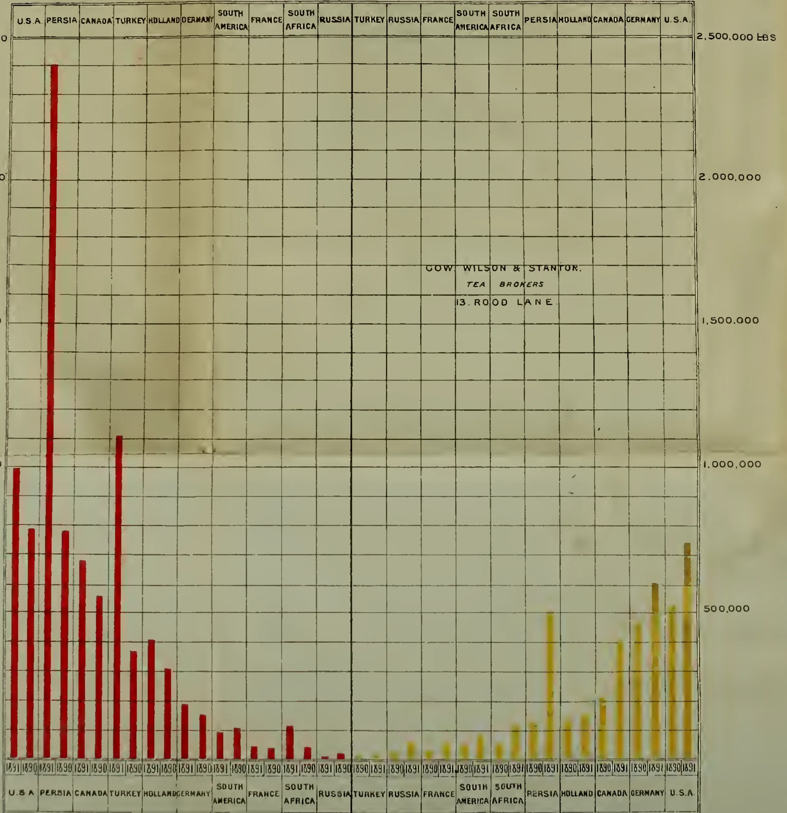

<table border="1">
<thead>
<tr>
<th>Market</th>
<th>1891 (Indian)</th>
<th>1890 (Indian)</th>
<th>1891 (Ceylon)</th>
<th>1890 (Ceylon)</th>
</tr>
</thead>
<tbody>
<tr><td>U.S.A.</td><td>1,000,000</td><td>900,000</td><td>500,000</td><td>450,000</td></tr>
<tr><td>PERSIA</td><td>2,500,000</td><td>2,400,000</td><td>50,000</td><td>40,000</td></tr>
<tr><td>CANADA</td><td>700,000</td><td>650,000</td><td>40,000</td><td>30,000</td></tr>
<tr><td>TURKEY</td><td>1,100,000</td><td>1,000,000</td><td>30,000</td><td>20,000</td></tr>
<tr><td>HOLLAND</td><td>300,000</td><td>250,000</td><td>20,000</td><td>10,000</td></tr>
<tr><td>GERMANY</td><td>200,000</td><td>150,000</td><td>10,000</td><td>5,000</td></tr>
<tr><td>SOUTH AMERICA</td><td>100,000</td><td>80,000</td><td>5,000</td><td>2,000</td></tr>
<tr><td>FRANCE</td><td>50,000</td><td>40,000</td><td>2,000</td><td>1,000</td></tr>
<tr><td>SOUTH AFRICA</td><td>150,000</td><td>100,000</td><td>1,000</td><td>500</td></tr>
<tr><td>RUSSIA</td><td>20,000</td><td>10,000</td><td>500</td><td>200</td></tr>
<tr><td>TURKEY</td><td>10,000</td><td>5,000</td><td>200</td><td>100</td></tr>
<tr><td>RUSSIA</td><td>10,000</td><td>5,000</td><td>100</td><td>50</td></tr>
<tr><td>FRANCE</td><td>10,000</td><td>5,000</td><td>50</td><td>20</td></tr>
<tr><td>SOUTH AMERICA</td><td>10,000</td><td>5,000</td><td>20</td><td>10</td></tr>
<tr><td>SOUTH AFRICA</td><td>10,000</td><td>5,000</td><td>10</td><td>5</td></tr>
<tr><td>PERSIA</td><td>10,000</td><td>5,000</td><td>5</td><td>2</td></tr>
<tr><td>HOLLAND</td><td>10,000</td><td>5,000</td><td>2</td><td>1</td></tr>
<tr><td>CANADA</td><td>10,000</td><td>5,000</td><td>1</td><td>0.5</td></tr>
<tr><td>GERMANY</td><td>10,000</td><td>5,000</td><td>0.5</td><td>0.2</td></tr>
<tr><td>U.S.A.</td><td>800,000</td><td>700,000</td><td>50,000</td><td>40,000</td></tr>
</tbody>
</table>

The quantities of Indian Tea taken in 1890 and 1891, are represented by red lines.

The quantities of Ceylon Tea taken in 1890 and 1891, are represented by yellow lines.

We are, DEAR SIRS,  
Yours faithfully,  
GOW, WILSON & STANTON,  
Tea Brokers.

J. W. PARRICK, Printer, Bury Street, at Shere Ave., London

1340------------------------------------------------

Advertisements.

# A. & J. MAIN & CO.,

STRUCTURAL ENGINEERS.

## GALVANIZED IRON ROOFING AND BUILDING,

Constructed with a view to Safety in Transit, ease of Transport, and Ready Re-erection by Unskilled Labour.

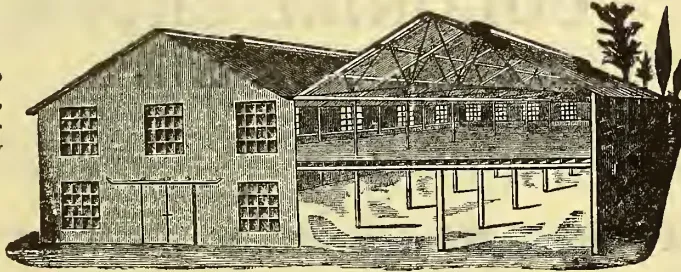An architectural illustration of a two-story building. The left side is a solid structure with several windows. The right side is an open-sided structure with a large, pitched roof supported by a series of vertical columns. The interior of the open side shows a large, open space with some structural elements visible. The building is shown in a perspective view, with some trees in the background.

Tropical Rain-fall and Wind Pressure carefully calculated for in Designing.

FIRE-PROOF, WROUGHT IRON THROUGHOUT.

SPECIALLY DESIGNED AND ADAPTED TO THE REQUIREMENTS OF

Tea, Coffee, Sugar,  
Indigo, & Cotton Estates,  
Rice Mills, &c.

As Factories, "Godowns,"  
Warehouses, Machinery,  
Drying and Packing Sheds.

PLANNED TO STAND THE VIBRATION OF HEAVY MACHINERY.

Plans and Es-timates Mailed on receipt of necessary information.

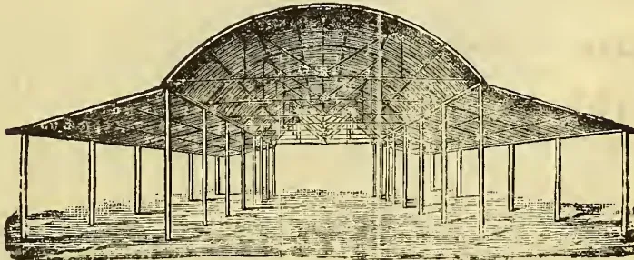An architectural illustration of a large, open-sided structure. The roof is a high, arched structure supported by a series of vertical columns. The interior is a large, open space with a high ceiling. The structure appears to be a transit shed or a large warehouse. The drawing is a perspective view, showing the length of the building.

Illustrated Catalogues mailed free.

TRANSIT SHEDS, PRODUCE STORES, TRAM AND RAILWAY CAR SHEDS, PUBLIC BUILDINGS.

LONDON : 77a Queen Victoria Street, E. C. CALCUTTA : 31, Dalhousie Square South. GLASGOW : Clydesdale Iron Works, Possilpark.

1341------------------------------------------------

Advertisements.

# OHLENDORFF'S DISSOLVED PERUVIAN GUANO AND CHEMICAL MANURES FOR ALL COLONIAL CROPS.

~~~~~  
GUARANTEED ANALYSIS:

Sulphate of Ammonia, Nitrate of Potash, Nitrate of Soda, Sulphate of Potash, Concentrated Superphosphates, &c., &c., all with guaranteed Analysis.

.....  
**THE ANGLO-CONTINENTAL**

(LATE OHLENDORFF'S)

**GUANO WORKS,**

LONDON AGENCY:

15, LEADENHALL STREET, LONDON, E.C.

Sole Importers of Peruvian Guano into all countries.

**"The Indian Engineer,"**

*An Illustrated Fortnightly Journal,*  
DEVOTED TO THE INTERESTS OF THE  
GREAT ENGINEERING AND SCIEN-  
TIFIC SERVICES OF THE  
COUNTRY

The Subscription has been fixed at R2 per mensem  
or R20 per annum,

**CASH IN ADVANCE.**

**"THE INDIAN ENGINEER,"**

Having an assured wide circulation, the attention  
of Government and Municipal Officials, Manu-  
facturers, Importers, Dealers, and Adver-  
tisers, generally, is invited to the Paper  
as an excellent medium for adver-  
tising all wants connected  
with the Profession.

ALL BUSINESS COMMUNICATIONS TO BE ADDRESSED TO  
**THE PUBLISHERS**

**W. NEWMAN & Co., Limited,**

4, DALHOUSIE SQUARE, CALCUTTA.  
*Agents in Ceylon,*

**A. M. & J. Ferguson, Colombo.**

**G. KOLFF & CO.,  
BATAVIA (JAVA),**

BOOKSELLERS, PUBLISHERS AND  
PRINTERS,

**H**A VE on hand a large stock of Books of all  
kinds in different languages.

Advertisements for all the Dutch Newspapers  
are taken at their Office at low rates.

G. Kolff & Co. are publishers of books in Malay  
and other Eastern.

G. Kolff & Co.'s Printing Office is provided  
with a large stock of characters; and they  
Malay and other Eastern.

*Agents for the TROPICAL AGRICULTURIST.*

**FREDERICK ALGAR,**

COLONIAL NEWSPAPER AND COMMISSION  
AGENT,

11, Clement's Lane, Lombard Street,  
LONDON.

**T**HE Colonial Press supplied with Newspapers,  
Books, Types, Ink, Presses, Papers, Corres-  
pondents' Letters; and any European Goods on  
London terms.

**NOTICE TO SHIPPERS.**

Colonial Newspapers received at the office are reg-  
ularly filed for the inspection of Advertisers, and  
the Public.

*Agents for the TROPICAL AGRICULTURIST.*

1342------------------------------------------------

Advertisements.

"FITS LIKE A GLOVE."

THOMSON'S

Trade Mark.

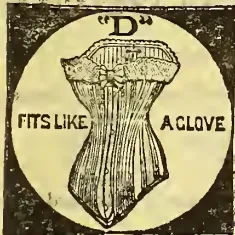

"GLOVE-FITTING"  
CORSET

The perfection of  
Shape, Finish, and Dura-  
bility, and approved by  
the whole polite world.

ELEVEN FIRST MEDALS.  
ANNUAL SALE ONE MILLION PAIRS.

To be had of all dealers throughout the world.

W. S. THOMSON & Co., Ltd, London,  
MANUFACTURERS.

See that every Corset is marked "THOMSON'S  
GLOVE-FITTING," and bears our  
Trade Mark, the Crown.  
*No others are genuine.*

ASK FOR THE Delicious New Perfume.

CRAB-APPLE  
REG. BLOSSOMS.

(Extra Concentrated).

"It is the daintiest and most delicious  
of perfumes, and in a few months has  
superseded all others in the boudoirs of  
the GRANDES DAMES of London, Paris, and  
New York."—*The Argonaut*.

"It would not be possible to conceive  
of a more delicate and delightful perfume  
than the 'Crab Apple Blossoms,'  
which is put up by the Crown Perfumery  
Company. It has the aroma of spring in  
it, and one could use it for a lifetime and  
never tire of it."—*New York Observer*.

Put up in 1, 2, 3, & 4 ounce Bottles.

The Crown Invigorating  
Lavender Salts. REG.

The delightful new **Smelling Salts**  
and Agreeable Deodoriser, appre-  
ciated alike in palace, mansion, and  
cottage as a most refreshing luxury. By  
leaving the stopper out for a few mo-  
ments a delightful perfume escapes,  
which freshens and purifies the air most  
enjoyably.—*Le Follet*.

Sold by all principal dealers in Perfumery

Beware of Colourable Imitations  
of Inferior Quality Sold under a  
Similar Name.

Genuine only with the Wellknown  
Crown Stopper and Label of

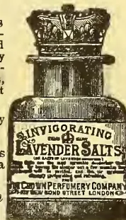

THE CROWN PERFUMERY CO.,  
177, NEW BOND STREET, LONDON.  
500,000 Bottles Sold during the past year.

GALVANIZED CORRUGATED  
IRON ROOFS AND BUILDINGS

DESIGNED AND PREPARED FOR ERECTION ABROAD AS  
TEA HOUSES.

A SPECIALITY.

STORES FOR

WHARVES,  
RAILWAYS,  
TRAMWAYS,  
WORKSHOPS,  
DWELLINGS.

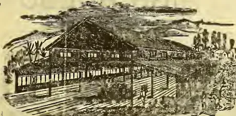

SHEDS FOR

SUGAR,  
COTTON,  
INDIGO,  
COFFEE  
PLANTATIONS.

GO-DOWNS, DRYING AND PACKING SHEDS.

Purchasers can entrust their requirements to F. M. & Co. with confidence in a reputation  
extending over 40 years, and an experience gained in the construction of more than  
16,000 Erections during that period.

For Estimates, Information, and Catalogues, apply to

FRANCIS MORTON & CO., LIMITED.

HAMILTON IRON WORKS GARSTON NEAR LIVERPOOL.

LONDON OFFICE: 17, VICTORIA STREET, WESTMINSTER, S.W.

1343------------------------------------------------

Advertisements.

ENGLISH SEEDS DELIVERED FREE BY PARCEL POST.

## CARTERS' BOX OF ENGLISH VEGETABLE SEEDS,

Sent Post Free to all Parts of the World on receipt of remittance, price 16s.

Comprises the following Varieties of Vegetable Seeds in successional sorts best adapted to the requirements of the climate:—

<table border="1">
<tr>
<td>Peas</td>
<td rowspan="4">in variety.</td>
<td>Spinach</td>
<td rowspan="4">in variety.</td>
<td>Parsnip</td>
<td rowspan="4">in variety.</td>
<td>Parsley</td>
<td>Melon</td>
</tr>
<tr>
<td>Broccoli</td>
<td>Beans</td>
<td>Turnip</td>
<td>Vegetable Marrow</td>
<td>Radish</td>
</tr>
<tr>
<td>Cauliflower</td>
<td>Beet</td>
<td>Kale</td>
<td>Brussels Sprouts</td>
<td>Carrot</td>
</tr>
<tr>
<td>Kohl Rabi</td>
<td>Celery</td>
<td>Cabbage</td>
<td>Savoy</td>
<td>Herbs</td>
</tr>
<tr>
<td>Onion</td>
<td></td>
<td>Leek</td>
<td></td>
<td>Lettuce</td>
<td></td>
<td>Cucumber. Tomato</td>
<td>Mustard. Cress</td>
</tr>
</table>

## CARTERS' BOX OF ENGLISH FLOWER SEEDS,

Comprising the following Choice Varieties, is forwarded Post Free to any address on receipt of remittance, price 22s.

<table border="1">
<tr>
<td>Aster</td>
<td>Cobaea</td>
<td>Godetia</td>
<td>Marvel of Peru</td>
<td>Polyanthus</td>
</tr>
<tr>
<td>Amaranthus</td>
<td>Convolvulus</td>
<td>Golden Feather</td>
<td>Maurandya</td>
<td>Portulaca</td>
</tr>
<tr>
<td>Antirrhinum</td>
<td>Dahlia</td>
<td>Heartsease</td>
<td>Mesembryanthemum</td>
<td>Salpiglossis</td>
</tr>
<tr>
<td>Balsam</td>
<td>Delphinium</td>
<td>Heliotrope</td>
<td>Mignonette</td>
<td>Stock</td>
</tr>
<tr>
<td>Calliopsis</td>
<td>Dianthus</td>
<td>Larkspur</td>
<td>Nasturtium</td>
<td>Sweet Pea</td>
</tr>
<tr>
<td>Canary Creeper</td>
<td>Eschscholtzia</td>
<td>Linum</td>
<td>Nemophila</td>
<td>Sweet William</td>
</tr>
<tr>
<td>Candytuft</td>
<td>Everlasting Flower</td>
<td>Lobelia</td>
<td>Perilla</td>
<td>Verbena</td>
</tr>
<tr>
<td>Celosia</td>
<td>Gaillardia</td>
<td>Lupinus</td>
<td>Petunia</td>
<td>Wallflower</td>
</tr>
<tr>
<td>Chrysanthemum</td>
<td>Globe Amaranthus</td>
<td>Marigold</td>
<td>Phlox</td>
<td>Zea. Zinnia</td>
</tr>
</table>

Smaller Boxes, containing selections from the above list, price 5s. 6d., 11s., and 17s.

### CARTERS' COMBINED BOX of VEGETABLE and FLOWER SEEDS.

Containing selections from the above lists price 20s., Post Free.

Further Particulars, see "CARTERS' ILLUSTRATED CATALOGUE OF GARDEN SEEDS."

Gratis and Post Free to any reliable address.

SEEDSMEN BY ROYAL WARRANTS TO THE QUEEN AND THE PRINCE OF WALES.

237 & 238, HIGH HOLBORN, LONDON.

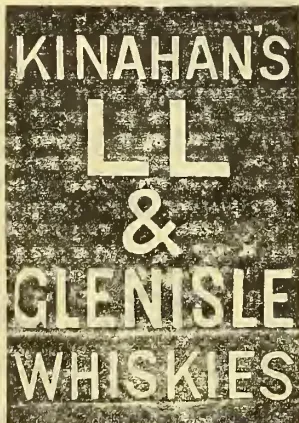

THE PRIZE MEDAL, DUBLIN EXHIBITION, 1885.

### KINAHAN'S LL WHISKY,

The Cream of Old Irish Whisky.

Pure, Mild and Mellow, Delicious and very Wholesome.  
Gold Medal, Paris Exhibition, 1878.

### KINAHAN'S GLENISLE WHISKY THE FINEST SCOTCH WHISKY SOLD.

KINAHAN & CO., LD.,  
GUILDFORD STREET, LAMBETH, LONDON.

Export Agents:

JOSEPH LEETE & SONS,  
36, ST. MARY-AT-HILL, LONDON, ENGLAND.

1344------------------------------------------------

This image shows a blank, aged page with a light beige or cream color. The surface has a subtle texture and slight discoloration, characteristic of old paper. There are no markings, text, or illustrations on the page.

1345------------------------------------------------

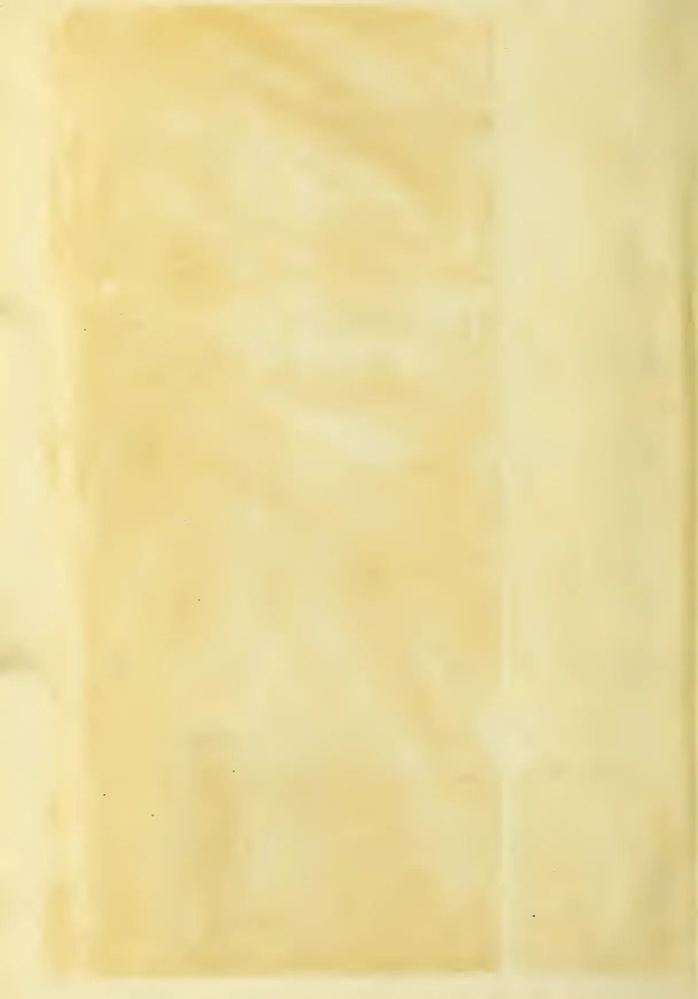This image shows a blank, aged, cream-colored page, likely an endpaper or flyleaf from an old book. The paper has a slightly textured appearance with some minor discoloration and faint smudges, characteristic of old paper. There is no text or other markings on the page.

1346------------------------------------------------

This image is a scan of a blank page. The paper has a light beige or cream-colored tint. There are a few very small, dark specks scattered across the surface, which appear to be scanning artifacts or dust particles. No text, lines, or other markings are present on the page.

1347------------------------------------------------

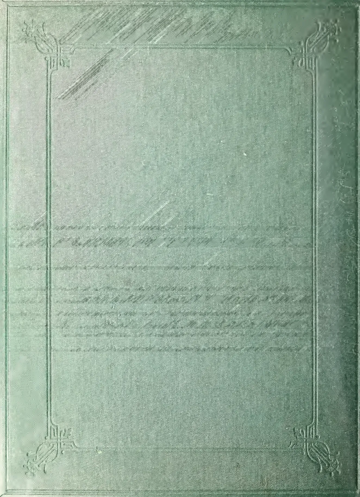The image shows the front cover of a book. The cover is a dark, forest green color with a fine, woven texture. A decorative border is embossed into the cover, consisting of a thin rectangular frame. The four corners of this frame are adorned with elaborate, symmetrical floral and scrollwork designs. In the upper-left quadrant, there is a large, diagonal rectangular area filled with a hatched pattern of parallel lines. The rest of the cover is plain, showing the texture of the material. There is no text or other markings on the cover.